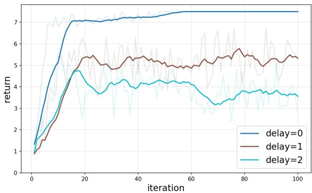
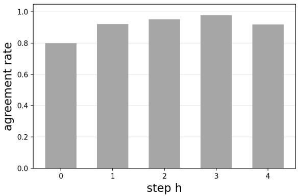

# A Decentralized Partially Observable Team Decision Methodology with Delayed Information Sharing

Xiaoxing Ren, Thomas Parisini, Andreas A. Malikopoulos

Abstract—We study decentralized partially observable team decision problems with low-rank latent dynamics and unknown system models. The proposed framework combines teamtheoretic equivalence with low-rank model representations to address cooperative decision-making in partially observable Markov decision processes without prior knowledge of the transition model. Each team member makes decisions based on local private information and delayed common information shared across the team. Using only this available information, each member learns an approximate low-rank Markov decision process and applies least-squares value iteration to compute its policy. This yields a fully decentralized learning and planning algorithm that requires neither a centralized coordinator nor centralized training. We show that the resulting member-side solutions approximate the centralized team solution: despite partial observability, unknown dynamics, and delayed common information, each member recovers the corresponding component of an approximate team-optimal policy. We further establish finite-sample performance guarantees and derive a corresponding sample-complexity bound for the proposed algorithm.

Index Terms—Reinforcement learning, decentralized control, POMDP, representation learning, team theory.

## I. INTRODUCTION

Multi-agent reinforcement learning (MARL) has emerged as an important methodology for sequential decision-making in networked multi-agent systems, with applications in robotic coordination, autonomous driving, wireless networks, and distributed control [1]–[4]. A key difficulty in MARL is coordinating multiple agents that interact with a common environment while making decisions based on decentralized information. Over the past few years, extensive work has been conducted on this problem across various training and execution architectures. Among them, centralized training with decentralized execution (CTDE) has become one of the most widely adopted paradigms, where a centralized module exploits global information during training, while each agent executes its policy using only local observations [5]–[8]. Closely related structures, including centralized evaluation and value decomposition schemes, have also been developed to improve coordination and scalability in cooperative settings. On the algorithmic side, actor-critic, policy-gradient, and value-based methods have all been extended to the multi-agent setting, leading to a broad family of practical MARL algorithms [9]– [11].

In many applications, however, noisy and limited sensors will prevent the agents from directly observing the underlying system state. This significantly increases the difficulty of decision-making, since the current observation is, in general, insufficient to embed all information relevant for optimal control. In order to represent the imperfect observation, such problems are commonly modeled as partially observable Markov decision processes (POMDPs) [12]–[15]. In a POMDP, observation uncertainty induces non-Markovian dependence among successive observations. Therefore, agents need to maintain a belief state, also known as an information state, which summarizes the history by estimating the probability distribution over the latent states and is sufficient for predicting future states and rewards. However, performing a Bayesian update of the belief requires knowledge of the model, which is not available in MARL settings. More importantly, the belief is a density over the latent state space and is therefore an infinitedimensional object whenever the state space is continuous. Even in the finite-state case, the set of beliefs that are reachable from distinct histories grows exponentially with the horizon, leading to an intractable representation complexity [16].

A widely adopted heuristic approach is to extend RL algorithms based on Markov decision process (MDP) by incorporating a sliding window of historical observations to encode the policy or value function, typically implemented with recurrent neural networks [17], [18]. Several research efforts also construct an approximate information state that compresses the history into a tractable representation for decision-making, and analyze the performance bounds using a corresponding approximate dynamic program with a bounded loss of optimality [19], [20]. Another line of work uses representation learning to extract latent features from trajectories or histories to learn a compact representation that is sufficient, or approximately sufficient, to capture the belief [21]–[27].

The challenge increases greatly in the multi-agent reinforcement learning (MARL) setting, where the model, observation kernel, and reward function are unknown. In this case, one must simultaneously address the difficulties caused by partial observation, decentralized information, and unknown environment dynamics. As discussed, existing approaches to multi-agent partial observation typically still rely on some centralized structure, either explicitly or implicitly. In particular, many research efforts on partially observed MARL continue to follow the CTDE paradigm, where a centralized critic, a centralized mixing network, or a centralized state estimator is introduced during training [28]–[31]. Another important line of research in decentralized control and Dec-POMDP is the common-information-based framework, often expressed through prescriptions [19], [20], [32], [33]. In this framework, a virtual coordinator observes the common information and selects prescription functions that map each agent’s private local information to its local action. This reformulation allows the decentralized control problem to be analyzed as a centralized decision problem from the coordinator’s perspective, while preserving decentralized execution at the agent level [32].

Although both paradigms can be effective in practice, they share a common limitation: each requires a centralized object (a critic, a mixing network, or a virtual coordinator) to aggregate information that is not locally available to individual agents, and is therefore not fully decentralized. This limitation becomes particularly restrictive in large-scale networked systems, or in settings where centralized coordination is costly, unavailable, or incompatible with the system architecture. Motivated by this gap, we consider a team setting in which all members share the same reward. Team problems provide a natural framework for studying cooperation under decentralized information, since the agents are perfectly aligned through a common objective, and the main challenge arises from the information structure rather than from strategic conflicts [34]–[39]. In particular, recent results in team decision theory have shown that, under suitable conditions, one can establish a correspondence between the solution computed by an individual member and the corresponding component of the solution of a centralized manager [36]. This viewpoint is appealing because it provides a principled way to reduce a decentralized team problem to member-side decision problems while preserving the team objective [40]. However, existing results of this type are developed under the assumption that the underlying problem model is known. Extending the teamtheoretic correspondence to a reinforcement learning setting is not straightforward: when the model must itself be learned from data, every member’s local decision rule depends on a learned surrogate model, and the global–local equivalence that supports team theory must be re-established under this learned object.

In this paper, we address this gap by studying decentralized team decision problems for a class of γ-observable POMDPs with unknown model. Our framework combines team-theoretic equivalence with low-rank representation learning. The lowrank structure plays a role specifically tailored to our setting: it characterizes the latent dynamics in an agent-agnostic manner, so that all members can learn the same dynamics representation from delayed common information and then maintain their own beliefs locally with private information. This separation between a globally shared dynamics representation and locally maintained beliefs is what makes fully decentralized learning and execution feasible. Based on the resulting member-side approximate low-rank MDP, each member computes its policy by value iteration without any centralized coordinator at training or execution time. Unlike prescription-based commoninformation formulations, our methodology does not rely on a virtual coordinator that selects mappings from local information to actions. Instead, we directly construct member-level decision representations and analyze how these local objects collectively approximate the team-optimal behavior under the same surrogate model. As a result, the proposed framework more naturally enables a fully decentralized implementation.

The main contributions of this paper are summarized as follows:

• We formulate a decentralized team learning problem for a class of γ-observable POMDPs with an unknown model, in which each member acts based only on its local private information and delayed common information, without any centralized coordinator or prescription mechanism at training or execution time.

• We propose a decentralized representation learning framework that exploits the low-rank structure of the latent transition kernel as a structural basis for decentralization. The shared dynamics representation $( \omega , \psi )$ is learned by all members from delayed common information, while member-side representations $( \widehat \phi ^ { i } , \widehat \mu ^ { i } )$ are formed locally by combining this shared component with each member’s private belief update. Each member then computes its policy via value iteration on its own approximate low-rank MDP.

• We extend the team-theoretic correspondence between member-side and centralized solutions from the knownmodel setting to the model-unknown setting. We establish a global–local equivalence (Theorem 1) showing that, under the shared surrogate model, each member’s locally computed policy coincides with the corresponding component of the team-optimal policy under global information, and we provide a finite-sample guarantee (Theorem 2) on the resulting team performance.

The paper is organized as follows. Section II formulates the problem and Section III presents the proposed decentralized algorithm. Section IV provides the convergence analysis and sample-complexity bound. Section V reports numerical experiments and Section VI provides concluding remarks and a glimpse of future research directions.

## II. PRELIMINARIES

## A. Notation

For vectors we use $\| \cdot \| _ { p }$ to denote the $\ell _ { p }$ -norm, and we use $\| { \boldsymbol { x } } \| _ { \Lambda }$ to denote ${ \sqrt { x ^ { \top } \Lambda x } } .$ For two probability distributions $\nu$ and $\nu ^ { \prime }$ over a measurable space $x ,$ we use $\| \nu - \nu ^ { \prime } \| _ { \mathrm { T V } }$ to denote their total variation distance, defined by $\| \nu - \nu ^ { \prime } \| _ { \mathrm { T V } } =$ $\begin{array} { r } { \operatorname* { s u p } _ { A \subset \mathcal { X } } | \nu ( A ) - \nu ^ { \prime } ( A ) | } \end{array}$ . For two sequences $\{ a _ { n } \} _ { n \geq 1 }$ and $\{ b _ { n } \} _ { n \geq 1 } ^ { - }$ , we use $a _ { n } \leq O ( b _ { n } )$ to denote that there exists a constant $C > 0$ such that $a _ { n } \leq C b _ { n }$ . For any natural number $n \in \mathbb N$ , we use [n] to denote the set $\{ 1 , . . . , n \}$ . For a set $S ,$ we use $\Delta ( S )$ to denote the set of all probability distributions on S. For an operator $O : S  \mathbb { R }$ and $b \in \Delta ( S )$ , we use $O b : \mathcal { O }  \mathbb { R }$ to denote $\textstyle \int _ { S } O ( o \mid s ) b ( s )$ ds. We consider a finite-horizon partially observable Markov decision process (POMDP) ${ \mathcal { P } } _ { : }$ , which can be specified as a tuple

$$
\begin{array} { r } { \mathcal { P } = ( \mathcal { S } , \mathcal { A } , H , \mathcal { O } , d _ { 0 } , \{ r _ { h } \} _ { h = 1 } ^ { H } , P , O ) , } \end{array}
$$

where $s$ is the state space, A is a finite set of actions, $H \in \mathbb { N }$ is the episode length, O is the set of observations, and $d _ { 0 }$ is the known initial distribution over states. We use $P : \mathcal { S } \times \mathcal { A } $ $\Delta ( S )$ to denote the transition kernel and $r _ { h } : \mathcal { O } \to$ R is the reward function at step h. We use $O : S  \Delta ( O )$ to denote observation kernel, where for $s \in { \mathcal { S } }$ and $o \in \mathcal { O } , O ( o \mid s )$ is the probability of observing o while in state s. Note that the MDP is a special case of POMDP, where $\mathcal { O } = \mathcal { S }$ and $O ( o \mid s ) = \mathbf { 1 } { \bigl \{ } o = s { \bigr \} }$ for all $h \in [ H ] , o \in \mathcal { O }$ and $s \in S$

## B. Problem Formulation

We consider a partially observable team with N members, represented by the tuple

$$
\mathcal { G } = ( H , \mathcal { S } , \{ \boldsymbol { A } ^ { i } \} _ { i = 1 } ^ { N } , \{ \boldsymbol { O } ^ { i } \} _ { i = 1 } ^ { N } , P , d _ { 0 } , r ) ,
$$

where $H \in \mathbb { N }$ is the episode length, S is the discrete state space (we write $| S | = S )$ , and for member $i , A ^ { i }$ and $\mathcal { O } ^ { i }$ are its discrete action and observation spaces (with $| { \mathcal { A } } ^ { i } | = A ^ { i }$ and $| \mathcal { O } ^ { i } | = O ^ { i } )$

Denote $a = ( a _ { 1 } , \dots , a _ { N } ) \in A , { \cal A } = { \cal A } ^ { 1 } \times \cdots \times { \cal A } ^ { N } , | { \cal A } | =$ $\textstyle \prod _ { i = 1 } ^ { N } A ^ { i }$ . The transition kernel $P ( \cdot | s , a ) \in \Delta ( S )$ gives the distribution of the next state given $( s , a )$ , where $\Delta ( S )$ denotes the set of all probability distributions on $s$ . The initial state is denoted as $d _ { 0 }$ and it satisfies $d _ { 0 } \sim \mu _ { 0 }$ with $\mu _ { 0 } \in \Delta ( \mathcal { S } )$

We write $O ^ { i } ( \cdot \mid s ) \in \Delta ( O ^ { i } )$ for the i-th member’s observation kernel, which denotes the observation distribution at state s. Let $O = ( O ^ { 1 } , \dots , O ^ { N } )$ be the joint observation kernels of all members and

$$
O = O ^ { 1 } \times \cdots \times O ^ { N } , \quad O = \prod _ { i = 1 } ^ { N } O ^ { i } .
$$

The reward $r _ { h } ( o _ { h } ) : \mathcal { O } \to$ R is the reward function given the joint observation $o _ { h } \in \mathcal { O }$

Next, we describe the partially observable stochastic $\mathrm { { d y } \mathrm { { - } } }$ namic team. At the beginning of each episode, $s _ { 0 } \sim d _ { 0 }$ . At step $h \in [ H ]$ , each member i receives a private observation $o _ { h } ^ { i } ;$ the joint observation $o _ { h } \ = \ ( o _ { h } ^ { 1 } , . . . , o _ { h } ^ { N } )$ is drawn from $O ( \cdot \mid s _ { h } )$ and rewards $r _ { h } ^ { i } ( o _ { h } )$ are realized. Then each member takes an action $a _ { h } ^ { i }$ and the environment transitions to

$$
s _ { h + 1 } \sim P ( \cdot \mid s _ { h } , a _ { h } ) , \quad a _ { h } = ( a _ { h } ^ { 1 } , \ldots , a _ { h } ^ { N } ) .
$$

The episode terminates after step $H \ \in \ \mathbb { N } ,$ a terminal observation $o _ { H + 1 } \sim \mathcal { O } _ { H + 1 } { \left( \cdot \mid s _ { H + 1 } \right) }$ is drawn and terminal rewards $r _ { H + 1 } ^ { i } ( o _ { H + 1 } )$ are received. This cooperative case is also known as a decentralized partially observable Markov decision process (Dec-POMDP). We define the value function for policy π at step h by

$$
V _ { h } ^ { \pi } = \mathbb { E } _ { a _ { h } \sim \pi } ^ { P } \left[ \sum _ { t = h } ^ { H } r _ { t } ( o _ { t } ) \right] ,
$$

namely as the expected reward received by following $\pi .$

In the following, we move to the information sharing structure in the team. Each team member i maintains its own history information $\tau _ { h } ^ { i } ,$ , which consists of all its historical observations and actions up to step h:

$$
\tau _ { h } ^ { i } = \{ a _ { 1 } , o _ { 2 } , \ldots , a _ { h - 1 } , o _ { h } \} .\tag{1}
$$

We denote by $\tau _ { h } = \{ \tau _ { h } ^ { i } \} _ { i = 1 } ^ { N }$ the collection of all members histories at step h. In many practical scenarios, members may share part of their information with other members. The shared part is referred to as common information, while the remaining part for each member is its private information.

Let $c _ { h } \ \subseteq \ \eta _ { h } \ = \ \{ a _ { 1 } , o _ { 1 } , \dots , a _ { h } , o _ { h } \}$ denote the common information available to all members at step $h ,$ and let $\mathcal { C } _ { h }$ denote the collection of all such common information realizations. Given $c _ { h }$ , the private information of member i is defined as

$$
p _ { h } ^ { i } = \tau _ { h } ^ { i } \setminus c _ { h } ,\tag{2}
$$

and the collection of private information across all members is denoted by $p _ { h } = \{ p _ { h } ^ { i } \} _ { i = 1 } ^ { N }$

We consider that both common and private information are updated over time according to recursive rules. The common information $c _ { h }$ is non-decreasing with $h ,$ that is, $c _ { h } \subseteq c _ { h + 1 }$ for all h. Let $\kappa _ { h + 1 } = c _ { h + 1 } \setminus c _ { h }$ denote the new information revealed at step $h + 1$ . Then the evolution of common information can be represented as

$$
c _ { h + 1 } = \{ c _ { h } , \kappa _ { h + 1 } \} , \kappa _ { h + 1 } = \chi _ { h } ( p _ { h } , a _ { h } , o _ { h + 1 } ) ,\tag{3}
$$

where $\chi _ { h }$ is a fixed transformation. Similarly, the private information of member i evolves according to

$$
p _ { h + 1 } ^ { i } = \nu _ { h } ^ { i } ( p _ { h } ^ { i } , a _ { h } ^ { i } , o _ { h + 1 } ^ { i } ) ,\tag{4}
$$

where $\nu _ { h } ^ { i }$ is also a fixed transformation.

In this paper, we adopt an n-step delayed sharing information structure [41]. The common information $\Delta _ { t }$ at time t includes joint observations and actions from n steps prior, while private information $\Lambda _ { t } ^ { i }$ contains local data from the recent n steps. Thus, each member can only use their delayed common information and the private information to execute the actions during the decentralized algorithm.

The objective of the partially observable team is to find a joint policy that maximizes the expected cumulative team reward under the above information-sharing structure. This problem can be formalized as follows:

$$
\pi ^ { \star } \in \arg \operatorname* { m a x } _ { \pi \in \Pi _ { \operatorname* { d e c } } } V _ { 1 } ^ { \pi } ,\tag{5}
$$

where $\Pi _ { \mathrm { d e c } }$ denotes the set of admissible joint policies $\pi =$ $( \pi ^ { 1 } , \dots , \pi ^ { N } )$ satisfying $\pi _ { h } ^ { i } ( \cdot \mid c _ { h } , p _ { h } ^ { i } ) \in \Delta ( \mathcal { A } ^ { i } )$ for all $i \in [ N ]$ and $h \in [ H ]$

Remark 1. Although the information structure considered in this paper allows members to receive delayed common information generated by other members, we use the term ”decentralized” following the convention in the commoninformation literature [32], [33], [36]. The problem remains decentralized in the sense that each member selects its action based only on its own information set, consisting of its private information and the available delayed common information, without a centralized decision maker determining the joint action. Thus, while the implementation may also be viewed as distributed due to information exchange, the underlying decision problem is referred to here as decentralized.

## C. Representation Learning for Low-rank POMDP

We consider the case where the transition kernel of the environment admits a low-rank structure. This assumption plays a structural role specifically tailored to our decentralized setting. Specifically, all members can learn the same representation from delayed common information and then maintain their own beliefs locally using private information. This separation between a shared dynamics representation and locally updated beliefs makes fully decentralized learning and execution feasible and supports the global–local equivalence established in Theorem 1. We formalize the low-rank structure as follows.

Definition 1. (Low-rank transition) A transition kernel $P$ $S \times \mathcal { A }  \Delta ( S )$ admits a low-rank decomposition ofdimension d $i f$ there exist two mappings $\omega ^ { * } : \mathcal { S }  \mathbb { R } ^ { d }$ and $\psi ^ { * } : S \times \mathcal { A } $ $\mathbb { R } ^ { d }$ such that

$$
P ( s ^ { \prime } | s , a ) = \omega ^ { * } ( s ^ { \prime } ) ^ { \top } \psi ^ { * } ( s , a ) .\tag{6}
$$

The mappings $\omega ^ { * }$ and $\psi ^ { * }$ describe latent state-action $\mathrm { { d y } \mathrm { { - } } }$ namics, once $( \omega ^ { * } , \psi ^ { * } )$ is learned from data accessible to the team, each member can construct its own member-side representation by combining these shared mappings with its locally available beliefs. We further focus on the observability POMDP setting, formalized below.

Assumption 1. For $i \in [ N ]$ , let $\gamma ^ { i } > 0 , O$ be the operator with $O ( \cdot \mid s )$ , indexed by states s. The operator O satisfies γ-observability for any distributions $b , b ^ { \prime }$ over states, i.e.,

$$
\lVert O ^ { i } b - O ^ { i } b ^ { \prime } \rVert _ { 1 } \geq \gamma ^ { i } \lVert b - b ^ { \prime } \rVert _ { 1 } .\tag{7}
$$

Assumption 1 implies that the members’ operator is an injection. We also make the following assumptions for the joint observation of the team.

Assumption 2. The joint-observation model satisfies the same observability condition as in the original low-rankframework, with the single observation space replaced by the joint observation space $\mathcal { O } ^ { \mathrm { j o i n t } } = \mathcal { O } ^ { \hat { 1 } } \times \cdot \cdot \cdot \times \mathcal { O } ^ { N }$ . Specifically, the corresponding observability operator associated with the joint decoder

$$
O ^ { \mathrm { j o i n t } } ( o ^ { 1 : N } \mid s ) = \prod _ { i = 1 } ^ { N } O ^ { i } ( o ^ { i } \mid s ) ,
$$

is assumed to be nondegenerate, with observability constant $\gamma > 0 .$

Assumption 3. For each stage $h \in [ H ]$ , let

$$
o _ { h } ^ { 1 : N } = \bigl ( o _ { h } ^ { 1 } , \ldots , o _ { h } ^ { N } \bigr ) \in O ^ { 1 } \times \cdots \times O ^ { N } ,\tag{8}
$$

denote the collection of observations received from all members. Conditioned on the latent state $s _ { h } \in { \mathcal { S } } ,$ , the members’ observations are conditionally independent, i.e.,

$$
O ^ { \mathrm { j o i n t } } ( o _ { h } ^ { 1 : N } \mid s _ { h } ) = \prod _ { i = 1 } ^ { N } O ^ { i } ( o _ { h } ^ { i } \mid s _ { h } ) ,\tag{9}
$$

where $O ^ { i } ( \cdot \mid s _ { h } )$ is the local observation kernel of member i.

Remark 2. In a decentralized team setting, the manager aggregates local observations from all members and treats them as a joint observation variable. Under the conditional independence assumption across members, the resulting joint observation kernel admits a factorized form. Consequently, the use of joint observations modifies the observation decoder but does not alter the latent predictive representation, provided that the induced joint-observation model still satisfies a ddimensional realizability condition and a γ-observability condition.

It has been shown that when Assumption 1 holds, the POMDP can be approximated by MDP with state space $\mathcal { Z } = \mathcal { O } ^ { L } \times \mathcal { A } ^ { L - 1 }$ (see [21], [24], [42], [43]). In our work, we also consider L-memory policies. For all $h \in [ H ]$ , let $\mathcal { Z } _ { h } = \mathcal { O } ^ { L } \times \mathcal { A } ^ { L - 1 }$ . An element $z _ { h } \in \mathcal { Z } _ { h }$ is represented as

$$
z _ { h } = ( o _ { h + 1 - L : h } , a _ { h + 1 - L : h - 1 } ) ,\tag{10}
$$

where $o _ { h + 1 - L : h } ~ = ~ \left( o _ { h + 1 - L } , \ldots , o _ { h } \right)$ and $a _ { h + 1 - L : h - 1 } \ =$ $\left( a _ { h + 1 - L } , \ldots , a _ { h - 1 } \right)$ . We also make a commonly used realizability assumption that the given function class contains the true function.

## Assumption 4. There exists a known model class

$$
\mathcal { F } = \left\{ ( \omega , \psi ) : \omega \in \Omega , \psi \in \Psi \right\} ,\tag{11}
$$

such that $\omega ^ { * } \in \Omega$ and $\psi ^ { * } \in \Psi .$ . Recall that according to Definition 1, the new observation conditioned on the stateaction pair satisfies

$$
\begin{array} { r l } & { P ( o _ { h + 1 } \mid s _ { h } , a _ { h } ) } \\ & { \ = O _ { h + 1 } ( o _ { h + 1 } \mid s _ { h + 1 } ) \omega ( s _ { h + 1 } ) ^ { \top } \psi ( s _ { h } , a _ { h } ) . } \end{array}\tag{12}
$$

For any $o _ { h } \in \mathcal { O }$ , we denote

$$
\mu ( o _ { h } ) = \int _ { S ^ { \prime } } \omega ( s ^ { \prime } ) ^ { \top } O ( o _ { h } \mid s ^ { \prime } ) \mathrm { d } s ^ { \prime } .\tag{13}
$$

Recall that when Assumption 1 holds, the POMDP can be approximated by an MDP whose state space is $\mathcal { Z } _ { h } = O ^ { L } \times$ $\hat { A } ^ { \hat { L } - 1 }$ . Specifically, for any $\mathcal { P } = ( O , \omega , \psi )$ , we can construct an approximated MDP

$$
{ \mathcal { M } } = ( \mu , \phi ) ,\tag{14}
$$

where $( \phi , \mu ) = q ( \omega , \psi )$ for an explicit function $q ,$ which is defined in detail in Section III. This approximated MDP M satisfies that

$$
P ^ { \mathcal { M } } ( o _ { h + 1 } \mid z _ { h } , a _ { h } ) = \mu ^ { \top } ( o _ { h + 1 } ) \phi _ { h } ( z _ { h } , a _ { h } ) .\tag{15}
$$

At the same time, the POMDP P satisfies that

$$
\begin{array} { r } { P ^ { \mathcal { P } } ( o _ { h + 1 } \mid \eta _ { h } , a _ { h } ) = \mu ^ { \top } ( o _ { h + 1 } ) \xi _ { h } ( \eta _ { h } , a _ { h } ) , } \end{array}\tag{16}
$$

where the definition of $\xi _ { h }$ can be found in (24) in Section III, $\eta _ { h } ~ = ~ \left( o _ { 3 - 2 L : h } , a _ { 3 - 2 L : h } \right)$ . Following [27], we consider an extended POMDP, where dummy observations and actions before the first real decision stage are introduced only for notational convenience. This construction allows the finitememory window to be written uniformly for all stages, including the early stages. These dummy variables do not affect the initial state distribution or the actual interaction with the environment.

## III. ALGORITHM DESIGN

In this section, we present a decentralized algorithm for solving the team decision problem with an unknown model. The design reflects the structural separation: the latent dynamics can be learned from data shared across the team, whereas beliefs depend on each member’s own observation history and must be maintained locally. The implementation is divided into three steps, and the methodological procedure is given in Algorithm 1.

a) Step 1: Decentralized low-rank learning of transition matrix: Using the delayed common information available to the entire team, each member performs the same maximumlikelihood estimation from the delayed common buffer to learn a shared representation $\omega$ and $\psi$ of the low-rank transition kernel $P ,$ together with a common exploration bonus ${ \hat { b } } .$ The features $\omega$ and $\psi$ describe only the latent state-action dynamics, the resulting estimate is identical across members and does not require any centralized coordinator at execution time.

b) Step 2: Decentralized local information state update: Each member i then combines the shared dynamics representation $( \omega , \psi )$ with its own private information to construct member-side representations $( \widehat \phi ^ { i } , \widehat \mu ^ { i } )$ . The transition component is inherited from the team-level estimation, while the belief update is carried out locally through the operator $q ^ { i } .$ . This is precisely the shared-dynamics/local-belief decomposition enabled by the low-rank structure.

c) Step 3: Decentralized Execution: Each member i uses its local representations $( \widehat \phi ^ { i } , \widehat \mu ^ { i } )$ and the exploration bonus to compute its policy via a finite-horizon backward value iteration, which recursively evaluates the local value function and selects the greedy action at each stage, as described in Algorithm 2. No inter-member communication or centralized prescription is required at execution time. The global-local equivalence established in Theorem 1 ensures that the resulting member-side policies jointly approximate the team-optimal solution under the same surrogate model.

We would like to remark that the two exploratory datasets D and $\mathcal { D } ^ { \prime }$ in Algorithm 1 play different roles: the first one provides coverage for the L-memory information state at step $h ,$ while the second one, generated with uniform exploration over the last 2L steps, provides additional coverage after moving the analysis back by L steps, following the exploration design in [27]. Besides, the shared dataset $\mathcal { D } _ { h } = \cup _ { i } \mathcal { D } _ { h } ^ { i }$ should not be interpreted as a centrally stored training set. Rather, it represents the delayed common information that becomes available to all members under the assumed informationsharing structure.

In the following, we introduce the detailed construction of the representations. We first calculate the belief, i.e., the information state, which is the conditional probability of state $s _ { h }$ given the true transition and an action and observation sequence $\left\{ o _ { 3 - 2 L } , a _ { 3 - 2 L } , \cdot \cdot \cdot , a _ { h } , o _ { h } \right\}$ and $1 \leq h \leq H$ respectively. Consider a POMDP and a history $\left( o _ { 3 - 2 L : h } , a _ { 3 - 2 L : h - 1 } \right)$ the belief $b _ { h } ^ { \mathcal { P } } \big ( o _ { 3 - 2 L : h } , a _ { 3 - 2 L : h - 1 } \big ) \ \in \ \Delta ( S )$ is given by the distribution of the state $s _ { h }$ conditioned on taking actions

Algorithm 1 Decentralized Partially Observable Team with   
non-classical information sharing   
Require: members $i \in [ N ]$ , horizon $H ,$ memory L, rep  
resentation classes $\{ \mathcal { F } _ { h } ^ { i } \} _ { h = 1 } ^ { \bar { H } }$ , outer iterations $K ,$ parameters   
$\{ \alpha _ { k } , \lambda _ { k } \}$   
1: Initialize per-member policies $\{ \pi _ { 0 } ^ { i } \} _ { i = 1 } ^ { N }$ , buffers $\mathcal { D } _ { h } ^ { i }  \mathcal { D }$   
for all $h , i .$   
2: for $k = 1 , 2 , \dots , K$ do   
// Sampling under joint-policy   
3: for each $h \in [ H ]$ do   
// Round-1 (cut at $h { - } L ) \colon$ run the joint policy $\pi ^ { k - 1 }$   
from episode start to $h { - } L ;$ from $h { - } L$ to the end use   
uniform policy $U ( \mathcal { A } ^ { i } )$ . Local observation and action: $y _ { h } ^ { i } =$   
$\left( o _ { h - L + 1 : h } ^ { i } , a _ { h - L + 1 : h - 1 } ^ { i } \right)$ . Append $( y _ { h } ^ { i } , a _ { h } ^ { i } , o _ { h + 1 } ^ { i } )$ to $\mathcal { D } _ { h } ^ { i }$   
$/ /$ Round-2 (cut at $h { - } 2 L ) \colon$ : run $\pi ^ { k - 1 }$ to $h - 2 L ;$   
from $h { - } 2 L$ to end use uniform policy $U ( \mathcal { A } ^ { i } )$ . Append   
$( y _ { h } ^ { i } , a _ { h } ^ { i } , o _ { h + 1 } ^ { i } )$ to $\mathcal { D } _ { h } ^ { i ^ { \prime } }$   
4: end for   
// Decentralized representation learning   
5: The members receive the joint information   
$( y _ { h } , a _ { h } , o _ { h + 1 } )$ until $H - n , \mathrm { i . e . , } \mathcal { D } _ { h } \overset { \cdot } { = } \mathcal { D } _ { h } ^ { 1 } \cup \cdots \cup \mathcal { D } _ { h } ^ { N }$   
$\mathcal { D } _ { h } ^ { \prime } = \mathcal { D } _ { h } ^ { 1 ^ { \prime } } \cup \cdot \cdot \cdot \cup \mathcal { D } _ { h } ^ { N ^ { \prime } }$   
6: Members learn representations of the system dynamics   
$\hat { \omega } _ { k } , \hat { \psi } _ { k }$ with delayed common information until $H - n \colon$   
$\mathcal { D } = \mathcal { D } _ { 1 } \cup . . . \cup \mathcal { D } _ { H - n }$ and $\mathcal { D } ^ { \prime } = \mathcal { D } _ { 1 } ^ { \prime } \cup . . . \cup \mathcal { D } _ { H - n } ^ { \prime }$ according   
to (27).   
7: Members learn the common system model feature   
$\widehat { \phi } _ { k , h } , \widehat { \mu } _ { k }$ according to (28) and (13) for $h = 1 , . . . , H - n .$   
and the corresponding exploration bonus:   
$\widehat { b } _ { k , h } ( z , a ) = \operatorname* { m i n } \left\{ \alpha _ { k } \sqrt { \widehat { \phi } _ { k , h } ( z , a ) ^ { \top } \Sigma ^ { - 1 } \widehat { \phi } _ { k , h } ( z , a ) } , 1 \right\} ,$   
(17)   
where $\begin{array} { r } { \Sigma = \sum _ { z \sim \mathcal { D } \cup \mathcal { D } ^ { \prime } } \widehat { \phi } _ { k } ( z , a ) \widehat { \phi } _ { k } ( z , a ) ^ { \top } + \lambda _ { k } \mathrm { I } . } \end{array}$ And for   
$h = H - n + 1 , . . . , H ,$ set $\hat { b } _ { k , h } = \hat { b } _ { k , H - n } .$   
8: Similarly, member i learns its own features $\widehat { \phi } _ { k , h } ^ { i }$ and   
$\widehat { \mu } _ { k } ^ { i }$ using its private information $p _ { h } ^ { i }$ and the delayed   
common information $c _ { h } ,$ , with the common approximate   
system dynamics $\hat { \omega } _ { k } , \hat { \psi } _ { k } , h = 1 , . . . , H$ according to (33):   
$( \widehat { \phi } _ { k , h } ^ { i } , \widehat { \mu } _ { k } ^ { i } ) = q ^ { i } ( \widehat { \omega } _ { k } , \widehat { \psi } _ { k } )$ (18)   
// Decentralized Local policy update:   
9: Call Algorithm 2 with the exploration bonus $\tilde { b } _ { k } \ =$   
col $\{ \hat { b } _ { k , h } \} _ { h = 1 , \dots , H }$ and the local representation functions,   
$\{ \hat { \phi } _ { k , h } ^ { i } \} _ { h = 1 , \dots , H } , \hat { \mu } _ { k } ^ { i }$ to obtain local policy $\pi _ { k } ^ { i }$   
10: end for   
11: return the decentralized policies $\{ \pi _ { K } ^ { i } \} _ { i = 1 } ^ { N } .$   
$a _ { 1 : h - 1 }$ and observing $O 1 { : } h$ in the first h steps. Formally, the   
belief state is defined inductively as follows:   
bP(∅) = b1, (20)   
where $b _ { 1 }$ is a properly chosen prior distribution whose pre  
cise form is deferred to [27]. For $2 ~ \le ~ h ~ \le ~ H$ and any   
$\left( o _ { 3 - 2 L : h } , a _ { 3 - 2 L : h - 1 } \right) \in \mathcal { H } _ { h }$ , define

$$
b _ { h } ^ { \mathcal { P } } ( o _ { 3 - 2 L : h } , a _ { 3 - 2 L : h - 1 } )
$$

Algorithm 2 Value Iteration (Member i)   
Require: rewards $\left\{ \boldsymbol { r } _ { h } \right\}$ , bonus $\{ b _ { h } ^ { i } \}$ , features $\phi _ { h } ^ { i } , \mu ^ { i } , h =$   
$1 , . . . , H$   
1: Initialize $V _ { H } ^ { i } ( z ) = 0$ for any local info-state z.   
2: for $h = H - 1$ down to 1 do   
3: for $( z _ { h } ^ { i } , a _ { h } ^ { i } ) \in \mathcal { Z } _ { h } ^ { i } \times \mathcal { A } ^ { i }$ do   
$Q _ { h } ^ { i } ( z _ { h } ^ { i } , a _ { h } ^ { i } ) = r _ { h } + b _ { h }$   
$+ \sum \ d u \left( \phi _ { h } ^ { i } ( z _ { h } ^ { i } , a _ { h } ^ { i } ) \right) ^ { \top } \mu ^ { i } ( o _ { h + 1 } ^ { i } ) V _ { h + 1 } ^ { i } ( z _ { h + 1 } ^ { i } )$ (19)   
oih+1   
where $z _ { h + 1 } ^ { i } = ( o _ { h - L + 2 : h + 1 } ^ { i } , a _ { h - L + 2 : h } ^ { i } ) .$   
4: end for   
5: $V _ { h } ^ { i } ( z ) \gets \operatorname* { m a x } _ { a \in A ^ { i } } Q _ { h } ^ { i } ( z , a ) ,$   
6: $\pi _ { h } ^ { i } ( z )  \arg \operatorname* { m a x } _ { a \in A ^ { i } } Q _ { h } ^ { i } ( z , a )$   
7: end for   
8: return $\pi ^ { i } = \{ \pi _ { h } ^ { i } \} _ { h = 1 } ^ { H }$

$$
= U _ { h - 1 } ^ { \mathcal { P } } \big ( b _ { h - 1 } ^ { \mathcal { P } } ( a _ { 1 : h - 2 } , o _ { 2 : h - 1 } ) ; \ a _ { h - 1 } , o _ { h } \big ) ,\tag{21}
$$

where for $b \in \Delta ( S ) , a \in \mathcal { A } , o \in \mathcal { O }$ , the belief update operator $U ^ { \mathcal { P } }$ is defined as

$$
U ^ { \mathcal { P } } ( b ; a , o ) ( s ) = \frac { O _ { h + 1 } ( o \mid s ) \cdot \sum _ { s ^ { \prime } \in S } b ( s ^ { \prime } ) \cdot P ( s \mid s ^ { \prime } , a ) } { \sum _ { x \in S } O _ { h + 1 } ( o \mid x ) \sum _ { s ^ { \prime } \in S } b ( s ^ { \prime } ) \cdot P ( x \mid s ^ { \prime } , a ) }\tag{22}
$$

This operator calculates the belief state for the $h + 1 { \mathrm { - s t e p } }$ when the belief for the h-step is $b ,$ and after the member takes action a and receives the observation o. Recall that the transition matrix has a low-rank structure, we have

$$
\begin{array} { r l } & { P ^ { \mathcal { P } } ( o _ { h + 1 } \mid o _ { 3 - 2 L : h } , a _ { 3 - 2 L : h } ) } \\ & { = \displaystyle \int _ { S _ { h + 1 } } \omega ( s _ { h + 1 } ) \cdot O ( o _ { h + 1 } \mid s ^ { \prime } ) d s ^ { \prime } } \\ & { \cdot \displaystyle \int _ { S } \psi ( s , a _ { h } ) b _ { h } ^ { \mathcal { P } } ( o _ { 3 - 2 L : h } , a _ { 3 - 2 L : h - 1 } ) ( s ) d s . } \end{array}\tag{23}
$$

For $h \in [ H ]$ , we denote

$$
\xi _ { h } ( \eta _ { h } , a _ { h } ) = \int \psi ( s _ { h } , a _ { h } ) b _ { h } ^ { \mathcal { P } } ( \eta _ { h } ) ( s _ { h } ) d s _ { h } ,\tag{24}
$$

we define the approximated belief $\bar { b } _ { h } \big ( o _ { h - L : h } , a _ { h - L : h - 1 } \big )$ to approximate the true belief $b _ { h } \big ( o _ { 3 - 2 L : h } , a _ { 3 - 2 L : h - 1 } \big )$

The Bellman recursion is evaluated with respect to the member-side predictive distribution induced by the common surrogate model. By Theorem 1, this recursion is equivalent to the corresponding component of the manager-side Bellman recursion.

For $b \in \Delta ( { \mathcal { S } } )$ and $o \in \mathcal { O }$ , define $B ( b , o )$ as the operation that incorporates observation o by

$$
B ( b , o ) ( s ) = { \frac { O ( o \mid s ) \cdot b ( s ) } { \sum _ { x \in S } O ( o \mid x ) \sum _ { s ^ { \prime } } b ( s ^ { \prime } ) } } ,
$$

which denotes the belief distribution after receiving the observation o as the original belief distribution was b. For an action and observation sequence $\left\{ o _ { 3 - 2 L } , a _ { 3 - 2 L } , \cdot \cdot \cdot , o _ { H } , a _ { H } \right\}$ and $2 \leq h \leq H$ . We define the approximated belief as:

$$
\bar { b } _ { h - L } = B ( \tilde { b } _ { 0 } ^ { h - L } , o _ { h - L } ) ,
$$

$$
\begin{array} { r l r } {  { \bar { b } _ { h - L + \ell } \bigl ( o _ { h - L : h - L + \ell } , a _ { h - L : h - L - 1 + \ell } \bigr ) } } \\ & { = U _ { h - L - 1 + \ell } ^ { \mathcal { P } } \Bigl ( \bar { b } _ { h - L - 1 + \ell } \bigl ( o _ { h - L : h - L - 1 + \ell } , a _ { h - L : h - L - \ell } \bigr ) , } \\ & { o _ { h - L + \ell } , a _ { h - L - 1 + \ell } \Bigr ) , \quad 1 \le \ell \le L . } & { ( 2 . } \end{array}\tag{5}
$$

The resulting belief at the end of this recursion is denoted by $\bar { b } _ { h } ( z _ { h } )$ . In other words, $\bar { b } _ { h } ( z _ { h } )$ is obtained by applying Bayesian filtering only over the recent finite-memory window instead of the entire history $\eta _ { h }$

Replacing the true belief in (24) with the approximate belief gives the finite-memory feature

$$
\phi _ { h } ( z _ { h } , a _ { h } ) = \int _ { S } \psi ( s _ { h } , a _ { h } ) \bar { b } _ { h } ( z _ { h } ) ( s _ { h } ) d s _ { h } .\tag{26}
$$

Consequently, the original POMDP induces an approximate low-rank MDP M over the finite-memory state $z _ { h } ,$ whose transition kernel is given by

$$
P ^ { \mathcal { M } } ( o _ { h + 1 } \mid z _ { h } , a _ { h } ) = \mu ( o _ { h + 1 } ) ^ { \top } \phi _ { h } ( z _ { h } , a _ { h } ) .
$$

Thus, planning in the original POMDP can be approximated by planning in an MDP whose state is the finite-memory representation $z _ { h }$ and whose transition kernel has a low-rank form.

At iteration $k ,$ for each $h \in [ H ]$ , we collect data using the policy $\pi _ { k - 1 }$ with additional uniform exploration. Specifically, we sample

$$
\eta _ { h } ^ { k } \sim d _ { h } ^ { \pi _ { k - 1 } \circ _ { L } \mathcal { U } ( \mathcal { A } ) } , \qquad \tilde { \eta } _ { h } ^ { k } \sim d _ { h } ^ { \pi _ { k - 1 } \circ _ { 2 L } \mathcal { U } ( \mathcal { A } ) } ,
$$

and update the replay buffers as

$$
\mathcal { D } _ { h }  \mathcal { D } _ { h } \cup \{ \eta _ { h } ^ { k } \} , \qquad \mathcal { D } _ { h } ^ { \prime }  \mathcal { D } _ { h } ^ { \prime } \cup \{ \tilde { \eta } _ { h } ^ { k } \} .
$$

Here $d _ { h } ^ { \pi _ { k - 1 } \circ _ { L } \mathcal { U } ( \mathcal { A } ) }$ denotes the distribution of the stage-h history induced by following $\pi _ { k - 1 }$ and applying the uniform exploration policy $\mathcal { U } ( A )$ over the most recent L steps. Similarly, $d _ { h } ^ { \pi _ { k - 1 } \circ _ { 2 L } \mathcal { U } ( \mathcal { A } ) }$ uses uniform exploration over the most recent $2 L$ steps. Then we learn and update the representation $\psi _ { k }$ and $\omega _ { k }$ for the low-rank transition matrix for the latent system, as follows

$$
\begin{array} { r l } & { ( \omega _ { k } , \psi _ { k } ) } \\ & { \ = \arg \underset { ( \omega , \psi ) \in \mathcal { F } } { \operatorname* { m a x } } \mathbb { E } _ { D _ { h } \cup D _ { h } ^ { \prime } } \left[ \log \xi _ { h } ( \eta _ { h } , a _ { h } ) ^ { \top } \mu ( o _ { h + 1 } ) \right] , } \end{array}\tag{27}
$$

where $\mu$ is computed by (13), ξ is defined in (24). Besides, the representation $\phi _ { h }$ is then obtained by

$$
\phi _ { h } ( z _ { h } , a _ { h } ) = \int \psi ( s _ { h } , a _ { h } ) \bar { b } _ { h } ^ { \mathcal { P } } ( z _ { h } ) ( s _ { h } ) \mathrm { d } s _ { h } .\tag{28}
$$

The representation $\phi _ { h }$ will also be used to calculate the exploration bonus.

Building upon the centralized representation learning discussed so far, next, we shift our focus to decentralized methods required for team settings. In the decentralized algorithm, under the delayed sharing information structure, member i only observes the delayed common information $c _ { h }$ and its private information $p _ { h } ^ { i } .$ . Therefore, the local finite-memory information state of member i is denoted by

$$
z _ { h } ^ { i } = ( c _ { h } , p _ { h } ^ { i } ) ,\tag{29}
$$

or, equivalently, by the corresponding finite-memory window contained in $( c _ { h } , p _ { h } ^ { i } )$

Applying the same finite-memory belief recursion in (25) to the information available to member i gives the member-side approximate belief

$$
\bar { b } _ { h } ^ { i } \big ( z _ { h } ^ { i } \big ) .\tag{30}
$$

This belief is still computed using the shared dynamics representation $( \omega , \psi )$ , but the conditioning information is now local to member i. Thus, the difference between the centralized construction and the decentralized construction lies in the information used to form the belief, not in the latent dynamics representation. The member-side feature used by Algorithm 1 is then defined as

$$
\phi _ { h } ^ { i } ( z _ { h } ^ { i } , a _ { h } ^ { i } ) = \int _ { S } \psi ^ { i } ( s _ { h } , z _ { h } ^ { i } , a _ { h } ^ { i } ) \bar { b } _ { h } ^ { i } ( z _ { h } ^ { i } ) ( s _ { h } ) d s _ { h } ,\tag{31}
$$

and

$$
\mu ^ { i } ( o _ { h + 1 } ^ { i } ) = \int _ { S } \omega ( s ^ { \prime } ) ^ { \top } O ^ { i } ( o _ { h + 1 } ^ { i } \mid s ^ { \prime } ) d s ^ { \prime } .\tag{32}
$$

Here $\psi ^ { i }$ denotes the effective local state-action feature induced by the shared feature $\psi$ under member i’s available information. Equivalently, we write

$$
( \phi _ { h } ^ { i } , \mu ^ { i } ) = q ^ { i } ( \omega , \psi ) ,\tag{33}
$$

where $q ^ { i }$ is the local version of the mapping q obtained by replacing the full finite-memory information state $z _ { h }$ with the local information state $z _ { h } ^ { i } = ( c _ { h } , p _ { h } ^ { i } )$

At each iteration k, for the decentralized implementation, after the shared dynamics representation $( \omega _ { k } , \psi _ { k } )$ has been learned from the delayed common information as in (27), each member i constructs its own local representations $\phi _ { k , h } ^ { i } , \mu _ { k } ^ { i }$ which is then used in the value iteration.

## IV. CONVERGENCE ANALYSIS

We first provide, for the reader’s convenience, some technical results established in prior works, which will be used in our subsequent analysis.

## A. Technical Lemmas

The approximate MDP M defined in (15) retains the structure of low-rank POMDP, and we have the following results.

Lemma 1. [27] For any $\epsilon _ { 1 } > 0 ,$ , there exists an L-structured MDP M defined in (15) with

$$
L = O \left( \gamma ^ { - 4 } \log ( d / \epsilon _ { 1 } ) \right) ,\tag{34}
$$

such that for all π and $h \in [ H ]$

$$
\begin{array} { r l r } & { } & { { \mathbb E } _ { a _ { 1 : h } , o _ { 2 : h + 1 } \sim \pi } \big [ \big \| p ^ { \mathcal M } \big ( o _ { h + 1 } \mid z _ { h } , a _ { h } \big ) - p ^ { \mathcal P } \big ( o _ { h + 1 } \mid o _ { 1 : h } , a _ { 1 : h } \big ) \big \| _ { 1 } \big ] } \\ & { } & { \quad \leq \epsilon _ { 1 } . \qquad ( 3 5 ) } \end{array}
$$

Then, we have that the conditional probability $\mathcal { P } ( o ^ { \prime } \mid z , a )$ is approximately low-rank. Next, we define the value function under M as

$$
V ^ { \pi , \mathcal { M } , r } = \mathbb { E } ^ { \pi , \mathcal { M } } \left[ \sum _ { h ^ { \prime } = 1 } ^ { H } r _ { h ^ { \prime } } \right] .
$$

Hence, for an L-memory policy π, the value function of π in M can effectively approximate the value function under P, for any policy π, we have

$$
\Big | V _ { 1 } ^ { \pi , \mathcal { P } , r } \big ( o _ { 1 } \big ) - V _ { 1 } ^ { \pi , \mathcal { M } , r } \big ( o _ { 1 } \big ) \Big | \leq \frac { H ^ { 2 } \epsilon _ { 1 } } { 2 } .\tag{36}
$$

Also, for any π, h we have

$$
\left\| d _ { h } ^ { \pi , \mathcal { P } } - d _ { h } ^ { \pi , \mathcal { M } } \right\| _ { \mathrm { T V } } \leq h \epsilon _ { 1 } .\tag{37}
$$

We also give the Simulation Lemma commonly used in the related literature.

Lemma 2. [22] Given two MDPs $( P ^ { \prime } , r + b )$ and $( P , r )$ , for any policy π, we have

$$
\begin{array} { l } { V _ { P ^ { \prime } , r + b } ^ { \pi } - V _ { P , r } ^ { \pi } } \\ { = \displaystyle \sum _ { h = 1 } ^ { H } \mathbb { E } _ { ( s _ { h } , a _ { h } ) \sim d _ { P ^ { \prime } } ^ { \pi } } \Big [ b _ { h } ( s _ { h } , a _ { h } ) + \mathbb { E } _ { P ^ { \prime } ( s _ { h } ^ { \prime } \mid s _ { h } , a _ { h } ) } \big [ V _ { P , r , h + 1 } ^ { \pi } ( s _ { h } ^ { \prime } ) \big ] } \end{array}
$$

$$
- \mathbb { E } _ { P ( s _ { h } ^ { \prime } \mid s _ { h } , a _ { h } ) } [ V _ { P , r , h + 1 } ^ { \pi } ( s _ { h } ^ { \prime } ) ] ] ,\tag{38}
$$

and

$$
\begin{array} { r l } & { V _ { P ^ { \prime } , r + b } ^ { \pi } - V _ { P , r } ^ { \pi } = \displaystyle \sum _ { h = 1 } ^ { H } \mathbb { E } _ { ( s _ { h } , a _ { h } ) \sim d _ { P , h } ^ { \pi } } } \\ & { \Big [ b _ { h } ( s _ { h } , a _ { h } ) + \mathbb { E } _ { P ^ { \prime } ( s _ { h } ^ { \prime } \mid s _ { h } , a _ { h } ) } \left[ V _ { P ^ { \prime } , r + b , h + 1 } ^ { \pi } ( s _ { h } ^ { \prime } ) \right] } \\ & { - \mathbb { E } _ { P ( s _ { h } ^ { \prime } \mid s _ { h } , a _ { h } ) } \left[ V _ { P ^ { \prime } , r + b , h + 1 } ^ { \pi } ( s _ { h } ^ { \prime } ) \right] \Big ] . } \end{array}\tag{39}
$$

We also have the L-step back inequality for the true and the learned model as shown in the following lemma.

Lemma 3. [27] Consider a set of functions $\{ g _ { h } \} _ { h = 0 } ^ { H }$ that satisfies

$$
g _ { h } \in \mathcal { Z } \times \mathcal { A }  \mathbb { R } , \quad \| g _ { h } \| _ { \infty } \leq B , \forall h \in [ H ] .
$$

Then, for any policy π, we have

$$
\begin{array} { r l } & { \displaystyle \sum _ { h = 1 } ^ { H } \mathbb { E } _ { \boldsymbol \pi } ^ { \mathbb { P } } [ g ( z _ { h } , a _ { h } ) ] } \\ & { \displaystyle \leq \sum _ { h = 1 } ^ { H } \mathbb { E } _ { z _ { h - L - 1 } , a _ { h - L - 1 } \sim \pi } ^ { \mathbb { P } } } \\ & { \displaystyle \left[ \left\| \phi ^ { \top } ( z _ { h - L - 1 } , a _ { h - L - 1 } ) \right\| _ { \beta _ { h - L - 1 } ^ { - 1 } , \phi _ { h - L - 1 } } \right. } \\ & { \displaystyle \left. \sqrt { | A | ^ { L } k \cdot \mathbb { E } _ { ( z _ { h } , \tilde { a } _ { h } ) \sim \gamma _ { h } } ^ { \mathbb { P } } [ g ( \tilde { z } _ { h } , \tilde { a } _ { h } ) ^ { 2 } ] + B ^ { 2 } \lambda _ { k } d + k B ^ { 2 } \epsilon _ { 1 } } \right] + B \epsilon _ { 1 } . } \end{array}\tag{40}
$$

Lemma 4. [27] Consider a set of functions $\{ g _ { h } \} _ { h = 0 } ^ { H }$ that satisfies

$$
g _ { h } \in \mathcal { Z } \times \mathcal { A } \to \mathbb { R } , \| g _ { h } \| _ { \infty } \leq B , \forall h \in [ H ] .
$$

$$
\sum _ { h = 1 } ^ { H } \mathbb { E } _ { \pi } ^ { \hat { \mathcal { P } } } [ g ( z _ { h } , a _ { h } ) ]
$$

Then, for any policy π, we have

$$
\begin{array} { l } { \displaystyle \leq \sum _ { h = 1 } ^ { H } \mathbb { E } _ { \tilde { z } _ { h - L - 1 } , a _ { h - L - 1 } \sim \pi } ^ { \hat { \mathcal { P } } } } \\ { \displaystyle \left[ \left\| \tilde { \boldsymbol { \phi } } ^ { \top } ( \boldsymbol { z } _ { h - L - 1 } , a _ { h - L - 1 } ) \right\| _ { \rho _ { h - L - 1 } ^ { - 1 } , \hat { \boldsymbol { \phi } } } \right. } \\ { \displaystyle \left. \sqrt { | { \boldsymbol { A } } | ^ { L } { \boldsymbol { k } } \cdot \mathbb { E } _ { ( \tilde { z } _ { h } , \tilde { a } _ { h } ) \sim \rho _ { h } } ^ { \mathcal { P } } [ g ( \tilde { z } _ { h } , \tilde { a } _ { h } ) ^ { 2 } ] + B ^ { 2 } \lambda _ { k } d + k B ^ { 2 } \epsilon _ { 1 } } + B \epsilon _ { 1 } \right] } \end{array}\tag{41}
$$

The following two lemmas are also used in our analysis.

Lemma 5. [22] Consider the following process. For $n =$ $1 , \ldots , N ,$ , let

$$
M _ { n } = M _ { n - 1 } + G _ { n } , \qquad M _ { 0 } = \lambda _ { 0 } I ,
$$

where $G _ { n }$ is a positive semi-definite matrix with eigenvalues upper-bounded by 1. Then we have

$$
2 \log \operatorname * { d e t } ( M _ { N } ) - 2 \log \operatorname * { d e t } ( \lambda _ { 0 } I ) \geq \sum _ { n = 1 } ^ { N } \mathrm { T r } \big ( G _ { n } M _ { n - 1 } ^ { - 1 } \big ) .
$$

Lemma 6. [22] Suppose ${ \mathrm { T r } } ( G _ { n } ) ~ \leq ~ B ^ { 2 }$ , where $G _ { n }$ is a positive semidefinite matrix with eigenvalues upper-bounded by 1. Then

$$
2 \log \operatorname* { d e t } ( M _ { N } ) - 2 \log \operatorname* { d e t } ( \lambda _ { 0 } I ) \leq d \log ( 1 + { \frac { N B ^ { 2 } } { d \lambda _ { 0 } } } ) .
$$

Next, we introduce several mixture-induced occupancy measures that will be repeatedly used in the subsequent analysis. For each episode index $k ,$ define the averaged policy

$$
\bar { \pi } _ { k } = \frac { 1 } { k } \sum _ { \ell = 1 } ^ { k } \pi ^ { \ell } .\tag{42}
$$

Based on $\bar { \pi } _ { k }$ , we define a family of distributions over ${ \mathcal { Z } } \times A$ In particular, for any pair (k, h), let $\rho _ { h } ^ { k } \in \Delta ( \mathcal { Z } \times \mathcal { A } )$ denote the occupancy measure at stage h induced by following $\bar { \pi } _ { k }$ and subsequently taking uniformly random actions for L steps, namely,

$$
\rho _ { h } ^ { k } ( z , a ) = d _ { \rho , h } ^ { \bar { \pi } _ { k } \circ _ { L } U ( A ) } ( z , a ) .
$$

Analogously, we define $\beta _ { h } ^ { k } \in \Delta ( \mathcal { Z } \times \mathcal { A } )$ as the corresponding occupancy measure associated with 2L additional uniformly random actions:

$$
\beta _ { h } ^ { k } ( z , a ) = d _ { \rho , h } ^ { \bar { \pi } _ { k } \circ _ { 2 L } U ( A ) } ( z , a ) .
$$

In addition, we let $\gamma _ { h } ^ { k }$ denote the stage-h occupancy measure generated directly by the averaged policy $\bar { \pi } _ { k }$ , without any appended random exploration. That is,

$$
\gamma _ { h } ^ { k } ( z , a ) = d _ { \rho , h } ^ { \bar { \pi } _ { k } } ( z , a ) .
$$

Given any $x \in \mathbb { R } ^ { d }$ and $\phi \in \Phi$ , define

$$
\| x \| _ { \rho , \phi } = \| x \| _ { \Sigma _ { \rho , \phi } } , \quad \| x \| _ { \rho ^ { - 1 } , \phi } = \| x \| _ { \Sigma _ { \rho , \phi } ^ { - 1 } } ,
$$

where the regularized second-moment matrix under distribution $\rho$ is given by

$$
\Sigma _ { \rho , \phi } = \mathbb { E } _ { ( z , a ) \sim \rho } \left[ \phi ( z , a ) \boldsymbol { \phi } ^ { \top } ( z , a ) \right] + \lambda I .
$$

The quantities $\| \cdot \| _ { \beta , \phi }$ and $\| \cdot \| _ { \gamma , \phi }$ are defined in the same manner.

## B. Main Results

In the following, we study the relation between the optimal policies of the members and the team. We first show the relation between the global information state and the local information state under the same approximate model.

Lemma 7. Fix a step h and a member i. Let $\Delta _ { h }$ denote the common information, and let $\Lambda _ { h } ^ { i }$ and $\Lambda _ { h } ^ { 1 : N }$ denote the private information of member i and the collection of all members’ private information, respectively. Define $\Lambda _ { h } ^ { - i } = \Lambda _ { h } ^ { 1 : N } \backslash \Lambda _ { h } ^ { i }$ . All members hold a surrogate probabilistic model Mˆ . Define the local and global predictive information states under the same system model Mˆ as

$$
\Pi _ { h } ^ { i } ( s ^ { \prime } ) = P ^ { \hat { \mathcal { M } } } ( S _ { h + 1 } = s ^ { \prime } \mid \Delta _ { h } , \Lambda _ { h } ^ { i } ) ,\tag{43}
$$

$$
\Pi _ { h } ^ { g } ( s ^ { \prime } ) = P ^ { \hat { \mathcal { M } } } ( S _ { h + 1 } = s ^ { \prime } \mid \Delta _ { h } , \Lambda _ { h } ^ { 1 : N } ) .\tag{44}
$$

Then there exists a nonnegative reweighting function

$$
w _ { h } ^ { i } ( s ^ { \prime } ) = P ^ { \hat { \mathcal { M } } } ( \Lambda _ { h } ^ { - i } \mid S _ { h + 1 } = s ^ { \prime } , \Delta _ { h } , \Lambda _ { h } ^ { i } ) \geq 0 ,\tag{45}
$$

such that the global predictive information state is obtained by a normalized positive reweighting of the local one

$$
\Pi _ { h } ^ { g } ( s ^ { \prime } ) = \frac { w _ { h } ^ { i } ( s ^ { \prime } ) \Pi _ { h } ^ { i } ( s ^ { \prime } ) } { \sum _ { \bar { s } \in \mathcal { S } } w _ { h } ^ { i } ( \bar { s } ) \Pi _ { h } ^ { i } ( \bar { s } ) } .\tag{46}
$$

Proof. Under the fixed surrogate model $\hat { \mathcal { M } } .$ the probabilities $P ^ { \hat { \mathcal { M } } } ( \Lambda _ { h } ^ { - i } \ \mid \ \Delta _ { h } , \Lambda _ { h } ^ { i } ) > 0$ and $P ^ { \hat { \mathcal { M } } } ( \Lambda _ { h } ^ { - i } ~ \mid ~ S _ { h + 1 } ~ =$ $s ^ { \prime } , \Delta _ { h } , \Lambda _ { h } ^ { i } ) \ > \ 0$ for all $s ^ { \prime } \in \mathcal { S }$ . In particular, the weights in (45) are nonnegative and the denominator in (46) is strictly positive.

Conditioning on all members’ information $( \Delta _ { h } , \Lambda _ { h } ^ { i } , \Lambda _ { h } ^ { - i } )$ and applying Bayes’ rule to $\Lambda _ { h } ^ { - i }$ given the local conditioning $( \Delta _ { h } , \Lambda _ { h } ^ { i } )$ ,

$$
\begin{array} { r l } & { P ^ { \hat { \mathcal { M } } } ( S _ { h + 1 } = s ^ { \prime } \mid \Delta _ { h } , \Lambda _ { h } ^ { i } , \Lambda _ { h } ^ { - i } ) } \\ & { = \frac { P ^ { \hat { \mathcal { M } } } ( \Lambda _ { h } ^ { - i } \mid S _ { h + 1 } = s ^ { \prime } , \Delta _ { h } , \Lambda _ { h } ^ { i } ) P ^ { \hat { \mathcal { M } } } ( S _ { h + 1 } = s ^ { \prime } \mid \Delta _ { h } , \Lambda _ { h } ^ { i } ) } { P ^ { \hat { \mathcal { M } } } ( \Lambda _ { h } ^ { - i } \mid \Delta _ { h } , \Lambda _ { h } ^ { i } ) } , } \end{array}\tag{47}
$$

where, by the definitions of $w _ { h } ^ { i }$ and $\Pi _ { h } ^ { i }$ , the numerator equals $w _ { h } ^ { i } ( s ^ { \prime } ) \bar { \Pi _ { h } ^ { i } } ( s ^ { \prime } )$ . The normalizing constant in the denominator follows from the law of total probability over $S _ { h + 1 }$

$$
\begin{array} { r l } & { P ^ { \hat { \mathcal M } } ( \Lambda _ { h } ^ { - i } \mid \Delta _ { h } , \Lambda _ { h } ^ { i } ) } \\ & { = \displaystyle \sum _ { \bar { s } \in { \mathcal S } } P ^ { \hat { \mathcal M } } ( \Lambda _ { h } ^ { - i } \mid S _ { h + 1 } = \bar { s } , \Delta _ { h } , \Lambda _ { h } ^ { i } ) P ^ { \hat { \mathcal M } } ( S _ { h + 1 } = \bar { s } \mid \Delta _ { h } , \Lambda _ { h } ^ { i } ) } \\ & { = \displaystyle \sum _ { \bar { s } \in { \mathcal S } } w _ { h } ^ { i } ( \bar { s } ) \Pi _ { h } ^ { i } ( \bar { s } ) . } \end{array}\tag{48}
$$

Substituting the numerator of (47) and the denominator (48) yields (46). □

The following theorem should be interpreted conditionally on the learned surrogate model. The representation learning phase first estimates the surrogate model from delayed common information. Once this model is fixed, the subsequent planning phase becomes a team decision problem with a known probabilistic model, to which the structural results of [36] apply after verifying that the induced information states satisfy the hypotheses of [36, Theorem 7].

Theorem 1. At iteration k, denote $V ^ { \pi , \hat { M } _ { k } , r + \tilde { b } _ { k } }$ as the value function obtained by the global information using value iteration under the approximate system model $\hat { \mathcal { M } } _ { k } , \pi _ { k } ^ { i }$ is obtained by Algorithm 2 with the local information state, then

$$
\{ \pi _ { k } ^ { i } \} _ { i = 1 } ^ { N } \in \arg \operatorname* { m a x } _ { \pi } V ^ { \pi , \hat { \mathcal { M } } _ { k } , r + \tilde { b } _ { k } }\tag{49}
$$

The optimal local decision rule is a best response with respect to the centralized team return conditioned on the global information state $\Pi _ { k }$

Proof. At iteration k, Algorithm 1 learns the low-rank dynamics representation $( \hat { \omega } _ { k } , \hat { \psi } _ { k } )$ from the delayed common information by solving the maximum-likelihood problem in (27). Consequently, all members share the same learned latent dynamics representation and therefore the same surrogate probabilistic model, which we denote by $\hat { M } _ { k }$ . During the subsequent policy computation, this surrogate model is fixed, and thus the dynamic programming recursion is carried out with respect to a known probabilistic model.

Each member then applies the local mapping

$$
( \hat { \phi } _ { k , h } ^ { i } , \hat { \mu } _ { k } ^ { i } ) = q ^ { i } ( \hat { \omega } _ { k } , \hat { \psi } _ { k } ) ,
$$

which combines the shared surrogate dynamics with the information available to member i, namely the delayed common information $c _ { h }$ and its private information $p _ { h } ^ { i }$ . Hence, the resulting member-side information state is

$$
\bar { b } _ { h } ^ { i } ( z _ { h } ^ { i } ) , \qquad z _ { h } ^ { i } = ( c _ { h } , p _ { h } ^ { i } ) ,
$$

and is computed under the common surrogate model $\hat { M } _ { k }$

Since the surrogate dynamics are fixed during the planning stage, the member-side information state depends only on the available information $( c _ { h } , p _ { h } ^ { i } )$ and not on member i’s own control strategy. Therefore, the information state satisfies the structural property established in [36, Theorem 5]. The difference among members lies only in the conditioning information, not in the underlying probabilistic model.

Furthermore, Lemma 7 establishes that, under the same surrogate model, the manager’s predictive information state is obtained from the member’s predictive information state through a normalized positive reweighting,

$$
\Pi _ { h } ^ { g } ( s ^ { \prime } ) = \frac { w _ { h } ^ { i } ( s ^ { \prime } ) \Pi _ { h } ^ { i } ( s ^ { \prime } ) } { \sum _ { \bar { s } } w _ { h } ^ { i } ( \bar { s } ) \Pi _ { h } ^ { i } ( \bar { s } ) } .
$$

This is precisely the relationship required in [36, Lemma 7] to recover the manager’s information state from each member’s information state.

Consequently, once the surrogate model has been learned, all assumptions required by [36, Theorem 7] are satisfied. In particular,

1) all members plan with respect to the same probabilistic model $\hat { M } _ { k } ;$ ;

2) each member possesses an information state that is independent of its own control strategy and evolves according to a strategy-independent recursion;

3) the manager’s information state is recoverable from the corresponding member’s information state.

Therefore, the manager–member equivalence established in [36, Theorem 7] applies directly to the surrogate team problem. The member-side Bellman recursion solved by Algorithm 2 therefore yields exactly the corresponding component of the manager’s optimal separated control law.

Specifically, member i evaluates

$$
\hat { P } ^ { i } ( o _ { h + 1 } ^ { i } \mid z _ { h } ^ { i } , a _ { h } ^ { i } ) = \hat { \mu } _ { k } ^ { i } ( o _ { h + 1 } ^ { i } ) ^ { \top } \hat { \phi } _ { k , h } ^ { i } ( z _ { h } ^ { i } , a _ { h } ^ { i } ) ,
$$

which is induced by the common surrogate model $\hat { M } _ { k }$ and the member’s local information state. The Bellman recursion therefore computes the conditional expected team return under the same surrogate model used by the manager, differing only in the conditioning information.

Hence the collection of member-side policies satisfies

$$
\{ \pi _ { k } ^ { i } \} _ { i = 1 } ^ { N } \in \arg \operatorname* { m a x } _ { \pi } V ^ { \pi , \hat { M } _ { k } , r + \tilde { b } _ { k } } ,
$$

which establishes the desired global–local equivalence.

Remark 3. The consistency result relies on the exact Bellman backup, where the expectation is taken with respect to the true observation distribution over all possible observations. In our implementation of the proposed Algorithm 1, this expectation is approximated by an empirical average over Monte Carlo samples stored in the replay buffer. As a result, the consistency is approximate rather than exact, and the discrepancy depends on the finite-sample estimation error and the coverage of the collected data.

Because of the global-local equivalence shown in Theorem 1, next, we focus on the optimality error of the solution obtained by the global information state. The following theorem shows the sample complexity of the proposed decentralized algorithm.

Theorem 2. Let $\delta , \epsilon \in ( 0 , 1 )$ be given. For each episode $k \in \{ 1 , \ldots , K \}$ , let member $i \mathit { \ ' } _ { s }$ local policy obtained by Algorithm 2 be

$$
\pi _ { k } ^ { i } \in \Pi ^ { i } .\tag{50}
$$

The induced team policy is defined by

$$
\pi _ { k } = ( \pi _ { k } ^ { 1 } , \ldots , \pi _ { k } ^ { N } ) .
$$

Let $\begin{array} { r } { \bar { \boldsymbol { \pi } } = \frac { 1 } { K } \sum _ { \ell = 1 } ^ { K } \boldsymbol { \pi } _ { \ell } } \end{array}$ be the uniform mixture of $\pi _ { 1 } , \ldots , \pi _ { K } ,$ and let

$$
\pi ^ { \star } \in \arg \operatorname* { m a x } _ { \pi } V ^ { \mathcal { P } , \pi , r }
$$

be the optimal centralized team policy.

Choose the parameters as

$$
\alpha _ { k } = \tilde { \Theta } \bigg ( \sqrt { k | \boldsymbol { A } | ^ { L } \zeta _ { k } + \lambda _ { k } d } \bigg ) ,
$$

$$
\lambda _ { k } = \Theta \big ( d \log ( | \mathcal { F } | k ( H - n ) / \delta ) \big ) ,
$$

$$
\epsilon _ { 1 } = \Theta \left( \frac { \epsilon } { H ^ { 2 } d ^ { 1 / 2 } \gamma ^ { - 4 } \log ( 1 / \epsilon ) \log ( d H | \mathcal { F } | / \delta ) ^ { 1 / 2 } } \right) ,
$$

$$
L = \Theta \big ( \gamma ^ { - 4 } \log ( d / \epsilon _ { 1 } ) \big ) ,
$$

$$
\zeta _ { k } = \Theta \bigg ( \frac { \log ( | \mathcal { F } | k ( H - n ) / \delta ) } { k ( H - n ) } \bigg ) .\tag{51}
$$

Then, with probability at least $1 - \delta ,$ , we have

$$
V ^ { \mathcal { P } , \pi ^ { \star } , r } - V ^ { \mathcal { P } , \bar { \pi } , r } \leq \epsilon + O \Big ( n \sqrt { \frac { | A | ^ { L } } { d ( H - n ) } + d } \Big ) ,\tag{52}
$$

after

HK

$$
\begin{array} { r l r } & { = O \Big ( \frac { H ^ { 5 } } { \epsilon ^ { 2 } } \Big ( \frac { | A | ^ { 2 L } d ^ { 2 } } { H - n } + | A | ^ { L } d ^ { 4 } \Big ) \log ^ { 2 } \Big ( \frac { d ( H - n ) | \mathcal { F } | } { \delta } \frac { H ^ { 4 } } { \epsilon ^ { 2 } } } \\ & { \big ( \frac { | A | ^ { 2 L } d ^ { 2 } } { H - n } + | A | ^ { L } d ^ { 4 } \big ) \Big ) } \\ & { + \frac { H L ^ { 2 } } { \epsilon ^ { 2 } } \Big ( \frac { | A | ^ { L } } { H - n } + d ^ { 2 } \Big ) \log ( \frac { d ( H - n ) | \mathcal { F } | } { \delta } \cdot \frac { L ^ { 2 } } { \epsilon ^ { 2 } } } \\ & { ( \frac { | A | ^ { L } } { H - n } + d ^ { 2 } ) ) \Big ) . } \end{array}\tag{3}
$$

episodes of interaction with the environment.

Proof. The detailed proof is in the Appendix.

Remark 4. Theorem 2 is important and provides a finitesample performance guarantee for the decentralized policies generated by Algorithm 1, showing that the locally computed member-side policies achieve near-optimal team performance under the original partially observable model. The bound reflects three sources of error. The finite-memory truncation replaces the full history-dependent belief by an L-memory information state, introducing the approximation error $\epsilon _ { 1 } ,$ which decreases with L at the cost of increased storage complexity (see Lemma 1). The low-rank representation learning contributes the statistical error $\zeta _ { k }$ (see Lemma $\delta ) ,$ , which decreases with the number of samples. The third is the error caused by delayed information sharing: sincejoint information is available only up to $H - n ,$ the last n stages use a frozen bonus, which yields the delay-dependent term in the final bound. Thus $\epsilon _ { 1 }$ and $\zeta _ { k }$ govern, respectively, the bias and the statistical accuracy of the learned model, while the delay governs the loss from outdated common information.

The proof combines three ingredients: the finite-memory analysis follows [27], the statistical analysis of $( \widehat { \omega } _ { k } , \widehat { \psi } _ { k } )$ follows [22], and the reduction from the N member-side problems to a single centralized analysis follows from the team-theoretic correspondence (Theorem 1). The new component is the treatment of delayed common information: (58) bounds the deviation $\boldsymbol { \epsilon } _ { \mathrm { d e l a y } }$ of the frozen bonus, which the value-difference decomposition propagates into the delaydependent term in (87). We also note that this bound may be conservative, as it is derived from worst-case upper bounds. It should therefore be interpreted primarily as a theoretical characterization of the scaling with the problem parameters, rather than as a tight prediction of the number of episodes required in practice.

## V. NUMERICAL EXPERIMENTS

We evaluate our algorithm on a multi-agent combination lock environment, a cooperative Dec-POMDP that extends the single-agent combination lock in [27] to $N = 3$ agents. The environment is designed to test an algorithm’s ability to perform joint exploration and representation learning under partial observability.

The environment maintains a latent state $s ~ \in ~ \{ 0 , 1 , 2 \}$ where states 0 and 1 are ”good” states and state 2 is an absorbing ”bad” state, the horizon $H = 5 . { \mathrm { A t } }$ the beginning of each episode, the latent state is initialized as $s _ { 0 } \sim \mathrm { B e r n o u l l i } ( p _ { \mathrm { s w i t c h } } )$ taking value 0 or 1 with equal probability.

At each step $h \in \{ 0 , \ldots , H - 1 \}$ , all N agents simultaneously execute local actions $\mathbf { a } _ { h } \ = \ ( a _ { h } ^ { 1 } , \ldots , a _ { h } ^ { N } )$ , where each agent has three actions to choose from. The transition is determined by whether the joint action is collectively correct: for each latent state $s \in 0 , 1 ,$ , there exists a sequence of optimal joint actions col $\left( \mathbf { a } _ { 0 } , \ldots , \mathbf { a } _ { H - 1 } \right)$ such that $a _ { h } ^ { i } = \mathsf { o p t } s [ i ] [ h ]$ for agent i. If and only if all N agents simultaneously select their correct action, the environment remains in a good state (transitioning between states 0 and 1 with probability $p _ { \mathrm { s w i t c h } } ) ;$ otherwise, the environment transitions to the bad state $s = 2 .$ Each agent in state 2 independently recovers to a uniform random state in 0, 1 with probability $p _ { \mathrm { r e c o v e r } }$ per step.

The reward is shared among all agents. The team receives a reward of 1 if all agents are alive (in state 0, 1) after the transition, plus a partial credit of $\frac { 0 . 5 n _ { \mathrm { c o r r e c t } } } { N }$ where $n _ { \mathrm { c o r r e c t } }$ is the number of agents that selected the correct action at the current step. The correct action for each agent depends on the neighbor’s current state, which switches with probability pswitch at each step.

Each agent receives a local observation of the local state. The observation is constructed by combining a representation of the current latent state with a time-dependent signal and additive noise. This combined signal is then transformed through an agent-specific linear mapping, so that different agents observe distinct but information-preserving projections of the same underlying state. Since the latent state is not directly observable, agents rely on an observation history.

We first compare the performance of the proposed decentralized method under different communication delays. The results are shown in Fig. 1. As the delay increases, the average return decreases, since each agent makes decisions based on less recent common information. This illustrates the impact of delayed information on decentralized coordination. We also evaluate the consistency between the decentralized solution and the centralized solution. Specifically, the centralized solution is computed using the full joint information, while the decentralized solution is obtained using 2-step delayed common information and each agent’s private local observation.

We also evaluate the consistency of the members’ local optimal policy and the manager’s global optimal policy. Fig. 2 reports the agreement rate at each decision step, averaged across the three agents and over the last 10 training iterations. It can be seen that the decentralized solution agrees with the centralized solution in most decision steps, indicating that the proposed decentralized representation can approximate the centralized team decision reasonably well. As discussed in Remark 3, the agreement is not exact because, rather than summing over all possible next observations as in the theoretical formulation, our implementation approximates this sum via a Monte Carlo average over sampled trajectories. The residual disagreement observed in Fig. 2 is therefore consistent with this empirical approximation, and is expected to vanish as the sample coverage of the observation space improves.

  
Fig. 1: Return under different delays

  
Fig. 2: Centralized-decentralized consistency

## VI. CONCLUDING REMARKS

In this paper, we studied decentralized partially observable team decision problems with delayed information sharing and unknown dynamics. We proposed a fully decentralized learning and planning framework that combines team-theoretic equivalence with low-rank representation learning. In the proposed method, each team member uses delayed common information and local private information to construct an approximate low-rank Markov decision process and compute its policy through value iteration, without relying on a centralized coordinator. We showed that the member-side solution corresponds to the associated component of an approximate teamoptimal solution under the learned model. We also established a finite-sample performance guarantee that captures the effects of representation learning and delayed information sharing. Future work includes relaxing the structural assumptions and extending the framework to more general information-sharing patterns and function approximation architectures.

## VII. APPENDIX

## A. Proof of Theorem 2

First, we provide the following maximum likelihood estimation (MLE) guarantee, which upper-bounds the error using the learned features at any iteration. Let $\hat { P }$ denote the learned

POMDP model by solving (16) and $\hat { \mathcal { M } }$ denote the learned MDP model by solving (15). Since the transition matrix $P$ is invariant with time $h ,$ according to [22, Lemma 18], we have the following result.

Lemma 8. For any $h \in [ H ]$ , let $\rho _ { h }$ denote the joint distribution of $\left( o _ { 3 - 2 L : h } , a _ { 3 - 2 L : h } , o _ { h + 1 } \right)$ induced by the dataset $\textit { \textbf { D } } o f$ size $k .$ Then, with probability at least $1 - \delta ,$ , we have

$$
\begin{array} { r l } & { \mathbb { E } _ { o _ { 3 - 2 L : h } , a _ { 3 - 2 L : h } \sim \rho _ { h } } [ \| \hat { P } \left( \cdot \mid o _ { 3 - 2 L : h } , a _ { 3 - 2 L : h } \right) ^ { \top } } \\ & { ~ - ~ P \left( \cdot \mid o _ { 3 - 2 L : h } , a _ { 3 - 2 L : h } \right) ^ { \top } \| _ { 1 } ^ { 2 } ] } \\ & { ~ \leq \zeta _ { k } = O \left( \frac { \log \left( k \left( H - n \right) \mid \mathcal { F } \mid / \delta \right) } { k \left( H - n \right) } \right) . } \end{array}\tag{54}
$$

In addition, we have

$$
\begin{array} { r l } & { \mathbb { E } _ { z _ { h } , a _ { h } \sim \rho _ { h } } [ \left\| P ^ { \hat { \mathcal { M } } } ( \cdot \mid z _ { h } , a _ { h } ) ^ { \top } - P ^ { \mathcal { M } } ( \cdot \mid z _ { h } , a _ { h } ) ^ { \top } \right\| _ { 1 } ^ { 2 } ] } \\ & { \leq O \biggl ( \frac { \log ( k ( H - n ) \vert \mathcal { F } \vert / \delta ) } { k ( H - n ) } + \epsilon _ { 1 } \biggr ) . } \end{array}\tag{55}
$$

Then, we provide the bonus error because of the delayed information structure.

Lemma 9. For a fixed episode k, each stage $h \in [ H ]$ , denote the true bonus by

$$
\begin{array} { r } { \hat { b } _ { \boldsymbol k , h } ( \boldsymbol z , \boldsymbol a ) = \operatorname* { m i n } \left\{ \alpha _ { \boldsymbol k } \sqrt { \left( \phi _ { h } ( \boldsymbol z , \boldsymbol a ) \right) ^ { \top } \Sigma _ { h } ^ { - 1 } \phi _ { h } ( \boldsymbol z , \boldsymbol a ) } , 1 \right\} , } \end{array}
$$

where $\begin{array} { r } { \Sigma _ { h } = \sum _ { ( z ^ { \prime } , a ^ { \prime } ) \sim \mathcal { B } _ { h } } \ \phi _ { k , h } \left( z ^ { \prime } , a ^ { \prime } \right) \left( \phi _ { k , h } \left( z ^ { \prime } , a ^ { \prime } \right) \right) ^ { \top } + \lambda _ { k } I , } \end{array}$ $B _ { h } = D _ { h } \cup D _ { h } ^ { \prime } .$ . Fix $\bar { h } = H - n .$ . For the last n stages $h =$ $\bar { h } + 1 , \ldots , H$ , define the frozen bonus

$$
\tilde { b } _ { k , h } ( z , a ) = \hat { b } _ { k , \bar { h } } ( z , a ) .
$$

Assume that, for all $h , z , a , s ,$

$$
\| \phi _ { k , h } ( z , a ) \| \leq L _ { \phi } , \quad \| \psi _ { k } ( s , a ) \| \leq L _ { \psi } .\tag{56}
$$

Assume further that there exists a constant $C _ { b } > 0$ such that, for all $h = \bar { h } + 1 , \dotsc , H$

$$
\| \bar { b } _ { h } ^ { \mathcal { P } } ( z ) - \bar { b } _ { \bar { h } } ^ { \mathcal { P } } ( z ) \| _ { 1 } \le C _ { b } .\tag{57}
$$

Then, for every $h \in \{ \bar { h } + 1 , \ldots , H \}$

$$
\begin{array} { r l } & { \left| \tilde { b } _ { k , h } ( z , a ) - \hat { b } _ { k , h } ( z , a ) \right| } \\ & { \leq \alpha _ { k } \sqrt { \frac { 2 L _ { \phi } L _ { \psi } C _ { b } + 2 L _ { \phi } ^ { 2 } } { \lambda _ { k } } } } \\ & { = \epsilon _ { \mathrm { d e l a y } } ^ { k } . } \end{array}\tag{58}
$$

Proof. Define

$$
\begin{array} { r } { q _ { h } \mathopen { } \mathclose \bgroup \left( z , a \aftergroup \egroup \right) = \mathopen { } \mathclose \bgroup \left( \phi _ { k , h } \mathopen { } \mathclose \bgroup \left( z , a \aftergroup \egroup \right) \aftergroup \egroup \right) ^ { \top } \Sigma _ { h } ^ { - 1 } \phi _ { k , h } \mathopen { } \mathclose \bgroup \left( z , a \aftergroup \egroup \right) . } \end{array}
$$

Then

$$
\begin{array} { r l } & { \hat { b } _ { k , h } ( z , a ) = \operatorname* { m i n } \{ \alpha _ { k } \sqrt { q _ { h } ( z , a ) } , 1 \} , } \\ & { \tilde { b } _ { k , h } ( z , a ) = \operatorname* { m i n } \{ \alpha _ { k } \sqrt { q _ { \bar { h } } ( z , a ) } , 1 \} . } \end{array}\tag{59}
$$

Hence

$$
\begin{array} { r l } {  { \big \vert \tilde { b } _ { k , h } ( z , a ) - \hat { b } _ { k , h } ( z , a ) \big \vert } } \\ & { \leq \alpha _ { k } \big \vert \sqrt { q _ { \bar { h } } ( z , a ) } - \sqrt { q _ { h } ( z , a ) } \big \vert } \end{array}
$$

$$
\leq \alpha _ { k } \sqrt { | q _ { h } ( z , a ) - q _ { \bar { h } } ( z , a ) | } ,\tag{60}
$$

where we used $| { \sqrt { x } } - { \sqrt { y } } | \leq { \sqrt { | x - y | } }$ for all $x , y \geq 0$

For simplicity, write

$$
\phi _ { h } = \phi _ { k , h } ( z , a ) , \phi _ { \bar { h } } = \phi _ { k , \bar { h } } ( z , a ) , A _ { h } = \Sigma _ { h } ^ { - 1 } , A _ { \bar { h } } = \Sigma _ { \bar { h } } ^ { - 1 } .
$$

Then

$$
q _ { h } - q _ { \bar { h } } = \phi _ { h } ^ { \top } A _ { h } \phi _ { h } - \phi _ { \bar { h } } ^ { \top } A _ { \bar { h } } \phi _ { \bar { h } } .
$$

Adding and subtracting $\phi _ { \bar { h } } ^ { \top } A _ { h } \phi _ { \bar { h } }$ yields

$$
q _ { h } - q _ { \bar { h } } = \underbrace { \phi _ { h } ^ { \top } A _ { h } \phi _ { h } - \phi _ { \bar { h } } ^ { \top } A _ { h } \phi _ { \bar { h } } } _ { T _ { 1 } } + \underbrace { \phi _ { \bar { h } } ^ { \top } ( A _ { h } - A _ { \bar { h } } ) \phi _ { \bar { h } } } _ { T _ { 2 } } .\tag{61}
$$

Thus,

$$
| q _ { h } - q _ { \bar { h } } | \leq | T _ { 1 } | + | T _ { 2 } | .
$$

For the first term, we have

$$
\begin{array} { r } { | T _ { 1 } | \leq \| A _ { h } \| \| \phi _ { h } - \phi _ { \bar { h } } \| \big ( \| \phi _ { h } \| + \| \phi _ { \bar { h } } \| \big ) . } \end{array}
$$

Since $\Sigma _ { h } \succeq \lambda _ { k } I$ , we have $\forall h$

$$
\left\| { A _ { h } } \right\| = \left\| { \Sigma _ { h } ^ { - 1 } } \right\| \le \frac { 1 } { \lambda _ { k } } ,
$$

and therefore

$$
\lvert T _ { 1 } \rvert \leq \frac { 2 L _ { \phi } } { \lambda _ { k } } \lVert \phi _ { h } - \phi _ { \bar { h } } \rVert .
$$

Moreover, by the definition of $\phi _ { h } ( z , a )$ and the bound $\| \psi ( s , a ) \| \leq L _ { \psi }$

$$
\begin{array} { r l } & { \| \phi _ { h } - \phi _ { \bar { h } } \| = \left\| \displaystyle \int \psi ( s , a ) \big ( { \bar { b } } _ { h } ^ { \mathcal { P } } ( z ) ( s ) - { \bar { b } } _ { h } ^ { \mathcal { P } } ( z ) ( s ) \big ) d s \right\| } \\ & { \qquad \leq \displaystyle \int \| \psi ( s , a ) \| \big | { \bar { b } } _ { h } ^ { \mathcal { P } } ( z ) ( s ) - { \bar { b } } _ { \bar { h } } ^ { \mathcal { P } } ( z ) ( s ) \big | d s } \\ & { \qquad \leq L _ { \psi } \| { \bar { b } } _ { h } ^ { \mathcal { P } } ( z ) - { \bar { b } } _ { \bar { h } } ^ { \mathcal { P } } ( z ) \| _ { 1 } } \\ & { \qquad \leq L _ { \psi } C _ { b } . } \end{array}
$$

Hence,

$$
\left| T _ { 1 } \right| \leq \frac { 2 L _ { \phi } L _ { \psi } C _ { b } } { \lambda _ { k } } .\tag{62}
$$

For the second term,

$$
\begin{array} { l } { \displaystyle | T _ { 2 } | \leq \| \phi _ { \bar { h } } \| ^ { 2 } \| A _ { h } - A _ { \bar { h } } \| } \\ { \displaystyle \leq L _ { \phi } ^ { 2 } ( \| A _ { h } \| + \| A _ { \bar { h } } \| ) \leq \frac { 2 L _ { \phi } ^ { 2 } } { \lambda _ { k } } . } \end{array}\tag{63}
$$

Combining the bounds for $T _ { 1 }$ and $T _ { 2 }$ gives

$$
\left| q _ { h } - q _ { \bar { h } } \right| \leq \frac { 2 L _ { \phi } L _ { \psi } C _ { b } } { \lambda _ { k } } + \frac { 2 L _ { \phi } ^ { 2 } } { \lambda _ { k } }\tag{64}
$$

Substituting this into the previous inequality yields

$$
\begin{array} { r l } & { \left| \tilde { b } _ { k , h } ( z , a ) - \hat { b } _ { k , h } ( z , a ) \right| } \\ & { \quad \le \alpha _ { k } \sqrt { \frac { 2 L _ { \phi } L _ { \psi } C _ { b } } { { \lambda _ { k } } } + \frac { 2 L _ { \phi } ^ { 2 } } { { \lambda _ { k } } } } . } \end{array}\tag{65}
$$

This completes the proof.

Next, we move to the proof of the main result.

Proof of Theorem 2: According to Theorem 1, the decentralized policies correspond to the policy obtained by the centralized method. Therefore, we concentrate the centralized solution in the following analysis.

For a fixed $k ,$ let $\tilde { b _ { h } } ( z , a )$ denote the ideal exploration bonus computed with the true current features, while $\tilde { b } _ { h } ( z , a )$ is the actual bonus used in our algorithm due to the n-step delayed information. According to Lemma 9, the maximum deviation caused by the delayed information structure is bounded:

$$
\operatorname* { m a x } _ { h , z , a } | \widetilde { b } _ { h } ( z , a ) - \widehat { b } _ { h } ( z , a ) | \leq \epsilon _ { \mathrm { d e l a y } } ,\tag{66}
$$

where $\boldsymbol { \epsilon } _ { \mathrm { d e l a y } }$ is defined in (58). Note that for the first $H - n$ steps, $\widetilde { b } _ { h } = \widehat { b } _ { h }$ . The deviation only accumulates over the last n steps.

We first study the value function error under the approximate MDP. By Lemma 2, for a fixed k,

$$
\begin{array} { r l } & { \| \gamma ^ { - \mu } \| ^ { \alpha + \mu } - \gamma ^ { \mu } \| ^ { \alpha + \mu } - \gamma ^ { \mu } \| ^ { \alpha + \mu } } \\ & { = \textstyle \sum _ { i = 1 } ^ { N } \| \gamma \| _ { ( L _ { t } ( \Omega _ { t } ) \setminus \Omega _ { t } ) } \| \gamma _ { \mu } ^ { \mu } ( \partial _ { \Omega _ { t } } \omega _ { \mu } ) } \\ & { = \textstyle \sum _ { i = 1 } ^ { N } \| \gamma \| _ { ( L _ { t } ( \Omega _ { t } ) \setminus \Omega _ { t } ) } \| \gamma _ { \mu } ^ { \mu } ( \partial _ { \Omega _ { t } } \omega _ { \mu } ) } \\ & { \quad + \textstyle \mathbb { E } _ { \{ \gamma \} \setminus \Omega _ { t } \in \{ \pm , \mu \} \setminus \{ \pm , \mu \} } \| \gamma _ { \mu } ^ { \mu } ( \partial _ { \Omega _ { t } } \omega _ { \mu } ) \| } \\ & { = \textstyle \sum _ { i = \mu , \mu \in \{ + , \pm , \mu \} } \| \gamma _ { \mu } ^ { \mu } ( \partial _ { \Omega _ { t } } \omega _ { \mu } ) \| \gamma _ { \mu } ^ { \mu } ( \partial _ { \Omega _ { t } } \omega _ { \mu } ) + \| \gamma _ { \mu } ^ { \mu } ( \partial _ { \Omega _ { t } } \omega _ { \mu } ) - \gamma _ { \mu } ^ { \mu } ( \partial _ { \Omega _ { t } } \omega _ { \mu } ) \| } \\ & { \quad = \textstyle \sum _ { i = 1 } ^ { N } \| \gamma \| _ { ( L _ { t } ( \Omega _ { t } ) \setminus \Omega _ { t } ) } \| \gamma _ { \mu } ^ { \mu } ( \partial _ { \Omega _ { t } } \omega _ { \mu } ) + \langle \tilde { \Phi } _ { \{ \xi \} , \{ \alpha , \mu \} \rangle } \langle \tilde { \Phi } _ { \{ \xi \} , \{ \alpha , \mu \} } \rangle - \langle \tilde { \Phi } _ { \{ \xi \} , \{ \alpha , \mu \} } \rangle \| } \\ & \end{array}\tag{67}
$$

where in the first inequality, we use the property of concentration of the bonus [27, Lemma 16], here c is an absolute constant, and the lower bound of the bonus deviation follows from (66). The second inequality is by (37). We define

$$
\begin{array} { r l r } & { } & { g _ { h } ( z , a ) = \mathbb { E } _ { o _ { h } ^ { \prime } \sim \widehat { \mathcal { P } } ( \cdot \vert z , a ) } [ V _ { h + 1 } ^ { \pi ^ { * } , \mathcal { M } , r } ( c ( z , a , o _ { h } ^ { \prime } ) ) ] } \\ & { } & { - \mathbb { E } _ { o _ { h } ^ { \prime } \sim \mathcal { P } ( \cdot \vert z , a ) } [ V _ { h + 1 } ^ { \pi ^ { * } , \mathcal { M } , r } ( c ( z , a , o _ { h } ^ { \prime } ) ) ] . } \end{array}\tag{68}
$$

With Lemma 8, for any (z, a) we have

$$
\begin{array} { r } { \mathbb { E } _ { ( z , a ) \sim \rho _ { h } } [ g _ { h } ^ { 2 } ( z , a ) ] \le \zeta _ { k } , \quad \mathbb { E } _ { ( z , a ) \sim \beta _ { h } } [ g _ { h } ^ { 2 } ( z , a ) ] \le \zeta _ { k } . } \end{array}\tag{69}
$$

By Lemma 4, we have

$$
\begin{array} { r l } {  { \sum _ { h = 1 } ^ { H } \mathbb { E } _ { ( z , a ) \sim d _ { \hat { \mathcal { P } } , h } ^ { \sigma } } [ g _ { h } ( z , a ) ] } \quad } & { } \\ & { \le \sum _ { h = 1 } ^ { H } \operatorname* { m i n } \Bigl \{ 1 , \mathbb { E } _ { z _ { h - L - 1 } , a _ { h - L - 1 } \sim \pi } ^ { \hat { \mathcal { P } } } } \\ & { \big \| \hat { \phi } ^ { \top } ( z _ { h - L - 1 } , a _ { h - L - 1 } ) \big \| _ { \rho _ { h - L - 1 } ^ { - 1 } , \hat { \phi } _ { h - L - 1 } } \Bigr \} } \\ & { \cdot \sqrt { | A | ^ { L } k \zeta _ { k } + 4 \lambda _ { k } d + 4 k \epsilon _ { 1 } } + \mathcal { O } ( H ^ { 2 } \epsilon _ { 1 } ) } \quad  \end{array}
$$

$$
\begin{array} { l } { \displaystyle \leq \displaystyle \sum _ { h = 1 } ^ { H } \operatorname* { m i n } \Bigl \{ 1 , c \alpha _ { k } \mathbb { E } _ { z _ { h - L - 1 } , a _ { h - L - 1 } \sim \pi } ^ { \hat { \mathcal { M } } } } \\ { \displaystyle \big \| \hat { \phi } ^ { \top } ( z _ { h - L - 1 } , a _ { h - L - 1 } ) \big \| _ { \rho _ { h - L - 1 } ^ { - 1 } , \hat { \phi } _ { h - L - 1 } } \Bigr \} + \mathcal { O } ( H ^ { 2 } \epsilon _ { 1 } ) , } \end{array}\tag{70}
$$

where in the last step we use (37) and the definition

$$
\alpha _ { k } = \sqrt { k | A | ^ { L } \zeta _ { k } + 4 \lambda _ { k } d + 4 k \epsilon _ { 1 } } / c .
$$

For $h \leq 0$ , we have

$$
\Vert \hat { \phi } ^ { \top } ( z _ { h } , a _ { h } ) \Vert _ { \rho _ { h } ^ { - 1 } , \hat { \phi } _ { h } } = \sqrt { \frac { 1 } { k + \lambda } } < \frac { 1 } { \sqrt { k } } ,\tag{71}
$$

since $\phi ( s , a ) = e _ { 1 }$ 1 for h ≤ 0. $h \leq 0$

Combine (67), (70) and (71), with probability $1 - \delta$

$$
\begin{array} { r } { V ^ { \pi ^ { * } , \hat { \mathcal { M } } , r + \tilde { b } _ { k } } - V ^ { \pi ^ { * } , \mathcal { M } , r } \ge - \frac { c \alpha _ { k } L } { \sqrt { k } } - \mathcal { O } ( H ^ { 2 } \epsilon _ { 1 } ) - n \epsilon _ { \mathrm { d e l a y } } . } \end{array}\tag{72}
$$

Next, we start the analysis of the sample complexity as follows. For a fixed k,

$$
\begin{array} { r l r } & { V ^ { x ^ { * } , M , \alpha } _ { - } V ^ { x , \alpha , M , x } } \\ & { \leq V ^ { x ^ { * } , M , \alpha + b } - V ^ { x , \alpha , M , x } + \frac { c m \mu L } { \sqrt { k } } + \mathcal { O } ( H ^ { 2 } \varepsilon _ { 1 } ) + n \varepsilon _ { \mathrm { d e l d s p } } } \\ & { \leq V ^ { x , \alpha , M , \alpha + b } - V ^ { x , \alpha , M , \alpha } + \frac { c m L } { \sqrt { k } } + \mathcal { O } ( H ^ { 2 } \varepsilon _ { 1 } ) + n \varepsilon _ { \mathrm { d e l d s p } } } \\ & { = \displaystyle \sum _ { k = 1 } ^ { M } \Bigg [ \mathbf { E } _ { ( 2 , \alpha , \alpha ) \sim d _ { k } ^ { k , M , \alpha } } A } \\ & { \left[ { \texttt I } _ { b _ { k } } ( z _ { b } , \alpha _ { b } ) + \mathbf { E } _ { ( 1 , \alpha , \alpha ) \sim d _ { k } ^ { k } } \right] V _ { t = 1 } ^ { w _ { k , \alpha , N , \alpha } + b } \varepsilon _ { ( \frac { k ^ { * } } { 2 } - 1 ) } \Bigg ] } \\ & { - \mathbf { E } _ { \alpha _ { k } ^ { * } \sim M , \alpha } \Bigg [ \mathbf { V } _ { b _ { k } + 1 } ^ { x , M , \alpha + b } \varepsilon _ { ( \frac { k ^ { * } } { 2 } - 1 ) } \varepsilon _ { ( 1 ) + 1 } ) \Bigg ] \Bigg ] } \\ & { + \frac { c m \mu L } { \sqrt { k } } + { \mathcal O } ( H ^ { 2 } \varepsilon _ { 1 } ) + n \varepsilon _ { \mathrm { d e l d s p } } , \quad ( z : z _ { b } ^ { * } \sim \{ \alpha , \beta _ { k } ^ { * } \} ) } \end{array}\tag{3}
$$

where the first inequality comes from (72), the second inequality comes from the fact that with Algorithm 2,

$$
\pi _ { k } = \arg \operatorname* { m a x } _ { \pi } V ^ { \pi , \hat { \mathcal { M } } , r + \tilde { b } _ { k } } ,\tag{74}
$$

and the last equation comes from Lemma 2.

By (37), we further have

$$
\begin{array} { r l r } & { \underset { \mathrm { L } = 1 } { \overset { n } { \sum } } [ \underset { ( 0 , s , n ) \in \mathcal { A } _ { 1 } ^ { n } } { \overset { n } { \sum } } [ \underset { i = 1 } { \overset { n } { \sum } } ( \underset { i = 1 } { \overset { n } { \sum } } \lambda _ { i } )  } \\ & {  + \underset { ( 0 , s , n ) \in \mathcal { A } _ { 1 } ^ { n } } { \overset { n } { \sum } } [ \underset { i = 1 } { \overset { n } { \sum } } \lambda _ { i } ]  } \\ & {  + \underset { ( 0 , s , n ) \in \mathcal { A } _ { 1 } ^ { n } } { \overset { n } { \sum } } [ \underset { i = 1 } { \overset { n } { \sum } } \lambda _ { i } ] ] } & \\ & { - \underset { ( 0 , s , n ) \in \mathcal { A } _ { 1 } ^ { n } } { \overset { n } { \sum } } [ \underset { i = 1 } { \overset { n } { \sum } } \lambda _ { i } + \underset { ( 0 , s , n ) \in \mathcal { A } _ { 1 } ^ { n } } { \overset { n } { \sum } } ] ] } & \\ & { \leq \underset { \mathrm { L } = 1 } { \overset { n } { \sum } } [ \underset { ( 0 , s , n ) \in \mathcal { A } _ { 1 } ^ { n } } { \overset { n } { \sum } } [ \underset { i = 1 } { \overset { n } { \sum } } ( \underset { i = 1 } { \overset { n } { \sum } } \lambda _ { i } )  } \\ & {  + \underset { ( 0 , s , n ) \in \mathcal { A } _ { 1 } ^ { n } } { \overset { n } { \sum } } [ \underset { i = 1 } { \overset { n } { \sum } } ( \underset { i = 1 } { \overset { n } { \sum } } \lambda _ { i } ) ] ] } & \\ &  + \underset { ( 0 , s , n ) \in \mathcal { A } _ { 1 } ^ { n } } { \overset { n } { \sum } } [ \underset { i = 1 }  \overset { n }  \sum \end{array}
$$

Denote

$$
\begin{array} { r l } & { f _ { h } ( z _ { h } , a _ { h } ) } \\ & { = \frac { 1 } { 2 H + 1 } \left( \mathbb { E } _ { o _ { h } ^ { \prime } \sim \hat { \mathcal { P } } ( \cdot \vert z _ { h } , a _ { h } ) } \Big [ V _ { h + 1 } ^ { \pi _ { k } , \hat { \mathcal { M } } , r + \tilde { b } _ { k } } ( z _ { h + 1 } ^ { \prime } ) \Big ] \right. } \\ & { \left. - \mathbb { E } _ { o _ { h } ^ { \prime } \sim \mathcal { P } ( \cdot \vert z _ { h } , a _ { h } ) } [ V _ { h + 1 } ^ { \pi _ { k } , \hat { \mathcal { M } } , r + \tilde { b } _ { k } } ( z _ { h + 1 } ^ { \prime } ) ] \right) . } \end{array}\tag{76}
$$

Then we have

$$
\begin{array} { r l } & { V ^ { \tau ^ { * } , \lambda , \lambda ^ { * } } - V ^ { \tau ^ { * } , \lambda , \lambda ^ { * } , \lambda ^ { * } } } \\ & { = \displaystyle \sum _ { b = - 1 } ^ { M } E _ { \xi _ { 0 } , a _ { a } , b = - a _ { a } , b = 1 } ^ { b } \left[ \tilde { h } _ { a } ( \bar { x } _ { 0 } , a _ { a } ) \right] } \\ & { + ( 2 H + 1 ) \displaystyle \sum _ { b = 1 } ^ { M } \mathbb { E } _ { \xi _ { 0 } , a _ { a } , b = 1 } ^ { b } \left[ \tilde { h } _ { a } ( \bar { x } _ { 0 } , a _ { a } ) \right] } \\ & { + \displaystyle \frac { \partial c _ { b } ( \bar { x } _ { 0 } , b = 1 ) } { \sqrt { k } } + \alpha ( H ^ { 0 } + 1 ) + \alpha \epsilon _ { a b } \gamma } \\ & { \leq \displaystyle \sum _ { b = 1 } ^ { M } \mathbb { E } _ { \xi _ { 0 } , a _ { a } , b = - a _ { a } , b = 1 } ^ { b } \left[ \tilde { h } _ { a } ( \bar { x } _ { 0 } , a _ { a } ) \right] + \alpha \epsilon _ { a b } \gamma _ { a } } \\ & { + ( 2 H + 1 ) \displaystyle \sum _ { b = 1 } ^ { M } \mathbb { E } _ { \xi _ { 0 } , a _ { a } , b = 1 } ^ { b } \left[ \tilde { h } _ { a } ( \bar { x } _ { 0 } , a _ { a } ) \right] \cdot \left[ \tilde { h } _ { a } ( \bar { x } _ { 0 } , a _ { a } ) \right] } \\ & { + \displaystyle \frac { \partial c _ { b } ( \bar { x } _ { 0 } , b = 1 ) } { \sqrt { k } } + \alpha ( H ^ { 0 } + 1 ) + \alpha \epsilon _ { a b } \gamma _ { a } } \end{array}\tag{77}
$$

For the first term in (77), since it is now the ideal bonus $\widehat { b } _ { h }$ , we have

$$
\begin{array} { r l } {  { \sum _ { h = 1 } ^ { H } \mathbb { E } _ { ( z _ { h } , a _ { h } ) \sim d _ { h } ^ { \pi _ { h } , \mathcal { P } } } \Big [ \widehat { b } _ { h } ( z _ { h } , a _ { h } ) \Big ] } \quad } & { } \\ & { \leq \sum _ { h = 0 } ^ { H } \mathbb { E } _ { ( \tilde { z } , \tilde { a } ) \sim d _ { h - L } ^ { \pi _ { h } , \mathcal { P } } } \Big [ \| \phi _ { h - L } ^ { * } ( z , \tilde { a } ) \| _ { \Sigma _ { \gamma _ { h - L } } ^ { - 1 } , \widehat { \phi } _ { h - L } ^ { * } } } \\ & { \sqrt { k | A | ^ { L } \mathbb { E } _ { ( z , a ) \sim \rho _ { h } } \Big [ ( \widehat { b } _ { h } ( z , a ) ) ^ { 2 } \Big ] + 4 \lambda _ { k } d + 4 k \epsilon _ { 1 } } \Big ] + 2 H \epsilon _ { 1 } , } \end{array}\tag{78}
$$

where the inequality follows from Lemma 3 associated with $\| \widehat { b } _ { h } \| _ { \infty } \leq 1$ . In addition, we have that for any $h \in [ H ]$

$$
\begin{array} { r l } & { k \mathbb { E } _ { ( z , a ) \sim \rho _ { h } } \left[ \| \hat { \phi } _ { h } ( z , a ) \| _ { \Sigma _ { \rho _ { h } } ^ { - 1 } , \hat { \phi } _ { h } } ^ { 2 } \right] } \\ & { = k \operatorname { T r } \left( \mathbb { E } _ { \rho _ { h } } [ \hat { \phi } _ { h } \hat { \phi } _ { h } ^ { \top } ] \left[ k \mathbb { E } _ { \rho _ { h } } [ \hat { \phi } _ { h } \hat { \phi } _ { h } ^ { \top } ] + \lambda _ { k } I \right] ^ { - 1 } \right) \leq d . } \end{array}\tag{79}
$$

Then we have

$$
\begin{array} { l } { \displaystyle \sum _ { h = 1 } ^ { H } \mathbb { E } _ { ( z , a ) \sim d _ { h } ^ { \pi _ { k } , p } } \Big [ \widehat { b } ( z , a ) \Big ] } \\ { \displaystyle \le \sum _ { h = 1 } ^ { H } \mathbb { E } _ { ( \bar { z } , \bar { a } ) \sim d _ { h - L } ^ { \pi _ { k } , p } } \Big [ \| \phi _ { h - L } ^ { * } ( z , \widetilde { a } ) \| _ { { \Sigma } _ { \rho _ { h - L } } ^ { - 1 } , \widehat { \phi } _ { h - L } ^ { * } } \Big ] } \\ { \displaystyle \sqrt { | A | ^ { L } \alpha _ { k } ^ { 2 } d + 4 \lambda _ { k } d + 4 k \epsilon _ { 1 } } + 2 H \epsilon _ { 1 } . } \end{array}\tag{80}
$$

Next, we bound the second term in (77), with Lemma 3 and $\| f _ { h } ( z , a ) \| _ { \infty } \leq 1$ , we have

$$
\sum _ { h = 1 } ^ { H } \mathbb { E } _ { ( z _ { h } , a _ { h } ) \sim d _ { h } ^ { \pi _ { k } , \mathcal { P } } } \left[ f _ { h } ( z _ { h } , a _ { h } ) \right]
$$

$$
\begin{array} { r l } {  { \leq \sum _ { h = 1 } ^ { H } \mathbb { E } _ { ( \bar { z } , \bar { u } ) \sim d _ { h - L } ^ { \pi _ { k } , \mathcal { P } } } [ \| \phi _ { h - L } ^ { * } ( z , \tilde { u } ) \| _ { \Sigma _ { \gamma _ { h - L } } ^ { - 1 } , \hat { \phi } _ { h - L } ^ { * } }  } } \\ & { \sqrt { k | A | ^ { L } \mathbb { E } _ { ( z , a ) \sim \rho _ { h } } [ f _ { h } ^ { 2 } ( z , a ) ] + 4 \lambda _ { k } d + 4 k \epsilon _ { 1 } } ] } \\ & { \leq \displaystyle \sum _ { h = 1 } ^ { H } \mathbb { E } _ { ( \bar { z } , \bar { u } ) \sim d _ { h - L } ^ { \pi _ { k } , \mathcal { P } } } [ \| \phi _ { h - L } ^ { * } ( z , \tilde { u } ) \| _ { \Sigma _ { \gamma _ { h - L } } ^ { - 1 } , \hat { \phi } _ { h - L } ^ { * } } ] } \\ & { \sqrt { k | A | ^ { L } \zeta _ { k } + 4 \lambda _ { k } d + 4 k \epsilon _ { 1 } } , } \end{array}\tag{81}
$$

where in the second inequality, we use

$$
\mathbb { E } _ { ( z , a ) \sim \rho _ { h } } [ f _ { h } ^ { 2 } ( z , a ) ] \le \zeta _ { k } .
$$

Then we have

$$
\begin{array} { r l } & { \| { \boldsymbol { \mathcal { F } } } ^ { * , * , n } - { \boldsymbol { \mathcal { F } } } ^ { * , * , n } - { \boldsymbol { \mathcal { F } } } ^ { * , * , n } - { \boldsymbol { \mathcal { F } } } ^ { * , * , n } - { \boldsymbol { \mathcal { F } } } ^ { * , * , n } - \boldsymbol { \mathcal { F } } ^ { * , * , n } - \boldsymbol { \mathcal { F } } } \\ & { \leq \frac { \sum } { \alpha } \sum _ { \alpha , \alpha \leq n - 1 } ^ { 2 } \alpha _ { \alpha , \alpha , \alpha , \alpha , \beta , \alpha , \alpha , \beta } \bigg | \Big ( \delta _ { ( ( \alpha , \alpha , \alpha , \alpha , \beta ) ] } - \delta _ { ( \alpha , \alpha , \alpha , \alpha ) , \alpha , \beta , \alpha , \alpha , \alpha , \beta } \Big ) } \\ & { \leq ( 2 \alpha + 1 ) \frac { \sum } { \alpha } \sum _ { \alpha = 1 } ^ { n } \alpha _ { \alpha , \alpha , \alpha , \alpha , \alpha , \beta , \alpha , \alpha , \alpha , \alpha , \alpha , \beta , \alpha } \| \big ( { \boldsymbol { \mathcal { F } } } ( \alpha , \alpha , \alpha , \alpha , \alpha , \alpha ) - \delta _ { ( \alpha , \alpha , \alpha , \alpha ) , \alpha , \alpha , \alpha , \alpha } \big ) } \\ & { + \frac { \sum _ { \alpha , \alpha , \alpha , \alpha , \alpha , \alpha , \alpha , \alpha , \alpha , \alpha , \alpha , \alpha , \alpha , \alpha , \alpha , \alpha , \alpha , \alpha , \alpha , \alpha , \alpha , \alpha , \alpha , \alpha , \alpha , \alpha , \alpha } } { \sqrt { \alpha } } } \\ &  + \frac { \sum _ { \alpha , \alpha , \alpha , \alpha , \alpha , \alpha , \alpha , \alpha , \alpha , \alpha , \alpha , \alpha , \alpha , \alpha , \alpha , \alpha , \alpha , \alpha , \alpha , \alpha , \alpha , \alpha , \alpha , \alpha , \alpha , \alpha , \alpha , \alpha , \alpha } } { \sqrt { \alpha } } \bigg | ( \delta _  ( \alpha , \alpha , \alpha , \alpha , \alpha , \alpha ^ { \prime } , \alpha , \alpha ^  \ \end{array}\tag{82}
$$

Next, we bound the first two terms. Note that $\gamma _ { h } ^ { k } ( z , a ) =$ $\begin{array} { r } { \frac { 1 } { k } \sum _ { j = 0 } ^ { k - 1 } d _ { h } ^ { \pi _ { j } } ( z , a ) } \end{array}$ , then

$$
\begin{array} { r l } & { \displaystyle \sum _ { k = 1 } ^ { K } \mathbb { E } _ { ( \tilde { z } , \tilde { a } ) \sim d _ { h } ^ { \pi _ { k } , \mathcal { P } } } \left[ \phi _ { h } ^ { * } ( \tilde { z } , \tilde { a } ) ^ { \top } \Sigma _ { \gamma _ { h } ^ { k } } ^ { - 1 } \phi _ { h } ^ { * } ( \tilde { z } , \tilde { a } ) \right] } \\ & { \le ( \log \operatorname* { d e t } ( \displaystyle \sum _ { k = 1 } ^ { K } \mathbb { E } _ { ( \tilde { z } , \tilde { a } ) \sim d _ { h } ^ { \pi _ { k } , \mathcal { P } } } \left[ \phi _ { h } ^ { * } ( \tilde { z } , \tilde { a } ) \phi _ { h } ^ { * } ( \tilde { z } , \tilde { a } ) ^ { \top } \right] ) } \\ & { - \log \operatorname* { d e t } ( \lambda I ) ) } \\ & { \le d \log \left( 1 + \frac { K } { d \lambda _ { 1 } } \right) , } \end{array}\tag{83}
$$

where the first inequality is by Lemma 5, and the second inequality is by Lemma 6. Then using the Cauchy-Schwarz inequality,

$$
\begin{array} { r l } & { \displaystyle \sum _ { k = 1 } ^ { K } \sum _ { h = 1 } ^ { H } \mathbb { E } _ { ( \tilde { z } , \tilde { a } ) \sim d _ { h - L } ^ { { \pi _ { k } } , P } } \Big [ \| \phi _ { h - L } ^ { * } ( \tilde { z } , \tilde { a } ) \| _ { \Sigma _ { \gamma _ { h - L } } ^ { - 1 } , \hat { \phi } _ { h - L } ^ { * } } \Big ] } \\ & { \displaystyle \sqrt { | A | ^ { L } \alpha _ { k } ^ { 2 } d + 4 \lambda _ { k } d + 4 k \epsilon _ { 1 } } } \\ & { \displaystyle \leq H \sqrt { ( \sum _ { k = 1 } ^ { K } ( | A | ^ { L } \alpha _ { k } ^ { 2 } d + 4 \lambda _ { k } d + 4 k \epsilon _ { 1 } ) ) d \log \Big ( 1 + \frac { K } { d \lambda _ { 1 } } \Big ) } . } \end{array}\tag{84}
$$

Given the parameters in (51), we obtain that

$$
\begin{array} { r l } {  { \big ( \sum _ { k = 1 } ^ { K } \sum _ { h = 1 } ^ { H } ( | A | ^ { L } \alpha _ { k } ^ { 2 } d + 4 \lambda _ { k } d + 4 k \epsilon _ { 1 } ) \big ) d \log \bigg ( 1 + \frac { K } { d \lambda _ { 1 } } \bigg ) } \quad } & { } \\ & { \leq O \big ( H ( ( \frac { | A | ^ { 2 L } d ^ { 2 } } { H - n } + | A | ^ { L } d ^ { 4 } + d ^ { 3 } ) } \\ & { K \log ( d K ( H - n ) | \mathcal { F } | / \delta ) \log ( 1 + \frac { K } { d \lambda _ { 1 } } ) ) ^ { \frac { 1 } { 2 } } \big ) . } \end{array}\tag{85}
$$

Combining all of the above relations and using (58), let $\begin{array} { r } { \Lambda _ { K } = \log \left( \frac { \breve { d } K ( H - n ) | \mathcal { F } | } { \delta } \right) } \end{array}$ , we have

$$
\begin{array} { r l } &  \begin{array} { r l } & { \sum _ { i = 1 } ^ { N }  N ^ { * } , N ^ { * } , N ^ { * } , N ^ { * } , N ^ { * }  } \\ & { \leq ( l \theta ^ { * } ( \frac { \| \tilde { \mathcal { A } } ^ { 2 } \| ^ { 2 } \sigma ^ { * } } { \mu } ) +  4  \tilde { l } ^ { 2 } \sigma ^ { * }   } \\ & {  \mathrm { K B } \varphi \mathrm { i } ( \overline { { \mathcal { A } ^ { 3 } \| ^ { 2 } \mathcal { H } ^ { 2 } } } + \overline { { \mathcal { A } ^ { 3 } \| ^ { 2 } \mathcal { A } ^ { 3 } } } )  } \\ & { -  \mathrm { K } ^ { * } \mathrm { e } \{ \mathrm { d } N ^ { * } ( \overline { { \mathcal { A } ^ { 3 } \| ^ { 2 } \mathcal { H } ^ { 2 } } } + \overline { { \mathcal { A } ^ { 3 } \| ^ { 2 } \mathcal { A } ^ { 3 } } } ) + \mathrm { d }  \theta ^ { * } \overline { { \mathcal { A } ^ { 3 } \| ^ { 2 } \mathcal { H } ^ { 2 } } }   } \\ &    - \sum _ { i = 1 } ^ { N } \frac {  \frac { \| \tilde { \mathcal { A } } ^ { 2 } \| ^ { 2 } \sigma ^ { * } \mathcal { A } ^ { * } ( \overline { { \mathcal { A } ^ { 3 } \| ^ { 2 } \mathcal { A } ^ { 3 } } } + \mathcal { L } \overline { { \mathcal { A } ^ { 3 } \| ^ { 2 } \mathcal { A } ^ { 3 } } } )   } {  \mathrm { d } \sigma }  } \\ &  \leq ( l \theta ^ { * } ) ^ { 2 } \sqrt { ( \frac { \| \tilde { \mathcal { A } } ^ { 2 } \| ^ { 2 } \sigma ^ { * } } { \mu } + | \tilde { \mathcal { A } } ^ { 2 } | ^ { 2 } ) } \mathrm { b } \lambda \mathrm { b } \mathrm { b } \mathrm { b } \mathrm { b } \mathrm { b } \end{array} \end{array}\tag{6}
$$

Then, based on (36), it can be concluded that with probability $1 - \delta$

$$
\begin{array} { r l r } {  { \sum _ { k = 1 } ^ { K } ( V ^ { \pi ^ { * } , P , r } - V ^ { \pi ^ { k } , P , r } ) } } \\ & { \le { \cal O } \Big ( H ^ { 2 } \sqrt { ( \frac { | A | ^ { 2 L } d ^ { 2 } } { H - n } + | A | ^ { L } d ^ { 4 } ) K \log ( \frac { d K ( H - n ) | \mathcal { F } | } { \delta } ) \log K } \Big ) } \\ & { + { \cal O } \Big ( L \sqrt { ( \frac { | A | ^ { L } } { H - n } + d ^ { 2 } ) K \log ( \frac { d K ( H - n ) | \mathcal { F } | } { \delta } ) } \Big ) } \\ & { + { \cal O } \Big ( n K \sqrt { \frac { | A | ^ { L } } { d ( H - n ) } + d } \Big ) + { \cal O } ( H ^ { 2 } K \epsilon _ { 1 } ) , } & { ( 8 7 ) } \end{array}
$$

substituting the definition of $\epsilon _ { 1 }$ and dividing (87) by K, the conclusion follows.

## REFERENCES

[1] S. Krishna Sumanth Nakka, B. Chalaki, and A. A. Malikopoulos, “A multi-agent deep reinforcement learning coordination framework for connected and automated vehicles at merging roadways,” in 2022 American Control Conference (ACC), 2022, pp. 3297–3302.

[2] W. Sun, H. Bang, and A. A. Malikopoulos, “AI recommendation systems for lane-changing using adherence-aware reinforcement learning,” in 28th IEEE International Conference on Intelligent Transportation Systems (ITSC), 2025, pp. 1060—1065.

[3] N. Zhao, Y.-C. Liang, D. Niyato, Y. Pei, M. Wu, and Y. Jiang, “Deep reinforcement learning for user association and resource allocation in heterogeneous cellular networks,” IEEE Transactions on Wireless Communications, vol. 18, no. 11, pp. 5141–5152, 2019.

[4] Y. Duan, X. Chen, R. Houthooft, J. Schulman, and P. Abbeel, “Benchmarking deep reinforcement learning for continuous control,” in International conference on machine learning. PMLR, 2016, pp. 1329–1338.

[5] C. Amato, “An introduction to centralized training for decentralized execution in cooperative multi-agent reinforcement learning,” arXiv preprint arXiv:2409.03052, 2024.

[6] P. Sunehag, G. Lever, A. Gruslys, W. M. Czarnecki, V. Zambaldi, M. Jaderberg, M. Lanctot, N. Sonnerat, J. Z. Leibo, K. Tuyls et al., “Value-decomposition networks for cooperative multi-agent learning,” arXiv preprint arXiv:1706.05296, 2017.

[7] T. Rashid, G. Farquhar, B. Peng, and S. Whiteson, “Weighted qmix: Expanding monotonic value function factorisation for deep multi-agent reinforcement learning,” Advances in neural information processing systems, vol. 33, pp. 10 199–10 210, 2020.

[8] R. Lowe, Y. I. Wu, A. Tamar, J. Harb, O. Pieter Abbeel, and I. Mordatch, “Multi-agent actor-critic for mixed cooperative-competitive environments,” Advances in neural information processing systems, vol. 30, 2017.

[9] F. Hairi, J. Liu, and S. Lu, “Finite-time convergence and sample complexity of multi-agent actor-critic reinforcement learning with average reward,” in International Conference on Learning Representations, 2022.

[10] T. Mao, J. Zhu, M. Zhang, Q. Ge, R. Zheng, and Q. Wu, “A decentralized actor–critic algorithm with entropy regularization and its finite-time analysis,” IEEE Transactions on Neural Networks and Learning Systems, 2025.

[11] J. Chen, J. Feng, W. Gao, and K. Wei, “Decentralized natural policy gradient with variance reduction for collaborative multi-agent reinforcement learning,” Journal ofMachine Learning Research, vol. 25, no. 172, pp. 1–49, 2024.

[12] K. J. Astr˚ om, “Optimal control of Markov processes with incomplete¨ state information i,” Journal of mathematical analysis and applications, vol. 10, pp. 174–205, 1965.

[13] F. A. Oliehoek, C. Amato et al., A concise introduction to decentralized POMDPs. Springer, 2016, vol. 1.

[14] M. Chen, E. Frazzoli, D. Hsu, and W. S. Lee, “POMDP-lite for robust robot planning under uncertainty,” in 2016 IEEE International Conference on Robotics and Automation (ICRA). IEEE, 2016, pp. 5427–5433.

[15] M. Hauskrecht and H. Fraser, “Planning treatment of ischemic heart disease with partially observable markov decision processes,” Artificial intelligence in medicine, vol. 18, no. 3, pp. 221–244, 2000.

[16] C. Jin, S. Kakade, A. Krishnamurthy, and Q. Liu, “Sample-efficient reinforcement learning of undercomplete POMDPs,” Advances in Neural Information Processing Systems, vol. 33, pp. 18 530–18 539, 2020.

[17] D. Wierstra, A. Foerster, J. Peters, and J. Schmidhuber, “Solving deep memory POMDPs with recurrent policy gradients,” in International conference on artificial neural networks. Springer, 2007, pp. 697–706.

[18] M. J. Hausknecht and P. Stone, “Deep recurrent Q-Learning for partially observable mdps.” in AAAI fall symposia, vol. 45, 2015, p. 141.

[19] J. Subramanian and A. Mahajan, “Approximate information state for partially observed systems,” in 2019 IEEE 58th Conference on Decision and Control (CDC). IEEE, 2019, pp. 1629–1636.

[20] J. Subramanian, A. Sinha, R. Seraj, and A. Mahajan, “Approximate information state for approximate planning and reinforcement learning in partially observed systems,” Journal of Machine Learning Research, vol. 23, no. 12, pp. 1–83, 2022.

[21] H. Zhang, T. Ren, C. Xiao, D. Schuurmans, and B. Dai, “Provable representation with efficient planning for partially observable reinforcement learning,” in Proceedings of the 41st International Conference on Machine Learning, 2024, pp. 59 759–59 782.

[22] M. Uehara, X. Zhang, and W. Sun, “Representation learning for online and offline RL in low-rank MDPs,” arXiv preprint arXiv:2110.04652, 2021.

[23] A. Agarwal, S. Kakade, A. Krishnamurthy, and W. Sun, “Flambe: Structural complexity and representation learning of low rank mdps,” Advances in neural information processing systems, vol. 33, pp. 20 095– 20 107, 2020.

[24] Y. Efroni, C. Jin, A. Krishnamurthy, and S. Miryoosefi, “Provable reinforcement learning with a short-term memory,” in International Conference on Machine Learning. PMLR, 2022, pp. 5832–5850.

[25] A. Modi, J. Chen, A. Krishnamurthy, N. Jiang, and A. Agarwal, “Modelfree representation learning and exploration in low-rank mdps,” Journal of Machine Learning Research, vol. 25, no. 6, pp. 1–76, 2024.

[26] C. Gao, H. Sun, N. Li, D. Schuurmans, and B. Dai, “Spectral representation-based reinforcement learning,” arXiv preprint arXiv:2512.15036, 2025.

[27] J. Guo, Z. Li, H. Wang, M. Wang, Z. Yang, and X. Zhang, “Provably efficient representation learning with tractable planning in low-rank pomdp,” in International Conference on Machine Learning. PMLR, 2023, pp. 11 967–11 997.

[28] X. Liu and K. Zhang, “Partially observable multi-agent RL with (quasi-) efficiency: The blessing of information sharing,” in International Conference on Machine Learning. PMLR, 2023, pp. 22 370–22 419.

[29] ——, “Partially observable multiagent reinforcement learning with information sharing,” SIAM Journal on Control and Optimization, vol. 64, no. 2, pp. 673–697, 2026.

[30] Y. Cai, X. Liu, A. Oikonomou, and K. Zhang, “Provable partially observable reinforcement learning with privileged information,” Advances in Neural Information Processing Systems, vol. 37, pp. 63 790–63 857, 2024.

[31] C. Ni, Y. Song, X. Zhang, C. Jin, and M. Wang, “Representation learning for general-sum low-rank Markov games,” arXiv preprint arXiv:2210.16976, 2022.

[32] A. Nayyar, A. Mahajan, and D. Teneketzis, “Decentralized stochastic control with partial history sharing: A common information approach,” IEEE Transactions on Automatic Control, vol. 58, no. 7, pp. 1644–1658, 2013.

[33] H. Kao and V. Subramanian, “Common information based approximate state representations in multi-agent reinforcement learning,” in International Conference on Artificial Intelligence and Statistics. PMLR, 2022, pp. 6947–6967.

[34] J. Marschak, “Elements for a theory of teams,” Management science, vol. 1, no. 2, pp. 127–137, 1955.

[35] R. Radner, “Team decision problems,” The Annals of Mathematical Statistics, vol. 33, no. 3, pp. 857–881, 1962.

[36] A. A. Malikopoulos, “On team decision problems with nonclassical information structures,” IEEE Transactions on Automatic Control, vol. 68, no. 7, pp. 3915–3930, 2022.

[37] G. Xu, T. Bai, A. A. Malikopoulos, and T. Parisini, “Deviation between team-optimal solution and Nash equilibrium in flow assignment problems,” in 2025 IEEE 64th Conference on Decision and Control (CDC), 2025, pp. 6851–6856.

[38] G. Xu, T. Parisini, and A. A. Malikopoulos, “When does selfishness align with team goals? A structural analysis of equilibrium and optimality,” arXiv preprint arXiv:2508.13450, 2025.

[39] A. Dave and A. A. Malikopoulos, “A dynamic program for a team of two agents with nested information,” in 2021 IEEE Conference on Decision and Control (CDC). IEEE, 2021, pp. 3768–3773.

[40] A. A. Malikopoulos, “Dynamic team decision problems with twomember nonclassical information structures,” Journal of Control and Decision, vol. DOI: 10.1080/23307706.2025.2589411, 2025.

[41] A. Nayyar, A. Mahajan, and D. Teneketzis, “Optimal control strategies in delayed sharing information structures,” IEEE Transactions on Automatic Control, vol. 56, no. 7, pp. 1606–1620, 2010.

[42] L. Guo, S. A. Alghunaim, K. Yuan, L. Condat, and J. Cao, “Randcom: Random communication skipping method for decentralized stochastic optimization,” CoRR, 2023.

[43] M. Uehara, A. Sekhari, J. D. Lee, N. Kallus, and W. Sun, “Provably efficient reinforcement learning in partially observable dynamical systems,” Advances in Neural Information Processing Systems, vol. 35, pp. 578–592, 2022.