# A JEPA Recipe for Tabular Foundation Models

Mingyu Jeon Modulabs, Seoul, Republic of Korea

Suwan Cho

Modulabs, Seoul, Republic of Korea

Jae Young Suh Modulabs, Seoul, Republic of Korea

jkmcoma7@gmail.com

cho.suwan96@gmail.com

tjwodud04@gmail.com

## Abstract

Tabular foundation models learn to predict cell values in context, whereas world-model selfsupervision asks for prediction in representation space (LeCun, 2022; Assran et al., 2023). On a tabular foundation-model prior, the latent term of a joint-embedding predictive architecture (JEPA) collapsed in our earlier runs and took the encoder with it to a constant map. We report a recipe under which the latent term survives to convergence beside the value objective: the value head reads the encoder field rather than the predictor, and the target is an exponential moving average (EMA) diference. To bound its cost against the value-only arm, both arms train until a plateau rule stops them, with no fixed step budget. A fixed horizon had confounded a slowdown with a ceiling, since the value-only arm was still improving well past the usual budget. At convergence, in one run per arm, the JEPA arm trails the value-only arm across 147 real datasets, 32:70 wins to losses on classification (29:63 with one entry per dataset name) and 8:24 on regression, the margin small on classification and wider on regression, and the count leans the same way in each stratum and each benchmark. The JEPA arm (jepa) needs 1.42 times as many steps as the value-only arm (ds), and 1.66 times its wall-clock, to reach its plateau.

## 1 Introduction

Tabular foundation models such as TabPFN and TabICL learn in-context prediction from synthetic tables drawn from a prior, with no per-dataset training (Hollmann et al., 2023; 2025; Qu et al., 2025). Their training objective predicts the value of a hidden cell from the visible rows, so the representation is shaped by a data-space loss alone (Müller et al., 2022). The world-model prescription for self-supervised learning is the opposite: predict the representation of the missing part, never its pixels or values (LeCun, 2022; Assran et al., 2023). The two objectives pull the representation in diferent directions, since a value loss rewards whatever predicts the cell and a latent loss whatever predicts its representation (LeCun, 2022), and on a synthetic prior nothing guarantees that the two agree. A synthetic prior also makes such a comparison unusually clean, since the data are unlimited and drawn from one distribution for both objectives (§3). A diference between two arms is then a property of the objectives and their wiring rather than of a dataset (§3). Whether such a latent objective can be trained on a tabular foundation-model prior at all, and what it costs, is the question we answer.

In our earlier runs a joint-embedding predictive architecture (JEPA) latent term collapsed the encoder to a constant map on this prior, and the encoder ended at a constant map on every other prior we trained it on, on one of them never having left it (§3, §A.2). The collapse took the value head with it, because the head read a predictor output the latent term had already flattened. The recipe below is what removed that failure.

We make three contributions. First, a recipe that trains a JEPA term beside the value objective on a tabular foundation-model prior without collapse: the value head reads the encoder field, the latent target is an exponential moving average (EMA) diference, and hidden cells enter the predictor as mask tokens, of which the runs isolate the first, with the other two held fixed (§3). Second, an open-horizon protocol that stops each arm at a plateau, which showed that the fixed budget of our earlier comparisons had stopped the value-only arm short of its plateau (§4.2). Third, a converged comparison against the value-only arm on 147 real datasets, stratified by number of classes, whose sign test carries a noise floor from a second run of the value-only arm (§4.1, §4.3).

The recipe does not beat the value-only arm at convergence, and we do not claim that it does (§4.3). The claim is narrower, that the latent term trains on this prior (§4.2) and that what the recipe costs at convergence is bounded from above by one run per arm, on the premise that no other diference between the arms helps the one with the term (§4.3).

## 2 Related work

Prior-fitted networks (PFNs) cast tabular prediction as amortised Bayesian inference over a synthetic prior, and TabPFN and TabICL scaled the idea to thousands of context rows (Müller et al., 2022; Hollmann et al., 2025; Qu et al., 2025). Follow-up work attributes much of the family’s behaviour to the prior rather than to the architecture (Bouadi et al., 2026). The family has since been trained on real tables, with in-context retrieval and self-supervision (Ma et al., 2025), and on curated mixtures of synthetic priors (Zhang et al., 2025). Against that line, we keep the family’s architecture, prior and value objective fixed and add one latent term, so that the comparison bounds what that term costs (§5.1).

A JEPA predicts the representation of masked content from the visible context through a predictor, and avoids collapse with an EMA target encoder or an explicit regulariser (Assran et al., 2023; Grill et al., 2020; Bardes et al., 2022; Balestriero & LeCun, 2025). Its ancestors avoided collapse by a momentum target (Grill et al., 2020), self-distillation from a masked view (Baevski et al., 2022b), a stop-gradient (Chen & He, 2020) or a redundancy penalty (Zbontar et al., 2021; Bardes et al., 2022). On video, feature prediction alone, with no reconstruction and no pretrained encoder, has since been shown to carry representation learning (Bardes et al., 2024). Collapse to a constant or, in its partial form, to a low-dimensional subspace is the documented failure of that line (Jing et al., 2021), tracked by rank-based diagnostics (Garrido et al., 2023; Thilak et al., 2023; Littwin et al., 2024). This paper reports that same failure on a tabular foundation-model prior and a wiring that removes it, rather than a new regulariser.

Tabular self-supervision has used corruption and reconstruction of rows (Yoon et al., 2020; Bahri et al., 2022; Ucar et al., 2021; Somepalli et al., 2021), and JEPA variants have been trained on single datasets (Thimonier et al., 2025). Self-supervision has also come from few-shot tasks generated by treating columns of an unlabeled table as labels (Nam et al., 2023), and pre-training has crossed tables without matched columns through a graph representation of table entries with string embeddings of entries and column names (Kim et al., 2024). Cross-table pre-training transfers a backbone across tables whose columns difer, with self-supervised (Zhu et al., 2023) or mixed supervised and self-supervised objectives (Wang & Sun, 2022). LaT-PFN moved PFN prediction into a latent space with a decoder (Verdenius et al., 2024). Unlike those lines, we train the latent term on the prior itself, at 128 to 1,024 rows of context, and score the result on the family’s real-data suite.

## 3 Method

We write ds for the value-only arm and jepa for the JEPA arm. Both arms share one cell-level transformer with 6 layers, 8 heads and width 256, which encodes every cell of a table and reads the value of a hidden cell through a multi-layer perceptron (MLP) head over 32 bins. The value objective is the cross-entropy of that head against the binned value of each hidden cell:

$$
\mathcal { L } _ { \mathrm { d s } } = \frac { 1 } { | T | } \sum _ { ( i , j ) \in T } \mathrm { C E } \big ( \psi ( h _ { i j } ) , b ( x _ { i j } ) \big ) .\tag{1}
$$

ds trains on this objective alone, with hidden cells drawn independently across the table. Everything the two arms share is in this backbone and this head, and the recipe changes only what the head reads and what else the encoder is trained to predict (Figure 1).

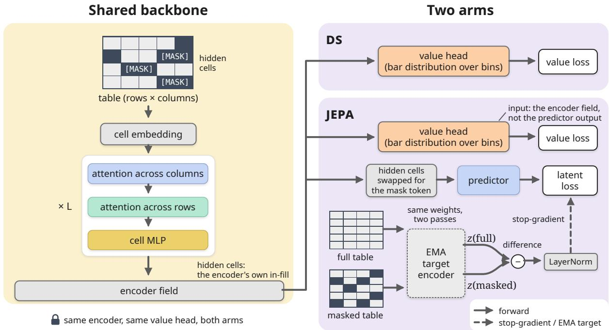  
Figure 1: One backbone, two arms. Both arms share the cell-level encoder and the value head that reads its field. The jepa arm adds a predictor that reads the encoder field with hidden cells swapped for the mask token, and a latent loss against the stop-gradient diference of an EMA target encoder’s full-table and masked-table embeddings.

jepa adds a latent term and changes where the value head reads. The value head reads the encoder field, where every hidden cell carries the encoder’s own in-fill, instead of the predictor output that the latent term shapes (Figure 1). This wiring kept the latent term alive to the plateau, whereas the predictor-read head had collapsed early in our earlier runs (Figure 2c). That failure is shown by a pair of runs of the same recipe to the fixed budget of 20,000 steps, which difer in one configuration key, where the value head reads (§A.1). With the head on the predictor the value error fell to .7499 by step 7,250 and rose back to .9364 by the budget, against a constant map of .949. Target cosine is the mean pairwise cosine between the latent targets of the held-out cells and target efective rank the entropy rank of their 256-dimensional matrix, whose ceiling is 256 and which a collapsed target drives toward one (Figure 2c). Its target efective rank ended at 1.5 and its latent loss at .0083, a target that has collapsed rather than been learned. That wiring ended at the constant map of its own held-out set on the two other priors it was trained on as well (§A.2). The same run with its head on the encoder field reached .5513 at the budget, with a target efective rank of 98.1 (Figure 2c). The latent target of a hidden cell is the EMA target encoder’s embedding of the full table minus its embedding of the masked table, layer-normalised and detached. The diference carries what the hidden cells contributed to the field rather than a copy of the context, so that the predictor cannot satisfy the target from the visible cells alone. The targets of data2vec and I-JEPA are the target encoder’s representation of the full input at the hidden positions (Baevski et al., 2022b; Assran et al., 2023), made cheap to build by the successor of data2vec (Baevski et al., 2022a), and the diference target departs from them by subtracting the masked-table embedding. The predictor, a 4-block transformer, reads the encoder field with hidden cells replaced by a mask token, so that hidden cells are invisible to each other, as in the image JEPA of Assran et al. (2023). The context split is that second pass, in which the encoder of jepa reads the visible cells only and the predictor fills the hidden ones from its mask token, while the value head reads the first pass over the masked table as in ds (Figure 1). The objective of jepa sums the latent loss, a mean over the |M| hidden cells and the d = 256 dimensions of their targets, and the value loss with weights 1.0 and 1.0:

$$
\mathcal { L } _ { \mathrm { j e p a } } = \lambda _ { \mathrm { j e p a } } \frac { 1 } { d | M | } \sum _ { ( i , j ) \in M } \big \| g ( \bar { h } ) _ { i j } - \mathrm { s g } \big [ \mathrm { L N } \big ( \bar { z } _ { i j } ^ { \mathrm { f u l l } } - \bar { z } _ { i j } ^ { \mathrm { m a s k } } \big ) \big ] \big \| _ { 2 } ^ { 2 } + \lambda _ { \mathrm { d s } } \mathcal { L } _ { \mathrm { d s } } ( h ) .\tag{2}
$$

The prescription’s own protocol is two-stage, a latent-only pretraining followed by a probe or a fine-tune on the task (Assran et al., 2023; Bardes et al., 2024). We test its objective in one stage beside the value loss instead, at one weight each, carried over rather than swept for this pair, since the family’s task is value prediction on the same prior and there is no second task to adapt to. The two-stage form needs a value read-out of its own, a probe on the frozen field, and is left to §5.2. Hidden cells are drawn under a mixed policy chosen per batch, as independent cells, as column blocks or as rectangular blocks, after a warm-up of 4,000 steps on target-column masking. The target encoder follows the online encoder with decay .996.

Both arms train on tables from the graph structural causal model (SCM) generator of TabICL (Qu et al., 2025), the second version of its prior, with 128 to 1,024 rows and up to 100 features per table. The generator is the public TabICL code at commit 8f1aa20 of its repository, vendored with two edits, to its import paths and to one set-to-sorted call that had made the table stream difer between processes. Both of its dataset filters are on, the one that rejects graphs whose feature nodes share no ancestor with the label and the one that rejects tables an extra-trees model cannot predict. Each batch is a classification task with probability .7, with up to 10 classes, and a regression task otherwise, and a fraction .3 of the tables carry missing feature cells. Both dimensions sit under a budget of 65,536 cells per table, which bounds memory, so rows and features trade of within it. Both arms draw the same stream of tables from the same seed, so the tables they train on are the same and difer only in how each arm splits and masks them (§5).

Instead of a fixed step budget, each arm trains until its best validation MSE has failed to improve by more than .002 for 80 consecutive validations, one every 250 steps, under a safety cap of 1,000,000 steps. The optimiser is schedule-free AdamW at learning rate $5 \times 1 0 ^ { - 4 } ,$ , so that no learning-rate schedule is tied to the step cap. The rule is the same for both arms and reads only the value error, so the arm with the latent term earns no budget beyond what its own value curve justifies (§4.2). Along that open horizon, a checkpoint is kept every 5,000 steps and one every 20,000 steps is scored on the real-data suite, so that the comparison is available along the whole trajectory.

## 4 Experiments

We compare the two arms at their plateaus and along the way. The experiments ask whether the latent term trains to a plateau under the same stop rule as ds (§4.2), what the recipe costs once both arms have converged (§4.3), and where each arm stands against classical baselines along the way (§4.4). Every number comes from one seed per arm, with the noise floor of the sign test taken from a repeat of ds (§4.1).

## 4.1 Setup

The real-data suite holds 115 classification and 32 regression datasets from OpenML-CC18, the Grinsztajn benchmark and TabArena (Bischl et al., 2021; Grinsztajn et al., 2022; Erickson et al., 2025). The three benchmarks overlap, since 12 classification names and 2 regression names appear under two or three of them as distinct OpenML datasets, curations of one source (Table 5). Grinsztajn itself lists 9 names under two of its suites; the evaluation keys its records by benchmark, name and task and, before any scoring, kept the later entry of each pair, the one with the higher OpenML id, so within a benchmark every count below has one entry per name. Across benchmarks both entries of a shared name are scored, and the count with one entry per name keeps the earliest benchmark’s (§4.3); 2 names, diamonds and electricity, fall under both rules, the higher id within Grinsztajn and then the earliest benchmark across them. Each dataset is scored in context with up to 1,024 context rows and 64 features, by accuracy for classification and $R ^ { 2 }$ for regression, with no per-dataset training. Each score is the mean over 3 random halves of the dataset, with at most 512 test rows scored per half and the 64 features chosen by an F-test on the whole dataset before the split, the same for every model (§A.3). On those scores two checkpoints are compared by per-dataset wins and losses, written wins:losses, with an exact two-sided sign test, overall, by class stratum and by benchmark.

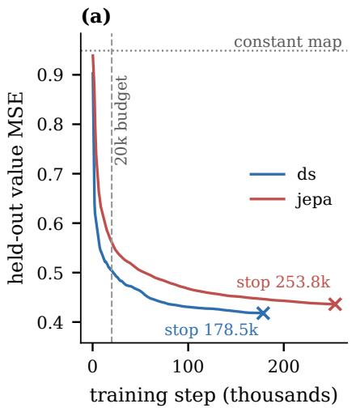

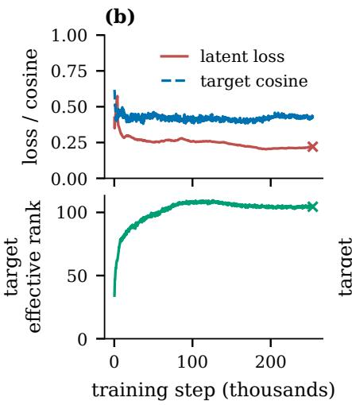

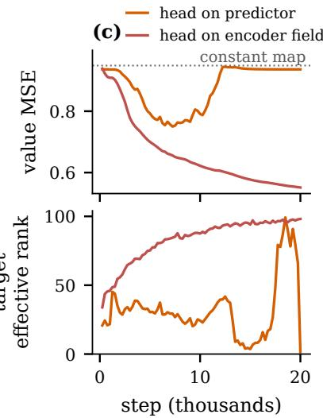  
Figure 2: Held-out curves to the plateau. (a) Value MSE of both arms on the held-out prior tables at every validation, up to each arm’s plateau stop; the dotted line is the constant map and the dashed line the fixed budget of our earlier comparisons. (b) The jepa arm’s latent loss and target cosine (top) and target efective rank (bottom) on the same tables. (c) The fixed-budget pair behind the earlier collapse, the same recipe with the value head on the predictor or on the encoder field, one configuration key apart: value MSE (top) and target efective rank (bottom) on the same held-out tables as (b).

Exact ties are dropped from the count and from the test, so the two numbers need not sum to the number of datasets, and the final classification pair has 13 of them while regression has none. The sign test weighs every dataset equally, so a large margin on one dataset counts no more than a small one, and the mean scores beside each count carry the magnitude the count discards (Table 4). Such a count has a floor, measured against a second run of ds with the same recipe and the same seed, whose configuration difers only in the step cap and the stop rule, neither of which acts before the step compared, so the two diverge only through run-to-run non-determinism, not a new seed (§A.1). Scored against its original at the same step it gives 51:49 on classification and 17:15 on regression, a floor that another seed could only widen; a win count inside it says nothing, and one outside it clears at least the noise of a re-run. Gradient-boosted trees (HistGB in the tables and figures) and the linear model of each task, logistic regression on classification and ridge regression on regression, are fitted per dataset on its full training half, which on large datasets holds many times the 1,024 rows either arm reads, and serve as reference points. Together these choices make every comparison below a paired one, in which each dataset is scored once per checkpoint under the same budget and a diference counts only when it clears at least the floor of a same-seed re-run (§4.3).

## 4.2 Convergence under the plateau rule

Each arm was stopped by one number, the squared error of the value head on the hidden cells of held-out prior tables (Figure 2a). That error is taken between the head’s point prediction and the cell value clamped to the head’s support, averaged over the hidden cells of tables drawn from a fixed seed disjoint from the training stream. The held-out set holds 32 tables for ds and 64 for jepa, the former being the first half of the latter, since both trainers draw the same stream from the same seed and each validates on its own default number of batches (§A.1). The rule therefore never saw the real-data suite, and every suite score below is of a checkpoint chosen without it (§4.1). For jepa the rule read that same value MSE, so the latent loss and the collapse diagnostics in Figure 2b were recorded at every validation but never stopped a run. Converged therefore means converged in the value error, and the latent loss of jepa had stopped falling by then, changing by +.0094 over the final patience window of 20,000 steps (Figure 2b). The latent loss could not have served as the stop signal, since a collapsed encoder drives it down as surely as a trained one, which is the failure §2 describes and Figure 2c shows. The value curve, by contrast, shows a collapse plainly: no constant output of the head can score below the variance of the held-out cells, .949 on the jepa set, so the dotted line in Figure 2a is what a collapsed encoder would score.

Table 1: Final checkpoints by benchmark. Mean score of both arms, of the linear model of each task and of gradient-boosted trees on the datasets of each benchmark and over all of them: accuracy for classification, $R ^ { 2 }$ for regression. Counts and sign tests are in Table 4, per-dataset scores in Table 5.
<table><tr><td colspan="5">classification (accuracy)</td><td colspan="3">regression  $( R ^ { 2 } )$ </td></tr><tr><td>model</td><td>OpenML-CC18</td><td>Grinsztajn</td><td>TabArena</td><td>all</td><td>Grinsztajn</td><td>TabArena</td><td>all</td></tr><tr><td>DS</td><td>.819</td><td>.738</td><td>.847</td><td>.815</td><td>.649</td><td>.696</td><td>.665</td></tr><tr><td>JEPA</td><td>.809</td><td>.739</td><td>.845</td><td>.809</td><td>.639</td><td>.628</td><td>.635</td></tr><tr><td>logistic / ridge</td><td>.803</td><td>.708</td><td>.828</td><td>.795</td><td>.534</td><td>.578</td><td>.549</td></tr><tr><td>HistGB</td><td>.849</td><td>.783</td><td>.863</td><td>.842</td><td>.714</td><td>.780</td><td>.737</td></tr></table>

The stop records and the trajectory together separate a slowdown from a ceiling, since jepa reaches a plateau of its own, later, and its deficit against the final ds checkpoint shrinks along the way (Figure 2, Table 3). ds stopped at 178,500 steps after 24.8 hours, with a final validation MSE of .4179 (Figure 2a). jepa stopped at 253,750 steps after 41.3 hours, at .4360, which is 1.42 times the steps and 1.66 times the wall-clock of ds. Both stop steps include the 20,000 steps of patience after each arm’s last improvement by more than .002, so the ratio of the steps at which jepa and ds last improved is 1.47. Those stop points sit far past the step budget of our earlier comparisons, where the validation MSE of ds stood at .5041 against .4179 at its plateau. A fixed horizon had therefore scored an unconverged model, and any deficit measured there mixed a slowdown with whatever ceiling exists (the dashed line in Figure 2a). The latent term of jepa survived to the plateau (Figure 2b). The validation latent loss of jepa ended at .2209, with target cosine .4398 and target efective rank 104.5. The value curve of jepa sat below the constant map from the first validation at step 250 and never returned above it (Figure 2a). Scored against ds at the same step, jepa trailed throughout, from 22:80 at step 20,000 to 17:79 at step 160,000 (Table 3 in the appendix). Against the final ds checkpoint instead, the deficit of jepa narrowed from 9:96 at step 20,000 to 31:69 at step 240,000 without closing. So the deficit at any fixed step reads mostly as lag, jepa reaching at a later step what ds had at an earlier one, and only what remains at both plateaus bounds the cost of the term from above (§4.3).

## 4.3 Converged comparison

On all 115 classification datasets the final jepa checkpoint wins 32:70 against the final ds checkpoint (p .00021), with mean accuracy .809 against .815 (Table 4 in the appendix). On AUROC, stored beside accuracy for every classification dataset, the same pair gives 31:82 with 2 ties, the same direction as the accuracy count. With one entry kept per dataset name, the earliest benchmark’s, the pool falls to 102 classification and 30 regression datasets and the counts become 29:63 (p .00051) and 8:22 (p .01612), the same direction at every stratum (Table 4). Keeping the latest benchmark’s entry instead moves no count by more than 1 (§4.1). The strata are ordered by what the head must resolve, from two classes through a few and many to a continuous target (Table 4). On binary tasks the count is 24:44 (p .02053), significant, with a mean gap of .003 accuracy. On tasks with three to five classes it is 6:11 (p .33231), the one class stratum where the count is not significant. The deficit is largest on the many-class stratum, six to ten classes, 2:15 (p .00235), and on regression, 8:24 (p .007), with mean gaps of .017 accuracy and .030 $R ^ { 2 }$ . Across all strata, the mean gap at convergence is .006 accuracy, so the deficit is small even where it is significant. Table 1 and Figure 3 break the means down by benchmark, and on every block both arms score above the linear model and below the trees. The largest gap between the arms is .068 $R ^ { 2 }$ on TabArena regression, against at most .010 accuracy on any classification block (Table 1). That gap is concentrated rather than spread, since two datasets, concrete compressive strength and airfoil self noise, carry 68 % of it with gaps of .347 and .156 $R ^ { 2 }$ (Table 5). The median gap over the 32 regression datasets is .011 $R ^ { 2 }$ , and jepa scores below ridge on 7 of them against 5 for ds. By benchmark the classification count is significant only on OpenML-CC18, 13:42 (p .00011), while the regression counts on Grinsztajn, 6:15 (p .07835), and TabArena, 2:9 (p .06543), fall short of significance at their sizes (Table 4). Every block leans the same way, so the deficit is a property of the arm rather than of one benchmark’s datasets, and only the largest block has the size to make it significant (Table 4). The stratum and benchmark counts are several tests on one pair of checkpoints, reported uncorrected as a breakdown of the overall count rather than as independent findings (Table 4). A stratum near the threshold is therefore read as a direction and not as a result (Table 4).

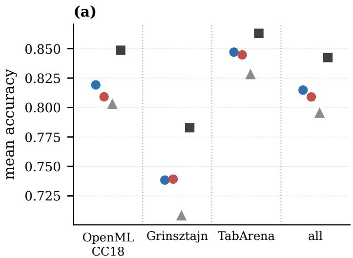

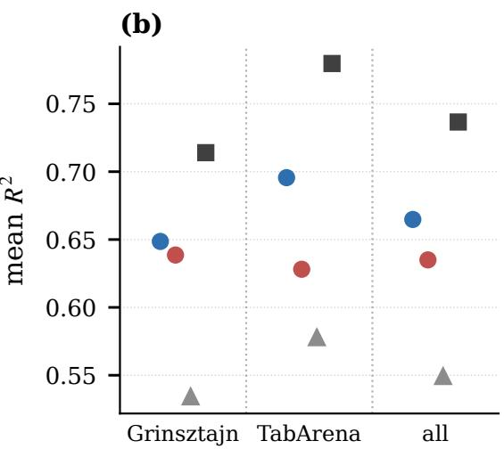  
Figure 3: Benchmark means as points. The entries of Table 1, one marker per model: (a) accuracy on the classification sets of each benchmark and over all of them, (b) $R ^ { 2 }$ on the regression sets.

## 4.4 Suite score along training

Neither arm beats gradient-boosted trees, with ds at 28:84 on classification and 4:28 on regression and jepa at 27:87 and 3:29 (Figure 4). Both arms beat the linear models, ds at 71:39 and 27:5 and jepa at 66:44 and 25:7, the classification win rate of jepa being the lowest of the four. The distance to the trees, .842 mean accuracy against .815 for ds, is several times the distance between the two arms. That distance is not a like-for-like one, since the trees and the linear model read the full training half of each dataset while both arms read at most 1,024 of its rows, so it bounds nothing about what an objective could buy (§4.1). Along training, the mean of ds passes the logistic model by step 60,000 and that of jepa by step 140,000, and on regression the two arms stand above ridge from steps 20,000 and 60,000 on (Figure 4). So jepa arrives later at each crossing while both arms end between the same two baselines: what difers is when the arm arrives, not where (Figure 4).

## 5 Discussion

The recipe trains, since with the head on the encoder field the latent term neither collapsed nor drifted back toward the constant map over the whole run (§4.2). Yet it buys no accuracy on the real-data suite, since at convergence jepa trails ds on every stratum and benchmark where the count is significant and never leads the count where it is not (§4.3). Most of that deficit, as reported at a fixed budget, was a slowdown, and what remains at the plateau is small (§4.2). For the prescription this means that latent prediction beside the value loss on a tabular prior is no longer blocked by collapse, and that its case must now be made on something other than in-context accuracy (§5.2).

Three features of the two arms can explain the deficit that remains. The gradient of the latent term reaches the encoder through the predictor, so the encoder field that the value head reads is shaped by both losses (§3). Beyond that shared field, the two arms difer in masking policy, in the context split and in the warmup, so the measured deficit bounds the cost of the latent term from above rather than estimating it, on the premise that none of the three helps the arm that carries the term, which this study does not test (§3). Where the deficit is largest, on many-class and regression tasks, the value head must resolve finer targets, which is consistent with a representation budget shared with the latent term (§4.3). Of the three, only the shared field belongs to the recipe itself, while the other two are choices of this study (§5.1).

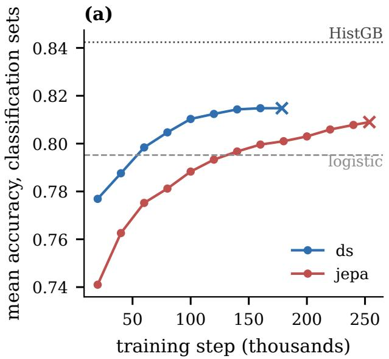

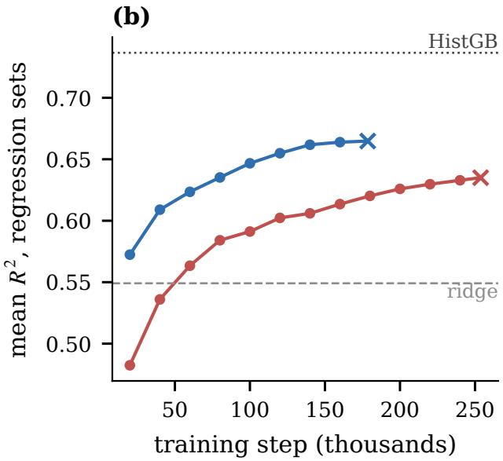  
Figure 4: Real-data suite along training. Mean score of every scored snapshot of both arms on the real-data suite, (a) accuracy over the classification sets and (b) $R ^ { 2 }$ over the regression sets, with the final checkpoints marked by a cross; the dotted line is gradient-boosted trees and the dashed line the linear model of each task, both fitted per dataset.

## 5.1 Threats to validity

One seed per arm is the sharpest limit on every claim, because the sign test spans datasets rather than seeds and the noise floor comes from a second run of the same seed, which a second seed would be expected to widen (§4.1). What one seed does allow is the paired reading above, since both arms saw the same prior stream and the same suite, so the count compares two training runs and not yet two recipes (§4.1). Next, no matched control with the latent weight set to zero was trained, so the deficit cannot be attributed to the latent term alone (§3). Three lesser limits remain. One model size was trained, so the gap to gradientboosted trees may be a size ceiling, a prior ceiling or the 1,024-row context that caps what either arm reads of a dataset, three causes this study cannot separate (§4.4). The two arms share a learning rate, and jepa adds a masking warm-up, an EMA decay and one weight per loss, all carried over from earlier runs rather than tuned for this pair, so the bound of §4.3 holds under that setting rather than under each arm’s best (§3). The suite likewise scores every dataset at one context and feature budget, so behaviour at other budgets is not measured (§4.1).

## 5.2 Future work

A matched control with the latent weight at zero would turn the upper bound into an estimate (§5.1). Without new training, whether the latent term buys robustness rather than accuracy, at short contexts or under noise, is testable on the same checkpoints with the same suite (§4.1). That question is the one the prescription itself raises, since a latent target may discard what a value target must reproduce, and noise is where such a diference would show (§1). A probe on the frozen jepa field would test the prescription’s two-stage form on these checkpoints as well (§3). Further out, the predictor allows filling hidden cells in latent space and chaining such fills, a use the value-only arm lacks and the present evaluation does not exercise (§3).

## 6 Conclusion

We asked whether the latent-prediction prescription can be followed on a tabular foundation-model prior. Its objective can be trained beside the value loss, once the head is moved of the predictor onto the encoder field, with the target and the mask tokens held fixed, and the term then reaches a plateau without collapse. Yet it does not pay in real-data accuracy at convergence, trailing ds in this run by a small margin on binary tasks and by more on many-class and regression tasks. The lesson for comparisons of this kind is to stop each arm at its plateau rather than at a step count, since a fixed budget scores a slowdown as a ceiling. The next step is the matched control that turns the measured bound into an estimate.

## References

Mahmoud Assran, Quentin Duval, Ishan Misra, Piotr Bojanowski, Pascal Vincent, Michael Rabbat, Yann LeCun, and Nicolas Ballas. Self-supervised learning from images with a joint-embedding predictive architecture. In Proceedings of the IEEE/CVF Conference on Computer Vision and Pattern Recognition (CVPR), 2023.

Alexei Baevski, Arun Babu, Wei-Ning Hsu, and Michael Auli. Eficient self-supervised learning with contextualized target representations for vision, speech and language. arXiv preprint arXiv:2212.07525, 2022a.

Alexei Baevski, Wei-Ning Hsu, Qiantong Xu, Arun Babu, Jiatao Gu, and Michael Auli. data2vec: A general framework for self-supervised learning in speech, vision and language. In Proceedings of the 39th International Conference on Machine Learning (ICML). PMLR, 2022b.

Dara Bahri, Heinrich Jiang, Yi Tay, and Donald Metzler. SCARF: Self-supervised contrastive learning using random feature corruption. In International Conference on Learning Representations (ICLR), 2022. Spotlight.

Randall Balestriero and Yann LeCun. LeJEPA: Provable and scalable self-supervised learning without the heuristics. arXiv preprint arXiv:2511.08544, 2025.

Adrien Bardes, Jean Ponce, and Yann LeCun. VICReg: Variance-invariance-covariance regularization for self-supervised learning. In International Conference on Learning Representations (ICLR), 2022.

Adrien Bardes, Quentin Garrido, Jean Ponce, Xinlei Chen, Michael Rabbat, Yann LeCun, Mahmoud Assran, and Nicolas Ballas. Revisiting feature prediction for learning visual representations from video. arXiv preprint arXiv:2404.08471, 2024.

Bernd Bischl, Giuseppe Casalicchio, Matthias Feurer, Frank Hutter, Michel Lang, Rafael G. Mantovani, Jan N. van Rijn, and Joaquin Vanschoren. OpenML benchmarking suites. In Advances in Neural Information Processing Systems (NeurIPS) Datasets and Benchmarks Track, 2021.

Mohamed Bouadi, Nassim Bouarour, Varun Kulkarni, Shivam Dubey, Aditya Tanna, and Vinay Kumar Sankarapu. Shaping the prior: How synthetic task distributions determine tabular foundation model quality. arXiv preprint arXiv:2605.18971, 2026.

Xinlei Chen and Kaiming He. Exploring simple siamese representation learning, 2020.

Nick Erickson, Lennart Purucker, Andrej Tschalzev, David Holzmüller, Prateek Mutalik Desai, David Salinas, and Frank Hutter. TabArena: A living benchmark for machine learning on tabular data. arXiv preprint arXiv:2506.16791, 2025.

Quentin Garrido, Randall Balestriero, Laurent Najman, and Yann LeCun. RankMe: Assessing the downstream performance of pretrained self-supervised representations by their rank. In Proceedings of the 40th International Conference on Machine Learning (ICML). PMLR, 2023.

Jean-Bastien Grill, Florian Strub, Florent Altché, Corentin Tallec, Pierre H. Richemond, Elena Buchatskaya, Carl Doersch, Bernardo Avila Pires, Zhaohan Daniel Guo, Mohammad Gheshlaghi Azar, Bilal Piot, Koray Kavukcuoglu, Rémi Munos, and Michal Valko. Bootstrap your own latent: A new approach to selfsupervised learning. In Advances in Neural Information Processing Systems 33 (NeurIPS), 2020.

Léo Grinsztajn, Edouard Oyallon, and Gaël Varoquaux. Why do tree-based models still outperform deep learning on typical tabular data? In Advances in Neural Information Processing Systems (NeurIPS) Datasets and Benchmarks Track, 2022.

Noah Hollmann, Samuel Müller, Katharina Eggensperger, and Frank Hutter. TabPFN: A transformer that solves small tabular classification problems in a second. In International Conference on Learning Representations (ICLR), 2023.

Noah Hollmann, Samuel Müller, Lennart Purucker, Arjun Krishnakumar, Max Körfer, Shi Bin Hoo, Robin Tibor Schirrmeister, and Frank Hutter. Accurate predictions on small data with a tabular foundation model. Nature, 637(8045):319–326, 2025. doi: 10.1038/s41586-024-08328-6.

Li Jing, Pascal Vincent, Yann LeCun, and Yuandong Tian. Understanding dimensional collapse in contrastive self-supervised learning. arXiv preprint arXiv:2110.09348, 2021.

Myung Jun Kim, Léo Grinsztajn, and Gaël Varoquaux. CARTE: Pretraining and transfer for tabular learning. arXiv preprint arXiv:2402.16785, 2024.

Yann LeCun. A path towards autonomous machine intelligence, 2022. Version 0.9.2, 2022-06-27. OpenReview position paper, https://openreview.net/forum?id=BZ5a1r-kVsf.

Etai Littwin, Omid Saremi, Madhu Advani, Vimal Thilak, Preetum Nakkiran, Chen Huang, and Joshua Susskind. How JEPA avoids noisy features: The implicit bias of deep linear self distillation networks, 2024.

Junwei Ma, Valentin Thomas, Rasa Hosseinzadeh, Hamidreza Kamkari, Alex Labach, Jesse C. Cresswell, Keyvan Golestan, Guangwei Yu, Anthony L. Caterini, and Maksims Volkovs. TabDPT: Scaling tabular foundation models on real data. In Advances in Neural Information Processing Systems (NeurIPS), 2025.

Samuel Müller, Noah Hollmann, Sebastian Pineda Arango, Josif Grabocka, and Frank Hutter. Transformers can do bayesian inference. In International Conference on Learning Representations (ICLR), 2022.

Jaehyun Nam, Jihoon Tack, Kyungmin Lee, Hankook Lee, and Jinwoo Shin. STUNT: Few-shot tabular learning with self-generated tasks from unlabeled tables. arXiv preprint arXiv:2303.00918, 2023.

Jingang Qu, David Holzmüller, Gaël Varoquaux, and Marine Le Morvan. TabICL: A tabular foundation model for in-context learning on large data. In Proceedings of the 42nd International Conference on Machine Learning (ICML). PMLR, 2025.

Gowthami Somepalli, Micah Goldblum, Avi Schwarzschild, C. Bayan Bruss, and Tom Goldstein. SAINT: Improved neural networks for tabular data via row attention and contrastive pre-training, 2021.

Vimal Thilak, Chen Huang, Omid Saremi, Laurent Dinh, Hanlin Goh, Preetum Nakkiran, Joshua M. Susskind, and Etai Littwin. LiDAR: Sensing linear probing performance in joint embedding SSL architectures, 2023.

Hugo Thimonier, José Lucas De Melo Costa, Fabrice Popineau, Arpad Rimmel, and Bich-Liên Doan. T-JEPA: Augmentation-free self-supervised learning for tabular data. In International Conference on Learning Representations (ICLR), 2025.

Talip Ucar, Ehsan Hajiramezanali, and Lindsay Edwards. SubTab: Subsetting features of tabular data for self-supervised representation learning. In Advances in Neural Information Processing Systems 34 (NeurIPS), 2021.

Stijn Verdenius, Andrea Zerio, and Roy L.M. Wang. LaT-PFN: A joint embedding predictive architecture for in-context time-series forecasting, 2024.

Zifeng Wang and Jimeng Sun. TransTab: Learning transferable tabular transformers across tables. In Advances in Neural Information Processing Systems (NeurIPS), 2022.

Jinsung Yoon, Yao Zhang, James Jordon, and Mihaela van der Schaar. VIME: Extending the success of selfand semi-supervised learning to tabular domain. In Advances in Neural Information Processing Systems 33 (NeurIPS), 2020.

Jure Zbontar, Li Jing, Ishan Misra, Yann LeCun, and Stéphane Deny. Barlow Twins: Self-supervised learning via redundancy reduction. In Proceedings of the 38th International Conference on Machine Learning (ICML). PMLR, 2021.

Xiyuan Zhang, Danielle C. Maddix, Junming Yin, Nick Erickson, Abdul Fatir Ansari, Boran Han, Shua Zhang, Leman Akoglu, Christos Faloutsos, Michael W. Mahoney, Cuixiong Hu, Huzefa Rangwala, George Karypis, and Bernie Wang. Mitra: Mixed synthetic priors for enhancing tabular foundation models. In Advances in Neural Information Processing Systems (NeurIPS), 2025.

Bingzhao Zhu, Xingjian Shi, Nick Erickson, Mu Li, George Karypis, and Mahsa Shoaran. XTab: Cross-table pretraining for tabular transformers. In Proceedings of the 40th International Conference on Machine Learning (ICML). PMLR, 2023.

## A Additional material

## A.1 Configurations

The two arms difer in the configuration keys of the two configurations that name the latent term and its target, the context split, the masking policy and the warm-up, and in the number of held-out batches each trainer validates on by default, 32 tables for ds against 64 for jepa (§4.2). The plateau rule is one function shared by both trainers, so the two arms stopped under the same criterion.

## A.2 Collapse across priors

Table 2 lists the three fixed-budget runs with the value head on the predictor, one per prior, beside the encoder-read run of Figure 2c. The three priors are our own SCM sampler, the first TabICL generator, which mixes MLP and tree SCM engines, and the graph SCM generator of TabICL $\mathrm { v 2 }$ that the main runs use (§3). On every prior the predictor-read run ended within 1.3 % of its constant map with a target rank of at most 26.7, and scored .570 to .585 mean accuracy and at most -.003 mean $R ^ { 2 }$ on the suite, an $R ^ { 2 }$ no better than a constant prediction, against .750 and .490 for the encoder-read run at the same budget. Those three configurations difer only in the prior, and the encoder-read run difers from the one on this prior in the single key that moves the head, so what the runs separate is the wiring, not the generator (§A.1). Figure 5 draws the same runs at every validation: the value error over the constant map, the mean pairwise cosine of the predictor output and of the target field, and the efective rank of the target field and of the predictor output. On the two priors where the value head learned at all, the predictor output flattened first, its cosine crossing .9 at steps 2,750 and 8,750, after the value error’s minimum at 2,250 and 7,250 and before its return to .98 of the constant map at 3,250 and 12,250. The target field lost rank only afterwards, its efective rank falling below 10 at steps 5,500 and 13,500. On TabICL v1 the value error never left the constant map, its minimum being 1.000 of the map, while the predictor output kept an efective rank of at most 15.4 throughout. So the head lost the value task while reading an output that had already gone flat, in the order $\ S 1$ gives, and the target field followed rather than led.

(a)  
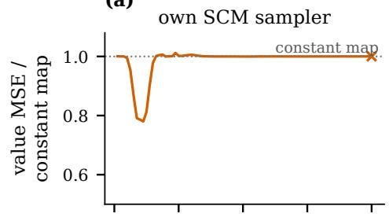

(b)  
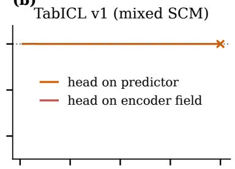

(c)  
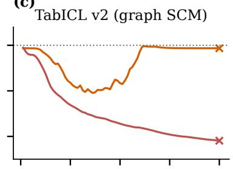

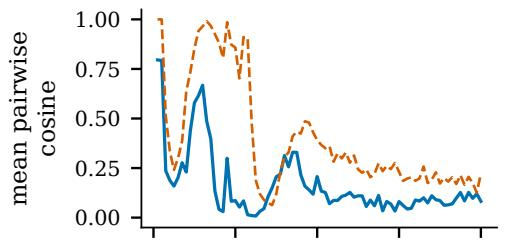

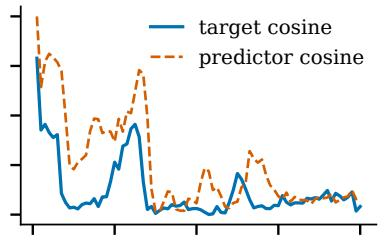

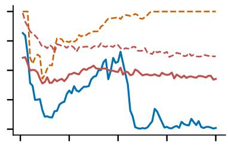

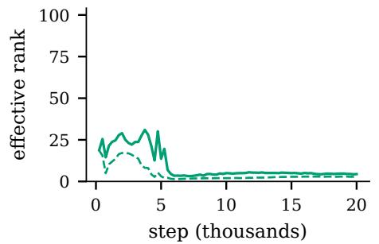

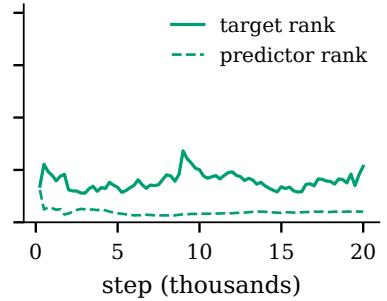

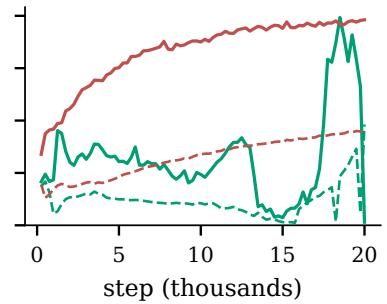  
Figure 5: When and how the predictor-read wiring failed. The runs of Table 2, one column per prior, at every validation: value MSE over the run’s own constant map (top), the target field (solid) and the predictor output (dashed), for the mean pairwise cosine over the held-out cells (middle) and for the efective rank (bottom). In (c) the encoder-read run on the same prior is overlaid in the colour of Figure 2c. Late in (c) the predictor-read run’s target field is nearly constant and its rank is not stable, while the encoder-read overlay’s rank keeps rising.

Table 2: The predictor-read wiring across priors. Fixed-budget runs of 20,000 steps, one per prior, with the value head on the predictor, and for reference the run on the paper’s prior whose head reads the encoder field (Figure 2c). Value MSE is the held-out value error at the end of the run; the constant map is the variance of that run’s own held-out target cells, the score of a collapsed encoder; the minimum is the lowest held-out value error along the run and its step; rank is the target efective rank at the end (ceiling 256); suite means are accuracy over the 115 classification and $R ^ { 2 }$ over the 32 regression datasets.
<table><tr><td>prior</td><td>head reads</td><td>value MSE</td><td>constant map</td><td>minimum (step)</td><td></td><td>rank</td><td>suite acc.</td><td>suite  $R ^ { 2 }$ </td></tr><tr><td>own SCM sampler</td><td>predictor</td><td>.971</td><td>.971</td><td>.757 (2,250)</td><td></td><td>4.4</td><td>.585</td><td>-.003</td></tr><tr><td>TabICL v1 (mixed SCM)</td><td>predictor</td><td>1.014</td><td>1.014</td><td>1.014 (1,750)</td><td></td><td>26.7</td><td>.582</td><td>-.003</td></tr><tr><td>TabICL v2 (graph SCM)</td><td>predictor</td><td>.936</td><td>.949</td><td>.750 (7,250)</td><td></td><td>1.5</td><td>.570</td><td>-.003</td></tr><tr><td>TabICL v2 (graph SCM)</td><td>encoder</td><td>.551</td><td>.949</td><td>.551 (20,000)</td><td></td><td>98.1</td><td>.750</td><td>.490</td></tr></table>

## A.3 Evaluation protocol

The suite is scored by the evaluation scripts, which draw the three OpenML suites, give each model at most 1,024 rows of context and 64 features picked by an F-test ahead of the split, average 3 random halves scoring no more than 512 test rows in each, and apply an exact two-sided sign test with ties dropped, as §4.1 states.

Table 3: Snapshots of jepa along its trajectory. Per-dataset wins against ds at the same step and against its final checkpoint, as wins and losses for all classification sets, the many-class stratum and regression; a dash marks a step past the stop of ds.
<table><tr><td rowspan="2">step</td><td colspan="3">vs. DS at the same step</td><td colspan="3">vs. DS final</td></tr><tr><td>all</td><td>6-10</td><td>reg</td><td>all</td><td>6-10</td><td>reg</td></tr><tr><td>20,000</td><td>22:80</td><td>1:18</td><td>7:25</td><td>9:96</td><td>0:19</td><td>0:32</td></tr><tr><td>40,000</td><td>23:81</td><td>3:16</td><td>3:29</td><td>6:96</td><td>1:17</td><td>0:32</td></tr><tr><td>60,000</td><td>26:79</td><td>3:16</td><td>2:30</td><td>15:87</td><td>2:17</td><td>0:32</td></tr><tr><td>80,000</td><td>20:86</td><td>1:18</td><td>3:28</td><td>11:91</td><td>1:18</td><td>1:31</td></tr><tr><td>100,000</td><td>16:86</td><td>2:17</td><td>4:28</td><td>17:89</td><td>1:18</td><td>3:29</td></tr><tr><td>120,000</td><td>15:89</td><td>1:17</td><td>2:30</td><td>18:87</td><td>1:18</td><td>2:30</td></tr><tr><td>140,000</td><td>19:83</td><td>2:17</td><td>4:28</td><td>19:81</td><td>1:17</td><td>3:29</td></tr><tr><td>160,000</td><td>17:79</td><td>1:18</td><td>4:28</td><td>22:81</td><td>1:18</td><td>4:28</td></tr><tr><td>180,000</td><td>1</td><td>一</td><td>一</td><td>21:82</td><td>1:18</td><td>2:29</td></tr><tr><td>200,000</td><td>一</td><td>一</td><td></td><td>24:78</td><td>2:16</td><td>1:30</td></tr><tr><td>220,000</td><td>一</td><td>一</td><td></td><td>36:68</td><td>2:16</td><td>5:27</td></tr><tr><td>240,000</td><td>一</td><td>一</td><td>一</td><td>31:69</td><td>2:16</td><td>6:26</td></tr></table>

## A.4 Snapshots along the trajectory

Table 3 lists, for every scored snapshot of jepa, the two counts of §4.2, one against the ds snapshot of the same step and one against the final ds checkpoint, of which the section quotes the first and the last.

## A.5 Sign tests by stratum and benchmark

Every count behind §4.3 is listed in Table 4 with its p value, first by class stratum and then by benchmark.

Table 4: Sign tests by stratum and benchmark. Per-dataset wins and losses of jepa against ds at their final checkpoints, with the exact two-sided sign-test p, by class stratum and by benchmark. Means are accuracy (classification) and $R ^ { 2 }$ (regression). The last block repeats the class strata and the regression count with one entry kept per dataset name.
<table><tr><td>stratum</td><td>n</td><td>JEPA W:L</td><td>ties</td><td>p</td><td>JEPA mean</td><td>DS mean</td></tr><tr><td>all classification</td><td>115</td><td>32:70</td><td>13</td><td>.00021</td><td>.809</td><td>.815</td></tr><tr><td>binary</td><td>78</td><td>24:44</td><td>10</td><td>.02053</td><td>.823</td><td>.826</td></tr><tr><td>3–5 classes</td><td>18</td><td>6:11</td><td>1</td><td>.33231</td><td>.795</td><td>.802</td></tr><tr><td>6–10 classes</td><td>19</td><td>2:15</td><td>2</td><td>.00235</td><td>.765</td><td>.782</td></tr><tr><td>OpenML-CC18</td><td>59</td><td>13:42</td><td>4</td><td>.00011</td><td>.809</td><td>.819</td></tr><tr><td>Grinsztajn</td><td>19</td><td>7:11</td><td>1</td><td>.48068</td><td>.739</td><td>.738</td></tr><tr><td>TabArena</td><td>37</td><td>12:17</td><td>8</td><td>.45826</td><td>.845</td><td>.847</td></tr><tr><td>all regression</td><td>32</td><td>8:24</td><td>0</td><td>.007</td><td>.635</td><td>.665</td></tr><tr><td>Grinsztajn</td><td>21</td><td>6:15</td><td>0</td><td>.07835</td><td>.639</td><td>.649</td></tr><tr><td>TabArena</td><td>11</td><td>2:9</td><td>0</td><td>.06543</td><td>.628</td><td>.696</td></tr><tr><td colspan="7">one entry per dataset name, the earliest benchmark&#x27;s</td></tr><tr><td>all classification</td><td>102</td><td>29:63</td><td>10</td><td>.00051</td><td>(§4.1) .812</td><td>.818</td></tr><tr><td>binary</td><td>67</td><td>21:38</td><td>8</td><td>.03634</td><td>.827</td><td>.830</td></tr><tr><td>3–5 classes</td><td>17</td><td>6:10</td><td>1</td><td>.4545</td><td>.792</td><td>.797</td></tr><tr><td>6–10 classes</td><td>18</td><td>2:15</td><td>1</td><td>.00235</td><td>.777</td><td>.796</td></tr><tr><td>all regression</td><td>30</td><td>8:22</td><td>0</td><td>.01612</td><td>.626</td><td>.654</td></tr></table>

## A.6 Per-dataset scores

Every number behind Table 4 and every entry of Table 1 except the tree means is listed in Table 5, one row per dataset, grouped by benchmark, with the linear model of each task beside the two arms.

Table 5: Per-dataset scores by benchmark. Final checkpoints of both arms and the linear baseline of each task on every dataset of the suite, grouped by benchmark, each with its OpenML dataset id: accuracy with the number of classes k for classification, R2 for regression. The better of the two arms is in bold; each block ends with its mean and the count of datasets won by each arm.
<table><tr><td>dataset</td><td>id</td><td>k</td><td>DS</td><td>JEPA</td><td>logistic / ridge</td></tr><tr><td>OpenML-CC18, classification (59 datasets)</td><td></td><td></td><td></td><td></td><td></td></tr><tr><td>adult</td><td>1590</td><td>2</td><td>.830</td><td>.816</td><td>.789</td></tr><tr><td>analcatdata_authorship</td><td>458</td><td>4</td><td>.990</td><td>.990</td><td>.988</td></tr><tr><td>analcatdata_dmft</td><td>469</td><td>6</td><td>.196</td><td>.211</td><td>.204</td></tr><tr><td>balance-scale</td><td>11</td><td>3</td><td>.837</td><td>.842</td><td>.873</td></tr><tr><td>bank-marketing</td><td>1461</td><td>2</td><td>.897</td><td>.891</td><td>.902</td></tr><tr><td>banknote-authentication</td><td>1462</td><td>2</td><td>.998</td><td>.997</td><td>.992</td></tr><tr><td>blood-transfusion-service-center</td><td>1464</td><td>2</td><td>.772</td><td>.772</td><td>.774</td></tr><tr><td>breast-w</td><td>15</td><td>2</td><td>.972</td><td>.971</td><td>.966</td></tr><tr><td>car</td><td>40975</td><td>4</td><td>.841</td><td>.835</td><td>.821</td></tr><tr><td>churn</td><td>40701</td><td>2</td><td>.883</td><td>.889</td><td>.856</td></tr><tr><td>climate-model-simulation-crashes</td><td>40994</td><td>2</td><td>.915</td><td>.915</td><td>.923</td></tr><tr><td>cmc</td><td>23</td><td>3</td><td>.522</td><td>.524</td><td>.499</td></tr><tr><td>connect-4</td><td>40668</td><td>3</td><td>.659</td><td>.658</td><td>.686</td></tr><tr><td>credit-approval</td><td>29</td><td>2</td><td>.873</td><td>.883</td><td>.867</td></tr><tr><td>credit-g</td><td>31</td><td>2</td><td>.726</td><td>.713</td><td>.738</td></tr><tr><td>cylinder-bands</td><td>6332</td><td>2</td><td>.722</td><td>.728</td><td>.696</td></tr><tr><td>diabetes</td><td>37</td><td>2</td><td>.779</td><td>.768</td><td>.773</td></tr><tr><td>dna</td><td>40670</td><td>3</td><td>.926</td><td>.935</td><td>.960</td></tr><tr><td>dresses-sales</td><td>23381</td><td>2</td><td>.601</td><td>.591</td><td>.555</td></tr><tr><td>electricity</td><td>151</td><td>2</td><td>.786</td><td>.785</td><td>.769</td></tr><tr><td>eucalyptus</td><td>188</td><td>5</td><td>.601</td><td>.609</td><td>.555</td></tr><tr><td>first-order-theorem-proving</td><td>1475</td><td>6</td><td>.503</td><td>.487</td><td>.484</td></tr><tr><td>GesturePhaseSegmentationProcessed</td><td>4538</td><td>5</td><td>.531</td><td>.518</td><td>.464</td></tr><tr><td>ilpd</td><td>1480</td><td>2</td><td>.702</td><td>.688</td><td>.714</td></tr><tr><td>jm1</td><td>1053</td><td>2</td><td>.805</td><td>.805</td><td>.799</td></tr><tr><td>jungle_chess_2pcs_raw_endgame_complete</td><td>41027</td><td>3</td><td>.725</td><td>.723</td><td>.682</td></tr><tr><td>kc1</td><td>1067</td><td>2</td><td>.855</td><td>.860</td><td>.856</td></tr><tr><td>kc2</td><td>1063</td><td>2</td><td>.839</td><td>.838</td><td>.831</td></tr><tr><td>kr-vs-kp</td><td>3</td><td>2</td><td>.941</td><td>.820</td><td>.953</td></tr><tr><td>mfeat-factors</td><td>12</td><td>10</td><td>.935</td><td>.912</td><td>.953</td></tr><tr><td>mfeat-fourier</td><td>14</td><td>10</td><td>.824</td><td>.795</td><td>.801</td></tr><tr><td>mfeat-karhunen</td><td>16</td><td>10</td><td>.935</td><td>.911</td><td>.952</td></tr><tr><td>mfeat-morphological</td><td>18</td><td>10</td><td>.750</td><td>.731</td><td>.676</td></tr><tr><td>mfeat-pixel</td><td>40979</td><td>10</td><td>.870</td><td>.813</td><td>.909</td></tr><tr><td>mfeat-zernike</td><td>22</td><td>10</td><td>.777</td><td>.722</td><td>.792</td></tr><tr><td>MiceProtein</td><td>40966</td><td>8</td><td>.946</td><td>.935</td><td>.831</td></tr><tr><td>nomao</td><td>1486</td><td>2</td><td>.917</td><td>.924</td><td>.934</td></tr><tr><td>numerai28.6</td><td>23517</td><td>2</td><td>.503</td><td>.500</td><td>.523</td></tr><tr><td>optdigits</td><td>28</td><td>10</td><td>.866</td><td>.818</td><td>.971</td></tr><tr><td>ozone-level-8hr</td><td>1487</td><td>2</td><td>.930</td><td>.926</td><td>.929</td></tr><tr><td>pc1 pc3</td><td>1068 1050</td><td>2</td><td>.930</td><td>.932</td><td>.917</td></tr><tr><td>pc4</td><td>1049</td><td>2</td><td>.889</td><td>.887</td><td>.887</td></tr><tr><td>pendigits</td><td></td><td>2</td><td>.892</td><td>.889</td><td>.902</td></tr><tr><td>PhishingWebsites</td><td>32</td><td>10</td><td>.951</td><td>.934</td><td>.951</td></tr><tr><td></td><td>4534</td><td>2</td><td>.936</td><td>.938</td><td>.894</td></tr><tr><td>phoneme</td><td>1489</td><td>2</td><td>.842</td><td>.844</td><td>.751</td></tr><tr><td>qsar-biodeg</td><td>1494</td><td>2</td><td>.855</td><td>.850</td><td>.858</td></tr><tr><td>satimage</td><td>182</td><td>6</td><td>.883</td><td>.876</td><td>.845</td></tr><tr><td>segment</td><td>40984</td><td>7</td><td>.924</td><td>.918</td><td>.869</td></tr><tr><td>semeion</td><td>1501</td><td>10</td><td>.796</td><td>.788</td><td>.791</td></tr><tr><td>sick</td><td>38</td><td>2</td><td>.973</td><td>.972</td><td>.967</td></tr><tr><td>spambase</td><td>44</td><td>2</td><td>.938</td><td>.926</td><td>.921</td></tr><tr><td>splice</td><td>46</td><td>3</td><td>.926</td><td>.904</td><td>.916</td></tr><tr><td>steel-plates-fault</td><td>40982</td><td>7</td><td>.763</td><td>.754</td><td>.521</td></tr><tr><td>tic-tac-toe</td><td>50</td><td>2</td><td>.745</td><td>.734</td><td>.704</td></tr><tr><td>vehicle</td><td>54</td><td>4</td><td>.748</td><td>.733</td><td>.799</td></tr><tr><td>wall-robot-navigation</td><td>1497</td><td>4</td><td>.922</td><td>.894</td><td>.702</td></tr><tr><td>wdbc</td><td>1510</td><td>2</td><td>.959</td><td>.943</td><td>.957</td></tr><tr><td>wilt</td><td>40983</td><td>2</td><td>.979</td><td>.975</td><td>.969</td></tr><tr><td>mean datasets won</td><td></td><td></td><td>.819</td><td>.809</td><td>.803</td></tr><tr><td></td><td></td><td></td><td>42</td><td>13</td><td></td></tr><tr><td>Grinsztajn, classification (19 datasets)</td><td>45035</td><td>2</td><td></td><td></td><td></td></tr><tr><td>albert analcatdata_supreme</td><td>44055</td><td>10</td><td>.626 .975</td><td>.614</td><td>.631</td></tr><tr><td>bank-marketing</td><td>44126</td><td>2</td><td>.758</td><td>.975</td><td>.676</td></tr><tr><td>Bioresponse</td><td>45019</td><td>2</td><td></td><td>.768</td><td>.743</td></tr><tr><td></td><td>45028</td><td></td><td>.702</td><td>.699</td><td>.693</td></tr><tr><td>california</td><td>45039</td><td>2</td><td>.847</td><td>.846</td><td>.838</td></tr><tr><td>compas-two-years</td><td>44089</td><td>2 2</td><td>.648</td><td>.679</td><td>.684</td></tr><tr><td>credit</td><td>45036</td><td></td><td>.747</td><td>.760</td><td>.717</td></tr><tr><td>default-of-credit-card-clients</td><td>45022</td><td>2</td><td>.727</td><td>.721</td><td>.693</td></tr><tr><td>Diabetes130US</td><td>44156</td><td>2 2</td><td>.555</td><td>.573</td><td>.588</td></tr><tr><td>electricity</td><td>44157</td><td>2</td><td>.774</td><td>.766</td><td>.740</td></tr><tr><td>eye_movements</td><td>45026</td><td>2</td><td>.519</td><td>.544</td><td>.551</td></tr><tr><td>heloc</td><td>44123</td><td>2</td><td>.697 .859</td><td>.693</td><td>.697</td></tr><tr><td>house_16H</td><td>45021</td><td>2</td><td>.713</td><td>.851 .690</td><td>.791</td></tr><tr><td>jannis MagicTelescope</td><td>44125</td><td>2</td><td>.841</td><td>.842</td><td>.744</td></tr><tr><td>MiniBooNE</td><td>44128</td><td>2</td><td>.896</td><td>.893</td><td>.770</td></tr><tr><td></td><td>44122</td><td>2</td><td>.932</td><td></td><td>.896</td></tr><tr><td>pol</td><td>45038</td><td></td><td></td><td>.927</td><td>.872</td></tr><tr><td>road-safety</td><td>44136</td><td>27</td><td>.670</td><td>.687</td><td>.597</td></tr><tr><td>wine_quality</td><td></td><td></td><td>.544</td><td>.518</td><td>.534</td></tr><tr><td>mean datasets won</td><td></td><td></td><td>.738 11</td><td>.739 7</td><td>.708</td></tr><tr><td>Grinsztajn, regression (21 datasets)</td><td></td><td></td><td></td><td></td><td></td></tr><tr><td>abalone</td><td>45042</td><td></td><td>.527</td><td>.516</td><td>.490</td></tr><tr><td>Ailerons</td><td>44137</td><td></td><td>.657</td><td>.671</td><td>.809</td></tr><tr><td>Allstate_Claims_Severity</td><td>45046</td><td></td><td>.388</td><td>.399</td><td>.419</td></tr><tr><td>Bike_Sharing_Demand</td><td>44142</td><td></td><td>.627</td><td>.630</td><td>.341</td></tr><tr><td>Brazilian_houses</td><td>44141</td><td></td><td>.997</td><td>.995</td><td>.821</td></tr><tr><td>cpu_act</td><td>44132</td><td></td><td>.873</td><td>.863</td><td>.767</td></tr><tr><td>diamonds</td><td>44140</td><td></td><td>.942</td><td>.940</td><td>.933</td></tr><tr><td>elevators</td><td>44134</td><td></td><td>.499</td><td>.473</td><td>.238</td></tr><tr><td>house_16H</td><td>44139</td><td></td><td>.641</td><td>.624</td><td>.348</td></tr><tr><td>house_sales</td><td>44144</td><td></td><td>.851</td><td>.812</td><td>.764</td></tr><tr><td>houses</td><td>44138</td><td></td><td>.768</td><td>.683</td><td>.639</td></tr><tr><td>medical_charges</td><td>45048</td><td></td><td>.977</td><td>.977</td><td>.826</td></tr><tr><td>Mercedes_Benz_Greener_Manufacturing</td><td>44061</td><td></td><td>.497</td><td>.490</td><td>.483</td></tr><tr><td>MiamiHousing2016</td><td>44147</td><td></td><td>.891</td><td>.873</td><td>.728</td></tr><tr><td>pol</td><td>44133</td><td></td><td>.894</td><td>.901</td><td>.469</td></tr><tr><td>seattlecrime6</td><td>45043</td><td></td><td>.163</td><td>.157</td><td>.129</td></tr><tr><td>sulfur</td><td>44145</td><td></td><td>.536</td><td>.533</td><td>.368</td></tr><tr><td>superconduct</td><td>44148</td><td></td><td>.835</td><td>.828</td><td>.724</td></tr><tr><td>topo_2_1</td><td>45041</td><td></td><td>.023</td><td>.005</td><td>.037</td></tr><tr><td>visualizing_soil</td><td>44056</td><td></td><td>.997</td><td>.997</td><td>.837</td></tr><tr><td>yprop_4_1</td><td>45032</td><td></td><td>.038</td><td>.041</td><td>.046</td></tr><tr><td>mean</td><td></td><td></td><td>.649</td><td>.639</td><td>.534</td></tr><tr><td>datasets won</td><td></td><td></td><td>15</td><td>6</td><td></td></tr><tr><td></td><td></td><td></td><td></td><td></td><td></td></tr><tr><td>TabArena, classification (37 datasets) Amazon_employee_access</td><td>46905</td><td></td><td></td><td>.948</td><td></td></tr><tr><td>anneal</td><td>46906</td><td>2 5</td><td>.948 .978</td><td>.973</td><td>.948 .939</td></tr><tr><td>APSFailure</td><td>46908</td><td>2</td><td>.982</td><td>.982</td><td>.980</td></tr><tr><td>bank-marketing</td><td>46910</td><td></td><td></td><td></td><td></td></tr><tr><td>Bank_Customer_Churn</td><td>46911</td><td>2 2</td><td>.883</td><td>.884</td><td>.891</td></tr><tr><td>blood-transfusion-service-center</td><td>46913</td><td>2</td><td>.835 .764</td><td>.840 .774</td><td>.801</td></tr><tr><td>churn</td><td>46915</td><td></td><td></td><td>.887</td><td>.774 .878</td></tr><tr><td>coil2000_insurance_policies</td><td>46916</td><td>2 2</td><td>.889 .945 .945</td></tr><tr><td>credit-g</td><td>46918</td><td>2</td><td>.719</td><td>.710</td><td>.725</td></tr><tr><td>credit card clients default</td><td>46919</td><td>2</td><td>.803</td><td>.812</td><td>.811</td></tr><tr><td>customer_satisfaction_in_airline</td><td>46920</td><td>2</td><td>.883</td><td>.848</td><td>.759</td></tr><tr><td>diabetes</td><td>46921</td><td>2</td><td>.760</td><td>.759</td><td>.766</td></tr><tr><td>Diabetes130US</td><td>46922</td><td>2</td><td>.903</td><td>.903</td><td>.902</td></tr><tr><td>E-CommereShippingData</td><td>46924</td><td>2</td><td>.648</td><td>.659</td><td>.649</td></tr><tr><td>Fitness Club</td><td>46927</td><td>2</td><td>.776</td><td>.767</td><td>.771</td></tr><tr><td>GiveMeSomeCredit</td><td>46929</td><td>2</td><td>.935</td><td>.934</td><td>.936</td></tr><tr><td>hazelnut-spread-contaminant-detection</td><td>46930</td><td>2</td><td>.881</td><td>.857</td><td>.704</td></tr><tr><td>heloc</td><td>46932</td><td>2</td><td>.701</td><td>.701</td><td>.711</td></tr><tr><td>HR_Analytics_Job_Change_of_Data_Scientists</td><td>46935</td><td>2</td><td>.768</td><td>.757</td><td>.756</td></tr><tr><td>in_vehicle_coupon_recommendation</td><td>46937</td><td>2</td><td>.626</td><td>.646</td><td>.644</td></tr><tr><td>Is-this-a-good-customer</td><td>46938</td><td>2</td><td>.893</td><td>.892</td><td>.891</td></tr><tr><td>jm1</td><td>46979</td><td>2</td><td>.805</td><td>.805</td><td>.796</td></tr><tr><td>kddcup09_appetency</td><td>46939</td><td>2</td><td>.982</td><td>.982</td><td>.982</td></tr><tr><td>Marketing_Campaign</td><td>46940</td><td>2</td><td>.872</td><td>.869</td><td>.864</td></tr><tr><td>maternal health risk</td><td>46941</td><td>3</td><td>.776</td><td>.755</td><td>.613</td></tr><tr><td>MIC</td><td>46980</td><td>8</td><td>.887</td><td>.893</td><td>.868</td></tr><tr><td>NATICUSdroid</td><td>46969</td><td>2</td><td>.915</td><td>.917</td><td>.923</td></tr><tr><td>online_shoppers_intention</td><td>46947</td><td>2</td><td>.901</td><td>.908</td><td>.892</td></tr><tr><td>polish_companies_bankruptcy</td><td>46950</td><td>2</td><td>.935</td><td>.938</td><td>.937</td></tr><tr><td>qsar-biodeg</td><td>46952</td><td>2</td><td>.850</td><td>.846</td><td>.860</td></tr><tr><td>SDSS17</td><td>46955</td><td>3</td><td>.967</td><td>.961</td><td>.872</td></tr><tr><td>seismic-bumps</td><td>46956</td><td>2</td><td>.935</td><td>.935</td><td>.935</td></tr><tr><td>splice</td><td>46958</td><td>3</td><td>.882</td><td>.840</td><td>.844</td></tr><tr><td>students_dropout_and_academic_success</td><td>46960</td><td>3</td><td>.737</td><td>.749</td><td>.768</td></tr><tr><td>taiwanese_bankruptcy_prediction</td><td>46962</td><td>2</td><td>.969</td><td>.968</td><td>.963</td></tr><tr><td>website_phishing</td><td>46963</td><td>3</td><td>.869</td><td>.871</td><td>.816</td></tr><tr><td>wine_quality</td><td>46964</td><td>7</td><td>.539</td><td>.539</td><td>.519</td></tr><tr><td>mean</td><td></td><td></td><td>.847</td><td>.845</td><td>.828</td></tr><tr><td>datasets won</td><td></td><td></td><td>17</td><td>12</td><td></td></tr><tr><td colspan="6">TabArena, regression (11 datasets)</td></tr><tr><td>airfoil_self_noise</td><td>46904</td><td></td><td>.789</td><td>.633</td><td>.282</td></tr><tr><td>Another-Dataset-on-used-Fiat-500</td><td>46907</td><td></td><td>.840</td><td>.841</td><td>.842</td></tr><tr><td>concrete_compressive_strength</td><td>46917</td><td></td><td>.792</td><td>.446</td><td>.571</td></tr><tr><td>diamonds</td><td>46923</td><td></td><td>.883</td><td>.862</td><td>.854</td></tr><tr><td>Food_Delivery_Time</td><td>46928</td><td></td><td>.238</td><td>.225</td><td>.202</td></tr><tr><td>healthcare_insurance_expenses</td><td>46931</td><td></td><td>.765</td><td>.718</td><td>.741</td></tr><tr><td>houses</td><td>46934</td><td></td><td>.774</td><td>.680</td><td>.638</td></tr><tr><td>miami_housing</td><td>46942</td><td></td><td>.796</td><td>.778</td><td>.690</td></tr><tr><td>physiochemical_protein</td><td>46949</td><td></td><td>.388</td><td>.356</td><td>.278</td></tr><tr><td>QSAR_fish_toxicity</td><td>46954</td><td></td><td>.584</td><td>.564</td><td>.555</td></tr><tr><td>superconductivity</td><td>46961</td><td></td><td>.804</td><td>.807</td><td>.701</td></tr><tr><td>mean</td><td></td><td></td><td>.696</td><td>.628</td><td>.578</td></tr><tr><td>datasets won</td><td></td><td></td><td>9</td><td>2</td><td></td></tr></table>