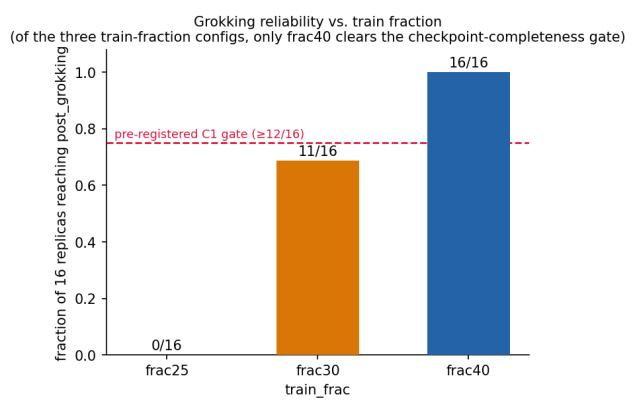
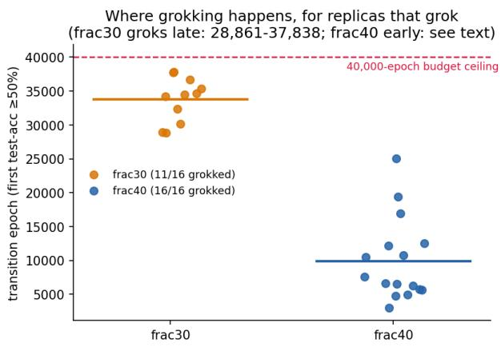
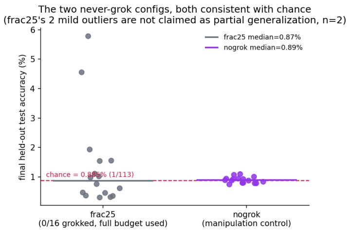
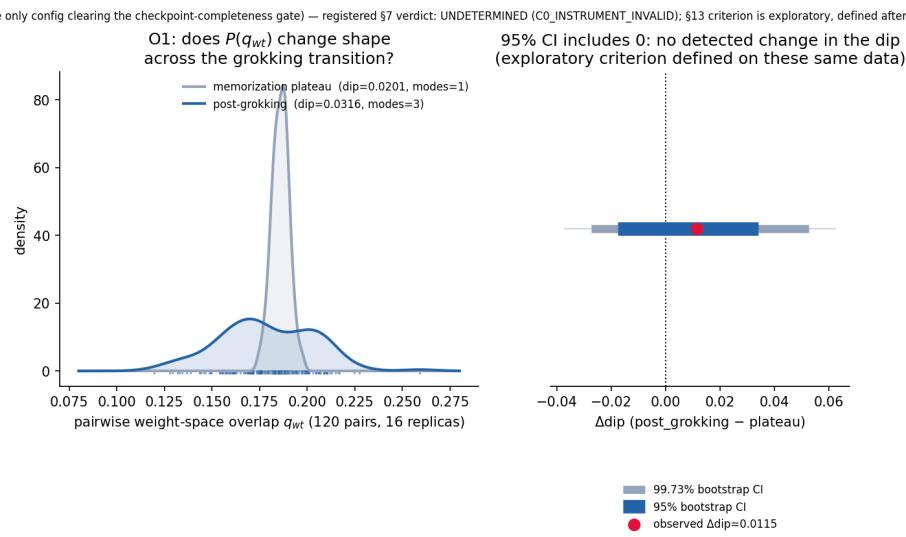
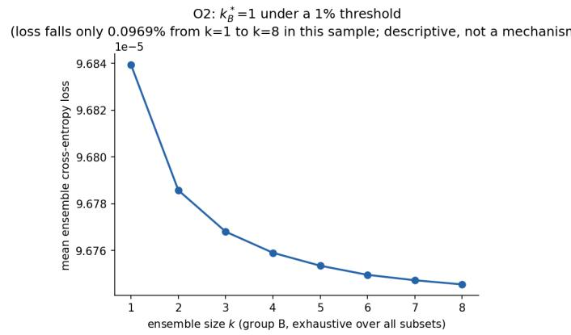

# An Exploratory Replica-Overlap Probe of the Grokking Transition

A. C. Opus, J. Q. Lu∗

Department of Physics, University of Puerto Rico, Mayag¨uez, PR 00680, USA

2026-09-21

## Abstract

We trained 64 independently seeded networks in four configurations, continuing each to sustained convergence or a 40,000-epoch ceiling. We then asked whether an RSB-inspired distribution of pairwise weight overlaps changes across the grokking transition. It is the alignment step, not the overlap statistic, that determines what this registered probe can report. The registered implementation permutes hidden units without the corresponding bias and head-internal permutations and therefore does not preserve the network function. Every q value computed through this alignment inherits the defect; qfn does not, because it is computed from predictions of the unpermuted models. The numerical-precision requirement also failed, and an audit found protocol deviations. Consequently, the pre-registered rule gives no verdict: registered outcome: UNDETERMINED (reason code: C0 INSTRUMENT INVALID). These data provide neither a confirmatory null nor a validated reading of the Parisi order parameter. Only frac40 cleared the 12/16 checkpoint-completeness requirement. For this configuration, a post-hoc criterion applied to the same data gave a Hartigan-dip interval containing zero (95% CI for $\Delta \mathrm { d i p } = [ - 0 . 0 1 7 , 0 . 0 3 4 ] ,$ ), whereas the overlap standard deviation increased by a factor of about 5.6. A post-hoc calibration assigns the dip test zero power at the simulated separations; the interval is therefore uninformative, not evidence of no change. The standard-deviation ratio is the only statistic here with power at the observed efect. Ensemble loss was near-flat only under the pre-specified 1% threshold. Finally, grokking rates of 0/16, 11/16 and 16/16 remain descriptive because train fraction is confounded with split identity.

## 1 Introduction

Grokking occurs when a network’s held-out accuracy jumps from chance to near-perfect performance long after its training loss has saturated [Power et al., 2022]. It is widely described as a phase transition, and recent work treats it explicitly as one. Nanda et al. [2023] identify Fourier-basis “progress measures” that anticipate the transition mechanistically. Two contemporaneous 2026 papers instead use statistical-mechanical descriptions: Cullen et al. [2026] employ the Local Learning Coeficient from Singular Learning Theory, whereas Xu [2026] employ a gradient-“commutator defect” as an early-warning signal. Direct inspection shows that both are single-network, single-trajectory geometric quantities. Neither measures agreement or disagreement among several solutions trained independently on the same task.

Statistical physics provides a tool made for this multi-solution question: the replica method, and in particular Parisi’s replica-symmetry-breaking (RSB) solution of the Sherrington-Kirkpatrick spin-glass model [Sherrington and Kirkpatrick, 1975, Parisi, 1980]. For n independent replicas of a disordered system sharing the same quenched disorder, RSB theory predicts the form of the pairwise overlap distribution $P ( q )$ $\begin{array} { r } { q ^ { a b } = \frac { 1 } { N } \sum _ { i } s _ { i } ^ { a } s _ { i } ^ { b } } \end{array}$ The replica-symmetric (RS) phase gives a single delta function at one value; when RSB sets in, the distribution becomes nontrivial and may be multi-modal [M´ezard et al., 1987]. RSB methods have already been applied to neural networks: to perceptron storage capacity [Gardner and Derrida, 1988], dense associative memories at scale [Albanese et al., 2021], Gibbs samples from a Restricted Boltzmann Machine [Hartnett et al., 2018], trained restricted Boltzmann machines directly [Fachechi et al., 2024], and feedforward networks mapped onto spin models and followed through training [Barney et al., 2024]. However, to our knowledge, and as confirmed by the live literature search in Section 2, these methods have not been used to ask whether the shape of $P ( q )$ changes across the grokking transition itself for genuinely independent replicas rather than for the local geometry of one trajectory.

In this paper, we report a pre-registered attempt to answer that question. The registered statistical test never clears its instrument-validity gate (Section 5.2), so the study does not yield a confirmatory null. On the only configuration eligible for an overlap comparison, the exploratory analysis finds no evidence that the shape of the distribution changes in an RSB-consistent way between the memorization plateau and the post-grokking state. We report that result together with a second observation, not pre-registered, allowed by the same 64- replica sweep: grokking frequency is descriptively associated with train fraction across three fraction×split combinations in which fraction and split identity are confounded (Section 5.1).

## 2 Related Work

Spin-glass constructions applied to neural loss landscapes. Bae and Jeong [2026] adapt the Franz– Parisi construction to finite networks. Using adaptive sequential Monte Carlo, they measure local entropy— the efective volume of low-loss configurations at each distance from a reference solution—and relate it to dataset complexity. This is the published method closest to the order parameter used here, but the objects remain distinct. Their object is an overlap-constrained volume around a single reference, evaluated on trained solutions; ours is a distribution of pairwise overlaps between independently trained replicas, evaluated across a transition. Thus, neither study answers the other’s question: they do not study grokking, and we do not measure local entropy.

Perturbation probes of the grokking plateau. Lin [2026] apply short weight-decay pulses to the pregeneralization plateau. They report a stable dose ordering in the resulting shift of generalization time, together with test-loss barriers between perturbed and baseline checkpoints that collapse toward zero. The barrier result bears on the alignment premise used here (Section 3), but it does not settle that premise. Their barriers join two checkpoints from one training trajectory, one perturbed and one not. Our premise concerns independently initialised replicas compared after permutation alignment. The two quantities difer. Moreover, this study cannot make the comparison directly because its registered alignment cross-check was among the controls that did not run (Section 4, D3). Running that check against their setup is the clear next measurement; we flag it without treating their result as support.

Grokking as a phase transition. Power et al. [2022] define the phenomenon and the task family inherited here: small algorithmic datasets and modular arithmetic. Nanda et al. [2023] give the first mechanistic account for modular addition. Two lines of work map grokking directly onto phase-transition theory. Zunkoviˇc andˇ Ilievski [2022] derive exact critical exponents and grokking-time distributions for solvable rule-learning models through a tensor-network map to perceptron statistical learning theory. By contrast, Rubin et al. [2023] use an adaptive-kernel feature-learning theory to identify the post-grokking state as analogous to the mixed phase following a first-order transition. Cullen et al. [2026] and Xu [2026] instead describe grokking as a basin-selection or geometric phase transition. Direct content checks confirm that their measures concern one network and one trajectory; neither paper contains a cross-replica overlap or RSB order parameter. Nor do the two phase-transition-theory studies use a replica overlap distribution: their stated methods are based on kernels and tensor networks, not replicas.

Two 2026 additions sharpen the same boundary from outside the replica picture. Kataria [2026] map the memorization-to-generalization boundary across 384 configurations of two-hidden-layer MLPs on modular arithmetic. They fit the onset-time power law $( T _ { \mathrm { g r o k } } \propto H ^ { - 0 . { \bar { 2 } } 7 } D ^ { - 2 . 0 4 } \eta ^ { - 0 . 5 0 } \lambda ^ { - 0 . 6 4 } , R ^ { 2 } = 0 . 7 3 2 )$ and locate a sharp weight-decay boundary at $\lambda \gtrsim 1 . 0$ separating grokking from non-grokking configurations. Wang et al. [2026] derive a suficient condition for delayed generalization by bounding a prediction-variation term along the training trajectory. Both are single-network accounts: the first tracks weight norm, whereas the second tracks a function-space oscillation bound. Neither forms an overlap between replicas. The weight-decay boundary is nevertheless the hyperparameter-space counterpart of the non-grokking control arm used here; this study does not perform an external check on it.

Multi-replica structure without RSB language. Other work compares multiple independently trained networks without invoking replica theory. Mode-connectivity studies [Garipov et al., 2018, Draxler et al., 2018] find that simple low-loss paths connect independently trained optima. Permutation-alignment work [Ainsworth et al., 2022, Entezari et al., 2021] argues that this connectivity appears after permutation symmetry has been quotiented out. Accordingly, this study adopts the Git Re-Basin algorithm of Ainsworth et al. [2022] for alignment (Section 3). Liao et al. [2024] apply a spin-glass view to DNN loss landscapes and report a hierarchy among trained solutions reminiscent of RSB, although they obtain it by hierarchical clustering rather than from an overlap distribution. Sharma et al. [2024] complicate the single-basin picture: pairwise (“weak”) alignment does not imply one permutation that aligns all networks simultaneously (“strong” alignment). This suggests structure beyond a trivial RS picture. The lottery-ticket literature [Frankle and Carbin, 2019, Frankle et al., 2020] independently motivates the “ensemble size” half of the present design: a large, redundant family of near-equivalent solutions within one trained network’s solution space.

Explicitly RSB-adjacent 2025–2026 work. Three recent studies approach this question, but construct their replicas diferently. Zhang et al. [2025] (NeurIPS 2025) cast grokking as glass relaxation through Wang-Landau sampling of a Boltzmann-entropy landscape. Direct inspection confirms that the analysis remains single-trajectory, with no cross-replica overlap or RSB/Parisi order parameter. Li [2025] is the closest paper found in this survey: it uses RSB/Parisi-adjacent vocabulary and refers directly to grokking (“Qab curves reveal structural changes. . . after loss saturation”). However, its meaning of “replica” difers from the one required here. Direct inspection of the method shows that its replicas are Gibbs/thermal samples of a Hopfield model derived from one already-trained network’s weights (disorder = the frozen trained weights; replica = a thermal sample of that single derived system). They are not network instances trained independently under shared quenched disorder, the meaning used in the present RSB-inspired design. Chan et al. [2026] introduce a metric called “replica correlation,” but branch their replicas from a shared checkpoint rather than training them independently from scratch. Again, this is diferent from independent draws under the same quenched disorder. Clearly, none of the three studies combines the elements of this design: independently seeded replicas, a full distribution of pairwise overlaps, and a registered decision rule tied to the grokking transition itself.

## 3 Method

Task and architecture. We use the modular-arithmetic addition task of Power et al. [2022] with modulus p = 113 and the architecture pinned in the pre-registration for this study (§B2). We ran four configurations: frac25, frac30, and frac40, with train frac ∈ {0.25, 0.30, 0.40}, and the manipulation control nogrok. The control uses i.i.d. random labels at train frac = 0.30 and the same split seed as frac30; it is therefore a matched-split control and is expected never to generalize. Each configuration contains 16 independently seeded replicas. Training stopped when test accuracy ≥ 99% had remained there for 1,000 consecutive epochs, or otherwise at a 40,000-epoch ceiling.

The stopping condition difers across configurations and determines how their checkpoints must be read. All 16 frac40 replicas stopped early, at final epochs 4,372–26,838. The frac30 outcome is mixed: 11/16 stopped early, whereas the 5 replicas that never grokked exhausted the budget at epoch 39,999, the last index of the zero-based 40,000-epoch budget. All 16 replicas in both frac25 and nogrok likewise exhausted the ceiling without meeting the criterion. Thus, 37 of the 64 runs reached the ceiling, but none belongs to frac40, the only configuration analysed for overlap. Its checkpoints are event-aligned: they were taken a fixed number of epochs after the convergence criterion fired, not at one common absolute epoch. No run was trained deep into a post-transition regime. All 64 runs completed without a crash (≈3.4h wall clock, 4-way parallel, local M3 Ultra, \$0 cloud spend).

Pre-registered gate (C1). Before any overlap analysis, a configuration must clear a checkpoint-completeness gate: at least 12 of its 16 replicas must reach both a memorization-plateau checkpoint and a post-grokking checkpoint within the epoch budget. This is an eligibility criterion. It asks whether enough saved checkpoints exist for a comparison; it is not a power calculation, and no such calculation was run (Section 4, D4). A configuration that misses the gate is reported as RAISE, meaning ineligible for overlap analysis, rather than being folded into a null verdict on RSB.

Alignment, and a defect in it. Pairwise overlap is meaningful only after arbitrary permutation symmetry has been quotiented out. Within each configuration, we align every pair by Git Re-Basin-style weight matching [Ainsworth et al., 2022] over two permutation groups: the 128-dimensional residual stream and the 512- dimensional MLP hidden layer.

The implementation does not realise a function-preserving permutation, and we report the analysis knowing this. A post-hoc audit of pilot/align.py found that apply permutation() permutes only nine \*.weight tensors. Yet every linear layer has a bias, and those biases are nonzero in every checkpoint analysed. Across all sixteen frac40 post-grokking replicas, every component of mlp in.bias, W O.bias and mlp out.bias is nonzero; the median maxi |bi| values are 0.382, 0.084 and 0.020, respectively. Thus, the permutation changes the function instead of preserving it. Specifically, mlp in.bias is not permuted with $\pi _ { \mathrm { m l p } } ,$ while W O.bias and mlp out.bias are not permuted with $\pi _ { \mathrm { r e s i d } } ;$ attention head-internal symmetries are not handled at all. The permuted network is consequently not the same function as the original. The required symmetry has not, in fact, been quotiented out.

Why did the original positive control miss the defect? The synthetic twin was scrambled and restored with the same incomplete apply permutation(). Recovering overlap 1.000000 (vs. −0.010 unaligned) therefore shows only that the array operation is invertible; it never tests whether the twin and the original produce identical logits. The discriminating result for two genuinely diferent replicas (0.182 aligned vs. −0.001 unaligned) does not resolve the problem either. Likewise, the fp32/fp64 agreement check reported below establishes numerical repeatability of the permutation search, not its correctness. Alignment quality may itself vary between checkpoints, so this defect can create or erase structure in $P ( q )$ . It is the principal reason we report the instrument as invalid for the registered question.

Overlap statistic and decision rule. The primary statistic is $q _ { w t }$ , the pairwise weight-space overlap after alignment. During pre-registration review, this measure replaced the originally drafted function-space statistic after a union-bound argument in the pre-registration showed that statistic to be $\geq 0 . 9 8$ for every post-grokking pair as a mathematical consequence of the 99% accuracy threshold alone; no pilot data existed at that point. This replacement is not a protocol deviation. The pre-registration committed on 2026-08-22 at 18:15 names $q _ { w t }$ as the primary statistic in $\ S 7 ^ { 1 }$ . The replicas did not finish training until 2026-08-23 at 00:10, and overlap results were not produced until 02:59. The replacement therefore predates the data to which it was applied and is registered, unlike the §13 criterion discussed below. The pre-registration left both directions open: $P ( q _ { w t } )$ could acquire structure across the transition, becoming wider or more multi-modal after grokking, or its structure could collapse. We registered no one-sided prediction and report none.

We quantify shape change with Hartigan’s dip statistic, implemented in the diptest package and validated on synthetic unimodal/bimodal data. A percentile bootstrap then tests whether $\Delta \mathrm { d i p } = \mathrm { d i p } _ { \mathrm { p o s t } } - \mathrm { d i p } _ { \mathrm { p l a t e a u } }$ excludes zero. This procedure was chosen over a z-score gate because the bootstrap distribution of the dip statistic is non-normal and boundary-truncated. As a precondition for trusting $\Delta \mathrm { d i p }$ , a registered numericalprecision rail requires fp32/fp64 agreement within $1 0 ^ { - 6 }$ for each pair. If the rail fails, the result is registered outcome: UNDETERMINED (reason code: C0 INSTRUMENT INVALID); the $\Delta \mathrm { d i p }$ value is not treated as meaningful.

The function-space measure $q _ { f n } ,$ and why it was replaced. For a pair of replicas, $q _ { f n }$ is the fraction of the shared held-out test set on which their top-1 predictions agree. This is exact arg max label agreement over the 7,661 held-out $( a , b )$ pairs at train fraction 0.40, not a probability or logit distance and not thresholded confidence. Every frac40 replica reaches test $\mathsf { a c c } = 1 . 0 0 0 0 .$ , so all replicas agree with the ground truth, and thus with one another, on every held-out item. This gives $q _ { f n } = 1 . 0 0 0 0 \ ( \mathrm { s d } \ 0 . 0 0 0 0 )$ post-grokking, against 0.023 at the plateau. It is this saturation that motivated the change to $q _ { w t }$ . The saturation follows from the accuracy ceiling and this definition of agreement; it is not a finding about overlap structure.

Ensemble-size measure (O2). As a second, independent probe of the same underlying question, we measure $k ^ { * }$ , the smallest ensemble size—with probabilities averaged over k member replicas—whose loss is within 1% of the full-ensemble loss. The calculation exhaustively enumerates one pre-registered 8+8 replica split. The pre-registration required exhaustive enumeration only through $k = 4$ and a 100-subset bootstrap for $k > 4$ With $n = 8$ , however, the largest exhaustive set is $( _ { 4 } ^ { 8 } ) = 7 0$ subsets. We therefore enumerate every k, which is exact where the registered bootstrap would have resampled, and record the substitution as deviation D7 rather than present it as the registered procedure. In an RSB-consistent picture, diminishing returns from ensembling should track the modality of $P ( q )$

## 4 Protocol deviations

This study departs from its pre-registration in several respects. We collect the departures here because their combined efect, rather than any one of them, reduces the study from a confirmatory test to an exploratory one.

D1. Checkpoints are not at the registered epochs. The pre-registration requires the first epoch at which memorization onset and post-grokking convergence are observed, together with an archive every 500 epochs. Instead, the training code waits for the sustained criterion to finish and saves the weights current at that time. Consequently, memorization plateau.pt is late by 499 epochs and post grokking.pt by 999 epochs; the every-500-epoch archive was never implemented. The reported comparison is not between the two registered states, and the intermediate checkpoints needed to reconstruct the registered analysis do not exist.

D2. The analysed configuration stopped early, so “deep in the grokked phase” does not apply to it. A run stopped when its convergence criterion had held or, if it never met that criterion, at the ceiling (Section 3). The sweep logs give the following values for each configuration:
<table><tr><td>configuration</td><td>final epochs</td><td>mean</td><td></td><td>stopped early / hit ceiling</td></tr><tr><td>frac40</td><td>4,372–26,838</td><td>11,525</td><td>16  /0</td><td></td></tr><tr><td>frac30</td><td>31,063–39,999</td><td>37,001</td><td>11 / 5</td><td></td></tr><tr><td>frac25</td><td>39,999 (all)</td><td>39,999</td><td>0 / 16</td><td></td></tr><tr><td>nogrok</td><td>39,999 (all)</td><td>39,999</td><td>0 / 16</td><td></td></tr></table>

Thus, 37 of the 64 runs reached the ceiling; the blanket statement in an earlier draft that none did was wrong. The point relevant to the overlap analysis is narrower: every frac40 replica—and this is the only configuration analysed—stopped early, at a median well below one third of the budget. The data therefore do not support the claim that these replicas remained deep in a post-transition phase for the rest of training, and we have removed that claim.

D3. Registered controls that were not executed. Several specified procedures did not run: the 10% Entezari alignment cross-check; the alignment-convergence check; the saving and analysis of overlap drift for nogrok and frac30 at matched absolute epochs; the O2 200-split exploratory companion described in the pre-registration as “retained, run, and reported”; and power calibration.py, listed there as a mandatory pre-analysis deliverable. No corresponding file or result exists in pilot/.

The consequence for nogrok is precise. This control was registered to exclude the possibility that continued optimisation and weight decay move P(q) by themselves. Because its overlaps were never analysed at epochs matched to the grokking runs, it does not perform that role here; it shows only that random labels do not generalise. Excluding that alternative would require retraining, which this paper deliberately does not do. We report the existing data and disclose the gap.

D4. The registered power calibration was not run before the analysis; a post-hoc one was run afterwards, and it matters. No pre-analysis power calibration was performed. Accordingly, this paper makes no claim of statistical power by design. The 12/16 gate measures checkpoint completeness, not power. A post-hoc calibration was run on 2026-09-02, after the results reported here. We disclose it because it changes how the dip interval must be interpreted. Simulations of the registered dip statistic at separations of 0.00, 0.01 and 0.02 give power 0.00 at every point. By contrast, the overlap-standard-deviation ratio reaches power 0.758 at a ratio of 1.5 and 1.000 at the observed ratio of 5.56, for a minimum detectable efect of about a 1.5-fold ratio. The dip interval reported below is therefore uninformative, not null-supporting: at the simulated separations, the test could not have detected a change had one been present. The calibration is itself provisional because it is scaled from the route-A frac40 values produced by the defective alignment. We report it as a caveat on the dip result, not as a result. The information ceiling is 16 independent replicas; their 120 pairs are strongly dependent. Moreover, no equivalence margin is reported, so an interval containing zero cannot exclude an efect of practical size.

D5. The alignment implementation is defective. As explained in Section 3, permutations are applied to the weights but not to the corresponding biases, and head-internal symmetries are left untreated. This departure makes the instrument invalid for the registered question; it does not merely leave the instrument under-powered.

D6. The nogrok labels are not the registered ones. The pre-registration specifies “shufled labels: a fixed random bijection-free permutation of the (a + b) mod p targets, drawn once per configuration”. The implementation instead draws one i.i.d. uniform label for each $( a , b )$ pair, once, and shares it across all sixteen replicas. This substitution is deliberate and documented in pilot/model.py. A permutation σ((a + b) mod p) remains a deterministic, generalisable function of $( a + b )$ mod $p ,$ learnable as the modular sum followed by a 113-entry lookup; it would therefore defeat the control’s purpose of supplying no generalisable structure. We judge the substitution to serve the registered intent better than the registered wording, but it remains a deviation and is recorded as such.

D7. O2 uses exhaustive enumeration where a bootstrap was registered. The pre-registration calls for exhaustive enumeration of ensemble subsets when $k \leq 4$ and a 100-subset bootstrap sample when $k > 4 ,$ Instead, the implementation enumerates every k exhaustively. With group size $n = 8$ , the largest subset count is ${ \binom { 8 } { 4 } } = 7 0$ , below the 100 draws required by the registered bootstrap. The substitution therefore makes the curve exact rather than resampled. The code includes an assertion that fails if the count ever exceeds 100, so a larger n cannot silently skip the registered branch. Nevertheless, this is a departure from the registered procedure, and we record it as one.

## 5 Results

## 5.1 Grokking reliability across train fraction

Table 1 and Figure 1 show the C1 gate outcome. This is the first substantive result of the sweep and is independent of the RSB question.
<table><tr><td>Config</td><td>Memoriz.</td><td>Post-grok.</td><td>Gate  $\left( \ge 1 2 / 1 6 \right)$ </td><td>Transition epoch</td></tr><tr><td>frac25</td><td>16/16</td><td> $0 / 1 6$ </td><td>RAISE</td><td></td></tr><tr><td>frac30</td><td>16/16</td><td>11/16</td><td></td><td>RAISE (one short) 28,861–37,838 (mean 33,765)</td></tr><tr><td>frac40</td><td>16/16</td><td>16/16</td><td>PASS</td><td>mean 9,899</td></tr><tr><td>nogrok (control)</td><td>16/16</td><td> $\mathrm { n / a }$  by design</td><td> $\mathrm { n / a }$ </td><td></td></tr></table>

Table 1: Grokking reliability for the three realised fraction-by-split configurations. Train fraction is completely confounded with split identity because each fraction uses a diferent split seed. The panel therefore compares the three realised configurations; it does not estimate an efect of fraction. Among the three train-fraction configurations, only frac40 clears the registered checkpoint-completeness gate for overlap analysis. The frac25 and frac30 configurations are reported as RAISE (ineligible), not as null evidence about RSB. By design, the nogrok control does not participate in this gate. No frac25 replica reaches a post-grokking checkpoint within budget, and nogrok is not expected to do so; the control’s final test accuracy averages 0.90%, compared with the $1 / 1 1 3 \approx 0 . 8 8 5 \%$ chance floor. For the replicas that grok, the transition column reports the first epoch at which test accuracy is $\geq 5 0 \%$

  
Figure 1: Left: fraction of 16 replicas that reach post-grokking in each realised train frac×split configuration. Train fraction is confounded with split identity (one split seed per fraction); the horizontal axis therefore indexes three realised configurations rather than a fraction efect. Of the three train-fraction configurations, only frac40 clears the registered checkpoint-completeness gate. Right: transition-epoch distributions for the two configurations in which at least some replicas grok. The 11 grokked frac30 replicas transition at epochs 28,861–37,838, a span of about 9,000 epochs; even the latest transition leaves 2,161 epochs in the budget.

The RAISE branch behaved as registered: two configurations fell below 12/16 and were withheld from overlap analysis rather than scored. We report that outcome instead of working around it. Correct behavior of this branch should not be mistaken for overall fidelity to the pre-registration, because several other registered components did not run (Section 4). For frac25, 0/16 replicas grokked within the budget. This is a statement about reachability, not evidence against RSB. frac30 misses the gate by one replica; its 11 grokked replicas transition at epochs 28,861–37,838, with a mean transition epoch of 33,765 out of 40,000. We report this range instead of calling the distribution tightly clustered: the span is about 9,000 epochs, and the latest transition still leaves 2,161 epochs in the budget. Thus, these data do not show the runs finishing at the edge. The pattern nevertheless suggests that more of the five ungrokked replicas might have grokked under a larger budget. Extending selected runs after the fact would violate the study’s ordering of registration before the final experiment, so we leave the limitation in place.

Figure 2 shows that the sample means and medians of held-out test accuracy for frac25 and nogrok both lie near the chance floor $( 1 / 1 1 3 \approx 0 . 8 8 5 \% )$ . This comparison is descriptive: we ran no test and specified no equivalence margin. The pattern is the one expected if frac25 fails to generalise within budget rather than generalising imperfectly. Two replicas attain 4.6% and 5.8%, against a median of 0.87%; we report them descriptively, not as evidence of partial generalisation.

  
Figure 2: Held-out test accuracy for the two configurations that never grok within the budget. Both follow the 1/113 chance floor. Two frac25 outliers (4.6% and 5.8%, compared with a median of 0.87% across the 16 replicas) are reported only descriptively (n = 2), not as evidence of partial generalization.

Across the three configurations, the fraction of seeds that grok rises from 0/16 to 11/16 to 16/16. We interpret this only as a descriptive association across three realized fraction×split combinations, not as a function of train fraction. Each fraction uses one split seed (1000, 1001, 1002 respectively), and the three training sets are not nested subsets of a single permutation. Train fraction and split identity are therefore completely confounded: the observed quantities are the success rates of three particular fraction-and-split combinations. Establishing a dependence on fraction would require several split seeds for each fraction, preferably nested, with hierarchical intervals. This observation is nevertheless orthogonal to the RSB hypothesis that motivated the sweep.

## 5.2 O1: overlap-distribution shape across the transition

frac40 is the only configuration statistically powered for overlap analysis (16/16 replicas have both checkpoints). Before the RSB decision rule is evaluated, however, the registered numerical-precision rail fires. Across the full population of 120 pairs in each checkpoint category, 100% of pairs exceed the registered $1 0 ^ { - 6 }$ fp32/fp64 tolerance. The mean discrepancy is $3 . 0 \times 1 0 ^ { - 6 }$ at the plateau and $2 . 8 \times 1 0 ^ { - 5 }$ post-grokking. Under the registered rule, the formal O1 verdict for frac40 is therefore C0 INSTRUMENT INVALID: an inconclusive result, not a null, and reported as such.

We diagnosed the failed gate rather than discarding it. For the full population, we compared the actual discrete alignment choice under fp32 and fp64, not merely the continuous overlap value. The comparison covers all 120 pairs in each of the 2 checkpoint categories, for 240 pair-category combinations. Within each category it checks 15,360 residual-stream and 61,440 MLP permutation elements. There are zero mismatches in either category: fp32 and fp64 always select the same alignment. The discrepancy is consistent with ordinary fp32 summation rounding in a 227,313-parameter normalized dot product. The expected scale is ≈ $\sqrt { N } \epsilon \approx 5 . 7 \times 1 0 ^ { - 5 }$ , the same order of magnitude as, although not an exact match to, the observed mean $2 . 8 \times 1 0 ^ { - 5 }$ . Thus, the discrepancy is consistent with numerical noise rather than alignment instability.

Why the precision rail could not have passed. Two registered mechanisms use this tolerance, but they are not the same rule. The numerical rail excludes any individual overlap value whose fp32/fp64 relative discrepancy exceeds 10−6 $1 0 ^ { - 6 }$ from the $\ S 7 / \ S 8$ statistics. The C0 reason code, by contrast, is assigned to the whole configuration only if this discrepancy exceeds $1 0 ^ { - 6 }$ for more than 5% of pairs. The distinction does not alter the present result because 100% of pairs exceed the tolerance. The rule discussed below is the per-value rail, which requires $\mathrm { f p 3 2 / f p 6 4 }$ agreement within $1 0 ^ { - 6 }$ for every pair.

This tolerance is not commensurate with the arithmetic to which it is applied. The quantity $q _ { w t }$ is a normalized dot product over $N = 2 2 7 { , } 3 1 3$ parameters. In fp32, where machine epsilon is $\epsilon \approx 1 . 1 9 \times 1 0 ^ { - 7 }$ its accumulation has an expected rounding scale of order $\sqrt { N } \epsilon \approx 5 . 7 \times 1 0 ^ { - 5 }$ —roughly $5 7 \times$ the permitted tolerance. This scale argument is heuristic, not a derivation of the error: it assumes random-walk accumulation and does not represent the actual summation order. With that qualification, the observed mean discrepancy of $2 . 8 \times 1 0 ^ { - 5 }$ is consistent with the expected fp32 error scale. A 100% failure rate at this threshold is consequently unsurprising and provides only weak evidence that the overlap computation is unstable. It does not prove that the pipeline is correct. The registered rule contains a defect that we did not anticipate, but that defect does not license the separate claim that the alignment is sound; as Section 3 shows, it is not.

A registered rule cannot be changed after its result is known. We therefore do not loosen the original tolerance or overturn the registered outcome. Instead, we add a supplementary criterion—fp32/fp64 permutation agreement, rather than raw overlap-value tolerance, for $\geq 9 5 \%$ of pairs—and report it beside the original result. This criterion is post-hoc, as the git history shows exactly. The body of the pre-registration was committed on 2026-08-22 at 18:15. The frac40 overlap results were produced on 2026-08-23 at 02:59. The amendment introducing this criterion was committed on 2026-08-23 at 06:54, after both the data and the registered UNDETERMINED outcome were known, and it was applied to the same data. The heading of the pre-registration says so. Consequently, this criterion is exploratory, not a second confirmatory pass.

Under the supplementary criterion, the 16/16-populated frac40 bootstrap gives an observed ∆dip = 0.012 and a 95% percentile-bootstrap interval of [−0.017, 0.034], which contains zero (Figure 3). We report the 95% interval descriptively and do not apply the originally registered 99.73% gate. That gate puts each tail at the 0.135th percentile. With 1,000 resamples, this corresponds to roughly the 1.35th order statistic and is determined by one or two extreme resamples. The reported 95% interval places its tails near the 25th order statistic of the same 1,000 resamples and is therefore much less sensitive to individual draws. Neither interval has calibrated coverage, which is why we use the reported interval descriptively rather than as a decision rule. The replica bootstrap also inserts $q = 1$ whenever a replica is paired with itself—on average ≈ 7.3 of 120 dyads—whereas the observed cross-replica overlaps are only ≈ 0.12–0.26.

What does this result show? The post-hoc interval for the Hartigan dip statistic contains zero. Per D4, the test has no power at the simulated separations, so this interval records a failure to measure, not a measured absence. It does not show that the shape of the distribution is unchanged. The dip measures departure from unimodality and is insensitive to location and scale. Across the same transition, the sample standard deviation of $q _ { w t }$ increases from 0.00444 to 0.02471, a factor of ≈ 5.6, and the post-transition kernel density estimate has three modes. Clearly, there is detectable widening; we do not claim otherwise. Nor does an interval containing zero establish absence. We specified neither an equivalence margin nor a smallest efect size of interest, so this analysis excludes no RSB-consistent change of practical size.

One sanity check supports the mechanical prediction that motivated the choice of $q _ { w t }$ as the primary statistic: the function-space overlap $q _ { f n }$ is at its ceiling after grokking and is therefore uninformative. At post-grokking, $q _ { f n }$ has mean = 1.0000 and $\mathrm { s d } = 0 . 0 0 0 0$ : every pair of grokked replicas agrees on exactly 100% of held-out predictions. Its mean at the plateau i $\mathrm { \ s = 0 . 0 2 3 }$ . Thus, the pre-registered rationale for replacing the metric is not merely plausible; in this sample, $q _ { f n }$ reaches its post-grokking ceiling (1.0000).

## 5.3 O2: ensemble-size diminishing returns

Again, frac40 is the only configuration that clears the checkpoint-completeness gate for O2. The preregistration divides its 16 replicas into two disjoint groups of eight. Group A supplies the mode count $M _ { A } ;$ group B supplies the ensemble curve. The two halves of O2 are thus evaluated on diferent networks. The eight group-A replicas yield ${ \binom { 8 } { 2 } } = 2 8$ pairs, for which we reuse the aligned overlap matrix.

For these 28 post-grokking pairs, the KDE mode count is $M _ { A } = 1 ~ ( \mathrm { m e a n } ~ q _ { w t } = 0 . 1 7 8 , \mathrm { s d } = 0 . 0 2 1 )$ . Its registered status matches that of O1: Registered outcome: UNDETERMINED (reason code: C0 INSTRUMENT INVALID), because the same fp32/fp64 rail covers these pairs. Under the supplementary criterion, the rail labels the result $M _ { A } = 1$ . We say “labels,” not “validates,” because a post-hoc criterion (Section 5.2) cannot confer validity.

  
Figure 3: Results for frac40, the only configuration that clears the checkpoint-completeness gate. Left: KDEs of pairwise weight-space overlap $q _ { w t }$ at the memorization plateau (unimodal, $\mathrm { d i p } = 0 . 0 2 0 1 )$ and after grokking (3 KDE modes, dip $= 0 . 0 3 1 6 )$ ; these are descriptive only. Right: bootstrap ∆dip intervals. Only the 95% interval is interpreted, and it includes zero. The 99.73% interval is shown for reference but is not used as a decision rule (Section 5.2). Registered outcome (§7 of the pre-registration): UNDETERMINED (reason code: C0 INSTRUMENT INVALID). Under the supplementary same-data criterion (§13 of the pre-registration, evaluated on all 120 observed pairs), no change in the dip was detected.

The value $M _ { A } = 1$ does not conflict with the three post-grokking modes in O1, and neither result is evidence about the other. They use diferent samples: 28 pairs from eight replicas here, compared with 120 pairs from all 16 replicas in O1. At this scale, a mode count depends strongly on sample size. We report both results but do not treat them as mutually corroborating.

For group B, the smallest ensemble within 1% of the full 8-member loss is $k _ { B } ^ { * } = 1$ . The loss curve is not constant. Mean loss decreases monotonically from $9 . 6 8 3 9 \times 1 0 ^ { - 5 }$ at k = 1 to $9 . 6 7 4 6 \times 1 0 ^ { - 5 }$ at $k = 8 .$ , a relative decrease of 0.0969%. The decrease simply lies within the pre-specified 1% threshold (Figure 4). We therefore call the curve empirically near-flat in this sample under a 1% threshold; we do not describe the result as mechanically forced.

In particular, the accuracy ceiling does not force $k _ { B } ^ { * } = 1$ . All 16 frac40 replicas reach test $\mathsf { a c c } = 1 . 0 0 0 0$ exactly (min=max= 1.0), but equal accuracy does not imply equal cross-entropy. Perfect classifiers may difer in confidence, and probability averaging may still reduce cross-entropy appreciably. Saturated accuracy makes small, similar per-member losses plausible, but these data cannot establish that quantitative claim: o2 frac40 result.json stores only the mean loss at each k, not the individual member losses or their variance.

The measure faces two further limits. First, the O2 pipeline produced only one $( M _ { A } , k _ { B } ^ { * } )$ point. One point cannot test whether ensemble returns track the modality of $P ( q )$ , so the intended correlation is tested in neither direction. Second, a genuine O2 test would require the individual member losses and their variance, together with the registered 200-split companion (Section 4, D3). We leave these as design lessons rather than adding a post-hoc patch.

## 6 Discussion

Taken as a whole, this study does not give a confirmatory null for its primary question. The registered rule returns UNDETERMINED, and the audit in Section 4 shows that the instrument is invalid for that question. The supported conclusion is narrower and exploratory. For the only configuration that clears the checkpointcompleteness gate, a criterion defined on the same data detects no change in the Hartigan dip statistic of the aligned overlap distribution, while the standard deviation of that distribution increases by a factor of ≈ 5.6 across the same transition. The study neither tests nor claims to test whether RSB efects appear transiently, closer to the transition boundary.

  
Figure 4: Group-B ensemble cross-entropy loss against ensemble size k, exhaustively enumerated over all subsets. The curve is not flat: mean loss at each k decreases monotonically from $9 . 6 8 3 9 \times 1 0 ^ { - 5 }$ at $k = 1$ to $9 . 6 7 4 6 \times 1 0 ^ { - 5 }$ at $k = 8$ . This 0.0969% decrease lies within the pre-specified 1% threshold, giving $k _ { B } ^ { * } = 1$ . We therefore describe the curve as empirically near-flat in this sample and infer no mechanism from it; Section 5.3 retracts the earlier interpretation as a forced floor efect.

A successor hypothesis, ofered as exploratory. Among the three grokking configurations, frac40 reaches its convergence criterion earliest and does so for all 16/16 replicas, whereas frac30 lies at the borderline with 11/16 (Section 5.1). The contrast suggests a natural next question: if an RSB signature exists, is it concentrated near the reliability boundary rather than in a regime that groks readily?

This hypothesis arises from gaps in the experimental design; it is not a prediction derived from spinglass theory. An earlier draft argued that RSB efects in canonical spin glasses are generally strongest near a critical point and weaker deep in an ordered phase, and it used that argument to present the successor hypothesis as physically motivated rather than as a post-hoc rescue. We retract that argument. It is not a general property of canonical models. Indeed, the opposite holds at the low-temperature end of the Sherrington–Kirkpatrick model. Aufinger et al. [2020] prove that, at zero temperature, the Parisi measure of the mixed p-spin model has infinitely many points in its support. This establishes Parisi’s prediction that the SK functional order parameter is not a step function there and implies that the number of levels of broken replica symmetry diverges as the temperature goes to zero. In that model, replica symmetry breaking therefore has more levels, not fewer, deep in the ordered phase. It cannot justify the successor hypothesis.

We ofer no substitute theoretical claim. Establishing the near-boundary regime as the right place to seek RSB structure would require a model-specific derivation absent from this study. Testing the hypothesis would in any event require new training, because frac30 fails the C1 gate and post-hoc power boosting is precisely what the registration prevents.

Nor do we interpret O2 in either direction. Instead, we retain it as a design lesson: a measure selected to avoid one confound—cross-entropy loss in place of $q _ { f n }$ and its accuracy ceiling—can meet a similar ceiling one derivative away after accuracy itself saturates.

## Limitations

(1) The instrument is invalid for the registered question. Because the alignment implementation does not preserve the network function (Section 3), it does not actually quotient out the permutation symmetry on which the analysis depends. Every overlap value in this paper inherits this defect. (2) The registered numerical-precision rail does not clear for frac40; the primary rule therefore returns UNDETERMINED. The dip result uses a criterion defined after inspection of these data and is exploratory rather than confirmatory. (3) No power calibration preceded the analysis. We therefore claim neither that any configuration is adequately powered nor that a minimum detectable efect was pre-specified. The post-hoc calibration in D4 gives the dip statistic no power at the simulated separations, so its interval is uninformative rather than null-supporting. Only one of the three train-fraction configurations clears even the checkpoint-completeness gate; nogrok does not participate in that gate. The RSB question is untested, not falsified, in the other two configurations. (4)

Several registered controls did not run (Section 4, D3). In particular, nogrok does not perform its registered role of excluding continued optimisation and weight decay as causes of change in P(q). (5) The dip statistic tests unimodality only, and no equivalence margin was specified. Thus, the study cannot exclude an RSBconsistent change in width, support, moments, or ultrametric structure. (6) O2 supplies one descriptive point and tests no correlation. (7) The study considers one small algorithmic task—modular addition with p = 113— one pinned architecture, and one split seed per configuration. It supports no claim about larger scales or other task families.

## 7 Successor hypothesis (not pursued in this study)

An originally sketched, wider train-fraction sweep would fix neither the invalid alignment instrument nor the absent pre-analysis power calibration. We therefore do not spend further compute on it. Instead, we register a narrower hypothesis for future work: RSB efects may be a near-transition-boundary phenomenon. Testing this possibility requires 2–4 new train frac configurations clustered near frac30 (e.g. frac28–frac33) to locate the boundary with statistical power, together with an earlier, not-fully-converged checkpoint for an O2-style ensemble test that is not limited by a floor. This hypothesis is open, dated, and recorded in the study’s catalog entry rather than pursued here, consistent with the project’s practice of not following every new question within the study that generated it.

## 8 Conclusion

The registered test of a change in replica overlap across grokking gives registered outcome: UNDETERMINED (reason code: C0 INSTRUMENT INVALID). It is the non-function-preserving alignment, together with the failed precision requirement and the protocol deviations in Section 4, that prevents confirmatory inference. For frac40, a post-hoc interval calculated from the same data contains zero for the Hartigan dip. Because the test has no power at the simulated separations (D4), that interval is uninformative. Yet the overlap standard deviation increases by a factor of about 5.6. Meanwhile, the grokking rates across the three fraction-by-split combinations remain confounded by split identity.

A valid test requires function-preserving alignment, matched-epoch controls, and pre-specified power calibration. Even these corrections are not suficient on their own. Discrete permutation alignment leaves the ReLU positive-rescaling symmetry and the within-head Q/K and V /O basis freedom intact, so a gaugeinvariant order parameter must also handle those degrees of freedom. We report this pilot because its instrument failed in a locatable way and thereby identifies what the next attempt must fix.

## References

Samuel K. Ainsworth, Jonathan Hayase, and Siddhartha Srinivasa. Git re-basin: Merging models modulo permutation symmetries, 2022.

Linda Albanese, Francesco Alemanno, Andrea Alessandrelli, and Adriano Barra. Replica symmetry breaking in dense neural networks, 2021.

Antonio Aufinger, Wei-Kuo Chen, and Qiang Zeng. The SK model is infinite step replica symmetry breaking at zero temperature. Communications on Pure and Applied Mathematics, 2020. arXiv:1703.06872.

Jaeyong Bae and Hawoong Jeong. Dataset complexity shapes finite-distance loss geometry in neural networks. arXiv preprint, 2026.

Richard Barney, Michael Winer, and Victor Galitski. Neural networks as spin models: From glass to hidden order through training, 2024.

Lai Shun Chan, Xiaotian Zhang, Yue Shang, Ge Zhang, and Entao Yang. Tunneling the loss landscape: Bypassing memorization with monte carlo parameter swapping, 2026.

Ben Cullen, Sergio Estan-Ruiz, Riya Danait, and Jiayi Li. A basin-selection perspective on grokking via singular learning theory, 2026.

Felix Draxler, Kambis Veschgini, Manfred Salmhofer, and Fred A. Hamprecht. Essentially no barriers in neural network energy landscape. In Proceedings of the 35th International Conference on Machine Learning (ICML), pages 1309–1318, 2018.

Rahim Entezari, Hanie Sedghi, Olga Saukh, and Behnam Neyshabur. The role of permutation invariance in linear mode connectivity of neural networks, 2021.

Alberto Fachechi, Elena Agliari, Miriam Aquaro, Anthony Coolen, and Menno Mulder. Fundamental operating regimes, hyper-parameter fine-tuning and glassiness: towards an interpretable replica-theory for trained restricted boltzmann machines, 2024.

Jonathan Frankle and Michael Carbin. The lottery ticket hypothesis: Finding sparse, trainable neural networks. In International Conference on Learning Representations (ICLR), 2019. Same verified entry already cited as B1 in projects/P001 wannier attention/refs/refs.bib; not re-verified independently here, cross-referenced instead.

Jonathan Frankle, Gintare Karolina Dziugaite, Daniel M. Roy, and Michael Carbin. Linear mode connectivity and the lottery ticket hypothesis. In Proceedings of the 37th International Conference on Machine Learning (ICML), 2020.

Elizabeth Gardner and Bernard Derrida. Optimal storage properties of neural network models. Journal of Physics A: Mathematical and General, 21(1):271–284, 1988. doi: 10.1088/0305-4470/21/1/031.

Timur Garipov, Pavel Izmailov, Dmitrii Podoprikhin, Dmitry P. Vetrov, and Andrew Gordon Wilson. Loss surfaces, mode connectivity, and fast ensembling of dnns. In Advances in Neural Information Processing Systems (NeurIPS), 2018.

Gavin S. Hartnett, Edward Parker, and Edward Geist. Replica symmetry breaking in bipartite spin glasses and neural networks. Physical Review E, 98:022116, 2018.

Anish Kataria. Quantifying the memorization-to-generalization transition: Scaling laws and phase structure in grokking. arXiv preprint, 2026.

Jun Li. A spin glass characterization of neural networks, 2025.

Hao Liao, Wei Zhang, Zhanyi Huang, Zexiao Long, Mingyang Zhou, Xiaoqun Wu, Rui Mao, and Chi Ho Yeung. Exploring loss landscapes through the lens of spin glass theory, 2024.

Yiming Lin. Canalization before generalization: Grokking as a dynamical probe. arXiv preprint, 2026.

Marc M´ezard, Giorgio Parisi, and Miguel Angel Virasoro. Spin Glass Theory and Beyond: An Introduction to the Replica Method and its Applications, volume 9 of World Scientific Lecture Notes in Physics. World Scientific, Singapore, 1987.

Neel Nanda, Lawrence Chan, Tom Lieberum, Jess Smith, and Jacob Steinhardt. Progress measures for grokking via mechanistic interpretability, 2023.

Giorgio Parisi. The order parameter for spin glasses: a function on the interval 0-1. Journal of Physics A: Mathematical and General, 13(3):1101–1112, 1980. doi: 10.1088/0305-4470/13/3/042.

Alethea Power, Yuri Burda, Harri Edwards, Igor Babuschkin, and Vedant Misra. Grokking: Generalization beyond overfitting on small algorithmic datasets, 2022.

Noa Rubin, Inbar Seroussi, and Zohar Ringel. Grokking as a first order phase transition in two layer networks, 2023.

Ekansh Sharma, Devin Kwok, Tom Denton, Daniel M. Roy, David Rolnick, and Gintare Karolina Dziugaite. Simultaneous linear connectivity of neural networks modulo permutation, 2024.

David Sherrington and Scott Kirkpatrick. Solvable model of a spin-glass. Physical Review Letters, 35(26): 1792–1796, 1975. doi: 10.1103/PhysRevLett.35.1792.

Bojan Zunkoviˇc and Enej Ilievski. Grokking phase transitions in learning local rules with gradient descent,ˇ 2022.

Yuqing Wang, Ioannis G. Kevrekidis, and Mikhail Belkin. A theoretical analysis of generalization dynamics in neural networks under gradient descent with weight decay. arXiv preprint, 2026.

Yongzhong Xu. Early-warning signals of grokking via loss-landscape geometry, 2026.

Xiaotian Zhang, Yue Shang, Entao Yang, and Ge Zhang. Is grokking a computational glass relaxation? In Advances in Neural Information Processing Systems (NeurIPS), 2025.