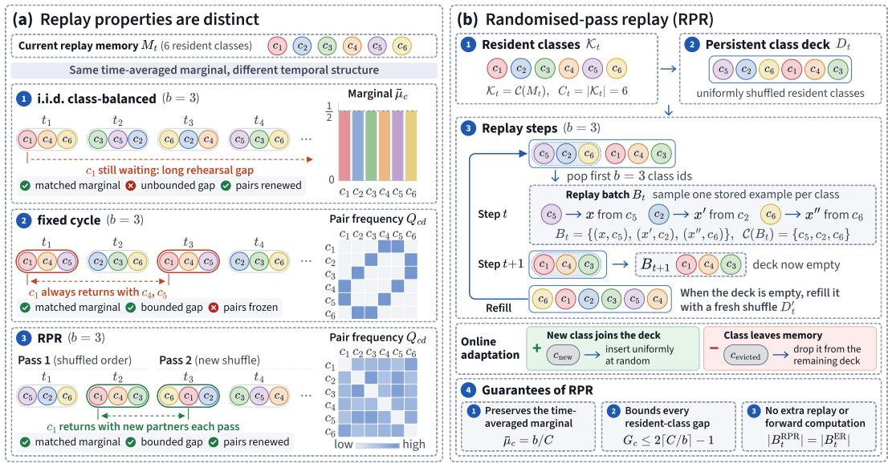
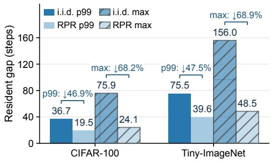

# BEYOND CLASS MARGINALS: BOUNDING REHEARSAL GAPS WITHOUT FREEZING CLASS CO-OCCURRENCE

Congren Dai1 Nat Roongjirarat2 Fei Ye3† 1Imperial College London 2King’s College London 3University of Electronic Science and Technology of China

## ABSTRACT

Class-balanced replay controls class frequency but does not determine the interval between successive replay appearances of a class. We study this interval, the rehearsal gap, separately from the class marginal and class co-occurrence, and introduce randomised-pass replay (RPR), which visits each resident class once per shuffled pass. For a fixed set of C resident classes and replay batch size b ≤ C, RPR preserves the balanced time-averaged class marginal and bounds every gap by 2⌈C/b⌉ − 1; a churn-conditional bound applies while the resident set changes. The scheduler uses no future class information and adds no replay examples or forward passes. In a linear-head ER-ACE diagnostic, joint absence from the incoming and replay batches produces a one-sided classifier-bias gradient. Longer absence episodes are associated with larger negative bias displacement, and removing the incoming-loss mask attenuates the scheduling effect. In the primary ER-ACE experiments, RPR improves final average accuracy by 0.72–1.67 percentage points relative to independent class-balanced retrieval under reservoir storage, with positive effects also observed under balanced storage. Pretrained ViTs show positive effects on the tested LT10 streams with small replay batches, while matched larger-batch controls show no material effect. Fixed-cycle and reused-pass controls change more than one temporal statistic, so the experiments do not isolate rehearsal-gap length from all other forms of temporal dependence. The accuracy effects depend on the learner and operating regime.

## 1 INTRODUCTION

Online continual learning requires a model to acquire new knowledge while retaining classes that become infrequent or disappear from the incoming stream. Experience replay addresses this by revisiting a small memory of past examples (Chaudhry et al., 2019). Under an imbalanced stream, storage alone does not determine when retained examples are replayed. Storage-side balancing (Chrysakis & Moens, 2020; Buzzega et al., 2021) controls which classes occupy memory, and classbalanced retrieval controls their expected share of a replay batch. Neither specifies when a stored class returns.

Replay order determines the sequence of gradient updates even when aggregate class exposure is unchanged. Equal average exposure can coexist with long periods of absence, during which other classes continue to update the model. We call the interval between successive replay appearances of a class its rehearsal gap. Table 4 gives a fixed-memory example. On a fixed balanced memory with 200 classes and eight replay examples per step, independent balanced retrieval and a shuffled-pass schedule have mean gaps of 24.82 and 25.00 steps, and maximum gaps over 3,000 steps of 263 and 49, respectively.

We distinguish three properties of a replay sequence: the class marginal is how often a class appears; the rehearsal gap is how long it waits between appearances; and class co-occurrence is which classes share a batch (Figure 1a). On a fixed resident set larger than the replay batch, independent classbalanced retrieval gives a geometric rehearsal-gap distribution with unbounded support. Fixed class cycling (Hickok & Kudithipudi, 2024) gives bounded gaps and repeated pairings determined by the cycle. At a fixed replay budget, we study schedules that bound resident-class rehearsal gaps while preserving the fixed-set time-averaged marginal and resampling class co-occurrence across passes, and evaluate their effect on learning.

  
Figure 1: Replay properties and randomised-pass replay (RPR). (a) On a fixed resident set with replay batch $b \leq C .$ , independent balanced retrieval, fixed cycling, and RPR have the same timeaveraged class marginal $b / C$ but may differ in gap tails and class co-occurrence. (b) RPR keeps a persistent shuffled deck of resident classes, samples one stored example per selected class, and reshuffles when the deck empties. On a fixed resident set, it preserves $\bar { \mu } _ { c } ~ = ~ b / C$ and bounds $G _ { c } \leq 2 \lceil C / b \rceil - 1$ . It adds no replay examples or forward passes.

Randomised-pass replay (RPR) maintains a persistent shuffled deck of resident classes. Each class is visited once per pass, after which the deck is reshuffled (Figure 1b). The deck is updated as classes enter or leave memory. The scheduler requires no future class identities, total class count, or task boundaries. On a fixed set of C resident classes with replay batch $b \leq C$ , its time-averaged marginal is balanced and every gap is bounded by $2 \lceil C / b \rceil - 1$ . A churn-conditional bound covers changing memory; exact marginal equality applies only in the fixed-set limit.

The scheduling guarantees do not imply an accuracy improvement. We analyse a linear-head ER-ACE diagnostic (Caccia et al., 2022) to relate replay gaps to parameter updates. The incomingloss mask removes a seen but absent class from incoming competition, while replay examples of other classes continue to contribute a positive gradient to its classifier bias. During joint absence, the class-specific bias receives gradients of the same sign at every step while the class remains resident. We evaluate this mechanism using measured bias displacement and mask interventions. The primary accuracy study uses a bias-free cosine head. The bias-drift analysis therefore applies directly to the linear-head diagnostic and does not by itself explain the primary cosine-head results. We compare fixed cycling, reused permutations, storage policies, and replay budgets to separate scheduling effects from storage balance. Pretrained-backbone controls evaluate the same retrieval intervention outside the primary ER-ACE configuration.

The shuffled-pass primitive is standard; our contributions concern its use in replay. 1) Replayschedule decomposition. We distinguish class marginal frequency, rehearsal gaps, and class cooccurrence as separate properties of a replay sequence. 2) Scheduling guarantees. For RPR, we derive the fixed-set time-averaged marginal, a worst-case resident-class gap bound, and a churnconditional bound. We also give a lower bound on the maximum gap of any recurrent schedule and, under the stated conditions, the fixed-partition structure induced by attaining it exactly. 3) Mechanistic and empirical evaluation. We measure gap-conditioned bias displacement in ER-ACE and evaluate retrieval order across storage policies, replay losses, replay budgets, and pretrained backbones. The temporal controls change more than one schedule statistic, so the experiments do not isolate rehearsal-gap length from all other forms of temporal dependence.

## 2 RELATED WORK

Storage and retrieval. Reservoir sampling (Vitter, 1985) retains a stream-uniform sample and is standard in online continual learning (Chaudhry et al., 2019). CBRS (Chrysakis & Moens, 2020) and Balanced Reservoir Sampling (BRS) (Buzzega et al., 2021) instead favour balanced occupancy; GSS diversifies stored gradients (Aljundi et al., 2019b), and InfoRS gates reservoir eligibility by information (Sun et al., 2022). These methods modify memory contents rather than the temporal order of class retrieval. Among retrieval methods, MIR selects examples whose loss increases after a virtual incoming update (Aljundi et al., 2019a), and ASER uses a Shapley-value proxy (Shim et al., 2021). Both optimise per-example criteria rather than the class-level rehearsal-gap statistics studied here. CeCR samples classes without replacement within a joint retrieval, storage, and loss design (Sun et al., 2024). We compare schedules at fixed storage, loss, and replay budget; exact time-averaged marginal matching applies to the fixed-resident-set analysis.

Cyclic scheduling and reshuffling. The Balanced primitive of Hickok & Kudithipudi (2024) continues through classes in fixed class-id order; their separate deduplication schedules limit repeated examples. We include this class-cycle primitive as a baseline. It gives bounded class gaps and, on a fixed resident set, a repeated class partition when b | C. Task-level scheduling instead learns which previous tasks to replay (Klasson et al., 2023), whereas RPR orders resident classes without task boundaries. Random reshuffling is well established for finite-sum optimisation (Gurb¨ uzbalaban¨ et al., 2021; HaoChen & Sra, 2019; Mishchenko et al., 2022). RPR applies it to a changing set of resident class identifiers instead of a static set of objective components. Our analysis concerns replay gaps, class co-occurrence, and their interaction with learning; it does not use finite-sum convergence results.

Replay losses. ER-ACE masks seen-but-absent classes from the incoming loss (Caccia et al., 2022). DER regresses stored logits, and DER++ adds supervised replay cross-entropy (Buzzega et al., 2020). Contrastive and prototype-based methods couple replay examples through batch-level objectives (Mai et al., 2021; Guo et al., 2022; Wei et al., 2023). Definition 1 characterises replay terms in which each example’s gradient contribution is independent of the other examples in the batch; Section 5.2 relates this property to full training trajectories.

## 3 SETTING AND NOTATION

A task-free online learner processes a stream ${ \cal S } = ( ( x _ { i } , y _ { i } ) ) _ { i = 1 } ^ { N }$ once, without task-boundary signals. At step t, it receives an incoming minibatch $A _ { t }$ , retrieves $B _ { t }$ from a memory $M _ { t }$ of at most m previously observed examples, and takes one gradient step on

$$
\begin{array} { r } { \mathcal { L } ( \theta _ { t } ) = \ell ^ { \mathrm { o n } } ( \theta _ { t } ; A _ { t } ) + \ell ^ { \mathrm { r e } } ( \theta _ { t } ; B _ { t } ) . } \end{array}\tag{1}
$$

The requested replay budget is $n _ { t } \ = \ \operatorname* { m i n } ( b , | M _ { t } | )$ and the realised size obeys $\left| B _ { t } \right| \le n _ { t } \ ( \mathrm { A p } \ / .$ pendix D); an empty memory contributes no replay loss. Write ${ \mathcal { C } } ( B ) = \{ y : ( x , y ) \in B \}$ and $\begin{array} { r } { \mathbf { \bar { \mathcal { S } } } _ { t } = \bigcup _ { s < t } \mathcal { C } ( A _ { s } ) } \end{array}$ for the classes in a batch and those seen so far. The scheduler uses only the current resident set

$$
\begin{array} { r } { K _ { t } = \mathcal { C } ( M _ { t } ) , \qquad C _ { t } = | \mathcal { K } _ { t } | . } \end{array}\tag{2}
$$

It requires neither the identities nor the number of future classes: a class enters $\textstyle { \mathcal { K } } _ { t }$ only after observation and storage. We use C for a fixed resident count in the analysis, not an advance input to RPR. Storage determines which examples remain in $M _ { t }$ ; retrieval determines which return in $B _ { t }$ Section 5.2 varies these rules independently.

## 4 RANDOMISED PASS REPLAY

## 4.1 REPLAY MARGINALS, GAPS, AND CO-OCCURRENCE

For a retrieval policy π, distinguish the history-conditional inclusion probability $\mu _ { c } ^ { ( t ) } = \mathrm { P r } [ c \in$ $\mathcal { C } ( B _ { t } ) \mid \mathcal { F } _ { t } ]$ , conditional on the history available before retrieval at step t, from the time-averaged marginal

$$
\bar { \mu } _ { c } ( \pi ) = \operatorname* { l i m } _ { N \to \infty } \frac { 1 } { N } \sum _ { t = 1 } ^ { N } \mathrm { P r } [ c \in \mathcal { C } ( B _ { t } ) ] ,\tag{3}
$$

when this limit exists on a fixed resident set. Finite online runs use empirical visit frequencies. I.i.d. class-balanced retrieval independently selects b distinct classes per step, giving both marginals $b / C$ for $b \leq C .$ . RPR does not preserve the history-conditional inclusion probability, since classes already visited in the current pass are temporarily unavailable. We use matched marginal only for the fixed-set time average in Equation (3). Under class arrivals, evictions, and incomplete passes, finite-horizon empirical frequencies may differ across retrieval policies. The online comparisons match storage, loss, and replay size, but do not establish exact per-class frequency equality under churn.

The empirical frequency over $T$ steps is $\begin{array} { r } { \hat { \mu } _ { c } = T ^ { - 1 } \sum _ { t = 1 } ^ { T } \mathbf { 1 } [ c \in \mathcal { C } ( B _ { t } ) ] } \end{array}$ . Equal replay size fixes the total example budget but does not fix each $\hat { \mu } _ { c } ,$ and a similar aggregate mean gap does not establish per-class equality.

Let $\tau _ { c } ( k )$ denote the k-th replay appearance of class c. Its rehearsal gap and the empirical frequency of a distinct class pair are

$$
G _ { c } ( k ) = \tau _ { c } ( k + 1 ) - \tau _ { c } ( k ) , \qquad Q _ { c d } ^ { ( N ) } = \frac { 1 } { N } \sum _ { t = 1 } ^ { N } \mathbf { 1 } [ \{ c , d \} \subseteq \mathcal { C } ( B _ { t } ) ] .\tag{4}
$$

Neither statistic is determined by $\bar { \mu } _ { c } .$ For i.i.d. balanced retrieval on a fixed set with $b < C$

$$
G _ { c } \sim \mathrm { G e o m e t r i c } ( p ) , \qquad \mathbb { E } [ G _ { c } ] = C / b , \qquad \operatorname* { P r } [ G _ { c } > g ] = ( 1 - p ) ^ { g } , \qquad p = b / C .\tag{5}
$$

For i.i.d. balanced retrieval, $\mathbb { E } [ G _ { c } ] = C / b ,$ with unbounded gap support when $b < C$ . Fixed class cycling gives bounded rehearsal gaps and, when $b \mid C ,$ , repeated class pairings within a fixed partition (Figure 1a).

## 4.2 RANDOMISED PASS SCHEDULER

RPR maintains a persistent deck of resident classes not yet visited in the current pass. When $b \leq C _ { t }$ the scheduler removes b class identifiers from the deck and samples one stored example from each selected class. When the deck empties, it is refilled with a uniform random permutation of $\textstyle { \boldsymbol { \mathcal { K } } } _ { t }$ . If a pass boundary falls within a minibatch, classes already visited in that step move to the end of the new permutation; this prevents duplicates when $b \leq C _ { t }$ . A newly resident class enters a uniformly random position among unvisited entries, and an evicted class leaves the deck. Insertions and evictions update the current deck without restarting the pass. The scheduler requires no information about future classes. If $b \geq C _ { t }$ , retrieval covers every resident class. Appendix D specifies the complete rule, including warm-up and within-class sampling.

Proposition 1 (Preserved time-averaged marginal). On a fixed resident set of size C with $b \leq C _ { : }$ RPR visits each class once per pass. Hence $\bar { \mu } _ { c } = b / C$ and the event-average gap is $\mathbb { E } [ G _ { c } ] = C / b ,$ as under i.i.d. balanced retrieval. The history-conditional per-step marginals need not coincide.

Proposition 2 (Bounded gap on a fixed resident set). Under the same conditions, every class and visit satisfy

$$
G _ { c } ( k ) \leq 2 \Big \lceil \frac { C } { b } \Big \rceil - 1 .\tag{6}
$$

The bound is tight when b divides C: a class can appear in the first batch of one pass and the last batch of the next.

Proof. Let $q = \lceil C / b \rceil$ , and let a pass start after a consumed class slots. Its last slot is $a + C$ . Write $a + C = h b + r .$ , with $0 \leq r < b$ . If $r > 0$ , its final r classes share a batch with the next pass and move to the end of that next pass. A class outside this deferred set therefore appears among the first $C - r$ slots of the next pass, no later than batch $h + q$ . Its preceding appearance is no earlier than batch $\lfloor a / b \rfloor + 1$ , so its gap is at most $h + q - \lfloor a / b \rfloor - 1 \leq 2 q - 1$ . A deferred class instead appears in batch $h + 1$ and returns no later than $h + \lceil ( C + r ) / b \rceil$ , giving a gap at most $q \leq 2 q - 1$ When $r = 0$ , the first case covers every class. Every pass remains a permutation and no step repeats a class for $b \leq C ;$ consequently each complete pass contributes one class visit and $C$ slots, which also proves Proposition 1. □

The bound does not assert tightness at other ratios. Online storage requires a separate statement.

Proposition 3 (Churn-conditional bound). Suppose c remains resident between consecutive replay appearances. Let $C _ { \mathrm { m a x } }$ be the largest resident count during this interval and I the number of class insertions into the deck. Then

$$
G _ { c } ( k ) \leq \Big \lceil \frac { 2 C _ { \operatorname* { m a x } } - 1 + I } { b } \Big \rceil .\tag{7}
$$

This conservative slot-count bound need not equal Equation (6) even when $I = 0 .$ . Both require residency: no retrieval rule bounds the latency of a class that storage removes entirely. We distinguish resident gaps, whose endpoints and intervening steps retain the class in memory, from wall $g a p s .$ which also include periods of eviction. Section 5.2 tests the churn bound inside the online runs.

## 4.3 GAP BOUNDS AND CO-OCCURRENCE

Any recurrent schedule has maximum rehearsal gap at least $\lceil C / b \rceil$ , since fewer than $\lceil C / b \rceil$ steps cannot cover all $C$ classes. Proposition 2 gives $\dot { G } _ { c } ( k ) \le 2 \dot { \lceil \cal C / b \rceil } - 1$ When $b \ | \ C .$ , attaining $G _ { c } ( k ) = C / b$ for every class and visit forces a fixed partition into batches: each class always shares its batch with the same $b - 1$ classes. This statement requires exact equality and does not extend to schedules whose gaps only approach the lower bound.

Each RPR pass induces a new uniform partition when $b \mid C ,$ , with expected pair frequency

$$
\mathbb { E } [ Q _ { c d } ] = \frac { b } { C } \frac { b - 1 } { C - 1 } \quad ( c \neq d ) .\tag{8}
$$

A fixed partition restricts each class to the $b - 1$ classes in its block. Under this divisibility condition, every distinct class pair has the co-occurrence probability in Equation (8). This co-occurrence result alone does not imply an improvement in predictive accuracy.

Over n rehearsal gaps per class, a union bound gives an i.i.d. maximum-gap scale of $O ( \log ( n C ) / \log ( 1 / ( \bar { 1 } ^ { \cdot } - p \bar { ) } ) )$ for $p = b / C < 1$ . A single-class lower bound has the same logarithmic dependence. The RPR bound is independent of $n .$

When $b \mid C$ and $C / b$ increases, the ratio between the i.i.d. and RPR gap variances approaches 6, corresponding to a standard-deviation ratio of ${ \sqrt { 6 } } \approx 2 . 4 4 9$ . The four static configurations in Table 4 give standard-deviation ratios 2.41, 2.42, 2.38, and 2.43. Appendix E gives the derivations and the convex gap-cost result. These results characterise the replay schedule and do not imply an accuracy improvement; the learning consequences depend on the loss and the evolving parameters.

## 4.4 INTERACTION WITH ER-ACE

We first consider replay losses that decompose over examples.

Definition 1 (Composition-blind replay). A replay term is composition-blind if it decomposes over examples,

$$
\ell ^ { \mathrm { { r e } } } ( \theta ; B ) = \sum _ { ( x , y ) \in B } \phi ( \theta ; x , y ) ,\tag{9}
$$

with per-example ϕ independent of the other examples, including their labels and any joint forward computation.

If Equation $( 9 )$ holds then $\begin{array} { r } { \nabla _ { \theta } \ell ^ { \mathrm { r e } } ( \theta ; B ) = \sum _ { ( x , u ) \in B } \nabla _ { \theta } \phi ( \theta ; x , y ) } \end{array}$ , so one example’s contribution is unaffected by its batchmates’ labels, and

$$
\mathbb { E } _ { B \sim \pi } \big [ \nabla _ { \theta } \ell ^ { \mathrm { r e } } ( \theta ; B ) \big ] \ = \ \sum _ { ( x , y ) \in M _ { t } } \operatorname* { P r } _ { \pi } \big [ ( x , y ) \in B \big ] \nabla _ { \theta } \phi ( \theta ; x , y ) ,\tag{10}
$$

which depends only on the per-example inclusion probabilities. At fixed $( \theta , M _ { t } )$ , two policies that match those probabilities have the same one-step expected replay gradient. Their full training trajectories need not coincide: class-balanced and uniform retrieval need not match per-example probabilities in a finite, uneven store, and temporal dependence changes the future parameters at which gradients are evaluated.

Dark Experience Replay (Buzzega et al., 2020) satisfies Definition 1 for a batch-independent forward map. Its replay term is α $\lVert f _ { \boldsymbol { \theta } } ( x ) - z \rVert _ { 2 } ^ { 2 }$ summed over the batch, a per-example regression on stored logits that does not depend on the class label.

ER-ACE applies standard cross-entropy to replay examples and masks previously observed classes that are absent from $A _ { t }$ in the incoming-example softmax (Caccia et al., 2022). For a seen class c absent from both batches, the incoming term supplies no class-c logit gradient, while replay supplies only positive softmax contributions. To obtain an explicit parameter-level statement, consider a nonempty replay batch and the linear-head classifier $z _ { c } ( x ) = w _ { c } ^ { \top } h _ { \theta } ( x ) + \beta _ { c } .$

$$
\frac { \partial \mathcal { L } _ { t } } { \partial \beta _ { c } } = \sum _ { x \in B _ { t } } p _ { c } ( x ) > 0 \qquad \big ( c \in \mathcal { S } _ { t } \setminus [ \mathcal { C } ( A _ { t } ) \cup \mathcal { C } ( B _ { t } ) ] \big ) .\tag{11}
$$

Here $p _ { c } ( x )$ is the replay softmax probability for class c at input x. A replay gap of $g$ steps has $g - 1$ interior steps without rehearsal. If the class also remains absent from the stream, each contributes one-sided bias pressure; plain gradient descent decreases $\beta _ { c }$ at each such step. Gap length alone does not fix the magnitude, since the probabilities change during training.

Equation (11) characterises the bias gradient and does not imply a decrease in every class-c logit. Shared representations couple outputs through the empirical neural tangent kernel (Jacot et al., 2018); momentum and weight decay introduce additional terms described in Appendix E.3. The experiments measure realised bias displacement and mask–schedule interactions directly. The proposed mechanism predicts sensitivity to long replay gaps at fixed mean rehearsal frequency. The primary cosine classifier has no bias parameter, so Equation (11) applies only to the linear-head diagnostic and does not directly explain the gains of the primary classifier.

## 5 EXPERIMENTS

The experiments evaluate replay order under class-balanced retrieval, rehearsal gaps in online runs, the linear-head ER-ACE mechanism, and sensitivity to replay budget, storage policy, loss, and backbone.

## 5.1 EXPERIMENTAL SETUP

Benchmarks and streams. The evaluation uses class-incremental streams from CIFAR-10 and CIFAR-100 (Krizhevsky & Hinton, 2009), Tiny-ImageNet (Le & Yang, 2015), and ImageNet-R (Hendrycks et al., 2021). The CIFAR-10 control uses a replay batch that accommodates every class once all classes are resident. The main experiments use CIFAR-100 and Tiny-ImageNet with balanced streams or exponential long-tailed streams at imbalance factors $\rho \in \{ 1 0 , 1 0 0 \}$ . Within each task, a seeded random permutation assigns class rank r, and the retained example count is $n _ { r } = \mathrm { m a x } \{ 1 , \mathrm { r o u n d } ( n _ { \mathrm { m a x } } \rho ^ { - \gamma / ( C _ { \mathrm { t a s k } } - 1 ) } ) \}$ }. This is a within-task adaptation of the standard artificial long-tailed CIFAR construction (Cui et al., 2019). ImageNet-R is used for the pretrained-backbone evaluation.

Methods and baselines. ER-ACE with a randomly initialised ResNet-18 (He et al., 2016) serves as the primary learner. We additionally examine DER and DER++ (Buzzega et al., 2020), and Online Continual Learning through Mutual Information Maximization (OCM) (Guo et al., 2022). These additional losses test whether retrieval effects depend on the replay objective. The pretrained-backbone study uses a 224-pixel ViT-B/16 (Dosovitskiy et al., 2021), pretrained on ImageNet-21k and AugReg fine-tuned on ImageNet-1k (Steiner et al., 2022). We load the exact vit\_base\_patch16\_224.augreg2\_in21k\_ft\_in1k checkpoint from timm (Wightman, 2019). Retrieval policies include uniform sampling, i.i.d. class-balanced sampling, fixed class cycling, MIR, and RPR. Reservoir sampling and Balanced Reservoir Sampling provide the two storage policies in the storage–retrieval study.

Evaluation. We report final task-mean test accuracy and mean paired differences in percentage points. Comparisons use ten paired random seeds and two-sided 95% Student-t confidence intervals. Full paired-test results include counts of positive paired differences. We define an effect as material when its relative magnitude exceeds 2% and its confidence interval excludes zero. Separate validation runs select the tested method and regimes without entering test comparisons.

Table 1: Storage and retrieval contrasts in final accuracy. Entries give differences in percentage points (relative differences in parentheses), with 95% paired confidence intervals where shown. Storage compares BRS with reservoir at uniform retrieval; draw compares i.i.d. class-balanced with uniform retrieval at reservoir storage; both compares BRS with RPR against reservoir with uniform retrieval. RPR comparisons specify the storage rule (R: reservoir). For RPR–fixed contrasts, stars denote Holm-adjusted p < .05/.01/.001. Full accuracies and paired tests appear in Appendices G and H.
<table><tr><td>Contrast</td><td>CIFAR-100 Balanced</td><td>CIFAR-100 LT10</td><td>CIFAR-100 LT100</td><td>Tiny-ImageNet LT10</td></tr><tr><td>storage</td><td>+0.15 (+0.8%) [−0.44, 0.73]</td><td>+1.86 (+19.7%) [1.33, 2.40]</td><td>+0.88 (+13.2%) [0.48,1.28]</td><td>+0.99 (+14.0%) [0.48,1.51]</td></tr><tr><td>draw</td><td>+0.67 (+3.6%) [0.10, 1.23]</td><td>+1.80 (+19.0%) [1.30, 2.30]</td><td>+1.31 (+19.6%) [0.54, 2.08]</td><td>+0.66 (+9.4%) [0.23, 1.10]</td></tr><tr><td>RPR-i.i.d. | BRS</td><td>+1.22 (+6.3%) [0.43, 2.02]</td><td>+1.38 (+12.1%)</td><td>+0.58 (+7.0%) [0.25, 0.91]</td><td>+1.77 (+22.4%)</td></tr><tr><td>RPR-fixed | BRS</td><td>+1.91*** (+10.3%) [1.48, 2.35]</td><td>[1.02, 1.74] +1.03**(+8.8%) [0.56, 1.51]</td><td>[−0.14, 0.43]</td><td>[1.37, 2.17] +0.14 (+1.6%) +1.13*** (+13.2%) [0.84, 1.42]</td></tr><tr><td>RPR-i.i.d. | R</td><td>+1.19 (+6.1%) [0.75, 1.63]</td><td>+1.40 (+12.5%) [1.06, 1.74]</td><td>+0.72 (+9.0%) [0.29, 1.16]</td><td>+1.67 (+21.5%)</td></tr><tr><td>RPR-fixed |R</td><td>+2.06*** (+11.1%)</td><td>+0.59* (+4.9%)</td><td>+0.47 (+5.6%)</td><td>[1.28, 2.06] +0.97** (+11.5%)</td></tr><tr><td></td><td>[1.53, 2.58]</td><td>[0.13, 1.05]</td><td>[-0.04, 0.97]</td><td>[0.46, 1.49]</td></tr><tr><td>both</td><td>+1.80 (+9.6%)</td><td>+3.38 (+35.8%)</td><td>+2.26 (+33.8%)</td><td>+2.60 (+36.6%)</td></tr></table>

Implementation details. All experiments process each stream once. The primary ResNet-18 ER-ACE setting uses SGD with learning rate 0.03, no momentum or weight decay, incoming batch size 32, and replay batch size 8. CIFAR-100 and Tiny-ImageNet use ten class-incremental tasks of ten and twenty classes, respectively, with random crops, horizontal flips, and dataset-specific normalisation. Task boundaries organise the stream and evaluation, but do not enter the replay rule. Buffer capacities range from 200 to 5,120 where indicated. The pretrained ViT setting uses a replay batch of 32 examples unless the replay-budget ablation states otherwise. Accuracy is evaluated with an exponential moving average of the weights over a 1,024-sample horizon (Soutif-Cormerais et al., 2023), held fixed within every comparison. Section F reports the corresponding comparison without the EMA readout. Appendix D gives the RPR pseudocode, and the remaining appendices provide complete paired statistics and additional controls.

Classifier and comparison scope. The primary ER-ACE accuracy study uses a normalised cosine classifier with scale 10 and no bias. The bias-drift, mask–schedule, renewal, and buffer diagnostics use an ordinary linear classifier with bias, with the same configuration across each block. This permits bias-displacement measurements and limits direct mechanistic attribution to that head. The from-scratch accuracies characterise a one-pass, small-replay-budget regime; they are not a reproduction of published ER-ACE scores under other training protocols. Comparisons estimate retrieval effects within each protocol, including the pretrained setting, and do not establish generality across training regimes.

## 5.2 RESULTS

Retrieval order and storage balance. The primary comparison replaces independent classbalanced retrieval with RPR at fixed storage, learner, and replay budget. Table 1 reports gains of 0.72–1.67 percentage points under reservoir storage. These online comparisons test the scheduling policy as a whole; Proposition 1 does not guarantee identical finite-run replay frequencies in their evolving memories. Crossing storage and retrieval rules evaluates scheduling at different levels of storage imbalance. On CIFAR-100 LT10, BRS reduces the occupancy spread from 15.4× to 1.02×. Within BRS, RPR increases accuracy by 1.38 points over independent balanced retrieval, with all ten paired differences positive. The mean RPR effect is positive under both storage rules in every tested stream.

a) Gap-tail reduction  

b) Pretrained ViT-B/16 on LT10 streams
<table><tr><td>CIFAR-100</td><td>-0.14</td><td>-0.29</td></tr><tr><td>b=32,M=500</td><td>[-0.92, +0.64]</td><td>[-1.08, +0.51]</td></tr><tr><td>CIFAR-100</td><td>+2.08</td><td>+0.52</td></tr><tr><td>b=8,M=500</td><td>[+1.14, +3.02]</td><td>[-0.60, +1.63]</td></tr><tr><td>CIFAR-100</td><td>+3.51</td><td>+0.26</td></tr><tr><td>b=8, M=5,120</td><td>[+2.31, +4.71]</td><td>[-1.06, +1.58]</td></tr><tr><td>ImageNet-R</td><td>+0.17</td><td>+0.32</td></tr><tr><td>b=32, M=500</td><td>[-0.46, +0.79]</td><td>[-0.60, +1.25]</td></tr><tr><td>ImageNet-R</td><td>+1.53</td><td>-0.14</td></tr><tr><td>b=8,M=500</td><td>[+0.84, +2.23]</td><td>[-1.07, +0.80]</td></tr><tr><td>ImageNet-R</td><td>+2.36</td><td>+1.28</td></tr><tr><td>b=8, M=5,120</td><td>[+1.04, +3.67]</td><td>[&gt;0.00, +2.56]</td></tr><tr><td></td><td>RPR vs. i.i.d.</td><td>RPR vs. fixed</td></tr></table>

Figure 2: Temporal coverage and pretrained ViT evaluation. a, Linear-head ER-ACE resident-gap 99th percentiles and maxima on LT10 streams (ten-seed means); arrows show relative reductions. b, RPR minus indicated comparator (percentage points; 95% paired confidence intervals, ten seeds). Row labels give replay batch b and buffer capacity M; colours are centred at zero. Table 3 gives baseline gaps.

Fixed cycling provides a bounded-gap comparator without permutation renewal. RPR has higher mean accuracy in all eight storage–stream combinations, but only six intervals exclude zero; both CIFAR-100 LT100 contrasts remain inconclusive. All eight RPR–i.i.d. contrasts and six RPR–fixed contrasts remain significant after the within-family Holm adjustment (Appendix H).

Rehearsal gaps under changing memory. Telemetry evaluates the churn-conditional bound as memory changes. Across CIFAR-100 LT10, Tiny-ImageNet LT10, and Tiny-ImageNet LT100, RPR’s mean per-run resident maxima are 23.9, 48.1, and 46.3 steps, with no violation of the corresponding churn-conditional bound in any run (Appendix I). Independent balanced draws have similar aggregate mean gaps, but mean per-run maxima of 81–176 steps. Similar means do not establish matched per-class frequencies.

Tiny-ImageNet LT100 has 7.4 class deactivations per run. Its maximum wall gap exceeds the resident maximum because it includes eviction periods, during which the class is unavailable to any retrieval schedule. Relative to independent balanced retrieval, mean accuracy differences in the from-scratch settings are positive in all stream-frequency thirds, while macro per-class forgetting falls by 1.74–2.75 points (Appendix J).

Linear-head bias displacement and mask interventions. Under masked linear-head ER-ACE, every completed joint-absence episode in the telemetry has negative classifier-bias displacement. Mean displacement magnitude increases across the duration bins. For CIFAR-100 under independent balanced retrieval, the mean changes from −0.00191 at 1–4 steps to −0.00926 at ≥ 33 steps. Tiny-ImageNet shows the same ordering (Appendix K). These measured parameter changes are consistent with the accumulated bias pressure in Equation (11). The gradient-sign result alone does not establish an accuracy effect.

In the linear-head diagnostics, RPR reduces the resident-gap 99th percentile by about 47% on both datasets (Figure 2a). With the incoming mask, RPR gains 1.23 and 1.16 points; without it, both intervals include zero. The paired mask– schedule interactions are 0.93 and 1.06 points with intervals above zero (Table 2), supporting attenuation after mask removal.

Table 2: Mask–schedule interaction in linearhead ER-ACE on LT10 streams. RPR minus i.i.d. accuracy (percentage points; 95% paired CI); interaction: masked minus unmasked effect.
<table><tr><td></td><td colspan="2">CIFAR-100</td><td colspan="2">Tiny-ImageNet</td></tr><tr><td>Masked</td><td></td><td>+1.23 [+0.53, +1.92]</td><td></td><td>+1.16 [+0.73, +1.59]</td></tr><tr><td>No mask</td><td>+0.30</td><td>[−0.31, +0.91]</td><td>+0.09</td><td>[−0.33, +0.52]</td></tr><tr><td>Interaction</td><td></td><td>+0.93 [+0.37, +1.49]</td><td></td><td>+1.06 [+0.68, +1.45]</td></tr></table>

Reusing a shuffled pass for 4 or 16 traversals reduces pair coverage and entropy, and fixed cycling reduces both further. All these bounded schedules have higher mean accuracy than independent balanced retrieval, but accuracy is non-monotone in pair diversity, and fixed cycling has the shortest gaps without the largest gain. These controls do not isolate the gap tail from other temporal dependencies.

Dependence on replay loss, storage, budget, and backbone. Loss interventions evaluate the scope of the ER-ACE mechanism. Removing its mask, or adding it to DER++, leaves the balanceddraw versus uniform contrast inconclusive (Appendix L). RPR increases accuracy by 1.02 and 0.87 points over independent balanced retrieval in masked DER++ on CIFAR-100 and Tiny-ImageNet, respectively. DER, DER++/Refresh, and OCM yield inconclusive or dataset-dependent results; these comparisons do not support a common trajectory-level effect based on the loss’s one-step form.

Buffer-capacity comparisons evaluate sensitivity to class residency. In the CIFAR-100 LT10 buffer sweep, class deactivations fall from 16.1 to zero from capacity 200 to 5,120, while RPR shortens gaps throughout. Its mean accuracy difference varies non-monotonically, with endpoint estimates of 0.30 and 1.23 points (Appendix K). Storage controls class availability, and retrieval controls visits during residency.

The pretrained ViT controls evaluate stream and replay-budget dependence. On balanced streams with buffer 500 and $b \ = \ 3 2 .$ RPR changes accuracy by −1.09 points on CIFAR-100 and +0.22 on ImageNet-R. Smaller replay batches have longer gap tails, but show no material positive effect on these balanced streams (Table 3). The gap statistics summarise the evolving resident set, not a stationary full-vocabulary process.

Table 3: Pretrained ViT-B/16. Gap: i.i.d. resident-gap 99th percentile. ∆: RPR minus i.i.d. final task-mean accuracy (percentage points; 95% paired CI).
<table><tr><td>Setting (b, M)</td><td>Gap</td><td>∆ accuracy</td></tr><tr><td>CIFAR-100 Bal. (32, 500) 9.00</td><td rowspan="3">18.30 37.60</td><td>-1.09 [−2.03, −0.15] [−1.14, +1.73]</td></tr><tr><td>Bal. (16, 500) Bal. (8, 500)</td><td>+0.30 +0.66 [−0.27, +1.60]</td></tr><tr><td>LT10 (32, 500) 8.00 LT10 (8, 500) 34.20</td><td>-0.14 [−0.92, +0.64] +2.08 [+1.14, +3.02]</td></tr><tr><td>LT10 (8, 5120)</td><td>36.10</td><td>+3.51 [+2.31, +4.71]</td></tr><tr><td>ImageNet-R</td><td></td><td></td></tr><tr><td>Bal. (32, 500)</td><td>15.80 +0.22 +0.48</td><td>[−0.76, +1.20]</td></tr><tr><td>Bal. (16, 500)</td><td>31.70 +0.85</td><td>[−0.27, +1.23] [−0.33, +2.02]</td></tr><tr><td>Bal. (8, 500)</td><td>63.90 15.60</td><td></td></tr><tr><td>LT10 (32, 500)</td><td>+0.17</td><td>[−0.46, +0.79]</td></tr><tr><td>LT10 (8, 500) LT10 (8, 5120)</td><td>61.40 +1.53 67.60 +2.36</td><td>[+0.84, +2.23] [+1.04, +3.67]</td></tr></table>

On LT10 streams with the same buffer and b = 8, RPR increases accuracy by 2.08 and 1.53 points on the respective datasets, with both intervals above zero. Raising b to 32 reduces the independent-draw gap 99th percentile from 34.2 to 8.0 steps on CIFAR-100 and from 61.4 to 15.6 on ImageNet-R. The corresponding accuracy effects are −0.14 and +0.17 points, and both intervals include zero. Within the same ten seeds, the RPR–i.i.d. effect decreases by 2.22 points (95% CI [−3.81, −0.63]) and 1.37 points ([−2.01, −0.72]). Mean accuracy across the ten task-boundary evaluations shows the same small- versus large-batch pattern (Appendix M).

Pretrained effects depend on stream and replay budget. Three of four LT10 ViT contrasts with fixed cycling include zero; the fourth is strictly positive before rounding (Figure 2b). These controls establish neither small batches nor imbalance as necessary. Readout and MIR controls appear in Appendices F and N.

## 6 CONCLUSION AND LIMITATIONS

Class-balanced retrieval does not determine replay spacing. On a fixed resident set, RPR bounds rehearsal gaps and renews class co-occurrence without additional replay examples or forward passes. It improves final accuracy across the primary ER-ACE storage settings, while pretrained gains concentrate in the tested LT10 small-batch settings. Linear-head diagnostics are consistent with accumulated bias pressure during joint absence, but the controls do not isolate the gap tail. Marginal preservation under churn remains unestablished, and effects depend on the learner and regime.

These conclusions have a defined scope. The fixed-set gap bound is vacuous when $b \geq C$ and is conditional on storage under churn. The CIFAR-10 control at $b = 3 2$ , balanced pretrained streams, and matched LT10 controls at $b = 3 2$ show no material positive gain. Evidence covers single-pass CIFAR-100, Tiny-ImageNet, and ImageNet-R, not multi-epoch, offline, or ImageNet-scale continual learning. Reused-pass and fixed-cycle controls change gaps and co-occurrence jointly, and the linear-head bias diagnostic does not fully explain cosine-head or cross-host results.

## 7 AI USE STATEMENT

We use AI as auxiliary tools for linguistic refinement, restructuring and formatting text and tables, and assistance with experiment orchestration, analysis, and verification code. The authors determine the research questions, methodology, experimental design, statistical criteria, and interpretation; they review generated code and recompute every reported quantity from per-run records. AI output does not constitute evidence and requires author verification. The authors retain all decisions abou content, wording, analysis, and presentation.

## REFERENCES

Rahaf Aljundi, Eugene Belilovsky, Tinne Tuytelaars, Laurent Charlin, Massimo Caccia, Min Lin, and Lucas Page-Caccia. Online continual learning with maximal interfered retrieval. In Advances in Neural Information Processing Systems, volume 32, pp. 11849–11860, 2019a.

Rahaf Aljundi, Min Lin, Baptiste Goujaud, and Yoshua Bengio. Gradient based sample selection for online continual learning. Advances in neural information processing systems, 32, 2019b.

Pietro Buzzega, Matteo Boschini, Angelo Porrello, Davide Abati, and Simone Calderara. Dark experience for general continual learning: a strong, simple baseline. In H. Larochelle, M. Ranzato, R. Hadsell, M. F. Balcan, and H. Lin (eds.), Advances in Neural Information Processing Systems, volume 33, pp. 15920–15930. Curran Associates, Inc., 2020.

Pietro Buzzega, Matteo Boschini, Angelo Porrello, and Simone Calderara. Rethinking experience replay: a bag of tricks for continual learning. In 25th International Conference on Pattern Recognition (ICPR), pp. 2180–2187, 2021.

Lucas Caccia, Rahaf Aljundi, Nader Asadi, Tinne Tuytelaars, Joelle Pineau, and Eugene Belilovsky. New insights on reducing abrupt representation change in online continual learning. In International Conference on Learning Representations, 2022.

Arslan Chaudhry, Marcus Rohrbach, Mohamed Elhoseiny, Thalaiyasingam Ajanthan, Puneet K. Dokania, Philip H. S. Torr, and Marc’Aurelio Ranzato. On tiny episodic memories in continual learning, 2019. URL https://arxiv.org/abs/1902.10486.

Aristotelis Chrysakis and Marie-Francine Moens. Online continual learning from imbalanced data. In Proceedings of the 37th International Conference on Machine Learning, volume 119 of Proceedings ofMachine Learning Research, pp. 1952–1961. PMLR, 2020.

Yin Cui, Menglin Jia, Tsung-Yi Lin, Yang Song, and Serge Belongie. Class-balanced loss based on effective number of samples. In Proceedings of the IEEE/CVF Conference on Computer Vision and Pattern Recognition, pp. 9268–9277, 2019.

Alexey Dosovitskiy, Lucas Beyer, Alexander Kolesnikov, Dirk Weissenborn, Xiaohua Zhai, Thomas Unterthiner, Mostafa Dehghani, Matthias Minderer, Georg Heigold, Sylvain Gelly, Jakob Uszkoreit, and Neil Houlsby. An image is worth 16x16 words: Transformers for image recognition at scale, 2021. URL https://arxiv.org/abs/2010.11929.

Yiduo Guo, Bing Liu, and Dongyan Zhao. Online continual learning through mutual information maximization. In Proceedings ofthe 39th International Conference on Machine Learning, volume 162 of Proceedings of Machine Learning Research, pp. 8109–8126, 2022.

Mert Gurb¨ uzbalaban, Asuman Ozdaglar, and Pablo A. Parrilo. Why random reshuffling beats¨ stochastic gradient descent. SIAM Journal on Optimization, 31(3):1880–1915, 2021.

Jeff Z. HaoChen and Suvrit Sra. Random shuffling beats SGD after finite epochs. In Proceedings of the 36th International Conference on Machine Learning, volume 97, pp. 2624–2633, 2019.

K. He, X. Zhang, S. Ren, and J. Sun. Deep residual learning for image recognition. In Proc. of IEEE Conf. on Computer Vision and Pattern Recognition (CVPR), pp. 770–778, 2016.

Dan Hendrycks, Steven Basart, Norman Mu, Saurav Kadavath, Frank Wang, Evan Dorundo, Rahul Desai, Tyler Zhu, Samyak Parajuli, Mike Guo, Dawn Song, Jacob Steinhardt, and Justin Gilmer. The many faces of robustness: A critical analysis of out-of-distribution generalization. ICCV, 2021.

Truman Hickok and Dhireesha Kudithipudi. Watch your step: Optimal retrieval for continual learning at scale, 2024. Presented at the CLVision Workshop at CVPR 2024.

Arthur Jacot, Franck Gabriel, and Clement Hongler. Neural tangent kernel: Convergence and gener-´ alization in neural networks. In Advances in Neural Information Processing Systems, volume 31, 2018.

Marcus Klasson, Hedvig Kjellstrom, and Cheng Zhang. Learn the time to learn: Replay scheduling¨ in continual learning. Transactions on Machine Learning Research, 2023. ISSN 2835-8856. URL https://openreview.net/forum?id=Q4aAITDgdP.

Alex Krizhevsky and Geoffrey Hinton. Learning multiple layers of features from tiny images. Technical report, University of Toronto, 2009.

Ya Le and Xuan Yang. Tiny imagenet visual recognition challenge. Stanford CS231N project report, 2015. URL https://cs231n.stanford.edu/reports/2015/pdfs/yle\_ project.pdf.

Zheda Mai, Ruiwen Li, Hyunwoo Kim, and Scott Sanner. Supervised contrastive replay: Revisiting the nearest class mean classifier in online class-incremental continual learning. In Proceedings of the IEEE/CVF Conference on Computer Vision and Pattern Recognition Workshops, pp. 3589– 3599, 2021.

Konstantin Mishchenko, Ahmed Khaled, and Peter Richtarik. Proximal and federated random´ reshuffling. In Proceedings of the 39th International Conference on Machine Learning, volume 162, pp. 15718–15749, 2022.

Dongsub Shim, Zheda Mai, Jihwan Jeong, Scott Sanner, Hyunwoo Kim, and Jongseong Jang. Online class-incremental continual learning with adversarial shapley value. In Proceedings of the AAAI Conference on Artificial Intelligence, volume 35, pp. 9630–9638, 2021.

Albin Soutif-Cormerais, Antonio Carta, and Joost van de Weijer. Improving online continual learning performance and stability with temporal ensembles. In Proceedings of the 2nd Conference on Lifelong Learning Agents, volume 232 of Proceedings of Machine Learning Research, pp. 828–845. PMLR, 2023.

Andreas Steiner, Alexander Kolesnikov, Xiaohua Zhai, Ross Wightman, Jakob Uszkoreit, and Lucas Beyer. How to train your ViT? data, augmentation, and regularization in vision transformers. Transactions on Machine Learning Research, 2022. URL https://openreview.net/ forum?id=4nPswr1KcP.

Guanglu Sun, Baolun Ji, Lili Liang, and Minghui Chen. Cecr: Cross-entropy contrastive replay for online class-incremental continual learning. Neural Networks, 173:106163, 2024. doi: 10.1016/ j.neunet.2024.106163.

Shengyang Sun, Daniele Calandriello, Huiyi Hu, Ang Li, and Michalis Titsias. Informationtheoretic online memory selection for continual learning. In International Conference on Learning Representations, 2022.

Jeffrey S. Vitter. Random sampling with a reservoir. ACM Trans. Math. Softw., 11(1):37–57, mar 1985. ISSN 0098-3500. doi: 10.1145/3147.3165. URL https://doi.org/10.1145/ 3147.3165.

Yujie Wei, Jiaxin Ye, Zhizhong Huang, Junping Zhang, and Hongming Shan. Online prototype learning for online continual learning. In Proceedings of the IEEE/CVF international conference on computer vision, pp. 18764–18774, 2023.

Ross Wightman. Pytorch image models. https://github.com/huggingface/ pytorch-image-models, 2019.

## APPENDIX

## A REPRODUCIBILITY STATEMENT

Every experiment records its configuration, command line, random seed, evaluation split, and cam paign identifier. The 256 validation runs comprise 96 hybrid-schedule runs, 96 replay-scope runs, and 64 stream-regime runs; none contributes to a test contrast. EMA and live-readout arms are separate training runs rather than repeated evaluations of one checkpoint. For the long-tailed construction, $r \in \{ 0 , \ldots , C _ { \mathrm { t a s k } } - 1 \} , n _ { \mathrm { m a x } }$ is the largest original class count in that task, and round uses ties-to-even rounding. The permutation seed is the run’s imbalance seed plus 1009 times the zero-based task index. The two hybrid candidates assign 16 or 24 of 32 replay slots to RPR and fill the remainder by an independent balanced draw. The release includes the scheduler, integrations for each continual-learning method, experiment configurations, and analysis scripts. Test comparisons use paired seeds, while validation runs remain separate from test evaluation. The replay-budget extension reuses the ten LT10 seeds to estimate a paired $b = 3 2$ minus $b = 8$ interaction and is not treated as an independent confirmation block. Unit tests cover the scheduler and its limiting cases.

## B ETHICS STATEMENT

This work trains image classifiers on CIFAR-10, CIFAR-100, Tiny-ImageNet, and ImageNet-R, all established public benchmarks. We collect no new data, recruit no human subjects, and use no annotations about personal identity. As with other image benchmarks, these datasets may reflect biases in their source data. The methods in this study change which classes a learner rehearses, and Section 5.2 shows that their effects depend on the stream and replay budget. Rare classes can benefit in the from-scratch long-tailed settings but can also lose accuracy in a pretrained control. Retrieval policies of this kind should therefore be evaluated per class rather than only by aggregate accuracy when class-level disparities matter.

## C MEASURED REHEARSAL GAPS

Table 4 isolates the scheduling statistics from learning by holding the resident class set and balanced memory fixed for 3,000 steps. The comparison between class-balanced retrieval (CB) and RPR holds the long-run class-visit marginal fixed; uniform example retrieval (UNI) provides an additional reference. The balanced draw takes a new uniform random class permutation each step, whereas RPR follows Algorithm 1. Uniform retrieval samples example slots and can select multiple examples of the same class within a batch, so its class-inclusion probability need not match that of the two class-based policies. The mean describes how often a class returns, whereas the upper quantiles and maximum describe the long absences that the mean alone leaves unconstrained.

Table 4: Rehearsal-gap distributions on a fixed balanced memory. All gaps are in steps.
<table><tr><td>C</td><td>b</td><td>policy</td><td>mean</td><td> $\mathsf { p 5 0 }$ </td><td> $\mathsf { p } 9 5$ </td><td> $\mathsf { p } 9 9$ </td><td> $\operatorname* { m a x } _ { c , k } G _ { c } ( k )$ </td></tr><tr><td rowspan="3">100</td><td rowspan="3">8</td><td>UNI</td><td>12.87</td><td>9</td><td>38</td><td>57</td><td>120</td></tr><tr><td>CB</td><td>12.45</td><td>9</td><td>36</td><td>56</td><td>117</td></tr><tr><td>RPR</td><td>12.50</td><td>12</td><td>21</td><td>23</td><td> ${ \bf 2 5 } = 2 \lceil 1 0 0 / 8 \rceil - 1$ </td></tr><tr><td rowspan="3">100</td><td rowspan="3">32</td><td>UNI</td><td>3.62</td><td>3</td><td>10</td><td>15</td><td>32</td></tr><tr><td>CB</td><td>3.12</td><td>2</td><td>8</td><td>12</td><td>37</td></tr><tr><td>RPR</td><td>3.12</td><td>3</td><td>5</td><td>6</td><td> $7 = 2 \lceil 1 0 0 / 3 2 \rceil - 1$ </td></tr><tr><td rowspan="3">200</td><td rowspan="3">8</td><td>UNI</td><td>25.21</td><td>18</td><td>75</td><td>115</td><td>307</td></tr><tr><td>CB</td><td>24.82</td><td>17</td><td>73</td><td>112</td><td>263</td></tr><tr><td>RPR</td><td>25.00</td><td>25</td><td>42</td><td>46</td><td> $4 9 = 2 \lceil 2 0 0 / 8 \rceil - 1$ </td></tr><tr><td rowspan="3">200</td><td rowspan="3">32</td><td>UNI</td><td>6.71</td><td>5</td><td>19</td><td>29</td><td>75</td></tr><tr><td>CB</td><td>6.24</td><td>4</td><td>18</td><td>27</td><td>64</td></tr><tr><td>RPR</td><td>6.25</td><td>6</td><td>10</td><td>11</td><td> $1 3 = 2 7 2 0 0 / 3 2 7 - 1$ </td></tr></table>

Across all four configurations, RPR and CB have nearly identical mean gaps, but RPR approximately halves the 99th percentile. For example, at $C = 2 0 0$ and $b = 8 ,$ the mean changes from 24.82 to 25.00 steps while the maximum falls from 263 to 49. Each RPR maximum equals the static bound in Proposition 2. These measurements illustrate the intended change in the gap distribution; they do not by themselves establish an accuracy gain. Appendix I tests the corresponding guarantee when the resident set changes during learning.

## D THE SCHEDULE IN PSEUDOCODE

Algorithm 1 Randomised-pass replay as used in the experiments. The class deck persists across   
calls; example lists are freshly shuffled at each replay step. The resident set is read from the current   
memory; no future class identities or total class count are given to the algorithm.   
1: state: deck $\overline { { D  [ ] } } ,$ known classes $K \gets \emptyset$   
2: input: memory M, requested replay size $b$   
3: $n \mathbf { \bar { \Psi } }  \operatorname* { m i n } ( b , | \dot { M } | ) ; B \dot {  } \mathbf { [ ] }$   
4: if $n = 0$ then   
5: return $B$   
6: end if   
7: ${ \mathcal { K } } \gets { \mathcal { C } } ( M )$   
8: $D \gets [ \dot { c } \in \mathsf { \bar { D } } : c \in \mathcal { K } ]$   
9: for all $\vert c \in \kappa \backslash$ K do   
10: insert c into D at a uniformly random position   
11: end for   
12: $K \gets K$   
13: for all $c \in \kappa$ do   
14: $H _ { c } \gets$ uniformly shuffled list of stored example indices of class c   
15: end for   
16: $g \gets 0$   
17: while $| B | < n$ and $g \le | M |$ do   
18: V ← Class $\mathrm { S l o t s } ( \mathcal { K } , \dot { n } - \mathsf { | } B \vert , D ) ; g \gets g + 1$   
19: for all $c \in V$ do   
20: if $H _ { c } \neq [ ]$ and $| B | < n$ then   
21: pop one index from $H _ { c }$ and append it to B   
22: end if   
23: end for   
24: end while   
25: return the examples indexed by B

ClassSlots $( \kappa , k , D )$ . Let $C = | { \cal { K } } |$ and $q = \lfloor k / C \rfloor$ . First output q complete, independently shuffled class permutations, without advancing D. For the remaining $k - q C$ slots, remove class identifiers from D. Whenever $D$ empties, refill it with a uniformly shuffled permutation of $\kappa .$ , moving classes already output in this partial round to the end while preserving their relative order. Persist the remaining deck for the next call. $\mathrm { I f ~ } k < C ,$ , only this persistent-deck part operates. $\mathrm { ~ I f ~ } k \geq C ,$ , the complete rounds ensure that every resident class is visited before the scheduled remainder. Removing example indices from $H _ { c }$ samples without replacement within a replay batch; the same stored example can return at a later step. The bounded loop matches the implementation’s guard against non-progress and may return fewer than n examples when a large-batch request repeatedly visits classes whose within-step lists are exhausted. This edge case is outside the fixed-set analysis below, which assumes $b \leq C$ and enough stored examples for every requested class slot.

## E ADDITIONAL ANALYSIS AND PROOFS

We denote RPR by $\pi _ { \mathrm { r p } }$ in the following derivations.

## E.1 STATIC SCHEDULE DIAGNOSTICS

Table 4 reports the static schedule diagnostics. Across the four configurations, the absolute deviation of the mean gap from $C / b$ is at most 0.005 for RPR and 0.18 for the i.i.d. balanced draw. The corresponding i.i.d.-to-RPR ratios for the 99th-percentile gap are 2.0–2.5, and the ratios for the observed maximum are 4.7–5.4. In all four configurations, the observed RPR maximum equals $2 \lceil C / b \rceil - 1$

## E.2 COMPOSITION DEPENDENCE AND THE ER-ACE MASK

The per-step marginal corresponding to Equation (3) is

$$
\mu _ { c } ^ { ( t ) } ( \pi ) = \mathrm { P r } [ c \in \mathcal { C } ( B _ { t } ) \mid \mathcal { F } _ { t } ] , \qquad c \in \mathcal { K } _ { t } .\tag{12}
$$

Equality of time-averaged marginals does not imply equality of these history-conditional laws.

Definition 1 and Equation (10) characterise the one-step replay gradient. ER-ACE introduces an additional asymmetry through the incoming loss. The from-scratch ResNet-18 uses training-mode BatchNorm, so its forward map is batch-dependent and Equation (10) is an idealised scope statement for that configuration. The ViT instead uses per-example LayerNorm.

ER-ACE’s incoming loss retains current-batch and unseen output classes:

$$
\ell ^ { \mathrm { o n } } ( \theta ; A _ { t } ) = \sum _ { ( x , y ) \in A _ { t } } - \log \frac { \exp z _ { y } ( x ) } { \sum _ { c \in { \mathcal { C } } ( A _ { t } ) \cup { \mathcal { U } } _ { t } } \exp z _ { c } ( x ) } , \qquad \mathcal { U } _ { t } = y \setminus { \mathcal { S } } _ { t } .\tag{13}
$$

Here $\mathcal { V }$ denotes the host classifier’s output vocabulary; RPR does not inspect that vocabulary or use unseen labels to construct its deck. For $c \in { \mathcal { S } } _ { t } \setminus { \mathcal { C } } ( A _ { t } )$

$$
\frac { \partial \ell ^ { \mathrm { o n } } } { \partial z _ { c } } = 0 .\tag{14}
$$

For a resident replay gap of $g > 1$ starting at $t = \tau _ { c } ( k )$ , if c is also absent from every interior incoming batch, Equation (11) gives

$$
\sum _ { s = 1 } ^ { g - 1 } \frac { \partial \mathcal { L } _ { t + s } } { \partial \beta _ { c } } = \sum _ { s = 1 } ^ { g - 1 } \sum _ { x \in B _ { t + s } } p _ { c } ( x ) > 0 .\tag{15}
$$

There are $g - 1$ interior steps, since the final endpoint is a replay visit. The sum characterises accumulated bias-gradient pressure. Its magnitude is not determined by gap length alone, and Equation (15) does not imply a universal relationship between gap length and final accuracy.

## E.3 FROM LOGIT GRADIENTS TO PARAMETER UPDATES

The logit-space gradient underlying Equation (11) is $\partial \ell ^ { \mathrm { r e } } / \partial z _ { c } ( x ) = p _ { c } ( x ) > 0$ at each replay input during joint absence. The sign of ${ \partial \ell ^ { \mathrm { r e } } } / { \partial z _ { c } ( x ) }$ does not determine the sign of the parameter-induced change in $z _ { c } ( x ^ { \prime } )$ . Under a gradient step on θ the induced logit movement at an arbitrary input $x ^ { \prime }$ is, to first order,

$$
\Delta z _ { c } ( \boldsymbol { x } ^ { \prime } ) \approx - \eta J _ { c } ( \boldsymbol { x } ^ { \prime } ) ^ { \top } \nabla _ { \boldsymbol { \theta } } \mathcal { L } , \qquad J _ { c } ( \boldsymbol { x } ^ { \prime } ) = \nabla _ { \boldsymbol { \theta } } z _ { c } ( \boldsymbol { x } ^ { \prime } ) ,\tag{16}
$$

so a positive $\partial \ell / \partial z _ { c }$ at the replayed points does not by itself fix the sign of $\Delta z _ { c } ( x ^ { \prime } )$ at other points: the shared representation couples classes and inputs through $J _ { c } ( x ^ { \prime } ) ^ { \top } J _ { c ^ { \prime } } ( x )$ , the empirical neural tangent kernel (Jacot et al., 2018). For the class-specific parameters of the final linear layer, the bias gradient has a fixed sign during joint absence. Writing $\bar { z _ { c } } ( x ) = w _ { c } ^ { \top } h _ { \theta } ( x ) + \beta _ { c }$ , the bias gradient is $\begin{array} { r } { \bar { \partial } \mathcal { L } / \partial \beta _ { c } = \sum _ { x \in B _ { t } } p _ { c } \bar { ( } x ) > 0 } \end{array}$ at every step of joint absence. Under plain gradient descent, the bias update is negative at each such step. Momentum, adaptive preconditioning, and weight decay add terms that depend on past gradients, the preconditioner, and the current parameter value; the gradient sign alone does not establish an optimizer-independent update sign. At a single plain gradient step, the update of $w _ { c }$ likewise has non-positive projection along its current gradient, but that direction can change across steps. The shared-trunk contribution remains sign-indefinite. Section 5.2 measures the realised bias displacement.

## E.4 PROOF OF THE CHURN-CONDITIONAL BOUND

We prove Proposition 3, the counterpart of Equation (6) for a resident class set that changes over time.

ProofofProposition 3. Count from the end of step $\tau _ { c } ( k )$ , rather than from the position of c inside its minibatch. If the current pass still contains $c ,$ at most $C _ { \mathrm { m a x } }$ existing slots remain up to its visit. Otherwise, at most $C _ { \mathrm { m a x } } - 1$ existing slots remain in that pass, followed by at most $C _ { \mathrm { m a x } }$ slots up to c in the next pass. An insertion adds at most one further slot before this visit; deletions remove slots. Hence at most $2 C _ { \mathrm { m a x } } - 1 + I$ slots remain. A refill within a later step cannot defer c unless that step already visits it, in which case the waiting interval ends. Each intervening step either supplies b distinct class slots $^ { \mathrm { o r , } }$ when fewer than b classes remain resident, visits every resident class and hence $c .$ Since the count starts at a step boundary, at most $\lceil ( 2 C _ { \mathrm { m a x } } - 1 + I ) \dot { / } b \rceil$ further steps are required. □

The bound requires c to remain resident. If $c \notin { \mathcal { K } } _ { t }$ t during an interval, no retrieval policy can include it in $B _ { t }$ , so no retrieval rule can bound the corresponding wall gap.

## E.5 ADDITIONAL SCHEDULING RESULTS

The following results give a worst-case lower bound, characterise schedules that attain the lower bound exactly when $b \ \bar { | } \ C$ , and describe the stream-length dependence of the maximum rehearsal gap. A final result gives a convex cost bound at fixed mean rehearsal gap.

Proposition 4 (Worst-case gap lower bound). For any recurrent retrieval policy on a fixed resident set,

$$
\begin{array} { r } { \underset { c } { \operatorname* { m a x } } \ \underset { k } { \operatorname* { s u p } } G _ { c } ( k ) \ \geq \ \left\lceil \frac { C } { b } \right\rceil . } \end{array}\tag{17}
$$

Proof. A window of w consecutive steps contains at most bw replay class slots and therefore at most bw distinct classes. Take $w = \lceil C / b \rceil - 1$ ; then bw $< C$ whether or not b divides $C ,$ , so some class c is absent from the whole window. The adjacent replay visits to c lie on opposite sides of the window, giving $G _ { c } \ge w + 1$ □

Combining Proposition 4 with Proposition 2 gives an upper bound of $2 - 1 / \lceil C / b \rceil$ on RPR’s worstcase ratio to the lower bound. The geometric gap distribution in Equation (5) has unbounded support. The next proposition characterises schedules that attain the lower bound exactly when $b \mid C .$

Proposition 5 (Exact lower-bound attainment implies a fixed partition). On a fixed resident set of C classes, suppose a bi-infinite schedule visits exactly b distinct classes per step, $b \mid C ,$ , and attains $G _ { c } ( k ) = C / b$ for every successive pair of visits. Then there is a fixed partition ofthe resident class set into $C / \dot { b }$ blocks of size b such that the replay batch’s class set is always one block. Two classes in the same block co-occur at every visit; two classes in different blocks never co-occur.

Proof. Write $m = C / b .$ . A uniform gap of m means class c is visited exactly at the steps congruent to some fixed $\phi ( c )$ modulo $m$ . Hence the class set at step t is $\{ c : \phi ( c ) \equiv { \dot { t } } \}$ , which depends on t only through t mod m and partitions the resident class set into the m level sets of $\phi _ { ; }$ , each necessarily of size b since every step visits b classes. □

For a batch-coupled loss, the fixed partition restricts class c to co-occurrence with the $b - 1$ other classes in its block. Proposition 5 applies only when $G _ { c } ( k ) = C / b$ for every class and every visit; it does not characterise schedules whose gaps are only close to the lower bound. RPR samples a new class permutation each pass, whereas deterministic class cycling induces the fixed partition when $b \mid C$

For Equation (8), condition on the position of c in a uniformly permuted pass. Exactly $b - 1$ of the other $\bar { C } - 1$ positions share its replay batch, so d shares the replay batch with c with probability $( b - 1 ) / ( C - 1 )$ . That batch occupies one of the $C / b$ steps in the pass, giving the additional factor $\dot { b } / C$ in the time-averaged pair frequency.

Proposition 6 (Stream-length scaling of the maximum gap). On a fixed resident set with $b < C _ { i }$ over thefirst n rehearsal gaps ofeach class, the i.i.d. balanced draw satisfies

$$
\mathbb { E } \Big [ \operatorname* { m a x } _ { c , k \leq n } G _ { c } ( k ) \Big ] \ = \ O \left( \frac { \log ( n C ) } { \log \big ( 1 / ( 1 - p ) \big ) } \right) , \qquad p = \frac { b } { C } ,\tag{18}
$$

and the maximum over the n independent gaps of any fixed class is $\Omega ( \log n / \log ( 1 / ( 1 - p ) ) )$ . The $i . i . d .$ maximum therefore has logarithmic dependence on n, whereas $\pi _ { \mathrm { r p } }$ satisfies m $\mathrm { a x } _ { c , k } G _ { c } ( k ) \leq$ $2 \lceil C / b \rceil - 1$ independently of n. When $b \mid C ,$ , as $m = C / b  \infty$

$$
\frac { \mathrm { V a r } \left[ G _ { c } ^ { \mathrm { i i d } } \right] } { \mathrm { V a r } \left[ G _ { c } ^ { \mathrm { r p } } \right] } = \frac { ( 1 - p ) / p ^ { 2 } } { ( m ^ { 2 } - 1 ) / 6 } \longrightarrow 6 ,\tag{19}
$$

so the limiting ratio ofstandard deviations is ${ \sqrt { 6 } } \approx 2 . 4 4 9$

The upper bound in Equation (18) follows by a union bound over $n C$ geometric tails and does not assume independence across classes; the lower bound uses the renewal gaps of one class. Equation (19) follows from $G _ { c } ^ { \mathrm { r p } } = m - i + j$ with $i , j$ the batch positions of c in two consecutive passes, which are independent and uniform on $\{ 1 , \ldots , m \}$ when $b \ { \bar { | } } \ C .$

For the four configurations, the geometric extreme-value scales are 121, 30, 247, and 66, respectively; the measured maxima are 117, 37, 263, and 64. The measured standard-deviation ratios are 2.41, 2.42, 2.38, and 2.43. The finite-m variance expression is exact when b divides $C ;$ elsewhere a partial pass changes the finite-sample distribution, so $\sqrt { 6 }$ is an asymptotic reference rather than an exact prediction.

Proposition 6 predicts logarithmic growth of the i.i.d. maximum gap with the number of draws, while the RPR bound is independent of stream length. The proposition concerns the scheduling statistic and does not imply a monotone relationship with accuracy.

The following proposition considers a convex cost functional over rehearsal gaps at fixed mean gap.   
A balanced long-run class marginal gives $\mathbb { E } [ G _ { c } ] = C / b$ once finite boundary effects vanish.

Proposition 7 (Jensen bound for convex gap cost). Let $h : \mathbb { R } _ { \geq 0 }  \mathbb { R } _ { \geq 0 }$ be non-decreasing and convex, modelling the cost of a rehearsal gap of g steps. Consider recurrent retrieval policies for which the event-average gap exists and satisfies $\dot { \mathbb { E } } \bar { [ G _ { c } ] } \bar { = } C / b .$ . Their expected cost obeys

$$
\mathbb { E } \big [ h ( G _ { c } ) \big ] \ \geq \ h ( C / b ) ,\tag{20}
$$

If h is strictly convex on the convex hull of the support of $\displaystyle \boldsymbol { G } _ { c } ,$ equality holds if and only $i f G _ { c }$ is almost surely constant. Under mere convexity, nonconstant gaps can also attain equality when h is affine on their support.

Equation (20) is Jensen’s inequality and is conditional on the choice of $h .$ . It does not assume that accuracy is convex in the rehearsal gap. Policies with the same marginal may also differ in temporal dependence and class co-occurrence; the proposition isolates gap dispersion within the specified cost model.

## F ROBUSTNESS TO THE EVALUATION-TIME WEIGHT AVERAGE

We compare separately trained arms with and without the averaged readout of Section 5.1 to assess its interaction with retrieval. At buffer 500, the 320-run block crosses four dataset–stream cells with live and EMA readouts under reservoir storage and replay batch 32. Removing the exponential moving average (EMA) increases the relative effect of the balanced draw from +6.5–+11.5% to $+ 1 2 . 8 \mathrm { \bar { - } } + 1 7 . 9 \mathrm { \bar { \% } }$ . These comparisons show that the relative balanced-draw effect depends on the readout in these settings.

At the primary operating point, a separate 120-run block evaluates reservoir storage, buffer 5,120, and $b \ = \ 8$ without the EMA, paired to the seeds and cells of Table 5. Removing the readout reduces accuracy by 1.6 to 5.2 points in eleven of the twelve arms. The balanced-draw effects over uniform retrieval are $- 0 . 2 2 , \bar { + 1 . 0 8 } , + 0 . 3 6 .$ , and +0.65 points for CIFAR-100 balanced, CIFAR-100 LT10, CIFAR-100 LT100, and Tiny-ImageNet LT10, respectively; only the LT10 CIFAR-100 effect is material. In contrast, RPR remains material in all four cells, with gains of +2.41, +2.22, +1.39, and +1.92 points (+16.7% to +35.7% relative) over uniform retrieval. Its margins over the balanced draw are +2.63, +1.14, +1.03, and +1.28 points, with at least eight of ten paired differences positive in each cell. These runs have positive mean RPR effects without the averaged readout; the balanced-draw effects are material in only one cell.

## G ACCURACIES FOR CROSSED STORAGE AND RETRIEVAL POLICIES

Table 5 provides the absolute accuracies underlying the storage–retrieval contrasts in Table 1. Every arm uses ER-ACE with a ResNet-18 initialised from scratch, buffer 5,120, replay batch b = 8, and one stream pass. Entries report mean test accuracy and sample standard deviation over ten paired seeds; bold identifies the highest mean within each stream. LT10 and LT100 denote exponential long-tailed streams. Reservoir sampling (R) and Balanced Reservoir Sampling (BRS), which evicts from the largest class, form the two storage policies. Comparing columns within a row holds storage fixed and changes retrieval; comparing the two rows within a stream holds retrieval fixed and changes storage. This factorial comparison separates which examples remain available from when their classes return to the learner. The reported standard deviations describe individual-arm variabil ity; paired inference appears in Appendix H.

Table 5: Final test accuracy (%) for crossed storage and retrieval policies.
<table><tr><td rowspan="2">stream</td><td rowspan="2">storage  $\pi _ { \mathrm { s t o r e } }$ </td><td colspan="4">retrieval  $\pi _ { \mathrm { d r a w } }$ </td></tr><tr><td>UNI</td><td>IID</td><td>FIX</td><td>RPR</td></tr><tr><td rowspan="2">CIFAR-100, balanced</td><td>R</td><td>18.75±0.40</td><td>19.42±0.58</td><td>18.55±0.44</td><td>20.61±0.67</td></tr><tr><td>BRS</td><td>18.90±0.63</td><td>19.33±0.58</td><td>18.64±0.59</td><td>20.55±0.79</td></tr><tr><td rowspan="2">CIFAR-100, lt10</td><td>R</td><td>9.44±0.46</td><td>11.23±0.46</td><td>12.05±0.42</td><td>12.63±0.41</td></tr><tr><td>BRS</td><td>11.30±0.65</td><td>11.43±0.52</td><td>11.78±0.59</td><td>12.81±0.52</td></tr><tr><td rowspan="2">CIFAR-100, lt100</td><td>R</td><td>6.69±0.73</td><td>8.00±0.64</td><td>8.26±0.72</td><td>8.72±0.34</td></tr><tr><td>BRS</td><td>7.57±1.11</td><td>8.36±0.36</td><td>8.80±0.55</td><td>8.95±0.47</td></tr><tr><td rowspan="2">Tiny-ImageNet, lt10</td><td>R</td><td>7.09±0.55</td><td>7.76±0.30</td><td>8.45±0.54</td><td>9.43±0.59</td></tr><tr><td>BRS</td><td>8.08±0.60</td><td>7.92±0.45</td><td>8.56±0.45</td><td>9.69±0.50</td></tr></table>

RPR has the highest mean accuracy within every storage–stream row, and BRS with RPR gives the best mean in all three long-tailed streams. On balanced CIFAR-100, reservoir storage with RPR is slightly higher than BRS with RPR (20.61 versus 20.55), so storage balancing is not uniformly beneficial. RPR also has higher mean accuracy than independent balanced retrieval within every BRS row.

## H PAIRED STATISTICAL TESTS

Table 6 quantifies the uncertainty in the RPR contrasts of Table 1. Pairing compares retrieval policies under the same seed, so $s _ { \Delta }$ describes variation in the within-seed difference, not the accuracy variation of either arm separately. The test statistic has nine degrees of freedom, p is its two-sided Student-t probability, and k counts positive paired differences out of ten. Each Holm family contains the four streams for one storage policy and one comparator; the adjustment does not pool all sixteen tests into a single family.

Every RPR–i.i.d. comparison remains significant at the 5% level after this adjustment, under both reservoir and BRS storage. RPR also exceeds fixed cycling in six of the eight adjusted tests. Both exceptions concern CIFAR-100 LT100, where the positive mean differences do not establish an additional benefit over fixed cycling. Across these comparisons, evidence for RPR over independent draws is more consistent than evidence for RPR over fixed cycling.

## I MEASURED GAPS INSIDE THE ONLINE RUNS

Table 7 extends the static diagnostic to an evolving replay buffer. Its class count C denotes the benchmark vocabulary, not an input available to RPR in advance; the scheduler uses only the current resident set. All runs use ER-ACE, buffer 5,120, replay batch b = 8, and ten seeds per cell;

Table 6: Paired tests of RPR against independent balanced retrieval and fixed cycling.
<table><tr><td>storage</td><td>comparator</td><td>stream</td><td> $\Delta \pm s _ { \Delta }$ </td><td>t(9)</td><td>p</td><td>Holm p</td><td>k</td></tr><tr><td rowspan="6">R</td><td rowspan="4">i.i.d.</td><td>CIFAR-100 bal.</td><td> $1 . 1 9 1 \pm 0 . 6 1 6$ </td><td>6.114</td><td> $1 . 7 6 \times 1 0 ^ { - 4 }$ </td><td> $3 . 5 2 \times 1 0 ^ { - 4 }$ </td><td>10</td></tr><tr><td>CIFAR-100 lt10</td><td> $1 . 4 0 0 \pm 0 . 4 7 6$ </td><td>9.294</td><td> $6 . 5 6 \times 1 0 ^ { - 6 }$ </td><td> $1 . 9 7 \times 1 0 ^ { - 5 }$ </td><td>10</td></tr><tr><td>CIFAR-100 lt100</td><td> $0 . 7 2 3 \pm 0 . 6 0 5$ </td><td>3.780</td><td> $4 . 3 5 \times 1 0 ^ { - 3 }$ </td><td> $4 . 3 5 \times 1 0 ^ { - 3 }$ </td><td>9</td></tr><tr><td>Tiny-IN lt10</td><td> $1 . 6 7 1 \pm 0 . 5 4 1$ </td><td>9.763</td><td> $4 . 3 7 \times 1 0 ^ { - 6 }$ </td><td> $1 . 7 5 \times 1 0 ^ { - 5 }$ </td><td>10</td></tr><tr><td rowspan="4">fixed cycle</td><td>CIFAR-100 bal.</td><td> $2 . 0 5 8 \pm 0 . 7 3 6$ </td><td>8.847</td><td> $9 . 8 3 \times 1 0 ^ { - 6 }$ </td><td> $3 . 9 3 \times 1 0 ^ { - 5 }$ </td><td>10</td></tr><tr><td>CIFAR-100 lt10</td><td> $0 . 5 8 8 \pm 0 . 6 4 5$ </td><td>2.883</td><td> $1 . 8 1 \times 1 0 ^ { - 2 }$ </td><td> $3 . 6 2 \times 1 0 ^ { - 2 }$ </td><td>8</td></tr><tr><td>CIFAR-100 lt100</td><td> $0 . 4 6 6 \pm 0 . 7 0 9$ </td><td>2.080</td><td> $6 . 7 3 \times 1 0 ^ { - 2 }$ </td><td> $6 . 7 3 \times 1 0 ^ { - 2 }$ </td><td>8</td></tr><tr><td>Tiny-IN lt10</td><td> $0 . 9 7 3 \pm 0 . 7 2 0$ </td><td>4.273</td><td> $2 . 0 7 \times 1 0 ^ { - 3 }$ </td><td> $6 . 2 1 \times 1 0 ^ { - 3 }$ </td><td>9</td></tr><tr><td rowspan="6">BRS</td><td rowspan="4">i.i.d.</td><td>CIFAR-100 bal.</td><td> $1 . 2 2 1 \pm 1 . 1 1 0$ </td><td>3.477</td><td> $6 . 9 7 \times 1 0 ^ { - 3 }$ </td><td> $6 . 9 7 \times 1 0 ^ { - 3 }$ </td><td>10</td></tr><tr><td>CIFAR-100 lt10</td><td> $1 . 3 8 3 \pm 0 . 5 0 5$ </td><td>8.657</td><td> $1 . 1 7 \times 1 0 ^ { - 5 }$ </td><td> $3 . 5 2 \times 1 0 ^ { - 5 }$ </td><td>10</td></tr><tr><td>CIFAR-100 lt100</td><td> $0 . 5 8 3 \pm 0 . 4 6 3$ </td><td>3.979</td><td> $3 . 2 1 \times 1 0 ^ { - 3 }$ </td><td> $6 . 4 2 \times 1 0 ^ { - 3 }$ </td><td>9</td></tr><tr><td>Tiny-IN lt10</td><td> $1 . 7 7 3 \pm 0 . 5 6 0$ </td><td>10.005</td><td> $3 . 5 6 \times 1 0 ^ { - 6 }$ </td><td> $1 . 4 3 \times 1 0 ^ { - 5 }$ </td><td>10</td></tr><tr><td rowspan="4">fixed cycle</td><td>CIFAR-100 bal.</td><td> $1 . 9 1 1 \pm 0 . 6 0 8$ </td><td>9.937</td><td> $3 . 7 7 \times 1 0 ^ { - 6 }$ </td><td> $1 . 5 1 \times 1 0 ^ { - 5 }$ </td><td>10</td></tr><tr><td>CIFAR-100 lt10</td><td> $1 . 0 3 4 \pm 0 . 6 6 4$ </td><td>4.924</td><td> $8 . 2 0 \times 1 0 ^ { - 4 }$ </td><td> $1 . 6 4 \times 1 0 ^ { - 3 }$ </td><td>9</td></tr><tr><td>CIFAR-100 lt100</td><td> $0 . 1 4 3 \pm 0 . 3 9 4$ </td><td>1.147</td><td> $2 . 8 1 \times 1 0 ^ { - 1 }$ </td><td> $2 . 8 1 \times 1 0 ^ { - 1 }$ </td><td>6</td></tr><tr><td>Tiny-IN lt10</td><td> $1 . 1 3 0 \pm 0 . 4 0 4$ </td><td>8.844</td><td> $9 . 8 5 \times 1 0 ^ { - 6 }$ </td><td> $2 . 9 5 \times 1 0 ^ { - 5 }$ </td><td>10</td></tr></table>

entries average the per-run statistics across seeds. Because this set grows and can lose classes, the aggregate mean gap need not equal the stationary value $C / b .$ The resident maximum tests the churn-conditional guarantee, while the wall maximum also counts time when storage makes a class unavailable to every retrieval rule. The violation count records steps whose resident gap exceeds Equation (7) using the run’s own $C _ { \mathrm { m a x } }$ and insertion count. Class deactivations record departures from memory.

Table 7: Online rehearsal-gap statistics (steps), bound exceedances, and class deactivations.
<table><tr><td>stream</td><td>C</td><td>policy</td><td>mean</td><td> $\mathsf { p } 9 5$ </td><td> $\mathsf { p } 9 9$ </td><td>res. max</td><td>wall max</td><td>viol.</td><td>deact.</td></tr><tr><td rowspan="3">CIFAR-100 LT10</td><td rowspan="3">100</td><td>CB</td><td>6.63</td><td>22.0</td><td>37.1</td><td>81.3</td><td>81.3</td><td>427.4</td><td>0.0</td></tr><tr><td>FIX</td><td>6.79</td><td>12.0</td><td>13.0</td><td>13.0</td><td>13.0</td><td>0</td><td>0.0</td></tr><tr><td>RPR</td><td>6.81</td><td>15.6</td><td>19.6</td><td>23.9</td><td>23.9</td><td>0</td><td>0.0</td></tr><tr><td rowspan="3">Tiny-ImageNet LT10</td><td>200</td><td>CB</td><td>13.18</td><td>44.7</td><td>75.7</td><td>175.9</td><td>175.9</td><td>1032.8</td><td>0.8</td></tr><tr><td rowspan="2"></td><td>FIX</td><td>13.57</td><td>25.0</td><td>25.0</td><td>25.0</td><td>25.0</td><td>0</td><td>0.8</td></tr><tr><td>RPR</td><td>13.58</td><td>31.5</td><td>39.3</td><td>48.1</td><td>48.1</td><td>0</td><td>0.8</td></tr><tr><td rowspan="3">Tiny-ImageNet LT100</td><td>200</td><td>CB</td><td>12.58</td><td>42.5</td><td>69.7</td><td>152.6</td><td>152.6</td><td>521.9</td><td>7.4</td></tr><tr><td></td><td>FIX</td><td>13.14</td><td>23.7</td><td>24.1</td><td>24.6</td><td>29.8</td><td>0</td><td>7.4</td></tr><tr><td></td><td>RPR</td><td>13.19</td><td>30.3</td><td>37.9</td><td>46.3</td><td>47.8</td><td>0</td><td>7.4</td></tr></table>

RPR yields no observed violation of the churn-conditional bound in any of the three settings, while the independent draw exceeds the same threshold hundreds of times per run. Fixed cycling has shorter tails than RPR in these settings. On Tiny-ImageNet LT100, the RPR wall maximum of 47.8 exceeds its resident maximum of 46.3 steps, alongside 7.4 class deactivations per run. This distinction makes the guarantee explicitly conditional on storage retaining the class.

## J HEAD, MID AND TAIL ACCURACY AND PER-CLASS FORGETTING

Table 8 examines whether the aggregate scheduling gain reflects a redistribution of accuracy towards frequent classes. Within each run, classes are sorted by observed online frequency, with class identifier breaking ties. The first and second ⌊C/3⌋ classes form the tail and mid groups, and the remainder forms the head group; the resulting sizes are 33/33/34 for CIFAR-100 and 66/66/68 for ImageNet-R and Tiny-ImageNet. Macro accuracy weights all classes equally. Each entry compares RPR with i.i.d. class-balanced retrieval on the test split, with 95% Student-t intervals over ten paired seeds. The from-scratch ResNet-18 settings use buffer 5,120 and b = 8; pretrained ViT-B/16 uses buffer 500 and $b = 3 2$ . For class $c ,$ forgetting is its highest accuracy over task-boundary evaluations minus its final accuracy; the table averages this quantity over classes. Positive accuracy differences favour RPR; negative forgetting differences indicate improved retention.

Table 8: RPR minus independent balanced retrieval in frequency-group accuracy and forgetting. Differences are in percentage points; macro accuracy weights classes equally and therefore differs from task-mean accuracy when class sizes are unequal.
<table><tr><td>cell</td><td>head</td><td>mid</td><td>tail</td><td>macro</td><td>forgetting</td></tr><tr><td colspan="6">from-scratch ResNet-18, buffer 5,120, b = 8</td></tr><tr><td>CIFAR-100 LT10</td><td>+1.20 [0.76, 1.65]</td><td>+1.55 [0.52, 2.58]</td><td>+1.45 [0.34, 2.56]</td><td>+1.40 [1.06, 1.74]</td><td>-2.70 [-3.12, -2.29]</td></tr><tr><td>Tiny-ImageNet LT10</td><td>+1.64 [0.69, 2.60]</td><td>+1.64 [0.81, 2.47]</td><td>+1.73 [0.61, 2.85]</td><td>+1.67 [1.28, 2.06]</td><td>-2.75 [-3.38, -2.11]</td></tr><tr><td>Tiny-ImageNet LT100</td><td>+0.69 [-0.02, 1.41]</td><td>+0.82 [0.33, 1.30]</td><td>+1.00 [0.50, 1.51]</td><td>+0.84 [0.55, 1.13]</td><td>-1.74 [-2.42, -1.05]</td></tr><tr><td colspan="4">pretrained ViT-B/16, buffer 500, b = 32 CIFAR-100 (224px)</td><td>-1.09</td><td>+0.91</td></tr><tr><td></td><td>-0.02 [-1.51, 1.47]</td><td>-1.03 [-2.99, 0.92]</td><td>-2.25 [-3.79, -0.71]</td><td>[-2.03, -0.15]</td><td>[0.08, 1.74]</td></tr><tr><td>ImageNet-R</td><td>+0.14</td><td>+0.26</td><td>-0.07</td><td>+0.11</td><td>+0.13</td></tr><tr><td></td><td>[-0.98, 1.25]</td><td>[-1.18, 1.70]</td><td>[-1.55, 1.41]</td><td>[-0.84, 1.06]</td><td>[-0.83, 1.08]</td></tr></table>

In the from-scratch settings, all three frequency groups have positive mean differences, and tail gains are at least as large as head gains. The intervals exclude zero for every group except the head of Tiny-ImageNet LT100; macro forgetting decreases in all three settings. The pretrained b = 32 controls show a different pattern: CIFAR-100 loses 2.25 points on tail classes and has greater forgetting, while every ImageNet-R interval includes zero. These results support a settingdependent benefit rather than a universal improvement in rare-class retention, consistent with the gap-opportunity analysis in Table 3.

## K GAP DRIFT, CO-OCCURRENCE, AND BUFFER DIAGNOSTICS

## K.1 BIAS DISPLACEMENT DURING JOINT ABSENCE

Table 9 measures the realised classifier-bias change over episodes in which a resident class is absent from both incoming and replay batches under masked ER-ACE with a linear classifier. All three diagnostics in this appendix use the same linear classifier with bias, whereas the primary storage– retrieval comparison uses the bias-free cosine head. This distinction is necessary for interpreting the measured bias displacement. An episode starts at a replay visit and closes at the next replay visit. An incoming-only return neither closes nor censors it, but that update is not included in the accumulated displacement because the class is not jointly absent. Eviction discards the open episode. Columns group completed episodes by replay-to-replay gap; the displacement sums only jointly absent updates. Within each seed we average completed episodes in a bin, then average those per-seed means equally across the ten seeds. This diagnostic measures bias displacement along the training trajectory to evaluate the bias-pressure mechanism.

Table 9: Classifier-bias displacement by replay-to-replay gap (steps), accumulated only over jointly absent updates.
<table><tr><td>Dataset</td><td>Draw</td><td>1-4</td><td>5-8</td><td>9-16</td><td>17-32</td><td>≥ 33</td></tr><tr><td rowspan="2">CIFAR-100</td><td>i.i.d.</td><td>-.00191</td><td>-.00340</td><td>-.00480</td><td>-.00663</td><td>-.00926</td></tr><tr><td>RPR</td><td>-.00211</td><td>-.00311</td><td>-.00418</td><td>-.00565</td><td></td></tr><tr><td rowspan="2">Tiny-ImageNet</td><td>i.i.d.</td><td>-.00132</td><td>-.00230</td><td>-.00340</td><td>-.00486</td><td>-.00728</td></tr><tr><td>RPR</td><td>-.00160</td><td>-.00236</td><td>-.00311</td><td>-.00420</td><td>-.00573</td></tr></table>

All populated bins have negative-displacement fraction 1.00, and the magnitude of the mean displacement increases with episode length under both retrieval policies. RPR has no completed CIFAR-100 episode in the ≥ 33-step bin; the dash denotes absence of observations, not zero drift.

These measurements support accumulated bias pressure during long gaps. However, the bins condi tion on different episodes and classes, so a within-bin difference between policies is not an isolated causal estimate of scheduling, nor does the bias displacement determine the movement of every logit through the shared representation.

## K.2 RENEWAL OF CLASS CO-OCCURRENCE

Table 10 varies how often the class order renews at buffer size 5,120. The parameter K counts traversals that reuse one shuffled pass: RPR sets $K = 1$ , the intermediate schedules set $K = 4$ or 16, and fixed cycling never renews the order. Pair coverage and pair entropy describe the diversity of within-batch class co-occurrence, while the gap columns record the remaining temporal variation. Accuracy differences use independent balanced retrieval as the comparator and report 95% paired intervals. Both pair statistics cover the full training stream. Pair coverage is the number of distinct observed replay-class pairs divided by $\binom { C _ { \operatorname* { m a x } } } { 2 }$ , where $C _ { \mathrm { m a x } }$ is the largest resident class count in the run. Normalised pair entropy $\begin{array} { r } { \mathrm { i s } - { \sum _ { p } } { q _ { p } } \log q _ { p } / \log { \binom { C _ { \operatorname* { m a x } } } { 2 } } } \end{array}$ , where $q _ { p }$ is a pair’s share of all within-batch pair observations and the logarithm is natural.

Table 10: Co-occurrence diversity, rehearsal gaps, and accuracy under different renewal frequencies. Accuracy differences are in percentage points.
<table><tr><td>Dataset</td><td>Schedule</td><td>Pair coverage</td><td>Pair entropy</td><td>Gap p99 / max</td><td></td><td>∆ accuracy</td></tr><tr><td rowspan="4">CIFAR-100</td><td>RPR (K = 1)</td><td>.739</td><td>.892</td><td>19.5/24.1</td><td>+1.23</td><td>[+.53, +1.92]</td></tr><tr><td>Epochal  $K = 4$ </td><td>.601</td><td>.875</td><td>17.0/23.2</td><td></td><td>+1.15 [+.61, +1.70]</td></tr><tr><td>Epochal K = 16</td><td>.515</td><td>.855</td><td>16.1/23.4</td><td>+1.04</td><td> $[ + . 2 9 , + 1 . 7 8 ]$ </td></tr><tr><td>Fixed</td><td>.168</td><td>.725</td><td>13.0/13.0</td><td></td><td>+0.47 [−.27, +1.21]</td></tr><tr><td rowspan="4">Tiny-ImageNet</td><td>RPR (K = 1)</td><td>.568</td><td>.893</td><td>39.6/48.5</td><td></td><td>+1.16 [+.73, +1.59]</td></tr><tr><td>Epochal  $K = 4$ </td><td>.425</td><td>.867</td><td>36.6/48.1</td><td>+1.20</td><td>[+.78, +1.62]</td></tr><tr><td>Epochal K = 16</td><td>.364</td><td>.841</td><td>35.8/47.5</td><td>+1.23</td><td>[+.81, +1.65]</td></tr><tr><td>Fixed</td><td>.074</td><td>.687</td><td>25.0/25.0</td><td></td><td>+0.84 [+.52, +1.15]</td></tr></table>

Less frequent renewal reduces pair coverage and entropy on both datasets, but accuracy does not follow a universal monotone ordering. On CIFAR-100, the mean gain decreases from 1.23 points for RPR to 0.47 for fixed cycling; on Tiny-ImageNet, the intermediate schedules have slightly larger point estimates than RPR. All bounded schedules have positive mean gains over independent draws. Since renewal also changes the gap distribution, these interventions do not independently identify the contribution of pair diversity. The comparisons associate bounded gaps with positive mean accuracy differences but do not isolate which temporal property accounts for them.

## K.3 BUFFER CAPACITY AND CLASS RESIDENCY

Table 11 tests how memory capacity mediates the scheduling effect on CIFAR-100 LT10. The accuracy columns report final test accuracy, and ∆ gives RPR minus independent balanced retrieval with a 95% paired interval. Deactivations count departure events from the resident set, so a class can contribute more than once if it leaves, returns, and leaves again. Reporting this count alongside the gap tail distinguishes failure to retain a class from failure to revisit one that remains available.

Table 11: Accuracy (%), class deactivations, and rehearsal gaps (steps) across buffer capacities on CIFAR-100 LT10.
<table><tr><td>Buffer</td><td>i.i.d.</td><td>RPR</td><td></td><td>∆</td><td>Deactivations</td><td>i.i.d. p99/max</td><td>RPR p99/max</td></tr><tr><td>200</td><td>8.40</td><td>8.71</td><td></td><td>+.30 [+.01, +.59]</td><td>16.1</td><td>29.5/62.1</td><td>14.7/18.1</td></tr><tr><td>500</td><td>9.89</td><td>10.06</td><td></td><td>+.17 [−.32, +.65]</td><td>5.9</td><td>34.2/77.4</td><td>17.9/21.8</td></tr><tr><td>1,000</td><td>10.77</td><td>11.45</td><td>+.68</td><td>[+.13, +1.24]</td><td>1.9</td><td>36.6/78.0</td><td>19.0/23.9</td></tr><tr><td>2,000</td><td>10.85</td><td>12.01</td><td>+1.16</td><td>[+.64, +1.68</td><td>.3</td><td>36.0/78.1</td><td>19.4/24.3</td></tr><tr><td>5,120</td><td>10.97</td><td>12.20</td><td>+1.23</td><td>[+.53, +1.92]</td><td>0</td><td>36.7/75.9</td><td>19.5/24.1</td></tr></table>

RPR shortens the gap tail at every capacity, but the accuracy effect is small at buffers 200 and 500, and the interval at 500 includes zero. The gains increase to 0.68, 1.16, and 1.23 points at the three larger capacities, where class deactivations fall from 1.9 to zero. The effect is not strictly monotone across the entire sweep. Residency and gap statistics vary together in these comparisons, so their contributions are not isolated. Retrieval cannot revisit a class while it is absent from memory.

## L LOSS INTERVENTIONS AND CROSS-HOST COMPARISONS

Table 12 examines how the learner’s loss changes its response to class-balanced retrieval. These contrasts compare the independent balanced draw with uniform retrieval, not RPR with the balanced draw. Mask removal tests dependence on ER-ACE’s incoming-loss asymmetry; mask addition tests whether the same intervention transfers to DER++. The remaining rows probe the limits of a prediction based only on the per-example form of the replay loss. This confirmation block contains 470 test runs. Entries report mean paired effects with 95% Student-t intervals; an effect is material when the interval excludes zero and its relative magnitude exceeds the pre-specified 2% threshold. CE denotes per-example cross-entropy, whose normalizer ranges over output classes, not other replay examples. Daggers identify null predictions specified before execution.

Table 12: Class-balanced minus uniform retrieval under loss interventions and across hosts. Absolute effects are in percentage points.
<table><tr><td>test</td><td>host</td><td>replay term</td><td colspan="2">effect of CB draw, 95% CI</td><td>mat.</td></tr><tr><td rowspan="4">mask removal</td><td>ER-ACE, mask on</td><td>CE</td><td>+2.26 (+9.9%)</td><td>[+1.89, +2.63]</td><td>yes</td></tr><tr><td>ER-ACE, mask off</td><td>CE</td><td>+0.00 (+0.0%)</td><td>[−0.65, +0.65]</td><td>no</td></tr><tr><td>same, Tiny-IN, on</td><td>CE</td><td>+2.03 (+13.9%)</td><td>[+1.58, +2.49]</td><td>yes</td></tr><tr><td>same, Tiny-IN, off</td><td>CE</td><td>-0.10 (−0.9%)</td><td>[−0.50, +0.31]</td><td>no</td></tr><tr><td rowspan="4">mask addition</td><td>DER++, published</td><td>per-example</td><td>-0.23 (-1.3%)</td><td>[−0.64, +0.18]</td><td>no</td></tr><tr><td>DER++ + ACE mask</td><td>per-example</td><td>+0.80 (+3.1%)</td><td>[−0.04, +1.63]</td><td>no</td></tr><tr><td>same, Tiny-IN, published</td><td>per-example</td><td>-0.04 (−0.4%)</td><td>[−0.33, +0.25]</td><td>no</td></tr><tr><td>same, Tiny-IN, + mask</td><td>per-example</td><td>+0.24 (+1.4%)</td><td>[−0.21, +0.69]</td><td>no</td></tr><tr><td rowspan="4">prediction</td><td>DER</td><td>logit regr.</td><td>−0.02 (−0.2%)</td><td>[−0.12, +0.08]</td><td>no†</td></tr><tr><td>same, Tiny-IN</td><td>logit regr.</td><td>-0.06 (−1.0%)</td><td>[−0.14, +0.01]</td><td>no†</td></tr><tr><td>DER++/Refresh</td><td>unmasked CE</td><td>+0.90 (+5.1%)</td><td>[+0.38, +1.41]</td><td>yes†</td></tr><tr><td>same, Tiny-IN</td><td>unmasked CE</td><td>-0.24 (-2.2%)</td><td>[−0.55, +0.07]</td><td>no†</td></tr></table>

Without the ER-ACE mask, the balanced-draw point estimates are near zero and both intervals include zero. The mask itself improves ER-ACE by 5.39 points on CIFAR-100 and 4.16 on Tiny-ImageNet, a separate contrast from the retrieval effect in the table. Adding the mask to DER++ moves both point estimates in the positive direction, but neither interval excludes zero. DER is inconclusive, whereas DER++/Refresh on CIFAR-100 contradicts the predicted null, with a +0.90- point effect. Together, these controls support mask dependence in ER-ACE but not a necessary or sufficient rule across hosts. They complement the RPR mask interaction in Table 2, which compares RPR with the independent balanced draw at fixed storage and replay budget.

The scheduling and cross-host comparisons further qualify this account. With an ACE mask, DER++ gains 1.02 points on CIFAR-100 and 0.87 on Tiny-ImageNet from RPR over independent balanced retrieval; the corresponding unmasked effects are 0.10 and 0.24 points. OCM has an inconclusive 0.30-point effect (95% CI [−0.44, +1.05]), rather than the negative effect suggested by a simple batch-coupling argument. Here DER++/Refresh denotes the unlearn-then-relearn perturbation with Fisher damping. Its task-free adaptation updates Fisher estimates through an online moving average triggered by observed-example count rather than task boundaries. These results separate a local loss mechanism from the cumulative response of an entire training trajectory.

## M ACCURACY ACROSS THE LEARNING TRAJECTORY

To summarise accuracy during training, Table 13 compares the arithmetic mean of the ten taskboundary average-accuracy measurements within each pretrained ViT-B/16 LT10 run. Entries give

RPR minus the indicated comparator, with 95% Student-t intervals over ten paired seeds. This metric summarises the evaluated trajectory; it is not sample-wise online or prequential accuracy and does not resolve changes between evaluation points.

Table 13: RPR effects on mean task-boundary accuracy for pretrained ViT-B/16 on LT10 streams. Differences are in percentage points.
<table><tr><td>Dataset</td><td>replay batch</td><td></td><td>RPR vs. i.i.d.</td><td>RPR vs. fixed cycle</td></tr><tr><td>CIFAR-100</td><td>8</td><td>+1.30</td><td> $\left\lceil + 0 . 5 9 , + 2 . 0 0 \right\rceil$ </td><td>+0.05  $[ - 0 . 6 4 , + 0 . 7 4 ]$ </td></tr><tr><td>ImageNet-R</td><td>8</td><td>+1.13</td><td> $[ + 0 . 7 1 , + 1 . 5 4 ]$ </td><td>+0.01 [−0.67, +0.70]</td></tr><tr><td>CIFAR-100</td><td>32</td><td>-0.14 -</td><td> $- 0 . 6 7 , + 0 . 3 8 { \dot { ] } }$ </td><td>+0.02 [−0.35, +0.40]</td></tr><tr><td>ImageNet-R</td><td>32</td><td>+0.20</td><td> $[ - 0 . 2 7 , + 0 . 6 7 ]$ </td><td>+0.39  $[ - 0 . 3 0 , + 1 . 0 9 ]$ </td></tr></table>

At b = 8, RPR improves this trajectory summary over independent balanced retrieval by 1.30 points on CIFAR-100 and 1.13 points on ImageNet-R, with both intervals above zero. $\mathbf { A } \mathbf { i } \ \bar { b } = 3 2$ , both intervals include zero, consistent with the shorter resident-gap tail and weaker final-accuracy effect in the matched replay-budget controls. Every fixed-cycle contrast also includes zero. These measurements support higher mean task-boundary accuracy for RPR than for independent draws in the tested small-batch setting, but do not establish an additional effect over fixed cycling.

## N ADDITIONAL RETRIEVAL CONTROLS

Table 14 compares four retrieval objectives in ER-ACE with a 5,120-example buffer and a replay batch of 32. Entries report test-accuracy differences from uniform retrieval in percentage points, with relative changes in parentheses. MIR prioritises examples by interference; the independent balanced draw samples classes uniformly; RPR uses shuffled class passes. This comparison evaluates these retrieval policies within the same ER-ACE configuration.

Table 14: Test-accuracy effects of retrieval policies relative to uniform retrieval. Absolute effects are in percentage points.
<table><tr><td>policy</td><td>retrieval rule</td><td>CIFAR-100</td><td>Tiny-ImageNet</td></tr><tr><td>MIR</td><td>interference-based selection</td><td>-16.38 (-50.1%)</td><td> $- 8 . 1 8 ( - 3 5 . 1 \% )$ </td></tr><tr><td rowspan="3">uniform class-balanced</td><td>uniform example sampling</td><td>±0</td><td>±0</td></tr><tr><td>independent balanced draw</td><td>+1.88 (+5.8%)</td><td>+2.30 (+9.9%)</td></tr><tr><td>shuffled class passes</td><td> $+ 2 . 4 3 \ : ( + 7 . 4 \% )$ </td><td> $+ 2 . 9 1 \ : ( + 1 2 . 5 \% )$ </td></tr></table>

In these runs, MIR retrieves 7.4 distinct classes per batch on average, compared with uniform retrieval’s 21.7, and its accuracy is lower on both datasets. Class-balanced retrieval and RPR instead improve over uniform retrieval, with RPR giving the largest point estimate. On CIFAR-100, for example, the relative changes are −50.1%, 0%, +5.8%, and +7.4% for MIR, uniform retrieval, independent balanced retrieval, and RPR, respectively. The association between class coverage and accuracy is consistent with the ER-ACE mechanism, but this comparison changes the retrieval objective as well as batch composition. It does not isolate a causal effect of class count or establish a general ranking of MIR and RPR across hosts. The separate readout control in Appendix F tests whether the scheduling benefit depends on evaluation-time weight averaging.