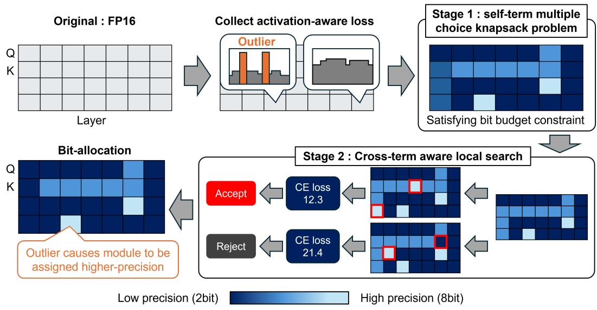
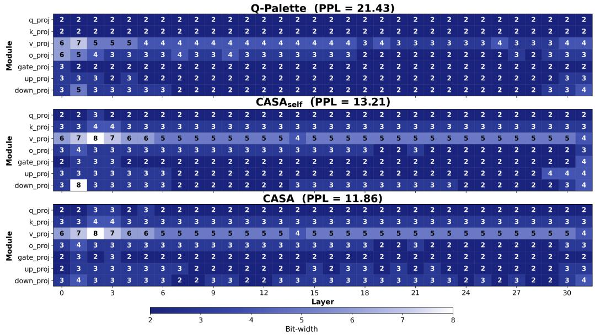
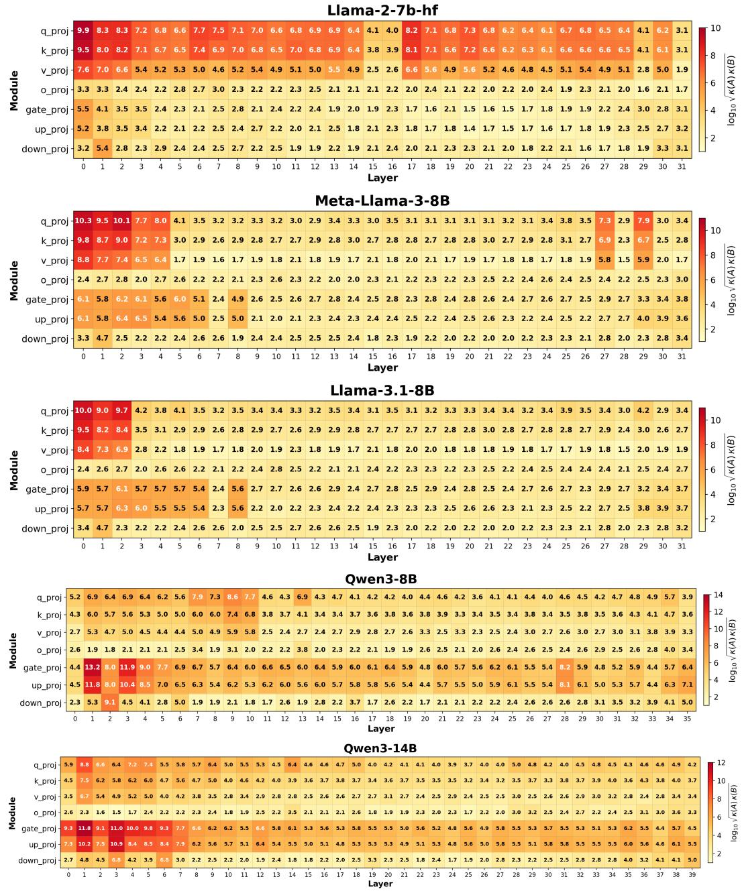
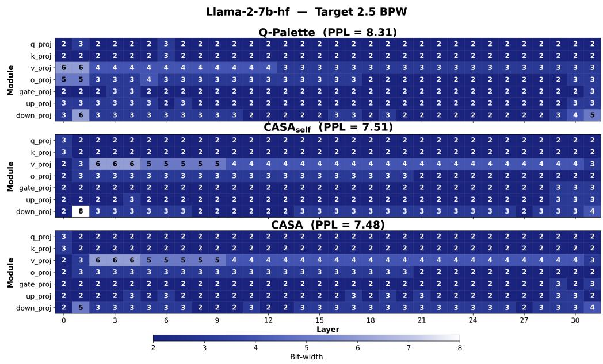
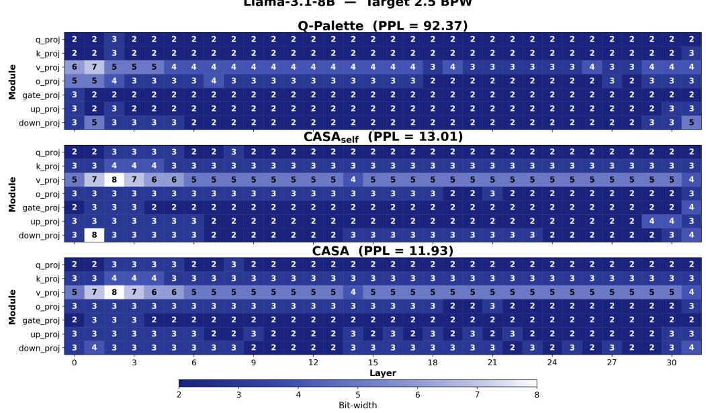
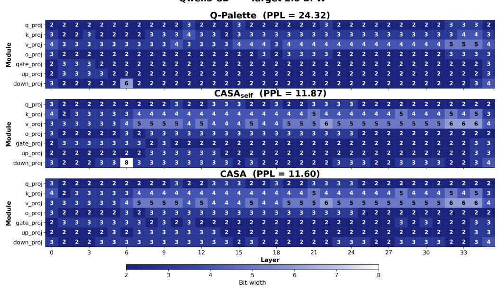
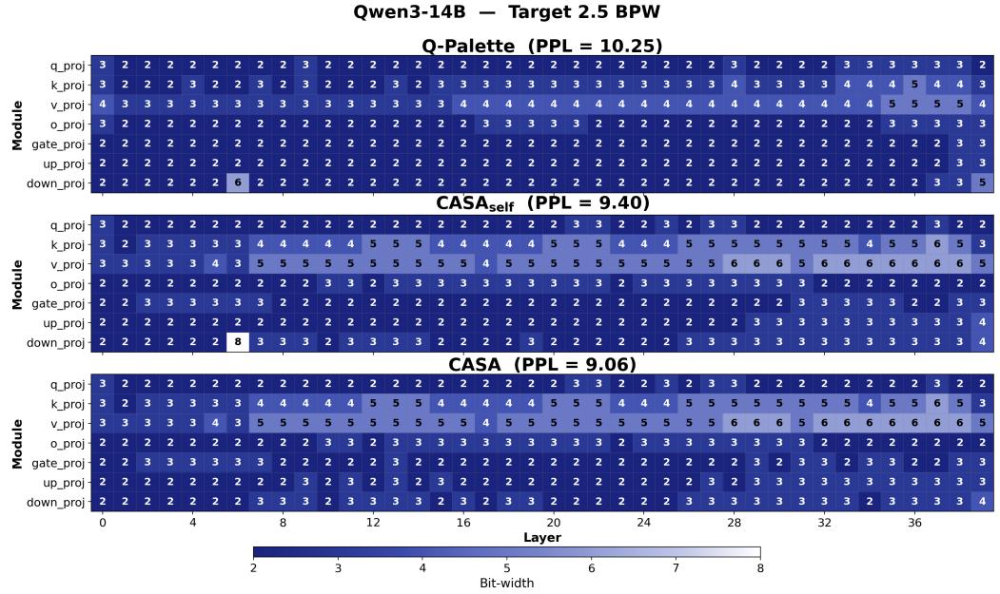

# Beyond Scalar Sensitivity: Activation-Aware Mixed-Precision LLM Quantization with Cross-Layer Refinement

Akihiro Yoshida Fujitsu Limited, Institute of Science Tokyo

Yuma Ichikawa Fujitsu Limited, RIKEN Center for AIP

## Abstract

Mixed-precision weight quantization is commonly formulated as a Multiple-Choice Knapsack Problem (MCKP), yet existing solvers rely on scalar sensitivity proxies that collapse each weight matrix’s Hessian into a single number and treat every module independently. We prove that even the optimal scalar proxy incurs multiplicative distortion up to $\sqrt { \kappa ( \mathbf { A } ) \kappa ( \mathbf { B } ) }$ relative to the full activation-aware quadratic, where κ(A) and κ(B) denote the condition numbers of the input- and output-side Hessian factors. This bound varies from 101 to $1 0 ^ { 1 3 }$ for typical LLM modules, making inter-module sensitivity ranking unreliable. To address these limitations, we propose Cross-layer Activation-aware Sensitivity Allocation (CASA), a two-phase method. In Stage 1, the scalar proxy is replaced by an activation-aware metric derived from the Kronecker-factored Hessian, reducing the MCKP to a form whose continuous relaxation admits a closed-form solution. In Stage 2, a cross-layer-aware local search evaluates bit-width updates using the end-to-end model loss. Experiments on multiple LLMs across different bit budgets show that CASA achieves lower perplexity than the latest scalar-proxy baselines, especially at ultra-low bit-widths (< 3 bits per weight). Moreover, the performance gain in zero-shot accuracy tracks the per-model average condition-number over modules, confirming the distortion bound as a practical indicator of scalar-proxy failure.

## 1 Introduction

Weight-only post-training quantization (PTQ) [Lin et al., 2024, Frantar et al., 2022] has become the standard technique for deploying large language models under memory constraints. Among the various PTQ strategies, mixed-precision quantization—where different weight matrices are quantized to different bit widths—offers a flexible trade-off between model size and accuracy [Guo et al., 2025, Dong et al., 2019, 2020]. The bit allocation problem is naturally formulated as a Multiple-Choice Knapsack Problem (MCKP) Lee and Song [2025], Chen et al. [2021]: given a total bit budget, assign a bit width to each weight matrix so as to minimize the total quantization-induced loss.

The quality of any MCKP solution depends critically on the proxy that estimates per-module quantization error. Recent mixed-precision allocators, including HIGGS Malinovskii et al. [2025] and Q-Palette Lee and Song [2025], acknowledge the role of activations but ultimately reduce this matrix form proxy to a single scalar coefficient $\alpha _ { l } ,$ yielding $\alpha _ { l } \big ( \lVert \Delta \mathbf { W } ^ { ( l ) } \rVert ^ { 2 } \big / \lVert \mathbf { W } ^ { ( l ) } \rVert ^ { 2 } \big )$ . This scalar reduction discards the directional information carried by the Hessian: the anisotropy of the activation covariance, the heterogeneous output-side sensitivities, and the channel-level structure of $\Delta { \mathbf { } } W ^ { ( l ) }$ produced by the underlying quantizer. The damage is not merely a loss of precision; when the MCKP solver relies on a proxy that is systematically misaligned with the true error, it allocates fewer bits to the modules that matter most.

A second, less-discussed limitation is the layer-wise independence assumption that underpins every MCKP-style allocator. Standard formulations sum per-module errors as if the modules were statistically independent—exactly the additive structure that the knapsack objective requires. The deep residual architecture of modern LLMs violates this assumption: quantization error injected at layer l propagates through the residual stream and interacts with the error at layer l+1, producing cross-layer terms—the off-diagonal blocks of the full network Hessian—that the additive proxy cannot represent.

A natural first attempt is to fold these cross-layer terms into the MCKP objective itself, but our experiments show that this approach does not yield meaningful improvement over the self-only baseline. These results indicate that cross-layer awareness is genuinely necessary, yet capturing it inside a single MCKP formulation is empirically difficult; it must be addressed by a mechanism outside the MCKP.

Guided by this separation of concerns, we propose Cross-layer Activation-aware Sensitivity Allocation (CASA) (see Figure 1), a two-stage allocator in which Stage 1 handles the former problem inside the MCKP, and Stage 2 handles the latter problem outside it. Stage 1: Activation-aware MCKP. For each module and candidate bit-width, we evaluate the per-module loss with the full Kronecker-factored Hessian. Unlike scalar proxies, this cost faithfully captures activation outliers. This advantage is not merely empirical: any scalar surrogate suffers a worst-case multiplicative distortion relative to the true quadratic (Theorem 3.1), which can flip the sensitivity ranking of two modules and thereby induce unbounded MCKP regret (Proposition 3.2); in the high-rate limit our proxy further yields a water-filling allocation that no scalar surrogate can recover (Theorem 4.1). Stage 2: Cross-layer local search. Treating the Stage-1 assignment as initialization, we perform a greedy bit-swap search whose acceptance criterion is the calibration cross-entropy loss measured after re-quantization, so that the non-additive cross-layer interactions are evaluated end-to-end rather than through any quadratic surrogate. This stage is precisely the mechanism that operates outside the MCKP framework and recovers the cross-layer signal that no single-stage formulation captured. The cross-aware optimum is never worse than the self-only optimum and is strictly better whenever the latter is suboptimal (Proposition 4.2).

Numerical experiments on multiple models (e.g., the Llama and Qwen series) across different bit budgets show that the activation-aware error proxy enhances existing scalar-based weighting methods. The cross-layer-aware local search yields further improvement, especially at ultra-low bit-widths. CASA successfully identifies modules with activation outliers and assigns them higher precision. Moreover, the distortion bound $\sqrt { \kappa ( A ) \kappa ( B ) }$ established in Theorem 3.1 correlates with the empirical gain of CASA, validating the connection between our theory and experiments.

  
Figure 1: Overview of Cross-layer Activation-aware Sensitivity Allocation (CASA), which determines the bit allocation by accounting for activation-aware loss and cross-layer interactions. CASA efficiently detects outlier modules and assigns them higher precision.

Our contributions are summarized as follows:

1. We derive an activation-aware quantization-error proxy that retains the full Kroneckerfactored Hessian from the second-order Taylor expansion of the task loss, and prove a worst-case distortion bound for any scalar proxy (Section 3).

2. Building on this proxy, we propose CASA, a two-stage allocator that solves an activationaware MCKP for self-term costs (Stage 1) and then performs a cross-entropy-driven crosslayer local search (Stage 2) that provably never worsens the Stage-1 solution (Section 4).

3. We demonstrate that CASA achieves better performance than the latest scalar-based proxy across multiple models and quantization settings. We further observe that CASA’s improvement grows with the distortion bound, consistent with Theorem 3.1 (Section 5).

## 2 Preliminaries

## 2.1 Bit-allocation as constrained optimization problem

The mixed-precision quantization problem reduces to choosing a quantizer for each layer so as to minimize the total weighted error subject to a resource constraint [Chen et al., 2021]. This problem can be formulated as a multiple-choice knapsack problem (MCKP) subject to resource constraints (model size [Uhlich et al., 2019], computational complexity [Yang and Jin, 2021], etc.). It can be solved by a genetic algorithm [Li et al., 2021] or by mathematical optimization solvers [Hubara et al., 2021]. In addition to the MCKP formulation, bit-allocation has been addressed via reinforcement learning [Wang et al., 2019] or differentiable search [Yang and Jin, 2021].

## 2.2 Sensitivity Measurement

Many methods construct a surrogate objective to determine the bit allocation. The HAWQ series [Dong et al., 2019, 2020, Yao et al., 2021] uses spectral information of the Hessian as a sensitivity metric. OMPQ [Ma et al., 2023] prioritizes the bit allocation so that layer outputs tend to be mutually orthogonal. Q-Palette [Lee and Song, 2025] measures module importance using the HIGGS metric [Malinovskii et al., 2025]. These approaches fail to account for activation outliers, which are explicitly handled by recent quantization methods [Lin et al., 2024, Xiao et al., 2023]. More fundamentally, all of these methods reduce sensitivity to a single scalar and therefore cannot reflect activation distributions that depend on the calibration data.

## 2.3 Cross-layer Awareness for Quantization

Cross-layer awareness has been exploited for quantization itself, but rarely for bit allocation. BRECQ [Li et al., 2021] iteratively refines the bit allocation by monitoring the validation loss. QEP [Arai and Ichikawa, 2025] propagates the previous layer’s quantization loss to the next layer, thereby suppressing error accumulation. However, cross-layer awareness for bit allocation in LLMs remains unexplored. For vision encoders, CLADO [Deng et al., 2023] jointly considers both the self-term and cross-term. InfoQ [Akbulut et al., 2026] studies how quantization perturbations propagate to affect the output information. For KV-cache quantization, KVTuner [Li et al., 2025] solves a multi-objective optimization problem informed by inter-layer correlations. Whether cross-layer interactions can actually reorder the allocation produced by a sensitivity-only integer programming formulation remains an open question.

## 3 Activation-Aware Quantization Error Proxy

## 3.1 Derivation

Consider a pre-trained model with L layers. Let $W ^ { ( l ) } \in \mathbb { R } ^ { d _ { \mathrm { o u t } } \times d _ { \mathrm { i n } } }$ denote the weight matrix of layer l, and let $\Delta \boldsymbol { W } ^ { ( l ) } : = \hat { \boldsymbol { W } } ^ { ( l ) } - \boldsymbol { W } ^ { ( l ) }$ be the quantization perturbation. We approximate the change in task loss $\Delta L$ through the following chain of standard assumptions:

(i) Second-order Taylor expansion. $\begin{array} { r } { \Delta L \approx \frac { 1 } { 2 } \Delta \pmb { \theta } ^ { \top } \pmb { H } ( \pmb { \theta } ) \Delta \pmb { \theta } . } \end{array}$ , where H is the Hessian of the loss with respect to all parameters θ.

(ii) Local optimality. At the pre-trained weights, the gradient is approximately zero, so the first-order term in the Taylor expansion is negligible.

(iii) Layer-wise block-diagonal Hessian. Off-diagonal blocks of H between different layers are negligible, so $\begin{array} { r } { \Delta L \approx \sum _ { l } \Delta L ^ { ( l ) } } \end{array}$

(iv) Empirical Fisher. Given calibration samples $\{ \pmb { x } ^ { ( n ) } \} _ { n = 1 } ^ { N }$ , the Hessian is estimated via the empirical Fisher: $\pmb { x } ^ { ( n ) } ( \pmb { x } ^ { ( n ) } ) ^ { \top }$ for the input side and $\pmb { H } _ { y } ^ { ( n ) }$ for the output side.

Combining (i)–(iv), the per-layer loss is given by $\Delta L ^ { ( l ) } \ \approx \ \frac { 1 } { 2 } \ \mathrm { t r } (  { \boldsymbol { B } } ^ { ( l ) } \Delta  { \boldsymbol { W } } ^ { ( l ) }  { \boldsymbol { A } } ^ { ( l ) } ( \Delta  { \boldsymbol { W } } ^ { ( l ) } ) ^ { \top } )$ where $\begin{array} { r } { \pmb { A } ^ { ( l ) } = \frac { 1 } { N } \pmb { X } \pmb { X } ^ { \top } \in \mathbb { R } ^ { d _ { \mathrm { i n } } \times d _ { \mathrm { i n } } } , \pmb { B } ^ { ( l ) } = \frac { 1 } { N } \sum _ { n = 1 } ^ { N } \pmb { H } _ { y } ^ { ( n ) } \ \in \mathbb { R } ^ { d _ { \mathrm { o u t } } \times d _ { \mathrm { o u t } } } } \end{array}$ . Here $\mathbf { \delta } _ { A } ( l )$ is the input activation Gram matrix, encoding channel-wise correlations and magnitudes, and $\mathbf { \delta } _ { B } ( l )$ is the outputside Hessian, capturing the downstream sensitivity to perturbations in each output channel.

## 3.2 Existing Proxies as Degenerate Cases

Section 3.1 provides a unified view of existing quantization error proxies as successively coarser approximations (see Table 1). The scalar proxy $\dot { \alpha _ { l } } \| \Delta \pmb { W } \| ^ { 2 } / \| \pmb { W } \| ^ { 2 }$ treats all input channels and all output channels as equally important. In practice, Transformer activations exhibit strong anisotropy: a small number of channels carry disproportionately large magnitudes (“activation outliers”). These outlier channels make certain columns of $\Delta \boldsymbol { W }$ far more costly than others, and analogous heterogeneity arises on the output side via B. By collapsing A and B to scaled identities $( A \to \alpha _ { l } I , B \to I )$ , scalar proxies assign equal weight to every entry of $\Delta { \mathbf { } } W ^ { ( l ) }$ , fundamentally misranking modules by their quantization sensitivity.

Table 1: Hierarchy of quantization error proxies. All are special cases of $\operatorname { t r } ( B \Delta W A \Delta W ^ { \top } )$ with different levels of approximation for A and B.
<table><tr><td>Proxy</td><td>Approximation</td><td>Formula</td><td>Methods</td></tr><tr><td>Full</td><td> $A ^ { ( l ) } , B ^ { ( l ) }$ </td><td> $\operatorname { t r } ( B \Delta W A \Delta W ^ { \top } )$ </td><td>CASA(ours)</td></tr><tr><td>Input-only</td><td> $B  { \cal I }$ </td><td> $\begin{array} { r } { \frac { 1 } { N } \| \Delta \boldsymbol { W } \boldsymbol { X } \| _ { F } ^ { 2 } } \end{array}$ </td><td>GPTQ [Frantar et al., 2022] OBQ [Frantar and Alistarh, 2022]</td></tr><tr><td>Scalar</td><td> $A  \alpha _ { l } I , B  I$ </td><td> $\alpha _ { l } \| \Delta \mathbf { { W } } \| ^ { 2 } / \| \mathbf { { W } } \| ^ { 2 }$ </td><td>HIGGS [Malinovskii et al., 2025] Q-Palette [Lee and Song, 2025]</td></tr></table>

## 3.3 Theoretical Discussion

The worst-case multiplicative distortion of any scalar proxy against the activation-aware quadratic, and the MCKP regret induced by sensitivity misranking, are stated formally in Theorem 3.1 and Proposition 3.2, respectively.

Theorem 3.1 (Sharp multiplicative distortion of scalar proxies). Assume $A \succ 0$ and $B \succ 0$ . Let $\kappa ( A ) : = \lambda _ { \operatorname* { m a x } } ( A ) / \lambda _ { \operatorname* { m i n } } ( A )$ and $\kappa ( B ) : = \lambda _ { \mathrm { m a x } } ( B ) \big / \lambda _ { \mathrm { m i n } } ( B )$ . Then

$$
\operatorname* { i n f } _ { \alpha > 0 } \operatorname* { s u p } _ { E \neq 0 } \operatorname* { m a x } \left\{ { \frac { Q ( E ) } { Q _ { \alpha } ( E ) } } , { \frac { Q _ { \alpha } ( E ) } { Q ( E ) } } \right\} = { \sqrt { \kappa ( A ) \kappa ( B ) } } = : D .\tag{1}
$$

Consequently, whenever either the input-sidefactor A or the output-sidefactor B is anisotropic, no scalar proxy can uniformly approximate the activation-aware quadratic proxy without incurring this worst-case multiplicative distortion.

We empirically confirms that the bound D massively varies depending on the module. (See $\mathbf { A p } \mathbf { \cdot }$ pendix B)

Proposition 3.2 (Proxy misranking can create arbitrarily large MCKP regret). Consider two modules indexed by $i \in \{ 1 , 2 \}$ and two bit-width choices, L and H, where L is of lower precision and H is of higher precision. Suppose the bit budget allows exactly one module to use H. Let the true second-order cost be

$$
{ \cal C } _ { i } ( b ) = \gamma _ { i } d _ { b } , b \in \{ L , H \} ,\tag{2}
$$

where $d _ { L } > d _ { H } > 0$ and $\gamma _ { i } > 0 .$ . Let a proxy MCKP use the proxy cost, $\widehat { C } _ { i } ( b ) = \widehat { \gamma } _ { i } d _ { b } ,$ , where $\widehat { \gamma } _ { i } > 0$ Suppose that the true sensitivities and proxy sensitivities have opposite rankings: $\gamma _ { 1 } > \gamma _ { 2 } , \ \widehat { \gamma } _ { 2 } > \widehat { \gamma } _ { 1 }$ Then the true optimal allocation assigns H to module 1, whereas the proxy-optimal allocation assigns H to module 2. The true regret of the proxy-optimal allocation is

$$
\mathrm { R e g r e t } = ( \gamma _ { 1 } - \gamma _ { 2 } ) ( d _ { L } - d _ { H } ) .\tag{3}
$$

In particular, taking $\gamma _ { 1 } = R$ and $\gamma _ { 2 } = 1$ makes the regret equal to $( R - 1 ) ( d _ { L } - d _ { H } )$ , which diverges as $R \to \infty$

## 4 Cross-layer Activation-aware Sensitivity Allocation (CASA)

To address the issues derived from scalar-based sensitivity and layer-wise independent treatment, we propose Cross-layer Activation-aware Sensitivity Allocation (CASA). A natural attempt is to fold both the self-term and the cross-term into a single MCKP and solve it jointly, but this approach empirically performs worse (see Appendix C). Therefore, capturing both components in a single formulation is empirically difficult, and we adopt a two-stage approach instead. Stage 1 solves an MCKP using the activation-aware proxy of Section 3.1 on the self-term alone (Section 4.1); Stage 2 then refines this allocation via a cross-layer local search that evaluates bit-swaps using the end-to-end loss (Section 4.2); this refinement is guaranteed to produce a solution no worse than the Stage-1 one. The overall algorithm of CASA is shown in Algorithm 1.

## 4.1 Stage 1: MCKP Formulation

Following Section 3, we formulate the bit allocation as an MCKP over all weight matrices in the model. Let $( l , m )$ index a specific module $( \mathrm { e . g . } , m \in \{ Q , K , V , O , \mathrm { G a t e , U p , D o w n } \} )$ in layer l. Each module can be quantized at one of the candidates in $\mathcal { Q } = \{ q _ { 1 } , \dotsc , q _ { | \mathcal { Q } | } \} ( \mathbf { e . g . } , \{ 2 . 0 , 3 . 0 , \dotsc , 6 . 0 \} )$ We use $q \in \mathcal { Q }$ in two roles: as a generic candidate when defining per-module costs, and as the assigned bit-width $q _ { l , m } \in \mathcal { Q }$ for module $( l , m )$ . The full allocation is denoted by $\pmb { q } = ( q _ { l , m } ) _ { ( l , m ) }$

For each candidate $( l , m , q )$ , we pre-compute the quantized weight $\hat { W } ^ { ( l , m , q ) }$ and the perturbation $\Delta { W ^ { ( l , m , q ) } } = { \hat { W } } ^ { ( l , m , q ) } - W ^ { ( l , m ) }$ . The activation-aware proxy cost $\ell _ { l , m , q }$ is:

$$
\ell _ { l , m , q } : = \mathrm { t r } \left( \boldsymbol { B } ^ { ( l , m ) } \Delta { \mathbf { W } } ^ { ( l , m , q ) } \boldsymbol { A } ^ { ( l , m ) } \left( \Delta { \mathbf { W } } ^ { ( l , m , q ) } \right) ^ { \top } \right) .\tag{4}
$$

Expanding in element-wise form: $\begin{array} { r } { \ell _ { l , m , q } = \sum _ { i , j } b _ { i } ^ { ( l , m ) } \cdot a _ { j } ^ { ( l , m ) } \cdot ( \Delta w _ { i j } ^ { ( l , m , q ) } ) ^ { 2 } } \end{array}$ , where $a _ { j } ^ { ( l , m ) }$ and $b _ { i } ^ { ( l , m ) }$ are the diagonal entries of $\mathbf { \delta A } ^ { ( l , m ) }$ and $\pmb { { B } } ^ { ( l , m ) }$ , respectively, under the diagonal approximation of A and B. The MCKP is:

(5)

$$
\mathrm { s u b j e c t ~ t o ~ } \sum _ { q } P _ { l , m , q } = 1 { \left( \forall l , m \right) } , \quad \sum _ { l , m , q } P _ { l , m , q } \cdot \mathrm { b i t s } _ { q } \cdot \mathrm { s i z e } _ { l , m } \leq B _ { \mathrm { a v g } } \cdot \sum _ { l , m } \mathrm { s i z e } _ { l , m }\tag{6}
$$

where $P _ { l , m , q } = 1$ indicates that module $( l , m )$ is quantized at bit width $q ,$ bits includes the overhead from zero points and scales, and $B _ { \mathrm { a v g } }$ is the target average bits per weight (BPW). This is an integer linear program and can be solved efficiently by existing mathematical optimization solvers. The binary variables $P _ { l , m , q }$ induce an assignment vector $\pmb q = \left( q _ { l , m } \right)$ via $q _ { l , m } = q \iff P _ { l , m , q } = 1$ Stage 2 below refines this q.

In the continuous relaxation of this MCKP, where bit-widths are allowed to take real values and per-module errors follow the high-rate distortion law $\Gamma _ { i } 2 ^ { - 2 \beta _ { i } }$ with $\Gamma _ { i }$ proportional to $\ell _ { l , m , q }$ at high q and $n _ { i } = \mathrm { s i z e } _ { l , m }$ , the optimal allocation admits a closed-form solution:

Theorem 4.1 (Optimal continuous bit allocation under high-rate distortion). Let I be a finite nonempty index set. Assume that $\Gamma _ { i } > 0$ and $n _ { i } > 0$ for every $i \in \mathcal { Z }$ . Consider the continuous relaxation

$$
\operatorname* { m i n } _ { \{ \beta _ { i } \} _ { i \in \mathbb { Z } } } F ( \beta ) : = \sum _ { i \in \mathbb { Z } } \Gamma _ { i } 2 ^ { - 2 \beta _ { i } } \quad s u b j e c t \ t o \quad \sum _ { i \in \mathbb { Z } } n _ { i } \beta _ { i } \leq B _ { \mathrm { t o t a l } } .\tag{7}
$$

Then the problem has a unique global minimizer. Moreover, the unique minimizer satisfies $\textstyle \sum _ { i \in \mathcal { T } } n _ { i } \beta _ { i } ^ { \prime } = B _ { \mathrm { t o t a l } }$ and is given by

$$
\beta _ { i } ^ { \prime } = \frac { 1 } { 2 } \log _ { 2 } { \left( \Gamma _ { i } / n _ { i } \right) } + c , c = \frac { B _ { \mathrm { t o t a l } } - \frac { 1 } { 2 } \sum _ { j \in \mathcal { Z } } n _ { j } \log _ { 2 } { \left( \Gamma _ { j } / n _ { j } \right) } } { \sum _ { j \in \mathcal { Z } } n _ { j } } .\tag{8}
$$

Consequently, for any two modules $i , j \in \mathcal { Z } ,$

$$
\beta _ { i } ^ { \prime } - \beta _ { j } ^ { \prime } = \frac { 1 } { 2 } \log _ { 2 } \left( \frac { \Gamma _ { i } / n _ { i } } { \Gamma _ { j } / n _ { j } } \right) .\tag{9}
$$

Thus the optimal continuous bit width is larger for modules with larger activation-aware sensitivity per parameter, $\Gamma _ { i } / n _ { i } .$

## 4.2 Stage 2: Local Search for considering Cross-Layer Interactions

This section presents a local search that refines the Stage-1 allocation by explicitly accounting for cross-layer interactions.

We relax Assumption (iii) in Section 3.1 (layer-wise block-diagonal Hessian) to a block-tridiagonal approximation. Specifically, we retain off-diagonal Fisher blocks only between adjacent layers $( l , l { + } 1 )$ and, within each such block, only the same-module-type entries $\bar { ( l , m ) } \not { – } ( l { + } 1 , \bar { m } )$

$$
\Delta L \approx \sum _ { l , m } \mathrm { e r r } _ { \mathrm { s e l f } } ( l , m ) + 2 \sum _ { l = 1 } ^ { L - 1 } \sum _ { m } \mathrm { e r r } _ { \mathrm { c r o s s } } ( l , l + 1 , m ) .\tag{10}
$$

Consideration of the cross-layer interactions is not harmful for obtaining better assignment, which is ensured by following proposition.

Proposition 4.2 (Exact cross-aware optimization is never worse for the quadratic surrogate). Let $\mathcal { F }$ be thefeasible set defined by the MCKP assignment and budget constraints. Let

$$
P _ { \mathrm { s e l f } } \in \underset { P \in \mathcal { F } } { \arg \operatorname* { m i n } } S ( P ) , \quad P _ { \mathrm { c r o s s } } \in \underset { P \in \mathcal { F } } { \arg \operatorname* { m i n } } C _ { \mathrm { q u a d } } ( P ) .\tag{11}
$$

Then

$$
C _ { \mathrm { q u a d } } ( P _ { \mathrm { c r o s s } } ) \leq C _ { \mathrm { q u a d } } ( P _ { \mathrm { s e l f } } ) .\tag{12}
$$

$I f P _ { \mathrm { s e l f } }$ is not a minimizer of $C _ { \mathrm { q u a d } }$ over F, then the inequality is strict.

The self-terms are given by Section 3.1. For the cross-terms, we apply a Kronecker factorization to the off-diagonal Fisher block: $\pmb { F } ^ { ( l , m ) , ( l + 1 , m ) } \approx \mathbb { E } _ { n } [ \pmb { x } _ { n } ^ { ( l , m ) } ( \pmb { x } _ { n } ^ { ( l + 1 , \hat { m } ) } ) ^ { \top } ] \otimes \mathbb { E } _ { n } [ \pmb { g } _ { n } ^ { ( l , m ) } ( \pmb { g } _ { n } ^ { ( l + 1 , m ) } ) ^ { \top } ]$ For computational tractability, we approximate the Kronecker factors of Section 4.2 by their diagonals (consistent with the diagonal approximation already used for the self-term). The cross-term then reduces to elementwise form:

$$
\mathrm { e r r } _ { \mathrm { c r o s s } } ( l , l + 1 , m ; q , q ^ { \prime } ) \approx \sum _ { i , j } b _ { i } ^ { \mathrm { c r o s s } } \cdot a _ { j } ^ { \mathrm { c r o s s } } \cdot \Delta w _ { i j } ^ { ( l , m , q ) } \cdot \Delta w _ { i j } ^ { ( l + 1 , m , q ^ { \prime } ) }\tag{13}
$$

$$
\begin{array} { r } { \mathrm { w h e r e } \ a _ { j } ^ { \mathrm { c r o s s } , ( l , l + 1 , m ) } : = \mathbb { E } _ { n } [ x _ { n , j } ^ { ( l , m ) } x _ { n , j } ^ { ( l + 1 , m ) } ] , \mathrm { a n d } \ b _ { i } ^ { \mathrm { c r o s s } , ( l , l + 1 , m ) } : = \mathbb { E } _ { n } [ g _ { n , i } ^ { ( l , m ) } \ g _ { n , i } ^ { ( l + 1 , m ) } ] . } \end{array}
$$

The cross-layer coefficients $b _ { i } ^ { \mathrm { c r o s s } }$ and $a _ { j } ^ { \mathrm { c r o s s } }$ are signed, unlike their self-term counterparts, and the signs of $\Delta w _ { i j } ^ { ( l , m , q ) }$ are unavailable at the planning stage since they depend on the candidate q.

Applying the triangle inequality and then the Cauchy–Schwarz bound to Equation (13) yields the Cauchy–Schwarz cross proxy:

$$
\mathrm { e r r } _ { \mathrm { c r o s s } } ( l , l + 1 , m ; q , q ^ { \prime } ) \leq\tag{14}
$$

$$
\sum _ { i , j } \sqrt { b _ { i } ^ { ( l , m ) } b _ { i } ^ { ( l + 1 , m ) } } \sqrt { a _ { j } ^ { ( l , m ) } a _ { j } ^ { ( l + 1 , m ) } } \left| \Delta w _ { i j } ^ { ( l , m , q ) } \right| \left| \Delta w _ { i j } ^ { ( l + 1 , m , q ^ { \prime } ) } \right| = : \ \bar { C } _ { q , q ^ { \prime } } ^ { ( l , m ) } .\tag{15}
$$

Since this upper bound depends only on the self-term diagonals $a ^ { ( l , m ) } , b ^ { ( l , m ) }$ already used in Section 3.1, the table $\big \{ \bar { C } _ { q , q ^ { \prime } } ^ { ( l , m ) } \big \} _ { ( q , q ^ { \prime } ) \in \mathcal { Q } ^ { 2 } }$ can be precomputed without an extra calibration pass. The total proxy objective minimized by the local search (Algorithm 1, Stage 2) is: $J ( { \pmb q } ) =$ $\begin{array} { r } { 2 \sum _ { l = 1 } ^ { L - 1 } \sum _ { m } \bar { C } _ { q _ { l , m } , q _ { l + 1 , m } . } ^ { ( l , m ) } } \end{array}$

Local search procedure. Based on the cross-term surrogate, we perform a local search to refine the MCKP solution obtained from Stage 1. The MCKP has already minimized the self-term proxy; the local search further reduces the total objective (4.2) by exploiting cross-layer interactions while maintaining the budget constraint. Each round consists of three phases: (1) candidate generation, (2) evaluation, and (3) acceptance. In Phase 1 (candidate generation), we construct feasible swap candidates. Each candidate consists of k upgrades (modules whose bit-width index is increased by one) and k downgrades (modules whose bit-width index is decreased by one), chosen so that the total effective bit budget does not exceed the target. We write $\pmb q \oplus s$ for the resulting allocation, in which unaffected modules retain their original bit-widths and every module satisfies $( \pmb q \oplus \pmb s ) _ { l , m } \in$ $\{ 1 , \ldots , | \mathcal { Q } | \}$ . We then rank candidates by their estimated cross-term proxy improvement. For a swap s, let $q _ { l , m } ^ { \mathrm { n e w } } : = ( \pmb { q } \oplus \pmb { s } ) _ { l , m }$ denote the bit-width assigned to module (l, m) after applying s. The cross-term delta is then:

$$
\Delta _ { \mathrm { c r o s s } } ( s ) = 2 \sum _ { l , m } \Bigl ( \bar { C } _ { q _ { l , m } ^ { \mathrm { n e w } } , q _ { l + 1 , m } ^ { \mathrm { n e w } } } ^ { ( l , m ) } - \bar { C } _ { q _ { l , m } , q _ { l + 1 , m } } ^ { ( l , m ) } \Bigr ) .\tag{16}
$$

In Phase 2 (evaluation), we form S as the top-K swaps with the smallest (most negative) $\Delta _ { \mathrm { c r o s s } } ( s )$ restricted to $\Delta _ { \mathrm { c r o s s } } ( s ) < 0 .$ For each $s \in S$ , we apply the candidate allocation q ⊕ s to the model and measure the next-token prediction loss on calibration data. In Phase 3 (acceptance), we accept the candidate with the largest loss reduction:

$$
\pmb { q } ^ { ( r + 1 ) } = \pmb { q } ^ { ( r ) } \oplus \underset { s \in \cal S } { \arg \operatorname* { m i n } } ~ \mathcal { L } _ { \mathrm { c a l } } ( \pmb { q } ^ { ( r ) } \oplus s )\tag{17}
$$

where $\mathcal { L } _ { \mathrm { c a l } }$ is the calibration loss. If no candidate improves upon the incumbent, the search terminates.

## 5 Experiments

Setup. We evaluate CASA on five models: Llama-2-7B, Llama-3-8B, Llama-3.1-8B, Qwen3-8B, and Qwen3-14B. We compare four methods:

• Uniform: all modules are assigned the same bit-width.

• Q-Palette [Lee and Song, 2025]: one of the latest mixed-precision methods, in which a scalar sensitivity parameter is computed via the HIGGS metric. While the original Q-Palette uses condensed quantizers, we replace them with widely-used GPTQ [Frantar et al., 2022].

$\mathbf { C A S A _ { s e l f } } \mathrm { : }$ an ablation that solves only the activation-aware MCKP (Stage 1 of Algorithm 1), without the cross-term local search.

• CASA (ours): the full proposed method (Algorithm 1).

All methods use RTN (Round-to-Nearest) as the proxy quantizer. We use GPTQ [Frantar et al., 2022] as the main quantizer with a group size of 128 and C4 as calibration data. The candidate bit-widths Q are integers from 2 to 8. We use SCIP [Bolusani et al., 2024] to solve the MCKP. For the local search (Stage 2), we use K = 100 candidate evaluations per round with a maximum of 20 rounds. Each swap consists of one upgrade paired with one downgrade (k = 1). Experiments were conducted on one NVIDIA B200 GPU. We report perplexity on WikiText-2 and average accuracy on a suite of common-sense reasoning benchmarks.

Results and Discussion. Table 2 presents the main results. Figure 2 visualizes the bit allocations produced by the baselines and our proposed CASA. More results are shown in Table 6.

The key findings are:

• Better results than the scalar-proxy method. CASA and its ablation $\mathbf { C A S A _ { s e l f } }$ consistently achieve better performance than the latest scalar-based proxy, Q-Palette.

• Massive activation channels in early-layer V projections. On Llama-3-8B at 2.5 BPW, V-projection input Gram matrices A in layers 0–4 have $\kappa ( A ) \in [ 2 . 4 { \times } 1 0 ^ { 1 1 } , 1 . 5 { \times } 1 0 ^ { 1 5 } ]$ CASA flags these as critical, allocating 5–8 bits (peak 8 on layer 2). Q-Palette also rates V-projection important on average but caps at 7 bits and drops to 5 bits on layers 2–4 (vs. CASA’s 8/7/6).

Table 2: WikiText-2 perplexity (↓) and 6-task average accuracy (↑, %) for various mixed-precision quantization methods and different bit budgets. Each cell: PPL / ACC. Bold PPL: lowest per row; bold ACC: highest per row. †Uniform at 2-bit, shown for reference only.
<table><tr><td>Model</td><td>BPW</td><td>Uniform</td><td>Q-Palette</td><td> $\mathrm { C A S A } _ { \mathrm { s e l f } }$ </td><td>CASA</td></tr><tr><td rowspan="6">Llama-2-7B (FP16: 4.86 / 58.6)</td><td>2.25</td><td> $2 4 . 2 0 ^ { \dag } / 3 6 . 8$ </td><td>11.59 / 42.4</td><td>11.01 / 42.1</td><td>11.19 / 42.7</td></tr><tr><td>2.50</td><td></td><td>8.31 / 46.9</td><td>7.51 / 47.9</td><td>7.48 / 48.3</td></tr><tr><td>2.75</td><td></td><td>6.93 / 51.2</td><td>6.22 / 52.8</td><td>6.18 / 52.5</td></tr><tr><td>3.00</td><td>5.48 / 55.6</td><td>5.86 / 55.0</td><td>5.16 / 56.1</td><td>5.48 / 56.5</td></tr><tr><td>3.50</td><td></td><td>5.24 / 57.3</td><td>5.16 / 56.1</td><td>5.16 / 56.1</td></tr><tr><td>4.00</td><td>4.97 / 57.5</td><td>5.03 / 57.8</td><td>4.98 / 57.7</td><td>4.98 / 57.9</td></tr><tr><td rowspan="6">Llama-3-8B (FP16: 5.49 / 65.0)</td><td>2.25</td><td>256.28† / 29.8</td><td>47.20 / 34.0</td><td>35.75 / 35.6</td><td>22.41 / 39.2</td></tr><tr><td>2.50</td><td></td><td>21.43 / 39.2</td><td>13.21 / 45.3</td><td>11.86 / 47.0</td></tr><tr><td>2.75</td><td></td><td>11.95 / 49.8</td><td>9.69 / 52.2</td><td>8.83 / 53.3</td></tr><tr><td>3.00</td><td>12.52 / 57.7</td><td>9.16 / 55.8</td><td>7.54 / 58.5</td><td>7.15 / 58.6</td></tr><tr><td>3.50</td><td></td><td>7.03 / 61.8</td><td>6.30 / 62.3</td><td>6.30 / 62.4</td></tr><tr><td>4.00</td><td>11.52 / 59.0</td><td>6.06 / 64.0</td><td>5.86 / 64.0</td><td>5.85 / 64.1</td></tr><tr><td rowspan="6">Llama-3.1-8B (FP16: 5.57 / 65.8)</td><td>2.25</td><td>103.52† / 30.5</td><td>40.67 / 34.3</td><td>25.65 / 37.6</td><td>20.56 / 39.6</td></tr><tr><td>2.50</td><td></td><td>19.38 / 38.9</td><td>13.01 / 45.4</td><td>11.93 / 48.1</td></tr><tr><td>2.75</td><td></td><td>11.82 / 50.4</td><td>9.56 / 53.2</td><td>8.78 / 54.1</td></tr><tr><td>3.00</td><td>19.99 / 53.9</td><td>9.34 / 56.5</td><td>7.31 / 59.0</td><td>7.09 / 60.4</td></tr><tr><td>3.50</td><td></td><td>6.84 / 62.3</td><td>6.31 / 63.2</td><td>6.30 / 63.1</td></tr><tr><td>4.00</td><td>9.27 / 62.2</td><td>6.12 / 63.9</td><td>5.89 / 64.6</td><td>5.89 / 64.6</td></tr><tr><td rowspan="6">Qwen3-8B (FP16: 8.58 / 65.8)</td><td>2.25</td><td>24.32† / 33.9</td><td>20.19 / 34.3</td><td>14.63 / 39.7</td><td>13.63 / 40.8</td></tr><tr><td>2.50</td><td></td><td>16.62 / 36.5</td><td>11.87 / 46.7</td><td>11.60 / 47.5</td></tr><tr><td>2.75</td><td></td><td>13.89 / 38.5</td><td>10.60 /51.7</td><td>10.29 / 54.5</td></tr><tr><td>3.00</td><td>9.64 / 61.1</td><td>12.28 / 41.7</td><td>9.41 / 60.2</td><td>9.46 / 61.5</td></tr><tr><td>3.50</td><td></td><td>9.40 / 59.5</td><td>9.20 / 64.1</td><td>9.19 / 64.2</td></tr><tr><td>4.00</td><td>8.83 / 64.7</td><td>9.05 / 62.8</td><td>8.82 / 65.1</td><td>8.82 / 64.7</td></tr><tr><td rowspan="6">Qwen3-14B (FP16: 7.58 / 69.7)</td><td>2.25</td><td>11.68† / 42.4</td><td>10.79 / 44.5</td><td>10.11 / 46.2</td><td>9.75 / 51.7</td></tr><tr><td>2.50</td><td></td><td>10.25 / 46.0</td><td>9.40 / 52.0</td><td>9.06 / 52.6</td></tr><tr><td>2.75</td><td></td><td>9.83 / 48.9</td><td>8.51 / 60.2</td><td>8.51 / 62.0</td></tr><tr><td>3.00</td><td>8.29 / 66.2</td><td>9.52 / 50.4</td><td>8.24 / 65.6</td><td>8.14 / 66.2</td></tr><tr><td>3.50</td><td></td><td>8.35 / 64.6</td><td>8.02 / 67.7</td><td>7.95 / 67.0</td></tr><tr><td>4.00</td><td>7.84 / 68.8</td><td>8.05 / 67.1</td><td>7.82 / 68.5</td><td>7.78 / 68.5</td></tr></table>

• Heterogeneous output sensitivity. The output-side Hessian B varies substantially across output channels: in V-projection modules in particular, a subset of output dimensions carries disproportionate influence on the attention computation. CASA exploits this heterogeneity by allocating more bits to such output-sensitive modules (see Figure 2).

• Cross-term aware local search improves quantized model performance. In the second stage of CASA, we perform a local search that exploits the cross-term, which consistently achieves better results than $\mathbf { C A S A } _ { \mathrm { s e l f } }$ . The improvements are largest at 2.25–2.75 BPW. Replacing the cross-term ranking with a self-term ranking improves over $\mathrm { C A S A } _ { \mathrm { s e l f } }$ but still falls short of full CASA (see Appendix D), showing that the cross-layer coupling itself is the source of the additional gain.

• Distortion bound predicts the zero-shot accuracy improvement. Theorem 3.1 bounds the worst-case multiplicative distortion of any scalar proxy. Table 3 shows the relationship between this distortion and the zero-shot accuracy improvement at 3.0 BPW: CASA’s gain over Q-Palette grows substantially for models with higher distortion.

Meta-Llama-3-8B — Target 2.5 BPW  
  
Figure 2: Bit allocation for Llama-3-8B at 2.5 BPW (blue: lower precision; white: higher precision).

Table 3: Mean distortion bound (D) and accuracy gain of $\mathbf { C A S A } _ { \mathrm { s e l f } }$ over Q-Palette at 3.0 BPW (see Theorem 3.1). $D _ { \mathrm { m e d } }$ and D¯ are the median and arithmetic mean over all modules and layers.
<table><tr><td rowspan="2">Model</td><td rowspan="2"> $\log _ { 1 0 } D _ { \mathrm { m e d } }$ </td><td rowspan="2"> $\log _ { 1 0 } \bar { D }$ </td><td colspan="2">ACC (%)</td><td rowspan="2">∆ACC (%)</td></tr><tr><td>Q-Palette</td><td> $\mathrm { C A S A } _ { \mathrm { s e l f } }$ </td></tr><tr><td>Llama-2-7B</td><td>2.81</td><td>7.73</td><td>55.0</td><td>56.1</td><td>+1.1</td></tr><tr><td>Llama-3-8B</td><td>2.62</td><td>8.30</td><td>55.8</td><td>58.5</td><td>+2.7</td></tr><tr><td>Llama-3.1-8B</td><td>2.63</td><td>7.96</td><td>56.5</td><td>59.0</td><td>+2.5</td></tr><tr><td>Qwen3-8B</td><td>4.21</td><td>10.86</td><td>41.7</td><td>60.2</td><td>+18.5</td></tr><tr><td>Qwen3-14B</td><td>4.06</td><td>9.48</td><td>50.4</td><td>65.6</td><td>+15.2</td></tr></table>

## 6 Conclusion

We proposed Cross-layer Activation-aware Sensitivity Allocation (CASA), which replaces scalar sensitivity proxies with an activation-aware quadratic derived from the Kronecker-factored Hessian and refines the allocation via cross-layer local search. We also provided theoretical results bounding the worst-case distortion of scalar-based proxies relative to the full activation-aware quadratic. Experiments on 7B–14B LLMs show that the activation-aware proxy consistently outperforms scalar based proxies, with the cross-layer refinement providing further gains particularly in the ultra-low-bit regime. The empirical improvement correlates with the per-model distortion bound D¯ (Table 3), consistent with the prediction of Theorem 3.1.

Limitation. Our cross-term approximation only models adjacent layer pairs (l, l+1) and does not capture longer-range or higher-order interactions, as faithfully incorporating them would make calibration and optimization combinatorially intractable. Moreover, our objective is an activationaware quadratic proxy rather than the true downstream loss, so the proxy ranking may diverge from the true perplexity ranking in extreme regimes.

Broader Impacts. On the positive side, better bit allocation enables higher-quality LLM inference on the same hardware budget, supporting on-device and edge deployment in resource-constrained settings. On the negative side, lowering the cost of deploying capable LLMs simultaneously lowers the barrier to misuse such as disinformation generation; this concern is common to LLM efficiency research broadly and is not amplified by our specific contribution.

## References

Mehmet Emre Akbulut, Hazem Hesham Yousef Shalby, Fabrizio Pittorino, and Manuel Roveri. Infoq: Mixed-precision quantization via global information flow. In Proceedings ofthe AAAI Conference on Artificial Intelligence, volume 40, pages 19598–19606, 2026.

Yamato Arai and Yuma Ichikawa. Quantization error propagation: Revisiting layer-wise post-training quantization. In The Thirty-ninth Annual Conference on Neural Information Processing Systems, 2025. URL https://openreview.net/forum?id=a3l3K9khbL.

Suresh Bolusani, Mathieu Besançon, Ksenia Bestuzheva, Antonia Chmiela, João Dionísio, Tim Donkiewicz, Jasper van Doornmalen, Leon Eifler, Mohammed Ghannam, Ambros Gleixner, et al. The scip optimization suite 9.0. arXiv preprint arXiv:2402.17702, 2024.

Weihan Chen, Peisong Wang, and Jian Cheng. Towards mixed-precision quantization of neural networks via constrained optimization. In Proceedings of the IEEE/CVF International Conference on Computer Vision, pages 5350–5359, 2021.

Zihao Deng, Xin Wang, Sayeh Sharify, and Michael Orshansky. Mixed-precision quantization with cross-layer dependencies. arXiv preprint arXiv:2307.05657, 2023.

Zhen Dong, Zhewei Yao, Amir Gholami, Michael W Mahoney, and Kurt Keutzer. Hawq: Hessian aware quantization of neural networks with mixed-precision. In Proceedings of the IEEE/CVF international conference on computer vision, pages 293–302, 2019.

Zhen Dong, Zhewei Yao, Daiyaan Arfeen, Amir Gholami, Michael W Mahoney, and Kurt Keutzer. Hawq-v2: Hessian aware trace-weighted quantization of neural networks. Advances in neural information processing systems, 33:18518–18529, 2020.

Elias Frantar and Dan Alistarh. Optimal brain compression: A framework for accurate post-training quantization and pruning. In S. Koyejo, S. Mohamed, A. Agarwal, D. Belgrave, K. Cho, and A. Oh, editors, Advances in Neural Information Processing Systems, volume 35, pages 4475–4488. Curran Associates, Inc., 2022. URL https://proceedings.neurips.cc/paper\_files/paper/ 2022/file/1caf09c9f4e6b0150b06a07e77f2710c-Paper-Conference.pdf.

Elias Frantar, Saleh Ashkboos, Torsten Hoefler, and Dan Alistarh. Gptq: Accurate post-training quantization for generative pre-trained transformers. arXiv preprint arXiv:2210.17323, 2022.

Jialong Guo, Xinghao Chen, Yehui Tang, and Yunhe Wang. SlimLLM: Accurate structured pruning for large language models. In Forty-second International Conference on Machine Learning, 2025. URL https://openreview.net/forum?id=2xjUkU7FDb.

Itay Hubara, Yury Nahshan, Yair Hanani, Ron Banner, and Daniel Soudry. Accurate post training quantization with small calibration sets. In International conference on machine learning, pages 4466–4475. PMLR, 2021.

Deokjae Lee and Hyun Oh Song. Q-palette: Fractional-bit quantizers toward optimal bit allocation for efficient LLM deployment. In The Thirty-ninth Annual Conference on Neural Information Processing Systems, 2025. URL https://openreview.net/forum?id=l4F50jpiVH.

Xing Li, Zeyu Xing, Yiming Li, Linping Qu, Hui-Ling Zhen, Wulong Liu, Yiwu Yao, Sinno Jialin Pan, and Mingxuan Yuan. Kvtuner: Sensitivity-aware layer-wise mixed-precision kv cache quantization for efficient and nearly lossless llm inference. arXiv preprint arXiv:2502.04420, 2025.

Yuhang Li, Ruihao Gong, Xu Tan, Yang Yang, Peng Hu, Qi Zhang, Fengwei Yu, Wei Wang, and Shi Gu. {BRECQ}: Pushing the limit of post-training quantization by block reconstruction. In International Conference on Learning Representations, 2021. URL https://openreview.net/ forum?id=POWv6hDd9XH.

Ji Lin, Jiaming Tang, Haotian Tang, Shang Yang, Wei-Ming Chen, Wei-Chen Wang, Guangxuan Xiao, Xingyu Dang, Chuang Gan, and Song Han. Awq: Activation-aware weight quantization for on-device llm compression and acceleration. Proceedings of machine learning and systems, 6: 87–100, 2024.

Yuexiao Ma, Taisong Jin, Xiawu Zheng, Yan Wang, Huixia Li, Yongjian Wu, Guannan Jiang, Wei Zhang, and Rongrong Ji. Ompq: Orthogonal mixed precision quantization. In Proceedings of the AAAI conference on artificial intelligence, volume 37, pages 9029–9037, 2023.

Vladimir Malinovskii, Andrei Panferov, Ivan Ilin, Han Guo, Peter Richtárik, and Dan Alistarh. Higgs: Pushing the limits of large language model quantization via the linearity theorem. In Proceedings of the 2025 Conference ofthe Nations ofthe Americas Chapter ofthe Associationfor Computational Linguistics: Human Language Technologies (Volume 1: Long Papers), pages 10857–10886, 2025.

Stefan Uhlich, Lukas Mauch, Fabien Cardinaux, Kazuki Yoshiyama, Javier Alonso Garcia, Stephen Tiedemann, Thomas Kemp, and Akira Nakamura. Mixed precision dnns: All you need is a good parametrization. arXiv preprint arXiv:1905.11452, 2019.

Kuan Wang, Zhijian Liu, Yujun Lin, Ji Lin, and Song Han. Haq: Hardware-aware automated quantization with mixed precision. In Proceedings of the IEEE/CVF conference on computer vision and pattern recognition, pages 8612–8620, 2019.

Guangxuan Xiao, Ji Lin, Mickael Seznec, Hao Wu, Julien Demouth, and Song Han. Smoothquant: Accurate and efficient post-training quantization for large language models. In International conference on machine learning, pages 38087–38099. PMLR, 2023.

Linjie Yang and Qing Jin. Fracbits: Mixed precision quantization via fractional bit-widths. In Proceedings ofthe AAAI Conference on Artificial Intelligence, volume 35, pages 10612–10620, 2021.

Zhewei Yao, Zhen Dong, Zhangcheng Zheng, Amir Gholami, Jiali Yu, Eric Tan, Leyuan Wang, Qijing Huang, Yida Wang, Michael Mahoney, et al. Hawq-v3: Dyadic neural network quantization. In International Conference on Machine Learning, pages 11875–11886. PMLR, 2021.

## A Overall Algorithm

We summarize the proposed CASA algorithm in Algorithm 1.

Algorithm 1 CASA: Cross-layer Activation-aware Sensitivity Allocation   
Require: Pretrained model with L layers and module set M per layer; calibration set D; bit-width   
candidate set Q; target BPW $B _ { \mathrm { a v g } } ;$ local-search rounds R; top-K swap budget per round.   
Ensure: Per-module allocation $\pmb q ^ { \star } = { \bar { ( q _ { l , m } ^ { \star } ) } }$ with $q _ { l , m } ^ { \star } \in \mathcal { Q } .$   
// Stage 0: shared statistics   
1: Run one forward–backward pass on D to collect, for every $( l , m )$ , the diagonals $a ^ { ( l , m ) } =$   
diag $\mathbb { E } [ \pmb { x x } ^ { \top } ]$ and $b ^ { ( l , m ) } = \mathrm { d i a g } \mathbb { E } [ \pmb { g } \pmb { g } ^ { \top } ] .$   
2: For each $( l , m , q ) \in [ L ] \times \mathcal { M } \times \mathcal { Q } .$ , materialize the perturbation $\Delta \boldsymbol { W } ^ { ( l , m , q ) }$   
// Stage 1: self-term MCKP (Section 4.1)   
3: $\begin{array} { r } { \ell _ { l , m , q } \gets \sum _ { i , j } \bar { b } _ { i } ^ { ( l , m ) } a _ { j } ^ { ( l , m ) } \big ( \Delta w _ { i j } ^ { ( l , m , q ) } \big ) ^ { 2 } } \end{array}$   
4: ${ \pmb q } ^ { ( 0 ) }  \mathrm { a r g }$ min $\begin{array} { r } { \mathbf { \sigma } _ { \mathbf { q } } \sum _ { l , m } \ell _ { l , m , q _ { l , m } } } \end{array}$ s.t. $3 \mathrm { P W } ( \pmb q ) \le B _ { \mathrm { a v g } }$   
// Stage 2: cross-term local search (Section 4.2)   
5: Precompute $\bar { C } _ { q , q ^ { \prime } } ^ { ( l , m ) }$ for all $q , q ^ { \prime } \in \mathcal { Q } , l \in [ L - 1 ] , m \in \mathcal { M }$   
6: $\pmb q ^ { \star }  \pmb q ^ { ( 0 ) } ; \quad \hat { \mathcal L } ^ { \star }  \mathcal L _ { \mathrm { c a l } } ( \pmb q ^ { \star } )$ ▷ record calibration loss   
7: for $r = 1 , \ldots , R$ do   
8: for each feasible swap s do ▷ proxy screening   
9: $q _ { l , m } ^ { \mathrm { n e w } } \gets ( \pmb { q } ^ { \star } \oplus \pmb { s } ) _ { l , m } ^ { - }$ for all $( l , m )$   
10: $\begin{array} { r } { \underset { \ b { \mathcal { S } } _ { l , m } } { \Delta } ( s )  2 \sum _ { l , m } \Bigl ( \bar { C } _ { q _ { l , m } ^ { \mathrm { n e w } } , q _ { l + 1 , m } ^ { \mathrm { n e w } } } ^ { ( l , m ) } - \bar { C } _ { q _ { l , m } ^ { \star } , q _ { l + 1 , m } ^ { \star } } ^ { ( l , m ) } \Bigr ) } \end{array}$   
11: end for   
12: $S \gets \mathrm { t o p } { - } K$ swaps with $\Delta _ { \mathrm { c r o s s } } ( s ) < 0$   
13: $\mathbf { i f } \ S = \bar { \varnothing }$ then break   
14: end if   
15: $s ^ { \star }  \arg$ mins∈S $\mathcal { L } _ { \mathrm { c a l } } ( \pmb q ^ { \star } \oplus \pmb s )$ ▷ evaluate calibration loss   
16: if $\mathcal { L } _ { \mathrm { c a l } } ( \breve { \pmb q ^ { \star } } \oplus s ^ { \star } ) \geq \mathcal { L } ^ { \star }$ then break   
17: end if   
18: $\pmb q ^ { \star }  \pmb q ^ { \star } \oplus \pmb s ^ { \star } ; ~ \mathcal L ^ { \star }  \mathcal L _ { \mathrm { c a l } } ( \pmb q ^ { \star } )$   
19: end for   
20: return $\pmb q ^ { \star }$

## B Per-Module Distortion Bound

Theorem 3.1 shows that any scalar proxy incurs a worst-case multiplicative distortion of $D : =$ $\sqrt { \kappa ( A ) \kappa ( B ) }$ relative to the activation-aware quadratic proxy, where $\kappa ( A ) = \lambda _ { \mathrm { m a x } } ( A ) / \lambda _ { \mathrm { m i n } } ( A )$ and $\kappa ( \pmb { B } ) = \lambda _ { \mathrm { m a x } } ( \pmb { B } ) / \lambda _ { \mathrm { m i n } } ( \pmb { B } )$ are the condition numbers of the input-side Gram matrix and the output-side curvature matrix, respectively. When this distortion differs across modules, the scalar proxy misranks their relative sensitivities, producing suboptimal bit allocations.

To visualize the severity of this bound in practice, we compute $\log _ { 1 0 } D$ for every (layer, module) pair in five representative models using 128 C4 calibration samples (sequence length 256). Figure 3 displays the results as heatmaps in the same (module × layer) layout as the bit-allocation maps.

## Key observations.

• The distortion bound spans many orders of magnitude within a single model. For example, Qwen3-8B ranges from ${ \sim } 1 0 ^ { 1 . 8 }$ (o\_proj, layer $\mathrm { 2 ) t o \sim 1 0 ^ { 1 3 . 2 } }$ (gate\_proj, layer 1), a spread of over 11 orders.

• Early layers (0–3) consistently exhibit the highest distortion across all models, with Q projections in Llama-3-8B reaching $1 0 ^ { 1 0 }$ and gate projections in Qwen3-8B reaching $1 0 ^ { 1 \bar { 3 } }$ These early layers are exactly where scalar-proxy bit allocation diverges most from the activation-aware solution.

• Within each layer further weakens the scalar proxy: in Qwen3 layers, $\kappa { \sim } 1 0 ^ { 1 0 }$ modules coexist with $\kappa { \sim } 1 0 ^ { 2 }$ ones, so the upper bound $\sqrt { \kappa ( A ) \kappa ( B ) }$ —the only a priori guarantee on scalar-proxy fidelity—varies by up to 8 orders of magnitude across modules of the same layer, precluding any uniform ranking guarantee for the scalar proxy.

These heatmaps provide layer-by-layer empirical evidence that the theoretical bound is not a loose worst-case artifact: the distortion is large enough in practice to cause substantial misranking, motivating the use of full activation-aware proxies as employed by CASA.

  
Figure 3: Per-module distortion bound $\log _ { 1 0 } D$ across (layer, module) pairs for five representative models. Each cell shows $\log _ { 1 0 } D ;$ brighter colors indicate larger worst-case scalar-proxy distortion. Early-layer attention/MLP projections exhibit the largest distortion.

## C Ablation Study: Single-Stage MCKP Combining Self- and Cross-Terms

CASA decouples the bit allocation into two stages: Stage 1 solves an MCKP on the self-term alone, and Stage 2 refines the assignment by a cross-layer-aware local search. A natural alternative is to fold the cross-term directly into the MCKP objective and solve a single-stage problem. We initially experimented with this approach and found that it does not improve over Stage 1 alone; this finding motivates the two-stage design of CASA.

Single-stage formulation. Adding the cross-term to Equation (5) yields the bilinear MCKP

$$
\operatorname* { m i n } _ { P } \sum _ { l , m , q } P _ { l , m , q } \ell _ { l , m , q } + 2 \sum _ { l = 1 } ^ { L - 1 } \sum _ { m , q , q ^ { \prime } } P _ { l , m , q } P _ { l + 1 , m , q ^ { \prime } } C _ { q , q ^ { \prime } } ^ { ( l , m ) } ,\tag{18}
$$

subject to the same assignment and budget constraints as in Equation (5). Here $C _ { q , q ^ { \prime } } ^ { ( l , m ) }$ is a nonnegative cross-term coefficient between layers l and l+1 for module m when these are quantized at bit-widths q and $q ^ { \prime } .$ , respectively.

Two cross-term coefficient choices. We test two natural definitions of $C _ { q , q ^ { \prime } } ^ { ( l , m ) }$

• geo\_abs: use the Cauchy–Schwarz upper bound $\bar { C } _ { q , q ^ { \prime } } ^ { ( l , m ) }$ from Section 4.2, which depends only on the self-term diagonals already collected for Stage 1:

$$
C _ { q , q ^ { \prime } } ^ { ( l , m ) , \mathbf { g } \circ \mathbf { o } } : = \bar { C } _ { q , q ^ { \prime } } ^ { ( l , m ) } = \sum _ { i , j } \sqrt { b _ { i } ^ { ( l , m ) } b _ { i } ^ { ( l + 1 , m ) } } \sqrt { a _ { j } ^ { ( l , m ) } a _ { j } ^ { ( l + 1 , m ) } } \big | \Delta w _ { i j } ^ { ( l , m , q ) } \big | \big | \Delta w _ { i j } ^ { ( l + 1 , m , q ^ { \prime } ) } \big | .\tag{19}
$$

• raw\_abs: use the absolute values of the cross-layer Fisher diagonals defined in Equation (13),

$$
C _ { q , q ^ { \prime } } ^ { ( l , m ) , \tt r a u } : = \sum _ { i , j } \big | b _ { i } ^ { \tt c r o s s , ( } l , l + 1 , m ) \big | \big | a _ { j } ^ { \tt c r o s s , ( } l , l + 1 , m ) \big | \big | \Delta w _ { i j } ^ { ( l , m , q ) } \big | \big | \Delta w _ { i j } ^ { ( l + 1 , m , q ^ { \prime } ) } \big | .\tag{20}
$$

Unlike geo\_abs, which reuses the self-term diagonals from Stage 1, raw\_abs requires the cross-Fisher diagonals $a ^ { \mathrm { c r o s s } } , b ^ { \mathrm { c r o s s } }$ . These can be collected in the same calibration pass as the self-term diagonals, at the cost of additional memory for storing adjacent-layer activations.

McCormick linearization. Equation (18) is bilinear in P. Introducing auxiliary binary variables $z _ { l , m , q , q ^ { \prime } } \in \{ 0 , 1 \}$ together with the standard McCormick envelope linearizes the product into an integer linear programming problem:

$$
\operatorname* { m i n } _ { P , z } \sum _ { l , m , q } P _ { l , m , q } \ell _ { l , m , q } + 2 \sum _ { l = 1 } ^ { L - 1 } \sum _ { m , q , q ^ { \prime } } z _ { l , m , q , q ^ { \prime } } C _ { q , q ^ { \prime } } ^ { ( l , m ) } ,\tag{21}
$$

$$
\begin{array} { r } { { \ s . t . \ z _ { l , m , q , q ^ { \prime } } } \leq P _ { l , m , q } , \ z _ { l , m , q , q ^ { \prime } } \leq P _ { l + 1 , m , q ^ { \prime } } , \ z _ { l , m , q , q ^ { \prime } } \geq P _ { l , m , q } + P _ { l + 1 , m , q ^ { \prime } } - 1 , } \end{array}\tag{22}
$$

together with the assignment and budget constraints of Equation (5).

Results. We use the same experimental setup as in Section 5; Table 4 reports the results. The linearized single-stage MCKP fails to improve over the self-term-only baseline under both coefficient choices, although for different reasons:

• Under geo\_abs, the LP relaxation of the McCormick envelope is loose: the solver collapses onto degenerate, near-uniform allocations (marked †), and the resulting perplexity is not even monotone in the bit budget.

• Under raw\_abs, the degeneracy is avoided, but the allocations only match or marginally improve the self-term-only MCKP despite a substantially larger optimization problem.

These observations confirm that cross-layer effects are better handled outside the MCKP formulation, motivating the two-stage design of CASA.

Table 4: Wikitext-2 perplexity (↓) and 4-task average accuracy (↑, %) for single-stage MCKP with different objective functions. $\ell _ { \mathrm { s e l f } } \colon$ self-term only; $\ell _ { \mathrm { s e l f } } ^ { - } + C ^ { \mathrm { g e o } } ;$ : adds the geometric-mean cross-term aggregate (Equation (19)); $\ell _ { \mathrm { s e l f } } + C ^ { \mathrm { r a w } }$ : adds the raw-absolute cross-term aggregate (Equation (20)). All use GPTQ with group size 128, C4 calibration, and no local search. Each cell: PPL / ACC. Bold PPL: lowest per row; bold ACC: highest per row. †Solver collapse: identical allocation across all BPW targets due to McCormick LP-relaxation looseness.
<table><tr><td>Model</td><td>BPW</td><td> $\ell _ { \mathrm { s e l f } }$ </td><td> $\ell _ { \mathrm { s e l f } } + C ^ { \mathrm { g e o } }$ </td><td> $\ell _ { \mathrm { s e l f } } + C ^ { \mathrm { r a w } }$ </td></tr><tr><td rowspan="9">Llama-2-7B</td><td>2.25 2.50</td><td>11.01 / 43.0</td><td>18.94† / 39.8</td><td>10.93 / 42.8</td></tr><tr><td></td><td>7.51 / 47.8</td><td>18.94† / 39.8</td><td>7.61 / 46.9</td></tr><tr><td>2.75</td><td>6.22 / 52.1</td><td>18.61† / 40.2</td><td>6.22 / 51.6</td></tr><tr><td>3.00</td><td>5.16 / 55.3</td><td>18.94† / 39.8</td><td>5.53 / 54.9</td></tr><tr><td>3.25</td><td>5.28 / 56.4</td><td>17.34† / 39.1</td><td>5.28 / 56.0</td></tr><tr><td>3.50</td><td>5.16 / 55.3</td><td>17.52† / 38.8</td><td>5.16 / 55.4</td></tr><tr><td>3.75</td><td>5.05 / 56.5</td><td>19.19† / 38.9</td><td>5.05 / 56.5</td></tr><tr><td>4.00</td><td>4.98 / 57.1</td><td>17.52† / 39.3</td><td>4.98 / 57.2</td></tr><tr><td>2.25</td><td>35.75 /36.8</td><td>27.05 / 37.8</td><td>35.62 / 37.0</td></tr><tr><td rowspan="7">Llama-3-8B</td><td>2.50</td><td>13.21 /46.2</td><td>13.21 /45.4</td><td>13.49 / 44.5</td></tr><tr><td>2.75</td><td>9.69 / 53.0</td><td>117.30† / 33.1</td><td>9.67 / 53.7</td></tr><tr><td>3.00</td><td>7.54 /60.3</td><td>14.60† / 58.9</td><td>7.49 / 59.6</td></tr><tr><td>3.25</td><td>6.60 / 62.8</td><td>14.60† / 58.9</td><td>6.60 / 62.7</td></tr><tr><td>3.50</td><td>6.29 / 64.2</td><td>14.60† / 58.9</td><td>6.30 / 64.2</td></tr><tr><td>3.75</td><td>6.07 / 65.2</td><td>14.60† / 58.9</td><td>6.07 / 65.1</td></tr><tr><td>4.00</td><td>5.86 / 65.8</td><td>14.60† / 58.9</td><td>5.87 / 65.8</td></tr><tr><td rowspan="9">Llama-3.1-8B</td><td>2.25</td><td>25.65 / 38.4</td><td>26.32† / 37.4</td><td>25.59 / 38.5</td></tr><tr><td>2.50</td><td>13.01 / 46.0</td><td>78.15† / 32.6</td><td>12.82 / 45.8</td></tr><tr><td>2.75</td><td>9.56 / 54.0</td><td>79.01† / 31.5</td><td>9.42 / 54.0</td></tr><tr><td>3.00</td><td>7.31 / 59.8</td><td>22.70† / 55.2</td><td>7.34 / 60.2</td></tr><tr><td>3.25</td><td>6.57 / 63.6</td><td>22.70† / 55.2</td><td>6.56 / 63.5</td></tr><tr><td>3.50</td><td>6.31 /64.7</td><td>22.70† / 55.2</td><td>6.30 / 64.3</td></tr><tr><td>3.75</td><td>6.09 / 65.3</td><td>22.70† / 55.2</td><td>6.09 / 64.9</td></tr><tr><td>4.00</td><td>5.89 / 65.8</td><td>22.70† / 55.2</td><td>5.88 / 65.4</td></tr><tr><td>2.25</td><td>14.63 / 40.5</td><td>24.98† / 34.4</td><td>14.97 / 40.6</td></tr><tr><td rowspan="8">Qwen3-8B</td><td>2.50</td><td>11.87 / 47.7</td><td>26.31† / 34.0</td><td>11.60 / 49.3</td></tr><tr><td>2.75</td><td>10.60 / 54.1</td><td>23.44† / 34.3</td><td>10.60 / 54.3</td></tr><tr><td>3.00</td><td>9.41 / 62.6</td><td>9.60† / 63.5</td><td>9.37 / 62.8</td></tr><tr><td>3.25</td><td>9.25 / 64.9</td><td>9.60† / 63.5</td><td>9.25 / 65.4</td></tr><tr><td>3.50</td><td>9.20 / 66.3</td><td>9.60† / 63.5</td><td>9.17 / 66.2</td></tr><tr><td>3.75</td><td>8.94 / 66.7</td><td>9.60† / 63.5</td><td>8.88 / 66.1</td></tr><tr><td>4.00</td><td>8.82 / 67.3</td><td>9.60† / 63.5</td><td>8.82 / 67.3</td></tr><tr><td>2.25</td><td></td><td></td><td></td></tr><tr><td rowspan="8">Qwen3-14B</td><td>2.50</td><td>10.11 / 47.9 9.40 / 53.6</td><td>11.85† / 44.0 11.76† / 43.3</td><td>10.11 / 49.6 9.36 / 55.2</td></tr><tr><td>2.75</td><td>8.51 / 62.4</td><td>11.77† / 43.3</td><td>8.57 / 61.4</td></tr><tr><td>3.00</td><td>8.24 /68.0</td><td>8.25† / 68.8</td><td>8.22 / 68.3</td></tr><tr><td>3.25</td><td>8.12 / 69.2</td><td>8.25† / 68.8</td><td>8.11 / 69.2</td></tr><tr><td>3.50</td><td>8.02 / 70.0</td><td>8.25† / 68.8</td><td>7.94 / 69.8</td></tr><tr><td>3.75</td><td>7.87 / 70.6</td><td>8.25† / 68.8</td><td>7.82 / 70.5</td></tr><tr><td>4.00</td><td></td><td>8.25† / 68.8</td><td></td></tr><tr><td></td><td>7.82 / 71.1</td><td></td><td>7.83 / 71.2</td></tr></table>

## D Ablation Study: Local Search without Cross-Layer Awareness

In the second stage of CASA, we perform a local search that evaluates candidates using the full proxy objective including cross-term coupling between layers. To isolate the contribution of this cross-term awareness, we compare three configurations in Table 5: (1) $\mathrm { C A S A } _ { \mathrm { s e l f } } ,$ , which uses the Stage-1 MCKP solution without any local search; (2) +L $\boldsymbol { \mathbf { \mathit { S } } } _ { \mathrm { s e l f } } .$ , which applies local search with the same budget as CASA but ranks candidates by the self-term proxy alone; and (3) the full CASA, whose local search ranks candidates by the complete proxy including cross-terms. + $\boldsymbol { \mathcal { S } } _ { \mathrm { s e l f } }$ almost always improves over $\mathbf { C A S A } _ { \mathrm { s e l f } }$ (14 of 15 configurations), confirming that local search itself is beneficial; the full CASA further improves over +L $\bar { S } _ { \mathrm { s e l f } }$ in 13 of 15 configurations. The gap is most pronounced in ultra-low-bit regimes on the Llama-3 family: on Llama-3-8B at 2.25 BPW, perplexity drops from 28.15 (+L $\boldsymbol { S } _ { \mathrm { s e l f } } )$ to 22.41 (CASA), a 20% relative reduction. These results demonstrate that the self-term proxy alone cannot capture quantization error interactions across layers, and that incorporating cross-term coupling into the search objective is particularly beneficial for bit allocation in the low-bit regime.

Table 5: Ablation: self-only local search $( + \mathrm { L S } _ { \mathrm { s e l f } } )$ versus $\mathbf { C A S A } _ { \mathrm { s e l f } }$ (no local search) and CASA (cross-term local search) in the low-bit regime. All methods share the same Stage 1 MCKP (self-only proxy) and GPTQ quantizer (group size 128, C4 calibration). $+ \mathrm { L S } _ { \mathrm { s e l f } }$ uses the same search budget as CASA but ranks candidates by self-term proxy only (no cross-term coupling). Each cell: PPL / ACC. Bold: best per row.
<table><tr><td>Model</td><td>BPW</td><td> $\mathrm { C A S A } _ { \mathrm { s e l f } }$ </td><td> $+ \mathrm { L S } _ { \mathrm { s e l f } }$ </td><td>CASA</td></tr><tr><td rowspan="3">Llama-2-7B (FP16: 4.86 / 58.6)</td><td>2.25</td><td>11.01 / 42.1</td><td>10.51 / 42.4</td><td>11.19 / 42.7</td></tr><tr><td>2.50</td><td>7.51 /47.9</td><td>7.48 / 47.9</td><td>7.48 / 48.3</td></tr><tr><td>2.75</td><td>6.22 / 52.8</td><td>6.21 / 52.2</td><td>6.18 / 52.5</td></tr><tr><td rowspan="3">Llama-3-8B (FP16: 5.49 / 65.0)</td><td>2.25</td><td>35.75 / 35.6</td><td>28.15 / 38.0</td><td>22.41 / 39.2</td></tr><tr><td>2.50</td><td>13.21 / 45.3</td><td>12.44 / 46.6</td><td>11.86 / 47.0</td></tr><tr><td>2.75</td><td>9.69 / 52.2</td><td>9.47 / 52.9</td><td>8.83 / 53.3</td></tr><tr><td rowspan="3">Llama-3.1-8B (FP16: 5.57 / 65.8)</td><td>2.25</td><td>25.65 / 37.6</td><td>23.24 / 38.7</td><td>20.56 / 39.6</td></tr><tr><td>2.50</td><td>13.01 / 45.4</td><td>12.38 / 45.7</td><td>11.93 / 48.1</td></tr><tr><td>2.75</td><td>9.56 / 53.2</td><td>9.29 / 53.6</td><td>8.78 / 54.1</td></tr><tr><td rowspan="3">Qwen3-8B (FP16: 8.58 / 65.8)</td><td>2.25</td><td>14.63 / 39.7</td><td>14.10 / 40.2</td><td>13.63 / 40.8</td></tr><tr><td>2.50</td><td>11.87 / 46.7</td><td>11.68 / 46.7</td><td>11.60 / 47.5</td></tr><tr><td>2.75</td><td>10.60 / 51.7</td><td>10.52 / 53.1</td><td>10.29 / 54.5</td></tr><tr><td rowspan="3">Qwen3-14B (FP16: 7.58 / 69.7)</td><td>2.25</td><td>10.11 / 46.2</td><td>9.63 / 49.9</td><td>9.75 / 51.7</td></tr><tr><td>2.50</td><td>9.40 / 52.0</td><td>9.18 / 54.2</td><td>9.06 / 52.6</td></tr><tr><td>2.75</td><td>8.51 / 60.2</td><td>8.57 / 60.2</td><td>8.51 / 62.0</td></tr></table>

## E Visualization of bit-allocation

In addition to Figure 2, we present bit-allocation results for additional models in Figures 4—7.

  
Figure 4: Visualization of bit-allocation for Llama-2-7B at 2.5BPW (blue: lower precision; white: higher precision)

Llama-3.1-8B — Target 2.5 BPW  
  
Figure 5: Visualization of bit-allocation for Llama-3.1-8B at 2.5BPW (blue: lower precision; white: higher precision)

Qwen3-8B — Target 2.5 BPW  
  
Figure 6: Visualization of bit-allocation for Qwen3-8B at 2.5BPW (blue: lower precision; white: higher precision)

  
Figure 7: Visualization of bit-allocation for Qwen3-14B at 2.5BPW (blue: lower precision; white: higher precision)

## F Additional Experimental Results

In addition to Table 2, Table 6 shows the additional experimental results under different bit budgets.

Table 6: WikiText-2 perplexity (↓) and 6-task average accuracy (↑, %) for various mixed-precision quantization methods and different bit budgets. Each cell: PPL / ACC. Bold PPL: lowest per row; bold ACC: highest per row (among mixed-precision methods). †Uniform at 2-bit as reference values.
<table><tr><td>Model BPW</td><td>Q-Palette</td><td> $\mathrm { C A S A } _ { \mathrm { s e l f } }$ </td><td>CASA</td></tr><tr><td>Llama-2-7B 3.25 (FP16: 4.86 / 58.6) 3.75</td><td>5.37 / 56.1 5.14 / 57.8</td><td>5.28 / 56.8 5.05 / 57.3</td><td>5.28 / 56.9 5.05 / 56.9</td></tr><tr><td>Llama-3-8B 3.25 (FP16: 5.49 / 65.0) 3.75</td><td>7.71 / 59.8 6.29 / 63.4</td><td>6.60 / 61.1 6.07 / 63.2</td><td>6.59 / 61.2 6.07 / 63.2</td></tr><tr><td>Llama-3.1-8B 3.25 (FP16: 5.57 / 65.8) 3.75</td><td>7.61 / 60.2 6.34 / 63.8</td><td>6.57 / 62.1 6.09 / 64.0</td><td>6.55 / 61.7 6.09 / 64.0</td></tr><tr><td>Qwen3-8B 3.25 (FP16: 8.58 / 65.8) 3.75</td><td>10.57 / 49.8 9.24 / 62.9</td><td>9.25 / 62.5 8.94 / 64.2</td><td>9.29 / 63.1 8.89 / 63.9</td></tr><tr><td>Qwen3-14B 3.25 (FP16: 7.58 / 69.7) 3.75</td><td>8.70 / 58.8 8.14 / 67.1</td><td>8.12 / 66.8 7.87 / 68.3</td><td>8.13 /66.8 7.86 / 68.4</td></tr></table>

## G Additional Theoretical Results

This appendix provides additional theoretical support for the activation-aware proxy and the crosslayer extension. We use the notation from the main paper. For a module $( l , m )$ and a bit-width candidate q, let $\Delta \boldsymbol { W } ^ { ( l , m , q ) }$ represent the quantization perturbation. The activation-aware self-cost used by CASA is

$$
\ell _ { l m q } = \mathrm { t r } \left( \pmb { B } ^ { ( l , m ) } \Delta \pmb { W } ^ { ( l , m , q ) } \pmb { A } ^ { ( l , m ) } \left( \Delta \pmb { W } ^ { ( l , m , q ) } \right) ^ { \top } \right) .\tag{23}
$$

When a statement concerns a single module, we suppress the superscript $( l , m )$ and write A, B, and E.

## G.1 A Lower Bound Showing Why Scalar Proxies Can Fail

Definition G.1 (Activation-aware and scalar quadratic proxies). Let $\pmb { A } \in \mathbb { R } ^ { d _ { \mathrm { i n } } \times d _ { \mathrm { i n } } }$ and $\textbf { \textit { B } } \in$ Rdout×dout be symmetric positive semidefinite matrices. For a perturbation $E \in \mathbb { R } ^ { d _ { \mathrm { o u t } } \times d _ { \mathrm { i n } } }$ , define the activation-aware quadratic proxy

$$
Q ( E ) : = \operatorname { t r } ( B E A E ^ { \top } ) .\tag{24}
$$

For a scalar α $> 0 ,$ define the scalar proxy

$$
Q _ { \alpha } ( E ) : = \alpha \| E \| _ { F } ^ { 2 } .\tag{25}
$$

The scalar α may include any layer-wise sensitivity coefficient, normalization by $\| \mathbf { W } \| _ { F } ^ { 2 }$ , or other scalar rescaling. Thus, (25) represents any proxy that assigns the same weight to all directions of E. Theorem 3.1 (Sharp multiplicative distortion of scalar proxies). Assume $A \succ 0$ and $B \succ 0$ . Let $\kappa ( A ) : = \lambda _ { \operatorname* { m a x } } ( A ) \big / \lambda _ { \operatorname* { m i n } } ( A )$ ) and $\kappa ( B ) : = \lambda _ { \mathrm { m a x } } ( B ) \big / \lambda _ { \mathrm { m i n } } ( B )$ . Then

$$
\operatorname* { i n f } _ { \alpha > 0 } \operatorname* { s u p } _ { E \neq 0 } \operatorname* { m a x } \left\{ { \frac { Q ( E ) } { Q _ { \alpha } ( E ) } } , { \frac { Q _ { \alpha } ( E ) } { Q ( E ) } } \right\} = { \sqrt { \kappa ( A ) \kappa ( B ) } } = : D .\tag{1}
$$

Consequently, whenever either the input-sidefactor A or the output-sidefactor B is anisotropic, no scalar proxy can uniformly approximate the activation-aware quadratic proxy without incurring this worst-case multiplicative distortion.

Proof. Since A and B are real symmetric positive definite matrices, they admit orthogonal eigendecompositions

$$
\begin{array} { r } { \pmb { A } = \pmb { U } \mathrm { d i a g } ( a _ { 1 } , \dots , a _ { d _ { \mathrm { i n } } } ) \pmb { U } ^ { \top } , \pmb { B } = \pmb { V } \mathrm { d i a g } ( b _ { 1 } , \dots , b _ { d _ { \mathrm { o u t } } } ) \pmb { V } ^ { \top } , } \end{array}\tag{26}
$$

where $0 < a _ { \operatorname* { m i n } } : = \lambda _ { \operatorname* { m i n } } ( A ) \leq a _ { j } \leq a _ { \operatorname* { m a x } } : = \lambda _ { \operatorname* { m a x } } ( A )$ for every j, and $0 < b _ { \mathrm { m i n } } : = \lambda _ { \mathrm { m i n } } ( B ) \leq$ $b _ { i } \le b _ { \mathrm { m a x } } : = \lambda _ { \mathrm { m a x } } ( B )$ for every i.

Fix any nonzero $E \in \mathbb { R } ^ { d _ { \mathrm { o u t } } \times d _ { \mathrm { i n } } }$ and define $\boldsymbol { F } : = \boldsymbol { V } ^ { \intercal } \boldsymbol { E } \boldsymbol { U }$ . Since U and V are orthogonal,

$$
\| \boldsymbol { F } \| _ { F } ^ { 2 } = \mathrm { t r } ( \boldsymbol { F } ^ { \top } \boldsymbol { F } )\tag{27}
$$

$$
= \operatorname { t r } \left( \pmb { U } ^ { \top } E ^ { \top } \pmb { V V } ^ { \top } E \pmb { U } \right)\tag{28}
$$

$$
= \operatorname { t r } ( E ^ { \top } E )\tag{29}
$$

$$
= \| E \| _ { F } ^ { 2 } .\tag{30}
$$

Using cyclic invariance of the trace,

$$
Q ( E ) = \operatorname { t r } \left( V \operatorname { d i a g } ( b _ { i } ) V ^ { \top } E U \operatorname { d i a g } ( a _ { j } ) U ^ { \top } E ^ { \top } \right)\tag{31}
$$

$$
= \operatorname { t r } \left( \mathrm { d i a g } ( b _ { i } ) \pmb { V } ^ { \top } E \pmb { U } \mathrm { d i a g } ( a _ { j } ) \pmb { U } ^ { \top } E ^ { \top } \pmb { V } \right)\tag{32}
$$

$$
= \operatorname { t r } \left( \operatorname { d i a g } ( b _ { i } ) F \operatorname { d i a g } ( a _ { j } ) F ^ { \top } \right)\tag{33}
$$

$$
= \sum _ { i = 1 } ^ { d _ { \mathrm { o u t } } } \sum _ { j = 1 } ^ { d _ { \mathrm { i n } } } b _ { i } a _ { j } F _ { i j } ^ { 2 } .\tag{34}
$$

Since $E \neq 0$ , equation (30) implies $F \neq 0$ . Define $\omega _ { i j } : = F _ { i j } ^ { 2 } / \| F \| _ { F } ^ { 2 }$ . Then $\omega _ { i j } ~ \geq ~ 0$ and $\begin{array} { r } { \sum _ { i = 1 } ^ { d _ { \mathrm { o u t } } } \sum _ { j = 1 } ^ { d _ { \mathrm { i n } } } \omega _ { i j } = 1 } \end{array}$ . Dividing (34) by $\| E \| _ { F } ^ { 2 } = \| F \| _ { F } ^ { 2 }$ gives

$$
r ( E ) : = { \frac { Q ( E ) } { \| E \| _ { F } ^ { 2 } } } = \sum _ { i = 1 } ^ { d _ { \mathrm { { o u t } } } } \sum _ { j = 1 } ^ { d _ { \mathrm { { i n } } } } \omega _ { i j } b _ { i } a _ { j } .\tag{35}
$$

Thus $r ( E )$ is a convex combination of the numbers $b _ { i } a _ { j }$ . Therefore

$$
m : = a _ { \mathrm { m i n } } b _ { \mathrm { m i n } } \leq r ( E ) \leq a _ { \mathrm { m a x } } b _ { \mathrm { m a x } } = : M \mathrm { f o r e v e r y } E \neq 0 .\tag{36}
$$

Both endpoints in (36) are attainable. Let $u _ { \mathrm { m i n } }$ be a unit eigenvector of A associated with $a _ { \mathrm { m i n } } .$ and let $v _ { \mathrm { m i n } }$ be a unit eigenvector of B associated with $b _ { \mathrm { m i n } }$ . Set $E _ { \mathrm { m i n } } : = v _ { \mathrm { m i n } } u _ { \mathrm { m i n } } ^ { \top }$ . Then $\| E _ { \operatorname* { m i n } } \| _ { F } ^ { 2 } = 1$ and

$$
Q ( E _ { \mathrm { m i n } } ) = \mathrm { t r } \left( B v _ { \mathrm { m i n } } u _ { \mathrm { m i n } } ^ { \top } A u _ { \mathrm { m i n } } v _ { \mathrm { m i n } } ^ { \top } \right)\tag{37}
$$

$$
= \mathrm { t r } \left( B v _ { \mathrm { m i n } } ( u _ { \mathrm { m i n } } ^ { \top } A u _ { \mathrm { m i n } } ) v _ { \mathrm { m i n } } ^ { \top } \right)\tag{38}
$$

$$
= a _ { \mathrm { m i n } } \mathrm { t r } \left( B v _ { \mathrm { m i n } } v _ { \mathrm { m i n } } ^ { \top } \right)\tag{39}
$$

$$
= a _ { \mathrm { m i n } } \mathrm { t r } \left( v _ { \mathrm { m i n } } ^ { \top } B v _ { \mathrm { m i n } } \right)\tag{40}
$$

$$
= a _ { \mathrm { m i n } } b _ { \mathrm { m i n } } = m .\tag{41}
$$

Thus $r ( E _ { \mathrm { m i n } } ) = m$ . Similarly, if $u _ { \mathrm { m a x } }$ and $v _ { \mathrm { m a x } }$ are unit eigenvectors associated with $a _ { \mathrm { m a x } }$ and $b _ { \operatorname* { m a x } } .$ , then $E _ { \operatorname* { m a x } } : = v _ { \operatorname* { m a x } } u _ { \operatorname* { m a x } } ^ { \top }$ satisfies $r ( E _ { \mathrm { m a x } } ) = M$

Now fix $\alpha > 0 .$ . Since $Q _ { \alpha } ( E ) = \alpha \| E \| _ { F } ^ { 2 }$ , for every nonzero E,

$$
\frac { Q ( E ) } { Q _ { \alpha } ( E ) } = \frac { r ( E ) } { \alpha } , \frac { Q _ { \alpha } ( E ) } { Q ( E ) } = \frac { \alpha } { r ( E ) } .\tag{42}
$$

The bounds $m \leq r ( E ) \leq M$ imply

$$
\operatorname* { m a x } \left\{ { \frac { r ( E ) } { \alpha } } , { \frac { \alpha } { r ( E ) } } \right\} \leq \operatorname* { m a x } \left\{ { \frac { M } { \alpha } } , { \frac { \alpha } { m } } \right\} { \mathrm { ~ f o r ~ a l l ~ } } E \neq 0 .\tag{43}
$$

Conversely, the perturbation $E _ { \mathrm { m a x } }$ attains the value $M / \alpha$ in the first ratio, and $E _ { \mathrm { m i n } }$ attains the value $\alpha / m$ in the second ratio. Therefore, for this fixed α,

$$
D ( \alpha ) : = \operatorname* { s u p } _ { E \neq 0 } \operatorname* { m a x } \left\{ { \frac { Q ( E ) } { Q _ { \alpha } ( E ) } } , { \frac { Q _ { \alpha } ( E ) } { Q ( E ) } } \right\} = \operatorname* { m a x } \left\{ { \frac { M } { \alpha } } , { \frac { \alpha } { m } } \right\} .\tag{44}
$$

□

For any $\alpha > 0 ,$

$$
D ( \alpha ) \geq { \sqrt { \frac { M } { \alpha } \cdot { \frac { \alpha } { m } } } } = { \sqrt { \frac { M } { m } } } .\tag{45}
$$

Equality is obtained when $M / \alpha = \alpha / m$ , namely when $\alpha = \sqrt { M m }$ . Hence

$$
\operatorname* { i n f } _ { \alpha > 0 } D ( \alpha ) = { \sqrt { \frac { M } { m } } }\tag{46}
$$

$$
= { \sqrt { \frac { a _ { \mathrm { m a x } } b _ { \mathrm { m a x } } } { a _ { \mathrm { m i n } } b _ { \mathrm { m i n } } } } }\tag{47}
$$

$$
= { \sqrt { \frac { a _ { \mathrm { { m a x } } } } { a _ { \mathrm { { m i n } } } } \frac { b _ { \mathrm { { m a x } } } } { b _ { \mathrm { { m i n } } } } } }\tag{48}
$$

$$
= { \sqrt { \kappa ( A ) \kappa ( B ) } } .\tag{49}
$$

This proves the theorem.

Corollary G.2 (Singular curvature gives infinite scalar distortion). Let $A \succeq 0$ and $B \succeq 0 .$ . Use the convention that $c / 0 = + \infty$ for every $c > 0 .$ . If either A or B is singular, then for all $\alpha > 0$

$$
\operatorname* { s u p } _ { E \neq 0 } \operatorname* { m a x } \left\{ \frac { Q ( E ) } { Q _ { \alpha } ( E ) } , \frac { Q _ { \alpha } ( E ) } { Q ( E ) } \right\} = + \infty .\tag{50}
$$

Proof. Assume first that A is singular. Then there exists a unit vector $u _ { 0 } \in \mathbb { R } ^ { d _ { \mathrm { i n } } }$ such that $A u _ { 0 } = 0$ Let $\bar { v } \in \mathbb { R } ^ { d _ { \mathrm { o u t } } }$ be any unit vector and set $E _ { 0 } : = v u _ { 0 } ^ { \top }$ . Then $E _ { 0 } \neq 0 , \| E _ { 0 } \| _ { F } ^ { 2 } = 1$ , and

$$
E _ { 0 } A E _ { 0 } ^ { \top } = v u _ { 0 } ^ { \top } A u _ { 0 } v ^ { \top }\tag{51}
$$

$$
\begin{array} { r l } & { = v ( u _ { 0 } ^ { \top } A u _ { 0 } ) v ^ { \top } } \\ & { = 0 . } \end{array}\tag{52}
$$

(53)

Consequently,

$$
Q ( E _ { 0 } ) = \mathrm { t r } ( B E _ { 0 } A E _ { 0 } ^ { \top } ) , ~ Q _ { \alpha } ( E _ { 0 } ) = \alpha \| E _ { 0 } \| _ { F } ^ { 2 } = \alpha > 0 .\tag{54}
$$

Thus $Q ( E _ { 0 } ) = 0$ , and therefore $Q _ { \alpha } ( E _ { 0 } ) / Q ( E _ { 0 } ) = + \infty$

If instead B is singular, choose a unit vector $v _ { 0 }$ such that $B v _ { 0 } = 0$ , choose any unit vector $u ,$ and set $E _ { 0 } : = v _ { 0 } u ^ { \top }$ . Then

$$
Q ( E _ { 0 } ) = \mathrm { t r } \left( B v _ { 0 } u ^ { \top } A u v _ { 0 } ^ { \top } \right)\tag{55}
$$

$$
= ( \boldsymbol { u } ^ { \top } \boldsymbol { A } \boldsymbol { u } ) \mathrm { t r } \left( \boldsymbol { B } \boldsymbol { v } _ { 0 } \boldsymbol { v } _ { 0 } ^ { \top } \right)\tag{56}
$$

$$
= ( u ^ { \top } A u ) \operatorname { t r } \left( v _ { 0 } ^ { \top } B v _ { 0 } \right)\tag{57}
$$

$$
= 0 ,\tag{58}
$$

while $Q _ { \alpha } ( E _ { 0 } ) = \alpha > 0$ . Hence, the supremum is again infinite.

□

We presents a rigorous statement and proof of Proposition 3.2. We first formally restate Proposition 3.2 below.

Proposition $\mathbf { G } . 3$ (Proxy misranking can create arbitrarily large MCKP regret). Consider two modules indexed by $i \in \{ 1 , 2 \}$ and two bit-width choices, L and H, where L is of lower precision and H is of higher precision. Suppose the bit budget allows exactly one module to use H. Let the true second-order cost be

$$
{ \cal C } _ { i } ( b ) = \gamma _ { i } d _ { b } , b \in \{ L , H \} ,\tag{59}
$$

where $d _ { L } > d _ { H } > 0$ and $\gamma _ { i } > 0 .$ . Let a proxy MCKP use the proxy cost, $\widehat { C } _ { i } ( b ) = \widehat { \gamma } _ { i } d _ { b } ,$ , where $\widehat { \gamma } _ { i } > 0$ Suppose that the true sensitivities and proxy sensitivities have opposite rankings: $\gamma _ { 1 } > \gamma _ { 2 } , \ \widehat { \gamma } _ { 2 } > \widehat { \gamma } _ { 1 }$ Then the true optimal allocation assigns H to module 1, whereas the proxy-optimal allocation assigns H to module 2. The true regret ofthe proxy-optimal allocation is

$$
\mathrm { R e g r e t } = ( \gamma _ { 1 } - \gamma _ { 2 } ) ( d _ { L } - d _ { H } ) .\tag{60}
$$

In particular, taking $\gamma _ { 1 } = R a n d \gamma _ { 2 } = 1$ makes the regret equal to $( R - 1 ) ( d _ { L } - d _ { H } )$ , which diverges as $R \to \infty$

Proof. Because exactly one module can use $H ,$ , there are exactly two feasible allocations:

$$
A _ { 1 } = ( H , L ) , A _ { 2 } = ( L , H ) ,\tag{61}
$$

where $A _ { 1 }$ assigns $H$ to module 1 and $L$ to module 2, while $A _ { 2 }$ assigns $L$ to module 1 and H to module 2.

First, consider the true objective. The true cost of $A _ { 1 }$ is

$$
C ( A _ { 1 } ) = \gamma _ { 1 } d _ { H } + \gamma _ { 2 } d _ { L } ,\tag{62}
$$

and the true cost of $A _ { 2 }$ is

$$
C ( A _ { 2 } ) = \gamma _ { 1 } d _ { L } + \gamma _ { 2 } d _ { H } .\tag{63}
$$

Therefore,

$$
C ( A _ { 2 } ) - C ( A _ { 1 } ) = \gamma _ { 1 } d _ { L } + \gamma _ { 2 } d _ { H } - \gamma _ { 1 } d _ { H } - \gamma _ { 2 } d _ { L }\tag{64}
$$

$$
= \gamma _ { 1 } ( d _ { L } - d _ { H } ) - \gamma _ { 2 } ( d _ { L } - d _ { H } )\tag{65}
$$

$$
= ( \gamma _ { 1 } - \gamma _ { 2 } ) ( d _ { L } - d _ { H } ) .\tag{66}
$$

Since $\gamma _ { 1 } > \gamma _ { 2 }$ and $d _ { L } > d _ { H }$ , we have

$$
C ( A _ { 2 } ) - C ( A _ { 1 } ) > 0 .\tag{67}
$$

Thus, $C ( A _ { 1 } ) < C ( A _ { 2 } )$ . Since $A _ { 1 }$ and $A _ { 2 }$ are the only feasible allocations, $A _ { 1 }$ is the unique true optimum.

Next, consider the proxy objective. The proxy cost of $A _ { 1 }$ is

$$
\widehat { C } ( A _ { 1 } ) = \widehat { \gamma } _ { 1 } d _ { H } + \widehat { \gamma } _ { 2 } d _ { L } ,\tag{68}
$$

and the proxy cost of $A _ { 2 }$ is

$$
\widehat C ( A _ { 2 } ) = \widehat \gamma _ { 1 } d _ { L } + \widehat \gamma _ { 2 } d _ { H } .\tag{69}
$$

Subtracting gives

$$
\widehat { C } ( A _ { 1 } ) - \widehat { C } ( A _ { 2 } ) = \widehat { \gamma } _ { 1 } d _ { H } + \widehat { \gamma } _ { 2 } d _ { L } - \widehat { \gamma } _ { 1 } d _ { L } - \widehat { \gamma } _ { 2 } d _ { H }
$$

$$
= - { \widehat \gamma } _ { 1 } ( d _ { L } - d _ { H } ) + { \widehat \gamma } _ { 2 } ( d _ { L } - d _ { H } )
$$

$$
= ( { \widehat { \gamma } } _ { 2 } - { \widehat { \gamma } } _ { 1 } ) ( d _ { L } - d _ { H } ) .\tag{70}
$$

(71)

(72)

Since $\widehat { \gamma } _ { 2 } > \widehat { \gamma } _ { 1 }$ and $d _ { L } > d _ { H }$ , we have

$$
{ \widehat C } ( A _ { 1 } ) - { \widehat C } ( A _ { 2 } ) > 0 .\tag{73}
$$

Therefore,

$$
{ \widehat { C } } ( A _ { 2 } ) < { \widehat { C } } ( A _ { 1 } ) .\tag{74}
$$

Since $A _ { 1 }$ and $A _ { 2 }$ are the only feasible allocations, $A _ { 2 }$ is the unique proxy optimum.

The regret of the proxy-optimal allocation is defined as

$$
{ \mathrm { R e g r e t } } = C ( A _ { 2 } ) - C ( A _ { 1 } ) .\tag{75}
$$

Using the true-cost calculation above,

$$
\mathrm { R e g r e t } = ( \gamma _ { 1 } - \gamma _ { 2 } ) ( d _ { L } - d _ { H } ) .\tag{76}
$$

Finally, if $\gamma _ { 1 } = R$ and $\gamma _ { 2 } = 1$ , then

$$
\mathrm { R e g r e t } = ( R - 1 ) ( d _ { L } - d _ { H } ) .\tag{77}
$$

Since $d _ { L } - d _ { H } > 0$ is fixed, this quantity tends to $+ \infty$ as $R \to \infty$

## G.2 High-rate Quantization and the Optimal Bit-allocation Rule

Let $i = ( l , m )$ denote a module index, and let I be the finite set of modules over which mixed precision is performed. For each module $i \in \mathcal { T }$ , write

$$
n _ { i } : = \mathrm { s i z e } _ { l m } > 0\tag{78}
$$

for the number of scalar weights in module i. We use $\beta _ { i } \in \mathbb { R }$ to denote the continuous bit width assigned to module i, in order to avoid conflict with the diagonal entries $b _ { i , r }$ of $\pmb { B } ^ { ( i ) }$ . Throughout this subsection, vec stacks the columns of its matrix argument.

Assumption G.4 (High-rate second-moment model). For each module $i \in \mathcal { Z }$ and continuous bit width $\beta _ { i } ,$ , let

$$
E _ { i } ( \beta _ { i } ) : = \Delta W ^ { ( i , \beta _ { i } ) } \in \mathbb { R } ^ { d _ { \mathrm { o u t } , i } \times d _ { \mathrm { i n } , i } }\tag{79}
$$

be the random quantization perturbation. We assume that there exists a fixed positive semidefinite matrix

$$
\begin{array} { r } { \sum _ { i } \in \mathbb { R } ^ { d _ { \mathrm { o u t } , i } d _ { \mathrm { i n } , i } \times d _ { \mathrm { o u t } , i } d _ { \mathrm { i n } , i } } , ~ \sum _ { i } \succeq 0 , } \end{array}\tag{80}
$$

such that

$$
\begin{array} { r } { \mathbb { E } \left[ \mathrm { v e c } ( E _ { i } ( \beta _ { i } ) ) \mathrm { v e c } ( E _ { i } ( \beta _ { i } ) ) ^ { \top } \right] = 2 ^ { - 2 \beta _ { i } } \Sigma _ { i } . } \end{array}\tag{81}
$$

Thus the perturbation second moment decays proportionally to $2 ^ { - 2 \beta _ { i } }$

The randomness in $E _ { i } ( \beta _ { i } )$ may be interpreted either as randomness induced by stochastic rounding or as the standard high-rate quantization model in which quantization errors are analyzed under a source distribution. The results below use only the second-moment condition in Assumption G.4.

Proposition G.5 (Expected activation-aware distortion under the high-rate model). Suppose Assumption G.4 holds. Assume also that

$$
\pmb { A } ^ { ( i ) } \in \mathbb { R } ^ { d _ { \mathrm { i n } , i } \times d _ { \mathrm { i n } , i } } , \pmb { B } ^ { ( i ) } \in \mathbb { R } ^ { d _ { \mathrm { o u t } , i } \times d _ { \mathrm { o u t } , i } }\tag{82}
$$

are symmetric positive semidefinite matrices. Define

$$
\Gamma _ { i } : = \mathrm { t r } \left( ( A ^ { ( i ) } \otimes B ^ { ( i ) } ) \Sigma _ { i } \right) .\tag{83}
$$

Then

$$
\begin{array} { r } { \mathbb { E } \left[ \mathrm { t r } \left( \boldsymbol { B } ^ { ( i ) } \boldsymbol { E } _ { i } ( \beta _ { i } ) \boldsymbol { A } ^ { ( i ) } \boldsymbol { E } _ { i } ( \beta _ { i } ) ^ { \top } \right) \right] = \Gamma _ { i } 2 ^ { - 2 \beta _ { i } } . } \end{array}\tag{84}
$$

Moreover, $\Gamma _ { i } \geq 0 . \mathit { I f } ,$ in addition, $A ^ { ( i ) }$ and $\pmb { B } ^ { ( i ) }$ are diagonal, with diagonal entries

$$
\pmb { A } ^ { ( i ) } = \mathrm { d i a g } ( a _ { i , 1 } , \ldots , a _ { i , d _ { \mathrm { i n } , i } } ) , \ \pmb { B } ^ { ( i ) } = \mathrm { d i a g } ( b _ { i , 1 } , \ldots , b _ { i , d _ { \mathrm { o u t } , i } } ) ,\tag{85}
$$

and if the entrywise second moments satisfy

$$
\begin{array} { r } { \mathbb { E } \left[ \left( \Delta w _ { r c } ^ { ( i ) } ( \beta _ { i } ) \right) ^ { 2 } \right] = \sigma _ { i , r c } ^ { 2 } 2 ^ { - 2 \beta _ { i } } , 1 \le r \le d _ { \mathrm { o u t } , i } , 1 \le c \le d _ { \mathrm { i n } , i } , } \end{array}\tag{86}
$$

then

$$
\Gamma _ { i } = \sum _ { r = 1 } ^ { d _ { \mathrm { o u t } , i } } \sum _ { c = 1 } ^ { d _ { \mathrm { i n } , i } } b _ { i , r } a _ { i , c } \sigma _ { i , r c } ^ { 2 } .\tag{87}
$$

Proof. Fix a module $i \in \mathcal { T }$ and a bit width $\beta _ { i }$ . For notational brevity, write

$$
E : = E _ { i } ( \beta _ { i } ) , ~ A : = A ^ { ( i ) } , ~ B : = B ^ { ( i ) } , ~ z : = \operatorname { v e c } ( E ) .\tag{88}
$$

Since $E \in \mathbb { R } ^ { d _ { \mathrm { o u t } , i } \times d _ { \mathrm { i n } , i } }$ , we have $z \in \mathbb { R } ^ { d _ { \mathrm { o u t } , i } d _ { \mathrm { i n } , i } }$ . The standard vectorization identity states that, for compatible matrices $E , A$ , and $B _ { ; }$

$$
\operatorname { t r } ( B E A E ^ { \top } ) = \operatorname { v e c } ( E ) ^ { \top } ( \mathbf { A } ^ { \top } \otimes B ) \operatorname { v e c } ( E ) .\tag{89}
$$

Because A is symmetric, $A ^ { \top } = A$ . Hence, if we define

$$
M : = { \pmb { A } } \otimes { \pmb { B } } ,\tag{90}
$$

then (89) gives

$$
\mathrm { t r } ( B E A E ^ { \top } ) = z ^ { \top } M z .\tag{91}
$$

We next recall the elementary identity

$$
\mathbb { E } [ z ^ { \top } M z ] = \mathrm { t r } \left( M \mathbb { E } [ z z ^ { \top } ] \right) .\tag{92}
$$

Indeed, since $z ^ { \top } M z$ is a scalar, it is equal to its trace. Therefore,

$$
\mathbb { E } [ z ^ { \top } M z ] = \mathbb { E } \left[ \mathrm { t r } ( z ^ { \top } M z ) \right]\tag{93}
$$

$$
= \mathbb { E } \left[ \mathrm { t r } ( M z z ^ { \top } ) \right]\tag{94}
$$

$$
= \operatorname { t r } \left( M \mathbb { E } [ z z ^ { \top } ] \right) ,\tag{95}
$$

where the second equality uses the cyclic invariance of the trace and the third equality uses linearity of expectation and trace. Applying (92) to (91) yields

$$
\mathbb { E } \left[ \mathrm { t r } ( B E A E ^ { \top } ) \right] = \mathrm { t r } \left( M \mathbb { E } [ z z ^ { \top } ] \right) .\tag{96}
$$

By Assumption G.4,

$$
\mathbb { E } [ z z ^ { \top } ] = 2 ^ { - 2 \beta _ { i } } \Sigma _ { i } .\tag{97}
$$

Substituting this into (96), and using $M = A ^ { ( i ) } \otimes B ^ { ( i ) }$ , gives

$$
\mathbb { E } \left[ \mathrm { t r } \left( \pmb { B } ^ { ( i ) } E _ { i } ( \beta _ { i } ) \pmb { A } ^ { ( i ) } E _ { i } ( \beta _ { i } ) ^ { \top } \right) \right] = \mathrm { t r } \left( ( \pmb { A } ^ { ( i ) } \otimes \pmb { B } ^ { ( i ) } ) 2 ^ { - 2 \beta _ { i } } \Sigma _ { i } \right)\tag{98}
$$

$$
= 2 ^ { - 2 \beta _ { i } } \operatorname { t r } \left( ( \pmb { A } ^ { ( i ) } \otimes \pmb { B } ^ { ( i ) } ) \Sigma _ { i } \right)\tag{99}
$$

$$
\begin{array} { r l } { \mathbf { \Psi } } & { { } = \Gamma _ { i } 2 ^ { - 2 \beta _ { i } } . } \end{array}\tag{100}
$$

This proves (84).

It remains to prove nonnegativity of $\Gamma _ { i }$ . Since $A ^ { ( i ) } \succeq 0$ and $B ^ { ( i ) } \succeq 0$ , the Kronecker product satisfies

$$
\begin{array} { r } { \pmb { A } ^ { ( i ) } \otimes \pmb { B } ^ { ( i ) } \succeq 0 . } \end{array}\tag{101}
$$

Set

$$
P : = A ^ { ( i ) } \otimes B ^ { ( i ) } .\tag{102}
$$

Then $P \succeq 0$ , so its unique positive semidefinite square root $P ^ { 1 / 2 }$ exists. Since $\Sigma _ { i } \succeq 0$ , we have

$$
\begin{array} { r } { P ^ { 1 / 2 } \Sigma _ { i } P ^ { 1 / 2 } \succeq 0 . } \end{array}\tag{103}
$$

Therefore its trace is nonnegative. Using cyclic invariance of the trace,

$$
\Gamma _ { i } = \mathrm { t r } ( P \Sigma _ { i } ) = \mathrm { t r } ( P ^ { 1 / 2 } P ^ { 1 / 2 } \Sigma _ { i } ) = \mathrm { t r } ( P ^ { 1 / 2 } \Sigma _ { i } P ^ { 1 / 2 } ) \Sigma 0 .\tag{104}
$$

This proves $\Gamma _ { i } \geq 0$

Finally, suppose $A ^ { ( i ) }$ and $\pmb { B } ^ { ( i ) }$ are diagonal as stated. For this diagonal case, again abbreviate $E = E _ { i } ( \beta _ { i } )$ and write its entries as $E _ { r c } = \Delta w _ { r c } ^ { ( i ) } ( \beta _ { i } )$ . The $( r , r )$ entry of $E A ^ { ( i ) } E ^ { \top }$ is

$$
( E A ^ { ( i ) } E ^ { \top } ) _ { r r } = \sum _ { c = 1 } ^ { d _ { \mathrm { i n } , i } } a _ { i , c } E _ { r c } ^ { 2 } .\tag{105}
$$

Since $\pmb { B } ^ { ( i ) }$ is diagonal, we obtain

$$
\mathrm { t r } \left( \pmb { { \cal B } } ^ { ( i ) } \boldsymbol { E } \pmb { A } ^ { ( i ) } \boldsymbol { E } ^ { \top } \right) = \sum _ { r = 1 } ^ { d _ { \mathrm { o u t } , i } } b _ { i , r } ( \boldsymbol { E } \pmb { A } ^ { ( i ) } \boldsymbol { E } ^ { \top } ) _ { r r }\tag{106}
$$

$$
= \sum _ { r = 1 } ^ { d _ { \mathrm { o u t } , i } } \sum _ { c = 1 } ^ { d _ { \mathrm { i n } , i } } b _ { i , r } a _ { i , c } E _ { r c } ^ { 2 }\tag{107}
$$

$$
= \sum _ { r = 1 } ^ { d _ { \mathrm { o u t } , i } } \sum _ { c = 1 } ^ { d _ { \mathrm { i n } , i } } b _ { i , r } a _ { i , c } \left( \Delta w _ { r c } ^ { ( i ) } ( \beta _ { i } ) \right) ^ { 2 } .\tag{108}
$$

Taking expectations and using (86) gives

$$
\mathbb { E } \left[ \mathrm { t r } \left( \pmb { B } ^ { ( i ) } E _ { i } ( \beta _ { i } ) \pmb { A } ^ { ( i ) } E _ { i } ( \beta _ { i } ) ^ { \top } \right) \right] = \sum _ { r = 1 } ^ { d _ { \mathrm { o u t } , i } } \sum _ { c = 1 } ^ { d _ { \mathrm { i n } , i } } b _ { i , r } a _ { i , c } \mathbb { E } \left[ \left( \Delta w _ { r c } ^ { ( i ) } ( \beta _ { i } ) \right) ^ { 2 } \right]\tag{109}
$$

$$
= \sum _ { r = 1 } ^ { d _ { \mathrm { o u t } , i } } \sum _ { c = 1 } ^ { d _ { \mathrm { i n } , i } } b _ { i , r } a _ { i , c } \sigma _ { i , r c } ^ { 2 } 2 ^ { - 2 \beta _ { i } }\tag{110}
$$

$$
\mathbf { \Sigma } = \left( \sum _ { r = 1 } ^ { d _ { \mathrm { o u t } , i } } \sum _ { c = 1 } ^ { d _ { \mathrm { i n } , i } } b _ { i , r } a _ { i , c } \sigma _ { i , r c } ^ { 2 } \right) 2 ^ { - 2 \beta _ { i } } .\tag{111}
$$

Comparing this expression with (84), we conclude that

$$
\Gamma _ { i } = \sum _ { r = 1 } ^ { d _ { \mathrm { o u t } , i } } \sum _ { c = 1 } ^ { d _ { \mathrm { i n } , i } } b _ { i , r } a _ { i , c } \sigma _ { i , r c } ^ { 2 } .\tag{112}
$$

This proves (87).

In the diagonal case, the quantity $\mathrm { t r } ( B ^ { ( i ) } E _ { i } ( \beta _ { i } ) A ^ { ( i ) } E _ { i } ( \beta _ { i } ) ^ { \top } )$ depends only on the squared entries $( \Delta w _ { r c } ^ { ( i ) } ( \beta _ { i } ) ) ^ { 2 }$ . Hence the diagonal formula requires only the entrywise second moments in (86); it does not require the off-diagonal covariances E $\hat [ \Delta w _ { r c } ^ { ( i ) } ( \beta _ { i } ) \Delta w _ { r ^ { \prime } c ^ { \prime } } ^ { ( i ) } ( \beta _ { i } ) ]$ to vanish.

Assumption G.6 (Positive effective sensitivity). For every module $i \in \mathcal { Z }$ considered in the continuous bit-allocation problem, the effective activation-aware high-rate sensitivity satisfies

$$
\Gamma _ { i } > 0 .\tag{113}
$$

Theorem 4.1 (Optimal continuous bit allocation under high-rate distortion). Let I be a finite nonempty index set. Assume that $\Gamma _ { i } > 0$ and $n _ { i } > 0$ for every $i \in \mathcal { Z } .$ Consider the continuous relaxation

$$
\operatorname* { m i n } _ { \{ \beta _ { i } \} _ { i \in \mathbb { Z } } } F ( \beta ) : = \sum _ { i \in \mathbb { Z } } \Gamma _ { i } 2 ^ { - 2 \beta _ { i } } \quad s u b j e c t \ t o \quad \sum _ { i \in \mathbb { Z } } n _ { i } \beta _ { i } \leq B _ { \mathrm { t o t a l } } .\tag{7}
$$

Then the problem has a unique global minimizer. Moreover, the unique minimizer satisfies $\textstyle \sum _ { i \in \mathcal { T } } n _ { i } \beta _ { i } ^ { \prime } = B _ { \mathrm { t o t a l } }$ and is given by

$$
\beta _ { i } ^ { \prime } = \frac { 1 } { 2 } \log _ { 2 } { \left( \Gamma _ { i } / n _ { i } \right) } + c , c = \frac { B _ { \mathrm { t o t a l } } - \frac { 1 } { 2 } \sum _ { j \in \mathcal { Z } } n _ { j } \log _ { 2 } { \left( \Gamma _ { j } / n _ { j } \right) } } { \sum _ { j \in \mathcal { Z } } n _ { j } } .\tag{8}
$$

Consequently, for any two modules $i , j \in \mathcal { Z } ,$

$$
\beta _ { i } ^ { \prime } - \beta _ { j } ^ { \prime } = \frac { 1 } { 2 } \log _ { 2 } \left( \frac { \Gamma _ { i } / n _ { i } } { \Gamma _ { j } / n _ { j } } \right) .\tag{9}
$$

Thus the optimal continuous bit width is larger for modules with larger activation-aware sensitivity per parameter, $\Gamma _ { i } / n _ { i }$

Proof. We first prove strict convexity. For each $i \in \mathcal { T } .$ , define

$$
f _ { i } ( \beta _ { i } ) : = \Gamma _ { i } 2 ^ { - 2 \beta _ { i } } .\tag{114}
$$

Then

$$
\frac { d } { d \beta _ { i } } f _ { i } ( \beta _ { i } ) = - 2 \ln ( 2 ) \Gamma _ { i } 2 ^ { - 2 \beta _ { i } } ,\tag{115}
$$

and

$$
\frac { d ^ { 2 } } { d \beta _ { i } ^ { 2 } } f _ { i } ( \beta _ { i } ) = 4 ( \ln 2 ) ^ { 2 } \Gamma _ { i } 2 ^ { - 2 \beta _ { i } } .\tag{116}
$$

Since $\Gamma _ { i } > 0$ and $2 ^ { - 2 \beta _ { i } } > 0$ , we have

$$
\frac { d ^ { 2 } } { d \beta _ { i } ^ { 2 } } f _ { i } ( \beta _ { i } ) > 0\tag{117}
$$

for every $\beta _ { i } \in \mathbb { R }$ . Hence each $f _ { i }$ is strictly convex. Since $\begin{array} { r } { F ( \beta ) = \sum _ { i } f _ { i } ( \beta _ { i } ) } \end{array}$ is a sum of strictly convex functions in separate coordinates, $F$ is strictly convex on $\mathbb { R } ^ { | \mathcal { T } | }$ . The feasible set

$$
\left\{ \beta \in \mathbb { R } ^ { | \mathbb { Z } | } : \sum _ { i \in \mathbb { Z } } n _ { i } \beta _ { i } \leq B _ { \mathrm { t o t a l } } \right\}\tag{118}
$$

is convex because it is a half-space.

We next prove existence of a minimizer. The feasible set is nonempty; for example, taking all $\beta _ { i }$ sufficiently negative gives $\begin{array} { r } { \sum _ { i } n _ { i } \beta _ { i } \le B _ { \mathrm { t o t a l } } } \end{array}$ . We first show that any optimal point, if it exists, must satisfy the budget equality. Suppose that β is feasible and satisfies

$$
\sum _ { i } n _ { i } \beta _ { i } < B _ { \mathrm { t o t a l } } .\tag{119}
$$

Choose any $k \in \mathcal { T }$ . Since the inequality is strict and $n _ { k } > 0$ , there exists $\varepsilon > 0$ sufficiently small such that the vector $\widetilde { \beta }$ defined by

$$
{ \widetilde { \beta } } _ { k } = \beta _ { k } + \varepsilon , { \widetilde { \beta } } _ { i } = \beta _ { i } { \mathrm { f o r } } i \neq k\tag{120}
$$

is still feasible. Moreover, since $f _ { k }$ is strictly decreasing, we have

$$
f _ { k } ( { \widetilde { \beta } } _ { k } ) < f _ { k } ( \beta _ { k } ) ,\tag{121}
$$

while all other terms in F are unchanged. Therefore

$$
F ( { \widetilde { \beta } } ) < F ( \beta ) .\tag{122}
$$

Thus no point with slack budget can be optimal. Consequently, any minimizer must lie on the affine hyperplane

$$
\mathcal { H } : = \left\{ \beta \in \mathbb { R } ^ { | \mathbb { Z } | } : \sum _ { i } n _ { i } \beta _ { i } = B _ { \mathrm { t o t a l } } \right\} .\tag{123}
$$

It remains to show that a minimizer exists on H. Choose any $\bar { \beta } \in \mathcal H$ , for instance

$$
{ \bar { \beta } } _ { i } = { \frac { B _ { \mathrm { t o t a l } } } { \sum _ { j } n _ { j } } } { \mathrm { ~ f o r ~ a l l ~ } } i \in { \mathcal { T } } .\tag{124}
$$

Consider the sublevel set

$$
\begin{array} { r } { S : = \left\{ \beta \in { \mathcal { H } } : F ( \beta ) \leq F ( { \bar { \beta } } ) \right\} . } \end{array}\tag{125}
$$

The set $s$ is closed because H is closed and $F$ is continuous. We now show that $s$ is bounded. Suppose, for contradiction, that $s$ is unbounded. Then there exists a sequence $\{ \beta ^ { ( t ) } \} _ { t = 1 } ^ { \infty } \subset S$ such that

$$
\| \beta ^ { ( t ) } \| _ { 2 } \to \infty .\tag{126}
$$

Since I is finite, after passing to a subsequence, at least one coordinate is unbounded in absolute value. If some coordinate satisfies $\beta _ { k } ^ { ( t ) } \to - \infty$ along a subsequence, then

$$
\Gamma _ { k } 2 ^ { - 2 \beta _ { k } ^ { ( t ) } } \to + \infty ,\tag{127}
$$

and hence

$$
F ( \beta ^ { ( t ) } ) \to + \infty ,\tag{128}
$$

contradicting $F ( \beta ^ { ( t ) } ) \leq F ( \bar { \beta } )$ . Otherwise, some coordinate satisfies $\beta _ { k } ^ { ( t ) } \to + \infty$ along a subsequence. Since every $\beta ^ { ( t ) } \in \mathcal { H }$

$$
\sum _ { i } n _ { i } \beta _ { i } ^ { ( t ) } = B _ { \mathrm { t o t a l } } .\tag{129}
$$

Because $n _ { k } > 0$ and $n _ { i } > 0$ for all i, the positive divergence of $n _ { k } \beta _ { k } ^ { ( t ) }$ must be offset by at least one coordinate $r \neq$ k satisfying $\beta _ { r } ^ { ( t ) } \to - \infty$ along a further subsequence. Then again

$$
\Gamma _ { r } 2 ^ { - 2 \beta _ { r } ^ { ( t ) } } \to + \infty ,\tag{130}
$$

$$
F ( \beta ^ { ( t ) } ) \to + \infty ,\tag{131}
$$

contradicting $F ( \beta ^ { ( t ) } ) \leq F ( \bar { \beta } )$ . Therefore $s$ is bounded. Since $s$ is closed and bounded in finitedimensional Euclidean space, it is compact. By continuity of $F ,$ , there exists a minimizer of $F$ over $s ,$ and therefore over $\mathcal { H } .$ Since every global minimizer must lie on $\mathcal { H } ,$ , this minimizer is also a global minimizer of the original inequality-constrained problem. Strict convexity of $F$ and convexity of the feasible set imply that the global minimizer is unique.

We now derive its closed form. The problem is convex and satisfies Slater’s condition because, for example, taking all $\beta _ { i }$ sufficiently negative yields

$$
\sum _ { i } n _ { i } \beta _ { i } < B _ { \mathrm { t o t a l } } .\tag{132}
$$

Hence the Karush–Kuhn–Tucker conditions are necessary and sufficient for global optimality. Let $\lambda \geq 0$ be the Lagrange multiplier for the constraint

$$
\sum _ { i } n _ { i } \beta _ { i } \leq B _ { \mathrm { t o t a l } } .\tag{133}
$$

The Lagrangian is

$$
\mathcal { L } ( \beta , \lambda ) = \sum _ { i } \Gamma _ { i } 2 ^ { - 2 \beta _ { i } } + \lambda \left( \sum _ { i } n _ { i } \beta _ { i } - B _ { \mathrm { t o t a l } } \right) .\tag{134}
$$

Stationarity at the unique minimizer $\beta ^ { \prime }$ gives, for every $i \in \mathcal { Z } ,$

$$
- 2 \ln ( 2 ) \Gamma _ { i } 2 ^ { - 2 \beta _ { i } ^ { \prime } } + \lambda n _ { i } = 0 .\tag{135}
$$

Since the budget is active, complementary slackness is consistent with any $\lambda \geq 0$ . However, (135) implies $\lambda > 0$ , because $\Gamma _ { i } > 0 , n _ { i } > 0$ , and $2 ^ { - 2 \beta _ { i } ^ { \prime } } > 0 .$ . Rearranging (135) gives

$$
2 ^ { - 2 \beta _ { i } ^ { \prime } } = \frac { \lambda n _ { i } } { 2 \ln ( 2 ) \Gamma _ { i } } .\tag{136}
$$

Taking base-two logarithms of both sides yields

$$
- 2 \beta _ { i } ^ { \prime } = \log _ { 2 } \lambda + \log _ { 2 } n _ { i } - \log _ { 2 } ( 2 \ln ( 2 ) ) - \log _ { 2 } \Gamma _ { i } .\tag{137}
$$

Multiplying by −1/2 gives

$$
\beta _ { i } ^ { \prime } = \frac { 1 } { 2 } \log _ { 2 } \left( \frac { \Gamma _ { i } } { n _ { i } } \right) + \frac { 1 } { 2 } \log _ { 2 } \left( \frac { 2 \ln ( 2 ) } { \lambda } \right) .\tag{138}
$$

The second term is independent of $i .$ Define

$$
c : = \frac { 1 } { 2 } \log _ { 2 } \left( \frac { 2 \ln ( 2 ) } { \lambda } \right) .\tag{139}
$$

Then

$$
\beta _ { i } ^ { \prime } = \frac { 1 } { 2 } \log _ { 2 } \left( \frac { \Gamma _ { i } } { n _ { i } } \right) + c .\tag{140}
$$

Substituting this expression into the active budget equality gives

$$
B _ { \mathrm { t o t a l } } = \sum _ { i } n _ { i } \beta _ { i } ^ { \prime }\tag{141}
$$

$$
= \sum _ { i } n _ { i } \left[ { \frac { 1 } { 2 } } \log _ { 2 } \left( { \frac { \Gamma _ { i } } { n _ { i } } } \right) + c \right]\tag{142}
$$

$$
= { \frac { 1 } { 2 } } \sum _ { i } n _ { i } \log _ { 2 } \left( { \frac { \Gamma _ { i } } { n _ { i } } } \right) + c \sum _ { i } n _ { i } .\tag{143}
$$

Solving this equation for c gives

$$
c = { \frac { B _ { \mathrm { t o t a l } } - { \frac { 1 } { 2 } } \sum _ { j \in { \mathcal { T } } } n _ { j } \log _ { 2 } \left( { \frac { \Gamma _ { j } } { n _ { j } } } \right) } { \sum _ { j \in { \mathcal { T } } } n _ { j } } } .\tag{144}
$$

Finally, subtracting the formula for $\beta _ { j } ^ { \prime }$ from the formula for $\beta _ { i } ^ { \prime }$ cancels the common constant c and gives

$$
\beta _ { i } ^ { \prime } - \beta _ { j } ^ { \prime } = \frac { 1 } { 2 } \log _ { 2 } \left( \frac { \Gamma _ { i } / n _ { i } } { \Gamma _ { j } / n _ { j } } \right) .\tag{145}
$$

This completes the proof.

Corollary G.7 (Bounded bit widths give clipped water-filling). Assume $\Gamma _ { i } > 0$ and $n _ { i } > 0$ for all $i \in \mathcal { Z } .$ Suppose practical constraints impose

$$
\beta _ { i } ^ { \mathrm { m i n } } \le \beta _ { i } \le \beta _ { i } ^ { \mathrm { m a x } }\tag{146}
$$

for every $i \in \mathcal { Z } ,$ , with $\beta _ { i } ^ { \mathrm { m i n } } \leq \beta _ { i } ^ { \mathrm { m a x } }$ , and suppose the budget satisfies

$$
\sum _ { i } n _ { i } \beta _ { i } ^ { \mathrm { m i n } } < B _ { \mathrm { t o t a l } } < \sum _ { i } n _ { i } \beta _ { i } ^ { \mathrm { m a x } } .\tag{147}
$$

Then the problem

$$
\begin{array} { c } { \displaystyle \operatorname* { m i n } _ { \beta } \displaystyle \sum _ { i } \Gamma _ { i } 2 ^ { - 2 \beta _ { i } } } \\ { \displaystyle s u b j e c t \ t o \ \sum _ { i } n _ { i } \beta _ { i } \leq B _ { \mathrm { t o t a l } } , } \\ { \displaystyle \beta _ { i } ^ { \mathrm { m i n } } \leq \beta _ { i } \leq \beta _ { i } ^ { \mathrm { m a x } } \forall i \in \mathbb { Z } } \end{array}\tag{148}
$$

has a unique global minimizer. Moreover, there exists a constant $c \in$ R such that the unique minimizer is

$$
\beta _ { i } ^ { \prime } = \operatorname* { m i n } \left. \beta _ { i } ^ { \operatorname* { m a x } } , \operatorname* { m a x } \left. \beta _ { i } ^ { \operatorname* { m i n } } , \frac { 1 } { 2 } \log _ { 2 } \left( \frac { \Gamma _ { i } } { n _ { i } } \right) + c \right. \right. ,\tag{149}
$$

where c is chosen so that

$$
\sum _ { i } n _ { i } \beta _ { i } ^ { \prime } = B _ { \mathrm { t o t a l } } .\tag{150}
$$

Proof. The objective is strictly convex by the same argument as in Theorem 4.1. The feasible set is the intersection of a closed box and a closed half-space, hence it is closed and bounded. It is nonempty because (147) implies that the lower-bound vector $\beta ^ { \mathrm { m i n } } \mathrm { i s }$ feasible. Therefore, by continuity, a global minimizer exists. Since the objective is strictly convex and the feasible set is convex, the global minimizer is unique.

We next show that the budget constraint is active at the minimizer. Let $\beta ^ { \prime }$ be the unique minimizer. Suppose, for contradiction, that

$$
\sum _ { i } n _ { i } \beta _ { i } ^ { \prime } < B _ { \mathrm { t o t a l } } .\tag{151}
$$

If $\beta _ { i } ^ { \prime } = \beta _ { i } ^ { \mathrm { m a x } }$ for every i, then

$$
\sum _ { i } n _ { i } \beta _ { i } ^ { \prime } = \sum _ { i } n _ { i } \beta _ { i } ^ { \mathrm { m a x } } > B _ { \mathrm { t o t a l } } ,\tag{152}
$$

this contradicts feasibility. Hence there exists at least one index k such that

$$
\beta _ { k } ^ { \prime } < \beta _ { k } ^ { \mathrm { m a x } } .\tag{153}
$$

Since the budget inequality is strict and $\beta _ { k } ^ { \prime } < \beta _ { k } ^ { \mathrm { m a x } }$ , there exists $\varepsilon > 0$ sufficiently small such that the vector $\widetilde { \beta }$ defined by

$$
{ \widetilde { \beta } } _ { k } = \beta _ { k } ^ { \prime } + \varepsilon , { \widetilde { \beta } } _ { i } = \beta _ { i } ^ { \prime } { \mathrm { f o r } } i \neq k\tag{154}
$$

satisfies both the box constraints and the budget constraint. Since $\Gamma _ { k } 2 ^ { - 2 \beta _ { k } }$ is strictly decreasing in $\beta _ { k }$ , we have

$$
F ( { \widetilde { \beta } } ) < F ( \beta ^ { \prime } ) ,\tag{155}
$$

contradicting optimality. Therefore

$$
\sum _ { i } n _ { i } \beta _ { i } ^ { \prime } = B _ { \mathrm { t o t a l } } .\tag{156}
$$

We now derive the clipped form. For any $\lambda > 0$ , define the box-constrained Lagrangian subproblem

$$
\operatorname* { m i n } _ { \beta _ { i } ^ { \operatorname* { m i n } } \leq \beta _ { i } \leq \beta _ { i } ^ { \operatorname* { m a x } } } \sum _ { i } \left[ \Gamma _ { i } 2 ^ { - 2 \beta _ { i } } + \lambda n _ { i } \beta _ { i } \right] .\tag{157}
$$

This problem separates across coordinates. For each $i ,$ define

$$
\phi _ { i } ( \beta _ { i } ) : = \Gamma _ { i } 2 ^ { - 2 \beta _ { i } } + \lambda n _ { i } \beta _ { i } .\tag{158}
$$

Its derivative is

$$
\phi _ { i } ^ { \prime } ( \beta _ { i } ) = - 2 \ln ( 2 ) \Gamma _ { i } 2 ^ { - 2 \beta _ { i } } + \lambda n _ { i } ,\tag{159}
$$

and its second derivative is

$$
\phi _ { i } ^ { \prime \prime } ( \beta _ { i } ) = 4 ( \ln 2 ) ^ { 2 } \Gamma _ { i } 2 ^ { - 2 \beta _ { i } } > 0 .\tag{160}
$$

Thus $\phi _ { i }$ is strictly convex. The unconstrained minimizer is the unique point satisfying

$$
- 2 \ln ( 2 ) \Gamma _ { i } 2 ^ { - 2 \beta _ { i } } + \lambda n _ { i } = 0 .\tag{161}
$$

Equivalently,

$$
2 ^ { - 2 \beta _ { i } } = \frac { \lambda n _ { i } } { 2 \ln ( 2 ) \Gamma _ { i } } .\tag{162}
$$

Taking base-two logarithms gives

$$
\beta _ { i } ^ { \mathrm { u n c } } = \frac { 1 } { 2 } \log _ { 2 } \left( \frac { \Gamma _ { i } } { n _ { i } } \right) + \frac { 1 } { 2 } \log _ { 2 } \left( \frac { 2 \ln ( 2 ) } { \lambda } \right) .\tag{163}
$$

Since $\phi _ { i }$ is strictly convex, its minimizer over the interval $[ \beta _ { i } ^ { \mathrm { m i n } } , \beta _ { i } ^ { \mathrm { m a x } } ]$ is the projection of $\beta _ { i } ^ { \mathrm { u n c } }$ onto that interval. Therefore, if we define

$$
c : = \frac { 1 } { 2 } \log _ { 2 } \left( \frac { 2 \ln ( 2 ) } { \lambda } \right) ,\tag{164}
$$

then the coordinate-wise minimizer is

$$
\beta _ { i } ( c ) = \operatorname* { m i n } \left\{ \beta _ { i } ^ { \operatorname* { m a x } } , \operatorname* { m a x } \left\{ \beta _ { i } ^ { \operatorname* { m i n } } , \frac { 1 } { 2 } \log _ { 2 } \left( \frac { \Gamma _ { i } } { n _ { i } } \right) + c \right\} \right\} .\tag{165}
$$

It remains to show that one can choose c so that the active budget is satisfied. Define

$$
G ( c ) : = \sum _ { i } n _ { i } \operatorname* { m i n } \left\{ \beta _ { i } ^ { \operatorname* { m a x } } , \operatorname* { m a x } \left\{ \beta _ { i } ^ { \operatorname* { m i n } } , \frac { 1 } { 2 } \log _ { 2 } \left( \frac { \Gamma _ { i } } { n _ { i } } \right) + c \right\} \right\} .\tag{166}
$$

Each summand is continuous and nondecreasing in c, so G is continuous and nondecreasing. Moreover,

$$
\operatorname* { l i m } _ { c  - \infty } G ( c ) = \sum _ { i } n _ { i } \beta _ { i } ^ { \mathrm { m i n } } ,\tag{167}
$$

and

$$
\operatorname* { l i m } _ { c  + \infty } G ( c ) = \sum _ { i } n _ { i } \beta _ { i } ^ { \mathrm { m a x } } .\tag{168}
$$

By (147) and the intermediate value theorem, there exists $c \in \mathbb { R }$ such that

$$
G ( c ) = B _ { \mathrm { t o t a l } } .\tag{169}
$$

Let $\beta ( c )$ denote the vector defined by the clipped formula with this value of $c ,$ and let

$$
\lambda : = 2 \ln ( 2 ) 2 ^ { - 2 c } > 0 .\tag{170}
$$

By construction, $\beta ( c )$ minimizes

$$
\sum _ { i } \left[ \Gamma _ { i } 2 ^ { - 2 \beta _ { i } } + \lambda n _ { i } \beta _ { i } \right]\tag{171}
$$

over the box constraints. Therefore, for every box-feasible $\beta _ { ; }$

$$
F ( \beta ) + \lambda \sum _ { i } n _ { i } \beta _ { i } \geq F ( \beta ( c ) ) + \lambda \sum _ { i } n _ { i } \beta _ { i } ( c ) .\tag{172}
$$

Now let $\beta$ be feasible for the original problem. Then

$$
\sum _ { i } n _ { i } \beta _ { i } \leq B _ { \mathrm { t o t a l } } = \sum _ { i } n _ { i } \beta _ { i } ( c ) .\tag{173}
$$

Using $\lambda > 0$ , we obtain

$$
F ( \beta ) \geq F ( \beta ( c ) ) + \lambda \sum _ { i } n _ { i } \beta _ { i } ( c ) - \lambda \sum _ { i } n _ { i } \beta _ { i }\tag{174}
$$

$$
= F ( \beta ( c ) ) + \lambda \left( B _ { \mathrm { t o t a l } } - \sum _ { i } n _ { i } \beta _ { i } \right)\tag{175}
$$

$$
\geq F ( \beta ( c ) ) .\tag{176}
$$

Thus $\beta ( c )$ is globally optimal for the original bounded problem. Since the global minimizer is unique, $\beta ( c )$ is the unique minimizer. This proves the clipped water-filling form. □

## G.3 Why cross-layer extensions are theoretically beneficial

The main MCKP objective uses only self-costs $\ell _ { l m q } ,$ corresponding to a block-diagonal Hessian approximation. We now formalize what is gained by retaining cross-layer Hessian blocks.

Definition G.8 (Self and cross-layer quadratic objectives). Let $i = ( l , m )$ denote a module index, and let

$$
e _ { i q } : = \mathrm { v e c } ( \Delta W ^ { ( i , q ) } )\tag{177}
$$

be the vectorized perturbation ofmodule i under bit candidate q. Let $H _ { i i }$ be the Hessian blockfor module $i ,$ and let $H _ { i j }$ be the cross-Hessian block between modules i and j. The full Hessian is symmetric, so $\pmb { H } _ { j i } = \mathbf { \bar { H } } _ { i j } ^ { \top }$ . Let E be a set of unordered interacting pairs, for example adjacent pairs $( ( l , m ) , ( l + 1 , m ) )$ , each included once.

For a feasible assignment $P ,$ , define

$$
S ( P ) : = \sum _ { i \in \mathcal { T } } \sum _ { q } P _ { i q } s _ { i q } , s _ { i q } : = e _ { i q } ^ { \top } H _ { i i } e _ { i q } ,\tag{178}
$$

and

$$
X ( P ) : = 2 \sum _ { ( i , j ) \in { \mathcal E } } \sum _ { q , q ^ { \prime } } P _ { i q } P _ { j q ^ { \prime } } c _ { i j q q ^ { \prime } } , c _ { i j q q ^ { \prime } } : = e _ { i q } ^ { \top } H _ { i j } e _ { j q ^ { \prime } } .\tag{179}
$$

The cross-layer quadratic surrogate is

$$
C _ { \mathrm { q u a d } } ( P ) : = S ( P ) + X ( P ) .\tag{180}
$$

Thefactor 2 in (179) accountsfor the symmetric $( i , j )$ and $( j , i )$ Hessian blocks. A commonfactor $1 / 2$ from the Taylor expansion is omitted because it does not affect the optimizer.

Under the Kronecker self-approximation used in the main text,

$$
\pmb { H } _ { i i } \approx \pmb { A } ^ { ( i ) } \otimes \pmb { B } ^ { ( i ) } ,\tag{181}
$$

and therefore

$$
s _ { i q } = e _ { i q } ^ { \top } H _ { i i } e _ { i q } \approx \mathrm { t r } \left( \pmb { B } ^ { ( i ) } \Delta \pmb { W } ^ { ( i , q ) } \pmb { A } ^ { ( i ) } ( \Delta \pmb { W } ^ { ( i , q ) } ) ^ { \top } \right) = \ell _ { i q } .\tag{182}
$$

This section presents a rigorous statement and proof of Proposition 4.2. We first formally restate Proposition 4.2 below.

Proposition G.9 (Exact cross-aware optimization is never worse for the quadratic surrogate). Let F be thefeasible set defined by the MCKP assignment and budget constraints. Let

$$
P _ { \mathrm { s e l f } } \in \underset { P \in \mathcal { F } } { \arg \operatorname* { m i n } } S ( P ) , \quad P _ { \mathrm { c r o s s } } \in \underset { P \in \mathcal { F } } { \arg \operatorname* { m i n } } C _ { \mathrm { q u a d } } ( P ) .\tag{183}
$$

Then

$$
C _ { \mathrm { q u a d } } ( P _ { \mathrm { c r o s s } } ) \leq C _ { \mathrm { q u a d } } ( P _ { \mathrm { s e l f } } ) .\tag{184}
$$

If $P _ { \mathrm { s e l f } }$ is not a minimizer of $C _ { \mathrm { q u a d } }$ over F, then the inequality is strict.

Proof. By definition, $P _ { \mathrm { c r o s s } }$ is a global minimizer of $C _ { \mathrm { q u a d } }$ over ${ \mathcal F } .$ Since $P _ { \mathrm { s e l f } } \in { \mathcal { F } }$

$$
C _ { \mathrm { q u a d } } ( P _ { \mathrm { c r o s s } } ) = \operatorname* { m i n } _ { P \in \mathcal { F } } C _ { \mathrm { q u a d } } ( P ) \leq C _ { \mathrm { q u a d } } ( P _ { \mathrm { s e l f } } ) .\tag{185}
$$

If $P _ { \mathrm { s e l f } }$ is not a minimizer of $C _ { \mathrm { q u a d } }$ , then its objective value is strictly larger than the minimum value, which gives strict inequality. □

Proposition G.10 (The self-only gap is controlled by omitted cross terms). With $P _ { \mathrm { s e l f } }$ and $P _ { \mathrm { c r o s s } }$ as in Proposition 4.2,

$$
0 \leq C _ { \mathrm { q u a d } } ( P _ { \mathrm { s e l f } } ) - C _ { \mathrm { q u a d } } ( P _ { \mathrm { c r o s s } } ) \leq X ( P _ { \mathrm { s e l f } } ) - X ( P _ { \mathrm { c r o s s } } ) \leq 2 \operatorname* { m a x } _ { P \in \mathcal { F } } | X ( P ) | .\tag{186}
$$

Proof. The first inequality follows from Proposition 4.2. For the second inequality, expand the difference:

$$
C _ { \mathrm { q u a d } } ( P _ { \mathrm { s e l f } } ) - C _ { \mathrm { q u a d } } ( P _ { \mathrm { c r o s s } } ) = [ S ( P _ { \mathrm { s e l f } } ) + X ( P _ { \mathrm { s e l f } } ) ] - [ S ( P _ { \mathrm { c r o s s } } ) + X ( P _ { \mathrm { c r o s s } } ) ]\tag{187}
$$

$$
= [ S ( P _ { \mathrm { s e l f } } ) - S ( P _ { \mathrm { c r o s s } } ) ] + [ X ( P _ { \mathrm { s e l f } } ) - X ( P _ { \mathrm { c r o s s } } ) ] .\tag{188}
$$

Since $P _ { \mathrm { s e l f } }$ minimizes S over $\mathcal { F }$ and $P _ { \mathrm { c r o s s } } \in { \mathcal { F } }$

$$
S ( P _ { \mathrm { s e l f } } ) \le S ( P _ { \mathrm { c r o s s } } ) .\tag{189}
$$

Therefore

$$
S ( P _ { \mathrm { s e l f } } ) - S ( P _ { \mathrm { c r o s s } } ) \leq 0 ,\tag{190}
$$

and hence

$$
C _ { \mathrm { q u a d } } ( P _ { \mathrm { s e l f } } ) - C _ { \mathrm { q u a d } } ( P _ { \mathrm { c r o s s } } ) \leq X ( P _ { \mathrm { s e l f } } ) - X ( P _ { \mathrm { c r o s s } } ) .\tag{191}
$$

The last inequality follows from the triangle inequality:

$$
X ( P _ { \mathrm { s e l f } } ) - X ( P _ { \mathrm { c r o s s } } ) \le | X ( P _ { \mathrm { s e l f } } ) | + | X ( P _ { \mathrm { c r o s s } } ) |\tag{192}
$$

$$
\leq 2 \operatorname* { m a x } _ { P \in { \mathcal { F } } } | X ( P ) | .\tag{193}
$$

Combining the three inequalities proves the result.

Example G.11 (Self-costs alone can be arbitrarily poor in relative value). For every $R > 0$ and $\rho \in ( 0 , 1 )$ , there exists a two-module quadratic problem with a positive definite Hessian such that all feasible assignments have exactly the same self-cost, yet a self-only allocation can be worse than the cross-aware optimum by an additive gap 4ρR and by a multiplicative ratio

$$
{ \frac { 1 + \rho } { 1 - \rho } } .\tag{194}
$$

As $\rho \uparrow 1 _ { \cdot }$ , this ratio diverges $t o + \infty$

Proof. Consider two adjacent scalar modules. Each module has two feasible perturbation choices, represented by signs $s , \bar { t } \in \{ - 1 , + 1 \}$ . Define

$$
e _ { 1 } ( s ) = { \sqrt { R } } s , e _ { 2 } ( t ) = { \sqrt { R } } t .\tag{195}
$$

Let the Hessian over the two scalar parameters be

$$
H = \left( \begin{array} { c c } { { 1 } } & { { \rho } } \\ { { \rho } } & { { 1 } } \end{array} \right) .\tag{196}
$$

The eigenvalues of H are $1 + \rho$ and $1 - \rho .$ Since $\rho \in ( 0 , 1 )$ , both eigenvalues are strictly positive, so $H \succ 0$

For an assignment (s, t), the full quadratic cost is

$$
C _ { \mathrm { q u a d } } ( s , t ) = ( e _ { 1 } ( s ) \quad e _ { 2 } ( t ) ) \left( \begin{array} { l l } { { 1 } } & { { \rho } } \\ { { \rho } } & { { 1 } } \end{array} \right) \left( { e _ { 1 } ( s ) } \atop { e _ { 2 } ( t ) } \right)\tag{197}
$$

$$
= e _ { 1 } ( s ) ^ { 2 } + e _ { 2 } ( t ) ^ { 2 } + 2 \rho e _ { 1 } ( s ) e _ { 2 } ( t )\tag{198}
$$

$$
= R + R + 2 \rho R s t\tag{199}
$$

$$
= 2 R + 2 \rho R s t .\tag{200}
$$

The self-only cost drops the cross term:

$$
S ( s , t ) = e _ { 1 } ( s ) ^ { 2 } + e _ { 2 } ( t ) ^ { 2 } = 2 R .\tag{201}
$$

Thus all four assignments have identical self-cost, and a self-only criterion has no information with which to distinguish the sign patterns. In particular, an assignment with $s t = + 1$ is self-optimal. Its full quadratic cost is

$$
C _ { \mathrm { s a m e } } = 2 R + 2 \rho R .\tag{202}
$$

The cross-aware optimum chooses $s t = - 1$ , for which

$$
C _ { \mathrm { o p p } } = 2 R - 2 \rho R .\tag{203}
$$

The additive gap is

$$
C _ { \mathrm { s a m e } } - C _ { \mathrm { o p p } } = ( 2 R + 2 \rho R ) - ( 2 R - 2 \rho R ) = 4 \rho R .\tag{204}
$$

The multiplicative ratio is

$$
\frac { C _ { \mathrm { s a m e } } } { C _ { \mathrm { o p p } } } = \frac { 2 R + 2 \rho R } { 2 R - 2 \rho R } = \frac { 1 + \rho } { 1 - \rho } .\tag{205}
$$

Since $1 - \rho \to 0$ as $\rho \uparrow 1$ , the ratio diverges $\mathrm { t o } + \infty$

Lemma G.12 (PSD Hessian blocks imply a Cauchy–Schwarz cross-term bound). Let

$$
\left( \begin{array} { c c } { \pmb { H } _ { i i } } & { \pmb { H } _ { i j } } \\ { \pmb { H } _ { j i } } & { \pmb { H } _ { j j } } \end{array} \right) \succeq 0 , ~ \pmb { H } _ { j i } = \pmb { H } _ { i j } ^ { \top } .\tag{206}
$$

Then, for all compatible real vectors x and y,

$$
| x ^ { \top } H _ { i j } y | \leq \sqrt { x ^ { \top } H _ { i i } x } \sqrt { y ^ { \top } H _ { j j } y } .\tag{207}
$$

Proof. Define

$$
a : = x ^ { \top } H _ { i i } x , ~ b : = y ^ { \top } H _ { j j } y , ~ c : = x ^ { \top } H _ { i j } y .\tag{208}
$$

Since the block matrix is positive semidefinite, for every $t \in \mathbb { R }$

$$
0 \leq { \binom { t x } { y } } ^ { \top } \left( { \begin{array} { c c } { H _ { i i } } & { H _ { i j } } \\ { H _ { j i } } & { H _ { j j } } \end{array} } \right) { \binom { t x } { y } }\tag{209}
$$

$$
= t ^ { 2 } x ^ { \top } H _ { i i } x + t x ^ { \top } H _ { i j } y + t y ^ { \top } H _ { j i } x + y ^ { \top } H _ { j j } y .\tag{210}
$$

Because ${ \pmb { H } } _ { j i } = { \pmb { H } } _ { i j } ^ { \top }$ and all quantities are real scalars,

$$
y ^ { \top } H _ { j i } x = y ^ { \top } H _ { i j } ^ { \top } x = x ^ { \top } H _ { i j } y = c .\tag{211}
$$

Hence

$$
a t ^ { 2 } + 2 c t + b \geq 0 { \mathrm { ~ f o r ~ a l l ~ } } t \in \mathbb { R } .\tag{212}
$$

If $a > 0$ , then the quadratic polynomial in (212) has nonpositive discriminant; otherwise it would take a negative value for some real t. Thus

$$
( 2 c ) ^ { 2 } - 4 a b \leq 0 ,\tag{213}
$$

which is equivalent to $c ^ { 2 } \leq$ ab and hence $| c | \leq { \sqrt { a b } } .$

If $a = 0$ , then (212) becomes

$$
2 c t + b \geq 0 { \mathrm { ~ f o r ~ a l l ~ } } t \in \mathbb { R } .\tag{214}
$$

This is possible only if $c = 0 ;$ otherwise taking $t \to - \infty$ when $c > 0$ or $t \to + \infty$ when $c < 0$ gives a contradiction. Hence $| c | = 0 = { \sqrt { a b } }$ because $a = 0$ . The desired inequality follows in all cases. □

□

Proposition G.13 (A conservative cross-layer objective upper-bounds the quadratic surrogate). For every interacting pair $( i , j ) \in \mathcal { E }$ and candidates $\left( q , q ^ { \prime } \right)$ , define

$$
s _ { i q } : = e _ { i q } ^ { \top } H _ { i i } e _ { i q } , s _ { j q ^ { \prime } } : = e _ { j q ^ { \prime } } ^ { \top } H _ { j j } e _ { j q ^ { \prime } } .\tag{215}
$$

Assume $s _ { i q } \geq 0$ and $s _ { j q ^ { \prime } } \geq 0$ , and suppose there are constants $\rho _ { i j } \in [ 0 , 1 ]$ such that

$$
| e _ { i q } ^ { \top } { \pmb { H } } _ { i j } e _ { j q ^ { \prime } } | \leq \rho _ { i j } \sqrt { s _ { i q } s _ { j q ^ { \prime } } } \ f o r { a l l } \ q , q ^ { \prime } .\tag{216}
$$

Define

$$
U _ { \rho } ( P ) : = \sum _ { i , q } P _ { i q } s _ { i q } + 2 \sum _ { ( i , j ) \in \mathcal { E } } \sum _ { q , q ^ { \prime } } P _ { i q } P _ { j q ^ { \prime } } \rho _ { i j } \sqrt { s _ { i q } s _ { j q ^ { \prime } } } .\tag{217}
$$

Then every feasible assignment $P$ satisfies

$$
C _ { \mathrm { q u a d } } ( P ) \leq U _ { \rho } ( P ) .\tag{218}
$$

If the Hessian block over $( i , j )$ is positive semidefinite, then (216) always holds with $\rho _ { i j } = 1$ by Lemma G.12.

Proof. Starting from Definition G.8,

$$
C _ { \mathrm { q u a d } } ( P ) = \sum _ { i , q } P _ { i q } s _ { i q } + 2 \sum _ { ( i , j ) \in { \mathcal E } } \sum _ { q , q ^ { \prime } } P _ { i q } P _ { j q ^ { \prime } } e _ { i q } ^ { \top } H _ { i j } e _ { j q ^ { \prime } } .\tag{219}
$$

For every cross term,

$$
e _ { i q } ^ { \top } H _ { i j } e _ { j q ^ { \prime } } \leq | e _ { i q } ^ { \top } H _ { i j } e _ { j q ^ { \prime } } | \leq \rho _ { i j } \sqrt { s _ { i q } s _ { j q ^ { \prime } } } ,\tag{220}
$$

where the second inequality is (216). Since $P _ { i q } P _ { j q ^ { \prime } } \ge 0$ , multiplying by $P _ { i q } P _ { j q ^ { \prime } }$ preserves the inequality. Summing over all interacting pairs and candidates yields

$$
C _ { \mathrm { q u a d } } ( P ) \leq \sum _ { i , q } P _ { i q } s _ { i q } + 2 \sum _ { ( i , j ) \in { \mathcal E } } \sum _ { q , q ^ { \prime } } P _ { i q } P _ { j q ^ { \prime } } \rho _ { i j } \sqrt { s _ { i q } s _ { j q ^ { \prime } } } = U _ { \rho } ( P ) .\tag{221}
$$

If the block Hessian for (i, j) is positive semidefinite, then applying Lemma G.12 with $x = e _ { i q }$ and $y = e _ { j q ^ { \prime } } \mathrm { \bf { g i v e s } }$

$$
\begin{array} { r } { | e _ { i q } ^ { \top } H _ { i j } e _ { j q ^ { \prime } } | \leq \sqrt { e _ { i q } ^ { \top } H _ { i i } e _ { i q } } \sqrt { e _ { j q ^ { \prime } } ^ { \top } H _ { j j } e _ { j q ^ { \prime } } } = \sqrt { s _ { i q } s _ { j q ^ { \prime } } } , } \end{array}\tag{222}
$$

which is (216) with $\rho _ { i j } = 1$

Corollary G.14 (Robust cross-aware allocation improves the conservative upper bound). Let

$$
P _ { \rho } \in \underset { P \in \mathcal { F } } { \arg \operatorname* { m i n } } U _ { \rho } ( P ) .\tag{223}
$$

Then

$$
U _ { \rho } ( P _ { \rho } ) \leq U _ { \rho } ( P _ { \mathrm { s e l f } } ) .\tag{224}
$$

Proof. This follows immediately because $P _ { \rho }$ minimizes $U _ { \rho }$ over the same feasible set $\mathcal { F }$ and $P _ { \mathrm { s e l f } } \in$ ${ \mathcal F } .$ □