# Bridge of $\Psi ^ { \prime }$ s: Quantum Circuit Optimization with Schrödinger Bridges

Lino S. Hofstetter lhofstete@ethz.ch ETH Zürich Zürich, Switzerland

Lia Yeh   
ly404@cam.ac.uk   
University of Cambridge   
Cambridge, United Kingdom   
Prakash Murali   
pm830@cam.ac.uk   
University of Cambridge   
Cambridge, United Kingdom

## Abstract

Quantum circuit optimization replaces a circuit with an equivalent one of fewer gates and lower depth, reducing execution cost and error rate. We ask whether a generative model can learn this transformation directly from examples, rather than selecting from a fixed rewrite library or rigid algebraic routines. We present Bridge of Ψ’s (BOPS), a generative model based on Schrödinger bridges, using a custom denoiser architecture, that learns a transformation from a source circuit into an equivalent optimized circuit. We train it on data constructed to be hard for existing optimizers, by applying rewrite rules backwards so that each input has a known lower-cost target. On held-out 8 qubits 64 depth Cliford+� circuits, BOPS reduces gate count by 2.46 and depth by 2.45 in geometric mean, outperforming all nine baseline optimizers. This constitutes the first generative model bridging quantum circuits and frontier machine learning methods, opening up the quantum compilation stack to learned optimization along multiple axes.

## 1 Introduction

Quantum computing promises to extend the range of computations accessible to science, but fulfilling that promise requires new primitives for software–hardware co-design and automated compilation across the quantum systems stack. Quantum hardware has advanced on several fronts: noisy processors support increasingly large experiments, while recent systems have executed circuits on encoded logical qubits and demonstrated surface-code memories below the error-correction threshold [4, 13, 37]. Quantum compilation has advanced in parallel, producing end-to-end toolchains and specialized passes for synthesis, optimization, qubit map ping, and routing [18, 20, 39, 45]. These optimizations reduce resource requirements and help accelerate progress toward quantum advantage.

Quantum compilers translate hardware-independent quantum programs or circuits into device-executable circuits. They decompose operations into the device’s native gate set, map logical to physical qubits, insert routing operations to satisfy connectivity, and apply semantics-preserving optimizations [39, 45]. However, reliance on hand-crafted analytical rewrites, local heuristics, and restricted search spaces severely limits their ability to generalize and scale across interacting objectives and constraints: gate count, circuit depth, total execution time, connectivity, real-time latency and bottleneck handling, classical–quantum tradeofs, and heterogeneous fault-tolerance noise and cost models.

Applying recent advances in artificial intelligence to quantum systems could make compilation data-driven, large-scale, and multi-target, but first we must establish that an AI model can learn quantum circuit tasks at all. AI has already proved efective at the lower level, including quantum-control steering [14] and high-throughput error decoding in fault-tolerant architectures [15], and in circuit-level tasks such as Cliford circuit synthesis [56] and classical simulation [23].

Circuit optimization transforms a circuit into an equivalent lower-cost circuit, where we measure cost by gate count and depth. Existing methods replace small patterns with cheaper equivalents, resynthesize two- or three-qubit blocks, apply formally verified rewrites, or rewrite graph representations through the ZX calculus [21]. Qiskit, tket, VOQC, and PyZX combine these techniques [18, 20, 39, 45]. Another class searches over sequences of equivalence-preserving transformations, sometimes using synthesized rather than hand-written rewrite rules [1, 53, 54]. Every noisy gate introduces error, so the probability of a correct computation generally falls as gate count and depth increase [36, 37]. Under fault tolerance, each logical gate instead becomes a gadget occupying several physical qubits for multiple machine cycles [26]. Reducing gate count and depth therefore lowers execution cost in either setting.

Correct optimization must preserve or verify equivalence to the input. Existing methods avoid repeated checks by restricting reachable circuits to equivalent ones. Learned optimizers likewise select predefined transformations or search specialized representations [10, 25, 42]. Moving beyond these restrictions requires checking generated circuits for equivalence—a parallelizable coNP-hard task.

Standard difusion models generate by transporting Gaussian noise to data. A Schrödinger bridge instead transports between arbitrary data distributions [8, 44], while paired data lets it learn from corresponding examples [27, 44, 50]. We therefore formulate circuit optimization as continuous transport from source circuits to optimized equivalents. Replacing the noise endpoint with the source circuit compactly specifies the target unitary and supplies a valid implementation from which to start. Because equivalence is embedded in the data, the bridge emits a complete optimized candidate rather than composing one from predefined rewrites. This removes unitary construction and equivalence checking from the training loop. Inference instead performs one fast verification check per candidate and discards inequivalent outputs (§4.5).

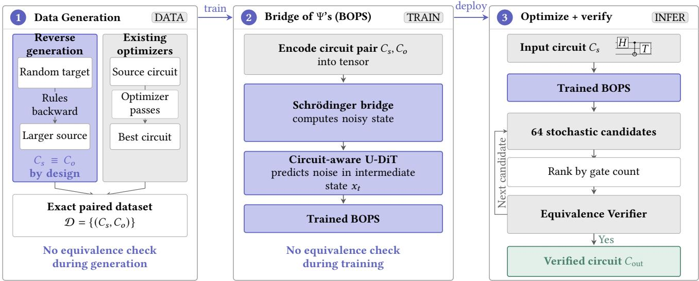  
Figure 1. BOPS architecture and training pipeline; new components are shown in lavender.

Table 1. BOPS and the strongest baseline optimizer on 8 64 circuits (� = 2,686); full results in Table 2.
<table><tr><td colspan="3">gates reduced by depth reduced by target reached</td></tr><tr><td>QUESO</td><td>2.11×</td><td>2.11×</td><td>26.1%</td></tr><tr><td>BOPS</td><td>2.46×</td><td>2.45×</td><td>77.2%</td></tr></table>

We implement this formulation as Bridge of Ψ’s (BOPS), a standalone optimizer that reads and writes OpenQASM 2 and can serve as a stage in existing compilation pipelines. Its denoiser is a U-shaped difusion transformer that resamples only the time axis and keeps every qubit at full resolution. One trained network therefore accepts any circuit that fits <sup>the</sup> <sup>grid</sup> <sup>(§4.3).</sup> <sup>We</sup> <sup>write</sup> <sup>�</sup> × <sup>�</sup> <sup>for</sup> <sup>that</sup> <sup>grid,</sup> <sup>�</sup> <sup>qubits</sup> <sup>by</sup> <sup>�</sup> time steps, so an 8  64 circuit acts on eight qubits and has depth at most 64. We compare BOPS on gate count and depth with Qiskit [39], PyZX [20], tket [45], TZAP [1], VOQC [18], QUESO [53], and GUOQ [54], verifying every reported output exactly (§4.5, §7).

For circuit optimization with generative models, we ask:

Can a generative model optimize quantum circuits? Yes. On generated 8 64 Cliford+� circuits, BOPS outperforms every individual baseline in gate count, depth, and target recovery (Table 1).

Does it generalize to unseen circuit structures? Yes. Although BOPS was not trained on large structured or arithmetic circuits, it remains competitive on circuit benchmarks, showing that its learned optimizations transfer beyond the training distribution (Table 5).

Are of-the-shelf difusion models efective? No, but they can be adapted. Standard vision/text difusion backbones perform poorly (Table 4). BOPS remedies this by customizing its denoiser architecture (§4.3) and training regimen (§5).

Does BOPS scale to larger circuits? Yes, by finetuning. Although circuit space grows superexponentially with the number of qubits (Lemma C.2), finetuning the 8  64 model to 16  192 improves 98.4% of larger inputs under windowed inference (Table 3).

## Contributions:

We formulate circuit optimization as a conditional Schrödinger bridge from an input circuit to an optimized equivalent, without a fixed rewrite library or equivalence-preserving search space (§4.2).

We build exact training pairs from reverse rewrites and existing optimizers, including reductions those optimizers miss. Encoding equivalence in the data eliminates unitary construction and equivalence checks during training (§5.1, §5).

We adapt U-DiT [49] to variable circuit grids with time-only downsampling, permutation equivariance, and grouped attention, preserving full qubit resolution across widths and depths. The resulting denoiser shortens 88.9% of evaluation circuits, versus 76.2% for plain U-DiT and 40.6% for U-Net (Table 4, §4.3).

One BOPS model outperforms all nine baselines in gate count and depth reduction, reaching the known target nearly 3 as often as the strongest baseline. Inference uses a fixed number of network evaluations rather than size-dependent rewrite or search trajectories. Every output is exactly verified (Table 1, §7).

To our knowledge, BOPS is the first generative model to match or outperform state-of-the-art hard-coded and searchbased circuit optimizers, opening a path for applying recent AI advances across quantum compilation workflows.

## 2 Background

## 2.1 Quantum circuits and optimization

An �-qubit quantum state is represented by a vector with $2 ^ { n }$ complex entries, and a quantum gate transforms this state through a unitary matrix [33]. A circuit $C = ( g _ { 1 } , \dots , g _ { m } )$ is a sequence of gates with combined action represented by a $2 ^ { n } \times 2 ^ { n }$ unitary matrix � � . We use the Cliford � gate set:

$$
\mathcal { G } = \{ H , S , S ^ { \dagger } , T , T ^ { \dagger } , \mathrm  C X \} .\tag{1}
$$

This gate set is a standard target for fault-tolerant compilation [26, 42]. The gates $H , S , { \bar { S } } ^ { \dagger } , T$ , and $T ^ { \dagger }$ act on one qubit, while CX connects two qubits.

Circuits are commonly drawn as grids in which each row is a qubit and gates are ordered from left to right. This asymmetry between the qubit and time axes matters to our model’s circuit representation.

Two circuits are equivalent, written $C \equiv C ^ { \prime }$ , when their unitaries difer only by a global phase:

$$
U ( C ) = e ^ { i \varphi } U ( C ^ { \prime } ) .\tag{2}
$$

Circuit optimization seeks an equivalent circuit with lower cost:

$$
\boldsymbol { C } ^ { \star } = \underset { \boldsymbol { C } ^ { \prime } \equiv \boldsymbol { C } } { \arg \operatorname* { m i n } } \mathrm { c o s t } ( \boldsymbol { C } ^ { \prime } ) .\tag{3}
$$

Here, we measure cost using gate count and circuit depth.

Although a circuit is stored as a sequence of gates, its unitary contains $4 ^ { n }$ complex entries. Explicitly constructing unitaries to compare two circuits therefore scales exponentially with the number of qubits. Instead, in this work we use two fast but weaker tests for exact circuit equivalence that can be inconclusive (§4.5), and in Appendix C.2 review the scaling of a GPU implementation for conclusive exact equivalence checking—a decision problem that is coNP-hard because 3-SAT can be embedded as reversible Boolean circuits over Cliford+�.

## 2.2 Difusion models and Schrödinger bridges

A difusion model learns to generate data by reversing a gradual noising process [19, 46]. The forward process starts from a data example $x _ { 0 }$ and progressively adds Gaussian noise until the state at � = 1 is approximately random noise. The reverse process starts from that noise and repeatedly applies a neural network to recover a data sample. Although the forward process is described as a sequence of steps, the distribution of an intermediate state $x _ { t }$ has a closed form given $x _ { 0 } .$ . Training can therefore choose a random � and sample $x _ { t }$ directly, without generating any earlier states. The network then predicts the noise separating $x _ { t }$ from $x _ { 0 } ,$ and the cost of a training example is independent of the number of denoising steps used during generation [19].

Standard difusion fixes one endpoint of the process to Gaussian noise. A Schrödinger bridge removes that restriction and instead connects two arbitrary data distributions while remaining as close as possible to a chosen reference difusion process [8, 24]. Let $\mathcal { P }$ be the reference distribution over paths and $\boldsymbol { Q }$ a candidate path distribution with endpoint distributions $\pi _ { 0 }$ and $\pi _ { 1 }$ . The bridge minimizes how far departs from $\mathcal { P } \colon$

$$
\begin{array} { r } { \boldsymbol { Q } ^ { \star } = \underset { \boldsymbol { Q } : \boldsymbol { Q } _ { 0 } = \pi _ { 0 } , \boldsymbol { Q } _ { 1 } = \pi _ { 1 } } { \arg \operatorname* { m i n } } D _ { \mathrm { K L } } ( \boldsymbol { Q } \parallel \mathcal { P } ) . } \end{array}\tag{4}
$$

In plain terms, the bridge finds a likely random transformation between its endpoint distributions without departing unnecessarily from the reference noising process. For arbitrary endpoint distributions, this bridge has no general closed form and is usually approximated by repeatedly fitting the process from alternating endpoints [8, 44].

I<sup>2</sup>SB makes training practical by assuming paired endpoints and using a Gaussian reference process with no deterministic drift [27]. Each training example supplies a target $x _ { 0 }$ together with its corresponding source $x _ { 1 } .$ . Across the dataset, these pairwise bridges define transport between the source and target distributions.

The reference process adds Gaussian noise at a prescribed rate $\beta _ { t }$ , called the noise schedule. The noise schedule defines the variances accumulated before and after time �.

$$
\sigma _ { \mathrm { f w d } } ( t ) ^ { 2 } = \int _ { 0 } ^ { t } \beta _ { \tau } \mathrm { d } \tau , \qquad \sigma _ { \mathrm { b w d } } ( t ) ^ { 2 } = \int _ { t } ^ { 1 } \beta _ { \tau } \mathrm { d } \tau .\tag{5}
$$

These variances determine the interpolation weight $\alpha _ { t }$

$$
\alpha _ { t } = \frac { \sigma _ { \mathrm { b w d } } ( t ) ^ { 2 } } { \sigma _ { \mathrm { f w d } } ( t ) ^ { 2 } + \sigma _ { \mathrm { b w d } } ( t ) ^ { 2 } } .\tag{6}
$$

Conditioned on the endpoint pair, the distribution of every intermediate state is then known exactly.

$$
\begin{array} { r l } & { x _ { t } \sim N ( \mu _ { t } , \sigma _ { t } ^ { 2 } I ) , } \\ & { \mu _ { t } = \alpha _ { t } x _ { 0 } + ( 1 - \alpha _ { t } ) x _ { 1 } , } \\ & { \sigma _ { t } ^ { 2 } = \alpha _ { t } \sigma _ { \mathrm { f w d } } ( t ) ^ { 2 } . } \end{array}\tag{7}
$$

At $t = 0 ,$ , this distribution collapses to $x _ { 0 } ,$ and at $t \ = \ 1 ,$ it collapses to $x _ { 1 }$ . Between them, its mean interpolates between the pair while its variance introduces noise.

The key consequence is that training does not need to solve the general bridge problem or simulate a complete path. For each paired example, training samples a random � and draws $x _ { t }$ directly from the closed-form Gaussian in (7). The denoiser $\epsilon _ { \theta } ( x _ { t } , t )$ receives the sampled state and its time.

We train it with the following mean-squared error.

$$
\mathcal { L } ( \theta ) = \mathbb { E } _ { t , ( x _ { 0 } , x _ { 1 } ) , x _ { t } } \left[ \bigg | \bigg | \epsilon _ { \theta } ( x _ { t } , t ) - \frac { x _ { t } - x _ { 0 } } { \sigma _ { \mathrm { f w d } } ( t ) } \bigg | \bigg | ^ { 2 } \right] .\tag{8}
$$

The target is the displacement from $x _ { 0 }$ to $x _ { t }$ , normalized by the noise accumulated up to time � [27].

Generation starts from $x _ { 1 }$ , uses the denoiser to predict $x _ { 0 } ,$ and progressively samples earlier states from the corresponding Gaussian posterior [27]. In our application, $x _ { 1 }$ represents a source circuit and $x _ { 0 }$ its optimized equivalent.

## 3 Design Objectives

## 3.1 Related work in circuit optimization

Classical quantum-circuit optimizers target gate count, gate depth, two-qubit gate count, and related objectives through several broad techniques. The non-universal CX,� fragment of the Cliford+T gate set is known to correspond to Reed–Muller codes. Techniques focusing on T-count and T-depth optimization—both NP-hard problems [51]—include TODD [17], PyZX [21], FastTODD [52], and TZAP [1].

Rule-based pattern-matching tools such as Qiskit [39], tket [45], and VOQC, whose optimizations are verified in the Coq proof assistant [18], use peephole optimizations and templating to rapidly apply local rewrite rules from a fixed library to subcircuits. Quartz [55], Quanto [36], and QUESO [53] automatically generate and verify rewrite rules for particular gate sets by enumerating small circuits on two to four qubits. Graph-based rewriting approaches in the ZX-calculus convert circuits to graph representations, which are optimized through rewrite rules in graph form, before converting back to a circuit [9, 20]. Phase folding (also called phase polynomial, phase gadget, and Pauli exponential) methods are describable in circuit, graph, or symbolic form [2, 7, 32]. GUOQ [54] combines QUESO’s rules with BQSKit’s continuous nonlinear resynthesis of blocks of at most three qubits [57].

These approaches largely preserve equivalence by construction, avoiding dense-unitary comparisons that materialize $4 ^ { n }$ complex entries, but remain limited by their encoded patterns and resynthesis width. Symbolic checkers avoid this dense representation but can return inconclusive results [20].

Automatically generated identities expand the available transformations. Quanto, for example, finds depth reductions missed by Qiskit and tket [36]. Yet on � qubits there are $2 ^ { \Theta ( G \log n ) }$ circuit representations (Fig. 2) of �-gate cir cuits and $2 ^ { \Theta ( D n \log n ) }$ of circuits with depth at most � (Appendix C.1). Practical rule-based optimization is therefore bounded by both the available transformations and the com positions the search can explore.

Learned optimizers can change the search policy without removing these bounds. Reinforcement learning selects and orders predefined rewrites and can retain cost-increasing moves that greedy search prunes, but its action space remains fixed [10, 25]. AlphaTensor-Quantum instead optimizes signature-tensor decompositions, but targets �-count and handles structure outside CNOT+� through compilation such as Hadamard gadgetization [42, 58]. Other learned approaches include sequence-to-sequence transformers [5] and reinforcement learning, using either Proximal Policy Optimization [40] or Cliford-circuit random walks [56].

Prior difusion models perform unitary-conditioned synthesis rather than source-conditioned optimization [11, 12]. AltGraph maps source-circuit DAGs to generated DAGs but reports approximate density-matrix error rather than exact equivalence [3]. Recent work trains an autoregressive transformer for circuit optimization, but reports exact equivalence falling sharply with output length [43]. To our knowledge, BOPS is the first source-conditioned Schrödinger bridge for circuit optimization.

## 3.2 Design requirements

In order to determine how much headroom there is for improvement, we generate optimized-unoptimized circuit pairs by starting with a random quantum circuit, and applying rewrite rules in reverse to expand to a larger equivalence circuit. For each pair, in Table 2, nine baseline optimizers start with the unoptimized circuit, and the strongest of them reaches the reduction of the starting optimized circuit for only 40.7% of pairs. This gap in headroom motivates a whole-circuit generator that does not select from an explicit inference-time action library. Composed and nested rewrites can require coordinated changes across distant regions of a circuit. A paired difusion model updates the complete representation at each denoising step and learns from exact source–target pairs, requiring neither unitary construction nor equivalence checks during training (§2.2). A circuit-tocircuit bridge can therefore learn optimization from examples while exact inference-time verification enforces correctness.

Source-circuit conditioning makes this generator fit the interface of a compiler pass. A dense encoding of an �-qubit unitary contains $4 ^ { n }$ complex entries—65,536 at eight qubits— whereas an $8 \times 6 4$ circuit grid contains 512 token positions (§4.1). Unlike a unitary, the source also supplies an implemen tation to improve: in their three-qubit unitary-compilation experiments, Fürrutter et al. start from noise and draw 1,024 samples per target [12], whereas BOPS starts from a valid source and draws 64 (§6).

Circuit grids impose asymmetric representation and denoising requirements. Gaussian difusion acts on continuous, fixed-size arrays, whereas circuits are discrete and vary in width and depth. Their encoding must preserve multi-qubit connections, support padding, and decode into valid circuits. Rows identify qubits and columns order gates in time, so downsampling rows can merge wires while purely local operations can miss distant interactions. The denoiser must therefore keep every qubit at full resolution and combine local patterns with circuit-wide context (§4.3).

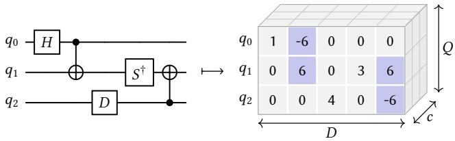  
Figure 2. Circuit representation, after Fürrutter et al. [11, 12]. Tokens 1–6 are the gates of (1), 0 an empty cell, and 6/6 the control/target of a CX (shaded).

Together, these requirements define our central question: Can a source-conditioned Schrödinger bridge produce equivalent, lower-cost circuits without an explicit inference-time rewrite library, using no unitary construction or equivalence checks during training and a fixed number of network evaluations perfixed-grid input?

## 4 Model and Training

## 4.1 Circuit representation

Difusion acts on continuous tensors, whereas a circuit is a discrete sequence of gates, so we adopt the tensor representation of Fürrutter et al. [11, 12], shown in Fig. 2. A circuit becomes a tensor of $Q$ rows and � columns, one row per qubit and one column per timestep, so gates on diferent qubits share a column, and � and � are the width and the depth of the circuit. Every cell holds a token naming the gate that acts on that qubit at that timestep. A CX occupies two cells of one column and its control and target are separate tokens, so together with the five one-qubit gates of (1) and the empty cell, there are eight tokens in total. Each token is then replaced, as in [12], by a fixed vector of � = 9 channels, the vectors mutually orthogonal and each of zero mean and unit variance, giving a tensor of shape $Q \times D \times c$ . Decoding assigns every cell the token whose vector has the highest cosine similarity with it. A tensor decodes to a valid circuit only ifevery control has exactly one target in its own column and every target one control.

## 4.2 Circuit-to-circuit bridge

We instantiate the paired bridge of §2.2 on these tensors, with $x _ { 0 }$ the tensor of the optimized circuit and $x _ { 1 }$ that of its source. The only change is the conditioning: the denoiser has to know which source it is optimizing, so $\epsilon _ { \theta } ( x _ { t } , t )$ becomes $\epsilon _ { \theta } ( x _ { t } , t , x _ { 1 } )$ , with $x _ { 1 }$ concatenated to $x _ { t }$ along the channel axis, which gives 2� channels and puts the source at every position of the tensor.

Training is otherwise that of (8), with � discretized into 256 steps and $\beta _ { t }$ from the symmetric quadratic schedule of Liu et al. [27], which is largest at the midpoint, where the state is furthest from either endpoint. Generation runs from $t = 1$ where the state is the source, down to $t = 0 ,$ . Rearranging the training target of (8) turns the denoiser output into an estimate of the optimized circuit,

$$
\begin{array} { r } { \hat { x } _ { 0 } = x _ { t } - \sigma _ { \mathrm { f w d } } ( t ) \epsilon _ { \theta } ( x _ { t } , t , x _ { 1 } ) , } \end{array}\tag{9}
$$

and the state at the next step $s < t$ is drawn from the bridge posterior between $x _ { t }$ and that estimate,

$$
\begin{array} { r l } & { x _ { s } \sim N \big ( \lambda \hat { x } _ { 0 } + ( 1 - \lambda ) x _ { t } , \lambda \sigma _ { \mathrm { f w d } } ( s ) ^ { 2 } I \big ) , } \\ & { ~ \lambda = 1 - \displaystyle \frac { \sigma _ { \mathrm { f w d } } ( s ) ^ { 2 } } { \sigma _ { \mathrm { f w d } } ( t ) ^ { 2 } } , } \end{array}\tag{10}
$$

where � is the fraction of the noise accumulated by � that this step removes. The chain stays continuous throughout, with nothing projecting $\hat { x } _ { 0 }$ onto the token vectors between steps. Consecutive steps need not be adjacent, so it is subsampled to 128 of the 256 steps [60] at $\eta = 1$ , where that sampler is exactly (10). The loop runs over the schedule and not over gates or cells, so a candidate costs those 128 denoiser evaluations whatever the circuit holds, with only the cost of one evaluation growing with its length. Each run is stochastic, so 64 candidates are drawn per source circuit and verified (§4.5). Beyond the model’s attention span, the same procedure runs on blocks and the merged circuit is verified (§7.2).

## 4.3 Denoiser architecture

We build on U-DiT, a U-shaped difusion transformer for images [49]. Its encoder levels halve both spatial axes and widen the channels, a mirrored decoder undoes them, and skip connections join matching levels. Each level runs a stack of blocks comprising attention and then a feed-forward network, both conditioned on the denoising step through adaLN-Zero [34]. Attention is downsampled as well. The token map is split into four 2 -downsampled phases. Each attends within itself, and the results are merged at a quarter of the cost of full attention. Both the levels and the attention therefore downsample the qubit axis as well as time, which §3 rules out for circuits. Table 4 reports the unmodified U-DiT and a standard difusion U-Net trained on the same pairs.

Time-only downsampling. The column index is a coordinate in time, but the row index is only a label. Qubit order is arbitrary and a CX acts on an arbitrary pair of rows, so pooling adjacent rows imposes a locality the circuit does not have (§3.2). We downsample the time axis only (Fig. 3). Within each row, adjacent columns are concatenated in pairs, $[ B , Q , D , C _ { \ell } ]  [ B , Q , D / 2 , 2 C _ { \ell } ]$ . A linear layer applied at every position projects $2 C _ { \ell }$ to the next level’s width $C _ { \ell + 1 }$ . These widths are 192, 256, 384, 512, 768. The decoder undoes the projection and the concatenation, then merges the skip through a learned per-channel gate and projects back to $C _ { \ell }$ . Neither step ever combines two rows, so a token at level ℓ is $2 ^ { \ell }$ consecutive timesteps of a single qubit, and all � rows reach level 4, the bottleneck. Pooling rows would also fix � into the architecture, whereas downsampling time alone leaves it a free dimension, which is what makes the 16-qubit models of $\ S 7 . 2 :$ a finetune rather than a retrain. Attention encodes position with rotary embeddings (RoPE) [47], indexed by absolute circuit timestep rather than by position within the level. The token at index � of level ℓ takes position $j \cdot 2 ^ { \ell }$ and not $j ,$ so a cropped grid is the prefix of a full one.

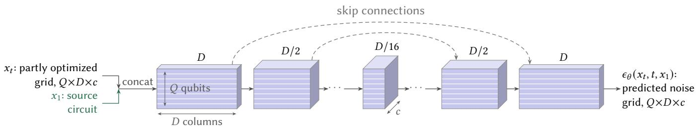  
Figure 3. The denoiser, drawn as the tensor shape $Q \times D \times c$ at each stage. The tensor of $\ S 4 . 1$ enters as $x _ { t } ,$ with the source $x _ { 1 }$ concatenated along the channel axis. Four downsamplings merge neighboring columns and widen the channels (192, 256, 384, 512, 768 over five levels), four mirror levels undo them, and the qubit axis is never reduced. The output is the predicted noise $\epsilon _ { \theta } \big ( x _ { t } , t , x _ { 1 } \big )$ , from which (9) gives $\hat { x } _ { 0 }$

Permutation equivariance. Nothing described so far reads the row index, so the network is equivariant under permutations of the qubit axis. Two rows carrying the same content receive the same prediction, so where the output must distinguish them, as a CX must pick one of a pair as its control, the equivariant answer averages the two and decodes to neither. We therefore add qubit identity from a learned table of 64 rows and width $C _ { \ell } ,$ one per level. The level-0 table enters at the input. The deeper tables enter at every stage that runs at their level and are zero-initialized, so the network begins carrying qubit identity from the input alone. Equivariance is then learned rather than built in, from the qubit permutations appended to every training pair (§5.2). The table is sized for 64 qubits. Training has used eight, or sixteen after the finetunes of §7.2.

Grouped atention. Level ℓ holds $D _ { \ell } = D / 2 ^ { \ell }$ columns, cut into $f = D _ { \ell } / g$ groups of � each, with $f$ rounded down to a divisor of $D _ { \ell }$ and � = 1 where the level is shorter than �. A token attends to the �� tokens of its own group and to none outside it, so with � fixed the cost of attention grows linearly with � rather than quadratically. A token at level ℓ covers $2 ^ { \ell }$ timesteps, so one group reaches $g \cdot 2 ^ { \ell }$ timesteps of the circuit, twice as many at each level down. We set � per network, but � is derived per call, so the same weights attend globally on a short circuit and in bands on a long one. $\mathrm { A t } \ : D = 6 4 , g = 6 4$ makes every level a single group. At � = 512, � = 32 reaches 32 timesteps at level 0 and the whole circuit at level 4. Full attention at $D = 5 1 2$ would instead cost 2.7 as much per evaluation. Consecutive blocks alternate a contiguous window [29] with U-DiT’s interleaved split [49]. Here the split uses every � -th column rather than a fixed four-way split of both axes. Similarity is cosine with a learned per-head scale [28]. Every block keeps U-DiT’s depthwise convolutions before attention and inside the feed forward network, here along time only. Their width is 9 at level 0, 7 at level 1, and 5 below, with one more before each downsampling and after each upsampling.

Size and cost. The encoder and the decoder each run six blocks at level 0 and four at levels 1 to 3, with four more at the bottleneck, giving 40 blocks and 98.8M parameters. The $D = 6 4$ and the $D = 5 1 2$ networks share this count and difer only in �. Parameters concentrate at the bottleneck: the twelve blocks at level 0 hold 6.4% of them against 33.5% for the four at the bottleneck, sixteen times fewer per block. Compute is spread far more evenly: each transition halves the token count while roughly doubling $C ^ { 2 } ,$ , so everything but attention costs about the same at both ends of the U. Attention is the exception, four times larger at level 0, where a block costs 3.2 GFLOP against 2.6 at the bottleneck. The twelve fine-level blocks are therefore the most expensive stage, taking 34% of the 113 GFLOP for a full 8  512 grid against 9% for the bottleneck. The extra depth we run at the finest level therefore costs time rather than parameters. Because the U has four transitions, � must be divisible by 16. Appendix A gives the evaluation commands and the baseline settings, and the code release the remaining flags.

## 4.4 Training

All models use the same training recipe. We use AdamW with $( \beta _ { 1 } , \beta _ { 2 } ) = ( 0 . 9 , 0 . 9 5 )$ , no weight decay, and gradients clipped at norm 1. The learning rate peaks at $4 \times 1 0 ^ { - 4 }$ after 2,000 warmup steps, then cosine-decays to one tenth. The global batch is 512 pairs, and the loss of (8) is averaged over the columns a source circuit occupies and the next 16 columns, so the remaining padding is never trained on. We set $\beta _ { \mathrm { m a x } } = 1 2$ , so the schedule of §4.2 accumulates a total variance of 1.20 and $\sigma _ { t }$ peaks at 0.55 at the midpoint of the bridge, against token vectors of unit variance. Circuits are batched by length, each batch cropped to one of a fixed set of lengths, two at � = 64 and eight from 32 to 512 columns <sup>at</sup> <sup>�</sup> <sup>=</sup> <sup>512.</sup> <sup>Cropping</sup> <sup>removes</sup> <sup>6.2</sup>× <sup>of</sup> <sup>the</sup> <sup>padded</sup> <sup>work</sup> at $D \ = \ 5 1 2$ and needs no change to the network, which derives � from the length it is handed and positions tokens by absolute column (§4.3). We validate and sample from an exponential moving average of the weights with decay 0.9995. We report the last checkpoint rather than selecting one, since validation loss selects badly here. Training runs to 150,000 steps.

## 4.5 Equivalence checking

No equivalence check enters the training loop, since equivalence is established when each training pair is generated (§5.1, §5.2). At inference we decode the 64 candidates drawn for a source circuit, rank them by gate count with invalid decodings last, and accept the first that passes verification. A circuit with no accepted candidate is reported at its source length, so nothing we report rests on an unverified circuit.

Two circuits are equivalent when they implement the same unitary up to a global phase. With $W = U ( C ) ^ { \dagger } U ( C ^ { \prime } )$ and $\tau = \mathrm { T r } ( W ) / 2 ^ { Q }$ , that is exactly the condition $| \tau | = 1$ , and $1 - | \tau | ^ { 2 }$ is the process infidelity. Up to $Q = 1 0$ we build both matrices and read � of directly, which settles every pair as equivalent or diferent.

At � = 16 that matrix has $2 ^ { 3 2 }$ entries, so we never build it and check the q16 datasets with a tiered pipeline instead: a sequence of tests on the ZX diagram of � , cheapest first, each of which either answers or declines because the stabilizer decomposition it would need exceeds a fixed budget. The first test to answer decides the pair, and a pair no test answers is undecided. The cheapest rewrites the diagram with PyZX [20] and asks whether it reduces to the identity, which proves equivalence when it succeeds and says nothing when it fails. The second closes the diagram by wiring each output onto its own input, so that its scalar is Tr � and � follows exactly. A pair is undecided as well when a circuit uses a gate the pipeline cannot translate, or when it exceeds a wall-clock limit of 120 seconds. Undecided candidates are not accepted, so the rates of §7.2 are lower bounds (Table 3). In Appendix C.2, we summarize another approach available to BOPS for definitively answering equivalence checks through classical simulation with stabilizer decompositions [22, 38], which, due to a very fast GPU-parallelized implementation [48], we would expect to comprise an inconsequential fraction of the total generative inference time.

## 5 Training Data

BOPS trains on pairs of a source circuit and an optimized equivalent, so data generation must scale to millions of pairs. Building them with existing optimizers has two limitations. Their targets contain only the reductions those optimizers already recover, so anything beyond would have to come from generalizing across their outputs, and search-based tools take seconds per circuit. Finding a minimum-size or <sup>minimum-depth</sup> <sup>equivalent</sup> <sup>over</sup> <sup>Cliford</sup>+<sup>�</sup> <sup>is</sup> <sup>NP-hard</sup> <sup>[51],</sup> while a heuristic that does not preserve equivalence by construction must verify every accepted candidate. We therefore construct exact pairs largely by construction.

## 5.1 Reverse generation

We generate most pairs in reverse from rewrite rules on one to three qubits. A rule relates two gate sequences implementing the same operator. Applying it from longer to shorter reduces a circuit, and the opposite direction is a reverse rewrite (Fig. 4). Generation has three steps (Fig. 1): draw a small random circuit, reduce it under the rules, and repeatedly apply reverse rewrites, some nested inside earlier ones. The reduced circuit becomes the target and the expanded circuit the source. Because every rule is verified in advance, they are equivalent by construction and generation never builds a circuit unitary. Circuit unoptimization [31] expands circuits in the same spirit, inserting two-qubit unitaries and their inverses, but to build compiler benchmarks rather than labeled pairs.

Target reduction and source expansion use diferent rule sets. The expansion set contains 86 rules: 36 handwritten and 50 solver-mined [35]; 83 shorten circuits, three only rearrange them, and 16 of the reducing rules have an empty right-hand side. The reduction set combines the same 36 handwritten rules with 2,727 mined rules, for 2,763 total. Both sides of every rule are compared as dense unitaries at the rule’s minimum width up to global phase, so an invalid rule fails before generating data.

The smaller expansion set produces stronger sources. Reversing one of its rules adds 3.9 gates on average, against 1.35 for a mined rule. Weaker expansions produce sources that existing optimizers already solve. During expansion, matched rewrites are preferred over empty-right-hand-side insertions, which create standalone identity gadgets. Each gate may then move up to eight positions past gates on disjoint qubits, preserving the operator while separating the rewritten gates in the circuit grid (Appendix B.2). These choices embed and disperse the added structure without changing the represented operator.

The target generator determines the distribution BOPS learns. It combines uniformly random gates, random motifs, and repeated copies of one motif to represent recurring algorithmic structure (Fig. 5). Motifs are small subcircuits such as Tofoli decompositions, parity ladders, and phase gadgets. Repetition applies one motif to several groups of qubits in sequence. The resulting targets contain both unstructured gates and patterns repeated in compiled programs.

## 5.2 Dataset composition

Seven procedures contribute the following shares of the q8t64 training split:

Atomic applies one reverse rewrite (5.9%).

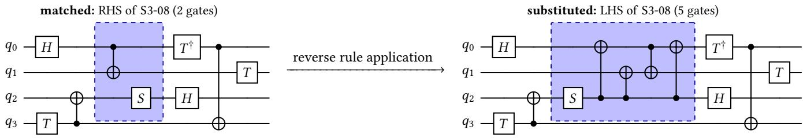  
Figure 4. Reverse rule application. The SAT-mined rule S3-08 (Fig. 10) read right to left: its boxed two-gate right-hand side, matched on �<sub>0</sub>, �<sub>1</sub>, �<sub>2</sub> of a four-qubit circuit, is replaced by its five-gate left-hand side.

Few, medium, and hard apply 2–3, 4–8, and 9–20 reverse rewrites (17.9%, 20.4%, and 19.3%). Each rewrite is aimed inside an earlier span with probabilities 0.25, 0.5, and 0.8, respectively, increasing both rewrite count and nesting.

Chain concatenates several independently generated source–target pairs (22.9%). Its sources average 54.2 gates against 41.9 overall, increasing length without increasing the number of rewrites within each constituent pair.

Natural samples circuits randomly from the target generator and uses them as sources rather than targets, labeling each with the shortest output of the nine used optimizers (9.0%).

Cliford omits � gates, allowing each target to be reconstructed from the source’s stabilizer tableau rather than reduction rules (4.6%).

Together, they vary rewrite count and nesting, circuit length, source distribution, and gate class.

## 5.3 Resulting datasets

The main corpus, q8t64, uses a � = 8 by � = 64 grid with circuits spanning three to eight qubits. It contains 1,953,433 training pairs and 3,656 pairs in each validation and test split. Sources average 41.9 gates over 24.9 occupied columns, against 18.0 gates for targets. The 64-column source limit caps expansion at 20 reverse rewrites.

The targets are shorter than the seven-configuration ensemble’s outputs on 56.7% of test circuits and longer on 7.7%. Including QUESO and GUOQ changes these rates to 33.9% and 23.1%. These rates motivate reporting both target reached and target beaten: targets expose unrecovered reductions but are not assumed optimal.

No exact source or target appears in multiple procedure outputs; source deduplication retains one target per source. Qubit relabeling is the only near-duplicate not excluded: 9 of the 7,312 evaluation sources relabel a training source. An additional sample check constructed both unitaries and found every sampled pair equivalent.

Two larger datasets support the scaling experiments of §7.2. q8t512 applies the same seven procedures on a � = 8 by � = 512 grid, accommodating 200 reverse rewrites; its test sources average 164 gates over 105 columns. q16t192 uses $Q = 1 6 , D = 1 9 2$ , and 1,097,747 training pairs but omits natural; it is the only corpus whose targets the ensemble never shortens.

## 6 Experimental Setup

Hardware and software. Training and inference run on Isambard-AI [30], on eight NVIDIA GH200 GPUs across two nodes under distributed data parallelism, in bfloat16 with torch.compile on PyTorch 2.11, CUDA 12.8 and Python 3.12, peaking at 10.4 GiB per GPU for the � = 64 network and 59.4 for the � = 512 one. Dataset generation runs on 72- core CPU nodes and every baseline on one core, one circuit at a time, so a per-circuit cost is a single-core cost.

Model and training. We evaluate the network of §4.3 at 98.8 million parameters, trained with the recipe of §4.4 for 150,000 steps at 135 ms per step, or 45 GPU-hours. The 8 512 network is the same architecture for 300,000 steps at 153 ms (102 GPU-hours), and the 16-qubit models are 50,000-step finetunes at 63 and 94 ms on 16 64 and 16 192 (7 and 10 GPU-hours).

Data and benchmarks. We use the q8t64 splits of §5.3, a � = 8 by � = 64 grid over the gate pool of (1), scoring the four rule-generated components atomic, few, medium and hard, 2,686 of the 3,656 test sources, unless stated otherwise. Beyond the test split we evaluate on 228 vendored flat-QASM circuits that prior optimizer papers report, counted once each where the suites overlap: 69 Feynman [2, 32], 124 GUOQ [54], 31 QASMBench, three FTCircuitBench and one QUESO [53], with 34 of the Feynman entries feynopt -O3 reductions of the other 35. The benchmark tables score the 68 that fit the 8 64 grid and the 119 that fit 8 512.

Baselines. We compare against nine configurations of seven optimizers, run on the same circuits and verified exactly as ours are: Qiskit transpile at level three; PyZX basic\_optimization, full\_reduce, and full\_optimize, the last including TODD; tket RemoveRedundancies; the VOQC Cliford � passes; T zap ; QUESO; and GUOQ. GUOQ adds BQSKit resynthesis to QUESO. QUESO and GUOQ run from the GUOQ distribution, QUESO with resynthesis disabled, under a 5 s search budget and without GUOQ’s default 100-gate cap; T zap runs under a 60 s per-circuit timeout and the remaining six to completion. Stronger tket passes are excluded because they answer through general TK1 rotations, in a diferent gate set. Seven of the nine answer on every test circuit; Qiskit returns a non-equivalent circuit on 0.2% and GUOQ on 0.5%, both rejected by verification, and GUOQ returns nothing on another 21.6% after its resynthesis server became unreachable, scored as unchanged, so its row is a lower bound. The exact settings for all nine configurations are in Appendix A.2.

Table 2. q8t64 test split, $n = 2 , 6 8 6 .$ . target reached/beaten: fraction of outputs matching or improving on the source’s corpus target. cost: seconds per circuit, one CPU core for the optimizers, one GH200 for BOPS.
<table><tr><td>system</td><td>gates reduced by</td><td>depth reduced by</td><td>improved</td><td>gap closed</td><td>target reached</td><td>target beaten</td><td>cost (s)</td></tr><tr><td>Qiskit O3</td><td>1.22×</td><td>1.17×</td><td>88.4%</td><td>32.0%</td><td>4.4%</td><td>0.1%</td><td>0.03</td></tr><tr><td>PyZX-b</td><td>1.76×</td><td>1.67×</td><td>94.2%</td><td>65.8%</td><td>12.6%</td><td>1.9%</td><td>0.03</td></tr><tr><td>PyZX-fr</td><td>1.99×</td><td>1.97×</td><td>81.4%</td><td>63.3%</td><td>21.5%</td><td>1.4%</td><td>0.03</td></tr><tr><td>PyZX-fo</td><td>1.86×</td><td>1.86×</td><td>73.8%</td><td>54.7%</td><td>17.9%</td><td>0.5%</td><td>0.04</td></tr><tr><td>tket</td><td>1.09×</td><td>1.07×</td><td>64.8%</td><td>13.3%</td><td>0.2%</td><td>0.0%</td><td>0.03</td></tr><tr><td>VOQC</td><td>1.27×</td><td>1.21×</td><td>91.4%</td><td>36.6%</td><td>5.5%</td><td>0.1%</td><td>0.03</td></tr><tr><td>T|zap&gt;</td><td>1.28×</td><td>1.21×</td><td>92.6%</td><td>38.1%</td><td>4.3%</td><td>0.4%</td><td>0.04</td></tr><tr><td>QUESO</td><td>2.11×</td><td>2.11×</td><td>94.5%</td><td>86.0%</td><td>26.1%</td><td>14.6%</td><td>5.09</td></tr><tr><td>GUOQ</td><td>1.28×</td><td>1.26×</td><td>41.7%</td><td>33.2%</td><td>9.9%</td><td>4.5%</td><td>4.17</td></tr><tr><td>corpus target</td><td>2.66×</td><td>2.72×</td><td>100.0%</td><td>100.0%</td><td>100.0%</td><td>0.0%</td><td>一</td></tr><tr><td>BOPS, whole</td><td>2.28×</td><td>2.26×</td><td>88.9%</td><td>88.8%</td><td>78.6%</td><td>4.8%</td><td>4.8</td></tr><tr><td>BOPS, windowed</td><td>2.46×</td><td>2.45×</td><td>96.5%</td><td>95.2%</td><td>77.2%</td><td>11.7%</td><td>14.4</td></tr></table>

Inference. Whole-circuit mode draws 64 candidates at 128 denoising steps each, ranks them by gate count, and verifies them in that order until finding an exactly equivalent candidate (§4.5). That is 8,192 denoiser evaluations per circuit whatever its size, so the sampling budget is fixed. Windowed mode applies the same procedure to 32-column blocks and keeps the shorter of the whole-circuit draw and the merged windows (§7.2).

Metrics. A system’s reduction, reported as gates and depth reduced by, is the geometric mean over circuits of source cost over output cost, so 2.00 means a typical output is half as long and every circuit counts once whatever its size. The improvement rate, reported as improved, is the fraction of circuits whose output is strictly shorter than the source and exactly equivalent to it. Against each dataset target we report the gap closed, src out src target , with target reached and target beaten, the fractions matching or improving on the target length, which is not a ceiling, so gap closed can exceed one (§5.3). The per-circuit benchmark tables give src, the source gate count, and cut, the gates the best of the nine removes. A circuit with no verified improvement is reported at its source length, for BOPS and every baseline alike. Two models trained on the same data with diferent seeds difer by 1.6 percentage points in improvement rate, which sets the resolution of every comparison below.

## 7 Results and Discussion

Tables 2, 3, 4, and 5 report the measurements, with the peroptimizer and per-length breakdowns in Appendix D.

## 7.1 Optimization quality

BOPS returns shorter circuits than every optimizer we compare against, and its margin over the strongest of them is larger than the margin between that optimizer and the rest of the field (Table 2). One structural diference is the scale of the transformations available to each method. QUESO enumerates synthesized rules only up to three qubits and four gates [53], while GUOQ limits both rewriting and resynthesis to three qubits [54]. BOPS instead learns from source–target pairs separated by rewrites that compose and nest within one another (§5.1). Our model matches the target’s gate count on 77.2% of sources (target reached) against QUESO’s 26.1% and finds an optimization shorter than the target for 11.7% of sources, second to QUESO’s 14.6% and far above the 0.0– 4.5% of the other eight. The circuits BOPS returns remove on average 95.2% of the gates their corpus target proves can be removed (gap closed). Recovering that much of a reduction on circuits BOPS has never seen shows our model learns nearly everything its training data has to teach.

The result depends not only on the training data and the bridge formulation but also on the denoiser that has to learn the transport. Table 4 isolates that choice by training three denoisers on the same dataset, with the same recipe and the same step count. Previous difusion work on circuit synthesis denoises with a U-Net [12], and at a comparable parameter count a standard difusion U-Net [41] improves only 40.6% of our evaluation circuits. The published U-DiT, the state of the art in U-shaped difusion transformers [49], improves 76.2%. Our denoiser, a U-DiT adapted to circuits (§4.3), improves

Table 3. Each dataset on the rule-generated part of its own test split. undecided: fraction of sources that ended with no verified candidate and at least one the checker could not settle, so their failure may be the checker’s. The last row is the q16t64 mode scored on the 8-qubit test set, not a further training run.
<table><tr><td></td><td></td><td></td><td colspan="3">whole</td><td colspan="3">windowed</td></tr><tr><td>dataset</td><td>init</td><td>n</td><td>undecided</td><td>improved</td><td>gates reduced by</td><td>undecided</td><td>improved</td><td>gates reduced by</td></tr><tr><td>q8t64(8× 64)</td><td>scratch</td><td>2,686</td><td>0.0%</td><td>88.9%</td><td>2.28×</td><td>0.0%</td><td>96.5%</td><td>2.46×</td></tr><tr><td>q16t64 (16× 64)</td><td>finetune</td><td>3,105</td><td>7.7%</td><td>89.3%</td><td>1.84×</td><td>3.3%</td><td>96.2%</td><td>1.97×</td></tr><tr><td>q16t192 (16 × 192)</td><td>finetune</td><td>3,136</td><td>23.9%</td><td>72.0%</td><td>1.78×</td><td>1.6%</td><td>98.4%</td><td>2.24×</td></tr><tr><td>q8t512 (8 × 512)</td><td>scratch</td><td>4,938</td><td>0.0%</td><td>45.4%</td><td>1.61×</td><td>0.0%</td><td>88.7%</td><td>1.98×</td></tr><tr><td>q16t64 on q8t64</td><td></td><td>2,686</td><td>0.0%</td><td>91.2%</td><td>2.06×</td><td>0.0%</td><td>98.8%</td><td>2.29×</td></tr></table>

Table 4. Denoiser architectures trained on q8t64 for 150,000 steps. Parameter counts cannot be matched exactly, as each architecture constrains its own width. improved: percentage of the evaluated circuits where the model returns a shorter output circuit (§7.1).
<table><tr><td></td><td>parameters</td><td>steps/s</td><td>improved</td></tr><tr><td>BOPS U-DiT</td><td>98.8M</td><td>7.40</td><td>88.9%</td></tr><tr><td>UNet</td><td>90.0M</td><td>20.67</td><td>40.6%</td></tr><tr><td>plain U-DiT [49]</td><td>102.9M</td><td>4.71</td><td>76.2%</td></tr></table>

88.9%, more than double the U-Net and 12.7 points above <sup>U-DiT</sup> <sup>at</sup> <sup>1.6</sup>× <sup>its</sup> <sup>step</sup> <sup>rate.</sup>

## 7.2 Generalization

Benchmarks have structure not seen during training, as opposed to the test split evaluated in §7.1, which makes them a good measure for generalization. Of the 68 benchmark circuits that fit the 8 64 grid, BOPS shortens 46, matching the best of the nine baselines on depth at 1.08 and sitting inside their 1.08–1.26 band on gates at 1.13 (Tables 5 and 6). At 8 512 it shortens 87 of the 119 that fit, at 1.09 on gates and 1.04 on depth against bands of 1.04–1.22 and 1.00–1.08 (Tables 6 and 12). That BOPS matches existing optimizers in depth reduction on 8  64 circuits and otherwise performs within their range demonstrates generalization beyond its training distribution, while suggesting that state-of-the-art performance may require training on source circuits whose structure more closely resembles the benchmarks.

A useful optimizer should also adapt eficiently beyond its original training grid. A 50,000-step finetune of the 8  64 model costs 7 GPU-hours, compared with 45 for the original training, and achieves 89.3% whole-circuit improvement at 16 64 (Table 3). A further finetune to 16 192 achieves 72.0%. Whole-circuit optimization becomes inefective on very long circuits. For the 8 512 model, the improvement rate falls from 74.1% on circuits of at most 32 timesteps to 1.1% at 257–512 timesteps (Table 8). To handle circuits longer than its attention span, windowed mode divides them into 32-timestep subcircuits, optimizes each independently, retains the original subcircuit whenever no improvement is found, merges the results, and applies one final optimization <sup>pass.</sup> <sup>This</sup> <sup>raises</sup> <sup>the</sup> <sup>improvement</sup> <sup>rate</sup> <sup>to</sup> <sup>98.4%</sup> <sup>at</sup> <sup>16</sup> × <sup>192.</sup> However, it limits reduction because any window that the model cannot shorten is retained unchanged. On circuits of 257–512 timesteps, this limits BOPS to a 1.23 reduction, while PyZX-fr reaches 18.0 on the same sources (Table 7). Overall, BOPS can be finetuned for circuits with 2 as many qubits and 3 the depth at a fraction of the original training cost while maintaining strong reduction, although circuits exceeding its attention span remain its principal limitation.

## 7.3 Cost

BOPS trades higher inference cost for greater optimization reach. A whole-circuit pass evaluates 64 candidates over 128 denoising steps and takes 4.8 s at 8 64 and 7.7 s at 8 512, while windowed mode increases these times to 14.4 s and 40.3 s. The pattern-based optimizers take only 0.03–0.10 s, while QUESO and GUOQ average 5.09 s and 4.17 s under a 5 s budget (Table 2). The additional latency therefore buys access to optimizations that the cheaper methods do not find.

Unlike most baselines, BOPS can use a larger inference budget to find better circuits. Its candidates are independent, so additional compute can evaluate more candidates or make additional passes over windows without retraining the model. Table 5 therefore gives BOPS 10 the budget used in Table 2. The deterministic baselines return the same circuit regardless of their budget, while QUESO and GUOQ use additional time to extend a sequential search. GUOQ applies its expensive resynthesis step in only 1.5% of iterations [54]. A larger budget thus gives BOPS more independent opportunities to find an improvement, while other methods either cannot use the additional time or devote it to a single sequential search.

BOPS also has a predictable cost that can be amortized over many circuits. Each whole-circuit pass uses 8,192 denoiser evaluations regardless of circuit occupancy, although each evaluation becomes more expensive as the circuit grows. Training is a one-of cost of 45 GPU-hours at 8 64, followed by 7 GPU-hours for the 16-qubit finetune. At 8  64, only 3.5% of sources return without a verified improvement, while above ten qubits the checker limits the improvement rates that can be established (§4.5). Notably, in Table 3, the 8 512 windowed improvement rate is approximately that of the 8 64 whole-circuit mode: dividing denoiser evaluation into independent GPU-parallelized windows of 32 circuit layers compensates for the 10 depth increase. At scale, BOPS therefore pays a predictable inference cost without trading away correctness.

Table 5. Benchmark circuits shortened by BOPS, plus those shortened by none of nine baselines. Bold: BOPS matches or beats the best baseline. src/cut: source/removed gates; in: QASMBench (B), Feynman (F), GUOQ (G), or QUESO (Q). Appendix Table 11 adds depth and the best optimizer. BOPS uses 128 candidates over five windowed rounds.
<table><tr><td></td><td></td><td></td><td colspan="2"></td><td>gates</td></tr><tr><td>circuit</td><td>in</td><td>src</td><td>cut</td><td>best</td><td>BOPS</td></tr><tr><td>lpn_n5</td><td>B</td><td>11</td><td>8</td><td>3.67×</td><td>3.67×</td></tr><tr><td>bb84_n8</td><td>B</td><td>54</td><td>34</td><td>2.70×</td><td>3.00×</td></tr><tr><td>qec_en_n5</td><td>B</td><td>25</td><td>15</td><td>2.50×</td><td>2.27×</td></tr><tr><td>hs4_n4</td><td>B</td><td>40</td><td>24</td><td>2.50×</td><td>2.00×</td></tr><tr><td>iswap_n2</td><td>B</td><td>12</td><td>4</td><td>1.50×</td><td>1.50×</td></tr><tr><td>rd32-v1_68</td><td>G</td><td>42</td><td>21</td><td>2.00×</td><td>1.45×</td></tr><tr><td>deutsch_n2</td><td>B</td><td>8</td><td>2</td><td>1.33×</td><td>1.33×</td></tr><tr><td>rd32-v0_66</td><td>G</td><td>34</td><td>15</td><td>1.79×</td><td>1.31×</td></tr><tr><td>mod5_4</td><td>FGQ</td><td>66</td><td>29</td><td>1.78×</td><td>1.25×</td></tr><tr><td>ham3_102</td><td>GQ</td><td>20</td><td>4</td><td>1.25×</td><td>1.18×</td></tr><tr><td>barenco_tof_3</td><td>FGQ</td><td>60</td><td>16</td><td>1.36×</td><td>1.15×</td></tr><tr><td>4mod5-v1_22</td><td>GQ</td><td>24</td><td>4</td><td>1.20×</td><td>1.14×</td></tr><tr><td>tof_4</td><td>FGQ</td><td>75</td><td>15</td><td>1.25×</td><td>1.12×</td></tr><tr><td>qiskit-alu-v0_26</td><td>G</td><td>87</td><td>17</td><td>1.24×</td><td>1.12×</td></tr><tr><td>decod24-v0 38</td><td>G</td><td>54</td><td>10</td><td>1.23×</td><td>1.10×</td></tr><tr><td>alu-bdd_288</td><td>G</td><td>87</td><td>26</td><td>1.43×</td><td>1.10×</td></tr><tr><td>alu-v0_26</td><td>G</td><td>87</td><td>17</td><td>1.24×</td><td>1.10×</td></tr><tr><td>barenco_tof_4</td><td>FGQ</td><td>114</td><td>28</td><td>1.33×</td><td>1.10×</td></tr><tr><td>4gt13_91</td><td>G G</td><td>103</td><td>25</td><td>1.32×</td><td>1.10×</td></tr><tr><td>4gt13-v1_93</td><td>G</td><td>74</td><td>12</td><td>1.19× 1.74×</td><td>1.09×</td></tr><tr><td>4mod5-v0_18</td><td>G</td><td>75</td><td>32</td><td></td><td>1.09×</td></tr><tr><td>decod24-bdd_294</td><td></td><td>88</td><td>37</td><td>1.73×</td><td>1.09×</td></tr><tr><td>alu-v0_27</td><td>GQ</td><td>39 79</td><td>4 18</td><td>1.11× 1.30×</td><td>1.08×</td></tr><tr><td>4mod5-bdd_287</td><td>G G</td><td>93</td><td>46</td><td>1.98×</td><td>1.08×</td></tr><tr><td>rd32_270</td><td>GQ</td><td>40</td><td>4</td><td>1.11×</td><td>1.08×</td></tr><tr><td>alu-v3_35</td><td>GQ</td><td>40</td><td>4</td><td>1.11×</td><td>1.08×</td></tr><tr><td>alu-v4_37</td><td></td><td>27</td><td>3</td><td>1.12×</td><td>1.08× 1.08×</td></tr><tr><td>4gt11_82 mod5d2_64</td><td>QG</td><td>56</td><td>11</td><td>1.24×</td><td>1.08×</td></tr><tr><td></td><td>GQ</td><td>43</td><td>2</td><td>1.05×</td><td>1.07×</td></tr><tr><td>alu-v1_29</td><td>GQ</td><td>43</td><td>2</td><td>1.05×</td><td>1.07×</td></tr><tr><td>alu-v2_33 4mod5-v1 23</td><td>G</td><td>72</td><td>38</td><td>2.12×</td><td>1.07×</td></tr><tr><td>4gt5_76</td><td>G</td><td>91</td><td>19</td><td>1.26×</td><td>1.07×</td></tr><tr><td>simon_n6</td><td>B</td><td>62</td><td>48</td><td>4.43×</td><td>1.07×</td></tr><tr><td>4gt13 92</td><td>GQ</td><td>66</td><td>13</td><td>1.25×</td><td>1.06×</td></tr><tr><td>alu-v3_34</td><td>GQ</td><td>55</td><td>6</td><td>1.12×</td><td>1.06×</td></tr><tr><td>mod5mils_65</td><td>GQ</td><td>38</td><td>9</td><td>1.31×</td><td>1.06×</td></tr><tr><td>4mod5-v0_19</td><td>GQ</td><td>38</td><td>5</td><td>1.15×</td><td>1.06×</td></tr><tr><td>mod5_4__03</td><td>F</td><td>40</td><td>12</td><td>1.43×</td><td>1.05×</td></tr><tr><td>alu-v1_28</td><td>GQ</td><td>40</td><td>4</td><td>1.11×</td><td>1.05×</td></tr><tr><td>decod24-v2_43</td><td>G</td><td>61</td><td>5</td><td>1.09×</td><td>1.05×</td></tr><tr><td>tof_3</td><td>FGQ</td><td>45</td><td>10</td><td>1.29×</td><td>1.05×</td></tr><tr><td>toffoli_n3</td><td>B</td><td>24</td><td>1</td><td>1.04×</td><td>1.04×</td></tr><tr><td>rd53_138</td><td>G</td><td>132</td><td>23</td><td>1.21×</td><td>1.04×</td></tr><tr><td>decod24-v1_41</td><td>G</td><td>91</td><td>14</td><td>1.18×</td><td>1.03×</td></tr><tr><td>barenco_tof_4</td><td>F</td><td>68</td><td>6</td><td>1.10×</td><td>1.03×</td></tr><tr><td>03 cat_state_n4</td><td>B</td><td>4</td><td>0</td><td>1.00×</td><td>1.00×</td></tr><tr><td>ex-1_166</td><td>GQ</td><td>22</td><td>0</td><td>1.00×</td><td>1.00×</td></tr><tr><td>ex1_226</td><td>G</td><td>13</td><td>0</td><td>1.00×</td><td>1.00×</td></tr><tr><td>graycode6_47</td><td>G</td><td>5</td><td>0</td><td>1.00×</td><td>1.00×</td></tr><tr><td>qrng_n4</td><td>B</td><td>4</td><td>0</td><td></td><td>1.00×</td></tr><tr><td>teleportation_n3</td><td>B</td><td>8</td><td>0</td><td>1.00× 1.00×</td><td>1.00×</td></tr><tr><td>tof_303</td><td>F</td><td></td><td></td><td></td><td></td></tr><tr><td></td><td></td><td>35</td><td>0</td><td>1.00×</td><td>1.00×</td></tr><tr><td>tof_4o3</td><td>F</td><td>55</td><td></td><td>0 1.00×</td><td>1.00×</td></tr></table>

## 8 Conclusion

BOPS reformulates circuit optimization as learned transport between equivalent circuits. From source–target pairs, it learns to generate optimized circuits without exposing the model to rewrite rules, gate algebra, or an equivalence loss. The current model is trained on Cliford+�, but the formulation can be retargeted to another finite gate set or device by changing the token alphabet, constructing device-specific pairs, and retraining. QUESO pursues related retargetability by synthesizing a rewrite-based optimizer for each device [53], whereas BOPS places this specialization in the data and reuses one learning architecture across targets.

Source-circuit conditioning makes generative optimization compatible with the interface and correctness requirements of a compiler. Previous difusion models synthesize circuits from encoded target unitaries [11, 12]. BOPS instead conditions on the valid source circuit already in the compiler, which compactly specifies the unitary and supplies an implementation to improve (§3.2). Training requires neither unitary construction nor equivalence checking. At inference, every accepted candidate passes unitary equivalence verification; if none does, BOPS returns the source. This source-conditioned transport turns difusion synthesis into a compiler pass with a compact input and a verified output.

BOPS outperforms all evaluated hard-coded and searchbased baselines on the rule-generated corpus and remains within their range on benchmark programs whose structure is absent from its training data. To our knowledge, BOPS is the first generative optimizer to match or outperform stateof-the-art compiler pipelines for this task while verifying every reported output.

Future work. Future work should extend BOPS to new circuit families, larger instances, and additional compilation tasks while making better use of inference compute. Windowed BOPS closes 95.2% of the gap to its corpus targets on the 8  64 test split, leaving little of the target reduction to recover; new pairs should therefore include arithmetic, chemistry, and other structured circuits, with splits that keep every benchmark outside training. The 16  192 results motivate direct training at greater width and depth, together with attention that spans the full circuit and equivalence verification that returns fewer undecided results. Topology-aware routing is a direct circuit-to-circuit extension; stabilizer-tableau synthesis and fault-tolerant code search are more speculative and require new representations, objectives, and verifiers. Recent inference-time scaling could replace independent samples with verifier-guided tree search, prioritizing denoising trajectories by expected verified gate reduction while retaining exact equivalence [16, 59]. Together, these directions would extend BOPS into a verified, data-driven compiler across circuit families, hardware targets, and compilation stages.

## Acknowledgments

The authors acknowledge the use of resources provided by the Isambard-AI National AI Research Resource (AIRR). Isambard-AI is operated by the University of Bristol and is funded by the UK Government’s Department for Science, Innovation and Technology (DSIT) via UK Research and Innovation; and the Science and Technology Facilities Council [ST/AIRR/I-A-I/1023]. L.S.H. is supported by a Werner Siemens Fellowship ofthe Werner Siemens Foundation awarded by the Swiss Study Foundation. L.Y is supported through the Tencent Post-Doctoral Research Fellowship.

## References

[1] Aws Albarghouthi. 2026. Linear-Time T-Gate Optimization via Random Abstraction. arXiv:2605.13929 [cs.PL] htps://arxiv.org/abs/2605. 13929

[2] Matthew Amy, Dmitri Maslov, and Michele Mosca. 2014. Polynomial-Time T-Depth Optimization of Cliford T Circuits Via Matroid Partitioning. IEEE Transactions on Computer-Aided Design ofIntegrated Circuits and Systems 33, 10 (2014), 1476–1489. doi:10.1109/TCAD.2014. 2341953

[3] Collin Beaudoin, Koustubh Phalak, and Swaroop Ghosh. 2024. Alt-Graph: Redesigning Quantum Circuits Using Generative Graph Mod els for Eficient Optimization. In Proceedings ofthe Great Lakes Symposium on VLSI. 44–49. doi:10.1145/3649476.3658747

[4] Dolev Bluvstein, Simon J. Evered, Alexandra A. Geim, Sophie H. Li, Hengyun Zhou, Tom Manovitz, Sepehr Ebadi, Madelyn Cain, Marcin Kalinowski, Dominik Hangleiter, Pablo Bonilla Ataides, Nishad Maskara, Iris Cong, Xun Gao, Pedro Sales Rodriguez, Thomas Karolyshyn, Giulia Semeghini, Michael J. Gullans, Markus Greiner, Vladan Vuletić, and Mikhail D. Lukin. 2024. Logical Quantum Processor Based on Reconfigurable Atom Arrays. Nature 626 (2024), 58–65. doi:10.1038/s41586-023-06927-3

[5] Francois Charton, Alexandre Krajenbrink, Konstantinos Meichanetzidis, and Richie Yeung. 2023. Teaching small transformers to rewrite ZX diagrams. In The 3rd Workshop on Mathematical Reasoning and AI at NeurIPS’23. htps://openreview.net/forum?id=btQ7Bt1NLF

[6] Bob Coecke and Ross Duncan. 2008. Interacting quantum observables. In Proceedings ofthe 37th International Colloquium on Automata, Languages and Programming (ICALP) (Lecture Notes in Computer Science). doi:10.1007/978-3-540-70583-3\_25

[7] Alexander Cowtan, Silas Dilkes, Ross Duncan, Will Simmons, and Seyon Sivarajah. 2020. Phase Gadget Synthesis for Shallow Circuits. Electronic Proceedings in Theoretical Computer Science 318 (May 2020), 213–228. doi:10.4204/eptcs.318.13

[8] Valentin De Bortoli, James Thornton, Jeremy Heng, and Arnaud Doucet. 2021. Difusion Schrödinger Bridge with Applications to Score-Based Generative Modeling. In Advances in Neural Information Processing Systems, Vol. 34. 17695–17709. htps://proceedings.neurips.cc/ paper/2021/hash/940392f5f32a7ade1cc201767cf83e31-Abstract.html

[9] Ross Duncan, Aleks Kissinger, Simon Perdrix, and John van de Wetering. 2020. Graph-theoretic Simplification ofQuantum Circuits with the ZX-calculus. Quantum 4 (2020), 279. doi:10.22331/q-2020-06-04-279

[10] Thomas Fösel, Murphy Yuezhen Niu, Florian Marquardt, and Li Li. 2021. Quantum Circuit Optimization with Deep Reinforcement Learning. arXiv:2103.07585 [quant-ph] doi:10.48550/arXiv.2103.07585

[11] Florian Fürrutter, Zohim Chandani, Ikko Hamamura, Hans J. Briegel, and Gorka Muñoz-Gil. 2025. Synthesis of Discrete-Continuous Quantum Circuits with Multimodal Difusion Models. arXiv:2506.01666 [quant-ph] doi:10.48550/arXiv.2506.01666

[12] Florian Fürrutter, Gorka Muñoz-Gil, and Hans J. Briegel. 2024. Quantum Circuit Synthesis with Difusion Models. Nature Machine Intelligence 6 (2024), 515–524. doi:10.1038/s42256-024-00831-9

[13] Google Quantum AI and Collaborators. 2025. Quantum Error Correction Below the Surface Code Threshold. Nature 638, 8052 (2025), 920–926. doi:10.1038/s41586-024-08449-y

[14] Google Quantum AI and Collaborators. 2026. Reinforcement Learning Control of Quantum Error Correction. Nature 655, 8124 (2026), 879– 884. doi:10.1038/s41586-026-10759-2

[15] Andi Gu, Juan Pablo Bonilla Ataides, Mikhail D. Lukin, and Susanne F. Yelin. 2026. Scalable Neural Decoders for Practical Fault-Tolerant Quantum Computation. arXiv:2604.08358 [quant-ph] htps://arxiv. org/abs/2604.08358

[16] Yingqing Guo, Yukang Yang, Hui Yuan, and Mengdi Wang. 2025. Training-Free Guidance Beyond Diferentiability: Scalable Path Steer ing with Tree Search in Difusion and Flow Models. In Advances in Neural Information Processing Systems, Vol. 38. doi:10.52202/085713-2459

[17] Luke E Heyfron and Earl T Campbell. 2018. An eficient quantum compiler that reduces T count. Quantum Science and Technology 4, 1 (sep 2018), 015004. doi:10.1088/2058-9565/aad604

[18] Kesha Hietala, Robert Rand, Shih-Han Hung, Xiaodi Wu, and Michael Hicks. 2021. A Verified Optimizer for Quantum Circuits. Proceedings ofthe ACM on Programming Languages 5, POPL, Article 37 (2021), 29 pages. doi:10.1145/3434318

[19] Jonathan Ho, Ajay N. Jain, and Pieter Abbeel. 2020. Denoising Difusion Probabilistic Models. In Advances in Neural Information Processing Systems, Vol. 33. Curran Associates, Inc., 6840–6851. htps://proceedings.neurips.cc/paper/2020/hash/ 4c5bcfec8584af0d967f1ab10179ca4b-Abstract.html

[20] Aleks Kissinger and John van de Wetering. 2020. PyZX: Large Scale Automated Diagrammatic Reasoning. In Proceedings ofthe 16th International Conference on Quantum Physics and Logic (Electronic Proceedings in Theoretical Computer Science, Vol. 318). Open Publishing Association, 229–241. doi:10.4204/EPTCS.318.14

[21] Aleks Kissinger and John van de Wetering. 2020. Reducing � -count with the ZX-calculus. Physical Review A 102, 2 (2020), 022406. doi:10. 1103/PhysRevA.102.022406

[22] Aleks Kissinger, John van de Wetering, and Renaud Vilmart. 2022. Classical Simulation of Quantum Circuits with Partial and Graphical Stabiliser Decompositions. In 17th Conference on the Theory of Quantum Computation, Communication and Cryptography (TQC 2022) (Leibniz International Proceedings in Informatics (LIPIcs), Vol. 232), François Le Gall and Tomoyuki Morimae (Eds.). Schloss Dagstuhl – Leibniz-Zentrum für Informatik, Dagstuhl, Germany, 5:1–5:13. doi:10.4230/ LIPIcs.TQC.2022.5

[23] Alexander Koziell-Pipe, Richie Yeung, and Matthew Sutclife. 2024. Towards Faster Quantum Circuit Simulation Using Graph Decompositions, GNNs and Reinforcement Learning. In 4th Workshop on Mathematical Reasoning and AI (MATH-AI) at NeurIPS. htps://openreview. net/forum?id=54060pbCKY

[24] Christian Léonard. 2014. A Survey of the Schrödinger Problem and Some of Its Connections with Optimal Transport. Discrete and Continuous Dynamical Systems 34, 4 (2014), 1533–1574. doi:10.3934/dcds. 2014.34.1533

[25] Zikun Li, Jinjun Peng, Yixuan Mei, Sina Lin, Yi Wu, Oded Padon, and Zhihao Jia. 2024. Quarl: A Learning-Based Quantum Circuit Optimizer. Proceedings ofthe ACMon Programming Languages 8, OOPSLA1 (2024), 555–582. doi:10.1145/3649831

[26] Daniel Litinski. 2019. Magic State Distillation: Not as Costly as You Think. Quantum 3 (2019), 205. doi:10.22331/q-2019-12-02-205

[27] Guan-Horng Liu, Arash Vahdat, De-An Huang, Evangelos Theodorou, Weili Nie, and Anima Anandkumar. 2023. �<sup>2</sup>SB: Image-to-Image Schrödinger Bridge. In Proceedings ofthe 40th International Conference on Machine Learning (Proceedings ofMachine Learning Research, Vol. 202). PMLR, 22042–22062. htps://proceedings.mlr.press/v202/ liu23ai.html

[28] Ze Liu, Han Hu, Yutong Lin, Zhuliang Yao, Zhenda Xie, Yixuan Wei, Jia Ning, Yue Cao, Zheng Zhang, Li Dong, Furu Wei, and Baining Guo. 2022. Swin Transformer V2: Scaling Up Capacity and Resolution. In Proceedings of the IEEE/CVF Conference on Computer Vision and Pattern Recognition (CVPR). 12009–12019. doi:10.1109/CVPR52688.2022.01170

[29] Ze Liu, Yutong Lin, Yue Cao, Han Hu, Yixuan Wei, Zheng Zhang Stephen Lin, and Baining Guo. 2021. Swin Transformer: Hierarchical Vision Transformer Using Shifted Windows. In Proceedings of the IEEE/CVF International Conference on Computer Vision (ICCV). 10012– 10022. doi:10.1109/ICCV48922.2021.00986

[30] Simon McIntosh-Smith, Sadaf Alam, and Christopher Woods. 2025. Isambard-AI: a leadership-class supercomputer optimised specifically for Artificial Intelligence. In Proceedings of the Cray User Group (CUG ’24). Association for Computing Machinery, New York, NY, USA, 44–54. doi:10.1145/3725789.3725794

[31] Yusei Mori, Hideaki Hakoshima, Kyohei Sudo, Toshio Mori, Kosuke Mi tarai, and Keisuke Fujii. 2025. Quantum Circuit Unoptimization. Physical Review Research 7, 2 (2025), 023139. doi:10.1103/PhysRevResearch. 7.023139

[32] Yunseong Nam, Neil J. Ross, Yuan Su, Andrew M. Childs, and Dmitri Maslov. 2018. Automated Optimization of Large Quantum Circuits with Continuous Parameters. npj Quantum Information 4, 1 (2018), 23. doi:10.1038/s41534-018-0072-4

[33] Michael A. Nielsen and Isaac L. Chuang. 2010. Quantum Computation and Quantum Information (10th anniversary ed.). Cambridge University Press, Cambridge, United Kingdom. doi:10.1017/ CBO9780511976667

[34] William Peebles and Saining Xie. 2023. Scalable Difusion Models with Transformers. In Proceedings ofthe IEEE/CVF International Conference on Computer Vision (ICCV). 4195–4205. doi:10.1109/ICCV51070.2023. 00387

[35] Tom Peham, Nina Brandl, Richard Kueng, Robert Wille, and Lukas Burgholzer. 2023. Depth-Optimal Synthesis of Cliford Circuits with SAT Solvers. In 2023 IEEE International Conference on Quantum Computing and Engineering. IEEE, 802–813. doi:10.1109/QCE57702.2023. 00095

[36] Jessica Pointing, Oded Padon, Zhihao Jia, Henry Ma, Auguste Hirth, Jens Palsberg, and Alex Aiken. 2024. Quanto: Optimizing Quantum Circuits with Automatic Generation of Circuit Identities. Quantum Science and Technology 9, 4 (2024), 045009. doi:10.1088/2058-9565/ ad5b16

[37] John Preskill. 2018. Quantum Computing in the NISQ Era and Beyond. Quantum 2 (2018), 79. doi:10.22331/q-2018-08-06-79

[38] Hammam Qassim, Hakop Pashayan, and David Gosset. 2021. Improved upper bounds on the stabilizer rank of magic states. Quantum 5 (Dec. 2021), 606. doi:10.22331/q-2021-12-20-606

[39] Qiskit contributors. 2023. Qiskit: An Open-Source Framework for Quantum Computing. doi:10.5281/zenodo.2573505

[40] Jordi Riu, Jan Nogué, Gerard Vilaplana, Artur Garcia-Saez, and Marta P. Estarellas. 2025. Reinforcement Learning Based Quantum Circuit Optimization via ZX-Calculus. Quantum 9 (May 2025), 1758. doi:10. 22331/q-2025-05-28-1758

[41] Olaf Ronneberger, Philipp Fischer, and Thomas Brox. 2015. U-Net: Convolutional Networks for Biomedical Image Segmentation. In Medical Image Computing and Computer-Assisted Intervention (MICCAI). 234–241. doi:10.1007/978-3-319-24574-4\_28

[42] Francisco J. R. Ruiz, Tuomas Laakkonen, Johannes Bausch, Matej Balog, Mohammadamin Barekatain, Francisco J. H. Heras, Alexander

Novikov, Nathan Fitzpatrick, Bernardino Romera-Paredes, John van de Wetering, Alhussein Fawzi, Konstantinos Meichanetzidis, and Pushmeet Kohli. 2025. Quantum Circuit Optimization with AlphaTensor. Nature Machine Intelligence 7, 3 (2025), 374–385. doi:10.1038/s42256- 025-01001-1

[43] Mehdi Saeedi, Eddie Richter, and Paul Hartke. 2026. When Close Enough Is Not Enough: Autoregressive Drift in Quantum Circuit Synthesis. arXiv preprint arXiv:2607.12780 (2026). htps://arxiv.org/ abs/2607.12780

[44] Yuyang Shi, Valentin De Bortoli, Andrew Campbell, and Arnaud Doucet. 2023. Difusion Schrödinger Bridge Matching. In Advances in Neural Information Processing Systems, Vol. 36. 62183–62223. doi:10. 52202/075280-2717

[45] Seyon Sivarajah, Silas Dilkes, Alexander Cowtan, Will Simmons, Alec Edgington, and Ross Duncan. 2020. t ket : A Retargetable Compiler for NISQ Devices. Quantum Science and Technology 6, 1 (2020), 014003. doi:10.1088/2058-9565/ab8e92

[46] Yang Song, Jascha Sohl-Dickstein, Diederik P. Kingma, Abhishek Kumar, Stefano Ermon, and Ben Poole. 2021. Score-Based Generative Modeling through Stochastic Diferential Equations. In International Conference on Learning Representations. htps://openreview.net/ forum?id=PxTIG12RRHS

[47] Jianlin Su, Murtadha Ahmed, Yu Lu, Shengfeng Pan, Wen Bo, and Yunfeng Liu. 2024. RoFormer: Enhanced Transformer with Rotary Position Embedding. Neurocomputing 568 (2024), 127063. doi:10.1016 j.neucom.2023.127063

[48] Matthew Sutclife and Aleks Kissinger. 2024. Fast classical simulation of quantum circuits via parametric rewriting in the ZX-calculus. arXiv:2403.06777 [quant-ph] htps://arxiv.org/abs/2403.06777

[49] Yuchuan Tian, Zhijun Tu, Hanting Chen, Jie Hu, Chao Xu, and Yunhe Wang. 2024. U-DiTs: Downsample Tokens in U-Shaped Difusion Transformers. In Advances in Neural Information Processing Systems (NeurIPS). htps://arxiv.org/abs/2405.02730

[50] Alexander Y. Tong, Nikolay Malkin, Kilian Fatras, Lazar Atanackovic, Yanlei Zhang, Guillaume Huguet, Guy Wolf, and Yoshua Bengio. 2024. Simulation-Free Schrödinger Bridges via Score and Flow Matching. In Proceedings of the 27th International Conference on Artificial Intelligence and Statistics (Proceedings of Machine Learning Research, Vol. 238). PMLR, 1279–1287. htps://proceedings.mlr.press/v238/tong24a.html

[51] John van de Wetering and Matthew Amy. 2024. Optimising Quantum Circuits is Generally Hard. arXiv preprint arXiv:2310.05958 (2024). doi:10.48550/arXiv.2310.05958

[52] Vivien Vandaele. 2025. Lower T-count with faster algorithms. Quantum 9 (Sept. 2025), 1860. doi:10.22331/q-2025-09-16-1860

[53] Amanda Xu, Abtin Molavi, Lauren Pick, Swamit Tannu, and Aws Albarghouthi. 2023. Synthesizing Quantum-Circuit Optimizers. Proceedings of the ACM on Programming Languages 7, PLDI, Article 140 (2023). doi:10.1145/3591254

[54] Amanda Xu, Abtin Molavi, Swamit Tannu, and Aws Albarghouthi. 2025. Optimizing Quantum Circuits, Fast and Slow. In Proceedings ofthe 30th ACM International Conference on Architectural Supportfor Programming Languages and Operating Systems (ASPLOS). doi:10.1145/ 3676641.3716244

[55] Mingkuan Xu, Zikun Li, Oded Padon, Sina Lin, Jessica Pointing, Auguste Hirth, Henry Ma, Jens Palsberg, Alex Aiken, Umut A. Acar, and Zhihao Jia. 2022. Quartz: superoptimization of Quantum circuits. In Proceedings of the 43rd ACM SIGPLAN International Conference on Programming Language Design and Implementation (San Diego, CA, USA) (PLDI 2022). Association for Computing Machinery, New York, NY, USA, 625–640. doi:10.1145/3519939.3523433

[56] Richie Yeung, Aleks Kissinger, and Rob Cornish. 2026. Equivariant Reinforcement Learning for Cliford Quantum Circuit Synthesis. arXiv:2605.10910 [quant-ph] htps://arxiv.org/abs/2605.10910

[57] Ed Younis, Costin C. Iancu, Wim Lavrijsen, Marc Davis, and Ethan Smith. 2021. Berkeley Quantum Synthesis Toolkit (BQSKit) v1. [Com puter Software] htps://doi.org/10.11578/dc.20210603.2. doi:10.11578/ dc.20210603.2

[58] Remmy Zen, Maximilian Nägele, and Florian Marquardt. 2026. Reusability report: Optimizing T count in general quantum circuits with AlphaTensor-Quantum. Nature Machine Intelligence 8, 1 (01 Jan 2026), 113–117. doi:10.1038/s42256-025-01166-9

[59] XiangCheng Zhang, Haowei Lin, Haotian Ye, James Y. Zou, Jianzhu Ma, Yitao Liang, and Yilun Du. 2026. Inference-Time Scaling of Difusion Models through Classical Search. In International Conference on Learning Representations. htps://arxiv.org/abs/2505.23614

[60] Kaiwen Zheng, Guande He, Jianfei Chen, Fan Bao, and Jun Zhu. 2025. Difusion Bridge Implicit Models. In The Thirteenth International Conference on Learning Representations (ICLR). htps://openreview.net/ forum?id=eghAocvqBk

## A Reproducibility

## A.1 Usage of the BOPS library

BOPS ships as the qcopt package, with subcommands train, evaluate, bench and corpus. Training and evaluation need only PyTorch and NumPy; the baseline optimizers are an optional extra and each is loaded only when named. A checkpoint is scored over a corpus split with

```batch
qcopt evaluate CKPT --data ROOT --part test
--out DIR --split default --seed 0
--num-candidates 64 --nfe 128 --rounds 1
--transforms auto --buckets auto
--precision bf16 --device cuda --tf32
```

which draws 64 candidates per source, spends 128 denoising steps on each, and scores the shortest one verified equivalent. –rounds 1 is a single shot: above one, the shortest verified candidate becomes the next round’s source. –transforms auto restates a source before sampling — identity, conjugate, reverse, wire permutation, commutation slide — taking turns across the candidates; each is transformed back and judged against the untransformed source, so a transform can spend a candidate but never invent a success. Windowed runs add –window-widths, one width per peel round, each a length the checkpoint trained on: the first round cuts the source into blocks and merges the optimized blocks, and each later round re-cuts the previous merge. A block that yields nothing keeps its own gates, so a merge is equivalent by construction. The 16-qubit runs add –verifier tiered –verify-workers 32 –verify-timeout 120, selecting the check of §4.5 and the seconds one pair may take before it is called undecided; the flag is ignored at �  10, where dense is complete and faster. Vendored OpenQASM 2 circuits are scored by qcopt bench against the model and the optimizer registry in one pass. The accompanying code release documents the remaining flags, the corpus generation pipeline, and the per-source and per-block records each run writes. Training and inference use eight NVIDIA GH200 GPUs across two nodes; every baseline runs on one core, one circuit at a time, so a percircuit baseline cost is a single-core cost.

## A.2 Experiment settings for external libraries

Every backend is reached through one conversion layer. A gate list becomes a Qiskit QuantumCircuit, the backend rewrites it, and transpile rebases the result onto the gate pool of (1), with the external tools exchanging OpenQASM 2 at both ends. A result is kept only when it decodes to the pool, <sup>fits</sup> <sup>the</sup> <sup>�</sup> × <sup>�</sup> <sup>grid,</sup> <sup>and</sup> <sup>matches</sup> <sup>the</sup> <sup>source</sup> <sup>operator</sup> <sup>under</sup> the check of §4.5. Below, pool is that gate set (Cliford+T), s the run seed, fixed at 0, c the source as a PyZX circuit and g its to\_graph().

Qiskit 2.5.1. We run the transpiler at optimization level three, its strongest preset, with the target basis fixed to our gate pool.

transpile(qc, basis\_gates=pool,

optimization\_level=3, seed\_transpiler=s)

PyZX 0.10.5. PyZX rewrites a circuit as a ZX diagram, and we run three configurations of it. PyZX-b applies the peephole pass alone and never builds the diagram, PyZX-fr reduces the diagram and extracts a circuit back out of it, and PyZX-fo ends that same pipeline with full\_optimize, which adds the TODD phase-polynomial pass [17].

PyZX-b zx.basic\_optimization(c.to\_basic\_gates())   
PyZX-fr zx.full\_reduce(g); g.normalize();   
zx.extract\_circuit(g); then PyZX-b   
PyZX-fo PyZX-fr, with zx.full\_optimize   
in place of zx.basic\_optimization

tket 2.18.1. We run the one pass that cancels and merges neighboring gates, because tket’s stronger passes answer in a continuous gate set and are not comparable here. RemoveRedundancies().apply(c).

VOQC (pyvoqc 0.1.1). VOQC applies a fixed list of Cliford+� passes that propagate � gates, reduce Hadamards and cancel neighboring gates. Three of them run twice, because canceling one kind of gate exposes the other.

not\_propagation, hadamard\_reduction,   
cancel\_two\_qubit\_gates, cancel\_single\_qubit\_gates,   
cancel\_two\_qubit\_gates, hadamard\_reduction,   
cancel\_single\_qubit\_gates, replace\_rzq

T zap 0.1.0, a pre-release build ofJuly 2026. T zap is a standalone binary that optimizes �-count rather than total gate count. tzap input.qasm -o output.qasm.

QUESO and GUOQ (GUOQ-1.0). QUESO searches over rewrite rules, and GUOQ is that same search with numerical resynthesis added. One jar implements both, and -resynth is the only diference.

```batch
java -ea -cp JAR qoptimizer.Optimizer
--rules-dir RULES -g CLIFFORDT -opt TOTAL
-resynth NONE|BQSKIT --seed s
-out . -job qcopt input.qasm
```

GUOQ reaches BQSKit over a socket on port 8080. Each is given a 5 s search budget per circuit and terminated at expiry, its best solution so far read. We lift the jars’ default 100-gate cap so both run on every circuit, and a circuit a tool does not shorten is reported at its source length.

## B Circuit training curriculum

## B.1 Motif library

The generator of §5.1 draws targets from uniformly random gates, from the motifs below, and from repeated copies ofone motif. Every motif is exactly representable in the Cliford � gate set of (1), which is the criterion by which they were selected.

## B.2 Rewrite-rule catalog

The 86 rules used for reduction and for reverse rewriting (§5.1) are listed below, grouped by the number of qubits they act on and by whether they are built in or SAT-mined. Each rule is drawn as its longer side, an equality, and its shorter side; reduction applies a rule left to right and a reverse rewrite applies it right to left.

## C Asymptotic scaling

## C.1 Asymptotic scaling of problem size

In this section, we derive two lemmas characterizing how the number of circuits representable by our model scales with the qubit count �, gate count �, and circuit depth �. In this section, we refer to circuits by their syntactic representation in Figure 2: an ordered sequence of gates together with their qubit locations, where each layer can have at most one gate per qubit. Consequently, encodings that difer syntactically are counted separately, even if they implement the same unitary. This characterizes the size of the representation and search space of the model.

First, we consider the simpler case of �-qubit circuits consisting of an ordered sequence of � gates, representing typical quantum programs where gates are appended one at a time.

Lemma C.1. The number of �-qubit Cliford+T circuit representations of gate count � is $2 ^ { \Theta ( \mathsf { \bar { G } } \log n ) }$

Proof. The following holds for any finite gate set consisting of the CX gate and $q \geq 1$ one-qubit gates, such as the Cliford+T gate set. Taking into account positioning, there are $\mathcal { G } = n ( n - 1 ) + q n = n ^ { 2 } + ( q - 1 ) \iota$ diferent gates on � qubits. A circuit of gate count � is an ordered sequence of � such gates, so the number of distinct circuits is ${ \mathcal { G } } ^ { G }$ . As $n ^ { 2 } \leq n ^ { 2 } + ( q - 1 ) n \leq q n ^ { 2 }$ for all $n , { \mathcal { G } } ^ { G }$ is lower bounded by $2 ^ { G ( 2 \log _ { 2 } n ) }$ and upper bounded by $\bar { 2 } ^ { G ( 2 \log _ { 2 } n + \log _ { 2 } q ) }$ . Because � is constant, $2 G \log _ { 2 } n + G \log _ { 2 } q = \Theta ( G \log n )$ , and hence ${ \dot { \boldsymbol { \mathcal { G } } } } ^ { G } = 2 ^ { \Theta ( G \log n ) }$ □

We next count �-qubit circuits of depth at most � to determine how the number of circuits scales compared to the circuit spacetime cost ��.

Lemma C.2. The number of �-qubit Cliford+T circuit representations of depth at most � is $\stackrel { \bullet } { \boldsymbol { 2 } } \stackrel { \Theta } { \left( D n \log n \right) }$

Proof. The following holds for any finite gate set consisting of the CX gate and � one-qubit gates, such as the Cliford+T gate set. All depth-one �-qubit circuits are accounted for by matching 2� qubits into � disjoint pairs for all $k \leq \frac { n } { 2 }$ assigning to each pair one of the two CX orientations, and assigning to each of the remaining � 2� qubits either one of the � one-qubit gates or identity. The total number of such

depth-one circuits is:

$$
\begin{array} { c } { { C _ { 1 } = \displaystyle \sum _ { k = 0 } ^ { \lfloor n / 2 \rfloor } { { \binom { n } { 2 k } } ( 2 k - 1 ) ! ! ~ 2 ^ { k } ~ ( q + 1 ) ^ { n - 2 k } } } } \\ { { = \displaystyle \sum _ { k = 0 } ^ { \lfloor n / 2 \rfloor } { { \binom { n } { 2 k } } \frac { ( 2 k ) ! } { 2 ^ { k } k ! } ~ 2 ^ { k } ~ ( q + 1 ) ^ { n - 2 k } } } } \end{array}
$$

To upper bound $C _ { 1 } ,$ apply ${ \textstyle \binom { n } { 2 k } } { \frac { ( 2 k ) ! } { 2 ^ { k } k ! } } = { \binom { n } { k } } { \frac { \prod _ { j = 0 } ^ { k - 1 } ( n - k - j ) } { 2 ^ { k } } }$

$$
\begin{array} { l } { { \displaystyle C _ { 1 } \leq ( q + 1 ) ^ { n } \sum _ { k = 0 } ^ { \lfloor n / 2 \rfloor } \binom { n } { k } \left( \frac { n } { 2 } \right) ^ { k } 2 ^ { k } } } \\ { { \displaystyle \quad \leq ( q + 1 ) ^ { n } \sum _ { k = 0 } ^ { \lfloor n / 2 \rfloor } \binom { n } { k } n ^ { k } } } \\ { { \displaystyle \quad \leq ( q + 1 ) ^ { n } n ^ { \frac { \lfloor n / 2 \rfloor } { 2 } } \sum _ { k = 0 } ^ { \lfloor n / 2 \rfloor } \binom { n } { k } } } \\ { { \displaystyle \quad \leq ( q + 1 ) ^ { n } n ^ { \frac { n } { 2 } } \sum _ { k = 0 } ^ { \lfloor n / 2 \rfloor } \binom { n } { k } } } \\ { { \displaystyle \quad \leq ( q + 1 ) ^ { n } n ^ { \frac { n } { 2 } } 2 ^ { n } \left( b i n o m i a l t h e o r e m \right) = 2 ^ { O ( n \log n ) } } } \end{array}
$$

To lower bound $C _ { 1 }$

$$
\begin{array} { r l } & { C _ { 1 } \geq \displaystyle \sum _ { k = 1 } ^ { \lfloor n / 2 \rfloor } \frac { n ! } { ( n - 2 k ) ! \cdot 2 ^ { k } k ! } 2 ^ { k } } \\ & { \qquad \geq \displaystyle \frac { n ! } { 2 ^ { \lfloor n / 2 \rfloor } \left\lfloor n / 2 \right\rfloor ! } 2 ^ { \lfloor n / 2 \rfloor } \left( s i n c e \left( n - 2 \lfloor n / 2 \rfloor \right) ! = 1 \right) } \\ & { \qquad \geq \displaystyle \frac { \sqrt { 2 \pi n } \left( \frac { n } { e } \right) ^ { n } } { e \sqrt { \lfloor n / 2 \rfloor } \left( \frac { \lfloor n / 2 \rfloor } { e } \right) ^ { \lfloor n / 2 \rfloor } } \left( S t i r i n g \ b o u n d s \right) } \\ & { \qquad \geq \displaystyle \frac { \sqrt { 2 \pi n } \left( \frac { n } { e } \right) ^ { n } } { e \sqrt { \sqrt { n / 2 } \left( \frac { n } { e } \right) ^ { n / 2 } } } = \frac { 2 \sqrt { \pi } } { e } \left( \frac { 2 n } { e } \right) ^ { n / 2 } = 2 ^ { \Omega ( n \log n ) } } \end{array}
$$

where Stirling bounds used are �! $\geq { \sqrt { 2 \pi x } } ( x / e ) ^ { x }$ for $x = n$ and �! $\leq e \sqrt { x } ( x / e ) ^ { x }$ for $x = \lfloor n / 2 \rfloor$ , and the last line uses $\lfloor n / 2 \rfloor \leq { \frac { n } { 2 } }$

Thus, there are $( C _ { 1 } ) ^ { D } \ = \ 2 ^ { \Theta ( D n \log n ) }$ �-qubit Cliford+T circuits of depth at most � having distinct circuit representations. □

## C.2 Asymptotic scaling of equivalence checking

In §4.5, we discuss two tests for equivalence of Cliford+T circuits, which answers positively only for equivalent circuits (i.e. no false positives), but has a small probability of not definitively deciding whether the two circuits are equivalent. In this section, we summarize the approach of strong classical simulation of quantum computation, as a third test for equivalence which answers definitively, and recount how it scales with circuit size. Strong simulation computes exact amplitudes of measurement outcomes, in contrast to weak simulation which samples measurement outcomes from the correct probability distribution. Strong simulation implies weak simulation.

Equivalence checking follows directly from strong simulation (but not weak simulation) and is even more eficient than computing the full unitary matrix. This is because to check whether $W = U ( C ) ^ { \dagger } U ( C ^ { \prime } )$ is the identity matrix up to a global phase, it sufices to compute just the diagonal $\langle x | W | x \rangle$ which should all equal the same norm-1 complex number: One entry diferent from the rest refutes the equivalence.

In constrast to statevector simulation methods, state-ofthe-art classical simulation approaches through stabilizer decompositions instead split the simulation task into that of simulating exponentially many Cliford terms, which are then summed over. Each Cliford term’s simulation complexity is polynomial in the size of its labeled graph. These terms are simultaneously simulable on parallel threads, and so are most runtime-eficient when the number of available threads is at least the number of terms.

Lemma C.3. Any �-qubit depth-� Cliford+T circuit, converted gate-by-gate into the ZX-calculus $[ 6 ] ,$ is a labeled graph consisting o $\mathrm { \dot { \gamma } } O ( n D )$ vertices and $O ( n D )$ edges.

Proof. Cliford+T circuits as ZX-calculus diagrams have two types of edges (identity or Hadamard), and two types of vertices (Z or X). Each vertex has 8 possible labels, corresponding to the 8 possible integer multiples of $\textstyle { \frac { \pi } { 4 } }$ modulo 2�. Consider starting with � identity edges and adding gate by gate: � gates toggle an identity edge to a Hadamard edge, �� gates add two vertices and three edges, and $\{ S , S ^ { \dagger } , T , \bar { T ^ { \dagger } } \}$ all add one vertex and one edge. The circuit therefore has at most �� vertices (as each position coordinate adds at most one vertex) and at most $\begin{array} { r } { n ( D + 1 ) + \frac { n D } { 2 } } \end{array}$ edges (saturated by $\textstyle { \frac { n D } { 2 } }$ CX gates, on $n ( D + 1 )$ wire segments including boundary edges). □

The general approach of stabilizer decompositions exhibits the following asymptotic scaling, where in practice performance can scale with smaller efective � based on the efficiency of the decompositions applicable to the circuit in question.

Lemma C.4. An �-qubit, depth-� Cliford+T circuit with � � gates is classically simulable at an asymptotic cost of ${ \bf \dot { O } } ( 2 ^ { \alpha t } )$ Cliford terms for some constant �, each describable by a ZXcalculus labeled graph consisting of� �� vertices and $O ( n D )$ edges.

Proof. Standard stabilizer decompositions decompose a constant number of non-Cliford vertices (i.e. any vertices labeled by any odd multiple of $\textstyle { \frac { \pi } { 4 } } )$ at a time, into a sum over a constant number of Cliford graphs, each of a constant size. Doing this to the initial labeled graph of $O ( n D )$ vertices and edges per Lemma C.3, for all � � gates, results in a number of Cliford graphs exponential in �, where each Cliford graph has $O ( n D )$ vertices and edges. □

The best-known upper bound for exact stabilizer decomposition is $\alpha \approx 0 . 3 9 6$ [38] which is achievable for circuits of any size [22]. A state-of-the-art GPU-parallelized stabilizer decompositions implementation called ParamZX [48] is accessible from PyZX. Although BOPS used PyZX without ParamZX in the reported results of this work for equivalence checking, BOPS supports using ParamZX which is empirically 3-4 orders of magnitude faster than PyZX. These reports suggest that using ParamZX for definitive equivalence checking would be expected to comprise an inconsequential fraction of the total generative inference time.

## D Full result tables

Table 6. Each optimizer on its own rather than the per-circuit best, on the 68 benchmark circuits of Table 5 and the 119 of Table 12. A depth below 1.00 is a set made deeper while gates came out.
<table><tr><td></td><td colspan="2">8× 64</td><td colspan="2">8× 512</td></tr><tr><td>system</td><td>gates</td><td>depth</td><td>gates</td><td>depth</td></tr><tr><td>Qiskit O3</td><td>1.09×</td><td>1.06×</td><td>1.10×</td><td>1.05×</td></tr><tr><td>PyZX-b</td><td>1.10×</td><td>1.03×</td><td>1.12×</td><td>1.03×</td></tr><tr><td>PyZX-fr</td><td>1.11×</td><td>1.04×</td><td>1.15×</td><td>1.00×</td></tr><tr><td>PyZX-fo</td><td>1.13×</td><td>1.08×</td><td>1.11×</td><td>1.06×</td></tr><tr><td>tket</td><td>1.08×</td><td>1.06×</td><td>1.07×</td><td>1.04×</td></tr><tr><td>VOQC</td><td>1.09×</td><td>1.07×</td><td>1.10×</td><td>1.06×</td></tr><tr><td>T|zap〉</td><td>1.15×</td><td>1.08×</td><td>1.19×</td><td>1.08×</td></tr><tr><td>QUESO</td><td>1.26×</td><td>1.06×</td><td>1.22×</td><td>1.00×</td></tr><tr><td>GUOQ</td><td>1.17×</td><td>0.99×</td><td>1.04×</td><td>1.00×</td></tr><tr><td>BOPS</td><td>1.13×</td><td>1.08×</td><td>1.09×</td><td>1.04×</td></tr></table>

Table 7. The seven optimizers run on q8t512, by source length, gates reduced by, on the same bands as Table 8. QUESO and GUOQ were not run on this set.
<table><tr><td></td><td colspan="5">source columns</td><td rowspan="3">all 2,981</td></tr><tr><td rowspan="2">system circuits</td><td>≤ 32</td><td>33-64</td><td>65-128</td><td>129-256</td><td>257-512</td></tr><tr><td>1,154</td><td>452</td><td>650</td><td>354</td><td>371</td></tr><tr><td>Qiskit O3</td><td>1.20×</td><td>1.25×</td><td>1.29×</td><td>1.30×</td><td>1.32×</td><td>1.25×</td></tr><tr><td>PyZX-b</td><td>1.51×</td><td>1.99×</td><td>2.30×</td><td>2.33×</td><td>2.96×</td><td>1.97×</td></tr><tr><td>PyZX-fr</td><td>1.56×</td><td>2.56×</td><td>4.35×</td><td>7.06×</td><td>18.0×</td><td>3.41×</td></tr><tr><td>PyZX-fo</td><td>1.49×</td><td>2.40×</td><td>4.02×</td><td>6.60×</td><td>17.5×</td><td>3.23×</td></tr><tr><td>tket</td><td>1.09×</td><td>1.11×</td><td>1.14×</td><td>1.16×</td><td>1.16×</td><td>1.12×</td></tr><tr><td>VOQC</td><td>1.23×</td><td>1.31×</td><td>1.36×</td><td>1.38×</td><td>1.43×</td><td>1.31×</td></tr><tr><td>T|zap〉</td><td>1.25×</td><td>1.32×</td><td>1.38×</td><td>1.41×</td><td>1.46×</td><td>1.33×</td></tr><tr><td>BOPS, whole</td><td>1.67×</td><td>1.66×</td><td>1.44×</td><td>1.07×</td><td>1.04×</td><td>1.45×</td></tr><tr><td>BOPS, windowed</td><td>1.84×</td><td>2.25×</td><td>1.92×</td><td>1.29×</td><td>1.23×</td><td>1.75×</td></tr></table>

Table 8. q8t512 by source length. The seven optimizers run on this set are in Table 7.
<table><tr><td></td><td colspan="5">source columns</td><td></td></tr><tr><td>circuits</td><td>≤ 32 1,154</td><td>33-64 452</td><td>65-128 650</td><td>129-256 354</td><td>257-512 371</td><td>all 2,981</td></tr><tr><td colspan="7">gates reduced by</td></tr><tr><td>whole</td><td>1.67×</td><td>1.66×</td><td>1.44×</td><td>1.07×</td><td>1.04×</td><td>1.45×</td></tr><tr><td>windowed</td><td>1.84×</td><td>2.25×</td><td>1.92×</td><td>1.29×</td><td>1.23×</td><td>1.75×</td></tr><tr><td colspan="7">improved</td></tr><tr><td>whole</td><td>74.1%</td><td>41.6%</td><td>17.4%</td><td>2.5%</td><td>1.1%</td><td>39.2%</td></tr><tr><td>windowed</td><td>84.8%</td><td>80.8%</td><td>82.6%</td><td>79.1%</td><td>88.7%</td><td>83.5%</td></tr></table>

Table 9. Target length in gates on the rule-generated part of each test split – atomic, few, medium and hard pooled, the same circuits scored in Table 3.
<table><tr><td>dataset</td><td>mean</td><td>median</td></tr><tr><td>q8t64(8× 64)</td><td>16.55</td><td>15</td></tr><tr><td>q16t64  $( 1 6 \times 6 4 )$ </td><td>29.80</td><td>26</td></tr><tr><td>q16t192 (16 × 192)</td><td>33.72</td><td>27</td></tr><tr><td>q8t512 (8× 512)</td><td>21.10</td><td>16</td></tr></table>

Table 10. As Table 9, over the training splits, counting each generated pair once rather than once per trajectory-derived row.

<table><tr><td>dataset</td><td>mean</td><td>median</td></tr><tr><td>q8t64  $( 8 \times 6 4 )$ </td><td>16.25</td><td>15</td></tr><tr><td>q16t64 (16 × 64)</td><td>29.81</td><td>26</td></tr><tr><td>q16t192 (16 × 192)</td><td>33.05</td><td>27</td></tr><tr><td>q8t512 (8× 512)</td><td>20.06</td><td>15</td></tr></table>

Table 11. Full gate-count and depth results for the benchmark circuits summarized in Table 5. Reductions are bold where BOPS matches or beats all nine systems. Each best is the best of the nine on that circuit alone, so its gate and depth columns need not name the same optimizer. src: source gates; cut: gates the best system removes. in names the suites: <sup>F</sup>Feynman, <sup>G</sup>GUOQ, <sup>B</sup>QASMBench, and <sup>Q</sup>QUESO. Optimizer superscripts are <sup>qi</sup>Qiskit O3, <sup>pb</sup>PyZX-b, <sup>pr</sup>PyZX-fr, <sup>po</sup>PyZX-fo, <sup>tk</sup>tket, <sup>vq</sup>VOQC, <sup>tz</sup>T zap , <sup>qu</sup>QUESO, and <sup>gq</sup>GUOQ. A system returning nothing strictly shorter is scored on its input.
<table><tr><td></td><td></td><td></td><td colspan="2">gates</td><td colspan="2">depth</td></tr><tr><td>circuit</td><td>in</td><td>src cut</td><td></td><td>best BOPS</td><td>best</td><td>BOPS</td></tr><tr><td>lpn_n5</td><td>B</td><td>11 34</td><td>pb 3.67×</td><td>3.67×</td><td>pb 1.33×</td><td>1.33×</td></tr><tr><td>bb84_n8</td><td>B B</td><td>54</td><td>qi 2.70×</td><td>3.00×</td><td>qi1.57×</td><td>1.57×</td></tr><tr><td>qec_en_n5</td><td></td><td>25</td><td>qu2.50×</td><td>2.27×</td><td>qu 2.12×</td><td>1.70×</td></tr><tr><td>hs4_n4</td><td>B B</td><td>40</td><td>qu2.50×</td><td>2.00×</td><td>qu 2.00×</td><td>1.56×</td></tr><tr><td>iswap_n2</td><td>G</td><td>12</td><td>qu1.50×</td><td>1.50×</td><td>qu1.43×</td><td>1.43×</td></tr><tr><td>rd32-v1_68</td><td></td><td>42 21</td><td>qu 2.00×</td><td>1.45×</td><td>qu 2.25×</td><td>1.42×</td></tr><tr><td>deutsch n2</td><td>B</td><td>8</td><td>qi1.33×</td><td>1.33×</td><td>qi1.40×</td><td>1.40×</td></tr><tr><td>rd32-v0_66</td><td>G</td><td>34 15</td><td>qu1.79×</td><td>1.31×</td><td>pb 1.54×</td><td>1.25×</td></tr><tr><td>mod5_4</td><td>FGQ</td><td>66 29</td><td>po 1.78×</td><td>1.25×</td><td>p⁰ 1.70×</td><td>1.08×</td></tr><tr><td>ham3_102</td><td>GQ</td><td>20</td><td>qu1.25×</td><td>1.18×</td><td>qi1.18×</td><td>1.18×</td></tr><tr><td>barenco_tof_3</td><td>FGQ</td><td>60 16</td><td>qu1.36×</td><td>1.15×</td><td>1.00×</td><td>1.00×</td></tr><tr><td>4mod5-v1_22</td><td>GQ</td><td>24</td><td>qu1.20×</td><td>1.14×</td><td>qi1.15×</td><td>1.25×</td></tr><tr><td>tof_4</td><td>FGQ</td><td>75 15</td><td>qu1.25×</td><td>1.12×</td><td>tz 1.06×</td><td>1.03×</td></tr><tr><td>qiskit-alu-v0_26</td><td>G</td><td>87 17</td><td>qu1.24×</td><td>1.12×</td><td>tz 1.08×</td><td>1.04×</td></tr><tr><td>decod24-v0_38</td><td></td><td>54 10</td><td>qu1.23×</td><td>1.10×</td><td>qu1.14×</td><td>1.10×</td></tr><tr><td>alu-bdd_288</td><td>G</td><td>87 26</td><td>qu 1.43×</td><td>1.10×</td><td>qu1.31×</td><td>1.04×</td></tr><tr><td>alu-v0_26</td><td>G</td><td>87 17</td><td>qu1.24×</td><td>1.10×</td><td>tz 1.08×</td><td>1.04×</td></tr><tr><td>barenco_tof_4</td><td>FGQ</td><td>114 28</td><td>tz 1.33×</td><td>1.10×</td><td>tz 1.05×</td><td>1.02×</td></tr><tr><td>4gt13_91</td><td>G</td><td>103 25</td><td>qu1.32×</td><td>1.10×</td><td>-1.00×</td><td>1.00×</td></tr><tr><td>4gt13-v1_93</td><td>G</td><td>74 12</td><td>tz 1.19X</td><td>1.09×</td><td>tz 1.02×</td><td>1.00×</td></tr><tr><td>4mod5-v0 18</td><td>G G</td><td>75 32</td><td>qu1.74×</td><td>1.09×</td><td>qu1.48×</td><td>1.00×</td></tr><tr><td>decod24-bdd_294</td><td></td><td>88 37</td><td>p⁰ 1.73X</td><td>1.09×</td><td>po 1.33X</td><td>1.00×</td></tr><tr><td>alu-v0_27</td><td>GQ G</td><td>39</td><td>qu 1.11×</td><td>1.08×</td><td>qi1.09×</td><td>1.14×</td></tr><tr><td>4mod5-bdd_287</td><td>G</td><td>79 18</td><td>gq1.30×</td><td>1.08×</td><td>qu1.18×</td><td>1.00×</td></tr><tr><td>rd32_270</td><td></td><td>93 46</td><td>p⁰ 1.98×</td><td>1.08×</td><td>po 1.85×</td><td>1.00×</td></tr><tr><td>alu-v3_35</td><td>GQ GQ</td><td>40</td><td>qu1.11×</td><td>1.08×</td><td>qi 1.09×</td><td>1.14×</td></tr><tr><td>alu-v4_37</td><td>Q</td><td>40</td><td>qu1.11×</td><td>1.08×</td><td>qi1.09×</td><td>1.14×</td></tr><tr><td>4gt11_82</td><td>G</td><td>27</td><td>qu1.12×</td><td>1.08×</td><td>qi1.18×</td><td>1.18×</td></tr><tr><td>mod5d2_64</td><td>GQ</td><td>56 11</td><td>po 1.24×</td><td>1.08×</td><td>po 1.35×</td><td>1.00×</td></tr><tr><td>alu-v1_29</td><td>GQ</td><td>43</td><td>qi1.05×</td><td>1.07×</td><td>pb 1.17×</td><td>1.12×</td></tr><tr><td>alu-v2_33</td><td>G</td><td>43</td><td>qi1.05×</td><td>1.07×</td><td>qi1.08×</td><td>1.12×</td></tr><tr><td>4mod5-v1_23</td><td>G</td><td>72 38</td><td>po 2.12× qu1.26×</td><td>1.07×</td><td>po 2.20×</td><td>1.07×</td></tr><tr><td>4gt5_76</td><td>B</td><td>91 19 62</td><td>qu4.43×</td><td>1.07×</td><td>qu1.04×</td><td>1.02×</td></tr><tr><td>simon_n6</td><td>GQ</td><td>48</td><td>gq1.25X</td><td>1.07× 1.06×</td><td>qu 5.00×</td><td>1.06×</td></tr><tr><td>4gt13_92</td><td>GQ</td><td>66 13</td><td>qu1.12×</td><td>1.06×</td><td>qu1.06×</td><td>1.00×</td></tr><tr><td>alu-v3_34</td><td>GQ</td><td>55 38</td><td>gq1.31×</td><td>1.06×</td><td>qi1.06X pr 1.09×</td><td>1.10×</td></tr><tr><td>mod5mils_65</td><td>GQ</td><td>38</td><td>tz 1.15X</td><td>1.06×</td><td>tz 1.09×</td><td>1.00×</td></tr><tr><td>4mod5-v0_19</td><td>F</td><td>12</td><td>gq1.43×</td><td>1.05×</td><td>qu1.74×</td><td>1.00× 1.06×</td></tr><tr><td>mod5_4_o3</td><td>GQ</td><td>40</td><td>qu1.11×</td><td>1.05×</td><td>qi1.09×</td><td>1.09×</td></tr><tr><td>alu-v1_28</td><td>G</td><td>40 61</td><td>tz 1.09×</td><td>1.05×</td><td>qi1.06×</td><td>1.09×</td></tr><tr><td>decod24-v2_43 tof_3</td><td>FGQ</td><td>10</td><td>qu1.29×</td><td>1.05×</td><td>1.00×</td><td>1.00×</td></tr><tr><td>toffoli_n3</td><td>B</td><td></td><td>vq 1.04×</td><td>1.04×</td><td>1.00×</td><td>1.00×</td></tr><tr><td>rd53_138</td><td>G</td><td>24 23</td><td>gq1.21X</td><td>1.04×</td><td>tz 1.02×</td><td>1.00×</td></tr><tr><td></td><td>G</td><td>132</td><td>qu1.18×</td><td>1.03×</td><td>tz1.02×</td><td>1.00×</td></tr><tr><td>decod24-v1_41</td><td>F</td><td>14</td><td></td><td></td><td></td><td></td></tr><tr><td>barenco_tof_4__o3</td><td>B</td><td>6</td><td>qu1.10×</td><td>1.03×</td><td>qu1.05×</td><td>1.02×</td></tr><tr><td>cat_state_n4</td><td></td><td>4</td><td></td><td>1.00× 1.00×</td><td>1.00×</td><td>1.00×</td></tr><tr><td>ex-1_166</td><td>GQ</td><td>22</td><td></td><td>1.00× 1.00×</td><td>1.00×</td><td>1.00×</td></tr><tr><td>ex1_226</td><td>G</td><td>13</td><td>1.00×</td><td>1.00×</td><td>1.00×</td><td>1.00×</td></tr><tr><td>graycode6_47</td><td>G</td><td></td><td>1.00×</td><td>1.00×</td><td>1.00×</td><td>1.00×</td></tr><tr><td>qrng_n4</td><td>B</td><td>4</td><td></td><td>1.00× 1.00×</td><td>1.00×</td><td>1.00×</td></tr><tr><td>teleportation_n3</td><td>B</td><td>8</td><td>1.00×</td><td>1.00×</td><td>1.00×</td><td>1.00×</td></tr><tr><td>tof_3_o3 tof_4o3</td><td>F F</td><td>35 55</td><td>1.00×</td><td>1.00×</td><td>1.00×</td><td>1.00×</td></table>

Table 12. As Table 5, at 8 512: the 119 vendored circuits that fit that grid, showing the 87 BOPS shortens and the 8 no system shortens. BOPS is bold where it matches or beats all nine optimizers. cut: gates that best removes. The 24 it leaves unchanged while some optimizer shortens them are 3\_17\_13, 4gt11\_83, 4gt11\_84, 4mod5-v0\_18, 4mod5-v0\_19, 4mod5-v0\_20, 4mod5-v1\_ 23, 4mod5-v1\_24, adder\_n4, barenco\_tof\_3\_\_o3, bb84\_n8, decod24-bdd\_294, decod24-v2\_43, error\_correctiond3\_n5, fredkin\_n3, grover\_n2, mod5\_4, mod5d1\_63, one-two-three-v3\_101, qft\_4\_\_o3, qiskit-3\_17\_13, rd32-v1\_68, rd32\_ 270, tof\_4.
<table><tr><td>circuit</td><td></td><td>in src cut</td><td></td><td>best BOPS</td></tr><tr><td>lpn_n5</td><td>B</td><td>11</td><td></td><td>8 pb 3.67× 3.67×</td></tr><tr><td>hs4_n4</td><td>B</td><td>40</td><td></td><td>24qu 2.50× 2.50×</td></tr><tr><td>qec_en_n5</td><td>B</td><td>25</td><td></td><td>15 qu2.50× 2.27×</td></tr><tr><td>iswap_n2</td><td>B</td><td>12</td><td></td><td>4qu1.50×1.50×</td></tr><tr><td>rd32-v0_66</td><td>G</td><td>34</td><td></td><td>15 qu 1.79× 1.36×</td></tr><tr><td>deutsch_n2</td><td>B</td><td>8</td><td>2 qi 1.33× 1.33×</td><td></td></tr><tr><td>barenco_tof_3</td><td>FGQ</td><td>60</td><td>16 qu1.36× 1.30×</td><td></td></tr><tr><td>tof_3</td><td>FGQ</td><td>45</td><td>10qu 1.29×1.22×</td><td></td></tr><tr><td>simon_n6</td><td>B</td><td>62</td><td>48qu4.43×1.22×</td><td></td></tr><tr><td>rd53_131</td><td>G</td><td>520</td><td>135 pr 1.35× 1.16×</td><td></td></tr><tr><td>decod24-v0_38</td><td>G</td><td>54</td><td>11 g91.26× 1.15×</td><td></td></tr><tr><td>4mod5-v1_22</td><td>GQ</td><td>24</td><td>4qu 1.20× 1.14×</td><td></td></tr><tr><td>rd53 133</td><td>G</td><td>580</td><td>136 tz 1.31× 1.12×</td><td></td></tr><tr><td>mod5mils 65</td><td>GQ</td><td>38</td><td>7qu 1.23× 1.12×</td><td></td></tr><tr><td>one-two-three-v1_99</td><td>G</td><td>135</td><td>23 tz 1.21× 1.12×</td><td></td></tr><tr><td>alu-v0_26</td><td>G</td><td>87</td><td>17 qu 1.24× 1.12×</td><td></td></tr><tr><td>qiskit-alu-v0_26</td><td>G</td><td>87</td><td>17 qu 1.24× 1.12×</td><td></td></tr><tr><td>alu-v4 36</td><td>G</td><td>118</td><td>36g91.44× 1.11×</td><td></td></tr><tr><td>ham3_102</td><td>GQ</td><td>20</td><td></td><td>4qu1.25×1.11×</td></tr><tr><td>ex2_227</td><td>G</td><td>646 130</td><td>12</td><td>tz 1.25× 1.11×</td></tr><tr><td>4gt13-v1_93</td><td>G</td><td>74</td><td></td><td>tz 1.19× 1.10×</td></tr><tr><td>rd53_138</td><td>G G</td><td>132</td><td></td><td>21 qu 1.19× 1.10×</td></tr><tr><td>alu-v2_32</td><td>G</td><td>166</td><td>183 Pr 1.38× 1.10×</td><td>27 qu 1.19× 1.10×</td></tr><tr><td>cm82a_208</td><td>G</td><td>671 56</td><td>10 p⁰ 1.22× 1.10×</td><td></td></tr><tr><td>mod5d2_64</td><td>G</td><td>146</td><td>19 qu 1.15× 1.10×</td><td></td></tr><tr><td>one-two-three-v0_98 4mod5-bdd 287</td><td>G</td><td>79</td><td>14 qu 1.22× 1.10×</td><td></td></tr><tr><td></td><td>G</td><td>621 121</td><td>tz 1.24× 1.10×</td><td></td></tr><tr><td>majority_239 sat_n7</td><td>B</td><td>243</td><td>76 pb 1.46× 1.09×</td><td></td></tr><tr><td>decod24-enable_126</td><td>G</td><td>338</td><td>tz 1.18× 1.09×</td><td></td></tr><tr><td>4gt4-v0_73</td><td>G</td><td>395</td><td></td><td>tz 1.23× 1.09×</td></tr><tr><td>C17_204</td><td>G</td><td>470</td><td>tz 1.23× 1.09×</td><td></td></tr><tr><td>sf_276</td><td>G</td><td>808 162</td><td></td><td>tz 1.25× 1.09×</td></tr><tr><td>4gt4-v0_79</td><td>G</td><td>231</td><td>46</td><td>pr 1.25× 1.08×</td></tr><tr><td>rd53 135</td><td>G</td><td>296</td><td></td><td>tz 1.17× 1.08×</td></tr><tr><td>4gt12-v0_88</td><td>G</td><td>194</td><td>tz 1.15× 1.08×</td><td></td></tr><tr><td>4gt4-v0_80</td><td>G</td><td>182</td><td></td><td>tz 1.14× 1.08×</td></tr><tr><td>alu-v0_27</td><td>GQ</td><td>39</td><td></td><td>4qu1.11× 1.08×</td></tr><tr><td>hwb6__o3</td><td>F</td><td>641 401</td><td></td><td>qi 2.67× 1.08×</td></tr><tr><td>alu-v1_28</td><td>GQ</td><td>40</td><td></td><td>qu 1.11× 1.08×</td></tr><tr><td>alu-v3_35</td><td>GQ</td><td>40</td><td></td><td>4qu 1.11× 1.08×</td></tr><tr><td>alu-v4_37</td><td>GQ</td><td></td><td></td><td>4qu 1.11× 1.08×</td></tr><tr><td>alu-v2_30</td><td>G</td><td>40</td><td></td><td>101 g91.25× 1.08×</td></tr><tr><td>4gt11_82</td><td>Q</td><td>510 27</td><td></td><td>3 qu 1.12× 1.08×</td></tr><tr><td>ex3_229</td><td>G</td><td>412</td><td></td><td>tz 1.23× 1.08×</td></tr><tr><td>4gt12-v1_89</td><td>G</td><td>234</td><td>44</td><td>tz 1.23× 1.08×</td></tr><tr><td>4gt4-v0_78</td><td>G</td><td>235</td><td>38 tz 1.19× 1.08×</td><td></td></tr><tr><td></td><td></td><td></td><td></td><td></td></tr><tr><td>alu-v1_29</td><td>GQ</td><td>43</td><td>2 qi 1.05× 1.07×</td><td></td></tr></table>

<table><tr><td>circuit</td><td>in</td><td>src</td><td>cut</td><td>best BOPS</td></tr><tr><td>alu-v2_33</td><td>GQ</td><td>43</td><td></td><td>2 qi1.05× 1.07×</td></tr><tr><td>mini-alu_167</td><td>G</td><td>288</td><td>61 g91.27× 1.07×</td><td></td></tr><tr><td>mod10_171</td><td>G</td><td>247</td><td>41 pr 1.20× 1.07×</td><td></td></tr><tr><td>mod5adder_127</td><td>G</td><td>585</td><td>90 tz 1.18× 1.07×</td><td></td></tr><tr><td>sf_274</td><td>G</td><td>820</td><td>223pr1.37× 1.07×</td><td></td></tr><tr><td>alu-v2_31</td><td>G</td><td>454</td><td>77 tz 1.20× 1.07×</td><td></td></tr><tr><td>4gt5_76</td><td>G</td><td>91</td><td>19 qu1.26× 1.07×</td><td></td></tr><tr><td>4gt4-v0_72</td><td>G</td><td>261</td><td>46tz1.21× 1.07×</td><td></td></tr><tr><td>mod10_176</td><td>G</td><td>181</td><td>30 qu 1.20× 1.06×</td><td></td></tr><tr><td>4_49_16</td><td>G</td><td>220</td><td>31 qu 1.16× 1.06×</td><td></td></tr><tr><td>barenco_tof_4__o3</td><td>F</td><td>68</td><td>6qu1.10× 1.06×</td><td></td></tr><tr><td>mod8-10_177</td><td>G</td><td>443</td><td>62 tz 1.16× 1.06×</td><td></td></tr><tr><td>mod8-10_178</td><td>G</td><td>345</td><td>48 tz 1.16× 1.06×</td><td></td></tr><tr><td>4gt12-v0_86</td><td>G</td><td>251</td><td>41 tz 1.20× 1.06×</td><td></td></tr><tr><td>one-two-three-v0_97</td><td>G</td><td>290</td><td>40 tz 1.16× 1.06×</td><td></td></tr><tr><td>alu-v3_34</td><td>GQ</td><td>55</td><td>6qu1.12× 1.06×</td><td></td></tr><tr><td>4gt4-v1_74</td><td>G</td><td>276</td><td>35 tz 1.15× 1.05×</td><td></td></tr><tr><td>mod5_4__03</td><td>F</td><td>40</td><td>10 qu1.33× 1.05×</td><td></td></tr><tr><td>4gt12-v0_87</td><td>G</td><td>247</td><td>39 tz 1.19× 1.05×</td><td></td></tr><tr><td>4mod7-v1_96</td><td>G</td><td>170</td><td>33 qu1.24× 1.05×</td><td></td></tr><tr><td>4gt10-v1_81</td><td>G</td><td>151</td><td>17 pr 1.13× 1.05×</td><td></td></tr><tr><td>4gt13_92</td><td>GQ</td><td>66</td><td>12 q 1.22× 1.05×</td><td></td></tr><tr><td>toffoli_n3</td><td>B</td><td>24</td><td>1vq1.04× 1.04×</td><td></td></tr><tr><td>4gt13_91</td><td>G</td><td>103</td><td>25 qu 1.32× 1.04×</td><td></td></tr><tr><td>ham7_104</td><td>G</td><td>320</td><td>42 tz 1.15× 1.04×</td><td></td></tr><tr><td>4gt13_90</td><td>G</td><td>107</td><td>24qu 1.29× 1.04×</td><td></td></tr><tr><td>barenco_tof_4</td><td>FGQ</td><td>114</td><td>28tz 1.33× 1.04×</td><td></td></tr><tr><td>alu-bdd_288</td><td>G</td><td>87</td><td>26 qu 1.43× 1.04×</td><td></td></tr><tr><td>decod24-v1_41</td><td>G</td><td>91</td><td>14 qu 1.18× 1.03×</td><td></td></tr><tr><td>decod24-v3_45</td><td>G</td><td>165</td><td>24qu1.17× 1.03×</td><td></td></tr><tr><td>hwb4_49</td><td>G</td><td>233</td><td>34 tz 1.17× 1.03×</td><td></td></tr><tr><td>4mod7-v0 94</td><td>G</td><td>162</td><td>29 qu 1.22× 1.03×</td><td></td></tr><tr><td>4gt5_77</td><td>G</td><td>134</td><td>20tz 1.18× 1.02×</td><td></td></tr><tr><td>miller_11</td><td>GQ</td><td>50</td><td>6 qu 1.14× 1.02×</td><td></td></tr><tr><td>aj-e11_165</td><td>G</td><td>154</td><td>19 qu1.14× 1.02×</td><td></td></tr><tr><td>hlf_5</td><td>G</td><td>170</td><td>151 pb 8.95× 1.02×</td><td></td></tr><tr><td>hwb6</td><td>FG</td><td>283</td><td>33 pb 1.13× 1.01×</td><td></td></tr><tr><td>one-two-three-v2_100</td><td>G</td><td>72</td><td>5 qu 1.07× 1.01×</td><td></td></tr><tr><td>qft_4</td><td>F</td><td>179</td><td>6 tz 1.03× 1.01×</td><td></td></tr><tr><td>cat_state_n4</td><td>B</td><td>4</td><td>0-1.00× 1.00×</td><td></td></tr><tr><td>ex-1_166</td><td>GQ</td><td>22</td><td>0</td><td>-1.00× 1.00×</td></tr><tr><td>ex1_226</td><td>G</td><td>13</td><td>0 -1.00× 1.00×</td><td></td></tr><tr><td>graycode6_47</td><td>G</td><td>5</td><td>0 -1.00× 1.00×</td><td></td></tr><tr><td>qrng_n4</td><td>B</td><td>4</td><td>0 -1.00× 1.00×</td><td></td></tr><tr><td>teleportation_n3</td><td>B F</td><td>8</td><td>0 −1.00× 1.00×</td><td></td></tr><tr><td>tof_3_03</td><td>F</td><td>35</td><td>0</td><td>-1.00× 1.00×</td></tr><tr><td>tof_4__03</td><td></td><td>55</td><td></td><td>0 −1.00× 1.00×</td></tr></table>

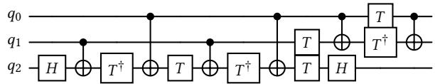

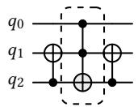

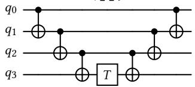

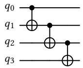

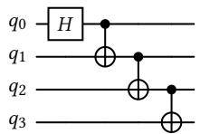

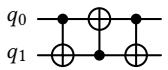

$$
\begin{array} { l } { { q _ { 0 } \bullet \equiv } } \end{array} \underline { { { [ \begin{array} { l } { { T } } \\ { { T } } \end{array} ] } } } \overline { { { \bigoplus \bullet \equiv } } } \breve { { \mathrel { [ \begin{array} { l } { { T ^ { \dagger } } } \end{array} ] } } } \stackrel {  } { \oplus }
$$

$$
\begin{array} { c c } { { q _ { 0 } \longrightarrow } } & { { \longrightarrow } } \\ { { q _ { 1 } \longrightarrow \widetilde { { \cal H } \bot \oplus \bot { \cal H } } \breve { \longrightarrow } } } & { { \longrightarrow } } \end{array}
$$

Figure 5. Motif library (8 entries). Building blocks the circuit sampler draws from, all expressed in the Cliford+� gate set $\{ H , S , S ^ { \dagger } , T , T ^ { \dagger }$ , cx ; no parameterized rotations occur. The dashed Tofoli in the second circuit is a macro for the 15-gate circuit directly above it. The third through fifth circuits form the ladderfamily: their width � is sampled uniformly from $[ k _ { \mathrm { m i n } } , Q ]$ and is shown here at $k = 4$

hh\_cancel

single\_qubit

$$
 \boxed { H }  \boxed { H } \vdash \ = \ -
$$

s\_sdg\_cancel

single\_qubit

$$
\boxed { s } \boxed { s ^ { \dagger } } = -
$$

sdg\_s\_cancel

$$
\sqrt { s ^ { \dagger } } \ : \boxed { s } \ : = \ : - \ :
$$

t\_tdg\_cancel

single\_qubit

single\_qubit

$$
\boxed { T } \boxed { T ^ { \dagger } } 
$$

tdg\_t\_cancel single\_qubit

$$
\sqrt { T ^ { \dagger } } \mathrm { \bf { H } } \overline { { { \cal { T } } } } \mathrm { \bf { \bar { \Sigma } } } = - \mathrm { \bf { \Sigma } }
$$

ssss\_cancel single\_qubit

$$
\sqrt { s } \sqrt { s } \sqrt { s } \sqrt { s } \sqrt { s } = -
$$

tt\_to\_s

phase\_fold

$$
- \boxed { T } - \boxed { T } - = - \boxed { s } -
$$

tdgtdg\_to\_sdg phase\_fold

$$
\sqrt { T ^ { \dagger } } \left[ \frac { } { } T ^ { \dagger } \right] - \frac { } { } = - \sqrt { s ^ { \dagger } } \left[ - \frac { } { } \right]
$$

ss\_to\_z\_expanded phase\_fold

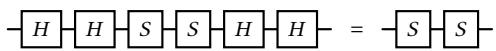

tt\_sdg\_cancelphase\_fold

$$
\sqrt { \ } \sqrt { \ } \sqrt { \ } \sqrt { \ } \sqrt { \ } \sqrt { \ } \ - \ \sqrt { \ } \ \sqrt { \ } \ \sqrt { \ } \ \ - \ \sqrt { \ }
$$

sdg\_tt\_cancel phase\_fold

$$
\sqrt { s ^ { \dagger } } \mathrm { \bf { H } } \boxed { T } \sqrt { T } \ = \ -
$$

tdgtdg\_s\_cancel phase\_fold

$$
\sqrt { \ I ^ { \dagger } } \ \mathrm { \bf { H } } \boxed { T ^ { \dagger } } \sqrt { \ I s } \ = \ - 
$$

s\_tdgtdg\_cancel phase\_fold

$$
\sqrt { s } \left. \sqrt { T ^ { \dagger } } \right. \left. - \sqrt { T ^ { \dagger } } \right. = - 
$$

Figure 6. Single-qubit rewrite rules (13 built-in). Family single\_qubit (self-inverse cancellation, 6 rules) and family phase\_fold (7 rules). A right-hand side drawn as a bare wire is the identity: the matched pattern is deleted.

$$
\begin{array} { l l l } { { q _ { 0 } \displaystyle { \longrightarrow } } } & { { \displaystyle q _ { 0 } \displaystyle { - } } } & { { } } \\ { { q _ { 1 } \displaystyle { - } } } & { { \displaystyle \bigoplus } } & { { = } } \\ { { } } & { { } } & { { q _ { 1 } \displaystyle { - } } } \end{array}
$$

$$
q _ { 1 } \frac { \sqrt { T } } { \phi } \boxed { T ^ { \dagger } } = \begin{array} { c c } { q _ { 0 } } \\ { q _ { 1 } \rule { 0 ex } { 5 ex } } \end{array}
$$

$$
q _ { 1 } \frac { - \sqrt { \dot { \tau } ^ { \dagger } } \dot { { \bf \updownarrow } } - { \bf \updownarrow } \sqrt { \dot { \tau } } \dot { { \bf \updownarrow } } } { \Phi } = { \bf \updownarrow } \stackrel { q _ { 0 } } { \Phi } \dot { { \bf \updownarrow } }
$$

$$
q _ { 1 } \frac { \sqrt { s } - g - \sqrt { s ^ { \dagger } } } { \Phi } = \frac { q _ { 0 } } { q _ { 1 } - \Phi }
$$

$$
q _ { 1 } \frac { - \sqrt { s ^ { \dagger } } - 1 - \sqrt { s } - 1 } { \Phi } = \frac { q _ { 0 } } { q _ { 1 } - \Phi }
$$

$$
q _ { 1 } \frac { - 2 - g - \sqrt { z } } { \phi } = - 2 - \Sigma
$$

$$
{ \begin{array} { l } { { q _ { 0 } } } \end{array} } { \frac { q _ { 0 } } { q _ { 1 } - { \Bigl [ } X { \Bigr ] } \oplus { \Bigl [ } X { \Bigr ] } - \mathrm { \Lambda } } } = { \begin{array} { l } { q _ { 0 } } \\ { q _ { 1 } } \end{array} } \cdot \delta
$$

$$
\begin{array} { l } { { q _ { 0 } \displaystyle \frac { z } { [ z ] \cdot \bigoplus \limits _ { i = 1 } ^ { J } \bigoplus \limits _ { Z } } = \displaystyle \frac { q _ { 0 } } { q _ { 1 } \cdot \bigoplus } } } \end{array}
$$

$$
q _ { 1 } \frac { - \sqrt { X } } { \phi } \boxed { \frac { X } { X } } = \frac { q _ { 0 } } { q _ { 1 } - \phi }
$$

$$
\begin{array} { l } { { q _ { 0 } - \displaystyle { \left[ { \cal H } \right] } - \Phi \displaystyle { \left[ { \cal H } \right] } - } } \\ { { q _ { 1 } - \displaystyle { \left[ { \cal H } \right] } - \Phi \displaystyle { \left[ { \cal H } \right] } - } } \end{array} = \begin{array} { l } { { q _ { 0 } - \displaystyle { \bigoplus } } } \\ { { q _ { 1 } - \displaystyle { \left[ { \cal H } \right] } } } \end{array}
$$

$$
\begin{array} { l }  { q _ { 0 } - \boxed { H } - \pmb { \operatorname { f } } \qquad \pmb { \operatorname { H } } \boxed { H } - \bigoplus } \\  { q _ { 1 } - \boxed { H } - \bigoplus } \end{array} \qquad \begin{array} { l } { { q _ { 0 } - \boxed { H } - \bigoplus } } \\ { { q _ { 1 } - \boxed { H } - \pmb { \operatorname { f } } } } \end{array} \begin{array} { l } { { q _ { 0 } - } } \\ { { q _ { 1 } - } } \end{array}
$$

$$
{ \begin{array} { l } { { q _ { 0 } } } \\ { { q _ { 1 } } } \end{array} } { \overset { } { \mathop { = } } } { \begin{array} { l } { { q _ { 0 } } } \\ { { q _ { 1 } } } \end{array} } { \overset { \cdot } { \longrightarrow } } { \boxed { H } } { \boxed { H } } { \bar { H } } { \boxed { H } }
$$

$$
\begin{array} { l } { { q _ { 0 } \rule { 0 ex } { 5 ex } } } \\ { { q _ { 1 } \rule { 0 ex } { 5 ex } } } \end{array} \overset { \mathrm { ~ } } { \longrightarrow } \begin{array} { l } { { q _ { 0 } \rule { 0 ex } { 5 ex } } } \\ { { q _ { 1 } \rule { 0 ex } { 5 ex } } } \end{array} = \begin{array} { l } { { q _ { 0 } - } } \\ { { q _ { 1 } - } } \end{array}
$$

$$
{ \begin{array} { l } { { q _ { 0 } } \displaystyle \sum _ { { \bf { \bar { \Pi } } } } { \bf { \bar { \Pi } } } { \bf { \underline { { { \bf { \bar { \Pi } } } } } } } \displaystyle \prod _ { { \bf { \bar { \Pi } } } } { \bf \bar { \Pi } } } \\ { { q _ { 1 } } \displaystyle \sum _ { { \bf { \bar { \Pi } } } } { \bf { \bar { \Pi } } } } \end{array} } = { \begin{array} { l } { { q _ { 0 } } \displaystyle - { \bf { \bar { \Pi } } } } \\ { { q _ { 1 } } \displaystyle - { \bf { \bar { \Pi } } } } \end{array} }
$$

$$
{ \begin{array} { l } { { q _ { 0 } } \displaystyle \sum e ^ { \displaystyle \left[ s ^ { \displaystyle \dagger } \right] } } \\ { { q _ { 1 } } \displaystyle \sum e ^ { \displaystyle \left[ s ^ { \displaystyle \dagger } \right] } } \end{array} } = { \begin{array} { l } { { q _ { 0 } } \displaystyle \sum } \\ { { q _ { 1 } } \displaystyle \sum } \end{array} }
$$

$$
q _ { 0 } = { \frac { q _ { 0 } } { [ T ] - { \frac { q _ { 0 } } { [ T ^ { \dagger } ] } } } } = { \frac { q _ { 0 } } { q _ { 1 } } } = \ P
$$

$$
q _ { 1 } - \sum \limits _ { i = 1 } ^ { q _ { 0 } } \sqrt { - \frac { i } { \cdot } } = \sum q _ { 1 } - \infty
$$

$$
q _ { 1 } = 2 \cdot 2 = 3 \cdot 2 = 4 \cdot 2 = 1 2
$$

$$
\begin{array} { l l l l l } { { q _ { 0 } } } & { { { \displaystyle - \oint \mathrm { ~ \partial ~ \stackrel { \textstyle ~ \displaystyle ~ \displaystyle ~ \displaystyle ~ \displaystyle ~ \displaystyle ~ \int ~ \displaystyle ~ \phi ~ \mathrm { ~ \partial ~ \stackrel { ~ \displaystyle ~ \displaystyle ~ \displaystyle ~ \phi ~ \mathrm { ~ \textstyle ~ \displaystyle ~ \phi ~ \mathrm ~ { ~ \textstyle ~ \displaystyle ~ \phi ~ \mathrm ~ { ~ \textstyle ~ \displaystyle ~ \phi ~ \mathrm ~ { ~ \textstyle ~ \textstyle ~ \psi ~ \mathrm { ~ ~ \textstyle ~ \psi ~ \mathrm { ~ ~ \textstyle ~ \psi ~ \scriptscriptstyle ~ \psi ~ \mathrm ~ { ~ \textstyle ~ \psi ~ ~ \mathrm { ~ \psi ~ ~ \textstyle ~ \psi ~ ~ \psi ~ \mathrm { ~ ~ \textstyle ~ \psi ~ ~ \psi ~ \ t ~ \mathrm ~ } ~ } } } } } } } } } } } } } } } & { { { q _ { 0 } } } } & { { - \mathrm { ~ \hbar ~ \stackrel { \textstyle ~ \displaystyle ~ \left( ~ \int ~ \mathrm { ~ \partial ~ \stackrel { ~ \textstyle \displaystyle ~ \theta ~ \mathrm { ~ \textstyle ~ \textstyle ~ \wedge ~ \theta ~ \mathrm { ~ \textstyle ~ \textstyle ~ \psi ~ \mathrm { ~ \textstyle ~ \textstyle ~ \psi ~ \ t ~ \mathrm { { ~ \textstyle ~ \psi ~ \textstyle ~ \psi ~ \mathrm { ~ \textstyle ~ \psi ~ \ t ~ } ~ } } ~ } } } ~ } } \right)} }  \mathrm { ~ \boldsymbol { ~ \psi ~ \mathrm { ~ \textstyle ~ \textstyle ~ \psi ~ \mathrm { ~ \textstyle { ~ \textstyle ~ \psi ~ \mathrm { { ~ \textstyle ~ \psi ~ \textstyle ~ \psi ~ \mathrm { { ~ \textstyle ~ \psi ~ \psi ~ \psi ~ \mathrm { ~ { ~ \textstyle ~ \textstyle ~ \psi ~ \psi ~ ~ \psi ~ \psi ~ \mathrm { ~ ~ \textstyle ~ \psi ~ \psi ~ ~ \psi ~ \psi ~ ~ \psi ~ \mathrm { ~ ~ \textstyle ~ \psi ~ ~ \psi ~ \psi ~ ~ \psi ~ \psi ~ ~ \psi ~ \ t ~ } } ~ } } } ~ } } } } ~ } } } } } }  & { { { q _ { 1 } } } }  & { { - } }  \end{array}
$$

Figure 7. Two-qubit rewrite rules (19 built-in). Composite gates use $Z = S S , X = H S S H$ , and $C Z = H _ { 1 } \thinspace \mathrm { C X } _ { 0 , 1 } H _ { 1 } ;$ the shaded $X / Z$ boxes and the �� symbol are drawn compactly. Three facts generate the whole group: diagonal gates commute through the cx control; cx conjugates $Z$ on the target to $Z _ { c } Z _ { t }$ and � on the control to $X _ { c } X _ { t }$ ; and �  � conjugation reverses the cx direction.  
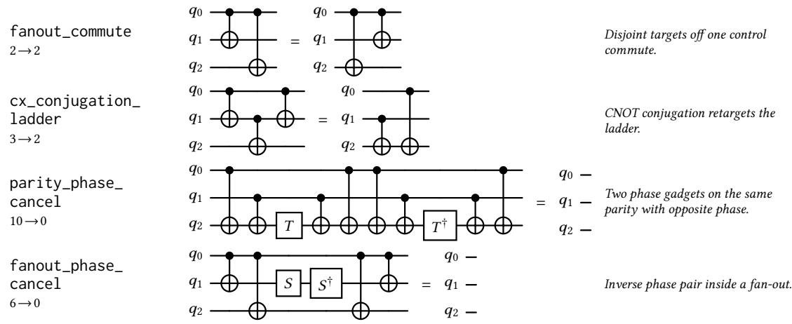  
Figure 8. Three-qubit rewrite rules (4 built-in).

$$
\begin{array} { r l r l r l } & { \mathrm { 2 . 2 4 } } & &  \sin \cdot ( \frac { \pi } { 2 } \sqrt { \frac { 1 } { 2 } \sqrt { 2 } }  \frac { 1 } { 2 } \overline { { S } } \overline { { f } } \overline { { \mathrm { I } } } \overline { { \mathrm { I } } } \overline { { \mathrm { I } } } \overline { { S } } \overline { { \mathrm { I } } } \overline { { S } } \overline { { \mathrm { I } } } \overline { { S } } \overline { { \mathrm { I } } } \overline { { S } } \overline { { \mathrm { I } } } \overline { { S } } \overline { { \mathrm { I } } } \overline { { S } } \overline { { I } } \overline { { S } } \overline { { I } } \overline { { S } } \overline { { I } } \overline { { S } } \overline { { I } } \overline { { S } } \overline { { I } } \overline { { S } } \overline { { I } } \overline { { S } } \overline { { I } } \overline { { S } } \overline { { I } } \overline { { S } } \overline { { I } } \overline { { S } } \overline { { I } } \overline { { S } } \overline { { I } } \overline { { S } } \overline { { I } } \overline { { S } } \overline { { I } } \overline { { S } } \overline { { I } } \overline { { S } } \overline { { I } } \overline { { S } } \overline { { I } } \overline { { S } } \overline { { I } } \overline { { S } } \overline { { I } } \overline { { S } } \overline { { I } } \overline { { S } } \overline { { I } } \overline { { S } } \overline { { I } } \overline { { S } } \overline { { I } } \overline { { S } } \overline { { I } } \overline { { S } } \overline { { I } } \overline { { S } } \overline { { I } } \overline { { S } } \overline { { I } } \overline { { S } } \overline { { I } } \overline { { S } } \overline { { I } } \overline { { S } } \overline { { I } } \overline { { S } } \overline { { I } } \overline { { S } } \overline { { I } } \overline { { S } } \overline { { I } } \overline { { S } } \overline { { I } } \overline  \end{array}
$$

Figure 9. SAT-mined rewrite rules with two-qubit support (14 of 50). Ruleset q3\_t2\_restricted\_smax8 (r50\_q3t2 s8.json): gate set Cliford+�, 3 qubits, support 2–3, source length 3–8 drawn from Beta 5, 2 , target length exactly 2, no identity targets, all-to-all connectivity, no ancillas, seed 7. Rules tagged [clif] come from the clifford\_z3 backend and hold up to a global phase (here always �±��/<sup>4</sup>); rules tagged [phase] come from phase\_z3 and hold exactly.

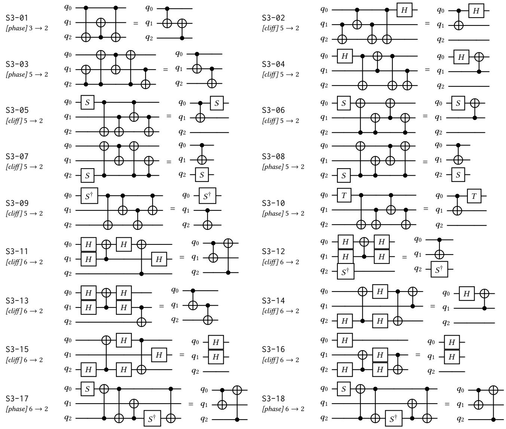  
Figure 10. SAT-mined rewrite rules with three-qubit support (36 of 50). Mining configuration and backend tags as in Fig. 9. Objective is total\_primitive\_gate\_count; every right-hand side has exactly two gates, so each rule removes between 1 and 6 gates. (part 1 of 2)

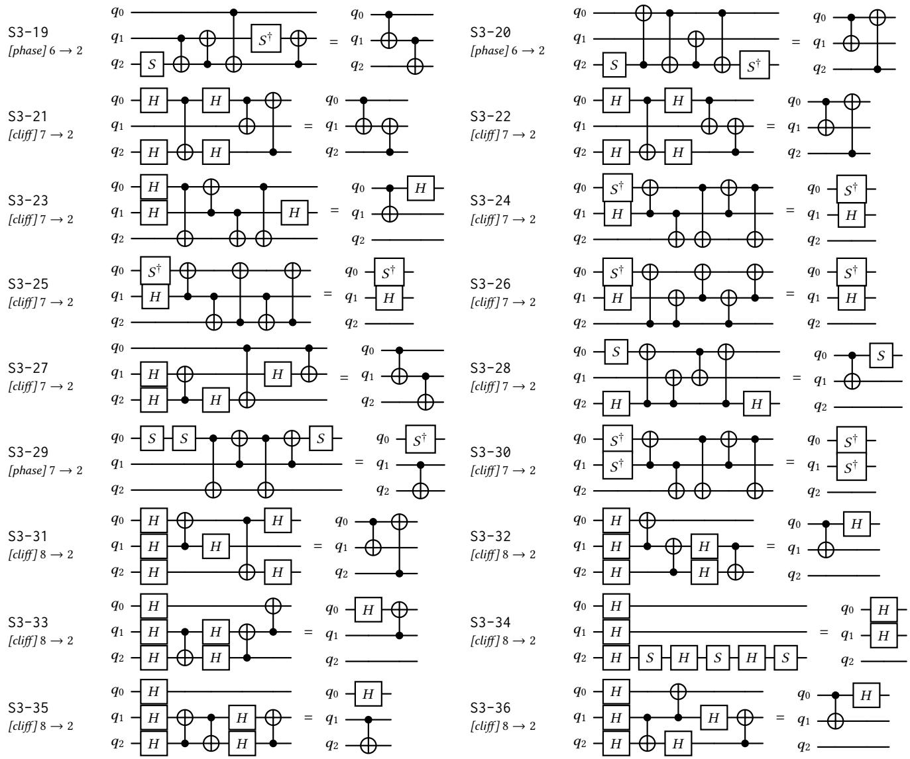  
Figure 11. SAT-mined rewrite rules with three-qubit support (36 of 50) (part 2 of 2, continued)