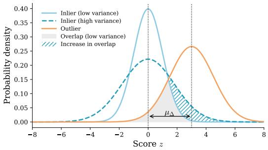
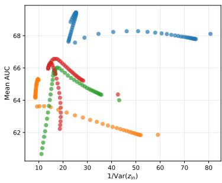
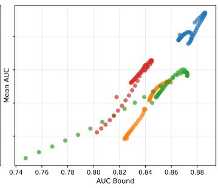
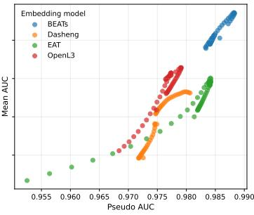

# CAN WE PREDICT ANOMALY DETECTION PERFOR-MANCE FROM EMBEDDING-SPACE GEOMETRY?

Kevin Wilkinghoff 1,2, Zheng-Hua Tan 1,2

1Department of Electronic Systems, Aalborg University, Denmark

2Pioneer Centre for Artificial Intelligence, Denmark

kevin.wilkignhoff@ieee.org, zt@es.aau.dk

## ABSTRACT

Anomaly detection systems are often trained using normal data alone, while model selection and evaluation typically require labeled anomalies. We study whether anomaly detection performance can be predicted without access to anomalous data. For kNN-based detectors, we derive a lower bound on the area under the ROC curve (AUC) that relates detection performance to the separation between inlier and outlier scores and to their respective variances. Under a local scaling model, we use this bound to characterize how density variation, intrinsicdimensional heterogeneity, and cross-domain mismatch contribute to score variability. We then investigate anomaly-free model selection and show that inlier score variance alone does not reliably predict performance across different representations. To address this limitation, we introduce simple pseudo-anomaly probes that provide a reference for estimating relative score separation. Experiments on the DCASE 2022–2025 benchmarks, spanning four embedding models and 208 candidate systems, show that pseudo-anomaly-based estimators substantially improve anomaly-free model selection. In particular, diverse pseudo-anomalies enable anomaly-free model selection to outperform conventional development-set selection under domain shift. These results show that embedding-space geometry contains predictive information about anomaly detection performance while also highlighting the representation-dependent nature of inlier-only performance estimates.

## 1 INTRODUCTION

Anomalies are often unavailable for training because they are rare, diverse, and difficult to obtain. Consequently, many anomaly detection systems rely on normal data alone for training (Chandola et al., 2009; Pang et al., 2022; Ruff et al., 2018). However, model selection, hyperparameter tuning, and evaluation typically rely on labeled anomalies to assess detection performance. This raises a fundamental question: Can anomaly detection performance be predicted without access to anomalous data? We investigate this question for commonly used distance-based detectors and examine whether the geometry of the embedding space, which governs the distances and neighborhood relationships upon which these detectors rely, contains sufficient information to predict detection performance.

In modern anomaly detection systems, the underlying geometry is induced by representations learned from the data (Han et al., 2025; Ruff et al., 2018; 2021; Pang et al., 2022). Images (Roth et al., 2022), audio signals (Wilkinghoff, 2021), and time series (Hundman et al., 2018) are commonly mapped into vector embeddings using pre-trained or task-specific models. In this representation space, anomalies are identified through their deviations from the reference data, typically using distance- or density-based scoring functions. Among these methods, k-nearest neighbor (kNN) detectors remain a widely used class of distance-based detectors and are competitive across diverse anomaly detection benchmarks (Bukhsh & Saeed, 2023; Campos et al., 2016; Sun et al., 2022). They make few modeling assumptions, avoid parametric density estimation, and rely on local geometric relationships among data points, directly linking anomaly scores to local data geometry.

However, the performance of kNN-based detectors can vary considerably across datasets, embeddings, and parameter choices (Campos et al., 2016). Even when derived from the same normal data, different representations can yield very different detection performance. Although the geometry of normal data determines the scores produced by distance-based detectors, it remains unclear which geometric properties are predictive of detection performance and whether these signals are comparable across different representations.

In this work, we study anomaly-free model selection for anomaly detection. We develop a framework based on anomaly scores and pseudo-anomaly probes and investigate it using kNN-based detectors with acoustic embeddings, where anomaly scores are directly linked to the geometry of normal data. Our main contributions are as follows:

• We derive a lower bound on the area under the ROC curve (AUC) in terms of inlier and outlier score variances and mean separation. The bound provides a theoretical framework for analyzing detector reliability through the geometric properties of normal data.

• We use this bound to analyze how density variation, intrinsic-dimensional heterogeneity, and cross-domain mismatch contribute to inlier-score variability. As an example, we show that local density normalization removes the leading-order effect of density variation on inlier-score variance.

• We show that inlier-score variance alone is insufficient for anomaly-free model selection, while simple pseudo-anomaly probes provide the missing score-separation reference. With informative pseudo-anomalies, anomaly-free selection can even outperform selection based on an anomalous development-set.

## 2 RELATED WORK

Evaluation of anomaly detectors typically relies on ranking metrics such as AUC (Clemenc¸on et al.,´ 2008), which require inlier and anomalous samples. Related work has addressed performance characterization in novelty detection through mixture proportion estimation and semi-supervised risk analysis (Blanchard et al., 2010). Unsupervised model selection has been studied through internal evaluation criteria (Ma et al., 2023), which rely on heuristic measures of score separability, score distributions, or agreement between candidate models, meta-learning from historical labeled tasks (Zhao et al., 2021), and surrogate objectives constructed from generated samples (Dai & Fan, 2025). In contrast, we derive a lower bound on detection performance from embedding-space geometry and use it for anomaly-free selection of kNN-based detectors.

Our geometric analysis builds on classical results linking kNN distances to local sampling density and intrinsic dimension (Fukunaga & Hostetler, 1973; Penrose, 2000; Singh & Poczos, 2016), as´ well as work using intrinsic-dimension estimates to characterize representation geometry and kNN behavior (Levina & Bickel, 2004; Houle, 2013; Amsaleg et al., 2015; Ma et al., 2018). Density variation has also motivated local normalization of distance-based anomaly scores, including recent local density-based score normalization (LDN) approaches (Wilkinghoff et al., 2025; Matsumoto et al., 2025). These works characterize local geometry or normalize scores, but do not connect kNN geometry to quantitative anomaly detection performance. We instead use local scaling to relate these geometric quantities to score variability and detection performance.

Synthetic or auxiliary outliers are commonly used to train or regularize anomaly detectors and representation models (Hendrycks et al., 2019; Chen et al., 2023a; Wilkinghoff & Kurth, 2024). More recently, synthetic anomalies have been used for anomaly-free model selection by modifying input samples to form synthetic validation sets (Fung et al., 2025), while AutoUAD uses samples from a Gaussian fitted to the training data as a surrogate for unseen test data (Dai & Fan, 2025). However, constructing meaningful anomalies in the input space can be challenging for complex signals with noise and other sources of variation, particularly when the nature of the anomalies is unknown a priori. In contrast, we construct pseudo-anomalies directly in embedding space by reusing or recombining normal embeddings to probe the outlier-score distribution and estimate score separation.

## 3 GEOMETRIC ANALYSIS OF KNN RELIABILITY

Anomaly detection performance depends on the distributions of inlier and outlier scores. In anomaly-free settings, the outlier distribution is unavailable, making the full score distributions dif-

  
Figure 1: Effect of inlier score variance on ranking reliability. For fixed mean separation $\mu _ { \Delta }$ and outlier variance, increasing inlier variance increases score overlap. The light shaded region shows baseline overlap, while the hatched region shows additional overlap from variance inflation.

ficult to characterize. We therefore derive an AUC lower bound in terms of the first two moments of the score distributions, allowing us to analyze how score variability affects detection performance.

## 3.1 A VARIANCE-BASED LOWER BOUND ON THE AUC

Let $z _ { \mathrm { i n } }$ and $z _ { \mathrm { o u t } }$ denote the random variables corresponding to the log-scores assigned to inlier and outlier samples, respectively. We consider independently drawn inlier and outlier samples, with both scores computed against the same fixed reference set. We treat the reference set as fixed throughout, so all expectations and variances are understood conditionally on it. Thus, $z _ { \mathrm { i n } }$ and $z _ { \mathrm { o u t } }$ are independent. Define the score difference as

$$
\Delta = z _ { \mathrm { o u t } } - z _ { \mathrm { i n } } .
$$

By definition, the AUC can be expressed as the probability that a randomly drawn outlier receives a higher score than a randomly drawn inlier (Clemenc¸on et al., 2008),´

$$
\mathrm { A U C } = \mathbb { P } ( \Delta > 0 ) .
$$

Assume that $\Delta$ has a finite second moment and positive mean, $\mu _ { \Delta } = \mathbb { E } [ \Delta ] > 0$ , corresponding to the conventional anomaly-score orientation in which higher scores indicate stronger evidence of anomalousness. Applying Cantelli’s inequality (Ion et al., 2023) to $\Delta$ , together with the independence of the inlier and outlier scores, yields

$$
\mathrm { A U C } \geq \frac { \mu _ { \Delta } ^ { 2 } } { \mathrm { V a r } ( z _ { \mathrm { o u t } } ) + \mathrm { V a r } ( z _ { \mathrm { i n } } ) + \mu _ { \Delta } ^ { 2 } } .\tag{1}
$$

The AUC Bound is closely related to the normalized pseudo discrepancy (NPD) of Dai $\&$ Fan (2025), which normalizes squared mean score separation by twice the sum of the score variances. Here, we derive the bound directly from the AUC using Cantelli’s inequality and make the required conditional independence assumption explicit. A dependence-robust bound is given in Section A.1.

The AUC lower bound in Eq. (1) increases with mean separation between inlier and outlier scores and decreases with their variances. The bound is sharp given only the first two moments of the score difference, with equality attained for a two-point distribution (Ion et al., 2023). In practice, the bound may be loose, but it still reflects how score separation and variance affect detection performance. In the anomaly-free setting, however, only the inlier-score distribution is observable. Therefore, the bound reveals both the information available from normal data and the information that is missing: While inlier-score variability can be estimated directly, the outlier variance and mean separation remain unknown. The effect of inlier variance under a fixed mean separation is illustrated in Fig. 1.

## 3.2 GEOMETRIC DECOMPOSITION OF INLIER SCORE VARIANCE

While $\mathrm { V a r } ( z _ { \mathrm { i n } } )$ is directly observable, it aggregates several geometric effects. To disentangle these contributions, we draw on local scaling theory to characterize how density variation, intrinsicdimensional heterogeneity, and domain mismatch contribute to inlier score variability.

## 3.2.1 LOCAL SCALING MODEL

Let $\mathcal { R } = \{ x _ { 1 } , . . . , x _ { n } \} \subset \mathcal { X }$ denote a reference set of inlier samples in a metric space $( \mathcal { X } , d )$ . For $x \in { \mathcal { X } } .$ , let $d _ { k } ( x )$ denote the distance from x to its k-th nearest neighbor in ${ \mathcal { R } } ,$ and let

$$
B ( x , r ) = \{ y \in \mathcal { X } : d ( x , y ) \leq r \}
$$

denote the metric ball of radius r centered at $x .$

At sufficiently small scales, the inlier distribution behaves locally like a low-dimensional measure, so that the probability mass of a small ball grows approximately as a power of its radius under standard intrinsic-dimension assumptions and classical kNN scaling results (Levina & Bickel, 2004; Penrose, 2000; Singh & Poczos, 2016). Classical analyses typically assume a globally fixed intrinsic ´ dimension. In practice, embedding spaces often exhibit heterogeneous local geometry, motivating the use of a pointwise intrinsic-dimension function $m ( x )$ as in the local intrinsic dimensionality (LID) literature (Houle, 2013; Amsaleg et al., 2015).

Formally, this local behavior can be described through the following small-ball expansion commonly used in intrinsic-dimension analysis:

$$
\mathbb { P } ( B ( x , r ) ) = \rho ( x ) V _ { m ( x ) } r ^ { m ( x ) } \big ( 1 + \varepsilon ( r ) \big ) ,
$$

for sufficiently small $r ,$ where $V _ { m ( x ) }$ denotes the volume of the unit ball in $\mathbb { R } ^ { m ( x ) }$ and $\varepsilon ( r ) \to 0$ as $r  0$ . The functions $m ( x )$ and $\rho ( x )$ denote the local intrinsic dimension and density, respectively.

As $n  \infty .$ , the k-nearest neighbor radius $d _ { k } ( x )$ converges to zero for fixed $k ,$ so the small-ball expansion applies at $r = d _ { k } ( x )$ . Classical results on kNN radii further imply that the corresponding scaled probability mass

$$
U _ { n , k } ( { \boldsymbol { x } } ) = \frac { n } { k } \mathbb { P } ( B ( { \boldsymbol { x } } , d _ { k } ( { \boldsymbol { x } } ) ) )
$$

converges in distribution to a non-degenerate random variable, rather than to a constant (Fukunaga & Hostetler, 1973; Penrose, 2000). Applying the small-ball expansion to this relation gives

$$
d _ { k } ( x ) = \left( \frac { k U _ { n , k } ( x ) } { n \rho ( x ) V _ { m ( x ) } } \right) ^ { 1 / m ( x ) } \bigl ( 1 + \varepsilon _ { n } ( x ) \bigr ) ,\tag{2}
$$

where $\varepsilon _ { n } ( x ) \to 0$ as $n \to \infty$ . Using $z ( x ) = \log d _ { k } ( x )$ , we obtain

$$
z ( x ) = \frac { 1 } { m ( x ) } \left( \log k - \log ( n \rho ( x ) V _ { m ( x ) } ) \right) + \frac { 1 } { m ( x ) } \log U _ { n , k } ( x ) + \epsilon _ { n } ( x )\tag{3}
$$

with $\epsilon _ { n } ( x ) \to 0$ as $n  \infty$ . The stochastic term log $U _ { n , k } ( x )$ does not vanish asymptotically and therefore contributes irreducible kNN sampling noise to the score variance. The leading term in Eq. (3) instead captures the geometric component of score variability, which depends on the local density $\rho ( x )$ and intrinsic dimension $m ( x )$ . The density contribution enters through log $\rho ( x )$ while the intrinsic dimension affects both the reciprocal factor $1 / m ( x )$ and the volume term $V _ { m ( x ) }$ Accordingly, the geometric component captures density heterogeneity, intrinsic-dimension heterogeneity, and their interaction.

## 3.2.2 VARIANCE DECOMPOSITION UNDER DOMAIN SHIFT

The preceding analysis characterizes the sources of score variability within a domain. Under domain shift, this variability is further affected by differences in score statistics between domains. We therefore decompose the score variances and mean separation into their source and target domains.

The total score variance can be decomposed into within-domain variability and a between-domain mismatch term. Let $P _ { S }$ and $P _ { T }$ denote source and target-domain distributions, respectively, and let λ denote the mixture weight of the source domain. Then,

$$
\operatorname { V a r } ( z _ { \mathrm { i n } } ) = \lambda \operatorname { V a r } _ { P _ { S } } ( z _ { \mathrm { i n } } ) + ( 1 - \lambda ) \operatorname { V a r } _ { P _ { T } } ( z _ { \mathrm { i n } } ) + \lambda ( 1 - \lambda ) \left( \mathbb { E } _ { P _ { S } } \left[ z _ { \mathrm { i n } } \right] - \mathbb { E } _ { P _ { T } } \left[ z _ { \mathrm { i n } } \right] \right) ^ { 2 } .\tag{4}
$$

The first two terms describe within-domain score variability, while the last term captures the mismatch between the average score levels of the two domains. The same decomposition applies to the outlier score variance,

$$
\operatorname { V a r } ( z _ { \mathrm { o u t } } ) = \lambda \operatorname { V a r } _ { P s } ( z _ { \mathrm { o u t } } ) + ( 1 - \lambda ) \operatorname { V a r } _ { P r } ( z _ { \mathrm { o u t } } ) + \lambda ( 1 - \lambda ) \left( \mathbb { E } _ { P s } \left[ z _ { \mathrm { o u t } } \right] - \mathbb { E } _ { P r } \left[ z _ { \mathrm { o u t } } \right] \right) ^ { 2 } .\tag{5}
$$

Similarly, the mean score separation can be written as

$$
\mu _ { \Delta } = \lambda \left( \mathbb { E } _ { P _ { S } } [ z _ { \mathrm { o u t } } ] - \mathbb { E } _ { P _ { S } } [ z _ { \mathrm { i n } } ] \right) + \left( 1 - \lambda \right) \left( \mathbb { E } _ { P _ { T } } [ z _ { \mathrm { o u t } } ] - \mathbb { E } _ { P _ { T } } [ z _ { \mathrm { i n } } ] \right) .\tag{6}
$$

These decompositions show that domain shift affects the AUC bound through both within-domain score variability and between-domain mismatch. When the domains have identical score distribu tions, the mismatch terms vanish.

## 3.3 CASE STUDY: LOCAL DENSITY NORMALIZATION

The AUC bound can also be used to analyze how an existing anomaly detection method changes score variability. We illustrate this with LDN (Wilkinghoff et al., 2025), which normalizes the kNN distance by a local reference distance scale. Combining the bound with the local scaling model allows us to identify which components of score variability are removed by the normalization.

To isolate the geometric effect of LDN, we temporarily ignore the non-vanishing kNN sampling variability represented by the $U _ { n , j } ( x )$ terms in the local scaling expansion. Let

$$
\bar { d } _ { K } ( x ) = \frac { 1 } { K } \sum _ { j = 1 } ^ { K } d _ { j } ( x )
$$

denote the mean distance from x to its K nearest neighbors in the reference set. Under the local scaling model,

$$
d _ { j } ( x ) = \left( \frac { j } { n \rho ( x ) V _ { m ( x ) } } \right) ^ { 1 / m ( x ) } ( 1 + \varepsilon _ { n } ( x , j ) ) .
$$

Consequently,

$$
\bar { d } _ { K } ( x ) = \left( \frac { 1 } { n \rho ( x ) V _ { m ( x ) } } \right) ^ { 1 / m ( x ) } C _ { K } ( m ( x ) ) ( 1 + \varepsilon _ { n } ( x , K ) ) ,
$$

where $\begin{array} { r } { C _ { K } ( m ) = \frac { 1 } { K } \sum _ { j = 1 } ^ { K } j ^ { 1 / m } } \end{array}$ depends only on the intrinsic dimension m.

Substituting the local scaling expressions yields the locally density-normalized score

$$
\tilde { z } ( x ) = \log d _ { k } ( x ) - \log \bar { d } _ { K } ( x ) = \frac { \log k } { m ( x ) } - \log C _ { K } ( m ( x ) ) + \tilde { \varepsilon } _ { n } ( x , k , K ) ,\tag{7}
$$

where $\tilde { \varepsilon } _ { n } ( x , k , K )$ collects the remainder terms. Importantly, the density $\rho ( x )$ and the reference set size n no longer appear in the leading term. Thus, LDN removes the leading-order contribution of density variation and cancels the $- \log n / m ( x )$ term. The latter is responsible for a $O ( ( \log n ) ^ { 2 } )$ variance growth when intrinsic dimension varies across the data manifold, so both effects reduce inlier score variance and tighten the AUC bound.

The same cancellation applies to between-domain score mismatch. Consider the source and target domains $P _ { S }$ and $P _ { T }$ in Section 3.2.2, and let $\tilde { z } _ { \mathrm { i n } }$ denote the normalized score of an inlier. Assume that the source and target distributions have the same intrinsic dimension m, but may exhibit different local sampling densities $\rho _ { S } ( x )$ and $\rho _ { T } ( x )$ . Then, the leading-order term in Eq. (7) is identical in both domains and cancels out. Therefore, the density-dependent component of the leading-order between-domain mismatch in Eq. (4) vanishes, leaving only the finite-sample remainder:

$$
\mathbb { E } _ { P _ { S } } [ \tilde { z } _ { \mathrm { i n } } ] - \mathbb { E } _ { P _ { T } } [ \tilde { z } _ { \mathrm { i n } } ] = \mathbb { E } _ { P _ { S } } [ \tilde { \varepsilon } _ { n } ] - \mathbb { E } _ { P _ { T } } [ \tilde { \varepsilon } _ { n } ] .\tag{8}
$$

The analysis explains the effect of LDN: Within a domain, it removes the leading-order contribution of local density variation to score variability, while across domains it removes the corresponding density-dependent component of score mismatch. When the source and target domains have different intrinsic dimensions, a residual mismatch remains. The same bound relates score-variance minimization and cross-domain score normalization to embedding-space geometry: Recent domainrobust methods minimize score variance (Matsumoto et al., 2025), while post-hoc normalization addresses cross-domain score mismatch (Saengthong & Shinozaki, 2025).

## 4 PSEUDO-ANOMALY-BASED PERFORMANCE ESTIMATION

The geometric analysis shows that normal-data score statistics contain information about detection performance, even though the outlier score distribution remains unknown. Lower inlier score variance strengthens the AUC bound, motivating the inverse variance, $1 / \mathrm { V a r } ( z _ { \mathrm { i n } } )$ , as an anomaly-free performance estimator. However, its representation-dependent scale limits comparability across candidate systems, while the unknown outlier distribution prevents direct evaluation of score separation.

We therefore construct pseudo-anomalies directly in the embedding space, rather than modifying or generating input samples, and use the resulting pseudo-outlier scores as a proxy for the unknown outlier score distribution. This provides a reference for relative score separation without requiring anomalous data or specifying how anomalies should appear in the original data space. The resulting estimators are detector-agnostic and do not require explicit knowledge of the anomaly distribution.

The pseudo-outlier distribution supports two estimators. The Pseudo AUC directly approximates the AUC by replacing the unknown outlier scores with pseudo-outlier scores. The AUC Bound instead replaces the unknown outlier moments in Eq. (1) with the corresponding pseudo-outlier moments. Both estimators use normal reference data and pseudo-anomalies, with pseudo-outlier scores defined as the distance to the nearest $( k = 1 )$ reference sample. We assume $\mu _ { \Delta } > 0$ when interpreting Eq. (1). Since the bound depends on $\mu _ { \Delta } ^ { 2 }$ , it is unchanged when $\mu _ { \Delta }$ changes sign, so no special handling is needed for $\mu _ { \Delta } < 0$ . Pseudo AUC does not require this assumption.

Two recent approaches are directly relevant to our setting. AutoUAD (Dai & Fan, 2025) proposes the NPD, which uses Gaussian pseudo-validation samples to estimate anomaly detection performance. Its partitioning of the normal training data into training and validation subsets changes the reference set and hence the kNN candidate itself. Moreover, generating Gaussian pseudo-samples after sequence pooling would introduce pooling-dependent bias, while generating them before pooling would require applying each candidate pooling operation to the generated samples. When evaluated on the same pseudo-outlier and inlier scores, NPD and our AUC-Bound induce the same candidate ranking. SWSA (Fung et al., 2025) uses synthetic anomalies to rank candidates by AUC, directly paralleling our Pseudo AUC, but relies on image-specific anomaly generation. We therefore do not include NPD or SWSA as separate empirical baselines.

## 4.1 PSEUDO-ANOMALY CONSTRUCTIONS

The effectiveness of pseudo-anomaly-based estimation depends critically on the quality of the pseudo-anomalies. We therefore investigate several pseudo-anomaly generation strategies, each introducing a different type of deviation from normal data. We represent each sample as an embedding sequence, with Sequence and Element operating on the sequence before pooling.

• Random: Pseudo-anomalies are sampled independently from the isotropic standard normal distribution $\mathcal { N } ( 0 , I )$ in the embedding space.

• Feature: Each feature dimension is sampled with replacement from a randomly selected reference embedding, independently across dimensions.

• Sequence: For sequence-based representations, pseudo-anomalies are constructed by combining embeddings from different samples prior to sequence aggregation.

• Element: Individual elements of the embedding sequence are randomly exchanged between different samples prior to sequence aggregation.

• Cross-Domain, Cross-Class, Cross-Attribute: Pseudo-anomalies are normal embed dings from a different domain, semantic class, or semantic attribute, respectively.

The framework does not depend on a particular pseudo-anomaly construction. Random, Feature, Sequence, and Element generate one pseudo-anomaly per reference sample, whereas Cross-Domain, Cross-Class, and Cross-Attribute use all eligible reference embeddings. Feature, Sequence, and Element require only normal reference data, whereas Cross-Domain, Cross-Class, and Cross-Attribute additionally exploit semantic metadata when available.

## 5 EXPERIMENTAL SETUP

## 5.1 DATASETS

The proposed framework is not inherently tied to a particular sensing modality. We therefore use the DCASE benchmark series as a representative testbed because it provides a large number of independent model-selection tasks spanning diverse monitored objects, operating conditions, and domain shifts. Our evaluation covers the DCASE 2022–2025 benchmark datasets (Dohi et al., 2022a; 2023; Nishida et al., 2024; 2025). Collectively, they comprise the MIMII-DG (Dohi et al., 2022b), ToyAD-MOS2 (Harada et al., 2021), ToyADMOS2+ (Harada et al., 2023), ToyADMOS2# (Niizumi et al., 2024), ToyADMOS2025 (Harada et al., 2025), and IMAD-DS (Albertini et al., 2024) datasets.

Each benchmark comprises multiple independent machine-type-specific tasks, split into separate development and evaluation sets. Across all four benchmarks, this results in 84 development tasks and 90 evaluation tasks, yielding 174 independent model-selection tasks in total. In every task, only normal operation recordings are provided as reference data, whereas the corresponding test set contains both normal and anomalous recordings. The benchmarks evaluate domain generalization, with each reference set containing 990 source-domain and 10 target-domain recordings. Source and target domains are balanced during testing, but domain labels are not provided.

## 5.2 CANDIDATE SYSTEMS

A meaningful evaluation of anomaly-free model selection requires a large and diverse set of candidate systems. To this end, we combine multiple self-supervised audio embedding models with a broad range of sequence pooling strategies, yielding 208 candidate systems in total. Specifically, we consider OpenL3 (Cramer et al., 2019), BEATs (Chen et al., 2023b), efficient audio transformer (EAT) (Chen et al., 2024), and Dasheng (Dinkel et al., 2024). All models are used in their pre-trained form without task-specific fine-tuning. Exact configurations are given in Section A.2. For each model, we evaluate 52 pooling configurations: mean, max, generalized mean pooling (GeM) (Radenovic et al., 2019) with $p = 1 , \ldots , 2 5$ , and relative deviation pooling (RDP) (Wilkinghoff et al., 2026) with $\gamma = 1 , \ldots , 2 5$ . Across the four models, this yields 208 candidate systems, evaluated with logarithmic nearest-neighbor distance (k = 1) and LDN (K = 2).

## 5.3 EVALUATION METRICS

The proposed estimators produce proxy scores for ranking candidate embedding models. We evaluate their quality from three perspectives. Global ranking performance is measured by the Spearman rank correlation, $\rho _ { \mathrm { r a n k } } \in [ - 1 , 1 ]$ , with undefined correlations caused by constant predictions set to zero. Local ranking is measured by pairwise ranking accuracy, $A _ { \mathrm { p a i r } } \in \mathrm { [ 0 , 1 ] }$ , defined as the fraction of correctly ordered model pairs. Finally, model selection performance is measured by the regret

$$
R = \mathrm { A U C } _ { \mathrm { b e s t } } - \mathrm { A U C } _ { \mathrm { s e l e c t e d } } ,
$$

which quantifies the loss from selecting the predicted best model rather than the optimal model. Thus, $\bar { R } = 0$ corresponds to perfect selection. Unless stated otherwise, all metrics are computed independently for each section and averaged across all sections and datasets. Statistical significance is assessed using bootstrap confidence intervals of paired differences in selected AUCs across all 174 model-selection tasks (90 evaluation tasks for comparisons involving Fixed Selection).

## 5.4 PSEUDO-ANOMALY CONSTRUCTIONS

We evaluate the Random, Feature, Sequence, Element, Cross-Domain, Cross-Class, and Cross-Attribute pseudo-anomaly constructions introduced in Section 4.1. For the DCASE benchmarks, Cross-Class pseudo-anomalies are generated from different machine types, while Cross-Attribute pseudo-anomalies use different operating conditions. In addition, we evaluate a Diverse construction that concatenates the Feature, Cross-Domain, Cross-Class, and Cross-Attribute pseudo-outlier sets.

Table 1: Anomaly-free model selection on the DCASE 2022–2025 benchmark datasets. Entries report the Spearman rank correlation $( \rho _ { \mathrm { r a n k } } ) .$ , pairwise ranking accuracy $( A _ { \mathrm { p a i r } } )$ , and regret (R, in percent). The Overall columns report the mean across both scoring functions and dataset splits.
<table><tr><td></td><td></td><td colspan="3">Overall</td><td colspan="6">kNN</td><td colspan="6">LDN</td></tr><tr><td></td><td></td><td colspan="2"></td><td></td><td colspan="2">Development</td><td></td><td colspan="3">Evaluation</td><td colspan="3">Development</td><td colspan="3">Evaluation</td></tr><tr><td>Estimator</td><td>Pseudo-Anomaly ρrank ↑</td><td></td><td> $A _ { \mathrm { p a i r } }$ </td><td>↑ R↓</td><td>ρrank ↑</td><td> $A _ { \mathrm { p a i r } } \cdot$ </td><td>R↓</td><td>ρrank ↑</td><td> $A _ { \mathrm { p a i r } } \uparrow$ </td><td>R↓</td><td> $\rho _ { \mathrm { r a n k } } \uparrow$ </td><td> $A _ { \mathrm { p a i r } } \uparrow$ </td><td>R↓</td><td>ρrank ↑</td><td> $A _ { \mathrm { p a i r } } \cdot$ </td><td>↑ R↓</td></tr><tr><td>Oracle</td><td></td><td>1.00</td><td>1.00</td><td>0.00</td><td>1.00</td><td>1.00</td><td>0.00</td><td>1.00</td><td>1.00</td><td>0.00</td><td>1.00</td><td>1.00</td><td>0.00</td><td>1.00</td><td>1.00</td><td>0.00</td></tr><tr><td>Random Selection</td><td></td><td>0.00</td><td>0.50</td><td>7.94</td><td>0.00</td><td>0.50</td><td>7.79</td><td>0.00</td><td>0.50</td><td>7.94</td><td>0.00</td><td>0.50</td><td>7.95</td><td>0.00</td><td>0.50</td><td>8.06</td></tr><tr><td>Fixed Selectionª</td><td>1</td><td>1</td><td>一</td><td>4.34</td><td>=</td><td>1</td><td>3.56</td><td>1</td><td></td><td>4.51</td><td>1</td><td></td><td>4.56</td><td>1</td><td>一</td><td>4.75</td></tr><tr><td>Inlier Variance</td><td></td><td>0.16</td><td>0.56</td><td>5.53</td><td>0.13</td><td>0.54</td><td>6.07</td><td>0.17</td><td>0.56</td><td>5.30</td><td>0.17</td><td>0.56</td><td>5.57</td><td>0.17</td><td>0.56</td><td>5.19</td></tr><tr><td rowspan="8">AUC Bound</td><td>Random</td><td>0.08</td><td>0.53</td><td>5.36</td><td>0.06</td><td>0.52</td><td>5.48</td><td>0.08</td><td>0.54</td><td>5.42</td><td>0.11</td><td>0.54</td><td>5.07</td><td>0.06</td><td>0.53</td><td>5.48</td></tr><tr><td>Sequence</td><td>-0.01</td><td>0.50</td><td>8.54</td><td>-0.04</td><td>0.49</td><td>8.44</td><td>-0.01</td><td>0.50</td><td>9.03</td><td>-0.04</td><td>0.49</td><td>9.47</td><td>0.08</td><td>0.52</td><td>7.23</td></tr><tr><td>Feature</td><td>0.31</td><td>0.62</td><td>4.97</td><td>0.22</td><td>0.59</td><td>5.99</td><td>0.38</td><td>0.64</td><td>5.17</td><td>0.21</td><td>0.58</td><td>5.06</td><td>0.41</td><td>0.65</td><td>3.67</td></tr><tr><td>Element</td><td>0.02</td><td>0.50</td><td>8.34</td><td>-0.04</td><td>0.48</td><td>8.45</td><td>0.08</td><td>0.52</td><td>8.38</td><td>-0.07</td><td>0.48</td><td>8.34</td><td>0.11</td><td>0.53</td><td>8.19</td></tr><tr><td>Cross-Domain</td><td>0.22</td><td>0.59</td><td>5.76</td><td>0.29</td><td>0.61</td><td>5.89</td><td>0.33</td><td>0.63</td><td>4.42</td><td>0.17</td><td>0.56</td><td>5.72</td><td>0.09</td><td>0.54</td><td>7.02</td></tr><tr><td>Cross-Class</td><td>0.29</td><td>0.61</td><td>4.81</td><td>0.26</td><td>0.61</td><td>4.22</td><td>0.37</td><td>0.64</td><td>4.08</td><td>0.26</td><td>0.60</td><td>5.70</td><td>0.27</td><td>0.60</td><td>5.22</td></tr><tr><td>Cross-Attribute</td><td>0.36</td><td>0.63</td><td>4.59</td><td>0.33</td><td>0.63</td><td>4.46</td><td>0.35</td><td>0.63</td><td>3.68</td><td>0.35</td><td>0.62</td><td>6.15</td><td>0.39</td><td>0.64</td><td>4.06</td></tr><tr><td>Diverse</td><td>0.32</td><td>0.62</td><td>4.48</td><td>0.33</td><td>0.63</td><td>3.99</td><td>0.37</td><td>0.64</td><td>4.34</td><td>0.27</td><td>0.60</td><td>5.18</td><td>0.29</td><td>0.61</td><td>4.42</td></tr><tr><td rowspan="8">Pseudo AUC</td><td>Random</td><td>0.02</td><td>0.50</td><td>8.02</td><td>0.00</td><td>0.50</td><td>8.07</td><td>0.01</td><td>0.50</td><td>6.91</td><td>0.02</td><td>0.50</td><td>9.42</td><td>0.06</td><td>0.51</td><td>7.68</td></tr><tr><td>Sequence</td><td>-0.02</td><td>0.49</td><td>8.66</td><td>-0.07</td><td>0.47</td><td>9.26</td><td>-0.01</td><td>0.49</td><td>8.89</td><td>-0.06</td><td>0.48</td><td>9.15</td><td>0.08</td><td>0.52</td><td>7.35</td></tr><tr><td>Feature</td><td>0.28</td><td>0.60</td><td>6.27</td><td>0.28</td><td>0.60</td><td>6.09</td><td>0.35</td><td>0.63</td><td>5.18</td><td>0.18</td><td>0.57</td><td>7.48</td><td>0.31</td><td>0.61</td><td>6.32</td></tr><tr><td>Element</td><td>0.02</td><td>0.51</td><td>8.55</td><td>-0.06</td><td>0.48</td><td>8.82</td><td>0.08</td><td>0.52</td><td>8.70</td><td>-0.04</td><td>0.49</td><td>9.15</td><td>0.10</td><td>0.53</td><td>7.51</td></tr><tr><td>Cross-Domain</td><td>0.16</td><td>0.56</td><td>6.69</td><td>0.28</td><td>0.60</td><td>6.11</td><td>0.26</td><td>0.60</td><td>6.02</td><td>0.01</td><td>0.51</td><td>7.94</td><td>0.07</td><td>0.53</td><td>6.68</td></tr><tr><td>Cross-Class</td><td>0.29</td><td>0.61</td><td>4.98</td><td>0.30</td><td>0.62</td><td>4.65</td><td>0.30</td><td>0.61</td><td>4.55</td><td>0.29</td><td>0.61</td><td>5.56</td><td>0.26</td><td>0.60</td><td>5.16</td></tr><tr><td>Cross-Attribute</td><td>0.34</td><td>0.63</td><td>4.94</td><td>0.34</td><td>0.63</td><td>4.86</td><td>0.32</td><td>0.62</td><td>4.46</td><td>0.30</td><td>0.61</td><td>6.47</td><td>0.41</td><td>0.65</td><td>3.98</td></tr><tr><td>Diverse</td><td>0.43</td><td>0.66</td><td>3.77</td><td>0.37</td><td>0.64</td><td>3.99</td><td>0.46</td><td>0.68</td><td>3.25</td><td>0.37</td><td>0.64</td><td>5.10</td><td>0.51</td><td>0.69</td><td>2.75</td></tr></table>

a Fixed Selection selects, for each DCASE dataset, the candidate system with the highest average groundtruth AUC on the development set and applies it unchanged to the corresponding evaluation set.

  
Figure 2: Relationship between anomaly-free performance estimators and mean AUC across the 208 candidate systems using kNN scoring. Each point represents one candidate system, averaged across all dataset splits. Within each embedding model, candidate systems form clear trajectories as the pooling strategy and its parameterization vary. The estimator-AUC relationship is strongly representation-dependent for inlier score variance, whereas this dependence is substantially reduced for the AUC Bound and Pseudo AUC estimators using Diverse pseudo-anomalies.

## 6 EXPERIMENTAL RESULTS

Table 1 summarizes the model selection performance of all considered estimators. As expected, the Fixed Selection baseline substantially outperforms Random Selection (mean improvement: 3.36 percentage points, 95% bootstrap CI [2.33, 4.42]), demonstrating that anomaly detection performance is sufficiently consistent across related monitored objects to enable effective model selection when anomaly labels are available.

## 6.1 CAN ANOMALY DETECTION PERFORMANCE BE PREDICTED WITHOUT ANOMALIES?

The simplest anomaly-free estimator, based solely on the inlier score variance, significantly outperforms Random Selection (mean improvement: 2.40 percentage points, 95% bootstrap CI [1.74, 3.07]), demonstrating that normal data alone already contain information for model selection. Although the inlier variance estimator remains inferior to Fixed Selection on average, the difference is not statistically significant on the evaluation sets (mean difference: 0.61 percentage points, 95% bootstrap $\mathsf { C I } [ - 0 . 2 5 , 1 . 4 7 ] )$ . Figure 2 illustrates why this signal is difficult to compare across representations: Candidate systems form distinct embedding-specific trajectories as the pooling strategy and its parameterization vary, with substantially different score-variance scales.

In contrast, the AUC Bound and Pseudo AUC show more consistent estimator–AUC relationships across embedding models (Fig. 2). Pseudo-anomalies provide a reference for score separation that is unavailable from the inlier distribution alone. Using Diverse pseudo-anomalies, Pseudo AUC significantly outperforms inlier variance by 1.78 percentage points (95% CI [1.04, 2.51]). More remarkably, it also surpasses Fixed Selection by 1.63 percentage points on the evaluation sets (95% CI [0.85, 2.45]), despite requiring no anomalous validation samples.

Overall, these results show that anomaly detection systems can indeed be ranked effectively without anomalous validation samples. However, the large performance differences across pseudo-anomaly constructions indicate that their effectiveness depends strongly on how they are generated. We therefore next investigate which pseudo-anomalies provide reliable performance estimates.

## 6.2 WHICH PSEUDO-ANOMALIES ARE INFORMATIVE?

Diverse pseudo-anomalies consistently achieve the best overall performance, followed by Cross-Attribute, Cross-Class, and Feature pseudo-anomalies. Their strong performance may result from combining multiple semantically meaningful sources of variation, producing a richer pseudo-outlier score distribution. The strongest constructions exploit semantic metadata to introduce meaningful deviations while remaining close to the inlier distribution. This is consistent with previous work in anomalous sound detection (ASD), where related machine types or attributes are commonly used as auxiliary supervision during representation learning (Wilkinghoff & Kurth, 2024).

Feature pseudo-anomalies provide the strongest synthetic, metadata-free alternative, although their improvement over the inlier variance estimator is not statistically significant (95% bootstrap CI [−0.19, 1.31]). In contrast, Diverse, Cross-Attribute, and Cross-Class pseudo-anomalies use real samples from different semantic categories and perform substantially better, suggesting that constructing informative pseudo-anomalies remains challenging even in the embedding space.

Sequence and Element constructions consistently perform poorly, while Random pseudo-anomalies also yield weak performance when modeling the full pseudo-outlier score distribution. The AUC Bound remains competitive for Random pseudo-anomalies. Thus, moment-based estimation is more robust when pseudo-anomalies provide a poor approximation of the true score distribution.

Cross-Domain pseudo-anomalies behave differently. Although they represent realistic deviations from the inlier distribution, their effectiveness decreases substantially with LDN compared to conventional kNN distances. As shown in Section 3.3, LDN suppresses the domain-mismatch component of the score, making purely domain-induced differences less informative as pseudo-anomalies. Semantically richer constructions such as Cross-Attribute and Diverse therefore remain more effec tive after normalization.

## 6.3 WHEN SHOULD THE FULL PSEUDO-OUTLIER SCORE DISTRIBUTION BE MODELED?

The choice between the proposed estimators depends on the informativeness of the pseudoanomalies. For Diverse pseudo-anomalies, Pseudo AUC significantly outperforms the AUC Bound (mean improvement: 0.73 percentage points, 95% bootstrap CI [0.17, 1.30]), indicating that modeling the full pseudo-outlier score distribution is beneficial when informative pseudo-anomalies are available. In contrast, for Feature pseudo-anomalies, the AUC Bound significantly outperforms Pseudo AUC (mean improvement: 1.29 percentage points, 95% bootstrap CI [0.35, 2.24]), showing that the moment-based estimator is more robust for less informative pseudo-anomalies. We also experimented with the domain weighting introduced in Section 3.2.2. The empirical weighting λ = 0.99 gives essentially identical results to using the full reference set, whereas λ = 0.5 perform substantially worse, likely due to the limited 10 target samples per task.

## 7 CONCLUSION

In this work, we studied whether anomaly detection performance can be predicted without anomalous validation data. For kNN-based detectors, we derived an AUC lower bound linking detection performance to score variance and used local scaling to relate inlier score variability to local geometry of the data. Experimental results show that embedding-space geometry contains useful information about detector performance, but inlier score variance alone is insufficient for comparing different representations. We therefore introduced simple pseudo-anomaly probes as an additional reference for relative score separation. Across DCASE 2022–2025 benchmarks and 208 candidate systems, the Diverse Pseudo AUC estimator provided the strongest overall model-selection signal, outperforming conventional development-set selection without access to anomalous validation data. A key limitation is that performance depends on the pseudo-anomaly construction and, for the strongest constructions, on the availability of semantic metadata.

Future work should investigate more informative pseudo-anomaly constructions without semantic metadata and extend the approach to hyperparameter optimization and representation learning. While our experiments focus on nearest-neighbor-based anomaly detection and acoustic bench marks, the underlying principle may extend to other anomaly detection methods and modalities.

## AI USE STATEMENT

We used generative AI tools to search for relevant literature, improve the language and readability of the manuscript, create the plot for Figure 1, and obtain feedback on the manuscript using the Google Paper Assistant Tool (PAT). We reviewed all AI-assisted work and take responsibility for the final content of the paper.

## REPRODUCIBILITY STATEMENT

The pseudo-anomaly constructions are described in Section 4.1, while Section 5 provides the dataset, candidate-system, and evaluation details. Additional theoretical analysis and embedding-model configurations are provided in Section A.

## REFERENCES

Davide Albertini, Filippo Augusti, Kudret Esmer, Alberto Bernardini, and Roberto Sannino. IMAD-DS: A dataset for industrial multi-sensor anomaly detection under domain shift conditions. In Proc. DCASE, 2024.

Laurent Amsaleg, Oussama Chelly, Teddy Furon, Stephane Girard, Michael E. Houle, Ken-ichi´ Kawarabayashi, and Michael Nett. Estimating local intrinsic dimensionality. In Proc. KDD, 2015.

Gilles Blanchard, Gyemin Lee, and Clayton Scott. Semi-supervised novelty detection. J. Mach. Learn. Res., 11, 2010.

Zaharah Allah Bukhsh and Aaqib Saeed. On out-of-distribution detection for audio with deep nearest neighbors. In Proc. ICASSP, 2023.

Guilherme Oliveira Campos, Arthur Zimek, Jorg Sander, Ricardo J. G. B. Campello, Barbora Mi-¨ cenkova, Erich Schubert, Ira Assent, and Michael E. Houle. On the evaluation of unsupervised´ outlier detection: measures, datasets, and an empirical study. Data Min. Knowl. Discov., 30(4), 2016.

Varun Chandola, Arindam Banerjee, and Vipin Kumar. Anomaly detection: A survey. ACM Comput. Surv., 41(3), 2009.

Han Chen, Yan Song, Zhu Zhuo, Yu Zhou, Yu-Hong Li, Hui Xue, and Ian McLoughlin. An effective anomalous sound detection method based on representation learning with simulated anomalies. In Proc. ICASSP, 2023a.

Sanyuan Chen et al. BEATs: Audio pre-training with acoustic tokenizers. In Proc. ICML, 2023b.

Wenxi Chen, Yuzhe Liang, Ziyang Ma, Zhisheng Zheng, and Xie Chen. EAT: self-supervised pretraining with efficient audio transformer. In Proc. IJCAI, 2024.

Stephan Cl´ emenc¸on, G´ abor Lugosi, and Nicolas Vayatis. Ranking and empirical minimization of´ u-statistics. The Annals of Statistics, 36(2), 2008.

Aurora Cramer, Ho-Hsiang Wu, Justin Salamon, and Juan Pablo Bello. Look, listen, and learn more: Design choices for deep audio embeddings. In Proc. ICASSP, 2019.

Wei Dai and Jicong Fan. AutoUAD: hyper-parameter optimization for unsupervised anomaly detection. In Proc. ICLR, 2025.

Heinrich Dinkel, Zhiyong Yan, Yongqing Wang, Junbo Zhang, Yujun Wang, and Bin Wang. Scaling up masked audio encoder learning for general audio classification. In Proc. Interspeech, 2024.

Kota Dohi et al. Description and discussion on DCASE 2022 Challenge Task 2: Unsupervised anomalous sound detection for machine condition monitoring applying domain generalization techniques. In Proc. DCASE, 2022a.

Kota Dohi et al. MIMII DG: Sound dataset for malfunctioning industrial machine investigation and inspection for domain generalization task. In Proc. DCASE, 2022b.

Kota Dohi et al. Description and discussion on DCASE 2023 Challenge Task 2: First-shot unsupervised anomalous sound detection for machine condition monitoring. In Proc. DCASE, 2023.

Keinosuke Fukunaga and Larry D. Hostetler. Optimization of k nearest neighbor density estimates. IEEE Trans. Inf. Theory, 19(3), 1973.

Clement Fung, Chen Qiu, Aodong Li, and Maja Rudolph. Model selection of anomaly detectors in the absence of labeled validation data. IEEE Trans. Artif. Intell., 6(12), 2025.

Jort F. Gemmeke et al. Audio set: An ontology and human-labeled dataset for audio events. In Proc. ICASSP, 2017.

Bing Han, Anbai Jiang, Xinhu Zheng, Wei-Qiang Zhang, Jia Liu, Pingyi Fan, and Yanmin Qian. Exploring self-supervised audio models for generalized anomalous sound detection. IEEE Trans. Audio, Speech, Lang. Process., 33, 2025.

Noboru Harada, Daisuke Niizumi, Daiki Takeuchi, Yasunori Ohishi, Masahiro Yasuda, and Shoichiro Saito. ToyADMOS2: Another dataset of miniature-machine operating sounds for anomalous sound detection under domain shift conditions. In Proc. DCASE, 2021.

Noboru Harada, Daisuke Niizumi, Daiki Takeuchi, Yasunori Ohishi, and Masahiro Yasuda. Toy-ADMOS2+: New Toyadmos data and benchmark results of the first-shot anomalous sound event detection baseline. In Proc. DCASE, 2023.

Noboru Harada, Daisuke Niizumi, Yasunori Ohishi, Daiki Takeuchi, and Masahiro Yasuda. Toy-ADMOS2025: The evaluation dataset for the DCASE2025T2 first-shot unsupervised anomalous sound detection for machine condition monitoring. In Proc. DCASE, 2025.

Dan Hendrycks, Mantas Mazeika, and Thomas G. Dietterich. Deep anomaly detection with outlier exposure. In Proc. ICLR, 2019.

Michael E. Houle. Dimensionality, discriminability, density and distance distributions. In Proc. ICDM, 2013.

Kyle Hundman, Valentino Constantinou, Christopher Laporte, Ian Colwell, and Tom Soderstr¨ om.¨ Detecting spacecraft anomalies using LSTMs and nonparametric dynamic thresholding. In Proc. KDD, 2018.

Roxana A Ion, Chris AJ Klaassen, and Edwin R. van den Heuvel. Sharp inequalities of bienayme–´ chebyshev and gauß type for possibly asymmetric intervals around the mean. Test, 2023.

Elizaveta Levina and Peter J. Bickel. Maximum likelihood estimation of intrinsic dimension. In Proc. NeurIPS, 2004.

Martin Q Ma, Yue Zhao, Xiaorong Zhang, and Leman Akoglu. The need for unsupervised outlier model selection: A review and evaluation of internal evaluation strategies. ACM SIGKDD Explor. Newsl., 25(1), 2023.

Xingjun Ma, Bo Li, Yisen Wang, Sarah M. Erfani, Sudanthi N. R. Wijewickrema, Grant Schoenebeck, Dawn Song, Michael E. Houle, and James Bailey. Characterizing adversarial subspaces using local intrinsic dimensionality. In Proc. ICLR, 2018.

Masaaki Matsumoto, Takuya Fujimura, WenChin Huang, and Tomoki Toda. Adjusting bias in anomaly scores via variance minimization for domain-generalized discriminative anomalous sound detection. In Proc. DCASE, 2025.

Daisuke Niizumi, Noboru Harada, Yasunori Ohishi, Daiki Takeuchi, and Masahiro Yasuda. Toy-ADMOS2#: Yet another dataset for the DCASE2024 challenge task 2 first-shot anomalous sound detection. In Proc. DCASE, 2024.

Tomoya Nishida et al. Description and discussion on DCASE 2024 Challenge Task 2: First-shot unsupervised anomalous sound detection for machine condition monitoring. In Proc. DCASE, 2024.

Tomoya Nishida et al. Description and discussion on DCASE 2025 challenge task 2: First-shot unsupervised anomalous sound detection for machine condition monitoring. In Proc. DCASE, 2025.

Guansong Pang, Chunhua Shen, Longbing Cao, and Anton van den Hengel. Deep learning for anomaly detection: A review. ACM Comput. Surv., 54(2), 2022.

Mathew D Penrose. Central limit theorems for k-nearest neighbour distances. Stochastic processes and their applications, 85(2), 2000.

Filip Radenovic, Giorgos Tolias, and Ondrej Chum. Fine-tuning CNN image retrieval with no human annotation. IEEE Trans. Pattern Anal. Mach. Intell., 41, 2019.

Karsten Roth, Latha Pemula, Joaquin Zepeda, Bernhard Scholkopf, Thomas Brox, and Peter V.¨ Gehler. Towards total recall in industrial anomaly detection. In Proc. CVPR, 2022.

Lukas Ruff, Nico Gornitz, Lucas Deecke, Shoaib Ahmed Siddiqui, Robert A. Vandermeulen,¨ Alexander Binder, Emmanuel Muller, and Marius Kloft. Deep one-class classification. In ¨ Proc. ICML, 2018.

Lukas Ruff, Jacob R. Kauffmann, Robert A. Vandermeulen, Gregoire Montavon, Wojciech Samek,´ Marius Kloft, Thomas G. Dietterich, and Klaus-Robert Muller. A unifying review of deep and¨ shallow anomaly detection. Proc. IEEE, 109(5), 2021.

Phurich Saengthong and Takahiro Shinozaki. Deep generic representations for domain-generalized anomalous sound detection. In Proc. ICASSP, 2025.

Shashank Singh and Barnabas P ´ oczos. Finite-sample analysis of fixed-k nearest neighbor density´ functional estimators. In Proc. NeurIPS, 2016.

Yiyou Sun, Yifei Ming, Xiaojin Zhu, and Yixuan Li. Out-of-distribution detection with deep nearest neighbors. In Proc. ICML, 2022.

Kevin Wilkinghoff. Sub-cluster AdaCos: Learning representations for anomalous sound detection. In Proc. IJCNN, 2021.

Kevin Wilkinghoff and Frank Kurth. Why do angular margin losses work well for semi-supervised anomalous sound detection? IEEE ACM Trans. Audio Speech Lang. Process., 32, 2024.

Kevin Wilkinghoff, Haici Yang, Janek Ebbers, Franc¸ois G. Germain, Gordon Wichern, and Jonathan Le Roux. Local density-based anomaly score normalization for domain generalization. IEEE Trans. Audio, Speech, Lang. Process., 33, 2025.

Kevin Wilkinghoff, Sarthak Yadav, and Zheng-Hua Tan. Temporal pooling strategies for trainingfree anomalous sound detection with self-supervised audio embeddings. arXiv:2603.04605, 2026.

Yue Zhao, Ryan Rossi, and Leman Akoglu. Automatic unsupervised outlier model selection. In Proc. NeurIPS, 2021.

## A APPENDIX

## A.1 DEPENDENCE-ROBUST AUC BOUND

Even without independence, the AUC can be bounded using only the marginal score variances.   
Under conditional independence, this bound recovers Eq. (1).

Proof. Applying Cantelli’s inequality (Ion et al., 2023) to $\Delta$ gives

$$
\mathbb { P } ( \Delta \le 0 ) \le \frac { \mathrm { V a r } ( \Delta ) } { \mathrm { V a r } ( \Delta ) + \mu _ { \Delta } ^ { 2 } } .
$$

Hence,

$$
\mathrm { A U C } = 1 - \mathbb { P } ( \Delta \leq 0 ) \geq \frac { \mu _ { \Delta } ^ { 2 } } { \mathrm { V a r } ( \Delta ) + \mu _ { \Delta } ^ { 2 } } .
$$

Expanding the variance gives

$$
\mathrm { V a r } ( \Delta ) = \mathrm { V a r } ( z _ { \mathrm { o u t } } ) + \mathrm { V a r } ( z _ { \mathrm { i n } } ) - 2 \mathrm { C o v } ( z _ { \mathrm { o u t } } , z _ { \mathrm { i n } } ) .
$$

By Cauchy–Schwarz,

$$
| \mathrm { C o v } ( z _ { \mathrm { o u t } } , z _ { \mathrm { i n } } ) | \leq \sqrt { \mathrm { V a r } ( z _ { \mathrm { o u t } } ) \mathrm { V a r } ( z _ { \mathrm { i n } } ) } ,
$$

and therefore

$$
\operatorname { V a r } ( \Delta ) \leq \left( \sqrt { \operatorname { V a r } ( z _ { \mathrm { o u t } } ) } + \sqrt { \operatorname { V a r } ( z _ { \mathrm { i n } } ) } \right) ^ { 2 } .
$$

Combining these inequalities yields

$$
\mathrm { A U C } \geq \frac { \mu _ { \Delta } ^ { 2 } } { \left( \sqrt { \mathrm { V a r } ( z _ { \mathrm { o u t } } ) } + \sqrt { \mathrm { V a r } ( z _ { \mathrm { i n } } ) } \right) ^ { 2 } + \mu _ { \Delta } ^ { 2 } } .
$$

This bound is looser than Eq. (1), which exploits conditional independence to remove the covariance term. Under conditional independence of $z _ { \mathrm { i n } }$ and $z _ { \mathrm { o u t } }$ given the fixed reference set, the covariance term vanishes, giving

$$
\mathrm { V a r } ( \Delta ) = \mathrm { V a r } ( z _ { \mathrm { o u t } } ) + \mathrm { V a r } ( z _ { \mathrm { i n } } ) ,
$$

and hence Eq. (1).

## A.2 EMBEDDING MODEL CONFIGURATIONS

All embedding models are used in their publicly available pre-trained form without additional finetuning. OpenL3 (Cramer et al., 2019) uses the environmental checkpoint with 512-dimensional embeddings extracted from 1 s windows with a hop size of 0.1 s. For BEATs (Chen et al., 2023b), we use the official Iter3 checkpoint pre-trained on AudioSet (Gemmeke et al., 2017). For EAT (Chen et al., 2024), we use the official large checkpoint pre-trained for 20 epochs on AudioSet, while Dasheng (Dinkel et al., 2024) uses the official base checkpoint.

Following the preprocessing strategy proposed in (Wilkinghoff et al., 2026), only EAT embeddings are post-processed. Embedding components below 0.1 are removed by hard thresholding, while activation values above 0.5 are compressed using a hyperbolic tangent nonlinearity. These hyperparameters were selected using the development sets. Applying the same preprocessing to OpenL3, BEATs, and Dasheng did not improve performance.