# CLIFFCOMPACTION: COST-EFFICIENT COMPACTION FOR LONG-HORIZON CODING AGENTS

Trang Nguyen1, Eulrang Cho1, Bingqing Chen2 & Tim Dettmers1

1Carnegie Mellon University, {thientrangngv,eulrang,dettmers}@cmu.edu 2Bosch Center for AI, bingqing.chen@us.bosch.com

## ABSTRACT

Agents often work on complex problems that require millions of tokens of context, which necessitates compacting across sessions due to limited context windows. We develop CLIFFCOMPACTION, an autocompaction technique that reduces cost by up to 50% under a bounded context while maintaining or improving performance on Terminal-Bench and achieving new levels of efficiency for test-time scaling and state-of-the-art results on KernelBench. The per-rollout savings of CLIFFCOM-PACTION make the performance–cost trade-off of test-time scaling more efficient, adding over 10 percentage points on Terminal-Bench for less than the cost of two full-context runs. Under parallel test-time scaling, CLIFFCOMPACTION lets Kimi K2.6 match Opus 4.7, and exceed Opus 4.6 and GPT-5.3 Codex at lower cost. The key to CLIFFCOMPACTION’s effectiveness is that it keeps compacted information faithful by only truncating or dropping content, never rephrasing or rewriting it. We never compact a compaction—each pass operates only on original content, and prior compacted output is discarded, preventing context drift from accumulating. These properties sustain continual learning over sessions exceeding a million tokens: on KernelBench, CLIFFCOMPACTION reaches CUDA kernel speedups of 2.23× after 200 steps and 3.58× after 400 steps, surpassing specialized search algorithms and trained agents despite being a general-purpose compaction technique. We open-source a scaffold-agnostic API-proxy implementation of CLIFFCOMPACTION usable with Claude Code, Codex and other harnesses.

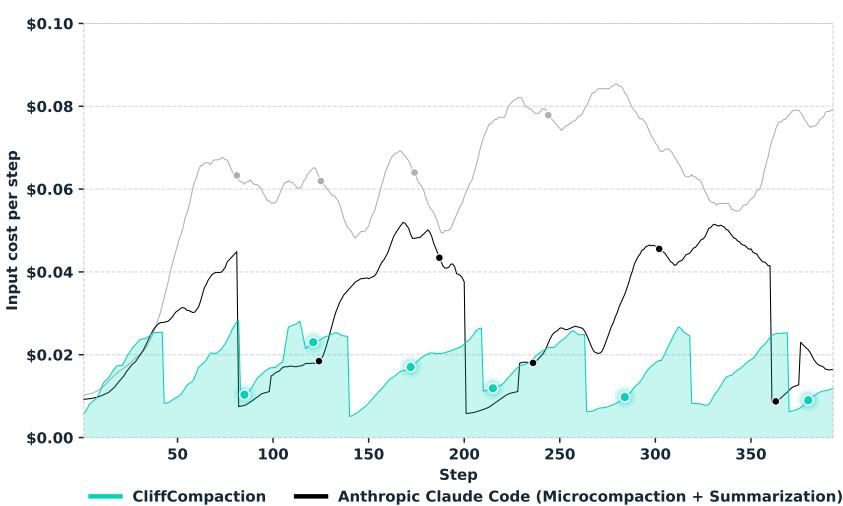

Kernel speedup  
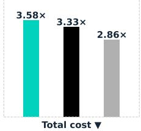

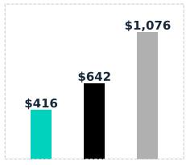  
Sliding Window

Figure 1: Continual learning of CUDA kernel development on KernelBench using OpenHands: CLIFFCOMPACTION is both the cheapest and the highest performing.. Left: per-step input cost on one Level 3 problem; dots mark when each method’s overall speedup across 50 problems first reaches 1.0×, 1.5×, . . . , 3.5×. Right: final speedup (▲) and total cost (▼) across all 50 problems.

## 1 INTRODUCTION

Coding agents solve complex tasks by interacting with tools and environments over contexts spanning millions of tokens. However, processing such long contexts is computationally expensive, and increasingly bloated contexts can impair agent effectiveness as trajectories grow longer. We show that bounded context with autocompaction can match or exceed full-context performance at lower cost.

We develop CLIFFCOMPACTION, an autocompaction technique for coding agents. On SWE-bench Verified, CLIFFCOMPACTION preserves full-context success rates for GLM-5.1 and Kimi K2.6 with context thresholds of only 32K and 16K tokens. On Terminal-Bench 2.0, it achieves higher success rates while reducing cost by 50%.

For long context tasks, two main problems arise: (a) how to manage context information once an agent session runs out of context length; (b) how to maximize agent performance while reducing cost from long context.

For context management (a), the main approaches are either to compact—to truncate or summarize— the context or to store memories and start a new session with those memories. Sliding windows, which keep only the most recent turns or observations (Yang et al., 2024), are effective drop-in solutions, but invalidate the prefix cache whenever the window advances, increasing inference cost. LLM-based summarization, though widely used, compounds loss across summary-of-summary chains.

A more demanding challenge in this area is continual learning, where an agent needs to continually improve previous solutions to a problem where the total context can reach millions of tokens. While solutions for continual learning exist, they often rely on complex, task-specific methods (Du et al., 2026; Dai et al., 2026) with limited generalizability.

On the efficiency side (b), the long context is represented by the KV-cache. While the KV-cache leads to efficient inference, it is the main memory and computational bottleneck for long-context session and increases the latency and inference cost significantly. While system-level backend solutions such as FlashAttention (Dao et al., 2022) or DeepSeek Sparse Attention (DeepSeek-AI, 2025) reduce the KV-cache memory requirements directly, token-basedfrontend algorithms seek to reduce KV-cache costs indirectly and improve model performance by manipulating the tokens in the context.

One particular problem for frontend efficiency is test-time scaling (Kwok et al., 2026; Kim et al., 2026), where one seeks to use a model repeatedly and thus use additional tokens to achieve favorable cost-performance trade-offs compared to another model, for example, a frontier model. However, test-time scaling often requires tens of rollouts and incurs exorbitant inference costs. Moreover, as scaling gains saturate and parallel scaling introduces a selection bottleneck, it remains unclear whether the marginal improvements justify the expense.

CLIFFCOMPACTION addresses these challenges: it maintains performance on coding and terminal tasks at lower cost, makes test-time scaling economical, and sets a new best result for continual learning on KernelBench under a matched evaluation setup.

Table 1: Context-management approaches. : supported; : not supported; : partial or conditional. CLIFFCOMPACTION sacrifices only full-history recall, which we show is not needed (§3).
<table><tr><td>Approach</td><td>Training- free</td><td>Drop- in</td><td>Model- agnostic</td><td>No aux. LLM call</td><td>Cache- friendly</td><td>High precision</td><td>Full-history recall</td></tr><tr><td>Sliding window</td><td></td><td></td><td></td><td></td><td>O</td><td></td><td>O</td></tr><tr><td>LLM summarization</td><td></td><td></td><td></td><td>O</td><td>●</td><td>O</td><td>0</td></tr><tr><td>Learned compression</td><td>O</td><td>O</td><td>O</td><td>O</td><td>0</td><td>O</td><td>0</td></tr><tr><td>Sub-agent decomposition</td><td>0</td><td>O</td><td>0</td><td>O</td><td>0</td><td>0</td><td>0</td></tr><tr><td>External memory / RAG</td><td></td><td>O</td><td></td><td></td><td>0</td><td></td><td></td></tr><tr><td>Structure-based</td><td></td><td>O</td><td></td><td></td><td>O</td><td></td><td>0</td></tr><tr><td>Anthropic Claude Code</td><td></td><td></td><td></td><td>O</td><td>0</td><td>O</td><td>0</td></tr><tr><td>CLIFFCOMPACTION</td><td></td><td></td><td></td><td></td><td></td><td></td><td>O</td></tr></table>

CLIFFCOMPACTION is a rule-based context-management method for long-running agents. CLIFF-COMPACTION lets the context grow naturally until it reaches a predefined threshold, at which point it performs compaction and reduces the accumulated context. During compaction, CLIFFCOMPACTION truncates components that dominate context length, primarily tool calls and tool outputs. Across successive compaction events, it does not stack or recursively compress previously compacted history. Instead, each compaction discards the previous compacted history and constructs a new compacted block from the current active context. Discarding past sessions prevents the agent to act on partial in formation and avoids context drift. Table 1 summarizes the design space and highlights our deliberate sacrifice of full-history recall in exchange for a method that is training-free, drop-in, model-agnostic, cache-friendly, and free of auxiliary LLM calls.

With this design, CLIFFCOMPACTION jointly addresses the context-capacity and efficiency challenges of long-horizon agents (Figure 1). Our experiments demonstrate its effectiveness across multiple benchmarks, scaffolds, and models. CLIFFCOMPACTION preserves agent performance while cutting token usage, reducing cost from cache reads by up to 90% and curtailing total cost accordingly. These savings make test-time scaling economically viable: on Terminal-Bench 2.0, multiple compacted Kimi K2.6 rollouts match Opus 4.7 and exceed Opus 4.6 and GPT-5.3 Codex at lower cost. Scaling to three rollouts gains 10.5 points at only 1.9× the cost of a single uncompacted Kimi run. For continual learning, CLIFFCOMPACTION reaches the best results while requiring no external memory or task-specific design. Under matched settings, it outperforms methods built specifically for kernel optimization by 25%, despite being a general compaction strategy. With our best configuration, it reaches a 3.58× speedup on KernelBench Level 3 across sessions exceeding a million tokens of context. At equal spend, CLIFFCOMPACTION buys more performance than full-context settings, making it an effective and practical compaction technique for long-horizon coding agents.

## 2 CLIFFCOMPACTION

CLIFFCOMPACTION makes three design choices. First, it compacts when the context crosses a token threshold. Second, it retains compact verbatim excerpts—rather than summaries—while dropping token-intensive portions of the conversation. Third, at each new compaction event, it discards previous compactions and compacts only the post-compaction turns since the last event. This leads to a "cliff" where context length drops sharply to roughly the same level after each compaction event.

This design aims to optimize two main objectives: (1) making compaction itself practical and efficient to deploy; (2) maximizing verbatim, unaltered context for as long as possible.

While the first objective simply avoids re-prefills, the second is more subtle. Using summaries has the problem that if most of the information is summarized correctly, the model assumes it has all the information and does not need to revisit past state, such as documentation or code files (Appendix C, Figure 6). This leads to subtle but continuous context drift if the summary does not preserve the right information. We call this issue low compaction precision, where high compaction precision avoids omission or distortion of past information in the context.

This often stands in trade-off with compaction recall: how much information can be retrieved over the course of many compactions.

CLIFFCOMPACTION can be seen as having low compaction recall, since it throws away all direct information after two compactions. Summaries have high recall since they can retrieve information from many past compactions. On the other hand, CLIFFCOMPACTION has high compaction precision, because it preserves user directives and model generations in full for two full compaction windows, while methods that use summaries have low compaction precision.

As such, the best view of CLIFFCOMPACTION is as a practically deployable algorithm that optimizes compaction precision at the cost of degrading compaction recall.

## 2.1 CLIFFCOMPACTION AND KV-CACHE

On the frontend level, LLM APIs typically distinguish between uncached input tokens, output tokens, and cached input tokens. On the backend systems level, cached input tokens correspond to KV-cache reads. While cache reads are the least expensive on a per-token basis, they are by far the most costly operation for long-context sessions that are typical for agents. This is because every request bears the cost of all past tokens while autoregressive token generation incurs only the cost of a few additional tokens. On the backend level, this cost is related to large memory reads for KV-caches, which usually take up more GPU memory than the model weights and which are bandwidth-bound—this is particularly expensive due to the current shortage and price of HBM memory.

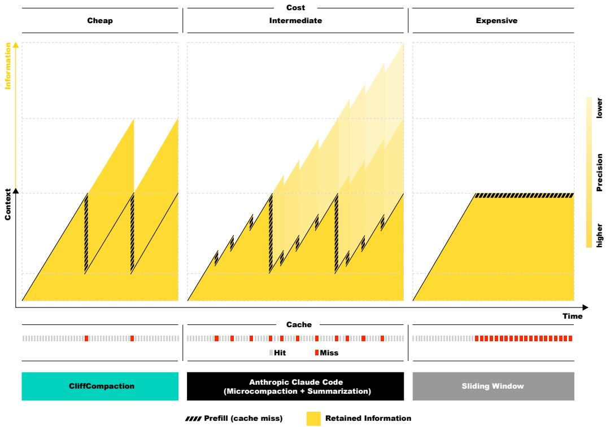  
Figure 2: Overview of CLIFFCOMPACTION. CLIFFCOMPACTION strictly discards previous compactions and retains only fragments from the most recent window. The yellow area reflects recall (how much information stays retrievable in the context) and its shade reflects precision (fidelity of the retained information)—CLIFFCOMPACTION favors precision over recall.

Any modification to the context, including compaction and other context-management approaches, invalidates the existing KV-cache and requires re-prefilling the new context from the common prefix. API costs for uncached input tokens that require re-prefill are roughly 5 to 6 times as expensive as cached ones in the models we study (Table 9) and as such incur very high costs. Consequently, the efficiency gains of frontend context management often come at the expense of additional backend re-prefills. Thus frequent context changes need to be avoided for a practical, cost-efficient algorithm.

CLIFFCOMPACTION is designed to preserve cache efficiency by avoiding excessive re-prefills. Instead of actively managing the context throughout a trajectory, CLIFFCOMPACTION leaves it unchanged and lets it grow naturally, compacting only upon exhausting a preset budget. Since the existing context are never modified between compactions, the cache remains valid across each entire growth segment and is invalidated only at the compaction points themselves, hence the smooth cliff-shaped profile in Figure 2. While each compaction event unavoidably resets the cache and requires a re-prefill, the associated overhead stays modest for two reasons: the compacted context is dramatically smaller than the original, and compaction occurs only occasionally, so each re-prefill is amortized over a long stretch of full cache reuse.

## 2.2 CLIFFCOMPACTION AND TOKENS

We unpack the agent’s context on Terminal-Bench 2.0 with GLM 5.1 to identify where tokens and dollars are concentrated (Table 7). Without compaction, tool results dominate the context at 56.0% of tokens, followed by tool calls at 28.0%, together accounting for 84% of the total spent. This motivates CLIFFCOMPACTION to compact tool-related content by dropping long tool results and reducing tool calls to their signatures. If the model wants to retrieve past information, it can issue a new tool cal from the preserved signature, so any removed context remains recoverable.

Tool results. CLIFFCOMPACTION applies a simple length-based rule to tool results. Those exceeding 500 characters are dropped, while shorter ones are retained. Short results are often useful and cheap to keep, such as grep matches, exit codes, and concise script output. Long results are typically reads of large files and contain information that can be recovered on demand.

Tool calls. For tool calls, CLIFFCOMPACTION reduces each call to a compact signature. Although available tools differ across scaffolds, it generally retains the tool name, the target file or path, and other essential arguments. Long contents embedded in tool calls, such as file-write calls that inline file contents, are removed, as the resulting file persists in the codebase and can be re-read whenever needed. By preserving tool calls verbatim, the agent can recover past context fully by making the same tool call.

Thoughts, system prompts, task description, and recent turns. Agent thoughts (analyses, plans, and hypotheses) are not a major source of context bloat, but we still truncate them to 300 characters. The system prompt and the first user message (the task description) are kept in full. We also keep the $K$ most recent turns unchanged (Algorithm 1).

## 2.3 CLIFF BY CLIFF

Long trajectories may undergo multiple compactions, raising the question of how to manage previous compactions when a new one fires. CLIFFCOMPACTION makes a trade-off where we compact past sessions in such a way to maximize compaction precision—how much information to preserve verbatim—while limiting degradations in compaction recall—how much information is preserved from past sessions.

In more detail, the CLIFFCOMPACTION algorithm works as follows: After the (t−1)-th compaction, the agent’s context $S _ { t }$ consists of the compacted history $C _ { t - 1 }$ followed by the live session $L _ { t }$ that grows on top of it, with $C _ { 0 } = \varnothing$ . When $S _ { t }$ exceeds the context window, the t-th compaction triggers:

$$
\begin{array} { r c l } { { } } & { { } } & { { S _ { t } = C _ { t - 1 } \oplus L _ { t } , } } \\ { { } } & { { } } & { { C _ { t } = \mathbf { C } _ { \mathrm { L I F F } } \mathbf { C } \mathbf { \mathrm { O M P A C T I O N } } ( L _ { t } ) , } } \\ { { } } & { { } } & { { S _ { t + 1 } = C _ { t } \oplus L _ { t + 1 } . } } \end{array}
$$

$C _ { t - 1 }$ is discarded entirely rather than nested into $C _ { t }$

Faithfulness—maximizing compaction precision. Common compaction schemes fold old summaries into new ones, so every cascading compaction is a summary of summaries. Compressing already partial content makes each compaction lossier than the last, and context quality decays over the trajectory. CLIFFCOMPACTION prevents this type of regression by discarding the previous compacted history completely. Each compaction compresses only the latest live session $L _ { t }$ , keeping every cliff equally faithful to the turns it condenses and maintaining high compaction precision throughout the trajectory.

Residual propagation limits degradation of compaction recall. While CLIFFCOMPACTION discards all information before the previous compaction, it still carries information forward. Every turn of $L _ { t }$ is generated with $C _ { t - 1 }$ in view, so the agent’s actions and reasoning, and therefore the block $C _ { t }$ that compresses them, carry an implicit influence of the discarded context. This chain extends back to the start of the trajectory:

$$
C _ { t } \gets L _ { t } \gets C _ { t - 1 } \gets L _ { t - 1 } \gets \cdots \gets C _ { 1 } \gets L _ { 1 } .
$$

No information is ever carried forward directly, but residual knowledge leaks from each session into the next through the agent’s own behavior, softening the loss in compaction recall. Experimentally, this residual knowledge makes CLIFFCOMPACTION effective at long-context sessions over millions of tokens even though a compaction window of 128k tokens is used.

As such, the two effects trade recall for precision. Only the most recent window survives each compaction, so the context is cliff-shaped not only in tokens but also in information (Figure 2). Algorithm 1 summarizes CLIFFCOMPACTION.

Algorithm 1 CLIFFCOMPACTION   
1: function CLIFFCOMPACTION(turns)   
2: old, recent ← turns[:−2K], turns[−2K:] ▷ K turn pairs   
3: parts ← [ ]   
4: for $m \in o l d$   
5: if m is a prior compaction   
6: skip ▷ discard, keep flat   
7: else if m is ASSISTANT   
8: parts += [TRUNCATE(m.thinking, 300), SIGNATURE(m.toolcall, 150)]   
9: else if m is TOOLRESULT and $| m | \leq 5 0 0$   
10: parts += [m]   
11: end if   
12: end for   
13: return JOIN(parts), recent   
14: end function   
15: function QUERY(messages)   
16: try return LLM(messages)   
17: except CONTEXTWINDOWEXCEEDED:   
18: s, x ← messages[0], messages[1]   
19: C, recent ← CLIFFCOMPACTION(messages[2:])   
20: return LLM([s, x, C] ∥ recent)   
21: end function

## 3 CLIFFCOMPACTION MAINTAINS PERFORMANCE AT LOWER COST

## 3.1 EXPERIMENTAL SETUP

Benchmarks, Scaffolds, and Models. We evaluate on SWE-bench Verified (Jimenez et al., 2024) and Terminal-Bench (Merrill et al., 2026). For SWE-bench Verified, we use mini-swe-agent (Yang et al., 2024), which maintains an append-only conversation history without native conversation-level compaction, providing a clean baseline. We additionally use OpenHands (Wang et al., 2025b) to test whether the effect transfers across harnesses, replacing its native condenser with CLIFFCOMPACTION in the constrained-context settings. For Terminal-Bench 2.0, we use the benchmark’s standard Terminus-2 scaffold, substituting its built-in compaction with CLIFFCOMPACTION while leaving all other behavior unchanged. We also evaluate CLIFFCOM-PACTION on Terminal-Bench 2.1 using Claude Code. We run on recent models from the Kimi (K2.5, K2.6) (Team et al., 2026; Moonshot AI, 2026) and GLM (5, 5.1, 5 Turbo, 5.3 Flash, 4.7 Flash) (GLM-5 Team, 2026; Z.AI, 2026; GLM Team, 2025) families.

Compaction Thresholds and Integration. We compare full-context execution under each scaffold’s default behavior against CLIFFCOMPACTION with token thresholds $B \in \{ 4 5 \mathrm { K } , 3 2 \mathrm { K } , 1 6 \mathrm { K } , 8 \mathrm { K } \}$ For mini-swe-agent, OpenHands and Terminus-2 we modify the scaffold and integrate CLIFFCOMPACTION directly. Claude Code is closed-source, so we implement CLIFFCOM-PACTION as an API proxy that works with any scaffold. Both CLIFFCOMPACTION and Claude Code’s native auto-compaction are configured to operate at a matched mean peak context of ∼45K.

## 3.2 RESULTS

We first evaluate whether CLIFFCOMPACTION preserves agent success rates when the available context is substantially constrained. Tables 3 and 2 compare runs using the model’s full context window against runs with fixed compaction thresholds on SWE-bench Verified and Terminal-Bench. We focus here on task success and analyze the cost columns in Appendix A.1.

Terminal-Bench. On Terminal-Bench 2.0, CLIFFCOMPACTION matches or improves upon the full-context setting at moderate thresholds. For Kimi K2.6, both the 32K and 16K settings achieve 61.42%, exceeding the full-context baseline of 59.16% by 2.26 percentage points. At 16K, replacing

Table 2: Performance and cost on Terminal-Bench across context length budgets with CLIFFCOM-PACTION, evaluated with Terminus-2 on Terminal-Bench 2.0 and Claude Code on Terminal-Bench 2.1. †No compaction is applied.
<table><tr><td colspan="9">Terminus-2</td></tr><tr><td></td><td></td><td colspan="2">Full context†</td><td colspan="2">32K</td><td colspan="2">16K</td><td colspan="2">8K</td></tr><tr><td>Model</td><td>Compaction</td><td>% Resolved</td><td>Cost</td><td>% Resolved</td><td>Cost</td><td>% Resolved</td><td>Cost</td><td>% Resolved</td><td>Cost</td></tr><tr><td>Kimi K2.6</td><td>Summarization CLIFFCOMPACTION</td><td> $5 9 . 1 6 _ { \pm 3 . 4 1 }$ </td><td>$0.40</td><td> $5 8 . 3 6 _ { \pm 2 . 5 7 }$   $6 1 . 4 2 _ { \pm 4 . 2 5 }$ </td><td>$0.24 $0.24</td><td> $5 5 . 4 5 { \scriptstyle \pm 0 . 6 4 }$ </td><td>$0.26 $0.19</td><td> $4 2 . 9 7 _ { \pm 4 . 4 1 }$ </td><td>$0.60 $0.25</td></tr><tr><td>GLM 5.1</td><td>CLIFFCOMPACTION</td><td> $4 9 . 8 3 _ { \pm 3 . 4 2 }$ </td><td>$0.54</td><td> $5 3 . 2 0 { \scriptstyle \pm 5 . 3 1 }$ </td><td>$0.34</td><td> $6 1 . 4 2 _ { \pm 1 . 3 0 }$   $5 4 . 3 3 { \scriptstyle \pm 2 . 3 5 }$ </td><td>$0.27</td><td> $5 0 . 0 0 { \scriptstyle \pm 2 . 4 0 }$   $4 4 . 9 3 { \scriptstyle \pm 3 . 3 5 }$ </td><td>$0.19</td></tr><tr><td></td><td></td><td></td><td></td><td>Claude Code</td><td></td><td></td><td></td><td></td><td></td></tr><tr><td colspan="8">200K</td><td colspan="4">45K</td></tr><tr><td>Model</td><td>Compaction</td><td colspan="2">% Resolved</td><td colspan="2"></td><td colspan="2"></td><td colspan="2"></td></tr><tr><td></td><td></td><td colspan="2"></td><td colspan="2">Cost</td><td colspan="2">% Resolved</td><td colspan="2">Cost</td></tr><tr><td>GLM 5.3 Flash</td><td>Summarization CLIFFCOMPACTION</td><td colspan="2"> $7 3 . 0 3 _ { \pm 3 . 0 4 }$ </td><td colspan="2">$0.21</td><td colspan="2"> $7 0 . 9 7 _ { \pm 3 . 7 2 }$   $7 6 . 6 9 _ { \pm 1 . 4 1 }$ </td><td colspan="2">$0.14 $0.16</td></tr></table>

Terminus-2’s native LLM-based summarization with CLIFFCOMPACTION increases success from 55.45% to 61.42%. GLM 5.1 shows a similar benefit, improving from 49.83% at full context to 53.20% at 32K and 54.33% at 16K. These gains suggest that removing stale context can sometimes improve agent performance rather than simply reducing memory pressure. As in SWE-bench Verified, the 8K setting is substantially more constrained and shows lower success, but the degradation remain gradual rather than catastrophic.

On Terminal-Bench 2.1 we evaluate GLM 5.3 Flash under Claude Code. At a matched ∼45K mean peak context, CLIFFCOMPACTION reaches 76.69%, exceeding both Claude Code’s autocompaction at the same budget (70.97%) and its default 200K configuration (73.03%), and doing so with markedly lower seed variance. This also highlights that CLIFFCOMPACTION is deliberately scaffold-agnostic: it has no knowledge of Claude Code’s tool schema and reduces every tool call to a generic name-and-arguments signature. That CLIFFCOMPACTION still outperforms a scaffoldnative summarizer under these conditions indicates the method does not depend on scaffold-specific structure, and can be deployed against a closed agent without modification.

Table 3: Performance and cost on SWE-bench Verified across context length budgets, evaluated with mini-swe-agent and OpenHands. Cost is average per-instance USD. †No compaction is applied. ‡OpenHands’ native condenser is active.  
mini-swe-agent
<table><tr><td></td><td colspan="2">Full context†</td><td colspan="2">32K</td><td colspan="2">16K</td><td colspan="2">8K</td></tr><tr><td>Model</td><td>% Resolved</td><td>Cost</td><td>% Resolved</td><td>Cost</td><td>% Resolved</td><td>Cost</td><td>% Resolved</td><td>Cost</td></tr><tr><td>Kimi K2.6</td><td> $7 3 . 8 7 { \scriptstyle \pm 0 . 3 1 }$ </td><td>$0.19</td><td> $7 3 . 2 7 { \scriptstyle \pm 0 . 1 2 }$ </td><td>$0.18</td><td> $7 1 . 8 7 { \scriptstyle \pm 1 . 3 1 }$ </td><td>$0.17</td><td> $6 7 . 6 0 { \scriptstyle \pm 1 . 0 6 }$ </td><td>$0.18</td></tr><tr><td>Kimi K2.5</td><td> $7 0 . 8 7 { \scriptstyle \pm 1 . 0 1 }$ </td><td>$0.12</td><td> $7 0 . 9 8 { \scriptstyle \pm 0 . 9 8 }$ </td><td>$0.11</td><td> $6 9 . 5 3 { \scriptstyle \pm 1 . 3 3 }$ </td><td>$0.08</td><td> $6 4 . 9 3 { \scriptstyle \pm 1 . 3 3 }$ </td><td>$0.10</td></tr><tr><td>GLM 5.1</td><td> $7 1 . 4 0 { \scriptstyle \pm 0 . 7 2 }$ </td><td>$0.25</td><td> $6 8 . 8 0 { \scriptstyle \pm 1 . 5 9 }$ </td><td>$0.20</td><td> $6 9 . 3 3 { \scriptstyle \pm 1 . 1 0 }$ </td><td>$0.15</td><td> $6 5 . 1 3 { \scriptstyle \pm 0 . 7 6 }$ </td><td>$0.13</td></tr><tr><td>GLM 5 Turbo</td><td> $6 9 . 8 0 { \scriptstyle \pm 1 . 0 6 }$ </td><td>$0.19</td><td> $7 0 . 5 3 { \scriptstyle \pm 0 . 4 2 }$ </td><td>$0.16</td><td> $6 7 . 5 3 { \scriptstyle \pm 1 . 1 4 }$ </td><td>$0.13</td><td> $6 3 . 2 7 _ { \pm 1 . 2 2 }$ </td><td>$0.11</td></tr><tr><td>GLM 5</td><td> $6 9 . 8 0 { \scriptstyle \pm 1 . 2 0 } $ </td><td>$0.26</td><td> $6 8 . 8 7 { \scriptstyle \pm 0 . 8 1 }$ </td><td>$0.23</td><td></td><td></td><td></td><td></td></tr><tr><td>GLM 4.7 Flash</td><td> $4 3 . 2 0 _ { \pm 1 . 2 7 }$ </td><td></td><td> $4 3 . 6 0 { \scriptstyle \pm 0 . 9 9 }$ </td><td></td><td> $4 1 . 2 0 { \scriptstyle \pm 0 . 4 2 }$ </td><td></td><td> $3 0 . 7 0 { \scriptstyle \pm 2 . 9 7 }$ </td><td></td></tr></table>

<table><tr><td></td><td colspan="2">Full context‡</td><td colspan="2">32K</td></tr><tr><td>Model</td><td>% Resolved</td><td>Cost</td><td>% Resolved</td><td>Cost</td></tr><tr><td>Kimi K2.6</td><td> $7 1 . 3 0 { \scriptstyle \pm 0 . 9 9 }$ </td><td>$0.57</td><td> $7 0 . 2 0 { \scriptstyle \pm 0 . 5 7 }$ </td><td>$0.42</td></tr><tr><td>GLM 5.1</td><td> $7 1 . 9 3 { \scriptstyle \pm 1 . 2 1 }$ </td><td>$1.01</td><td> $7 2 . 2 0 { \scriptstyle \pm 0 . 6 9 }$ </td><td>$0.69</td></tr></table>

SWE-bench Verified. On SWE-bench Verified, CLIFFCOMPACTION preserves most of the fullcontext performance at moderate thresholds. For Kimi K2.6, reducing the compaction threshold to 32K changes the resolution rate only slightly, from 73.87% to 73.27%, and the 16K setting remains within 2.0 percentage points of the full-context baseline. The GLM models show a similar trend, with GLM 5.1 and GLM-5 Turbo remaining within roughly two percentage points of their full-context baselines at 16K. The 8K setting is more aggressive and produces larger drops across models, suggesting it is best viewed as a stress test rather than the default operating point.

## 4 MAKING TEST-TIME SCALING AFFORDABLE WITH CLIFFCOMPACTION

Test-time scaling improves agent performance by performing multiple rollouts for a task and then using an algorithm, model, or heuristic to choose the best solution, but it has remained mostly academic due to its high cost. To put the cost-performance trade-off into perspective: without CLIFFCOMPACTION three rollouts of Kimi K2.6 on all Terminal-Bench instances buy 4.8 points of performance gain over a single run at three times its cost (\$91.65)—a price that exceeds a single run of a proprietary model that scores 5.5 points higher at a cost of \$65, which shows the impractical nature of naive test-time scaling.

CLIFFCOMPACTION inverts this trade-off. Compaction reduces per-rollout cost enough that multiple rollouts can fit within the budget of a single frontier-model run. With CLIFFCOMPACTION, three Kimi K2.6 rollouts cost \$58.01 for the entirety of Terminal-Bench, less than one run of GPT 5.3 Codex, while matching the strongest proprietary model, Anthropic’s Opus 4.7 (see Table 4).

## 4.1 EXPERIMENTAL SETUP

We scale Terminus-2 on Terminal-Bench (Table 4) and mini-swe-agent on SWE-bench Verified (Table 13) k times under each CLIFFCOMPACTION context threshold, for both Kimi K2.6 and GLM 5.1. We report pass@1, the mean resolution rate across individual runs (without selection), and Oracle (pass@k), the fraction of tasks solved by at least one of the k runs, effectively picking the best trajectory among all rollouts, which serves as an upper bound on achievable performance.

Since oracle selection is unavailable at deployment time, we additionally report Practical, the resolution rate achieved by a learned selector. For each candidate trajectory T, we extract a feature vector $\phi ( T ) = [ f _ { 1 } ( T ) , \ldots , f _ { d } ( T ) ] \in \mathbb { R } ^ { d }$ that summarizes its execution behavior (e.g., the number of steps and tool calls) and characteristics of the produced solution (e.g., its length and structure). We further find line overlap to be a strong statistical feature that substantially boosts accuracy for trajectory selection. This aligns with Shen et al. (2026), who show that the line overlap of two rollouts correlates strongly with unit-test resolution. Following this, we generalize line overlap to a broader set of within-group agreement features that capture how much a candidate agrees with the others for the same task. We call the resulting selector SOFT GROUP VERIFICATION (SGV).

A lightweight LightGBM classifier $s ( \cdot )$ takes these features as inputs and assigns each candidate a score s(ϕ(T)), and we select ${ \hat { T } } = \arg \operatorname* { m a x } _ { T } s ( \phi ( T ) )$ as the final solution. The scorer is trained on rollouts from a different model: the selector used on Kimi K2.6 is trained only on GLM 5.1’s, and vice versa. We find no consistent difference between selectors trained on the same versus a different model. We additional test for test leakage and find SGV to not leak any information through summary statistics of the trajectory. Details are in Appendix D.1.

## 4.2 RESULTS

CLIFFCOMPACTION makes test-time scaling cost-effective where naive scaling is not. At the same three-rollout budget, uncompacted Kimi K2.6 gains 4.8 points over a single run at 3.0× its cost, while CLIFFCOMPACTION at a 16K context limit gains 10.5 points at 1.9× (Table 4). This configuration reaches 69.7%, matching the strongest proprietary model we test (Opus 4.7, 69.4%) and exceeding GPT 5.3 Codex (64.7%) and Opus 4.6 (62.9%), at a total cost of \$58.01, less than a single GPT 5.3 Codex run. It also dominates the uncompacted three-rollout baseline: 5.7 points more accurate at 37% lower cost.

The gains persist under a more conservative test-time budget. With only two rollouts, CLIFFCOM-PACTION reaches 65.9% at \$38.67, a 1.3× cost multiplier, cheaper than a single run of either GPT 5.3 Codex or Opus 4.6. This already exceeds the uncompacted three-rollout baseline at 42% of its cost.

Table 4: Test-time scaling on Terminal-Bench 2.0, ordered by accuracy. With CLIFFCOMPACTION (abbreviated CLIFF here for space), three rollouts of Kimi K2.6 cost less than a single GPT 5.3 Codex run while surpassing every proprietary baseline evaluated on the same Terminus-2 harness. Practical is the resolution rate of our learned selector, SOFT GROUP VERIFICATION (SGV); at k=1 it is plain pass@1. Oracle is the pass@k ceiling. Context is the compaction budget for CLIFF rows and the model’s full window otherwise. Teal rows are Pareto-optimal in accuracy–cost among our scaled (k>1) configurations; purple rows are proprietary baselines.
<table><tr><td>Model</td><td>Scaffold</td><td>Context k</td><td>Cost (USD)</td><td>Oracle</td><td>Practical</td><td>Gain @ Cost</td></tr><tr><td> $\mathrm { G P T } 5 . 5 + \mathrm { L L M - a s - a - V e r i f i e r } ^ { \mathrm { g } }$ </td><td>Capy</td><td>1M 5</td><td></td><td> $9 2 . 1 ^ { \ S }$ </td><td>86.5$</td><td> $+ 3 . 4 \ @ 5 . 0 \times$ </td></tr><tr><td>GPT 5.5$</td><td>Capy</td><td>1M 1</td><td></td><td></td><td>83.1⁸</td><td></td></tr><tr><td>Kimi K2.6 + CLIFF + SGV</td><td>Terminus-2</td><td>16K 3</td><td>$58.01</td><td>74.2</td><td>69.7</td><td>+10.5 @ 1.9×</td></tr><tr><td>Opus 4.7‡</td><td></td><td>1M 1</td><td></td><td></td><td>69.4</td><td></td></tr><tr><td>Kimi K2.6 + CLIFF + SGV</td><td>Terminus-2</td><td>16K 2</td><td>$38.67</td><td>70.4</td><td>65.9</td><td>+6.7 @ 1.3×</td></tr><tr><td>Kimi  ${ \mathrm { K } } 2 . 6 + { \mathrm { C } } { \mathrm { L I F F } } + { \mathrm { S G V } }$ </td><td>Terminus-2</td><td>32K 3</td><td>$65.33</td><td>73.0</td><td>65.2</td><td>+6.0 @ 2.1×</td></tr><tr><td>GPT 5.3 Codex</td><td>Terminus-2</td><td>272K 1</td><td>$64.63†</td><td></td><td>64.7</td><td></td></tr><tr><td>Kimi K2.6 + SGV</td><td>Terminus-2</td><td>256K 3</td><td>$91.65</td><td>70.8</td><td>64.0</td><td>+4.8 @ 3.0×</td></tr><tr><td>Opus 4.6</td><td>Terminus-2</td><td>1M 1</td><td>$44.53†</td><td></td><td>62.9</td><td></td></tr><tr><td>GLM 5.1 + CLIFF + SGV</td><td>Terminus-2</td><td>32K 3</td><td>$95.34</td><td>68.5</td><td>60.7</td><td>+10.9 @ 1.8×</td></tr><tr><td>GLM  $5 . 1 + \mathrm { C L I F F } + \mathrm { S G V }$ </td><td>Terminus-2</td><td>16K 3</td><td>$87.25</td><td>68.5</td><td>59.6</td><td>+9.8 @ 1.7×</td></tr><tr><td>Kimi K2.6</td><td>Terminus-2</td><td>256K 1</td><td>$30.55</td><td></td><td>59.2</td><td></td></tr><tr><td>GLM 5.1 + SGV</td><td>Terminus-2</td><td>200K 3</td><td>$158.25</td><td>65.2</td><td>55.1</td><td>+5.3 @ 3.0×</td></tr><tr><td>GLM 5.1</td><td>Terminus-2</td><td>200K 1</td><td>$52.75</td><td></td><td>49.8</td><td></td></tr></table>

Accuracy gain and cost multiplier relative to the same model’s full-context single run (k=1).  
† Costs from the Terminal-Bench leaderboard (Terminus-2): Opus 4.6 uses the reported cost; GPT 5.3 Codex is computed from its token counts.  
‡ Score from the Claude Opus 4.7 system card.  
§ From Kwok et al. (2026); Gemini-2.5-Flash as the verifier.

The same pattern holds for GLM 5.1: CLIFFCOMPACTION raises the practical resolution rate from 55.1% to 60.7% while reducing scaled-inference cost by 40% (\$95.34 vs. \$158.25), narrowing much of the gap to the proprietary models.

To further illustrate the cost-effectiveness of CLIFFCOMPACTION and SGV, we focus on Gain@Cost and compare against another selector. Using a strong base model and a separate Gemini-2.5-Flash verifier to rank five rollouts, LLM-as-a-Verifier converts a 5.0× cost increase into +3.4 points—the lowest gain-per-cost in the table. CLIFFCOMPACTION with SGV turns a 1.9× cost increase into +10.5 points, and +6.7 at only 1.3×. GLM 5.1 shows the same pattern (+10.9 at 1.8×).

## 5 CONTINUAL LEARNING WITH CLIFFCOMPACTION

Having established that CLIFFCOMPACTION maintains or improves performance across benchmarks, scaffolds, and scales, we next investigate whether it can support continual learning over long horizons and many compactions. We evaluate on KernelBench Level 3 (Ouyang et al., 2025), where a single trajectory can exceed one million tokens which is 15–70× the median SWE-bench or Terminal-Bench trajectory.

## 5.1 EXPERIMENTAL SETUP

We use OpenHands as the scaffold and let the agent freely optimize GPU kernels until reaching a stopping condition, either exhausting the step budget or, in the non-compaction setting, reaching the model’s maximum context window. We report Speedup, the geometric mean speedup against the PyTorch Eager baseline, with per-problem speedups clamped to a maximum of 10× and problems without a correct kernel scored as 0.1, following the evaluation protocol of Du et al. (2026); Acc., the percentage of problems for which the agent produces a correct kernel; and > p, the percentage of problems achieving a speedup greater than p. Each configuration adopts the kernel language and correctness tolerance of the specialized baseline it is positioned against: our CUDA configurations must satisfy atol = rtol = 1e-2, matching Dai et al. (2026), and our Triton configuration must satisfy at $\ L _ { 0 } \ L _ { 1 } = \ L _ { \mathrm { T } } \ L _ { } \ L _ { 0 } \ L _ { 1 } = \ L _ { 5 } \ L _ { \mathrm { e } } - 2$ , matching Du et al. (2026).

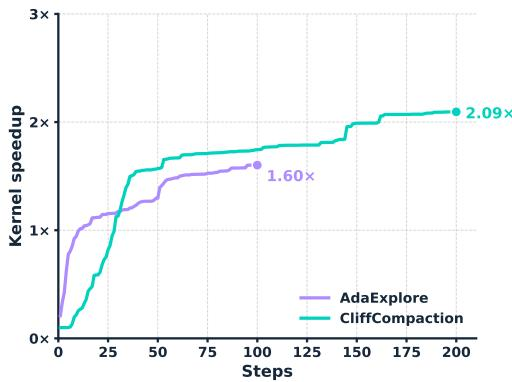  
(a) CLIFFCOMPACTION vs. AdaExplore.

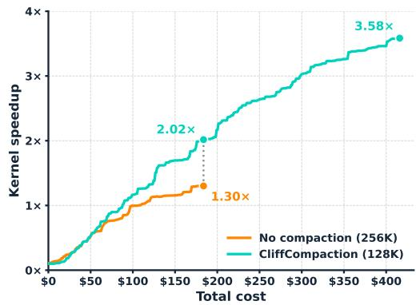  
(b) CLIFFCOMPACTION vs. full context.  
Figure 3: Best-so-far kernel speedup on KernelBench Level 3, by steps and by cost.

We run Kimi K2.7 writing CUDA kernels and GPT-5-mini writing Triton kernels, both profiled on an L40S GPU. We additionally run CLIFFCOMPACTION with Kimi K2.6 on an RTX Pro 6000 Blackwell GPU. Additional experimental details are provided in Appendix D.2.

Table 5: KernelBench Level 3 results. Top: specialized kernel-optimization agents (†as reported in the original papers; ‡CUDA-Agent reports the geometric mean over correct solutions only). Middle: CLIFFCOMPACTION on L40S; L40S/A6000 are essentially the same hardware, differing only in ECC support. Bottom: CLIFFCOMPACTION on RTX Pro 6000 Blackwell. We report both steps and the number of kernels generated, since search-based methods propose one kernel candidate per step whereas agentic setups spend some steps exploring without writing kernel code.
<table><tr><td>Method</td><td>Model</td><td>Scaffold</td><td>Speedup</td><td>Acc.</td><td>&gt; 1.2×</td><td>&gt; 2×</td><td></td><td>Steps Kernels</td><td>Hardware</td></tr><tr><td>DR.Kernel†</td><td>Qwen3 14B (RL)</td><td>custom</td><td>0.97×</td><td>84%</td><td>16%</td><td>8%</td><td></td><td>56</td><td>L40S/A6000</td></tr><tr><td>Iterative Refinement†</td><td>GPT-5-mini</td><td>custom</td><td>1.31×</td><td>100%</td><td>24%</td><td>12%</td><td></td><td>50</td><td>L40S/A6000</td></tr><tr><td>OpenEvolve+Memory†</td><td>GPT-5-mini</td><td>custom</td><td>1.47×</td><td>100%</td><td>28%</td><td>10%</td><td></td><td>50</td><td>L40S/A6000</td></tr><tr><td>AdaExplore†</td><td>GPT-5-mini</td><td>custom</td><td>1.55×</td><td>100%</td><td>28%</td><td>16%</td><td></td><td>50</td><td>L40S/A6000</td></tr><tr><td>AdaExplore†</td><td>GPT-5-mini</td><td>custom</td><td>1.78×</td><td>100%</td><td>36%</td><td>22%</td><td></td><td>200</td><td>L40S/A6000</td></tr><tr><td>CUDA-Agent†‡</td><td>Seed 1.6 (RL)</td><td>OpenHands</td><td>1.80×</td><td>94%</td><td></td><td></td><td>200</td><td></td><td>H20</td></tr><tr><td>CLIFFCOMPACTION (128K)</td><td>GPT-5-mini</td><td>OpenHands</td><td>1.57×</td><td>96%</td><td>60%</td><td>36%</td><td>50</td><td>15</td><td>L40S/A6000</td></tr><tr><td>CLIFFCOMPACTION (128K)</td><td>GPT-5-mini</td><td>OpenHands</td><td>2.09×</td><td>100%</td><td>78%</td><td>52%</td><td>200</td><td>82</td><td>L40S/A6000</td></tr><tr><td>CLIFFCOMPACTION (128K)</td><td>GPT-5-mini</td><td>OpenHands</td><td>2.21×</td><td>100%</td><td>82%</td><td>54%</td><td>400</td><td>166</td><td>L40S/A6000</td></tr><tr><td>No compaction (256K)</td><td>Kimi K2.7</td><td>OpenHands</td><td>1.30×</td><td>86%</td><td>66%</td><td>50%</td><td>200</td><td></td><td>L40S/A6000</td></tr><tr><td>CLIFFCOMPACTION (128K)</td><td>Kimi K2.7</td><td>OpenHands</td><td>2.23×</td><td>94%</td><td>88%</td><td>54%</td><td>200</td><td></td><td>L40S/A6000</td></tr><tr><td>CLIFFCOMPACTION (128K)</td><td>Kimi K2.7</td><td>OpenHands</td><td>3.58×</td><td>96%</td><td>92%</td><td>86%</td><td>400</td><td></td><td>L40S/A6000</td></tr><tr><td>No compaction (256K)</td><td>Kimi K2.6</td><td>OpenHands</td><td>1.51×</td><td>96%</td><td>72%</td><td>32%</td><td>200</td><td></td><td>RTX 6000</td></tr><tr><td>CLIFFCOMPACTION (200K)</td><td>Kimi K2.6</td><td>OpenHands</td><td>1.85×</td><td>96%</td><td>78%</td><td>40%</td><td>200</td><td></td><td>RTX 6000</td></tr><tr><td>CLIFFCOMPACTION (128K)</td><td>Kimi K2.6</td><td>OpenHands</td><td>1.87×</td><td>96%</td><td>78%</td><td>46%</td><td>200</td><td></td><td>RTX 6000</td></tr><tr><td>CLIFFCOMPACTION (128K)</td><td>Kimi K2.6</td><td>OpenHands</td><td>2.48×</td><td>98%</td><td>90%</td><td>64%</td><td>400</td><td></td><td>RTX 6000</td></tr></table>

## 5.2 RESULTS

CLIFFCOMPACTION sustains improvement beyond the context limit. Without compaction, the agent exhausts the model’s 256K context window well before the 200-step budget—98% of runs on L40S and 76% on RTX Pro 6000 terminate early, at a median of only 99 and 122 steps— capping speedup at 1.30× and 1.51× (Table 5). By letting the agent keep optimizing past this limit, CLIFFCOMPACTION lifts speedup to 2.23× and 1.87× at 200 steps, and performance consistently rises when the budget is extended to 400 steps, reaching 3.58× on L40S and 2.48× on RTX Pro 6000.

The gains are also broadly distributed across problems. On L40S, the fraction of kernels exceeding 2× speedup climbs from 50% without compaction to 86% at 400 steps, and the fraction exceeding 1.2× rises from 66% to 92%. On RTX Pro 6000, >2× doubles from 32% to 64% while accuracy climbs to 98%. Both the 200K and 128K compaction thresholds outperform the uncompacted 256K baseline, so the gains are robust to the threshold.

CLIFFCOMPACTION’s bounded context is cheaper to scale. Section 4 scaled test-time compute in parallel, here we apply the same idea along a sequential axis. With a smaller context window, CLIFFCOMPACTION buys more optimization per dollar, so the same budget goes further. In Figure 3b, at equal total cost CLIFFCOMPACTION reaches 2.02× against 1.30× for the full-context run.

CLIFFCOMPACTION outperforms systems purpose-built for kernel optimization. At 200 agent steps it reaches 2.09× against 1.78× for AdaExplore on GPT-5-mini, and 2.23× against 1.80× for CUDA-Agent. Coverage-wise, at 200 steps CLIFFCOMPACTION clears 1.2× on 78% of problems and 2× on 52%, more than double AdaExplore’s 36% and 22%, spanning 82% and 54% at 400 steps. We note that the action unit differs between strategies, the comparison favors CLIFFCOMPACTION further in candidates, where it achieves a higher speedup with fewer kernels proposed (Appendix C.3).

Figure 3a shows how speedup evolves for both. CLIFFCOMPACTION begins well behind, because it must explore from scratch, whereas AdaExplore’s learned skill memory starts strong. It catches up and overtakes at around step 31, remaining ahead through the end of AdaExplore’s budget and continuing to improve well beyond it. In Table 5, scaling from 50 to 200 steps yields +0.64× for CLIFFCOMPACTION, compared with only +0.23× for AdaExplore. Given only compaction, a generic coding agent sustains productive optimization long after a purpose-built search has plateaued.

## 6 CLIFFCOMPACTION VS. EXISTING COMPACTION STRATEGIES

Table 6: Performance and cost of compaction methods across benchmarks. SWE-bench Verified (16K) uses mini-swe-agent. $\Delta$ is change in cost vs. full-context (\$0.24 Kimi, \$0.15 GLM). KernelBench Level 3 uses OpenHands (128K) and a 400-step budget.
<table><tr><td></td><td colspan="6">SWE-bench Verified</td><td colspan="3">KernelBench L3</td></tr><tr><td></td><td colspan="3">Kimi K2.7</td><td colspan="3">GLM 5.2</td><td colspan="3">Kimi K2.7</td></tr><tr><td>Method</td><td>% Resolved</td><td>Cost</td><td>∆</td><td>% Resolved</td><td>Cost</td><td>∆</td><td>Speedup</td><td>Kernels</td><td>Cost</td></tr><tr><td>Sliding window</td><td> $7 2 . 8 0 { \scriptstyle \pm 2 . 4 3 }$ </td><td>$0.26</td><td>+9%</td><td> $7 2 . 8 7 { \scriptstyle \pm 0 . 9 9 }$ </td><td>$0.16</td><td>+7%</td><td>2.86×</td><td>118</td><td>$21.52</td></tr><tr><td>Summarization</td><td> $7 0 . 2 7 { \scriptstyle \pm 0 . 9 5 }$ </td><td>$0.18</td><td>-23%</td><td> $7 0 . 2 7 { \scriptstyle \pm 1 . 0 1 }$ </td><td>$0.12</td><td>-23%</td><td>3.47×</td><td>136</td><td>$8.10</td></tr><tr><td>+ Microcompaction</td><td> $7 1 . 0 0 { \scriptstyle \pm 0 . 6 9 }$ </td><td>$0.20</td><td>-17%</td><td> $7 2 . 7 3 { \scriptstyle \pm 2 . 0 8 }$ </td><td>$0.12</td><td>-23%</td><td>3.33×</td><td>129</td><td>$12.84</td></tr><tr><td>CLIFFCOMPACTION</td><td> $7 1 . 3 3 { \scriptstyle \pm 0 . 5 0 }$ </td><td></td><td>$0.19 -21%</td><td> $7 2 . 6 0 { \scriptstyle \pm 1 . 2 2 }$ </td><td>$0.12</td><td>-23%</td><td>3.58×</td><td>116</td><td>$8.32</td></tr></table>

Setup. We compare CLIFFCOMPACTION against alternative context-management strategies (Table 6). (1) Sliding window drops the oldest turns, keeping a fixed system/task prefix plus the most recent turns that fit within the context budget. (2) Summarization replaces the older turns with an LLM-generated summary, using Claude Code’s summarization prompt. (3) Summarization + Microcompaction is a two-tier pipeline that reimplements Claude Code’s scheme: (i) microcompaction clears the contents of old tool observations while preserving the corresponding tool calls and the 5 most recent observations verbatim, adapting Anthropic’s clear\_tool\_uses context-editing strat egy (Anthropic, 2025); (ii) when microcompaction is insufficient, an LLM summarizer rewrites the older turns into a structured summary using Claude Code’s summarization prompt. Microcompaction fires whenever at least τ tokens of reclaimable observation content have accumulated, with τ=20,000 at a 128K context budget and τ=4,000 at 16K. We adopt this configuration because it performs well on both quality and cost in our SWE-bench runs, making it a strong baseline.

CLIFFCOMPACTION is the only method that stays competitive on quality while remaining cheap on every benchmark. On SWE-bench Verified, where trajectories are short, all four methods fall within 2.6 points of one another. Sliding window scores highest on both models but only marginally, and it is the only method that makes the agent more expensive than running with full context (+9% and +7%). Summarization is the weakest on quality for both models, echoing the pattern on Terminal-Bench (Table 2). On KernelBench Level 3, with much longer trajectories, the methods separate more clearly: CLIFFCOMPACTION reaches 3.58× at \$8.32 per problem with the fewest kernel candidates (Appendix C.3), vs. 3.47× at \$8.10 for summarization, 3.33× at \$12.84 with microcompaction, and 2.86× at \$21.52 for sliding window. Across all three benchmarks, CLIFFCOMPACTION is the only technique that both maintains strong performance and remains inexpensive.

## 7 RELATED WORK

Context management. Context management has long been an important research direction for long-horizon coding agents. Leading agent scaffolds manage growing trajectories by discarding earlier observations, implementing observation-level sliding-window compaction (Yang et al., 2024; Wang et al., 2025b). Although simple, naively sliding the context can invalidate the KV cache and incur substantial re-prefill overhead. Another common approach uses LLMs to summarize prior context (Wang et al., 2025b; Kang et al., 2025; Verma, 2026; Li et al., 2026b; Wang et al., 2025a; Li et al., 2026a). Repeated summarization, however, can become increasingly lossy across compaction rounds, as details are progressively distorted or omitted through chains of summaries. A separate line of work develops trained context-compression mechanisms (Sun et al., 2026; Kang et al., 2025; Shi et al., 2025; Pan et al., 2024; Jiang et al., 2026). While effective, these methods introduce additional training complexity and may not transfer readily across models. External-memory and retrieval-based approaches (Packer et al., 2024; Wang et al., 2026) preserve access to information outside the active context, but are not drop-in solutions—they require retrieval infrastructure and remain vulnerable to retrieval failures. Similarly, sub-agent-based approaches (Gandhi et al., 2026; Zhang et al., 2024) introduce orchestration complexity and may require specialized prompting or training to determine when and how auxiliary agents should be invoked. Structure-based approaches (Semenov & Dorofeev, 2026) use deterministic, rule-based policies to evict trajectory content, but require scaffold-specific instrumentation and are cache-inefficient.

Test-time scaling for code agents. Several recent works improve coding agent performance by spending additional inference-time compute on each instance. Li et al. (2025a) introduce a hybrid framework that combines parallel sampling with sequential refinement and uses execution-grounded test inputs for selection, while Hassid et al. (2024) show unit-test-based selection over many smallmodel samples can outperform one large-model sample. Gao et al. (2025) bring test-time scaling to repository-level SWE issue resolution by combining ensemble reasoning with repo-aware exploration. SWE-Replay (Ding & Zhang, 2026) reduces the cost of naive scaling by branching from prior trajectories at carefully selected intermediate steps rather than sampling from scratch, and Kim et al. (2026) propose a representation-centric framework using compact trajectory summaries. These works largely treat context management and test-time scaling as separate axes; we instead study how an agent equipped with CLIFFCOMPACTION responds to additional inference-time compute.

Continual learning for agents. Improving coding agents’ ability to continually learn from their own experience has emerged as an important research direction. Some work trains agents to improve their solutions through iterative refinement (Baronio et al., 2026; Dai et al., 2026). Other approaches store prior experiences in external memory and retrieve relevant examples or strategies to guide the agent on new tasks (Shinn et al., 2023; Wu et al., 2026; Qian et al., 2024; Chen et al., 2024; Ouyang et al., 2026). Evolutionary approaches maintain populations of candidate programs and use LLMs to propose and select mutations over successive iterations (Novikov et al., 2025; Li et al., 2025b). However, many of these methods rely on task-specific training, memory structures, or optimization procedures, limiting their generalizability to new tasks.

## 8 LIMITATIONS

The benefits CLIFFCOMPACTION brings depend on the scaffold and on the task. Across our experiments, cost savings grow with the complexity of the scaffold itself, and so does the budget the scaffold needs in order to work: the system prompt, tool definitions, and other fixed components consume part of the budget before the agent has taken a single action. Thus, the minimum threshold that an agent needs varies between scaffolds. Similarly, the benefit is meaningful only for medium-to-long-horizon tasks.

Context management is a broad problem that has been approached in many different ways. Our comparison is limited to methods that act on the conversation history itself at inference time. We do not compare against approaches that train the model to manage its own context, or that maintain an external memory store the agent writes to and retrieves from. Such methods address the same problem from a different direction, and we did not have the resources to compare against them.

## REFERENCES

Anthropic. Context editing, 2025. URL https://platform.claude.com/docs/en/ build-with-claude/context-editing. Accessed 2026-08-15.

Carlo Baronio, Pietro Marsella, Ben Pan, Simon Guo, and Silas Alberti. Kevin: Multi-turn RL for generating CUDA kernels. In The Fourteenth International Conference on Learning Representations, 2026. URL https://openreview.net/forum?id=xu1XwVZtDi.

Minghao Chen, Yihang Li, Yanting Yang, Shiyu Yu, Binbin Lin, and Xiaofei He. Automanual: Constructing instruction manuals by llm agents via interactive environmental learning. In A. Globerson, L. Mackey, D. Belgrave, A. Fan, U. Paquet, J. Tomczak, and C. Zhang (eds.), Advances in Neural Information Processing Systems, volume 37, pp. 589–631. Curran Associates, Inc., 2024. doi: 10.52202/ 079017-0019. URL https://proceedings.neurips.cc/paper\_files/paper/ 2024/file/0142921fad7ef9192bd87229cdafa9d4-Paper-Conference.pdf.

Weinan Dai, Hanlin Wu, Qiying Yu, Huan-ang Gao, Jiahao Li, Chengquan Jiang, Weiqiang Lou, Yufan Song, Hongli Yu, Jiaze Chen, et al. Cuda agent: Large-scale agentic rl for high-performance cuda kernel generation. arXiv preprint arXiv:2602.24286, 2026.

Tri Dao, Dan Fu, Stefano Ermon, Atri Rudra, and Christopher Ré. Flashattention: Fast and memoryefficient exact attention with io-awareness. Advances in neural information processing systems, 35: 16344–16359, 2022.

DeepSeek-AI. Deepseek-v3.2: Pushing the frontier of open large language models, 2025. URL https://arxiv.org/abs/2512.02556.

Yifeng Ding and Lingming Zhang. Swe-replay: Efficient test-time scaling for software engineering agents. arXiv preprint arXiv:2601.22129, 2026.

Weihua Du, Jingming Zhuo, Yixin Dong, Andre Wang He, Weiwei Sun, Zeyu Zheng, Manupa Karunaratne, Ivan Fox, Tim Dettmers, Tianqi Chen, et al. Adaexplore: Failure-driven adaptation and diversity-preserving search for efficient kernel generation. arXiv preprint arXiv:2604.16625v1, 2026. URL https://arxiv.org/abs/2604.16625v1.

Ryan Ehrlich, Bradley Brown, Jordan Juravsky, Ronald Clark, Christopher Ré, and Azalia Mirhoseini. Codemonkeys: Scaling test-time compute for software engineering, 2025. URL https:// arxiv.org/abs/2501.14723.

Apurva Gandhi, Satyaki Chakraborty, Xiangjun Wang, Aviral Kumar, and Graham Neubig. Recursive agent optimization, 2026. URL https://arxiv.org/abs/2605.06639.

Pengfei Gao, Zhao Tian, Xiangxin Meng, Xinchen Wang, Ruida Hu, Yuanan Xiao, Yizhou Liu, Zhao Zhang, Junjie Chen, Cuiyun Gao, et al. Trae agent: An llm-based agent for software engineering with test-time scaling. arXiv preprint arXiv:2507.23370, 2025.

GLM-5 Team. Glm-5: from vibe coding to agentic engineering, 2026. URL https://arxiv. org/abs/2602.15763.

GLM Team. Glm-4.5: Agentic, reasoning, and coding (arc) foundation models, 2025. URL https://arxiv.org/abs/2508.06471.

Michael Hassid, Tal Remez, Jonas Gehring, Roy Schwartz, and Yossi Adi. The larger the better? improved llm code-generation via budget reallocation. arXiv preprint arXiv:2404.00725, 2024.

Haitao Jiang, Lin Ge, Hengrui Cai, and Rui Song. Pabu: Progress-aware belief update for efficient llm agents, 2026. URL https://arxiv.org/abs/2602.09138.

Carlos E Jimenez, John Yang, Alexander Wettig, Shunyu Yao, Kexin Pei, Ofir Press, and Karthik R Narasimhan. SWE-bench: Can language models resolve real-world github issues? In The Twelfth International Conference on Learning Representations, 2024. URL https://openreview. net/forum?id=VTF8yNQM66.

Minki Kang, Wei-Ning Chen, Dongge Han, Huseyin A Inan, Lukas Wutschitz, Yanzhi Chen, Robert Sim, and Saravan Rajmohan. Acon: Optimizing context compression for long-horizon llm agents. arXiv preprint arXiv:2510.00615, 2025.

Joongwon Kim, Wannan Yang, Kelvin Niu, Hongming Zhang, Yun Zhu, Eryk Helenowski, Ruan Silva, Zhengxing Chen, Srinivasan Iyer, Manzil Zaheer, et al. Scaling test-time compute for agentic coding. arXiv preprint arXiv:2604.16529, 2026.

Jacky Kwok, Shulu Li, Pranav Atreya, Yuejiang Liu, Yixing Jiang, Chelsea Finn, Marco Pavone, Ion Stoica, and Azalia Mirhoseini. Llm-as-a-verifier: A general-purpose verification framework, 2026. URL https://arxiv.org/abs/2607.05391.

Dacheng Li, Shiyi Cao, Chengkun Cao, Xiuyu Li, Shangyin Tan, Kurt Keutzer, Jiarong Xing, Joseph E Gonzalez, and Ion Stoica. S\*: Test time scaling for code generation. arXiv preprint arXiv:2502.14382, 1(2), 2025a.

Kefan Li, Hongyue Yu, Tingyu Guo, Shijie Cao, and Yuan Yuan. Cocoevo: Co-evolution of programs and test cases to enhance code generation, 2025b. URL https://arxiv.org/abs/2502. 10802.

Tianjian Li, Jingyu Zhang, William Jurayj, Xi Wang, Chuanyang Jin, Mehrdad Farajtabar, Eric Nalisnick, and Daniel Khashabi. Self-compacting language model agents, 2026a. URL https: //arxiv.org/abs/2606.23525.

Xiaoxi Li, Wenxiang Jiao, Jiarui Jin, Guanting Dong, Jiajie Jin, Yinuo Wang, Hao Wang, Yutao Zhu, Ji-Rong Wen, Yuan Lu, and Zhicheng Dou. Deepagent: A general reasoning agent with scalable toolsets. In Proceedings of the ACM Web Conference 2026 (WWW ’26), WWW ’26, pp. 1–12, New York, NY, USA, 2026b. Association for Computing Machinery. ISBN 9798400723070. doi: 10.1145/3774904.3792460. URL https://doi.org/10.1145/3774904.3792460.

Mike A Merrill, Alexander G Shaw, Nicholas Carlini, Boxuan Li, Harsh Raj, Ivan Bercovich, Lin Shi, Jeong Yeon Shin, Thomas Walshe, E Kelly Buchanan, et al. Terminal-bench: Benchmarking agents on hard, realistic tasks in command line interfaces. arXiv preprint arXiv:2601.11868, 2026.

Moonshot AI. Kimi k2.6. https://huggingface.co/moonshotai/Kimi-K2.6, 2026. Open-weight model under Modified MIT License.

Alexander Novikov, Ngân Vu, Marvin Eisenberger, Emilien Dupont, Po-Sen Huang, Adam Zsolt Wag-˜ ner, Sergey Shirobokov, Borislav Kozlovskii, Francisco J. R. Ruiz, Abbas Mehrabian, M. Pawan Kumar, Abigail See, Swarat Chaudhuri, George Holland, Alex Davies, Sebastian Nowozin, Pushmeet Kohli, and Matej Balog. Alphaevolve: A coding agent for scientific and algorithmic discovery, 2025. URL https://arxiv.org/abs/2506.13131.

Anne Ouyang, Simon Guo, Simran Arora, Alex L. Zhang, William Hu, Christopher Ré, and Azalia Mirhoseini. Kernelbench: Can llms write efficient gpu kernels?, 2025. URL https://arxiv. org/abs/2502.10517.

Siru Ouyang, Jun Yan, I-Hung Hsu, Yanfei Chen, Ke Jiang, Zifeng Wang, Rujun Han, Long Le, Samira Daruki, Xiangru Tang, Vishy Tirumalashetty, George Lee, Mahsan Rofouei, Hangfei Lin, Jiawei Han, Chen-Yu Lee, and Tomas Pfister. Reasoningbank: Scaling agent self-evolving with reasoning memory. In The Fourteenth International Conference on Learning Representations, 2026. URL https://openreview.net/forum?id=jL7fwchScm.

Charles Packer, Sarah Wooders, Kevin Lin, Vivian Fang, Shishir G. Patil, Ion Stoica, and Joseph E. Gonzalez. Memgpt: Towards llms as operating systems, 2024. URL https://arxiv.org/ abs/2310.08560.

Zhuoshi Pan, Qianhui Wu, Huiqiang Jiang, Menglin Xia, Xufang Luo, Jue Zhang, Qingwei Lin, Victor Rühle, Yuqing Yang, Chin-Yew Lin, H. Vicky Zhao, Lili Qiu, and Dongmei Zhang. LLMLingua-2: Data distillation for efficient and faithful task-agnostic prompt compression. In Lun-Wei Ku, Andre Martins, and Vivek Srikumar (eds.), Findings of the Association for Computational Linguistics: ACL 2024, pp. 963–981, Bangkok, Thailand, August 2024. Association for Computational Linguistics. doi: 10.18653/v1/2024.findings-acl.57. URL https://aclanthology.org/2024.findings-acl.57/.

Chen Qian, Yufan Dang, Jiahao Li, Wei Liu, Zihao Xie, YiFei Wang, Weize Chen, Cheng Yang, Xin Cong, Xiaoyin Che, Zhiyuan Liu, and Maosong Sun. Experiential co-learning of softwaredeveloping agents. In Lun-Wei Ku, Andre Martins, and Vivek Srikumar (eds.), Proceedings of the 62nd Annual Meeting ofthe Associationfor Computational Linguistics (Volume 1: Long Papers), pp. 5628–5640, Bangkok, Thailand, August 2024. Association for Computational Linguistics. doi: 10.18653/v1/2024.acl-long.305. URL https://aclanthology.org/2024.acl-long. 305/.

Andrew Semenov and Svyatoslav Dorofeev. Beyond compaction: Structured context eviction for long-horizon agents, 2026. URL https://arxiv.org/abs/2606.11213.

Ethan Shen, Daniel Tormoen, Saurabh Shah, Ali Farhadi, and Tim Dettmers. SERA: Soft-verified efficient repository agents. In Forty-third International Conference on Machine Learning, 2026. URL https://openreview.net/forum?id=GHKj1XcSlt.

Yuling Shi, Yichun Qian, Hongyu Zhang, Beijun Shen, and Xiaodong Gu. Longcodezip: Compress long context for code language models. In 2025 40th IEEE/ACM International Conference on Automated Software Engineering (ASE), pp. 141–153. IEEE Press, 2025. doi: 10.1109/ASE63991. 2025.00020. URL https://doi.org/10.1109/ASE63991.2025.00020.

Noah Shinn, Federico Cassano, Ashwin Gopinath, Karthik Narasimhan, and Shunyu Yao. Reflexion: language agents with verbal reinforcement learning. In A. Oh, T. Naumann, A. Globerson, K. Saenko, M. Hardt, and S. Levine (eds.), Advances in Neural Information Processing Systems, volume 36, pp. 8634–8652. Curran Associates, Inc., 2023. URL https://proceedings.neurips.cc/paper\_files/paper/2023/ file/1b44b878bb782e6954cd888628510e90-Paper-Conference.pdf.

Weiwei Sun, Miao Lu, Zhan Ling, Kang Liu, Xuesong Yao, Yiming Yang, and Jiecao Chen. Scaling long-horizon agent via context folding. In Forty-third International Conference on Machine Learning, 2026. URL https://openreview.net/forum?id=lNRgWoGfYg.

Kimi Team, Tongtong Bai, Yifan Bai, Yiping Bao, SH Cai, Yuan Cao, Y Charles, HS Che, Cheng Chen, Guanduo Chen, et al. Kimi k2. 5: Visual agentic intelligence. arXiv preprint arXiv:2602.02276, 2026.

Nikhil Verma. Active context compression: Autonomous memory management in llm agents, 2026. URL https://arxiv.org/abs/2601.07190.

Qingyue Wang, Yanhe Fu, Yanan Cao, Shuai Wang, Zhiliang Tian, and Liang Ding. Recursively summarizing enables long-term dialogue memory in large language models. Neurocomputing, 639: 130193, 2025a. doi: 10.1016/j.neucom.2025.130193.

Xingyao Wang, Boxuan Li, Yufan Song, Frank F Xu, Xiangru Tang, Mingchen Zhuge, Jiayi Pan, Yueqi Song, Bowen Li, Jaskirat Singh, et al. Openhands: An open platform for ai software developers as generalist agents. In International Conference on Learning Representations, volume 2025, pp. 65882–65919, 2025b.

Zhenting Wang, Huancheng Chen, Jiayun Wang, and Wei Wei. Memex(rl): Scaling long-horizon llm agents via indexed experience memory, 2026. URL https://arxiv.org/abs/2603. 04257.

Rong Wu, Xiaoman Wang, Jianbiao Mei, Pinlong Cai, Daocheng Fu, Cheng Yang, Licheng Wen, Xuemeng Yang, Yufan Shen, Yuxin Wang, and Botian Shi. From interactions to principles: Experiencedriven self-distillation for evolving LLM agents. In Forty-third International Conference on Machine Learning, 2026. URL https://openreview.net/forum?id=BamDfCP5R3.

John Yang, Carlos E Jimenez, Alexander Wettig, Kilian Lieret, Shunyu Yao, Karthik R Narasimhan, and Ofir Press. SWE-agent: Agent-computer interfaces enable automated software engineering. In The Thirty-eighth Annual Conference on Neural Information Processing Systems, 2024. URL https://arxiv.org/abs/2405.15793.

Z.AI. Glm-5.3-flash. https://huggingface.co/zai-org/GLM-5.3-Flash, 2026.

Yusen Zhang, Ruoxi Sun, Yanfei Chen, Tomas Pfister, Rui Zhang, and Sercan Ö. Arı k. Chain of agents: Large language models collaborating on long-context tasks. In A. Globerson, L. Mackey, D. Belgrave, A. Fan, U. Paquet, J. Tomczak, and C. Zhang (eds.), Advances in Neural Information Processing Systems, volume 37, pp. 132208–132237. Curran Associates, Inc., 2024. doi: 10.52202/ 079017-4202. URL https://proceedings.neurips.cc/paper\_files/paper/ 2024/file/ee71a4b14ec26710b39ee6be113d7750-Paper-Conference.pdf.

## A EXTENDED EFFICIENCY ANALYSIS

## A.1 COST SAVINGS WITH CLIFFCOMPACTION

Since cost is a primary consideration in real-world agent deployments, we assess the efficiency of CLIFFCOMPACTION through cost. Tables 3 and 2 report the average cost per instance.

Although API providers report token usage and cache statistics during agent execution, we observed substantial variation in cache-hit accounting across providers. To ensure a fair comparison, we recompute all costs using a perfect-caching model that derives cache hits directly from prompt lengths rather than provider-reported cached\_tokens fields. Given a sequence of prompt lengths across API calls, $[ P _ { 1 } , P _ { 2 } , \ldots , P _ { N } ]$ , the first call is treated as a cold start with all $\bar { P } _ { 1 }$ tokens counted as non-cached. For each subsequent call k > 1, if $P _ { k } \ge P _ { k - 1 }$ , we assume the previous prompt is fully cached, with $P _ { k - 1 }$ cached tokens and $P _ { k } - P _ { k - 1 }$ non-cached tokens. In contrast, if $P _ { k } < P _ { k - 1 }$ , we treat the reduction in prompt length as a compaction event that invalidates the KV cache, and all $P _ { k }$ tokens are counted as non-cached. Completion tokens are not subject to caching and are counted per call at each provider’s output price. This deterministic, model-agnostic procedure ensures that identical prompt sequences produce identical cache-hit rates regardless of provider, allowing us to isolate the cost effects of compaction from provider-specific caching behavior.

Overall Cost Savings. CLIFFCOMPACTION consistently reduces cost across models, scaffolds, benchmarks, and context budgets. The magnitude of the savings depends on the model, with GLM generally benefiting more than Kimi. Savings also depend on the scaffold: on SWE-bench Verified, the gap between limited-context and unlimited-context settings is far larger for OpenHands than for mini-swe-agent (25.8%–29.7% versus 6.8%–19.1% at the same 32K budget). Benchmarkwise, the largest savings are observed on Terminal-Bench, where CLIFFCOMPACTION reduces cost by 25.0%–52.1% for Kimi K2.6 and 35.8%–64.6% for GLM 5.1, substantially exceeding the reductions observed on SWE-bench Verified. We also compare against Terminus-2 agent-based summarization on Kimi K2.6 (Table 2). At a 32K budget, both approaches incur similar costs because compaction is triggered infrequently. Under tighter budgets, compaction kicks in at a substantially higher rate, and the additional summarization calls introduce non-trivial overhead: at 8K, Terminus-2 summarization costs \$0.60 per instance against \$0.25 for CLIFFCOMPACTION, while also resolving fewer tasks. We compare against further compaction baselines on long-horizon trajectories in Section 6.

Table 7: Token and cost attribution by context component, before and after compaction (Terminal-Bench 2.0, GLM 5.1). Other combines uncached input with output.
<table><tr><td></td><td></td><td colspan="3">No compaction</td><td colspan="3">CLIFFCOMPACTION @16K</td></tr><tr><td>Component</td><td>% of Context</td><td>Cached</td><td>Other</td><td>Total</td><td>Cached</td><td>Other</td><td>Total</td></tr><tr><td>Tool results</td><td>56.0%</td><td>$0.237</td><td>$0.029</td><td>$0.267</td><td>$0.053</td><td>$0.050</td><td>$0.103 (-61%)</td></tr><tr><td>Tool calls</td><td>28.0%</td><td>$0.127</td><td>$0.062</td><td>$0.189</td><td>$0.012</td><td>$0.067</td><td>$0.079 (-58%)</td></tr><tr><td>Thoughts</td><td>13.6%</td><td>$0.054</td><td>$0.030</td><td>$0.084</td><td>$0.013</td><td>$0.062</td><td>$0.075 (-11%)</td></tr><tr><td>System &amp; task</td><td>2.4%</td><td>$0.008</td><td>$0.001</td><td>$0.009</td><td>$0.010</td><td>$0.001</td><td>$0.011 (+22%)</td></tr><tr><td>Total</td><td></td><td>$0.427</td><td>$0.121</td><td>$0.548</td><td>$0.087</td><td>$0.181</td><td>$0.268(-51%)</td></tr></table>

Cost Savings Breakdown. A well-designed context-management strategy should not let reprefilling costs overshadow the cache savings it unlocks. By decomposing the cost, we show that CLIFFCOMPACTION strikes this balance. Table 7 shows that the savings achieved by CLIFFCOM-PACTION come entirely from reducing cache-read costs. Although cached tokens are substantially cheaper than uncached input or output tokens on a per-token basis, coding agents repeatedly reread their entire context throughout a trajectory, so cache reads dominate total cost, accounting for 78% of the uncompacted bill. By limiting context growth, CLIFFCOMPACTION directly targets this component, cutting cache-read cost by 80%, from \$0.427 to \$0.087 per task. Compaction does unavoidably introduce increases in uncached input cost (from re-prefilling the compacted context) and output cost (from the additional turns following compaction), but these overheads remain minor: together they grow by \$0.06 per task, against \$0.34 in cache-read savings. Consequently, the cache-read reduction overwhelmingly outweighs these additional expenses, halving total cost.

Table 8: Real (provider-metered) cost and provider cache-hit rate across scaffolds and context budgets. Subscripts on Real Cost give the cost change relative to the Full-context baseline (negative = cheaper, positive = more expensive).
<table><tr><td rowspan="2">Scaffold</td><td rowspan="2">Model</td><td colspan="2">Full-context</td><td colspan="2">32k</td><td colspan="2">16k</td><td colspan="2">8k</td></tr><tr><td>Real Cost</td><td>Cache Hit</td><td>Real Cost</td><td>Cache Hit</td><td>Real Cost</td><td>Cache Hit</td><td>Real Cost</td><td>Cache Hit</td></tr><tr><td colspan="9">SWE-bench Verified</td></tr><tr><td>mini-swe-agent</td><td>Kimi K2.6 GLM 5.1</td><td>$0.19 $0.38</td><td>96%</td><td>$0.19+0%</td><td>95% 81%</td><td>$0.17-8% $0.19-50%</td><td>92% 84%</td><td>$0.19+1%</td><td>86% 76%</td></tr><tr><td></td><td></td><td></td><td>82%</td><td>$0.29-22%</td><td></td><td></td><td></td><td>$0.16-58%</td><td></td></tr><tr><td>OpenHands</td><td>Kimi K2.6 GLM 5.1</td><td>$0.57 $1.27</td><td>98% 91%</td><td>$0.41-28% $0.83-35%</td><td>96% 90%</td><td></td><td></td><td></td><td></td></tr><tr><td colspan="9">Terminal-Bench 2.0</td></tr><tr><td>terminus-2</td><td>Kimi K2.6</td><td>$0.40</td><td>97%</td><td>$0.30-26%</td><td>94%</td><td>$0.19-53%</td><td>87%</td><td>$0.25-37%</td><td>79%</td></tr><tr><td></td><td>GLM 5.1</td><td>$0.89</td><td>79%</td><td>$0.53-40%</td><td>68%</td><td>$0.40-55%</td><td>58%</td><td>$0.25-72%</td><td>47%</td></tr></table>

Complementing the idealized perfect-cache model above, Table 8 reports the actual observed costs together with cache hit rates. Overall, Kimi K2.6 attains higher and more stable cache hit rates (86– 98%) than GLM 5.1 (47–91%), and the overall savings trends remain consistent with the perfect-cache model.

The cache hit rate explains how closely the real costs track the idealized estimates. For Kimi K2.6, whose cache hit rates are near-perfect, the real costs match the perfect-cache estimates to within ∼1%. For GLM 5.1, the lower cache hit rate makes the real costs higher than the idealized estimates; consequently, the real savings from CLIFFCOMPACTION can exceed those predicted by the perfectcache model. In both cases, cache hit rates decline steadily as the compaction threshold tightens (e.g., from 79% to 47% for GLM 5.1 on Terminal-Bench), reflecting the additional cache invalidation and re-prefilling induced by more frequent compaction.

The largest difference between the two models appears on SWE-bench Verified with mini-swe-agent. For GLM 5.1, cost reductions improve steadily as the threshold decreases, from 22% at 32K to 58% at 8K. Kimi K2.6, by contrast, is essentially unchanged at 32K, achieves a modest 8% reduction at 16K, and is marginally more expensive at 8K—the additional re-prefilling at the tightest budget cancels the context savings for this already cost-efficient model. The same non-monotonic pattern appears on Terminal-Bench, where the 8K setting yields smaller savings (37%) than 16K (53%) for Kimi K2.6.

The magnitude of the savings also varies across scaffolds. On SWE-bench Verified, OpenHands benefits substantially more from CLIFFCOMPACTION than mini-swe-agent: at a 32K threshold, both models save roughly 28–35% on OpenHands, whereas savings on mini-swe-agent range from negligible to 22%. The reductions on Terminal-Bench are the most pronounced, reaching as high as 72% and remaining above 25% across all configurations.

Model prices are provided in Table 9.

## A.2 MEASURED RUNTIME

We also report runtime as an additional axis for evaluating the efficiency gains of CLIFFCOMPACTION. We use the per-instance wall-clock that OpenHands logs directly on SWE-bench Verified, the setting that also sustains the highest, most stable cache-hit rates (above 90%). As shown in Table 10, with the context window capped at 32K, CLIFFCOMPACTION reduces per-instance wall-clock time by 23% and 34% for Kimi K2.6 and GLM 5.1, respectively—closely tracking the corresponding cost reductions of 28% and 35%. This indicates that the benefits of CLIFFCOMPACTION extend beyond monetary cost to end-to-end execution time.

Table 9: Token prices used for cost calculation. Prices are reported in USD per one million tokens.
<table><tr><td>Model</td><td>Input</td><td>Cache read</td><td>Output</td></tr><tr><td>GLM 4.7 Flash</td><td>$0.00</td><td>$0.00</td><td>$0.00</td></tr><tr><td>GLM 5</td><td>$1.00</td><td>$0.20</td><td>$3.20</td></tr><tr><td>GLM 5 Turbo</td><td>$1.20</td><td>$0.24</td><td>$4.00</td></tr><tr><td>GLM 5.1</td><td>$1.40</td><td>$0.26</td><td>$4.40</td></tr><tr><td>GLM 5.2</td><td>$1.40</td><td>$0.26</td><td>$4.40</td></tr><tr><td>GLM 5.3 Flash</td><td>$0.15</td><td>$0.03</td><td>$0.50</td></tr><tr><td>Kimi K2.5</td><td>$0.60</td><td>$0.10</td><td>$3.00</td></tr><tr><td>Kimi K2.6</td><td>$0.95</td><td>$0.16</td><td>$4.00</td></tr><tr><td>Kimi K2.7</td><td>$0.95</td><td>$0.19</td><td>$4.00</td></tr></table>

Table 11 shows the run time and speedup of CLIFFCOMPACTION on mini-swe-agent with GLM-4.7-Flash served by vLLM (RTX PRO 6000 Blackwell). The same pattern holds: inference time falls monotonically as the threshold tightens, giving speedups of 1.60×, 2.10× and 2.62× at 32K, 16K and 8K. This highlights that the benefits of CLIFFCOMPACTION extend to self-hosted serving setups.

Table 10: Per-instance wall-clock duration on OpenHands (SWE-bench Verified), with the corresponding cost reduction.
<table><tr><td></td><td colspan="2">Duration</td><td colspan="2">Reduction at 32k</td></tr><tr><td>Model</td><td>Full-context</td><td>32k</td><td>Duration</td><td>Cost</td></tr><tr><td>Kimi K2.6</td><td>849 s</td><td>656s</td><td>-23%</td><td>-28%</td></tr><tr><td>GLM 5.1</td><td>900 s</td><td>592 s</td><td>-34%</td><td>-35%</td></tr></table>

Table 11: Measured inference time of CLIFFCOMPACTION at different context thresholds (GLM-4.7- Flash, vLLM on RTX PRO 6000 Blackwell, SWE-bench Verified). Time is the total latency spent in LLM calls. Speedup is relative to the full-context run.
<table><tr><td>Threshold</td><td>Total time (h)</td><td>Speedup</td></tr><tr><td>Full context</td><td>234.2</td><td></td></tr><tr><td>32K</td><td>146.0</td><td>1.60×</td></tr><tr><td>16K</td><td>111.6</td><td>2.10×</td></tr><tr><td>8K</td><td>88.9</td><td>2.62×</td></tr></table>

## A.3 CLIFFCOMPACTION VS. OTHER COMPACTION METHODS

Figures 4 and 5 trace a single representative KernelBench task step by step. The context trace (Figure 5) is the real-data counterpart of Figure 2. CLIFFCOMPACTION grows its context append-only and drops it in a clean cliff at each compaction. Sliding window holds the context at its ceiling. Microcompaction + summarization never lets the context settle, continually masking and rewriting old observations, producing the sawtooth teeth that ripple through the entire trajectory.

These patterns produce the per-step costs in Figure 4, which follow exactly the cost ordering anticipated in Figure 2: cheap for CLIFFCOMPACTION, intermediate for microcompaction + summarization, and expensive for sliding window. Because CLIFFCOMPACTION leaves earlier tokens untouched between compactions, its context is served almost entirely from cache (gray), and it pays an uncached re-prefill (colored) only at its rare resets. Microcompaction’s constant prefix edits invalidate the KV-cache again and again, making every tooth a fresh partial re-prefill, so the cache never has a chance to amortize and the per-step cost cannot fall far. Sliding window is the worst, shifting the prefix at nearly every step and re-prefilling close to the full context each time. CLIFFCOMPACTION thus remains the most efficient compaction method.

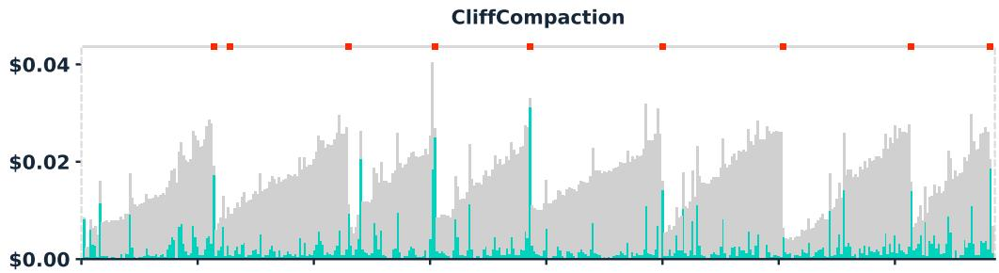

Anthropic Claude Code (Microcompaction + Summarization)  
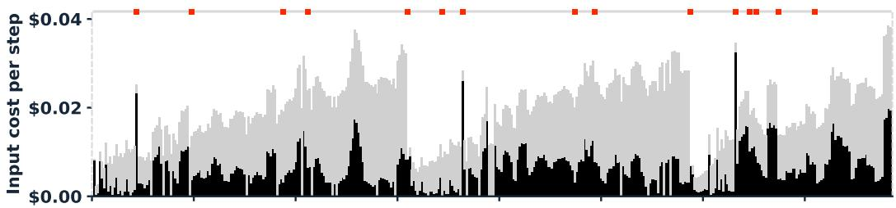

Sliding Window  
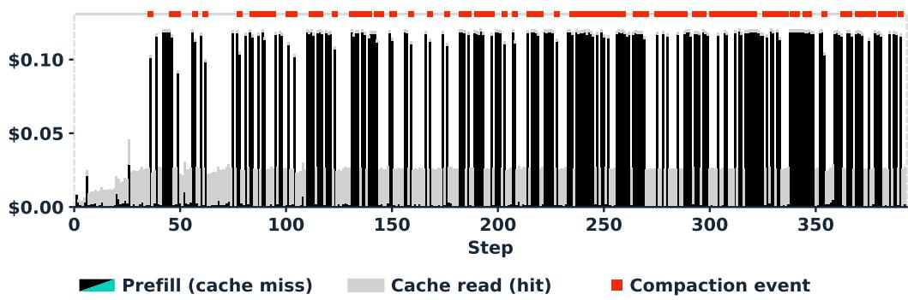  
Figure 4: Per-step input cost on a KernelBench task, decomposed into uncached prefill and cache reads.

## B EXTENDED CLIFFCOMPACTION DESIGN AND IMPLEMENTATION

CLIFFCOMPACTION keeps literal fragments of the original context, truncating them rather than rewriting or paraphrasing their content. For each action, it keeps only a lightweight signature: the first 150 characters of the action string. In mini-swe-agent and Terminus-2—whose actions are primarily bash commands and terminal keystrokes, respectively—this signature is the leading 150 characters of each command (the bash command parsed from the model’s bash code block in mini-swe-agent-v1, and the keystrokes parsed from the model’s response in Terminus-2). This simple truncation captures most of the useful information, since the command itself typically appears at the start of the string, while the remainder often consists of lengthy inline file contents. For OpenHands, the tool-call signatures are listed in Table 12.

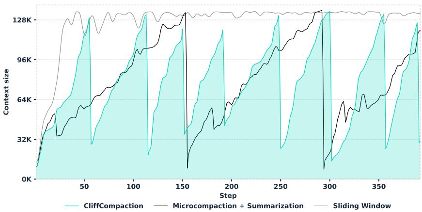  
Figure 5: Context size over steps on a KernelBench task.

Table 12: Tool-call signatures used by CLIFFCOMPACTION in OpenHands scaffold.
<table><tr><td>Tool</td><td>Sub-command</td><td>Retained signature</td></tr><tr><td>terminal</td><td></td><td>[terminal] {command}</td></tr><tr><td>file_editor</td><td>view</td><td>[file_editor view] {path} range={range}</td></tr><tr><td>file_editor</td><td>create</td><td>[file_editor create] {path} ({N} chars)</td></tr><tr><td>file_editor</td><td>str_replace</td><td>[file_editor str_replace] {path} (old: {old_str}...)</td></tr><tr><td>file_editor</td><td>insert</td><td>[file_editor insert] {path}:{line}</td></tr><tr><td>file_editor</td><td>undo_edit</td><td>[file_editor undo_edit] {path}</td></tr><tr><td>think</td><td></td><td>[think] {thought}</td></tr><tr><td>finish</td><td></td><td>[finish]</td></tr><tr><td>task_tracker</td><td></td><td>(dropped)</td></tr><tr><td colspan="3">Caps: command ≤ 120, old_str ≤ 60 chars.</td></tr></table>

## C EXTENDED EVALUATION AND ANALYSIS

## C.1 CLIFFCOMPACTION HAS HIGH PRECISION

We justify the precision hypothesis behind CLIFFCOMPACTION through the agent’s re-reading behaviour. Figure 6 shows that every compaction strategy increases the number of steps per trajectory relative to the full-context runs, with sliding window, summarization + microcompaction and CLIFFCOMPACTION each adding more than four steps, while summarization rises by only +1.26.

Almost all of these additional steps are spent re-reading files the agent had already opened. Editing and testing, by contrast, decrease under every strategy. CLIFFCOMPACTION, sliding window and microcompaction discard tool outputs outright, leaving a visible gap in the context, so the agent re-fetches the content when it needs it again (+5.04, +3.80 and +4.68 re-reads respectively). Summarization adds the fewest re-reads (+2.35) and is the only strategy that also opens fewer new files (−0.68 per instance). It replaces the discarded content with a plausible natural-language paraphrase, which appears to satisfy the agent and discourages it from returning to the ground-truth source.

This behaviour corroborates the low-recall, high-precision trade-off we posit for CLIFFCOMPACTION: it retains less than summarization, but what it retains is verbatim, and the gaps it leaves are unambiguous, so the agent restores what it needs from the source.

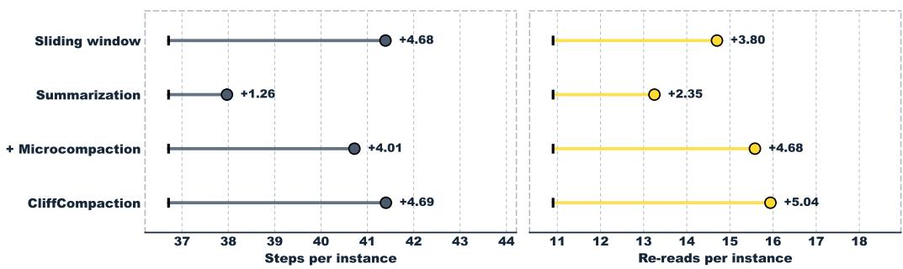  
Figure 6: ∆ of mean actions per instance and steps spent on re-reads (SWE-bench Verified, Kimi K2.7, 16K) relative to running without compaction (full-context: 36.71 steps, 10.90 re-reads per instance).

## C.2 TEST-TIME SCALING ON SWE-BENCH VERIFIED

Table 13: Test-time scaling on SWE-bench Verified, ordered by accuracy. All rows use mini-swe-agent except CodeMonkeys, which uses its own.
<table><tr><td>Model</td><td>Context</td><td>k</td><td>Cost (USD)</td><td>Oracle</td><td>Practical</td><td>Gain @ Cost*</td></tr><tr><td>Kimi K2.6 + SGV</td><td>256K</td><td>5</td><td>$473.80</td><td>83.0</td><td>79.4</td><td>+4.8 @ 5.0×</td></tr><tr><td>LLM-as-a-Verifier$</td><td>mixed</td><td>3</td><td>~$590.00</td><td>84.4</td><td>78.2</td><td>+2.1 @ 3.2×</td></tr><tr><td>Kimi K2.6 + SGV</td><td>256K</td><td>3</td><td>$284.28</td><td>80.4</td><td>78.0</td><td>+3.4 @ 3.0×</td></tr><tr><td>Kimi K2.6 + CLIFF + SGV</td><td>16K</td><td>5</td><td>$440.10</td><td>80.8</td><td>77.0</td><td>+2.4 @ 4.64×</td></tr><tr><td>Opus 4.5 (high reasoning)</td><td>200K</td><td>1</td><td>$375.00</td><td></td><td>76.8</td><td></td></tr><tr><td>GLM 5.1 + SGV</td><td>200K</td><td>5</td><td>$604.65</td><td>80.6</td><td>76.6</td><td>+5.8 @ 5.0×</td></tr><tr><td>Kimi K2.6 + CLIFF + SGV</td><td>16K</td><td>3</td><td>$264.06</td><td>79.4</td><td>76.4</td><td>+1.8 @ 2.79×</td></tr><tr><td>Kimi K2.6 + CLIFF + SGV</td><td>32K</td><td>5</td><td>$459.60</td><td>82.8</td><td>76.2</td><td>+1.6 @ 4.85×</td></tr><tr><td>Kimi K2.6 + CLIFF + SGV</td><td>32K</td><td>3</td><td>$275.76</td><td>79.8</td><td>76.0</td><td>+1.4 @ 2.91×</td></tr><tr><td>GLM 5.1 + SGV</td><td>200K</td><td>3</td><td>$362.79</td><td>78.0</td><td>75.8</td><td>+5.0 @ 3.0×</td></tr><tr><td>Gemini 3 Flash (high reasoning)</td><td>1M</td><td>1</td><td>$180.00</td><td></td><td>75.8</td><td></td></tr><tr><td>MiniMax M2.5 (high reasoning)</td><td>205K</td><td>1</td><td>$35.00</td><td></td><td>75.8</td><td></td></tr><tr><td>Opus 4.6</td><td>1M</td><td>1</td><td>$275.00</td><td></td><td>75.6</td><td></td></tr><tr><td>GLM 5.1 + CLIFF + SGV Kimi K2.6</td><td>32K</td><td>5</td><td>$519.85</td><td>79.2</td><td>74.8</td><td>+4.0 @ 4.30×</td></tr><tr><td></td><td>256K</td><td>1</td><td>$94.76</td><td></td><td>74.6</td><td></td></tr><tr><td>GLM 5.1 + CLIFF + SGV</td><td>16K</td><td>3</td><td>$229.89</td><td>78.6</td><td>74.0</td><td>+3.2 @ 1.90×</td></tr><tr><td>GLM 5.1 + CLIFF + SGV GLM 5.1 + CLIFF + SGV</td><td>32K</td><td>3</td><td>$311.91</td><td>76.2</td><td>74.0</td><td>+3.2 @ 2.58×</td></tr><tr><td></td><td>16K</td><td>5</td><td>$383.15</td><td>81.4</td><td>73.8</td><td>+3.0 @ 3.17×</td></tr><tr><td>GLM 5.1</td><td>200K</td><td>1</td><td>$120.93</td><td></td><td>70.8</td><td></td></tr><tr><td>CodeMonkeys (Sonnet 3.5 + Qwen 2.5)º</td><td>200K</td><td>10</td><td>$2291.90</td><td>69.8</td><td>57.4</td><td></td></tr><tr><td>Sonnet 3.7</td><td>200K</td><td>1</td><td>$175.00</td><td></td><td>52.8</td><td></td></tr></table>

Accuracy gain and cost multiplier relative to a single uncompacted rollout (k=1).  
§ From Kwok et al. (2026); Gemini-2.5-Flash as the verifier. Three candidates, each generated by one of Claude Opus 4.5, Gemini 3 Flash, and MiniMax M2.5. Cost: generation \$375+\$180+\$35 ≈ \$590. ¶ From Ehrlich et al. (2025).

On SWE-bench Verified (Table 13), Kimi K2.6 with SGV reaches the highest Practical accuracy in the table (79.4%), topping every proprietary single-model baseline, including the strongest, Opus 4.5 (76.8%). It also exceeds the LLM-as-a-Verifier (78.2%), and comes within 0.2 points of it at k=3 at roughly half the cost (\$284.28 vs. \$625), without the repeated LLM-verifier calls their method requires.

With CLIFFCOMPACTION, capping context at a lower threshold widens this cost advantage. Three compacted Kimi rollouts at 16K reach 76.4% for \$264.06, within 0.4 points of Opus 4.5 at 70% of its cost, and five reach 77.0%, surpassing it. On cost, GLM 5.1 at 16K is the cheapest scaled configuration overall (74.0% at \$229.89). As a result, the cheapest Pareto-optimal scaled configurations are compacted ones.

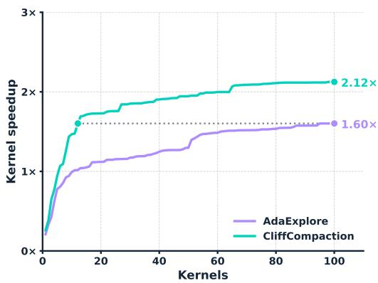  
(a) CLIFFCOMPACTION vs. AdaExplore.

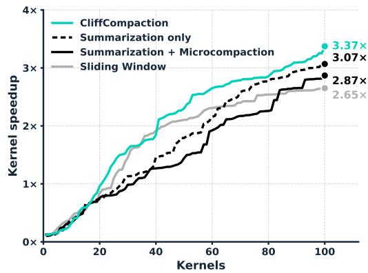  
(b) CLIFFCOMPACTION vs. compaction alternatives.  
Figure 7: Best-so-far kernel speedup on KernelBench Level 3, indexed by kernels generated, AdaExplore’s budget unit.

## C.3 SPEEDUP BY KERNELS GENERATED ON KERNELBENCH

Search-based methods such as AdaExplore budget by candidate kernels: each of their steps is one kernel proposal. We therefore also report speedup indexed by kernels generated (Figure 7), measuring which method finds the faster kernel given the same number of candidates to compile and benchmark. Because our setup is agentic, we count a kernel as an agent turn that writes compiled kernel code.

Figure 7a shows that once exploration steps are excluded, CLIFFCOMPACTION leads AdaExplore at every budget, with a clear margin by the tenth kernel (1.47× against 0.99×). It reaches 1.60× after 13 kernels, a level AdaExplore takes 100 kernels to reach. This again shows that a simple agentic setup with autocompaction compares favorably with a pipeline built specifically for kernel optimization.

Figure 7b shows the same advantage over the other compaction baselines. Within the same step budget (Table 6), CLIFFCOMPACTION generates the fewest candidates, so normalizing by proposals widens the gap. Summarization spends fewer steps re-reading (91.8 reads per problem vs. 102.7) and more steps writing kernels, so its proposals are individually less effective. CLIFFCOMPACTION, in contrast, re-reads from the workspace and converts each proposal into more speedup, the same pattern appears on SWE-bench (Appendix C.1).

## D EXPERIMENTAL DETAILS

## D.1 ADDITIONAL TEST-TIME SCALING DETAILS

In this subsection, we describe the selector used to obtain the Practical results in Table 4 and Table 13.

Each candidate is represented by a 30-dimensional feature vector (Table 14 and Table 15). We train a LightGBM binary classifier: given the feature vector of a candidate trajectory, it predicts the probability that the candidate resolves the task, and a separate classifier is trained for each rollout budget k. We use the following hyperparameters on both benchmarks: {800 boosting rounds, learning rate 0.03, 63 leaves, minimum 15 samples per leaf, $\ell _ { 2 }$ regularization 1.0}. We train the selector on rollouts from a different model than the one it is applied to: the selector used on Kimi K2.6 rollouts is trained only on GLM 5.1 rollouts, and vice versa. Training on rollouts from the same model gives no consistent advantage (Table 16).

We also examine the task-generalization ability of the selector. We train it on a fraction of the tasks and evaluate on all 89 Terminal-Bench 2.0 tasks (Table 17). Across training fractions from 25% to 100%, the resolution rate remains essentially unchanged for every configuration. This shows that the selector does not overfit to the specific training tasks, it generalizes across tasks and performs comparably even when trained on only a quarter of them. In the main results (Table 4) we use the selector trained on 100% of the tasks.

Table 14: The feature set used by SGV on Terminal-Bench 2.0. $\Delta \mu$ denotes the feature minus its within-group mean; / max denotes the feature divided by its within-group maximum. These instance-normalized variants make a candidate’s value relative to the others of the same task.
<table><tr><td>Feature</td><td>Description</td></tr><tr><td colspan="2">Execution behavior</td></tr><tr><td>marked_complete</td><td>Agent explicitly signaled task completion</td></tr><tr><td>n_episodes</td><td>Number of agent steps</td></tr><tr><td>n_episodes  $\Delta \mu$ </td><td>relative to group mean</td></tr><tr><td>n_tool_  $\mathtt { C a l l s }$ </td><td>Number of tool calls</td></tr><tr><td> $\mathrm { n \_ t o o l \_ c a l l s } \Delta \mu$ </td><td>relative to group mean</td></tr><tr><td> $\mathrm { n \_ t o o l \_ c a l l s / m a x }$ </td><td>relative to group max</td></tr><tr><td colspan="2">Produced solution</td></tr><tr><td>n_files</td><td>Number of files written</td></tr><tr><td>n_lines</td><td>Non-trivial lines of code</td></tr><tr><td>n_raw_lines</td><td>Raw lines (incl. blanks/short)</td></tr><tr><td>n_paths_root</td><td>Files written under an absolute path</td></tr><tr><td>n_unique_idents</td><td>Distinct identifiers</td></tr><tr><td>is_shell</td><td>Solution is a shell script</td></tr><tr><td> $\mathtt { a v g \_ l i n e \_ l e n }$ </td><td>Mean line length</td></tr><tr><td> $\mathsf { a v g \_ l i n e \_ l e n } \Delta \mu$ </td><td>relative to group mean</td></tr><tr><td> $\mathtt { m a x \_ l i n e \_ l e n }$ </td><td>Maximum line length</td></tr><tr><td> $\mathtt { s t d \_ l i n e \_ l e n }$ </td><td>Std. dev. of line length</td></tr><tr><td>max_indent  $\Delta \mu$ </td><td>Max indentation depth, rel. to group mean</td></tr><tr><td> $\mathrm { n \_ i n d e n t \_ l e v e l s } \Delta \mu$ </td><td>Distinct indent levels, rel. to group mean</td></tr><tr><td>alnum_ratio</td><td>Alphanumeric character ratio</td></tr><tr><td>alnum_ratio  $\Delta \mu$ </td><td>relative to group mean</td></tr><tr><td> $\mathtt { p u n c t \_ d e n s i t y }$ </td><td>Punctuation character density</td></tr><tr><td>kw_if</td><td>Count of if/elif</td></tr><tr><td>kw  ${ \tt \bot f } \Delta \mu$ </td><td>relative to group mean</td></tr><tr><td>kw_while</td><td>Count of while</td></tr><tr><td>kw_print /max</td><td>Count of print/echo, rel. to group max</td></tr><tr><td>kw_shebang</td><td>Count of shebang (# !) lines</td></tr><tr><td colspan="2">Within-group agreement</td></tr><tr><td>overlap_min</td><td>Min line overlap with other candidates</td></tr><tr><td>overlap_sum  $\Delta \mu$ </td><td>Mean line overlap, rel. to group mean</td></tr><tr><td>symbol_overlap_sum</td><td>Shared identifiers with other candidates</td></tr><tr><td>symbol_jaccard_sum/max</td><td>Symbol Jaccard agreement, relative to group max</td></tr></table>

Table 15: The feature set used by SGV on SWE-bench Verified, for the selector applied to Kimi K2.6 rollouts (trained on GLM 5.1). $\Delta \mu$ denotes the feature minus its within-group mean; / max denotes the feature divided by its within-group maximum.
<table><tr><td>Feature</td><td>Description</td></tr><tr><td colspan="2">Produced patch</td></tr><tr><td> $\mathtt { n \_ l i n e s }$ </td><td>Non-trivial changed lines</td></tr><tr><td> $\mathrm { n } \_ \mathrm { a d d }$ </td><td>Added lines</td></tr><tr><td> $\mathrm { n \_ d e l }$ </td><td>Deleted lines</td></tr><tr><td> $\mathrm { n \_ d e l } \Delta \mu$ </td><td>relative to group mean</td></tr><tr><td> $\mathrm { n \_ d e l / m a x }$ </td><td>relative to group max</td></tr><tr><td> $\mathtt { a d d \_ d e l \_ r a t i o }$ </td><td>Ratio of added to deleted lines</td></tr><tr><td>n_files</td><td>Files modified</td></tr><tr><td>n_hunks</td><td>Diff hunks</td></tr><tr><td>patch_func_count</td><td>Distinct function names in def statements appearing in the patch</td></tr><tr><td>patch_func_count/max</td><td>relative to group max</td></tr><tr><td>n_unique_idents</td><td>Distinct identifiers</td></tr><tr><td>n_total_tokens</td><td>Total identifier tokens</td></tr><tr><td> $\mathrm { i d e n t \_ r e p e a t \_ r a t i o }$ </td><td>Identifier tokens per distinct identifier</td></tr><tr><td> $\mathtt { a v g \_ l i n e \_ l e n }$ </td><td>Mean line length</td></tr><tr><td> $\mathsf { a v g \_ l i n e \_ l e n / m a x }$ </td><td>relative to group max</td></tr><tr><td> $\mathtt { m a x \_ l i n e \_ l e n }$ </td><td>Maximum line length</td></tr><tr><td> ${ \tt s i g \_ i f }$ </td><td>Lines matching an i f signature</td></tr><tr><td> $\mathtt { s i g \_ r e t u r n }$ </td><td>Lines matching a return signature</td></tr><tr><td> $\mathrm { k w \_ i f }$ </td><td>Count of if/elif</td></tr><tr><td>kw_import</td><td>Count of import</td></tr><tr><td colspan="2">Repository context</td></tr><tr><td> $\mathtt { r e p o \_ c o d e }$ </td><td>Repository identity (categorical)</td></tr><tr><td colspan="2">Within-group agreement</td></tr><tr><td>group_consensus_level</td><td>Mean pairwise line Jaccard across the task&#x27;s candidates</td></tr><tr><td>group_diversity</td><td>1-group_consensus_level</td></tr><tr><td>group_has_exact_duplicates</td><td>An identical patch occurs at least twice in the group</td></tr><tr><td>file_agreement_sum</td><td>Other candidates modifying the same files</td></tr><tr><td> $\mathsf { s y m b o l \_ o v e r l a p \_ s u m }$ </td><td>Changed identifiers shared with other candidates</td></tr><tr><td>add_overlap_sum</td><td>Added lines shared with other candidates</td></tr><tr><td></td><td>Deleted lines shared with other candidates</td></tr><tr><td>de  $\mathtt { l \_ o v e r l a p \_ s u m }$   $\mathtt { h u n k \_ j a c c a r d \_ s u m }$ </td><td>Jaccard agreement of diff hunks with other candidates</td></tr><tr><td>ma  $\mathtt { . x \_ s y m b o l \_ j a c c a r d }$ </td><td>Symbol Jaccard with the most similar other candidate</td></tr></table>

Table 16: Same-model versus cross-model training of SGV on Terminal-Bench (Kimi K2.6, k=3). We used 5-fold instance-level cross-validation. $\Delta$ is same-model minus cross-model; neither shows a consistent advantage.
<table><tr><td>Context</td><td>pass@1</td><td>Oracle</td><td>Same-model</td><td>Cross-model</td><td> $\Delta$ </td></tr><tr><td>256K</td><td>59.2</td><td>70.8</td><td>61.8</td><td>60.7</td><td>+1.1</td></tr><tr><td>16K</td><td>61.4</td><td>74.2</td><td>63.7</td><td>64.4</td><td>-0.7</td></tr></table>

Table 17: Data efficiency of the selector on Terminal-Bench 2.0 (Kimi K2.6, GLM→Kimi). The selector is trained on a random fraction of tasks and evaluated on all 89. Resolution rate (%) at k=3 with the fixed 30-feature set.
<table><tr><td>Training fraction</td><td>256K</td><td>32K</td><td>16K</td></tr><tr><td>25%</td><td>64.0</td><td>65.2</td><td>68.5</td></tr><tr><td>50%</td><td>66.3</td><td>64.0</td><td>68.5</td></tr><tr><td>75%</td><td>65.2</td><td>66.3</td><td>68.5</td></tr><tr><td>100%</td><td>64.0</td><td>65.2</td><td>69.7</td></tr></table>

## D.2 ADDITIONAL KERNELBENCH DETAILS

Agent setup. For the CUDA setting, we follow the KernelBench setup of Dai et al. (2026), using the same skill and working environment. Each task is a self-contained CUDA C++ extension project in which the agent writes raw CUDA kernels and is barred from falling back on PyTorch compute operators, so reported speedups reflect genuinely hand-written kernels; we refer to Dai et al. (2026) for the full skill and agent loop. The agent is instructed to optimize the reference model for maximum speedup over the PyTorch Eager and torch.compile baselines and to keep proposing new optimizations. We differ from Dai et al. (2026) only in: (i) the backbone model (Kimi K2.7 and Kimi K2.6 vs. their RL-trained model); (ii) the hardware (L40S and RTX Pro 6000 Blackwell vs. their H20); (iii) the stopping condition—we remove the agent’s ability to self-terminate and run to a fixed budget of steps (or, without compaction, until the 256K context window is exceeded); and (iv) context management via CLIFFCOMPACTION.

For the Triton setting, we run GPT-5-mini in the same environment but target Triton rather than CUDA and do not block PyTorch operators, matching Du et al. (2026).

Evaluation setup. To score the speedups achieved by the agent, we follow Du et al. (2026). At each step, we evaluate the kernel the agent produces: we compile it, check that its output matches that of the reference model on 5 random inputs within a tolerance of $\mathsf { a t o l } = \mathsf { r t o l } \mathbf { \bar { \alpha } } = 1 0 ^ { - 2 }$ for our CUDA configurations and $\mathsf { a t o l } = \mathsf { r t o l } = 5 \times 1 0 ^ { - 2 }$ for our Triton configuration, and if it is correct, measure its runtime against the $\mathrm { P y ' }$ Torch Eager baseline (averaged over 10 timed runs after 10 warmup runs). For each problem we record the best speedup the agent achieves across all steps, clamped to a maximum of 10×. If the agent fails to produce any correct kernel within the step budget, that problem is penalized with a speedup of 0.1. The reported Speedup is the geometric mean of these per-problem speedups over all 50 tasks.