# Conditional Tensor Diffusion: Distributional Counterfactual Learning and Inference

Xinbing Kong,<sup>a</sup> Zeyu Li,<sup>a</sup> Junfan Mao,<sup>a</sup> Bin Wu<sup>b</sup>

<sup>a</sup>Southeast University; <sup>b</sup>University of Science and Technology of China

Contact: xinbingkong@126.com (XK), zeyuli@seu.edu.cn (ZL), maojf@seu.edu.cn (JM), bin.w@ustc.edu.cn (BW)

Abstract. Causal inference guides operational and managerial decisions but remains challenging in high-dimensional panel or tensor settings, where decisions may depend on the joint conditional distribution of missing control outcomes. We develop Counterfactual Tucker Diffusion (CFT-DIFF), which integrates the treatment mask and latent Tucker structure into conditional diffusion to recover this distribution given observed control outcomes through efficient nonlinear score learning in a low-dimensional core. The masked Tucker score preserves dependence across tensor modes while reducing the dimension of nonlinear score learning from the product of mode dimensions to the much smaller product of Tucker ranks. We establish high-probability error bounds for conditional score estimation that depend on the Tucker ranks, largest mode dimension, and the factor-strength-adjusted number of missing outcomes, and show how these bounds translate into recovery guaranties for the conditional distribution of the missing control outcomes. Across missing rates, simulations show more accurate point recovery than common causal panel and matrix/tensor completion methods; comparisons with nested diffusion specifications further demonstrate the gains from masked conditioning and Tucker dimension reduction. In Norway’s iFlex experiment, CFT-DIFF recovers missing outcomes more accurately than competing methods; when applied to causal analysis, its estimated conditional distributions yield counterfactual prediction intervals and target-attainment probabilities, allowing pricing interventions to be evaluated by demand-reduction magnitude and reliability.

Key words: Diffusion model; counterfactual; tensor completion; generative AI; distributional recovery.

## 1. Introduction

Causal inference is central to pricing, policy evaluation, and intervention design, yet the outcome needed to evaluate an intervention is missing where treatment occurs. At a treated entry in a panel, the intervention outcome is observed, but the corresponding control outcome is missing. Point estimates of the missing control outcomes may be sufficient for reporting an average effect. They are not sufficient when a decision maker must assess the probability of meeting a demand, service, or risk target, quantify uncertainty in the missing outcomes, or compare the reliability of alternative interventions. The central statistical problem is therefore to recover the joint conditional distribution of the missing control outcomes given the observed control outcomes, rather than a single point estimate.

Recovering this distribution is difficult in high-dimensional panel or tensor settings. Outcomes may be indexed by units, dates, hours, products, or locations, so the full dimension grows as the product of the mode dimensions. A tensor formulation preserves these indexing dimensions and their dependence, while including vector and matrix settings. Treatment determines where the control outcomes are missing, often producing a structured missingness pattern. The missing outcomes may remain dependent across units, time periods, and other dimensions. Estimating each missing outcome separately does not capture this dependence and therefore cannot evaluate probabilities involving multiple missing outcomes. Directly learning a conditional distribution in the tensor space is also statistically and computationally demanding. A useful method must therefore incorporate the treatment mask, use information from the observed control outcomes, and exploit the intrinsic structure of the control-outcome tensor.

We develop Counterfactual Tucker Diffusion (CFT-DIFF), a masked conditional diffusion model for recovering the joint conditional distribution of the missing control outcomes. Its central construction is a masked Tucker score that incorporates the treatment pattern and observed control outcomes while confining nonlinear score learning to a low-dimensional Tucker core. The method therefore provides joint conditional generation rather than point recovery and avoids learning an unrestricted nonlinear score in the full tensor space. During training, the treatment mask is synthetically applied to complete training tensors, allowing the model to learn the distribution of the masked outcomes given the observed outcomes. During causal analysis, the observed control outcomes remain fixed and only the missing control outcomes are generated; observed treated outcomes enter subsequently when causal contrasts are formed. Repeated conditional draws provide point estimates, quantiles, counterfactual prediction intervals, target-attainment probabilities, and other summaries from a single learned distribution.

The key structural result explains why this conditional distribution can be learned efficiently. Modespecific linear encoders combine the noised outcomes in the treated region and the observed control outcomes into a core-level statistic, and a Tucker decoder maps the learned core representation back to the original coordinates. Only the conditional map within the core is nonlinear. Let $D$ denote the number of modes, $p _ { d }$ the dimension of mode $d ,$ and $r _ { d }$ its Tucker rank. The full tensor has $\textstyle p = \prod _ { d = 1 } ^ { D } p _ { d }$ coordinates, whereas the Tucker core has only $\textstyle r = \prod _ { d = 1 } ^ { D } r _ { d }$ coordinates, with $r \ll p .$ Nonlinear learning therefore operates in dimension $r$ rather than $p ,$ while the separately parameterized loading matrices contribute through $p _ { \operatorname* { m a x } } = \operatorname* { m a x } _ { d } p _ { d }$ rather than the product $p .$

We establish nonasymptotic, high-probability error bounds for conditional-score estimation. Let n denote the number of training tensors. The bound separates the errors from learning the nonlinear core regression and estimating the mode-specific loading spaces. The dominant sample-size term for the nonlinear component is $n ^ { - 2 / ( r + 5 ) }$ , whose exponent depends on the intrinsic core dimension $r$ rather than the full tensor dimension $p .$ Because $r \ll p$ under low Tucker rank, this rate yields more accurate score estimation from the same training sample size than a rate governed by the full tensor dimension. Estimating the loading spaces contributes $p _ { \operatorname* { m a x } } n ^ { - ( r + 3 ) / ( r + 5 ) }$ , so this component depends on the largest mode dimension $p _ { \mathrm { m a x } }$ rather than the product of all mode dimensions $p .$ . The number of missing control outcomes $p \tau$ and the strength of the low-rank signal $\beta$ enter through the effective dimension $d _ { \mathcal { T } , \beta } = r + p _ { \mathcal { T } } p ^ { - \beta }$ . Thus, the contribution of the missing region enters as $p _ { T } p ^ { - \beta }$ , rather than $p _ { T }$ itself, and remains bounded when $p _ { T } \lesssim p ^ { \beta }$ and the Tucker ranks are fixed. We further show that conditional-score accuracy transfers to recovery of the conditional distribution of the missing outcomes. Under the stated growth and regularity conditions, prediction intervals constructed from samples drawn from the estimated conditional distribution attain nominal conditional coverage as the training and generation sample sizes increase, without requiring a separate Gaussian approximation or asymptotic variance estimation.

Simulations with known conditional distributions show that CFT-DIFF improves point recovery over the causal panel and matrix/tensor completion methods considered. Comparisons with two nested diffusion specifications attribute the additional gains to Tucker dimension reduction and conditioning on the observed control outcomes through the treatment mask; CFT-DIFF also improves distributional recovery and produces sharper prediction intervals while retaining coverage close to the nominal level.

We apply CFT-DIFF to Norway’s iFlex dynamic-pricing experiment. Before estimating demand responses, we artificially mask fully observed no-policy (control) outcomes and evaluate recovery under switchback, staggered-adoption, and simultaneous-adoption designs. CFT-DIFF attains the lowest point-recovery errors among the causal panel and matrix/tensor completion methods and the nested diffusion specifications, and it achieves more accurate distributional recovery than both nested diffusion specifications across the treatment patterns and missing proportions considered. For intervention days, the estimated conditional distributions yield counterfactual prediction intervals, characterize variation in demand reductions across interventions, and quantify the probability that a price signal achieves a specified peak-demand reduction. The results show that price signals with similar average demand reductions can differ substantially in their probability of achieving a specified reduction target. This information allows price signals to be compared by both their average demand reduction and how reliably they achieve a desired peak reduction.

## 1.1. Contributions

We make four contributions. First, we formulate counterfactual distribution recovery for general multi-way outcome arrays and develop a conditional diffusion framework for this problem. The formulation includes vectors and matrices as special cases, thereby covering conventional panels as well as higher-order tensors. CFT-DIFF incorporates prespecified intervention masks into training, allowing the model to learn the distribution of masked outcomes given the observed control outcomes. Because the construction does not rely on random missingness or a particular treatment pattern, it accommodates switchback, staggered-adoption, simultaneous-adoption, and other structured intervention patterns under the stated conditions. During coun terfactual generation, the observed control outcomes remain fixed and only the missing control outcomes are generated, producing samples from their estimated joint conditional distribution. Existing tensor-based causal methods and common causal panel and completion methods primarily target point counterfactu als, common components, or low-dimensional causal summaries. By recovering the conditional distribu tion, CFT-DIFF also permits distributional comparisons and provides quantiles, counterfactual prediction intervals, target-attainment probabilities, and other summaries without requiring a separate model for each quantity.

Second, we introduce a masked Tucker score that makes high-dimensional conditional generation for tensor data statistically tractable and computationally efficient. Generic diffusion networks learn nonlinear scores in the full data space, while conventional low-rank completion methods do not recover a joint condi tional distribution. Under the control-outcome factor model, we show that the conditional score admits a representation in which mode-wise linear maps preserve the tensor structure and nonlinear learning takes place through a core-dimensional conditional regression. The neural approximation burden, therefore, depends on the Tucker core dimension r, rather than the full tensor dimension p. Our nonasymptotic score bounds for malize this intrinsic-dimensional advantage: nonlinear estimation is governed by the Tucker core, loadingspace estimation by $p _ { \mathrm { m a x } }$ , and the joint effect of the size of the treated region and factor strength by $d _ { T , \beta }$ The result provides a statistical foundation for using low-rank Tucker structure in conditional diffusion.

Third, we establish end-to-end guaranties that carry conditional-score accuracy through to the recovery of the missing-outcome distribution, weighted causal summaries, and counterfactual prediction intervals. We derive high-probability bounds for the recovery of the joint conditional distribution of the missing control outcomes and extend these bounds to weighted summaries of the missing outcomes. Combined with the corresponding observed treated outcomes, these summaries yield familiar causal estimands (e.g., average treatment effects). We further establish coverage guaranties for counterfactual prediction intervals derived from the estimated conditional distribution and explicitly account for the additional error arising from a finite generation sample. The interval theory requires neither a Gaussian approximation nor asymptotic variance estimation. These intervals quantify uncertainty about the missing control outcomes conditional on the observed control outcomes. The results therefore carry score-learning accuracy through to the causal estimands and counterfactual uncertainty measures used in subsequent analysis.

Finally, simulations and the iFlex experiment identify the gains from the two components of CFT-DIFF and demonstrate the decision value of recovering a conditional distribution. Simulations with known counterfactual distributions compare CFT-DIFF with established causal panel and matrix/tensor completion methods in point recovery and use distributional measures to evaluate CFT-DIFF and its nested diffusion specifications beyond point estimates. The two nested specifications separately identify the gains from Tucker dimension reduction and conditioning on the observed control outcomes. We then validate the method on observed no-policy outcomes in the iFlex data under switchback, staggered-adoption, and simultaneous-adoption patterns. In the causal application, the recovered distribution is used to compare dynamic-pricing signals in terms of both the magnitude of demand reduction and the probability of attaining specified peak-reduction targets. The results show that price signals with similar estimated average effects can differ materially in their reliability, illustrating the additional decision-relevant information provided by counterfactual distri bution recovery.

## 1.2. Related Literature

Causal panel methods and counterfactual recovery. Existing causal panel methods address important parts of this problem, but their primary targets are different. Difference-in-differences and event-study estimators recover average effects under restrictions such as parallel trends and no anticipation, with modern procedures allowing heterogeneous treatment effects (Borusyak et al. 2024). Synthetic-control methods use pretreatment outcomes and a suitable donor pool to construct point estimates under stable preintervention relationships. Synthetic difference-in-differences combines these comparison strategies through outcome balancing and time and unit weighting (Arkhangelsky et al. 2021). Low-rank causal panel methods represent the untreated outcome surface using interactive factors and view treated coordinates as missing entries (Athey et al. 2021, Bai and Ng 2021). Subsequent work permits nonrandom or more general observation patterns and develops entrywise inference (Choi and Yuan 2024, Xiong and Pelger 2023, Duan et al. 2024). A small recent literature uses tensor completion directly for causal recovery with treatment histories, multiple outcomes, or multiple exposures (Mandal and Parkes 2019, Auerbach et al. 2022, Zhen and Wang 2024, Gao et al. 2025, Zhou et al. 2026). Synthetic interventions extend this logic to several treatments and tensor-valued potential outcomes and estimate potential outcomes or low-dimensional causal summaries (Agarwal et al. 2026). CFT-DIFF shares the potential-outcome and low-rank viewpoints but targets a differ ent statistical object: the joint conditional distribution of the missing control outcomes given the observed control outcomes. The treatment design and identifying assumptions determine the causal interpretation of the resulting comparisons; CFT-DIFF addresses estimation of this conditional distribution.

Matrix and tensor completion. Matrix and tensor completion methods exploit low rank structures to recover missing entries, but their guaranties often depend on how the observed coordinates cover the matrices or tensors (Xia and Yuan 2019, Xia et al. 2021, Xia and Yuan 2021). Causal panels are especially demanding because treatment creates structured and potentially nonrandom observation patterns rather than dispersed incidental missingness. Factor methods have been adapted to these patterns, but their outputs remain point imputations or entrywise sampling distributions. Treatment designs can also create very different patterns, including switchback schedules and staggered or simultaneous adoption (Bojinov et al. 2023, Chen and Simchi-Levi 2026). Tensor factor models preserve mode-specific dependence in matrix sequences and tensors (Wang et al. 2019, Chang et al. 2023, 2026a,b, Han et al. 2024), and tensor time-series imputa tion allows broad missing patterns (Cen and Lam 2025). CFT-DIFF uses the same multilinear structure for a different purpose. It incorporates the treatment mask into training and uses the observed control outcomes to generate the missing control outcomes, thereby providing their joint conditional distribution in addition to point estimates. The fixed-mask formulation does not require a random-missingness model for estimation.

Marginal counterfactual distributions. A separate literature studies how interventions change outcome distributions. Changes-in-changes models identify nonlinear and quantile effects under distributional restrictions (Athey and Imbens 2006); counterfactual distribution methods provide inference for population distributions constructed from conditional models (Chernozhukov et al. 2013); and distributional synthetic controls match the distribution of an aggregate treated unit over time (Gunsilius 2023). Related work studies treatment-effect risk, formalized through the conditional value at risk of the individual treatment-effect distribution, and develops bounds and inference based on the conditional average treatment effect (Kallus 2023). Bayesian and semiparametric procedures characterize posterior or sampling uncertainty for low dimensional causal parameters such as the average treatment effect (Breunig et al. 2025). These methods answer questions about marginal counterfactual distributions, distributional treatment effects, treatmenteffect risk, or estimator uncertainty. Our target is the joint conditional distribution of the missing control outcomes given the observed control outcomes. Recovering this distribution provides prediction intervals for individual and aggregate counterfactuals, tail probabilities, and probabilities of joint target attainment, enabling interventions to be evaluated by both effect magnitude and reliability.

Diffusion models and conditional generation. Diffusion models can simulate from complex multivariate distributions by estimating scores along a noise-perturbation path and running the reverse dynamics (Song and Ermon 2019, Ho et al. 2020, Song et al. 2021). Conditional score models have been used for probabilistic time-series imputation (Tashiro et al. 2021) and conditional response generation for bootstrap inference (Chang et al. 2026c). Causal diffusion methods have generated structural counterfactuals for images or learned individual potential-outcome distributions conditional on covariates, with the latter using an orthogonal loss to address treatment-selection bias (Sanchez and Tsaftaris 2022, Ma et al. 2024). General conditional-diffusion theory and recovery results under low-dimensional structure supply important foundations (Fu et al. 2024, Chen et al. 2023, Fan et al. 2025). Related work integrates factor structure into high-dimensional financial simulation (Chen et al. 2025), develops diffusion methods for heavy-tailed and conditional simulation in operations research (Liu et al. 2026), and studies unconditional Tucker diffusion (Guo et al. 2026). These studies establish the feasibility of using diffusion models for related missing-data and causal tasks. For the target studied here, however, an unconditional diffusion model cannot directly exploit the observed control outcomes. A general conditional diffusion model permits such conditioning, but does not by itself determine how the treatment pattern enters training and generation or how the resulting distribution is linked to the missing control outcomes. Learning the conditional score directly in the full tensor space would also require a high-dimensional nonlinear model whose input and output dimensions grow with the total number of tensor entries. Building on these foundations, CFT-DIFF incorporates the treatment mask and observed control outcomes into a conditional score for the missing control outcomes, with nonlinear learning conducted in the Tucker core.

Organization. Section 3 formulates counterfactual distribution recovery for tensor data, develops CFT-DIFF, and establishes its score-learning guaranties. Section 4 studies recovery of the conditional distribution of the missing control outcomes, weighted summaries, and prediction intervals. Sections 5 and 6 report the simulation and empirical studies. Section 7 concludes. The Appendix contains complete proofs and additional results.

Notation. For random elements X and $Y , { \mathcal { L } } ( X )$ denotes the probability law of X, ${ \mathcal { L } } ( X \mid Y )$ denotes its conditional law given $Y _ { i }$ , and $\mathcal { L } ( X \mid Y = y )$ denotes the conditional law evaluated at $Y = y$ . For $m \in \mathbb { N } .$ , let $[ m ] = \{ 1 , \dots , m \}$ . The operator $\mathrm { v e c } ( \cdot )$ denotes vectorization under a fixed convention. The symbol 1 denotes an all-ones array whose dimensions are determined by context. For a vector $^ { g , }$ reshape $\{ g ; ( m _ { 1 } , \ldots , m _ { D } ) \}$ denotes its rearrangement into an $m _ { 1 } \times \cdots \times m _ { D }$ tensor according to the vectorization convention used by vec. We write $\| \cdot \| _ { 2 } , \| \cdot \| _ { F } ,$ and $\| \cdot \| _ { \mathrm { o p } }$ for the Euclidean norm of a vector, the Frobenius norm of a matrix or tensor, and the operator norm of a matrix, respectively. The notation $O ( \cdot )$ suppresses constants depending only on fixed model parameters, whereas $\widetilde { \mathcal { O } } ( \cdot )$ additionally suppresses polylog arithmic factors in the asymptotic quantities specified in the result. In this paper, $\odot$ and $\oslash$ denote entrywise multiplication and division. We write $\mathrm { K L } ( \mu \| \nu )$ for relative entropy and $\operatorname { T V } ( \mu , \nu ) = \operatorname* { s u p } _ { A } | \mu ( A ) - \nu ( A ) |$ for total variation distance. For probability measures $\mu$ and $\nu \ o n \mathbb { R }$ , we use the bounded–Lipschitz metric $\begin{array} { r } { d _ { \mathrm { B L } } ( \mu , \nu ) : = \operatorname* { s u p } _ { \stackrel { \scriptstyle \| \varphi \| _ { \infty } \leq 1 } { \mathrm { L i p } ( \varphi ) \leq 1 } } \left| \int \varphi \mathrm { d } \mu - \int \varphi \mathrm { d } \nu \right| } \end{array}$ , where $\operatorname { L i p } ( \varphi )$ denotes the Lipschitz constant of $\varphi$

## 2. Diffusion Models: Preliminaries

Diffusion models represent a target distribution through two linked stochastic processes: a known forward process that gradually perturbs data into noise and a reverse-time process that transforms noise back into data. The reverse-time process depend on the scores of the noise-perturbed distributions along the forward path; these scores must be learned from data. By outlining the basic principles of diffusion models in a simple scalar setting, this section provides the background needed to understand our framework for tensor generation developed in the paper.

## 2.1. Forward Diffusion and Reverse-Time Generation

Forward diffusion. Let $X _ { 0 } \in \mathbb { R }$ have data distribution $P _ { 0 }$ . We consider the variance-preserving Ornstein– Uhlenbeck (OU) diffusion,<sup>1</sup> a continuous-time formulation of the Gaussian noising mechanism used in

diffusion models (Ho et al. 2020, Song et al. 2021):

$$
\mathrm { d } X _ { t } = - \frac { 1 } { 2 } \eta ( t ) X _ { t } \mathrm { d } t + \eta ( t ) ^ { 1 / 2 } \mathrm { d } W _ { t } , \qquad X _ { 0 } \sim P _ { 0 } , \qquad t \in [ 0 , T ] ,\tag{2.1}
$$

where $\{ W _ { t } \} _ { t \ge 0 }$ is a standard Wiener process and $\eta ( t ) > 0$ is a deterministic noise schedule. Define $\alpha _ { t } =$ $\begin{array} { r } { \exp ( - \frac { 1 } { 2 } \int _ { 0 } ^ { t } \eta ( v ) \mathrm { d } v ) } \end{array}$ and $h _ { t } = 1 - \alpha _ { t } ^ { 2 }$ . For each $t ,$ the linear structure of (2.1) gives the explicit perturbation representation

$$
X _ { t } = \alpha _ { t } X _ { 0 } + h _ { t } ^ { 1 / 2 } Z _ { t } , \qquad Z _ { t } \sim { \mathcal { N } } ( 0 , 1 ) , \qquad Z _ { t } \perp \perp X _ { 0 } .
$$

Let $q _ { t } ( \cdot \mid x _ { 0 } )$ denote the Gaussian transition density of $X _ { t }$ conditional on $X _ { 0 } = x _ { 0 }$ . The corresponding time-t marginal density is

$$
p _ { t } ( \boldsymbol { x } ) = \int _ { \mathbb { R } } q _ { t } ( \boldsymbol { x } \mid \boldsymbol { x } _ { 0 } ) P _ { 0 } ( \mathrm { d } \boldsymbol { x } _ { 0 } ) , \qquad P _ { t } = \mathcal { L } ( \boldsymbol { X } _ { t } ) .
$$

The distinction between $q _ { t }$ and $p _ { t }$ is important. The transition density $q _ { t } ( \cdot \mid x _ { 0 } )$ is the known Gaussian perturbation kernel selected by the modeler, whereas $p _ { t }$ is the generally unknown marginal density obtained by mixing this kernel over the data distribution $P _ { 0 } .$ . Although $q _ { t }$ remains Gaussian, its mean and variance vary with $t ;$ the marginal density $p _ { t }$ need not belong to a fixed parametric family, and its form generally changes with t.

As t increases, the contribution of $\alpha _ { t } X _ { 0 }$ diminishes and the Gaussian component becomes dominant. Consequently, when $\alpha _ { T }$ is sufficiently small, the terminal distribution $P _ { T }$ is close to the standard normal distribution $\mathcal { N } ( 0 , 1 )$ .

Reverse-time generation. For $t > 0$ , define the time-t score of the marginal distribution $P _ { t }$ by $s _ { t } ( x ) : =$ $\nabla _ { x } \log p _ { t } ( x )$ . Thus, the score used in the reverse-time process is the gradient of the log marginal density $p _ { t }$ not the score of the Gaussian transition kernel $q _ { t } ( \cdot | x _ { 0 } )$ .

Under standard regularity conditions, the forward diffusion admits a reverse-time representation (Anderson 1982, Song et al. 2021). Using u to denote time elapsed in the reverse direction, the exact reverse-time process satisfies

$$
\mathrm { d } X _ { u } ^ {  } = [ \frac { 1 } { 2 } \eta ( T - u ) X _ { u } ^ {  } + \eta ( T - u ) s _ { T - u } \big ( X _ { u } ^ {  } \big ) ] \mathrm { d } u + \eta ( T - u ) ^ { 1 / 2 } \mathrm { d } \overline { { W } } _ { u } , \qquad u \in [ 0 , T - t _ { 0 } ] ,\tag{2.2}
$$

where $\{ \overline { { W } } _ { u } \} _ { u \ge 0 }$ is a standard Wiener process and $t _ { 0 } > 0$ is a small early-stopping time. If $X _ { 0 } ^ {  } \sim P _ { T }$ , then $X _ { u } ^ {  } \sim P _ { T - u }$ for $u \in [ 0 , T - t _ { 0 } ]$ , and hence $X _ { T - t _ { 0 } } ^ {  } \sim P _ { t _ { 0 } }$

The forward process therefore provides analytically noised observations for learning, whereas the reversetime process provides the mechanism for generation.<sup>2</sup> Once the forward coefficients are specified, the only unknown quantity in the reverse drift is the time-dependent marginal score.

## 2.2. Conditional Scores, Denoising Score Matching, and Generation

Conditional target and reverse dynamics. Let C denote observed conditioning information, and suppose that the target is the conditional distribution $\textstyle P _ { 0 } ( { \cdot } \mid c ) = { \mathcal { L } } ( X _ { 0 } \mid C = c )$ . Conditional diffusion perturbs the target variable $X _ { 0 }$ while leaving the conditioning information unchanged. Thus,

$$
X _ { t } = \alpha _ { t } X _ { 0 } + h _ { t } ^ { 1 / 2 } Z _ { t } , \qquad Z _ { t } \sim { \mathcal { N } } ( 0 , 1 ) , \qquad Z _ { t } \bot \bot ( X _ { 0 } , C ) .
$$

For a realized condition $C = c ,$ the conditional time-t density is $\begin{array} { r } { p _ { t } ( x \mid c ) = \int _ { \mathbb { R } } q _ { t } ( x \mid x _ { 0 } ) P _ { 0 } ( \mathrm { d } x _ { 0 } \mid c ) } \end{array}$ . It is therefore a conditional mixture of the known perturbation kernel. Its score is $s _ { t } ( \boldsymbol { x } \mid \boldsymbol { c } ) = \nabla _ { \boldsymbol { x } } \log p _ { t } ( \boldsymbol { x } \mid \boldsymbol { c } )$

Both arguments are essential: the functional form of $p _ { t } ( \cdot \vert c )$ , and hence that of $s _ { t } ( \cdot \mid c )$ , generally changes with the diffusion time t and the conditioning value c.

Conditional on $C = c$ , replacing the marginal score in (2.2) with $s _ { t } ( x \mid c )$ gives the exact conditional reverse-time process:

$$
\mathrm { d } X _ { u } ^ {  } = \bigg [ \frac { 1 } { 2 } \eta ( T - u ) X _ { u } ^ {  } + \eta ( T - u ) s _ { T - u } \big ( X _ { u } ^ {  } \mid c \big ) \bigg ] \mathrm { d } u + \eta ( T - u ) ^ { 1 / 2 } \mathrm { d } \overline { W } _ { u } , \qquad u \in [ 0 , T - t _ { 0 } ] .\tag{2.3}
$$

If $X _ { 0 } ^ {  } \sim P _ { T } ( \cdot | ~ c )$ , then $X _ { u } ^ {  } \sim P _ { T - u } ( \cdot \mid c )$ and $X _ { T - t _ { 0 } } ^ {  } \sim P _ { t _ { 0 } } ( \cdot \mid c )$ . For each fixed $c ,$ the term $\alpha _ { T } X _ { 0 }$ becomes negligible when $T$ is sufficiently large. Hence, $\textstyle P _ { T } ( \cdot \mid c )$ is close to the standard normal distribution $\mathcal { N } ( 0 , 1 )$ , which supplies a tractable initialization for conditional generation.

Denoising score matching. The conditional reverse process cannot be implemented directly because $p _ { t } ( \cdot |$ $c )$ , and therefore its score, is unknown. For a candidate score function $s ( x , c , t )$ , the natural population score-matching criterion is

$$
\mathcal { L } _ { \mathrm { S M } } ( s ) = \int _ { t _ { 0 } } ^ { T } \lambda ( t ) \mathbb { E } \left[ \left( s ( X _ { t } , C , t ) - s _ { t } ( X _ { t } \mid C ) \right) ^ { 2 } \right] \mathrm { d } t ,\tag{2.4}
$$

where $\lambda ( t ) > 0$ and $\begin{array} { r } { \int _ { t _ { 0 } } ^ { T } \lambda ( t ) \mathrm { d } t = 1 . ^ { 3 } } \end{array}$ The expectation is taken under the joint distribution of $( X _ { 0 } , C )$ and the forward perturbation.

The forward perturbation kernel, by contrast, is known. Since $q _ { t } ( \cdot | x _ { 0 } )$ is the density of $\mathcal { N } ( \alpha _ { t } x _ { 0 } , h _ { t } )$ , its score (transition score) is available in closed form:

$$
\nabla _ { x _ { t } } \log { q _ { t } ( x _ { t } \mid x _ { 0 } ) } = \frac { \alpha _ { t } x _ { 0 } - x _ { t } } { h _ { t } } , \qquad \nabla _ { X _ { t } } \log { q _ { t } ( X _ { t } \mid X _ { 0 } ) } = - \frac { Z _ { t } } { h _ { t } ^ { 1 / 2 } } .\tag{2.5}
$$

The second expression follows by substituting $X _ { t } = \alpha _ { t } X _ { 0 } + h _ { t } ^ { 1 / 2 } Z _ { t }$ into the first. Because $Z _ { t }$ is independent of $C$ conditional on $X _ { 0 }$ , the conditional denoising identity gives $\begin{array} { r } { s _ { t } ( x \mid c ) = \operatorname { \mathbb { E } } \lceil \frac { \alpha _ { t } X _ { 0 } - x } { h _ { t } } \rceil X _ { t } = x , C = c  } \end{array}$ . In other words, the conditional marginal score is the regression function of the analytically available transition score on $( X _ { t } , C )$

The conditional-expectation projection identity then implies that replacing $s _ { t } ( X _ { t } \mid C )$ in (2.4) by the transition score in (2.5) changes the loss only by an additive term that does not depend on s. The two population objectives therefore have the same minimizer. This yields the conditional denoising score-matching criterion

$$
\mathcal { L } _ { \mathrm { D S M } } ( s ) = \int _ { t _ { 0 } } ^ { T } \lambda ( t ) \mathbb { E } \left[ \left\{ s ( X _ { t } , C , t ) - \frac { \alpha _ { t } X _ { 0 } - X _ { t } } { h _ { t } } \right\} ^ { 2 } \right] \mathrm { d } t .\tag{2.6}
$$

Empirical score learning. Given finite training observations $\{ ( \boldsymbol { X } _ { 0 } ^ { ( i ) } , \boldsymbol { C } ^ { ( i ) } ) \} _ { i = 1 } ^ { n }$ , we take the uniform time weight $\lambda ( t ) = 1 / ( T - t _ { 0 } )$ . The corresponding empirical counterpart of (2.6) is

$$
\widehat { \mathcal { L } } _ { \mathrm { D S M } } ( s ) = \frac { 1 } { n } \sum _ { i = 1 } ^ { n } \frac { 1 } { T - t _ { 0 } } \int _ { t _ { 0 } } ^ { T } \mathbb { E } _ { Z _ { t } } \left[ \left\{ s \left( \alpha _ { t } X _ { 0 } ^ { ( i ) } + h _ { t } ^ { 1 / 2 } Z _ { t } , C ^ { ( i ) } , t \right) + \frac { Z _ { t } } { h _ { t } ^ { 1 / 2 } } \right\} ^ { 2 } \right] \mathrm { d } t .
$$

For a parameterized score class $s ,$ the trained conditional score is defined by $\begin{array} { r } { \widehat { s } \in \arg \operatorname* { m i n } _ { s \in { \mathcal { S } } } \widehat { { \mathcal { L } } } _ { \mathrm { D S M } } ( s ) } \end{array}$ In computation, the diffusion time t and Gaussian noise $Z _ { t }$ are sampled, so this optimization can be carried out by stochastic gradient methods. The cutoff $t _ { 0 } > 0$ excludes the near-zero-noise region, where the variance $h _ { t } ^ { - 1 }$ of the denoising target diverges as $t \downarrow 0$ (making the score-learning problem increasingly ill-conditioned).

Figure 1 Training and conditional generation in CFT-DIFF.  
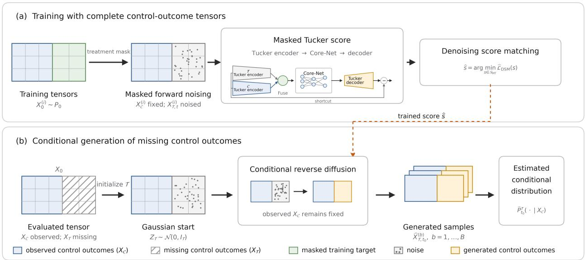  
Note. Panel (a) shows the masked Tucker score architecture and its estimation from training tensors. The missing-outcome and observed-outcome branches are encoded into the Tucker core, combined by the Core-Net, and decoded back to the treated region; only the missing outcomes are noised during training. Panel (b) holds the observed control outcomes fixed and applies the learned score to transform Gaussian noise in the missing region into samples from $\widehat { P } _ { t _ { 0 } } ^ { \mathcal { T } } ( \cdot \mid X _ { \mathcal { C } } )$ . Observed treated outcomes are reserved for subsequent causal analysis.

Conditional generation. Let $\widehat { s }$ denote the learned (trained) conditional score. Replacing the unknown conditional score in (2.3) with sb and initializing the reverse process from the Gaussian approximation to $\textstyle P _ { T } ( \cdot \mid c )$ yields the implementable generator

$$
\mathrm { d } \widehat { X } _ { u } ^ {  } = [ \frac { 1 } { 2 } \eta ( T - u ) \widehat { X } _ { u } ^ {  } + \eta ( T - u ) \widehat { s } ( \widehat { X } _ { u } ^ {  } , c , T - u ) ] \mathrm { d } u + \eta ( T - u ) ^ { 1 / 2 } \mathrm { d } \overline { { W } } _ { u } , \quad u \in [ 0 , T - t _ { 0 } ] ,\tag{2.7}
$$

with $\widehat { X } _ { 0 } ^ {  } \sim { \mathcal { N } } ( 0 , 1 )$ . For a fixed condition c, repeated independent solutions of (2.7) produce draws from the learned conditional distribution. Omitting the conditioning variable C recovers the unconditional diffusion model as a special case (Chen et al. 2023, Fu et al. 2024).

Section 3 extends this conditional-diffusion principle to tensor data for counterfactual distribution recovery. The framework keeps the observed control outcomes fixed while generating the missing control outcomes conditional on them. For notational simplicity, from Section 3 onward we set $\eta ( t ) \equiv 1$ , so that $\alpha _ { t } =$ $e ^ { - t / 2 }$ and $h _ { t } = 1 - e ^ { - t }$

## 3. Learning the Missing Control-World Distribution

This section develops CFT-DIFF, a tensor conditional-diffusion framework for recovering the conditional distribution of missing control outcomes. We formulate the counterfactual problem under a fixed treatment mask and introduce a masked diffusion that perturbs only the missing outcomes while holding the observed control outcomes fixed. Tucker structure then reduces nonlinear score learning to the latent core, leading to the estimation procedure and its intrinsic-dimensional guaranties. Figure 1 summarizes its implementation.

## 3.1. Counterfactual Target and Training Sample

Counterfactual learning as tensor completion. Consider a D-way outcome array with $\textstyle p = \prod _ { d = 1 } ^ { D } p _ { d }$ entries and index set $\mathcal { I } = [ p _ { 1 } ] \times \cdots \times [ p _ { D } ]$ . For each coordinate $\pmb { i } = ( i _ { 1 } , \dots , i _ { D } ) \in \mathcal { T } .$ , let $Y _ { i } ( a )$ denote the potential outcome under intervention $a \in \{ 0 , 1 , \ldots , \mathbb { A } \}$ , where $a = 0$ denotes control. The tensor modes may represent units, time periods, outcome dimensions, or other sources of multi-way variation.

Let the mutually disjoint sets $\mathcal { T } _ { a } \subseteq \mathcal { T }$ collect the coordinates assigned to intervention $^ { a , }$ and define $\mathcal { T } =$ $\textstyle \bigcup _ { a = 1 } ^ { \mathbb { A } } { \mathcal { T } } _ { a }$ and $\mathcal { C } = \mathcal { T } \backslash \mathcal { T }$ . Under consistency, the observed outcome satisfies

$$
Y _ { i } ^ { \mathrm { o b s } } = \left\{ \begin{array} { l l } { Y _ { i } ( 0 ) , } & { i \in \mathcal { C } , } \\ { Y _ { i } ( a ) , } & { i \in \mathcal { T } _ { a } , \quad a = 1 , \ldots , \mathbb { A } . } \end{array} \right.
$$

Thus, every coordinate has an observed outcome, but a treated coordinate does not reveal the outcome that would have occurred under control. Equivalently, the missing control outcomes are $\{ Y _ { i } ( 0 ) : i \in \mathcal { T } \}$

Collect all control potential outcomes in the control-world tensor $\boldsymbol { X } _ { 0 } = \left[ \boldsymbol { Y } _ { i } ( 0 ) \right] _ { i \in \mathcal { I } } \in \mathbb { R } ^ { p _ { 1 } \times \cdots \times p _ { D } }$ . Let $P _ { 0 } = \mathcal { L } ( X _ { 0 } )$ denote its joint distribution. Let $M _ { T }$ be the binary tensor equal to one on $\tau$ and zero elsewhere, and set $M _ { \small { \mathscr { C } } } = \mathbf { 1 } - M _ { \small { \mathscr { T } } }$ . The treatment design partitions $X _ { 0 }$ into

$$
X _ { \mathcal { C } } = M _ { \mathcal { C } } \odot X _ { 0 } = M _ { \mathcal { C } } \odot Y ^ { \mathrm { o b s } } , \qquad X _ { \mathcal { T } } = M _ { \mathcal { T } } \odot X _ { 0 } .\tag{3.1}
$$

Both $X _ { \mathcal { C } }$ and $X _ { T }$ retain the dimensions of $X _ { 0 }$ and are padded with zeros outside the coordinates selected by their respective masks. Because $M _ { ☉ } + M _ { \oslash } = \mathbf { 1 }$ , this partition satisfies $X _ { 0 } = X _ { \ l } + X _ { \ l } $ . When vector notation is needed, we write $\mathcal { M } _ { \mathcal { T } } = \mathrm { d i a g } \{ \mathrm { v e c } ( M _ { \mathcal { T } } ) \}$ and $\mathcal { M } _ { \mathcal { C } } = I _ { p } - \mathcal { M } _ { \mathcal { T } }$ . The block $X _ { \mathcal { C } }$ contains the observed control outcomes, whereas $X _ { T }$ contains the control outcomes missing at treated coordinates. Throughout, “treated region” refers to the coordinate set $\tau ; X _ { T }$ therefore contains outcomes under control for coordinates at which an intervention occurs. Treatment creates a structured missing region in the control-outcome tensor even though the realized-outcome tensor $Y ^ { \mathrm { o b s } }$ is fully observed. Unlike conventional tensor completion, our objective is to recover the conditional distribution of the missing control outcomes rather than merely impute each missing entry. This distribution directly yields conditional means, quantiles, and other distributional summaries.

Specifically, conditional on the observed control outcomes, our target is

$$
P _ { 0 } ^ { \mathcal { T } } ( \cdot \vert X _ { \mathcal { C } } ) : = \mathcal { L } ( X _ { \mathcal { T } } \vert X _ { \mathcal { C } } ) .\tag{3.2}
$$

The treatment mask is prespecified and held fixed,<sup>4</sup> so it is suppressed from the conditioning set. Recovering (3.2) provides the full conditional distribution of the missing control outcomes in the treated region.

To connect this distributional target to downstream causal summaries, let $M _ { T _ { a } }$ denote the binary mask for the intervention-specific support $\mathcal { T } _ { a }$ . For intervention $^ { a , }$ a deterministic weight vector $w \in \mathbb { R } ^ { p }$ supported on $\mathcal { T } _ { a }$ defines the control-outcome summary

$$
U _ { 0 , a } ( w ) = w ^ { \top } \operatorname { v e c } \left( M _ { \mathcal { T } _ { a } } \odot X _ { 0 } \right) .\tag{3.3}
$$

The vector $w$ specifies which coordinates enter the comparison and how they are aggregated. Because $U _ { 0 , a } ( w )$ is a linear functional of $X _ { T }$ , its conditional distribution is determined by (3.2). A coordinate selection weight isolates the control outcome at a specified tensor coordinate, whereas equal weights yield an average over selected coordinates.<sup>5</sup> The corresponding weighted outcome under intervention a is observed and enters only the subsequent causal analysis; it is not supplied to the conditional generator.

Training sample. We learn (3.2) using a finite training sample $\{ X _ { 0 } ^ { ( i ) } \} _ { i = 1 } ^ { n }$ of complete tensors drawn from $P _ { 0 }$ . These tensors may correspond to comparable historical periods or external panels observed entirely under control.

Applying the fixed treatment mask synthetically to each training tensor gives $X _ { T } ^ { ( i ) } = M _ { T } \odot X _ { 0 } ^ { ( i ) }$ and $X _ { \mathcal { C } } ^ { ( i ) } = M _ { \mathcal { C } } \odot X _ { 0 } ^ { ( i ) }$ . This construction produces paired missing and observed control outcomes for learning the conditional score. For the data used in causal analysis, the observed control outcomes $X _ { \mathcal { C } }$ are held fixed and provided to the learned conditional generator, which generates the missing control outcomes $X _ { T }$ conditionally on them. The observed treated outcomes remain outside the generator and enter only the subsequent causal analysis.

## 3.2. Masked Conditional Diffusion in the Treated Region

We now develop the masked conditional diffusion underlying CFT-DIFF for the tensor partition in (3.1). Under the unit noise schedule adopted above, $\alpha _ { t } = e ^ { - t / 2 }$ and $h _ { t } = 1 - e ^ { - t }$ . The forward process perturbs only the missing outcomes $X _ { T }$ , while the observed control outcomes $X _ { \mathcal { C } }$ remain fixed and condition the diffusion throughout.

Let $\{ W _ { t } \} _ { t \ge 0 }$ be a tensor-valued Wiener process with independent standard Brownian entries. The forward diffusion of the missing outcomes is

$$
\mathrm { d } X _ { \mathcal { T } , t } = - \frac { 1 } { 2 } X _ { \mathcal { T } , t } \mathrm { d } t + M _ { \mathcal { T } } \odot \mathrm { d } W _ { t } , \qquad X _ { \mathcal { T } , 0 } = X _ { \mathcal { T } } .\tag{3.4}
$$

For every fixed $t \in [ 0 , T ]$ , the solution of (3.4) has the explicit form

$$
X _ { \mathcal { T } , t } = \alpha _ { t } X _ { \mathcal { T } } + h _ { t } ^ { 1 / 2 } ( M _ { \mathcal { T } } \odot Z _ { t } ) , \qquad Z _ { t } \amalg ( X _ { \mathcal { T } } , X _ { \mathcal { C } } ) ,\tag{3.5}
$$

where $Z _ { t }$ has independent standard Gaussian entries.

Let $\mathbb { X } _ { \mathcal { T } } = \{ X \in \mathbb { R } ^ { p _ { 1 } \times \cdots \times p _ { D } } : M _ { \mathcal { T } } \odot X = X \}$ be the tensor space supported on $\tau .$ Conditional on $X _ { \mathcal { C } } ,$ let $P _ { t } ^ { \mathcal { T } } ( \cdot \mid X _ { \mathcal { C } } ) = { \mathcal { L } } ( X _ { \mathcal { T } , t } \mid X _ { \mathcal { C } } )$ denote the conditional distribution of $X _ { T , t }$ <sub>t</sub> on this space, and let $p _ { t } ^ { \mathcal { T } } ( \cdot \vert$ $X _ { \mathcal { C } } )$ denote its density with respect to Lebesgue measure over the coordinates in the treated region. The corresponding conditional score is $s _ { t } ( X \mid X _ { \mathcal { C } } ) = \nabla _ { \mathcal { T } } \log p _ { t } ^ { \mathcal { T } } ( X \mid X _ { \mathcal { C } } )$ for $X \in \mathbb { X } _ { T }$ , where $\nabla _ { T }$ differentiates only with respect to entries on $\tau$ and pads the coordinates outside T with zeros. Consequently, $\smash { M _ { T } \odot s _ { t } ( X \ | }$ $X _ { \mathcal { C } } ) = s _ { t } ( X \mid X _ { \mathcal { C } } )$ for $X \in \mathbb { X } _ { T }$

With this conditional score, the exact reverse-time diffusion is

$$
\mathrm { d } X _ { T , u } ^ {  } = \{ \frac { 1 } { 2 } X _ { T , u } ^ {  } + s _ { T - u } \big ( X _ { T , u } ^ {  } \mid X _ { C } \big ) \} \mathrm { d } u + M _ { T } \odot \mathrm { d } \overline { { W } } _ { u } , \qquad u \in [ 0 , T - t _ { 0 } ] .\tag{3.6}
$$

Here $\{ \overline { { W } } _ { u } \} _ { u \ge 0 }$ is a tensor-valued Wiener process with independent standard Brownian entries. Conditional on $X _ { \mathcal { C } }$ , if $X _ { T , 0 } ^ {  } \sim P _ { T } ^ { \tau } ( \cdot | X _ { \mathcal { C } } )$ , then $X _ { \mathcal { T } , u } ^ {  } \sim P _ { T - u } ^ { \mathcal { T } } ( \cdot \mid X _ { \mathcal { C } } )$ and $X _ { \mathcal { T } , T - t _ { 0 } } ^ {  } \sim P _ { t _ { 0 } } ^ { \mathcal { T } } ( \cdot | X _ { \mathcal { C } } )$ . The conditional score therefore determines the reverse-time process and is the central object to be learned. Because an unrestricted tensor score is high dimensional, the next subsection develops a Tucker-structured representation whose nonlinear component operates only on a low-dimensional core.

## 3.3. Low-Dimensional Tucker Structure of the Conditional Score

The conditional score in Section 3.2 is a tensor-valued function whose inputs and output are all high dimensional. Estimating and repeatedly evaluating such a function can be prohibitively costly, particularly because reverse-time generation requires score evaluation at every discretization step. Tucker structure provides a parsimonious representation of large tensors and can substantially reduce the cost of tensor computation (Kolda and Bader 2009). We, therefore, posit a low-Tucker-rank model for the complete control-outcome (control-world) tensor. This structure exploits dependence across tensor modes, organizes score learning and generation around a low-dimensional core, and yields the conditional-score representation derived below.

Recall that $\textstyle p = \prod _ { d = 1 } ^ { D } p _ { d }$ , and define $\begin{array} { r } { p ^ { \beta } = \prod _ { d = 1 } ^ { D } p _ { d } ^ { \beta _ { d } } } \end{array}$ , where $\beta _ { d } \in [ 0 , 1 ]$ indexes factor strength along mode $d . ^ { 6 }$ For compactness, write $F \times _ { d = 1 } ^ { D } A _ { d } : = F \times _ { 1 } A _ { 1 } \times _ { 2 } \dots \times _ { D } A _ { D }$ . We assume

$$
X _ { 0 } = F \times _ { d = 1 } ^ { D } A _ { d } + p ^ { - \beta / 2 } E , \qquad A _ { d } ^ { \top } A _ { d } = I _ { r _ { d } } , \quad d \in [ D ] .\tag{3.7}
$$

Here $F \in \mathbb { R } ^ { r _ { 1 } \times \cdots \times r _ { D } }$ is the Tucker core, $A _ { d } \in \mathbb { R } ^ { p _ { d } \times r _ { d } }$ is the loading matrix for mode $d ,$ and $E$ is idiosyncratic tensor noise. The full dimension is $p ,$ whereas $\begin{array} { r } { r = \prod _ { d = 1 } ^ { D } r _ { d } } \end{array}$ is the intrinsic core dimension. The scaling $p ^ { - \beta / 2 }$ allows factor strength to increase with the tensor dimensions.

REMARK 3.1 (CONNECTION WITH VECTOR AND MATRIX FACTOR MODELS). The Tucker representation nests familiar factor models as special cases. When $D = 1 , ( 3 . 7 )$ becomes $X _ { 0 } = A _ { 1 } F + p ^ { - \beta / 2 } E$ , where $F \in \mathbb { R } ^ { r _ { 1 } }$ is a vector of latent factors and $A _ { 1 }$ contains their loading vectors, as in the standard vector factor model (Bai 2003, Bai and $\mathrm { N g }$ 2023). When $D = 2$ , it becomes $X _ { 0 } = A _ { 1 } F A _ { 2 } ^ { \top } + p ^ { - \beta / 2 } E$ , where $A _ { 1 }$ and $A _ { 2 }$ are the row and column loading matrices, respectively, and $F \in \mathbb { R } ^ { r _ { 1 } \times r _ { 2 } }$ is the matrix-valued factor. This is the bilinear, or two-way, matrix factor specification (Wang et al. 2019, Yu et al. 2023, Yuan et al. 2023, Zhang et al. 2025, He et al. 2025). The D-way formulation retains this loading-factor interpretation while representing the structured component through $r$ core coordinates rather than $p$ full coordinates. Consequently, the proposed framework also covers counterfactual recovery with vector- or matrix-valued outcomes by taking $D = 1$ or $D = 2$ , respectively.

ASSUMPTION 3.1 (Control-world tensor factor model). The complete control-world tensor follows (3.7). The vectorized core $f = \operatorname { v e c } ( F ) \in \mathbb { R } ^ { r }$ has density $p _ { \mathrm { c o r e } } ,$ mean zero, and finite second moment. It is independent of $e = { \mathrm { v e c } } ( E )$ , where $e \sim \mathcal { N } ( 0 , \Sigma _ { e } ^ { \otimes } )$ and $\Sigma _ { e } ^ { \otimes } = \Sigma _ { e , D } \otimes \cdots \otimes \Sigma _ { e , 1 }$ , with $\Sigma _ { e , d } =$ $\mathrm { d i a g } ( \sigma _ { d 1 } ^ { 2 } , \dots , \sigma _ { d p _ { d } } ^ { 2 } )$ and $0 < \sigma _ { \operatorname* { m i n } } ^ { 2 } \leq \sigma _ { d j } ^ { 2 } \leq \sigma _ { \operatorname* { m a x } } ^ { 2 } < \infty f o r d \in [ D ] , j \in [ p _ { d } ]$

Assumption 3.1 concerns the joint distribution of the control outcomes; no factor model is imposed on the outcomes under active interventions. The separable diagonal covariance makes the conditional score under the treatment mask analytically tractable, while the uniform variance bounds rule out degenerate coordinates. To expose the resulting score structure, let $A _ { \otimes } = A _ { D } \otimes \cdots \otimes A _ { 1 }$ and define the idiosyncratic variance tensor $\mathcal { Q } _ { \sigma }$ by $\begin{array} { r } { ( \mathcal { Q } _ { \sigma } ) _ { i _ { 1 } , \dots , i _ { D } } = \prod _ { d = 1 } ^ { D } \sigma _ { d i _ { d } } ^ { 2 } } \end{array}$

The construction below combines the noised missing outcomes and the observed control outcomes as two measurements of the same latent core. Conditional on $f , X _ { T , t }$ is a Gaussian measurement of the scaled core $\alpha _ { t } f$ in the treated region, with coordinatewise variances $h _ { t } + \alpha _ { t } ^ { 2 } p ^ { - \beta } \mathcal { Q } _ { o }$ . The observed control outcomes $X _ { \mathcal { C } }$ measure $f$ on ${ \mathcal { C } } ,$ or equivalently $\alpha _ { t } f$ after rescaling by $\alpha _ { t }$ . Because the two measurements are conditionally independent, they can be combined by precision-weighted least squares in the core space.

Define their coordinatewise precision tensors by

$$
\mathcal { W } _ { \mathcal { T } , t } = M _ { \mathcal { T } } \oslash \big ( h _ { t } \mathbf { 1 } + \alpha _ { t } ^ { 2 } p ^ { - \beta } \mathcal { Q } _ { \sigma } \big ) , \qquad \mathcal { W } _ { \mathcal { C } } = M _ { \mathcal { C } } \oslash \big ( p ^ { - \beta } \mathcal { Q } _ { \sigma } \big ) .
$$

Each tensor assigns the inverse conditional variance to coordinates in its corresponding support and zero weight elsewhere. Projecting these precisions onto the Tucker loading space gives the core-level information

matrices

$$
H _ { T , t } = A _ { \otimes } ^ { \top } \mathrm { d i a g } \{ \mathrm { v e c } ( { \mathcal W } _ { T , t } ) \} A _ { \otimes } , \qquad H _ { \mathcal { C } } = A _ { \otimes } ^ { \top } \mathrm { d i a g } \{ \mathrm { v e c } ( { \mathcal W } _ { \mathcal { C } } ) \} A _ { \otimes } .
$$

Because $M _ { T }$ and $M _ { C }$ partition the tensor coordinates and $A _ { \otimes } ^ { \top } A _ { \otimes } = I _ { r }$ , the combined core-level precision matrix is positive definite. We therefore define

$$
V _ { t } = \left( H _ { \mathcal { T } , t } + \alpha _ { t } ^ { - 2 } H _ { \mathcal { C } } \right) ^ { - 1 } .
$$

The key step is to combine the two precision-weighted encoder outputs into a single core statistic:

$$
g _ { t } = V _ { t } \left[ \mathrm { v e c } \left\{ \underbrace { \left( \mathcal { W } _ { T , t } \odot X _ { T , t } \right) \times _ { d = 1 } ^ { D } A _ { d } ^ { \top } } _ { \mathrm { m i s s i n g - o u t c o m e ~ e n c o d e r } } \right\} + \alpha _ { t } ^ { - 1 } \mathrm { v e c } \left\{ \underbrace { \left( \mathcal { W } _ { c } \odot X _ { c } \right) \times _ { d = 1 } ^ { D } A _ { d } ^ { \top } } _ { \mathrm { o b s e r v e d - o u t c o m e ~ e n c o d e r } } \right\} \right] ,\tag{3.8}
$$

Let $G _ { t } = { \mathrm { T u c k e r } } ( g _ { t } )$ , where Tucker $( g ) : = \mathrm { r e s h a p e } \{ g ; ( r _ { 1 } , \ldots , r _ { D } ) \}$ . Standard Gaussian least-squares calculations then give $g _ { t } \mid f \sim { \mathcal { N } } ( \alpha _ { t } f , V _ { t } )$ . Thus, $g _ { t }$ is an r-dimensional sufficient statistic for the scaled core signal $\alpha _ { t } f \colon$ it pools the information retained in the noised missing outcomes with the undiffused information in the observed control outcomes.

PROPOSITION 3.1 (Conditional Tucker score decomposition). Under Assumption 3.1, for every $t \in$ $[ t _ { 0 } , T ]$ , the conditional tensor score satisfies

$$
s _ { t } ( X _ { \mathcal { T } , t } \mid X _ { \mathcal { C } } ) = \underbrace { \mathcal { W } _ { \mathcal { T } , t } } _ { t r e a t e d - r e g i o n p r e c i s i o n } \odot \left[ \left\{ \underbrace { \mathbb { E } ( \alpha _ { t } F \mid G _ { t } ) } _ { c o r e r e g e s s i o n } \underbrace { \times _ { d = 1 } ^ { D } A _ { d } } _ { T u c k e r d e c o d e r } \right\} \underbrace { - X _ { \mathcal { T } , t } } _ { s k i p c o n n e c t i o n } \right] .\tag{3.9}
$$

The score is supported on $\tau$ and is padded with zeros on $\mathcal { C } .$

The statistic $g _ { t }$ pools the noised outcomes in the treated region and the observed control outcomes according to their precisions. Its conditional core mean is decoded to the original tensor coordinates, yielding a precision-weighted denoising score in the treated region, while the observed control outcomes remain fixed.

## 3.4. CFT-DIFF: Estimation and Generation

Masked Tucker score class. Proposition 3.1 depends on the unknown loading matrices, idiosyncratic variances, and conditional core regression. To obtain an estimable score class, we replace them with trainable counterparts. Let $\Gamma = \{ \Gamma _ { d } \} _ { d = } ^ { D }$ denote candidate Tucker loading matrices satisfying $\Gamma _ { d } ^ { \top } \Gamma _ { d } = I _ { r _ { d } }$ for d $\in [ D ]$ and let $\omega = \{ \omega _ { d j } \}$ denote candidate idiosyncratic variances satisfying $\sigma _ { \mathrm { m i n } } ^ { 2 } \le \omega _ { d j } \le \sigma _ { \mathrm { m a x } } ^ { 2 }$ for $d \in [ D ]$ and $j \in [ p _ { d } ]$ . For any $( \Gamma , \omega )$ , let $\mathscr { W } _ { T , t } ( \omega ) , \mathscr { W } _ { } c ( \omega ) , V _ { t } ( \Gamma , \omega )$ , and $G _ { t } ( \Gamma , \omega )$ denote the quantities obtained from the precision-weighted construction defined in Section 3.3 after replacing $( A _ { d } , \sigma _ { d j } ^ { 2 } )$ with $( \Gamma _ { d } , \omega _ { d j } )$ . Thus, $G _ { t } ( \Gamma , \omega )$ is the candidate Tucker-core summary of $( X _ { T , t } , X _ { \mathcal { C } } )$ , with $\textstyle r = \prod _ { d = 1 } ^ { D } r _ { d }$ coordinates.

Let $\mathcal { Z } _ { \boldsymbol { \theta } } : \mathbb { R } ^ { r _ { 1 } \times \dots \times r _ { D } } \times \lceil t _ { 0 } , T \rceil  \mathbb { R } ^ { r _ { 1 } \times \dots \times r _ { D } }$ be a Core-Net. The corresponding score network is

$$
s _ { \Gamma , \omega , \theta } ( X _ { \mathcal { T } , t } , X _ { \mathcal { C } } , t ) = \mathcal { W } _ { \mathcal { T } , t } ( \omega ) \odot \left[ \mathcal { Z } _ { \theta } \left( G _ { t } ( \Gamma , \omega ) , t \right) \times _ { d = 1 } ^ { D } \Gamma _ { d } - X _ { \mathcal { T } , t } \right] .\tag{3.10}
$$

For $g \in \mathbb { R } ^ { r }$ , define $\zeta _ { \theta } ( g , t ) = \mathrm { v e c } \left[ \mathcal { Z } _ { \theta } ( \mathrm { T u c k e r } ( g ) , t ) \right]$ . Let $\mathcal { F } _ { \mathrm { c o r e } } ( L , m , J , K , \kappa , \gamma _ { g } , \gamma _ { t } )$ denote the class of feed-forward ReLU networks with depth at most L, hidden-layer width at most m, at most $J$ nonzero parameters, and parameter magnitudes bounded by κ. The constants $K , \gamma _ { g }$ , and $\gamma _ { t }$ bound the network output

and its Lipschitz variation in the core and time arguments, respectively. A formal definition is provided in Appendix EC.3.2. For a fixed constant $C _ { V } > 0$ , the masked Tucker class is

$$
\begin{array} { r l } & { \boldsymbol { S } _ { \mathrm { M T } } = \Bigg \{ \boldsymbol { s } _ { \Gamma , \omega , \theta } : \Gamma _ { d } ^ { \top } \boldsymbol { \Gamma } _ { d } = \boldsymbol { I } _ { r _ { d } } , \quad d \in [ D ] , \sigma _ { \operatorname* { m i n } } ^ { 2 } \leq \omega _ { d j } \leq \sigma _ { \operatorname* { m a x } } ^ { 2 } , } \\ & { \quad \quad \quad \quad \quad \quad \quad \quad \operatorname* { s u p } _ { t \in [ t _ { 0 } , T ] } \| V _ { t } ( \Gamma , \omega ) \| _ { \mathrm { o p } } \leq C _ { V } , \quad \zeta _ { \theta } \in \mathcal { F } _ { \mathrm { c o r e } } ( L , m , J , K , \kappa , \gamma _ { g } , \gamma _ { t } ) \Bigg \} . } \end{array}
$$

The bound on $V _ { t } ( \Gamma , \omega )$ controls the amplification induced by aggregating the missing-outcome and observed-outcome branches in the core space, while the constraint on $\zeta _ { \theta }$ controls the complexity of the nonlinear core regression. As displayed in (3.10), each score evaluation pools the two branches in the core space, applies the Core-Net, decodes the result through the mode-wise loadings, and forms the precisionweighted residual on $\tau$

Score estimation. The Gaussian transition in (3.5) has treated-region score $h _ { t } ^ { - 1 } ( \alpha _ { t } X _ { \tau } - X _ { \tau , t } ) =$ $- h _ { t } ^ { - 1 / 2 } ( M _ { T } \odot Z _ { t } )$ . Applying the conditional denoising identity from Section 2.2, the population masked score-matching loss is

$$
\mathcal { L } _ { \mathrm { m a s k } } ( s ) = \frac { 1 } { T - t _ { 0 } } \int _ { t _ { 0 } } ^ { T } \mathbb { E } \left[ \left. s ( X _ { T , t } , X _ { c } , t ) - h _ { t } ^ { - 1 } ( \alpha _ { t } X _ { T } - X _ { T , t } ) \right. _ { F } ^ { 2 } \right] \mathrm { d } t .
$$

The expectation is over a complete control-outcome tensor and its forward perturbation. Its population minimizer is $s _ { t } ( X _ { T , t } \mid X _ { \mathcal { C } } )$ . For the training sample introduced in Section 3.1, define

$$
\begin{array} { r l r } {  { \widehat { s } \in \underset { s \in S _ { \mathrm { M T } } } { \mathrm { a r g } \operatorname* { m i n } } \widehat { \mathcal { L } } _ { \operatorname* { m a s k } } ( s ) , \qquad } } & { \widehat { \mathcal { L } } _ { \operatorname* { m a s k } } ( s ) = \frac { 1 } { n } \displaystyle \sum _ { i = 1 } ^ { n } \ell ( X _ { 0 } ^ { ( i ) } ; s ) , } & \\ { \ell ( X _ { 0 } ; s ) = \frac { 1 } { T - t _ { 0 } } \int _ { t _ { 0 } } ^ { T } \mathbb { E } _ { X _ { T , t } | X _ { T } } [ \big \| s ( X _ { T , t } , X _ { \mathcal { C } } , t ) - h _ { t } ^ { - 1 } ( \alpha _ { t } X _ { T } - X _ { T , t } ) \big \| _ { F } ^ { 2 } ] \mathrm { d } t . } & \end{array}\tag{3.11}
$$

Stochastic training samples a training tensor, a diffusion time, and Gaussian perturbation noise. The same fixed mask is used throughout, so the learned score is aligned with the missing-region pattern used in conditional generation.

Conditional generation. Given the observed control outcomes $X _ { \mathcal { C } }$ , CFT-DIFF uses the learned score $\widehat { s }$ in the reverse dynamics (3.6) and initializes the missing-outcome tensor from its large-T Gaussian approximation:

$$
\mathrm { d } \widehat { X } _ { T , u } ^ {  } = \{ \frac { 1 } { 2 } \widehat { X } _ { T , u } ^ {  } + \widehat { s } \big ( \widehat { X } _ { T , u } ^ {  } , X _ { c } , T - u \big ) \} \mathrm { d } u + M _ { T } \odot \mathrm { d } \overline { { W } } _ { u } , \quad u \in [ 0 , T - t _ { 0 } ] , \quad \widehat { X } _ { T , 0 } ^ {  } = M _ { T } \odot Z _ { 0 } ,\tag{3.12}
$$

with vec $\mathbf { \chi } ( Z _ { 0 } ) \sim \mathcal { N } ( 0 , I _ { p } )$ . The output $\widehat { X } _ { T , T - t _ { 0 } } ^ {  }$ is one generated sample of the missing control outcomes in the treated region. Conditional on the observed control outcomes, denote its early-stopped distribution by $\widehat { P } _ { t _ { 0 } } ^ { \mathcal { T } } ( \cdot \mid X _ { \mathcal { C } } ) : = { \mathcal { L } } ( \widehat { X } _ { \mathcal { T } , T - t _ { 0 } } ^ {  } \mid X _ { \mathcal { C } } )$ . By the support convention following (3.1), $\widehat { X } _ { \mathcal { T } , T - t _ { 0 } } ^ {  }$ is zero on $\mathcal { C } .$ Consequently, $X _ { \mathcal { C } } + \widehat { X } _ { \mathcal { T } , T - t _ { 0 } } ^ {  }$ is the corresponding completed control-outcome tensor. Independent runs of (3.12) yield samples from $\widehat { P } _ { t _ { 0 } } ^ { T } ( \cdot \vert X _ { \mathcal { C } } )$

## 3.5. Intrinsic-Dimensional Guaranties for Conditional Score Learning

The Tucker representation reduces the nonlinear component of the conditional score to the r-dimensional core space. Its statistical analysis depends on two features: concentration of the latent core and regularity of the conditional core regression. We state these conditions below.

Recall from (3.8) that $g _ { t } \mid f \sim { \mathcal { N } } ( \alpha _ { t } f , V _ { t } )$ . For $R \geq 1$ , define $\mathcal G _ { R } = \{ g \in \mathbb { R } ^ { r } : \| g \| _ { \infty } \le R \}$ and let

$$
\xi ( g , t ) : = \mathbb { E } ( \alpha _ { t } f | g _ { t } = g ) = \frac { \displaystyle \int \alpha _ { t } f \phi ( g ; \alpha _ { t } f , V _ { t } ) p _ { \mathrm { c o r e } } ( f ) \mathrm { d } f } { \displaystyle \int \phi ( g ; \alpha _ { t } f , V _ { t } ) p _ { \mathrm { c o r e } } ( f ) \mathrm { d } f } ,
$$

where $\phi ( \cdot ; \mu , V )$ is the Gaussian density with mean $\mu$ and covariance V . This vector-valued map is the core representation of the conditional mean in Proposition 3.1: $\mathbb { E } ( \alpha _ { t } F \mid G _ { t } ) = { \mathrm { T u c k e r } } \{ \xi ( g _ { t } , t ) \}$

ASSUMPTION 3.2 (Sub-gaussianlity of the latent core). Let $\Sigma _ { f } = \operatorname { C o v } ( f )$ . The eigenvalues of $\Sigma _ { f }$ are bounded away from zero and infinity. Moreover, there exist constants $B _ { f } , C _ { 1 } , C _ { 2 } > 0$ such that, whenever $\| f \| _ { 2 } \geq B _ { f } , p _ { \mathrm { c o r e } } ( f ) \leq ( 2 \pi ) ^ { - r / 2 } C _ { 1 } \exp \bigl ( - C _ { 2 } \| f \| _ { 2 } ^ { 2 } / 2 \bigr )$

Assumption 3.2 is a standard concentration condition for light-tailed factor models and is rather mild. The covariance bounds only rule out degenerate or excessively dispersed factor directions, while the density bound controls the probability of extreme core realizations. Together with the Gaussian noise in $g _ { t } \mid f _ { : }$ , this condition ensures that $g _ { t }$ lies in $\mathcal { G } _ { R }$ with high probability for the radius $R$ chosen below. The next assumption controls the conditional core regression on this high-probability region.

ASSUMPTION 3.3 (Regularity of the conditional core regression). For the radius R under consideration, suppose that, uniformly over $t \in [ t _ { 0 } , T ] , \ V _ { t } \preceq v _ { \operatorname* { m a x } } I _ { \tau }$ for a constant $v _ { \mathrm { m a x } } < \infty .$ . Assume that $\xi \ i s$ $L _ { g } – L i p s c h i t z$ in g and $L _ { t } – L i p s c h i t z$ in t on $\mathcal { G } _ { R } \times [ t _ { 0 } , T ]$ . In addition, $\begin{array} { r } { K _ { 0 } : = 1 + \operatorname* { s u p } _ { t \in [ t _ { 0 } , T ] } \| \xi ( 0 , t ) \| _ { 2 } < \infty } \end{array}$

Assumption 3.3 is imposed only on the r-dimensional conditional core regression, rather than on the full p-dimensional score. The bound on $V _ { t }$ uniformly limits the conditional variance of $g _ { t } \mid f$ in every corespace direction. The Lipschitz conditions ensure that $\xi$ can be approximated uniformly by the Core-Net on $\mathcal { G } _ { R } \times [ t _ { 0 } , T ]$ , while $K _ { 0 }$ anchors the magnitude of the regression at the origin. Because these restrictions are required only in a high-probability region, they are weaker than the corresponding global smoothness conditions.

For example, if $f \sim \mathcal { N } ( 0 , \Sigma _ { f } )$ , then $\xi ( g , t ) = \alpha _ { t } ^ { 2 } \Sigma _ { f } \big ( \alpha _ { t } ^ { 2 } \Sigma _ { f } + V _ { t } \big ) ^ { - 1 } g$ . In this case, $\xi$ is linear in $g$ and $K _ { 0 } = 1$ , and the Lipschitz condition in $g$ follows directly. Meanwhile, the condition in t holds whenever $\alpha _ { t }$ and $V _ { t }$ vary smoothly over $[ t _ { 0 } , T ]$ . When $V _ { t }$ is small relative to $\alpha _ { t } ^ { 2 } \Sigma _ { f }$ , the statistic $g _ { t }$ is highly informative about $\alpha _ { t } f .$ , and $\xi ( \boldsymbol { g } , t )$ is close to $g .$

Approximation in the core space. A central implication of Proposition 3.1 is that nonparametric score approximation can be carried out after Tucker compression. All masking, precision weighting, and modewise transformations are represented exactly. The only function to be approximated is the conditional core regression $\xi .$ The result below quantifies this reduction: the nonlinear approximation depends on the $r$ core coordinates and time, rather than on the $p$ entries of the original tensor.

For an approximation tolerance $\epsilon \in ( 0 , 1 )$ , define $R _ { \epsilon } = C _ { R } \sqrt { \log \{ c _ { \mathrm { t a i l } } r / ( t _ { 0 } \epsilon ) \} }$ , where $C _ { R }$ and $c _ { \mathrm { t a i l } }$ are sufficiently large constants. This radius contains the core statistic with sufficiently high probability, so the Core-Net need only approximate $\xi$ accurately on $\mathcal { G } _ { R _ { \epsilon } } \times [ t _ { 0 } , T ]$

Consider a Core-Net class whose complexity parameters satisfy

$$
\begin{array} { r l } & { m = O \big ( ( 1 + L _ { g } R _ { \epsilon } ) ^ { r } ( 1 + T L _ { t } ) \epsilon ^ { - ( r + 1 ) } \big ) , \quad K = O ( K _ { 0 } + L _ { g } R _ { \epsilon } ) , \quad L = O ( \log ( K / \epsilon ) + 1 ) , } \\ & { \quad J = O ( m L ) , \quad \kappa = O \big ( \operatorname* { m a x } \big ( K _ { 0 } + L _ { g } R _ { \epsilon } , T L _ { t } , T ^ { - 1 } \big ) \big ) , \quad \gamma _ { g } = C _ { r } L _ { g } , \quad \gamma _ { t } = C _ { r } L _ { t } , } \end{array}\tag{3.13}
$$

where $C _ { r }$ depends only on the core dimension.

THEOREM 3.1 (Conditional score approximation). Suppose Assumptions 3.1 and 3.2 hold, and Assumption 3.3 holds with $R = R _ { \epsilon } .$ . Let $0 < t _ { 0 } \leq 1 , T > t _ { 0 }$ , and $C _ { V } \geq v _ { \operatorname* { m a x } } ,$ , and configure the Core-Net class according to (3.13). Let $A _ { \bullet } = ( A _ { 1 } , \ldots , A _ { D } )$ denote the population loading matrices, and let $\omega ^ { 0 } =$ $( \sigma _ { d j } ^ { 2 } ) _ { d , j }$ denote the population idiosyncratic variances. Then there exists a Core-Net parameter set <sup>¯</sup>θ such that $s _ { A _ { \bullet } , \omega ^ { 0 } , \bar { \theta } } \in S _ { \mathrm { M T } }$ and, for every $t \in [ t _ { 0 } , T ]$

$$
\mathbb { E } _ { X _ { \mathcal { C } } } \mathbb { E } _ { X _ { \mathcal { T } , t } \mid X _ { \mathcal { C } } } \left[ \left\| s _ { A _ { \bullet } , \omega ^ { 0 } , \bar { \theta } } ( X _ { { \mathcal { T } } , t } , X _ { \mathcal { C } } , t ) - s _ { t } ( X _ { { \mathcal { T } } , t } \mid X _ { \mathcal { C } } ) \right\| _ { F } ^ { 2 } \right] \leq h _ { t } ^ { - 2 } ( \sqrt { r } + 1 ) ^ { 2 } \epsilon ^ { 2 } .
$$

Theorem 3.1 isolates the approximation benefit of the Tucker score representation. At the population loading spaces and idiosyncratic variances, approximating the p-dimensional conditional score reduces to approximating $\xi$ on $\mathbb { R } ^ { r } \times [ t _ { 0 } , T ]$ . Accordingly, the network width in (3.13) scales as $\epsilon ^ { - ( r + 1 ) }$ . The exponent $r + 1$ is the input dimension of $\xi \colon r$ core coordinates and one scalar time input. It does not involve the full dimension $p .$ . The factor $h _ { t } ^ { - 2 }$ reflects the increasing sensitivity of the score near the data distribution and explains the use of the early-stopping time $t _ { 0 } > 0$ . The next result incorporates estimation of the loading spaces and variance parameters from the training samples.

Learning from finitely many training tensors. The preceding approximation result fixes the loading spaces and idiosyncratic variances at their population values. We now allow these components, together with the conditional core regression, to be learned from the training sample. The resulting bound separates the cost of learning the nonlinear core map from that of estimating the mode-wise loading spaces.

Define $p _ { \mathcal { T } } = \mathrm { t r } ( \mathcal { M } _ { \mathcal { T } } ) , d _ { \mathcal { T } , \beta } = r + p _ { \mathcal { T } } p ^ { - \beta }$ , and $p _ { \operatorname* { m a x } } = \operatorname* { m a x } _ { { d \in [ D ] } } p _ { d }$ . Here $p \tau$ is the number of missing control outcomes. The quantity $d _ { T , \beta }$ combines the r core coordinates with the aggregate scale $p _ { T } p ^ { - \beta }$ of the idiosyncratic component on that support, while $p _ { \mathrm { m a x } }$ is the largest mode dimension. For the sample size $n ,$ set $\delta _ { n } = ( r + 1 2 ) \log \log ( n ) / \{ 2 \log ( n ) \}$ and $\epsilon = n ^ { - ( 1 - \delta _ { n } ) / ( r + 5 ) }$

THEOREM 3.2 (Conditional score generalization). Suppose Assumptions 3.1 and 3.2 hold, and suppose Assumption 3.3 holds on $\mathcal { G } _ { R \epsilon } \times [ t _ { 0 } , T ]$ . Configure the Core-Net class according to (3.13) at the value of ϵ specified above, and choose $C _ { V } \geq v _ { \operatorname* { m a x } } .$ Suppose that $D ,$ , the mode ranks $( r _ { 1 } , \hdots , r _ { D } ) , L _ { g } , L _ { t } ,$ , and $K _ { 0 }$ are fixed. Forfixed constants $c _ { 0 } , c _ { T } > 0$ and all sufficiently large $n ,$ assume $c _ { 0 } ^ { - 1 } p ^ { - \beta } < t _ { 0 } \leq 1$ and $T - t _ { 0 } \geq c _ { T }$ Then, with probability at least $1 - 1 / n$ over the training sample,

$$
\frac { 1 } { d \tau , \beta ( T - t _ { 0 } ) } \int _ { t _ { 0 } } ^ { T } \mathbb { E } _ { X _ { C } } \mathbb { E } _ { X _ { T , t } | X _ { C } } \left[ \left. \tilde { s } ( X _ { T , t } , X _ { C } , t ) - s _ { t } ( X _ { T , t } \mid X _ { C } ) \right. _ { F } ^ { 2 } \right] \mathrm { d } t = \tilde { \mathcal { O } } \left[ \left( \frac { 1 } { t _ { 0 } } + T \right) \left\{ n ^ { - \frac { 2 - 2 \delta _ { 1 } } { \tau + s } } + p _ { \mathrm { m a x } } n ^ { - \frac { \tau + 3 } { \tau + s } } \right\} \right] .\tag{3.14}
$$

The notation $\widetilde { \mathcal { O } }$ suppresses fixed model constants and polylogarithmic factors in n, $p _ { \mathrm { m a x } } , t _ { 0 } ^ { - 1 } , \epsilon ^ { - 1 }$ , and $\alpha _ { T } ^ { - 1 }$

The left-hand side of (3.14) is the time-integrated prediction error of the learned conditional score, normalized by the effective dimension $d _ { T , \beta }$ . The two terms in the bound correspond to distinct learning tasks. The first is the cost of estimating the nonlinear conditional core regression $\xi ;$ because $\delta _ { n } \to 0$ , its leading rate is $n ^ { - 2 / ( r + 5 ) }$ up to logarithmic factors. The second is the cost of estimating the mode-wise loading spaces. It depends on $p _ { \mathrm { m a x } }$ rather than on the vectorized dimension $p ,$ and vanishes provided $p _ { \operatorname* { m a x } } n ^ { - \frac { r + 3 + 2 \delta n } { r + 5 } } \to 0$

The size of the missing region enters only through $d _ { \mathcal { T } , \beta } = r + p _ { \mathcal { T } } p ^ { - \beta }$ . In the strong-signal regime $p _ { T } \lesssim p ^ { \beta }$ this effective dimension remains bounded when the mode ranks are fixed. Thus, the nonlinear component of score learning is governed by the Tucker-core dimension, while the cost of recovering the full loading structure depends only on the largest individual mode.

Section 4 translates this score bound into recovery guaranties for the conditional distribution of the missing control outcomes.

## 4. Counterfactual Distribution Recovery

This section shows how conditional-score error propagates to the generated distribution and establishes recovery and prediction-interval guaranties for the missing control outcomes and their weighted summaries.

## 4.1. A Score-to-Distribution Transfer Bound

Recall that $P _ { t } ^ { \mathcal { T } } ( \cdot \mid X _ { \mathcal { C } } )$ is the conditional distribution of the forward-diffused missing outcomes $X _ { T , t }$ whereas $\widehat { P } _ { t _ { 0 } } ^ { \mathcal { T } } ( \cdot \mid X _ { \mathcal { C } } )$ is the conditional distribution generated by the trained reverse-time process $_ { ( 3 . 1 2 ) }$ Both distributions are defined over the $p \tau$ coordinates in the treated region, where $p _ { \mathcal { T } } = \mathrm { t r } ( \mathcal { M } _ { \mathcal { T } } )$ ; at $t _ { 0 } > 0$ they admit densities on $\mathbb { R } ^ { p _ { T } }$ . Recall also that $p _ { \operatorname* { m a x } } = \operatorname* { m a x } _ { { d \in [ D ] } } p _ { d } .$

The following result isolates the mechanism by which conditional-score error affects the generated distribution. It applies to a fixed realization of the training sample and therefore treats the trained score $\widehat { s }$ as given.

PROPOSITION 4.1 (Score-to-distribution transfer). Suppose that the reverse SDE driven by $\widehat { s }$ is well defined and that

$$
\int _ { t _ { 0 } } ^ { T } \mathbb { E } _ { X _ { \mathcal { C } } } \mathbb { E } _ { X _ { T , t } \mid X _ { \mathcal { C } } } \left\| \widehat { s } ( X _ { \mathcal { T } , t } , X _ { \mathcal { C } } , t ) - s _ { t } ( X _ { \mathcal { T } , t } \mid X _ { \mathcal { C } } ) \right\| _ { F } ^ { 2 } \mathrm { d } t < \infty .
$$

Then

$$
\begin{array} { r l } & { \mathbb { E } _ { X _ { \mathcal { C } } } \left[ \mathrm { K L } \Big ( P _ { t _ { 0 } } ^ { \mathcal { T } } ( \cdot \mid X _ { \mathcal { C } } ) \Big \| \widehat { P } _ { t _ { 0 } } ^ { \mathcal { T } } ( \cdot \mid X _ { \mathcal { C } } ) \Big ) \right] \leq \frac { 1 } { 2 } \displaystyle \int _ { t _ { 0 } } ^ { T } \mathbb { E } _ { X _ { \mathcal { C } } } \mathbb { E } _ { X _ { \mathcal { T } , t } \mid X _ { \mathcal { C } } } \left\| \widehat { s } ( X _ { \mathcal { T } , t } , X _ { \mathcal { C } } , t ) - s _ { t } ( X _ { \mathcal { T } , t } \mid X _ { \mathcal { C } } ) \right\| _ { F } ^ { 2 } \mathrm { d } t } \\ & { \qquad + \mathbb { E } _ { X _ { \mathcal { C } } } \left[ \mathrm { K L } \big ( P _ { T } ^ { \mathcal { T } } ( \cdot \mid X _ { \mathcal { C } } ) \big \| \mathcal { N } ( 0 , I _ { p _ { T } } ) \big ) \right] . } \end{array}\tag{4.1}
$$

Under Assumption 3.1,forfixed D, there exist constants $C , c > 0$ such that

$$
\begin{array} { r } { \mathbb { E } _ { X _ { \mathcal { C } } } \left[ { \mathrm { K L } } \big ( P _ { T } ^ { \mathcal { T } } ( \cdot \mid X _ { \mathcal { C } } ) \big | \big | { \mathcal { N } } ( 0 , I _ { p _ { \mathcal { T } } } ) \big ) \right] \leq C \exp ( - c T ) \left\{ r + p _ { \mathcal { T } } \log ( 1 + p _ { \operatorname* { m a x } } ) \right\} . } \end{array}\tag{4.2}
$$

The two terms in (4.1) correspond to the two approximations made by the implementable sampler. The integral accumulates the error introduced along the reverse-time process when the population score is replaced by sb. The second term arises from initialization. The exact reverse-time process would start from the conditional terminal distribution $P _ { T } ^ { \mathcal { T } } ( \cdot \mid X _ { \mathcal { C } } )$ , which is unknown, whereas the implementable sampler starts from $\mathcal { N } ( 0 , I _ { p _ { \ T } } )$ . Under the Ornstein–Uhlenbeck forward process, the contribution of the initial missing outcomes diminishes, and $P _ { T } ^ { \mathcal { T } } ( \cdot \vert X _ { \mathcal { C } } )$ approaches the standard normal distribution as $T$ increases. Bound (4.2) makes this approximation precise: its contribution decays exponentially in $T ,$ , up to the displayed dimension factor.<sup>7</sup> Consequently, for sufficiently large $T _ { \mathbf { \delta } }$ , the initialization approximation contributes little to the error in the generated distribution, which is then governed primarily by the integrated score error.

Proposition 4.1 compares the true and generated distributions at the same early-stopping time $t _ { 0 }$ . This common-time comparison excludes the error caused by stopping before time zero. The remaining difference between $\it P _ { t _ { 0 } } ^ { \mathcal { T } } ( \cdot \mid X _ { \mathcal { C } } )$ and the original target distribution $P _ { 0 } ^ { \mathcal { T } } ( \cdot \mid X _ { \mathcal { C } } )$ is the early-stopping error, which vanishes as $t _ { 0 } \downarrow 0$

## 4.2. Recovery of the Missing-Outcome Distribution

We now combine the conditional-score bound in Theorem 3.2 with Proposition 4.1 to establish recovery of the generated distribution. Recall that $d _ { T , \beta } = r + p _ { T } p ^ { - \beta }$ is the effective dimension of the missing region. Recall that $\begin{array} { r } { \delta _ { n } = { \frac { ( r + 1 2 ) \log \log ( n ) } { 2 \log ( n ) } } } \end{array}$ and $\epsilon = n ^ { - \frac { 1 - \delta n } { r + 5 } }$ , and define $\textstyle a _ { n } = { \frac { 1 - \delta _ { n } } { 3 r + 1 5 } }$ . Under the choices of $t _ { 0 }$ and $T$ stated below, the polylogarithmic factors suppressed in Theorem 3.2 are bounded by $L _ { n } = ( 1 + \log ( n ) +$ $\log ( p _ { \operatorname* { m a x } } ) ) ^ { c _ { L } }$ for a sufficiently large fixed constant $c _ { L } > 0$ . Define

$$
\mathfrak { R } _ { n } = L _ { n } \left[ n ^ { - \frac { 5 ( 1 - \delta _ { n } ) } { 6 ( r + 5 ) } } + \sqrt { p _ { \operatorname* { m a x } } } n ^ { - \frac { 3 r + 8 + 7 \delta _ { n } } { 6 ( r + 5 ) } } \right] .\tag{4.3}
$$

The exponent $c _ { L }$ only records the logarithmic factors hidden by the $\widetilde { \mathcal { O } }$ notation and is not an implementation parameter.

THEOREM 4.1 (Recovery of the missing-outcome distribution). Suppose Assumptions 3.1 and 3.2 hold and Assumption 3.3 holds on $\mathcal { G } _ { R \epsilon } \times [ t _ { 0 } , T ]$ . Configure $\widehat { s }$ as in Theorem 3.2 with the value of ϵ displayed above. Suppose that D, the mode ranks $( r _ { 1 } , \hdots , r _ { D } ) , \ L _ { g } , \ L _ { t }$ , and $K _ { 0 }$ are fixed. Choose $t _ { 0 } \asymp n ^ { - a _ { n } } , T =$ $C _ { T } \{ \log ( n ) + \log ( p _ { \operatorname* { m a x } } ) \}$ , and suppose that $p ^ { \beta } \ge C _ { \beta } n ^ { a _ { n } }$ , where $C _ { T }$ and $C _ { \beta }$ are sufficiently large constants. Then there exists an event $A _ { n }$ , measurable with respect to the training sample, such that $\mathbb { P } ( \mathcal { A } _ { n } ) \geq 1 - 1 / n$ and, on $A _ { n }$

$$
\begin{array} { r } { \mathbb { E } _ { X _ { \mathcal { C } } } \left[ \mathrm { K L } \Big ( P _ { t _ { 0 } } ^ { \mathcal { T } } ( \cdot \mid X _ { \mathcal { C } } ) \Big \| \widehat { P } _ { t _ { 0 } } ^ { \mathcal { T } } ( \cdot \mid X _ { \mathcal { C } } ) \Big ) \right] \leq C d _ { \mathcal { T } , \beta } { \mathfrak R } _ { n } ^ { 2 } , } \end{array}\tag{4.4}
$$

with $\Re _ { n }$ defined in (4.3). Consequently,

$$
\mathbb { E } _ { X _ { \mathcal { C } } } \left[ \mathrm { T V } \Big ( P _ { t _ { 0 } } ^ { \mathcal { T } } ( \cdot \mid X _ { \mathcal { C } } ) , \widehat { P } _ { t _ { 0 } } ^ { \mathcal { T } } ( \cdot \mid X _ { \mathcal { C } } ) \Big ) \right] \leq C d _ { \mathcal { T } , \beta } ^ { 1 / 2 } \mathfrak { R } _ { n } .\tag{4.5}
$$

Theorem 4.1 converts the conditional-score guaranty in Theorem 3.2 into a recovery guaranty for the generated conditional distribution. The first component of $\Re _ { n }$ arises from learning the nonlinear regression in the r-dimensional core, whereas the second arises from estimating the mode-wise loading spaces and depends on $p _ { \mathrm { m a x } }$ rather than on the full dimension $p .$ . The factor $d _ { T , \beta }$ captures the idiosyncratic variation remaining in the treated region. In the strong-signal regime $p \tau \lesssim p ^ { \beta }$ , this factor remains bounded when the mode ranks are fixed. More generally, if $d _ { T , \beta } \Re _ { n } ^ { 2 }  0$ , the average conditional KL divergence in (4.4) converges to zero; (4.5) then gives the same conclusion for the average conditional total variation distance. Hence, the generated conditional distribution consistently recovers the early-stopped target distribution $\it P _ { t _ { 0 } } ^ { \mathcal { T } } ( \cdot \mid X _ { \mathcal { C } } )$ under both metrics.

The prescribed choices of $t _ { 0 }$ and $T$ control different approximation errors. The terminal time $T =$ $C _ { T } ( \log ( n ) + \log ( p _ { \operatorname* { m a x } } ) )$ grows only logarithmically with the sample size and the largest mode dimension. Substituting this choice into (4.2) changes $\exp ( - c T )$ into $n ^ { - c C _ { T } } p _ { \mathrm { m a x } } ^ { - c C _ { T } }$ . Because D is fixed, a sufficiently large $C _ { T }$ makes the Gaussian-initialization error negligible relative to the score-learning error. The earlystopping time $t _ { 0 }$ has a different role. Choosing $t _ { 0 } \asymp n ^ { - a _ { n } }$ allows the perturbation of the original target to vanish while preventing the factor $t _ { 0 } ^ { - 1 }$ in the score bound from increasing too rapidly. The condition $p ^ { \beta } \ge C _ { \beta } n ^ { a _ { n } }$ ensures that this choice remains above the idiosyncratic-noise scale required by Theorem 3.2. Because $t _ { 0 } \to 0$ , the forward coupling in (3.5) implies that $\it P _ { t _ { 0 } } ^ { \mathcal { T } } ( \cdot \mid X _ { \mathcal { C } } )$ approaches the original conditional distribution of the missing control outcomes $P _ { 0 } ^ { \tau } ( \cdot \vert X _ { \mathscr { C } } )$

REMARK 4.1 (IMPLEMENTATION IMPLICATIONS OF THE RECOVERY RATE). The recovery bound also clarifies how statistical accuracy depends on the diffusion horizon and the intrinsic dimensions of the problem. The early-stopping time $t _ { 0 }$ balances approximation and estimation. It should decrease with the training sample size, with $t _ { 0 } \asymp n ^ { - a _ { n } }$ providing a theoretically justified benchmark. Moving $t _ { 0 }$ closer to zero leaves less perturbation in the target distribution but makes the score more difficult to estimate near the data distribution. At the other end of the diffusion path, a terminal time $T$ that grows logarithmically is sufficient for the forward-diffused missing region to approach a standard Gaussian. The bound further shows that recovery depends on $r , p _ { \mathrm { m a x } }$ , and $d _ { T , \beta }$ rather than on the full dimension $p .$ Because nonlinear score learning is governed by $r ,$ network capacity is most effectively allocated to the Tucker core. When the term involving $p _ { \mathrm { m a x } }$ dominates, estimation of the loading spaces becomes the principal bottleneck. A larger missing region or a weaker factor signal increases $d _ { T , \beta }$ and therefore requires a larger training sample to attain comparable recovery accuracy.

## 4.3. Recovery of Weighted Counterfactual Summaries

Theorem 4.1 concerns the entire conditional distribution of the missing control outcomes in the treated region. Most causal analyzes, however, concern selected entries or averages of these outcomes. We therefore consider prespecified weighted summaries of the recovered control outcomes.

For intervention a, let $M _ { T _ { a } }$ denote the binary mask for the intervention-specific region $\mathcal { T } _ { a }$ . A deterministic weight vector $w \in \mathbb { R } ^ { p }$ supported on $\mathcal { T } _ { a }$ defines the control-outcome summary

$$
U _ { 0 , a } ( w ) = w ^ { \top } \operatorname { v e c } \left( M _ { \mathcal { T } _ { a } } \odot X _ { 0 } \right) .\tag{4.6}
$$

The vector w specifies which coordinates enter the comparison and how they are aggregated. Because $U _ { 0 , a } ( w )$ is a linear functional of $X _ { T }$ , its conditional distribution is determined by (3.2). A coordinateselection weight isolates the control outcome at a specified tensor coordinate, whereas equal weights yield an average over selected coordinates.<sup>8</sup>

To accommodate causal analysis involving several tensors, let $n _ { e }$ tensors be used in the causal analysis, hereafter called the analysis tensors. For analysis tensor $\ell ,$ let $X _ { c } ^ { ( \ell ) }$ denote its observed control outcomes and $X _ { \mathcal { T } } ^ { ( \ell ) }$ its missing control outcomes in the treated region, with conditional distribution $X _ { T } ^ { ( \ell ) } \mid X _ { c } ^ { ( \ell ) } \sim$ $P _ { 0 } ^ { \mathcal { T } } \big ( \cdot \mid X _ { \mathcal { C } } ^ { ( \ell ) } \big )$ for $\ell = 1 , \ldots , n _ { e }$ . The collection $X _ { \mathcal { C } } ^ { 1 : n _ { e } } = ( X _ { \mathcal { C } } ^ { ( 1 ) } , \ldots , X _ { \mathcal { C } } ^ { ( n _ { e } ) } )$ contains the observed control outcomes supplied to the conditional generator. These analysis tensors are separate from the training sample of complete control-outcome tensors used to estimate the score. They are independent draws from the population distribution and are independent of the training sample.

For a deterministic vector $w = \mathcal { M } _ { \mathcal { T } } w \in \mathbb { R } ^ { p }$ , define the control-outcome summary for the analysis tensor ℓ by $U _ { w , \ell , 0 } = w ^ { \top } \operatorname { v e c } \big ( X _ { \mathcal { T } } ^ { ( \ell ) } \big )$ . If the comparison concerns intervention a and w is supported on $\mathcal { T } _ { a }$ , then $U _ { w , \ell , 0 }$ is the analysis-tensor counterpart of $U _ { 0 , a } ( w )$ in (4.6). When a causal comparison combines several analysis tensors, define their average control-outcome summary as follows: $\begin{array} { r } { V _ { n _ { e } , w , 0 } = \frac { 1 } { n _ { e } } \sum _ { \ell = 1 } ^ { n _ { e } } U _ { w , \ell , 0 } } \end{array}$ . Here $n _ { e }$ is the number of analysis tensors entering the downstream comparison, rather than the number of generated samples. Thus, $V _ { n _ { e } , w , 0 }$ is directly interpretable as an average missing control outcome and can be compared with the corresponding average observed outcome under treatment.

For each analysis tensor $\ell ,$ let $\widehat { X } _ { \mathcal { T } , t _ { 0 } } ^ { ( \ell ) } : = \widehat { X } _ { \mathcal { T } , T - t _ { 0 } } ^ {  , ( \ell ) }$ be generated conditional on $X _ { \mathcal { C } } ^ { ( \ell ) }$ by the reverse-time process (3.12) driven by the estimated score. Then $\widehat { X } _ { \mathcal { T } , t _ { 0 } } ^ { ( \ell ) } \sim \widehat { P } _ { t _ { 0 } } ^ { \mathcal { T } } ( \cdot \mid X _ { \mathcal { C } } ^ { ( \ell ) } )$ , and the generated counterpart of $\begin{array} { r } { V _ { n _ { e } , w , 0 } \mathrm { i s } \widehat { V } _ { n _ { e } , w , t _ { 0 } } = \frac { 1 } { n _ { e } } \sum _ { \ell = 1 } ^ { n _ { e } } w ^ { \top } \sec ( \widehat { X } _ { \mathcal { T } , t _ { 0 } } ^ { ( \ell ) } ) } \end{array}$ . Conditional on $X _ { \mathcal { C } } ^ { 1 : n _ { e } }$ and the learned score, the generated vector follows the product conditional distribution $\otimes _ { \ell = 1 } ^ { n _ { e } } \widehat { P } _ { t _ { 0 } } ^ { \mathcal { T } } ( \cdot \mid X _ { \mathcal { C } } ^ { ( \ell ) } )$ . Let $\mathcal { F } _ { \mathrm { t r } } = \sigma ( X _ { 0 } ^ { ( 1 ) } , \dots , X _ { 0 } ^ { ( n ) } )$ denote the sigma-field generated by the training sample. For a fixed realization of $\mathcal { F } _ { \mathrm { t r } }$ belonging to $\mathcal { A } _ { n }$ , the learned score and its induced conditional distributions are fixed; this conditioning is suppressed below. The following result uses $d _ { \mathrm { B L } }$ to compare the target and generated conditional distributions of the weighted aggregate.

Because $V _ { n _ { e } , w , 0 }$ is an arithmetic average, its distribution may contract mechanically as $n _ { e }$ increases. We therefore state distributional recovery on the fluctuation scale $\sqrt { n _ { e } } V _ { n _ { e } , w , 0 }$ . This deterministic normalization is neither a studentization nor an appeal to a central limit theorem.

COROLLARY 4.1 (Recovery of weighted counterfactual summaries). Under the conditions of Theorem 4.1,for every $n _ { e } \in$ N and every deterministic $w = \mathcal { M } _ { \mathcal { T } } w$ , on $\boldsymbol { A } _ { n }$

$$
\begin{array} { r l } & { \mathbb { E } _ { X _ { \mathcal { C } } ^ { 1 : n _ { e } } } d _ { \mathrm { B L } } \Big [ \mathcal { L } \{ \sqrt { n _ { e } } V _ { n _ { e } , w , 0 } | X _ { \mathcal { C } } ^ { 1 : n _ { e } } \} , \mathcal { L } \{ \sqrt { n _ { e } } \widehat { V } _ { n _ { e } , w , t _ { 0 } } | X _ { \mathcal { C } } ^ { 1 : n _ { e } } \} \Big ] } \\ & { \qquad \leq C \| w \| _ { 2 } n ^ { - a _ { n } / 2 } + C \sqrt { n _ { e } } d _ { T , \beta } ^ { 1 / 2 } \mathfrak { R } _ { n } . } \end{array}\tag{4.7}
$$

The first term in (4.7) bridges the original and early-stopped distributions. Independence and centering keep the mean-square forward perturbation of $\sqrt { n _ { e } } V _ { n _ { e } , w , 0 }$ of order $\| \boldsymbol { w } \| _ { 2 } ^ { 2 } t _ { 0 } . ^ { 9 }$ The second term is the conditional-distribution estimation error: relative entropy adds over the $n _ { e }$ product components, and Pinsker’s inequality yields the factor $\sqrt { n _ { e } }$ . Thus, if $n _ { e }$ and $w = w _ { n }$ vary with $n ,$ consistency follows when $\| w _ { n } \| _ { 2 } n ^ { - a _ { n } / 2 } \to 0$ and $\sqrt { n _ { e } } d _ { T , \beta } ^ { 1 / 2 } \Re _ { n }  0$ . The target $V _ { n _ { e } , w , 0 }$ itself remains on the average-outcome scale used below.

## 4.4. Counterfactual Prediction Intervals

Recovering the conditional distribution also provides quantiles and prediction intervals for the missing control outcomes. With suitable weights, the same construction applies to averages used in treatment-effect comparisons. Combining such an interval with the corresponding observed treated outcome yields an interval for the resulting treatment-effect contrast.

We next establish the coverage of these intervals. Although Corollary 4.1 controls the bounded–Lipschitz distance between the weighted-summary distributions, interval coverage is not a continuous functional of the underlying distribution. We therefore impose a mild anti-concentration condition. Suppose that, for almost every $X _ { \mathcal { C } } ^ { 1 : n _ { e } }$ , the conditional density of $\sqrt { n _ { e } } V _ { n _ { e } , w , 0 }$ is uniformly bounded over its argument by a finite constant $M _ { n , n _ { e } , w } .$ . Equivalently, the conditional density of $V _ { n _ { e } , w , 0 }$ is bounded by $\sqrt { n _ { e } } M _ { n , n _ { e } , w }$ . This condition prevents excessive probability mass from accumulating near a prediction-interval endpoint.

For a realization $x = ( x _ { c } ^ { ( 1 ) } , \dots , x _ { c } ^ { ( n _ { e } ) } )$ of the observed control outcomes, let ${ \widehat { F } } _ { x }$ denote the conditional distribution function of $\widehat { V } _ { n _ { e } , w , t _ { 0 } }$ . The density condition excludes the degenerate choice $w = 0$ . Because the reverse diffusion is nondegenerate on the positions in the treated region, ${ \widehat { F } } _ { x }$ is continuous. Define ${ \widehat { q } } _ { x } ( u ) =$ inf $\{ v : \widehat { F } _ { x } ( v ) \geq u \}$ for $u \in ( 0 , 1 )$ . We report intervals on the average-outcome scale. Multiplying both the statistic and the interval by $\sqrt { n _ { e } }$ leaves the coverage event unchanged. The central interval induced by the estimated conditional distribution is

$$
\widehat { I } _ { n _ { e } , w , 1 - \alpha } ( x ) = [ \widehat { q } _ { x } ( \alpha / 2 ) , \widehat { q } _ { x } ( 1 - \alpha / 2 ) ] , \qquad 0 < \alpha < 1 .\tag{4.8}
$$

In computation, let $\left\{ \widehat { V } _ { n _ { e } , w , t _ { 0 } } ^ { ( b ) } \right\} _ { b = 1 } ^ { B }$ be B independent draws from the estimated conditional distribution. Let $\widehat { q } _ { x } ^ { ( B ) } ( u )$ denote their empirical u-quantile and define $\widehat { I } _ { n _ { e } , w , 1 - \alpha } ^ { ( B ) } ( x ) = \left[ \widehat { q } _ { x } ^ { ( B ) } ( \alpha / 2 ) , \widehat { q } _ { x } ^ { ( B ) } ( 1 - \alpha / 2 ) \right]$ . Also, let $\mathcal { F } _ { B } ^ { \mathrm { g e n } } = \mathcal { F } _ { \mathrm { t r } } \vee \sigma \{ \widehat { V } _ { n _ { e } , w , t _ { 0 } } ^ { ( 1 ) } , \ldots , \widehat { V } _ { n _ { e } , w , t _ { 0 } } ^ { ( B ) } \}$

COROLLARY 4.2 (Coverage of counterfactual prediction intervals). Under the conditions of Theorem 4.1 and the conditional-density bound above, on $\mathcal { A } _ { n }$

$$
\begin{array} { r l } & { \mathbb { E } _ { X _ { \mathcal { C } } ^ { 1 : n _ { e } } } \left| \mathbb { P } \Big \{ V _ { n _ { e } , w , 0 } \in \widehat { I } _ { n _ { e } , w , 1 - \alpha } \big ( X _ { \mathcal { C } } ^ { 1 : n _ { e } } \big ) \Big | X _ { \mathcal { C } } ^ { 1 : n _ { e } } , \mathcal { F } _ { \mathrm { t r } } \Big \} - ( 1 - \alpha ) \right| } \\ & { \qquad \leq C \sqrt { n _ { e } } d _ { T , \beta } ^ { 1 / 2 } \Re _ { n } + C \big ( M _ { n , n _ { e } , w } \| w \| _ { 2 } \big ) ^ { 2 / 3 } n ^ { - a _ { n } / 3 } . } \end{array}\tag{4.9}
$$

Moreover,

$$
\begin{array} { r l } &  \mathbb { E } _ { X _ { \mathcal { C } } ^ { 1 : n _ { e } } } \mathbb { E } _ { \mathrm { g e n } | X _ { \mathcal { C } } ^ { 1 : n _ { e } } , \mathcal { F } _ { \mathrm { t r } } } | \mathbb { P } \Big \{ { V _ { n _ { e } , w , 0 } \in \widehat { I } _ { n _ { e } , w , 1 - \alpha } ^ { ( B ) } ( X _ { \mathcal { C } } ^ { 1 : n _ { e } } ) \Big | X _ { \mathcal { C } } ^ { 1 : n _ { e } } , \mathcal { F } _ { B } ^ { \mathrm { g e n } } \Big \} - ( 1 - \alpha ) \Big | } \\ & { \qquad \le C \sqrt { n _ { e } } d _ { T , \beta } ^ { 1 / 2 } \mathfrak { R } _ { n } + C \big ( M _ { n , n _ { e } , w } \| w \| _ { 2 } \big ) ^ { 2 / 3 } n ^ { - a _ { n } / 3 } + C B ^ { - 1 / 2 } . } \end{array}\tag{4.10}
$$

Here the inner expectation is taken over the finite generation sample, conditional on the observed control outcomes and the training sample.

The three terms in (4.10) arise from recovery of the early-stopped distribution, the early-stopping approximation, and finite generation, respectively. On the fluctuation scale, the forward coupling perturbs the target by $O ( \| w \| _ { 2 } \sqrt { t _ { 0 } } )$ ; combining this bound with $M _ { n , n _ { e } , w }$ gives the second term. The final term follows from replacing the quantiles of the estimated conditional distribution with empirical quantiles based on $B$ condi tional draws (Massart 1990). Hence, the finite-generation interval is asymptotically calibrated whenever

$$
\sqrt { n _ { e } } d _ { T , \beta } ^ { 1 / 2 } \Re _ { n }  0 , \qquad M _ { n , n _ { e } , w } \| w \| _ { 2 } n ^ { - a _ { n } / 2 }  0 , \qquad B  \infty .
$$

These intervals concern unobserved counterfactual realizations rather than a fixed population parameter. Because $V _ { n _ { e } , w , 0 }$ is an arithmetic average, the interval endpoints retain the units relevant for an average causal comparison. The fluctuation-scale density condition is compatible with this presentation because common scaling leaves coverage unchanged. The result does not use an additional Gaussian approximation or require estimation of an asymptotic variance; its quantiles are obtained directly from conditional draws generated by CFT-DIFF.

The control-world intervals can be translated directly into intervals for treatment effects on the analysis tensors. For intervention $^ { a , }$ let w be supported on $\mathcal { T } _ { a }$ and define the corresponding average of the observed treated outcomes by $\begin{array} { r } { V _ { n _ { e } , w , a } ^ { \mathrm { o b s } } = \frac { 1 } { n _ { e } } \sum _ { \ell = 1 } ^ { n _ { e } } w ^ { \top } \sec \left( M _ { \mathcal { T } _ { a } } \odot Y ^ { \mathrm { o b s } , ( \ell ) } \right) } \end{array}$ . The associated weighted sample-average counterfactual contrast is

$$
\tau _ { n _ { e } , w , a } = \frac { 1 } { n _ { e } } \sum _ { \ell = 1 } ^ { n _ { e } } w ^ { \top } \operatorname { v e c } \bigg [ M _ { \mathcal { T } _ { a } } \odot \bigg ( Y ^ { \mathrm { o b s } , ( \ell ) } - X _ { \mathcal { T } } ^ { ( \ell ) } \bigg ) \bigg ] = V _ { n _ { e } , w , a } ^ { \mathrm { o b s } } - V _ { n _ { e } , w , 0 } .\tag{4.11}
$$

With equal weights over the relevant treated coordinates, this quantity is the sample average treatment effect for the analysis tensors.

Because the treated outcomes are observed, a prediction interval for the contrast in (4.11) is obtained by translating the interval for $V _ { n _ { e } , w , 0 }$ . In particular, the interval induced by (4.8) is

$$
\widehat { I } _ { \tau , n _ { e } , w , a , 1 - \alpha } ( x ) = \left[ V _ { n _ { e } , w , a } ^ { \mathrm { o b s } } - \widehat { q } _ { x } ( 1 - \alpha / 2 ) , V _ { n _ { e } , w , a } ^ { \mathrm { o b s } } - \widehat { q } _ { x } ( \alpha / 2 ) \right] .
$$

Its finite-B counterpart is obtained by replacing $\widehat { q } _ { x }$ with $\widehat { q } _ { x } ^ { \left( B \right) }$ . The reversal of the quantile endpoints reflects that the treatment effect is the observed treated outcome minus the unobserved control outcome. Treating the realized treated summary as fixed, this transformation preserves the conditional coverage guarantee of the underlying control-world interval and requires no model for the treated-outcome distribution. The resulting interval quantifies counterfactual uncertainty in the weighted sample-average treatment effect.<sup>10</sup>

## 5. Simulation Study

This section evaluates the finite-sample performance of CFT-DIFF in recovering both missing control outcomes and their conditional distribution. We vary the size of the missing region and the strength of the latent factor structure and compare CFT-DIFF with established point-recovery methods and two nested diffusion benchmarks. The main text reports the more challenging setting, $\beta = 0 . 5 0 ;$ ; results for $\beta = 0 . 7 5$ are provided in Appendix EC.4.

## 5.1. Simulation Setting

For the tensor design, we set $\beta _ { 1 } = \beta _ { 2 } = \beta$ and generate $6 4 \times 6 4$ control-world matrices from the bilinear factor model $X = A _ { 1 } F A _ { 2 } ^ { \top } + p ^ { - \beta / 2 } E$ , where F is a $1 6 \times 1 6$ Gaussian factor matrix and E contains independent Gaussian idiosyncratic noise. Each replication contains 360 complete training matrices and 12 independently generated test matrices.

For each evaluation matrix, we remove a contiguous rectangular block containing approximately 25%, 50%, or 75% of its entries. The remaining entries are the observed control outcomes supplied to the methods, and recovery is evaluated only in the missing region. Because the data-generating process is Gaussian, the exact conditional distribution of the missing outcomes given the observed control outcomes is available and provides a benchmark for distributional recovery.

We compare CFT-DIFF with five competing point-recovery methods, organized into causal panel estimators and matrix/tensor completion methods. The first group includes difference-in-differences (DID), synthetic control (SC), and synthetic difference-in-differences (SDID) (Arkhangelsky et al. 2021). The second includes nuclear-norm matrix completion (NMC) (Athey et al. 2021) and tensor factor imputation (TFI) based on the Tucker factor model of Cen and Lam (2025). All methods use the same observed entries and are evaluated on the same missing regions.

To distinguish the sources of performance gains, we construct two nested diffusion benchmarks. Convolutional Diffusion (CONV-DIFF) replaces the structured score network with a conventional convolutional U-Net and learns directly in the full matrix space. Tucker Diffusion (TUCKER-DIFF) employs the Tucker-U-Net architecture, thereby exploiting multilinear low-rank structure without the masked conditional construction of CFT-DIFF. Our method combines Tucker-based dimension reduction with conditioning on the observed control outcomes through the treatment mask. This nested design separates the gains from multilinear structure and conditional generation.

The five competing methods provide point estimates. For CONV-DIFF, TUCKER-DIFF, and CFT-DIFF, the mean of the generated draws serves as the point estimate, while the draws themselves provide an esti mated conditional distribution. Point recovery is evaluated by mean absolute error (MAE) and root mean squared error (RMSE). Distributional recovery is evaluated by the energy score and continuous ranked probability score (CRPS), together with the coverage and width of 90% intervals, the interval score (IS), and the weighted interval score (WIS). Results are averaged over five independent simulation replications. Appendix EC.4.1 provides the complete data-generating process, implementation details, and metric definitions.

## 5.2. Simulation Results

We first examine counterfactual recovery performance as the missing rate increases. Table 1 reports point, distributional, and interval recovery at missing rates of 25%, 50%, and 75%. These designs progressively reduce the observed control outcomes and therefore assess how recovery changes as less conditioning information remains available.

Table 1 Counterfactual recovery across missing rates (β = 0.50).
<table><tr><td></td><td colspan="2">Point Recovery</td><td colspan="2">Distributional Recovery</td><td colspan="4">Interval Recovery</td></tr><tr><td>Method</td><td>MAE</td><td>RMSE</td><td>Energy</td><td>CRPS</td><td>Coverage</td><td>Width</td><td>IS</td><td>WIS</td></tr><tr><td colspan="9">Panel A: Missing Rate = 25%</td></tr><tr><td>NMC</td><td colspan="2">0.0588 (0.0042) 0.0740 (0.0054)</td><td></td><td></td><td></td><td></td><td></td><td></td></tr><tr><td>DID</td><td colspan="2">0.1688 (0.0129) 0.2170 (0.0169)</td><td></td><td></td><td></td><td></td><td></td><td></td></tr><tr><td>SC</td><td colspan="2">0.0533 (0.0035) 0.0674 (0.0045)</td><td></td><td></td><td></td><td></td><td></td><td></td></tr><tr><td>SDID</td><td colspan="2">0.1172 (0.0075) 0.1502 (0.0095)</td><td></td><td></td><td></td><td></td><td></td><td></td></tr><tr><td>TFI</td><td colspan="8">0.0586 (0.0035) 0.0745 (0.0045)</td></tr><tr><td>CONV-DIFF</td><td colspan="2">0.1191 (0.0075) 0.1527 (0.0095) 3.4293 (0.2163) 0.0851 (0.0054) 0.8831 (0.0120) 0.4785 (0.0210) 0.6469 (0.0398) 0.0640 (0.0041)</td><td></td><td></td><td></td><td></td><td></td><td></td></tr><tr><td>CFT-DIFF</td><td colspan="8">TUCKER-DIFF 0.0497 (0.0027) 0.0637 (0.0033) 1.4746 (0.0770) 0.0355 (0.0019) 0.9614 (0.0101) 0.2745 (0.0169) 0.2931 (0.0161) 0.0272 (0.0015)</td></tr><tr><td></td><td colspan="8">0.0371 (0.0023) 0.0470 (0.0029) 1.0679 (0.0655) 0.0263 (0.0017) 0.9225 (0.0094) 0.1744 (0.0098) 0.2056 (0.0125) 0.0199 (0.0013)</td></tr><tr><td colspan="8">Panel B: Missing Rate = 50%</td></tr><tr><td>NMC</td><td>0.0688 (0.0054) 0.0871 (0.0068)</td><td></td><td></td><td></td><td></td><td></td><td></td></tr><tr><td>DID</td><td>0.1711 (0.0142) 0.2195 (0.0184)</td><td></td><td></td><td></td><td></td><td></td><td></td></tr><tr><td>SC SDID</td><td>0.0635 (0.0057) 0.0815 (0.0075)</td><td></td><td></td><td></td><td></td><td></td><td></td></tr><tr><td>TFI</td><td>0.1188 (0.0086) 0.1523 (0.0109)</td><td></td><td></td><td></td><td></td><td></td><td></td></tr><tr><td>CONV-DIFF</td><td colspan="8">0.0769 (0.0057) 0.0983 (0.0072) 0.1206 (0.0087) 0.1546 (0.0110) 4.9108 (0.3529) 0.0861 (0.0062) 0.8830 (0.0117) 0.4839 (0.0235) 0.6560 (0.0469) 0.0648 (0.0047)</td></tr><tr><td></td><td colspan="8"></td></tr><tr><td>CFT-DIFF</td><td colspan="8">TUCKER-DIFF 0.0699 (0.0050) 0.0900 (0.0063) 2.8968 (0.2026) 0.0500 (0.0036) 0.9500 (0.0092) 0.3544 (0.0253) 0.3895 (0.0270) 0.0378 (0.0027)</td></tr><tr><td></td><td colspan="8">0.0490 (0.0037) 0.0631 (0.0049) 2.0091 (0.1558) 0.0347 (0.0027) 0.9148 (0.0144) 0.2195 (0.0183) 0.2668 (0.0202) 0.0261 (0.0020)</td></tr><tr><td></td><td colspan="8">0.1081 (0.0076) 0.1394 (0.0098)</td></tr><tr><td>NMC DID</td><td>0.1693 (0.0126) 0.2176 (0.0164)</td><td></td><td></td><td></td><td></td><td></td><td></td></tr><tr><td>SC</td><td>0.0963 (0.0065) 0.1253 (0.0086)</td><td></td><td></td><td></td><td></td><td></td><td></td></tr><tr><td>SDID</td><td>0.1185 (0.0081) 0.1521 (0.0101)</td><td></td><td></td><td></td><td></td><td></td><td></td></tr><tr><td>TFI</td><td>0.1023 (0.0063) 0.1312 (0.0080)</td><td></td><td></td><td></td><td></td><td></td><td></td></tr><tr><td>CONV-DIFF</td><td colspan="8">0.1197 (0.0081) 0.1535 (0.0102) 5.9757 (0.4011) 0.0855 (0.0058) 0.8867 (0.0123) 0.4862 (0.0204) 0.6517 (0.0430) 0.0644 (0.0043)</td></tr><tr><td></td><td colspan="8"></td></tr><tr><td></td><td colspan="8">TUCKER-DIFF 0.0937 (0.0067) 0.1207 (0.0086) 4.7137 (0.3321) 0.0668 (0.0047) 0.9301 (0.0093) 0.4330 (0.0269) 0.5010 (0.0344) 0.0501 (0.0035)</td></tr></table>

Note. The table reports recovery at three missing rates. Entries are means across five independent simulation replications, with standard deviations in parentheses. MAE and RMSE evaluate point recovery; Energy and CRPS evaluate the generated conditional distribution Coverage and Width denote the empirical coverage and average width of nominal 90% intervals, and IS and WIS denote the interva score and weighted interval score. Smaller MAE, RMSE, Energy, CRPS, IS, and WIS indicate better performance. Width is interpreted jointly with Coverage, whose nominal level is 0.90. Dashes indicate measures that are not applicable to point estimators. Each diffusion method uses 100 conditional draws per evaluation matrix.

Among the five established point-recovery methods, SC has the lowest MAE and RMSE at each missing rate, while NMC and TFI are also competitive when the missing region is relatively small. Their recovery errors nevertheless increase as the number of observed control outcomes decreases. CFT-DIFF attains the lowest MAE and RMSE in every design. Relative to SC, the strongest of the five established methods, it reduces MAE by 17%–30%; even after including the two nested generative specifications, its MAE remains 15%–25% below that of the next-best method.

The nested specifications further clarify the source of these gains. TUCKER-DIFF improves substantially on CONV-DIFF, demonstrating the value of Tucker dimension reduction, while CFT-DIFF delivers a further improvement by incorporating the observed control outcomes through the masked conditional construction.

Relative to TUCKER-DIFF, CFT-DIFF reduces both Energy and CRPS by 14%–31% across the three missing rates. Its 90% coverage remains between 0.915 and 0.923, while its intervals are 18%–38% narrower than those of TUCKER-DIFF. The corresponding reductions in IS and WIS show that the sharper intervals retain coverage close to the nominal level.

Figure 2 complements these aggregate measures with pointwise conditional distributions at a 25% missing rate. The three rows cover lower, central, and upper realized values within the missing region. This comparison examines whether the methods recover not only a point prediction but also the local shape and scale of the exact conditional distribution.

Figure 2 Pointwise conditional distribution recovery (β = 0.50).  
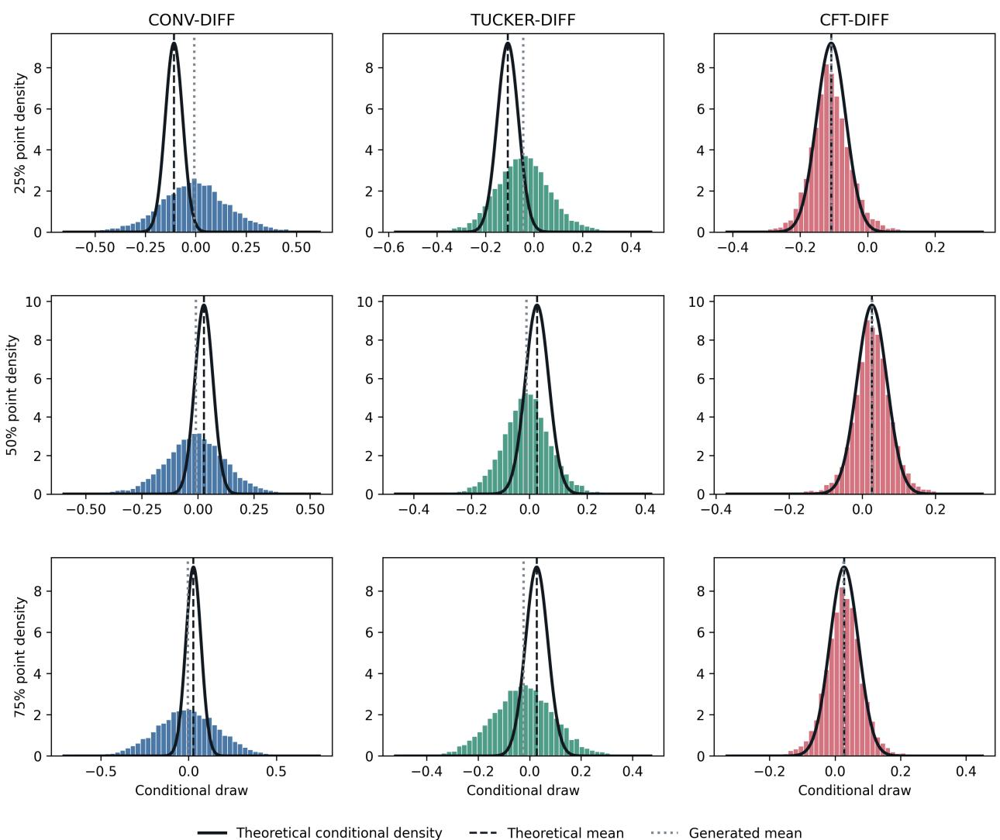

Note. Columns correspond to CONV-DIFF, TUCKER-DIFF, and CFT-DIFF. Rows display entries whose realized missing values are near the 25th, 50th, and 75th percentiles within the missing region. Each histogram is based on 10,000 conditional draws, and th missing rate is 25%. The solid curve shows the exact conditional density; the dashed and dotted vertical lines indicate the exact conditional mean and the mean of the generated draws, respectively.

Across the three displayed entries, the CFT-DIFF histograms closely track the location and concentration of the exact conditional densities, and their means nearly coincide with the exact conditional means. CONV-

DIFF and TUCKER-DIFF produce visibly more dispersed distributions and larger location discrepancies, particularly away from the center of the missing region’s realized-value distribution. Thus, the advantage in Table 1 reflects a closer approximation to the conditional distribution rather than only a more accurate generated mean.

## 6. Distributional Demand Response to Dynamic Electricity Pricing

Electricity systems increasingly rely on demand flexibility to manage short-run imbalances, especially during periods of high demand or variable supply. Dynamic pricing can shift electricity use away from costly or constrained hours, but its operational value depends on the magnitude, timing, and reliability of household response. Evaluating these interventions therefore requires counterfactual demand estimates that characterize both average demand reductions and uncertainty in whether a price signal attains its intended target.

We examine these questions using the Norwegian iFlex dynamic-pricing experiment. The experiment followed 3,746 households in five Norwegian regions during the winter of 2020–2021.<sup>11</sup> The iFlex experiment included 11 treatment groups and five regional control groups. Its within-region random allocation of house holds supports baseline exchangeability, while contemporaneous regional controls support counterfactual comparisons on the realized intervention dates (Hofmann and Lindberg 2024). On selected experiment days, each treatment group received one of 14 day-ahead hourly price signals implemented through a reward scheme. The signals differed in their peak price levels, the timing of the peak periods, and their duration. The data combine household-level hourly electricity consumption with treatment assignments, complete hourly price paths, and local temperature measurements. This design generates repeated multi-arm interventions with 24-hour outcome trajectories and substantial heterogeneity across households, dates, and pricing regimes.

For the empirical analysis, we use hourly electricity consumption from December 1, 2020, through March 26, 2021, and restrict the sample to weekdays excluding holidays. We also exclude households that did not satisfy the recruitment criteria, withdrew from the study, lacked complete electricity-consumption records over the study period, or exhibited outlying consumption profiles. The resulting balanced panel contains 3,746 households, each represented by a $7 4 \times 2 4$ day-by-hour outcome matrix. Households assigned to the five control groups form the training sample used to learn the conditional generator. For each treatmentgroup household, CFT-DIFF generates the missing 24-hour no-policy (control) outcomes on intervention days conditional on the observed no-policy outcomes. We use this setting to assess point and counterfactual distribution recovery across competing methods and to quantify the average and distributional effects of the dynamic-pricing interventions.

## 6.1. The iFlex Experiment and Counterfactual Structure

The iFlex experiment assigns dynamic-pricing interventions at the experimental-group-by-day level. Let $G _ { i }$ denote the experimental group of household $i ,$ and let $D _ { g t } \in \{ 0 , 1 , \ldots , 1 4 \}$ denote the pricing regime assigned to group g on working day t, where $D _ { g t } = 0$ denotes no active intervention. We define the corresponding household-level assignment by $D _ { i t } = D _ { G _ { i } t }$ . Thus, all households within the same treatment group are assigned the same day-ahead 24-hour price path, hereafter referred to as a price signal, on an intervention day.<sup>12</sup>

Figure 3 Dynamic-pricing signals and group-level intervention schedule.  
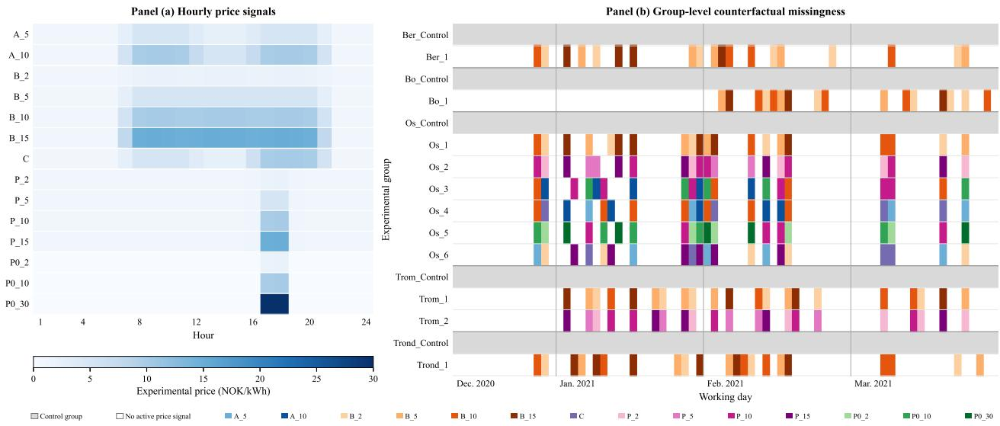  
Note. Panel (a) shows the 24-hour price paths for the 14 active dynamic-pricing interventions. Panel (b) shows the realized intervention schedule for the 11 treatment groups and five regional control groups over the 74 working days in the analysis sample. Gray cells denote control groups, white cells denote treatment-group days without an active intervention, and colored cells identify the assigned price signal. Because assignment occurs at the group-day level, all households within a group share the same assignment on a given day.

We take the household as the causal unit. Let $Y _ { i t h } ( d )$ denote household $i \ ' s$ total electricity consumption at hour $h$ on day t under assignment to the complete daily price signal $d ,$ with $d = 0$ denoting the nopolicy regime. Interactions among household members are incorporated into this household-level potential response. We assume no interference across households: a household’s potential outcomes are unaffected by the intervention assignments of other households. This causal restriction is distinct from statistical independence, since households may share regional and temporal shocks.

Figure 3 summarizes the intervention design. Panel (a) displays the 14 active price signals as complete hourly price paths. Profiles A and C feature separate morning and afternoon peak periods; profile B maintains elevated prices over an extended daytime period; and profiles P and P0 concentrate the peak price in a short afternoon window. The numeric suffix denotes the peak price level in NOK/kWh and distinguishes signals with the same profile but different incentive intensities; profile C is asymmetric and therefore has no single numeric suffix. Panel (b) reports the realized group-level intervention schedule. No price signal was implemented from December 1 through December 15, 2020, and the first interventions occurred on December 16. Thereafter, the control groups remained untreated, whereas the treatment groups received price signals intermittently. Each colored cell therefore represents a common intervention for all households in the corresponding group.

In the empirical implementation, each household contributes one day-by-hour tensor. For household $i ,$ define the no-policy outcome matrix and its observed counterpart by $X _ { 0 } ^ { ( i ) } = \left[ Y _ { i t h } ( 0 ) \right] _ { t \in [ 7 4 ] , h \in [ 2 4 ] } \in \mathbb { R } ^ { 7 4 \times 2 4 }$ and $Y _ { i } ^ { \mathrm { o b s } } = [ Y _ { i t h } ^ { \mathrm { o b s } } ] _ { t \in [ 7 4 ] , h \in [ 2 4 ] }$ . Each $X _ { 0 } ^ { ( i ) }$ is an order-two tensor corresponding to $X _ { 0 }$ in Section 3.1, while i indexes household-level samples. The complete matrices from households in the control groups form the training sample used for score learning.

For treatment group g, define the intervention-day mask $M _ { T } ^ { ( g ) } \in \{ 0 , 1 \} ^ { 7 4 \times 2 4 }$ and its complement by

$$
\begin{array} { r } { { \cal M } _ { \mathcal { T } } ^ { ( g ) } ( t , h ) = { \bf 1 } \{ D _ { g t } \neq 0 \} , \qquad t \in [ 7 4 ] , \quad h \in [ 2 4 ] , \qquad { \cal M } _ { \mathcal { C } } ^ { ( g ) } = { \bf 1 } - { \cal M } _ { \mathcal { T } } ^ { ( g ) } . } \end{array}
$$

Thus, each intervention day corresponds to a completely masked 24-hour row, and households in the same experimental group share the same mask. Although Hofmann and Lindberg (2024) report no clear aggregate intraday rebound, a price signal may affect non-peak consumption through within-day load shifting or other behavioral responses. Masking the entire intervention day prevents these potentially treatment-affected outcomes from entering the conditioning set for recovery of the no-policy counterfactual.

Retaining non-intervention days as observed no-policy outcomes requires an additional temporal exclusion restriction: interventions have no carryover effects on subsequent non-intervention days, and advance notifications have no anticipatory effects on preceding non-intervention days. These are identifying assumptions, not consequences of random allocation. They permit responses across hours within an intervention day while requiring that retained non-intervention days remain unaffected. Accordingly, the mask selects complete intervention-day rows without extending to adjacent non-intervention days. The reduced consumption on non-intervention days reported by Hofmann and Lindberg (2024) indicates that this restriction may fail; the causal interpretation of recovery using the retained rows depends on its validity. Under consistency, no interference across households, and the temporal exclusion restriction, a household i with $G _ { i } = g$ satisfies the observed control-outcome relation:

$$
X _ { \mathcal { C } } ^ { ( i ) } = M _ { \mathcal { C } } ^ { ( g ) } \odot X _ { 0 } ^ { ( i ) } = M _ { \mathcal { C } } ^ { ( g ) } \odot Y _ { i } ^ { \mathrm { o b s } } ,
$$

whereas $M _ { T } ^ { ( g ) } \odot X _ { 0 } ^ { ( i ) }$ contains the missing no-policy outcomes on intervention days. Each group-specific mask is applied synthetically to the training matrices during score learning. Conditional generation then produces the missing no-policy rows of each treatment-group household matrix conditional on its observed no-policy outcomes. Observed outcomes from all 24 hours of each intervention day are excluded from the generator’s conditioning set and enter only the subsequent treatment-effect comparisons.

## 6.2. Counterfactual Recovery Accuracy

Before using the estimated counterfactuals to evaluate demand responses, we examine how accurately the methods recover no-policy outcomes when these outcomes are available for validation. We artificially mask complete household–day profiles observed under no policy. The masked 24-hour trajectories are treated as missing no-policy outcomes, while their observed values provide the ground truth for measuring recovery.

We compare CFT-DIFF with five point-recovery benchmarks: the causal panel methods DID, SC, and SDID, and the matrix/tensor completion methods NMC and TFI. We also include the two diffusion specifications nested within CFT-DIFF, CONV-DIFF and TUCKER-DIFF, to assess the gains from Tucker dimension reduction and conditioning on the observed no-policy outcomes. All methods receive the same observed no-policy outcomes and are evaluated on the same artificially masked outcomes. Point recovery is measured by MAE; for the three diffusion methods, distributional recovery is assessed using the energy score, CRPS, and interval-based measures.

We consider three missingness patterns that represent different structures of missing outcomes in panel settings. Under the switchback pattern, missing household–days occur intermittently over time. Under staggered adoption, households enter the missing region at different dates, whereas under simultaneous adoption they enter at a common date. Whenever a household–day is selected as missing, all 24 hourly outcomes are removed. Appendix EC.5.2 provides a visual illustration of the three patterns. For each pattern, we consider seven target missing proportions, ranging from 0.149 to 0.581, so that the evaluation covers missingness levels both below and above that observed in the iFlex application. Let $\rho$ denote the realized missing pro portion and let $\rho _ { \mathrm { e m p } } = 0 . 2 6 5$ denote the empirical treated share. Figure 4 reports the relative missingness level $\rho / \rho _ { \mathrm { e m p } } ,$ with the vertical dashed line indicating $\rho = \rho _ { \mathrm { e m p } } .$

—0— DID -- SC —Δ- SDID  NMC - 7- TFI  CONV-DIFF —. TUCKER-DIFF  CFT-DIFF  
Figure 4 Counterfactual recovery across missingness patterns and levels.  
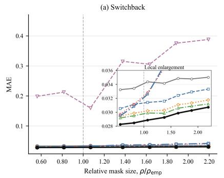

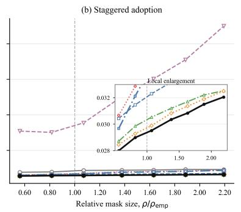

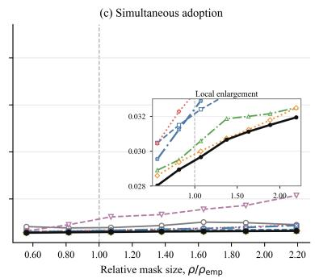

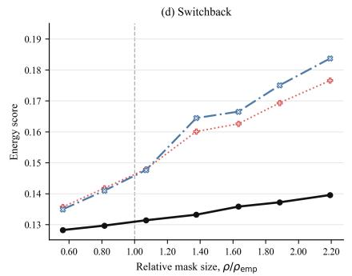

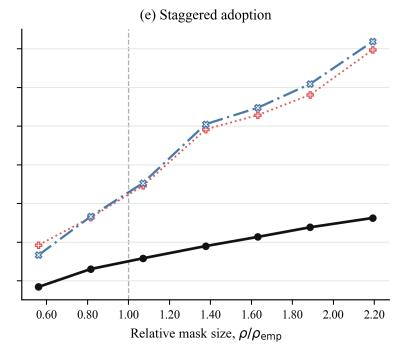

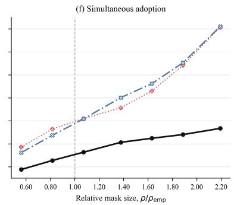  
Note. The figure evaluates counterfactual recovery by artificially masking observed no-policy outcomes and comparing the recovered outcomes with their observed values. Panels (a)–(c) report MAE across different missingness levels under the switchback, staggered-adoption, and simultaneous-adoption patterns, respectively. Panels (d)–(f) report the corresponding energy scores for CFT-DIFF and its two nested diffusion specifications. The horizontal axis reports the realized missing proportion relative to the empirical treated share, $\rho / \rho _ { \mathrm { e m p } }$ , and the vertical dashed line indicates $\rho = \rho _ { \mathrm { e m p } } .$ Lower values indicate better recovery.

Panels (a)–(c) of Figure 4 compare point recovery across the full range of missingness levels. We report MAE under the switchback, staggered-adoption, and simultaneous-adoption patterns, respectively. For the three diffusion methods, the point prediction is obtained by averaging the 100 generated draws. CFT-DIFF has the lowest MAE across the three patterns and remains stable as the missing proportion increases. The inset in each panel is a local enlargement of the corresponding region in the original panel and provides a more detailed view of the methods with relatively low errors. The results show that the advantage of CFT-DIFF persists across missingness levels. By contrast, the error of TFI increases substantially as the missing region expands, especially under the switchback and staggered-adoption patterns.

Panels (d)–(f) examine counterfactual distribution recovery for CFT-DIFF and its two nested diffusion specifications. We use the energy score to compare the generated distribution of each missing 24-hour trajectory with its observed trajectory. The energy score accounts for both the discrepancy between generated and observed trajectories and the dispersion of the generated trajectories; smaller values indicate better distributional recovery. Its formal definition and sample implementation, together with the definitions of the other evaluation measures, are provided in Appendix EC.5.3.

The lower panels show that the energy score generally increases with the missing proportion, reflecting the greater difficulty of recovering a trajectory from fewer observed no-policy outcomes. This increase is substantially smaller for CFT-DIFF. Its energy score remains below those of CONV-DIFF and TUCKER-DIFF under all three missingness patterns and throughout the range of missingness levels, with the gap tending to widen under staggered and simultaneous adoption. The point-recovery advantage of CFT-DIFF is therefore accompanied by more accurate recovery of the joint distribution of the missing 24-hour trajectory.

Table 2 Counterfactual recovery at the missingness level closest to the empirical treated share.
<table><tr><td colspan="6">Panel A: Point counterfactual recovery</td></tr><tr><td></td><td>Switchback</td><td></td><td>Staggered adoption</td><td></td><td>Simultaneous adoption</td></tr><tr><td>Method</td><td>MAE</td><td>RMSE</td><td>MAE</td><td>RMSE</td><td>MAE RMSE</td></tr><tr><td>DID</td><td>0.0344</td><td>0.0498</td><td>0.0437</td><td>0.0664</td><td>0.0391 0.0606</td></tr><tr><td>SC</td><td>0.0314</td><td>0.0475</td><td>0.0323</td><td>0.0488</td><td>0.0324 0.0487</td></tr><tr><td>SDID</td><td>0.0299</td><td>0.0455</td><td>0.0305</td><td>0.0465</td><td>0.0306 0.0464</td></tr><tr><td>NMC</td><td>0.0302</td><td>0.0464</td><td>0.0299</td><td>0.0465</td><td>0.0300 0.0463</td></tr><tr><td>TFI</td><td>0.1599</td><td>0.2517</td><td>0.1773</td><td>0.3072</td><td>0.0618 0.0935</td></tr><tr><td>CONV-DIFF</td><td>0.0328</td><td>0.0513</td><td>0.0354</td><td>0.0524</td><td>0.0337 0.0508</td></tr><tr><td>TUCKER-DIFF</td><td>0.0326</td><td>0.0507</td><td>0.0343</td><td>0.0528</td><td>0.0329 0.0508</td></tr><tr><td>CFT-DIFF</td><td>0.0289</td><td>0.0449</td><td>0.0295</td><td>0.0453</td><td>0.0297 0.0454</td></tr></table>

Panel B: Counterfactual distribution recovery under the switchback mask
<table><tr><td>Method</td><td>Energy score</td><td>CRPS</td><td>90% coverage</td><td>90% width</td><td>IS</td><td>WIS</td></tr><tr><td>CONV-DIFF</td><td>0.1479</td><td>0.0239</td><td>0.887</td><td>1.7246</td><td>2.6548</td><td>0.2569</td></tr><tr><td>TUCKER-DIFF</td><td>0.1476</td><td>0.0239</td><td>0.907</td><td>1.8352</td><td>2.6898</td><td>0.2583</td></tr><tr><td>CFT-DIFF</td><td>0.1314</td><td>0.0210</td><td>0.893</td><td>1.2559</td><td>2.0126</td><td>0.1819</td></tr></table>

Note. The table evaluates counterfactual recovery by artificially masking observed no-policy outcomes and comparing the recovered outcomes with their observed values. Panel A reports MAE and RMSE at the available missingness level closest to the empirical treated share, $\rho _ { \mathrm { e m p } } = 0 . 2 6 5$ . The target missing proportion is 0.284, with realized missing proportions of 0.283, 0.284, and 0.284 under the switchback, staggered-adoption, and simultaneous-adoption patterns, respectively. Point predictions for CFT-DIFF and its two nested diffusion specifications are obtained by averaging 100 generated draws. Panel B reports distributional recovery under the switchback pattern. The energy score evaluates the joint 24-hour trajectory, whereas CRPS is computed for individual hourly outcomes. Coverage and width refer to 90% central intervals for household–day totals. The interval score is computed for the 90% central interval, and WIS denotes the weighted interval score combining the predictive median and the 50%, 60%, 70%, 80%, 90%, and 95% central intervals. Errors, scores, and interval widths are reported on the normalized experimental scale. Boldface and underlining indicate the best and second-best values in each column, respectively; coverage is ranked by absolute deviation from the nominal level of 0.90, and the remaining measures are ranked from smallest to largest.

Table 2 provides a more detailed comparison at the available missingness level closest to the empirical treated share. The common target missing proportion is 0.284, with realized missing proportions close to 0.284 under all three patterns. Panel A reports MAE and RMSE. CFT-DIFF achieves the lowest value for every point-recovery measure. Under the switchback pattern, its MAE and RMSE are 0.0289 and 0.0449, compared with 0.0299 and 0.0455 for the second-best method. Under staggered adoption, the corresponding values are 0.0295 and 0.0453, while under simultaneous adoption they are 0.0297 and 0.0454. The improvement is therefore consistent across both error measures and all three missingness patterns.

Panel B evaluates the generated counterfactual distribution in more detail under the switchback pattern. The energy score evaluates the joint 24-hour trajectory, whereas CRPS evaluates the marginal distribution of individual hourly outcomes. The 90% coverage measures how often the observed household–day total falls within the generated 90% central interval, and should therefore be close to its nominal level of 0.90. The 90% width measures the average width of these intervals, with a smaller value indicating a sharper interval when coverage remains comparable. The interval score (IS) jointly penalizes wide intervals and observations falling outside the interval, while the weighted interval score (WIS) combines the predictive median with several central intervals. For the energy score, CRPS, IS, and WIS, smaller values indicate better distributional recovery.

The distributional measures give a consistent picture. CFT-DIFF reduces the energy score from approxi mately 0.148 for the two nested diffusion specifications to 0.1314 and reduces CRPS from 0.0239 to 0.0210. Its 90% empirical coverage is 0.893, close to the nominal level of 0.90, while its average interval width is 1.2559, compared with 1.7246 for CONV-DIFF and 1.8352 for TUCKER-DIFF. The interval score and WIS likewise decrease to 2.0126 and 0.1819, respectively. Thus, the narrower intervals produced by CFT-DIFF retain coverage close to the nominal level. Together with Figure 4, these results show that CFT-DIFF improves point and counterfactual distribution recovery across the missingness patterns and levels consid ered.

## 6.3. Causal Estimands

Having evaluated counterfactual recovery, we define the causal measures used to assess each price signal relative to the no-policy outcome. Within the analysis sample, our estimands are defined by assigned price signals and include households regardless of active response, targeting the effect of assignment to the implemented intervention package. For a household–day–hour observation with $D _ { i t } = d ,$ define the demand reduction as $\Delta _ { i t h } ( d ) = Y _ { i t h } ( 0 ) - Y _ { i t h } ( d )$ , so that a positive value indicates lower electricity use under the price signal. Because $Y _ { i t h } ( d ) = Y _ { i t h } ^ { \mathrm { o b s } }$ whenever $D _ { i t } = d ,$ estimating $\Delta _ { i t h } ( d )$ requires recovering the corresponding no-policy outcome $Y _ { i t h } ( 0 )$ .

For a price signal d and a set of hours H, we consider two aggregate estimands. The pooled relative demand reduction is

$$
R _ { d } ( \mathcal { H } ) = 1 0 0 \times \frac { \displaystyle { \sum _ { ( i , t ) : D _ { i t } = d h \in \mathcal { H } } \{ Y _ { i t h } ( 0 ) - Y _ { i t h } ( d ) \} } } { \displaystyle { \sum _ { ( i , t ) : D _ { i t } = d h \in \mathcal { H } } Y _ { i t h } ( 0 ) } } ,
$$

and the average absolute reduction per assigned household–day is

$$
\Delta _ { d } ^ { \mathrm { a b s } } ( \mathcal { H } ) = \frac { 1 } { N _ { d } } \sum _ { ( i , t ) : D _ { i t } = d h \in \mathcal { H } } \sum _ { \substack { \left\{ Y _ { i t h } ( 0 ) - Y _ { i t h } ( d ) \right\} , } }
$$

where $N _ { d }$ is the number of household–day observations assigned signal d. We evaluate both estimands over the signal-specific peak-price hours and additionally evaluate the relative reduction over the full 24- hour period. The peak-period estimands measure demand changes during the hours targeted by the price signal, whereas the full-day estimand measures the overall change in daily electricity use. These estimands characterize responses under the realized repeated-intervention schedule. Their operational relevance is supported by the sustained responsiveness documented by Hofmann and Lindberg (2024) during the study period.

In the empirical analysis, the unobserved $Y _ { i t h } ( 0 )$ is replaced by its estimated no-policy counterfactual. For CFT-DIFF, the point estimates in Section 6.4 use the mean of $B = 1 0 0$ generated draws, while the complete set of draws is retained for the distributional summaries defined below.

Let $\nu = ( g , t )$ denote a group–day intervention event, let ${ \mathcal { E } } _ { d }$ be the set of realized events assigned signal $d ,$ and let $\mathcal { H } _ { d }$ denote the signal-specific peak-price hours. For the bth sample from $\widehat { P } _ { t _ { 0 } } ^ { \mathcal { T } } ( \cdot \mid X _ { \mathcal { C } } )$ , let $\widetilde { Y } _ { \nu } ^ { ( b ) } ( 0 )$ denote the generated no-policy outcomes for event $\nu ,$ and write $\widetilde { Y } _ { i t h } ^ { ( b ) } ( 0 )$ for the generated no-policy outcome of household i at hour $h .$ . For $\nu = ( g , t ) \in \mathcal { E } _ { d } .$ , define the corresponding peak-period relative demand reduction by

$$
R _ { \nu } ^ { ( b ) } = 1 0 0 \times \frac { \displaystyle \sum _ { i : G _ { i } = g } \sum _ { h \in \mathcal { H } _ { d } } \left\{ \widetilde { Y } _ { i t h } ^ { ( b ) } ( 0 ) - Y _ { i t h } ^ { \mathrm { o b s } } \right\} } { \displaystyle \sum _ { i : G _ { i } = g } \sum _ { h \in \mathcal { H } _ { d } } \widetilde { Y } _ { i t h } ^ { ( b ) } ( 0 ) } , \qquad b = 1 , \ldots , B .
$$

The pooled response distribution for signal d is represented by $\mathcal { R } _ { d } = \left\{ R _ { \nu } ^ { ( b ) } : \nu \in \mathcal { E } _ { d } ; b = 1 , \ldots , B \right\}$ . To measure how reliably a signal attains a target reduction $^ { c , }$ define $\begin{array} { r } { \widehat { \pi } _ { d } ( c ) = \frac { 1 } { B | \mathcal { E } _ { d } | } \sum _ { \nu \in \mathcal { E } _ { d } } \sum _ { b = 1 } ^ { B } \mathbb { I } \big \{ R _ { \nu } ^ { ( b ) } \geq c \big \} } \end{array}$ . Thus, ${ \widehat { \pi } } _ { d } ( c )$ is the fraction of pooled reductions that reach the target. The collection $\mathcal { R } _ { d }$ combines variation across realized intervention events with uncertainty in the generated no-policy counterfactuals.<sup>13</sup>

## 6.4. Demand Response to Dynamic Pricing

We now use the no-policy counterfactuals generated by CFT-DIFF to evaluate the demand-response measures defined in Section 6.3. Point estimates are obtained by averaging $B = 1 0 0$ conditional draws.

Figure 5 shows the intraday pattern of electricity demand and its response to the different price signals. Across signals, demand follows a similar daily profile, with a morning peak and a larger evening peak. During the high-price hours, observed demand generally remains close to its estimated no-policy counterfactual, although the direction and magnitude of the difference vary across signals. The clearest reduction occurs for $P 0 _ { 3 0 }$ , which imposes a peak price of 30 NOK/kWh over a two-hour afternoon window, whereas most other signals produce only modest changes. For several signals, observed demand exceeds its estimated counterfactual outside the high-price window. This pattern is consistent with intertemporal substitution: households may shift some deferrable electricity use to lower-price hours rather than eliminate it altogether. Within a given price profile, higher peak prices are associated with larger reductions in some cases, most visibly among the P0 signals, although the pattern also varies with the timing and duration of the intervention. The responses therefore differ across price designs in both magnitude and timing.

Table 3 quantifies these patterns. Seven signals—all P and P0 signals—have positive peak-period estimates, and the peak-period percentage exceeds the corresponding full-day percentage for 12 of the 14 signals. Thus, except for the two A signals, the demand response is more favorable during the targeted hours than over the day as a whole. The largest estimated peak reduction occurs under $P _ { 1 5 } ,$ at 2.51%, or 0.163 kWh per assigned household–day over the two-hour peak period. The comparison between peak-period and full-day estimates is consistent with households shifting electricity use away from high-price hours rather than uniformly reducing daily consumption.

The aggregate estimates in Table 3 do not show when the offsetting demand adjustments occur. We therefore examine the temporal pattern of the response more closely. Figure 6 reports the hourly effects and then expands the evaluation window from the signal-specific peak hours toward the full day.

Figure 5 Observed and counterfactual electricity demand by price signal.  
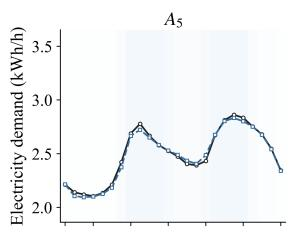

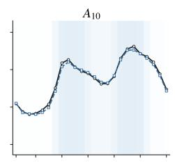

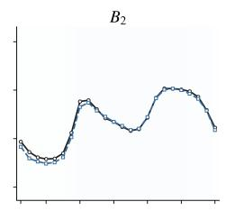

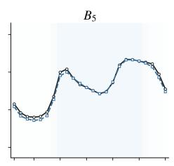

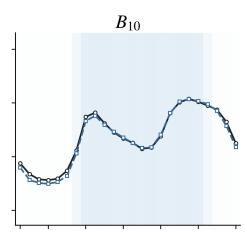

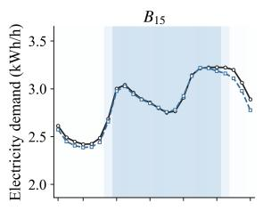

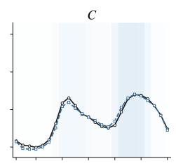

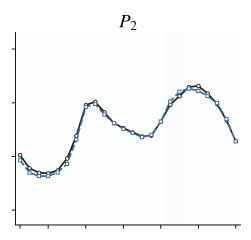

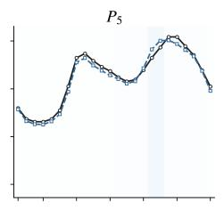

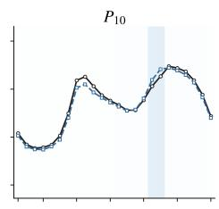

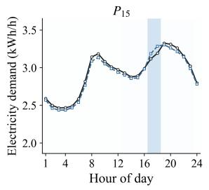

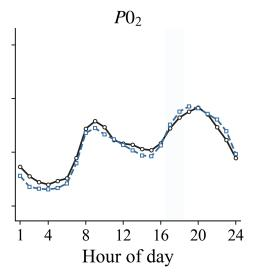

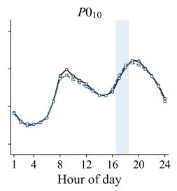

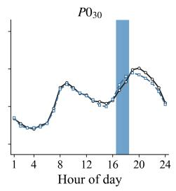

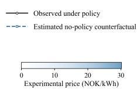

Note. The solid line reports observed hourly electricity demand under the assigned price signal, and the dashed line reports the estimated no-policy counterfactual. The counterfactual curve averages 100 CFT-DIFF conditional draws. Background shading indicates the experimental electricity price, with darker shading corresponding to higher prices  
Table 3 Causal and distributional effects by price signal.
<table><tr><td>Signal</td><td>Peak h</td><td>Events</td><td>Peak kWh</td><td>Peak %</td><td>Full-day %</td><td> $Q _ { 0 . 1 0 }$ </td><td>πd(3%)</td></tr><tr><td> $A _ { 5 }$ </td><td>8</td><td>9</td><td>-0.164</td><td>-0.76</td><td>-0.36</td><td>-2.34</td><td>0.01</td></tr><tr><td> $A _ { 1 0 }$ </td><td>8</td><td>10</td><td>-0.154</td><td>-0.61</td><td>-0.46</td><td>-2.54</td><td>0.00</td></tr><tr><td> $B _ { 2 }$ </td><td>13</td><td>35</td><td>-0.080</td><td>-0.22</td><td>-0.77</td><td>-2.15</td><td>0.02</td></tr><tr><td> $B _ { 5 }$ </td><td>13</td><td>29</td><td>-0.103</td><td>-0.27</td><td>-0.78</td><td>-2.26</td><td>0.04</td></tr><tr><td> $B _ { 1 0 }$ </td><td>13</td><td>39</td><td>-0.034</td><td>-0.09</td><td>-0.58</td><td>-2.13</td><td>0.02</td></tr><tr><td> $B _ { 1 5 }$ </td><td>13</td><td>28</td><td>-0.079</td><td>-0.20</td><td>-1.01</td><td>-2.31</td><td>0.02</td></tr><tr><td> $C$ </td><td>8</td><td>8</td><td>-0.064</td><td>-0.31</td><td>-0.41</td><td>-2.27</td><td>0.02</td></tr><tr><td> $P _ { 2 }$ </td><td>2</td><td>16</td><td>0.070</td><td>1.14</td><td>-0.49</td><td>-2.56</td><td>0.24</td></tr><tr><td> $P _ { 5 }$ </td><td>2</td><td>13</td><td>0.158</td><td>2.29</td><td>-0.71</td><td>-1.54</td><td>0.41</td></tr><tr><td> $P _ { 1 0 }$ </td><td>2</td><td>27</td><td>0.140</td><td>2.22</td><td>-0.69</td><td>-1.77</td><td>0.41</td></tr><tr><td> $P _ { 1 5 }$ </td><td>2</td><td>20</td><td>0.163</td><td>2.51</td><td>-0.75</td><td>-1.62</td><td>0.42</td></tr><tr><td> $P 0 _ { 2 }$ </td><td>2</td><td>5</td><td>0.089</td><td>1.58</td><td>-0.80</td><td>-1.98</td><td>0.31</td></tr><tr><td> $P 0 _ { 1 0 }$ </td><td>2</td><td>10</td><td>0.069</td><td>1.15</td><td>-0.54</td><td>-1.56</td><td>0.22</td></tr><tr><td> $P 0 _ { 3 0 }$ </td><td>2</td><td>5</td><td>0.139</td><td>2.43</td><td>-0.61</td><td>-0.04</td><td>0.35</td></tr></table>

Note. Positive values denote electricity-demand reductions. Peak h is the number of hours in the signal-specific peak-price period, and Events is the number of group-day intervention events assigned signal d. Peak kWh is the average absolute reduction per assigned household–day over the peak-price period. Peak and full-day percentages are pooled ratio-of-sums estimates based on the mean of 100 CFT-DIFF conditional draws. $Q _ { 0 . 1 0 }$ is the 10th percentile of the event-by-draw peak-reduction distribution and $\widehat { \pi } _ { d } ( 3 \% )$ is the corresponding fraction of outcomes with a peak reduction of at least 3%.

Figure 6 Hourly and cumulative demand reductions.  
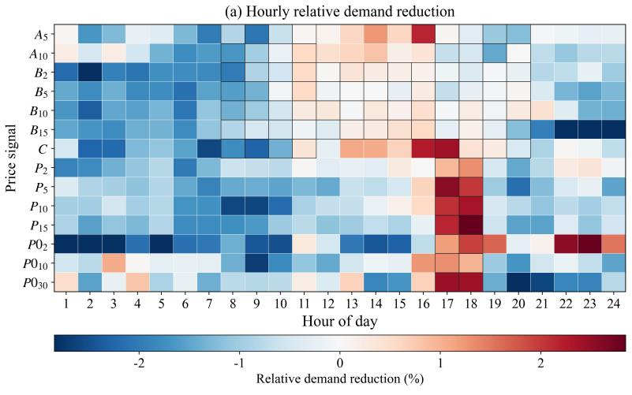

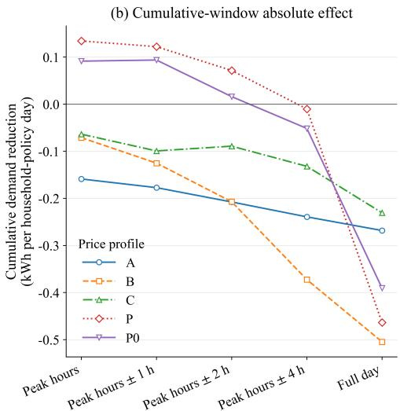  
Note. Panel (a) reports hourly relative demand reductions for each price signal, with positive values indicating lower observed demand relative to the estimated no-policy counterfactual. Thin outlines identify the signal-specific peak-price hours. Panel (b) reports cumulative demand changes in kWh per assigned household–day as the evaluation window expands from the peak-price hours to the full day. Results in Panel (b) are aggregated by price profile and weighted by the observed frequency of household–day assignments.

Panel (a) shows that, for many price signals, observed demand decreases relative to the estimated nopolicy counterfactual during the high-price hours, with larger reductions inside the targeted periods than in surrounding hours. The magnitude and timing of the response vary across signals with different price levels and intervention durations. Panel (b) shows that the estimated cumulative reduction generally becomes smaller as the evaluation window expands beyond the signal-specific peak hours, turning from positive around the peak hours to negative over the full day for profiles P and P0. This pattern is consistent with, but does not by itself establish, intertemporal shifting of electricity use from the targeted periods to other hours. From an operational perspective, shifting demand away from a constrained period may remain valuable even without a reduction in total daily consumption.

## 6.5. Counterfactual Distributions, Intervals, and Response Reliability

The preceding analysis uses the mean of the CFT-DIFF draws to study average demand responses. We now use the pooled response distributions $\mathcal { R } _ { d }$ and target-attainment rates ${ \widehat { \pi } } _ { d } ( c )$ defined in Section 6.3 to examine variation in event-level responses and the reliability with which each signal attains a specified reduction target. The estimated conditional distributions provide prediction intervals for the missing no-policy outcomes.

Figure 7 shows substantial differences in the distribution and reliability of demand response across price signals. Panel (a) shows that peak-period responses span a wide range across intervention events and condi tional draws for most signals. The A and B signals are generally concentrated at lower reductions, whereas the P signals place more of their distributions above zero. Panel (b) translates these distributions into target-attainment rates. $P 0 _ { 3 0 }$ produces a positive peak reduction in 89% of the event–draw outcomes and a reduction of at least 3% in 35%. For the A and B signals, the corresponding fractions attaining a 3% reduction range from 0% to 4%. The relative performance of the P signals also varies with the target: $P 0 _ { 3 0 }$ has the highest probability of attaining the lower targets, whereas $P _ { 1 5 }$ performs better at the 3% and 5% targets. Thus, the full counterfactual distribution provides information that is not available from the mean response alone: price signals with similar average effects can differ substantially in how consistently they reduce demand during the targeted high-price hours.

Figure 7 Counterfactual distribution and reliability of demand response.  
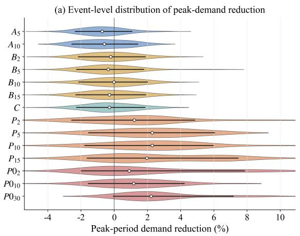

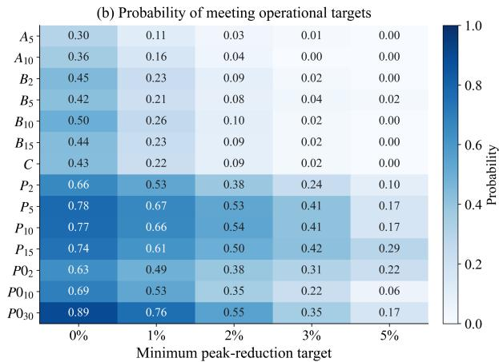  
Note. For each intervention event ν and CFT-DIFF draw $b , R _ { \nu } ^ { ( b ) }$ denotes the peak-period relative demand reduction computed using the generated no-policy counterfactual $\widetilde { Y } _ { \nu } ^ { ( b ) } ( 0 )$ from $\widehat { P } _ { t _ { 0 } } ^ { \mathcal { T } } ( \cdot \mid X c )$ . Panel (a) reports the empirical distribution of $R _ { \nu } ^ { ( b ) }$ across intervention events and $B = 1 0 0$ generated samples for each price signal; the white point denotes the median and the horizontal segment spans the 10th to the 90th percentile. Panel (b) reports the corresponding probability of achieving alternative peak-period reduction targets. Positive values indicate lower observed demand relative to the generated no-policy counterfactual.

The conditional distributions also provide prediction intervals for the average no-policy outcomes in the treated region. Table 4 reports central 90% prediction intervals from CFT-DIFF and its two nested diffusion specifications, together with their $\sqrt { n _ { e } }$ -scaled widths and width ratios.

Table 4 shows that CFT-DIFF produces the narrowest prediction interval for every price signal. Its mean $\sqrt { n _ { e } }$ -scaled width is 0.764, compared with 1.355 for CONV-DIFF and 1.441 for TUCKER-DIFF. The corresponding mean width ratios are 1.790 and 1.903, so the CONV-DIFF and TUCKER-DIFF intervals are, on average, 79.0% and 90.3% wider than the CFT-DIFF intervals, respectively. The artificial-mask validation in Table 2 provides the corresponding calibration evidence: the narrower CFT-DIFF intervals retain empirical coverage close to the nominal level.

## 7. Conclusion

This paper develops CFT-DIFF to extend counterfactual analysis in panel or tensor data beyond point recovery to the joint conditional distribution of missing control outcomes. The method generates these outcomes conditional on the observed control outcomes, with efficiency gained by learning the nonlinear component of the score in a low-dimensional Tucker core. Repeated draws from the learned distribution preserve dependence among the missing outcomes and yield point estimates, quantiles, counterfactual prediction intervals, and target-attainment probabilities from a single model.

Nonasymptotic, high-probability bounds show that the difficulty of conditional-score estimation depends on the Tucker core dimension, the largest mode dimension, and the effective number of missing outcomes rather than on the full tensor dimension alone. The score bounds imply recovery guaranties for the conditional distribution and weighted summaries, while the prediction-interval guarantee accounts for a finite number of generated draws. Simulations confirm the roles of both components of CFT-DIFF: Tucker dimension reduction and conditioning on the observed control outcomes each improve recovery, and CFT-DIFF is more accurate than the causal panel and matrix/tensor completion methods considered. In the iFlex study, artificial-mask validation confirms these gains across three treatment patterns. The subsequent causal analysis shows that price signals with similar average demand reductions can have different target-attainment probabilities. Rankings based only on average responses can therefore conceal meaningful differences in intervention reliability.

Table 4 Counterfactual prediction intervals for average no-policy outcomes by price signal.
<table><tr><td colspan="4">No-policy prediction interval</td><td colspan="3">Scaled interval width</td><td colspan="2">Width ratio</td></tr><tr><td>Signal</td><td>CONV</td><td>TUCKER</td><td>CFT</td><td>CONV</td><td>TUCKER</td><td>CFT</td><td>CONV/CFT</td><td>TUCKER/CFT</td></tr><tr><td> $A _ { 5 }$ </td><td>[2.297, 2.345]</td><td>[2.233, 2.289]</td><td>[2.454, 2.482]</td><td>1.089</td><td>1.265</td><td>0.631</td><td>1.725</td><td>2.004</td></tr><tr><td> $A _ { 1 0 }$ </td><td>[2.592, 2.654]</td><td>[2.538, 2.598]</td><td>[2.847, 2.880]</td><td>1.394</td><td>1.360</td><td>0.747</td><td>1.867</td><td>1.822</td></tr><tr><td> $B _ { 2 }$ </td><td>[2.534, 2.574]</td><td>[2.464, 2.497]</td><td>[2.658, 2.678]</td><td>1.593</td><td>1.347</td><td>0.818</td><td>1.948</td><td>1.647</td></tr><tr><td> $B _ { 5 }$ </td><td>[2.636, 2.682]</td><td>[2.559, 2.606]</td><td>[2.772, 2.800]</td><td>1.665</td><td>1.740</td><td>1.039</td><td>1.603</td><td>1.675</td></tr><tr><td> $B _ { 1 0 }$ </td><td>[2.512, 2.548]</td><td>[2.437, 2.479]</td><td>[2.648, 2.671]</td><td>1.566</td><td>1.793</td><td>1.008</td><td>1.553</td><td>1.778</td></tr><tr><td> $B _ { 1 5 }$ </td><td>[2.725, 2.771]</td><td>[2.629, 2.680]</td><td>[2.839, 2.862]</td><td>1.707</td><td>1.870</td><td>0.867</td><td>1.968</td><td>2.156</td></tr><tr><td> $C$ </td><td>[2.218, 2.269]</td><td>[2.178, 2.224]</td><td>[2.335, 2.369]</td><td>1.135</td><td>1.033</td><td>0.769</td><td>1.475</td><td>1.342</td></tr><tr><td> $P _ { 2 }$ </td><td>[2.608, 2.654]</td><td>[2.529, 2.577]</td><td>[2.741, 2.768]</td><td>1.231</td><td>1.277</td><td>0.747</td><td>1.648</td><td>1.709</td></tr><tr><td> $P _ { 5 }$ </td><td>[2.926, 2.980]</td><td>[2.861, 2.922]</td><td>[3.109, 3.143]</td><td>1.441</td><td>1.656</td><td>0.895</td><td>1.610</td><td>1.850</td></tr><tr><td> $P _ { 1 0 }$ </td><td>[2.642, 2.687]</td><td>[2.560, 2.609]</td><td>[2.818, 2.843]</td><td>1.578</td><td>1.740</td><td>0.858</td><td>1.839</td><td>2.027</td></tr><tr><td> $P _ { 1 5 }$ </td><td>[2.713, 2.762]</td><td>[2.635, 2.695]</td><td>[2.908, 2.931]</td><td>1.510</td><td>1.862</td><td>0.708</td><td>2.132</td><td>2.629</td></tr><tr><td> $P 0 _ { 2 }$ </td><td>[2.339, 2.396]</td><td>[2.284, 2.341]</td><td>[2.532, 2.562]</td><td>0.923</td><td>0.911</td><td>0.476</td><td>1.939</td><td>1.914</td></tr><tr><td> $P 0 _ { 1 0 }$ </td><td>[2.449, 2.504]</td><td>[2.390, 2.449]</td><td>[2.683, 2.711]</td><td>1.251</td><td>1.348</td><td>0.637</td><td>1.964</td><td>2.116</td></tr><tr><td> $P 0 _ { 3 0 }$ </td><td>[2.420, 2.475]</td><td>[2.353, 2.413]</td><td>[2.579, 2.610]</td><td>0.887</td><td>0.977</td><td>0.496</td><td>1.790</td><td>1.972</td></tr><tr><td colspan="4">Mean across signals</td><td>1.355</td><td>1.441</td><td>0.764</td><td>1.790</td><td>1.903</td></tr></table>

Note. The table uses all hourly outcomes in the signal-specific treated region. The CONV, TUCKER, and CFT columns correspond to CONV-DIFF, TUCKER-DIFF, and CFT-DIFF, respectively, and report central 90% prediction intervals for their generated average no-policy outcomes. For each signal, the scaled interval width equals the interval width multiplied by $\sqrt { n _ { e } }$ , where $n _ { e }$ is the number of treated households contributing to that signal. The interval endpoints remain on the original kWh scale. The width ratios compare the CONV and TUCKER widths with the CFT width; values above one indicate wider intervals than under CFT. The final row reports arithmetic means of the displayed width statistics across signals.

Future research can extend CFT-DIFF to causal settings with pretreatment covariates, more complex treatment patterns, or heavy-tailed outcomes. The heavy-tailed setting is especially important when decisions depend on rare or extreme counterfactual events. Another direction is to use the recovered distributions directly in intervention selection and optimization and establish guaranties for the resulting decisions. When Tucker structure is too restrictive, learned nonlinear representations such as variational autoencoders may provide an alternative form of dimension reduction. Comparing these representations with Tucker reduction would clarify which low-dimensional structure is most effective across data settings and sample sizes.

## Acknowledgments

All authors contributed equally and are listed in alphabetical order.

## Endnotes

<sup>1</sup>Alternative forward processes, including variance-exploding and sub-variance-preserving diffusions, are also possible. We adopt the variance-preserving OU process because its transition law is available in closed form and it drives the data distribution toward a standard Gaussian reference distribution, thereby simplifying score estimation and theoretical analysis. It is also a standard and widely used specification in diffusion modeling (Ho et al. 2020, Song et al. 2021).

<sup>2</sup>The reverse-time equality is distributional: the process reproduces the forward marginal distributions but does not retrace an individual forward sample path.

<sup>3</sup>Throughout, a time subscript in score denotes the population counterpart, whereas the final time argument denotes a candidate or estimated score function.

<sup>4</sup>The tensor-completion step conditions on the specified treatment mask. Thus, even when the mask arises from randomized assignment, its sampling distribution need not be modeled by the conditional generator.

<sup>5</sup>For example, if $\mathcal { T } _ { a } = \{ i _ { 1 } , i _ { 2 } , i _ { 3 } \}$ and w assigns weight $1 / 3$ to each coordinate, then $\begin{array} { r } { U _ { 0 , a } ( w ) = \frac { 1 } { 3 } \sum _ { j = 1 } ^ { 3 } Y _ { i _ { j } } ( 0 ) } \end{array}$

<sup>6</sup>Under the normalization below, $\beta _ { d } = 0$ gives the weak factor boundary, with no dimension-driven attenuation of idiosyncratic noise along mode $d ,$ whereas $\beta _ { d } = 1$ gives the strong-factor boundary, with attenuation at a rate of $p _ { d } ^ { - 1 / 2 }$ . Values in (0, 1) accommodate intermediate strength, and allowing $\beta _ { d }$ to vary across modes permits heterogeneous factor strengths; related prediction theory under weak factors is developed by Giglio et al. (2026).

<sup>7</sup>The score-error term follows from a change of measure between the exact and trained reverse-time processes and contraction under the endpoint map (Girsanov 1960, Follmer 2005, Csisz¨ ar 1967, Fu et al. 2024); the terminal bound follows from entropy´ contraction of the Ornstein–Uhlenbeck forward process (Bakry et al. 2014).

<sup>8</sup>For example, if $\mathcal { T } _ { a } = i _ { 1 } , i _ { 2 } , i _ { 3 }$ and w assign weight $1 / 3$ to each coordinate, then $\begin{array} { r } { U _ { 0 , a } ( w ) = \frac { 1 } { 3 } \sum _ { j = 1 } ^ { 3 } Y _ { i _ { j } } ( 0 ) } \end{array}$

<sup>9</sup>Let $U _ { w , \ell , t } = { w ^ { \top } \mathrm { v e c } ( X _ { \mathcal { T } , t } ^ { ( \ell ) } ) }$ . Under the forward coupling, $U _ { w , \ell , t _ { 0 } } - U _ { w , \ell , 0 } = ( \alpha _ { t _ { 0 } } - 1 ) U _ { w , \ell , 0 } + h _ { t _ { 0 } } ^ { 1 / 2 } w ^ { \top } \sec ( Z _ { \ell } )$ . Independence across analysis tensors, centering, and $\mathbb { E } U _ { w , \ell , 0 } ^ { 2 } \le C \| w \| _ { 2 } ^ { 2 }$ therefore give $\mathbb { E } \big [ | \sqrt { n _ { e } } \{ V _ { n _ { e } , w , t _ { 0 } } - V _ { n _ { e } , w , 0 } \} | ^ { 2 } \big ] \leq C \| w \| _ { 2 } ^ { 2 } \{ ( 1 -$ $\alpha _ { t _ { 0 } } ) ^ { 2 } + h _ { t _ { 0 } } \} \leq C \| w \| _ { 2 } ^ { 2 } t _ { 0 }$ . Taking the square root yields the contribution $C \| w \| _ { 2 } \sqrt { t _ { 0 } } = C \| w \| _ { 2 } n ^ { - a _ { n } / 2 }$ in (4.7).

<sup>10</sup>It is not a sampling confidence interval for a population average treatment effect; population-level inference would additionally require assumptions linking the analysis tensors to the target population.

<sup>11</sup>The iFlex project was conducted in two phases. We use the full-scale second phase. The first phase, conducted during the winter of 2019–2020, was stopped earlier than planned because of the onset of the COVID-19 pandemic and therefore did not cover the originally intended winter experimental window. The anonymized data are publicly available through the official iFlex repository on Zenodo (doi:10.5281/zenodo.8248802).

<sup>12</sup>Each treatment group was associated with a prespecified set of four candidate price signals, one of which was assigned whenever the group was treated. Consequently, not every signal was available to every treatment group; the group-specific candidate sets are reported in Appendix Table EC.5.

<sup>13</sup>It is distinct from the sampling distribution of an average-effect estimator and from a joint cross-world distribution of individual treatment effects.

## References

Agarwal A, Shah D, Shen D (2026) Synthetic interventions: Extending synthetic controls to multiple treatments. Operations Research 74(2):840–859.

Anderson BD (1982) Reverse-time diffusion equation models. Stochastic Processes and their Applications 12(3):313– 326.

Arkhangelsky D, Athey S, Hirshberg DA, Imbens GW, Wager S (2021) Synthetic difference-in-differences. American Economic Review 111(12):4088–4118.

Athey S, Bayati M, Doudchenko N, Imbens G, Khosravi K (2021) Matrix completion methods for causal panel data models. Journal ofthe American Statistical Association 116(536):1716–1730.

Athey S, Imbens GW (2006) Identification and inference in nonlinear difference-in-differences models. Econometrica 74(2):431–497.

Auerbach J, Slawski M, Zhang S (2022) Tensor completion for causal inference with multivariate longitudinal data: A reevaluation of COVID-19 mandates. arXiv preprint arXiv:2203.04689 .

Bai J (2003) Inferential theory for factor models of large dimensions. Econometrica 71(1):135–171.

Bai J, Ng S (2021) Matrix completion, counterfactuals, and factor analysis of missing data. Journal of the American Statistical Association 116(536):1746–1763.

Bai J, Ng S (2023) Approximate factor models with weaker loadings. Journal ofEconometrics 235(2):1893–1916.

Bakry D, Gentil I, Ledoux M, et al. (2014) Analysis and geometry of Markov diffusion operators, volume 103 (Springer).

Bojinov I, Simchi-Levi D, Zhao J (2023) Design and analysis of switchback experiments. Management Science 69(7):3759–3777.

Borusyak K, Jaravel X, Spiess J (2024) Revisiting event-study designs: Robust and efficient estimation. Review of Economic Studies 91(6):3253–3285.

Breunig C, Liu R, Yu Z (2025) Double robust bayesian inference on average treatment effects. Econometrica 93(2):539–568.

Cen Z, Lam C (2025) Tensor time series imputation through tensor factor modelling. Journal of Econometrics 249:105974.

Chang J, Du Y, Huang G, Yao Q (2026a) Identification and estimation for matrix time series CP-factor models. The Annals ofStatistics 54(3):1372–1397.

Chang J, He J, Yang L, Yao Q (2023) Modelling matrix time series via a tensor CP-decomposition. Journal of the Royal Statistical Society Series B: Statistical Methodology 85(1):127–148.

Chang J, Huang G, Yao Q, Yu L (2026b) CP-factorization for high dimensional tensor time series and double projection iterations. arXiv preprint arXiv:2606.08560 .

Chang J, Jiao Y, Kang L, Shi J (2026c) Deep bootstrap. arXiv preprint arXiv:2602.10587 .

Chen H, Simchi-Levi D (2026) Efficient switchback experiments with surrogate variables: Estimation and experimental design. Management Science 72(6):4854–4870.

Chen M, Huang K, Zhao T, Wang M (2023) Score approximation, estimation and distribution recovery of diffusion models on low-dimensional data. International Conference on Machine Learning, 4672–4712 (PMLR).

Chen M, Xu R, Xu Y, Zhang R (2025) Diffusion factor models: Generating high-dimensional returns with factor structure. arXiv preprint arXiv:2504.06566 .

Chernozhukov V, Fernandez-Val I, Melly B (2013) Inference on counterfactual distributions.´ Econometrica 81(6):2205–2268.

Choi J, Yuan M (2024) Matrix completion when missing is not at random and its applications in causal panel data models. Journal ofthe American Statistical Association 1–15

Csiszar I (1967) Information-type measures of difference of probability distributions and indirect observations. ´ Studia Scientiarum Mathematicarum Hungarica 2:299–318.

Duan J, Pelger M, Xiong R (2024) Factor analysis for causal inference on large non-stationary panels with endogenous treatment. Available at SSRN .

Fan J, Gu Y, Li X (2025) Optimal estimation of a factorizable density using diffusion models with ReLU neural networks. arXiv preprint arXiv:2510.03994 .

Follmer H (2005) An entropy approach to the time reversal of diffusion processes.¨ Stochastic Differential Systems Filtering and Control: Proceedings of the IFIP-WG 7/1 Working Conference Marseille-Luminy, France, March 12–17, 1984, 156–163 (Springer).

Fu H, Yang Z, Wang M, Chen M (2024) Unveil conditional diffusion models with classifier-free guidance: A sharp statistical theory. arXiv preprint arXiv:2403.11968 .

Gao C, Chen H, Zhang AR, Yang S (2025) Causal inference on sequential treatments via tensor completion. arXiv preprint arXiv:2511.15866 .

Giglio S, Xiu D, Zhang D (2026) Prediction when factors are weak. Journal of the American Statistical Association Forthcoming.

Girsanov IV (1960) On transforming a certain class of stochastic processes by absolutely continuous substitution of measures. Theory ofProbability & Its Applications 5(3):285–301.

Gunsilius FF (2023) Distributional synthetic controls. Econometrica 91(3):1105–1117.

Guo J, Kong X, Li Z, Mao J (2026) Tucker diffusion model for high-dimensional tensor generation. arXiv preprint arXiv:2604.00481 .

Han Y, Chen R, Yang D, Zhang CH (2024) Tensor factor model estimation by iterative projection. The Annals of Statistics 52(6):2641–2667.

He Y, Wang Y, Yu L, Zhou W, Zhou WX (2025) A new non-parametric kendall’s tau for matrix-valued elliptical observations. Bernoulli 31(4):3331–3355.

Ho J, Jain A, Abbeel P (2020) Denoising diffusion probabilistic models. Advances in Neural Information Processing Systems 33:6840–6851.

Hofmann M, Lindberg KB (2024) Evidence of households’ demand flexibility in response to variable hourly electricity prices—results from a comprehensive field experiment in Norway. Energy Policy 184:113821.

Kallus N (2023) Treatment effect risk: Bounds and inference. Management Science 69(8):4579–4590.

Kolda TG, Bader BW (2009) Tensor decompositions and applications. SIAM Review 51(3):455–500.

Liu H, Zhu T, Jia N, He J, Zheng Z (2026) Learning to simulate from heavy-tailed distribution via diffusion model. Operations Research .

Ma Y, Melnychuk V, Schweisthal J, Feuerriegel S (2024) DiffPO: A causal diffusion model for learning distributions of potential outcomes. Advances in Neural Information Processing Systems 37:43663–43692.

Mandal D, Parkes DC (2019) Weighted tensor completion for time-series causal inference. arXiv preprint arXiv:1902.04646 .

Massart P (1990) The tight constant in the Dvoretzky-Kiefer-Wolfowitz inequality. The Annals of Probability 18(3):1269–1283.

Sanchez P, Tsaftaris SA (2022) Diffusion causal models for counterfactual estimation. Proceedings of the First Conference on Causal Learning and Reasoning, volume 140 of Proceedings of Machine Learning Research, 1–21 (PMLR).

Song Y, Ermon S (2019) Generative modeling by estimating gradients of the data distribution. Advances in Neural Information Processing Systems 32.

Song Y, Sohl-Dickstein J, Kingma DP, Kumar A, Ermon S, Poole B (2021) Score-based generative modeling through stochastic differential equations. International Conference on Learning Representations .

Tashiro Y, Song J, Song Y, Ermon S (2021) CSDI: Conditional score-based diffusion models for probabilistic time series imputation. Advances in Neural Information Processing Systems, volume 34, 24804–24816.

Wang D, Liu X, Chen R (2019) Factor models for matrix-valued high-dimensional time series. Journal of Econometrics 208(1):231–248.

Xia D, Yuan M (2019) On polynomial time methods for exact low-rank tensor completion. Foundations of Computational Mathematics 19(6):1265–1313.

Xia D, Yuan M (2021) Statistical inferences of linear forms for noisy matrix completion. Journal of the Royal Statis tical Society Series B: Statistical Methodology 83(1):58–77.

Xia D, Yuan M, Zhang CH (2021) Statistically optimal and computationally efficient low rank tensor completion from noisy entries. The Annals of Statistics 49(1):76–99.

Xiong R, Pelger M (2023) Large dimensional latent factor modeling with missing observations and applications to causal inference. Journal ofEconometrics 233(1):271–301.

Yu L, Xie J, Zhou W (2023) Testing kronecker product covariance matrices for high-dimensional matrix-variate data. Biometrika 110(3):799–814.

Yuan C, Gao Z, He X, Huang W, Guo J (2023) Two-way dynamic factor models for high-dimensional matrix-valued time series. Journal of the Royal Statistical Society Series B: Statistical Methodology 85(5):1517–1537.

Zhang X, Liu CC, Guo J, Yuen KC, Welsh AH (2025) Modeling and learning on high-dimensional matrix-variate sequences. Journal ofthe American Statistical Association 120(549):419–434.

Zhen Y, Wang J (2024) Nonnegative tensor completion for dynamic counterfactual prediction on COVID-19 pandemic. The Annals of Applied Statistics 18(1):224–245.

Zhou X, Reich BJ, Yang S (2026) Spatial causal tensor completion for multiple exposures and outcomes: An application to the health effects of PFAS pollution. arXiv preprint arXiv:2603.16854 .

## Technical Proofs and Additional Results

This appendix contains technical proofs and additional results for the paper.

• Appendix EC.1 provides the summary of notation.

• Appendix EC.2 provides the proofs of theorems in the main text.

• Appendix EC.3 provides the details of our framework.

• Appendix EC.4 provides the additional simulation results.

• Appendix EC.5 provides additional empirical results.

## EC.1. Summary of Notation

Table EC.1 summarizes the principal notation used in the main text, while Table EC.2 collects additional notation used in the e-companion. Both tables group notation by its role in the analysis.

## EC.2. Proofs

Throughout this section, tensor-valued scores are identified with their vectorizations when vector notation is used. Vectorization preserves inner products and hence identifies the Frobenius norm with the Euclidean norm. In vector coordinates, $p _ { t } ( \cdot \vert x _ { \mathcal { C } } )$ denotes the density $p _ { t } ^ { \mathcal { T } } ( \cdot \vert X _ { \mathcal { C } } )$ under this identification. For a candidate loading–variance pair $( \Gamma , \omega )$ , write

$$
\Gamma _ { \otimes } = \Gamma _ { D } \otimes \cdots \otimes \Gamma _ { 1 } , \qquad g _ { t } ( \Gamma , \omega ) = \mathrm { v e c } \{ G _ { t } ( \Gamma , \omega ) \} ,
$$

$$
\Lambda _ { T , t } ( \omega ) = \mathrm { d i a g } \{ \mathrm { v e c } ( \mathcal { W } _ { T , t } ( \omega ) ) \} , \qquad \Lambda _ { \mathcal { C } } ( \omega ) = \mathrm { d i a g } \{ \mathrm { v e c } ( \mathcal { W } _ { \mathcal { C } } ( \omega ) ) \} .
$$

## EC.2.1. Proof of Proposition 3.1

We first vectorize the tensor model in Proposition 3.1 for the sake of notational brevity, which is a proof device only. The model and algorithm are stated in tensor notation in Section 3. Recall the identity vec $( G \times _ { d = 1 } ^ { D } B _ { d } ) = ( B _ { D } \otimes \cdots \otimes B _ { 1 } ) \operatorname { v e c } ( G )$ . Write $x _ { \mathcal { T } , t } = \mathrm { v e c } ( X _ { \mathcal { T } , t } ) , x _ { \mathcal { C } } = \mathrm { v e c } ( X _ { \mathcal { C } } ) , f = \mathrm { v e c } ( F )$ , and $A _ { \otimes } = A _ { D } \otimes \cdots \otimes A _ { 1 }$ . The matrix forms of the two noise covariances and the masked precision matrices are $\Omega _ { t } = h _ { t } I _ { p } + \alpha _ { t } ^ { 2 } p ^ { - \beta } \Sigma _ { e } ^ { \otimes } , \Omega _ { 0 } = p ^ { - \beta } \Sigma _ { e } ^ { \otimes } , \Lambda _ { \mathcal { T } , t } = \mathcal { M } _ { \mathcal { T } } \Omega _ { t } ^ { - 1 } \mathcal { M } _ { \mathcal { T } } = \mathrm { d i a g } \{ \mathrm { v e c } ( \mathcal { W } _ { \mathcal { T } , t } ) \}$ , and $\Lambda _ { \cal C } = \mathcal { M } _ { \cal C } \Omega _ { 0 } ^ { - 1 } \mathcal { M } _ { \cal C } =$ $\mathrm { d i a g } \{ \mathrm { v e c } ( \mathcal { W } c ) \}$ . Then, we define $H _ { \mathcal { T } , t } = A _ { \otimes } ^ { \top } \Lambda _ { \mathcal { T } , t } A _ { \otimes } , H _ { \mathcal { C } } = A _ { \otimes } ^ { \top } \Lambda _ { \mathcal { C } } A _ { \otimes }$ , and $V _ { t } = \{ H _ { \mathcal { T } , t } + \alpha _ { t } ^ { - 2 } H _ { \mathcal { C } } \} ^ { - 1 }$ . The vector coordinate of the core statistic is defined as

$$
g _ { t } : = \operatorname { v e c } ( G _ { t } ) = V _ { t } \left( A _ { \otimes } ^ { \top } \Lambda _ { \mathcal { T } , t } x _ { \mathcal { T } , t } + \alpha _ { t } ^ { - 1 } A _ { \otimes } ^ { \top } \Lambda _ { \mathcal { C } } x _ { \mathcal { C } } \right) .
$$

They agree directly with the tensor operations because

$$
\begin{array} { r } { \mathrm { v e c } \left( G \times _ { d = 1 } ^ { D } A _ { d } \right) = A _ { \otimes } \mathrm { v e c } ( G ) , \qquad \mathrm { v e c } \left\{ ( \mathcal { W } \odot X ) \times _ { d = 1 } ^ { D } A _ { d } ^ { \top } \right\} = A _ { \otimes } ^ { \top } \mathrm { d i a g } \{ \mathrm { v e c } ( \mathcal { W } ) \} \mathrm { v e c } ( X ) . } \end{array}
$$

Finally, recall that $\xi ( g , t ) = \mathbb { E } ( \alpha _ { t } f \mid g _ { t } = g )$ . The tensor proposition is therefore equivalent to proving the vectorized identity

$$
\nabla _ { \boldsymbol { x } _ { \mathcal { T } , t } } \log { p _ { t } ( \boldsymbol { x } _ { \mathcal { T } , t } \mid \boldsymbol { x } _ { \mathcal { C } } ) } = \Lambda _ { \mathcal { T } , t } \left\{ A _ { \otimes } \boldsymbol { \xi } ( \boldsymbol { g } _ { t } , t ) - \boldsymbol { x } _ { \mathcal { T } , t } \right\} .
$$

In the following, we prove the vectorized identity above, where we write $A = A _ { \otimes }$ and $\Sigma _ { e } = \Sigma _ { e } ^ { \otimes }$ for brevity. Let $x _ { 0 } \in \mathbb { R } ^ { p }$ denote the complete vector. Let $M \in \{ 0 , 1 \} ^ { p }$ be a fixed binary mask, where $M _ { j } = 1$ means that coordinate j belongs to the missing-outcome block in the treated region. The mask partitions the coordinates into two deterministic sets, i.e., $\mathcal { T } = \{ j : M _ { j } = 1 \}$ and $\mathcal { C } = \{ 1 , \ldots , p \} \backslash \mathcal { T }$

Table EC.1 Principal notation used in the main text.
<table><tr><td colspan="2">General notation</td><td></td><td>Euclidean, Frobenius, and operator</td></tr><tr><td> ${ \overline { { \mathcal { L } ( X ) , \mathcal { L } ( X \mid Y ) } } }$ </td><td>Probability law and conditional probability law</td><td> $\overline { { | | \cdot | | _ { 2 } , | | \cdot | | _ { F } , | | \cdot | | _ { \mathrm { o p } } } }$ </td><td>norms</td></tr><tr><td>vec(·), Tucker(·)</td><td>Vectorization and reshaping into a Tucker core tensor</td><td> $\odot , \oslash$ </td><td>Entrywise multiplication and division</td></tr><tr><td>Potential outcomes and counterfactual target</td><td>Number of modes, dimension of mode</td><td colspan="2">Tucker factor structure</td></tr><tr><td> $\overline { { D , p _ { d } , p } }$ </td><td>d, and full dimension  $\textstyle p = \prod _ { d = 1 } ^ { D } p _ { d }$ </td><td> $\overline { { F } }$ </td><td>Latent Tucker core tensor</td></tr><tr><td> $\mathcal { T }$ </td><td>Tensor index set  $\left[ p _ { 1 } \right] \times \cdots \times \left[ p _ { D } \right]$ </td><td> $A _ { d }$ </td><td>Mode-d loading matrix, with  $A _ { d } ^ { \top } A _ { d } = I _ { r _ { d } }$ </td></tr><tr><td> $Y _ { i } ( a )$ </td><td>Potential outcome at coordinate i under intervention  $a ; a = 0$  denotes control</td><td> $E$ </td><td>Idiosyncratic tensor component</td></tr><tr><td> $Y _ { i } ^ { \mathrm { o b s } }$ </td><td>Observed outcome at coordinate ¿</td><td> $r _ { d , r }$ </td><td>Mode-d Tucker rank and core dimension  $\textstyle r = \prod _ { d = 1 } ^ { D } r _ { d }$ </td></tr><tr><td> $\mathcal { T } _ { a } , \mathcal { T } , \mathcal { C }$ </td><td>Intervention-a support, treated region, and the observed-control region</td><td> $\beta _ { d } , p ^ { \beta }$ </td><td>Mode-d factor strength and scaling  $\begin{array} { r } { p ^ { \beta } = \prod _ { d = 1 } ^ { D } p _ { d } ^ { \beta _ { d } } } \end{array}$ </td></tr><tr><td> $M \tau _ { a } , M \tau , M c$ </td><td>Binary masks for  $\tau , \tau ,$  and C</td><td> $f , e$ </td><td>Vectorized core  $f = \operatorname { v e c } ( F )$  and idiosyncratic component  $e = { \mathrm { v e c } } ( E )$ </td></tr><tr><td> $X _ { 0 } , P _ { 0 }$ </td><td>Complete control-world tensor and its distribution  $P _ { 0 } = \mathcal { L } ( X _ { 0 } )$ </td><td> $p _ { \mathrm { c o r e } }$ </td><td>Density of the vectorized core f</td></tr><tr><td> $X _ { T } , X _ { C }$ </td><td>Missing and observed control outcomes</td><td> $\Sigma _ { e , d } , \Sigma _ { e } ^ { \otimes }$ </td><td>Mode-specific and separable idiosyncratic covariance matrices</td></tr><tr><td> $P _ { 0 } ^ { \tau } ( \cdot \vert X c )$ </td><td>Target law  $\mathcal { L } ( X \tau \mid X _ { \mathcal { C } } )$ </td><td> $A _ { \otimes } , \mathcal { Q } _ { \sigma }$ </td><td>Kronecker loading matrix and tensor of coordinatewise idiosyncratic variances</td></tr><tr><td> $\{ X _ { 0 } ^ { ( i ) } \} _ { i = 1 } ^ { n }$ </td><td>Training sample</td><td> $\mathcal { W } _ { T , t } , \mathcal { W } _ { C }$ </td><td>Coordinatewise precision tensors for the two regions</td></tr><tr><td> $w , U _ { 0 , a } ( w )$ </td><td>Prespecified weight vector and intervention-specific control-world summary</td><td> $H _ { \mathcal { T } , t } , H _ { c }$ </td><td>Core-level information matrices for the two regions</td></tr><tr><td></td><td></td><td> $V _ { t } , g _ { t } , G _ { t }$ </td><td>Core covariance, vectorized core statistic, and its tensorization</td></tr><tr><td colspan="2">Masked conditional diffusion  $\overline { { t , t _ { 0 } , T , u } }$  Diffusion time, early-stopping time,</td><td colspan="2">Estimation and distributional recovery</td></tr><tr><td></td><td>terminal time, and reverse elapsed time</td><td> $\overline { { \xi ( \boldsymbol { g } , t ) } }$ </td><td>Conditional core regression  $\mathbb { E } ( \alpha _ { t } f \mid g _ { t } = g )$ </td></tr><tr><td> $\alpha _ { t } , h _ { t }$ </td><td>Signal coefficient and noise variance;  $\alpha _ { t } = e ^ { - t / 2 }$  and  $h _ { t } = 1 - e ^ { - }$ </td><td> $\Gamma , \omega$ </td><td>Candidate Tucker loadings and idiosyncratic variances</td></tr><tr><td> $W _ { t } , \overline { { W } } _ { u } , Z _ { t }$ </td><td>Forward and reverse Wiener processes and Gaussian perturbation tensor</td><td> $\mathcal { Z } _ { \theta } , \zeta _ { \theta }$ </td><td>Tensor-valued Core-Net and its vectorized form</td></tr><tr><td> $X _ { T , t }$ </td><td>Forward-diffused outcomes in the treated region at time t</td><td> $s _ { \Gamma , \omega , \theta }$ </td><td>Candidate masked Tucker score</td></tr><tr><td> $P _ { t } ^ { \mathcal { T } } , p _ { t } ^ { \mathcal { T } }$ </td><td>Conditional distribution and density of  $X _ { \tau , t } { \mathrm { ~ g i v e n ~ } } X _ { c }$ </td><td> $\boldsymbol { S _ { \mathrm { M T } } }$ </td><td>Masked Tucker conditional-score class</td></tr><tr><td> $s _ { t } ( X \mid X _ { \ell } )$ </td><td>Conditional score  $\nabla \tau \log p _ { t } ^ { \mathcal { T } } ( X \mid X _ { c } )$ </td><td> $\mathcal { L } _ { \mathrm { m a s k } } , \widehat { \mathcal { L } } _ { \mathrm { m a s k } }$ </td><td>Population and empirical masked score-matching losses</td></tr><tr><td> $X _ { T , u } ^ {  }$ </td><td>Exact reverse-time process in the treated region</td><td>S</td><td>Conditional score learned from the training sample</td></tr><tr><td> $\widehat { X } _ { \mathcal { T } , u } ^ {  }$ </td><td>Reverse process driven by </td><td> $p _ { \mathcal { T } } , d _ { \mathcal { T } , \beta } , p _ { \mathrm { m a x } }$ </td><td>Number of missing outcomes, effective treated dimension, and largest mode dimension</td></tr><tr><td> $\widehat { P } _ { t _ { 0 } } ^ { \mathcal { T } } ( \cdot | X c )$ </td><td>Conditional distribution generated by the trained reverse process</td><td> $V _ { n _ { e } , w , 0 } , \widehat { V } _ { n _ { e } , w , t _ { 0 } }$ </td><td>Target and generated weighted control-world averages</td></tr><tr><td> $\widehat { I } _ { n e , w , 1 - \alpha } ^ { ( B ) } ( x )$ </td><td>Counterfactual prediction interval based on B generated draws</td><td> $\tau _ { n _ { e } , w , a }$ </td><td>Weighted treated-minus-control counterfactual contrast</td></tr></table>

The mask, equivalently the partition $( \tau , \mathcal { C } )$ , is fixed and non-random. We therefore suppress M from the conditioning notation for brevity. Define the diagonal mask matrices $\boldsymbol { \mathcal { M } } _ { \ u { T } } = \mathrm { d i a g } \left( \boldsymbol { M } \right)$ and $\mathcal { M } _ { \mathcal { C } } = I _ { p } - \mathcal { M } _ { \mathcal { T } }$ The treated-region and observed-control-outcome vectors are kept in the original p-dimensional full space, that is, $x _ { \mathcal { T } } = \mathcal { M } _ { \mathcal { T } } x _ { 0 }$ and $\boldsymbol { x } _ { \mathcal { C } } = \mathcal { M } _ { \mathcal { C } } \boldsymbol { x } _ { 0 }$ . Thus, $x _ { T }$ is supported only on $\tau _ { \ast }$ while $x _ { \mathcal { C } }$ is supported only on C.

Table EC.2 Additional notation used in the e-companion.
<table><tr><td colspan="2">Vectorized proof notation</td><td colspan="2">Discrete training and generation</td></tr><tr><td> $x _ { 0 } , x \tau , x c$ </td><td>Vectorizations of  $\overline { { X _ { 0 } , X _ { T } , X _ { c } } }$ </td><td> $\overline { { j , \lambda N _ { \mathrm { s t e p } } , \bar { \alpha } _ { j } } }$ </td><td>Discrete diffusion index, number of steps, and cumulative signal coefficient</td></tr><tr><td> $x _ { T , t }$ </td><td>Vectorized forward-diffused outcomes in the treated region</td><td> $x _ { j } , \widehat { \epsilon } _ { \theta }$ </td><td>Masked input and learned noise predictor at step j</td></tr><tr><td> $\mathcal { M } _ { \mathcal { T } } , \mathcal { M } _ { c }$ </td><td>Diagonal matrix forms of the region masks</td><td> $\widehat { X } _ { 0 } , \widetilde { X } _ { 0 } ^ { ( b ) }$ </td><td>Inferred clean tensor and conditional completion b</td></tr><tr><td> $\Omega _ { t } , \Omega _ { 0 }$ </td><td>Full-dimensional noise covariance matrices at times t and 0</td><td> $H , W , k _ { 1 } , k _ { 2 }$ </td><td>Matrix dimensions and implemented Tucker-core dimensions</td></tr><tr><td> $\Lambda _ { \mathcal { T } , t } , \Lambda _ { \mathcal { C } }$ </td><td>Masked precision matrices for the two regions</td><td> $\phi _ { \mathrm { { e n c } } } , U , V $ </td><td>Feature stem and trainable row and column Tucker bases</td></tr><tr><td> $\phi ( \cdot ; \mu , V )$ </td><td>Gaussian density with mean  $\mu$  and covariance V</td><td> $E _ { C } , E _ { \mathcal { T } }$ </td><td>Encoded observed-control and treated-region features</td></tr><tr><td> $p _ { \mathrm { c o n } } ^ { t }$ </td><td>Marginal density of the low-dimensional core statistic gt</td><td> $B$ </td><td>Number of independently generated conditional draws</td></tr><tr><td> $\| v \| _ { B } ^ { 2 }$ </td><td>Quadratic seminorm  $v ^ { \top } B v$ </td><td> $x _ { \mathrm { m a x } }$ </td><td>Clipping threshold in DDIM generation</td></tr><tr><td colspan="2">Theoretical rate quantities  $\overline { { \Sigma _ { f } , \mathcal { G } _ { R } } }$ </td><td colspan="2">Simulation and empirical evaluation</td></tr><tr><td></td><td>Core covariance and region  $\{ g : \| g \| _ { \infty } \leq R \}$ </td><td> $\rho , \rho _ { \mathrm { e m p } }$ </td><td>Simulation missing rate and empirical treated proportion</td></tr><tr><td> $B _ { f } , C _ { 1 } , C _ { 2 }$ </td><td>Constants in the tail condition for  $p _ { \mathrm { c o r e } }$ </td><td> $\mathcal { I } , N _ { \mathcal { I } }$ </td><td>Set and number of missing simulation entries</td></tr><tr><td> $v _ { \mathrm { m a x } } , L _ { g } , L _ { t } , K _ { 0 }$ </td><td>Core-variance, Lipschitz, and magnitude constants</td><td> $y _ { i } , x _ { i } ^ { ( b ) } , { \widehat { y } } _ { i }$ </td><td>Realized value, generated draw, and generated-mean prediction</td></tr><tr><td> $R _ { \epsilon }$ </td><td>High-probability core truncation radius</td><td> $L _ { i } , U _ { i }$ </td><td>Endpoints of an entrywise prediction interval</td></tr><tr><td> $L , m , J , \kappa$ </td><td>Network depth, width, sparsity, and parameter bound</td><td> $\mu _ { i } , \sigma _ { i } , \widehat { \mu } _ { m i } , \widehat { \sigma } _ { m i }$ </td><td>Exact and generated conditional moments</td></tr><tr><td> $K , \gamma _ { g } , \gamma _ { t } , C _ { V }$ </td><td>Network output, Lipschitz, and core-covariance bounds</td><td> $D _ { m i }$ </td><td>Pointwise location-and-scale discrepancy for method m</td></tr><tr><td> $A _ { \bullet } , \omega ^ { 0 }$ </td><td>Population loading matrices and idiosyncratic variances</td><td> $\mathrm { M A E , R M S E }$ </td><td>Point-recovery measures</td></tr><tr><td> $\delta _ { n } , \epsilon , a _ { n }$ </td><td>Exponent adjustment, approximation tolerance, and early-stopping exponent</td><td>Energy, CRPS</td><td>Joint and marginal distributional scores</td></tr><tr><td> $L _ { n } , \Re _ { n } , \mathcal { A } _ { n }$ </td><td>Polylogarithmic factor, recovery-rate sequence, and high-probability event</td><td> $\mathrm { I S } , \mathrm { W I S }$ </td><td>Interval and weighted interval scores</td></tr><tr><td> $\mathcal { F } _ { \mathrm { t r } }$ </td><td>Sigma-field generated by the training sample</td><td> $\mathcal { M } , n _ { \mathcal { M } }$ </td><td>Set and number of artificially masked empirical outcomes</td></tr><tr><td> $M _ { n , n _ { e } , w }$ </td><td>Conditional-density bound used for anti-concentration</td><td> $U _ { j } , \widetilde { U } _ { j } ^ { ( b ) }$ </td><td>Observed and generated household–day totals</td></tr><tr><td> ${ \widehat { F } } _ { x } , { \widehat { q } } _ { x }$ </td><td>Conditional CDF and quantile function of the generated weighted summary</td><td> $L _ { j , \alpha } , H _ { j , \alpha } , m _ { j }$ </td><td>Interval endpoints and predictive median for household-day j</td></tr><tr><td> $\widehat { F } _ { B , x } , D _ { B , x }$ </td><td>Empirical generated CDF and its uniform error</td><td> $n _ { B } , K _ { C }$ </td><td>Number of evaluated blocks and number of central coverage levels</td></tr></table>

Recall that we write $A = A _ { \otimes }$ and $\Sigma _ { e } = \Sigma _ { e } ^ { \otimes }$ . Consider the following vectorized factor model

$$
x _ { 0 } = A f + p ^ { - \beta / 2 } e .\tag{EC.2.1}
$$

Under Assumption 3.1, $A ^ { \top } A = I _ { r }$ , the factor $f$ has density $p _ { \mathrm { c o r e } } .$ , and the diagonal idiosyncratic covariance is bounded above and below. The signal is kept at a constant spectral scale, while the factor-strength parameter $\beta \in [ 0 , 1 ]$ enters through the idiosyncratic noise scale $p ^ { - \beta / 2 }$ . The missing-outcome distribution in the treated region is denoted by $P _ { 0 } ^ { \mathcal { T } } ( \cdot \mid x _ { \mathcal { C } } )$ , with the fixed partition $( \tau , \mathcal { C } )$ given in advance.

Let $\phi ( \cdot ; \mu , \Sigma )$ denote the Gaussian density with mean $\mu$ and covariance matrix Σ. For a positive semidefinite matrix $B ,$ write $\| u \| _ { B } ^ { 2 } = u ^ { \top } B u$ , allowing this to be a seminorm. All gradients are taken with respect to the displayed argument. Whenever a masked vector is used as the argument of a density, its active coordinate subspace is identified with the corresponding Euclidean space.

Forward diffusion on positions in the treated region.

The forward diffusion corrupts only the positions in the treated region, while the observed-controloutcome coordinates remain fixed throughout the process. For diffusion time $t \in [ 0 , T ]$ , we use the standard Ornstein–Uhlenbeck schedule, that is, $\alpha _ { t } = \exp ( - t / 2 )$ and $h _ { t } = 1 - \alpha _ { t } ^ { 2 } = 1 - \exp ( - t )$ . Hence, the noise-treated-region coordinates admit the marginal representation $x _ { \mathcal { T } , t } = \alpha _ { t } x _ { \mathcal { T } } + h _ { t } ^ { 1 / 2 } \mathcal { M } _ { \mathcal { T } } z _ { t }$ , where $z _ { t } \sim$ $\mathcal { N } ( 0 , I _ { p } )$ and $z _ { t } \perp \perp x _ { 0 }$

Define the full-dimensional noise scales as $\Omega _ { t } = h _ { t } I _ { p } + \alpha _ { t } ^ { 2 } p ^ { - \beta } \Sigma _ { e } , \Omega _ { 0 } = p ^ { - \beta } \Sigma _ { e }$ , and define the masked precision matrices as $\Lambda _ { T , t } = \mathscr { M } _ { T } \Omega _ { t } ^ { - 1 } \mathscr { M } _ { T } , \Lambda _ { { \mathscr C } } = \mathscr { M } _ { { \mathscr C } } \Omega _ { 0 } ^ { - 1 } \mathscr { M } _ { { \mathscr C } }$ . The matrices $\Lambda _ { T , t }$ and $\Lambda _ { C }$ are $p \times p$ matrices. They are singular as full matrices, but they are positive definite on the treated and observed-control regions, respectively.

Under (EC.2.1), marginalizing out the latent factor gives the conditional density of the diffused treatedregion coordinates: $\begin{array} { r } { p _ { t } ( x _ { \mathcal { T } , t } \mid x _ { \mathcal { C } } ) = [ \int p ( x _ { \mathcal { T } , t } , x _ { \mathcal { C } } \mid f ) p _ { \mathrm { c o r e } } ( f ) d f ] / p ( x _ { \mathcal { C } } ) } \end{array}$ . The denominator $p ( x _ { \mathcal { C } } )$ does not depend on $x _ { \tau , t }$ and, hence, does not affect the score with respect to $x _ { \tau , t }$ . Therefore, for the score calculation, it is enough to keep the numerator $\textstyle \int p ( x _ { T , t } , x _ { C } \mid f ) p _ { \mathrm { c o r e } } ( f ) d f$ . The relevant likelihood, viewed as a function of $f ,$ is the joint likelihood $p ( \boldsymbol { x } _ { T , t } , \boldsymbol { x } _ { C } \mid f )$ . Due to the block-independent idiosyncratic noise, $x _ { \mathcal { T } , t }$ and $x _ { \mathcal { C } }$ are conditionally independent given $f .$ . Consequently, $p ( x _ { \mathcal { T } , t } , x _ { \mathcal { C } } \mid f ) = p ( x _ { \mathcal { T } , t } \mid f ) p ( x _ { \mathcal { C } } \mid f )$ . After omitting factors independent of $f ,$ , define the joint likelihood kernel $\mathcal { L } _ { t } ( f ; x _ { \mathcal { T } , t } , x _ { \mathcal { C } } )$ by

$$
\begin{array} { l l } { \mathcal { L } _ { t } ( f ; x _ { \mathcal { T } , t } , x _ { \mathcal { C } } ) \propto \displaystyle \exp \left. - \frac { 1 } { 2 } \left\| x _ { \mathcal { T } , t } - \alpha _ { t } A f \right\| _ { \Lambda _ { \mathcal { T } , t } } ^ { 2 } \right. \exp \left. - \frac { 1 } { 2 } \left\| x _ { \mathcal { C } } - A f \right\| _ { \Lambda _ { \mathcal { C } } } ^ { 2 } \right. } \\ { \displaystyle \qquad = \exp \left. - \frac { 1 } { 2 } \left\| x _ { \mathcal { T } , t } - \alpha _ { t } A f \right\| _ { \Lambda _ { \mathcal { T } , t } } ^ { 2 } - \frac { 1 } { 2 } \left\| x _ { \mathcal { C } } - A f \right\| _ { \Lambda _ { \mathcal { C } } } ^ { 2 } \right. . } \end{array}
$$

Therefore, we have

$$
p _ { t } ( x _ { \mathcal { T } , t } \mid x _ { \mathcal { C } } ) \propto \int \mathcal { L } _ { t } ( f ; x _ { \mathcal { T } , t } , x _ { \mathcal { C } } ) p _ { \mathrm { c o r e } } ( f ) d f ,\tag{EC.2.2}
$$

where the proportionality is with respect to $x _ { \mathcal { T } , t } ;$ the omitted normalizing factor depends only on the fixed control vector $x _ { \mathcal { C } }$

## Conditional score decomposition.

Define the two precision Gram matrices as $H _ { T , t } = A ^ { \top } \Lambda _ { T , t } A$ and $H _ { \mathcal { C } } = A ^ { \top } \Lambda _ { \mathcal { C } } A$ . Let $V _ { t } = ( H _ { T , t } +$ $\alpha _ { t } ^ { - 2 } H _  \} ^ { - 1 }$ , and define the low-dimensional conditional encoder as $g _ { t } = V _ { t } ( A ^ { \top } \Lambda _ { \mathcal T , t } x _ { \mathcal T , t } + \alpha _ { t } ^ { - 1 } A ^ { \top } \Lambda _ { \mathcal C } x _ { \mathcal C } )$ The matrix $V _ { t }$ is the effective noise scale of the encoded factor information after combining the treatedregion and observed-control-region branches. Since the observed-control-outcome term contributes additional precision $\alpha _ { t } ^ { - 2 } H _ { \mathscr { C } }$ , the effective factor noise is smaller than the treated-region-only factor noise whenever the observed-control-outcome coordinates carry nontrivial factor information. For $g \in \mathbb { R } ^ { r }$ , define the conditional core density as $\begin{array} { r } { p _ { \mathrm { c o n } } ^ { t } ( g ) = \int \phi ( g ; \alpha _ { t } f , V _ { t } ) p _ { \mathrm { c o r e } } ( f ) d f } \end{array}$ . Equivalently, $p _ { \mathrm { c o n } } ^ { t }$ is the marginal density of $g \mid f \sim { \mathcal { N } } ( \alpha _ { t } f , V _ { t } )$ . Because the complementary masks provide positive precision on every coordinate and $A ^ { \top } A = I _ { r } , ( H _ { \mathcal { T } , t } + \alpha _ { t } ^ { - 2 } H _ { \mathcal { C } } )$ is positive definite. Thus, $V _ { t }$ is well defined, and the treated-region score satisfies

$$
\begin{array} { r } { \nabla _ { x _ { T , t } } \log p _ { t } ( x _ { T , t } \mid x _ { C } ) = \underbrace { \Lambda _ { T , t } A V _ { t } \nabla _ { g } \log p _ { \mathrm { c o n } } ^ { t } ( g _ { t } ) } _ { \mathrm { f a c t o r ~ s c o r e } } - \underbrace { \Lambda _ { T , t } ( x _ { T , t } - A g _ { t } ) } _ { \mathrm { r e s i d u a l ~ s c o r e } } . } \end{array}\tag{EC.2.3}
$$

Equivalently, let $\xi ( \boldsymbol { g } , t ) = \mathbb { E } ( \alpha _ { t } f \mid \boldsymbol { g } ) = \boldsymbol { g } + V _ { t } \nabla _ { \boldsymbol { g } } \log p _ { \mathrm { c o n } } ^ { t } ( \boldsymbol { g } )$ , then

$$
\nabla _ { \boldsymbol { x } _ { \mathcal { T } , t } } \log { p _ { t } ( \boldsymbol { x } _ { \mathcal { T } , t } \mid \boldsymbol { x } _ { \mathcal { C } } ) } = \Lambda _ { \mathcal { T } , t } \{ A \xi ( \boldsymbol { g } _ { t } , t ) - \boldsymbol { x } _ { \mathcal { T } , t } \} .\tag{EC.2.4}
$$

Proof. By (EC.2.2), we have $\begin{array} { r } { p _ { t } ( x _ { \mathcal { T } , t } \mid x _ { \mathcal { C } } ) \propto \int \mathcal { L } _ { t } ( f ; x _ { \mathcal { T } , t } , x _ { \mathcal { C } } ) p _ { \mathrm { c o r e } } ( f ) d f } \end{array}$ . Taking the gradient with respect to $x _ { \tau , t }$ and moving the derivative inside the integral, we obtain

$$
\begin{array} { r l } & { \nabla _ { x _ { T , t } } \log p _ { t } ( x _ { T , t } \mid x _ { c } ) = \frac { \int \nabla _ { x _ { T , t } } \mathcal { L } _ { t } \left( f ; x _ { T , t } , x _ { c } \right) p _ { \mathrm { c o r e } } \left( f \right) d f } { \int \mathcal { L } _ { t } \left( f ; x _ { T , t } , x _ { c } \right) p _ { \mathrm { c o r e } } \left( f \right) d f } } \\ & { \qquad = \Lambda _ { T , t } \left\{ A \frac { \int \alpha _ { t } f \mathcal { L } _ { t } \left( f ; x _ { T , t } , x _ { c } \right) p _ { \mathrm { c o r e } } \left( f \right) d f } { \int \mathcal { L } _ { t } \left( f ; x _ { T , t } , x _ { c } \right) p _ { \mathrm { c o r e } } \left( f \right) d f } - x _ { T , t } \right\} } \\ & { \qquad = \Lambda _ { \mathcal { T } , t } \left\{ A \mathbb { E } ( \alpha _ { t } f \mid x _ { T , t } , x _ { c } ) - x _ { T , t } \right\} . } \end{array}
$$

Define the quadratic coefficient of $\alpha _ { t } f$ as $V _ { t } ^ { - 1 } = A ^ { \top } \Lambda _ { \mathcal { T } , t } A + \alpha _ { t } ^ { - 2 } A ^ { \top } \Lambda _ { \mathcal { C } } A$ , and define the corresponding center as $g _ { t } = V _ { t } ( A ^ { \top } \Lambda _ { \mathcal T , t } x _ { \mathcal T , t } + \alpha _ { t } ^ { - 1 } A ^ { \top } \Lambda _ { \mathcal C } x _ { \mathcal C } )$ . As a function of $f ,$ the exponent in $\mathcal { L } _ { t } ( f ; x _ { \mathcal { T } , t } , x _ { \mathcal { C } } )$ is a quadratic form. Expanding the two terms gives

$$
\begin{array} { r l } & { \left\| x _ { T , t } - \alpha _ { t } A f \right\| _ { \Lambda _ { T , t } } ^ { 2 } + \left\| x _ { c } - A f \right\| _ { \Lambda _ { c } } ^ { 2 } = ( \alpha _ { t } f ) ^ { \top } A ^ { \top } \Lambda _ { T , t } A ( \alpha _ { t } f ) - 2 ( \alpha _ { t } f ) ^ { \top } A ^ { \top } \Lambda _ { T , t } x _ { T , t } + x _ { \mathcal { T } , t } ^ { \top } \Lambda _ { \mathcal { T } , t } x _ { \mathcal { T } , t } } \\ & { \qquad + f ^ { \top } A ^ { \top } \Lambda _ { c } A f - 2 f ^ { \top } A ^ { \top } \Lambda _ { c } x _ { c } + x _ { c } ^ { \top } \Lambda _ { c } x _ { c } . } \end{array}
$$

To express everything in terms of the scaled factor $\alpha _ { t } f$ , note that $f ^ { \top } A ^ { \top } \Lambda _ { c } A f = ( \alpha _ { t } f ) ^ { \top } { \alpha _ { t } ^ { - 2 } } H _ { c } ( \alpha _ { t } f )$ and $f ^ { \top } A ^ { \top } \Lambda _ { c } x _ { c } = ( \alpha _ { t } f ) ^ { \top } \alpha _ { t } ^ { - 1 } A ^ { \top } \Lambda _ { c } x _ { c }$ . Therefore, we have

$$
\begin{array} { r l } & { \| x _ { \mathcal { T } , t } - \alpha _ { t } A f \| _ { \Lambda _ { \mathcal { T } , t } } ^ { 2 } + \| x _ { \mathcal { C } } - A f \| _ { \Lambda _ { \mathcal { C } } } ^ { 2 } = ( \alpha _ { t } f ) ^ { \top } \{ H _ { \mathcal { T } , t } + \alpha _ { t } ^ { - 2 } H _ { \mathcal { C } } \} ( \alpha _ { t } f ) } \\ & { \qquad - 2 ( \alpha _ { t } f ) ^ { \top } \left\{ A ^ { \top } \Lambda _ { \mathcal { T } , t } x _ { \mathcal { T } , t } + \alpha _ { t } ^ { - 1 } A ^ { \top } \Lambda _ { \mathcal { C } } x _ { \mathcal { C } } \right\} + x _ { \mathcal { T } , t } ^ { \top } \Lambda _ { \mathcal { T } , t } x _ { \mathcal { T } , t } + x _ { \mathcal { C } } ^ { \top } \Lambda _ { \mathcal { C } } x _ { \mathcal { C } } . } \end{array}
$$

By the definitions of $V _ { t }$ and $g _ { t }$ , we know that $V _ { t } ^ { - 1 } = H _ { \tau , t } + \alpha _ { t } ^ { - 2 } H _ { c }$ and $V _ { t } ^ { - 1 } g _ { t } = A ^ { \top } \Lambda _ { \mathcal { T } , t } x _ { \mathcal { T } , t } +$ $\alpha _ { t } ^ { - 1 } A ^ { \top } \Lambda _ { c } x _ { c }$ . Substituting these identities into the previous display yields

$$
\begin{array} { r l } & { \left\| x _ { T , t } - \alpha _ { t } A f \right\| _ { \Lambda _ { T , t } } ^ { 2 } + \left\| x _ { \mathcal { C } } - A f \right\| _ { \Lambda _ { \mathcal { C } } } ^ { 2 } = ( \alpha _ { t } f ) ^ { \top } V _ { t } ^ { - 1 } ( \alpha _ { t } f ) - 2 ( \alpha _ { t } f ) ^ { \top } V _ { t } ^ { - 1 } g _ { t } + x _ { T , t } ^ { \top } \Lambda _ { \mathcal { T } , t } x _ { T , t } + x _ { \mathcal { C } } ^ { \top } \Lambda _ { \mathcal { C } } x _ { \mathcal { C } } } \\ & { \qquad = \left\| \alpha _ { t } f - g _ { t } \right\| _ { V _ { t } ^ { - 1 } } ^ { 2 } + \left\{ x _ { T , t } ^ { \top } \Lambda _ { \mathcal { T } , t } x _ { T , t } + x _ { \mathcal { C } } ^ { \top } \Lambda _ { \mathcal { C } } x _ { \mathcal { C } } - g _ { t } ^ { \top } V _ { t } ^ { - 1 } g _ { t } \right\} . } \end{array}
$$

The remainder can be written as $R _ { t } ( x _ { \mathcal { T } , t } , x _ { \mathcal { C } } ) = x _ { \mathcal { T } , t } ^ { \top } \Lambda _ { \mathcal { T } , t } x _ { \mathcal { T } , t } + x _ { \mathcal { C } } ^ { \top } \Lambda _ { \mathcal { C } } x _ { \mathcal { C } } - g _ { t } ^ { \top } V _ { t } ^ { - 1 } g _ { t }$ . which depends only on the observed pair $( x \tau , t , x c )$ . It shows that, as a function of $f _ { : }$ the likelihood kernel of the high-dimensional observation $( x \tau , t , x c )$ is proportional to $\exp \{ - \left\| \alpha _ { t } f - g _ { t } \right\| _ { V _ { t } ^ { - 1 } } ^ { 2 } / 2 \}$ . All remaining factors are independent of $f .$ Hence, the posterior distribution of $f$ given $( x _ { \mathcal { T } , t } , x _ { \mathcal { C } } )$ is the same as the posterior distribution of $f$ in the low-dimensional Gaussian experiment $g _ { t } = \alpha _ { t } f + \eta _ { t }$ , for $\eta _ { t } \sim \mathcal { N } ( 0 , V _ { t } )$ . In particular, we have

$$
\mathbb { E } ( \alpha _ { t } f \mid x _ { \tau , t } , x _ { \mathcal { C } } ) = \mathbb { E } ( \alpha _ { t } f \mid g _ { t } ) .
$$

It remains to express this posterior mean through the score of the low-dimensional marginal density. By definition, $\begin{array} { r } { p _ { \mathrm { c o n } } ^ { t } ( g ) = \int \phi ( g ; \alpha _ { t } f , V _ { t } ) p _ { \mathrm { c o r e } } ( f ) d f } \end{array}$ is the marginal density of the experiment $g = \alpha _ { t } f +$ $\eta _ { t }$ . Differentiating under the integral gives $\begin{array} { r } { \nabla _ { g } p _ { \mathrm { c o n } } ^ { t } ( g ) = \int \nabla _ { g } \phi ( g ; \alpha _ { t } f , V _ { t } ) p _ { \mathrm { c o r e } } ( f ) d f = \int \{ - V _ { t } ^ { - 1 } ( g - 1 ) \} } \end{array}$ $\alpha _ { t } f ) \} \phi ( g ; \alpha _ { t } f , V _ { t } ) p _ { \mathrm { c o r e } } ( f ) d f$ . Dividing by $p _ { \mathrm { c o n } } ^ { t } ( g )$ , we obtain $\nabla _ { g } \log { p _ { \mathrm { c o n } } ^ { t } ( g ) } = V _ { t } ^ { - 1 } \left\{ \mathbb { E } ( \alpha _ { t } f | g ) - g \right\}$ Therefore, $\mathbb { E } ( \alpha _ { t } f \mid g ) = g + V _ { t } \nabla _ { g } \log p _ { \mathrm { c o n } } ^ { t } ( g )$ . Evaluating this identity at the sufficient statistic $g = g _ { t }$ gives

$$
\mathbb { E } ( \alpha _ { t } f \mid \boldsymbol { x } _ { \mathcal { T } , t } , \boldsymbol { x } _ { \mathcal { C } } ) = \mathbb { E } ( \alpha _ { t } f \mid \boldsymbol { g } _ { t } ) = \boldsymbol { g } _ { t } + V _ { t } \nabla _ { \boldsymbol { g } } \log p _ { \mathrm { c o n } } ^ { t } ( \boldsymbol { g } _ { t } ) .
$$

Substituting this expression into the score identity $\nabla _ { \boldsymbol { x } _ { \mathcal { T } , t } } \log { p _ { t } ( \boldsymbol { x } _ { \mathcal { T } , t } \mid \boldsymbol { x } _ { \mathcal { C } } ) } = \Lambda _ { \mathcal { T } , t } \{ A \mathbb { E } ( \alpha _ { t } f \mid \boldsymbol { x } _ { \mathcal { T } , t } , \boldsymbol { x } _ { \mathcal { C } } ) -$ $\scriptstyle x _ { \mathcal { T } , t } \}$ proves (EC.2.3) and (EC.2.4).

Finally, it remains to return to the tensor expressions used in the main text. For the tensor model, let $x _ { \tau , t } =$ $\mathrm { v e c } ( X _ { \mathcal { T } , t } )$ , and $x _ { C } = \mathrm { v e c } ( X _ { C } )$ . Moreover, write $\Lambda _ { T , t } = \mathrm { d i a g } \{ \mathrm { v e c } ( \mathcal { W } _ { T , t } ) \}$ and $A _ { \otimes } \xi ( g _ { t } , t ) = \operatorname { v e c } \{ \mathbb { E } ( \alpha _ { t } F \mid$ $G _ { t } ) \times _ { d = 1 } ^ { D } A _ { d } \}$ . It follows that

$$
\begin{array} { r l } & { \nabla _ { x _ { \mathcal { T } , t } } \log p _ { t } ( x _ { \mathcal { T } , t } \mid x _ { \mathcal { C } } ) = \operatorname { d i a g } \{ \mathrm { v e c } ( \mathcal { W } _ { \mathcal { T } , t } ) \} \left[ \mathrm { v e c } \left\{ \mathbb { E } ( \alpha _ { t } F \mid G _ { t } ) \times _ { d = 1 } ^ { D } A _ { d } \right\} - \mathrm { v e c } ( X _ { \mathcal { T } , t } ) \right] } \\ & { \qquad = \mathrm { v e c } \left[ \mathcal { W } _ { \mathcal { T } , t } \odot \left\{ \mathbb { E } ( \alpha _ { t } F \mid G _ { t } ) \times _ { d = 1 } ^ { D } A _ { d } - X _ { \mathcal { T } , t } \right\} \right] . } \end{array}
$$

Finally, vectorization preserves the Frobenius inner product, so $\operatorname { v e c } \{ \nabla _ { X _ { \mathcal { T } , t } } \log p _ { t } ( X _ { \mathcal { T } , t } ~ \mid ~ X _ { \mathcal { C } } ) \} ~ =$ $\nabla _ { \boldsymbol { x } _ { T , t } } \log p _ { t } ( \boldsymbol { x } _ { \mathcal { T } , t } \mid \boldsymbol { x } _ { \mathcal { C } } )$ . Since vectorization is one-to-one, the preceding identity proves (3.9).

## EC.2.2. Proof of Theorem 3.1

Proof. For clarity, we also prove Theorem 3.1 in the vectorized notation. For $R > 0$ , write $\mathcal { G } _ { R } = \{ g \in$ $\mathbb { R } ^ { r } : \| g \| _ { \infty } \leq R \}$ , and $\begin{array} { r } { K _ { R } = 1 + \operatorname* { s u p } _ { g \in \mathcal { G } _ { R } , \ t \in [ t _ { 0 } , T ] } \| \xi ( g , t ) \| _ { 2 } } \end{array}$

First, recall that conditioned on $\begin{array} { r l r } { f , } & { { } x _ { \mathcal { T } , t } } & { \sim } & { { \mathcal { N } } ( \alpha _ { t } \mathcal { M } _ { \mathcal { T } } A _ { \otimes } f , \mathcal { M } _ { \mathcal { T } } \Omega _ { t } \mathcal { M } _ { \mathcal { T } } ) } \end{array}$ and $x c \sim$ $\mathcal { N } ( \mathcal { M } _ { \mathcal { C } } A _ { \otimes } f , \mathcal { M } _ { \mathcal { C } } \Omega _ { 0 } \mathcal { M } _ { \mathcal { C } } )$ . Because $\Sigma _ { e } ^ { \otimes }$ is diagonal, the treated-region and control-complement noises are independent. Therefore, $A _ { \otimes } ^ { \top } \Lambda _ { \mathcal { T } , t } x _ { \mathcal { T } , t } + \alpha _ { t } ^ { - 1 } A _ { \otimes } ^ { \top } \Lambda _ { \mathcal { C } } x _ { \mathcal { C } }$ has a conditional mean $\alpha _ { t } H _ { \tau , t } f + \alpha _ { t } ^ { - 1 } H _ { c } f =$ $( H _ { \tau , t } + \alpha _ { t } ^ { - 2 } H _ { c } ) \alpha _ { t } f$ and conditional covariance $H _ { \mathcal { T } , t } + \alpha _ { t } ^ { - 2 } H _ { \mathcal { C } }$ . Multiplying by $V _ { t } = ( H _ { \mathcal { T } , t } + \alpha _ { t } ^ { - 2 } H _ { \mathcal { C } } ) ^ { - 1 }$ gives $g _ { t } \mid f \sim { \mathcal { N } } ( \alpha _ { t } f , V _ { t } )$ . Equivalently, we can write $g _ { t } = \alpha _ { t } f + \eta _ { t }$ , where $\eta _ { t } \sim \mathcal { N } ( 0 , V _ { t } )$ , and $\eta _ { t } \perp \perp f .$ By Assumptions 3.2 and 3.3, f is sub-Gaussian, and $\eta _ { t }$ has covariance bounded by $v _ { \operatorname* { m a x } } I _ { r }$ , uniformly over $t \in [ t _ { 0 } , T ]$ . Hence, $g _ { t }$ is uniformly sub-Gaussian. Moreover, Assumption 3.3 gives $K _ { R } \leq K _ { 0 } + \sqrt { r } L _ { g } R .$ so $K _ { R \epsilon } = O ( K _ { 0 } + L _ { g } R _ { \epsilon } )$

Second, we approximate the core regression on the truncated domain $\mathcal G _ { R _ { \epsilon } } = \{ g \in \mathbb { R } ^ { r } : \| g \| _ { \infty } \le R _ { \epsilon } \}$ . We can rescale $g ^ { \prime } = ( g + R _ { \epsilon } { \bf 1 } _ { r } ) / ( 2 R _ { \epsilon } )$ and $t ^ { \prime } = t / T$ . Then, define the rescaled regression function as

$$
 { \widetilde { \xi } } ( g ^ { \prime } , t ^ { \prime } ) = \xi ( 2 R _ { \epsilon } g ^ { \prime } - R _ { \epsilon } { \bf 1 } _ { r } , \tau ( t ^ { \prime } ) ) , \quad \mathrm { w h e r e } \quad \tau ( t ^ { \prime } ) = \mathrm { m a x } \{ T t ^ { \prime } , t _ { 0 } \} .
$$

Under Assumption 3.3, $\widetilde { \xi }$ is $2 R _ { \epsilon } L _ { g } .$ -Lipschitz in $g ^ { \prime }$ and $T L _ { t }$ -Lipschitz in $t ^ { \prime } .$ Partition $[ 0 , 1 ] ^ { r }$ into $N _ { g } ^ { r }$ cubes and [0, 1] into $N _ { t }$ intervals with

$$
N _ { g } = \left\lceil \frac { 2 ^ { r + 3 } \sqrt { r } R _ { \epsilon } L _ { g } } { \epsilon } \right\rceil , \qquad N _ { t } = \left\lceil \frac { 2 ^ { r + 2 } T L _ { t } } { \epsilon } \right\rceil .
$$

Let $\psi ( a ) = 1$ for $| a | < 1 , \psi ( a ) = 2 - | a |$ for $| a | \in [ 1 , 2 ]$ , and $\psi ( a ) = 0$ for $| a | > 2$ . For a multi-index $q = ( q _ { 1 } , \ldots , q _ { r } ) ^ { \top } \in \{ 0 , 1 , \ldots , N _ { g } \} ^ { r }$ and $j \in \{ 0 , 1 , \ldots , N _ { t } \}$ , we follow the partition-of-unity construction in Guo et al. (2026) and consider

$$
\widetilde { \zeta } _ { i } ( g ^ { \prime } , t ^ { \prime } ) = \sum _ { q } \sum _ { j } \widetilde { \xi } _ { i } ( q / N _ { g } , j / N _ { t } ) \psi \left\{ 3 N _ { t } ( t ^ { \prime } - j / N _ { t } ) \right\} \prod _ { k = 1 } ^ { r } \psi \left\{ 3 N _ { g } ( g _ { k } ^ { \prime } - q _ { k } / N _ { g } ) \right\} ,
$$

for each coordinate $i \in [ r ]$ . We use the partition-and-product construction in Appendix B.1 of Chen et al. (2023), which adapts the local ReLU construction of ?. We apply it coordinatewise to the centered func tions $\widetilde { \xi } _ { i } - \widetilde { \xi } _ { i } ( 0 , 0 )$ , and restore $\widetilde { \xi } _ { i } ( 0 , 0 )$ through the output bias. In the notation of that construction, the input dimension is $r + 1$ , the two coordinatewise Lipschitz moduli are $2 R _ { \epsilon } L _ { g }$ and $T L _ { t }$ , and the centered range is bounded by a constant multiple of $K _ { R _ { \epsilon } }$ . The stated uniform output bound then follows from the approximation error and the bound on the target range:

$$
\begin{array} { l } { m = O \{ ( 1 + L _ { g } R _ { \epsilon } ) ^ { r } ( 1 + T L _ { t } ) \epsilon ^ { - ( r + 1 ) } \} , \qquad K = O ( K _ { 0 } + L _ { g } R _ { \epsilon } ) , \qquad L = O \{ \log ( K / \epsilon ) + 1 \} , } \\ { \quad { } } \\ { J = O ( m L ) , \qquad \kappa = O \left( \operatorname* { m a x } \{ K _ { 0 } + L _ { g } R _ { \epsilon } , T L _ { t } , T ^ { - 1 } \} \right) , \qquad \gamma _ { \theta } ^ { \prime } = C _ { r } R _ { \epsilon } L _ { g } , \qquad \gamma _ { t } ^ { \prime } = C _ { r } T L _ { t } , } \end{array}
$$

there exists a rescaled ReLU network $\widetilde { \zeta } _ { \bar { \theta } }$ such that

$$
\begin{array} { r l } & { \underset { g ^ { \prime } \in [ 0 , 1 ] ^ { r } , t ^ { \prime } \in [ t _ { 0 } / T , 1 ] } { \operatorname* { s u p } } \Vert \widetilde { \zeta _ { \widetilde { \theta } } } ( g ^ { \prime } , t ^ { \prime } ) - \widetilde { \xi } ( g ^ { \prime } , t ^ { \prime } ) \Vert _ { \infty } \leq \epsilon , \quad \underset { g ^ { \prime } \in [ 0 , 1 ] ^ { r } , t ^ { \prime } \in [ t _ { 0 } / T , 1 ] } { \operatorname* { s u p } } \Vert \widetilde { \zeta _ { \widetilde { \theta } } } ( g ^ { \prime } , t ^ { \prime } ) \Vert _ { 2 } \leq C _ { r } ( K _ { R _ { \epsilon } } + \epsilon ) , } \\ & { \| \widetilde { \zeta _ { \widetilde { \theta } } } ( g _ { 1 } ^ { \prime } , t ^ { \prime } ) - \widetilde { \zeta _ { \widetilde { \theta } } } ( g _ { 2 } ^ { \prime } , t ^ { \prime } ) \| _ { 2 } \leq C _ { r } R _ { \epsilon } L _ { g } \Vert g _ { 1 } ^ { \prime } - g _ { 2 } ^ { \prime } \Vert _ { 2 } , \quad \Vert \widetilde { \zeta _ { \widetilde { \theta } } } ( g ^ { \prime } , t _ { 1 } ^ { \prime } ) - \widetilde { \zeta _ { \widetilde { \theta } } } ( g ^ { \prime } , t _ { 2 } ^ { \prime } ) \Vert _ { 2 } \leq C _ { r } T L _ { t } | t _ { 1 } ^ { \prime } - t _ { 2 } ^ { \prime } | . } \end{array}
$$

Transforming back to the original variables gives a ReLU network $\zeta _ { \overline { { \theta } } } ^ { 0 } ( g , t ) = \widetilde { \zeta } _ { \overline { { \theta } } } ( ( g + R _ { \epsilon } { \bf 1 } _ { r } ) / ( 2 R _ { \epsilon } ) , t / T )$ Implementing $t \mapsto t / T$ as an additional affine input layer adds $T ^ { - 1 }$ to the coefficient bound $\kappa ;$ its constant depth and sparsity costs are absorbed by the stated architecture orders. Extend the network to $\mathbb { R } ^ { r }$ using the coordinate-wise clipping map $\Pi _ { R _ { \epsilon } } ( g ) _ { j } = - R _ { \epsilon } + \mathrm { R e L U } ( g _ { j } + R _ { \epsilon } ) - \mathrm { R e L U } ( g _ { j } - R _ { \epsilon } ) \mathrm { ~ f o r ~ } j \in [ r ]$ , and set $\zeta _ { \bar { \theta } } ( g , t ) = \zeta _ { \bar { \theta } } ^ { 0 } ( \Pi _ { R _ { \epsilon } } ( g ) , t )$ . The clipping map is represented exactly by an $O ( r )$ -size ReLU module, is $1 \mathrm { - }$ Lipschitz, maps $\mathbb { R } ^ { r }$ into $\mathcal { G } _ { R _ { \epsilon } }$ , and equals the identity on that box. Therefore $\zeta _ { \bar { \theta } }$ agrees with $\zeta _ { \bar { \theta } } ^ { 0 }$ on $\mathcal { G } _ { R _ { \epsilon } }$ , is globally bounded by $K .$ , and has the original-scale Lipschitz bounds

$$
\begin{array} { r } { \| \zeta _ { \bar { \theta } } ( g _ { 1 } , t ) - \zeta _ { \bar { \theta } } ( g _ { 2 } , t ) \| _ { 2 } \le C _ { r } L _ { g } \| g _ { 1 } - g _ { 2 } \| _ { 2 } , \qquad \| \zeta _ { \bar { \theta } } ( g , t _ { 1 } ) - \zeta _ { \bar { \theta } } ( g , t _ { 2 } ) \| _ { 2 } \le C _ { r } L _ { t } | t _ { 1 } - t _ { 2 } | , } \end{array}
$$

globally on $\mathbb { R } ^ { r } \times [ t _ { 0 } , T ]$ , up to changing the numerical constant $C _ { r }$ . The additional width, sparsity, and coefficient size are absorbed by the displayed architecture orders. Therefore $\zeta _ { \bar { \theta } } \in \mathcal { F } _ { \mathrm { c o r e } } ( L , m , J , K , \kappa , \gamma _ { g } , \gamma _ { t } )$ and the constructed network satisfies

$$
\operatorname* { s u p } _ { g \in \mathcal { G } _ { R _ { \epsilon } } , \ t \in [ t _ { 0 } , T ] } \Vert \zeta _ { \bar { \theta } } ( g , t ) - \xi ( g , t ) \Vert _ { \infty } \leq \epsilon .\tag{EC.2.5}
$$

Third, we convert the uniform approximation into an $L ^ { 2 }$ core approximation. For fixed $t \in [ t _ { 0 } , T ]$ , define $\mathcal { E } _ { t } = \{ \| g _ { t } \| _ { \infty } \leq R _ { \epsilon } \}$ . On $\mathcal { E } _ { t } , ( \mathrm { E C } . 2 . 5 )$ gives $\| \{ \zeta _ { \bar { \theta } } ( g _ { t } , t ) - \xi ( g _ { t } , t ) \} \mathbf { I } _ { \mathcal { E } _ { t } } \| _ { 2 } \leq \sqrt { r } \epsilon$ . On $\mathcal { E } _ { t } ^ { c }$ , the clipped network remains bounded by K. Hence, we have

$$
\begin{array} { r } { \mathbb { E } \left[ \| \zeta _ { \bar { \theta } } ( g _ { t } , t ) - \xi ( g _ { t } , t ) \| _ { 2 } ^ { 2 } \mathbf { I } _ { \mathcal { E } _ { t } ^ { c } } \right] \leq 2 K ^ { 2 } \mathbb { P } ( \mathcal { E } _ { t } ^ { c } ) + 2 \mathbb { E } \left[ \| \xi ( g _ { t } , t ) \| _ { 2 } ^ { 2 } \mathbf { I } _ { \mathcal { E } _ { t } ^ { c } } \right] . } \end{array}
$$

By Jensen’s inequality, we have $\| \xi ( g , t ) \| _ { 2 } ^ { 2 } = \| \mathbb { E } ( \alpha _ { t } f \mid g ) \| _ { 2 } ^ { 2 } \le \mathbb { E } ( \| \alpha _ { t } f \| _ { 2 } ^ { 2 } \mid g ) \le \mathbb { E } ( \| f \| _ { 2 } ^ { 2 } \mid g )$ . Since $\mathcal { E } _ { t } ^ { c }$ is measurable with respect to $g _ { t }$ , the tower property gives

$$
\begin{array} { r } { \mathbb { E } \left[ \Vert \xi ( g _ { t } , t ) \Vert _ { 2 } ^ { 2 } \mathbf { I } _ { \mathcal { E } _ { t } ^ { c } } \right] \leq \mathbb { E } \left[ \mathbb { E } ( \Vert f \Vert _ { 2 } ^ { 2 } \vert g _ { t } ) \mathbf { I } _ { \mathcal { E } _ { t } ^ { c } } \right] = \mathbb { E } \left[ \Vert f \Vert _ { 2 } ^ { 2 } \mathbf { I } _ { \mathcal { E } _ { t } ^ { c } } \right] . } \end{array}
$$

It remains to bound the right hand side uniformly in t. From $g _ { t } = \alpha _ { t } f + \eta _ { t } , \alpha _ { t } \leq 1$ , and $\eta _ { t } \sim \mathcal { N } ( 0 , V _ { t } )$ with $V _ { t } \preceq v _ { \operatorname* { m a x } } I _ { r }$ , we know that $\mathcal { E } _ { t } ^ { c } = \left\{ \| g _ { t } \| _ { \infty } > R _ { \epsilon } \right\} \subseteq \left\{ \| f \| _ { \infty } > R _ { \epsilon } / 2 \right\} \cup \left\{ \| \eta _ { t } \| _ { \infty } > R _ { \epsilon } / 2 \right\}$ . Therefore, we can obtain

$$
\begin{array} { r } { \mathbb { E } \left[ \| f \| _ { 2 } ^ { 2 } \mathbf { I } _ { \mathcal { E } _ { t } ^ { c } } \right] \leq \mathbb { E } \left[ \| f \| _ { 2 } ^ { 2 } \mathbf { I } \{ \| f \| _ { \infty } > R _ { \epsilon } / 2 \} \right] + \mathbb { E } \left[ \| f \| _ { 2 } ^ { 2 } \mathbf { I } \{ \| \eta _ { t } \| _ { \infty } > R _ { \epsilon } / 2 \} \right] . } \end{array}
$$

The first term is controlled by the sub-Gaussian tail of $f .$ For the second term, $\eta _ { t }$ is independent of $f ,$ , so we have $\mathbb { E } [ \| f \| _ { 2 } ^ { 2 } { \bf I } \{ \| { \boldsymbol \eta } _ { t } \| _ { \infty } > R _ { \epsilon } / 2 \} ] = \mathbb { E } \| f \| _ { 2 } ^ { 2 } \mathbb { P } ( \| { \boldsymbol \eta } _ { t } \| _ { \infty } > R _ { \epsilon } / 2 )$ . The Gaussian tail bound and $V _ { t } \preceq v _ { \operatorname* { m a x } } I _ { r }$ imply $\mathbb { P } ( \| \eta _ { t } \| _ { \infty } > R _ { \epsilon } / 2 ) \le 2 r \exp ( - c R _ { \epsilon } ^ { 2 } )$ for a constant $c > 0$ that is independent of t. Together with the sub-Gaussian tail of $f ,$ , this gives, for a fixed constant $q _ { r } > 0 , \mathbb { P } ( \mathscr { E } _ { t } ^ { c } ) + \mathbb { E } [ \| f \| _ { 2 } ^ { 2 } \mathbf { I } _ { \mathcal { E } _ { t } ^ { c } } ] \leq C ( 1 + R _ { \epsilon } ^ { q _ { r } } ) \exp ( - c R _ { \epsilon } ^ { 2 } )$ uniformly over $t \in [ t _ { 0 } , T ]$ . Combining this bound with $K ^ { 2 } = O \{ ( K _ { 0 } + L _ { g } R _ { \epsilon } ) ^ { 2 } \}$ , and enlarging $q _ { r }$ if necessary, gives $\mathbb { E } [ \Vert \zeta _ { \bar { \theta } } ( g _ { t } , t ) - \xi ( g _ { t } , t ) \Vert _ { 2 } ^ { 2 } \mathbf { I } _ { \mathcal { E } _ { t } ^ { c } } ] \leq C ( 1 + R _ { \epsilon } ^ { q _ { r } } ) \exp ( - c R _ { \epsilon } ^ { 2 } )$ uniformly over $t \in [ t _ { 0 } , T ]$ . Let $u _ { \epsilon } =$ $c _ { \mathrm { t a i l } } r / ( t _ { 0 } \epsilon )$ and choose $C _ { R }$ such that $c C _ { R } ^ { 2 } \geq 4$ . Since $u _ { \epsilon } \geq 1$ , for the fixed constant $q _ { r }$ , there exists $C _ { q _ { r } } > 0$ such that $1 + ( \log u ) ^ { q _ { r } / 2 } \leq C _ { q _ { r } } u ^ { 2 }$ , where $u \geq 1$ , we have

$$
\left( 1 + R _ { \epsilon } ^ { q r } \right) \exp ( - c R _ { \epsilon } ^ { 2 } ) \le C \{ 1 + ( \log u _ { \epsilon } ) ^ { q r / 2 } \} u _ { \epsilon } ^ { - 4 } \le C u _ { \epsilon } ^ { - 2 } = C \left( \frac { t _ { 0 } \epsilon } { c _ { \mathrm { t a i l } } r } \right) ^ { 2 } \le \frac { C } { c _ { \mathrm { t a i l } } ^ { 2 } } \epsilon ^ { 2 } .
$$

Here, the last inequality follows from $0 < t _ { 0 } \le 1$ and $r \geq 1$ . Taking $c _ { \mathrm { t a i l } }$ sufficiently large makes the final upper bound at most $\epsilon ^ { 2 }$ . Therefore, we have $\mathbb { E } [ \| \zeta _ { \bar { \theta } } ( g _ { t } , t ) - \xi ( g _ { t } , t ) \| _ { 2 } ^ { 2 } { \mathbf { I } } _ { \mathcal { E } _ { t } ^ { c } } ] \le \epsilon ^ { 2 }$ uniformly over $t \in [ t _ { 0 } , T ]$ Combining the bounds on $\mathcal { E } _ { t }$ and $\mathcal { E } _ { t } ^ { c }$ by the triangle inequality in $L ^ { 2 }$ , we have that uniformly over $t \in [ t _ { 0 } , T ]$

$$
\left\{ \mathbb { E } \left[ \Vert \zeta _ { \bar { \theta } } ( g _ { t } , t ) - \xi ( g _ { t } , t ) \Vert _ { 2 } ^ { 2 } \right] \right\} ^ { 1 / 2 } \leq ( \sqrt { r } + 1 ) \epsilon .\tag{EC.2.6}
$$

Finally, we lift the core approximation to the treated-region score. Set $\Gamma _ { d } = A _ { d }$ for every $d ,$ equivalently $\Gamma = A _ { \bullet }$ , and set $\omega = \omega ^ { 0 }$ . Then, $\Gamma _ { \otimes } = A _ { \otimes }$ and $g _ { t } ( A _ { \bullet } , \omega ^ { 0 } ) = g _ { t }$ . Vectorizing the network with core $\zeta _ { \bar { \theta } }$ gives

$$
\mathrm { v e c } \{ s _ { A _ { \bullet } , \omega ^ { 0 } , \bar { \theta } } ( X _ { \mathcal { T } , t } , X _ { \mathcal { C } } , t ) \} = \Lambda _ { \mathcal { T } , t } \{ A _ { \otimes } \zeta _ { \bar { \theta } } ( g _ { t } , t ) - x _ { \mathcal { T } , t } \} .
$$

Meanwhile, by (3.9), $\nabla _ { \boldsymbol { x } _ { \mathcal { T } , t } } \log { p _ { t } ( \boldsymbol { x } _ { \mathcal { T } , t } \mid \boldsymbol { x } _ { \mathcal { C } } ) } = \Lambda _ { \mathcal { T } , t } \{ A _ { \otimes } \xi ( \boldsymbol { g } _ { t } , t ) - \boldsymbol { x } _ { \mathcal { T } , t } \}$ . The shortcut cancels exactly, so

$$
\begin{array} { r } { \mathrm { v e c } \{ s _ { A _ { \bullet } , \omega ^ { 0 } , \bar { \theta } } ( X _ { T , t } , X _ { \mathcal { C } } , t ) \} - \nabla _ { x _ { T , t } } \log p _ { t } ( x _ { T , t } \mid x _ { \mathcal { C } } ) = \Lambda _ { T , t } A _ { \otimes } \{ \zeta _ { \bar { \theta } } ( g _ { t } , t ) - \xi ( g _ { t } , t ) \} . } \end{array}
$$

Taking the nested conditional risk and applying (EC.2.6) gives

$$
\begin{array} { r } { \mathbb { E } _ { X _ { \mathcal { C } } } \mathbb { E } _ { X _ { \mathcal { T } , t } \mid X _ { \mathcal { C } } } \left[ \left\| s _ { A _ { \bullet } , \omega ^ { 0 } , \tilde { \theta } } ( X _ { \mathcal { T } , t } , X _ { \mathcal { C } } , t ) - \nabla _ { X _ { \mathcal { T } , t } } \log p _ { t } ( X _ { \mathcal { T } , t } \mid X _ { \mathcal { C } } ) \right\| _ { F } ^ { 2 } \right] \leq \left\| \Lambda _ { \mathcal { T } , t } A _ { \otimes } \right\| _ { \mathrm { o p } } ^ { 2 } ( \sqrt { r } + 1 ) ^ { 2 } \epsilon ^ { 2 } . } \end{array}
$$

Since $\Omega _ { t } \succeq h _ { t } I _ { p }$ , the treatment precision weights satisfy $\| \Lambda _ { \mathscr { T } , t } \| _ { \mathrm { o p } } \leq h _ { t } ^ { - 1 }$ . Since $A _ { \otimes } ^ { \top } A _ { \otimes } = I _ { r }$ , we have $\| \Lambda _ { T , t } A _ { \otimes } \| _ { \mathrm { o p } } \leq \| \Lambda _ { T , t } \| _ { \mathrm { o p } } \| A _ { \otimes } \| _ { \mathrm { o p } } \leq h _ { t } ^ { - 1 }$ . Combining the preceding two displays proves the result.

## EC.2.3. Proof of Theorem 3.2

Proof. Fix $a \in ( 0 , 1 )$ and $\delta \in ( 0 , 1 )$ . We first decompose the raw DSM loss into statistical, truncation, and approximation terms. We begin with the truncation radii. For later use, define the Gaussian transition score and the population raw DSM loss by $\boldsymbol { r } _ { t } ( \boldsymbol { x } _ { \mathcal { T } } , \boldsymbol { x } _ { \mathcal { T } , t } ) = \boldsymbol { h } _ { t } ^ { - 1 } ( \alpha _ { t } \boldsymbol { x } _ { \mathcal { T } } - \boldsymbol { x } _ { \mathcal { T } , t } )$ and $\mathcal { L } _ { \mathrm { m a s k } } ( s ) = \mathbb { E } \{ \ell ( X _ { 0 } ; s ) \}$ respectively, where ℓ is defined in (3.11). Let $d _ { \mathcal { C , B } } = \boldsymbol { r } + ( \boldsymbol { p } - \boldsymbol { p } _ { \mathcal { T } } ) \boldsymbol { p } ^ { - \beta } , d _ { + } = d _ { \mathcal { T , B } } + d _ { \mathcal { C , B } } + \boldsymbol { 1 }$ , and $u _ { n } =$ $A _ { 0 } \log ( n d _ { + } )$ . Here, $A _ { 0 } > 0$ is a sufficiently large constant. Meanwhile, take $C _ { \mathcal { T } , x } ^ { 2 } = A _ { 1 } d _ { \mathcal { T } , \beta } u _ { n }$ and ${ C } _ { { \mathcal { C } } , x } ^ { 2 } =$ $A _ { 1 } d _ { \mathcal { C } , \beta } u _ { n }$ , where $A _ { 1 } > 0$ is sufficiently large. Hence, up to logarithmic factors, $C _ { \mathcal { T } , x } ^ { 2 } = \widetilde { \mathcal { O } } ( d _ { \mathcal { T } , \beta } )$ and ${ C } _ { { \mathcal { C } } , x } ^ { 2 } =$ $\mathcal { \widetilde { O } } \{ d _ { C , \beta } \}$ . Then, define the truncation event $\mathcal { E } _ { \mathrm { t r } } = \{ \| X _ { \mathcal { T } } \| _ { F } \leq C _ { \mathcal { T } , x } , \| X _ { \mathcal { C } } \| _ { F } \leq C _ { \mathcal { C } , x } \}$ . In vectorized notation, we can write

$$
X _ { T } = \mathcal { M } _ { T } A _ { \otimes } f + p ^ { - \beta / 2 } \mathcal { M } _ { T } e , \qquad X _ { \mathcal { C } } = \mathcal { M } _ { \mathcal { C } } A _ { \otimes } f + p ^ { - \beta / 2 } \mathcal { M } _ { \mathcal { C } } e .
$$

Since $A _ { \otimes } ^ { \top } A _ { \otimes } = I _ { r }$ and $\mathcal { M } _ { \mathcal { T } } , \mathcal { M } _ { c }$ are coordinate projections, we have $\| \mathcal { M } _ { T } A _ { \otimes } f \| _ { 2 } \ \leq \ \| f \| _ { 2 }$ and $\| \mathcal { M } _ { \mathcal { C } } A _ { \otimes } f \| _ { 2 } \leq \| f \| _ { 2 }$ . Then, by Assumption 3.2, f is sub-Gaussian in the sense that, for all $u \geq 1 , \mathbb { P } \{ \| f \| _ { 2 } ^ { 2 } >$

$C ( r + u ) \} \leq C e ^ { - c u }$ . Moreover, Assumption 3.1 implies that the covariance of $p ^ { - \beta / 2 } \mathcal { M } _ { \tau ^ { e } }$ is dominated by $C p ^ { - \beta } \mathcal { M } _ { \mathcal { T } }$ , while that of $p ^ { - \beta / 2 } \mathcal { M } _ { c } e$ is dominated by $C p ^ { - \beta } \mathcal { M } _ { c }$ . Hence, for $u \geq 1$ , the standard Gaussian quadratic-form tail bound gives $\mathbb { P } \{ p ^ { - \beta } \| \boldsymbol { \mathcal { M } } _ { \boldsymbol { \tau } } \boldsymbol { e } \| _ { 2 } ^ { 2 } > C p ^ { - \beta } ( p _ { \boldsymbol { \tau } } + \boldsymbol { u } ) \} \le C e ^ { - c u }$ and $\mathbb { P } \{ p ^ { - \beta } \| \mathcal { M } c e \| _ { 2 } ^ { 2 } >$ $C p ^ { - \beta } ( p - p \tau + u ) \} \leq C e ^ { - c u }$

Combining the signal and idiosyncratic parts and increasing C if necessary, we obtain $\mathbb { P } \{ \| X _ { T } \| _ { F } ^ { 2 } >$ $C d _ { \mathcal { T } , \beta } u \} + \mathbb { P } \{ \| X _ { \mathcal { C } } \| _ { F } ^ { 2 } > C d _ { \mathcal { C } , \beta } u \} \le C e ^ { - c u } \mathrm { ~ f o r ~ } u \ge 1$ . Taking $u = u _ { n }$ and choosing $A _ { 1 }$ sufficiently large yields

$$
\begin{array} { r } { \mathbb { P } ( \| X _ { \mathcal { T } } \| _ { F } > C _ { \mathcal { T } , x } ) + \mathbb { P } ( \| X _ { \mathcal { C } } \| _ { F } > C _ { \mathcal { C } , x } ) \le C e ^ { - c u _ { n } } \le ( 3 n ^ { 2 } ) ^ { - 1 } , } \end{array}
$$

where the last inequality follows from the choice $u _ { n } = A _ { 0 } \log ( n d _ { + } )$ with $A _ { 0 }$ sufficiently large. Indeed, since $d _ { + } \geq 1$ , we have $C e ^ { - c u _ { n } } = C ( n d _ { + } ) ^ { - c A _ { 0 } } \leq C n ^ { - c A _ { 0 } }$ . Choose $A _ { 0 }$ such that $c A _ { 0 } \geq 3$ . Then, for all sufficiently large n, we have $C e ^ { - c u _ { n } } \leq C n ^ { - 3 } \leq ( 3 n ^ { 2 } ) ^ { - 1 }$ . Therefore, we have $\mathbb { P } ( \mathcal { E } _ { \mathrm { t r } } ^ { c } ) \leq ( 3 n ^ { 2 } ) ^ { - 1 }$

It remains to control the second moment on the truncation complement. The same tail bound, integrated over the tail, implies

$$
\begin{array} { r } { \mathbb { E } \left[ \| X _ { \mathcal { T } } \| _ { F } ^ { 2 } { \mathbf { I } } \{ \| X _ { \mathcal { T } } \| _ { F } > C _ { \mathcal { T } , x } \} \right] \leq C d _ { \mathcal { T } , \beta } u _ { n } e ^ { - c u _ { n } } , \quad \mathbb { E } \left[ \| X _ { c } \| _ { F } ^ { 2 } { \mathbf { I } } \{ \| X _ { c } \| _ { F } > C _ { \mathcal { C } , x } \} \right] \leq C d _ { \mathcal { C } , \beta } u _ { n } e ^ { - c u _ { n } } . } \end{array}
$$

Also, by the sub-Gaussian moment bound for f and the Gaussian moment bound for e, we have $\mathbb { E } \Vert X _ { T } \Vert _ { F } ^ { 4 } \leq$ $C d _ { T , \beta } ^ { 2 }$ and $\mathbb { E } \| X _ { \mathcal { C } } \| _ { F } ^ { 4 } \leq C d _ { \mathcal { C } , \beta } ^ { 2 }$ . Since $\mathbf { I } _ { \mathcal { E } _ { \mathrm { t r } } ^ { c } } \leq \mathbf { I } \{ \| X _ { \mathcal { T } } \| _ { F } > C _ { \mathcal { T } , x } \} + \mathbf { I } \{ \| X _ { \mathcal { C } } \| _ { F } > C _ { \mathcal { C } , x } \}$ , we need to control both own-tail and cross-tail terms. The own-tail terms are bounded by the previous integrated tail estimate. For the cross-tail terms, the Cauchy–Schwarz inequality gives

$$
\begin{array} { r } { { \mathbb { E } } \left[ \| X _ { T } \| _ { F } ^ { 2 } { \mathbf { I } } \{ \| X _ { C } \| _ { F } > C _ { \mathcal { C } , x } \} \right] \leq \{ { \mathbb { E } } \| X _ { T } \| _ { F } ^ { 4 } \} ^ { 1 / 2 } { \mathbb { P } } ( \| X _ { C } \| _ { F } > C _ { \mathcal { C } , x } ) ^ { 1 / 2 } \leq C d _ { T , \beta } e ^ { - c u _ { n } / 2 } , } \end{array}
$$

and similarly $\mathbb { E } [ \| X _ { \mathcal { C } } \| _ { F } ^ { 2 } { \bf I } \{ \| X _ { \mathcal { T } } \| _ { F } > C _ { \mathcal { T } , x } \} ] \le C d _ { \mathcal { C } , \beta } e ^ { - c u _ { n } / 2 }$ . Combining the own-tail and cross-tail bounds, we have

$$
\begin{array} { r } { \mathbb { E } \{ \| X _ { T } \| _ { F } ^ { 2 } \mathbf { I } _ { \mathcal { E } _ { \mathrm { t r } } ^ { c } } \} + \mathbb { E } \{ \| X _ { C } \| _ { F } ^ { 2 } \mathbf { I } _ { \mathcal { E } _ { \mathrm { t r } } ^ { c } } \} \le C ( d _ { T , \beta } + d _ { C , \beta } ) u _ { n } e ^ { - c u _ { n } } + C ( d _ { T , \beta } + d _ { C , \beta } ) e ^ { - c u _ { n } / 2 } . } \end{array}
$$

Since ${ d _ { T , \beta } } + { d _ { \mathcal { C } , \beta } } \leq { d _ { + } }$ and $u _ { n } e ^ { - c u _ { n } } \leq C e ^ { - c u _ { n } / 2 }$ , the right-hand side is bounded by $C d _ { + } e ^ { - c u _ { n } / 2 }$ . By the choice $u _ { n } = A _ { 0 } \log ( n d _ { + } )$ , we have $d _ { + } e ^ { - c u _ { n } / 2 } = d _ { + } ( n d _ { + } ) ^ { - c A _ { 0 } / 2 } = n ^ { - c A _ { 0 } / 2 } d _ { + } ^ { 1 - c A _ { 0 } / 2 }$ . Again, choosing $A _ { 0 }$ sufficiently large so that $c A _ { 0 } / 2 \geq 3$ , and using $d _ { + } \geq 1$ , it follows for sufficiently large n that $C d _ { + } e ^ { - c u _ { n } / 2 } \leq$ $n ^ { - 2 }$ . Therefore, we have $\mathbb { E } \{ \| X _ { \mathcal { T } } \| _ { F } ^ { 2 } \mathbf { I } _ { \varepsilon _ { \mathrm { t r } } ^ { c } } \} + \mathbb { E } \{ \| X _ { \mathcal { C } } \| _ { F } ^ { 2 } \mathbf { I } _ { \varepsilon _ { \mathrm { t r } } ^ { c } } \} \le n ^ { - 2 }$ . As a result, the selected radii satisfy

$$
\begin{array} { r } { \mathbb { P } ( \mathscr { E } _ { \mathrm { t r } } ^ { c } ) \leq ( 3 n ^ { 2 } ) ^ { - 1 } , \qquad \mathbb { E } \{ \| X _ { T } \| _ { F } ^ { 2 } \mathbf { I } _ { \mathscr { E } _ { \mathrm { t r } } ^ { c } } \} + \mathbb { E } \{ \| X _ { \mathcal { C } } \| _ { F } ^ { 2 } \mathbf { I } _ { \mathscr { E } _ { \mathrm { t r } } ^ { c } } \} \leq n ^ { - 2 } . } \end{array}
$$

Then, define $\ell ^ { \mathrm { t r } } ( X _ { 0 } ; s ) = \ell ( X _ { 0 } ; s ) \mathbf { I } _ { \mathcal { E } _ { \mathrm { t r } } } , \mathcal { L } _ { \mathrm { m a s k } } ^ { \mathrm { t r } } ( s ) = \mathbb { E } \ell ^ { \mathrm { t r } } ( X _ { 0 } ; s )$ , and $\begin{array} { r } { \widehat { \mathcal { L } } _ { \mathrm { m a s k } } ^ { \mathrm { t r } } ( s ) = \frac { 1 } { n } \sum _ { i = 1 } ^ { n } \ell ^ { \mathrm { t r } } ( X _ { 0 } ^ { ( i ) } ; s ) } \end{array}$ Let $s ^ { \circ } = s _ { A \bullet , \omega ^ { 0 } , \bar { \theta } }$ be the approximator from Theorem 3.1, and let $\begin{array} { r } { \mathcal { E } _ { \mathrm { t r } , n } = \bigcap _ { i = 1 } ^ { n } \mathcal { E } _ { \mathrm { t r } , i } . } \end{array}$ , where ${ \mathcal { E } } _ { \mathrm { t r } , i }$ denotes $\mathcal { E } _ { \mathrm { t r } }$ for the sample $X _ { 0 } ^ { ( i ) }$ . The event ${ \mathcal { E } } _ { \mathrm { t r } , n }$ is introduced to transfer the empirical optimality of sb from the original empirical loss to the truncated empirical loss. Indeed, sb minimizes $\widehat { \mathcal { L } } _ { \mathrm { m a s k } }$ , while the empirical process argument below is applied to the truncated loss class. On ${ \mathcal { E } } _ { \mathrm { t r } , n } .$ , every training sample lies in the truncation set. Consequently, we have $\widehat { \mathcal { L } } _ { \mathrm { m a s k } } ^ { \mathrm { t r } } ( s ) = \widehat { \mathcal { L } } _ { \mathrm { m a s k } } ( s )$ , for all $s \in S _ { \mathrm { M T } }$

Therefore, on ${ \mathcal E } _ { \mathrm { t r } , n }$ , the empirical minimizer sb also satisfies the truncated empirical optimality inequality $\widehat { \mathcal { L } } _ { \mathrm { m a s k } } ^ { \mathrm { t r } } ( \widehat { \boldsymbol { s } } ) = \widehat { \mathcal { L } } _ { \mathrm { m a s k } } ( \widehat { \boldsymbol { s } } ) \leq \widehat { \mathcal { L } } _ { \mathrm { m a s k } } ( \boldsymbol { s } ^ { \circ } ) = \widehat { \mathcal { L } } _ { \mathrm { m a s k } } ^ { \mathrm { t r } } ( \boldsymbol { s } ^ { \circ } )$ . Using this inequality, we obtain the deterministic raw-loss decomposition

$$
\begin{array} { r l } & { \mathcal { L } _ { \operatorname* { m a x } } \{ \widehat { \beta } \} = \{ \mathcal { L } _ { \operatorname* { m a x } } ( \widehat { \beta } ) - \mathcal { L } _ { \operatorname* { m a x } } ^ { \operatorname* { m a x } } ( \widehat { \beta } ) \} + \mathcal { L } _ { \operatorname* { m a x } } ^ { \operatorname* { m a x } } ( \widehat { \beta } ) } \\ & { \qquad = \{ \mathcal { L } _ { \operatorname* { m a x } } ( \widehat { \beta } ) - \mathcal { L } _ { \operatorname* { m a x } } ^ { \operatorname* { m a x } } ( \widehat { \beta } ) \} + \{ \mathcal { L } _ { \operatorname* { m a x } } ^ { \operatorname* { m a x } } ( \widehat { \beta } ) - ( 1 + a ) \widehat { \mathcal { L } } _ { \operatorname* { m a x } } ^ { \operatorname* { m a x } } ( \widehat { \beta } ) \} + ( 1 + a ) \widehat { \mathcal { L } } _ { \operatorname* { m a x } } ^ { \operatorname* { m a x } } ( \widehat { \beta } ) } \\ & { \qquad \leq \{ \mathcal { L } _ { \operatorname* { m a x } } ( \widehat { \beta } ) - \mathcal { L } _ { \operatorname* { m a x } } ^ { \operatorname* { m a x } } ( \widehat { \beta } ) \} + \{ \mathcal { L } _ { \operatorname* { m a x } } ^ { \operatorname* { m a x } } ( \widehat { \beta } ) - ( 1 + a ) \widehat { \mathcal { L } } _ { \operatorname* { m a x } } ^ { \operatorname* { m a x } } ( \widehat { \beta } ) \} + ( 1 + a ) \widehat { \mathcal { L } } _ { \operatorname* { m a x } } ^ { \operatorname* { m a x } } ( \delta ^ { \prime } ) } \\ &  \qquad = \underbrace { \{ \mathcal { L } _ { \operatorname* { m a x } } ( \widehat { \beta } ) - \mathcal { L } _ { \operatorname* { m a x } } ^ { \operatorname* { m a x } } ( \widehat { \beta } ) \} } _ { \varepsilon _ { \operatorname* { m a x } } } + \underbrace  \{ \mathcal { L } _ { \operatorname* { m a x } } ^ { \operatorname* { m a x } } ( \widehat { \beta } ) - ( 1 + a ) \widehat { \mathcal { L } } _  \operatorname*  \end{array}\tag{EC.2.7}
$$

where the last inequality uses $\mathcal { L } _ { \mathrm { m a s k } } ^ { \mathrm { t r } } ( s ^ { \circ } ) \leq \mathcal { L } _ { \mathrm { m a s k } } ( s ^ { \circ } )$

Step 1: statistical error for the truncated raw loss. We first derive an upper bound for $\ell ^ { \mathrm { t r } }$ . For $s = s _ { \Gamma , \omega , \theta } ,$ let

$$
\begin{array} { r } { \mathcal { W } _ { \sigma } : = \left\{ \omega = ( \omega _ { d j } ) : \sigma _ { \operatorname* { m i n } } ^ { 2 } \leq \omega _ { d j } \leq \sigma _ { \operatorname* { m a x } } ^ { 2 } , \ d \in [ D ] , \ j \in [ p _ { d } ] \right\} . } \end{array}
$$

Since $s ( x _ { \mathcal { T } , t } , x _ { \mathcal { C } } , t ) = \Lambda _ { \mathcal { T } , t } ( \omega ) \{ \Gamma _ { \otimes } \zeta _ { \theta } ( g _ { t } ( \Gamma , \omega ) , t ) - x _ { \mathcal { T } , t } \}$ , we have

$$
s ( x _ { T , t } , x _ { \mathcal { C } } , t ) - r _ { t } ( x _ { T } , x _ { T , t } ) = \Lambda _ { T , t } ( \omega ) \Gamma _ { \otimes } \zeta _ { \theta } ( g _ { t } ( \Gamma , \omega ) , t ) + \{ h _ { t } ^ { - 1 } \mathcal { M } _ { T } - \Lambda _ { T , t } ( \omega ) \} x _ { T , t } - \alpha _ { t } h _ { t } ^ { - 1 } x _ { T } .\tag{EC.2.8}
$$

For all $\omega \in \mathcal { W } _ { \sigma } , \| \Lambda _ { \mathcal { T } , t } ( \omega ) \| _ { \mathrm { o p } } \leq h _ { t } ^ { - 1 }$ , and $\| h _ { t } ^ { - 1 } \mathcal { M } _ { \tau } - \Lambda _ { \mathcal { T } , t } ( \omega ) \| _ { \mathrm { o p } } \le C p ^ { - \beta } h _ { t } ^ { - 2 }$ . Indeed, each diagonal entry s of $\Sigma _ { e } ^ { \otimes } ( \omega )$ lies in $[ \sigma _ { \operatorname* { m i n } } ^ { 2 D } , \sigma _ { \operatorname* { m a x } } ^ { 2 D } ]$ , so that $h _ { t } ^ { - 1 } - ( h _ { t } + \alpha _ { t } ^ { 2 } p ^ { - \beta } s ) ^ { - 1 } = \alpha _ { t } ^ { 2 } p ^ { - \beta } s / [ h _ { t } ( h _ { t } + \alpha _ { t } ^ { 2 } p ^ { - \beta } s ) ] \leq C p ^ { - \beta } h _ { t } ^ { - 2 }$ Then, using $\| \zeta _ { \theta } \| _ { 2 } \le K$ and $\| x _ { T } \| _ { 2 } \leq C _ { T , x }$ on ${ \mathcal E } _ { \mathrm { t r } } .$ , we obtain

$$
\| s ( X _ { \mathcal { T } , t } , X _ { \mathcal { C } } , t ) - r _ { t } ( X _ { \mathcal { T } } , X _ { \mathcal { T } , t } ) \| _ { 2 } \leq \frac { K + C _ { \mathcal { T } , x } } { h _ { t } } + C \frac { p ^ { - \beta } \| X _ { \mathcal { T } , t } \| _ { 2 } } { h _ { t } ^ { 2 } } .
$$

Moreover, we have $\mathbb { E } ( \| X _ { \mathcal { T } , t } \| _ { 2 } ^ { 2 } \mid X _ { 0 } ) \le C _ { \mathcal { T } , x } ^ { 2 } + p _ { \mathcal { T } } h _ { \ i }$ on $\mathcal { E } _ { \mathrm { t r } }$ . Therefore

$$
\operatorname* { s u p } _ { s \in \mathcal { S } _ { \mathrm { M T } } } \operatorname* { s u p } _ { X _ { 0 } } \ell ^ { \mathrm { t r } } ( X _ { 0 } ; s ) \le B _ { \ell , \mathrm { m a s k } } : = 1 + \frac { C } { T - t _ { 0 } } \int _ { t _ { 0 } } ^ { T } \left\{ \frac { K ^ { 2 } + C _ { T , x } ^ { 2 } } { h _ { t } ^ { 2 } } + \frac { p ^ { - 2 \beta } C _ { T , x } ^ { 2 } } { h _ { t } ^ { 4 } } + \frac { p _ { T } p ^ { - 2 \beta } } { h _ { t } ^ { 3 } } \right\} d t .\tag{EC.2.9}
$$

For the Ornstein–Uhlenbeck schedule, $h _ { t } = 1 - \alpha _ { t } ^ { 2 }$ is comparable to t near zero and is bounded away from zero for t away from zero. Since $t _ { 0 } \leq 1$ , there exists a constant $c _ { h } > 0$ such that $h _ { t } \geq c _ { h } t _ { 0 }$ for $t \in$ $[ t _ { 0 } , T ]$ . Together with the early-stopping condition $p ^ { - \beta } \leq c _ { 0 } t _ { 0 }$ , this implies $p ^ { - \beta } \leq C h _ { t }$ for $t \in [ t _ { 0 } , T ]$ . We now simplify the three terms in the integrand of (EC.2.9). By the choice of the truncation radius, we have $C _ { T , x } ^ { 2 } = \widetilde { \mathcal { O } } ( d _ { T , \beta } )$ . Moreover, Theorem 3.1 gives ${ \cal K } ^ { 2 } = { \cal O } \{ ( K _ { 0 } + L _ { g } R _ { \epsilon } ) ^ { 2 } \} = { \cal O } \{ K _ { 0 } ^ { 2 } + L _ { q } ^ { 2 } \log [ c _ { \mathrm { t a i l } } r / ( t _ { 0 } \epsilon ) ] \}$ Since $K _ { 0 }$ and $L _ { g }$ are treated as fixed model constants and $\widetilde { \mathcal { O } } ( \cdot )$ hides logarithmic factors in $r , t _ { 0 } ^ { - 1 } , \epsilon ^ { - 1 }$ and n, this term is $\widetilde { \mathcal { O } } ( 1 )$ . Therefore, because $d _ { T , \beta } = r + p _ { T } p ^ { - \beta } \geq 1$ , we have $K ^ { 2 } + C _ { \mathcal { T } , x } ^ { 2 } = \widetilde { \mathcal { O } } ( d _ { \mathcal { T } , \beta } )$

For the second term in (EC.2.9), the bound $p ^ { - \beta } \leq C h _ { \ i }$ <sub>t</sub> gives $h _ { t } ^ { - 4 } p ^ { - 2 \beta } C _ { \mathscr T , x } ^ { 2 } \leq C h _ { t } ^ { - 2 } C _ { \mathscr T , x } ^ { 2 } = \widetilde { \mathscr O } ( h _ { t } ^ { - 2 } d _ { \mathscr T , \beta } )$ For the last term, using $p _ { T } p ^ { - \beta } \leq d _ { T , \beta }$ and $p ^ { - \beta } \leq C h _ { t }$ , we obtain $h _ { t } ^ { - 3 } p _ { \tau } p ^ { - 2 \beta } = [ h _ { t } ^ { - 2 } p _ { \tau } p ^ { - \beta } ] [ h _ { t } ^ { - 1 } p ^ { - \beta } ] \leq$ $C h _ { t } ^ { - 2 } d _ { T , \beta }$ . Thus, the whole integrand in (EC.2.9) is bounded by $\widetilde { \mathcal { O } } ( d _ { T , \beta } h _ { t } ^ { - 2 } )$ . Consequently,

$$
B _ { \ell , \mathrm { m a s k } } \leq \widetilde { \mathcal { O } } \left\{ \frac { d _ { T , \beta } } { T - t _ { 0 } } \int _ { t _ { 0 } } ^ { T } h _ { t } ^ { - 2 } d t \right\} .\tag{EC.2.10}
$$

The bound $\begin{array} { r } { ( T - t _ { 0 } ) ^ { - 1 } \int _ { t _ { 0 } } ^ { T } h _ { t } ^ { - 2 } d t \le C ( t _ { 0 } ^ { - 1 } + T ) } \end{array}$ follows by splitting $[ t _ { 0 } , T ]$ at 1. On $[ t _ { 0 } , 1 \land T ] , h _ { t } \asymp t .$ , whereas $h _ { t } \asymp 1$ on [1, T] when $T > 1$ . Hence, the two contributions are bounded by $C t _ { 0 } ^ { - 1 }$ and CT, respectively. Therefore

$$
B _ { \ell , \mathrm { m a s k } } \leq \widetilde { \mathcal { O } } \left\{ d _ { T , \beta } \left( \frac { 1 } { t _ { 0 } } + T \right) \right\} .\tag{EC.2.11}
$$

Following the parameter-covering reduction in Guo et al. (2026), we cover the truncated loss class $\mathcal { G } _ { \mathrm { t r } } =$ $\{ \ell ^ { \mathrm { t r } } ( \cdot ; s ) : s \in S _ { \mathrm { M T } } \}$ . Since the loss integrates out the unbounded Gaussian variable $X _ { \mathcal { T } , t } \mid X _ { \mathcal { T } }$ , the intermediate score metric is defined using the same conditional second moment. We begin with a parameter perturbation bound. Let $s _ { \Gamma , \omega , \theta }$ and $s _ { \widetilde { \Gamma } , \widetilde { \omega } , \widetilde { \theta } }$ be two elements of $\boldsymbol { S _ { \mathrm { M T } } }$ , and write $\begin{array} { r } { \Delta _ { \Gamma } = \operatorname* { m a x } _ { d \in [ D ] } \| \Gamma _ { d } - \widetilde { \Gamma } _ { d } \| _ { \mathrm { o p } } , } \end{array}$ $\begin{array} { r } { \Delta _ { \omega } = \mathrm { m a x } _ { d \in [ D ] , j \in [ p _ { d } ] } \left| \omega _ { d j } - \widetilde { \omega } _ { d j } \right| } \end{array}$ . Denote the admissible loading–variance parameter set by

$$
\mathcal { P } _ { \Gamma , \omega } : = \left\{ \left( \Gamma , \omega \right) : \Gamma _ { d } ^ { \top } \Gamma _ { d } = I _ { r _ { d } } , \ d \in [ D ] , \quad \omega \in \mathcal { W } _ { \sigma } , \quad \operatorname* { s u p } _ { t \in [ t _ { 0 } , T ] } \| V _ { t } ( \Gamma , \omega ) \| _ { \mathrm { o p } } \leq C _ { V } \right\} .
$$

Thus, the loading–variance components of both parameter triples belong to $\mathcal { P } _ { \Gamma , \omega }$ . The telescoping identity

$$
\Gamma _ { D } \otimes \cdots \otimes \Gamma _ { 1 } - \widetilde { \Gamma } _ { D } \otimes \cdots \otimes \widetilde { \Gamma } _ { 1 } = \sum _ { d = 1 } ^ { D } \widetilde { \Gamma } _ { D } \otimes \cdots \otimes \widetilde { \Gamma } _ { d + 1 } \otimes \left( \Gamma _ { d } - \widetilde { \Gamma } _ { d } \right) \otimes \Gamma _ { d - 1 } \otimes \cdots \otimes \Gamma _ { 1 }
$$

and $\| \Gamma _ { d } \| _ { \mathrm { o p } } = \| \widetilde { \Gamma } _ { d } \| _ { \mathrm { o p } } = 1$ imply

$$
\| \Gamma _ { \otimes } - \widetilde { \Gamma } _ { \otimes } \| _ { \mathrm { o p } } \leq D \Delta _ { \Gamma } .\tag{EC.2.12}
$$

For a tensor index $j = ( j _ { 1 } , \dots , j _ { D } )$ , set $\begin{array} { r } { s _ { j } ( \omega ) = \prod _ { d = 1 } ^ { D } \omega _ { d j _ { d } } } \end{array}$ . A second telescoping identity gives $| s _ { j } ( \omega ) -$ $s _ { j } ( \widetilde { \omega } ) | \le C _ { \sigma } \Delta _ { \omega } ,$ , where $C _ { \sigma }$ depends only on $D , \sigma _ { \operatorname* { m i n } } , \sigma _ { \operatorname* { m a x } } .$ . On a treatment coordinate, the corresponding precision is $\{ h _ { t } + \alpha _ { t } ^ { 2 } p ^ { - \beta } s _ { j } ( \omega ) \} ^ { - 1 }$ . Hence, we have $\begin{array} { r } { | [ h _ { t } + \alpha _ { t } ^ { 2 } p ^ { - \beta } s _ { j } ( \omega ) ] ^ { - 1 } - [ h _ { t } + \alpha _ { t } ^ { 2 } p ^ { - \beta } s _ { j } ( \widetilde { \omega } ) ] ^ { - 1 } | \leq } \end{array}$ $C p ^ { - \beta } h _ { t } ^ { - 2 } \Delta _ { \boldsymbol { \omega } }$ . On a control coordinate, the precision is $p ^ { \beta } / s _ { j } ( \omega )$ , and the lower variance bound gives

$$
\left| \frac { p ^ { \beta } } { s _ { j } ( \omega ) } - \frac { p ^ { \beta } } { s _ { j } ( \widetilde { \omega } ) } \right| \le C p ^ { \beta } \Delta _ { \omega } .
$$

Since all precision matrices are diagonal, these entry-wise bounds are also operator-norm bounds. Thus

$$
\| \Lambda _ { T , t } ( \omega ) - \Lambda _ { T , t } ( \widetilde { \omega } ) \| _ { \mathrm { o p } } \leq C p ^ { - \beta } h _ { t } ^ { - 2 } \Delta _ { \omega } , \quad \| \Lambda _ { \mathcal { C } } ( \omega ) - \Lambda _ { \mathcal { C } } ( \widetilde { \omega } ) \| _ { \mathrm { o p } } \leq C p ^ { \beta } \Delta _ { \omega } .\tag{EC.2.13}
$$

In addition, we shall have

$$
\| \Lambda _ { T , t } ( \omega ) \| _ { \mathrm { o p } } \leq h _ { t } ^ { - 1 } , \qquad \| \Lambda _ { \mathcal { C } } ( \omega ) \| _ { \mathrm { o p } } \leq C p ^ { \beta } .\tag{EC.2.14}
$$

For the matrices H and $V _ { t } .$ , adding and subtracting $\widetilde { \Gamma } _ { \otimes } ^ { \top } \Lambda _ { \mathcal { T } , t } ( \omega ) \Gamma _ { \otimes }$ and $\widetilde { \Gamma } _ { \otimes } ^ { \top } \Lambda _ { \mathcal { T } , t } ( \widetilde { \omega } ) \Gamma _ { \otimes }$ gives

$$
\begin{array} { r } { H _ { T , t } ( \Gamma , \omega ) - H _ { T , t } ( \widetilde { \Gamma } , \widetilde { \omega } ) = ( \Gamma _ { \otimes } - \widetilde { \Gamma } _ { \otimes } ) ^ { \top } \Lambda _ { T , t } ( \omega ) \Gamma _ { \otimes } + \widetilde { \Gamma } _ { \otimes } ^ { \top } \{ \Lambda _ { T , t } ( \omega ) - \Lambda _ { T , t } ( \widetilde { \omega } ) \} \Gamma _ { \otimes } + \widetilde { \Gamma } _ { \otimes } ^ { \top } \Lambda _ { T , t } ( \widetilde { \omega } ) ( \Gamma _ { \otimes } - \widetilde { \Gamma } _ { \otimes } ) . } \end{array}
$$

Equations (EC.2.12)– (EC.2.14) therefore imply

$$
\| H _ { \mathcal { T } , t } ( \Gamma , \omega ) - H _ { \mathcal { T } , t } ( \widetilde { \Gamma } , \widetilde { \omega } ) \| _ { \mathrm { o p } } \leq C \{ h _ { t } ^ { - 1 } \Delta _ { \Gamma } + p ^ { - \beta } h _ { t } ^ { - 2 } \Delta _ { \omega } \} ,\tag{EC.2.15}
$$

$$
\| H _ { \mathcal { C } } ( \Gamma , \omega ) - H _ { \mathcal { C } } ( \widetilde { \Gamma } , \widetilde { \omega } ) \| _ { \mathrm { o p } } \le C p ^ { \beta } ( \Delta _ { \Gamma } + \Delta _ { \omega } ) .\tag{EC.2.16}
$$

Define $B _ { t } ( \Gamma , \omega ) = H _ { \mathcal { T } , t } ( \Gamma , \omega ) + \alpha _ { t } ^ { - 2 } H _ { \mathcal { C } } ( \Gamma , \omega )$ and $V _ { t } ( \Gamma , \omega ) = B _ { t } ( \Gamma , \omega ) ^ { - 1 }$ . Both loading–variance pairs belong to $\mathcal { P } _ { \Gamma , \omega } ,$ so the two inverses exist and have an operator norm of at most $C _ { V }$ . The inverse identity $V _ { t } ( \Gamma , \omega ) - V _ { t } ( \widetilde { \Gamma } , \widetilde { \omega } ) = V _ { t } ( \Gamma , \omega ) \{ B _ { t } ( \widetilde { \Gamma } , \widetilde { \omega } ) - B _ { t } ( \Gamma , \omega ) \} V _ { t } ( \widetilde { \Gamma } , \widetilde { \omega } )$ and (EC.2.15)–(EC.2.16) yield

$$
\| V _ { t } ( \Gamma , \omega ) - V _ { t } ( \widetilde { \Gamma } , \widetilde { \omega } ) \| _ { \infty } \le L _ { V } ( t ) ( \Delta _ { \Gamma } + \Delta _ { \omega } ) , \quad \mathrm { w h e r e } \quad L _ { V } ( t ) = C C _ { V } ^ { 2 } \{ h _ { t } ^ { - 1 } + p ^ { - \beta } h _ { t } ^ { - 2 } + \alpha _ { t } ^ { - 2 } p ^ { \beta } \} .\tag{EC.2.17}
$$

For the low-dimensional encoder, define $a _ { t } ^ { \mathrm { e n c } } ( \Gamma , \omega ) = \Gamma _ { \otimes } ^ { \top } \Lambda _ { \mathcal { T } , t } ( \omega ) X _ { \mathcal { T } , t } + \alpha _ { t } ^ { - 1 } \Gamma _ { \otimes } ^ { \top } \Lambda _ { \mathcal { C } } ( \omega ) X _ { \mathcal { C } }$ and $g _ { t } ( \Gamma , \omega ) =$ $V _ { t } ( \Gamma , \omega ) a _ { t } ^ { \mathrm { e n c } } ( \Gamma , \omega )$ . On $\mathcal { E } _ { \mathrm { t r } }$ , set $Q _ { T } ( t ) = \{ C _ { T , x } ^ { 2 } + p _ { T } h _ { t } \} ^ { 1 / 2 }$ . The forward transition gives

$$
\left\{ \mathbb { E } ( \| X _ { \mathcal { T } , t } \| _ { 2 } ^ { 2 } | X _ { \mathcal { T } } ) \right\} ^ { 1 / 2 } \leq Q _ { \mathcal { T } } ( t ) .\tag{EC.2.18}
$$

By Minkowski’s inequality and (EC.2.14), we have

$$
\begin{array} { r } { \left\{ \mathbb { E } _ { X _ { T , t } | X _ { T } } \Vert a _ { t } ^ { \mathrm { e n c } } ( \Gamma , \omega ) \Vert _ { 2 } ^ { 2 } \right\} ^ { 1 / 2 } \leq G _ { a } ( t ) , \qquad G _ { a } ( t ) = h _ { t } ^ { - 1 } Q _ { \mathcal { T } } ( t ) + C \alpha _ { t } ^ { - 1 } p ^ { \beta } C _ { \mathcal { C } , x } . } \end{array}\tag{EC.2.19}
$$

To compare the two encoder inputs, we first decompose the treated-region branch as

$$
\Gamma _ { \otimes } ^ { \top } \Lambda _ { T , t } ( \omega ) X _ { T , t } - \widetilde { \Gamma } _ { \otimes } ^ { \top } \Lambda _ { T , t } ( \widetilde { \omega } ) X _ { T , t } = ( \Gamma _ { \otimes } - \widetilde { \Gamma } _ { \otimes } ) ^ { \top } \Lambda _ { T , t } ( \omega ) X _ { T , t } + \widetilde { \Gamma } _ { \otimes } ^ { \top } \{ \Lambda _ { T , t } ( \omega ) - \Lambda _ { T , t } ( \widetilde { \omega } ) \} X _ { T , t } .
$$

The control branch satisfies the corresponding identity

$$
\alpha _ { t } ^ { - 1 } \Gamma _ { \otimes } ^ { \top } \Lambda _ { \mathcal { C } } ( \omega ) X _ { \mathcal { C } } - \alpha _ { t } ^ { - 1 } \widetilde { \Gamma } _ { \otimes } ^ { \top } \Lambda _ { \mathcal { C } } ( \widetilde { \omega } ) X _ { \mathcal { C } } = \alpha _ { t } ^ { - 1 } ( \Gamma _ { \otimes } - \widetilde { \Gamma } _ { \otimes } ) ^ { \top } \Lambda _ { \mathcal { C } } ( \omega ) X _ { \mathcal { C } } + \alpha _ { t } ^ { - 1 } \widetilde { \Gamma } _ { \otimes } ^ { \top } \{ \Lambda _ { \mathcal { C } } ( \omega ) - \Lambda _ { \mathcal { C } } ( \widetilde { \omega } ) \} X _ { \mathcal { C } } .
$$

Equations (EC.2.12)– (EC.2.18) then give

$$
\Bigl \{ \mathbb { E } _ { X _ { T , t } | X _ { T } } \| a _ { t } ^ { \mathrm { e n c } } ( \Gamma , \omega ) - a _ { t } ^ { \mathrm { e n c } } ( \widetilde { \Gamma } , \widetilde { \omega } ) \| _ { 2 } ^ { 2 } \Bigr \} ^ { 1 / 2 } \le L _ { a } ( t ) ( \Delta _ { \Gamma } + \Delta _ { \omega } ) , \quad \mathrm { w h e r e }\tag{EC.2.20}
$$

$$
L _ { a } ( t ) = C \left[ \{ h _ { t } ^ { - 1 } + p ^ { - \beta } h _ { t } ^ { - 2 } \} Q \tau ( t ) + \alpha _ { t } ^ { - 1 } p ^ { \beta } C \varrho _ { \cdot , x } \right] .\tag{EC.2.21}
$$

Finally, add and subtract $V _ { t } ( \widetilde { \Gamma } , \widetilde { \omega } ) a _ { t } ^ { \mathrm { e n c } } ( \Gamma , \omega )$ to obtain

$$
g _ { t } ( \Gamma , \omega ) - g _ { t } ( \widetilde { \Gamma } , \widetilde { \omega } ) = \{ V _ { t } ( \Gamma , \omega ) - V _ { t } ( \widetilde { \Gamma } , \widetilde { \omega } ) \} a _ { t } ^ { \mathrm { e n c } } ( \Gamma , \omega ) + V _ { t } ( \widetilde { \Gamma } , \widetilde { \omega } ) \{ a _ { t } ^ { \mathrm { e n c } } ( \Gamma , \omega ) - a _ { t } ^ { \mathrm { e n c } } ( \widetilde { \Gamma } , \widetilde { \omega } ) \} .
$$

Combining (EC.2.17), (EC.2.19), and (EC.2.20) yields

$$
\operatorname* { s u p } _ { X _ { 0 } \in \mathcal E _ { \mathrm { t r } } } \left\{ \mathbb E _ { X _ { T , t } | X _ { T } } \| g _ { t } ( \Gamma , \omega ) - g _ { t } ( \widetilde \Gamma , \widetilde \omega ) \| _ { 2 } ^ { 2 } \right\} ^ { 1 / 2 } \leq L _ { \mathrm { e n c } } ( t ) ( \Delta _ { \Gamma } + \Delta _ { \omega } ) ,\tag{EC.2.22}
$$

$$
\operatorname* { s u p } _ { ( \Gamma , \omega ) \in \mathcal { P } _ { \Gamma , \omega } } \operatorname* { s u p } _ { X _ { 0 } \in \mathcal { E } _ { \mathrm { t r } } } \left\{ \mathbb { E } _ { X _ { T , t } | X _ { T } } \big \| g _ { t } ( \Gamma , \omega ) \big \| _ { 2 } ^ { 2 } \right\} ^ { 1 / 2 } \leq G _ { \mathrm { e n c } } ( t ) , \quad \mathrm { w h e r e }\tag{EC.2.23}
$$

$$
L _ { \mathrm { e n c } } ( t ) = L _ { V } ( t ) G _ { a } ( t ) + C _ { V } L _ { a } ( t ) , \qquad G _ { \mathrm { e n c } } ( t ) = C _ { V } G _ { a } ( t ) .\tag{EC.2.24}
$$

These bounds are finite in the conditional $L ^ { 2 }$ metric.

The network depth is included as a discrete index in the cover below, so it suffices to compare two networks of a common depth $\bar { L } \leq L$ . Pad every hidden layer to a width of $m .$ . Enlarging m to $m \vee ( r + 1 )$ if necessary, does not change its order and ensures that every layer dimension is at most m. For a common input $z _ { 0 } = ( g ^ { \top } , t ) ^ { \top }$ , write $z _ { \ell } = \rho ( W _ { \ell } z _ { \ell - 1 } + b _ { \ell } ) , \quad 1 \leq \ell < \bar { L }$ and $\zeta _ { \theta } ( g , t ) = W _ { \bar { L } } z _ { \bar { L } - 1 } + b _ { \bar { L } }$ , and define $\widetilde { z } _ { \ell }$ analogously. Put $\delta _ { \theta } = \| \theta - \widetilde { \theta } \| _ { \infty }$ . Since every matrix has at most m rows and columns, and every parameter is bounded by $\kappa ,$ we have $\| W _ { \ell } \| _ { \mathrm { o p } } \vee \| \widetilde { W } _ { \ell } \| _ { \mathrm { o p } } \le m \kappa$ and $\| W _ { \ell } - \widetilde { W } _ { \ell } \| _ { \mathrm { o p } } + \| b _ { \ell } - \widetilde { b } _ { \ell } \| _ { 2 } \leq 2 m \delta _ { \theta }$ . Because ReLU is 1-Lipschitz, the activations satisfy the two recursions

$$
\begin{array} { r } { \| z _ { \ell } \| _ { 2 } \leq ( m + 1 ) ( 1 \vee \kappa ) \{ 1 + \| z _ { \ell - 1 } \| _ { 2 } \} , \quad \| z _ { \ell } - \widetilde { z } _ { \ell } \| _ { 2 } \leq m \kappa \| z _ { \ell - 1 } - \widetilde { z } _ { \ell - 1 } \| _ { 2 } + 2 m \delta _ { \theta } \{ 1 + \| z _ { \ell - 1 } \| _ { 2 } \} . } \end{array}
$$

Let $M _ { \kappa } = ( m + 1 ) ( 1 \vee \kappa )$ , which is at least 2. Starting from $z _ { 0 } = \widetilde { z } _ { 0 }$ , induction over the preceding recursions gives $\| z _ { \ell } \| _ { 2 } \leq 2 M _ { \kappa } ^ { \ell } \{ 1 + \| z _ { 0 } \| _ { 2 } \}$ and $\begin{array} { r } { \| z _ { \ell } - \widetilde { z } _ { \ell } \| _ { 2 } \leq C \ell ( m + 1 ) M _ { \kappa } ^ { \ell - 1 } \{ 1 + \| z _ { 0 } \| _ { 2 } \} \delta _ { \theta } } \end{array}$ . Applying the same difference decomposition to the final affine layer therefore gives

$$
\begin{array} { r } { \Vert \zeta _ { \theta } ( g , t ) - \zeta _ { \widetilde { \theta } } ( g , t ) \Vert _ { 2 } \leq L _ { \theta } ^ { \mathrm { n e t } } ( 1 + | t | + \Vert g \Vert _ { 2 } ) \delta _ { \theta } , } \end{array}\tag{EC.2.25}
$$

where the following uniform choice is valid for every $\bar { L } \leq L$

$$
L _ { \theta } ^ { \mathrm { { n e t } } } = C L ^ { 2 } ( m + 1 ) ^ { L + 2 } ( 1 \vee \kappa ) ^ { L } .\tag{EC.2.26}
$$

For different encoder and network parameters, insert the intermediate term $\zeta _ { \theta } ( g _ { t } ( \widetilde { \Gamma } , \widetilde { \omega } ) , t )$ . The global input Lipschitz constraint in $\mathcal { F } _ { \mathrm { c o r e } }$ and (EC.2.25) imply

$$
\| \zeta _ { \theta } ( g _ { t } ( \Gamma , \omega ) , t ) - \zeta _ { \widetilde { \theta } } ( g _ { t } ( \widetilde { \Gamma } , \widetilde { \omega } ) , t ) \| _ { 2 } \le \gamma _ { g } \| g _ { t } ( \Gamma , \omega ) - g _ { t } ( \widetilde { \Gamma } , \widetilde { \omega } ) \| _ { 2 } + L _ { \theta } ^ { \mathrm { n e t } } \{ 1 + T + \| g _ { t } ( \widetilde { \Gamma } , \widetilde { \omega } ) \| _ { 2 } \} \delta _ { \theta } .
$$

Taking the conditional $L ^ { 2 }$ norm and applying (EC.2.22)–(EC.2.23) yields

$$
\operatorname* { s u p } _ { X _ { 0 } \in \mathcal { E } _ { \mathrm { t r } } } \left\{ \mathbb { E } _ { X _ { T , t } | X _ { T } } \| \zeta _ { \theta } ( g _ { t } ( \Gamma , \omega ) , t ) - \zeta _ { \widetilde { \theta } } ( g _ { t } ( \widetilde { \Gamma } , \widetilde { \omega } ) , t ) \| _ { 2 } ^ { 2 } \right\} ^ { 1 / 2 } \leq L _ { \mathrm { c o r e } } ( t ) ( \Delta _ { \Gamma } + \Delta _ { \omega } + \delta _ { \theta } ) ,\tag{EC.2.27}
$$

where $L _ { \mathrm { c o r e } } ( t ) = \gamma _ { g } L _ { \mathrm { e n c } } ( t ) + L _ { \theta } ^ { \mathrm { n e t } } \{ 1 + T + G _ { \mathrm { e n c } } ( t ) \}$

For the score output itself, write $g = g _ { t } ( \Gamma , \omega )$ and $\widetilde { g } = g _ { t } ( \widetilde { \Gamma } , \widetilde { \omega } )$ . Then we have

$$
\begin{array} { r l } & { s _ { \Gamma , \omega , \theta } ( x _ { T , t } , x _ { \mathcal { C } } , t ) - s _ { \widetilde { \Gamma } , \widetilde { \omega } , \widetilde { \theta } } ( x _ { T , t } , x _ { \mathcal { C } } , t ) = \{ \Lambda _ { T , t } ( \omega ) - \Lambda _ { T , t } ( \widetilde { \omega } ) \} \{ \Gamma _ { \otimes } \zeta _ { \theta } ( g , t ) - x _ { T , t } \} } \\ & { \quad \quad \quad \quad \quad \quad \quad \quad \quad + \Lambda _ { T , t } ( \widetilde { \omega } ) ( \Gamma _ { \otimes } - \widetilde { \Gamma } _ { \otimes } ) \zeta _ { \theta } ( g , t ) + \Lambda _ { T , t } ( \widetilde { \omega } ) \widetilde { \Gamma } _ { \otimes } \{ \zeta _ { \theta } ( g , t ) - \zeta _ { \widetilde { \theta } } ( \widetilde { g } , t ) \} . } \end{array}
$$

By (EC.2.13), $\| \Gamma _ { \otimes } \zeta _ { \theta } ( g , t ) \| _ { 2 } \leq K$ , and (EC.2.18), the first term satisfies

$$
\left\{ \mathbb { E } _ { X _ { T , t } | X _ { T } } \Vert \{ \Lambda _ { T , t } ( \omega ) - \Lambda _ { T , t } ( \widetilde { \omega } ) \} \{ \Gamma _ { \otimes } \zeta _ { \theta } ( g , t ) - X _ { T , t } \} \Vert _ { 2 } ^ { 2 } \right\} ^ { 1 / 2 } \leq C p ^ { - \beta } h _ { t } ^ { - 2 } \{ K + Q _ { T } ( t ) \} \Delta _ { \omega } .
$$

For the second term, Equations (EC.2.12) and (EC.2.14) give $\begin{array} { r } { \| \Lambda _ { \mathcal { T } , t } ( \widetilde { \omega } ) ( \Gamma _ { \otimes } - \widetilde { \Gamma } _ { \otimes } ) \zeta _ { \theta } ( g , t ) \| _ { 2 } \leq C h _ { t } ^ { - 1 } K \Delta _ { \Gamma } . } \end{array}$ Finally, (EC.2.14) and (EC.2.27) give

$$
\begin{array} { r } { \bigg \{ \mathbb { E } _ { X _ { T , t } | X _ { T } } \Big \lVert \Lambda _ { T , t } ( \widetilde { \omega } ) \widetilde { \Gamma } _ { \otimes } \{ \zeta _ { \theta } ( g , t ) - \zeta _ { \widetilde { \theta } } ( \widetilde { g } , t ) \} \Big \rVert _ { 2 } ^ { 2 } \bigg \} ^ { 1 / 2 } \leq h _ { t } ^ { - 1 } L _ { \mathrm { c o r e } } ( t ) ( \Delta _ { \Gamma } + \Delta _ { \omega } + \delta _ { \theta } ) . } \end{array}
$$

Consequently, we have

$$
\operatorname* { s u p } _ { X _ { 0 } \in \mathcal { E } _ { \mathrm { t r } } } \left\{ \mathbb { E } _ { X _ { T , t } | X _ { T } } \Vert s _ { \Gamma , \omega , \theta } ( X _ { T , t } , X _ { \mathcal { C } } , t ) - s _ { \bar { \Gamma } , \bar { \omega } , \bar { \theta } } ( X _ { \mathcal { T } , t } , X _ { \mathcal { C } } , t ) \Vert _ { 2 } ^ { 2 } \right\} ^ { 1 / 2 } \leq L _ { s } ( t ) ( \Delta _ { \Gamma } + \Delta _ { \omega } + \delta _ { \theta } ) ,\tag{EC.2.28}
$$

$$
L _ { s } ( t ) = C \left[ p ^ { - \beta } h _ { t } ^ { - 2 } \{ K + Q _ { \tau } ( t ) \} + h _ { t } ^ { - 1 } K + h _ { t } ^ { - 1 } L _ { \mathrm { c o r e } } ( t ) \right] , \qquad { \overline { { L } } } _ { s } = \operatorname* { s u p } _ { t \in \left[ t _ { 0 } , T \right] } L _ { s } ( t )\tag{EC.2.29}
$$

The supremum above is finite because $t _ { 0 } > 0 , \alpha _ { T } > 0$ , and all members of the score class satisfy the uniform $C _ { V } , K$ , and parameter bounds. Define the time-averaged score metric

$$
d _ { \mathrm { a v } } ^ { s } ( s , \widetilde { s } ) = \operatorname* { s u p } _ { X _ { 0 } \in \mathcal { E } _ { \mathrm { t r } } } \left\{ \frac { 1 } { T - t _ { 0 } } \int _ { t _ { 0 } } ^ { T } \mathbb { E } _ { X _ { T , t } | X _ { T } } \Vert s ( X _ { T , t } , X _ { \mathcal { C } } , t ) - \widetilde s ( X _ { T , t } , X _ { \mathcal { C } } , t ) \Vert _ { 2 } ^ { 2 } d t \right\} ^ { 1 / 2 } .
$$

Then we have $d _ { \mathrm { a v } } ^ { s } ( \substack { s _ { \Gamma , \omega , \theta } , s _ { \widetilde { \Gamma } , \widetilde { \omega } , \widetilde { \theta } } } ) \ \leq \ \overline { { L } } _ { s } ( \Delta _ { \Gamma } \ + \ \Delta _ { \omega } \ + \ \delta _ { \theta } )$ . For $R _ { s } ( X _ { \mathcal { T } , t } , X _ { \mathcal { C } } , t ) ~ = ~ s ( X _ { \mathcal { T } , t } , X _ { \mathcal { C } } , t ) ~ - ~$ $r _ { t } ( X _ { \ T } , X _ { \ T , t } )$ , recall that

$$
\frac { 1 } { T - t _ { 0 } } \int _ { t _ { 0 } } ^ { T } \mathbb { E } _ { X _ { T , t } | X _ { T } } \| R _ { s } ( X _ { T , t } , X _ { \mathcal { C } } , t ) \| _ { 2 } ^ { 2 } d t \leq B _ { \ell , \operatorname* { m a s k } }
$$

on $\mathcal { E } _ { \mathrm { t r } }$ , uniformly in s. Define $d _ { \infty } ^ { \ell }$ by $\begin{array} { r } { d _ { \infty } ^ { \ell } \{ \ell ^ { \mathrm { t r } } ( \cdot ; s ) , \ell ^ { \mathrm { t r } } ( \cdot ; \widetilde { s } ) \} = \operatorname* { s u p } _ { X _ { 0 } } \big | \ell ^ { \mathrm { t r } } ( X _ { 0 } ; s ) - \ell ^ { \mathrm { t r } } ( X _ { 0 } ; \widetilde { s } ) \big | } \end{array}$ . Then, since $| \| R _ { s } \| _ { 2 } ^ { 2 } - \| R _ { \widetilde { s } } \| _ { 2 } ^ { 2 } | \le ( \| R _ { s } \| _ { 2 } + \| R _ { \widetilde { s } } \| _ { 2 } ) \| s - \widetilde { s } \| _ { 2 }$ , the difference of the two truncated losses is zero outside $\mathcal { E } _ { \mathrm { t r } }$ and the Cauchy–Schwarz inequality in the time-forward expectation gives

$$
\begin{array} { r l } & { \displaystyle | \ell ^ { \mathrm { t r } } ( X _ { 0 } ; s ) - \ell ^ { \mathrm { t r } } ( X _ { 0 } ; \widetilde { s } ) | = \frac { \mathbf { I } _ { \mathcal { E } _ { \mathrm { t r } } } } { T - t _ { 0 } } \left| \int _ { t _ { 0 } } ^ { T } \mathbb { E } _ { X _ { T , t } \mid X _ { T } } \{ \| R _ { s } \| _ { 2 } ^ { 2 } - \| R _ { \widetilde { s } } \| _ { 2 } ^ { 2 } \} d t \right| } \\ & { \quad \leq \left[ \frac { 1 } { T - t _ { 0 } } \int _ { t _ { 0 } } ^ { T } \mathbb { E } _ { X _ { T , t } \mid X _ { T } } \{ \| R _ { s } \| _ { 2 } + \| R _ { \widetilde { s } } \| _ { 2 } \} ^ { 2 } d t \right] ^ { 1 / 2 } d _ { \mathrm { a v } } ^ { s } ( s , \widetilde { s } ) \leq 2 B _ { \ell , \mathrm { m a s k } } ^ { 1 / 2 } d _ { \mathrm { a v } } ^ { s } ( s , \widetilde { s } ) , } \end{array}
$$

uniformly over $X _ { 0 } \in \mathcal { E } _ { \mathrm { t r } }$ , where the last step uses $( a + b ) ^ { 2 } \leq 2 a ^ { 2 } + 2 b ^ { 2 }$ and the definition of $B _ { \ell , \mathrm { m a s k } }$ for each of s and se. Hence, we have $d _ { \infty } ^ { \ell } \big \{ \ell ^ { \mathrm { t r } } ( \cdot ; s ) , \ell ^ { \mathrm { t r } } ( \cdot ; \widetilde s ) \big \} \leq 2 B _ { \ell , \mathrm { m a s k } } ^ { 1 / 2 } d _ { \mathrm { a v } } ^ { s } \big ( s , \widetilde s \big )$ . Let $\tau _ { \ell } = B _ { \ell , \mathrm { m a s k } } / n$ and choose $\tau _ { s } = \tau _ { \ell } / ( 4 B _ { \ell , \mathrm { m a s k } } ^ { 1 / 2 } )$ . It is enough to construct a $\tau _ { s }$ -cover of the score class under $d _ { \mathrm { a v } } ^ { s }$ , because such a cover gives a loss-cover radius of at most $\tau _ { \ell } .$ By (EC.2.28), it suffices to take

$$
\tau _ { \Gamma } = \frac { \tau _ { s } } { 3 \overline { { L } } _ { s } } , \qquad \tau _ { \omega } = \frac { \tau _ { s } } { 3 \overline { { L } } _ { s } } , \qquad \tau _ { \theta } = \frac { \tau _ { s } } { 3 \overline { { L } } _ { s } }
$$

for the loading, variance, and core-network parameter covers, respectively.

It remains to calculate the three parameter covering numbers. Under the metric ma $\mathfrak { c } _ { d } \| \Gamma _ { d } - \widetilde { \Gamma } _ { d } \| _ { \mathrm { o p } } ,$ a product of $\tau _ { \Gamma } / 2$ -covers of the individual Stiefel manifolds is a $\tau _ { \Gamma } / 2$ -cover of the loading space. The volumetric bound for $\mathrm { S t } ( p _ { d } , r _ { d } )$ in Lemma 8 of ?, together with $\| A \| _ { \mathrm { o p } } \leq \| A \| _ { F }$ , gives

$$
\log \mathcal { N } \left( \frac { \tau _ { \mathrm { T } } } { 2 } , \{ \Gamma _ { d } ^ { \top } \Gamma _ { d } = I _ { r _ { d } } \} _ { d = 1 } ^ { D } , \operatorname* { m a x } _ { d } \| \cdot \| _ { \mathrm { o p } } \right) \leq C \sum _ { d = 1 } ^ { D } p _ { d } r _ { d } \log \left( 1 + \frac { C } { \tau _ { \mathrm { r } } } \right) \leq C p _ { \operatorname* { m a x } } \log \left( 1 + \frac { C } { \tau _ { \mathrm { r } } } \right) ,
$$

because $D$ and the mode ranks are fixed. Similarly, $\mathcal { W } _ { \sigma }$ is a bounded rectangle of dimension $\textstyle \sum _ { d = 1 } ^ { D } p _ { d } \leq$ $D p _ { \mathrm { m a x } } ,$ so

$$
\log \mathcal { N } \left( \frac { \tau _ { \omega } } { 2 } , \mathcal { W } _ { \sigma } , \Vert \cdot \Vert _ { \infty } \right) \leq C p _ { \operatorname* { m a x } } \log \left( 1 + \frac { C } { \tau _ { \omega } } \right) .
$$

For the core network, write $\Theta _ { \mathrm { c o r e } }$ for the set of parameter vectors satisfying the architecture, coefficient, and sparsity constraints of $\mathcal { F } _ { \mathrm { c o r e } }$ . For a fixed depth, pad all hidden layers to width $m ,$ , and let $P _ { \theta }$ be the maximum number of weight and bias entries among the padded architectures. Since the input and output

dimensions are fixed at $r + 1$ and r, respectively, we have $P _ { \theta } \leq C L ( m + 1 ) ^ { 2 }$ . Put $J _ { \theta } = J \wedge P _ { \theta }$ . Since the architecture budgets are positive, $1 \leq J _ { \theta } \leq P _ { \theta }$ , and

$$
\sum _ { j = 0 } ^ { J _ { \theta } } { \binom { P _ { \theta } } { j } } \leq \left( { \frac { e P _ { \theta } } { J _ { \theta } } } \right) ^ { J _ { \theta } } .
$$

For a fixed support of cardinality at most $J _ { \theta } .$ , the active parameters lie in $[ - \kappa , \kappa ] ^ { J _ { \theta } }$ , which admits an $\ell _ { \infty } -$ cover of radius $\tau _ { \theta } / 2$ with at most $\{ 1 + 4 \kappa / \tau _ { \theta } \} ^ { J _ { \theta } }$ elements. Taking the union over the admissible depths and supports therefore gives

$$
\log \mathcal { N } \left( \frac { \tau _ { \theta } } { 2 } , \Theta _ { \mathrm { c o r e } } , \lVert \cdot \rVert _ { \infty } \right) \leq \log L + C J _ { \theta } \log \left( \frac { e P _ { \theta } } { J _ { \theta } } \right) + C J _ { \theta } \log \left( 1 + \frac { C \kappa } { \tau _ { \theta } } \right) .
$$

The preceding parameter covers may have centers outside $\boldsymbol { S _ { \mathrm { M T } } }$ , because the inverse and global network constraints need not be preserved by coordinate discretization. Fix an ordering of the centers in each half radius cover and assign every admissible parameter to the first center whose covering ball contains it. Together with the network depth, the three resulting center indices partition $\boldsymbol { S _ { \mathrm { M T } } }$ into no more cells than the product of the three covering numbers. From every nonempty cell, select one admissible parameter triple. Two triples assigned to the same cell are within $\tau _ { \Gamma } , \tau _ { \omega } .$ , and $\tau _ { \theta }$ in the loading, variance, and network metrics, respectively. It follows from (EC.2.28) that their score distance is at most $\tau _ { s }$ . The selected triples therefore form an internal $\tau _ { s } { \mathrm { - } } { \mathrm { c o v e r } }$ of $\begin{array} { r } { { \cal { S } } _ { \mathrm { { M T } } } ; } \end{array}$ ; in particular, every center satisfies the defining bound on $V _ { t }$ and the common loss envelope $B _ { \ell , \mathrm { m a s k } }$

Multiplying the three parameter covering numbers gives

$$
\begin{array} { l } { \displaystyle \log { \mathcal { N } ( \tau _ { \ell } , \mathcal { G } _ { \mathrm { t r } } , d _ { \infty } ^ { \ell } ) } \leq C p _ { \operatorname* { m a x } } \log \left( 1 + \frac { C } { \tau _ { \mathrm { T } } } \right) + C p _ { \operatorname* { m a x } } \log \left( 1 + \frac { C } { \tau _ { \omega } } \right) + \log L } \\ { \displaystyle \qquad + C J _ { \theta } \log \left( \frac { e P _ { \theta } } { J _ { \theta } } \right) + C J _ { \theta } \log \left( 1 + \frac { C \kappa } { \tau _ { \theta } } \right) . } \end{array}\tag{EC.2.30}
$$

Since

$$
\tau _ { s } = \frac { B _ { \ell , \mathrm { m a s k } } ^ { 1 / 2 } } { 4 n } , \qquad \tau _ { \Gamma } = \tau _ { \omega } = \tau _ { \theta } = \frac { B _ { \ell , \mathrm { m a s k } } ^ { 1 / 2 } } { 1 2 n \overline { { L } } _ { s } } ,
$$

each metric-entropy logarithm in (EC.2.30) is bounded by a constant multiple of $\log ( n \Xi _ { \mathrm { m a s k } } )$ , where we may take

$$
\Xi _ { \mathrm { m a s k } } = 2 + \overline { { L } } _ { s } + P _ { \theta } + \kappa + L + B _ { \ell , \mathrm { m a s k } } ^ { - 1 / 2 } .\tag{EC.2.31}
$$

Indeed, $h _ { t _ { 0 } } ^ { - 1 } \leq C t _ { 0 } ^ { - 1 } , p ^ { \beta } \leq p \leq p _ { \operatorname* { m a x } } ^ { D }$ , and $p _ { T } \leq p _ { \operatorname* { m a x } } ^ { D }$ . The definitions (EC.2.17), (EC.2.21), (EC.2.24), (EC.2.26), and (EC.2.29) imply

$$
\begin{array} { r l } & { \log \Xi _ { \operatorname* { m a x } } \leq C \bigg [ 1 + \log ( 1 + C _ { V } ) + \log \{ 1 + B _ { \ell , \mathrm { m a x } } ^ { - 1 / 2 } \} + \log ( 1 + K + C _ { T , x } + C _ { \ell , x } ) } \\ & { \qquad + \log ( 1 + p _ { \operatorname* { m a x } } ) + \log ( { t } _ { 0 } ^ { - 1 } ) + \log ( \alpha _ { T } ^ { - 1 } ) + \log ( 1 + L ) + L \log \{ ( m + 1 ) ( 1 \vee \kappa ) \} \bigg ] . } \end{array}
$$

Under the configuration of Theorem 3.1 and the chosen truncation radii, the right-hand side consists only of polylogarithmic factors in the quantities suppressed by ${ \widetilde { \mathcal { O } } } .$ Consequently, $\log \Xi _ { \mathrm { m a s k } }$ is absorbed into the logarithmic factor in the statistical rate. Since $J _ { \theta } \leq J ,$ , we conclude that

$$
\log \mathcal { N } ( \tau _ { \ell } , \mathcal { G } _ { \mathrm { t r } } , d _ { \infty } ^ { \ell } ) \leq C \{ J + p _ { \operatorname* { m a x } } \} \log ( n \Xi _ { \mathrm { m a s k } } ) ,\tag{EC.2.32}
$$

where the contribution J comes from the core network cover, while the contribution $p _ { \mathrm { m a x } }$ comes from the finite-dimensional loading and variance parameter covers; D and the ranks $r _ { d }$ are treated as fixed.

Write $\mathbb { P } g = \mathbb { E } g ( X _ { 0 } )$ and $\begin{array} { r } { \mathbb { P } _ { n } g = n ^ { - 1 } \sum _ { i = 1 } ^ { n } g ( X _ { 0 } ^ { ( i ) } ) } \end{array}$ . Since every $g \in \mathcal { G } _ { \mathrm { t r } }$ takes values in $[ 0 , B _ { \ell , \mathrm { m a s k } } ]$ , the two one-sided relative-deviation inequalities in Lemma 15 of Chen et al. (2023) imply

$$
\operatorname* { s u p } _ { g \in \mathcal { G } _ { 1 x } } \{ \mathbb { P } g - ( 1 + a ) \mathbb { P } _ { n } g \} \vee \operatorname* { s u p } _ { g \in \mathcal { G } _ { 1 x } } \{ \mathbb { P } _ { n } g - ( 1 + a ) \mathbb { P } g \} \leq \frac { C B _ { \ell , \operatorname* { m a x } } } { n a } \left[ \log \mathcal { N } ( \tau _ { \ell } , \mathcal { G } _ { 1 r } , d _ { \infty } ^ { \ell } ) + \log ( 2 / \delta ) \right] + C \tau _ { \ell } .
$$

with probability at least $1 - \delta$ , where the two directions are assigned a failure probability of $\delta / 2$ . This is the relative empirical-process reduction used in the proof of the score-estimation theorem of Guo et al. (2026). Substituting $\tau _ { \ell } = B _ { \ell , \mathrm { m a s k } } / n$ and (EC.2.32), the following inequalities therefore hold simultaneously for every $s \in S _ { \mathrm { M T } } \colon \mathcal { L } _ { \mathrm { m a s k } } ^ { \mathrm { t r } } ( s ) \leq ( 1 + a ) \widehat { \mathcal { L } } _ { \mathrm { m a s k } } ^ { \mathrm { t r } } ( s ) + \Delta _ { \mathrm { s t a t } }$ and $\widehat { \mathcal { L } } _ { \mathrm { m a s k } } ^ { \mathrm { t r } } ( s ) \leq ( 1 + a ) \mathcal { L } _ { \mathrm { m a s k } } ^ { \mathrm { t r } } ( s ) + \Delta _ { \mathrm { s t a t } }$ , where

$$
\Delta _ { \mathrm { s t a t } } \leq \frac { C B _ { \ell , \mathrm { m a s k } } } { n a } \left[ \left\{ J + p _ { \mathrm { m a x } } \right\} \log ( n \Xi _ { \mathrm { m a s k } } ) + \log ( 2 / \delta ) \right] + \frac { C B _ { \ell , \mathrm { m a s k } } } { n } .\tag{EC.2.33}
$$

The first term in $\Delta _ { \mathrm { s t a t } }$ is the relative empirical-process contribution, and the final $C B _ { \ell , \mathrm { m a s k } } / n$ is the discretization contribution.

Step 2: truncation error. The residual identity (EC.2.8) gives, without imposing $\mathcal { E } _ { \mathrm { t r } }$

$$
\| s ( X _ { T , t } , X _ { \mathcal { C } } , t ) - r _ { t } ( X _ { T } , X _ { T , t } ) \| _ { 2 } ^ { 2 } \leq C \left\{ \frac { K ^ { 2 } + \| X _ { T } \| _ { 2 } ^ { 2 } } { h _ { t } ^ { 2 } } + \frac { p ^ { - 2 \beta } \| X _ { T , t } \| _ { 2 } ^ { 2 } } { h _ { t } ^ { 4 } } \right\} .
$$

Here, the right-hand side is independent of the particular core network except through the uniform output bound K. Since $\mathbb { E } ( \| X _ { \mathcal { T } , t } \| _ { 2 } ^ { 2 } | X _ { 0 } ) \leq C \| X _ { \mathcal { T } } \| _ { 2 } ^ { 2 } + p _ { \mathcal { T } } h _ { t }$ , we have uniformly over $s \in S _ { \mathrm { M T } }$ that

$$
\begin{array} { r l } & { \mathcal { L } _ { \mathrm { m a s k } } ( s ) - \mathcal { L } _ { \mathrm { m a s k } } ^ { \mathrm { t r } } ( s ) } \\ & { \quad \le \frac { C } { T - t _ { 0 } } \displaystyle \int _ { t _ { 0 } } ^ { T } \left[ \frac { K ^ { 2 } \mathbb { P } ( \mathcal { E } _ { \mathrm { t r } } ^ { c } ) + \mathbb { E } \{ \| X _ { T } \| _ { 2 } ^ { 2 } { \mathbb { I } } _ { \mathcal { E } _ { \mathrm { t r } } ^ { c } } \} } { h _ { t } ^ { 2 } } + \frac { p ^ { - 2 \beta } \mathbb { E } \{ \| X _ { T } \| _ { 2 } ^ { 2 } { \mathbb { I } } _ { \mathcal { E } _ { \mathrm { t r } } ^ { c } } \} } { h _ { t } ^ { 4 } } + \frac { p \tau \displaystyle p ^ { - 2 \beta } h _ { t } \mathbb { P } ( \mathcal { E } _ { \mathrm { t r } } ^ { c } ) } { h _ { t } ^ { 4 } } \right] d t . } \end{array}
$$

The selected radii in $\mathcal { E } _ { \mathrm { t r } }$ satisfy $\mathbb { P } ( \mathcal { E } _ { \mathrm { t r } } ^ { c } ) \le ( 3 n ^ { 2 } ) ^ { - 1 }$ and $\mathbb { E } \{ \| X _ { \mathcal { T } } \| _ { 2 } ^ { 2 } \mathbf { I } _ { \mathcal { E } _ { \mathrm { t r } } ^ { c } } \} \le n ^ { - 2 }$ . Substituting these two esti mates gives

$$
\mathcal { L } _ { \mathrm { m a s k } } ( s ) - \mathcal { L } _ { \mathrm { m a s k } } ^ { \mathrm { t r } } ( s ) \leq \frac { C } { n ^ { 2 } ( T - t _ { 0 } ) } \int _ { t _ { 0 } } ^ { T } \left[ \frac { K ^ { 2 } + 1 } { h _ { t } ^ { 2 } } + \frac { p ^ { - 2 \beta } } { h _ { t } ^ { 4 } } + \frac { p _ { T } p ^ { - 2 \beta } h _ { t } } { h _ { t } ^ { 4 } } \right] d t .
$$

This last integral is dominated term-by-term by the deterministic envelope in (EC.2.9): $K ^ { 2 } + 1 \le C ( K ^ { 2 } +$ $C _ { T , x } ^ { 2 } ) , p ^ { - 2 \beta } \leq p ^ { - 2 \beta } C _ { T , x } ^ { 2 }$ since $C _ { T , x } ^ { 2 } \geq 1$ for n sufficiently large, and the final $p _ { T } p ^ { - 2 \beta } h _ { t } / h _ { t } ^ { 4 }$ term is exactly the third envelope term. Since $n ^ { - 2 } \leq n ^ { - 1 }$ , the preceding display is bounded by $C B _ { \ell , \mathrm { m a s k } } / n$ . Hence

$$
\Delta _ { \mathrm { t r } } : = \operatorname* { s u p } _ { s \in S _ { \mathrm { M T } } } \left\{ \mathcal { L } _ { \mathrm { m a s k } } ( s ) - \mathcal { L } _ { \mathrm { m a s k } } ^ { \mathrm { t r } } ( s ) \right\} \leq \frac { C B _ { \ell , \mathrm { m a s k } } } { n } .\tag{EC.2.34}
$$

Moreover, we have

$$
\mathbb { P } \left( \bigcap _ { i = 1 } ^ { n } \mathcal { E } _ { \mathrm { t r } , i } \right) \geq 1 - \sum _ { i = 1 } ^ { n } \mathbb { P } ( \mathcal { E } _ { \mathrm { t r } , i } ^ { c } ) \geq 1 - \frac { 1 } { 3 n } ,
$$

and on this event $\widehat { \mathcal { L } } _ { \mathrm { m a s k } } ^ { \mathrm { t r } } ( s ) = \widehat { \mathcal { L } } _ { \mathrm { m a s k } } ( s )$ for all s.

Step 3: approximation term and raw-loss oracle inequality. Let $\mathcal { A } _ { \mathrm { s t a t } }$ be the concentration event from Step 1 and let $\mathcal { A } _ { \mathrm { t r } } = \cap _ { i = 1 } ^ { n } \mathcal { E } _ { \mathrm { t r } , i }$ be the sample truncation event from Step 2. On $\mathcal { A } _ { \mathrm { s t a t } } \cap \mathcal { A } _ { \mathrm { t r } }$ , the two statistical

terms in (EC.2.7) are at most $\Delta _ { \mathrm { s t a t } }$ , the truncation term is at most $\Delta _ { \mathrm { t r } }$ , and the empirical optimality used in that decomposition is valid. Consequently,

$$
\begin{array} { r } { \mathcal { L } _ { \operatorname* { m a s k } } ( \widehat { s } ) \leq ( 1 + a ) ^ { 2 } \mathcal { L } _ { \operatorname* { m a s k } } ( s ^ { \circ } ) + ( 2 + a ) \Delta _ { \mathrm { s t a t } } + \Delta _ { \mathrm { t r } } . } \end{array}\tag{EC.2.35}
$$

Step 4: conversionfrom the DSM loss to score risk. Finally, let $\begin{array} { r } { s _ { t } ( x _ { \mathcal { T } , t } \mid x _ { \mathcal { C } } ) = \nabla _ { x _ { \mathcal { T } , t } } \log p _ { t } ( x _ { \mathcal { T } , t } \mid x _ { \mathcal { C } } ) } \end{array}$ . For fixed $t , r _ { t } ( X _ { T } , X _ { T , t } )$ is the score of the forward Gaussian kernel $p ( X _ { \mathcal { T } , t } \mid X _ { \mathcal { T } } )$ with respect to the treatment coordinate $X _ { T , t }$ . Therefore, the usual denoising identity gives $s _ { t } ( X _ { \mathcal { T } , t } \mid X _ { \mathcal { C } } ) = \mathbb { E } \{ r _ { t } ( X _ { \mathcal { T } } , X _ { \mathcal { T } , t } ) \mid X _ { \mathcal { T } , t } , X _ { \mathcal { C } } \}$ This identity is the conditional version of the $L ^ { 2 } .$ -projection property of denoising score matching. To use it, write $s - r _ { t } = ( s - s _ { t } ) + ( s _ { t } - r _ { t } )$ . For every square-integrable s, expanding the square and conditioning on $( X _ { T , t } , X _ { c } )$ yields

$$
\begin{array} { r l } & { \mathbb { E } _ { X _ { C } } \mathbb { E } _ { X _ { T } \mid X _ { C } } \mathbb { E } _ { X _ { T , t } \mid X _ { T } } \| s ( X _ { T , t } , X _ { \mathcal { C } } , t ) - r _ { t } ( X _ { T } , X _ { T , t } ) \| _ { 2 } ^ { 2 } = \mathbb { E } _ { X _ { C } } \mathbb { E } _ { X _ { T , t } \mid X _ { C } } \| s ( X _ { T , t } , X _ { \mathcal { C } } , t ) - s _ { t } ( X _ { T , t } \mid X _ { \mathcal { C } } ) \| _ { 2 } ^ { 2 } } \\ & { \qquad + \mathbb { E } _ { X _ { C } } \mathbb { E } _ { X _ { T } \mid X _ { C } } \mathbb { E } _ { X _ { T , t } \mid X _ { T } } \| r _ { t } ( X _ { T } , X _ { \mathcal { T } , t } ) - s _ { t } ( X _ { T , t } \mid X _ { \mathcal { C } } ) \| _ { 2 } ^ { 2 } . } \end{array}
$$

Indeed, the cross term is $2 \mathbb { E } [ \langle s ( X _ { \mathcal { T } , t } , X _ { \mathcal { C } } , t ) - s _ { t } ( X _ { \mathcal { T } , t } \mid X _ { \mathcal { C } } ) , s _ { t } ( X _ { \mathcal { T } , t } \mid X _ { \mathcal { C } } ) - r _ { t } ( X _ { \mathcal { T } } , X _ { \mathcal { T } , t } ) \rangle ]$ , which vanishes because ${ \mathbb E } \{ r _ { t } - s _ { t } \mid X _ { \tau , t } , X _ { \mathcal { C } } \} = 0$ . Integrating over time, we obtain the exact decomposition $\mathcal { L } _ { \mathrm { m a s k } } ( s ) = \mathcal { R } _ { \mathrm { m a s k } } ( s ) + C _ { \mathrm { D S M } }$ , where

$$
C _ { \mathrm { { D S M } } } = \frac { 1 } { T - t _ { 0 } } \int _ { t _ { 0 } } ^ { T } \mathbb { E } _ { X _ { C } } \mathbb { E } _ { X _ { T } | X _ { C } } \mathbb { E } _ { X _ { T , t } | X _ { T } } \| r _ { t } ( X _ { T } , X _ { T , t } ) - s _ { t } ( X _ { T , t } | X _ { C } ) \| _ { 2 } ^ { 2 } d t ,
$$

$$
\mathcal { R } _ { \mathrm { m a s k } } ( s ) = ( T - t _ { 0 } ) ^ { - 1 } \int _ { t _ { 0 } } ^ { T } \mathbb { E } _ { X _ { C } } \mathbb { E } _ { X _ { T , t } | X _ { C } } \Vert s ( X _ { T , t } , X _ { \mathcal { C } } , t ) - \nabla _ { x _ { T , t } } \log p _ { t } ( X _ { T , t } \mid X _ { \mathcal { C } } ) \Vert _ { 2 } ^ { 2 } d t .
$$

Note that $C _ { \mathrm { D S M } }$ does not depend on s. Applying this identity to the raw oracle inequality (EC.2.35) yields

$$
\mathcal { R } _ { \operatorname* { m a s k } } ( \widehat { s } ) \leq ( 1 + a ) ^ { 2 } \mathcal { R } _ { \operatorname* { m a s k } } ( s ^ { \circ } ) + \{ ( 1 + a ) ^ { 2 } - 1 \} C _ { \mathrm { D S M } } + ( 2 + a ) \Delta _ { \operatorname { s t a t } } + \Delta _ { \operatorname { t r } } .\tag{EC.2.36}
$$

The term $\{ ( 1 + a ) ^ { 2 } - 1 \} C _ { \mathrm { D S M } }$ results from the multiplicative raw-loss inequality. We next bound $C _ { \mathrm { D S M } }$ , which is independent of s. By the exact score decomposition, we know that $s _ { t } ( X _ { T , t } \mid X _ { c } ) =$ $\Lambda _ { \mathcal { T } , t } \{ A _ { \otimes } \xi ( g _ { t } , t ) - X _ { \mathcal { T } , t } \}$ . Hence,

$$
\begin{array} { r l } & { r _ { t } - s _ { t } = \alpha _ { t } h _ { t } ^ { - 1 } X _ { T } - h _ { t } ^ { - 1 } X _ { T , t } - \Lambda _ { T , t } A _ { \otimes } \xi ( g _ { t } , t ) + \Lambda _ { T , t } X _ { T , t } } \\ & { \qquad = \alpha _ { t } h _ { t } ^ { - 1 } X _ { T } - \{ h _ { t } ^ { - 1 } { \mathcal { M } _ { T } } - \Lambda _ { T , t } \} X _ { T , t } - \Lambda _ { T , t } A _ { \otimes } \xi ( g _ { t } , t ) . } \end{array}
$$

The same precision-difference bound used in (EC.2.8) gives $\| h _ { t } ^ { - 1 } \mathcal { M } _ { \tau } - \Lambda _ { \tau , t } \| _ { \mathrm { o p } } \leq C p ^ { - \beta } h _ { t } ^ { - 2 }$ . By Jensen’s inequality and the definition $\xi ( g _ { t } , t ) = \mathbb { E } ( \alpha _ { t } f \mid g _ { t } )$ , we have $\begin{array} { r } { \mathbb { E } \| \xi ( { \boldsymbol { g } } _ { t } , t ) \| _ { 2 } ^ { 2 } \leq \mathbb { E } \| \alpha _ { t } f \| _ { 2 } ^ { 2 } \leq \mathbb { E } \| f \| _ { 2 } ^ { 2 } \leq \mathbb { E } \| f \| _ { 2 } ^ { 2 } \leq \mathbb { E } \| f \| _ { 2 } ^ { 2 } . } \end{array}$ $C _ { r } . \mathrm { A l s o } , \mathbb { E } \| X _ { \mathcal { T } } \| _ { 2 } ^ { 2 } \leq C d _ { \tau , \beta }$ , while $\mathbb { E } \| X _ { \mathcal { T } , t } \| _ { 2 } ^ { 2 } \leq C ( d _ { \mathcal { T } , \beta } + p _ { \mathcal { T } } h _ { t } )$ . Using $( a + b + c ) ^ { 2 } \leq 3 ( a ^ { 2 } + b ^ { 2 } + c ^ { 2 } )$ , the three pieces in $\boldsymbol { r } _ { t } - \boldsymbol { s } _ { t }$ are bounded as follows:

$$
\begin{array} { r } { \mathbb { E } \| \alpha _ { t } h _ { t } ^ { - 1 } X _ { T } \| _ { 2 } ^ { 2 } \leq C d _ { T , \beta } h _ { t } ^ { - 2 } , \quad \mathbb { E } \| \{ h _ { t } ^ { - 1 } \mathcal { M } _ { T } - \Lambda _ { T , t } \} X _ { T , t } \| _ { 2 } ^ { 2 } \leq C p ^ { - 2 \beta } h _ { t } ^ { - 4 } ( d _ { T , \beta } + p _ { T } h _ { t } ) , } \end{array}
$$

$$
\begin{array} { r l } { \mathrm { a n d } } & { { } \mathbb { E } \| \Lambda _ { T , t } A _ { \otimes } \xi ( g _ { t } , t ) \| _ { 2 } ^ { 2 } \leq C h _ { t } ^ { - 2 } \leq C d _ { T , \beta } h _ { t } ^ { - 2 } , } \end{array}
$$

where the last inequality uses $d _ { T , \beta } \geq 1$ . After time averaging, these bounds imply

$$
C _ { \mathrm { { D S M } } } \leq C \left. \frac { d _ { T , \beta } } { T - t _ { 0 } } \int _ { t _ { 0 } } ^ { T } h _ { t } ^ { - 2 } d t + \frac { d _ { T , \beta } p ^ { - 2 \beta } } { T - t _ { 0 } } \int _ { t _ { 0 } } ^ { T } h _ { t } ^ { - 4 } d t + \frac { p _ { T } p ^ { - 2 \beta } } { T - t _ { 0 } } \int _ { t _ { 0 } } ^ { T } h _ { t } ^ { - 3 } d t \right. .
$$

Under $p ^ { - \beta } \leq c _ { 0 } t _ { 0 }$ , the same argument used in the envelope bound gives $p ^ { - \beta } \leq C h _ { t }$ for all $t \in [ t _ { 0 } , T ]$ Therefore , the second term in the preceding display satisfies $d _ { T , \beta } p ^ { - 2 \beta } h _ { t } ^ { - 4 } \leq C d _ { T , \beta } h _ { t } ^ { - 2 }$ , and the third term satisfies $p _ { \tau } p ^ { - 2 \beta } h _ { t } ^ { - 3 } = p _ { \tau } p ^ { - \beta } h _ { t } ^ { - 2 } ( p ^ { - \beta } h _ { t } ^ { - 1 } ) \leq C d _ { \tau , \beta } h _ { t } ^ { - 2 }$ . Consequently, we have

$$
C _ { \mathrm { D S M } } \leq C \frac { d _ { { \mathcal T } , \beta } } { T - t _ { 0 } } \int _ { t _ { 0 } } ^ { T } h _ { t } ^ { - 2 } d t \leq C d _ { T , \beta } \left( \frac { 1 } { t _ { 0 } } + T \right) .\tag{EC.2.37}
$$

Thus, $C _ { \mathrm { D S M } } / d _ { T , \beta }$ has the same time singularity as the statistical upper bound after the early-stopping normalization.

Step 5: balancing. Theorem 3.1 gives $\begin{array} { r } { \mathcal { R } _ { \mathrm { m a s k } } ( s ^ { \circ } ) \leq ( T - t _ { 0 } ) ^ { - 1 } \int _ { t _ { 0 } } ^ { T } h _ { t } ^ { - 2 } ( \sqrt { r } + 1 ) ^ { 2 } \epsilon ^ { 2 } d t } \end{array}$ . Set $\delta = 1 / ( 3 n )$ and $a = c _ { a } \epsilon ^ { 2 }$ , where $c _ { a } > 0$ is a small numerical constant. Since $a \in ( 0 , 1 ) , ( 1 + a ) ^ { 2 } \leq 4$ and $( 1 + a ) ^ { 2 } - 1 \leq 3 a$ Define

$$
\mathfrak { C } _ { \epsilon } : = ( 1 + L _ { g } R _ { \epsilon } ) ^ { r } ( 1 + T L _ { t } ) \left[ 1 + \log \left\{ 1 + \frac { K _ { 0 } + L _ { g } R _ { \epsilon } } { \epsilon } \right\} \right] .
$$

The displayed choices of m and L in Theorem 3.1 then give $J = O \{ \mathfrak { C } _ { \epsilon } \epsilon ^ { - ( r + 1 ) } \}$ . Set $\mathfrak { L } _ { \epsilon } = \log ( n \Xi _ { \mathrm { m a s k } } )$ + $\log ( 6 n )$ . By (EC.2.11), (EC.2.33), and $\delta = 1 / ( 3 n )$ , we have

$$
\frac { \Delta _ { \mathrm { s t a t } } } { d _ { T , \beta } } \leq \widetilde { \mathcal { O } } \left[ \left( \frac { 1 } { t _ { 0 } } + T \right) \left\{ \frac { \{ \mathfrak { C } _ { \epsilon } \epsilon ^ { - ( r + 1 ) } + p _ { \operatorname* { m a x } } \} \mathfrak { L } _ { \epsilon } } { n \epsilon ^ { 2 } } + \frac { 1 } { n } \right\} \right] ,
$$

where $a ^ { - 1 } = c _ { a } ^ { - 1 } \epsilon ^ { - 2 }$ . The estimate following (EC.2.31) shows that ${ \mathfrak { L } } _ { \epsilon }$ is polylogarithmic in $\{ t _ { 0 } ^ { - 1 } , \epsilon ^ { - 1 } , \alpha _ { T } ^ { - 1 } , p _ { \mathrm { m a x } } , n \}$ under the network configuration of Theorem 3.1. In particular, the layerwise factor $( m + 1 ) ^ { L + 2 } ( 1 \vee \kappa ) ^ { L }$ enters only through log $L _ { \theta } ^ { \mathrm { n e t } } \leq C \left[ \log ( 1 + L ) + L \log \{ ( m + 1 ) ( 1 \vee \kappa ) \} \right]$ , and therefore introduces no additional polynomial dependence on $\epsilon ^ { - 1 }$ or $p _ { \mathrm { m a x } }$ . The truncation bound (EC.2.34) gives $d _ { T , \beta } ^ { - 1 } \Delta _ { \mathrm { t r } } = \widetilde { \mathcal { O } } \{ n ^ { - 1 } t _ { 0 } ^ { - 1 } + n ^ { - 1 } T \}$ , which is dominated by the preceding statistical bound because $\epsilon \in ( 0 , 1 )$ $\mathfrak { C } _ { \epsilon } \epsilon ^ { - ( r + 1 ) } + p _ { \operatorname* { m a x } } \geq 1$ , and $\mathfrak { L } _ { \epsilon } \geq 1$ . For the approximation term, Theorem 3.1 gives the pointwise bound

$$
\begin{array} { r } { \mathbb { E } _ { X _ { \mathcal { C } } } \mathbb { E } _ { X _ { \mathcal { T } , t } \mid X _ { \mathcal { C } } } \left[ \left\| s ^ { \circ } ( X _ { \mathcal { T } , t } , X _ { \mathcal { C } } , t ) - s _ { t } ( X _ { \mathcal { T } , t } \mid X _ { \mathcal { C } } ) \right\| _ { 2 } ^ { 2 } \right] \leq C h _ { t } ^ { - 2 } \epsilon ^ { 2 } . } \end{array}
$$

As r is treated as fixed, integration and (EC.2.37) give

$$
\frac { \mathcal { R } _ { \operatorname* { m a s k } } \left( s ^ { \circ } \right) } { d _ { T , \beta } } \leq \widetilde { \mathcal { O } } \left[ \left( \frac { 1 } { t _ { 0 } } + T \right) \epsilon ^ { 2 } \right] , \quad \frac { a C _ { \mathrm { D S M } } } { d _ { T , \beta } } \leq \widetilde { \mathcal { O } } \left[ \left( \frac { 1 } { t _ { 0 } } + T \right) \epsilon ^ { 2 } . \right]
$$

Thus, the oracle inequality (EC.2.36), after division by $d _ { T , \beta } ,$ , gives

$$
\frac { \mathcal { R } _ { \operatorname* { m a s k } } ( \widehat { s } ) } { d _ { T , \beta } } \leq \widetilde { \mathcal { O } } \left[ \left( \frac { 1 } { t _ { 0 } } + T \right) \left\{ \epsilon ^ { 2 } + \frac { \left\{ \mathfrak { E } _ { \epsilon } \epsilon ^ { - ( r + 1 ) } + p _ { \operatorname* { m a x } } \right\} \mathfrak { L } _ { \epsilon } } { n \epsilon ^ { 2 } } \right\} \right] .
$$

The concentration event has a probability of at least $1 - \delta$ , while the sample truncation event has a probability of at least $1 - 1 / ( 3 n )$ . With $\delta = 1 / ( 3 n )$ , a union bound gives a failure probability of at most $2 / ( 3 n ) \leq$ $1 / n$ . Hence, the displayed bound holds with a probability of at least $1 - 1 / n$ . Finally, the choice of ϵ gives $\epsilon ^ { 2 } = n ^ { - ( 2 - 2 \delta _ { n } ) / ( r + 5 ) }$ . By the definition of ${ \mathfrak { C } } _ { \epsilon }$ , the identity $R _ { \epsilon } ^ { 2 } = O \{ \log ( ( t _ { 0 } \epsilon ) ^ { - 1 } ) \} , T = 2 \log ( \alpha _ { T } ^ { - 1 } )$ and the bound following (EC.2.31), the explicit n-logarithmic order, apart from the polylogarithmic factors already suppressed in the theorem, can be stated precisely as follows: there is a factor $\Pi _ { n }$ , polynomial in $\log ( 1 + t _ { 0 } ^ { - 1 } )$ , log $\cdot ( 1 + p _ { \mathrm { m a x } } )$ , and $\log ( 1 + \alpha _ { T } ^ { - 1 } )$ , such that $\mathfrak { C } _ { \epsilon } \mathfrak { L } _ { \epsilon } \le C \Pi _ { n } ( \log n ) ^ { ( r + 8 ) / 2 }$ . Moreover, $n ^ { - \delta n } =$ $( \log n ) ^ { - ( r + 1 2 ) / 2 }$ . Consequently, $\left( n \epsilon ^ { 2 } \right) ^ { - 1 } \mathfrak { E } _ { \epsilon } \epsilon ^ { - ( r + 1 ) } \mathfrak { L } _ { \epsilon } = \epsilon ^ { 2 } \mathfrak { C } _ { \epsilon } \mathfrak { L } _ { \epsilon } n ^ { - \delta _ { n } } = O \big \{ \Pi _ { n } \epsilon ^ { 2 } \big ( \log n \big ) ^ { - 2 } \big \} = \widetilde { O } \big ( \epsilon ^ { 2 } \big )$ . Hence, the enlarged covering-number bound does not alter the polynomial balance between approximation and statistical error. Moreover, we have $( n \epsilon ^ { 2 } ) ^ { - 1 } p _ { \mathrm { { m a x } } } \mathfrak { L } _ { \epsilon } = \widetilde { \mathcal { O } } ( p _ { \mathrm { { m a x } } } n ^ { - \frac { r + 3 + 2 \delta n } { r + 5 } } )$ ; substitution into the preceding oracle bound proves (3.14).

## EC.2.4. Proof of Theorem 4.1

Proof. For a sufficiently large $C _ { \beta }$ , the choices in the theorem imply $c _ { 0 } ^ { - 1 } p ^ { - \beta } < t _ { 0 }$ . Moreover, $T - t _ { 0 } \geq c _ { T }$ for all sufficiently large $n .$ Hence, Theorem 3.2 applies. On the event given in Theorem 3.2, we can fix the training sample and hence ${ \widehat { s } } .$ Fix $x _ { \mathcal { C } }$ in the full-measure set considered below. On reverse time $[ 0 , T - t _ { 0 } ]$ let $\mathbb { P } _ { x } , \widetilde { \mathbb { P } } _ { x }$ , and $\mathbb { Q } _ { x }$ be, respectively, the path laws of the exact-score process initialized from $P _ { T } ^ { \mathcal { T } } ( \cdot \mid x c )$ the estimated-score process initialized from the same law, and the trained process initialized from $\gamma _ { T } =$ $\mathcal { N } ( 0 , I _ { p _ { T } } )$ . Their endpoint laws are $P _ { t _ { 0 } } ^ { \mathcal { T } } ( \cdot \vert x _ { \mathcal { C } } ) , \widetilde { P } _ { t _ { 0 } } ^ { \mathcal { T } } ( \cdot \vert x _ { \mathcal { C } } )$ , and $\widehat { P } _ { t _ { 0 } } ^ { \mathcal { T } } ( \cdot \vert x _ { \mathcal { C } } )$

We first control the score-estimation term. Let $s _ { t } ( \boldsymbol { x } _ { \mathcal { T } , t } \mid \boldsymbol { x } _ { \mathcal { C } } ) = \nabla _ { \boldsymbol { x } _ { \mathcal { T } , t } } \log p _ { t } ( \boldsymbol { x } _ { \mathcal { T } , t } \mid \boldsymbol { x } _ { \mathcal { C } } )$ . We verify the square-integrability required below. The DSM projection identity in Step 4 of the proof of Theorem 3.2 and Jensen’s inequality give

$$
\mathbb { E } _ { X _ { T , t } \mid x _ { \mathcal { C } } } \| s _ { t } ( X _ { T , t } \mid x _ { \mathcal { C } } ) \| _ { 2 } ^ { 2 } \leq \mathbb { E } \{ \| r _ { t } ( X _ { T } , X _ { T , t } ) \| _ { 2 } ^ { 2 } \mid X _ { \mathcal { C } } = x _ { \mathcal { C } } \} = \frac { p _ { \mathcal { T } } } { h _ { t } } .
$$

Here the last equality follows because $r _ { t } = - h _ { t } ^ { - 1 / 2 } \mathcal { M } _ { T } z _ { t }$ , where $z _ { t } \sim \mathcal { N } ( 0 , I _ { p } )$ is independent of $X _ { \mathcal { C } }$ Moreover, every $s _ { \Gamma , \omega , \theta } \in S _ { \mathrm { M T } }$ satisfies $\| \boldsymbol { \Lambda } _ { \mathcal { T } , t } ( \omega ) \| _ { \mathrm { o p } } \leq h _ { t } ^ { - 1 } , \| \boldsymbol { \Gamma } _ { \otimes } \| _ { \mathrm { o p } } = 1$ , and $\| \zeta _ { \theta } \| _ { 2 } \le K$ . Consequently,

$$
\begin{array} { r } { \mathbb { E } _ { X _ { T , t } | x _ { \mathcal { C } } } \| \widehat { s } ( X _ { \mathcal { T } , t } , x _ { \mathcal { C } } , t ) \| _ { 2 } ^ { 2 } \leq C h _ { t } ^ { - 2 } \left\{ K ^ { 2 } + \mathbb { E } ( \| X _ { \mathcal { T } } \| _ { 2 } ^ { 2 } \vert X _ { \mathcal { C } } = x _ { \mathcal { C } } ) + p _ { \mathcal T } h _ { t } \right\} } \end{array}
$$

for P<sub>C</sub>-almost every $x _ { \mathcal { C } }$ . Since $\mathbb { E } ( \| X _ { T } \| _ { 2 } ^ { 2 } | X _ { c } ) < \infty$ almost surely and $h _ { t } \geq h _ { t _ { 0 } } > 0$ , the preceding bounds imply $\begin{array} { r } { \operatorname* { s u p } _ { t \in [ t _ { 0 } , T ] } \mathbb { E } _ { X _ { T , t } | x _ { \mathcal { C } } } \| \widehat { s } ( X _ { T , t } , x _ { \mathcal { C } } , t ) - s _ { t } ( X _ { T , t } | x _ { \mathcal { C } } ) \| _ { 2 } ^ { 2 } < \infty } \end{array}$ . Moreover, for fixed $x _ { \mathcal { C } }$ , every score in $ { S _ { \mathrm { M T } } }$ is globally Lipschitz with at most linear growth in $x \tau , t \mathrm { o n } \left[ t _ { 0 } , T \right]$ . Hence, the estimated reverse SDE defines a Markov kernel in the treated region.

Then, to apply the change-of-measure argument on a non-degenerate state space, let $J _ { T } \in \mathbb { R } ^ { p \times p _ { T } }$ be the treated-region-coordinate selection matrix, so that $J _ { \mathcal { T } } ^ { \top } J _ { \mathcal { T } } = I _ { p _ { \mathcal { T } } }$ and $J _ { T } J _ { T } ^ { \top } = \mathcal { M } _ { T }$ . Every state and score in the reverse process is supported on $\tau .$ . Thus, write $y _ { u } = J _ { T } ^ { \top } x _ { T , u } ^ {  }$ for the exact-score reverse process and $\widetilde { y } _ { u } = J _ { T } ^ { \top } \widetilde { x } _ { T , u } ^ {  }$ for the auxiliary reverse process, and set $b _ { t } ( y , x _ { \mathcal { C } } ) = J _ { \tau } ^ { \top } s _ { t } ( J _ { \tau } y \mid x _ { \mathcal { C } } )$ and $\widehat { b } _ { t } ( y , x _ { \mathcal { C } } ) =$ $J _ { \mathcal { T } } ^ { \top } \widehat { s } ( J _ { \mathcal { T } } y , x _ { \mathcal { C } } , t )$ . The true and auxiliary reverse processes, in these coordinates, have the respective SDEs

$$
\begin{array} { r l r l r } { \mathrm { d } y _ { u } = \bigl \{ \frac { 1 } { 2 } y _ { u } + b _ { T - u } \bigl ( y _ { u } , x _ { c } \bigr ) \bigr \} \mathrm { d } u + \mathrm { d } B _ { u } , } & { } & { \mathrm { d } \widetilde { y } _ { u } = \bigl \{ \frac { 1 } { 2 } \widetilde { y } _ { u } + \widehat { b } _ { T - u } \bigl ( \widetilde { y } _ { u } , x _ { c } \bigr ) \bigr \} \mathrm { d } u + \mathrm { d } \widetilde { B } _ { u } , } \end{array}
$$

with the same initial law and a common identity diffusion coefficient; $B _ { u }$ and $\widetilde { B } _ { u }$ are standard $p _ { T ^ { - } }$ dimensional Brownian motions. Since $J _ { T }$ is an isometry between the treated region and $\mathbb { R } ^ { p _ { T } }$ , relative entropy and the squared drift difference are unchanged by this coordinate representation. Clearly, the pre ceding moment bounds verify the change-of-measure condition used in Lemma D.4 of Fu et al. (2024). The first line below is the additive property of relative entropy under disintegration (?, Theorem 2.4), applied to the initial-coordinate map. The second line is the localized Girsanov bound for the two path laws with a common initial distribution (Girsanov 1960, Follmer 2005, Fu et al. 2024):¨

$$
\mathrm { K L } ( \mathbb { P } _ { x } \| \mathbb { Q } _ { x } ) = \mathrm { K L } ( \mathbb { P } _ { x } \| \widetilde { \mathbb { P } } _ { x } ) + \mathrm { K L } \big \{ P _ { T } ^ { \mathcal { T } } ( \cdot \mid x _ { \mathcal { C } } ) \big \| \gamma _ { \mathcal { T } } \big \}
$$

$$
\leq \frac { 1 } { 2 } \int _ { t _ { 0 } } ^ { T } \mathbb { E } _ { X _ { T , t } | x _ { C } } \| { \widehat { s } } ( X _ { T , t } , x _ { C } , t ) - s _ { t } ( X _ { T , t } \mid x _ { C } ) \| _ { 2 } ^ { 2 } d t + \mathrm { K L } \big \{ P _ { T } ^ { \mathcal { T } } ( \cdot \vert x _ { C } ) \big \| \gamma _ { T } \big \} .
$$

The Girsanov bound is understood by first stopping when the accumulated squared drift difference reaches a finite level and then passing to the limit by lower semicontinuity of relative entropy; thus the finite-energy condition verified above suffices. Indeed, $\widetilde { \mathbb { P } } _ { x }$ and $\mathbb { Q } _ { x }$ use the same estimated reverse dynamics, so their likelihood ratio depends only on the initial state. Data processing under the endpoint map (Csiszar 1967) ´ and averaging over $X _ { \mathcal { C } }$ therefore yield

$$
\mathbb { E } _ { X _ { c } } \mathrm { K L } \Big \{ P _ { t _ { 0 } } ^ { \mathcal { T } } ( \cdot | X _ { c } ) \Big \| \widehat { P } _ { t _ { 0 } } ^ { \mathcal { T } } ( \cdot | X _ { c } ) \Big \} \leq \frac { 1 } { 2 } ( T - t _ { 0 } ) \mathcal { R } _ { \operatorname* { m a x } } ( \widehat { s } ) + \mathbb { E } _ { X _ { c } } \mathrm { K L } \big \{ P _ { T } ^ { \mathcal { T } } ( \cdot | X _ { c } ) \big \| \gamma _ { T } \big \} .
$$

The definition of ${ \mathcal { R } } _ { \mathrm { m a s k } }$ and Theorem 3.2 give

$$
\frac { ( T - t _ { 0 } ) \mathcal { R } _ { \mathrm { m a x k } } ( \widehat { s } ) } { d _ { T , \beta } } \le \widetilde { \mathcal { O } } \left[ \left( \frac { 1 } { t _ { 0 } } + T \right) \left\{ n ^ { - \frac { 2 - 2 \delta _ { n } } { r + 5 } } + p _ { \mathrm { m a x } } n ^ { - \frac { r + 3 + 2 \delta _ { n } } { r + 5 } } \right\} \right] ,\tag{EC.2.38}
$$

where the factor $T - t _ { 0 }$ is absorbed into the logarithmic term because $T \asymp \log n + \log p _ { \operatorname* { m a x } }$

It remains to bound the terminal relative-entropy term in (EC.2.38). The forward process for the missing outcomes is the Ornstein-Uhlenbeck process on $\mathbb { R } ^ { p \tau }$ with invariant law $\gamma _ { T }$ . Before applying entropy contraction pointwise in $x _ { \mathcal { C } }$ , we verify that its initial conditional relative entropy is finite almost surely. Identifying the treated region with $\mathbb { R } ^ { p _ { T } }$ , write $\scriptstyle x _ { \mathcal { T } } = \mathcal { M } _ { \mathcal { T } } A _ { \otimes } f + G _ { \mathcal { T } }$ , where $G _ { \mathcal { T } } \sim \mathcal { N } ( 0 , p ^ { - \beta } ( \Sigma _ { e } ^ { \otimes } ) _ { \mathcal { T } } ) , ( \Sigma _ { e } ^ { \otimes } ) _ { \mathcal { T } }$ is the treated-region principal submatrix and $G _ { T }$ is independent of $( f , X _ { \mathit { c } } )$ . Conditional on $X _ { \mathcal { C } } = x _ { \mathcal { C } }$ , the law of $x \tau$ is therefore the convolution of the conditional distribution of $\mathcal { M } _ { \mathcal { T } } A _ { \otimes } f$ with the law of $G _ { T }$ More explicitly, if $Y _ { T }$ has the conditional distribution of $\mathcal { M } _ { \mathrm { \mathscr { T } } } A _ { \otimes } f$ given $X _ { \mathcal { C } } = x _ { \mathcal { C } }$ , then $h ( Y _ { \bar { T } } + G _ { \bar { T } } ) -$ $h ( G _ { \ T } ) = I ( Y _ { T } ; Y _ { T } + G _ { \ T } ) \geq 0$ , where the identity uses the independence of $Y _ { T }$ and $G _ { \mathcal { T } }$ . Indeed, the conditional entropy and KL identities used next are integrable since Gaussian convolution bounds the conditional entropy from below, while the finite conditional second moment, the Gaussian maximum-entropy bound, and Jensen’s inequality control it from above after averaging over $X _ { \mathcal { C } }$ . Therefore,

$$
h ( x _ { \mathcal { T } } | X _ { \mathcal { C } } = x _ { \mathcal { C } } ) \ge h ( G _ { \mathcal { T } } ) = \frac { 1 } { 2 } \log \left\{ ( 2 \pi \mathrm { e } ) ^ { p _ { \mathcal { T } } } ( p ^ { \beta } ) ^ { - p _ { \mathcal { T } } } \operatorname* { d e t } ( ( \Sigma _ { e } ^ { \otimes } ) _ { \mathcal { T } } ) \right\} ,
$$

and $\mathbb { E } _ { X _ { \mathcal { C } } } \mathbb { E } ( \| x _ { \mathcal { T } } \| _ { 2 } ^ { 2 } \mid X _ { \mathcal { C } } ) = \mathbb { E } \| x _ { \mathcal { T } } \| _ { 2 } ^ { 2 } \leq C ( r + p _ { \mathcal { T } } p ^ { - \beta } )$ . Using the identity $\begin{array} { r } { \mathrm { K L } ( P \| \gamma _ { T } ) = \frac { 1 } { 2 } \mathbb { E } _ { P } \| X \| _ { 2 } ^ { 2 } - h ( P ) + } \end{array}$ $\textstyle { \frac { p _ { T } } { 2 } } \log ( 2 \pi )$ , we obtain

$$
\begin{array} { r } { \mathbb { E } _ { X _ { \mathcal { C } } } \mathrm { K L } \{ P _ { 0 } ^ { \mathcal { T } } ( \cdot \mid X _ { \mathcal { C } } ) \| \gamma _ { \mathcal { T } } \} = \displaystyle \frac { 1 } { 2 } \mathbb { E } \| x _ { \mathcal { T } } \| _ { 2 } ^ { 2 } - \mathbb { E } _ { X _ { \mathcal { C } } } h ( x _ { \mathcal { T } } \mid X _ { \mathcal { C } } ) + \frac { p _ { \mathcal { T } } } { 2 } \log ( 2 \pi ) } \\ { \leq C ( r + p _ { \mathcal { T } } p ^ { - \beta } ) - h ( G _ { \mathcal { T } } ) + \displaystyle \frac { p _ { \mathcal { T } } } { 2 } \log ( 2 \pi ) . } \end{array}
$$

Moreover, the eigenvalues of $\Sigma _ { e } ^ { \otimes }$ are bounded above and below by fixed constants. Since $p \leq p _ { \mathrm { m a x } } ^ { D }$ and D is fixed,

$$
\begin{array} { r l r } {  { - h ( G _ { \mathcal { T } } ) + \frac { p _ { \mathcal { T } } } { 2 } \log ( 2 \pi ) = \frac { p _ { \mathcal { T } } } { 2 } \log ( p ^ { \beta } ) - \frac { p _ { \mathcal { T } } } { 2 } - \frac { 1 } { 2 } \log \operatorname* { d e t } \{ ( \Sigma _ { e } ^ { \otimes } ) _ { \mathcal { T } } \} } } \\ & { } & { \leq C p _ { \mathcal { T } } \{ 1 + \log ( p ^ { \beta } ) \} \leq C p _ { \mathcal { T } } \log ( 1 + p _ { \operatorname* { m a x } } ) , } \end{array}
$$

where the last two bounds use the fixed variance bounds and $\begin{array} { r } { \log ( p ^ { \beta } ) = \sum _ { d = 1 } ^ { D } \beta _ { d } \log p _ { d } \leq D \log p _ { \operatorname* { m a x } } . \operatorname { C o m } . } \end{array}$ bining the preceding two displays gives

$$
\mathbb { E } _ { X _ { \mathcal { C } } } { \mathrm { K L } } \{ P _ { 0 } ^ { \mathcal { T } } ( \cdot \vert X _ { \mathcal { C } } ) \Vert \gamma _ { \mathcal { T } } \} \leq C \{ r + p _ { \mathcal { T } } \log ( 1 + p _ { \operatorname* { m a x } } ) \}\tag{EC.2.39}
$$

for a constant depending only on the fixed variance bounds and the core-factor tail constants. Since relative entropy is nonnegative, (EC.2.39) implies KL $\{ P _ { 0 } ^ { \tau } ( \cdot \mid x _ { \mathcal { C } } ) \| \gamma _ { \tau } \} < \infty$ for $P _ { \mathit { c } } { \mathrm { - a l m o s t } }$ every $x _ { \mathcal { C } }$ . For each such context, the standard Ornstein–Uhlenbeck entropy contraction (Bakry et al. 2014) therefore applies pointwise; see also the proof of Theorem 4.2 in Fu et al. (2024). Integrating that pointwise inequality and using (EC.2.39) yields

$$
\mathbb { E } _ { X _ { C } } \mathrm { K L } \{ P _ { T } ^ { T } ( \cdot \mid X _ { C } ) \| \gamma _ { T } \} \le e ^ { - c T } \mathbb { E } _ { X _ { C } } \mathrm { K L } \{ P _ { 0 } ^ { T } ( \cdot \mid X _ { C } ) \| \gamma _ { T } \} \le C e ^ { - c T } \{ r + p _ { T } \log ( 1 + p _ { \operatorname* { m a x } } ) \} .
$$

Since $p _ { T } \le p \le p _ { \mathrm { m a x } } ^ { D }$ and $D$ is fixed, taking $C _ { T }$ sufficiently large in $T = C _ { T } ( \log n + \log p _ { \operatorname* { m a x } } )$ gives directly

$$
\mathbb { E } _ { X _ { \mathcal { C } } } \mathrm { K L } \big \{ P _ { T } ^ { \mathcal { T } } ( \cdot \vert X _ { \mathcal { C } } ) \big \Vert \gamma _ { T } \big \} = o \big ( d _ { T , \beta } \mathfrak { R } _ { n } ^ { 2 } \big ) .
$$

Finally, substitute $t _ { 0 } \asymp n ^ { - a _ { n } }$ into the score-estimation bound (EC.2.38). Since $T = C _ { T } ( \log n + \log p _ { \operatorname* { m a x } } )$ we have $( 1 / t _ { 0 } + T ) = \widetilde { \mathcal { O } } ( n ^ { a _ { n } } )$ . For the first score-estimation term, we have

$$
n ^ { a _ { n } } n ^ { - { \frac { 2 - 2 \delta _ { n } } { r + 5 } } } = n ^ { - { \frac { 5 ( 1 - \delta _ { n } ) } { 3 ( r + 5 ) } } } ,
$$

because $a _ { n } = ( 1 - \delta _ { n } ) / \{ 3 ( r + 5 ) \}$ . As for the second term, we have

$$
n ^ { a n } p _ { \mathrm { m a x } } n ^ { - { \frac { r + 3 + 2 \delta _ { n } } { r + 5 } } } = p _ { \mathrm { m a x } } n ^ { - { \frac { 3 r + 8 + 7 \delta _ { n } } { 3 ( r + 5 ) } } } .
$$

Combining these rates with (EC.2.38) proves (4.4).

## EC.2.5. Proof of Corollaries 4.1 and 4.2

Proof. Fix a realization of $\mathcal { F } _ { \mathrm { t r } }$ in $\mathcal { A } _ { n }$ and condition on $X _ { \mathcal { C } } ^ { 1 : n _ { e } } = x _ { \mathcal { C } } ^ { 1 : n _ { e } }$ . For $\ell = 1 , \ldots , n _ { e } ,$ , write $P _ { \ell } =$ $P _ { t _ { 0 } } ^ { \mathcal { T } } ( \cdot | x _ { \mathcal { C } } ^ { ( \ell ) } )$ and $Q _ { \ell } = \widehat { P } _ { t _ { 0 } } ^ { \mathcal { T } } ( \cdot \vert x _ { \mathcal { C } } ^ { ( \ell ) } )$ . Let $J _ { T } \in \mathbb { R } ^ { p \times p _ { T } }$ select the positions in the treated region, with $J _ { \mathcal { T } } ^ { \top } J _ { \mathcal { T } } =$ $I _ { p \tau }$ and $J _ { T } J _ { T } ^ { \top } = \mathcal { M } _ { T }$ , and set $w _ { T } = J _ { T } ^ { \top } w$ . Extend the aggregate notation to the forward process by defining

$$
u _ { \ell , t } = J _ { T } ^ { \top } \operatorname { v e c } ( X _ { T , t } ^ { ( \ell ) } ) \in { \mathbb { R } } ^ { p \tau } , \qquad U _ { w , \ell , t } = w ^ { \top } \operatorname { v e c } ( X _ { T , t } ^ { ( \ell ) } ) , \qquad V _ { n _ { e } , w , t } = \frac { 1 } { n _ { e } } \sum _ { \ell = 1 } ^ { n _ { e } } U _ { w , \ell , t } .
$$

Thus, $U _ { w , \ell , t } = w _ { T } ^ { \top } u _ { \ell , t }$ . Conditional independence gives the joint laws $\otimes _ { \ell = 1 } ^ { n _ { e } } P _ { \ell }$ and $\otimes _ { \ell = 1 } ^ { n _ { e } } Q _ { \ell }$ . Relative entropy is additive over product measures and contracts under measurable maps. Applying these properties (Csiszar 1967) to´ $\begin{array} { r } { \Phi _ { n _ { e } , w } ( u _ { 1 } , \dots , u _ { n _ { e } } ) = ( n _ { e } ) ^ { - 1 / 2 } \sum _ { \ell = 1 } ^ { n _ { e } } w _ { T } ^ { \top } u _ { \ell } } \end{array}$ gives

$$
\mathrm { K L } \Big [ \mathcal { L } \{ \sqrt { n _ { e } } V _ { n _ { e } , w , t _ { 0 } } | x _ { C } ^ { 1 : n _ { e } } \} \Big \lVert \mathcal { L } \{ \sqrt { n _ { e } } \widehat { V } _ { n _ { e } , w , t _ { 0 } } | x _ { C } ^ { 1 : n _ { e } } \} \Big ] \leq \mathrm { K L } \left( \bigotimes _ { \ell = 1 } ^ { n _ { e } } P _ { \ell } \bigg \lVert \bigotimes _ { \ell = 1 } ^ { n _ { e } } Q _ { \ell } \right) = \sum _ { \ell = 1 } ^ { n _ { e } } \mathrm { K L } ( P _ { \ell } \| Q _ { \ell } ) .
$$

Averaging over the contexts and applying (4.4), we shall have

$$
\begin{array} { r } { \mathbb { E } _ { X _ { \mathcal { C } } ^ { 1 : n _ { e } } } \mathrm { K L } \Big [ \mathcal { L } \{ \sqrt { n _ { e } } V _ { n _ { e } , w , t _ { 0 } } | X _ { \mathcal { C } } ^ { 1 : n _ { e } } \} \Big \lVert \mathcal { L } \{ \sqrt { n _ { e } } \widehat { V } _ { n _ { e } , w , t _ { 0 } } | X _ { \mathcal { C } } ^ { 1 : n _ { e } } \} \Big ] \leq C n _ { e } d _ { \mathcal { T } , \beta } \mathfrak { R } _ { n } ^ { 2 } . } \end{array}
$$

Pinsker’s and Jensen’s inequalities, therefore, give

$$
\mathbb { E } _ { X _ { \mathcal { C } } ^ { 1 : n _ { e } } } \mathrm { T V } \biggl [ \mathcal { L } \{ \sqrt { n _ { e } } V _ { n _ { e } , w , t _ { 0 } } | X _ { \mathcal { C } } ^ { 1 : n _ { e } } \} , \mathcal { L } \{ \sqrt { n _ { e } } \widehat { V } _ { n _ { e } , w , t _ { 0 } } | X _ { \mathcal { C } } ^ { 1 : n _ { e } } \} \biggr ] \leq C \sqrt { n _ { e } } d _ { T , \beta } ^ { 1 / 2 } \Re _ { n } .\tag{EC.2.40}
$$

For each analysis tensor, couple the original and early-stopped variables using an independent copy $Z _ { \ell }$ of the Gaussian tensor in (3.5). Then

$$
\sqrt { n _ { e } } \big ( V _ { n _ { e } , w , t } - V _ { n _ { e } , w , 0 } \big ) = ( \alpha _ { t } - 1 ) \sqrt { n _ { e } } V _ { n _ { e } , w , 0 } + \frac { h _ { t } ^ { 1 / 2 } } { \sqrt { n _ { e } } } \sum _ { \ell = 1 } ^ { n _ { e } } w ^ { \top } \sec ( Z _ { \ell } ) .\tag{EC.2.41}
$$

Assumption 3.1 implies $\mathbb { E } U _ { w , \ell , 0 } = 0$ and $\begin{array} { r } { \mathbb { E } U _ { w , \ell , 0 } ^ { 2 } = w ^ { \top } A _ { \otimes } \Sigma _ { f } A _ { \otimes } ^ { \top } w + p ^ { - \beta } w ^ { \top } \Sigma _ { e } ^ { \otimes } w \leq C \| w \| _ { 2 } ^ { 2 } } \end{array}$ . Independence across analysis tensors and (EC.2.41) imply, for $0 < t \leq 1$

$$
\begin{array} { r } { \mathbb { E } \left| \sqrt { n _ { e } } \big ( V _ { n _ { e } , w , t } - V _ { n _ { e } , w , 0 } \big ) \right| ^ { 2 } \leq C \| w \| _ { 2 } ^ { 2 } \{ ( 1 - \alpha _ { t } ) ^ { 2 } + h _ { t } \} \leq C \| w \| _ { 2 } ^ { 2 } t . } \end{array}\tag{EC.2.42}
$$

For almost every context vector, (EC.2.41) is a conditional coupling. Averaging its cost and applying Jensen’s inequality yield

$$
\begin{array} { r } { \mathbb { E } _ { X _ { \sigma } ^ { 1 : n _ { e } } } d _ { \mathrm { B L } } \big [ \mathcal { L } \{ \sqrt { n _ { e } } V _ { n _ { e } , w , 0 } | X _ { \mathcal { C } } ^ { 1 : n _ { e } } \} , \mathcal { L } \{ \sqrt { n _ { e } } V _ { n _ { e } , w , t _ { 0 } } | X _ { \mathcal { C } } ^ { 1 : n _ { e } } \} \big ] \leq C \| w \| _ { 2 } \sqrt { t _ { 0 } } \leq C \| w \| _ { 2 } n ^ { - a _ { n } / 2 } . } \end{array}
$$

Combining this display with $( \mathrm { E C } . 2 . 4 0 ) , d _ { \mathrm { B L } } \leq 2 \mathrm { T V }$ , and the triangle inequality proves (4.7).

For Corollary 4.2, write the exact learned-quantile interval as $[ a ( X _ { \mathcal { C } } ^ { 1 : n _ { e } } ) , b ( X _ { \mathcal { C } } ^ { 1 : n _ { e } } ) ]$ . Its learned law has a conditional probability of $1 - \alpha$ . Multiplying the statistic and both endpoints by $\sqrt { n _ { e } } ,$ (EC.2.40) gives

$$
\mathbb { E } _ { X _ { \mathcal { C } } ^ { 1 : n _ { e } } } \left| \mathbb { P } \big \{ \sqrt { n _ { e } } V _ { n _ { e } , w , t _ { 0 } } \in [ \sqrt { n _ { e } } a ( X _ { \mathcal { C } } ^ { 1 : n _ { e } } ) , \sqrt { n _ { e } } b ( X _ { \mathcal { C } } ^ { 1 : n _ { e } } ) ] \mid X _ { \mathcal { C } } ^ { 1 : n _ { e } } \big \} - ( 1 - \alpha ) \right| \le C \sqrt { n _ { e } } d _ { T , \beta } ^ { 1 / 2 } \Re _ { n _ { 1 } } .
$$

Under (EC.2.41), the membership of $\sqrt { n _ { e } } V _ { n _ { e } , w , 0 }$ and $\sqrt { n _ { e } } V _ { n _ { e } , w , t _ { 0 } }$ in the scaled interval can differ only if $\sqrt { n _ { e } } | V _ { n _ { e } , w , t _ { 0 } } - V _ { n _ { e } , w , 0 } | > \eta$ , or if $\sqrt { n _ { e } } V _ { n _ { e } , w , 0 }$ lies within η of an endpoint. The conditional density bound, Markov’s inequality, and (EC.2.42) give, for every $\eta > 0$

$$
\begin{array} { r l } & { \mathbb { E } _ { X _ { \mathcal { C } } ^ { 1 : n _ { e } } } \left| \mathbb { P } \big \{ \sqrt { n _ { e } } V _ { n _ { e } , w , 0 } \in \left[ \sqrt { n _ { e } } a , \sqrt { n _ { e } } b \right] \bigm | X _ { \mathcal { C } } ^ { 1 : n _ { e } } \bigm \} - \mathbb { P } \big \{ \sqrt { n _ { e } } V _ { n _ { e } , w , t _ { 0 } } \in \left[ \sqrt { n _ { e } } a , \sqrt { n _ { e } } b \right] \bigm | X _ { \mathcal { C } } ^ { 1 : n _ { e } } \bigm \} \right| } \\ & { \qquad \leq \frac { C \| w \| _ { 2 } ^ { 2 } n ^ { - a _ { n } } } { \eta ^ { 2 } } + 4 M _ { n , n _ { e } , w } \eta , } \end{array}
$$

where the context-dependent endpoints are suppressed in the second display. Optimizing over η and combining the last two displays gives the right-hand side of (4.9). Finally, as $\{ V _ { n _ { e } , w , 0 } \in [ a , b ] \} = \{ \sqrt { n _ { e } } V _ { n _ { e } , w , 0 } \in$ $[ \sqrt { n _ { e } } a , \sqrt { n _ { e } } b ] \}$ , it proves the stated coverage result on the average-outcome scale.

For the finite-B result, fix $X _ { \mathcal { C } } ^ { 1 : n _ { e } } = x$ . Let ${ \widehat { F } } _ { x }$ be the conditional cumulative distribution function of $\widehat { V } _ { n _ { e } , w , t _ { 0 } }$ , let $\widehat { P } _ { x }$ be its law, and define $\begin{array} { r } { \widehat { F } _ { B , x } ( v ) = B ^ { - 1 } \sum _ { b = 1 } ^ { B } \mathbf { I } \{ \widehat { V } _ { n _ { e } , w , t _ { 0 } } ^ { ( b ) } \leq v \} , D _ { B , x } = \operatorname* { s u p } _ { v \in \mathbb { R } } | \widehat { F } _ { B , x } ( v ) - } \end{array}$ $\widehat { F } _ { x } ( v ) |$ . Conditionally on $( x , \mathcal { F } _ { \mathrm { t r } } )$ , the generated values are independent draws from ${ \widehat { P } } _ { x }$ . The Dvoretzky-Kiefer-Wolfowitz-Massart inequality (Massart 1990) gives

$$
\mathbb { P } \{ D _ { B , x } > \varepsilon \mid x , \mathcal { F } _ { \mathrm { t r } } \} \le 2 \exp ( - 2 B \varepsilon ^ { 2 } ) , \qquad \mathbb { E } ( D _ { B , x } \mid x , \mathcal { F } _ { \mathrm { t r } } ) \le \sqrt { \frac { \pi } { 2 B } } .
$$

Let $\widehat { q } _ { B , x } ( u ) = \operatorname* { i n f } \{ v : \widehat { F } _ { B , x } ( v ) \geq u \}$ . Continuity of ${ \widehat { F } } _ { x }$ and absence of ties imply $| \widehat { F } _ { x } \{ \widehat { q } _ { B , x } ( u ) \} - u | \leq$ $D _ { B , x } + B ^ { - 1 }$ , for $0 < u < 1$ . Applying this inequality to both endpoints yields

$$
\left| \widehat { P } _ { x } \Big \{ \widehat { I } _ { n _ { e } , w , 1 - \alpha } ^ { ( B ) } \Big \} - ( 1 - \alpha ) \right| \leq 2 D _ { B , x } + 2 B ^ { - 1 } ,
$$

whose conditional expectation is at most $C B ^ { - 1 / 2 }$ . Common multiplication of the generated values and empirical endpoints by $\sqrt { n _ { e } }$ leaves this error unchanged.

Construct a fresh set of $\left( \sqrt { n _ { e } } V _ { n _ { e } , w , 0 } , \sqrt { n _ { e } } V _ { n _ { e } , w , t _ { 0 } } \right)$ whose Gaussian variables in (EC.2.41) are independent of the finite generation sample. Conditional on $\mathcal { F } _ { B } ^ { \mathrm { g e n } }$ , the random interval has fixed endpoints. After multiplying these endpoints by $\sqrt { n _ { e } } ,$ , the total-variation and coupling arguments above apply pointwise. Averaging over the contexts and the finite generation sample adds $C B ^ { - 1 / 2 }$ to (4.9), proving (4.10).

## EC.3. Framework Details

In this section, we report the score-network architecture and the discrete training and generation procedures used for CFT-DIFF. The central construction of the candidate network class is a masked Tucker score architecture: the observed control outcomes and the noised missing region are encoded through two masked Tucker pathways, fused in a low-dimensional core, decoded back to the original matrix coordinates, and connected to a missing-region residual.

The numerical experiments use matrix-valued inputs. Although the iFlex data can be stored as a $3 , 7 4 6 \times$ $7 4 \times 2 4$ household-by-day-by-hour array, the trained tensor object is the household-level day-by-hour matrix

$$
\begin{array} { r } { X _ { 0 } ^ { ( i ) } = \left[ Y _ { i t h } ( 0 ) \right] _ { t \in [ 7 4 ] , h \in [ 2 4 ] } \in \mathbb { R } ^ { 7 4 \times 2 4 } . } \end{array}
$$

Thus, the empirical implementation takes $D = 2$ , with $( p _ { 1 } , p _ { 2 } ) = ( 7 4 , 2 4 )$ , while the household index i identifies training samples or analysis samples. Matrices from the control-group households form the training sample. For each group-specific intervention calendar, its fixed $7 4 \times 2 4$ mask is applied synthetically to these training matrices during training and to the corresponding treatment-group matrices during conditional generation. Accordingly, the implementation description and architecture figure are written for the order-two specialization $\boldsymbol { X } \in \mathbb { R } ^ { H \times W }$ ; batch and feature-channel indices are suppressed when they are not material.

## EC.3.1. Architecture

Let $M _ { \mathcal { C } }$ denote the external binary mask received by the code, with one on the observed control outcomes, and set $M _ { T } = \mathbf { 1 } - M _ { c }$ . Thus, $M _ { T }$ is one on the treated region. At diffusion step $j ,$ the score network receives

$$
x _ { j } = M _ { \mathcal { C } } \odot X _ { \mathcal { C } } + M _ { \mathcal { T } } \odot X _ { \mathcal { T } , j } ,
$$

together with $M _ { C }$ and the time label $j .$ . The first term is kept fixed, and the second term is the noised missing region. Figure EC.1 displays the score architecture used in the experiments, which consists of two masked Tucker encoders, a low-dimensional nonlinear core, a Tucker decoder, and a missing-region shortcut connection. Note that the two encoders are not duplicate input channels, as they carry complementary information from the noised missing region and the observed control outcomes, respectively.

For the order-two implementation, $\phi _ { \mathrm { e n c } }$ is a shared full-resolution feature stem, and $U \in \mathbb { R } ^ { H \times k _ { 1 } }$ and $V \in$ $\mathbb { R } ^ { W \times k _ { 2 } }$ are shared, trainable Tucker bases. In our experiments, $\phi _ { \mathrm { e n c } }$ is instantiated as a zero-padded $7 \times 7$ convolution. The two core tensors are concatenated in the channel direction as $[ E _ { C } ; E _ { \mathcal { T } } ] _ { \mathrm { c h } }$ . A sinusoidal time embedding followed by an MLP modulates a conventional two-dimensional ResNet/attention U-Net in the $k _ { 1 } \times k _ { 2 }$ core space. Its output is reduced by a $. 1 \times 1$ channel projection and decoded by $U ( \cdot ) V ^ { \top }$ to the original

Figure EC.1 CFT-Diff masked Tucker score architecture.  
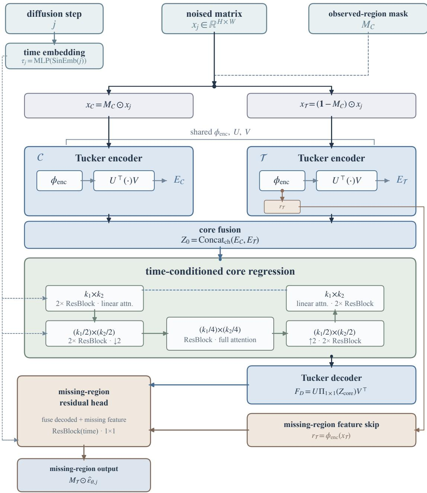

Note. The masked matrix input is split into the fixed observed control outcomes and a noised missing region. Each part is mapped by the same Tucker encoder $E s = U ^ { \top } \phi _ { \mathrm { e n c } } ( M s \odot x _ { j } ) V , S \in \{ \mathcal { C } , \mathcal { T } \}$ , where $\phi _ { \mathrm { e n c } }$ is an application-specific full-resolution feature stem. The two core maps are concatenated along the channel dimension and processed by a time-conditioned core regression on the low-dimensional Tucker core; the displayed multi-resolution residual and attention stages are a representative realization of this map. $\mathbf { A } \ 1 \times 1$ projection followed by the Tucker decoder combines the core output with the shortcut $r \tau = \phi _ { \mathrm { e n c } } ( M \tau \odot x _ { j } )$ The network outputs the learned noise prediction in the missing region. The observed control outcomes remain fixed during the conditional reverse update. The brighter blue dashed link denotes a representative skip; slate dashed links carry time and mask conditioning; and the right-side rail denotes the missing-region feature shortcut.

matrix resolution. The decoded feature is concatenated with the missing-region feature $\phi _ { \mathrm { e n c } } ( M _ { T } \odot x _ { j } )$ and passed, together with the time embedding, through a residual output block and a $1 \times 1$ head. In the matrixfactor experiments, $U , V$ are warm started with loading-space estimates and remain trainable.

## EC.3.2. Core-Net Function Class

The Core-Net below is the theoretical sieve used to control approximation and stochastic complexity. All full-dimensional masking, encoding, decoding, and residual operations are specified separately; the lowdimensional network learns only the map from the r-dimensional core statistic and diffusion time to the core output. This makes the theoretical function class follow the same Tucker encoder-decoder organization displayed in Figure EC.1.

DEFINITION EC.3.1 (CORE-NET FUNCTION CLASS). The class $\mathcal { F } _ { \mathrm { c o r e } } ( L , m , J , K , \kappa , \gamma _ { g } , \gamma _ { t } )$ consists of feed-forward ReLU maps

$$
\zeta _ { \theta } : \mathbb { R } ^ { r } \times [ t _ { 0 } , T ] \to \mathbb { R } ^ { r }
$$

with an affine output layer, depth at most L, hidden-layer width at most $m ,$ at most J nonzero weights and biases, and parameter magnitudes bounded by κ. Each map satisfies

$$
\begin{array} { r l r } & { } & { \underset { ( g , t ) \in \mathbb { R } ^ { r } \times [ t _ { 0 } , T ] } { \operatorname* { s u p } } \Vert \zeta _ { \theta } ( g , t ) \Vert _ { 2 } \leq K , } \\ & { } & { \Vert \zeta _ { \theta } ( g , t ) - \zeta _ { \theta } ( g ^ { \prime } , t ) \Vert _ { 2 } \leq \gamma _ { g } \Vert g - g ^ { \prime } \Vert _ { 2 } , \qquad g , g ^ { \prime } \in \mathbb { R } ^ { r } , \quad t \in [ t _ { 0 } , T ] , } \end{array}
$$

and

$$
\| \zeta _ { \theta } ( g , t ) - \zeta _ { \theta } ( g , t ^ { \prime } ) \| _ { 2 } \leq \gamma _ { t } | t - t ^ { \prime } | , \qquad g \in \mathbb { R } ^ { r } , \quad t , t ^ { \prime } \in [ t _ { 0 } , T ] .
$$

For a tensor-valued Core-Net ${ \mathcal { Z } } _ { \theta }$ , the identification is

$$
\zeta _ { \theta } ( g , t ) = \mathrm { v e c } \left[ \mathcal { Z } _ { \theta } \{ \mathrm { T u c k e r } ( g ) , t \} \right] .
$$

The boundedness and Lipschitz restrictions in this definition are the regularity conditions needed for the low-dimensional approximation and covering arguments. In the experiments, the corresponding lowdimensional Core-Net is implemented using the time-conditioned U-Net displayed in Figure EC.1, with residual blocks, SiLU/GELU activations, normalization, and linear or full attention. In both cases, nonlinear computation is confined to the Tucker core, while dual masking, Tucker encoding and decoding, and the missing-region shortcut remain explicit structural components.

## EC.3.3. Masked DDPM Training

For a given CFT-Diff checkpoint, training uses training tensors and a fixed mask. For each minibatch, we draw $j \sim \mathrm { U n i f } \{ 0 , \dots , N _ { \mathrm { s t e p } } - 1 \}$ and $\epsilon \sim \mathcal { N } ( 0 , I )$ , and construct the masked discrete forward input

$$
x _ { j } = M _ { \mathcal { C } } \odot X _ { 0 } + M _ { \mathcal { T } } \odot \left( \sqrt { \bar { \alpha } _ { j } } X _ { 0 } + \sqrt { 1 - \bar { \alpha } _ { j } } \epsilon \right) .
$$

Here, only the missing region is noised, while the observed control outcomes remain fixed. The model uses the DDPM noise-prediction parameterization (Ho et al. 2020) and minimizes the masked noise-prediction loss

$$
\widehat { \mathcal { L } } = \frac { 1 } { B } \sum _ { i = 1 } ^ { B } \frac { \left. M _ { T } \odot \left\{ \epsilon _ { i } - \widehat { \epsilon } _ { \theta } ( x _ { j _ { i } } ^ { ( i ) } , j _ { i } ; M _ { \mathcal { C } } ) \right\} \right. _ { F } ^ { 2 } } { \Vert M _ { T } \Vert _ { 0 } } .
$$

The external mask is synthetically applied to every complete training tensor, and the loss is evaluated only over its missing outcomes.

Simulation configuration. For the matrix-factor simulations, the input has one channel of shape $6 4 \times$ 64. The Tucker core dimension is $( k _ { 1 } , k _ { 2 } ) = ( 1 6 , 1 6 )$ , and the core U-Net has resolutions $1 6 ^ { 2 } , 8 ^ { 2 }$ , and $4 ^ { 2 }$ with widths 64, 128, and 256, respectively. Each resolution uses two time-conditioned residual blocks and attention; the bottleneck uses full attention. We use a cosine beta schedule with $N _ { \mathrm { s t e p } } = 2 0 0$ diffusion steps, ϵ-prediction, and 300 training epochs. Optimization uses AdamW with a learning rate of $1 0 ^ { - 4 }$ , weight decay of 0.01, a batch size of 60, gradient accumulation of 2, a 10-epoch warm-up followed by cosine scheduling, exponential moving average decay of 0.999, and automatic mixed precision. These numerical settings describe the reported matrix-factor simulation configuration; the architectural mask convention and the conditional objective remain unchanged when the matrix size or Tucker ranks are adapted to another design.

Empirical demand-data configuration. For the iFlex experiment, each empirical input is a one-channel $7 4 \times 2 4$ matrix from a single household. We use $( k _ { 1 } , k _ { 2 } ) = ( 1 6 , 1 6 )$ , so the nonlinear core is evaluated on $1 6 \times 1 6 , 8 \times 8 ,$ , and $4 \times 4$ Tucker grids with a base width of 64. Similar to the simulation setting, each represented level contains two time-conditioned residual blocks. For each mask-specific fit, the day and hour loading spaces are initialized from the leading empirical eigenvectors computed from the complete household training matrices. The loading matrices $U$ and $V$ are warm starts and remain trainable with a learning rate of $1 0 ^ { - 5 }$ , while the other AdamW parameters use a learning rate of $1 0 ^ { - 4 }$ . We train for 300 epochs with a batch size of 64, gradient accumulation of 2, weight decay of $0 . 0 1$ , and automatic mixed precision. The learning-rate schedule uses a linear 10-epoch warm-up followed by cosine annealing with $T _ { \mathrm { m a x } } = 4 0$ and $\eta _ { \mathrm { m i n } } = 1 0 ^ { - 6 }$ . The empirical runs use the same 200-step cosine DDPM noise-prediction objective as above.

## EC.3.4. Conditional Generation

The reported experiments use DDIM generation (?) with $N _ { \mathrm { s t e p } } = 2 0 0$ reverse steps. Thus, each reverse trajectory starts from independent Gaussian noise in the missing region and produces one sample from the trained conditional generator. At every reverse step, we update only the missing region while keeping the observed control outcomes fixed. This projection makes the generated tensor agree exactly with the observed control outcomes throughout the trajectory. The target $\widehat { X } _ { 0 }$ inferred from the predicted noise is clipped before its DDIM update. We experimented with clipping widths from 1.5 to 2.5 (with 2.0 as the default).

For the reported simulations, we generate $B = 1 0 0$ conditional completions for each test matrix. The resulting empirical distribution supports both point estimates obtained by averaging draws and the distributional measures and interval summaries reported in the paper.

Meanwhile, for each held-out household in the iFlex recovery experiments, we supply the sampler only with the observed control outcomes $M _ { C } \odot X _ { \mathrm { { o b s } } }$ . We generate $B = 1 0 0$ completions with a seed matched to the corresponding training split, a 200-step DDIM, and clipping of the inferred $\widehat { X } _ { 0 } : 0 \ [ - 2 , 2 ]$ . Repeated household inputs receive independent initial Gaussian states in the missing region. Point-recovery estimates average the 100 draws, whereas the unreduced draw set is retained for distributional evaluation, including the joint energy score.

```latex
Algorithm 1 Conditional DDIM generation for CFT-DIFF
Require: observed control outcomes ${ \overline { { \mathit { X } _ { c } } } } ,$ observed mask $\overline { { M _ { } c , M _ { T } = { \bf 1 } - M _ { c } } }$ , noise predictor $\widehat { \epsilon } _ { \theta } .$ , and cumulative
schedule $\{ \bar { \alpha } _ { j } \} _ { j = 0 } ^ { N _ { \mathrm { s t e p } } - 1 }$
Ensure: conditional completions $\{ \widetilde { X } _ { 0 } ^ { ( b ) } \} _ { b = } ^ { B } .$ 1
1: for $b = 1 , \ldots , B$ do
2: draw $z ^ { ( b ) } \sim \mathcal { N } ( 0 , I )$ and set $x _ { N _ { \mathrm { s t e p } } - 1 }  M _ { \mathcal { C } } \odot X _ { \mathcal { C } } + M _ { \mathcal { T } } \odot z ^ { ( b ) }$
3: for $j = N _ { \mathrm { s t e p } } - 1 , N _ { \mathrm { s t e p } } - 2 , \ldots , 1$ do
4: $\widehat { \epsilon }  \widehat { \epsilon } _ { \theta } ( x _ { j } , j ; M _ { \mathcal { C } } )$
5: $\begin{array} { r } { \widehat { X } _ { 0 } \gets \mathrm { c l i p } _ { [ - x _ { \mathrm { m a x } } , x _ { \mathrm { m a x } } ] } \{ \left( x _ { j } - \sqrt { 1 - \bar { \alpha } _ { j } } \hat { \epsilon } \right) / \sqrt { \bar { \alpha } _ { j } } \} } \end{array}$
6: $x _ { j - 1 } ^ { \tau }  \sqrt { \bar { \alpha } _ { j - 1 } } \widehat { X } _ { 0 } + \sqrt { 1 - \bar { \alpha } _ { j - 1 } } \widehat { \epsilon }$
7: $x _ { j - 1 } \gets M _ { c } \odot X _ { c } + M _ { \tau } \odot x _ { j - 1 } ^ { \tau }$ ▷ hard conditional projection
8: end for
9: $\widetilde { X } _ { 0 } ^ { ( b ) }  x _ { 0 }$
10: end for
```

The recovery masks are constructed at the household–day level and then expanded over all 24 hourly entries of the selected day. Under simultaneous adoption, every held-out household uses the same bottomsuffix mask, with 5, 11, 16, 21, 27, 32, 37, 43, or 48 missing working days. Under staggered adoption, households are partitioned into balanced cohorts with different missing-suffix lengths whose weighted mean equals the selected target ratio; each cohort is sampled with the same-seed CFT-Diff checkpoint matched to that suffix mask. Under switchback, the held-out households are deterministically allocated, using the fixed mask seed, to three nearly balanced groups. A policy calendar, rather than a held-out outcome, marks a day as hidden when that policy occurs for at least one source household during at least one hour; each group receives a distinct union of these calendars, expanded over all 24 hourly entries. CFT-Diff is trained once for each resulting $7 4 \times 2 4$ calendar template, using the same split-specific complete training data, and reused for every household assigned to that template. Thus, a heterogeneous empirical panel is implemented as a collection of fixed-mask conditional generation problems while preserving the observed-entry pattern of every individual household.

## EC.4. Simulation Details and Additional Results

This appendix provides the full simulation design, defines the evaluation measures, and reports additional results across factor strengths and numbers of latent factors.

## EC.4.1. Detailed Simulation Design

Data-generating process. For each replication, we generate 372 independent $6 4 \times 6 4$ matrices according to

$$
X _ { \mathrm { r a w } } ^ { ( \ell ) } = A _ { 1 } F ^ { ( \ell ) } A _ { 2 } ^ { \top } + E ^ { ( \ell ) } , \qquad \ell = 1 , \dots , 3 7 2 ,\tag{EC.4.1}
$$

where $X _ { \mathrm { r a w } } ^ { ( \ell ) } = p ^ { \beta / 2 } X , \ F ^ { ( \ell ) } \in \mathbb { R } ^ { 1 6 \times 1 6 }$ , and $E ^ { ( \ell ) } \in \mathbb { R } ^ { 6 4 \times 6 4 }$ are mutually independent across ℓ, with vec $: ( F ^ { ( \ell ) } ) \sim \mathcal { N } ( 0 , 4 I _ { 2 5 6 } )$ and $\mathrm { v e c } ( E ^ { ( \ell ) } ) \sim \mathcal { N } ( 0 , I _ { 4 0 9 6 } )$ . To construct the loading matrices, we obtain $Q _ { 1 } , Q _ { 2 } \in \mathbb { R } ^ { 6 4 \times 1 6 }$ by orthonormalizing two independent standard Gaussian matrices and set $A _ { d } = 6 4 ^ { \beta / 2 } Q _ { d }$ for $d = 1 , 2$ , where $\beta \in \{ 0 . 5 0 , 0 . 7 5 \}$ . Thus, increasing $\beta$ strengthens the common factor component while preserving the loading directions.

The first 360 matrices constitute the training sample, and the remaining 12 are used for evaluation. To place all methods on a common numerical scale, let $c _ { \mathrm { s i m } } = \operatorname* { m a x } _ { 1 \leq \ell \leq 3 6 0 } \| X _ { \mathrm { r a w } } ^ { ( \ell ) } \| _ { \infty }$ and define $X ^ { ( \ell ) } =$ $X _ { \mathrm { r a w } } ^ { ( \ell ) } / c _ { \mathrm { s i m } }$ . We repeat the entire experiment five times using independently generated loading spaces, latent factors, and idiosyncratic errors. Within each replication, the same training and evaluation matrices are used across methods and missing rates.

Missing Regions. Each evaluation matrix is partitioned into a rectangular missing region and its observed control outcomes. The target missing rates are $\rho \in \{ 0 . 2 5 , 0 . 5 0 , 0 . 7 5 \}$ . Using one-based indexing, the 25% design removes rows 17–48 and columns 33–64, yielding a $3 2 \times 3 2$ block. The 50% design removes rows 12–52 and columns 15–64, yielding a $4 1 \times 5 0$ block and an actual missing rate of 0.5005. The 75% design removes rows 6–58 and columns $7 { - } 6 4$ , yielding a $5 3 \times 5 8$ block and an actual missing rate of 0.7505. In each design, the block is vertically centered and reaches the final matrix column. The same block definition is used for every evaluation matrix within a design, and accuracy is evaluated only on its missing region. During CFT-DIFF training, the corresponding mask is applied synthetically to each complete training matrix.

Because (EC.4.1) is Gaussian, the exact conditional distribution used in the pointwise diagnostics is available analytically. Let $x _ { T }$ and $x _ { \mathcal { C } }$ denote the vectorized missing region and observed control outcomes, respectively, and partition the covariance matrix of $\mathrm { v e c } \big ( X ^ { ( \ell ) } \big )$ conformably. Then

$$
\ b x _ { \mathcal T } \mid \ b x _ { \mathcal C } \sim \mathcal N \big ( \Sigma _ { \mathcal T \mathcal C } \Sigma _ { \mathcal C \mathcal C } ^ { - 1 } \ b x _ { \mathcal C } , \Sigma _ { \mathcal T \mathcal T } - \Sigma _ { \mathcal T \mathcal C } \Sigma _ { \mathcal C \mathcal C } ^ { - 1 } \Sigma _ { \mathcal C \mathcal T } \big ) .\tag{EC.4.2}
$$

Methods and implementation. The comparison includes the five point estimators and three diffusion methods described in Section 5.1. For the diffusion methods, the generated mean is used as the point estimate. CONV-DIFF and TUCKER-DIFF use one trained model within each factor-strength setting and replication across the three missing rates. Because CFT-DIFF incorporates the fixed mask in its conditional score architecture, it is trained for each missing-rate design. Each diffusion model is trained for 300 epochs with batch size 60, gradient accumulation over two batches, and 200 diffusion steps. The aggregate evaluation uses 100 conditional draws for each of the 12 evaluation matrices in every replication. The architectures and discrete training and generation procedures are described in Appendix EC.3.

Evaluation measures. For a given replication and missing rate, let $\mathcal { I }$ index the missing entries pooled across the 12 evaluation matrices, let $N _ { \mathcal { I } } = | \mathcal { I } |$ , and write $y _ { i }$ for the realized value at entry $i \in \mathcal { I }$ . For a diffusion method, let $x _ { i } ^ { ( 1 ) } , \ldots , x _ { i } ^ { ( B ) }$ be its $B = 1 0 0$ conditional draws and set $\begin{array} { r } { \widehat { y } _ { i } = B ^ { - 1 } \sum _ { b = 1 } ^ { B } x _ { i } ^ { ( b ) } } \end{array}$ . The point-recovery measures are

$$
\mathrm { M A E } = \frac { 1 } { N _ { \mathcal { T } } } \sum _ { i \in \mathcal { I } } \big | \widehat { y } _ { i } - y _ { i } \big | , \qquad \mathrm { R M S E } = \left\{ \frac { 1 } { N _ { \mathcal { T } } } \sum _ { i \in \mathcal { I } } ( \widehat { y } _ { i } - y _ { i } ) ^ { 2 } \right\} ^ { 1 / 2 } .
$$

The entrywise continuous ranked probability score is estimated by

$$
\mathrm { C R P S } _ { i } = \frac { 1 } { B } \sum _ { b = 1 } ^ { B } \vert x _ { i } ^ { ( b ) } - y _ { i } \vert - \frac { 1 } { 2 B ^ { 2 } } \sum _ { b = 1 } ^ { B } \sum _ { b ^ { \prime } = 1 } ^ { B } \vert x _ { i } ^ { ( b ) } - x _ { i } ^ { ( b ^ { \prime } ) } \vert ,\tag{EC.4.3}
$$

and the reported CRPS averages (EC.4.3) over $i \in \mathcal { I }$ . The energy score evaluates the missing region jointly. For a realized missing-region vector $y$ and generated vectors $x ^ { ( 1 ) } , \ldots , x ^ { ( B ) }$ , it is estimated by

$$
\mathrm { E n e r g y } = \frac { 1 } { B } \sum _ { b = 1 } ^ { B } \| x ^ { ( b ) } - y \| _ { 2 } - \frac { 1 } { 2 } \widehat { \mathbb { E } } \| x - x ^ { \prime } \| _ { 2 } ,
$$

where the second expectation uses 200 fixed pairs of generated draws. Both scores are negatively oriented. Let $L _ { i }$ and $U _ { i }$ be the 5th and 95th empirical percentiles of the draws at entry i. The reported 90% coverage and width are $\begin{array} { r } { N _ { \mathcal { I } } ^ { - 1 } \sum _ { i \in \mathcal { I } } \mathbb { I } \{ L _ { i } \leq y _ { i } \leq U _ { i } \} } \end{array}$ and $\begin{array} { r } { N _ { \mathcal { I } } ^ { - 1 } \sum _ { i \in \mathcal { I } } ( U _ { i } - L _ { i } ) } \end{array}$ , respectively. With $\delta = 0 . 1 0$ , the corresponding interval score is

$$
\mathrm { I S } _ { \delta , i } = ( U _ { i } - L _ { i } ) + \frac { 2 } { \delta } ( L _ { i } - y _ { i } ) \mathbb { I } \{ y _ { i } < L _ { i } \} + \frac { 2 } { \delta } ( y _ { i } - U _ { i } ) \mathbb { I } \{ y _ { i } > U _ { i } \} .
$$

The weighted interval score combines the predictive median with central intervals at the 50%, 60%, 70%, 80%, 90%, and 95% levels, using the standard weights $\delta _ { k } / 2$ , where $\delta _ { k }$ is one minus the corresponding coverage level. IS and WIS reward calibration and sharpness jointly; smaller values are preferred. Each measure is first pooled over the 12 evaluation matrices within a replication. The tables report the mean and standard deviation across the five replications.

Pointwise diagnostic. The pointwise figures use the 25% missing region and 10,000 conditional draws from each diffusion method for the first evaluation matrix in one replication. Within the missing region, we compute the empirical percentile of each realized entry and consider entries within 0.03 of 0.25, 0.50, or 0.75. For displayed entry i and method $m ,$ let $\mu _ { i }$ and $\sigma _ { i }$ denote the exact conditional mean and standard deviation from (EC.4.2), and let $\widehat { \mu } _ { m i }$ and $\widehat { \sigma } _ { m i }$ denote the corresponding moments of the generated draws. We summarize pointwise agreement by

$$
D _ { m i } = \left[ \left( \frac { \widehat { \mu } _ { m i } - \mu _ { i } } { \sigma _ { i } } \right) ^ { 2 } + \left\{ \log \left( \frac { \widehat { \sigma } _ { m i } } { \sigma _ { i } } \right) \right\} ^ { 2 } \right] ^ { 1 / 2 } .\tag{EC.4.4}
$$

The display is designed to make differences among the conditional generators visually informative. We therefore select, within each percentile neighborhood, an entry for which the CFT-DIFF discrepancy is no larger than those of the two nested diffusion models; among the remaining candidates, selection balances the CFT-DIFF discrepancy, its improvement over the benchmarks, and proximity to the target percentile. The aggregate tables, rather than these selected entries, provide the full-sample comparison.

## EC.4.2. Additional Recovery Results

Table EC.3 repeats the aggregate comparison under $\beta = 0 . 7 5$ . The stronger common factor improves recovery for methods that exploit low-rank structure, while the ranking among the diffusion methods remains unchanged. CFT-DIFF has the lowest MAE, RMSE, Energy, CRPS, IS, and WIS among the three conditional generators at every missing rate. Relative to TUCKER-DIFF, it lowers Energy and CRPS by 14%–42% and produces intervals that are 17%–45% narrower. These results show that the gains from masked conditional generation persist as the factor component becomes stronger.

## EC.4.3. Additional Pointwise Distribution Diagnostics

Figure EC.2 gives the pointwise diagnostic for $\beta = 0 . 7 5$ in the baseline design. Figures EC.3–EC.6 extend the comparison to designs with four and eight factors. Across these additional designs, CFT-DIFF continues

Table EC.3 Counterfactual recovery across missing rates $( \beta = 0 . 7 5 )$
<table><tr><td></td><td colspan="2">Point Recovery</td><td colspan="2">Distributional Recovery</td><td colspan="4">Interval Recovery</td></tr><tr><td>Method</td><td>MAE</td><td>RMSE</td><td>Energy</td><td>CRPS</td><td>Coverage</td><td>Width</td><td>IS</td><td>WIS</td></tr><tr><td colspan="9">Panel A: Missing Rate = 25%</td></tr><tr><td>NMC</td><td colspan="2">0.0208 (0.0012) 0.0261 (0.0016)</td><td></td><td></td><td></td><td></td><td></td><td></td></tr><tr><td>DID</td><td colspan="2">0.1682 (0.0109) 0.2165 (0.0142)</td><td></td><td></td><td></td><td></td><td></td><td></td></tr><tr><td>SC</td><td colspan="2">0.0205 (0.0011) 0.0259 (0.0014)</td><td></td><td></td><td></td><td></td><td></td><td></td></tr><tr><td>SDID</td><td colspan="2">0.1164 (0.0070) 0.1495 (0.0087)</td><td></td><td></td><td></td><td></td><td></td><td></td></tr><tr><td>TFI</td><td colspan="8">0.0513 (0.0030) 0.0656 (0.0040)</td></tr><tr><td>CONV-DIFF</td><td colspan="8">0.1182 (0.0068) 0.1518 (0.0085) 3.4132 (0.1944) 0.0844 (0.0048) 0.8738 (0.0120) 0.4610 (0.0167) 0.6418 (0.0367) 0.0635 (0.0037)</td></tr><tr><td>CFT-DIFF</td><td colspan="8">TUCKER-DIFF 0.0360 (0.0016) 0.0473 (0.0017) 1.1161 (0.0347) 0.0254 (0.0010) 0.9728 (0.0104) 0.2153 (0.0105) 0.2257 (0.0073) 0.0199 (0.0007)</td></tr><tr><td></td><td colspan="8">0.0211 (0.0011) 0.0275 (0.0014) 0.6560 (0.0316) 0.0148 (0.0008) 0.9567 (0.0044) 0.1195 (0.0060) 0.1303 (0.0065) 0.0115 (0.0006)</td></tr><tr><td colspan="8">Panel B: Missing Rate = 50%</td></tr><tr><td>NMC</td><td>0.0235 (0.0016) 0.0297 (0.0020)</td><td></td><td></td><td></td><td></td><td></td><td></td></tr><tr><td>DID</td><td>0.1704 (0.0124) 0.2189 (0.0160)</td><td></td><td></td><td></td><td></td><td></td><td></td></tr><tr><td>SC</td><td>0.0245 (0.0021) 0.0313 (0.0029)</td><td></td><td></td><td></td><td></td><td></td><td></td></tr><tr><td>SDID</td><td>0.1180 (0.0079) 0.1516 (0.0099)</td><td></td><td></td><td></td><td></td><td></td><td></td></tr><tr><td>TFI</td><td colspan="8">0.0705 (0.0050) 0.0906 (0.0061)</td></tr><tr><td>CONV-DIFF</td><td colspan="8">0.1197 (0.0079) 0.1538 (0.0099) 4.8924 (0.3178) 0.0855 (0.0057) 0.8739 (0.0117) 0.4670 (0.0203) 0.6510 (0.0435) 0.0644 (0.0043)</td></tr><tr><td></td><td colspan="8">TUCKER-DIFF 0.0600 (0.0034) 0.0784 (0.0043) 2.5256 (0.1340) 0.0428 (0.0024) 0.9526 (0.0115) 0.3082 (0.0180) 0.3378 (0.0173) 0.0325 (0.0018)</td></tr><tr><td>CFT-DIFF</td><td colspan="8">0.0375 (0.0025) 0.0498 (0.0033) 1.5945 (0.1057) 0.0265 (0.0018) 0.9321 (0.0193) 0.1792 (0.0154) 0.2104 (0.0136) 0.0201 (0.0014)</td></tr><tr><td></td><td colspan="8">Panel C: Missing Rate = 75%</td></tr><tr><td>NMC</td><td>0.0797 (0.0051) 0.1051 (0.0066)</td><td></td><td></td><td></td><td></td><td></td><td></td></tr><tr><td>DID</td><td>0.1685 (0.0108) 0.2169 (0.0141)</td><td></td><td></td><td></td><td></td><td></td><td></td></tr><tr><td>SC</td><td>0.0881 (0.0042) 0.1173 (0.0058)</td><td></td><td></td><td></td><td></td><td></td><td></td></tr><tr><td>SDID</td><td>0.1176 (0.0073) 0.1514 (0.0091)</td><td></td><td></td><td></td><td></td><td></td><td></td></tr><tr><td>TFI</td><td colspan="8">0.0978 (0.0056) 0.1260 (0.0070)</td></tr><tr><td>CONV-DIFF</td><td colspan="8">0.1188 (0.0074) 0.1529 (0.0091) 5.9528 (0.3577) 0.0849 (0.0052) 0.8779 (0.0135) 0.4692 (0.0189) 0.6468 (0.0393) 0.0639 (0.0039)</td></tr><tr><td></td><td colspan="8">TUCKER-DIFF 0.0884 (0.0056) 0.1147 (0.0071) 4.4728 (0.2710) 0.0630 (0.0039) 0.9268 (0.0117) 0.4031 (0.0187) 0.4717 (0.0270) 0.0472 (0.0029)</td></tr></table>

Note. The table reports recovery at three missing rates. Entries are means across five independent simulation replications, with standard deviations in parentheses. MAE and RMSE evaluate point recovery; Energy and CRPS evaluate the generated conditional distribution. Coverage and Width denote the empirical coverage and average width of nominal 90% intervals, and IS and WIS denote the interva score and weighted interval score. Smaller MAE, RMSE, Energy, CRPS, IS, and WIS indicate better performance. Width is interpreted jointly with Coverage, whose nominal level is 0.90. Dashes indicate measures that are not applicable to point estimators. Each diffusion method uses 100 conditional draws per evaluation matrix.

to track both the shape and mean of the exact conditional distribution at all three selected entries. CONV-DIFF remains substantially overdispersed and exhibits clear mean deviations in several tail cases, while TUCKER-DIFF reduces these discrepancies but still produces excess dispersion, particularly with eight factors. The relative performance of the three methods therefore remains stable as the number of factors increases.

Table EC.4 reports the corresponding location, scale, and discrepancy values for both factor-strength settings. CFT-DIFF has the smallest D at every displayed entry. At $\beta = 0 . 5 0 \mathrm { { ; } }$ its discrepancies are between 0.298 and 0.361, compared with values exceeding 1.17 for both diffusion benchmarks. At $\beta = 0 . 7 5 ,$ CFT-DIFF remains substantially closer to the exact law even though the exact conditional distributions become more concentrated.

## EC.5. Additional Empirical Analysis

## EC.5.1. Overview of the iFlex Experiment

The experimental design and data construction are documented by ?, while Hofmann and Lindberg (2024) examine household demand responses in the full-scale experiment. Table EC.5 summarizes the groupspecific intervention design. Treatment groups were organized by region and assigned prespecified sets of four candidate price signals, typically varying the peak-price level within a common profile or comparing alternative profile shapes. On each intervention day, one signal was selected from the corresponding group-specific set.

Figure EC.2 Pointwise conditional distribution recovery (β = 0.75).  
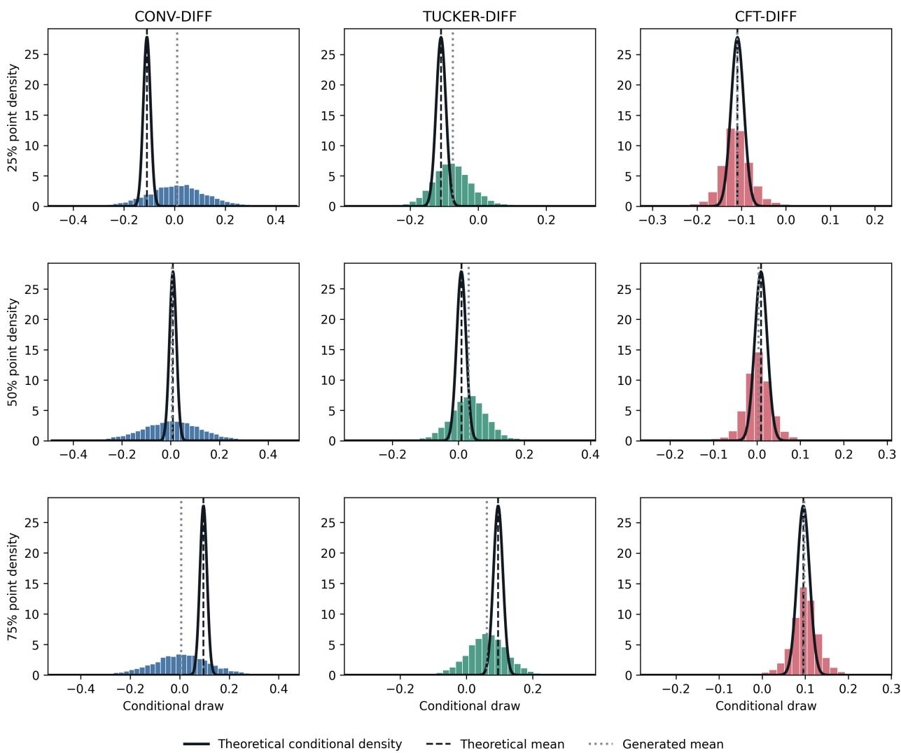  
Note. Columns correspond to CONV-DIFF, TUCKER-DIFF, and CFT-DIFF. Rows display entries whose realized missing values are near the 25th, 50th, and 75th percentiles within the missing region. Each histogram is based on 10,000 conditional draws, and the missing rate is 25%. The solid curve shows the exact conditional density; the dashed and dotted vertical lines indicate the exact conditional mean and the mean of the generated draws, respectively.

Because households index samples in the empirical implementation, the Tucker structure used by CFT-DIFF pertains to the day and hour modes of the 74 × 24 household matrices. We assess this structure using three collections of fully observed no-policy outcomes: globally nonintervention days, the pretreatment period, and all working days for households in the control groups. For each collection, we form the corresponding household-by-day-by-hour array for diagnostic purposes and examine its mode-wise spectral concentration. The day- and hour-mode spectra directly assess the low-rank structure used by the trained model;

Figure EC.3 Pointwise conditional distribution recovery with four factors (β = 0.50).  
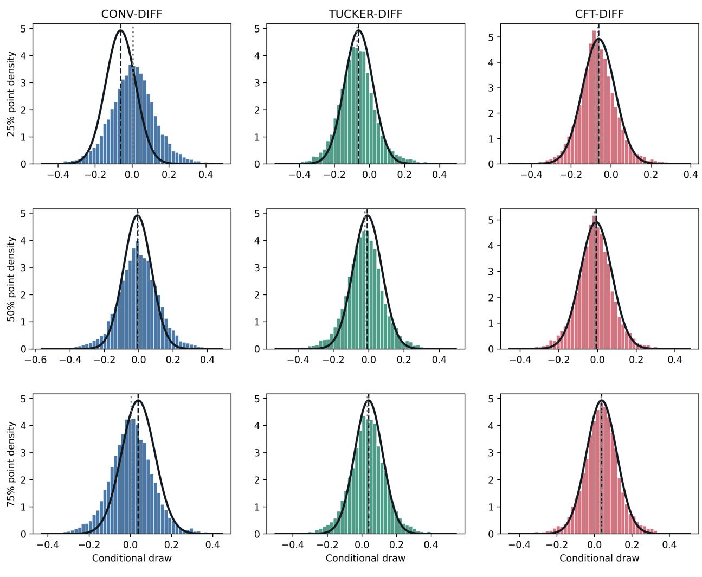  
Theoretical conditional density--- Theoretical mean Generated mean  
Note. Columns correspond to CONV-DIFF, TUCKER-DIFF, and CFT-DIFF. The design contains four latent factors. Rows display entries whose realized missing values are near the 25th, 50th, and 75th percentiles within the missing region. Each histogram is based on 10,000 conditional draws, and the missing rate is 25%. The solid curve shows the exact conditional density; the dashed and dotted vertical lines indicate the exact conditional mean and the mean of the generated draws, respectively.

the household-direction spectrum is reported only as a descriptive measure of common cross-household variation.

Figure EC.7 shows pronounced spectral concentration in both modes used by the empirical model. Across the three sample constructions, the day-mode spectra reach the 95% threshold with only a small fraction of the available components, while the hour-mode spectra exceed 95% within the first few components and approach 99% well before the full 24-dimensional mode is used. The profiles are also similar across the three samples, indicating that the observed concentration is not confined to either the short pretreatment period or the control-group households. These results support the approximately low-rank day-by-hour representation underlying the empirical CFT-DIFF specification.

Figure EC.4 Pointwise conditional distribution recovery with four factors $( \beta = 0 . 7 5 )$  
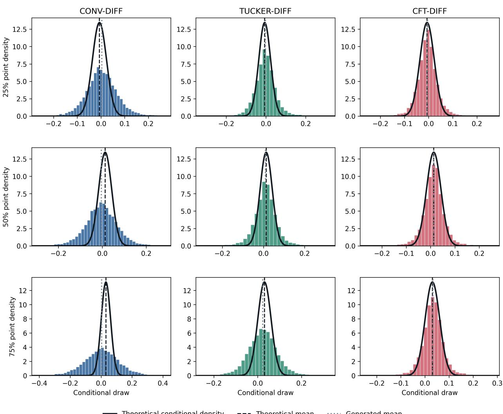  
Theoretical conditional density--- Theoretical mean Generated mean  
Note. Columns correspond to CONV-DIFF, TUCKER-DIFF, and CFT-DIFF. The design contains four latent factors. Rows display entries whose realized missing values are near the 25th, 50th, and 75th percentiles within the missing region. Each histogram is based on 10,000 conditional draws, and the missing rate is 25%. The solid curve shows the exact conditional density; the dashed and dotted vertical lines indicate the exact conditional mean and the mean of the generated draws, respectively

## EC.5.2. Missingness Patterns

To evaluate counterfactual recovery in a controlled setting, we artificially mask fully observed no-policy outcomes and compare the resulting imputations with their held-out values. We consider three treatmentinduced missingness patterns commonly encountered in causal panels: switchback, staggered adoption, and simultaneous adoption. As illustrated in Figure EC.8, control households remain fully observed, whereas complete household-day trajectories are masked after the first intervention day according to the corresponding design. These patterns allow us to assess imputation performance under both intermittent and monotone block missingness.

Figure EC.5 Pointwise conditional distribution recovery with eight factors $( \beta = 0 . 5 0 )$ .  
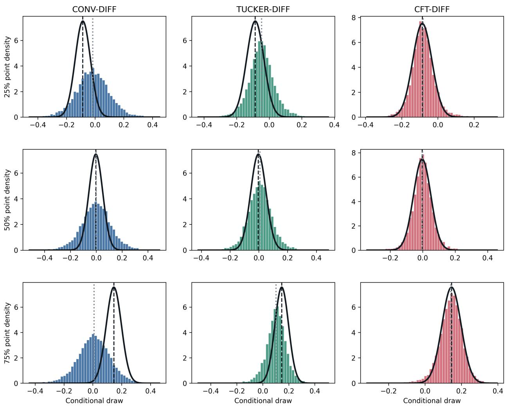  
Theoretical conditional density--- Theoretical mean Generated mean

Note. Columns correspond to CONV-DIFF, TUCKER-DIFF, and CFT-DIFF. The design contains eight latent factors. Rows display entries whose realized missing values are near the 25th, 50th, and 75th percentiles within the missing region. Each histogram is based on 10,000 conditional draws, and the missing rate is 25%. The solid curve shows the exact conditional density; the dashed and dotted vertical lines indicate the exact conditional mean and the mean of the generated draws, respectively

## EC.5.3. Additional Results on Counterfactual Recovery Accuracy

EC.5.3.1. Evaluation Measures This section defines the measures used to evaluate point and counterfactual distribution recovery. Let M denote the set of artificially masked outcomes and let $n _ { \mathcal { M } } = \left| \mathcal { M } \right|$ For each $j \in \mathcal { M } ,$ , let $Y _ { j }$ denote the observed no-policy outcome and $\widehat { Y } _ { j }$ its recovered value. For a diffusion method with B generated draws, the point prediction is $\begin{array} { r } { \widehat { Y } _ { j } = \frac { 1 } { B } \sum _ { b = 1 } ^ { B } \bar { \widetilde { Y } } _ { j } ^ { ( b ) } } \end{array}$

Point recovery. We evaluate point recovery using the mean absolute error (MAE) and root mean squared error (RMSE):

$$
\mathrm { M A E } = \frac { 1 } { n _ { \mathcal { M } } } \sum _ { j \in \mathcal { M } } \left. \widehat { Y } _ { j } - Y _ { j } \right. , \qquad \mathrm { R M S E } = \left[ \frac { 1 } { n _ { \mathcal { M } } } \sum _ { j \in \mathcal { M } } \left( \widehat { Y } _ { j } - Y _ { j } \right) ^ { 2 } \right] ^ { 1 / 2 } .
$$

Theoretical conditional density --- Theoretical mean.. Generated mean  
Figure EC.6 Pointwise conditional distribution recovery with eight factors $( \beta = 0 . 7 5 )$ .  
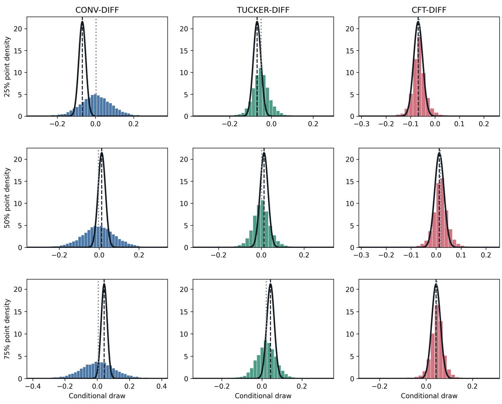

Note. Columns correspond to CONV-DIFF, TUCKER-DIFF, and CFT-DIFF. The design contains eight latent factors. Rows display entries whose realized missing values are near the 25th, 50th, and 75th percentiles within the missing region. Each histogram is based on 10,000 conditional draws, and the missing rate is 25%. The solid curve shows the exact conditional density; the dashed and dotted vertical lines indicate the exact conditional mean and the mean of the generated draws, respectively.

Smaller values indicate more accurate point recovery.

Energy score. The energy score evaluates the joint distribution of the missing 24-hour trajectory. Let $\mathbf { Y } _ { j } \in \mathbb { R } ^ { 2 4 }$ denote the observed trajectory for an artificially masked household–day, and let $\widetilde { \mathbf { Y } } _ { j } ^ { ( 1 ) } , \ldots , \widetilde { \mathbf { Y } } _ { j } ^ { ( B ) }$ denote the corresponding generated trajectories. For a predictive distribution $Q ,$ , the population energy score is

$$
\operatorname { E S } ( Q , \mathbf { Y } _ { j } ) = \mathbb { E } _ { Q } \left[ \Vert \widetilde { \mathbf { Y } } _ { j } - \mathbf { Y } _ { j } \Vert _ { 2 } \right] - \frac { 1 } { 2 } \mathbb { E } _ { Q } \left[ \Vert \widetilde { \mathbf { Y } } _ { j } - \widetilde { \mathbf { Y } } _ { j } ^ { \prime } \Vert _ { 2 } \right] ,
$$

where $\widetilde { \mathbf { Y } } _ { j }$ and $\widetilde { \mathbf { Y } } _ { j } ^ { \prime }$ are independent draws from $Q .$ . Using the generated draws, the first expectation is evaluated by

$$
\frac { 1 } { B } \sum _ { b = 1 } ^ { B } \left\| \widetilde { \mathbf { Y } } _ { j } ^ { ( b ) } - \mathbf { Y } _ { j } \right\| _ { 2 } .
$$

Table EC.4 Pointwise conditional distribution fit at the displayed entries.
<table><tr><td></td><td></td><td colspan="2">Exact Law</td><td colspan="3">Conv-Diff</td><td colspan="3">Tucker-Diff</td><td colspan="3">CFT-Diff</td></tr><tr><td>Empirical Quantile Realized Value</td><td></td><td>Mean</td><td>Std. Dev.</td><td>Mean</td><td>Std. Dev.</td><td>D</td><td>Mean</td><td>Std. Dev.</td><td>D</td><td>Mean</td><td>Std. Dev.</td><td>D</td></tr><tr><td colspan="10">Panel A: β = 0.50</td><td colspan="3"></td></tr><tr><td>25%</td><td>-0.096</td><td>-0.108</td><td>0.043</td><td>-0.007</td><td>0.176</td><td>2.709</td><td>-0.044</td><td>0.115</td><td>1.754</td><td>-0.108</td><td>0.062</td><td>0.361</td></tr><tr><td>50%</td><td>0.006</td><td>0.027</td><td>0.041</td><td>-0.009</td><td>0.141</td><td>1.525</td><td>-0.009</td><td>0.087</td><td>1.173</td><td>0.028</td><td>0.055</td><td>0.298</td></tr><tr><td>75%</td><td>0.089</td><td>0.028</td><td>0.044</td><td>-0.005</td><td>0.186</td><td>1.634</td><td>-0.024</td><td>0.124</td><td>1.572</td><td>0.026</td><td>0.059</td><td>0.299</td></tr><tr><td colspan="10">Panel B:  $\beta = 0 . 7 5$ </td><td colspan="3"></td></tr><tr><td>25%</td><td>-0.089</td><td>-0.109</td><td>0.014</td><td>0.010</td><td>0.126</td><td>8.582</td><td>-0.075</td><td>0.067</td><td>2.867</td><td>-0.110</td><td>0.042</td><td>1.076</td></tr><tr><td>50%</td><td>0.006</td><td>0.009</td><td>0.014</td><td>0.006</td><td>0.134</td><td>2.249</td><td>0.032</td><td>0.065</td><td>2.169</td><td>0.004</td><td>0.040</td><td>1.091</td></tr><tr><td>75%</td><td>0.102</td><td>0.096</td><td>0.014</td><td>0.006</td><td>0.129</td><td>6.657</td><td>0.061</td><td>0.070</td><td>2.869</td><td>0.098</td><td>0.042</td><td>1.085</td></tr></table>

Note. The table reports the entries displayed in Figures 2 and EC.2. Empirical Quantile gives the approximate rank of the realized value within the missing region. Under Exact Law, Mean and Std. Dev. are the conditional mean and standard deviation implied by (EC.4.2); for each diffusion method, they are calculated from 10,000 conditional draws. The discrepancy D, defined in (EC.4.4), accounts for deviations in both conditional location and scale. Smaller values indicate closer agreement, with zero corresponding to an exact match The missing rate is 25%.

Table EC.5 Group-specific candidate price signals in the iFlex experiment.
<table><tr><td>Region</td><td>Treatment Group</td><td>Candidate Price Signals</td></tr><tr><td>Bergen</td><td>Ber_1</td><td> $\{ B _ { 2 } , B _ { 5 } , B _ { 1 0 } , B _ { 1 5 } \}$ </td></tr><tr><td>Bodø</td><td>Bo_1</td><td> $\{ B _ { 2 } , B _ { 5 } , B _ { 1 0 } , B _ { 1 5 } \}$ </td></tr><tr><td rowspan="6">Oslo</td><td>Os_1</td><td> $\{ B _ { 2 } , B _ { 5 } , B _ { 1 0 } , B _ { 1 5 } \}$ </td></tr><tr><td>Os_2</td><td> $\{ P _ { 2 } , P _ { 5 } , P _ { 1 0 } , P _ { 1 5 } \}$ </td></tr><tr><td>Os_3</td><td> $\{ A _ { 1 0 } , B _ { 1 0 } , P _ { 1 0 } , P 0 _ { 1 0 } \}$ </td></tr><tr><td>Os_4</td><td> $\{ A _ { 5 } , A _ { 1 0 } , B _ { 1 0 } , C \}$ </td></tr><tr><td>Os_5</td><td> $\{ P 0 _ { 2 } , P 0 _ { 1 0 } , P 0 _ { 3 0 } , P _ { 1 0 } \}$ </td></tr><tr><td>Os_6</td><td> $\{ A _ { 5 } , B _ { 2 } , C , P _ { 1 5 } \}$ </td></tr><tr><td rowspan="2">Tromsø</td><td>Trom_1</td><td> $\{ B _ { 2 } , B _ { 5 } , B _ { 1 0 } , B _ { 1 5 } \}$ </td></tr><tr><td>Trom_2</td><td> $\{ P _ { 2 } , P _ { 5 } , P _ { 1 0 } , P _ { 1 5 } \}$ </td></tr><tr><td>Trondheim</td><td>Trond_1</td><td> $\{ B _ { 2 } , B _ { 5 } , B _ { 1 0 } , B _ { 1 5 } \}$ </td></tr></table>

Note. Each treatment group was associated with four prespecified candidate price signals. On each intervention day, one of these signals was selected for the group, and all households within that group were assigned the same 24-hour price path. The five regional control groups received no experimental price signal and are therefore omitted from the table. A signal label combines the price-profile family with the peak price level in NOK/kWh. Profile C denotes the single asymmetric price signal with different morning and afternoon peak-price levels.

The second expectation is evaluated using randomly sampled pairs of generated draws. We average the resulting scores across all artificially masked household–days and across the five test samples. A smaller energy score indicates better recovery of the joint counterfactual distribution.

Continuous ranked probability score. CRPS evaluates the marginal distribution of an individual missing hourly outcome. Let $\widetilde { Y } _ { j } ^ { ( 1 ) } , \dots , \widetilde { Y } _ { j } ^ { ( B ) }$ be the generated draws for outcome $Y _ { j }$ . The empirical CRPS is

$$
\mathrm { C R P S } _ { j } = \frac { 1 } { B } \sum _ { b = 1 } ^ { B } \left| \widetilde { Y } _ { j } ^ { ( b ) } - Y _ { j } \right| - \frac { 1 } { 2 B ^ { 2 } } \sum _ { b = 1 } ^ { B } \sum _ { b ^ { \prime } = 1 } ^ { B } \left| \widetilde { Y } _ { j } ^ { ( b ) } - \widetilde { Y } _ { j } ^ { ( b ^ { \prime } ) } \right| .
$$

The reported CRPS is averaged across the missing hourly outcomes. Smaller values indicate better marginal distributional recovery.

Figure EC.7 Mode-wise spectral profiles of fully observed no-policy electricity-consumption tensors.  
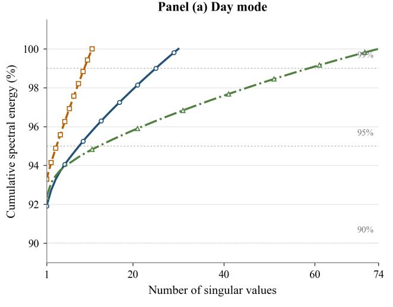

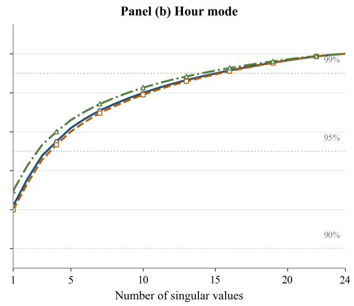

Note. Panels (a) and (b) report cumulative spectral energy along the day and hour modes, respectively. The three curves are constructed from globally nonintervention days, the pretreatment period, and all working days for households in the control groups. Horizontal lines mark the 90%, 95%, and 99% energy thresholds.

Figure EC.8 Illustrative intervention patterns.  
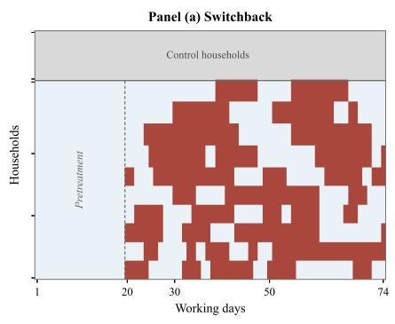

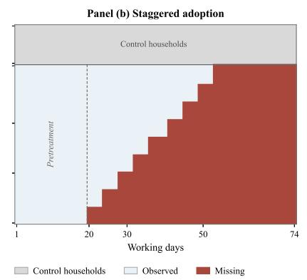

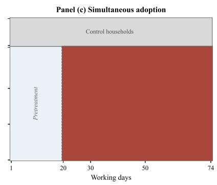

Note. Panels (a)–(c) illustrate the switchback, staggered-adoption, and simultaneous-adoption patterns, respectively. Rows rep resent households and columns represent working days. Gray rows denote fully observed control households, blue cells denote observed no-policy outcomes, and red cells denote missing no-policy outcomes. The vertical dashed line marks the first intervention day; observations to its left constitute the pretreatment period.

Coverage and interval width. For the interval-based measures, we use the household–day total of the missing trajectory. Let

$$
U _ { j } = \sum _ { h \in \mathcal { M } _ { j } } Y _ { j h } , \qquad \widetilde { U } _ { j } ^ { ( b ) } = \sum _ { h \in \mathcal { M } _ { j } } \widetilde { Y } _ { j h } ^ { ( b ) } ,
$$

where $\mathcal { M } _ { j }$ denotes the missing hours for household–day $j .$ Under the block-missingness designs used in the main analysis, $\mathcal { M } _ { j }$ contains all 24 hours.

For a central interval with nominal coverage $1 - \alpha$ , let

$$
{ \cal L } _ { j , \alpha } = \widehat Q _ { \alpha / 2 } \left( \widetilde U _ { j } ^ { ( 1 ) } , \ldots , \widetilde U _ { j } ^ { ( B ) } \right) , \qquad { \cal H } _ { j , \alpha } = \widehat Q _ { 1 - \alpha / 2 } \left( \widetilde U _ { j } ^ { ( 1 ) } , \ldots , \widetilde U _ { j } ^ { ( B ) } \right) .
$$

The empirical coverage is

$$
\mathrm { C o v e r a g e } _ { 1 - \alpha } = \frac { 1 } { n _ { B } } \sum _ { j = 1 } ^ { n _ { B } } \mathbb { I } \left\{ L _ { j , \alpha } \leq U _ { j } \leq H _ { j , \alpha } \right\} ,
$$

where $n _ { B }$ is the number of evaluated household–day blocks. A well-calibrated interval has empirical coverage close to its nominal level $1 - \alpha$

The average interval width is

$$
\mathrm { W i d t h } _ { 1 - \alpha } = \frac { 1 } { n _ { B } } \sum _ { j = 1 } ^ { n _ { B } } \left( H _ { j , \alpha } - L _ { j , \alpha } \right) .
$$

For comparable coverage, a smaller width indicates a sharper counterfactual distribution.

Interval score. The interval score combines interval width and coverage in a single measure. For a central $( 1 - \alpha )$ interval,

$$
\mathrm { I S } _ { \alpha , j } = H _ { j , \alpha } - L _ { j , \alpha } + \frac { 2 } { \alpha } \left( L _ { j , \alpha } - U _ { j } \right) \mathbb { I } \left\{ U _ { j } < L _ { j , \alpha } \right\} + \frac { 2 } { \alpha } \left( U _ { j } - H _ { j , \alpha } \right) \mathbb { I } \left\{ U _ { j } > H _ { j , \alpha } \right\} .
$$

The first term penalizes wide intervals, while the remaining terms penalize observations that fall below or above the interval. The table reports the average interval score for the 90% central interval. A smaller value indicates a better combination of coverage and interval width.

Weighted interval score. The weighted interval score aggregates information from several central intervals and the predictive median. Let $m _ { j }$ denote the predictive median of $\widetilde { U } _ { j } ^ { ( 1 ) } , \dots , \widetilde { U } _ { j } ^ { ( B ) }$ , and let the $K _ { C }$ central coverage levels be $1 - \alpha _ { 1 } , \ldots , 1 - \alpha _ { K _ { C } }$ . We compute

$$
\mathrm { W I S } _ { j } = \frac { \frac { 1 } { 2 } | U _ { j } - m _ { j } | + \sum _ { k = 1 } ^ { K _ { C } } \frac { \alpha _ { k } } { 2 } \mathrm { I S } _ { \alpha _ { k } , j } } { K _ { C } + \frac { 1 } { 2 } } .
$$

In the main analysis, the central coverage levels are 50%, 60%, 70%, 80%, 90%, and 95%. The reported WIS is averaged across evaluated household–days. A smaller WIS indicates better overall distributional recovery across the different parts of the counterfactual distribution.

EC.5.3.2. Results on Counterfactual Recovery Accuracy We provide several additional checks on the counterfactual recovery results in Section 6.2. These analyses examine whether the main findings are robust to an alternative point-recovery criterion, continue to hold for aggregate counterfactual outcomes, and extend beyond the energy score used in the main figure.

Figure EC.9 reports the results over the same missingness patterns and levels as in the main analysis. The ranking is similar to that obtained with MAE. CFT-DIFF remains highly stable as the missing region expands and yields the lowest RMSE throughout the three designs. The two alternative diffusion models deteriorate more rapidly with missingness, while TFI is particularly sensitive to the size and structure of the missing region. Thus, the point-recovery advantage documented in the main text is not specific to the absolute-error criterion.

Pointwise accuracy need not imply accurate recovery of aggregates formed from the missing trajectory. This distinction is relevant for the empirical analysis because the causal estimands aggregate counterfactual

Figure EC.9 Additional point counterfactual recovery measured by RMSE.  
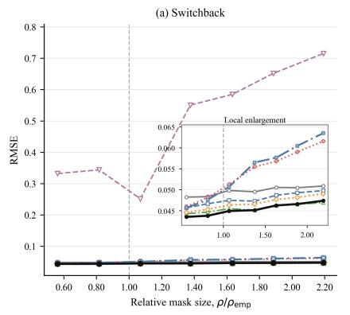

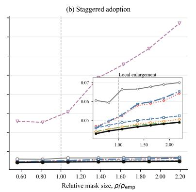

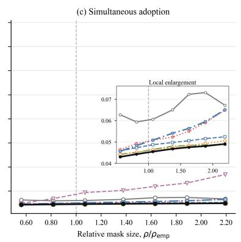  
—○ DID -- SC —Δ- SDID  NMC - y- TFI . CONV-DIFF . TUCKER-DIFF  CFT-DIFF

Note. The figure reports RMSE across different missingness levels under the switchback, staggered-adoption, and simultaneousadoption patterns. The horizontal axis reports the realized missing proportion relative to the empirical treated share, $\rho / \rho _ { \mathrm { e m p } } ,$ and the vertical dashed line indicates $\rho = \rho _ { \mathrm { e m p } }$ . Point predictions for the three diffusion methods are obtained by averaging the 100 generated counterfactual draws. Lower values indicate better recovery. The inset in each panel is a local enlargement of the corresponding region in the original panel.

Figure EC.10 Recovery of aggregate household–day counterfactual outcomes.  
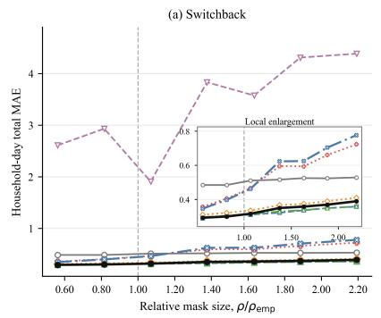

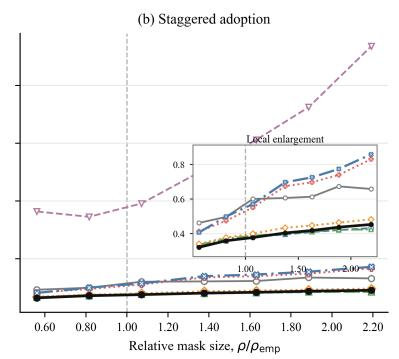

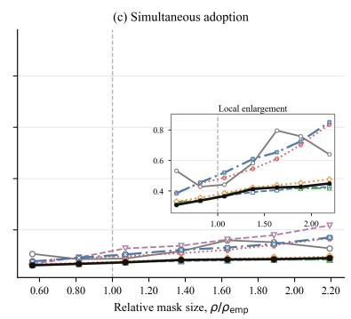

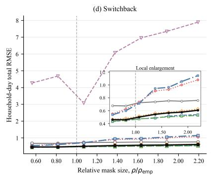

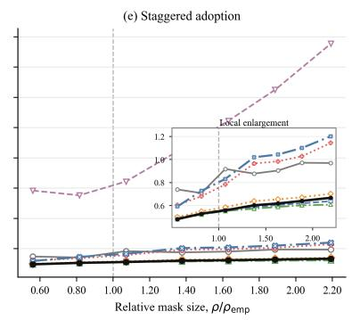

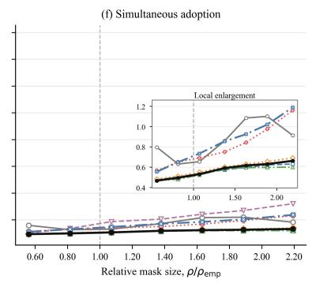  
—0— DID -- SC —Δ- SDID  NMC -x7- TFI …. CONV-DIFF  TUCKER-DIFF  CFT-DIFF

Note. The figure evaluates recovery of household–day totals across different missingness levels. For each artificially masked household–day, the recovered and observed outcomes are first aggregated over the missing 24-hour trajectory. Panels (a)–(c) report MAE and Panels (d)–(f) report RMSE under the switchback, staggered-adoption, and simultaneous-adoption patterns, respectively. The horizontal axis reports $\rho / \rho _ { \mathrm { e m p } }$ , and the vertical dashed line indicates $\rho = \rho _ { \mathrm { e m p } }$ . Lower values indicate better recovery.

outcomes across hours. We sum the 24 hourly outcomes within each artificially masked household–day before computing the recovery error. Figure EC.10 reports MAE and RMSE for these household–day totals. CFT-DIFF remains among the most accurate methods under all three missingness patterns and is substantially more stable than the alternative diffusion models as the missing proportion increases. The results indicate that its pointwise recovery performance carries over to aggregate counterfactual outcomes rather than disappearing after temporal aggregation.

Figure EC.11 Distribution of household–day counterfactual recovery errors.  
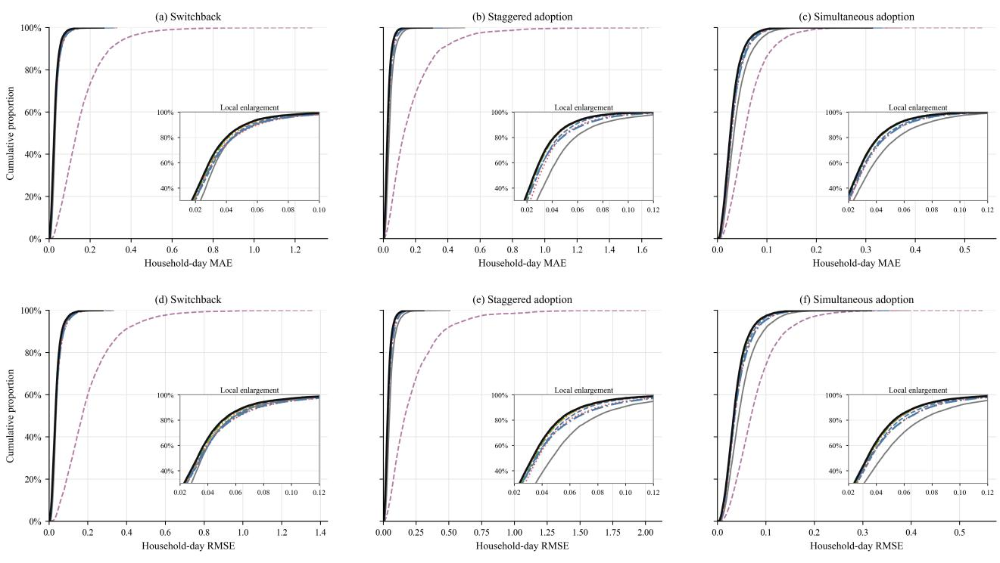  
Note. The figure reports empirical cumulative distribution functions of household–day recovery errors at the available missingness level closest to the empirical treated share. Panels (a)–(c) report household–day MAE and Panels (d)–(f) report household–day RMSE under the switchback, staggered-adoption, and simultaneous-adoption patterns, respectively. Errors are computed separately for each artificially masked household–day over its 24-hour trajectory. Curves farther to the left indicate smaller recovery errors. The inset in each panel provides a local enlargement of the low-error region.

Figure EC.11 reports the empirical distributions of household–day MAE and RMSE at the missingness level closest to the empirical treated share. The distributions for CFT-DIFF are concentrated in the low-error region under all three designs. The differences are particularly visible relative to TFI and remain present relative to the two diffusion benchmarks. Hence, the favorable average performance of CFT-DIFF reflects broadly lower recovery errors across the masked household–days rather than improvements concentrated in a small subset of observations.

Finally, we provide additional evidence on distributional recovery. Whereas the main figure uses the energy score to evaluate the joint 24-hour trajectory, Figure EC.12 considers two complementary criteria. CRPS evaluates the marginal distribution of individual hourly outcomes, while WIS evaluates the distribution of household–day totals through multiple central intervals. Across all three missingness patterns, both scores increase as the missing region expands, but substantially more slowly for CFT-DIFF. CFT-DIFF has the lowest CRPS and WIS at every reported missingness level, showing that its distributional advantage is present for both hourly marginals and aggregate counterfactual outcomes.

Figure EC.12 Additional counterfactual distribution recovery across missingness levels.  
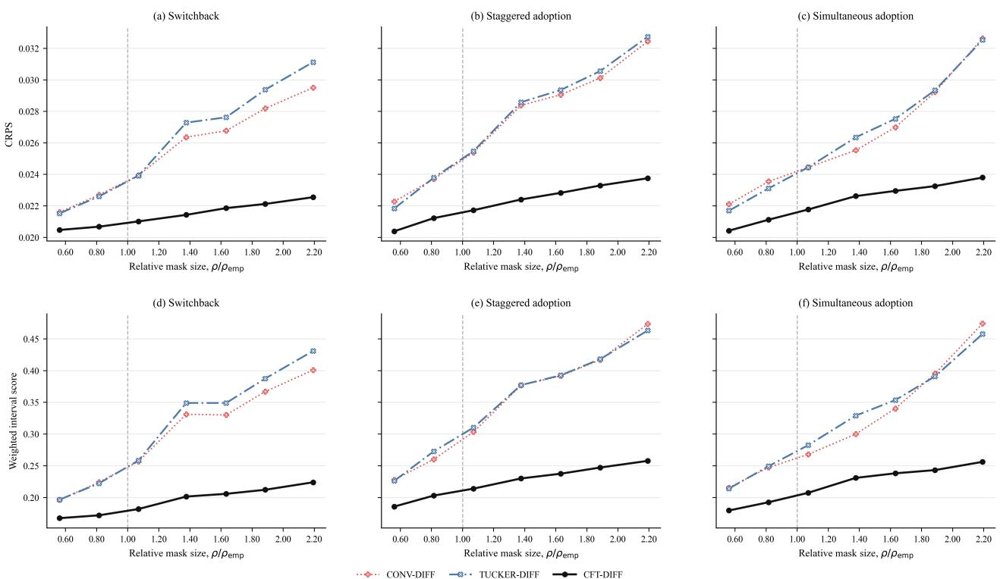  
Note. The figure evaluates counterfactual distribution recovery for the three diffusion methods across different missingness levels. Panels (a)–(c) report CRPS for individual hourly outcomes, and Panels (d)–(f) report WIS for household–day totals under the switchback, staggered-adoption, and simultaneous-adoption patterns, respectively. The horizontal axis reports $\rho / \rho _ { \mathrm { e m p } } ,$ , and the vertical dashed line indicates $\rho = \rho _ { \mathrm { e m p } } .$ . Lower values indicate better distributional recovery.

Table EC.6 reports all distributional measures at the missingness level closest to that observed in the application. Under each missingness pattern, CFT-DIFF has the lowest energy score, CRPS, interval score, and WIS. Its 90% intervals are also narrower than those of the alternative diffusion models, with coverage remaining reasonably close to 0.90. Under staggered adoption, for example, the interval width decreases from 2.2037 for TUCKER-DIFF to 1.7198 for CFT-DIFF, with coverage of 0.920. The switchback and simultaneous-adoption designs show the same combination of lower distributional scores and sharper intervals.

EC.5.3.3. Counterfactual Trajectory Recovery The preceding analyses summarize counterfactual recovery using scalar error and distributional measures. These measures do not reveal whether a method recovers the intraday shape of the missing outcome, including the timing and magnitude of demand peaks. We therefore complement them with trajectory-level comparisons. For each artificially masked household group, the first column of the figures compares the observed no-policy trajectory with the five point estimators. The remaining columns report CONV-DIFF, TUCKER-DIFF, and CFT-DIFF. The solid curve is the median of the generated group-average trajectories, and the shaded regions are the central 50% and 90% counterfactual prediction intervals.

Table EC.6 Counterfactual distribution recovery across missingness patterns.
<table><tr><td colspan="7">Panel A: Switchback</td></tr><tr><td>Method</td><td>Energy score</td><td>CRPS</td><td>90% coverage</td><td>90% width</td><td>IS</td><td>WIS</td></tr><tr><td>CONV-DIFF</td><td>0.1479</td><td>0.0239</td><td>0.887</td><td>1.7246</td><td>2.6548</td><td>0.2569</td></tr><tr><td>TUCKER-DIFF</td><td>0.1476</td><td>0.0239</td><td>0.907</td><td>1.8352</td><td>2.6898</td><td>0.2583</td></tr><tr><td>CFT-DIFF</td><td>0.1314</td><td>0.0210</td><td>0.893</td><td>1.2559</td><td>2.0126</td><td>0.1819</td></tr><tr><td>Panel B: Staggered adoption</td><td></td><td></td><td></td><td></td><td></td><td></td></tr><tr><td>Method</td><td>Energy score</td><td>CRPS</td><td>90% coverage</td><td>90% width</td><td>IS</td><td>WIS</td></tr><tr><td>CONV-DIFF</td><td>0.1546</td><td>0.0254</td><td>0.950</td><td>2.8132</td><td>3.1717</td><td>0.3034</td></tr><tr><td>TUCKER-DIFF</td><td>0.1553</td><td>0.0255</td><td>0.905</td><td>2.2037</td><td>3.0402</td><td>0.3102</td></tr><tr><td>CFT-DIFF</td><td>0.1358</td><td>0.0217</td><td>0.920</td><td>1.7198</td><td>2.2905</td><td>0.2140</td></tr><tr><td>Panel C: Simultaneous adoption</td><td></td><td></td><td></td><td></td><td></td><td></td></tr><tr><td>Method</td><td>Energy score</td><td>CRPS</td><td>90% coverage</td><td>90% width</td><td>IS</td><td>WIS</td></tr><tr><td>CONV-DIFF</td><td>0.1510</td><td>0.0244</td><td>0.942</td><td>2.2955</td><td>2.7606</td><td>0.2680</td></tr><tr><td>TUCKER-DIFF</td><td>0.1509</td><td>0.0245</td><td>0.896</td><td>1.9824</td><td>2.8150</td><td>0.2825</td></tr><tr><td>CFT-DIFF</td><td>0.1364</td><td>0.0218</td><td>0.919</td><td>1.6321</td><td>2.2463</td><td>0.2075</td></tr></table>

Note. The table evaluates the three diffusion methods at the available missingness level closest to the empirical treated share, $\rho _ { \mathrm { e m p } } =$ 0.265. The common target missing proportion is 0.284, with realized missing proportions of 0.283, 0.284, and 0.284 under the switchback, staggered-adoption, and simultaneous-adoption patterns, respectively. The energy score evaluates the joint 24-hour trajectory, CRPS evaluates individual hourly outcomes, and the interval-based measures are computed for household–day totals. Errors, scores, and interval widths are reported in the normalized experimental scale. Lower values are better for the energy score, CRPS, IS, and WIS; coverage is evaluated by closeness to 0.90, and a smaller width indicates a sharper interval when coverage is comparable. Boldface and underlining indicate the best and second-best values within each panel, respectively.

Figures EC.13, EC.14, and EC.15 examine trajectory recovery as the number of households in each group increases. This design separates errors that are specific to small groups from errors that persist after aggregation. For small groups, the realized trajectories contain substantial hour-to-hour variation, and the differences across methods are correspondingly more visible. Among the point estimators, DID, SC, SDID, and NMC generally recover the overall level and shape, whereas TFI can be unstable when only a few households are averaged. The three diffusion models produce smoother counterfactual trajectories, but CONV-DIFF and especially TUCKER-DIFF tend to attenuate local peaks. CFT-DIFF follows the observed trajectory more closely while retaining the main intraday variation.

As the group size increases, idiosyncratic household variation is averaged out and the trajectories become progressively smoother. The CFT-DIFF median becomes tightly aligned with the observed group-average trajectory, and its counterfactual prediction intervals also become more concentrated. The same pattern is visible under switchback, staggered adoption, and simultaneous adoption. Thus, the recovery performance is not confined to large aggregates: CFT-DIFF remains informative for relatively small groups and becomes increasingly precise as the counterfactual object is aggregated over more households.

Figures EC.16, EC.17, and EC.18 repeat the comparison for nonoverlapping random household groups. The resulting trajectories vary meaningfully across groups in both their levels and peak patterns, providing a more demanding check on the cross-sectional stability of the recovery methods. The main conclusions are similar across the three groups and missingness patterns. The stronger point estimators generally reproduce the broad group-average profile, while TFI exhibits noticeably larger deviations in several cases. Among the diffusion models, CFT-DIFF consistently preserves more of the observed intraday variation. By comparison, CONV-DIFF and TUCKER-DIFF tend to smooth the morning and evening peaks and, for some groups, shift the trajectory downward. The similarity of these results across independently formed groups indicates that the trajectory-level performance is not driven by a particular household composition.

Figure EC.13 Counterfactual trajectories across nested household groups under switchback missingness.  
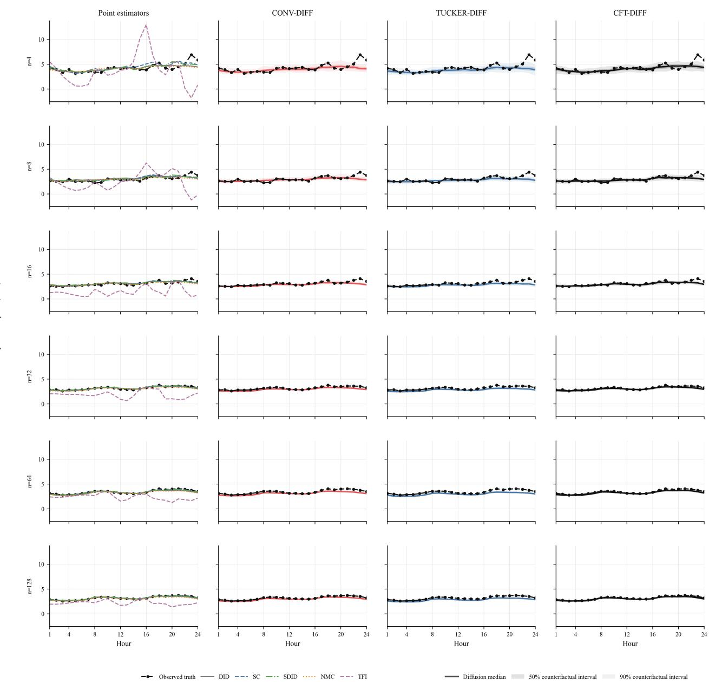  
Note. The figure compares recovered 24-hour counterfactual trajectories as the number of households included in the group average increases under the switchback pattern. Rows correspond to nested household groups of increasing size. The first column reports the observed trajectory together with the five point estimators; the remaining columns report CONV-DIFF, TUCKER-DIFF, and CFT-DIFF, respectively. For each diffusion method, the solid line denotes the median generated trajectory and the shaded regions denote the 50% and 90% central counterfactual prediction intervals.

Figures EC.19, EC.20, and EC.21 stratify households by demand volatility measured from the observed outcomes. Differences across methods are relatively small for the low-volatility groups but become more pronounced as volatility increases. In the high-volatility groups, the observed trajectory displays larger intraday movements and more pronounced peaks. CONV-DIFF and TUCKER-DIFF tend to attenuate these movements, whereas the CFT-DIFF median remains much closer to the observed trajectory. The counterfactual bands also become wider for the more volatile groups, reflecting the greater uncertainty associated with recovering their missing trajectories. The same qualitative pattern appears under all three missingness structures.

Figure EC.14 Counterfactual trajectories across nested household groups under staggered adoption.  
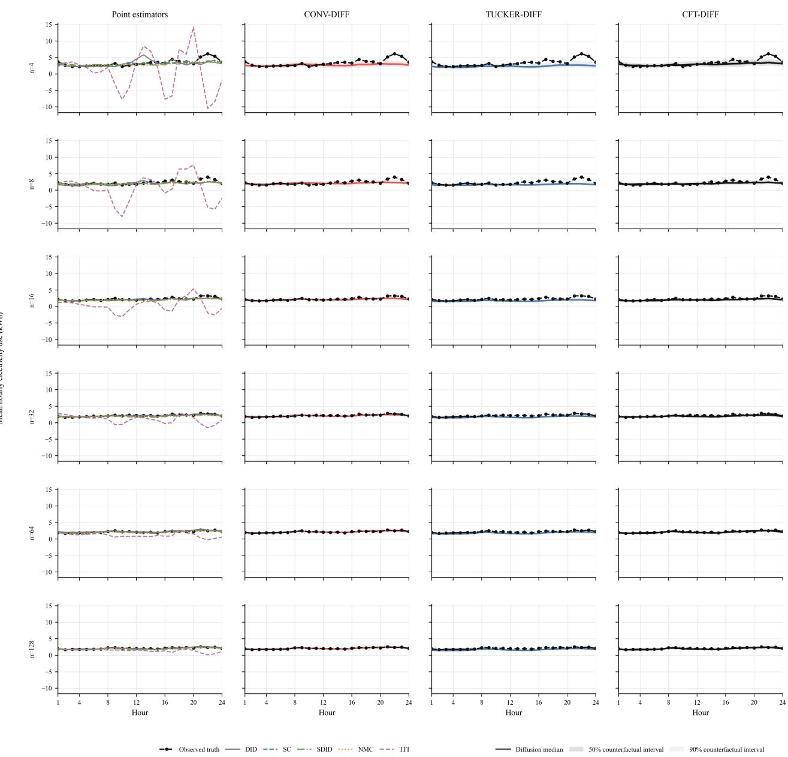  
Note. The figure compares recovered 24-hour counterfactual trajectories as the number of households included in the group average increases under staggered adoption. Rows correspond to nested household groups of increasing size. The first column reports the observed trajectory together with the five point estimators; the remaining columns report CONV-DIFF, TUCKER-DIFF, and CFT-DIFF, respectively. For each diffusion method, the solid line denotes the median generated trajectory and the shaded regions denote th 50% and 90% central counterfactual prediction intervals.

Figure EC.15 Counterfactual trajectories across nested household groups under simultaneous adoption.  
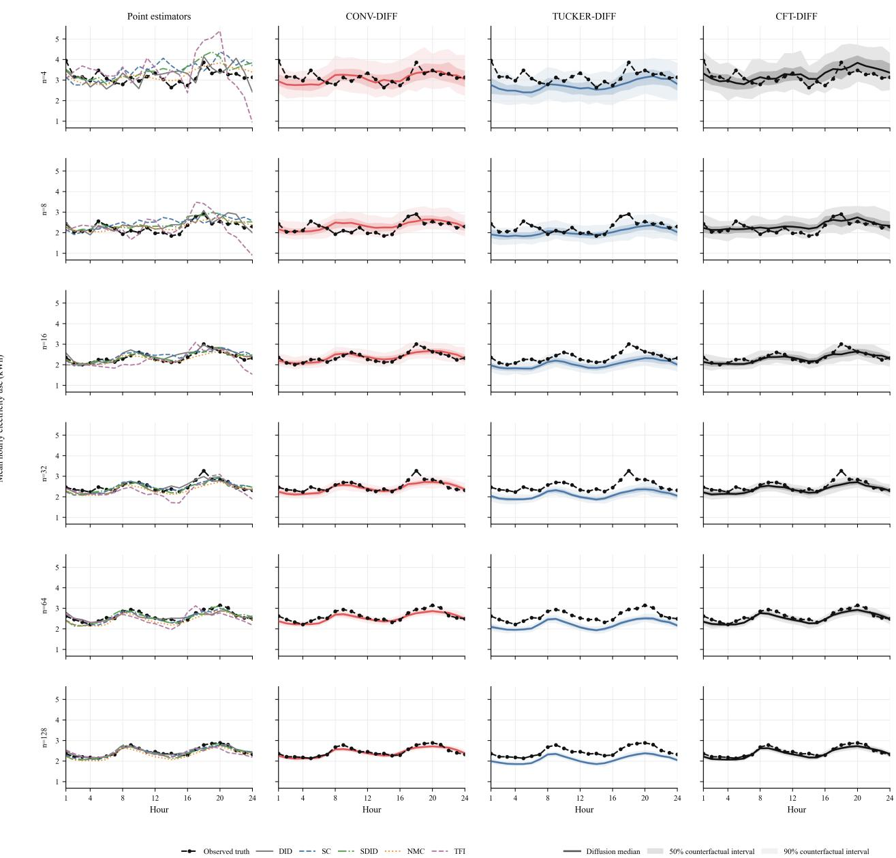  
Note. The figure compares recovered 24-hour counterfactual trajectories as the number of households included in the group average increases under simultaneous adoption. Rows correspond to nested household groups of increasing size. The first column reports the observed trajectory together with the five point estimators; the remaining columns report CONV-DIFF, TUCKER-DIFF, and CFT-DIFF, respectively. For each diffusion method, the solid line denotes the median generated trajectory and the shaded regions denote the 50% and 90% central counterfactual prediction intervals.

Figures EC.22, EC.23, and EC.24 divide households into low-, middle-, and high-demand groups using their observed outcomes. Recovery is relatively similar across methods for the low-demand groups, where the trajectories are comparatively flat. The differences become clearer for the middle- and high-demand groups, whose trajectories exhibit larger morning and evening peaks. CFT-DIFF adjusts to these changes in both level and shape and remains close to the observed trajectory. In contrast, the two nested diffusion benchmarks tend to understate the higher-demand portions of the curve, particularly around peak hours. The point estimators other than TFI also track the broad demand profile reasonably well, but they do not provide the conditional distribution around the recovered trajectory. These results suggest that the gains from counterfactual conditioning are particularly useful when the missing trajectory has more pronounced systematic variation.

Figure EC.16 Counterfactual trajectories across random household groups under switchback missingness.  
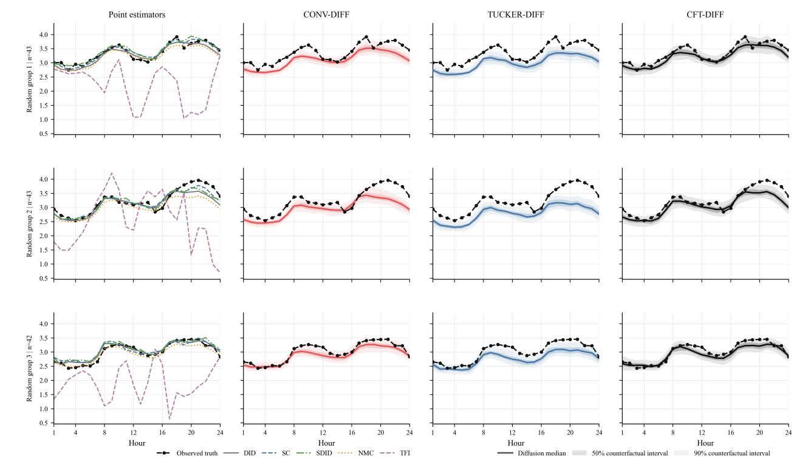  
Note. The figure examines whether trajectory recovery depends on the composition of the household group under the switchback pattern. Each row corresponds to a different randomly selected household group. The first column reports the observed trajectory and the five point estimators; the remaining columns report the three diffusion methods. Solid diffusion curves denote median generated trajectories, with 50% and 90% central counterfactual prediction intervals shown by the shaded regions.

Figures EC.25, EC.26, and EC.27 repeat the comparison across different artificially masked days. The selected days differ in both average electricity use and the shape of the intraday profile. Nevertheless, the same broad ranking remains visible. CFT-DIFF closely follows changes in the level, timing, and magnitude of the observed demand peaks across days, while CONV-DIFF and TUCKER-DIFF generally produce smoother trajectories and can understate relatively sharp movements. Several point estimators remain competitive for the average trajectory, although TFI again exhibits substantial instability on some days. Overall, the trajectory evidence complements the scalar recovery measures in Section EC.5.3.2: the advantage of CFT-DIFF is not limited to average error reductions, but is also reflected in its ability to recover the shape of the missing 24-hour counterfactual trajectory across different aggregation levels, household groups, and time periods.

Figure EC.17 Counterfactual trajectories across random household groups under staggered adoption.  
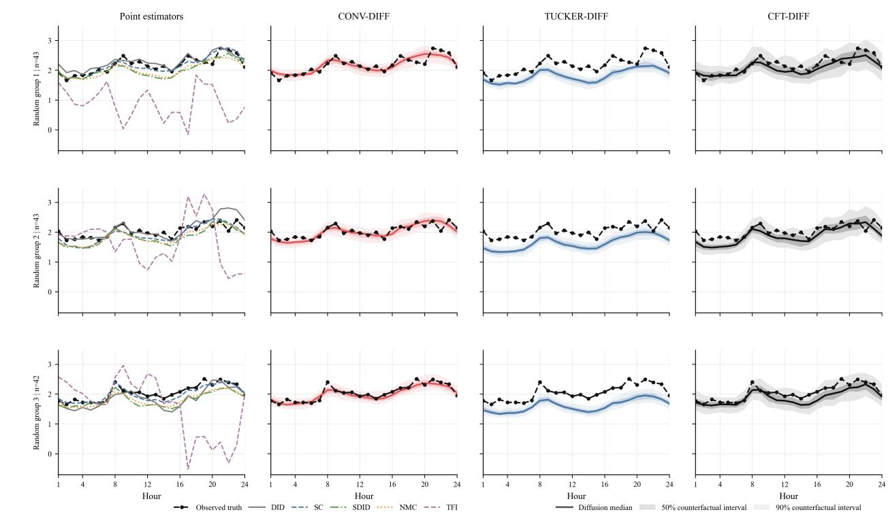  
Note. The figure examines whether trajectory recovery depends on the composition of the household group under staggered adoption. Each row corresponds to a different randomly selected household group. The first column reports the observed trajectory and the five point estimators; the remaining columns report the three diffusion methods. Solid diffusion curves denote median generated trajectories, with 50% and 90% central counterfactual prediction intervals shown by the shaded regions.

## EC.5.4. Additional Results on Demand Response

This section provides additional analyses of the demand responses reported in Section 6.4. We examine hourly response heterogeneity, price intensity and profile design, repeated intervention exposure, and heterogeneity across temperature, regions, and household characteristics.

Aggregate effects can conceal substantial variation across treated observations. Figure EC.28 therefore reports the distribution of hourly demand reductions across household–policy-day observations, using the mean of 100 CFT-DIFF conditional draws for each observation. The medians are generally close to zero, while the distributions remain wide at many hours, indicating considerable variation across households and intervention days. This variation is especially visible during the daytime and evening periods, when electricity use is relatively high. The aggregate estimates therefore do not characterize all treated observations uniformly: under the same price signal, some household–day observations exhibit sizable demand reductions, whereas others show little change or an increase at particular hours.

Figure EC.29 reports the corresponding distributions of relative demand reductions. The results are qualitatively similar to the absolute-effect distributions in Figure EC.29. The medians remain generally close to zero, while the distributions are wide across households and intervention days, indicating substantial heterogeneity in hourly demand responses. Thus, expressing the effects relative to the estimated no-policy counterfactual does not materially change the main patterns documented in Section 6.4.

Figure EC.18 Counterfactual trajectories across random household groups under simultaneous adoption.  
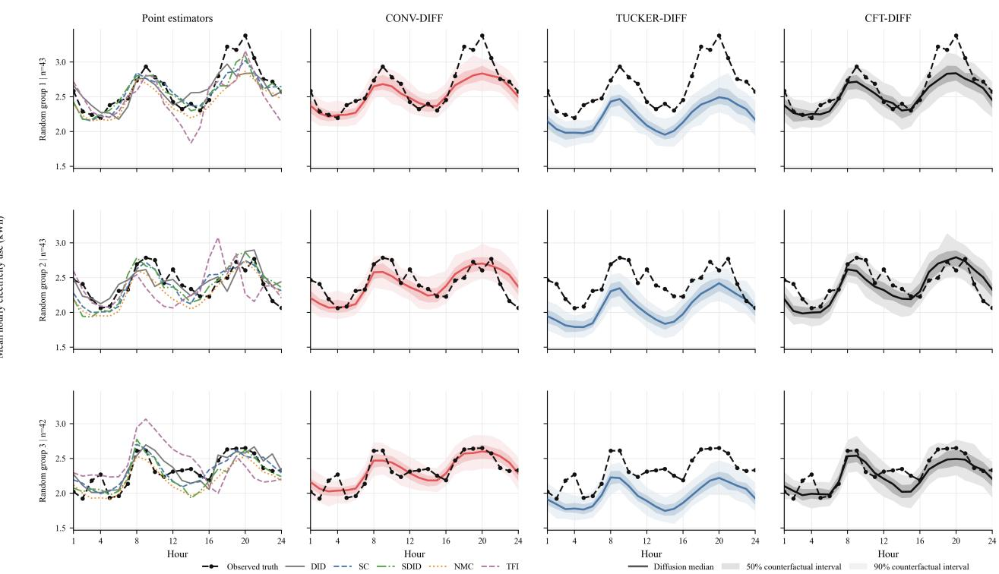  
Note. The figure examines whether trajectory recovery depends on the composition of the household group under simultaneous adoption. Each row corresponds to a different randomly selected household group. The first column reports the observed trajectory and the five point estimators; the remaining columns report the three diffusion methods. Solid diffusion curves denote median generated trajectories, with 50% and 90% central counterfactual prediction intervals shown by the shaded regions.

Figure EC.30 further examines whether the demand response varies with price intensity and profile design. Panel (a) shows that the peak-demand reduction increases with the peak price for profile P. The estimates for profile B remain close to zero, while the responses for profiles A and P0 are not monotone and several estimates remain imprecise. Panel (b) shows larger estimated reductions for the P profile than for the B profile at peak prices of 5, 10, and 15 NOK/kWh, with the corresponding 95% intervals excluding zero. Most other profile-design comparisons remain imprecise, with intervals including zero. These results indicate that the relationship between price intensity and demand response depends on the price profile, with the clearest dose–response pattern occurring for profile P.

Figure EC.31 next examines whether the demand response changes with repeated intervention exposure. Panels (a) and (c) show no monotone relationship between the response and cumulative exposure. The estimates decline after the first intervention, remain similar for the 2–5 and 6–10 exposure groups, and then increase for the 11+ group. Panels (b) and (d) show a clearer pattern for intervention spacing: the estimated peak-demand reduction increases with the time since the previous intervention and is largest for the 7+ day group, although the intervals remain wide. Taken together, these results provide limited evidence of a systematic learning or fatigue pattern across repeated interventions, but suggest a stronger response when interventions are spaced farther apart.

The preceding analysis shows that demand response varies with the design and timing of the intervention. We next examine whether it also varies with outdoor temperature, an important source of variation in residential electricity demand. We classify the previous 24-hour average outdoor temperature into six intervals: $\leq - 1 5 ^ { \circ } \mathbf { C } , ( - 1 5 , - 1 0 ] ^ { \circ } \mathbf { C } , ( - 1 0 , - 5 ] ^ { \circ } \mathbf { C } , ( - 5 , 0 ] ^ { \circ } \mathbf { C } , ( 0 , 5 ] ^ { \circ } \mathbf { C } , \mathrm { a n d } > 5 ^ { \circ } \mathbf { C } .$ We first estimate the average peakdemand response within each temperature interval, controlling for price signal, region, baseline demand, and intervention order. We then examine whether the temperature relationship differs across price-profile designs. For this analysis, the price signals are grouped into three profile classes: short profiles (P and P0), extended profiles (B), and dual-peak profiles (A and C). Panels (b) and (d) report the corresponding temperature-response relationships for these three profile classes, controlling for region, baseline demand, and intervention order. The analysis is conducted at the region–intervention-event level, with observations weighted by the number of households in each event.

Figure EC.19 Counterfactual trajectories across household demand-volatility groups under switchback missingness.  
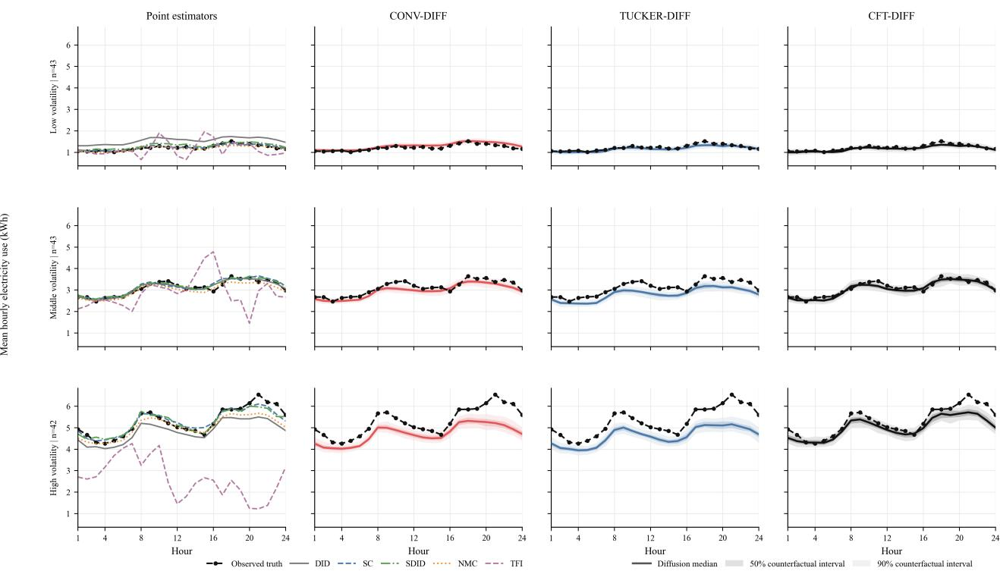  
Note. The figure evaluates trajectory recovery across household groups with different levels of demand volatility under the switchback pattern. Households are grouped using demand variation measured from the observed portion of the data. Rows correspond to the resulting volatility groups. The first column reports the observed trajectory and the five point estimators; the remaining columns report the three diffusion methods together with their median trajectories and 50% and 90% central counterfactual prediction intervals.

Figure EC.32 shows a clear relationship between outdoor temperature and demand response. Panels (a) and (c) reveal a strong monotone pattern in the pooled estimates: as outdoor temperature increases, both relative and absolute peak-demand reductions increase steadily. At temperatures below $- 1 5 ^ { \circ } \mathrm { C } .$ , the estimated response is strongly negative, whereas it approaches zero around $0 ^ { \circ } \mathbf { C }$ and becomes positive at higher temperatures. Panels (b) and (d) show that this pattern is not driven by a single price-profile design. The short, extended, and dual-peak profiles all exhibit generally increasing demand reductions as temperature rises, although the estimates are less precise for some temperature–profile combinations. Overall, the results indicate that households respond more strongly to dynamic pricing under warmer conditions, while peak-period electricity use is less responsive during very cold periods.

Figure EC.20 Counterfactual trajectories across household demand-volatility groups under staggered adoption.  
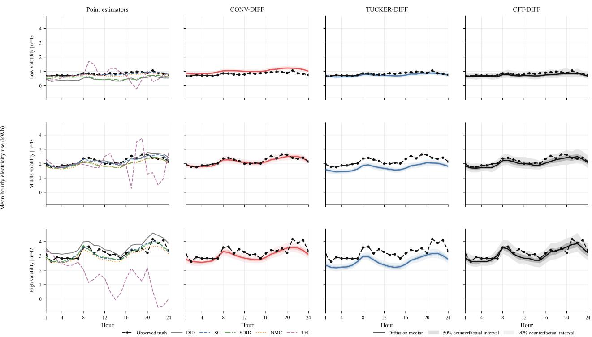  
Note. The figure evaluates trajectory recovery across household groups with different levels of demand volatility under staggered adoption. Households are grouped using demand variation measured from the observed portion of the data. Rows correspond to the resulting volatility groups. The first column reports the observed trajectory and the five point estimators; the remaining columns report the three diffusion methods together with their median trajectories and 50% and 90% central counterfactual prediction intervals.

Given the strong temperature pattern in Figure Figure EC.32, we next examine whether regional dif ferences remain after controlling for temperature. Figure EC.33 shows that some regional heterogeneity persists. Bergen has a relative-effect estimate close to zero but a negative absolute-effect estimate whose confidence interval excludes zero. Relative peak-demand reductions are positive in the other regions and are largest in Stavanger and Trondheim, although the estimate for Stavanger is imprecise. The correspond ing intervals exclude zero for Oslo and Trondheim. In absolute terms, the estimates for the other regions are close to zero or positive, with relatively wide confidence intervals. The estimates therefore do not indicate a simple geographic pattern. Because the specifications already control for outdoor temperature, these differences are unlikely to reflect temperature alone. They may instead capture remaining regional differences in household characteristics, housing conditions, heating technologies, or electricity-use patterns that are not separately identified in our data. We therefore interpret the results as evidence of residual regional heterogeneity rather than as causal effects of location.

We finally examine heterogeneity across household electricity-use characteristics measured before the first intervention. For each household, we construct four pre-intervention characteristics: average electricity demand, the share of electricity use during peak hours, the share during evening hours, and load volatility.

Figure EC.21 Counterfactual trajectories across household demand-volatility groups under simultaneous adoption.  
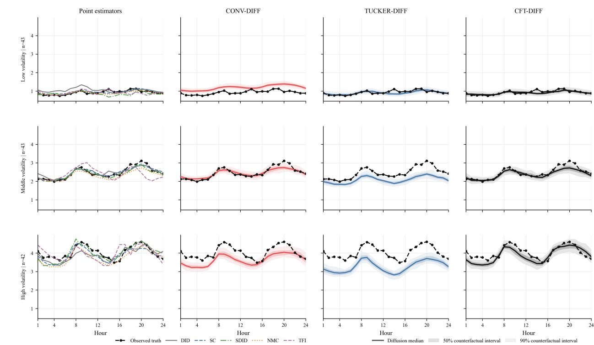  
Note. The figure evaluates trajectory recovery across household groups with different levels of demand volatility under simultaneous adoption. Households are grouped using demand variation measured from the observed portion of the data. Rows correspond to the resulting volatility groups. The first column reports the observed trajectory and the five point estimators; the remaining column report the three diffusion methods together with their median trajectories and 50% and 90% central counterfactual prediction intervals.

Households are ranked separately by each characteristic and divided into five equally sized groups, with Q1 denoting the lowest quintile and Q5 the highest. We also construct each household’s average 24-hour preintervention load profile and normalize it by total daily use, so that the resulting profile captures the timing rather than the level of electricity consumption. We then apply K-means clustering to these normalized profiles and classify households into four load-shape clusters, C1–C4. The cluster labels are ordered by the center of the daily load profile, from earlier to later concentration of electricity use. These classifications are constructed using only electricity use observed before treatment and therefore do not depend on the estimated treatment effects.

Figure EC.34 shows substantial heterogeneity in peak-demand response across these household groups, although the patterns are generally nonmonotone. Panel (a) exhibits the largest differences across baselinedemand quintiles: households in Q1 and Q4 show positive peak-demand reductions, whereas Q2 and Q5 show negative responses and Q3 is close to zero. The differences across peak-hour and evening-load shares in Panels (b) and (c) are more modest, and all corresponding confidence intervals include zero. Panel (d) also shows a nonmonotone pattern across load volatility, with Q5 exhibiting the largest positive response. Panel (e) shows variation across intraday load-shape clusters, with the highest point estimate for C3 and the lowest for C4, although the intervals are wide and overlap substantially. Overall, the results indicate meaningful household heterogeneity in demand response, but no single pre-intervention characteristic provides a simple ordering of households by their response to dynamic pricing.

Figure EC.22 Counterfactual trajectories across household demand-level groups under switchback missingness.  
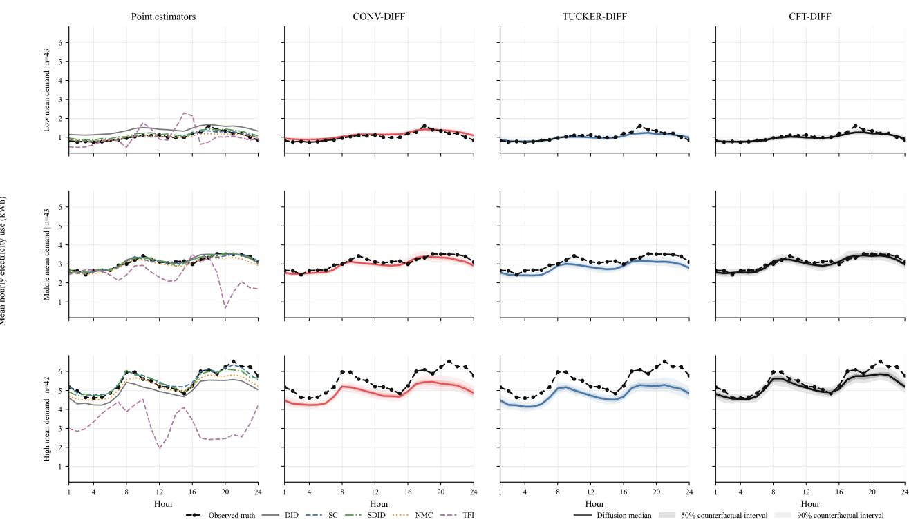  
Note. The figure evaluates trajectory recovery across household groups with different levels of average electricity use under the switchback pattern. Households are grouped according to their mean demand computed from the observed portion of the data. Rows correspond to the resulting demand-level groups. The first column reports the observed trajectory and the five point estimators; the remaining columns report the three diffusion methods together with their median trajectories and 50% and 90% central counterfactual prediction intervals.

Table EC.7 provides the corresponding estimates for the household groups in Figure EC.34. As described above, the four continuous pre-intervention characteristics are divided into quintiles across treated households, while normalized 24-hour load profiles are classified into four load-shape clusters. For each household, we first average the 100 CFT-DIFF draws to obtain the estimated no-policy counterfactual and then aggregate the counterfactual and observed demand over all of that household’s intervention days and the corresponding signal-specific peak-price hours. For a subgroup G, let $Y _ { i } ^ { 0 }$ and $Y _ { i } ^ { \mathrm { o b s } }$ denote these aggregated counterfactual and observed outcomes for household i, and let $n _ { i }$ denote its number of intervention days. We report the pooled relative peak-demand reduction

$$
\widehat { R } _ { \mathcal { G } } = 1 0 0 \frac { \sum _ { i \in \mathcal { G } } \left( Y _ { i } ^ { 0 } - Y _ { i } ^ { \mathrm { o b s } } \right) } { \sum _ { i \in \mathcal { G } } Y _ { i } ^ { 0 } } ,
$$

and the corresponding absolute reduction per household–policy day,

$$
\widehat { A } _ { \mathcal { G } } = \frac { \sum _ { i \in \mathcal { G } } \left( Y _ { i } ^ { 0 } - Y _ { i } ^ { \mathrm { { o b s } } } \right) } { \sum _ { i \in \mathcal { G } } n _ { i } } .
$$

Figure EC.23 Counterfactual trajectories across household demand-level groups under staggered adoption.  
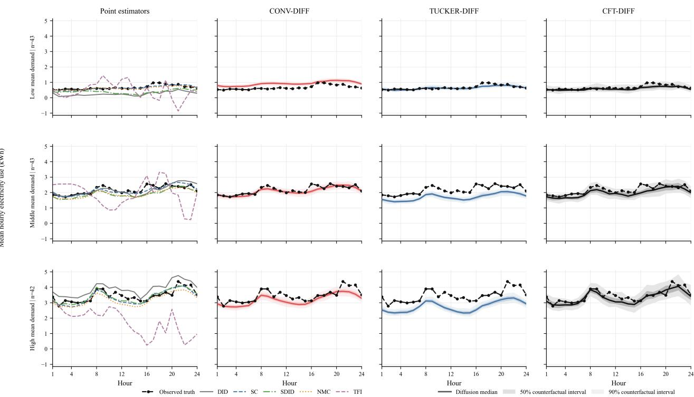  
Note. The figure evaluates trajectory recovery across household groups with different levels of average electricity use under staggered adoption. Households are grouped according to their mean demand computed from the observed portion of the data. Rows correspond to the resulting demand-level groups. The first column reports the observed trajectory and the five point estimators; the remaining columns report the three diffusion methods together with their median trajectories and 50% and 90% central counterfactual prediction intervals.

Positive values therefore indicate lower observed demand relative to the estimated no-policy counterfactual. To quantify sampling uncertainty, we resample households with replacement within each subgroup, keeping each sampled household’s complete intervention history together, and recompute $\widehat { R } _ { \mathcal { G } }$ in each of 1,000 bootstrap samples. The reported 95% confidence interval is given by the 2.5th and 97.5th percentiles of these bootstrap estimates.

The estimates confirm substantial and nonmonotone household heterogeneity. The clearest differences occur across baseline-demand quintiles. Q1 has the largest positive relative reduction, at 2.84%, with a 95% confidence interval of [1.72, 4.10], while Q4 also has a positive reduction of 1.85%. By contrast, Q2 and Q5 have negative estimates, and the estimate for Q3 is close to zero. The differences across peakhour and evening-load shares are more modest, with all corresponding confidence intervals including zero. Load volatility exhibits a nonmonotone pattern: Q1 has a negative response, whereas Q5 has a positive response, and both intervals exclude zero. The estimates also vary across load-shape clusters, although their confidence intervals are wide and include zero. The absolute estimates show that relative and absolute responses need not rank households in the same way. For example, Q1 of baseline demand has the largest relative reduction, whereas Q4 has the largest absolute reduction, at 0.581 kWh per household–policy day. Overall, the table reinforces the conclusion that household response to dynamic pricing varies with preintervention electricity-use patterns, but this heterogeneity cannot be summarized by a simple monotone relationship with any single household characteristic.

Figure EC.24 Counterfactual trajectories across household demand-level groups under simultaneous adoption.  
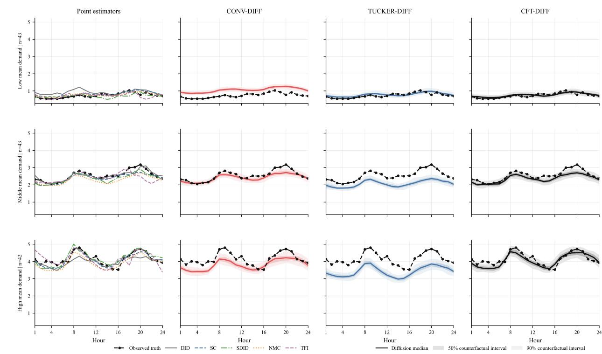  
Note. The figure evaluates trajectory recovery across household groups with different levels of average electricity use under simultaneous adoption. Households are grouped according to their mean demand computed from the observed portion of the data. Rows correspond to the resulting demand-level groups. The first column reports the observed trajectory and the five point estimators; the remaining columns report the three diffusion methods together with their median trajectories and 50% and 90% central counterfactual prediction intervals.

Figure EC.25 Counterfactual trajectories across missing days under switchback missingness.  
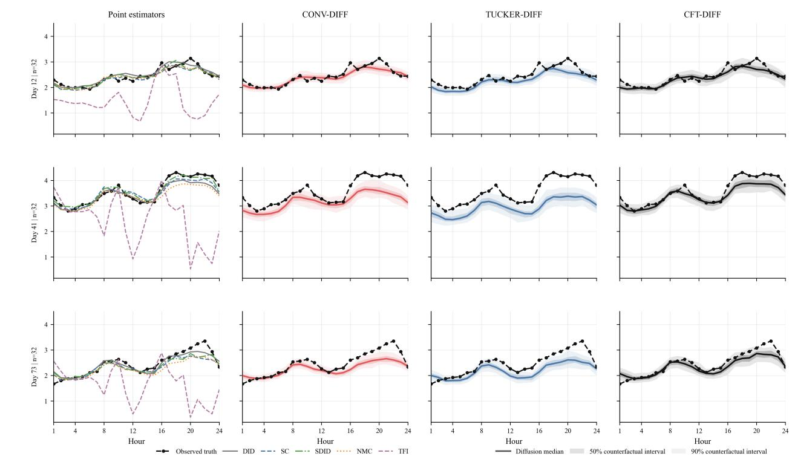  
Note. The figure evaluates trajectory recovery on different artificially masked days under the switchback pattern. Each row cor responds to a different missing day and reports the average trajectory for the selected households on that day. The first column reports the observed trajectory and the five point estimators; the remaining columns report CONV-DIFF, TUCKER-DIFF, and CFT-DIFF, respectively. For each diffusion method, the solid line denotes the median generated trajectory and the shaded regions denot the 50% and 90% central counterfactual prediction intervals.

Figure EC.26 Counterfactual trajectories across missing days under staggered adoption.  
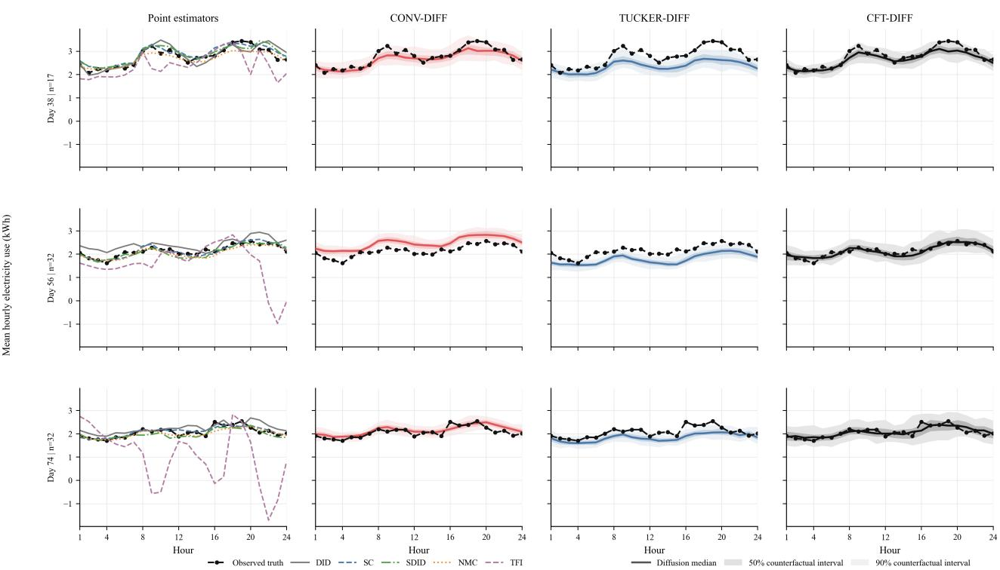  
Note. The figure evaluates trajectory recovery on different artificially masked days under staggered adoption. Each row correspond to a different missing day and reports the average trajectory for the selected households on that day. The first column report the observed trajectory and the five point estimators; the remaining columns report CONV-DIFF, TUCKER-DIFF, and CFT-DIFF, respectively. For each diffusion method, the solid line denotes the median generated trajectory and the shaded regions denote th 50% and 90% central counterfactual prediction intervals.

Figure EC.27 Counterfactual trajectories across missing days under simultaneous adoption.  
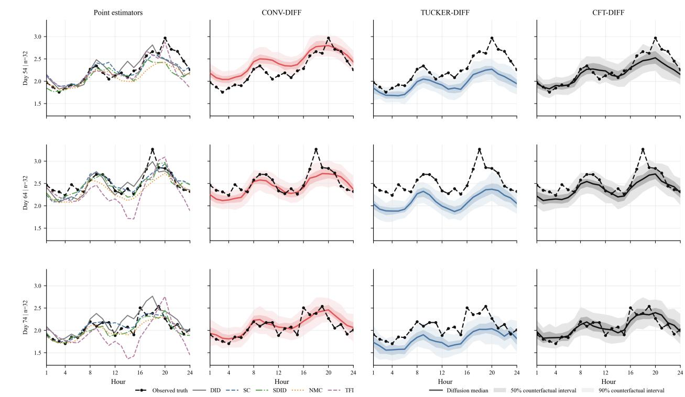  
Note. The figure evaluates trajectory recovery on different artificially masked days under simultaneous adoption. Each row corresponds to a different missing day and reports the average trajectory for the selected households on that day. The first column reports the observed trajectory and the five point estimators; the remaining columns report CONV-DIFF, TUCKER-DIFF, and CFT-DIFF, respectively. For each diffusion method, the solid line denotes the median generated trajectory and the shaded regions denote th 50% and 90% central counterfactual prediction intervals.

Figure EC.28 Distribution of hourly demand reductions by price signal.  
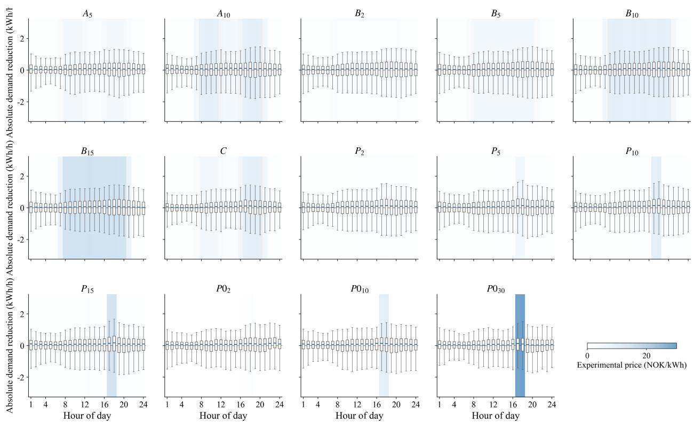  
Note. Each boxplot reports the distribution of hourly demand reductions across household–policy-day observations. The no-policy counterfactual is first averaged over 100 CFT-DIFF conditional draws, and the demand reduction is defined as counterfactual demand minus observed demand, so positive values indicate lower demand under the assigned price signal. Boxes denote the interquartile range, the center line denotes the median, and whiskers extend from the 5th to the 95th percentile. Individual outliers are omitted. Background shading indicates the experimental electricity price.

Figure EC.29 Distribution of hourly relative demand reductions by price signal.  
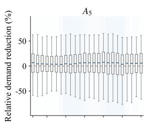

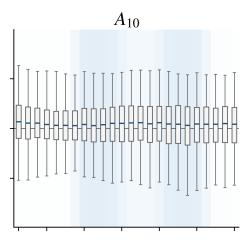

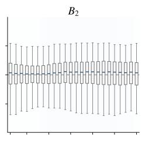

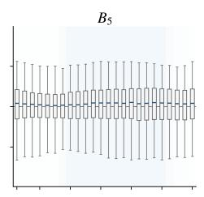

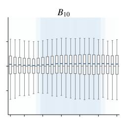

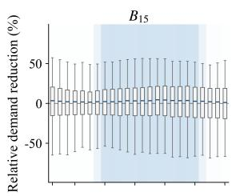

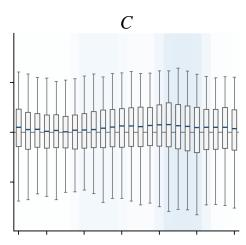

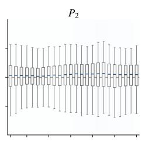

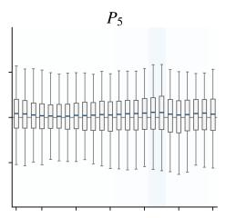

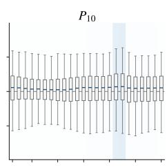

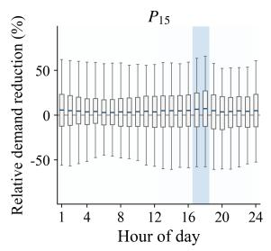

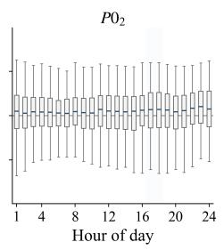

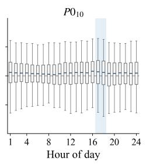

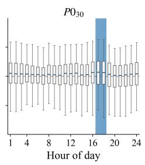

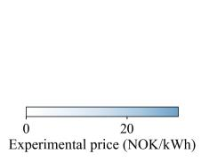  
Note. Each boxplot reports the distribution of hourly relative demand reductions across household–policy-day observations. For each observation, the no-policy counterfactual is first averaged over the 100 CFT-DIFF draws. Positive values indicate lower observed demand relative to the estimated no-policy counterfactual. Boxes denote the interquartile range, the center line denotes the median, and whiskers extend from the 5th to the 95th percentile. Individual outliers are omitted. Background shading indicates the experi mental electricity price.

Figure EC.30 Demand response across price intensity and profile design.  
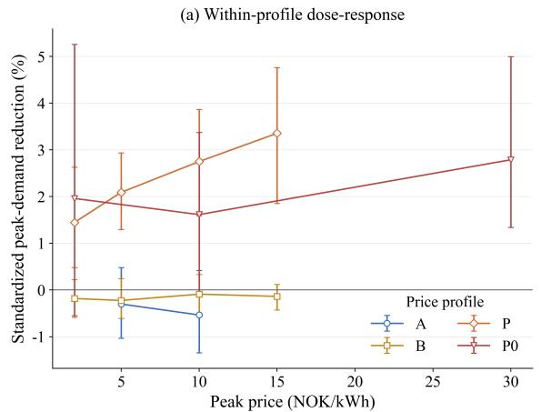

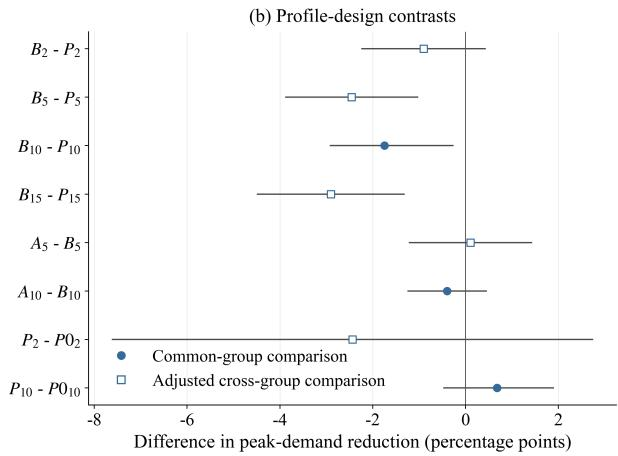  
Note. Panel (a) reports peak-period relative demand reductions across peak-price levels within each price profile, using experimental groups observed under all price levels within the corresponding profile. Profile C is omitted because it does not have a single peak-price level. Panel (b) reports pairwise differences in peak-period relative demand reductions across price-signal designs. Filled circles denote common-group comparisons, and open squares denote covariate-adjusted cross-group comparisons. Error bars report 95% intervals. In Panel (b), positive values indicate a larger demand reduction for the first price signal in each comparison.

Table EC.7 Detailed estimates of household heterogeneity in peak-demand reductions.
<table><tr><td>Characteristic</td><td>Subgroup</td><td>Households</td><td>Relative %</td><td>95% CI</td><td>Absolute kWh</td></tr><tr><td>Baseline demand quintile</td><td>1</td><td>621</td><td>2.84</td><td>[1.72, 4.10]</td><td>0.168</td></tr><tr><td>Baseline demand quintile</td><td>2</td><td>620</td><td>-0.91</td><td>[-1.68, -0.10]</td><td>-0.133</td></tr><tr><td>Baseline demand quintile</td><td>3</td><td>621</td><td>0.24</td><td>[-0.50, 0.91]</td><td>0.051</td></tr><tr><td>Baseline demand quintile</td><td>4</td><td>620</td><td>1.85</td><td>[1.32, 2.40]</td><td>0.581</td></tr><tr><td>Baseline demand quintile</td><td>5</td><td>621</td><td>-1.52</td><td>[-2.13, -0.94]</td><td>-0.676</td></tr><tr><td>Peak-hour share quintile</td><td>1</td><td>621</td><td>-0.46</td><td>[-1.38, 0.42]</td><td>-0.103</td></tr><tr><td>Peak-hour share quintile</td><td>2</td><td>620</td><td>-0.06</td><td>[-0.60, 0.52]</td><td>-0.017</td></tr><tr><td>Peak-hour share quintile</td><td>3</td><td>621</td><td>0.41</td><td>[-0.29, 1.18]</td><td>0.108</td></tr><tr><td>Peak-hour share quintile</td><td>4</td><td>620</td><td>0.06</td><td>[-0.80, 0.89]</td><td>0.013</td></tr><tr><td>Peak-hour share quintile</td><td>5</td><td>621</td><td>-0.04</td><td>[-0.82, 0.87]</td><td>-0.008</td></tr><tr><td>Evening-load share quintile</td><td>1</td><td>621</td><td>-0.39</td><td>[-1.17, 0.27]</td><td>-0.100</td></tr><tr><td>Evening-load share quintile</td><td>2</td><td>620</td><td>-0.17</td><td>[-0.83, 0.53]</td><td>-0.045</td></tr><tr><td>Evening-load share quintile</td><td>3</td><td>621</td><td>0.17</td><td>[-0.58, 0.88]</td><td>0.046</td></tr><tr><td>Evening-load share quintile</td><td>4</td><td>620</td><td>0.28</td><td>[-0.45, 1.04]</td><td>0.066</td></tr><tr><td>Evening-load share quintile</td><td>5</td><td>621</td><td>0.18</td><td>[-0.59, 1.04]</td><td>0.026</td></tr><tr><td>Load-volatility quintile</td><td>1</td><td>621</td><td>-0.81</td><td>[-1.54, -0.16]</td><td>-0.258</td></tr><tr><td>Load-volatility quintile</td><td>2</td><td>620</td><td>0.48</td><td>[-0.12, 1.10]</td><td>0.142</td></tr><tr><td>Load-volatility quintile</td><td>3</td><td>621</td><td>0.48</td><td>[-0.17, 1.16]</td><td>0.121</td></tr><tr><td>Load-volatility quintile</td><td>4</td><td>620</td><td>-0.71</td><td>[-1.47, 0.02]</td><td>-0.147</td></tr><tr><td>Load-volatility quintile</td><td>5</td><td>621</td><td>1.33</td><td>[0.19, 2.58]</td><td>0.133</td></tr><tr><td>Load-shape cluster</td><td>1</td><td>1893</td><td>-0.16</td><td>[-0.57, 0.24]</td><td>-0.043</td></tr><tr><td>Load-shape cluster</td><td>2</td><td>521</td><td>0.38</td><td>[-0.37, 1.13]</td><td>0.097</td></tr><tr><td>Load-shape cluster</td><td>3</td><td>392</td><td>1.02</td><td>[-0.23, 2.35]</td><td>0.140</td></tr><tr><td>Load-shape cluster</td><td>4</td><td>297</td><td>-0.73</td><td>[-2.10, 0.83]</td><td>-0.098</td></tr></table>

Note. Subgroups are constructed from electricity use observed before each household’s first intervention. Relative effects are pooled ratio-of-sums estimates. Absolute effects are kWh reductions per household–policy day over the corresponding signal-specific peak-price hours. Confidence intervals are obtained from a household bootstrap. Positive values indicate demand reductions.

Figure EC.31 Demand response by cumulative exposure and intervention spacing.  
(a) Relative effect by cumulative exposure  
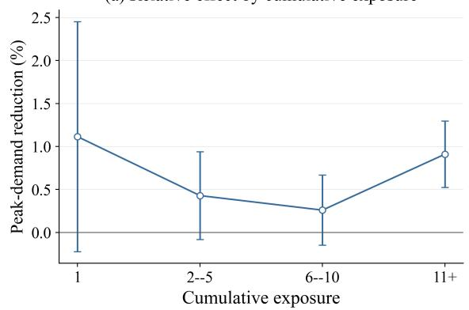

(b) Relative effect by intervention spacing  
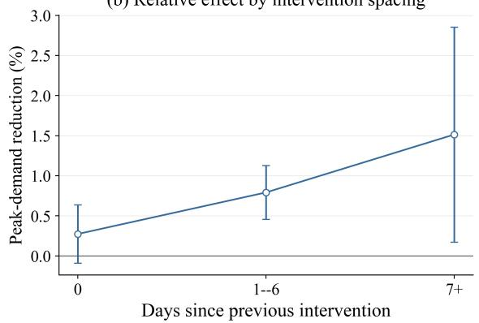

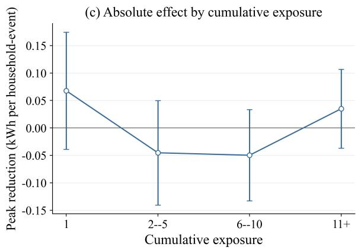

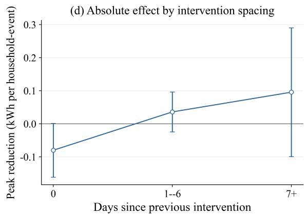  
Note. Panels (a) and (c) report relative and absolute peak-demand reductions by cumulative intervention exposure, grouped into 1, 2–5, 6–10, and 11 or more prior and current intervention events. Panels (b) and (d) report the corresponding effects by the number of days since the previous intervention, grouped into $0 , 1 { - } 6 ,$ and 7 or more days. Estimates adjust for price signal, region, and baseline demand, as well as temperature when available; the intervention-spacing specifications additionally control for intervention order. Error bars report 95% intervals. Positive values indicate demand reductions.

Figure EC.32 Demand response by outdoor temperature.  
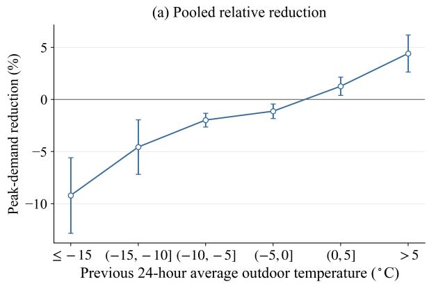

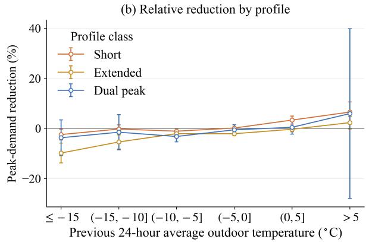

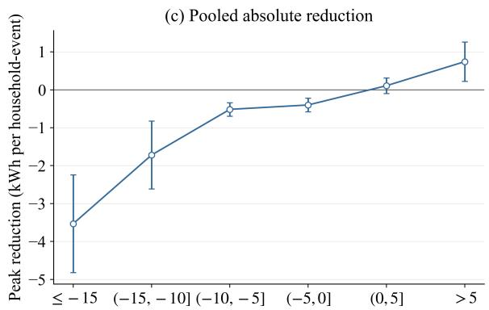  
Previous 24-hour average outdoor temperature (°C)

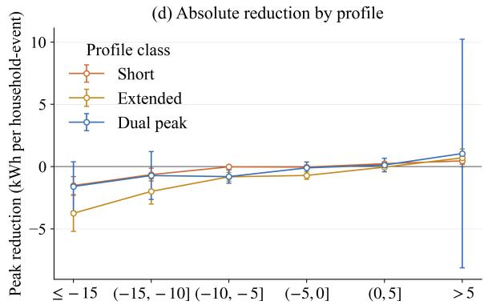  
Previous 24-hour average outdoor temperature (°C)  
Note. Panels (a) and (c) report pooled relative and absolute peak-demand reductions across outdoor-temperature bins. Panels (b) and (d) report the corresponding estimates separately for short, extended, and dual-peak price profiles. The pooled estimates adjust for price signal, region, baseline demand, and intervention order; the profile-specific estimates adjust for region, baseline demand, and intervention order. Error bars report 95% intervals. Positive values indicate demand reductions.

Figure EC.33 Regional heterogeneity in peak-demand reductions.  
(a) Relative peak-demand reduction by region  
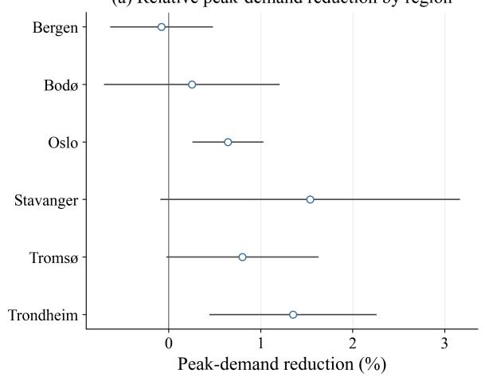

(b) Absolute peak-demand reduction by region  
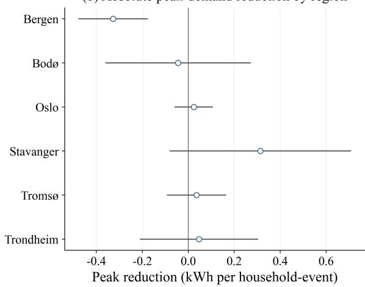  
Note. Panel (a) reports relative peak-demand reductions by region, and Panel (b) reports the corresponding absolute reductions. Estimates adjust for price signal, baseline demand, intervention order, and temperature when available. Error bars report 95% intervals. Positive values indicate demand reductions.

Figure EC.34 Household heterogeneity in peak-demand reductions.  
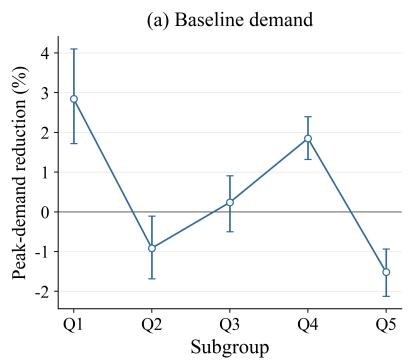

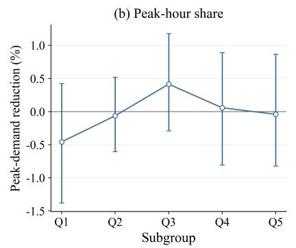

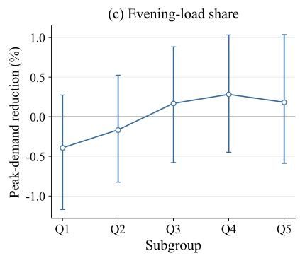

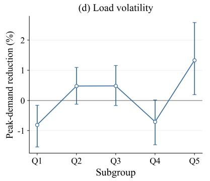

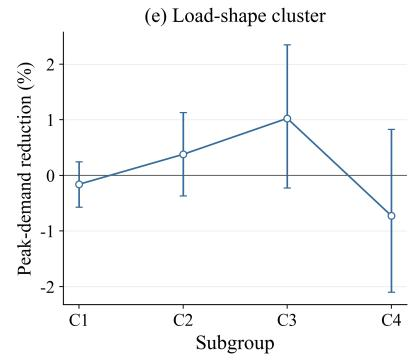  
Note. Panels (a)–(e) report relative peak-demand reductions across subgroups defined by pre-intervention baseline demand, peakhour load share, evening-load share, load volatility, and load shape, respectively. Household characteristics are constructed using electricity use observed before each household’s first intervention. Q1–Q5 denote quintiles, and C1–C4 denote clusters of normalized 24-hour pre-intervention load profiles. Error bars report 95% intervals obtained from a household bootstrap. Positive values indicate demand reductions.