# DEEP GENERATIVE CRYSTAL STRUCTURE PREDICTION: A BENCHMARK STUDY AND A CONTROLLED TEST OF PROTOTYPE DEPENDENCE

Lai Wei Department of Computer Science and Engineering University of South Carolina Columbia, SC 29201 Current affiliation: Department ofComputer Science and Cybersecurity, University ofNorth Georgia, Dahlonega, GA 30597

Rongzhi Dong Department of Computer Science and Engineering University of South Carolina Columbia, SC 29201

Madeline Miklos Department of Computer Science and Engineering University of South Carolina Columbia, SC 29201

Ying Feng Department of Computer Science and Engineering University of South Carolina Columbia, SC 29201

Jianjun Hu∗ Department of Computer Science and Engineering University of South Carolina Columbia, SC 29201 jianjunh@cse.sc.edu Corresponding author

## ABSTRACT

Deep generative models are widely reported to enable de novo crystal structure prediction (CSP), but the field lacks a standardized protocol under which their capability can be measured against established template-based methods. We evaluate 12 representative deep generative CSP models, spanning latentvariable, diffusion, flow-matching, autoregressive and manifold random-walk architectures, against the template-based TCSP 2.0 baseline on 180 test structures and a leakage-controlled subset of 46, using identical structure-matching, symmetry and consensus criteria throughout. Template retrieval remains the strongest single method at 68.3% top-1 success, with the symmetry-aware EquiCSP (66.4%) and Uni-3DAR (62.9%) forming the next tier. Decomposing each generative model’s predictions against the template baseline, however, shows that this apparent parity rests almost entirely on overlap: the large majority of structures a generative model predicts correctly are also predicted correctly by template substitution. The set of structures reachable by generation but not by substitution is therefore small, which sharply limits the practical case for generative CSP as a route to structures outside existing prototype libraries. A controlled intervention explains why. Removing entire stoichiometric prototype families from the training set and retraining the strongest generative model from scratch degrades accuracy by 50–78% across four families, establishing causally that generative performance is substantially prototype-dependent rather than prototypeindependent. A small minority of structures nevertheless survive complete removal of their prototype family, quantifying a residual capacity for prediction independent of retrieval that is real but far smaller than current claims for de novo generation imply. We conclude that present generative CSP models function largely as implicit, softer-edged prototype libraries rather than as genuinely de novo predictors, and that enlarging this residual, rather than improving aggregate match rate, is the substantive open problem for the field.

Keywords crystal structure prediction · materials discovery · benchmark · generative models · prototype dependence · structural novelty

## 1 Introduction

Crystal structure prediction (CSP), the computational determination of stable atomic arrangements from chemical composition alone, constitutes one of the most fundamental and enduring challenges in materials science and condensed matter physics [1, 2]. The ability to accurately predict crystal structures in silico has far-reaching implications for accelerating materials discovery across diverse technological domains, including energy storage and conversion [3], heterogeneous catalysis [4], microelectronics and semiconductors [5], pharmaceutical polymorphism [6], and emerging quantum materials [7]. Despite decades of sustained effort, CSP remains exceptionally difficult due to the combinatorial explosion of possible atomic configurations and the highly complex, rugged potential energy landscape that govern crystalline stability [8].

The inherent difficulty of CSP arises from multiple interrelated factors. The number of possible atomic arrangements scales exponentially with system size and compositional complexity, creating a vast configuration space that must be efficiently explored [9]. The potential energy surface of crystalline materials is characterized by numerous local minima separated by high energy barriers, making it exceedingly difficult to locate the global minimum corresponding to the thermodynamically stable ground state [8]. Finally, accurate evaluation of energetic stability requires quantum mechanical calculations, most commonly density functional theory (DFT), which impose severe computational constraints on the scope and scale of explorable systems [10].

Traditional approaches to CSP have predominantly relied on global optimization strategies coupled with first-principles calculations. Evolutionary algorithms [11], particle swarm optimization [12], basin hopping [13], and minima hopping [14] methods explicitly search the potential energy surface by iteratively proposing candidate structures and evaluating their energies. These methods have demonstrated remarkable success, including the discovery of novel materials under extreme conditions [2, 15], but their reliance on expensive DFT calculations severely limits their applicability to small unit cells and simple compositions [16].

Two data-driven alternatives have since emerged, and the relationship between them is the subject of this paper. The first is template- or prototype-based substitution [17, 18], which exploits the observation that many crystal structures belong to a finite set of structural prototypes. By performing elemental substitution on known templates, these methods rapidly generate candidates for unexplored compositions. They are computationally efficient and often remarkably accurate, but are explicitly bounded by the coverage of existing structural databases [19]: they cannot generate topological motif absent from their template libraries, and this limitation is transparent by construction.

The second is deep generative modeling. Rather than explicitly searching the energy landscape, generative CSP models learn to sample directly from the distribution of thermodynamically stable structures encoded in materials databases [20, 21, 22]. Early efforts used latent-variable formulations, notably the Crystal Diffusion Variational Autoencoder (CDVAE) [20] and its composition-conditioned extension [23]. The field then shifted decisively toward diffusion and flow-based frameworks: DiffCSP [21] jointly diffuses lattice parameters and fractional coordinates under periodic E(3) equivariance; GemsDiff [24] introduces hierarchical generation with explicit space-group prediction; MatterGen [25] scales score-based diffusion with property-conditioned adapter fine-tuning; CrystalFlow [26] replaces stochastic denoising with deterministic flow matching; and SymmCD [27] and EquiCSP [28] emphasize explicit crystallographic symmetry constraints. Autoregressive and sequential methods such as Uni-3DAR [29], manifold random-walk formulations such as CrystalGRW [30], text-conditioned models such as TGDMat [31], and stochastic interpolant frameworks such as OMatG [32] further diversify the architectural landscape.

The central claim motivating this literature is that generative models perform de novo structure generation, and therefore escape the coverage limits that bound template substitution. This claim is rarely tested directly. Standard evaluation reports aggregate match rates against held-out structures, which cannot distinguish a model that has learned transferable structural physics from one that has learned to interpolate among training prototypes. Recent work has begun to probe this gap observationally. Most relevantly, Negishi and Walsh [33] classify generated crystals as training duplicates, substitution-derived structures, or unmatched by either criterion, and report that 81–92% of chemically valid metastable generated crystals fall into the first two categories, with the effect strongest in high-symmetry crystal systems. Complementary distributional novelty metrics have been proposed [34, 35], and physics-informed conditioning has been explored as a route to steering generation away from dominant training motifs [36].

These analyses establish a strong association between generated structures and substitution-accessible ones, but they are observational: they characterize what models produce, not what models require. An intervention is needed to establish dependence. If a model’s success on a composition is caused by the presence of related prototypes in its training data, then removing those prototypes and retraining should degrade performance on that composition; if the model has learned transferable structural principles, it should not.

In this work we perform exactly this intervention, alongside a standardized benchmark that identifies which model is worth intervening on. Our contributions are as follows.

(1) A standardized cross-paradigm benchmark. We evaluate 12 generative models plus TCSP 2.0 under identical structure-matching, symmetry, and consensus criteria on 180 structures and a leakage-controlled subset of 46, with top-1 match rates reported throughout. Template substitution attains the highest success rate on both sets, and its margin over the strongest generative model widens rather than narrows under leakage control.

(2) A quantified limit on beyond-template capability. Decomposing each generative model’s predictions against the template baseline shows that the large majority of its correct predictions are also recovered by template substitution, with only a thin margin of structures reached by generation and not by retrieval. We further show that even this margin cannot be read as template-independence: we identify a case $\left( \mathrm { C r } _ { 6 } \mathrm { G a } _ { 2 } \right)$ that is simultaneously an algorithm-only success and, by our ablation, prototype-derived. Measured against the de novo framing under which these methods are presented, the marginal contribution over a much cheaper substitution baseline is modest.

(3) A controlled prototype-ablation experiment explaining that limit. We remove all training structures belonging to a given stoichiometric prototype family, retrain the strongest generative model from scratch, and evaluate on held-out members of the removed family. Across four families, 50–78% of previously correct predictions are lost. This establishes prototype dependence causally rather than by association, and is, to our knowledge, the first such intervention reported for generative CSP. It supplies the mechanism behind contribution (2): generative models duplicate substitution’s reach because they are, to a substantial degree, drawing on the same prototypes.

(4) A quantified residual generalization capacity. A small minority of structures remain correctly predicted after their entire prototype family is removed. Because a purely retrieval-based method would fail on all of them by construction, this residual is a direct, positive measure of prototype-independent structural generalization — a quantity that observational novelty analyses cannot isolate. It is the one capability these models demonstrably have that substitution does not, and it is small.

## 2 Methods

## 2.1 Overview of evaluated algorithms

Table 1 summarizes the methods evaluated in this study. We group them by generative mechanism rather than by publication lineage: (i) template retrieval and substitution, (ii) latent-variable models, (iii) diffusion, flow-matching and stochastic-interpolant models, and (iv) autoregressive or otherwise sequential constructions. We note explicitly that several models were not originally proposed as CSP methods and required adaptation; these are marked, and the adaptation is described in Section 2.6.

## 2.2 TCSP 2.0 (template baseline)

TCSP 2.0 [19] predicts a structure for a target composition by retrieving structurally analogous templates from a curated database and performing elemental substitution. Candidate templates are ranked by an element-movers-distance criterion over composition similarity, and substitution is guided by oxidation-state assignment and ionic-radius compatibility checks so that substituted species occupy chemically appropriate sites. The top-ranked substituted candidates are relaxed and the lowest-energy structure is returned. TCSP 2.0 is included here not as a competitor but as an explicit, auditable reference point: its dependence on template availability is a design property rather than a hidden one, which makes it the natural control against which implicit prototype dependence in generative models can be measured.

## 2.3 Latent-variable models

CDVAE. The Crystal Diffusion Variational Autoencoder [20] combines a periodic E(3)-equivariant encoder, which maps a structure to a latent vector, with a decoder that predicts composition and lattice from that latent and then refines atomic positions by annealed Langevin dynamics on a learned score field. CDVAE was proposed for unconditional generation and for property optimization in latent space, not for composition-conditioned CSP; our adaptation is described in Section 2.6.

Table 1: Methods evaluated in this study. TMP = template retrieval and substitution; LVA = latent-variable/autoencoder; DFF = diffusion, flow-matching or stochastic interpolant; SEQ = autoregressive or sequential construction. Years refer to the first public release of each method. † denotes a model originally proposed for unconditional crystal generation and adapted here to the CSP setting by conditioning on target composition (Section 2.6).
<table><tr><td>Category</td><td>Method</td><td>Year</td><td>Core mechanism</td><td>Code</td></tr><tr><td>TMP</td><td>TCSP 2.0 [19]</td><td>2024</td><td>Template retrieval with oxidation-state-aware substitution</td><td>Link</td></tr><tr><td>LVA</td><td>CDVAE† [20]</td><td>2021</td><td>VAE latent space with diffusion decoder</td><td>Link</td></tr><tr><td>LVA</td><td>cond-CDVAE [23]</td><td>2024</td><td>Composition-conditioned CDVAE</td><td>Link</td></tr><tr><td>DFF</td><td>DiffCSP [21]</td><td>2023</td><td>Joint lattice/fractional-coordinate diffusion, periodic E(3)</td><td>Link</td></tr><tr><td>DFF</td><td>EquiCSP [28]</td><td>2024</td><td>Periodic E(3) diffusion with lattice permutation invariance</td><td>Link</td></tr><tr><td>DFF</td><td>GemsDiff [24]</td><td>2024</td><td>Staged diffusion conditioned on predicted space group</td><td>Link</td></tr><tr><td>DFF</td><td>MatterGen [25]</td><td>2023</td><td>Score-based diffusion over lattice, coordinates and types</td><td>Link</td></tr><tr><td>DFF</td><td>CrystalFlow [26]</td><td>2024</td><td>Deterministic flow matching</td><td>Link</td></tr><tr><td>DFF</td><td>TGDMat [31]</td><td>2025</td><td>Text-conditioned joint diffusion</td><td>Link</td></tr><tr><td>DFF</td><td>SymmCD† [27]</td><td>2025</td><td>Diffusion over asymmetric unit and site symmetry</td><td>Link</td></tr><tr><td>DFF</td><td>OMatG† [32]</td><td>2025</td><td>Stochastic interpolants unifying diffusion and flow</td><td>Link</td></tr><tr><td>DFF</td><td>CrystalGRW [30]</td><td>2025</td><td>Geodesic random walk on Riemannian manifolds</td><td>Link</td></tr><tr><td>SEQ</td><td>Uni-3DAR [29]</td><td>2025</td><td>Autoregressive transformer over octree tokens</td><td>Link</td></tr></table>

cond-CDVAE. cond-CDVAE [23] extends this framework with explicit conditioning on chemical composition and external pressure, supplied to both encoder and decoder so that the latent space becomes chemistry-aware. This makes composition-conditioned generation native rather than adapted, and it is evaluated here as published.

## 2.4 Diffusion, flow and interpolant models

DiffCSP. DiffCSP [21] formulates CSP as joint denoising diffusion over the lattice matrix and fractional coordinates, conditioned on composition. Fractional coordinates are diffused with a wrapped-normal process that respects periodic boundary conditions, while the lattice is diffused with a standard Gaussian process; the denoiser is a periodic E(3)- equivariant graph network. Operating in fractional rather than Cartesian coordinates is central to the method, as it makes periodic translation invariance exact.

EquiCSP. EquiCSP [28] is likewise a diffusion model over lattice and fractional coordinates, and its contribution is to address symmetry invariances that DiffCSP handles only approximately. Specifically, it enforces lattice permutation invariance and periodic translation invariance in the training objective, so that structures related by a change of unit-cell representation or by a global translation are treated as identical rather than as distinct targets. This tightening of the equivariance treatment is the reason EquiCSP is the strongest generative model in our benchmark, and it is the model we subject to ablation in Section 3.4.

GemsDiff. GemsDiff [24] decomposes generation into stages so that crystallographic validity holds by construction: a space-group classifier produces a distribution over the 230 groups for a given composition, a diffusion model generates lattice parameters conditioned on the sampled group, and an equivariant diffusion network generates atom types and coordinates for the asymmetric unit only. The full cell is then reconstructed by applying the group’s symmetry operations.

MatterGen. MatterGen [25] is a score-based diffusion model that jointly corrupts and denoises atom types, fractional coordinates and the lattice, with coordinate noise applied under periodic boundary conditions and lattice noise biased toward physically reasonable densities. Its principal architectural contribution is adapter-based fine-tuning, which allows a large pretrained base model to be steered toward chemistry, symmetry, or property constraints without retraining. We evaluate the composition-conditioned setting.

CrystalFlow. CrystalFlow [26] replaces the stochastic denoising trajectory with deterministic flow matching: an equivariant network parameterizes a velocity field transporting a simple prior to the data distribution, and generation integrates this field with an ODE solver. Lattice and fractional coordinates are transported jointly. The deterministic formulation reduces the number of function evaluations required relative to comparable diffusion samplers.

TGDMat. TGDMat [31] conditions joint lattice and coordinate diffusion on a text embedding produced by a pretrained language model from a natural-language description of the target material, allowing compositional and property constraints to be expressed in prose rather than as structured inputs. For CSP evaluation we supply a templated description encoding the target composition.

SymmCD. SymmCD [27] generates crystals by diffusing over the asymmetric unit together with a representation of site symmetry, rather than over all atoms in the cell, so that symmetry is a modeled variable rather than an emergent property. The full structure is reconstructed from the asymmetric unit and the implied symmetry operations. It was proposed for unconditional generation and is adapted here (Section 2.6).

OMatG. OMatG [32] employs stochastic interpolants, a framework that subsumes both diffusion and flow matching by specifying an interpolation path between a reference distribution and the data distribution, with the interpolant coefficients and noise schedule as design choices. This yields flexibility in trading sample quality against sampling cost. OMatG targets open-domain generation rather than composition-conditioned prediction, and its performance here should be read in that light.

CrystalGRW. CrystalGRW [30] formulates generation as a geodesic random walk on the Riemannian manifolds natural to each crystal degree of freedom: fractional coordinates evolve on the flat torus, lattice parameters on the manifold of symmetric positive-definite matrices, and atom types on the probability simplex. A denoiser trained to reverse this walk recovers structures from noise, optionally conditioned on properties such as space group. We note that CrystalGRW is not autoregressive; it is classified here with the continuous-time generative models.

## 2.5 Autoregressive models

Uni-3DAR. Uni-3DAR [29] tokenizes 3D structures via a coarse-to-fine octree decomposition of space, compresses the resulting token sequence, and models it with a standard autoregressive transformer, unifying molecular and crystalline generation in one sequence-modeling framework. Generation proceeds by next-token prediction over this hierarchical spatial representation rather than by sequential placement of individual atoms in Cartesian space.

## 2.6 Adaptation of unconditional generators to the CSP setting

CDVAE, SymmCD and OMatG were proposed as unconditional or open-domain generators and do not natively accept a target composition. Because composition-conditioned prediction is the task defining this benchmark, some adaptation is unavoidable, and results for these three models measure our adapted pipeline rather than the published method. We state this explicitly because their low scores would otherwise be misread as a property of the underlying models.

## 2.7 Test sets

We evaluate on the 180-structure CSPBench test set [19], drawn from the Materials Project [16] and evenly distributed across binary, ternary and quaternary compositions, spanning a range of crystal systems and difficulty levels.

We additionally define a 46-structure subset (Table 7) intended to reduce train/test overlap. We are explicit about what this subset can and cannot control. The evaluated models are not trained on a common corpus: models retrained by us use the MP20 training split, whereas released checkpoints for MatterGen and Uni-3DAR were trained on larger and, in the latter case, incompletely documented corpora. A single subset therefore cannot be simultaneously leakage-free for all thirteen methods. The subset is constructed by excluding structures present in the MP20 train and validation splits, and should be interpreted as controlling leakage for models trained on MP20 rather than as a universal guarantee.

## 2.8 Evaluation protocol

Structure matching. We use Pymatgen’s [37] StructureMatcher with ltol=0.2, stol=0.3 and angle\_tol=5 throughout. Space groups are determined with a symmetry tolerance of 0.1. Some original publications adopt looser criteria — CDVAE, for instance, used ltol=0.3, stol=0.5, angle\_tol=10 [20] — so our reported rates are systematically stricter than published values and should not be compared to them directly.

Top-1 reporting. Most generative CSP papers report the match rate over n = 20 sampled candidates. We report top-1 throughout, because it corresponds to the decision a practitioner actually faces when a single candidate is carried forward to DFT, and it is the only setting in which template retrieval and generative sampling are compared on equal terms. The rates reported here are therefore systematically lower than, and not directly comparable to, top-n values in the source literature.

Metrics. We report the StructureMatcher success rate, the space group match rate, and a consensus rate requiring simultaneous agreement on both. For the case studies we additionally report the distance metrics introduced in [38].

Polymorphs. For compositions with multiple known polymorphs, the predicted structure is compared against each ground-truth polymorph and the smallest distance is retained.

Relaxation and energy evaluation. All predicted structures are relaxed with the CHGNet universal interatomic potential [39] prior to evaluation, and energy distances are computed between relaxed predicted and relaxed ground-truth structures using the same potential.

Running parameters. All algorithms use the default settings from their respective publications and official reposito ries; no additional hyperparameter tuning was performed.

## 3 Results

## 3.1 Benchmark performance across 180 test structures

Figure 1 reports the three metrics across all thirteen methods, with exact values in Figure 2. The template-based TCSP 2.0 achieves the highest top-1 StructureMatcher success rate at 68.3%, with a space-group match rate of 70.6% and a consensus rate of 64.4%. Among generative models, EquiCSP is strongest at 66.4% (58.2% consensus), followed by Uni-3DAR at 62.9% (57.7%), DiffCSP at 59.2% (56.4%) and MatterGen at 57.1% (53.3%). CrystalFlow attains comparable structure matching (54.9%) but a markedly lower space-group match rate (25.9%), so its consensus rate falls to 24.7% — less than half that of models with similar structure-matching performance. TGDMat reaches 45.6%. GemsDiff falls to 22.8%, OMatG to 15.7%, and CrystalGRW (5.1%), SymmCD (3.2%), CDVAE (2.7%) and cond-CDVAE (2.2%) remain below 6%.

Three observations are worth separating from this ordering. First, EquiCSP’s lead among generative models is consistent with its treatment of lattice permutation and periodic translation invariance, and it is on this basis that we select it as the target for the ablation in Section 3.4: intervening on the strongest model yields a conservative estimate of prototype dependence across the field. Second, the three adapted models (CDVAE, SymmCD, OMatG) occupy the bottom of the ranking, and their scores should be attributed to the adapted pipeline rather than to the published methods (Section 2.6). Third, methods with higher structure-matching rates generally attain higher space-group and consensus rates as well (Figure 2), with one instructive exception: CrystalFlow is close to DiffCSP and MatterGen on structure matching (54.9% against 59.2% and 57.1%) while recovering the correct space group less than half as often (25.9% against 60.8% and 58.8%). Reporting structure matching alone would place CrystalFlow in the leading tier; reporting consensus places it below TGDMat. This is the clearest case in the benchmark for reading structure matching and symmetry agreement together rather than separately, and we return to it in Section 4.

## 3.2 Performance on the leakage-controlled subset

Figure 3 reports the same metrics on the 46-structure subset. The ordering is broadly preserved but the absolute rates fall. TCSP 2.0 remains highest on structure matching at 56.5%, down from 68.3% on the full set, with a consensus rate of 52.2%. EquiCSP follows at 51.7% (47.0% consensus), then DiffCSP at 48.9% (48.0%), MatterGen at 48.3% (46.1%), CrystalFlow at 46.1% (20.9%) and Uni-3DAR at 44.8% (40.4%). TGDMat reaches 37.0%, OMatG 15.5% and GemsDiff 15.0%, while CDVAE (1.7%), cond-CDVAE (1.5%), CrystalGRW (1.1%) and SymmCD (0.7%) fall below 2%.

Three features of this comparison matter for the argument of this paper. First, TCSP 2.0’s lead over the strongest generative model widens under leakage control rather than narrowing: on the full set it exceeds EquiCSP by 1.9 percentage points on structure matching, and on the controlled subset by 4.8. The template baseline degrades by 11.8 points (68.3% to 56.5%) while EquiCSP degrades by 14.7 (66.4% to 51.7%). Whatever advantage generative modeling is supposed to confer on unseen compositions is not visible here; the simpler method holds up at least as well.

Second, degradation is uneven within the leading tier in a way that tracks training-data disclosure. Uni-3DAR falls furthest of the leading tier, by 18.1 points (62.9% to 44.8%) on structure matching and 17.3 on consensus, whereas MatterGen and CrystalFlow lose 8.8 each and DiffCSP 10.3. Since Uni-3DAR’s training corpus is the least fully documented of the models evaluated (Section 2), this is the pattern one would expect if part of its full-set performance reflected overlap that the subset removes — although with 46 structures the difference is only a few materials and we do not press the point.

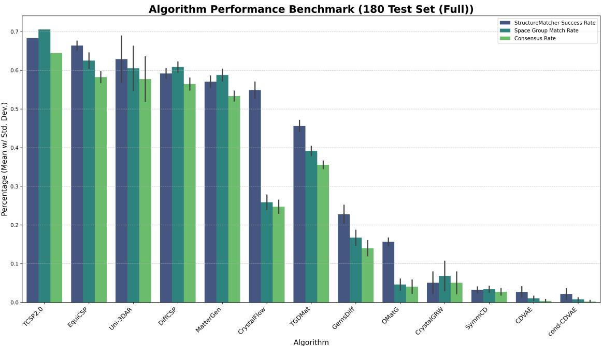  
Figure 1: Top-1 performance of 12 deep generative CSP algorithms and the TCSP 2.0 template baseline on the 180- structure test set. Bars show StructureMatcher success rate, space group match rate, and consensus rate, computed with ltol=0.2, stol=0.3, angle\_tol=5 and a space-group tolerance of 0.1. Error bars indicate sampling variance across ten repetitions; TCSP 2.0 is deterministic given a fixed template library and its error bars reflect only the relaxation step.

Third, most models in the lower tiers degrade proportionally further than those at the top: GemsDiff loses 34% of its relative performance, and CrystalGRW, SymmCD, CDVAE and cond-CDVAE each lose between a third and four fifths of already low rates, falling below 2%. OMatG is the exception, holding essentially flat at 15.5% against 15.7%. With that exception noted, leakage control widens the gap between tiers rather than compressing it.

That the overall hierarchy is preserved indicates the full-set results are not dominated by MP20 train/test overlap. We emphasize the limits of this conclusion: as noted in Section 2, the subset controls leakage for models trained on MP20 and cannot control it for checkpoints trained on undisclosed corpora, so Uni-3DAR’s stability across the two sets is suggestive rather than conclusive.

## 3.3 Limited coverage beyond the template baseline

Figures 4–6 decompose each generative model’s performance against TCSP 2.0 into four categories per test structure: both succeed, TCSP 2.0 only, algorithm only, and neither.

Several generative models — EquiCSP, DiffCSP and Uni-3DAR most notably — exhibit a nonzero fraction of algorithmonly successes. The first thing to observe about these fractions, however, is how small they are relative to the overlap. For every generative model in Figure 4, the green segment dwarfs the blue: the large majority of what each model predicts correctly, template substitution also predicts correctly, and the algorithm-only segment remains a small fraction of the 180 targets for every model evaluated.

This is a weakness, and it should be reported as one. The motivating claim for generative CSP is that learning a distribution over structures escapes the coverage limits of substitution on known prototypes. If that were substantially true, we would expect a large blue segment — a substantial population of targets reachable by generation and not by retrieval. We observe the opposite: generative models largely duplicate the reach of a much simpler and far cheaper method, while adding a thin margin at the edge. Measured against the de novo framing under which these methods are usually presented, the marginal contribution over template substitution is modest.

The thin margin that does exist also cannot be taken at face value as evidence of template-independence, for two reasons.

CSP Benchmark Heatmap Comparison  
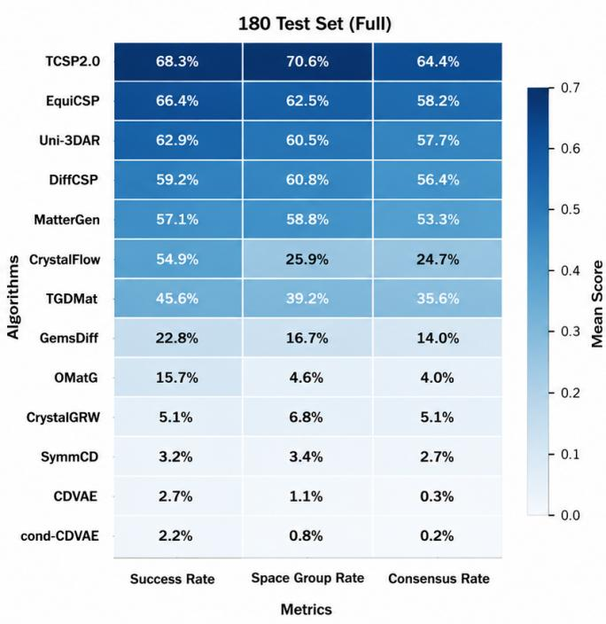

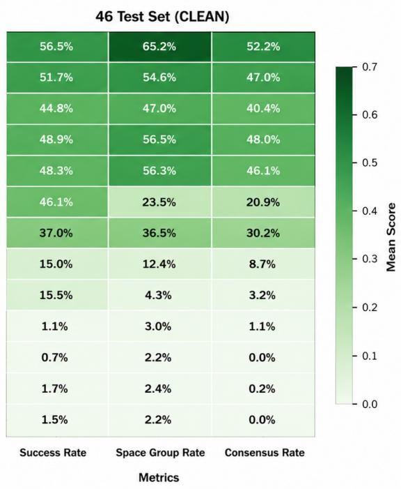  
Figure 2: Heatmap of averaged benchmark metrics for the 180-structure (Full) and 46-structure (leakage-controlled) test sets. Each cell is a mean over ten repetitions; darker colors indicate higher accuracy. Relative rankings are largely preserved between the two sets, indicating that the observed hierarchy is not primarily an artifact of train/test overlap for models trained on MP20.

First, TCSP 2.0 can fail for reasons unrelated to prototype availability: the composition-similarity ranking may not surface the correct template among those carried forward, oxidation-state assignment may be ambiguous, or ionic-radius checks may reject a valid substitution. An algorithm-only success therefore demonstrates that the two methods fail on different structures, not that no suitable prototype exists.

Second, and more directly, we can check specific cases against the ablation. $\mathrm { { C r } _ { 6 } G a _ { 2 } }$ is an algorithm-only success: TCSP $2 . 0$ returns a structure at 1.284 eV/atom energy distance while EquiCSP reaches 0.105 eV/atom (Section 3.5). Yet the $\mathrm { { A B } _ { 3 } }$ ablation (Table 4) shows that EquiCSP fails completely on $\mathrm { C r _ { 6 } G a _ { 2 } }$ once 1:3 binary prototypes are removed from training, predicting space group 63 against a target of 223. $\mathrm { E q u i C S P ^ { \prime } s }$ success on this structure was therefore prototype-derived; it simply drew on a prototype that TCSP 2.0’s retrieval did not surface.

Taken together, the algorithm-only segments are best read as a small margin of differing prototype coverage between an implicit, learned prototype library and an explicit, retrieved one, rather than as generation reaching where retrieval cannot. That margin is worth something practically — it motivates hybrid retrieval-plus-generation pipelines — but it is a modest return on the computational cost of training and sampling a generative model, and it falls well short of what the de novo framing promises. Whether any part of it is genuinely template-independent is a question this comparison cannot answer; the ablation can, and we turn to it now.

## 3.4 Prototype ablation: a causal test of template dependence

The preceding sections establish which models perform well and show that outcome-level comparison against a template baseline cannot settle whether that performance is prototype-dependent. We therefore intervene on the training distribution directly.

Design. We define a stoichiometric prototype family by reduced elemental ratio, independent of element identity, ordering, or space group. For each of four families $- \mathrm { \dot { A } \vec { B _ { 2 } } }$ (1:2 binary), $\mathrm { { A B } _ { 3 } }$ (1:3 binary), $\mathrm { { A B C } _ { 2 } }$ (1:1:2 ternary) and $\mathrm { { A B C } _ { 4 } }$ (1:1:4 ternary) — we remove every training and validation structure belonging to that family, retrain EquiCSP from scratch on the filtered data, and evaluate the retrained model on test compositions drawn from the removed family. Structure counts are given in Table 2. Formulas in the per-structure tables below are written for the cell returned by the evaluation pipeline rather than in reduced form, so that $\mathrm { C r _ { 6 } G a _ { 2 } }$ and $\mathrm { P r _ { 1 2 } I r _ { 4 } }$ denote the same compositions as $\mathrm { { C r } _ { 3 } }$ Ga and $\mathrm { P r } _ { 3 } \mathrm { I r } .$ All predictions are relaxed with CHGNet [39] and the lowest-energy prediction is retained per formula. A prediction is recorded as degraded if the baseline model trained on the full data succeeded and the ablated model failed, on either structure matching or space-group agreement.

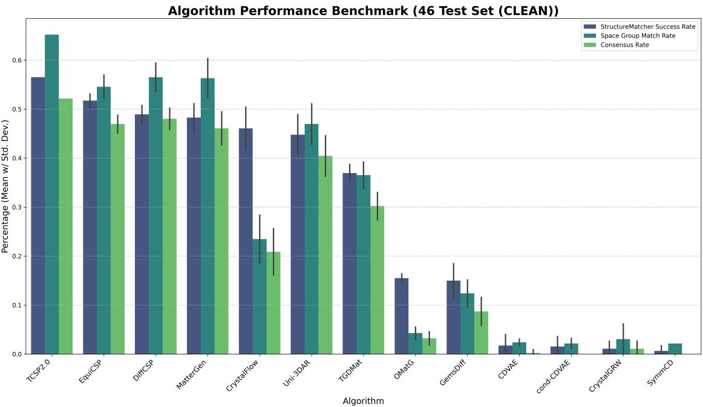

Figure 3: Top-1 performance on the 46-structure leakage-controlled subset. Metrics and error bars as in Figure 1. Note that at $n = 4 6$ a five percentage-point difference corresponds to fewer than three structures.  
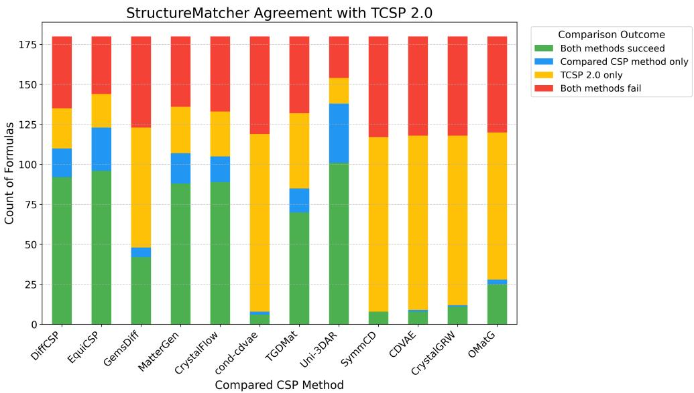  
Figure 4: StructureMatcher outcome decomposition between TCSP 2.0 and each generative model on the 180 test structures. Green: both succeed. Yellow: TCSP 2.0 only. Blue: algorithm only. Red: neither. For every model the green segment substantially exceeds the blue, indicating that most of what generative models predict correctly is already recovered by template substitution; the blue margin should not be read as template-independent prediction (Section 3.3).

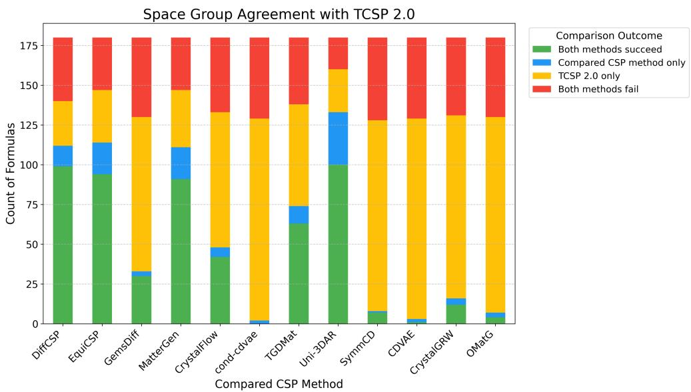  
Figure 5: Space-group match outcome decomposition between TCSP 2.0 and each generative model on the 180 test structures, with segments as in Figure 4.

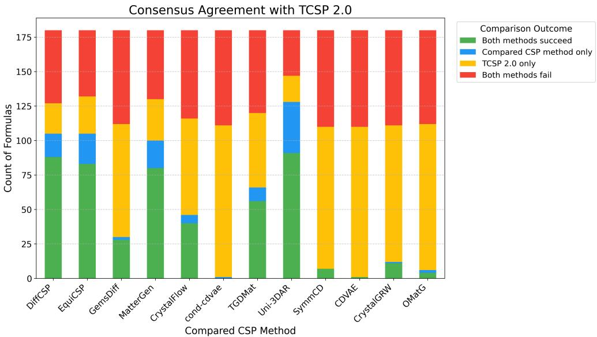  
Figure 6: Consensus outcome decomposition between TCSP 2.0 and each generative model on the 180 test structures. Consensus requires simultaneous StructureMatcher and space-group agreement. TCSP 2.0 attains the highest overall consensus rate (approximately 64%).

EquiCSP is chosen as the ablation target because it is the strongest generative model in Section 3.1. Prototype dependence measured on the strongest model is a conservative estimate for the paradigm.

Prototype removal degrades prediction substantially. All four ablations produce large losses (Table 3). Removing $\mathrm { \ A B _ { 3 } }$ prototypes degrades 7 of 9 test structures (78%); $\mathbf { A B } _ { 2 }$ degrades 10 of 17 (59%); $\mathrm { { A B C } _ { 4 } }$ degrades 4 of 7 (57%); $\mathrm { A B C _ { 2 } }$ degrades 6 of 12 (50%). Because the only variable changed is the presence of the prototype family in training, and because the model is retrained from scratch rather than fine-tuned, these losses are attributable to prototype availability rather than to capacity, optimization or evaluation differences. This is a causal statement, and it is the form of evidence that observational novelty analyses of generated outputs [33] cannot supply.

Table 2: Training and validation structures removed in each ablation experiment. Families are defined by reduced stoichiometric ratio. Ablated models were retrained from scratch on the filtered datasets.
<table><tr><td>Experiment</td><td>Prototype</td><td>Train removed</td><td>Validation removed</td><td>Train remaining</td></tr><tr><td>Remove  $\mathrm { \ A B _ { 2 } }$ </td><td>All 1:2 binary</td><td>1,393</td><td>499</td><td>25,650</td></tr><tr><td>Remove  $\mathrm { { A B } _ { 3 } }$ </td><td>All 1:3 binary</td><td>1,614</td><td>517</td><td>25,429</td></tr><tr><td>Remove  $\mathrm { { A B C _ { 2 } } }$ </td><td>All 1:1:2 ternary</td><td>4,017</td><td>1,348</td><td>23,026</td></tr><tr><td>Remove  $\mathrm { { A B C } _ { 4 } }$ </td><td>All 1:1:4 ternary</td><td>820</td><td>292</td><td>26,223</td></tr></table>

Table 3: Ablation results across four stoichiometric prototype families. Ablated fit and ablated consensus are the retrained model’s StructureMatcher success rate and joint (structure + space group) rate on test structures from the removed family. Degraded counts structures on which the baseline model succeeded and the ablated model failed.
<table><tr><td>Experiment</td><td>Prototype</td><td>Test structures</td><td>Ablated fit</td><td>Ablated consensus</td><td>Degraded</td></tr><tr><td>Remove  $\mathrm { { A B C _ { 2 } } }$ </td><td>All 1:1:2 ternary</td><td>12</td><td>7/12 (58%)</td><td>6/12 (50%)</td><td>6/12 (50%)</td></tr><tr><td>Remove  $\mathrm { { A B C } _ { 4 } }$ </td><td>All 1:1:4 ternary</td><td>7</td><td>4/7 (57%)</td><td>3/7 (43%)</td><td>4/7 (57%)</td></tr><tr><td>Remove  $\mathrm { { A B } _ { 3 } }$ </td><td>All 1:3 binary</td><td>9</td><td>3/9 (33%)</td><td>2/9 (22%)</td><td>719 (78%)</td></tr><tr><td>Remove  $\mathbf { A B } _ { 2 }$ </td><td>All 1:2 binary</td><td>17</td><td>7/17 (41%)</td><td>6/17 (35%)</td><td>10/17 (59%)</td></tr></table>

A residual capacity for prototype-independent prediction. A minority of structures survive removal of their entire prototype family. In the $\mathrm { { A B } _ { 3 } }$ experiment (Table 4), $\mathrm { C e P b _ { 3 } }$ and $\mathrm { P r _ { 1 2 } I r _ { 4 } }$ retain both structure matching and space-group agreement with all 1:3 binary training data removed.

This residual is small: 2 of 9 in the $\mathrm { { A B } _ { 3 } }$ case, and the ablated model’s structure-matching rate on the removed family falls to 33%. It is nonetheless the most informative quantity in the experiment, because a purely retrieval-based method would fail on these structures by construction — with no prototype of the relevant family available, there is nothing to retrieve and substitute. That EquiCSP recovers them indicates it has acquired structural regularities — plausibly local coordination preferences and element compatibility — that transfer across prototype families. This is a positive, quantified measure of genuine generalization, and it is measurable only under intervention. Observational classification of generated structures as duplicate, substitution-derived, or unmatched can tell us how often outputs resemble substitution products; it cannot tell us whether a model would still succeed had the substitution source been withheld.

The two findings fit together rather than conflicting. Generative performance is substantially prototype-dependent, which is why Section 3.3 finds so little coverage beyond the template baseline: a model drawing largely on the same prototypes will largely reach the same structures. The residual is what remains once that dependence is subtracted, and it is currently a thin margin rather than the broad de novo capability the literature claims. Enlarging it is the appropriate target for future architectures.

Modes of failure. The per-structure results distinguish two failure modes. Structures such as $\mathrm { T a _ { 3 } B e _ { 9 } , Y b _ { 1 2 } C o _ { 4 } }$ and $\mathrm { { C r } _ { 6 } G a _ { 2 } }$ fail completely, with predicted space groups far from the $\mathrm { \ t a r g e t { - } \mathbf { Y } b _ { 1 2 } \mathbf { C } o _ { 4 } }$ collapses to $P 1$ , indicating loss of symmetry altogether. $\mathrm { \ D y P b _ { 3 } }$ shows a milder mode: structure matching is retained while the space group is lost (123 predicted against a target of 221), meaning the ablated model produces a geometrically similar but symmetrically incorrect arrangement. The second mode suggests that some geometric information survives prototype removal even where the symmetry assignment does not, and that structure matching alone would overstate the ablated model’s fidelity.

## 3.5 Case studies

Two structures illustrate, from opposite directions, the narrow margin described in Section 3.3.

$\mathbf { C o _ { 3 } S b _ { 4 } O _ { 6 } F _ { 6 } } ;$ : template retrieval succeeds where generation fails. For this quaternary compound (Figure 7, Table 5), TCSP 2.0 achieves a superpose RMSD of 1.052 Å, reconstructing the target closely. All four generative models evaluated on this composition fail, with large geometric distortions and high fingerprint and OFM distances.

Table 4: Per-structure results for the $\mathbf { A B _ { 3 } }$ ablation (all 1:3 binary prototypes removed). Base columns give baseline EquiCSP performance; ablated columns give performance after retraining on filtered data. Bold marks failures introduced by ablation.
<table><tr><td>Formula</td><td>Base fit</td><td>Base SG</td><td>Abl. fit</td><td>Abl. SG</td><td>Pred. SG</td><td>Target SG</td><td>Degraded</td></tr><tr><td> $\mathrm { C e P b _ { 3 } }$ </td><td>True</td><td>True</td><td>True</td><td>True</td><td>221</td><td>221</td><td>No</td></tr><tr><td> $\mathrm { L a F _ { 3 } }$ </td><td>True</td><td>True</td><td>False</td><td>False</td><td>160</td><td>225</td><td>Yes</td></tr><tr><td> $\mathrm { T i G a _ { 3 } }$ </td><td>True</td><td>False</td><td>False</td><td>False</td><td>123</td><td>139</td><td>Yes</td></tr><tr><td> $\mathrm { C r _ { 6 } G a _ { 2 } }$ </td><td>True</td><td>True</td><td>False</td><td>False</td><td>63</td><td>223</td><td>Yes</td></tr><tr><td> $\mathrm { Y _ { 3 } A l _ { 9 } }$ </td><td>True</td><td>True</td><td>False</td><td>False</td><td>160</td><td>166</td><td>Yes</td></tr><tr><td> $\mathrm { D y P b _ { 3 } }$ </td><td>True</td><td>True</td><td>True</td><td>False</td><td>123</td><td>221</td><td>Yes</td></tr><tr><td> $\mathrm { P r _ { 1 2 } I r _ { 4 } }$ </td><td>True</td><td>True</td><td>True</td><td>True</td><td>62</td><td>62</td><td>No</td></tr><tr><td> $\mathrm { T a _ { 3 } B e _ { 9 } }$ </td><td>True</td><td>True</td><td>False</td><td>False</td><td>156</td><td>166</td><td>Yes</td></tr><tr><td> $\mathrm { Y b _ { 1 2 } C o _ { 4 } }$ </td><td>True</td><td>True</td><td>False</td><td>False</td><td>1</td><td>62</td><td>Yes</td></tr><tr><td colspan="4">Ablated fit: 3/9 (33%)</td><td>Ablated consensus: 2/9 (22%)</td><td colspan="3">Degraded: 7/9 (78%)</td></tr></table>

The pattern is consistent with the difficulty of assembling complex multi-element structures without a prototype to anchor the arrangement.

${ \bf { C r } } _ { 6 } { \bf { G a } } _ { 2 } { \bf { : } }$ generation succeeds where template retrieval fails. For this binary alloy (Figure $^ { 8 , }$ Table 6), MatterGen achieves an energy distance of 0.082 eV/atom and a superpose RMSD of 0.228 Å, and EquiCSP reaches 0.105 eV/atom, while TCSP 2.0 returns 1.284 eV/atom.

This is the structure discussed in Section 3.3, and it illustrates why outcome-level comparison is insufficient. EquiCSP’s success here is not template-independent: the $\mathrm { { A B } _ { 3 } }$ ablation shows that removing 1:3 binary prototypes causes complete failure on precisely this composition, with the predicted space group falling from a correct 223 to 63. The correct reading is that EquiCSP’s implicit prototype library covered $\mathrm { { C r } _ { 6 } G a _ { 2 } }$ while TCSP 2.0’s explicit retrieval did not. The same caution applies to the other algorithm-only successes in Figures 4–6, each of which would need an ablation or a database check to classify.

Table 5: Distance metrics between the ground-truth structure of $\mathrm { C o _ { 3 } S b _ { 4 } O _ { 6 } F _ { 6 } }$ and predicted structures. Chamfer distance, superpose RMSD and fingerprint distance in $\mathring { \mathrm { A } } ;$ OFM distance in valence electrons. Bold marks the best value in each column.
<table><tr><td rowspan=1 colspan=1>Algorithm</td><td rowspan=1 colspan=1>Chamferdistance</td><td rowspan=1 colspan=1>SuperposeRMSD</td><td rowspan=1 colspan=1>Fingerprintdistance</td><td rowspan=1 colspan=1>OFMdistance</td></tr><tr><td rowspan=1 colspan=1>TCSP 2.0</td><td rowspan=1 colspan=1>1.271</td><td rowspan=1 colspan=1>1.052</td><td rowspan=1 colspan=1>0.122</td><td rowspan=1 colspan=1>0.019</td></tr><tr><td rowspan=1 colspan=1>EquiCSP</td><td rowspan=1 colspan=1>3.272</td><td rowspan=1 colspan=1>1.894</td><td rowspan=1 colspan=1>1.750</td><td rowspan=1 colspan=1>0.240</td></tr><tr><td rowspan=1 colspan=1>MatterGen</td><td rowspan=1 colspan=1>3.244</td><td rowspan=1 colspan=1>1.864</td><td rowspan=1 colspan=1>1.859</td><td rowspan=1 colspan=1>0.176</td></tr><tr><td rowspan=1 colspan=1>TGDMat</td><td rowspan=1 colspan=1>4.803</td><td rowspan=1 colspan=1>2.066</td><td rowspan=1 colspan=1>2.372</td><td rowspan=1 colspan=1>0.213</td></tr><tr><td rowspan=1 colspan=1>CrystalGRW</td><td rowspan=1 colspan=1>3.085</td><td rowspan=1 colspan=1>1.813</td><td rowspan=1 colspan=1>2.149</td><td rowspan=1 colspan=1>0.598</td></tr></table>

Table 6: Distance metrics between the ground-truth structure of $\mathrm { C r _ { 6 } G a _ { 2 } }$ and predicted structures. Superpose RMSD, RMS distance and fingerprint distance in $\mathring { \mathrm { A } } ;$ OFM distance in valence electrons; energy distance in eV/atom. Bold marks the best value in each column.
<table><tr><td rowspan=1 colspan=1>Algorithm</td><td rowspan=1 colspan=1>Energydistance</td><td rowspan=1 colspan=1>RMSdistance</td><td rowspan=1 colspan=1>SuperposeRMSD</td><td rowspan=1 colspan=1>Fingerprintdistance</td><td rowspan=1 colspan=1>OFMdistance</td></tr><tr><td rowspan=1 colspan=1>TCSP 2.0</td><td rowspan=1 colspan=1>1.284</td><td rowspan=1 colspan=1>0.462</td><td rowspan=1 colspan=1>1.037</td><td rowspan=1 colspan=1>1.725</td><td rowspan=1 colspan=1>2.858</td></tr><tr><td rowspan=1 colspan=1>EquiCSP</td><td rowspan=1 colspan=1>0.105</td><td rowspan=1 colspan=1>0.002</td><td rowspan=1 colspan=1>0.951</td><td rowspan=1 colspan=1>0.051</td><td rowspan=1 colspan=1>2.680</td></tr><tr><td rowspan=1 colspan=1>MatterGen</td><td rowspan=1 colspan=1>0.082</td><td rowspan=1 colspan=1>0.003</td><td rowspan=1 colspan=1>0.228</td><td rowspan=1 colspan=1>0.039</td><td rowspan=1 colspan=1>2.096</td></tr></table>

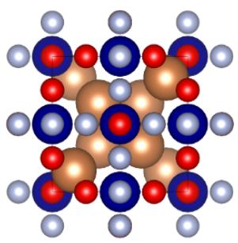  
(a) Co3Sb4O6F6 (Target)

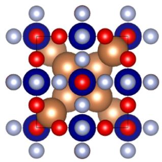  
(b) Predicted by TCSP 2.0

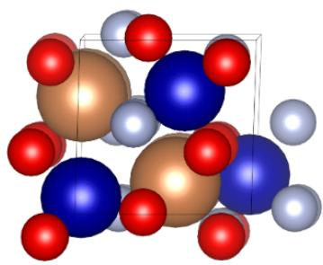  
(c) Predicted by EquiCSP

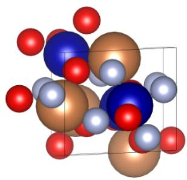  
(d) Predicted by MatterGEN

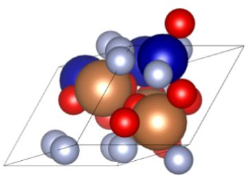  
(e) Predicted by TGDMat

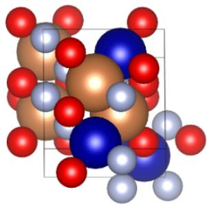  
(f) Predicted by CrystalGRW

Figure 7: Ground truth and predicted structures of $\mathrm { C o _ { 3 } S b _ { 4 } O _ { 6 } F _ { 6 } } .$ . (a) Ground truth. (b) TCSP 2.0. (c) EquiCSP. (d) MatterGen. (e) TGDMat. (f) CrystalGRW.  
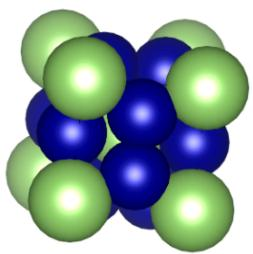  
(a) Cr6Ga2 (Target)

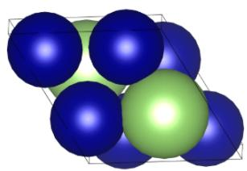  
(b) Predicted by TCSP 2.0

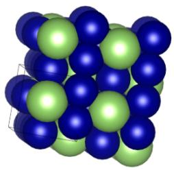  
(c) Predicted by EquiCSP

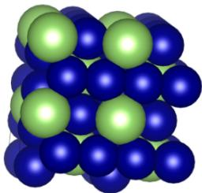  
(d) Predicted by MatterGEN  
Figure 8: Ground truth and predicted structures of $\mathrm { { C r } _ { 6 } G a _ { 2 } }$ . (a) Ground truth. (b) TCSP 2.0. (c) EquiCSP. (d) MatterGen.

## 4 Discussion

What the ablation does and does not establish. The intervention shows that removing a stoichiometric prototype family from training causes EquiCSP to lose 50–78% of its previously correct predictions on that family. Read together with Section 3.3, the picture is coherent: models that draw substantially on training prototypes will reach substantially the structures those prototypes already reach, which is why the coverage beyond the template baseline is thin. It does not follow that generative models are equivalent to template retrieval. A retrieval method has no residual at all once its templates are removed, whereas EquiCSP retains 33% structure matching under the most damaging ablation, and that difference is real. Nor does the experiment show the remaining successes are unrelated to training data in any broader sense — structures from adjacent families may supply transferable motifs, which is the most plausible explanation for $\mathrm { C e P b _ { 3 } }$ and $\mathrm { P r _ { 1 2 } I r _ { 4 } }$ surviving. What it establishes is that current generative CSP models occupy an intermediate position much closer to retrieval than the de novo framing suggests: prototype coverage that is broader and softer-edged than an explicit index, with a narrow band of genuine generalization beyond it.

Relation to observational novelty analyses. Our conclusion is convergent with, and methodologically distinct from, the observational finding that 81–92% of valid metastable generated crystals are training duplicates or substitutionderived [33]. That analysis classifies model outputs; ours withholds inputs. The distinction matters in both directions. A structure classified as substitution-derived might still have been predictable without the substitution source, and our ablation survivors show this happens. Conversely, a structure classified as unmatched might still depend on training prototypes through a route the classification does not capture. The two approaches bound the question from opposite sides, and we would encourage their joint use in future evaluations.

Implications for benchmark design. Aggregate match rate does not measure novelty and should not be reported as if it did. A model can attain a high match rate by covering the prototype distribution of the test set thoroughly, which is useful but is precisely what template substitution already does. We suggest that prototype-controlled ablation or, where retraining is infeasible, prototype-stratified reporting of match rates — become a standard component of generative CSP evaluation. The cost is one retraining run per prototype family, which is small relative to the cost of the models themselves. We would add a simpler recommendation that costs nothing: every generative CSP paper should report a template-substitution baseline on the same test set, and report the decomposition of Figure 4 rather than aggregate rate alone. Most current papers do neither, which is why a result as basic as the one in Section 3.3 — that the overlap dominates the margin — has gone largely unremarked.

Interpretation of StructureMatcher results. Structure-matching tolerances vary widely across the literature, from ltol=0.3, stol=0.5, angle\_tol=10 in the CDVAE evaluation [20] to the stricter settings used here [19]. Rates are not comparable across settings, and StructureMatcher agreement should be read jointly with space-group agreement. Two results here make the point concretely. At the model level, CrystalFlow reaches 54.9% structure matching with only 25.9% space-group agreement (Section 3.1), so its tier placement depends entirely on which metric is reported. At the structure level, the DyPb ablation case retains structure matching while losing the correct space group. In both cases structure matching alone overstates fidelity, and a benchmark reporting it as a single headline number would mislead.

Polymorphism and top-1 evaluation. For compositions with multiple known polymorphs we compare against each and retain the best match, which is generous to all methods equally. Our metric throughout is top-1, corresponding to the practitioner carrying a single candidate to DFT.

Limitations. Four should be stated plainly. First, the ablation covers one model and four stoichiometric families; extension to further models and to symmetry-defined families is required before the result can be generalized to the paradigm with confidence. Second, prototype families defined by reduced stoichiometric ratio are a coarse proxy for structural prototype — two structures with the same ratio may be structurally unrelated, and two with different ratios may share a motif — so the measured dependence is an approximation whose direction of bias is not obvious. Third, the leakage-controlled subset controls for MP20 overlap only, and cannot control for checkpoints trained on undisclosed corpora. Fourth, we report top-1 only; the top-n rates conventionally reported in the source literature are not reproduced here, so the absolute values are not directly comparable to those publications.

Energetic assessment. The present evaluation is geometric, comparing predicted and reference structures by matching, symmetry and distance. It does not assess whether predicted structures are thermodynamically competitive.

## 5 Conclusion

We have asked how much deep generative crystal structure prediction adds over template substitution, and answered it in two ways: by decomposing predictions against a template baseline, and by intervening on the training distribution directly.

The decomposition is unflattering to the de novo framing. For every generative model evaluated, the large majority of correct predictions are also recovered by TCSP 2.0: a method that is orders of magnitude cheaper to run recovers nearly the same set of structures. Whatever generative modeling contributes here, it is not a substantial expansion of the reachable structure space.

The ablation explains the pattern. Removing entire stoichiometric prototype families from the training data of the strongest generative model and retraining from scratch degrades 50–78% of previously correct predictions on the removed family, establishing prototype dependence causally rather than by association. Current generative CSP models are, to a first approximation, implicit prototype libraries with softer edges than an explicit retrieval index: broader in what counts as a match, but drawing on the same underlying stock of known structural motifs.

The qualification matters and should not be lost. A small minority of structures survive complete removal of their prototype family — an outcome impossible for a retrieval-based method by construction — so the residual capacity for prototype-independent prediction is real. It is simply much smaller than the field’s framing implies, and it is the only part of these models’ behaviour that a template method cannot in principle reproduce.

We draw two recommendations. First, aggregate match rate should not be reported as evidence of novelty; a model can score well by covering the test set’s prototype distribution thoroughly, which is precisely what substitution already does. Prototype-controlled ablation, or prototype-stratified reporting where retraining is infeasible, should become standard. Second, architectural work should target the residual directly — through prototype-aware augmentation, or training objectives enforcing invariance to elemental substitution across prototype families — since enlarging it, rather than improving aggregate match rate, is what would make generative CSP something substitution cannot already do.

## 6 Data and Code Availability

The 180 test structures are drawn from the Materials Project database [16]; their identifiers, the leakage-controlled subset, the ablation splits and the retrained model checkpoints are available at https://github.com/usccolumbia cspbenchmark. Performance metric code is available at https://github.com/usccolumbia/CSPBenchMetrics.

## Author Contributions

Conceptualization, J.H.; methodology, J.H., L.W., R.D., Y.F., M.M.; software, L.W.; resources, J.H.; writing—original draft preparation, J.H., L.W., R.D.; writing—review and editing, J.H., R.D.; visualization, L.W.; supervision, J.H.; funding acquisition, J.H.

## Acknowledgements

The research reported in this work was supported in part by the National Science Foundation under grants 2110033, 2311202, and 2320292. The views, perspectives, and content do not necessarily represent the official views of the NSF. The authors gratefully acknowledge the computational resources provided by the Theia high performance computing cluster at the University of South Carolina, which is supported by National Science Foundation Grant No. 2320292. We also acknowledge the technical assistance and resources provided by Research Computing at the University of South Carolina (RRID:SCR\_027488).

## A Leakage-controlled test subset

Table 7: The 46-structure leakage-controlled subset, ordered by compositional complexity and evaluation category. Structures present in the MP20 train and validation splits are excluded; see Section 2 for the limits of this control.
<table><tr><td>Material id</td><td>Primitive formula</td><td>Space group</td><td>Crystal system</td><td>Category</td></tr><tr><td>mp-2735</td><td>PaO</td><td>225</td><td>Cubic</td><td>binary_easy</td></tr><tr><td>mp-24658</td><td>SmH2</td><td>225</td><td>Cubic</td><td>binary_easy</td></tr><tr><td>mp-788</td><td>CoTe</td><td>194</td><td>Hexagonal</td><td>binary_easy</td></tr><tr><td>mp-1208467</td><td>Tb₄Al</td><td>227</td><td>Cubic</td><td>binary_hard</td></tr><tr><td>mp-640079</td><td>Mn3Au</td><td>123</td><td>Tetragonal</td><td>binary_hard</td></tr><tr><td>mp-21211</td><td>InFeCo2</td><td>225</td><td>Cubic</td><td>ternary_easy</td></tr><tr><td>mp-20389</td><td> ${ \mathrm { N a } } _ { 2 } { \mathrm { C d P b } }$ </td><td>216</td><td>Cubic</td><td>ternary_easy</td></tr><tr><td>mp-29241</td><td>Ca₃SnO</td><td>221</td><td>Cubic</td><td>ternary_easy</td></tr><tr><td>mp-20237</td><td>CoNiSn</td><td>194</td><td>Hexagonal</td><td>ternary_easy</td></tr><tr><td>mp-3147</td><td>ErSi2Au2</td><td>139</td><td>Tetragonal</td><td>ternary_medium</td></tr><tr><td>mp-30733</td><td>HoSnPt</td><td>189</td><td>Hexagonal</td><td>ternary_medium</td></tr><tr><td>mp-3676</td><td> $\mathrm { M g C u _ { 4 } S n }$ </td><td>216</td><td>Cubic</td><td>ternary_hard</td></tr><tr><td>mp-11396</td><td> $\mathrm { N d G a _ { 2 } N i }$ </td><td>65</td><td>Orthorhombic</td><td>ternary_hard</td></tr><tr><td>mp-29225</td><td> $\mathrm { { A l } _ { 4 } \mathrm { { C u } _ { 2 } \mathrm { { O } _ { 7 } } } }$ </td><td>216</td><td>Cubic</td><td>ternary_hard</td></tr><tr><td>mp-23520</td><td> $\mathrm { I n P b _ { 2 } I _ { 5 } }$ </td><td>140</td><td>Tetragonal</td><td>ternary_hard</td></tr><tr><td>mp-19140</td><td> $\mathrm { K _ { 3 } M n O _ { 4 } }$ </td><td>121</td><td>Tetragonal</td><td>ternary_hard</td></tr><tr><td>mp-552674</td><td> $\mathrm { Z r T a N O }$ </td><td>187</td><td>Hexagonal</td><td>quaternary_easy</td></tr><tr><td>mp-12444</td><td> $\operatorname { S r C u S F }$ </td><td>129</td><td>Tetragonal</td><td>quaternary_easy</td></tr><tr><td>mp-19093</td><td> ${ \bf B a _ { 2 } U N i O _ { 6 } }$ </td><td>225</td><td>Cubic</td><td>quaternary_easy</td></tr><tr><td>mp-1111671</td><td> ${ \mathrm { K } } _ { \mathrm { 2 } } { \mathrm { L i I n F } } _ { 6 }$ </td><td>225</td><td>Cubic</td><td>quaternary_easy</td></tr><tr><td>mp-16307</td><td> $\mathrm { S r _ { 2 } M g I r O _ { 6 } }$ </td><td>225</td><td>Cubic</td><td>quaternary_easy</td></tr><tr><td>mp-20807</td><td> ${ \mathrm { S r F e A s F } }$ </td><td>129</td><td>Tetragonal</td><td>quaternary_medium</td></tr><tr><td>mp-6231</td><td> $\mathrm { B a _ { 2 } E r S b O _ { 6 } }$ </td><td>225</td><td>Cubic</td><td>quaternary_medium</td></tr><tr><td>mp-19274</td><td> $\mathrm { B a P r M n _ { 2 } O _ { 6 } }$ </td><td>123</td><td>Tetragonal</td><td>quaternary_medium</td></tr><tr><td>mp-545788</td><td> $\mathrm { B a _ { 3 } Z n N _ { 2 } O }$ </td><td>123</td><td>Tetragonal</td><td>quaternary_hard</td></tr><tr><td>mp-20349</td><td> $\mathrm { S m F e A s O }$ </td><td>129</td><td>Tetragonal</td><td>quaternary_hard</td></tr><tr><td>mp-19118</td><td> $\mathrm { B a N d _ { 2 } C o O _ { 5 } }$ </td><td>71</td><td>Orthorhombic</td><td>quaternary_hard</td></tr><tr><td>mp-568382</td><td>MnBi</td><td>194</td><td>Hexagonal</td><td>polymorph_binary</td></tr><tr><td>mp-11251</td><td> $\mathrm { M g _ { 3 } A u }$ </td><td>194</td><td>Hexagonal</td><td>polymorph_binary</td></tr><tr><td>mp-11449</td><td> $\mathrm { H f N } \mathrm { n } _ { 2 }$ </td><td>194</td><td>Hexagonal</td><td>polymorph_binary</td></tr><tr><td>mp-6628</td><td> $\mathrm { C s C d N _ { 3 } O _ { 6 } }$ </td><td>146</td><td>Trigonal</td><td>polymorph_quaternary</td></tr><tr><td>mp-726253</td><td> $\mathrm { R b L i _ { 3 } S _ { 2 } O _ { 9 } }$ </td><td>1</td><td>Triclinic</td><td>polymorph_quaternary</td></tr><tr><td>mp-2233097</td><td> $\mathrm { M g V _ { 4 } S n O _ { 1 2 } }$ </td><td>5</td><td>Monoclinic</td><td>polymorph_quaternary</td></tr><tr><td>mp-1102936</td><td> $\mathrm { T a _ { 2 } F e }$ </td><td>193</td><td>Hexagonal</td><td>template-based_binary</td></tr><tr><td>mp-1103888</td><td> $\mathrm { Y b B _ { 1 2 } }$ </td><td>225</td><td>Cubic</td><td>template-based_binary</td></tr><tr><td>mp-1105001</td><td> $\mathrm { T m _ { 3 } P t _ { 4 } }$ </td><td>148</td><td>Trigonal</td><td>template-based_binary</td></tr><tr><td>mp-1106395</td><td> $\mathrm { P r _ { 3 } I r }$ </td><td>62</td><td>Orthorhombic</td><td>template-based_binary</td></tr><tr><td>mp-1190213</td><td> $\mathrm { R e B _ { 4 } }$ </td><td>194</td><td>Hexagonal</td><td>template-based_binary</td></tr><tr><td>mp-1105802</td><td> $\mathrm { C a G e _ { 2 } P t }$ </td><td>71</td><td>Orthorhombic</td><td>template-based_ternary</td></tr><tr><td>mp-1106349</td><td> $\mathrm { S m P d _ { 3 } S _ { 4 } }$ </td><td>223</td><td>Cubic</td><td>template-based_ternary</td></tr><tr><td>mp-1106327</td><td> $\mathrm { C o _ { 4 } N i S b _ { 1 2 } }$ </td><td>204</td><td>Cubic</td><td>template-based_ternary</td></tr><tr><td>mp-1106245</td><td> $\mathrm { Z r _ { 5 } A l S b _ { 3 } }$ </td><td>193</td><td>Hexagonal</td><td>template-based_ternary</td></tr><tr><td>mp-1106402</td><td> $\mathrm { R b _ { 2 } T i O F _ { 5 } }$ </td><td>63</td><td>Orthorhombic</td><td>template-based_quaternary</td></tr><tr><td>mp-1106150</td><td> $\mathrm { C e M n _ { 4 } C u _ { 3 } O _ { 1 2 } }$ </td><td>204</td><td>Cubic</td><td>template-based_quaternary</td></tr><tr><td>mp-1106004</td><td> $\mathrm { H o F e _ { 4 } C u _ { 3 } O _ { 1 2 } }$ </td><td>204</td><td>Cubic</td><td>template-based_quaternary</td></tr><tr><td>mp-1105290</td><td> $\mathrm { C o _ { 3 } S b _ { 4 } O _ { 6 } F _ { 6 } }$ </td><td>217</td><td>Cubic</td><td>template-based_quaternary</td></tr></table>

## References

[1] Scott M Woodley and Richard Catlow. Crystal structure prediction from first principles. Nature Materials, 7(12):937–946, 2008.

[2] Artem R Oganov, Chris J Pickard, Qiang Zhu, and Richard J Needs. Structure prediction drives materials discovery. Nature Reviews Materials, 4(5):331–348, 2019.

[3] Austin D Sendek, Qian Yang, Ekin D Cubuk, Karel-Alexander N Duerloo, Yi Cui, and Evan J Reed. Holistic computational structure screening of more than 12000 candidates for solid lithium-ion conductor materials. Energy & Environmental Science, 10(1):306–320, 2017.

[4] Jens K Nørskov, Thomas Bligaard, Jan Rossmeisl, and Claus H Christensen. Towards the computational design of solid catalysts. Nature Chemistry, 1(1):37–46, 2009.

[5] Kamal Choudhary, Brian DeCost, Chi Chen, Anubhav Jain, Francesca Tavazza, Ryan Cohn, Cheol Woo Park, Alok Choudhary, Ankit Agrawal, Simon J L Billinge, et al. Recent advances and applications of deep learning methods in materials science. npj Computational Materials, 6(1):173, 2020.

[6] Sarah L Price. Computed crystal energy landscapes for understanding and predicting organic crystal structures and polymorphism. Accounts ofChemical Research, 42(1):117–126, 2009.

[7] Alex Zunger. Inverse design in search of materials with target functionalities. Nature Reviews Chemistry, 2(4):0121, 2018.

[8] David J Wales. Energy landscapes: some new horizons. Current Opinion in Structural Biology, 13(5):636–644, 2003.

[9] Stefano Curtarolo, Wahyu Setyawan, Gus L W Hart, Michal Jahnatek, Roman V Chepulskii, Richard H Taylor, Shidong Wang, Junkai Xue, Kesong Yang, Ohad Levy, et al. AFLOW: An automatic framework for highthroughput materials discovery. Computational Materials Science, 58:218–226, 2012.

[10] Stefano Curtarolo, Gus L W Hart, Marco Buongiorno Nardelli, Natalio Mingo, Stefano Sanvito, and Ohad Levy. The high-throughput highway to computational materials design. Nature Materials, 12(3):191–201, 2013.

[11] Artem R Oganov and Colin W Glass. Crystal structure prediction using ab initio evolutionary techniques: Principles and applications. The Journal ofChemical Physics, 124(24):244704, 2006.

[12] Yanchao Wang, Jian Lv, Li Zhu, and Yanming Ma. Crystal structure prediction via particle-swarm optimization. Physical Review B, 82(9):094116, 2010.

[13] David J Wales and Jonathan P K Doye. Global optimization by basin-hopping and the lowest energy structures of lennard-jones clusters containing up to 110 atoms. The Journal of Physical Chemistry A, 101(28):5111–5116, 1997.

[14] Stefan Goedecker. Minima hopping: An efficient search method for the global minimum of the potential energy surface of complex molecular systems. The Journal of Chemical Physics, 120(21):9911–9917, 2004.

[15] Yanming Ma, Mikhail Eremets, Artem R Oganov, Yu Xie, Irina Trojan, Sergey Medvedev, Andriy O Lyakhov, Mario Valle, and Vitali Prakapenka. Transparent dense sodium. Nature, 458(7235):182–185, 2009.

[16] Anubhav Jain, Shyue Ping Ong, Geoffroy Hautier, Wei Chen, William Davidson Richards, Stephen Dacek, Shreyas Cholia, Dan Gunter, David Skinner, Gerbrand Ceder, et al. Commentary: The materials project: A materials genome approach to accelerating materials innovation. APL Materials, 1(1):011002, 2013.

[17] Sean D Griesemer, Logan Ward, and Chris Wolverton. High-throughput crystal structure solution using prototypes. Physical Review Materials, 5(10):105003, 2021.

[18] Michael J Mehl, David Hicks, Cormac Toher, Ohad Levy, Robert M Hanson, Gus Hart, and Stefano Curtarolo. The AFLOW library of crystallographic prototypes: part 1. Computational Materials Science, 136:S1–S828, 2017.

[19] Lai Wei, Sadman Sadeed Omee, Rongzhi Dong, Nihang Fu, Yuqi Song, Edirisuriya Siriwardane, Meiling Xu, Chris Wolverton, and Jianjun Hu. CSPBench: a benchmark and critical evaluation of crystal structure prediction. arXiv preprint arXiv:2407.00733, 2024.

[20] Tian Xie, Xiang Fu, Octavian-Eugen Ganea, Regina Barzilay, and Tommi S Jaakkola. Crystal diffusion variational autoencoder for periodic material generation. In International Conference on Learning Representations, 2022.

[21] Rui Jiao, Wenbing Huang, Peijia Lin, Jiaqi Han, Pin Chen, Yutong Lu, and Yang Liu. Crystal structure prediction by joint equivariant diffusion. Advances in Neural Information Processing Systems, 36:17464–17497, 2023.

[22] Amil Merchant, Simon Batzner, Samuel S Schoenholz, Muratahan Aykol, Gowoon Cheon, and Ekin Dogus Cubuk. Scaling deep learning for materials discovery. Nature, 624(7990):80–85, 2023.

[23] Xiaoshan Luo, Zhenyu Wang, Pengyue Gao, Jian Lv, Yanchao Wang, Changfeng Chen, and Yanming Ma. Deep learning generative model for crystal structure prediction. npj Computational Materials, 10(1):254, 2024.

[24] Astrid Klipfel, Yaël Fregier, Adlane Sayede, and Zied Bouraoui. Vector field oriented diffusion model for crystal material generation. In Proceedings ofthe AAAI Conference on Artificial Intelligence, volume 38, pages 22193–22201, 2024.

[25] Claudio Zeni, Robert Pinsler, Daniel Zügner, Andrew Fowler, Matthew Horton, Xiang Fu, Zilong Wang, Aliaksandra Shysheya, Jonathan Crabbé, Shoko Ueda, Roberto Sordillo, Lixin Sun, Jake Smith, Bichlien Nguyen, Hannes Schulz, Sarah Lewis, Chin-Wei Huang, Ziheng Lu, Yichi Zhou, Han Yang, Hongxia Hao, Jielan Li, Chunlei Yang, Wenjie Li, Ryota Tomioka, and Tian Xie. A generative model for inorganic materials design. Nature, 639(8055):624–632, 2025.

[26] Xiaoshan Luo, Zhenyu Wang, Qingchang Wang, Xuechen Shao, Jian Lv, Lei Wang, Yanchao Wang, and Yanming Ma. CrystalFlow: a flow-based generative model for crystalline materials. Nature Communications, 16(1):9267, 2025.

[27] Daniel Levy, Siba Smarak Panigrahi, Sékou-Oumar Kaba, Qiang Zhu, Kin Long Kelvin Lee, Mikhail Galkin, Santiago Miret, and Siamak Ravanbakhsh. SymmCD: symmetry-preserving crystal generation with diffusion models. arXiv preprint arXiv:2502.03638, 2025.

[28] Peijia Lin, Pin Chen, Rui Jiao, Qing Mo, Jianhuan Cen, Wenbing Huang, Yang Liu, Dan Huang, and Yutong Lu. Equivariant diffusion for crystal structure prediction. In Proceedings of the 41st International Conference on Machine Learning, 2024.

[29] Shuqi Lu, Haowei Lin, Lin Yao, Zhifeng Gao, Xiaohong Ji, Linfeng Zhang, Guolin Ke, et al. Uni-3DAR: Unified 3d generation and understanding via autoregression on compressed spatial tokens. arXiv preprint arXiv:2503.16278, 2025.

[30] Krit Tangsongcharoen, Teerachote Pakornchote, Chayanon Atthapak, Natthaphon Choomphon-anomakhun, Annop Ektarawong, Björn Alling, Christopher Sutton, Thiti Bovornratanaraks, and Thiparat Chotibut. CrystalGRW: generative modeling of crystal structures with targeted properties via geodesic random walks. arXiv preprint arXiv:2501.08998, 2025.

[31] Kishalay Das, Subhojyoti Khastagir, Pawan Goyal, Seung-Cheol Lee, Satadeep Bhattacharjee, and Niloy Ganguly. Periodic materials generation using text-guided joint diffusion model. arXiv preprint arXiv:2503.00522, 2025.

[32] Philipp Höllmer, Thomas Egg, Maya M Martirossyan, Eric Fuemmeler, Zeren Shui, Amit Gupta, Pawan Prakash, Adrian Roitberg, Mingjie Liu, George Karypis, et al. Open materials generation with stochastic interpolants. arXiv preprint arXiv:2502.02582, 2025.

[33] Masahiro Negishi and Aron Walsh. Substitution-based analysis of structural novelty for generative models of materials. arXiv preprint arXiv:2606.23166, 2026.

[34] Siddharth Betala, Samuel P Gleason, Ali Ramlaoui, Andy Xu, Georgia Channing, Daniel Levy, Clémentine Fourrier, Nikita Kazeev, Chaitanya K Joshi, Sékou-Oumar Kaba, et al. LeMat-GenBench: A unified evaluation framework for crystal generative models. arXiv preprint arXiv:2512.04562, 2025.

[35] Paul Hagemann, Simon Müller, Janine George, and Philipp Benner. Transport novelty distance: a distributional metric for evaluating material generative models. Journal ofPhysics: Materials, 9(3):035011, 2026.

[36] Andrij Vasylenko, Federico Ottomano, Christopher M Collins, Rahul Savani, Matthew S Dyer, and Matthew J Rosseinsky. Introducing physics-informed generative models for targeting structural novelty in the exploration of chemical space. arXiv preprint arXiv:2510.23181, 2025.

[37] Shyue Ping Ong, William Davidson Richards, Anubhav Jain, Geoffroy Hautier, Michael Kocher, Shreyas Cholia, Dan Gunter, Vincent L Chevrier, Kristin A Persson, and Gerbrand Ceder. Python materials genomics (pymatgen): A robust, open-source python library for materials analysis. Computational Materials Science, 68:314–319, 2013.

[38] Lai Wei, Qin Li, Sadman Sadeed Omee, and Jianjun Hu. Towards quantitative evaluation of crystal structure prediction performance. Computational Materials Science, 235:112802, 2024.

[39] Bowen Deng, Peichen Zhong, KyuJung Jun, Janosh Riebesell, Kevin Han, Christopher J Bartel, and Gerbrand Ceder. CHGNet as a pretrained universal neural network potential for charge-informed atomistic modelling. Nature Machine Intelligence, 5(9):1031–1041, 2023.