# DISAGGREGATED QUANTIZATION: SPECIALIZING LLM PREFILL AND DECODE

Andrei Panferov∗ NVIDIA & ISTA

Maximilian Kleinegger ISTA

Sweta Priyadarshi NVIDIA

Tijmen Blankevoort NVIDIA

Dan Alistarh† ISTA

## ABSTRACT

Prefill and decode reward different approaches to quantization: low-precision arithmetic accelerates prompt processing, while compact weights reduce memory traffic during generation. We propose “disaggregated quantization” (DQ), which specializes computation formats, weights and storage placement to both of these phases. On Qwen 3 and Gemma 3, removing activation quantization specifically on decode improves accuracy on decode-heavy tasks without increasing inference cost. Training separate compute-native prefill weights accelerates prompt processing relative to weight-only inference while matching or exceeding its accuracy at 2–3-bit decode on both decode-heavy and prefill-heavy tasks. With released Qwen3.8-27B GGUF decoders, training an NVFP4 prefiller improves 1-bit accuracy by 32.5 points on MMLU-Pro and 35.3 on MMMU-Pro without modifying the decode checkpoint. To accommodate the additional checkpoint on a single device, offloaded disaggregated prefill (ODP) streams its weights from SSD, amortizing loading over prompt length. On the same 27B model, ODP delivers a 1.78× time-to-first-token speedup over the weight-only baseline at 8K prompt length in llama.cpp. We evaluate accuracy under disaggregated serving in vLLM and further validate shared-weight format disaggregation through post-training quantization on models up to 2.8T parameters.

## 1 INTRODUCTION

Historically, transformer models were first proposed for sequence-to-sequence tasks (Vaswani et al., 2023). In encoder–decoder transformers, the architecture for encoding and decoding is different. The encoder processes the input, while the decoder generates an output conditioned on its representations (Raffel et al., 2023). Cross-attention acts as a bridge between the two, allowing the two sub-networks to be trained toward the same output objective.

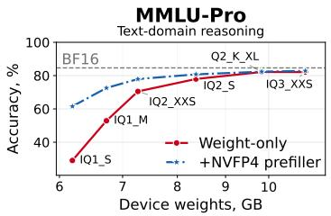

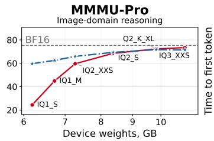

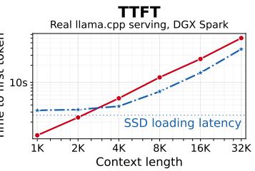  
Figure 1: NVFP4 prefillers for off-the-shelf Qwen3.8-27B GGUF decoders. Left and middle: training the prefiller more than doubles IQ1 S accuracy on both benchmarks while leaving the decode checkpoint unchanged. ODP adds no weight-memory overhead. Right: measured time to first token in llama.cpp, comparing ODP with weight-only IQ1 S. ODP is faster from 4K context, reaching 1.78× speedup at 8K.

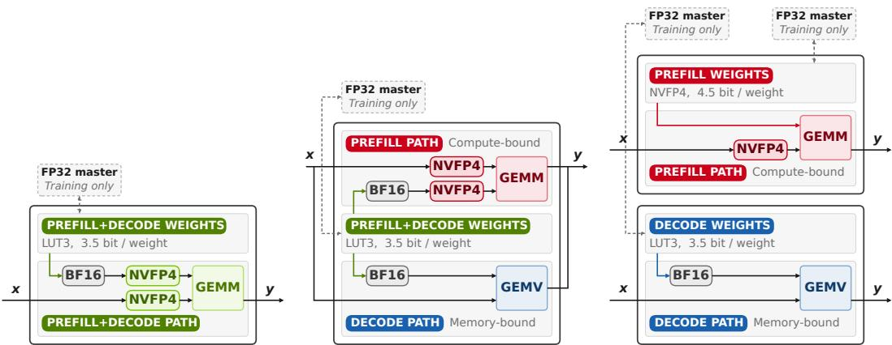  
(a) Non-disaggregated quantized (b) Format-disaggregated quan- (c) Fully-disaggregated quantized linear. Common model weights, tized linear. Common model linear. Phase-specific model same formats for the two phases. weights, phase-specific formats. weights and formats.  
Figure 2: Storage and computation schemes for various degrees of disaggregated quantization, using the LUT3 format as an example. This application of disaggregated quantization retains the prefill speed of NVFP4 and the decode speed of LUT3 while achieving higher accuracy (see Figure 5). Offloaded disaggregated prefill replaces full device residency of the extra prefill checkpoint with block buffers (see Section 2.5).

Modern decoder-only language models (Radford et al., 2019), however, treat every token in a sequence equally as both a target conditioned on preceding tokens and context for future tokens. Input processing and output generation consequently share the same parameters and architecture.

In instruction-following use-cases, the logical distinction reappears. A user supplies data or instructions, and the model produces an answer conditioned on them. Post-training reinforces these roles through structured interactions (Wei et al., 2022; Rafailov et al., 2024) or rewards for generated answers (Guo et al., 2025). This splits up inference into two different phases where prefill constructs the prompt key–value (KV) cache and decode consumes it while generating the response.

Prefill and decode workloads are different enough that large-scale deployment systems run them on separate accelerators. Similarly, we show that input processing and generation can use distinct quantized representations while remaining jointly optimized for the response. We explore this through disaggregated quantization (DQ). DQ retains the pretrained attention architecture while specializing the linear computations and, optionally, their weights and their placement, to the two phases of LLM inference.

## 1.1 HARDWARE COST

Compute-bound prefill vs memory-bound decode. At every linear layer, inference combines (1) loading model weights and activations from device memory (DRAM) into the compute units and (2) general matrix multiplication (GEMM) inside them. For an $H \times H$ weight and $T \times H$ activations, it transfers $\mathcal { O } ( H ^ { \frac { 1 } { 2 } } + T H )$ elements and performs $\mathcal { O } ( T H ^ { 2 } )$ arithmetic. Increasing the token count T therefore amortizes weight transfer over more computation. At batch one $( T = 1 )$ each weight contributes only one multiply-add, so weight loading dominates. In sufficiently long prefill workloads $( T \gg 1 )$ , reuse across tokens makes the linear layers generally compute-bound.

Quantization formats target one of the two. These load profiles motivate (1) compressing weights to reduce memory traffic, admitting complex weight-only encodings (Frantar et al., 2023; Egiazarian et al., 2024; Tseng et al., 2024; 2025), and (2) quantizing weights and activations to hardwaresupported compute formats such as INT4 (Ashkboos et al., 2023; 2024; Liu et al., 2025a) or NVFP4 (Egiazarian et al., 2026a; Chen et al., 2025b).

A compact weight encoding, however, need not be a hardware-native compute format. A weightonly decode kernel can reconstruct values as it loads them for a matrix-vector product, still reducing weight traffic. It need not quantize activations either. Using arbitrary encoding with hardwarenative quantized GEMM, however, requires both weight re-quantization and activation quantization into supported formats.

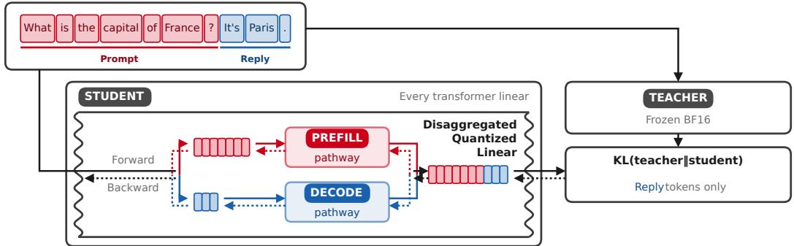  
Figure 3: Quantization-aware distillation with disaggregation (QADD). The SFT assistant token mask, normally used only for loss, is also used to select the linear layer computational pathway.

A common setup in efficient LLM inference is disaggregated serving. Separate prefill and decode instances hold their own model weights and exchange a prompt KV cache, so decode must interpret representations produced by prefill. Keeping weights at each instance avoids transferring them between devices for every request; the interface between phases is instead the cache. Existing systems mostly address its communication (Qin et al., 2025) and scheduling (Hu et al., 2024).

## 1.2 CONTRIBUTIONS

We introduce disaggregated quantization (DQ), a broad concept in which we treat quantization for prefill and decode separately. Splitting prefill and decode computation and weight formats yields a ladder of different schemes, each targeting a different axis of inference cost. We introduce the different schemes, and the tools to optimize networks for each. Our contributions are as follows:

1. Quantization-aware distillation with disaggregation (QADD) trains phase-specific pathways toward a common response objective in one forward-backward pass, supporting shared or separate master weights and prefill-only adaptation to a frozen decoder.

2. Disaggregated quantization is an umbrella term for three complementary schemes:

(a) Format disaggregation combines quantized compute prefill with low-bitwidth weight-only decode. Compared to phase-agnostic computations, this scheme improves accuracy primarily on decode-heavy tasks without increasing weight storage or inference cost.

(b) Full disaggregation trains separate compute-native prefill weights. Compared to weight-only compression, it accelerates prefill while simultaneously boosting accuracy for low-bitwidth decode weights on both prefill-heavy and decode-heavy workloads.

(c) Offloaded disaggregated prefill (ODP) streams prefill weights from SSD through buffers that reuse device memory and overlap loading with compute to avoid additional device memory occupation and, at longer context, hide loading overhead. On Qwen3.8-27B, our llama.cpp implementation delivers a 1.78× time-to-first-token speedup over a weight-only baseline at 8K context.

3. Prefillers: training fully-disaggregated NVFP4 prefill checkpoints to augment arbitrary frozen weight-only checkpoints. For 1-bit GGUF compression, we show it more than doubling accuracy over weight-only inference, while simultaneously making prefill faster and memory-efficient via ODP.

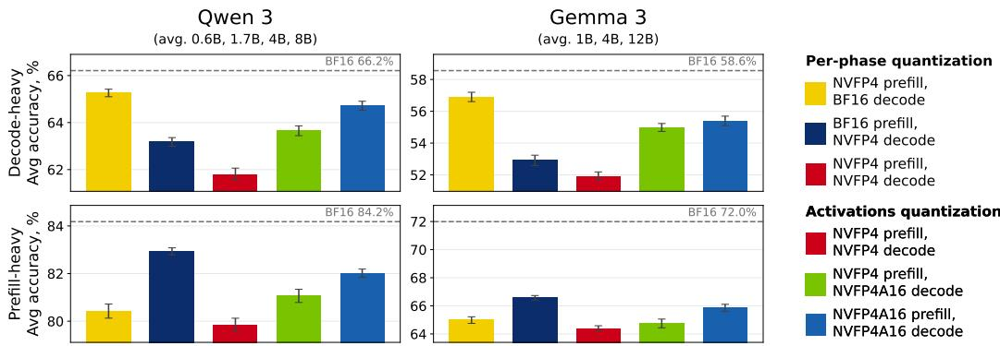  
Figure 4: Family-mean accuracy of NVFP4-based formats after quantization-aware distillation on decode-heavy (top) and prefill-heavy (bottom) workloads. Decode-only NVFP4 quantization is more damaging than prefill-only quantization on decode-heavy tasks; the ordering reverses on prefill-heavy tasks. Format-disaggregated NVFP4 (green) combines NVFP4 prefill with NVFP4A16 decode and improves accuracy over uniform NVFP4 on both workloads without increasing weight storage or prefill cost. On decode-heavy tasks, it approaches the accuracy of NVFP4A16, which uses slower weight-only prefill.

## 2 DISAGGREGATED QUANTIZATION

We first introduce QADD (Section 2.1), then subsequently disaggregate formats, weights and storage (Sections 2.2–2.5). The measured effect of these schemes on accuracy and inference cost is presented in Section 3.

## 2.1 QUANTIZATION-AWARE DISTILLATION WITH DISAGGREGATION

Quantization-aware distillation with disaggregation (QADD) builds on top of quantization-aware distillation (QAD) (Polino et al., 2018; Lee et al., 2025; Xin et al., 2026). It uses the SFT label mask to propagate the prefill/decode separation from post-training data into the quantized model layers. The mask, normally used for loss masking, now also selects the computational pathway: prompt (user turn) uses prefill, while response (assistant turn) uses decode. Although the distillation loss supervises only response targets, its gradients reach the prefill weights through the prompt keys and values consumed by decode. Both pathways are therefore trained toward the same response objective in one forward-backward pass (Figure 3). Implementation details are provided in Appendix A.

## 2.2 QUANTIZATION SENSITIVITY DEPENDS ON THE WORKLOAD

Before turning to DQ formats, we first establish that different bechmarks interact with quantization of either phase differently, allowing us to monitor phase-specific accuracy effects. We do that by quantizing each phase to NVFP4 in isolation and gauging the effect on two distinct sets of benchmarks: decode-heavy reasoning benchmarks and prefill-heavy benchmarks with long prompts and short answers.

We find that on decode-heavy benchmarks, quantizing decode alone incurs 2–4× the accuracy loss of quantizing prefill alone on most models, and up to 7× on Gemma3-1B. On prefill-heavy tasks, prefill-only quantization incurs 1.1–4.1× the accuracy loss of decode-only quantization on seven of eight models (Figure 4, Figure 12).

With disaggregated quantization, we aim to improve the quality of both stages. Tracking quality on both prefill-heavy and decode-heavy evaluations, verified above, allows us to separate and quantify improvements per stage.

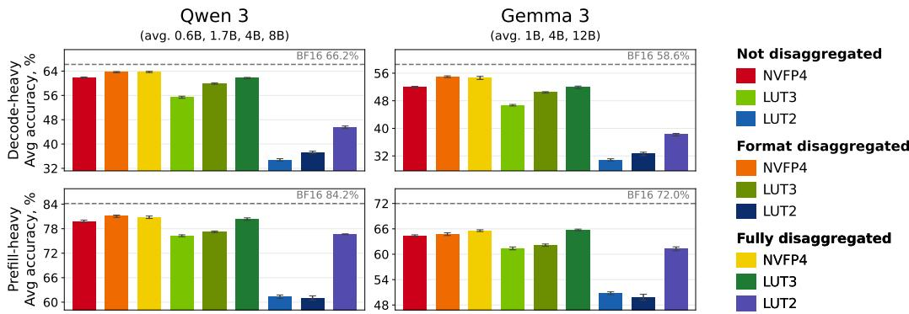  
Figure 5: Family-mean accuracy of non-disaggregated, format-disaggregated and fullydisaggregated schemes with 2–4-bit decode weights and NVFP4 prefill compute after quantizationaware distillation. Format disaggregation primarily improves accuracy on decode-heavy tasks (top). Full disaggregation further improves low-bit accuracy on both workload types, with the largest gains over format disaggregation at 2-bit decode on prefill-heavy tasks.

## 2.3 FORMAT-DISAGGREGATED QUANTIZATION REDUCES DECODE-PHASE ERROR

NVFP4 quantizes weights and activations alike (Egiazarian et al., 2026a; Chen et al., 2025b), enabling fast prefill; its weight-only variant NVFP4A16 leaves activations unquantized, achieving higher quality but forfeiting the faster prefill computations.

We propose disabling activation quantization only on decode, yielding format-disaggregated NVFP4. It retains original NVFP4’s storage and prefill costs while slightly accelerating memorybound decode by skipping activation quantization (Table 1, Appendix C.2).

The same approach extends to arbitrary weight encodings and computational formats. Since 2–3- bit quantization has been shown to be Pareto-optimal in size-to-accuracy (Egiazarian et al., 2024; Liu et al., 2025b; Panferov et al., 2025), we also evaluate 2- and 3-bit scalar look-up table (LUT) weight encodings, that we refer to as “LUT2A16” and “LUT3A16” (Appendix A.3). To enable native low-precision computations on top of low-bitwidth weights, on-the-fly “autocast” re-quantizes them, along with activations, to NVFP4. We refer to these accelerated-compute formats as “LUT3” and “LUT2”. The non-disaggregated scheme applies this autocast in both phases indiscriminately (Figure 2a); format disaggregation restricts it to prefill, combining native NVFP4 prefill computation with compact weight-only LUT decode (Figure 2b).

Prefill still uses a re-quantized view of the low-bit decode weights, so its representation remains constrained by their compact encoding, which does not accelerate the NVFP4 computations used by prefill. This motivates giving prefill its own weights.

## 2.4 FULLY-DISAGGREGATED QUANTIZATION INCREASES PREFILL-PHASE CAPACITY

We propose training separate prefill weights, in a scheme we refer to as “fully-disaggregated quantization”. Both prefill and decode weights start from the same unquantized model and are optimized together by QADD under their respective formats towards a common response objective, yielding a native NVFP4 prefill checkpoint and a separate weight-only decode checkpoint (Figure 2c). Each decode format is trained with its own prefill checkpoint, rather than reusing one across bitwidths.

At inference, the prefill checkpoint produces the prompt keys and values at each layer. The decode checkpoint then attends to these representations. The cache retains the original model’s layer and head dimensions, so separating the weights does not require any attention modifications. Speedwise, full disaggregation enjoys the benefits of both NVFP4 prefill computations and weight-only low-bitwidth decode, cleanly combining the best of both worlds.

Full disaggregation mandates storing an additional prefill checkpoint, increasing total storage while preserving the decode weight footprint and speed. Datacenter disaggregation already stores a model instance per phase, but holding both on a single device can be prohibitive. Their residency requirements differ, however. Decode-only weights need high-bandwidth access during generation but are unused during prefill, while prefill weights are needed only during prompt processing and sit idle during decode. We exploit this duality next.

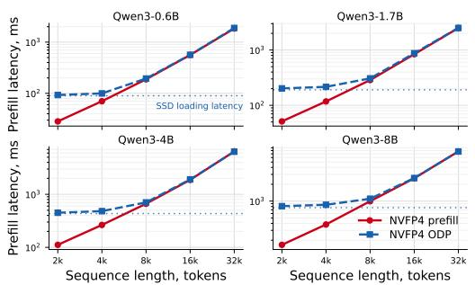  
(a) NVFP4 prefill latency with and without ODP. Compute overtakes SSD loading at around 8K context and offloading overhead stays under 5% across Qwen 3 above 16K context.

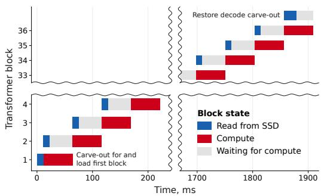  
(b) ODP pipeline schematic for Qwen 3 4B at 16K context length in NVFP4, scaled to measured loading and total latency. After a cold start on the first block, subsequent loads overlap with compute.  
Figure 6: Latency effect (a) and pipelining scheme (b) of offloaded disaggregated prefill (ODP).

## 2.5 OFFLOADED DISAGGREGATED PREFILL

Once a prefill transformer block has produced its outputs, its weights are no longer needed for the rest of the assistant turn, even though its cached keys and values remain in use. Offloaded disaggregated prefill (ODP) therefore loads prefill weights from SSD block by block and reuses their device buffers as the context propagates through the network.

Prefill compute grows with context length, while loading the prefill checkpoint from SSD has a fixed cost, so the relative loading overhead decreases as prompts grow. On DGX Spark, compute overtakes loading around 8K context for all Qwen 3 models (Figure 6a). Two device block buffers suffice to overlap compute with loading: while one block processes the prompt, the next is loaded into the other buffer. Longer prompts leave more time for this transfer before the next block is needed, as shown in Figure 6b; short prompts can instead stall on loading. We obtain buffer space by carving-out an equally sized portion of decode weights, unused on prefill, and restoring it before generation. This makes ODP occupy no additional device weight memory at the cost of extra reads.

The same streaming principle, in theory, applies to separate input-processing networks, including encoders in encoder–decoder LLMs and prefill models connected to a decoder through a learned KV-cache adapter (Heo et al., 2026), replacing full device weight residency with streamed buffers. The same idea, however, does not seamlessly transfer to mixture-of-experts models, as the ratio of compute cost to loading cost grows with the fraction of active parameters, making loading considerably more expensive than compute up to extremely high context lengths. We, therefore, present ODP as mainly a tool for local deployment of dense LLMs.

## 2.6 PREFILLERS FOR ARBITRARY WEIGHT-ONLY CHECKPOINTS

So far, we have jointly optimized the prefill and decode weights. In practice, however, a suitable quantized decoder may already exist, produced via advanced algorithms over complex encodings (Egiazarian et al., 2024; Tseng et al., 2024; van der Ouderaa et al., 2026) or released prequantized with closed-source or opaque data and algorithms (Gemma Team, 2026). As the result, it is possible that existing pre-quantized checkpoints either can’t or don’t need to be trained during QADD.

We extend full disaggregation to such checkpoints by training only their prefillers: prefill models specialized to particular pre-quantized frozen decoders. During training, the decoder uses its dequantized weights without updating them, while gradients propagate through its computations to the prefill pathway. The NVFP4 prefill weights thus adapt to the representations needed by the existing decoder. The decode quantization pipeline can remain a black box: we require its resulting checkpoint, not its training data or optimization algorithm. The resulting model retains the released checkpoint’s compressed decode weights and execution pathway while enabling hardware-native NVFP4 prefill. ODP streams the prefiller without increasing device weight residency.

Table 1: Cost and accuracy for Qwen 3 and Gemma 3. Speedups and device allocations are for Qwen3-8B and Gemma3-12B. Accuracy (%) is averaged over 0.6B/1.7B/4B/8B for Qwen 3 and 1B/4B/12B for Gemma 3. DH denotes decode-heavy accuracy over three benchmarks (two reasoning modes for Qwen 3); PH denotes prefill-heavy RULER accuracy over 13 tasks at 4K/8K/16K/32K context. Both use the last five QADD checkpoints (Section 3.1). Prefill is measured at 16K context length on DGX Spark. Decode is measured end-to-end in vLLM as per-token latency at batch one.
<table><tr><td rowspan="2">Format</td><td colspan="4">Qwen 3</td><td colspan="4">Gemma 3</td></tr><tr><td>Prefill Decode Device Acc. Acc. speedup speedup</td><td>GB</td><td>DH</td><td>PH</td><td>Prefill speedup speedup</td><td>Decode Device Acc. Acc. GB</td><td>DH</td><td>PH</td></tr><tr><td>BF16</td><td>1.00x 1.00x</td><td>16.38</td><td></td><td>66.2 84.2</td><td>1.00x</td><td>1.00x</td><td>23.53</td><td>58.6 72.0</td></tr><tr><td>NVFP4A16 NVFP4</td><td>1.00x 2.93x 1.49x 2.86x</td><td>6.40 6.40</td><td></td><td>64.7 82.0 61.8 79.8</td><td>1.00x 1.67x</td><td>3.27x 3.18x</td><td>8.07 8.07</td><td>55.4 65.9 51.9 64.4</td></tr><tr><td>+Format disagg. 3-bit weight-only LUT3</td><td>1.49x 2.93x 1.00x 3.33x</td><td>6.40 5.53</td><td></td><td>63.7 81.1 61.5 79.8</td><td>1.67x 1.00x</td><td>3.27x 3.44x</td><td>8.07 6.72</td><td>55.064.7 51.6 64.1</td></tr><tr><td>+Format disagg. +Full disagg.</td><td>1.49x 3.23x 1.49x</td><td>5.53 3.33x 5.53</td><td></td><td>55.4 76.3 59.977.2</td><td>1.67x 1.67x</td><td>3.37x 3.44x</td><td>6.72 6.72</td><td>46.761.4 50.4 62.1</td></tr><tr><td></td><td>1.49x</td><td>3.33x 9.44</td><td></td><td>61.7 80.4</td><td>1.67x</td><td>3.44x</td><td>12.77</td><td>51.9 65.7</td></tr><tr><td>+ODP</td><td></td><td>5.53</td><td>61.7</td><td></td><td></td><td></td><td></td><td></td></tr><tr><td></td><td>1.47x</td><td>3.33x</td><td></td><td>80.4</td><td>1.58x</td><td>3.44x</td><td>6.72</td><td>51.9 65.7</td></tr><tr><td>2-bit weight-only</td><td></td><td></td><td></td><td></td><td></td><td></td><td></td><td></td></tr><tr><td></td><td>1.00x</td><td>3.82x 4.66</td><td></td><td>38.4 64.1</td><td>1.00x</td><td>4.15x</td><td>5.38</td><td>33.7 52.4</td></tr><tr><td>LUT2</td><td>1.49x</td><td>3.73x 4.66</td><td></td><td>34.861.3</td><td>1.67x</td><td>4.03x</td><td>5.38</td><td></td></tr><tr><td>+Format disagg.</td><td></td><td></td><td></td><td>37.2 61.0</td><td></td><td></td><td></td><td>30.8 50.8</td></tr><tr><td>+Full disagg.</td><td>1.49x</td><td>3.82x 4.66</td><td></td><td></td><td>1.67x</td><td>4.15x</td><td>5.38</td><td>32.649.8</td></tr><tr><td></td><td>1.49x</td><td>3.82x 8.57</td><td></td><td>45.576.6</td><td>1.67x</td><td>4.15x</td><td>11.43</td><td>38.2 61.3</td></tr><tr><td>+ODP</td><td>1.47x</td><td>3.82x 4.66</td><td></td><td>45.576.6</td><td>1.58x</td><td>4.15x</td><td>5.38</td><td>38.2 61.3</td></tr></table>

## 3 EXPERIMENTAL SETUP AND LARGE-SCALE VALIDATION

## 3.1 EXPERIMENTAL SETUP

Core QADD experiments. We minimize $\mathrm { K L } ( p _ { \mathrm { t e a c h e r } } | | p _ { \mathrm { s t u d e n t } } )$ against the frozen unquantized teacher on 100M tokens from the Tulu 3 (Lambert et al., 2025) SFT corpus. Uniform and disaggre-¨ gated configurations use the same corpus, token budget and optimization schedule (Appendix A.1).

Instruction-tuned models. DQ requires a logical input/output separation, so we use models that have undergone post-training. Core experiments are performed on Qwen 3 (Yang et al., 2025) at 0.6B, 1.7B, 4B and 8B parameters, and Gemma 3 (Gemma Team, 2025) at 1B, 4B and 12B parameters. Qwen 3 allows an optional reasoning block during decode, which improves capabilities at the cost of a longer decode phase.

Core QADD benchmarks. For decode-heavy evaluation, we use the generative versions of GSM8K (Cobbe et al., 2021), MATH-500 (Hendrycks et al., 2021) and MMLU-Pro (Wang et al., 2024), with Qwen 3 reasoning both enabled and disabled. For prefill-heavy evaluation, we use RULER (Hsieh et al., 2024), whose long prompts and short answers complement these reasoning workloads. We evaluate its 13 tasks at 4K, 8K, 16K and 32K context lengths, with Qwen 3 reasoning disabled. The reported accuracy summaries use real disaggregated serving via vLLM (Kwon et al., 2023) and NIXL. Decode-heavy accuracy is averaged over the three benchmarks (times two modes for Qwen 3). Prefill-heavy scores are averaged over tasks and then context lengths. Per-model accuracy further averages the last five checkpoints of each QADD run, where performance plateaus. A number quoted for a family, such as “on Qwen 3”, is the unweighted mean over that family’s model sizes. Error bars describe two standard deviations over temporal averaging within one training run, not uncertainty across independent runs (Appendix A.5,D).

Latency. We measure end-to-end batch-one per-output-token latency through vLLM and prefill transformer-stack latency with a custom stack built from vLLM kernels. LUT2 and LUT3 decode use custom weight-only kernels. All measurements are performed on DGX Spark (Appendix C).

Table 2: Accuracy over text (MMLU-Pro) and image (MMMU-Pro) reasoning benchmarks for SOTA LLMs, as well as gains from 4-bit format disaggregation. Gains highlighted in bold are statistically significant (per-comparison p < 0.05). †: FP8 reference instead of BF16. ‡: MXFP4 instead of NVFP4, with no BF16 checkpoint available.
<table><tr><td rowspan="3">Model</td><td colspan="5">MMLU-Pro</td><td colspan="5">MMMU-Pro</td></tr><tr><td rowspan="2">BF16</td><td rowspan="2">W4A16</td><td colspan="3">W4A4 disaggregation</td><td rowspan="2">BF16</td><td rowspan="2">W4A16</td><td colspan="3">W4A4 disaggregation</td></tr><tr><td>None</td><td>Format</td><td></td><td>None</td><td>Format</td><td>∆</td></tr><tr><td>Qwen3.8-27B</td><td>84.58</td><td>82.33</td><td>81.47</td><td>81.83</td><td>+0.35</td><td>74.78</td><td>71.16</td><td>69.84</td><td>70.46</td><td>+0.62</td></tr><tr><td>Gemma-4-31B</td><td>84.92</td><td>84.51</td><td>84.07</td><td>84.17</td><td>+0.10</td><td>66.84</td><td>65.36</td><td>64.81</td><td>65.94</td><td>+1.13</td></tr><tr><td>Muse-Glimmer-30B</td><td>75.43</td><td>76.80</td><td>75.12</td><td>76.04</td><td>+0.92</td><td>72.92</td><td>71.81</td><td>70.38</td><td>71.34</td><td>+0.97</td></tr><tr><td>Gemma-4-26B</td><td>82.40</td><td>81.01</td><td>79.74</td><td>80.52</td><td>+0.78</td><td>63.66</td><td>60.95</td><td>59.05</td><td>59.68</td><td>+0.64</td></tr><tr><td>Nemotron-3-120B</td><td>83.01</td><td>82.78</td><td>82.66</td><td>82.68</td><td>+0.02</td><td></td><td>一</td><td>一</td><td>一</td><td>-</td></tr><tr><td>Nemotron-3-550B</td><td>86.71</td><td>86.47</td><td>86.51</td><td>86.37</td><td>-0.14</td><td></td><td>一</td><td>一</td><td>一</td><td>一</td></tr><tr><td>Qwen3.8-2.4T†</td><td>88.99</td><td>84.73</td><td>84.28</td><td>84.68</td><td>+0.40</td><td></td><td></td><td></td><td></td><td></td></tr><tr><td>Kimi-K3-2.8T‡</td><td></td><td>85.94</td><td>85.78</td><td>85.57</td><td>-0.21</td><td></td><td>79.93</td><td>79.18</td><td>79.71</td><td>+0.53</td></tr></table>

## 3.2 MAIN QADD-BASED RESULTS

Format-disaggregated quantization. Accuracy-wise, on decode-heavy tasks, format disaggregation boosts mean accuracy over the non-disaggregated scheme on all seven models by 1.9 and 3.1 for NVFP4, 4.5 and 3.7 points for LUT3, 2.5 and 1.8 points for LUT2 on Qwen 3 and Gemma 3, respectively (respective improvement for Qwen 3 and Gemma 3 is implied throughout this subsection). On prefill-heavy tasks, however, this decoding-phase optimization has an effect of less than 1.3 points for all considered model families and formats (Figure 5, Table 1).

Speed-wise, on prefill, format disaggregation uses the same accelerated NVFP4 computations as the non-disaggregated scheme, with up to 1.49× and 1.67× speedup over BF16 on Qwen3-8B and Gemma3-12B. On decode, format disaggregation is 2–3% faster than the non-disaggregated scheme by virtue of skipping activations quantization (Table 1, Table 10, Figure 9).

That justifies format disaggregation as a plug-in replacement for non-disaggregated inference that boosts accuracy on decode-heavy tasks while retaining or improving all speed and storage costs for single-user serving. It is most useful when device memory is scarce and interactivity of the original model needs to be fully preserved.

Fully-disaggregated quantization and ODP. Accuracy-wise, full disaggregation improves both decode-heavy and prefill-heavy performance over non-disaggregated formats. For the former, it yields 6.3 and 5.2 points for LUT3, 10.7 and 7.4 points for LUT2. For the latter, it gains 4.1 and 4.3 points for LUT3, 5.3 and 10.5 points for LUT2. For 2–3-bit models, the improvement is noticeable over both non-disaggregated and format-disaggregated serving. For 2-bit models, the gains are so large that fully-disaggregated quantization substantially outperform LUT2A16 weight-only serving, by 4.5–12.5 points, while also delivering faster prefill computations (Figure 5, Table 1).

Cost-wise, ODP negates the device memory overhead of prefill weights at the cost of constant SSDbandwidth-bound time-to-first-token and slight prefill latency overhead for longer sequences. At context length above 16K, offloading increases resident NVFP4 prefill latency by less than 5% on Qwen 3 and 8% on Gemma 3, coming from a cold start on the first block and synchronization logic. At 16K, the streamed transformer stack remains 1.47× faster than BF16 on Qwen3-8B and 1.58× on Gemma3-12B. In this regime, ODP retains most of the resident NVFP4 prefill speedup without additional device weight memory. Decode speedup remains unchanged relative to format disaggregation (Table 1, Table 10).

Thus, fully-disaggregated quantization is preferable for both low-concurrency disaggregated serving, when two checkpoints are resident on accelerators anyway and decode is still memory-bound, and for local single-user serving, via ODP. The latter, however, is not as useful for MoE models, and when time-to-first-token (TTFT) on short sequences is critical.

Prefillers for pre-quantized Qwen3.8-27B. For the prefillers experiments, we scale our setup to Qwen3.8-27B (Qwen Team, 2026) — a dense 27-billion-parameters model released in the summer of 2026. We use eight openly-available pre-quantized GGUF (Gerganov & contributors, 2023) checkpoints released by Unsloth (Daniel Han & team, 2023), including vector-quantized formats such as IQ2 XXS. We evaluate MMLU-Pro (Wang et al., 2024) for text reasoning and MMMU-Pro (Yue et al., 2025)for visual reasoning, with reasoning enabled in both. We report one complete evaluation per format at the end of the 95M-token QADD training on text-only reasoning traces from the BF16 model on code and math questions (Appendix A.2).

Accuracy-wise, training an NVFP4 prefiller improves 1-bit decoder accuracy by 32.5 points on MMLU-Pro and 35.3 on MMMU-Pro, more than doubling its weight-only accuracy on both benchmarks. The gains at 2-bit decode are around 7.4 and 6.3 points and diminish at higher bitwidths. At 3-bit decode, an NVFP4 prefiller leads to slight performance degradation instead. Figure 1 summarizes the gains across formats and benchmarks. The QADD corpus contains no multi-modal examples, yet the low-bit accuracy gains transfer strongly to visual reasoning on MMMU-Pro. For the lowest-bit decoders, learned prefillers also substantially outperform RTN prefill at the same NVFP4 precision, showing that training matters beyond the choice of format (Appendix B.4). Appendix B.5 reports generation-length and truncation measurements.

Speed-wise, adding an NVFP4 prefiller through our custom llama.cpp (Gerganov & contributors, 2023) extension reduces time to first token from 12.27 to 6.90 seconds at 8K context, a 1.78× speedup over the weight-only baseline. Across the measured 4K–32K contexts, the speedup ranges from 1.38× to 1.78×, while SSD loading makes ODP slower at shorter prompts (Figure 1).

Building on top of full disaggregation, trained prefillers are most useful in the same serving scenarios as the latter, with the caveat of re-using existing weight-only quantized checkpoints.

## 3.3 LARGE-SCALE VALIDATION WITH PTQ

Scaling further up, we apply format disaggregation to eight text and multi-modal models up to 2.8T parameters. We use NVFP4 PTQ without retraining, testing the most straightforward intervention that is disabling activation quantization only on decode. We evaluate on MMLU-Pro and MMMU-Pro, using paired per-item tests with four evaluation repeats (Appendix A.5). We evaluate Qwen 3.8 (Qwen Team, 2026), Gemma 4 (Gemma Team, 2026), Muse Glimmer (Meta, 2026), Nemotron 3 (NVIDIA, 2025) and Kimi-K3 (Kimi Team, 2026).

Format disaggregation at 4-bit improves point estimates in 11 of 13 model–benchmark combinations, with 6 significant gains at α = 0.05 and no significant degradations (Table 2). Significant gains from the most conservative instantiation of disaggregated quantization validate it for SOTA open models with trillions of parameters.

## 4 RELATED WORK

Existing work on interaction between inference phases and quantization balances prefill quality against memory-bound decode through phase-specific weight precision (Chen et al., 2025a), accelerates prefill with low-precision compute while retaining BF16 decode (Lu et al., 2026; Wei et al., 2026), or fine-tunes task-specific prefill modules around a frozen quantized decoder (Woo et al., 2026). Forys et al. (2026) allow prefill and decode to be quantized independently in a disaggregated serving simulator. These works establish the value of phase-specific precision and prefill adaptation. Disaggregated quantization takes this idea further to combine hardware-native prefill with compressed weight-only decode in a unifying approach that can share master weights or maintain separate weights specialized to each phase, supporting both joint optimization and prefill-only adaptation to a frozen decoder.

FlexGen (Sheng et al., 2023) amortizes weight transfers through large batches. ODP streams the additional prefill checkpoint, amortizing loading over prompt length without increasing device weight residency while decode weights remain resident during generation. This principle may also complement separate prefill networks with learned KV-cache adapters (Heo et al., 2026), although we do not evaluate that combination.

## 5 CONCLUSION AND LIMITATIONS

DQ introduces a phase-aware approach to co-designing quantization formats and model serving. Prefill and decode representations can be chosen for their distinct hardware costs and trained to work together toward a common response objective. This separation also changes local serving: weights needed only during prompt processing can reside on SSD between requests, making room for a specialized prefill model without increasing device weight residency. This phase-aware specialization allows fast prefill, compact decode and accurate responses to coexist for local serving.

Our evaluations cover decode-heavy reasoning and single-turn prefill-heavy tasks, with batch-one decode and prefill-stack timings on DGX Spark and ODP time-to-first-token measurements in llama.cpp. We do not evaluate highly batched performance or multi-turn and agentic behavior. In multi-turn use, cached assistant tokens retain decode-produced KV entries, while rebuilding their cache through prefill can produce different representations for the same token history. Robustness to this cache-policy dependence remains untested.

Released artifacts. We release the codebase for reproducing our main results, along with a llama.cpp fork that adds ODP support, on GitHub. We additionally release the trained Qwen3.8- 27B prefillers on the Hugging Face Hub.

Acknowledgments. This research was funded in part by the Austrian Science Fund (FWF) 10.55776/COE12, i.e., the Bilateral AI Cluster of Excellence, and through generous research support by NVIDIA. Additionally, we would like to thank Yoshi Suhara (NVIDIA) for providing and managing the DGX Spark on which the measurements were performed.

## REFERENCES

Saleh Ashkboos, Ilia Markov, Elias Frantar, Tingxuan Zhong, Xincheng Wang, Jie Ren, Torsten Hoefler, and Dan Alistarh. Quik: Towards end-to-end 4-bit inference on generative large language models, 2023. URL https://arxiv.org/abs/2310.09259.

Saleh Ashkboos, Amirkeivan Mohtashami, Maximilian L. Croci, Bo Li, Pashmina Cameron, Martin Jaggi, Dan Alistarh, Torsten Hoefler, and James Hensman. Quarot: Outlier-free 4-bit inference in rotated llms, 2024. URL https://arxiv.org/abs/2404.00456.

Yoshua Bengio, Nicholas Leonard, and Aaron Courville. Estimating or propagating gradients ´ through stochastic neurons for conditional computation, 2013. URL https://arxiv.org/ abs/1308.3432.

Patrick Blumenberg, Thomas Graave, and Tim Fingscheidt. Improving block-wise llm quantization by 4-bit block-wise optimal float (bof4): Analysis and variations, 2025. URL https: //arxiv.org/abs/2505.06653.

Hao Mark Chen, Fuwen Tan, Alexandros Kouris, Royson Lee, Hongxiang Fan, and Stylianos I. Venieris. Progressive mixed-precision decoding for efficient llm inference, 2025a. URL https: //arxiv.org/abs/2410.13461.

Mengzhao Chen, Meng Wu, Hui Jin, Zhihang Yuan, Jing Liu, Chaoyi Zhang, Yunshui Li, Jie Huang, Jin Ma, Zeyue Xue, Zhiheng Liu, Xingyan Bin, and Ping Luo. Int v.s. fp: A comprehensive study of fine-grained low-bit quantization formats, 2025b. URL https://arxiv.org/abs/ 2510.25602.

Karl Cobbe, Vineet Kosaraju, Mohammad Bavarian, Mark Chen, Heewoo Jun, Lukasz Kaiser, Matthias Plappert, Jerry Tworek, Jacob Hilton, Reiichiro Nakano, Christopher Hesse, and John Schulman. Training verifiers to solve math word problems, 2021. URL https://arxiv. org/abs/2110.14168.

Jack Cook, Hyemin S. Lee, Kathryn Le, Junxian Guo, Giovanni Traverso, Anantha P. Chandrakasan, and Song Han. Adaptive block-scaled data types, 2026. URL https://arxiv.org/abs/ 2603.28765.

Michael Han Daniel Han and Unsloth team. Unsloth, 2023. URL https://github.com/ unslothai/unsloth.

Vage Egiazarian, Andrei Panferov, Denis Kuznedelev, Elias Frantar, Artem Babenko, and Dan Alistarh. Extreme compression of large language models via additive quantization, 2024. URL https://arxiv.org/abs/2401.06118.

Vage Egiazarian, Roberto L. Castro, Denis Kuznedelev, Andrei Panferov, Eldar Kurtic, Shubhra Pandit, Alexandre Marques, Mark Kurtz, Saleh Ashkboos, Torsten Hoefler, and Dan Alistarh. Bridging the gap between promise and performance for microscaling fp4 quantization, 2026a. URL https://arxiv.org/abs/2509.23202.

Vage Egiazarian, Erik Schultheis, Andrei Panferov, Earl Killian, Torsten Hoefler, and Dan Alistarh. Grid games: The power of multiple grids for quantizing large language models, 2026b. URL https://arxiv.org/abs/2605.12327.

Przemyslaw Forys, Haoran Wu, Can Xiao, Jiayi Nie, Tony Liu, Rika Antonova, Timothy Jones, Robert Mullins, Wayne Luk, Aaron Zhao, and George A. Constantinides. When does disaggregation pay? simulating prefill–decode–attention–ffn specialization for agentic llm inference, 2026. URL https://arxiv.org/abs/2608.03741.

Elias Frantar, Saleh Ashkboos, Torsten Hoefler, and Dan Alistarh. Gptq: Accurate post-training quantization for generative pre-trained transformers, 2023. URL https://arxiv.org/ abs/2210.17323.

Elias Frantar, Roberto L. Castro, Jiale Chen, Torsten Hoefler, and Dan Alistarh. Marlin: Mixedprecision auto-regressive parallel inference on large language models, 2024. URL https:// arxiv.org/abs/2408.11743.

Gemma Team. Gemma 3 technical report, 2025. URL https://arxiv.org/abs/2503. 19786.

Gemma Team. Gemma 4 technical report, 2026. URL https://arxiv.org/abs/2607. 02770.

Georgi Gerganov and contributors. llama.cpp: Llm inference in c/c++, 2023. URL https:// github.com/ggml-org/llama.cpp.

Daya Guo, Dejian Yang, Haowei Zhang, Junxiao Song, Peiyi Wang, Qihao Zhu, Runxin Xu, Ruoyu Zhang, Shirong Ma, Xiao Bi, Xiaokang Zhang, Xingkai Yu, Yu Wu, Z. F. Wu, Zhibin Gou, Zhihong Shao, Zhuoshu Li, Ziyi Gao, Aixin Liu, Bing Xue, Bingxuan Wang, Bochao Wu, Bei Feng, Chengda Lu, Chenggang Zhao, Chengqi Deng, Chong Ruan, Damai Dai, Deli Chen, Dongjie Ji, Erhang Li, Fangyun Lin, Fucong Dai, Fuli Luo, Guangbo Hao, Guanting Chen, Guowei Li, H. Zhang, Hanwei Xu, Honghui Ding, Huazuo Gao, Hui Qu, Hui Li, Jianzhong Guo, Jiashi Li, Jingchang Chen, Jingyang Yuan, Jinhao Tu, Junjie Qiu, Junlong Li, J. L. Cai, Jiaqi Ni, Jian Liang, Jin Chen, Kai Dong, Kai Hu, Kaichao You, Kaige Gao, Kang Guan, Kexin Huang, Kuai Yu, Lean Wang, Lecong Zhang, Liang Zhao, Litong Wang, Liyue Zhang, Lei Xu, Leyi Xia, Mingchuan Zhang, Minghua Zhang, Minghui Tang, Mingxu Zhou, Meng Li, Miaojun Wang, Mingming Li, Ning Tian, Panpan Huang, Peng Zhang, Qiancheng Wang, Qinyu Chen, Qiushi Du, Ruiqi Ge, Ruisong Zhang, Ruizhe Pan, Runji Wang, R. J. Chen, R. L. Jin, Ruyi Chen, Shanghao Lu, Shangyan Zhou, Shanhuang Chen, Shengfeng Ye, Shiyu Wang, Shuiping Yu, Shunfeng Zhou, Shuting Pan, S. S. Li, Shuang Zhou, Shaoqing Wu, Tao Yun, Tian Pei, Tianyu Sun, T. Wang, Wangding Zeng, Wen Liu, Wenfeng Liang, Wenjun Gao, Wenqin Yu, Wentao Zhang, W. L. Xiao, Wei An, Xiaodong Liu, Xiaohan Wang, Xiaokang Chen, Xiaotao Nie, Xin Cheng, Xin Liu, Xin Xie, Xingchao Liu, Xinyu Yang, Xinyuan Li, Xuecheng Su, Xuheng Lin, X. Q. Li, Xiangyue Jin, Xiaojin Shen, Xiaosha Chen, Xiaowen Sun, Xiaoxiang Wang, Xinnan Song, Xinyi Zhou, Xianzu Wang, Xinxia Shan, Y. K. Li, Y. Q. Wang, Y. X. Wei, Yang Zhang, Yanhong Xu, Yao Li, Yao Zhao, Yaofeng Sun, Yaohui Wang, Yi Yu, Yichao Zhang, Yifan Shi, Yiliang Xiong, Ying He, Yishi Piao, Yisong Wang, Yixuan Tan, Yiyang Ma, Yiyuan Liu, Yongqiang Guo, Yuan Ou, Yuduan Wang, Yue Gong, Yuheng Zou, Yujia He, Yunfan Xiong, Yuxiang Luo, Yuxiang You, Yuxuan Liu, Yuyang Zhou, Y. X. Zhu,

Yanping Huang, Yaohui Li, Yi Zheng, Yuchen Zhu, Yunxian Ma, Ying Tang, Yukun Zha, Yuting Yan, Z. Z. Ren, Zehui Ren, Zhangli Sha, Zhe Fu, Zhean Xu, Zhenda Xie, Zhengyan Zhang, Zhewen Hao, Zhicheng Ma, Zhigang Yan, Zhiyu Wu, Zihui Gu, Zijia Zhu, Zijun Liu, Zilin Li, Ziwei Xie, Ziyang Song, Zizheng Pan, Zhen Huang, Zhipeng Xu, Zhongyu Zhang, and Zhen Zhang. Deepseek-r1 incentivizes reasoning in llms through reinforcement learning. Nature, 645(8081):633–638, Sept 2025. ISSN 1476-4687. doi: 10.1038/s41586-025-09422-z. URL http://dx.doi.org/10.1038/s41586-025-09422-z.

Dan Hendrycks, Collin Burns, Saurav Kadavath, Akul Arora, Steven Basart, Eric Tang, Dawn Song, and Jacob Steinhardt. Measuring mathematical problem solving with the math dataset, 2021. URL https://arxiv.org/abs/2103.03874.

Taekyung Heo, Rasoul Shafipour, Ritchie Zhao, Maximilian Golub, Mohammad Mahdi Kamani, Ritika Borkar, Makesh Tarun Chandran, Pantea Zardoshti, and Bita Darvish Rouhani. Crossmodel kv cache transfer in llm families: A closed-form linear mapping for prefill reuse, 2026. URL https://arxiv.org/abs/2608.03893.

Cheng-Ping Hsieh, Simeng Sun, Samuel Kriman, Shantanu Acharya, Dima Rekesh, Fei Jia, Yang Zhang, and Boris Ginsburg. Ruler: What’s the real context size of your long-context language models?, 2024. URL https://arxiv.org/abs/2404.06654.

Cunchen Hu, Heyang Huang, Liangliang Xu, Xusheng Chen, Jiang Xu, Shuang Chen, Hao Feng, Chenxi Wang, Sa Wang, Yungang Bao, Ninghui Sun, and Yizhou Shan. Inference without interference: Disaggregate llm inference for mixed downstream workloads, 2024. URL https://arxiv.org/abs/2401.11181.

Kimi Team. Kimi k3: Open frontier intelligence, 2026. URL https://arxiv.org/abs/ 2607.24653.

Woosuk Kwon, Zhuohan Li, Siyuan Zhuang, Ying Sheng, Lianmin Zheng, Cody Hao Yu, Joseph E. Gonzalez, Hao Zhang, and Ion Stoica. Efficient memory management for large language model serving with pagedattention, 2023. URL https://arxiv.org/abs/2309.06180.

Jonas Kubler, Kailash Budhathoki, Matth ¨ aus Kleindessner, Xiong Zhou, Junming Yin, Ashish ¨ Khetan, and George Karypis. When llms get significantly worse: A statistical approach to detect model degradations, 2026. URL https://arxiv.org/abs/2602.10144.

Nathan Lambert, Jacob Morrison, Valentina Pyatkin, Shengyi Huang, Hamish Ivison, Faeze Brahman, Lester James V. Miranda, Alisa Liu, Nouha Dziri, Shane Lyu, Yuling Gu, Saumya Malik, Victoria Graf, Jena D. Hwang, Jiangjiang Yang, Ronan Le Bras, Oyvind Tafjord, Chris Wilhelm, Luca Soldaini, Noah A. Smith, Yizhong Wang, Pradeep Dasigi, and Hannaneh Hajishirzi. Tulu 3: Pushing frontiers in open language model post-training, 2025. URL https: //arxiv.org/abs/2411.15124.

Jung Hyun Lee, Seungjae Shin, Vinnam Kim, Jaeseong You, and An Chen. Unifying block-wise ptq and distillation-based qat for progressive quantization toward 2-bit instruction-tuned llms, 2025. URL https://arxiv.org/abs/2506.09104.

Zechun Liu, Changsheng Zhao, Igor Fedorov, Bilge Soran, Dhruv Choudhary, Raghuraman Krishnamoorthi, Vikas Chandra, Yuandong Tian, and Tijmen Blankevoort. Spinquant: Llm quantization with learned rotations, 2025a. URL https://arxiv.org/abs/2405.16406.

Zechun Liu, Changsheng Zhao, Hanxian Huang, Sijia Chen, Jing Zhang, Jiawei Zhao, Scott Roy, Lisa Jin, Yunyang Xiong, Yangyang Shi, Lin Xiao, Yuandong Tian, Bilge Soran, Raghuraman Krishnamoorthi, Tijmen Blankevoort, and Vikas Chandra. Paretoq: Improving scaling laws in extremely low-bit llm quantization, 2025b. URL https://arxiv.org/abs/2502.02631.

Ilya Loshchilov and Frank Hutter. Decoupled weight decay regularization, 2019. URL https: //arxiv.org/abs/1711.05101.

Haiquan Lu, Zigeng Chen, Gongfan Fang, Xinyin Ma, and Xinchao Wang. Mix-quant: Quantized prefilling, precise decoding for agentic llms, 2026. URL https://arxiv.org/abs/2605. 20315.

Meta. Muse Glimmer, July 2026. URL https://huggingface.co/meta-models/ Muse-Glimmer-30B.

NVIDIA. Nvidia nemotron 3: Efficient and open intelligence, 2025. URL https://arxiv. org/abs/2512.20856.

Andrei Panferov, Jiale Chen, Soroush Tabesh, Roberto L. Castro, Mahdi Nikdan, and Dan Alistarh. Quest: Stable training of llms with 1-bit weights and activations, 2025. URL https://arxiv. org/abs/2502.05003.

Antonio Polino, Razvan Pascanu, and Dan Alistarh. Model compression via distillation and quanti zation, 2018. URL https://arxiv.org/abs/1802.05668.

Ruoyu Qin, Zheming Li, Weiran He, Mingxing Zhang, Yongwei Wu, Weimin Zheng, and Xinran Xu. Mooncake: A kvcache-centric disaggregated architecture for llm serving, 2025. URL https://arxiv.org/abs/2407.00079.

Qwen Team. Qwen3.8-Max: A new bar for coding and cowork, August 2026. URL https: //qwen.ai/blog?id=qwen3.8.

Alec Radford, Jeff Wu, Rewon Child, David Luan, Dario Amodei, and Ilya Sutskever. Language models are unsupervised multitask learners. 2019. URL https://api. semanticscholar.org/CorpusID:160025533.

Rafael Rafailov, Archit Sharma, Eric Mitchell, Stefano Ermon, Christopher D. Manning, and Chelsea Finn. Direct preference optimization: Your language model is secretly a reward model, 2024. URL https://arxiv.org/abs/2305.18290.

Colin Raffel, Noam Shazeer, Adam Roberts, Katherine Lee, Sharan Narang, Michael Matena, Yanqi Zhou, Wei Li, and Peter J. Liu. Exploring the limits of transfer learning with a unified text-to-text transformer, 2023. URL https://arxiv.org/abs/1910.10683.

Ying Sheng, Lianmin Zheng, Binhang Yuan, Zhuohan Li, Max Ryabinin, Daniel Y. Fu, Zhiqiang Xie, Beidi Chen, Clark Barrett, Joseph E. Gonzalez, Percy Liang, Christopher Re, Ion Stoica, and´ Ce Zhang. Flexgen: High-throughput generative inference of large language models with a single gpu, 2023. URL https://arxiv.org/abs/2303.06865.

Albert Tseng, Jerry Chee, Qingyao Sun, Volodymyr Kuleshov, and Christopher De Sa. Quip#: Even better llm quantization with hadamard incoherence and lattice codebooks, 2024. URL https: //arxiv.org/abs/2402.04396.

Albert Tseng, Qingyao Sun, David Hou, and Christopher De Sa. Qtip: Quantization with trellises and incoherence processing, 2025. URL https://arxiv.org/abs/2406.11235.

Tycho F. A. van der Ouderaa, Mart van Baalen, Paul Whatmough, and Markus Nagel. Leech lattice vector quantization for efficient llm compression, 2026. URL https://arxiv.org/abs/ 2603.11021.

Ashish Vaswani, Noam Shazeer, Niki Parmar, Jakob Uszkoreit, Llion Jones, Aidan N. Gomez, Lukasz Kaiser, and Illia Polosukhin. Attention is all you need, 2023. URL https://arxiv. org/abs/1706.03762.

Yubo Wang, Xueguang Ma, Ge Zhang, Yuansheng Ni, Abhranil Chandra, Shiguang Guo, Weiming Ren, Aaran Arulraj, Xuan He, Ziyan Jiang, Tianle Li, Max Ku, Kai Wang, Alex Zhuang, Rongqi Fan, Xiang Yue, and Wenhu Chen. Mmlu-pro: A more robust and challenging multi-task language understanding benchmark, 2024. URL https://arxiv.org/abs/2406.01574.

Jason Wei, Maarten Bosma, Vincent Y. Zhao, Kelvin Guu, Adams Wei Yu, Brian Lester, Nan Du, Andrew M. Dai, and Quoc V. Le. Finetuned language models are zero-shot learners, 2022. URL https://arxiv.org/abs/2109.01652.

Zhixiang Wei, Yun Wang, James Yen, Mingyuan Xia, and Zhengwei Qi. Hbm is not all you need: Efficient disaggregated llm serving across memory-heterogeneous accelerators, 2026. URL https://arxiv.org/abs/2606.29986.

Sunghyeon Woo, Ahreum Seo, Jaegwang Lee, Jaeeun Kil, Hanbae Seo, Joonghoon Kim, Baeseong Park, Se Jung Kwon, and Dongsoo Lee. Sun: Shared use of next-token prediction for efficient multi-llm disaggregated serving, 2026. URL https://arxiv.org/abs/2603.02599.

Meng Xin, Sweta Priyadarshi, Jingyu Xin, Bilal Kartal, Aditya Vavre, Asma Kuriparambil Thekkumpate, Zijia Chen, Ameya Sunil Mahabaleshwarkar, Ido Shahaf, Akhiad Bercovich, Kinjal Patel, Suguna Varshini Velury, Chenjie Luo, Zhiyu Cheng, Jenny Chen, Chen-Han Yu, Wei Ping, Oleg Rybakov, Nima Tajbakhsh, Oluwatobi Olabiyi, Dusan Stosic, Di Wu, Song Han, Eric Chung, Sharath Turuvekere Sreenivas, Bryan Catanzaro, Yoshi Suhara, Tijmen Blankevoort, and Huizi Mao. Quantization-aware distillation for nvfp4 inference accuracy recovery, 2026. URL https://arxiv.org/abs/2601.20088.

An Yang, Anfeng Li, Baosong Yang, Beichen Zhang, Binyuan Hui, Bo Zheng, Bowen Yu, Chang Gao, Chengen Huang, Chenxu Lv, Chujie Zheng, Dayiheng Liu, Fan Zhou, Fei Huang, Feng Hu, Hao Ge, Haoran Wei, Huan Lin, Jialong Tang, Jian Yang, Jianhong Tu, Jianwei Zhang, Jianxin Yang, Jiaxi Yang, Jing Zhou, Jingren Zhou, Junyang Lin, Kai Dang, Keqin Bao, Kexin Yang, Le Yu, Lianghao Deng, Mei Li, Mingfeng Xue, Mingze Li, Pei Zhang, Peng Wang, Qin Zhu, Rui Men, Ruize Gao, Shixuan Liu, Shuang Luo, Tianhao Li, Tianyi Tang, Wenbiao Yin, Xingzhang Ren, Xinyu Wang, Xinyu Zhang, Xuancheng Ren, Yang Fan, Yang Su, Yichang Zhang, Yinger Zhang, Yu Wan, Yuqiong Liu, Zekun Wang, Zeyu Cui, Zhenru Zhang, Zhipeng Zhou, and Zihan Qiu. Qwen3 technical report, 2025. URL https://arxiv.org/abs/2505.09388.

Xiang Yue, Tianyu Zheng, Yuansheng Ni, Yubo Wang, Kai Zhang, Shengbang Tong, Yuxuan Sun, Botao Yu, Ge Zhang, Huan Sun, Yu Su, Wenhu Chen, and Graham Neubig. Mmmu-pro: A more robust multi-discipline multimodal understanding benchmark, 2025. URL https://arxiv. org/abs/2409.02813.

## A TRAINING AND MODEL HYPER-PARAMETERS

## A.1 QADD SETUP

Weights and activations are fake-quantized under straight-through estimation (Bengio et al., 2013), with FP32 master weights updated by AdamW (Loshchilov & Hutter, 2019).

Hyper-parameters. Table 3 lists common hyper-parameters for the core Qwen 3 and Gemma 3 QADD runs. The Qwen3.8-27B setup is described in Appendix A.2. Table 4 lists per-model parallelization hyper-parameters.

Table 3: QADD optimization hyperparameters, identical across all formats and models in the core Qwen 3 and Gemma 3 experiments.  
Objective $\mathrm { K L } ( p _ { \mathrm { t e a c h e r } } | | p _ { \mathrm { s t u d e n t } } )$ , teacher frozen in BF16   
Corpus Tulu 3 SFT, 100M non-padding tokens, mean sequence length 638 ¨   
Sequence length 2048   
Global batch size 64 sequences   
Steps ≈2450   
Optimizer $\mathrm { A d a m W } , \beta = ( 0 . 9 , 0 . 9 5 ) , \epsilon = 1 0 ^ { - 8 }$   
Learning rate $3 \times 1 0 ^ { - 6 } ,$ , constant   
Warmup 100 steps   
Weight decay 0.1   
Gradient clipping 1.0, per-DDP-rank   
Master weights FP32; straight-through estimator to the quantized weight   
Compute precision BF16 autocast; FP32 residual stream   
Parallelism DDP, ZeRO-2, pipeline parallelism

Phase masking. The prefill/decode assignment of each input position is read from the SFT labels: positions with an ignored label use prefill, while assistant positions use decode. A per-position mask selects the computational pathway in each quantized linear layer. The loss uses the causal shift, scoring the hidden state at t against the response target at t + 1, so the final prompt position uses the prefill pathway while predicting the first response token. Prefill weights receive gradients through this boundary prediction and through the prompt keys and values attended to by later response positions. Thus, restricting supervision to response targets still trains both pathways.

Table 4: Data parallelism (DP), pipeline parallelism (PP) and gradient accumulation setup per model and format class.
<table><tr><td>Model / format</td><td>B300 GPUs</td><td>PP</td><td>DP</td><td>Micro-batch</td><td>Accum.</td></tr><tr><td>Qwen 3 0.6B / 1.7B / 4B, all formats</td><td>8</td><td>1</td><td>8</td><td>8</td><td>1</td></tr><tr><td>Qwen3-8B, single-master formats</td><td>8</td><td>1</td><td>8</td><td>8</td><td>1</td></tr><tr><td>Qwen3-8B, fully-disaggregated formats</td><td>16</td><td>2</td><td>8</td><td>8</td><td>1</td></tr><tr><td>Gemma 3 270m / 1b / 4b, all formats</td><td>8</td><td>1</td><td>8</td><td>8</td><td>1</td></tr><tr><td>Gemma-3-12b, single-master formats</td><td>16</td><td>1</td><td>16</td><td>4</td><td>1</td></tr><tr><td>Gemma-3-12b, fully-disaggregated formats</td><td>32</td><td>2</td><td>16</td><td>4</td><td>1</td></tr><tr><td>Qwen3.8-27B, frozen-decode</td><td>64</td><td>2</td><td>32</td><td>1</td><td>1</td></tr></table>

Table 5: Qwen3.8-27B accuracy (%) with released weight-only decoders and their NVFP4 prefiller trained by QADD. All eight formats are included, including IQ3 S and Q3 K XL omitted from Figure 1. Fully-disaggregated results use step 980; each score is one complete benchmark evaluation, without checkpoint or repeat averaging. ∆ is the percentage-point change from weight-only, computed before rounding. BF16 is the unquantized reference.
<table><tr><td rowspan="2">Decode format</td><td colspan="3">MMLU-Pro</td><td colspan="2">MMMU-Pro</td><td rowspan="2">∆</td></tr><tr><td>Weight-only</td><td>Full disagg.</td><td>∆</td><td>Weight-only</td><td>Full disagg.</td></tr><tr><td>BF16</td><td>84.62</td><td>一</td><td>-1</td><td>75.26</td><td>一</td><td>一</td></tr><tr><td>IQ1_S</td><td>29.04</td><td>61.54</td><td>+32.50</td><td>24.39</td><td>59.65</td><td>+35.26</td></tr><tr><td>IQ1M</td><td>52.88</td><td>72.59</td><td>+19.71</td><td>44.86</td><td>62.49</td><td>+17.63</td></tr><tr><td>IQ2_XXS</td><td>70.50</td><td>77.93</td><td>+7.42</td><td>59.60</td><td>65.90</td><td>+6.30</td></tr><tr><td>IQ2_S</td><td>77.96</td><td>80.76</td><td>+2.80</td><td>68.50</td><td>69.36</td><td>+0.87</td></tr><tr><td>Q2_K_XL</td><td>82.16</td><td>82.35</td><td>+0.18</td><td>72.31</td><td>71.68</td><td>-0.64</td></tr><tr><td>IQ3_XXS</td><td>82.11</td><td>82.84</td><td>+0.72</td><td>73.41</td><td>71.45</td><td>-1.97</td></tr><tr><td>IQ3_S</td><td>83.65</td><td>83.02</td><td>-0.63</td><td>74.74</td><td>71.97</td><td>-2.77</td></tr><tr><td>Q3_K_XL</td><td>84.25</td><td>83.64</td><td>-0.62</td><td>74.28</td><td>72.31</td><td>-1.97</td></tr></table>

Training resources. Separate-weight configurations maintain optimizer state for both sets of master weights. Table 4 reports hardware allocations. The training corpus, token budget and optimization schedule are not changed between experiments.

## A.2 QADD WITH A FROZEN QUANTIZED DECODER AT 27B

The experiments in Section 2.6 use QADD to train an NVFP4 prefiller for each externally quantized decoder. Unlike jointly trained full disaggregation, this setup requires trainable master weights, parameter gradients and optimizer state only for the prefill pathway. The decoder remains in memory during training, using its dequantized BF16 weights, but its parameters are neither updated nor included in the exported prefill checkpoint.

Model. Qwen3.8-27B has 64 transformer blocks: 48 use gated linear attention, with full attention in every fourth block. The input embeddings and output projection are untied, and the model includes a vision tower and a multi-modal adapter. Table 6 lists its dimensions.

Decode checkpoints. We use eight publicly released Unsloth GGUF checkpoints, spanning nominal 1–3-bit formats: IQ1 S, IQ1 M, IQ2 XXS, IQ2 S, Q2 K XL, IQ3 XXS, IQ3 S and Q3 K XL. Each checkpoint is dequantized to BF16 and frozen, while a separate NVFP4 W4A4 prefill model is trained for each decoder.

Trainable and shared parameters. We train the prefill copies of the quantized linear weights and text-stack normalization scales, leaving their decode counterparts fixed. Embeddings and the lm head are shared between phases and frozen. The narrow linear-attention gate projections $\mathtt { i n \_ p r o j \_ a }$ and in proj b are also shared and frozen in BF16: they control the recurrent update, and quantizing them destabilized training. The recurrence parameters $A _ { \mathrm { l o g } }$ and time-step biases likewise remain shared and frozen, preserving the dynamics used by the decode engine. The multitoken-prediction head, conceptually unnecessary for prefill, is not used in this setup and is omitted from export. Exports contain only the prefill checkpoint and the multi-modal adapter.

Corpus. Tulu 3 lacks explicit reasoning traces, so the chat template used here inserts an ¨ empty thinking block before each answer. For this reasoning-heavy model, we instead distill on faunix/Qwen3.8-27B-Distillation-40K, a public corpus of 40K traces generated by the same BF16 model as the teacher. Examples requiring tool calls or lacking a nonempty reasoning trace or final answer are discarded (559 of 40,000). No image or otherwise multi-modal inputs are present in the mix.

Sequence length and training budget. The median tokenized sequence and prompt lengths are 3172 and 111 tokens, respectively. We therefore increase the sequence-length limit to 8192 and reduce the global batch size to 32. Examples are dropped rather than truncated, since truncation can remove important milestones such as closure of the reasoning stage. The filtered corpus contains 32,608 sequences and approximately 95M tokens, which corresponds to 980 training steps.

Benchmark overlap. The training prompts originate from twelve public corpora, so we check their overlap with the evaluation benchmarks. Among the 12,032 MMLU-Pro items, we find one exact prompt match, two matches after normalization, and three with token-shingle Jaccard similarity of at least 0.3. These matches concern mathematics problems also present in the corpus’s math sources. We find no MMMU-Pro prompt matches under these checks. This does not establish that the corpus is generally benchmark-free: its sources include BIG-Bench Hard and OlympiadBench, while its math sources contain MATH items. We therefore do not use those three benchmarks to evaluate this setup.

## A.3 QUANTIZATION FORMATS

Following best practices in grid design and micro-scaling quantization (Blumenberg et al., 2025; Cook et al., 2026; Egiazarian et al., 2026b), we tune our scalar LUT quantization scheme to a Gaussian prior and utilize two-level scaling.

NVFP4-esque two-level scaling. Tensors are split into groups of 16 elements along the contraction dimension. Each tensor carries one FP32 global scale s = max |W|/(6 · 448), and each block an FP8-E4M3 scale, so a block’s extreme element normalizes to approximately ±6 and the block scales stay inside E4M3’s range. Layers that an inference engine fuses $( q / k / v$ into qkv proj, gate/up into gate up proj) share one global scale, derived from the group-wise maximum.

NVFP4. E2M1 elements on the magnitude grid {0, 0.5, 1, 1.5, 2, 3, 4, 6} with sign, blocks of 16, FP8-E4M3 block scales and one FP32 per-tensor global scale. W4A4 quantizes activations with a static per-tensor input scale from a running-maximum observer, matching what the serving engine applies at inference.

LUT formats. The weight-only formats use a scalar look-up-table encoding with the same twolevel scaling. The grids are asymmetric and contain zero, and the per-block scale now, as opposed to native NVFP4, absorbs the sign of the block’s maximum-magnitude element, so after normalization that element is always +6 and the value distribution is asymmetric. The grids are

$$
\mathrm { L U T 3 A l 6 \ ( 8 \ l e v e l s ) } ; \quad \{ - 4 . 7 0 3 8 , \ - 2 . 8 6 9 8 , \ - 1 . 3 6 9 6 , \ 0 , \ 1 . 2 2 0 4 , \ 2 . 5 2 8 5 , \ 4 . 0 4 7 3 , \ 6 \}
$$

LUT2A16 (4 levels): {−3.6517, 0, 2.5227, 6}

These grids were optimized to minimize the expected quadratic error over $\mathcal { N } ( 0 ; 1 )$ samples scaled with the aforementioned 2-level scaling, constrained to contain 0 and +6.

Storage cost. A LUTb weight costs b bits per element plus one FP8 scale per 16 elements, i.e. b+0.5 bits per element amortized; NVFP4 costs 4.5 bits on the same accounting. The fully-disaggregated

formats store two checkpoints and therefore pay both. ODP keeps the additional checkpoint on SSD without increasing device weight residency (Section 2.5).

The lm head is left unquantized in every format.

## A.4 MODELS

Table 6: Inner shapes of the instruction-tuned models used in this work.
<table><tr><td>Model</td><td>Layers</td><td> $d _ { \mathrm { m o d e l } }$ </td><td> $d _ { \mathrm { f f n } }$ </td><td>Vocabulary</td><td>Tied embeddings</td></tr><tr><td>Qwen3-0.6B</td><td>28</td><td>1024</td><td>3072</td><td>151936</td><td>yes</td></tr><tr><td>Qwen3-1.7B</td><td>28</td><td>2048</td><td>6144</td><td>151936</td><td>yes</td></tr><tr><td>Qwen3-4B</td><td>36</td><td>2560</td><td>9728</td><td>151936</td><td>yes</td></tr><tr><td>Qwen3-8B</td><td>36</td><td>4096</td><td>12288</td><td>151936</td><td>no</td></tr><tr><td>Gemma-3-270m</td><td>18</td><td>640</td><td>2048</td><td>262208</td><td>yes</td></tr><tr><td>Gemma-3-1b</td><td>26</td><td>1152</td><td>6912</td><td>262208</td><td>yes</td></tr><tr><td>Gemma-3-4b</td><td>34</td><td>2560</td><td>10240</td><td>262208</td><td>yes</td></tr><tr><td>Gemma-3-12b</td><td>48</td><td>3840</td><td>15360</td><td>262208</td><td>yes</td></tr><tr><td>Qwen3.8-27B</td><td>64</td><td>5120</td><td>17408</td><td>248320</td><td>no</td></tr></table>

Per-model hyper-parameters are shown in Table 6.

## A.5 EVALUATION PROTOCOL

Decode-heavy QADD results. We run evaluations with the following parameters: GSM8K (5-shot), MATH-500 (4-shot) and MMLU-Pro (5-shot). For Qwen 3, each is evaluated with reasoning enabled and disabled. Gemma provides no lever to control reasoning and is only evaluated in basic CoT mode. Reported accuracy is the mean over the three benchmarks, and both reasoning modes when applicable, and the last five exported checkpoints of each run, where performance has plateaued; error bars are two standard deviations bootstrapped over that temporal averaging (i.e., steps 1250, 1500, 1750, 2000, 2250). These intervals capture late-training checkpoint variation within a single run and do not account for seed or data-order variance. GSM8K is scored with flexible answer extraction, MATH-500 with symbolic verification, and MMLU-Pro with its standard extraction.

Prefill-heavy QADD results. We evaluate RULER’s 13 tasks covering retrieval, multi-hop tracing, aggregation and question answering through the lm-evaluation-harness implementation. Each task uses 500 examples per context length at 4K, 8K, 16K and 32K, with zero-shot prompts, the model’s chat template, greedy decoding and task-specific generation budgets of 30–128 tokens (default). Qwen 3 reasoning is disabled to retain the short-answer workload. We evaluate the same QADD checkpoints without benchmark-specific training, using the same disaggregated vLLM serving path as above. For each checkpoint, we average task scores within each context length, then average the four lengths. Reported means use the same five late checkpoints and bootstrap procedure as the decode-heavy results.

Qwen3.8-27B QADD results. For Section 2.6, we evaluate MMLU-Pro (12,032 items) with five category-specific CoT examples formatted as alternating user and assistant turns, and MMMU-Pro (1,730 items) with its zero-shot vision mode. Reasoning is enabled in both benchmarks, with temperature 1.0, top-p = 0.95, top-k = 20, a 32,768-token generation budget and a 65,536-token context limit. MMLU-Pro uses the lm-evaluation-harness answer pattern, counting extraction failures as incorrect; MMMU-Pro uses its official multiple-choice parser, with a fixed seed for its random fallback. Accuracy is computed over all benchmark items, without excluding truncated or unparsed responses.

All arms use vLLM on GB300. The GGUF decode weights are dequantized to BF16 for evaluation; fully-disaggregated arms pair these fixed weights with the trained NVFP4 prefill checkpoint and transfer both attention caches and recurrent state between engines. Figure 1 reports encoded GGUF backbone sizes rather than the allocations of this dequantized evaluation backend. We report one complete evaluation per format and benchmark, without repeat or checkpoint averaging. Fullydisaggregated arms use the final checkpoint at step 980.

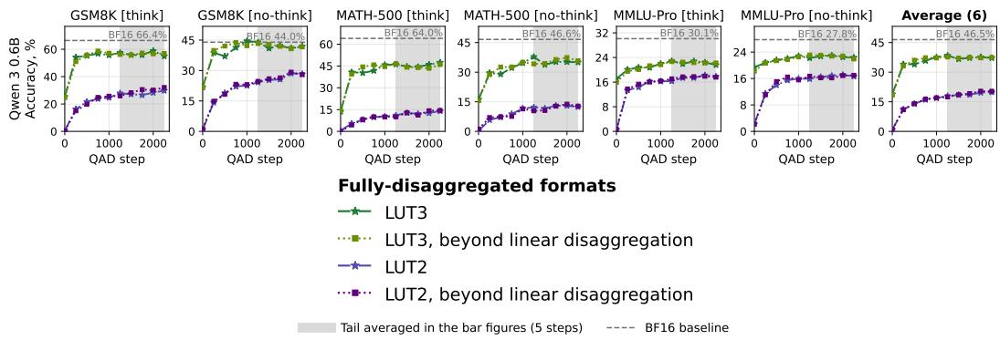  
Figure 7: Fully-disaggregated quantization on Qwen3-0.6B with and without separation of the remaining unquantized parameters. This additional separation has no discernible effect on decodeheavy accuracy.

Large and multi-modal PTQ models. For the models from Section 3.3, we report MMLU-Pro (12,032 items) and, for the multi-modal models, MMMU-Pro in the vision setting (1,730 items), scored with each benchmark’s standard extraction. All arms are served with vLLM on GB300 nodes; disaggregated arms place the prefill and decode engines on disjoint nodes and transfer the KV cache over NVLink.

Four arms are reported per model. BF16 is the released checkpoint and W4A16 is our NVFP4A16 quantization of it. The two W4A4 arms additionally quantize activations, and differ only in whether that is applied uniformly (None) or only to the prefill engine, with decode left weight-only (Format). Two models deviate from this scheme: Qwen3.8-2.4T’s BF16 is actually FP8 in which it was natively trained and Kimi-K3 is released natively in MXFP4 with no BF16 checkpoint, so it has no BF16 column and its arms are MXFP4 rather than NVFP4. We use the recommended sampling parameters for each model. The model-specific reasoning parser is enabled where one exists. Kimi-K3 is evaluated with thinking enabled at its intermediate effort setting.

Flips analysis for large models. We generally follow the per-sample binary answer flips setup of Kubler et al. (2026). We conduct per-item paired tests using four evaluation passes for both¨ MMMU-Pro and MMLU-Pro. With $s _ { i , r } ^ { A ^ { \bf { \bar { \mu } } } } \in \{ 0 , 1 \}$ the score of method A on item i in pass r, we test $\textstyle \Delta = { \frac { 1 } { n } } \sum _ { i } d _ { i }$ where $\begin{array} { r } { d _ { i } = \frac { 1 } { k } \sum _ { r } s _ { i , r } ^ { A } - \frac { 1 } { k } \sum _ { r } s _ { i , r } ^ { B } } \end{array}$ . Under the null that the methods are exchangeable on every item, each $d _ { i }$ is equally likely to flip sign, giving $\begin{array} { r } { p \ = \ \mathrm { P r } ( | \sum _ { i } \varepsilon _ { i } d _ { i } | \ \ge \ | \sum _ { i } d _ { i } | ) } \end{array}$ with $\varepsilon _ { i } \sim \mathrm { U n i f } \{ \pm 1 \}$ . Since $k d _ { i } \in \mathbb { Z }$ , the null distribution is a convolution of binomials and is computed exactly rather than sampled. We report per-comparison significance at $\alpha = 0 . 0 5$ , without multipletesting correction.

## B ADDITIONAL ABLATIONS

## B.1 DISAGGREGATION BEYOND QUANTIZED LINEAR LAYERS

Full disaggregation in Section 2.4 gives the quantized linear layers phase-specific weights while leaving the remaining unquantized parameters shared. We test whether separating these remaining parameters, including embeddings, the output head and layer normalizations, provides further benefit on Qwen3-0.6B, where they account for 26% of all model parameters. This “beyond linear disaggregation” has no discernible additional effect on decode-heavy accuracy (Figure 7). Both configurations already specialize the quantized linear weights, so this ablation does not distinguish their specialization benefit from that of higher prefill precision.

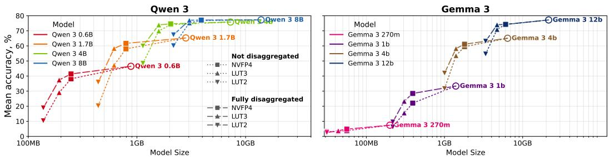  
Figure 8: Decode-heavy accuracy of non-disaggregated and fully-disaggregated 2-4-bit quantized models with NVFP4 prefill versus encoded size of the quantized decode weights.

## B.2 WEIGHT-ONLY QUANTIZATION RESULTS

In Table 1, the reported weight-only quantization schemes are those used in “LUT3” and “LUT2” formats and described in Appendix A.3, except naturally without the NVFP4 autocast. Figures 14 and 15 break down their decode-heavy and prefill-heavy performance, respectively.

## B.3 PARETO ANALYSIS

Table 1 also reports the cost of decode activation quantization. NVFP4 uses the native W4A4 pathway, while format-disaggregated NVFP4 uses NVFP4A16. For LUT2 and LUT3, the nondisaggregated decode timings add an FP4 activation-quantization call before each weight-only linear operation, discarding its output. These timings estimate the overhead of the extra operation, not a complete LUT-to-NVFP4 autocast implementation; they do not measure decode weight requantization.

For prefill, the table uses BF16 as the weight-only reference and reuses NVFP4 timings for LUT autocast, excluding weight-conversion overhead.

Figure 8 compares decode-heavy accuracy against the encoded size of the quantized decode weights for the Qwen 3 and Gemma 3 families. Full disaggregation improves low-bit accuracy without enlarging these weights, shifting the accuracy–decode-weight-size trade-off. The extra prefill checkpoint and its residency cost are accounted for separately in Table 1. Comparisons across model sizes also exclude different amounts of unquantized embedding and head weights.

## B.4 INTEROPERABILITY OF PREFILLERS

We test how much of the benefit of QADD transfers across decoders and how much depends on the decoder used during training. We compare three frozen Qwen3.8-27B decoders, IQ1 S, IQ1 M and IQ2 XXS, with each of the three step-980 prefiller and a common NVFP4 PTQ prefill checkpoint obtained by round-to-nearest (RTN) quantization. All four prefill checkpoints use NVFP4; we iden tify each QADD-trained prefiller by the decoder used during training. We exchange the prefillers without further training and keep the evaluation protocol of Appendix A.5 unchanged.

Table 7 separates the benefit of training prefill from the benefit of its pairing with a particular decoder. Compared with the common RTN prefill, training-matched prefillers improve MMLU-Pro accuracy by 13.1, 4.2 and 1.9 points for IQ1 S, IQ1 M and IQ2 XXS, respectively. On MMMU-Pro, the corresponding gains are 29.4 and 9.7 points for the two lowest-bit formats, while IQ2 XXS changes little (−0.3 points). Thus, at the lowest bitwidths, much of the benefit requires adapting prefill rather than merely replacing its weight-only computations with a separate NVFP4 checkpoint.

The learned checkpoints nevertheless remain partially interoperable. On MMMU-Pro, the IQ1 S decoder performs best with its own prefiller: accuracy falls from 59.65% to 52.60% with the IQ1 M prefiller and 47.05% with the IQ2 XXS prefiller. This ordering is consistent with stronger transfer between closer decode bitwidths in this comparison. It is not universal: the IQ1 M decoder reaches 62.49% with either its own or the IQ1 S prefiller, and on MMLU-Pro the IQ1 S decoder improves from 61.54% to 65.02% when paired with the IQ1 M prefiller.

Table 7: Qwen3.8-27B prefill–decode interoperability, accuracy (%). Rows fix the decode checkpoint; columns change only the prefill checkpoint. Bold marks the prefiller trained with that decoder, not necessarily the highest score. ⋆ denotes a difference from the bold cell in the same row under a two-sided exact McNemar test (p < 0.05, without multiple-comparison correction).
<table><tr><td rowspan="2">Frozen decode</td><td colspan="4">MMLU-Pro (n = 12032) Prefill checkpoint (all NVFP4)</td></tr><tr><td>PTQ (RTN)</td><td>QADD IQ1_S</td><td> QADD IQ1_M</td><td>QADD IQ2_XXS</td></tr><tr><td>IQ1_S</td><td>48.39*</td><td>61.54</td><td>65.02*</td><td>62.59*</td></tr><tr><td>IQ1_M</td><td>68.37*</td><td>69.62*</td><td>72.59</td><td>72.85</td></tr><tr><td>IQ2_XXS</td><td>76.06*</td><td>74.27*</td><td>77.44</td><td>77.93</td></tr><tr><td rowspan="3">Frozen decode</td><td colspan="4">MMMU-Pro (n = 1730)</td></tr><tr><td></td><td></td><td>Prefill checkpoint (all NVFP4)</td><td></td></tr><tr><td>PTQ (RTN)</td><td>QADD IQ1_S</td><td>QADD IQ1_M</td><td>QADD IQ2_XXS</td></tr><tr><td>IQ1_S</td><td>30.29*</td><td>59.65</td><td>52.60*</td><td>47.05*</td></tr><tr><td>IQ1_M</td><td>52.83*</td><td>62.49</td><td>62.49</td><td>61.50</td></tr><tr><td>IQ2_XXS</td><td>66.18</td><td>67.11</td><td>66.30</td><td>65.90</td></tr></table>

Table 8: Generation length and truncation for Qwen3.8-27B. WO uses the released weight-only checkpoint in both phases; Pref. pairs the same decoder with its trained NVFP4 prefiller at step 980. Token counts include reasoning and final-answer generation over all benchmark items, including truncated responses. Length statistics are computed from per-item counts and rounded to the nearest token; truncation rates count length-limit terminations. Each arm uses one complete evaluation, with the same quantized checkpoints as Table 5.
<table><tr><td colspan="8">MMLU-Pro Median tokens</td></tr><tr><td>Decode format</td><td colspan="3">Mean tokens WO Pref.</td><td colspan="3">95th percentile</td><td colspan="2">Truncated (%)</td></tr><tr><td></td><td></td><td>WO</td><td></td><td>Pref.</td><td>wō</td><td>Pref.</td><td>WO</td><td>Pref.</td></tr><tr><td>IQ1_S</td><td>3964 4260</td><td>928</td><td></td><td>778</td><td>18952</td><td>26677</td><td>2.46</td><td>3.34</td></tr><tr><td>IQ1_M</td><td>3312</td><td>3612</td><td>883</td><td>699</td><td>16910</td><td>23550</td><td>2.42 1.25</td><td>3.39</td></tr><tr><td>IQ2_XXS IQ2_S</td><td>2394 1706</td><td>3897 2766</td><td>746 774</td><td>782 671</td><td>11191 6352</td><td>23999 14429</td><td>0.27</td><td>3.39 1.53</td></tr><tr><td>Q2_K_XL</td><td>2647</td><td>2787</td><td>799</td><td>671</td><td>13092</td><td>14721</td><td>0.95</td><td>1.36</td></tr><tr><td>IQ3-XXS</td><td>2514</td><td>2872</td><td>804</td><td>653</td><td>12380</td><td>15722</td><td>1.15</td><td>1.54</td></tr><tr><td>IQ3_S</td><td>2799</td><td>3000</td><td>757</td><td>676</td><td>14839</td><td>16496</td><td>1.14</td><td>1.49</td></tr><tr><td>Q3_K_XL</td><td>2240</td><td>2701</td><td>679</td><td>658</td><td>11211</td><td>14071</td><td>0.66</td><td>0.97</td></tr><tr><td colspan="9">MMMU-Pro</td></tr><tr><td>Decode format</td><td>Mean tokens WO</td><td>Pref.</td><td>Median tokens WO</td><td>Pref.</td><td>95th percentile wO</td><td>Pref.</td><td>Truncated (%) WO</td><td>Pref.</td></tr><tr><td>IQ1_S</td><td>14579</td><td>6582</td><td>10966</td><td>2393</td><td>32768</td><td>29953</td><td>24.57</td><td>4.16</td></tr><tr><td>IQ1_M</td><td>8013</td><td>6875</td><td>3702</td><td>2459</td><td>32768</td><td>32768</td><td>6.24</td><td>6.47</td></tr><tr><td>IQ2_XXS</td><td>5294</td><td>7377</td><td>3236</td><td>3337</td><td>16669</td><td>32768</td><td>0.52</td><td>5.55</td></tr><tr><td>IQ2_S</td><td>4695</td><td>7118</td><td>2456</td><td>2930</td><td>15780</td><td>30445</td><td>0.40</td><td>4.34</td></tr><tr><td>Q2_K_XL</td><td>5094</td><td>6079</td><td>2823</td><td>2688</td><td>16736</td><td>25067</td><td>0.58</td><td>2.77</td></tr><tr><td>IQ3_XXS</td><td>5400</td><td>6850</td><td>2844</td><td>2852</td><td>19363</td><td>29873</td><td>1.27</td><td>4.10</td></tr><tr><td>IQ3_S</td><td>5860</td><td>6911</td><td>3212</td><td>3172</td><td>20578</td><td>28562</td><td>1.45</td><td>3.82</td></tr><tr><td></td><td>5389</td><td></td><td></td><td>3305</td><td></td><td></td><td>1.39</td><td></td></tr><tr><td>Q3_K_XL</td><td></td><td>7156</td><td>2676</td><td></td><td>19728</td><td>29416</td><td></td><td>3.53</td></tr></table>

## B.5 GENERATION LENGTH WITH PREFILLERS

An unchanged decode checkpoint does not imply unchanged generation cost: the prefiller changes the representations that condition generation and can therefore change response length. Table 8 reports generation lengths and truncation rates for the same Qwen3.8-27B evaluations as Table 5, using the final prefill checkpoint at step 980 and a common 32,768-token generation budget.

On MMMU-Pro, the largest low-bit accuracy gains coincide with shorter mean responses. IQ1 S’s mean response length falls from 14,579 to 6,582 tokens, a 54.8% reduction, while accuracy rises from 24.4% to 59.7%. Its median falls from 10,966 to 2,393 tokens and its truncation rate from

Table 9: Attention backend selection for Gemma3-4B: H = 8, $H _ { k v } = 4 ,$ d = 256, window 1024. Latency is in milliseconds per call; bold marks the selected backends.
<table><tr><td>Backend</td><td>S=8192</td><td>S=32768</td><td>Used for</td></tr><tr><td>SDPA,is_causal</td><td>3.14</td><td>50.6</td><td>global layers</td></tr><tr><td>FA2 varlen, full causal</td><td>3.75</td><td>53.0</td><td></td></tr><tr><td>FA4(flash_attn.cute)</td><td>3.06</td><td>49.8</td><td></td></tr><tr><td>FlexAttention, causal mask</td><td>-</td><td>123.2</td><td></td></tr><tr><td>FlexAttention, sliding block mask</td><td>2.03</td><td>8.7</td><td></td></tr><tr><td>FA4, native window_size</td><td>3.02</td><td>49.0</td><td></td></tr><tr><td>FA2 varlen, native window</td><td>1.47</td><td>6.0</td><td>local layers</td></tr></table>

24.57% to 4.16%. IQ1 M likewise uses 14.2% fewer tokens on average while gaining 17.6 accuracy points. These improvements are therefore not bought with more generated tokens.

The effect depends on the workload and format. On MMLU-Pro, prefillers shorten median generations for seven of eight formats by 3–21%, but increase mean length by 5–63%: longer upper tails outweigh the shorter typical responses. On MMMU-Pro, the remaining six formats also increase mean length. Prefill specialization can therefore reduce the total number of decode tokens as well as improve accuracy, but the unchanged decode weights and per-token pathway do not by themselves guarantee lower generation cost.

## C SPEED MEASUREMENTS

## C.1 PREFILL MEASUREMENTS

We benchmark on a single NVIDIA GB10 (DGX Spark, sm 121) with PyTorch 2.13 / CUDA 13.2. These transformer-stack measurements are separate from the llama.cpp TTFT measurements in Figure 1. For the latter, we integrate the same offloaded NVFP4 prefill pathway into llama.cpp’s prompt processing, without additional kernel optimizations. The baseline uses Unsloth’s IQ1 S checkpoint through native llama.cpp processing. TTFT measurements use three repetitions after one warmup, with prompt caching disabled.

Compute and timing scope. BF16 uses cuBLAS through torch.nn.Linear; NVFP4 uses vLLM activation quantization with static global scales and shape-tuned CUTLASS or FlashInfer GEMMs. We fuse compatible projections and activation processing, and use CUDA graphs. Attention backends are selected per layer type (Table 9). The timed region spans the first transformer layer’s input through the last layer’s output, including attention but excluding embedding lookup, RoPE-table construction, final normalization and the output head.

Offloading protocol. For the core Qwen 3 and Gemma 3 models, ODP streams weights from SSD through pinned host buffers into two device slots. Slots borrow decode-weight memory. The benchmark represents the evicted weights by a serialized byte payload equal to the slot allocation and restores it into those buffers. Timing includes the first block’s cold load and ends only after restoration completes. Total SSD traffic is the prefill checkpoint plus the carve-out: 3.64 + 0.20 GB for Qwen3-8B and 5.64 + 0.23 GB for Gemma3-12B.

Before each repetition, we request page-cache eviction for both prefill files and the restoration payload. Loading-only references are measured separately for each model and format, including carveout transfer for ODP.

Speedup decomposition. Table 10 reports full-stack results, Table 11 explains where time is spent within a layer. The 3.0–3.4× projection speedups are diluted by attention, normalization, activation processing and quantization. Attention accounts for 37% of NVFP4 device time on Qwen3-8B, which uses global attention throughout, versus 13% on Gemma3-12B, which alternates five slidingwindow layers with one global layer. Fused timings do not isolate activation-quantization overhead. Layer wall-clock and profiler timings come from separate runs, so their residual includes measurement variation and is not a direct launch-cost estimate.

Table 10: Prefill transformer-stack speedup over BF16 for the core Qwen 3 and Gemma 3 models on DGX Spark. NVFP4 keeps weights resident; +ODP streams them under the cold-load and carve-out protocol above. BF16 columns give latency in milliseconds. All three arms are measured in the same benchmark session.
<table><tr><td rowspan="2">Model</td><td colspan="3">S=16384</td><td colspan="3">S=32768</td></tr><tr><td>BF16 (ms)</td><td>NVFP4</td><td>+ODP</td><td>BF16 (ms)</td><td>NVFP4</td><td>+ODP</td></tr><tr><td>Qwen3-0.6B</td><td>634</td><td>1.13×</td><td>1.12×</td><td>1984</td><td>1.08×</td><td>1.05×</td></tr><tr><td>Qwen3-1.7B</td><td>1044</td><td>1.24×</td><td>1.19×</td><td>2887</td><td>1.15×</td><td>1.15×</td></tr><tr><td>Qwen3-4B</td><td>2560</td><td>1.37×</td><td>1.34×</td><td>7335</td><td>1.14×</td><td>1.15×</td></tr><tr><td>Qwen3-8B</td><td>3801</td><td>1.49×</td><td>1.47×</td><td>9563</td><td>1.24×</td><td>1.24×</td></tr><tr><td>Gemma-3-270M</td><td>124</td><td>1.22×</td><td>1.16×</td><td>281</td><td>1.14×</td><td>1.11×</td></tr><tr><td>Gemma-3-1B</td><td>473</td><td>1.45×</td><td>1.34×</td><td>999</td><td>1.43×</td><td>1.41×</td></tr><tr><td>Gemma-3-4B</td><td>1548</td><td>1.59×</td><td>1.49×</td><td>3231</td><td>1.53×</td><td>1.49×</td></tr><tr><td>Gemma-3-12B</td><td>4650</td><td>1.67×</td><td>1.58×</td><td>9607</td><td>1.59×</td><td>1.55×</td></tr></table>

Table 11: Per-component prefill latency at S=16384. Components sum to profiled device time for one layer; attention is averaged over each model’s layer-type mix. Fused operations are grouped: NVFP4 norms includes activation quantization, and gate up/down include all chunked GEMM launches. The final row gives full-stack latency divided by the layer count.
<table><tr><td>Component</td><td>BF16 (ms)</td><td>NVFP4 (ms)</td><td>Speedup</td><td>% NVFP4</td></tr><tr><td colspan="5">Gemma-3-12B: 48 layers, 40 sliding attention / 8 global attention</td></tr><tr><td>qkv</td><td>10.23</td><td>5.57</td><td>1.84×</td><td>10</td></tr><tr><td>0</td><td>6.51</td><td>1.46</td><td>4.47× 3.30×</td><td>3</td></tr><tr><td>gate_up down</td><td>38.47</td><td>11.66</td><td>3.21×</td><td>21 11</td></tr><tr><td>MLP non-linearity</td><td>20.26</td><td>6.32 5.19</td><td>1.16×</td><td>9</td></tr><tr><td>Activation quant. (standalone)</td><td>6.00</td><td>2.24</td><td></td><td>4</td></tr><tr><td>Norms + RoPE + residual</td><td></td><td>16.36</td><td>0.40×</td><td>29</td></tr><tr><td>Attention</td><td>6.48 7.40</td><td>7.38</td><td>1.00×</td><td>13</td></tr><tr><td></td><td></td><td></td><td>1.70×</td><td></td></tr><tr><td>Device busy (sum of kernels) Launch/idle gap</td><td>95.35 -0.24</td><td>56.17 -0.24</td><td></td><td>100</td></tr><tr><td>Layer (wall clock)</td><td>95.12</td><td>55.94</td><td>1.70×</td><td></td></tr><tr><td>Full stack, per layer</td><td>96.87</td><td>58.09</td><td>1.67×</td><td></td></tr><tr><td>Qwen-3-8B: 36 layers, all global attention</td><td></td><td></td><td></td><td></td></tr><tr><td colspan="5"></td></tr><tr><td>qkv</td><td>8.16</td><td>3.68</td><td>2.21×</td><td>6</td></tr><tr><td>0</td><td>6.27</td><td>1.59</td><td>3.95×</td><td>2</td></tr><tr><td>gate_up down</td><td>33.68</td><td>9.72</td><td>3.46×</td><td>15</td></tr><tr><td>MLP non-linearity</td><td>18.54</td><td>4.63</td><td>4.01×</td><td>7</td></tr><tr><td>Activation quant. (standalone)</td><td>4.79</td><td>4.19</td><td>1.14×</td><td>6</td></tr><tr><td></td><td></td><td>2.34</td><td></td><td>4</td></tr><tr><td>Norms + RoPE + residual</td><td>6.44</td><td>15.81</td><td>0.41×</td><td>24</td></tr><tr><td>Attention</td><td>25.59</td><td>24.59</td><td>1.04×</td><td>37</td></tr><tr><td>Device busy (sum of kernels)</td><td>103.46</td><td>66.54</td><td>1.55×</td><td>100</td></tr><tr><td>Launch/idle gap</td><td>-0.08</td><td>-0.01</td><td></td><td></td></tr><tr><td>Layer (wall clock)</td><td>103.38</td><td>66.54</td><td>1.55×</td><td></td></tr><tr><td>Full stack, per layer</td><td>105.57</td><td>71.09</td><td>1.49×</td><td></td></tr><tr><td></td><td></td><td></td><td></td><td></td></tr></table>

## C.2 DECODE KERNELS

We back up our claims of decode speed depending on the degree of compression by benchmarking memory-bound GEMV kernels when used for LLM decoding in vLLM. Figure 9 shows real speedups measured on DGX Spark for NVFP4 and NVFP4A16, natively shipped with vLLM, as well as LUT3 and LUT2 kernels that we implemented and integrated.

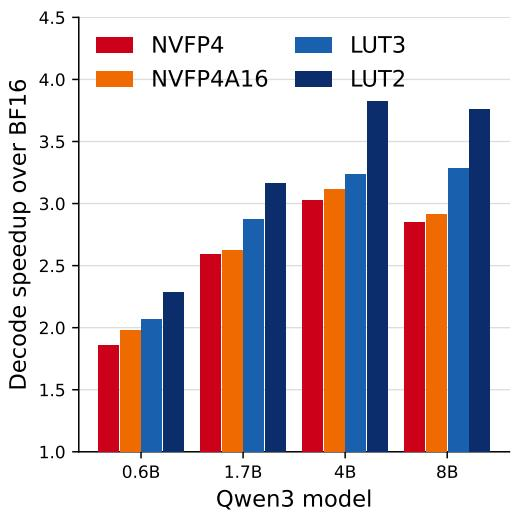  
(a) Qwen 3

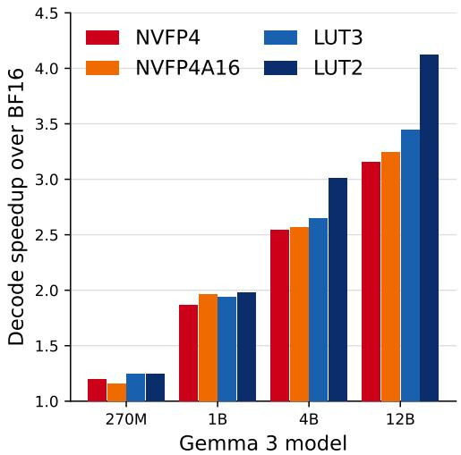  
(b) Gemma 3  
Figure 9: End-to-end single-user decode speedup over dense BF16, measured in vLLM on DGX Spark. The speedup is whole-model per-output-token latency, so it includes attention, normalisation and the BF16 language-modelling head, none of which any of these formats accelerates.

Protocol. All numbers are end-to-end vLLM generations at batch one. The same 168-token prompt is generated to $n _ { 1 } { = } 8$ and $n _ { 2 } { = } 1 2 8$ output tokens, and the per-output-token latency is estimated as $( t _ { 2 } - t _ { 1 } ) / ( n _ { 2 } - n _ { 1 } )$ , which removes the common prefill contribution without relying on engineinternal metrics. Each point is the median of three repetitions after a warm-up generation at that shape. Prefix caching is disabled. CUDA graphs are enabled.

Kernel specification. Decode at batch one is bandwidth-bound: the arithmetic is a matrix-vector product, so time is set almost entirely by the bytes of weight pulled per token. The four formats differ mainly in that quantity — BF16 at 16, NVFP4 at 4.5, LUT3 at 3.5 and LUT2 at 2.5 bits per weight. NVFP4 is vLLM’s native W4A4 CUTLASS path, which quantizes the activation before every projection and issues an FP4×FP4 GEMM. NVFP4A16 keeps activations in BF16 and uses a Marlin-like (Frantar et al., 2024) mixed-precision kernel. Our LUT3 and LUT2 kernels store weights bit-planed as int32 over (N, b, K/32) with signed e4m3 block scales every 16 elements and one FP32 global scale per tensor, and reconstruct values by indexing a 2b-entry lookup table in shared memory. This lookup is implemented in software on DGX Spark and does not require native LUT arithmetic support.

Notably, format-disaggregated NVFP4 (identical to NVFP4A16 on decode) outperforms NVFP4 by skipping activation quantization and using a kernel tailored to the weight-only matrix-vector product. The speedup over BF16 increases from 2.86× to 2.93× on Qwen3-8B and from 3.18× to 3.27× on Gemma3-12B.

Speedup dilution. LUT2 moves 6.4× fewer weight bits than BF16 yet delivers 3.82× and 4.15× speedups, respectively. Two effects account for the gap. Firstly, the output head stays in BF16 in every arm, and on the smaller models its weights account for a substantial fraction of the bytes moved per token. Secondly, embedding lookup, attention, the normalizations and the residual adds are identical work in every arm, so they dilute the speedup. The same principle applies to unaccelerated operations in prefill (Table 11). On its own, the LUT2 kernel reaches 96% of the bandwidth its weight traffic permits.

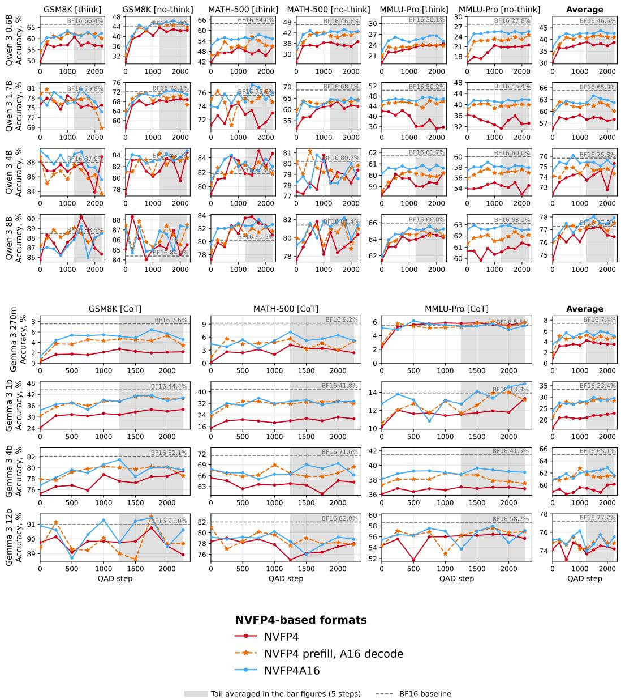  
Figure 10: Breakdown of Figure 4 by benchmark and QADD step.

## D FULL EVALUATION RESULTS

Figures 10, 12 and 14 break down decode-heavy QADD accuracy recovery by benchmark and training step. Figures 13, 11 and 15 provide the corresponding prefill-heavy breakdowns by context length and training step.

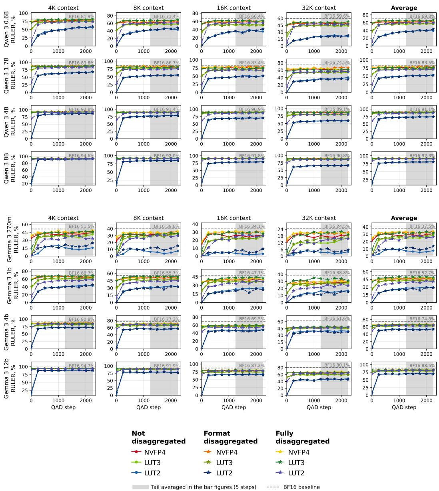  
Figure 11: Breakdown of Figure 5 by context length and QADD step for prefill-heavy tasks.

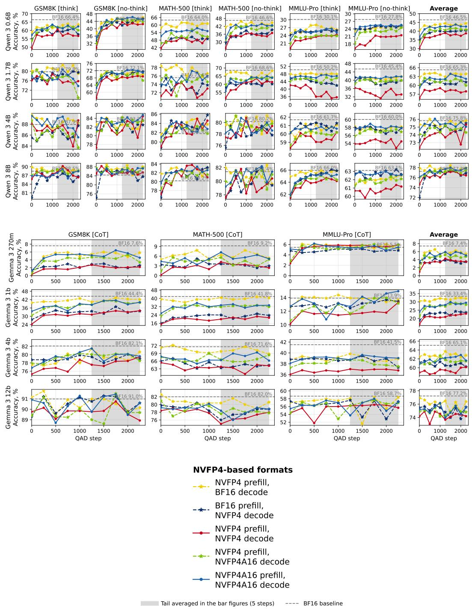  
Figure 12: Breakdown of Figure 4 by benchmark and QADD step for decode-heavy tasks.

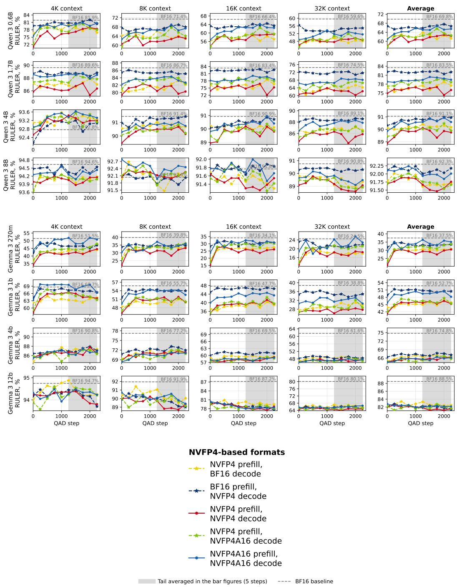  
Figure 13: Breakdown of Figure 4 by context length and QADD step for prefill-heavy tasks.

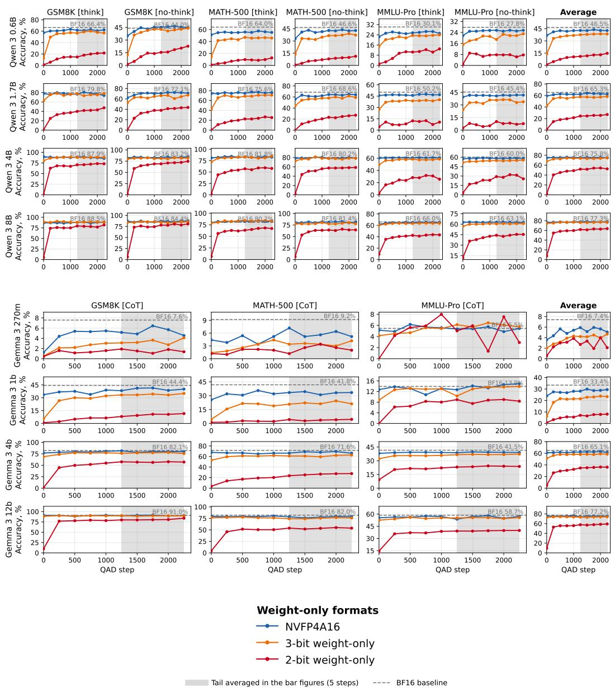  
Figure 14: Performance breakdown for weight-only quantization formats by benchmark and QADD step.

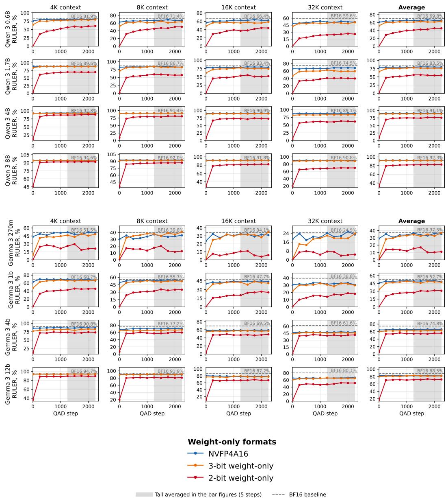  
Figure 15: Performance breakdown for weight-only quantization formats on prefill-heavy tasks by context length and QADD step. The average excludes 64K evaluations.