# Double Descent and Malign Overfitting in Diffusion Models

Raphaël Urfin†\*1, Tony Bonnaire†2, Giulio Biroli1, and Marc Mézard3

1Laboratoire de Physique de l’École normale supérieure, ENS, Université PSL, CNRS, Sorbonne Université, Université Paris Cité, F-75005 Paris, France

2Université Paris-Saclay, CNRS, Institut d’Astrophysique Spatiale, 91405 Orsay, France 3Department of Computing Sciences, Bocconi University, Milano, Italy

## Abstract

Conventional wisdom in deep learning holds that overparameterization—having more parameters p than training samples n—is benign: larger models generalize better and, even without regularization, interpolating models generalize well, the test error following a double-descent curve. One might expect the same benign overfitting for diffusion models, whose training reduces to regression, i.e. to minimizing a quadratic denoising score-matching loss. Yet the opposite is observed: overfitting here is catastrophic, driving the model into a memorization regime. We resolve this paradox by combining experiments on U-Nets trained on CelebA with a random-features model for which we derive closedform learning curves. We show that with a fixed number m of noise realizations per training sample, an interpolation peak does occur, but at p ∼ nm rather than at p ∼ n as in standard regression. The rise of the test loss, however, sets in much earlier, at p ∼ n, independently of m. This overfitting is malign because, although the implicit regularization of training is fully at work, it drives the model toward the empirical score, which memorizes the training set, rather than toward the true score. A bias–variance decomposition pinpoints the mechanism: the bias of the score estimator starts to grow at p ∼ n; past the peak the variance decays, as in regression, whereas the bias keeps growing and both saturate at a large value. Since diffusion models are trained with m ≫ 1, the peak is pushed to very large model sizes, and therefore sit on the rising branch that precedes it, where malign overfitting is already in play. Nevertheless, overparameterization remains beneficial when paired with regularization: in the random-features theory and in U-Net experiments, optimally regularized large models—via a ridge penalty or early stopping, respectively—outperform unregularized models of any size.

Keywords: Diffusion Models | Double Descent | Benign Overfitting | Memorization

## 1 Introduction

One of the most surprising discoveries in modern machine learning is that overparameterization is not necessarily harmful, and can in fact be beneficial in classification and regression problems. Contrary to the traditional wisdom that one should “never fit noisy training data exactly”, heavily overparameterized models in modern machine learning often interpolate the training data while achieving excellent test performance [39, 49, 67]. The most striking manifestation of this phenomenon is the double descent curve of the test error as a function of model capacity—specifically, the number of learnable parameters in the neural network [7, 20]. Rather than exhibiting the classical U-shaped curve associated to bias–variance tradeoff [64], the test error first follows this U-shape, then peaks at the interpolation threshold—the point where the model can exactly fit the training data and the variance of the model is large—and then descends again, often reaching a global minimum in the heavily overparameterized regime. This phenomenon, and in particular this last descent, called benign overfitting, has proved remarkably ubiquitous across different model classes, underscoring the benefits of overparameterization. It was subsequently demonstrated at scale in deep networks by Nakkiran et al. [46] and analyzed theoretically in multiple studies [6, 28, 43, 15].

Our work revisits this central phenomenon for diffusion and score-based models, [54, 31, 58, 59] which have become the state of the art for generating images [17], sounds [37], and videos [65]. Diffusion models are trained by progressively noising the data and teaching the model to reverse this process. In the language of nonequilibrium physics, they learn to time-reverse an Ornstein–Uhlenbeck (OU) process. The key ingredient is learning the scorefunction, which is the force field that enables time-reversal and denoising [33, 63]. This reduces to a sequence ofregression problems: at each noise level, one minimizes a quadratic loss between the neural network’s predicted score and the ground truth. As a result, in light of the modern machine learning findings discussed above, one might expect benign overfitting to apply here as well. Yet numerical experiments reveal a strikingly different story: increasing model capacity leads to memorization and poor generalization [66, 26, 34]. Overfitting proves highly detrimental (“malign”), as it compromises generative quality by causing the model to reproduce training data rather than capture the underlying distribution.

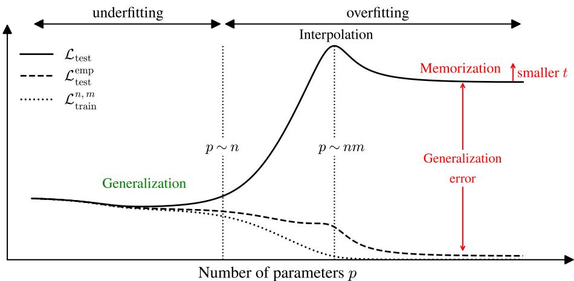  
Figure 1: Qualitative summary of our results. Sketch of the standard test loss $\mathcal { L } _ { \mathrm { t e s t } }$ (solid), the empirical test loss $\mathcal { L } _ { \mathrm { t e s t } } ^ { \mathrm { e m p } }$ (dashed), and the training loss $\mathcal { L } _ { \mathrm { t r a i n } } ^ { n , m }$ (dotted) versus the number of parameters $p ,$ for a diffusion model trained on n samples with $m > 1$ noise realizations each. $\mathcal { L } _ { \mathrm { t e s t } }$ reaches its minimum before $p \sim n ,$ , where the model can generalize, then rises to a peak at the interpolation threshold $p \sim n m ,$ where $\mathcal { L } _ { \mathrm { t r a i n } } ^ { n , m }$ reaches 0 (shifted from $p \sim n ,$ its value in the regression setting $m = 1 )$ . For $p \gg n m$ , the test loss decreases a second time (double descent) but settles on a plateau that lies above its earlier minimum, whereas $\mathcal { L } _ { \mathrm { t e s t } } ^ { \mathrm { e m p } }$ decreases toward zero, more so the larger m: since $\mathscr { L } _ { \mathrm { t e s t } } ^ { \mathrm { e m p } }$ measures the distance to the empirical score, which memorizes the training set, the model is approaching the memorization regime. The generalization error is larger, the smaller is t (the amount of noise). In contrast to the regression setting $m = 1 .$ , where overfitting is benign, here it is malign.

This leads to a puzzle: diffusion models give rise to regression problems, and therefore one might expect benign overfitting. Yet experiments show the opposite. The aim of our work is to resolve this paradox by revisiting the double descent phenomenon for diffusion models. This is relevant both for the theory of generative models and for applications. In particular, it allows us to clarify a fundamental question about generative models: Does overparameterization help or hurt diffusion models?

Generative Diffusion and Its Different Losses. Standard diffusion models transport a target distribution $P _ { 0 }$ on $\mathbb { R } ^ { d }$ to Gaussian white noise $\mathcal { N } ( 0 , \pmb { I } _ { d } )$ via an OUforward process $\mathrm { d } \mathbf { x } = - \mathbf { x } \bar { \mathrm { d } t } + \sqrt { 2 } \mathrm { d } \bar { \mathbf { W } } ( t )$ , where $\mathbf W ( t )$ is a standard Wiener process. Exact time-reversal of this OU process can be implemented [3, 29] by using a guiding force field which is the exact score function $\nabla _ { \mathbf { x } } \log \bar { P } _ { t } ( \mathbf { x } )$ , where $P _ { t }$ is the marginal density at time t. Following Hyvärinen [33] and Vincent [63], generation is performed by using a parametrized score function $s ( \mathbf { x } , t )$ . Given a database $\mathcal { D } = \{ \mathbf { x } ^ { \nu } \} _ { \nu = 1 , \dots , n }$ consisting of $n$ i.i.d. samples of $P _ { 0 } ,$ one learns this score function by minimizing the Denoising Score Matching (DSM) loss. At fixed $t ^ { 1 } ,$ this DSM loss reads

$$
\mathcal { L } _ { \mathrm { t e s t } } ^ { \mathrm { e m p } } ( s ) = \frac { 1 } { n d } \sum _ { \nu = 1 } ^ { n } \mathbb { E } _ { \pmb \xi } \left[ \left\| \sqrt { \Delta _ { t } } s ( e ^ { - t } \mathbf { x } ^ { \nu } + \sqrt { \Delta _ { t } } \pmb \xi ) + \pmb \xi \right\| ^ { 2 } \right] ,\tag{1}
$$

where $\Delta _ { t } = 1 - e ^ { - 2 t }$ and the expectation is over $\pmb \xi \sim \mathcal N ( 0 , \pmb I _ { d } )$ . In practice, the average over $\boldsymbol { \xi }$ is not performed exactly: the training is done on batches of the n samples, drawing a fresh noise $\boldsymbol { \xi }$ each time a sample is visited. Each sample is thus seen with m different noise realizations, m being the number of epochs (typically2103). To analyze the role of this finite noise sampling within the classical double-descent framework, which is formulated for the minimizer of an empirical loss [7, 20], we fix the noises and

consider the loss

$$
\mathcal { L } _ { \mathrm { t r a i n } } ^ { n , m } ( s ) = \frac { 1 } { n m d } \sum _ { \nu = 1 } ^ { n } \sum _ { \mu = 1 } ^ { m } \left\| \sqrt { \Delta _ { t } } s ( e ^ { - t } \mathbf { x } ^ { \nu } + \sqrt { \Delta _ { t } } \xi ^ { \nu \mu } ) + \xi ^ { \nu \mu } \right\| ^ { 2 } .\tag{2}
$$

Fixing the noises is an idealization of the actual procedure, but it retains its essential feature: only nm pairs $\bar { ( } \mathbf { x } ^ { \nu } , \pmb { \xi } ^ { \nu \mu } )$ are presented to the network $( \mathcal { L } _ { \mathrm { t r a i n } } ^ { n , m } \to \mathcal { L } _ { \mathrm { t e s t } } ^ { \mathrm { e m p } }$ for $m  \infty )$ . It is also the standard setting of theoretical analyses [13, 21]. While this resembles a regression problem, it is a non-standard one: the score s is evaluated on points $\pmb { y } ^ { \nu , \mu } = e ^ { - t } \mathbf { x } ^ { \nu } + \sqrt { \Delta _ { t } } \pmb { \xi } ^ { \nu \mu }$ that are correlated, forming clusters of m points around each sample $\mathbf { x } ^ { \nu }$ . Finally, generalization is measured by the standard test loss

$$
\mathcal { L } _ { \mathrm { t e s t } } ( \pmb { s } ) = \frac { 1 } { d } \mathbb { E } _ { \mathbf { x } , \pmb { \xi } } \bigg [ \bigg \| \sqrt { \Delta _ { t } } \pmb { s } ( e ^ { - t } \mathbf { x } + \sqrt { \Delta _ { t } } \pmb { \xi } ) + \pmb { \xi } \bigg \| ^ { 2 } \bigg ] .\tag{3}
$$

where the expectation is taken over both fresh noises and fresh samples. We refer to $\mathscr { L } _ { \mathrm { t e s t } } ^ { \mathrm { e m p } } ( s )$ as the empirical test loss: it is a test loss since the noise is averaged exactly, but also an empirical one because it depends on the n training samples. In practice it is readily evaluated by averaging over fresh noises. To identify where the test loss comes from, we analyze the bias and variance contributions, $B ^ { 2 }$ and $\nu ,$ to $\mathcal { L } _ { \mathrm { t e s t } } = \stackrel { \cdot } { C } _ { t } + \Delta _ { t } \left( B ^ { 2 } + \mathcal { V } \right)$ , with

$$
\mathcal { B } ^ { 2 } = \frac { 1 } { d } \mathbb { E } _ { y } \big [ \big \lVert \nabla _ { y } \log P _ { t } ( y ) - \langle s _ { \mathcal { D } , \Theta } ( y ) \rangle \big \rVert ^ { 2 } \big ] , \quad \mathcal { V } = \frac { 1 } { d } \mathbb { E } _ { y } \big [ \big \langle \lVert s _ { \mathcal { D } , \Theta } ( y ) - \langle s _ { \mathcal { D } , \Theta } ( y ) \rangle \big \rVert ^ { 2 } \big \rangle \big ] .\tag{4}
$$

Here $s _ { \mathcal { D } , \Theta }$ denotes the minimizer of the train loss $\mathcal { L } _ { \mathrm { t r a i n } } ^ { n , m }$ for a given dataset D and initialization of the parameters $\mathbf { \Theta } \Theta ; C _ { t }$ a term which depends only on the data distribution and is independent of the learned score (see Appendix $\mathbb { C } . 2 ) ; \mathbb { E } _ { y }$ is the average over test samples $\begin{array} { r } { \mathbf { \boldsymbol { y } } \sim P _ { t } , } \end{array}$ whereas $\langle \dot { \cdot } \rangle$ denotes the average over the realizations of the training set, and of other sources of randomness such as Θ. As we will show, distinguishing between $\mathscr { L } _ { \mathrm { t e s t } } ^ { \mathrm { e m p } }$ and $\mathcal { L } _ { \mathrm { t e s t } }$ is key to resolving the paradox: benign behavior in the former coexists with malign overfitting in the latter.

Contributions and theoretical picture. Figure 1 summarizes the behavior of the different losses, as obtained from both the theoretical analysis and our numerical experiments, each evaluated from the score learned by training on n samples independently noised m times. Importantly, we consider solutions obtained after very large training times τ, representative of the τ → ∞ limit, and without regularization. The effects of finite τ and of regularization are discussed later. The first important observation is that the test loss $\mathcal { L } _ { \mathrm { t e s t } }$ does exhibit a double descent as the number of parameters increases: it first decreases toward a minimum, rises to a peak, then descends again. The peak occurs at the interpolation threshold, where the training loss reaches zero and the test loss is dominated by the variance of the estimator. Compared to the usual double descent, however, the peak is shifted to much larger model sizes: its position now grows with both n and m (for simple models, proportionally to nm). More importantly, while the test loss descends after the peak, it plateaus at a value larger than its first minimum; the smaller $t ,$ the higher this plateau is. Whereas in the supervised setting both variance and bias decrease after the interpolation peak [48, 15], here the variance decays and the bias grows. Both saturate at large values, producing the high plateau ob served at small t. Here, overfitting is clearly detrimental. The key to understanding this phenomenon lies in the empirical test loss $\mathscr { L } _ { \mathrm { t e s t } } ^ { \mathrm { e m p } }$ , which, up to a constant, measures the mean square distance to the empirical score, the score associated with the mixture of Gaussians centered on the points $e ^ { - t } \mathbf { x } ^ { \nu }$ with variance $\Delta _ { t }$ (see Appendix C.3). Its global minimizer is the empirical score itself [8, 40], which memorizes the training set unless n grows exponentially with d [8]. Numerically, $\mathscr { L } _ { \mathrm { t e s t } } ^ { \mathrm { e m p } }$ first follows the training loss closely. It then displays a peak at small $m ,$ which fades as m grows, and beyond the interpolation threshold it reaches very small values. This is the key to solving the paradox: the benign-overfitting mechanism—whereby the training dynamics selects, among all interpolating solutions, those with the smallest error—is fully operative, but it acts on $\mathscr { L } _ { \mathrm { t e s t } } ^ { \mathrm { e m p } }$ and not on the loss we actually care about, $\mathcal { L } _ { \mathrm { t e s t } }$ . The implicit regularization of training drives the model toward the minimizer of the empirical test loss, i.e. the empirical score which memorizes the training set, rather than toward the exact score: hence the name malign overfitting3. This also explains the growth of the bias in the overparameterized regime: it does not reflect a limitation of the model class, but the minimization of the “wrong” loss. None of this implies that overparameterization hurts diffusion models. Overparameterization is still beneficial provided it is paired with a suitable regularization: with a ridge penalty (in the theory) or early stopping (in the experiments), both the peak and the plateau of Fig. 1 disappear, and the test loss and the FID reach their lowest values in the overparameterized regime $( p \gg n )$

The theoretical picture described above rests on two complementary analyses. Analytically, we study Random Feature Neural Networks [52] at arbitrary finite $m ,$ in the proportional limit where the dimension $d ,$ the data n and the number of parameters $p$ all go to infinity with fixed ratios, extending George et al. [21]. Numerically, we train DDPM-style U-Nets [31, 53] on the CelebA dataset [41] across a range of network widths $\dot { W } .$ , tracking how the losses and the Fréchet-Inception Distance [FID, 30] evolve. In the following sections, we present these findings in detail, discussing the role of $m ,$ the bias and variance of the estimator, and the impact of regularization.

Related works. We present here the closest relevant works, and refer to Appendix A for a more thorough discussion. Diffusion models are known empirically to overfit and memorize the training data, with state-of-the-art image models reproducing a non-negligible fraction of their training set [12, 55, 56]. This memorization has been shown to depend heavily on the data distribution, the model, and the training procedure [26, 66], but also to be significantly reduced by weight decay and early-stopping [26, 4, 19]. However, it is unavoidable under the empirical score hypothesis [8, 1, 61] unless n grows exponentially with d [8]. Several theoretical analyses account for the network architecture and the high dimensionality of the data, in particular by studying the score learned by a parametric model [13, 14, 44, 11]. Closest to our work, George et al. [21] compute asymptotic training and test DSM losses for a Random Feature model [52] and link them to memorization for $m = 1$ and $m = \infty$ . We extend their result to arbitrary finite $m$ . Bonnaire et al. [10] study the generalization and memorization timescales of the corresponding $m = \infty$ training dynamics, while, concurrently with our work, Latourelle-Vigeant et al. [38] analyze the lazy regime $( p \to \infty )$ training dynamics, together with the resulting sampling dynamics. Finally, that diffusion models do not overfit benignly is by now well documented empirically [66] and proven in a model-independent way by Farghly et al. [18]: overfitting and good generalization cannot coexist unless the sample size grows exponentially with d. What remains open, and what we clarify in this work, is twofold: the mechanism behind this failure, i.e. what is specific to diffusion models that switches off the benign overfitting at work in supervised learning, and whether double descent carries over at all. On the latter, the evidence is conflicting: in the RFNN, George et al. [21] find an interpolation peak for $m = 1$ that vanishes for $m = \infty$ , while Marion and Wu [42] observe an epoch-wise double descent in distributional metrics such as the FID, but none in the test loss. Working at finite m is the key ingredient to solve this puzzle: it is what connects the benign overfitting of regression $( m = 1 )$ to the malign overfitting observed in practice $( m \gg 1 )$ , and allow us to identify the mechanism behind the latter.

## 2 Double Descent in Diffusion Models

## 2.1 Numerical Method

We train DDPM-style [31] U-Net architectures [53] to predict the noise on n (from 512 to 8192) CelebA [41] grayscale images downsampled to $3 2 \times 3 2$ . Each image $\mathbf { x } ^ { \nu }$ is assigned m fixed noise realizations $\{ \pmb { \xi } ^ { \nu \mu } \} _ { \mu = 1 , \dots , m } ,$ yielding a total of $n \times m$ frozen training pairs. The architecture of the U-Net follows Bonnaire et al. [10], except it has four resolution levels with channel multipliers 1, 2, 4, 4 relative to a base width W that we vary from $W = 2$ (p ≈ 29K parameters) to 192 $( p \approx 2 4 0 \mathrm { { M } }$ parameters). Note that with such an architecture, p scales as $W ^ { 2 }$ . We discretize diffusion time on a nonuniform grid of $T = 1 0 0 0$ points, specified in Appendix B.1. Each model is trained to predict the noise $\xi ^ { \nu \mu }$ from interpolated samples $\bar { \mathbf { x } _ { t } ^ { \nu \mu } } = e ^ { - t } \mathbf { x } ^ { \nu } + \bar { \sqrt { 1 - e ^ { - 2 t } } } \xi ^ { \nu \mu }$ by minimizing the standard DDPM MSE loss $\begin{array} { r } { ( n m d ) ^ { - 1 } \sum _ { \mu \nu } \overset { \cdot } { \| } \pmb { \xi } _ { \pmb { \theta } } ( \mathbf { x } _ { t } , t ) - \pmb { \xi } ^ { \hat { \nu } \mu } \| ^ { 2 } } \end{array}$ using the Adam optimizer for $\tau _ { \mathrm { m a x } } = 2 \mathrm { M }$ steps. At each optimization step, a diffusion time is sampled independently for each pair, uniformly over the eligible grid points.

## 2.2 Analytical Method

Setting. We model the score function with a Random Features Neural Network [RFNN, 52]:

$$
s _ { \mathbf { A } } ( \mathbf { x } ) = \frac { \mathbf { A } } { \sqrt { p } } \sigma \left( \frac { \mathbf { W } \mathbf { x } } { \sqrt { d } } \right) .\tag{5}
$$

An RFNN is a two-layer neural network whose first layer weights $( \mathbf { W } \in \mathbb { R } ^ { p \times d } )$ are drawn from a Gaussian distribution and remain frozen while the second layer weights $( \mathbf { A } \in \mathbb { R } ^ { d \times p } )$ are learned during training.

The activation function $\sigma ,$ which is applied element-wise, is assumed to admit a Hermite expansion and to satisfy $\mathbb { E } [ \sigma ( z ) ] = 0$ . Here, we study the empirical risk minimizer of the DSM loss Eq. 2 with ridge regularization $\frac { \Delta _ { t } \lambda } { p d } \| \mathbf { A } \| _ { F } ^ { 2 } ,$ trained on a dataset composed of n training data points $\mathbf { x } ^ { \nu } \sim \mathcal { N } ( 0 , \pmb { I } _ { d } )$ each corrupted m times by $\pmb { \xi } ^ { \nu \mu } \sim \mathcal { N } ( 0 , \pmb { I } _ { d } )$ . Most of our results can be extended to any zero-mean sub-Gaussian distribution with extensive trace covariance (see Appendix C.12). We work in the high-dimensional setting $p , n , d \gg 1$ with $n / d  \psi _ { n } , p / d  \psi _ { p }$ and $\psi _ { n } , \psi _ { p } , m = O ( 1 )$ . We derive a tight characterization of the asymptotic learning curves of the losses Eq. 2, Eq. 1, and Eq. 3. This model has already been studied in the context of diffusion [21, 10] for m $\in \{ 1 , \infty \}$ and recently for linear activation $\sigma ( x ) \dot { = } x [ 1 8 ]$ . Note that the number of adjustable parameters of the RFNN model (5) is pd.

Gaussian Equivalence Principle. To derive asymptotic closed-form expressions for the losses, we build on the Gaussian Equivalence Principle [GEP, 50, 51, 43, 24, 22, 25, 32], which states that the nonlinear features $\mathbf { F } = \sigma ( \mathbf { W Y } / \sqrt { d } )$ can be replaced, in the high-dimensional regime, by a linear surrogate matching their first two moments: $\mathbf { F } ^ { \mathrm { G E P } } = \mu _ { 1 } \mathbf { W } \mathbf { Y } / \sqrt { d } + \bar { \mu _ { * } } \thinspace \boldsymbol { \Omega }$ , with $\mu _ { 1 } = \mathbb { E } [ \sigma ( z ) z ] , \mu _ { * } ^ { 2 } = \mathbb { E } [ \sigma ^ { 2 } ( z ) ] - \mu _ { 1 } ^ { 2 }$ and Ω a Gaussian tensor independent of W and Y with covariance $\mathbb { E } [ \Omega _ { \alpha } ^ { \nu \mu } \Omega _ { \beta } ^ { \nu ^ { \prime } \mu ^ { \prime } } ] = \delta _ { \alpha \beta } \delta ^ { \nu \nu ^ { \prime } } ( \delta ^ { \mu \mu ^ { \prime } } + \kappa ( 1 - \delta ^ { \mu \mu ^ { \prime } } ) )$ . The constant κ captures the correlation between features of different noise copies of the same sample and reads

$$
\kappa = \frac { 1 } { \mu _ { * } ^ { 2 } } \mathbb { E } _ { u , v , w } \big [ \big ( \sigma ( e ^ { - t } u + \sqrt { \Delta _ { t } } v ) - \mu _ { 1 } e ^ { - t } u \big ) \big ( \sigma ( e ^ { - t } u + \sqrt { \Delta _ { t } } w ) - \mu _ { 1 } e ^ { - t } u \big ) \big ] ,\tag{6}
$$

with $u , v , w \sim \mathcal { N } ( 0 , 1 )$ independent (see Appendix C.5 for more details).

Decomposition of the losses, bias and variance. The GEP allows us to express the losses as rational polynomials of random matrices. Define the resolvent and the two traces

$$
\mathcal { G } _ { z , \zeta , \epsilon } = \left( \frac { \mathbf { F } \mathbf { F } ^ { T } } { n m } - z I _ { p } - \zeta \frac { \mathbf { W } \mathbf { W } ^ { T } } { d } + \epsilon \frac { \mathbf { H } \mathbf { H } ^ { T } } { n } \right) ^ { - 1 } , \quad \mathbf { H } = \mathbb { E } _ { \boldsymbol { \xi } } [ \mathbf { F } ] ,\tag{7}
$$

$$
T _ { 1 } ( z , \zeta , \epsilon ) = \frac { 1 } { d ( n m ) ^ { 2 } } \operatorname { T r } \left( \boldsymbol { \xi } \mathbf { F } ^ { T } \mathcal { G } _ { z , \zeta , \epsilon } \mathbf { F } \boldsymbol { \xi } ^ { T } \right) , \qquad T _ { 2 } = \frac { 1 } { d n m } \operatorname { T r } \left( \boldsymbol { \xi } \mathbf { F } ^ { T } \mathcal { G } _ { - \lambda , 0 , 0 } \frac { \mathbf { W } } { \sqrt { d } } \right) .\tag{8}
$$

Using the GEP, the three losses and the bias–variance decomposition Eq. 4 read

$$
\mathcal { L } _ { \mathrm { t r a i n } } ^ { n , m } = 1 - T _ { 1 } ( - \lambda , 0 , 0 ) ,\tag{9}
$$

$$
\mathcal { L } _ { \mathrm { t e s t } } = 1 - 2 \mu _ { 1 } \sqrt { \Delta _ { t } } T _ { 2 } + \mu _ { 1 } ^ { 2 } \left. \partial _ { \zeta } T _ { 1 } \right| _ { ( - \lambda , 0 , 0 ) } + \mu _ { * } ^ { 2 } \left. \partial _ { z } T _ { 1 } \right| _ { ( - \lambda , 0 , 0 ) } ,\tag{10}
$$

$$
\begin{array} { r } { \mathcal { L } _ { \mathrm { t e s t } } ^ { \mathrm { e m p } } = 1 - 2 \mu _ { 1 } \sqrt { \Delta _ { t } } T _ { 2 } - \partial _ { \epsilon } T _ { 1 } \big | _ { ( - \lambda , 0 , 0 ) } + \Delta _ { t } \mu _ { 1 } ^ { 2 } \partial _ { \zeta } T _ { 1 } \big | _ { ( - \lambda , 0 , 0 ) } + \mu _ { * } ^ { 2 } ( 1 - \kappa ) \partial _ { z } T _ { 1 } \big | _ { ( - \lambda , 0 , 0 ) } , } \end{array}\tag{11}
$$

$$
\mathcal { B } ^ { 2 } = \left( 1 - \frac { \mu _ { 1 } T _ { 2 } } { \sqrt { \Delta _ { t } } } \right) ^ { 2 } , \qquad \mathcal { V } = \frac { \mu _ { 1 } ^ { 2 } \partial _ { \zeta } T _ { 1 } \big | _ { ( - \lambda , 0 , 0 ) } + \mu _ { * } ^ { 2 } \partial _ { z } T _ { 1 } \big | _ { ( - \lambda , 0 , 0 ) } } { \Delta _ { t } } - \frac { \mu _ { 1 } ^ { 2 } T _ { 2 } ^ { 2 } } { \Delta _ { t } } .\tag{12}
$$

The traces $T _ { 1 }$ and $T _ { 2 }$ can be computed asymptotically, via a pair of auxiliary order parameters $( q , r )$

Theorem 2.1 (Asymptotic characterization of the traces). For $( z , \zeta , \epsilon ) \in \mathbb { C } ^ { 3 }$ , define the Stieltjes transforms

$$
\begin{array} { r } { q ( \boldsymbol { z } , \zeta , \epsilon ) = \displaystyle \frac { 1 } { p } \operatorname { T r } \left( \mathcal { G } _ { \boldsymbol { z } , \zeta , \epsilon } \right) , \qquad r ( \boldsymbol { z } , \zeta , \epsilon ) = \frac { 1 } { p } \operatorname { T r } \left( \mathbf { \frac { W ^ { T } } { \sqrt { d } } } \mathcal { G } _ { \boldsymbol { z } , \zeta , \epsilon } \frac { \mathbf { W } } { \sqrt { d } } \right) . } \end{array}\tag{13}
$$

Then, as $d  \infty \colon \mathrm { ( i ) } \ ( q , r )$ concentrate and solve a system of algebraic equations (see Appendix C.7); (ii) $T _ { 1 } ( z , \zeta , \epsilon ) = f _ { 1 } \big ( q ( z , \zeta , \epsilon ) , r ( z , \zeta , \epsilon ) , \epsilon \big )$ and $T _ { 2 } = f _ { 2 } \big ( q ( \bar { - } \lambda , 0 , 0 ) , r ( - \lambda , 0 , 0 ) \big )$ , for explicit functions $f _ { 1 } , f _ { 2 }$ (see Appendix C.8).

The limiting equations in the overparameterized regime $\psi _ { p }  \infty$ used in Fig. 2 (top right panel), and in the infinite-noise regime $m  \infty$ , used in Fig. 5, are given in Appendix C.10 and Appendix C.11 respectively. In the following figures, when presenting RFNN asymptotic results, we will also show simulations of the RFNN at finite d to illustrate the convergence toward the asymptotic limit.

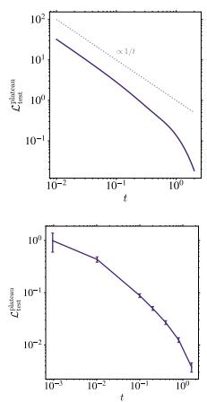

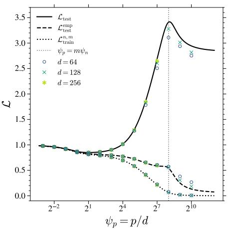

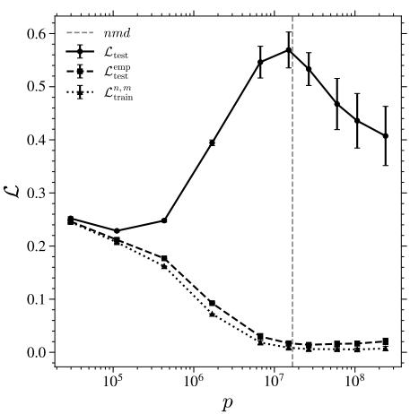  
Figure 2: Double descent in Diffusion Models. (Left) Losses vs. $\psi _ { p } = p / d$ for an RFNN with Gaussian data at $\psi _ { n } = n / d = 1 6 , m = 1 6 , t = 0 . 1 , \lambda = 1 0 ^ { - 3 } \ /$ ; black curves are the predictions of Theorem 2.1, markers the RFNN trained with Adam on Eq. 2 with ridge penalty $\lambda \Delta _ { t } \| \mathbf { A } \| _ { F } ^ { 2 } / ( d p )$ , averaged over 10 runs. (Middle) Losses vs. p for U-Nets trained on CelebA at $n = 2 0 4 8 , m = 8 ,$ evaluated at t ≈ 0.01; error bars are ±3SE over 6 initial seeds. $( R i g h t )$ Large p plateau value of the test loss vs. t for the RFNN (top) and the U-Net (bottom), W = 128, p ≈ 106M.

## 2.3 Main Results

Parameter-wise double descent exists in diffusion models. Both the RFNN theory and the U-Net experiments exhibit double descent, as shown in Fig. 2. As a function of the model size $p ,$ the test loss $\mathcal { L } _ { \mathrm { t e s t } }$ first decreases to a minimum and then rises to a peak located where the training loss $\mathcal { L } _ { \mathrm { t r a i n } } ^ { n , m }$ vanishes, i.e. at the interpolation threshold, corresponding to the smallest $p$ reaching very small values of the train loss. Past the peak, in the overparameterized regime, $\mathcal { L } _ { \mathrm { t e s t } }$ settles at a value larger than at its first minimum; the smaller $t ,$ the higher is this plateau, as shown in the right panels of Fig. 2. The empirical test loss $\mathcal { L } _ { \mathrm { t e s t } } ^ { \mathrm { e m p } } ,$ by contrast, tracks the training loss and reaches its minimum in the overparameterized regime. For the RFNN, $\mathscr { L } _ { \mathrm { t e s t } } ^ { \mathrm { e m p } }$ exhibits a double descent at moderate $m ,$ which fades away as m grows. These results, obtained at fixed $t ,$ persist for the test loss integrated over t (Appendix B.7), which also displays a peak and a plateau—as expected, since the integral collects all noise levels and the small-t ones exhibit these features most strongly.

Both n and m shift the interpolation peak. As $p$ increases, the RFNN model exhibits three regimes with distinct scalings, as shown in the three leftmost panels of Fig. 3: (i) for $p < n ,$ the test loss decreases and depends on p alone, independently of n and m (left panel); (ii) for $n < p < n m , \mathcal { L } _ { \mathrm { t e s t } }$ increases and depends only on the ratio $p / n$ (top central panel); (iii) the peak height, reached at $p = n m$ (lower central panel), and the plateau beyond it are independent of n (left panel). The threshold $p = n m$ is simply where the pd readout parameters match the nmd scalar conditions imposed by $\mathcal { L } _ { \mathrm { t r a i n } } ^ { n , m } , \mathrm { i . e . }$ one d-dimensional equation per noisy point $\pmb { y } ^ { \nu \mu }$ . For the U-Net, the peak shifts to larger p as both n and m grow, as displayed in the right panel of Fig. 3. The RFNN scalings carry over to the U-Net across the $( n , m , p )$ range we explore (see Appendix B.2)—the peak is also approximately located where the number of parameters equals nmd—but we do not expect it to hold in general, in particular due to the strong correlations among the nmd targets and to the weight sharing of the convolutional architecture, which decouples $p$ from the effective degrees of freedom.

Malign overfitting and the growth of the bias. A finer picture emerges from the bias–variance decomposition of the test loss from Eq. 4, reported in Fig. 4 for the RFNN (left) and the U-Net (right). For small models the test loss is pure bias; as p grows the bias decreases while the variance builds up which sets the first minimum of the test error, as in the classical bias–variance trade-off [64]. Approaching the interpolation threshold $p \sim n m$ , both terms contribute: the variance diverges, producing the peak, while the bias—rather than continuing to decrease—starts to grow before the peak. Past the peak the two terms decouple: the variance decays, as in the classical supervised setting [48, 15], whereas the bias keeps rising and saturates. The same decomposition for the U-Nets (right panel of Fig. 4) reproduces the key feature: the variance decays after the interpolation peak while the bias increases before peaking. At large $p ,$ both saturate at a strictly positive plateau.4 Further supporting experiments on Gaussian mixture data and simpler feedforward network models of the score reproduce this behavior and can be found in Appendix B.6. In all cases, the residual test error at large $p$ is a combination of comparable contributions from the variance and the bias. Both are due to memorization and “benign overfitting” of the empirical score: variance is high because of dependence on the precise drawing of the training set, and the bias is high because the empirical score is different from the population score. The two bias regimes are of different nature. At small $p ,$ it is an approximation error: the model is too simple to represent the score, so the bias decreases as the capacity grows. At large $p ,$ the bias is instead a property of the objective: the training drives the estimator towards the minimizers of the empirical test loss, which differ from those of the population one, a gap that no amount of capacity can close.

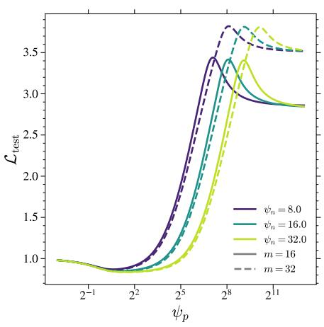

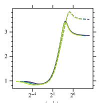

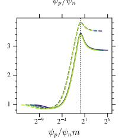

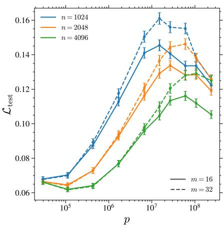

Figure 3: Effects of n and m on the double descent. (Left) RFNN test loss vs. $\psi _ { p }$ for several $\psi _ { n }$ and $m ,$ at $t = 0 . 1$ $\lambda \overset { \cdot } { = } 1 0 ^ { - 3 } , \sigma = \operatorname { t a n h }$ . (Middle) Same, with the x-axis rescaled by $\psi _ { n }$ (top) and $\psi _ { n } m$ (bottom). (Right) U-Net test loss vs. $p$ for several m at t ≈ 0.1; error bars are ±3SE of one seed over test sets.  
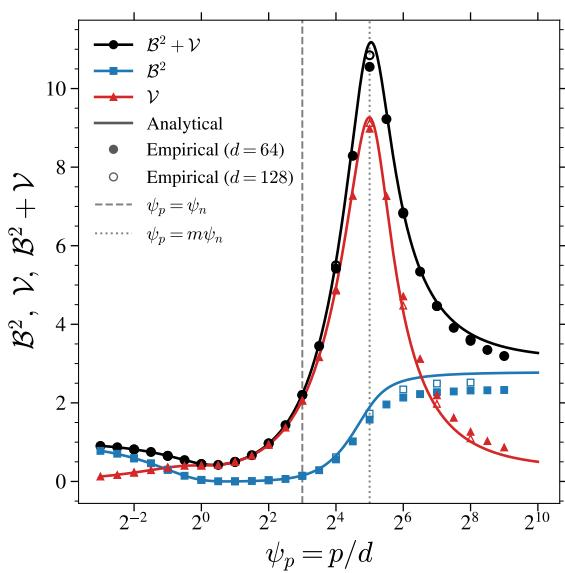

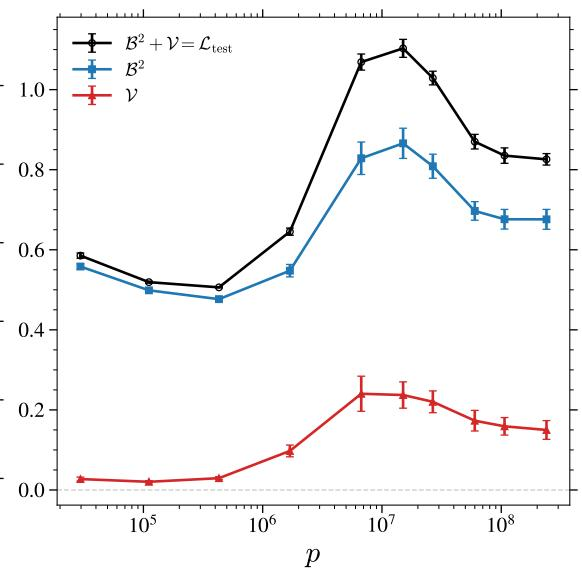  
Figure 4: Bias and variance of the score estimator. (Left) Bias and variance for the RFNN model vs. $\psi _ { p }$ for $\bar { \psi _ { n } } = 8 , t = 0 . 1 , m = 4 , \lambda = 1 0 ^ { - 3 } ,$ σ = tanh and several values of d. Solid curves are the analytical predictions from Theorem 2.1; markers are numerical estimates from 10 independent runs. (Right) Bias and variance for U-Net models as a function of p $( n = 2 0 4 8 , m = 4$ , evaluated $\mathrm { a t } t \approx 0 . 0 1 )$ ). Error bars correspond to ±3SE over 10 models trained on disjoint datasets.

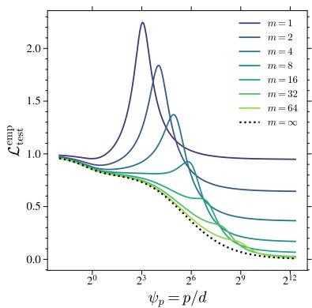

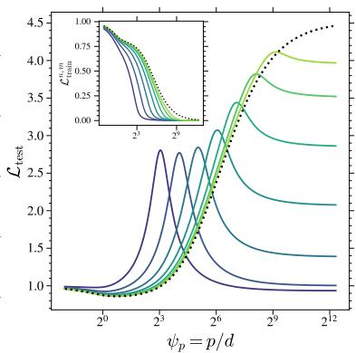

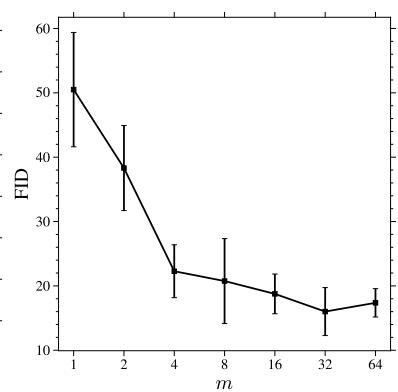

Figure 5: Effect of m on the double descent. (Left) Empirical test loss $\mathscr { L } _ { \mathrm { t e s t } } ^ { \mathrm { e m p } }$ and $( M i d d l e )$ test loss $\mathcal { L } _ { \mathrm { t e s t } }$ vs $\psi _ { p }$ for an RFNN at several m, with $\psi _ { n } = n / d = 8 , t = 0 . 1 , \lambda = 1 0 ^ { - 3 }$ , σ = tanh; inset: training loss. (Right) FID vs m for early-stopped U-Nets trained on CelebA at n = 16384, $W = 3 2 ;$ error bars are ±3SE over 5 seeds.  
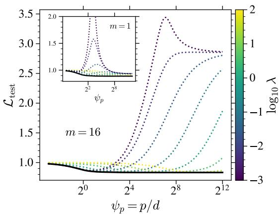

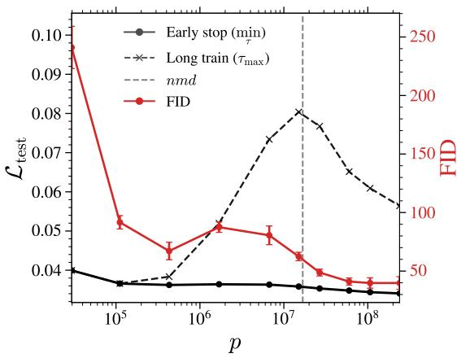  
Figure 6: Benefits of regularization on generalization. $( L e f t )$ RFNN test loss $\mathcal { L } _ { \mathrm { t e s t } } \ \mathbf { v s } . \ \psi _ { p }$ for several $\lambda , \mathfrak { a t } \psi _ { n } = 8 ,$ $t = 0 . 1 , m = 1 6 , \sigma = \operatorname { t a n h }$ (inset: $m = 1 )$ ; the black curve is the lower envelope. $( R i g h t )$ U-Net integrated test loss vs. p at $n = 2 0 4 8 , m = 8$ , early-stopped (solid) and fully trained (dashed), with the FID of the early-stopped models (red, right axis); the vertical dashed line marks the naive interpolation threshold $p = n m d .$

## 3 Discussion

From benign to malign: the role of $m _ { \bullet }$ . We now characterize how m controls the interpolation threshold and the nature of overfitting, focusing on the RFNN setting. Recall that $m = 1$ corresponds to standard regression, where each sample carries a single target, while practice operates at m $\gg 1$ (large number of epochs). For $m = 1$ , the middle panel of Fig. 5 shows an interpolation peak in $\mathcal { L } _ { \mathrm { t e s t } }$ at $\psi _ { p } = \psi _ { n } ;$ after the peak, $\mathcal { L } _ { \mathrm { t e s t } }$ decreases below its underparameterized minimum: overfitting is here benign. Upon increasing $m ,$ the interpolation threshold shifts to $\psi _ { p } = m \psi _ { n }$ . As m increases, $\mathcal { L } _ { \mathrm { t e s t } }$ decreases for $\psi _ { p } < \psi _ { n } m$ but increases for $\psi _ { p } > \psi _ { n } m :$ overfitting turns from benign to malign. This effect is already visible at $m = 2$ In the limit $m  \infty ,$ the double descent disappears altogether, and $\mathcal { L } _ { \mathrm { t e s t } }$ has a single minimum, located in the underparameterized regime [21]. The left panel shows the evolution of $\mathcal { L } _ { \mathrm { t e s t } } ^ { \mathrm { e m p } }$ , which also shows a standard double descent for $m = 1$ . Increasing m lowers both the peak height and the loss throughout the $\psi _ { p } > m \psi _ { n }$ regime; for large m the peak fades away and $\mathscr { L } _ { \mathrm { t e s t } } ^ { \mathrm { e m p } }$ becomes strictly decreasing, converging to 0 as $\psi _ { p }  \infty$ . Note that already for moderate values of $m , \mathcal { L } _ { \mathrm { t e s t } } ^ { \mathrm { e m p } }$ , which measures the distance to the empirical score, reaches very small values for large p. Given the harmful effect of increasing m on the test loss, one might be tempted to conclude that it is preferable to work at $m = 1$ . In practice, however, one works at $m \gg 1 , \mathrm { i . e }$ . many epochs, and for good reason: once regularized, the model performs better at larger m, as shown in the right panel of Fig. 5: for early-stopped U-Nets trained on $n =$ 16384 images with $\bar { W } = 3 2$ , the FID decreases swiftly as m increases, before saturating. The effect of regularization is discussed further below.

Overparameterize, but regularize. In supervised learning, regularization can drastically alter the double descent picture: optimally tuned ridge regularization is known to flatten the interpolation peak and induce a monotone test error [47, 43]. We now show that the same holds in the diffusion setting, and in particular that overparameterizing is beneficial when paired with regularization. The left panel of Fig. 6 shows that, at small regularization (dark blue dotted curve), the RFNN still displays malign overfitting. If instead λ is optimized for each $p ,$ which yields the lower envelope of the family of curves (solid black line), then $\mathcal { L } _ { \mathrm { t e s t } }$ decreases monotonically with $\psi _ { p } \colon$ an optimally regularized large model outperforms any smaller unregularized one. We discuss the effect of t and the optimal regularization in Appendix C.13.1. For U-Net models trained on CelebA with no explicit regularization, early stopping plays a role analogous to the ridge penalty [2]. Bonnaire et al. [10] and Favero et al. [19] identify two characteristic timescales: a generalization timescale $\tau _ { \mathrm { g e n } } = O ( 1 )$ ) and a memorization timescale $\tau _ { \mathrm { m e m } } = { \cal O } ( n )$ , beyond which the model starts to collapse onto individual training samples; stopping within the window $\tau _ { \mathrm { g e n } } \ll \tau ^ { \star } \ll \tau _ { \mathrm { m e m } }$ yields high-quality samples while avoiding memorization. Our numerical results complement this picture by showing that the test loss of optimally early-stopped models $( \tau ^ { \star } = \arg$ minτ $\bar { \mathcal { L } } _ { \mathrm { t e s t } } ( \tau )$ , right panel of Fig. 6) no longer exhibits the interpolation peak nor the associated double descent. It decreases instead monotonically with the number of parameters. The FID of these early-stopped models does still exhibit a double descent; we conjecture this reflects the test loss being an imperfect proxy for sample quality, and that early-stopping on the FID itself would remove it (see Appendix B.8 for a lengthier discussion). In particular, an overparameterized early-stopped model systematically beats any fully-trained underparameterized one: overparameterization remains beneficial once paired with early stopping.

## 4 Conclusion, Limitations and Future Work

In this work, we have shown that diffusion models do exhibit double descent but with crucial differences from the classical supervised regression setting. The interpolation threshold shifts from $p \sim n$ in regression to p ∼ nm in diffusion, where m is the number of noise realizations per training sample. The peak vanishes as $m  \infty$ , but the rise of the test loss beyond its minimum, and the bias mechanism behind it, do not. Since $m \gg 1$ in practice, the peak is pushed to very large model sizes and the overfitting observed in practice, corresponding to the rising branch of a U-shaped curve [42, 18], is the approach to it, where malign overfitting is already at work. A bias–variance decomposition traces this malign overfitting back to a persistent bias of the score estimator, which grows past the interpolation peak and saturates at a plateau. Finally, we establish that an optimally regularized overparameterized model outperforms any unregularized one: overparameterization paired with regularization is beneficial despite malign overfitting.

Limitations & future work. The RFNN and the U-Net differ mainly in the n-dependence of the interpolation peak height and in the bias peak seen for the U-Net, both absent from the RFNN. Clarifying the role of feature learning in these effects is an exciting question we leave for future work. Our empirical validation is moreover restricted to a single dataset, moderate number of samples, and models substantially smaller than the state of the art. Establishing our predictions at scale is certainly an important future step.

## References

[1] Beatrice Achilli, Enrico Ventura, Gianluigi Silvestri, Bao Pham, Gabriel Raya, Dmitry Krotov, Carlo Lucibello, and Luca Ambrogioni. Losing dimensions: Geometric memorization in generative diffusion, 2024. URL https://arxiv.org/abs/2410.08727.

[2] Alnur Ali, J. Zico Kolter, and Ryan J. Tibshirani. A continuous-time view of early stopping for least squares regression. In Kamalika Chaudhuri and Masashi Sugiyama, editors, Proceedings of the Twenty-Second International Conference on Artificial Intelligence and Statistics, volume 89 of Proceedings of Machine Learning Research, pages 1370–1378. PMLR, 16–18 Apr 2019. URL https: //proceedings.mlr.press/v89/ali19a.html.

[3] Brian D.O. Anderson. Reverse-time diffusion equation models. Stochastic Processes and their Applications, 12(3):313–326, 1982. ISSN 0304-4149. doi: https://doi.org/10.1016/0304-4149(82)90051-5. URL https://www.sciencedirect.com/science/article/pii/0304414982900515.

[4] Ricardo Baptista, Agnimitra Dasgupta, Nikola B. Kovachki, Assad Oberai, and Andrew M. Stuart. Memorization and regularization in generative diffusion models, 2025. URL https://arxiv. org/abs/2501.15785.

[5] Jean Barbier, Florent Krzakala, Nicolas Macris, Léo Miolane, and Lenka Zdeborová. Optimal errors and phase transitions in high-dimensional generalized linear models. Proceedings of the Nationa Academy ofSciences, 116:5451–5460, 2019.

[6] Peter L. Bartlett, Philip M. Long, Gábor Lugosi, and Alexander Tsigler. Benign overfitting in linear regression. Proceedings ofthe National Academy ofSciences, 117(48):30063–30070, 2020. doi: 10.1073/ pnas.1907378117. URL https://www.pnas.org/doi/abs/10.1073/pnas.1907378117.

[7] Mikhail Belkin, Daniel Hsu, Siyuan Ma, and Soumik Mandal. Reconciling modern machine-learning practice and the classical bias–variance trade-off. Proceedings of the National Academy of Sciences, 116 (32):15849–15854, 2019. doi: 10.1073/pnas.1903070116. URL https://www.pnas.org/doi/abs/ 10.1073/pnas.1903070116.

[8] Giulio Biroli, Tony Bonnaire, Valentin de Bortoli, and Marc Mézard. Dynamical regimes of diffusion models. Nature Communications, 15(9957), 2024. doi: 10.1038/s41467-024-9957-y. URL https: //www.nature.com/articles/s41467-024-9957-y.

[9] Antoine Bodin and Nicolas Macris. Model, sample, and epoch-wise descents: exact solution of gradient flow in the random feature model. In M. Ranzato, A. Beygelzimer, Y. Dauphin, P.S. Liang, and J. Wortman Vaughan, editors, Advances in Neural Information Processing Systems, volume 34, pages 21605–21617. Curran Associates, Inc., 2021. URL https://proceedings.neurips.cc/ paper\_files/paper/2021/file/b4f8e5c5fb53f5ba81072451531d5460-Paper.pdf.

[10] Tony Bonnaire, Raphaël Urfin, Giulio Biroli, and Marc Mezard. Why diffusion models don’t memorize: The role of implicit dynamical regularization in training. In The Thirty-ninth Annual Conference on Neural Information Processing Systems, 2025. URL https://openreview.net/forum?id= BSZqpqgqM0.

[11] Sam Buchanan, Druv Pai, Yi Ma, and Valentin De Bortoli. On the edge of memorization in diffusion models. In The Thirty-ninth Annual Conference on Neural Information Processing Systems, 2025. URL https://openreview.net/forum?id=rWW5wdECl8.

[12] Nicholas Carlini, Jamie Hayes, Milad Nasr, Matthew Jagielski, Vikash Sehwag, Florian Tramèr, Borja Balle, Daphne Ippolito, and Eric Wallace. Extracting training data from diffusion models. In Proceedings ofthe 32nd USENIX Conference on Security Symposium, SEC ’23, USA, 2023. USENIX Association. ISBN 978-1-939133-37-3.

[13] Hugo Cui, Florent Krzakala, Eric Vanden-Eijnden, and Lenka Zdeborova. Analysis of learning a flow-based generative model from limited sample complexity. In The Twelfth International Conference on Learning Representations, 2024. URL https://openreview.net/forum?id=ndCJeysCPe.

[14] Hugo Cui, Cengiz Pehlevan, and Yue Lu. A solvable model of learning generative diffusion: theory and insights. In D. Belgrave, C. Zhang, H. Lin, R. Pascanu, P. Koniusz, M. Ghassemi, and N. Chen, editors, Advances in Neural Information Processing Systems, volume 38, Main Conference, pages 5253–5296. Curran Associates, Inc., 2025. doi: 10.52202/ 085713-0187. URL https://proceedings.neurips.cc/paper\_files/paper/2025/file/ 082d3d795520c43214da5123e56a3a34-Paper-Conference.pdf.

[15] Stéphane D’Ascoli, Maria Refinetti, Giulio Biroli, and Florent Krzakala. Double trouble in double descent: Bias and variance(s) in the lazy regime. In Hal Daumé III and Aarti Singh, editors, Proceedings of the 37th International Conference on Machine Learning, volume 119 of Proceedings of Machine Learning Research, pages 2280–2290. PMLR, 13–18 Jul 2020. URL https://proceedings. mlr.press/v119/d-ascoli20a.html.

[16] Stéphane d’Ascoli, Levent Sagun, and Giulio Biroli. Triple descent and the two kinds of overfitting: where and why do they appear?\*. Journal of Statistical Mechanics: Theory and Experiment, 2021(12): 124002, December 2021. ISSN 1742-5468. doi: 10.1088/1742-5468/ac3909. URL http://dx.doi. org/10.1088/1742-5468/ac3909.

[17] Patrick Esser, Sumith Kulal, Andreas Blattmann, Rahim Entezari, Jonas Müller, Harry Saini, Yam Levi, Dominik Lorenz, Axel Sauer, Frederic Boesel, Dustin Podell, Tim Dockhorn, Zion English, Kyle Lacey, Alex Goodwin, Yannik Marek, and Robin Rombach. Scaling rectified flow transformers for high-resolution image synthesis, 2024. URL https://arxiv.org/abs/2403.03206.

[18] Tyler Farghly, Benjamin Dupuis, Alain Oliviero Durmus, and Umut Simsekli. Benign overfitting does not occur in diffusion models. In ICML 2026 Workshop on Foundations of Deep Generative Models: Understanding Memorization, Generalization, and Reasoning, 2026. URL https://openreview.net/ forum?id=QwP5eaXJTj.

[19] Alessandro Favero, Antonio Sclocchi, and Matthieu Wyart. Bigger isn’t always memorizing: Early stopping overparameterized diffusion models, 2025.

[20] Mario Geiger, Arthur Jacot, Stefano Spigler, Franck Gabriel, Levent Sagun, Stéphane d’Ascoli, Giulio Biroli, Clément Hongler, and Matthieu Wyart. Scaling description of generalization with number of parameters in deep learning. Journal of Statistical Mechanics: Theory and Experiment, 2020(2):023401, 2020. URL https://arxiv.org/abs/1909.11572.

[21] Anand Jerry George, Rodrigo Veiga, and Nicolas Macris. Denoising score matching with random features: Insights on diffusion models from precise learning curves. In The 29th International Conference on Artificial Intelligence and Statistics, 2026. URL https://openreview.net/forum? id=ZnplHm2uRt.

[22] Federica Gerace, Bruno Loureiro, Florent Krzakala, Marc Mezard, and Lenka Zdeborova. Generalisation error in learning with random features and the hidden manifold model. In Hal Daumé III and Aarti Singh, editors, Proceedings of the 37th International Conference on Machine Learning, volume 119 of Proceedings ofMachine Learning Research, pages 3452–3462. PMLR, 13–18 Jul 2020. URL https://proceedings.mlr.press/v119/gerace20a.html.

[23] Cédric Gerbelot, Alia Abbara, and Florent Krzakala. Asymptotic errors for teacher-student convex generalized linear models (or: How to prove kabashima’s replica formula). IEEE Transactions on Information Theory, 69:1824–1852, 2023.

[24] Sebastian Goldt, Marc Mézard, Florent Krzakala, and Lenka Zdeborová. Modeling the influence of data structure on learning in neural networks: The hidden manifold model. Physical Review X, 10(4): 041044, 2020.

[25] Sebastian Goldt, Bruno Loureiro, Galen Reeves, Florent Krzakala, Marc Mézard, and Lenka Zdeborová. The gaussian equivalence of generative models for learning with shallow neural networks. In Joan Bruna, Jan S. Hesthaven, and Lenka Zdeborová, editors, Mathematical and Scientific Machine Learning, 16-19 August 2021, Virtual Conference / Lausanne, Switzerland, volume 145 of Proceedings of Machine Learning Research, pages 426–471. PMLR, 2021. URL https: //proceedings.mlr.press/v145/goldt22a.html.

[26] Xiangming Gu, Chao Du, Tianyu Pang, Chongxuan Li, Min Lin, and Ye Wang. On memorization in diffusion models. Transactions on Machine Learning Research, 2025. ISSN 2835-8856. URL https: //openreview.net/forum?id=D3DBqvSDbj.

[27] Francesco Guerra and Fabio Lucio Toninelli. The thermodynamic limit in mean field spin glass models. Communications in Mathematical Physics, 230:71–79, 2002.

[28] Trevor Hastie, Andrea Montanari, Saharon Rosset, and Ryan J. Tibshirani. Surprises in highdimensional ridgeless least squares interpolation. The Annals ofStatistics, 50(2):949 – 986, 2022. doi: 10.1214/21-AOS2133. URL https://doi.org/10.1214/21-AOS2133.

[29] U.G. Haussmann and E. Pardoux. Time reversal of diffusions. The Annals of Probability, 14(4): 1188–1205, 1986. doi: 10.1214/aop/1176992362.

[30] Martin Heusel, Hubert Ramsauer, Thomas Unterthiner, Bernhard Nessler, and Sepp Hochreiter. Gans trained by a two time-scale update rule converge to a local nash equilibrium. In Proceedings of the 31st International Conference on Neural Information Processing Systems, NIPS’17, page 6629–6640, Red Hook, NY, USA, 2017. Curran Associates Inc. ISBN 9781510860964.

[31] Jonathan Ho, Ajay Jain, and Pieter Abbeel. Denoising diffusion probabilistic models. In H. Larochelle, M. Ranzato, R. Hadsell, M.F. Balcan, and H. Lin, editors, Advances in Neural Information Processing Systems, volume 33, pages 6840–6851. Curran Associates, Inc., 2020. URL https://proceedings.neurips.cc/paper\_files/paper/2020/file/ 4c5bcfec8584af0d967f1ab10179ca4b-Paper.pdf.

[32] Hong Hu and Yue M. Lu. Universality laws for high-dimensional learning with random features. IEEE Transactions on Information Theory, 69(3):1932–1964, 2023. doi: 10.1109/TIT.2022.3217698.

[33] Aapo Hyvärinen. Estimation of non-normalized statistical models by score matching. Journal of Machine Learning Research, 6(24):695–709, 2005. URL http://jmlr.org/papers/v6/ hyvarinen05a.html.

[34] Zahra Kadkhodaie, Florentin Guth, Eero P Simoncelli, and Stéphane Mallat. Generalization in diffusion models arises from geometry-adaptive harmonic representations. In The Twelfth International Conference on Learning Representations, 2024. URL https://openreview.net/forum?id= ANvmVS2Yr0.

[35] Tero Karras, Miika Aittala, Samuli Laine, and Timo Aila. Elucidating the design space of diffusionbased generative models. In Proceedings of the 36th International Conference on Neural Information Processing Systems, NIPS ’22, Red Hook, NY, USA, 2022. Curran Associates Inc. ISBN 9781713871088.

[36] W. F. Kibble. An extension of a theorem of mehler’s on hermite polynomials. Mathematical Proceedings of the Cambridge Philosophical Society, 41(1):12–15, June 1945. ISSN 0305-0041, 1469-8064. doi: 10.1017/S0305004100022313.

[37] Zhifeng Kong, Wei Ping, Jiaji Huang, Kexin Zhao, and Bryan Catanzaro. Diffwave: A versatile diffusion model for audio synthesis. In International Conference on Learning Representations, 2021. URL https://openreview.net/forum?id=a-xFK8Ymz5J.

[38] Hugo Latourelle-Vigeant, Sinho Chewi, Aram-Alexandre Pooladian, John Sous, and Theodor Misiakiewicz. Generalization, memorization, and overfitting for diffusion models trained in the lazy high-dimensional regime, 2026. URL https://arxiv.org/abs/2608.23938.

[39] Steve Lawrence, C. Lee Giles, and Ah Chung Tsoi. Lessons in neural network training: Overfitting may be harder than expected. In Proceedings of the Fourteenth National Conference on Artificial Intelligence (AAAI-97), pages 540–545. AAAI Press, 1997.

[40] Sixu Li, Shi Chen, and Qin Li. A good score does not lead to a good generative model, 2024. URL https://arxiv.org/abs/2401.04856.

[41] Ziwei Liu, Ping Luo, Xiaogang Wang, and Xiaoou Tang. Deep learning face attributes in the wild. In Proceedings of International Conference on Computer Vision (ICCV), December 2015.

[42] Pierre Marion and Yu-Han Wu. Understanding diffusion models requires rethinking (again) generalization, 2026. URL https://arxiv.org/abs/2605.06077.

[43] Song Mei and Andrea Montanari. The generalization error of random features regression: Precise asymptotics and the double descent curve. Communications on Pure and Applied Mathematics, 75, 2019. URL https://api.semanticscholar.org/CorpusID:199668852.

[44] Claudia Merger and Sebastian Goldt. Generalization dynamics of linear diffusion models, 2026. URL https://arxiv.org/abs/2505.24769.

[45] Marc Mézard, Giorgio Parisi, and Miguel Angel Virasoro. Spin Glass Theory and Beyond: An Introduction to the Replica Method and Its Applications, volume 9 of Lecture Notes in Physics. World Scientific Publishing Company, Singapore, 1987.

[46] Preetum Nakkiran, Gal Kaplun, Yamini Bansal, Tristan Yang, Boaz Barak, and Ilya Sutskever. Deep double descent: where bigger models and more data hurt\*. Journal of Statistical Mechanics: Theory and Experiment, 2021(12):124003, dec 2021. doi: 10.1088/1742-5468/ac3a74. URL https: //doi.org/10.1088/1742-5468/ac3a74.

[47] Preetum Nakkiran, Prayaag Venkat, Sham M. Kakade, and Tengyu Ma. Optimal regularization can mitigate double descent. In International Conference on Learning Representations (ICLR), 2021. URL https://arxiv.org/abs/2003.01897.

[48] Brady Neal, Sarthak Mittal, Aristide Baratin, Vinayak Tantia, Matthew Scicluna, Simon Lacoste-Julien, and Ioannis Mitliagkas. A modern take on the bias-variance tradeoff in neural networks. In ICML 2019 Workshop on Identifying and Understanding Deep Learning Phenomena, 2019. URL https://openreview.net/forum?id=B1guPVr2h4.

[49] Behnam Neyshabur, Ryota Tomioka, and Nathan Srebro. In search of the real inductive bias: On the role of implicit regularization in deep learning. In International Conference on Learning Representations (ICLR) Workshop, 2015. URL https://arxiv.org/abs/1412.6614.

[50] Jeffrey Pennington and Pratik Worah. Nonlinear random matrix theory for deep learning. In I. Guyon, U. Von Luxburg, S. Bengio, H. Wallach, R. Fergus, S. Vishwanathan, and R. Garnett, editors, Advances in Neural Information Processing Systems, volume 30. Curran Associates, Inc., 2017. URL https://proceedings.neurips.cc/paper\_files/paper/2017/file/ 0f3d014eead934bbdbacb62a01dc4831-Paper.pdf.

[51] S. Péché. A note on the pennington-worah distribution. Electronic Communications in Probability, 24: 1–7, 2019. doi: 10.1214/19-ECP255. URL https://doi.org/10.1214/19-ECP255.

[52] Ali Rahimi and Benjamin Recht. Random features for large-scale kernel machines. In J. Platt, D. Koller, Y. Singer, and S. Roweis, editors, Advances in Neural Information Processing Systems, volume 20. Curran Associates, Inc., 2007. URL https://proceedings.neurips.cc/paper\_ files/paper/2007/file/013a006f03dbc5392effeb8f18fda755-Paper.pdf.

[53] Olaf Ronneberger, Philipp Fischer, and Thomas Brox. U-net: Convolutional networks for biomedical image segmentation. In Nassir Navab, Joachim Hornegger, William M. Wells, and Alejandro F. Frangi, editors, Medical Image Computing and Computer-Assisted Intervention – MICCAI 2015, pages 234–241, Cham, 2015. Springer International Publishing.

[54] Jascha Sohl-Dickstein, Eric Weiss, Niru Maheswaranathan, and Surya Ganguli. Deep unsupervised learning using nonequilibrium thermodynamics. In Francis Bach and David Blei, editors, Proceedings of the 32nd International Conference on Machine Learning, volume 37 of Proceedings ofMachine Learning Research, pages 2256–2265, Lille, France, 07–09 Jul 2015. PMLR. URL https://proceedings.mlr. press/v37/sohl-dickstein15.html.

[55] Gowthami Somepalli, Vasu Singla, Micah Goldblum, Jonas Geiping, and Tom Goldstein. Diffusion art or digital forgery? investigating data replication in diffusion models. In Proceedings of the IEEE/CVF Conference on Computer Vision and Pattern Recognition, 2023.

[56] Gowthami Somepalli, Vasu Singla, Micah Goldblum, Jonas Geiping, and Tom Goldstein. Understanding and mitigating copying in diffusion models. Advances in Neural Information Processing Systems, 36:47783–47803, 2023.

[57] Jiaming Song, Chenlin Meng, and Stefano Ermon. Denoising diffusion implicit models. In International Conference on Learning Representations, 2021. URL https://openreview.net/forum?id= St1giarCHLP.

[58] Yang Song and Stefano Ermon. Generative modeling by estimating gradients of the data distribution. In H. Wallach, H. Larochelle, A. Beygelzimer, F. d'Alché-Buc, E. Fox, and R. Garnett, editors, Advances in Neural Information Processing Systems, volume 32. Curran Associates, Inc., 2019. URL https://proceedings.neurips.cc/paper\_files/paper/2019/file/ 3001ef257407d5a371a96dcd947c7d93-Paper.pdf.

[59] Yang Song, Jascha Sohl-Dickstein, Diederik P Kingma, Abhishek Kumar, Stefano Ermon, and Ben Poole. Score-based generative modeling through stochastic differential equations. In International Conference on Learning Representations, 2021. URL https://openreview.net/forum?id= PxTIG12RRHS.

[60] Michel Talagrand. The parisi formula. Annals of mathematics, pages 221–263, 2006.

[61] Enrico Ventura, Beatrice Achilli, Gianluigi Silvestri, Carlo Lucibello, and Luca Ambrogioni. Manifolds, random matrices and spectral gaps: The geometric phases of generative diffusion, 2025. URL https://arxiv.org/abs/2410.05898.

[62] M. Vilucchio, Y. Dandi, M. P. Rossignol, C. Gerbelot, and F. Krzakala. Asymptotics of non-convex generalized linear models in high-dimensions: A proof of the replica formula. arXiv preprint arXiv:2502.20003, 2025.

[63] Pascal Vincent. A connection between score matching and denoising autoencoders. Neural Computation, 23(7):1661–1674, 2011. doi: 10.1162/NECO\_a\_00142.

[64] Larry Wasserman. All of statistics: a concise course in statistical inference, volume 26. Springer, 2004.

[65] Zhuoyi Yang, Jiayan Teng, Wendi Zheng, Ming Ding, Shiyu Huang, Jiazheng Xu, Yuanming Yang, Wenyi Hong, Xiaohan Zhang, Guanyu Feng, Da Yin, Yuxuan Zhang, Weihan Wang, Yean Cheng, Bin Xu, Xiaotao Gu, Yuxiao Dong, and Jie Tang. Cogvideox: Text-to-video diffusion models with an expert transformer. In The Thirteenth International Conference on Learning Representations, 2025. URL https://openreview.net/forum?id=LQzN6TRFg9.

[66] TaeHo Yoon, Joo Young Choi, Sehyun Kwon, and Ernest K. Ryu. Diffusion probabilistic models generalize when they fail to memorize. In ICML 2023 Workshop on Structured Probabilistic Inference & Generative Modeling, 2023. URL https://openreview.net/forum?id=shciCbSk9h.

[67] Chiyuan Zhang, Samy Bengio, Moritz Hardt, Benjamin Recht, and Oriol Vinyals. Understanding deep learning requires rethinking generalization. In International Conference on Learning Representa tions, 2017. URL https://openreview.net/forum?id=Sy8gdB9xx.

# Double Descent and Malign Overfitting in Diffusion Models Supplementary Material (SM)

Raphaël Urfin, Tony Bonnaire, Giulio Biroli, Marc Mézard

This appendix provides detailed derivations and additional results supporting the main text (MT). Appendix A expands the discussion of closely related works [21, 38, 42, 18]. Appendix B provides further details about the numerical experiments carried out in Sect. 2.1, as well as additional experiments and discussions. Appendix C gives formal proofs of the main theorems from Sect. 2.2, together with additional results and discussions. We also discuss LLM usage in the conception of this work in Appendix D.

## A Discussion of related works

We discuss here in detail four works close to ours: the precise learning curves of George et al. [21], the lazy regime dynamics of Latourelle-Vigeant et al. [38], the empirical study of Marion and Wu [42], and the impossibility result of Farghly et al. [18]. The four tackle a similar question along complementary axes. The common thread of our comparison is that all four works operate either at m = 1 or at m = ∞, whereas the phenomenology we report—the interpolation peak at $p \sim n m ,$ the benign-to-malign transition, and the bias mechanism behind it—require to understand the finite-m interpolation between these two limits.

Precise learning curves for the RFNN score. George et al. [21] derive asymptotically exact train and test errors using the Gaussian Equivalence Principle and the theory of linear pencils for the same framework as ours: nonlinear RFNN and Gaussian data, studied in the proportional regime of finite $\psi _ { n } = n / d$ and $\psi _ { p } = p / d$ . Their central message is a crossover at $p \sim \tau$ n between a regime where the model generalizes and a regime where it approaches the empirical score and memorizes, showing that increasing m both improves generalization for $p \leq n$ and intensifies memorization for $p \geq n$ . First, our arbitrary-m solutions reveal the intermediate regime with an interpolation threshold sitting at p ∼ nm. Second, our dissection of the problem into three losses $( \mathcal { L } _ { \mathrm { t r a i n } } ^ { n , m } , \mathcal { L } _ { \mathrm { t e s t } } ^ { \mathrm { e m p } ^ { \star } } \mathcal { L } _ { \mathrm { t e s t } } )$ identifies what is actually being overfit and the origin of the malign overfitting.

Training and generative dynamics in the lazy regime. Latourelle-Vigeant et al. [38] study the gradientflow dynamics of neural networks trained on the score-matching objective in the proportional regime $n \asymp d ,$ in the lazy regime where the network is linearized around its initialization. The infinite-width limit then replaces the network by a kernel operator K acting on a vector-valued RKHS,

$$
( K f ) ( { \bf x } ) = \int \mathrm { d } { \pmb y } p _ { t } ^ { \mathrm { e m p } } ( { \pmb y } ) K ( { \bf x } , { \pmb y } ) f ( { \pmb y } ) ,\tag{14}
$$

with $p _ { t } ^ { \mathrm { e m p } }$ the noised empirical distribution. They derive closed-form equations for the training and test losses along the whole trajectory. Their central message is a separation of training timescales: the model generalizes on $\tau = O ( d )$ , where $\mathcal { L } _ { \mathrm { t e s t } }$ decreases; it then overfits the empirical score on $\tau = d ^ { 1 + \Theta ( 1 ) }$ , where $\mathcal { L } _ { \mathrm { t e s t } }$ rises again; and it memorizes only on the much later $\tau = d ^ { \omega ( \hat { 1 } ) }$ . Because they also characterize the generated distribution, they can separate these last two stages and conclude that overfitting the empirical score during training does not necessarily entail memorization in the backward dynamics. The differences with our work are twofold. First, they follow the training and generative dynamics, whereas we characterize only the empirical risk minimizer solution. Second, their lazy limit sits at $p  \infty$ with an infinite number of noise samples $m  \infty$ , whereas our analysis holds at finite $p$ and m.

Empirical study of memorization dynamics. Marion and Wu [42] perform an extensive numerical study of U-Nets trained on CIFAR-10 subsets at various n and $p$ and track their train and test denoising losses. They never observe a parameter-wise peak or double descent in the test loss. Crucially, a fresh noise realization is drawn at every optimization step, so their setting corresponds to our $m  \infty$ case. Consistently with our findings, there is therefore no peak to see as p increases in this case. What they do observe however is a training-time-wise double descent of the distributional distances with a peak located at the onset of memorization, which is accelerated by the model size. This is consistent with our $\tau { - } W$ discussion reported in Appendix B.3. We emphasize that the two double descents are distinct phenomena occurring on different axes and with different mechanisms: theirs is dynamical, observed at $m  \infty ,$ and only appears in distribution space; ours is static, parameter-wise, exists only at finite $m ,$ and appears in the test loss. Their position that the field should rethink generalization in diffusion models is precisely what our two distinct test losses formalize: the benign overfitting mechanism does exist, but it targets the minimizers of $\mathscr { L } _ { \mathrm { t e s t } } ^ { \mathrm { e m p } }$ , the empirical score, rather than those of $\mathcal { L } _ { \mathrm { t e s t } }$

Impossibility of benign overfitting. Farghly et al. [18] establish, in a model-independent way, that overfitting and generalization cannot coexist in diffusion models unless the sample size grows exponentially with the data dimension. Their first argument is information-theoretic: as $t \to 0$ , the relative Fisher information between the empirical and population noised distributions diverges, which is consistent with our picture as it forces the test loss to be large. They also study a linear RFNN and find a U-shaped test loss as $p$ increases. Our analysis refines their conclusions in two ways. First, their setting is again m → ∞: at any finite $m ,$ double descent does occur, with an interpolation peak at $p \sim$ nm that moves to infinite model size as $m  \infty$ , recovering their U-shape. Along this crossover, we show that overfitting is benign only in the regression case $m = 1$ and increasingly malign as m grows. The impossibility that they derive is thus the $m  \infty$ endpoint of a benign-to-malign crossover. Second, their finding that time-integrated objective and early-stopping act as implicit regularizers parallels our regularization analysis, to which we add $\operatorname { t h a t } ,$ once suitably regularized, overparameterization becomes strictly beneficial. Interestingly, they also trace the difference with standard regression to an alignment obstruction: benign overfitting of the minimum-norm interpolator relies on a favorable alignment between the target and the empirical covariances, which the score-matching target cannot reach. This is complementary to our bias mechanism: both analyses locate the malign origin of the overfitting in a deterministic distortion of the learned score.

## B Additional numerical results

## B.1 Architecture & Training

The model is made of an initial $3 \times 3$ convolution mapping to $W$ channels. The encoder has 4 resolution levels with channel multipliers $( 1 , 2 , 4 , 4 )$ , meaning the successive width is W, 2W, 4W, 4W at resolutions $L , L / 2 , L / 4 , L / 8$ . Each level is composed of 2 residual blocks with $3 \times 3$ stride-2 convolutions for downsampling. The encoder is followed by a bottleneck of 2 residual blocks and then by a symmetric decoder using nearest-neighbor upsampling and traditional skip connections. A final group-norm convolution projects back to a single channel. We apply multi-head self-attention with 4 heads at the two coarsest levels and in the bottleneck. Each residual block uses GroupNorm and SiLU activations. Finally, the diffusion time is encoded with a standard sinusoidal embedding passed through a 2-layer MLP and added to the features in every residual block. At very small $W = 2 ,$ the attention head count and GroupNorm groups are reduced so the layers remain valid, hence the configuration slightly changes at this W compared to the others.

As stated in the main text, each model is trained to predict the noise $\xi ^ { \nu \mu }$ by minimizing the standard noise-prediction objective. We use Adam with default moment parameters and without weight decay or exponential moving average. The forward pass is discretized using $T = 1 0 0 0$ steps, indexed by $k = \bar { \{ 0 , \ldots , T - 1 \} }$ , with a linear noise schedule $\beta _ { k }$ going from $\beta _ { 0 } = \bar { 1 } 0 ^ { - 4 }$ to $\beta _ { T - 1 } \stackrel { - } { = } 2 \times 1 0 ^ { - 2 }$ and $\begin{array} { r } { \bar { \alpha } _ { k } = \prod _ { i = 0 } ^ { k } ( 1 - \beta _ { j } ) } \end{array}$ [31]. To connect this schedule to the continuous-time notation of the main text, we define $t _ { k } = - \textstyle { \frac { 1 } { 2 } } \log \bar { \alpha } _ { k }$ . Consequently, the noisy samples can equivalently be written as $\mathbf { x } _ { t _ { k } } ^ { \nu \mu } ~ =$ $\sqrt { \bar { \alpha } _ { k } } { \bf x } ^ { \nu } + \sqrt { 1 - \bar { \alpha } _ { k } } \bar { \xi } ^ { \nu \mu }$ . Throughout training, the learning rate is fixed to $1 0 ^ { - 4 }$ with a batch size $B = 1 2 8$ Unlike standard diffusion models training, the noise is here fixed: each of the n images $\mathbf { x } ^ { \nu }$ has m frozen noise vectors $\xi ^ { \nu \mu }$ , giving a total of $n \times m$ fixed pairs. The training is time-dependent: at every step we pick a diffusion index $\bar { k ^ { \prime } } { \sim } \mathcal { U } \left[ 1 , \ldots , T - 1 \right]$ ] and we compute the interpolated noisy sample at $t _ { k }$ . In the numerical experiments, no explicit regularization is used: the only regularizer we study is the finite training time τ through early-stopping.

## B.2 More scaling experiments of the double descent with n and m

In the right panel of Fig. 3, we show the evolutions of the test loss for several n and m at once. In Fig. 7 we provide complementary experiments with $p$ for more n and m values, shown individually. In this case, we clearly see the collapse of the (time-integrated) test loss at both small and large $p ,$ independently of n in the left panel, with the clear scaling of the peak with n in the inset. The right panel shows three values of m for a fixed $n = 2 0 4 8$ training. At small $p ,$ all curves collapse independently of m while the height of the large p plateau is increasing with it. The inset also shows the $p / m$ evolution, showing the scaling of the peak with m as well. Together, these plots emphasize the scaling of the double descent peak with nm, as in the random features case.

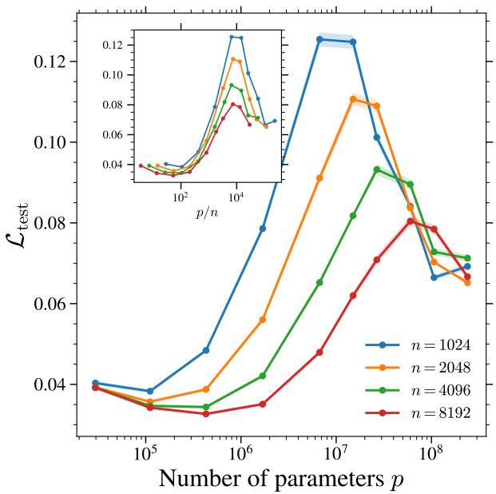

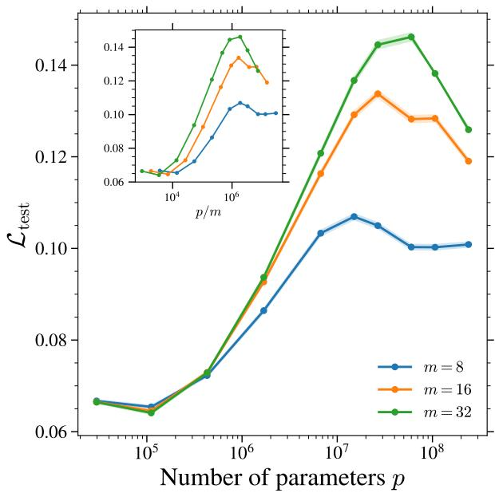  
Figure 7: Additional scaling experiments. Evolution of $( L e f t )$ the time-integrated test loss with p for several n at $m = 3 2 .$ , and (Right) the $t \approx 0 . 1$ test loss with $p$ for several m at $n = 2 0 4 8$ . Both plots are obtained at $\tau = \tau _ { \mathrm { m a x } } = 2 \mathrm { M }$ steps.

## B.3 Training-time-wise double descent in U-Net diffusion models

$\tau { - } W$ coupling of the double descent. The left panel of Fig. 8 traces the interaction between model size (through the width W) and training time in the double descent phenomenon: each curve shows $\mathcal { L } _ { \mathrm { t e s t } }$ as a function of W at fixed number of updates τ . A double descent emerges only for large enough τ , and its peak is not static, slipping towards smaller W as τ grows. This couples W and τ as two substitutable axes of the double descent phenomenon, echoing the view of the supervised learning setting from Nakkiran et al. [46] in which training time and model size feed a single effective complexity measure governing the peak location, although our analysis does not provide any insight on the nature of the origin of these two peaks.

Training-time double descent. In the middle panel of Fig. 8, we show the evolution of the test loss with the number of Adam updates τ for different W. It reveals three regimes. For small-size models, the test loss decreases monotonically to a minimum value reached at the end of training. For intermediate-size models $( 1 6 \leq W \leq 6 4 )$ the test loss reaches a minimum and then rises again at a moderate number of updates, the signature of overfitting and memorization at large training times. Larger models $( W \geq 9 6 )$ however, exhibit a training-time-wise double descent: the test loss quickly decreases to a minimum $( \tau \approx 1 0 ^ { 4 } )$ rises, and then decreases again at even larger τ. Strikingly, the first two regimes with the descent and the subsequent rise are largely robust to W with all the curves collapsing, whereas the second descent clearly depends on the width, with larger models exhibiting a sharper late-time decrease. The right panel actually informs us about the mechanism behind this rise at large W: the gap between $\mathscr { L } _ { \mathrm { t e s t } } ^ { \mathrm { e m p } }$ and $\mathbf { \bar { \mathcal { L } } } _ { \mathrm { t r a i n } } ^ { n , m }$ grows with both τ (at fixed W) and W (at fixed $\tau )$ , showing that the model progressively fits the specific training noise realizations rather than the underlying score, meaning it is heading towards memorization and the overfitting of $\mathscr { L } _ { \mathrm { t e s t } } ^ { \mathrm { e m p } }$ is detrimental. These three regimes were also observed in the supervised setting [46] but with a crucial difference: there, the large-model second descent is persistent so that longer trainings decrease the test loss, whereas in diffusion models, every sufficiently expressive model eventually turns back towards memorization [10]. This marks a clear departure from the epoch-wise double descent in supervised learning.

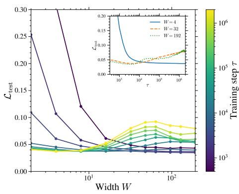

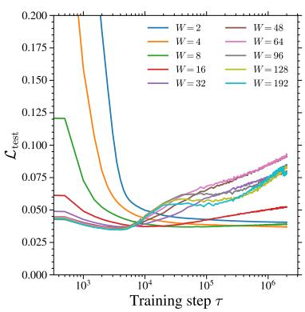

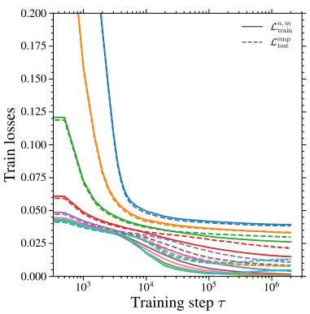  
Figure 8: Training-time double descent in diffusion models. $( L e f t )$ Evolution of the integrated test loss with W for several values of training times τ. The middle and right panels show the evolution of the time-integrated (Middle) test and $( R i g h t )$ train losses against τ for several W. All the models were trained with $n = 2 0 4 8$ and $m = 8$

## B.4 Visual inspection of the generated samples

Sample generation. For each configuration $( n , m , W )$ , we generate from the early-stopped model at τ⋆ = arg minτ $\mathcal { L } _ { \mathrm { t e s t } } ( \tau )$ that minimizes the time-integrated test loss. From this checkpoint, we draw $1 0 ^ { 4 }$ samples with the deterministic DDIM sampler from Song et al. [57] $( \eta = 0 , T ^ { \prime } = 1 0 \bar { 0 } \mathsf { s t e p s } )$ . All models are initialized with the same Gaussian noise seed so that a given position in the grid of Fig. 9 corresponds to the same starting point for all models. Samples are then de-normalized to the original range and the quality is measured using the Fréchet-Inception Distance [FID, 30] against 104 CelebA held-out test images that no models have seen during training, and using the PyTorch-FID package5.

Results. In Fig. 9, we show for $n = 2 0 4 8 \tt a 3 \times 3$ set of generated samples from the early-stopped models at different m and $W ,$ with increasing m over the rows and W across the columns. The FID of the full generated set is reported in each panel. Since all panels share the same initial noise, it is easy to visually appreciate the quality variations with m and W. Two trends are visible. First, increasing the number of noise realizations m improves the sample quality up to a certain point: the m = 1 row is clearly the blurriest (FID≈ 100), whereas $m = 8$ and $m = 3 2$ produce sharper faces at fixed W, although the trend is not consistent for all widths. Second, at fixed m (say 8), the FID decreases with the width, reflecting the benefit of additional capacity coupled with regularization, as emphasized in the main text. The only notable exception is $m = 1$ where the largest model is not the best one. Note that all models shown here are trained with only $n = 2 0 4 8$ images with no data augmentation, hence the modest sample quality. This is intentional to keep n moderate so that the generalization–memorization transition during training [10] and the interpolation peak in the test loss remain visible in a reasonable amount of training time and number of parameters.

## B.5 More details on the effect of m on U-Nets

In Fig. 10 we display the evolution of the time-integrated test loss with the training step τ for several m at fixed $n = 1 6 3 8 4$ and $W = 6 4$ . We deliberately take n large so that the models reach good generalization and operate in a regime closer to practical settings. Every curve follows the dynamics discussed previously: the test loss first decreases to a minimum and then rises again, making early stopping necessary, even at this n. The effect of m is clear and monotonic: as m increases, the minimum test loss decreases and is reached at progressively larger τ . This improvement saturates for $m \gtrsim 1 6 ,$ , where the curves essentially collapse onto one another. Together with the FID measurements in the right panel of Fig. 5, this confirms that a larger m is beneficial for generalization, both at the level of the test loss and of the quality of the generated samples.

## B.6 Bias–Variance decomposition in the Gaussian Mixture Model

Data and exact score. We use here a symmetric two-component mixture model such that

$$
\begin{array} { r } { { \bf x } _ { 0 } \sim \frac 1 2 { \mathcal N } ( + \mu , I _ { d } ) + \frac 1 2 { \mathcal N } ( - \mu , I _ { d } ) , \qquad \mu = \mu { \bf 1 } _ { d } , \quad \mu = 1 , \Sigma = I _ { d } . } \end{array}\tag{15}
$$

W = 8  
W = 32  
W = 128  
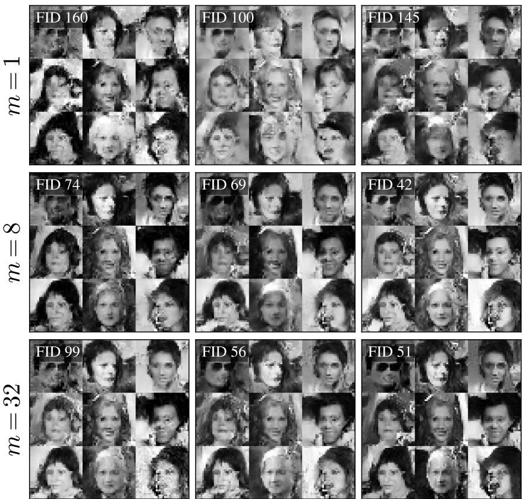  
Figure 9: Non-curated generated samples. Example of CelebA generated samples for various combinations of m (across rows) and $W$ (across columns) along with the test FID on the full set of generated images. All the models were trained with the same $n = 2 0 4 8$ data.

In this case, the analytical (population) score is known at all t and corresponds to

$$
\begin{array} { r } { \pmb { s } ^ { \star } ( \mathbf { x } , t ) = \nabla _ { \mathbf { x } } \log p _ { t } ( \mathbf { x } ) = \sqrt { \bar { \alpha } _ { t } } \mu \operatorname { t a n h } \bigl ( \sqrt { \bar { \alpha } _ { t } } \pmb { \mu } ^ { \top } \mathbf { x } \bigr ) - \mathbf { x } . } \end{array}\tag{16}
$$

Model and training. We learn the score at a single, fixed diffusion time t with a fully-connected network of L hidden layers of width W and tanh activations. With $h _ { 0 } = \mathbf { x }$ and

$$
\begin{array} { r } { h _ { \ell } = \operatorname { t a n h } \bigl ( \mathbf { W } _ { \ell } h _ { \ell - 1 } + b _ { \ell } \bigr ) , \quad \ell = 1 , \dots , L , \qquad \mathbf { W } _ { 1 } \in \mathbb { R } ^ { W \times d } , \mathbf { W } _ { \ell } \in \mathbb { R } ^ { W \times W } \ ( \ell \geq 2 ) , } \end{array}\tag{17}
$$

the noise prediction is the linear final read-out

$$
\begin{array} { r } { \epsilon _ { \theta } ( \mathbf { x } ) = \mathbf { W } _ { L + 1 } h _ { L } + b _ { L + 1 } , \qquad \mathbf { W } _ { L + 1 } \in \mathbb { R } ^ { d \times W } , } \end{array}\tag{18}
$$

so that the model has a total of $p = 2 d W + d + L W + ( L - 1 ) W ^ { 2 }$ trainable parameters. The network predicts the noise, equivalently the score $\begin{array} { r } { s _ { \theta } = - \epsilon _ { \theta } / \sqrt { 1 - \bar { \alpha } _ { t } } , } \end{array}$ and is time-agnostic since t is fixed to the discrete step $t = 1 3 7$ , which corresponds to $t \approx 0 . 1$ in the continuous-time notation of the main text. Following the benign-overfitting protocol of the main text, we draw n clean points $\{ { \bf x } _ { 0 } ^ { i } \} _ { i = 1 } ^ { n }$ from $P _ { 0 }$ and, for each, m fixed noise realizations $\{ \epsilon ^ { i j } \} _ { j = 1 } ^ { m } ,$ , yielding nm anchors $\mathbf { x } _ { t } ^ { i j } = \sqrt { \bar { \alpha } _ { t } } \mathbf { x } _ { 0 } ^ { i } + \sqrt { 1 - \bar { \alpha } _ { t } } \epsilon ^ { i j }$ , and minimize the empirical denoising loss

$$
\hat { \mathcal { L } } ( \pmb { \theta } ) = \frac { 1 } { n m } \sum _ { i = 1 } ^ { n } \sum _ { j = 1 } ^ { m } \left\| \epsilon _ { \pmb { \theta } } ( \mathbf { x } _ { t } ^ { i j } ) - \epsilon ^ { i j } \right\| ^ { 2 }\tag{19}
$$

with Adam for $\tau _ { \mathrm { m a x } } = 1 0 0 K$ steps.

Estimating $B ^ { 2 }$ and V. We train an ensemble of $K = 2 0$ independent models that differ only in their random seed (data, noises, and initialization), and evaluate all of them on a single frozen test set of nm fresh points $\left\{ \mathbf { x } _ { t } ^ { \nu } \right\}$ from the same mixture at the same fixed t. We fix $L = 2$ and vary only the width W to increase the number of parameters in the model. We then estimate empirically the bias, variance and test loss. The bias is computed against two targets: the empirical labels ϵ (i.e. the target noises) giving the quantities $B ^ { 2 }$ and $\mathcal { L } _ { \mathrm { t e s t } } = \boldsymbol { B ^ { 2 } } + \boldsymbol { \mathcal { V } }$ as measured in main text; and against the population target $\epsilon ^ { \star }$ from Eq. 16, granting access to population estimates of $B _ { \star } ^ { 2 }$ and $B _ { \star } ^ { 2 } + \nu$

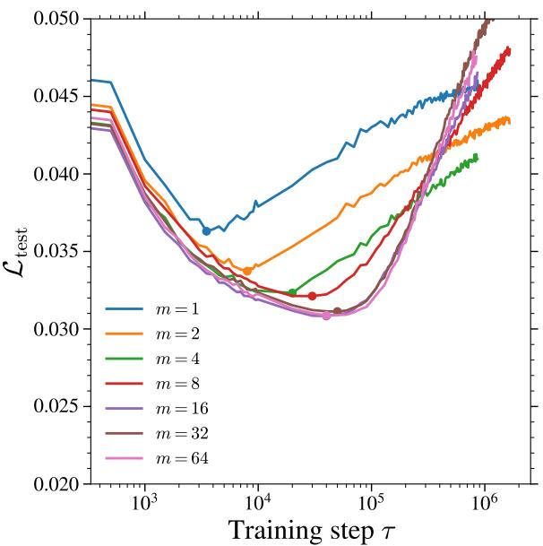

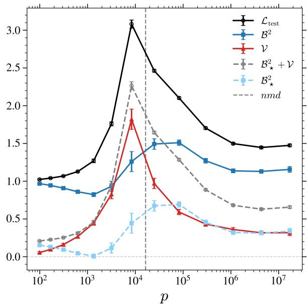  
Figure 10: Effect of m on the test loss dynamics. Timeintegrated test loss as a function of τ at fixed n = 16384 and $W = 6 4$ for several values of $m .$ . The colored dots mark the per-curve minima, i.e. the early-stopped checkpoints $\tau ^ { \star }$ used in the main text.  
Figure 11: Bias–variance decomposition for Gaussian Mixture Model. Evolution of the bias and variance for a 2-hidden-layer neural network trained on data from a 2-component Gaussian Mixture Model. B⋆ is the population bias computed from the analytically-known score while B is the one accessible in practice. Here, n = 64, m = 8, d = 32, and t ≈ 0.1.

Empirical vs. population targets. Fig. 11 reports both decompositions. The variance is target-independent, and the two biases differ only by the irreducible denoising error

$$
B ^ { 2 } - B _ { \star } ^ { 2 } = \mathbb { E } \left[ \left. \epsilon ^ { \star } - \epsilon \right. ^ { 2 } \right] ,\tag{20}
$$

i.e., a p-independent constant. Consequently, the population curves $B _ { \star } ^ { 2 }$ and $B _ { \star } ^ { 2 } + \nu$ (dashed lines in Fig. 11) exactly correspond to the empirical $\mathsf { \bar { \boldsymbol { B } } } ^ { 2 }$ and $\mathcal { L } _ { \mathrm { t e s t } }$ (solid lines) shifted downward by $B ^ { 2 } - B _ { \star } ^ { 2 }$ . Beyond this effect, we observe that the plot reproduces exactly the non-monotonic behaviors of the bias and the variance that were depicted in the main text for the U-Net architecture trained on CelebA, both saturating to a non-vanishing $O ( 1 )$ value at large p. The interpolation threshold, corresponding to where the train loss becomes small and the test loss peaks, is also consistent with p ≈ nmd.

## B.7 Integrated test loss

The main text reports losses at a fixed diffusion time t, which isolates the phenomenon at the noise levels where it is most pronounced. However, the double descent and the peak-and-plateau structure appear across the whole small-t range. Figure 12 displays the integrated test loss over all diffusion times6 as a function of the model size, for the same model and settings as the middle panel of Fig. 2. The peak is found at around the same value of p and then plateaus above its minimum. The qualitative picture we draw in the main text is therefore robust to aggregating over diffusion times, although the peak amplitude and the plateau may depend on the precise loss parameterization and the weights associated to diffusion times.

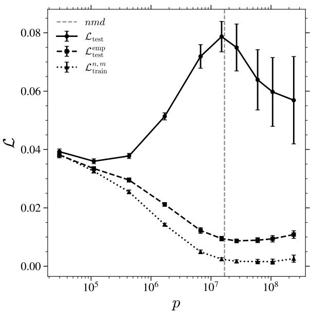  
Figure 12: Integrated losses behavior. Losses versus p for U-Net models trained on CelebA at fixed $n =$ 2048, $m = 8 .$ . Error bars correspond to ±3SE obtained from 6 random initial seeds. The vertical dashed line corresponds to the naive interpolation threshold nmd.

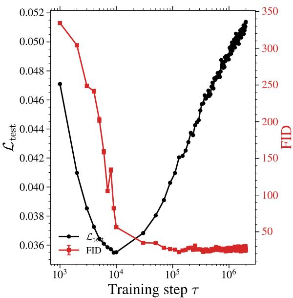  
Figure 13: Test loss and FID with τ. Time-integrated test loss (black, left axis) and FID (red, right axis) as a function of τ at fixed $n = 2 0 4 8 ,$ $m = 8$ and $W = 1 6$ Throughout the training, the evaluation of $f _ { \mathrm { m e m } }$ stays below $\stackrel { \smile } { 1 } 0 ^ { - 3 }$

## B.8 Test loss and FID during training

Figure 13 shows the evolution of the time-integrated test loss and of the FID as a function of the training time τ for one of the models used in the right panel of Fig. 6 at $n = 2 0 4 8 , m = 8$ and $W = 1 6 ( p \approx 1 . 8 \mathrm { M } )$ We select this model in particular because it corresponds to the first point at which the FID of the earlystopped models increases in $\mathrm { F i g . 6 . }$ The two early-stopping criteria clearly disagree: while the test loss selects a finite $\tau ^ { \star } = \mathrm { a r g m i n }$ τ $\mathcal { L } _ { \mathrm { t e s t } } ( \tau )$ (used in the main text), the FID decreases monotonically during training and its own optimum lies at long training times. This supports the conjecture of Sect. 3 that early-stopping on the FID itself would remove the FID double descent as the peak value $( W = 1 6 )$ would now sit below the FID measure of $W = 8$ . The two criteria (test loss and FID) do not optimize the same quantities as the FID only measures similarities in the features of the training and generated samples and is therefore insensitive to memorization: a model copying exactly its training set would get a good FID. The test loss, however, penalizes the deviation of the learned score from the population one, and therefore increases as the estimator starts to correlate with the training set. Stopping at $\tau ^ { \star }$ therefore minimizes this precise criterion and remains far cheaper to monitor.7 In the precise configuration of Fig. 13 (small m and $W )$ , the memorization fraction (as measured by the ratio of first to second nearest neighbor in the $L _ { 2 }$ sense being below $1 / 3 ,$ see 66, 10) remains below $1 0 ^ { - 3 } \colon$ starting from random noise does not lead to memorized copies of training samples.

## C Proof of the analytical results and additional results

In this section of the Appendix we first present some preliminary notions on random matrix theory, then we present the derivation of the results of the main text, namely the closed-form losses and bias– variance decomposition of Theorem 2.1, together with the overparameterized $( \psi _ { p }  \infty )$ and infinite noise $( m  \infty )$ limits, which we state and prove here (Proposition C.3 and Proposition C.5).

## C.1 Preliminaries

In this subsection, we present some useful results and formulae of Random Matrix Theory and Gaussian calculus.

## C.1.1 Resolvent and Stieltjes transform

For a symmetric matrix $\mathbf { M } \in \mathbb { R } ^ { N \times N }$ and z outside its spectrum, we define its resolvent as the matrix $\mathcal { G } _ { N } = ( \mathbf { \bar { M } } - z \pmb { I } ) ^ { - 1 }$ and its Stieltjes transform as

$$
g _ { N } ( z ) = \frac { 1 } { N } \operatorname { T r } \bigl ( \mathbf { M } - z I \bigr ) ^ { - 1 } = \int \frac { \mathrm { d } \rho _ { N } ( \lambda ) } { \lambda - z } ,\tag{21}
$$

where $\rho _ { N }$ is the empirical spectral distribution of M. Although $g _ { N } ( z )$ is a random variable, typically, in the high-dimensional limit $\bar { N } \gg 1$ it converges almost surely to a deterministic limit $\bar { g } ( z )$

## C.1.2 Gaussian Toolkit

When computing the traces, we will use usual formulae of Gaussian calculus,

1. For symmetric positive-definite $\mathbf { M } \in \mathbb { R } ^ { N \times N }$ and $\mathbf { J } \in \mathbb { R } ^ { N } .$

$$
\int _ { \mathbb { R } ^ { N } } \mathrm { d } \phi e ^ { - \frac { 1 } { 2 } \phi ^ { T } \mathbf { M } \phi + \mathbf { J } ^ { T } \phi } = ( 2 \pi ) ^ { N / 2 } ( \operatorname* { d e t } \mathbf { M } ) ^ { - 1 / 2 } e ^ { \frac { 1 } { 2 } \mathbf { J } ^ { T } \mathbf { M } ^ { - 1 } \mathbf { J } } .\tag{22}
$$

2. Let $\mathbf { X } \sim { \mathcal { N } } ( 0 , \Sigma )$ in $\mathbb { R } ^ { N }$ and let $\mathbf { K } \in \mathbb { R } ^ { N \times N }$ be symmetric with $I + \Sigma \mathbf { K } \succ 0$ . Then

$$
\mathbb { E } \big [ e ^ { - \frac { 1 } { 2 } { \bf X } ^ { T } { \bf K } { \bf X } } \big ] = \operatorname* { d e t } \big ( { \cal I } + { \Sigma } { \bf K } \big ) ^ { - 1 / 2 } .\tag{23}
$$

3. (Wick’s theorem) For jointly centered Gaussian variables $X _ { 1 } , \ldots , X _ { 2 k }$

$$
\mathbb { E } [ X _ { 1 } \cdot \cdot \cdot X _ { 2 k } ] = \sum _ { \mathrm { p a i r i n g s } \pi } \prod _ { ( i , j ) \in \pi } \mathbb { E } [ X _ { i } X _ { j } ] ,\tag{24}
$$

the sum running over all perfect matchings. In particular

$$
\mathbb { E } [ X _ { 1 } X _ { 2 } X _ { 3 } X _ { 4 } ] = \mathbb { E } [ X _ { 1 } X _ { 2 } ] \mathbb { E } [ X _ { 3 } X _ { 4 } ] + \mathbb { E } [ X _ { 1 } X _ { 3 } ] \mathbb { E } [ X _ { 2 } X _ { 4 } ] + \mathbb { E } [ X _ { 1 } X _ { 4 } ] \mathbb { E } [ X _ { 2 } X _ { 3 } ] .\tag{25}
$$

## C.1.3 The Replica Method

In our context, we frequently need to compute the expected logarithm of a partition function $\mathcal { Z }$ that arises from the Gaussian integral representation of the resolvent, $\begin{array} { r l } { \mathbf { e } . } & { { } \mathbf { g } . , \mathcal { Z } \propto \int \mathrm { d } \phi e ^ { - \frac { 1 } { 2 } \phi ^ { T } \mathbf { M } \phi } } \end{array}$ , where M is a random matrix of interest. To compute such expectations of logarithms of random variables, we employ the replica method [45]. The core idea is based on the algebraic identity:

$$
\log { \mathcal { Z } } = \operatorname* { l i m } _ { s  0 } { \frac { { \mathcal { Z } } ^ { s } - 1 } { s } } .\tag{26}
$$

By evaluating the integer moments $\mathbb { E } [ \mathcal { Z } ^ { s } ]$ for $s \in \mathbb { N } ,$ one can analytically continue the result to $s \to 0$ . This procedure is a cornerstone of the replica method from statistical physics, a theoretical physics technique that has had a wide range of applications, notably in statistical learning and the theory of neural networks [15]. The replica method is widely believed to yield exact asymptotic predictions, as has been established rigorously in a wide range of problems $[ 2 7 , 6 \dot { 0 } , 5 , 2 3 , 6 2 ]$ . More precisely, our results rely on a so-called replica-symmetry (RS) assumption. The RS ansatz is known to hold for the trace of rational polynomials of random matrices, where it has been shown to yield the exact same results as rigorous methods such as linear pencils [9, 21, 10].

## C.1.4 Replica representation of an inverse matrix

To obtain Gaussian integrals we use the “replica” representation of the element $( \alpha \beta )$ of a $p \times p$ matrix M:

$$
\left( \mathbf { M } ^ { - 1 } \right) _ { \alpha \beta } = \operatorname* { l i m } _ { s \to 0 } \int \left( \prod _ { a = 1 } ^ { s } \prod _ { \gamma = 1 } ^ { p } \mathrm { d } \phi _ { \gamma } ^ { a } \right) \phi _ { \alpha } ^ { 1 } \phi _ { \beta } ^ { 1 } \exp \left( - \frac { 1 } { 2 } \phi _ { \gamma } ^ { a } \mathbf { M } _ { \gamma \delta } \phi _ { \delta } ^ { a } \right) .\tag{27}
$$

Indeed, using the Gaussian integral representation of the inverse of M,

$$
\begin{array} { r } { \left( \mathbf { M } ^ { - 1 } \right) _ { \alpha \beta } = \mathcal { Z } ^ { - 1 } \displaystyle \int \left( \displaystyle \prod _ { \gamma = 1 } ^ { p } \mathrm { d } \phi _ { \gamma } \right) \phi _ { \alpha } \phi _ { \beta } \exp \left( - \frac { 1 } { 2 } \phi _ { \gamma } \mathbf { M } _ { \gamma \delta } \phi _ { \delta } \right) , } \\ { \mathcal { Z } = \sqrt { \displaystyle \frac { ( 2 \pi ) ^ { p } } { \mathrm { d e t } \mathbf { M } } } = \int \left( \displaystyle \prod _ { \gamma = 1 } ^ { p } \mathrm { d } \phi _ { \gamma } \right) \exp \left( - \frac { 1 } { 2 } \phi _ { \gamma } \mathbf { M } _ { \gamma \delta } \phi _ { \delta } \right) . } \end{array}
$$

Using the replica identity, we rewrite the normalization as $\begin{array} { r } { \mathcal { Z } ^ { - 1 } = \operatorname* { l i m } _ { s \to 0 } \mathcal { Z } ^ { s - 1 } } \end{array}$ , obtaining

$$
\bigl ( { \mathbf { M } } ^ { - 1 } \bigr ) _ { \alpha \beta } = \operatorname* { l i m } _ { s \to 0 } \mathcal { Z } ^ { s - 1 } \int \left( \prod _ { \gamma = 1 } ^ { p } \mathrm { d } \phi _ { \gamma } \right) \phi _ { \alpha } \phi _ { \beta } \exp \bigl ( - \textstyle { \frac { 1 } { 2 } } \phi _ { \gamma } { \mathbf { M } } _ { \gamma \delta } \phi _ { \delta } \bigr ) .
$$

Renaming the integration variable of this integral as $\phi ^ { 1 }$ and writing the factor $\mathcal { Z } ^ { s - 1 }$ as $s - 1$ further Gaussian integrals over replicas $\phi ^ { a } , a \in \{ 2 , \ldots , \bar { s } \}$ , we obtain expression $\operatorname { E q . 2 7 }$

## C.1.5 Schur complement

For a block matrix  A B : if A is invertible,

$$
\operatorname* { d e t } { \left( \begin{array} { l l } { \mathbf { A } } & { \mathbf { B } } \\ { \mathbf { C } } & { \mathbf { D } } \end{array} \right) } = \operatorname* { d e t } ( \mathbf { A } ) \operatorname* { d e t } \left( \mathbf { D } - \mathbf { C A } ^ { - 1 } \mathbf { B } \right) ,\tag{28}
$$

and if D is invertible, the top-left block of the inverse is

$$
\left[ { \left( \mathbf { A } \quad \mathbf { B } \right) } ^ { - 1 } \right] _ { 1 1 } = { \left( \mathbf { A } - \mathbf { B } \mathbf { D } ^ { - 1 } \mathbf { C } \right) } ^ { - 1 } .\tag{29}
$$

## C.1.6 Saddle-point method

In the computation of the traces we will obtain expressions of the form

$$
\int \mathrm { d } \Theta P ( \Theta ) e ^ { - \frac { d } { 2 } s S ( \Theta ) } ,\tag{30}
$$

where $\Theta$ collects the order parameters, $S$ is the effective action, $P$ a non-exponential prefactor, and s the number of replicas. As $d \to \infty$ , the Laplace method applies and the measure $\propto e ^ { - \frac { d } { 2 } s S ( \Theta ) }$ concentrates on the stationary point $\Theta ^ { * }$ defined by $\partial { \bf \bar { \Theta } } { \cal S } ( \Theta ^ { * } ) = 0 ,$ , giving

$$
\int \mathrm { d } \Theta \ : P ( \Theta ) \ : e ^ { - \frac { d } { 2 } s S ( \Theta ) } \sim \ : P ( \Theta ^ { \ast } ) .\tag{31}
$$

## C.2 Bias–variance decomposition of the test loss in the general case

In this section we derive the bias–variance decomposition of the denoising score matching (DSM) test loss, for a general data distribution.

We recall that $s _ { \mathcal { D } , \Theta }$ denotes the minimizer of the train loss $\mathcal { L } _ { \mathrm { t r a i r } } ^ { n , m }$ obtained from a training set $\mathcal { D }$ and an initialization Θ of the parameters. Throughout, $\mathbb { E } _ { y }$ denotes the average over a fresh test sample $\mathbf { \boldsymbol { y } } \sim P _ { \mathit { t } } ,$ , drawn independently of ${ \mathcal { D } } ,$ while $\langle \cdot \rangle$ denotes the average over the realizations of the training set and over the remaining sources of randomness, such as Θ. Note that $\mathcal { L } _ { \mathrm { t e s t } } ( \pmb { s } _ { D , \Theta } )$ is itself a random variable: the decomposition below concerns its average $\langle \mathcal { L } _ { \mathrm { t e s t } } \rangle$ , which is the quantity we look at. During the computation, we shall also use Tweedie’s identity

$$
\mathbb { E } [ \pmb { \xi } | \pmb { y } ] = - \sqrt { \Delta _ { t } } \nabla \log P _ { t } ( \pmb { y } ) .\tag{32}
$$

Adding and subtracting $\sqrt { \Delta _ { t } } \nabla$ log $P _ { t } ( y )$ inside the norm, at fixed D and Θ, yields

$$
\mathcal { L } _ { \mathrm { t e s t } } \big ( \boldsymbol { s } _ { \mathcal { D } , \Theta } \big ) = \frac { 1 } { d } \mathbb { E } _ { \mathbf { x } , \boldsymbol { \xi } } \bigg [ \bigg \lVert \sqrt { \Delta _ { t } } \boldsymbol { s } _ { \mathcal { D } , \Theta } ( \boldsymbol { y } ) + \boldsymbol { \xi } \bigg \rVert ^ { 2 } \bigg ]\tag{33}
$$

$$
= \frac { 1 } { d } \mathbb { E } _ { \mathbf { x } , \pm } \bigg [ \Big \| \sqrt { \Delta _ { t } } \Big ( s _ { \mathcal { D } , \Theta } ( y ) - \nabla \log P _ { t } ( y ) \Big ) + \Big ( \pm \sqrt { \Delta _ { t } } \nabla \log P _ { t } ( y ) \Big ) \Big \| ^ { 2 } \bigg ]\tag{34}
$$

$$
\frac { \Delta _ { t } } { d } \mathbb { E } _ { \pmb { y } } \Big [ \| s _ { \mathcal { D } , \Theta } ( \pmb { y } ) - \nabla \log P _ { t } ( \pmb { y } ) \| ^ { 2 } \Big ] + C _ { t } .\tag{35}
$$

The cross term vanishes: since the test sample is drawn independently of $( \mathcal { D } , \Theta )$ , the factor $\mathbf { \pmb { s } } _ { \mathcal { D } , \Theta } ( \pmb { y } ) - $ ∇ log $P _ { t } ( y )$ is a deterministic function of y and can be pulled out of the conditional expectation, while Eq. 32 gives $\mathbb { E } [ \pmb { \xi } + \sqrt { \Delta _ { t } }$ ∇ log $P _ { t } ( \pmb { y } ) \mathinner { | { \pmb { y } } \rvert } = \mathbf { 0 }$ . The remaining term,

$$
C _ { t } = \frac { 1 } { d } \mathbb { E } _ { \mathbf { x } , \pm } \bigg [ \bigg \| \pmb { \xi } + \sqrt { \Delta _ { t } } \nabla \log P _ { t } ( \pmb { y } ) \bigg \| ^ { 2 } \bigg ] = 1 - \frac { \Delta _ { t } } { d } \mathbb { E } _ { \pmb { y } } \Big [ \big \| \nabla \log P _ { t } ( \pmb { y } ) \big \| ^ { 2 } \Big ] ,\tag{36}
$$

depends only on the data distribution and on $t ,$ and is independent of the learned score. It is the irreducible part of the test loss, namely the residual uncertainty on ξ left after observing y, and is reached by the exact score ∇ log $P _ { t }$

Averaging over $\mathcal { D }$ and Θ and inserting $\pm \langle { \pm } _ {  { \boldsymbol { s } } _ { D , \Theta } ( { \pmb y } ) } \rangle$ inside the norm yields

$$
\left. \mathcal { L } _ { \mathrm { t e s t } } \right. = C _ { t } + \Delta _ { t } \left( \mathcal { B } ^ { 2 } + \mathcal { V } \right) ,\tag{37}
$$

with

$$
\mathcal { B } ^ { 2 } = \frac { 1 } { d } \mathbb { E } _ { y } \left[ \left. \nabla \log P _ { t } ( y ) - \left. s _ { \mathcal { D } , \Theta } ( y ) \right. \right. ^ { 2 } \right] , \qquad \mathcal { V } = \frac { 1 } { d } \mathbb { E } _ { y } \left[ \Big \langle \left. s _ { \mathcal { D } , \Theta } ( y ) - \left. s _ { \mathcal { D } , \Theta } ( y ) \right. \right. ^ { 2 } \Big \rangle \right] .\tag{38}
$$

Here the cross term also vanishes. The factor $\langle \pmb { s } _ { \mathcal { D } , \Theta } ( \pmb { y } ) \rangle - \nabla$ log $P _ { t } ( y )$ is deterministic once $\textbf {  { y } }$ is fixed, while $\begin{array} { r } { \pmb { s } _ { \mathcal { D } , \Theta } ( \pmb { y } ) - \langle \pmb { s } _ { \mathcal { D } , \Theta } ( \pmb { y } ) \rangle } \end{array}$ has zero mean under ⟨·⟩ by construction.

## C.3 Loss decomposition

In this section we use the Gaussian Equivalence Principle to decompose the three losses into traces of rational functions of random matrices.

The three losses are all of the form

$$
\mathcal { L } ( \pmb { \mathscr { s } } ) = \frac { 1 } { d } \mathbb { E } _ { ( \mathbf { x } , \pmb { \xi } ) \sim p } \bigg [ \Big \| \sqrt { \Delta _ { t } } \pmb { s } ( e ^ { - t } \mathbf { x } + \sqrt { \Delta _ { t } } \pmb { \xi } ) + \pmb { \xi } \Big \| ^ { 2 } \bigg ] ,\tag{39}
$$

where the joint law $p ( \mathbf { x } , \pmb { \xi } )$ of the noisy data and the noise is one of

$$
\begin{array} { r } { p _ { \mathrm { d a t a } } \otimes \mathcal { N } ( 0 , 1 ) , \qquad \frac { 1 } { n } \overset { n } { \underset { \nu = 1 } { \sum } } \delta ( \mathbf { x } - \mathbf { x } ^ { \nu } ) \otimes \mathcal { N } ( 0 , 1 ) , \qquad \frac { 1 } { n m } \overset { n } { \underset { \nu = 1 } { \sum } } \overset { m } { \underset { \mu = 1 } { \sum } } \delta ( \mathbf { x } - \mathbf { x } ^ { \nu } ) \otimes \delta ( \pmb { \xi } - \pmb { \xi } ^ { \nu \mu } ) , } \end{array}\tag{40}
$$

yielding respectively $\mathcal { L } _ { \mathrm { t e s t } } , \mathcal { L } _ { \mathrm { t e s t } } ^ { \mathrm { e m p } }$ and $\mathcal { L } _ { \mathrm { t r a i n } } ^ { n , m }$ . We derive the following result on $\mathscr { L } _ { \mathrm { t e s t } } ^ { \mathrm { e m p } }$ which relates to the distance to the empirical score,

Proposition C.1. Let $\begin{array} { r } { \hat { P } _ { t } ( \pmb { y } ) = \frac { 1 } { n } \sum _ { \nu = 1 } ^ { n } \mathcal { N } ( \pmb { y } ; e ^ { - t } \mathbf { x } ^ { \nu } , \Delta _ { t } \pmb { I } _ { d } ) } \end{array}$ be the empirical noised distribution and $s _ { \mathrm { e m p } } ( \pmb { y } ) =$ $\nabla _ { \pmb { y } } \log \hat { P } _ { t } ( \pmb { y } )$ the associated empirical score. Then, for any score function $s ,$

$$
\mathcal { L } _ { \mathrm { t e s t } } ^ { \mathrm { e m p } } ( s ) = \frac { \Delta _ { t } } { d } \mathbb { E } _ { { \pmb y } \sim \hat { P } _ { t } } \Big [ \big \| { \pmb s } ( { \pmb y } ) - { \pmb s } _ { \mathrm { e m p } } ( { \pmb y } ) \big \| ^ { 2 } \Big ] + C ,\tag{41}
$$

where C depends only on t and the empirical score $s _ { \mathrm { e m p } } ,$ but not on s. Moreover, assume that n grows at most polynomially in d, that $t = O _ { d } ( 1 )$ , and that $\| \mathbf { x } ^ { \mu } - \mathbf { x } ^ { \nu } \| ^ { 2 } = O ( d )$ for all $\mu \neq \nu$ . Then $C  0$ as $d \to \infty$

Proof. Write ${ \pmb y } ^ { \nu } = e ^ { - t } { \bf x } ^ { \nu } + \sqrt { \Delta _ { t } } { \pmb \xi }$ with $\pmb \xi \sim \mathcal N ( 0 , \pmb I _ { d } )$ . Since each $\mathbf { \Delta } _ { \mathbf { \mathcal { Y } } } ^ { \nu }$ is drawn from $\hat { P } _ { t } ,$ we can express $\mathscr { L } _ { \mathrm { t e s t } } ^ { \mathrm { e m p } }$ as an expectation over $\hat { P } _ { t }$ :

$$
\mathcal { L } _ { \mathrm { t e s t } } ^ { \mathrm { e m p } } ( \pmb { s } ) = \frac { 1 } { d } \mathbb { E } _ { \pmb { y } \sim \hat { P } _ { t } } \Big [ \Delta _ { t } \lVert \pmb { s } ( \pmb { y } ) \rVert ^ { 2 } + 2 \sqrt { \Delta _ { t } } \pmb { s } ( \pmb { y } ) \cdot \mathbb { E } [ \pmb { \xi } | \ \pmb { y } ] \Big ] + C _ { 1 } ,\tag{42}
$$

where $\begin{array} { r } { C _ { 1 } = \frac { 1 } { d } \mathbb { E } \| \pmb { \xi } \| ^ { 2 } } \end{array}$ does not depend on s. To evaluate $\mathbb { E } [ { \pmb { \xi } } \mid { \pmb y } ] .$ , note that for each component ν the conditional score of the Gaussian kernel satisfies $\nabla _ { \boldsymbol { y } }$ log $p ( \boldsymbol { \dot { y } } \mid \mathbf { x } ^ { \nu } ) = - ( \boldsymbol { y } - e ^ { - t } \mathbf { x } ^ { \nu } ) / \Delta _ { t } = \dot { - } \boldsymbol { \xi } ^ { \nu } / \sqrt { \Delta _ { t } } ,$ , so $\pmb { \xi } ^ { \nu } = - \sqrt { \Delta _ { t } } \nabla _ { \pmb { y } } \log p ( \pmb { y } \mid \mathbf { x } ^ { \nu } )$ . Taking the posterior expectation over $\mathbf { x } ^ { \nu }$ given y under $\hat { P } _ { t }$ ,

$$
\begin{array} { r } { \mathbb { E } [ \pmb { \xi } \mid y ] = - \sqrt { \Delta _ { t } } \mathbb { E } _ { \mathbf { x } ^ { \nu } \mid y } [ \nabla _ { y } \log p ( y \mid \mathbf { x } ^ { \nu } ) ] = - \sqrt { \Delta _ { t } } \nabla _ { y } \log \hat { P } _ { t } ( y ) = - \sqrt { \Delta _ { t } } s _ { \mathrm { e m p } } ( y ) , } \end{array}\tag{43}
$$

where the second equality use s ∇y log $\nabla _ { \boldsymbol { y } }$ $\hat { P } _ { t } ( \pmb { y } ) = \mathbb { E } _ { \mathbf { x } ^ { \nu } | \pmb { y } } [ \nabla _ { \pmb { y } }$ log p(y | xν)]. Substituting back and completing the square gives the result, with $\begin{array} { r } { C = C _ { 1 } - \frac { \Delta _ { t } } { d } \mathbb { E } _ { \pmb { y } } \| \pmb { s } _ { \mathrm { e m p } } ( \pmb { y } ) \| ^ { 2 } } \end{array}$ . The vanishing of $C$ as $d \to \infty$ with $t = O ( 1 )$ follows from $\pmb { s } _ { \mathrm { e m p } } ( e ^ { - t } \mathbf { x } ^ { \nu } + \sqrt { \Delta _ { t } } \pmb { \xi } )  - \pmb { \xi } / \sqrt { \Delta _ { t } }$ , which gives $\mathcal { L } _ { \mathrm { t e s t } } ^ { \mathrm { e m p } } ( s _ { \mathrm { e m p } } ) \stackrel {  } {  } 0 , \mathrm { i . e . } C  0$ □

Hence, in our regime, the smaller $\mathscr { L } _ { \mathrm { t e s t } } ^ { \mathrm { e m p } }$ is, the closer the learned score is to the empirical score and hence to memorization.

For the random-feature score $\begin{array} { r } { s _ { \mathbf { A } } ( \mathbf { x } ) = \frac { \mathbf { A } } { \sqrt { p } } \sigma ( \frac { \mathbf { W } \mathbf { x } } { \sqrt { d } } ) } \end{array}$ , writing $\pmb { s } ( \mathbf { x } _ { t } )$ for the model at the noised input ${ \bf x } _ { t } = e ^ { - t } { \bf x } + \sqrt { \Delta _ { t } } \pmb { \xi }$ and expanding the square,

$$
\mathcal { L } ( \pmb { \mathscr { s } } ) = \frac { 1 } { d } \mathbb { E } [ \| \pmb { \xi } \| ^ { 2 } ] + \frac { 2 \sqrt { \Delta _ { t } } } { d } \operatorname { T r } \frac { \mathbf { A } } { \sqrt { p } } \mathbb { E } \Big [ \sigma ( \frac { \mathbf { W } \mathbf { x } _ { t } } { \sqrt { d } } ) \pmb { \xi } ^ { T } \Big ]
$$

$$
+ \frac { \Delta _ { t } } { d } \mathrm { T r } \left( \frac { \mathbf { A } } { \sqrt { p } } \mathbb { E } \left[ \sigma ( \frac { \mathbf { W } \mathbf { x } _ { t } } { \sqrt { d } } ) \sigma ( \frac { \mathbf { W } \mathbf { x } _ { t } } { \sqrt { d } } ) ^ { T } \right] \frac { \mathbf { A } ^ { T } } { \sqrt { p } } \right) + \frac { \Delta _ { t } \lambda } { p d } \| \mathbf { A } \| _ { F } ^ { 2 } ,\tag{44}
$$

where we added the ridge penalty $\frac { \Delta _ { t } \lambda } { p d } \| \mathbf { A } \| _ { F } ^ { 2 }$ . In all three cases $\textstyle { \frac { 1 } { d } } \mathbb { E } [ \| \pmb { \xi } \| ^ { 2 } ]$ concentrates to 1. Introducing the feature–noise and feature–feature correlations

$$
\begin{array} { r } { \tilde { \bf V } = \frac { 1 } { \sqrt { \Delta _ { t } } } \mathbb { E } _ { { \bf x } , \xi } [ \sigma ( \frac { { \bf W } { \bf x } _ { t } } { \sqrt { d } } ) \xi ^ { T } ] , \qquad \tilde { \bf U } = \mathbb { E } _ { { \bf x } _ { t } \sim p _ { t } } [ \sigma ( \frac { { \bf W } { \bf x } _ { t } } { \sqrt { d } } ) \sigma ( \frac { { \bf W } { \bf x } _ { t } } { \sqrt { d } } ) ^ { T } ] , } \end{array}\tag{45}
$$

$$
\begin{array} { r } { \mathbf { V } _ { n } ^ { m } = \frac { 1 } { \sqrt { \Delta } t ^ { n m } } \displaystyle \sum _ { \nu , u } \sigma ( \frac { \mathbf { W } ( e ^ { - t } \mathbf { x } ^ { \nu } + \sqrt { \Delta _ { t } } \xi ^ { \nu \mu } ) } { \sqrt { d } } ) ( \xi ^ { \nu \mu } ) ^ { T } , \quad \mathbf { U } _ { n } ^ { m } = \frac { 1 } { n m } \displaystyle \sum _ { \nu , u } \sigma ( \frac { \mathbf { W } \mathbf { x } _ { t } ^ { \nu \mu } } { \sqrt { d } } ) \sigma ( \frac { \mathbf { W } \mathbf { x } _ { t } ^ { \nu \mu } } { \sqrt { d } } ) ^ { T } , } \end{array}\tag{46}
$$

$$
\mathbf { V } _ { n } ^ { \infty } = \frac { 1 } { \sqrt { \Delta _ { t } n } } \sum _ { \nu } \mathbb { E } _ { \pmb { \xi } } [ \sigma ( \frac { \mathbf { W } ( e ^ { - t } \mathbf { x } ^ { \nu } + \sqrt { \Delta _ { t } } \pmb { \xi } ) } { \sqrt { d } } ) \pmb { \xi } ^ { T } ] , \quad \mathbf { U } _ { n } ^ { \infty } = \frac { 1 } { n } \sum _ { \nu } \mathbb { E } _ { \pmb { \xi } } [ \sigma ( \frac { \mathbf { W } \mathbf { x } _ { t } ^ { \nu } } { \sqrt { d } } ) \sigma ( \frac { \mathbf { W } \mathbf { x } _ { t } ^ { \nu } } { \sqrt { d } } ) ^ { T } ] ,\tag{47}
$$

the regularized empirical risk minimizer is the ridge estimator

$$
\frac { \mathbf { A } _ { \mathrm { E R M } } } { \sqrt { p } } = - ( \mathbf { V } _ { n } ^ { m } ) ^ { T } ( \mathbf { U } _ { n } ^ { m } + \lambda I _ { p } ) ^ { - 1 } .\tag{48}
$$

Substituting it back, the three losses read

$$
\mathcal { L } _ { \mathrm { t r a i n } } ^ { n , m } = 1 - \frac { 2 \Delta _ { t } } { d } \mathrm { T r } \big ( ( \mathbf { V } _ { n } ^ { m } ) ^ { T } ( \mathbf { U } _ { n } ^ { m } + \lambda I _ { p } ) ^ { - 1 } \mathbf { V } _ { n } ^ { m } \big )\tag{49}
$$

$$
+ \frac { \Delta _ { t } } { d } \operatorname { T r } \big ( ( \mathbf { V } _ { n } ^ { m } ) ^ { T } ( \mathbf { U } _ { n } ^ { m } + \lambda I _ { p } ) ^ { - 1 } \mathbf { U } _ { n } ^ { m } ( \mathbf { U } _ { n } ^ { m } + \lambda I _ { p } ) ^ { - 1 } \mathbf { V } _ { n } ^ { m } \big )
$$

$$
+ \frac { \Delta _ { t } \lambda } { d } \operatorname { T r } \big ( ( \mathbf { V } _ { n } ^ { m } ) ^ { T } ( \mathbf { U } _ { n } ^ { m } + \lambda \mathbf { I } _ { p } ) ^ { - 2 } \mathbf { V } _ { n } ^ { m } \big ) ,\tag{50}
$$

$$
\mathcal { L } _ { \mathrm { t e s t } } ^ { \mathrm { e m p } } = 1 - \frac { 2 \Delta _ { t } } { d } \operatorname { T r } \bigl ( ( \mathbf { V } _ { n } ^ { m } ) ^ { T } ( \mathbf { U } _ { n } ^ { m } + \lambda { \boldsymbol { I } _ { p } } ) ^ { - 1 } \mathbf { V } _ { n } ^ { \infty } \bigr )\tag{51}
$$

$$
+ \frac { \Delta _ { t } } { d } \operatorname { T r } \big ( ( \mathbf { V } _ { n } ^ { m } ) ^ { T } ( \mathbf { U } _ { n } ^ { m } + \lambda I _ { p } ) ^ { - 1 } \mathbf { U } _ { n } ^ { \infty } ( \mathbf { U } _ { n } ^ { m } + \lambda I _ { p } ) ^ { - 1 } \mathbf { V } _ { n } ^ { m } \big ) ,\tag{52}
$$

$$
\mathcal { L } _ { \mathrm { t e s t } } = 1 - \frac { 2 \Delta _ { t } } { d } \operatorname { T r } \big ( ( \mathbf { V } _ { n } ^ { m } ) ^ { T } ( \mathbf { U } _ { n } ^ { m } + \lambda \pmb { I } _ { p } ) ^ { - 1 } \tilde { \mathbf { V } } \big )\tag{53}
$$

$$
+ \frac { \Delta _ { t } } { d } \operatorname { T r } \big ( ( \mathbf { V } _ { n } ^ { m } ) ^ { T } ( \mathbf { U } _ { n } ^ { m } + \lambda I _ { p } ) ^ { - 1 } \tilde { \mathbf { U } } ( \mathbf { U } _ { n } ^ { m } + \lambda I _ { p } ) ^ { - 1 } \mathbf { V } _ { n } ^ { m } \big ) .\tag{54}
$$

## C.4 Assumptions and notation

In this section we recall the assumptions made in the analytical part as well as the notations used.

The assumptions are

(A1) Data distribution. The training samples $\mathbf { x } ^ { \nu }$ are i.i.d. samples from $P _ { 0 }$ and the frozen noises are i.i.d. from $\mathcal { N } ( 0 , \pmb { I } _ { d } )$ . We present the result with $P _ { 0 } = \mathcal { N } \big ( 0 , I _ { d } \big )$ but in the appendix we extend the results to $P _ { 0 }$ with zero mean, sub Gaussian and with a covariance Σ that admits a limiting spectral distribution $\rho _ { \pmb { \Sigma } }$ and verifies $\mathrm { T r } ( \Sigma ) / d \to \sigma _ { \mathbf { x } } ^ { 2 } = O _ { d } ( 1 )$

(A2) RFNN Architecture. The score is modeled by the RFNN $\begin{array} { r } { s _ { \mathbf { A } } ( \pmb { y } ) = \frac { \mathbf { A } } { \sqrt { p } } \sigma \big ( \frac { \mathbf { W } \pmb { y } } { \sqrt { d } } \big ) } \end{array}$ , where the first-layer weights $\mathbf { W } \in \mathbb { R } ^ { p \times d }$ have i.i.d. $\mathcal { N } ( 0 , 1 )$ entries and are frozen and independent of the data and of the noises, while only the read-out $\mathbf { A } \in \mathbb { R } ^ { d \times p }$ is trained.

(A3) Activation Function. The activation σ admits the Hermite expansion $\begin{array} { r } { \sigma ( z ) = \sum _ { s \geq 0 } \frac { c _ { s } } { s ! } H e _ { s } ( z ) } \end{array}$ with $\begin{array} { r } { \mathbb { E } _ { z \sim \mathcal { N } ( 0 , 1 ) } [ \sigma ( z ) ^ { 2 } ] = \sum _ { s \ge 0 } \frac { c _ { s } ^ { 2 } } { s ! } < \infty , } \end{array}$ , and is centered, $\mu _ { 0 } = c _ { 0 } = \mathbb { E } _ { z \sim \mathcal { N } ( 0 , 1 ) } [ \sigma ( z ) ] = 0$ . We write $\mu _ { 1 } = c _ { 1 } = \mathbb { E } [ z \sigma ( z ) ]$ and $\begin{array} { r } { \mu _ { * } ^ { 2 } = \mathbb { E } [ \sigma ( z ) ^ { 2 } ] - \mu _ { 1 } ^ { 2 } = \sum _ { s \ge 2 } \frac { c _ { s } ^ { 2 } } { s ! } } \end{array}$

(A4) Asymptotic limit. We consider the proportional regime $n , p , d \to \infty$ with $n / d  \psi _ { n } \in ( 0 , \infty )$ and $p / d \to \psi _ { p } \in ( 0 , \infty )$ , the remaining parameters m $\in \mathbb { N } ^ { * } , t > 0$ being held fixed and $O ( 1 )$ . The two further limits we consider, $\psi _ { p } \to \infty ( \mathrm { A p p e n d i x } \mathbb { C } . 1 0 )$ and $m  { \bar { \infty } } ( { \mathrm { A p p e n d i x C . 1 1 } } )$ , are always taken after $d \to \infty$

Index conventions. Unless stated otherwise we use the Einstein summation convention, repeated indices being implicitly summed over. Latin indices $i , j , k \in \{ 1 , \ldots , d \}$ label input coordinates, Greek indices $\alpha , \beta \in \{ 1 , \cdot \cdot \cdot , \bar { p } \}$ label features (hidden units), $\nu , \nu ^ { \prime } \in \{ 1 , \ldots , n \}$ label training samples, $\mu , \mu ^ { \prime } \in$ $\{ 1 , \ldots , m \}$ label noise realizations, and $a , b \in \{ 1 , \ldots , s \}$ label replicas. Bold upright symbols denote vectors, matrices and tensors, and $\pmb { I _ { k } }$ is the $k \times k$ identity.

$\overline { { d , \ n , \ p } }$ input dimension, number of training samples, number of features   
m number of frozen noise realizations per training sample   
$\psi _ { n } = n / d , \psi _ { p } = p / d$ sample and parameter ratios   
$t , \Delta _ { t } = 1 - e ^ { - 2 t }$ diffusion time and variance of the forward kernel   
$\lambda , \tilde { \lambda } = \lambda / \psi _ { p }$ ridge strength, in the $O ( 1 )$ and $O ( \psi _ { p } )$ scalings of Appendix C.10   
$\Sigma , \rho \mathbf { \Sigma }$ data covariance $( \Sigma = I _ { d }$ in the main text) and its limiting spectral density   
$\mathbf { x } ^ { \nu } \in \mathbb { R } ^ { d }$ training sample $\nu ; \mathcal { D } = \{ { \bf x } ^ { \nu } \} _ { \nu \leq n }$ is the training set   
$\pmb { \xi } \in \mathbb { R } ^ { d \times n m }$ frozen training noises   
$\breve { \mathbf { Y } } \in \mathbb { R } ^ { d \times n r }$ noised inputs, $\mathbf { \check { Y } } _ { i } ^ { \nu \mu } = e ^ { - t } \mathbf { x } _ { i } ^ { \nu } + \sqrt { \Delta _ { t } } \pmb { \xi } _ { i } ^ { \nu \mu }$   
$\mathbf { W } \in \mathbb { R } ^ { p \times d } , \mathbf { A } \in \mathbb { R } ^ { d \times p }$ frozen first layer and trained read-out   
$\mathbf { F } \in \mathbb { R } ^ { p \times n m }$ feature matrix $\sigma ( \mathbf { W Y } / \sqrt { d } )$   
$\pmb { v } \in \mathbb { R } ^ { m }$ all-ones vector, $v ^ { \mu } = 1$   
$\mathbf { 1 } _ { m } = v \pmb { v } ^ { T }$ all-ones matrix, $\mathbf { 1 } _ { m } \in \mathbb { R } ^ { m \times }$ m   
$\mu _ { 1 }$ $\mathbb { E } [ z \sigma ( z ) ]$   
$\mu _ { * } ^ { 2 }$ $\mathbb { E } \big [ \sigma ( z ) ^ { 2 } \big ] - \mu _ { 1 } ^ { 2 }$   
κ $\frac { 1 } { \mu _ { * } ^ { 2 } } \mathbb { E } _ { u , v , w } \left[ \left( \sigma ( e ^ { - t } u + \sqrt { \Delta _ { t } } v ) - \mu _ { 1 } e ^ { - t } u \right) \right.$   
$\times ( \sigma ( e ^ { - t } u + \sqrt { \Delta _ { t } } w ) - \mu _ { 1 } e ^ { - t } u ) ] ,$   
$u , v , \dot { w } \sim \mathcal { N } ( 0 , 1 )$ independent   
$\mathcal { L } _ { \mathrm { t r a i n } } ^ { n , m } , \mathcal { L } _ { \mathrm { t e s t } } ^ { \mathrm { e m p } } , \mathcal { L } _ { \mathrm { t e s t } }$ train loss at finite $m ,$ empirical test loss $( m = \infty$ at fixed D), and popula  
tion test loss, Eqs. 2, 1 and 3   
$B ^ { 2 } , \nu$ bias, variance

## C.5 Gaussian Equivalence Principle

According to the Gaussian Equivalence Principle (GEP) [50, 51, 24, 25, 43, 32], nonlinear random matrices of the form $\mathbf { F } = \sigma ( { \frac { \mathbf { W } \mathbf { Y } } { \sqrt { d } } } )$ ) have asymptotically the same limiting spectral distribution and resolvent traces as linear matrices with the same first two moments,

$$
\begin{array} { r } { \mathbf { F } = \sigma \Big ( \frac { \mathbf { W } \mathbf { Y } } { \sqrt { d } } \Big ) \ \longrightarrow \ \mu _ { 0 } \mathbf { 1 } \mathbf { 1 } ^ { T } + \mu _ { 1 } \frac { \mathbf { W } \mathbf { Y } } { \sqrt { d } } + \mu _ { * } \Omega , } \end{array}\tag{55}
$$

with scalar constants $\mu _ { 0 } , \mu _ { 1 } , \mu _ { : }$ and Ω a Gaussian tensor independent of W and Y. Since the data are sampled from $\mathcal { N } ( 0 , \pmb { I } _ { d } )$ and we assumed that $\begin{array} { r } { \mathbb { E } _ { z \sim \mathcal { N } ( 0 , 1 ) } [ \sigma ( z ) ] = \mathbf { \hat { 0 } } _ { } } \end{array}$ , we have $\mu _ { 0 } = 0$ . Matching the first two moments of the tensor $\mathbf { F } _ { \alpha } ^ { \nu \mu }$ requires $\mu _ { 1 } = \mathbb { E } [ \sigma ( z ) z ] , \dot { \mu _ { * } ^ { 2 } } = \mathbb { E } [ \sigma ^ { 2 } ( z ) ] - \mu _ { 1 } ^ { 2 }$ , and

$$
\mathbb { E } [ \Omega _ { \alpha } ^ { \nu \mu } \Omega _ { \beta } ^ { \nu ^ { \prime } \mu ^ { \prime } } ] = \delta _ { \alpha \beta } \delta ^ { \nu \nu ^ { \prime } } \big ( \delta ^ { \mu \mu ^ { \prime } } + \kappa ( 1 - \delta ^ { \mu \mu ^ { \prime } } ) \big ) ,\tag{56}
$$

with

$$
\kappa = \frac { 1 } { \mu _ { * } ^ { 2 } } \mathbb { E } _ { u , v , w } \Big [ \big ( \sigma ( e ^ { - t } u + \sqrt { \Delta _ { t } } v ) - \mu _ { 1 } e ^ { - t } u \big ) \big ( \sigma ( e ^ { - t } u + \sqrt { \Delta _ { t } } w ) - \mu _ { 1 } e ^ { - t } u \big ) \Big ] ,\tag{57}
$$

u, v, $w \sim \mathcal { N } ( 0 , 1 )$ independent. We now replace F by its Gaussian equivalent in the matrices U and $\mathbf { V } . ^ { 8 }$ Using $\mathbb { E } [ { \bf Y } \pmb { \xi } ^ { T } ] = \sqrt { \Delta _ { t } } \pmb { I } _ { d }$ and $\mathbb { E } [ \Omega \pmb { \xi } ^ { T } ] = 0$

$$
\tilde { \mathbf { V } } = \frac { 1 } { \sqrt { \Delta _ { t } } } \mathbb { E } _ { \mathbf { x } , \xi } \Big [ \Big ( \mu _ { 1 } \frac { \mathbf { W } \mathbf { Y } } { \sqrt { d } } + \mu _ { * } \boldsymbol { \Omega } \Big ) \xi ^ { T } \Big ] = \mu _ { 1 } \frac { \mathbf { W } } { \sqrt { d } } = \mathbf { V } _ { n } ^ { \infty } , \qquad \tilde { \mathbf { U } } = \mu _ { 1 } ^ { 2 } \frac { \mathbf { W } \mathbf { W } ^ { T } } { d } + \mu _ { * } ^ { 2 } I _ { p } .\tag{58}
$$

For $\mathbf { V } _ { n } ^ { m }$ and $\mathbf { U } _ { n } ^ { m }$ there is no expectation to compute and one simply substitutes the surrogate,

$$
\mathbf { V } _ { n } ^ { m } = \frac { 1 } { \sqrt { \Delta _ { t } } n m } \sum _ { \nu , \mu } \left( \mu _ { 1 } \frac { \mathbf { W } ( e ^ { - t } \mathbf { x } ^ { \nu } + \sqrt { \Delta _ { t } } \pmb { \xi } ^ { \nu \mu } ) } { \sqrt { d } } + \mu _ { * } \Omega ^ { \nu \mu } \right) ( \pmb { \xi } ^ { \nu \mu } ) ^ { T } ,\tag{59}
$$

$$
\mathbf { U } _ { n } ^ { m } = \frac { 1 } { n m } \sum _ { \nu , \mu } \left( \mu _ { 1 } \frac { \mathbf { W } ( e ^ { - t } \mathbf { x } ^ { \nu } + \sqrt { \Delta t } \xi ^ { \nu \mu } ) } { \sqrt { d } } + \mu _ { * } \Omega ^ { \nu \mu } \right) \left( \mu _ { 1 } \frac { \mathbf { W } ( e ^ { - t } \mathbf { x } ^ { \nu } + \sqrt { \Delta t } \xi ^ { \nu \mu } ) } { \sqrt { d } } + \mu _ { * } \Omega ^ { \nu \mu } \right) ^ { T } .\tag{60}
$$

Gaussian equivalent of $\mathbf { U } _ { n } ^ { \infty }$ . The matrix $\begin{array} { r } { \mathbf { U } _ { n } ^ { \infty } = \frac { 1 } { n } \sum _ { \nu } \mathbb { E } _ { \pm } [ \mathbf { F } \mathbf { F } ^ { T } ] } \end{array}$ is more involved because the expectation is taken on the noise only. Its GEP has been derived in George et al. [21], Bonnaire et al. [10].9 We introduce the scalar constants

$$
v _ { t } ^ { 2 } = \mathbb { E } _ { u , v , w } [ \sigma ( e ^ { - t } u + \sqrt { \Delta _ { t } } v ) \sigma ( e ^ { - t } u + \sqrt { \Delta _ { t } } w ) ] - \left( \mathbb { E } _ { u , v } [ \sigma ( e ^ { - t } u + \sqrt { \Delta _ { t } } v ) u ] \right) ^ { 2 } ,\tag{61}
$$

$$
\begin{array} { r } { s _ { t } ^ { 2 } = \mathbb { E } _ { u } [ \sigma ( u ) ^ { 2 } ] - \mathbb { E } _ { u , v , w } [ \sigma ( e ^ { - t } u + \sqrt { \Delta _ { t } } v ) \sigma ( e ^ { - t } u + \sqrt { \Delta _ { t } } w ) ] - \left( \mathbb { E } _ { u , v } [ v \sigma ( e ^ { - t } u + \sqrt { \Delta _ { t } } v ) ] \right) ^ { 2 } , } \end{array}\tag{62}
$$

which, as we show below, coincide with $v _ { t } ^ { 2 } = \mu _ { * } ^ { 2 } r$ and $s _ { t } ^ { 2 } = \mu _ { * } ^ { 2 } ( 1 - \kappa )$ . Recall the Hermite expansion $\begin{array} { r } { \sigma ( z ) = \sum _ { s > 0 } \frac { c _ { s } } { s ! } H e _ { s } ( z ) } \end{array}$ , with $\mathbb { E } [ H e _ { s } H e _ { s ^ { \prime } } ] = s ! \delta _ { s s ^ { \prime } } , c _ { 0 } = 0 , c _ { 1 } = \mu _ { 1 }$ and $\begin{array} { r } { \mu _ { * } ^ { 2 } = \sum _ { s \geq 2 } \frac { c _ { s } ^ { 2 } } { s ! } } \end{array}$ . Write $h _ { \alpha } ^ { \nu } ( \pmb { \xi } ) =$ $\frac { \mathbf { W } _ { \alpha } \cdot ( e ^ { - t } \mathbf { x } ^ { \nu } + \overline { { \sqrt { \Delta _ { t } } } } \pmb { \xi } ) } { \sqrt { d } }$ for the preactivation, and

$$
R ( h ) = \sigma ( h ) - \mu _ { 1 } h = \sum _ { s \geq 2 } \frac { c _ { s } } { s ! } H e _ { s } ( h ) , \qquad \sigma _ { 0 } ( g ) = \mathbb { E } _ { w \sim \mathcal { N } ( 0 , 1 ) } [ \sigma ( g + \sqrt { \Delta _ { t } } w ) ] .\tag{63}
$$

Diagonal terms. For $\alpha = \beta , h _ { \alpha } ^ { \nu } ( \pmb { \xi } ) \sim \mathcal { N } ( 0 , 1 )$ asymptotically, and the data average concentrates, so up to ${ \cal O } ( 1 \breve { / n } ) ^ { 1 0 }$ we have,

$$
( \mathbf { U } _ { n } ^ { \infty } ) _ { \alpha \alpha } = \mathbb { E } _ { \pm } [ \sigma ( { h } _ { \alpha } ^ { \nu } ) ^ { 2 } ] = \mathbb { E } _ { z \sim \mathcal { N } ( 0 , 1 ) } [ \sigma ( z ) ^ { 2 } ] = \mu _ { 1 } ^ { 2 } + \mu _ { * } ^ { 2 } = \| \sigma \| ^ { 2 } .\tag{64}
$$

Off-diagonal terms. Fix $\alpha \neq \beta ,$ freeze $\mathbf { W } , \mathbf { x } ^ { \nu } ,$ and write $h _ { \alpha } ^ { \nu } = g _ { \alpha } ^ { \nu } + \sqrt { \Delta _ { t } } u _ { \alpha }$ with $\begin{array} { r } { \mathbf { g } _ { \alpha } ^ { \nu } = \frac { e ^ { - t } \mathbf { W } _ { \alpha } \cdot \mathbf { x } ^ { \nu } } { \sqrt { d } } } \end{array}$ ∼ $\mathcal { N } ( 0 , e ^ { - 2 t } )$ and $\begin{array} { r } { u _ { \alpha } = \frac { \mathbf { W } _ { \alpha } \cdot \pmb { \xi } } { \sqrt { d } } } \end{array}$ , so $\begin{array} { r } { \mathbb { E } _ { \pmb { \xi } } [ u _ { \alpha } u _ { \beta } ] = \rho _ { \alpha \beta } = \frac { \mathbf { W } _ { \alpha } \cdot \mathbf { W } _ { \beta } } { d } = O ( d ^ { - 1 / 2 } ) } \end{array}$ . The Mehler–Kibble formula [36] gives

$$
{ \mathbb E } _ { \xi } [ \sigma ( h _ { \alpha } ^ { \nu } ) \sigma ( h _ { \beta } ^ { \nu } ) ] = \sum _ { s \ge 0 } \frac { \rho _ { \alpha \beta } ^ { s } } { s ! } { \mathbb E } _ { u } [ H e _ { s } ( u ) \sigma ( g _ { \alpha } ^ { \nu } + \sqrt { \Delta _ { t } } u ) ] { \mathbb E } _ { u } [ H e _ { s } ( u ) \sigma ( g _ { \beta } ^ { \nu } + \sqrt { \Delta _ { t } } u ) ] .\tag{65}
$$

Terms $s \geq 2$ are $O ( \rho ^ { 2 } ) = O ( 1 / d )$ and are dropped. The $s = 0$ term is $\sigma _ { 0 } ( { \pmb g } _ { \alpha } ^ { \nu } ) \sigma _ { 0 } ( { \pmb g } _ { \beta } ^ { \nu } )$ , while averaging the $s = 1$ coefficient over the data gives $\rho _ { \alpha \beta } ( \mathbb { E } _ { g , u } [ u \sigma ( g + \sqrt { \Delta _ { t } } u ) ] ) ^ { 2 } = \rho _ { \alpha \beta } \Delta _ { t } \mu _ { 1 } ^ { 2 }$ , where Stein’s lemma yields $\mathbb { E } [ u \sigma ( h ) ] = \sqrt { \Delta _ { t } } \mu _ { 1 }$ with $h = g + \sqrt { \Delta _ { t } } u$ . Hence

$$
( \mathbf { U } _ { n } ^ { \infty } ) _ { \alpha \beta } = \frac { 1 } { n } \sum _ { \nu } \sigma _ { 0 } ( \pmb { g } _ { \alpha } ^ { \nu } ) \sigma _ { 0 } ( \pmb { g } _ { \beta } ^ { \nu } ) + \Delta _ { t } \mu _ { 1 } ^ { 2 } \frac { \mathbf { W } _ { \alpha } \cdot \mathbf { W } _ { \beta } } { d } + O ( 1 / d ) .\tag{66}
$$

The field $\mathbf { \Delta } _ { g _ { \alpha } ^ { \nu } } \mathbf { \Delta } _ { \mathrm { ~ \Gamma ~ } }$ is Gaussian and $\sigma _ { 0 }$ smooth, so a second Gaussian equivalence applies, $\sigma _ { 0 } ( g _ { \alpha } ^ { \nu } ) \to \mu _ { 1 } g _ { \alpha } ^ { \nu } + v _ { t } \eta _ { \alpha } ^ { \nu }$ with $\eta _ { \alpha } ^ { \nu } \sim \mathcal { N } ( 0 , 1 )$ . The linear coefficient is $\mu _ { 1 }$ (Stein’s lemma) and the residual variance is

$$
v _ { t } ^ { 2 } = \mathbb { E } _ { g } [ \sigma _ { 0 } ( g ) ^ { 2 } ] - \mu _ { 1 } ^ { 2 } e ^ { - 2 t } , \qquad \mathbb { E } _ { g } [ \sigma _ { 0 } ( g ) ^ { 2 } ] = \sum _ { s \ge 0 } \frac { c _ { s } ^ { 2 } } { s ! } e ^ { - 2 s t } ,\tag{67}
$$

using Mehler with shared $g \sim \mathcal { N } ( 0 , e ^ { - 2 t } )$ . Since $\begin{array} { r } { \sum _ { s > 2 } \frac { c _ { s } ^ { 2 } } { s ! } e ^ { - 2 s t } = \mu _ { * } ^ { 2 } \kappa , } \end{array}$ , we obtain $v _ { t } ^ { 2 } = \mu _ { * } ^ { 2 } \kappa ,$ i.e. $v _ { t } = \mu _ { * } { \sqrt { \kappa } }$ On the diagonal the same surrogate gives $\mu _ { 1 } ^ { 2 } + \mu _ { * } ^ { 2 } \kappa ;$ the deficit $\mu _ { * } ^ { 2 } ( 1 - \kappa )$ relative to $\| \boldsymbol { \sigma } \| ^ { 2 } = \mu _ { 1 } ^ { 2 } + \mu _ { * } ^ { 2 }$ is restored by an isotropic term, giving $\overset { \circ } { s _ { t } ^ { 2 } } = \mu _ { * } ^ { 2 } \bar { ( } 1 - \kappa )$ and

$$
\mathbf { U } _ { n } ^ { \infty } = \frac { \mathbf { G } } { \sqrt { n } } \frac { \mathbf { G } ^ { T } } { \sqrt { n } } + \Delta _ { t } \mu _ { 1 } ^ { 2 } \frac { \mathbf { W } \mathbf { W } ^ { T } } { d } + \mu _ { * } ^ { 2 } ( 1 - \kappa ) I _ { p } , \qquad \mathbf { G } _ { \alpha } ^ { \nu } = e ^ { - t } \mu _ { 1 } \frac { \mathbf { W } _ { \alpha } \cdot \mathbf { x } ^ { \nu } } { \sqrt { d } } + v _ { t } \eta _ { \alpha } ^ { \nu } .\tag{68}
$$

The surrogate η is the noise-average of the residual Ω and is correlated with it. Writing $R ^ { \nu \mu } = \mu _ { * } \Omega ^ { \nu \mu }$ and $\begin{array} { r } { R _ { 0 } ^ { \nu } = v _ { t } \eta ^ { \nu } = \mathbb { E } _ { w } [ R ( g ^ { \nu } + \sqrt { \Delta _ { t } } w ) ] = \operatorname* { l i m } _ { m \to \infty } \frac { 1 } { m } \sum _ { \mu ^ { \prime } } R ^ { \nu \mu ^ { \prime } } } \end{array}$ , conditioning on $\pmb { g } ^ { \nu }$ gives $\mathbb { E } [ R ^ { \nu \mu } R _ { 0 } ^ { \nu } ] =$ $\mathbb { E } _ { g } [ ( R _ { 0 } ^ { \nu } ) ^ { 2 } ] = v _ { t } ^ { 2 } = \mu _ { * } ^ { 2 } \kappa ,$ , hence

$$
\mathbb { E } [ \Omega _ { \alpha } ^ { \nu \mu } \eta _ { \beta } ^ { \nu ^ { \prime } } ] = \frac { \mathbb { E } [ R ^ { \nu \mu } R _ { 0 } ^ { \nu } ] } { \mu _ { * } v _ { t } } \delta _ { \alpha \beta } \delta ^ { \nu \nu ^ { \prime } } = \sqrt { \kappa } \delta _ { \alpha \beta } \delta ^ { \nu \nu ^ { \prime } } .\tag{69}
$$

Summary. The GEP yields $\begin{array} { r } { \tilde { \mathbf { V } } = \mathbf { V } _ { n } ^ { \infty } = \mu _ { 1 } \frac { \mathbf { W } } { \sqrt { d } } , \tilde { \mathbf { U } } = \mu _ { 1 } ^ { 2 } \frac { \mathbf { W } \mathbf { W } ^ { T } } { d } + \mu _ { * } ^ { 2 } I _ { p } , \mathbf { V } _ { n } ^ { m } , \mathbf { U } _ { n } ^ { m } } \end{array}$ as above, and

$$
\mathbf { U } _ { n } ^ { \infty } = \frac { 1 } { n } \sum _ { \nu } \left( e ^ { - t } \mu _ { 1 } \frac { \mathbf { W } \mathbf { x } ^ { \nu } } { \sqrt { d } } + v _ { t } \pmb { \eta } ^ { \nu } \right) \left( e ^ { - t } \mu _ { 1 } \frac { \mathbf { W } \mathbf { x } ^ { \nu } } { \sqrt { d } } + v _ { t } \pmb { \eta } ^ { \nu } \right) ^ { T } + \Delta _ { t } \mu _ { 1 } ^ { 2 } \frac { \mathbf { W } \mathbf { W } ^ { T } } { d } + s _ { t } ^ { 2 } I _ { p } ,\tag{70}
$$

with $v _ { t } ^ { 2 } = \mu _ { * } ^ { 2 } \kappa , s _ { t } ^ { 2 } = \mu _ { * } ^ { 2 } ( 1 - \kappa )$ . Here η is a Gaussian noise with $\eta _ { \alpha } ^ { \nu } \sim \mathcal { N } ( 0 , 1 )$ , independent of W and Y but correlated with the residual Ω through $\mathbb { E } [ \Omega _ { \alpha } ^ { \nu \mu } \pmb { \eta } _ { \beta } ^ { \nu ^ { \prime } } ] = \sqrt { \kappa } \delta _ { \alpha \beta } \delta ^ { \nu \nu ^ { \prime } }$

## C.6 Gaussian-equivalent losses and trace decomposition

From now on we denote by $\mathbf { F } _ { \alpha } ^ { \nu \mu }$ its Gaussian equivalent $\mu _ { 1 } \frac { \mathbf { W } \mathbf { Y } } { \sqrt { d } } + \mu _ { * } \Omega ,$ and by $\mathbf { H } = \mathbb { E } _ { \pmb { \xi } } [ \mathbf { F } ] \in \mathbb { R } ^ { p \times n }$ the noise-averaged feature matrix, with entries $\begin{array} { r } { { \bf H } _ { \alpha } ^ { \nu } = e ^ { - t } \mu _ { 1 } \frac { { \bf W } _ { \alpha } \cdot { \bf x } ^ { \dot { \nu } } } { \sqrt { d } } + v _ { t } \pmb { \eta } _ { \alpha } ^ { \nu } } \end{array}$ and $v _ { t } = \mu _ { * } { \sqrt { \kappa } } .$ . Substituting the surrogates into the losses,

$$
\mathcal { L } _ { \mathrm { t r a i n } } ^ { n , m } = 1 - \frac { 1 } { d ( n m ) ^ { 2 } } \operatorname { T r } \left( \pmb { \xi } \mathbf { F } ^ { T } \mathcal { G } _ { - \lambda , 0 , 0 } \mathbf { F } \pmb { \xi } ^ { T } \right) ,\tag{71}
$$

$$
\begin{array} { r l } & { \mathcal { L } _ { \mathrm { t e s t } } = 1 - \displaystyle \frac { 2 \mu _ { 1 } \sqrt { \Delta _ { t } } } { d n m } \mathrm { T r } \left( \xi \mathbf { F } ^ { T } \mathcal { G } _ { - \lambda , 0 , 0 } \frac { \mathbf { W } } { \sqrt { d } } \right) } \\ & { \quad \quad \quad \quad + \displaystyle \frac { 1 } { d ( n m ) ^ { 2 } } \mathrm { T r } \left( \xi \mathbf { F } ^ { T } \mathcal { G } _ { - \lambda , 0 , 0 } \tilde { \mathbf { U } } \mathcal { G } _ { - \lambda , 0 , 0 } \mathbf { F } \xi ^ { T } \right) , } \end{array}\tag{72}
$$

$$
\begin{array} { r l } & { \mathcal { L } _ { \mathrm { t e s t } } ^ { \mathrm { e m p } } = 1 - \frac { 2 \mu _ { 1 } \sqrt { \Delta _ { t } } } { d n m } \mathrm { T r } \left( \boldsymbol { \xi } \mathbf { F } ^ { T } \mathcal { G } _ { - \lambda , 0 , 0 } \frac { \mathbf { W } } { \sqrt { d } } \right) } \\ & { \qquad + \frac { 1 } { d ( n m ) ^ { 2 } } \mathrm { T r } \left( \boldsymbol { \xi } \mathbf { F } ^ { T } \mathcal { G } _ { - \lambda , 0 , 0 } \mathbf { U } _ { n } ^ { \infty } \mathcal { G } _ { - \lambda , 0 , 0 } \mathbf { F } \boldsymbol { \xi } ^ { T } \right) , } \end{array}\tag{73}
$$

with $\begin{array} { r } { \tilde { \mathbf { U } } = \mu _ { 1 } ^ { 2 } \frac { \mathbf { W } \mathbf { W } ^ { T } } { d } + \mu _ { * } ^ { 2 } \pmb { I } _ { p } } \end{array}$ and $\begin{array} { r } { { \bf U } _ { n } ^ { \infty } = \frac { { \bf H } { \bf H } ^ { T } } { n } + \Delta _ { t } \mu _ { 1 } ^ { 2 } \frac { { \bf W } { \bf W } ^ { T } } { d } + s _ { t } ^ { 2 } { \cal I } _ { p } } \end{array}$ the Gaussian-equivalent second-moment matrices of the summary above, $s _ { t } ^ { 2 } = \mu _ { * } ^ { 2 } ( 1 - \kappa ) , \mathrm { a n d } \stackrel {  } { { \mathcal G } } _ { z , \zeta , \epsilon }$ the resolvent Eq. 7 of the main text,

$$
\begin{array} { r } { \mathcal { G } _ { z , \zeta , \epsilon } = \bigg ( \frac { \mathbf { F } \mathbf { F } ^ { T } } { n m } - z I _ { p } - \zeta \frac { \mathbf { W } \mathbf { W } ^ { T } } { d } + \epsilon \frac { \mathbf { H } \mathbf { H } ^ { T } } { n } \bigg ) ^ { - 1 } , \qquad \mathcal { G } _ { - \lambda , 0 , 0 } = \bigg ( \frac { \mathbf { F } \mathbf { F } ^ { T } } { n m } + \lambda I _ { p } \bigg ) ^ { - 1 } . } \end{array}\tag{74}
$$

Every quadratic form appearing above is a derivative of the single generating trace $T _ { 1 }$ of Eq. 8,

$$
T _ { 1 } ( z , \zeta , \epsilon ) = \frac { 1 } { d ( n m ) ^ { 2 } } \operatorname { T r } \left( { \pmb { \xi } } { \pmb { \mathrm { F } } } ^ { T } { \mathcal { G } } _ { z , \zeta , \epsilon } { \pmb { \mathrm { F } } } { \pmb { \xi } } ^ { T } \right) , \qquad T _ { 2 } = \frac { 1 } { d n m } \operatorname { T r } \left( { \pmb { \xi } } { \pmb { \mathrm { F } } } ^ { T } { \mathcal { G } } _ { - \lambda , 0 , 0 } \frac { { \pmb { \mathrm { W } } } } { \sqrt { d } } \right) .\tag{75}
$$

Indeed, differentiating Eq.74 gives $\partial _ { z } \mathcal { G } = \mathcal { G } ^ { 2 } , \partial _ { \zeta } \mathcal { G } = \mathcal { G } \frac { \mathbf { W } \mathbf { W } ^ { T } } { d } \mathcal { G }$ and $\begin{array} { r } { \partial _ { \epsilon } \mathcal { G } = - \mathcal { G } \frac { \mathbf { H } \mathbf { H } ^ { T } } { n } \mathcal { G } , } \end{array}$ , so that, writing $\mathcal { G } = \mathcal { G } _ { - \lambda , 0 , 0 }$ and evaluating all derivatives at $( z , \zeta , \epsilon ) = ( - \lambda , \overset { \cdot } { 0 } , 0 )$

$$
\begin{array} { r } { T _ { 3 } = - \partial _ { \epsilon } T _ { 1 } = \frac { 1 } { d ( n m ) ^ { 2 } } \operatorname { T r } \left( \pmb { \xi } \mathbf { F } ^ { T } \pmb { \mathcal { G } } \frac { \mathbf { H } \mathbf { H } ^ { T } } { n } \pmb { \mathcal { G } } \mathbf { F } \pmb { \xi } ^ { T } \right) , } \end{array}
$$

$$
\begin{array} { r } { T _ { 4 } = \partial _ { \zeta } T _ { 1 } = \frac { 1 } { d ( n m ) ^ { 2 } } \operatorname { T r } \left( { \pmb \xi } { \pmb F } ^ { T } { \mathcal G } \frac { { \mathbf W } { \mathbf W } ^ { T } } { d } { \mathcal G } { \mathbf F } { \pmb \xi } ^ { T } \right) , \qquad T _ { 5 } = \partial _ { z } T _ { 1 } = \frac { 1 } { d ( n m ) ^ { 2 } } \operatorname { T r } \left( { \pmb \xi } { \mathbf F } ^ { T } { \mathcal G } ^ { 2 } { \mathbf F } { \pmb \xi } ^ { T } \right) . } \end{array}\tag{76}
$$

Collecting terms, the three losses read as announced in Eqs. 9–11 of the main text,

$$
\mathcal { L } _ { \mathrm { t r a i n } } ^ { n , m } = 1 - T _ { 1 } ( - \lambda , 0 , 0 ) ,\tag{77}
$$

$$
\mathcal { L } _ { \mathrm { t e s t } } = 1 - 2 \mu _ { 1 } \sqrt { \Delta _ { t } } T _ { 2 } + \mu _ { 1 } ^ { 2 } \left. \partial _ { \zeta } T _ { 1 } \right| _ { ( - \lambda , 0 , 0 ) } + \mu _ { * } ^ { 2 } \left. \partial _ { z } T _ { 1 } \right| _ { ( - \lambda , 0 , 0 ) } ,\tag{78}
$$

$$
\begin{array} { r } { \mathcal { L } _ { \mathrm { t e s t } } ^ { \mathrm { e m p } } = 1 - 2 \mu _ { 1 } \sqrt { \Delta _ { t } } T _ { 2 } - \partial _ { \epsilon } T _ { 1 } \big | _ { ( - \lambda , 0 , 0 ) } + \Delta _ { t } \mu _ { 1 } ^ { 2 } \partial _ { \zeta } T _ { 1 } \big | _ { ( - \lambda , 0 , 0 ) } + \mu _ { * } ^ { 2 } ( 1 - \kappa ) \partial _ { z } T _ { 1 } \big | _ { ( - \lambda , 0 , 0 ) } , } \end{array}\tag{79}
$$

for which we use throughout the shorthands $T _ { 3 } , T _ { 4 } , T _ { 5 }$ of Eq.76. It remains to compute $T _ { 1 }$ and $T _ { 2 }$ . Both are controlled by the order parameters of Eq. 13,

$$
q ( z , \zeta , \epsilon ) = \frac { 1 } { p } \operatorname { T r } \mathcal { G } _ { z , \zeta , \epsilon } , \qquad r ( z , \zeta , \epsilon ) = \frac { 1 } { p } \operatorname { T r } \Bigl ( \frac { \mathbf { w } ^ { T } } { \sqrt { d } } \mathcal { G } _ { z , \zeta , \epsilon } \frac { \mathbf { w } } { \sqrt { d } } \Bigr ) ,\tag{80}
$$

which, as shown next, obey the self-consistent equations of Theorem 2.1. Proposition C.2 derives them at $\epsilon = 0 .$ , which suffices for $T _ { 1 } , T _ { 2 } , T _ { 4 } , T _ { 5 } ;$ ; the ϵ-deformed saddle, needed only for $T _ { 3 } ,$ is obtained in Appendix C.8.3.

## C.7 Self-consistent equations for the Stieltjes transform

Proposition C.2 (Self-consistent equations). Let ρΣ denote the limiting spectral distribution of the data covariance Σ. In the proportional limit the order parameters $( q , r , h )$ and the conjugates $( \hat { r } , \hat { h } )$ satisfy the fixedpoint system

$$
z \psi _ { p } = \frac { 1 - \psi _ { p } } { q } - \frac { r } { q ^ { 2 } } + \frac { \psi _ { p } \mu _ { * } ^ { 2 } \frac { 1 + ( m - 1 ) \kappa } { m } } { L _ { 1 } } + \frac { ( m - 1 ) \psi _ { p } \mu _ { * } ^ { 2 } \frac { 1 - \kappa } { m } } { L _ { 2 } } ,\tag{81}
$$

$$
\hat { r } = \frac { 1 } { q } - \psi _ { p } \zeta + \frac { \psi _ { p } \mu _ { 1 } ^ { 2 } \frac { \Delta _ { t } } { m } } { L _ { 1 } } + \frac { \left( m - 1 \right) \psi _ { p } \mu _ { 1 } ^ { 2 } \frac { \Delta _ { t } } { m } } { L _ { 2 } } , \qquad \hat { h } = \frac { \psi _ { p } \mu _ { 1 } ^ { 2 } e ^ { - 2 t } } { L _ { 1 } } ,\tag{82}
$$

$$
r = \int \frac { \mathrm { d } \rho _ { \Sigma } ( \lambda ) } { \hat { r } + \lambda \hat { h } } , \qquad h = \int \frac { \lambda \mathrm { d } \rho _ { \Sigma } ( \lambda ) } { \hat { r } + \lambda \hat { h } } ,\tag{83}
$$

with $\begin{array} { r } { L _ { 1 } = L _ { 1 } ( q , r , h ) = 1 + \frac { \psi _ { p } } { \psi _ { n } } \mu _ { 1 } ^ { 2 } e ^ { - 2 t } h + \frac { \psi _ { p } } { \psi _ { n } m } \big [ \mu _ { 1 } ^ { 2 } \Delta _ { t } r + \mu _ { * } ^ { 2 } q ( 1 + ( m - 1 ) \kappa ) \big ] } \end{array}$ and $L _ { 2 } = L _ { 2 } ( q , r ) = 1 +$ $\begin{array} { r } { \frac { \psi _ { p } } { \psi _ { n } m } \left[ \mu _ { 1 } ^ { 2 } \Delta _ { t } r + \mu _ { * } ^ { 2 } q ( 1 - \kappa ) \right] } \end{array}$

Remark. For isotropic data $\Sigma = I _ { d }$ one has $\rho _ { \Sigma } = \delta ( \lambda - 1 )$ , so Eq.83 gives $r = h = 1 / ( \hat { r } + \hat { h } )$ , i.e. $\hat { r } + \hat { h } = 1 / r$ and $L _ { 1 } ( q , r , r ) = L _ { 1 } ( q , r )$ . Adding the two equations of Eq.82 eliminates the conjugates and the system collapses to

$$
\frac { 1 } { r } + \psi _ { p } \zeta = \frac { 1 } { q } + \frac { \mu _ { 1 } ^ { 2 } \psi _ { p } \left( e ^ { - 2 t } + \frac { \Delta _ { t } } { m } \right) } { L _ { 1 } ( q , r ) } + \frac { \left( m - 1 \right) \psi _ { p } \mu _ { 1 } ^ { 2 } \frac { \Delta _ { t } } { m } } { L _ { 2 } ( q , r ) } ,\tag{84}
$$

$$
z \psi _ { p } = \frac { 1 - \psi _ { p } } { q } - \frac { r } { q ^ { 2 } } + \frac { \psi _ { p } \mu _ { * } ^ { 2 } \frac { 1 + ( m - 1 ) \kappa } { m } } { L _ { 1 } ( q , r ) } + \frac { ( m - 1 ) \psi _ { p } \mu _ { * } ^ { 2 } \frac { 1 - \kappa } { m } } { L _ { 2 } ( q , r ) } ,\tag{85}
$$

with $\begin{array} { r } { L _ { 1 } ( q , r ) = 1 + \frac { \psi _ { p } } { \psi _ { n } m } \big [ \mu _ { 1 } ^ { 2 } r ( e ^ { - 2 t } m + \Delta _ { t } ) + \mu _ { * } ^ { 2 } q ( 1 + ( m - 1 ) \kappa ) \big ] } \end{array}$ and $\begin{array} { r } { L _ { 2 } ( q , r ) = 1 + \frac { \psi _ { p } } { \psi _ { n } m } \left[ \mu _ { 1 } ^ { 2 } r \Delta _ { t } + \mu _ { * } ^ { 2 } q ( 1 - \kappa ) \right] } \end{array}$ This is the self-consistent system verified by $( q , r )$ of Theorem 2.1 of the main text.

We prove the system for general covariance matrix Σ and then specialize to the case $\pmb { \Sigma } = \pmb { I } _ { d }$

Proof. Throughout the replica computations we use the Einstein summation convention (repeated indices mean implicit summation), with feature indices $\alpha , \beta \in \{ 1 , \ldots , p \}$ , Latin coordinate indices $i , j , k \in$ $\{ 1 , \ldots , d \}$ , sample indices $\nu , \nu ^ { \prime } \in \{ 1 , \ldots , n \}$ , noise indices $\mu , \mu ^ { \prime } \in \{ 1 , \ldots , m \} .$ , and replica indices $a , b \in$ $\{ 1 , \ldots , s \}$ . We compute $\begin{array} { r } { q ( z , \zeta ) = \frac { 1 } { p } \operatorname { T r } ( \mathbf { U } - z I _ { p } - \zeta \frac { \mathbf { W } \mathbf { W } ^ { T } } { d } ) ^ { - 1 } } \end{array}$ with $\begin{array} { r } { { \bf U } _ { \alpha \beta } = \frac { ( { \bf F } { \bf F } ^ { T } ) _ { \alpha \beta } } { n m } } \end{array}$ and U replaced by its Gaussian equivalent,

$$
\mathbf { U } _ { \alpha \beta } = \frac { 1 } { n m } \big ( \mu _ { 1 } \mathbf { W } _ { \alpha i } \mathbf { Y } _ { i } ^ { \nu \mu } + \mu _ { * } \Omega _ { \alpha } ^ { \nu \mu } \big ) \big ( \mu _ { 1 } \mathbf { W } _ { \beta j } \mathbf { Y } _ { j } ^ { \nu \mu } + \mu _ { * } \Omega _ { \beta } ^ { \nu \mu } \big ) , \quad \mathbf { Y } _ { i } ^ { \nu \mu } = e ^ { - t } \Sigma _ { i j } ^ { 1 / 2 } \mathbf { x } _ { j } ^ { \nu } v ^ { \mu } + \sqrt { \Delta _ { t } } \xi _ { i } ^ { \nu \mu } ,\tag{86}
$$

$\begin{array} { r } { \mathbb { E } [ { \bf x } _ { i } ^ { \nu } { \bf x } _ { j } ^ { \nu ^ { \prime } } ] = \delta ^ { \nu \nu ^ { \prime } } { \Sigma } _ { i j } , \mathbb { E } [ \pmb { \xi } _ { i } ^ { \nu \mu } \pmb { \xi } _ { j } ^ { \nu ^ { \prime } \mu ^ { \prime } } ] = \delta _ { i j } \delta ^ { \nu \nu ^ { \prime } } \delta ^ { \mu \mu ^ { \prime } } , { \pmb v } ^ { \mu } = 1 } \end{array}$ . Write $\begin{array} { r } { \mathbf { M } = \mathbf { M } ( z , \zeta ) = \mathbf { U } - z \pmb { I } _ { p } - \zeta \frac { \mathbf { W } \mathbf { W } ^ { T } } { d } } \end{array}$ , so that $\begin{array} { r } { q ( z , \zeta ) = \frac { 1 } { p } \operatorname { T r } \mathbf { M } ^ { - 1 } } \end{array}$ . The trace of the inverse is the derivative of a log-determinant: since $\partial _ { z } { \bf M } = - I _ { p }$ and

$\partial _ { z }$ log det $\mathbf { M } = \mathrm { T r } ( \mathbf { M } ^ { - 1 } \partial _ { z } \mathbf { M } )$

$$
q ( z , \zeta ) = \frac { 1 } { p } \operatorname { T r } \mathbf { M } ^ { - 1 } = - \frac { 1 } { p } \partial _ { z } \log \operatorname* { d e t } \mathbf { M } = \frac { 2 } { p } \partial _ { z } \log \operatorname* { d e t } \mathbf { M } ^ { - 1 / 2 } .\tag{87}
$$

We introduce the partition function

$$
\mathcal { Z } = \operatorname* { d e t } \mathbf { M } ^ { - 1 / 2 } = \int \frac { \mathrm { d } \phi } { ( 2 \pi ) ^ { p / 2 } } e ^ { - \frac { 1 } { 2 } \phi ^ { T } \mathbf { M } \phi } ,\tag{88}
$$

Combining Eq.87–Eq.88, $\begin{array} { r } { q \ = \ \frac { 2 } { p } \partial _ { z } \log { \mathcal { Z } } ; } \end{array}$ as $q$ concentrates, we replace it by its quenched average $\begin{array} { r } { \frac { 2 } { p } \partial _ { z } } \end{array}$ E $\log \mathcal { Z }$

The remaining obstacle is the average of a logarithm, which we handle with the replica method [45]: the identity log $x \overset { \cdot } { = } \operatorname* { l i m } _ { s \to 0 } ( x ^ { s } - 1 ) / s$ trades E log Z for the integer moments E $\mathcal { Z } ^ { s } , ^ { 1 1 }$

$$
q ( z , \zeta ) = 2 \partial _ { z } \operatorname* { l i m } _ { s \to 0 } \operatorname* { l i m } _ { p \to \infty } \frac { 1 } { p s } \mathbb { E } [ \mathcal { Z } ^ { s } - 1 ] , \qquad \mathcal { Z } ^ { s } = \operatorname* { d e t } \Bigl ( \mathbf { U } - z I _ { p } - \zeta \frac { \mathbf { W } \mathbf { W } ^ { T } } { d } \Bigr ) ^ { - s / 2 } .\tag{89}
$$

For integer s the s-th moment is a product of s identical Gaussian integrals over independent copies (replicas) $\phi ^ { a } , a = 1 , \ldots , s ,$ namely $\begin{array} { r } { \hat { \mathcal { Z } ^ { s } } = \int \prod _ { a = 1 } ^ { s } \frac { \mathrm { d } \phi ^ { a } } { ( 2 \pi ) ^ { p / 2 } } e ^ { - \frac { 1 } { 2 } \sum _ { a } \phi ^ { a T } \mathbf { M } \phi ^ { a } } } \end{array}$ , and we average over the disorder before continuing to real $s  0 .$ Carrying out this disorder average,

$$
\begin{array} { l } { \displaystyle \mathbb { E } [ \mathcal { Z } ^ { s } ] = \int \prod _ { a } \mathrm { d } \phi ^ { a } e ^ { \frac { z } { 2 } \phi ^ { a } \cdot \phi ^ { a } + \frac { \zeta } { 2 a } \phi ^ { a T } } \mathbf { W } \mathbf { W } ^ { T } \phi ^ { a } } \\ { \displaystyle \qquad \times \mathbb { E } _ { \mathbf { W } , \mathbf { x } , \mathbf { \xi } , \Omega } \Big [ \exp \Big ( - \frac { 1 } { 2 n m } \phi _ { \alpha } ^ { a } \big ( \mu _ { 1 } \mathbf { W } _ { \alpha i } \mathbf { Y } _ { i } ^ { \nu \mu } + \mu _ { * } \Omega _ { \alpha } ^ { \nu \mu } \big ) ( \mu _ { 1 } \mathbf { W } _ { \beta j } \mathbf { Y } _ { j } ^ { \nu \mu } + \mu _ { * } \Omega _ { \beta } ^ { \nu \mu } ) \phi _ { \beta } ^ { a } \Big ) \Big ] . } \end{array}\tag{90}
$$

We decouple the W-dependence from the data with the auxiliary field

$$
1 = \int \mathrm { d } \omega ^ { a } \mathrm { d } { \hat { \omega } } ^ { a } e ^ { i { \hat { \omega } } _ { i } ^ { a } \left( \sqrt { p } \omega _ { i } ^ { a } - \phi _ { \alpha } ^ { a } \mathbf { W } _ { \alpha i } \right) } .\tag{91}
$$

Average over Ω. Collecting all Ω-dependent terms and using the Gaussian toolkit,

$$
\begin{array} { r l } & { \mathbb { E } _ { \Omega } \Big [ \mathrm { e x p } \Big ( - \frac { \mu _ { * } ^ { 2 } } { 2 n m } \phi _ { \alpha } ^ { a } \phi _ { \beta } ^ { a } \Omega _ { \alpha } ^ { \nu \mu } \Omega _ { \beta } ^ { \nu \mu } - \frac { \mu _ { 1 } \mu _ { * } } { n m } \phi _ { \alpha } ^ { a } \phi _ { \beta } ^ { a } \mathbf { W } _ { \alpha i } \mathbf { Y } _ { i } ^ { \nu \mu } \Omega _ { \beta } ^ { \nu \mu } \Big ) \Big ] } \\ & { \quad \quad = e ^ { - \frac { 1 } { 2 } \log \operatorname* { d e t } \mathbf { C } _ { \Omega } } e ^ { \frac { 1 } { 2 } \mathbf { J } _ { \Omega } ^ { T } \mathbf { C } _ { \Omega } ^ { - 1 } \mathbf { J } _ { \Omega } } , } \end{array}\tag{92}
$$

(93)

with, using ${ \bf W } _ { \alpha i } \phi _ { \alpha } ^ { a } = \sqrt { p } \omega _ { i } ^ { a }$

$$
( \mathbf { C } _ { \Omega } ) _ { \alpha \beta } ^ { \nu \mu \nu ^ { \prime } \mu ^ { \prime } } = I _ { p } \otimes I _ { n } \otimes [ \kappa \mathbf { 1 } _ { m } + ( 1 - \kappa ) I _ { m } ] ^ { - 1 } + \frac { \mu _ { * } ^ { 2 } } { n m } ( \phi _ { \alpha } ^ { a } \phi _ { \beta } ^ { a } ) \otimes I _ { n } \otimes I _ { m } ,\tag{94}
$$

$$
( { \bf J } _ { \Omega } ) _ { \beta } ^ { \nu \mu } = \frac { \mu _ { 1 } \mu _ { * } \sqrt { p } } { n m } \omega _ { i } ^ { a } { \bf Y } _ { i } ^ { \nu \mu } \phi _ { \beta } ^ { a } .\tag{95}
$$

Average over W. The only remaining W-dependent factor is

$$
\mathbb { E } _ { \mathbf { W } } \Big [ e ^ { - i \hat { \omega } _ { i } ^ { a } \phi _ { \alpha } ^ { a } \mathbf { W } _ { \alpha i } } \Big ] = e ^ { - \frac { 1 } { 2 } \hat { \omega } _ { i } ^ { a } \phi _ { \alpha } ^ { a } \hat { \omega } _ { i } ^ { b } \phi _ { \alpha } ^ { b } } ,\tag{96}
$$

so that

$$
\begin{array} { r l r } {  { \mathbb { E } [ \mathcal { Z } ^ { s } ] = \int \prod _ { a } \mathrm { d } \phi ^ { a } \mathrm { d } \omega ^ { a } \mathrm { d } { \hat { \omega } } ^ { a } \mathrm { d } { \hat { \omega } } ^ { a } \mathrm { e } ^ { \frac { z } { 2 } \phi ^ { a } \cdot \phi ^ { a } + \frac { p \zeta } { 2 d } \omega ^ { a } \cdot \omega ^ { a } - \frac { 1 } { 2 } { \hat { \omega } } _ { \mathrm { i } } ^ { a } \phi _ { \alpha } ^ { a } \hat { \omega } _ { i } ^ { b } \phi _ { \alpha } ^ { b } + i \sqrt { p } { \hat { \omega } } _ { \mathrm { i } } ^ { a } \omega _ { i } ^ { a } } } } \\ & { } & \\ & { } & { \times  e ^ { - \frac { 1 } { 2 } \log \mathrm { d e t } { \bf C } _ { \Omega } } \mathbb { E } _ { { \bf x } , { \bf \xi } } [ e ^ { - \frac { \mu _ { 1 } ^ { 2 } p } { 2 n m } \omega _ { i } ^ { a } \omega _ { j } ^ { a } { \bf Y } _ { i } ^ { \nu \mu } { \bf Y } _ { j } ^ { \nu \mu } + \frac { 1 } { 2 } { \bf J } _ { \Omega } ^ { T } { \bf C } _ { \Omega } ^ { - 1 } { \bf J } _ { \Omega } } ] . } \end{array}\tag{97}
$$

Average over x and ξ. With $\mathbf { Y } _ { i } ^ { \nu \mu } = e ^ { - t } \Sigma _ { i j } ^ { 1 / 2 } \mathbf { x } _ { j } ^ { \nu } \pmb { v } ^ { \mu } + \sqrt { \Delta _ { t } } \pmb { \xi } _ { i } ^ { \nu \mu }$ , the data covariance and the quadratic form in the exponent read

$$
\mathbf { K } _ { i j } ^ { \nu \mu \nu ^ { \prime } \mu ^ { \prime } } = \mathbb { E } [ \mathbf { Y } _ { i } ^ { \nu \mu } \mathbf { Y } _ { j } ^ { \nu ^ { \prime } \mu ^ { \prime } } ] = I _ { n } \otimes \big ( e ^ { - 2 t } \pmb { \Sigma } \otimes \mathbf { 1 } _ { m } + \Delta _ { t } \pmb { I } _ { d } \otimes \pmb { I } _ { m } \big ) ,\tag{98}
$$

$$
( \mathbf { C } _ { y } ) _ { i j } ^ { \nu \mu \nu ^ { \prime } \mu ^ { \prime } } = \frac { \mu _ { 1 } ^ { 2 } p } { n m } \omega _ { i } ^ { a } \omega _ { j } ^ { a } I _ { n } \otimes I _ { m } - \frac { \mu _ { 1 } ^ { 2 } \mu _ { * } ^ { 2 } p } { ( n m ) ^ { 2 } } \omega _ { i } ^ { a } \phi _ { \alpha } ^ { a } \omega _ { j } ^ { b } \phi _ { \beta } ^ { b } ( \mathbf { C } _ { \Omega } ^ { - 1 } ) _ { \alpha \beta } ^ { \nu \mu \nu ^ { \prime } \mu ^ { \prime } } .\tag{99}
$$

Integrating out x, ξ produces a determinant,

$$
\mathbb { E } [ \mathcal { Z } ^ { s } ] = \int \prod _ { a } \mathrm { d } \phi ^ { a } \mathrm { d } \omega ^ { a } \mathrm { d } \hat { \omega } ^ { a } e ^ { \frac { z } { 2 } \phi ^ { a } \cdot \phi ^ { a } + \frac { p \zeta } { 2 d } \omega ^ { a } \cdot \omega ^ { a } - \frac { 1 } { 2 } \hat { \omega } _ { i } ^ { a } \phi _ { \alpha } ^ { a } \hat { \omega } _ { i } ^ { b } \phi _ { \alpha } ^ { b } + i \sqrt { p } \hat { \omega } _ { i } ^ { a } \omega _ { i } ^ { a } }\tag{100}
$$

Integrating over $\hat { \omega } ^ { a }$ . The ωˆ-integral is Gaussian,

$$
\int \mathrm { d } { \hat { \omega } } ^ { a } e ^ { - { \frac { 1 } { 2 } } { \hat { \omega } } _ { i } ^ { a } \phi _ { \alpha } ^ { a } { \hat { \omega } } _ { i } ^ { b } \phi _ { \alpha } ^ { b } + i { \sqrt { p } } { \hat { \omega } } _ { i } ^ { a } \omega _ { i } ^ { a } } = e ^ { - { \frac { d } { 2 } } \log \operatorname* { d e t } ( \phi ^ { a } \cdot \phi ^ { b } ) } e ^ { - { \frac { p } { 2 } } \omega _ { i } ^ { a } \omega _ { i } ^ { b } ( \phi ^ { a } \cdot \phi ^ { b } ) ^ { - 1 } } .\tag{101}
$$

Introducing the overlaps between replicas. We insert

$$
\begin{array} { l } { { \displaystyle 1 = \int \prod _ { a b } \frac { \mathrm { d } { \bf Q } ^ { a b } \mathrm { d } { \hat { \bf Q } } ^ { a b } } { 2 \pi i / p } \ e ^ { { \hat { \bf Q } } ^ { a b } ( p { \bf Q } ^ { a b } - \phi _ { \alpha } ^ { a } \phi _ { \alpha } ^ { b } ) } } , } \\ { { \displaystyle 1 = \int \prod _ { a b } \frac { \mathrm { d } { \bf R } ^ { a b } \mathrm { d } { \hat { \bf R } } ^ { a b } } { 2 \pi i / d } \ e ^ { { \hat { \bf R } } ^ { a b } ( d { \bf R } ^ { a b } - \omega _ { i } ^ { a } \omega _ { i } ^ { b } ) } , \qquad 1 = \int \prod _ { a b } \frac { \mathrm { d } { \bf H } ^ { a b } \mathrm { d } { \hat { \bf H } } ^ { a b } } { 2 \pi i / d } \ e ^ { { \hat { \bf H } } ^ { a b } ( d { \bf H } ^ { a b } - \omega _ { i } ^ { a } \Sigma _ { i j } \omega _ { j } ^ { b } ) } , } } \end{array}\tag{102}
$$

(103)

so that

$$
\begin{array} { r l }   { \mathbb { E } [ \mathcal { Z } ^ { s } ] = \int \prod _ { a } \mathrm { d } \phi ^ { a } \mathrm { d } \omega ^ { a } \mathrm { d } { \bf Q } \mathrm { d } { \hat { \bf Q } } \mathrm { d } { \bf R } \mathrm { d } { \hat { \bf H } } \mathrm { d } { \hat { \bf H } } } \\ & { \times { \cal e } ^ { \hat { \bf Q } ^ { a b } ( p { \bf Q } ^ { a b } - \phi _ { \alpha } ^ { a } \phi _ { \alpha } ^ { b } ) + \hat { \bf R } ^ { a b } ( d { \bf R } ^ { a b } - \omega _ { i } ^ { a } \omega _ { i } ^ { b } ) + \hat { \bf H } ^ { a b } ( d { \bf H } ^ { a b } - \omega _ { i } ^ { a } \Sigma _ { i j } \omega _ { j } ^ { b } ) } } \\ & { \times { \cal e } ^ { \frac { p z } { 2 } \mathrm { T r } { \bf Q } + \frac { p \zeta } { 2 } \mathrm { T r } { \bf R } } e ^ { - \frac { d } { 2 } \log \mathrm { d e t } { \bf Q } } e ^ { - \frac { d } { 2 } \mathrm { T r } ( { \bf R } { \bf Q } ^ { - 1 } ) } e ^ { - \frac { 1 } { 2 } \log \mathrm { d e t } ( { \bf \cdot } ) } , } \end{array}\tag{104}
$$

where the remaining determinant, after simplification, is

$$
\begin{array} { r l } & { \log \operatorname* { d e t } ( \cdot ) = n \log \operatorname* { d e t } \Big ( \delta ^ { a b } [ \kappa \mathbf { 1 } _ { m } + ( 1 - \kappa ) I _ { m } ] ^ { - 1 } + \frac { \mu _ { * } ^ { 2 } \psi _ { p } } { \psi _ { n } m } \mathbf { Q } ^ { a b } I _ { m } } \\ & { \qquad - \frac { \mu _ { 1 } ^ { 2 } \mu _ { * } ^ { 2 } \psi _ { p } ^ { 2 } } { \psi _ { n } ^ { 2 } m ^ { 2 } } \big ( e ^ { - 2 t } \mathbf { H } ^ { a c } \mathbf { 1 } _ { m } + \Delta _ { t } \mathbf { R } ^ { a c } I _ { m } \big ) \mathbf { Q } ^ { c b } } \\ & { \qquad + \frac { \mu _ { 1 } ^ { 2 } \psi _ { p } } { \psi _ { n } m } \big [ e ^ { - 2 t } \mathbf { H } \mathbf { 1 } _ { m } + \Delta _ { t } \mathbf { R } I _ { m } \big ] \big [ \delta ^ { a b } ( \kappa \mathbf { 1 } _ { m } + ( 1 - \kappa ) I _ { m } ) ^ { - 1 } + \frac { \mu _ { * } ^ { 2 } \psi _ { p } } { \psi _ { n } m } \mathbf { Q } ^ { a b } I _ { m } \big ] \Big ) . } \end{array}\tag{105}
$$

Integrating out $\phi ^ { a } , \omega ^ { a }$ . These are now Gaussian,

$$
\int \prod _ { a } \mathrm { d } \phi ^ { a } \mathrm { d } \omega ^ { a } \ e ^ { - \hat { \mathbf { Q } } ^ { a b } \phi _ { \alpha } ^ { a } \phi _ { \alpha } ^ { b } - \hat { \mathbf { R } } ^ { a b } \omega _ { i } ^ { a } \omega _ { i } ^ { b } - \hat { \mathbf { H } } ^ { a b } \omega _ { i } ^ { a } \Sigma _ { i j } \omega _ { j } ^ { b } } = e ^ { - \frac { p } { 2 } \log \operatorname* { d e t } \hat { \mathbf { Q } } } e ^ { - \frac { 1 } { 2 } \log \operatorname* { d e t } ( \hat { \mathbf { R } } \otimes \cal I _ { d } + \hat { \mathbf { H } } \otimes \Sigma ) } ,\tag{106}
$$

leaving a single integral over $( \mathbf { Q } , { \hat { \mathbf { Q } } } , \mathbf { R } , { \hat { \mathbf { R } } } , \mathbf { H } , { \hat { \mathbf { H } } } )$

Replica-symmetric diagonal Ansatz. We adopt the replica-symmetric diagonal ansatz [45] $\mathbf { Q } ^ { a b } = q \delta ^ { a b }$ ${ \bf R } ^ { a b } = r \delta ^ { a b } , { \bf H } ^ { a b } = h \delta ^ { a b }$ (and likewise for the conjugates).12 Using log det $\mathbf { \Pi } ( a \mathbf { I } _ { m } + b \mathbf { 1 } _ { m } ) = \log ( a + m b ) +$

$( m - 1 )$ log $^ { a , }$ the saddle on $\hat { q }$ enforces $\hat { q } = 1 / ( 2 q )$ , and the effective action (divided by $2 / s d )$ reads

$$
\begin{array} { l } { { S ( q , r , \hat { r } , h , \hat { h } ) = - \psi _ { p } \log q - r \hat { r } - h \hat { h } + \displaystyle \int \mathrm { d } \rho _ { \Sigma } ( \lambda ) \log ( \hat { r } + \lambda \hat { h } ) - \psi _ { p } z q - \psi _ { p } \zeta r + \log q + \displaystyle \frac { r } { q } } } \\ { ~ + \psi _ { n } \log \left[ 1 + \displaystyle \frac { \mu _ { 1 } ^ { 2 } e ^ { - 2 t } \psi _ { p } h } { \psi _ { n } } + \displaystyle \frac { \mu _ { 1 } ^ { 2 } \Delta _ { t } \psi _ { p } r } { \psi _ { n } m } + \left( 1 + ( m - 1 ) \kappa \right) \displaystyle \frac { \mu _ { * } ^ { 2 } \psi _ { p } q } { \psi _ { n } m } \right] }  \\ { ~ + \psi _ { n } ( m - 1 ) \log \left[ 1 + \displaystyle \frac { \mu _ { 1 } ^ { 2 } \Delta _ { t } \psi _ { p } r } { \psi _ { n } m } + ( 1 - \kappa ) \displaystyle \frac { \mu _ { * } ^ { 2 } \psi _ { p } q } { \psi _ { n } m } \right] . } \end{array}\tag{107}
$$

Saddle-point equations. Define

$$
L _ { 1 } ( q , r , h ) = 1 + \frac { \mu _ { 1 } ^ { 2 } e ^ { - 2 t } \psi _ { p } h } { \psi _ { n } } + \frac { \mu _ { 1 } ^ { 2 } \Delta _ { t } \psi _ { p } r } { \psi _ { n } m } + \left( 1 + ( m - 1 ) \kappa \right) \frac { \mu _ { * } ^ { 2 } \psi _ { p } q } { \psi _ { n } m } ,\tag{108}
$$

$$
L _ { 2 } ( q , r ) = 1 + \frac { \mu _ { 1 } ^ { 2 } \Delta _ { t } \psi _ { p } r } { \psi _ { n } m } + ( 1 - \kappa ) \frac { \mu _ { * } ^ { 2 } \psi _ { p } q } { \psi _ { n } m } .\tag{109}
$$

Stationarity of Eq.107 gives

$$
\partial _ { q } S = 0 : \quad \psi _ { p } z = \frac { 1 - \psi _ { p } } { q } - \frac { r } { q ^ { 2 } } + \frac { ( 1 + ( m - 1 ) \kappa ) \mu _ { * } ^ { 2 } \psi _ { p } / m } { L _ { 1 } } + \frac { ( m - 1 ) ( 1 - \kappa ) \mu _ { * } ^ { 2 } \psi _ { p } / m } { L _ { 2 } } ,\tag{110}
$$

$$
\partial _ { r } S = 0 : \quad \hat { r } = \frac { 1 } { q } - \psi _ { p } \zeta + \frac { \mu _ { 1 } ^ { 2 } \psi _ { p } \Delta _ { t } / m } { L _ { 1 } } + \frac { ( m - 1 ) \mu _ { 1 } ^ { 2 } \psi _ { p } \Delta _ { t } / m } { L _ { 2 } } ,\tag{111}
$$

$$
\partial _ { h } S = 0 : \quad \hat { h } = \frac { \mu _ { 1 } ^ { 2 } \psi _ { p } e ^ { - 2 t } } { L _ { 1 } } ,\tag{112}
$$

$$
\partial _ { \hat { r } } S = 0 : \quad r = \int \frac { \mathrm { d } \rho _ { \Sigma } ( \lambda ) } { \hat { r } + \lambda \hat { h } } , \qquad \partial _ { \hat { h } } S = 0 : \quad h = \int \frac { \lambda \mathrm { d } \rho _ { \Sigma } ( \lambda ) } { \hat { r } + \lambda \hat { h } } .\tag{113}
$$

For the isotropic case $\rho _ { \Sigma } = \delta ( \lambda - 1 )$ one has $r = h = 1 / ( \hat { r } + \hat { h } )$ , i.e. $\hat { r } + \hat { h } = 1 / r .$ , and $\textit { h } = \textit { r } \operatorname { s o }$ $L _ { 1 } ( q , r , r ) = L _ { 1 } ( q , r )$ . Adding the rˆ and hˆ equations,

$$
\frac { 1 } { r } + \psi _ { p } \zeta = \frac { 1 } { q } + \frac { \mu _ { 1 } ^ { 2 } \psi _ { p } ( e ^ { - 2 t } + \frac { \Delta _ { t } } { m } ) } { L _ { 1 } ( q , r ) } + \frac { ( m - 1 ) \mu _ { 1 } ^ { 2 } \psi _ { p } \Delta _ { t } / m } { L _ { 2 } ( q , r ) } ,\tag{114}
$$

$$
\psi _ { p } z = \frac { 1 - \psi _ { p } } { q } - \frac { r } { q ^ { 2 } } + \frac { ( 1 + ( m - 1 ) \kappa ) \mu _ { * } ^ { 2 } \psi _ { p } / m } { L _ { 1 } ( q , r ) } + \frac { ( m - 1 ) ( 1 - \kappa ) \mu _ { * } ^ { 2 } \psi _ { p } / m } { L _ { 2 } ( q , r ) } ,\tag{115}
$$

with $\begin{array} { r } { L _ { 1 } ( q , r ) = 1 + \frac { \psi _ { p } } { \psi _ { n } m } [ \mu _ { 1 } ^ { 2 } r ( e ^ { - 2 t } m + \Delta _ { t } ) + \mu _ { * } ^ { 2 } q ( 1 + ( m - 1 ) \kappa ) ] } \end{array}$ and L2(q, r) = 1 + ψpψ m [µ21r∆t + µ2∗q(1 − κ)]. □

## C.8 Computation of the traces

## C.8.1 Computation of $T _ { 1 } , T _ { 4 }$ and $T _ { 5 }$

We compute here the generating trace $\operatorname { E q } . 7 5$ at $\epsilon = 0$ , which by $\operatorname { E q . 7 6 }$ also yields $T _ { 4 } = \partial _ { \zeta } T _ { 1 }$ and $T _ { 5 } = \partial _ { z } T _ { 1 }$

$$
T _ { 1 } ( z , \zeta , 0 ) = \frac { 1 } { d ( n m ) ^ { 2 } } \mathbb { E } \left[ \mathrm { T r } \left( \pmb { \xi } \mathbf { F } ^ { T } \pmb { \mathcal { G } } _ { z , \zeta , 0 } \mathbf { F } \pmb { \xi } ^ { T } \right) \right] , \quad \mathcal { G } _ { z , \zeta , 0 } = \left( \frac { \mathbf { F } \mathbf { F } ^ { T } } { n m } - z I _ { p } - \zeta \frac { \mathbf { W } \mathbf { W } ^ { T } } { d } \right) ^ { - 1 } .\tag{116}
$$

Using the replica representation of an inverse matrix Eq.27,

$$
( { \mathcal G } _ { z , \zeta , 0 } ) _ { \alpha \beta } = \int \prod _ { a } \mathrm { d } \phi ^ { a } \phi _ { \alpha } ^ { 1 } \phi _ { \beta } ^ { 1 } e ^ { - \frac { 1 } { 2 } \phi _ { \alpha ^ { \prime } } ^ { a } ( { \mathcal G } _ { z , \zeta , 0 } ^ { - 1 } ) _ { \alpha ^ { \prime } \beta ^ { \prime } } \phi _ { \beta ^ { \prime } } ^ { a } } ,
$$

we obtain

$$
\begin{array} { l } { \displaystyle T _ { 1 } ( z , \zeta , 0 ) = \frac { 1 } { d n m } \xi _ { i } ^ { \nu \mu } \frac { { \bf F } _ { \alpha } ^ { \nu \mu } } { \sqrt { n m } } } \\ { \displaystyle \qquad \times \int \prod _ { a } \mathrm { d } \phi ^ { a } \phi _ { \alpha } ^ { 1 } \phi _ { \beta } ^ { 1 } e ^ { - \frac { 1 } { 2 } \phi _ { \alpha ^ { \prime } } ^ { a } \left( \frac { { \bf F } _ { \alpha ^ { \prime } } ^ { \nu ^ { \prime } \mu ^ { \prime } } { \bf F } _ { \beta ^ { \prime } } ^ { \nu ^ { \prime } \mu ^ { \prime } } } { n m } - z \delta _ { \alpha ^ { \prime } \beta ^ { \prime } } - \zeta \frac { { \bf W } _ { \alpha ^ { \prime } } { \bf k } { \bf W } _ { \beta ^ { \prime } } { \bf \bar { \Phi } } } { d } \right) \phi _ { \beta ^ { \prime } } ^ { a } } \frac { { \bf F } _ { \beta } ^ { \nu ^ { \prime \prime } } \mu ^ { \prime \prime } } { \sqrt { n m } } \xi _ { i } ^ { \nu ^ { \prime \prime } } \frac { { \bf \bar { \Phi } } ^ { \prime \prime } \mu ^ { \prime \prime } } { \sqrt { n m } } . } \end{array}\tag{117}
$$

We decouple the dependence on W with the auxiliary field $\begin{array} { r } { 1 = \int \mathrm { d } \omega ^ { a } \mathrm { d } { \hat { \omega } } ^ { a } e ^ { i { \hat { \omega } } _ { i } ^ { a } \left( \sqrt { p } \omega _ { i } ^ { a } - \phi _ { \alpha } ^ { a } \mathbf { W } _ { \alpha i } \right) } } \end{array}$ and replace the contraction $\mathbf { F } _ { \alpha } ^ { \nu \mu } \dot { \phi } _ { \alpha } ^ { a }$ by the scalar Gaussian field

$$
\mathbf { G } _ { a } ^ { \nu \mu } = \mu _ { 1 } \sqrt { p } \frac { \omega _ { i } ^ { a } \mathbf { Y } _ { i } ^ { \nu \mu } } { \sqrt { d } } + \mu _ { * } \phi _ { \alpha } ^ { a } \boldsymbol { \Omega } _ { \alpha } ^ { \nu \mu } .\tag{118}
$$

As in the proof of Proposition C.2, we introduce the replica overlaps ${ \mathbf { Q } } ^ { a b } = \textstyle { \frac { 1 } { p } } \phi _ { \alpha } ^ { a } \phi _ { \alpha } ^ { b }$ and $\begin{array} { r } { \mathbf { R } ^ { a b } = \frac { 1 } { d } \omega _ { i } ^ { a } \omega _ { i } ^ { b } } \end{array}$ The covariances of G follow from $\mathbb { E } [ \mathbf { Y } _ { i } ^ { \nu \mu } \mathbf { Y } _ { j } ^ { \nu ^ { \prime } \mu ^ { \prime } } ]$ and the GEP covariance of Ω,

$$
\mathbb { E } [ \mathbf { G } _ { a } ^ { \nu \mu } \mathbf { G } _ { b } ^ { \nu ^ { \prime } \mu ^ { \prime } } ] = \mu _ { 1 } ^ { 2 } p \mathbf { R } ^ { a b } \delta ^ { \nu \nu ^ { \prime } } \big ( e ^ { - 2 t } v ^ { \mu } v ^ { \mu ^ { \prime } } + \Delta _ { t } \delta ^ { \mu \mu ^ { \prime } } \big ) + \mu _ { * } ^ { 2 } p \mathbf { Q } ^ { a b } \delta ^ { \nu \nu ^ { \prime } } \big ( \kappa v ^ { \mu } v ^ { \mu ^ { \prime } } + ( 1 - \kappa ) \delta ^ { \mu \mu ^ { \prime } } \big ) ,\tag{119}
$$

$$
\begin{array} { r } { \mathbb { E } [ \mathbf { G } _ { a } ^ { \nu \mu } \pmb { \xi } _ { i } ^ { \nu ^ { \prime } \mu ^ { \prime } } ] = \mu _ { 1 } \sqrt { \frac { p } { d } } \omega _ { i } ^ { a } \sqrt { \Delta _ { t } } \delta ^ { \nu \nu ^ { \prime } } \delta ^ { \mu \mu ^ { \prime } } . } \end{array}\tag{120}
$$

Evaluating at the replica-symmetric saddle $( \mathbf { Q } ^ { 1 1 } , \mathbf { R } ^ { 1 1 } ) = \mathbf { \Phi } ( q , r )$ of Proposition $C . 2 ,$ we only need to compute the non-exponential prefactor: the action and the saddle-point equations are identical to those of Proposition C.2. Writing ⟨ · ⟩∗ for the Gaussian average over (ξ, G) tilted by the replica weight $e ^ { - \frac { 1 } { 2 n m } { \bf G } _ { a } { \bf G } _ { a } ^ { T } }$

$$
\langle \mathcal { O } \rangle _ { * } : = \frac { \mathbb { E } \left[ \mathcal { O } e ^ { - \frac { 1 } { 2 n m } { \mathbf { G } } _ { a } { \mathbf { G } } _ { a } ^ { T } } \right] } { \mathbb { E } \left[ e ^ { - \frac { 1 } { 2 n m } { \mathbf { G } } _ { a } { \mathbf { G } } _ { a } ^ { T } } \right] } ,\tag{121}
$$

the prefactor reads

$$
T _ { 1 } ( z , \zeta , 0 ) = \frac { 1 } { n m } \left. \pmb { \xi } _ { i } ^ { \nu \mu } \pmb { \xi } _ { i } ^ { \nu ^ { \prime } \mu ^ { \prime } } \mathbf { G } _ { 1 } ^ { \nu \mu } \mathbf { G } _ { 1 } ^ { \nu ^ { \prime } \mu ^ { \prime } } \right. _ { * } .\tag{122}
$$

The covariance of $\mathbf { G } _ { 1 }$ over the noise index $\mu$ is the $m \times m$ matrix, where $v ^ { \mu } = 1$ denotes that $\pmb { v } \in \mathbb { R } ^ { m }$ is the all-ones vector (since each data point $\mathbf { x } ^ { \nu }$ is shared identically across all m noise copies),

$$
( \Sigma _ { G } ) ^ { \mu \mu ^ { \prime } } = \mu _ { 1 } ^ { 2 } r \bigl ( e ^ { - 2 t } v ^ { \mu } v ^ { \mu ^ { \prime } } + \Delta _ { t } \delta ^ { \mu \mu ^ { \prime } } \bigr ) + \mu _ { * } ^ { 2 } q \bigl ( \kappa v ^ { \mu } v ^ { \mu ^ { \prime } } + ( 1 - \kappa ) \delta ^ { \mu \mu ^ { \prime } } \bigr ) .\tag{123}
$$

Since $\Sigma _ { G }$ has rank-1 plus diagonal structure, the matrix $\begin{array} { r } { \Psi _ { m } = ( { \cal I } _ { m } + \frac { p } { n m } \Sigma _ { G } ) ^ { - 1 } } \end{array}$ has exactly two distinct eigenvalues whose inverses are

$$
\begin{array} { r } { L _ { 1 } = 1 + \frac { \psi _ { p } } { \psi _ { n } m } \big [ \mu _ { 1 } ^ { 2 } r \big ( e ^ { - 2 t } m + \Delta _ { t } \big ) + \mu _ { * } ^ { 2 } q ( 1 + ( m - 1 ) \kappa ) \big ] \mathrm { ( e i g e n v e c t o r } v \big ) , } \end{array}\tag{124}
$$

$$
\begin{array} { r } { L _ { 2 } = 1 + \frac { \psi _ { p } } { \psi _ { n } m } \big [ \mu _ { 1 } ^ { 2 } r \Delta _ { t } + \mu _ { * } ^ { 2 } q ( 1 - \kappa ) \big ] \mathrm { ~ ( m u l t . ~ } m - 1 \mathrm { ) } , } \end{array}\tag{125}
$$

so $\begin{array} { r } { \operatorname { T r } \Psi _ { m } = \frac { 1 } { L _ { 1 } } + \frac { m - 1 } { L _ { 2 } } } \end{array}$ . The measure $\langle \cdot \rangle _ { * }$ is Gaussian. At the RS saddle, $\xi ^ { \nu \mu }$ is a standard Gaussian and $\mathbf { G } _ { 1 } ^ { \nu \mu } = \mu _ { 1 } \sqrt { p } \tilde { \omega _ { i } ^ { 1 } } \mathbf { Y } _ { i } ^ { \nu \mu } \bar { / } \sqrt { d } + \mu _ { * } \phi _ { \alpha } ^ { 1 } \pmb { \Omega } _ { \alpha } ^ { \nu \mu }$ is a linear function of the Gaussian variables $( \pmb { \xi } , \mathbf { x } ^ { \nu } , \pmb { \Omega } )$ , so $( \xi , \mathbf { G } _ { 1 } )$ are jointly Gaussian. The tilt $e ^ { - \frac { 1 } { 2 n m } \sum _ { \nu , \mu } ( \mathbf { G } _ { 1 } ^ { \nu \mu } ) ^ { 2 } }$ is a quadratic exponential in $\mathbf { G } _ { 1 } ;$ tilting a Gaussian by a Gaussian weight yields another Gaussian (it shifts the precision matrix of $\begin{array} { r } { \mathbf { G } _ { 1 } \mathrm { ~ b y ~ } \frac { \mathrm { ~  ~ \breve ~ { ~ 1 ~ } ~ } } { n m } \pmb { I } ) } \end{array}$ , so $\langle \cdot \rangle$ ∗ is a Gaussian measure and Wick’s theorem applies.

According to Wick’s theorem, for jointly Gaussian fields, $\langle A _ { 1 } A _ { 2 } B _ { 1 } B _ { 2 } \rangle = \langle A _ { 1 } A _ { 2 } \rangle \langle B _ { 1 } B _ { 2 } \rangle + \langle A _ { 1 } B _ { 1 } \rangle \langle A _ { 2 } B _ { 2 } \rangle +$ $\langle A _ { 1 } B _ { 2 } \rangle \langle A _ { 2 } B _ { 1 } \rangle$ ⟩. With $A _ { k } = \xi _ { i } ^ { \nu _ { k } \mu _ { k } }$ and $B _ { k } \overset { \cdot } { = } \mathbf { G } _ { 1 } ^ { \nu _ { k } \mu _ { k } }$

$$
\begin{array} { r } { \left. \xi _ { i } ^ { \nu \mu } \xi _ { i } ^ { \nu ^ { \prime } \mu ^ { \prime } } \mathbf { G } _ { 1 } ^ { \nu \mu } \mathbf { G } _ { 1 } ^ { \nu ^ { \prime } \mu ^ { \prime } } \right. _ { * } = \underbrace { \langle \mathbf { \xi } \mathbf { \xi } ^ { \nu \mu } \mathbf { \xi } \mathbf { \xi } \mathbf { \xi } ^ { \nu ^ { \prime } \mu ^ { \prime } } \rangle _ { * } \langle \mathbf { G } ^ { \nu \mu } \mathbf { G } ^ { \nu ^ { \prime } \mu ^ { \prime } } \rangle _ { * } } _ { \mathrm { P 1 } } + \underbrace { \langle \mathbf { \xi } \mathbf { \xi } \mathbf { \xi } ^ { \nu \mu } \mathbf { G } ^ { \nu \mu } \rangle _ { * } \langle \mathbf { \xi } \mathbf { \xi } \mathbf { \xi } \mathbf { \xi } \mathbf { \xi } \mathbf { \xi } \mathbf { \xi } ^ { \nu ^ { \prime } \mu ^ { \prime } } \mathbf { G } ^ { \nu ^ { \prime } \mu ^ { \prime } } \rangle _ { * } } _ { \mathrm { P 2 } } } \end{array}\tag{126}
$$

$$
+ \underbrace { \langle \pmb { \xi } ^ { \nu ^ { \prime } \mu ^ { \prime } } \mathbf { G } ^ { \nu \mu } \rangle _ { * } \langle \pmb { \xi } ^ { \nu \mu } \mathbf { G } ^ { \nu ^ { \prime } \mu ^ { \prime } } \rangle _ { * } } _ { \mathrm { P 3 } } .\tag{127}
$$

The tilt Eq.121 shifts the two-point functions. For jointly Gaussian (ξ, G), tilting by $e ^ { - \frac { 1 } { 2 n m } { \bf G } { \bf G } ^ { T } }$ shifts the

precision of G by $\begin{array} { r } { \frac 1 { n m } \pmb { I } \colon \pmb { \Sigma } _ { G G , \ast } = ( \pmb { \Sigma } _ { G G } ^ { - 1 } + \frac 1 { n m } \pmb { I } ) ^ { - 1 } , \pmb { \Sigma } _ { \xi G , \ast } = \pmb { \Sigma } _ { \xi G } ( \pmb { I } + \frac 1 { n m } \pmb { \Sigma } _ { G G } ) ^ { - 1 } } \end{array}$ , and $\pmb { \Sigma } _ { \xi \xi }$ receives an $\mathbf { \hat { O } } ( 1 / n m )$ correction. Since $\pmb { \Sigma } _ { G G } = p \pmb { \Sigma } _ { G }$ , one has $\begin{array} { r } { ( \pmb { I } + \frac { \bar { p } } { n m } \pmb { \Sigma } _ { G } ) ^ { - 1 } = \pmb { \Psi } _ { m } ; } \end{array}$ the noise therefore stays standard, $\langle \pmb { \xi } _ { i } ^ { \nu \mu } \pmb { \xi } _ { j } ^ { \nu ^ { \prime } \mu ^ { \prime } } \rangle _ { * } = \delta _ { i j } \delta ^ { \nu \nu ^ { \prime } } \delta ^ { \mu \mu ^ { \prime } } + O ( 1 / n m )$ , while

$$
\begin{array} { r } { \langle \mathbf { G } ^ { \nu \mu } \mathbf { G } ^ { \nu ^ { \prime } \mu ^ { \prime } } \rangle _ { * } = \delta ^ { \nu \nu ^ { \prime } } p \left( \Sigma _ { G } \Psi _ { m } \right) ^ { \mu \mu ^ { \prime } } , \qquad \langle \xi _ { i } ^ { \nu \mu } \mathbf { G } _ { 1 } ^ { \nu ^ { \prime } \mu ^ { \prime } } \rangle _ { * } = \mu _ { 1 } \sqrt { \psi _ { p } \Delta _ { t } } \omega _ { i } ^ { 1 } \delta ^ { \nu \nu ^ { \prime } } ( \Psi _ { m } ) ^ { \mu \mu ^ { \prime } } . } \end{array}\tag{128}
$$

Since $\begin{array} { r } { \Psi _ { m } ^ { - 1 } = { \cal I } _ { m } + \frac { p } { n { m } } \Sigma _ { G } , } \end{array}$ multiplying on the right by $\Psi _ { m }$ gives $\begin{array} { r } { I _ { m } = \Psi _ { m } + { \frac { p } { n m } } \Sigma _ { G } \Psi _ { m } , \mathrm { i . e . } p \Sigma _ { G } \Psi _ { m } } \end{array}$ = nm $\left( { \cal I } _ { m } - \Psi _ { m } \right)$ . The diagonal pairing then collapses (Einstein summation, $\delta _ { i i } = d ) \colon$

$$
\mathrm { P 1 } = \frac { 1 } { d ( n m ) ^ { 2 } } \delta _ { i i } \delta ^ { \nu \nu ^ { \prime } } \delta ^ { \mu \mu ^ { \prime } } \delta ^ { \nu \nu ^ { \prime } } p ( \Sigma _ { G } \Psi _ { m } ) ^ { \mu \mu ^ { \prime } } = \frac { d n p } { d ( n m ) ^ { 2 } } \mathrm { T r } ( \Sigma _ { G } \Psi _ { m } )\tag{129}
$$

$$
= \frac { 1 } { m } \big [ m - \operatorname { T r } \Psi _ { m } \big ] = 1 - \frac { \operatorname { T r } \Psi _ { m } } { m } .\tag{130}
$$

The crossed pairings use $\begin{array} { r } { \frac 1 d \sum _ { i } ( \omega _ { i } ^ { 1 } ) ^ { 2 } = r \colon } \end{array}$

$$
\mathrm { P 2 } = \frac { 1 } { d ( n m ) ^ { 2 } } \langle \xi _ { i } ^ { \nu \mu } \mathbf { G } _ { 1 } ^ { \nu \mu } \rangle _ { * } \langle \xi _ { i } ^ { \nu ^ { \prime } \mu ^ { \prime } } \mathbf { G } _ { 1 } ^ { \nu ^ { \prime } \mu ^ { \prime } } \rangle _ { * } = \frac { \mu _ { 1 } ^ { 2 } \psi _ { p } \Delta _ { t } } { d ( n m ) ^ { 2 } } ( d r ) n ^ { 2 } ( \mathrm { T r } \ \mathbf { \overline { { y } } } _ { m } ) ^ { 2 } = \frac { \mu _ { 1 } ^ { 2 } \psi _ { p } \Delta _ { t } r } { m ^ { 2 } } ( \mathrm { T r } \ \mathbf { \overline { { y } } } _ { m } ) ^ { 2 } ,\tag{131}
$$

$$
\begin{array} { r l } & { \mathrm { P 3 } = \displaystyle \frac { 1 } { d ( n m ) ^ { 2 } } \langle \xi _ { i } ^ { \nu \mu } { \bf G } _ { 1 } ^ { \nu ^ { \prime } \mu ^ { \prime } } \rangle _ { * } \langle \xi _ { i } ^ { \nu ^ { \prime } \mu ^ { \prime } } { \bf G } _ { 1 } ^ { \nu \mu } \rangle _ { * } } \\ & { \mathrm {  ~ \ ~ \ } = \displaystyle \frac { \mu _ { 1 } ^ { 2 } \psi _ { p } \Delta _ { t } } { d ( n m ) ^ { 2 } } \omega _ { i } ^ { 1 } \omega _ { i } ^ { 1 } \delta ^ { \nu \nu ^ { \prime } } \delta ^ { \nu ^ { \prime } \nu } \left( { \bf \Psi } { \bf { \Psi } } ( { \bf { \Psi } } { \bf { \Psi } } _ { m } ) ^ { \mu \mu ^ { \prime } } ( { \bf { \Psi } } { \bf { \Psi } } { \bf { \Psi } } _ { m } ) ^ { \mu ^ { \prime } \mu } \right. } \\ & { \mathrm { \ } \displaystyle \left. = \frac { \mu _ { 1 } ^ { 2 } \psi _ { p } \Delta _ { t } } { d ( n m ) ^ { 2 } } \cdot d r \cdot n \cdot \mathrm { T r } ( { \bf { \Psi } } { \bf { \Psi } } _ { m } ^ { 2 } ) = \frac { \mu _ { 1 } ^ { 2 } \psi _ { p } \Delta _ { t } } { n m ^ { 2 } } r \mathrm { T r } ( { \bf { \Psi } } { \bf { \Psi } } _ { m } ^ { 2 } ) = O ( 1 / n ) , \right. } \end{array}\tag{132}
$$

In the second line of P3, the two Kronecker deltas $\delta ^ { \nu \nu ^ { \prime } } \delta ^ { \nu ^ { \prime } \nu } = \delta ^ { \nu \nu ^ { \prime } }$ force $\nu = \nu ^ { \prime } ,$ collapsing the double sum over samples to n terms; then $\textstyle { \frac { 1 } { d } } \sum _ { i } ( \omega _ { i } ^ { 1 } ) ^ { 2 }$ = r and $\begin{array} { r } { \sum _ { \mu , \mu ^ { \prime } } ( { \Psi _ { m } } ) ^ { \mu \mu ^ { \prime } } ( { \Psi _ { m } } ) ^ { \mu ^ { \prime } \mu } = \operatorname { T r } ( { \Psi _ { m } ^ { 2 } } ) ^ { \stackrel { - } { = } } \frac { 1 } { L _ { 1 } ^ { 2 } } + \frac { m - 1 } { L _ { 2 } ^ { 2 } } = O ( 1 ) } \end{array}$ The resulting factor $1 / n$ makes P3 subleading. Collecting $\mathrm { P 1 + P 2 }$ (and dropping the subleading P3),

$$
T _ { 1 } ( z , \zeta , 0 ) = f _ { 1 } \big ( q , r , 0 \big ) , \quad f _ { 1 } ( q , r , 0 ) = 1 - \frac { \mathcal { T } } { m } + \frac { \mu _ { 1 } ^ { 2 } \psi _ { p } \Delta _ { t } r } { m ^ { 2 } } \mathcal { T } ^ { 2 } , \quad \mathcal { T } = \mathrm { T r } \Psi _ { m } = \frac { 1 } { L _ { 1 } } + \frac { m - 1 } { L _ { 2 } } ,\tag{133}
$$

which is claim (ii) of Theorem 2.1 for $T _ { 1 }$ at $\epsilon = 0 ;$ the ϵ-dependence of $f _ { 1 }$ is obtained in Appendix C.8.3 below. Here $( q , r ) = ( q ( \boldsymbol { z } , \boldsymbol { \zeta } , 0 ) , r ( \boldsymbol { z } , \boldsymbol { \zeta } , 0 ) )$ ) is the saddle of Proposition $C . 2 .$ , and $T _ { 4 } = \partial _ { \zeta } T _ { 1 } | _ { ( - \lambda , 0 , 0 ) } , T _ { 5 } =$ $\partial _ { z } T _ { 1 } | _ { ( - \lambda , 0 , 0 ) }$ follow by differentiating $f _ { 1 }$ through that saddle.

## C.8.2 Computation of $T _ { 2 }$

We wish to compute $\begin{array} { r } { T _ { 2 } = \frac { 1 } { d n m } \operatorname { T r } ( \pmb { \xi } \mathbf { F } ^ { T } \pmb { \mathcal { G } } _ { - \lambda , 0 , 0 } \frac { \mathbf { W } } { \sqrt { d } } ) } \end{array}$ of Eq.75, with $\begin{array} { r } { \mathscr { G } _ { - \lambda , 0 , 0 } = ( \frac { \mathbf { F } \mathbf { F } ^ { T } } { n m } + \lambda I _ { p } ) ^ { - 1 } } \end{array}$ . Applying the replica representation Eq.27 to $( \mathcal { G } _ { - \lambda , 0 , 0 } ) _ { \alpha \beta } { : }$

$$
T _ { 2 } = \frac { 1 } { d n m } \mathbb { E } \left[ \xi _ { i } ^ { \nu \mu } \mathbf { F } _ { \alpha } ^ { \nu \mu } \int \prod _ { a } \mathrm { d } \phi ^ { a } \ \phi _ { \alpha } ^ { 1 } \phi _ { \beta } ^ { 1 } e ^ { - \frac { 1 } { 2 } \phi _ { \alpha ^ { \prime } } ^ { a } \left( \frac { \mathbf { F } _ { \alpha ^ { \prime } } ^ { \nu ^ { \prime } \mu ^ { \prime } } \mathbf { F } _ { \beta ^ { \prime } } ^ { \nu ^ { \prime } \mu ^ { \prime } } } { n m } + \lambda \delta _ { \alpha ^ { \prime } \beta ^ { \prime } } \right) \phi _ { \beta ^ { \prime } } ^ { a } } \frac { \mathbf { W } _ { i \beta } } { \sqrt { d } } \right] .\tag{134}
$$

We introduce the auxiliary field $\begin{array} { r } { 1 = \int \mathrm { d } \omega ^ { a } \mathrm { d } { \hat { \omega } } ^ { a } e ^ { i { \hat { \omega } } _ { i } ^ { a } \left( \sqrt { p } \omega _ { i } ^ { a } - \phi _ { \alpha } ^ { a } \mathbf { W } _ { \alpha i } \right) } } \end{array}$ and the replica overlaps ${ \mathbf { Q } } ^ { a b } = \textstyle { \frac { 1 } { p } } \phi _ { \alpha } ^ { a } \phi _ { \alpha } ^ { b }$ $\begin{array} { r } { \mathbf { R } ^ { a b } = \frac { 1 } { d } \omega _ { i } ^ { a } \omega _ { i } ^ { b } } \end{array}$ , and replace $\mathbf { F } _ { \alpha } ^ { \nu \mu } \phi _ { \alpha } ^ { a }$ by

$$
\mathbf { G } _ { a } ^ { \nu \mu } = \mu _ { 1 } \sqrt { p } \frac { \omega _ { i } ^ { a } \mathbf { Y } _ { i } ^ { \nu \mu } } { \sqrt { d } } + \mu _ { * } \phi _ { \alpha } ^ { a } \boldsymbol { \Omega } _ { \alpha } ^ { \nu \mu } .\tag{135}
$$

The contraction $\begin{array} { r } { \phi _ { \beta } ^ { 1 } \frac { \mathbf { W } _ { i \beta } } { \sqrt { d } } = \sqrt { \psi _ { p } } \omega _ { i } ^ { 1 } } \end{array}$ then follows from the decoupling. The exponential action is identical to that in the $T _ { 1 }$ computation above, so evaluating at the saddle $( q , r )$ we only need the prefactor. Since $\sqrt { \psi _ { p } } \omega _ { i } ^ { 1 }$ is constant with respect to the $\langle \cdot \rangle$ ∗ average, it factors out, and the two-point function

$$
\langle \pmb { \xi } _ { i } ^ { \nu \mu } \mathbf { G } _ { 1 } ^ { \nu \mu } \rangle _ { * } = \mu _ { 1 } \sqrt { \psi _ { p } \Delta _ { t } } \omega _ { i } ^ { 1 } ( \pmb { \Psi } _ { m } ) ^ { \mu \mu } \mathrm { g i v e s }
$$

$$
T _ { 2 } = \frac { \sqrt { \psi _ { p } } } { d n m } \sum _ { i , \nu , \mu } \omega _ { i } ^ { 1 } \langle \xi _ { i } ^ { \nu \mu } \mathbf { G } _ { 1 } ^ { \nu \mu } \rangle _ { * } = \frac { \psi _ { p } \mu _ { 1 } \sqrt { \Delta _ { t } } } { d n m } \sum _ { i , \nu , \mu } ( \omega _ { i } ^ { 1 } ) ^ { 2 } ( \Psi _ { m } ) ^ { \mu \mu } .\tag{136}
$$

Summing the indices: $\begin{array} { r } { \frac 1 d \sum _ { i } ( \omega _ { i } ^ { 1 } ) ^ { 2 } = r , } \end{array}$ the n sample indices contribute a factor $n ,$ and $\begin{array} { r } { \sum _ { \mu } ( \Psi _ { m } ) ^ { \mu \mu } = \mathrm { T r } \Psi _ { m } , } \end{array}$ so

$$
T _ { 2 } = f _ { 2 } ( q , r ) , \qquad f _ { 2 } ( q , r ) = \frac { \psi _ { p } } { m } \mu _ { 1 } \sqrt { \Delta _ { t } } r \mathrm { T r } \Psi _ { m } = \frac { \psi _ { p } } { m } \mu _ { 1 } \sqrt { \Delta _ { t } } r \left( \frac { 1 } { L _ { 1 } ( q , r ) } + \frac { m - 1 } { L _ { 2 } ( q , r ) } \right) ,\tag{137}
$$

with $( q , r ) = ( q ( - \lambda , 0 , 0 ) , r ( - \lambda , 0 , 0 ) )$ ). This is claim (ii) of Theorem 2.1 for $T _ { 2 }$

## C.8.3 Computation of $T _ { 3 }$

Recall from Eq.76 that $T _ { 3 } = - \partial _ { \epsilon } T _ { 1 } | _ { ( - \lambda , 0 , 0 ) } ,$ so that computing it amounts to switching on the third deformation of the resolvent Eq.74. Recall also that $\mathbf { H } = \mathbb { E } _ { \pmb { \xi } } [ \mathbf { F } ]$ has entries $\begin{array} { r } { \mathbf { H } _ { \alpha } ^ { \nu } = e ^ { - t } \mu _ { 1 } \frac { \mathbf { W } _ { \alpha } \cdot \mathbf { x } ^ { \nu } } { \sqrt { d } } + \mu _ { * } \sqrt { \kappa } \pmb { \eta } _ { \alpha } ^ { \nu } . } \end{array}$ where $\eta _ { \alpha } ^ { \nu } \sim \mathcal { N } ( 0 , 1 )$ is independent of $\mathbf { W } , \mathbf { x } ^ { \nu }$ , and $\xi ^ { \nu \mu }$ (see Appendix C.5). The correlations of η with the other random variables are

$$
\mathbb { E } [ \eta _ { \alpha } ^ { \nu } \eta _ { \beta } ^ { \nu ^ { \prime } } ] = \delta _ { \alpha \beta } \delta ^ { \nu \nu ^ { \prime } } , \quad \mathbb { E } [ \Omega _ { \alpha } ^ { \nu \mu } \eta _ { \beta } ^ { \nu ^ { \prime } } ] = \sqrt { \kappa } \delta _ { \alpha \beta } \delta ^ { \nu \nu ^ { \prime } } , \quad \mathbb { E } [ \pmb { \xi } _ { i } ^ { \nu \mu } \pmb { \eta } _ { \alpha } ^ { \nu ^ { \prime } } ] = 0 .\tag{138}
$$

Writing the full resolvent $\mathcal { G } _ { z , \zeta , \epsilon }$ of Eq.74 with the replica representation, introducing $\boldsymbol { \omega } = \mathbf { W } ^ { T } \boldsymbol { \phi } / \sqrt { p }$ as before, and denoting $\begin{array} { r } { \mathbf { G } _ { a } ^ { \nu \mu } = \mu _ { 1 } \sqrt { p } \frac { \omega _ { i } ^ { a } \mathbf { Y } _ { i } ^ { \nu \mu } } { \sqrt { d } } + \mu _ { * } \phi _ { \alpha } ^ { a } \Omega _ { \alpha } ^ { \nu \mu } } \end{array}$ as in the computation of $T _ { 1 } ( z , \zeta , 0 )$

$$
\begin{array}{c} T _ { 1 } ( z , \zeta , \epsilon ) = \frac { 1 } { d ( n m ) ^ { 2 } } \mathbb { E } \int \prod _ { a } \mathrm { d } \phi ^ { a } \mathrm { d } \omega ^ { a } \mathrm { d } \hat { \omega } ^ { a } e ^ { i \hat { \omega } ^ { a } ( \sqrt { p } \omega ^ { a } - \phi ^ { a } \mathbf { W } ) } \mathrm { T r } ( \xi \mathbf { G } _ { 1 } \mathbf { G } _ { 1 } ^ { T } \xi ^ { T } )  \\ { \times e ^ { \frac { z } { 2 } \phi ^ { a } \cdot \phi ^ { a } + \frac { \zeta } { 2 d } \phi ^ { a T } \mathbf { W } \mathbf { W } ^ { T } \phi ^ { a } - \frac { 1 } { 2 n m } \mathbf { G } _ { a } \mathbf { G } _ { a } ^ { T } - \frac { \epsilon } { 2 n } \mathbf { H } _ { \alpha } ^ { \nu } \phi _ { \alpha } ^ { a } \mathbf { H } _ { \beta } ^ { \nu } \phi _ { \beta } ^ { a } } . } \end{array}\tag{139}
$$

We introduce the replica overlaps $\mathbf { Q } ^ { a b } \ = \ \textstyle { \frac { 1 } { \upsilon } } \phi _ { \alpha } ^ { a } \phi _ { \alpha } ^ { b } , \ \mathbf { R } ^ { a b } \ = \ \textstyle { \frac { 1 } { d } } \omega _ { i } ^ { a } \omega _ { i } ^ { b } ,$ and denote by ${ { \bf L } _ { a } ^ { \nu } } \ = \ { \bf H } _ { \alpha } ^ { \nu } \phi _ { \alpha } ^ { a } \ =$ $e ^ { - t } \mu _ { 1 } \sqrt { \psi _ { p } } \omega _ { i } ^ { a } \mathbf { x } _ { i } ^ { \nu } + \mu _ { * } \sqrt { \kappa } \phi _ { \alpha } ^ { a } \pmb { \eta } _ { \alpha } ^ { \nu }$ the Gaussian field associated with the term $\epsilon \frac { \mathbf { H } \mathbf { H } ^ { T } } { n }$ in $\mathcal { G } _ { z , \zeta , \epsilon } ,$ with covariances

$$
\begin{array} { r l r } & { ~ \mathbb { E } [ \mathbf { L } ^ { \nu } \mathbf { L } ^ { \nu ^ { \prime } } ] = \delta ^ { \nu \nu ^ { \prime } } p \sigma _ { H } ^ { 2 } , } & { \mathbb { E } [ \mathbf { G } ^ { \nu \mu } \mathbf { L } ^ { \nu ^ { \prime } } ] = \delta ^ { \nu \nu ^ { \prime } } p \sigma _ { H } ^ { 2 } v ^ { \mu } , } \\ & { \mathbb { E } [ \xi _ { i } ^ { \nu \mu } \mathbf { G } _ { a } ^ { \nu ^ { \prime } \mu ^ { \prime } } ] = \mu _ { 1 } \sqrt { \psi _ { p } \Delta _ { t } } \omega _ { i } ^ { a } \delta ^ { \nu \nu ^ { \prime } } \delta ^ { \mu \mu ^ { \prime } } , } & { \mathbb { E } [ \xi ^ { \nu \mu } \mathbf { L } ^ { \nu ^ { \prime } } ] = 0 , } \end{array}\tag{140}
$$

where $r = \mathbf { R } ^ { 1 1 }$ and $q = \mathbf { Q } ^ { 1 1 }$ are the RS saddle values and $\sigma _ { H } ^ { 2 } = \mu _ { 1 } ^ { 2 } e ^ { - 2 t } r + \mu _ { * } ^ { 2 } \kappa q$ . The joint covariance matrix of $( \mathbf { G } , \mathbf { L } )$ is accordingly

$$
\begin{array} { r } { \Sigma _ { ( { \bf G } , { \bf L } ) } = \left( \begin{array} { c c } { p \Sigma _ { G } } & { p \sigma _ { H } ^ { 2 } \pmb { v } } \\ { p \sigma _ { H } ^ { 2 } \pmb { v } ^ { T } } & { p \sigma _ { H } ^ { 2 } } \end{array} \right) . } \end{array}\tag{141}
$$

Computation of the action. We denote $\Sigma _ { G }$ the covariance matrix of $\mathbf { G } , \mathbb { E } [ \mathbf { G } _ { 1 } ^ { \nu \mu } \mathbf { G } _ { 1 } ^ { \nu ^ { \prime } \mu ^ { \prime } } ] = \delta ^ { \nu \nu ^ { \prime } } ( \Sigma _ { G } ) ^ { \mu \mu ^ { \prime } }$

$$
( \Sigma _ { G } ) ^ { \mu \mu ^ { \prime } } = \mu _ { 1 } ^ { 2 } r \bigl ( e ^ { - 2 t } v ^ { \mu } v ^ { \mu ^ { \prime } } + \Delta _ { t } \delta ^ { \mu \mu ^ { \prime } } \bigr ) + \mu _ { * } ^ { 2 } q \bigl ( \kappa v ^ { \mu } v ^ { \mu ^ { \prime } } + ( 1 - \kappa ) \delta ^ { \mu \mu ^ { \prime } } \bigr ) ,\tag{142}
$$

and $\begin{array} { r } { \Psi _ { m } = ( { I _ { m } } + { \frac { p } { n \cdot m } } \Sigma _ { G } ) ^ { - 1 } } \end{array}$ with eigenvalues $\textstyle L _ { 1 } ( q , r )$ (eigenvector v) and $L _ { 2 } ( q , r )$ (multiplicity $m - 1 )$ as derived in the computation of $T _ { 1 } ( z , \zeta , 0 )$ above. The precision matrix of (G, L) is shifted by ${ \bf K } _ { ( { \bf G } , { \bf L } ) } =$ $\begin{array} { r } { \mathrm { d i a g } \big ( \frac { 1 } { n m } I _ { m } , \frac { \epsilon } { n } \big ) \big . } \end{array}$ , so $\mathbb { E } [ e ^ { - \frac { 1 } { 2 n m } { \bf G } { \bf G } ^ { T } - \frac { \epsilon } { 2 n } { \bf L } { \bf L } } ] = e ^ { - \frac { 1 } { 2 } }$ log det $( I + \Sigma _ { ( \mathbf { G } , \mathbf { L } ) } \mathbf { K } _ { ( \mathbf { G } , \mathbf { L } ) } ) - \frac { 1 } { 2 }$ log det $\pmb { \Sigma } _ { ( \mathbf { G } , \mathbf { L } ) } ^ { - 1 }$ . With

$$
\begin{array} { r } { I + \Sigma _ { \mathrm { ( G , L ) } } \mathbf { K } _ { \mathrm { ( G , L ) } } = \left( \begin{array} { l l } { \Psi _ { m } ^ { - 1 } } & { \frac { \epsilon p \sigma _ { H } ^ { 2 } } { n } \pmb { v } } \\ { \frac { p \sigma _ { H } ^ { 2 } } { n m } \pmb { v } ^ { T } } & { 1 + \frac { \epsilon p \sigma _ { H } ^ { 2 } } { n } } \end{array} \right) , } \end{array}\tag{143}
$$

Define $\begin{array} { r } { b ( q , r ) = \frac { \psi _ { p } \sigma _ { H } ^ { 2 } } { \psi _ { n } } \Big ( 1 - \frac { \psi _ { p } \sigma _ { H } ^ { 2 } } { \psi _ { n } L _ { 1 } ( q , r ) } \Big ) } \end{array}$ . We apply the Schur determinant identity det $\left( { \begin{array} { l } { A } \end{array} } _ { D } ^ { B } \right) = \operatorname* { d e t } ( A )$ $\operatorname* { d e t } ( D - C A ^ { - 1 } B )$ with $\begin{array} { r } { \dot { A } = \Psi _ { m } ^ { - 1 } , B = \frac { \epsilon p \sigma _ { H } ^ { 2 } } { n } v , C = \frac { p \sigma _ { H } ^ { 2 } } { n m } v ^ { T } , D = 1 + \frac { \epsilon p \sigma _ { H } ^ { 2 } } { n } } \end{array}$ . Using ${ \pmb v } ^ { T } \pmb { \Psi } _ { m } { \pmb v } = m / L _ { 1 } ( q , r )$

the Schur complement evaluates to

$$
D - C A ^ { - 1 } B = 1 + \frac { \epsilon p \sigma _ { H } ^ { 2 } } { n } - \frac { \epsilon p ^ { 2 } \sigma _ { H } ^ { 4 } } { n ^ { 2 } m } \cdot \frac { m } { L _ { 1 } ( q , r ) } = 1 + \frac { \epsilon p \sigma _ { H } ^ { 2 } } { n } \bigg ( 1 - \frac { p \sigma _ { H } ^ { 2 } } { n L _ { 1 } ( q , r ) } \bigg ) = 1 + \epsilon b ( q , r ) ,\tag{144}
$$

$$
\operatorname { s o } \operatorname* { d e t } ( I + \Sigma _ { ( \mathbf { G } , \mathbf { L } ) } \mathbf { K } _ { ( \mathbf { G } , \mathbf { L } ) } ) = \operatorname* { d e t } ( \Psi _ { m } ^ { - 1 } ) \cdot ( 1 + \epsilon b ) = ( 1 + \epsilon b ) / \operatorname* { d e t } \Psi _ { m } , \operatorname { g i v i n g }
$$

$$
- \log \operatorname* { d e t } ( I + \Sigma _ { ( { \bf G } , { \bf L } ) } \mathbf { K } _ { ( { \bf G } , { \bf L } ) } ) = \log \operatorname* { d e t } \Psi _ { m } - \log ( 1 + \epsilon b ) .\tag{145}
$$

Hence the new action reads, with $S _ { 0 }$ denoting the action at $\epsilon = 0 ,$

$$
S _ { \epsilon } ( q , r ) = S _ { 0 } ( q , r ) + \psi _ { n } \log [ 1 + \epsilon b ( q , r ) ] .\tag{146}
$$

Since the ζ-deformation only adds the term $- \psi _ { p } \zeta r$ to the action, which is ϵ-independent and does not touch the prefactor, it carries through unchanged and the new saddle point equations read

$$
\frac { 1 } { r } + \psi _ { p } \zeta = \frac { 1 } { q } + \frac { \psi _ { p } \mu _ { 1 } ^ { 2 } ( e ^ { - 2 t } + \frac { \Delta _ { t } } { m } ) } { L _ { 1 } ( q , r ) } + \frac { ( m - 1 ) \psi _ { p } \mu _ { 1 } ^ { 2 } \frac { \Delta _ { t } } { m } } { L _ { 2 } ( q , r ) } + \frac { \epsilon \psi _ { p } [ \mu _ { 1 } ^ { 2 } e ^ { - 2 t } \gamma + \sigma _ { H } ^ { 2 } \partial _ { r } \gamma ] } { 1 + \epsilon b } ,\tag{147}
$$

$$
z \psi _ { p } = \frac { 1 - \psi _ { p } } { q } - \frac { r } { q ^ { 2 } } + \frac { \psi _ { p } \mu _ { * } ^ { 2 } \frac { 1 + ( m - 1 ) \kappa } { m } } { L _ { 1 } ( q , r ) } + \frac { ( m - 1 ) \psi _ { p } \mu _ { * } ^ { 2 } \frac { 1 - \kappa } { m } } { L _ { 2 } ( q , r ) } + \frac { \epsilon \psi _ { p } [ \mu _ { * } ^ { 2 } \kappa \gamma + \sigma _ { H } ^ { 2 } \partial _ { q } \gamma ] } { 1 + \epsilon b } ,\tag{148}
$$

with $\begin{array} { r } { \gamma ( q , r ) = 1 - \frac { \psi _ { p } \sigma _ { H } ^ { 2 } } { \psi _ { n } L _ { 1 } ( q , r ) } } \end{array}$ and

$$
\partial _ { r } \gamma = - \frac { \psi _ { p } \mu _ { 1 } ^ { 2 } e ^ { - 2 t } } { \psi _ { n } L _ { 1 } ( q , r ) } + \frac { \psi _ { p } ^ { 2 } \mu _ { 1 } ^ { 2 } ( e ^ { - 2 t } m + \Delta _ { t } ) \sigma _ { H } ^ { 2 } } { \psi _ { n } ^ { 2 } m L _ { 1 } ( q , r ) ^ { 2 } } ,\tag{149}
$$

$$
\partial _ { q } \gamma = - \frac { \psi _ { p } \mu _ { * } ^ { 2 } \kappa } { \psi _ { n } L _ { 1 } ( q , r ) } + \frac { \psi _ { p } ^ { 2 } \mu _ { * } ^ { 2 } ( 1 + ( m - 1 ) \kappa ) \sigma _ { H } ^ { 2 } } { \psi _ { n } ^ { 2 } m L _ { 1 } ( q , r ) ^ { 2 } } .\tag{150}
$$

Computation of the prefactor. The tilted two-point functions are modified by the GG block of $( I +$ $\pmb { \Sigma } \mathbf { K } ) ^ { - 1 }$ . Applying the block matrix inversion formula $( M ^ { - 1 } ) _ { 1 1 } = ( A - B D ^ { - 1 } C ) \bar { - } ^ { 1 }$ with $A = \Psi _ { m } ^ { - 1 } , B =$ $\begin{array} { r } { \frac { \epsilon p \sigma _ { H } ^ { 2 } } { n } \pmb { v } , C = \frac { p \sigma _ { H } ^ { 2 } } { n m } \pmb { v } ^ { T } , D = 1 + \frac { \epsilon p \sigma _ { H } ^ { 2 } } { n } } \end{array}$ , and using $\Psi _ { m } \pmb { v } = \pmb { v } / L _ { 1 } ( q , r )$ , the GG block of $( I + \Sigma _ { ( \mathbf { G } , \mathbf { L } ) } \mathbf { K } _ { ( \mathbf { G } , \mathbf { L } ) } ) ^ { - 1 }$ is

$$
\Psi _ { G G } ^ { ( \epsilon ) } = \left( A - B D ^ { - 1 } C \right) ^ { - 1 } = \Psi _ { m } + \frac { \epsilon \chi } { 1 + \epsilon b } { \pmb v } { \pmb v } ^ { T } , \qquad \chi = \frac { \psi _ { p } ^ { 2 } \sigma _ { H } ^ { 4 } } { \psi _ { n } ^ { 2 } m L _ { 1 } ^ { 2 } } ,\tag{151}
$$

so that Tr $\begin{array} { r } { \Psi _ { G G } ^ { ( \epsilon ) } = \frac { 1 } { L _ { 1 } } + m \alpha ( \epsilon ) + \frac { m - 1 } { L _ { 2 } } } \end{array}$ with $\begin{array} { r } { \alpha ( \epsilon ) = \frac { \epsilon \chi } { 1 + \epsilon b } . } \end{array}$ . Replacing $\Psi _ { m }$ by $\Psi _ { G G } ^ { ( \epsilon ) }$ in the formula for $T _ { 1 } ( z , \zeta , 0 )$ gives, evaluating at the new saddle point $\left( q _ { \epsilon } , r _ { \epsilon } \right)$ by the same argument as in the computation of $T _ { 1 } ( z , \zeta , 0 )$ , the function $f _ { 1 }$ of Theorem 2.1 in full,

$$
\begin{array} { l } { { \displaystyle T _ { 1 } ( z , \zeta , \epsilon ) = f _ { 1 } ( q , r , \epsilon ) , \qquad f _ { 1 } ( q , r , \epsilon ) = 1 - \frac { \mathcal { T } ( \epsilon ) } { m } + \frac { \mu _ { 1 } ^ { 2 } \psi _ { p } \Delta _ { t } r } { m ^ { 2 } } \mathcal { T } ( \epsilon ) ^ { 2 } , } } \\ { { \displaystyle \mathcal { T } ( \epsilon ) = \mathrm { T r } \Psi _ { G G } ^ { ( \epsilon ) } = \frac { 1 } { L _ { 1 } } + \frac { m - 1 } { L _ { 2 } } + \frac { m \epsilon \chi } { 1 + \epsilon b } , } } \end{array}\tag{152}
$$

with $( q , r ) = ( q ( \boldsymbol { z } , \zeta , \epsilon ) , r ( \boldsymbol { z } , \zeta , \epsilon ) )$ the solution of Eq.147–Eq.148. Setting $\epsilon = 0$ recovers the expression of the previous subsection. Hence

$$
T _ { 3 } = - \partial _ { \epsilon } T _ { 1 } \big | _ { ( - \lambda , 0 , 0 ) } = - \frac { \mathrm { d } f _ { 1 } ( q _ { \epsilon } , r _ { \epsilon } , \epsilon ) } { \mathrm { d } \epsilon } \big | _ { \epsilon = 0 } ,\tag{153}
$$

the ϵ-dependence entering both explicitly (through α) and implicitly (through $q _ { \epsilon } , r _ { \epsilon } )$

## C.9 Bias and variance of the score estimator

We compute here the bias and variance of the decomposition $\mathrm { E q . 4 }$ of the main text as a function of $T _ { 2 }$ $T _ { 4 }$ and $\bar { T } _ { 5 }$ defined above. With the shorthands $T _ { 4 } = \bar { \partial _ { \zeta } } \bar { T } _ { 1 } | _ { ( - \lambda , 0 , 0 ) }$ and $T _ { 5 } = \partial _ { z } T _ { 1 } | _ { ( - \lambda , 0 , 0 ) }$ of Eq.76, Eq.158 below is exactly Eq. 12 of the main text. We emphasize that the proof relies on an isotropy argument and thus does not apply for anisotropic data.

The exact score is linear. Since $\mathbf { x } ^ { \nu } \sim \mathcal { N } ( 0 , \pmb { I } _ { d } )$ and $e ^ { - 2 t } + \Delta _ { t } = 1$ , the noised marginal is exactly $P _ { t } = \mathcal { N } ( 0 , I _ { d } )$ , so

$$
\pmb { s } _ { \mathrm { e x a c t } } ( \pmb { y } ) = \nabla _ { \pmb { y } } \log P _ { t } ( \pmb { y } ) = - \pmb { y } ,\tag{154}
$$

hence

$$
\mathcal { L } _ { \mathrm { t e s t } } ( s ) = e ^ { - 2 t } + \frac { \Delta _ { t } } { d } \mathbb { E } _ { y } \Vert s ( y ) - s _ { \mathrm { e x a c t } } ( y ) \Vert ^ { 2 } .\tag{155}
$$

The mean estimator is linear. The joint law of $( \mathbf { W } , \{ \mathbf { x } ^ { \nu } \} , \{ \pmb { \xi } ^ { \nu \mu } \} )$ is invariant under the simultaneous rotation $\mathbf { x } \mapsto \mathbf { R } \mathbf { x } , \boldsymbol { \xi } \mapsto \mathbf { R } \boldsymbol { \xi } , \mathbf { W } \mapsto \mathbf { W } \mathbf { R } ^ { T }$ for any $\mathbf { R } \in O ( d )$ , and the ridge ERM is equivariant, ${ \pmb s } _ { { \bf R } \mathcal { D } , { \bf W } { \bf R } ^ { T } } ( { \bf R } { \pmb y } ) = { \bf R } { \pmb s } _ { \mathcal { D } , { \bf W } } ( { \pmb y } )$ , since loss and penalty are invariant under $( \mathbf { A } , \mathcal { D } , \bar { \mathbf { W } } ) \mapsto ( \mathbf { R } \mathbf { A } , \bar { \mathbf { R } \mathcal { D } } , \mathbf { W } \mathbf { R } ^ { T } )$ and the minimizer is unique for $\lambda > 0 .$ . Averaging, $\langle s _ { \mathcal { D } } ( { \bf R } y ) \rangle = { \bf R } \langle s _ { \mathcal { D } } ( { \bf y } ) \rangle$ for all R. Writing $\langle { \pmb s } _ { \mathcal { D } } ( { \pmb y } ) \rangle =$ 0 $\boldsymbol { \imath } \hat { y } + \boldsymbol { v }$ with $\mathbf { \Delta } _ { v \perp y }$ and applying the element of the stabilizer of y acting as −id on $y ^ { \perp }$ gives $\begin{array} { r } { { \pmb v } = - { \pmb v } = 0 ; } \end{array}$ the amplitude then depends on y only through $\lVert \boldsymbol { y } \rVert$ . Hence $\langle \pmb { s } _ { \mathcal { D } } ( \pmb { y } ) \rangle = \bar { c } ( \| \pmb { y } \| )$ y at any finite $d ,$ and since $\| \boldsymbol { y } \| ^ { 2 } / \hat { d } $ 1 concentrates in the proportional limit,

$$
\begin{array} { r } { \langle \pmb { s } _ { \mathcal { D } } ( \pmb { y } ) \rangle = c \pmb { y } , } \end{array}\tag{156}
$$

with c a deterministic constant. Projecting $\operatorname { E q . 1 5 6 }$ on y and using $\mathbb { E } \| \pmb { y } \| ^ { 2 } = d$ gives $\begin{array} { r } { c = \frac { 1 } { d } \mathbb { E } _ { \pmb { y } } [ \langle \pmb { s } _ { \mathcal { D } } ( \pmb { y } ) \rangle \cdot \pmb { y } ] } \end{array}$ Because $\mathbb { E } [ \pmb { \xi } | \pmb { y } ] = \sqrt { \Delta _ { t } } \pmb { y } ,$ the feature–noise correlation of Appendix C.5 obeys, identically at finite $d , { \tilde { \mathbf { V } } } =$ $\begin{array} { r } { \frac { 1 } { \sqrt { \Delta _ { t } } } \mathbb { E } _ { \mathbf { x } , \pmb { \xi } } [ \sigma ( \cdot ) \pmb { \xi } ^ { T } ] = \mathbb { E } _ { \pmb { y } } [ \sigma ( \mathbf { W } \pmb { y } / \sqrt { d } ) \pmb { y } ^ { T } ] . } \end{array}$ , so computing c needs no approximation beyond the substitution $\tilde { \mathbf { V } }  \mu _ { 1 } \mathbf { W } / \sqrt { d }$ already used for $\mathcal { L } _ { \mathrm { t e s t } }$ . With the explicit minimizer $\mathbf { A } ^ { \mathrm { E R M } } / \sqrt { p } = - ( \mathbf { V } _ { n } ^ { m } ) ^ { T } ( \mathbf { U } _ { n } ^ { m } + \lambda \pmb { I } _ { p } ) ^ { - 1 }$

$$
c = \frac { \mu _ { 1 } } { d } \left. \mathrm { T r } \left( \frac { \mathbf { A } ^ { \mathrm { E R M } } } { \sqrt { p } } \frac { \mathbf { w } } { \sqrt { d } } \right) \right. = - \frac { \mu _ { 1 } } { \sqrt { \Delta _ { t } } } \frac { 1 } { d n m } \left. \mathrm { T r } \left( \xi \mathbf { F } ^ { T } \boldsymbol { \mathcal { G } } _ { - \lambda , 0 , 0 } \frac { \mathbf { w } } { \sqrt { d } } \right) \right. = - \frac { \mu _ { 1 } } { \sqrt { \Delta _ { t } } } T _ { 2 } .\tag{157}
$$

Closed-form bias and variance. Since $\begin{array} { r } { { \pmb s } _ { \mathrm { e x a c t } } ( { \pmb y } ) = - { \pmb y } } \end{array}$ and $\langle \pmb { s } _ { \mathcal { D } } ( \pmb { y } ) \rangle = c \pmb { y } .$ , the bias of $\mathrm { E q . 4 }$ is immediate. For the variance, expand $\begin{array} { r } { \mathcal { V } = \frac { 1 } { d } \mathbb { E } _ { \pmb { y } } \langle \| \pmb { s } \| ^ { 2 } \rangle - \frac { 1 } { d } \mathbb { E } _ { \pmb { y } } \| \langle \pmb { s } _ { \mathcal { D } } \rangle \| ^ { 2 } } \end{array}$ and note that the second moment is the object already producing the quadratic part of $\mathcal { L } _ { \mathrm { t e s t } } \colon$ with the same substitution $\begin{array} { r } { \tilde { \mathbf { U } } = \mu _ { 1 } ^ { 2 } \mathbf { W } \mathbf { W } ^ { T } / d + \mu _ { * } ^ { 2 } \pmb { I } _ { p } , } \end{array}$ , one has $\begin{array} { r } { \frac { \Delta _ { t } } { d } \mathbb { E } _ { \pmb { y } } \langle \| \pmb { s } ( \pmb { y } ) \| ^ { 2 } \rangle = \langle \mathrm { T r } ( \frac { \mathbf A } { \sqrt { p } } \tilde { \mathbf { U } } \frac { \mathbf A ^ { T } } { \sqrt { p } } ) \rangle \frac { \Delta _ { t } } { d } = \mu _ { 1 } ^ { 2 } T _ { 4 } + \mu _ { * } ^ { 2 } T _ { 5 } } \end{array}$ . Hence

$$
\mathcal { B } ^ { 2 } = ( 1 + c ) ^ { 2 } , \qquad \mathcal { V } = \frac { \mu _ { 1 } ^ { 2 } T _ { 4 } + \mu _ { * } ^ { 2 } T _ { 5 } } { \Delta _ { t } } - c ^ { 2 } , \qquad c = - \frac { \mu _ { 1 } T _ { 2 } } { \sqrt { \Delta _ { t } } } .\tag{158}
$$

Using $\Delta _ { t } \cdot 2 c = - 2 \mu _ { 1 } \sqrt { \Delta _ { t } } T _ { 2 }$ and $e ^ { - 2 t } + \Delta _ { t } = 1$

$$
e ^ { - 2 t } + \Delta _ { t } \big ( \mathcal { B } ^ { 2 } + \mathcal { V } \big ) = e ^ { - 2 t } + \Delta _ { t } ( 1 + 2 c ) + \mu _ { 1 } ^ { 2 } T _ { 4 } + \mu _ { * } ^ { 2 } T _ { 5 } = 1 - 2 \mu _ { 1 } \sqrt { \Delta _ { t } } T _ { 2 } + \mu _ { 1 } ^ { 2 } T _ { 4 } + \mu _ { * } ^ { 2 } T _ { 5 } = \mathcal { L } _ { \mathrm { t e s t } } .\tag{159}
$$

Substituting the asymptotic value of $T _ { 2 }$ obtained above yields the explicit slope

$$
c = - \frac { \psi _ { p } } { m } \mu _ { 1 } ^ { 2 } r \left( \frac { 1 } { L _ { 1 } ( q , r ) } + \frac { m - 1 } { L _ { 2 } ( q , r ) } \right) ,\tag{160}
$$

at the saddle $( q , r )$ of Proposition C.2 evaluated at $( z , \zeta ) = ( - \lambda , 0 )$

## C.10 The overparameterized limit $\psi _ { p }  \infty$

We consider two scalings of the ridge strength as $\psi _ { p }  \infty \colon$ regime (i), fixed $\lambda = { \cal O } ( 1 )$ (same scaling as George et al. [21]) and regime (ii), $\lambda = \tilde { \lambda } \psi _ { p }$ with $\tilde { \lambda } > 0$ fixed (same scaling as Mei and Montanari [43]).

## C.10.1 Regime (i): fixed regularization $\lambda = { \cal O } ( 1 )$

Proposition C.3 (Overparameterized limit, fixed regularization). Define

$$
\ell _ { 1 } ^ { \star } ( r ) = \mu _ { 1 } ^ { 2 } ( e ^ { - 2 t } m + \Delta _ { t } ) r + \frac { \mu _ { * } ^ { 2 } ( 1 + ( m - 1 ) \kappa ) } { \lambda } , \qquad \ell _ { 2 } ^ { \star } ( r ) = \mu _ { 1 } ^ { 2 } \Delta _ { t } r + \frac { \mu _ { * } ^ { 2 } ( 1 - \kappa ) } { \lambda } ,
$$

and

$$
\begin{array} { l } { g ( r ) = \displaystyle \frac { 1 } { \ell _ { 1 } ^ { \star } ( r ) } + \frac { m - 1 } { \ell _ { 2 } ^ { \star } ( r ) } , \quad R ( r ) = \displaystyle \mu _ { 1 } ^ { 2 } \psi _ { n } \left[ \frac { e ^ { - 2 t } m + \Delta _ { t } } { \ell _ { 1 } ^ { \star } ( r ) } + \frac { ( m - 1 ) \Delta _ { t } } { \ell _ { 2 } ^ { \star } ( r ) } \right] , } \\ { \Phi ( r ) = \psi _ { n } g ( r ) - \displaystyle \mu _ { 1 } ^ { 2 } \Delta _ { t } \psi _ { n } ^ { 2 } r g ( r ) ^ { 2 } . } \end{array}\tag{161}
$$

For the trace $T _ { 3 } ,$ let $r ( \tilde { \epsilon } )$ solve the deformed fixed point $\begin{array} { r } { \frac { 1 } { r } = \lambda + R ( r ) + \frac { { \tilde { \epsilon } } K ( r ) } { 1 + { \tilde { \epsilon } } \beta ( r ) } } \end{array}$ with $r ( 0 ) = r _ { \infty }$ , where

$$
\begin{array} { r } { \sigma _ { \star } ^ { 2 } ( r ) = \mu _ { 1 } ^ { 2 } e ^ { - 2 t } r + \frac { \mu _ { \star } ^ { 2 } \kappa } { \lambda } , \ \gamma _ { \infty } = 1 - \frac { m \sigma _ { \star } ^ { 2 } } { \ell _ { 1 } ^ { * } } , \ K = \mu _ { 1 } ^ { 2 } e ^ { - 2 t } \gamma _ { \infty } + \sigma _ { \star } ^ { 2 } \gamma _ { \infty } ^ { \prime } , \ \beta = \frac { \sigma _ { \star } ^ { 2 } \gamma _ { \infty } } { \psi _ { n } } , \ \chi _ { \infty } = \frac { m \sigma _ { \star } ^ { 4 } } { ( \ell _ { 1 } ^ { * } ) ^ { 2 } } , } \end{array}
$$

and set $\begin{array} { r } { G ( \tilde { \epsilon } ) = g ( r ) + \frac { 1 } { \psi _ { n } } \frac { \tilde { \epsilon } \chi _ { \infty } } { 1 + \tilde { \epsilon } \beta } } \end{array}$ and $\hat { \Phi } ( \tilde { \epsilon } ) = \psi _ { n } G - \mu _ { 1 } ^ { 2 } \Delta _ { t } \psi _ { n } ^ { 2 } r G ^ { 2 }$ . Let $r _ { \infty }$ be the unique root in $( 0 , 1 / \lambda )$ of   
$\begin{array} { r } { \frac { 1 } { r } = \lambda + R ( r ) } \end{array}$ , and set $\begin{array} { r } { D = \frac { 1 } { r _ { \infty } ^ { 2 } } + R ^ { \prime } ( r _ { \infty } ) } \end{array}$ . Then, as $\psi _ { p }  \infty$ at fixed $( \lambda > 0 , \psi _ { n } , m , t )$ , the solutions of ∞   
Proposition C.2 converge to $q _ { \infty } = 1 / \lambda , r \to r _ { \infty } ,$ , the traces converge to

$$
T _ { 1 } \to 1 , \quad T _ { 5 } \to 0 , \quad T _ { 2 } \to \mu _ { 1 } \sqrt { \Delta _ { t } } \psi _ { n } r _ { \infty } g ( r _ { \infty } ) , \quad T _ { 4 } \to - \frac { \Phi ^ { \prime } ( r _ { \infty } ) } { D } , \quad T _ { 3 } \to T _ { 3 } ^ { \infty } = \hat { \Phi } ^ { \prime } ( 0 ) ,
$$

and the losses converge to

$$
\mathcal { L } _ { \mathrm { t r a i n } } ^ { n , m } ( \psi _ { p } = \infty ) = 0 , \qquad \mathcal { L } _ { \mathrm { t e s t } } ( \psi _ { p } = \infty ) = 1 - 2 \mu _ { 1 } ^ { 2 } \Delta _ { t } \psi _ { n } r _ { \infty } g ( r _ { \infty } ) - \mu _ { 1 } ^ { 2 } \frac { \Phi ^ { \prime } ( r _ { \infty } ) } { D } ,
$$

$$
\mathcal { L } _ { \mathrm { t e s t } } ^ { \mathrm { e m p } } ( \psi _ { p } = \infty ) = 1 - 2 \mu _ { 1 } ^ { 2 } \Delta _ { t } \psi _ { n } r _ { \infty } g ( r _ { \infty } ) + \hat { \Phi } ^ { \prime } ( 0 ) - \Delta _ { t } \mu _ { 1 } ^ { 2 } \frac { \Phi ^ { \prime } ( r _ { \infty } ) } { D } ,
$$

where $\hat { \Phi } ^ { \prime } ( 0 )$ is the derivative of Φˆ at $\tilde { \epsilon } = 0$

Proof. Recall the finite $- \psi _ { p }$ equations of Proposition $C . 2$ at $z = - \lambda , \zeta = 0$

$$
\frac { 1 } { r } = \frac { 1 } { q } + \frac { \mu _ { 1 } ^ { 2 } \psi _ { p } ( e ^ { - 2 t } + \Delta _ { t } / m ) } { L _ { 1 } } + \frac { ( m - 1 ) \mu _ { 1 } ^ { 2 } \psi _ { p } \Delta _ { t } / m } { L _ { 2 } } ,\tag{162}
$$

$$
- \lambda \psi _ { p } = \frac { 1 - \psi _ { p } } { q } - \frac { r } { q ^ { 2 } } + \frac { \psi _ { p } \mu _ { * } ^ { 2 } ( 1 + ( m - 1 ) \kappa ) / m } { L _ { 1 } } + \frac { ( m - 1 ) \psi _ { p } \mu _ { * } ^ { 2 } ( 1 - \kappa ) / m } { L _ { 2 } } ,\tag{163}
$$

with $\begin{array} { r } { L _ { i } = 1 + \frac { \psi _ { p } } { \psi _ { n } m } \ell _ { i } , \ell _ { 1 } = \mu _ { 1 } ^ { 2 } r ( e ^ { - 2 t } m + \Delta _ { t } ) + \mu _ { * } ^ { 2 } q ( 1 + ( m - 1 ) \kappa ) \mathrm { ~ a n d ~ } \ell _ { 2 } = \mu _ { 1 } ^ { 2 } r \Delta _ { t } + \mu _ { * } ^ { 2 } q ( 1 - \kappa ) } \end{array}$ . Here $\ell _ { 1 } , \ell _ { 2 } = O ( 1 )$ , so

$$
\frac { 1 } { L _ { i } } = \frac { \psi _ { n } m } { \psi _ { p } \ell _ { i } } \big ( 1 + O ( \psi _ { p } ^ { - 1 } ) \big ) , \qquad \frac { \psi _ { p } } { L _ { i } }  \frac { \psi _ { n } m } { \ell _ { i } } .\tag{164}
$$

Dividing the q-equation by $\psi _ { p } ,$ the $1 / L _ { i }$ terms drop and $z = - 1 / q + { \cal O } ( \psi _ { p } ^ { - 1 } )$ , i.e. $q _ { \infty } = 1 / \lambda$ . Inserting $1 / q \to \lambda$ and Eq.164 into the r-equation at $\zeta = 0$ gives the scalar fixed point

$$
\frac { 1 } { r _ { \infty } } = \lambda + R ( r _ { \infty } ) , \qquad R ( r ) = \mu _ { 1 } ^ { 2 } \psi _ { n } \biggl [ \frac { e ^ { - 2 t } m + \Delta _ { t } } { \ell _ { 1 } ^ { \star } ( r ) } + \frac { ( m - 1 ) \Delta _ { t } } { \ell _ { 2 } ^ { \star } ( r ) } \biggr ] ,\tag{165}
$$

with $\ell _ { i } ^ { \star } ( r ) = \ell _ { i } ( 1 / \lambda , r )$ , i.e. $\begin{array} { r } { \ell _ { 1 } ^ { \star } ( r ) = \mu _ { 1 } ^ { 2 } ( e ^ { - 2 t } m + \Delta _ { t } ) r + \frac { \mu _ { * } ^ { 2 } ( 1 + ( m - 1 ) \kappa ) } { \lambda } } \end{array}$ and $\begin{array} { r } { \ell _ { 2 } ^ { \star } ( r ) = \mu _ { 1 } ^ { 2 } \Delta _ { t } r + \frac { \mu _ { * } ^ { 2 } ( 1 - \kappa ) } { \lambda } } \end{array}$ . The root is unique in $( 0 , 1 / \lambda )$ . Writing $\begin{array} { r } { g ( r ) = \frac { 1 } { \ell _ { 1 } ^ { \star } } + \frac { m - 1 } { \ell _ { 2 } ^ { \star } } } \end{array}$ , Eq.164 gives $\begin{array} { r } { \mathcal { T } = \frac { \psi _ { n } m } { \psi _ { p } } g ( r ) + O ( \psi _ { p } ^ { - 2 } ) } \end{array}$ , so

$$
T _ { 1 } = 1 - \frac { 1 } { \psi _ { p } } \Phi ( r ) + O ( \psi _ { p } ^ { - 2 } ) , \qquad \Phi ( r ) = \psi _ { n } g ( r ) - \mu _ { 1 } ^ { 2 } \Delta _ { t } \psi _ { n } ^ { 2 } r g ( r ) ^ { 2 } ,\tag{166}
$$

hence $T _ { 1 }  1$ (exact interpolation, $\mathcal { L } _ { \mathrm { t r a i n } } ^ { n , m } ( \psi _ { p } = \infty ) = 0 )$ and $T _ { 2 }  \mu _ { 1 } \sqrt { \Delta _ { t } } \psi _ { n } r _ { \infty } g ( r _ { \infty } )$

For the derivatives, the term $\psi _ { p } z$ in the q-equation is balanced $\log { - \psi _ { p } / q } ,$ , so a perturbation $\delta z = O ( 1 )$ is absorbed by $\delta q = O ( 1 )$ and $\partial _ { z } q , \partial _ { z } r = O ( 1 )$ , giving $\begin{array} { r } { T _ { 5 } = \partial _ { z } T _ { 1 } = - \frac { 1 } { \psi _ { n } } ( \partial _ { q } \Phi \partial _ { z } q + \partial _ { r } \Phi \partial _ { z } r ) = O ( \psi _ { p } ^ { - 1 } )  0 } \end{array}$ In the r-equation, $\psi _ { p } \zeta$ competes with $O ( 1 )$ terms, so the natural coordinate is $\tilde { \zeta } = \psi _ { p } \zeta$ and the reduced equation is $\begin{array} { r } { \frac { 1 } { r } = - \tilde { \zeta } + \lambda + R ( r ) } \end{array}$ , giving $\begin{array} { r } { \frac { d r } { d \tilde { \zeta } } = 1 / D } \end{array}$ with $\begin{array} { r } { D = \frac { 1 } { r _ { \infty } ^ { 2 } } + R ^ { \prime } ( r _ { \infty } ) } \end{array}$ . Then $\partial _ { \zeta } = \psi _ { p } \partial _ { \widetilde { \zeta } }$ yields

$$
T _ { 4 } = - \Phi ^ { \prime } ( r ) \frac { d r } { d \tilde { \zeta } } \longrightarrow T _ { 4 } ^ { \infty } = - \frac { \Phi ^ { \prime } ( r _ { \infty } ) } { D } ,\tag{167}
$$

with $\begin{array} { r } { g ^ { \prime } ( r ) = - \mu _ { 1 } ^ { 2 } [ \frac { e ^ { - 2 t } m + \Delta _ { t } } { ( \ell _ { 1 } ^ { * } ) ^ { 2 } } + \frac { ( m - 1 ) \Delta _ { t } } { ( \ell _ { 2 } ^ { * } ) ^ { 2 } } ] , R ^ { \prime } ( r ) = - \mu _ { 1 } ^ { 4 } \psi _ { n } [ \frac { ( e ^ { - 2 t } m + \Delta _ { t } ) ^ { 2 } } { ( \ell _ { 1 } ^ { * } ) ^ { 2 } } + \frac { ( m - 1 ) \Delta _ { t } ^ { 2 } } { ( \ell _ { 2 } ^ { * } ) ^ { 2 } } ] \mathrm { a n d } \Phi ^ { \prime } ( r ) = \psi _ { n } g ^ { \prime } ( r ) - \psi _ { 1 } \psi _ { n } ( r ) } \end{array}$ $\mu _ { 1 } ^ { 2 } \Delta _ { t } \psi _ { n } ^ { 2 } ( g ^ { 2 } + 2 r g g ^ { \prime } )$ . Collecting the limits,

$$
\mathcal { L } _ { \mathrm { t e s t } } ( \psi _ { p } = \infty ) = 1 - 2 \mu _ { 1 } ^ { 2 } \Delta _ { t } \psi _ { n } r _ { \infty } g ( r _ { \infty } ) - \mu _ { 1 } ^ { 2 } \frac { \Phi ^ { \prime } ( r _ { \infty } ) } { D } .\tag{168}
$$

The trace $T _ { 3 }$ comes from the ϵ-deformed prefactor of the $T _ { 3 }$ subsection. In the present limit the deformation parameter is large, $b = O ( \psi _ { p } )$ , so we rescale $\tilde { \epsilon } = \psi _ { p } \epsilon ;$ the deformed saddle then reads $\begin{array} { r } { \frac { 1 } { r } = \lambda + R ( r ) { \bf \bar { \Psi } } + \frac { { \tilde { \epsilon } } K ( r ) } { 1 + { \tilde { \epsilon } } \beta ( r ) } } \end{array}$ with

$$
\begin{array} { r l } & { \sigma _ { \star } ^ { 2 } ( r ) = \mu _ { 1 } ^ { 2 } e ^ { - 2 t } r + \frac { \mu _ { \star } ^ { 2 } \kappa } { \lambda } , \quad \gamma _ { \infty } = 1 - \frac { m \sigma _ { \star } ^ { 2 } } { \ell _ { 1 } ^ { \star } } , \quad K = \mu _ { 1 } ^ { 2 } e ^ { - 2 t } \gamma _ { \infty } + \sigma _ { \star } ^ { 2 } \gamma _ { \infty } ^ { \prime } , } \\ & { \beta = \frac { \sigma _ { \star } ^ { 2 } \gamma _ { \infty } } { \psi _ { n } } , \quad \chi _ { \infty } = \frac { m \sigma _ { \star } ^ { 4 } } { ( \ell _ { 1 } ^ { \star } ) ^ { 2 } } , } \end{array}\tag{169}
$$

and $\gamma _ { \infty } ^ { \prime } = \partial _ { r } \gamma _ { \infty }$ . Setting $\begin{array} { r } { G ( \tilde { \epsilon } ) = g ( r ) + \frac { 1 } { \psi _ { n } } \frac { \tilde { \epsilon } \chi _ { \infty } } { 1 + \tilde { \epsilon } \beta } } \end{array}$ and $\hat { \Phi } ( \tilde { \epsilon } ) = \psi _ { n } G - \mu _ { 1 } ^ { 2 } \Delta _ { t } \psi _ { n } ^ { 2 } r G ^ { 2 }$ , the deformed prefactor is $\begin{array} { r } { T _ { 1 } ( \tilde { \epsilon } ) = 1 - \frac { 1 } { \psi _ { n } } \hat { \Phi } ( \tilde { \epsilon } ) + O ( \psi _ { p } ^ { - 2 } ) } \end{array}$ , so $T _ { 3 } ^ { \infty } = \hat { \Phi } ^ { \prime } ( 0 )$ with $r ^ { \prime } ( 0 ) = - K ( r _ { \infty } ) / D$ and $G ^ { \prime } ( 0 ) = g ^ { \prime } ( r _ { \infty } ) r ^ { \prime } ( 0 ) +$ $\chi _ { \infty } ( r _ { \infty } ) / \psi _ { n } , \mathrm { i . e }$

$$
T _ { 3 } ^ { \infty } = \psi _ { n } G ^ { \prime } ( 0 ) - \mu _ { 1 } ^ { 2 } \Delta _ { t } \psi _ { n } ^ { 2 } \big [ r ^ { \prime } ( 0 ) g ( r _ { \infty } ) ^ { 2 } + 2 r _ { \infty } g ( r _ { \infty } ) G ^ { \prime } ( 0 ) \big ] .\tag{170}
$$

Inserting $T _ { 2 } , T _ { 3 } ^ { \infty }$ and $T _ { 4 } ,$ and using $T _ { 5 }  0 .$ , into $\mathcal { L } _ { \mathrm { t e s t } } ^ { \mathrm { e m p } } = 1 - 2 \mu _ { 1 } \sqrt { \Delta _ { t } } T _ { 2 } + T _ { 3 } + \Delta _ { t } \mu _ { 1 } ^ { 2 } T _ { 4 } + \mu _ { * } ^ { 2 } ( 1 - \kappa ) T _ { 5 }$ gives the stated ${ \mathcal { L } } _ { \mathrm { t e s t } } ^ { \mathrm { e m p } } ( \psi _ { p } = \infty )$ □

## C.10.2 Regime (ii): strong regularization $\lambda = \tilde { \lambda } \psi _ { p }$

Proposition C.4 (Overparameterized limit, strong regularization). Let $\lambda = \tilde { \lambda } \psi _ { p }$ with $\tilde { \lambda } > 0$ fixed, and define the scaled order parameters $\bar { q } = \psi _ { p } q , \bar { r } = \psi _ { p } r ,$ , the $O ( 1 )$ resolventfactors

$$
\bar { L } _ { 1 } ( \bar { q } , \bar { r } ) = 1 + { \textstyle \frac { 1 } { \psi _ { n } m } } \big [ \mu _ { 1 } ^ { 2 } ( e ^ { - 2 t } m + \Delta _ { t } ) \bar { r } + \mu _ { * } ^ { 2 } ( 1 + ( m - 1 ) \kappa ) \bar { q } \big ] ,\tag{171}
$$

$$
\begin{array} { r } { \bar { L } _ { 2 } ( \bar { q } , \bar { r } ) = 1 + \frac { 1 } { \psi _ { n } m } \big [ \mu _ { 1 } ^ { 2 } \Delta _ { t } \bar { r } + \mu _ { * } ^ { 2 } ( 1 - \kappa ) \bar { q } \big ] , } \end{array}\tag{172}
$$

and, writing $\bar { L } _ { i } ^ { \star } ( \bar { r } ) = \bar { L } _ { i } ( 1 / \tilde { \lambda } , \bar { r } )$

$$
\begin{array} { r } { \bar { R } ( \bar { r } ) = \frac { 1 } { m } \Big ( \frac { \mu _ { 1 } ^ { 2 } ( e ^ { - 2 \ell } m + \Delta t ) } { L _ { 1 } ^ { * } ( \bar { r } ) } + \frac { ( m - 1 ) \mu _ { 1 } ^ { 2 } \Delta t } { L _ { 2 } ^ { * } ( \bar { r } ) } \Big ) , \quad \bar { g } ( \bar { r } ) = \frac { 1 } { L _ { 1 } ^ { * } ( \bar { r } ) } + \frac { m - 1 } { L _ { 2 } ^ { * } ( \bar { r } ) } , \quad \bar { \Phi } ( \bar { r } ) = \frac { \bar { g } ( \bar { r } ) } { m } - \frac { \mu _ { 1 } ^ { 2 } \Delta t \bar { r } } { m ^ { 2 } } \bar { g } ( \bar { r } ) ^ { 2 } . } \end{array}
$$

For the trace $T _ { 3 } ,$ , let $\bar { r } ( \epsilon )$ solve the deformed fixed point $\begin{array} { r } { \frac { 1 } { \bar { r } } = \tilde { \lambda } + \bar { R } ( \bar { r } ) + \frac { \epsilon \bar { K } ( \bar { r } ) } { 1 + \epsilon \bar { b } ( \bar { r } ) } w i t h \bar { r } ( 0 ) = \bar { r } _ { \infty } } \end{array}$ , where

$$
\begin{array} { r } { \bar { \sigma } _ { \star } ^ { 2 } ( \bar { r } ) = \mu _ { 1 } ^ { 2 } e ^ { - 2 t } \bar { r } + \frac { \mu _ { \star } ^ { 2 } \kappa } { \bar { \lambda } } , \bar { \gamma } = 1 - \frac { \bar { \sigma } _ { \star } ^ { 2 } } { \psi _ { n } \bar { L } _ { 1 } ^ { \star } } , \bar { K } = \mu _ { 1 } ^ { 2 } e ^ { - 2 t } \bar { \gamma } + \bar { \sigma } _ { \star } ^ { 2 } \bar { \gamma } ^ { \prime } , } \end{array}\tag{173}
$$

$$
\begin{array} { r } { \bar { b } = \frac { \bar { \sigma } _ { \star } ^ { 2 } } { \psi _ { n } } \bar { \gamma } , \bar { \chi } = \frac { \bar { \sigma } _ { \star } ^ { 4 } } { \psi _ { n } ^ { 2 } m ( \bar { L } _ { 1 } ^ { \star } ) ^ { 2 } } , } \end{array}\tag{174}
$$

and set $\begin{array} { r } { \bar { G } ( \epsilon ) = \bar { g } ( \bar { r } ( \epsilon ) ) + m \frac { \epsilon \bar { \chi } } { 1 + \epsilon \bar { b } } , \bar { \Phi } _ { \epsilon } = \frac { \bar { G } ( \epsilon ) } { m } - \frac { \mu _ { 1 } ^ { 2 } \Delta _ { t } \bar { r } ( \epsilon ) } { m ^ { 2 } } \bar { G } ( \epsilon ) ^ { 2 } ( s o \bar { \Phi } _ { 0 } = \bar { \Phi } ( \bar { r } _ { \infty } ) ) } \end{array}$ . Let $\bar { r } _ { \infty }$ be the root of $\begin{array} { r } { \frac { 1 } { \bar { r } } = \tilde { \lambda } + \bar { R } ( \bar { r } ) } \end{array}$ and $\hat { D } = \frac { 1 } { \hat { r } _ { \infty } ^ { 2 } } + \hat { R } ^ { \prime } ( \hat { r } _ { \infty } )$ . Then, as $\psi _ { p }  \infty , \bar { q }  1 / \tilde { \lambda } , \bar { r }  \bar { r } _ { \infty . }$

$$
\begin{array} { r } { T _ { 1 }  1 - \bar { \Phi } ( \bar { r } _ { \infty } ) , ~ T _ { 5 }  0 , ~ T _ { 2 }  \frac { 1 } { m } \mu _ { 1 } \sqrt { \Delta _ { t } } \bar { r } _ { \infty } \bar { g } ( \bar { r } _ { \infty } ) , } \end{array}\tag{175}
$$

$$
\begin{array} { r } { T _ { 4 }  - \frac { \bar { \Phi } ^ { \prime } ( \bar { r } _ { \infty } ) } { \bar { D } } , \quad T _ { 3 }  \bar { T } _ { 3 } ^ { \infty } = \frac { \mathrm { d } \bar { \Phi } _ { \epsilon } } { \mathrm { d } \epsilon } \big \vert _ { 0 } , } \end{array}\tag{176}
$$

and the losses converge to

$$
\begin{array} { r } { \mathcal { L } _ { \mathrm { t r a i n } } ^ { n , m } ( \psi _ { p } = \infty ) = \bar { \Phi } ( \bar { r } _ { \infty } ) , \qquad \mathcal { L } _ { \mathrm { t e s t } } ( \psi _ { p } = \infty ) = 1 - \frac { 2 } { m } \mu _ { 1 } ^ { 2 } \Delta _ { t } \bar { r } _ { \infty } \bar { g } ( \bar { r } _ { \infty } ) - \mu _ { 1 } ^ { 2 } \frac { \bar { \Phi } ^ { \prime } ( \bar { r } _ { \infty } ) } { \bar { D } } , } \end{array}
$$

$$
\begin{array} { r } { \mathcal { L } _ { \mathrm { t e s t } } ^ { \mathrm { e m p } } ( \psi _ { p } = \infty ) = 1 - \frac { 2 } { m } \mu _ { 1 } ^ { 2 } \Delta _ { t } \bar { r } _ { \infty } \bar { g } ( \bar { r } _ { \infty } ) + \bar { T } _ { 3 } ^ { \infty } - \Delta _ { t } \mu _ { 1 } ^ { 2 } \frac { \bar { \Phi } ^ { \prime } ( \bar { r } _ { \infty } ) } { \bar { D } } , } \end{array}
$$

where $\begin{array} { r } { \bar { T } _ { 3 } ^ { \infty } = \frac { \mathrm { d } \bar { \Phi } _ { \epsilon } } { \mathrm { d } \epsilon } | _ { 0 } } \end{array}$ is the derivative at $\epsilon = 0 .$

Proof. Recall the finite-ψp equations of Proposition C.2 at $\zeta = 0 ,$

$$
\frac { 1 } { r } = \frac { 1 } { q } + \frac { \mu _ { 1 } ^ { 2 } \psi _ { p } ( e ^ { - 2 t } + \Delta _ { t } / m ) } { L _ { 1 } } + \frac { ( m - 1 ) \mu _ { 1 } ^ { 2 } \psi _ { p } \Delta _ { t } / m } { L _ { 2 } } ,\tag{177}
$$

$$
z \psi _ { p } = \frac { 1 - \psi _ { p } } { q } - \frac { r } { q ^ { 2 } } + \frac { \psi _ { p } \mu _ { * } ^ { 2 } ( 1 + ( m - 1 ) \kappa ) / m } { L _ { 1 } } + \frac { ( m - 1 ) \psi _ { p } \mu _ { * } ^ { 2 } ( 1 - \kappa ) / m } { L _ { 2 } } ,\tag{178}
$$

with $\begin{array} { r } { L _ { i } = 1 + \frac { \psi _ { p } } { \psi _ { n } m } \ell _ { i } , \ell _ { 1 } = \mu _ { 1 } ^ { 2 } r ( e ^ { - 2 t } m + \Delta _ { t } ) + \mu _ { * } ^ { 2 } q ( 1 + ( m - 1 ) \kappa ) } \end{array}$ and $\ell _ { 2 } = \mu _ { 1 } ^ { 2 } r \Delta _ { t } + \mu _ { * } ^ { 2 } q ( 1 - \kappa )$ . Take $\psi _ { p }  \infty$ with $z = - \lambda = - \tilde { \lambda } \psi _ { p } .$ With $\bar { q } = \psi _ { p } q , \bar { r } = \psi _ { p } r$ , the resolvent factors become ${ \cal L } _ { i } = \bar { L } _ { i } ( \bar { q } , \bar { r } ) + { \cal O } ( \psi _ { p } ^ { - 1 } ) .$ crucially they remain $O ( 1 )$ , so—unlike regime $\mathrm { ( i ) - t h e + 1 }$ cannot be dropped. Dividing the q-equation by $\psi _ { p } ^ { 2 } ,$ all terms vanish except the leading one, leaving $- \tilde { \lambda } = - 1 / \bar { q } , \mathrm { i . e . } \bar { q } _ { \infty } = 1 / \tilde { \lambda }$ . Dividing the $r \mathrm { - }$ equation by $\psi _ { p }$ gives $\begin{array} { r } { \frac { 1 } { \bar { r } } + \zeta = \frac { 1 } { \bar { q } } + \frac { \mu _ { 1 } ^ { 2 } ( e ^ { - 2 t } + \Delta _ { t } / m ) } { \bar { L } _ { 1 } } + \frac { ( m - 1 ) \mu _ { 1 } ^ { 2 } \Delta _ { t } / m } { \bar { L } _ { 2 } } ; \mathsf { a t } \zeta = 0 , \bar { q } = 1 / \tilde { \lambda } } \end{array}$ this is the scalar fixed point $\begin{array} { r } { \frac { 1 } { \bar { r } } = \tilde { \lambda } + \bar { R } ( \bar { r } ) } \end{array}$ . Substituting $r = \bar { r } / \psi _ { p }$ into $\begin{array} { r } { T _ { 1 } = 1 - \frac { \mathcal { T } } { m } + \frac { \mu _ { 1 } ^ { 2 } \psi _ { p } \Delta _ { t } r } { m ^ { 2 } } \mathcal { T } ^ { 2 } . } \end{array}$ , with $\mathcal { T } \to \bar { g } ( \bar { r } _ { \infty } )$ and $\psi _ { p } r  \bar { r } _ { \infty } , \mathrm { g i }$ ves $T _ { 1 } \to 1 - \bar { \Phi } ( \bar { r } _ { \infty } )$ , bounded away from 1: the training error stays positive. Likewise $T _ { 2 } $ $\scriptstyle { \frac { 1 } { m } } \mu _ { 1 } { \sqrt { \Delta _ { t } } } { \bar { r } } _ { \infty } { \bar { g } } ( { \bar { r } } _ { \infty } )$ . For $T _ { 4 } = \partial _ { \zeta } T _ { 1 }$ , implicit differentiation of $\textstyle { \frac { 1 } { \bar { r } } } + \zeta = \tilde { \lambda } + \bar { R } ( \bar { r } )$ gives $\begin{array} { r } { - \frac { 1 } { \bar { r } ^ { 2 } } \partial _ { \zeta } \bar { r } + 1 = \bar { R } ^ { \prime } ( \bar { r } ) \partial _ { \zeta } \bar { r } . } \end{array}$ hence $\partial _ { \zeta } \bar { r } = 1 / \bar { D }$ and $T _ { 4 } = - \bar { \Phi } ^ { \prime } ( \bar { r } _ { \infty } ) / \bar { D }$ . For $T _ { 5 } = \partial _ { z } T _ { 1 } ;$ : since $\bar { q } \approx - \psi _ { p } / z , \partial _ { z } \bar { q } = \psi _ { p } / z ^ { 2 } = 1 / ( \tilde { \lambda } ^ { 2 } \psi _ { p } )  0 ,$ and as the z-dependence of r¯ is mediated by $\bar { q } , T _ { 5 }  0$ . Assembling $\mathcal { L } _ { \mathrm { t e s t } } = 1 - 2 \mu _ { 1 } \sqrt { \Delta _ { t } } T _ { 2 } + \mu _ { 1 } ^ { 2 } T _ { 4 } + \mu _ { * } ^ { 2 } T _ { 5 }$ yields the stated $\mathcal { L } _ { \mathrm { t r a i n } } ^ { n , m }$ and $\mathcal { L } _ { \mathrm { t e s t } }$

Here the field variance of the $T _ { 3 }$ deformation is small, $\sigma _ { H } ^ { 2 } = \mu _ { 1 } ^ { 2 } e ^ { - 2 t } r + \mu _ { * } ^ { 2 } \kappa q = \bar { \sigma } _ { \star } ^ { 2 } / \psi _ { p }$ with $\bar { \sigma } _ { \star } ^ { 2 } ( \bar { r } ) =$ $\mu _ { 1 } ^ { 2 } e ^ { - 2 t } \bar { r } + \frac { \mu _ { * } ^ { 2 } \kappa } { \tilde { \lambda } }$ , so the deformation parameters stay O(1) and no rescaling of ϵ is needed (contrast regime (i), where $b = \ddot { O } ( \psi _ { p } ) )$ :

$$
\begin{array} { r l r l r l r l r } { \bar { \gamma } = 1 - \frac { \bar { \sigma } _ { \star } ^ { 2 } } { \bar { \psi } _ { n } \bar { L } _ { 1 } ^ { \star } } , } & { } & { \bar { b } = \frac { \bar { \sigma } _ { \star } ^ { 2 } } { \bar { \psi } _ { n } } \bar { \gamma } , } & { } & { \bar { \chi } = \frac { \bar { \sigma } _ { \star } ^ { 4 } } { \bar { \psi } _ { n } ^ { 2 } m ( \bar { L } _ { 1 } ^ { \star } ) ^ { 2 } } , } & { } & { \bar { K } = \mu _ { 1 } ^ { 2 } e ^ { - 2 t } \bar { \gamma } + \bar { \sigma } _ { \star } ^ { 2 } \bar { \gamma } , } & { \bar { \gamma } ^ { \prime } = \partial _ { \bar { r } } \bar { \gamma } . } \end{array}\tag{179}
$$

The deformed saddle becomes $\begin{array} { r } { \frac { 1 } { \bar { r } } = \tilde { \lambda } + \bar { R } ( \bar { r } ) + \frac { \epsilon \bar { K } ( \bar { r } ) } { 1 + \epsilon \bar { b } } } \end{array}$ , giving $\bar { r } ^ { \prime } ( 0 ) = - \bar { K } ( \bar { r } _ { \infty } ) / \bar { D }$ . With $\bar { G } ( \epsilon ) = \bar { g } ( \bar { r } ( \epsilon ) ) +$ $\begin{array} { r } { m \frac { \epsilon \bar { \chi } } { 1 + \epsilon \bar { b } } } \end{array}$ (so $\bar { G } ( 0 ) = \bar { g } ( \bar { r } _ { \infty } ) , \bar { G } ^ { \prime } ( 0 ) = \bar { g } ^ { \prime } ( \bar { r } _ { \infty } ) \bar { r } ^ { \prime } ( 0 ) + m \bar { \chi } ( \bar { r } _ { \infty } ) )$ the deformed prefactor is $T _ { 1 } ( \epsilon )  1 - \bar { \Phi } _ { \epsilon } ,$ $\begin{array} { r } { \bar { \Phi } _ { \epsilon } = \frac { \bar { G } ( \epsilon ) } { m } - \frac { \mu _ { 1 } ^ { 2 } \Delta _ { t } \bar { r } ( \epsilon ) } { m ^ { 2 } } \bar { G } ( \epsilon ) ^ { 2 } } \end{array}$ , and since $\begin{array} { r } { T _ { 3 } = - \frac { \mathrm { d } T _ { 1 } ( \epsilon ) } { \mathrm { d } \epsilon } | _ { 0 . } } \end{array}$

$$
\bar { T } _ { 3 } ^ { \infty } = \frac { \mathrm { d } \bar { \Phi } _ { \epsilon } } { \mathrm { d } \epsilon } \Big \vert _ { 0 } = \frac { \bar { G } ^ { \prime } ( 0 ) } { m } - \frac { \mu _ { 1 } ^ { 2 } \Delta _ { t } } { m ^ { 2 } } \big [ \bar { r } ^ { \prime } ( 0 ) \bar { g } ( \bar { r } _ { \infty } ) ^ { 2 } + 2 \bar { r } _ { \infty } \bar { g } ( \bar { r } _ { \infty } ) \bar { G } ^ { \prime } ( 0 ) \big ] .\tag{180}
$$

Inserting $T _ { 2 } , \bar { T } _ { 3 } ^ { \infty }$ and $T _ { 4 } ,$ and using $T _ { 5 }  0 .$ , into $\mathcal { L } _ { \mathrm { t e s t } } ^ { \mathrm { e m p } } = 1 - 2 \mu _ { 1 } \sqrt { \Delta _ { t } } T _ { 2 } + T _ { 3 } + \Delta _ { t } \mu _ { 1 } ^ { 2 } T _ { 4 } + \mu _ { * } ^ { 2 } ( 1 - \kappa ) T _ { 5 }$ gives the stated ${ \mathcal { L } } _ { \mathrm { t e s t } } ^ { \mathrm { e m p } } ( \psi _ { p } = \infty )$ □

## C.11 The $m \to \infty$ limit of the equations

Proposition ${ \bf C . 5 } \left( m \to \infty \mathrm { l i m i t } \right)$ . As m → ∞ at fixed $( \psi _ { p } , \psi _ { n } , t , \lambda )$ , the order parameters $( q , r ) = ( q ( \boldsymbol { z } , \boldsymbol { \zeta } ) , r ( \boldsymbol { z } , \boldsymbol { \zeta } ) )$ satisfy

$$
\frac { 1 } { r } + \psi _ { p } \zeta = \frac { 1 } { q } + \frac { \mu _ { 1 } ^ { 2 } \psi _ { p } e ^ { - 2 t } } { L _ { 1 } ^ { \infty } } + \psi _ { p } \mu _ { 1 } ^ { 2 } \Delta _ { t } ,\tag{181}
$$

$$
\psi _ { p } z = \frac { 1 - \psi _ { p } } { q } - \frac { r } { q ^ { 2 } } + \frac { \psi _ { p } \mu _ { * } ^ { 2 } \kappa } { L _ { 1 } ^ { \infty } } + \psi _ { p } \mu _ { * } ^ { 2 } ( 1 - \kappa ) .\tag{182}
$$

The training loss and the empirical test loss coincide, $\mathcal { L } _ { \mathrm { t r a i n } } ^ { n , m } = \mathcal { L } _ { \mathrm { t e s t } } ^ { \mathrm { e m p } }$ , with $\mathcal { L } _ { \mathrm { t e s t } } ^ { \mathrm { e m p } } = 1 - \mu _ { 1 } ^ { 2 } \psi _ { p } \Delta _ { t } r ,$ , and

$$
\mathcal { L } _ { \mathrm { t e s t } } ( m = \infty ) = 1 - 2 \mu _ { 1 } ^ { 2 } \Delta _ { t } \psi _ { p } r + \mu _ { 1 } ^ { 2 } \psi _ { p } \Delta _ { t } \bigl ( \mu _ { 1 } ^ { 2 } \partial _ { \zeta } r + \mu _ { * } ^ { 2 } \partial _ { z } r \bigr ) ,\tag{183}
$$

with $r = r ( - \lambda , 0 )$ and the derivatives evaluated at $( z , \zeta ) = ( - \lambda , 0 )$

We recover the results of George et al. [21], Bonnaire et al. $[ 1 0 ] ^ { 1 3 }$

Proof. By Proposition C.2 (isotropic case), at finite m the order parameters obey

$$
\frac { 1 } { r } + \psi _ { p } \zeta = \frac { 1 } { q } + \frac { \mu _ { 1 } ^ { 2 } \psi _ { p } \big ( e ^ { - 2 t } + \frac { \Delta _ { t } } { m } \big ) } { L _ { 1 } } + \frac { ( m - 1 ) \mu _ { 1 } ^ { 2 } \psi _ { p } \frac { \Delta _ { t } } { m } } { L _ { 2 } } ,\tag{184}
$$

$$
\psi _ { p } z = \frac { 1 - \psi _ { p } } { q } - \frac { r } { q ^ { 2 } } + \frac { \psi _ { p } \mu _ { * } ^ { 2 } \frac { 1 + ( m - 1 ) \kappa } { m } } { L _ { 1 } } + \frac { ( m - 1 ) \psi _ { p } \mu _ { * } ^ { 2 } \frac { 1 - \kappa } { m } } { L _ { 2 } } ,\tag{185}
$$

with $\begin{array} { r } { L _ { 1 } = 1 + \frac { \psi _ { p } } { \psi _ { s } , m } [ \mu _ { 1 } ^ { 2 } r ( e ^ { - 2 t } m + \Delta _ { t } ) + \mu _ { * } ^ { 2 } q ( 1 + ( m - 1 ) \kappa ) ] \mathrm { ~ a n d ~ } L _ { 2 } = 1 + \frac { \psi _ { p } } { \psi _ { s } , m } [ \mu _ { 1 } ^ { 2 } r \Delta _ { t } + \mu _ { * } ^ { 2 } q ( 1 - \kappa ) ] } \end{array}$ . In $L _ { 1 }$ the bracket grows linearly in m, since $\begin{array} { r } { \frac 1 m [ \mu _ { 1 } ^ { 2 } r ( e ^ { - 2 t } m + \Delta _ { t } ) + \mu _ { * } ^ { 2 } q ( 1 + ( m - 1 ) \kappa ) ]  \mu _ { 1 } ^ { 2 } e ^ { - 2 t } r + \mu _ { * } ^ { 2 } \kappa q ; } \end{array}$ hence $\begin{array} { r } { L _ { 1 } \to L _ { 1 } ^ { \infty } = 1 + \frac { \psi _ { p } } { \psi _ { n } } ( \mu _ { 1 } ^ { 2 } e ^ { - 2 t } r + \mu _ { * } ^ { 2 } \kappa q ) } \end{array}$ , whereas the L2-bracket stays $O ( 1 )$ so $L _ { 2 } \to 1$ . Using in addition $\begin{array} { r } { e ^ { - 2 t } + \frac { \Delta _ { t } } { m }  e ^ { - 2 t } , \frac { m - 1 } { m }  1 , \frac { 1 + ( m - 1 ) \kappa } { m }  \kappa \mathrm { a n d } \frac { ( m - 1 ) ( 1 - \kappa ) } { m }  1 - \kappa , } \end{array}$ the four fractions tend to $\begin{array} { r } { \frac { \mu _ { 1 } ^ { 2 } \psi _ { p } e ^ { - 2 t } } { L _ { 1 } ^ { \infty } } , \psi _ { p } \mu _ { 1 } ^ { 2 } \Delta _ { t } , \frac { \psi _ { p } \mu _ { * } ^ { 2 } \kappa } { L _ { 1 } ^ { \infty } } } \end{array}$ and $\psi _ { p } \mu _ { * } ^ { 2 } ( 1 - \kappa )$ , giving the stated equations. For the losses, $\tau = \tau / m  1$ with $\tau - 1 = O ( 1 / m ) .$ , so $\partial _ { z } \tau , \partial _ { \zeta } \tau  0$ and $f _ { 1 } ( q , r , 0 ) \to \mu _ { 1 } ^ { 2 } \psi _ { p } \Delta _ { t } r .$ whence

$$
T _ { 1 } \to \mu _ { 1 } ^ { 2 } \psi _ { p } \Delta _ { t } r , \quad T _ { 2 } \to \mu _ { 1 } \sqrt { \Delta _ { t } } \psi _ { p } r , \quad T _ { 4 } \to \mu _ { 1 } ^ { 2 } \psi _ { p } \Delta _ { t } \partial _ { \zeta } r , \quad T _ { 5 } \to \mu _ { 1 } ^ { 2 } \psi _ { p } \Delta _ { t } \partial _ { z } r .\tag{186}
$$

At $m = \infty$ the empirical noise average in $\mathcal { L } _ { \mathrm { t r a i n } } ^ { n , m }$ coincides with the exact one, so ${ \mathcal L } _ { \mathrm { t r a i n } } ^ { n , m } = { \mathcal L } _ { \mathrm { t e s t } } ^ { \mathrm { e m p } }$ by definition and the common value follows from $\mathscr { L } _ { \mathrm { t r a i n } } ^ { n , m } = 1 - T _ { 1 }$ . Substituting into the loss decomposition gives the stated expressions, the derivatives $\partial _ { \zeta } r , \partial _ { z } r$ being obtained by implicit differentiation of the two self-consistent equations. □

## C.12 Extension to sub-Gaussian data

Throughout the main text we assumed $\mathbf { x } ^ { \nu } \sim \mathcal { N } ( 0 , \pmb { I } _ { d } )$ . We show here that the results on the losses extend to any zero-mean distribution with covariance Σ and sub-Gaussian tails, provided that $\operatorname { T r } ( \Sigma ) / d \to \sigma _ { x } ^ { 2 } =$ $O ( 1 )$ as $d \to \infty$ , and that the activation satisfies $\mu _ { 0 } : = \mathbb { E } _ { z \sim \mathcal { N } ( 0 , 1 ) } [ \sigma ( \sqrt { e ^ { - 2 t } \sigma _ { x } ^ { 2 } + \Delta _ { t } } z ) ] = 0$ . We emphasize that the expressions for the bias-variance decomposition relies on an isotropy argument and thus cannot be extended to the anisotropy case. The argument has two steps.

The preactivation is asymptotically Gaussian. The preactivation of neuron α on sample ν at noise level t is $h _ { \alpha } ^ { \nu \mu } = e ^ { - t } \mathbf { W } _ { \alpha } \cdot \mathbf { x } ^ { \nu } / \sqrt { d } + \sqrt { \Delta _ { t } } \mathbf { W } _ { \alpha } \cdot \pmb { \xi } ^ { \nu \mu } / \sqrt { d } .$ The noise term is exactly Gaussian. For the data term $g _ { \alpha } ^ { \nu } = e ^ { - t } \mathbf { W } _ { \alpha } \cdot \mathbf { x } ^ { \nu } / \sqrt { d } ,$ , conditioning on W, the CLT for linear forms of sub-Gaussian vectors yields that ${ \pmb g } ^ { \nu } = ( g _ { \alpha } ^ { \nu } ) _ { \alpha }$ is asymptotically Gaussian with covariance $e ^ { - 2 t } \mathbf { W } \pm \mathbf { W } ^ { T } / d .$ . This covariance matrix concentrates to a diagonal one: its diagonal entries converge to $e ^ { - 2 t } \operatorname { T r } ( \dot { \Sigma } ) / d = : e ^ { - 2 t } \sigma _ { x } ^ { 2 }$ while its offdiagonal entries vanish, since $\mathbf { W } _ { \alpha }$ and $\mathbf { W } _ { \beta }$ are independent for α $\neq \beta$ . Setting $\Gamma _ { t } = e ^ { - 2 t } \sigma _ { x } ^ { 2 } + \Delta _ { t } ,$ the full preactivation is therefore asymptotically $h _ { \alpha } ^ { \nu \mu } \sim \mathcal { N } ( \bar { 0 } , \Gamma _ { t } )$ with independent components across neurons, and the GEP can be applied.

Redefinition of the GEP coefficients. Since the marginal distribution of $h _ { \alpha } ^ { \nu \mu }$ is $\mathcal { N } ( 0 , \Gamma _ { t } )$ , the GEP coefficients must be recomputed accordingly. Writing $h = \sqrt { \Gamma _ { t } } z \mathbf { w i t h } z \sim \mathcal { N } ( 0 , 1 )$ and the data preactivation as $e ^ { - t } \sigma _ { x } u$ with $u \sim \bar { \mathcal { N } } ( 0 , 1 )$

$$
\mu _ { 1 } = \mathbb { E } \bigl [ \sigma ^ { \prime } ( \sqrt { \Gamma _ { t } } z ) \bigr ] ,\tag{187}
$$

$$
\mu _ { * } ^ { 2 } = \mathbb { E } \big [ \sigma ( \sqrt { \Gamma _ { t } } z ) ^ { 2 } \big ] - \mu _ { 1 } ^ { 2 } \Gamma _ { t } ,\tag{188}
$$

$$
\kappa = \frac { 1 } { \mu _ { * } ^ { 2 } } \mathbb { E } _ { u } \Big [ \big ( \mathbb { E } _ { v } \big [ \sigma ( e ^ { - t } \sigma _ { x } u + \sqrt { \Delta _ { t } } v ) \big ] - \mu _ { 1 } e ^ { - t } \sigma _ { x } u \big ) ^ { 2 } \Big ] ,\tag{189}
$$

where $z , u , v \sim \mathcal { N } ( 0 , 1 )$ are independent.

For $\sigma _ { x } = 1$ one recovers $\Gamma _ { t } = 1$ and the original definitions of the main text. The GEP itself—the equivalence of resolvent traces between $\mathbf { F } = \sigma ( \mathbf { W Y } / \sqrt { d } )$ and its linear Gaussian surrogate—extends to sub-Gaussian data by universality [51, 25, 32]. The data covariance Σ enters the self-consistent equations only through the spectral measure $\rho _ { \pmb { \Sigma } }$ in Proposition C.2.

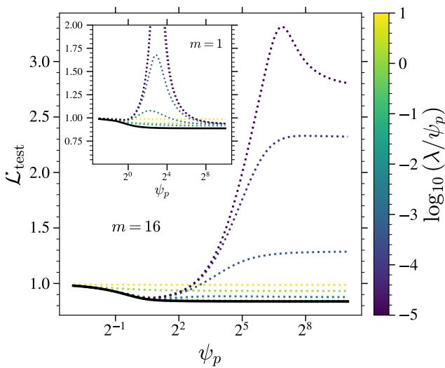

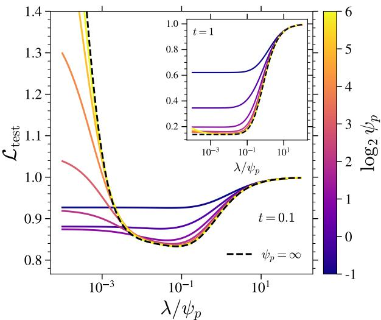  
Figure 14: Benefits of regularization on generalization. $( L e f t )$ Test loss $\mathcal { L } _ { \mathrm { t e s t } }$ of the RFNN as a function of $\psi _ { p } = p / d$ for several values of $\lambda _ { p } = \psi _ { p } \tilde { \lambda }$ with $\psi _ { n } = n / d = 8$ , σ = tanh, $t = 0 . 1$ 1 and $m = 1 6 ;$ inset: same at $m = 1$ . The full black line is the lower envelope. (Right) Test loss as a function of $\lambda / \psi _ { p }$ for several values of $\psi _ { p }$ at m = 16, $t = 0 . 1 ,$ together with the $\psi _ { p } = \infty$ limit (black dashed); inset: same at $t = 1 . 0$

Conclusion. All results of the main text of the three losses extend to zero-mean sub-Gaussian data with covariance Σ and $\mathrm { T r } ( \Sigma ) / d \to \sigma _ { x } ^ { 2 } = O ( 1 )$ , with $\mu _ { 1 } , \mu _ { * }$ , κ redefined via $\Gamma _ { t } = e ^ { - 2 t } \sigma _ { x } ^ { 2 } + \Delta _ { t }$ , and $\rho \mathbf { { \pmb { \Sigma } } }$ replacing $\delta ( \lambda - 1 )$ in the resolvent integrals.

## C.13 Additional Results and Figures

In this section we present additional results and figures on the analytical part.

## C.13.1 Extended discussion on the effect of regularization.

In the RFNN model, the optimal training strategy depends critically on the diffusion time t. At large t, we recover the benign overfitting of the classical regression setting [43] (inset of the right panel of Fig. 14): for every fixed $\psi _ { p } ,$ the test loss is a strictly increasing function of $\lambda ,$ so zero regularization is always optimal. The global minimum over $( \psi _ { p } , \lambda )$ is attained at $\psi _ { p }  \infty$ and $\lambda = 0 \colon$ overparameterization is unconditionally beneficial, and any regularization strictly hurts. On the other hand, at small t, malign overfitting fundamentally alters this picture. Without regularization $( \lambda \to 0 ^ { + } )$ , the optimal model size remains $\psi _ { p }  \infty$ for $m = 1$ (inset of the left panel of Fig. 14), but shifts to the underparameterized regime $( \psi _ { p } ^ { * } < \psi _ { n } )$ for m $> 1$ (left panel of Fig. 14): overparameterizing an unregularized model is detrimental. However, jointly optimizing over $( \psi _ { p } , \lambda )$ restores the benefit of large models: the global optimum is always $\psi _ { p }  \infty$ with $\lambda / \psi _ { p } = { \cal O } ( 1 )$ (right panel of Fig. 14), so a large well-regularized model always outperforms a small unregularized one.

## C.13.2 Additional results on the bias and variance decomposition

In Fig. 15 we show the bias and the variance as functions of the model size $\psi _ { p } ,$ comparing the analytical curves to numerical experiments at finite $d ,$ for $m = 1 \left( l e f t \right)$ and $m = 4$ (middle). At $m = 1$ the bias decreases monotonically with $\psi _ { p } ,$ whereas at $m = 4 \mathrm { i }$ t passes through a minimum and increases again, before saturating at a finite value. In Fig. $1 5 \ ( r i g h t )$ we plot the $\psi _ { p }  \infty$ limit of both quantities as a function of $\psi _ { n } \colon$ the bias saturates at a value that remains $O _ { \psi _ { n } } ( 1 )$ for m $> 1$ , while it decays as a power law in $\psi _ { n }$ for $m = 1 \}$ ; the variance decays as a power law in $\psi _ { n }$ for both $m = 1$ and $m > 1$

## C.13.3 Additional Figures

In this section, we present some additional figures on the RFNN model. The activation function taken for the figures is always $\sigma = \operatorname { t a n h }$

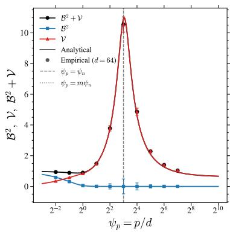

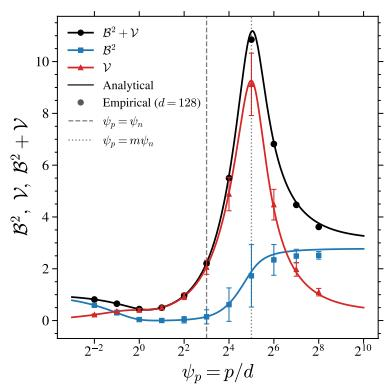

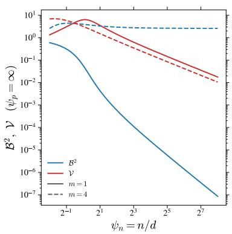  
Figure 15: $( L e f t )$ Bias and variance for the RFNN model as a function of $\psi _ { p } = p / d$ for $\psi _ { n } = 8 ,$ t = 0.1, m = 1, λ = $1 0 ^ { - 3 }$ and finite dimension $d = 6 4 .$ . Solid curves are the analytical predictions; markers are numerical estimates averaged over 20 independent runs. Error bars correspond to ±3SE. (Middle) Bias and variance for the RFNN model as a function of $\psi _ { p } = p / d$ for $\psi _ { n } = 8 ,$ $t = 0 . 1$ , m = 4, $\lambda = 1 0 ^ { - 3 }$ and finite dimension $d = 1 2 8$ . Solid curves are the analytical predictions obtained from Theorem 2.1 through the bias–variance expressions of Appendix C.9; markers are numerical estimates from 10 independent runs. Error bars correspond to ±3SE. (Right) Bias (full line) and variance (dotted line) as a function of the sample complexity $\psi _ { n }$ for $m = 1$ and $m = 4$ obtained by solving the analytical equations at $\psi _ { p } = \infty$ for $t = 0 . 1$

Colormaps of the losses. Fig.16 shows colormaps of the three losses in the $( \psi _ { n } , \psi _ { p } )$ space. We observe that the line $\psi _ { p } = m \psi _ { n }$ delimits a region with low $\mathscr { L } _ { \mathrm { t e s t } } ^ { \mathrm { e m p } }$ and $\mathcal { L } _ { \mathrm { t r a i n } } ^ { n , m }$ but large $\mathcal { L } _ { \mathrm { t e s t } }$ . We also observe that the test loss presents two peaks: one at $\psi _ { p } = m \psi _ { n }$ as discussed in the main text as well as another peak at $m \psi _ { n } = 1$ which is related to the two peaks found in d’Ascoli et al. [16] that were located at $\psi _ { n } = 1$ for supervised learning.

Scaling of the generalization and noise gaps. Fig.17 plots the generalization gap ${ \mathcal { L } } _ { \mathrm { t e s t } } - { \mathcal { L } } _ { \mathrm { t r a i n } } ^ { n , m }$ and the noise gap $\mathcal { L } _ { \mathrm { t e s t } } ^ { \mathrm { e m p } ^ { \vee } } - \mathcal { L } _ { \mathrm { t r a i n } } ^ { n , m }$ as a function of $\psi _ { p }$ and shows that they are actually functions of $\psi _ { p } / \psi _ { r }$ for a fixed m.

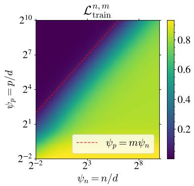

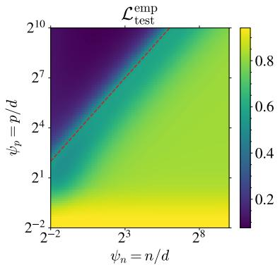

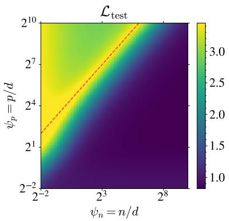  
Figure 16: Colormap of the analytical solutions of the three losses for m = 16, t = 0.1 as a function of $\psi _ { n }$ and $\psi _ { p }$

## D LLM Usage

We describe here the role played by large language models (LLMs) in the preparation of this work.

Code. LLMs were used to write and debug parts of the code, both for the numerical experiments and for the scripts producing the figures of this paper.

Writing and presentation. LLMs were used for copy-editing throughout: correcting grammar, finding typographical errors, and uniformizing notation, style and cross-referencing across sections.

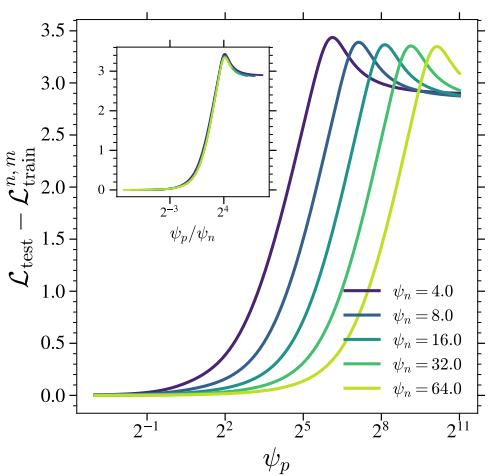

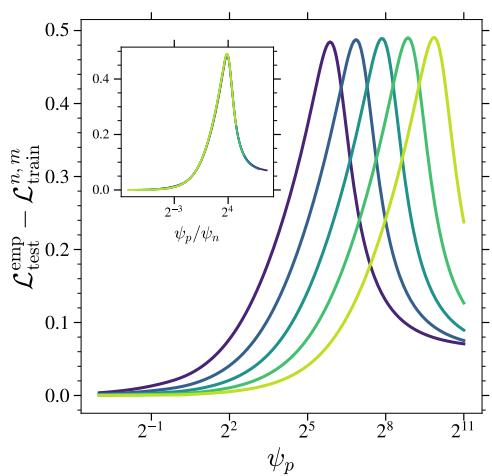  
Figure 17: Evolution of the (Left) generalization and (Right) noise gaps as a function of $\psi _ { p }$ for the RFNN model at t = 0.1, $\lambda = { 1 0 } ^ { - 3 }$ $\sigma =$ tanh and $m = 1 6$ . We observe that both gaps scale as $\psi _ { p } / \psi _ { n }$

Checking the derivations. We used LLMs to re-check the algebra of our analytical results and to audit the manuscript for internal inconsistencies. In particular, an LLM located a typo in an intermediate step of our computation of the trace $T _ { 1 } ( z , \zeta , 0 )$ (Appendix C.8), which had been blocking our progress on the remainder of the derivation.

Responsibility. Every LLM-assisted derivation was checked independently and thoroughly by the authors, and every suggested edit was reviewed before inclusion. The authors take full responsibility for the content, the originality and the scientific integrity of this work, including any remaining errors.