# EFFICIENT COST-AWARE LLM EVALUATION VIABAYESIAN BANDIT GITTINS INDICES

Qian Xie1,2† Yueli He3 Nairen Cao3,4†

1Cornell University 2Columbia University 3New York University 4Shanghai University of Finance and Economics

## ABSTRACT

Exhaustively evaluating every candidate LLM configuration on every benchmark item to identify a high-performing one is costly. We formulate configuration selection as a cost-aware Bayesian bandit problem and propose GittinsEval, which draws on the Bayesian-optimal Gittins policy to determine which configuration to evaluate next and when to stop. We extend the policy with an anytime recommendation rule over both fully and partially evaluated configurations, using an LCB-style score to account for posterior uncertainty. GittinsEval is computationally efficient, requiring only lightweight online updates after offline precomputation. Across GSM8K, PIQA, AlpacaEval, and MMLU response matrices, GittinsEval is consistently competitive, with particularly strong gains over configuration-level Bayesian optimization on large-example benchmarks and over cost-unaware bandit baselines on large-candidate tasks. Crucially, GittinsEval often attains near-zero simple regret using only 1%–2% of the exhaustive-evaluation cost; it also offers an adaptive stopping rule that typically triggers at 1%–10%.

Code: github.com/QianJaneXie/BanditGittinsEval

## 1 INTRODUCTION

Modern LLM evaluation requires selecting among a combinatorial space of configurations—such as models, prompts, temperatures, and decoding strategies—across benchmarks like GSM8K, PIQA, and MMLU (Cobbe et al., 2021; Bisk et al., 2020; Hendrycks et al., 2020). Exhaustive evaluation—testing every configuration on every benchmark item—incurs substantial cost and is often unnecessary: adaptive evaluation can allocate fewer queries to weak candidates and concentrate evaluation on promising or uncertain ones. This motivates a fundamental sequential decision problem: which configuration should be evaluated next, and how can uncertainty be incorporated to make reliable recommendations? A practical method can further provide a principled stopping rule.

Bandit and racing algorithms provide a natural framework for adaptive evaluation (Zhou et al., 2025; Polo et al., 2024; Shi et al., 2024; Lyu et al., 2026). Some methods further share information across configurations or examples through low-rank response models, item-response models, prompt embeddings, or response-vector similarities. A complementary paradigm is configuration-level Bayesian optimization (Snoek et al., 2012), which adaptively chooses candidates but typically evaluates each on the entire benchmark. However, existing methods predominantly operate in costunaware or frequentist regimes. In practice, different LLMs can have substantially different inference costs, while Bayesian methods can exploit even limited prior knowledge, such as the range of possible scores or a rough sense of benchmark difficulty. This motivates a cost-aware Bayesian approach that jointly accounts for estimated performance, uncertainty in those estimates, and evaluation cost.

We introduce GITTINSEVAL, a cost-aware LLM evaluation framework that models configuration selection as a Bayesian bandit (Gittins et al., 2011). Each configuration is an arm whose evaluations reveal noisy benchmark scores at configuration-dependent costs. Here, Bayesian bandit describes the familiar arm-based sampling model, not a cumulative-reward objective: benchmark scores are measurements, and the payoff is the quality of the final recommendation. Our goal is therefore to identify a high-performing configuration at low evaluation cost. Rather than posing evaluation as exact best-arm identification, we assess recommendation quality through simple regret or net utility, so a near-optimal configuration can be sufficient when distinguishing the exact best would require disproportionate evaluation cost. Under a terminal-recommendation objective, this formulation is an instance of Markov chain selection (Dumitriu et al., 2003; Scully & Terenin, 2025). GITTINSEVAL uses the corresponding Gittins indices to account for estimated performance, uncertainty, and evalua tion cost. For this problem, the classical Gittins policy evaluates the arm with the largest index and stops once a completed arm attains the largest index.

Making GITTINSEVAL practical for LLM benchmarks hinges on two key components. First, it is computationally efficient, requiring only lightweight updates during evaluation after offline precomputation. Second, the classical Gittins policy above restricts terminal recommendations to fully evaluated arms, whereas practical LLM evaluation need not require full evaluation before recommending a configuration. We therefore add an LCB-style anytime recommendation rule that accounts for posterior uncertainty when selecting among fully and partially evaluated configurations.

Across extensive experiments on GSM8K, PIQA, AlpacaEval, and MMLU, GITTINSEVAL is consistently competitive, with particularly strong advantages in two regimes. On large-example benchmarks, it vastly outperforms configuration-level Bayesian optimization, which evaluates each selected configuration on the entire benchmark rather than allocating partial batches across candidates. On large-candidate MMLU tasks (1,500 arms per subject), it decisively outperforms cost-unaware frequentist baselines, which do not use evaluation costs or Bayesian priors in their allocation rules. Across these settings, GITTINSEVAL reaches near-zero simple regret using only a small fraction of the exhaustive-evaluation cost.

Our core contributions are:

• We formulate LLM configuration selection as a cost-aware Bayesian bandit problem that incorporates heterogeneous evaluation costs and prior information, and establish its connection to classical Markov chain selection, providing the theoretical basis for GITTINSEVAL.

• We adapt the Gittins framework to practical LLM evaluation through modeling and algorithmic design choices that enable efficient offline index precomputation and lightweight online decision-making, and extend it with an LCB-style anytime recommendation rule over both fully and partially evaluated configurations.

• We show empirically that GITTINSEVAL is consistently competitive across diverse LLM evaluation settings, with particular advantages in large-example and large-candidate regimes, often achieving near-zero simple regret at a small fraction of the exhaustive-evaluation cost.

## 1.1 RELATED WORK

Efficient LLM evaluation. Recent work has studied how to reduce the cost of evaluating many LLM configurations by adaptively allocating benchmark queries. BanditEval uses UCB-E for bestarm identification and introduces UCB-E-LRF (hereafter LRF), which exploits low-rank structure in the response matrix (Zhou et al., 2025). TRIPLE combines successive halving with a predictive model of final arm performance (Shi et al., 2024), while SySRs exploits similarities among model response vectors within a successive-rejection framework (Lyu et al., 2026). PromptEval uses configuration covariates to improve multi-prompt evaluation and best-arm identification (Polo et al., 2024). These methods primarily target efficient identification under a fixed evaluation budget. Concurrent work has also explored complementary forms of cost-aware LLM evaluation, including best-model identification with low-rank response-matrix structure (Tolochinsky et al., 2026), selective human auditing of LLM judges (Ao et al., 2026), and budget-aware multi-agent judging through debate and deliberation (Harrasse et al., 2026). Our setting additionally allows heterogeneous evaluation costs and Bayesian prior information, and we evaluate recommendation quality throughout the allocation process using simple regret.

Bayesian optimization. Configuration-level Bayesian optimization places a surrogate prior, typically a Gaussian process, over performance as a function of the configuration and can account for heterogeneous query costs (Snoek et al., 2012). Our approach instead places Bayesian beliefs on each configuration’s benchmark mean and updates them through repeated example-level outcomes;

its uncertainty is therefore within configurations rather than primarily across them. Multi-fidelity Bayesian optimization is also related through its use of cheaper approximations (Klein et al., 2017; Kandasamy et al., 2017; Wu et al., 2020).

Gittins indices and terminology. Gittins indices are most familiar from the classical Bayesian multi-armed bandit, which maximizes expected discounted cumulative reward over an infinite sequence of arm pulls (Gittins, 1979; Gittins et al., 2011). Following Scully & Terenin (2025), we use Markov chain selection for the broader structure that unifies Gittins-index applications: at each step, the decision maker chooses one of several independent Markov chains to advance. This name separates the indexable structure from the particular reward objective. Our method uses a terminal-selection objective—benchmark observations are costly measurements, and reward comes from the final recommended configuration—and is closely related to terminal-state problems such as the golf problem of Dumitriu et al. (2003). Pandora’s-box problems provide a related inspect-once setting that has been used for cost-aware Bayesian optimization and stopping (Xie et al., 2024; 2025). We retain Bayesian bandit as a familiar description of our Bayesian arm-sampling model, while using Markov chain selection when referring to the decision framework that establishes the Gittins policy.

## 2 COST-AWARE LLM CONFIGURATION RECOMMENDATION

## 2.1 PROBLEM SETUP

We consider K candidate LLM configurations evaluated across a benchmark of N examples. Evaluating configuration $k \in [ K ]$ ] on example $j \in [ N ]$ ] yields a scalar score $Z _ { k , j } \in \mathbb { R } \left( [ 0 , 1 ] \right.$ in this work), modeled as an observation with latent mean $\theta _ { k }$ . The latent mean $\theta _ { k }$ represents configuration $k ' \mathrm { s }$ expected performance on the underlying example distribution and is our primary evaluation target.

An adaptive evaluation policy sequentially queries configurations in batches (with a single example as the special case $B = 1 )$ and terminates by returning a recommendation $\hat { k } _ { T }$ . Let $A _ { t }$ and $b _ { t }$ denote the configuration and batch size at allocation step $t . \mathrm { I f } \ \widetilde c _ { k }$ is the raw per-example cost of configuration $k ,$ the effective cost of this batch is $c _ { k , b _ { t } } : = \lambda b _ { t } \widetilde { c } _ { k } > 0$ . For batch size B, we abbreviate $c _ { k } : = c _ { k , B }$ Our goal is to identify a high-performing configuration while minimizing cumulative evaluation cost.

When each configuration has a finite evaluation horizon, we call a configuration completed once all allowed benchmark observations have been collected. In practical LLM evaluation, however, completion is optional: an unfinished configuration remains eligible for recommendation based on the observations collected so far. We therefore allow an anytime recommendation after any allocation step, whether or not the recommended configuration is completed.

## 2.2 PROBLEM FORMULATIONS

We consider two complementary cost-aware formulations. The first targets anytime recommendation: under any externally specified evaluation budget $C ,$ the policy returns a recommendation $\hat { k } _ { T _ { C } } ,$ , which may be an unfinished configuration. Let $T _ { C }$ denote the last allocation step satisfying $\begin{array} { r } { \sum _ { t = 1 } ^ { T _ { C } } c _ { A _ { t } , b _ { t } } \le } \end{array}$ C. The policy’s budget-indexed simple regret is

$$
R _ { \pi } ( C ) : = \mathbb { E } _ { \pi } \left[ \operatorname* { m a x } _ { k \in [ K ] } \theta _ { k } - \theta _ { \hat { k } _ { T _ { C } } } \right] .
$$

We seek an anytime policy with low $R _ { \pi } ( C )$ across evaluation budgets.

The second targets adaptive stopping: rather than fixing $C$ in advance, the evaluator chooses when to stop by trading off recommendation quality against the cost of further evaluation. We formulate this objective under required completion. Let $\bar { \Pi } ^ { \mathrm { r e q } }$ denote policies that evaluate only unfinished configurations and recommend only completed ones. Its expected net-utility objective is

$$
\operatorname* { s u p } _ { \pi \in \Pi ^ { \mathrm { r e q } } } \mathbb { E } _ { \pi } \left[ \theta _ { \hat { k } _ { T } } - \sum _ { t = 1 } ^ { T } c _ { A _ { t } , b _ { t } } \right] .\tag{1}
$$

The Gittins allocation and stopping policy underlying GITTINSEVAL is derived from this adaptivestopping formulation. For evaluation on a fixed finite benchmark, Section 3.4 specializes the

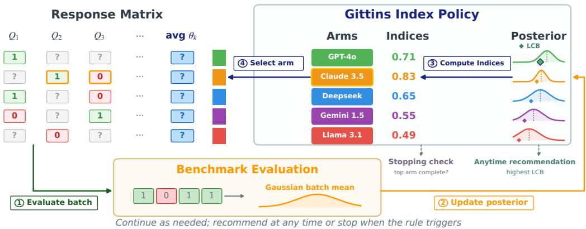  
Figure 1: Overview of GITTINSEVAL. Each iteration evaluates a fresh batch from the selected response-matrix row, uses a Gaussian approximation to its mean to update the posterior, recomputes the empirical-target Gittins indices, and selects the highest-index unfinished configuration for the next batch. The updated posterior yields an anytime recommendation based on the posterior mean minus one posterior standard deviation. The policy can return its current recommendation at any time or, under adaptive stopping, terminate once the highest-index configuration is fully evaluated. Highlighted cells mark the new batch; model names and values are illustrative.

same Gittins construction to an observable empirical target and augments it with an LCB-style recommendation over all configurations to provide the anytime output in the first formulation. Thus, our method supports both anytime recommendation and adaptive stopping.

In our experiments, $\widetilde { c } _ { k }$ is derived from published API prices and is constant across examples for a given arm. The factor $\lambda > 0$ scales measurement cost to the utility of benchmark performance; a smaller final batch is automatically charged according to its actual size $b _ { t }$

## 3 GITTINS INDEX POLICY FOR COST-AWARE BAYESIAN EVALUATION

We develop GITTINSEVAL by starting from the Gittins policy for Markov chain selection. Throughout this section, t denotes the global allocation step, while n denotes the local number of batch pull of a particular arm. We first analyze the adaptive-stopping formulation under required completion in a latent-mean Gaussian model. Each arm’s posterior mean evolves as a Gaussian random walk with a deterministic variance schedule. The corresponding Gittins policy yields cost-aware allocation indices and a stopping rule. We then show how to precompute the indices efficiently, adapt the construction to full-benchmark empirical means, and extend the required-completion policy with an LCB-style anytime recommendation for optional completion. Figure 1 summarizes the overal evaluation loop.

## 3.1 GAUSSIAN BAYESIAN OBSERVATION MODEL

Throughout, one pull means evaluating one batch. After n local pulls of arm $k ,$ let $\mathcal { D } _ { k , n }$ denote the batch means collected from that arm. Suppose the ith pull evaluates a fresh batch $B _ { k , i }$ of B benchmark examples. The scalar observation used for posterior updating is

$$
\overline { { Y } } _ { k , i } : = \frac { 1 } { B } \sum _ { j \in \mathcal { B } _ { k , i } } Z _ { k , j } .
$$

Under the working population model, example scores are conditionally i.i.d. given $\theta _ { k }$ , so the batch mean has conditional mean $\theta _ { k }$ . For binary correctness observations, its conditional variance is $\theta _ { k } \big ( 1 - \theta _ { k } \big ) / B$ . More generally, we use a Gaussian approximation to the batch mean and a fixed observation-noise variance $\tau ^ { 2 } \colon$

$$
\theta _ { k } \sim { \mathcal { N } } ( \mu _ { 0 } , v _ { 0 } ) , \qquad { \overline { { Y } } } _ { k , i } \mid \theta _ { k } \sim { \mathcal { N } } ( \theta _ { k } , \tau ^ { 2 } ) .\tag{2}
$$

Section 3.5 describes our choice of $\tau ^ { 2 }$ for binary and continuous benchmark scores.

To state the posterior update compactly, fix a representative arm and suppress the arm index. After n local pulls,

$$
\theta \mid { \mathcal { D } } _ { n } \sim { \mathcal { N } } ( \mu _ { n } , v _ { n } ) .
$$

After observing $\overline { { Y } } _ { n + 1 }$ , conjugacy gives

$$
\begin{array} { l } { { \displaystyle v _ { n + 1 } = \left( v _ { n } ^ { - 1 } + \tau ^ { - 2 } \right) ^ { - 1 } , } } \\ { { \displaystyle \mu _ { n + 1 } = \mu _ { n } + \frac { v _ { n } } { v _ { n } + \tau ^ { 2 } } \left( \overline { { { \cal Y } } } _ { n + 1 } - \mu _ { n } \right) . } } \end{array}\tag{3}
$$

Under fixed $\tau ^ { 2 }$ , the variance schedule is deterministic. In particular,

$$
v _ { n } - v _ { n + 1 } = { \frac { v _ { n } ^ { 2 } } { v _ { n } + \tau ^ { 2 } } } .
$$

Thus, arms with the same initial variance $v _ { 0 }$ and observation noise $\tau ^ { 2 }$ share the same posterior variance schedule. The framework can also be extended to accommodate arm-specific prior variances or noise levels. Appendix A.1 provides the full derivation of the posterior update and the induced Gaussian random-walk transition.

## 3.2 POSTERIOR DYNAMICS AND THE GITTINS POLICY

The posterior update also characterizes the future evolution of an arm’s posterior mean. Let $S _ { n }$ denote the posterior mean of a representative arm after n local pulls, viewed as a random variable over future observations. Conditional on the current realized state $S _ { n } = s ,$ , Eq. (3) implies

$$
S _ { n + 1 } \mid S _ { n } = s \sim \mathcal { N } \left( s , \frac { v _ { n } ^ { 2 } } { v _ { n } + \tau ^ { 2 } } \right) .\tag{4}
$$

Hence the posterior mean follows a Gaussian random walk with a transition variance determined by the local pull count.

The horizon is measured in batch pulls. Fix a finite per-arm horizon H, so that an arm is completed after H batches; for a benchmark with $N$ examples and batch size B, $H : = \lceil N / B \rceil$ . Its state is therefore $( S _ { n } , n )$ . Selecting an arm changes only that arm’s state and incurs its batch cost. A smaller final batch, when needed, has a known stage-specific noise variance and cost and is handled by the same construction.

The Gittins construction reduces the multi-arm allocation problem to a single-arm stopping problem. Intuitively, it asks: how attractive must the best alternative be before we prefer to stop evaluating the current arm?

Fix one arm with state $S _ { n } = s ,$ pull cost $c ,$ and remaining horizon $H - n$ , alongside an outside terminal reward α available from competing arms. For $n < H$ , the local decision balances the continuation cost c and future information gain against terminating with outside value α. Consequently, the terminal value is $V _ { H } ( s ; \alpha ) : = \bar { \operatorname* { m a x } } \{ \bar { s , } \alpha \}$ , and for $n < H$ the value function satisfies the Bellman recursion:

$$
V _ { n } ( s ; \alpha ) : = \operatorname* { m a x } \left\{ \alpha , \ - c + \mathbb { E } [ V _ { n + 1 } ( S _ { n + 1 } ; \alpha ) \ | \ S _ { n } = s ] \right\} .\tag{5}
$$

For n $< H$ , the cost-aware Gittins index $G _ { n } ^ { c } ( s )$ is the smallest outside value for which stopping is optimal:

$$
G _ { n } ^ { c } ( s ) : = \operatorname* { i n f } \left\{ \alpha \in \mathbb { R } : \alpha \geq - c + \mathbb { E } [ V _ { n + 1 } ( S _ { n + 1 } ; \alpha ) \mid S _ { n } = s ] \right\} .\tag{6}
$$

The index is larger when the arm currently looks promising, when uncertainty creates greater value of information, or when evaluation is cheaper.

At global allocation step t, let $n _ { k } ( t )$ denote the number of pulls previously made from arm k. For an unfinished arm,

$$
G _ { k , t } : = G _ { n _ { k } ( t ) } ^ { c _ { k } } \left( \mu _ { k , n _ { k } ( t ) } \right) .\tag{7}
$$

For a completed arm,

$$
G _ { k , t } : = \mu _ { k , H } .
$$

In the required-completion adaptive-stopping formulation, the policy evaluates an unfinished arm with the largest index. If an arm attaining the largest index is already completed, the policy stops and recommends a completed arm with the largest terminal index. GittinsEval uses this allocation and stopping policy while retaining optional-completion anytime recommendations.

Since the arms evolve as independent Markov chains, the classical Markov-chain selection theorem implies that this batch-level Gittins policy is optimal for the latent-mean required-completion objective (Dumitriu et al., 2003; Scully & Terenin, 2025). Appendix A.2 states the objective and policy class formally and gives the reduction.

## 3.3 EFFICIENT GITTINS INDEX COMPUTATION

A direct dynamic-programming computation of the Gittins index involves a continuous posteriormean state at every local stage. In our Gaussian setting, however, translation invariance implies that the stopping problem depends on the posterior mean and the outside option only through their difference. This reduces the computation to a one-dimensional dynamic program and, ultimately, to one stage-dependent stopping root that can be precomputed offline.

The Gaussian transition in Eq. (4) is translation invariant, and its variance schedule is deterministic. Consequently, for fixed $( c , v _ { 0 } , \tau ^ { 2 } , H )$ ), the exact single-arm index has the form

$$
G _ { n } ^ { c } ( s ) = s - r _ { n } ( c , v _ { 0 } , \tau ^ { 2 } , H ) ,\tag{8}
$$

where $r _ { n }$ is a stage-dependent stopping root that does not depend on the current posterior mean s.

We compute these roots offline using a discretized dynamic program. Let

$$
\left\{ \widehat { r } _ { n } ( c , v _ { 0 } , \tau ^ { 2 } , H ) \right\} _ { n = 0 } ^ { H - 1 }
$$

denote the resulting numerical approximation to the root schedule. Arms with the same pull cost, prior variance, observation noise, and horizon share the same table.

The numerical counterpart of the exact single-arm index is obtained by a single lookup:

$$
{ \widehat { G } } _ { n } ^ { c } ( s ) : = s - { \widehat { r } } _ { n } ( c , v _ { 0 } , \tau ^ { 2 } , H ) .\tag{9}
$$

The following proposition summarizes the computational guarantee of the FFT construction adapted from Xie (2026, Sections 5.3.2–5.3.3 and Appendix D.2).

Proposition 3.1 (FFT precomputation complexity). On a uniform grid of P points, FFT-accelerated Bellman updates compute the H-stage numerical root schedule in $\mathcal { O } ( H \bar { P } \log P )$ time and $\mathcal { O } ( P )$ working memory, plus O(H) root storage. Once stored, each index lookup takes O(1) time, and selecting among K arms takes $\mathcal O ( K )$ time.

The FFT computation replaces the $\mathcal { O } ( H P ^ { 2 } )$ cost of explicit summation over the discretized state space. Thus the dynamic program is solved offline; online allocation requires only posterior updates, root lookups, and index comparisons. Appendices A.3 and A.4 give the root characterization and FFT construction.

## 3.4 EMPIRICAL-MEAN ALLOCATION, STOPPING, AND ANYTIME RECOMMENDATION

For a fixed finite benchmark, the latent population mean $\theta _ { k }$ remains unobserved even when the response matrix is complete. Our offline response-matrix experiments therefore use each configuration’s full-row empirical mean as an observable finite-benchmark proxy and specialize the allocation, stopping, and recommendation rules to this target. We retain the batch as the decision unit: under the Gaussian surrogate, the posterior mean of each empirical target again follows a Gaussian random walk at batch boundaries (with the arm-wise processes forming independent Markov chains).

Full-benchmark empirical target. Define the full-benchmark empirical target of arm k as

$$
\bar { Z } _ { k } : = \frac { 1 } { N } \sum _ { j = 1 } ^ { N } Z _ { k , j } .\tag{10}
$$

It remains unknown until row k is exhaustively observed. Let $M _ { k , i }$ t and $V _ { k , t }$ denote the posterior mean and variance, respectively, of $\bar { Z } _ { k }$ given the batches observed by global time t. Appendix B derives this posterior process.

Under the Gaussian surrogate, $( M _ { k , t } , n _ { k } ( t ) )$ is a Markov state with a deterministic transition variance schedule; at completion, $M _ { k , t } = \bar { Z } _ { k }$ . Thus the same Markov-chain selection result applies.

For this finite-benchmark specialization, the required-completion objective is

$$
\operatorname* { s u p } _ { \pi \in \Pi ^ { \mathrm { r e q } } } \mathbb { E } _ { \pi } \Bigg [ \bar { Z } _ { \hat { k } _ { T } } - \sum _ { t = 1 } ^ { T } c _ { A _ { t } , b _ { t } } \Bigg ] .\tag{11}
$$

Proposition 3.2 (Exact batch-level Gittins optimality). Under the Gaussian surrogate, suppose the arms are independent, example scores are conditionally i.i.d. within each arm, and the batch sizes, transition variances, and positive batch costs are predeterminedfunctions ofthe arm’s local stage. Assign $G _ { k , t } : = M _ { k , t } - r _ { k , n _ { k } ( t ) }$ to an unfinished arm and $G _ { k , t } : = \bar { Z } _ { k }$ to a completed arm. If a completed arm attains max $G _ { k , t } ,$ stop and recommend a completed arm with largest terminal index; otherwise, evaluate an unfinished arm with largest index. This exact empirical-target Gittins policy attains the supremum in Eq. (11) among required-completion policies that act at batch boundaries.

This is a Bayesian optimality statement under the Gaussian surrogate; it’s not a distribution-free finite-sample identification guarantee for the realized response matrix. Appendices A.2 and B give the Markov-chain reduction and empirical-target transition calculation, respectively.

Applying the same construction to the empirical-target chains, our implementation precomputes gridded stopping roots $\widehat { r } _ { k , n }$ and, for an unfinished arm, uses

$$
\widehat { G } _ { k , t } : = M _ { k , t } - \widehat { r } _ { k , n _ { k } ( t ) } .\tag{12}
$$

The index of a completed arm is $\bar { Z } _ { k }$ . The hat marks the numerical root approximation. Thus Proposition 3.2 applies to the corresponding exact batch-level roots, not to their gridded approximation, continuation past the stopping time, or the anytime recommendation below.

The numerical GITTINSEVAL stopping time is the first post-batch time at which a completed arm attains the largest value of $\widehat { G } _ { k , t }$ . The recommendation at stopping is a completed arm with largest terminal index. In fixed-budget experiments, we record this stopping time but continue evaluation to the prescribed budget so that the anytime regret trajectories remain comparable across methods.

Anytime recommendation. To accommodate arbitrary evaluation budgets where no candidate has completed its full benchmark horizon, we evaluate an anytime recommendation rule. Although online sampling is guided by the numerical empirical-target index in Eq. (12), naive posteriormean maximization can induce erratic early switching due to sparsely observed configurations with optimistic estimates. We therefore decouple online allocation from anytime reporting. We recommend the candidate that maximizes an uncertainty-penalized LCB-style score:

$$
\hat { k } _ { t } \in \underset { k = 1 , \ldots , K } { \arg \operatorname* { m a x } } \left\{ M _ { k , t } - \sqrt { V _ { k , t } } \right\} .\tag{13}
$$

The uncertainty penalty vanishes as an arm becomes fully observed. Crucially, this penalty discounts poorly evaluated arms purely for reporting, without altering the numerical Gittins indices, the sampling trajectory, or the stopping time. When fixed-budget experiments continue past the stopping time, simple regret is measured against the anytime recommended arm’s true full-row mean $\bar { Z } _ { \hat { k } _ { t } }$ rather than its penalized score.

Full expressions for the posterior mean and variance of the full-benchmark empirical target, the batch-level transition schedule, and pseudocode appear in Appendix B and Algorithm 1.

## 3.5 DESIGN CHOICES FOR LLM BENCHMARKS

Prior specification. For accuracy-style benchmarks, performance lies naturally on the [0, 1] scale. Our general prior is $\mathcal { N } ( 0 . 5 , 0 . 0 4 )$ , whose mean expresses no preference between low and high accuracy and whose standard deviation is 0.2. To study the value of coarse task-level prior calibration, our retrospective response-matrix experiments also use an informative common prior selected from four pre-specified difficulty buckets. Each benchmark, or MMLU subject, is assigned to a bucket based on its aggregate empirical difficulty, and all arms in that problem instance share the corresponding prior. The bucket therefore provides no arm-specific information; in a prospective application, it could instead be selected using domain knowledge, evaluations of related tasks, or a separate pilot sample. Table 5 gives the prior values and experimental assignments.

Observation noise. Under the working Bernoulli population model, a batch of B binary correctness observations has conditional mean variance $\theta _ { k } ( 1 - \theta _ { k } ) / B$ . Batching can also reduce wall-clock latency when examples are evaluated in parallel or request overhead is amortized, at the cost of less frequent adaptation (Zhou et al., 2025). Since $\theta _ { k }$ is unknown, we use the conservative fixed approximation $\tau ^ { 2 } : \stackrel { - } { = } 1 / ( 4 B )$ , corresponding to the worst-case Bernoulli variance. This approximation may overestimate the noise for very easy or very hard tasks, but fixing $\tau ^ { 2 }$ makes the posterior variance schedule deterministic and allows the Gittins root schedule to be precomputed. More generally, any random variable supported on [0, 1] has variance at most $1 / 4$ . We therefore use the same conservative bound for the continuous pairwise preference scores in AlpacaEval: the per-comparison working variance is $\tau _ { \mathrm { c e l l } } ^ { 2 } : = 1 / 4$ , and, treating comparisons within a batch as conditionally independent in the working model, the batch-mean variance is $\tau ^ { 2 } : = \tau _ { \mathrm { c e l l } } ^ { 2 } / B = 1 / ( 4 B )$ . This is a fixed working approximation rather than an estimate of the empirical AlpacaEval score variance.

Cost scaling. As in Section $2 , \widetilde { c } _ { k }$ is a raw per-example API-price proxy and a full batch has effective cost $c _ { k } : = c _ { k , B } = \lambda B \widetilde { c } _ { k }$ . We do not use example-specific token counts or latency in this monetarycost proxy. Smaller λ makes additional evaluation relatively cheap and therefore encourages more exploration, whereas larger λ makes evaluation more expensive and leads to earlier stopping. We study several cost-scaling factors in addition to the raw inference-cost ratios.

## 4 EXPERIMENTS

Benchmarks. We evaluate adaptive allocation policies using completed LLM response matrices built on four standard benchmarks: GSM8K for grade-school mathematical reasoning (Cobbe et al., 2021), PIQA for physical commonsense reasoning (Bisk et al., 2020), AlpacaEval for instructionfollowing quality (Li et al., 2023), and MMLU for multitask knowledge and reasoning (Hendrycks et al., 2020). The benchmark examples define the evaluation tasks, while the observed scores come from existing response-matrix datasets. GSM8K, PIQA, and AlpacaEval use response matrices released with BanditEval (Zhou et al., 2025). GSM8K contains 122 model–sampling-configuration arms and 1000 examples, while PIQA contains 103 arms and 1000 examples. The AlpacaEval matrix is derived from AlpacaEval 2.0 leaderboard comparisons and contains 152 leaderboard-model arms and 805 instructions; its entries are continuous scores in [0, 1] rather than binary correctness values.

MMLU uses response matrices from DOVE (Habba et al., 2025) across 57 subject datasets. For each subject, we evaluate 15 models with 100 prompting templates; each arm is a model-template pair, giving 1500 arms per subject. For MMLU, we group subjects into easy, medium, and hard categories according to their empirical mean arm quality. Appendix C provides full dataset details and descriptive analyses.

Baselines. We compare the two GITTINSEVAL variants with UCB-E (Audibert & Bubeck, 2010), BanditEval’s low-rank-factorization variant LRF (Zhou et al., 2025), SySRs (Lyu et al., 2026), PromptEval-BAI (Polo et al., 2024), and the configuration-level Bayesian optimization baselines PBGI, LogEI, and LogEIPC. We use PromptEval’s one-hot PE-OneHot variant and label it PromptEval-BAI in figures; PBGI and LogEIPC are cost-aware. GITTINSEVAL-G uses the general prior, whereas GITTINSEVAL-S uses a shared benchmark-level prior selected from four pre-specified difficulty buckets. Table 5 lists the prior values and assignments. UCB-E, LRF, SySRs, and PromptEval-BAI do not natively account for heterogeneous evaluation costs or use Bayesian priors and Gittins-index stopping values. Initialization percentages refer to the sampling unit: a 5% arm-level initialization fully evaluates 5% of the arms, whereas LRF uses BanditEval’s entry-level warm-up of $T _ { 0 } = 0 . 0 5 K N$ arm–example entries.

Evaluation metric. The primary metric is simple regret versus evaluation resources. After step t, each policy recommends an arm $\hat { k } _ { t }$ . The GITTINSEVAL variants use the LCB-style rule in Eq. (13), while the baselines retain their native recommendation rules. Since the latent means $\theta _ { k }$ are not observed even in the completed response matrices, we use the full-benchmark empirical targets in Eq. (10) as observable proxies and compute $\mathrm { S R } _ { t } : = \operatorname* { m a x } _ { k } \bar { Z } _ { k } - \bar { Z } _ { \hat { k } _ { t } }$ . Thus, the uncertainty penalty affects the GITTINSEVAL recommendation but not its reported regret. We plot regret against cumulative evaluation cost $\begin{array} { r } { C _ { t } : = \sum _ { s = 1 } ^ { t } b _ { s } \tilde { c } _ { A _ { s } } } \end{array}$ , where $b _ { s }$ is the batch size and $\tilde { c } _ { k }$ is the raw perexample cost; the unit-cost setting is the special case $\tilde { c } _ { k } \equiv 1 . \mathrm { \bf { A } }$ Bayesian optimization query evaluates one configuration on all benchmark examples and incurs its all-example cost.

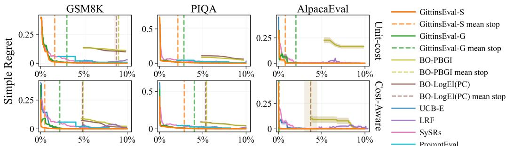  
Percentage of Exhaustive Evaluation Cost  
Figure 2: Simple regret on GSM8K, PIQA, and AlpacaEval under unit-cost (top) and cost-aware (bottom) evaluation. The horizontal axis reports cumulative evaluation cost as a percentage of exhaustive evaluation. Curves average 100 runs for GSM8K and PIQA and 20 runs for AlpacaEval; shaded regions denote ±1 standard error. Bayesian optimization curves begin after the 5% initialization phase, and dashed vertical lines mark mean stopping times. GITTINSEVAL-S reaches near-zero regret earliest in most settings.

Experimental conditions. For each benchmark, we consider both unit-cost and cost-aware settings. Each evaluation has unit cost in the former and incurs a model-specific cost derived from APIprice proxies in the latter, requiring the policy to account for heterogeneous costs when allocating evaluations. Configurations that use the same base model share the same model-level price, computed from published input/output rates using fixed benchmark-level ratios described in Appendix D; we do not model example-specific token usage.

Here, exhaustive evaluation means evaluating every configuration on every benchmark item. All methods receive a nominal budget equal to 10% of exhaustive evaluation, measured in responsematrix entries under unit costs and total entry cost under heterogeneous costs. UCB-E and LRF run to this limit following the BanditEval protocol of Zhou et al. (2025); for the GITTINSEVAL variants, we record the stopping time from Section 3.4 while continuing each trajectory to the same limit. The Bayesian optimization baselines evaluate complete configurations, use random initialization capped at 5% of the configurations, and then select configurations by acquisition until the remaining budget is exhausted, without overshooting the limit in the cost-aware setting.

For the main GSM8K, PIQA, and AlpacaEval plots, UCB-E and GITTINSEVAL use batch size B = 8. For the main MMLU aggregate plots, the small size bucket (at most 150 examples) uses B = 2 and the large size bucket (more than 400 examples) uses B = 8 for UCB-E and GITTINSEVAL. Because LRF’s repeated low-rank updates make smaller batches prohibitively slow, LRF uses B = 32 throughout. The medium-size bucket, full subject-level MMLU results, and batch-size ablations are included in the appendix.

Reporting. Figures 2 and 3 report the main simple-regret curves. PromptEval-BAI is included for GSM8K, PIQA, and MMLU, but not AlpacaEval because its released best-arm-identification implementation assumes binary outcomes rather than continuous pairwise preference scores. Shaded bands denote one standard error. Dashed vertical lines mark average stopping times for GITTINSEVAL and Bayesian optimization; each GITTINSEVAL trajectory continues to the fixed budget after its stopping time. The x-axis reports cumulative evaluation cost as a percentage of exhaustive evaluation, and the y-axis reports raw simple regret. Appendix B describes the LCB-style recommendation rule, while Appendix E provides additional MMLU results, ablations, and prior-bucket diagnostics.

Implementation details. For GITTINSEVAL, we precompute empirical-target root schedules for the prior variance, batch-level noise and cost schedules, and horizon used in each condition. Online allocation then requires only posterior updates, empirical-target moment computation, and root-table lookup, keeping runtime close to UCB-E and well below LRF; Appendix E reports timing compar-GittinsEval-S  —- GittinsEval-S mean stop BO-PBGI - - - - BO-PBGI mean stop UCB-E SySRs GittinsEval-G --—· GittinsEval-G mean stop - BO-LogEI(PC) ---- BO-LogEI(PC) mean stop LRF PromptEval

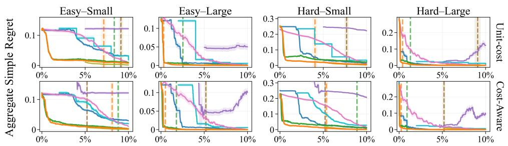  
Percentage of Exhaustive Evaluation Cost

Figure 3: Aggregate raw MMLU simple regret by subject size and difficulty under unit-cost (top) and cost-aware (bottom) evaluation. Columns show the easy–small, easy–large, hard–small, and hard–large buckets. Curves average raw simple regret over 20 runs per subject and are then aggregated within each bucket; shaded regions denote ±1 standard error. Bayesian optimization curves begin after the 5% initialization phase, and dashed vertical lines mark mean stopping times. GITTINSEVAL-S achieves the strongest overall performance across the reported buckets.

isons. After random initialization, the Bayesian optimization baselines fit mixed Gaussian-process models and optimize their acquisition functions in BoTorch (Balandat et al., 2020). Their categorical kernels represent BanditEval configurations with four coordinates and DOVE configurations with two. GSM8K and PIQA results average five response matrices and 20 randomized trials per matrix; AlpacaEval uses 20 trials on its single response matrix. MMLU results aggregate 20 trials per subject within each reported bucket.

Main findings. GITTINSEVAL rapidly reduces simple regret in the low-budget regime under both cost settings. On GSM8K, PIQA, and AlpacaEval, configuration-level Bayesian optimization spends a substantial part of its 10% budget on full-benchmark evaluations during initialization, leaving few acquisition-driven updates. By allocating partial batches across configurations, GITTINSEVAL reaches low regret substantially earlier and also markedly outperforms LRF.

On MMLU, with 1,500 model–template arms per subject, GITTINSEVAL-S consistently reaches low regret earlier than the cost-unaware bandit baselines. LRF has substantially higher simple regret than UCB-E across the MMLU aggregates, consistent with Lyu et al. (2026). Bayesian optimization remains competitive on smaller tasks, where full-configuration evaluations are cheaper, but the GITTINSEVAL variants are stronger across most size–difficulty buckets.

Across benchmarks, the GITTINSEVAL stopping time typically occurs after the regret curves flatten, at 1–10% of exhaustive-evaluation cost and earlier than the Bayesian optimization stopping times or fixed-budget endpoints. Comparing GITTINSEVAL-G and GITTINSEVAL-S also shows that prior calibration matters most on challenging MMLU subjects, while the general prior remains competitive on simpler tasks.

## 5 CONCLUSION

We introduced GITTINSEVAL, which formulates LLM configuration selection as a cost-aware Bayesian bandit problem and adaptively allocates benchmark queries via Gittins indices. By precomputing index schedules offline, the policy reduces online decision-making to lightweight posterior updates and table lookups while naturally accommodating heterogeneous evaluation costs. Empirically, GittinsEval is consistently competitive across benchmarks, with particularly strong gains over configuration-level Bayesian optimization on large-example benchmarks and over cost-unaware bandit baselines across large candidate spaces. Its anytime recommendation often attains near-zero simple regret using only 1%–2% of the exhaustive-evaluation cost; GITTINSEVAL also offers an adaptive stopping rule that typically triggers at 1%–10%.

## AI USE STATEMENT

The authors used generative-AI tools, including LLM-based assistants, to retrieve and discover potentially relevant literature, support research ideation and execution, draft and revise portions of the manuscript, and improve the clarity of the writing. The tools also assisted in proving mathematical claims by working out detailed derivations and proof steps from sketches and arguments provided by the authors. The authors checked the cited sources, mathematical derivations, and AI-assisted text, revised them as needed, and take full responsibility for the paper’s contents.

Separately, LLMs are the objects of evaluation in this work. The experiments use precomputed response matrices released by BanditEval for GSM8K, PIQA, and AlpacaEval, and by DOVE for MMLU. We did not query model APIs to generate new evaluation responses for this study; the provenance and processing of the experimental data are described in Appendix C.

## REPRODUCIBILITY STATEMENT

The main text specifies the probabilistic model, allocation rule, numerical index computation, stopping rule, evaluation metrics, and experimental conditions. Appendix A states the theoretical assumptions and provides the derivations and proofs; Appendix B derives the finite-benchmark recommendation and index construction and gives pseudocode. Appendix C documents the data sources, processing, and dataset statistics, while Appendix D reports the computing environment, repetitions, priors, batch sizes, cost construction, baseline setup, and aggregation procedures. Additional results and sensitivity analyses appear in Appendix E. All experiments operate on the precomputed response data rather than requiring new LLM API calls.

## ACKNOWLEDGMENTS

QX thanks Theodore Brown, Ziv Scully, and Alexander Terenin for a prior collaboration from which the translational-invariance reduction and FFT-based approach to efficient Gittins-index computation originated. QX also thanks Kyuseong Choi for introducing QX to the area of efficient LLM evaluation and sharing related work, Tianyi Peng for inviting QX to a related project and discussions connecting LLM evaluation with multi-armed bandits, and Jin Peng Zhou and Ruihan Wu for sharing the BanditEval data and answering questions about the datasets.

## REFERENCES

Ruicheng Ao, Hongyu Chen, Siyang Gao, Hanwei Li, and David Simchi-Levi. Best arm identification with llm judges and limited human audits. arXiv preprint arXiv:2601.21471, 2026.

Jean-Yves Audibert and Sebastien Bubeck. Best arm identification in multi-armed bandits. In´ COLT-23th Conference on learning theory-2010, pp. 13–p, 2010.

Maximilian Balandat, Brian Karrer, Daniel Jiang, Samuel Daulton, Ben Letham, Andrew G Wilson, and Eytan Bakshy. BoTorch: A framework for efficient Monte-Carlo Bayesian optimization. Advances in Neural Information Processing Systems, 33:21524–21538, 2020.

Yonatan Bisk, Rowan Zellers, Jianfeng Gao, Yejin Choi, et al. Piqa: Reasoning about physical commonsense in natural language. In Proceedings of the AAAI conference on artificial intelligence, volume 34, pp. 7432–7439, 2020.

Karl Cobbe, Vineet Kosaraju, Mohammad Bavarian, Mark Chen, Heewoo Jun, Lukasz Kaiser, Matthias Plappert, Jerry Tworek, Jacob Hilton, Reiichiro Nakano, et al. Training verifiers to solve math word problems. arXiv preprint arXiv:2110.14168, 2021.

Ioana Dumitriu, Prasad Tetali, and Peter Winkler. On playing golf with two balls. SIAM Journal on Discrete Mathematics, 16(4):604–615, 2003.

John Gittins, Kevin Glazebrook, and Richard Weber. Multi-armed bandit allocation indices. John Wiley & Sons, 2011.

John C Gittins. Bandit processes and dynamic allocation indices. Journal ofthe Royal Statistical Society: Series B (Methodological), 41(2):148–177, 1979. doi: 10.1111/j.2517-6161.1979.tb01068. x.

Eliya Habba, Ofir Arviv, Itay Itzhak, Yotam Perlitz, Elron Bandel, Leshem Choshen, Michal Shmueli-Scheuer, and Gabriel Stanovsky. DOVE: A large-scale multi-dimensional predictions dataset towards meaningful LLM evaluation. In Findings ofthe Associationfor Computational Linguistics: ACL 2025, pp. 11744–11763. Association for Computational Linguistics, 2025. doi: 10.18653/v1/ 2025.findings-acl.611. URL HTTPS://ACLANTHOLOGY.ORG/2025.FINDINGS-ACL.611/.

Abir Harrasse, Chaithanya Bandi, and Hari Bandi. Debate, deliberate, decide (D3): A cost-aware adversarial framework for reliable and interpretable LLM evaluation. In Proceedings ofthe 19th Conference ofthe European Chapter ofthe Associationfor Computational Linguistics (Volume 1: Long Papers), pp. 8376–8392, Rabat, Morocco, mar 2026. Association for Computational Linguistics. doi: 10.18653/v1/2026.eacl-long.392.

Dan Hendrycks, Collin Burns, Steven Basart, Andy Zou, Mantas Mazeika, Dawn Song, and Jacob Steinhardt. Measuring massive multitask language understanding. arXiv preprint arXiv:2009.03300, 2020.

Kirthevasan Kandasamy, Gautam Dasarathy, Jeff Schneider, and Barnabas P´ oczos. Multi-fidelity´ bayesian optimisation with continuous approximations. In International conference on machine learning, pp. 1799–1808. PMLR, 2017.

Aaron Klein, Stefan Falkner, Simon Bartels, Philipp Hennig, and Frank Hutter. Fast bayesian optimization of machine learning hyperparameters on large datasets. In Artificial intelligence and statistics, pp. 528–536. PMLR, 2017.

Xuechen Li, Tianyi Zhang, Yann Dubois, Rohan Taori, Ishaan Gulrajani, Carlos Guestrin, Percy Liang, and Tatsunori B Hashimoto. Alpacaeval: An automatic evaluator of instruction-following models, 2023.

Zifan Lyu, Chahine Nejma, Tobias Wegel, Fanny Yang, and Florian E Dorner. Cutting llm evaluation costs with sysrs: A bandit algorithm that provably exploits model similarity. arXiv preprint arXiv:2606.07726, 2026.

Felipe M Polo, Ronald Xu, Lucas Weber, M´ırian Silva, Onkar Bhardwaj, Leshem Choshen, Allysson F de Oliveira, Yuekai Sun, and Mikhail Yurochkin. Efficient multi-prompt evaluation of llms. Advances in Neural Information Processing Systems, 37:22483–22512, 2024.

Ziv Scully and Alexander Terenin. The gittins index: A design principle for decision making under uncertainty. In Tutorials in Operations Research: Advances in Analytics and Operations Research: Improving Decisions to Secure the Future, pp. 28–70. INFORMS, 2025.

Chengshuai Shi, Kun Yang, Zihan Chen, Jundong Li, Jing Yang, and Cong Shen. Efficient prompt optimization through the lens of best arm identification. Advances in Neural Information Processing Systems, 37:99646–99685, 2024.

Jasper Snoek, Hugo Larochelle, and Ryan P Adams. Practical bayesian optimization of machine learning algorithms. Advances in Neural Information Processing Systems, 2012.

Elad Tolochinsky, Yaniv Tenzer, and Yaniv Romano. Valid best-model identification for llm evaluation via low-rank factorization. arXiv preprint arXiv:2605.10405, 2026.

Jian Wu, Saul Toscano-Palmerin, Peter I Frazier, and Andrew Gordon Wilson. Practical multi-fidelity bayesian optimization for hyperparameter tuning. In Uncertainty in Artificial Intelligence, pp. 788–798. PMLR, 2020.

Qian Xie. The Gittins Index Design Principle for Cost-Aware Bayesian Decision-Making under Uncertainty. Ph.D. dissertation, Cornell University, August 2026. URL HTTPS://WWW.PROQUEST.COM/ DOCVIEW/3385501903. ProQuest Dissertations & Theses, ProQuest document ID 3385501903.

Qian Xie, Raul Astudillo, Peter I Frazier, Ziv Scully, and Alexander Terenin. Cost-aware bayesian optimization via the pandora’s box gittins index. Advances in Neural Information Processing Systems, 37:115523–115562, 2024.

Qian Xie, Linda Cai, Alexander Terenin, Peter I Frazier, and Ziv Scully. Cost-aware stopping for bayesian optimization. arXiv preprint arXiv:2507.12453, 2025.

Jin Peng Zhou, Christian K Belardi, Ruihan Wu, Travis Zhang, Carla P Gomes, Wen Sun, and Kilian Q Weinberger. On speeding up language model evaluation. In The Thirteenth International Conference on Learning Representations, 2025. URL HTTPS://OPENREVIEW.NET/FORUM?ID= 3CVWO5DBZN.

## A THEORETICAL DETAILS

## A.1 GAUSSIAN RANDOM-WALK DETAILS

We derive the posterior update and the induced random-walk transition used in Section 3. Fix an arm and suppress the arm index. Let $\overline { { Y } } _ { n + 1 }$ denote the batch mean observed on the next pull. Suppose that after n local pulls the current posterior distribution of the arm mean is

$$
\theta \mid { \mathcal { D } } _ { n } \sim { \mathcal { N } } ( \mu _ { n } , v _ { n } ) ,
$$

and that the next observation follows the fixed-noise Gaussian likelihood

$$
\overline { { Y } } _ { n + 1 } \mid \theta \sim { \mathcal { N } } ( \theta , \tau ^ { 2 } ) .
$$

By Bayes’ rule, the posterior density after observing $\overline { { Y } } _ { n + 1 }$ is proportional to the likelihood times the current posterior:

$$
p ( \boldsymbol { \theta } \mid \mathcal { D } _ { n + 1 } ) \propto p ( \overline { { Y } } _ { n + 1 } \mid \boldsymbol { \theta } ) p ( \boldsymbol { \theta } \mid \mathcal { D } _ { n } ) .
$$

Substituting the Gaussian likelihood and the current Gaussian posterior gives

$$
p ( \theta \mid \mathcal { D } _ { n + 1 } ) \propto \exp \left( - \frac { 1 } { 2 } \left[ \frac { ( \theta - \mu _ { n } ) ^ { 2 } } { v _ { n } } + \frac { ( \overline { { Y } } _ { n + 1 } - \theta ) ^ { 2 } } { \tau ^ { 2 } } \right] \right) .
$$

Expanding the terms that depend on $\theta ,$

$$
{ \frac { ( \theta - \mu _ { n } ) ^ { 2 } } { v _ { n } } } + { \frac { ( { \overline { { Y } } } _ { n + 1 } - \theta ) ^ { 2 } } { \tau ^ { 2 } } } = \left( v _ { n } ^ { - 1 } + \tau ^ { - 2 } \right) \theta ^ { 2 } - 2 \left( { \frac { \mu _ { n } } { v _ { n } } } + { \frac { { \overline { { Y } } } _ { n + 1 } } { \tau ^ { 2 } } } \right) \theta + { \mathrm { c o n s t . } }
$$

Thus the exponent is quadratic in $\theta ,$ so the posterior is Gaussian. Matching the quadratic and linear coefficients with the Gaussian form

$$
\exp \left( - { \frac { ( \theta - \mu _ { n + 1 } ) ^ { 2 } } { 2 v _ { n + 1 } } } \right)
$$

gives

$$
v _ { n + 1 } ^ { - 1 } = v _ { n } ^ { - 1 } + \tau ^ { - 2 } , \qquad { \frac { \mu _ { n + 1 } } { v _ { n + 1 } } } = { \frac { \mu _ { n } } { v _ { n } } } + { \frac { \overline { { Y } } _ { n + 1 } } { \tau ^ { 2 } } } .
$$

Therefore,

$$
v _ { n + 1 } = \left( v _ { n } ^ { - 1 } + \tau ^ { - 2 } \right) ^ { - 1 } , \qquad \mu _ { n + 1 } = v _ { n + 1 } \left( { \frac { \mu _ { n } } { v _ { n } } } + { \frac { \overline { { Y } } _ { n + 1 } } { \tau ^ { 2 } } } \right) .
$$

Equivalently, the posterior mean update can be written in the incremental form

$$
\mu _ { n + 1 } = \mu _ { n } + \frac { v _ { n } } { v _ { n } + \tau ^ { 2 } } \left( \overline { { Y } } _ { n + 1 } - \mu _ { n } \right) .
$$

This form shows that the new posterior mean moves from the old posterior mean toward the new observation, with gain

$$
{ \frac { v _ { n } } { v _ { n } + \tau ^ { 2 } } } .
$$

To describe the posterior mean as a state process, we first compute the predictive distribution of the next observation. Conditioned on the current data $\mathcal { D } _ { n }$ , we may write

$$
\overline { { Y } } _ { n + 1 } = \theta + \varepsilon _ { n + 1 } , \qquad \theta \mid \mathcal { D } _ { n } \sim \mathcal { N } ( \mu _ { n } , v _ { n } ) , \qquad \varepsilon _ { n + 1 } \sim \mathcal { N } ( 0 , \tau ^ { 2 } ) ,
$$

with $\theta$ and $\varepsilon _ { n + 1 }$ conditionally independent given $\mathcal { D } _ { n }$ . Hence

$$
\overline { { Y } } _ { n + 1 } \mid \mathcal { D } _ { n } \sim \mathcal { N } ( \mu _ { n } , v _ { n } + \tau ^ { 2 } ) .
$$

We now view the posterior mean as the Markov state used below. Let $S _ { n }$ denote the posterior mean after n local pulls, viewed as a random variable over future observations. If the current realized state is $S _ { n } = s ,$ , then the posterior update gives

$$
S _ { n + 1 } = s + \frac { v _ { n } } { v _ { n } + \tau ^ { 2 } } \left( \overline { { { Y } } } _ { n + 1 } - s \right) .
$$

Since

$$
\overline { { Y } } _ { n + 1 } - s \mid S _ { n } = s \sim \mathcal { N } ( 0 , \upsilon _ { n } + \tau ^ { 2 } ) ,
$$

we have

$$
S _ { n + 1 } \mid S _ { n } = s \sim \mathcal { N } \Bigg ( s , \Bigg ( \frac { v _ { n } } { v _ { n } + \tau ^ { 2 } } \Bigg ) ^ { 2 } ( v _ { n } + \tau ^ { 2 } ) \Bigg ) .
$$

Therefore,

$$
S _ { n + 1 } \mid S _ { n } = s \sim \mathcal { N } \biggl ( s , \frac { v _ { n } ^ { 2 } } { v _ { n } + \tau ^ { 2 } } \biggr ) .
$$

Finally, under the fixed-noise likelihood, the variance update

$$
v _ { n + 1 } = \left( v _ { n } ^ { - 1 } + \tau ^ { - 2 } \right) ^ { - 1 }
$$

does not depend on the realized observation $\overline { { Y } } _ { n + 1 }$ . Therefore the posterior variance follows a deterministic schedule indexed only by the local pull count n, while the posterior mean follows the Gaussian random-walk transition above whenever the arm is selected. Across arms, this schedule i identical only for arms with the same initial variance and fixed noise level; otherwise each arm has its own deterministic schedule.

## A.2 PROOF OF BAYESIAN OPTIMALITY

Proposition A.1 (Latent-mean optimality under required completion). Consider the Gaussian Bayesian bandit model in Section 3.1 with independent arms, common prior $\mathcal { N } ( \mu _ { 0 } , v _ { 0 } )$ ,fixed observation noise $\tau ^ { 2 } ,$ ,finite per-arm horizon H, and nonnegative effective costs ofarm pulls $c _ { k }$ for arms $k = 1 , \ldots , K .$ . Let $\Pi _ { H } ^ { \mathrm { r e q } }$ be the class of policies that evaluate only unfinished arms and may terminate only by recommending an arm that has reached its finite horizon. For the required-completion objective

$$
\operatorname* { s u p } _ { \pi \in \Pi _ { H } ^ { \mathrm { r e q } } } \mathbb { E } _ { \pi } \Bigg [ \theta _ { \hat { k } _ { T } } - \sum _ { t = 1 } ^ { T } c _ { A _ { t } } \Bigg ] ,
$$

an optimal policy is to assign terminal index $G _ { k , t } = \mu _ { k , H }$ to completed arms, assign $G _ { k , t } ~ =$ $G _ { n _ { k } ( t ) } ^ { c _ { k } } ( \mu _ { k , n _ { k } ( t ) } )$ to unfinished arms, and stop when an arm attaining maxk $G _ { k , t }$ is completed. Otherwise, the policy evaluates an unfinished arm with largest Gittins index $G _ { k , t } .$ . At stopping, an optimal recommendation is any completed arm with largest posterior mean among completed arms, equivalently any completed arm with largest terminal index

Proposition 3.2 applies the same Markov-chain selection result to the full-benchmark empirical target at batch boundaries. Numerical root approximation, continuation beyond the stopping time, and the LCB-style anytime recommendation are not part of either optimality claim.

Proof. We prove the proposition by reducing the required-completion problem to a Markov chain selection problem. For each arm $k ,$ define one local chain:

State. The local state is $x _ { k } = ( s _ { k } , n _ { k } )$ , where $s _ { k }$ is the posterior mean and $n _ { k } \in \{ 0 , \ldots , H \}$ is the number of observed batches. The terminal states are those with $n _ { k } = H$

Action. At each decision time, choose one arm k. Only the chosen arm moves; every other arm keeps its current state.

Reward. If the chosen arm is unfinished, the immediate reward is $- c _ { k }$ . If the chosen arm is terminal, the process stops and the terminal reward is $s _ { k }$

Transition. If the chosen arm is in state $( s _ { k } , n _ { k } )$ with $n _ { k } < H$ , then its next state is $( S ^ { \prime } , n _ { k } + 1 )$ , where

$$
\boldsymbol { S } ^ { \prime } \mid \boldsymbol { s } _ { k } , \boldsymbol { n } _ { k } \sim \mathcal { N } \biggl ( \boldsymbol { s } _ { k } , \frac { \boldsymbol { v } _ { { n } _ { k } } ^ { 2 } } { \boldsymbol { v } _ { { n } _ { k } } + \boldsymbol { \tau } ^ { 2 } } \biggr ) .
$$

The global state is the collection of local states, initialized at $( ( \mu _ { 0 } , 0 ) , \ldots , ( \mu _ { 0 } , 0 ) )$ .

By Eq. (3), the state of arm k can be represented by $( \mu _ { k , n _ { k } } , n _ { k } )$ . Under fixed $\tau ^ { 2 }$ , Appendix A.1 shows that the posterior mean follows the Gaussian random-walk transition, so this state is Markov. Conditional on this state, the next state distribution of arm k is independent of the states and histories of all other arms, and pulling arm k incurs only its own effective cost $c _ { k }$ . Since $s _ { k } = \mathbb { E } [ \theta _ { k } \mid x _ { k } ]$ the terminal reward is the posterior expected reward from recommending completed arm k. Thus maximizing expected total reward in the constructed selection problem is exactly the requiredcompletion objective.

The Gittins-index optimality theorem for Markov chain selection implies that an optimal policy selects a chain with largest index until a terminal chain has largest index (Dumitriu et al., 2003; Scully & Terenin, 2025). Applying this result to the single-arm value function used to define $G _ { n } ^ { c } ( s )$ gives the stated rule. Terminal chains have index equal to their posterior mean, so when a completed arm attains the largest index, recommending any completed arm with largest posterior mean among completed arms gives an optimal terminal reward. 口

The same reduction allows predetermined stage-specific batch sizes. The local stage n then determines both the next batch-mean variance and its cost, so including n in the state preserves the Markov property and arm independence.

## A.3 ONE-DIMENSIONAL GITTINS INDEX COMPUTATION

We now spell out the reduction used by the precomputation step in Algorithm 1; the corresponding translational-equivariance argument also appears in (Xie, 2026, Section 5.3.2). Fix a single arm, suppress the arm index, and let α be the outside terminal reward available from the other arms. With the cost c fixed and suppressed in the value-function notation, the terminal value is

$$
V _ { H } ( s ; \alpha ) = \operatorname* { m a x } \{ s , \alpha \} ,
$$

and, for $n < H$

$$
\begin{array} { r l } & { Q _ { n } ^ { \mathrm { c o n t } } ( s ; \alpha ) = - c + \mathbb { E } [ V _ { n + 1 } ( S _ { n + 1 } ; \alpha ) ~ | ~ S _ { n } = s ] , \qquad Q _ { n } ^ { \mathrm { s t o p } } ( s ; \alpha ) = \alpha , } \\ & { \quad V _ { n } ( s ; \alpha ) = \operatorname* { m a x } \{ Q _ { n } ^ { \mathrm { c o n t } } ( s ; \alpha ) , Q _ { n } ^ { \mathrm { s t o p } } ( s ; \alpha ) \} . } \end{array}
$$

The transition kernel depends only on differences in posterior means:

$$
S _ { n + 1 } \mid S _ { n } = s \sim { \mathcal N } ( s , \sigma _ { n } ^ { 2 } ) , \qquad \sigma _ { n } ^ { 2 } = \frac { v _ { n } ^ { 2 } } { v _ { n } + \tau ^ { 2 } } .
$$

Lemma A.2 (Translational invariance of the continuation value). Fix the cost c and Gaussian random-walk transition. For any shift $\beta \in$ R and any stage $n < H$

$$
Q _ { n } ^ { \mathrm { c o n t } } ( s + \beta ; \alpha + \beta ) = Q _ { n } ^ { \mathrm { c o n t } } ( s ; \alpha ) + \beta .
$$

ProofofLemma A.2. The terminal value satisfies

$$
V _ { H } ( s + \beta ; \alpha + \beta ) = \operatorname* { m a x } \{ s + \beta , \alpha + \beta \} = V _ { H } ( s ; \alpha ) + \beta .
$$

Assume the corresponding shift identity holds for the next-stage value. Since the transition kernel is Gaussian with additive mean, the next state from $s + \beta$ has the same distribution as $S _ { n + 1 } + \beta$ when the current state is s. Therefore

$$
\begin{array} { r l } & { Q _ { n } ^ { \mathrm { c o n t } } ( s + \beta ; \alpha + \beta ) = - c + \mathbb { E } [ V _ { n + 1 } ( S _ { n + 1 } + \beta ; \alpha + \beta ) \mid S _ { n } = s ] } \\ & { \quad \quad \quad = - c + \mathbb { E } [ V _ { n + 1 } ( S _ { n + 1 } ; \alpha ) + \beta \mid S _ { n } = s ] } \\ & { \quad \quad \quad = Q _ { n } ^ { \mathrm { c o n t } } ( s ; \alpha ) + \beta . } \end{array}
$$

Taking the maximum with the shifted outside reward gives the next-stage value identity needed for the induction. The result follows by backward induction. □

Corollary A.3 (Centered continuation value). Let $x : = s - \alpha$ and define $q _ { n } ( x ) : = Q _ { n } ^ { \mathrm { c o n t } } ( x ; 0 )$ . For any $n < H ,$

$$
Q _ { n } ^ { \mathrm { c o n t } } ( s ; \alpha ) = q _ { n } ( s - \alpha ) + \alpha .
$$

Thus evaluating the unfinished arm is worthwhile exactly when $q _ { n } ( s - \alpha ) > 0 .$

Proof. Apply Lemma A.2 to the centered state $x = s - \alpha$ , outside reward 0, and shift $\beta = \alpha$ . Then

$$
Q _ { n } ^ { \mathrm { c o n t } } ( s ; \alpha ) = Q _ { n } ^ { \mathrm { c o n t } } ( s - \alpha ; 0 ) + \alpha = q _ { n } ( s - \alpha ) + \alpha .
$$

Continuing is preferable to the outside reward precisely when $Q _ { n } ^ { \mathrm { c o n t } } ( s ; \alpha ) > \alpha$ , which is equivalent to $q _ { n } ( s - \alpha ) > 0$ □

Define the centered value

$$
W _ { n } ( x ) : = V _ { n } ( \alpha + x ; \alpha ) - \alpha .
$$

Then the recursion no longer depends on α:

$$
\begin{array} { r l } & { W _ { H } ( x ) = \operatorname* { m a x } \{ x , 0 \} , } \\ & { W _ { n } ( x ) = \operatorname* { m a x } \{ 0 , q _ { n } ( x ) \} , } \\ & { ~ q _ { n } ( x ) = - c + \mathbb { E } [ W _ { n + 1 } ( X _ { n + 1 } ) \mid X _ { n } = x ] , } \end{array}\tag{14}
$$

where $\ d X _ { n + 1 } \mid \ d X _ { n } = \ d x \sim \mathcal N ( \ d x , \ d \sigma _ { n } ^ { 2 } )$ and the recursion for $W _ { n }$ applies for $n < H$ . This is the one-dimensional dynamic program: for each stage n, the numerical grid is only over the centered posterior-mean advantage x.

For comparison with an outside reward α, evaluating an unfinished arm is worthwhile exactly when $q _ { n } ( s - { \bar { \alpha } } ) > 0 .$ . Let $r _ { n }$ denote the crossing point satisfying

$$
q _ { n } ( r _ { n } ) = 0 .
$$

The Gittins index for cost c is therefore

$$
G _ { n } ^ { c } ( s ) = s - r _ { n } .\tag{15}
$$

The online policy does not need to store the full two-argument value function. During precomputation we represent the one-dimensional functions $W _ { n }$ and $q _ { n }$ on a grid in order to propagate the recursion backward. The exact policy is characterized by the roots $\{ r _ { n } \} _ { n = 0 } ^ { \bar { H } - 1 }$ , while the numerical policy stores their gridded approximations $\{ \widehat { r } _ { n } \} _ { n = 0 } ^ { H - 1 }$ defined below.

## A.4 FFT IMPLEMENTATION

For completeness, we summarize the offline FFT computation used in our implementation. The piecewise-linear expected-improvement construction and its Gaussian expectation are derived in (Xie, 2026, Section 5.3.3 and Appendix D.2).

Fix $n < H$ , let $Z _ { n } \sim \mathcal N ( 0 , \sigma _ { n } ^ { 2 } )$ with $\sigma _ { n } ^ { 2 } : = v _ { n } ^ { 2 } / ( v _ { n } + \tau ^ { 2 } )$ , and use a uniform grid $\xi _ { j } : = \xi _ { 0 } + j \delta$ $j = 0 , \ldots , P - 1$ . For $w _ { j } : = W _ { n + 1 } ( \xi _ { j } )$ , set

$$
m _ { 0 } : = 0 , \qquad m _ { i } : = \frac { w _ { i } - w _ { i - 1 } } { \delta } \bigl ( 1 \leq i < P \bigr ) , \qquad m _ { P } : = 1 , \qquad d _ { i } : = m _ { i + 1 } - m _ { i } .
$$

The boundary-extended piecewise-linear surrogate is

$$
\widehat W _ { n + 1 } ( x ) : = w _ { 0 } + \sum _ { i = 0 } ^ { P - 1 } d _ { i } ( x - \xi _ { i } ) _ { + } .
$$

Writing $\operatorname { E I } _ { \sigma } ( z ) : = \operatorname { \mathbb { E } } [ ( z + Z ) _ { + } ] = z \Phi ( z / \sigma ) + \sigma \phi ( z / \sigma ) { \mathrm { ~ f o r ~ } } Z \sim { \mathcal { N } } ( 0 , \sigma ^ { 2 } )$ gives

$$
\mathbb { E } [ \widehat { W } _ { n + 1 } ( \xi _ { j } + Z _ { n } ) ] = w _ { 0 } + \sum _ { i = 0 } ^ { P - 1 } d _ { i } \operatorname { E I } _ { \sigma _ { n } } ( ( j - i ) \delta ) .
$$

The sum is a linear convolution. Store $\pmb { d } = ( d _ { 0 } , \dots , d _ { P - 1 } )$ and the length- $( 2 P - 1 )$ kernel

$$
e _ { \ell } ^ { ( n ) } : = \operatorname { E I } _ { \sigma _ { n } } ( ( \ell - ( P - 1 ) ) \delta ) , \qquad \ell = 0 , \dots , 2 P - 2 .
$$

$\mathrm { I f } h ^ { ( n ) } : = d \ast e ^ { ( n ) }$ is their full convolution, the required P values are the valid slice $h _ { P - 1 } ^ { ( n ) } , \ldots , h _ { 2 P - 2 } ^ { ( n ) } .$ The full convolution has length $P + ( 2 P - 1 ) - 1 = 3 P - 2$ , so zero-padding both inputs to an FFT length $L \ge 3 P - 2$ prevents circular wrap-around; for the experimental grid $P = 1 0 2 5$ , we use $L = 4 0 9 6$

The backward update and numerical crossing are

$$
\begin{array} { r l r l r l } & { q _ { n } ( \xi _ { j } ) : = - c + w _ { 0 } + h _ { j + P - 1 } ^ { ( n ) } , } & & { W _ { n } ( \xi _ { j } ) : = \operatorname* { m a x } \{ 0 , q _ { n } ( \xi _ { j } ) \} , } & & { \widehat { r } _ { n } : = \operatorname* { m i n } \{ \xi _ { j } : q _ { n } ( \xi _ { j } ) \geq 0 \} . } \end{array}
$$

Each stage takes $\mathcal { O } ( P \log P )$ time and $\mathcal { O } ( P )$ working memory, giving $\mathcal { O } ( H P \log P )$ time over H stages rather than $\mathcal { O } ( H P ^ { 2 } )$ for explicit summation. In exact arithmetic the FFT reproduces the discrete convolution; approximation relative to the continuous dynamic program remains from the grid, boundary extension, root discretization, and floating-point arithmetic.

## B ANYTIME RECOMMENDATION FOR FULL-BENCHMARK EMPIRICAL MEANS

Posterior of the full empirical mean. For the finite-benchmark specialization in Section 3.4, fix an arm and suppress its index. Of the N available scores, let $N _ { t }$ have been observed with sum $R _ { t }$ , leaving $m _ { t } = N - N _ { t }$ unobserved. Conditional on the latent mean θ, the remaining scores are independent under our Gaussian surrogate, with mean $\theta$ and variance $\tau _ { \mathrm { c e l l } } ^ { 2 } .$ . Let $\mathcal { H } _ { t }$ denote all observations collected through global allocation step t. Given the latent posterior $\mathbf { \dot { \theta } } \parallel \mathbf { \mathcal { H } } _ { t } \sim \mathcal { N } ( \mu _ { t } , v _ { t } )$

$$
\bar { Z } : = \frac { R _ { t } + \sum _ { j \mathrm { { u n o b s e r v e d } } } Z _ { j } } { N } .
$$

Restoring the arm index, let $N _ { k , t }$ be the observed-example count, $m _ { k , t } : = N - N _ { k , t }$ the remainingexample count, and $n _ { k } ( t )$ the number of posterior updates (batches). Taking conditional expectations and applying the law of total variance give

$$
\begin{array} { r l } & { M _ { k , t } : = \mathbb { E } [ \bar { Z } _ { k } \mid \mathcal { H } _ { t } ] = \frac { R _ { k , t } + m _ { k , t } \mu _ { k , n _ { k } ( t ) } } { N } \mathrm { , } } \\ & { V _ { k , t } : = \mathrm { V a r } ( \bar { Z } _ { k } \mid \mathcal { H } _ { t } ) = \frac { m _ { k , t } ^ { 2 } v _ { k , n _ { k } ( t ) } + m _ { k , t } \tau _ { \mathrm { c e l l } } ^ { 2 } } { N ^ { 2 } } \mathrm { . } } \end{array}\tag{16}
$$

For full batches, $\tau _ { \mathrm { c e l l } } ^ { 2 } = B \tau ^ { 2 }$ . Both terms are needed: uncertainty about unobserved example scores remains even when the latent mean is accurately estimated. At completion, the posterior collapses to the known full-row mean. Before any observations, $M _ { 0 } = \mu _ { 0 }$ and $V _ { 0 } = { v _ { 0 } } + \tau _ { \mathrm { c e l l } } ^ { 2 } / N$ . These moments follow from the Gaussian approximation, including when the original benchmark scores are binary or bounded.

Empirical-target indices and stopping. For fixed $N ,$ prior $( \mu _ { 0 } , v _ { 0 } )$ , and per-example noise, the posterior mean of the full-benchmark empirical target is an affine transformation of the latent posterior mean:

$$
M _ { t } = a \mu _ { t } + ( 1 - a ) \mu _ { 0 } , \qquad a : = 1 + \frac { \tau _ { \mathrm { c e l l } } ^ { 2 } } { N v _ { 0 } } .
$$

Let $H : = \lceil N / B \rceil$ and let $b _ { n } : = \operatorname* { m i n } \{ B , N - n B \}$ be the predetermined size of local batch $n + 1$ Its noise variance is $\tau _ { \mathrm { c e l l } } ^ { 2 } / b _ { n }$ , and

$$
M _ { n + 1 } \mid M _ { n } \sim { \cal N } \biggl ( M _ { n } , a ^ { 2 } \frac { v _ { n } ^ { 2 } } { v _ { n } + \tau _ { \mathrm { c e l l } } ^ { 2 } / b _ { n } } \biggr ) .
$$

This deterministic schedule of transition variances lets us reuse the centered recursion in $\mathrm { E q . } \left( 1 4 \right)$ with state $M _ { n }$ . Charging batch cost $c _ { k , n } : = \lambda b _ { n } \widetilde { c } _ { k }$ gives the batch-level root schedule $\{ r _ { k , n } \} _ { n = 0 } ^ { H - 1 }$ Thus an unfinished arm has exact index

$$
G _ { k , t } : = M _ { k , t } - r _ { k , n _ { k } ( t ) } ,
$$

whereas a completed arm has terminal index $\bar { Z } _ { k }$ . The transition variance here is the uncertainty resolved by a new batch, not the total remaining variance $V _ { t }$ used in the recommendation penalty.

ProofofProposition 3.2. At batch boundaries, $( M _ { k , t } , n _ { k } ( t ) )$ is an arm-wise Markov state, and the chains are independent under the Gaussian surrogate. The local stage determines the next batch size, transition variance, and positive batch cost. Completion reveals the terminal value $M _ { k , t } = \bar { Z } _ { k }$ Substituting these chains into the Markov-chain selection reduction in Appendix ${ \tt A . 2 }$ therefore gives the stated Gittins policy and required-completion optimality among policies that act at batch boundaries. □

The implementation replaces the exact roots by gridded approximations $\widehat { r } _ { k , n } ,$ with each transition using the corresponding batch size, including a partial final batch. Budget checks occur after each batch, so the final batch can cross the nominal budget. Completed arms have numerical index equal to their known empirical mean. The stopping rule records the first post-batch crossing at which a completed arm attains the largest numerical index. The optional-completion evaluation may end before this signal because of a budget or external interruption, use the signal as an adaptive endpoint, or continue sampling past it; in every case, the LCB-style anytime recommendation remains available. Numerical discretization, continuation past the signal, and the recommendation rule are outside the batch-level optimality claim.

Algorithm 1 Optional-completion Gittins evaluation for full-benchmark empirical scores   
Require: Prior $( \mu _ { 0 } , v _ { 0 } ) .$ , raw per-example costs $\{ \widetilde c _ { k } \} _ { k = 1 } ^ { K } ,$ noise $\tau _ { \mathrm { c e l l } } ^ { 2 } , N$ examples, batch size $B ,$ cost   
scale $\lambda ,$ and an evaluation-end condition (for example, a budget, external interruption, or the   
inherited stopping signal).   
1: Set $H = \bar { \lvert N \rvert } B \bar { \lvert }$ and $\dot { b _ { n } } = \operatorname* { m i n } \{ B , N - n B \}$ ; precompute gridded empirical-target roots   
$\{ \widehat { r } _ { k , n } \} _ { n = 0 } ^ { H - 1 }$ using batch noise $\tau _ { \mathrm { c e l l } } ^ { 2 } / b _ { n }$ and batch cost $\lambda b _ { n } \widetilde { c } _ { k }$   
2: Initialize latent moments $( \mu _ { k , 0 } , v _ { k , 0 } ) = ( \mu _ { 0 } , v _ { 0 } )$ , batch counts $n _ { k } ( 0 ) = 0$ , observed counts   
$N _ { k , 0 } = 0 ,$ sums $R _ { k , 0 } = 0 ,$ and $t = 0 .$   
3: Compute $( M _ { k , 0 } , V _ { k , 0 } )$ by Eq. (16); set $\hat { k } _ { 0 }$ by Eq. (13).   
4: Compute $\widehat { G } _ { k , 0 } = M _ { k , 0 } - \widehat { r } _ { k , 0 }$ for every arm.   
5: while an unfinished arm exists and evaluation has not ended do   
6: Select an unfinished arm $A _ { t }$ with largest $\widehat { G } _ { k , t }$   
7: Evaluate b = min $\{ B , N - N _ { A _ { t } , t } \}$ fresh examples and observe their batch mean ${ \overline { { Y } } } ;$ charge   
$\lambda b \widetilde { c } _ { A _ { t } }$ to the budget.   
8: Let $\begin{array} { r } { \dot { n = { n _ { A } } _ { t } ( t ) ; } } \end{array}$ update $\left( \mu _ { A _ { t } , n + 1 } , v _ { A _ { t } , n + 1 } \right)$ from $\left( \mu _ { A _ { t } , n } , v _ { A _ { t } , n } \right)$ by Eq. (3) with batch noise   
$\tau _ { \mathrm { c e l l } } ^ { 2 } / b .$   
9: For every arm $k ,$ set $R _ { k , t + 1 } : = R _ { k , t } + \mathbf { 1 } \{ k = A _ { t } \} b \overline { { Y } }$ and $N _ { k , t + 1 } : = N _ { k , t } + \mathbf { 1 } \{ k = A _ { t } \} b$   
10: Set $n _ { k } ( t + 1 ) : = n _ { k } ( t ) + { \bf 1 } \{ k = \dot { A } _ { t } \}$ for every arm k, then set $t \gets t + 1 .$   
11: Compute $( M _ { k , t } , V _ { k , t } )$ by Eq. (16); set and report $\hat { k } _ { t }$ by Eq. (13).   
12: Set $\widehat { G } _ { k , t } = M _ { k , t }$ for completed arms and $\widehat { G } _ { k , t } = M _ { k , t } - \widehat { r } _ { k , n _ { k } ( t ) }$ otherwise.   
13: if a completed arm attains maxk ${ \widehat { G } } _ { k , \astrosun }$ t then   
14: Record the inherited Gittins stopping signal if this is the first crossing.   
15: end if   
16: end while   
17: return $\hat { k } _ { t } .$

Why subtract a posterior standard deviation? The required-completion adaptive-stopping formulation excludes unfinished arms from its terminal output, but the anytime formulation must be able to recommend such an arm at any time. A mean-only recommendation treats a high estimate based on very few examples as favorably as the same estimate supported by many examples. Under a general prior that is optimistic for a benchmark, an unobserved or sparsely observed arm can repeatedly become the recommended arm, lose its lead when evaluated, and be replaced by another uncertain arm. The score $M _ { k , t } - \sqrt { V _ { k , t } }$ discounts this uncertainty without preventing later recommendation once enough evidence accumulates. Changing the target from the latent mean to the full-benchmark empirical mean alone does not resolve this effect: when all arms share N, prior, and noise, the affine transformation above preserves their mean-only ranking on the same observed data.

The coefficient is fixed to one for the reported LCB-style rule. It affects which arm is recommended, not which arm is sampled or the stopping time. The penalty is a stabilization choice rather than a confidence guarantee. In particular,

$$
\mathbb { E } \left[ \operatorname* { m a x } _ { j } \bar { Z } _ { j } - \bar { Z } _ { k } \mid \mathcal { H } _ { t } \right] = \mathbb { E } \left[ \operatorname* { m a x } _ { j } \bar { Z } _ { j } \mid \mathcal { H } _ { t } \right] - M _ { k , t } ,
$$

so mean-only recommendation remains Bayes optimal for posterior expected simple regret under a trusted model. LCB can reduce switching without improving average regret in every setting.

Paired recommendation diagnostic. An existing diagnostic isolates the recommendation rule on one GSM8K response matrix (122 arms and 1000 examples, matrix seed 1), using sampling seed 0, batches of 16, unit costs, and Gittins cost scale $1 0 ^ { - 4 ^ { - } } .$ For each prior, both rules use the same empirical-target Gittins sampling trajectory and differ only in the recommendation computed after each batch. Under the general prior N (0.5, 0.04), subtracting one posterior standard deviation reduces recommendation switches from 139 to 38 and budget-weighted mean simple regret from 0.04824 to 0.02903. Under the data-specific prior $\mathcal { N } ( 0 . 2 , \mathbf { \tilde { 0 } } . 0 1 )$ , switches decrease from 49 to 37, while budget-weighted mean regret slightly increases from 0.03128 to 0.03177. All four recommendations have zero regret at the budget endpoint. These single-seed observations illustrate the stabilization mechanism, especially under the general prior; they are not aggregate results or a guarantee of improvement across benchmarks. The comparison uses unsmoothed post-batch recommendations over a common 12,200-evaluation budget; any observation beyond that budget is excluded.

## C DATASET DETAILS

## C.1 DATASET DESCRIPTION

GSM8K and PIQA. For GSM8K and PIQA, we use the response matrices released with BanditEval (Zhou et al., 2025). The underlying benchmarks are Grade School Math 8K (GSM8K) (Cobbe et al., 2021) and Physical Interaction: Question Answering (PIQA) (Bisk et al., 2020). GSM8K consists of grade-school math word problems, while PIQA evaluates physical commonsense reasoning through question answering.

The BanditEval response matrices are constructed from a collection of publicly available language models and sampling configurations. In particular, BanditEval considers 11 models: GPT2, GPT2- Large, CodeLLaMA, Tulu-7B, Tulu-2-7B, Gemma-7B, Phi2, Llema-7B, LLaMA-2-7B, Mistral-7B, and StarCoder-7B. For each model, responses are generated using three temperature choices {0, 0.5, 1}, two maximum decoding lengths {128, 512}, and two zero-shot prompting strategies: directly asking for the answer, and using the chain-of-thought prompt “Let’s think step by step.” The Cartesian product of these choices yields $1 1 \times 3 \times 2 \times 2 = 1 3 2$ possible model–configuration arms.

However, the released response matrices contain some missing configurations. As a result, the final matrices used in our experiments contain 122 arms for GSM8K and 103 arms for PIQA. Both GSM8K and PIQA contain 1,000 examples in the response matrices. Each benchmark is represented by five independently generated response matrices, corresponding to five random seeds used when querying the LLMs. Since the benchmark examples and arm set are fixed, the differences across these matrices mainly reflect randomness in LLM response generation.

AlpacaEval. We use the AlpacaEval response matrix released with BanditEval (Zhou et al., 2025) to evaluate instruction-following quality (Li et al., 2023). Unlike the BanditEval GSM8K and PIQA model×prompt configuration matrices, this matrix is derived from the AlpacaEval 2.0 leaderboard comparisons annotated by weighted alpaca eval gpt4 turbo. Each row corresponds to one AlpacaEval leaderboard model, and each column corresponds to one of the 805 fixed AlpacaEval instructions. Entry (k, n) stores the model’s pairwise score against the GPT-4 Turbo baseline on instruction n. These scores are continuous values in [0, 1] derived from the auto-annotator’s preference probabilities; they are not binary correctness labels. Accordingly, the full-benchmark empirical target $\bar { Z } _ { k }$ in Eq. (10) is the row mean of these pairwise scores.

We exclude the annotator row GPT4 1106 PREVIEW VERBOSE and the degenerate GPT4 1106 PREVIEW row, whose 805 comparison values are all 0.5. The resulting matrix contains 152 leaderboard-model arms and 805 instruction examples. It keeps the AlpacaEval pairwise scores as continuous values rather than converting them to binary outcomes. Each arm is therefore a single leaderboard model rather than a model×sampling-configuration pair. In contrast to GSM8K and PIQA, we use one fixed AlpacaEval matrix rather than five independently generated response matrices; algorithm randomness enters only through the 20 randomized trial seeds used in each sweep.

For configuration-level Bayesian optimization baselines, we convert this matrix into 152 configuration level arms. Each Bayesian optimization arm evaluates one model on all 805 instructions, revealing the row-average score and consuming that model’s all-example evaluation cost. Cost-aware experiments use model-specific token prices from our Alpaca pricing table, with an input-to-output token ratio of 1:8 estimated from typical AlpacaEval prompt/response lengths (Appendix D). For GittinsEval-S on AlpacaEval, we use the dataset-specific prior mean/variance (0.2, 0.01); GittinsEval-G uses the general prior (0.5, 0.04) listed in Table 5.

MMLU. For MMLU, we use the DOVE response matrices (Habba et al., 2025). MMLU is a multiple-choice question-answering benchmark consisting of 57 subjects and approximately 14,000 examples in total. We treat each MMLU subject as a separate problem instance. Each subject is evaluated across 15 LLM configurations and 100 prompting techniques, resulting in 1500 arms per subject.

The 15 LLM configurations used in the MMLU response matrices are Llama-3-8B, Llama-3-8B-Instruct, Llama-3-70B-Instruct, CodeLlama-34B-Instruct, FLAN-T5-XL, FLAN-T5-XXL, FLAN-UL2, Merlinite-7B, Mixtral-8x7B-Instruct-v0.1, Mistral-7B-Instruct-v0.2, Gemma-7B, Gemma-7B-IT, Falcon-40B, Mistral-7B-v0.1, and Falcon-180B. The number of examples varies across subjects; the full list of subjects used in our evaluation is provided in Table 1.

## C.2 DATASET STATISTICS

We provide descriptive statistics for the response matrices used in our evaluation. For each dataset or subject, we compute the empirical quality of each arm as its mean score over benchmark examples. For binary correctness matrices, this score is mean accuracy; for AlpacaEval, it is the mean pairwise preference score. The following figures visualize the resulting distribution of arm qualities. These plots help illustrate the spread of arm performance, the location of the empirical mean, the best arm, and the prior mean used in informative-prior experiments.

GSM8K and PIQA. Figure 4 shows the per-arm quality distributions for GSM8K and PIQA across the five independently generated response matrices. The distributions are highly stable across seeds for both datasets. This indicates that, although the response matrices are generated independently, the randomness from LLM response generation introduces only limited variation at the aggregate level. GSM8K has a noticeably lower overall accuracy distribution than PIQA, while PIQA exhibits a tighter concentration of high-quality arms.

MMLU. For MMLU, we treat each subject as a separate problem instance. We divide the subjects into three difficulty buckets according to the empirical mean arm quality of the subject. The intuition is that if the mean arm quality is high, then the subject is easier for the collection of LLM configurations and prompting techniques; conversely, a lower mean arm quality indicates a harder subject. We refer to these buckets as high-, medium-, and low-prior buckets, with prior means $\mu _ { 0 } = 0 . 7 5 , \mu _ { 0 } = 0 . 6$ and $\mu _ { 0 } = 0 . 4$ , respectively. Figures 5–7 show the per-arm quality distributions for the three buckets.

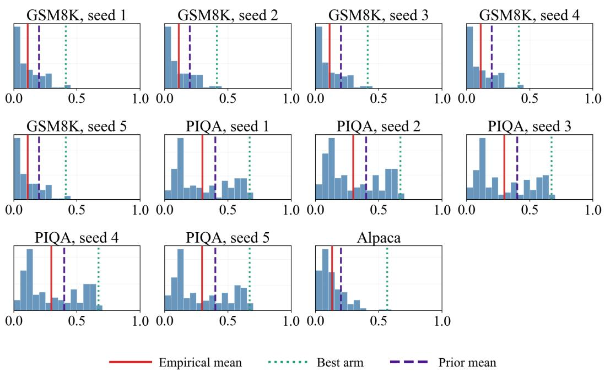  
Figure 4: Per-arm quality distributions for GSM8K, PIQA, and AlpacaEval. Each panel shows one response matrix; bars report mean accuracy for GSM8K and PIQA and mean pairwise score for AlpacaEval. Vertical lines mark the empirical mean (red), best arm (green), and prior mean (purple).

Table 1: MMLU datasets used in our evaluation. Each subject produces a response matrix with 1500 rows (arms), corresponding to 15 LLM configurations paired with 100 prompting techniques, and N columns corresponding to the benchmark examples. Thus, the matrix has shape 1500 × N and contains 1500N observation cells. Difficulty is based on prior accuracy: datasets with high prior accuracy are labeled easy, those with medium prior accuracy are labeled medium, and those with low prior accuracy are labeled hard. The size category groups datasets by the number of benchmark examples.
<table><tr><td>Dataset</td><td>Matrix Shape</td><td>Difficulty</td><td>Size</td><td>Full Name</td></tr><tr><td>Abstract Alg.</td><td>1500 × 100</td><td>hard</td><td>small</td><td>Abstract Algebra</td></tr><tr><td>Anatomy</td><td>1500 × 135</td><td>medium</td><td>small</td><td>Anatomy</td></tr><tr><td>Astronomy</td><td>1500 × 152</td><td>medium</td><td>medium</td><td>Astronomy</td></tr><tr><td>Business Ethics</td><td>1500 × 100</td><td>medium</td><td>small</td><td>Business Ethics</td></tr><tr><td>Clinical Know.</td><td>1500 × 265</td><td>medium</td><td>medium</td><td>Clinical Knowledge</td></tr><tr><td>College Biology</td><td>1500 × 144</td><td>medium</td><td>small</td><td>College Biology</td></tr><tr><td>College Chem</td><td>1500 × 100</td><td>hard</td><td>small</td><td>College Chemistry</td></tr><tr><td>College CS</td><td>1500 × 100</td><td>hard</td><td>small</td><td>College Computer Science</td></tr><tr><td>College Math</td><td>1500 × 100</td><td>hard</td><td>small</td><td>College Mathematics</td></tr><tr><td>College Medicine</td><td>1500 × 173</td><td>medium</td><td>medium</td><td>College Medicine</td></tr><tr><td>College Physics</td><td>1500 × 102</td><td>hard</td><td>small</td><td>College Physics</td></tr><tr><td>Comp Security</td><td>1500 × 100</td><td>easy</td><td>small</td><td>Computer Šecurity</td></tr><tr><td>Conceptual Phys</td><td>1500 × 235</td><td>medium</td><td>medium</td><td>Conceptual Physics</td></tr><tr><td>Econometrics</td><td>1500 × 114</td><td>hard</td><td>small</td><td>Econometrics</td></tr><tr><td>Electrical Eng</td><td>1500 × 145</td><td>medium</td><td>small</td><td>Electrical Engineering</td></tr><tr><td>Elementary Math</td><td>1500 × 378</td><td>hard</td><td>medium</td><td>Elementary Mathematics</td></tr><tr><td>Formal Logic</td><td>1500 × 126</td><td>hard</td><td>small</td><td>Formal Logic</td></tr><tr><td>Global Facts</td><td>1500 × 100</td><td>hard</td><td>small</td><td>Global Facts</td></tr><tr><td>HS Biology</td><td>1500 × 310</td><td>easy</td><td>medium</td><td>High School Biology</td></tr><tr><td>HS Chem</td><td>1500 × 203</td><td>hard</td><td>medium</td><td>High School Chemistry</td></tr><tr><td>HS CS</td><td>1500 × 100</td><td>medium</td><td>small</td><td>High School Computer Science</td></tr><tr><td>HS Euro Hist</td><td>1500 × 165</td><td>medium</td><td>medium</td><td>High School European History</td></tr><tr><td>HS Geography</td><td> $1 5 0 0 \times 1 9 8$ </td><td>easy</td><td>medium</td><td>High School Geography</td></tr><tr><td>HS Gov &amp; Pol</td><td> $1 5 0 0 \times 1 9 3$ </td><td>easy</td><td>medium</td><td>High School Government and Politics</td></tr><tr><td>HS Macroecon</td><td>1500 × 390</td><td>medium</td><td>medium</td><td>High School Macroeconomics</td></tr><tr><td>HS Math</td><td>1500 × 270</td><td>hard</td><td>medium</td><td>High School Mathematics</td></tr><tr><td>HS Microecon</td><td>1500 × 238</td><td>medium</td><td>medium</td><td>High School Microeconomics</td></tr><tr><td>HS Physics</td><td>1500 × 151</td><td>hard</td><td>medium</td><td>High School Physics</td></tr><tr><td>HS Psychology</td><td>1500 × 545</td><td>easy</td><td>large</td><td>High School Psychology</td></tr><tr><td>HS Statistics</td><td>1500 × 216</td><td>hard</td><td>medium</td><td>High School Statistics</td></tr><tr><td>HS US Hist</td><td>1500 × 204</td><td>easy</td><td>medium</td><td>High School US History</td></tr><tr><td>HS World Hist</td><td>1500 × 237</td><td>easy</td><td>medium</td><td>High School World History</td></tr><tr><td>Human Aging</td><td>1500 × 223</td><td>medium</td><td>medium</td><td>Human Aging</td></tr><tr><td>Human Sexuality</td><td>1500 × 131</td><td>easy</td><td>small</td><td>Human Sexuality</td></tr><tr><td>Int'l Law</td><td>1500 × 121</td><td>easy</td><td>small</td><td>International Law</td></tr><tr><td>Jurisprudence</td><td>1500 × 108</td><td>easy</td><td>small</td><td>Jurisprudence</td></tr><tr><td>Logical Fallacies</td><td>1500 × 163</td><td>easy</td><td>medium</td><td>Logical Fallacies</td></tr><tr><td>Machine Learning</td><td>1500 × 112</td><td>hard</td><td>small</td><td>Machine Learning</td></tr><tr><td>Management</td><td>1500 × 103</td><td>easy</td><td>small</td><td>Management</td></tr><tr><td>Marketing</td><td>1500 × 234</td><td>easy</td><td>medium</td><td>Marketing</td></tr><tr><td>Medical Ġenetics</td><td>1500 × 100</td><td>medium</td><td>small</td><td>Medical Ġenetics</td></tr><tr><td>Misc</td><td>1500 × 783</td><td>easy</td><td>large</td><td>Miscellaneous</td></tr><tr><td>Moral Disputes</td><td>1500 × 346</td><td>medium</td><td>medium</td><td>Moral Disputes</td></tr><tr><td>Moral Scenarios</td><td>1500 × 895</td><td>hard</td><td>large</td><td>Moral Scenarios</td></tr><tr><td>Nutrition</td><td>1500 × 306</td><td>medium</td><td>medium</td><td>Nutrition</td></tr><tr><td>Philosophy</td><td>1500 × 311</td><td>medium</td><td>medium</td><td>Philosophy</td></tr><tr><td>Prehistory</td><td>1500 × 324</td><td>medium</td><td>medium</td><td>Prehistory</td></tr><tr><td>Prof Accounting</td><td>1500 × 282</td><td>hard</td><td>medium</td><td>Professional Accounting</td></tr><tr><td>Prof Law</td><td>1500 × 1534</td><td>hard</td><td>large</td><td>Professional Law</td></tr><tr><td>Prof Medicine</td><td>1500 × 272</td><td>medium</td><td>medium</td><td>Professional Medicine</td></tr><tr><td>Prof Psychology</td><td>1500 × 612</td><td>medium</td><td>large</td><td>Professional Psychology</td></tr><tr><td>Public Relations</td><td>1500 × 110</td><td>medium</td><td>small</td><td>Public Relations</td></tr><tr><td>Security Studies</td><td>1500 × 245</td><td>medium</td><td>medium</td><td>Security Studies</td></tr><tr><td>Sociology</td><td>1500 × 201</td><td>easy</td><td>medium</td><td>Sociology</td></tr><tr><td>US Foreign Policy</td><td>1500 × 100</td><td>easy</td><td>small</td><td>US Foreign Policy</td></tr><tr><td>Virology</td><td>1500 × 166</td><td>hard</td><td>medium</td><td>Virology</td></tr><tr><td>World Religions</td><td>1500 × 171</td><td>easy</td><td>medium</td><td>World Religions</td></tr></table>

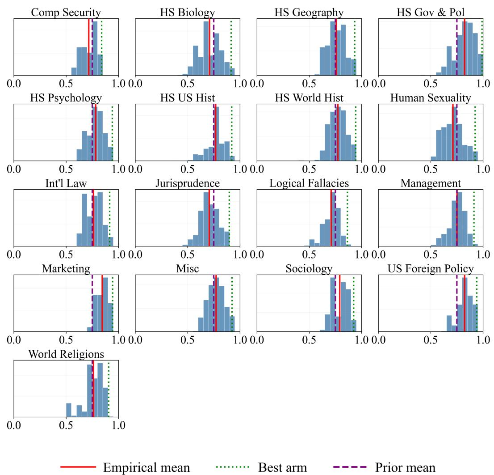  
Figure 5: Per-arm accuracy distributions for easy MMLU subjects in the high-prior bucket $( \mu _ { 0 } =$ 0.75). Each panel shows one subject; vertical lines mark the empirical mean (red), best arm (green), and prior mean (purple).

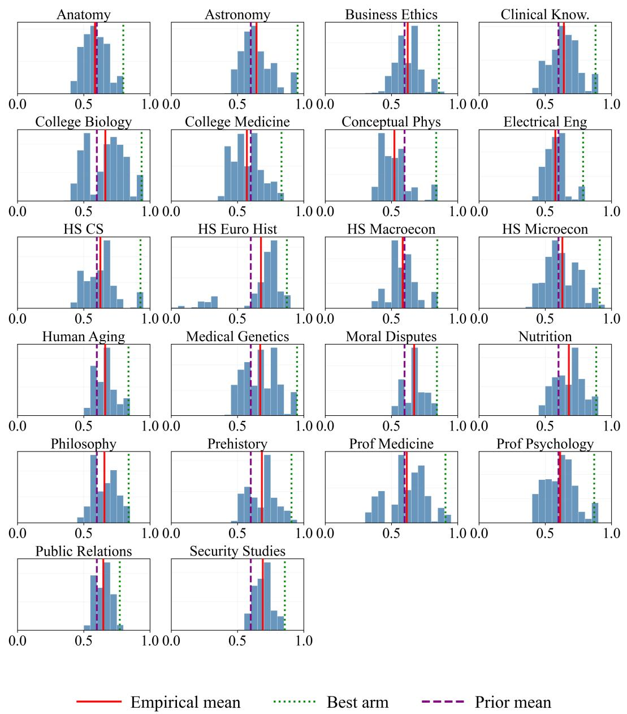  
Figure 6: Per-arm accuracy distributions for medium-difficulty MMLU subjects in the medium-prior bucket $( \mu _ { 0 } = 0 . 6 )$ . Each panel shows one subject; vertical lines mark the empirical mean (red), best arm (green), and prior mean (purple).

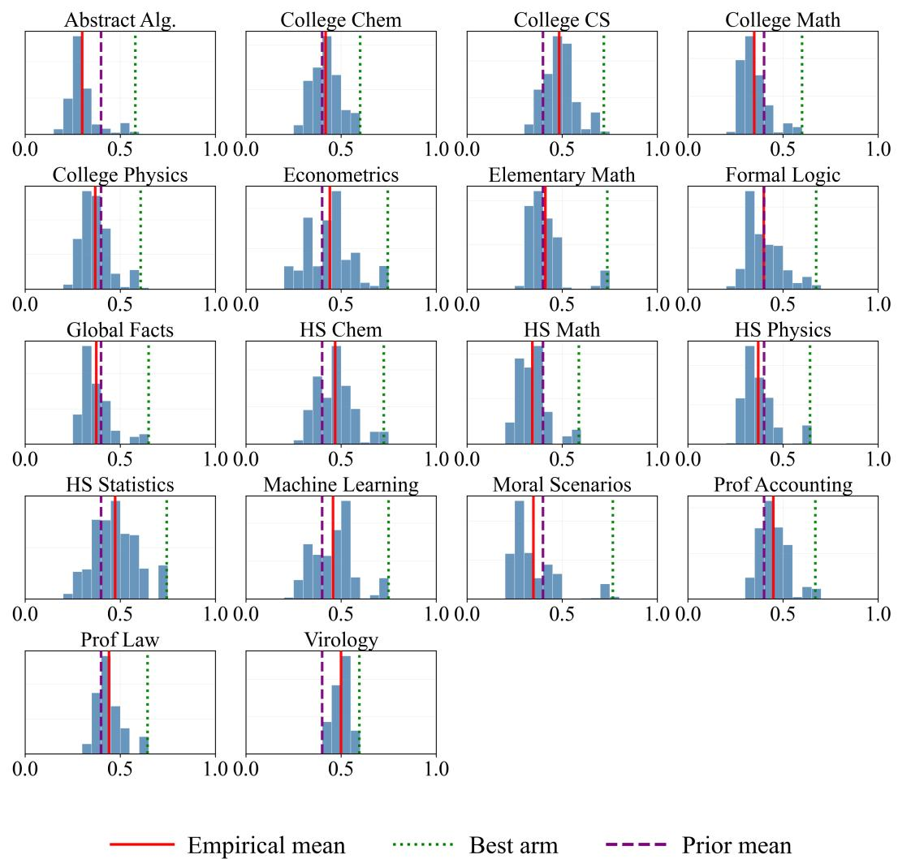  
Figure 7: Per-arm accuracy distributions for hard MMLU subjects in the low-prior bucket $( \mu _ { 0 } = 0 . 4 )$ Each panel shows one subject; vertical lines mark the empirical mean (red), best arm (green), and prior mean (purple).

## D EXPERIMENT SETUP AND IMPLEMENTATION DETAILS

Computing environment. Experiments were run on CPU-only computing resources using precomputed response matrices rather than online LLM inference. The response matrix serves as the offline ground-truth oracle: during bandit simulation, each policy observes only the selected (arm, question) entries, while per-arm matrix means are used to compute simple regret. For the Bayesian optimization baselines, the response matrices are converted into configuration-level inputs, where evaluating one candidate reveals its aggregate score. For GSM8K and PIQA, each converted BanditEval configuration corresponds to a model×prompt arm. The BanditEval AlpacaEval matrix instead has one leaderboard-model arm per row, so each converted Bayesian optimization configuration evaluates that model on all 805 instructions. For MMLU, each converted DOVE configuration corresponds to a model×template arm. Reported per-batch runtime therefore measures policy-side allocation overhead rather than model-inference time.

Experimental repetitions. For GSM8K and PIQA, we run each adaptive policy on each of the five independently generated response matrices. For every response matrix, we perform 20 independent algorithm trials, each with independently randomized example orders and algorithmic randomness. We report averages over all matrix–trial pairs. For AlpacaEval, we use a single fixed pairwise score matrix with 152 models and 805 instructions. As in MMLU, we run 20 independent algorithm trials on this matrix and report averages over those trials. Unlike GSM8K and PIQA, we do not average over multiple independently generated response matrices for AlpacaEval. For MMLU, we run 20 randomized algorithm trials for each subject and aggregate results across the corresponding set of subjects. The Bayesian optimization baselines use the same randomized-trial structure on their converted configuration-level inputs.

Anytime recommendations and regret. At each reporting step, GittinsEval-G and GittinsEval-S recommend the arm maximizing $M _ { k , t } - \sqrt { V _ { k , t } }$ as in Eq. (13), where $M _ { k , t }$ and $V _ { k , t }$ are the posterior mean and variance of the full-row empirical score, given in Eq. (16). This optional-completion recommendation considers all arms, including those with unevaluated examples; it does not require the recommended arm to be completed. For an arm that has been fully evaluated, $M _ { k , t }$ equals its observed row mean and $V _ { k , t } = 0$ . The uncertainty penalty is intended to reduce early recommendation switching when arms with few observations have unreliable mean estimates, especially under a general prior; see Appendix B. Simple regret is always computed from the recommended arm’s actual full-row mean in the response matrix, not from its posterior mean or its penalized recommendation score. The penalty affects recommendation only; it does not enter the numerical Gittins indices used for allocation or affect the stopping time.

GittinsEval stopping time. The GittinsEval stopping time is the first post-batch time at which an arm attaining the largest numerical empirical-target Gittins index is fully observed. This is the stopping rule from the required-completion adaptive-stopping formulation; it does not restrict the optional-completion LCB-style recommendation. Root discretization, continuation beyond the signal, and the recommendation rule do not inherit the exact batch-level optimality guarantee. In fixed-budget experiments, we record this time and continue the regret trajectory to the evaluation budget.

Baseline initialization and warm-up. For a response matrix with K arms and N examples, the Bayesian optimization baselines use a configuration-level random-initialization phase. In our main Bayesian optimization runs, a 5% random initialization means drawing approximately 0.05K arms uniformly without replacement and observing the full rows for those arms, i.e., evaluating the selected configurations on all N examples before the acquisition-driven phase begins. This corresponds to 6 initial configurations for GSM8K (K = 122), 5 for PIQA $( K = 1 0 3 )$ , 8 for AlpacaEval $( K = 1 5 2 )$ ), and 75 for each MMLU subject $( K = 1 5 0 0 )$ . Under the nominal 10% Bayesian optimization budget, the corresponding total configuration budgets are 12, 10, 15, and 150 configurations, respectively. This convention is distinct from the low-rank-factorization warm-up in BanditEval (Zhou et al., 2025). There, LRF first draws $T _ { 0 }$ individual arm–example pairs uniformly from the $K \times N$ response matrix, and the default experimental setting uses $T _ { 0 } = \dot { 0 } . 0 \dot { 5 } K N$ . The standalone LRF baseline in that paper is also written with a $T _ { 0 }$ entry-level warm-up parameter, so any such warm-up should be interpreted as a percentage of response-matrix entries rather than a percentage of arms evaluated on all benchmark examples.

Curve aggregation and visualization. Unless otherwise noted, repeated trajectories for GittinsEval-G, GittinsEval-S, UCB-E, LRF, and SySRs are aggregated on a common budget grid. For each method and panel, we linearly interpolate each randomized-run trajectory onto a shared grid of 350 evenly spaced points spanning the observed budget range and compute the mean and standard error across the runs available at each grid point. Values outside a run’s observed range are treated as missing rather than extrapolated, so early-ending runs are not right-extended. The same procedure is used in the unit-cost and cost-aware settings, with cumulative evaluation cost defining the horizontal coordinate in both; under unit costs, this equals cumulative example evaluations. Gittins stopping points are reported only as overlays and do not truncate the regret trajectories. Bayesian optimization trajectories are handled separately. We omit the random-initialization segment from the displayed curves, align the post-initialization trajectories across randomized runs to their mean initialization endpoint, and aggregate them on the resulting common budget axis. Runs that terminate earlier are right-held at their final observed simple regret so that they continue to contribute over the displayed post-initialization budget range. This convention is used in both the unit-cost and cost-aware settings and is particularly relevant in the latter, where heterogeneous configuration costs lead to different initialization endpoints across runs. For the cross-subject MMLU aggregates, each task–run trajectory is first normalized to its reported budget range before interpolation on a common [0, 1] grid of 350 evenly spaced points, and the resulting task–run curves are pooled within each size–difficulty bucket. LRF retains its warm-up offset under this normalization.

PromptEval evaluation and aggregation. We evaluate PromptEval-BAI (Polo et al., 2024), using this name for PromptEval’s best-prompt-identification instantiation in figures and captions. Its native allocation follows a unit-cost successive-halving best-arm-identification rule that exploits configuration covariates; costs are recorded so that the same trajectories can be plotted against cumulative observations in the unit-cost setting and against recorded cumulative costs in the costaware setting. On GSM8K and PIQA we use five response matrices with 20 randomized trials each; on each MMLU subject we use 20 randomized trials. Across GSM8K, PIQA, and MMLU, we use PE-OneHot, which assigns each candidate arm an identity feature vector; the other PromptEval covariate variants are not included in our comparison. We do not report PromptEval-BAI on AlpacaEval because the released best-arm-identification implementation assumes binary correctness matrices and therefore does not directly apply to our continuous model-by-instruction preference matrix. PromptEval’s own AlpacaEval experiment instead studies sensitivity to judge prompts and binarizes continuous judge scores for model fitting; it is separate from the paper’s best-prompt-identification experiments on MMLU, BBH, and LMentry. Applying PromptEval-BAI here would therefore require an additional, non-native modeling choice such as thresholding the scores. For the main GSM8K/PIQA curves, we aggregate repeated trajectories by successive-halving phase, reporting mean simple regret at the mean phase budget with standard-error bands. Since PromptEval-BAI produces recommendations at discrete successive-halving phase boundaries, we preserve this native phase structure rather than interpolating additional intermediate points. For individual MMLU subject panels, cost-aware curves use the same phase-wise aggregation, while unit-cost curves instead align trajectories by their average initial budget and interpolate with step-hold on the union of observed normalized-cost points, where cost is expressed as a percentage of the exhaustive-evaluation cost; early-finishing runs are right-held to the largest observed end budget among those trajectories. For the cross-subject MMLU aggregate plots, we pool subject–seed trajectories on this shared normalizedcost axis, apply average-initial alignment, interpolate with step-hold on the union of observed budget points at or below the nominal 10% budget, and right-hold early-finishing runs through that endpoint.

Evaluation costs. The cost-aware bandit experiments assign each arm a batch cost proportional to the estimated cost of running that model configuration on B benchmark examples. For GSM8K and PIQA, an arm is a model plus sampling or prompting configuration; when several arms share a base model, they share the model-level price, while the batch multiplier accounts for how many examples are queried at that allocation step. For MMLU, each arm is a model–prompt pair, and model-level input prices are repeated across the corresponding prompt arms. For AlpacaEval, each arm is a single leaderboard model rather than a model×sampling-configuration pair. Throughout our experiments, costs are model-level proxies derived from published API prices or model-level price metadata. Fixed benchmark-level input/output ratios convert these prices into a per-example arm cost, so all examples evaluated by the same arm have the same cost; we do not use example-specific token counts or latency. For the Bayesian optimization baselines, each converted input row corresponds to a complete configuration, and its cost is the estimated all-example evaluation cost of that configuration on the corresponding benchmark or MMLU subject. The Gittins dynamic program uses costs rescaled to the same utility units as the index computation, while the Bayesian optimization baselines use configuration-level costs for cost-aware acquisition and budget accounting.

AlpacaEval evaluation costs. AlpacaEval uses model-specific API or proxy prices for the 152 leaderboard models in the response matrix. For each model, we record separate input and output costs in USD per 1M tokens and form the evaluation cost as

$$
\mathrm { c o s t } = c _ { \mathrm { i n } } + 8 c _ { \mathrm { o u t } } ,
$$

using the estimated AlpacaEval input-to-output token ratio 1:8. These model-level costs define the per-arm cost vector for cost-aware bandit experiments and the all-example evaluation costs used by the converted Bayesian optimization inputs. Since AlpacaEval arms are individual leaderboard models rather than BanditEval-style model×prompt configurations, we do not repeat a single model price across multiple prompting arms as in MMLU. Table 2 and Table 3 therefore do not apply to AlpacaEval; the complete Alpaca pricing table is reported in Table 4.

Table 2: Model-level evaluation costs used for GSM8K and PIQA. Costs are reported in USD per 1M tokens. GSM8K uses an assumed input-to-output token ratio of 1 : 2, so the evaluation cost is computed as input cost plus twice the output cost. PIQA uses input-only pricing. These model-level costs are used to construct the per-arm cost vectors for the cost-aware experiments.
<table><tr><td>Model</td><td>Input cost</td><td>Output cost</td><td>GSM8K cost</td><td>PIQA cost</td></tr><tr><td>CodeLlama</td><td>0.30</td><td>0.30</td><td>0.90</td><td>0.30</td></tr><tr><td>Gemma-7B</td><td>0.20</td><td>0.20</td><td>0.60</td><td>0.20</td></tr><tr><td>GPT-2</td><td>0.10</td><td>0.10</td><td>0.30</td><td>0.10</td></tr><tr><td>GPT-2 Large</td><td>0.10</td><td>0.10</td><td>0.30</td><td>0.10</td></tr><tr><td>LLaMA2-7B</td><td>0.20</td><td>0.20</td><td>0.60</td><td>0.20</td></tr><tr><td>Llemma-7B</td><td>0.80</td><td>1.20</td><td>3.20</td><td>0.80</td></tr><tr><td>Mistral-7B</td><td>0.05</td><td>0.20</td><td>0.45</td><td>0.05</td></tr><tr><td>Phi-2</td><td>0.05</td><td>0.10</td><td>0.25</td><td>0.05</td></tr><tr><td>StarCoder2-7B</td><td>0.20</td><td>0.20</td><td>0.60</td><td>0.20</td></tr><tr><td>Tulu</td><td>0.20</td><td>0.20</td><td>0.60</td><td>0.20</td></tr><tr><td>Tulu2</td><td>0.20</td><td>0.20</td><td>0.60</td><td>0.20</td></tr></table>

Table 3: Model-level input costs used for MMLU. Costs are reported in USD per 1M input tokens. MMLU uses input-only pricing. Each MMLU subject contains 1500 arms, corresponding to 15 models paired with 100 prompt configurations; therefore, each model-level input cost is repeated across the corresponding prompt arms.
<table><tr><td>MMLU model</td><td>Input cost</td><td>MMLU model</td><td>Input cost</td></tr><tr><td>CodeLlama-34B-Instruct</td><td>0.776</td><td>Llama-3-70B-Instruct</td><td>0.51</td></tr><tr><td>Falcon-180B</td><td>1.25</td><td>Llama-3-8B</td><td>0.05</td></tr><tr><td>Falcon-40B</td><td>0.84</td><td>Llama-3-8B-Instruct</td><td>0.03</td></tr><tr><td>FLAN-T5-XL</td><td>0.60</td><td>Merlinite-7B</td><td>0.60</td></tr><tr><td>FLAN-T5-XXL</td><td>1.80</td><td>Mistral-7B-Instruct-v0.2</td><td>0.14</td></tr><tr><td>FLAN-UL2</td><td>5.00</td><td>Mistral-7B-v0.1</td><td>0.11</td></tr><tr><td>Gemma-7B</td><td>0.20</td><td>Mixtral-8x7B-Instruct-v0.1</td><td>0.54</td></tr><tr><td>Gemma-7B-IT</td><td>0.07</td><td></td><td></td></tr></table>

Table 4: AlpacaEval model-level pricing for the 152-model response matrix. Input (In.) and output (Out.) prices are in USD per 1M tokens. The combined evaluation cost is Cost = Input+8×Output, matching the input-to-output token ratio used for cost-aware runs. Models are alphabetized down the left block, then the right block, continuing on the next page.
<table><tr><td>Model</td><td>In.</td><td>Out. Cost</td><td></td><td>Model</td><td>In.</td><td>Out.</td><td>Cost</td></tr><tr><td>airoboros-33b</td><td>0.9</td><td>0.9</td><td>8.1</td><td>gemma-7b-it</td><td>0.2</td><td>0.2</td><td>1.8</td></tr><tr><td>airoboros-65b</td><td>0.9</td><td>0.9</td><td>8.1</td><td>gpt-3.5-turbo-0301</td><td>1.5</td><td>2</td><td>17.5</td></tr><tr><td>aligner-2b_claude-3-opus- 20240229</td><td>0.1</td><td>0.1</td><td>0.9</td><td>gpt-3.5-turbo-0613</td><td>1.5</td><td>2 17.5</td><td></td></tr><tr><td>aligner-2b_qwen1.5-72b-chat</td><td>0.1</td><td>0.1</td><td>0.9</td><td>gpt-3.5-turbo-1106</td><td>1</td><td>2</td><td>17</td></tr><tr><td>alpaca-7b</td><td>0.2</td><td>0.2</td><td>1.8</td><td>gpt-3.5-turbo-1106_concise</td><td>1</td><td>2</td><td>17</td></tr><tr><td>alpaca-7b_concise</td><td>0.2</td><td>0.2</td><td>1.8</td><td>gpt-3.5-turbo-1106_verbose</td><td>1</td><td>2</td><td>17</td></tr><tr><td>alpaca-7b_verbose</td><td>0.2</td><td>0.2</td><td>1.8</td><td>gpt-4-0125-preview</td><td>10</td><td>30</td><td>250</td></tr><tr><td>alpaca-farm-ppo-human</td><td>0.2</td><td>0.2</td><td>1.8</td><td>gpt35_turbo_instruct</td><td>1.5</td><td>2</td><td>17.5</td></tr><tr><td>alpaca-farm-ppo-sim-gpt4- 20k</td><td>0.2</td><td>0.2</td><td>1.8</td><td>gpt4</td><td>30</td><td>60</td><td>510</td></tr><tr><td>baichuan-13b-chat</td><td>0.2</td><td>0.2</td><td>1.8</td><td>gpt4_0314</td><td>30</td><td>60</td><td>510</td></tr><tr><td>baize-v2-13b</td><td>0.2</td><td>0.2</td><td>1.8</td><td>gpt4_0613</td><td>30</td><td>60</td><td>510</td></tr><tr><td>baize-v2-7b</td><td>0.2</td><td>0.2</td><td>1.8</td><td>gpt4_0613_concise</td><td>30</td><td>60</td><td>510</td></tr><tr><td>causallm-14b</td><td>0.2</td><td>0.2</td><td>1.8</td><td>gpt4_0613_verbose</td><td>30</td><td>60</td><td>510</td></tr><tr><td>chatglm2-6b</td><td>0.2</td><td>0.2</td><td>1.8</td><td>gpt4_1106_preview_concise</td><td>10</td><td>30</td><td>250</td></tr><tr><td>claude</td><td>8</td><td>24</td><td>200</td><td>gpt4_gamed</td><td>30</td><td>60</td><td>510</td></tr><tr><td>claude-2</td><td>8</td><td>24</td><td>200</td><td>guanaco-13b</td><td>0.2</td><td>0.2</td><td>1.8</td></tr><tr><td>claude-2.1</td><td>8</td><td>24</td><td>200</td><td>guanaco-33b</td><td>0.9</td><td>0.9</td><td>8.1</td></tr><tr><td>claude-2.1_concise</td><td>8</td><td>24</td><td>200</td><td>guanaco-65b</td><td>0.9</td><td>0.9</td><td>8.1</td></tr><tr><td>claude-2.1_verbose</td><td>8</td><td>24</td><td>200</td><td>guanaco-7b</td><td>0.2</td><td>0.2</td><td>1.8</td></tr><tr><td>claude-3-opus-20240229</td><td>15</td><td>75</td><td>615</td><td>humpback-llama-65b</td><td>0.9</td><td>0.9</td><td>8.1</td></tr><tr><td>claude-3-sonnet-20240229</td><td>3</td><td>15</td><td>123</td><td>humpback-llama2-70b</td><td>0.9</td><td>0.9</td><td>8.1</td></tr><tr><td>claude-instant-1.2</td><td>0.8</td><td>2.4</td><td>20</td><td>internlm2-chat-20b-ppo</td><td>0.9</td><td>0.9</td><td>8.1</td></tr><tr><td>claude2-alpaca-13b</td><td>0.2</td><td>0.2</td><td>1.8</td><td>jina-chat</td><td>0.2</td><td>0.2</td><td>1.8</td></tr><tr><td>cohere</td><td>1</td><td>2</td><td>17</td><td>llama-2-13b-chat-hf</td><td>0.2</td><td>0.2</td><td>1.8</td></tr><tr><td>Conifer-7B-DPO</td><td>0.2</td><td>0.2</td><td>1.8</td><td>1lama-2-70b-chat-hf</td><td>0.9</td><td>0.9</td><td>8.1</td></tr><tr><td>Contextual-KTO-Mistral- PairRM</td><td>0.2</td><td>0.2</td><td>1.8</td><td>llama-2-7b-chat-hf</td><td>0.2</td><td>0.2</td><td>1.8</td></tr><tr><td>cut-13b</td><td>0.2</td><td>0.2</td><td>1.8</td><td>llama-2-chat-7b-evol70k-neft</td><td>0.2</td><td>0.2</td><td>1.8</td></tr><tr><td>dbrx-instruct</td><td>1.2</td><td>1.2</td><td>10.8</td><td>LLaMA-7B</td><td>0.2</td><td>0.2</td><td>1.8</td></tr><tr><td>deepseek-llm-67b-chat</td><td>0.9</td><td>0.9</td><td>8.1</td><td>LMCocktail-10.7B-v1</td><td>0.2</td><td>0.2</td><td>1.8</td></tr><tr><td>deita-7b-v1.0</td><td>0.2</td><td>0.2</td><td>1.8</td><td>Meta-Llama-3-70B-Instruct</td><td>0.9</td><td>0.9</td><td>8.1</td></tr><tr><td>dolphin-2.2.1-mistral-7b</td><td>0.2</td><td>0.2</td><td>1.8</td><td>Meta-Llama-3-8B-Instruct</td><td>0.2</td><td>0.2</td><td>1.8</td></tr><tr><td>evo-7b</td><td>0.2</td><td>0.2</td><td>1.8</td><td>minichat-1.5-3b</td><td>0.1</td><td>0.1</td><td>0.9</td></tr><tr><td>evo-v2-7b</td><td>0.2</td><td>0.2</td><td>1.8</td><td>minichat-3b</td><td>0.1</td><td>0.1</td><td>0.9</td></tr><tr><td>falcon-40b-instruct</td><td>0.9</td><td>0.9</td><td>8.1</td><td>minotaur-13b</td><td>0.2</td><td>0.2</td><td>1.8</td></tr><tr><td>falcon-7b-instruct</td><td>0.2</td><td>0.2</td><td>1.8</td><td>Mistral-7B-Instruct-v0.2</td><td>0.2</td><td>0.2</td><td>1.8</td></tr><tr><td>FsfairX-Zephyr-Chat-v0.1</td><td>0.2</td><td>0.2</td><td>1.8</td><td>Mistral-7B-ReMax-v0.1</td><td>0.2</td><td>0.2</td><td>1.8</td></tr><tr><td>gemini-pro</td><td>0.5</td><td>1.5</td><td>12.5</td><td>mistral-large-2402</td><td>8</td><td>24</td><td>200</td></tr><tr><td>gemma-2b-it</td><td>0.1</td><td>0.1</td><td>0.9</td><td>mistral-medium</td><td>2.7</td><td>8.1</td><td>67.5</td></tr><tr><td>Model</td><td>In. Out.</td><td></td><td>Cost</td><td>Model</td><td>In.</td><td>Out.</td><td>Cost</td></tr><tr><td>mistral-orpo-beta</td><td>0.2</td><td>0.2</td><td>1.8</td><td>Qwen1.5-7B-Chat</td><td>0.2</td><td>0.2</td><td>1.8</td></tr><tr><td>Mixtral-8x22B-Instruct-v0.1</td><td>1.2</td><td>1.2</td><td>10.8</td><td>recycled-wizardlm-7b-v1.0</td><td>0.2</td><td>0.2</td><td>1.8</td></tr><tr><td>Mixtral-8x7B-Instruct-v0.1</td><td>0.5</td><td>0.5</td><td>4.5</td><td>recycled-wizardlm-7b-v2.0</td><td>0.2</td><td>0.2</td><td>1.8</td></tr><tr><td>Mixtral-8x7B-Instruct-v0.1_ concise</td><td>0.5</td><td>0.5</td><td>4.5</td><td>Samba-CoE-v0.1</td><td>0.2</td><td>0.2</td><td>1.8</td></tr><tr><td>Mixtral-8x7B-Instruct-v0.1_</td><td>0.5</td><td>0.5</td><td>4.5</td><td>Samba-CoE-v0.2</td><td>0.2</td><td>0.2</td><td>1.8</td></tr><tr><td>verbose Nanbeige-Plus-Chat-v0.1</td><td>0.2</td><td>0.2</td><td>1.8</td><td>Samba-CoE-v0.2-best-of-16</td><td>3.2</td><td>3.2 28.8</td><td></td></tr><tr><td>Nanbeige2-8B-Chat</td><td>0.2</td><td>0.2</td><td>1.8</td><td>Snorkel-Mistral-PairRM- DPO</td><td>0.2</td><td>0.2</td><td>1.8</td></tr><tr><td>nous-hermes-13b</td><td>0.2</td><td>0.2</td><td>1.8</td><td>Snorkel-Mistral-PairRM-</td><td>3.2</td><td>3.2 28.8</td><td></td></tr><tr><td>oasst-rlhf-llama-33b</td><td>0.9</td><td>0.9</td><td>8.1</td><td>DPO-best-of-16 Starling-LM-7B-alpha</td><td>0.2</td><td>0.2</td><td>1.8</td></tr><tr><td>oasst-sft-llama-33b</td><td>0.9</td><td>0.9</td><td>8.1</td><td>TempNet-LLaMA2-Chat-</td><td>0.2</td><td>0.2</td><td>1.8</td></tr><tr><td>oasst-sft-pythia-12b</td><td>0.1</td><td>0.1</td><td>0.9</td><td>13B-v0.1 TempNet-LLaMA2-Chat-</td><td>0.9</td><td>0.9</td><td>8.1</td></tr><tr><td>openbuddy-falcon-40b-v9</td><td>0.9</td><td>0.9</td><td>8.1</td><td>70B-v0.1 TempNet-LLaMA2-Chat-7B-</td><td>0.2</td><td>0.2</td><td>1.8</td></tr><tr><td>openbuddy-falcon-7b-v6</td><td>0.2</td><td>0.2</td><td>1.8</td><td>v0.1 text_davinci_001</td><td>20</td><td>20</td><td>180</td></tr><tr><td>openbuddy-1llama-30b-v7.1</td><td>0.9</td><td>0.9</td><td>8.1</td><td>text_davinci_003</td><td>20</td><td>20</td><td>180</td></tr><tr><td>openbuddy-llama-65b-v8</td><td>0.9</td><td>0.9</td><td>8.1</td><td>tulu-2-dpo-13b</td><td>0.2</td><td>0.2</td><td>1.8</td></tr><tr><td>openbuddy-llama2-13b-v11.1</td><td>0.2</td><td>0.2</td><td>1.8</td><td>tulu-2-dpo-70b</td><td>0.9</td><td>0.9</td><td>8.1</td></tr><tr><td>openbuddy-llama2-70b-v10.1</td><td>0.9</td><td>0.9</td><td>8.1</td><td>tulu-2-dpo-7b</td><td>0.2</td><td>0.2</td><td>1.8</td></tr><tr><td>openchat-13b</td><td>0.2</td><td>0.2</td><td>1.8</td><td>ultralm-13b</td><td>0.2</td><td>0.2</td><td>1.8</td></tr><tr><td>openchat-v2-13b</td><td>0.2</td><td>0.2</td><td>1.8</td><td>ultralm-13b-best-of-16</td><td>3.2</td><td>3.2</td><td>28.8</td></tr><tr><td>openchat-v2-w-13b</td><td>0.2</td><td>0.2</td><td>1.8</td><td>ultralm-13b-v2.0</td><td>0.2</td><td>0.2</td><td>1.8</td></tr><tr><td>openchat-v3.1-13b</td><td>0.2</td><td>0.2</td><td>1.8</td><td>ultralm-13b-v2.0-best-of-16</td><td>3.2</td><td>3.2</td><td>28.8</td></tr><tr><td>openchat8192-13b</td><td>0.2</td><td>0.2</td><td>1.8</td><td>vicuna-13b</td><td>0.2</td><td>0.2</td><td>1.8</td></tr><tr><td>opencoderplus-15b</td><td>0.2</td><td>0.2</td><td>1.8</td><td>vicuna-13b-v1.3</td><td>0.2</td><td>0.2</td><td>1.8</td></tr><tr><td>OpenHermes-2.5-Mistral-7B</td><td>0.2</td><td>0.2</td><td>1.8</td><td>vicuna-13b-v1.5</td><td>0.2</td><td>0.2</td><td>1.8</td></tr><tr><td>pairrm-tulu-2-13b</td><td>0.2</td><td>0.2</td><td>1.8</td><td>vicuna-33b-v1.3</td><td>0.9</td><td>0.9</td><td>8.1</td></tr><tr><td>pairrm-tulu-2-70b</td><td>0.9</td><td>0.9</td><td>8.1</td><td>vicuna-7b</td><td>0.2</td><td>0.2</td><td>1.8</td></tr><tr><td>pairrm-Yi-34B-Chat</td><td>0.9</td><td>0.9</td><td>8.1</td><td>vicuna-7b-v1.3</td><td>0.2</td><td>0.2</td><td>1.8</td></tr><tr><td>pairrm-zephyr-7b-beta</td><td>0.2</td><td>0.2</td><td>1.8</td><td>vicuna-7b-v1.5</td><td>0.2</td><td>0.2</td><td>1.8</td></tr><tr><td>phi-2</td><td>0.1</td><td>0.1</td><td>0.9</td><td>wizardlm-13b</td><td>0.2</td><td>0.2</td><td>1.8</td></tr><tr><td>phi-2-dpo</td><td>0.1</td><td>0.1</td><td>0.9</td><td>wizardlm-13b-v1.1</td><td>0.2</td><td>0.2</td><td>1.8</td></tr><tr><td>phi-2-sft</td><td>0.1</td><td>0.1</td><td>0.9</td><td>wizardlm-13b-v1.2</td><td>0.2</td><td>0.2</td><td>1.8</td></tr><tr><td>platolm-7b</td><td>0.2</td><td>0.2</td><td>1.8</td><td>wizardlm-70b</td><td>0.9</td><td>0.9</td><td>8.1</td></tr><tr><td>pythia-12b-mix-sft</td><td>0.1</td><td>0.1</td><td>0.9</td><td>xwinlm-13b-v0.1</td><td>0.2</td><td>0.2</td><td>1.8</td></tr><tr><td>Qwen-14B-Chat</td><td>0.2</td><td>0.2</td><td>1.8</td><td>xwinlm-70b-v0.1</td><td>0.9</td><td>0.9</td><td>8.1</td></tr><tr><td>Qwen1.5-1.8B-Chat</td><td>0.1</td><td>0.1</td><td>0.9</td><td>xwinlm-7b-v0.1</td><td>0.2</td><td>0.2</td><td>1.8</td></tr><tr><td>Qwen1.5-110B-Chat</td><td>0.9</td><td>0.9</td><td>8.1</td><td>Yi-34B-Chat</td><td>0.9</td><td>0.9</td><td>8.1</td></tr><tr><td>Qwen1.5-14B-Chat</td><td>0.2</td><td>0.2</td><td>1.8</td><td>zephyr-7b-alpha</td><td>0.2</td><td>0.2</td><td>1.8</td></tr><tr><td>Qwen1.5-72B-Chat</td><td>0.1</td><td>0.1</td><td>0.9</td><td>zephyr-7b-beta</td><td>0.2</td><td>0.2</td><td>1.8</td></tr></table>

Gaussian approximation. For benchmark scores grouped in batches, a batch of B responses produces an empirical mean score. For binary-accuracy benchmarks such as GSM8K, PIQA, and MMLU, the default observation variance is $\tau ^ { 2 } = 1 / ( 4 \check { B } )$ , the worst-case binary variance divided by the batch size. AlpacaEval matrix entries are continuous pairwise preference scores in [0, 1] rather than binary correctness labels. Since any random variable supported on [0, 1] has variance at most 1/4, we also use the conservative per-comparison working variance $\tau _ { \mathrm { c e l l } } ^ { 2 ^ { \ast } } = 1 / 4$ for AlpacaEval. Under the working conditional-independence approximation, this gives the batch-mean variance $\tau ^ { 2 } = 1 / ( 4 B )$ . This fixed value is a conservative working bound, not an empirical variance estimate.

Prior settings. All arms use the same prior mean and variance, representing a shared belief before benchmark-specific evidence is collected. Table 5 lists the general default prior and the data-specific common priors used by GittinsEval-G and GittinsEval-S. Figures 5, 6, and 7 show the MMLU latent-accuracy distributions used to motivate the informative prior buckets.

Table 5: Prior settings used in the Gittins-index experiments. We report Gaussian priors as $\mathcal { N } ( \mu _ { 0 } , v _ { 0 } )$ The default prior is a general accuracy-scale choice. Dataset-specific priors provide shared benchmarklevel information without using arm-specific prior means.
<table><tr><td>Benchmark / group</td><td>Prior</td><td>Description</td></tr><tr><td>All benchmarks</td><td>N(0.5, 0.04)</td><td>General default prior</td></tr><tr><td>GSM8K</td><td>N(0.2,0.01)</td><td>Very hard benchmark</td></tr><tr><td>PIQA</td><td>N(0.4, 0.02)</td><td>Hard benchmark</td></tr><tr><td>AlpacaEval</td><td>N(0.2, 0.01)</td><td>Very hard benchmark</td></tr><tr><td>MMLU low-accuracy bucket</td><td>N(0.4,0.02)</td><td>Hard subjects</td></tr><tr><td>MMLU medium-accuracy bucket</td><td>N(0.6, 0.02)</td><td>Medium subjects</td></tr><tr><td>MMLU high-accuracy bucket</td><td>N(0.75,0.01)</td><td>Easy subjects</td></tr></table>

## E ADDITIONAL EXPERIMENT RESULTS

## E.1 ABLATION STUDIES

We include four ablations to separate the statistical and cost-sensitive components of the Gittins index policy.

Choice of common prior. We compare the common priors listed in Table 5. This ablation tests whether Bayesian allocation gains come from useful shared prior information or from the index rule alone, without giving different arms different prior means. The resulting comparison between GittinsEval-G, which uses the general prior, and GittinsEval-S, which uses the data-specific common prior, is reported in Figures 2 and 3; full per-subject MMLU results are provided in Figures 13–18.

Table 6: Batch-size settings used in the simple-regret experiments. For UCB-E and both Gittins variants, batch size B denotes the number of examples queried for the selected arm at each allocation step. For AlpacaEval, these examples correspond to instruction-level pairwise preference scores rather than binary correctness labels. Because LRF’s repeated low-rank updates make smaller batches prohibitively slow, LRF uses B = 32 in all reported settings. Bayesian optimization baselines operate at the configuration level, so evaluating one candidate reveals its aggregate score and does not use a bandit batch size. For MMLU, subject matrices are grouped by the number of benchmark examples, and the batch-size grid for UCB-E and Gittins is chosen according to this subject-size bucket.
<table><tr><td>Benchmark / group</td><td>Matrices</td><td>Example-count rule</td><td>Batch sizes</td></tr><tr><td>GSM8K</td><td>5 response matrices</td><td>1000 examples each</td><td> $B \in \{ 8 , 1 6 , 3 2 \}$ </td></tr><tr><td>PIQA</td><td>5 response matrices</td><td>1000 examples each</td><td> $B \in \{ 8 , 1 6 , 3 2 \}$ </td></tr><tr><td>AlpacaEval</td><td>1 pairwise score matrix</td><td>805 instructions</td><td> $B \in \{ 8 , 1 6 , 3 2 \}$ </td></tr><tr><td>MMLU small</td><td>22 subject matrices</td><td> $n _ { \mathrm { e x a m p l e s } } \leq 1 5 0$ </td><td> $B \in \{ 2 , 4 , 8 \}$ </td></tr><tr><td>MMLU medium</td><td>30 subject matrices</td><td> $1 5 1 \leq \dot { n } _ { \mathrm { e x a m p l e s } } \leq 4 0 0$ </td><td> $B \in \{ 4 , 8 , 1 \bar { 6 } \}$ </td></tr><tr><td>MMLU large</td><td>5 subject matrices</td><td> $n _ { \mathrm { e x a m p l e s } } > 4 0 0$ </td><td> $B \in \{ 8 , 1 6 , 3 \bar { 2 } \}$ </td></tr></table>

Batch size. For UCB-E and the Gittins variants, we vary the batch size B used to construct empirical batch-mean observations. Smaller batches provide more frequent adaptation but noisier observations; larger batches reduce Gaussian approximation error and posterior noise but make each allocation decision coarser. Because $\mathrm { L R F } \bar { \mathbf { s } }$ repeated low-rank updates make smaller batches prohibitively slow, we use $B = 3 2$ for LRF in the reported settings. Bayesian optimization baselines operate at the configuration level and therefore do not use a bandit batch size. Table 6 summarizes the batch-size grids used for GSM8K, PIQA, MMLU, and AlpacaEval. On AlpacaEval, each batch query corresponds to B additional pairwise comparisons for the selected model rather than B independent benchmark examples with binary labels.

Figures 8 and 9 show that batch size primarily affects the low-budget regime. On GSM8K, PIQA, and AlpacaEval, $B = 8$ consistently provides the best early sample efficiency: its simple regret falls more quickly, whereas larger batches can spend more evaluations before the posterior and acquisition policy are updated. The effect is clearest for $B = 3 2$ on unit-cost GSM8K, where early regret is substantially higher. The curves approach one another as the budget grows, suggesting that batch size has a larger effect on early efficiency and stopping cost than on the final recommendation. Differences are smaller under cost-aware evaluation, but $\bar { B } = 8$ still provides the best overall cost efficiency across these benchmarks.

For MMLU, the smallest batch in each size-specific grid likewise tends to have the lowest overall simple regret: $B = 2$ for small subjects, $B = 4$ for medium subjects, and $B = 8$ for large subjects. Larger batches are generally less efficient at low budgets because the policy updates only after an entire batch is completed; on the medium and large groups, they also tend to delay natural stopping. The late-budget convergence indicates qualitative robustness to batch size and supports the sizeadaptive default $B = 2 \breve { / } 4 / 8$ . The stopping lines for the small group require additional care: some configurations stop naturally on only a subset of subjects, so the plotted mean is conditional on the subjects with an observed stop and should not be compared without also considering stopping coverage.

Cost-scaling factor. The Gittins index policy uses a cost-scaling factor to map evaluation costs into the continuation penalty in the index computation. In the unit-cost setting, this factor is applied to a common unit cost for each evaluation; in the cost-aware setting, it is applied to the original per-evaluation costs. This parameter controls the effective price of continuing to sample: larger values make additional evaluations more costly and therefore favor earlier stopping, whereas smaller values encourage longer exploration. In our experiments, we sweep three cost-scaling factors, $1 0 ^ { - 3 } , 1 0 ^ { - 4 }$ and $1 0 ^ { - 5 }$ , for both unit-cost and cost-aware Gittins variants. Unless otherwise specified, the main reported figures use $1 0 ^ { - 4 }$ , which we found to provide a representative balance between stopping early and continuing exploration.

Figure 10 confirms the expected stopping-time trade-off on GSM8K, PIQA, and AlpacaEval: increasing λ triggers natural stopping earlier, but $\lambda = 1 0 ^ { - 3 }$ is often too aggressive. Under unit costs it consistently shows higher early simple regret on GSM8K and AlpacaEval, indicating that stopping too soon can degrade recommendation quality. The regret curves for $1 0 ^ { - 5 }$ and $1 0 ^ { - \overline { { 4 } } }$ are generally close, but $1 0 ^ { - 5 }$ usually requires more evaluation cost before stopping. The three settings are less separated in the cost-aware panels. Thus, $\lambda = 1 0 ^ { - 4 }$ is not uniformly optimal on every individual dataset, but it provides the most reliable trade-off among regret, stopping time, and cross-dataset stability.

The same pattern is visible across the MMLU size groups in Figure 11. The conservative $\lambda = 1 0 ^ { - 5 }$ setting reduces regret more slowly and does not naturally stop within the 10% budget on some subjects. In contrast, $\lambda = 1 0 ^ { - 3 }$ stops very early but has consistently higher early regret on the medium and large groups. This behavior is especially pronounced for cost-aware large subjects, suggesting that a large continuation penalty can terminate evaluation before a reliable configuration has been identified. Across size groups and cost settings, $\lambda = 1 0 ^ { - 4 }$ reduces regret quickly while retaining reasonable stopping times. Although $\lambda = 1 0 ^ { - 3 }$ sometimes attains slightly lower late regret on the small group, its worse early behavior does not overturn $1 0 ^ { - 4 }$ as the global default. Since the large group contains only five subjects and some error bands are wide, we interpret these results as a consistent trend rather than a claim of statistical significance.

Overall, the method is qualitatively robust over the examined hyperparameter ranges, while hyperparameter selection matters most in the low-budget regime. The default $\lambda = 1 0 ^ { - \overline { { 4 } } }$ avoids both the overly conservative behavior of $1 0 ^ { - 5 }$ and the premature stopping associated with $1 0 ^ { - 3 }$ . Batch-size sensitivity is likewise modest beyond the low-budget regime: smaller batches generally provide better early sample efficiency through more frequent adaptation, whereas larger batches require fewer sequential posterior updates and allocation decisions and can therefore reduce policy-side overhead. Accordingly, the main-text plots use the smaller, empirically stronger setting for each reported group: $B = 8$ for GSM8K, PIQA, and AlpacaEval, $B = 2$ for MMLU-small, and $B = 8$ for MMLU-large. The full MMLU results use the size-adaptive configuration $B = 2 / 4 / 8$ for small, medium, and large subjects, respectively.

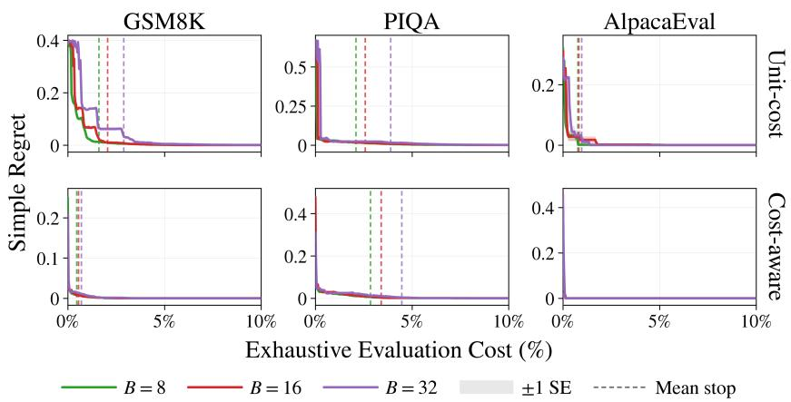  
Figure 8: Batch-size sensitivity on GSM8K, PIQA, and AlpacaEval for $B \in \{ 8 , 1 6 , 3 2 \}$ . The top row uses unit costs and the bottom row uses original costs. Curves show mean simple regret against cumulative evaluation cost as a percentage of exhaustive evaluation; bands denote ±1 standard error and dashed lines mark mean natural-stopping cost. GSM8K and PIQA average 100 runs each, and AlpacaEval averages 20 runs.

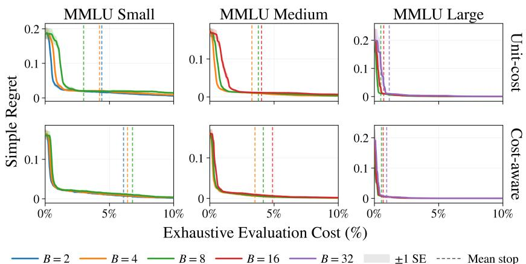  
Figure 9: Batch-size sensitivity across the 57 MMLU subjects, grouped as small (22), medium (30), and large (5), with grids $B \in \mathbf { \bar { \{ 2 , 4 , 8 \} } } , B \in \{ 4 , 8 , 1 6 \}$ , and $B \in \{ 8 , 1 6 , 3 2 \}$ . The top row uses unit costs and the bottom row uses original costs. Curves show equally weighted subject means against cumulative evaluation cost as a percentage of exhaustive evaluation; bands denote ±1 subject-level standard error and dashed lines average subjects with observed natural stops.

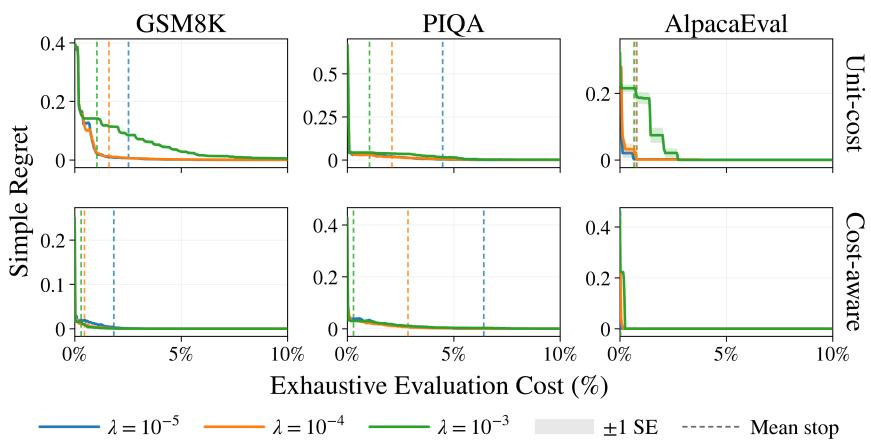  
Figure 10: Cost-scaling sensitivity on GSM8K, PIQA, and AlpacaEval for $\lambda \in \{ 1 0 ^ { - 5 } , 1 0 ^ { - 4 } , 1 0 ^ { - 3 } \}$ The top row uses unit costs and the bottom row uses original costs. Curves show mean simple regret against cumulative evaluation cost as a percentage of exhaustive evaluation; bands denote ±1 standard error and dashed lines mark mean natural-stopping cost. GSM8K and PIQA average 100 runs each, and AlpacaEval averages 20 runs.

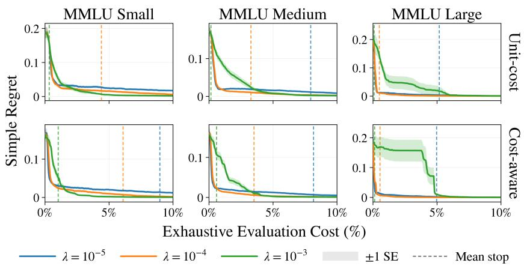  
Figure 11: Cost-scaling sensitivity across the 57 MMLU subjects, grouped as small (22), medium (30), and large (5), for $\mathsf { \bar { \lambda } } \in \lbrace 1 0 ^ { - 5 } , 1 0 ^ { - 4 } , 1 0 ^ { - 3 } \rbrace$ . The top row uses unit costs and the bottom row uses original costs. Curves show equally weighted subject means against cumulative evaluation cost as a percentage of exhaustive evaluation; bands denote ±1 subject-level standard error and dashed lines mark mean natural-stopping cost.

Choice of recommendation rule. We compare the unpenalized posterior-mean recommendation

$$
\widehat { k } _ { t } ^ { \mathrm { m e a n } } = \arg \operatorname* { m a x } _ { k } M _ { k , t }
$$

with the LCB-style recommendation used by GittinsEval-G,

$$
\widehat { k } _ { t } ^ { \mathrm { L C B } } = \arg \operatorname* { m a x } _ { k } \left\{ M _ { k , t } - \sqrt { V _ { k , t } } \right\} .
$$

Here, $M _ { k , t }$ and $V _ { k , t }$ are respectively the posterior mean and variance of arm $k ' \mathrm { s }$ complete, fixed evaluation-row mean. The two recommendation rules are evaluated on the same finite-population Gittins allocation trajectory; therefore, they share the same inherited Gittins stopping time.

Figure 12 shows the two cost-aware settings with the largest observed differences. At 2% of the exhaustive-evaluation cost, the LCB recommendation reduces mean simple regret on GSM8K from $0 . 0 7 8 0 \pm 0 . 0 1 2 1$ to 0.0080 ± 0.0013, an 89.7% reduction. On MMLU Hard-Large, it reduces aggregate raw simple regret from $0 . 0 8 2 8 \pm 0 . 0 1 4 3$ to 0.0018 ± 0.0004, a 97.9% reduction. Since the recommendation rule changes neither the allocation trajectory nor the inherited Gittins stopping rule, the stopping times are shared by the two curves. Thus, the improvement comes from stabilizing the anytime recommendation rather than changing either what GittinsEval evaluates or when it stops.

The aggregate comparison does not imply uniform behavior across individual MMLU subjects: several subjects still exhibit noticeable differences between the posterior-mean and LCB-style recom mendations, consistent with the single-seed recommendation diagnostic above.

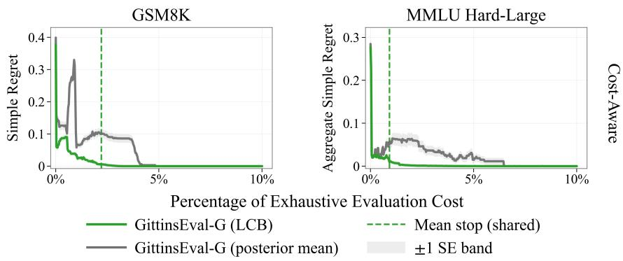  
Figure 12: Recommendation-rule ablation for GittinsEval-G under cost-aware evaluation. The left panel compares the LCB-style and posterior-mean recommendations on GSM8K (100 randomized runs); the right panel compares them on MMLU Hard-Large (40 subject–run pairs, comprising 20 runs for each of two subjects). Both rules use the same allocation trajectories and stopping times. Curves show mean simple regret (left) and aggregate raw simple regret (right); bands denote ±1 standard error and dashed lines mark the shared mean stopping time.

## E.2 PER-SUBJECT MMLU RESULTS

We provide additional MMLU results under informative priors in Figures 13–18. The subjects are grouped into easy, medium, and hard groups according to their empirical mean arm quality. The corresponding prior means are $\mu _ { 0 } = 0 . 7 5 , \mu _ { 0 } = 0 . 6$ , and $\mu _ { 0 } = 0 . 4 $ , respectively. For each bucket, we report both unit-cost and cost-aware results, with the horizontal axis showing cumulative evaluation

GittinsEval-G ----- GittinsEval-G mean stop - LRF

-BO-PBGI -----: BO-PBGI mean stop SySRs cost as a percentage of the exhaustive-evaluation cost. Across the MMLU subjects, the Gittins-based policies generally improve over UCB-E, but the stronger variant depends on the difficulty bucket. Across the MMLU subjects, GittinsEval-S generally reaches lower simple regret earlier than UCB-E and GittinsEval-G across difficulty buckets. This suggests that the data-specific prior is broadly helpful for MMLU, especially when subjects are more challenging.

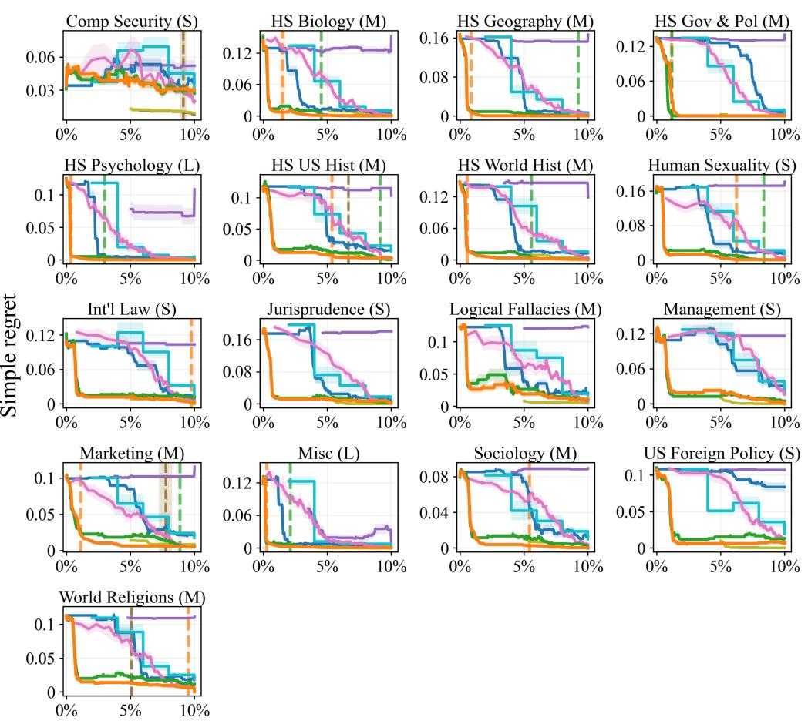  
Percentage of Exhaustive Evaluation Cost  
BO-LogEI(PC) ------ BO-LogEI(PC) mean stop PromptEval

Figure 13: Per-subject MMLU unit-cost results for easy subjects (high-prior bucket). Simple regret is plotted against cumulative evaluation cost as a percentage of exhaustive evaluation. Labels S, M, and L denote matrix size and use B = 2, 4, 8, respectively; LRF uses B = 32. Bands denote ±1 standard error, and dashed lines with faint bands mark mean stopping times with ±1 standard error.

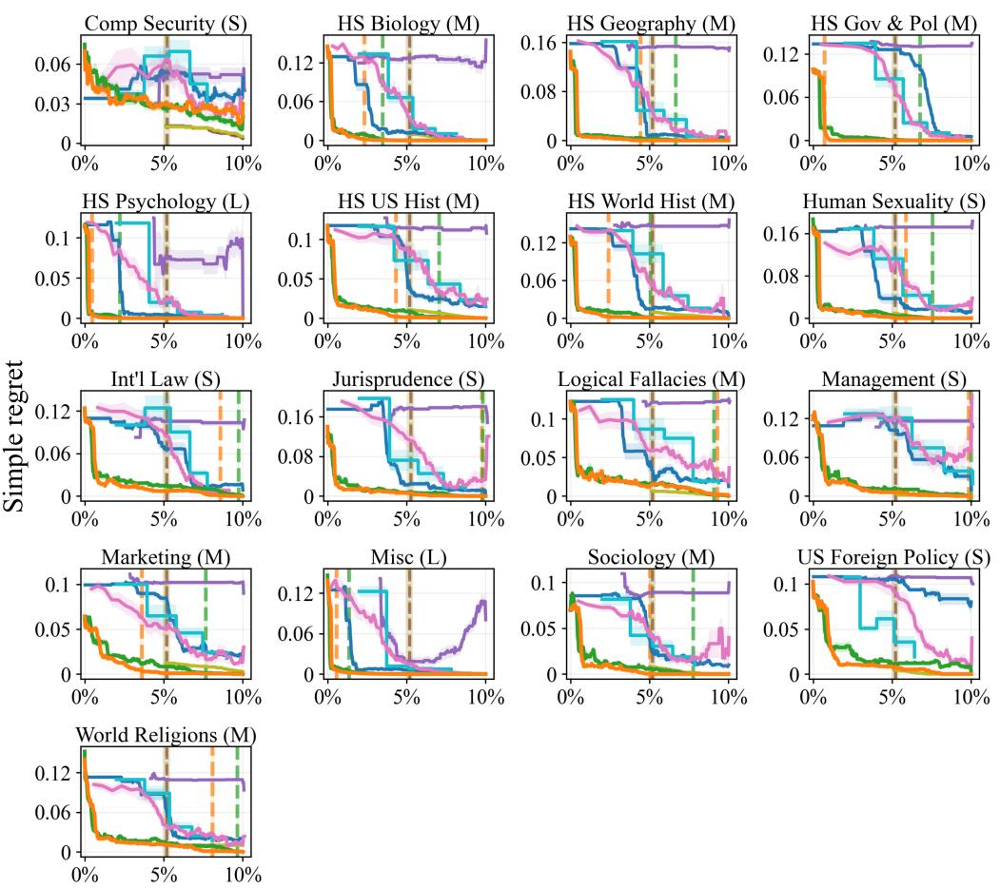  
Percentage of Exhaustive Evaluation Cost  
Figure 14: Per-subject MMLU cost-aware results for easy subjects (high-prior bucket). Simple regret is plotted against cumulative evaluation cost as a percentage of exhaustive evaluation. Labels S, M, and L denote matrix size and use $B = 2 , 4 , 8 ,$ , respectively; LRF uses $B = 3 2 .$ . Bands denote ±1 standard error, and dashed lines with faint bands mark mean stopping times with ±1 standard error.

GittinsEval-S - - - -- GittinsEval-S mean stop UCB-E

BO-LogEI(PC) ------ BO-LogEI(PC) mean stop — PromptEval

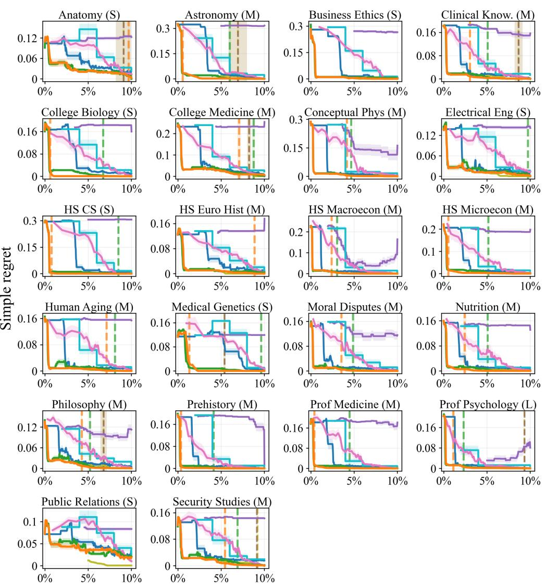  
Percentage of Exhaustive Evaluation Cost  
Figure 15: Per-subject MMLU unit-cost results for medium-difficulty subjects (medium-prior bucket). Simple regret is plotted against cumulative evaluation cost as a percentage of exhaustive evaluation. Labels S, M, and L denote matrix size and use $B = 2 , 4 , 8 ,$ , respectively; LRF uses B = 32. Bands denote ±1 standard error, and dashed lines with faint bands mark mean stopping times with ±1 standard error.

GittinsEval-S - - - -- GittinsEval-S mean stop UCB-E

— BO-LogEI(PC) ------ BO-LogEI(PC) mean stop PromptEval

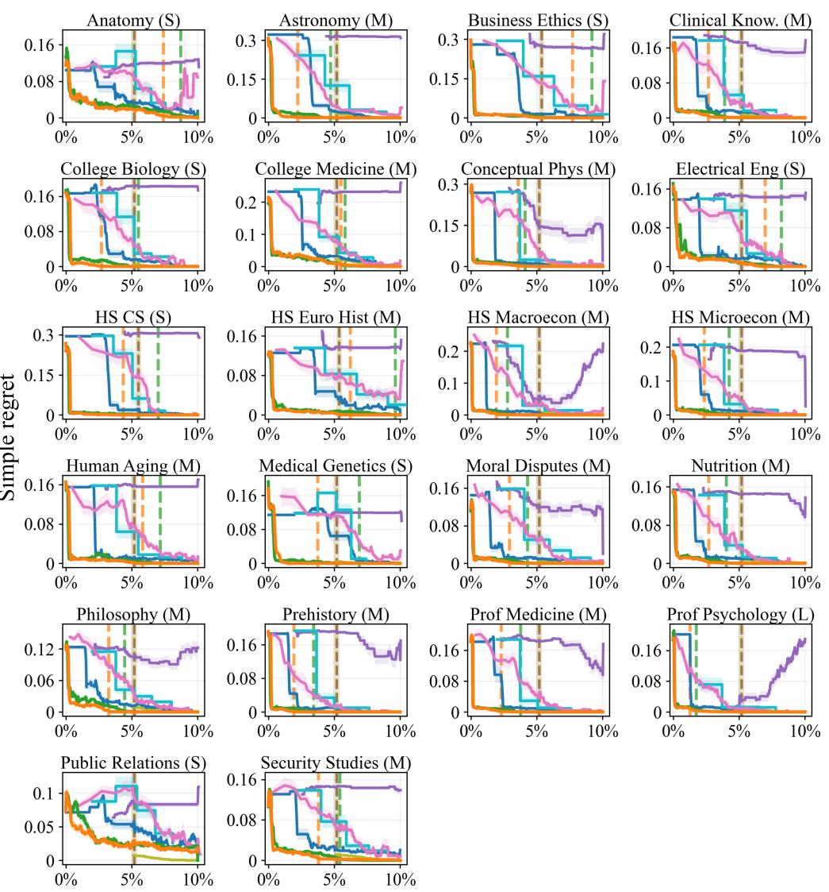  
Percentage of Exhaustive Evaluation Cost  
Figure 16: Per-subject MMLU cost-aware results for medium-difficulty subjects (medium-prior bucket). Simple regret is plotted against cumulative evaluation cost as a percentage of exhaustive evaluation. Labels S, M, and L denote matrix size and use $B = 2 , 4 , 8 ,$ respectively; LRF uses $B = 3 2$ . Bands denote ±1 standard error, and dashed lines with faint bands mark mean stopping times with ±1 standard error.

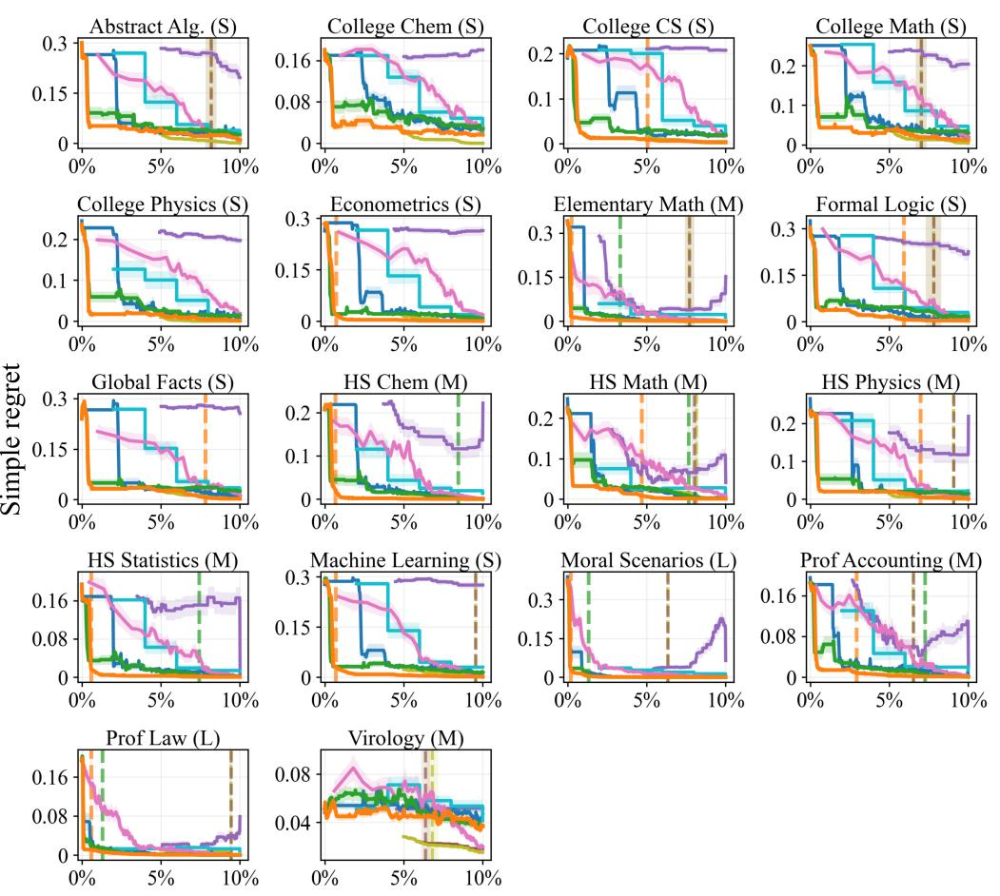  
Percentage of Exhaustive Evaluation Cost  
Figure 17: Per-subject MMLU unit-cost results for hard subjects (low-prior bucket). Simple regret is plotted against cumulative evaluation cost as a percentage of exhaustive evaluation. Labels S, M, and L denote matrix size and use $B = 2 , 4 , 8 ,$ respectively; LRF uses $B = 3 2 .$ . Bands denote ±1 standard error, and dashed lines with faint bands mark mean stopping times with ±1 standard error.

Percentage of Exhaustive Evaluation Cost  
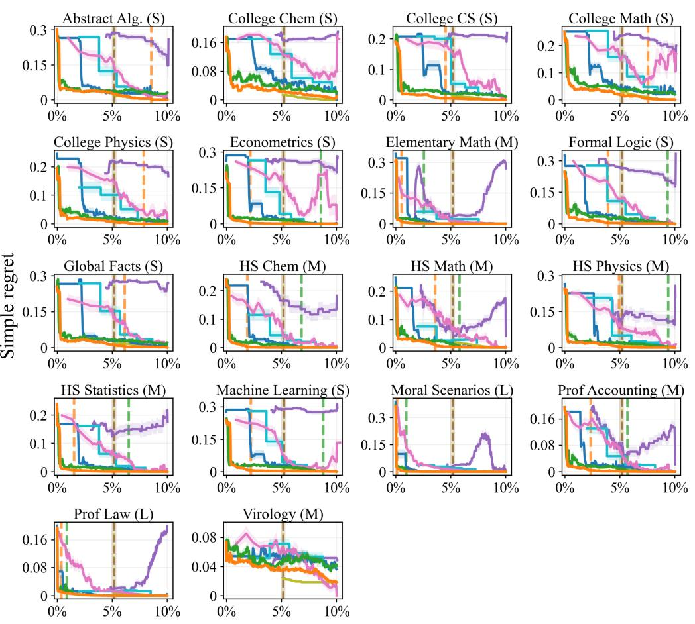  
Figure 18: Per-subject MMLU cost-aware results for hard subjects (low-prior bucket). Simple regret is plotted against cumulative evaluation cost as a percentage of exhaustive evaluation. Labels S, M, and L denote matrix size and use $B = 2 , 4 , 8 ,$ , respectively; LRF uses $B = 3 2 .$ . Bands denote ±1 standard error, and dashed lines with faint bands mark mean stopping times with ±1 standard error.

## E.3 COMPUTATIONAL OVERHEAD COMPARISON

Timing protocol. Wall-clock timing measurements report the total runtime of each allocation policy over a completed simulated evaluation run. Since the response matrices are precomputed, each evaluation is implemented as an array lookup rather than an LLM inference call. Therefore, the reported runtime reflects the computational overhead of the allocation procedure itself, including method-specific setup and the repeated online computation required during the run. This include confidence-bound computation for UCB-E, low-rank-factorization updates for LRF, similarity-based updates for SySRs, Gittins-index computation for the Gittins variants, and Gaussian-process fitting and acquisition computation for the Bayesian optimization baselines, as well as the PromptEval-BAI allocation procedure. These measurements should be interpreted as simulation-time algorithmic overhead rather than model-serving or benchmark-construction cost.

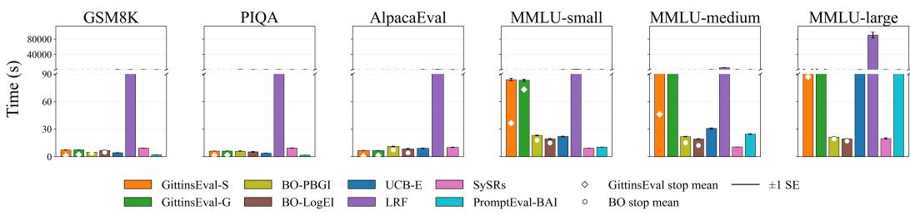  
Figure 19: Total wall-clock runtime under unit costs for GSM8K, PIQA, AlpacaEval, and the three MMLU size groups. Bars show the mean total wall-clock runtime across completed runs, with black error bars indicating ±1 standard error across runs. Diamond and circle markers indicate the mean estimated stopping time for GittinsEval and BO methods, respectively. UCB-E and Gittins use B = 8 on GSM8K/PIQA/AlpacaEval and $B = 2 , 4 ,$ 8 on MMLU-small/medium/large; LRF uses B = 32, and the Bayesian-optimization baselines are PBGI and LogEI. Gittins is generally close to UCB-E, whereas LRF is much slower on larger MMLU tasks; the broken vertical axis accommodates this gap. PromptEval-BAI is not reported on AlpacaEval.

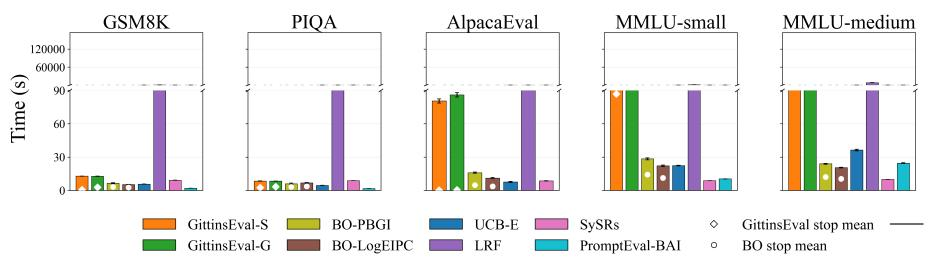

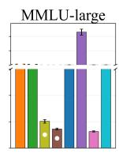  
Figure 20: Total wall-clock runtime under cost-aware evaluation for GSM8K, PIQA, AlpacaEval, and the three MMLU size groups. Bars show the mean total wall-clock runtime across completed runs, with black error bars indicating ±1 standard error across runs. Diamond and circle markers indicate the mean estimated stopping time for GittinsEval and BO methods, respectively. UCB-E and Gittins use B = 8 on GSM8K/PIQA/AlpacaEval and $B = 2 , 4 ,$ 8 on MMLU-small/medium/large; LRF uses B = 32, and the Bayesian-optimization baselines are PBGI and LogEIPC. Gittins is generally close to UCB-E, whereas LRF is much slower on larger MMLU tasks; the broken vertical axis accommodates this gap. PromptEval-BAI is not reported on AlpacaEval.