# EMERGE: Resolution-Agnostic Point Cloud Generation with Equivariant Graph-Based Diffusion

Ilias Mitsouras Nikolaos Chaidos Giorgos Stamou Athanasios Voulodimos

National Technical University of Athens

Athens, Greece

{iliasmits,nchaidos}@ails.ece.ntua.gr

gstam@cs.ntua.gr

thanosv@mail.ntua.gr

## Abstract

Point cloud generation has emerged as a crucial task for accurately capturing and reproducing the complexity of the physical world. However, existing generative approaches, predominantly relying on Transformers and Variational Autoencoders (VAEs), frequently ignore the continuous, non-grid topologies inherent to 3D spaces. Although the integration of graph-based structures has yielded significant benefits in related discriminative vision tasks, such geometric architectures remain noticeably absent from 3D generative modeling. To address this gap, we introduce EMERGE (Equivariant Multi-scale GNN for Resolution-agnostic point cloud GEneration), the first fully SE(3)-equivariant graph-based diffusion backbone explicitly designed to generate point clouds while preserving continuous spatial symmetries. Our framework bypasses the rigid resolution dependencies of standard generative pipelines, enabling zero-shot inference at multiple, arbitrary spatial resolutions. Extensive empirical evaluations demonstrate that EMERGE achieves State-of-the-Art generation quality across standard metrics, while the strong inherent geometric inductive biases enable significantly faster training convergence compared to existing baseline methods.

## 1 Introduction

At its core, 3D point cloud generation is the process of learning the underlying geometric distribution of spatial data to sample and construct novel, high-fidelity 3D shapes. Recent advancements in the field have been predominantly driven by Diffusion Probabilistic Models (DPMs) [41, 32, 42, 28], which successfully adapt sequential probabilistic denoising to point distributions. However, constrained by the computational overhead of the standard reverse diffusion process and the difficulty of modeling intricate structures, the field has quickly evolved to include techniques ranging from trajectory optimization and flow matching [39, 18] to hybrid representations [42] and latent space diffusion [41].

Despite this rapid evolution, these continuous flow and diffusion-based models typically overlook the non-grid structures and continuous spatial symmetries that naturally exist in 3D environments. Formulating these symmetries as strict mathematical equivariances injects a powerful geometric inductive bias, which has been proven to significantly enhance representation learning in complex vision tasks [2, 12, 37]. Yet, even when current State-of-the-Art (SotA) models incorporate equivariance for predictive tasks, they are frequently restricted to discrete rotation groups [8, 43], rendering them unsuitable for high-quality generative applications. Graph Neural Networks (GNNs) provide a natural framework to overcome this by dynamically aggregating local geometric features in unordered point clouds, driving SotA performance across discriminative 2D and 3D tasks [13, 24, 26]. Despite their success in these areas, graph-based architectures have remained noticeably absent from 3D generative modeling. Consequently, continuous 3D equivariance remains an underexplored approach in this domain.

To bridge this gap, we propose EMERGE (Equivariant Multi-Scale GNN for Resolution-agnostic point cloud GEneration), the first fully SE(3)-equivariant, graph-based diffusion model explicitly designed for point cloud generation (Figure 1). By extending the principles of Equivariant GNNs (EGNNs) into the 3D generative framework, our approach inherently respects continuous spatial symmetries while dynamically modeling intricate topologies. Furthermore, unlike existing generative architectures which remain fundamentally bottlenecked by the spatial resolution (i.e. number of points) observed during training, our framework introduces a powerful capability to natively generate point clouds at arbitrary inference resolutions. By introducing a parameter-free distribution alignment technique, we dynamically negate density-induced distribution shifts, allowing our model to scale seamlessly at inference time, without any retraining, fine-tuning, or architectural modifications.

Empirically, we demonstrate that EMERGE achieves SotA generation quality with substantially improved efficiency, requiring up to 10x fewer training epochs than existing methods. Our core contributions are as follows:

• We introduce EMERGE, the first fully SE(3)-equivariant diffusion backbone for 3D point cloud generation, natively integrating fundamental geometric inductive biases.

• We propose a novel Continuous Canonical Frame Voxel Pooling mechanism and a Global Invariant Feature Attention module that efficiently capture multi-scale topologies while strictly preserving spatial symmetries.

• We prove that density-induced distribution shifts can be tackled with a novel zero-shot distribution alignment technique, enabling high-fidelity 3D super-resolution at arbitrary inference resolutions.

• We evaluate our model both quantitatively and qualitatively against prior methods, achieving SotA performance while requiring significantly fewer training epochs.

## 2 Related Work

GNNs in 3D Vision Graph Neural Networks have proven highly effective for modeling non-grid topologies in computer vision. Particularly in the 3D domain, where point clouds are fundamentally unordered and lack a regular grid, GNNs provide a natural framework to dynamically aggregate loca geometric features. Consequently, they have been widely adopted for 3D downstream tasks such as segmentation [38, 25, 27], object detection [34], and classification [19, 27]. Despite their pervasive success in these discriminative tasks, graph-based architectures have remained noticeably absent from 3D generative modeling. In this work, we bridge this gap by introducing the first graph-based diffusion backbone explicitly designed to tackle the inherently more complex challenges of point cloud generation.

Point Cloud Generation Early methods utilizing continuous normalizing flows [40, 20] and VAEs [21, 1] successfully modeled point distributions but faced scaling and quality bottlenecks. The field advanced significantly with Denoising Diffusion Probabilistic Models (DDPMs) [16], which ap plied sequential denoising directly to point clouds [28]. To mitigate high denoising latency and capture complex geometries, subsequent works quickly evolved to introduce trajectory optimization [39, 18] and hybrid point-voxel architectures like PVD [42]. Building on the need for scalable representations, Latent Point Diffusion Models (LION) [41] map point clouds into a hierarchical latent space using a VAE, performing the diffusion process entirely within this highly expressive space. More recently, TIGER [32] introduced a time-varying denoising model that adaptively allocates its local and global representational power depending on the stage of the generation process. While these methods have achieved impressive generative capabilities, they largely ignore explicit non-grid topologies and continuous spatial symmetries inherent in the 3D space. Our proposed method addresses this fundamental limitation by introducing a graph-based backbone that enforces strict SE(3)-equivariance, while enabling zero-shot super-resolution generation at arbitrary resolutions during inference.

2D/3D Equivariant Models Embedding equivariance or invariance directly into a backbone model endows it with strong inductive biases regarding specific input transformations. This property has been proven to significantly enhance representation learning, outperforming standard architectures and heavy data augmentation in complex vision tasks [2, 12]. Beyond standard computer vision, 3D-informed architectures like Equivariant GNNs [33] have been fundamental in modeling physical dynamics [11, 9], as well as in both predictive and generative tasks for chemical compounds [33, 3, 17, 36]. Although certain models have incorporated limited equivariance (typically restricted to a discrete group of rotations) for downstream point cloud analysis [8, 43, 26], 3D equivariance has remained entirely absent from current generative models; the need for a universal, continuous geometric inductive bias in point cloud synthesis directly motivates our proposed architecture.

## 3 Preliminaries

Diffusion Models Diffusion models are a class of generative probabilistic models that operate by iteratively corrupting the original data with noise during the forward diffusion process and subsequently learning to reverse this process to synthesize novel samples [35, 16]. Given a point cloud $\mathbf { \bar { X } } _ { 0 } \in \mathbf { \bar { \mathbb { R } } } ^ { N \times 3 }$ sampled from an unknown underlying data distribution $q ( \mathbf { X } _ { 0 } )$ , where $N$ is the total number of points, the forward process is modeled as a predefined Markov chain that progressively adds Gaussian noise over $t = 1 , . . . , \stackrel { . } { T }$ discrete timesteps, so that $\mathbf { X } _ { T } \sim \mathcal { N } ( \mathbf { 0 } , \mathbf { I } )$ . Denoising Diffusion Probabilistic Models are trained to approximate the intractable true posterior distribution $q ( \mathbf { X } _ { t - 1 } | \mathbf { X } _ { t } )$ Following [16], their simplified training objective is formulated as:

$$
\begin{array} { r } { \mathcal { L } _ { s i m p l e } = \mathbb { E } _ { t \sim \mathcal { U } [ 1 , T ] , \mathbf { X } _ { 0 } \sim q ( \mathbf { X } _ { 0 } ) , \epsilon \sim \mathcal { N } ( \mathbf { 0 } , \mathbf { I } ) } \left[ \| \epsilon - \epsilon _ { \theta } \big ( \sqrt { \bar { \alpha } _ { t } } \mathbf { X } _ { 0 } + \sqrt { 1 - \bar { \alpha } _ { t } } \epsilon , t \big ) \| _ { 2 } ^ { 2 } \right] , } \end{array}\tag{1}
$$

where $\begin{array} { r } { \bar { \alpha } _ { t } = \prod _ { s = 1 } ^ { t } ( 1 - \beta _ { s } ) , \beta _ { t } } \end{array}$ is the variance schedule and $\epsilon _ { \theta }$ is a neural network trained to predict the added noise ϵ.

$S E ( 3 )$ -Equivariance and Invariance Formally, the Special Euclidean group $S E ( 3 )$ describes transformations consisting of a rotation matrix $\mathbf { R } \in S O ( 3 )$ and a translation vector $\dot { \mathbf { t } } \in \mathbb { R } ^ { 3 \times 1 } . \mathrm { ~ A ~ }$ function $f _ { \theta } : \mathbb { R } ^ { N \times 3 }  \mathbb { R } ^ { \breve { N } \times 3 }$ processing a point cloud $\mathbf { X } _ { 0 }$ is considered strictly $S E ( 3 )$ -equivariant if applying the transformation to the input results in an identically transformed output:

$$
f _ { \theta } ( \mathbf { X } _ { 0 } \mathbf { R } + \mathbf { 1 } _ { N } \mathbf { t } ^ { T } ) = f _ { \theta } ( \mathbf { X } _ { 0 } ) \mathbf { R } + \mathbf { 1 } _ { N } \mathbf { t } ^ { T } ,\tag{2}
$$

where $\mathbf { 1 } _ { N } \in \mathbb { R } ^ { N \times 1 }$ is a vector of ones. In contrast, a function $h _ { \phi } : \mathbb { R } ^ { N \times 3 }  \mathbb { R } ^ { N \times 3 }$ is considered strictly $S E ( 3 )$ )-invariant if its output remains unaffected by spatial transformations of the input, $h _ { \phi } ( \dot { \mathbf { X } _ { 0 } } \mathbf { R } + \dot { \mathbf { 1 } } _ { N } \mathbf { t } ^ { T } ) = h _ { \phi } ( \mathbf { X } _ { 0 } )$ . For brevity, all subsequent references to equivariance or invariance in this work denote $S E ( 3 )$ -equivariance or invariance, respectively, unless otherwise specified, and we omit the explicit ${ \bf 1 } _ { N }$ vector when applying translations by assuming standard dimension broadcasting.

## 4 Methodology

## 4.1 EMERGE Architecture

Given a noisy point cloud $\mathbf { X } _ { t } \in \mathbb { R } ^ { N \times 3 }$ at timestep t of the forward diffusion process, our framework processes the geometry through a sequence of $N _ { B }$ identical blocks, as shown in Figure 1. To balance local geometric modeling with global structural coherence, each block alternates between two distinct processing phases:

1. Local Processing: A hierarchical refinement phase that aggregates local features at varying spatial resolutions using a Multi-Scale EGNN and a novel Canonical Frame Voxel Pooling mechanism.

2. Global Processing: A macro-level phase that injects global shape context into the node features via an efficient Global Invariant Feature Attention module.

Repeating this sequential processing progressively refines the geometric representation, ultimately yielding the denoised spatial coordinates $\bar { f } _ { \theta } ( { \mathbf { X } } _ { t } , t )$ while strictly preserving the $S E ( 3 )$ symmetries of the 3D domain. The following subsections detail the local and global mechanisms within each block.

## 4.2 Local Processing: Multi-Scale EGNN

To effectively model the complex geometry of 3D point clouds within a diffusion framework, our architecture must inherently respect the continuous spatial symmetries of the 3D domain. While prior works on 3D predictive tasks such as E2PN [43], have incorporated equivariance, they are often restricted to discrete subgroups of rotations (e.g., 16 predefined viewing angles in [43], 60 in [8]), which inherently limits their representational capacity and can introduce discretization artifacts, disqualifying these approaches for use in generative tasks. To overcome this, our backbone extends EGNNs [33] to achieve continuous, universal $S E ( 3 )$ )-equivariance without requiring expensive data augmentation or restricting the model to specific spatial orientations.

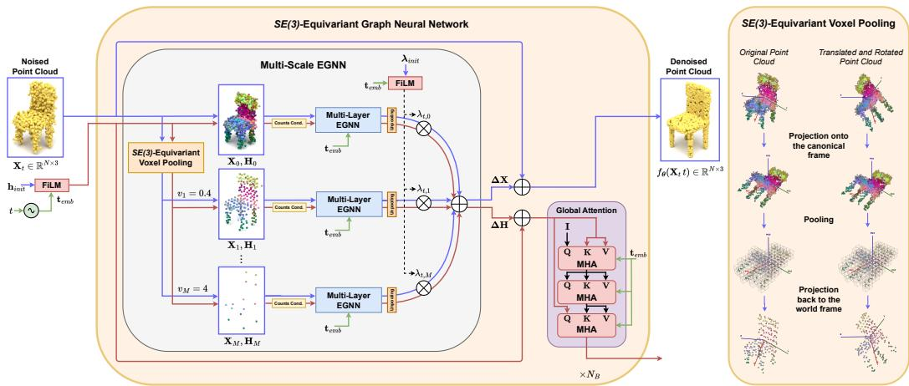  
Figure 1: Overview of the EMERGE architecture. Given a noisy point cloud $\mathbf { X } _ { t }$ at timestep $t ,$ our framework processes the geometry through $N _ { B }$ sequential blocks. Within each block, a Multi-Scale EGNN aggregates local features at varying spatial resolutions using our novel $S E ( 3 )$ -Equivariant Voxel Pooling (detailed right), processing each of the $M + 1$ scales through a Multi-Layer EGNN consisting of $N _ { E }$ sequential message-passing layers. The hierarchical local updates are passed to the Global Invariant Feature Attention module, which efficiently captures macro-level shape context via inducing points. The model outputs the prediction of the denoised point cloud $f _ { \theta } ( \mathbf { X } _ { t } , t )$ while strictly preserving continuous spatial symmetries.

Feature Initialization We begin by initializing a globally shared, learnable feature vector $\mathbf { h } _ { i n i t } \in \mathbb { R } ^ { D }$ . To condition the network on the continuous diffusion timestep t, we generate a standard sinusoidal embedding $\mathbf { t } _ { e m b } \in \mathbb { R } ^ { D }$

$$
\mathbf { t } _ { e m b } ^ { ( 2 n ) } = \sin \left( \frac { t } { 1 0 , 0 0 0 ^ { 2 n / D } } \right) , \quad \mathbf { t } _ { e m b } ^ { ( 2 n + 1 ) } = \cos \left( \frac { t } { 1 0 , 0 0 0 ^ { 2 n / D } } \right) ,\tag{3}
$$

where n denotes the dimension index. To construct the initial per-node feature embedding $\mathbf { h } _ { t , i } ^ { 0 } \in \mathbb { R } ^ { D }$ for each point $i \in \{ 1 , . . . , N \}$ , this shared vector is copied across all points and conditioned on the continuous diffusion timestep t through a Feature-wise Linear Modulation (FiLM) layer [31] (further details are provided in Appendix C):

$$
\mathbf { h } _ { t , i } ^ { 0 } = \mathrm { F i L M } ( \mathbf { h } _ { i n i t } , \mathbf { t } _ { e m b } ) .\tag{4}
$$

Multi-Layer EGNN The standard EGNN [33] iteratively updates equivariant coordinates and invariant features. To effectively scale this for the deep generative process, we recast the updates as residual functions $( \Delta \mathbf { x } ^ { l } , \Delta \mathbf { h } ^ { l } )$ across multiple layers. Because point clouds lack a regular grid, we dynamically construct a local neighborhood graph at each layer l by computing the k-Nearest Neighbors (k-NN) for every point, based on their current spatial coordinates $\mathbf { x } _ { t , i } ^ { l } ,$ using a fixed parameter k across the entire network. For notational clarity, we drop the timestep t from all intermediate activations and coordinates. Furthermore, we inject the diffusion timestep directly into the edge messages via intermediate FiLM layers. For a given layer $l \in \{ 1 , \ldots , N _ { E } \}$ , the updates are formulated as (Figure 2):

$$
\begin{array} { r } { \mathbf { m } _ { i j } = \phi _ { e } \left( \mathbf { h } _ { i } ^ { l } , \mathbf { h } _ { j } ^ { l } , | | \mathbf { x } _ { i } ^ { l } - \mathbf { x } _ { j } ^ { l } | | ^ { 2 } \right) , \quad \tilde { \mathbf { m } } _ { i j } = \mathrm { F i L M } ( \mathbf { m } _ { i j } , \mathbf { t } _ { e m b } ) , } \end{array}\tag{5}
$$

$$
\Delta \mathbf { x } _ { i } ^ { l } = \frac { 1 } { | \mathcal { N } ( i ) | } \sum _ { j \in \mathcal { N } ( i ) } ( \mathbf { x } _ { i } ^ { l } - \mathbf { x } _ { j } ^ { l } ) \phi _ { x } \left( \tilde { \mathbf { m } } _ { i j } , \mathbf { f } _ { i n v , i } \right) , \quad \Delta \mathbf { h } _ { i } ^ { l } = \phi _ { h } \left( \mathbf { h } _ { i } ^ { l } , \sum _ { j \in \mathcal { N } ( i ) } \tilde { \mathbf { m } } _ { i j } \right) .\tag{6}
$$

The features and coordinates are then advanced via residual addition: $\mathbf { x } _ { i } ^ { l + 1 } = \mathbf { x } _ { i } ^ { l } + \Delta \mathbf { x } _ { i } ^ { l }$ and $\mathbf { h } _ { i } ^ { l + 1 } = \mathbf { h } _ { i } ^ { l } + \Delta \mathbf { h } _ { i } ^ { l }$ . Here, we model the $\phi _ { e } , \phi _ { x }$ , and $\phi _ { h }$ functions as MLPs, and ${ \bf f } _ { i n v , i }$ represents our novel injection of local invariant geometric features.

Invariant Geometric Features A key limitation of processing raw relative distances is the loss of descriptive local geometric context. While pairwise distances are informative, they do not explicitly capture higher-level geometric properties, such as the local curvature, linearity, or planarity of the point cloud at a specific neighborhood. To enrich the spatial messaging $\phi _ { x }$ , we compute a 13- dimensional feature vector $\mathbf { f } _ { i n v , i }$ describing these spatial characteristics around the neighborhood of point i at layer l, alongside absolute spatial moments. These features are derived from the eigenvalues and eigenvectors of the neighborhood’s covariance matrix. Intuitively, these geometric properties are inherently $S E ( 3 )$ )-invariant; the curvature, linearity, and planarity of a local patch remain identical regardless of how the overall point cloud is rotated or translated. x H

The foundational EGNN architecture is already proven to be $S E ( 3 )$ -equivariant [33]. Injecting these rich geometric features does not violate the network’s strict equivariance. Informally, any SE(3) transformation applied to a local neighborhood simply rotates its covariance matrix, leaving its intrinsic eigenvalues perfectly unchanged. While the eigenvectors rotate alongside the input points, projecting the relative distance vectors onto these rotated eigenvectors naturally cancels out the rotation, yielding purely invariant scalars. Because ${ \bf f } _ { i n v , i }$ consists exclusively of these invariant scalars, the coordinate update $\Delta \mathbf { x } _ { i } ^ { l }$ remains a linear combination of equivariant vectors weighted by invariant scalars, completely preserving the $S E ( 3 )$ )-equivariance of the network. A formal mathematical proof, along with a detailed breakdown of the 13 invariant features, is provided in Appendix B.

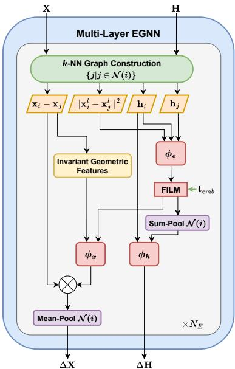

SE(3)-Equivariant Voxel Pooling To generate highfidelity 3D shapes, the network must perceive geometry at multiple hierarchical levels [42, 41], capturing both fine surface details and broad structural topologies. However, standard voxel-pooling maps points into a fixed, axis-aligned 3D grid; if the point cloud rotates, the points fall into different cells,

Figure 2: Multi-Layer EGNN Block Architecture.

inherently breaking equivariance. To maintain strict spatial symmetries without restricting our diffusion backbone to predefined discrete viewing angles, we introduce Canonical Frame Voxel Pooling, a technique that enables universal, continuously $S E ( 3 )$ )-equivariant point aggregation.

Given a point cloud $\mathbf { X } \in \mathbb { R } ^ { N \times 3 } ,$ , we first mean-center the coordinates using their centroid $\pmb { \mu }$ to achieve translation invariance: $\mathbf { X } _ { c } = \mathbf { X } - \pmb { \mu } .$ . Next, we compute the covariance matrix $\mathbf { C } = \mathbf { X } _ { c } ^ { T } \mathbf { X } _ { c }$ and extract a unique, right-handed orthogonal canonical frame $\mathbf { V } ^ { * } \in S O ( 3 )$ via its eigenvectors, resolving inherent sign and chirality ambiguities (Appendix A). Intuitively, any rotation of the input simply rotates $\bar { \mathbf { V } } ^ { * }$ by the exact same amount (see Figure 1). Consequently, projecting the points onto this frame $( \mathbf { Y } = \mathbf { X } _ { c } \mathbf { V } ^ { * } )$ perfectly cancels the transformation, yielding strictly invariant coordinates aligned to the object’s principal axes. Within this invariant space, we safely apply standard spatial voxel pooling with grid size m to obtain pooled nodes $\mathbf { Y } _ { m } = \mathrm { V o x e l P o o l } ( \mathbf { Y } , m )$ alongside mean-pooled node features $\mathbf { H } _ { m }$ . Finally, the pooled coordinates are unprojected back into the original world space, ensuring they rotate in perfect sync with the input:

$$
{ \bf X } _ { m } = { \bf Y } _ { m } ( { \bf V } ^ { * } ) ^ { T } + \pmb { \mu } .\tag{7}
$$

Counts-Conditioning When mapping continuous points to discrete voxels, varying node densities emerge (some voxels aggregate many points, while others capture only a few), which is a critical characteristic of the point cloud’s underlying local structure. To ensure the network is aware of this structural density at different scales, we compute the point count $c _ { n }$ for each voxel-pooled node n and use it to condition the node features $\mathbf { H } _ { m }$ via a FiLM layer (Appendix C). Because the voxel grid is constructed inside the canonical space Y, the spatial boundaries of the grid are rotation and translation invariant. Therefore, the number of points falling into each voxel remains unchanged under any SE(3) transformation, meaning $c _ { n }$ is an invariant scalar.

Unpooling and Scale Aggregation Let $\mathbf { V } _ { v o x } = \{ v _ { 0 } , v _ { 1 } , \ldots , v _ { M } \} \subset \mathbb { R } _ { > 0 } ^ { M + 1 }$ denote the M distinct voxel sizes alongside the unpooled base resolution $( v _ { 0 } ) .$ , yielding coordinate updates $\Delta \mathbf { X } _ { m }$ and feature updates $\bar { \Delta } \mathbf { H } _ { m }$ for each scale $v _ { m }$ . During unpooling, we simply copy the voxel output to each of its assigned constituent points, so that $\bar { \Delta } \bar { \mathbf { X } _ { m } } \in \bar { \mathbb { R } ^ { N \times 3 } }$ and $\bar { \Delta } \mathbf { H } _ { m } \bar { \mathbf { \Xi } } \in \mathbb { R } ^ { N \times D }$ Different scales hold varying importance depending on the current stage of the model; fine details are critical during early diffusion timesteps for noise removal, while global structures are dominant at later timesteps for macro-shape formation. Inspired by similar scale-mixing approaches [10], we introduce adaptable coefficients $\bar { \lambda _ { t } } = \bar { \mathrm { F i L M } } ( \bar { \lambda _ { i n i t } } , \mathbf { \bar { t } } _ { e m b } ) \stackrel { \cdot } { \in } \mathbb { R } ^ { M + 1 }$ to aggregate the per-scale predictions, with a learnable base vector $\lambda _ { i n i t }$ conditioned dynamically on the diffusion timestep:

$$
\Delta \mathbf { X } = \sum _ { m = 0 } ^ { M } \lambda _ { t , m } \Delta \mathbf { X } _ { m } , \qquad \Delta \mathbf { H } = \sum _ { m = 0 } ^ { M } \lambda _ { t , m } \Delta \mathbf { H } _ { m } .\tag{8}
$$

Since the coefficients $\lambda _ { t , m }$ are invariant scalars, then the linear combination with the equivariant coordinate updates $\Delta \mathbf { X } _ { m }$ and the invariant features $\Delta \mathbf { H } _ { m }$ preserve their respective $S E ( 3 )$ symmetries.

## 4.3 Global Processing: Invariant Feature Attention

To efficiently capture global shape context and complement the local inductive biases of our graphbased messaging, we incorporate a global attention mechanism. We build upon the highly scalable Inducing Point Attention paradigm [23] and extend it for our denoising diffusion backbone. This approach is advantageous for its linear computational complexity relative to N and because it inherently preserves the $S E ( 3 )$ -invariant properties of the hidden node features.

Standard Multi-Head Attention (MHA) across all N points is computationally prohibitive for dense point clouds. Instead, we introduce a small set of learnable inducing points $\mathbf { I } \in \mathbb { R } ^ { C \times D }$ , where $\hat { C } \ll N$ . The global attention is computed in three sequential stages:

1. Compression: A cross-attention layer where the inducing points I act as queries to aggregate information from all node features H (which act as keys and values).

2. Processing: A self-attention layer applied exclusively over the inducing points I to capture the global structural context.

3. Broadcasting: A final cross-attention layer where the original node features H query the updated inducing points to retrieve the globally-aware context.

Because the entire module consists exclusively of, either point-wise transformations $( \mathrm { e . g . , F F N s , }$ nonlinearities, and layer normalizations), or permutation-equivariant aggregations (MHA layer without positional encoding) applied directly to the invariant node features H, the resulting updated features retain their spatial invariance without requiring additional modifications to the attention mechanism.

To make this module suitable for the reverse diffusion process, we modulate the feature representations at each stage based on the current timestep t. We replace standard Layer Normalization with Adaptive Layer Normalization (adaLN) [30], a technique widely used in diffusion models. The scale and shift parameters for the adaLN layers are regressed directly from the timestep embedding $\mathbf { t } _ { e m b }$

## 5 Experiments

Datasets To be consistent with previous work, we utilize ShapeNetv2 [7] as the primary dataset for training and evaluating our model, specifically using the preprocessing pipeline introduced by PointFlow [40]. In particular, we train our model on the three widely adopted categories: airplane, chair, and car, containing 2,832, 4,612, and 2,458 shapes, respectively. For training, we apply per-shape normalization while each shape is sampled to contain exactly $\dot { N } = 2 , 0 4 8$ points.

Implementation Details Our architecture utilizes $N _ { B } = 6$ main blocks, each interleaving a local Multi-Scale EGNN with a Global Inducing Point Attention module. Within the Multi-Scale EGNN, each of the 7 resolution branches (the base resolution plus $M = 6$ voxel scales) is independently processed by a Multi-Layer EGNN consisting of $N _ { E } = 2$ sequential message-passing layers $( k = 5 )$ . Full hyperparameters, including the exact multi-resolution voxel pooling array, are detailed in Appendix H.

Training The model is trained using a continuous diffusion process over $T = 1 0 0 0$ timesteps, with a linear noise schedule ranging from $\bar { \beta } _ { s t a r t } = 1 0 ^ { - 4 } { \mathrm t o } \beta _ { e n d } = 0 . 0 2$ . Following standard practices, our model predicts the clean data $\mathbf { X } _ { 0 }$ using the equivalent reparameterized form of the simplified diffusion objective in Eq. (1). To mitigate training instabilities and alleviate slow convergence across timesteps, we apply the Min-SNR weighting strategy [14] with $\gamma = 5$ (full formulation provided in Appendix I).

Table 1: Evaluation metrics (1-NNA ↓) utilizing both Chamfer Distance (CD) and Earth Mover’s Distance (EMD). Lower values indicate better generation quality, with 50% representing the theoretical optimum. We evaluate across the standard dataset splitting strategy (upper section) and the LION dataset splitting strategy [41] (lower section). Baseline results are taken from [41].
<table><tr><td></td><td colspan="2">Airplane</td><td colspan="2">Chair</td><td colspan="2">Car</td></tr><tr><td>Model</td><td>CD (↓)</td><td>EMD (↓)</td><td>CD (↓)</td><td>EMD (↓)</td><td>CD (↓)</td><td>EMD (↓)</td></tr><tr><td>r-GAN [1]</td><td>98.40</td><td>96.79</td><td>83.69</td><td>99.70</td><td>94.46</td><td>99.01</td></tr><tr><td>1-GAN (CD) [1]</td><td>87.30</td><td>93.95</td><td>68.58</td><td>83.84</td><td>66.49</td><td>88.78</td></tr><tr><td>1-GAN (EMD) [1]</td><td>89.49</td><td>76.91</td><td>71.90</td><td>64.65</td><td>71.16</td><td>66.19</td></tr><tr><td>PointFlow [40]</td><td>75.68</td><td>70.74</td><td>62.84</td><td>60.57</td><td>58.10</td><td>56.52</td></tr><tr><td>DPF-Net [22]</td><td>75.18</td><td>65.55</td><td>62.00</td><td>58.53</td><td>62.35</td><td>54.48</td></tr><tr><td>ShapeGF [6]</td><td>80.00</td><td>76.17</td><td>68.96</td><td>65.48</td><td>63.20</td><td>56.53</td></tr><tr><td>SoftFlow [20]</td><td>76.05</td><td>65.80</td><td>59.21</td><td>60.05</td><td>64.77</td><td>60.09</td></tr><tr><td>SetVAE [21]</td><td>76.54</td><td>67.65</td><td>58.84</td><td>60.57</td><td>59.95</td><td>59.94</td></tr><tr><td>DPM [28]</td><td>76.42</td><td>86.91</td><td>60.05</td><td>74.77</td><td>68.89</td><td>79.97</td></tr><tr><td>PVD [42]</td><td>73.82</td><td>64.81</td><td>56.26</td><td>53.32</td><td>54.55</td><td>53.83</td></tr><tr><td>TIGER [32]</td><td>71.85</td><td>55.82</td><td>54.61</td><td>52.71</td><td>54.31</td><td>52.24</td></tr><tr><td>EMERGE</td><td>55.93</td><td>53.33</td><td>54.31</td><td>52.42</td><td>53.55</td><td>50.71</td></tr><tr><td>LION [41]</td><td>67.41</td><td>61.23</td><td>53.70</td><td>52.34</td><td>53.41</td><td>51.14</td></tr><tr><td>TIGER [32]</td><td>67.21</td><td>56.26</td><td>54.32</td><td>51.71</td><td>54.12</td><td>50.24</td></tr><tr><td>EMERGE</td><td>56.17</td><td>54.69</td><td>53.55</td><td>51.44</td><td>52.41</td><td>50.71</td></tr></table>

Evaluation Metrics Following previous works [40, 41, 32], to quantitatively assess the performance of our proposed model, we employ 1-Nearest Neighbor Accuracy (1-NNA) [40] as our primary evaluation metric, calculated using both Chamfer Distance (CD) and Earth Mover’s Distance (EMD). This metric computes the accuracy of a leave-one-out 1-NN classifier tasked with distinguishing between generated and ground-truth shapes. An ideal accuracy of 50% indicates that the generated distribution is entirely indistinguishable from the real one, reflecting optimal generation quality. Since EMERGE is $\dot { S E } ( 3 )$ -equivariant, we also isolate structural quality by automatically aligning the principal axes of all shapes via PCA (more details in Appendix H).

Results All samples for quantitative and qualitative evaluation are generated using 100 Denoising Diffusion Implicit Models (DDIM) [15] steps. Quantitative results, summarized in Table 1, demonstrate that our model achieves SotA performance. Under the standard splitting strategy, we exceed all baseline metrics, and under the LION splitting strategy, we lead in 5 out of 6 metrics. Notably, our model approaches the ideal 50% 1-NNA mark with 50.71% EMD for cars, 53.33% EMD for airplanes, and 52.42% EMD for chairs. Furthermore, injecting equivariance into the backbone historically leads to dramatic data and training efficiency [37, 4, 5]. This is strongly evident in our framework: while recent diffusion baselines require extensive training regimes (such as LION needing 32,000 total epochs, 24,000 for the latent DPM plus 8,000 for the VAE), our model converges much earlier, requiring only 3,100 epochs for airplanes, 2,600 for chairs, and 7,000 for cars. Qualitatively, as shown in Figure 3, EMERGE consistently produces high-fidelity shapes with clear local surfaces and global structural integrity compared to other methods.

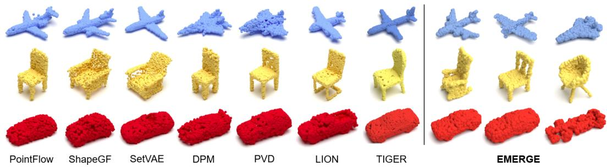  
Figure 3: Samples generated by EMERGE alongside various baselines for the airplane, chair, and car categories. Each point cloud consists of N = 2, 048 points.

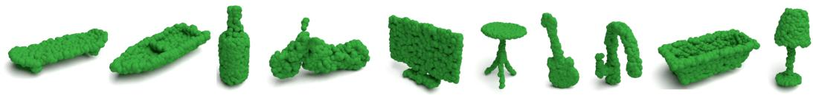  
Figure 4: Samples generated by EMERGE for all 55 categories of ShapeNet (N = 2, 048).

Finally, to demonstrate the generalizability of our framework, we trained EMERGE on all 55 different categories from ShapeNet. As visualized in Figure 4, our model successfully generates highly diverse and structurally complex point clouds without relying on explicit class conditioning.

## 6 Zero-Shot Super-Resolution

Standard diffusion-based architectures face severe distribution shifts when evaluated at higher point densities, necessitating full retraining for varying inference resolutions. Although hierarchical VAEs like SetVAE [21] have attempted resolution-aware modeling, their VAE backbones fundamentally bottlenecked their generation quality and geometric expressivity. To the best of our knowledge, EMERGE is the first high-quality diffusion-based framework to introduce an unprecedented, zero-shot capability to natively super-resolve point clouds at arbitrary inference densities $( N _ { i n f } > N _ { t r a i n } )$ . We show that density-induced distribution shifts are attributed to exactly two sub-components and introduce a parameter-free alignment technique to dynamically negate them during inference (Figure 5). This exact alignment is only possible because our model is fundamentally a distance-based GNN, unlike prior frameworks [41, 32].

The two primary bottlenecks that occur when performing inference at $N _ { i n f } > N _ { t r a i n }$ and their respective alignment propositions are detailed below.

Voxel Count Distribution Shift & Alignment At higher resolutions, the expected points per voxel increases proportionally with the density ratio $\rho = N _ { i n f } / N _ { t r a i n } ,$ pushing the inputs of the count-conditioning FiLM layers entirely out of the training distribution.

Proposition 1 (Point-Count Alignment) To preserve the expected input distribution of the countconditioning FiLM layers, the raw inference voxel counts $c _ { n } ( N _ { i n f } )$ must be linearly scaled by the inverse density ratio prior to normalization: $\hat { c } _ { n } = c _ { n } ( N _ { i n f } ) \cdot ( N _ { t r a i n } / N _ { i n f } )$ . (Proof in Appendix E.1).

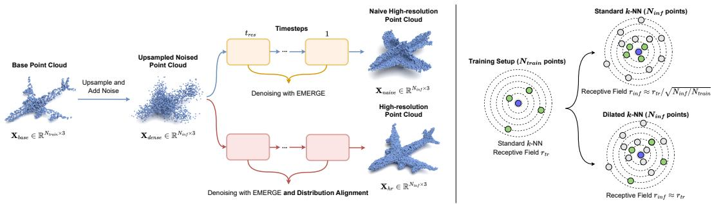  
Figure 5: Zero-shot super-resolution with EMERGE. (Left) Naive denoising at high resolutions introduces severe distribution shifts, causing structural failure (top). Our parameter-free distribution alignment technique negates these shifts, enabling high-fidelity super-resolution without retraining (bottom). (Right) We resolve density-induced receptive field shrinkage by introducing a Dilated k-NN graph, perfectly preserving the receptive field $r _ { t r a i n }$ at arbitrary inference resolutions.

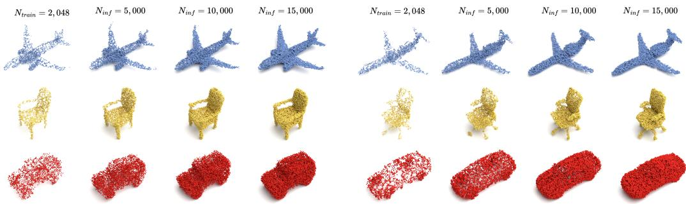  
Figure 6: Generated samples using EMERGE and distribution alignment for varying resolutions.

Receptive Field Shrinkage & Alignment Assuming points are approximately uniformly distributed over a locally smooth 2D surface manifold, the spatial radius $r _ { k }$ of the EGNN’s (k-NN) graph scales as $r _ { k } \propto \sqrt { k / N }$ . Consequently, querying k neighbors at $N _ { i n f }$ artificially shrinks the network’s spatial radius by a factor of ${ \sqrt { \rho } } ,$ , inducing a mismatch with the receptive field observed during training.

Proposition 2 (Dilated k-NN Receptive Field Matching) Let $d = \lfloor N _ { i n f } / N _ { t r a i n } \rfloor$ be the spatial dilation factor. A dilated k-NN graph querying $k _ { e x t } = k \cdot d$ neighbors and subsampling every d-th neighbor perfectly preserves both the spatial receptivefield radius $r _ { t r a i n }$ and the message-passing cardinality k. (Proofin Appendix E.2).

With these two bottlenecks resolved after applying the parameter-free modifications of Propositions 1 and 2, the rest of our architecture remains inherently immune to density shifts. Because the EGNN coordinate updates rely strictly on localized k-cardinal aggregations and the global attention mechanism scales natively via a fixed number of inducing points, the overall feature magnitudes remain entirely invariant to the raw point count (detailed analysis in Appendix G).

## 6.1 Super-Resolution Inference Pipeline

While our distribution alignment provides robustness to density shifts, full denoising from T to 0 at target resolution $N _ { i n f }$ incurs severe computational overhead. We circumvent this with an efficient zeroshot inference pipeline inspired by iterative refinement [29]. Rather than generating high-resolution shapes from scratch, we reduce compute time by refining an upsampled low-resolution base shape:

1. Base Initialization: The pipeline accepts an arbitrary base point cloud $\mathbf { X } _ { b a s e } \in \mathbb { R } ^ { N _ { t r a i n } }$ ×3 (synthesized natively or provided as pre-generated).

2. Deterministic Upsampling: The base point cloud is upsampled via point duplications to the target resolution $N _ { i n f }$ , yielding an initial dense cloud $\bar { \mathbf { X } _ { d e n s e } } \in \mathbb { R } ^ { N _ { i n j } \times 3 }$

3. Forward Noise Injection: To break the spatial symmetries of the overlapping points, we partially corrupt ${ \bf X } _ { d e n s e }$ by simulating the forward diffusion process up to an intermediate timestep $t _ { r e s }$ , naturally perturbing and separating the coordinates.

4. Zero-Shot Refinement: Finally, we denoise the corrupted point cloud from $t _ { r e s }$ to $t = 0$ utilizing our distribution alignment technique. Specifically, at each denoising step, we apply Propositions 1 and 2 to align the voxel-count distributions and to preserve the spatial receptive field, respectively, yielding the final high-resolution point cloud $\dot { \mathbf { X } } _ { h r } \in \mathbb { R } ^ { N _ { i n f } \times \dot { 3 } }$

The complete inference pipeline is presented in Algorithm 1 (Appendix F). Qualitative results demonstrating its effectiveness are visualized in Figure 6, where, instead of full DDPM sampling, we denoise from $t _ { r e s } = 1 5 0$ using 30 DDIM steps. Furthermore, Figure 5 shows that inference at higher resolutions without distribution alignment induces geometric distortion and structural collapse, whereas our pipeline preserves the global topology and fine-grained details of the generated point cloud.

## 7 Conclusion

In this work, we presented EMERGE, a fully SE(3)-equivariant graph-based diffusion model that addresses the critical limitations of prior frameworks for 3D point cloud generation. By incorporating novel canonical voxel pooling and global invariant feature attention, our architecture successfully models complex, hierarchical geometries while strictly preserving continuous spatial symmetries. Fur thermore, we theoretically prove that density-induced distribution shifts can be isolated and negated, empowering our framework to achieve zero-shot, high-fidelity 3D generation at arbitrary inference resolutions. Quantitative and qualitative evaluations confirm that EMERGE achieves State-of-the-Art generation fidelity and converges in significantly fewer training epochs than existing methods.

## References

[1] Panos Achlioptas, Olga Diamanti, Ioannis Mitliagkas, and Leonidas J. Guibas. Learning representations and generative models for 3d point clouds. In Jennifer G. Dy and Andreas Krause, editors, Proceedings ofthe 35th International Conference on Machine Learning, ICML 2018, Stockholmsmässan, Stockholm, Sweden, July 10-15, 2018, Proceedings of Machine Learning Research, pages 40–49. PMLR, 2018. URL http://proceedings.mlr.press/ v80/achlioptas18a.html.

[2] Michael A. Alcorn, Qi Li, Zhitao Gong, Chengfei Wang, Long Mai, Wei-Shinn Ku, and Anh Nguyen. Strike (with) a Pose: Neural Networks Are Easily Fooled by Strange Poses of Familiar Objects. Conference on Computer Vision and Pattern Recognition (CVPR), 2019.

[3] Claudio Battiloro, Ege Karaismailoglu, Mauricio Tec, George Dasoulas, Michelle Audirac, and Francesca Dominici. E(n) equivariant topological neural networks. In The Thirteenth International Conference on Learning Representations (ICLR), 2025.

[4] Simon Batzner, Albert Musaelian, Lixin Sun, Mario Geiger, Jonathan P. Mailoa, Mordechai Kornbluth, Nicola Molinari, Tess E. Smidt, and Boris Kozinsky. E(3)-equivariant graph neural networks for data-efficient and accurate interatomic potentials. Nature Communications, 13(1), 2022. ISSN 2041-1723. doi: 10.1038/s41467-022-29939-5. URL http://dx.doi.org/10. 1038/s41467-022-29939-5.

[5] Johann Brehmer, Sönke Behrends, Pim De Haan, and Taco Cohen. Does equivariance matter at scale? Transactions on Machine Learning Research, 2025. ISSN 2835-8856. URL https://openreview.net/forum?id=wilNute8Tn.

[6] Ruojin Cai, Guandao Yang, Hadar Averbuch-Elor, Zekun Hao, Serge Belongie, Noah Snavely, and Bharath Hariharan. Learning gradient fields for shape generation. In Proceedings of the European Conference on Computer Vision (ECCV), 2020.

[7] Angel X. Chang, Thomas Funkhouser, Leonidas Guibas, Pat Hanrahan, Qixing Huang, Zimo Li, Silvio Savarese, Manolis Savva, Shuran Song, Hao Su, Jianxiong Xiao, Li Yi, and Fisher Yu. ShapeNet: An Information-Rich 3D Model Repository. Technical Report arXiv:1512.03012 [cs.GR], Stanford University — Princeton University — Toyota Technological Institute at Chicago, 2015.

[8] Haiwei Chen, Shichen Liu, Weikai Chen, Hao Li, and Randall Hill. Equivariant point network for 3d point cloud analysis. In Proceedings ofthe IEEE/CVF Conference on Computer Vision and Pattern Recognition, pages 14514–14523, 2021.

[9] Weitao Du, He Zhang, Yuanqi Du, Qi Meng, Wei Chen, Nanning Zheng, Bin Shao, and Tie-Yan Liu. SE(3) equivariant graph neural networks with complete local frames. In Kamalika Chaudhuri, Stefanie Jegelka, Le Song, Csaba Szepesvari, Gang Niu, and Sivan Sabato, editors, Proceedings of the 39th International Conference on Machine Learning, volume 162 of Proceedings ofMachine Learning Research, pages 5583–5608. PMLR, 17–23 Jul 2022. URL https://proceedings.mlr.press/v162/du22e.html.

[10] Shahaf E Finder, Ron Shapira Weber, Moshe Eliasof, Oren Freifeld, and Eran Treister. Improving the effective receptive field of message-passing neural networks. In International Conference on Machine Learning, 2025.

[11] Victor Garcia Satorras, Emiel Hoogeboom, Fabian Fuchs, Ingmar Posner, and Max Welling. E(n) equivariant normalizing flows. In M. Ranzato, A. Beygelzimer, Y. Dauphin, P.S. Liang, and J. Wortman Vaughan, editors, Advances in Neural Information Processing Systems, volume 34, pages 4181–4192. Curran Associates, Inc., 2021. URL https://proceedings.neurips.cc/ paper\_files/paper/2021/file/21b5680d80f75a616096f2e791affac6-Paper.pdf.

[12] Jan Gerken, Oscar Carlsson, Hampus Linander, Fredrik Ohlsson, Christoffer Petersson, and Daniel Persson. Equivariance versus augmentation for spherical images. In Kamalika Chaudhuri, Stefanie Jegelka, Le Song, Csaba Szepesvari, Gang Niu, and Sivan Sabato, editors, Proceedings of the 39th International Conference on Machine Learning, volume 162 of Proceedings of Machine Learning Research, pages 7404–7421. PMLR, 17–23 Jul 2022. URL https:// proceedings.mlr.press/v162/gerken22a.html.

[13] Kai Han, Yunhe Wang, Jianyuan Guo, Yehui Tang, and Enhua Wu. Vision gnn: an image is worth graph of nodes. In Proceedings of the 36th International Conference on Neural Information Processing Systems, NIPS ’22, Red Hook, NY, USA, 2022. Curran Associates Inc. ISBN 9781713871088.

[14] Tiankai Hang, Shuyang Gu, Chen Li, Jianmin Bao, Dong Chen, Han Hu, Xin Geng, and Baining Guo. Efficient diffusion training via min-snr weighting strategy. In Proceedings of the IEEE/CVF International Conference on Computer Vision (ICCV), pages 7441–7451, October 2023.

[15] Jonathan Ho, Ajay Jain, and Pieter Abbeel. Denoising diffusion probabilistic models. In Proceedings ofthe 34th International Conference on Neural Information Processing Systems, NIPS ’20, Red Hook, NY, USA, 2020. Curran Associates Inc. ISBN 9781713829546.

[16] Jonathan Ho, Ajay Jain, and Pieter Abbeel. Denoising diffusion probabilistic models. In Hugo Larochelle, Marc’Aurelio Ranzato, Raia Hadsell, Maria-Florina Balcan, and Hsuan-Tien Lin, editors, Advances in Neural Information Processing Systems 33: Annual Conference on Neural Information Processing Systems 2020, NeurIPS 2020, December 6- 12, 2020, virtual, 2020. URL https://proceedings.neurips.cc/paper/2020/hash/ 4c5bcfec8584af0d967f1ab10179ca4b-Abstract.html.

[17] Emiel Hoogeboom, Víctor Garcia Satorras, Clément Vignac, and Max Welling. Equivariant diffusion for molecule generation in 3D. In Kamalika Chaudhuri, Stefanie Jegelka, Le Song, Csaba Szepesvari, Gang Niu, and Sivan Sabato, editors, Proceedings of the 39th International Conference on Machine Learning, volume 162 of Proceedings of Machine Learning Research, pages 8867–8887. PMLR, 17–23 Jul 2022. URL https://proceedings.mlr.press/v162/ hoogeboom22a.html.

[18] Ka-Hei Hui, Chao Liu, Xiaohui Zeng, Chi-Wing Fu, and Arash Vahdat. Not-so-optimal transport flows for 3d point cloud generation. In International Conference on Learning Representations (ICLR), 2025.

[19] Jincen Jiang, Lizhi Zhao, Xuequan Lu, Wei Hu, Imran Razzak, and Meili Wang. Dhgcn: Dynamic hop graph convolution network for self-supervised point cloud learning. In Proceedings ofthe AAAI Conference on Artificial Intelligence, volume 38, pages 12883–12891, 2024.

[20] Hyeongju Kim, Hyeonseung Lee, Woo Hyun Kang, Joun Yeop Lee, and Nam Soo Kim. Softflow: probabilistic framework for normalizing flow on manifolds. In Proceedings of the 34th International Conference on Neural Information Processing Systems, NIPS ’20, Red Hook, NY, USA, 2020. Curran Associates Inc. ISBN 9781713829546.

[21] Jinwoo Kim, Jaehoon Yoo, Juho Lee, and Seunghoon Hong. Setvae: Learning hierarchical composition for generative modeling of set-structured data. In Proceedings of the IEEE/CVF Conference on Computer Vision and Pattern Recognition (CVPR), pages 15059–15068, June 2021.

[22] R. Klokov, E. Boyer, and J. Verbeek. Discrete point flow networks for efficient point cloud generation. In Proceedings of the 16th European Conference on Computer Vision (ECCV), 2020.

[23] Juho Lee, Yoonho Lee, Jungtaek Kim, Adam Kosiorek, Seungjin Choi, and Yee Whye Teh. Set transformer: A framework for attention-based permutation-invariant neural networks. In Proceedings of the 36th International Conference on Machine Learning, pages 3744–3753, 2019.

[24] Caoshuo Li, Tanzhe Li, Xiaobin Hu, Donghao Luo, and Taisong Jin. Dvhgnn: Multi-scale dilated vision hgnn for efficient vision recognition. In Proceedings of the Computer Vision and Pattern Recognition Conference (CVPR), pages 20158–20168, June 2025.

[25] Guohao Li, Matthias Müller, Ali Thabet, and Bernard Ghanem. Deepgcns: Can gcns go as deep as cnns? In The IEEE International Conference on Computer Vision (ICCV), 2019.

[26] Chien Erh Lin, Jingwei Song, Ray Zhang, Minghan Zhu, and Maani Ghaffari. Se(3)-equivariant point cloud-based place recognition. In Karen Liu, Dana Kulic, and Jeff Ichnowski, editors, Proceedings ofThe 6th Conference on Robot Learning, volume 205 of Proceedings ofMachine Learning Research, pages 1520–1530. PMLR, 14–18 Dec 2023. URL https://proceedings. mlr.press/v205/lin23a.html.

[27] Zhi-Hao Lin, Sheng-Yu Huang, and Yu-Chiang Frank Wang. Convolution in the cloud: Learning deformable kernels in 3d graph convolution networks for point cloud analysis. In Proceedings of the IEEE/CVF Conference on Computer Vision and Pattern Recognition (CVPR), June 2020.

[28] Shitong Luo and Wei Hu. Diffusion probabilistic models for 3d point cloud generation. In Proceedings of the IEEE/CVF Conference on Computer Vision and Pattern Recognition (CVPR), pages 2837–2845, June 2021.

[29] Chenlin Meng, Yutong He, Yang Song, Jiaming Song, Jiajun Wu, Jun-Yan Zhu, and Stefano Ermon. SDEdit: Guided image synthesis and editing with stochastic differential equations. In International Conference on Learning Representations, 2022.

[30] William Peebles and Saining Xie. Scalable diffusion models with transformers. In Proceedings of the IEEE/CVF International Conference on Computer Vision (ICCV), pages 4195–4205, October 2023.

[31] Ethan Perez, Florian Strub, Harm de Vries, Vincent Dumoulin, and Aaron Courville. Film: visual reasoning with a general conditioning layer. AAAI’18/IAAI’18/EAAI’18. AAAI Press, 2018. ISBN 978-1-57735-800-8.

[32] Zhiyuan Ren, Minchul Kim, Feng Liu, and Xiaoming Liu. Tiger: Time-varying denoising model for 3d point cloud generation with diffusion process. In Proceedings of the IEEE/CVF Conference on Computer Vision and Pattern Recognition, pages 9462–9471, 2024.

[33] Víctor Garcia Satorras, Emiel Hoogeboom, and Max Welling. E(n) equivariant graph neural networks. In Marina Meila and Tong Zhang, editors, Proceedings of the 38th International Conference on Machine Learning, volume 139 of Proceedings ofMachine Learning Research, pages 9323–9332. PMLR, 18–24 Jul 2021. URL https://proceedings.mlr.press/v139/ satorras21a.html.

[34] Weijing Shi and Ragunathan (Raj) Rajkumar. Point-gnn: Graph neural network for 3d object detection in a point cloud. In The IEEE Conference on Computer Vision and Pattern Recognition (CVPR), June 2020.

[35] Jascha Sohl-Dickstein, Eric A. Weiss, Niru Maheswaranathan, and Surya Ganguli. Deep unsupervised learning using nonequilibrium thermodynamics. In Francis R. Bach and David M. Blei, editors, Proceedings ofthe 32nd International Conference on Machine Learning, ICML 2015, Lille, France, 6-11 July 2015, JMLR Workshop and Conference Proceedings, pages 2256– 2265. JMLR.org, 2015. URL http://proceedings.mlr.press/v37/sohl-dickstein15. html.

[36] Clement Vignac, Igor Krawczuk, Antoine Siraudin, Bohan Wang, Volkan Cevher, and Pascal Frossard. Digress: Discrete denoising diffusion for graph generation. In The Eleventh International Conference on Learning Representations, 2023. URL https://openreview.net/ forum?id=UaAD-Nu86WX.

[37] Dian Wang, Jung Yeon Park, Neel Sortur, Lawson L.S. Wong, Robin Walters, and Robert Platt. The surprising effectiveness of equivariant models in domains with latent symmetry. In International Conference on Learning Representations, 2023. URL https://openreview. net/forum?id=P4MUGRM4Acu.

[38] Yue Wang, Yongbin Sun, Ziwei Liu, Sanjay E. Sarma, Michael M. Bronstein, and Justin M. Solomon. Dynamic graph cnn for learning on point clouds. ACM Trans. Graph., 38(5), October 2019. ISSN 0730-0301. doi: 10.1145/3326362. URL https://doi.org/10.1145/3326362.

[39] Lemeng Wu, Dilin Wang, Chengyue Gong, Xingchao Liu, Yunyang Xiong, Rakesh Ranjan, Raghuraman Krishnamoorthi, Vikas Chandra, and Qiang Liu. Fast point cloud generation with straight flows. In Proceedings ofthe IEEE/CVF Conference on Computer Vision and Pattern Recognition (CVPR), pages 9445–9454, June 2023.

[40] Guandao Yang, Xun Huang, Zekun Hao, Ming-Yu Liu, Serge Belongie, and Bharath Hariharan. Pointflow: 3d point cloud generation with continuous normalizing flows. In Proceedings ofthe IEEE/CVF International Conference on Computer Vision (ICCV), October 2019.

[41] Xiaohui Zeng, Arash Vahdat, Francis Williams, Zan Gojcic, Or Litany, Sanja Fidler, and Karsten Kreis. Lion: Latent point diffusion models for 3d shape generation. In Advances in Neural Information Processing Systems (NeurIPS), 2022.

[42] Linqi Zhou, Yilun Du, and Jiajun Wu. 3d shape generation and completion through point-voxel diffusion. In Proceedings of the IEEE/CVF International Conference on Computer Vision (ICCV), pages 5826–5835, October 2021.

[43] Minghan Zhu, Maani Ghaffari, William A Clark, and Huei Peng. E2pn: Efficient se (3)- equivariant point network. In Proceedings of the IEEE/CVF Conference on Computer Vision and Pattern Recognition, pages 1223–1232, 2023.

## A SE(3) Equivariance of Voxel Pooling

Let $\mathbf { 1 } _ { N } \in \mathbb { R } ^ { N \times 1 }$ and $\mathbf { 1 } _ { M } \in \mathbb { R } ^ { M \times 1 }$ be column vectors of ones, and let $\mathbf { X } \in \mathbb { R } ^ { N \times 3 }$ be a point cloud consisting of N points. Let $\mathbf { g } \in S E ( 3 )$ be a transformation parametrized by a rotation matrix $\mathbf { R } \in S O ( 3 )$ and a translation column vector $\mathbf { t } \in \mathbb { R } ^ { 3 \times 1 }$ , such that its action on X is defined by ${ \bf X } ^ { \prime } = { \bf X } { \bf R } + { \bf 1 } _ { N } { \bf t } ^ { T }$

Let $\boldsymbol { f } : \mathbb { R } ^ { N \times 3 }  \mathbb { R } ^ { M \times 3 }$ denote our proposed Canonical Frame Voxel Pooling Operation. We assert that f is exactly equivariant to the Special Euclidean group $S E ( 3 )$ , satisfying:

$$
f ( \mathbf { X } \mathbf { R } + \mathbf { 1 } _ { N } \mathbf { t } ) = f ( \mathbf { X } ) \mathbf { R } + \mathbf { 1 } _ { M } \mathbf { t } ^ { T } .\tag{9}
$$

Proof

## Step 1. Centering

Let $\pmb { \mu } \in \mathbb { R } ^ { 1 \times 3 }$ be the centroid of the original point cloud X, calculated as $\begin{array} { r } { { \pmb \mu } = \frac { 1 } { N } { \bf 1 } _ { N } ^ { T } { \bf X } } \end{array}$ . The centered point cloud is defined as $\mathbf { X } _ { c } = \mathbf { X } - \mathbf { 1 } _ { N } \mathbf { \bar { \mu } }$

After applying the transformation g to $\mathbf { X } ,$ , the new centroid $\mu ^ { \prime }$ is:

$$
{ \boldsymbol { \mu } } ^ { \prime } = { \frac { 1 } { N } } \mathbf { 1 } _ { N } ^ { T } \left( \mathbf { X } \mathbf { R } + \mathbf { 1 } _ { N } \mathbf { t } ^ { T } \right) = \left( { \frac { 1 } { N } } \mathbf { 1 } _ { N } ^ { T } \mathbf { X } \right) \mathbf { R } + { \frac { 1 } { N } } \left( \mathbf { 1 } _ { N } ^ { T } \mathbf { 1 } _ { N } \right) \mathbf { t } ^ { T } = { \boldsymbol { \mu } } \mathbf { R } + \mathbf { t } ^ { T } .\tag{10}
$$

The centered coordinates $\mathbf { X } _ { c } ^ { ' }$ for the transformed point cloud $\mathbf { X } ^ { \prime } ,$ , based on $\operatorname { E q . } ( 1 0 )$ become:

$$
\mathbf { X } _ { c } ^ { ' } = \mathbf { X } ^ { \prime } - \mathbf { 1 } _ { N } { \boldsymbol { \mu } } ^ { \prime } = \left( \mathbf { X } \mathbf { R } + \mathbf { 1 } _ { N } { \mathbf { t } } ^ { T } \right) - \mathbf { 1 } _ { N } ( { \boldsymbol { \mu } } \mathbf { R } + { \mathbf { t } } ^ { T } ) = \left( \mathbf { X } - \mathbf { 1 } _ { N } { \boldsymbol { \mu } } \right) \mathbf { R } = \mathbf { X } _ { c } \mathbf { R } .\tag{11}
$$

From Eq.(11) we observe that the translation term t is perfectly canceled, rendering $\mathbf { X } _ { c }$ striclty invariant to translations and strictly equivariant to rotations.

## Step 2. Covariance and Frame Extraction

The covariance matrix C is computed as $\mathbf { C } = \mathbf { X } _ { c } ^ { T } \mathbf { X } _ { c } \in \mathbb { R } ^ { 3 \times 3 }$ . The eigendecomposition of $\mathbf { C }$ yields an orthogonal matrix of eigenvectors $\mathbf { V } \in \mathbb { R } ^ { 3 \times 3 }$ . Because any eigenvector $\mathbf { v } _ { j }$ and its negation $- \mathbf { v } _ { j }$ satisfy the eigenvalue equation equally, the basis vectors spanning the eigenspaces are mathematically unique only up to a sign. Consequently, evaluating the eigenvectors yields an arbitrary raw frame $\mathbf { V } \in O ( 3 )$

For the transformed centered points $\mathbf { X } _ { c } ^ { ' }$ the corresponding covariance matrix $\mathbf { C ^ { \prime } }$ , based on $\operatorname { E q . } ( 1 1 )$ is equal to:

$$
\mathbf { C } ^ { \prime } = \left( \mathbf { X } _ { c } ^ { \prime } \right) ^ { T } \left( \mathbf { X } _ { c } ^ { \prime } \right) = \left( \mathbf { X } _ { c } \mathbf { R } \right) ^ { T } \left( \mathbf { X } _ { c } \mathbf { R } \right) = \mathbf { R } ^ { T } \mathbf { X } _ { c } ^ { T } \mathbf { X } _ { c } \mathbf { R } = \mathbf { R } ^ { T } \mathbf { C } \mathbf { R } .\tag{12}
$$

From the above equation it follows that the principal axes of $\mathbf { C ^ { \prime } }$ are exactly the principal axis of C rotated by $\mathbf { R } ^ { T }$ . Let $\mathbf { V } ^ { \prime } \in O ( 3 )$ denote the frame extracted for the transformed system, which is equal to $\mathbf { R } ^ { T } \mathbf { V }$ . Due to the inherent sign ambiguity of the eigenvectors, the relationship between the two extracted frames is given by:

$$
\mathbf { V } ^ { \prime } = \mathbf { R } ^ { T } \mathbf { V } \mathbf { D } ,\tag{13}
$$

where $\mathbf { D } = \mathrm { d i a g } ( d _ { 1 } , d _ { 2 } , d _ { 3 } )$ with $d _ { j } \in \{ - 1 , 1 \}$ represents the arbitrary sign inversions along each principal axis.

To eliminate D in Eq.(13) and striclty guarantee a unique, rotationally equivariant frame $\mathbf { V } ^ { \ast } \in S O ( 3 )$ we resolve the two inherent ambiguities of the eigenspace.

Remark on Degenerate Eigenvalues: We acknowledge that in cases of perfect rotational symmetry (where eigenvalues are degenerate, e.g., $\lambda _ { 1 } \approx \lambda _ { 2 } \approx \lambda _ { 3 } )$ , the eigenvectors become ill-defined and strict equivariance could theoretically be compromised. However, such instances are statistically insignificant for finite point clouds. Empirically, these degenerate covariance matrices are uniquely encountered when processing pure Gaussian noise at $t \approx T .$ , a state in which the arbitrary geometric alignment does not negatively influence the downstream generation.

## 2A. Spatial Extent Disambiguation

We first project the points onto the raw frame to obtain tentative coordinates $\hat { \mathbf { Y } } = \mathbf { X } _ { c } \mathbf { V }$ . Let $y _ { m a x , j } = \operatorname* { m a x } _ { i } \left( \hat { \mathbf { Y } } _ { i , j } \right)$ and $y _ { m i n , j } = \operatorname* { m i n } _ { i } \left( \hat { \mathbf { Y } } _ { i , j } \right)$ . We define the correction sign matrix,

$$
{ \bf S } = \mathrm { d i a g } \left( s _ { 1 } , s _ { 2 } , s _ { 3 } \right) , ~ \mathrm { w h e r e } ~ s _ { j } = \mathrm { s g n } \left( y _ { m a x , j } + y _ { m i n , j } \right) , ~ \mathrm { w i t h ~ s g n } ( 0 ) = 1 .\tag{14}
$$

This forces the axis to point toward the spatial maximum of the data. The oriented frame is then $\tilde { \mathbf { V } } = \mathbf { V } \mathbf { S }$

For the transformed point cloud, the tentative coordinates are:

$$
\begin{array} { r } { \hat { \mathbf { Y } } ^ { \prime } = \mathbf { X } _ { c } ^ { \prime } \mathbf { V } ^ { \prime } = \left( \mathbf { X } _ { c } \mathbf { R } \right) \left( \mathbf { R } ^ { T } \mathbf { V } \mathbf { D } \right) = \mathbf { X } _ { c } \left( \mathbf { R } \mathbf { R } ^ { T } \right) \mathbf { V } \mathbf { D } = \mathbf { X } _ { c } \mathbf { V } \mathbf { D } = \hat { \mathbf { Y } } \mathbf { D } . } \end{array}\tag{15}
$$

Because $\hat { \mathbf { Y } } ^ { \prime } = \hat { \mathbf { Y } } \mathbf { D }$ , the projected coordinates of the transformed point cloud along the j-th axis are given by $\hat { y } _ { i , j } ^ { \prime } = d _ { j } \hat { y } _ { i , j }$ for all points $i = 1 , \ldots , N$ . Since $d _ { j } \in \{ - 1 , 1 \}$ , this operation represents either an identity mapping or a strict reflection along the axis.If $d _ { i } = 1$ , the spatial extents remain identical: $y _ { m a x , j } ^ { \prime } = y _ { m a x , j }$ and $y _ { m i n , j } ^ { \prime } = y _ { m i n , j } .$ Conversely, if $d _ { j } = - 1$ , the axis is inverted, which geometrically causes the maximum and minimum values of the set to swap and negate: $y _ { m a x , j } ^ { \prime } = - y _ { m i n , j }$ and $y _ { m i n , j } ^ { \prime } = - y _ { m a x , j } .$ . In both scenarios, the sum of the spatial extremes factors out dj exactly:

$$
y _ { m a x , j } ^ { \prime } + y _ { m i n , j } ^ { \prime } = d _ { j } \left( y _ { m a x , j } + y _ { m i n , j } \right) .\tag{16}
$$

Consequently, when computing the new correction heuristic $s _ { j } ^ { \prime } = \mathrm { s g n } ( y _ { m a x , j } ^ { \prime } + y _ { m i n , j } ^ { \prime } )$ , we obtain:

$$
s _ { j } ^ { \prime } = \mathrm { s g n } \left( d _ { j } \left( y _ { m a x , j } + y _ { m i n , j } \right) \right) .\tag{17}
$$

Because $d _ { j }$ is a non-zero scalar (±1), it trivially factors out of the signum function, yielding $s _ { j } ^ { \prime } = d _ { j } s _ { j }$ In matrix notation, this establishes the strict identity ${ \bf S } ^ { \prime } = { \bf D } { \bf S }$ . Applying this identity to the transformed oriented frame, we get:

$$
\tilde { \mathbf { V } } ^ { \prime } = \mathbf { V } ^ { \prime } \mathbf { S } ^ { \prime } = \left( \mathbf { R } ^ { T } \mathbf { V } \mathbf { D } \right) \left( \mathbf { D } \mathbf { S } \right) = \mathbf { R } ^ { T } \mathbf { V } \mathbf { D } ^ { 2 } \mathbf { S } .\tag{18}
$$

Since $d _ { j } \in \{ - 1 , 1 \}$ , it is strictly true that $\mathbf { D } ^ { 2 } = \mathbf { I }$ . Thus:

$$
\tilde { \mathbf { V } } ^ { \prime } = \mathbf { R } ^ { T } \mathbf { V } \mathbf { I } \mathbf { S } = \mathbf { R } ^ { T } ( \mathbf { V } \mathbf { S } ) = \mathbf { R } ^ { T } \tilde { \mathbf { V } } .\tag{19}
$$

From Eq. (19), we can clearly see that the arbitrary solver ambiguity D cancels out.

## 2B. Reflections

While V˜ is deterministic, it is only guaranteed that $\tilde { \mathbf { V } } \in O ( 3 )$ . If $\mathrm { d e t } ( \tilde { \mathbf { V } } ) = - 1$ , the frame represents a left-handed coordinate system. Projecting into this frame would induce a reflection, destroying the geometric chirality of the input point cloud.

To strictly enforce $\mathbf { V } ^ { \ast } \in S O ( 3 )$ , we compute a chirality correction matrix $\mathbf { F } = \mathrm { d i a g } ( 1 , 1 , \mathrm { d e t } ( \tilde { \mathbf { V } } ) )$ , which inverts the least significant principal axis if the frame is reflected. The final canonical frame is $\mathbf { V } ^ { * } = \tilde { \mathbf { V } } \mathbf { F }$ . By definition, de $( \mathbf { V } ^ { \ast } ) = \bar { \operatorname* { d e t } } ( \tilde { \mathbf { V } } ) \cdot \operatorname* { d e t } ( \mathbf { F } ) = \operatorname* { d e t } ( \tilde { \mathbf { V } } ) ^ { 2 } = 1$

We now prove this correction is invariant to R. The determinant of the rotated oriented frame is:

$$
\mathrm { d e t } ( \tilde { \mathbf { V } } ^ { \prime } ) = \mathrm { d e t } ( \mathbf { R } ^ { T } \tilde { \mathbf { V } } ) = \mathrm { d e t } ( \mathbf { R } ^ { T } ) \mathrm { d e t } ( \tilde { \mathbf { V } } ) .\tag{20}
$$

Because the applied rotation $\mathbf { R } \in S O ( 3 )$ , its determinant is exactly 1. Thus, $\operatorname* { d e t } ( \tilde { \mathbf { V } } ^ { \prime } ) = \operatorname* { d e t } ( \tilde { \mathbf { V } } )$ meaning the exact same correction matrix is generated: $\mathbf { F } ^ { \prime } = \mathbf { F }$ . The final transformed frame resolves to:

$$
( \mathbf { V } ^ { * } ) ^ { \prime } = { \tilde { \mathbf { V } } } ^ { \prime } \mathbf { F } ^ { \prime } = ( \mathbf { R } ^ { T } \tilde { \mathbf { V } } ) \mathbf { F } = \mathbf { R } ^ { T } ( \tilde { \mathbf { V } } \mathbf { F } ) = \mathbf { R } ^ { T } \mathbf { V } ^ { * } .\tag{21}
$$

## Step 3. Canonical Projection

The points are projected into the uniquely resolved canonical frame via $\mathbf { Y } = \mathbf { X } _ { c } \mathbf { V } ^ { * }$ . Substituting the transformed components $\mathbf { X } _ { c } ^ { \prime }$ and $( \mathbf { \check { V } } ^ { * } ) ^ { \prime }$ from Eqs. (11) and (21) we get:

$$
\mathbf { Y } ^ { \prime } = \mathbf { X } _ { c } ^ { \prime } ( \mathbf { V } ^ { * } ) ^ { \prime } = ( \mathbf { X } _ { c } \mathbf { R } ) ( \mathbf { R } ^ { T } \mathbf { V } ^ { * } ) = \mathbf { X } _ { c } ( \mathbf { R } \mathbf { R } ^ { T } ) \mathbf { V } ^ { * } = \mathbf { X } _ { c } \mathbf { V } ^ { * } = \mathbf { Y } .\tag{22}
$$

This proves the canonical representation Y is strictly invariant to any $S E ( 3 )$ transformation. Consequently, any deterministic voxel pooling function $\phi ( \mathbf { Y } )$ applied to this space yields an invariant set of pooled nodes $\mathbf { Y } _ { \mathrm { p o o l } } = \phi ( \mathbf { Y } )$ , such that $\mathbf { \dot { Y } } _ { \mathrm { p o o l } } ^ { \prime } = \mathbf { \dot { Y } } _ { \mathrm { p o o l } } .$

## Step 4. Unprojection

To return the pooled nodes to world space, the canonical points are unprojected via $\mathbf { P } = \mathbf { Y } _ { \mathrm { p o o l } } ( \mathbf { V } ^ { * } ) ^ { T } +$ ${ \bf 1 } _ { M } \pmb { \mu } .$

For the transformed pipeline, the final output coordinates $\mathbf { P ^ { \prime } }$ are:

$$
\mathbf { P } ^ { \prime } = \mathbf { Y } _ { \mathrm { p o o l } } ^ { \prime } ( ( \mathbf { V } ^ { * } ) ^ { \prime } ) ^ { T } + \mathbf { 1 } _ { M } \pmb { \mu } ^ { \prime } .\tag{23}
$$

Substituting the derived identities $\mathbf { Y } _ { \mathrm { p o o l } } ^ { \prime } = \mathbf { Y } _ { \mathrm { p o o l } } , ( \mathbf { V } ^ { * } ) ^ { \prime } = \mathbf { R } ^ { T } \mathbf { V } ^ { * }$ , and ${ \pmb { \mu } } ^ { \prime } = { \pmb { \mu } } { \bf R } + { \bf t } ^ { T }$

$$
\mathbf { P } ^ { \prime } = \mathbf { Y } _ { \mathrm { p o o l } } ( \mathbf { R } ^ { T } \mathbf { V } ^ { * } ) ^ { T } + \mathbf { 1 } _ { M } ( \pmb { \mu } \mathbf { R } + \mathbf { t } ^ { T } )
$$

$$
\mathbf { P } ^ { \prime } = \mathbf { Y } _ { \mathrm { p o o l } } ( \mathbf { V } ^ { * } ) ^ { T } \mathbf { R } + \mathbf { 1 } _ { M } \pmb { \mu } \mathbf { R } + \mathbf { 1 } _ { M } \mathbf { t } ^ { T } .\tag{24}
$$

Factoring out the right-multiplied rotation matrix R:

$$
\mathbf { P } ^ { \prime } = ( \mathbf { Y } _ { \mathrm { p o o l } } ( \mathbf { V } ^ { * } ) ^ { T } + \mathbf { 1 } _ { M } \pmb { \mu } ) \mathbf { R } + \mathbf { 1 } _ { M } \mathbf { t } ^ { T } = \mathbf { P } \mathbf { R } + \mathbf { 1 } _ { M } \mathbf { t } ^ { T } .\tag{25}
$$

The output coordinates $\mathbf { P ^ { \prime } }$ of the voxel pooling operation applied to the transformed input $\mathbf { X R } + \mathbf { t }$ algebraically map to the exact transformation of the original output $\mathbf { P R } + \mathbf { t }$ . Therefore, the function f rigorously satisfies $S E ( 3 )$ equivariance.

## B Invariant Geometric Features and Proof of Equivariance

## B.1 Definition of Invariant Features

To capture the local topology around a point ${ \bf x } _ { i } ,$ we consider its k-nearest neighbors $\mathcal { N } ( i )$ . Let ${ \bf r } _ { j i } =$ $\mathbf { x } _ { j } - \mathbf { x } _ { i }$ denote the relative distance vectors. The local covariance matrix $\mathbf { C } _ { i } \in \mathbb { R } ^ { 3 \times 3 }$ is defined as:

$$
\mathbf { C } _ { i } = \frac { 1 } { | \mathcal { N } ( i ) | } \sum _ { j \in \mathcal { N } ( i ) } \mathbf { r } _ { j i } ^ { T } \mathbf { r } _ { j i } .\tag{26}
$$

Through eigen-decomposition, we extract the eigenvalues $\lambda _ { 1 } \geq \lambda _ { 2 } \geq \lambda _ { 3 } \geq 0$ and their corresponding eigenvectors $\mathbf { V } = \left[ \mathbf { v } _ { 1 } , \mathbf { v } _ { 2 } , \mathbf { v } _ { 3 } \right]$ ]. From these, we construct our 13-dimensional invariant feature vector $\mathbf { f } _ { i n v , i }$ , which consists of two groups:

Eigenvalue-based features (7 dimensions): These describe the intrinsic shape of the local neighborhood.

1. Sum of eigenvalues: $\begin{array} { r } { \sum _ { k = 1 } ^ { 3 } \lambda _ { k } = \lambda _ { 1 } + \lambda _ { 2 } + \lambda _ { 3 } } \end{array}$

2. Omnivariance: $( \lambda _ { 1 } \lambda _ { 2 } \lambda _ { 3 } ) ^ { 1 / 3 }$

3. Eigenentropy: $\begin{array} { r } { - \sum _ { k = 1 } ^ { 3 } \lambda _ { k } \ln ( \lambda _ { k } + \epsilon ) } \end{array}$

4. Linearity: $( \lambda _ { 1 } - \lambda _ { 2 } ) / \lambda _ { 1 }$

5. Planarity: $( \lambda _ { 2 } - \lambda _ { 3 } ) / \lambda _ { 1 }$

6. Sphericity: $\lambda _ { 3 } / \lambda _ { 1 }$

7. Change of curvature: $\lambda _ { 3 } / \sum _ { k = 1 } ^ { 3 } \lambda _ { k }$

Absolute spatial moments (6 dimensions): These capture the distribution of points projected onto the principal axes. For each principal axis $w \in \{ 1 , 2 , 3 \}$ , we compute the first and second-order absolute moments:

8-10. First-order moments: $\begin{array} { r } { \frac { 1 } { | \mathcal { N } ( i ) | } \sum _ { j \in \mathcal { N } ( i ) } | \mathbf { r } _ { j i } \mathbf { v } _ { w } | } \end{array}$

11-13. Second-order moments: $\begin{array} { r } { \frac { 1 } { \left| \mathcal { N } ( i ) \right| } \sum _ { j \in \mathcal { N } ( i ) } \left( \mathbf { r } _ { j i } \mathbf { v } _ { w } \right) ^ { 2 } } \end{array}$

## B.2 Formal Proof of SE(3) Invariance

We assert that the feature vector $\mathbf { f } _ { i n v , i }$ is strictly invariant to any SE(3) transformation applied to the input point cloud.

Proof

Let $\mathbf { 1 } _ { N } \in \mathbb { R } ^ { N \times 1 }$ be the column vector of ones, and $\mathbf { X } \in \mathbb { R } ^ { N \times 3 }$ a point cloud consisting of $N$ points. Let $\mathbf { g } \in S E ( 3 )$ be a transformation parametrized by a rotation matrix $\mathbf { R } \in S O ( 3 )$ and a translation column vector $\mathbf { t } \in \mathbb { R } ^ { 3 \times 1 }$ , such that its action on X is defined by $\mathbf { X } ^ { \prime } = \mathbf { X } \mathbf { R } + \mathbf { \overset { \cdot } { 1 } } _ { N } \mathbf { \overset { \cdot } { t } } ^ { T }$

## 1. Translation Invariance

The relative vectors for the transformed points become:

$$
\mathbf { r } _ { j i } ^ { \prime } = \mathbf { x } _ { j } ^ { \prime } - \mathbf { x } _ { i } ^ { \prime } = ( \mathbf { x } _ { j } \mathbf { R } + \mathbf { t } ^ { T } ) - ( \mathbf { x } _ { i } \mathbf { R } + \mathbf { t } ^ { T } ) = ( \mathbf { x } _ { j } - \mathbf { x } _ { i } ) \mathbf { R } = \mathbf { r } _ { j i } \mathbf { R } .\tag{27}
$$

The translation term t is perfectly canceled. Thus, all subsequent operations on $\mathbf { r } _ { j i } ^ { \prime }$ are inherently translation-invariant.

## 2. Covariance Rotation

The covariance matrix of the transformed neighborhood is:

$$
\begin{array} { l } { { \displaystyle { \bf C } _ { i } ^ { \prime } = \frac { 1 } { | \mathcal { N } ( i ) | } \sum _ { j \in \mathcal { N } ( i ) } ( { \bf r } _ { j i } ^ { \prime } ) ^ { T } ( { \bf r } _ { j i } ^ { \prime } ) = \frac { 1 } { | \mathcal { N } ( i ) | } \sum _ { j \in \mathcal { N } ( i ) } ( { \bf r } _ { j i } { \bf R } ) ^ { T } ( { \bf r } _ { j i } { \bf R } ) } \ ~ } \\ { { \displaystyle = { \bf R } ^ { T } \left( \frac { 1 } { | \mathcal { N } ( i ) | } \sum _ { j \in \mathcal { N } ( i ) } { \bf r } _ { j i } ^ { T } { \bf r } _ { j i } \right) { \bf R } = { \bf R } ^ { T } { \bf C } _ { i } { \bf R } } . } \end{array}\tag{28}
$$

## 3. Invariance of Eigenvalues

Let $\mathbf { C } _ { i } \mathbf { V } = \mathbf { V } \mathbf { A }$ be the eigen-decomposition of the original covariance matrix. For the transformed matrix $\mathbf { C } _ { i } ^ { \prime }$

$$
\mathbf { C } _ { i } ^ { \prime } ( \mathbf { R } ^ { T } \mathbf { V } ) = ( \mathbf { R } ^ { T } \mathbf { C } _ { i } \mathbf { R } ) ( \mathbf { R } ^ { T } \mathbf { V } ) = \mathbf { R } ^ { T } \mathbf { C } _ { i } ( \mathbf { R } \mathbf { R } ^ { T } ) \mathbf { V } .\tag{29}
$$

Because $\mathbf { R } \in S O ( 3 )$ , R $\mathbf { R } ^ { T } = \mathbf { I } .$ . Therefore:

$$
\mathbf { C } _ { i } ^ { \prime } ( \mathbf { R } ^ { T } \mathbf { V } ) = \mathbf { R } ^ { T } ( \mathbf { C } _ { i } \mathbf { V } ) = \mathbf { R } ^ { T } ( \mathbf { V } \mathbf { A } ) = ( \mathbf { R } ^ { T } \mathbf { V } ) \mathbf { A } .\tag{30}
$$

This demonstrates that the transformed covariance matrix $\mathbf { C } _ { i } ^ { \prime }$ has the exact same eigenvalues $\pmb { \Lambda } ^ { \prime } = \pmb { \Lambda }$ while its eigenvectors rotate equivariantly as $\mathbf { V } ^ { \prime } = \mathbf { R } ^ { T } \mathbf { V }$ . Because the first 7 dimensions of $\mathbf { f } _ { i n v , i }$ are derived entirely from Λ, they are strictly $S E ( 3 )$ -invariant.

## 4. Invariance of Spatial Moments

To compute the spatial moments, we project the transformed relative vectors $\mathbf { r } _ { j i } ^ { \prime }$ onto the transformed eigenvectors $\mathbf { V } ^ { \prime } { \mathrm { : } }$

$$
\mathbf { r } _ { j i } ^ { \prime } \mathbf { V } ^ { \prime } = ( \mathbf { r } _ { j i } \mathbf { R } ) ( \mathbf { R } ^ { T } \mathbf { V } ) = \mathbf { r } _ { j i } ( \mathbf { R } \mathbf { R } ^ { T } ) \mathbf { V } = \mathbf { r } _ { j i } \mathbf { V } .\tag{31}
$$

The rotation matrix perfectly cancels out $( \mathbf { R } \mathbf { R } ^ { T } = \mathbf { I } )$ , leaving the scalar projections exactly identical to those computed in the original frame. Consequently, the absolute moments (dimensions 8-13) are also strictly ${ \dot { S } } E ( 3 )$ )-invariant.

Since all 13 elements of $\mathbf { f } _ { i n v , i }$ are invariant, the vector itself is SE(3)-invariant. Therefore, multiplying the equivariant relative vectors by a function of $\mathbf { f } _ { i n v , i }$ in Equation (6) preserves the overall $\bar { \mathrm { S E } } ( 3 )$ equivariance of the coordinate update mechanism.

## C Feature-wise Linear Modulation (FiLM)

Throughout our architecture, we frequently inject external conditioning information (such as the diffusion timestep $\mathbf { t } _ { e m b }$ or the voxel point counts) into the intermediate node features. To achieve this without disrupting the spatial equivariance of the coordinate updates, we utilize Feature-wise Linear Modulation (FiLM) layers [31].

Given an input feature matrix $\mathbf { H } \in \mathbb { R } ^ { N \times D }$ and a conditioning vector $\mathbf { c } \in \mathbb { R } ^ { D _ { c o n d } }$ (which can be a global vector per shape or a specific value per node), the FiLM layer applies an affine transformation to the features. First, the conditioning vector is projected into a higher-dimensional space via a linear layer to generate scale $( \gamma )$ and shift (β) parameters:

$$
\left[ \gamma , \beta \right] = \mathbf { c } \mathbf { W } ^ { T } + \mathbf { b } .\tag{32}
$$

where $\mathbf { W } \in \mathbb { R } ^ { 2 D \times D _ { c o n d } }$ is the learnable weight matrix, b $\in \ \mathbb { R } ^ { 2 D }$ is the bias, and the resulting concatenated vector is split evenly along the feature dimension such that $\gamma , \beta \in \mathbb { R } ^ { D }$

The intermediate features are then modulated element-wise:

$$
\mathrm { F i L M } ( \mathbf { H } , \mathbf { c } ) = \mathbf { H } \odot ( 1 + \boldsymbol { \gamma } ) + \boldsymbol { \beta } .\tag{33}
$$

where $\odot$ denotes the Hadamard (element-wise) product. We formulate the scaling factor as $( 1 + \gamma )$ rather than γ to act as a residual identity mapping when the network is initialized with small weights, ensuring stable training dynamics early in the diffusion process.

## D Voxel Counts-Conditioning Normalization

As introduced in Section 4.2, mapping continuous points to discrete spatial voxels naturally yields varying point densities per voxel. We utilize these point counts to condition the pooled features, providing the network with explicit structural density context at multiple resolutions.

However, raw point counts $c _ { n }$ for a pooled node n can exhibit significant variance, with dense core regions aggregating orders of magnitude more points than sparse outliers. Directly feeding raw counts into the network can cause numerical instability and dominate the feature representations. To address this, we apply a two-step normalization process before the FiLM conditioning:

1. Logarithmic Transformation: We first compress the wide dynamic range of the counts using a smooth logarithmic transform to heavily penalize extreme outliers:

$$
c _ { n } ^ { \prime } = \log ( 1 + c _ { n } ) .\tag{34}
$$

2. Per-Shape Min-Max Normalization: Point clouds within a dataset can vary drastically in their local density distributions. Normalizing the counts globally across a training batch would entangle the distinct topologies of different shapes. Therefore, we independently min-max normalize the log-counts strictly on a per-shape basis. For a specific point cloud within the batch, we compute its minimum and maximum log-counts $( c _ { m i n , g } ^ { \prime }$ and $c _ { m a x , g } ^ { \prime } )$ and normalize every pooled node n as follows:

$$
\tilde { c } _ { n } = \frac { c _ { n } ^ { \prime } - c _ { m i n , g } ^ { \prime } } { c _ { m a x , g } ^ { \prime } - c _ { m i n , g } ^ { \prime } + \epsilon } .\tag{35}
$$

where $\epsilon = 1 0 ^ { - 8 }$ is a small constant to prevent division by zero in geometrically uniform spaces.

This bounded, shape-normalized scalar $\tilde { c } _ { n } \in [ 0 , 1 ]$ is then passed as the 1-dimensional conditioning vector $( D _ { c o n d } = 1 )$ to the dedicated scale FiLM layer, which effectively modulates the D-dimensional pooled node features based on their relative structural density.

## E Proofs for Zero-Shot Distribution Alignment

In this section, we provide the formal proofs for the distribution alignment technique introduced in Section 6, which enable our model’s zero-shot super-resolution generation capabilities.

## E.1 Proof of Scale-Count Expectation Alignment

## Proposition 1. (Scale-Count Alignment)

To preserve the expected input distribution of the count-conditioning FiLM layers, the raw inference voxel counts $c _ { n } ( N _ { i n f } )$ must be linearly scaled by the inverse density ratio prior to normalization: $\hat { c } _ { n } = c _ { n } ( N _ { i n f } ) \cdot ( N _ { t r a i n } / N _ { i n f } )$

Proof

Let the underlying 3D shape be modeled as a locally smooth 2D surface manifold M with total surface area A. This assumption naturally aligns with standard dataset construction practices, where point clouds are typically derived via uniform spatial sampling from the continuous surfaces of 3D meshes. We assume $N$ points are sampled uniformly over $\mathcal { M } ,$ , yielding a global point density $\rho = N / A$

During the $S E ( 3 )$ -equivariant multi-scale voxel pooling operation, the space is partitioned into canonical grids defined by the discrete voxel sizes in $\mathbf { V } _ { v o x } = \{ v _ { 0 } , v _ { 1 } , \ldots , v _ { M } \} \subset \mathbb { R } _ { > 0 } ^ { M + 1 }$ . For any chosen scale $v _ { m } \in \mathbf { V } _ { v o x } ,$ let $B _ { \imath }$ denote a specific voxel bin that intersects the manifold, enclosing a local surface area $A _ { B }$ . Assuming a uniform local distribution, the expected number of points falling into this specific voxel $B _ { v }$ is given by the spatial integral of the density over $A _ { B } { \mathrm { : } }$

$$
\mathbb { E } [ c _ { n } ( N ) ] = \int _ { { \cal B } _ { v } \cap { \cal M } } \rho d { \cal A } = \rho A _ { { \cal B } } = \frac { N } { A } A _ { { \cal B } } .\tag{36}
$$

Let $N _ { t r a i n }$ denote the number of points used during training, and $N _ { i n f }$ denote the target resolution at inference, where $N _ { i n f } > N _ { t r a i n }$ . The expected voxel counts for each state are:

$$
\mathbb { E } [ c _ { n } ( N _ { t r a i n } ) ] = \frac { N _ { t r a i n } } { A } A _ { B } ,\tag{37}
$$

$$
\mathbb { E } [ c _ { n } ( N _ { i n f } ) ] = { \frac { N _ { i n f } } { A } } A _ { B } .\tag{38}
$$

Substituting $A _ { B } / A$ from Eq. (37) into Eq. (38) we get:

$$
\mathbb { E } [ c _ { n } ( N _ { i n f } ) ] = \frac { N _ { i n f } } { N _ { t r a i n } } \mathbb { E } [ c _ { n } ( N _ { t r a i n } ) ] .\tag{39}
$$

To align the distributions before the logarithmic normalization and FiLM conditioning layers, we define the scaled inference count cˆ as:

$$
\hat { c } _ { n } = c _ { n } ( N _ { i n f } ) \cdot \frac { N _ { t r a i n } } { N _ { i n f } } .\tag{40}
$$

Taking the expectation of $\hat { c } _ { n } \mathrm { : }$

$$
\mathbb { E } [ \hat { c } _ { n } ] = \mathbb { E } \left[ c _ { n } ( N _ { i n f } ) \cdot \frac { N _ { t r a i n } } { N _ { i n f } } \right] = \frac { N _ { t r a i n } } { N _ { i n f } } \mathbb { E } [ c _ { n } ( N _ { i n f } ) ]
$$

$$
\mathbb { E } [ \hat { c } _ { n } ] = \frac { N _ { t r a i n } } { N _ { i n f } } \left( \frac { N _ { i n f } } { N _ { t r a i n } } \mathbb { E } [ c _ { n } ( N _ { t r a i n } ) ] \right) = \mathbb { E } [ c _ { n } ( N _ { t r a i n } ) ] .\tag{41}
$$

Thus, across all scales $v _ { m } \in \mathbf { V } _ { v o x }$ , the linear scaling aligns the expected input distribution of the FiLM layer exactly with the distribution observed during training, neutralizing the density shift.

## E.2 Proof of Dilated k-NN Receptive Field Preservation

## Proposition 2 (Dilated k-NN Receptive Field Matching)

Let $d = \lfloor N _ { i n f } / N _ { t r a i n } \rfloor$ be the spatial dilation factor. A k-NN graph querying $k _ { e x t } = k \cdot d$ neighbors

and subsampling every d-th neighbor perfectly preserves both the spatial receptive field radius $r _ { t r a i n }$ and the message-passing cardinality k.

## Proof

Let $r _ { k }$ denote the physical distance to the k-th nearest neighbor for a point $\mathbf { x } _ { i } , i = 1 , \dots , N$ on the surface manifold M. Assuming the manifold is locally smooth, the local neighborhood forms a geodesic disk of area ≈ $\pi r _ { k } ^ { 2 }$ . For the disk to enclose exactly k points under a uniform density $\rho = N / A$ , the expected area must satisfy:

$$
\rho ( \pi r _ { k } ^ { 2 } ) \approx k \implies \left( \frac { N } { A } \right) \pi r _ { k } ^ { 2 } \approx k .\tag{42}
$$

Solving for the physical radius $r _ { k }$ :

$$
r _ { k } ( N ) \approx \sqrt { \frac { k A } { \pi N } } .\tag{43}
$$

During training $( N = N _ { t r a i n } )$ , the network optimizes its weights based on the structural context enclosed within the radius $r _ { t r a i n } \colon$

$$
r _ { t r a i n } \approx \sqrt { \frac { k A } { \pi N _ { t r a i n } } } .\tag{44}
$$

During inference $( N = N _ { i n f } = d \cdot N _ { t r a i n } )$ , maintaining a standard k-NN graph causes the radius to shrink inversely proportional to the square root of the density ratio:

$$
r _ { i n f , s t a n d a r d } \approx \sqrt { \frac { k A } { \pi ( d \cdot N _ { t r a i n } ) } } = { \frac { r _ { t r a i n } } { \sqrt { d } } } .\tag{45}
$$

To restore the receptive field, the Dilated k-NN algorithm expands the initial query to $k _ { e x t } = k \cdot d$ neighbors. The physical radius encompassing these $k _ { e x t }$ points is:

$$
r _ { i n f , d i l a t e d } \approx \sqrt { \frac { k _ { e x t } A } { \pi N _ { i n f } } } = \sqrt { \frac { ( k \cdot d ) A } { \pi ( N _ { t r a i n } \cdot d ) } } = \sqrt { \frac { k A } { \pi N _ { t r a i n } } } = r _ { t r a i n } .\tag{46}
$$

Thus, the spatial boundary of the neighborhood is perfectly preserved.

To complete the graph construction, the algorithm sorts the $k \cdot d$ points by distance and subsamples every d-th point. The number of selected neighbors $| \mathcal { N } ( i ) _ { d i l a t e d } |$ is exactly:

$$
| \mathcal { N } ( i ) _ { d i l a t e d } | = \frac { k \cdot d } { d } = k\tag{47}
$$

Because the message-passing aggregations in the EGNN sum exactly k terms, the magnitude and variance of the aggregated feature vectors remain perfectly in-distribution.

It is also important to highlight that we apply this Dilated k-NN only to the EGNN that transforms the base point cloud, and we keep the standard k-NN for all the EGNNs that operate on voxel-pooled versions. This is due to the fact that voxel sizes (and therefore also their locations and density) are predefined as model hyperparameters, so they never change even when $N _ { i n f } \neq N _ { t r a i n } .$ , so there is no need for Dilated k-NN on these layers.

## F Super-Resolution Inference Pipeline Pseudo-code

In this section, we provide the complete pseudo-code for the zero-shot super-resolution inference pipeline introduced in Section 6. Algorithm 1 details the step-by-step procedure, including the base initialization, deterministic upsampling, forward noise injection, and the application of our parameter-free distribution alignment during the reverse denoising process.

## G Higher-Resolution Distribution-Shift of the Core Architecture

In Section 6, we demonstrated that aligning the voxel-count distribution and preserving the k-NN receptive field eliminates the two primary bottlenecks for zero-shot super-resolution. Here, we also show that the remaining operations in the EMERGE architecture are natively invariant to the total point count N, ensuring no hidden distribution shifts occur when scaling to $\dot { N } _ { i n f } > N _ { t r a i n }$

Algorithm 1 Zero-Shot Super-Resolution Inference Pipeline   
Require: Base point cloud $\overline { { \mathbf { X } _ { b a s e } \in \mathbb { R } ^ { N _ { t r a i n } \times 3 } } }$ , Target resolution $N _ { i n f }$ , Intermediate timestep $t _ { r e s } ,$   
Pretrained model $f _ { \theta } ,$ , Noise schedule $\bar { \alpha } _ { t }$   
Ensure: High-resolution point cloud $\mathbf { X } _ { h r } \in \mathbb { R } ^ { N _ { i n f } \times 3 }$   
1: // Step 1: Base Initialization   
2: Load or natively synthesize base point cloud ${ \bf X } _ { b a s e }$   
3: // Step 2: Deterministic Upsampling   
4: $d \gets \lfloor N _ { i n f } / N _ { t r a i n } \rfloor$ $\triangleright$ Calculate spatial dilation factor   
5: Xdense ← DuplicatePoints $( \mathbf { X } _ { b a s e } , d )$ ▷ Yields shape of size $N _ { i n f } \times 3$   
6: // Step 3: Forward Noise Injection   
7: $\mathbf { \epsilon } \gets \mathcal { N } ( \mathbf { 0 } , \mathbf { I } )$   
8: $\mathbf { X } _ { t _ { r e s } } \gets \sqrt { \bar { \alpha } _ { t _ { r e s } } } \mathbf { X } _ { d e n s e } + \sqrt { 1 - \bar { \alpha } _ { t _ { r e s } } } \epsilon$ ▷ Diffuse to intermediate timestep   
9: // Step 4: Zero-Shot Refinement with Distribution Alignment   
10: $\mathbf { X } _ { t } \gets \mathbf { X } _ { t _ { r e s } }$   
11: for $t = t _ { r e s } , t _ { r e s } - 1 , \ldots , 1$ do ▷ Can utilize DDPM or DDIM sampling   
12: Distribution Alignment Step:   
13: For all voxel scales $v _ { m } ,$ scale raw counts: $\hat { c } _ { n } \gets c _ { n } ( N _ { i n f } ) \cdot ( N _ { t r a i n } / N _ { i n f } )$   
14: Construct Dilated k-NN graph (dilation factor d) only on base point cloud scale   
15: Model Prediction:   
16: $\tilde { \mathbf { X } } _ { 0 } \gets f _ { \theta } ( \mathbf { X } _ { t } , t )$ ▷ Denoise using aligned graph & scaled counts   
17: Sampling Update:   
18: Compute $\mathbf { X } _ { t - 1 }$ from $\mathbf { X } _ { t }$ and $\tilde { \mathbf { X } } _ { 0 }$ using standard diffusion transitions   
19: end for   
20: $\mathbf { X } _ { h r } \gets \mathbf { X } _ { 0 }$   
21: return $\mathbf { X } _ { h r }$

EGNN Message Passing Cardinality The EGNN updates for coordinates and features rely on aggregating messages over a local neighborhood $\mathcal { N } ( i )$ . As proven in Appendix E.2, our Dilated k-NN algorithm strictly guarantees that the inference neighborhood size remains exactly $| \mathcal { N } ( i ) _ { d i l a t e d } | = k$ Consequently, both the coordinate update, which computes an average over neighbors:

$$
\Delta \mathbf { x } _ { i } ^ { l } = \frac { 1 } { k } \sum _ { \substack { j \in \mathcal { N } ( i ) _ { d i l a t e d } } } ( \mathbf { x } _ { i } ^ { l } - \mathbf { x } _ { j } ^ { l } ) \phi _ { x } ( \tilde { \mathbf { m } } _ { i j } , \mathbf { f } _ { i n v , i } ) ,\tag{48}
$$

and the feature update, which computes a sum over neighbors:

$$
\Delta \mathbf { h } _ { i } ^ { l } = \phi _ { h } \left( \mathbf { h } _ { i } ^ { l } , \sum _ { j \in \mathcal { N } ( i ) _ { d i l a t e d } } \tilde { \mathbf { m } } _ { i j } \right) ,\tag{49}
$$

aggregate exactly k terms. Because the cardinality and spatial bounds of the neighborhood match the training phase precisely, the variance and expected magnitude of these aggregations remain completely unshifted.

Scale-Agnostic Voxel Pooling During the Multi-Scale Point Cloud Processing phase, the node features are obtained by mean-pooling the features of all points that fall within a given voxel. Let a given voxel n enclose $c _ { n }$ points. The pooled feature representation at voxel scale $\begin{array} { r } { v _ { m } \mathrm { { i s } } \frac { 1 } { c _ { n } } \sum _ { j = 1 } ^ { c _ { n } } \mathbf { h } _ { j , m } } \end{array}$ As the total points N increases to $N _ { i n f } .$ the number of points within the voxel increases proportionally by $\rho = { N _ { i n j } } / { N _ { t r a i n } }$ . However, because mean-pooling fundamentally computes the expected feature value within that local spatial volume, evaluating it with a denser point cloud simply acts as a higherresolution Monte Carlo estimate of the continuous spatial expectation. The expected magnitude of the pooled feature is mathematically independent of $c _ { n }$

Global Inducing Point Attention The Global Invariant Feature Attention module utilizes a fixed set of C inducing points, where $C \ll N _ { t r a i n }$ . During the compression stage, these inducing points act as queries to aggregate information from the N node features via Cross-Attention:

$$
{ \mathrm { A t t e n t i o n } } ( \mathbf { Q } , \mathbf { K } , \mathbf { V } ) = { \mathrm { s o f t m a x } } \left( { \frac { \mathbf { Q } \mathbf { K } ^ { T } } { \sqrt { D } } } \right) \mathbf { V } .\tag{50}
$$

The softmax function normalizes the attention weights across the variable sequence length $N$ ensuring the weights inherently sum to 1 regardless of the number of keys. As N increases, the individual attention weights become proportionally smaller, but their sum remains constant. Therefore, the output of the attention mechanism is always a convex combination of the value vectors V. Much like the local mean-pooling operation above, increasing N simply provides a denser, finer-grained sampling of the underlying continuous shape manifold, leaving the expected magnitude and variance of the global context vectors perfectly aligned with the training distribution. We also don’t utilize any positional embeddings for the point features H (which would obviously incur distribution shifts at different resolution).

## H Extended Experimental Setup and Implementation Details

In this section, we provide the complete architectural and hyperparameter details necessary to reproduce our experiments, expanding upon the summary provided in Section 5.

Architecture Our architecture utilizes $N _ { B } = 6$ main blocks, each interleaving a local Multi-Scale EGNN with a Global Inducing Point Attention module. Within the Multi-Scale EGNN, each of the 7 resolution branches (the base resolution plus $M = 6$ voxel scales) is independently processed by a Multi-Layer EGNN consisting of $N _ { E } = 2$ sequential message-passing layers $\left( k = 5 \right)$ . The Inducing Point Attention module comprises 128 learnable inducing points and 8 attention heads. Further details are presented in Table 2.

A fundamental characteristic of our $S E ( 3 )$ -equivariant architecture is that it generates point clouds in arbitrary spatial orientations, rather than defaulting to the canonical poses of the training set. Because standard distance metrics such as CD and EMD are strictly pose-dependent, directly evaluating unaligned point clouds would artificially inflate the error margins. To ensure a fair and mathematically rigorous comparison against non-equivariant baselines, we apply Principal Component Analysis (PCA) to both the generated and ground-truth shapes prior to evaluation. By aligning the principal axes of the point clouds, we isolate the true geometric fidelity and structural quality of the generated manifolds, independent of their spatial orientation.

All experiments were conducted on a 4xH100 GPU node, with a total VRAM of 256GB, 512GB RAM, and 2x Intel Sapphire Rapids 8460Y+ (80 cores in total). In terms of computational efficiency, a full 100-step DDIM generation takes ∼ 41 seconds, whereas our zero-shot super-resolution to 15,000 points given a base shape (with 30 inference steps) requires just ∼ 34 seconds.

Local and Global Multi-Scale Pooling For the local geometric interactions within the EGNN layers, we construct a k-nearest neighbor graph utilizing $k = 5$ . To establish a robust hierarchical geometry representation, our equivariant voxel pooling procedure is applied across 6 distinct spatial resolutions. Specifically, we utilize the following voxel pooling sizes: $\{ u _ { 1 } , . . . , u _ { M } \} =$ {0.2, 0.4, 0.65, 1.0, 2.8, 4.0}, where $M = 7$

## I Min-SNR Weighting Strategy Formulation

As established in our methodology, our model is designed to predict the clean data $\mathbf { X } _ { 0 }$ rather than the added noise ϵ. By reparameterizing the standard simplified diffusion objective in Eq. (1), the base loss function for $\mathbf { \bar { X } } _ { 0 }$ -prediction takes the equivalent form:

$$
\mathcal { L } _ { \mathbf { X } _ { 0 } } = \mathbb { E } _ { t \sim \mathcal { U } [ 1 , T ] , \mathbf { X } _ { 0 } \sim q ( \mathbf { X } _ { 0 } ) , \epsilon \sim \mathcal { N } ( \mathbf { 0 } , \mathbf { I } ) } \left[ \frac { \bar { \alpha } _ { t } } { 1 - \bar { \alpha } _ { t } } | | \mathbf { X } _ { 0 } - f _ { \theta } ( \mathbf { X } _ { t } , t ) | | _ { 2 } ^ { 2 } \right] .\tag{51}
$$

However, directly optimizing this objective can lead to severe training instabilities and slow convergence rates due to conflicting optimization directions across different diffusion timesteps. To mitigate

Table 2: Complete hyperparameters and architectural configurations for EMERGE.
<table><tr><td>Category</td><td>Hyperparameter</td><td>Value</td></tr><tr><td rowspan="6">Architecture</td><td>Hidden Dimension (D)</td><td>512</td></tr><tr><td>Multi-Scale EGNN Blocks  $( N _ { B } )$ </td><td>6</td></tr><tr><td>EGNN Layers per Block  $( N _ { E } )$ </td><td>2</td></tr><tr><td>Global Attention Heads</td><td>8</td></tr><tr><td>Inducing Points</td><td>128</td></tr><tr><td># Params</td><td>285M</td></tr><tr><td rowspan="3">Graph &amp; Pooling</td><td>k-Nearest Neighbors (k)</td><td>5</td></tr><tr><td>Training Resolution  $( N _ { t r a i n } )$ </td><td>2,048</td></tr><tr><td>Voxel Sizes  $\{ v _ { 1 } , \dotsc v _ { M } \}$ </td><td>{0.2, 0.4, 0.65, 1.0, 2.8, 4.0}</td></tr><tr><td rowspan="3">Diffusion</td><td>Timesteps (T)</td><td>1000</td></tr><tr><td>Noise Schedule (β)</td><td>Linear  $( 1 0 ^ { - 4 } \mathrm { t o } 0 . 0 2 )$ </td></tr><tr><td>Min-SNR Clipping (γ)</td><td>5</td></tr><tr><td rowspan="8">Training</td><td>Optimizer</td><td>AdamW</td></tr><tr><td>Batch Size</td><td>160</td></tr><tr><td>Learning Rate</td><td>1e − 4</td></tr><tr><td>Learning Rate Scheduler</td><td></td></tr><tr><td>Warmup Steps</td><td>Cosine 300</td></tr><tr><td></td><td></td></tr><tr><td>Epochs (Airplane) Epochs (Chair)</td><td>3,100</td></tr><tr><td>Epochs (Car)</td><td>2,600 7,000</td></tr><tr><td>Epochs (55-Class)</td><td>2,100</td></tr></table>

this, we utilize the Min- ${ \mathcal { S } } \mathrm { N R \it { - } \gamma }$ weighting strategy [14]. By applying this truncation strategy, the final training objective optimized by our network becomes:

$$
\begin{array} { r } { \mathcal { L } _ { \mathbf { X } _ { 0 } , M i n \cdot S N R } = \mathbb { E } _ { t \sim \mathcal { U } [ 1 , T ] , \mathbf { X } _ { 0 } \sim q ( \mathbf { X } _ { 0 } ) , \epsilon \sim \mathcal { N } ( \mathbf { 0 } , \mathbf { I } ) } \left[ \operatorname* { m i n } ( \mathrm { S N R } ( t ) , \gamma ) | | \mathbf { X } _ { 0 } - f _ { \theta } ( \mathbf { X } _ { t } , t ) | | _ { 2 } ^ { 2 } \right] , } \end{array}\tag{52}
$$

where $\begin{array} { r } { \mathrm { S N R } ( t ) = \frac { { { { \bar { \alpha } } } _ { t } } } { 1 - { { { \bar { \alpha } } } _ { t } } } } \end{array}$ and we set $\gamma = 5 [ 1 4 ]$

## J Extended Qualitative Results

In this section, we provide additional qualitative results to further demonstrate the generative capacity, diversity, and scalability of EMERGE.

## J.1 Standard Benchmark Categories

In Figure 7, we present extended generation samples for the three core ShapeNet benchmark categories (Airplane, Car, and Chair). These results highlight the ability of our $S E { \bar { ( 3 ) } }$ -equivariant backbone to consistently produce high-fidelity geometries with smooth surfaces and sharp structural details.

## J.2 55-Class Generation

Figure 8 illustrates extended generation samples for all 55 classes of ShapeNet. Upon scrutinizing this figure, we deduce that EMERGE successfully synthesizes a wide variety of objects, ranging from dense, volumetric shapes (e.g., sofas, vessels) to intricate, thin structures (e.g. lamps, firearms, guitars, earphones etc.).

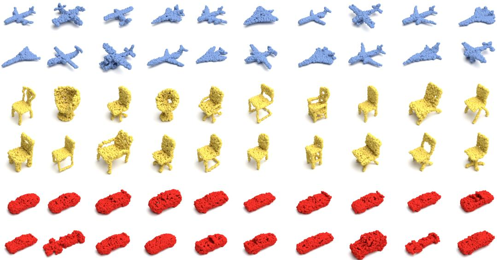  
Figure 7: Generated samples using EMERGE for the Shapenet classes: Airplane, Car, and Chair.

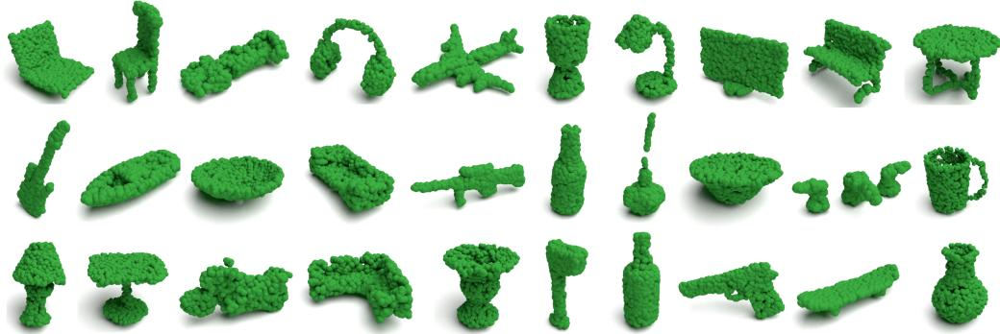  
Figure 8: Samples generated by EMERGE for all 55 categories of ShapeNet.

## J.3 Zero-Shot Super-Resolution

Finally, to further validate our proposed parameter-free distribution alignment technique, Figures 9 and 10 provide additional examples of EMERGE performing zero-shot super-resolution for the three categories Airplane, Car, and Chair, and for all 55 categories of ShapeNet, respectively. In Figure 9, we also showcase several super-resolution attempts using EMERGE without our proposed distribution alignment technique, which results in complete structural collapse of the point cloud, further proving that analytically resolving these receptive field shifts is essential for scaling inference beyond the training resolution.

To further demonstrate the scalability of our distribution alignment technique, Figure 11 showcases zero-shot super-resolution scaled up to $N _ { i n f } = 4 0$ , 000 points. This proves that EMERGE maintains strict geometric stability even at exceptionally high density ratios.

## K Limitations

While EMERGE demonstrates strong sample efficiency and high-fidelity generation, its current implementation incurs certain computational bottlenecks. Unlike widely adopted architectures that benefit from years of highly specialized, hardware-level GPU optimization, our framework relies on complex geometric operations that lack equivalent native support. Specifically, the dynamic construction of the k-Nearest Neighbor graph at each layer and the analytical eigenvector computations required for both our canonical frame extraction and invariant feature representations introduce noticeable latency.

Ntrain = 2, 048

Ninf = 5, 000

Ninf = 10, 000

Ninf = 15, 000

Ninf = 15, 000 withour Distibution Aligrment

Ntrain = 2,048

Ninf = 5, 000

Ninf = 10, 000

Ninf = 15, 000

Ninf = 15, 000 withour Diuptbution Alanmene

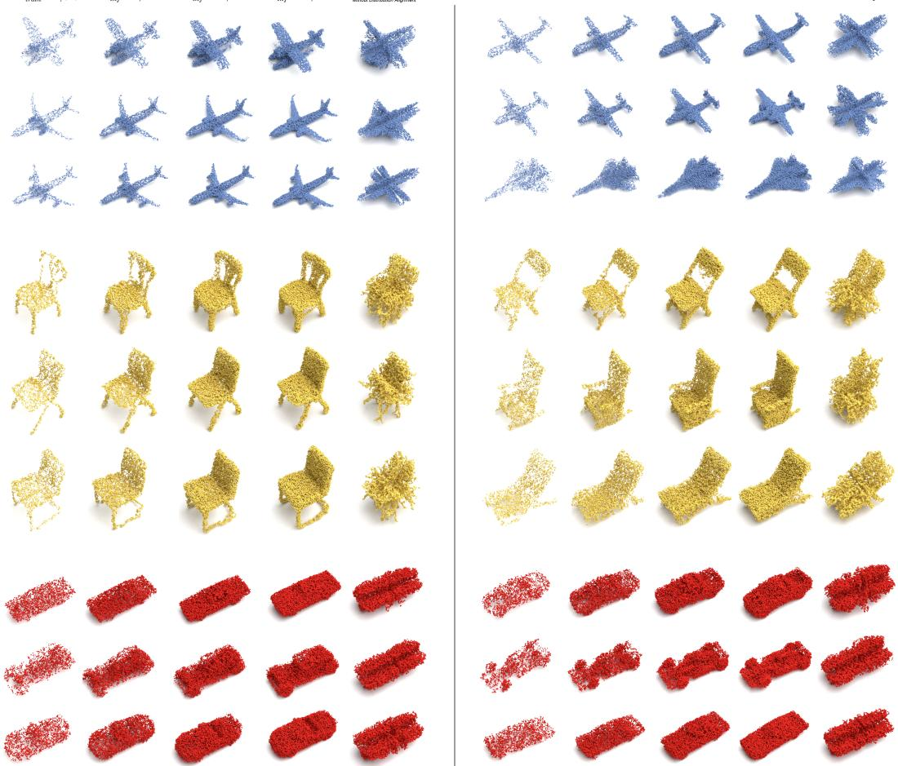  
Figure 9: Generated samples using EMERGE, with and without distribution alignment for varying resolutions, for the Shapenet classes: Airplane, Car, and Chair.

Consequently, although EMERGE requires vastly fewer total epochs to converge, the wall-clock time per individual training step and inference pass is comparatively higher than that of standard diffusion baselines.

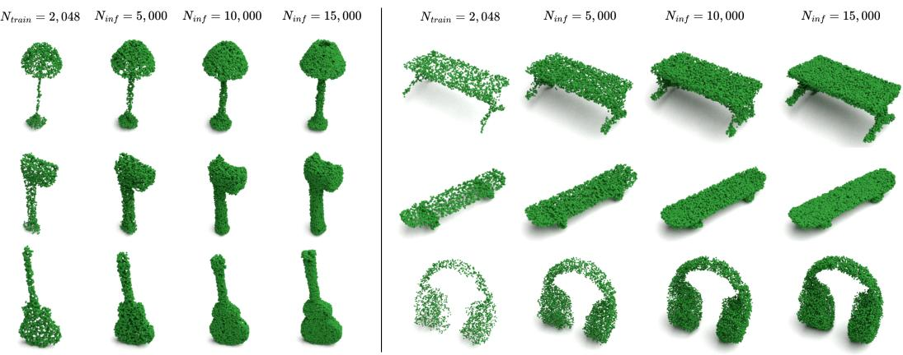  
Figure 10: Generated samples using EMERGE and distribution alignment for varying resolutions, for all 55 classes of ShapeNet.

Ntrain = 2, 048

Ninf = 5, 000

Ninf = 10, 000

Ninf = 20, 000

Ninf = 30, 000

Ninf = 40, 000

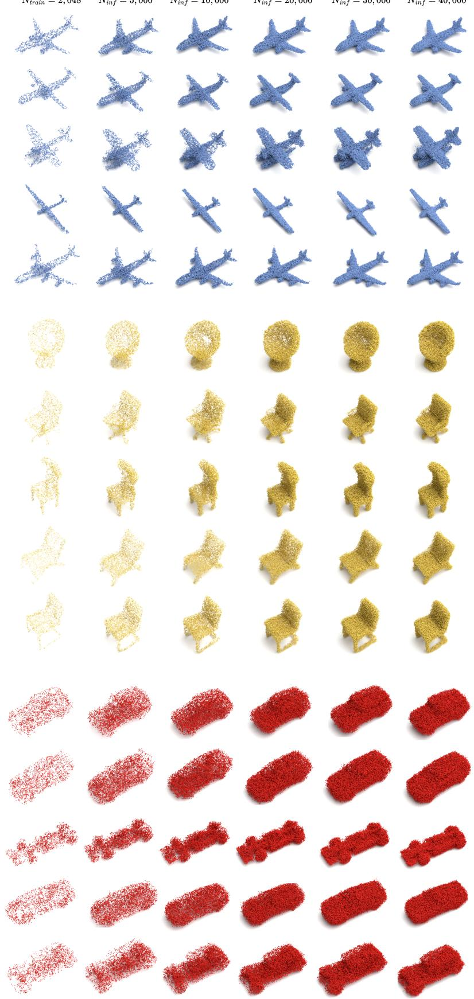  
Figure 11: Extended zero-shot super-resolution results for resolutions up to 40,000 points $( N _ { i n f } =$ 40, 000).