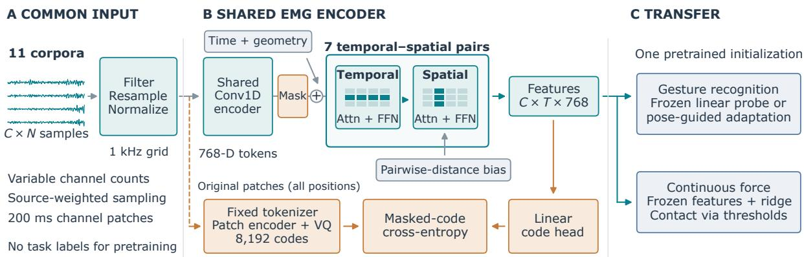
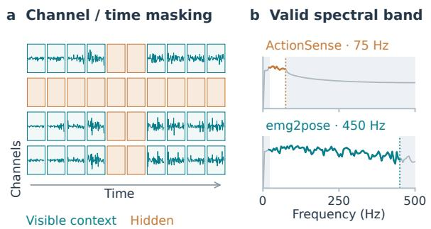
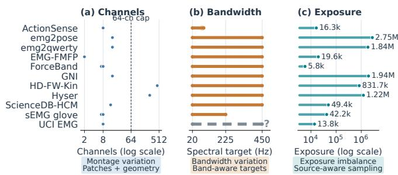

# EMGBLEND: HETEROGENEITY-AWARE SELF-SUPERVISED PRETRAINING FOR GESTURE AND FORCE DECODING

Yuwei Jia1,3 Cheng Zhong2,3 Jinyang Yu3 Zhe Cui1,∗

1Beijing University of Posts and Telecommunications, China 2Shenzhen University, China; 3Dexwise, China

## ABSTRACT

Public surface electromyography (EMG) datasets vary widely in electrode layout, channel count, frequency support, and size. Simply mixing them for pretraining can misalign channel semantics, introduce spectral targets that some devices cannot observe, and let large or high-channel-count datasets dominate learning. We introduce EMGBlend, a self-supervised framework designed around these differences. It combines shared channel patches with geometry-aware attention, restricts spectral targets to each recording’s supported frequency band, and balances exposure across data sources. We pretrain a 109M-parameter model on 11 public EMG sources and evaluate it on gesture recognition, continuous-force regression, and contact classification. EMGBlend consistently outperforms matched random initialization and waveform reconstruction controls. Fixed-budget source controls show that multi-source pretraining improves gesture recognition and remains competitive for force decoding. Ablations confirm that geometry, band-aware targets, and source balancing each contribute to transfer, although cross-person NinaPro force estimation remains difficult. Overall, EMGBlend shows how heterogeneous EMG datasets can be combined through explicit mechanism design rather than simple concatenation. Code is available at https://github.com/tamanano/EMGBlend

Index Terms— Electromyography, self-supervised learning, heterogeneous pretraining, gesture recognition, force estimation

## 1. INTRODUCTION

Surface electromyography (EMG) captures movement and exerted force. Public datasets cover hand motions, typing, activities, and high-density signals [1, 2, 3, 4, 5], but differ in arrays, sampling rates, passbands, and annotations. Pooling these recordings could enlarge the training base for reusable EMG representations. However, naive pooling conflates sensor identities, assigns targets outside some devices’ observable bands, and overexposes sources with more windows or channels. BIOT provides a channel-segment interface for cross-dataset biosignals [6]; PhysioWave uses wavelet features and frequency-guided masking [7]; and EMBridge uses paired EMG and pose to guide gesture transfer [8]. Recent works explore sharedchannel multi-task encoders [9], spectral pseudo-labels for movement decoding [10], and quantized biosignal representations [11, 12]. These approaches provide relevant interface, target, and transfer ingredients, but do not jointly address montage, frequency-support, and source-exposure mismatch. Our contribution is the coupled design of these mechanisms for heterogeneous EMG pooling, rather than dataset concatenation alone. We include prior systems as contextual references and use matched internal controls for the main mechanistic comparisons.

EMGBlend therefore treats heterogeneous pooling as a coupled interface, target, and exposure problem. First, shared channel patches and geometry-aware temporal–spatial attention provide a common interface for variable sensor layouts. Second, supported-band spectral codes avoid assigning targets to frequencies absent from a recording. Third, source-exposure correction tempers imbalance induced jointly by corpus size and channel count. These mechanisms require neither shared task labels nor paired pose.

We evaluate the resulting initialization through pose-guided gesture transfer (Table 1), frozen gesture recognition, continuousforce and contact decoding, matched waveform objectives, and one-mechanism-at-a-time removals. Fixed-budget source controls separate source diversity from sample count, while a capacity sweep tests whether gains follow model size alone. With the same capacity, updates, and number of windows, eleven-source pretraining improves all four DB7 settings over a single source and remains comparable on PiMForce. A common-protocol comparison further evaluates an external architecture under matched downstream splits and metrics. EMGBench’s generalization/adaptation distinction [13] motivates explicit user splits and supervision (Sec. 3.1).

## 2. HETEROGENEITY-AWARE EMG PRETRAINING

We pool sources $\textstyle { \mathcal { D } } = \bigcup _ { s = 1 } ^ { S } { \mathcal { D } } _ { s }$ , where recording $\boldsymbol { X _ { s } } \in \mathbb { R } ^ { C _ { s } \times N _ { s } }$ has source-dependent channel count, sampling rate, frequency support, and geometry Gs (Fig. 1). The framework couples three corresponding mechanisms: a montage-flexible interface, recording-valid targets, and source-exposure correction. Task labels are used only downstream.

## 2.1. Source-aware pooling across acquisition settings

Recordings are filtered within their usable band, resampled to 1 kHz, and normalized per channel by the full recording’s median and interquartile range, including at test time as offline preprocessing. Each channel is divided into non-overlapping 200-sample patches. Available coordinates and angles accompany the signal; unknown geometry uses learned embeddings. Resampling standardizes timing without restoring absent frequencies.

To reduce domination by large or high-channel-count corpora, the loader tempers channel-patch exposure imbalance. $\operatorname { I f } n _ { s }$ is the sum of capped channel counts across the available windows of source s, a candidate window is retained with probability

$$
a _ { s } ( \alpha ) = \left( \frac { \operatorname* { m i n } _ { r } n _ { r } } { n _ { s } } \right) ^ { \alpha } .\tag{1}
$$

The standard recipe uses $\alpha = 1 / 2 ;$ the $\alpha = 0$ ablation gives $a _ { s } ( 0 ) =$ 1 for every source and therefore accepts every candidate window.

  
Fig. 1. EMGBlend’s heterogeneity-aware architecture. Shared Conv1D patch embeddings feed seven temporal–spatial attention pairs with sensor geometry. The frozen tokenizer supplies code targets (orange); encoder features support downstream decoding (blue). Attention grids indicate axes, not measured weights.

Channel-count bucketing and a nominal channel budget limit padding; at most 64 channels are sampled per window. Available-pool size and realized training exposure remain distinct quantities.

## 2.2. Geometry-aware variable-montage encoder

A shared Conv1D patch encoder maps channels to tokens, following the channel-segment interface of BIOT [6]. Geometry uses coordinate Fourier features, six angular harmonics, and a 16-bin pairwise-distance attention bias; missing geometry uses learned embeddings. Temporal and geometry embeddings precede alternating within-channel temporal and across-channel spatial attention; invalid channels are masked. Following divided attention [14], attention computation scales as $O ( C T ^ { 2 } + { \overline { { T } } } C ^ { 2 } )$ at fixed width for C channels and T patches. The representation does not require a shared device or montage identity: geometry describes sensor arrangement without assuming anatomical registration.

## 2.3. Supported-band spectral-code learning

We follow masked representation learning [15] with discrete spectral targets, drawing on vector quantization [16] and LaBraM’s neuralspectrum prediction for EEG [17]. A vector-quantized tokenizer supplies one code per channel patch. Its decoder learns the logamplitude spectrum of a mean-centered patch, with reconstruction restricted to frequencies supported by that recording. For spectral bins k and valid-band mask $b _ { s , k } ,$ , the reconstruction term is

$$
\mathcal { L } _ { \mathrm { s p e c } } = \mathbb { E } _ { x \sim \mathcal { D } _ { s } } \frac { \sum _ { k } b _ { s , k } ( \widehat { a } _ { k } - a _ { k } ) ^ { 2 } } { \sum _ { k } b _ { s , k } } ,\tag{2}
$$

where $a _ { k } = \log ( | \mathcal { F } ( x - \bar { x } ) _ { k } | + 1 0 ^ { - 6 } )$ . Averaging over valid bins avoids downweighting narrower passbands for having fewer bins. Figure 2 illustrates real inputs.

The tokenizer has 8,192 EMA codes and is trained for 20k updates with 32 windows (at most 16,384 patches) per update using AdamW (learning rate $3 \times 1 0 ^ { - 4 }$ , weight decay 0.01), then fixed during backbone training. Targets use original patches, including positions later hidden. Whole-channel and temporal masking hide raw-patch embeddings; the encoder predicts their discrete codes from the remaining context:

$$
\mathcal { L } _ { \mathrm { S S L } } = - \mathbb { E } _ { X \sim \mathcal { D } } \frac { 1 } { \vert \mathcal { M } \vert } \sum _ { ( c , t ) \in \mathcal { M } } \log p _ { \theta } ( z _ { c , t } \mid \widetilde { X } , G ) .\tag{3}
$$

  
Fig. 2. Supported-band target construction. (a) Real emg2pose training signals with an illustrative whole-channel/time mask; hidden patches are orange. (b) Log-amplitude spectra from ActionSense and emg2pose training patches on the same 1 kHz grid. Gray regions are excluded from the spectral reconstruction loss. Cutoffs reflect these recordings.

Here M contains hidden, valid positions. Both masking fractions are 0.25. The common code-prediction objective permits joint training without reconciling source gesture vocabularies or regression labels.

## 2.4. Transfer to gestures and force

Frozen gestures use regularized linear classifiers on pooled features. For adapted gestures, EMGBlend initializes EMBridge’s EMG encoder while retaining query alignment, pose reconstruction, and poseside assets [8]. The encoder is frozen after adaptation for probing; “SSL” denotes pretraining, while adaptation uses pose labels. Retrieval additionally uses a pose library. For force, ridge regression maps frozen features to finger targets; PiMForce contact decisions threshold predictions using validation users. Matched random encoders control feature dimension.

## 3. EXPERIMENTS

## 3.1. Training and evaluation settings

Unless identified as a control or ablation, Full or SSL denotes the 109M checkpoint with width 768, seven temporal–spatial pairs, and 12 heads. The tokenizer is trained separately and frozen before backbone pretraining. The 462,980-window pool comprises Action-Sense [4], emg2pose [1], emg2qwerty [2], EMG-FMFP [18], Force-Band [19], and GNI [3]. It also includes HD-FW-Kin [20], Hyser [5], KIMHu (ScienceDB HCM) [21], multimodal glove [22], and UCI EMG [23]. Across the released sources, channel count ranges from 2 to 448 (capped at 64 when sampled), recording rate from approximately 157 to 2,048 Hz, supported upper cutoff from approximately 71 to 450 Hz, and available windows per source from 752 to 171,828. Figure 3 summarizes the resulting montage, frequency-support, and exposure heterogeneity and links each source of variation to the corresponding EMGBlend mechanism. The final manifest contains 16,344 recordings. Tokenizer and backbone training both exclude NinaPro, PiMForce, emg2pose’s official non-training recordings, and the declared Hyser holdout. The tokenizer is trained on the allowed eleven-source pool and then frozen to supply SSL targets; it is not used in downstream inference. Exclusions are defined by recording identity before sampling, and the consumption audit found no excluded recordings. UCI’s nominal 1-kHz timestamp grid contains repeated rows, so we do not infer its physical acquisition bandwidth from that grid. Because UCI downstream subjects occurred in unlabeled pretraining, we omit UCI from transfer comparisons rather than claim subject-disjoint generalization. The 9M–109M models share 60k AdamW updates, 3k warmup steps, cosine decay, weight decay 0.05, and peak learning rate $1 . 9 6 \times 1 0 ^ { - 3 }$ . Each of two workers has a nominal 2,048-channel budget; bucketing makes window/token counts variable. Under memory and stability constraints, 267M instead uses four workers, a 768-channel budget per worker, 6k warmup, and base/effective learning rates $2 . 5 \times 1 0 ^ { - 4 } / \dot { 7 } . 0 7 \times 1 0 ^ { - 4 }$ . Our local splits differ from EMGBench’s leave-one-subject-out and chronological adaptation benchmarks: pose adaptation uses training users, without test-user calibration.

  
Fig. 3. Heterogeneity of the 11-source pretraining pool. (a) Released channel counts and the 64-channel sampling cap. (b) Recordingsupported frequency ranges used by the spectral target; UCI’s effective upper cutoff is uncertain. (c) Naive available-window × capped-channel exposure before source-aware acceptance. The three panels motivate the montage, target, and sampling mechanisms.

Gesture protocols. emg2pose has four seen and four unseen gesture-stage groups. Unseen groups are excluded from pose adaptation but labeled for probing: 12 probe users (3,012 windows) and 20 test users (6,212 windows) are disjoint. Adaptation uses 40 epochs, batch size 256, and learning rate $\dot { 4 } \times 1 0 ^ { - 4 }$ . Linear probes use 300 AdamW steps; the SSL row in Table 1 reports the mean over seeds 7 and 8. Frozen layer/pooling choices use grouped validation within probe users. On NinaPro DB7 [24], B3/C3 use exercise B/C local IDs {1, 5, 10}, while B4/C4 add ID 15. Frozen final-layer mean/std features use ten outer splits with disjoint train/test users; participants may recur across splits. Feature scaling and regularization use nested person-level validation. These are defined 3/4-class subsets rather than the full DB7 vocabulary.

Table 1. emg2pose gesture BA (%). LP: linear probe; Ret.: pose retrieval. EMGBlend averages adaptation seeds 7/8; random and local EMBridge use single runs. Published rows are contextual references.
<table><tr><td></td><td colspan="2">Seen</td><td colspan="2">Unseen</td></tr><tr><td>Method</td><td>LP</td><td>Ret.</td><td>LP</td><td>Ret.</td></tr><tr><td>EMGBlend SSL (ours)</td><td>81.76</td><td>79.70</td><td>61.68</td><td>55.99</td></tr><tr><td>EMGBlend 109M, random init.</td><td>68.96</td><td>65.51</td><td>48.48</td><td>43.88</td></tr><tr><td>EMBridge (reprod.) [8]</td><td>76.62</td><td>74.80</td><td>49.37</td><td>47.18</td></tr><tr><td>EMBridge [8]</td><td>78.50</td><td>77.70</td><td>50.50</td><td>52.80</td></tr><tr><td>emg2pose [1]</td><td>73.40</td><td>一</td><td>40.50</td><td></td></tr></table>

Table 2. Frozen 109M force decoding. HC: handcrafted features. NinaPro MAE uses native sensor units; PiMForce MAE uses calibrated FSR units.
<table><tr><td>Dataset / metric</td><td>HC</td><td>Random</td><td>SSL</td></tr><tr><td>DB2 within /  $R ^ { 2 }$ </td><td>0.7863</td><td>0.3423</td><td>0.8562</td></tr><tr><td>DB2 within / MAE</td><td>0.9734</td><td>1.8705</td><td>0.8704</td></tr><tr><td>DB3 within /  $R ^ { 2 }$ </td><td>0.2781</td><td>0.0887</td><td>0.4932</td></tr><tr><td>DB3 within / MAE</td><td>1.7726</td><td>2.0220</td><td>1.4662</td></tr><tr><td>DB2 cross /  $R ^ { 2 }$ </td><td>-0.0363</td><td>-0.2218</td><td>-0.2926</td></tr><tr><td>DB2 cross / MAE</td><td>2.1314</td><td>2.3287</td><td>2.3388</td></tr><tr><td>PiMForce / MAE</td><td>2.6151</td><td>2.3802</td><td>2.1204</td></tr><tr><td>PiMForce / BA (%)</td><td>73.94</td><td>79.75</td><td>82.31</td></tr><tr><td>PiMForce / F1 (%)</td><td>53.58</td><td>60.69</td><td>65.60</td></tr></table>

Force protocols. NinaPro DB2/DB3 exercise 3 (E3) [25] uses two-second windows and six window-mean force targets. Withinperson testing trains on repetitions 1/3/4/6 and tests on 2/5, over 40 DB2 and 11 DB3 participants. Cross-person DB2 uses five subject folds and grouped inner validation. Feature and target scaling use training rows only, including within each inner fold. Validation holds out training repetitions or users. Predictions are inverted to native sensor units for MAE and standard variance-weighted R2, averaged over users. No test-label statistics enter prediction; conversion of native units to newtons is unverified. Handcrafted controls use rootmean-square (RMS), mean absolute value, and waveform length.

PiMForce [26] tests five continuous fingertip targets across 21 users in five folds. Training/validation use S1–S2 of non-test users; testing uses S3 of held-out users (21,054 windows). Readouts use training-user weighting and validation-selected ridge regularization. MAE is in calibrated target units. Contact labels use a force-sensitive resistor (FSR) threshold of 1.0; prediction thresholds are selected on validation users. Preprocessing is offline. Repeats and uncertainty retain their probe or participant unit; they are not independent pretraining repetitions.

## 3.2. Gesture recognition and transfer

After pose-guided adaptation (Table 1), EMGBlend reaches 81.76 ± 0.37% seen LP and 61.68 ± 0.30% unseen LP; the local EMBridge reproduction reaches 76.62% and 49.37%, respectively. EMGBlend improves all four endpoints, including 12.31 percentage points (pp) on unseen LP. Since the official code, checkpoint, and exact data assignments are unavailable, this is a clean-room comparison under our documented protocol rather than an exact benchmark reproduction. The matched 109M random initialization reaches 68.96% seen LP and 48.48% unseen LP, giving SSL gains of 12.80 and 13.20 pp.

Frozen controls in Table 4 show the same pattern: Full improves both emg2pose groups and all evaluated gesture settings over matched random initialization while holding architecture fixed.

Table 3. System-level comparison with the PhysioWave architecture [7] under common downstream splits and metrics. Pretraining setup and model capacity are not matched. For DB5 and PiMForce, we use the officially released PhysioWave model. Because this model was trained on EPN-612, the EPN-612 entry uses a retrained PhysioWave architecture. UCI is omitted because its downstream subjects were not held out from EMGBlend pretraining.
<table><tr><td colspan="3"></td><td colspan="3">EPN-612</td><td colspan="3">DB5</td><td colspan="3">PiMForce</td></tr><tr><td>Method</td><td>Params</td><td>Acc</td><td>BA</td><td>mF1</td><td>Acc</td><td>BA</td><td>wF1</td><td>mF1</td><td>MAE</td><td>BA</td><td>F1</td></tr><tr><td>PhysioWave arch.</td><td>4.99M</td><td>90.73</td><td>90.73</td><td>90.77</td><td>77.16</td><td>56.11</td><td>76.40</td><td>55.40</td><td>2.2993</td><td>81.17</td><td>61.90</td></tr><tr><td>EMGBlend</td><td>109M</td><td>92.78</td><td>92.78</td><td>92.80</td><td>95.29</td><td>91.03</td><td>95.26</td><td>91.16</td><td>2.1204</td><td>82.31</td><td>65.60</td></tr></table>

Table 4. Unified objective, mechanism, source-pool, and capacity controls under common frozen downstream protocols. DB7 entries report ten-split means; emg2pose entries average five linear-probe initializations; and DB2/DB3 report participant-averaged within-subject $R ^ { 2 }$ . Best values are bold and second-best are underlined.
<table><tr><td></td><td></td><td></td><td></td><td colspan="2">emg2pose BA ↑</td><td colspan="3">DB7 BA ↑</td><td colspan="2">NinaPro  $R ^ { 2 } \uparrow$ </td><td colspan="2"></td><td colspan="2">PiMForce</td></tr><tr><td>Variant</td><td>Param.</td><td>Src.</td><td>Win.</td><td>Seen</td><td>Unseen</td><td>C3</td><td>B4</td><td>B3</td><td>C4</td><td>DB2</td><td>DB3</td><td>MAE↓</td><td>BA↑</td><td>F1 ↑</td></tr><tr><td>Objective controls</td><td></td><td></td><td></td><td></td><td></td><td></td><td></td><td></td><td></td><td></td><td></td><td></td><td></td><td></td></tr><tr><td>Waveform MAE</td><td>109M</td><td>11</td><td>463k</td><td>54.14</td><td>37.74</td><td>38.04</td><td>49.56</td><td>63.08</td><td>42.90</td><td>0.3150</td><td>0.1062</td><td>2.3559</td><td>79.73</td><td>61.41</td></tr><tr><td>Generic masked MAE</td><td>109M</td><td>11</td><td>463k</td><td>51.09</td><td>38.67</td><td>38.56</td><td>46.63</td><td>58.54</td><td>43.36</td><td>0.3178</td><td>0.0871</td><td>2.3136</td><td>79.44</td><td>61.21</td></tr><tr><td>Mechanism removals</td><td></td><td></td><td></td><td></td><td></td><td></td><td></td><td></td><td></td><td></td><td></td><td></td><td></td><td></td></tr><tr><td>α = 0</td><td>109M</td><td>11</td><td>463k</td><td>55.74</td><td>38.15</td><td>48.77</td><td>62.61</td><td>74.38</td><td>54.13</td><td>0.7929</td><td>0.4326</td><td>2.2852</td><td>79.43</td><td>61.66</td></tr><tr><td>No geometry</td><td>109M</td><td>11</td><td>463k</td><td>39.37</td><td>33.26</td><td>48.22</td><td>53.09</td><td>63.23</td><td>51.69</td><td>0.5495</td><td>0.2576</td><td>2.5441</td><td>75.38</td><td>55.39</td></tr><tr><td>All spectral bins</td><td>109M</td><td>11</td><td>463k</td><td>53.13</td><td>41.81</td><td>48.95</td><td>55.63</td><td>66.20</td><td>52.47</td><td>0.7120</td><td>0.3474</td><td>2.2943</td><td>79.35</td><td>60.39</td></tr><tr><td>Source-pool controls</td><td></td><td></td><td></td><td></td><td></td><td></td><td></td><td></td><td></td><td></td><td></td><td></td><td></td><td></td></tr><tr><td>Random initialization</td><td>109M</td><td>0</td><td></td><td>49.38</td><td>36.19</td><td>36.48</td><td>44.78</td><td>58.28</td><td>41.65</td><td>0.3423</td><td>0.0887</td><td>2.3802</td><td>79.75</td><td>60.69</td></tr><tr><td>Single†</td><td>109M</td><td>1</td><td>172k</td><td>74.23</td><td>49.11</td><td>48.64</td><td>64.87</td><td>72.84</td><td>53.00</td><td>0.8598</td><td>0.4605</td><td>2.1743</td><td>81.56</td><td>64.79</td></tr><tr><td>Nine</td><td>109M</td><td>9</td><td>172k</td><td>42.41</td><td>34.41</td><td>45.60</td><td>57.74</td><td>69.07</td><td>50.17</td><td>0.5992</td><td>0.2881</td><td>2.3274</td><td>78.79</td><td>59.49</td></tr><tr><td>Eleven-matched</td><td>109M</td><td>11</td><td>172k</td><td>68.29</td><td>47.55</td><td>52.75</td><td>65.60</td><td>74.53</td><td>56.29</td><td>0.8413</td><td>0.4529</td><td>2.1633</td><td>81.60</td><td>64.42</td></tr><tr><td colspan="2">Capacity controls (eleven-source full pool)</td><td></td><td></td><td></td><td></td><td></td><td></td><td></td><td></td><td></td><td></td><td></td><td></td><td></td></tr><tr><td>9M</td><td>9M</td><td>11</td><td>463k</td><td>66.71</td><td>47.86</td><td>46.04</td><td>61.43</td><td>69.29</td><td>53.26</td><td>0.8042</td><td>0.4132</td><td>2.2487</td><td>80.99</td><td>63.68</td></tr><tr><td>12M</td><td>12M</td><td>11</td><td>463k</td><td>68.77</td><td>48.55</td><td>45.74</td><td>63.57</td><td>72.75</td><td>53.26</td><td>0.8084</td><td>0.4261</td><td>2.2663</td><td>80.55</td><td>63.67</td></tr><tr><td>25M</td><td>25M</td><td>11</td><td>463k</td><td>67.96</td><td>45.46</td><td>49.05</td><td>63.43</td><td>73.54</td><td>53.96</td><td>0.8204</td><td>0.4440</td><td>2.1870</td><td>81.97</td><td>65.01</td></tr><tr><td>50M 267M*</td><td>50M</td><td>11</td><td>463k</td><td>68.02</td><td>46.34</td><td>48.72</td><td>65.12</td><td>74.24</td><td>54.29</td><td>0.8401</td><td>0.4719</td><td>2.1467</td><td>82.13</td><td>65.62</td></tr><tr><td></td><td>267M</td><td>11</td><td>463k</td><td>69.07</td><td>48.63</td><td>51.64</td><td>66.57</td><td>75.68</td><td>56.50</td><td>0.8610</td><td>0.4930</td><td>2.1516</td><td>81.65</td><td>64.94</td></tr><tr><td>Full method</td><td>109M</td><td>11</td><td>463k</td><td>70.39</td><td>46.57</td><td>50.63</td><td>65.75</td><td>74.47</td><td>56.38</td><td>0.8561</td><td>0.4773</td><td>2.1204</td><td>82.31</td><td>65.60</td></tr></table>

†Single-source pretraining may overfit to emg2pose; its italicized emg2pose results are excluded from ranking. ∗The 267M run uses a smaller batch because of GPU memory limits, so its italicized results are reported but excluded from controlled comparisons.

## 3.3. Continuous force decoding

Within-person DB2/DB3 favor SSL over both controls. Cross-person DB2 remains difficult: the SSL R2 is −0.2926, below both matched random (−0.2218) and handcrafted (−0.0363), so this endpoint remains a negative result rather than evidence of cross-person force transfer. On PiMForce, SSL reduces cross-user MAE from random’s 2.3802 to 2.1204 (10.92%), versus HC’s 2.6151. Contact BA/F1 also improve over matched random features. MAE includes both contact and non-contact windows, whereas BA/F1 evaluate thresholded contact state.

## 3.4. External baselines and unified controls.

Table 3 provides a system-level comparison under common downstream splits and metrics. Model capacity, pretraining data, and training budget are not matched, so the comparison does not isolate SSL design. For DB5, we use a shared downstream protocol rather than PhysioWave’s original split.

All objective and mechanism controls use the 109M backbone, eleven-source pool, and 60k updates. Waveform MAE replaces the target; Generic masked MAE also disables geometry and source correction. The remaining rows remove one mechanism at a time, and Full exceeds every such control on all 11 endpoints.

Source-pool controls compare emg2pose-only, nine-source, count-matched eleven-source, and full-pool pretraining. At matched volume, multi-source pretraining improves gesture recognition and remains competitive for force decoding. Scaling is non-monotonic, so capacity alone does not explain the gains; ranking exclusions are listed in Table 4.

## 4. CONCLUSION

EMGBlend couples montage-flexible inputs, supported-band targets, and source-balanced sampling for heterogeneous EMG pretraining. Matched controls support each mechanism, and eleven-source training improves all DB7 settings at fixed capacity and window budget. Full improves PiMForce, while cross-person force decoding remains an open challenge.

Acknowledgments: OpenAI Codex and Claude Code assisted with language editing, implementation summaries, LaTeX organization, and code writing. The authors verified all content and take full responsibility; no AI-generated data or experimental results were used.

Compliance with Ethical Standards: This study analyzes public datasets and involved no new participant recruitment, interaction, or human-subject data collection.

## 5. REFERENCES

[1] Sasha Salter et al., “emg2pose: A large and diverse benchmark for surface electromyographic hand pose estimation,” in Advances in Neural Information Processing Systems (NeurIPS), Datasets and Benchmarks Track, 2024, vol. 37.

[2] Viswanath Sivakumar et al., “emg2qwerty: A large dataset with baselines for touch typing using surface electromyography,” in Advances in Neural Information Processing Systems, Datasets and Benchmarks Track, 2024, vol. 37.

[3] Patrick Kaifosh, Thomas R. Reardon, and CTRL-labs at Reality Labs, “A generic non-invasive neuromotor interface for humancomputer interaction,” Nature, vol. 645, 2025.

[4] Joseph DelPreto et al., “ActionSense: A multimodal dataset and recording framework for human activities using wearable sensors in a kitchen environment,” in Advances in Neural Information Processing Systems (NeurIPS) Datasets and Benchmarks Track, 2022.

[5] Xinyu Jiang et al., “Open access dataset, toolbox and benchmark processing results of high-density surface electromyogram recordings,” IEEE Transactions on Neural Systems and Rehabilitation Engineering, vol. 29, pp. 1035–1046, 2021.

[6] Chaoqi Yang, M. Brandon Westover, and Jimeng Sun, “BIOT: Biosignal transformer for cross-data learning in the wild,” in Advances in Neural Information Processing Systems, 2023, vol. 36.

[7] Yanlong Chen, Mattia Orlandi, Pierangelo Maria Rapa, Simone Benatti, Luca Benini, and Yawei Li, “PhysioWave: A multiscale wavelet-transformer for physiological signal representation,” in Advances in Neural Information Processing Systems, 2025, vol. 38.

[8] Wenhui Cui et al., “EMBridge: Enhancing gesture generalization from EMG signals through cross-modal representation learning,” in International Conference on Learning Representations (ICLR), 2026.

[9] Matteo Fasulo, Giusy Spacone, Thorir Mar Ingolfsson, Yawei Li, Luca Benini, and Andrea Cossettini, “TinyMyo: A tiny foundation model for flexible EMG signal processing at the edge,” 2025, Preprint, arXiv:2512.15729v2, 2026 revision.

[10] Zihan Weng et al., “SPECTRE: Spectral pre-training embeddings with cylindrical temporal rotary position encoding for fine- grained sEMG-based movement decoding,” 2025, Preprint, arXiv:2512.22481.

[11] Konstantinos Barmpas et al., “NeuroRVQ: Multi-scale biosignal tokenization for generative foundation models,” 2025, Preprint, arXiv:2510.13068v4, 2026 revision.

[12] Kleanthis Avramidis et al., “Neural codecs as biosignal tokenizers,” 2025, Preprint, arXiv:2510.09095.

[13] Jehan Yang, Maxwell Soh, Vivianna Lieu, Douglas J. Weber, and Zackory Erickson, “EMGBench: Benchmarking out-ofdistribution generalization and adaptation for electromyography,” in Advances in Neural Information Processing Systems (NeurIPS), Datasets and Benchmarks Track, 2024, vol. 37.

[14] Gedas Bertasius, Heng Wang, and Lorenzo Torresani, “Is space-time attention all you need for video understanding?,” in Proceedings ofthe 38th International Conference on Machine Learning, 2021, vol. 139 of Proceedings of Machine Learning Research, pp. 813–824.

[15] Kaiming He, Xinlei Chen, Saining Xie, Yanghao Li, Piotr Dollár, and Ross Girshick, “Masked autoencoders are scalable vision learners,” in Proceedings ofthe IEEE/CVF Conference on Computer Vision and Pattern Recognition, 2022, pp. 16000– 16009.

[16] Aaron van den Oord, Oriol Vinyals, and Koray Kavukcuoglu, “Neural discrete representation learning,” in Advances in Neural Information Processing Systems, 2017, vol. 30.

[17] Wei-Bang Jiang, Li-Ming Zhao, and Bao-Liang Lu, “Large brain model for learning generic representations with tremendous EEG data in BCI,” in International Conference on Learning Representations, 2024.

[18] Yana Kosteley, Dmitry Zhdanov, and Anton Seleznev, “EMG dataset for predicting forearm muscle force exerted during dynamometer squeezing (different signal capture factors) (EMG-FMFP),” Mendeley Data, version 1, 2026, https://doi. org/10.17632/2prvk292rp.1.

[19] Botao He et al., “ForceBand: Learning forceful manipulation with sEMG,” 2026.

[20] Weichao Guo, Zeming Zhao, Zeyu Zhou, Yun Fang, Yang Yu, and Xinjun Sheng, “Hand kinematics, high-density sEMG comprising forearm and far-field potentials for motion intent recognition,” Scientific Data, vol. 12, pp. 445, 2025.

[21] Óscar G. Hernández et al., “A kinematic, imaging and electromyography dataset for human muscular manipulability index prediction,” Scientific Data, vol. 10, pp. 132, 2023, Dataset: https://doi.org/10.57760/sciencedb.01902.

[22] Iris Kyranou, Katarzyna Szymaniak, and Kianoush Nazarpour, “EMG dataset for gesture recognition with arm translation,” Scientific Data, vol. 12, pp. 100, 2025.

[23] Nadia Krilova, Innokentiy Kastalskiy, Viktor B. Kazantsev, Valeri A. Makarov, and Sergey Lobov, “EMG data for gestures,” UCI Machine Learning Repository, 2018.

[24] Agamemnon Krasoulis, Iris Kyranou, Mustapha Suphi Erden, Kianoush Nazarpour, and Sethu Vijayakumar, “Improved prosthetic hand control with concurrent use of myoelectric and inertial measurements,” Journal ofNeuroEngineering and Rehabilitation, vol. 14, pp. 71, 2017.

[25] Manfredo Atzori et al., “Electromyography data for noninvasive naturally-controlled robotic hand prostheses,” Scientific Data, vol. 1, pp. 140053, 2014.

[26] Kyungjin Seo, Junghoon Seo, Hanseok Jeong, Sangpil Kim, and Sang Ho Yoon, “Posture-informed muscular force learning for robust hand pressure estimation,” in Advances in Neural Information Processing Systems (NeurIPS), 2024, vol. 37.