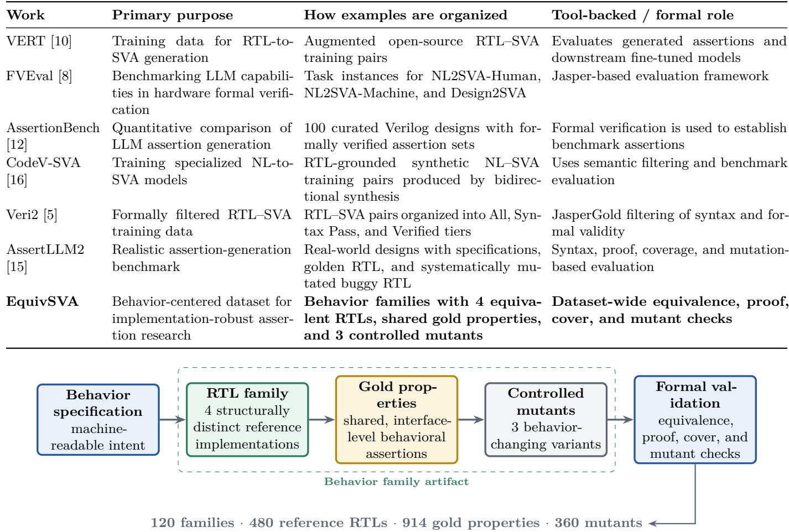
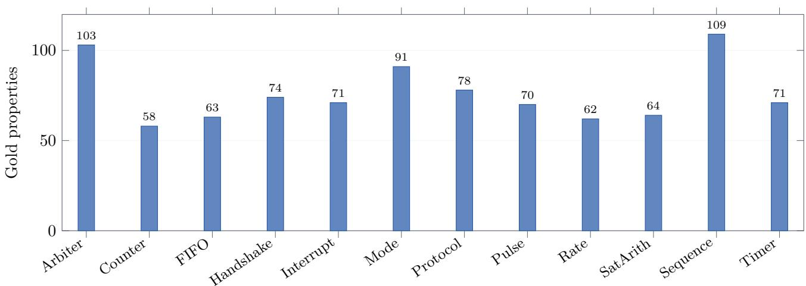

# EquivSVA: A Formally Verified Dataset of Behavioral Assertions Across Equivalent RTL Implementations

FNU Aditi

## Abstract

Large language models are increasingly used to generate SystemVerilog Assertions from natural-language specifications and register-transfer-level designs. Existing datasets and benchmarks support important goals such as largescale training, formal evaluation, specification-to-assertion generation, and mutation-based testing. A complementary need is to study whether a generated assertion captures externally observable behavior or depends on inci dental details of one RTL implementation. We present EquivSVA, a formally verified dataset organized around behavior families. Each family contains four structurally distinct RTL implementations of the same externally observable behavior, shared interface-level gold properties, three controlled mutants, and formal-validation evidence. EquivSVA contains 120 behavior families across 12 categories, 480 reference RTL implementations, 914 gold properties, and 360 mutants. Every final family passes a fixed 17-job validation suite covering RTL equivalence, gold-property proofs, property reachability, mutant distinguishability, and gold-property checks on mutants. We also provide fixed family-safe train, development, and test splits. As a small demonstration of the analyses enabled by the dataset, we evaluate the publicly released, Apache-2.0-licensed Qwen2.5-Coder-7B-Instruct model on the held-out test split. Of 293 interface-only generated properties, 93 are formally sound, and the number of sound properties varies across equivalent implementations for 14 of 24 test families. These results illustrate how behavior-family organization can support controlled studies of assertion-generation robustness without requiring changes in intended functionality. The dataset, generators, validation scripts, and case-study artifacts are publicly released at https://github.com/aditigupta96/EquivSVA.

## 1 Introduction

Assertion-based verification provides a concise way to express design intent and to check temporal and safety properties of digital hardware. In practice, writing useful SystemVerilog Assertions (SVAs) requires both an understanding of the intended behavior and careful attention to clocking, reset semantics, signal relationships, and temporal structure. This has motivated substantial work on automatic assertion generation, including rule-based and learned translation from natural-language specifications [3, 4], specification-driven LLM frameworks [1], benchmark suites for formal-verification tasks [8, 12], and datasets for training assertion-generation models [10, 16].

A recurring challenge is that RTL admits many implementations of the same behavior. State encodings, conditional structure, helper expressions, combinational factorization, and update style can all change while the external behavior remains unchanged. A model that generates a correct assertion for one implementation may therefore behave diferently when presented with another semantically equivalent implementation. Prior work has examined this issue through semantics-preserving RTL transformations [2]. That study motivates a reusable dataset in which behavioral equivalence is not an auxiliary perturbation applied after dataset construction, but a first-class organizing principle.

We introduce EquivSVA, a dataset whose basic unit is a behavior family. Each family begins from a machinereadable behavioral specification and contains four structurally distinct reference RTL implementations intended to realize the same externally observable behavior. The family also includes shared interface-level gold properties, three controlled behavior-changing mutants, and formal evidence used to validate the final artifacts. This organization makes it possible to ask whether an assertiongeneration method responds consistently to diferent implementations of the same behavior while holding the intended semantics fixed.

The goal of EquivSVA is complementary to existing resources. VERT emphasizes large-scale RTL–SVA training data [10]; FVEval organizes formal-verification tasks at multiple levels of abstraction [8]; AssertionBench provides curated designs with formally verified assertions for model evaluation [12]; CodeV-SVA develops RTL-grounded data synthesis for specialized NL-to-SVA models [16]; Veri2 organizes formally filtered RTL–SVA pairs for fine-tuning [5]; and AssertLLM2 provides real-world designs, structured specifications, golden RTL, and systematically mutated buggy RTL for realistic assertion-generation evaluation [15]. EquivSVA adds a behavior-family representation that places multiple formally equivalent RTL implementations, shared gold properties, and controlled mutants under one dataset unit.

The main contributions are:

• A public dataset of 120 behavior families across 12 hardware-control categories, containing 480 reference RTL implementations, 914 gold properties, and 360

controlled mutants.

• A family-centered representation in which four structurally distinct RTL implementations are formally checked for equivalent externally observable behavior.

• A fixed validation protocol that checks RTL equivalence, gold-property correctness, property reachability, mutant distinguishability, and whether each mutant violates at least one property in the family gold-property harness.

• Family-safe, category-stratified train, development, and test splits designed to prevent implementation variants from the same behavior appearing across different splits.

• A held-out Qwen2.5-Coder-7B-Instruct case study demonstrating syntax, formal soundness, mutation sensitivity, and variation across equivalent RTL implementations.

The released artifact is available at https://github. com/aditigupta96/EquivSVA, with the v2.0 snapshot at https://github.com/aditigupta96/EquivSVA/releases/ tag/v2.0.

## 2 Related Work

## 2.1 Assertion generation from specifications

Earlier work explored translating natural-language requirements into SVAs using hybrid rule-based and machine-learning methods [3]. A later approach introduced a validation loop that translated generated SVAs back into natural-language statements and then regenerated assertions to assess consistency with the original specification [4]. AssertLLM subsequently studied complete specification documents and used multiple LLM stages for structure extraction, signal mapping, and assertion generation [1]. These works establish assertion generation as a structured reasoning task spanning natural-language intent, hardware signals, and temporal logic.

More recent systems have expanded both the generation methodology and the evaluation setting. SANGAM uses multi-stage specification processing and Monte Carlo tree self-refinement for SVA generation [6]; Spec2Assertion targets pre-RTL assertion generation with progressive regularization [14]; and AssertGen connects specification-level verification objectives to RTL signals before producing assertions [9]. These approaches focus on improving the generation process itself, whereas EquivSVA focuses on a reusable data representation for controlled evaluation across implementation variants.

## 2.2 Datasets and benchmarks

VERT constructs augmented RTL–SVA training examples from open-source HDL and is designed to support fine-tuning of open-source language models [10]. FVEval provides three formal-verification subtasks, spanning natural-language-to-SVA generation and assertion generation directly from RTL, together with tool-backed evaluation [8]. AssertionBench contains 100 curated Verilog designs from OpenCores and formally verified assertions generated using GoldMine and HARM, enabling quantitative comparison of LLMs for assertion generation [12]. CodeV-SVA uses RTL-grounded bidirectional data synthesis to create training data for specialized assertiongeneration models [16].

Veri2 is a formally filtered RTL–SVA dataset that organizes generated pairs into quality tiers and reports 2,954 modules and 18,494 assertions in its verified tier [5]. AssertLLM2 provides 83 real-world designs across 13 categories together with structured specifications, golden RTL, systematically mutated buggy RTL, and evaluation spanning syntax, formal provability, coverage, and mutation-based bug detection [15]. These resources address complementary questions about training data, realistic specifications, tool-backed evaluation, and bug detection.

A closely related motivation is robustness under semanticspreserving RTL rewriting. Prior work demonstrated that LLM-generated assertions can change in quality when the same behavior is represented by transformed RTL [2]. EquivSVA turns that observation into a datasetlevel abstraction: multiple equivalent implementations are stored directly in each family and can be reused across models, prompts, and evaluation protocols.

## 3 Dataset Design

## 3.1 Behavior families

The core design decision in EquivSVA is to organize data around behavior rather than around isolated RTL files. A family is represented conceptually as

$$
\mathcal { F } = \left( B , \{ R _ { i } \} _ { i = 1 } ^ { 4 } , P , M , E \right) ,\tag{1}
$$

where B is a machine-readable behavior specification, $R _ { i }$ are four reference RTL implementations, P is the shared set of gold behavioral properties, M is a set of three controlled mutants, and E is formal-validation evidence.

The four reference implementations are intentionally diferent in structure. Depending on the family type, variation includes state encoding, case versus nested conditional control, factorized flag logic, sequential versus ternary updates, and function-based update expressions. The intended external behavior is held constant. Gold properties are defined over module-interface signals rather than implementation-specific internal state so that the same behavioral specification can be applied across variants.

Table 1: Representative related datasets and benchmarks, described by how their examples are organized and what they are designed to support. The table emphasizes complementary design goals rather than ranking the resources.  
  
Figure 1: EquivSVA construction and validation pipeline. The family abstraction keeps intended behavior fixed while exposing multiple implementation structures and controlled behavior-changing mutants.

## 3.2 Behavior categories and model types

The dataset contains 12 categories chosen to cover recurring control and small-state behaviors: arbiter, counter, FIFO control, handshake, interrupt control, mode controller, protocol controller, pulse/event, rate limiter, saturating arithmetic, sequence detector, and timer/watchdog. Each category contains exactly 10 families. The final dataset includes 80 finite-state-machine families, 27 register-rule families, and 13 multi-register-rule families.

This category balance is deliberate. It makes categorylevel comparisons straightforward and prevents the overall metrics from being dominated by one frequently generated behavior class. It should not be interpreted as an estimate of how often these structures appear in industrial RTL.

## 3.3 Gold properties

The dataset contains 914 gold behavioral properties. Of these, 131 are invariants and 783 are next-cycle impli cations. Family-level property counts range from 5 to

13, with a mean of 7.62. Properties are written to describe externally observable functionality and avoid implementation-specific internal state names. This constraint is central to the family abstraction: a property should continue to represent the intended behavior even when the internal implementation changes.

## 3.4 Concrete family example

As a concrete example, timer\_0007 is a three-bit countdown timer. A load input sets the observable remaining value to seven; a tick decrements a nonzero count; oth erwise the count holds. The derived output expired is asserted exactly when remaining is zero. The family contains four reference implementations—canonical, sequential, ternary, and function-oriented update styles— generated from the same rule-level specification. Its three controlled mutants respectively ignore load, ignore tick, and decrement without requiring tick. Thus, the family changes implementation structure while preserving one intended interface behavior, and changes behavior only in the explicitly labeled mutant artifacts.

Two representative gold properties for this family illustrate the property forms used in the corpus. The first is a next-cycle implication associated with the load rule; the second is an invariant relating the derived output to the observable count:

property p\_load;   
@(posedge clk) disable iff (rst)   
load |=> (remaining == 3’d7);   
endproperty   
a\_load: assert property (p\_load);   
property p\_expired;   
@(posedge clk) disable iff (rst)   
expired == (remaining == 3’d0);   
endproperty   
a\_expired: assert property (p\_expired);

These examples are interface-level: neither property depends on a particular state encoding, helper signal, or internal register name that difers among the four reference implementations. Appendix A gives one representative behavior family from each of the 12 dataset categories.

## 4 Dataset Construction

## 4.1 Specification-driven generation

Families are generated from explicit machine-readable specifications rather than by independently sampling unrelated RTL files. Three generator paths are used: finitestate machines, single-register rule systems, and multiregister rule systems. The generator emits multiple implementation styles from the same behavior description. Because variants share the same intended semantics but difer in control structure and coding form, they can be used to study implementation sensitivity without changing the target behavior.

For FSM families, implementation styles include canonical case statements, one-hot state encodings, nested conditionals, and factored flag logic. Register-rule and multiregister-rule families use canonical, sequential, ternary, and function-oriented update forms. The precise coding diferences vary by family so that the dataset does not reduce to a single text-rewrite pattern.

## 4.2 Controlled mutants

Each family contains three mutants designed to change behavior in a controlled way. Mutation operators depend on the family structure and include dropped transitions, forced exits, ignored control conditions, missing updates, altered clear or enable behavior, incorrect saturation, and similar localized semantic changes. Mutants are not intended to model the full distribution of industrial hardware bugs. Their purpose is to provide known behavior-changing alternatives against which assertions can be tested.

## 4.3 Diversity audit

The final corpus contains no exact normalized behavioral clones according to the released diversity audit. The audit also identifies a small number of parameter- or shape-similar groups, which are retained because they remain distinct behavior families. Template metadata is diverse across categories, with one repeated FIFO metadata template. We therefore describe the corpus as 120 behavior families, rather than claiming 120 unique behavioral archetypes.

## 5 Formal Validation

Formal validation is used as a quality-control layer for the final dataset. The released flow uses Yosys and SymbiYosys-based infrastructure [13, 17], with SMT backends including Bitwuzla [11]. Multi-register equivalence checks use ABC/PDR where that flow is more reliable for the generated design class.

Every final family passes a fixed 17-job validation suite. Three jobs compare alternate reference implementations against the canonical implementation. Four proof jobs exercise the family gold-property set across the four reference implementations, and four cover jobs check the associated reachability witnesses. Three jobs establish that each controlled mutant is distinguishable from the reference behavior. The final three jobs run the family gold-property harness against each mutant in bounded model-checking mode and require an expected assertion failure. A mutant therefore passes this check only when at least one gold property produces a counterexample.

A validation job can contain multiple assertions. In particular, each of the four gold-property proof jobs instantiates one reference implementation together with the complete property set for that family. The 480 proof jobs in table 3 therefore collectively prove every one of the 914 gold properties on each of the four reference implementations in its family; the job count should not be interpreted as the number of individual properties. The same distinction applies to cover jobs, which contain the family reachability witnesses.

The 2,040 total in table 3 summarizes the final per-family validation records. During dataset development, failed or malformed families were repaired and then revalidated. Accordingly, we use the precise statement that every final family passed its 17-job validation suite, rather than implying that the entire corpus was accepted in a single uninterrupted first-pass run.

The formal results are relative to the encoded synchronous clock and reset semantics. Validation traces begin with the required reset condition, after which inputs are unconstrained according to the family harness. Equivalence therefore means equality of the defined externally observable outputs under the shared harness assumptions.

Table 2: Composition of EquivSVA across the 12 behavior categories. Every family contains four reference RTL implementations and three controlled mutants.
<table><tr><td>Category</td><td>Families</td><td>Reference RTLs</td><td>Gold properties</td><td>Mutants</td><td>Props./family</td></tr><tr><td>Arbiter</td><td>10</td><td>40</td><td>103</td><td>30</td><td>10.30</td></tr><tr><td>Counter</td><td>10</td><td>40</td><td>58</td><td>30</td><td>5.80</td></tr><tr><td>FIFO control</td><td>10</td><td>40</td><td>63</td><td>30</td><td>6.30</td></tr><tr><td>Handshake</td><td>10</td><td>40</td><td>74</td><td>30</td><td>7.40</td></tr><tr><td>Interrupt control</td><td>10</td><td>40</td><td>71</td><td>30</td><td>7.10</td></tr><tr><td>Mode controller</td><td>10</td><td>40</td><td>91</td><td>30</td><td>9.10</td></tr><tr><td>Protocol controller</td><td>10</td><td>40</td><td>78</td><td>30</td><td>7.80</td></tr><tr><td>Pulse/event</td><td>10</td><td>40</td><td>70</td><td>30</td><td>7.00</td></tr><tr><td>Rate limiter</td><td>10</td><td>40</td><td>62</td><td>30</td><td>6.20</td></tr><tr><td>Saturating arithmetic</td><td>10</td><td>40</td><td>64</td><td>30</td><td>6.40</td></tr><tr><td>Sequence detector</td><td>10</td><td>40</td><td>109</td><td>30</td><td>10.90</td></tr><tr><td>Timer/watchdog</td><td>10</td><td>40</td><td>71</td><td>30</td><td>7.10</td></tr><tr><td>Total</td><td>120</td><td>480</td><td>914</td><td>360</td><td>7.62</td></tr></table>

  
Figure 2: Gold-property counts by behavior category. Category family counts are fixed at 10, so the variation reflects the number of behavioral properties associated with each family set rather than category size.

Table 3: Formal-validation jobs associated with the final dataset. Every final family passed its complete 17-job suite.
<table><tr><td>Validation check</td><td>Jobs/family</td><td>Pass</td></tr><tr><td>RTL equivalence</td><td>3</td><td>360/360</td></tr><tr><td>Gold-property proofs</td><td>4</td><td>480/480</td></tr><tr><td>Property reachability / cover</td><td>4</td><td>480/480</td></tr><tr><td>Mutant distinguishability</td><td>3</td><td>360/360</td></tr><tr><td>Gold-property checks on mutants</td><td>3</td><td>360/360</td></tr><tr><td>Total</td><td></td><td>17 2040/2040</td></tr></table>

## 6 Splits and Release

The v2.0 release provides fixed family-safe, categorystratified train, development, and test splits. All four RTL variants of a family remain in the same split. This prevents a model from seeing one implementation of a behavior during training and another implementation of the same behavior during evaluation.

Table 4: Fixed EquivSVA v2.0 splits. Every category contributes 6 train, 2 development, and 2 test families.
<table><tr><td></td><td>Split Families</td><td>RTLs</td><td>Properties</td><td>Mutants</td></tr><tr><td>Train</td><td>72</td><td>288</td><td>544</td><td>216</td></tr><tr><td>Dev</td><td>24</td><td>96</td><td>178</td><td>72</td></tr><tr><td>Test</td><td>24</td><td>96</td><td>192</td><td>72</td></tr></table>

The split was generated deterministically. Expansion families are used for development and test, while legacy pilot families are assigned to training where prior prompt or baseline work could have exposed them. This choice is conservative with respect to possible experiment leakage from earlier prototype work.

The public release contains the dataset manifest, split file, generators, construction and validation scripts, taskexport code, baseline inference code, syntax/formal/mutant evaluators, and the v2 case-study result files. The repository is licensed separately for code and dataset artifacts, with Apache-2.0 for source code and CC BY 4.0 for the dataset.

## 7 Case Study: Qwen2.5-Coder-7B

We include a small case study to demonstrate how the family structure can be used in model evaluation. The purpose is not to provide a comprehensive model ranking. We evaluate Qwen2.5-Coder-7B-Instruct [7], whose upstream release is distributed under the Apache License 2.0, on the untouched test split: 24 families and 96 RTL inputs. Inference uses the public 4-bit MLX checkpoint mlx-community/Qwen2.5-Coder-7B-Instruct-4bit; the exact checkpoint identifier is also stored in the released run metadata. Decoding is greedy. The prompt requests interface-only behavioral SVAs and prohibits implementation-specific internal signals.

Generated outputs are evaluated in stages. First, syntax is checked. Next, properties that reference only interface signals and fall within the supported lowering subset are translated into formal monitors. The run produced 371 extracted assertions; 357 were supported by the lowering pipeline, and 293 were both lowerable and interface-only. A property is counted as formally sound when the proof succeeds on its source RTL. Sound properties are then checked against the three family mutants. Finally, results are aggregated by behavior family to measure variation across the four equivalent implementations.

For transparency, strict raw prompt-format compliance was $0 / 9 6$ because outputs did not exactly obey the requested bare-declaration format. The evaluator therefore separates formatting adherence from syntactic validity of the extracted SVA content. After the evaluator’s normalization/extraction step, 68/96 tasks produced syntactically valid SVA.

Let $P _ { \mathrm { i n t } }$ be the set of interface-only generated properties and $P _ { \mathrm { p a s s } }$ the subset formally proven on their source RTL. We report property soundness as

$$
\mathrm { S o u n d n e s s } = { \frac { | P _ { \mathrm { p a s s } } | } { | P _ { \mathrm { i n t } } | } } .\tag{2}
$$

For family-level implementation sensitivity, let $s _ { i }$ denote the number of sound properties produced from RTL variant i. A family is counted as variant-sensitive when the four values are not all equal:

$$
\mathrm { S e n s i t i v e } ( \mathcal { F } ) = \mathbf { 1 } [ | \{ s _ { 1 } , s _ { 2 } , s _ { 3 } , s _ { 4 } \} | > 1 ] .\tag{3}
$$

Of the 293 interface-only properties, 93 (31.7%) are formally sound. Forty-five of 96 RTL tasks produce at least one sound property. At the family level, eight of 24 families produce at least one sound property for all four equivalent implementations, while eight families produce none for any implementation. The remaining eight produce sound properties for only a subset of implementations.

Table 5: Held-out Qwen2.5-Coder-7B-Instruct case study on 24 test families (96 RTL inputs).
<table><tr><td>Metric</td><td>Result</td></tr><tr><td>Syntax-valid tasks</td><td>68/96 (70.8%)</td></tr><tr><td>Interface-only properties</td><td>293</td></tr><tr><td>Formally sound properties</td><td>93/293 (31.7%)</td></tr><tr><td>Tasks with ≥1 sound property</td><td>45/96 (46.9%)</td></tr><tr><td>Families sound on all 4 RTLs</td><td>8/24 (33.3%)</td></tr><tr><td>Variant-sensitive families</td><td>14/24 (58.3%)</td></tr><tr><td>Detected property-mutant pairs</td><td>16/279 (5.7%)</td></tr><tr><td>Unique controlled mutants detected</td><td>11/72 (15.3%)</td></tr></table>

A notable family-level observation is that the number of sound properties changes across equivalent implementations for 14 of 24 families (58.3%). This does not by itself identify the cause of the diference, nor does it imply that one coding style is globally more dificult. It demonstrates the type of controlled analysis enabled by storing multiple equivalent implementations under the same family label.

Mutation testing provides an additional view of usefulness. Across 279 checks pairing a sound generated property with a family mutant, 16 checks detect the behavioral change. These detections cover 11 of the 72 unique mutants in the test families. The detected mutants span multiple categories, including arbiter, FIFO control, handshake, pulse/event, sequence detector, and timer/watchdog. We treat this as a demonstration metric rather than a complete measure of assertion quality.

## 8 Discussion

## 8.1 What the family abstraction enables

A conventional RTL-to-SVA example asks whether a property is correct for one implementation. A behavior family supports additional questions while keeping the intended semantics fixed. For example, researchers can measure whether a model produces sound properties for all variants, whether the number or type of properties changes by implementation style, whether generated assertions transfer across family members, and whether mutation sensitivity is stable across implementations. The same family structure can also support training objectives that encourage representation invariance or contrastive reasoning across equivalent designs.

## 8.2 Complementarity with prior resources

The contribution of EquivSVA is not that other datasets should be reorganized in the same way. Diferent resources serve diferent needs. Large training corpora are useful for fine-tuning; real-world specification benchmarks are useful for evaluating practical generation settings; mutationbased resources test bug-detection behavior; and toolbacked benchmarks provide rigorous correctness signals. EquivSVA contributes a controlled equivalence dimension that can be used alongside these existing directions. This is why table 1 describes each work by its organization and purpose rather than by a checklist of missing features.

## 9 Public Artifacts and Data Provenance

The EquivSVA behavior specifications, generated RTL, assertions, mutants, scripts, validation artifacts, and evaluation outputs used in this work are publicly released. The model case study uses only Qwen2.5-Coder-7B-Instruct, whose upstream release is distributed under the Apache License 2.0. The study does not use proprietary models, non-public datasets, internal source code or infrastructure, customer data, or confidential information. The released repository contains the artifacts needed to reproduce the reported dataset statistics and case-study evaluation.

## 10 Limitations

EquivSVA is intentionally controlled and therefore has several limitations. First, the families are programmatically generated rather than mined directly from industrial code bases. This provides precise semantics and repeatable formal validation, but it may not capture the full structural complexity, naming conventions, long-range dependencies, or specification ambiguity present in production RTL.

Second, the 12 categories emphasize control logic, small state machines, counters, handshakes, timers, and related behaviors. The dataset does not attempt comprehensive coverage of large datapaths, caches, coherent interconnects, deeply pipelined arithmetic units, or full protocol stacks. Third, the gold-property distribution is dominated by next-cycle implications and invariants. Longer-horizon liveness and richer temporal sequences remain an important direction for future extensions.

Fourth, the equivalent variants are generated from common machine-readable specifications and generator families. Formal equivalence establishes behavioral agreement under the harness assumptions, but generated variants can still share stylistic regularities not representative of independently authored RTL. Fifth, controlled mutants are designed to be behavior-changing and formally distinguishable; they should not be interpreted as a statistically representative sample of hardware defects.

Finally, the Qwen2.5-Coder-7B experiment is a singlemodel case study. Its purpose is to demonstrate dataset usage and family-level metrics, not to establish a model leaderboard. Broader multi-model comparisons, prompt strategies, fine-tuning experiments, and deeper mutation analyses are left for subsequent work.

## 11 Conclusion

We presented EquivSVA, a formally verified dataset organized around behavioral equivalence families. The v2.0 release contains 120 families across 12 categories, 480 reference RTL implementations, 914 gold behavioral properties, and 360 controlled mutants. Each family pairs four structurally distinct but formally equivalent implementations with shared interface-level properties and behavior-changing mutants. Every final family passes a 17-job validation suite, and fixed family-safe splits support reproducible training and evaluation.

A held-out Qwen2.5-Coder-7B-Instruct case study illustrates the central use case: assertion quality can vary even when the intended behavior is unchanged. By making equivalent implementations a first-class dataset element, EquivSVA provides a reusable basis for studying whether assertion-generation systems capture behavioral intent rather than implementation-specific structure. The dataset and accompanying tools are publicly available at https://github.com/aditigupta96/EquivSVA.

## A Representative Families by Category

The following examples give one representative behavior family from each dataset category. They are illustrative rather than canonical definitions; the released dataset contains ten families per category.

• Arbiter (arbiter\_0006, FSM): sticky two-client arbitration in which an active grant is held until release.

• Counter (counter\_0006, register rules): modulo-six counter with synchronous clear and enable control.

• FIFO control (fifo\_0006, multi-register rules): elastic one-entry queue supporting same-cycle pop-andreplace behavior.

• Handshake (handshake\_0006, FSM): request remains active until acknowledgment, followed by request release.

• Interrupt control (interrupt\_0006, FSM): masked interrupt request is latched when enabled and cleared by acknowledgment.

• Mode controller (mode\_controller\_0006, FSM): locked, ready, and active operating modes with lock-/unlock control.

• Protocol controller (protocol\_controller\_0002, FSM): command/response protocol that waits for a response before reporting completion.

• Pulse/event (pulse\_event\_0002, FSM): one-shot event pulse with rearming after the triggering level is released.

• Rate limiter (rate\_limiter\_0002, register rules): token state with refill priority and bounded token capacity.

• Saturating arithmetic (saturating\_arithmetic\_0002, register rules): incrementing value that saturates at five and supports synchronous clear.

• Sequence detector (sequence\_detector\_0002, FSM): overlapping serial detector for the bit pattern 110.

• Timer/watchdog (timer\_0007, register rules): countdown timer loaded to seven and decremented on tick until expiration.

## Artifact Availability

The public dataset, generators, validation scripts, eval uation code, and case-study artifacts are available at https://github.com/aditigupta96/EquivSVA. The frozen v2.0 snapshot used for this paper is available at https:// github.com/aditigupta96/EquivSVA/releases/tag/v2.0.

## AI Use Disclosure

Generative AI tools were used to assist with software development and manuscript preparation. All technical content and results were reviewed and validated by the author.

## References

[1] Wenji Fang, Mengming Li, Min Li, Zhiyuan Yan, Shang Liu, Zhiyao Xie, and Hongce Zhang. Assertllm: Generating and evaluating hardware verification assertions from design specifications via multi-llms, 2024.

[2] FNU Aditi. Robustness of llm-generated systemverilog assertions to semantics-preserving rtl transformations, 2026.

[3] FNU Aditi and Michael S. Hsiao. Hybrid rule-based and machine learning system for assertion generation from natural language specifications. In 2022 IEEE 31st Asian Test Symposium (ATS), pages 126–131. IEEE, 2022.

[4] FNU Aditi and Michael S. Hsiao. Validatable generation of system verilog assertions from natural language specifications. In 2023 Fifth International Conference on Transdisciplinary AI (TransAI), pages 102–109. IEEE, 2023.

[5] Aarush Goradia. Veri2: A formally verified rtl–sva dataset for fine-tuning local language models. GitHub repository, 2026. Accessed September 2026.

[6] Adarsh Gupta, Bhabesh Mali, and Chandan Karfa. Sangam: Systemverilog assertion generation via monte carlo tree self-refine, 2025.

[7] Binyuan Hui, Jian Yang, Zeyu Cui, Jiaxi Yang, Dayiheng Liu, Lei Zhang, Tianyu Liu, Jiajun Zhang, Bowen Yu, Keming Lu, Kai Dang, Yang Fan, Yichang Zhang, An Yang, Rui Men, Fei Huang, Bo Zheng, Yibo Miao, Shanghaoran Quan, Yunlong Feng, Xingzhang Ren, Xuancheng Ren, Jingren Zhou, and Junyang Lin. Qwen2.5-coder technical report, 2024.

[8] Minwoo Kang, Mingjie Liu, Ghaith Bany Hamad, Syed Suhaib, and Haoxing Ren. Fveval: Understanding language model capabilities in formal verification of digital hardware, 2024.

[9] Hongqin Lyu, Yonghao Wang, Yunlin Du, Mingyu Shi, Zhiteng Chao, Wenxing Li, Tiancheng Wang, and Huawei Li. Assertgen: Enhancement of llmaided assertion generation through cross-layer signal bridging, 2025.

[10] Anand Menon, Samit S. Miftah, Shamik Kundu, Souvik Kundu, Amisha Srivastava, Arnab Raha, Gabriel Theodor Sonnenschein, Suvadeep Banerjee, Deepak Mathaikutty, and Kanad Basu. Enhancing large language models for hardware verification: A novel systemverilog assertion dataset, 2025.

[11] Aina Niemetz and Mathias Preiner. Bitwuzla. In Computer Aided Verification – 35th International Conference, CAV 2023, Proceedings, Part II, volume 13965 of Lecture Notes in Computer Science, pages 3–17. Springer, 2023.

[12] Vaishnavi Pulavarthi, Deeksha Nandal, Soham Dan, and Debjit Pal. Assertionbench: A benchmark to evaluate large-language models for assertion generation. In Findings of the Association for Computational Linguistics: NAACL 2025, pages 8073–8080. Association for Computational Linguistics, 2025.

[13] Cliford Wolf and Johann Glaser. Yosys – a free verilog synthesis suite. In Austrochip Workshop on Microelectronics 2013, pages 47–52, 2013.

[14] Fenghua Wu, Evan Pan, Rahul Kande, Michael Quinn, Aakash Tyagi, David Kebo, Jeyavijayan Rajendran, and Jiang Hu. Spec2assertion: Automatic pre-rtl assertion generation using large language models with progressive regularization, 2025.

[15] Yuchao Wu, Wenji Fang, Jing Wang, Wenkai Li, Ziyan Guo, and Zhiyao Xie. Assertllm2: A comprehensive llm benchmark for assertion generation from design specifications, 2026.

[16] Yutong Wu, Chenrui Cao, Pengwei Jin, Di Huang, Rui Zhang, Xishan Zhang, Zidong Du, Qi Guo, and Xing Hu. Qimeng-codev-sva: Training specialized llms for hardware assertion generation via rtlgrounded bidirectional data synthesis, 2026.

[17] YosysHQ. Symbiyosys (sby): Front-end for yosysbased formal verification flows. Software documentation and repository. Accessed September 2026.