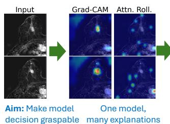
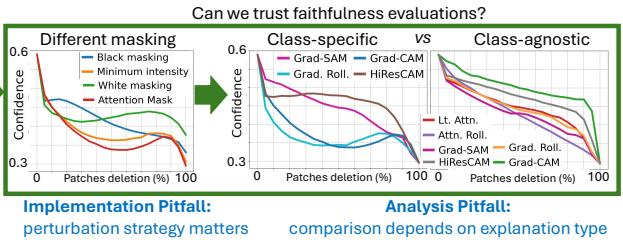
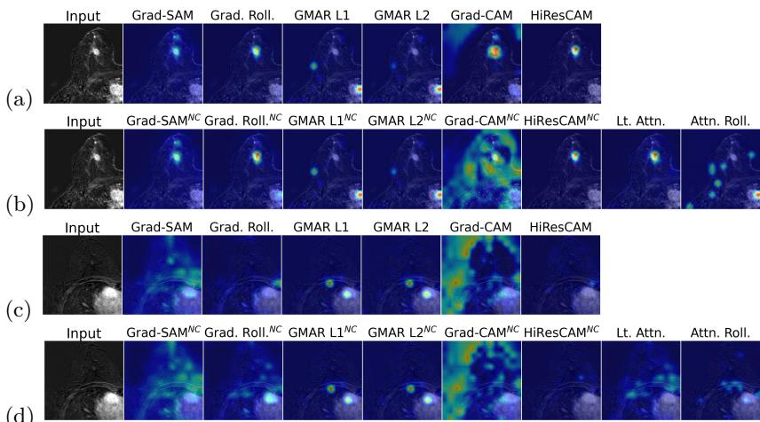
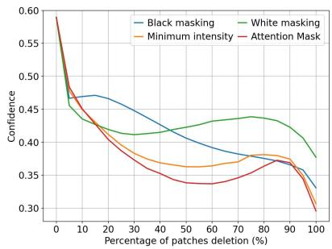
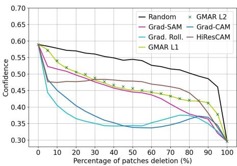
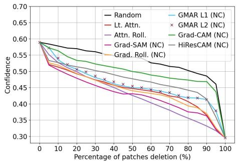
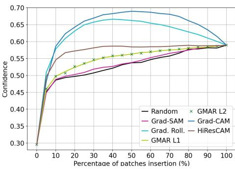
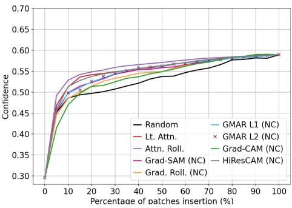

# Faithful Faithfulness Evaluations: Challenges & Pitfalls Learned from a Breast MRI Case Study

Peachapong Poolpol1,2 , Henrik H.J. Detjen1 , and Eike Petersen1

1 Fraunhofer Institute for Digital Medicine MEVIS, Bremen, Germany 2 Deggendorf Institute of Technology, Deggendorf, Germany {eike.petersen,henrik.detjen}@mevis.fraunhofer.de, peachapong.p@gmail.com

Abstract. Saliency maps are widely used to explain deep learning predictions in medical imaging, yet visually plausible explanations do not necessarily reflect a model’s true decision process and may therefore mislead clinicians. We investigate this problem using a Vision Transformerbased breast MRI classifier trained on the ODELIA Breast MRI Challenge dataset and evaluate multiple saliency methods, including Lastlayer Attention, Attention Rollout, Grad-SAM, Gradient Attention Rollout, GMAR, Grad-CAM, and HiResCAM. Our study highlights two often-overlooked challenges in perturbation-based faithfulness evaluation. First, method rankings depend strongly on the perturbation strategy, varying across intensity-based perturbations and transformer-based attention masking. Second, benchmarking saliency methods requires distinguishing between class-specific and class-agnostic explanations. To enable fair comparisons, we introduce non-class-specific variants of gradientbased methods and evaluate both settings separately. Across protocols, Grad-CAM and Gradient Attention Rollout consistently emerged as the strongest class-specific methods, although their relative ranking depended on the evaluation design. These findings expose important limitations of current saliency-based explainability approaches and highlight the need for more robust and standardized evaluation frameworks for trustworthy clinical AI systems.

Keywords: Saliency Maps, Faithfulness evaluation, Explainable AI, Breast MRI, Attention

  
Fig. 1: Key pitfalls in saliency faithfulness evaluation — we discuss recommendations derived from our use case for more reliable faithfulness assessment.

## 1 Introduction

Post-hoc explanation methods are frequently used to interpret deep learning models in medical imaging. In image classification, these methods commonly produce saliency maps, highlighting regions assumed to be relevant for a prediction and ofering an intuitive visual explanation. However, visual plausibility alone is not suficient for judging explanation quality: a visually plausible heatmap may suggest that the model focuses on a lesion, yet quantitative testing may reveal that perturbing the highlighted region has little efect on the prediction [2,9,22]. Conversely, an explanation may be quantitatively faithful but clinically uninformative if the model relies on confounders. Therefore, faithfulness evaluation should be treated as a separate methodological assessment.

Perturbation-based evaluation has become a common approach for assessing explanation faithfulness [22,3,12]. By modifying image regions according to a saliency ranking and measuring the resulting prediction changes, these methods estimate how strongly highlighted regions influence model behavior. However, evaluation outcomes can depend on methodological choices such as the perturbation strategy and evaluation protocol, see figure 1. Here, we study the faithfulness of saliency maps in breast MRI classification. Our contributions include

1. evaluating the efect of diferent perturbation strategies on faithfulness evaluations, demonstrating that explanation ranking may depend on this choice,

2. a generic scheme for deriving class-agnostic saliency maps from class-specific methods, enabling between-family comparisons, and

3. the first comprehensive evaluation of the faithfulness of seven saliency map methods in a ViT-based volumetric image classification setting.

## 2 Background & Related Work

## 2.1 Saliency-Based Explanation Methods

Gradient-based and attention-based methods are the most commonly used posthoc explanation approaches for image classifiers. Grad-CAM uses gradients of a target class with respect to internal feature activations to generate classdiscriminative localization maps [18] and has been adapted to transformer-based vision models by treating patch tokens as spatial feature representations [3,12]. HiResCAM [8] extends Grad-CAM by replacing gradient averaging with elementwise multiplication between activations and gradients, aiming to improve explanation faithfulness while retaining class-discriminative localization.

For Vision Transformers (ViTs) [7], attention weights are often used as explanations because they directly represent token interactions. Last-layer attention visualizes the attention from the classification token to image patches. However, raw attention provides only a partial view of information flow and is not necessarily equivalent to feature importance [10]. Attention rollout addresses this limitation by recursively combining attention matrices across layers to approximate how information propagates through the transformer [1], yet this approach remains empirically motivated and not theoretically justified.

More recent transformer-specific explanation methods combine attention information with gradient information to obtain class-specific attributions [5]. Grad-SAM weights self-attention maps using class gradients to generate gradientguided attention explanations [4]. Gradient Attention Rollout extends attention rollout by incorporating gradient information into the attention aggregation process, producing class-specific explanations while preserving attention flow across layers [3]. Similarly, GMAR combines gradient weighting with multi-head attention rollout and has been proposed as an alternative transformer explanation strategy [11].

## 2.2 Faithfulness of Saliency Maps

A central concern in explainable AI is whether explanations are faithful: an explanation should identify all image regions that substantially influence the model’s output, and no other regions. Prior work has shown that visual inspection is insuficient for this purpose. Adebayo et al. [2] introduced sanity checks demonstrating that saliency methods can be insensitive to model parameters or labels. Hooker et al. [9] proposed a benchmark based on removing high-saliency features and retraining models, showing that several attribution methods perform close to random rankings. However, subsequent work demonstrated that fixedvalue perturbations can confound evaluation results, motivating in-distribution perturbation strategies such as ROAD [17]. Zhang et al. [22] and Dombrowski et al. [6] showed that saliency maps are sensitive to imperceptible adversarial changes in input images, raising concerns about their reliability.

Perturbation-based faithfulness evaluations assess faithfulness by modifying features according to their saliency values. Deletion and insertion curves were popularized by Petsiuk et al. [16] as quantitative measures. However, perturbation methods are sensitive to design choices including perturbation granularity, replacement strategy, and whether confidence is measured for the predicted or the ground-truth class. For ViTs specifically, masking should be conducted using attention masking instead of fixed-value replacement or noising [12,13], but this is not yet commonly done within the medical imaging community [3].

## 2.3 Explainability in Medical Imaging

Saliency maps are often interpreted as evidence localization [14], yet clinical plausibility and model faithfulness are distinct. A heatmap may overlap with a lesion because of image structure, preprocessing, or inductive bias, without necessarily reflecting the evidence used by the model. Prior work on transformer explanations in medical imaging has reported inconsistent findings across tasks and architectures, suggesting that explanation quality may depend on pathology, image modality, and evaluation protocol. Most recently, Barekatain and Glocker [3] evaluated the faithfulness of ViT explanation strategies in a medical imaging setting, but their analysis was limited to two explanation methods and 2D images; a comprehensive evaluation of ViT saliency faithfulness in a volumetric setting is currently lacking.

## 3 Methods

## 3.1 Data and Prediction Setting

Experiments were conducted on the public training and validation portion of the ODELIA Breast MRI Challenge 2025 dataset [15]. The dataset contains 1,022 unilateral breast MRI samples labeled as No-lesion, Benign, or Malignant. Data were split at patient level into 792 training, 114 validation, and 116 test samples. Classification was performed using a Medical Slice Transformer (MST) [14], which processes 3D MRI volumes as sequences of 2D slices. Slice features were extracted using a pretrained DINOv3-ViT [19] backbone and aggregated by a slice-fusion transformer to produce three-class predictions. The model was used only for explanation evaluation; model optimization was not a focus of our study.

## 3.2 Explanation Methods

For each test sample, saliency maps were generated using Last-layer Attention [10], Attention Rollout [1], Grad-SAM [4], Gradient Attention Rollout [3], GMAR [11] (L1 and L2 gradient norm), Grad-CAM [18], and HiResCAM [8]. Since Last-layer Attention and Attention Rollout operate at the slice level in the MST, saliency maps were weighted by slice-fusion transformer attention scores. Gradient-based methods generate explanations directly from the final prediction and therefore require no additional slice weighting. To enable comparison with class-agnostic explanations, we additionally constructed non-class-specific variants of class-specific explanations by averaging saliency maps across output classes. For these non-class-specific variants only, absolute gradients were used instead of ReLU to aggregate positive and negative contributions across classes.

## 3.3 Perturbation-Based Faithfulness Evaluation

Saliency maps were converted to patch-level importance scores via interpolation. In deletion, starting from the original image, perturbations are applied in descending order of patch importance; more faithful explanations should cause a faster confidence decrease and lower area under the confidence curve (AUCC). In insertion, starting from an empty image, the most salient patches are progressively restored; more faithful explanations should produce faster confidence recovery and higher AUCC values.

## 3.4 Perturbation Strategies

To assess the sensitivity of faithfulness evaluations to the perturbation strategy, we evaluated black masking, white masking, minimum-intensity replacement, and attention masking. As inputs were z-score normalized, fixed-intensity masking used replacement values z = −10 (‘black’) and z = 10 (‘white’), outside the observed test-set intensity range. Minimum-intensity replacement used the minimum intensity of each image. Attention masking [20] suppresses selected patches directly within the transformer’s attention computation, thus fully removing a patch from model computations instead of replacing it with a fixed value.

## 3.5 Aggregation and Analysis

For each explanation method and perturbation setting, confidence was recorded in 5% perturbation steps. Perturbation curves were summarized using AUCC. For each class, AUCC values were computed on a per-sample basis, from which the mean and 95% confidence interval $( \mathrm { m e a n } ~ \pm ~ 1 . 9 6 ~ \mathrm { S E M } )$ were estimated. Macro-averaged results were then obtained by averaging class-wise means and corresponding confidence interval bounds. In addition to full AUCC, we report AUCC over the first 30% of perturbation steps to emphasize early confidence changes, corresponding to the highest-saliency image regions. For visualization, confidence curves were obtained by averaging confidence values across test samples at each perturbation step. Our code is available at https://github.com/ friendorus/Faithful-Faithfulness-Evaluations.

## 4 Results

## 4.1 Baseline Prediction Performance

The model achieved moderate test-set classification performance (accuracy 0.57, macro $F _ { 1 } ~ 0 . 5 2$ , weighted $F _ { 1 }$ 0.57, macro AUROC 0.73, micro AUROC 0.78). Performance varied across classes, with the highest one-vs-rest AUROC observed for the – arguably most important – malignant cases (0.81)(precision 0.77, recall 0.53, $F _ { 1 } \ 0 . 6 3 )$ ), followed by no-lesion (0.69) and benign (0.69). Since the focus of this work is the evaluation of explanation faithfulness, these results are provided primarily as context for interpreting the subsequent saliency analyses.

## 4.2 Qualitative Comparison of Explanation Methods

Figure 2 shows saliency maps for malignant and no-lesion cases. For the malignant case, all class-specific methods highlight the lesion region, although Grad-CAM produces more difuse saliency than the other methods. Most non-classspecific methods also localize the lesion, whereas Attention Rollout and Grad-CAM generate more dispersed saliency. Saliency maps for the no-lesion case were more heterogeneous across methods, reflecting the absence of a localized target region. These qualitative observations motivate the quantitative faithfulness evaluation presented in the following sections.

## 4.3 Efect of Replacement Strategy

Replacement strategy substantially afected perturbation-based faithfulness (Table 1). While Gradient Attention Rollout and Grad-CAM consistently achieved the strongest deletion performance, their relative ranking depended on the replacement strategy. Figure 3 further illustrates that diferent replacement strategies produce distinct perturbation curves even for the same explanation method. Because it constitutes the most principled removal strategy, attention masking was selected for subsequent experiments.

  
Fig. 2: Saliency maps of a Malignant case ((a) class-specific, (b) non-classspecific) and a No-lesion case ((c) class-specific, (d) non-class-specific). Note. Grad. Roll. = Gradient Attention Rollout, Lt. Attn. = Last-layer Attention, Attn. Roll. = Attention Rollout, NC = non-class-specific methods

## 4.4 Deletion and Insertion

Table 2 summarizes AUCC scores obtained using attention masking; figure 4 shows the corresponding confidence curves. For class-specific explanations, Grad-CAM and Gradient Attention Rollout achieved the strongest performance, with Grad-CAM obtaining the lowest deletion AUCC and highest insertion AUCC, and Gradient Attention Rollout achieving the best Deletion30 score. Class-specific Grad-CAM and Gradient Attention Rollout outperformed their non-class-specific counterparts, whereas GMAR showed minimal diferences. For non-class-specific explana-

  
Fig. 3: Deletion confidence curves for Grad-CAM under diferent replacement strategies.

tions, performance diferences were generally smaller, with Grad-SAM achieving the strongest deletion performance, HiResCAM the highest insertion scores, and Gradient Attention Rollout the best Deletion30 score.

## 5 Discussion

Our study demonstrates that saliency map faithfulness evaluation is protocoldependent. Method rankings varied across replacement strategies, deletion and insertion tests, and full versus early perturbation analyses. For example, Grad-CAM achieved the strongest overall deletion performance, whereas Gradient Attention Rollout showed stronger performance when considering only the highestsaliency regions. Consistent with Barekatain and Glocker [3], Grad-CAM and Gradient Attention Rollout emerged as the strongest class-specific methods. The replacement strategy substantially afected faithfulness ranking. Under fixedintensity replacement, explanation methods perform similarly to random masking, likely due to strong out-of-distribution artifacts. In contrast, attention masking produced greater separation between methods while preserving the original image intensities, providing a more reliable faithfulness evaluation.

Table 1: Macro-averaged deletion AUCC (↓) [95% CI] for class-specific explanation methods evaluated using diferent replacement strategies.
<table><tr><td>Method</td><td colspan="2">Black</td><td colspan="2">Min. Intensity</td><td colspan="2">White</td><td colspan="2">Attn. Mask</td></tr><tr><td>Random</td><td>0.355</td><td>[.348,.363]</td><td></td><td>0.476 [.438,.514]</td><td>0.409</td><td>[.383,.435]</td><td></td><td>0.512 [.479,.546]</td></tr><tr><td>Grad-SAM</td><td>0.352</td><td> [.346,.358]</td><td></td><td>0.377 [.362,.391]</td><td>0.373</td><td>[.358,.389]</td><td></td><td>0.412 [.394,.430]</td></tr><tr><td>Grad. Roll.</td><td></td><td>0.346 [.340,.353]</td><td>0.327</td><td>[.311,.342]</td><td>0.342</td><td>[.327,.357]</td><td></td><td>0.336 [.318,.355]</td></tr><tr><td>GMAR-L1</td><td>0.355</td><td>[.347,.362]</td><td></td><td>0.376 [.361,.392]</td><td>0.369</td><td>[.353,.385]</td><td>0.412</td><td>[.394,.430]</td></tr><tr><td>GMAR-L2</td><td></td><td>0.355 [.347,.362]</td><td>0.376</td><td>[.361,.391]</td><td>0.369</td><td>[.353,.385]</td><td>0.412</td><td>[.393,.430]</td></tr><tr><td>Grad-CAM 0.347 [.338,.356]</td><td></td><td></td><td></td><td>0.323 [.304,.342]</td><td></td><td>0.332 [.314,.350] 0.336 [.314,.358]</td><td></td><td></td></tr><tr><td>HiResCAM 0.358 [.351,.366]</td><td></td><td></td><td></td><td>0.388 [.366,.410]</td><td></td><td>0.383 [.362,.403] 0.417 [.390,.444]</td><td></td><td></td></tr></table>

Note. Grad. Roll. = Gradient Attention Rollout

Qualitative analysis further showed that visual appearance and quantitative evaluation are not equivalent. Most class-specific methods localized the lesion region in malignant cases, yet quantitative results difered substantially. Conversely, Grad-CAM and Gradient Attention Rollout achieved similar quantitative performance despite producing noticeably diferent saliency maps in nolesion cases. Similar observations were reported by Wollek et al. [21], who found that attention-based saliency maps achieved favorable quantitative performance and were considered useful by radiologists. While perturbation tests assess the relationship between explanations and model predictions, clinicians are primarily interested in whether explanations correspond to plausible disease-related features – risking conflating clinical plausibility with explanation faithfulness.

Interpretation of attention-based methods also requires consideration of their inherently non-class-specific nature. Unlike gradient-based methods, Last-layer Attention and Attention Rollout are not tied to a specific output class. To enable a fair comparison, we introduced non-class-specific variants of the gradient-based methods and evaluated both settings separately. Under this comparison, performance diferences became substantially smaller, suggesting that part of the advantage of class-specific methods arises from access to class-discriminative information rather than the explanation mechanism itself. The proposed non-classspecific variants are intended as a simple means to compare class-specific and class-agnostic methods; we do not claim optimality of this approach. Still, the derived variants achieved highly competitive performance relative to attentionbased methods, suggesting that aggregation retained meaningful information.

Table 2: Macro-averaged AUCC [95% CI] for class-specific and non-class-specific explanation methods.  
(a) Class-specific methods
<table><tr><td>Method</td><td>Deletion (↓)</td><td></td><td>Deletion3o (↓)</td><td></td><td>Insertion (↑)</td><td></td><td>Insertion30 (↑)</td><td></td></tr><tr><td>Random</td><td></td><td>0.512 [.479,.546]</td><td></td><td>0.173 [.161,.185]</td><td></td><td>0.505 [.471,.539]</td><td></td><td>0.126 [.117,.135]</td></tr><tr><td>Grad-SAM</td><td></td><td>0.412 [.394,.430]</td><td></td><td>0.142 [.133,.150]</td><td></td><td>0.525 [.486,.564]</td><td></td><td>0.136 [.124,.147]</td></tr><tr><td>Grad. Roll.</td><td></td><td>0.336 [.318,.355] 0.110 [.103,.118]</td><td></td><td></td><td></td><td>0.621 [.591,.652]</td><td></td><td>0.167 [.158,.177]</td></tr><tr><td>GMAR-L1</td><td></td><td>0.445 [.413,.476]]</td><td></td><td>0.151 [.140,.162]</td><td></td><td>0.531 [.493,.569]</td><td></td><td>0.135 [.125,.145]</td></tr><tr><td>GMAR-L2</td><td></td><td>0.447 [.415,.479] 0.152 [.141,.162]</td><td></td><td></td><td></td><td>0.530 [.492,.568]</td><td></td><td>0.135 [.125,.145]</td></tr><tr><td>Grad-CAM</td><td></td><td>0.336 [.314,.358] 0.117 [.108,.127] 0.637 [.605,.669] 0.172 [.160,.183]</td><td></td><td></td><td></td><td></td><td></td><td></td></tr><tr><td>HiResCAM</td><td></td><td>0.417 [.390,.444] 0.133 [.123,.143] 0.583 [.546,.619] 0.165 [.152,.177]</td><td></td><td></td><td></td><td></td><td></td><td></td></tr></table>

(b) Non-class-specific methods
<table><tr><td>Method</td><td>Deletion (↓)</td><td></td><td>Deletion3o (↓)</td><td></td><td>Insertion (↑)</td><td></td><td>Insertion30 (↑)</td></tr><tr><td>Random</td><td>0.512 [.479,.546]</td><td></td><td>0.173 [.161,.185]</td><td></td><td>0.505 [.471,.539]</td><td></td><td>0.126 [.117,.135]</td></tr><tr><td>Lt. Attn.</td><td>0.407 [.390,.425]</td><td></td><td>0.138 [.130,.146]</td><td></td><td>0.562 [.524,.601]</td><td></td><td>0.155 [.143,.168]</td></tr><tr><td>Attn. Roll.</td><td>0.413 [.392,.433]</td><td></td><td>0.144 [.134,.153]</td><td></td><td>0.565 [.527,.602]</td><td></td><td>0.155 [.144,.166]</td></tr><tr><td>Grad-SAMNC</td><td></td><td></td><td>0.403 [.386,.420] 0.138 [.130,.145]</td><td></td><td>0.539 [.500,.577]</td><td></td><td>0.140 [.129,.152]</td></tr><tr><td>Grad. Roll.NC</td><td>0.409 [.392,.425]</td><td></td><td>0.137 [.130,.144] 0.537 [.500,.573]</td><td></td><td></td><td></td><td>0.137 [.127,.147]</td></tr><tr><td>GMAR-L1NC</td><td>0.444 [.413,.475]</td><td></td><td>0.151 [.140,.161]</td><td></td><td>0.531 [.493,.569]</td><td></td><td>0.135 [.125,.145]</td></tr><tr><td>GMAR-L2NC</td><td>0.447 [.415,.479]</td><td></td><td>0.152 [.141,.162]</td><td></td><td>0.530 [.492,.568]</td><td></td><td>0.135 [.125,.145]</td></tr><tr><td>Grad-CAMNC</td><td>0.475 [.445,.504]</td><td></td><td>0.160 [.149,.172]</td><td></td><td>0.528 [.488,.569]0.136 [.124,.147]</td><td></td><td></td></tr><tr><td>HiResCAMNC</td><td>0.421 [.400,.443]</td><td></td><td>0.141 [.133,.150]</td><td></td><td>0.568 [.529,.606] 0.158 [.145,.170]</td><td></td><td></td></tr></table>

Note. Lt. Attn. = Last-layer Attention, Attn. Roll. = Attention Rollout,  
Grad. Roll. = Gradient Attention Rollout, NC = non-class-specific methods

Our study is limited to a single breast MRI classification task and one transformer architecture with moderate classification performance on a highly challenging diagnostic task. It remains unclear whether the ranking of saliency methods generalizes to stronger models. However, explanation methods should faithfully reflect the model’s decision-making process regardless of predictive performance, as faithfulness is defined with respect to the learned model rather than the underlying task. In addition, although the overall performance was moderate, the model showed the strongest discriminative performance for the malignant class. Future work should extend this framework across imaging tasks, architectures, and explanation methods while investigating how perturbation-based evaluation relates to clinician trust and clinical utility.

## 6 Conclusion

We present a perturbation-based framework for evaluating saliency maps in transformer-based breast MRI classification. Our results show that explanation method rankings depend strongly on the evaluation protocol, including the choice of replacement strategy, perturbation metric, and class specificity. No single method was consistently superior across all settings. Our findings emphasize that saliency maps should be quantitatively evaluated before clinical interpretation and that explanation quality cannot be assessed by judging clinical plausibility.

  
(a) Deletion, class specific methods

  
(b) Deletion, non-class specific methods

  
(c) Insertion, class specific methods

  
(d) Insertion, non-class specific methods  
Fig. 4: Confidence curves obtained from deletion and insertion evaluations using the attention-mask replacement strategy.  
Note. Grad. Roll. = Gradient Attention Rollout, Lt. Attn. = Last-layer Attention, Attn. Roll. = Attention Rollout, NC = non-class specific methods

Acknowledgments. This work has received funding from the European Union’s Horizon Europe research and innovation programme under grant agreement No 101057091. Views and opinions expressed are however those of the author(s) only and do not necessarily reflect those of the European Union or the European Health and Digital Executive Agency (HADEA). Neither the European Union nor the granting authority can be held responsible for them.

Disclosure of Interests. The authors declare no competing interests.

## References

1. Abnar, S., Zuidema, W.: Quantifying attention flow in transformers. In: ACL. pp. 4190–4197 (2020)

2. Adebayo, J., Gilmer, J., Muelly, M., et al.: Sanity checks for saliency maps. In: NeurIPS. vol. 31 (2018)

3. Barekatain, L., Glocker, B.: Evaluating the explainability of vision transformers in medical imaging. In: iMIMIC. pp. 96–105 (2025)

4. Barkan, O., Hauon, E., Caciularu, A., et al.: Grad-SAM: Explaining transformers via gradient self-attention maps. In: CIKM. p. 2882–2887 (2021)

5. Chefer, H., Gur, S., Wolf, L.: Transformer interpretability beyond attention visualization. In: CVPR. pp. 782–791 (2021)

6. Dombrowski, A.K., Alber, M., Anders, C., et al.: Explanations can be manipulated and geometry is to blame. In: NeurIPS. vol. 32 (2019)

7. Dosovitskiy, A., Beyer, L., Kolesnikov, A., et al.: An image is worth 16x16 words: Transformers for image recognition at scale. In: ICLR (2021)

8. Draelos, R.L., Carin, L.: Use HiResCAM instead of Grad-CAM for faithful explanations of convolutional neural networks. arXiv (2021)

9. Hooker, S., Erhan, D., Kindermans, P.J., Kim, B.: A benchmark for interpretability methods in deep neural networks. In: NeurIPS. vol. 32 (2019)

10. Jain, S., Wallace, B.C.: Attention is not explanation. In: NAACL-HLT. pp. 3543– 3556 (2019)

11. Jo, S., Jang, G., Park, H.: GMAR: Gradient-driven multi-head attention rollout for vision transformer interpretability. In: ICIP. pp. 582–587 (2025)

12. Kashefi, R., Barekatain, L., Sabokrou, M., et al.: Explainability of vision transformers: a comprehensive review and new perspectives. Multimedia Tools and Applications 85(2) (2026)

13. Mehri, F., Fayyaz, M., Baghshah, M.S., Pilehvar, M.T.: SkipPLUS: Skip the first few layers to better explain vision transformers. In: CVPR Workshops. pp. 204–215 (2024)

14. Müller-Franzes, G., Khader, F., Siepmann, R., et al.: Medical slice transformer for improved diagnosis and explainability on 3D medical images with DINOv2. Scientific Reports 15, 23979 (2025)

15. Müller-Franzes, G., Sánchez, L.E., Payne, N., et al.: A European multi-center breast cancer MRI dataset. arXiv (2025)

16. Petsiuk, V., Das, A., Saenko, K.: RISE: Randomized input sampling for explanation of black-box models. In: BMVC (2018)

17. Rong, Y., Leemann, T., Borisov, V., et al.: A consistent and eficient evaluation strategy for attribution methods. In: Proceedings of ICML. vol. 162, pp. 18770– 18795 (2022)

18. Selvaraju, R.R., Cogswell, M., Das, A., Vedantam, R., et al.: Grad-CAM: Visual explanations from deep networks via gradient-based localization. In: ICCV. pp. 618–626 (2017)

19. Siméoni, O., Vo, H.V., Seitzer, M., et al.: DINOv3. arXiv (2025)

20. Vaswani, A., Shazeer, N., Parmar, N., et al.: Attention is all you need. In: NeurIPS. pp. 6000–6010 (2017)

21. Wollek, A., Graf, R., Čečatka, S., et al.: Attention-based Saliency Maps Improve Interpretability of Pneumothorax Classification. Radiology: Artificial Intelligence 5(2) (2023)

22. Zhang, J., Chao, H., Dasegowda, G., et al.: Revisiting the trustworthiness of saliency methods in radiology AI. Radiology: Artificial Intelligence 6(1) (2024)