# GTR: GATED TOKEN RECURRENCE FOR EFFICIENTDENSE PREDICTION

Zhe Feng1,2,3, Longfei Liu2, Wei Liu1, Kai Chen5, Jiangang Kong1, Wei Zhou1, Yifeng Qian5, Dexiong Chen4, Xuanlong Yu2, Xi Shen2∗

1Didi International Business Group 2Intellindust AI Lab

3Institute of Automation, Chinese Academy of Sciences

4The Hong Kong University of Science and Technology (Guangzhou) 5Didi Research

Project Page GitHub

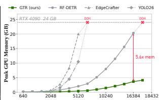

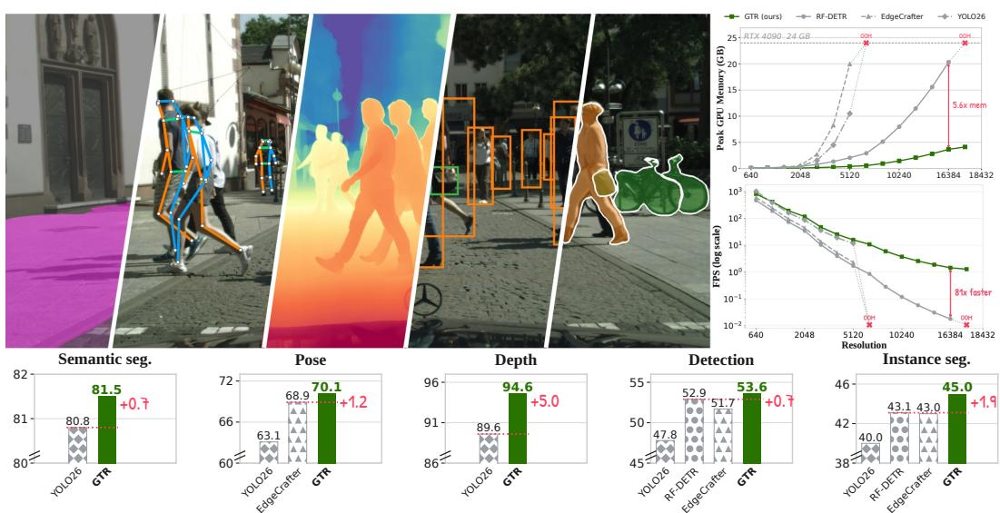

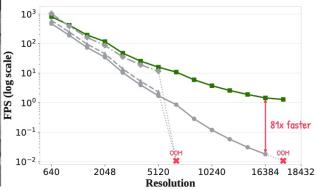

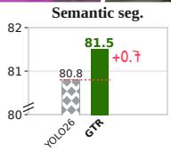

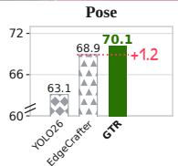

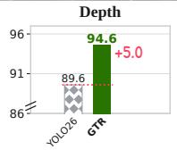

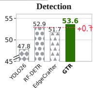

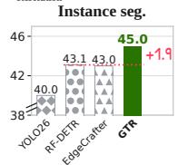  
Figure 1: GTR: a shared backbone design for efficient dense prediction. Left: Task-specific models built on the same GTR backbone design produce predictions across semantic segmentation, human pose estimation, monocular depth estimation, object detection, and instance segmentation. Right: Peak GPU memory and inference throughput on RTX 4090 as input resolution increases, comparing GTR-S with RF-DETR-S (Robinson et al., 2026), EdgeCrafter-S (Liu et al., 2026), and YOLO26-S (Jocher et al., 2026). GTR-S shows slower peak-memory growth and higher throughput at increasing resolutions.

## ABSTRACT

Self-attention-based vision backbones perform well on dense prediction, but the quadratic computational cost of global softmax attention limits their efficiency as image resolution increases. We introduce Gated Token Recurrence (GTR), a softmax-free recurrent vision backbone that combines gated linear attention, alternating spatial scan directions, and spatially enhanced SwiGLU blocks. GTR is distilled from a detection-specialized DINOv3 teacher using only final-layer patchtoken alignment through a linear projection and squared $\ell _ { 2 }$ loss, without maskedtoken prediction or intermediate-layer supervision. With Objects365 detector pretraining, GTR-L achieves 58.9 box AP on COCO val2017 with 1.908 ms median batch-one latency under compiled FP16 execution on an RTX 4090. The same backbone also transfers to instance segmentation, pose estimation, oriented detection, semantic segmentation, and monocular depth estimation. In an isolated kernel benchmark, our specialized chunkwise CUDA operator is 4.0× faster than FLA v0.5.0 at 1.6K tokens on RTX 4090. TensorRT deployment on DRIVE AGX Thor achieves 2.282–8.769 ms median batch-one latency across the evaluated models. These results show that recurrent token mixing can provide an efficient alternative to global softmax attention for high-resolution dense prediction and edge deployment.

## 1 INTRODUCTION

Self-attention-based vision backbones have shown strong performance for dense prediction (Liu et al., 2026). However, the quadratic complexity of softmax attention with respect to the number of image tokens makes high-resolution processing increasingly expensive, particularly on resourceconstrained edge devices. Linear attention offers a promising alternative: EfficientViT (Cai et al., 2023) demonstrates efficient on-device semantic segmentation, while ViG (Liao et al., 2025) explores gated linear recurrence for detection and segmentation. Despite this progress, developing a general linear-attention backbone that performs consistently across diverse dense prediction tasks while meeting practical constraints on model size, computation, memory, and latency remains challenging. This motivates a central question: can linear attention support a general-purpose vision backbone that remains accurate across diverse dense prediction tasks while translating its theoretical efficiency into practical gains on edge hardware?

We introduce Gated Token Recurrence (GTR), a linear-complexity (in the number of image tokens) vision backbone designed to address this challenge. GTR builds on gated linear attention (GLA) (Yang et al., 2024b) with a softmax-free, single-scale recurrent architecture. It maintains a fixed patch grid across 12 blocks and performs one directional scan per block, cycling through four directions across depth to progressively aggregate global context. To complement this directional recurrence with explicit local spatial modeling, we introduce Spatial SwiGLU, which incorporates depthwise convolution into the value branch of SwiGLU (Shazeer, 2020) to efficiently mix neighboring patches. Together, directional recurrence and Spatial SwiGLU provide complementary global and local spatial modeling while preserving linear complexity.

Importantly, GTR uses a single distillation objective that supervises only the final patch tokens. Unlike ViT-Linearizer (Wei & Chellappa, 2025), which combines intermediate activation matching with masked prediction, or ViT-AdaLA (Li et al., 2026b), which aligns attention modules before the final features, our approach distills only the final patch tokens. Specifically, GTR is aligned with a frozen, detection-specialized DINOv3 teacher (Simeoni et al. ´ , 2025) using the same full-image input. A linear projection and a single squared $\ell _ { 2 }$ loss constitute the entire distillation objective, requiring neither masking nor intermediate supervision.

GTR scales across four model sizes (S, M, L, and X) and transfers to six dense prediction tasks: object detection, instance segmentation, human pose estimation, oriented object detection, semantic segmentation, and monocular depth estimation. With Objects365 detector pre-training (Shao et al., 2019), GTR-L achieves 58.9 box AP on COCO (Lin et al., 2014) val2017 at a median forward-pass latency of only 1.908 ms under compiled FP16, batch-one inference on an RTX 4090. Beyond detection, GTR achieves competitive results in representative comparisons across the other five tasks using the same backbone design with task-specific heads and training recipes (Section 3.2; Appendix D). As summarized in Figure 1, GTR-S also exhibits slower growth in peak GPU memory and higher inference throughput than the softmax-attention-based EdgeCrafter-S (Liu et al., 2026) as input resolution increases, highlighting the practical advantage of linear-complexity attention for high-resolution dense prediction.

Finally, we bridge architectural efficiency and real-world deployment with dedicated system opti mizations. We develop a specialized chunkwise CUDA operator for GLA (Yang et al., 2024b) that computes chunk summaries in parallel while propagating recurrent context through a boundary-state scan. The operator achieves a 4.0× speedup over FLA v0.5.0 (Yang & Zhang, 2024) at 1.6K tokens under FP16 and CUDA Graph execution on an RTX 4090. For end-to-end deployment on DRIVE AGX Thor, we further integrate fused kernels and graph transformations into TensorRT (NVIDIA, 2026). Across six tasks and four model scales, GTR achieves median FP16 batch-one latencies of 2.282–8.769 ms, demonstrating its practicality for real-time dense prediction on edge hardware.

In summary, our main contributions are:

• We introduce GTR, a single-scale, linear-attention vision backbone for efficient dense prediction. GTR combines gated token recurrence with four-directional scanning across depth and Spatial SwiGLU for complementary global and local spatial modeling.

• We demonstrate the generality and scalability of GTR across six dense prediction tasks and four model scales. The same backbone design transfers effectively across object-level and pixel-level tasks using simple final-token distillation and task-specific adaptation.

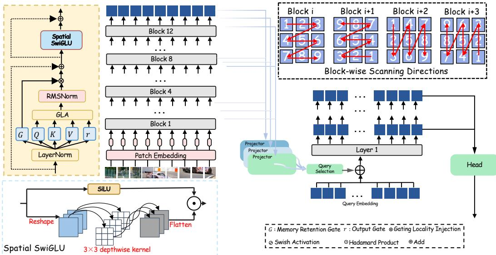  
Figure 2: Overview of GTR. Each backbone block combines GLA (Yang et al., 2024b) with Spatial SwiGLU, whose $3 \times 3$ depthwise convolution mixes neighboring patch tokens in the value branch. The 12-block backbone alternates two-dimensional scan directions and exposes intermediate features to a lightweight three-scale projector. A query-based head decodes the resulting feature pyramid.

• We enable practical edge deployment through a specialized chunkwise CUDA operator and TensorRT integration. Across six tasks and four model scales, GTR achieves lowlatency FP16 inference on DRIVE AGX Thor, demonstrating low-latency deployment on automotive edge hardware.

## 2 METHOD

Figure 2 provides an overview of GTR and its object detection pipeline. We first describe the GTR backbone, followed by its distillation strategy and specialized chunkwise inference. Given an image $\mathbf { I } \in \mathbb { R } ^ { H \times W \times 3 }$ , GTR produces a stride-16 grid of $\dot { L } = H W / 1 6 ^ { 2 }$ patch tokens and maintains the same resolution throughout 12 blocks. Each block combines gated linear attention (GLA) (Yang et al., 2024b) for long-range context with Spatial SwiGLU for local spatial mixing. The scan direction cycles through four directions across successive blocks to aggregate context from different orientations. For object detection, features from blocks 4, 8, and 12 are used to build a lightweight feature pyramid at strides 8, 16, and 32, followed by a DETR-style decoder (Carion et al., 2020; Peng et al., 2025). The GTR backbone itself remains single-scale, while multi-scale features are constructed in the detection neck. Details of the neck and decoder are provided in Appendix B, and the four GTR model configurations in Appendix D.1.1.

## 2.1 GTR BACKBONE

GTR combines three components: gated recurrence for long-range context, directional scanning for two-dimensional context, and Spatial SwiGLU for local spatial mixing.

Key-only gated recurrence. We adopt the key-only variant of GLA (Yang et al., 2024b). For one attention head, let $\mathbf { X } \in \mathbb { R } ^ { L \times d }$ denote the input tokens. We first compute $\mathbf { Q } = \mathbf { X } \mathbf { W } _ { Q } , \mathbf { K } =$ $\mathbf { X } \mathbf { W } _ { K } , \mathbf { V } = \mathbf { X } \mathbf { W } _ { V }$ , where $\mathbf { W } _ { Q } , \mathbf { W } _ { K } \in \mathbb { R } ^ { d \times d _ { k } }$ and $\mathbf { W } _ { V } \in \mathbb { R } ^ { d \times d _ { \tau } }$ . Let $\pmb { x } _ { t } \in \mathbb { R } ^ { 1 \times d }$ be the input row at token t, and let $\mathbf { \nabla } q _ { t } , k _ { t }$ , and ${ \mathbf { } } v _ { t }$ denote the corresponding projected row vectors.

GLA maintains a recurrent state $\mathbf { S } _ { t } \in \mathbb { R } ^ { d _ { k } \times d _ { v } }$ that summarizes the tokens encountered along the current scan, with $\mathbf { S } _ { t } = \mathrm { D i a g } ( \gamma _ { t } ) \mathbf { S } _ { t - 1 } + \boldsymbol { k } _ { t } ^ { \top } \boldsymbol { v } _ { t } , o _ { t } = \boldsymbol { d } _ { k } ^ { - 1 / 2 } \mathbf { \boldsymbol { q } } _ { t } \mathbf { S } _ { t } .$ , and ${ \bf S } _ { 0 } \ = \ { \bf 0 }$ . Here, $\gamma _ { t } \ =$ $\sigma ( { \pmb x } _ { t } { \mathbf { W } } _ { \alpha } ^ { ( 1 ) } { \mathbf { W } } _ { \alpha } ^ { ( 2 ) } + { \pmb b } _ { \alpha } ) ^ { 1 / \tau }$ is a learned key-wise retention gate with $\gamma _ { t } \in ( 0 , 1 ) ^ { 1 \times d _ { k } }$ . Following

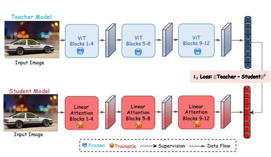

Figure 3: Final-output representation alignment. The frozen detection-specialized DINOv3 teacher (Simeoni et al.´ , 2025) and GTR student process the same full image. We align their final patch features using a squared $\ell _ { 2 }$ loss after a learned linear projection of the student features (Equation 2). The projection is omitted from the figure for clarity.  
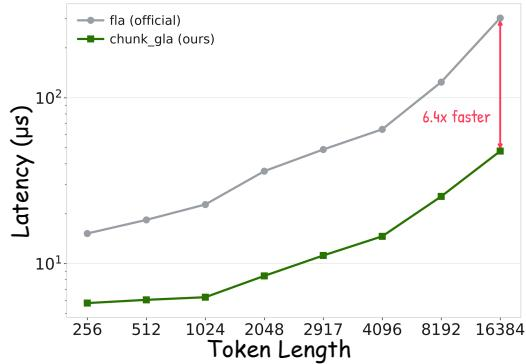  
Figure 4: GLA operator latency on RTX 4090. We compare our inference-only operator with FLA v0.5.0 (Yang & Zhang, 2024) using FP16 inputs and CUDA Graph execution. $\mathrm { ~ A ~ } 6 4 0 \times \mathrm { ~ 6 4 0 ~ }$ input corresponds to 1.6K stride-16 patch tokens. Details are provided in Appendix E.3.

GLA, the gate uses a low-rank projection with $\mathbf { W } _ { \alpha } ^ { ( 1 ) } \in \mathbb { R } ^ { d \times r } , \mathbf { W } _ { \alpha } ^ { ( 2 ) } \in \mathbb { R } ^ { r \times d _ { k } } , \pmb { b } _ { \alpha } \in \mathbb { R } ^ { 1 \times d _ { k } }$ , rank $r = 1 6$ , and temperature $\tau = 1 6$ . The sigmoid σ and the power are applied elementwise. Each gate entry scales one row of $\mathbf { S } _ { t - 1 }$ across all $d _ { v }$ value channels.

GTR uses only this key-side state decay, with the value-side decay fixed to one during both training and inference. A separate data-dependent output gate is applied to the RMS-normalized output (Zhang & Sennrich, 2019), where $\pmb { r } _ { t } = \mathrm { S i L U } ( \pmb { x } _ { t } \mathbf { W } _ { r } )$ and $\begin{array} { r } { \pmb { u } _ { t } = \pmb { r } _ { t } \odot \mathrm { R M S N o r m } ( \pmb { o } _ { t } ) } \end{array}$ . For multi-head GLA, the outputs of all heads are concatenated and projected back to the model dimension. Note that the output gate $\mathbf { } _ { \mathbf { } \mathbf { } \mathbf { } \mathbf { } r _ { t } }$ is distinct from the state-retention gate $\gamma _ { t }$

Directional scanning. Since the recurrence is causal along its scan order, a single scan captures context from only one direction. To model two-dimensional context, GTR cycles through four scan directions across successive blocks (see Figure 2): left-to-right, right-to-left, top-to-bottom, and bottom-to-top. Each block performs only one directional scan and restores the original spatial order afterward. Across depth, the alternating directions allow tokens to progressively receive complementary spatial context.

Spatial SwiGLU. Directional recurrence provides long-range context, but local interactions remain dependent on the scan order. We therefore introduce Spatial SwiGLU to provide explicit local spatial mixing:

$$
\mathbf Y = \left[ \mathrm { S i L U } ( \mathbf X \mathbf W _ { g } ) \odot \mathrm { D W C o n v } _ { 3 \times 3 } ( \mathbf X \mathbf W _ { v } ) \right] \mathbf W _ { o } .\tag{1}
$$

The value branch is reshaped to the two-dimensional patch grid, processed by a $3 \times 3$ depthwise convolution, and then restored to sequence order. This provides non-causal local interaction among neighboring patches, while the gating branch remains tokenwise. Note that GTR uses no explicit positional embeddings.

Complexity discussion. For fixed model width and head count, GTR scales linearly with the number of tokens L. The recurrent update costs $\mathcal { O } ( L d _ { k } d _ { v } )$ per head, while projections, Spatial SwiGLU, and other channel operations are also linear in L. The recurrent state itself has constant size with respect to L, while memory for token activations and intermediate workspaces grows linearly with sequence length.

## 2.2 DISTILLATION

Figure 3 illustrates our simple final-feature distillation pipeline. We use a DINOv3 backbone (Simeoni et al.´ , 2025), adapted for detection following EdgeCrafter (Liu et al., 2026), as the frozen teacher. The teacher and GTR receive the same full image, yielding spatially corresponding patch tokens. We supervise only the final patch-token representations, without masking or intermediate-layer matching.

Let $\mathbf { Y } _ { \mathrm { t e a } } \in \mathbb { R } ^ { L \times d _ { t } }$ and $\mathbf { Y } _ { \mathrm { s t u } } \in \mathbb { R } ^ { L \times d _ { s } }$ denote the final teacher and student representations at the L patch positions. Since their feature dimensions may differ, we apply a learned linear projection $\phi : \mathbb { R } ^ { d _ { s } } \xrightarrow { } \mathbb { R } ^ { d _ { t } }$ to the student features. The distillation objective for one image is

$$
\mathcal { L } _ { \mathrm { a l i g n } } = \frac { 1 } { L } \sum _ { i = 1 } ^ { L } \left. \phi ( \mathbf { Y } _ { \mathrm { s t u } } ^ { i } ) - \mathbf { Y } _ { \mathrm { t e a } } ^ { i } \right. _ { 2 } ^ { 2 } .\tag{2}
$$

The loss is averaged over patch positions and excludes non-patch tokens. Only GTR and the linear projection are optimized. This simple objective encourages the projected student features to match the teacher’s final representations while allowing GTR to learn a different internal computation. Unlike methods that use masking, intermediate supervision, or attention alignment, our distillation relies solely on final patch-token regression. Appendix D.1.2 provides the teacher assignments, training images, and optimization details. The resulting GTR weights serve as backbone initializa tion for subsequent detector pre-training and task-specific training.

## 2.3 HARDWARE-AWARE CHUNKWISE INFERENCE

The chunkwise formulation of GLA (Yang et al., 2024b) rewrites the token-wise recurrence as efficient matrix operations within fixed-size chunks. Our implementation follows a simple three-stage procedure: we first compute chunk summaries in parallel, then propagate context across chunk boundaries through a lightweight recurrent scan, and finally compute the outputs of all chunks independently. Our inference-only operator is specialized for the GTR configuration: FP16 inputs, chunk size $\dot { C } = 6 4$ , per-head dimensions $d _ { k } = 3 2$ and $d _ { v } = 6 4$ , and a zero initial state. Training continues to use the reference FLA kernels (Yang & Zhang, 2024). The operator takes the same queries, keys, values, and learned log-decays $g _ { t } = \log \gamma _ { t }$ as the original recurrence.

For chunk c with valid length $C _ { c } \leq C ,$ let $\textstyle { A _ { c , r } = \sum _ { i = 0 } ^ { r } { g _ { c , i } } }$ denote the cumulative log-decay. We summarize the contribution of each chunk as

$$
\begin{array} { r l r } & { \widehat { \pmb { k } } _ { c , r } = \pmb { k } _ { c , r } \odot \mathrm { e x p } ( \pmb { A } _ { c , C _ { c } - 1 } - \pmb { A } _ { c , r } ) , } & { \quad \mathbf { U } _ { c } = \displaystyle \sum _ { r = 0 } ^ { C _ { c } - 1 } \widehat { \pmb { k } } _ { c , r } ^ { \top } \pmb { v } _ { c , r } , } \\ & { \pmb { d } _ { c } = \mathrm { e x p } ( \pmb { A } _ { c , C _ { c } - 1 } ) , } & { \quad \mathbf { S } _ { [ c + 1 ] } = \mathrm { D i a g } ( \pmb { d } _ { c } ) \mathbf { S } _ { [ c ] } + \mathbf { U } _ { c } . } \end{array}\tag{3}
$$

The expensive chunk summaries $\mathbf { U } _ { c }$ are computed in parallel across chunks and heads. Only the boundary states $\mathbf { S } _ { [ c ] }$ are propagated sequentially, making the remaining recurrent scan lightweight. This changes only the execution schedule, not the underlying GLA recurrence.

Once the boundary states are available, all chunk outputs can again be computed independently. Defining $\widetilde { \pmb q } _ { c , r } = \pmb q _ { c , r } \odot \exp ( { \pmb A } _ { c , r } )$ and $\widetilde { \mathbf { k } } _ { c , r } \mathbf { \Theta } = k _ { c , r } \odot \exp ( - A _ { c , r } )$ , the output at position r is $\begin{array} { r } { \pmb { o } _ { c , r } = d _ { k } ^ { - 1 / 2 } \left( \widetilde { \pmb { q } } _ { c , r } \pmb { S } _ { [ c ] } + \sum _ { j = 0 } ^ { r } \widetilde { \pmb { q } } _ { c , r } \widetilde { \pmb { k } } _ { c , j } ^ { \top } \pmb { v } _ { c , j } \right) } \end{array}$ . Our output kernel fuses the within-chunk computation with the boundary-state readout. Additional implementation details, including mixedprecision accumulation, length-aware dispatch, and optional output-gate fusion, are provided in Appendix E.3.1.

As shown in Figure 4, our operator is 2.6×, 4.0×, and 6.4× faster than FLA v0.5.0 (Yang & Zhang, 2024) at sequence lengths of 256, 1.6K, and 16.4K tokens, respectively, under FP16 and CUDA Graph execution on RTX 4090. This isolated benchmark excludes output-epilogue fusion. Fullmodel latency on RTX 4090 and TensorRT deployment on DRIVE AGX Thor are evaluated separately in Sections 3.1 and 3.3.

## 3 EXPERIMENTS

In this section, we evaluate GTR across diverse dense prediction tasks and analyze its key design choices. We first evaluate GTR on object detection, and then transfer the backbone to five additional tasks: instance segmentation, human pose estimation, oriented object detection, semantic segmentation, and monocular depth estimation. Each task uses a task-specific head, initialization, and training recipe, as detailed in Appendix D. The main paper focuses on recent competitive methods, with more comprehensive comparisons provided in Appendix C. We conclude with ablations of the main architectural and training choices.

Table 1: COCO (Lin et al., 2014) detection performance and RTX 4090 latency. We compare GTR with three recent baselines; full results and COCO metrics are provided in Appendix C.1. GTR uses 640 × 640 inputs, while RF-DETR uses its native scale-specific resolutions. Latency is measured with compiled FP16 inference at batch size one (Appendix E.2). ‡ indicates models without Objects365 (Shao et al., 2019) pretraining. Per scale group, best and second-best median latency and AP are highlighted.
<table><tr><td rowspan="2">Model</td><td rowspan="2">#Epochs</td><td rowspan="2">#Params (M)</td><td rowspan="2">GFLOPs</td><td colspan="3">Latency (ms) ↓</td><td colspan="6">COCO AP ↑</td></tr><tr><td>Min.</td><td></td><td>Mean Median</td><td> $\mathbf { A P } ^ { v a l }$ </td><td> $\mathsf { A P } _ { 5 0 } ^ { v a l }$ </td><td> $\mathsf { A P } _ { 7 5 } ^ { v a l }$ </td><td> $\mathsf { A P } _ { S } ^ { v a l }$ </td><td> $\mathbf { A P } _ { M } ^ { v a l }$ </td><td>APval</td></tr><tr><td>RF-DETR-S (Robinson et al., 2026)</td><td>一</td><td>32</td><td>60</td><td>1.207</td><td>1.285</td><td>1.299</td><td>52.9</td><td>71.9</td><td>57.0</td><td>32.0</td><td>58.3</td><td>73.0</td></tr><tr><td>YOLO26-S (Jocher et al., 2026)</td><td>70</td><td>10</td><td>21</td><td>0.922</td><td>0.977</td><td>0.962</td><td>47.8</td><td>64.6</td><td>52.1</td><td>29.1</td><td>52.5</td><td>64.3</td></tr><tr><td>ECDet-S‡ (Liu et al., 2026)</td><td>74</td><td>10</td><td>26</td><td>1.511</td><td>1.641</td><td>1.652</td><td>51.7</td><td>69.4</td><td>55.8</td><td>32.3</td><td>56.4</td><td>70.5</td></tr><tr><td>GTR-S (ours)‡</td><td>30</td><td>12.1</td><td>33.8</td><td>1.215</td><td>1.225</td><td>1.225</td><td>50.7</td><td>68.5</td><td>54.7</td><td>31.1</td><td>55.5</td><td>70.2</td></tr><tr><td>GTR-S (ours)</td><td>30</td><td>12.1</td><td>33.8</td><td>1.215</td><td>1.225</td><td>1.225</td><td>53.6</td><td>71.1</td><td>58.3</td><td>36.4</td><td>58.3</td><td>70.2</td></tr><tr><td>RF-DETR-M (Robinson et al., 2026)</td><td>一</td><td>34</td><td>79</td><td>1.326</td><td>1.428</td><td>1.431</td><td>54.7</td><td>73.5</td><td>59.2</td><td>36.1</td><td>59.7</td><td>73.8</td></tr><tr><td>YOLO26-M (Jocher et al., 2026)</td><td>80</td><td>20</td><td>68</td><td>1.459</td><td>1.481</td><td>1.473</td><td>52.5</td><td>69.8</td><td>57.2</td><td>36.2</td><td>56.9</td><td>68.5</td></tr><tr><td>ECDet-M‡ (Liu et al., 2026)</td><td>62</td><td>19</td><td>53</td><td>1.901</td><td>2.080</td><td>2.095</td><td>54.3</td><td>72.2</td><td>58.7</td><td>35.9</td><td>59.1</td><td>72.7</td></tr><tr><td>GTR-M (ours)‡</td><td>30</td><td>22.7</td><td>62.6</td><td>1.450</td><td>1.462</td><td>1.462</td><td>54.0</td><td>72.2</td><td>58.5</td><td>35.3</td><td>59.1</td><td>73.1</td></tr><tr><td>GTR-M (ours)</td><td>30</td><td>22.7</td><td>62.6</td><td>1.450</td><td>1.462</td><td>1.462</td><td>57.3</td><td>75.0</td><td>62.4</td><td>41.1</td><td>62.0</td><td>74.1</td></tr><tr><td>RF-DETR-L (Robinson et al., 2026)</td><td>一</td><td>34</td><td>126</td><td>1.805</td><td>1.952</td><td>1.968</td><td>56.5</td><td>75.1</td><td>61.3</td><td>39.0</td><td>61.0</td><td>73.9</td></tr><tr><td>YOLO26-L (Jocher et al., 2026)</td><td>60</td><td>25</td><td>86</td><td>1.953</td><td>1.969</td><td>1.967</td><td>54.3</td><td>71.5</td><td>59.4</td><td>37.8</td><td>58.6</td><td>70.3</td></tr><tr><td>ECDet-L‡ (Liu et al., 2026)</td><td>50</td><td>32</td><td>101</td><td>2.493</td><td>2.713</td><td>2.730</td><td>57.0</td><td>75.1</td><td>61.7</td><td>38.7</td><td>62.5</td><td>75.0</td></tr><tr><td>GTR-L (ours) ‡</td><td>30</td><td>37.2</td><td>106</td><td>1.902</td><td>1.908</td><td>1.908</td><td>55.5</td><td>73.7</td><td>60.3</td><td>36.8</td><td>61.1</td><td>74.8</td></tr><tr><td>GTR-L (ours)</td><td>30</td><td>37.2</td><td>106</td><td>1.902</td><td>1.908</td><td>1.908</td><td>58.9</td><td>76.8</td><td>64.3</td><td>42.4</td><td>64.0</td><td>76.0</td></tr><tr><td>RF-DETR-X (Robinson et al., 2026)</td><td>一</td><td>126</td><td>300</td><td>2.971</td><td>3.227</td><td>3.243</td><td>58.6</td><td>77.4</td><td>63.8</td><td>40.3</td><td>63.9</td><td>76.2</td></tr><tr><td>YOLO26-X (Jocher et al., 2026)</td><td>40</td><td>55</td><td>194</td><td>3.069</td><td>3.088</td><td>3.087</td><td>56.9</td><td>74.1</td><td>62.1</td><td>41.3</td><td>61.2</td><td>72.7</td></tr><tr><td>ECDet-X‡ (Liu et al., 2026)</td><td>50</td><td>49</td><td>151</td><td>2.950</td><td>3.025</td><td>3.021</td><td>57.9</td><td>76.0</td><td>62.9</td><td>38.7</td><td>63.4</td><td>76.1</td></tr><tr><td>GTR-X (ours) ‡</td><td>30</td><td>46.5</td><td>130.2</td><td>2.104</td><td>2.117</td><td>2.115</td><td>56.2</td><td>74.5</td><td>61.1</td><td>37.3</td><td>61.8</td><td>74.9</td></tr><tr><td>GTR-X (ours)</td><td>30</td><td>46.5</td><td>130.2</td><td>2.104 2.117</td><td></td><td>2.115</td><td>59.4</td><td>77.3</td><td>64.7</td><td>42.1</td><td>64.6</td><td>76.4</td></tr></table>

Training details and inference latency. After backbone distillation, the main GTR detectors are trained for 36 epochs on Objects365 (Shao et al., 2019), followed by 30 epochs on COCO (Lin et al., 2014) train2017. Direct-COCO variants skip the Objects365 stage. We evaluate on COCO val2017 at 640 × 640 resolution. For latency, we benchmark all models on an RTX 4090 using FP16, batch size one, torch.compile, and CUDA Graphs, and report median CUDA-event latency after warm-up. We measure the network forward pass for DETR-style models and additionally include CUDA NMS for methods that require separate post-processing. Baseline accuracy is taken from the corresponding sources, while latency is measured under our setup. Full training and latency protocols are provided in Appendices D and E.2, respectively.

## 3.1 REAL-TIME OBJECT DETECTION

Table 1 compares GTR with three recent baselines: YOLO26 (Jocher et al., 2026), RF-DETR (Robinson et al., 2026), and ECDet (Liu et al., 2026). With Objects365 pre-training (Shao et al., 2019), GTR-S/M/L/X achieve 53.6/57.3/58.9/59.4 AP, respectively, obtaining the best AP across all four scales. GTR-L reaches 58.9 AP at 1.908 ms median latency, outperforming all Lscale baselines in both AP and latency. GTR-X achieves 59.4 AP at 2.115 ms, compared with 58.6 AP at 3.243 ms for RF-DETR-X. Without Objects365 pre-training, GTR consistently reduces latency relative to ECDet across all four scales. Full results are provided in Appendix C.1.

## 3.2 TRANSFER TO OTHER DENSE-PREDICTION TASKS

We train separate task-specific models using the same GTR backbone design. Table 2 summarizes representative comparisons at the S and X scales, while Appendix C provides results across all scales and metrics.

Instance segmentation and human pose estimation. On COCO (Lin et al., 2014), GTR transfers effectively to both instance segmentation and human pose estimation. For instance segmentation, GTR-S/X achieve 45.0/49.8 mask AP without SAM2-generated pseudo masks (Ravi et al., 2025). GTR-X reaches 49.8 mask AP with 25.3% lower latency than RF-DETR-Seg-X (Robinson et al., 2026). For pose estimation, GTR achieves 70.1/75.5 keypoint AP, improving over ECPose (Liu et al., 2026) at both S and X scales while also reducing latency. Full results are provided in Appendices C.2 and C.3.

Table 2: Transfer of the GTR backbone to five additional dense prediction tasks at the S and X scales. Each task uses a separately trained model with a task-specific head (Appendix D). Params in M, FLOPs in GFLOPs, Lat. is the median RTX 4090 latency (ms) measured as in Table 1; complete comparisons are provided in Appendix C. † denotes Objects365 (Shao et al., 2019) pre-training with SAM2 pseudo masks (Ravi et al., 2025) for instance segmentation and additional Objects365 supervision for pose estimation. Per task and scale, the best latency and accuracy are highlighted.
<table><tr><td rowspan="2">Task</td><td rowspan="2">Model</td><td colspan="4">S</td><td colspan="4">X</td></tr><tr><td>Params</td><td>FLOPs</td><td>Lat. ↓</td><td>Metric</td><td>Params</td><td>FLOPs</td><td>Lat. ↓</td><td>Metric</td></tr><tr><td rowspan="4">Instance Seg. COCO mask AP ↑</td><td>YOLO26-Seg† (Jocher et al., 2026)</td><td>10.4</td><td>34.2</td><td>1.163</td><td>40.0</td><td>62.8</td><td>313.5</td><td>4.139</td><td>47.0</td></tr><tr><td>RF-DETR-Seg† (Robinson et al., 2026)</td><td>33.7</td><td>70.6</td><td>1.445</td><td>43.1</td><td>38.1</td><td>260.0</td><td>3.311</td><td>48.8</td></tr><tr><td>ECInsSeg (Liu et al., 2026)</td><td>10.3</td><td>33.1</td><td>1.755</td><td>43.0</td><td>49.9</td><td>168.1</td><td>3.140</td><td>48.4</td></tr><tr><td>GTR (ours)</td><td>12.6</td><td>46.8</td><td>1.465</td><td>45.0</td><td>47.4</td><td>151.6</td><td>2.472</td><td>49.8</td></tr><tr><td rowspan="4">Pose COCO keypoint AP ↑</td><td>YOLO26-Pose (Jocher et al., 2026)</td><td>10.4</td><td>23.9</td><td>0.813</td><td>63.1</td><td>57.6</td><td>201.7</td><td>2.788</td><td>71.6</td></tr><tr><td>DETRPose† (Janampa &amp; Pattichis, 2026)</td><td>11.5</td><td>33.1</td><td>1.218</td><td>67.0</td><td>73.3</td><td>239.5</td><td>4.145</td><td>73.3</td></tr><tr><td>ECPose (Liu et al., 2026)</td><td>9.9</td><td>30.4</td><td>1.519</td><td>68.9</td><td>50.6</td><td>172.2</td><td>3.281</td><td>74.8</td></tr><tr><td>GTR (ours)</td><td>11.9</td><td>37.0</td><td>1.455</td><td>70.1</td><td>47.6</td><td>142.9</td><td>2.590</td><td>75.5</td></tr><tr><td rowspan="2">Oriented Det. DOTA AP50 ↑</td><td>YOLO26-obb (Jocher et al., 2026) GTR (ours)</td><td>9.8</td><td>56.7</td><td>1.099</td><td>80.9</td><td>57.6</td><td>520.1</td><td>5.085</td><td>81.7</td></tr><tr><td></td><td>12.1</td><td>82.8</td><td>1.946</td><td>80.1</td><td>46.3</td><td>324</td><td>3.960</td><td>81.3</td></tr><tr><td rowspan="2">Semantic Seg. Cityscapes mIoU ↑</td><td>YOLO26-sem (Jocher et al., 2026) GTR (ours)</td><td>6.5</td><td>88.8</td><td>0.758</td><td>80.8</td><td>40.2</td><td>861.7</td><td>4.325</td><td>83.6</td></tr><tr><td></td><td>6.9</td><td>82.8</td><td>1.495</td><td>81.5</td><td>32.2</td><td>317.1</td><td>3.482</td><td>83.6</td></tr><tr><td>Depth</td><td>YOLO26-depth (Jocher et al., 2026)</td><td>13.2</td><td>67.9</td><td>0.850</td><td>0.896</td><td>57.0</td><td>302.0</td><td>2.730</td><td>0.933</td></tr><tr><td>NYU δ1 ↑</td><td>GTR (ours)</td><td>11.5</td><td>65.0</td><td>1.296</td><td>0.946</td><td>41.1</td><td>159.4</td><td>2.158</td><td>0.954</td></tr></table>

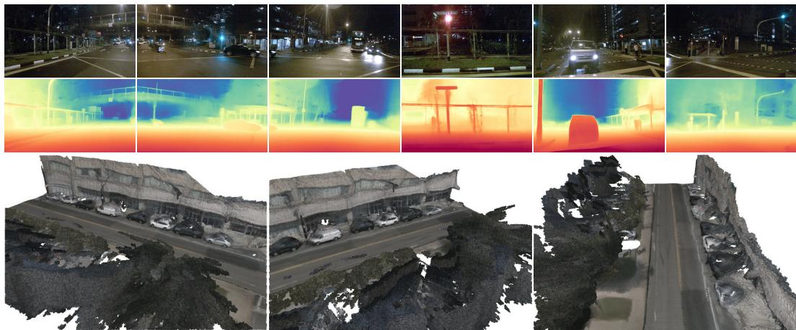  
Figure 5: GTR-L depth prediction and reconstruction on nuScenes (Caesar et al., 2020), without dataset-specific fine-tuning. Top/middle: Six nighttime surround-view images and the corresponding GTR-L depth predictions. Bottom: Multi-view visualization of a reconstructed street scene, obtained by temporally fusing predicted depth after LiDAR-assisted per-frame scale alignment (Appendix F.5.2).

Oriented detection and semantic segmentation. GTR also transfers effectively to oriented detection and semantic segmentation. On DOTA-v1.0 (Xia et al., 2018), GTR-X achieves 81.3 AP50 with lower median latency than YOLO26x-obb (Jocher et al., 2026) (3.960 vs. 5.085 ms). On Cityscapes (Cordts et al., 2016), GTR-S/X achieve 81.5/83.6 mIoU with a lightweight FCN head (Long et al., 2015). Compared with YOLO26-sem, GTR achieves higher mIoU at smaller scales, while GTR-X matches 83.6 mIoU with 19.5% lower latency. Full comparisons across all scales are provided in Appendices C.4 and C.5.

Monocular depth estimation. We further evaluate GTR on monocular depth estimation using an eight-source mixture of measured and pseudo-labeled depth, without NYU-specific fine-tuning. On NYU Depth V2 (Silberman et al., 2012; Eigen et al., 2014), GTR improves $\delta _ { 1 } .$ , AbsRel, and RMSE over the evaluated YOLO26 depth variants (Jocher et al., 2026) at both scales. As shown in Figure 5, GTR also produces qualitatively consistent depth predictions across diverse scenes. These aligneddepth results use multi-view test-time augmentation and per-image log-affine alignment to groundtruth depth. Full results and evaluation details are provided in Appendices C.6 and D.1.7.

Table 3: Cross-architecture distillation on GTR-S without Objects365 pre-training. We include a fromscratch baseline for reference. Methods use the same teacher, student, and COCO training schedule.
<table><tr><td rowspan="2">Initialization / recipe</td><td rowspan="2">Distill. #Distill stages</td><td rowspan="2">losses</td><td colspan="6">COCO AP ↑</td></tr><tr><td> $\mathsf { A P } ^ { v a l }$ </td><td>APval</td><td>APysl</td><td> $\mathbf { A P } _ { S } ^ { v a l }$ </td><td>APvdl</td><td> $\mathrm { A P } _ { L } ^ { v a l }$ </td></tr><tr><td>Random initialization (from scratch)</td><td>0</td><td>0</td><td>31.1</td><td>44.9</td><td>33.3</td><td>17.0</td><td>33.1</td><td>43.7</td></tr><tr><td>ViT-AdaLA (adapted) (Li et al., 2026b)</td><td>2</td><td>1</td><td>48.2</td><td>65.6</td><td>52.1</td><td>28.2</td><td>52.4</td><td>66.9</td></tr><tr><td>ViT-Linearizer (adapted) (Wei &amp; Chellappa, 2025)</td><td>1</td><td>2</td><td>50.0</td><td>67.7</td><td>53.6</td><td>31.1</td><td>54.7</td><td>69.4</td></tr><tr><td>Final-output  $\ell _ { 2 }$  (ours)</td><td>1</td><td>1</td><td>50.7</td><td>68.5</td><td>54.7</td><td>31.1</td><td>55.5</td><td>70.2</td></tr></table>

Table 4: Ablation of spatial modeling in GTR. We study local spatial mixing with S-SwiGLU on GTR-S and scan directions on GTR-L. LR/RL/TB/BT denote left-to-right, right-to-left, top-to-bottom, and bottom-to-top scans.
<table><tr><td rowspan="2">Setting</td><td rowspan="2">Variant</td><td colspan="6">COCO AP ↑</td></tr><tr><td> $\mathsf { A P } ^ { v a l }$ </td><td> $\mathbf { A P _ { 5 0 } ^ { v a l } }$ </td><td> $\mathsf { A P } _ { 7 5 } ^ { v a l }$ </td><td> $\mathbf { A P } _ { S } ^ { v a l }$ </td><td> $\mathsf { A P } _ { M } ^ { v a l }$ </td><td> $\mathbf { A P } _ { L } ^ { v a l }$ </td></tr><tr><td colspan="7">Local spatial mixing (GTR-S)</td></tr><tr><td> $7 6 8 ^ { 2 }$ </td><td>Learned positional embedding</td><td>53.9</td><td>71.6</td><td>58.6</td><td>38.0</td><td>57.8</td><td>70.2</td></tr><tr><td> $7 6 8 ^ { 2 }$ </td><td>S-SwiGLU (ours)</td><td>55.1</td><td>72.5</td><td>60.2</td><td>38.7</td><td>59.6</td><td>70.7</td></tr><tr><td> $1 0 2 4 ^ { 2 }$ </td><td>Learned positional embedding</td><td>55.3</td><td>72.7</td><td>60.3</td><td>40.6</td><td>58.7</td><td>70.7</td></tr><tr><td> $1 0 2 4 ^ { 2 }$ </td><td>S-SwiGLU (ours)</td><td>56.6</td><td>73.9</td><td>61.9</td><td>42.1</td><td>60.8</td><td>70.4</td></tr><tr><td colspan="8">Scan direction (GTR-L)</td></tr><tr><td>Horizontal</td><td>LR/RL + S-SwiGLU</td><td>55.1</td><td>73.4</td><td>59.8</td><td>36.1</td><td>60.5</td><td>75.2</td></tr><tr><td>Vertical</td><td>TB/BT + S-SwiGLU</td><td>55.0</td><td>73.3</td><td>59.8</td><td>35.8</td><td>60.7</td><td>74.6</td></tr><tr><td>Single direction</td><td>S-SwiGLU</td><td>54.4</td><td>72.6</td><td>59.0</td><td>35.1</td><td>59.7</td><td>73.9</td></tr><tr><td>Single direction</td><td>Learned positional embedding</td><td>45.6</td><td>62.3</td><td>49.1</td><td>27.5</td><td>49.1</td><td>63.5</td></tr><tr><td>Four directions</td><td>LR/RL/TB/BT + S-SwiGLU</td><td>55.5</td><td>73.7</td><td>60.3</td><td>36.8</td><td>61.1</td><td>74.8</td></tr></table>

## 3.3 ABLATION STUDIES AND DISCUSSION

We ablate the main design choices of GTR, including the distillation objective, spatial modeling, token mixer, input resolution, and detector pre-training. All detection results are evaluated on COCO (Lin et al., 2014) val2017. For architectural ablations, each variant is independently distilled using the same teacher and image pool, followed by the same downstream training schedule. Full settings and results are provided in Appendix C.7.

Distillation recipe. Table 3 compares our final-output alignment with ViT-Linearizer (Wei & Chellappa, 2025) and ViT-AdaLA (Li et al., 2026b) under the same teacher, GTR-S student, and COCO training schedule. For ViT-Linearizer, we use the best mask ratio (0.5) from a sweep over 0.2–0.9. Despite its simple single-stage design and objective, our method achieves 50.7 AP, outperforming ViT-Linearizer (50.0) and ViT-AdaLA (48.2), while training from scratch reaches only 31.1 AP. This suggests that simple final-output alignment is effective for distilling GTR.

Spatial modeling. Table 4 shows that replacing learned positional embeddings with S-SwiGLU improves GTR-S by 1.2/1.3 AP at 7682/10242, with only 0.2 (47.6 to 47.8) /0.5 (83.2 to 83.7) additional GFLOPs. Scan direction provides a complementary benefit: on GTR-L, four-direction scanning achieves 55.5 AP, compared with 55.1/55.0 for horizontal/vertical bidirectional scanning and 54.4 for a single direction. Moreover, under single-direction scanning, replacing S-SwiGLU with learned positional embeddings further reduces AP to 45.6. Together, these results highlight the importance of local spatial mixing, with multi-directional scanning providing additional gains.

Table 5: GLA versus hybrid GLA–softmax attention on GTR-L. Each hybrid replaces GLA with softmax attention in three of the twelve backbone blocks.
<table><tr><td rowspan="2">Global-mixer layout</td><td rowspan="2">Latency (ms) ↓</td><td colspan="6">COCO AP ↑</td></tr><tr><td> $\mathsf { A P } ^ { v a l }$ </td><td> $\mathbf { A P _ { 5 0 } ^ { v a l } }$ </td><td> $\mathsf { A P } _ { 7 5 } ^ { v a l }$ </td><td> $\mathbf { A P } _ { S } ^ { v a l }$ </td><td> $\mathsf { A P } _ { M } ^ { v a l }$ </td><td> $\mathrm { A P } _ { L } ^ { v a l }$ </td></tr><tr><td>Pure GLA (ours)</td><td>1.908</td><td>55.5</td><td>73.7</td><td>60.3</td><td>36.8</td><td>61.1</td><td>74.8</td></tr><tr><td>Softmax in last 3 blocks</td><td>2.117</td><td>55.6</td><td>73.8</td><td>60.7</td><td>37.2</td><td>61.7</td><td>74.6</td></tr><tr><td>Softmax in 3 uniformly spaced blocks</td><td>2.109</td><td>55.6</td><td>74.0</td><td>60.0</td><td>37.3</td><td>60.9</td><td>75.1</td></tr><tr><td>Softmax in first 3 blocks</td><td>2.094</td><td>55.4</td><td>73.6</td><td>60.1</td><td>35.5</td><td>61.0</td><td>74.6</td></tr></table>

Table 6: Resolution scaling of GTR-S. Higher resolution consistently improves accuracy, particularly for small objects, at increased computational cost.
<table><tr><td>Resolution</td><td>GFLOPs</td><td>Memory (GB)</td><td>Latency (ms) ↓</td><td>AP↑</td><td>APs↑</td><td> $\mathsf { A P } _ { M }$  ←</td><td> $\mathsf { A P } _ { L } \uparrow$ </td></tr><tr><td> $6 4 0 ^ { 2 }$ </td><td>33.8</td><td>0.096</td><td>1.225</td><td>53.6</td><td>36.4</td><td>58.3</td><td>70.2</td></tr><tr><td> $7 0 4 ^ { 2 }$ </td><td>40.4</td><td>0.121</td><td>1.317</td><td>54.3</td><td>37.5</td><td>59.0</td><td>70.2</td></tr><tr><td> $7 6 8 ^ { 2 }$ </td><td>47.8</td><td>0.138</td><td>1.421</td><td>55.1</td><td>38.7</td><td>59.6</td><td>70.7</td></tr><tr><td> $8 3 2 ^ { 2 }$ </td><td>55.8</td><td>0.142</td><td>1.550</td><td>55.5</td><td>39.8</td><td>60.0</td><td>70.8</td></tr><tr><td> $8 9 6 ^ { 2 }$ </td><td>64.5</td><td>0.156</td><td>1.714</td><td>56.0</td><td>41.4</td><td>60.0</td><td>70.5</td></tr><tr><td> $9 6 0 ^ { 2 }$ </td><td>73.7</td><td>0.172</td><td>1.784</td><td>56.2</td><td>40.7</td><td>60.4</td><td>70.0</td></tr><tr><td> $1 0 2 4 ^ { 2 }$ </td><td>83.7</td><td>0.171</td><td>1.844</td><td>56.6</td><td>42.1</td><td>60.8</td><td>70.4</td></tr><tr><td> $1 1 5 2 ^ { 2 }$ </td><td>105.4</td><td>0.224</td><td>2.157</td><td>56.7</td><td>41.9</td><td>60.8</td><td>70.3</td></tr><tr><td> $1 2 8 0 ^ { 2 }$ </td><td>129.8</td><td>0.249</td><td>2.529</td><td>57.0</td><td>42.4</td><td>61.0</td><td>70.0</td></tr></table>

GLA versus hybrid attention. Table 5 examines whether adding softmax attention benefits GTR. Replacing GLA with softmax attention in three of the twelve backbone blocks yields similar accuracy (55.4–55.6 vs. 55.5 AP), but increases median latency from 1.908 to 2.094–2.117 ms and computation from 106 to 119 GFLOPs. All variants have the same 37.2M parameters and 0.19 GB peak memory. Thus, softmax attention provides no meaningful accuracy gain while introducing additional computation and latency, supporting our homogeneous GLA design.

Resolution scaling. GTR-S scales effectively with input resolution (Table 6). Increasing the resolution from 6402 to 12802 improves AP from 53.6 to 57.0, with a larger gain of 6.0 $\mathsf { A P } _ { S }$ on small objects (36.4 to 42.4). Meanwhile, median latency increases from 1.225 to 2.529 ms and peak memory from 0.096 to 0.249 GB. Notably, latency grows by only 2.06× despite a 4× increase in image tokens, demonstrating favorable scaling to high-resolution inputs.

Edge deployment on DRIVE AGX Thor High-performance linear-attention kernels are typically designed for LLMs on server GPUs using Python/Triton stacks (Qwen Team, 2026; Team et al., 2025), whereas automotive deployment requires efficient execution within a production inference engine. We deploy GTR on NVIDIA DRIVE AGX Thor with TensorRT (NVIDIA, 2026) through graph–kernel co-optimization: standard TensorRT operators are combined with fused CUDA kernels for GLA and S-SwiGLU to reduce kernel launches and global-memory traffic without changing the computation. This enables low-latency inference across all six dense-prediction tasks, while maintaining at least 0.9989 cosine similarity to the PyTorch FP32 reference across all 48 task– scale–batch configurations. Appendix E.1 provides platform details, Roofline analysis (Williams et al., 2009), and complete latency results.

## 4 CONCLUSION

We presented GTR, an efficient softmax-free backbone for dense prediction. GTR combines a homogeneous GLA architecture with simple final-output distillation and optimized inference execution. Across object detection and five additional dense-prediction tasks, GTR achieves a strong accuracy– efficiency trade-off, while deployment on NVIDIA DRIVE AGX Thor demonstrates its practicality on automotive hardware. These results show that linear attention can serve as an effective and effi cient alternative to softmax attention for dense visual prediction.

## AI USE STATEMENT

Generative AI tools were used to assist with literature review, manuscript organization, language editing, interpretation and synthesis of the reported experimental results, and limited code develop ment and debugging. Their use in result interpretation was limited to summarizing and describing trends and comparisons already present in the figures and tables. Generative AI tools were not used to generate, modify, or fabricate experimental data. All AI-assisted text and code were reviewed and verified by the authors, who take full responsibility for the final manuscript.

## REFERENCES

Gilad Baruch, Zhuoyuan Chen, Afshin Dehghan, Tal Dimry, Yuri Feigin, Peter Fu, Thomas Gebauer, Brandon Joffe, Daniel Kurz, Arik Schwartz, and Elad Shulman. Arkitscenes - a diverse real-world dataset for 3d indoor scene understanding using mobile rgb-d data. In NeurIPS, 2021. URL https://arxiv.org/pdf/2111.08897.pdf.

Aviv Bick, Kevin Y. Li, Eric P. Xing, J. Zico Kolter, and Albert Gu. Transformers to ssms: Distilling quadratic knowledge to subquadratic models. In Advances in Neural Information Processing Systems, volume 37, 2024. doi: 10.52202/079017-0999.

Aviv Bick, Tobias Katsch, Nimit Sohoni, Arjun Desai, and Albert Gu. Llamba: Scaling distilled recurrent models for efficient language processing. In SCOPE Workshop at ICLR, 2025.

Yohann Cabon, Naila Murray, and Martin Humenberger. Virtual KITTI 2, 2020.

Holger Caesar, Varun Bankiti, Alex H. Lang, Sourabh Vora, Venice Erin Liong, Qiang Xu, Anush Krishnan, Yu Pan, Giancarlo Baldan, and Oscar Beijbom. nuScenes: A multimodal dataset for autonomous driving. In Proceedings ofthe IEEE/CVF Conference on Computer Vision and Pattern Recognition (CVPR), pp. 11618–11628, 2020. doi: 10.1109/CVPR42600.2020.01164.

Han Cai, Junyan Li, Muyan Hu, Chuang Gan, and Song Han. EfficientViT: Lightweight multi-scale attention for high-resolution dense prediction. In Proceedings of the IEEE/CVF International Conference on Computer Vision, pp. 17302–17313, 2023.

Nicolas Carion, Francisco Massa, Gabriel Synnaeve, Nicolas Usunier, Alexander Kirillov, and Sergey Zagoruyko. End-to-end object detection with transformers. In European Conference on Computer Vision, pp. 213–229, 2020. doi: 10.1007/978-3-030-58452-8 13.

Qiang Chen, Xiaokang Chen, Jian Wang, Shan Zhang, Kun Yao, Haocheng Feng, Junyu Han, Errui Ding, Gang Zeng, and Jingdong Wang. Group detr: Fast detr training with group-wise one-tomany assignment. In Proceedings of the IEEE International Conference on Computer Vision (ICCV), 2023.

Qiang Chen, Xiangbo Su, Xinyu Zhang, Jian Wang, Jiahui Chen, Yunpeng Shen, Chuchu Han, Ziliang Chen, Weixiang Xu, Fanrong Li, Shan Zhang, Kun Yao, Errui Ding, Gang Zhang, and Jingdong Wang. LW-DETR: A transformer replacement to YOLO for real-time detection. arXiv preprint arXiv:2406.03459, 2024.

Marius Cordts, Mohamed Omran, Sebastian Ramos, Timo Rehfeld, Markus Enzweiler, Rodrigo Benenson, Uwe Franke, Stefan Roth, and Bernt Schiele. The cityscapes dataset for semantic urban scene understanding. In Proceedings of the IEEE Conference on Computer Vision and Pattern Recognition, pp. 3213–3223, 2016.

Brian Curless and Marc Levoy. A volumetric method for building complex models from range images. In John Fujii (ed.), Proceedings of the 23rd Annual Conference on Computer Graphics and Interactive Techniques, SIGGRAPH 1996, New Orleans, LA, USA, August 4-9, 1996, pp. 303–312. ACM, 1996. doi: 10.1145/237170.237269. URL https://doi.org/10.1145/ 237170.237269.

Tri Dao. FlashAttention-2: Faster attention with better parallelism and work partitioning. In International Conference on Learning Representations (ICLR), 2024.

Jia Deng, Wei Dong, Richard Socher, Li-Jia Li, Kai Li, and Li Fei-Fei. Imagenet: A large-scale hierarchical image database. In Proceedings of the IEEE Conference on Computer Vision and Pattern Recognition, pp. 248–255, 2009. doi: 10.1109/CVPR.2009.5206848.

Zeyu Ding, Yong Zhou, Jiaqi Zhao, Wen-Liang Du, Xixi Li, Rui Yao, and Abdulmotaleb El Saddik. Real-time oriented object detection transformer in remote sensing images. IEEE Transactions on Geoscience and Remote Sensing, 2026. doi: 10.1109/TGRS.2026.3671683.

Alexey Dosovitskiy, Lucas Beyer, Alexander Kolesnikov, Dirk Weissenborn, Xiaohua Zhai, Thomas Unterthiner, Mostafa Dehghani, Matthias Minderer, Georg Heigold, Sylvain Gelly, Jakob Uszkoreit, and Neil Houlsby. An image is worth 16x16 words: Transformers for image recognition at scale. In International Conference on Learning Representations, 2021. URL https: //arxiv.org/abs/2010.11929.

David Eigen, Christian Puhrsch, and Rob Fergus. Depth map prediction from a single image using a multi-scale deep network. In Advances in Neural Information Processing Systems, volume 27, 2014.

Zhe Feng, Sen Lian, Changwei Wang, Muyang Zhang, Tianlong Tan, Rongtao Xu, Weiliang Meng, and Xiaopeng Zhang. Laplacianformer: Rethinking linear attention with laplacian kernel. In ICLR, 2026.

Andreas Geiger, Philip Lenz, Christoph Stiller, and Raquel Urtasun. Vision meets robotics: The KITTI dataset. The International Journal ofRobotics Research, 32(11):1231–1237, 2013.

Albert Gu and Tri Dao. Mamba: Linear-time sequence modeling with selective state spaces. In Conference on Language Modeling, 2024.

Ali Hatamizadeh and Jan Kautz. MambaVision: A hybrid mamba–transformer vision backbone. In Proceedings of the IEEE/CVF Conference on Computer Vision and Pattern Recognition, pp. 25261–25270, 2025.

Zhangchi Hu, Yifan Zhao, Yansong Peng, Wenzhang Sun, Xiangchen Yin, Jie Chen, Peixi Wu, Hebei Li, Xinghao Wang, Dongsheng Jiang, et al. Rio-detr: Detr for real-time oriented object detection. In European Conference on Computer Vision, 2026.

Shihua Huang, Yongjie Hou, Longfei Liu, Xuanlong Yu, and Xi Shen. Real-time object detection meets dinov3. arXiv, 2025a.

Shihua Huang, Zhichao Lu, Xiaodong Cun, Yongjun Yu, Xiao Zhou, and Xi Shen. DEIM: DETR with improved matching for fast convergence. In Proceedings of the IEEE/CVF Conference on Computer Vision and Pattern Recognition, 2025b.

Sebastian Janampa and Marios Pattichis. DETRPose: Real-time end-to-end transformer model for multi-person pose estimation. In European Conference on Computer Vision, 2026.

Rasmus Jensen, Anders Dahl, George Vogiatzis, Engin Tola, and Henrik Aanæs. Large scale multiview stereopsis evaluation. In Proceedings of the IEEE Conference on Computer Vision and Pattern Recognition (CVPR), pp. 406–413, 2014. doi: 10.1109/CVPR.2014.59.

Glenn Jocher. YOLOv8. https://docs.ultralytics.com/models/yolov8/, 2023.

Glenn Jocher. YOLO11. https://docs.ultralytics.com/models/yolo11/, 2024.

Glenn Jocher, Jing Qiu, Mengyu Liu, Shuai Lyu, Fatih Cagatay Akyon, and Muhammet Esat Kalfaoglu. Ultralytics YOLO26: Unified real-time end-to-end vision models, 2026. URL https://arxiv.org/abs/2606.03748.

Angelos Katharopoulos, Apoorv Vyas, Nikolaos Pappas, and Franc¸ois Fleuret. Transformers are RNNs: Fast autoregressive transformers with linear attention. In Proceedings of the 37th International Conference on Machine Learning, pp. 5156–5165, 2020.

Hakjin Lee, MinKi Song, Jamyoung Koo, and Junghoon Seo. Hausdorff distance matching with adaptive query denoising for rotated detection transformer. In Proceedings of the Winter Conference on Applications ofComputer Vision, pp. 1872–1882, 2025.

Feng Li, Hao Zhang, Shilong Liu, Jian Guo, Lionel M Ni, and Lei Zhang. Dn-detr: Accelerate detr training by introducing query denoising. In CVPR, 2022.

Ruibang Li, Guan Luo, Yiwei Zhang, Jin Gao, Bing Li, and Weiming Hu. SoLA-Vision: Finegrained layer-wise linear softmax hybrid attention. arXiv preprint arXiv:2601.11164, 2026a.

Yifan Li, Seunghyun Yoon, Viet Dac Lai, Franck Dernoncourt, Jason Kuen, Yu Kong, and Trung Bui. ViT-AdaLA: Adapting vision transformers with linear attention. arXiv preprint arXiv:2603.16063, 2026b. URL https://arxiv.org/abs/2603.16063.

Bencheng Liao, Xinggang Wang, Lianghui Zhu, Qian Zhang, and Chang Huang. ViG: Linearcomplexity visual sequence learning with gated linear attention. In Proceedings of the AAAI Conference on Artificial Intelligence, volume 39, pp. 5182–5190, 2025. doi: 10.1609/aaai.v39i5. 32550. URL https://ojs.aaai.org/index.php/AAAI/article/view/32550.

Zijun Liao, Yian Zhao, Xin Shan, Yu Yan, Chang Liu, Lei Lu, Xiangyang Ji, and Jie Chen. RT-DETRv4: Painlessly furthering real-time object detection with vision foundation models. In European Conference on Computer Vision, 2026.

Haotong Lin, Sili Chen, Jun Hao Liew, Donny Y. Chen, Zhenyu Li, Yang Zhao, Sida Peng, Hengkai Guo, Xiaowei Zhou, Guang Shi, Jiashi Feng, and Bingyi Kang. Depth anything 3: Recovering the visual space from any views. In C. Vondrick, B. Hariharan, C. Raffel, L. Pinto, D. Yang, and A. Faust (eds.), International Conference on Learning Representations, volume 2026, pp. 141261–141285, 2026. URL https://proceedings.iclr.cc/paper\_files/paper/2026/file/ e4cd50120b6d7e8daff1749d6bbaa889-Paper-Conference.pdf.

Tsung-Yi Lin, Michael Maire, Serge Belongie, James Hays, Pietro Perona, Deva Ramanan, Piotr Dollar, and C. Lawrence Zitnick. Microsoft COCO: Common objects in context. In´ European Conference on Computer Vision, pp. 740–755, 2014. URL https://arxiv.org/ abs/1405.0312.

Longfei Liu, Yongjie Hou, Yang Li, Qirui Wang, Youyang Sha, Yongjun Yu, Yinzhi Wang, Peizhe Ru, Xuanlong Yu, and Xi Shen. EdgeCrafter: Compact ViTs for edge dense prediction via taskspecialized distillation. Transactions on Machine Learning Research, 2026. URL https:// arxiv.org/abs/2603.18739v4. arXiv version 4.

Jonathan Long, Evan Shelhamer, and Trevor Darrell. Fully convolutional networks for semantic segmentation. In Proceedings of the IEEE Conference on Computer Vision and Pattern Recognition (CVPR), pp. 3431–3440, 2015. doi: 10.1109/CVPR.2015. 7298965. URL https://openaccess.thecvf.com/content\_cvpr\_2015/html/ Long\_Fully\_Convolutional\_Networks\_2015\_CVPR\_paper.html.

Ilya Loshchilov and Frank Hutter. Decoupled weight decay regularization. In International Conference on Learning Representations, 2019.

Peng Lu, Tao Jiang, Yining Li, Xiangtai Li, Kai Chen, and Wenming Yang. RTMO: Towards highperformance one-stage real-time multi-person pose estimation. In Proceedings of the IEEE/CVF Conference on Computer Vision and Pattern Recognition, 2024.

Wenyu Lv, Yian Zhao, Qinyao Chang, Kui Huang, Guanzhong Wang, and Yi Liu. RT-DETRv2: Improved baseline with bag-of-freebies for real-time detection transformer. arXiv preprint, 2024.

Chengqi Lyu, Wenwei Zhang, Haian Huang, Yue Zhou, Yudong Wang, Yanyi Liu, Shilong Zhang, and Kai Chen. RTMDet: An empirical study of designing real-time object detectors. arXiv preprint arXiv:2212.07784, 2022.

Depu Meng, Xiaokang Chen, Zejia Fan, Gang Zeng, Houqiang Li, Yuhui Yuan, Lei Sun, and Jingdong Wang. Conditional detr for fast training convergence. In ICCV, 2021.

Abhinav Moudgil, Ningyuan Huang, Eeshan Gunesh Dhekane, Pau Rodr´ıguez, Luca Zappella, and Federico Danieli. Attention to mamba: A recipe for cross-architecture distillation. arXiv preprint arXiv:2604.14191, 2026. URL https://arxiv.org/abs/2604.14191.

NVIDIA. NVIDIA TensorRT SDK. https://developer.nvidia.com/tensorrt, 2026. Accessed: 2026-09-08.

Maxime Oquab, Timothee Darcet, Th´ eo Moutakanni, Huy Vo, Marc Szafraniec, Vasil Khalidov,´ Pierre Fernandez, Daniel Haziza, Francisco Massa, Alaaeldin El-Nouby, et al. DINOv2: Learning robust visual features without supervision. Transactions on Machine Learning Research, 2024.

Bo Peng, Eric Alcaide, Quentin Anthony, Alon Albalak, Samuel Arcadinho, Stella Biderman, Huanqi Cao, Xin Cheng, Michael Chung, Leon Derczynski, Xingjian Du, Matteo Grella, Kranthi Gv, Xuzheng He, Haowen Hou, Przemyslaw Kazienko, Jan Kocon, Jiaming Kong, Bartłomiej Koptyra, Hayden Lau, Jiaju Lin, Krishna Sri Ipsit Mantri, Ferdinand Mom, Atsushi Saito, Guangyu Song, Xiangru Tang, Johan Wind, Stanisław Wozniak, Zhenyuan Zhang, Qinghua Zhou, ´ Jian Zhu, and Rui-Jie Zhu. RWKV: Reinventing RNNs for the transformer era. In Findings ofthe Association for Computational Linguistics: EMNLP, pp. 14048–14077, 2023a.

Yansong Peng, Hebei Li, Peixi Wu, Yueyi Zhang, Xiaoyan Sun, and Feng Wu. D-fine: Redefine regression task of detrs as fine-grained distribution refinement. In International Conference on Learning Representations, 2025. Spotlight.

Zhiliang Peng, Li Dong, Hangbo Bao, Furu Wei, and Qixiang Ye. A unified view of masked image modeling. Transactions on Machine Learning Research, 2023b. ISSN 2835-8856. URL https: //openreview.net/forum?id=wmGlMhaBe0.

Qwen Team. Qwen3.8-Max: A new bar for coding and cowork, August 2026. URL https: //qwen.ai/blog?id=qwen3.8.

Rene Ranftl, Alexey Bochkovskiy, and Vladlen Koltun. Vision transformers for dense prediction. In´ Proceedings of the IEEE/CVF International Conference on Computer Vision, pp. 12179–12188, 2021.

Nikhila Ravi, Valentin Gabeur, Yuan-Ting Hu, Ronghang Hu, Chaitanya Ryali, Tengyu Ma, Haitham Khedr, Roman Radle, Chloe Rolland, Laura Gustafson, Eric Mintun, Junting Pan, Kalyan Va-¨ sudev Alwala, Nicolas Carion, Chao-Yuan Wu, Ross Girshick, Piotr Dollar, and Christoph Fe-´ ichtenhofer. SAM 2: Segment anything in images and videos. In International Conference on Learning Representations, 2025.

Mike Roberts, Jason Ramapuram, Anurag Ranjan, Atulit Kumar, Miguel Angel Bautista, Nathan Paczan, Russ Webb, and Joshua M. Susskind. Hypersim: A photorealistic synthetic dataset for holistic indoor scene understanding. In Proceedings of the IEEE/CVF International Conference on Computer Vision, pp. 10912–10922, 2021.

Isaac Robinson, Peter Robicheaux, Matvei Popov, Deva Ramanan, and Neehar Peri. RF-DETR: Neural architecture search for real-time detection transformers. In International Conference on Learning Representations, 2026. URL https://proceedings.iclr.cc/paper\_files/paper/2026/hash/ 5bed8703db85ab27dc32f6a42f8fbdb6-Abstract-Conference.html.

Shuai Shao, Zeming Li, Tianyuan Zhang, Chao Peng, Gang Yu, Xiangyu Zhang, Jing Li, and Jian Sun. Objects365: A large-scale, high-quality dataset for object detection. In Proceedings of the IEEE/CVF International Conference on Computer Vision, pp. 8430–8439, 2019. URL https://openaccess.thecvf.com/content\_ICCV\_2019/html/ Shao\_Objects365\_A\_Large-Scale\_High-Quality\_Dataset\_for\_Object\_ Detection\_ICCV\_2019\_paper.html.

Noam Shazeer. GLU variants improve transformer. arXiv preprint arXiv:2002.05202, 2020. URL https://arxiv.org/abs/2002.05202.

Nathan Silberman, Derek Hoiem, Pushmeet Kohli, and Rob Fergus. Indoor segmentation and support inference from RGBD images. In Computer Vision – ECCV 2012, volume 7576 of Lecture Notes in Computer Science, pp. 746–760, 2012.

Oriane Simeoni, Huy V. Vo, Maximilian Seitzer, Federico Baldassarre, Maxime Oquab, Cijo Jose,´ Vasil Khalidov, Marc Szafraniec, Seungeun Yi, Michael Ramamonjisoa, Francisco Massa, Daniel¨ Haziza, Luca Wehrstedt, Jianyuan Wang, Timothee Darcet, Th´ eo Moutakanni, Leonel Sentana,´ Claire Roberts, Andrea Vedaldi, Jamie Tolan, John Brandt, Camille Couprie, Julien Mairal, Herve´ Jegou, Patrick Labatut, and Piotr Bojanowski. DINOv3, 2025. URL´ https://arxiv.org/ abs/2508.10104.

Shuran Song, Samuel P. Lichtenberg, and Jianxiong Xiao. SUN RGB-D: A RGB-D scene understanding benchmark suite. In Proceedings of the IEEE Conference on Computer Vision and Pattern Recognition, pp. 567–576, 2015.

Yutao Sun, Li Dong, Shaohan Huang, Shuming Ma, Yuqing Xia, Jilong Xue, Jianyong Wang, and Furu Wei. Retentive network: A successor to transformer for large language models. arXiv preprint arXiv:2307.08621, 2023.

Kimi Team, Yu Zhang, Zongyu Lin, Xingcheng Yao, Jiaxi Hu, Fanqing Meng, Chengyin Liu, Xin Men, Songlin Yang, Zhiyuan Li, Wentao Li, Enzhe Lu, Weizhou Liu, Yanru Chen, Weixin Xu, Longhui Yu, Yejie Wang, Yu Fan, Longguang Zhong, Enming Yuan, Dehao Zhang, Yizhi Zhang, T. Y. Liu, Haiming Wang, Shengjun Fang, Weiran He, Shaowei Liu, Yiwei Li, Jianlin Su, Jiezhong Qiu, Bo Pang, Junjie Yan, Zhejun Jiang, Weixiao Huang, Bohong Yin, Jiacheng You, Chu Wei, Zhengtao Wang, Chao Hong, Yutian Chen, Guanduo Chen, Yucheng Wang, Huabin Zheng, Feng Wang, Yibo Liu, Mengnan Dong, Zheng Zhang, Siyuan Pan, Wenhao Wu, Yuhao Wu, Longyu Guan, Jiawen Tao, Guohong Fu, Xinran Xu, Yuzhi Wang, Guokun Lai, Yuxin Wu, Xinyu Zhou, Zhilin Yang, and Yulun Du. Kimi linear: An expressive, efficient attention architecture, 2025. URL https://arxiv.org/abs/2510.26692.

Yunjie Tian, Qixiang Ye, and David Doermann. YOLOv12: Attention-centric real-time object detectors. In Advances in Neural Information Processing Systems, 2025.

Fabio Tosi, Luca Bartolomei, Matteo Poggi, and Stefano Mattoccia. ZipDepth: Bringing lightweight zero-shot monocular depth anywhere, on any device. In European Conference on Computer Vision (ECCV), 2026. URL https://arxiv.org/abs/2607.08771.

Igor Vasiljevic, Nick Kolkin, Shanyi Zhang, Ruotian Luo, Haochen Wang, Falcon Z. Dai, An drea F. Daniele, Mohammadreza Mostajabi, Steven Basart, Matthew R. Walter, and Gregory Shakhnarovich. DIODE: A dense indoor and outdoor depth dataset, 2019.

Ao Wang, Hui Chen, Lihao Liu, Kai Chen, Zijia Lin, Jungong Han, and Guiguang Ding. YOLOv10: Real-time end-to-end object detection. In Advances in Neural Information Processing Systems, 2024a.

Chien-Yao Wang, I-Hau Yeh, and Hong-Yuan Mark Liao. YOLOv9: Learning what you want to learn using programmable gradient information. In European Conference on Computer Vision, 2024b.

Junxiong Wang, Daniele Paliotta, Avner May, Alexander M. Rush, and Tri Dao. The mamba in the llama: Distilling and accelerating hybrid models. In Advances in Neural Information Processing Systems, volume 37, 2024c. doi: 10.52202/079017-1996.

Wenshan Wang, Delong Zhu, Xiangwei Wang, Yaoyu Hu, Yuheng Qiu, Chen Wang, Yafei Hu, Ashish Kapoor, and Sebastian Scherer. TartanAir: A dataset to push the limits of visual SLAM. In IEEE/RSJ International Conference on Intelligent Robots and Systems, pp. 4909–4916, 2020.

Yingming Wang, Xiangyu Zhang, Tong Yang, and Jian Sun. Anchor detr: Query design for transformer-based detector. In AAAI, 2022.

Guoyizhe Wei and Rama Chellappa. ViT-Linearizer: Distilling quadratic knowledge into lineartime vision models. In Proceedings of the IEEE/CVF International Conference on Computer Vision, pp. 20737–20747, 2025. URL https://openaccess.thecvf.com/content/ ICCV2025/html/Wei\_ViT-Linearizer\_Distilling\_Quadratic\_Knowledge\_ into\_Linear-Time\_Vision\_Models\_ICCV\_2025\_paper.html.

Samuel Williams, Andrew Waterman, and David Patterson. Roofline: an insightful visual performance model for multicore architectures. Commun. ACM, 52(4):65–76, 4 2009. ISSN 0001- 0782. doi: 10.1145/1498765.1498785. URL https://doi.org/10.1145/1498765. 1498785.

Gui-Song Xia, Xiang Bai, Jian Ding, Zhen Zhu, Serge Belongie, Jiebo Luo, Mihai Datcu, Marcello Pelillo, and Liangpei Zhang. Dota: A large-scale dataset for object detection in aerial images. In Proceedings of the IEEE Conference on Computer Vision and Pattern Recognition, pp. 3974– 3983, 2018.

Jie Yang, Ailing Zeng, Shilong Liu, Feng Li, Ruimao Zhang, and Lei Zhang. Explicit box detection unifies end-to-end multi-person pose estimation. In International Conference on Learning Representations, 2023.

Lihe Yang, Bingyi Kang, Zilong Huang, Zhen Zhao, Xiaogang Xu, Jiashi Feng, and Hengshuang Zhao. Depth anything v2. In Advances in Neural Information Processing Systems, volume 37, pp. 21875–21911, 2024a.

Songlin Yang and Yu Zhang. FLA: A triton-based library for hardware-efficient implementations of linear attention mechanism, January 2024. URL https://github.com/fla-org/ flash-linear-attention.

Songlin Yang, Bailin Wang, Yikang Shen, Rameswar Panda, and Yoon Kim. Gated linear attention transformers with hardware-efficient training. In Proceedings of the 41st International Conference on Machine Learning, volume 235 of Proceedings of Machine Learning Research, pp. 56501– 56523, 2024b. URL https://proceedings.mlr.press/v235/yang24ab.html.

Songlin Yang, Bailin Wang, Yu Zhang, Yikang Shen, and Yoon Kim. Parallelizing linear transformers with the delta rule over sequence length. In Advances in Neural Information Processing Systems, volume 37, 2024c.

Xue Yang, Xiaojiang Yang, Jirui Yang, Qi Ming, Wentao Wang, Qi Tian, and Junchi Yan. Learning high-precision bounding box for rotated object detection via kullback–leibler divergence. In Advances in Neural Information Processing Systems, volume 34, pp. 18381–18394, 2021.

Biao Zhang and Rico Sennrich. Root mean square layer normalization. In Advances in Neural Information Processing Systems, volume 32, 2019. URL https://papers.nips.cc/paper\_ files/paper/2019/hash/1e8a19426224ca89e83cef47f1e7f53b-Abstract. html.

Zeyang Zhao, Qilong Xue, Yuhang He, Yifan Bai, Xing Wei, and Yihong Gong. Projecting points to axes: Oriented object detection via point-axis representation. In European Conference on Computer Vision, pp. 161–179, 2024.

Xizhou Zhu, Weijie Su, Lewei Lu, Bin Li, Xiaogang Wang, and Jifeng Dai. Deformable detr: Deformable transformers for end-to-end object detection. In ICLR, 2021.

## GTR: Gated Token Recurrence for Efficient Dense Prediction Appendix

A Related Work A1   
B GTR Architecture Details A1   
B.1 Multi-scale Feature Encoder A1   
B.2 Query-based Detection Decoder A2   
C Complete Experimental Results A2   
C.1 Full COCO Object Detection Comparison A2   
C.2 Full COCO Instance Segmentation Comparison A4   
C.3 Full COCO Human Pose Estimation Comparison A4   
C.4 Full DOTA-v1.0 Oriented Object Detection Comparison A5   
C.5 Full Cityscapes Semantic Segmentation Comparison . A6   
C.6 Full NYU Depth Estimation Comparison A7   
C.7 Detailed Ablation Results A7   
D Experimental Details A8   
D.1 Training Configurations A8   
E Efficiency and Reproducibility Details A15   
E.1 DRIVE AGX Thor Deployment A15   
E.2 GPU Latency Measurement Protocol A15   
E.3 Custom CUDA Operator A18   
F Qualitative Results A19   
F.1 Object Detection Results A19   
F.2 Instance Segmentation Results A19   
F.3 Human Pose Estimation Results A20   
F.4 Semantic Segmentation Results A21   
F.5 Zero-Shot Monocular Depth Estimation Results A21   
F.6 Oriented Object Detection Results A23

## A RELATED WORK

Object detection with Transformers. DETR (Carion et al., 2020) formulates object detection as set prediction with Transformers, eliminating the need for separate non-maximum suppression (NMS). To address the slow convergence and high computational cost of the original DETR, a series of follow-up works has been proposed (Zhu et al., 2021; Li et al., 2022; Wang et al., 2022; Meng et al., 2021; Chen et al., 2023). RT-DETR (Lv et al., 2024) introduces a hybrid encoder for real-time object detection. Building upon this framework, D-FINE (Peng et al., 2025) further enhances detection performance through fine-grained distribution refinement and self-distillation. Beyond architectural improvements, several studies have explored incorporating Vision Transformers (ViTs) (Dosovitskiy et al., 2021) into the DETR framework. LW-DETR (Chen et al., 2024) adopts a self-supervised pre-trained ViT as the backbone, while RF-DETR (Robinson et al., 2026) combines neural architecture search with the visual foundation model DINOv2 (Oquab et al., 2024) to strengthen feature representation. More recently, EdgeCrafter (Liu et al., 2026) improves compact ViT backbones via task-specific distillation from DINOv3 (Simeoni et al.´ , 2025).

Linear-complexity attention. Linear attention factorizes kernelized attention and exploits associativity to avoid materializing the dense token-to-token matrix, reducing complexity from $O ( L ^ { 2 } )$ to $O ( \dot { L } )$ and admitting recurrent evaluation (Katharopoulos et al., 2020). Modern linear-time recurrent families, including RetNet (Sun et al., 2023), RWKV (Peng et al., 2023a), Mamba (Gu & Dao, 2024), DeltaNet (Yang et al., 2024c), and GLA (Yang et al., 2024b), enrich the recurrent state with retention, selectivity, delta-rule updates, or data-dependent gates while retaining parallel or chunkwise training forms. ViG (Liao et al., 2025) is the closest architectural precedent: it adapts GLA to vision with within-block bidirectional modeling, direction-wise gating, and local two-dimensional interaction, and provides non-hierarchical and hierarchical variants. Its fused bidirectional kernel also targets practical efficiency. GTR uses one scan per block, alternates directions across depth, and introduces local mixing in the SwiGLU channel mixer. We evaluate these choices together with a detection-specialized distillation recipe and task-specific deployment.

Hybrid approaches such as MambaVision (Hatamizadeh & Kautz, 2025) and SoLA-Vision (Li et al., 2026a) combine recurrent or linear mixers with softmax attention. Our hybrid ablation tests three softmax-layer placements within GTR-L. Kernel-based vision alternatives include Laplacian-Former’s low-rank Laplacian attention (Feng et al., 2026). GTR builds on the established GLA recurrence and chunkwise formulation (Yang et al., 2024b) and contributes a fused, hardware-aware execution schedule for low-latency inference.

Heterogeneous representation distillation. Cross-architecture transfer often uses several stages or complementary targets to bridge different token mixers. ViT-Linearizer combines intermediate token-affinity matching at multiple depths with Smooth-ℓ prediction of final teacher features at masked positions (Wei & Chellappa, 2025). ViT-AdaLA (Li et al., 2026b) first matches the output of every softmax- and linear-attention module with MSE, then aligns the final representations of the complete models with MSE, and finally performs supervised downstream fine-tuning. Attention to Mamba (Moudgil et al., 2026) first learns a Hedgehog feature map through per-layer cosine output matching, uses it to initialize an adapted Mamba model, and then fine-tunes the model with next-token cross-entropy. Related Transformer-to-SSM studies likewise use staged conversion or additional architecture-specific objectives (Bick et al., 2024; 2025; Wang et al., 2024c). In the detection-specialized DINOv3-to-GLA setting studied here, we use a single squared $\ell _ { 2 }$ loss on the final output representations, without intermediate or stage-specific distillation targets and without input masking.

## B GTR ARCHITECTURE DETAILS

## B.1 MULTI-SCALE FEATURE ENCODER

Given an input image $\mathbf { I } \in \mathbb { R } ^ { H \times W \times 3 }$ , the GLA backbone extracts features from three depths:

$$
\{ { \bf X } _ { 4 } , { \bf X } _ { 8 } , { \bf X } _ { 1 2 } \} = \mathrm { G T R B a c k b o n e } ( { \bf I } ) ,\tag{4}
$$

where $\mathbf { X } _ { 4 } , \mathbf { X } _ { 8 } , \mathbf { X } _ { 1 2 } \in \mathbb { R } ^ { \frac { H } { 1 6 } \times \frac { W } { 1 6 } \times C }$ are the restored and reshaped feature maps from the 4th, 8th, and 12th backbone blocks. For each target stride $s \in \{ 8 , 1 6 , 3 2 \bar { \} }$ , we first align all selected features to

the same spatial resolution:

$$
\widetilde { \mathbf { X } } _ { l } ^ { ( s ) } = \mathcal { R } _ { s } ( { \mathbf { X } } _ { l } ) , \quad l \in \{ 4 , 8 , 1 2 \} ,\tag{5}
$$

where $\mathcal { R } _ { s } ( \cdot )$ resizes each feature map to the target stride $s \in \{ 8 , 1 6 , 3 2 \}$ using bilinear interpolation; no resampling is applied when the source and target strides are identical. For each target scale, the aligned features from different semantic depths are concatenated along the channel dimension and fused by a lightweight C2f module (Jocher, 2023):

$$
\mathbf { P } ^ { ( s ) } = \mathrm { C 2 f } _ { s } \left( \mathrm { C o n c a t } [ \widetilde { \mathbf { X } } _ { 4 } ^ { ( s ) } , \widetilde { \mathbf { X } } _ { 8 } ^ { ( s ) } , \widetilde { \mathbf { X } } _ { 1 2 } ^ { ( s ) } ] \right) , \quad s \in \{ 8 , 1 6 , 3 2 \} .\tag{6}
$$

This produces a three-level feature pyramid $\{ \mathbf { P } ^ { ( 8 ) } , \mathbf { P } ^ { ( 1 6 ) } , \mathbf { P } ^ { ( 3 2 ) } \}$ with unified channel dimensions. Compared with heavier feature-pyramid encoders, this design keeps the encoder compact while aggregating early, middle, and late backbone representations at every detection scale. The three pyramid levels are then flattened and concatenated as the multi-scale memory for the decoder.

## B.2 QUERY-BASED DETECTION DECODER

The decoder follows the DETR-style set prediction paradigm (Carion et al., 2020; Peng et al., 2025). Given the multi-scale features $\{ \bar { \mathbf { P } } ^ { ( 8 ) } , \mathbf { P } ^ { ( 1 6 ) } , \mathbf { P } ^ { ( 3 2 ) } \}$ , we flatten and concatenate them into memory tokens:

$$
{ \bf M } = \mathrm { C o n c a t } [ \mathrm { F l a t t e n } ( { \bf P } ^ { ( 8 ) } ) , \mathrm { F l a t t e n } ( { \bf P } ^ { ( 1 6 ) } ) , \mathrm { F l a t t e n } ( { \bf P } ^ { ( 3 2 ) } ) ] .\tag{7}
$$

Initial anchor proposals are generated from the multi-scale memory, and the top-k candidates with the highest classification responses are selected to initialize object queries.

During training, we adopt grouped queries (Chen et al., 2023) by dividing detection queries into $G = 3$ groups with shared decoder parameters. This provides denser supervision and improves query diversity, while only the primary group is used during inference.

## C COMPLETE EXPERIMENTAL RESULTS

The main paper uses representative detector families or model scales to keep the quantitative presentation concise. This section reports the complete comparisons used in our analysis for COCO object detection, instance segmentation, and human pose estimation, DOTA-v1.0 oriented object detection, Cityscapes semantic segmentation, and ground-truth-aligned monocular depth on NYU Depth V2.

## C.1 FULL COCO OBJECT DETECTION COMPARISON

Accuracy–latency comparison. Table 7 expands the main-paper comparison with a broader set of CNN- and Transformer-based detectors, model complexity, all three latency statistics, and scale-specific AP. With Objects365 pre-training, GTR-S/M/L/X attain the highest overall AP in all four scale groups, reaching 53.6/57.3/58.9/59.4 AP. GTR-L and GTR-X also provide the lowest median latency in their groups. Without Objects365 pre-training, GTR-S/M/L/X achieve 50.7/54.0/55.5/56.2 AP under the same scale-specific COCO configurations.

Table 7: Comparison with real-time object detectors on COCO (Lin et al., 2014) val2017, grouped by model scale. Detailed latency settings are provided in Appendix E.2. For comparison methods, all non-latency entries are taken from EdgeCrafter (Liu et al., 2026), while latency is measured under our unified protocol. The epoch column indicates the COCO training schedule, where ∗ denotes additional epochs without strong augmentation. ‡ marks models without Objects365 (Shao et al., 2019) detector pre-training. Within each comparison group, the top three distinct results for median latency and every reported accuracy metric are highlighted in dark, medium, and light blue, respectively; rankings use unrounded values.
<table><tr><td rowspan=1 colspan=13>Model                                #ParamsGFLOPs  Latency (ms) ↓                 COCO AP ↑#Epochs(M)Min. Mean MedianApvalAPualAPvslAPvalAPvalAPval</td></tr><tr><td rowspan=1 colspan=7>YOLOv9-S‡ (Wang et al., 2024b)      500    7    26  1.6512.3262.294</td><td rowspan=1 colspan=2>46.8  61.8</td><td rowspan=1 colspan=2>48.6  25.7</td><td rowspan=1 colspan=1>49.9</td><td rowspan=1 colspan=1>61.0</td></tr><tr><td rowspan=1 colspan=2>YOLOv10-S‡ (Wang et al., 2024a)     500</td><td rowspan=1 colspan=2>7    22</td><td rowspan=1 colspan=1>0.8700</td><td rowspan=1 colspan=1>.934</td><td rowspan=1 colspan=1>0.933</td><td rowspan=1 colspan=2>46.3  63.0</td><td rowspan=1 colspan=1>50.4</td><td rowspan=1 colspan=1>26.8</td><td rowspan=1 colspan=1>51.0</td><td rowspan=1 colspan=1>63.8</td></tr><tr><td rowspan=1 colspan=2>YOLO11-S‡ (Jocher, 2024)          500</td><td rowspan=1 colspan=2>9    22</td><td rowspan=1 colspan=1>1.078</td><td rowspan=1 colspan=1>1.523</td><td rowspan=1 colspan=1>1.490</td><td rowspan=1 colspan=2>46.6 63.4</td><td rowspan=1 colspan=1>50.3</td><td rowspan=1 colspan=1>28.7</td><td rowspan=1 colspan=1>51.3</td><td rowspan=1 colspan=1>64.1</td></tr><tr><td rowspan=1 colspan=2>YOLOv12-S-Turbo‡ (Tian et al., 2025)  600</td><td rowspan=1 colspan=2>9    19</td><td rowspan=1 colspan=1>1.339</td><td rowspan=1 colspan=1>1.802</td><td rowspan=1 colspan=1>1.772</td><td rowspan=1 colspan=2>47.6 64.5</td><td rowspan=1 colspan=1>51.5</td><td rowspan=1 colspan=1>28.3</td><td rowspan=1 colspan=1>52.7</td><td rowspan=1 colspan=1>65.9</td></tr><tr><td rowspan=1 colspan=5>RT-DETRv2-S‡ (Lv et al., 2024)       120   20    60  1.184</td><td rowspan=1 colspan=1>1.279</td><td rowspan=1 colspan=1>1.291</td><td rowspan=1 colspan=2>48.1 65.1</td><td rowspan=1 colspan=1>52.1</td><td rowspan=1 colspan=1>30.2</td><td rowspan=1 colspan=1>51.5</td><td rowspan=1 colspan=1>63.9</td></tr><tr><td rowspan=1 colspan=5>DEIM-S‡ (Huang et al., 2025b)       132*   10    25  1.0901</td><td rowspan=1 colspan=1>.171</td><td rowspan=1 colspan=1>1.180</td><td rowspan=1 colspan=1>49.0</td><td rowspan=1 colspan=1>65.9</td><td rowspan=1 colspan=1>53.1</td><td rowspan=1 colspan=1>30.4</td><td rowspan=1 colspan=1>52.6</td><td rowspan=1 colspan=1>65.7</td></tr><tr><td rowspan=1 colspan=5>DEIMv2-S‡ (Huang et al., 2025a)     132*   10    26  1.550</td><td rowspan=1 colspan=1>1.676</td><td rowspan=1 colspan=1>1.687</td><td rowspan=1 colspan=1>50.9</td><td rowspan=1 colspan=1>68.4</td><td rowspan=1 colspan=1>55.1</td><td rowspan=1 colspan=1>31.3</td><td rowspan=1 colspan=1>55.3</td><td rowspan=1 colspan=1>70.2</td></tr><tr><td rowspan=1 colspan=5>RT-DETRv4-S‡ (Liao et al., 2026)     132*   10    25  1.079</td><td rowspan=1 colspan=1>1.166</td><td rowspan=1 colspan=1>1.174</td><td rowspan=1 colspan=1>49.7</td><td rowspan=1 colspan=1>66.8</td><td rowspan=1 colspan=1>54.1</td><td rowspan=1 colspan=1>30.2</td><td rowspan=1 colspan=1>53.6</td><td rowspan=1 colspan=1>66.9</td></tr><tr><td rowspan=1 colspan=6>LW-DETR-S (Chen et al., 2024)        60    15    17  1.0351.115</td><td rowspan=1 colspan=1>1.123</td><td rowspan=1 colspan=1>48.0</td><td rowspan=1 colspan=1>66.9</td><td rowspan=1 colspan=1>51.7</td><td rowspan=1 colspan=1>26.8</td><td rowspan=1 colspan=1>52.5</td><td rowspan=1 colspan=1>65.5</td></tr><tr><td rowspan=1 colspan=5>D-FINE-S (Peng et al., 2025)                  10    25  1.103</td><td rowspan=1 colspan=1>1.198</td><td rowspan=1 colspan=1>1.194</td><td rowspan=1 colspan=1>50.7</td><td rowspan=1 colspan=1>67.6</td><td rowspan=1 colspan=1>55.1</td><td rowspan=1 colspan=1>32.7</td><td rowspan=1 colspan=1>54.6</td><td rowspan=1 colspan=1>66.5</td></tr><tr><td rowspan=1 colspan=5>RF-DETR-S (Robinson et al., 2026)      =    32    60  1.207</td><td rowspan=1 colspan=1>1.285</td><td rowspan=1 colspan=1>1.299</td><td rowspan=1 colspan=1>52.9</td><td rowspan=1 colspan=1>71.9</td><td rowspan=1 colspan=1>57.0</td><td rowspan=1 colspan=1>32.0</td><td rowspan=1 colspan=1>58.3</td><td rowspan=1 colspan=1>73.0</td></tr><tr><td rowspan=1 colspan=2>YOLO26-S (Jocher et al., 2026)        70</td><td rowspan=1 colspan=2>10    21</td><td rowspan=1 colspan=1>0.922</td><td rowspan=1 colspan=1>0.977</td><td rowspan=1 colspan=1>0.962</td><td rowspan=1 colspan=1>47.8</td><td rowspan=1 colspan=1>64.6</td><td rowspan=1 colspan=1>52.1</td><td rowspan=1 colspan=1>29.1</td><td rowspan=1 colspan=1>52.5</td><td rowspan=1 colspan=1>64.3</td></tr><tr><td rowspan=1 colspan=2>ECDet-S‡ (Liu et al., 2026)           74</td><td rowspan=1 colspan=2>10    26</td><td rowspan=1 colspan=1>1.511</td><td rowspan=1 colspan=1>1.641</td><td rowspan=1 colspan=1>1.652</td><td rowspan=1 colspan=1>51.7</td><td rowspan=1 colspan=1>69.4</td><td rowspan=1 colspan=1>55.8</td><td rowspan=1 colspan=1>32.3</td><td rowspan=1 colspan=1>56.4</td><td rowspan=1 colspan=1>70.5</td></tr><tr><td rowspan=1 colspan=2>GTR-S (ours) ‡                   30</td><td rowspan=1 colspan=3>12.1   33.8 1.215</td><td rowspan=1 colspan=1>1.225</td><td rowspan=1 colspan=1>1.225</td><td rowspan=1 colspan=1>50.7</td><td rowspan=1 colspan=1>68.5</td><td rowspan=1 colspan=1>54.7</td><td rowspan=1 colspan=1>31.1</td><td rowspan=1 colspan=1>55.5</td><td rowspan=1 colspan=1>70.2</td></tr><tr><td rowspan=1 colspan=2>GTR-S (ours)                    30</td><td rowspan=1 colspan=3>12.1   33.8 1.215</td><td rowspan=1 colspan=1>1.225</td><td rowspan=1 colspan=1>1.225</td><td rowspan=1 colspan=1>53.6</td><td rowspan=1 colspan=1>71.1</td><td rowspan=1 colspan=1>58.3</td><td rowspan=1 colspan=1>36.4</td><td rowspan=1 colspan=1>58.3</td><td rowspan=1 colspan=1>70.2</td></tr><tr><td rowspan=1 colspan=1>YOLOv9-M‡ (Wang et al., 2024b)</td><td rowspan=1 colspan=1>500</td><td rowspan=1 colspan=2>20   76</td><td rowspan=1 colspan=1>2.023</td><td rowspan=1 colspan=1>2.713</td><td rowspan=1 colspan=1>2.675</td><td rowspan=1 colspan=1>51.4</td><td rowspan=1 colspan=1>67.2</td><td rowspan=1 colspan=1>54.6</td><td rowspan=1 colspan=1>32.0</td><td rowspan=1 colspan=1>55.7</td><td rowspan=1 colspan=1>66.4</td></tr><tr><td rowspan=1 colspan=1>YOLOv10-M‡ (Wang et al., 2024a)</td><td rowspan=1 colspan=1>500</td><td rowspan=1 colspan=2>15    59</td><td rowspan=1 colspan=1>1.415</td><td rowspan=1 colspan=1>1.437</td><td rowspan=1 colspan=1>1.426</td><td rowspan=1 colspan=1>51.1</td><td rowspan=1 colspan=1>68.1</td><td rowspan=1 colspan=1>55.8</td><td rowspan=1 colspan=1>33.8</td><td rowspan=1 colspan=1>56.5</td><td rowspan=1 colspan=1>67.0</td></tr><tr><td rowspan=1 colspan=1>YOLO11-M‡ (Jocher, 2024)</td><td rowspan=1 colspan=1>500</td><td rowspan=1 colspan=2>20    68</td><td rowspan=1 colspan=1>1.643</td><td rowspan=1 colspan=1>2.086</td><td rowspan=1 colspan=1>2.061</td><td rowspan=1 colspan=1>51.2</td><td rowspan=1 colspan=1>67.9</td><td rowspan=1 colspan=1>55.3</td><td rowspan=1 colspan=1>33.0</td><td rowspan=1 colspan=1>56.7</td><td rowspan=1 colspan=1>67.5</td></tr><tr><td rowspan=1 colspan=2>YOLOv12-M-Turbo‡ (Tian et al., 2025) 600</td><td rowspan=1 colspan=1>20    60</td><td></td><td rowspan=1 colspan=1>1.917</td><td rowspan=1 colspan=1>2.368</td><td rowspan=1 colspan=1>2.342</td><td rowspan=1 colspan=1>52.5</td><td rowspan=1 colspan=1>69.9</td><td rowspan=1 colspan=1>57.1</td><td rowspan=1 colspan=1>35.2</td><td rowspan=1 colspan=1>57.8</td><td rowspan=1 colspan=1>69.7</td></tr><tr><td rowspan=1 colspan=2>RT-DETRv2-M‡ (Lv et al., 2024)      120</td><td rowspan=1 colspan=1>31    92</td><td rowspan=1 colspan=2>1.593</td><td rowspan=1 colspan=1>1.727</td><td rowspan=1 colspan=1>1.741</td><td rowspan=1 colspan=1>49.9</td><td rowspan=1 colspan=1>67.5</td><td rowspan=1 colspan=1>54.1</td><td rowspan=1 colspan=1>32.0</td><td rowspan=1 colspan=1>53.2</td><td rowspan=1 colspan=1>66.5</td></tr><tr><td rowspan=1 colspan=2>DEIM-M‡ (Huang et al., 2025b)      102*</td><td rowspan=1 colspan=1>19    57</td><td rowspan=1 colspan=2>1.612</td><td rowspan=1 colspan=1>1.732</td><td rowspan=1 colspan=1>1.744</td><td rowspan=1 colspan=1>52.7</td><td rowspan=1 colspan=1>70.0</td><td rowspan=1 colspan=1>57.3</td><td rowspan=1 colspan=1>35.3</td><td rowspan=1 colspan=1>56.7</td><td rowspan=1 colspan=1>69.5</td></tr><tr><td rowspan=1 colspan=2>DEIMv2-M‡ (Huang et al., 2025a)    102*</td><td rowspan=1 colspan=1>18    52</td><td rowspan=1 colspan=2>2.193</td><td rowspan=1 colspan=1>2.390</td><td rowspan=1 colspan=1>2.398</td><td rowspan=1 colspan=1>53.0</td><td rowspan=1 colspan=1>70.2</td><td rowspan=1 colspan=1>57.6</td><td rowspan=1 colspan=1>34.2</td><td rowspan=1 colspan=1>57.4</td><td rowspan=1 colspan=1>71.5</td></tr><tr><td rowspan=1 colspan=2>RT-DETRv4-M‡ (Liao et al., 2026)    102*</td><td rowspan=1 colspan=1>19    57</td><td rowspan=1 colspan=2>1.598</td><td rowspan=1 colspan=1>1.731</td><td rowspan=1 colspan=1>1.742</td><td rowspan=1 colspan=1>53.5</td><td rowspan=1 colspan=1>71.1</td><td rowspan=1 colspan=1>58.1</td><td rowspan=1 colspan=1>34.9</td><td rowspan=1 colspan=1>57.7</td><td rowspan=1 colspan=1>72.1</td></tr><tr><td rowspan=1 colspan=1>LW-DETR-M (Chen et al., 2024)</td><td rowspan=1 colspan=4>60   28   43  1.342</td><td rowspan=1 colspan=1>1.433</td><td rowspan=1 colspan=1>1.449</td><td rowspan=1 colspan=1>52.6</td><td rowspan=1 colspan=1>69.9</td><td rowspan=1 colspan=1>56.7</td><td rowspan=1 colspan=1>32.6</td><td rowspan=1 colspan=1>57.7</td><td rowspan=1 colspan=1>70.7</td></tr><tr><td rowspan=1 colspan=1>D-FINE-M (Peng et al., 2025)</td><td rowspan=1 colspan=1>一</td><td rowspan=1 colspan=3>19    57  1.603</td><td rowspan=1 colspan=1>1.732</td><td rowspan=1 colspan=1>1.740</td><td rowspan=1 colspan=1>55.1</td><td rowspan=1 colspan=1>72.6</td><td rowspan=1 colspan=1>59.7</td><td rowspan=1 colspan=1>37.9</td><td rowspan=1 colspan=1>59.4</td><td rowspan=1 colspan=1>71.7</td></tr><tr><td rowspan=1 colspan=1>RF-DETR-M (Robinson et al., 2026)</td><td rowspan=1 colspan=1>=</td><td rowspan=1 colspan=2>34    79</td><td rowspan=1 colspan=1>1.326</td><td rowspan=1 colspan=1>1.428</td><td rowspan=1 colspan=1>1.431</td><td rowspan=1 colspan=1>54.7</td><td rowspan=1 colspan=1>73.5</td><td rowspan=1 colspan=1>59.2</td><td rowspan=1 colspan=1>36.1</td><td rowspan=1 colspan=1>59.7</td><td rowspan=1 colspan=1>73.8</td></tr><tr><td rowspan=1 colspan=1>YOLO26-M (Jocher et al., 2026)</td><td rowspan=1 colspan=1>80</td><td rowspan=1 colspan=2>20    68</td><td rowspan=1 colspan=1>1.459</td><td rowspan=1 colspan=1>1.481</td><td rowspan=1 colspan=1>1.473</td><td rowspan=1 colspan=1>52.5</td><td rowspan=1 colspan=1>69.8</td><td rowspan=1 colspan=1>57.2</td><td rowspan=1 colspan=1>36.2</td><td rowspan=1 colspan=1>56.9</td><td rowspan=1 colspan=1>68.5</td></tr><tr><td rowspan=1 colspan=1>ECDet-M‡ (Liu et al., 2026)</td><td rowspan=1 colspan=1>62</td><td rowspan=1 colspan=2>18    53</td><td rowspan=1 colspan=1>1.901</td><td rowspan=1 colspan=1>2.080</td><td rowspan=1 colspan=1>2.095</td><td rowspan=1 colspan=1>54.3</td><td rowspan=1 colspan=1>72.2</td><td rowspan=1 colspan=1>58.7</td><td rowspan=1 colspan=1>35.9</td><td rowspan=1 colspan=1>59.1</td><td rowspan=1 colspan=1>72.7</td></tr><tr><td rowspan=1 colspan=1>GTR-M (ours)‡</td><td rowspan=1 colspan=1>30</td><td rowspan=1 colspan=2>22.7  62.6</td><td rowspan=1 colspan=1>1.450</td><td rowspan=1 colspan=1>1.462</td><td rowspan=1 colspan=1>1.462</td><td rowspan=1 colspan=1>54.0</td><td rowspan=1 colspan=1>72.2</td><td rowspan=1 colspan=1>58.5</td><td rowspan=1 colspan=1>35.3</td><td rowspan=1 colspan=1>59.1</td><td rowspan=1 colspan=1>73.1</td></tr><tr><td rowspan=1 colspan=1>GTR-M (ours)</td><td rowspan=1 colspan=1>30</td><td rowspan=1 colspan=2>22.7  62.6</td><td rowspan=1 colspan=1>1.450</td><td rowspan=1 colspan=1>1.462</td><td rowspan=1 colspan=1>1.462</td><td rowspan=1 colspan=1>57.3</td><td rowspan=1 colspan=1>75.0</td><td rowspan=1 colspan=1>62.4</td><td rowspan=1 colspan=1>41.1</td><td rowspan=1 colspan=1>62.0</td><td rowspan=1 colspan=1>74.1</td></tr><tr><td rowspan=1 colspan=1>YOLOv9-C‡ (Wang et al., 2024b)</td><td rowspan=1 colspan=1>500</td><td rowspan=1 colspan=2>25   102</td><td rowspan=1 colspan=1>2.0492</td><td rowspan=1 colspan=1>.716</td><td rowspan=1 colspan=1>2.680</td><td rowspan=1 colspan=1>53.0</td><td rowspan=1 colspan=1>70.2</td><td rowspan=1 colspan=1>57.8</td><td rowspan=1 colspan=1>36.2</td><td rowspan=1 colspan=1>58.5</td><td rowspan=1 colspan=1>69.3</td></tr><tr><td rowspan=1 colspan=1>YOLOv10-L‡ (Wang et al., 2024a)</td><td rowspan=1 colspan=1>500</td><td rowspan=1 colspan=2>24   120</td><td rowspan=1 colspan=1>2.042</td><td rowspan=1 colspan=1>2.059</td><td rowspan=1 colspan=1>2.056</td><td rowspan=1 colspan=1>53.2</td><td rowspan=1 colspan=1>70.1</td><td rowspan=1 colspan=1>58.1</td><td rowspan=1 colspan=1>35.8</td><td rowspan=1 colspan=1>58.5</td><td rowspan=1 colspan=1>69.4</td></tr><tr><td rowspan=1 colspan=1>YOLO11-L‡ (Jocher, 2024)</td><td rowspan=1 colspan=1>500</td><td rowspan=1 colspan=2>25    87</td><td rowspan=1 colspan=1>2.195</td><td rowspan=1 colspan=1>2.641</td><td rowspan=1 colspan=1>2.617</td><td rowspan=1 colspan=1>53.4</td><td rowspan=1 colspan=1>70.1</td><td rowspan=1 colspan=1>58.2</td><td rowspan=1 colspan=1>35.6</td><td rowspan=1 colspan=1>59.1</td><td rowspan=1 colspan=1>69.2</td></tr><tr><td rowspan=1 colspan=1>YOLOv12-L-Turbo‡ (Tian et al., 2025)</td><td rowspan=1 colspan=1>600</td><td rowspan=1 colspan=2>27    82</td><td rowspan=1 colspan=1>2.879</td><td rowspan=1 colspan=1>3.328</td><td rowspan=1 colspan=1>3.305</td><td rowspan=1 colspan=1>53.8</td><td rowspan=1 colspan=1>71.0</td><td rowspan=1 colspan=1>58.6</td><td rowspan=1 colspan=1>36.9</td><td rowspan=1 colspan=1>59.4</td><td rowspan=1 colspan=1>71.0</td></tr><tr><td rowspan=1 colspan=1>RT-DETRv2-L‡ (Lv et al., 2024)</td><td rowspan=1 colspan=1>72</td><td rowspan=1 colspan=2>42   136</td><td rowspan=1 colspan=1>2.127</td><td rowspan=1 colspan=1>2.317</td><td rowspan=1 colspan=1>2.332</td><td rowspan=1 colspan=1>53.4</td><td rowspan=1 colspan=1>71.6</td><td rowspan=1 colspan=1>57.4</td><td rowspan=1 colspan=1>36.1</td><td rowspan=1 colspan=1>57.9</td><td rowspan=1 colspan=1>70.8</td></tr><tr><td rowspan=1 colspan=1>DEIM-L‡ (Huang et al., 2025b)</td><td rowspan=1 colspan=1>58*</td><td rowspan=1 colspan=2>31    91</td><td rowspan=1 colspan=1>2.251</td><td rowspan=1 colspan=1>2.446</td><td rowspan=1 colspan=1>2.460</td><td rowspan=1 colspan=1>54.7</td><td rowspan=1 colspan=1>72.4</td><td rowspan=1 colspan=1>59.4</td><td rowspan=1 colspan=1>36.9</td><td rowspan=1 colspan=1>59.6</td><td rowspan=1 colspan=1>71.8</td></tr><tr><td rowspan=1 colspan=1>DEIMv2-L‡ (Huang et al., 2025a)</td><td rowspan=1 colspan=1>68*</td><td rowspan=1 colspan=2>32    97</td><td rowspan=1 colspan=1>2.5602</td><td rowspan=1 colspan=1>.759</td><td rowspan=1 colspan=1>2.776</td><td rowspan=1 colspan=1>56.0</td><td rowspan=1 colspan=1>73.5</td><td rowspan=1 colspan=1>61.1</td><td rowspan=1 colspan=1>37.6</td><td rowspan=1 colspan=1>60.9</td><td rowspan=1 colspan=1>74.9</td></tr><tr><td rowspan=1 colspan=1>RT-DETRv4-L‡ (Liao et al., 2026)</td><td rowspan=1 colspan=1>58*</td><td rowspan=1 colspan=2>31    91</td><td rowspan=1 colspan=1>2.264</td><td rowspan=1 colspan=1>2.450</td><td rowspan=1 colspan=1>2.464</td><td rowspan=1 colspan=1>55.4</td><td rowspan=1 colspan=1>73.0</td><td rowspan=1 colspan=1>60.3</td><td rowspan=1 colspan=1>37.1</td><td rowspan=1 colspan=1>60.1</td><td rowspan=1 colspan=1>72.9</td></tr><tr><td rowspan=1 colspan=1>LW-DETR-L (Chen et al., 2024)</td><td rowspan=1 colspan=1>60</td><td rowspan=1 colspan=2>47    72</td><td rowspan=1 colspan=1>2.0102</td><td rowspan=1 colspan=1>.152</td><td rowspan=1 colspan=1>2.174</td><td rowspan=1 colspan=1>56.1</td><td rowspan=1 colspan=1>74.6</td><td rowspan=1 colspan=1>60.9</td><td rowspan=1 colspan=1>37.2</td><td rowspan=1 colspan=1>60.4</td><td rowspan=1 colspan=1>73.0</td></tr><tr><td rowspan=1 colspan=1>D-FINE-L (Peng et al., 2025)</td><td rowspan=1 colspan=1></td><td rowspan=1 colspan=2>31    91</td><td rowspan=1 colspan=1>2.253</td><td rowspan=1 colspan=1>2.452</td><td rowspan=1 colspan=1>2.462</td><td rowspan=1 colspan=1>57.1</td><td rowspan=1 colspan=1>74.7</td><td rowspan=1 colspan=1>62.0</td><td rowspan=1 colspan=1>40.0</td><td rowspan=1 colspan=1>61.5</td><td rowspan=1 colspan=1>74.2</td></tr><tr><td rowspan=1 colspan=1>RF-DETR-L (Robinson et al., 2026)</td><td rowspan=1 colspan=1>-</td><td rowspan=1 colspan=2>34   126</td><td rowspan=1 colspan=1>1.805</td><td rowspan=1 colspan=1>1.952</td><td rowspan=1 colspan=1>1.968</td><td rowspan=1 colspan=1>56.5</td><td rowspan=1 colspan=1>75.1</td><td rowspan=1 colspan=1>61.3</td><td rowspan=1 colspan=1>39.0</td><td rowspan=1 colspan=1>61.0</td><td rowspan=1 colspan=1>73.9</td></tr><tr><td rowspan=1 colspan=1>YOLO26-L (Jocher et al., 2026)</td><td rowspan=1 colspan=1>60</td><td rowspan=1 colspan=2>25    86</td><td rowspan=1 colspan=1>1.953</td><td rowspan=1 colspan=1>1.969</td><td rowspan=1 colspan=1>1.967</td><td rowspan=1 colspan=1>54.3</td><td rowspan=1 colspan=1>71.5</td><td rowspan=1 colspan=1>59.4</td><td rowspan=1 colspan=1>37.8</td><td rowspan=1 colspan=1>58.6</td><td rowspan=1 colspan=1>70.3</td></tr><tr><td rowspan=1 colspan=1>ECDet-L‡ (Liu et al., 2026)</td><td rowspan=1 colspan=1>50</td><td rowspan=1 colspan=2>31   101</td><td rowspan=1 colspan=1>2.493</td><td rowspan=1 colspan=1>2.713</td><td rowspan=1 colspan=1>2.730</td><td rowspan=1 colspan=1>57.0</td><td rowspan=1 colspan=1>75.1</td><td rowspan=1 colspan=1>61.7</td><td rowspan=1 colspan=1>38.7</td><td rowspan=1 colspan=1>62.5</td><td rowspan=1 colspan=1>75.0</td></tr><tr><td rowspan=1 colspan=1>GTR-L (ours) ‡</td><td rowspan=1 colspan=1>30</td><td rowspan=1 colspan=2>37.2   106</td><td rowspan=1 colspan=1>1.9021</td><td rowspan=1 colspan=1>.908</td><td rowspan=1 colspan=1>1.908</td><td rowspan=1 colspan=1>55.5</td><td rowspan=1 colspan=1>73.7</td><td rowspan=1 colspan=1>60.3</td><td rowspan=1 colspan=1>36.8</td><td rowspan=1 colspan=1>61.1</td><td rowspan=1 colspan=1>74.8</td></tr><tr><td rowspan=1 colspan=1>GTR-L (ours)</td><td rowspan=1 colspan=1>30</td><td rowspan=1 colspan=2>37.2   106</td><td rowspan=1 colspan=1>1.9021</td><td rowspan=1 colspan=1>.908</td><td rowspan=1 colspan=1>1.908</td><td rowspan=1 colspan=1>58.9</td><td rowspan=1 colspan=1>76.8</td><td rowspan=1 colspan=1>64.3</td><td rowspan=1 colspan=1>42.4</td><td rowspan=1 colspan=1>64.0</td><td rowspan=1 colspan=1>76.0</td></tr><tr><td rowspan=1 colspan=1>YOLOv9-E‡ (Wang et al., 2024b)</td><td rowspan=1 colspan=1>500</td><td rowspan=1 colspan=2>57   189</td><td rowspan=1 colspan=1>3.9604</td><td rowspan=1 colspan=1>.633</td><td rowspan=1 colspan=1>4.598</td><td rowspan=1 colspan=1>55.6</td><td rowspan=1 colspan=1>72.8</td><td rowspan=1 colspan=1>60.6</td><td rowspan=1 colspan=1>40.2</td><td rowspan=1 colspan=1>61.0</td><td rowspan=1 colspan=1>71.4</td></tr><tr><td rowspan=1 colspan=1>YOLOv10-X‡ (Wang et al., 2024a)</td><td rowspan=1 colspan=1>500</td><td rowspan=1 colspan=2>30   160</td><td rowspan=1 colspan=1>2.462</td><td rowspan=1 colspan=1>2.484</td><td rowspan=1 colspan=1>2.482</td><td rowspan=1 colspan=1>54.4</td><td rowspan=1 colspan=1>71.3</td><td rowspan=1 colspan=1>59.3</td><td rowspan=1 colspan=1>37.0</td><td rowspan=1 colspan=1>59.8</td><td rowspan=1 colspan=1>70.9</td></tr><tr><td rowspan=1 colspan=1>YOLO11-X‡ (Jocher, 2024)</td><td rowspan=1 colspan=1>500</td><td rowspan=1 colspan=2>57   195</td><td rowspan=1 colspan=1>3.331</td><td rowspan=1 colspan=1>3.771</td><td rowspan=1 colspan=1>3.747</td><td rowspan=1 colspan=1>54.7</td><td rowspan=1 colspan=1>71.6</td><td rowspan=1 colspan=1>59.5</td><td rowspan=1 colspan=1>37.7</td><td rowspan=1 colspan=1>59.7</td><td rowspan=1 colspan=1>70.2</td></tr><tr><td rowspan=1 colspan=1>YOLOv12-X-Turbo‡ (Tian et al., 2025)</td><td rowspan=1 colspan=1>600</td><td rowspan=1 colspan=2>59   185</td><td rowspan=1 colspan=1>4.3504</td><td rowspan=1 colspan=1>.791</td><td rowspan=1 colspan=1>4.769</td><td rowspan=1 colspan=1>55.4</td><td rowspan=1 colspan=1>72.5</td><td rowspan=1 colspan=1>60.3</td><td rowspan=1 colspan=1>38.9</td><td rowspan=1 colspan=1>60.8</td><td rowspan=1 colspan=1>70.9</td></tr><tr><td rowspan=1 colspan=1>RT-DETRv2-X‡ (Lv et al., 2024)</td><td rowspan=1 colspan=1>72</td><td rowspan=1 colspan=2>76   259</td><td rowspan=1 colspan=1>3.2093</td><td rowspan=1 colspan=1>.260</td><td rowspan=1 colspan=1>3.259</td><td rowspan=1 colspan=1>54.3</td><td rowspan=1 colspan=1>72.8</td><td rowspan=1 colspan=1>58.8</td><td rowspan=1 colspan=1>35.8</td><td rowspan=1 colspan=1>58.8</td><td rowspan=1 colspan=1>72.1</td></tr><tr><td rowspan=1 colspan=1>DEIM-X‡ (Huang et al., 2025b)</td><td rowspan=1 colspan=1>58*</td><td rowspan=1 colspan=2>62   202</td><td rowspan=1 colspan=1>3.3363</td><td rowspan=1 colspan=1>.388</td><td rowspan=1 colspan=1>3.384</td><td rowspan=1 colspan=1>56.5</td><td rowspan=1 colspan=1>74.0</td><td rowspan=1 colspan=1>61.5</td><td rowspan=1 colspan=1>38.8</td><td rowspan=1 colspan=1>61.4</td><td rowspan=1 colspan=1>74.2</td></tr><tr><td rowspan=1 colspan=1>DEIMv2-X‡ (Huang et al., 2025a)</td><td rowspan=1 colspan=1>58*</td><td rowspan=1 colspan=2>50   152</td><td rowspan=1 colspan=1>3.218</td><td rowspan=1 colspan=1>3.288</td><td rowspan=1 colspan=1>3.276</td><td rowspan=1 colspan=1>57.8</td><td rowspan=1 colspan=1>75.3</td><td rowspan=1 colspan=1>63.2</td><td rowspan=1 colspan=1>39.1</td><td rowspan=1 colspan=1>62.9</td><td rowspan=1 colspan=1>75.9</td></tr><tr><td rowspan=1 colspan=1>RT-DETRv4-X‡ (Liao et al., 2026)</td><td rowspan=1 colspan=1>58*</td><td rowspan=1 colspan=2>62   202</td><td rowspan=1 colspan=1>3.332</td><td rowspan=1 colspan=1>3.367</td><td rowspan=1 colspan=1>3.363</td><td rowspan=1 colspan=1>57.0</td><td rowspan=1 colspan=1>74.6</td><td rowspan=1 colspan=1>62.1</td><td rowspan=1 colspan=1>39.5</td><td rowspan=1 colspan=1>61.9</td><td rowspan=1 colspan=1>74.8</td></tr><tr><td rowspan=1 colspan=1>LW-DETR-X (Chen et al., 2024)</td><td rowspan=1 colspan=1>60</td><td rowspan=1 colspan=2>118   174</td><td rowspan=1 colspan=1>3.643</td><td rowspan=1 colspan=1>3.689</td><td rowspan=1 colspan=1>3.686</td><td rowspan=1 colspan=1>58.3</td><td rowspan=1 colspan=1>76.9</td><td rowspan=1 colspan=1>63.3</td><td rowspan=1 colspan=1>40.9</td><td rowspan=1 colspan=1>63.3</td><td rowspan=1 colspan=1>74.8</td></tr><tr><td rowspan=1 colspan=1>D-FINE-X (Peng et al., 2025)</td><td rowspan=1 colspan=1></td><td rowspan=1 colspan=2>62   202</td><td rowspan=1 colspan=1>3.3313</td><td rowspan=1 colspan=1>.397</td><td rowspan=1 colspan=1>3.385</td><td rowspan=1 colspan=1>59.3</td><td rowspan=1 colspan=1>76.8</td><td rowspan=1 colspan=1>64.6</td><td rowspan=1 colspan=1>42.3</td><td rowspan=1 colspan=1>64.2</td><td rowspan=1 colspan=1>76.4</td></tr><tr><td rowspan=2 colspan=1>RF-DETR-X (Robinson et al., 2026)YOLO26-X (Jocher et al., 2026)</td><td rowspan=1 colspan=1>一</td><td rowspan=1 colspan=2>126   300</td><td rowspan=1 colspan=1>2.9713</td><td rowspan=1 colspan=1>.227</td><td rowspan=1 colspan=1>3.243</td><td rowspan=1 colspan=1>58.6</td><td rowspan=1 colspan=1>77.4</td><td rowspan=1 colspan=1>63.8</td><td rowspan=1 colspan=1>40.3</td><td rowspan=1 colspan=1>63.9</td><td rowspan=1 colspan=1>76.2</td></tr><tr><td rowspan=1 colspan=1>40</td><td rowspan=1 colspan=2>55   194</td><td rowspan=1 colspan=1>3.069</td><td rowspan=1 colspan=1>3.088</td><td rowspan=1 colspan=1>3.087</td><td rowspan=1 colspan=1>56.9</td><td rowspan=1 colspan=1>74.1</td><td rowspan=1 colspan=1>62.1</td><td rowspan=1 colspan=1>41.3</td><td rowspan=1 colspan=1>61.2</td><td rowspan=1 colspan=1>72.7</td></tr><tr><td rowspan=1 colspan=1>ECDet-X‡ (Liu et al., 2026)</td><td rowspan=1 colspan=1>50</td><td rowspan=1 colspan=2>49   151</td><td rowspan=1 colspan=1>2.9503</td><td rowspan=1 colspan=1>.025</td><td rowspan=1 colspan=1>3.021</td><td rowspan=1 colspan=1>57.9</td><td rowspan=1 colspan=1>76.0</td><td rowspan=1 colspan=1>62.9</td><td rowspan=1 colspan=1>38.7</td><td rowspan=1 colspan=1>63.4</td><td rowspan=1 colspan=1>76.1</td></tr><tr><td rowspan=1 colspan=1>GTR-X (ours) ‡</td><td rowspan=1 colspan=1>30</td><td rowspan=1 colspan=2>46.5  130.2</td><td rowspan=1 colspan=1>2.1042</td><td rowspan=1 colspan=1>.117</td><td rowspan=1 colspan=1>2.115</td><td rowspan=1 colspan=1>56.2</td><td rowspan=1 colspan=1>74.5</td><td rowspan=1 colspan=1>61.1</td><td rowspan=1 colspan=1>37.3</td><td rowspan=1 colspan=1>61.8</td><td rowspan=1 colspan=1>74.9</td></tr><tr><td rowspan=1 colspan=1>GTR-X (ours)</td><td rowspan=1 colspan=3>30   46.5  130.2</td><td rowspan=1 colspan=1>2.104</td><td rowspan=1 colspan=1>2.117</td><td rowspan=1 colspan=1>2.115</td><td rowspan=1 colspan=1>59.4</td><td rowspan=1 colspan=1>77.3</td><td rowspan=1 colspan=1>64.7</td><td rowspan=1 colspan=1>42.1</td><td rowspan=1 colspan=1>64.6</td><td rowspan=1 colspan=1>76.4</td></tr></table>

## C.2 FULL COCO INSTANCE SEGMENTATION COMPARISON

Table 8 gives the full mask-metric breakdown. GTR has the highest overall mask AP in each reported scale group. GTR-X improves both mask AP and latency over RF-DETR-Seg-X. GTR attains these results without the SAM2 pseudo-mask supervision used by the †-marked baselines.

Table 8: Comparison with real-time instance segmentation models on COCO val2017 (Lin et al., 2014). Baseline results follow EdgeCrafter (Liu et al., 2026), with latency re-measured under our unified protocol (Appendix E.2). † denotes Objects365 pre-training (Shao et al., 2019) with SAM2 pseudo masks (Ravi et al., 2025) (35× COCO boxes). Dark-to-light blue highlights the top three results within each model-size group.
<table><tr><td rowspan="2">Model</td><td rowspan="2">#Params (M)</td><td rowspan="2">GFLOPs</td><td colspan="3">Latency (ms) ↓</td><td colspan="6">Mask AP ↑</td></tr><tr><td></td><td></td><td>Min. Mean Median APval</td><td></td><td>APual</td><td>Apval 75</td><td>Apval S</td><td>Apval M</td><td>APνal</td></tr><tr><td>YOLO26-Seg-S† (Jocher et al., 2026)</td><td>10.4</td><td>34.2</td><td>1.151 1.194</td><td></td><td>1.163</td><td>40.0</td><td>61.5</td><td>43.0</td><td>21.0</td><td>44.5</td><td>57.3</td></tr><tr><td>RF-DETR-Seg-S† (Robinson et al., 2026)</td><td>33.7</td><td>70.6</td><td>1.3391.427</td><td></td><td>1.445</td><td>43.1</td><td>66.2</td><td>45.9</td><td>21.9</td><td>48.5</td><td>64.1</td></tr><tr><td>ECInsSeg-S (Liu et al., 2026)</td><td>10.3</td><td>33.1</td><td>1.6261.739</td><td></td><td>1.755</td><td>43.0</td><td>65.7</td><td>46.0</td><td>20.8</td><td>46.3</td><td>65.9</td></tr><tr><td>GTR-S (ours)</td><td>12.6</td><td>46.8</td><td>1.455 1.465</td><td></td><td>1.465</td><td>45.0</td><td>67.9</td><td>48.3</td><td>23.8</td><td>48.4</td><td>65.9</td></tr><tr><td>YOLO26-Seg-M† (Jocher et al., 2026)</td><td>23.6</td><td>121.5</td><td>1.992 2.006</td><td></td><td>2.004</td><td>44.1</td><td>66.8</td><td>47.7</td><td>25.6</td><td>48.9</td><td>60.2</td></tr><tr><td>RF-DETR-Seg-M† (Robinson et al., 2026)</td><td>35.7</td><td>102.0</td><td>1.5481.647</td><td></td><td>1.672</td><td>45.3</td><td>68.4</td><td>48.8</td><td>25.5</td><td>50.4</td><td>65.3</td></tr><tr><td>ECInsSeg-M (Liu et al., 2026)</td><td>20.1</td><td>64.2</td><td>2.077 2.252</td><td></td><td>2.252</td><td>45.2</td><td>68.2</td><td>48.3</td><td>22.9</td><td>49.0</td><td>68.1</td></tr><tr><td>GTR-M (ours)</td><td>23.6</td><td>84.2</td><td>1.797 1.807</td><td></td><td>1.807</td><td>47.7</td><td>71.3</td><td>51.6</td><td>27.7</td><td>51.3</td><td>69.3</td></tr><tr><td>YOLO26-Seg-L† (Jocher et al., 2026)</td><td>28.0</td><td>139.8</td><td>2.574 2.598</td><td></td><td>2.597</td><td>45.5</td><td>68.7</td><td>49.2</td><td>27.1</td><td>50.4</td><td>62.8</td></tr><tr><td>RF-DETR-Seg-L† (Robinson et al., 2026)</td><td>36.2</td><td>151.1</td><td>1.907 2.033</td><td></td><td>2.055</td><td>47.1</td><td>70.5</td><td>50.9</td><td>28.4</td><td>52.1</td><td>65.6</td></tr><tr><td>ECInsSeg-L (Liu et al., 2026)</td><td>33.6</td><td>110.8</td><td>2.662 2.862</td><td></td><td>2.869</td><td>47.1</td><td>70.9</td><td>50.5</td><td>24.8</td><td>51.1</td><td>69.6</td></tr><tr><td>GTR-L (ours)</td><td>38.1</td><td>127.6</td><td>2.241 2.252</td><td></td><td>2.250</td><td>49.5</td><td>73.5</td><td>53.6</td><td>28.5</td><td>53.5</td><td>71.3</td></tr><tr><td>YOLO26-Seg-X† (Jocher et al., 2026)</td><td>62.8</td><td>313.5</td><td>4.0964.143</td><td></td><td>4.139</td><td>47.0</td><td>70.8</td><td>51.1</td><td>29.7</td><td>51.8</td><td>63.1</td></tr><tr><td>RF-DETR-Seg-X† (Robinson et al., 2026)</td><td>38.1</td><td>260.0</td><td>3.0643.299</td><td></td><td>3.311</td><td>48.8</td><td>72.2</td><td>53.1</td><td>30.6</td><td>53.3</td><td>65.9</td></tr><tr><td>ECInsSeg-X (Liu et al., 2026)</td><td>49.9</td><td>168.1</td><td>3.125 3.147</td><td></td><td>3.140</td><td>48.4</td><td>72.2</td><td>52.0</td><td>26.3</td><td>52.7</td><td>71.1</td></tr><tr><td>GTR-X (ours)</td><td>47.4</td><td>151.6</td><td>2.4582.473</td><td></td><td>2.472</td><td>49.8</td><td>74.2</td><td>53.8</td><td>28.5</td><td>53.7</td><td>71.4</td></tr></table>

## C.3 FULL COCO HUMAN POSE ESTIMATION COMPARISON

Table 9 complements the representative main-paper comparison with RTMO, YOLO11-Pose, and ED-Pose where the corresponding model scales are available. Across this broader comparison, GTR attains the highest keypoint AP and AR at every scale.

Table 9: Complete comparison with human pose estimators on COCO (Lin et al., 2014) val2017. Non-latency baseline values follow EdgeCrafter (Liu et al., 2026); latencies use our unified protocol. † denotes additional Objects365 supervision (Shao et al., 2019). Dark-to-light blue marks the first three ranks for median latency and accuracy; ties share a rank, and rankings use unrounded values.
<table><tr><td rowspan="2">Model</td><td rowspan="2">#Params (M)</td><td rowspan="2">GFLOPs</td><td colspan="3">Latency (ms) ↓</td><td colspan="6">Keypoint metrics ↑</td></tr><tr><td>Min.</td><td>Mean</td><td>Median</td><td> $\mathbf { A P } ^ { v a l }$ </td><td> $\mathsf { A P } _ { 5 0 } ^ { v a l }$ </td><td> $\mathsf { A P } _ { 7 5 } ^ { v a l }$ </td><td> $\mathsf { A P } _ { M } ^ { v a l }$ </td><td> $\mathrm { A P } _ { L } ^ { v a l }$ </td><td> $\mathbf { A } \mathbf { R } ^ { v a l }$ </td></tr><tr><td>RTMO-S (Lu et al., 2024)</td><td>9.9</td><td>30.7</td><td>0.645</td><td>0.648</td><td>0.646</td><td>67.7</td><td>87.8</td><td>73.7</td><td></td><td></td><td>71.5</td></tr><tr><td>YOLO11-Pose-S (Jocher, 2024)</td><td>9.9</td><td>23.2</td><td>0.701</td><td>0.704</td><td>0.703</td><td>58.9</td><td>86.3</td><td>64.8</td><td>54.0</td><td>68.0</td><td>66.1</td></tr><tr><td>YOLO26-Pose-S (Jocher et al., 2026)</td><td>10.4</td><td>23.9</td><td>0.811</td><td>0.814</td><td>0.813</td><td>63.1</td><td>86.6</td><td>68.8</td><td>56.5</td><td>73.7</td><td>69.0</td></tr><tr><td>DETRPose-S† (Janampa &amp; Pattichis, 2026)</td><td>11.5</td><td>33.1</td><td>1.215</td><td>1.219</td><td>1.218</td><td>67.0</td><td>87.6</td><td>72.8</td><td>60.2</td><td>77.4</td><td>73.5</td></tr><tr><td>ECPose-S (Liu et al., 2026)</td><td>9.9</td><td>30.4</td><td>1.516</td><td>1.522</td><td>1.519</td><td>68.9</td><td>89.1</td><td>75.2</td><td>60.7</td><td>81.1</td><td>74.6</td></tr><tr><td>GTR-S (ours)</td><td>11.9</td><td>37.0</td><td>1.447</td><td>1.455</td><td>1.455</td><td>70.1</td><td>89.7</td><td>76.8</td><td>62.6</td><td>81.1</td><td>76.1</td></tr><tr><td>RTMO-M (Lu et al., 2024)</td><td>22.6</td><td>69</td><td>1.147</td><td>1.153</td><td>1.153</td><td>70.9</td><td>89.0</td><td>77.8</td><td></td><td></td><td>74.7</td></tr><tr><td>YOLO11-Pose-M (Jocher, 2024)</td><td>20.9</td><td>71.7</td><td>1.220</td><td>1.227</td><td>1.227</td><td>64.9</td><td>89.4</td><td>72.4</td><td>62.2</td><td>71.6</td><td>72.2</td></tr><tr><td>YOLO26-Pose-M (Jocher et al., 2026)</td><td>21.5</td><td>73.1</td><td>1.350</td><td>1.355</td><td>1.353</td><td>68.8</td><td>89.6</td><td>75.5</td><td>64.0</td><td>77.2</td><td>74.6</td></tr><tr><td>DETRPose-M† (Janampa &amp; Pattichis, 2026)</td><td>20.8</td><td>67.3</td><td>1.846</td><td>1.853</td><td>1.851</td><td>69.4</td><td>89.2</td><td>75.4</td><td>63.2</td><td>79.0</td><td>75.5</td></tr><tr><td>ECPose-M (Liu et al., 2026)</td><td>19.8</td><td>62.8</td><td>2.099</td><td>2.110</td><td>2.109</td><td>72.4</td><td>90.9</td><td>78.6</td><td>65.2</td><td>83.6</td><td>78.2</td></tr><tr><td>GTR-M (ours)</td><td>22.8</td><td>69.8</td><td>1.849</td><td>1.860</td><td>1.860</td><td>74.1</td><td>91.5</td><td>80.7</td><td>67.5</td><td>84.1</td><td>79.6</td></tr><tr><td>RTMO-L (Lu et al., 2024)</td><td>44.8</td><td>136.7</td><td>1.769</td><td>1.779</td><td>1.778</td><td>72.4</td><td>89.9</td><td>78.8</td><td></td><td></td><td>76.8</td></tr><tr><td>YOLO11-Pose-L (Jocher, 2024)</td><td>26.2</td><td>90.7</td><td>1.701</td><td>1.708</td><td>1.705</td><td>66.1</td><td>89.9</td><td>73.6</td><td>63.2</td><td>73.1</td><td>73.3</td></tr><tr><td>YOLO26-Pose-L (Jocher et al., 2026)</td><td>25.9</td><td>91.3</td><td>1.780</td><td>1.788</td><td>1.788</td><td>70.4</td><td>90.5</td><td>77.4</td><td>65.7</td><td>78.4</td><td>75.9</td></tr><tr><td>DETRPose-L† (Janampa &amp; Pattichis, 2026)</td><td>32.8</td><td>107.1</td><td>2.639</td><td>2.653</td><td>2.650</td><td>72.5</td><td>90.6</td><td>79.0</td><td>66.3</td><td>82.2</td><td>78.7</td></tr><tr><td>ECPose-L (Liu et al., 2026)</td><td>34.3</td><td>111.7</td><td>2.768</td><td>2.783</td><td>2.783</td><td>73.5</td><td>91.7</td><td>79.9</td><td>66.4</td><td>84.4</td><td>78.8</td></tr><tr><td>GTR-L (ours)</td><td>38.4</td><td>115.5</td><td>2.320</td><td>2.331</td><td>2.328</td><td>74.7</td><td>91.9</td><td>81.6</td><td>68.3</td><td>84.5</td><td>79.9</td></tr><tr><td>ED-Pose (Yang et al., 2023)</td><td>218</td><td>422.6</td><td>10.266</td><td>10.293</td><td>10.292</td><td>74.3</td><td>91.5</td><td>81.7</td><td>68.5</td><td>82.7</td><td>一</td></tr><tr><td>YOLO11-Pose-X (Jocher, 2024)</td><td>58.8</td><td>203.3</td><td>2.765</td><td>2.777</td><td>2.777</td><td>69.5</td><td>91.1</td><td>77.4</td><td>66.6</td><td>76.0</td><td>76.3</td></tr><tr><td>YOLO26-Pose-X (Jocher et al., 2026)</td><td>57.6</td><td>201.7</td><td>2.774</td><td>2.790</td><td>2.788</td><td>71.6</td><td>91.6</td><td>78.9</td><td>67.4</td><td>79.5</td><td>77.2</td></tr><tr><td>DETRPose-X† (Janampa &amp; Pattichis, 2026)</td><td>73.3</td><td>239.5</td><td>4.129</td><td>4.147</td><td>4.145</td><td>73.3</td><td>90.5</td><td>79.4</td><td>67.5</td><td>82.7</td><td>79.4</td></tr><tr><td>ECPose-X (Liu et al., 2026)</td><td>50.6</td><td>172.2</td><td>3.275</td><td>3.286</td><td>3.281</td><td>74.8</td><td>92.2</td><td>81.5</td><td>68.0</td><td>85.4</td><td>80.1</td></tr><tr><td>GTR-X (ours)</td><td>47.6</td><td>142.9</td><td>2.573</td><td>2.588</td><td>2.590</td><td>75.5</td><td>92.4</td><td>81.8</td><td>69.1</td><td>85.3</td><td>80.7</td></tr></table>

## C.4 FULL DOTA-V1.0 ORIENTED OBJECT DETECTION COMPARISON

Table 10 expands the representative main-paper comparison with the smaller YOLO26-obb and RTMDet-R variants. Compared with RTMDet-R-l, GTR-X gains $0 . 8 \mathrm { \ A P 5 0 }$ with 6.0M fewer parameters. Relative to the single-scale Oriented-DETR (Swin-T) (Zhao et al., 2024), GTR-X gains 1.5 $\mathrm { { A P } _ { 5 0 } }$ and is 3.9× faster. In the class-wise breakdown, GTR-X attains the highest plane and harbor $\mathrm { { A P } _ { 5 0 } }$ among all detectors with reported per-class results (89.5 and 84.5).

Table 10: Complete oriented object detection comparison on the DOTA-v1.0 (Xia et al., 2018) test set. We report overall and available per-class AP at an IoU threshold of 0.50. Methods use multi-scale training and testing unless marked †, which denotes single-scale training and testing. YOLO26 accuracy and complexity follow its official end-to-end results; RiO-DETR values are taken from Hu et al. (2026). Latencies use our RTX 4090 protocol; dashes denote unreported entries. Within each detector family, dark and light blue mark the first and second ranks, respectively, for median latency and accuracy; rankings are determined at the reported precision, and ties share a rank
<table><tr><td rowspan="2">Model</td><td rowspan="2">Backbone</td><td rowspan="2">#Params (M)</td><td rowspan="2">GFLOPs</td><td colspan="3">Latency (ms) ↓</td><td rowspan="2">AP50 ↑</td><td colspan="10">Per-class AP50 ↑</td></tr><tr><td>Min.</td><td></td><td>Mean Median</td><td>PL</td><td>BD BR GTF</td><td>SV</td><td>LV SH</td><td>TC</td><td>BC ST</td><td>SBF</td><td></td><td>RA</td><td>HA</td><td>SP HC</td></tr><tr><td>CNN-based oriented object detectors</td><td></td><td></td><td></td><td></td><td></td><td></td><td></td><td></td><td></td><td></td><td></td><td></td><td></td><td></td><td></td><td></td><td></td><td></td></tr><tr><td>RTMDet-R-m (Lyu et al., 2022)</td><td>CSPNeXt-m</td><td>24.7</td><td>100</td><td>2.356</td><td>2.364</td><td>2.363</td><td>80.3</td><td colspan="7">87.185.856.3 80.3 80.0 84.788.2 90.9 88.5 87.6 70.7</td></tr><tr><td>RTMDet-R-1 (Lyu et al., 2022)</td><td>CSPNeXt-1</td><td>52.3</td><td>205</td><td>3.663</td><td>3.673</td><td>3.671</td><td>80.5</td><td colspan="7">88.485.057.3 80.5 80.6 84.9 88.1 90.9 86.3 87.669.3 70.6 78.6 81.0 79.2</td></tr><tr><td>YOLO26n-obb (Jocher et al., 2026)</td><td>YOLO26n</td><td>2.4</td><td>14.8</td><td>0.691</td><td>0.694 0.693</td><td></td><td>78.9</td><td colspan="7"></td></tr><tr><td>YOLO26s-obb (Jocher et al., 2026)</td><td>YOLO26s</td><td>9.8</td><td>56.7</td><td>1.092</td><td>1.099 1.099</td><td>80.9</td><td></td><td></td><td></td><td></td><td></td><td></td><td></td><td></td><td></td><td></td><td></td></tr><tr><td>YOLO26m-obb (Jocher et al., 2026)</td><td>YOLO26m</td><td>21.2</td><td>184.9</td><td>2.082</td><td>2.093 2.093</td><td>81.0</td><td></td><td></td><td></td><td></td><td></td><td></td><td></td><td></td><td></td><td></td><td></td></tr><tr><td>YOLO26l-obb (Jocher et al., 2026)</td><td>YOLO261</td><td>25.6</td><td>232.4</td><td>2.700</td><td>2.709 2.707</td><td>81.6</td><td></td><td></td><td></td><td></td><td></td><td></td><td></td><td></td><td></td><td></td><td></td></tr><tr><td>YOLO26x-obb (Jocher et al., 2026)</td><td>YOLO26x</td><td>57.6</td><td>520.1</td><td>5.073</td><td>5.087 5.085</td><td>81.7</td><td></td><td></td><td></td><td></td><td></td><td></td><td></td><td></td><td></td><td></td><td></td></tr><tr><td>DETR-based oriented object detectors</td><td></td><td></td><td></td><td></td><td></td><td></td><td></td><td colspan="7"></td></tr><tr><td>RHINO-DETR† (Lee et al., 2025)</td><td>R-50</td><td>47.6</td><td>566</td><td>9.287</td><td>9.319</td><td>9.314</td><td>78.7</td><td colspan="7">88.2 85.1 55.8 72.7 80.2 83.1 89.0 90.8</td></tr><tr><td>RHINO-DETR† (Lee et al., 2025)</td><td>Swin-T</td><td>50.8</td><td>609</td><td>10.345 10.368</td><td>10.365</td><td></td><td>79.4</td><td colspan="7">88.2 84.8 58.5 77.7 81.1 85.6 89.2 90.9</td></tr><tr><td>Oriented-DETR† (Zhao et al., 2024) R-50</td><td></td><td>57.2</td><td>302</td><td>14.904 14.929</td><td>14.927</td><td>79.1</td><td></td><td colspan="7">89.2 86.4 57.7 75.3 81.1 84.7 89.190.9</td></tr><tr><td>Oriented-DETR† (Zhao et al., 2024) Swin-T</td><td></td><td>57.7</td><td>309</td><td>15.462 15.492</td><td>15.492</td><td>79.8</td><td>89.485.1 57.8</td><td colspan="7">75.0 81.2 86.1 89.190.9 88.7</td></tr><tr><td>RiO-DETR-n† (Hu et al., 2026)</td><td>HGNetv2-B0</td><td>4.0</td><td>17</td><td></td><td></td><td>78.4</td><td>87.3 86.1 54.9</td><td colspan="7">73.6 80.5 85.1 88.0 90.8 87.4 86.9 60.9</td></tr><tr><td>RiO-DETR-s† (Hu et al., 2026)</td><td>HGNetv2-B0</td><td>8.2</td><td>53</td><td></td><td></td><td>80.3</td><td>85.6 84.8 57.5</td><td colspan="7">75.5 80.7 86.2 89.0 90.8 88.4 88.2 65.2</td></tr><tr><td>RiO-DETR-m† (Hu et al., 2026)</td><td>HGNetv2-B2</td><td>18.6</td><td>158</td><td></td><td></td><td>80.9</td><td>85.9 86.4 61.7</td><td colspan="7">78.1 82.0 86.8 89.2 90.8 88.9 87.7 67.4</td></tr><tr><td>RiO-DETR-1† (Hu et al., 2026)</td><td>HGNetv2-B4</td><td>27.5</td><td>230</td><td></td><td></td><td>81.7</td><td>86.7 86.8 60.8</td><td colspan="7">73.3 78.8 79.4 82.0 86.4 89.0 90.8 88.7 88.5 70.0 76.0 79.2</td></tr><tr><td>RiO-DETR-x† (Hu et al., 2026)</td><td>HGNetv2-B5</td><td>62.5</td><td>527</td><td></td><td></td><td>81.8</td><td>88.3 87.5 61.9</td><td colspan="7">79.2 83.2 86.5 89.2 90.8 88.4 87.8 71.2 75.1 78.5</td></tr><tr><td>RiO-DETR-m (Hu et al., 2026)</td><td>HGNetv2-B2</td><td>18.6</td><td>158</td><td></td><td></td><td>81.5</td><td>87.3 87.2 61.7</td><td colspan="7">81.8 82.5 86.2 89.2 90.6 88.7 88.7 74.5 71.4</td></tr><tr><td>RiO-DETR-x (Hu et al., 2026)</td><td>HGNetv2-B5</td><td>62.5</td><td>527</td><td></td><td></td><td>81.8</td><td>83.887.3</td><td colspan="7">62.6 79.9 82.7 86.3 89.1 90.6 88.5 88.0 72.5</td></tr><tr><td>GTR-S (ours)</td><td>GLA</td><td>12.1</td><td>82.8</td><td>1.920</td><td>1.943 1.946</td><td>80.1</td><td>89.2 83.958.7</td><td colspan="7">77.5 82.686.188.5 90.8 87.8 87.7 61.4 68.6 78.5 79.8</td></tr><tr><td>GTR-X (ours)</td><td>GLA</td><td>46.3</td><td>324</td><td>3.927</td><td>3.961 3.960</td><td>81.3</td><td>89.5</td><td colspan="7">85.1 59.678.0 82.6 86.4 88.6 90.9 87.987.6 67.273.3 84.5</td></tr></table>

## C.5 FULL CITYSCAPES SEMANTIC SEGMENTATION COMPARISON

Table 11: Complete semantic segmentation comparison on the Cityscapes (Cordts et al., 2016) validation set. Latency is measured in FP16 with batch size 1. Dark blue indicates the better value within each matched model-size pair; ties share the same rank.
<table><tr><td rowspan="2"></td><td rowspan="2">#Params (M)</td><td rowspan="2">GFLOPs</td><td colspan="3">Latency (ms) ↓</td><td rowspan="2">mIoU↑</td></tr><tr><td>Min.</td><td>Mean</td><td>Median</td></tr><tr><td>YOLO26s-sem (Jocher et al., 2026)</td><td>6.5</td><td>88.8</td><td>0.752</td><td>0.758</td><td>0.758</td><td>80.8</td></tr><tr><td>GTR-S (ours)</td><td>6.9</td><td>82.8</td><td>1.489</td><td>1.495</td><td>1.495</td><td>81.5</td></tr><tr><td>YOLO26m-sem (Jocher et al., 2026) GTR-M (ours)</td><td>14.3 12.9</td><td>304.5 153.0</td><td>1.601 1.961</td><td>1.617 1.971</td><td>1.617 1.970</td><td>82.0 83.0</td></tr><tr><td>YOLO261-sem (Jocher et al., 2026)</td><td>17.9</td><td>384.7</td><td>2.155</td><td></td><td></td><td></td></tr><tr><td>GTR-L (ours)</td><td>25.0</td><td>258.7</td><td>2.922</td><td>2.167 2.958</td><td>2.167 2.958</td><td>82.9 83.2</td></tr><tr><td>YOLO26x-sem (Jocher et al., 2026)</td><td>40.2</td><td>861.7</td><td>4.291</td><td>4.326</td><td></td><td></td></tr><tr><td>GTR-X (ours)</td><td>32.2</td><td>317.1</td><td>3.442</td><td>3.483</td><td>4.325 3.482</td><td>83.6 83.6</td></tr></table>

Table 11 reports all four evaluated model scales. GTR-S/M/L outperform their size-matched YOLO26-sem counterparts by 0.7/1.0/0.3 mIoU points, respectively. GTR-X matches YOLO26xsem at 83.6 mIoU while using 20.0% fewer parameters, 63.2% fewer FLOPs, and 19.5% lower median latency.

Table 12: Complete ground-truth-aligned monocular depth comparison on the NYU Depth V2 (Silberman et al., 2012) Eigen test split (Eigen et al., 2014). ZipDepth is re-evaluated using the same filled ground-truth data as YOLO26 and GTR. YOLO26 and GTR scores use six testtime views and a per-image log-affine fit to ground truth, without NYU-specific fine-tuning (Ap pendix D.1.7). Latency measures a single forward pass. Dark blue marks the better value within each matched YOLO26/GTR pair for median latency and each accuracy metric.
<table><tr><td rowspan="2">Model</td><td rowspan="2">#Params (M)</td><td rowspan="2">GFLOPs</td><td colspan="3">Latency (ms) ↓</td><td rowspan="2"> $\delta _ { 1 } \uparrow$ </td><td rowspan="2">AbsRel ↓ RMSE↓</td><td rowspan="2"></td></tr><tr><td>Min.</td><td>Mean</td><td>Median</td></tr><tr><td>ZipDepth (Tosi et al., 2026)</td><td>6.1</td><td>7.9</td><td>0.332</td><td>0.333</td><td>0.334</td><td>0.919</td><td>0.091</td><td>0.385</td></tr><tr><td>YOLO26s-depth (Jocher et al., 2026) GTR-S (ours)</td><td>13.2 11.5</td><td>67.9 65.0</td><td>0.847 1.290</td><td>0.850 1.297</td><td>0.850 1.296</td><td>0.896 0.946</td><td>0.104 0.074</td><td>0.399 0.336</td></tr><tr><td>YOLO26m-depth (Jocher et al., 2026) GTR-M (ours)</td><td>23.3 19.4</td><td>130.7 93.2</td><td>1.304 1.501</td><td>1.308 1.509</td><td>1.307 1.508</td><td>0.921 0.952</td><td>0.089 0.069</td><td>0.364 0.319</td></tr><tr><td>YOLO26l-depth (Jocher et al., 2026) GTR-L (ours)</td><td>27.7</td><td>157.2</td><td>1.744</td><td>1.747</td><td>1.747</td><td>0.930</td><td>0.083</td><td>0.351</td></tr><tr><td>YOLO26x-depth (Jocher et al., 2026)</td><td>33.9</td><td>136.6</td><td>1.936</td><td>1.948</td><td>1.948</td><td>0.951</td><td>0.069</td><td>0.328</td></tr><tr><td></td><td>57.0</td><td>302.0</td><td>2.721</td><td>2.730</td><td>2.730</td><td>0.933</td><td>0.080</td><td>0.344</td></tr><tr><td>GTR-X (ours)</td><td>41.1</td><td>159.4</td><td>2.144</td><td>2.159</td><td>2.158</td><td>0.954</td><td>0.067</td><td>0.317</td></tr></table>

Table 12 reports all four evaluated YOLO26/GTR scales and ZipDepth (Tosi et al., 2026). At every scale, GTR improves $\delta _ { 1 }$ , AbsRel, and RMSE over the corresponding YOLO26 depth variant while using fewer GFLOPs. GTR-X additionally reduces median latency from 2.730 to 2.158 ms.

ZipDepth is re-evaluated on the same filled ground-truth data as YOLO26 and GTR, yielding $\delta _ { 1 } =$ 0.919, AbsRel = 0.091, and RMSE = 0.385. The original ZipDepth paper reports $\delta _ { 1 } = 0 . 9 3 3$ and AbsRel = 0.084 under its own evaluation protocol.

## C.7 DETAILED ABLATION RESULTS

Spatial mechanism. Table 13 compares S-SwiGLU with learned positional embeddings. S-SwiGLU improves overall AP at both resolutions with a small FLOP increase.

Table 13: S-SwiGLU vs. learned positional embeddings on GTR-S. S-SwiGLU uses no explicit positional embedding.
<table><tr><td rowspan="2">Input resolution</td><td rowspan="2">Spatial mechanism</td><td rowspan="2">#Params (M)</td><td rowspan="2">GFLOPs</td><td colspan="6">COCO AP ↑</td></tr><tr><td> $\mathbf { A P } ^ { v a l }$ </td><td> $\mathsf { A P } _ { 5 0 } ^ { v a l }$ </td><td> $\mathsf { A P } _ { 7 5 } ^ { v a l }$ </td><td> $\mathbf { A P } _ { S } ^ { v a l }$ </td><td> $\mathbf { A P } _ { M } ^ { v a l }$ </td><td> $\mathrm { A P } _ { L } ^ { v a l }$ </td></tr><tr><td rowspan="2"> $7 6 8 ^ { 2 }$ </td><td>Learned positional embedding</td><td>12.1</td><td>47.6</td><td>53.9</td><td>71.6</td><td>58.6</td><td>38.0</td><td>57.8</td><td>70.2</td></tr><tr><td>S-SwiGLU (ours)</td><td>12.1</td><td>47.8</td><td>55.1</td><td>72.5</td><td>60.2</td><td>38.7</td><td>59.6</td><td>70.7</td></tr><tr><td rowspan="2"> $1 0 2 4 ^ { 2 }$ </td><td>Learned positional embedding</td><td>12.1</td><td>83.2</td><td>55.3</td><td>72.7</td><td>60.3</td><td>40.6</td><td>58.7</td><td>70.7</td></tr><tr><td>S-SwiGLU (ours)</td><td>12.1</td><td>83.7</td><td>56.6</td><td>73.9</td><td>61.9</td><td>42.1</td><td>60.8</td><td>70.4</td></tr></table>

Scan schedule. Table 14 reports GTR-L results for all evaluated scan schedules. Four directions yield the highest overall AP. The single-direction comparison shows a larger change when removing S-SwiGLU than when reducing the number of scan directions.

Table 14: Effect of scan direction and spatial mechanism on GTR-L. LR/RL/TB/BT denote left-to-right, right-to-left, top-to-bottom, and bottom-to-top scans.
<table><tr><td rowspan="2">Variant</td><td rowspan="2">#Params (M)</td><td rowspan="2">GFLOPs</td><td colspan="6">COCO AP ↑</td></tr><tr><td> $\mathbf { A P } ^ { v a l }$ </td><td> $\mathrm { A P } _ { 5 0 } ^ { v a l }$ </td><td> $\mathsf { A P } _ { 7 5 } ^ { v a l }$ </td><td> $\mathsf { A P } _ { S } ^ { v a l }$ </td><td> $\mathbf { A P } _ { M } ^ { v a l }$ </td><td> $\mathrm { A P } _ { L } ^ { v a l }$ </td></tr><tr><td>Four directions (LR/RL/TB/BT) + S-SwiGLU</td><td>37.2</td><td>106</td><td>55.5</td><td>73.7</td><td>60.3</td><td>36.8</td><td>61.1</td><td>74.8</td></tr><tr><td>Horizontal bidirectional (LR/RL) + S-SwiGLU</td><td>37.2</td><td>106</td><td>55.1</td><td>73.4</td><td>59.8</td><td>36.1</td><td>60.5</td><td>75.2</td></tr><tr><td>Vertical bidirectional (TB/BT) + S-SwiGLU</td><td>37.2</td><td>106</td><td>55.0</td><td>73.3</td><td>59.8</td><td>35.8</td><td>60.7</td><td>74.6</td></tr><tr><td>Single direction + S-SwiGLU</td><td>37.2</td><td>106</td><td>54.4</td><td>72.6</td><td>59.0</td><td>35.1</td><td>59.7</td><td>73.9</td></tr><tr><td>Single direction + learned positional embedding</td><td>37.2</td><td>106</td><td>45.6</td><td>62.3</td><td>49.1</td><td>27.5</td><td>49.1</td><td>63.5</td></tr></table>

Hybrid attention. Table 5 replaces GLA with softmax attention in three backbone blocks at early, uniform, or late positions. The hybrids use FlashAttention-2 (Dao, 2024). They increase GFLOPs from 106 to 119 and median latency by 9.7–11.0%, while overall AP remains within 0.1 of pure GLA. The reported memory values coincide at the displayed precision.

Resolution scaling. Table 6 reports the full GTR-S sweep with Objects365-pre-trained detector initialization (Shao et al., 2019). Most of the accuracy gain occurs for small and medium objects. The batch-one rate is computed as the reciprocal of median latency.

Detector pre-training. Table 15 gives the GTR-S metric breakdown with and without Objects365 (Shao et al., 2019) detector pre-training. Overall AP increases by 2.9 and small-object AP by 5.3. The corresponding four-scale results appear in Table 7.

Table 15: Effect of Objects365 (Shao et al., 2019) detector pre-training. A filled circle indicates that detector pre-training on Objects365 is enabled.
<table><tr><td>Objects365 pre-training</td><td> $\mathsf { A P } ^ { v a l }$ </td><td> $\mathbf { A P _ { 5 0 } ^ { v a l } }$ </td><td> $\mathbf { A P } _ { 7 5 } ^ { v a l }$ </td><td> $\mathbf { A P } _ { S } ^ { v a l }$ </td><td> $\mathbf { A P } _ { M } ^ { v a l }$ </td><td> $\mathrm { A P } _ { L } ^ { v a l }$ </td></tr><tr><td></td><td>50.7</td><td>68.5</td><td>54.7</td><td>31.1</td><td>55.5</td><td>70.2</td></tr><tr><td></td><td>53.6</td><td>71.1</td><td>58.3</td><td>36.4</td><td>58.3</td><td>70.2</td></tr></table>

## D EXPERIMENTAL DETAILS

Datasets and metrics. For the main detector comparison, we report GTR with and without Objects365 (Shao et al., 2019) detector pre-training before COCO (Lin et al., 2014) train2017 fine-tuning. We evaluate on COCO val2017 with AP averaged over IoU thresholds from 0.50 to 0.95, together with $\mathrm { A P } _ { 5 0 } , \mathrm { A P } _ { 7 5 } .$ , and AP for small, medium, and large objects. We report box AP for detection and mask AP for instance segmentation. For transfer evaluation, we report standard key point AP and AR on COCO val2017, and $\mathrm { { A P } _ { 5 0 } }$ for oriented object detection on the DOTA-v1.0 test set (Xia et al., 2018).

Training protocol. All models are trained on eight NVIDIA A100 GPUs. For the main comparison, the S/M/L/X backbones are initialized with the corresponding distilled GLA checkpoints, followed by pretraining of the full detectors on Objects365 for 36 epochs with a global batch size of 128.

We then train all four GTR scales for 30 epochs with a global batch size of 32. The direct-COCO variants instead start from the output-aligned backbone and otherwise use the same scale-specific COCO fine-tuning configurations as their Objects365-pre-trained counterparts. The Objects365 and COCO stages use AdamW (Loshchilov & Hutter, 2019) with a flat-cosine learning-rate schedule and an exponential moving average; evaluation uses 640 × 640 inputs. Appendix D.1 reports the remaining scale-specific learning rates, augmentations, loss weights, and model configurations.

Efficiency evaluation. We remeasure every detection and segmentation model in a unified FP16, batch-size-one environment on a single NVIDIA GeForce RTX 4090. Tables 7 and 8 report the minimum, arithmetic mean, and median per-image latency; all comparisons use the median. Compilation, graph capture, autotuning, and warm-up are excluded from timing. For DETR-style models, the measured latency covers the network forward pass alone; for YOLO variants that require NMS, it additionally includes CUDA NMS. Because deployment conversion, input resolution, and post-processing differ across model families, the complete protocol is specified in Appendix E.2.

## D.1 TRAINING CONFIGURATIONS

## D.1.1 ARCHITECTURE CONFIGURATIONS

All GTR variants employ a 12-layer, stride-16 GLA backbone and extract multi-scale features from intermediate layers. As summarized in Table 16, the decoder depth, object-query count, and number of training query groups remain fixed across scales. From GTR-S to GTR-L, the embedding dimension and number of GLA heads increase from 192/3 to 384/6. GTR-X retains the GTR-L token-mixing width while increasing the S-SwiGLU expansion ratio from 4 to 6 and the decoder FFN dimension from 1,024 to 2,048.

Table 16: Architecture configurations of the four GTR variants.
<table><tr><td>Setting</td><td>GTR-S</td><td>GTR-M</td><td>GTR-L</td><td>GTR-X</td></tr><tr><td>Embedding dimension</td><td>192</td><td>256</td><td>384</td><td>384</td></tr><tr><td>GLA heads</td><td>3</td><td>4</td><td>6</td><td>6</td></tr><tr><td>S-SwiGLU expansion ratio</td><td>4</td><td>4</td><td>4</td><td>6</td></tr><tr><td>Encoder width</td><td>192</td><td>256</td><td>256</td><td>256</td></tr><tr><td>Decoder FFN dimension</td><td>512</td><td>1024</td><td>1024</td><td>2048</td></tr><tr><td>Decoder layers</td><td>4</td><td>4</td><td>4</td><td>4</td></tr><tr><td>Object queries</td><td>300</td><td>300</td><td>300</td><td>300</td></tr><tr><td>Training query groups</td><td>3</td><td>3</td><td>3</td><td>3</td></tr></table>

## D.1.2 FINAL-OUTPUT REPRESENTATION ALIGNMENT

Teacher configuration. Following Liu et al. (2026), ECTeacher-S and ECTeacher-B are obtained by fine-tuning pretrained DINOv3-S and DINOv3-B in ECDet-L and ECDet-X, respectively, on COCO train2017. ECTeacher-S supervises GTR-S, while ECTeacher-B supervises GTR-M/L/X. During distillation, the adapted teacher backbone is frozen and provides the final patchtoken targets in Equation 2.

Distillation data. Following EdgeCrafter (Liu et al., 2026), the image pool combines ImageNet-1K (Deng et al., 2009) and COCO (Lin et al., 2014) train2017.

Student optimization. We adopt the optimization recipe of Peng et al. (2023b) without additional hyperparameter tuning. GTR-S/M use the Small/Base presets, while GTR-L/X use the Large preset. As shown in Table 17, all variants are trained for 300 epochs with AdamW and a global batch size of 2,048. GTR-L/X use a longer warm-up (20 vs. 10 epochs) and a higher drop-path rate (0.2 vs. 0.1); all other optimization and augmentation settings are shared.

Table 17: Training configuration for final-output representation alignment.
<table><tr><td>Configuration</td><td>GTR-S/M GTR-L/X</td></tr><tr><td>Optimizer</td><td>AdamW</td></tr><tr><td>Peak learning rate</td><td> $1 . 5 \times 1 0 ^ { - 3 }$ </td></tr><tr><td>Minimum learning rate</td><td> $1 . 0 \times 1 0 ^ { - 5 }$ </td></tr><tr><td>Weight decay Training epochs</td><td>0.05 300</td></tr><tr><td>Optimizer betas</td><td>(0.9, 0.999)</td></tr><tr><td>Global batch size</td><td>2048</td></tr><tr><td>Warm-up epochs</td><td>10 20</td></tr><tr><td>Drop-path rate</td><td>0.1 0.2</td></tr><tr><td>Layer-wise learning-rate decay</td><td>x</td></tr><tr><td>Label smoothing</td><td>x</td></tr><tr><td>Random erasing</td><td>x</td></tr><tr><td>RandAugment</td><td>x</td></tr><tr><td>Repeated augmentation</td><td>√</td></tr><tr><td>ThreeAugmentation</td><td>√</td></tr></table>

Figure 6 compares the supervision structure of GTR with representative cross-architecture approaches (Wei & Chellappa, 2025; Li et al., 2026b; Moudgil et al., 2026; Bick et al., 2024). GTR’s single stage here means one representation-distillation stage; teacher preparation and downstream supervised training remain separate.

## D.1.3 OBJECTS365 PRE-TRAINING

Each detector is initialized with its corresponding output-aligned GLA backbone and subsequently pre-trained on Objects365. As shown in Table 18, all scales use the same 36-epoch schedule, global batch size of 128, base learning rate of $2 \times 1 0 ^ { - 3 }$ , and 2,000 warm-up iterations. The backbone

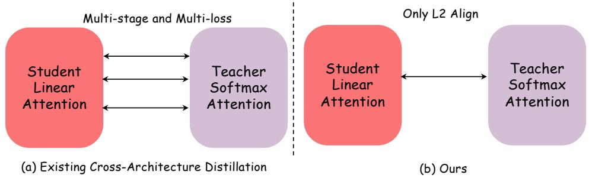  
Figure 6: Comparison of cross-architecture transfer designs. Representative prior approaches use multiple alignment stages or losses. GTR instead aligns only the final representations of a frozen softmax teacher and a linear-attention student with a squared $\ell _ { 2 }$ objective.

learning rate decreases as model capacity increases, from $1 0 ^ { - 4 }$ for GTR-S/M to $2 \times 1 0 ^ { - 5 }$ and $1 0 ^ { - 5 }$ for GTR-L and GTR-X, respectively.  
Table 18: Objects365 (Shao et al., 2019) detector pre-training hyperparameters.
<table><tr><td>Setting</td><td>GTR-S</td><td>GTR-M</td><td>GTR-L</td><td>GTR-X</td></tr><tr><td>Epochs</td><td>36</td><td>36</td><td>36</td><td>36</td></tr><tr><td>Global batch size</td><td>128</td><td>128</td><td>128</td><td>128</td></tr><tr><td>Base LR</td><td> $2 \times 1 0 ^ { - 3 }$ </td><td> $2 \times 1 0 ^ { - 3 }$ </td><td> $2 \times 1 0 ^ { - 3 }$ </td><td> $2 \times 1 0 ^ { - 3 }$ </td></tr><tr><td>Backbone LR</td><td> $1 \times 1 0 ^ { - 4 }$ </td><td> $1 \times 1 0 ^ { - 4 }$ </td><td> $2 \times 1 0 ^ { - 5 }$ </td><td> $1 \times 1 0 ^ { - 5 }$ </td></tr><tr><td>Weight decay</td><td> $1 \times 1 0 ^ { - 4 }$ </td><td> $1 \times 1 0 ^ { - 4 }$ </td><td> $1 . 2 5 \times 1 0 ^ { - 4 }$ </td><td> $1 . 2 5 \times 1 0 ^ { - 4 }$ </td></tr><tr><td>AdamWβ</td><td>0.9/0.999</td><td> $0 . 9 / 0 . 9 9 9$ </td><td> $0 . 9 / 0 . 9 9 9$ </td><td>0.9/0.999</td></tr><tr><td>LR schedule</td><td>flat-cosine</td><td>flat-cosine</td><td>flat-cosine</td><td>flat-cosine</td></tr><tr><td>Flat phase ends at epoch</td><td>15</td><td>15</td><td>15</td><td>15</td></tr><tr><td>Minimum/base LR ratio</td><td>0.1</td><td>0.1</td><td>0.1</td><td>0.1</td></tr><tr><td>Warm-up iterations</td><td>2000</td><td>2000</td><td>2000</td><td>2000</td></tr></table>

## D.1.4 COCO FINE-TUNING

For COCO fine-tuning after Objects365 pre-training, we load the complete detector checkpoint except the classification head. As shown in Table 19, the 30-epoch schedule, global batch size, and base learning rate are fixed across scales. All variants are trained on train2017 and evaluated on val2017.

Table 19: COCO (Lin et al., 2014) fine-tuning hyperparameters. Bias and normalization parameters use zero weight decay in both training stages.
<table><tr><td>Setting</td><td>GTR-S</td><td>GTR-M</td><td>GTR-L</td><td>GTR-X</td></tr><tr><td>Epochs</td><td>30</td><td>30</td><td>30</td><td>30</td></tr><tr><td>Global batch size</td><td>32</td><td>32</td><td>32</td><td>32</td></tr><tr><td>Base LR</td><td> $5 \times 1 0 ^ { - 4 }$ </td><td> $5 \times 1 0 ^ { - 4 }$ </td><td> $5 \times 1 0 ^ { - 4 }$ </td><td> $5 \times 1 0 ^ { - 4 }$ </td></tr><tr><td>Backbone LR</td><td> $1 . 5 \times 1 0 ^ { - 5 }$ </td><td> $1 . 5 \times 1 0 ^ { - 5 }$ </td><td> $2 . 5 \times 1 0 ^ { - 6 }$ </td><td> $8 \times 1 0 ^ { - 6 }$ </td></tr><tr><td>Weight decay</td><td> $1 \times 1 0 ^ { - 4 }$ </td><td> $1 \times 1 0 ^ { - 4 }$ </td><td> $1 . 2 5 \times 1 0 ^ { - 4 }$ </td><td> $1 . 2 5 \times 1 0 ^ { - 4 }$ </td></tr><tr><td>LR schedule</td><td>flat-cosine</td><td>flat-cosine</td><td>flat-cosine</td><td>flat-cosine</td></tr><tr><td>Flat phase ends at epoch</td><td>6</td><td>6</td><td>6</td><td>6</td></tr><tr><td>Minimum/base LR ratio</td><td>0.5</td><td>0.5</td><td>0.5</td><td>0.1</td></tr><tr><td>Warm-up iterations</td><td>2000</td><td>2000</td><td>2000</td><td>2000</td></tr></table>

## D.1.5 HUMAN POSE ESTIMATION

For human pose estimation, we initialize only the GTR backbone from the COCO detection checkpoint and train all pose-specific parameters from scratch. The training protocol is summarized in Table 20. All variants use AdamW, a base learning rate of $5 \times 1 0 ^ { - 4 }$ , a global batch size of 32, and the same augmentation probabilities and loss weights.

Table 20: Human pose estimation hyperparameters.
<table><tr><td>Setting</td><td>GTR-S</td><td>GTR-M</td><td>GTR-L</td><td>GTR-X</td></tr><tr><td>Optimizer</td><td>AdamW</td><td>AdamW</td><td>AdamW</td><td>AdamW</td></tr><tr><td>Backbone LR</td><td> $2 . 5 \times 1 0 ^ { - 5 }$ </td><td> $2 . 5 \times 1 0 ^ { - 5 }$ </td><td> $2 . 5 \times 1 0 ^ { - 6 }$ </td><td> $2 . 5 \times 1 0 ^ { - 6 }$ </td></tr><tr><td>Base LR</td><td> $5 \times 1 0 ^ { - 4 }$ </td><td> $5 \times 1 0 ^ { - 4 }$ </td><td> $5 \times 1 0 ^ { - 4 }$ </td><td> $5 \times 1 0 ^ { - 4 }$ </td></tr><tr><td>Weight decay</td><td> $1 \times 1 0 ^ { - 4 }$ </td><td> $1 \times 1 0 ^ { - 4 }$ </td><td> $1 . 2 5 \times 1 0 ^ { - 4 }$ </td><td> $1 . 2 5 \times 1 0 ^ { - 4 }$ </td></tr><tr><td>Epochs (with/without aug.)</td><td>90 + 2</td><td>90 + 2</td><td>72 + 2</td><td>72 + 2</td></tr><tr><td>Probmosaic</td><td>0.5</td><td>0.5</td><td>0.5</td><td>0.5</td></tr><tr><td></td><td>45</td><td>45</td><td>48</td><td>48</td></tr><tr><td> $\mathrm { E p o c h s } _ { \mathrm { m o s a i c } }$ </td><td></td><td></td><td></td><td></td></tr><tr><td> $\mathrm { P r o b } _ { \mathrm { m i x u p } }$ </td><td>0.25</td><td>0.25</td><td>0.25</td><td>0.25</td></tr><tr><td> $\mathrm { E p o c h s } _ { \mathrm { m i x u p } }$ </td><td>45</td><td>45</td><td>48</td><td>48</td></tr><tr><td> $\mathrm { P r o b \mathrm { _ { c o p y p a s t e } } }$ </td><td>0.75 45</td><td>0.75</td><td>0.75 48</td><td>0.75</td></tr><tr><td>Epochscopypaste Global batch size</td><td>32</td><td>45 32</td><td>32</td><td>48</td></tr><tr><td></td><td></td><td></td><td></td><td>32</td></tr><tr><td>λcls</td><td>2</td><td>2</td><td>2</td><td>2</td></tr><tr><td>λkpt</td><td>10</td><td>10</td><td>10</td><td>10</td></tr><tr><td>λoks</td><td>4</td><td>4</td><td>4</td><td>4</td></tr></table>

## D.1.6 SEMANTIC SEGMENTATION

For semantic segmentation, we initialize only the GTR backbone from the pretrained backbone checkpoint and train all task-specific parameters from scratch.

We train and evaluate semantic segmentation on Cityscapes (Cordts et al., 2016) with fine annotations only, and report mIoU on the validation set. During training, images are augmented with random resizing by a factor sampled from [0.5, 2.0], random horizontal flipping, and random cropping to 1024×1024. At inference, we adopt sliding-window evaluation with a 1024×1024 window and a stride of 768 pixels.

For semantic segmentation, we retain only the scale=[2.0] branch of the semantic neck, which yields stride-8 features. On top of these features we attach a lightweight FCN head consisting of a 3 × 3 Conv-BN-ReLU block, dropout $( p = 0 . 1 )$ , and a 1 × 1 convolutional classifier over the 19 Cityscapes classes. The output logits are bilinearly upsampled to the input resolution and supervised by a per-pixel cross-entropy loss. Quantitative results are reported in Section 3.2, and qualitative results are provided in Appendix F.4.

Table 21 lists the shared 30-epoch, batch-eight schedule and the scale-specific backbone learning rates. The reported task accuracy uses sliding-window inference, while latency measures one fixedsize network invocation.

Table 21: Cityscapes (Cordts et al., 2016) semantic-segmentation fine-tuning hyperparameters.
<table><tr><td>Setting</td><td>GTR-S</td><td>GTR-M</td><td>GTR-L</td><td>GTR-X</td></tr><tr><td>Epochs</td><td>30</td><td>30</td><td>30</td><td>30</td></tr><tr><td>Global batch size</td><td>8</td><td>8</td><td>8</td><td>8</td></tr><tr><td>Base LR</td><td> $5 \times 1 0 ^ { - 4 }$ </td><td> $5 \times 1 0 ^ { - 4 }$ </td><td> $5 \times 1 0 ^ { - 4 }$ </td><td> $5 \times 1 0 ^ { - 4 }$ </td></tr><tr><td>Backbone LR</td><td> $1 . 5 \times 1 0 ^ { - 4 }$ </td><td> $1 . 8 \times 1 0 ^ { - 4 }$ </td><td> $1 . 2 \times 1 0 ^ { - 4 }$ </td><td> $1 . 2 \times 1 0 ^ { - 4 }$ </td></tr><tr><td>Weight decay</td><td> $1 \times 1 0 ^ { - 4 }$ </td><td> $1 \times 1 0 ^ { - 4 }$ </td><td> $1 . 2 5 \times 1 0 ^ { - 4 }$ </td><td> $1 . 2 5 \times 1 0 ^ { - 4 }$ </td></tr><tr><td>LR schedule</td><td>flat-cosine</td><td>flat-cosine</td><td>flat-cosine</td><td>flat-cosine</td></tr><tr><td>Flat phase ends at epoch</td><td>6</td><td>6</td><td>6</td><td>6</td></tr><tr><td>Minimum/base LR ratio</td><td>0.5</td><td>0.5</td><td>0.5</td><td>0.5</td></tr><tr><td>Warm-up iterations</td><td>2,000</td><td>2,000</td><td>2,000</td><td>2,000</td></tr><tr><td>Training crop size</td><td> $1 0 2 4 ^ { 2 }$ </td><td> $1 0 2 4 ^ { 2 }$ </td><td> $1 0 2 4 ^ { 2 }$ </td><td>1024²</td></tr><tr><td>Sliding-window stride</td><td>768</td><td>768</td><td>768</td><td>768</td></tr></table>

## D.1.7 MONOCULAR DEPTH ESTIMATION WITH DIVERSE TRAINING DATA

For monocular depth estimation, we initialize only the GTR backbone from the pretrained backbone checkpoint and train all task-specific parameters from scratch.

Training sources and data acquisition. We adopt the same eight-source training mixture used for depth training in YOLO26 (Jocher et al., 2026), comprising ARKitScenes (Baruch et al., 2021), SUN RGB-D (Song et al., 2015), DIODE (Vasiljevic et al., 2019), Hypersim (Roberts et al., 2021), TartanAir (Wang et al., 2020), Virtual KITTI 2 (Cabon et al., 2020), KITTI (Geiger et al., 2013), and pseudo-labeled ImageNet (Deng et al., 2009). To reduce storage and bandwidth overhead, we adopt source-specific acquisition strategies. For Hypersim, we download only the tonemap.jpg and depth meters.hdf5 files instead of the full 1.9 TB release, reducing the local storage footprint to approximately 11 GB. For KITTI, we retrieve the raw archives with batched HTTP range requests and keep only the color-camera streams, discarding the Velodyne point clouds, grayscale images, and OXTS records. This reduces the amount of data transferred by about 75%.

Depth decoding. All depth targets are decoded as $\pm 1 0 \mathsf { a t } 3 2$ arrays in meters, and values $\leq 0$ are treated as invalid. For SUN RGB-D, we follow the official toolbox and recover depth through the 16-bit rotation $d = ( ( r \gg 3 ) | ( r \ll 1 3 ) ) / 1 0 0 0$ . We use the official depth bfx targets, which leave measured pixels unchanged while inpainting missing regions and therefore provide nearly dense supervision. Hypersim stores the Euclidean distance d from the optical center rather than planar depth, i.e., the z coordinate in camera space. Using the official $1 0 2 4 \times 7 6 8$ intrinsics with foca length $f = 8 8 6 . 8 1$ pixels, we convert each pixel to planar depth as

$$
z ( u , v ) = d ( u , v ) \frac { f } { \sqrt { ( u - c _ { x } ) ^ { 2 } + ( v - c _ { y } ) ^ { 2 } + f ^ { 2 } } } ,\tag{8}
$$

where $( c _ { x } , c _ { y } )$ is the principal point. Any resulting NaN is set to zero and thus marked invalid. KITTI depth is decoded from uint16 as $d = r / 2 5 6$ , with zeros retained as invalid. For DIODE, we multiply the depth by the provided validity mask, which maps invalid pixels to zero. All depth maps are resized using nearest-neighbor interpolation only, so that invalid zeros are never blended with valid metric depths.

We further apply dataset-specific preprocessing before enforcing the common training range. In Virtual KITTI 2, sky pixels are encoded with a depth of 655.35 m; we clip these values to 80 m while retaining them as valid. In contrast, sky depths in TartanAir are on the order of $1 0 ^ { 4 }$ m; these values are set to zero and treated as invalid. For DIODE and SUN RGB-D, depth values are clipped to 80 m and 10 m, respectively. Across all datasets, training and evaluation use a common maximum depth of 100 m, with depths in the range $[ 1 0 ^ { - 3 }$ , 100] m considered valid.

Depth teacher. We generate metric-depth pseudo-labels with the nested variant of Depth Anything 3 (DA3) (Lin et al., 2026), which jointly estimates camera intrinsics and metric depth and therefore needs no additional scale calibration. The alternative canonical-depth DA3 variant instead predicts depth up to a focal-length-dependent scale and must be rescaled as $d _ { \mathrm { m e t r i c } } ~ =$ $\left( f / 3 0 \bar { 0 } \right) d _ { \mathrm { c a n o n i c a l } }$ , where f is the focal length in pixels and 300 pixels is the canonical focal length used during training. This rescaling is not applicable in our setting: standard ImageNet preprocessing discards the camera metadata and resizes and crops each image, so the effective focal length cannot be recovered reliably. Estimating f from an assumed field of view would inject an uncontrolled, per-image scale error into the pseudo-labels, which the nested variant avoids by construction.

Batched teacher inference. The default DA3 inference pipeline assumes multi-view inputs from a common scene rather than a batch of independent images: it couples the views in a batch through cross-view attention, shared scale alignment, and joint percentile-based depth normalization. Batching unrelated ImageNet images therefore makes each prediction depend on the other images in the batch; we measured median relative deviations of 68–233% from single-image inference. To batch efficiently while preserving single-image behavior, we feed each sample as a single-view input, yielding tensors of shape (B, 1, 3, H, W), and run global alignment and post-processing independently for each batch element. The resulting predictions match single-image inference to within 0.1% relative error. We further bucket images by their resolution after teacher preprocessing rather than by their original resolution, so that every batch shares a single resolution while images with common aspect ratios can still be grouped together. Overall, batching with resolution bucketing reduces the number of teacher forward passes by a factor of approximately 8.

Sampling and augmentation. The measured-depth datasets differ by more than an order of magnitude in size, ranging from roughly 10K images in SUN RGB-D to over 300K in TartanAir. To mitigate this imbalance, we oversample each dataset with an integer repetition factor, using [6, 3, 2, 2, 2, 1, 3] in data-loader order. The pseudo-labeled ImageNet pool is drawn from a separate sampling stream, so that its ratio to the measured-depth data can be controlled independently. For augmentation, we retain only the metric-depth-preserving transformations of Depth Anything V2 (Yang et al., 2024a): color jitter, horizontal flipping, aspect-ratio-preserving shortedge resizing, and random square cropping. Composition-based geometric augmentations such as Mosaic, ZoomOut, and IoUCrop are disabled, since they alter the relationship between image scale and metric depth and thus break geometric consistency.

Head, objective, and decoding. Our depth head follows a DPT-style RefineNet hierarchy (Ranftl et al., 2021): starting from stride-32 features, it progressively fuses those at strides 16, 8, and $^ { 4 , }$ and upsamples the final prediction to the input resolution. Let $\hat { d } _ { i }$ and $d _ { i }$ denote the predicted and ground-truth depth at pixel i, let N be the number of valid pixels, and let $g _ { i } = \log \hat { d } _ { i } - \log d _ { i }$ . We minimize the scale-invariant logarithmic (SiLog) loss (Eigen et al., 2014), a standard objective for metric depth regression,

$$
\mathcal { L } _ { \mathrm { S i L o g } } = \sqrt { \frac { 1 } { N } \sum _ { i } g _ { i } ^ { 2 } - \lambda \left( \frac { 1 } { N } \sum _ { i } g _ { i } \right) ^ { 2 } } , \qquad \lambda = 0 . 5 .\tag{9}
$$

Unlike the fully scale-invariant case $( \lambda = 1 ) , \lambda = 0 . 5$ retains a partial penalty on the global logscale error. SiLog is the only objective used to train the depth head. For decoding, we follow YOLO26 (Jocher et al., 2026) and regress log-depth, $\hat { d } = \mathrm { e x p } ( \mathrm { c l a m p } ( z , - 4 , 5 ) )$ , where z is the raw head output; this yields an effective range of approximately 0.02–148 m. The clamp serves only for numerical stability and its bounds are dataset-agnostic, so predictions are not saturated at a dataset-specific max depth.

Ground-truth-aligned evaluation protocol. We evaluate on the 654-image Eigen test split of NYU Depth V2 (Silberman et al., 2012; Eigen et al., 2014) without NYU-specific fine-tuning. We use filled ground-truth depth maps for evaluation. Each RGB image is first resized with its shorter side set to 640 pixels while preserving aspect ratio; hence, a 480×640 image becomes 640×853. Because the backbone operates on a square patch grid, two overlapping 640 × 640 windows cover the resized image, and predictions in their overlap are averaged. We use three image scales, {0.75, 1, 1.25}, with and without horizontal flipping, yielding six test-time views. Each prediction is bilinearly resized back to the native 480 × 640 resolution, after which the six depth maps are averaged linearly. Within the Eigen crop [45:471, 41:601], we fit a two-parameter log-affine alignment to the ground-truth depth independently for each image by least squares. For an aligned prediction $\tilde { d } _ { i }$ , ground-truth depth $d _ { i }$ , and the set V of N valid pixels in the crop, we define the three metrics as

$$
\delta _ { 1 } = \frac { 1 } { N } \sum _ { i \in \mathcal { V } } \mathbf { 1 } \left[ \operatorname* { m a x } \left( \frac { \tilde { d } _ { i } } { d _ { i } } , \frac { d _ { i } } { \tilde { d } _ { i } } \right) < 1 . 2 5 \right] ,\tag{10}
$$

$$
\mathrm { A b s R e l } = \frac { 1 } { N } \sum _ { i \in \mathcal { V } } \frac { \lvert \tilde { d } _ { i } - d _ { i } \rvert } { d _ { i } } ,\tag{11}
$$

$$
\mathrm { R M S E } = \sqrt { \frac { 1 } { N } \sum _ { i \in \mathcal { V } } ( \tilde { d } _ { i } - d _ { i } ) ^ { 2 } } .\tag{12}
$$

We compute each metric separately for every image and report its arithmetic mean over all 654 test images. This protocol follows YOLO26 (Jocher et al., 2026). Section 3.2 reports the quantitative comparison, and Appendix F.5 provides additional zero-shot results on indoor and outdoor benchmarks.

Table 22 gives the mixed-data depth schedule. The four models share the 30-epoch duration and batch size of 256, while the L/X backbone learning rates are lower than those of S/M. The groundtruth alignment above is applied only when computing the reported NYU evaluation metrics.

Table 22: Mixed-data depth pre-training hyperparameters.
<table><tr><td>Setting</td><td>GTR-S</td><td>GTR-M</td><td>GTR-L</td><td>GTR-X</td></tr><tr><td>Epochs</td><td>30</td><td>30</td><td>30</td><td>30</td></tr><tr><td>Global batch size</td><td>256</td><td>256</td><td>256</td><td>256</td></tr><tr><td>Base LR</td><td> $2 \times 1 0 ^ { - 4 }$ </td><td> $2 \times 1 0 ^ { - 4 }$ </td><td> $2 \times 1 0 ^ { - 4 }$ </td><td> $2 \times 1 0 ^ { - 4 }$ </td></tr><tr><td>Backbone LR</td><td> $1 \times 1 0 ^ { - 4 }$ </td><td> $1 \times 1 0 ^ { - 4 }$ </td><td> $2 \times 1 0 ^ { - 5 }$ </td><td> $1 \times 1 0 ^ { - 5 }$ </td></tr><tr><td>Weight decay</td><td> $1 \times 1 0 ^ { - 4 }$ </td><td> $1 \times 1 0 ^ { - 4 }$ </td><td> $1 . 2 5 \times 1 0 ^ { - 4 }$ </td><td> $1 . 2 5 \times 1 0 ^ { - 4 }$ </td></tr><tr><td>LR schedule</td><td>flat-cosine</td><td>flat-cosine</td><td>flat-cosine</td><td>flat-cosine</td></tr><tr><td>Flat phase ends at epoch</td><td>12</td><td>12</td><td>12</td><td>12</td></tr><tr><td>Minimum/base LR ratio</td><td>0.1</td><td>0.1</td><td>0.1</td><td>0.1</td></tr><tr><td>Warm-up iterations</td><td>2,000</td><td>2,000</td><td>2,000</td><td>2,000</td></tr><tr><td>No-augmentation phase starts at epoch</td><td>27</td><td>27</td><td>27</td><td>27</td></tr><tr><td>Valid depth range (m)</td><td> $[ 1 0 ^ { - 3 } , 1 0 0 ]$ </td><td> $[ 1 0 ^ { - 3 } , 1 0 0 ]$ </td><td> $[ 1 0 ^ { - 3 } , 1 0 0 ]$ </td><td> $[ 1 0 ^ { - 3 } , 1 0 0 ]$ </td></tr><tr><td>Output parameterization</td><td>log-depth</td><td>log-depth</td><td>log-depth</td><td>log-depth</td></tr></table>

## D.1.8 ORIENTED OBJECT DETECTION

For oriented object detection, we initialize only the GTR backbone from the pretrained backbone checkpoint and train all task-specific parameters from scratch.

For DOTA-v1.0, we follow the multi-scale training and testing protocol of RiO-DETR (Hu et al., 2026): during both training and testing, each image is rescaled by factors of {0.5, 1.0, 1.5} and then cropped into $1 0 2 4 \times 1 0 2 4$ patches with a stride of 524 pixels, i.e., an overlap of 500 pixels. The task-specific OBB decoder consists of four layers and introduces three modifications for oriented object detection. First, we adopt angle distribution refinement (ADR) (Ding et al., 2026), which rep resents each oriented box by six discrete distributions: four distances to the sides of its axis-aligned enclosing box and two vertex offsets. These distributions are decoded into oriented boxes by a distance-to-rotated-box conversion, which avoids the angular boundary discontinuity of direct angle regression. Second, we rotate the sampling offsets of deformable attention by the predicted angle θ of each query, so that the sampling pattern aligns with the principal direction of the target. Third, oriented contrastive denoising (OCD) (Ding et al., 2026) perturbs only the axis-aligned coordinates $( x _ { 1 } , y _ { 1 } , x _ { 2 } , y _ { 2 } )$ of the denoising queries and leaves the angle channel unchanged.

The training objective combines one classification and two regression terms. For classification, the matching-aware loss (MAL) (Huang et al., 2025b) uses a soft target weighted by the rotated IoU with the ground truth. For regression, an $\ell _ { 1 }$ loss supervises the five box parameters $( x , y , w , h , \theta )$ , and the Gaussian Kullback–Leibler divergence (KLD) loss (Yang et al., 2021) replaces the GIoU loss used in the horizontal-box setting: it models an oriented box as a 2-D Gaussian and thus provides geometry-aware supervision for rotated boxes. As in the original formulation, the divergence D is mapped to a loss by $1 - 1 / ( \tau + \log ( 1 + D ) )$ with $\tau _ { \mathrm { K L D } } = 1$ . Table 23 summarizes the complete fine-tuning configuration.

Table 23: DOTA-v1.0 (Xia et al., 2018) oriented-object-detection fine-tuning hyperparameters.
<table><tr><td>Setting</td><td>GTR-S</td><td>GTR-X</td></tr><tr><td>Epochs</td><td>12</td><td>14</td></tr><tr><td>Global batch size</td><td>16</td><td>16</td></tr><tr><td>Base LR</td><td> $5 \times 1 0 ^ { - 4 }$ </td><td> $5 \times 1 0 ^ { - 4 }$ </td></tr><tr><td>Backbone LR</td><td> $1 . 8 \times 1 0 ^ { - 4 }$ </td><td> $8 \times 1 0 ^ { - 6 }$ </td></tr><tr><td>Weight decay</td><td> $1 \times 1 0 ^ { - 4 }$ </td><td> $1 . 2 5 \times 1 0 ^ { - 4 }$ </td></tr><tr><td>LR schedule</td><td>constant after warm-up</td><td>constant after warm-up</td></tr><tr><td>Warm-up iterations</td><td>2,000</td><td>2,000</td></tr><tr><td>Drop-path rate</td><td>0.0</td><td>0.1</td></tr><tr><td>Training patch size</td><td> $1 0 2 4 ^ { 2 }$ </td><td>1024²</td></tr><tr><td>Multi-scale resize ratios</td><td>{0.5, 1.0, 1.5}</td><td>{0.5, 1.0, 1.5}</td></tr></table>

## E EFFICIENCY AND REPRODUCIBILITY DETAILS

## E.1 DRIVE AGX THOR DEPLOYMENT

Platform and execution path. Table 24 specifies the on-device environment. The Thor-targeted operators are compiled for sm 110 and integrated into TensorRT; they are distinct builds from the sm 89 PyTorch-extension GLA operator benchmarked in Appendix E.3.

Roofline analysis. Figure 7 motivates optimizing memory traffic rather than peak compute. Across six tasks and four model scales, the plotted baseline and optimized points lie well left of the 1,032 FLOP/byte ridge point and near the bandwidth roofs, consistent with memory-traffic limitations on Thor. Compared with the TensorRT baseline, our graph transformations and fused CUDA kernels shift the operating points upward and to the right by eliminating intermediate memory traffic. The optimized models reach 89–141% of the nominal DRAM roof; values above 100% are compatible with on-chip reuse under the plotted traffic model.

Deployment results. Tables 25 and 26 report the complete TensorRT measurements. At batch size one, latency ranges from 2.282 to 8.769 ms across all tasks and model scales, while the cosine similarity between FP16 TensorRT outputs and their FP32 PyTorch references remains consistently high, ranging from 0.9989 to 1.0000. Increasing the batch size to eight raises the peak throughput to 571 images/s for GTR-S detection. For the 1024 × 1024 oriented-detection and semantic-segmentation workloads, batch-one inference provides higher throughput than batch eight, consistent with the memory-bound regime identified in Figure 7.

## E.2 GPU LATENCY MEASUREMENT PROTOCOL

## E.2.1 HARDWARE, SOFTWARE, AND DEPLOYMENT

Our protocol measures steady-state GPU latency under a unified deployment, compilation, and execution pipeline. The model forward-pass measurements use a single NVIDIA GeForce RTX 4090 GPU with Python 3.11, PyTorch 2.11.0+cu128, torchvision 0.26.0+cu128, and CUDA 12.8. We use a batch size of one and FP16 precision throughout.

For object detection, RF-DETR-S/M/L/X (Robinson et al., 2026) are evaluated at their released native resolutions of 512/576/704/700, respectively; the non-monotonic L/X resolutions follow the official model configurations. All other detectors use 640 × 640 inputs. For instance segmentation, RF-DETR-Seg-S/M/L/X use their native resolutions of $3 8 4 / 4 3 2 / 5 0 4 / 6 2 4$ , respectively, while all other models use 640 × 640 inputs.

Before compilation, we invoke the official deploy(), export(), or fuse() routine, when available, to apply deployment conversion and Conv–BN fusion. TorchInductor freezing is enabled for implementations without an explicit deployment interface. Each model is compiled with torch.compile(mode="max-autotune", fullgraph=True) and executed through a CUDA Graph. The fullgraph=True constraint prevents graph breaks or device synchronizations from silently causing a fallback to eager execution.

Table 24: DRIVE AGX Thor deployment environment. All results in Tables 25 and 26 use FP16.
<table><tr><td>Component</td><td>Configuration</td></tr><tr><td>Board</td><td>NVIDIA DRIVE AGX Thor</td></tr><tr><td>GPU</td><td>Blackwell (sm_110)</td></tr><tr><td>Operating system</td><td>DRIVE OS 7.0.5.0 / Ubuntu 24.04.3 LTS</td></tr><tr><td>CUDA</td><td>13.0</td></tr><tr><td>TensorRT</td><td>10.14.2.2</td></tr><tr><td>Precision</td><td>FP16</td></tr></table>

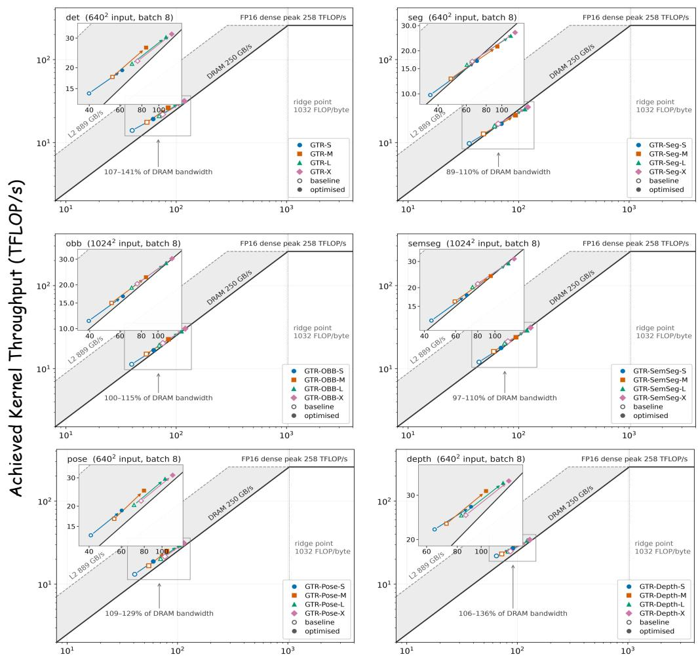  
Kernel Arithmetic Intensity (FLOP/byte)  
Figure 7: Roofline analysis of the TensorRT deployment on DRIVE AGX Thor. Open markers denote the original TensorRT baseline, which uses only TensorRT’s built-in optimizations; filled markers denote our graph–kernel-optimized implementation.

Profiler traces confirm that each steady-state forward pass incurs exactly one CUDA Graph launch, without GPU-to-CPU scalar synchronization or device-to-host transfer. The official RF-DETR (Robinson et al., 2026) and LW-DETR (Chen et al., 2024) implementations use GPU-resident shape scalars and tensor assertions that prevent full-graph compilation. We replace these operations with compile-time shape constants, producing bitwise-identical outputs. Compilation, autotuning, graph capture, and warm-up are excluded from all reported measurements.

Table 25: FP16 TensorRT deployment on DRIVE AGX Thor at batch size one. Cosine similarity compares FP16 TensorRT outputs with FP32 PyTorch reference outputs.
<table><tr><td>Task</td><td>Model</td><td>Input</td><td>Median (ms) ↓</td><td>Images/s ↑</td><td>Cosine sim. ↑</td></tr><tr><td rowspan="4">Detection</td><td>GTR-S</td><td> $6 4 0 ^ { 2 }$ </td><td>2.282</td><td>438</td><td>0.9997</td></tr><tr><td>GTR-M</td><td> $6 4 0 ^ { 2 }$ </td><td>2.721</td><td>368</td><td>0.9999</td></tr><tr><td>GTR-L</td><td> $6 4 0 ^ { 2 }$ </td><td>3.527</td><td>284</td><td>0.9998</td></tr><tr><td>GTR-X</td><td> $6 4 0 ^ { 2 }$ </td><td>4.080</td><td>245</td><td>0.9999</td></tr><tr><td rowspan="4">Instance seg.</td><td>GTR-Seg-S</td><td> $6 4 0 ^ { 2 }$ </td><td>3.474</td><td>288</td><td>0.9992</td></tr><tr><td>GTR-Seg-M</td><td> $6 4 0 ^ { 2 }$ </td><td>4.363</td><td>229</td><td>0.9997</td></tr><tr><td>GTR-Seg-L</td><td> $6 4 0 ^ { 2 }$ </td><td>5.130</td><td>195</td><td>0.9993</td></tr><tr><td>GTR-Seg-X</td><td> $6 4 0 ^ { 2 }$ </td><td>5.703</td><td>175</td><td>0.9993</td></tr><tr><td rowspan="4">Oriented det.</td><td>GTR-OBB-S</td><td> $1 0 2 4 ^ { 2 }$ </td><td>4.310</td><td>232</td><td>0.9998</td></tr><tr><td>GTR-OBB-M</td><td> $1 0 2 4 ^ { 2 }$ </td><td>5.491</td><td>182</td><td>0.9998</td></tr><tr><td>GTR-OBB-L</td><td> $1 0 2 4 ^ { 2 }$ </td><td>7.602</td><td>132</td><td>0.9999</td></tr><tr><td>GTR-OBB-X</td><td> $1 0 2 4 ^ { 2 }$ </td><td>8.769</td><td>114</td><td>0.9998</td></tr><tr><td rowspan="4">Pose</td><td>GTR-Pose-S</td><td> $6 4 0 ^ { 2 }$ </td><td>2.459</td><td>407</td><td>0.9994</td></tr><tr><td>GTR-Pose-M</td><td> $6 4 0 ^ { 2 }$ </td><td>3.082</td><td>324</td><td>0.9996</td></tr><tr><td>GTR-Pose-L</td><td> $6 4 0 ^ { 2 }$ </td><td>3.909</td><td>256</td><td>0.9989</td></tr><tr><td>GTR-Pose-X</td><td> $6 4 0 ^ { 2 }$ </td><td>4.455</td><td>224</td><td>0.9989</td></tr><tr><td rowspan="4">Semantic seg.</td><td>GTR-SemSeg-S</td><td> $1 0 2 4 ^ { 2 }$ </td><td>3.579</td><td>279</td><td>0.9993</td></tr><tr><td>GTR-SemSeg-M</td><td> $1 0 2 4 ^ { 2 }$ </td><td>4.655</td><td>215</td><td>0.9998</td></tr><tr><td>GTR-SemSeg-L</td><td> $1 0 2 4 ^ { 2 }$ </td><td>6.792</td><td>147</td><td>0.9996</td></tr><tr><td>GTR-SemSeg-X</td><td> $1 0 2 4 ^ { 2 }$ </td><td>7.916</td><td>126</td><td>0.9996</td></tr><tr><td rowspan="4">Depth</td><td>GTR-Depth-S</td><td> $6 4 0 ^ { 2 }$ </td><td>2.675</td><td>374</td><td>1.0000</td></tr><tr><td>GTR-Depth-M</td><td> $6 4 0 ^ { 2 }$ </td><td>3.071</td><td>326</td><td>1.0000</td></tr><tr><td>GTR-Depth-L</td><td> $6 4 0 ^ { 2 }$ </td><td>3.872</td><td>258</td><td>1.0000</td></tr><tr><td>GTR-Depth-X</td><td> $6 4 0 ^ { 2 }$ </td><td>4.389</td><td>228</td><td>1.0000</td></tr></table>

Table 26: FP16 TensorRT deployment on DRIVE AGX Thor at batch size eight. Cosine similarity compares FP16 TensorRT outputs with FP32 PyTorch reference outputs.
<table><tr><td>Task</td><td>Model</td><td>Input</td><td>Median (ms) ↓</td><td>Images/s ↑</td><td>Cosine sim. ↑</td></tr><tr><td rowspan="4">Detection</td><td>GTR-S</td><td> $6 4 0 ^ { 2 }$ </td><td>14.017</td><td>571</td><td>0.9998</td></tr><tr><td>GTR-M</td><td> $6 4 0 ^ { 2 }$ </td><td>19.126</td><td>418</td><td>0.9998</td></tr><tr><td>GTR-L</td><td> $6 4 0 ^ { 2 }$ </td><td>27.817</td><td>288</td><td>0.9999</td></tr><tr><td>GTR-X</td><td> $6 4 0 ^ { 2 }$ </td><td>32.701</td><td>245</td><td>0.9998</td></tr><tr><td rowspan="4">Instance seg.</td><td>GTR-Seg-S</td><td> $6 4 0 ^ { 2 }$ </td><td>22.085</td><td>362</td><td>0.9993</td></tr><tr><td>GTR-Seg-M</td><td> $6 4 0 ^ { 2 }$ </td><td>31.529</td><td>254</td><td>0.9996</td></tr><tr><td>GTR-Seg-L</td><td> $6 4 0 ^ { 2 }$ </td><td>40.203</td><td>199</td><td>0.9990</td></tr><tr><td>GTR-Seg-X</td><td> $6 4 0 ^ { 2 }$ </td><td>45.142</td><td>177</td><td>0.9990</td></tr><tr><td rowspan="4">Oriented det.</td><td>GTR-OBB-S</td><td> $1 0 2 4 ^ { 2 }$ </td><td>39.619</td><td>202</td><td>0.9998</td></tr><tr><td>GTR-OBB-M</td><td> $1 0 2 4 ^ { 2 }$ </td><td>54.312</td><td>147</td><td>0.9998</td></tr><tr><td>GTR-OBB-L</td><td> $1 0 2 4 ^ { 2 }$ </td><td>74.545</td><td>107</td><td>0.9998</td></tr><tr><td>GTR-OBB-X</td><td> $1 0 2 4 ^ { 2 }$ </td><td>85.553</td><td>94</td><td>0.9998</td></tr><tr><td rowspan="4">Pose</td><td>GTR-Pose-S</td><td> $6 4 0 ^ { 2 }$ </td><td>16.227</td><td>493</td><td>0.9993</td></tr><tr><td>GTR-Pose-M</td><td> $6 4 0 ^ { 2 }$ </td><td>23.108</td><td>346</td><td>0.9995</td></tr><tr><td>GTR-Pose-L</td><td> $6 4 0 ^ { 2 }$ </td><td>31.877</td><td>251</td><td>0.9993</td></tr><tr><td>GTR-Pose-X</td><td> $6 4 0 ^ { 2 }$ </td><td>37.228</td><td>215</td><td>0.9994</td></tr><tr><td rowspan="4">Semantic seg.</td><td>GTR-SemSeg-S</td><td> $1 0 2 4 ^ { 2 }$ </td><td>36.953</td><td>216</td><td>0.9991</td></tr><tr><td>GTR-SemSeg-M</td><td> $1 0 2 4 ^ { 2 }$ </td><td>50.860</td><td>157</td><td>0.9998</td></tr><tr><td>GTR-SemSeg-L</td><td> $1 0 2 4 ^ { 2 }$ </td><td>70.900</td><td>113</td><td>0.9997</td></tr><tr><td>GTR-SemSeg-X</td><td> $1 0 2 4 ^ { 2 }$ </td><td>81.234</td><td>98</td><td>0.9994</td></tr><tr><td rowspan="4">Depth</td><td>GTR-Depth-S</td><td> $6 4 0 ^ { 2 }$ </td><td>19.212</td><td>416</td><td>1.0000</td></tr><tr><td>GTR-Depth-M</td><td> $6 4 0 ^ { 2 }$ </td><td>23.953</td><td>334</td><td>1.0000</td></tr><tr><td>GTR-Depth-L</td><td> $6 4 0 ^ { 2 }$ </td><td>32.588</td><td>245</td><td>1.0000</td></tr><tr><td>GTR-Depth-X</td><td> $6 4 0 ^ { 2 }$ </td><td>37.328</td><td>214</td><td>1.0000</td></tr></table>

## E.2.2 TIMED SCOPE AND POST-PROCESSING

For DETR-style models, we measure only the forward pass and exclude output decoding and postprocessing. For YOLOv9 (Wang et al., 2024b), YOLO11 (Jocher, 2024), and YOLOv12 (Tian et al., 2025), the reported latency includes both the forward pass and CUDA NMS implemented with torchvision.ops.nms. We use conf=0.001, iou=0.7, multi label=True, agnostic=False, and max det=300.

Because NMS cost depends on the number of candidate boxes, these models are evaluated over all 5,000 images in COCO (Lin et al., 2014) val2017. YOLOv10 (Wang et al., 2024a) and

YOLO26 (Jocher et al., 2026) perform in-network top-k selection and require no separate NMS stage. All NMS-free detectors are evaluated on a fixed subset of 1,000 COCO images.

## E.2.3 WARM-UP AND STATISTICS

YOLO models are warmed up for 200 forward iterations. YOLO11 and YOLOv12 receive an additional 30 warm-up iterations covering the complete prediction and NMS pipeline. YOLOv9 uses no separate NMS warm-up; its one-time NMS initialization cost is negligible when averaged over 5,000 images. All other detection and segmentation models are warmed up for 300 iterations.

Latency is measured using CUDA events on the default stream while the GPU is otherwise idle. Each model is benchmarked once in an independent process. Table 7 reports the minimum, arithmetic mean, and median per-image latency. We use the median for every model comparison.

## E.3 CUSTOM CUDA OPERATOR

## E.3.1 IMPLEMENTATION DETAILS

Scope and decomposition. The reference FLA implementation (Yang & Zhang, 2024) targets general training and inference settings, supporting variable head dimensions, sequence lengths, recurrent states, backward propagation, and final-state outputs. In contrast, our CUDA operator is specialized for GTR inference with batch size one, FP16 inputs, a zero initial state, no backward propagation or final-state output, chunk size $C = 6 4$ , and per-head dimensions $d _ { k } = 3 2$ and $d _ { v } = 6 4$

As described in Section 2.1, GTR fixes the value-side state-decay gate to $\beta _ { t } \equiv { \bf 1 } _ { 1 \times d _ { v } }$ during both training and inference. Consequently, the training-time FLA kernels and our custom operator consume identical inputs—Q, K, V, and the learned key-side log-decay gate g—and evaluate the same recurrence. The data-dependent output gate is likewise preserved and may be fused into the deployment epilogue. Up to mixed-precision roundoff, our operator therefore changes only the execution schedule and fusion pattern, not the underlying computation.

A remaining inefficiency in FLA v0.5.0 is that each state-tile program processes chunks sequentially, performing a matrix contraction at every step and exposing limited parallelism in our small-batch regime. Let $N _ { c } = \lceil L / C \rceil$ denote the number of chunks. We instead parallelize the expensive chunk summaries $\mathbf { U } _ { c }$ in Equation 3 over the chunk–head grid, leaving only the lightweight boundary-state recurrence as a sequential scan; adjacent lanes process adjacent elements along the contiguous $d _ { v }$ dimension, enabling coalesced memory accesses. While a tree-based prefix scan achieves $\mathcal { O } ( \log N _ { c } )$ depth, it requires additional global-memory passes and strided accesses in our setting. We find the coalesced linear scan faster in the target deployment regime while still retaining $\mathcal O ( L )$ work for fixed head dimensions and chunk size.

Fused tensor-core dataflow. Building on this schedule, our first kernel fuses chunk-local cumulative sums with the construction of $\mathbf { U } _ { c }$ . Prefix sums are computed in FP32 registers, while value tiles are staged in padded shared memory via cp.async. The fixed configuration $C = 6 4 , d _ { k } = 3 2$ $d _ { v } = 6 4$ maps efficiently to ldmatrix loads and tensor-core MMA instructions with FP32 accumulation: chunk-summary and score–value contractions use FP16 operands, whereas the decayrescaled query/key operands and boundary states use BF16 to accommodate their wider dynamic range. Kernel tiling and dispatch parameters are tuned for RTX 4090 sm 89.

For each chunk–head pair, a second kernel jointly computes the causal $\widetilde { \mathbf { Q } } \widetilde { \mathbf { K } } ^ { \top }$ scores, their product with V, and the boundary-state readout within a single thread block. The resulting $6 4 \times 6 4$ causal score tile is consumed directly from shared memory rather than materialized to global memory, eliminating the standalone cumulative-sum launch and an intermediate intra-chunk score tensor of size $\mathcal { O } ( L H C )$ . Chunk-local cumulative sums are still exchanged between the summary and output kernels through an FP16 workspace.

Length-aware scheduling and deployment fusion. Because the relative cost of the scan and output stages depends on $N _ { c } ,$ , we adopt a length-aware dispatch policy. For short sequences, a fallback output kernel reconstructs chunk prefixes inline, avoiding a separate scan launch; under our default RTX 4090 dispatch policy, this path is used for $N _ { c } < 6 .$ For eligible non-wave-aligned grids with $N _ { c } \geq 6$ , an occupancy-aware kernel instead combines the scan and output stages: output blocks compute the chunk-local contractions while scan blocks generate boundary states, with synchro nization occurring only immediately before the boundary-state readout so that the two stages can overlap. All other configurations retain a separate scan kernel.

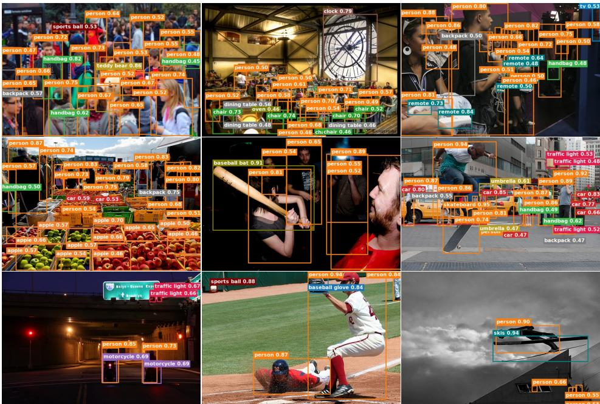  
Figure 8: Qualitative object detection results of GTR-X.

Beyond kernel scheduling, the deployment interface supports persistent caller-managed workspaces, preallocated output buffers, and CUDA Graph capture. In the end-to-end GTR implementation, the output epilogue further fuses RMSNorm and the SiLU-activated output gate—distinct from the subsequent S-SwiGLU channel mixer—directly into the GLA kernel, removing one kernel launch and its intermediate global-memory round trip. This epilogue fusion is excluded from the isolated operator measurements in Figure 4.

## F QUALITATIVE RESULTS

We present qualitative results for object detection, instance segmentation, human pose estimation, semantic segmentation, zero-shot monocular depth estimation, and oriented object detection. The COCO examples include occlusion, low illumination, motion blur, defocus, object rotation, and crowded scenes. The additional transfer examples use Cityscapes (Cordts et al., 2016) for semantic segmentation, the DTU Robot Image Data Set (Jensen et al., 2014) for indoor depth, nuScenes (Caesar et al., 2020) for outdoor depth, and the DOTA-v1.0 (Xia et al., 2018) test set for oriented object detection.

## F.1 OBJECT DETECTION RESULTS

Detection behavior. Figure 8 illustrates selected GTR-X predictions under crowding and occlusion, motion blur, object rotation, and low illumination. Across these examples, the model localizes small and overlapping instances despite substantial appearance degradation.

## F.2 INSTANCE SEGMENTATION RESULTS

Mask quality. Figure 9 visualizes GTR-X masks on the same challenging images as Figure 8. The selected predictions follow visible object contours and separate adjacent instances; together with Table 8, they illustrate the transfer of the output-aligned representation to instance segmentation.

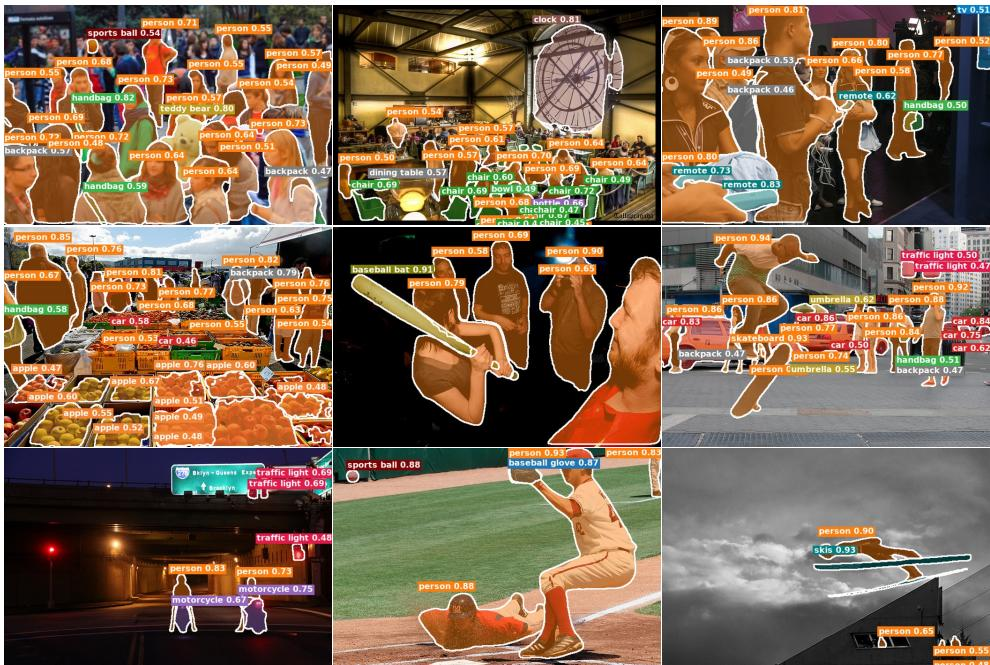

Figure 9: Qualitative instance segmentation results of GTR-X. Predictions are visualized on the same image set used in Figure 8.  
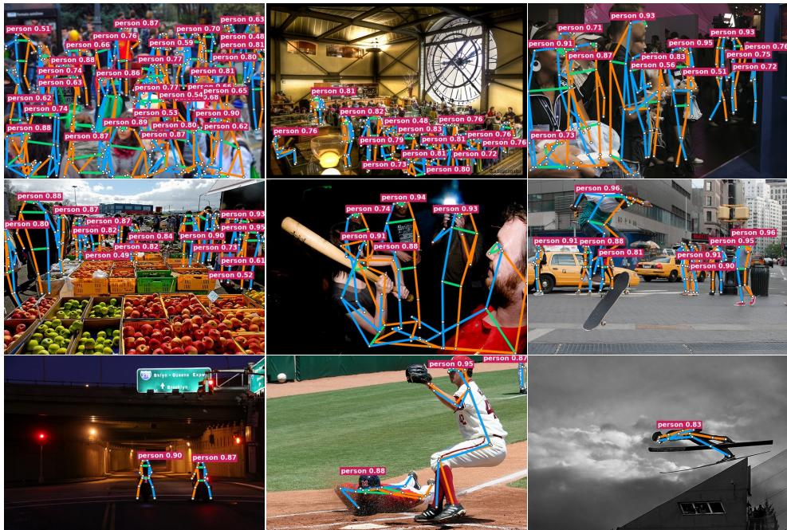  
Figure 10: Qualitative human pose estimation results of GTR-X. The examples emphasize crowded scenes, low illumination, and motion blur.

## F.3 HUMAN POSE ESTIMATION RESULTS

Pose behavior. The selected cases in Figure 10 show GTR-X predicting articulated poses for multiple overlapping people under crowding, low illumination, and motion blur.

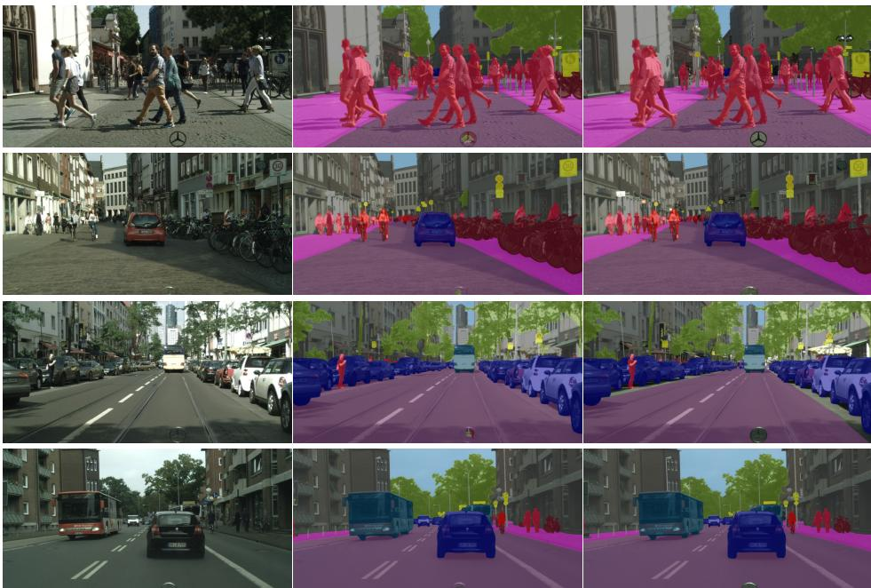  
Figure 11: Qualitative semantic segmentation results of GTR-X. Each row shows, from left to right, the input RGB image, GTR-X prediction, and ground-truth annotation.

## F.4 SEMANTIC SEGMENTATION RESULTS

Dense semantic predictions. Figure 11 compares GTR-X predictions with Cityscapes ground truth.

## F.5 ZERO-SHOT MONOCULAR DEPTH ESTIMATION RESULTS

We apply GTR-L without dataset-specific fine-tuning to indoor DTU and outdoor nuScenes imagery.

## F.5.1 INDOOR DTU RESULTS

Projected reference depth. For these examples, DTU provides calibrated point-cloud geometry rather than dense per-view depth maps. We therefore construct reference depth by projecting the point cloud through each camera using the provided intrinsics and calibrated pose. The resulting reference maps cover 67.9% of pixels on average; missing support is concentrated in the background fabric, which was not captured by structured light, and on specular surfaces. Figure 12 compares the RGB inputs, GTR-L predictions, and projected references.

Depth-based reconstruction. Figure 13 visualizes reconstructions obtained from all 49 calibrated views of each DTU object. Since a single image does not geometrically determine absolute depth scale, depth maps predicted independently across views may exhibit view-dependent scale drift. Prior to fusion, we therefore align the scale of each predicted depth map using a single scalar, computed as the median ratio between the projected structured-light reference depth and the prediction over valid pixels. This per-view rescaling preserves the relative depth structure within each view while correcting only its global scale.

We then back-project the rescaled depth maps using the calibrated camera intrinsics and extrinsics, fuse all 49 views into a TSDF (Curless & Levoy, 1996) volume with 2-mm voxels, and render the resulting surface as colored points. Because the structured-light reference supplies one global scale factor per view, these reconstructions illustrate the geometry after reference-assisted scale correction.

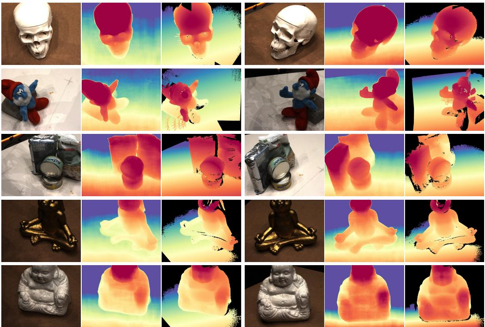  
Figure 12: Indoor monocular depth predictions of GTR-L on the DTU Robot Image Data Set (Jensen et al., 2014). Each three-column group shows the input RGB image, GTR-L prediction, and reference depth obtained by projecting the calibrated DTU point cloud. Black regions in the reference maps contain no valid projected depth.

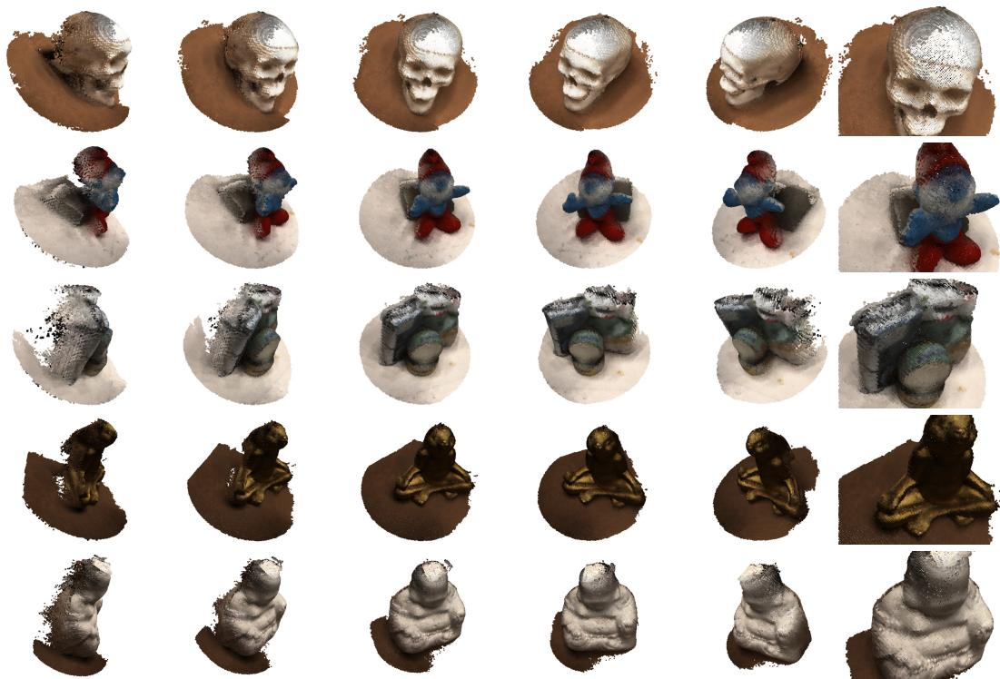  
Figure 13: Colored point clouds reconstructed from zero-shot GTR-L depth predictions on DTU (Jensen et al., 2014). Before fusion, each view is scale-aligned using the projected structuredlight reference.

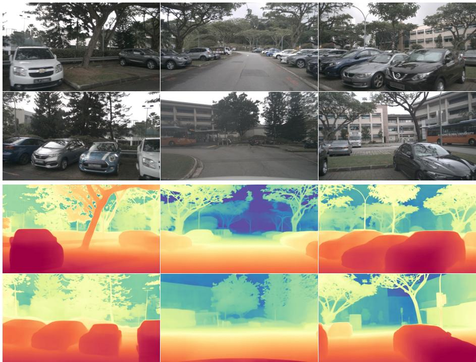  
Figure 14: Outdoor monocular depth predictions of GTR-L on nuScenes (Caesar et al., 2020) (set 1). The first two rows show the six surround-view RGB images, and the last two rows show the corresponding predictions in the same row-major order.

## F.5.2 OUTDOOR NUSCENES RESULTS

Surround-view depth. Figures 14–16 show GTR-L predictions for the six synchronized surroundview cameras in three nuScenes scenes. Each figure preserves the camera ordering between the RGB grid and the corresponding depth grid, covering daytime, nighttime, and roadside construction imagery without nuScenes-specific fine-tuning.

Temporally fused local maps. To visualize multi-frame geometric consistency, for each reference time t, we aggregate all available frames within [t − 4 s, t + 4 s]. For each frame, we scale-align the GTR-L depth prediction using a single scalar estimated from the corresponding LiDAR measurements, back-project the corrected depth with the camera intrinsics, and transform the resulting points into a common coordinate frame using the calibrated pose. We then fuse all observations with TSDF (Curless & Levoy, 1996) to obtain a local map. Figures 17 and 18 show two examples from perspective and bird’s-eye views. Since LiDAR is used only for per-frame scale alignment, these results qualitatively illustrate geometric consistency after scale correction.

## F.6 ORIENTED OBJECT DETECTION RESULTS

Oriented localization. Figure 19 shows the GTR-X predictions in the DOTA-v1.0 test images. The oriented boxes track ships and vehicles at various angles and remain separated in densely packed harbor and road scenes, complementing the quantitative results in Table 10.

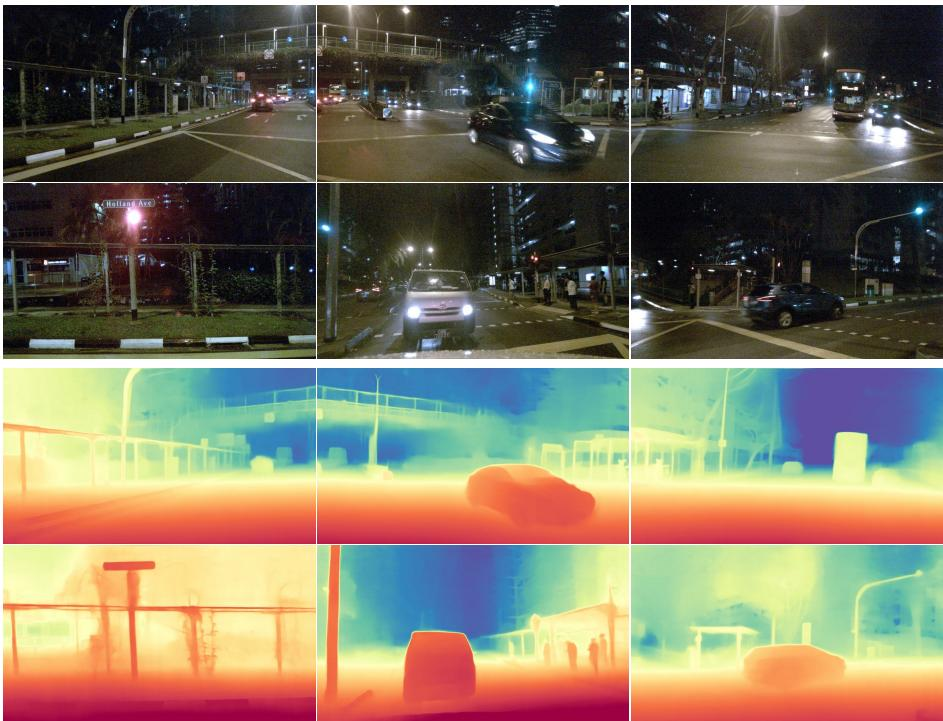  
Figure 15: Outdoor monocular depth predictions of GTR-L on nuScenes (Caesar et al., 2020) (set 2). RGB inputs occupy the first two rows and their corresponding predictions occupy the last two rows in the same row-major order.

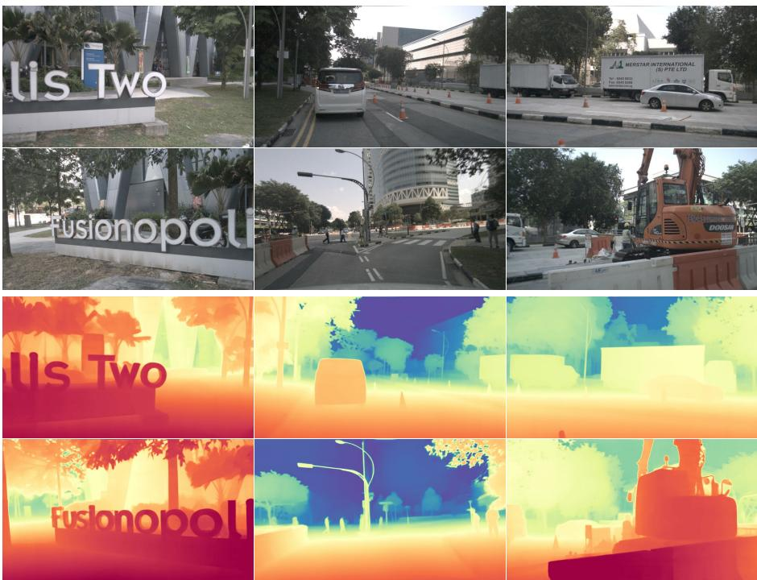  
Figure 16: Outdoor monocular depth predictions of GTR-L on nuScenes (Caesar et al., 2020) (set 3). The layout follows Figure 14: six RGB inputs are followed by their six corresponding depth predictions.

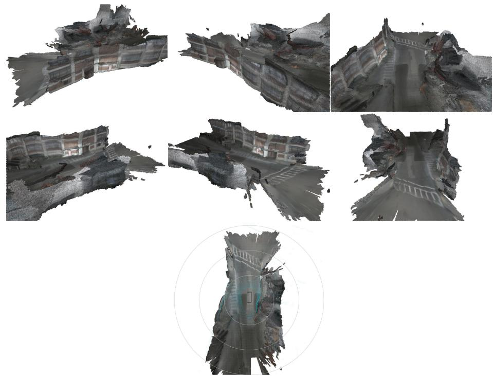  
Figure 17: Temporally fused local reconstruction on nuScenes (Caesar et al., 2020) (scene 1). Each frame uses LiDAR-assisted scale alignment before TSDF fusion.

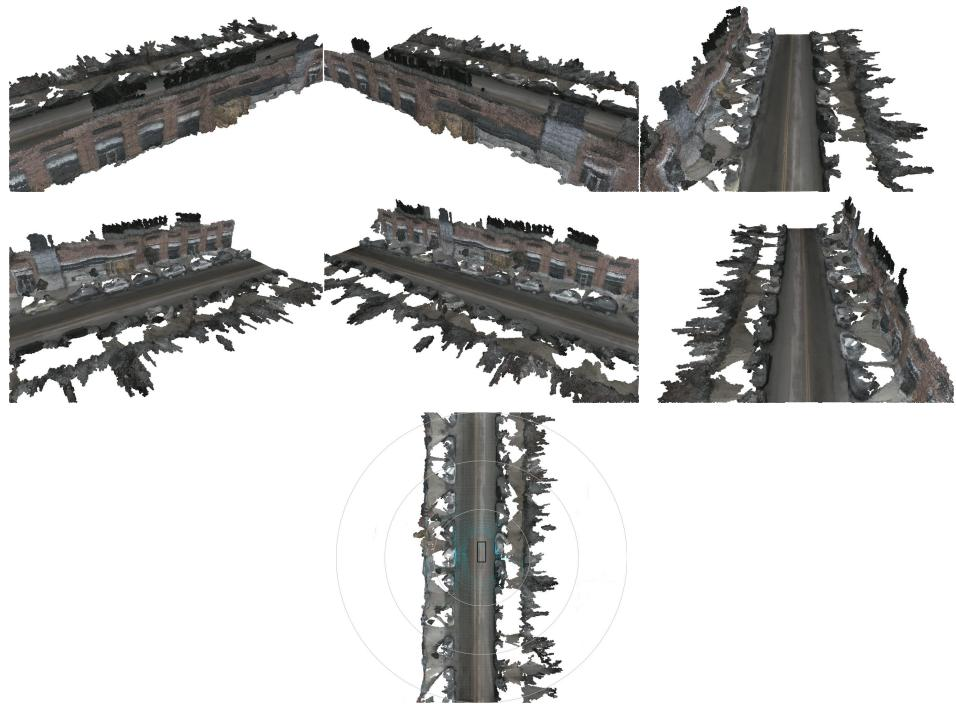  
Figure 18: Temporally fused local reconstruction on nuScenes (Caesar et al., 2020) (scene 2). Each frame uses LiDAR-assisted scale alignment before TSDF fusion.

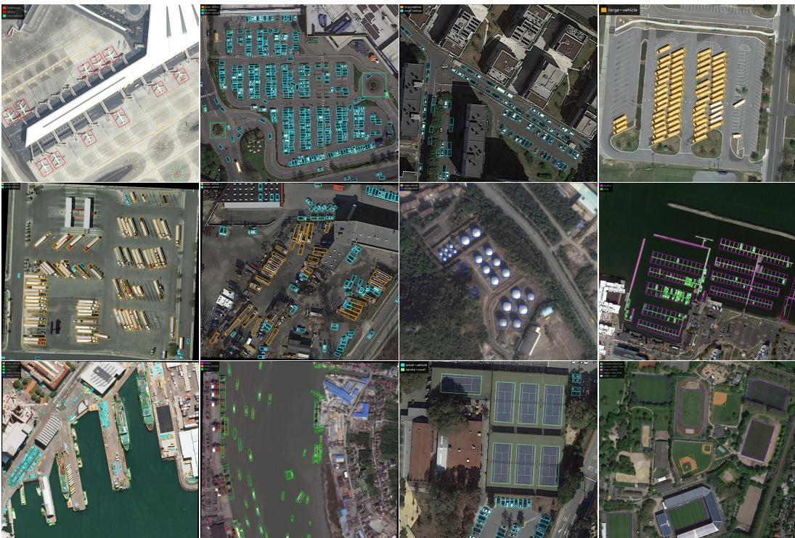  
Figure 19: Qualitative oriented object detection results on the DOTA-v1.0 (Xia et al., 2018) test set using GTR-X.