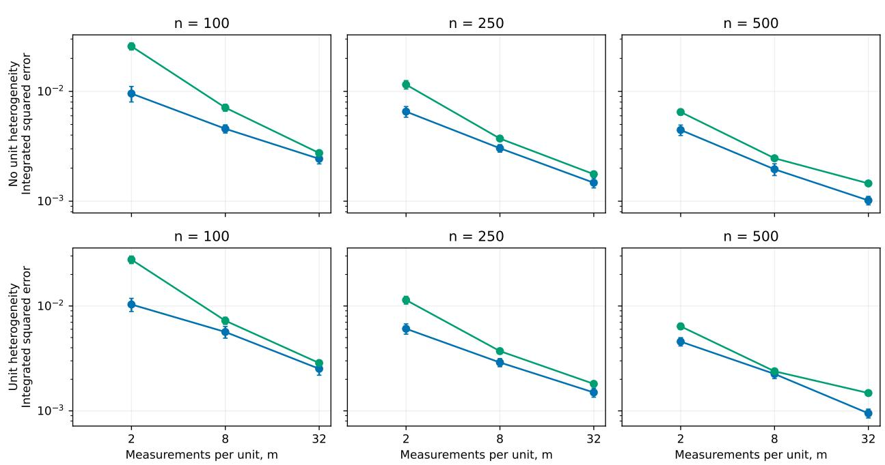
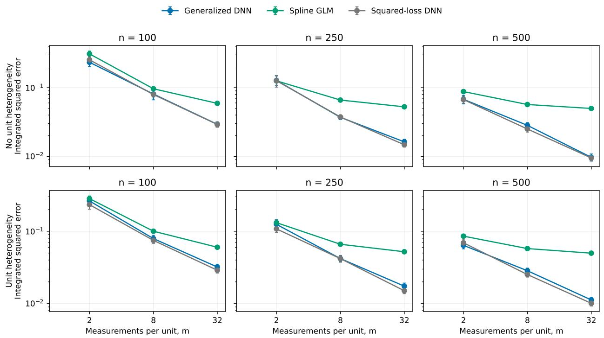
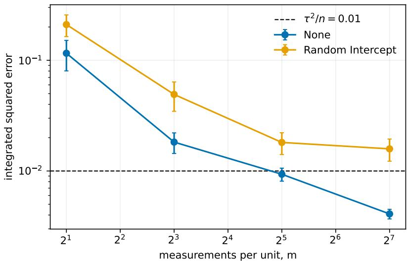
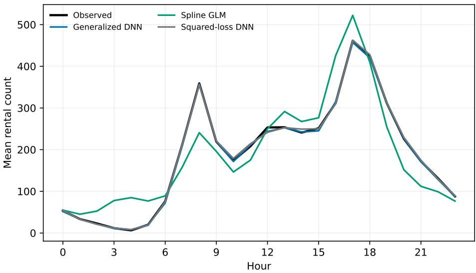

# Generalized Deep Regression for Repeated Measurements

Kexuan Li

Bristol Myers Squibb

[kexuan.li.77@gmail.com]

## Abstract

In this paper, we study the estimation of a marginal regression function from independent units with repeated binary, count, or continuous responses using ReLU deep neural networks. In the model, we assume that the dependence is generated by an unobserved random mean function within each unit. We then fit a neural network with a convex generalized regression loss. We show an oracle inequality by separating conditional measurement variation from between-unit variation. In addition, we prove that with n units and m measurements per unit, ReLU networks can attain an integrated mean squared error of order $n ^ { - 1 } + ( n m ) ^ { - 2 \beta / ( 2 \beta + d ) }$ , up to logarithmic factors, over $\beta { \mathrm { - H } } \mathrm { \ddot { o l d e r } }$ classes. We also derive a weighted oracle inequality for unequal cluster sizes and a rate for compositionally smooth functions. For pointwise ensemble inference, we give a projection central limit theorem and prove infinitesimal jackknife consistency under an explicit asymptotic linearity condition. Simulations and real data examples are provided to support our theoretical findings and practical implications.

## 1 Introduction

Repeated outcomes arise in longitudinal studies, digital health measurements, panel data, functional data, and experiments that record several responses from each independent unit (Diggle, 2002; Baltagi, 2021; Ramsay and Silverman, 1997). For example, a patient may be examined at a sequence of visits, a household may be surveyed over several years, and a wearable device may record many measurements from the same user, etc.. In each case, units can reasonably be treated as independent, whereas observations from the same unit remain dependent. Among these, a basic objective is to estimate the marginal mean of a response as a function of covariates. In practice, the relationship of the response and the covariates could be complex and nonlinear with interaction. At the same time, the response could be continuous, binary, or count data.

Classical methods address this within unit dependence in several ways. To name a few, linear and generalized linear mixed models represent heterogeneity through random efects, while generalized estimating equations target marginal regression parameters using a working correlation model (Laird and Ware, 1982; Liang and Zeger, 1986). Kernel and spline methods allow the marginal mean to vary nonparametrically and can incorporate within-subject correlation (Wang, 2003). In functional data analysis, the efect of sampling frequency has been studied through minimax theory for discretely observed random functions. This work identified transitions between sparse and dense designs and showed that suficiently dense sampling eventually leaves the number of independent curves as the limiting factor (Cai and Yuan, 2011; Zhang and Wang, 2016). Even these methods provide efective analyses for low dimensional covariates or specified basis structures, their use becomes more dificult when the true unknown regression function contains interactions, or unknown complex structure.

In recent years, deep neural networks have attracted considerable attention because of their ability to represent complex structures and have been applied in areas including computer vision and natural language processing (LeCun et al., 2015), drug discovery (Chen et al., 2018), and environmental and Earth system science (Reichstein et al., 2019). Besides its successful applications, there has also been great progress on theoretical development of deep learning in statistical literature. Approximation results for ReLU networks showed that depth can exploit smoothness and compositional structure (Yarotsky, 2017). Schmidt-Hieber (2020) developed nonparametric risk bounds for sparse ReLU networks and showed that the estimator can adapt to hierarchical composition models under independent sampling. Farrell et al. (2021) established estimation rates for deep empirical risk minimizers and used them to support inference on low-dimensional parameters. Related ideas have since been adapted to statistical models with specialized losses and dependence structures. Examples include partially linear Cox regression (Zhong et al., 2022), partially linear quantile regression (Zhong and Wang, 2024), semiparametric spatial regression (Li et al., 2023), and calibration of nonlinear ordinary diferential equations from noisy observations (Li et al., 2024), etc. This literature provides theory for deep estimators in a range of statistical settings, but generalized responses and repeated measurements have largely been studied along separate lines.

The present paper is motivated by two recent developments that address these lines separately. Yan et al. (2025) studied least-squares deep regression for repeated continuous measurements. Their analysis accommodates arbitrary sampling frequency, establishes the rate transition between sparse and dense designs, and develops results for several low-intrinsic-dimensional function classes. In a diferent direction, Meng and Li (2026) studied generalized nonparametric regression with independent observations. They derived error bounds for deep network estimators and proposed an ensemble subsampling method for pointwise inference on categorical and exponential-family means. These results leave open the marginal nonparametric problem in which generalized responses are repeatedly observed from the same units.

To fill this gap, we consider the estimation of the regression function with generalized response using deep neural networks. Specifically, we assume that each unit is independent and the dependence is captured with unit-specific random mean functions. Conditional on these functions, the repeated responses follow a generalized mean model; the distribution of the random functions is otherwise left unspecified. The population target is the marginal mean function, estimated by minimizing a pooled convex generalized regression loss over a class of ReLU networks. The resulting oracle inequality separates a between-unit term from a conditional measurement term. For n units with m measurements per unit and a β-H¨older target on [0, 1]d, the integrated squared error is of order

$$
n ^ { - 1 } + ( n m ) ^ { - 2 \beta / ( 2 \beta + d ) } ,
$$

up to logarithmic factors. Matching lower bounds for Bernoulli, Poisson, and Gaussian submodels show that the two components reflect distinct sources of information. We also give a weighted oracle inequality for unequal cluster sizes and rates for compositionally smooth functions. For pointwise inference, we study ensembles formed by subsampling complete units. A projection central limit theorem and consistency of the infinitesimal jackknife covariance estimator are established under stated bias and asymptotic-linearity conditions.

The remainder of the paper is organized as follows. Section 2 introduces the repeatedmeasurement model and the marginal target. Section 3 defines the network estimator. Section 4 gives the oracle inequalities, convergence rates, and minimax lower bounds. Section 5 develops unit-subsampling inference. Section 6 presents the numerical study and a real data application. Proofs are collected in the appendix.

Notation. For two nonnegative sequences $a _ { n }$ and $b _ { n }$ , write $a _ { n } \lesssim b _ { n } { \mathrm { ~ i f ~ } } a _ { n } \lesssim C b _ { n }$ for a constant C independent of $n ,$ and write $a _ { n } \asymp b _ { n }$ when both $a _ { n } \lesssim b _ { n }$ and $b _ { n } \lesssim a _ { n }$ hold. The symbols E, P, Var, and Cov denote expectation, probability, variance, and covariance. For a measurable function $^ { g , }$ let $\| g \| _ { \infty }$ be its supremum norm, $\begin{array} { r } { \| g \| _ { P _ { X } } ^ { 2 } = \int g ^ { 2 } d P _ { X } } \end{array}$ , and $\langle g , h \rangle = \textstyle \int g h d P _ { X }$ . Constants denoted by c or $C$ may change from line to line.

## 2 Model and marginal target

## 2.1 Observations and within-unit dependence

Suppose we are given n independent units and each unit i has $m _ { i }$ measurements, indexed by $j = 1 , \dots , m _ { i }$ . For the unit $i ,$ at measurement $j ,$ the covariate vector is $X _ { i j } \in \mathcal { X } = [ 0 , 1 ] ^ { d }$ , where $d$ is the covariate dimension, and the response is $Y _ { i j }$ . The response may be binary, a nonnegative count, or continuous. Write the complete record for unit i as

$$
{ \mathcal O } _ { i } = \{ ( X _ { i j } , Y _ { i j } ) : 1 \le j \le m _ { i } \} , \qquad i = 1 , \ldots , n .
$$

The cluster sizes $m _ { i } \geq 1$ are deterministic and may vary with n. The total number of observations is $\begin{array} { r } { N = \sum _ { i = 1 } ^ { n } m _ { i } ; } \end{array}$ in a balanced design, $m _ { i } = m$ and $N = n m$

Let M be a jointly measurable random function on $x ,$ and let $M _ { 1 } , \dots , M _ { n }$ be independent copies of $M$ . The value $M _ { i } ( x )$ is the conditional response mean for unit i at covariate value x. Let $P _ { X }$ denote the common probability distribution of the covariates on $\mathcal { X } .$ , and let $Q _ { M _ { i } , x }$ denote the conditional probability distribution of a response given $M _ { i }$ and $X _ { i j } = x$ . Given $M _ { 1 } , \ldots , M _ { n } $ , the pairs $( X _ { i j } , Y _ { i j } )$ are independent across all (i, j) and satisfy

$$
X _ { i j } \sim P _ { X } , \qquad Y _ { i j } \mid ( X _ { i j } = x , M _ { i } ) \sim Q _ { M _ { i } , x } , \qquad \int y d Q _ { M _ { i } , x } ( y ) = M _ { i } ( x ) .\tag{1}
$$

The covariates are independent of the random functions. The same map $( M _ { i } , x ) \mapsto Q _ { M _ { i } , x }$ is used at every measurement and in every unit. Responses within a unit share $M _ { i }$ and are therefore generally dependent after averaging over that random function. The distribution of M describes heterogeneity between units.

Below, (M, X, Y) denotes a generic draw from this mechanism: first draw M, then draw $X \sim P _ { X }$ independently of M, and finally draw $Y \mid ( M , X = x ) \sim Q _ { M , x }$ . Expectations without a conditioning variable average over all the randomness in this draw, or in the observed sample when an estimator is involved.

## 2.2 Marginal mean and loss

Define the population marginal mean $\mu _ { 0 } : \mathcal { X } \to \mathbb { R }$ and the unit-specific deviation $U _ { i } : \mathcal { X } $ R by

$$
\mu _ { 0 } ( x ) = \mathbb { E } M ( x ) , \qquad U _ { i } ( x ) = M _ { i } ( x ) - \mu _ { 0 } ( x ) .
$$

Write $U = M - \mu _ { 0 }$ for a generic copy of $U _ { i }$ . Thus $\mathbb { E } U ( x ) = 0$ and $\mathbb { E } ( Y _ { i j } \mid X _ { i j } = x ) = \mu _ { 0 } ( x )$ . The problem considered in this paper is to estimate the marginal mean function $\mu _ { 0 }$ from through deep neural networks.

We represent $\mu _ { 0 }$ through an unknown real-valued regression function $f _ { 0 }$ and a known function b, and define the loss ℓ by

$$
\mu _ { 0 } ( x ) = b ^ { \prime } \{ f _ { 0 } ( x ) \} , \qquad \ell ( y , t ) = b ( t ) - y t ,\tag{2}
$$

where $b ^ { \prime }$ denotes the derivative of $b , y$ is a response value, and t is a candidate value of the regression function on the link scale. The curvature condition below makes $b ^ { \prime }$ strictly increasing on the relevant interval, so that $f _ { 0 } = ( b ^ { \prime } ) ^ { - 1 } \circ \mu _ { 0 }$ is well defined there. For logistic, Poisson, and squared-error losses, respectively,

$$
b ( t ) = \log ( 1 + e ^ { t } ) , \qquad b ( t ) = e ^ { t } , \qquad b ( t ) = t ^ { 2 } / 2 .
$$

These choices give $\mu _ { 0 } ( x ) = \{ 1 { + } \mathrm { e x p } [ { - } f _ { 0 } ( x ) ] \} ^ { - 1 } , \mu _ { 0 } ( x ) = \mathrm { e x p } \{ f _ { 0 } ( x ) \}$ , and $\mu _ { 0 } ( x ) = f _ { 0 } ( x )$ , respectively. The estimation bounds use the conditional mean in (1) and the moment assumptions below. The lower bounds use Bernoulli, Poisson, and Gaussian conditional distributions.

For a measurable real-valued function v on $\mathcal { X } _ { : }$ , write $\begin{array} { r } { \| v \| _ { P _ { X } } ^ { 2 } = \int _ { \mathcal { X } } v ( x ) ^ { 2 } d P _ { X } ( x ) } \end{array}$ and $\| v \| _ { \infty } =$ $\operatorname* { s u p } _ { x \in \mathcal { X } } | v ( x ) |$ . The space $L _ { 2 } ( P _ { X } )$ consists of functions with finite $\| v \| _ { P _ { X } }$ , with functions identified when they agree $P _ { X }$ -almost everywhere. Its inner product is $\begin{array} { r } { \langle v , w \rangle = \int _ { \mathcal { X } } v ( x ) w ( x ) d P _ { X } ( x ) } \end{array}$

## 2.3 Regularity conditions and score variance

The following assumption bounds the link-scale regression function, the variation of the unit-specific means, and the conditional response noise.

Assumption 2.1. There are constants $F > 0 , C _ { U } < \infty , \sigma < \infty , K _ { \epsilon } < \infty$ , and $0 < \kappa _ { - } \leq \kappa _ { + } < \infty$ such that

$$
\| f _ { 0 } \| _ { \infty } \le F , \quad \kappa _ { - } \le b ^ { \prime \prime } ( t ) \le \kappa _ { + } ( | t | \le F ) , \quad \| U _ { i } \| _ { \infty } \le C _ { U } \quad a l m o s t s u r e l y .
$$

The function $b$ is twice continuously diferentiable on a neighborhood of $[ - F , F ]$ . Define

$$
\tau ^ { 2 } = \mathbb { E } \| U _ { i } \| _ { P _ { X } } ^ { 2 } .
$$

The centered errors $\epsilon _ { i j } = Y _ { i j } - M _ { i } ( X _ { i j } )$ satisfy

$$
\mathbb { E } ( | \epsilon _ { i j } | ^ { k } \mid X _ { i j } , M _ { i } ) \leq \frac { k ! } { 2 } \sigma ^ { 2 } K _ { \epsilon } ^ { k - 2 } , \qquad k \geq 2 .\tag{3}
$$

Here F bounds $f _ { 0 } , C _ { U }$ bounds the unit deviations, and $\kappa _ { - }$ and $\kappa _ { + }$ bound the curvature of the loss. The constants $\sigma ^ { 2 }$ and $K _ { \epsilon }$ control the conditional moments of $\epsilon _ { i j } ;$ in particular, $\sigma ^ { 2 }$ is an upper bound on its conditional variance. The quantity

$$
\tau ^ { 2 } = \int _ { \chi } \mathrm { V a r } \{ M ( x ) \} d P _ { X } ( x )
$$

measures integrated between-unit variation. The conditional mean of $\epsilon _ { i j }$ is zero. Bernoulli responses satisfy (3), as do Poisson responses with uniformly bounded conditional means and Gaussian errors with fixed variance. The constants in Assumption 2.1 are uniform as n and the $m _ { i }$ vary.

For a deterministic measurable candidate $f : \mathcal { X }  [ - F , F ]$ , define the excess population risk by

$$
\mathscr { R } ( f ) = \mathbb { E } \{ \ell ( Y , f ( X ) ) - \ell ( Y , f _ { 0 } ( X ) ) \} ,
$$

where $( X , Y )$ has the generic marginal distribution defined above. For a random estimator ${ \widehat { f } } , \mathcal { R } ( { \widehat { f } } )$ and $\| \widehat { f } - f _ { 0 } \| _ { P _ { X } } ^ { 2 }$ evaluate the fitted function against this population distribution, and their outer expectations average over the training sample.

Proposition 2.2 (Identification and curvature). Under Assumption ${ \it 2 . 1 , }$ for every measurable f with $\| f \| _ { \infty } \leq F$ 2

$$
\frac { \kappa _ { - } } { 2 } \| f - f _ { 0 } \| _ { P _ { X } } ^ { 2 } \le \mathcal { R } ( f ) \le \frac { \kappa _ { + } } { 2 } \| f - f _ { 0 } \| _ { P _ { X } } ^ { 2 } , \qquad \| b ^ { \prime } ( f ) - \mu _ { 0 } \| _ { P _ { X } } ^ { 2 } \le \kappa _ { + } ^ { 2 } \| f - f _ { 0 } \| _ { P _ { X } } ^ { 2 } .\tag{4}
$$

Thus $f _ { 0 }$ is the unique population minimizer in this range, up to $P _ { X }$ -null sets.

Let $q _ { i } \geq 0$ be a deterministic weight assigned to unit i, with $\textstyle \sum _ { i = 1 } ^ { n } q _ { i } = 1$ . Each observation within that unit receives weight $q _ { i } / m _ { i }$ . Equal-unit weighting uses $q _ { i } = 1 / n$ , whereas equal-observation weighting uses $q _ { i } = m _ { i } / N$ . For a fixed test function $w \in L _ { 2 } ( P _ { X } )$ , define the weighted residual score

$$
S _ { q , w } = \sum _ { i = 1 } ^ { n } \frac { q _ { i } } { m _ { i } } \sum _ { j = 1 } ^ { m _ { i } } \{ Y _ { i j } - \mu _ { 0 } ( X _ { i j } ) \} w ( X _ { i j } ) .
$$

Proposition 2.3 (Score variance). Under Assumption 2.1,

$$
\mathrm { V a r } ( S _ { q , w } ) = A _ { w } \sum _ { i } q _ { i } ^ { 2 } + D _ { w } \sum _ { i } \frac { q _ { i } ^ { 2 } } { m _ { i } } ,\tag{5}
$$

where

$$
A _ { w } = \mathrm { V a r } \{ \langle U , w \rangle \} , \qquad D _ { w } = \mathbb { E } \big [ \mathrm { V a r } \big ( \{ Y - \mu _ { 0 } ( X ) \} w ( X ) \mid M \big ) \big ] .
$$

Here $A _ { w }$ is the variance of the unit-level conditional score mean, and $D _ { w }$ is the average conditional variance of one measurement score. Both are finite under Assumption 2.1. For $m _ { i } = m$ and $q _ { i } = 1 / n$ , (5) becomes $A _ { w } / n + D _ { w } / ( n m )$

The design in (1) describes random covariate locations independent of unit heterogeneity. Common scheduled visits, covariates shared across all measurements of a unit, and informative visit processes require corresponding changes to the design assumptions.

## 3 Network estimator

## 3.1 The network class

Let $\varrho ( t ) = \operatorname* { m a x } \{ t , 0 \}$ be the rectified linear unit (ReLU) activation, applied coordinatewise to vectors. A feedforward network with $L \geq 1$ hidden layers has width vector

$$
\mathbf { p } = ( p _ { 0 } , p _ { 1 } , \ldots , p _ { L } , p _ { L + 1 } ) , \qquad p _ { 0 } = d , \quad p _ { L + 1 } = 1 .
$$

Thus $p _ { \ell }$ is the number of neurons in hidden layer ℓ for $\ell = 1 , \ldots , L$ . For each $\ell = 1 , \ldots , L + 1$ , let $W _ { \ell } \in \mathbb { R } ^ { p _ { \ell } \times p _ { \ell - 1 } }$ be a weight matrix and $a _ { \ell } \in \mathbb { R } ^ { p _ { \ell } }$ a bias vector. Write θ for the vector formed by all entries of these matrices and vectors. The network is defined recursively by

$$
z _ { 0 } ( x ) = x ,
$$

$$
z _ { \ell } ( x ) = \varrho \{ W _ { \ell } z _ { \ell - 1 } ( x ) + a _ { \ell } \} , \ell = 1 , \ldots , L ,
$$

$$
f _ { \theta } ^ { \mathrm { r a w } } ( x ) = W _ { L + 1 } z _ { L } ( x ) + a _ { L + 1 } .
$$

The output layer is scalar and afine. Define the clipping map

$$
\begin{array} { r } { \mathrm { c l i p } _ { F } ( t ) = \operatorname* { m a x } \{ - F , \operatorname* { m i n } \{ t , F \} \} , \qquad f _ { \theta } ( x ) = \mathrm { c l i p } _ { F } \{ f _ { \theta } ^ { \mathrm { r a w } } ( x ) \} . } \end{array}
$$

Here F is the bound in Assumption 2.1. Clipping is a fixed output operation and introduces no trainable parameters.

For an integer sparsity budget $s \geq 0$ and a parameter bound $B > 0$ , define

$$
\mathcal { F } ( L , { \bf p } , s , B , F ) = \{ f _ { \boldsymbol { \theta } } : \ \| \boldsymbol { \theta } \| _ { 0 } \leq s , \ \| \boldsymbol { \theta } \| _ { \infty } \leq B \} .
$$

The quantity $\| \theta \| _ { 0 }$ counts the nonzero entries of $\theta ,$ including both weights and biases, and $\| \theta \| _ { \infty }$ is the largest absolute parameter value. Consequently, L and p specify the architecture, s restricts the number of active parameters, B restricts their magnitudes, and F bounds the fitted link-scale function. The zero pattern is allowed to vary within the class. A network with fewer active connections is represented by setting the remaining weights to zero.

## 3.2 Weighted empirical risk minimization

We use $\mathcal { F }$ as shorthand for a chosen deterministic class $\mathcal { F } ( L , \mathbf { p } , s , B , F )$ . Its architecture and parameter bounds may depend on the sample sizes. The oracle inequality in Section 4 also applies to other function classes satisfying its stated conditions.

For the unit weights $q _ { i }$ defined in Section 2, define the weighted empirical loss by

$$
\widehat { L } _ { q } ( f ) = \sum _ { i } \frac { q _ { i } } { m _ { i } } \sum _ { j } \{ b ( f ( X _ { i j } ) ) - Y _ { i j } f ( X _ { i j } ) \} .\tag{6}
$$

Let ${ \widehat { f } } \in { \mathcal { F } }$ be a measurable approximate minimizer satisfying

$$
\widehat { L } _ { q } ( \widehat { f } ) \leq \operatorname* { i n f } _ { f \in \mathcal { F } } \widehat { L } _ { q } ( f ) + \Delta , \qquad \Delta \geq 0 , \quad \mathbb { E } \Delta < \infty .\tag{7}
$$

The nonnegative, possibly random variable $\Delta$ measures the optimization error relative to the smallest empirical loss in $\mathcal { F } ; \Delta = 0$ corresponds to an exact minimizer. The marginal mean estimator is ${ \widehat { \mu } } ( x ) = b ^ { \prime } \{ { \widehat { f } } ( x ) \}$ . For a fixed finite architecture with bounded parameters, the parameter set is a finite union of compact sets, so the empirical minimum exists. We use a measurable minimizer or measurable approximate minimizer. The parameter representation also makes the suprema in the proofs measurable.

## 3.3 Class complexity and weights

For $\varepsilon > 0$ , let $N ( \varepsilon , \mathcal { F } , \| \cdot \| _ { \infty } )$ be the smallest number of functions $f _ { 1 } , \ldots , f _ { K } \in \mathcal { F }$ such that every $f \in { \mathcal { F } }$ satisfies min $\begin{array} { r } { \lvert \underline { { \le k } } \le K \left. \underline { { f } } - f _ { k } \right. _ { \infty } \le \varepsilon } \end{array}$ . This is the covering number of $\mathcal { F }$ in the uniform norm. Its logarithm,

$$
H ( \varepsilon ) = \log N ( \varepsilon , \mathcal { F } , \| \cdot \| _ { \infty } ) ,
$$

is the metric entropy at resolution ε. The symbol N with these three arguments denotes a covering number; the scalar $\begin{array} { r } { N = \sum _ { i } m _ { i } } \end{array}$ denotes the total sample size. All logarithms are natural.

Three summaries of the observation weights enter the risk bounds:

$$
A _ { q } = \sum _ { i } q _ { i } ^ { 2 } , \qquad V _ { q } = \sum _ { i } \frac { q _ { i } ^ { 2 } } { m _ { i } } , \qquad w _ { q } = \operatorname * { m a x } _ { i } \frac { q _ { i } } { m _ { i } } .\tag{8}
$$

The quantities $A _ { q }$ and $V _ { q }$ occur in the exact score variance. The quantity $w _ { q }$ controls the linear term in the conditional Bernstein inequality.

## 4 Estimation bounds

## 4.1 Oracle inequality

The bound below separates approximation error, between-unit variation, conditional measurement variation, and optimization error. Uniform separability means that $\mathcal { F }$ has a countable dense subset in the uniform norm; the finite-architecture network classes above have this property.

Theorem 4.1 (Weighted oracle inequality). Suppose (1) and Assumption 2.1 hold, $\mathcal { F }$ is nonempty, separable in the uniform norm, and uniformly bounded by $F ,$ , and $H ( \varepsilon ) < \infty$ . Then the estimator in

(7) satisfies, for $0 < \varepsilon \le 1$

$$
\begin{array} { r l } & { \mathbb { E } \| \widehat { f } - f _ { 0 } \| _ { P _ { X } } ^ { 2 } \leq C \bigg [ \underset { f \in \mathcal { F } } { \operatorname* { i n f } } \| f - f _ { 0 } \| _ { P _ { X } } ^ { 2 } + \tau ^ { 2 } A _ { q } } \\ & { \qquad + ( V _ { q } + w _ { q } ) \{ H ( \varepsilon ) + 1 \} + \varepsilon + \mathbb { E } \Delta \bigg ] . } \end{array}\tag{9}
$$

The same bound holds for $\mathbb { E } \| \widehat { \mu } - \mu _ { 0 } \| _ { P _ { X } } ^ { 2 }$ , with a diferent constant. The constants depend on $F , C _ { U } , \sigma , K _ { \epsilon } , b , \kappa _ { - }$ and $\kappa _ { + }$ , but not on $n , m _ { i } , q _ { i }$ , or the class complexity.

Theorem 4.1 holds for a general covariate distribution $P _ { X }$ . The proof uses a finite net for the conditionally independent measurement process and a Hilbert-space bound for the unit process. The latter is

$$
\mathbb { E } \left. \sum _ { i } q _ { i } U _ { i } \right. _ { P _ { X } } ^ { 2 } = \tau ^ { 2 } A _ { q } .
$$

Thus the between-unit contribution is $\tau ^ { 2 } A _ { q } ,$ while the class entropy enters the conditional measurement term. The infimum in (9) is the squared approximation error for $f _ { 0 }$ over ${ \mathcal F } .$

Corollary 4.2 (Balanced measurements). For $m _ { i } = m , q _ { i } = 1 / n$ , and $N = n m$

$$
\mathbb { E } \Vert \widehat { \mu } - \mu _ { 0 } \Vert _ { P _ { X } } ^ { 2 } \leq C \left[ \operatorname* { i n f } _ { f \in \mathcal { F } } \Vert f - f _ { 0 } \Vert _ { P _ { X } } ^ { 2 } + \frac { \tau ^ { 2 } } { n } + \frac { H ( \varepsilon ) + 1 } { N } + \varepsilon + \mathbb { E } \Delta \right] .\tag{10}
$$

## 4.2 Unequal cluster sizes

Theorem 4.1 treats unequal deterministic $m _ { i }$ without a comparability restriction. For equal-unit weights, define

$$
m _ { H } = \left( \frac { 1 } { n } \sum _ { i } m _ { i } ^ { - 1 } \right) ^ { - 1 } , \qquad m _ { \operatorname* { m i n } } = \operatorname* { m i n } _ { 1 \leq i \leq n } m _ { i } , \qquad m _ { \operatorname* { m a x } } = \operatorname* { m a x } _ { 1 \leq i \leq n } m _ { i } .
$$

Here $m _ { H }$ is the harmonic mean of the cluster sizes, and $m _ { \mathrm { m i n } }$ and $m _ { \mathrm { m a x } }$ are their minimum and maximum. Equal-observation weighting assigns $q _ { i } = m _ { i } / N$ , with $N = \textstyle \sum _ { i } m _ { i }$

Corollary 4.3 (Two weighting choices). The stochastic terms in (9) take the following forms:

$$
q _ { i } = 1 / n : \quad \frac { \tau ^ { 2 } } { n } + \left( \frac { 1 } { n m _ { H } } + \frac { 1 } { n m _ { \mathrm { m i n } } } \right) \{ H ( \varepsilon ) + 1 \} ,\tag{11}
$$

$$
q _ { i } = m _ { i } / N : ~ \tau ^ { 2 } \frac { \sum _ { i } m _ { i } ^ { 2 } } { N ^ { 2 } } + \frac { H ( \varepsilon ) + 1 } { N } ,\tag{12}
$$

up to fixed multiplicative constants.

The harmonic mean describes the measurement variance under equal-unit weighting. The maximum weight remains in our risk bound even for bounded responses, because the measurement locations are random. If $m _ { \mathrm { m a x } } / m _ { \mathrm { m i n } }$ is bounded, the two measurement terms in (11) are comparable. Under equal-observation weighting, the between-unit term can be larger than $\tau ^ { 2 } / n$ . Under (1), both weighting choices have the same population mean target: every marginal measurement has the same law. Informative cluster sizes are not covered by this conclusion.

## 4.3 ReLU rates

Let $\beta > 0$ be a smoothness index, $t \geq 1$ a dimension, and $R > 0$ a radius. On a specified bounded rectangle $D \subset \mathbb { R } ^ { t }$ , write $\beta = k + \alpha$ , where $k = \lceil \beta \rceil - 1$ and $\alpha \in ( 0 , 1 ]$ . For a multi-index $\nu = ( \nu _ { 1 } , \ldots , \nu _ { t } )$ of nonnegative integers, let $\textstyle | \nu | = \sum _ { a = 1 } ^ { t } \nu _ { a }$ and let $D ^ { \nu } g$ denote the corresponding partial derivative, with $D ^ { 0 } g = g$ . The H¨older class $\mathcal { H } _ { t } ^ { \beta } ( R )$ consists of functions with continuous partial derivatives through order k satisfying

$$
\operatorname* { s u p } _ { x \in D } | D ^ { \nu } g ( x ) | \leq R \quad ( | \nu | \leq k ) , \qquad | D ^ { \nu } g ( x ) - D ^ { \nu } g ( y ) | \leq R \| x - y \| _ { \infty } ^ { \alpha } \quad ( | \nu | = k , \ x , y \in D ) .
$$

For vectors, $\| x - y \| _ { \infty } = \operatorname* { m a x } _ { a } { \| x _ { a } - y _ { a } \| }$ . When $k = 0$ , these conditions bound the function itself and its H¨older increments. The domain D is understood from context; for $f _ { 0 } .$ , it is $[ 0 , 1 ] ^ { d }$

Let $q \geq 0$ be a fixed integer specifying $q + 1$ component maps; this composition index is distinct from the unit weights $q _ { i }$ . Consider functions of the form

$$
f _ { 0 } = g _ { q } \circ \cdots \circ g _ { 0 } .\tag{13}
$$

For $u = 0 , \ldots , q$ , the map $g _ { u }$ takes a fixed bounded rectangle in $\mathbb { R } ^ { d _ { u } }$ into the domain of the next map, with $d _ { 0 } = d$ and $d _ { q + 1 } = 1$ . Each coordinate function of $g _ { u }$ depends on at most $t _ { u }$ of its input coordinates, where $1 \le t _ { u } \le d _ { u }$ , and belongs to $\mathcal { H } _ { t _ { u } } ^ { \beta _ { u } } ( R )$ as a function of those coordinates. The index $\beta _ { u } > 0$ specifies its smoothness. The dimensions, radii, and number of maps are fixed as the sample size grows. Define the efective smoothness indices $\beta _ { u } ^ { * }$ and the rate quantity ϕN by

$$
\beta _ { u } ^ { * } = \beta _ { u } \prod _ { v = u + 1 } ^ { q } ( \beta _ { v } \wedge 1 ) , \qquad \phi _ { N } = \operatorname * { m a x } _ { 0 \leq u \leq q } N ^ { - 2 \beta _ { u } ^ { * } / ( 2 \beta _ { u } ^ { * } + t _ { u } ) } .\tag{14}
$$

Here $a \wedge b = \operatorname* { m i n } \{ a , b \}$ , and an empty product equals one, so $\beta _ { q } ^ { * } = \beta _ { q }$ . Let $p _ { \operatorname* { m a x } } = \operatorname* { m a x } _ { 0 \leq \ell \leq L + 1 }$ pℓ be the largest layer width. We use $a _ { N } \lesssim b _ { N }$ for an inequality up to a constant independent of the sample sizes, $a _ { N } \gtrsim b _ { N }$ for the reverse inequality, and $a _ { N } \asymp b _ { N }$ when both hold.

Corollary 4.4 (Network rates). Under the balanced model, suppose $f _ { 0 }$ satisfies (13). For suficiently large fixed constants, choose a network class containing the approximation constructed in Appendix 9, with

$$
L \asymp \log N , \qquad \operatorname* { m i n } _ { 1 \leq u \leq L } p _ { u } \stackrel { \gtrsim } { \sim } N \phi _ { N } , \qquad p _ { \operatorname* { m a x } } \leq C N ^ { c } , \qquad s \asymp N \phi _ { N } \log N , \qquad B _ { 0 } \leq B \leq C N ^ { c } .
$$

Here $N = n m$ $B _ { 0 } > 0$ is a fixed constant determined by the component domains, and $c , C > 0$ in the architecture bounds are fixed constants. $I f \mathbb { E } \Delta \lesssim \phi _ { N }$ , then

$$
\begin{array} { r } { \mathbb { E } \| \widehat { \mu } - \mu _ { 0 } \| _ { P _ { X } } ^ { 2 } \leq C \{ \tau ^ { 2 } / n + \phi _ { N } ( \log N ) ^ { 3 } \} . } \end{array}\tag{15}
$$

In particular, for $f _ { 0 } \in \mathcal { H } _ { d } ^ { \beta } ( R )$ ，

$$
\begin{array} { r } { \mathbb { E } \| \widehat { \mu } - \mu _ { 0 } \| _ { P _ { X } } ^ { 2 } \leq C \{ \tau ^ { 2 } / n + ( n m ) ^ { - 2 \beta / ( 2 \beta + d ) } [ \log ( n m ) ] ^ { 3 } \} . } \end{array}\tag{16}
$$

The approximation input is the scalar ReLU theorem of Schmidt-Hieber (2020, Theorem 5). Appendix 9 gives the componentwise construction, error propagation, and entropy calculation needed here. The rate for the general compositional class is an upper bound; the lower bound below concerns ordinary H¨older classes.

For fixed positive τ , balancing the two polynomial terms in (16) gives $m \asymp n ^ { d / ( 2 \beta ) }$ . Logarithmic factors modify the boundary. This comparison describes the worst-case sampling-frequency transition in the stated class. If $\tau = 0$ , the bound has the ordinary independent-measurement form.

## 4.4 Lower bound

For each response family, we now specify a collection of data-generating distributions over which the minimax risk is taken. Take $P _ { X }$ uniform on $[ 0 , 1 ] ^ { d }$ , fix $\beta , R , F > 0$ , and restrict $f _ { 0 }$ to $\mathcal { H } _ { d } ^ { \beta } ( R )$ and $[ - F , F ]$ . Conditional laws in (1) are Bernoulli with means in $[ c , 1 - c ]$ , Poisson with means in $\displaystyle [ c , C ]$ , or Gaussian with variance one and means in $[ - C _ { G } , C _ { G } ]$ , where $C _ { G } > 0$ . Take $0 < c < 1 / 2$ for Bernoulli and $0 < c < 1 < C$ for Poisson. Fix positive upper bounds on $\| U \| _ { \infty }$ and $\mathbb { E } \Vert U \Vert _ { P _ { X } } ^ { 2 }$ ; the class includes arbitrarily small nonzero random intercepts. Denote the resulting family by $\mathfrak { P } _ { \beta , d } ,$ separately for each response type. All its members satisfy Assumption 2.1 with uniform constants. For $P \in \mathfrak { P } _ { \beta , d } ,$ let $\mu _ { P } ( x ) = \mathbb { E } _ { P } M ( x )$ be its marginal mean, and let $\mathbb { E } _ { P }$ denote expectation under the resulting observed-data law. Here P indexes the full data-generating mechanism, whereas $P _ { X }$ denotes only the covariate distribution.

Theorem 4.5 (H¨older lower bound). For each of these three families and all $n , m \geq 1$ , there is a constant $c _ { 0 } > 0$ , depending only on the fixed class constants, such that

$$
\operatorname* { i n f } _ { \widetilde { \mu } } \operatorname* { s u p } _ { P \in \mathfrak { P } _ { \beta , d } } \mathbb { E } _ { P } \| \widetilde { \mu } - \mu _ { P } \| _ { P _ { X } } ^ { 2 } \geq c _ { 0 } \{ n ^ { - 1 } + ( n m ) ^ { - 2 \beta / ( 2 \beta + d ) } \} .\tag{17}
$$

The infimum is over all measurable estimators $\widetilde { \mu }$ based on the n units and their m measurements per unit. Together with (16), this establishes the H¨older minimax rate up to logarithms.

The proof uses disjoint smooth bumps in an independent-response submodel for the nm term. For the n term, a unit has one of two fixed conditional means. Only the mixing probability changes between alternatives. This keeps the support fixed and makes the information bound independent of m.

## 5 Unit-subsampling inference

## 5.1 Subsample fits and the complete ensemble

Assume balanced measurements, $m _ { i } = m = m _ { n }$ , so that the unit records $\mathcal { O } _ { 1 } , \ldots , \mathcal { O } _ { n }$ are independent and identically distributed for each n. Their common law may vary with n through $m _ { n }$ . Fix $J \geq 1$ evaluation points $\mathbf { x } = ( x _ { 1 } , \dots , x _ { J } )$ in X , with J independent of n. The target vector is

$$
\begin{array} { r } { \boldsymbol { \mu _ { \mathbf { x } } } = ( \mu _ { 0 } ( x _ { 1 } ) , \ldots , \mu _ { 0 } ( x _ { J } ) ) ^ { \mathsf { T } } \in \mathbb { R } ^ { J } , } \end{array}
$$

where the superscript T denotes transpose.

Let $\boldsymbol { r } = \boldsymbol { r } _ { n }$ be the number of complete units used in one subsample fit, with $1 \leq r \leq n$ . Write $T _ { r } ( \mathcal { O } _ { 1 } , \ldots , \mathcal { O } _ { r } ; \omega ) \in \mathbb { R } ^ { J }$ for its vector of fitted marginal means at x. The seed ω represents training randomness and is independent of the records. The training rule is symmetric in distribution: permuting its r unit arguments leaves its distribution over $\omega$ unchanged. An independent uniform random permutation before training provides this symmetry for an order-dependent algorithm.

Throughout this section, $\| \cdot \|$ denotes the Euclidean norm for vectors and $\| \cdot \| _ { \mathrm { o p } }$ the induced operator norm for matrices. For a positive definite matrix A, $A ^ { - 1 / 2 }$ is its symmetric inverse square root. Let $I _ { J }$ be the $J \times J$ identity matrix and $N _ { J } ( 0 , I _ { J } )$ the standard J-dimensional normal distribution. The symbols $\implies \mathrm { a n d }  _ { p }$ denote convergence in distribution and in probability. All limits are taken as $n \to \infty$

Average over training randomness while holding the records fixed to obtain the symmetric kernel

$$
h _ { r } ( o _ { 1 } , \ldots , o _ { r } ) = \mathbb { E } _ { \omega } \{ T _ { r } ( o _ { 1 } , \ldots , o _ { r } ; \omega ) \} .
$$

Its population mean is $\theta _ { r } = \mathbb { E } \{ h _ { r } ( \mathcal { O } _ { 1 } , \ldots , \mathcal { O } _ { r } ) \} \in \mathbb { R } ^ { J }$ . For a possible unit record $^ { O , }$ define the first-order projection kernel and its covariance by

$$
h _ { 1 , r } ( o ) = \mathbb { E } \{ h _ { r } ( o , \mathcal { O } _ { 2 } , \ldots , \mathcal { O } _ { r } ) \} - \theta _ { r } , \qquad \Gamma _ { r } = \mathrm { C o v } \{ h _ { 1 , r } ( \mathcal { O } _ { 1 } ) \} .
$$

The expectation defining $h _ { 1 , r } ( o )$ is over $r - 1$ independent unit records, with o fixed. For $r = 1$ , this means $h _ { 1 , 1 } ( o ) = h _ { 1 } ( o ) - \theta _ { 1 }$ . In particular, $\mathbb { E } h _ { 1 , r } ( { \mathcal { O } } _ { 1 } ) = 0$

For a subset $S \subset \{ 1 , \ldots , n \}$ , write $| S |$ for its cardinality and ${ \mathcal { O } } _ { S }$ for its collection of unit records.

The complete ensemble averages over all $\binom { n } { r }$ subsets of size $r ,$ and its first-order projection is

$$
U _ { n , r } = \binom { n } { r } ^ { - 1 } \sum _ { | S | = r } h _ { r } ( \mathcal { O } _ { S } ) , \qquad L _ { n , r } = \frac { r } { n } \sum _ { i = 1 } ^ { n } h _ { 1 , r } ( \mathcal { O } _ { i } ) .\tag{18}
$$

Define

$$
R _ { n , r } ^ { ( 2 ) } = U _ { n , r } - \theta _ { r } - L _ { n , r } , \qquad V _ { n } = \mathrm { C o v } ( L _ { n , r } ) = \frac { r ^ { 2 } } { n } \Gamma _ { r } .
$$

The vector $R _ { n , r } ^ { ( 2 ) }$ collects the terms of order two and higher in the Hoefding decomposition, and $V _ { n }$ is the covariance of the first-order projection. This decomposition is standard for subsampling ensembles (Hoefding, 1992; Mentch and Hooker, 2016).

## 5.2 Projection limit and base-learner conditions

Theorem 5.1 (Projection central limit theorem). Suppose $\Gamma _ { r }$ is positive definite and, for some $\delta > 0$

$$
n ^ { - \delta / 2 } \mathbb { E } \| \Gamma _ { r } ^ { - 1 / 2 } h _ { 1 , r } ( \mathcal { O } _ { 1 } ) \| ^ { 2 + \delta } \longrightarrow 0 ,\tag{19}
$$

$$
\mathbb { E } \| V _ { n } ^ { - 1 / 2 } R _ { n , r } ^ { ( 2 ) } \| ^ { 2 } \longrightarrow 0 , \qquad \| V _ { n } ^ { - 1 / 2 } ( \theta _ { r } - \mu _ { \mathbf { x } } ) \| \longrightarrow 0 .\tag{20}
$$

Then

$$
V _ { n } ^ { - 1 / 2 } ( U _ { n , r } - \mu _ { \mathbf { x } } ) \implies N _ { J } ( 0 , I _ { J } ) .
$$

A suficient condition for the first requirement in (20) is

$$
\frac { r - 1 } { r ( n - 1 ) } \mathbb { E } \| \Gamma _ { r } ^ { - 1 / 2 } ( h _ { r } - \theta _ { r } ) \| ^ { 2 } \longrightarrow 0\tag{21}
$$

when $2 \leq r \leq n$

Condition (19) is a Lyapunov moment condition for the normalized first-order projection. The two conditions in (20) control the higher-order remainder and the pointwise bias $\theta _ { r } - \mu _ { \mathbf { x } }$ on the same covariance scale.

For covariance estimation, we use an asymptotic linear representation of the subsample fit. In the next assumption, $\psi _ { n } ( o ) \in \mathbb { R } ^ { J }$ denotes the contribution of a single unit record o to that representation, and $R _ { r } \in \mathbb { R } ^ { J }$ is the remainder, including training randomness. Both may depend on n through the sampling design, the subsample size, and the training rule.

Assumption 5.2 (Asymptotic linearity at the evaluation points). For a sequence $r = r _ { n } \to \infty$ and a fixed constant $\rho \in ( 0 , 1 )$ such that $r / n \le \rho$ 2

$$
T _ { r } - \theta _ { r } = \frac { 1 } { r } \sum _ { i = 1 } ^ { r } \psi _ { n } ( \mathcal { O } _ { i } ) + R _ { r } , \qquad \mathbb { E } \psi _ { n } = 0 , \quad \mathbb { E } R _ { r } = 0 .\tag{22}
$$

The single-unit covariance matrix $\Sigma _ { n } = \operatorname { C o v } \{ \psi _ { n } ( \mathcal { O } _ { 1 } ) \} \in \mathbb { R } ^ { J \times J }$ is positive definite, and

$$
r \mathbb { E } \| \Sigma _ { n } ^ { - 1 / 2 } R _ { r } \| ^ { 2 } \longrightarrow 0 , \qquad \frac { 1 } { n } \mathbb { E } \| \Sigma _ { n } ^ { - 1 / 2 } \psi _ { n } ( \mathcal { O } _ { 1 } ) \| ^ { 4 } \longrightarrow 0 .
$$

For inference about $\mu _ { \mathbf { x } }$ , also assume

$$
\sqrt { n } \left\| \Sigma _ { n } ^ { - 1 / 2 } ( \theta _ { r } - \mu _ { \mathbf { x } } ) \right\| \longrightarrow 0 .\tag{23}
$$

The matrix $\Sigma _ { n }$ may change in scale with n. For example, increasing eigenvalues allow the standard error in some directions to decrease more slowly than $n ^ { - 1 / 2 }$ . Assumption 5.2 specifies the stochastic behavior of the base learner, and (23) requires its pointwise bias to be negligible relative to the

standard error. These are additional conditions for inference.

## 5.3 Finite ensembles and covariance estimation

Let $B \geq 2$ be the number of subsample fits in the ensemble. In this section B denotes the ensemble size; the parameter-magnitude bound B in Section 3 is used only in specifying the network class. Conditional on the observed records, draw $S _ { 1 } , \ldots , S _ { B }$ independently and uniformly from the subsets of $\{ 1 , \ldots , n \}$ of size $r < n$ . Each subset contains distinct units, and diferent subsets may overlap or coincide. Use independent training seeds $\omega _ { 1 } , \ldots , \omega _ { B }$ , also independent of the subsets and records. For $b = 1 , \dots , B$ and $i = 1 , \ldots , n$ , set

$$
T _ { b } = T _ { r } ( \mathcal { O } _ { S _ { b } } ; \omega _ { b } ) , \quad Z _ { b i } = 1 ( i \in S _ { b } ) , \quad p = r / n , \quad \overline { { T } } = B ^ { - 1 } \sum _ { b } T _ { b } .
$$

Here $Z _ { b i }$ is the indicator that unit i belongs to subset $S _ { b } , p = r / n$ is its inclusion probability, and $\overline { { T } } \in \mathbb { R } ^ { J }$ is the finite-ensemble prediction. The scalar $p$ is distinct from the network width vector p. Define $\widehat { C } _ { i } \in \mathbb { R } ^ { J }$ as the empirical covariance between the inclusion indicator of unit i and the fitted prediction. Let $a _ { n }$ be the finite-population correction, $\widehat { V } _ { \mathrm { I J } }$ the unadjusted infinitesimal jackknife (IJ) covariance estimate, and $Q _ { b i } \in \mathbb { R } ^ { J }$ the product used in its Monte Carlo correction. Specifically,

$$
\widehat C _ { i } = B ^ { - 1 } \sum _ { b } ( Z _ { b i } - p ) ( T _ { b } - \overline { { { T } } } ) , \qquad a _ { n } = \frac { n - 1 } { n - r } ,\tag{24}
$$

$$
\widehat { V } _ { \mathrm { I J } } = a _ { n } ^ { 2 } \sum _ { i } \widehat { C } _ { i } \widehat { C } _ { i } ^ { \mathsf { T } } ,
$$

$$
Q _ { b i } = ( Z _ { b i } - p ) ( T _ { b } - \overline { { T } } ) ,
$$

$$
D _ { B } = \frac { a _ { n } ^ { 2 } } { B } \sum _ { i } \widehat { \mathrm { C o v } _ { b } } ( Q _ { b i } ) ,
$$

$$
\widehat { V } = [ \widehat { V } _ { \mathrm { I J } } - D _ { B } ] _ { + } + B ^ { - 1 } \widehat { \mathrm { C o v } } _ { b } ( T _ { b } ) .\tag{25}
$$

For vectors $A _ { 1 } , \dots , A _ { B } \in \mathbb { R } ^ { J }$ , sample covariance in these formulas means

$$
\widehat { \mathrm { C o v } _ { b } } ( A _ { b } ) = \frac { 1 } { B - 1 } \sum _ { b = 1 } ^ { B } ( A _ { b } - \overline { { A } } ) ( A _ { b } - \overline { { A } } ) ^ { \mathsf { T } } , \qquad \overline { { A } } = \frac { 1 } { B } \sum _ { b = 1 } ^ { B } A _ { b } .
$$

In $\widehat { \mathrm { C o v } } _ { b } ( Q _ { b i } )$ , the unit index i is held fixed. The matrices $D _ { B } , \widehat { V } _ { \mathrm { I J } }$ , and $\widehat { V }$ are all $J \times J$ . The correction $D _ { B }$ adjusts for finite-B variation in estimating the inclusion covariances (Wager et al., 2014). For a symmetric matrix A, [A]+ replaces negative eigenvalues by zero and retains the eigenvectors. The final term $\widehat { B ^ { - 1 } \mathrm { C o v } _ { b } } ( T _ { b } )$ estimates the conditional Monte Carlo covariance of the ensemble average.

Theorem 5.3 (Infinitesimal jackknife and studentization). Suppose Assumption 5.2 holds and the ensemble size $B = B _ { n }$ satisfies $B / n  \infty$ . Then

$$
\| n \Sigma _ { n } ^ { - 1 / 2 } \widehat { V } _ { \mathrm { I J } } \Sigma _ { n } ^ { - 1 / 2 } - I _ { J } \| _ { \mathrm { o p } } \to _ { p } 0 ,\tag{26}
$$

$$
\| n \Sigma _ { n } ^ { - 1 / 2 } \widehat { V } \Sigma _ { n } ^ { - 1 / 2 } - I _ { J } \| _ { \mathrm { o p } } \to _ { p } 0 .
$$

If (23) holds, then for every nonzero fixed $v \in \mathbb { R } ^ { J }$

$$
\frac { v ^ { \mathsf { T } } ( \overline { { T } } - \mu _ { \mathbf { x } } ) } { ( v ^ { \mathsf { T } } \widehat { V } v ) ^ { 1 / 2 } } \Longrightarrow N ( 0 , 1 ) , \qquad ( \overline { { T } } - \mu _ { \mathbf { x } } ) ^ { \mathsf { T } } \widehat { V } ^ { - 1 } ( \overline { { T } } - \mu _ { \mathbf { x } } ) \Longrightarrow \chi _ { J } ^ { 2 } .
$$

Here $\chi _ { J } ^ { 2 }$ denotes the chi-squared distribution with J degrees of freedom. The vector v specifies a fixed linear contrast of the J marginal means. Covariance consistency in (26) implies that $\widehat { V }$ is invertible with probability tending to one.

This suficient regime makes Monte Carlo variation asymptotically negligible relative to the

sampling covariance $\Sigma _ { n } / n$ . For any finite B, the exact covariance decomposition is

$$
\operatorname { C o v } ( \overline { T } ) = \operatorname { C o v } ( U _ { n , r } ) + B ^ { - 1 } \mathbb { E } \{ \operatorname { C o v } _ { * } ( T _ { b } ) \} ,\tag{27}
$$

Here $\mathrm { C o v } _ { * } ( T _ { b } )$ is the conditional covariance given $\mathcal { O } _ { 1 } , \ldots , \mathcal { O } _ { n } ,$ , averaging over subset selection and training randomness, and the outer expectation averages over the records. Conditional on the records, $\mathbb { E } _ { * } ( T _ { b } ) = U _ { n , r }$ , so (27) follows from the law of total covariance. Theorem 5.3 uses a regime in which the Monte Carlo contribution is asymptotically negligible. A regime in which that contribution is of leading order also requires a conditional limit theorem.

The pointwise bias condition (23) concerns accuracy at the fixed evaluation points. To illustrate the distinction from integrated error, fix an interior point $x _ { 0 } \in ( 0 , 1 ) ^ { d }$ and let $h > 0$ tend to zero. Define

$$
v _ { h } ( x ) = ( 1 - \| x - x _ { 0 } \| _ { \infty } / h ) _ { + }
$$

where $( t ) _ { + } = \operatorname* { m a x } \{ t , 0 \}$ . Then $v _ { h } ( x _ { 0 } ) = 1$ , whereas

$$
\int _ { [ 0 , 1 ] ^ { d } } v _ { h } ( x ) ^ { 2 } d x \leq ( 2 h ) ^ { d } \longrightarrow 0 ,
$$

with dx denoting Lebesgue measure. This example explains why pointwise bias control is specified separately from the integrated risk bounds.

## 6 Numerical study

## 6.1 Simulation design

We generated $X _ { i j } \sim \mathrm { U n i f } ( [ 0 , 1 ] ^ { 3 } )$ independently and used

$$
g ( x ) = - 0 . 5 5 + 1 . 0 5 \sin ( \pi x _ { 1 } x _ { 2 } ) + 0 . 6 5 ( x _ { 3 } - 0 . 5 ) ^ { 2 } .
$$

For binary outcomes, $\mu _ { 0 } ( x ) = \mathrm { e x p i t } \{ g ( x ) \}$ ; for counts, $\mu _ { 0 } ( x ) = \exp \{ g ( x ) + 0 . 3 5 \}$ . Let

$$
a ( x ) = \frac { 0 . 5 5 + 0 . 4 5 \cos ( \pi x _ { 1 } ) } { \{ 0 . 5 5 ^ { 2 } + 0 . 4 5 ^ { 2 } / 2 \} ^ { 1 / 2 } } , \qquad Z _ { i } \sim \mathrm { U n i f } ( - \sqrt { 3 } , \sqrt { 3 } ) , \qquad M _ { i } ( x ) = \mu _ { 0 } ( x ) + \tau Z _ { i } a ( x ) .
$$

The normalization gives E $\begin{array} { r } { \int \{ M _ { i } ( x ) - \mu _ { 0 } ( x ) \} ^ { 2 } d x = \tau ^ { 2 } } \end{array}$ . We used $\tau = 0$ and 0.075 for binary responses, and $\tau = 0$ and 0.22 for counts. Conditional responses were Bernoulli or Poisson. The chosen values keep all conditional means in their required ranges without clipping.

We used $n \in \{ 1 0 0 , 2 5 0 , 5 0 0 \}$ and $m \in \{ 2 , 8 , 3 2 \}$ , with 50 replications per configuration. The generalized network had two ReLU layers of widths 36 and 24 and was trained by Adam with early stopping. The main comparisons use an additive cubic-spline generalized linear model and, for counts, the same network fitted by squared loss. The spline fit provides an additive reference, while the squared-loss network allows us to examine the choice of training loss within the same architecture. Integrated squared error was evaluated on 5,000 new design points. All tuning settings were fixed across replications.

We used two additional designs. To expose the between-unit floor, we generated a one-dimensional Gaussian response with marginal mean $\sin ( 2 \pi x ) + 0 . 5 \cos ( 4 \pi x ) , \ n \ = 1 0 0 , \ m \in \{ 2 , 8 , 3 2 , 1 2 8 \}$ 2 and either no unit efect or a standard normal random intercept. In the latter case $\tau ^ { 2 } / n =$

0.01. For unequal cluster sizes, $n \ : = \ : 3 0 0$ and $m _ { i }$ took values 2, 4, 8, 16, 32 with probabilities $0 . 2 8 , 0 . 2 4 , 0 . 2 0 , 0 . 1 6 , 0 . 1 2$ . We compared equal-observation and equal-unit training weights under $\tau = 0$ and under count heterogeneity $\tau = 0 . 2 8$

A fourth design used an eight-dimensional nonadditive count regression. We set $n = 5 0 0$ and $m = 1 6$ , with covariates drawn uniformly from $[ - 1 , 1 ] ^ { 8 }$ . The marginal mean was

$$
\mu _ { 0 } ( x ) = \exp \{ - 0 . 6 0 + 0 . 6 5 \sin ( \pi x _ { 1 } x _ { 2 } ) + 0 . 5 0 \cos \{ \pi ( x _ { 3 } + x _ { 4 } ) / 2 \}
$$

$$
+ 0 . 4 0 \sin ( \pi x _ { 5 } x _ { 6 } x _ { 7 } ) \} .
$$

The conditional Poisson mean was $M _ { i } ( x ) = \mu _ { 0 } ( x ) ( 1 + 0 . 2 5 Z _ { i } )$ with $Z _ { i } \sim \mathrm { U n i f } ( - 1 , 1 )$ . This design examines a regression surface containing pairwise and higher-order interactions that are absent from the additive spline model.

## 6.2 Simulation results

Figures 1 and 2 show the balanced-design results for the methods compared in the main text. Increasing n or m reduced error for the generalized network throughout the grid. The efect of moderate unit heterogeneity is small at these sample sizes because measurement error, approximation, and numerical training error still contribute appreciably. At $n = 2 5 0$ and $m = 8$ , the generalized network has lower mean error than the additive spline fit for both response types. The two networks have similar count errors; Table 1 gives the numerical comparison.

In the nonadditive count design, the generalized network has the smallest mean error among the methods in the main comparison, followed by the squared-loss network; Table 2 gives the results. The diference between the two networks is modest, while both improve on the additive spline fit. This design supplements the three-dimensional experiment by placing nonlinear interactions in the

  
Figure 1: Integrated squared error for binary responses. The upper row has independent measurements and the lower row has unit heterogeneity $\tau = 0 . 0 7 5$ . Error bars are 1.96 Monte Carlo standard errors over 50 replications.

  
Figure 2: Integrated squared error for count responses. The upper row has independent measurements and the lower row has unit heterogeneity $\tau = 0 . 2 2$ . Error bars are 1.96 Monte Carlo standard errors over 50 replications.

Table 1: Integrated squared error at n = 250, m = 8, with moderate unit heterogeneity. Parentheses contain Monte Carlo standard errors. Boldface indicates the smallest displayed IMSE in each column.
<table><tr><td>Method</td><td>Binary IMSE</td><td>Count IMSE</td></tr><tr><td>Generalized DNN</td><td>0.0029 (0.0001)</td><td>0.0419 (0.0019)</td></tr><tr><td>Spline GLM</td><td>0.0037 (0.0001)</td><td>0.0661 (0.0008)</td></tr><tr><td>Squared-loss DNN</td><td></td><td>0.0419 (0.0023)</td></tr></table>

Table 2: Integrated squared error in the eight-dimensional nonadditive count design. Monte Carlo standard errors are based on 50 replications. Boldface indicates the smallest mean IMSE.
<table><tr><td>Method</td><td>Mean IMSE</td><td>Monte Carlo SE</td></tr><tr><td>Generalized DNN</td><td>0.0476</td><td>0.0009</td></tr><tr><td>Spline GLM</td><td>0.1588</td><td>0.0004</td></tr><tr><td>Squared-loss DNN</td><td>0.0496</td><td>0.0007</td></tr></table>

regression surface.

The Gaussian experiment in Figure 3 isolates the two sampling scales. Without a unit efect, the mean error falls from 0.116 at m = 2 to 0.004 at $m = 1 2 8$ . With a standard normal random intercept, it falls from 0.210 to 0.016; most of the improvement occurs by $m = 3 2$ , after which the error remains close to the reference value $\tau ^ { 2 } / n = 0 . 0 1$ . The remaining diference includes finite-sample fitting error.

The unequal-size design averaged 2,877 observations. Observation weighting assigned them to about 149 efective units, compared with 300 under equal-unit weighting. Nevertheless, observation weighting has lower error in both settings in Table 3; for this design, its smaller measurement component and more stable numerical fit outweigh the larger between-unit component. The oracle inequality does not impose a universal ordering between the two choices.

  
Figure 3: Gaussian experiment separating measurement information from the random-intercept floor. Error bars are 1.96 Monte Carlo standard errors over 50 replications.

Table 3: Integrated squared error with unequal cluster sizes. Boldface indicates the smallest mean IMSE within each heterogeneity setting.
<table><tr><td>Heterogeneity</td><td>Weighting</td><td>Mean IMSE</td><td>Monte Carlo SE</td></tr><tr><td>None</td><td>Equal Observation</td><td>0.0295</td><td>0.0011</td></tr><tr><td>None</td><td>Equal Unit</td><td>0.0502</td><td>0.0026</td></tr><tr><td>Strong</td><td>Equal Observation</td><td>0.0347</td><td>0.0015</td></tr><tr><td>Strong</td><td>Equal Unit</td><td>0.0596</td><td>0.0032</td></tr></table>

## 6.3 Capital Bikeshare counts

In this section, we apply the proposed model in a real data application. The Capital Bikeshare data contain 17,379 hourly rental counts from 731 days in 2011 and 2012, together with weather and calendar variables (Fanaee-T and Gama, 2014, 2013). We treated a day as an independent unit and its hourly counts as repeated measurements. Predictors were hour, month, year, day of week, season, holiday and working-day indicators, weather category, temperature, humidity, and wind speed. Sine and cosine terms represented hour and month. Five-fold cross-validation kept every hour of a day in the same fold.

Table 4 reports Poisson deviance and root mean squared error for the generalized network, the squared-loss network, and the additive spline GLM. Among these methods, the generalized network has the smallest Poisson deviance. The squared-loss network has a slightly smaller RMSE, consistent with the diference between the two training criteria. Figure 4 compares the observed and cross-validated mean hourly profiles. The hourly grid and possible dependence across days difer from the sampling assumptions in Section 2. This application illustrates predictive performance under day-level cross-validation.

Table 4: Five-fold day-level cross-validation for hourly bicycle rentals. Boldface indicates the smallest value in each column.
<table><tr><td colspan="2">Method Poisson deviance RMSE</td></tr><tr><td>Generalized DNN</td><td>10.07 48.29</td></tr><tr><td>Spline GLM 53.16</td><td>104.70</td></tr><tr><td>Squared-loss DNN</td><td>20.40 46.67</td></tr></table>

  
Figure 4: Observed and cross-validated mean rental count by hour.

## References

Baltagi, B. (2021). Econometric analysis of panel data springer. ISBN-13, pages 978–3.

Cai, T. T. and Yuan, M. (2011). Optimal estimation of the mean function based on discretely sampled functional data: Phase transition.

Chen, H., Engkvist, O., Wang, Y., Olivecrona, M., and Blaschke, T. (2018). The rise of deep learning in drug discovery. Drug discovery today, 23(6):1241–1250.

Diggle, P. (2002). Analysis of longitudinal data. Oxford university press.

Fanaee-T, H. and Gama, J. (2013). Bike sharing dataset. UCI Machine Learning Repository, 10:C5W894.

Farrell, M. H., Liang, T., and Misra, S. (2021). Deep neural networks for estimation and inference. Econometrica, 89(1):181–213.

Hoefding, W. (1992). A class of statistics with asymptotically normal distribution. In Breakthroughs in statistics: Foundations and basic theory, pages 308–334. Springer.

Laird, N. M. and Ware, J. H. (1982). Random-efects models for longitudinal data. Biometrics, pages 963–974.

LeCun, Y., Bengio, Y., and Hinton, G. (2015). Deep learning. nature, 521(7553):436–444.

Li, K., Wang, F., Liu, R., Yang, F., and Shang, Z. (2024). Calibrating multi-dimensional complex

ode from noisy data via deep neural networks. Journal of Statistical Planning and Inference, 232:106147.

Li, K., Zhu, J., Ives, A. R., Radelof, V. C., and Wang, F. (2023). Semiparametric regression for spatial data via deep learning. Spatial Statistics, 57:100777.

Liang, K.-Y. and Zeger, S. L. (1986). Longitudinal data analysis using generalized linear models. biometrika, pages 13–22.

Meng, X. and Li, Y. (2026). Inference for deep neural network estimators in generalized nonparametric models. Journal of the American Statistical Association, pages 1–13.

Mentch, L. and Hooker, G. (2016). Quantifying uncertainty in random forests via confidence intervals and hypothesis tests. Journal of Machine Learning Research, 17(26):1–41.

Ramsay, J. O. and Silverman, B. W. (1997). Functional data analysis. Springer.

Reichstein, M., Camps-Valls, G., Stevens, B., Jung, M., Denzler, J., Carvalhais, N., and Prabhat, F. (2019). Deep learning and process understanding for data-driven earth system science. Nature, 566(7743):195–204.

Schmidt-Hieber, J. (2020). Nonparametric regression using deep neural networks with relu activation function.

Tsybakov, A. B. and Zaiats, V. (2009). Introduction to nonparametric estimation, volume 11. Springer.

Wager, S., Hastie, T., and Efron, B. (2014). Confidence intervals for random forests: The jackknife and the infinitesimal jackknife. The journal of machine learning research, 15(1):1625–1651.

Wang, N. (2003). Marginal nonparametric kernel regression accounting for within-subject correlation. Biometrika, 90(1):43–52.

Yan, S., Yao, F., and Zhou, H. (2025). Deep regression for repeated measurements. Journal of the American Statistical Association, 120(552):2461–2472.

Yarotsky, D. (2017). Error bounds for approximations with deep relu networks. Neural networks, 94:103–114.

Zhang, X. and Wang, J.-L. (2016). From sparse to dense functional data and beyond. The Annals of Statistics, 44(5):2281 – 2321.

Zhong, Q., Mueller, J., and Wang, J.-L. (2022). Deep learning for the partially linear cox model. The Annals of Statistics, 50(3):1348–1375.

Zhong, Q. and Wang, J.-L. (2024). Neural networks for partially linear quantile regression. Journal of Business & Economic Statistics, 42(2):603–614.

## Appendix

## 7 Identification and score variance

## 7.1 Conditional moment condition for the response families

We verify the examples used in the paper. A centered Bernoulli variable has absolute value at most one, so (3) holds with $K _ { \epsilon } = 1$ and $\sigma ^ { 2 } = 2$ . For a Poisson variable of conditional mean $0 \leq \lambda \leq C$

let $\epsilon = Y - \lambda$ . Since $e ^ { | z | } \leq e ^ { z } + e ^ { - z }$

$$
\mathbb { E } ( e ^ { | \epsilon | } \mid \lambda ) \le \exp \{ \lambda ( e - 2 ) \} + \exp ( \lambda / e ) \le A _ { C } : = \exp \{ C ( e - 2 ) \} + \exp ( C / e ) .
$$

The inequality $| z | ^ { k } \leq k ! e ^ { | z | }$ gives (3) with $K _ { \epsilon } = 1$ and $\sigma ^ { 2 } = 2 A _ { C }$ , uniformly in the conditional mean. For a centered Gaussian error of fixed variance $v ,$ the same argument gives $\mathbb { E } e ^ { | \epsilon | } \leq 2 e ^ { v / 2 }$ , so one may take $K _ { \epsilon } = 1$ and $\sigma ^ { 2 } = 4 e ^ { v / 2 }$ . These choices establish a common moment bound; their constants are not optimized.

## 7.2 Proof of Proposition 2.2

Conditional expectation in (1) gives

$$
\mathbb { E } ( Y \mid X = x ) = \mathbb { E } \{ M ( x ) \} = \mu _ { 0 } ( x ) ,
$$

because the design is independent of M. If $d ( x ) = f ( x ) - f _ { 0 } ( x )$ , the integral remainder formula for Taylor expansion gives

$$
b \{ f ( x ) \} - b \{ f _ { 0 } ( x ) \} - b ^ { \prime } \{ f _ { 0 } ( x ) \} d ( x ) = d ( x ) ^ { 2 } \int _ { 0 } ^ { 1 } ( 1 - t ) b ^ { \prime \prime } \{ f _ { 0 } ( x ) + t d ( x ) \} d t .
$$

The segment between $f _ { 0 } ( x )$ and $f ( x )$ is in $[ - F , F ]$ . Multiplying the curvature bounds by $1 - t$ and integrating yields

$$
\frac { \kappa _ { - } } { 2 } d ( x ) ^ { 2 } \leq b \{ f ( x ) \} - b \{ f _ { 0 } ( x ) \} - \mu _ { 0 } ( x ) d ( x ) \leq \frac { \kappa _ { + } } { 2 } d ( x ) ^ { 2 } .
$$

All terms are integrable: the functions are bounded and (3) bounds the conditional second moment of the error. Integrating over $P _ { X }$ proves the first part of (4). Also,

$$
| b ^ { \prime } \{ f ( x ) \} - b ^ { \prime } \{ f _ { 0 } ( x ) \} | = \left| d ( x ) \int _ { 0 } ^ { 1 } b ^ { \prime \prime } \{ f _ { 0 } ( x ) + t d ( x ) \} d t \right| \le \kappa _ { + } | d ( x ) | .
$$

Squaring and integrating proves the second part. Equality of population risks at their minimum implies $\| f - f _ { 0 } \| _ { P _ { X } } = 0$ by the lower curvature bound. This proves the uniqueness statement.

## 7.3 Proof of Proposition 2.3

Set $W _ { i j } = \{ Y _ { i j } - \mu _ { 0 } ( X _ { i j } ) \} w ( X _ { i j } )$ . The conditional mean of a single term is

$$
{ \mathbb E } ( W _ { i j } \mid M _ { i } ) = \int \{ M _ { i } ( x ) - \mu _ { 0 } ( x ) \} w ( x ) d P _ { X } ( x ) = \langle U _ { i } , w \rangle .
$$

Since $U _ { i }$ is uniformly bounded and $\mathbb { E } ( \epsilon _ { i j } ^ { 2 } \mid X _ { i j } , M _ { i } ) \le \sigma ^ { 2 }$

$$
\mathbb { E } W _ { i j } ^ { 2 } = \mathbb { E } \{ ( U _ { i } ( X _ { i j } ) ^ { 2 } + \epsilon _ { i j } ^ { 2 } ) w ( X _ { i j } ) ^ { 2 } \} \le ( C _ { U } ^ { 2 } + \sigma ^ { 2 } ) \| w \| _ { P _ { X } } ^ { 2 } < \infty .
$$

The cross term vanishes by conditional centering. Conditional on $M _ { i }$ , the $W _ { i j }$ are independent and identically distributed. The law of total variance therefore yields

$$
\begin{array} { l } { \displaystyle \mathrm { V a r } \left( \frac { 1 } { m _ { i } } \sum _ { j } W _ { i j } \right) = \mathrm { V a r } \{ \langle U _ { i } , w \rangle \} + { \mathbb E } \left\{ \frac { 1 } { m _ { i } ^ { 2 } } \sum _ { j } \mathrm { V a r } ( W _ { i j } \mid M _ { i } ) \right\} } \\ { = A _ { w } + \frac { D _ { w } } { m _ { i } } . } \end{array}
$$

The unit averages are independent across i. Multiplication by $q _ { i } ^ { 2 }$ and summation proves (5).

# 8 Conditional empirical process and oracle inequality

We prove a finite-net bound explicitly. This avoids a localization step whose remainder would otherwise have to be checked separately.

Fix deterministic $g \in { \mathcal { F } } .$ , let $\begin{array} { r } { d _ { f } = f - g } \end{array}$ , and write $\mathcal { M } = \sigma ( M _ { 1 } , \ldots , M _ { n } )$ . For one observation define

$$
G _ { i j } ( f , g ) = b \{ f ( X _ { i j } ) \} - b \{ g ( X _ { i j } ) \} - Y _ { i j } d _ { f } ( X _ { i j } ) .
$$

Conditional expectation given M will be written $\mathbb { E } _ { \mathcal { M } }$ . Put

$$
Z _ { q } ( f , g ) = \sum _ { i , j } { \frac { q _ { i } } { m _ { i } } } \{ G _ { i j } ( f , g ) - \mathbb { E } _ { \mathcal { M } } G _ { i j } ( f , g ) \} .\tag{28}
$$

Lemma 8.1 (Conditional moment bound). There are constants $v _ { 0 } , c _ { 0 } < \infty$ , depending only on Assumption ${ \it 2 . 1 , }$ such that for every deterministic $f , g \in \mathcal { F } , k \geq 2$ , and every $( i , j )$

$$
\mathbb { E } _ { \mathcal { M } } | G _ { i j } ( f , g ) - \mathbb { E } _ { \mathcal { M } } G _ { i j } ( f , g ) | ^ { k } \leq \frac { k ! } { 2 } v _ { 0 } \| f - g \| _ { P _ { X } } ^ { 2 } c _ { 0 } ^ { k - 2 } .\tag{29}
$$

Proof. Let $L _ { b } = \operatorname* { s u p } _ { | t | \leq F } | b ^ { \prime } ( t ) |$ and $M _ { \mathrm { m a x } } = L _ { b } + C _ { U }$ , so that $\| M _ { i } \| _ { \infty } \leq M _ { \operatorname* { m a x } }$ . For fixed $M _ { i } .$ , put

$$
a _ { i } ( x ) = b \{ f ( x ) \} - b \{ g ( x ) \} - M _ { i } ( x ) d _ { f } ( x ) , \qquad D = L _ { b } + M _ { \mathrm { m a x } } .
$$

The mean value theorem gives $| a _ { i } ( x ) | \leq D | d _ { f } ( x ) | \leq 2 F D$ . Decompose the centered loss diference as

$$
G _ { i j } - \mathbb { E } _ { \mathcal { M } } G _ { i j } = A _ { i j } - E _ { i j } , \quad A _ { i j } = a _ { i } ( X _ { i j } ) - \int a _ { i } d P _ { X } , \quad E _ { i j } = \epsilon _ { i j } d _ { f } ( X _ { i j } ) .
$$

The error term has conditional mean zero. Furthermore,

$$
| A _ { i j } | \leq 4 F D , \qquad \mathbb { E } _ { \mathcal { M } } A _ { i j } ^ { 2 } \leq D ^ { 2 } \| d _ { f } \| _ { P _ { X } } ^ { 2 } ,
$$

and hence

$$
\mathbb { E } _ { \mathcal { M } } | A _ { i j } | ^ { k } \le D ^ { 2 } ( 4 F D ) ^ { k - 2 } \| d _ { f } \| _ { P _ { X } } ^ { 2 } .
$$

For the error term, conditioning additionally on $X _ { i j }$ and applying (3) gives

$$
\mathbb { E } _ { \mathcal { M } } | E _ { i j } | ^ { k } \leq \frac { k ! } { 2 } \sigma ^ { 2 } K _ { \epsilon } ^ { k - 2 } \int | d _ { f } ( x ) | ^ { k } d P _ { X } ( x ) \leq \frac { k ! } { 2 } \sigma ^ { 2 } ( 2 F K _ { \epsilon } ) ^ { k - 2 } \| d _ { f } \| _ { P _ { X } } ^ { 2 } .
$$

Finally use $| a - b | ^ { k } \leq 2 ^ { k - 1 } ( | a | ^ { k } + | b | ^ { k } )$ . For example, increasing $v _ { 0 } = 8 ( D ^ { 2 } + \sigma ^ { 2 } + 1 )$ and $c _ { 0 } =$ $\operatorname* { m a x } ( 8 F D , 4 F K _ { \epsilon } , 1 )$ if necessary gives (29) for every $k \geq 2$ . No independence between $A _ { i j }$ and $E _ { i j }$ is needed. □

Lemma 8.2 (Finite-net bound). Under the conditions of Theorem $4 . 1 ,$ , for any fixed $\eta > 0$ and $g \in { \mathcal { F } }$

$$
\mathbb { E } \operatorname* { s u p } _ { f \in \mathcal { F } } [ | Z _ { q } ( f , g ) | - \eta \| f - g \| _ { P _ { X } } ^ { 2 } ] _ { + } \leq C _ { \eta } ( V _ { q } + w _ { q } ) \{ H ( \varepsilon ) + 1 \} + C _ { \eta } \varepsilon .\tag{30}
$$

Proof. Write $w _ { i j } = q _ { i } / m _ { i }$ . Then $\begin{array} { r } { \sum _ { i , j } w _ { i j } = 1 , \sum _ { i , j } w _ { i j } ^ { 2 } = V _ { q } } \end{array}$ , and ma $x _ { i , j } w _ { i j } = w _ { q }$ . For fixed $f , g$ the centered summands in (28) are conditionally independent given M. Expanding their exponential moments and using Lemma 8.1 gives, for $| \lambda | < ( c _ { 0 } w _ { q } ) ^ { - 1 }$

$$
\log \mathbb { E } _ { \mathcal { M } } \exp \{ \lambda Z _ { q } ( f , g ) \} \leq \frac { \lambda ^ { 2 } v _ { 0 } V _ { q } \| f - g \| _ { P _ { X } } ^ { 2 } } { 2 ( 1 - c _ { 0 } w _ { q } | \lambda | ) } .\tag{31}
$$

Indeed, for a centered summand ξ with weight $w ,$ its exponential series is at most $1 + \lambda ^ { 2 } w ^ { 2 } v _ { 0 } \| f -$

g∥ $| _ { P _ { X } } ^ { 2 } / \{ 2 ( 1 - c _ { 0 } w | \lambda | ) \}$ . The inequality $\log ( 1 + x ) \leq x$ , conditional independence, and $w \leq w _ { q }$ give (31).

The exponential Markov inequality, optimized in λ on each side, now gives

$$
\mathbb { P } _ { \mathcal { M } } \left\{ | Z _ { q } ( f , g ) | > \sqrt { 2 v _ { 0 } V _ { q } \| f - g \| _ { P _ { X } } ^ { 2 } t } + c _ { 0 } w _ { q } t \right\} \le 2 e ^ { - t } , \qquad t > 0 .\tag{32}
$$

For example, with $v = v _ { 0 } V _ { q } \| f - g \| _ { P _ { X } } ^ { 2 }$ and $c = c _ { 0 } w _ { q }$ , substitute $\lambda = \sqrt { 2 t / v } / ( 1 + c \sqrt { 2 t / v } )$ in (31); the case $v = 0$ follows by continuity. Young’s inequality bounds the threshold by

$$
\eta \| f - g \| _ { P _ { X } } ^ { 2 } + \left( \frac { v _ { 0 } V _ { q } } { 2 \eta } + c _ { 0 } w _ { q } \right) t \leq \eta \| f - g \| _ { P _ { X } } ^ { 2 } + C _ { \eta } ( V _ { q } + w _ { q } ) t .
$$

Take an ε-net $f _ { 1 } , \ldots , f _ { K }$ in ${ \mathcal { F } } ,$ with log $K = H ( \varepsilon )$ . The union bound in (32), with $t = \log ( 2 K ) + u$ implies

$$
\mathbb { P } _ { M } \bigg \{ \operatorname* { m a x } _ { k \leq K } \big [ | Z _ { q } ( f _ { k } , g ) | - \eta | | f _ { k } - g | | _ { P _ { X } } ^ { 2 } \big ] _ { + } > C _ { \eta } ( V _ { q } + w _ { q } ) \{ \log ( 2 K ) + u \} \bigg \} \leq e ^ { - u } .
$$

Integration in $u \geq 0$ bounds the conditional expected maximum by $C _ { \eta } ( V _ { q } + w _ { q } ) \{ \log ( 2 K ) + 1 \}$

For an arbitrary $f ,$ choose $f _ { k }$ with $\| f - f _ { k } \| _ { \infty } \leq \varepsilon$ . The loss diference is Lipschitz in its fitted argument with random constant $L _ { b } + | Y _ { i j } |$ , so

$$
| Z _ { q } ( f , g ) - Z _ { q } ( f _ { k } , g ) | \leq \varepsilon \mathcal { L } , \qquad \mathcal { L } = \sum _ { i , j } w _ { i j } \{ 2 L _ { b } + | Y _ { i j } | + \mathbb { E } _ { \mathcal { M } } | Y _ { i j } | \} .
$$

Since $| M _ { i } ( X _ { i j } ) | \leq M _ { \operatorname* { m a x } }$ and $\mathbb { E } ( | \epsilon _ { i j } | | \mathcal { M } ) \le \sigma$

$$
\mathbb { E } \mathcal { L } \leq 2 L _ { b } + 2 ( M _ { \operatorname* { m a x } } + \sigma ) .
$$

Also,

$$
\begin{array} { r } { \left| \| \boldsymbol { f } - \boldsymbol { g } \| _ { P _ { X } } ^ { 2 } - \| f _ { k } - \boldsymbol { g } \| _ { P _ { X } } ^ { 2 } \right| \leq 4 F \varepsilon . } \end{array}
$$

It follows that the supremum over $\mathcal { F }$ is bounded by the finite maximum plus $\varepsilon ( \mathcal { L } + 4 \eta F )$ . Taking expectation proves (30). If a smallest net is not attained, a net with cardinality arbitrarily close to the covering number gives the same bound after increasing the constant. □

## 8.1 Proof of Theorem 4.1

Fix deterministic $g \in { \mathcal { F } }$ and let $\begin{array} { r } { \overline { { U } } _ { q } = \sum _ { i } q _ { i } U _ { i } } \end{array}$ . The conditional mean of the loss diference is

$$
\begin{array} { r } { \mathbb { E } _ { \mathcal { M } } G _ { i j } ( f , g ) = \mathcal { R } ( f ) - \mathcal { R } ( g ) - \langle U _ { i } , f - g \rangle . } \end{array}
$$

Consequently the following identity holds for all $f \in { \mathcal { F } }$ on the same sample:

$$
\widehat { L } _ { q } ( f ) - \widehat { L } _ { q } ( g ) = \mathcal { R } ( f ) - \mathcal { R } ( g ) - \langle \overline { { U } } _ { q } , f - g \rangle + Z _ { q } ( f , g ) .\tag{33}
$$

The uniform bound from Lemma 8.2 therefore applies when $f = { \widehat { f } } ,$ , although $\widehat { f }$ depends on the observations.

Let

$$
T _ { \eta } ( g ) = \operatorname* { s u p } _ { f \in \mathcal { F } } [ | Z _ { q } ( f , g ) | - \eta | | f - g | | _ { P _ { X } } ^ { 2 } ] _ { + } .
$$

Combining (7) and (33), then applying Cauchy–Schwarz and Young’s inequality, gives

$$
\begin{array} { r l } & { { \mathcal R } ( \widehat f ) \leq { \mathcal R } ( g ) + | \langle \overline { U } _ { q } , \widehat f - g \rangle | + | Z _ { q } ( \widehat f , g ) | + \Delta } \\ & { \qquad \leq { \mathcal R } ( g ) + 2 \eta \| \widehat f - g \| _ { P _ { X } } ^ { 2 } + ( 4 \eta ) ^ { - 1 } \| \overline { U } _ { q } \| _ { P _ { X } } ^ { 2 } + T _ { \eta } ( g ) + \Delta . } \end{array}
$$

Set $u = \| \widehat { f } - f _ { 0 } \| _ { P _ { X } } ^ { 2 }$ and $a = \| g - f _ { 0 } \| _ { P _ { X } } ^ { 2 }$ . Since $\Vert \widehat { f } - g \Vert _ { P _ { X } } ^ { 2 } \leq 2 u + 2 a$ , Proposition 2.2 yields

$$
( \kappa _ { - } / 2 - 4 \eta ) u \le ( \kappa _ { + } / 2 + 4 \eta ) a + ( 4 \eta ) ^ { - 1 } \| \overline { { U } } _ { q } \| _ { P _ { X } } ^ { 2 } + T _ { \eta } ( g ) + \Delta .\tag{34}
$$

Choose $\eta = \kappa _ { - } / 1 6 ;$ the coeficient of u is $\kappa _ { - } / 4 .$

The random functions are centered and independent as $L _ { 2 } ( P _ { X } )$ elements. Fubini’s theorem is applicable because they are bounded. Thus

$$
\begin{array} { l } { { \displaystyle \mathbb E \| \overline { { U } } _ { q } \| _ { P _ { X } } ^ { 2 } = \sum _ { i } q _ { i } ^ { 2 } \mathbb E \| U _ { i } \| _ { P _ { X } } ^ { 2 } + \sum _ { i \neq k } q _ { i } q _ { k } \int \mathbb E \{ U _ { i } ( \boldsymbol { x } ) U _ { k } ( \boldsymbol { x } ) \} d P _ { X } ( \boldsymbol { x } ) } } \\ { ~ } \\ { { \displaystyle ~ = \tau ^ { 2 } A _ { q } . } } \end{array}\tag{35}
$$

Take expectations in (34), apply Lemma 8.2, and divide by $\kappa _ { - } / 4 .$ . This gives (9) with the comparator $g .$ Taking the infimum over deterministic comparators proves the stated inequality, by using a sequence approaching the infimum if necessary. The mean-scale bound follows from the second inequality in (4). □

## 8.2 Proofs of Corollaries 4.2 and 4.3

For balanced data, $A _ { q } = 1 / n$ and $V _ { q } = w _ { q } = 1 / ( n m )$ . Substitution into (9) proves Corollary 4.2. For $q _ { i } = 1 / n$

$$
A _ { q } = \frac { 1 } { n } , \qquad V _ { q } = \frac { 1 } { n ^ { 2 } } \sum _ { i } \frac { 1 } { m _ { i } } = \frac { 1 } { n m _ { H } } , \qquad w _ { q } = \frac { 1 } { n m _ { \mathrm { m i n } } } .
$$

For $q _ { i } = m _ { i } / N$

$$
A _ { q } = \frac { \sum _ { i } m _ { i } ^ { 2 } } { N ^ { 2 } } , \qquad V _ { q } = \sum _ { i } \frac { m _ { i } } { N ^ { 2 } } = \frac { 1 } { N } , \qquad w _ { q } = \frac { 1 } { N } .
$$

These identities prove Corollary 4.3. Finally, $\mathbb { E } \widehat { L } _ { q } ( f ) = \mathbb { E } \ell ( Y , f ( X ) )$ for every choice of these deterministic weights, since the weights sum to one and the marginal law is common. This verifies the population-target statement. □

## 9 Network entropy and approximation

## 9.1 An entropy calculation

Lemma 9.1. Let $W = \mathrm { m a x } _ { 0 \leq u \leq L + 1 } p _ { u } , B \geq 1$ , and $1 \leq s \leq P$ , where $\begin{array} { r } { P = \sum _ { u = 1 } ^ { L + 1 } p _ { u } ( p _ { u - 1 } + 1 ) } \end{array}$ is the number of available parameters. For $\mathcal { F } = \mathcal { F } ( L , \mathbf { p } , s , B , F )$ and $0 < \varepsilon \le 1$

$$
H ( \varepsilon ) \leq C ( s + 1 ) ( L + 1 ) \log \left\{ \frac { C ( B + 1 ) ( L + 1 ) ( W + 1 ) } { \varepsilon } \right\} .\tag{36}
$$

Proof. First fix a support of at most s nonzero parameters. Compare two parameter vectors with coordinatewise diference at most δ and magnitudes at most B. Put $R = ( B + 1 ) ( W + 1 )$ . For input coordinates bounded by one, the maximum absolute activation after layer u is at most $R ^ { u }$ : the recursion is $a _ { u } \le B W a _ { u - 1 } + B$ , with $a _ { 0 } \leq 1$ , and R bounds the right side relative to $R ^ { u - 1 }$

Let $e _ { u }$ be the maximum coordinate diference at layer u. ReLU is 1-Lipschitz, so the same estimate, also valid for the afine output layer, gives

$$
e _ { u } \le B W e _ { u - 1 } + ( W + 1 ) R ^ { u - 1 } \delta , \qquad e _ { 0 } = 0 .
$$

Induction yields $e _ { u } \leq u ( W + 1 ) R ^ { u - 1 } \delta$ . For $u = L + 1$ the output diference is at most

$$
D _ { L } \delta , \qquad D _ { L } = ( L + 1 ) ( W + 1 ) R ^ { L } .
$$

Clipping cannot increase this diference. A grid of mesh at most $\varepsilon / D _ { L }$ for each active parameter therefore gives a uniform ε-net of size at most $( 1 + 2 B D _ { L } / \varepsilon ) ^ { s }$ , after an immaterial fixed enlargement of the grid.

There are at most $\begin{array} { r } { \sum _ { k = 0 } ^ { s } { \binom { P } { k } } \leq ( s + 1 ) ( P + 1 ) ^ { s } } \end{array}$ possible supports. Taking the union of the grids over these supports gives

$$
H ( \varepsilon ) \leq \log ( s + 1 ) + s \log ( P + 1 ) + s \log ( 1 + 2 B D _ { L } / \varepsilon ) .
$$

Since $P \leq ( L + 1 ) W ( W + 1 )$ , substitution of $D _ { L }$ and R proves (36). The centers are themselves networks in the same bounded parameter class. □

## 9.2 Approximation of the compositional class

We state the approximation input in the form used here. For a scalar t-variate function in a fixed H¨older ball of smoothness $\beta ,$ Schmidt-Hieber (2020, Theorem 5) constructs, after a fixed afine change of domain if needed, a ReLU network with

$$
\begin{array} { r } { \operatorname * { d e p t h } O ( k ) , \qquad \mathrm { w i d t h } O ( J ) , \qquad \mathrm { s p a r s i t y } O ( J k ) , \qquad \lVert g - \tilde { g } \rVert _ { \infty } \le C \{ J 2 ^ { - k } + J ^ { - \beta / t } \} . } \end{array}
$$

The parameter bound is fixed on fixed domains. This scalar approximation theorem is the external input; the following choices and composition argument give the form required for Corollary 4.4.

Set $J _ { N } = \ \lceil N \phi _ { N } \rceil$ and $k _ { N } = \lceil c _ { 1 } \log _ { 2 } N \rceil$ , with $c _ { 1 }$ a suficiently large fixed constant. Each coordinate of $g _ { u }$ depends on at most $t _ { u }$ arguments, so it can be approximated by a scalar network of the displayed form. The approximation may be clipped to its component output interval: the true output is in that interval, so clipping decreases error. It can be realized by a fixed number of extra ReLU operations. Parallelizing the finitely many component coordinates and concatenating the component maps gives depth ${ \cal O } ( \log N )$ , width $O ( J _ { N } )$ , and sparsity $O ( J _ { N } \log N )$ . Afine changes between the fixed component rectangles require only fixed parameter bounds.

Write $\alpha _ { u } = \beta _ { u } \wedge 1$ and $\delta _ { u } = \| \widetilde { g } _ { u } - g _ { u } \| _ { \infty }$ , using the coordinatewise maximum norm. A H¨oldersmooth component is $\alpha _ { u } – \mathrm { H \ " o l d e r }$ as a map on its rectangle. If $e _ { u }$ is the error after composing through component u, then

$$
e _ { u } \le C e _ { u - 1 } ^ { \alpha _ { u } } + \delta _ { u } , \qquad e _ { - 1 } = 0 .
$$

Repeated use of $( a + b ) ^ { \alpha } \leq a ^ { \alpha } + b ^ { \alpha }$ for $0 < \alpha \leq 1$ gives

$$
\| \widetilde { f } - f _ { 0 } \| _ { \infty } \le C \sum _ { u = 0 } ^ { q } \delta _ { u } ^ { \prod _ { v = u + 1 } ^ { q } \alpha _ { v } } .\tag{37}
$$

Intermediate clipping ensures that all evaluations remain in the rectangles on which the regularity bounds hold.

For each $u ,$

$$
J _ { N } \ge N ^ { t _ { u } / ( 2 \beta _ { u } ^ { * } + t _ { u } ) } .
$$

Consequently,

$$
J _ { N } ^ { - \beta _ { u } ^ { * } / t _ { u } } \le N ^ { - \beta _ { u } ^ { * } / ( 2 \beta _ { u } ^ { * } + t _ { u } ) } \le \phi _ { N } ^ { 1 / 2 } .
$$

Since all smoothness indices are fixed and positive, $c _ { 1 }$ can be chosen so that the terms from $J _ { N } 2 ^ { - k _ { N } }$ V in (37) are also bounded by $C \phi _ { N } ^ { 1 / 2 }$ . It follows that

$$
\| \widetilde { f } - f _ { 0 } \| _ { \infty } ^ { 2 } \le C \phi _ { N } .\tag{38}
$$

Clipping the final output to $[ - F , F ]$ preserves this bound. The architecture constants in Corollary 4.4 are chosen to contain this construction; unused nodes and connections have zero weights. If depth needs padding, the finitely many active component outputs can be passed through identity channels. This only changes the sparsity by O(log N).

## 9.3 Proof of Corollary 4.4

Choose $\varepsilon = N ^ { - 2 }$ , for $N \geq 2$ . Under the architecture restrictions, the logarithm in (36) is ${ \cal O } ( \log N )$ , so

$$
H ( N ^ { - 2 } ) \lesssim s L \log N \lesssim N \phi _ { N } ( \log N ) ^ { 3 } .
$$

Equation (38) bounds the squared $L _ { 2 } ( P _ { X } )$ approximation error by $C \phi _ { N }$ , for any $P _ { X }$ . Substitution into (10) gives

$$
\mathbb { E } \Vert \widehat { \mu } - \mu _ { 0 } \Vert _ { P _ { X } } ^ { 2 } \lesssim \tau ^ { 2 } / n + \phi _ { N } + \phi _ { N } ( \log N ) ^ { 3 } + N ^ { - 2 } + \mathbb { E } \Delta .
$$

Since $\phi _ { N } \geq N ^ { - 1 }$ and $\mathbb { E } \Delta \lesssim \phi _ { N }$ , this proves (15). Taking $q = 0 , t _ { 0 } = d .$ , and $\beta _ { 0 } = \beta$ proves (16).

## 10 Minimax lower bound

We give both submodels explicitly. The independent-measurement argument is an Assouad construction, and the unit term follows from two-point testing (Tsybakov and Zaiats, 2009).

## 10.1 Independent-measurement submodel

Write $N = n m$ . Set $U _ { i } = 0$ and use conditional Bernoulli, Poisson, or Gaussian laws with canonical parameter f(x). Then all N measurements are independent, regardless of their recorded unit labels.

Choose a nonzero nonnegative function $\psi \in C _ { c } ^ { \infty } ( ( 1 / 4 , 3 / 4 ) ^ { d } )$ . Let $K = \lceil N ^ { 1 / ( 2 \beta + d ) } \rceil , h = 1 / K$

and partition $[ 0 , 1 ] ^ { d }$ into $M = K ^ { d }$ cubes $Q _ { 1 } , \ldots , Q _ { M }$ of side $h .$ If $a _ { k }$ is the lower corner of $Q _ { k }$ , define

$$
\psi _ { k } ( x ) = h ^ { \beta } \psi \{ ( x - a _ { k } ) / h \} .
$$

The functions are extended by zero of their cubes. For $\omega \in \{ 0 , 1 \} ^ { M }$ and a fixed small $\gamma > 0$ , put

$$
f _ { \omega } ( x ) = \gamma \sum _ { k = 1 } ^ { M } \omega _ { k } \psi _ { k } ( x ) , \qquad \mu _ { \omega } ( x ) = b ^ { \prime } \{ f _ { \omega } ( x ) \} .\tag{39}
$$

The supports are disjoint. A derivative of order $j \le k _ { \beta }$ , where $\beta = k _ { \beta } + \alpha$ , is bounded by $C \gamma h ^ { \beta - j }$ The α-H¨older seminorm of an order- $\cdot k _ { \beta }$ derivative on a single support is at most $C \gamma$ by scaling. For diferent supports, their separation is at least $h / 2 ,$ , and their derivative magnitudes are at most $C \gamma h ^ { \alpha }$ , giving the same seminorm bound. The smooth zero extension handles a point outside a support. Thus the H¨older norm of $f _ { \omega }$ is bounded by $C \gamma .$ , uniformly in K and $\omega$

Choose $\gamma$ small enough that this norm is at most R and $\| f _ { \omega } \| _ { \infty } \leq F$ . The conditional means then remain in the prescribed interior intervals: $b ^ { \prime } ( 0 ) = 1 / 2 , 1$ , or 0 in the Bernoulli, Poisson, and Gaussian cases, respectively. All these alternatives lie in $\mathfrak { P } _ { \beta , d }$

Let $\boldsymbol { \omega } ^ { ( k ) }$ be $\omega$ with bit k flipped, and let $P _ { \omega }$ denote the full data law. For a canonical exponential family with cumulant $b ,$ the conditional KL divergence from parameter t to parameter s is

$$
b ( s ) - b ( t ) - b ^ { \prime } ( t ) ( s - t ) \leq { \frac { \kappa _ { + } } { 2 } } ( s - t ) ^ { 2 } .
$$

The design law is identical under all alternatives. Additivity of KL for independent measurements

gives

$$
\begin{array} { r l r } {  { \mathrm { K L } ( P _ { \omega } , P _ { \omega ^ { ( k ) } } ) \le \frac { \kappa _ { + } } { 2 } N \int ( f _ { \omega } - f _ { \omega ^ { ( k ) } } ) ^ { 2 } d x } } \\ & { } & \\ & { } & { \quad = \frac { \kappa _ { + } } { 2 } N \gamma ^ { 2 } h ^ { 2 \beta + d } \int \psi ^ { 2 } d x \le C \gamma ^ { 2 } , } \end{array}\tag{40}
$$

because $N h ^ { 2 \beta + d } \leq 1$ . Reducing γ once more ensures that (40) is at most $1 / 8 .$ Pinsker’s inequality implies

$$
\begin{array} { r } { \mathrm { T V } ( P _ { \omega } , P _ { \omega ^ { ( k ) } } ) \leq 1 / 4 . } \end{array}\tag{41}
$$

On cube $Q _ { k }$ , the mean function takes one of two forms: $\mu _ { k , 0 } ( x ) = b ^ { \prime } ( 0 )$ and $\mu _ { k , 1 } ( x ) = b ^ { \prime } \{ \gamma \psi _ { k } ( x ) \}$ Their squared separation is at least

$$
d _ { k } ^ { 2 } = \int _ { Q _ { k } } ( \mu _ { k , 1 } - \mu _ { k , 0 } ) ^ { 2 } d x \geq \kappa _ { - } ^ { 2 } \gamma ^ { 2 } h ^ { 2 \beta + d } \int \psi ^ { 2 } d x .\tag{42}
$$

For any candidate estimator ${ \widetilde { \mu } } ,$ define $\widehat { \omega } _ { k }$ to be the bit whose mean function is closer to $\widetilde { \mu }$ in $L _ { 2 } ( Q _ { k } )$ ， resolving ties deterministically. If $\widehat { \omega } _ { k } \neq \omega _ { k }$ , the triangle inequality and the definition of the closer mean give

$$
\int _ { Q _ { k } } \left( \widetilde { \mu } - \mu _ { \omega } \right) ^ { 2 } d x \geq d _ { k } ^ { 2 } / 4 .
$$

Thus

$$
2 ^ { - M } \sum _ { \omega } \mathbb { E } _ { \omega } \| \widetilde { \mu } - \mu _ { \omega } \| _ { L _ { 2 } ( d x ) } ^ { 2 } \ge \frac { 1 } { 4 } \sum _ { k = 1 } ^ { M } d _ { k } ^ { 2 } 2 ^ { - M } \sum _ { \omega } \mathbb { P } _ { \omega } ( \widehat { \omega } _ { k } \ne \omega _ { k } ) .\tag{43}
$$

Pairing each $\omega$ with $\boldsymbol { \omega } ^ { ( k ) }$ , the sum of the two testing error probabilities is at least $1 - \mathrm { T V } \big ( P _ { \omega } , P _ { \omega ^ { ( k ) } } \big )$

The average error in (43) is therefore at least $3 / 8$ . Using (42) and $M h ^ { d } = 1$ yields

$$
\underset { \omega } { \operatorname* { s u p } } \mathbb { E } _ { \omega } \Vert \widetilde { \mu } - \mu _ { \omega } \Vert _ { L _ { 2 } ( d x ) } ^ { 2 } \geq c h ^ { 2 \beta } .
$$

Since $K \leq 2 N ^ { 1 / ( 2 \beta + d ) }$ for $N \geq 1$ , this is at least $c ^ { \prime } N ^ { - 2 \beta / ( 2 \beta + d ) }$ . The bound holds for every estimator.

## 10.2 Random-intercept submodel

Let $\mu _ { c } = b ^ { \prime } ( 0 )$ . Choose a fixed $a > 0$ so small that $\mu _ { c } - a$ and $\mu _ { c } +$ a are allowed conditional means, $2 a$ is below the uniform random-efect bound, and $a ^ { 2 }$ is below its integrated variance bound. For $| \eta | \le 1 / 2$ , let

$$
\mathbb { P } _ { \eta } ( V _ { i } = 1 ) = \frac { 1 + \eta } 2 , \qquad \mathbb { P } _ { \eta } ( V _ { i } = - 1 ) = \frac { 1 - \eta } 2 , \qquad M _ { i } ( x ) = \mu _ { c } + a V _ { i } .
$$

Then

$$
\mu _ { \eta } ( x ) = \mu _ { c } + a \eta , \qquad U _ { i } ( x ) = a ( V _ { i } - \eta ) , \qquad \mathbb { E } _ { \eta } \| U _ { i } \| _ { P _ { X } } ^ { 2 } = a ^ { 2 } ( 1 - \eta ^ { 2 } ) .
$$

The marginal index $f _ { \eta } = ( b ^ { \prime } ) ^ { - 1 } ( \mu _ { c } + a \eta )$ is constant. For suficiently small fixed a it is in the specified H¨older ball and in $[ - F , F ]$ . All constants are uniform in η and $m$

Take $\eta _ { \pm } = \pm d _ { 0 } / \sqrt { n }$ , with a fixed $0 < d _ { 0 } \le 1 / 8$ . The supports of $M _ { i }$ are the same at the two alternatives. Given $M _ { 1 } , \ldots , M _ { n }$ , the kernel generating the design variables and the responses in (1) does not depend on η. The data-processing inequality and independence of the latent variables

imply

$$
\begin{array} { l } { { \displaystyle \mathrm { K L } ( P _ { \eta _ { + } } , P _ { \eta _ { - } } ) \leq n \mathrm { K L } \left( \mathrm { B e r n } \bigg ( \frac { 1 + \eta _ { + } } { 2 } \bigg ) , \mathrm { B e r n } \bigg ( \frac { 1 - \eta _ { + } } { 2 } \bigg ) \right) } } \\ { { \displaystyle = n \eta _ { + } \log \frac { 1 + \eta _ { + } } { 1 - \eta _ { + } } \leq 4 n \eta _ { + } ^ { 2 } = 4 d _ { 0 } ^ { 2 } \leq 1 / 1 6 . } } \end{array}\tag{44}
$$

For $0 \leq t \leq 1 / 2$ , the logarithm bound in the last line follows by integrating $2 / ( 1 - t ^ { 2 } ) \leq 8 / 3 < 4$ In particular, the total variation distance between the two data laws is bounded above by a fixed constant smaller than $1 / 2$ , uniformly in $m$

For an arbitrary function estimator with finite integrated risk, let $\begin{array} { r } { \widehat { t } = \int \widetilde { \mu } ( \boldsymbol { x } ) d \boldsymbol { x } } \end{array}$ . Jensen’s inequality gives

$$
\int \{ \widetilde { \mu } ( x ) - \mu _ { \eta } \} ^ { 2 } d x \geq ( \widehat { t } - \mu _ { \eta } ) ^ { 2 } .
$$

The two scalar means difer by $d _ { \mu } = 2 a d _ { 0 } / \sqrt { n }$ . Classify $\widehat { t }$ by the nearer mean. Under a misclassification, $( \widehat { t } - \mu _ { \eta } ) ^ { 2 } \geq d _ { \mu } ^ { 2 } / 4$ . The sum of testing errors is at least $1 - \mathrm { T V } ( P _ { \eta _ { + } } , P _ { \eta _ { - } } )$ , so

$$
\operatorname* { m a x } _ { \eta \in \{ \eta _ { + } , \eta _ { - } \} } \mathbb { E } _ { \eta } \Vert \widetilde { \mu } - \mu _ { \eta } \Vert _ { P _ { X } } ^ { 2 } \geq \frac { d _ { \mu } ^ { 2 } } { 8 } \{ 1 - \mathrm { T V } ( P _ { \eta _ { + } } , P _ { \eta _ { - } } ) \}
$$

$$
\geq c / n .
$$

Estimators with infinite risk already satisfy the lower bound.

## 10.3 Completion of Theorem 4.5

Both submodels lie in the same fixed class $\mathfrak { P } _ { \beta , d }$ . The minimax risk over that class is at least the larger of their lower bounds. For nonnegative $a , b ,$ max $( a , b ) \geq ( a + b ) / 2$ . This proves (17) after adjusting the constant. The positive allowance for random-intercept variation is needed for the n−1

term; the subclass with $\tau = 0$ uses only the independent-measurement bound.

## 11 Proofs for subsampling inference

All expectations in this appendix include training randomness when it is present. Conditional expectations denoted by E∗ hold the observed unit records fixed and average over a new uniform subset and a new training seed. Vector norms are Euclidean; $\left\| \cdot \right\| _ { F }$ denotes the Frobenius matrix norm. We suppress the dependence of kernels and distributions on n.

## 11.1 Orthogonal decomposition

We first record the variance identities used in both inference theorems. Let $g ( \mathcal { O } _ { 1 } , \ldots , \mathcal { O } _ { r } )$ be a symmetric, square-integrable vector kernel with mean $\vartheta .$ For $0 \leq k \leq r .$ , define

$$
g ^ { [ k ] } ( o _ { 1 } , \ldots , o _ { k } ) = \mathbb { E } g ( o _ { 1 } , \ldots , o _ { k } , \mathcal { O } _ { k + 1 } , \ldots , \mathcal { O } _ { r } ) , \qquad g ^ { [ 0 ] } = \vartheta .
$$

Its order-k canonical kernel, for $k \geq 1$ , is

$$
g _ { k } ( o _ { 1 } , \dots , o _ { k } ) = \sum _ { A \subseteq \{ 1 , \dots , k \} } ( - 1 ) ^ { k - | A | } g ^ { [ | A | ] } ( o _ { A } ) .
$$

Inclusion–exclusion gives

$$
g ( \mathcal { O } _ { 1 } , \dots , \mathcal { O } _ { r } ) - \vartheta = \sum _ { k = 1 } ^ { r } \sum _ { \underset { | A | = k } { \sum } } g _ { k } ( \mathcal { O } _ { A } ) .\tag{45}
$$

Integrating any one argument of $g _ { k }$ pairs terms with opposite signs and gives zero. Consequently, canonical terms on diferent index sets are orthogonal: select an index belonging to one set but not

the other and condition on all remaining records. This proves orthogonality coordinatewise and after any deterministic linear transformation.

For the complete U-statistic $\begin{array} { r } { U _ { g } = \binom { n } { r } ^ { - 1 } \sum _ { | S | = r } g ( \mathcal { O } _ { S } ) } \end{array}$ , a fixed set of k records appears in $\binom { n - k } { r - k }$ summands. Therefore

$$
U _ { g } - \vartheta = \sum _ { k = 1 } ^ { r } \frac { { \binom { r } { k } } } { { \binom { n } { k } } } \sum _ { | A | = k } g _ { k } ( \mathcal { O } _ { A } ) .\tag{46}
$$

For every fixed matrix D of compatible dimension, orthogonality yields

$$
\mathbb { E } \| D ( g - \vartheta ) \| ^ { 2 } = \sum _ { k = 1 } ^ { r } { \binom { r } { k } } \mathbb { E } \| D g _ { k } \| ^ { 2 } ,\tag{47}
$$

$$
\mathbb { E } \| D ( U _ { g } - \vartheta ) \| ^ { 2 } = \sum _ { k = 1 } ^ { r } \frac { \binom { r } { k } ^ { 2 } } { \binom { n } { k } } \mathbb { E } \| D g _ { k } \| ^ { 2 } .\tag{48}
$$

These identities also hold for matrices $D = D _ { n }$ that vary deterministically with $n .$ Since

$$
{ \frac { \binom { r } { k } } { \binom { n } { k } } } = \prod _ { j = 0 } ^ { k - 1 } { \frac { r - j } { n - j } } \leq { \frac { r } { n } } , \quad \quad 1 \leq k \leq r \leq n ,
$$

we obtain the contraction bound

$$
\mathbb { E } \| D ( U _ { g } - \vartheta ) \| ^ { 2 } \leq \frac { r } { n } \mathbb { E } \| D ( g - \vartheta ) \| ^ { 2 } .\tag{49}
$$

For $k \geq 2$ , the ratio of binomial coeficients is at most $r ( r - 1 ) / \{ n ( n - 1 ) \}$ }. Subtracting the first projection from (46) thus gives

$$
\mathbb { E } \left. D \left( U _ { g } - \vartheta - \frac { r } { n } \sum _ { i } g _ { 1 } ( \mathcal { O } _ { i } ) \right) \right. ^ { 2 } \leq \frac { r ( r - 1 ) } { n ( n - 1 ) } \mathbb { E } \Vert D ( g - \vartheta ) \Vert ^ { 2 } .\tag{50}
$$

## 11.2 Proof of Theorem 5.1

Let $W _ { n i } = \Gamma _ { r } ^ { - 1 / 2 } h _ { 1 , r } ( \mathcal { O } _ { i } )$ . Within each row these vectors are independent, have mean zero, and have covariance $I _ { J }$ . For a fixed vector $v \in \mathbb { R } ^ { J }$

$$
\frac { \sum _ { i = 1 } ^ { n } \mathbb { E } | v ^ { \mathsf { T } } W _ { n i } | ^ { 2 + \delta } } { n ^ { 1 + \delta / 2 } } \leq \| v \| ^ { 2 + \delta } n ^ { - \delta / 2 } \mathbb { E } \| W _ { n 1 } \| ^ { 2 + \delta } \longrightarrow 0 .
$$

The scalar Lyapunov theorem, followed by the Cram´er–Wold argument, gives

$$
V _ { n } ^ { - 1 / 2 } L _ { n , r } = n ^ { - 1 / 2 } \sum _ { i } W _ { n i } \Longrightarrow N _ { J } ( 0 , I _ { J } ) .
$$

The two terms in (20) make the normalized higher-order remainder and bias negligible, the former by Markov’s inequality. Slutsky’s theorem proves the assertion.

To verify the stated suficient condition, use (50) with $g = h _ { r }$ and $D =  { \Gamma _ { r } } ^ { - 1 / 2 }$ . Since $V _ { n } ^ { - 1 / 2 } =$ $( \sqrt { n } / r ) \Gamma _ { r } ^ { - 1 / 2 }$ 2

$$
\mathbb { E } \| V _ { n } ^ { - 1 / 2 } R _ { n , r } ^ { ( 2 ) } \| ^ { 2 } \leq \frac { r - 1 } { r ( n - 1 ) } \mathbb { E } \| \Gamma _ { r } ^ { - 1 / 2 } ( h _ { r } - \theta _ { r } ) \| ^ { 2 } .
$$

This tends to zero under (21). When $r = 1$ , there is no higher-order remainder.

## 11.3 Asymptotic distribution under Assumption 5.2

For this subsection and the next two, apply the deterministic transformation $\Sigma _ { n } ^ { - 1 / 2 }$ to the prediction vectors, their expectations, the influence functions, and the remainders, and suppress tildes. Thus the normalized influence covariance is $I _ { J }$ , its fourth moment is $o ( n )$ , and $r \mathbb { E } \Vert R _ { r } \Vert ^ { 2 }  0$ . The raw IJ matrix, the subtraction $D _ { B }$ , and the empirical covariance term transform by congruence. The positive-part operation need not do so; we handle it separately by showing that the matrix to which it is applied is already positive definite with probability tending to one.

Write $\psi _ { i } = \psi _ { n } ( { \mathcal { O } } _ { i } )$ and ${ \overline { { \psi } } } = n ^ { - 1 } \sum _ { i } \psi _ { i }$ . Taking the seed expectation in (22) gives

$$
h _ { r } - \theta _ { r } = \frac { 1 } { r } \sum _ { i = 1 } ^ { r } \psi _ { i } + R _ { r } ^ { h } , \qquad R _ { r } ^ { h } = { \mathbb E } _ { \omega } R _ { r } , \qquad { \mathbb E } \| R _ { r } ^ { h } \| ^ { 2 } \leq { \mathbb E } \| R _ { r } \| ^ { 2 } = o ( r ^ { - 1 } ) .
$$

The kernel $R _ { r } ^ { h }$ is symmetric and centered. Averaging over subsets and applying (49) shows that

$$
U _ { n , r } - \theta _ { r } = \overline { { \psi } } + U _ { R } , \qquad { \mathbb { E } } \| U _ { R } \| ^ { 2 } \leq \frac { r } { n } { \mathbb { E } } \| R _ { r } ^ { h } \| ^ { 2 } = o ( n ^ { - 1 } ) .\tag{51}
$$

The fourth-moment bound implies the Lyapunov condition for the normalized $\psi _ { i }$ . Thus

$$
{ \sqrt { n } } \left( U _ { n , r } - \theta _ { r } \right) \Longrightarrow N _ { J } ( 0 , I _ { J } ) .\tag{52}
$$

In particular, (51) and Cauchy–Schwarz imply $\| n \mathrm { C o v } ( U _ { n , r } ) - I _ { J } \| _ { \mathrm { o p } } \to 0$ in these coordinates.

Let $v _ { * } = \mathbb { E } _ { * } \Vert T _ { b } - U _ { n , r } \Vert ^ { 2 }$ . From (22),

$$
\mathbb { E } \| T _ { r } - \theta _ { r } \| ^ { 2 } \leq \frac { 2 J } { r } + 2 \mathbb { E } \| R _ { r } \| ^ { 2 } = O ( r ^ { - 1 } ) , \qquad \mathbb { E } v _ { * } \leq \mathbb { E } \| T _ { r } - \theta _ { r } \| ^ { 2 } .\tag{53}
$$

Conditional independence of the fits gives

$$
\mathbb { E } \Vert \overline { { T } } - U _ { n , r } \Vert ^ { 2 } = \frac { \mathbb { E } v _ { * } } { B } = O ( ( r B ) ^ { - 1 } ) .\tag{54}
$$

Under $B / n  \infty$ this is $o ( n ^ { - 1 } )$ . Combining (52), (54), and (23) proves

$$
{ \sqrt { n } } ( { \overline { { T } } } - \mu _ { \mathbf { x } } ) \Longrightarrow N _ { J } ( 0 , I _ { J } ) .\tag{55}
$$

The same conditioning argument, in matrix form, proves the exact identity (27) for every finite B.

## 11.4 Ideal infinitesimal jackknife

Let $Z = ( Z _ { 1 } , \ldots , Z _ { n } ) ^ { \mathsf { T } }$ denote membership in a new uniform subset of size $r ,$ put $A = Z - p \mathbf { 1 }$ , and set

$$
C _ { i } = \mathbb { E } _ { * } \{ ( Z _ { i } - p ) ( T _ { r } - U _ { n , r } ) \} , \qquad V _ { \mathrm { I J } } ^ { \infty } = a _ { n } ^ { 2 } \sum _ { i } C _ { i } C _ { i } ^ { \top } .
$$

The following elementary identities keep track of sampling without replacement:

$$
\operatorname { C o v } _ { * } ( Z _ { i } , Z _ { j } ) = \left\{ \begin{array} { l l } { p ( 1 - p ) , } & { i = j , } \\ { - p ( 1 - p ) / ( n - 1 ) , } & { i \neq j , } \end{array} \right. \operatorname { \mathbb { E } } _ { * } A A ^ { \mathsf { T } } = \lambda _ { n } \left( I _ { n } - \frac { 1 \mathbf { 1 } ^ { \mathsf { T } } } { n } \right) , \quad \lambda _ { n } = \frac { r ( n - r ) } { n ( n - 1 ) } .\tag{56}
$$

They follow from $\mathbb { E } _ { * } Z _ { i } = r / n$ and $\mathbb { E } _ { * } Z _ { i } Z _ { j } = r ( r - 1 ) / \{ n ( n - 1 ) \}$ for $i \neq j$ . Also $\| A \| ^ { 2 } = r ( 1 - p )$ for every subset.

Apply (22) to the selected records. Decompose $C _ { i } = C _ { i } ^ { \mathrm { l i n } } + C _ { i } ^ { R }$ . The linear term is exactly

$$
\begin{array} { l } { { { \displaystyle C _ { i } ^ { \mathrm { l i n } } = \frac { 1 } { r } \sum _ { j } { \mathrm { C o v } _ { * } ( Z _ { i } , Z _ { j } ) \psi _ { j } } = \frac { n - r } { n ( n - 1 ) } ( \psi _ { i } - \overline { { { \psi } } } ) } , } } \\ { { { } } } \\ { { { \displaystyle a _ { n } C _ { i } ^ { \mathrm { l i n } } = \frac { \psi _ { i } - \overline { { { \psi } } } } { n } } . } } \end{array}\tag{57}
$$

Consequently,

$$
n a _ { n } ^ { 2 } \sum _ { i } C _ { i } ^ { \mathrm { l i n } } ( C _ { i } ^ { \mathrm { l i n } } ) ^ { \mathsf { T } } = \frac { 1 } { n } \sum _ { i } ( \psi _ { i } - \overline { { \psi } } ) ( \psi _ { i } - \overline { { \psi } } ) ^ { \mathsf { T } } = I _ { J } + o _ { p } ( 1 )\tag{58}
$$

in operator norm. To justify the last equality for the triangular array, the variance of each entry of $n ^ { - 1 } \sum _ { i } \psi _ { i } \psi _ { i } ^ { \mathsf { T } }$ is at most n $\mathbb { 1 } \mathbb { E } \lVert \psi _ { i } \rVert ^ { 4 } = o ( 1 )$ , and $\mathbb { E } \| \overline { { \psi } } \| ^ { 2 } = J / n$ . The dimension J is fixed.

For the remainder, a useful consequence of (56) is

$$
\sum _ { i } \lVert \mathbb { E } _ { * } ( A _ { i } W ) \rVert ^ { 2 } \leq \lambda _ { n } \mathbb { E } _ { * } \lVert W - \mathbb { E } _ { * } W \rVert ^ { 2 }\tag{59}
$$

for any square-integrable random vector W defined jointly with the subset and seed. For a scalar $W$ let $d = \mathbb { E } _ { * } ( A W )$ ). We have $\mathbf { 1 } ^ { \mathsf { T } } d = 0$ . If $d \neq 0$ , take $u = d / \| d \|$ and use conditional Cauchy–Schwarz:

$$
\begin{array} { r } { \| d \| ^ { 2 } = \{ \mathbb { E } _ { * } [ ( u ^ { \mathsf { T } } A ) ( W - \mathbb { E } _ { * } W ) ] \} ^ { 2 } \leq \mathbb { E } _ { * } ( u ^ { \mathsf { T } } A ) ^ { 2 } \operatorname { V a r } _ { * } ( W ) = \lambda _ { n } \operatorname { V a r } _ { * } ( W ) . } \end{array}
$$

The case $d = 0$ is immediate, and summing this inequality over the coordinates proves (59).

Use $W = R _ { r }$ on the selected records. An unconditional random subset has the same joint law as r independent records. Hence

$$
\mathbb { E } \sum _ { i } \lVert C _ { i } ^ { R } \rVert ^ { 2 } \leq \lambda _ { n } \mathbb { E } \lVert R _ { r } \rVert ^ { 2 } = o ( n ^ { - 1 } ) .\tag{60}
$$

The factor $a _ { n }$ is bounded because $r / n \leq \rho < 1$ . Regard the $C _ { i } ^ { \mathrm { l i n } }$ and $C _ { i } ^ { R }$ as rows of $n \times J$ matrices. Equation (58) gives a squared Frobenius norm $O _ { p } ( n ^ { - 1 } )$ for the linear matrix, while (60) gives $o _ { p } ( n ^ { - 1 } )$ ) for the remainder matrix. The inequality

$$
\| ( C + E ) ^ { \mathsf { T } } ( C + E ) - C ^ { \mathsf { T } } C \| _ { \mathrm { o p } } \leq 2 \| C \| _ { F } \| E \| _ { F } + \| E \| _ { F } ^ { 2 }\tag{61}
$$

therefore proves

$$
\| n V _ { \mathrm { I J } } ^ { \infty } - I _ { J } \| _ { \mathrm { o p } } \to _ { p } 0 .\tag{62}
$$

## 11.5 Finite ensemble and covariance correction

Form the $n \times J$ matrix C with rows $C _ { i } ^ { \mathsf { T } }$ and its empirical counterpart ${ \widehat { C } } .$ For each fit write $A _ { b } = Z _ { b } - p \mathbf { 1 } , W _ { b } = T _ { b } - U _ { n , r } ,$ and $\overline { { A } } = B ^ { - 1 } \textstyle \sum _ { b } A _ { b }$ . Since $\mathbb { E } _ { * } W _ { b } = 0$

$$
\widehat C - C = \left\{ \frac { 1 } { B } \sum _ { b } A _ { b } W _ { b } ^ { \mathsf { T } } - C \right\} - \overline { { A } } ( \overline { { T } } - U _ { n , r } ) ^ { \mathsf { T } } .\tag{63}
$$

The first term on the right is a conditionally centered average. Its conditional mean squared Frobenius norm is at most

$$
\frac { 1 } { B } \mathbb { E } _ { * } \| A _ { b } \boldsymbol { W } _ { b } ^ { \top } \| _ { F } ^ { 2 } = \frac { r ( 1 - p ) } { B } v _ { * } .
$$

For the second term, Jensen’s inequality gives the deterministic bound $\| { \overline { { A } } } \| ^ { 2 } \leq r ( 1 - p )$ . By (54), its conditional mean squared norm is at most $r ( 1 - p ) v _ { * } / B$ as well. Taking expectations and using (53) yields

$$
\begin{array} { r } { \mathbb { E } \| \widehat { C } - C \| _ { F } ^ { 2 } = O ( B ^ { - 1 } ) = o ( n ^ { - 1 } ) . } \end{array}\tag{64}
$$

From (62), $\| C \| _ { F } = O _ { p } ( n ^ { - 1 / 2 } )$ . Applying (61) to (64) proves

$$
\| n { \widehat { V } } _ { \mathrm { I J } } - I _ { J } \| _ { \mathrm { o p } } \to _ { p } 0 .
$$

It remains to control the two finite-B adjustments. Sample covariance matrices are positive semidefinite. Since centering reduces a sum of squares,

$$
\begin{array} { r l r } {  { \sum _ { i } \mathrm { t r } \{ \widehat { \mathrm { C o v } _ { b } } ( Q _ { b i } ) \} \le \frac { 1 } { B - 1 } \sum _ { b } \sum _ { i } \lVert Q _ { b i } \rVert ^ { 2 } } } \\ & { } & { = \frac { r ( 1 - p ) } { B - 1 } \sum _ { b } \lVert T _ { b } - \overline { { T } } \rVert ^ { 2 } . } \end{array}
$$

Conditionally on the data, the expectation of the last sum is $( B - 1 ) v _ { * }$ . Therefore

$$
\mathbb { E } \operatorname { t r } ( D _ { B } ) \leq \frac { a _ { n } ^ { 2 } r ( 1 - p ) } { B } \mathbb { E } v _ { * } = O ( B ^ { - 1 } ) , \qquad \mathbb { E } \operatorname { t r } \{ B ^ { - 1 } \widehat { \mathrm { C o v } } _ { b } ( T _ { b } ) \} = \frac { \mathbb { E } v _ { * } } { B } = O ( ( r B ) ^ { - 1 } ) .\tag{65}
$$

Their operator norms multiplied by n tend to zero in probability. Hence the normalized matrix $n ( \widehat { V } _ { \mathrm { I J } } - D _ { B } )$ converges to $I _ { J }$ and is positive definite with probability tending to one. Positive definiteness is preserved under invertible congruence, so the corresponding matrix in the original coordinates is positive definite on the same event. Its positive part is then the matrix itself. Returning by congruence to normalized coordinates and using (65) proves the second assertion in (26).

## 11.6 Studentization and completion of Theorem 5.3

In this subsection all symbols again denote the original, untransformed quantities. For a fixed nonzero v, the scalar array $v ^ { \mathsf { T } } \psi _ { i } / ( v ^ { \mathsf { T } } \Sigma _ { n } v ) ^ { 1 / 2 }$ has mean zero, variance one, and fourth moment $o ( n )$ Indeed, it is the projection of $\Sigma _ { n } ^ { - 1 / 2 } \psi _ { i }$ onto the deterministic unit vector $\Sigma _ { n } ^ { 1 / 2 } v / ( v ^ { \mathsf { T } } \Sigma _ { n } v ) ^ { 1 / 2 }$ . The scalar Lyapunov theorem applies even when this direction varies with n. Equations (51) and (54) in normalized coordinates, together with the bias condition, imply the same limit for

$$
{ \frac { { \sqrt { n } } v ^ { \mathsf { T } } ( { \overline { { T } } } - \mu _ { \mathbf { x } } ) } { ( v ^ { \mathsf { T } } \Sigma _ { n } v ) ^ { 1 / 2 } } } .
$$

Equation (26), applied to the same unit vector, shows that $n v ^ { \mathsf { T } } \widehat { V } v / ( v ^ { \mathsf { T } } \Sigma _ { n } v ) \to _ { p }$ 1, proving the contrast assertion.

For the quadratic statistic put

$$
Z _ { n } = \Sigma _ { n } ^ { - 1 / 2 } \sqrt { n } ( \overline { { { T } } } - \mu _ { \mathbf { x } } ) , \qquad A _ { n } = \Sigma _ { n } ^ { - 1 / 2 } ( n \widehat { V } ) \Sigma _ { n } ^ { - 1 / 2 } .
$$

By (55), $Z _ { n } \Longrightarrow N _ { J } ( 0 , I _ { J } )$ ; covariance consistency gives $\| A _ { n } - I _ { J } \| _ { \mathrm { o p } } \to _ { p } 0$ . With probability tending to one $A _ { n }$ is invertible, and the quadratic statistic is $Z _ { n } ^ { \mathsf { T } } A _ { n } ^ { - 1 } Z _ { n }$ . It converges to $\chi _ { J } ^ { 2 }$ by Slutsky’s theorem and continuity. It may be assigned any value on the event of singular estimated covariance, whose probability tends to zero. This completes the proof. □