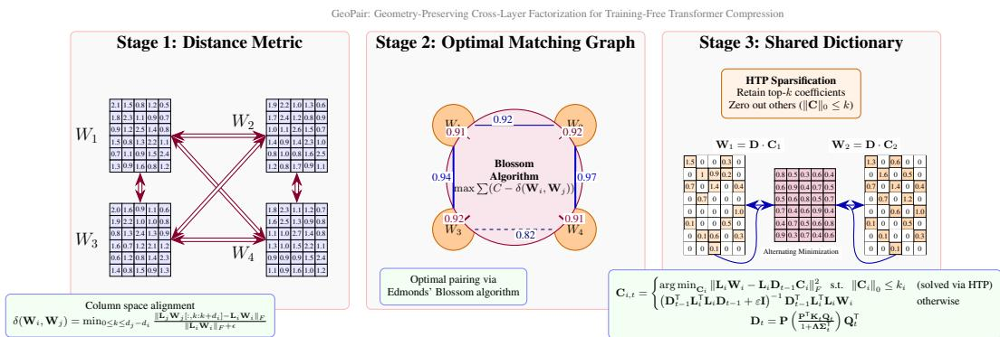
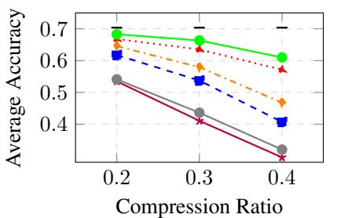
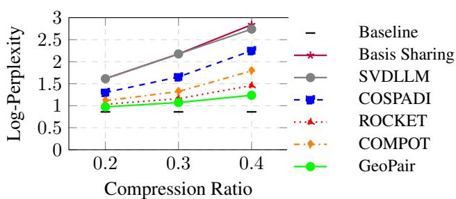
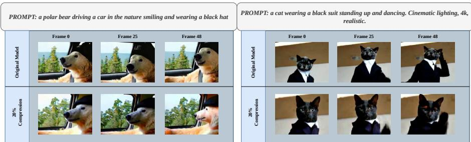

# GeoPair: Geometry-Preserving Cross-Layer Factorization for Training-Free Transformer Compression

Baher Mohammad MWS AI, ITMO University

Ammar Ali MWS AI, ITMO University

Stamatios Lefkimmiatis MWS AI

## Abstract

Transformer architectures exhibit cross-layer redundancies, yet post-training compression pipelines typically optimize layers in isolation or rely on heuristic grouping strategies that disregard layer-specific activation geometries. We introduce a principled, training-free framework that sequentially optimizes cross-layer weight pairings and shared-dictionary factorizations. Rather than forcing weights of adjacent layers to share a basis or heuristically merging activation statistics, our approach identifies structurally compatible projections and learns a shared representation that better preserves each layer’s distinct calibration geometry. Coupled with structured sparsity, this yields highly efficient weight decompositions without sacrificing functional fidelity. Across diverse architectures, scales, and modalities, our method achieves state-of-the-art results, consistently outperforming independent structured weight decompositions and alternative pairwise weight factorizations, which operate under heuristic grouping strategies. By replacing heuristic engineering strategies with a convergent, optimization-driven pipeline, we establish a theoretically grounded foundation for scalable, transformer compression across different modalities.

## 1 Introduction

The widespread adoption of transformer-based architectures has yielded unprecedented capabilities across language [35, 41, 21, 34, 1], vision [8, 11], and generative tasks [36]. However, their substantial memory footprint and computational overhead present a critical bottleneck for deployment in resourceconstrained environments. Post-training model compression has emerged as a practical alternative to retraining, with matrix factorization methods offering a compelling trade-off between parameter efficiency and functional fidelity. While conventional approaches approximate each layer’s weight matrix independently, they overlook a fundamental structural property: substantial cross-layer redundancies emerge naturally across deep transformer stacks.

Exploiting such redundancies through shared-dictionary learning, (where multiple projections are represented by a common dictionary with layer-specific coefficients), promises sublinear storage scaling without sacrificing expressiveness. Yet, principled cross-layer sharing remains largely unexplored in post-training compression. The primary obstacle lies in the data-aware nature of modern factorization pipelines: accurate low-rank approximation requires a whitening transform calibrated to each layer’s activation distribution. Because these distributions vary significantly across depths, their associated whitening spaces are incompatible, complicating direct dictionary sharing. Recent approaches such as [37] heuristically aggregate layer-wise covariances into global whitening transforms and restrict sharing to adjacent layers. This introduces two limitations: (i) covariance averaging distorts layer-specific activation geometry, degrading fidelity; (ii) fixed adjacency ignores non-local alignments, leaving gains unrealized.

In this work, we introduce a principled, training-free framework that optimizes cross-layer grouping and shared-dictionary factorization under layer-specific whitening transforms via alternating minimization. Rather than relying on heuristic covariance merging or greedy adjacency rules, our method identifies structurally compatible projections and learns a shared representation that rigorously preserves each layer’s calibration geometry. We formulate the dictionary update as a generalized Sylvester equation, enabling exact, closed-form solutions that respect distinct whitening spaces. Layer pairing is cast as a maximum-weight matching problem, solved optimally via Edmonds’ Blossom algorithm [12] using a shape-agnostic column-space alignment metric. To further enhance compression efficiency and adapt the method for dictionary learning-based decompositions, we utilize Hard Thresholding Pursuit (HTP) [14] powered by a conjugate gradient linear solver, enabling structured coefficient sparsity without heuristic budget allocation or dynamic scheduling.

Contributions: Our framework establishes a reproducible, optimization-driven alternative to heuristic compression pipelines. The main contributions are:

• Shared-dictionary learning under distinct whitening spaces: We introduce a closedform generalized Sylvester solver that eliminates heuristic covariance aggregation while preserving layer-specific activation geometry.

• Globally optimal layer pairing: We formulate cross-layer grouping as a weighted maximum matching problem, replacing fixed adjacency heuristics with a data-driven strategy that minimizes structural discrepancy across the entire architecture.

• Sparse coefficient optimization with convergence guarantees: We extend the framework to sparse dictionary learning via HTP, enabling adaptive, layer-specific compression that outperforms dense low-rank baselines at high compression ratios.

• Broad empirical validation: Extensive experiments across diverse architectures, scales, and modalities demonstrate state-of-the-art results, consistently outperforming independent factorization, heuristic merging, and existing dictionary learning approaches.

By unifying optimal grouping, exact dictionary updates, and sparse coding within a single convergent pipeline, our work provides a theoretically grounded foundation for scalable, transformers compression.

## 2 Related Work

Data-Aware Matrix Factorization. Post-training compression via matrix factorization has emerged as a practical strategy for reducing transformer memory footprint without fine-tuning. Truncated singular value decomposition (SVD) yields the optimal rank-r approximation of a weight matrix under the Frobenius norm, and is mathematically equivalent to performing principal component analysis (PCA) on its column space [5]. Early compression pipelines applied this decomposition directly to pretrained weights, but assumed isotropic activation statistics, ignoring the input-dependent scaling inherent to transformer forward passes. This geometric mismatch causes significant accuracy degradation at high compression ratios. Subsequent data-aware approaches [9, 42, 38, 45] aligned the factorization objective with true activation reconstruction by operating in a calibration-induced whitened space. While these methods preserve downstream performance, they treat each layer in isolation, overlooking the substantial cross-layer redundancy inherent in deep architectures.

Dictionary Learning and Sparse Decomposition. To improve compression fidelity, recent work has shifted from dense low-rank approximations to dictionary learning formulations, which decouple a shared dictionary from layer-specific coefficient matrices. Classical sparse coding algorithm such as k-SVD [2] and Method of Optimal Directions [13] have been adapted to the transformer compression setting. Methods like CoSpaDI [18], ROCKET [3], and COMPOT [19] demonstrate that structured sparsity often yields superior trade-offs compared to dense baselines, particularly when coefficient matrices are heavily constrained. However, these approaches still optimize coefficients and dictionaries per layer or rely on heuristic update schedules, leaving explicit cross-layer parameter sharing unexplored.

Cross-Layer Grouping and Shared Basis Learning. Explicitly grouping structurally similar layers to learn a shared basis offers a promising path to sublinear storage scaling. The most notable advance in this direction, Basis Sharing [37] pairs adjacent layers and learns a joint basis, outperforming independent baselines. Yet, this approach suffers from three critical limitations: (i) fixed adjacency for grouping ignoring non-local alignments; (ii) global covariance aggregation which distorts layer-specific geometry; (iii) manual, model-specific constraints limit universal applicability. (e.g., restricting sharing between certain projection types), meaning the approach cannot be applied universally to maintain numerical stability. Complementary work like Matrix PCA [45] extracts shared bases via Eigen Value Decomposition (EVD) on stacked weights but remains constrained by distributional-drift-based grouping and independent refinement stages, necessitating manual budgeting and failing to optimize grouping under distinct whitening geometries.

Positioning of Our Approach. Our framework addresses these gaps through a principled, optimization-driven pipeline that sequentially solves optimal layer grouping and shared-dictionary learning. Rather than heuristic covariance merging, we formulate cross-layer dictionary sharing under distinct whitening transforms as a generalized Sylvester equation, yielding exact dictionary updates that preserve individual layer geometries. We replace fixed adjacency rules with a global maximum-weight matching strategy [12], optimally pairing layers based on a shape-agnostic column space alignment metric. Finally, we integrate Hard Thresholding Pursuit (HTP) [14] with conjugate gradient to enforce structured coefficient sparsity, enabling flexible compression without heuristic budget allocation or dynamic scheduling. This eliminates manual engineering while establishing a theoretically grounded pathway for scalable, multi-modal model compression.

## 3 Method

  
Figure 1: GeoPair framework overview. Stage 1 computes whitened-space structural distances between candidate weight matrices. Stage 2 solves for globally optimal pairings via maximum-weight graph matching. Stage 3 learns shared dictionaries for each pair through calibration-aware alternating minimization with optional HTP-based coefficient sparsification.

## 3.1 Overview and Problem Setup

Similar to prior post-training compression work [38], we formulate compression as activation reconstruction over a small calibration set. We consider a pretrained transformer with linear projections parameterized by weight matrices $\mathbf { W } \in \mathbb { R } ^ { d \times d _ { o u t } }$ and seek a structured approximation $\widehat { \bf W }$ that reduces storage and computation while preserving functional behavior, without the need for finetuning using back-propagation.

Let $\mathbf { X } \in \mathbb { R } ^ { N \times d }$ denote calibration activations and define the empirical Gram matrix $\mathbf { G } = \mathbf { X } ^ { \mathsf { T } } \mathbf { X }$ . In practice, limited calibration data often yields a rank-deficient G, rendering it singular. To guarantee a well-posed whitening transform, we enforce non-singularity by introducing a Tikhonov regularizer $\mathbf { G } _ { \eta } = \mathbf { X } ^ { \mathsf { T } } \mathbf { X } + \eta \mathbf { I } \left( \eta > 0 \right)$ . This is mathematically equivalent to augmenting the reconstruction objective with a pure weight-space $\ell _ { 2 }$ penalty, which strictly ensures $\bar { \mathbf { G } } _ { \eta } \succ 0$ and admits a unique Cholesky factorization as a whitening transformation $\mathbf { G } _ { \eta } = \mathbf { L } ^ { \mathsf { T } } \mathbf { L }$ . The activation reconstruction objective is then equivalently written as

$$
\widehat { \mathbf { W } } = \underset { \widehat { \mathbf { W } } } { \arg \operatorname* { m i n } } \left\| \mathbf { X } \left( \mathbf { W } - \widehat { \mathbf { W } } \right) \right\| _ { F } ^ { 2 } + \eta \left\| \mathbf { W } - \widehat { \mathbf { W } } \right\| _ { F } ^ { 2 } = \underset { \widehat { \mathbf { W } } } { \arg \operatorname* { m i n } } \left\| \mathbf { L } \left( \mathbf { W } - \widehat { \mathbf { W } } \right) \right\| _ { F } ^ { 2 } .\tag{1}
$$

This shows that minimizing the activation reconstruction error is equivalent to minimizing the reconstruction in the whitened space induced by calibration statistics.

## 3.2 Cross-Layer Shared Dictionary Optimization

Unlike standard compression pipelines that optimize each projection in isolation, we aim to exploit structural redundancies that naturally arise across layers sharing the same input dimension. By coupling their factorizations, we can learn a single shared dictionary that efficiently spans both layers, yielding higher compression ratios at comparable reconstruction fidelity.

Building on this motivation, our optimization objective remains strictly tied to minimizing functional activation error. Following the equivalence established in Section 3.1, preserving the input–output behavior for two compatible projections, translates directly to minimizing their respective calibrationweighted reconstruction errors.

Cross-Layer Shared Dictionary Formulation. Consider two weight matrices $\mathbf { W } _ { 1 } \in \mathbb { R } ^ { d \times d _ { 1 } }$ and $\mathbf { W } _ { 2 } \in \mathbb { R } ^ { d \times d _ { 2 } }$ , each with its own layer-specific Cholesky whitening transform $\mathbf { L } _ { 1 } , \mathbf { L } _ { 2 } \in \mathbb { R } ^ { d \times d }$ . We approximate them using a shared dictionary $\mathbf { D } \in \mathbb { R } ^ { d \times r }$ (where $r \ll d )$ and layer-specific coefficient matrices $\mathbf { C } _ { 1 } \in \mathbb { R } ^ { r \times d _ { 1 } } , \mathbf { \bar { C } } _ { 2 } \in \mathbb { R } ^ { r \times d _ { 2 } }$ . The coupled optimization problem we solve is:

$$
\operatorname* { m i n } _ { \mathbf { D } , \mathbf { C } _ { 1 } , \mathbf { C } _ { 2 } } \quad \left\| \mathbf { L } _ { 1 } \mathbf { W } _ { 1 } - \mathbf { L } _ { 1 } \mathbf { D } \mathbf { C } _ { 1 } \right\| _ { F } ^ { 2 } + \left\| \mathbf { L } _ { 2 } \mathbf { W } _ { 2 } - \mathbf { L } _ { 2 } \mathbf { D } \mathbf { C } _ { 2 } \right\| _ { F } ^ { 2 } .\tag{2}
$$

The shared dictionary D captures common directional components activated across both layers, while $\mathbf { C } _ { i }$ projects these components onto each layer’s output space. After compression, the original parameter space is recovered via $\widehat { \mathbf { W } } _ { i } = \mathbf { D } \mathbf { C } _ { i }$

Alternating Minimization. The objective in Eq. (2) is bi-convex in $( \mathbf { D } , \mathbf { C } )$ We optimize it via alternating minimization, which decouples the joint problem into two sequential subproblems. Because the optimization alternates between the dictionary and the coefficients, we require a distinct closed-form update rule for each block. In the following, we first derive the update rule for the coefficients $\bar { \mathbf { C } _ { 1 } } , \bar { \mathbf { C } _ { 2 } }$ given a fixed $\mathbf { D } _ { t - 1 }$ , and then present the update rule for $\mathbf { D } _ { t }$ given the newly computed coefficients. These two steps are applied cyclically until convergence.

Coefficient update $\small ( \mathbf { C } _ { 1 } , \mathbf { C } _ { 2 }$ given $\mathbf { D } _ { t - 1 } )$ . With $\mathbf { D } _ { t - 1 }$ fixed, for each $\mathbf { C } _ { i , t }$ we solve an independent weighted least-squares problem of the form:

$$
\mathbf { C } _ { i , t } = \underset { \mathbf { C } _ { i } } { \arg \operatorname* { m i n } } \left\| \mathbf { L } _ { i } \mathbf { W } _ { i } - \mathbf { L } _ { i } \mathbf { D } _ { t - 1 } \mathbf { C } _ { i } \right\| _ { F } ^ { 2 } = \left( \mathbf { D } _ { t - 1 } ^ { \mathsf { T } } \mathbf { G } _ { i } \mathbf { D } _ { t - 1 } + \varepsilon \mathbf { I } \right) ^ { - 1 } \mathbf { D } _ { t - 1 } ^ { \mathsf { T } } \mathbf { G } _ { i } \mathbf { W } _ { i } , i \in \{ 1 , 2 \}\tag{3}
$$

where $\varepsilon = 1 0 ^ { - 6 }$ ensures numerical stability.

Dictionary update $( \mathbf { D } _ { t }$ given $\mathbf { C } _ { 1 , t } , \mathbf { C } _ { 2 , t } )$ . With $\mathbf { C } _ { 1 , t } , \mathbf { C } _ { 2 , t }$ fixed, we optimize the joint objective in Eq. (2) with respect to $\mathbf { D } _ { t }$ . Taking the matrix derivative with respect to $\mathbf { D } _ { t }$ and setting it to zero yields the two-term generalized Sylvester equation:

$$
( \mathbf { L } _ { 1 } ^ { \mathsf { T } } \mathbf { L } _ { 1 } ) \mathbf { D } _ { t } ( \mathbf { C } _ { 1 , t } \mathbf { C } _ { 1 , t } ^ { \mathsf { T } } ) + ( \mathbf { L } _ { 2 } ^ { \mathsf { T } } \mathbf { L } _ { 2 } ) \mathbf { D } _ { t } ( \mathbf { C } _ { 2 , t } \mathbf { C } _ { 2 , t } ^ { \mathsf { T } } ) = \mathbf { K } _ { t } ,\tag{4}
$$

where $\mathbf { K } _ { t } = \mathbf { L } _ { 1 } ^ { \mathsf { T } } \mathbf { L } _ { 1 } \mathbf { W } _ { 1 } \mathbf { C } _ { 1 , t } ^ { \mathsf { T } } + \mathbf { L } _ { 2 } ^ { \mathsf { T } } \mathbf { L } _ { 2 } \mathbf { W } _ { 2 } \mathbf { C } _ { 2 , t } ^ { \mathsf { T } }$ . Defining $\Phi ( \cdot , \cdot )$ as the generalized eigenvalue decomposition operator, we compute the activation Gram pair decomposition once to obtain constant transformation matrices $( \mathbf { P } , { \hat { \mathbf { A } } } ) = \Phi ( \mathbf { L } _ { 2 } ^ { \mathsf { T } } \mathbf { L } _ { 2 } , \ \mathbf { L } _ { 1 } ^ { \mathsf { T } } \mathbf { L } _ { 1 } )$ . At each iteration t, we stabilize the coefficient Gram matrices via $\tilde { \mathbf { B } } _ { i , t } = \mathbf { C } _ { i , t } \mathbf { C } _ { i , t } ^ { \top } + \epsilon \mathbf { I }$ and decompose the regularized pair to obtain $( \mathbf { Q } _ { t } , \mathbf { \tilde { D } } _ { t } ) = \Phi ( \tilde { \mathbf { B } } _ { 2 , t } , \tilde { \mathbf { B } } _ { 1 , t } )$ . Using these transformations we can decouple the Sylvester system into independent scalar equations, yielding the exact closed-form solution:

$$
\mathbf { D } _ { t } = \mathbf { P } \left( { \frac { \mathbf { P } ^ { T } \mathbf { K } _ { t } \mathbf { Q } _ { t } } { \mathbf { 1 } \mathbf { 1 } ^ { T } + \lambda \sigma _ { t } ^ { T } } } \right) \mathbf { Q } _ { t } ^ { T } ,\tag{5}
$$

where the division is applied elementwise, $\lambda = \mathrm { d i a g } ( \mathbf { \boldsymbol { \Lambda } } ) , \pmb { \sigma } _ { t } = \mathrm { d i a g } \left( \pmb { \Sigma } _ { t } \right)$ , and 1 is a vector of ones. For more details we refer to Appendix A. This simultaneous diagonalization approach provides a deterministic update for D without iterative optimization or step-size tuning. Combined with the closed-form coefficient update, the alternating scheme guarantees monotonic objective descent and converges to a block-stationary point under standard Block Successive Upper-bound Minimization (BSUM) conditions, which are provided in detail in Appendix A.2.

## 3.3 Sparse Matrix Coefficients via Hard Thresholding Pursuit

Recent state-of-the-art post-training compression methods increasingly rely on dictionary learning formulations that enforce structured sparsity in the factorized representations. Motivated by these advances, we integrate a sparsity-constrained coefficient update directly into our alternating minimization pipeline as a core mechanism for maximizing compression fidelity under strict parameter budgets. Specifically, we replace the dense least-squares coefficient update step with an ℓ -constrained formulation:

$$
\operatorname* { m i n } _ { \mathbf { C } _ { i , t } } \| \mathbf { L } _ { i } \mathbf { W } _ { i } - \mathbf { L } _ { i } \mathbf { D } _ { t - 1 } \mathbf { C } _ { i , t } \| _ { F } ^ { 2 } \quad \mathrm { s . t . } \quad \| \mathbf { C } _ { i , t } \| _ { 0 } \leq k _ { i } ,\tag{6}
$$

where $k _ { i }$ denotes the target number of non-zero entries per column, and $\lVert \cdot \rVert _ { 0 }$ counts non-zero elements. This combinatorial constraint is efficiently optimized via Hard Thresholding Pursuit (HTP), which seamlessly integrates into our block-coordinate descent scheme.

Let $\mathbf { H } _ { i , t } = \mathbf { D } _ { t - 1 } ^ { \top } \mathbf { L } _ { i } ^ { \top } \mathbf { L } _ { i } \mathbf { D } _ { t - 1 } + \varepsilon \mathbf { I }$ and $\mathbf { R } _ { i , t } = \mathbf { D } _ { t - 1 } ^ { \mathsf { T } } \mathbf { L } _ { i } ^ { \mathsf { T } } \mathbf { L } _ { i } \mathbf { W } _ { : }$ denote the regularized dictionary Gram matrix and the calibration-weighted cross-term, respectively. Starting from the coefficients of the previous outer iteration, each HTP inner loop executes:

Gradient Update: ${ \bf C } _ { i , t } ^ { \mathrm { t m p } } = { \bf C } _ { i , t - 1 } + \mu ( { \bf R } _ { i , t } - { \bf H } _ { i , t } { \bf C } _ { i , t - 1 } )$ , corresponding to a gradient descent step with step-size $\mu = \Vert \mathbf { H } _ { i , t } \Vert _ { 2 } ^ { - 2 }$ on the calibration-weighted least-squares objective.

Support Selection: Retain the top-ki entries of largest magnitude in each column of $\mathbf { C } _ { i , t } ^ { \mathrm { t m p } }$ to form a binary mask $\mathbf { M } _ { i } \in \left\{ 0 , 1 \right\} ^ { r \times d _ { i } }$

Restricted Projection: Refine coefficients over the selected support by minimizing the original calibration-weighted objective $\begin{array} { r } { \big \| \mathbf { L } _ { i } \mathbf { W } _ { i } - \mathbf { L } _ { i } \mathbf { D } _ { t - 1 } \mathbf { C } \big \| _ { F } ^ { 2 } \mathrm { ~ s . t . ~ } \mathbf { C } = \mathbf { C } \odot \mathbf { M } _ { i } . } \end{array}$ . The normal equations reduce to $\mathbf { H } _ { i , t } \mathbf { \check { C } } _ { i , t } = \check { \mathbf { R } } _ { i , t }$ on the active support. Rather than explicitly inverting the restricted submatrix, we solve this system using a batched Conjugate Gradient (CG) solver with tolerance τ .

The HTP procedure runs for a fixed number of inner iterations $T _ { \mathrm { H T P } }$ before proceeding to the dictionary update $\mathbf { D } _ { t }$ . When sparsity is disabled $( k _ { i } = r )$ , the procedure naturally degenerates to the standard closed-form Cholesky update. While the $\ell _ { 0 }$ constraint renders the coefficient subproblem non-convex, the overall alternating minimization framework remains well-behaved and is guaranteed to converge to a block-stationary point under BSUM and Kurdyka-Łojasiewicz (KL) theory (for more details we refer to Appendix A.2).

## 3.4 Optimal Cross-Layer Grouping via Graph Matching

While prior compression pipelines default to pairing adjacent layers, structural similarities in pretrained weight matrices are not strictly localized. To maximize the efficacy of cross-layer dictionary sharing, we formulate layer grouping as a global optimization problem that pairs weights with minimal structural discrepancy.

Whitened-Space Frobenius Submatrix Distance Given two projection matrices $\mathbf { W } _ { i } \in \mathbb { R } ^ { d \times d _ { i } }$ and $\mathbf { W } _ { j } \in \mathbb { R } ^ { d \times d _ { j } ^ { \bullet } }$ sharing the same input dimension d but potentially differing in output dimension, we define a scale-invariant surrogate metric for the joint approximation error. Without loss of generality, assume $d _ { i } \leq d _ { j }$ . The normalized Frobenius submatrix distance is computed in the calibration-induced whitened space as:

$$
\delta ( \mathbf { W } _ { i } , \mathbf { W } _ { j } ) = \operatorname* { m i n } _ { 0 \leq k \leq d _ { j } - d _ { i } } \frac { \| \mathbf { L } _ { j } \mathbf { W } _ { j } [ : , k : k + d _ { i } ] - \mathbf { L } _ { i } \mathbf { W } _ { i } \| _ { F } } { \| \mathbf { L } _ { i } \mathbf { W } _ { i } \| _ { F } + \epsilon } ,\tag{7}
$$

where $\mathbf { L } _ { i } , \mathbf { L } _ { j }$ are the layer-specific Cholesky whitening transforms derived from calibration activations, $\mathbf { W } _ { j } [ : , k : k + \mathbf { \bar { \alpha } } d _ { i } ]$ extracts a contiguous column window of width $d _ { i }$ , and $\epsilon > 0$ ensures numerical stability. This metric captures the minimal alignment cost between the two weight spaces while explicitly accounting for distinct activation geometries and is computed in $\mathcal { O } \left( d \cdot d _ { j } \right)$ ) time using optimized 1D cross-correlation, avoiding explicit window allocations.

Global Maximum-Weight Matching. Crucially, our grouping strategy is not restricted to identical submodule types; attention and feed-forward weights can be paired whenever they share a common input dimension d. Let $\mathcal { V } = \{ 1 , \ldots , N \}$ } index all candidate weight matrices across layers and projection types. We construct an undirected complete graph $\mathcal { G } = ( \breve { \nu } , \mathcal { E } )$ with edge weights defined as $w _ { i j } = \mathscr { C } - \delta \left( \mathbf { W } _ { i } , \mathbf { W } _ { j } \right)$ , where $\mathcal { C } > \operatorname* { m a x } _ { i , j } \delta \left( \mathbf { W } _ { i } , \mathbf { W } _ { j } \right)$ converts distance minimization into weight maximization. The optimal pairing ${ \mathcal { P } } ^ { * }$ is obtained by solving:

$$
\mathcal { P } ^ { * } = \underset { \mathcal { M } \subseteq \mathcal { E } } { \arg \operatorname* { m a x } } \sum _ { \{ i , j \} \in \mathcal { M } } w _ { i j } \quad \mathrm { s . t . } \quad \mathcal { M } \mathrm { i s ~ a ~ v a l i d ~ m a t c h i n g , }\tag{8}
$$

which simultaneously enforces maximum cardinality and minimal total structural distance. We solve this problem exactly using the Edmonds’ Blossom algorithm [12]. The resulting disjoint pairs are subsequently passed to the calibration-aware alternating minimization of Section 3.2, ensuring that dictionary sharing is restricted to structurally aligned projections rather than arbitrary adjacent layers. This data-driven grouping strategy consistently yields lower activation-weighted reconstruction error and improved downstream perplexity compared to fixed adjacent pairing.

## 3.5 Algorithmic Summary

For clarity, we consolidate the complete alternating minimization procedure into its explicit initialization and iterative update rules:

• Initialization $\mathbf { \rho } ( t = 0 ) \mathbf { : }$

$$
\mathrm { \bf D } _ { 0 } = \mathrm { S V D } ( [ \mathrm { \bf W } _ { 1 } \mathrm { \bf W } _ { 2 } ] ) _ { [ : , : r ] } .\tag{9}
$$

• Coefficient Update $\left( t \geq 1 \right)$

$$
\mathbf { C } _ { i , t } = \left\{ \begin{array} { l l } { \mathrm { a r g } \operatorname* { m i n } _ { \mathbf { C } _ { i } } \left\| \mathbf { L } _ { i } \mathbf { W } _ { i } - \mathbf { L } _ { i } \mathbf { D } _ { t - 1 } \mathbf { C } _ { i } \right\| _ { F } ^ { 2 } } & { \mathrm { s . t . } \quad \| \mathbf { C } _ { i } \| _ { 0 } \leq k _ { i } \quad \mathrm { ( s o l v e d ~ v i a ~ H r P ) } } \\ { \left( \mathbf { D } _ { t - 1 } ^ { \top } \mathbf { L } _ { i } ^ { \top } \mathbf { L } _ { i } \mathbf { D } _ { t - 1 } + \varepsilon \mathbf { I } \right) ^ { - 1 } \mathbf { D } _ { t - 1 } ^ { \top } \mathbf { L } _ { i } ^ { \top } \mathbf { L } _ { i } \mathbf { W } _ { i } } & { \mathrm { o t h e r w i s e } } \end{array} \right.\tag{10}
$$

• Dictionary Update $\left( t \geq 1 \right)$ :

$$
\begin{array} { r l } & { \mathbf { D } _ { t } = \underset { \mathbf { D } } { \arg \operatorname* { m i n } } \left\| \mathbf { L } _ { 1 } \mathbf { W } _ { 1 } - \mathbf { L } _ { 1 } \mathbf { D } \mathbf { C } _ { 1 , t } \right\| _ { F } ^ { 2 } + \left\| \mathbf { L } _ { 2 } \mathbf { W } _ { 2 } - \mathbf { L } _ { 2 } \mathbf { D } \mathbf { C } _ { 2 , t } \right\| _ { F } ^ { 2 } } \\ & { \quad = \mathbf { P } \left( \frac { \mathbf { P } ^ { T } \mathbf { K } _ { t } \mathbf { Q } _ { t } } { \mathbf { 1 1 } ^ { T } + \lambda \sigma _ { t } ^ { T } } \right) \mathbf { Q } _ { t } ^ { T } . } \end{array}\tag{11}
$$

The sequence monotonically decreases the calibration-weighted objective and terminates when the relative improvement falls below τ or a maximum iteration count $\bar { T _ { \mathrm { m a x } } }$ is reached.

## 4 Experiments

This section systematically evaluates our approach, hereafter referred to as GeoPair, across design components and assess performance across different settings using 7 well established benchmarks (we refer to Appendix B for details). We begin with a component-wise ablation on two representative language models, comparing each configuration against the Basis Sharing baseline to isolate the impact of our proposed modules. Following this analysis, we benchmark our method against recent dictionary learning approaches to establish its effectiveness within this paradigm. We then evaluate the framework against a broad set of pruning and compression techniques, demonstrating that our training-free pipeline achieves competitive accuracy without the post-compression fine-tuning typically required by existing methods. To further assess scalability and architectural robustness, we extend the comparison against Basis Sharing across varying compression ratios and diverse model families. Finally, we apply the framework to a recent video generation model, providing qualitative evidence that high-fidelity generation is preserved without any post-compression adaptation or recovery steps.

Pairwise Weight Optimization and Coefficient Sparsification Table 1 presents a componentwise ablation of our framework on Llama-3 1B and 8B models at a fixed compression ratio. The table isolates the contribution of each module. Furthermore, in Appendix C.2 we report results for CoSpaDi and Basis Sharing using their originally published layer-grouping strategies. The results demonstrate a clear performance progression. Replacing Global Whitening, GW, with our Sylvester-based formulation yields a substantial accuracy recovery, confirming that grouped factorization with weight-dependent whitening transformations better preserves weight structure under compression. Incorporating our grouping strategy, denoted as $O G ,$ further improves zero-shot performance across all benchmarks, indicating that structure-aware grouping aligns more effectively with the shared dictionary representation. The full configuration with HTP sparsification (Sylv + $O G + S P )$ recovers over 90% of the uncompressed baseline accuracy while maintaining competitive perplexity, highlighting the stabilizing effect of coefficient sparsification. Notably, removing OG from the sparsified pipeline degrades performance, underscoring that optimal grouping is essential for reliable coefficient recovery. These findings validate each design component and establish the full pipeline as a robust, training-free compression strategy.

Table 1: Llama 3 Ablation Results on standard benchmarks $( \mathrm { C R } = 0 . 2 )$ . GW indicates the Global Whitening utilized in Basis Sharing, Sylv denotes the use of the Sylvester equation solver to find a common dictionary for individual Cholesky Factorizations of the weights in the group, OG refers to our proposed optimal grouping strategy, and SP denotes our sparsification strategy of the coefficient matrices via HTP.
<table><tr><td rowspan="2">Method</td><td colspan="3">Techniques Applied Sylv</td><td rowspan="2">CR</td><td rowspan="2"></td><td colspan="8">Benchmarks (Accuracy)</td><td colspan="2">Perplexity</td><td rowspan="2">Avg Acc</td></tr><tr><td>GW</td><td>OG</td><td>SP</td><td>PIQA</td><td>HellaSwag</td><td>Lambada_OA</td><td>ARC-e</td><td>ARC-c</td><td>SciQ</td><td>Race</td><td>MMLU</td><td>Wiki</td><td>Lambada</td></tr><tr><td>Llama3.2 1B (baseline)</td><td>x</td><td>x</td><td>x</td><td>x</td><td></td><td>74.53</td><td>63.66</td><td>62.95</td><td>60.47</td><td>36.20</td><td>88.30</td><td>37.79</td><td>37.00</td><td>11.60</td><td>5.73</td><td>57.61</td></tr><tr><td>Basis Sharing</td><td>1</td><td>x</td><td>x</td><td>x</td><td>0.2</td><td>56.75</td><td>31.69</td><td>15.08</td><td>32.49</td><td>21.59</td><td>58.40</td><td>25.93</td><td>22.95</td><td>928.07</td><td>239.30</td><td>33.11</td></tr><tr><td>Sylvester (ours)</td><td>x</td><td>√</td><td>x</td><td>x</td><td>0.2</td><td>63.76</td><td>40.21</td><td>32.91</td><td>41.33</td><td>24.74</td><td>73.80</td><td>29.86</td><td>23.44</td><td>109.59</td><td>57.95</td><td>41.26</td></tr><tr><td>Optimal Grouping (ours)</td><td>x</td><td>√</td><td>√</td><td>x</td><td>0.2</td><td>64.91</td><td>42.64</td><td>37.42</td><td>44.02</td><td>25.94</td><td>76.30</td><td>29.95</td><td>23.05</td><td>56.60</td><td>32.49</td><td>43.03</td></tr><tr><td>HTP (full) (ours)</td><td>x</td><td>√</td><td>√</td><td>√</td><td>0.2</td><td>73.50</td><td>57.67</td><td>58.88</td><td>57.74</td><td>31.83</td><td>88.90</td><td>34.26</td><td>29.96</td><td>15.92</td><td>6.74</td><td>54.09</td></tr><tr><td>Optimal Grouping (ours)</td><td>x</td><td>√</td><td>x</td><td>√</td><td>0.2</td><td>71.44</td><td>57.35</td><td>56.55</td><td>54.46</td><td>32.51</td><td>87.50</td><td>34.93</td><td>29.70</td><td>16.77</td><td>7.88</td><td>53.06</td></tr><tr><td>Llama3 8B (baseline)</td><td>x</td><td>x</td><td>x</td><td>x</td><td></td><td>80.69</td><td>79.13</td><td>75.57</td><td>77.69</td><td>53.5</td><td>93.9</td><td>40.29</td><td>62.15</td><td>7.26</td><td>3.09</td><td>70.36</td></tr><tr><td>Basis Sharing</td><td>√</td><td>x</td><td>x</td><td>x</td><td>0.2</td><td>72.52</td><td>58.71</td><td>50.2</td><td>57.2</td><td>34.04</td><td>84.9</td><td>37.13</td><td>33.04</td><td>41.26</td><td>14.84</td><td>53.47</td></tr><tr><td>Sylvester(ours)</td><td>x</td><td>√</td><td>x</td><td>x</td><td>0.2</td><td>74.21</td><td>61.14</td><td>57.4</td><td>59.76</td><td>36.18</td><td>86.9</td><td>37.13</td><td>38.47</td><td>26.82</td><td>9.69</td><td>56.4</td></tr><tr><td>+ Optimal Grouping(ours)</td><td>x</td><td>√</td><td>√</td><td>x</td><td>0.2</td><td>73.5</td><td>59.8</td><td>60.7</td><td>65.11</td><td>37.29</td><td>90.8</td><td>37.42</td><td>35.09</td><td>24.56</td><td>6.82</td><td>57.46</td></tr><tr><td>HTP (full) (ours) x</td><td>x</td><td>√</td><td>√</td><td>√</td><td>0.2</td><td>78.73</td><td>75.38</td><td>74.25</td><td>76.14</td><td>49.74</td><td>93.9</td><td>40.77</td><td>56.45</td><td>9.43</td><td>3.25</td><td>68.17</td></tr><tr><td>Optimal Grouping (ours)</td><td>x</td><td>√</td><td>x</td><td>√</td><td>0.2</td><td>78.35</td><td>76.18</td><td>70.62</td><td>73.4</td><td>49.91</td><td>93.2</td><td>39.43</td><td>57.37</td><td>9.75</td><td>4.15</td><td>67.31</td></tr></table>

Shared Dictionary Learns Better Figure 2 evaluates GeoPair against a broad set of structured weight factorization methods, encompassing both dense low-rank projections and sparse dictionary learning approaches. GeoPair consistently achieves the highest accuracy, outperforming established baselines in both categories. This advantage stems from our shared dictionary formulation and optimal grouping strategy, which more effectively preserves weight structure than conventional low-rank approximations or other dictionary learning strategies. These results establish GeoPair as the leading training-free weight factorization method for the evaluated compression regime.

Llama3 8B - Log-Perplexity  
  
Figure 2: Comparison of different compression methods on Llama3 8B across varying compression ratios. Left: Average accuracy across benchmarks. Right: Log-Perplexity on WikiText.

Comparison with other compression methods Table 2 evaluates GeoPair against a broad range of compression and pruning strategies, including methods that operate outside the matrix factorization paradigm. Under a consistent evaluation protocol, GeoPair achieves the highest average accuracy across all benchmarks while operating entirely without post-compression fine-tuning. In contrast, competing approaches rely on extensive healing or recovery training, which introduces significant computational overhead and requires large datasets. These results establish GeoPair as the state-ofthe-art training-free compression method.

Table 2: Comparison against pruning methods on Llama2 7B across standard zero-shot benchmarks at 20% compression. Training-free indicates whether a finetuning is done after compression.
<table><tr><td rowspan="2">Method</td><td rowspan="2">Training-free</td><td colspan="7">Accuracy↑</td><td rowspan="2">Avg.</td></tr><tr><td>BoolQ</td><td>PIQA</td><td>HellaSwag</td><td>WinoGrande</td><td>ARC-e</td><td>ARC-c</td><td>OBQA</td></tr><tr><td>Baseline</td><td>1</td><td>76.50</td><td>79.80</td><td>76.10</td><td>70.10</td><td>72.80</td><td>47.60</td><td>57.20</td><td>68.59</td></tr><tr><td>LLM-Pruner</td><td>x</td><td>66.79</td><td>77.58</td><td>68.48</td><td>64.96</td><td>64.06</td><td>37.88</td><td>39.00</td><td>59.82</td></tr><tr><td>LoRAPrune</td><td>x</td><td>65.82</td><td>79.31</td><td>70.00</td><td>62.76</td><td>65.87</td><td>37.69</td><td>39.14</td><td>60.05</td></tr><tr><td>WANDA</td><td>√</td><td>65.75</td><td>74.70</td><td>64.52</td><td>59.35</td><td>60.65</td><td>36.26</td><td>39.40</td><td>57.23</td></tr><tr><td>ShortGPT</td><td>x</td><td>68.26</td><td>72.28</td><td>61.70</td><td>63.77</td><td>60.22</td><td>39.00</td><td>41.60</td><td>58.12</td></tr><tr><td>LoRAShear</td><td>x</td><td>72.78</td><td>76.36</td><td>69.49</td><td>67.63</td><td>69.02</td><td>39.47</td><td>40.78</td><td>62.22</td></tr><tr><td>GeoPair</td><td>√</td><td>74.06</td><td>77.2</td><td>71.8</td><td>67.24</td><td>72.1</td><td>41.3</td><td>41.4</td><td>63.58</td></tr></table>

Generalization Across Model Architectures To assess cross-architecture robustness, we evaluate our compression pipeline across diverse model families and scales, ranging from 1B to 32B parameters. This evaluation verifies that our framework maintains effectiveness irrespective of model capacity, architectural design, or training paradigm. Table 3 reports average zero-shot accuracy and Lambada OpenAI perplexity under increasing compression ratios. For direct comparison, we include Basis Sharing results at compression ratios 0.2, 0.3, and 0.4, enabling a consistent assessment of performance trends across compression intensities. Additional results for Qwen3 on an updated benchmark suite are provided in Appendix C.3 to confirm consistency under alternative evaluation protocols. We observe minor improvements on small compression ratios, this aligns with recent findings that small rank truncation acts as denoising, preserving salient features [29].

Table 3: Generalization across model families and parameter scales. For each architecture, we report average zero-shot accuracy and Lambada OpenAI perplexity under increasing compression ratios. At CR=0.2, 0.3, and 0.4, we include direct comparisons against Basis Sharing.
<table><tr><td rowspan="2">Model</td><td rowspan="2">Metric</td><td rowspan="2">CR=0</td><td colspan="2">CR=0.2</td><td colspan="2">CR=0.3</td><td colspan="2">CR=0.4</td></tr><tr><td>Ours</td><td>Basis Sharing</td><td>Ours</td><td>Basis Sharing</td><td>Ours</td><td>Basis Sharing</td></tr><tr><td rowspan="2">Qwen 3 8B</td><td>Avg. Accuracy</td><td>70.46</td><td>67.7</td><td>61.25</td><td>64.3</td><td>55.17</td><td>58.88</td><td>46.41</td></tr><tr><td>Perplexity</td><td>4.60</td><td>4.87</td><td>7.31</td><td>6.56</td><td>12.94</td><td>13.40</td><td>45.21</td></tr><tr><td rowspan="2">Gemma 3 12B</td><td>Avg. Accuracy</td><td>72.28</td><td>71.64</td><td>58.96</td><td>67.72</td><td>50.2</td><td>60.49</td><td>40.22</td></tr><tr><td>Perplexity</td><td>4.16</td><td>3.62</td><td>35.65</td><td>4.39</td><td>164.3</td><td>10.98</td><td>765.7</td></tr><tr><td rowspan="2">Phi-4 14B</td><td>Avg. Accuracy</td><td>72.09</td><td>74.07</td><td>70.33</td><td>70.25</td><td>65.22</td><td>68.59</td><td>57.52</td></tr><tr><td>Perplexity</td><td>3.49</td><td>3.37</td><td>3.44</td><td>3.80</td><td>4.33</td><td>4.35</td><td>8.3</td></tr><tr><td rowspan="2">Qwen 3 32B</td><td>Avg. Accuracy</td><td>74.55</td><td>73.27</td><td>69.64</td><td>72.24</td><td>66.04</td><td>70.31</td><td>59.5</td></tr><tr><td>Perplexity</td><td>3.74</td><td>3.26</td><td>3.51</td><td>3.22</td><td>4.09</td><td>3.38</td><td>6.6</td></tr></table>

## 4.1 Generalization across tasks

To evaluate cross-task generalization, we apply GeoPair to a video generation model. Specifically, we compress Wan2.2 5B [36] at 20% and 40% compression ratios and demonstrate that the compressed models retain high-fidelity video generation capabilities without any post-compression fine-tuning. To quantitatively assess the preservation of semantic alignment under compression, we evaluate generated videos using X-CLIP [17] with 16-frame sampling over 50 prompts drawn from the Rapidata/awesome-text2video-prompts dataset. The compressed models exhibit near-baseline performance: at 20% compression, the average CLIP score decreases by only $1 \times 1 0 ^ { - 4 }$ (0.2164 vs. 0.2165 baseline), while even at 40% compression the relative degradation remains marginal (0.2111, a 2.5% drop). These results confirm that our training-free compression framework preserves cross-modal alignment and generalization capacity without task-specific adaptation or recovery procedures. Compression results on audio generation models are provided in Appendix C.4.

  
Figure 3: Video frames generated using Wan2.2 5B model and a compressed version using GeoPair.

## 5 Ablation Studies

This section evaluates the core components of the proposed compression framework to validate key design choices. We begin by analyzing the layer grouping strategy, comparing alternative distance metrics to determine the most effective criterion for pairing weight matrices. Next, we examine the framework’s sensitivity to the KS ratio (defined as the number of atoms in the dictionary over the non-zero elements in each column of the coefficient matrices $\mathbf { C } _ { i } )$ . In Appendix D we benchmark alternative sparse algorithms for enforcing target sparsity levels and perform ablations related to GeoPair’s convergence and sensitivity on calibration data.

Grouping algorithm The proposed grouping strategy is optimal with respect to a chosen distance metric for each pair of weights, In Table 4, we ablate two different metrics as well as the greedy approach used in Basis Sharing [37].

Table 4: Ablation study of layer grouping strategies at CR=0.4 and KS=2.0 on Llama3.2 1B. Frobenius norm-based grouping achieves the best trade-off.
<table><tr><td>Grouping Strategy</td><td>CR</td><td>WikiText-2 (Perplexity↓)</td><td>Avg. Accuracy</td></tr><tr><td>Baseline (Llama3.2 1B)</td><td>一</td><td>11.60</td><td>57.6</td></tr><tr><td>General Frobenius Norm</td><td>0.4</td><td>34.26</td><td>45.61</td></tr><tr><td>Cosine Similarity</td><td>0.4</td><td>43.75</td><td>45.0</td></tr><tr><td>Consecutive Layers (Greedy)</td><td>0.4</td><td>37.97</td><td>43.35</td></tr></table>

Ablation on the KS ratio From Table 5 we observe that KS equal to 2.5 leads to the best results. Based on this observation, we set $k / s = 2 . 5$ for all the reported experiments that include sparsification of matrix coefficients.

Table 5: Ablation study of the KS ratio at CR=0.4 on Llama3.2 1B. The KS ratio balances the sparsity level of the coefficients and the rank of the dictionary. Lower perplexity and higher accuracy indicate better preservation of model capability. Intermediate KS values (2.5–3.5) yield the most favorable trade-offs, with KS=2.5 selected as the default configuration.
<table><tr><td rowspan="2">Metric</td><td rowspan="2">Baseline</td><td colspan="4">KS Ratio (CR=0.4)</td><td rowspan="2">4.0</td></tr><tr><td>2.0</td><td>2.5</td><td>3.0</td><td>3.5</td></tr><tr><td>WikiText-2 (Perplexity↓)</td><td>11.60</td><td>48.51</td><td>34.26</td><td>33.96</td><td>33.53</td><td>35.43</td></tr><tr><td>Lambada (Perplexity↓)</td><td>5.73</td><td>27.60</td><td>21.69</td><td>21.80</td><td>22.71</td><td>24.55</td></tr><tr><td>Avg. Accuracy (↑)</td><td>57.6</td><td>43.5</td><td>45.6</td><td>45.1</td><td>45.0</td><td>44.3</td></tr></table>

## 6 Conclusion & Limitations

GeoPair addresses the fundamental limitation of heuristic post-training compression by introducing a principled, training-free framework that sequentially optimizes cross-layer grouping and shareddictionary factorization. By computing dictionary updates via a closed-form generalized Sylvester equation, identifying optimal layer pairs through global weighted matching, and enforcing sparsity with convergent Hard Thresholding Pursuit, the method preserves layer-specific activation geometries while fully exploiting cross-layer redundancy. Empirically, GeoPair achieves state-of-the-art performance across diverse transformer architectures, parameter scales, and modalities, consistently recovering > 90% of baseline accuracy at high compression ratios without any fine-tuning.

A primary limitation of the current framework is its restriction to pairwise layer grouping. Extending the optimization to simultaneously share dictionaries across larger groups of layers $( m > 2 )$ is non-trivial, as the exact closed-form Sylvester solver relies on the simultaneous diagonalization of two matrix pencils, a property that does not analytically generalize to m-term systems. Multi-group extensions would necessitate iterative numerical approximations or higher-order tensor factorizations, introducing additional computational overhead and potential numerical instability. Developing scalable, theoretically grounded strategies for m-way layer sharing remains a key challenge and constitutes a primary direction for future work.

## References

[1] ABDIN, M., ANEJA, J., BEHL, H., BUBECK, S., ELDAN, R., GUNASEKAR, S., HARRISON, M., HEWETT, R. J., JAVAHERIPI, M., KAUFFMANN, P., LEE, J. R., LEE, Y. T., LI, Y., LIU, W., MENDES, C. C. T., NGUYEN, A., PRICE, E., DE ROSA, G., SAARIKIVI, O., SALIM, A., SHAH, S., WANG, X., WARD, R., WU, Y., YU, D., ZHANG, C., AND ZHANG, Y. Phi-4 technical report. arXiv preprint arXiv: 2412.08905 (2024).

[2] AHARON, M., ELAD, M., AND BRUCKSTEIN, A. K-SVD: An algorithm for designing overcomplete dictionaries for sparse representation. IEEE Transactions on Signal Processing 54, 11 (2006), 4311–4322.

[3] ALI, A., MOHAMMAD, B., MAKHOV, D., SHOPKHOEV, D., ZHUSSIP, M., AND LEFKIMMI-ATIS, S. Rocket: Rapid optimization via calibration-guided knapsack enhanced truncation for efficient model compression. arXiv preprint arXiv: 2602.11008 (2026).

[4] BARTELS, R. H., AND STEWART, G. W. Solution of the matrix equation AX + XB = C. Communications ofthe ACM 15, 9 (1972), 820–826.

[5] BISHOP, C. M., AND NASRABADI, N. M. Pattern recognition and machine learning, vol. 4. Springer, 2006.

[6] BISK, Y., ZELLERS, R., BRAS, R. L., GAO, J., AND CHOI, Y. PIQA: reasoning about physical commonsense in natural language. In The Thirty-Fourth AAAI Conference on Artificial Intelligence, AAAI 2020, The Thirty-Second Innovative Applications ofArtificial Intelligence Conference, IAAI 2020, The Tenth AAAI Symposium on Educational Advances in Artificial Intelligence, EAAI 2020, New York, NY, USA, February 7-12, 2020 (2020), AAAI Press, pp. 7432–7439.

[7] BOLTE, J., SABACH, S., TEBOULLE, M., AND VAISBOURD, Y. First order methods beyond convexity and lipschitz gradient continuity with applications to quadratic inverse problems. SIAM Journal on Optimization 28, 3 (2018), 2131–2151.

[8] CARION, N., MASSA, F., SYNNAEVE, G., USUNIER, N., KIRILLOV, A., AND ZAGORUYKO, S. End-to-end object detection with transformers. In Computer Vision - ECCV 2020 - 16th European Conference, Glasgow, UK, August 23-28, 2020, Proceedings, Part I (2020), A. Vedaldi, H. Bischof, T. Brox, and J. Frahm, Eds., Lecture Notes in Computer Science, Springer, pp. 213– 229.

[9] CHEN, P. H., YU, H.-F., DHILLON, I. S., AND HSIEH, C.-J. Drone: data-aware lowrank compression for large nlp models. In Proceedings ofthe 35th International Conference on Neural Information Processing Systems (Red Hook, NY, USA, 2021), NIPS ’21, Curran Associates Inc.

[10] CLARK, P., COWHEY, I., ETZIONI, O., KHOT, T., SABHARWAL, A., SCHOENICK, C., AND TAFJORD, O. Think you have solved question answering? try arc, the ai2 reasoning challenge, 2018.

[11] DOSOVITSKIY, A., BEYER, L., KOLESNIKOV, A., WEISSENBORN, D., ZHAI, X., UN-TERTHINER, T., DEHGHANI, M., MINDERER, M., HEIGOLD, G., GELLY, S., USZKOREIT, J., AND HOULSBY, N. An image is worth 16x16 words: Transformers for image recognition at scale. In 9th International Conference on Learning Representations, ICLR 2021, Virtual Event, Austria, May 3-7, 2021 (2021), OpenReview.net.

[12] EDMONDS, J. Paths, trees, and flowers. Canadian Journal ofMathematics 17 (1965), 449–467.

[13] ENGAN, K., AASE, S. O., AND HUSOY, J. H. Method of optimal directions for frame design. In Proceedings ofthe 1999 IEEE International Conference on Acoustics, Speech, and Signal Processing, ICASSP ’99, Phoenix, Arizona, USA, March 15-19, 1999 (1999), IEEE Computer Society, pp. 2443–2446.

[14] FOUCART, S. Hard thresholding pursuit: An algorithm for compressive sensing. SIAM J. Numer. Anal. 49, 6 (2011), 2543–2563.

[15] HENDRYCKS, D., BURNS, C., BASART, S., ZOU, A., MAZEIKA, M., SONG, D., AND STEINHARDT, J. Measuring massive multitask language understanding, 2021.

[16] LAI, G., XIE, Q., LIU, H., YANG, Y., AND HOVY, E. Race: Large-scale reading comprehension dataset from examinations, 2017.

[17] MA, Y., XU, G., SUN, X., YAN, M., ZHANG, J., AND JI, R. X-CLIP: end-to-end multigrained contrastive learning for video-text retrieval. In MM ’22: The 30th ACM International Conference on Multimedia, Lisboa, Portugal, October 10 - 14, 2022 (2022), J. Magalhães, A. D. Bimbo, S. Satoh, N. Sebe, X. Alameda-Pineda, Q. Jin, V. Oria, and L. Toni, Eds., ACM, pp. 638–647.

[18] MAKHOV, D., SHOPKHOEV, D., ZHUSSIP, M., ALI, A., AND LEFKIMMIATIS, S. Cospadi: Compressing llms via calibration-guided sparse dictionary learning. arXiv preprint arXiv: 2509.22075 (2025).

[19] MAKHOV, D., SHOPKHOEV, D., ZHUSSIP, M., ALI, A., MOHAMMAD, B., AND LEFKIMMI-ATIS, S. Compot: Calibration-optimized matrix procrustes orthogonalization for transformers compression. arXiv preprint arXiv: 2602.15200 (2026).

[20] MERITY, S., XIONG, C., BRADBURY, J., AND SOCHER, R. Pointer sentinel mixture models, 2016.

[21] OPENAI, :, AGARWAL, S., AHMAD, L., AI, J., ALTMAN, S., APPLEBAUM, A., ARBUS, E., ARORA, R. K., BAI, Y., BAKER, B., BAO, H., BARAK, B., BENNETT, A., BERTAO, T., BRETT, N., BREVDO, E., BROCKMAN, G., BUBECK, S., CHANG, C., CHEN, K., CHEN, M., CHEUNG, E., CLARK, A., COOK, D., DUKHAN, M., DVORAK, C., FIVES, K., FOMENKO, V., GARIPOV, T., GEORGIEV, K., GLAESE, M., GOGINENI, T., GOUCHER, A., GROSS, L., GUZMAN, K. G., HALLMAN, J., HEHIR, J., HEIDECKE, J., HELYAR, A., HU, H., HUET, R., HUH, J., JAIN, S., JOHNSON, Z., KOCH, C., KOFMAN, I., KUNDEL, D., KWON, J., KYRYLOV, V., LE, E. Y., LECLERC, G., LENNON, J. P., LESSANS, S., LEZCANO-CASADO, M., LI, Y., LI, Z., LIN, J., LISS, J., LILY, LIU, LIU, J., LU, K., LU, C., MARTINOVIC, Z., MCCALLUM, L., MCGRATH, J., MCKINNEY, S., MCLAUGHLIN, A., MEI, S., MOSTOVOY, S., MU, T., MYLES, G., NEITZ, A., NICHOL, A., PACHOCKI, J., PAINO, A., PALMIE, D., PANTULIANO, A., PARASCANDOLO, G., PARK, J., PATHAK, L., PAZ, C., PERAN, L., PIMENOV, D., POKRASS, M., PROEHL, E., QIU, H., RAILA, G., RASO, F., REN, H., RICHARDSON, K., ROBINSON, D., ROTSTED, B., SALMAN, H., SANJEEV, S., SCHWARZER, M., SCULLEY, D., SIKCHI, H., SIMON, K., SINGHAL, K., SONG, Y., STUCKEY, D., SUN, Z., TILLET, P., TOIZER, S., TSIMPOURLAS, F., VYAS, N., WALLACE, E., WANG, X., WANG, M., WATKINS, O., WEIL, K., WENDLING, A., WHINNERY, K., WHITNEY, C., WONG, H., YANG, L., YANG, Y., YASUNAGA, M., YING, K., ZAREMBA, W., ZHAN, W., ZHANG, C., ZHANG, B., ZHANG, E., AND ZHAO, S. gpt-oss-120b & gpt-oss-20b model card. arXiv preprint arXiv: 2508.10925 (2025).

[22] PAPERNO, D., KRUSZEWSKI, G., LAZARIDOU, A., PHAM, Q. N., BERNARDI, R., PEZZELLE, S., BARONI, M., BOLEDA, G., AND FERNÁNDEZ, R. The LAMBADA dataset: Word prediction requiring a broad discourse context. In Proceedings of the 54th Annual Meeting of the Association for Computational Linguistics, ACL 2016, August 7-12, 2016, Berlin, Germany, Volume 1: Long Papers (2016), The Association for Computer Linguistics.

[23] PENEDO, G., KYDLÍCEKˇ , H., ALLAL, L. B., LOZHKOV, A., MITCHELL, M., RAFFEL, C., WERRA, L. V., AND WOLF, T. The fineweb datasets: Decanting the web for the finest text data at scale. In The Thirty-eight Conference on Neural Information Processing Systems Datasets and Benchmarks Track (2024).

[24] PENG, Z., YU, J., WANG, W., CHANG, Y., SUN, Y., DONG, L., ZHU, Y., XU, W., BAO, H., WANG, Z., HUANG, S., XIA, Y., AND WEI, F. Vibevoice technical report. arXiv preprint arXiv: 2508.19205 (2025).

[25] PRATAP, V., XU, Q., SRIRAM, A., SYNNAEVE, G., AND COLLOBERT, R. Mls: A large-scale multilingual dataset for speech research. ArXiv abs/2012.03411 (2020).

[26] RAZAVIYAYN, M., HONG, M., AND LUO, Z. A unified convergence analysis of block successive minimization methods for nonsmooth optimization. SIAM J. Optim. 23, 2 (2013), 1126–1153.

[27] REIN, D., HOU, B. L., STICKLAND, A. C., PETTY, J., PANG, R. Y., DIRANI, J., MICHAEL, J., AND BOWMAN, S. R. GPQA: A graduate-level google-proof q&a benchmark. CoRR abs/2311.12022 (2023).

[28] SAEKI, T., XIN, D., NAKATA, W., KORIYAMA, T., TAKAMICHI, S., AND SARUWATARI, H. Utmos: Utokyo-sarulab system for voicemos challenge 2022, 2022.

[29] SHARMA, P., ASH, J. T., AND MISRA, D. The truth is in there: Improving reasoning in language models with layer-selective rank reduction. In The Twelfth International Conference on Learning Representations, ICLR 2024, Vienna, Austria, May 7-11, 2024 (2024), OpenReview.net.

[30] SPRAGUE, Z., YE, X., BOSTROM, K., CHAUDHURI, S., AND DURRETT, G. Musr: Testing the limits of chain-of-thought with multistep soft reasoning. In The Twelfth International Conference on Learning Representations, ICLR 2024, Vienna, Austria, May 7-11, 2024 (2024), OpenReview.net.

[31] SUZGUN, M., SCALES, N., SCHÄRLI, N., GEHRMANN, S., TAY, Y., CHUNG, H. W., CHOWDHERY, A., LE, Q. V., CHI, E. H., ZHOU, D., AND WEI, J. Challenging big-bench tasks and whether chain-of-thought can solve them. In Findings ofthe Associationfor Computational Linguistics: ACL 2023, Toronto, Canada, July 9-14, 2023 (2023), A. Rogers, J. L. Boyd-Graber, and N. Okazaki, Eds., Association for Computational Linguistics, pp. 13003–13051.

[32] SYLVESTER, J. J. Sur l’équation en matrices px = xq. Comptes Rendus Acad. Sci. Paris 99 (1884), 67–71, 115–116.

[33] TAORI, R., GULRAJANI, I., ZHANG, T., DUBOIS, Y., LI, X., GUESTRIN, C., LIANG, P., AND HASHIMOTO, T. B. Stanford alpaca: An instruction-following llama model. https: //github.com/tatsu-lab/stanford\_alpaca, 2023.

[34] TEAM, G., KAMATH, A., FERRET, J., PATHAK, S., VIEILLARD, N., MERHEJ, R., PERRIN, S., MATEJOVICOVA, T., RAMÉ, A., RIVIÈRE, M., ROUILLARD, L., MESNARD, T., CIDERON, G., BASTIEN GRILL, J., RAMOS, S., YVINEC, E., CASBON, M., POT, E., PENCHEV, I., LIU, G., VISIN, F., KENEALY, K., BEYER, L., ZHAI, X., TSITSULIN, A., BUSA-FEKETE, R., FENG, A., SACHDEVA, N., COLEMAN, B., GAO, Y., MUSTAFA, B., BARR, I., PARISOTTO, E., TIAN, D., EYAL, M., CHERRY, C., PETER, J.-T., SINOPALNIKOV, D., BHUPATIRAJU, S., AGARWAL, R., KAZEMI, M., MALKIN, D., KUMAR, R., VILAR, D., BRUSILOVSKY, I., LUO, J., STEINER, A., FRIESEN, A., SHARMA, A., SHARMA, A., GILADY, A. M., GOEDECKEMEYER, A., SAADE, A., FENG, A., KOLESNIKOV, A., BENDEBURY, A., ABDAGIC, A., VADI, A., GYÖRGY, A., PINTO, A. S., DAS, A., BAPNA, A., MIECH, A., YANG, A., PATERSON, A., SHENOY, A., CHAKRABARTI, A., PIOT, B., WU, B., SHAHRIARI, B., PETRINI, B., CHEN, C., LAN, C. L., CHOQUETTE-CHOO, C. A., CAREY, C., BRICK, C., DEUTSCH, D., EISENBUD, D., CATTLE, D., CHENG, D., PAPARAS, D., SREEPATHIHALLI, D. S., REID, D., TRAN, D., ZELLE, D., NOLAND, E., HUIZENGA, E., KHARITONOV, E., LIU, F., AMIRKHANYAN, G., CAMERON, G., HASHEMI, H., KLIMCZAK-PLUCINSKA´ , H., SINGH, H., MEHTA, H., LEHRI, H. T., HAZIMEH, H., BALLANTYNE, I., SZPEKTOR, I., NARDINI, I., POUGET-ABADIE, J., CHAN, J., STANTON, J., WIETING, J., LAI, J., ORBAY, J., FERNANDEZ, J., NEWLAN, J., YEONG JI, J., SINGH, J., BLACK, K., YU, K., HUI, K., VODRAHALLI, K., GREFF, K., QIU, L., VALENTINE, M., COELHO, M., RITTER, M., HOFFMAN, M., WATSON, M., CHATURVEDI, M., MOYNIHAN, M., MA, M., BABAR, N., NOY, N., BYRD, N., ROY, N., MOMCHEV, N., CHAUHAN, N., SACHDEVA, N., BUNYAN, O., BOTARDA, P., CARON, P., RUBENSTEIN, P. K., CULLITON, P., SCHMID, P., SESSA, P. G., XU, P., STANCZYK, P., TAFTI, P., SHIVANNA, R., WU, R., PAN, R., ROKNI, R., WILLOUGHBY, R., VALLU, R., MULLINS, R., JEROME, S., SMOOT, S., GIRGIN, S., IQBAL, S., REDDY, S., SHETH, S., PÕDER, S., BHATNAGAR, S., PANYAM, S. R., EIGER, S., ZHANG, S., LIU, T., YACOVONE, T., LIECHTY, T., KALRA, U., EVCI, U., MISRA, V., ROSEBERRY, V., FEINBERG, V., KOLESNIKOV, V., HAN, W., KWON, W., CHEN, X., CHOW, Y., ZHU, Y., WEI, Z., EGYED, Z., COTRUTA, V., GIANG, M., KIRK, P., RAO, A., BLACK, K., BABAR, N., LO, J., MOREIRA, E., MARTINS, L. G., SANSEVIERO, O., GONZALEZ, L., GLEICHER, Z., WARKENTIN, T., MIRROKNI, V., SENTER, E., COLLINS, E., BARRAL, J., GHAHRAMANI, Z., HADSELL, R., MATIAS, Y., SCULLEY, D., PETROV, S., FIEDEL, N., SHAZEER, N., VINYALS, O., DEAN, J., HASSABIS, D., KAVUKCUOGLU, K., FARABET, C., BUCHATSKAYA, E., ALAYRAC, J.-B., ANIL, R., DMITRY, LEPIKHIN, BORGEAUD, S., BACHEM, O., JOULIN, A., ANDREEV, A., HARDIN, C., DADASHI, R., AND HUSSENOT, L. Gemma 3 technical report. arXiv preprint arXiv: 2503.19786 (2025).

[35] TOUVRON, H., LAVRIL, T., IZACARD, G., MARTINET, X., LACHAUX, M.-A., LACROIX, T., ROZIÈRE, B., GOYAL, N., HAMBRO, E., AZHAR, F., RODRIGUEZ, A., JOULIN, A., GRAVE, E., AND LAMPLE, G. Llama: Open and efficient foundation language models. arXiv preprint arXiv: 2302.13971 (2023).

[36] WAN, T., WANG, A., AI, B., WEN, B., MAO, C., XIE, C.-W., CHEN, D., YU, F., ZHAO, H., YANG, J., ZENG, J., WANG, J., ZHANG, J., ZHOU, J., WANG, J., CHEN, J., ZHU, K., ZHAO, K., YAN, K., HUANG, L., FENG, M., ZHANG, N., LI, P., WU, P., CHU, R., FENG, R., ZHANG, S., SUN, S., FANG, T., WANG, T., GUI, T., WENG, T., SHEN, T., LIN, W., WANG, W., WANG, W., ZHOU, W., WANG, W., SHEN, W., YU, W., SHI, X., HUANG, X., XU, X., KOU, Y., LV, Y., LI, Y., LIU, Y., WANG, Y., ZHANG, Y., HUANG, Y., LI, Y., WU, Y., LIU, Y., PAN, Y., ZHENG, Y., HONG, Y., SHI, Y., FENG, Y., JIANG, Z., HAN, Z., WU, Z.-F., AND LIU, Z. Wan: Open and advanced large-scale video generative models. arXiv preprint arXiv: 2503.20314 (2025).

[37] WANG, J., CHEN, Y., LIN, I., LI, B., AND ZHANG, G. L. Basis sharing: Cross-layer parameter sharing for large language model compression. In The Thirteenth International Conference on Learning Representations, ICLR 2025, Singapore, April 24-28, 2025 (2025), OpenReview.net.

[38] WANG, X., ZHENG, Y., WAN, Z., AND ZHANG, M. SVD-LLM: Truncation-aware singular value decomposition for large language model compression. In International Conference on Learning Representations (2025).

[39] WANG, Y., MA, X., ZHANG, G., NI, Y., CHANDRA, A., GUO, S., REN, W., ARULRAJ, A., HE, X., JIANG, Z., LI, T., KU, M., WANG, K., ZHUANG, A., FAN, R., YUE, X., AND CHEN, W. Mmlu-pro: A more robust and challenging multi-task language understanding benchmark. In Advances in Neural Information Processing Systems 38: Annual Conference on Neural Information Processing Systems 2024, NeurIPS 2024, Vancouver, BC, Canada, December 10 - 15, 2024 (2024), A. Globersons, L. Mackey, D. Belgrave, A. Fan, U. Paquet, J. M. Tomczak, and C. Zhang, Eds.

[40] WELBL, J., LIU, N. F., AND GARDNER, M. Crowdsourcing multiple choice science questions, 2017.

[41] YANG, A., LI, A., YANG, B., ZHANG, B., HUI, B., ZHENG, B., YU, B., GAO, C., HUANG, C., LV, C., ZHENG, C., LIU, D., ZHOU, F., HUANG, F., HU, F., GE, H., WEI, H., LIN, H., TANG, J., YANG, J., TU, J., ZHANG, J., YANG, J., YANG, J., ZHOU, J., ZHOU, J., LIN, J., DANG, K., BAO, K., YANG, K., YU, L., DENG, L., LI, M., XUE, M., LI, M., ZHANG, P., WANG, P., ZHU, Q., MEN, R., GAO, R., LIU, S., LUO, S., LI, T., TANG, T., YIN, W., REN, X., WANG, X., ZHANG, X., REN, X., FAN, Y., SU, Y., ZHANG, Y., ZHANG, Y., WAN, Y., LIU, Y., WANG, Z., CUI, Z., ZHANG, Z., ZHOU, Z., AND QIU, Z. Qwen3 technical report. arXiv preprint arXiv: 2505.09388 (2025).

[42] YUAN, Z., SHANG, Y., SONG, Y., YANG, D., WU, Q., YAN, Y., AND SUN, G. ASVD: Activation-aware singular value decomposition for compressing large language models. In International Conference on Learning Representations (2024).

[43] ZELLERS, R., HOLTZMAN, A., BISK, Y., FARHADI, A., AND CHOI, Y. Hellaswag: Can a machine really finish your sentence? In Proceedings ofthe 57th Conference ofthe Association for Computational Linguistics, ACL 2019, Florence, Italy, July 28- August 2, 2019, Volume 1: Long Papers (2019), A. Korhonen, D. R. Traum, and L. Màrquez, Eds., Association for Computational Linguistics, pp. 4791–4800.

[44] ZHOU, J., LU, T., MISHRA, S., BRAHMA, S., BASU, S., LUAN, Y., ZHOU, D., AND HOU, L. Instruction-following evaluation for large language models. CoRR abs/2311.07911 (2023).

[45] ZHUSSIP, M., SHOPKHOEV, D., ALI, A., AND LEFKIMMIATIS, S. Share your attention: Transformer weight sharing via matrix-based dictionary learning. In Fortieth AAAI Conference on Artificial Intelligence, Thirty-Eighth Conference on Innovative Applications ofArtificial Intelligence, Sixteenth Symposium on Educational Advances in Artificial Intelligence, AAAI 2026, Singapore, January 20-27, 2026 (2026), S. Koenig, C. Jenkins, and M. E. Taylor, Eds., AAAI Press, pp. 29260–29268.

## A Theoretical background

## A.1 Background and recap

Sylvester Equation. The classical Sylvester equation is a linear matrix equation of the form

$$
\mathbf { A X } + \mathbf { X B } = \mathbf { C } ,\tag{12}
$$

where $\mathbf { A } \ \in \ \mathbb { R } ^ { m \times m } , \ \mathbf { B } \ \in \ \mathbb { R } ^ { n \times n }$ , and $\mathbf { C } \in \mathbb { R } ^ { m \times n }$ are given matrices, and $\mathbf { X } \in \mathbb { R } ^ { m \times n }$ is the unknown. This equation arises frequently in control theory, model order reduction, and structured matrix factorization. A unique solution exists if and only if the spectra of A and −B are disjoint, i.e., $\lambda _ { i } ( \mathbf { A } ) + \lambda _ { j } ( \mathbf { B } ) \neq 0$ for all eigenvalue pairs $( \lambda _ { i } ( \mathbf { A } ) , \lambda _ { j } ( \mathbf { B } ) )$ [32]. While the system can be vectorized using Kronecker products as $(  { \mathbf { I } } _ { n } \otimes  { \mathbf { A } } +  { \mathbf { B } } ^ { \top } \otimes  { \mathbf { I } } _ { m } ) \mathrm { v e c } (  { \mathbf { X } } ) = \mathrm { v e c } (  { \mathbf { C } } )$ , direct inversion scales poorly $( \mathcal { O } ( \overline { { m } } ^ { 3 } n ^ { 3 } ) ,$ ) and is numerically unstable for large dimensions. Instead, the Bartels-Stewart algorithm [4] exploits Schur decompositions to solve the system efficiently in $\mathcal { O } ( m ^ { 3 } + n ^ { 3 } )$ time with guaranteed numerical stability.

Generalized Sylvester Equation. In our dictionary update step, we encounter a two-term generalized Sylvester equation of the form

$$
\mathbf { A } _ { 1 } \mathbf { X } \mathbf { B } _ { 1 } + \mathbf { A } _ { 2 } \mathbf { X } \mathbf { B } _ { 2 } = \mathbf { C } .\tag{13}
$$

More generally, an m-term generalized Sylvester equation takes the form $\begin{array} { r } { \sum _ { k = 1 } ^ { m } \mathbf { A } _ { k } \mathbf { X } \mathbf { B } _ { k } = \mathbf { C } } \end{array}$ Unlike the classical case, no universal closed-form solution exists, and the feasibility of the solution depends on the spectral properties of the matrix pencils $( \mathbf { A } _ { 1 } , \mathbf { A } _ { 2 } )$ and $( \mathbf { B } _ { 1 } , \mathbf { B } _ { 2 } )$ . However, when ${ \bf A } _ { 1 }$ and $\mathbf { B } _ { 1 }$ are symmetric positive definite and ${ \bf A } _ { 2 } , { \bf B } _ { 2 }$ are symmetric positive semi-definite, the system can be decoupled exactly via simultaneous diagonalization. In our case, strict positive definiteness of $\mathbf { B } _ { 1 }$ is enforced via Tikhonov regularization $( \ddot { \bf B } _ { 1 } = { \bf B } _ { 1 } + \epsilon { \bf I } )$ to ensure the generalized eigenvalue decomposition is well-posed. Specifically, we compute the generalized eigenvalue decompositions (GEVD) $( { \bf P } , \Lambda ) = \Phi ( \bar { \bf A } _ { 2 } , { \bf A } _ { 1 } )$ and $( { \bf Q } , \dot { \bf \Sigma } ) = \Phi ( \bar { \bf B _ { 2 } } , { \bf B } _ { 1 } )$ , which satisfy

$$
\mathbf { P } ^ { \mathsf { T } } \mathbf { A } _ { 1 } \mathbf { P } = \mathbf { I } , \quad \mathbf { P } ^ { \mathsf { T } } \mathbf { A } _ { 2 } \mathbf { P } = \boldsymbol { \Lambda } , \qquad \mathbf { Q } ^ { \mathsf { T } } \mathbf { B } _ { 1 } \mathbf { Q } = \mathbf { I } , \quad \mathbf { Q } ^ { \mathsf { T } } \mathbf { B } _ { 2 } \mathbf { Q } = \boldsymbol { \Sigma } .\tag{14}
$$

Substituting $\mathbf { X } = \mathbf { P } \mathbf { Y } \mathbf { Q } ^ { T }$ into Eq.(13) transforms the coupled matrix system into a set of independent scalar equations:

$$
( 1 + \lambda _ { i } \sigma _ { j } ) y _ { i j } = ( \mathbf { P } ^ { T } \mathbf { C } \mathbf { Q } ) _ { i j } , \quad \forall i , j ,\tag{15}
$$

where $\lambda _ { i }$ and $\sigma _ { j }$ denote the diagonal entries of Λ and Σ, respectively. Provided that $1 + \lambda _ { i } \sigma _ { j } \ne 0$ for all $i , j$ a condition naturally satisfied in our setting since all eigenvalues are non-negative the solution admits a closed-form expression via element-wise division:

$$
\mathbf { Y } = \frac { \mathbf { P } ^ { T } \mathbf { C } \mathbf { Q } } { \mathbf { 1 } \mathbf { 1 } ^ { T } + \lambda \sigma ^ { T } } ,\tag{16}
$$

where $\pmb { \lambda } = \mathrm { d i a g } ( \pmb { \Lambda } )$ and ${ \pmb \sigma } = \mathrm { d i a g } ( { \pmb \Sigma } )$ are eigenvalue vectors, and the denominator represents the outer product structure for proper broadcasting. The final solution is recovered as $\bar { \mathbf { X } } = \mathbf { P Y } \mathbf { Q } ^ { \mathsf { T } }$ This simultaneous diagonalization strategy avoids iterative solvers, eliminates step-size tuning, and guarantees deterministic convergence with $\mathcal { O } ( d ^ { 3 } )$ complexity dominated by the initial GEVD computation.

In the context of our dictionary optimization (Section 3.2), we identify $\mathbf { A } _ { 1 } = \mathbf { L } _ { 1 } ^ { \mathsf { T } } \mathbf { L } _ { 1 } , \mathbf { A } _ { 2 } = \mathbf { L } _ { 2 } ^ { \mathsf { T } } \mathbf { L } _ { 2 }$ $\mathbf { B } _ { 1 } = \mathbf { C } _ { 1 , t } \mathbf { C } _ { 1 , t } ^ { \top } , \mathbf { B } _ { 2 } = \mathbf { C } _ { 2 , t } \mathbf { C } _ { 2 , t } ^ { \top }$ . Since $\mathbf { L } _ { i } ^ { \mathsf { T } } \mathbf { L } _ { i }$ are regularized Gram matrices (hence SPD) and $\mathbf { C } _ { i , t } \mathbf { C } _ { i , t } ^ { \mathsf { T } }$ are symmetric positive semi-definite, the spectral condition $1 + \lambda _ { i } \sigma _ { j } > 0$ is strictly satisfied. This guarantees a unique, numerically stable solution for $\mathbf { D } _ { t }$ at each alternating minimization step.

Hard Thresholding Pursuit. Hard Thresholding Pursuit (HTP) [14] is a greedy iterative algorithm designed to solve ℓ -constrained least squares problems, widely adopted in compressive sensing and sparse dictionary learning. Unlike basic thresholding schemes that merely zero out non-dominant coefficients, HTP enhances reconstruction accuracy by coupling a gradient-based support identification step with a least-squares projection onto the selected subspace. Given an overcomplete system $\mathbf { y } = \Phi \mathbf { c } + \epsilon ,$ HTP seeks a k-sparse solution through the following canonical iteration at step j:

$$
\mathbf { c } ^ { \mathrm { t m p } } = \mathbf { c } ^ { ( j ) } + \mu \Phi ^ { \mathsf { T } } \left( \mathbf { y } - \Phi \mathbf { c } ^ { ( j ) } \right) , \quad \mathbf { S } ^ { ( j + 1 ) } = \mathrm { s u p p } \big ( \mathcal { H } _ { k } ( \mathbf { c } ^ { \mathrm { t m p } } ) \big ) ,\tag{17}
$$

$$
\mathbf { c } ^ { ( j + 1 ) } = \operatorname * { a r g m i n } _ { \mathbf { c } : \operatorname { s u p p } ( \mathbf { c } ) \subseteq \mathbf { S } ^ { ( j + 1 ) } } \left\| \mathbf { y } - \boldsymbol { \Phi } \mathbf { c } \right\| _ { 2 } ^ { 2 } ,\tag{18}
$$

where $\mathcal { H } _ { k } ( \cdot )$ retains the k entries of largest magnitude, supp(·) extracts the corresponding index set, and $\mu > 0$ is a step size. This restricted projection ensures that the active coefficients are optimally fitted to the measurements, yielding superior convergence and fidelity over pure iterative thresholding.

In our framework, we adapt HTP to solve the sparsity-constrained coefficient subproblem introduced in Section 3.3. For a fixed dictionary $\mathbf { D } _ { t - 1 }$ and layer-specific calibration geometry, the dense weighted least-squares problem is replaced by the $\ell _ { 0 }$ -constrained formulation:

$$
\operatorname* { m i n } _ { \mathbf { C } _ { i , t } } \| \mathbf { L } _ { i } \mathbf { W } _ { i } - \mathbf { L } _ { i } \mathbf { D } _ { t - 1 } \mathbf { C } _ { i , t } \| _ { F } ^ { 2 } \quad \mathrm { s . t . } \quad \| \mathbf { C } _ { i , t } \| _ { 0 } \leq k _ { i } \mathrm { \ p e r \ c o l u m n } .\tag{19}
$$

Let $\mathbf { H } _ { i , t } = \mathbf { D } _ { t - 1 } ^ { \top } \mathbf { L } _ { i } ^ { \top } \mathbf { L } _ { i } \mathbf { D } _ { t - 1 } + \varepsilon \mathbf { I }$ and $\mathbf { R } _ { i , t } = \mathbf { D } _ { t - 1 } ^ { \mathsf { T } } \mathbf { L } _ { i } ^ { \mathsf { T } } \mathbf { L } _ { i } \mathbf { W } _ { i }$ denote the regularized Gram matrix and cross-correlation term, respectively. Starting from the previous iterate $\mathbf { C } _ { i , t - 1 }$ , each HTP step executes the following operations:

1. Gradient Update: Compute the unconstrained gradient ascent direction on the negative objective with unit step size:

$$
{ \bf C } _ { i , t } ^ { \mathrm { t m p } } = { \bf C } _ { i , t - 1 } + \mu \left( { { \bf R } _ { i , t } } - { { \bf H } _ { i , t } } { { \bf C } _ { i , t - 1 } } \right) .\tag{20}
$$

2. Support Selection: Apply column-wise hard thresholding by retaining the $\mathrm { t o p } { - } k _ { i }$ entries of largest absolute value in each column of $\mathbf { C } _ { i , t } ^ { \mathrm { t m p } }$ . This yields a binary support mask $\mathbf { M } _ { i } \in \left\{ 0 , 1 \right\} ^ { r \times d _ { i } }$

3. Restricted Projection: Refine coefficients on the active support by minimizing the original calibration-weighted objective. The first-order optimality condition yields the linear system $\mathbf { H } _ { i , t } \mathbf { C } _ { i , t } = \mathbf { \bar { R } } _ { i , t }$ , where $\mathbf { H } _ { i , t } = \mathbf { D } _ { t - 1 } ^ { \top } \mathbf { L } _ { i } ^ { \top } \mathbf { L } _ { i } \mathbf { D } _ { t - 1 } ^ { \top }$ and $\mathbf { \dot { R } } _ { i , t } = \mathbf { D } _ { t - 1 } ^ { \top } \mathbf { L } _ { i } ^ { \top } \mathbf { L } _ { i } \mathbf { W } _ { i }$ . We employ a batched Conjugate Gradient (CG) solver with tolerance $\tau _ { \ast }$ , which iteratively refines $\mathbf { C } _ { i , t }$ while masking out inactive entries, avoiding explicit inversion of the restricted Gram submatrix.

The procedure repeats for a fixed number of inner iterations $T _ { \mathrm { H T P } }$ before the dictionary $\mathbf { D } _ { t }$ is updated. Theoretical analysis by [14] establishes that HTP converges linearly to the optimal sparse solution under mild restricted isometry-type conditions on the sensing operator.

## A.2 Shared Dictionary Optimization

Optimization Objective. Holding the coefficient matrices $\mathbf { C } _ { 1 , t }$ and $\mathbf { C } _ { 2 , i }$ t fixed, the dictionary update step minimizes the joint calibration-weighted reconstruction error:

$$
J ( \mathbf { D } ) = \left\| \mathbf { L } _ { 1 } \mathbf { W } _ { 1 } - \mathbf { L } _ { 1 } \mathbf { D C } _ { 1 , t } \right\| _ { F } ^ { 2 } + \left\| \mathbf { L } _ { 2 } \mathbf { W } _ { 2 } - \mathbf { L } _ { 2 } \mathbf { D C } _ { 2 , t } \right\| _ { F } ^ { 2 } .\tag{21}
$$

Using the trace identity $\left\| \mathbf { A } \right\| _ { F } ^ { 2 } = \operatorname { T r } ( \mathbf { A } ^ { \mathsf { T } } \mathbf { A } )$ and the matrix calculus rule $\begin{array} { r l r } {  { { \frac { \partial } { \partial { \bf X } } } \| { \bf Y } - { \bf A X B } \| _ { F } ^ { 2 } = } } \end{array}$ $2 \mathbf { A } ^ { \mathsf { T } } ( \mathbf { A X B } - \mathbf { Y } ) \mathbf { B } ^ { \mathsf { T } }$ , the gradient with respect to D is:

$$
\begin{array} { r } { \nabla _ { \mathbf { D } } J ( \mathbf { D } ) = 2 \mathbf { L } _ { 1 } ^ { \mathsf { T } } \left( \mathbf { L } _ { 1 } \mathbf { D } \mathbf { C } _ { 1 , t } - \mathbf { L } _ { 1 } \mathbf { W } _ { 1 } \right) \mathbf { C } _ { 1 , t } ^ { \mathsf { T } } + 2 \mathbf { L } _ { 2 } ^ { \mathsf { T } } \left( \mathbf { L } _ { 2 } \mathbf { D } \mathbf { C } _ { 2 , t } - \mathbf { L } _ { 2 } \mathbf { W } _ { 2 } \right) \mathbf { C } _ { 2 , t } ^ { \mathsf { T } } . } \end{array}\tag{22}
$$

Expanding and grouping terms yields:

$$
\begin{array} { r } { \nabla _ { \mathbf { D } } J ( \mathbf { D } ) = 2 \Big [ \left( \mathbf { L } _ { 1 } ^ { \mathsf { T } } \mathbf { L } _ { 1 } \right) \mathbf { D } \left( \mathbf { C } _ { 1 , t } \mathbf { C } _ { 1 , t } ^ { \mathsf { T } } \right) + \left( \mathbf { L } _ { 2 } ^ { \mathsf { T } } \mathbf { L } _ { 2 } \right) \mathbf { D } \left( \mathbf { C } _ { 2 , t } \mathbf { C } _ { 2 , t } ^ { \mathsf { T } } \right) - \left( \mathbf { L } _ { 1 } ^ { \mathsf { T } } \mathbf { L } _ { 1 } \mathbf { W } _ { 1 } \mathbf { C } _ { 1 , t } ^ { \mathsf { T } } + \mathbf { L } _ { 2 } ^ { \mathsf { T } } \mathbf { L } _ { 2 } \mathbf { W } _ { 2 } \mathbf { C } _ { 2 , t } ^ { \mathsf { T } } \right) \Big ] . } \end{array}\tag{23}
$$

Setting the gradient to zero for optimality and dividing by 2, we obtain the first-order necessary condition:

$$
\left( \mathbf { L } _ { 1 } ^ { \mathsf { T } } \mathbf { L } _ { 1 } \right) \mathbf { D } \left( \mathbf { C } _ { 1 , t } \mathbf { C } _ { 1 , t } ^ { \mathsf { T } } \right) + \left( \mathbf { L } _ { 2 } ^ { \mathsf { T } } \mathbf { L } _ { 2 } \right) \mathbf { D } \left( \mathbf { C } _ { 2 , t } \mathbf { C } _ { 2 , t } ^ { \mathsf { T } } \right) = \mathbf { K } _ { t } ,\tag{24}
$$

where $\mathbf { K } _ { t } = \mathbf { L } _ { 1 } ^ { \mathsf { T } } \mathbf { L } _ { 1 } \mathbf { W } _ { 1 } \mathbf { C } _ { 1 , t } ^ { \mathsf { T } } + \mathbf { L } _ { 2 } ^ { \mathsf { T } } \mathbf { L } _ { 2 } \mathbf { W } _ { 2 } \mathbf { C } _ { 2 , t } ^ { \mathsf { T } }$ . This matches the dictionary update rule stated in Eq. (4) of the main text.

Generalized Sylvester Equation. The optimality condition derived above is a two-term generalized Sylvester equation of the form:

$$
\mathbf { A } _ { 1 } \mathbf { D } \mathbf { B } _ { 1 } + \mathbf { A } _ { 2 } \mathbf { D } \mathbf { B } _ { 2 } = \mathbf { K } _ { t } ,\tag{25}
$$

with the explicit identification $\mathbf { A } _ { i } = \mathbf { L } _ { i } ^ { \mathsf { T } } \mathbf { L } _ { i }$ and $\mathbf { B } _ { i } = \mathbf { C } _ { i , t } \mathbf { C } _ { i , t } ^ { \mathsf { T } }$ for $i \in \{ 1 , 2 \}$ . The structural properties of these matrices are critical for solvability and numerical stability:

• Symmetric Positive Definiteness of ${ \bf A } _ { i } \colon $ Each $\mathbf { L } _ { i }$ is the Cholesky factor of the calibration Gram matrix $\mathbf { G } _ { i } = \mathbf { X } _ { i } ^ { \top } \mathbf { X } _ { i }$ . Hence, $\mathbf { A } _ { i } = \mathbf { G } _ { i }$ is symmetric and, under mild rank conditions on the calibration activations, strictly positive definite. In practice, the regularization εI $( \varepsilon = 1 0 ^ { - 6 } )$ guarantees ${ \bf A } _ { i } \succ 0$ unconditionally.

• Regularized Positive Definiteness of $\mathbf { B } _ { i } { \mathbf { : } }$ The coefficient Gram matrices $\mathbf { B } _ { i } = \mathbf { C } _ { i , t } \mathbf { C } _ { i , t } ^ { \top }$ are inherently symmetric and positive semi-definite $( \mathbf { B } _ { i } \succeq 0 )$ , as they are formed by outer products of the coefficient rows. However, under $\ell _ { 0 }$ hard thresholding, entire rows of $\mathbf { C } _ { i , t }$ can become zero, rendering $\mathbf { B } _ { i }$ singular. To guarantee strict positive definiteness and numerical stability of the GEVD, we apply Tikhonov regularization: $\tilde { \mathbf { B } } _ { i } = \mathbf B _ { i } + \epsilon \mathbf I$ with $\epsilon = 1 0 ^ { - 6 }$ . This ensures $\tilde { \mathbf { B } } _ { i } \succ 0$ unconditionally, satisfying the spectral condition $1 + \lambda _ { j } \sigma _ { k } \geq 1$ for the generalized Sylvester solver.

These definiteness properties directly satisfy the feasibility conditions for the generalized Sylvester equation discussed in Section ${ \bf A } . 1 .$ Specifically, because $\mathbf { A } _ { 1 } ~ \succ ~ 0$ , the generalized eigenvalue decomposition Φ $( \mathbf { A } _ { 2 } , \mathbf { A } _ { 1 } ) = ( \mathbf { P } , \pmb { \Lambda } )$ exists with real, non-negative eigenvalues $\mathbf { \boldsymbol { \Lambda } } \geq 0$ . Similarly, $\Phi ( \tilde { \bf B } _ { 2 } , \tilde { \bf B } _ { 1 } ) = ( { \bf Q } , { \Sigma } )$ yields $\Sigma \geq 0$ , where the regularization ϵI ensures $\tilde { \mathbf { B } } _ { 1 } \succ 0$ even under aggressive sparsification. Substituting $\mathbf { D } = \mathbf { P } \mathbf { Y } \mathbf { Q } ^ { \mathsf { T } }$ decouples the system into independent scalar equations $( \bar { 1 + \lambda _ { j } \sigma _ { k } } ) y _ { j k } = ( \mathbf { P } ^ { \mathsf { T } } \mathbf { K } _ { t } \mathbf { Q } ) _ { j k }$ . Crucially, since $\lambda _ { j } , \sigma _ { k } \ge 0$ , the denominator $1 + \lambda _ { j } \sigma _ { k } \geq 1$ is strictly bounded away from zero. This guarantees a unique, well-conditioned closed-form solution without iterative refinement, and explains why the simultaneous diagonalization approach in Eq.5 remains numerically stable across all compression ratios and model scales.

Convergence Guarantee. Our alternating minimization procedure follows a block-coordinate optimization strategy widely used in dictionary learning and model compression. At each iteration, we alternatively update the shared dictionary D and the layer-specific coefficients $\mathbf { C } _ { i }$ . Under standard regularity conditions, this scheme converges to a block-wise stationary point a stable configuration where neither D nor $\mathbf { C } _ { i }$ can be further improved without increasing the calibrationweighted reconstruction error. This behavior is formally grounded in the convergence theory of inexact block successive upper-bound minimization (BSUM) [26] and the Kurdyka–Łojasiewicz (KL) framework for nonconvex composite objectives [7].

Verification of Convergence Conditions. The theoretical guarantees require four mild conditions, all of which are satisfied by our formulation:

• Sufficient Decrease per Block Update: Razaviyayn et al. [26, Theorem 2] establish that “every limit point of the iterates is a stationary point provided each block update yields a sufficient decrease in the objective.” Our dictionary update solves the generalized Sylvester equation exactly, guaranteeing maximal decrease for D. For $\mathbf { C } _ { i } ,$ , the Hard Thresholding Pursuit (HTP) subroutine with a fixed number of inner iterations $( T _ { \mathrm { H T P } } = 2 )$ or a stopping tolerance $\| \mathbf { C } _ { i } ^ { ( t + 1 ) } - \mathbf { C } _ { i } ^ { ( t ) } \| _ { F } \leq \epsilon$ ensures sufficient descent without requiring exact subproblem solutions.

• Smoothness in the Dictionary Block: The joint objective $J ( \mathbf { D } , \mathbf { C } _ { 1 } , \mathbf { C } _ { 2 } )$ is quadratic in D, which guarantees that $\nabla _ { \mathbf Ḋ } J Ḍ$ is Lipschitz continuous on bounded domains. As noted in [26, Section VI], “Lipschitz continuity ofblock gradients ensures stable descent and prevents oscillatory behavior during alternating updates.” This property holds naturally due to the calibration-weighted Frobenius norm formulation.

• Kurdyka–Łojasiewicz (KL) Structure: Bolte et al. [7, Theorem $6 . 1 ]$ prove that “any proper, lower-semicontinuous semi-algebraic function satisfies the $K L _ { \mathit { p r o p e r t y . } } { } ^ { \prime \prime }$ Our objective combines quadratic terms (in D) with piecewise-quadratic sparsity masks (in $\mathbf { C } _ { i } )$ , making it semi-algebraic. This structural property guarantees that bounded descent sequences converge to a critical point rather than diverging or cycling.

• Bounded Iterates: While $\ell _ { 0 }$ constraints alone do not ensure boundedness, our algorithm incorporates several mechanisms that prevent divergence: (i) Column-wise normalization: We enforce $\| \mathbf { D } _ { : , j } \| _ { 2 } = 1$ after each Sylvester update, preventing scale drift in the dictionary; (ii) Tikhonov regularization: The εI terms $( \varepsilon = 1 0 ^ { - 6 } )$ in both the coefficient updates and coefficient Gram matrices ensure well-conditioned linear systems; (iii) Bounded objective descent: The calibration-weighted reconstruction error $J ( \mathbf { D } , \mathbf { C } _ { 1 } , \mathbf { C } _ { 2 } )$ is lower-bounded by zero and decreases monotonically, which, combined with the normalization constraint on D, ensures the iterates remain within a bounded level set. This ensures the joint iterate sequence remains within a compact level set, satisfying the subsequential convergence requirement [26].

Practical Convergence Properties. Given the above conditions, the algorithm exhibits three key behaviors observed empirically and guaranteed theoretically:

1. Monotonic Objective Descent: The calibration-weighted error $J ( \mathbf { D } ^ { ( t ) } , \mathbf { C } _ { 1 } ^ { ( t ) } , \mathbf { C } _ { 2 } ^ { ( t ) } )$ decreases monotonically at each iteration, as each block update either exactly minimizes or sufficiently reduces its subproblem [26, Eq. (14)].

2. Convergence to a Stable Configuration: Every limit point $\left( \mathbf { D } ^ { * } , \mathbf { C } _ { 1 } ^ { * } , \mathbf { C } _ { 2 } ^ { * } \right)$ satisfies blockwise optimality: no feasible descent direction exists for D (exact Sylvester solver) or $\mathbf { C } _ { i }$ (HTP stationary point) [26, Theorem 2(b)].

3. Finite-Length Convergence: Under the KL property, the algorithm generates a sequence of finite length that globally converges to a critical point [7, Theorem 6.2]. The empirical convergence rate is sublinear, consistent with the geometry of semi-algebraic objectives [7, Theorem 6.3].

Caveats and Engineering Considerations. While the method is guaranteed to converge to a block-stationary point, several practical considerations apply:

• Local Optimality: The $\ell _ { 0 }$ -constrained subproblem is NP-hard, so convergence is to a local stationary point rather than a global optimum. We mitigate this via SVD-based initialization and recommend multiple random restarts for high-sparsity regimes.

• HTP Truncation: Arbitrarily cutting HTP iterations too early can stall the alternating loop. In practice, $T _ { \mathrm { H T P } } = 2$ with conjugate gradient preconditioning provides a reliable trade-off between descent quality and runtime.

## B Implementation Details

Benchmarks In our experiments, we mainly evaluate our method in a zero-shot setting on the following benchmarks: PIQA [6], HellaSwag [43], OpenAI LAMBADA [22], ARC-Easy and ARC-Challenge [10], SciQ [40], RACE [16], and MMLU [15] following the evaluation protocols established in prior work to ensure a fair comparison. While the results reported in Table 2 used slightly different benchmarks to follow the experiments of the corresponding pruning papers. Additionally, we evaluate Qwen3-8B on a more recent benchmark suite in Table 7.

Efficient Computation of the Normalized Frobenius Distance. The grouping metric in Eq. (6) requires evaluating $\lVert \mathbf { W } _ { j } ^ { [ : , k : k + d _ { i } ] } - \mathbf { W } _ { i } \rVert _ { F }$ for all valid column shifts $k \in [ 0 , d _ { j } - d _ { i } ]$ . A naive implementation materializes each submatrix $\mathbf { W } _ { i } ^ { [ : , k : k + d _ { i } ] }$ , incurring $O ( d \cdot d _ { i } \cdot ( d _ { j } - d _ { i } ) )$ memory overhead and redundant tensor allocations. To eliminate this bottleneck, we expand the squared Frobenius norm algebraically:

$$
\begin{array} { r } { \| \mathbf { W } _ { j } ^ { [ : , k : k + d _ { i } ] } - \mathbf { W } _ { i } \| _ { F } ^ { 2 } = \| \mathbf { W } _ { i } \| _ { F } ^ { 2 } + \| \mathbf { W } _ { j } ^ { [ : , k : k + d _ { i } ] } \| _ { F } ^ { 2 } - 2 \langle \mathbf { W } _ { i } , \mathbf { W } _ { j } ^ { [ : , k : k + d _ { i } ] } \rangle _ { F } . } \end{array}\tag{26}
$$

The first term is constant across all shifts. The second term corresponds to the sum of squared column norms over a sliding window of width $d _ { i }$ . We compute this in $\mathcal { O } ( d _ { j } )$ time by precomputing a prefix sum (cumulative sum) of the column-wise squared $\ell _ { 2 }$ norms of $\mathbf { \bar { W } } _ { j }$ . The third term is a sliding-window inner product, which is mathematically equivalent to a 1D cross-correlation operation. Specifically, for each row $r \in \{ 1 , \ldots , d \}$ , we compute the cross-correlation between the r-th row of $\mathbf { W } _ { i }$ and the r-th row of $\mathbf { W } _ { j }$ , then sum the correlation outputs across all rows. This reduces the entire distance computation to a sequence of vectorized prefix sums and 1D convolutions. The cross-correlation for each row requires $\bar { \mathcal { O } } ( d _ { i } \cdot ( d _ { j } - d _ { i } ) )$ operations, yielding a total time complexity of $O ( d \cdot d _ { i } \cdot ( d _ { j } - d _ { i } ) )$ with $\mathcal { O } ( 1 )$ auxiliary memory beyond the input and output tensors. In the worst case where $d _ { i } \approx d _ { j }$ , this simplifies to $\mathcal { O } ( d \cdot d _ { i } ^ { 2 } )$ , though in practice the sliding-window computation is highly optimized on modern GPU hardware.

Symmetry Handling. To construct a valid undirected graph for Edmonds’ Blossom algorithm, we enforce symmetry by computing $\delta ( \mathbf { W } _ { i } , \mathbf { W } _ { j } )$ once and assigning $w _ { i j } = w _ { j i } = C - \delta ( \mathbf { W } _ { i } , \mathbf { W } _ { j } )$ When $d _ { i } = d _ { j }$ , we normalize by the smaller Frobenius norm min $\mathbf { \Xi } _ { 1 } ( \lVert \mathbf { \bar { L } } _ { i } \mathbf { W } _ { i } \rVert _ { F } , \lVert \mathbf { L } _ { j } \mathbf { W } _ { j } \rVert _ { F } ) + \epsilon$ to ensure a conservative error estimate and symmetric treatment of equal-dimensional matrices.

HTP and Conjugate Gradient Integration. The sparsity-constrained coefficient update replaces the dense normal-equation solve with a masked projection. Rather than explicitly inverting the restricted Gram submatrix, we solve minC $\| { \bf G } _ { i , t } \bar { { \bf C } } - { \bf \bar { R } } _ { i , t } \| _ { F } ^ { 2 }$ subject to a binary support mask $\mathbf { M } _ { i }$ using a batched Conjugate Gradient (CG) solver. We initialize CG with the previous iterate masked to the current support, and terminate when the relative residual falls below $\tau = 1 0 ^ { - 5 }$ or after a fixed budget of 10 iterations. All operations are vectorized across layers and batched along the dictionary dimension to maximize GPU occupancy.

Blossom Matching Complexity. We use Edmonds’ Blossom algorithm [12] via NetworkX to solve the maximum-weight matching formulation of layer grouping. With worst-case $\mathcal { O } ( N ^ { 3 } )$ ) complexity for N candidate weights, this step is negligible in practice: for an 80-layer model with seven projections per layer $( N = 5 6 0 )$ , matching completes in $< 2$ seconds on CPU.

## C Additional Results

## C.1 Statistical Significance

To assess the robustness of our compression method, we evaluated the Llama-1B model at a 40% compression ratio across five independent random seeds with varied data sampling. The average accuracy was $4 5 . 8 5 \% \pm 0 . 1 9 \%$ (mean ± standard deviation, $N = 5 )$ , and the average Lambada perplexity was $2 0 . 7 4 \pm 0 . 7 6$ . This indicates that performance is stable across seeds. All results are reproducible with fixed seeds and reported library versions in supplementary.

## C.2 Comparison with Basis sharing and Cospadi

Table 6 compares GeoPair with two compression methods, Basis Sharing and CoSpaDi. For a fair comparison, we align with their experimental setup by employing consecutive grouping and omitting weight sharing for down- and out-projection layers. We evaluate performance at compression ratios of 0.2, 0.3, and 0.4 across multiple benchmarks. Results are reported for both our dense variant (GeoPair\*) and the full pipeline (GeoPair). As shown, GeoPair consistently surpasses the baselines, achieving higher average accuracy and lower perplexity across all compression levels.

## C.3 Evaluations on another set of benchmarks

To assess the robustness of our method beyond conventional evaluation suites, we report results on a set of advanced, challenging benchmarks that reflect the evolving demands placed on modern large language models. These include IFEval [44] for instruction-following fidelity, BBH [31] for complex reasoning across diverse tasks, GPQA [27] for graduate-level scientific understanding, MuSR [30] for multi-hop and long-context reasoning, and MMLU-Pro [39] for refined expert-knowledge assessment with reduced ambiguity. While many recent compression works continue to report only legacy benchmarks, we include these advanced evaluations to provide a more comprehensive view of capability preservation under sparsity. As shown in Table 7, our method maintains competitive performance across all tasks even at higher compression ratios, with graceful degradation that prioritizes reasoning-intensive benchmarks (e.g., MuSR) over surface-level accuracy.

Table 6: Performance comparison of different compression methods. We denote GeoPair\* as our method with dense factorization (no sparsification) using basis-sharing grouping, and GeoPair as our full pipeline with both sparsification and optimal grouping.
<table><tr><td rowspan="2">Model</td><td rowspan="2">Method</td><td colspan="8">Accuracy↑</td><td colspan="2">Perplexity↓</td><td colspan="2"></td></tr><tr><td>PIQA</td><td>Hella Swag</td><td>LAMBADA</td><td>ARC-e</td><td>ARC-c</td><td>SciQ</td><td>Race</td><td>MMLU</td><td></td><td>Avg.</td><td>Wiki Text</td><td>LAMBADA</td></tr><tr><td>Llama2 7B</td><td></td><td>78.9</td><td>76.1</td><td>73.8</td><td>74.2</td><td>45.8</td><td>91.4</td><td>39.7</td><td>40.8</td><td>65.1</td><td>8.7</td><td></td><td>3.4</td></tr><tr><td rowspan="5">0.2</td><td>Basis Sharing</td><td>71.1</td><td>59.9</td><td>62.8</td><td>60.2</td><td>37.8</td><td>85</td><td>34.7</td><td></td><td>25</td><td>54.6</td><td>15.17</td><td>7.03</td></tr><tr><td>GeoPair*</td><td>71.5</td><td>60.6</td><td>63.5</td><td>62.6</td><td>35.2</td><td>86.5</td><td>35.8</td><td></td><td>24.9</td><td>55.1</td><td>14.87</td><td>6.67</td></tr><tr><td>CoSpaDi (grouped)</td><td>75.5</td><td>66.5</td><td>71.1</td><td>68.5</td><td>38.9</td><td>88.7</td><td>38.5</td><td></td><td>26.5</td><td>59.3</td><td>11.7</td><td>4.4</td></tr><tr><td>GeoPair</td><td>77.4</td><td>71.7</td><td>72.0</td><td>72.3</td><td>41.3</td><td>90.4</td><td>39.9</td><td></td><td>34.9</td><td>62.5</td><td>10.09</td><td>4.05</td></tr><tr><td>Basis Sharing</td><td>66.5</td><td>50.3</td><td>53.6</td><td>54.2</td><td></td><td>81.4</td><td>32.4</td><td></td><td>23.3</td><td>48.9</td><td>22.2</td><td>13.2</td></tr><tr><td rowspan="5">0.3</td><td>GeoPair*</td><td>67.0</td><td>51.4</td><td>54.2</td><td>54.6</td><td>29.3 30.1</td><td>81.8</td><td>33.1</td><td>23.2</td><td>49.5</td><td></td><td>21.29</td><td>12.48</td></tr><tr><td>CoSpaDi (grouped)</td><td>70.7</td><td>58.4</td><td>64.5</td><td>63.6</td><td>35.7</td><td>87.2</td><td>36.1</td><td></td><td>23.7</td><td>55.0</td><td>15.4</td><td>6.5</td></tr><tr><td>GeoPair</td><td>73.2</td><td>62.8</td><td>63.5</td><td>66.9</td><td>36.4</td><td>92.5</td><td>38.0</td><td></td><td>27.8</td><td>57.7</td><td>14.1</td><td>6.89</td></tr><tr><td></td><td>60.7</td><td></td><td>41.0</td><td></td><td>26.5</td><td>75.4</td><td></td><td></td><td></td><td></td><td></td><td></td></tr><tr><td>Basis Sharing GeoPair*</td><td>61.2</td><td>41.5 42.5</td><td>40.8</td><td>44.6 46.3</td><td>27.0</td><td>78.4</td><td>30.1 31.0</td><td></td><td>23.2 22.9</td><td>42.9 43.8</td><td>39.6</td><td>36.5 34.54</td></tr><tr><td rowspan="4">0.4</td><td></td><td></td><td></td><td>52.0</td><td></td><td></td><td></td><td></td><td></td><td></td><td>47.8</td><td>37.8</td><td></td></tr><tr><td>CoSpaDi (grouped) GeoPair</td><td>64.6</td><td>48.1</td><td>61.3</td><td>51.9</td><td>28.9 35.2</td><td>80.5 91.2</td><td>32.7 37.2</td><td>23.3 25.7</td><td></td><td></td><td>25</td><td>14.7</td></tr><tr><td></td><td>70.9</td><td>59.7</td><td></td><td>65.3</td><td></td><td></td><td></td><td></td><td></td><td>55.8</td><td>15.64</td><td>7.64</td></tr></table>

Table 7: Evaluation on advanced benchmarks for Qwen3-8B and GeoPair at varying compression ratios (CR). Higher values indicate better performance.
<table><tr><td>Model</td><td>CR</td><td>IFEval</td><td>BBH</td><td>GPQA</td><td>MuSR</td><td>MMLU-Pro</td><td>Average</td></tr><tr><td>Qwen3-8B</td><td>一</td><td>39.4</td><td>55.7</td><td>36.7</td><td>43.3</td><td>46.3</td><td>44.3</td></tr><tr><td rowspan="3">GeoPair</td><td>0.2</td><td>32.6</td><td>49.5</td><td>32.0</td><td>46.4</td><td>36.0</td><td>39.3</td></tr><tr><td>0.3</td><td>28.4</td><td>46.8</td><td>28.7</td><td>43.8</td><td>31.5</td><td>35.8</td></tr><tr><td>0.4</td><td>25.9</td><td>37.8</td><td>25.8</td><td>44.1</td><td>25.2</td><td>31.8</td></tr></table>

## C.4 Evaluations on Other Modalities

In the main paper, we demonstrated that our proposed method generalizes across diverse generative modalities, ranging from text to video. To further illustrate its versatility, we extend our evaluation to the audio generation domain. Specifically, we selected VibeVoice 1.5B [24] as a representative target model; smaller-scale models are typically more sensitive to compression, making them a challenging and informative test case.

For calibration, we used the first 256 samples from the dataset introduced in [25]. We then applied our compression method and evaluated the resulting model on a held-out subset of 100 samples drawn from a disjoint partition of the same dataset. Evaluation was conducted along two complementary dimensions: (i) linguistic accuracy, measured via Word Error Rate (WER) between the transcripts produced by Whisper-3 Large and the reference texts, after standard text normalization; and (ii) perceptual quality, assessed using UTMOS [28], an automatic predictor of mean opinion score.

As summarized in Table 8, the compressed model maintains strong performance at 20% compression, despite the absence of any fine-tuning or post-hoc recovery steps. While a modest increase in WER and a slight decrease in UTMOS are observed, the results confirm that core functionality is preserved. We anticipate that larger TTS architectures, such as VibeVoice 9B, would exhibit even greater compressibility due to higher redundancy in their parameter space. It is also worth noting that our attempt to apply Basis Sharing to VibeVoice resulted in a complete failure, with the compressed model yielding a WER over 100% and a UTMOS of around 1.4.

We present these findings primarily as a proof of concept, underscoring the applicability of our method across varying model scales, architectural designs, and generative modalities.

Table 8: Audio generation evaluation: Word Error Rate (WER) and UTMOS scores for the original and compressed VibeVoice 1.5B model at 20% compression.
<table><tr><td>Model</td><td>WER (↓)</td><td>UTMOS (↑)</td></tr><tr><td>VibeVoice 1.5B</td><td>6.6</td><td>4.17</td></tr><tr><td>Compressed (20%)</td><td>14.5</td><td>3.98</td></tr></table>

## D Ablations

## D.1 Convergence ablation

Table 9 ablates HTP and CG iteration counts at CR=0.4 on Llama 3.2 1B. With the Sylvester solver using adaptive convergence (termination at fifth-digit residual stabilization), 2 HTP + 10 CG iterations yields the optimal efficiency-accuracy balance: competitive perplexity and accuracy at 850s runtime. This configuration is used throughout our sparse compression experiments.

Table 9: Convergence ablation for HTP and CG iterations in the Sylvester refinement step (CR=0.4, Llama 3.2 1B). The Sylvester solver uses an adaptive convergence check (termination at 5th floatingpoint error stabilization). The configuration with 2 HTP and 10 CG iterations (first row) is selected as the default due to its optimal balance between runtime and performance. Lower perplexity and higher accuracy indicate better preservation of model capability.
<table><tr><td>Model</td><td>HTP Iters.</td><td>CG Iters.</td><td>Time (s)</td><td>CR</td><td>WikiText-2 (PPL↓)</td><td>Lambada (PPL↓)</td><td>Avg. Accuracy</td></tr><tr><td rowspan="5">Llama 3.2 1B</td><td>2</td><td>10</td><td>850</td><td>0.4</td><td>48.51</td><td>27.55</td><td>43.52</td></tr><tr><td>5</td><td>10</td><td>1800</td><td>0.4</td><td>46.16</td><td>25.76</td><td>43.69</td></tr><tr><td>2</td><td>20</td><td>1400</td><td>0.4</td><td>47.85</td><td>26.83</td><td>43.52</td></tr><tr><td>2</td><td>5</td><td>680</td><td>0.4</td><td>48.51</td><td>28.68</td><td>43.27</td></tr><tr><td></td><td></td><td></td><td></td><td></td><td></td><td></td></tr></table>

## D.2 Ablation on the Sparsification algorithm

To enforce the target sparsity level on the coefficient matrices, our framework supports multiple sparse recovery algorithms. In Table 10, we compare Hard Thresholding Pursuit (HTP) against Iterative Hard Thresholding (IHT). The results demonstrate that HTP achieves superior reconstruction fidelity with only two inner iterations, outperforming IHT configured with ten iterations while requiring approximately four times less computational time.

Table 10: Comparison of sparsification algorithms (HTP vs. IHT) at KS=2.5 on Llama3.2 1B. HTP achieves superior accuracy and perplexity with fewer iterations and significantly lower runtime. Lower perplexity and higher accuracy indicate better preservation of model capability. compression ratios are 20% , 40% respectively.
<table><tr><td>Model</td><td>Method</td><td>Iters.</td><td>Time (s)</td><td>CR</td><td>WikiText-2 (PPL↓)</td><td>Lambada (PPL↓)</td><td>Avg. Accuracy</td></tr><tr><td>Llama3.2 1B</td><td>Baseline</td><td>一</td><td>一</td><td>一</td><td>11.60</td><td>5.73</td><td>57.6</td></tr><tr><td rowspan="2">KS=2.5</td><td>HTP</td><td>2</td><td>850</td><td>0.2</td><td>15.92</td><td>6.74</td><td>54.1</td></tr><tr><td>IHT</td><td>10</td><td>3473</td><td>0.2</td><td>17.45</td><td>7.95</td><td>52.7</td></tr><tr><td rowspan="2">KS=2.5</td><td>HTP</td><td>2</td><td>850</td><td>0.4</td><td>34.26</td><td>21.69</td><td>45.6</td></tr><tr><td>IHT</td><td>10</td><td>2974</td><td>0.4</td><td>45.09</td><td>38.24</td><td>43.1</td></tr></table>

## D.3 Ablation on Calibration Data Selection

To illustrate the sensitivity of our method to the choice of calibration data, we compare three distinct sources in Table 11: WikiText [20], Alpaca instructions [33], and fineweb [23] . All variants use 256 calibration samples at a 40% compression ratio. While Alpaca yields a slightly higher average accuracy (45.9% vs. 45.6%), fineweb achieves substantially better perplexity on the Lambada benchmark (21.69 vs. 38.86–39.02), indicating superior preservation of generative language modeling quality. This finding aligns with recent compression methods like CoSpaDi and ROCKET, which similarly leverage large web corpora for calibration. Based on these results, particularly the lowest perplexity and consistency with established practices, we adopt fineweb as the default calibration dataset for all experiments.

Table 11: Ablation on calibration data selection at CR=40% on Llama3.2 1B. FineWeb achieves the lowest Lambada perplexity and competitive average accuracy, motivating its selection for main experiments. Lower perplexity values indicate better language modeling capability preservation; accuracy values are in %.
<table><tr><td>Model</td><td>Calibration Data</td><td>Samples</td><td>CR</td><td>WikiText-2 (PPL↓)</td><td>Lambada (PPL↓)</td><td>Avg. Accuracy</td></tr><tr><td>Llama3.2 1B</td><td>Baseline</td><td>一</td><td>一</td><td>11.60</td><td>5.73</td><td>57.6</td></tr><tr><td rowspan="3">GeoPair</td><td>WikiText-2</td><td>256</td><td>0.4</td><td>30.16</td><td>39.02</td><td>44.0</td></tr><tr><td>Alpaca</td><td>256</td><td>0.4</td><td>53.23</td><td>38.86</td><td>45.9</td></tr><tr><td>FineWeb</td><td>256</td><td>0.4</td><td>34.26</td><td>21.69</td><td>45.6</td></tr></table>

## D.4 Ablation on Calibration Sequence Count

To examine the sensitivity of our method to the number of calibration samples, we evaluate GeoPair at CR=40% using FineWeb with sequence lengths ranging from 32 to 1024 samples. As shown in Table 12, performance generally improves as the calibration set grows, with notable gains up to 256 samples. Beyond this point, improvements become marginal: increasing from 256 to 1024 samples yields only a +0.9% gain in average accuracy and a modest reduction in Lambada perplexity, while requiring 4x calibration cost. Notably, the configuration with 256 samples already achieves strong preservation of both perplexity (21.69 on Lambada) and average accuracy (45.6%), closely matching the performance of larger calibration sets. This choice also aligns with established practices in recent compression methods such as CoSpaDi and ROCKET, which similarly adopt 256 calibration samples as an effective trade-off between efficiency and capability retention. Based on these observations, we fix the calibration size to 256 samples for all main experiments.

Table 12: Ablation on calibration sequence length at CR=40% on Llama3.2 1B using fineweb. Higher average accuracy and lower perplexity indicate better capability preservation. We select 256 samples as the default, balancing performance and efficiency, consistent with CoSpaDi and ROCKET. Accuracy values are in $\%$
<table><tr><td>Model</td><td>CR</td><td>Data</td><td>Samples</td><td>WikiText-2 (PPL↓)</td><td>Lambada (PPL↓)</td><td>Avg. Accuracy</td></tr><tr><td>Llama3.2 1B</td><td></td><td></td><td>一</td><td>11.60</td><td>5.73</td><td>57.6</td></tr><tr><td rowspan="6">GeoPair</td><td rowspan="6">0.4</td><td rowspan="6">fineweb</td><td>32</td><td>44.40</td><td>41.90</td><td>42.1</td></tr><tr><td>64</td><td>36.55</td><td>24.38</td><td>44.1</td></tr><tr><td>128</td><td>35.40</td><td>22.76</td><td>45.1</td></tr><tr><td>256</td><td>34.26</td><td>21.69</td><td>45.6</td></tr><tr><td>512</td><td>34.26</td><td>22.34</td><td>45.3</td></tr><tr><td>1024</td><td>34.17</td><td>18.87</td><td>46.5</td></tr></table>

## D.5 Ablation Study: Dictionary Initialization Strategies

The quality of the initial dictionary $\mathbf { D } _ { 0 }$ plays a critical role in the convergence behavior and final reconstruction fidelity of alternating minimization schemes. In this section, we investigate the impact of three distinct dictionary initialization strategies on the performance of GeoPair, holding all other components constant (optimal grouping via Blossom matching, Sylvester-based dictionary updates, and HTP sparsification with $K _ { S } = 2 . 5 )$

Initialization Methods We compare the following strategies for initializing the shared dictionary $\mathbf { D } _ { 0 } \in \mathbb { R } ^ { d \times r }$

Proposed: Original-Space Concatenation + SVD (Ours). We concatenate the weight matrices of the paired layers in the original parameter space and compute the top-r right singular vectors via truncated SVD:

$$
{ \bf D } _ { 0 } = \mathrm { S V D } _ { r } \left( \left[ { \bf W } _ { 1 } \ { \bf W } _ { 2 } \right] \right) .\tag{27}
$$

This initialization preserves the intrinsic geometry of the pretrained weights before any calibrationinduced transformation is applied. The individual layer-specific whitening transforms $\left\{ \mathbf { L } _ { i } \right\}$ are subsequently used during the alternating minimization stages.

Whitened-Space Concatenation + Global SVD. We first apply a global whitening transform $\mathbf { L } _ { \mathrm { g l o b a l } }$ , obtained by averaging the calibration Gram matrices of the paired layers, to the concatenated weights:

$$
\widetilde { \mathbf { W } } _ { \mathrm { c a t } } = \mathbf { L } _ { \mathrm { g l o b a l } } \cdot [ \mathbf { W } _ { 1 } \mathbf { W } _ { 2 } ] , \quad \mathbf { D } _ { 0 } = \mathbf { L } _ { \mathrm { g l o b a l } } ^ { - 1 } \cdot \mathrm { S V D } _ { r } \left( \widetilde { \mathbf { W } } _ { \mathrm { c a t } } \right) .\tag{28}
$$

This strategy aligns with the covariance-averaging heuristic used in Basis Sharing [37].

Basis-Sharing Style Initialization. "We initialize using a hybrid protocol: concatenate weights after applying the individual whitening transforms, compute the shared basis via SVD, and then map the resulting dictionary back to the original space using the inverse of the global transform:

$$
{ \bf D } _ { 0 } = { \bf L } _ { \mathrm { g l o b a l } } ^ { - 1 } \cdot \mathrm { S V D } _ { r } \left( [ { \bf L } _ { 1 } { \bf W } _ { 1 } { \bf L } _ { 2 } { \bf W } _ { 2 } ] \right) .\tag{29}
$$

This serves as a direct ablation of the initialization component, isolating its effect from the rest of the pipeline.

Experimental Setup We evaluate all initialization strategies on Llama-3 1B at a compression ratio of CR = 0.4, using the same calibration set, grouping pairs (obtained via our optimal matching), and hyperparameters (r, KS, HTP iterations). No post-compression fine-tuning is applied. Results are reported across standard zero-shot benchmarks and perplexity metrics.

Table 13: Ablation of dictionary initialization methods on Llama-3 1B at CR=0.4. All methods use optimal grouping, Sylvester-based dictionary updates, and HTP sparsification. Higher accuracy and lower perplexity indicate better preservation of model capability.
<table><tr><td>Method</td><td>PIQA</td><td>HellaSwag</td><td>Lambada_OA</td><td>ARC-e</td><td>ARC-c</td><td>SciQ</td><td>Race</td><td>MMLU</td><td>Lambada PPL↓</td><td>Avg. Acc.↑</td></tr><tr><td>Baseline (uncompressed)</td><td>74.53</td><td>63.66</td><td>62.95</td><td>60.47</td><td>36.20</td><td>88.30</td><td>37.79</td><td>37.00</td><td>5.73</td><td>57.61</td></tr><tr><td>Init: Whitened-Space + Global SVD</td><td>64.09</td><td>40.09</td><td>34.81</td><td>40.07</td><td>23.12</td><td>73.40</td><td>30.05</td><td>22.92</td><td>40.39</td><td>41.07</td></tr><tr><td>Init: Individual whiten then Global</td><td>63.82</td><td>39.29</td><td>35.57</td><td>40.70</td><td>24.91</td><td>74.20</td><td>30.62</td><td>23.12</td><td>39.66</td><td>41.53</td></tr><tr><td>Ours: Original-Space + SVD</td><td>68.34</td><td>45.01</td><td>40.99</td><td>45.79</td><td>26.02</td><td>80.10</td><td>32.82</td><td>25.83</td><td>21.69</td><td>45.61</td></tr></table>

Analysis. The results in Table 13 demonstrate that initializing the dictionary in the original parameter space yields marginally better average accuracy compared to whitened-space alternatives. While the differences appear modest at the aggregate level, we observe that original-space initialization provides more stable convergence during the alternating minimization phase, particularly for layers with highly divergent activation statistics.

## D.6 Running Time and Environmental Impact

We tracked energy consumption and $\mathrm { C O _ { 2 } }$ emissions using CodeCarbon during compression. All experiments ran on a server with 256-core AMD EPYC 7742 CPU and 4× NVIDIA A100-SXM4- 40GB GPUs.

Table 14: Compression-only runtime and environmental metrics (CR=0.4, 256 calibration samples).
<table><tr><td>Model</td><td>Runtime (s)</td><td>Energy (kWh)</td><td> $\mathbf { C O _ { 2 } e q } \left( \mathbf { k g } \right)$ </td></tr><tr><td>Llama-3.2 1B</td><td>511.3</td><td>0.147</td><td>0.065</td></tr><tr><td>Llama-3 8B</td><td>3,010.0</td><td>1.523</td><td>0.672</td></tr><tr><td>Qwen-3 32B</td><td>19,905.9</td><td>3.165</td><td>1.396</td></tr></table>

Runtime scales approximately linearly with parameter count. Despite longer execution, larger models show better per-parameter energy efficiency (Qwen-32B: 0.099 kWh/B vs. Llama-1B: 0.147 kWh/B). Total emissions remain modest $( \leq 1 . 4 \mathrm { k g } \mathrm { C O _ { 2 } e q } )$ . All metrics recorded with CodeCarbon v3.2.6.

## NeurIPS Paper Checklist

## 1. Claims

Question: Do the main claims made in the abstract and introduction accurately reflect the paper’s contributions and scope?

Answer: [Yes]

Justification: main contributions of the paper are clearly stated in the Abstract and Introduction.

Guidelines:

• The answer [N/A] means that the abstract and introduction do not include the claims made in the paper.

• The abstract and/or introduction should clearly state the claims made, including the contributions made in the paper and important assumptions and limitations. A [No] or [N/A] answer to this question will not be perceived well by the reviewers.

• The claims made should match theoretical and experimental results, and reflect how much the results can be expected to generalize to other settings.

• It is fine to include aspirational goals as motivation as long as it is clear that these goals are not attained by the paper.

## 2. Limitations

Question: Does the paper discuss the limitations of the work performed by the authors? Answer: [Yes]

Justification: The proposed algorithm works to group a pair of layers, for grouping more than two layers numerical approximations are required and it is outside the scope of this work.

Guidelines:

• The answer [N/A] means that the paper has no limitation while the answer [No] means that the paper has limitations, but those are not discussed in the paper.

• The authors are encouraged to create a separate “Limitations” section in their paper.

• The paper should point out any strong assumptions and how robust the results are to violations of these assumptions (e.g., independence assumptions, noiseless settings, model well-specification, asymptotic approximations only holding locally). The authors should reflect on how these assumptions might be violated in practice and what the implications would be.

• The authors should reflect on the scope of the claims made, e.g., if the approach was only tested on a few datasets or with a few runs. In general, empirical results often depend on implicit assumptions, which should be articulated.

• The authors should reflect on the factors that influence the performance of the approach. For example, a facial recognition algorithm may perform poorly when image resolution is low or images are taken in low lighting. Or a speech-to-text system might not be used reliably to provide closed captions for online lectures because it fails to handle technical jargon.

• The authors should discuss the computational efficiency of the proposed algorithms and how they scale with dataset size.

• If applicable, the authors should discuss possible limitations of their approach to address problems of privacy and fairness.

• While the authors might fear that complete honesty about limitations might be used by reviewers as grounds for rejection, a worse outcome might be that reviewers discover limitations that aren’t acknowledged in the paper. The authors should use their best judgment and recognize that individual actions in favor of transparency play an important role in developing norms that preserve the integrity of the community. Reviewers will be specifically instructed to not penalize honesty concerning limitations.

## 3. Theory assumptions and proofs

Question: For each theoretical result, does the paper provide the full set of assumptions and a complete (and correct) proof?

## Answer: [Yes]

Justification: We provide a proper flow of the math for the proposed method and a follow-up detailed explanation is added to the appendix for the readers that are not familiar with this field.

## Guidelines:

• The answer [N/A] means that the paper does not include theoretical results.

• All the theorems, formulas, and proofs in the paper should be numbered and crossreferenced.

• All assumptions should be clearly stated or referenced in the statement of any theorems.

• The proofs can either appear in the main paper or the supplemental material, but if they appear in the supplemental material, the authors are encouraged to provide a short proof sketch to provide intuition.

• Inversely, any informal proof provided in the core of the paper should be complemented by formal proofs provided in appendix or supplemental material.

• Theorems and Lemmas that the proof relies upon should be properly referenced.

## 4. Experimental result reproducibility

Question: Does the paper fully disclose all the information needed to reproduce the main experimental results of the paper to the extent that it affects the main claims and/or conclusions of the paper (regardless of whether the code and data are provided or not)?

Answer: [Yes]

Justification: Implementation details and summary of the algorithm are provided and we added the implementation of the method to the supplementary materials.

Guidelines:

• The answer [N/A] means that the paper does not include experiments.

• If the paper includes experiments, a [No] answer to this question will not be perceived well by the reviewers: Making the paper reproducible is important, regardless of whether the code and data are provided or not.

• If the contribution is a dataset and/or model, the authors should describe the steps taken to make their results reproducible or verifiable.

• Depending on the contribution, reproducibility can be accomplished in various ways. For example, if the contribution is a novel architecture, describing the architecture fully might suffice, or if the contribution is a specific model and empirical evaluation, it may be necessary to either make it possible for others to replicate the model with the same dataset, or provide access to the model. In general. releasing code and data is often one good way to accomplish this, but reproducibility can also be provided via detailed instructions for how to replicate the results, access to a hosted model (e.g., in the case of a large language model), releasing of a model checkpoint, or other means that are appropriate to the research performed.

• While NeurIPS does not require releasing code, the conference does require all submissions to provide some reasonable avenue for reproducibility, which may depend on the nature of the contribution. For example

(a) If the contribution is primarily a new algorithm, the paper should make it clear how to reproduce that algorithm.

(b) If the contribution is primarily a new model architecture, the paper should describe the architecture clearly and fully.

(c) If the contribution is a new model (e.g., a large language model), then there should either be a way to access this model for reproducing the results or a way to reproduce the model (e.g., with an open-source dataset or instructions for how to construct the dataset).

(d) We recognize that reproducibility may be tricky in some cases, in which case authors are welcome to describe the particular way they provide for reproducibility. In the case of closed-source models, it may be that access to the model is limited in some way (e.g., to registered users), but it should be possible for other researchers to have some path to reproducing or verifying the results.

## 5. Open access to data and code

Question: Does the paper provide open access to the data and code, with sufficient instructions to faithfully reproduce the main experimental results, as described in supplemental material?

Answer: [Yes]

Justification: All data used on this work are publicly available and the implementation of the method is provided in the supplementary materials.

Guidelines:

• The answer [N/A] means that paper does not include experiments requiring code.

• Please see the NeurIPS code and data submission guidelines (https://neurips.cc/ public/guides/CodeSubmissionPolicy) for more details.

• While we encourage the release of code and data, we understand that this might not be possible, so [No] is an acceptable answer. Papers cannot be rejected simply for not including code, unless this is central to the contribution (e.g., for a new open-source benchmark).

• The instructions should contain the exact command and environment needed to run to reproduce the results. See the NeurIPS code and data submission guidelines (https: //neurips.cc/public/guides/CodeSubmissionPolicy) for more details.

• The authors should provide instructions on data access and preparation, including how to access the raw data, preprocessed data, intermediate data, and generated data, etc.

• The authors should provide scripts to reproduce all experimental results for the new proposed method and baselines. If only a subset of experiments are reproducible, they should state which ones are omitted from the script and why.

• At submission time, to preserve anonymity, the authors should release anonymized versions (if applicable).

• Providing as much information as possible in supplemental material (appended to the paper) is recommended, but including URLs to data and code is permitted.

## 6. Experimental setting/details

Question: Does the paper specify all the training and test details (e.g., data splits, hyperparameters, how they were chosen, type of optimizer) necessary to understand the results?

Answer: [Yes]

Justification: No training is done in the scope of this paper, testing is done using open publicly available benchmarks and libraries.

Guidelines:

• The answer [N/A] means that the paper does not include experiments.

• The experimental setting should be presented in the core of the paper to a level of detail that is necessary to appreciate the results and make sense of them.

• The full details can be provided either with the code, in appendix, or as supplemental material.

## 7. Experiment statistical significance

Question: Does the paper report error bars suitably and correctly defined or other appropriate information about the statistical significance of the experiments?

Answer: [Yes]

Justification: added to the appendix.

Guidelines:

• The answer [N/A] means that the paper does not include experiments.

• The authors should answer [Yes] if the results are accompanied by error bars, confidence intervals, or statistical significance tests, at least for the experiments that support the main claims of the paper.

• The factors of variability that the error bars are capturing should be clearly stated (for example, train/test split, initialization, random drawing of some parameter, or overall run with given experimental conditions).

• The method for calculating the error bars should be explained (closed form formula, call to a library function, bootstrap, etc.)

• The assumptions made should be given (e.g., Normally distributed errors).

• It should be clear whether the error bar is the standard deviation or the standard error of the mean.

• It is OK to report 1-sigma error bars, but one should state it. The authors should preferably report a 2-sigma error bar than state that they have a 96% CI, if the hypothesis of Normality of errors is not verified.

• For asymmetric distributions, the authors should be careful not to show in tables or figures symmetric error bars that would yield results that are out of range (e.g., negative error rates).

• If error bars are reported in tables or plots, the authors should explain in the text how they were calculated and reference the corresponding figures or tables in the text.

## 8. Experiments compute resources

Question: For each experiment, does the paper provide sufficient information on the computer resources (type of compute workers, memory, time of execution) needed to reproduce the experiments?

Answer: [Yes]

Justification: We provide the running time for some experiments as well environmental impact study in the appendix.

Guidelines:

• The answer [N/A] means that the paper does not include experiments.

• The paper should indicate the type of compute workers CPU or GPU, internal cluster, or cloud provider, including relevant memory and storage.

• The paper should provide the amount of compute required for each of the individual experimental runs as well as estimate the total compute.

• The paper should disclose whether the full research project required more compute than the experiments reported in the paper (e.g., preliminary or failed experiments that didn’t make it into the paper).

## 9. Code of ethics

Question: Does the research conducted in the paper conform, in every respect, with the NeurIPS Code of Ethics https://neurips.cc/public/EthicsGuidelines?

Answer: [Yes]

Justification: We believe that it does.

Guidelines:

• The answer [N/A] means that the authors have not reviewed the NeurIPS Code of Ethics.

• If the authors answer [No], they should explain the special circumstances that require a deviation from the Code of Ethics.

• The authors should make sure to preserve anonymity (e.g., if there is a special consideration due to laws or regulations in their jurisdiction).

## 10. Broader impacts

Question: Does the paper discuss both potential positive societal impacts and negative societal impacts of the work performed?

Answer: [N/A]

Justification: no societal impact

Guidelines:

• The answer [N/A] means that there is no societal impact of the work performed.

• If the authors answer [N/A] or [No], they should explain why their work has no societal impact or why the paper does not address societal impact.

• Examples of negative societal impacts include potential malicious or unintended uses (e.g., disinformation, generating fake profiles, surveillance), fairness considerations (e.g., deployment of technologies that could make decisions that unfairly impact specific groups), privacy considerations, and security considerations.

• The conference expects that many papers will be foundational research and not tied to particular applications, let alone deployments. However, if there is a direct path to any negative applications, the authors should point it out. For example, it is legitimate to point out that an improvement in the quality of generative models could be used to generate Deepfakes for disinformation. On the other hand, it is not needed to point out that a generic algorithm for optimizing neural networks could enable people to train models that generate Deepfakes faster.

• The authors should consider possible harms that could arise when the technology is being used as intended and functioning correctly, harms that could arise when the technology is being used as intended but gives incorrect results, and harms following from (intentional or unintentional) misuse of the technology.

• If there are negative societal impacts, the authors could also discuss possible mitigation strategies (e.g., gated release of models, providing defenses in addition to attacks, mechanisms for monitoring misuse, mechanisms to monitor how a system learns from feedback over time, improving the efficiency and accessibility of ML).

## 11. Safeguards

Question: Does the paper describe safeguards that have been put in place for responsible release of data or models that have a high risk for misuse (e.g., pre-trained language models, image generators, or scraped datasets)?

Answer: [N/A]

Justification: the paper poses no such risks

Guidelines:

• The answer [N/A] means that the paper poses no such risks.

• Released models that have a high risk for misuse or dual-use should be released with necessary safeguards to allow for controlled use of the model, for example by requiring that users adhere to usage guidelines or restrictions to access the model or implementing safety filters.

• Datasets that have been scraped from the Internet could pose safety risks. The authors should describe how they avoided releasing unsafe images.

• We recognize that providing effective safeguards is challenging, and many papers do not require this, but we encourage authors to take this into account and make a best faith effort.

## 12. Licenses for existing assets

Question: Are the creators or original owners of assets (e.g., code, data, models), used in the paper, properly credited and are the license and terms of use explicitly mentioned and properly respected?

Answer: [Yes]

Justification: All experiments are done on publicly available models, models compressed and released using the proposed method inherits the license of the original model.

Guidelines:

• The answer [N/A] means that the paper does not use existing assets.

• The authors should cite the original paper that produced the code package or dataset.

• The authors should state which version of the asset is used and, if possible, include a URL.

• The name of the license (e.g., CC-BY 4.0) should be included for each asset.

• For scraped data from a particular source (e.g., website), the copyright and terms of service of that source should be provided.

• If assets are released, the license, copyright information, and terms of use in the package should be provided. For popular datasets, paperswithcode.com/datasets has curated licenses for some datasets. Their licensing guide can help determine the license of a dataset.

• For existing datasets that are re-packaged, both the original license and the license of the derived asset (if it has changed) should be provided.

• If this information is not available online, the authors are encouraged to reach out to the asset’s creators.

## 13. New assets

Question: Are new assets introduced in the paper well documented and is the documentation provided alongside the assets?

Answer: [N/A]

Justification: the paper does not release new assets

Guidelines:

• The answer [N/A] means that the paper does not release new assets.

• Researchers should communicate the details of the dataset/code/model as part of their submissions via structured templates. This includes details about training, license, limitations, etc.

• The paper should discuss whether and how consent was obtained from people whose asset is used.

• At submission time, remember to anonymize your assets (if applicable). You can either create an anonymized URL or include an anonymized zip file.

## 14. Crowdsourcing and research with human subjects

Question: For crowdsourcing experiments and research with human subjects, does the paper include the full text of instructions given to participants and screenshots, if applicable, as well as details about compensation (if any)?

Answer: [N/A]

Justification: the paper does not involve crowdsourcing

Guidelines:

• The answer [N/A] means that the paper does not involve crowdsourcing nor research with human subjects.

• Including this information in the supplemental material is fine, but if the main contribution of the paper involves human subjects, then as much detail as possible should be included in the main paper.

• According to the NeurIPS Code of Ethics, workers involved in data collection, curation, or other labor should be paid at least the minimum wage in the country of the data collector.

## 15. Institutional review board (IRB) approvals or equivalent for research with human subjects

Question: Does the paper describe potential risks incurred by study participants, whether such risks were disclosed to the subjects, and whether Institutional Review Board (IRB) approvals (or an equivalent approval/review based on the requirements of your country or institution) were obtained?

Answer: [N/A]

Justification: the paper does not involve crowdsourcing

Guidelines:

• The answer [N/A] means that the paper does not involve crowdsourcing nor research with human subjects.

• Depending on the country in which research is conducted, IRB approval (or equivalent) may be required for any human subjects research. If you obtained IRB approval, you should clearly state this in the paper.

• We recognize that the procedures for this may vary significantly between institutions and locations, and we expect authors to adhere to the NeurIPS Code of Ethics and the guidelines for their institution.

• For initial submissions, do not include any information that would break anonymity (if applicable), such as the institution conducting the review.

## 16. Declaration of LLM usage

Question: Does the paper describe the usage of LLMs if it is an important, original, or non-standard component of the core methods in this research? Note that if the LLM is used only for writing, editing, or formatting purposes and does not impact the core methodology, scientific rigor, or originality of the research, declaration is not required.

Answer: [N/A]

Justification: The LLM is used to polish the paper and correct grammar issues only.

Guidelines:

• The answer [N/A] means that the core method development in this research does not involve LLMs as any important, original, or non-standard components.

• Please refer to our LLM policy in the NeurIPS handbook for what should or should not be described.