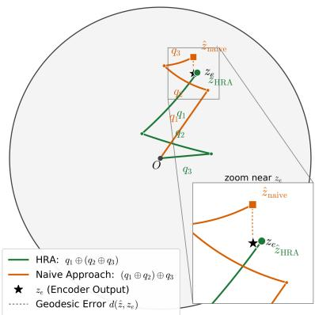
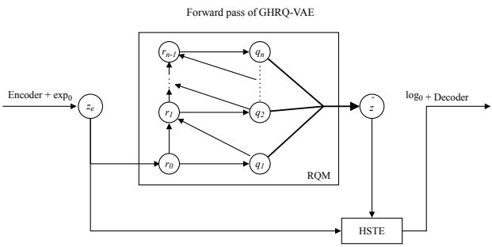
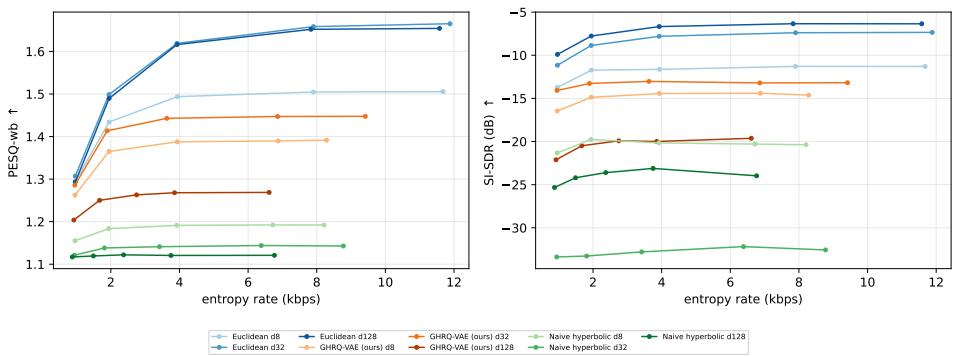

# Geometry-Aware Hyperbolic Residual-Quantized Variational Autoencoders

Alessio Colombo and Melika Ayoughi

Universiteit van Amsterdam, Amsterdam, Netherlands alessio.colombo@student.uva.nl, m.ayoughi@uva.nl

Abstract. Residual Vector Quantization turns continuous representations into discrete, multi-level token sequences. Yet most methods operate in Euclidean space, despite the coarse-to-fine structure of the resulting codes and the latent hierarchies present in many data domains. Hyperbolic geometry ofers a natural alternative for hierarchical representations, but naive hyperbolic extensions introduce geometric inconsistencies: non-associative hyperbolic addition prevents consistent residual aggregation, while standard straight-through gradient estimation ignores the geometry of the latent space. We propose a geometry-aware hyperbolic residual quantization that addresses these issues in both the forward and backward passes. In the forward pass, Hyperbolic Residual Aggregation restores the telescoping behavior of residual quantization on the Poincaré ball. In the backward pass, a discounted Hyperbolic Straight-Through Estimator routes the reconstruction gradient through the quantizer as a single geometric block, avoiding unstable recursive gradient transport across residual stages. Evaluations on hierarchical prediction, recommendation, image tokenization, and neural audio coding tasks show that our method improves the stability and structural organization of hyperbolic residual codes over naive hyperbolic baselines. At the same time, we observe a clear structure–compression trade-of: Euclidean residual quantization remains preferable for pure compression, while geometry-aware hyperbolic quantization is most useful for hierarchically organized discrete latent spaces.

Keywords: Hyperbolic Learning · Residual Vector Quantization

## 1 Introduction

In recent years, a growing line of work in modern generative modeling is increasingly shifting toward learning discrete representations [6, 29, 49, 54, 77]. By converting continuous signals into token sequences, vector-quantized autoencoders make it possible to apply powerful sequence models, such as autoregressive transformers [41, 59] and difusion-based architectures [37], to images [41, 54], audio [11, 21, 78], text [62], and multi-modal data [19, 24]. Residual vector quantization extends this idea by representing an input through multiple quantization stages: early codebooks capture coarse information, while later codebooks refine the remaining error [41, 78].

Most residual quantization methods, however, operate in Euclidean latent spaces [21,41,78], which are intrinsically flat, with volume growing only polynomially in the radius [63]. This is not always ideal: many data domains contain latent hierarchical structure [52,63] that the multi-stage codes of residual quantization could organize given a suitable geometry. Hyperbolic geometry is a natural candidate, as its negative curvature and exponential volume growth represent hierarchies with low distortion [13, 63, 65]. Residual quantization in hyperbolic space could thus provide a better inductive bias when the goal is not only compression but the discovery of hierarchically organized representations [47, 58].

Recent works explore hyperbolic vector quantization [12, 17, 28] and hyperbolic residual quantization [58,73]. Yet a naive transfer to hyperbolic space introduces two geometric inconsistencies. First, during the forward pass, the residual cascade is no longer algebraically accurate. In Euclidean residual quantization, subtracting selected codewords from the residual and summing them back into the reconstruction are inverse operations. In hyperbolic space, the corresponding operation, Möbius addition, is non-associative and non-commutative [27, 72]; so naive aggregation fails to recompose the encoder input, and the residual cascade drifts as depth increases. Second, during the backward pass, the standard straight-through estimator passes gradients through the residual quantizer as if the latent space were Euclidean. This ignores the geometry of the manifold and leads to unstable gradient flow across residual stages.

We address both issues with a geometry-aware hyperbolic residual-quantized variational autoencoder (GHRQ-VAE) that repairs the forward and backward passes, stabilizing training at depth and enabling the representation of latent hierarchical structures.

Our contributions are threefold. (i) We identify and formalize the forward and backward geometric inconsistencies that arise when residual quantization is naively lifted to hyperbolic space. (ii) We introduce a geometry-aware hyperbolic residual quantizer that restores consistent residual aggregation and provides stable block-level gradient routing on the Poincaré ball. (iii) We evaluate the method across hierarchical prediction, recommendation, image tokenization, and neural audio coding. To the best of our knowledge, this is the first application of hyperbolic RQ-VAEs to image and audio tasks. Our results reveal that while Euclidean methods remain preferable for pure signal compression and raw reconstruction fidelity, geometry-aware hyperbolic residual quantization provides more stable training and yields more structurally organized hyperbolic residual codes, especially compared with naive hyperbolic baselines.

## 2 Related Work

Vector and Residual Quantization. Vector quantization has a long history in signal processing for lossy compression [29], and was revived in deep learning by the VQ-VAE [54], which introduced a discrete bottleneck into the autoencoder framework (we review its mechanics in §3). A persistent obstacle is codebook collapse [39, 62], where only a few codewords are ever selected; remedies range from codebook resets and EMA updates to alternative bottlenecks [6, 49, 70]. Residual Vector Quantization (RVQ) extends single-stage VQ by quantizing in multiple successive stages [78], constructing a virtual codebook of exponential capacity without growing the memory footprint or sequence length. RQ-VAE has since been applied across image generation [14, 37, 41, 43], audio codecs [21, 78], audio generation [11, 19], and generative recommendation [59, 73], all sharing an inherent hierarchy: truncating the code tuple at any depth yields a coarser but coherent approximation. Yet all existing RVQ methods operate in Euclidean space, whose flat geometry and polynomial volume growth are mismatched with the hierarchical structure that residual quantization induces.

Hyperbolic Representation Learning. In hyperbolic space, the volume of a geodesic ball grows exponentially with radius, in stark contrast to the polynomial growth of Euclidean space [13]. Sala et al. [63] showed that any weighted tree with n nodes embeds into two-dimensional hyperbolic space with arbitrarily low distortion, whereas Euclidean space requires ${ \mathcal { O } } ( n )$ dimensions, a gap that continues to guide the design of hierarchy embeddings [5]. Hyperbolic representation learning was pioneered by Nickel and Kiela [52, 53], and Ganea et al. [27] formalized neural network operations on the ball via Möbius gyrovector algebra [72]; subsequent work moved computation fully onto the manifold [7, 18, 68]. Hyperbolic networks have since been applied across word embeddings [23,71,79], graph learning [15, 44, 45, 76], computer vision [2, 25, 36, 46, 50, 56], continual and incremental learning [4, 32, 69], and vision-language and language models [30, 31, 34, 55]. Poincaré VAE [47] and related hyperbolic generative models [20,42,51,66] showed that hierarchical structure emerges in hyperbolic latents without supervision, while supervised approaches embed known label hierarchies through entailment cones [16, 22, 26] and ideal boundary prototypes [1, 10], at any level of granularity [3]. Several works combine hyperbolic geometry with vector quantization [17, 28] and residual vector quantization [58, 73]. Because these methods retain Euclidean gradient transport and a non-associative aggregation, we make both geometrically aware.

## 3 Preliminaries

Vector-Quantized Variational Autoencoders. The VQ-VAE [54] learns a discrete latent representation of continuous data. Given an input signal x, an encoder network E maps it to a continuous latent representation $z _ { e } = E ( x ) \in \mathbb { R } ^ { d }$ . A trainable codebook $C = \{ c _ { 1 } , \ldots , c _ { K } \} \subset \mathbb { R } ^ { d }$ is then used to discretize this vector via the nearest codeword under the Euclidean distance, $q ( z _ { e } ) = c _ { k }$ with $k =$ argminj $\| z _ { e } - c _ { j } \| _ { 2 } ^ { 2 }$ . The selected vector is passed to a decoder G that reconstructs $\hat { x } = G \check { ( } q ( z _ { e } ) )$ . Since the nearest-neighbor assignment is non-diferentiable, the VQ-VAE uses the Straight-Through Estimator (STE) [9]: the forward value is computed while the diference $q ( z _ { e } ) - z _ { e }$ is held under the stop-gradient operator $\mathrm { s g } [ \cdot ]$

$$
\begin{array} { r } { \hat { z } _ { \mathrm { S T E } } = z _ { e } + \mathrm { s g } \left[ q ( z _ { e } ) - z _ { e } \right] . } \end{array}\tag{1}
$$

This evaluates to $q ( z _ { e } )$ in the forward pass, yet because the stop-gradient term is treated as a constant, its Jacobian reduces to $\partial \hat { z } _ { \mathrm { S T E } } / \partial z _ { e } = I ,$ so the decoder gradient is passed unaltered to the encoder.

Residual Vector Quantization. RVQ extends the single-stage paradigm by quantizing the latent representation in N successive stages, each with its own codebook [78]. Let $r _ { 0 } = z _ { e }$ denote the encoder output. At stage i the current residual $r _ { i - 1 }$ is quantized to a codeword $q _ { i } ,$ and the residual for the next stage is obtained by subtracting the selected codeword, $r _ { i } = r _ { i - 1 } - q _ { i }$ . The STE of Eq. 1 is applied independently at every stage, and the final representation is the sum of the selected codewords, $\begin{array} { r } { \hat { z } = \sum _ { i = 1 } ^ { N } \hat { q _ { i } } } \end{array}$ . This coarse-to-fine decomposition constructs a virtual codebook of efective size $K ^ { N }$ and induces a natural hierarchy: early stages capture coarse, global structure while later stages encode progressively finer detail. All stages are trained jointly with the objective

$$
{ \mathcal { L } } = \underbrace { \| x - { \hat { x } } \| _ { 2 } ^ { 2 } } _ { L _ { \mathrm { r e c } } } + \sum _ { i = 1 } ^ { N } { \Big ( } \underbrace { d { \big ( } \mathrm { s g } [ r _ { i - 1 } ] , q _ { i } { \big ) } ^ { 2 } } _ { \mathrm { c o d e b o o k } } + \beta \underbrace { d { \big ( } r _ { i - 1 } , \mathrm { s g } [ q _ { i } ] { \big ) } ^ { 2 } } _ { \mathrm { c o m m i t m e n t } } { \Big ) } ,\tag{2}
$$

where the reconstruction term $L _ { \mathrm { r e c } }$ is decoded from the aggregate code as ${ \hat { x } } =$ $G ( \hat { z } )$ , β weights the commitment term, and $d ( \cdot , \cdot )$ is a distance on the latent space. The Euclidean distance recovers the standard RQ-VAE loss; replacing it with the geodesic distance and the hyperbolic aggregate of §4.1 gives the hyperbolic counterpart we adopt.

Hyperbolic Geometry. Hyperbolic space is a Riemannian manifold of constant negative curvature whose geodesic-ball volume grows exponentially with radius [13]. We adopt the Poincaré ball, which is well suited to gradient-based learning because its operations admit closed forms [27]. For a curvature parameter $c > 0$ the Poincaré ball $\mathbb { D } _ { c } ^ { d } = \{ x \in \mathbb { R } ^ { d } : c \| x \| ^ { 2 } < \mathrm { i } \}$ } is equipped with the conformal metric $g _ { x } ^ { c } \ : = \ : ( \lambda _ { x } ^ { c } ) ^ { 2 } \bar { g ^ { E } }$ , with conformal factor $\lambda _ { x } ^ { c } = 2 / ( 1 - c \| x \| ^ { 2 } )$ ; conformal means that the metric is a positive pointwise rescaling of the Euclidean metric $g ^ { E }$ , so angles are preserved but lengths are not. The setting $c = 0$ recovers Euclidean space. The conformal factor is decisive: $\lambda _ { 0 } ^ { c } \ = \ 2$ at the origin but diverges, $\lambda _ { x } ^ { c }  \infty$ , toward the boundary, which both grants expressive power and makes computations numerically delicate there. In the Poincaré ball, the analogue of addition is the Möbius addition

$$
x \oplus _ { c } y = { \frac { \left( 1 + 2 c \langle x , y \rangle + c \| y \| ^ { 2 } \right) x + \left( 1 - c \| x \| ^ { 2 } \right) y } { 1 + 2 c \langle x , y \rangle + c ^ { 2 } \| x \| ^ { 2 } \| y \| ^ { 2 } } } ,\tag{3}
$$

with Möbius subtraction $x \ominus _ { c } y = x \oplus _ { c } ( - y )$ . ⊕c is neither commutative nor associative. The failure of commutativity is captured by the gyration operator

$$
\mathrm { g y r } [ u , v ] w = \ominus ( u \oplus _ { c } v ) \oplus _ { c } \big ( u \oplus _ { c } ( v \oplus _ { c } w ) \big ) ,\tag{4}
$$

an automorphism of the ball that acts as a rotation: $u \oplus _ { c } v = \mathrm { g y r } [ u , v ] ( v \oplus _ { c } u )$ . The induced geodesic distance is $\begin{array} { r } { d _ { \mathbb { D } _ { c } } ( x , y ) = \frac { 2 } { \sqrt { c } } \operatorname { t a n h } ^ { - 1 } ( \sqrt { c } \| ( - x ) \overset { } { \oplus } _ { c } y \| ) } \end{array}$ . At every point x the tangent space $T _ { x } \mathbb { D } _ { c } ^ { d }$ is a local Euclidean linearization of the manifold; movement between the manifold and a tangent space is mediated by the mutually inverse exponential and logarithmic maps, which at the origin take the radial forms exp $\begin{array} { r } { \dot { \mathrm { ~ ) ~ } } ( v ) = \operatorname { t a n h } ( \sqrt { c } \| v \| ) \frac { v } { \sqrt { c } \| v \| } } \end{array}$ and $\begin{array} { r } { \log _ { 0 } ^ { c } ( y ) = \operatorname { t a n h } ^ { - 1 } ( \sqrt { c } \| y \| ) \frac { y } { \sqrt { c } \| y \| } , } \end{array}$ A tangent vector at x cannot be directly compared with one at y; parallel transport carries it along the connecting geodesic while preserving its Riemannian norm,

$$
P _ { x \to y } ^ { c } ( v ) = \frac { \lambda _ { x } ^ { c } } { \lambda _ { y } ^ { c } } \ \mathrm { g y r } [ y , - x ] v ,\tag{5}
$$

which both rescales the vector by the ratio of conformal factors and rotates it through the gyration. Finally, because the metric rescales the inner product by $( \lambda _ { x } ^ { c } ) ^ { 2 }$ , the Riemannian gradient relates to the Euclidean one by $\nabla ^ { \tilde { R } } f ( x ) =$ $( \mathrm { j } _ { x } ^ { c } ) ^ { - 2 } \nabla ^ { E } f ( x )$ . A correct backward pass on the ball therefore converts Euclidean gradients to Riemannian ones, transports them between tangent spaces via Eq. 5, and converts back; as $\lambda _ { x } ^ { c }$ diverges near the boundary, these conversions can amplify gradient magnitudes substantially.

## 4 Method

Geometry-aware Hyperbolic Residual Quantization (GHRQ) lifts residual quantization onto the Poincaré ball through two independent repairs that compose into a single quantizer: Hyperbolic Residual Aggregation (HRA), which provides an algebraically correct coarse-to-fine decomposition in the forward pass (§4.1), and a block-level gradient routing, which uses a single discounted Hyperbolic Straight-Through Estimator (d-HSTE) step to send the gradient back to the encoder during the backward pass (§4.2).

## 4.1 Hyperbolic Residual Aggregation

Residual quantization rests on a single algebraic guarantee: the rule that removes a code from the running residual and the rule that re-assembles the codes into the reconstruction must be exact inverses. In Euclidean space this holds for free. Writing $r _ { 0 } = z _ { e }$ for the encoder point and $\hat { z } _ { i }$ for the aggregate of the first i codes, the update $r _ { i } = r _ { i - 1 } - q _ { i }$ and the sum $\hat { z } = \textstyle \sum _ { i } q _ { i }$ are mutually inverse because addition is commutative and associative; the residual entering each stage therefore equals the part of $z _ { e }$ not yet captured by the earlier codes (the true residual $R _ { i } ^ { \mathrm { t r u e } } = z _ { e } - \hat { z } _ { i } = r _ { i } )$ and the decomposition telescopes, recomposing $z _ { e }$ up to the final, unquantized residual, $\hat { z } + r _ { N } = z _ { e }$ . Each codebook is thus fitted to the reconstruction error left by its predecessors, which is the entire purpose of the coarse-to-fine cascade.

On the Poincaré ball this guarantee is no longer automatic. Möbius addition is neither commutative nor associative, so the naive lift of the recursion, replacing the subtraction by a right Möbius subtraction and the sum by a left-associated Möbius addition,

$$
\begin{array} { r } { r _ { i } = r _ { i - 1 } \oplus _ { c } ( - q _ { i } ) , \qquad \hat { z } = \left( \cdots ( q _ { 1 } \oplus _ { c } q _ { 2 } ) \oplus _ { c } \cdots \right) \oplus _ { c } q _ { N } , } \end{array}\tag{6}
$$

no longer inverts itself. The tracked residual drifts away from the true residual, compounds with depth, and the codes no longer recompose to $z _ { e }$

The HRA convention. To solve this, we choose the residual and aggregation rules so that they cancel by construction, using the one cancellation law the gyrogroup does provide. The left-cancellation law

$$
a \oplus _ { c } { \big ( } ( - a ) \oplus _ { c } b { \big ) } = b\tag{7}
$$

states that adding a on the left exactly undoes subtracting a on the left. Pairing a $l e f t$ Möbius subtraction in the residual update with a reverse-nested (rightassociated) aggregation,

$$
\begin{array} { l l l } { r _ { i } = ( - q _ { i } ) \oplus _ { c } r _ { i - 1 } , } & { } & { \hat { z } = q _ { 1 } \oplus _ { c } \big ( q _ { 2 } \oplus _ { c } ( \cdot \cdot \cdot \oplus _ { c } q _ { N } ) \big ) , } \end{array}\tag{8}
$$

matches each subtraction to precisely the addition that inverts it. We call this pairing the Hyperbolic Residual Aggregation (HRA) convention.

Exact telescoping. The HRA convention inverts the cascade stage by stage. The first stage gives $r _ { 1 } = \left( - q _ { 1 } \right) \oplus _ { c } z _ { e }$ , which Eq. 7 (taking $a = q _ { 1 } , b = z _ { e } )$ inverts as $q _ { 1 } \oplus _ { c } r _ { 1 } = z _ { e }$ . The same identity holds at every stage, $q _ { i } \oplus _ { c } r _ { i } = r _ { i - 1 }$ , so unrolling the recursion recomposes the encoder point without error, q1 ⊕c (q2 ⊕c $( \cdot \cdot \cdot \oplus _ { c } ( q _ { N } \oplus _ { c } r _ { N } ) ) ) = z _ { e }$ . Dropping the final unquantized residual $r _ { N }$ leaves the reconstruction zˆ of $\operatorname { E q . 8 } ,$ which coincides with $z _ { e }$ up to that tail. This is exactly the Euclidean telescoping property, now recovered on the ball.

The residual mismatch collapses to a pure rotation. On the ball the true residual is $R _ { i } ^ { \mathrm { t r u e } } : = ( - \hat { z } _ { i } ) \oplus _ { c } z _ { e }$ , the Möbius left-diference satisfying $\hat { z } _ { i } \oplus _ { c } R _ { i } ^ { \mathrm { t r u e } } = z _ { e }$ , which in general difers from the tracked residual $r _ { i }$ . Under HRA, however, repeatedly applying the gyration form of left cancellation relates the two by a composition of gyrations,

$$
R _ { i } ^ { \mathrm { t r u e } } = T _ { i } r _ { i } , \qquad T _ { i } = \prod _ { k = 1 } ^ { i - 1 } \mathrm { g y r } \big [ q _ { k } , u _ { k + 1 } \big ] ,\tag{9}
$$

Each factor is a norm-preserving rotation of the ball about the origin, so $T _ { i }$ rotates the residual’s direction while adding zero magnitude error, $\| R _ { i } ^ { \mathrm { t r u e } } \| =$ $\| r _ { i } \|$ . The tracked residual thus carries the magnitude of the true reconstruction error at every depth (proof in Appendix B.2), unlike the naive convention, whose mismatch is a drift that corrupts this magnitude and compounds with depth.

Figure 1 makes the contrast concrete on the Poincaré disk, where HRA aggregation lands on $z _ { e }$ up to the tail $r _ { N }$ while the naive order drifts away.

## 4.2 Block-Level Gradient Routing with a Discounted HSTE

We repair the backward pass with two mechanisms. The first is the Discounted Hyperbolic Straight-Through Estimator (d-HSTE), a single-step surrogate that transports one gradient between two points on the Poincaré ball while respecting its geometry. The second is a block-level gradient routing strategy that, via stopgradients, decouples the residual cascade and applies the d-HSTE exactly once. This transports a single, boundary-stable reconstructed gradient from the aggregate reconstruction zˆ directly to the encoder output $z _ { e }$ , bypassing all intermediate codes $q _ { i } \ ( i > 1 )$ ) and residuals $r _ { i } \ ( i > 0 )$ . The result is a depth-independent gradient to the encoder that parallels the Euclidean RQ-VAE behavior.

  
Fig. 1: Residual aggregation of the same codewords under the two conventions of $\ S 4 . 1 .$ on the Poincaré disk. An encoder point $z _ { e } ~ \mathrm { ( s t a r ) }$ is quantized into coarse-to-fine codes $q _ { 1 } , q _ { 2 } , q _ { 3 }$ , and each aggregation is drawn as a chain of Möbius hops from the origin O. The HRA reverse-nested order $q _ { 1 } \oplus _ { c } \left( q _ { 2 } \oplus _ { c } q _ { 3 } \right)$ (green circle, Eq. 8) reaches zˆHRA, coinciding with $z _ { e }$ up to the final residual. The naive left-associated order $( q _ { 1 } \oplus _ { c } q _ { 2 } ) \oplus _ { c } q _ { 3 }$ (orange square, $\operatorname { E q . 6 } )$ misplaces the gyration factors and drifts to $\hat { z } _ { \mathrm { n a i v e } } ;$ the inset zooms on $z _ { e }$ . The drift is small for shallow, well-quantized residuals, and compounds with depth and proximity to the ball boundary.

Discounted Hyperbolic Parallel Transport. In the forward pass, the d-HSTE acts as the identity mapping: d- $\mathrm { . H S T E } ( z _ { e } , q ) = q$ . It only modifies the backward pass, where it assigns the encoder point a surrogate Jacobian in place of the non-diferentiable nearest-neighbor assignment. Given a Euclidean gradient $g _ { q } : = \partial L / \partial q$ at a code $q ,$ exact transport to $z _ { e }$ requires three Riemannian operations: (i) conversion to a Riemannian gradient at q by dividing by $( \lambda _ { q } ^ { c } ) ^ { 2 } ;$ (ii) parallel transport along the geodesic from $q$ to $z _ { e } ,$ , scaling by $\lambda _ { q } ^ { c } / \lambda _ { z _ { \epsilon } } ^ { c }$ and rotating by $\mathrm { g y r } [ z _ { e } , - q ]$ ; and (iii) conversion back to a Euclidean gradient at $z _ { e }$ via multiplication by $( \lambda _ { z _ { e } } ^ { c } ) ^ { 2 }$ . We skip the third step, since $( \lambda _ { z _ { e } } ^ { c } ) ^ { 2 }$ diverges as $z _ { e }$ approaches the boundary. Steps $( \mathrm { i } ) { - } ( \mathrm { i i } )$ alone define a discounted parallel transport $\tilde { P } _ { q  z _ { e } } ^ { c } ,$ the surrogate derivative the estimator assigns to the encoder point:

$$
\frac { \partial L } { \partial z _ { e } } = \widetilde { P } _ { q  z _ { e } } ^ { c } g _ { q } = \frac { 1 } { \lambda _ { q } ^ { c } \lambda _ { z _ { e } } ^ { c } } \mathrm { g y r } [ z _ { e } , - q ] g _ { q } .\tag{10}
$$

Because $q$ closely approximates $z _ { e } ,$ evaluating the gyration via its standard formulation is prone to catastrophic cancellation; we instead use a numerically stable, exact reformulation of the gyration. Writing gy $\displaystyle \mathrm { r } [ z _ { e } , - q ] v = v + 2 ( a z _ { e } - b q ) / d$ and setting the quantization error $\delta : = q - z _ { e } $ , both the denominator d and the coeficient gap $a - b$ otherwise subtract two nearly identical $O ( 1 )$ quantities; cancelling these analytically gives the equivalent forms

$$
\begin{array} { r } { d = ( 1 - c \| z _ { e } \| ^ { 2 } ) ^ { 2 } - 2 c ( 1 - c \| z _ { e } \| ^ { 2 } ) \left. z _ { e } , \delta \right. + c ^ { 2 } \| z _ { e } \| ^ { 2 } \| \delta \| ^ { 2 } , } \\ { a - b = - c ( 1 - c \| z _ { e } \| ^ { 2 } ) \left. \delta , v \right. - c ^ { 2 } \langle z _ { e } , v \rangle \| \delta \| ^ { 2 } + 2 c ^ { 2 } \langle z _ { e } , \delta \rangle \left. \delta , v \right. , } \end{array}\tag{11}
$$

expressed through small terms of comparable magnitude (with $a z _ { e } - b q \ =$ $\textstyle \frac { a - { b } } { 2 } ( q + z _ { e } ) - \frac { a + { b } } { 2 } \delta$ and $a + b$ computed directly). This is mathematically identical to the closed form (Appendix B.4) but stays finite at the boundary, preserving expressiveness in high-curvature regions.

Block-Level Gradient Routing. Stacking d-HSTE steps naively would still be unstable: unlike the Euclidean case, the per-stage residual Jacobians $A _ { i } = \partial r _ { i } / \partial r _ { i - 1 }$ do not vanish on the ball (the two diferentials of $\oplus _ { c }$ difer by $c \| q _ { i } - r _ { i - 1 } \| ^ { 2 } / \gamma _ { i }$ on the directions orthogonal to span $\{ r _ { i - 1 } , q _ { i } \}$ , so $A _ { i } \neq 0$ unless the stage quantizes exactly), so reconstruction and commitment gradients accumulate across all N stages and diverge as the residuals approach the boundary (Appendix B.3). To circumvent this recursive instability, we decouple the intermediate residuals from the computational graph. Applying a stop-gradient to every intermediate residual $( r _ { i } \gets \mathrm { s g } [ r _ { i } ]$ for $i \geq 1 )$ lets the codes propagate their forward values into the aggregation (Eq. 8) without backpropagating the reconstruction gradient through the cascade. Instead, the encoder receives the reconstruction gradient via a single d-HSTE step from the aggregate reconstruction $\hat { z } = q _ { 1 } \oplus _ { c } \left( q _ { 2 } \oplus _ { c } \left( \cdot \cdot \cdot \oplus _ { c } q _ { N } \right) \right)$ directly to $r _ { 0 } ~ = ~ z _ { e }$ . The full decoder gradient $g _ { \hat { z } } : = \partial L _ { \mathrm { r e c } } / \partial \hat { z }$ is transported using Eq. 10 with $q = \hat { z } .$ , yielding the block-level estimator

$$
\frac { \partial L _ { \mathrm { r e c } } } { \partial z _ { e } } = \frac { 1 } { \lambda _ { \hat { z } } ^ { c } \lambda _ { z _ { e } } ^ { c } } \ \mathrm { g y r } [ z _ { e } , - \hat { z } ] g _ { \hat { z } } .\tag{12}
$$

The reconstruction signal reaches the encoder as a single, depth-independent gradient copy rather than through the leaking per-stage cascade, and the commitment terms are filtered identically: stage i’s commitment loss pulls $r _ { i - 1 }$ toward $q _ { i }$ , but for $i > 1$ the residual lies behind the stop-gradient, so only the coarsest $i = 1$ term survives. Codebooks remain optimizable through their perstage codebook loss, and at zero curvature the formulation recovers standard Euclidean residual vector quantization up to a rescaling (Appendix B.5). Figure 2 summarizes the complete forward pass.

## 5 Experimental Setup

The methodology of §4 provides a geometry- and architecture-agnostic framework for residual quantization on the Poincaré ball. We test the quantizer across four tasks spanning a shallow regime $( N = 4 )$ , typical of prior hyperbolic residual quantization studies, and a deep regime $( N = 1 2 )$ , where numerical instabilities become pronounced. Across all experiments, the quantizer geometry and gradient routing are the sole independent variables; the encoder, decoder, optimizer, data pipeline, and evaluation protocols remain fixed within each task. We compare against two baselines with identical configurations. The Euclidean baseline employs standard residual vector quantization (c = 0) with an identity STE and an additive residual recursion. The naive hyperbolic baseline directly adapts prior hyperbolic residual quantization methods [58] (c = 1): codebooks reside on the Poincaré ball and assignments use squared geodesic distance, but the estimator retains the Euclidean identity STE and employs Möbius addition (Eq. 6). Curvature is set to $c = 1$ for hyperbolic models. Encoder and decoder architectures, codebook sizes, optimizers, and training budgets are identical across the three configurations within each task; they are specified in full in Appendix A. The source code will be made publicly available.

  
Fig. 2: Forward pass of GHRQ. The encoder output $z _ { e }$ is residual-quantized into coarse-to-fine codes $q _ { 1 } , \ldots , q _ { N }$ , recombined into zˆ. The block-level gradient routing of §4.2 sends a discounted-HSTE gradient from zˆ directly back to $z _ { e } ,$ bypassing the intermediate codes and residuals. All backward passes through the Residual Quantization Module (RQM) are blocked, except the path $\hat { z } \to q _ { 1 } \to z _ { e }$ , left intact to preserve the coarsest commitment signal as in the Euclidean case. In the naive case, gradients would instead flow and accumulate through all residuals and quantizations of the RQM.

Tasks and datasets. (i) WordNet hypernymy prediction [52] embeds the 82,115 noun synsets of the WordNet hierarchy in the shallow regime $( N = 4 )$ , training the encoder with a contrastive InfoNCE objective (50 negatives) on the closure split, i.e. the transitive closure of the hypernymy DAG, in which a pair $( u , v )$ is positive whenever v is any ancestor of u rather than only its direct hypernym. (ii) Generative sequential recommendation follows the semantic-ID paradigm [59], mapping items of the Amazon Reviews Beauty corpus [48] (leaveone-out protocol) to discrete codes $( N = 4 )$ over frozen MPNet [67] sentence embeddings, from which a downstream sequence model generates semantic IDs autoregressively. (iii) Image reconstruction and generation uses MNIST [40] and CIFAR-100 [38] (whose 100 fine classes form 20 coarse superclasses, used only for unsupervised taxonomy evaluation), quantizing a convolutional VQ-VAE [54] tokenizer $( N = 4 )$ over which an RQ-Transformer prior [41] is trained to draw 10,000 samples. (iv) Neural audio coding employs a SoundStream-style neural codec [21, 75, 78] on LibriTTS train-clean-100 at 24 kHz, the deepest stack $( N = 1 2 )$ . Due to the divergence of conformal factors near the boundary, the hyperbolic codec necessitates explicit encoder stabilization, specifically an autocalibrated regularizer and quantizer-depth dropout [78] (Appendix A.5).

Table 1: WordNet hypernymy reconstruction (Recall@10, closure split) across varying encoder dimensions $( d \in \{ 8 , 1 6 \} )$ and per-stage codebook sizes $( b \in \{ 6 4 , 1 2 8 \} )$ , with $N = 4$
<table><tr><td>Configuration</td><td>d8/b64 d8/b128 d16/b64 d16/b128</td><td></td><td></td><td></td></tr><tr><td>Euclidean</td><td>75.8</td><td>75.4</td><td>76.7</td><td>75.9</td></tr><tr><td>Naive hyperbolic</td><td>88.2</td><td>62.3</td><td>86.9</td><td>83.4</td></tr><tr><td>GHRQ-VAE (ours)</td><td>81.9</td><td>78.7</td><td>83.8</td><td>81.9</td></tr></table>

Metrics. Each configuration is evaluated on task-specific performance and, where applicable, on the structural hierarchy of the learned latent space. WordNet is scored by Recall@10 on the closure split, code-tuple uniqueness, and intra-cluster semantic coherence (WordNet path and Wu–Palmer tree similarity [74], GloVe cosine similarity [57]); recommendation by Recall@5/10, NDCG@5/10 [35] and the pre-deduplication uniqueness ratio; images by reconstruction MSE, FID and IS [64], and unsupervised CIFAR-100 superclass hierarchy recovery via Adjusted Rand Index (ARI) [33], Normalized Mutual Information (NMI), and dendrogram purity; audio by reconstruction loss and perceptual rate-distortion (PESQ [60], SI-SDR [61]) against entropy-estimated bitrates.

## 6 Results

We evaluate the three quantizer configurations on the four tasks, separating three questions: whether hyperbolic residual quantization improves hierarchical organization, whether our geometric corrections improve stability over naive baselines, and whether these benefits translate into compression. Prior work [58] shows hyperbolic residual quantization improves WordNet (§6.1) and sequential recommendation (§6.2); on these we assess whether GHRQ-VAE outperforms the naive baseline. We additionally present the first working application of hyperbolic residual quantization to a convolutional image tokenizer (§6.3) and a deep (N = 12) neural audio codec (§6.4).

## 6.1 WordNet Hypernymy Prediction

Table 1 reports the Recall@10 for hypernymy reconstruction across varying model capacities. While hyperbolic formulations consistently outperform the Euclidean baseline, the naive hyperbolic baseline is unstable. Although it achieves peak recall in specific configurations, it collapses significantly in others (62.3% at d8/b128). Furthermore, its performance may be inflated by lower codebook usage: Table 2 shows that the naive approach yields a low uniqueness ratio (0.888), assigning identical code sequences to disparate concepts, thereby reducing the target space for the reconstructor. Conversely, GHRQ-VAE provides a stable optimization profile and maintains high codebook utilization (uniqueness 0.967). Crucially, as shown in Table 2, GHRQ-VAE clusters the vocabulary into more semantically coherent groups, consistently outperforming the naive approach across multiple similarity metrics.

Table 2: WordNet latent representation quality evaluated at the standard capacity setting (d16/b128) across all 82,115 noun synsets. The semantic similarity of concepts mapped to identical codes is evaluated using WordNet Path, Wu–Palmer tree similarity, and GloVe cosine similarity, with higher values indicating coherent clustering.
<table><tr><td>Configuration</td><td>uniq. ratio path sim wup sim GloVe sim</td><td></td><td></td><td></td></tr><tr><td>Naive hyperbolic</td><td>0.888</td><td>0.078</td><td>0.242</td><td>0.097</td></tr><tr><td>GHRQ-VAE (ours)</td><td>0.967</td><td>0.088</td><td>0.262</td><td>0.162</td></tr></table>

## 6.2 Generative Sequential Recommendation

The recommendation task evaluates whether the improved hierarchical code space translates to downstream seq2seq generative recommendation. As shown in Table 3, both hyperbolic methods outperform the Euclidean baseline. GHRQ-VAE achieves the highest performance on the majority of ranking metrics, as well as the highest codebook usage.

Table 3: Downstream recommendation performance on the Amazon Beauty dataset. We report the test-set ranking metrics and the pre-deduplication uniqueness ratio (a proxy for codebook health).
<table><tr><td>Configuration</td><td>uniq. ratio</td><td>R@5</td><td>NDCG@5</td><td>R@10</td><td>NDCG@10</td></tr><tr><td>Euclidean</td><td>0.960</td><td>0.0352</td><td>0.0242</td><td>0.0530</td><td>0.0299</td></tr><tr><td>Naive hyperbolic</td><td>0.870</td><td>0.0388</td><td>0.0259</td><td>0.0606</td><td>0.0329</td></tr><tr><td>GHRQ-VAE (ours)</td><td>0.971</td><td>0.0393</td><td>0.0264</td><td>0.0604</td><td>0.0332</td></tr></table>

## 6.3 Image Reconstruction and Generation

The image domain scores the same trained codes across three criteria: compression fidelity (reconstruction MSE), token quality for generative modeling (RQ-Transformer FID/IS), and unsupervised taxonomy discovery. The Euclidean baseline yields the lowest reconstruction error (Table 4); both hyperbolic configurations incur a 19–36% relative MSE penalty, with GHRQ-VAE marginally behind the naive lift, reflecting that hyperbolic methods are weaker at raw signal reconstruction. When assessing structural organization (Table 5), the ranking inverts: GHRQ-VAE increases the Adjusted Rand Index from the Euclidean baseline’s 0.048 to 0.087 (+81%) and similarly leads in NMI and purity. For datasets possessing a latent taxonomy, the capacity surrendered at the reconstruction stage is recovered here as a more robust global taxonomy. Generation is datasetdependent (Table 6): on MNIST both hyperbolic configurations achieve superior FID, whereas on CIFAR-100 the Euclidean baseline leads, with GHRQ-VAE the strongest hyperbolic alternative.

Table 4: Image reconstruction loss $( \times 1 0 ^ { - 3 } )$ . Euclidean achieves the lowest error.  
Table 5: Unsupervised CIFAR-100 superclass recovery.
<table><tr><td>Configuration</td><td>MNIST CIFAR-100</td></tr><tr><td>Euclidean</td><td>0.477 1.077</td></tr><tr><td>Naive hyperbolic</td><td>0.600 1.280</td></tr><tr><td>GHRQ-VAE (ours)</td><td>0.647 1.360</td></tr></table>

<table><tr><td>Configuration</td><td>ARI↑ NMI↑ purity↑</td></tr><tr><td>Euclidean</td><td>0.048 0.469 0.327</td></tr><tr><td>Naive hyperbolic</td><td>0.0550.481 0.337</td></tr><tr><td>GHRQ-VAE (ours)</td><td>0.087 0.515 0.370</td></tr></table>

Table 6: Image generation performance with an autoregressive RQ-Transformer (10,000 samples, single seed). We report FID (lower is better) and IS in parentheses (higher is better).
<table><tr><td>Configuration</td><td>MNIST FID↓ (IS↑) CIFAR-100 FID↓ (IS↑)</td><td></td></tr><tr><td>Euclidean</td><td>20.36 (2.069)</td><td>94.67 (3.86)</td></tr><tr><td>Naive hyperbolic</td><td>15.01 (2.105)</td><td>101.84 (3.51)</td></tr><tr><td>GHRQ-VAE (ours)</td><td>16.78 (2.068)</td><td>98.23 (3.80)</td></tr></table>

## 6.4 Neural Audio Coding

The neural audio coding task uses the deep configuration (N = 12) to evaluate the scalability of the proposed block-level estimator under extended depth. The hyperbolic codec requires an auto-calibrated encoder-scale control and uniform quantizer-depth dropout to prevent representation collapse across all hyperbolic configurations. Figure 3 reports the perceptual rate–distortion behavior across the full depth sweep $( N \in \{ 1 , 2 , 4 , 8 , 1 2 \} )$ , plotting PESQ-wb and SI-SDR against the empirical entropy rate. The Euclidean baseline maintains a superior Pareto frontier at every bitrate, confirming that flat geometry remains preferable for pure signal compression. Among the hyperbolic methods, however, GHRQ-VAE dominates the naive Möbius lift almost everywhere, attaining higher perceptual quality at matched entropy rate across nearly all operating points and dimensions.

## 6.5 Residual Reconstruction Error Across Tasks

This section evaluates whether GHRQ-VAE lets the residual cascade accurately reconstruct the encoder output on the Poincaré ball, overcoming the gyration drift of the naive baseline (Eq. 6), quantified by the squared hyperbolic distance between the aggregated codes and the encoder output. The results (Table 7) corroborate the predictions of §4.1: GHRQ-VAE reconstructs the encoder representation with high precision, yielding residual errors near zero.

  
Fig. 3: Rate–distortion performance across varying quantization depths $( N \in$ {1, 2, 4, 8, 12}), plotted against the empirical entropy rate. Individual markers denote distinct operating points. Color indicates the quantizer variant (blue: Euclidean; orange: GHRQ-VAE; green: naive hyperbolic lift), while shading represents the codebook dimensionality $( d \in \{ 8 , 3 2 , 1 2 8 \}$ ). Left: PESQ-wb. Right: SI-SDR. The curves plateau when subsequent residual stages increase the empirical entropy rate without proportional gains in perceptual quality.

Table 7: Mean validation reconstruction error on the Poincaré ball, measured as the squared hyperbolic distance between the reconstructed code and the encoder output (audio trained for 10 epochs). Lower is better; the best result per row is in bold.
<table><tr><td>Task</td><td>Naive hyperbolic GHRQ-VAE</td><td>(ours)</td></tr><tr><td>WordNet hypernymy (d16/b128)</td><td>14.4</td><td>12.9</td></tr><tr><td>Sequential recommendation</td><td>44.79</td><td>0.031</td></tr><tr><td>Image reconstruction (MNIST)</td><td>0.00049</td><td> $\mathbf { < 1 0 ^ { - 5 } }$ </td></tr><tr><td>Image reconstruction (CIFAR-100)</td><td>0.00133</td><td> ${ \bf < 1 0 ^ { - 5 } }$ </td></tr><tr><td>Neural audio coding (mean over  $d \in \{ 8 , 3 2 , 1 2 8 \} )$ </td><td>0.521</td><td>0.0044</td></tr></table>

## 6.6 Ablation

GHRQ-VAE combines two modifications to the naive baseline: the HRA forward ordering and the block-level d-HSTE gradient. To identify which one drives the reduction in on-ball residual error, we ablate each in turn while holding all other hyperparameters fixed: HRA only keeps the forward ordering but reverts the gradient to the identity STE, and d-HSTE only applies the corrected gradient over the naive Möbius aggregation (Eq. 6). Table 8 reports the residual error of the two ablations against the full model.

Table 8: Component ablation on the on-ball residual error $( N = 4 )$ , measured as the mean validation squared hyperbolic distance between the recomposed codes and the encoder output; image columns are scaled by $1 0 ^ { - 3 }$ . The full-model values correspond to those of Table 7. Bold indicates the best result per column.
<table><tr><td>HRA d-HSTE</td><td></td><td>WordNet↓ Recommendation↓ MNIST</td><td> $\overline { { ( \times 1 0 ^ { - 3 } ) \downarrow } }$ </td></tr><tr><td>√ ×</td><td>10.3</td><td>5.49</td><td>CIFAR  $\overline { { ( \times 1 0 ^ { - 3 } ) \downarrow } }$  0.01 0.03</td></tr><tr><td>× √</td><td>30.4</td><td>0.12</td><td>0.02 0.05</td></tr><tr><td>√ √</td><td>12.9</td><td>0.03</td><td>0.00 0.00</td></tr></table>

HRA guarantees telescoping algebraically, yet when paired with the uncorrected gradient it is the least faithful configuration on recommendation. Symmetrically, dropping HRA is harmless on recommendation and images but inflates the WordNet error to 30.4. The two modifications are thus complementary rather than independent: HRA’s telescoping guarantee holds only at the operating radii that d-HSTE trains the encoder to visit, while the corrected gradient recomposes faithfully only when the forward pass is ordered to telescope. Each component supplies the precondition the other requires, and the residual error collapses uniformly only when both are present.

## 7 Conclusion and Discussion

Across four domains, a consistent picture emerges: hyperbolic curvature is most valuable for structure, not compression. Euclidean models retain the edge on raw reconstruction and on CIFAR-100 generation quality, yet the curved latent space organizes hierarchy more naturally, yielding substantial gains in unsupervised CIFAR-100 superclass recovery and WordNet hypernymy reconstruction. Relative to the naive hyperbolic lift, GHRQ-VAE is more robust, less prone to instability and codebook collapse, and its geometric corrections align the residual codes with the encoder point on the manifold. The value of GHRQ-VAE thus lies in stable hierarchical structuring rather than signal fidelity.

This separation also reframes an open question around the naive lift. Despite being geometrically inexact, it remains strong at shallow depth, attaining the best WordNet recall and leading on recommendation R@10. A plausible cause is its leaked per-stage gradient: geometrically inaccurate, yet behaving as a lowvariance, on-average-correct directional signal; a rigorous study of how to fold it into a geometrically consistent estimator is one direction for future work.

Closing this gap, and following the field’s shift toward difusion and flowmatching generation [12, 37, 42], evaluating hyperbolic tokenizers within these continuous paradigms and within large-scale modern tokenizers is a natural next step.

## References

1. Atigh, M.G., Keller-Ressel, M., Mettes, P.: Hyperbolic busemann learning with ideal prototypes. In: Advances in Neural Information Processing Systems 34: Annual Conference on Neural Information Processing Systems 2021, NeurIPS 2021, December 6-14, 2021, virtual. pp. 103–115 (2021), https://proceedings.neurips. cc/paper/2021/hash/01259a0cb2431834302abe2df60a1327-Abstract.html

2. Atigh, M.G., Schoep, J., Acar, E., van Noord, N., Mettes, P.: Hyperbolic image segmentation. In: IEEE/CVF Conference on Computer Vision and Pattern Recognition, CVPR 2022, New Orleans, LA, USA, June 18-24, 2022. pp. 4443– 4452. IEEE (2022). https://doi.org/10.1109/CVPR52688.2022.00441, https: //doi.org/10.1109/CVPR52688.2022.00441

3. Atigh, M.G., van Spengler, M., Long, T., Ayoughi, M., Kasarla, T., Mettes, P.: Hyperbolic learning with supervision from any granularity. In: The 29th International Conference on Artificial Intelligence and Statistics (2026), https: //openreview.net/forum?id=Hi2H3Logzx

4. Ayoughi, M., Atigh, M.G., Derakhshani, M.M., Snoek, C.G.M., Mettes, P., Groth, P.: Continual hyperbolic learning of instances and classes (2025), https://arxiv. org/abs/2506.10710

5. Ayoughi, M., van Spengler, M., Mettes, P., Groth, P.: Designing hierarchies for optimal hyperbolic embedding. In: European Semantic Web Conference (ESWC). pp. 362–382. Springer (2025)

6. Baevski, A., Schneider, S., Auli, M.: vq-wav2vec: Self-supervised learning of discrete speech representations. In: 8th International Conference on Learning Representations, ICLR 2020, Addis Ababa, Ethiopia, April 26-30, 2020. OpenReview.net (2020), https://openreview.net/forum?id=rylwJxrYDS

7. Bdeir, A., Schwethelm, K., Landwehr, N.: Fully hyperbolic convolutional neural networks for computer vision. In: The Twelfth International Conference on Learning Representations, ICLR 2024, Vienna, Austria, May 7-11, 2024. OpenReview.net (2024), https://openreview.net/forum?id=ekz1hN5QNh

8. Bécigneul, G., Ganea, O.E.: Riemannian adaptive optimization methods. In: International Conference on Learning Representations (2019), https://openreview. net/forum?id=r1eiqi09K7

9. Bengio, Y., Léonard, N., Courville, A.: Estimating or propagating gradients through stochastic neurons for conditional computation (2013), https://arxiv. org/abs/1308.3432

10. Berg, P., Buecher, L., Michele, B., Pham, M.T., Chapel, L., Courty, N.: Multiprototype hyperbolic learning guided by class hierarchy. International Journal of Computer Vision pp. 1–16 (2025)

11. Borsos, Z., Marinier, R., Vincent, D., Kharitonov, E., Pietquin, O., Sharifi, M., Roblek, D., Teboul, O., Grangier, D., Tagliasacchi, M., Zeghidour, N.: Audiolm: A language modeling approach to audio generation. IEEE ACM Trans. Audio Speech Lang. Process. 31, 2523–2533 (2023). https://doi.org/10.1109/TASLP. 2023.3288409, https://doi.org/10.1109/TASLP.2023.3288409

12. Bu, T., Wang, C., Ma, H., Zheng, H., Lu, X., Wu, T.: Ggball: Graph generative model on poincaré ball (2026), https://arxiv.org/abs/2506.07198

13. Cannon, J.W., Floyd, W.J., Kenyon, R., Parry, W.R.: Hyperbolic geometry. Flavors of Geometry 31, 59–115 (1997)

14. Cao, H., Liang, C., Guo, W., Qin, Z., Han, J.: Progic: Progressive and lightweight generative image compression with residual vector quantization (2026), https: //arxiv.org/abs/2603.02897

15. Chami, I., Ying, Z., Ré, C., Leskovec, J.: Hyperbolic graph convolutional neural networks. In: Advances in Neural Information Processing Systems 32: Annual Conference on Neural Information Processing Systems 2019, NeurIPS 2019, December 8-14, 2019, Vancouver, BC, Canada. pp. 4869–4880 (2019), https://proceedings. neurips.cc/paper/2019/hash/0415740eaa4d9decbc8da001d3fd805f-Abstract. html

16. Chen, B., Huang, X., Xiao, L., Cai, Z., Jing, L.: Hyperbolic interaction model for hierarchical multi-label classification. In: Proceedings of the AAAI Conference on Artificial Intelligence. vol. 34, pp. 7496–7503 (2020)

17. Chen, S., Fang, P., Harandi, M., Le, T., Cai, J., Phung, D.: Hvq-vae: Variational auto-encoder with hyperbolic vector quantization. Computer Vision and Image Understanding 258, 104392 (2025). https://doi.org/https://doi.org/10.1016/ j.cviu.2025.104392, https://www.sciencedirect.com/science/article/pii/ S1077314225001158

18. Chen, W., Han, X., Lin, Y., Zhao, H., Liu, Z., Li, P., Sun, M., Zhou, J.: Fully hyperbolic neural networks. In: Proceedings of the 60th Annual Meeting of the Association for Computational Linguistics (Volume 1: Long Papers), ACL 2022, Dublin, Ireland, May 22-27, 2022. pp. 5672–5686. Association for Computational Linguistics (2022). https://doi.org/10.18653/v1/2022.acl-long.389, https: //doi.org/10.18653/v1/2022.acl-long.389

19. Copet, J., Kreuk, F., Gat, I., Remez, T., Kant, D., Synnaeve, G., Adi, Y., Dé- fossez, A.: Simple and controllable music generation. In: Advances in Neural Information Processing Systems 36: Annual Conference on Neural Information Processing Systems 2023, NeurIPS 2023, New Orleans, LA, USA, December 10 - 16, 2023 (2023), http://papers.nips.cc/paper\_files/paper/2023/hash/ 94b472a1842cd7c56dcb125fb2765fbd-Abstract-Conference.html

20. Dai, S., Gan, Z., Cheng, Y., Tao, C., Carin, L., Liu, J.: Apo-vae: Text generation in hyperbolic space. In: Proceedings of the 2021 Conference of the North American Chapter of the Association for Computational Linguistics: Human Language Technologies, NAACL-HLT 2021, Online, June 6-11, 2021. pp. 416–431. Association for Computational Linguistics (2021). https://doi.org/10.18653/v1/2021.naaclmain.36, https://doi.org/10.18653/v1/2021.naacl-main.36

21. Défossez, A., Copet, J., Synnaeve, G., Adi, Y.: High fidelity neural audio compression. Trans. Mach. Learn. Res. 2023 (2023), https://openreview.net/forum?id= ivCd8z8zR2

22. Dhall, A., Makarova, A., Ganea, O., Pavllo, D., Greef, M., Krause, A.: Hierarchical image classification using entailment cone embeddings. In: Proceedings of the IEEE/CVF Conference on Computer Vision and Pattern Recognition Workshops. pp. 836–837 (2020)

23. Dhingra, B., Shallue, C., Norouzi, M., Dai, A., Dahl, G.: Embedding text in hyperbolic spaces. In: Proceedings of the Twelfth Workshop on Graph-Based Methods for Natural Language Processing (TextGraphs-12). pp. 59–69 (2018)

24. Doh, S., Choi, K., Nam, J.: Talkplay: Multimodal music recommendation with large language models (2026), https://arxiv.org/abs/2502.13713

25. Ermolov, A., Mirvakhabova, L., Khrulkov, V., Sebe, N., Oseledets, I.V.: Hyperbolic vision transformers: Combining improvements in metric learning. In: IEEE/CVF Conference on Computer Vision and Pattern Recognition, CVPR 2022, New Orleans, LA, USA, June 18-24, 2022. pp. 7399–7409. IEEE (2022). https://doi.org/10.1109/CVPR52688.2022.00726, https://doi.org/10.1109/ CVPR52688.2022.00726

26. Ganea, O., Bécigneul, G., Hofmann, T.: Hyperbolic entailment cones for learning hierarchical embeddings. In: Proceedings of the 35th International Conference on Machine Learning, ICML 2018, Stockholmsmässan, Stockholm, Sweden, July 10- 15, 2018. Proceedings of Machine Learning Research, vol. 80, pp. 1632–1641. PMLR (2018), http://proceedings.mlr.press/v80/ganea18a.html

27. Ganea, O., Bécigneul, G., Hofmann, T.: Hyperbolic neural networks. In: Advances in Neural Information Processing Systems 31: Annual Conference on Neural Information Processing Systems 2018, NeurIPS 2018, December 3-8, 2018, Montréal, Canada. pp. 5350–5360 (2018), https://proceedings.neurips.cc/paper/2018/ hash/dbab2adc8f9d078009ee3fa810bea142-Abstract.html

28. Goswami, N., Mukuta, Y., Harada, T.: Hypervq: Mlr-based vector quantization in hyperbolic space. Trans. Mach. Learn. Res. 2025 (2025), https://openreview. net/forum?id=WgJgIULL9Q

29. Gray, R.: Vector quantization. IEEE ASSP Magazine 1(2), 4–29 (1984). https: //doi.org/10.1109/MASSP.1984.1162229

30. He, N., Anand, R., Madhu, H., Maatouk, A., Krishnaswamy, S., Tassiulas, L., Yang, M., Ying, R.: HELM: hyperbolic large language models via mixture-of-curvature experts. In: Advances in Neural Information Processing Systems 38: Annual Conference on Neural Information Processing Systems 2025, NeurIPS 2025 (2025), http://papers.nips.cc/paper\_files/paper/2025/hash/ d1e2f808a51842eedaf6ef0099d716c6-Abstract-Conference.html

31. He, N., Madhu, H., Bui, N., Yang, M., Ying, R.: Hyperbolic deep learning for foundation models: A survey. In: Proceedings of the 31st ACM SIGKDD Conference on Knowledge Discovery and Data Mining, V.2, KDD 2025, Toronto ON, Canada, August 3-7, 2025. pp. 6021–6031. ACM (2025). https://doi.org/10.1145/3711896. 3736564, https://doi.org/10.1145/3711896.3736564

32. Hindel, J., Cattaneo, D., Valada, A.: Taxonomy-aware continual semantic segmentation in hyperbolic spaces for open-world perception. IEEE Robotics and Automation Letters (2024)

33. Hubert, L., Arabie, P.: Comparing partitions. Journal of Classification 2(1), 193– 218 (1985). https://doi.org/10.1007/BF01908075

34. Ibrahimi, S., Atigh, M.G., van Noord, N., Mettes, P., Worring, M.: Intriguing properties of hyperbolic embeddings in vision-language models. Trans. Mach. Learn. Res. (2024)

35. Järvelin, K., Kekäläinen, J.: Cumulated gain-based evaluation of IR techniques. ACM Transactions on Information Systems 20(4), 422–446 (2002). https://doi. org/10.1145/582415.582418

36. Khrulkov, V., Mirvakhabova, L., Ustinova, E., Oseledets, I.V., Lempitsky, V.S.: Hyperbolic image embeddings. In: 2020 IEEE/CVF Conference on Computer Vision and Pattern Recognition, CVPR 2020, Seattle, WA, USA, June 13-19, 2020. pp. 6417–6427. Computer Vision Foundation / IEEE (2020). https://doi.org/10. 1109/CVPR42600.2020.00645, https://openaccess.thecvf.com/content\_CVPR\_ 2020/html/Khrulkov\_Hyperbolic\_Image\_Embeddings\_CVPR\_2020\_paper.html

37. Kim, J., Moon, T., Lee, K., Cho, J.: Eficient generative modeling with residual vector quantization-based tokens. In: Forty-second International Conference on Machine Learning, ICML 2025, Vancouver, BC, Canada, July 13-19, 2025. Proceedings of Machine Learning Research, vol. 267. PMLR (2025), https: //proceedings.mlr.press/v267/kim25ab.html

38. Krizhevsky, A.: Learning multiple layers of features from tiny images. Tech. rep., University of Toronto (2009)

39. Lancucki, A., Chorowski, J., Sanchez, G., Marxer, R., Chen, N., Dolfing, H.J., Khurana, S., Alumae, T., Laurent, A.: Robust training of vector quantized bottleneck models. In: 2020 International Joint Conference on Neural Networks (IJCNN). p. 1–7. IEEE (Jul 2020). https://doi.org/10.1109/ijcnn48605.2020.9207145, http://dx.doi.org/10.1109/IJCNN48605.2020.9207145

40. LeCun, Y., Bottou, L., Bengio, Y., Hafner, P.: Gradient-based learning applied to document recognition. Proceedings of the IEEE 86(11), 2278–2324 (1998). https: //doi.org/10.1109/5.726791

41. Lee, D., Kim, C., Kim, S., Cho, M., Han, W.: Autoregressive image generation using residual quantization. In: IEEE/CVF Conference on Computer Vision and Pattern Recognition, CVPR 2022, New Orleans, LA, USA, June 18-24, 2022. pp. 11513–11522. IEEE (2022). https://doi.org/10.1109/CVPR52688.2022.01123, https://doi.org/10.1109/CVPR52688.2022.01123

42. Li, L., Fan, K., Gong, B., Yue, X.: HYPDAE: hyperbolic difusion autoencoders for hierarchical few-shot image generation. In: IEEE/CVF International Conference on Computer Vision, ICCV 2025, Honolulu, HI, USA, October 19-25, 2025. pp. 17119–17128. IEEE (2025). https://doi.org/10.1109/ICCV51701.2025.01590, https://doi.org/10.1109/ICCV51701.2025.01590

43. Li, Y., Liao, N., Zhao, X., Zhang, S., Wang, X., Yang, Y., Yan, J., Yang, X.: Evotok: A unified image tokenizer via residual latent evolution for visual understanding and generation (2026), https://arxiv.org/abs/2603.12108

44. Li, Y., Zhang, X., Cui, Y., Ma, S.: Hyperbolic graph neural network for temporal knowledge graph completion. In: Proceedings of the 2024 Joint International Conference on Computational Linguistics, Language Resources and Evaluation (LREC-COLING) (2024)

45. Liu, Q., Nickel, M., Kiela, D.: Hyperbolic graph neural networks. In: Advances in Neural Information Processing Systems 32: Annual Conference on Neural Information Processing Systems 2019, NeurIPS 2019, December 8-14, 2019, Vancouver, BC, Canada. pp. 8228–8239 (2019), https://proceedings.neurips.cc/paper/ 2019/hash/103303dd56a731e377d01f6a37badae3-Abstract.html

46. Liu, S., Chen, J., Pan, L., Ngo, C.W., Chua, T.S., Jiang, Y.G.: Hyperbolic visual embedding learning for zero-shot recognition. In: Proceedings of the IEEE/CVF Conference on Computer Vision and Pattern Recognition. pp. 9273–9281 (2020)

47. Mathieu, E., Lan, C.L., Maddison, C.J., Tomioka, R., Teh, Y.W.: Continuous hierarchical representations with poincaré variational auto-encoders. In: Advances in Neural Information Processing Systems 32: Annual Conference on Neural Information Processing Systems 2019, NeurIPS 2019, December 8-14, 2019, Vancouver, BC, Canada. pp. 12544–12555 (2019), https://proceedings.neurips.cc/paper/ 2019/hash/0ec04cb3912c4f08874dd03716f80df1-Abstract.html

48. McAuley, J.J., Targett, C., Shi, Q., van den Hengel, A.: Image-based recommendations on styles and substitutes. In: Proceedings of the 38th International ACM SIGIR Conference on Research and Development in Information Retrieval. pp. 43–52 (2015). https://doi.org/10.1145/2766462.2767755

49. Mentzer, F., Minnen, D., Agustsson, E., Tschannen, M.: Finite scalar quantization: VQ-VAE made simple. In: The Twelfth International Conference on Learning Representations, ICLR 2024, Vienna, Austria, May 7-11, 2024. OpenReview.net (2024), https://openreview.net/forum?id=8ishA3LxN8

50. Mettes, P., Atigh, M.G., Keller-Ressel, M., Gu, J., Yeung, S.: Hyperbolic deep learning in computer vision: A survey. Int. J. Comput. Vis. 132(9), 3484–3508 (2024). https://doi.org/10.1007/s11263-024-02043-5, https://doi.org/10. 1007/s11263-024-02043-5

51. Nagano, Y., Yamaguchi, S., Fujita, Y., Koyama, M.: A wrapped normal distribution on hyperbolic space for gradient-based learning. In: Proceedings of the 36th International Conference on Machine Learning, ICML 2019, 9-15 June 2019, Long Beach, California, USA. Proceedings of Machine Learning Research, vol. 97, pp. 4693–4702. PMLR (2019), http://proceedings.mlr.press/v97/nagano19a.html

52. Nickel, M., Kiela, D.: Poincaré embeddings for learning hierarchical representations. In: Advances in Neural Information Processing Systems 30: Annual Conference on Neural Information Processing Systems 2017, December 4-9, 2017, Long Beach, CA, USA. pp. 6338–6347 (2017), https://proceedings.neurips. cc/paper/2017/hash/59dfa2df42d9e3d41f5b02bfc32229dd-Abstract.html

53. Nickel, M., Kiela, D.: Learning continuous hierarchies in the lorentz model of hyperbolic geometry. In: Proceedings of the 35th International Conference on Machine Learning, ICML 2018, Stockholmsmässan, Stockholm, Sweden, July 10-15, 2018. Proceedings of Machine Learning Research, vol. 80, pp. 3776–3785. PMLR (2018), http://proceedings.mlr.press/v80/nickel18a.html

54. van den Oord, A., Vinyals, O., Kavukcuoglu, K.: Neural discrete representation learning. In: Advances in Neural Information Processing Systems 30: Annual Conference on Neural Information Processing Systems 2017, December 4-9, 2017, Long Beach, CA, USA. pp. 6306–6315 (2017), https://proceedings.neurips. cc/paper/2017/hash/7a98af17e63a0ac09ce2e96d03992fbc-Abstract.html

55. Pal, A., van Spengler, M., di Melendugno, G.M.D., Flaborea, A., Galasso, F., Mettes, P.: Compositional entailment learning for hyperbolic vision-language models. In: The Thirteenth International Conference on Learning Representations, ICLR 2025, Singapore, April 24-28, 2025. OpenReview.net (2025), https: //openreview.net/forum?id=3i13Gev2hV

56. Peng, W., Varanka, T., Mostafa, A., Shi, H., Zhao, G.: Hyperbolic deep neural networks: A survey. IEEE Transactions on Pattern Analysis and Machine Intelligence 44(12), 10023–10044 (2021)

57. Pennington, J., Socher, R., Manning, C.D.: Glove: Global vectors for word representation. In: Proceedings of the 2014 Conference on Empirical Methods in Natural Language Processing, EMNLP 2014. pp. 1532–1543 (2014). https://doi.org/10. 3115/v1/D14-1162

58. Piękos, P., Kayal, S., Karatzoglou, A.: Hyperbolic residual quantization: Discrete representations for data with latent hierarchies (2025), https://arxiv.org/abs/ 2505.12404

59. Rajput, S., Mehta, N., Singh, A., Keshavan, R.H., Vu, T., Heldt, L., Hong, L., Tay, Y., Tran, V.Q., Samost, J., Kula, M., Chi, E.H., Sathiamoorthy, M.: Recommender systems with generative retrieval. In: Advances in Neural Information Processing Systems 36: Annual Conference on Neural Information Processing Systems 2023, NeurIPS 2023, New Orleans, LA, USA, December 10 - 16, 2023 (2023), http://papers.nips.cc/paper\_files/paper/2023/hash/ 20dcab0f14046a5c6b02b61da9f13229-Abstract-Conference.html

60. Rix, A.W., Beerends, J.G., Hollier, M.P., Hekstra, A.P.: Perceptual evaluation of speech quality (PESQ) - a new method for speech quality assessment of telephone networks and codecs. In: IEEE International Conference on Acoustics, Speech, and Signal Processing, ICASSP 2001. pp. 749–752 (2001). https://doi.org/10.1109/ ICASSP.2001.941023

61. Roux, J.L., Wisdom, S., Erdogan, H., Hershey, J.R.: SDR - half-baked or well done? In: IEEE International Conference on Acoustics, Speech and Signal Pro-

cessing, ICASSP 2019. pp. 626–630 (2019). https://doi.org/10.1109/ICASSP. 2019.8683855

62. Roy, A., Vaswani, A., Neelakantan, A., Parmar, N.: Theory and experiments on vector quantized autoencoders (2018), https://arxiv.org/abs/1805.11063

63. Sala, F., Sa, C.D., Gu, A., Ré, C.: Representation tradeofs for hyperbolic embeddings. In: Proceedings of the 35th International Conference on Machine Learning, ICML 2018, Stockholmsmässan, Stockholm, Sweden, July 10-15, 2018. Proceedings of Machine Learning Research, vol. 80, pp. 4457–4466. PMLR (2018), http://proceedings.mlr.press/v80/sala18a.html

64. Salimans, T., Goodfellow, I.J., Zaremba, W., Cheung, V., Radford, A., Chen, X.: Improved techniques for training gans. In: Advances in Neural Information Processing Systems 29: Annual Conference on Neural Information Processing Systems 2016, December 5-10, 2016, Barcelona, Spain. pp. 2226–2234 (2016), https://proceedings.neurips.cc/paper/2016/hash/ 8a3363abe792db2d8761d6403605aeb7-Abstract.html

65. Sarkar, R.: Low distortion delaunay embedding of trees in hyperbolic plane. In: Graph Drawing - 19th International Symposium, GD 2011, Eindhoven, The Netherlands, September 21-23, 2011, Revised Selected Papers. Lecture Notes in Computer Science, vol. 7034, pp. 355–366. Springer (2011). https://doi.org/10.1007/978- 3-642-25878-7\_34, https://doi.org/10.1007/978-3-642-25878-7\_34

66. Skopek, O., Ganea, O., Bécigneul, G.: Mixed-curvature variational autoencoders. In: 8th International Conference on Learning Representations, ICLR 2020, Addis Ababa, Ethiopia, April 26-30, 2020. OpenReview.net (2020), https:// openreview.net/forum?id=S1g6xeSKDS

67. Song, K., Tan, X., Qin, T., Lu, J., Liu, T.: Mpnet: Masked and permuted pretraining for language understanding. In: Advances in Neural Information Processing Systems 33: Annual Conference on Neural Information Processing Systems 2020, December 6-12, 2020, virtual (2020), https://proceedings.neurips.cc/ paper/2020/hash/c3a690be93aa602ee2dc0ccab5b7b67e-Abstract.html

68. van Spengler, M., Berkhout, E., Mettes, P.: Poincaré resnet. In: IEEE/CVF International Conference on Computer Vision, ICCV 2023, Paris, France, October 1-6, 2023. pp. 5396–5405. IEEE (2023). https://doi.org/10.1109/ICCV51070.2023. 00499, https://doi.org/10.1109/ICCV51070.2023.00499

69. Sur, T., Mukherjee, S., Rahaman, K., Chaudhuri, S., Khan, M.H., Banerjee, B.: Hyperbolic uncertainty-aware few-shot incremental point cloud segmentation. In: Proceedings of the Computer Vision and Pattern Recognition Conference (CVPR). pp. 11810–11821 (2025)

70. Takida, Y., Ikemiya, Y., Shibuya, T., Shimada, K., Choi, W., Lai, C., Murata, N., Uesaka, T., Uchida, K., Liao, W., Mitsufuji, Y.: HQ-VAE: hierarchical discrete representation learning with variational bayes. Trans. Mach. Learn. Res. 2024 (2024), https://openreview.net/forum?id=xqAVkqrLjx

71. Tifrea, A., Bécigneul, G., Ganea, O.: Poincaré glove: Hyperbolic word embeddings. In: 7th International Conference on Learning Representations, ICLR 2019, New Orleans, LA, USA, May 6-9, 2019. OpenReview.net (2019), https://openreview. net/forum?id=Ske5r3AqK7

72. Ungar, A.A.: A Gyrovector Space Approach to Hyperbolic Geometry. Morgan & Claypool Publishers (2009)

73. Wu, L., Zeng, T., Seni, G., Peng, Z., Rawat, B.P.S., Zhang, S., Zhou, Y., Xu, B., Zheng, L., Ji, B., Yan, Y., Zhou, D.: HypRQ-VAE: Long-tail-aware item indexing for generative recommender systems (2025), https://openreview.net/forum?id= ALJsIAmO54

74. Wu, Z., Palmer, M.: Verb semantics and lexical selection. In: Proceedings of the 32nd Annual Meeting of the Association for Computational Linguistics. pp. 133– 138 (1994). https://doi.org/10.3115/981732.981751

75. Yang, D., Liu, S., Huang, R., Tian, J., Weng, C., Zou, Y.: Hifi-codec: Groupresidual vector quantization for high fidelity audio codec (2023), https://arxiv. org/abs/2305.02765

76. Yang, M., Zhou, M., Li, Z., Liu, J., Pan, L., Xiong, H., King, I.: Hyperbolic graph neural networks: A review of methods and applications (2022), https://arxiv. org/abs/2202.13852

77. Yang, Z., Dong, W., Li, X., Huang, M., Sun, Y., Shi, G.: Vector quantization with self-attention for quality-independent representation learning. In: Proceedings of the IEEE/CVF Conference on Computer Vision and Pattern Recognition. pp. 24438–24448 (2023). https://doi.org/10.1109/CVPR52729.2023.02341

78. Zeghidour, N., Luebs, A., Omran, A., Skoglund, J., Tagliasacchi, M.: Soundstream: An end-to-end neural audio codec. IEEE ACM Trans. Audio Speech Lang. Process. 30, 495–507 (2022). https://doi.org/10.1109/TASLP.2021.3129994, https: //doi.org/10.1109/TASLP.2021.3129994

79. Zhu, Y., Zhou, D., Xiao, J., Jiang, X., Chen, X., Liu, Q.: Hypertext: Endowing fasttext with hyperbolic geometry. In: Findings of the Association for Computational Linguistics: EMNLP 2020, Online Event, 16-20 November 2020. Findings of ACL, vol. EMNLP 2020, pp. 1166–1171. Association for Computational Linguistics (2020). https://doi.org/10.18653/v1/2020.findings-emnlp.104, https://doi.org/10.18653/v1/2020.findings-emnlp.104

## Supplementary Material

This supplementary material contains the two items deferred from the main paper. Appendix A gives the complete architecture, dataset-processing, and optimization details of every experiment, so that all four setups are reproducible from the description alone. Appendix B collects proofs of claims that the main paper states without derivation, and we show the recovery of Euclidean RQ at zero curvature.

## A Architecture and Implementation Details

All experiments were run on a SLURM-managed cluster of NVIDIA A100 and H100 GPUs. Within each task the encoder, decoder, downstream model, data pipeline, and evaluation protocol are held fixed; the quantizer geometry and gradient routing are the only independent variables. Every configuration of a given task shares the number of residual stages N, the codebook sizes, and the encoder/decoder architectures, so that diferences in the reported metrics are attributable to the quantizer alone.

## A.1 Quantizer Configurations

Euclidean (baseline). Standard residual vector quantization at $c = 0 .$ , with the identity straight-through estimator and the additive recursion $r _ { i } = r _ { i - 1 } - q _ { i } $ $\hat { z } = \textstyle \sum _ { i } q _ { i }$

Naive hyperbolic. A direct adaptation of prior hyperbolic residual quantization [58] at $c = 1$ . Codebooks are parameters on the Poincaré ball and assignments minimize the squared geodesic distance, i.e. $q ( x ) = c _ { k }$ with

$$
k = \underset { j } { \operatorname { a r g m i n } } d _ { \mathbb { D } _ { c } } ^ { 2 } ( x , c _ { j } ) ,
$$

but the estimator keeps the Euclidean identity STE and the left-associated Möbius aggregation of Eq. 6.

GHRQ-VAE (ours). Identical to the naive hyperbolic configuration except for the two repairs of §4: the HRA forward convention (Eq. 8) and block-level routing of a single d-HSTE step $\left( \operatorname { E q . 1 2 } \right)$ , with the numerically stable gyration of Eq. 11.

## A.2 WordNet Hypernymy Prediction

The task embeds the WordNet noun hierarchy, comprising 82,115 noun synsets and their hypernymy edges as extracted with NLTK. A fully-connected embedding network maps each synset to a 16-dimensional vector, which is projected onto the manifold and quantized with N = 4 stages and 128 codes per stage in the standard setting; the capacity grid of Table 1 sweeps encoder dimension d $\in \{ 8 , 1 6 \}$ and per-stage codebook size $b \in \{ 6 4 , 1 2 8 \}$ . The encoder is trained with a contrastive InfoNCE objective that contrasts each positive hypernymy edge against 50 sampled negatives; negatives are drawn from outside the transitive closure so that true ancestors are never sampled as negatives. Evaluation uses the closure split, which requires composing transitive relations to reconstruct held-out edges. Recall@10 is measured with an autoregressive seq2seq model that predicts hypernym code tuples under beam search, trained for 10 epochs on the frozen representations. For calibration, a no-model graph-composition baseline reaches roughly 80% Recall@10 on this split and a global-popularity baseline roughly 41%.

## A.3 Generative Sequential Recommendation

We follow the semantic-ID paradigm [59]: each item is mapped to a tuple of discrete codes by residual quantization, and a sequence model predicts the codes of the next item from the user’s interaction history. The data is the Beauty category of the Amazon Reviews 2014 corpus [48] under the standard leave-one-out protocol. Items are first encoded into 768-dimensional sentence embeddings with a pretrained MPNet sentence-transformer [67]; these embeddings are frozen and serve as the input to the quantizer. The quantizer is an RQ-VAE [41, 58] with a $7 6 8  5 1 2  3 2 ~ \mathrm { M L P }$ encoder and a symmetric decoder, $N = 4$ stages and 128 codes per stage. The downstream recommender is an encoder–decoder Transformer of model dimension 384 with 6 layers, 6 attention heads, feed-forward dimension 1024 and dropout 0.1, which generates semantic IDs autoregressively by beam search with 50 beams over a history length of 20. As is standard, a uniqueness tie-break token is appended to disambiguate items that map to identical code tuples.

## A.4 Image Reconstruction and Generation

The image experiments use MNIST [40] (28 × 28 grayscale; 60,000 training and 10,000 test images) and CIFAR-100 [38] (32×32 RGB; 50,000 training and 10,000 test images). CIFAR-100 supplies a two-level label hierarchy, 100 fine classes grouped into 20 coarse superclasses, which is used only to score unsupervised taxonomy recovery and never as a training signal. Pixel values are normalized to [−1, 1] and no data augmentation is applied, so that the quantizer’s efect is isolated.

The tokenizer is a convolutional VQ-VAE [54]. The encoder is a stack of strided 2-D convolutions with channel widths $\mathrm { i n }  3 2  6 4  1 2 8  D$ , giving a spatial downsampling factor of four, followed by the residual quantizer; the decoder mirrors it with transposed convolutions. We use $N = 4$ stages with latent dimension $D = 8$ and 128 codes per stage on MNIST, and $D = 1 6$ with 512 codes per stage on CIFAR-100. For generation, an RQ-Transformer prior [41] consisting of a spatial and a depth transformer, each with 4 layers, 8 heads and model dimension 256, is trained over the frozen quantizer, and 10,000 samples are drawn from it for FID and IS.

## A.5 Neural Audio Coding

The codec is a SoundStream-style neural audio codec [21, 78] built on the AcademiCodec implementation [75], using a SEANet convolutional encoder–decoder paired with a 12-stage residual quantizer with 1024 codes per stage. It is trained on the train-clean-100 subset of LibriTTS at a 24 kHz sample rate. This is the deepest evaluated stack and drives the intermediate residuals close to the boundary of the ball, which is precisely the regime in which the leaked per-stage gradient of Appendix B.3 diverges. Training uses an adversarial objective with multiscale STFT, multi-period and multi-scale waveform discriminators, together with reconstruction and feature-matching losses; the adversarial terms are switched on after 500 steps. All configurations are trained under a 10-epoch budget, and the rate–distortion sweep of Fig. 3 additionally varies $N \in \{ 1 , 2 , 4 , 8 , 1 2 \}$ and $d \in \{ 8 , 3 2 , 1 2 8 \}$

Encoder-scale control. High-dimensional encoder outputs have tangent norm of order $\sqrt { d }$ and are therefore mapped essentially onto the boundary by $\exp _ { 0 } ^ { c } ;$ which saturates the geodesic distance and produces vanishing gradients. We counter this with an auto-calibrated global multiplier applied to the encoder tangent vectors, tuned so that the median residual radius is 0.5. The multiplier is maintained by an exponential moving average, $s \gets 0 . 9 9 s + 0 . 0 1 s _ { \mathrm { b a t c h } }$ , which prevents deep residuals from drifting toward the boundary over training. Uniform quantizer-depth dropout [78] is applied alongside it; without both mechanisms all hyperbolic configurations collapse.

## A.6 Optimization

Base parameters are optimized with AdamW and manifold parameters (the codebooks) with Riemannian Adam [8], except on WordNet, where the encoder is trained with Riemannian SGD. Curvature is fixed at $c = 1$ for all hyperbolic models. Table 9 lists the per-task budgets, learning rates and loss weights.

Table 9: Per-task optimization settings. $^ { \mathfrak { s } } \mathrm { l r } ^ { \mathfrak { p } }$ is the base learning rate and “codebook $\mathrm { l r } ^ { \prime \prime }$ the learning rate of the manifold parameters; β is the commitment weight. Downstream models (seq2seq reconstructor, recommender, RQ-Transformer prior) are trained on frozen quantizers.
<table><tr><td>Task</td><td>optimizer</td><td>epochs</td><td>lr</td><td>codebook lr</td><td> $\overline { { \beta } }$ </td></tr><tr><td>WordNet encoder</td><td>Riem. SGD</td><td>50</td><td> $\overline { { 1 . 0 } }$ </td><td>1.0</td><td>1.0</td></tr><tr><td>+ seq2seq recall model</td><td>AdamW</td><td>10</td><td> $1 0 ^ { - 4 }$ </td><td></td><td></td></tr><tr><td>Recommendation RQ-VAE</td><td>AdamW</td><td>5000</td><td> $1 0 ^ { - 4 }$ </td><td> $1 0 ^ { - 4 }$ </td><td>0.01</td></tr><tr><td>+ recommender</td><td>AdamW</td><td>100</td><td> $1 0 ^ { - 4 }$ </td><td></td><td></td></tr><tr><td>Image VQ-VAE</td><td>AdamW</td><td>50</td><td> $3 \times 1 0 ^ { - 4 }$ </td><td> $1 0 ^ { - 4 }$ </td><td>0.25</td></tr><tr><td>Audio codec</td><td>AdamW</td><td>10</td><td> $3 \times 1 0 ^ { - 4 }$ </td><td> $1 0 ^ { - 4 }$ </td><td>0.25</td></tr></table>

The recommendation RQ-VAE additionally weights its reconstruction term by 1000 relative to the commitment term, which is the setting under which all three quantizer configurations converge.

## A.7 Evaluation Protocol

WordNet path similarity is the inverse graph distance in the taxonomy and Wu– Palmer similarity [74] derives relatedness from the depth of the lowest common ancestor; both are averaged over pairs of synsets that receive identical code tuples, alongside the cosine similarity of their GloVe embeddings [57]. Recommendation reports Recall@5/10 and NDCG@5/10 [35] on held-out items, with the pre-deduplication uniqueness ratio of generated semantic IDs as a diagnostic of codebook utilization. Image reconstruction is scored by the best validation MSE and generation by FID and IS [64] over 10,000 samples. CIFAR-100 hierarchy recovery is computed by agglomeratively clustering the mean code embeddings of the 100 fine classes into 20 groups and comparing them against the ground-truth superclasses via the Adjusted Rand Index [33], Normalized Mutual Information and purity. Audio reports the best validation reconstruction loss and perceptual rate–distortion in PESQ [60] and SI-SDR [61] against entropy-estimated bitrates.

## B Proofs

Throughout, $\mathbb { D } _ { c } ^ { d } = \{ x \in \mathbb { R } ^ { d } : c \| x \| ^ { 2 } < 1 \}$ carries the Möbius addition of $\operatorname { E q . 3 } ,$ and $\ominus x : = - x$ . We write $\lambda _ { x } ^ { c } = 2 / ( 1 - c \| x \| ^ { 2 } )$ for the conformal factor and gyr[u, v] for the gyration of $\operatorname { E q . 4 }$ . We use two standard facts about the Möbius gyrogroup $( \mathbb { D } _ { c } ^ { d } , \oplus _ { c } )$ [27, 72].

(G1) Left gyroassociativity. $\begin{array} { r } { \iota \oplus _ { c } \left( b \oplus _ { c } w \right) = \left( a \oplus _ { c } b \right) \oplus _ { c } \mathrm { g y r } [ a , b ] w } \end{array}$ , together with $a \oplus _ { c } ( - a ) = 0 , \operatorname { g y r } [ a , - a ] = \operatorname { I d }$ , and $\mathrm { g y r } [ a , 0 ] = \mathrm { I d }$

(G2) Gyrations are rotations. For every $u , v \in \mathbb { D } _ { c } ^ { d }$ the map $\mathrm { g y r } [ u , v ] : \mathbb { R } ^ { d }  \mathbb { R } ^ { d }$ is linear and orthogonal, so $\| \operatorname { g y r } [ u , v ] w \| = \| { \bar { w } } \|$ for all w; it acts as the identity on the orthogonal complement of span $\{ u , v \}$

## B.1 The Left-Cancellation Law

Proposition 1. For all $a , b \in \mathbb { D } _ { c } ^ { d } , ~ a \oplus _ { c } \left( ( - a ) \oplus _ { c } b \right) = b$ , which is $E q . ~ 7 .$

Proof. Apply left gyroassociativity (G1) with the middle argument −a:

$$
a \oplus _ { c } \left( \left( - a \right) \oplus _ { c } b \right) = \left( a \oplus _ { c } \left( - a \right) \right) \oplus _ { c } \operatorname { g y r } [ a , - a ] b = 0 \oplus _ { c } \operatorname { I d } b = b ,
$$

using $a \oplus _ { c } ( - a ) = 0 , \operatorname { g y r } [ a , - a ] = \operatorname { I d }$ , and the fact that 0 is the identity element of $\oplus _ { c }$ ⊓⊔

The asymmetry that HRA exploits is that the corresponding right-hand statement is false: $\left( b \oplus _ { c } ( - a ) \right) \oplus _ { c } a \neq b$ in general, because $\oplus _ { c }$ is not associative. A residual update that subtracts on the left is therefore inverted by an aggregation that adds on the left, and by no other.

## B.2 The HRA Residual Mismatch is a Pure Rotation

Let $\hat { z } _ { i } : = q _ { 1 } \oplus _ { c } \left( q _ { 2 } \oplus _ { c } \left( \cdot \cdot \cdot \oplus _ { c } q _ { i } \right) \right)$ be the aggregate of the first i codes and let

$$
R _ { i } ^ { \mathrm { t r u e } } : = \left( - \hat { z } _ { i } \right) \oplus _ { c } z _ { e } , \qquad \mathrm { s o ~ t h a t } \qquad \hat { z } _ { i } \oplus _ { c } R _ { i } ^ { \mathrm { t r u e } } = z _ { e }\tag{13}
$$

be the true residual, the exact part of $z _ { e }$ not yet captured by the first i codes. This is the quantity each codebook is meant to be fitted $^ { \mathrm { t o , } }$ and it is in general distinct from the tracked residual $r _ { i }$

Proposition 2. Under the HRA recursion, for every $i = 1 , \ldots , N$

$$
R _ { i } ^ { t r u e } = T _ { i } r _ { i } , \qquad T _ { i } = \prod _ { k = 1 } ^ { i - 1 } \mathrm { g y r } \big [ q _ { k } , u _ { k + 1 } \big ] , \qquad u _ { k } : = q _ { k } \oplus _ { c } \big ( q _ { k + 1 } \oplus _ { c } ( \cdot \cdot \cdot \oplus _ { c } q _ { i } ) \big ) ,\tag{14}
$$

which is $E q . \ g _ { ; }$ here $u _ { i } = q _ { i } , u _ { 1 } = \hat { z } _ { i }$ , the product is taken in increasing k from left to right, and it is empty (hence Id) when $i = 1$ . Since $T _ { i }$ is a composition of gyrations it is orthogonal, and therefore

$$
\left\| R _ { i } ^ { t r u e } \right\| = \left\| r _ { i } \right\| .\tag{15}
$$

Proof. We use the gyrotranslation identity [72]

$$
- ( a \oplus _ { c } b ) \oplus _ { c } ( a \oplus _ { c } w ) = \operatorname { g y r } [ a , b ] \big ( ( - b ) \oplus _ { c } w \big ) .\tag{16}
$$

Alongside the tail aggregates $u _ { k }$ of Eq. 14, set $w _ { k } : = q _ { k } \oplus _ { c } ( q _ { k + 1 } \oplus _ { c } ( \cdot \cdot \cdot \oplus _ { c } ( q _ { i } \oplus _ { c } $ $r _ { i } ) ) )$ for $k = 1 , \dots , i ;$ , so that $u _ { k } = q _ { k } \oplus _ { c } u _ { k + 1 }$ and $\boldsymbol { w } _ { k } = \boldsymbol { q } _ { k } \oplus _ { c } \boldsymbol { w } _ { k + 1 }$ . Proposition 1 with $a = q _ { k }$ and $b = r _ { k - 1 }$ gives the telescoping identity $q _ { k } \oplus _ { c } r _ { k } = r _ { k - 1 }$ , so $w _ { i } ~ = ~ r _ { i - 1 }$ and, descending, $w _ { k } ~ = ~ r _ { k - 1 } ;$ in particular $w _ { 1 } = r _ { 0 } = z _ { e } ,$ while $u _ { 1 } = \hat { z } _ { i }$

Applying Eq. 16 with $a = q _ { k } , b = u _ { k + 1 }$ and $w ~ = ~ w _ { k + 1 }$ gives, for $k \mathbf { \Psi } =$ $1 , \ldots , i - 1$

$$
\left( - u _ { k } \right) \oplus _ { c } w _ { k } = - ( q _ { k } \oplus _ { c } u _ { k + 1 } ) \oplus _ { c } ( q _ { k } \oplus _ { c } w _ { k + 1 } ) = \mathrm { g y r } [ q _ { k } , u _ { k + 1 } ] \bigl ( ( - u _ { k + 1 } ) \oplus _ { c } w _ { k + 1 } \bigr ) ,
$$

while at $k = i$ the left-cancellation law gives $( - u _ { i } ) \oplus _ { c } w _ { i } = ( - q _ { i } ) \oplus _ { c } ( q _ { i } \oplus _ { c } r _ { i } ) = r _ { i }$ Composing these $i - 1$ steps,

$$
R _ { i } ^ { \mathrm { t r u e } } = \left( - { \hat { z } } _ { i } \right) \oplus _ { c } z _ { e } = \left( - u _ { 1 } \right) \oplus _ { c } w _ { 1 } = \Big ( \prod _ { k = 1 } ^ { i - 1 } \operatorname { g y r } [ q _ { k } , u _ { k + 1 } ] \Big ) r _ { i } = { \cal T } _ { i } r _ { i } ,
$$

which is $\operatorname { E q . 1 4 } ;$ for $i = 1$ the product is empty and $R _ { 1 } ^ { \mathrm { t r u e } } = \left( - q _ { 1 } \right) \oplus _ { c } z _ { e } = r _ { 1 }$ directly. Each factor of $T _ { i }$ is orthogonal by (G2) and a product of orthogonal maps is orthogonal, so $\| R _ { i } ^ { \mathrm { t r u e } } \| = \| T _ { i } r _ { i } \| = \| r _ { i } \|$ ⊓⊔

Proposition 2 is the precise sense in which HRA repairs the forward pass: the mismatch between the residual the quantizer tracks and the residual it ought to track is a rotation about the origin, which contributes zero magnitude error at every depth. The coarse-to-fine magnitude decomposition on which residual quantization rests therefore remains faithful, in contrast with the naive convention, whose mismatch is a drift that corrupts $\| r _ { i } \|$ and accumulates with i.

## B.3 The Residual Gradient Leaks on the Ball

In Euclidean residual quantization the identity STE has Jacobian $\partial q _ { i } / \partial r _ { i - 1 } = I$ and the residual update is additive, so

$$
\frac { \partial r _ { i } } { \partial r _ { i - 1 } } = \frac { \partial ( r _ { i - 1 } - q _ { i } ) } { \partial r _ { i - 1 } } = I - I = 0 .\tag{17}
$$

Thanks to this exact cancellation the residual branch transmits nothing, so the encoder receives exactly one copy of the decoder gradient (through the shortest path, whose empty product of residual Jacobians is I) together with the lone $i = 1$ commitment term, independently of the depth N. Proposition 3 shows the cancellation fails on the ball.

Proposition 3. Let $r : = r _ { i - 1 } , q : = q _ { i }$ and let $J _ { i } : = \partial q _ { i } / \partial r _ { i - 1 }$ be the straightthrough Jacobian. For $r _ { i } = r _ { i - 1 } \oplus _ { c } \left( - q _ { i } \right)$ ,

$$
A _ { i } : = \frac { \partial r _ { i } } { \partial r _ { i - 1 } } = D _ { 1 } \oplus _ { c } \left( r , - q \right) - D _ { 2 } \oplus _ { c } \left( r , - q \right) J _ { i } ,\tag{18}
$$

where $D _ { 1 } \oplus _ { c }$ and $D _ { \mathrm { 2 } } \oplus _ { c }$ are the Jacobians ofMöbius addition in its first and second argument. $A t \ c = 0$ one has $D _ { 1 } = D _ { 2 } = I ,$ so the straight-through convention $J _ { i } = I$ gives $A _ { i } = 0$ . For $c > 0$ and $J _ { i } = I _ { \cdot }$ , however, whenever span $\{ r , q \} ^ { \perp } \ne \{ 0 \}$ — in particular for every $d \geq 3 ~ -$ one has $A _ { i } = 0 \ i f$ and only $\ i f \ q _ { i } = r _ { i - 1 } { : }$ it leaks at every stage at which the quantization is not exact.

Unrolling the recursion with $r _ { 0 } = z _ { e }$ , the chain rule now routes both signals of Eq. 2 to the encoder through these leak products,

$$
\nabla _ { r _ { 0 } } { \mathcal { L } } = \underbrace { \sum _ { i = 1 } ^ { N } { { { \left( \prod _ { j = 1 } ^ { i - 1 } { A _ { j } ^ { \top } } \right) } J _ { i } ^ { \top } } \nabla _ { q _ { i } } L _ { \mathrm { { r e c } } } } } _ { \mathrm { r e c o n s t r u c t i o n , ~ v i a ~ t h e ~ c o d e s } } + \underbrace { \sum _ { i = 1 } ^ { N } { { { \left( \prod _ { j = 1 } ^ { i - 1 } { A _ { j } ^ { \top } } \right) } \nabla _ { { r _ { i - 1 } } } { L _ { i } ^ { \mathrm { { c o m m i t } } } } } } } _ { \mathrm { c o m m i t m e n t , ~ v i a ~ t h e ~ r e s i d u a l s } } ,\tag{19}
$$

with the empty product at $i = 1$ equal to I. Every stage contributes, so instead of the two clean copies of the Euclidean case the encoder collects a superposition of N reconstruction and N commitment terms, each filtered through a diferentlength product of leak matrices. Proposition 3 shows the individual factors do not vanish, and the explicit form obtained in its proof (Eq. 20) makes their growth explicit: as the residuals approach the boundary of the ball, $\| A _ { j } \|$ diverges, so the superposition amplifies with both depth and radius. This is why the forward repair alone is insuficient and the backward pass must be repaired independently: applying stop-gradients to $r _ { i }$ for $i \geq 1$ sets every $A _ { j }$ path to zero by construction, and the single d-HSTE hop of Eq. 12 reinstates the one depth-independent copy of the reconstruction gradient that $\mathrm { E q . 1 7 }$ used to guarantee.

It remains to prove Proposition 3; the computation below quantifies the leak but is not needed to follow the argument above.

Proof (of Proposition 3). Equation 18 is the chain rule applied to the two arguments of $\oplus _ { c } .$ the second contributing through $q _ { i } = q ( r _ { i - 1 } )$ with a minus sign; at $c = 0$ Möbius addition is ordinary addition, so $D _ { 1 } = D _ { 2 } = I$ and the two terms cancel, which is $\operatorname { E q }$ . 17.

Let $c > 0 ,$ put $\delta : = q - r$ and $\gamma : = 1 - 2 c \langle r , q \rangle + c ^ { 2 } \| r \| ^ { 2 } \| q \| ^ { 2 }$ , and set $x : = r , y : =$ $- q .$ so that $x \oplus _ { c } y = ( \alpha x + \beta y ) / \gamma$ with $\alpha : = 1 + 2 c \langle x , y \rangle + c \| y \| ^ { 2 }$ and $\beta : = 1 - c \| x \| ^ { 2 } ;$ Cauchy–Schwarz gives $\gamma \geq ( 1 - c \| x \| \| y \| ) ^ { 2 } > 0$ . Diferentiating the quotient in x and applying the result to a w ⊥ span $\{ x , y \}$ , every term carrying a factor $\langle x , w \rangle$ or $\langle y , w \rangle$ drops out and only $D _ { 1 } \oplus _ { c } ( x , y ) w = ( \alpha / \gamma )$ w survives. For the second argument, $y \mapsto x \oplus _ { c } y$ is an isometry of $\mathbb { D } _ { c } ^ { d }$ , whose diferential is $D _ { 2 } \oplus _ { c } ( x , y ) =$ $( \lambda _ { y } ^ { c } / \lambda _ { x \oplus _ { c } y } ^ { c } ) \operatorname { g y r } [ x , y ] ;$ ; the identity $1 - c \| \dot { x } \oplus _ { c } y \| ^ { 2 } = ( 1 - c \| x \| ^ { 2 } ) ( 1 - c \| y \| ^ { 2 } ) / \gamma$ reduces the prefactor to $\beta / \gamma$ , and $\mathrm { g y r } [ x , y ]$ fixes span $\{ x , y \} ^ { \perp }$ pointwise by (G2), so $D _ { 2 } \oplus _ { c } ( x , y ) w = ( \beta / \gamma )$ w there. With $J _ { i } = I$ this gives $A _ { i } w = ( \alpha - \beta ) \gamma ^ { - 1 } w .$ and since

$$
\alpha - \beta = c \big ( \| q \| ^ { 2 } + \| r \| ^ { 2 } - 2 \langle r , q \rangle \big ) = c \| \delta \| ^ { 2 } ,
$$

the leak acts on span $\{ r , q \} ^ { \perp }$ as the strictly positive scalar

$$
A _ { i } w = \frac { c \lVert \delta \rVert ^ { 2 } } { \gamma } w , \qquad w \perp \mathrm { s p a n } \{ r , q \} .\tag{20}
$$

In the collinear case $r ~ = ~ \rho e$ and $q = \kappa e \ ( \| e \| = 1 ) , \oplus _ { c }$ restricts to the onedimensional law $\rho \oplus _ { c } ( - \kappa ) = ( \rho - \kappa ) / ( 1 - c \rho \kappa )$ with $\gamma = ( 1 - c \rho \kappa ) ^ { 2 }$ , whose two partial derivatives are ${ \left( { 1 - c \kappa ^ { 2 } } \right) } / { \gamma }$ and $( 1 - c \rho ^ { 2 } ) / \gamma ;$ their diference gives the action on the radial direction,

$$
A _ { i } e = \frac { c ( \rho ^ { 2 } - \kappa ^ { 2 } ) } { ( 1 - c \rho \kappa ) ^ { 2 } } e = \frac { 2 } { ( 1 - c \rho \kappa ) ^ { 2 } } \left( \frac { 1 } { \lambda _ { q } ^ { c } } - \frac { 1 } { \lambda _ { r } ^ { c } } \right) e ,\tag{21}
$$

using $1 - c \| x \| ^ { 2 } = 2 / \lambda _ { x } ^ { c }$

Finally, $c \| \delta \| ^ { 2 } / \gamma = 0$ forces $\delta = 0$ . Conversely, if $q \ : = \ : r$ then $y = - x$ , so $\alpha = \beta = 1 - c \| r \| ^ { 2 } ;$ αx $: + \beta y = 0 \quad$ and $\operatorname { g y r } [ x , - x ] = \operatorname { I d }$ , whence $D _ { 1 } = D _ { 2 } =$ $( 1 - c \| r \| ^ { 2 } ) ^ { - 1 } I$ and $A _ { i } = 0$ ⊓⊔

The same conclusion holds under the HRA convention: with $r _ { i } = ( - q _ { i } ) \oplus _ { c } r _ { i - 1 }$ the roles of $D _ { 1 }$ and $D _ { 2 }$ are exchanged and the identical computation gives $A _ { i } w =$ $- c \lVert \delta \rVert ^ { 2 } \gamma ^ { - 1 }$ w on span $\{ r _ { i - 1 } , q _ { i } \} ^ { \perp }$ , of the same magnitude.

## B.4 Exactness of the Numerically Stable Gyration

The backward pass evaluates $\mathrm { g y r } [ z _ { e } , - q ]$ when its base points nearly coincide, since q quantizes $z _ { e }$ (and at the block level $\hat { z } \approx z _ { e } )$ . Writing the closed form as $\mathrm { g y r } [ A , B ] v = v + 2 ( a A + b B ) / d$ with $A = z _ { e }$ and $B = - q$ q,

$$
\begin{array} { r l } & { a = - c ^ { 2 } \langle A , v \rangle \lVert B \rVert ^ { 2 } + c \langle B , v \rangle + 2 c ^ { 2 } \langle A , B \rangle \langle B , v \rangle , } \\ & { b = - c ^ { 2 } \langle B , v \rangle \lVert A \rVert ^ { 2 } - c \langle A , v \rangle , } \\ & { d = 1 + 2 c \langle A , B \rangle + c ^ { 2 } \lVert A \rVert ^ { 2 } \lVert B \rVert ^ { 2 } . } \end{array}\tag{22}
$$

With $\delta : = q - z _ { e }$ small one has $A \approx - B$ , and the evaluation cancels catastrophically twice: d collapses to $\approx ( 1 - c \| z _ { e } \| ^ { 2 } ) ^ { 2 }$ , computed as a diference of $O ( 1 )$ quantities that itself vanishes at the boundary, while $a A + b B = a z _ { e } - b q$ subtracts two nearly equal vectors because $a \approx b$ . Proposition 4 states that the reformulation used in $\operatorname { E q } .$ . 11 is not an approximation but an algebraic identity.

Proposition 4. With $A = z _ { e } , B = - q$ and $\delta = q - z _ { e }$ , the quantities of $E q .$ . 22 satisfy, exactly,

$$
\begin{array} { r } { d = ( 1 - c \| z _ { e } \| ^ { 2 } ) ^ { 2 } - 2 c ( 1 - c \| z _ { e } \| ^ { 2 } ) \left. z _ { e } , \delta \right. + c ^ { 2 } \| z _ { e } \| ^ { 2 } \| \delta \| ^ { 2 } , } \\ { a - b = - c ( 1 - c \| z _ { e } \| ^ { 2 } ) \left. \delta , v \right. - c ^ { 2 } \langle z _ { e } , v \rangle \| \delta \| ^ { 2 } + 2 c ^ { 2 } \langle z _ { e } , \delta \rangle \left. \delta , v \right. , } \end{array}\tag{23}
$$

and the numerator decomposes as $\begin{array} { r } { a A + b B = \frac { a - b } { 2 } ( q + z _ { e } ) - \frac { a + b } { 2 } \delta , } \end{array}$

Proof. Write $z : = z _ { e } , \mathrm { ~ s o ~ } q = z + \delta , \langle A , B \rangle = - \| z \| ^ { 2 } - \langle z , \delta \rangle , \| B \| ^ { 2 } = \| z \| ^ { 2 } +$ $2 \langle z , \delta \rangle + \| \delta \| ^ { 2 }$ and $\| A \| ^ { 2 } = \| z \| ^ { 2 }$ . Substituting into $d ,$

$$
\begin{array} { r l } & { d = 1 - 2 c \| z \| ^ { 2 } - 2 c \langle z , \delta \rangle + c ^ { 2 } \| z \| ^ { 2 } \big ( \| z \| ^ { 2 } + 2 \langle z , \delta \rangle + \| \delta \| ^ { 2 } \big ) } \\ & { \quad = \big ( 1 - 2 c \| z \| ^ { 2 } + c ^ { 2 } \| z \| ^ { 4 } \big ) - 2 c \langle z , \delta \rangle \big ( 1 - c \| z \| ^ { 2 } \big ) + c ^ { 2 } \| z \| ^ { 2 } \| \delta \| ^ { 2 } , } \end{array}
$$

which is the first line of Eq. 23 since the first bracket is $( 1 - c \| z \| ^ { 2 } ) ^ { 2 }$ . Every term after the first is $O ( \left. \delta \right. )$ , so no $O ( 1 )$ cancellation occurs.

For the second line, substitute $\langle A , v \rangle = \langle z , v \rangle$ and $\langle B , v \rangle = - \langle q , v \rangle$ into Eq. 22:

$$
\begin{array} { r l } & { a = - c ^ { 2 } \langle z , v \rangle \| q \| ^ { 2 } - c \langle q , v \rangle + 2 c ^ { 2 } \langle z , q \rangle \langle q , v \rangle , } \\ & { b = c ^ { 2 } \langle q , v \rangle \| z \| ^ { 2 } - c \langle z , v \rangle . } \end{array}
$$

The two terms of order c combine into $c \big ( \langle z , v \rangle - \langle q , v \rangle \big ) \ = \ - c \langle \delta , v \rangle$ . For the remaining terms, expand $q = z + \delta$ in

$$
c ^ { - 2 } \big ( a - b \big ) _ { O ( c ^ { 2 } ) } = - \langle z , v \rangle \| q \| ^ { 2 } - \langle q , v \rangle \| z \| ^ { 2 } + 2 \langle z , q \rangle \langle q , v \rangle .
$$

Using $\| q \| ^ { 2 } = \| z \| ^ { 2 } + 2 \langle z , \delta \rangle + \| \delta \| ^ { 2 } , \langle q , v \rangle = \langle z , v \rangle + \langle \delta , v \rangle$ and $\langle z , q \rangle = \| z \| ^ { 2 } + \langle z , \delta \rangle$ 2 the coeficient of $\langle z , v \rangle \| z \| ^ { 2 } { \mathrm { ~ i s ~ } } - 1 - 1 + 2 = 0$ and the coeficient of $\langle z , v \rangle \langle z , \delta \rangle$ is $- 2 + 2 = 0$ , so both $O ( 1 )$ contributions cancel identically. What survives is

$$
\lVert z \rVert ^ { 2 } \langle \delta , v \rangle - \langle z , v \rangle \lVert \delta \rVert ^ { 2 } + 2 \langle z , \delta \rangle \langle \delta , v \rangle .
$$

Multiplying by $c ^ { 2 }$ and adding $- c \langle \delta , v \rangle$ gives

$$
a - b = - c \langle \delta , v \rangle + c ^ { 2 } \| z \| ^ { 2 } \langle \delta , v \rangle - c ^ { 2 } \langle z , v \rangle \| \delta \| ^ { 2 } + 2 c ^ { 2 } \langle z , \delta \rangle \langle \delta , v \rangle ,
$$

which is the second line of Eq. 23 after collecting $- c \langle \delta , v \rangle ( 1 - c \| z \| ^ { 2 } )$ . Finally,

$$
{ \begin{array} { r l } & { { \frac { a - b } { 2 } } ( q + z ) - { \frac { a + b } { 2 } } ( q - z ) = { \frac { 1 } { 2 } } { \big ( } a q + a z - b q - b z { \big ) } - { \frac { 1 } { 2 } } { \big ( } a q - a z + b q - b z { \big ) } } \\ & { \qquad = a z - b q = a A + b B . } \end{array} }
$$

Both expressions in Eq. 23 are sums of terms of comparable, small magnitude, so the $O ( 1 )$ contributions cancel symbolically rather than in floating point. The combination $a { + } b$ is evaluated directly, as a and b share a sign and no cancellation arises there. The estimator is therefore mathematically identical to the closed form of $\operatorname { E q }$ . 22 while remaining finite as $1 - c \| z _ { e } \| ^ { 2 } \to 0$

## B.5 Recovery of Euclidean Residual Quantization at Zero Curvature

Proposition 5. At $c = 0$ , GHRQ reduces to standard Euclidean residual vector quantization: the forward pass coincides with it exactly, and the d-HSTE backward operator equals ${ \scriptstyle { \frac { 1 } { 4 } } } I ,$ , that is, the identity straight-through estimator up to a constant rescaling.

Proof. At $c = 0 \mathrm { E q } .$ . 3 gives x⊕ $y = x + y$ so $\oplus _ { 0 }$ is commutative and associative and $\mathrm { g y r } [ u , v ] = \operatorname { I d }$ for all $u , v$ by $\operatorname { E q }$ . 4. The HRA recursion of $\operatorname { E q }$ . 8 therefore becomes $r _ { i } = - q _ { i } + r _ { i - 1 } = r _ { i - 1 } - q _ { i }$ and $\begin{array} { r } { \hat { z } = q _ { 1 } + \cdot \cdot \cdot + q _ { N } = \sum _ { i } q _ { i } } \end{array}$ , which is the Euclidean cascade; the association order is immaterial, so HRA and the naive convention coincide. The conformal factor is the constant $\lambda _ { x } ^ { 0 } = 2 ,$ so $\tilde { P } _ { q  z _ { e } } ^ { 0 } =$ $\textstyle { \frac { 1 } { 2 \cdot 2 } } \mathrm { I d } = { \frac { 1 } { 4 } } I$ . Proposition 3 gives $A _ { i } = 0$ , so block-level routing and the per-stage cascade deliver the same encoder gradient. ⊓⊔

In practice we use the identity estimator directly at $c = 0 .$ , so the Euclidean baseline is recovered exactly rather than up to the factor $\textstyle { \frac { 1 } { 4 } }$ . Hyperbolic residual quantization is in this sense a strict generalization of its Euclidean counterpart rather than a separate model.