# Graph Domain Adaptation Does Not End with Representation Learning

Ziqian Liu1,\* Yongxue Xu1,\* Enze Zhang2 Jiaqi Zhang3 Hao Wang4 Maolin Wang5,†

## ABSTRACT

Graph domain adaptation (GDA) transfers knowledge from a labeled source graph to an unlabeled target graph under shifts in both node attributes and graph structure. Existing methods primarily adapt graph representations through propagation redesign, distribution alignment, or source-to-target transition modeling, but still rely on a single graph-propagating path for target prediction. This leaves open whether an adapted graph representation exhausts the predictive evidence available in the target domain, since the graph-aware expert and graph-free local expert may exhibit different failure modes under topological shifts. To address this limitation, we propose EviGDA, an Evidence-Augmented Graph Domain Adaptation framework that complements graph representation adaptation with a graph-free local expert. The graph-aware expert performs message passing and entropy-aware marginal alignment, while the graph-free local expert learns solely from source node features and labels without graph propagation or target alignment. The two experts are optimized independently and combined only at inference through a task-level constant probability mixture, preserving complementary evidence without joint training, learned routing, or target pseudo-labels. Extensive experiments on ten datasets and 16 transfer tasks show that EviGDA outperforms state-of-the-art baselines.

## 1 INTRODUCTION

Graph-structured data often exhibit distribution shifts across domains, including changes in node attributes, class proportions, and neighborhood relations. Models trained on a labeled source graph can therefore generalize poorly to an unlabeled target graph. Graph domain adaptation (GDA) addresses this problem by transferring knowledge across graphs with different attribute and structural distributions (Wu et al., 2020; 2023; Liu et al., 2023; 2024b). A predominant line of work approaches GDA through representation adaptation. Source and target embeddings are aligned by adversarial objectives or explicit discrepancy measures (Wu et al., 2020; Dai et al., 2023; Wu et al., 2023; Gretton et al., 2012); subsequent methods account for conditional structure and label shifts (Liu et al., 2023; 2024b), propagation and target smoothness (Liu et al., 2024a; Chen et al., 2025), or attribute, spectral, and homophily discrepancies (You et al., 2023; Fang et al., 2025a;b; Yang et al., 2025). Recent approaches learn adaptive alignment criteria or source-to-target evolution (Chen et al., 2026a;b).

Despite these advances, most GDA methods ultimately infer target labels from a single graphpropagating prediction path. Their improvements act on the representation delivered to this path, leaving the final prediction restricted to the information encoded after neighborhood aggregation. This restriction may be consequential under structural shift: aggregation couples node attributes to target-domain connectivity, whereas some attribute–label relations may remain useful without that connectivity (Liu et al., 2023; 2024b; Fang et al., 2025b; Tai et al., 2026). Representation adaptation and predictive sufficiency are therefore different questions. Even an improved graph representation need not exhaust the evidence available for target prediction, while the role of residual evidence outside this representation remains underexplored in GDA.

To address this limitation, we propose EviGDA, an Evidence-Augmented Graph Domain Adaptation framework that extends GDA beyond representation adaptation. A graph-aware expert performs domain adaptation using node attributes and connectivity, while a graph-free local expert learns from labeled source attributes alone. The two experts have disjoint parameters, objectives, and optimizers, and their predictions are combined only after training through a task-level probability mixture. The design keeps their information access distinct and permits a direct test of whether local-expert predictions complement the adapted graph expert. Within the graph-aware expert, we further introduce entropy-aware exact-sampling alignment. It assigns nonzero sampling probability to every target node while favoring lower-entropy predictions, thereby changing target participation without changing the underlying multi-kernel discrepancy estimator (Gretton et al., 2012). This change of empirical measure separates node importance from discrepancy design and concentrates repeated alignment estimates on more reliable target evidence.

To characterize the value of the local expert, we provide two complementary results. First, the gap in minimum achievable log-risk between conditioning on the adapted graph state and additionally conditioning on node attributes equals their residual conditional information (Goldfeld & Polyanskiy, 2020). Second, for a trained expert pair, an exact Brier-risk decomposition shows that, when the graph-free local expert is weaker, some nonzero convex mixture improves upon the graph-aware expert if and only if their expected squared probabilistic disagreement exceeds their Brier-risk gap. The first result identifies the information available beyond the adapted state; the second determines whether the trained experts realize enough of that difference to improve the mixture. Together, they formalize our central insight: graph domain adaptation does not end with representation learning.

We evaluate EviGDA in the standard 16-transfer setting across four benchmark families used by recent GDA studies (Liu et al., 2024a; Chen et al., 2026a). EviGDA establishes a new state of the art by outperforming existing baselines. Prediction-level correctness decompositions reveal complementary errors between the two experts. Under controlled topology corruption, degradation of the graph-aware expert is accompanied by an increase in local-exclusive correctness. Capacity- and ensemble-matched controls distinguish these gains from extra parameters and same-expert averaging.

Our contributions are threefold:

• We propose EviGDA, an independent dual-expert framework that complements graph representation adaptation with a graph-free local expert to exploit evidence beyond the adapted representation.

• We theoretically characterize when graph-free local evidence improves an adapted graph expert and introduce entropy-aware exact-sampling alignment to strengthen graph adaptation.

• Extensive experiments on ten datasets and 16 transfer tasks show that EviGDA outperforms state-of-the-art baselines and consistently benefits from complementary graph-free local evidence.

## 2 RELATED WORK

Representation-centric graph domain adaptation. Unsupervised domain adaptation commonly reduces the discrepancy between labeled source and unlabeled target representations through adversarial learning, moment matching, or kernel mean embedding (Ben-David et al., 2010; Ganin et al., 2016; Gretton et al., 2012; Long et al., 2015; Sun & Saenko, 2016; Tzeng et al., 2017). Graph domain adaptation further needs to account for relational dependence and structural shifts. Early cross-network approaches such as DANE and ACDNE combine transferable node encoders with adversarial distribution alignment (Zhang et al., 2019; Shen et al., 2020). UDA-GCN and AdaGCN incorporate adversarial adaptation into graph encoders, while GRADE characterizes non-IID graph transfer through representation-level discrepancies (Wu et al., 2020; Dai et al., 2023; Wu et al., 2023). Subsequent methods make representation transfer sensitive to changes in graph structure: StruRW reweights source neighborhoods under conditional structure shift, Pair-Align jointly addresses conditional structure and label shifts, A2GNN adapts propagation depth across source and target graphs, TDSS improves target smoothness through sampled neighborhoods, and SpecReg derives transferoriented spectral regularizers (Liu et al., 2023; 2024b;a; Chen et al., 2025; You et al., 2023). Together, these methods progressively strengthen how transferable graph representations are learned. The prediction endpoint itself has received less attention: target decisions are generally derived from the resulting graph-propagating representation. Our work examines complementary predictive evidence retained by a separate graph-free local expert after graph representation adaptation.

Decoupling graph shifts and adaptive transfer. Recent GDA methods further distinguish different sources or dynamics of domain shift. Generative GDA disentangles semantic, domain, and nuisance factors (Cai et al., 2024); GraphAlign instead modifies and compresses the source graph according to alignment and rescaling principles (Huang et al., 2024); SA-GDA performs category-aware spectral augmentation and combines local and global graph views (Pang et al., 2023); GAA models attribute driven transfer through interacting attribute and structural channels (Fang et al., 2025a); HGDA explicitly aligns homophily with mixed graph filters (Fang et al., 2025b); JDA-GCN augments adversarial alignment with structural consistency (Yang et al., 2024); and DGSDA separates attribute and topology adaptation through learnable spectral filters (Yang et al., 2025). ADAlign learns an adaptive characteristic-function discrepancy, whereas DiffGDA models continuous structure– semantic evolution from source to target (Chen et al., 2026a;b). Most closely to our concern with neighborhood dependence, DFT decorrelates features inside graph layers to reduce the conditional shift induced by local dependencies (Tai et al., 2026). These methods ask which graph factors should be transferred and how they should be aligned. We address a complementary question: whether the adapted graph path should remain the sole prediction endpoint. Accordingly, our graph-free local expert does not modify the graph encoder or construct an auxiliary graph; it preserves a separate source-supervised view that never accesses adjacency. Within the graph path, ADAlign adapts the discrepancy in spectral-frequency space, whereas our EAM keeps multi-kernel MMD fixed and adapts the empirical target measure through prediction-dependent exact sampling. It changes node importance in alignment rather than introducing another representation view or discrepancy.

Multiple prediction paths and expert complementarity. Mixture-of-experts models learn dense or sparse input-dependent routing among specialized predictors, while deep ensembles aggregate independently trained models to improve predictive robustness (Jacobs et al., 1991; Shazeer et al., 2017; Lakshminarayanan et al., 2017). Under heterophily, H2GCN separates ego and neighbor embeddings to preserve their distinct information (Zhu et al., 2020). In graph learning, Mowst combines an MLP and a GNN through confidence-based node-wise cooperation, and GraphBridge augments a transferred GNN with a trainable side network (Zeng et al., 2024; Ju et al., 2025). EviGDA instead studies post-adaptation evidence under unsupervised GDA. It preserves two independently optimized experts with different information access: one uses attributes and connectivity, while the other never performs graph propagation. Unlike Mowst, their task-level mixture is not produced by a node-wise router; unlike GraphBridge, the graph-free local expert is not trained through a transfer, side-tuning, or fusion objective. The experts interact only after training. Parameter-matched graph models and independently initialized graph–graph ensembles then distinguish heterogeneous predictive complementarity from capacity and generic ensembling.

## 3 METHOD

Let $\mathcal { G } _ { s } = ( \mathbf { X } _ { s } , \mathbf { A } _ { s } , \mathbf { y } _ { s } )$ and $\mathcal { G } _ { t } = ( \mathbf { X } _ { t } , \mathbf { A } _ { t } )$ denote the labeled source and unlabeled target graphs, where $\mathbf { X } _ { d } \in \mathbb { R } ^ { N _ { d } \times D }$ and $\mathbf { A } _ { d } \in \mathbb { R } _ { > 0 } ^ { N _ { d } \times N _ { d } }$ are the node attributes and processed adjacency matrix of domain $d \in \{ s , t \}$ . The two domains share K classes, and only the source labels $\mathbf { y } _ { s } \in \{ 1 , \ldots , K \} ^ { N _ { s } }$ are available during training. Figure 1 summarizes the graph-aware expert, independently trained graph-free local expert, and post-training probability fusion in EviGDA.

## 3.1 GRAPH-AWARE AND GRAPH-FREE LOCAL EXPERTS

We first obtain graph-aware node predictions using A2GNN (Liu et al., 2024a). Its encoder applies $P _ { d }$ propagation steps in domain d, allowing different source and target depths. Propagation uses symmetric degree normalization with missing self-loops added. One feature transformation and ReLU produce the embeddings, followed by one graph classification layer; $P _ { d } = 0$ therefore removes encoder propagation but retains the graph classifier:

$$
\mathbf { H } _ { d } ^ { g } = F _ { g } ( \mathbf { X } _ { d } , \mathbf { A } _ { d } ; P _ { d } ) , \qquad \mathbf { H } _ { d } ^ { g } = C _ { g } ( \mathbf { H } _ { d } ^ { g } , \mathbf { A } _ { d } ) , \qquad \mathbf { I } _ { d } ^ { \ell } = F _ { \ell } ( \mathbf { X } _ { d } ) .\tag{1}
$$

Here $\mathbf { H } _ { d } ^ { g } \in \mathbb { R } ^ { N _ { d } \times h _ { g } }$ contains the graph-aware node embeddings, $\mathbf { h } _ { d , i } ^ { g }$ denotes its ith row, and $\boldsymbol { \Pi } _ { d } ^ { g } , \boldsymbol { \Pi } _ { d } ^ { \ell } \in \mathbb { R } ^ { N _ { d } \times K }$ contain class probabilities. The experts share source labels but deliberately differ in information access: $F _ { g } : ( \mathbf { X } _ { d } , \mathbf { A } _ { d } ) \mapsto \mathbf { H } _ { d } ^ { g } ,$ whereas $F _ { \ell } : \mathbf { X } _ { d } \mapsto \mathbf { I I } _ { d } ^ { \ell }$ and therefore $\partial \Pi _ { d } ^ { \ell } / \partial \mathbf { A } _ { d } = \mathbf { 0 }$ Message passing composes attributes with neighborhood evidence, which is useful when connectivity transfers but can obscure stable attribute cues under structural shift. The graph-free local expert is implemented as a feature-only two-layer MLP that never reads $\mathbf { A } _ { d }$

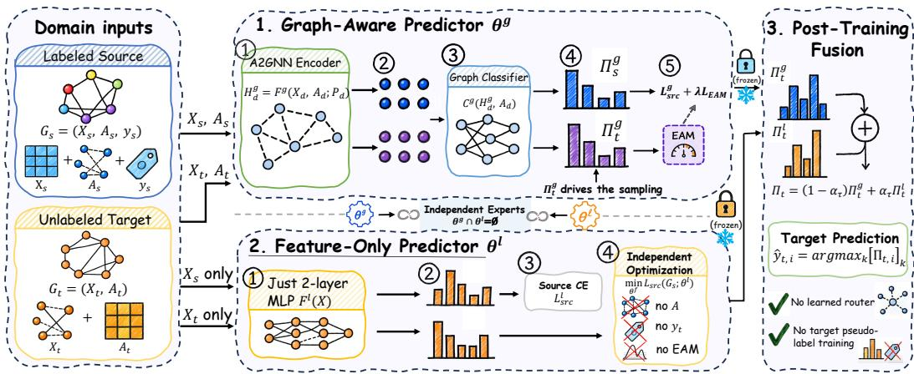  
Figure 1: Overview of EviGDA. The graph-aware expert is optimized by source classification and entropy-aware exact-sampling alignment. The graph-free local expert receives source supervision alone. Their parameters remain independent, and their target probabilities are combined after training using one coefficient shared by all nodes in the transfer task.

The two experts also have disjoint parameters, $\pmb \theta _ { g } \cap \pmb \theta _ { \ell } = \emptyset$ , with $\nabla _ { \pmb { \theta } _ { \ell } } \pmb { \Pi } _ { d } ^ { g } = \mathbf { 0 }$ and $\nabla _ { \pmb { \theta } _ { g } } \pmb { \Pi } _ { d } ^ { \ell } = \mathbf { 0 }$ . We denote their source cross-entropies by $\mathcal { L } _ { \mathrm { s r c } } ^ { g }$ and $\mathcal { L } _ { \mathrm { s r c } } ^ { \ell } \{$ ; the expert-specific objectives are given after the alignment mechanism is defined. Their predictions interact only after training, in probability space. A second head on $\mathbf { H } _ { d } ^ { g }$ would inherit the same adapted state and primarily test capacity or generic ensembling. In contrast, $F _ { \ell }$ preserves a separate attribute-based path; Section 4.6 tests this distinction with controls for parameter capacity and the choice of prediction path.

## 3.2 WHY REPRESENTATION LEARNING NEED NOT BE SUFFICIENT

Let $( X , Y , Z ^ { g } ) \sim P _ { t }$ describe a random target node, where X and $Y$ are its attributes and label and $Z ^ { g }$ is the state available to the graph classifier after message passing. Target sufficiency requires $P _ { t } ( Y \mid Z ^ { g } , X ) = P _ { t } ( Y \mid Z ^ { g } )$ almost surely. For any input S, define $\begin{array} { r } { \bar { \mathcal { R } } _ { \mathrm { l o g } } ^ { \star } ( S ) = \operatorname* { i n f } _ { q } \mathbb { E } _ { t } [ \bar { - } \log ^ { } q ( Y \mid } \end{array}$ S)]. For predictions, let $\mathcal { R } ( \pi ) = \mathbb { E } _ { t } \Vert \mathbf { e } _ { Y } - \pi \Vert _ { 2 } ^ { 2 }$ be the Brier risk (Gneiting & Raftery, 2007), for one-hot labels $\mathbf { e } _ { Y }$ . Set $\mathcal { R } _ { b } \doteq \mathcal { R } ( \pi ^ { b } )$ for $b \in \{ \bar { g } , \bar { \ell } \} , \Delta = \mathcal { R } _ { \ell } - \mathcal { R } _ { g } .$ , and $D \stackrel {  } { = } \mathbb { E } _ { t } \lVert \boldsymbol { \pi } ^ { g } - \boldsymbol { \pi } ^ { \ell } \rVert _ { 2 } ^ { 2 }$

Proposition 1 (Residual information and weak-expert gain). The representation-level risk gap and the realized mixture risk satisfy

$$
\begin{array} { r } { \mathcal { R } _ { \log } ^ { \star } ( Z ^ { g } ) - \mathcal { R } _ { \log } ^ { \star } ( Z ^ { g } , X ) = I _ { t } ( Y ; X \mid Z ^ { g } ) \ge 0 , } \end{array}\tag{2}
$$

$$
\begin{array} { r } { \mathcal { R } ( \pmb { \pi } ^ { \alpha } ) - \mathcal { R } _ { g } = \alpha ( \Delta - D ) + \alpha ^ { 2 } D , \quad \pmb { \pi } ^ { \alpha } = ( 1 - \alpha ) \pmb { \pi } ^ { g } + \alpha \pmb { \pi } ^ { \ell } . } \end{array}\tag{3}
$$

The first equality is zero if and only $i f Y \perp X \mid Z ^ { g } . I f \Delta \geq 0 ,$ , some $\alpha \in ( 0 , 1 ]$ strictly improves the graph-aware expert if and only if $D > \Delta ;$ then

$$
\alpha ^ { \star } = \frac { D - \Delta } { 2 D } , \qquad \mathcal { R } _ { g } - \mathcal { R } ( \pi ^ { \alpha ^ { \star } } ) = \frac { ( D - \Delta ) ^ { 2 } } { 4 D } > 0 .\tag{4}
$$

The first identity follows because Bayes log-risk equals conditional entropy (Goldfeld & Polyanskiy, 2020); the second specializes the ensemble ambiguity decomposition (Krogh & Vedelsby, 1994) to two experts. Conditional information identifies evidence beyond $Z ^ { g } ,$ , while $D > \Delta$ tests whether the local expert can improve a fixed mixture. If $D \leq \Delta , \alpha \overset { \cdot } { = } 0$ is optimal. We evaluate Macro-F1 empirically and provide the complete proper-risk proofs in Appendix A.1.

## 3.3 ENTROPY-AWARE EXACT-SAMPLING ALIGNMENT

Conventional marginal alignment samples target nodes uniformly and therefore treats them as equally informative. Under domain shift, uncertain graph predictions may reflect unstable neighborhood evidence and affect adaptation as often as confident ones. EAM retains the kernel discrepancy but reallocates sampling mass toward lower-entropy target nodes before measuring the cross-domain discrepancy. For target node i, let $\pi _ { t , i } ^ { g }$ be the ith row of $\Pi _ { t } ^ { g }$ . Its normalized predictive entropy and sampling probability are defined as follows. The stop-gradient operator sg[·] preserves forward values but blocks backpropagation through the sampling probabilities.

$$
e _ { i } = - \frac { 1 } { \log K } \sum _ { k = 1 } ^ { K } \pi _ { t , i k } ^ { g } \log \pi _ { t , i k } ^ { g } , \qquad q _ { i } = \mathrm { s g } \left[ \frac { \varepsilon + ( 1 - \varepsilon ) ( 1 - e _ { i } ) } { \sum _ { j = 1 } ^ { N _ { t } } [ \varepsilon + ( 1 - \varepsilon ) ( 1 - e _ { j } ) ] } \right] .\tag{5}
$$

We use 0 log $0 = 0$ and a floor $\varepsilon \in ( 0 , 1 ]$ to give every target node nonzero sampling probability. For $\varepsilon < 1$ , lower-entropy predictions receive more mass; $\varepsilon = 1$ recovers uniform sampling. The two laws define entropy-tilted and uniform empirical target measures:

$$
\widehat { \mu } _ { t } ^ { \mathrm { E A M } } = \sum _ { i = 1 } ^ { N _ { t } } q _ { i } \delta _ { \mathbf { h } _ { t , i } ^ { g } } , \qquad \widehat { \mu } _ { t } ^ { \mathrm { u n i f } } = \frac { 1 } { N _ { t } } \sum _ { i = 1 } ^ { N _ { t } } \delta _ { \mathbf { h } _ { t , i } ^ { g } } .\tag{6}
$$

Here $\delta _ { \mathbf { h } }$ denotes a point mass at embedding h. Reliability controls repeated participation, while the positive floor gives every target node a nonzero probability of contributing to alignment.

At repetition r, we draw m source nodes uniformly and m target nodes from ${ \bf q } ,$ both with replacement. Let $\dot { \mathbf { s } } _ { r , a } = \mathrm { s g } [ \mathbf { h } _ { s , I _ { r , a } ^ { s } } ^ { g } ]$ and $\mathbf { t } _ { r , a } = \mathbf { h } _ { t , I _ { r , c } ^ { t } } ^ { g }$ denote the ath sampled source and target embeddings, respectively. With repetition-specific kernel $k _ { r }$ , EAM averages their discrepancies over R draws:

$$
\mathcal { L } _ { \mathrm { E A M } } = \frac { 1 } { R m ^ { 2 } } \sum _ { r = 1 } ^ { R } \sum _ { a , b = 1 } ^ { m } \left[ k _ { r } ( \mathbf { s } _ { r , a } , \mathbf { s } _ { r , b } ) + k _ { r } ( \mathbf { t } _ { r , a } , \mathbf { t } _ { r , b } ) - 2 k _ { r } ( \mathbf { s } _ { r , a } , \mathbf { t } _ { r , b } ) \right] .\tag{7}
$$

The source–source and target–target sums retain pairs with $a = b ,$ matching the biased kernel estimator used in our implementation (Gretton et al., 2012). EAM changes the target samples entering this estimator while leaving its kernel form unchanged; categorical resampling is a Monte Carlo realization of $\widehat { \mu } _ { t } ^ { \mathrm { E A M } }$ , not a continuous weighted-MMD surrogate. Source embeddings are detached, whereas target embeddings retain gradients. For each repetition, $k _ { r }$ sums five RBF kernels with bandwidths $\mathbf { \bar { \boldsymbol { b } } } _ { r } 2 ^ { j - 2 } , j = 0 , \dots , 4$ . Here $b _ { r }$ is the detached mean squared distance between distinct pooled sample positions, clamped away from zero. Both variants use $m = \mathrm { m i n } ( 1 0 0 0 , N _ { s } , N _ { t } )$ samples and $R = 5$ repetitions in every transfer task.

## 3.4 INDEPENDENT TRAINING AND POST-TRAINING FUSION

Let $\theta _ { g }$ and $\pmb { \theta } _ { \ell }$ denote the disjoint parameter sets of the graph-aware and graph-free local experts. For $b \in \{ \bar { g } , \ell \}$ , source supervision is measured by

$$
\mathcal { L } _ { \mathrm { s r c } } ^ { b } = - \frac { 1 } { N _ { s } } \sum _ { i = 1 } ^ { N _ { s } } \log [ \pi _ { s , i } ^ { b } ] _ { y _ { s , i } } .\tag{8}
$$

For $\lambda \geq 0$ , the two parameter sets are optimized with

$$
\operatorname* { m i n } _ { \pmb { \theta } _ { g } } \big [ \mathcal { L } _ { \mathrm { s r c } } ^ { g } ( \mathcal { G } _ { s } ; \pmb { \theta } _ { g } ) + \lambda \mathcal { L } _ { \mathrm { E A M } } ( \mathcal { G } _ { s } , \mathcal { G } _ { t } ; \pmb { \theta } _ { g } ) \big ] , \qquad \operatorname* { m i n } _ { \pmb { \theta } _ { \ell } } \mathcal { L } _ { \mathrm { s r c } } ^ { \ell } ( \mathcal { G } _ { s } ; \pmb { \theta } _ { \ell } ) .\tag{9}
$$

Here λ balances source classification and graph-expert alignment; the graph-free local expert receives source supervision alone. The graph objective may use both $\mathcal { G } _ { s }$ and $\mathcal { G } _ { t }$ , but target labels occur in neither objective. Under the gradient convention in Section 3.3, EAM reaches $\theta _ { g }$ through sampled target embeddings while its source embeddings are fixed anchors. No term sends an EAM gradient to $\pmb { \theta } _ { \ell } .$ . Thus, independent training means disjoint parameters, optimizers, and objectives—not merely two classifier heads attached to one adapted representation.

For transfer $\tau = ( s \to t )$ , let $\boldsymbol { \pi } _ { \boldsymbol { \tau } , i } ^ { g }$ and $\boldsymbol { \pi } _ { \tau , i } ^ { \ell }$ denote the probabilities returned for target node i by the fitted experts. After training, a task-level coefficient $\alpha _ { \tau } \in [ 0 , 1 ]$ forms

$$
\boldsymbol { \pi } _ { \tau , i } = ( 1 - \alpha _ { \tau } ) \boldsymbol { \pi } _ { \tau , i } ^ { g } + \alpha _ { \tau } \boldsymbol { \pi } _ { \tau , i } ^ { \ell } , \qquad \widehat { \boldsymbol { y } } _ { \tau , i } = \arg \operatorname* { m a x } _ { k } [ \boldsymbol { \pi } _ { \tau , i } ] _ { k } .\tag{10}
$$

Since both expert outputs lie in the probability simplex, Eq. 10 is also a valid probability vector for every $\alpha _ { \tau } ~ \in ~ [ 0 , 1 ]$ The same coefficient is shared across target nodes, so fusion introduces neither a node-wise router nor a pseudo-label objective. Fusion is performed after expert training and introduces no additional gradient update. We select the task coefficient from a shared finite grid under the evaluation protocol in Section 4.1 for all 16 transfer directions.

## 4 EXPERIMENTS

We evaluate EviGDA on 16 transfers to assess adaptation performance and identify the contributions of its two prediction paths and alignment mechanism. The experiments connect expert-level evidence to matched controls, topology interventions, and fusion sensitivity through five research questions:

• RQ1. How effective is EviGDA across graph domains? Section 4.2 compares its adaptation performance with representative GDA methods on 16 transfers across four benchmark families.

• RQ2. Do the experts provide complementary evidence? Sections 4.3 and 4.5 analyze expert-specific correctness and controlled topology corruption to examine the value of graph-free predictions.

• RQ3. Does entropy-aware sampling improve alignment? Section 4.4 compares EAM with matched uniform sampling to isolate the contribution of entropy-guided target participation.

• RQ4. Can capacity or generic ensembling explain the gains? Section 4.6 compares the heterogeneous pair with parameter-matched Graph-only and Graph+Graph controls.

• RQ5. How sensitive and costly is task-level fusion? Section 4.6 examines responses to the fusion coefficient and measures the local expert’s training, inference, and memory overhead.

## 4.1 EXPERIMENTAL SETUP

Datasets and metrics. We evaluate ten processed graphs and 16 directed transfer tasks adopted by recent graph domain adaptation studies (Liu et al., 2024a; Chen et al., 2026a). The Citation family contains ACMv9 (A), Citationv1 (C), and DBLPv7 (D); the Airport family contains Brazil (B), Europe (E), and USA (U); the Blog family contains Blog1 (B1) and Blog2 (B2); and the Twitch family contains German (DE) and English (EN). Citation and Airport contribute six directed transfers each, whereas Blog and Twitch contribute two transfers each. All methods read the same processed tensors, preserving the supplied node features and edge representation for each transfer direction.

Macro-F1 is the primary evaluation metric. We additionally report Micro-F1 at the checkpoint selected according to Macro-F1, denoted by Micro@Macro. Family-level scores are equal-task averages within each graph family, and the Full-16 score assigns equal weight to each transfer task. Neither aggregate is weighted by the number of nodes in a graph.

Baselines. We compare against source-only GCN (Kipf & Welling, 2017), alignment-based UDA-GCN (Wu et al., 2020) and GRADE (Wu et al., 2023); graph-shift-aware PairAlign (Liu et al., 2024b), GraphAlign (Huang et al., 2024), A2GNN (Liu et al., 2024a), TDSS (Chen et al., 2025), DGSDA (Yang et al., 2025), GAA (Fang et al., 2025a), and HGDA (Fang et al., 2025b); and recent adaptation methods ADAlign (Chen et al., 2026a), DiffGDA (Chen et al., 2026b), and DFT (Tai et al., 2026). ADAlign and DiffGDA represent recent state-of-the-art approaches to our knowledge. Graph-only serves as our backbone control for measuring gains from the full method.

Implementation and evaluation protocol. Following recent GDA evaluation practice (Chen et al., 2026a), all locally reproduced methods are trained for 150 epochs and evaluated over the same five runs using a unified evaluator; we report the mean and sample standard deviation across runs. EviGDA uses Adam, graph/local hidden widths of 128/64, one graph feature layer, ReLU, and no dropout. Only the graph learning rate, propagation pair, and alignment weight vary during training; all other architecture, regularization, and estimator settings remain fixed. The graph-aware and graph-free local experts are optimized independently, and their output probabilities are combined after training through a task-level constant mixture. Each task evaluates 96 family-level training bundles and replays fusion over a shared coefficient grid. Appendix B.4 lists the family-level search spaces and globally fixed implementation settings. The server has dual Intel Xeon E5-2680 v4 CPUs and 48 GB NVIDIA GeForce RTX 4090 D GPUs; each training run uses one GPU.

Statistical analysis. Controlled contrasts pair task and run, reporting task-level win/tie/loss counts. Expert and capacity comparisons use 10,000 bootstrap replicates, resampling tasks and then paired runs within each task. The 95% intervals span the 2.5th–97.5th percentiles of the aggregate paireddifference distribution, retaining equal task weights in each replicate.

## 4.2 OVERALL ADAPTATION PERFORMANCE

Adaptation versus source-only learning. First, UDA-GCN and GRADE outperform source-only GCN on all 16 transfers in Table 1. On B1→B2, Macro-F1 increases from 21.96 with GCN to 30.94 and 40.56, respectively. These consistent gains highlight the importance of addressing cross-domain discrepancies: learning a graph classifier from source supervision alone does not ensure that its representations remain predictive in the target domain.

Table 1: Macro-F1 on 16 graph-domain transfers. Mean (%) and sample standard deviation over five runs; best and second-best results are bold and underlined.
<table><tr><td>Method</td><td> $\mathbf { A } {  } \mathbf { C }$ </td><td> $\mathbf { A } {  } \mathbf { D }$ </td><td> $\mathrm { C } {  } \mathrm { A }$ </td><td> $\mathrm { C } {  } \mathrm { D }$ </td><td> $\mathrm { D } { \to } \mathbf { A }$ </td><td> $\mathrm { D } {  } \mathrm { C }$ </td><td> $\mathbf { B } 1 \to \mathbf { B } 2$ </td><td> $\mathbb { B } 2 \to \mathbb { B } 1$ </td></tr><tr><td>Source-only</td><td></td><td></td><td></td><td></td><td></td><td></td><td></td><td></td></tr><tr><td>GCN (ICLR&#x27;17)</td><td> $6 6 . 9 7 \pm 1 . 6 2$ </td><td> $6 1 . 3 8 \pm 1 . 1 0$ </td><td> $6 6 . 8 2 \pm 0 . 8 5$ </td><td> $6 6 . 9 7 \pm 0 . 7 0$ </td><td> $5 7 . 3 4 \pm 1 . 3 2$ </td><td> $6 5 . 6 0 \pm 2 . 5 3$ </td><td> $2 1 . 9 6 \pm 1 . 8 8$ </td><td> $2 3 . 0 5 \pm 2 . 0 4$ </td></tr><tr><td>Graph domain adaptation</td><td></td><td></td><td></td><td></td><td></td><td></td><td></td><td></td></tr><tr><td>UDAGCN (WWW&#x27;20)</td><td> $7 7 . 6 2 \pm 1 . 3 5$ </td><td> $7 1 . 5 9 \pm 2 . 3 1$ </td><td> $7 3 . 5 6 \pm 1 . 5 6$ </td><td> $7 5 . 1 7 \pm 2 . 6 5$ </td><td> $6 2 . 1 7 \pm 1 . 9 8$ </td><td> $7 2 . 2 3 \pm 2 . 3 0$ </td><td> $3 0 . 9 4 \pm 1 . 1 3$ </td><td> $3 1 . 3 4 \pm 1 . 1 5$ </td></tr><tr><td>GRADE(AAAI&#x27;23)</td><td> $6 8 . 0 6 \pm 2 . 2 9$ </td><td> $6 3 . 9 4 \pm 2 . 2 2$ </td><td> $6 8 . 4 6 \pm 0 . 4 0$ </td><td> $6 9 . 7 7 \pm 1 . 1 7$ </td><td> $6 3 . 7 6 \pm 0 . 6 1$ </td><td> $6 5 . 7 4 \pm 0 . 9 5$ </td><td> $4 0 . 5 6 \pm 1 . 3 7$ </td><td> $4 2 . 4 1 \pm 2 . 7 6$ </td></tr><tr><td>PairAlign (ICML&#x27;24)</td><td> $5 7 . 0 9 \pm 1 . 6 1$ </td><td> $5 5 . 2 5 \pm 2 . 0 5$ </td><td> $5 2 . 2 0 \pm 2 . 5 0$ </td><td> $5 6 . 7 3 \pm 3 . 2 5$ </td><td> $4 9 . 3 4 \pm 1 . 3 6$ </td><td> $5 2 . 3 1 \pm 2 . 2 7$ </td><td> $4 0 . 9 9 \pm 2 . 0 7$ </td><td> $4 3 . 7 3 \pm 0 . 6 8$ </td></tr><tr><td>GraphAlign (KDD&#x27;24)</td><td> $6 7 . 0 7 \pm 1 . 2 9$ </td><td> $6 3 . 0 5 \pm 1 . 7 9$ </td><td> $6 3 . 5 7 \pm 0 . 9 0$ </td><td> $6 5 . 9 9 \pm 1 . 4 6$ </td><td> $5 9 . 0 2 \pm 0 . 9 7$ </td><td> $6 2 . 1 5 \pm 0 . 9 3$ </td><td> $3 5 . 8 5 \pm 1 . 8 5$ </td><td> $3 9 . 6 0 \pm 1 . 2 3 $ </td></tr><tr><td>A2GNN-MMD (AAAI&#x27;24)</td><td> $7 8 . 9 6 \pm 0 . 4 2$ </td><td> $7 2 . 6 6 \pm 0 . 4 6$ </td><td> $7 5 . 1 7 \pm 0 . 2 8$ </td><td> $7 4 . 7 0 \pm 0 . 7 3$ </td><td> $7 3 . 9 6 \pm 0 . 6 1$ </td><td> $7 8 . 1 1 \pm 0 . 9 8$ </td><td> $4 4 . 1 5 \pm 2 . 3 0$ </td><td> $4 3 . 7 7 \pm 0 . 8 3$ </td></tr><tr><td>TDSS-RW (AAAP&#x27;25)</td><td> $7 9 . 6 7 \pm 0 . 1 9$ </td><td> $7 3 . 7 1 \pm 0 . 6 9$ </td><td> $7 6 . 1 6 \pm 0 . 4 2$ </td><td> $7 2 . 7 2 \pm 0 . 4 2$ </td><td> $7 4 . 7 0 \pm 0 . 4 6$ </td><td> $7 6 . 4 3 \pm 0 . 2 7$ </td><td> $4 2 . 8 1 \pm 1 . 1 5$ </td><td> $4 5 . 1 1 \pm 1 . 2 8$ </td></tr><tr><td>GAA (ICLR&#x27;25)</td><td> $7 1 . 9 7 \pm 0 . 6 6$ </td><td> $6 4 . 8 4 \pm 1 . 3 6$ </td><td> $6 9 . 3 2 \pm 0 . 3 5$ </td><td> $6 9 . 8 8 \pm 0 . 8 8$ </td><td> $6 3 . 0 0 \pm 0 . 5 7$ </td><td> $6 8 . 7 3 \pm 1 . 6 8$ </td><td> $4 4 . 6 1 \pm 2 . 3 4$ </td><td> $4 0 . 7 9 \pm 1 . 3 9$ </td></tr><tr><td>DGSDA (ICML&#x27;25)</td><td> $\underline { { 8 0 . 5 4 } } \pm 0 . 3 9$ </td><td> $7 4 . 1 3 \pm 1 . 0 1$ </td><td> $7 6 . 0 4 \pm 0 . 1 9$ </td><td> $7 5 . 8 9 \pm 0 . 2 2$ </td><td> $7 4 . 9 0 \pm 0 . 3 6$ </td><td> $\mathbf { 8 1 . 4 9 \pm 0 . 5 0 }$ </td><td> $3 6 . 3 3 \pm 1 . 7 0$ </td><td> $3 9 . 6 7 \pm 2 . 3 8$ </td></tr><tr><td>HGDA (ICML&#x27;25)</td><td> $7 1 . 5 8 \pm 0 . 9 6$ </td><td> $6 5 . 0 0 \pm 1 . 0 3$ </td><td>67.59 ± 0.77</td><td> $6 9 . 0 9 \pm 0 . 9 7$ </td><td> $6 6 . 2 1 \pm 0 . 8 3$ </td><td> $7 0 . 8 6 \pm 0 . 9 9$ </td><td> $4 3 . 3 2 \pm 0 . 4 0$ </td><td> $4 3 . 6 4 \pm 0 . 3 6$ </td></tr><tr><td>ADAlign (ICLR&#x27;26)</td><td> $7 9 . 0 3 \pm 0 . 3 8$ </td><td> $7 5 . 1 4 \pm 1 . 5 5$ </td><td> $7 5 . 2 5 \pm 0 . 3 7$ </td><td> $7 6 . 5 9 \pm 1 . 0 1$ </td><td> $7 2 . 1 5 \pm 1 . 3 1$ </td><td> $7 5 . 4 0 \pm 1 . 7 0$ </td><td> $4 0 . 8 1 \pm 2 . 5 2$ </td><td>40.68 ± 1.09</td></tr><tr><td>DiffGDA (ICLR&#x27;26)</td><td> $7 8 . 8 3 \pm 1 . 0 9$ </td><td> $7 2 . 6 7 \pm 0 . 8 9$ </td><td>74.88 ± 0.86</td><td> $7 3 . 3 3 \pm 1 . 2 1$ </td><td> $7 1 . 2 6 \pm 2 . 7 0$ </td><td> $7 5 . 4 5 \pm 1 . 4 4$ </td><td> $4 2 . 6 9 \pm 2 . 0 7$ </td><td> $4 0 . 1 5 \pm 2 . 8 8$ </td></tr><tr><td>DFT (KDD&#x27;26)</td><td> $7 2 . 5 9 \pm 1 . 8 3$ </td><td> $6 9 . 6 9 \pm 1 . 0 2$ </td><td> $6 8 . 0 6 \pm 0 . 7 3$ </td><td> $7 0 . 9 0 \pm 1 . 9 2$ </td><td> $6 5 . 3 1 \pm 2 . 7 1$ </td><td> $7 5 . 3 5 \pm 1 . 9 2$ </td><td> $4 7 . 2 5 \pm 8 . 3 5$ </td><td> $5 1 . 7 5 \pm 4 . 2 4$ </td></tr><tr><td>EviGDA (Ours)</td><td> ${ \bf 8 1 . 9 3 \pm 0 . 2 8 }$ </td><td> ${ \bf 7 6 . 1 8 \pm 1 . 4 8 }$ </td><td> $7 7 . 3 4 \pm 0 . 1 9$ </td><td> ${ \bf 7 8 . 0 8 \pm 0 . 4 1 }$ </td><td> $7 5 . 4 8 \pm 0 . 1 5$ </td><td> $\underline { { 8 1 . 2 4 } } \pm 0 . 5 4$ </td><td> ${ \pm 0 . 8 8 \pm 1 . 7 3 }$ </td><td> ${ \pm 3 . 0 1 \pm 0 . 6 1 }$ </td></tr><tr><td>Method</td><td> $\mathrm { U } {  } \mathrm { B }$ </td><td> $\mathrm { U } {  } \mathrm { E }$ </td><td> $\mathrm { B } \to \mathrm { U }$ </td><td> $\mathrm { B } {  } \mathrm { E }$ </td><td> $\operatorname { E \to U }$ </td><td> $\mathrm { E } {  } \mathrm { B }$ </td><td> $\mathrm { D E } {  } \mathrm { E N }$ </td><td> $\mathrm { E N } {  } \mathrm { D E }$ </td></tr><tr><td>Source-only</td><td></td><td></td><td></td><td></td><td></td><td></td><td></td><td></td></tr><tr><td>GCN (ICLR&#x27;17)</td><td> $4 5 . 0 6 \pm 3 . 2 1$ </td><td> $3 4 . 1 7 \pm 2 . 1 2$ </td><td> $2 9 . 4 1 \pm 0 . 3 2$ </td><td> $2 5 . 2 7 \pm 0 . 8 6$ </td><td> $3 0 . 3 0 \pm 0 . 2 2$ </td><td> $3 2 . 6 6 \pm 1 . 8 4$ </td><td> $5 6 . 2 3 \pm 0 . 3 2$ </td><td> $5 7 . 3 1 \pm 1 . 8 6$ </td></tr><tr><td>Graph domain adaptation</td><td></td><td></td><td></td><td></td><td></td><td></td><td></td><td></td></tr><tr><td>UDAGCN (WWW&#x27;20)</td><td> $6 0 . 8 2 \pm 2 2 . 4 5$ </td><td> $4 1 . 2 8 \pm 1 . 7 7$ </td><td> $3 9 . 4 1 \pm 2 . 5 5$ </td><td> $5 0 . 0 3 \pm 0 . 8 0$ </td><td> $4 0 . 3 5 \pm 1 . 0 6$ </td><td> $6 3 . 8 9 \pm 1 . 6 9$ </td><td> $5 7 . 9 1 \pm 0 . 4 7$ </td><td> $5 8 . 3 3 \pm 1 . 5 4$ </td></tr><tr><td>GRADE(AAAI&#x27;23)</td><td> $6 1 . 4 8 \pm 4 . 3 4$ </td><td> $4 7 . 6 1 \pm 1 . 0 0$ </td><td> $3 8 . 5 0 \pm 3 . 0 7$ </td><td> $5 5 . 4 5 \pm 1 . 9 0$ </td><td> $4 3 . 9 6 \pm 1 . 3 9$ </td><td> $7 0 . 3 8 \pm 1 . 4 8$ </td><td> $5 8 . 7 2 \pm 0 . 0 6$ </td><td> $6 2 . 1 2 \pm 0 . 1 7$ </td></tr><tr><td>PairAlign (ICML&#x27;24)</td><td> $7 0 . 0 3 \pm 1 . 8 2$ </td><td> $3 9 . 2 9 \pm 1 . 4 2 $ </td><td> $4 5 . 3 5 \pm 4 . 1 9$ </td><td> $3 8 . 8 8 \pm 3 . 8 9$ </td><td> $4 0 . 5 0 \pm 2 . 8 4$ </td><td> $4 8 . 4 5 \pm 3 . 0 2$ </td><td> $6 0 . 1 1 \pm 0 . 3 7$ </td><td> $6 3 . 7 2 \pm 0 . 1 6$ </td></tr><tr><td>GraphAlign (KDD&#x27;24)</td><td> $6 3 . 6 9 \pm 2 . 2 7$ </td><td> $5 3 . 2 4 \pm 1 . 2 0$ </td><td> $4 6 . 2 1 \pm 2 . 8 6$ </td><td> $5 4 . 1 8 \pm 1 . 5 9$ </td><td> $4 8 . 8 3 \pm 2 . 6 1$ </td><td> $6 8 . 5 4 \pm 1 . 0 2 $ </td><td> $5 4 . 2 7 \pm 1 . 0 1$ </td><td> $5 5 . 0 7 \pm 2 . 6 1$ </td></tr><tr><td>A2GNN-MMD (AAAI&#x27;24)</td><td> $6 0 . 3 6 \pm 1 . 5 6$ </td><td> $4 6 . 5 2 \pm 1 . 0 3$ </td><td> $4 3 . 1 0 \pm 1 . 8 1$ </td><td> $4 8 . 1 2 \pm 1 . 0 6$ </td><td> $4 0 . 2 8 \pm 5 . 2 2$ </td><td> $6 4 . 1 1 \pm 6 . 6 1$ </td><td> $5 6 . 7 1 \pm 0 . 4 8$ </td><td> $5 6 . 1 5 \pm 1 . 4 9$ </td></tr><tr><td>TDSS-RW (AAAP&#x27;25)</td><td> $7 4 . 5 6 \pm 0 . 6 0$ </td><td> $4 1 . 8 9 \pm 0 . 2 8$ </td><td> $5 3 . 9 6 \pm 1 . 6 8$ </td><td> $4 3 . 2 6 \pm 3 . 0 2$ </td><td> $4 8 . 2 3 \pm 0 . 0 7$ </td><td> $5 9 . 2 9 \pm 0 . 3 6$ </td><td> $5 3 . 6 2 \pm 0 . 9 1$ </td><td> $4 0 . 0 7 \pm 1 . 6 7$ </td></tr><tr><td>GAA (ICLR&#x27;25)</td><td> $7 0 . 4 2 \pm 1 . 3 4$ </td><td> $5 4 . 0 2 \pm 3 . 2 5$ </td><td> $5 5 . 6 6 \pm 0 . 7 3$ </td><td> $5 3 . 4 0 \pm 2 . 5 1$ </td><td> $5 0 . 6 8 \pm 1 . 2 0 $ </td><td> $7 1 . 4 8 \pm 1 . 8 8$ </td><td> $4 6 . 1 1 \pm 1 . 7 5$ </td><td> $4 6 . 4 5 \pm 1 . 0 2$ </td></tr><tr><td>DGSDA (ICML&#x27;25)</td><td> $6 3 . 3 7 \pm 1 . 3 0$ </td><td> $5 2 . 8 7 \pm 1 . 2 0$ </td><td> $5 6 . 1 7 \pm 0 . 3 5$ </td><td> $5 1 . 8 7 \pm 1 . 3 2 $ </td><td> $5 0 . 7 5 \pm 0 . 3 9$ </td><td> $7 0 . 3 6 \pm 1 . 1 2$ </td><td> $5 9 . 9 2 \pm 0 . 1 2$ </td><td> $6 1 . 4 9 \pm 0 . 1 8$ </td></tr><tr><td> $\mathrm { H G D A _ { \Delta ( I C M L ^ { \prime } 2 5 ) } }$ </td><td> $7 1 . 8 3 \pm 2 2 . 9 3$ </td><td> $4 3 . 5 6 \pm 3 . 3 4$ </td><td> $\overline { { 5 2 . 9 1 } } \pm 0 . 9 5$ </td><td> $5 0 . 4 9 \pm 2 . 0 0$ </td><td> $4 8 . 1 2 \pm 0 . 7 1$ </td><td> $6 6 . 1 1 \pm 1 . 8 2$ </td><td> $5 9 . 5 2 \pm 0 . 3 4$ </td><td> $6 0 . 8 4 \pm 0 . 6 4$ </td></tr><tr><td>ADAlign (ICLR&#x27;26)</td><td> $7 5 . 5 6 \pm 2 . 3 1$ </td><td> $5 2 . 2 3 \pm 1 . 2 9$ </td><td> $4 7 . 8 6 \pm 1 . 3 6$ </td><td> $5 5 . 1 3 \pm 1 . 2 5$ </td><td> $5 0 . 2 7 \pm 0 . 7 9$ </td><td> $6 7 . 8 7 \pm 1 . 2 7$ </td><td> $5 9 . 3 3 \pm 0 . 1 0$ </td><td> $6 2 . 9 4 \pm 0 . 4 0$ </td></tr><tr><td>DiffGDA (ICLR&#x27;26)</td><td> $7 5 . 7 3 \pm 1 . 4 1$ </td><td> $4 7 . 0 7 \pm 1 . 3 4$ </td><td> $4 5 . 6 4 \pm 0 . 9 4$ </td><td> $5 3 . 0 9 \pm 0 . 8 2$ </td><td> $4 1 . 0 7 \pm 1 . 3 8$ </td><td> $6 2 . 7 0 \pm 0 . 9 7$ </td><td> $5 6 . 0 2 \pm 0 . 2 3$ </td><td> $5 7 . 6 5 \pm 1 . 3 4$ </td></tr><tr><td>DFT (KDD&#x27;26)</td><td> $\underline { { 7 6 . 6 2 } } \pm 0 . 4 6$ </td><td> $5 0 . 1 1 \pm 1 . 1 5$ </td><td> $5 3 . 5 8 \pm 1 . 1 6$ </td><td> $5 3 . 3 2 \pm 1 . 7 8$ </td><td> $4 9 . 5 2 \pm 1 . 0 9$ </td><td> $6 9 . 1 0 \pm 1 . 0 4$ </td><td> $6 0 . 5 5 \pm 0 . 6 0$ </td><td> $6 3 . 6 3 \pm 1 . 2 1$ </td></tr><tr><td>EviGDA (Ours)</td><td> ${ \bf 8 1 . 2 0 \pm 0 . 3 5 }$ </td><td> $\pm 8 . 7 6 \pm 0 . 6 0$ </td><td> ${ \pm 6 . 9 0 \pm 0 . 3 2 }$ </td><td> $\pm 9 . 7 6 \pm 0 . 1 4$ </td><td> ${ \bf 5 1 . 4 1 \pm 1 . 0 8 }$ </td><td> $7 5 . 7 5 \pm 1 . 3 0$ </td><td> ${ \bf 6 0 . 5 8 \pm 0 . 0 9 }$ </td><td> ${ \bf 6 4 . } 2 2 \pm 0 . 4 1$ </td></tr></table>

Progress in graph adaptation. Second, recent methods further improve representative transfer directions. Compared with UDA-GCN, ADAlign’s adaptive alignment raises C→D from 75.17 to 76.59, while DGSDA’s separation of attribute and topology adaptation raises D→C from 72.23 to 81.49. These improvements suggest that effective transfer depends not only on reducing distribution discrepancy, but also on how attributes and relational information are used. This motivates examining whether complementary information should remain separately accessible at prediction time, rather than deriving every target decision from one adapted graph representation.

## 4.3 COMPLEMENTARY PREDICTIVE EVIDENCE

Complementary prediction paths. Finally, EviGDA achieves 67.67 ± 0.04 Full-16 Macro-F1 and ranks first on 15 transfers, including all six Airport and both Blog and Twitch directions. It exceeds the strongest competing results by 4.74 points on U→E and 4.27 on E→B. This success is attributed to preserving two complementary prediction paths: the graph-aware expert captures relational information, while the graph-free local expert retains attribute evidence without neighborhood aggregation. Constant probability fusion combines these predictions, and entropy-aware sampling prioritizes confident target evidence during graph alignment. The following controls examine the contributions of expert complementarity and sampling importance separately.

Figure 2 partitions post-training target correctness for Local or Graph 2 against the same graph-aware expert and compares Graph-only with fused endpoints on representative transfers.

Fusion exceeds the better single expert by 1.98 points (95% CI [0.67, 3.67]), with all five run-level aggregates positive. The local expert is exclusively correct on 16.23% of target nodes, more than twice the 6.75% supplied by a second graph expert. Fusion corrects graph errors on 10.87% of target nodes and introduces errors on 4.45%. The resulting gain reflects useful local-exclusive predictions on nodes where the graph-aware expert is incorrect.

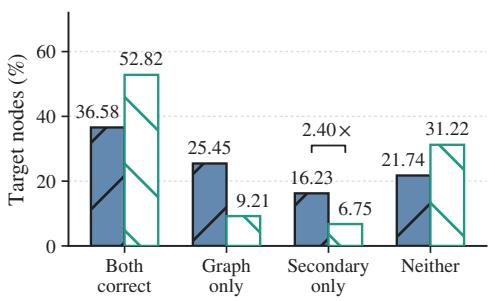  
(a) Exclusive predictive evidence

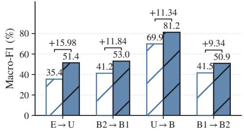  
(b) Benefit of heterogeneous fusion  
Figure 2: Heterogeneous predictive complementarity. (a) Full-16 correctness: Local supplies 2.40× the exclusive correct predictions of Graph 2 against the same graph expert. (b) Representative transfers: Graph-only versus Graph+Local, with bracketed fusion gains in Macro-F1 points.

Graph+Graph instead yields −0.82% net repairs, indicating that independent initialization alone need not provide useful corrections to the graph expert’s errors.

The corresponding fusion gains are 0.05, 8.21, 10.59, and 1.42 points on Citation, Airport, Blog, and Twitch. The larger Airport and Blog responses align with greater local-exclusive evidence. We examine this relationship directly through the degree-preserving topology intervention in Section 4.5.

## 4.4 ENTROPY-AWARE ALIGNMENT

We test whether predictive confidence informs target participation in marginal alignment. EAM changes the empirical target measure, not the discrepancy objective: lower-entropy predictions recur more often across draws, while the sampling floor retains every node’s support. Thus, node participation changes while the discrepancy criterion remains fixed.

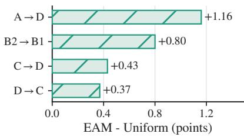  
Figure 3: Matched entropy-aware resampling. EAM gains on representative transfers; Appendix D.3 reports all 16 matched task comparisons.

Matched comparison. The Uniform variant assigns every target node the same sampling probability while leaving the experts, sample count, replacement semantics, multikernel MMD, bandwidth rule, optimizer, and source/target gradient routes unchanged throughout training.

Alignment contribution. EAM improves the fused endpoint by 0.24 Macro-F1 points on average, with family effects of +0.35, +0.06, +0.59, and +0.08 on Citation, Airport, Blog, and Twitch. Figure 3 shows gains of 1.16, 0.80, 0.43, and 0.37 points on A→D, B2→B1, C→D, and D→C. Entropy-guided participation strengthens these alignment estimates by concentrating repeated draws on confident target evidence from the graph expert.

## 4.5 CONTROLLED TOPOLOGY-SHIFT STRESS TEST

We progressively rewire target edges on $\mathbf { A {  } C } , \mathbf { U {  } B } , \mathbf { B } 1 {  } \mathbf { B } 2$ , and EN→DE, using six severity levels and five runs per transfer. Rewiring preserves edge count and every node’s directed degree while leaving attributes and local predictions unchanged. Figure 4 tracks how this controlled neighborhood corruption changes graph-expert performance and local-exclusive evidence.

Homophily loss tracks graph damage $( \rho = 0 . 9 4 3 )$ , which in turn tracks local-exclusive evidence $( \rho = \bar { 0 . 9 7 3 } )$ . At maximum corruption, Graph-only drops by 0.270 while the local-exclusive rate rises by 0.141. Under this matched intervention, the trajectories isolate the increasing relative value of topology-free evidence. A→C responds most strongly and U→B least, showing that the value of topology-free evidence depends on the transfer’s response to neighborhood corruption.

$$
\begin{array} { r l r l } { - \mathrm { O - A } \to \mathrm { C } } & { { } \mathrm { - \Omega \mathrm { - } U \to B } } & { \mathrm { \Omega \to B } 1 \to \mathrm { B } 2 } & { \mathrm { \to \infty \operatorname { E N } \to D E } } & { { } \mathrm { \to \mathrm { M e a n } } } \end{array}
$$

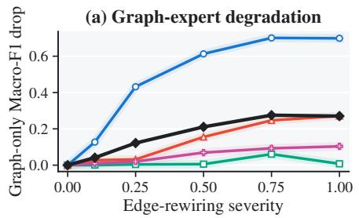

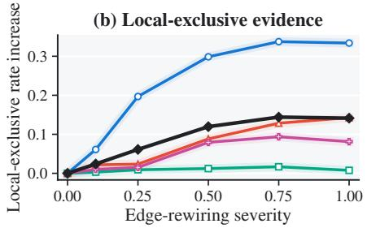  
Figure 4: Topology corruption exposes heterogeneous evidence. Graph-expert degradation and local-exclusive correctness under degree-preserving edge rewiring; colored curves denote representative transfers, with their equal-task mean shown as the black reference curve.

## 4.6 CONTROLLED ATTRIBUTION

We compare with a graph model widened to match Full within five parameters and Graph+Graph, which replaces Local with an independently initialized graph expert. The graph pair preserves ensembling while giving both experts the same inputs. All reviewer controls use the frozen task configuration of the full method, the same training and checkpoint budgets, and identical evaluation procedures. Only the expert identity or graph-model capacity is changed. Graph+Local gains 5.13 points over the capacity control (14 task wins), 4.84 over Graph+Graph (12 wins, four ties), and 1.98 over the better single expert (Table 2). Together with Figure 2(a), these controls support the value of heterogeneous information access beyond added capacity and generic averaging. The local expert retains an attribute-only prediction path alongside the adapted graph representation, allowing task-level probability fusion to exploit complementary predictions from independently trained experts.

Fusion response. Frozen-logit responses peak at an interior coefficient. E→U and B2→B1 retain broad beneficial regions; U→B favors graph-dominant fusion. Efficiency. Without routing or extra graph propagation, the local expert adds about 2% training time and 9.38% inference latency, with unchanged peak memory on A→C (RTX 4090 D). These final-model costs exclude the one-time hyperparameter search.

Table 2: Paired gains over capacity and ensemble controls (percentage points; 95% CIs).  
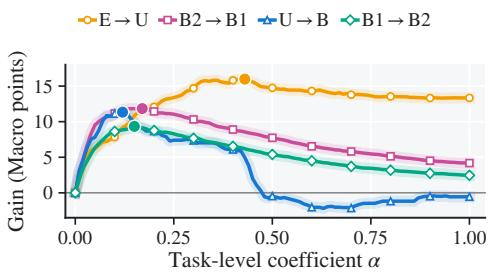

<table><tr><td>Control</td><td>∆ 95% CI W/T/L</td></tr><tr><td>Capacity-matched graph +5.13 [1.93, 9.05] 14/0/2</td><td></td></tr><tr><td>Graph+Graph</td><td>+4.84 [1.72, 8.60] 12/4/0</td></tr><tr><td>Best expert</td><td>+1.98 [0.67, 3.67] 12/4/0</td></tr></table>

Figure 5: Task-level fusion response. Curves replay frozen expert predictions; filled markers denote observed maxima. Soft under-strokes emphasize the response trajectories.

## 5 CONCLUSION

EviGDA complements representation alignment with independently trained graph-aware and graphfree local experts, entropy-aware exact sampling, and task-level probability fusion. It achieves the best Macro-F1 on 15 of 16 transfers and improves over the stronger expert by 1.98 points on average. Capacity and ensemble controls support heterogeneous information access as the source of these gains. The current study focuses on static graphs with a single labeled source domain. Future work will support evolving graphs through incremental expert updates and refreshed alignment samples, and multi-source adaptation through source-specific graph experts and source-level probability fusion.

## AI USE STATEMENT

Generative AI tools were used to assist with literature organization, research brainstorming, code review, result-consistency checking, scientific-figure preparation, and manuscript editing. The authors designed the methods and experimental protocols, executed all experiments, verified the reported measurements against the underlying artifacts, checked the cited literature, and made all final scientific and editorial decisions. No generative AI tool was used to generate benchmark data, target labels, or experimental measurements. The authors take full responsibility for the contents of this paper.

## REPRODUCIBILITY STATEMENT

Section 3 specifies the model architecture, optimization objectives, gradient paths, entropy-aware sampling procedure, and post-training fusion rule. Section 4 describes the datasets, evaluation metrics, baseline comparisons, repeated runs, and statistical analyses. The appendix provides estimator details, preprocessing conventions, additional results, matched-control specifications, parameter analyses, and computational-cost measurements. The supplementary material provides the implementation and scripts used to reproduce the reported tables and figures.

## REFERENCES

Shai Ben-David, John Blitzer, Koby Crammer, Alex Kulesza, Fernando Pereira, and Jennifer Wortman Vaughan. A theory of learning from different domains. Machine Learning, 79(1–2):151–175, 2010.

Ruichu Cai, Fengzhu Wu, Zijian Li, Pengfei Wei, Lingling Yi, and Kun Zhang. Graph domain adaptation: A generative view. ACM Transactions on Knowledge Discovery from Data, 18(3), 2024.

Wei Chen, Guo Ye, Yakun Wang, Zhao Zhang, Libang Zhang, Daixin Wang, Zhiqiang Zhang, and Fuzhen Zhuang. Smoothness really matters: A simple yet effective approach for unsupervised graph domain adaptation. In Proceedings of the AAAI Conference on Artificial Intelligence, volume 39, pp. 15875–15883, 2025.

Wei Chen, Xingyu Guo, Shuang Li, Zhao Zhang, Yan Zhong, Fuzhen Zhuang, and Deqing Wang. Learning adaptive distribution alignment with neural characteristic function for graph domain adaptation. In International Conference on Learning Representations, 2026a.

Wei Chen, Xingyu Guo, Shuang Li, Yan Zhong, Zhao Zhang, Fuzhen Zhuang, Hongrui Liu, Libang Zhang, Guo Ye, and Huimei He. Learning structure-semantic evolution trajectories for graph domain adaptation. In International Conference on Learning Representations, 2026b.

Quanyu Dai, Xiao-Ming Wu, Jiaren Xiao, Xiao Shen, and Dan Wang. Graph transfer learning via adversarial domain adaptation with graph convolution. IEEE Transactions on Knowledge and Data Engineering, 35(5):4908–4922, 2023.

Ruiyi Fang, Bingheng Li, Zhao Kang, Qiuhao Zeng, Nima Hosseini Dashtbayaz, Ruizhi Pu, Boyu Wang, and Charles Ling. On the benefits of attribute-driven graph domain adaptation. In International Conference on Learning Representations, 2025a.

Ruiyi Fang, Bingheng Li, Jingyu Zhao, Ruizhi Pu, Qiuhao Zeng, Gezheng Xu, Charles Ling, and Boyu Wang. Homophily enhanced graph domain adaptation. In Proceedings ofthe 42nd International Conference on Machine Learning, volume 267 of Proceedings of Machine Learning Research, pp. 16006–16028, 2025b.

Yaroslav Ganin, Evgeniya Ustinova, Hana Ajakan, Pascal Germain, Hugo Larochelle, Franc¸ois Laviolette, Mario Marchand, and Victor Lempitsky. Domain-adversarial training of neural networks. Journal ofMachine Learning Research, 17(59):1–35, 2016.

Tilmann Gneiting and Adrian E. Raftery. Strictly proper scoring rules, prediction, and estimation. Journal ofthe American Statistical Association, 102(477):359–378, 2007.

Ziv Goldfeld and Yury Polyanskiy. The information bottleneck problem and its applications in machine learning. IEEE Journal on Selected Areas in Information Theory, 1(1):19–38, 2020.

Arthur Gretton, Karsten M. Borgwardt, Malte J. Rasch, Bernhard Scholkopf, and Alexander Smola.¨ A kernel two-sample test. Journal ofMachine Learning Research, 13:723–773, 2012.

Renhong Huang, Jiarong Xu, Xin Jiang, Ruichuan An, and Yang Yang. Can modifying data address graph domain adaptation? In Proceedings ofthe 30th ACM SIGKDD Conference on Knowledge Discovery and Data Mining, pp. 1131–1142, 2024.

Robert A. Jacobs, Michael I. Jordan, Steven J. Nowlan, and Geoffrey E. Hinton. Adaptive mixtures of local experts. Neural Computation, 3(1):79–87, 1991.

Li Ju, Xingyi Yang, Qi Li, and Xinchao Wang. Graphbridge: Towards arbitrary transfer learning in gnns. In International Conference on Learning Representations, 2025.

Thomas N. Kipf and Max Welling. Semi-supervised classification with graph convolutional networks. In International Conference on Learning Representations, 2017.

Anders Krogh and Jesper Vedelsby. Neural network ensembles, cross validation, and active learning. In Advances in Neural Information Processing Systems, volume 7, 1994.

Balaji Lakshminarayanan, Alexander Pritzel, and Charles Blundell. Simple and scalable predictive uncertainty estimation using deep ensembles. In Advances in Neural Information Processing Systems, volume 30, 2017.

Meihan Liu, Zeyu Fang, Zhen Zhang, Ming Gu, Sheng Zhou, Xin Wang, and Jiajun Bu. Rethinking propagation for unsupervised graph domain adaptation. In Proceedings of the AAAI Conference on Artificial Intelligence, volume 38, pp. 13963–13971, 2024a.

Shikun Liu, Tianchun Li, Yongbin Feng, Nhan Tran, Han Zhao, Qiang Qiu, and Pan Li. Structural reweighting improves graph domain adaptation. In Proceedings of the 40th International Conference on Machine Learning, volume 202 of Proceedings of Machine Learning Research, pp. 21778– 21793, 2023.

Shikun Liu, Deyu Zou, Han Zhao, and Pan Li. Pairwise alignment improves graph domain adaptation. In Proceedings of the 41st International Conference on Machine Learning, volume 235 of Proceedings of Machine Learning Research, pp. 32552–32575, 2024b.

Mingsheng Long, Yue Cao, Jianmin Wang, and Michael I. Jordan. Learning transferable features with deep adaptation networks. In Proceedings ofthe 32nd International Conference on Machine Learning, volume 37 of Proceedings of Machine Learning Research, pp. 97–105, 2015.

Jinhui Pang, Zixuan Wang, Jiliang Tang, Mingyan Xiao, and Nan Yin. SA-GDA: Spectral augmentation for graph domain adaptation. In Proceedings ofthe 31st ACM International Conference on Multimedia, pp. 309–318, 2023.

Noam Shazeer, Azalia Mirhoseini, Krzysztof Maziarz, Andy Davis, Quoc V. Le, Geoffrey E. Hinton, and Jeff Dean. Outrageously large neural networks: The sparsely-gated mixture-of-experts layer. In International Conference on Learning Representations, 2017.

Xiao Shen, Quanyu Dai, Fu-lai Chung, Wei Lu, and Kup-Sze Choi. Adversarial deep network embedding for cross-network node classification. In Proceedings of the AAAI Conference on Artificial Intelligence, volume 34, pp. 2991–2999, 2020.

Baochen Sun and Kate Saenko. Deep CORAL: Correlation alignment for deep domain adaptation. In European Conference on Computer Vision Workshops, pp. 443–450, 2016.

Xinwei Tai, Dongmian Zou, and Hongfei Wang. Enhancing node-level graph domain adaptation by alleviating local dependency. In Proceedings of the 32nd ACM SIGKDD Conference on Knowledge Discovery and Data Mining, pp. 1366–1377, 2026.

Eric Tzeng, Judy Hoffman, Kate Saenko, and Trevor Darrell. Adversarial discriminative domain adaptation. In Proceedings of the IEEE Conference on Computer Vision and Pattern Recognition, pp. 7167–7176, 2017.

Jun Wu, Jingrui He, and Elizabeth A. Ainsworth. Non-iid transfer learning on graphs. In Proceedings ofthe AAAI Conference on Artificial Intelligence, volume 37, pp. 10342–10350, 2023.

Man Wu, Shirui Pan, Chuan Zhou, Xiaojun Chang, and Xingquan Zhu. Unsupervised domain adaptive graph convolutional networks. In Proceedings of The Web Conference 2020, pp. 1457–1467, 2020.

Liang Yang, Xin Chen, Jiaming Zhuo, Di Jin, Chuan Wang, Xiaochun Cao, Zhen Wang, and Yuanfang Guo. Disentangled graph spectral domain adaptation. In Proceedings ofthe 42nd International Conference on Machine Learning, volume 267 of Proceedings of Machine Learning Research, pp. 70632–70648, 2025.

Niya Yang, Ye Wang, Zhizhi Yu, Dongxiao He, Xin Huang, and Di Jin. Joint domain adaptive graph convolutional network. In Proceedings of the Thirty-Third International Joint Conference on Artificial Intelligence, pp. 2496–2504, 2024.

Yuning You, Tianlong Chen, Zhangyang Wang, and Yang Shen. Graph domain adaptation via theory-grounded spectral regularization. In International Conference on Learning Representations, 2023.

Hanqing Zeng, Hanjia Lyu, Diyi Hu, Yinglong Xia, and Jiebo Luo. Mixture of weak and strong experts on graphs. In International Conference on Learning Representations, 2024.

Yizhou Zhang, Guojie Song, Lun Du, Shuwen Yang, and Yilun Jin. DANE: Domain adaptive network embedding. In Proceedings of the Twenty-Eighth International Joint Conference on Artificial Intelligence, pp. 4362–4368, 2019.

Jiong Zhu, Yujun Yan, Lingxiao Zhao, Mark Heimann, Leman Akoglu, and Danai Koutra. Beyond homophily in graph neural networks: Current limitations and effective designs. In Advances in Neural Information Processing Systems, volume 33, pp. 7793–7804, 2020.

## A THEORETICAL RESULTS

## A.1 PREDICTION-SPACE COMPLEMENTARITY

Proof of Proposition 1. For any input $S ,$ the conditional distribution $q ^ { \star } ( \cdot \mid S ) = P _ { t } ( Y = \cdot \mid S )$ minimizes expected log-loss, so $\hat { \mathscr { R } } _ { \mathrm { l o g } } ^ { \star } ( S ) = H _ { t } ( Y \mid S )$ . The chain rule expresses the reduction in optimal log-risk as conditional mutual information:

$$
\mathscr { R } _ { \mathrm { l o g } } ^ { \star } ( Z ^ { g } ) - \mathscr { R } _ { \mathrm { l o g } } ^ { \star } ( Z ^ { g } , X ) = H _ { t } ( Y \mid Z ^ { g } ) - H _ { t } ( Y \mid Z ^ { g } , X ) = I _ { t } ( Y ; X \mid Z ^ { g } ) .\tag{11}
$$

It vanishes exactly when Y and X are conditionally independent given $Z ^ { g } .$

Let Y be a target label, eY its one-hot vector, and $\pi ^ { g } , \pi ^ { \ell } \in \Delta ^ { K - 1 }$ the two predictive distributions for the same target node. For $\pi ^ { \alpha } = ( 1 - \alpha ) \pi ^ { g } + \alpha \pi ^ { \ell }$ with $\alpha \in [ 0 , 1 ]$ , define the Brier risk as $\mathcal { R } ( \pi ) = \mathbb { E } \| \mathbf { e } _ { Y } \bar { - } \pi \| _ { 2 } ^ { 2 }$ , where the expectation is over the target distribution. Expanding the squared norm gives

$$
\begin{array} { r l } & { \mathcal { R } ( \pi ^ { \alpha } ) = ( 1 - \alpha ) \mathcal { R } ( \pi ^ { g } ) + \alpha \mathcal { R } ( \pi ^ { \ell } ) } \\ & { \quad \quad \quad - \alpha ( 1 - \alpha ) \mathbb { E } \| \pmb { \pi ^ { g } } - \pi ^ { \ell } \| _ { 2 } ^ { 2 } . } \end{array}\tag{12}
$$

Indeed, applying $\| ( 1 - \alpha ) \mathbf { a } + \alpha \mathbf { b } \| _ { 2 } ^ { 2 } = ( 1 - \alpha ) \| \mathbf { a } \| _ { 2 } ^ { 2 } + \alpha \| \mathbf { b } \| _ { 2 } ^ { 2 } - \alpha ( 1 - \alpha ) \| \mathbf { a } - \mathbf { b } \| _ { 2 } ^ { 2 }$ to $\mathbf { a } = \mathbf { e } _ { Y } - \pmb { \pi } ^ { g }$ and $ { \mathbf { b } } = \mathbf { e } _ { Y } - \pmb { \pi } ^ { \ell }$ , then taking expectations, proves Eq. 12. For $\alpha > 0 .$ , fusion improves the graph-aware expert whenever

$$
( 1 - \alpha ) \mathbb { E } \| \pmb { \pi } ^ { g } - \pmb { \pi } ^ { \ell } \| _ { 2 } ^ { 2 } > \mathcal { R } ( \pmb { \pi } ^ { \ell } ) - \mathcal { R } ( \pmb { \pi } ^ { g } ) ,\tag{13}
$$

obtained by subtracting $\mathcal { R } ( \pi ^ { g } )$ from both sides of Eq. 12. The disagreement term measures predictive diversity, while the condition identifies when this diversity is large enough to offset the local expert’s risk gap. To prove the second part of Proposition 1, set $\Delta \bar { \mathbf { \Psi } } \stackrel { - } { = } \mathcal { R } ( \pi ^ { \bar { \ell } } ) - \mathcal { R } ( \pi ^ { g } ) \geq 0$ and $D =$ $\mathbb { E } \| \pmb { \pi } ^ { \breve { g } } - \pmb { \pi } ^ { \ell } \| _ { 2 } ^ { 2 }$ . Equation 12 yields

$$
\begin{array} { r } { \mathcal { R } ( \pmb { \pi } ^ { \alpha } ) - \mathcal { R } ( \pmb { \pi } ^ { g } ) = \alpha ( \Delta - D ) + \alpha ^ { 2 } D . } \end{array}\tag{14}
$$

If $D \leq \Delta$ , the right-hand side is nonnegative for every $\alpha \in [ 0 , 1 ]$ . If $D > \Delta$ , its minimizer on [0, 1] is $\alpha ^ { \star } = ( D - \Delta \bar { \bf \Delta } ) / ( 2 D ) \in ( 0 , 1 / 2 ]$ , and substitution gives the strict risk reduction in Eq. 4.

Together, conditional information identifies attribute signal beyond the graph-aware state, while the Brier condition determines whether the trained graph-free local expert converts that signal into a lower-risk mixture. The correctness decomposition and matched capacity and ensemble controls evaluate how these conditions relate to the predictions of the trained experts.

## B REPRODUCTION DETAILS

## B.1 TRAINING AND INFERENCE

Each task and run uses the following independent-training and fusion procedure:

1. Initialize the two experts with disjoint parameters and separate optimizers.

2. At each epoch, compute source and target graph embeddings, form detached entropydependent sampling probabilities, and update the graph parameters using $\mathcal { L } _ { \mathrm { s r c } } ^ { g } + \lambda \mathcal { L } _ { \mathrm { E A M } } .$

3. Update the local MLP once on source cross-entropy with its own optimizer.

4. Store both experts’ target logits at each epoch for probability-fusion replay.

The optimizers have disjoint parameter groups. EAM gradients remain within the graph parameter block, and fusion operates on stored predictions after training.

## B.2 GRAPH-AWARE AND GRAPH-FREE LOCAL EXPERTS

For the graph-aware expert, let $\widetilde { \mathbf { A } } _ { d }$ be obtained from the processed adjacency matrix $\mathbf { A } _ { d }$ by inserting a unit self-loop only where the diagonal entry is zero. Under the convention that $[ { \bf A } _ { d } ] _ { i j } > 0$ sends a message from node $j$ to node i, propagation uses symmetric degree normalization:

$$
\mathbf { D } _ { d } = \mathrm { d i a g } ( \widetilde { \mathbf { A } } _ { d } \mathbf { 1 } _ { N _ { d } } ) , \qquad \mathbf { S } _ { d } = \mathbf { D } _ { d } ^ { - 1 / 2 } \widetilde { \mathbf { A } } _ { d } \mathbf { D } _ { d } ^ { - 1 / 2 } .\tag{15}
$$

The A2GNN encoder in Eq. 1 applies $P _ { d }$ propagation steps before one feature transformation and ReLU, followed by one graph classification layer. Thus $P _ { d } = 0$ removes propagation from the feature extractor but retains the graph classifier. The graph-free local expert $F _ { \ell }$ is a two-layer ReLU MLP applied independently to each row of $\mathbf { X } _ { d } .$ . The graph-aware and local-expert hidden widths are 128 and 64, respectively; both classification heads return normalized class probabilities.

## B.3 EXACT EAM IMPLEMENTATION

Let $m = \operatorname* { m i n } ( 1 0 0 0 , N _ { s } , N _ { t } )$ and $R = 5$ . For repetition r, source indices are sampled uniformly with replacement and target indices are sampled with replacement from Eq. 5. Sampling weights and graph probabilities used to construct q are detached; sampled target embeddings retain gradients. We set the source gradient scale to $\gamma = 0 ,$ , so sampled source embeddings serve as fixed anchors. Let $\mathbf { S } _ { r } = [ \mathbf { s } _ { r , 1 } , \ldots , \mathbf { s } _ { r , m } ] ^ { \top }$ and $\mathbf { T } _ { r } = [ \mathbf { t } _ { r , 1 } , \ldots , \mathbf { t } _ { r , m } ^ { \top } ] ^ { \top }$ collect the sampled embeddings, and let $\mathbf { U } _ { r } = [ \mathbf { S } _ { r } ; \mathbf { T } _ { r } ] \in \mathbb { R } ^ { 2 m \times h _ { g } }$ with $\mathbf { u } _ { r , a }$ denoting its ath row. We compute a detached base bandwidth for each repetition and combine five RBF kernels with geometric bandwidths:

$$
\begin{array} { l } { { \displaystyle { \bar { b } _ { r } = \frac { 1 } { 2 m ( 2 m - 1 ) } \sum _ { a , b = 1 \atop a \neq b } ^ { 2 m } \| { \bf u } _ { r , a } - { \bf u } _ { r , b } \| _ { 2 } ^ { 2 } , ~ b _ { r } = \mathrm { m a x } \{ \mathrm { s g } [ { \bar { b } _ { r } } ] , \epsilon _ { \mathrm { m a c h } } \} , } } } \\ { { \displaystyle { k _ { r } ( { \bf u } , { \bf v } ) = \sum _ { j = 0 } ^ { 4 } \mathrm { e x p } \bigg ( - \frac { \| { \bf u } - { \bf v } \| _ { 2 } ^ { 2 } } { b _ { r } 2 ^ { j - 2 } } \bigg ) } . } } \end{array}\tag{16}
$$

Together with Eq. 7, this specifies the exact biased MMD V-statistic used in training. The matched Uniform control sets $q _ { i } = \bar { 1 } / N _ { t }$ and executes this same replacement sampler, bandwidth computation, kernel mixture, and estimator for both source and target domains.

With the fixed floor $\varepsilon = 0 . 8 ,$ , the unnormalized sampling weights lie in [0.8, 1], so the sampling probabilities of any two target nodes differ by a factor of at most 1.25. EAM therefore adjusts participation continuously rather than selecting a hard confidence subset. Replacement draws permit a node to contribute more than once, and averaging repeated estimates exposes the alignment objective to multiple sampled node sets. The floor controls relative participation, while the sample cap and repetition count control the computational budget of the discrepancy estimate.

## B.4 SHARED SETTINGS AND FAMILY-LEVEL SEARCH SPACES

Tables 3 and 4 list the fixed settings and family-level search spaces.

Table 3: Shared architecture, optimization, and estimator settings.
<table><tr><td>Component</td><td>Globally frozen setting</td></tr><tr><td>Experts</td><td>Graph hidden width 128; local hidden width 64; one graph feature layer; ReLU; no dropout</td></tr><tr><td>Optimization</td><td>Adam; local learning-rate scale 1; 150 epochs; no warmup</td></tr><tr><td>EAM</td><td>Floor 0.8; source gradient scale  $\gamma = 0 ;$  sample cap 1000; five replacement draws</td></tr><tr><td>Kernel estimator</td><td>Biased MMD; five RBF kernels; multiplier  $2 ;$  no cosine mixture</td></tr><tr><td>Fusion</td><td>Task-level constant mixture in probability space</td></tr></table>

The trained bundle varies the graph learning rate, source/target propagation pair, and alignment weight. Every task evaluates the same $3 \times 8 \times 4 = 9 6$ family-level bundles in Table 4. Thus, the trained search has three task-sensitive dimensions. Architecture and estimator settings are fixed globally; weight decay is fixed within each family as listed in Table $^ { 4 , }$ not retuned per transfer. The task-level fusion coefficient is evaluated by replaying the stored expert predictions. All transfers use the same coarse candidate set $\alpha _ { \tau } \in \{ 0 . 0 5 , 0 . 1 , 0 . 4 , 0 . 6 \}$ . Within each transfer, one fixed coefficient combines the graph-aware and graph-free probability vectors for all target nodes.

Table 4: Family-level search spaces for the 96 trained bundles per task.
<table><tr><td>Family</td><td>Graph LR</td><td>Propagation pairs  $( P _ { s } / P _ { t } )$ </td><td>λ</td><td>WD</td></tr><tr><td></td><td></td><td> $0 / 0 , 1 / 1 , 5 / 5 , 1 0 / 1 0$ </td><td>{.1, .3, .5, 1}</td><td>.001</td></tr><tr><td>Citation</td><td>{.005, .01, .02}</td><td>0/10, 10/0,5/10, 10/5 0/0, 1/1, 5/5, 10/10</td><td></td><td></td></tr><tr><td>Airport</td><td>{.003, .01, .03}</td><td>15/15,0/10,10/0,5/10 0/0, 1/1, 5/5, 10/10</td><td>{.01, .1, 1, 10}</td><td>.005</td></tr><tr><td>Blog</td><td>{.001, .003, .01}</td><td>0/10, 10/0, 5/10, 10/5 0/0,1/1,5/5, 10/10</td><td>{.01, .03, .1, 1}</td><td>.005</td></tr><tr><td>Twitch</td><td>{.001, .005, .02}</td><td>0/10, 10/0,5/10, 10/5</td><td>{.1, .3, .5, 1}</td><td>.005</td></tr></table>

## B.5 DATASETS AND PREPROCESSING

All methods read the same processed tensors. Citation uses the supplied dense document attributes; Twitch expands the supplied feature indices into 3,170-dimensional binary vectors; Airport follows the shared 241-dimensional one-hot degree-feature construction; and Blog reads the provided attrb matrices. Features retain the numerical scale supplied by the processed data.

Edges retain the directed representation received by the trainer, including stored duplicate edges and self-loops in Airport. Each graph convolution applies standard GCN normalization and inserts missing self-loops. The local expert operates on node attributes independently of edge index; Airport attributes retain their supplied degree-derived entries.

Table 5: Statistics of the processed graphs used by all transfer tasks.
<table><tr><td>Domain</td><td>Family</td><td>Nodes</td><td>Edges</td><td>Features</td><td>Classes</td></tr><tr><td>BRAZIL</td><td>Airport</td><td>131</td><td>2,148</td><td>241</td><td>4</td></tr><tr><td>EUROPE</td><td>Airport</td><td>399</td><td>11,990</td><td>241</td><td>4</td></tr><tr><td>USA</td><td>Airport</td><td>1,190</td><td>27,198</td><td>241</td><td>4</td></tr><tr><td>Blog1</td><td>Blog</td><td>2,300</td><td>66,942</td><td>8,189</td><td>6</td></tr><tr><td>Blog2</td><td>Blog</td><td>2,896</td><td>107,672</td><td>8,189</td><td>6</td></tr><tr><td>ACMv9</td><td>Citation</td><td>9,360</td><td>31,112</td><td>6,775</td><td>5</td></tr><tr><td>Citationv1</td><td>Citation</td><td>8,935</td><td>30,196</td><td>6,775</td><td>5</td></tr><tr><td>DBLPv7</td><td>Citation</td><td>5,484</td><td>16,234</td><td>6,775</td><td>5</td></tr><tr><td>DE</td><td>Twitch</td><td>9,498</td><td>153,138</td><td>3,170</td><td>2</td></tr><tr><td>EN</td><td>Twitch</td><td>7,126</td><td>35,324</td><td>3,170</td><td>2</td></tr></table>

## B.6 EVALUATION AND STATISTICAL ANALYSIS

Macro-F1 is the primary metric. All tabulated Macro- and Micro-F1 values are reported as percentages. Micro@Macro evaluates Micro-F1 at the Macro-best epoch, while independent Micro-best may select a different epoch. Macro-best and independent Micro-best coincide in 58 of 80 selected task–run trajectories and differ in 22. Family and Full-16 scores are equal-task averages. Controlled contrasts pair task and run. The confidence intervals for aggregate expert and capacity comparisons use 10,000 two-level paired-bootstrap replicates that first resample tasks and then paired runs within each task. We take the 2.5th and 97.5th percentiles of the resulting paired-difference distribution.

## C EFFICIENCY ANALYSIS

## C.1 COMPUTATIONAL COMPLEXITY

Let $h _ { g }$ and $h _ { \ell }$ denote the graph and local hidden widths. Graph propagation and linear transformations cost $O ( P _ { d } | E _ { d } | D ^ { \aa } + | E _ { d } | h _ { g } + N _ { d } D h _ { g } + N _ { d } h _ { g } K )$ in domain $d .$ The local expert costs $O ( N _ { d } D h _ { \ell } + N _ { d } h _ { \ell } K )$ . Each of the R EAM repetitions forms pairwise kernels over $2 m$ embeddings, giving $O ( R m ^ { 2 } h _ { g } )$ time and $O ( m ^ { 2 } )$ auxiliary memory. EAM is a training-time operation; inference comprises the graph-aware expert, one local-expert forward pass, and probability interpolation.

## C.2 FINAL-MODEL EFFICIENCY

Table 6 measures final-model training and inference under one matched A→C configuration on an RTX 4090 D GPU, separately from the one-time hyperparameter-search cost.

Table 6: Final-model efficiency under a common A→C profiling setup.
<table><tr><td>Variant</td><td>Parameters</td><td>s/epoch</td><td>Peak MiB</td><td>Inference ms</td></tr><tr><td>Graph-only</td><td>867,973</td><td>0.710</td><td>1660</td><td>3.753</td></tr><tr><td>Parameter-matched graph</td><td>1,301,957</td><td>0.813</td><td>1854</td><td>3.756</td></tr><tr><td>Graph+Graph</td><td>1,735,946</td><td>1.421</td><td>1660</td><td>7.586</td></tr><tr><td>Graph+Local (EviGDA)</td><td>1,301,962</td><td>0.726</td><td>1660</td><td>4.105</td></tr></table>

Relative to Graph-only, the complete method adds 50.0% trainable parameters while increasing measured training time by 2.3% and inference latency by 9.4%; peak memory remains unchanged in this profile. At nearly identical parameter count, it trains 10.7% faster than the widened parametermatched graph control. It also reduces training and inference time by 48.9% and 45.9%, respectively, compared with Graph+Graph. The graph-free local expert therefore provides heterogeneous evidence at substantially lower execution cost than a second graph expert.

The operation types help explain this difference between parameter and runtime overhead. The local expert applies two node-wise dense transformations without neighborhood aggregation or pairwise alignment kernels. Adding its parameters therefore does not duplicate the graph expert’s propagation and EAM workload. At inference, combining the two probability vectors requires only O(N K) arithmetic operations, with no additional graph traversal. This separation is consistent with the modest measured latency increase despite the larger parameter count.

## D ADDITIONAL EXPERIMENT RESULTS

Consistency across runs. Across leave-one-run evaluations, the resulting operating points retain 99.48% of the Full-16 Macro-F1 score obtained using all five runs. Family-level scores remain similarly consistent, indicating stable responses across repeated runs.

## D.1 COMPLETE MICRO-F1 COMPARISON

Table 7 complements the main Macro-F1 comparison with Micro-F1 on all 16 transfers. The same task ordering and method grouping are retained so that class-balanced and frequency-weighted performance can be examined together under a common transfer setting.

For single-label node classification, Micro-F1 pools true positives, false positives, and false negatives over classes and equals the fraction of correctly classified nodes. Macro-F1 instead averages classspecific F1 scores with equal class weights. The two metrics therefore emphasize different aspects of prediction when class frequencies are unequal: Micro-F1 summarizes node-level correctness, while Macro-F1 gives each class equal influence on the reported score.

Cross-metric consistency. EviGDA obtains the highest mean Micro-F1 on 15 of 16 transfers, including all Airport, Blog, and Twitch directions. On Citation, it reaches 83.22 on A→C and 79.28 on C→D; DGSDA retains the strongest D→C result at 82.55. The broad agreement with the main Macro-F1 comparison shows that the gains extend to frequency-weighted node prediction, rather than appearing only under equal weighting of classes.

Family-level behavior. The gains over the strongest competing Micro-F1 results are 5.73 and 3.12 points on B1→B2 and B2→B1, respectively. Airport also shows clear improvements, including 4.81 points on U→B and 3.90 on B→E. Twitch gains are smaller: EviGDA reaches 60.80 on DE→EN and 65.82 on EN→DE. These differences agree with the main paper’s family-dependent gains: additional graph-free predictions are more useful on some transfers than on others.

Table 7: Complete Micro-F1 comparison (%) across the 16 transfer tasks. Entries report mean ± sample standard deviation; bold and underline denote the best and second-best results.
<table><tr><td>Method</td><td>A→C</td><td>A→D</td><td>C→A</td><td>C→D</td><td>D→A</td><td>D→C</td><td>B1→B2</td><td>B2→B1</td></tr><tr><td colspan="7">Source-only</td><td>70.64 ± 1.51 66.18 ± 0.69 66.59 ± 0.94 71.04 ± 0.80 59.10 ± 0.71 68.59 ± 2.37 33.31 ± 1.97 31.86 ± 1.50</td><td></td></tr><tr><td>GCN (ICLR&#x27;17) Graph domain adaptation</td><td></td><td></td><td></td><td></td><td></td><td></td><td></td><td></td></tr><tr><td colspan="7"> $8 0 . 1 1 \pm 1 . 0 8 ~ 7 4 . 4 3 \pm 1 . 0 5 ~ 7 2 . 9 0 \pm 1 . 4 8 ~ 7 7 . 8 8 \pm 1 . 2 9 ~ 6 5 . 2 9 \pm 2 . 1 7 ~ 7 6 . 1 8 \pm 1 . 1 7 ~ 3 4 . 9 9 \pm 2 . 9 4 ~ 3 3 . 4 4 \pm 1 . 5 2 9 ~ 5 0 . 0 9 9 + . 0 9 9 9 + . 2 4 9 9 9 + . 2 4 1 5 2 ~ 5 0 . 0 9 9 + . 2 4 1 9 9 + . 2 4 3 8$ </td><td></td><td></td></tr><tr><td>UDAGCN (WWW&#x27;20) GRADE (AAAI&#x27;23)</td><td></td><td> $7 2 . 5 3 \pm 1 . 6 6 ~ 6 7 . 7 3 \pm 2 . 2 6 ~ 6 7 . 7 6 \pm 0 . 3 6 ~ 7 2 . 8 6 \pm 1 . 0 0 ~ 6 3 . 0 7 \pm 0 . 3 6 ~ 6 9 . 4 5 \pm 1 . 0 6 ~ 4 6 . 6 6 \pm 2 . 3 2 ~ 4 6 . 0 6 \pm 1 . 2 6$ </td><td></td><td></td><td></td><td></td><td></td><td></td></tr><tr><td>PairAlign (ICML&#x27;24)</td><td></td><td>61.37 ± 2.09 60.08 ± 2.51 55.42 ± 1.67 61.41 ± 2.46 53.00 ± 1.00 58.16 ± 2.41 41.66 ± 1.63 44.00 ± 0.90</td><td></td><td></td><td></td><td></td><td></td><td></td></tr><tr><td>GraphAlign (KDD&#x27;24)</td><td></td><td>69.31 ± 1.13 65.88 ± 1.46 64.18 ± 0.82 69.38 ± 1.24 59.46 ± 0.8865.17 ± 0.98 39.73 ± 1.92 43.78 ± 1.04</td><td></td><td></td><td></td><td></td><td></td><td></td></tr><tr><td>A2GNN-MMD (AAAI&#x27;24)</td><td></td><td> $8 0 . 8 2 \pm 0 . 3 5 ~ 7 6 . 0 5 \pm 0 . 2 6 ~ 7 5 . 6 8 \pm 0 . 3 2 ~ 7 6 . 3 9 \pm 1 . 1 2 ~ 7 3 . 5 9 \pm 0 . 4 5 ~ 8 0 . 1 4 \pm 0 . 5 9 ~ 4 0 . 9 9 \pm 1 . 4 4 ~ 4 2 . 9 4 \pm 1 . 5 9 ( 1 . 0 8 )$ </td><td></td><td></td><td></td><td></td><td></td><td></td></tr><tr><td>TDSS-RW (AAAI&#x27;25)</td><td></td><td> $8 1 . 8 1 \pm 0 . 4 0 \ 7 7 . 5 5 \pm 0 . 5 1 \ 7 4 . 5 9 \pm 0 . 4 5 \ 7 6 . 5 5 \pm 0 . 4 1 \ 7 3 . 1 5 \pm 0 . 5 8 \ 8 0 . 4 9 \pm 0 . 0 5 \ 4 5 . 0 0 \pm 0 . 9 2 \ 4 3 . 9 9 \pm 0 . 9 0 9 4 . 2 4 . 5 0 7 6 . 5 7 7 . 5 4 . 5 0$ </td><td></td><td></td><td></td><td></td><td></td><td></td></tr><tr><td>GAA (ICLR&#x27;25)</td><td></td><td>75.56 ± 1.57 68.17 ± 1.02 74.77 ± 0.78 68.25 ± 1.04 68.97 ± 0.91 71.21 ± 0.59 46.11 ± 1.43 47.77 ± 1.70</td><td></td><td></td><td></td><td></td><td></td><td></td></tr><tr><td>DGSDA (ICML&#x27;25)</td><td></td><td>82.88 ± 0.30 76.15 ± 0.68 74.70 ± 0.22 77.67 ± 0.35 73.20 ± 0.3682.55 ± 0.49 38.17 ± 1.46 41.98 ± 1.38</td><td></td><td></td><td></td><td></td><td></td><td></td></tr><tr><td>HGDA (ICML&#x27;25)</td><td></td><td> $7 1 . 3 6 \pm 1 . 0 9 ~ 7 2 . 5 4 \pm 1 . 7 7 ~ 6 6 . 6 2 \pm 1 . 9 1 ~ 7 3 . 0 5 \pm 1 . 5 7 ~ 6 7 . 5 7 \pm 1 . 7 4 ~ 7 4 . 9 9 \pm 1 . 2 0 ~ 4 2 . 4 7 \pm 0 . 7 9 ~ 4 3 . 9 6 \pm 1 . 0 4 . 0 9 9 - 0 . 4 7 1 ~ 5 0 . 3 4 ~ 2 . 4 7 \pm 0 . 7 9 9 + 1 . 0 9 9 + 1 . 2 4 . 3 7 ~ 4 . 2 0 9$ </td><td></td><td></td><td></td><td></td><td></td><td></td></tr><tr><td>ADAlign (ICLR&#x27;26)</td><td></td><td> $8 1 . 5 4 \pm 0 . 5 0 ~ { \underline { { 7 7 . 5 9 } } } \pm 0 . 5 4 ~ { \underline { { 7 5 . 9 6 } } } \pm 0 . 3 7 ~ { \underline { { 7 8 . 2 2 } } } \pm 1 . 2 3 ~ 7 0 . 7 0 \pm 1 . 1 4 ~ 7 8 . 4 3 \pm 1 . 1 8 ~ 4 4 . 8 5 \pm 1 . 5 9 ~ 4 4 . 5 9 \pm 1 . 4 0$ </td><td></td><td></td><td></td><td></td><td></td><td></td></tr><tr><td>DiffGDA (ICLR&#x27;26)</td><td></td><td></td><td></td><td></td><td></td><td></td><td></td><td></td></tr><tr><td>DFT (KDD&#x27;26)</td><td></td><td></td><td></td><td></td><td></td><td></td><td></td><td> $7 9 . 5 5 \pm 1 . 2 0 ~ 7 4 . 1 1 \pm 1 . 3 6 ~ 7 3 . 1 5 \pm 0 . 9 4 ~ 7 7 . 4 1 \pm 0 . 7 9 ~ 6 8 . 6 7 \pm 1 . 3 5 ~ 7 7 . 2 2 \pm 0 . 4 6 ~ 4 2 . 1 0 \pm 1 . 3 2 ~ 4 1 . 1 0 \pm 1 . 7 4$ </td></tr><tr><td></td><td></td><td></td><td></td><td></td><td></td><td></td><td></td><td> $7 4 . 4 5 \pm 1 . 8 1 ~ 7 2 . 8 4 \pm 0 . 4 9 ~ 6 8 . 3 5 \pm 0 . 7 9 ~ 7 3 . 0 9 \pm 1 . 0 0 ~ 6 6 . 5 3 \pm 1 . 3 4 ~ 7 8 . 2 0 \pm 1 . 5 9 ~ 4 8 . 3 1 \pm 1 . 4 2 ~ 5 1 . 3 4 \pm 0 . 9 3$ </td></tr><tr><td colspan="7">EviGDA (Ours) 83.22±0.14 78.50±0.77 76.06±0.19 79.28±0.23 73.94±0.27 82.18±0.40 54.04±1.73 54.46±0.63</td><td></td><td></td></tr><tr><td>Method</td><td>U→B</td><td>U→E</td><td>B→U</td><td>B→E</td><td>E→U</td><td>E→B</td><td>DE→EN</td><td>EN→DE</td></tr><tr><td colspan="7">Source-only</td><td></td><td></td></tr><tr><td>GCN (ICLR&#x27;17)</td><td></td><td>50.38 ± 1.05 37.69 ± 1.27 44.08 ± 0.47 36.39 ± 1.43 45.36 ± 0.26 42.14 ± 0.9856.85 ± 0.42 59.78 ± 1.09</td><td></td><td></td><td></td><td></td><td></td><td></td></tr><tr><td colspan="7">Graph domain adaptation 62.25 ± 0.85 44.35 ± 0.93 41.82 ± 0.66 51.62 ± 0.93 42.18 ± 0.64 61.37 ± 1.16 58.45 ± 0.64 63.15 ± 0.53</td><td></td><td></td></tr><tr><td>UDAGCN (WWW&#x27;20)</td><td></td><td></td><td></td><td></td><td></td><td></td><td></td><td></td></tr><tr><td>GRADE (AAAI&#x27;23)</td><td></td><td> $6 2 . 4 4 \pm 1 . 5 1 ~ 4 8 . 8 7 \pm 1 . 8 1 ~ 4 2 . 2 0 \pm 1 . 6 4 ~ 5 5 . 4 4 \pm 1 . 1 4 ~ 4 6 . 4 7 \pm 1 . 7 7 ~ 7 0 . 0 8 \pm 1 . 7 4 ~ 5 9 . 2 5 \pm 0 . 3 4 ~ 6 3 . 9 9 \pm 0 . 3 1$ </td><td></td><td></td><td></td><td></td><td></td><td></td></tr><tr><td>PairAlign (ICML&#x27;24)</td><td> $7 0 . 0 0 \pm 1 . 7 6 ~ 4 1 . 4 5 \pm 0 . 6 5 ~ 4 7 . 4 1 \pm 1 . 2 6 ~ 4 0 . 4 5 \pm 1 . 2 1 ~ 4 3 . 3 8 \pm 1 . 1 7 ~ 4 9 . 6 2 \pm 1 . 2 9 ~ 6 0 . 2 8 \pm 0 . 4 0 ~ 6 5 . 2 3 \pm 0 . 3 3$ </td><td></td><td></td><td></td><td></td><td></td><td></td><td></td></tr><tr><td>GraphAlign (KDD&#x27;24)</td><td>69.08 ± 0.8757.44 ± 0.8049.82 ± 0.5155.75 ± 0.8552.12 ± 0.4769.66 ± 0.60 54.67 ± 1.2059.78 ± 1.86</td><td></td><td></td><td></td><td></td><td></td><td></td><td></td></tr><tr><td>A2GNN-MMD (AAAI24)61.98 ± 0.72 51.63 ± 1.42 44.62 ± 1.4854.04 ± 0.29 44.13 ± 0.8666.26 ± 1.35 57.24 ± 0.37 59.74 ± 1.25</td><td></td><td></td><td></td><td></td><td></td><td></td><td></td><td></td></tr><tr><td>TDSS-RW (AAAI&#x27;25)</td><td> $7 5 . 3 1 \pm 2 . 2 5 \ 4 5 . 2 5 \pm 0 . 3 4 \ 5 6 . 1 0 \pm 6 . 4 9 \ 4 4 . 3 5 \pm 2 . 9 9 \ 5 1 . 2 4 \pm 3 . 5 8 \ 6 2 . 9 3 \pm 0 . 0 5 \ 5 6 . 4 5 \pm 0 . 5 0 \ 5 7 . 7 1 \pm 0 . 6 9 $ </td><td></td><td></td><td></td><td></td><td></td><td></td><td></td></tr><tr><td>GAA (ICLR&#x27;25)</td><td>75.42 ± 1.39 54.74 ± 1.62 55.62 ± 1.49 54.84 ± 1.08 50.82 ± 1.23 74.20 ± 1.77 55.38 ± 1.36 60.85 ± 0.99</td><td></td><td></td><td></td><td></td><td></td><td></td><td></td></tr><tr><td>DGSDA (ICML&#x27;25)</td><td></td><td></td><td></td><td></td><td></td><td></td><td></td><td></td></tr><tr><td></td><td></td><td></td><td></td><td></td><td></td><td> $6 3 . 9 7 \pm 1 . 4 7 ~ 5 3 . 8 8 \pm 1 . 1 9 ~ 5 7 . 7 1 \pm 0 . 2 2 ~ 5 3 . 1 3 \pm 0 . 7 7 ~ 5 2 . 0 6 \pm 0 . 6 2 ~ 7 1 . 4 5 \pm 1 . 1 6 ~ 6 0 . 3 5 \pm 0 . 1 4 ~ 6 3 . 4 3 \pm 0 . 6 5 ~ \tan ^ { 3 } \theta$ </td><td></td><td></td></tr><tr><td>HGDA (ICML&#x27;25)</td><td></td><td></td><td></td><td></td><td></td><td> $7 5 . 4 0 \pm 0 . 2 8 4 4 . 0 0 \pm 0 . 5 0 5 7 . 8 0 \pm 0 . 6 4 5 3 . 1 8 \pm 0 . 2 8 4 7 . 6 1 \pm 0 . 2 0 6 6 . 0 5 \pm 0 . 3 9 5 6 . 6 2 \pm 1 . 0 2 6 0 . 6 7 \pm 1 . 0 6$ </td><td></td><td></td></tr><tr><td>ADAlign (ICLR&#x27;26)</td><td></td><td></td><td></td><td></td><td></td><td> $7 5 . 5 7 \pm 1 . 2 3 ~ 5 3 . 7 3 \pm 1 . 0 6 ~ 4 9 . 7 3 \pm 1 . 2 7 ~ 5 5 . 6 9 \pm 1 . 1 3 ~ 5 1 . 0 4 \pm 1 . 0 3 ~ 6 9 . 1 6 \pm 1 . 2 0 ~ 5 9 . 7 6 \pm 0 . 2 8 ~ 6 4 . 5 8 \pm 0 . 4 4$ </td><td></td><td></td></tr><tr><td>DiffGDA (ICLR&#x27;26)</td><td></td><td></td><td></td><td></td><td></td><td> $7 6 . 2 6 \pm 1 . 0 6 \ 4 8 . 0 7 \pm 1 . 4 7 \ 4 5 . 7 0 \pm 1 . 2 5 \ 4 5 . 9 2 \pm 0 . 8 5 \ 4 7 . 7 6 \pm 1 . 2 0 \ 6 5 . 3 4 \pm 1 . 0 5 \ 5 6 . 3 7 \pm 0 . 3 0 \ 5 9 . 6 6 \pm 0 . 8 3 4 . 2 4 \ 2 . 3 6 \ 3 . 4 7 \ 4 . 2 4 . 0 5 \ 4 . 2 4$ </td><td></td><td></td></tr><tr><td>DFT (KDD&#x27;26)</td><td></td><td></td><td></td><td></td><td></td><td>76.56 ± 1.02 51.33 ± 0.75 53.24 ± 1.21 52.78 ± 1.55 50.03 ± 0.8969.31 ± 1.5560.73 ± 0.60 64.73 ± 1.16</td><td></td><td></td></tr><tr><td>EviGDA (Ours)</td><td></td><td></td><td></td><td></td><td>81.37±0.42 58.25±0.76 58.32±0.39 59.65±0.18 52.69±0.41 76.64±1.16 60.80±0.13 65.82±0.57</td><td></td><td></td><td></td></tr><tr><td></td><td></td><td></td><td></td><td></td><td></td><td></td><td></td><td></td></tr></table>

## D.2 PROBABILITY QUALITY

The correctness decomposition in Figure 2(a) is complemented by probability-quality statistics. Mean multiclass Brier scores are 0.5331 for Graph-only, 0.6512 for Local-only, and 0.5037 after fusion. Mean squared expert disagreement is 0.2695, the probability-mixture diversity credit is 0.0148, and the decomposition residual is below $3 \times 1 0 ^ { - 9 }$ in magnitude. Fusion therefore reduces Brier risk by 0.0293 relative to Graph-only even though Local-only has higher standalone risk. This pattern is characteristic of complementary experts: the local probabilities contribute useful class mass on disagreement nodes, while the graph-dominant mixture preserves the stronger graph-aware expert on the remaining nodes. The near-zero residual also confirms the numerical agreement between the observed mixture risk and Eq. 12 for the trained expert pair.

## D.3 MATCHED EAM CONTROL

The matched Uniform variant uses the same exact sampler, sample count, kernel, bandwidth rule, and gradient routes as EAM; uniform target mass $q _ { i } = 1 / N _ { t }$ is the controlled intervention. Across the 16 transfer tasks, EAM improves the fused Macro-F1 endpoint by 0.24 points on average. The average gains by family are +0.35 (Citation), +0.06 (Airport), +0.59 (Blog), and +0.08 (Twitch), all measured in Macro-F1 points relative to the matched control.

Table 8: Per-task EAM gains over matched Uniform sampling (Macro-F1 percentage points).
<table><tr><td>Task</td><td>∆ Macro-F1</td><td>Task</td><td>∆ Macro-F1</td></tr><tr><td>A→C</td><td>+0.03</td><td>B→U</td><td>+0.02</td></tr><tr><td>A→D</td><td>+1.16</td><td>E→U</td><td>-0.03</td></tr><tr><td>C→A</td><td>+0.17</td><td>U→B</td><td>+0.17</td></tr><tr><td>C→D</td><td>+0.43</td><td>U→E</td><td>+0.07</td></tr><tr><td>D→A</td><td>-0.04</td><td>B1→B2</td><td>+0.39</td></tr><tr><td>D→C</td><td>+0.37</td><td>B2→B1</td><td>+0.80</td></tr><tr><td>B→E</td><td>-0.03</td><td>DE→EN</td><td>+0.20</td></tr><tr><td>E→B</td><td>+0.17</td><td>EN→DE</td><td>-0.04</td></tr></table>

The response follows the quality and coverage of confident target evidence. Representative improvements include A→D (+1.16 points), B2→B1 (+0.80), C→D (+0.43), and D→C (+0.37). In these directions, low-entropy predictions repeatedly provide concentrated anchors for the empirical alignment measure. More moderate gains arise when the uniform and entropy-tilted samplers already cover similar target regions. Because the kernel, sample count, and gradient route are matched, the observed differences directly reflect how entropy-guided participation changes the target evidence presented to the same kernel discrepancy estimator.

## D.4 CONTROLLED TOPOLOGY-SHIFT STRESS TEST

The main paper reports graph-expert degradation and local-exclusive evidence. Here we verify that the intervention reduces target homophily and show the corresponding fusion response. $\mathbf { A } \mathrm {  } \mathbf { C } , \dot { \mathbf { U } } \mathrm {  } \mathbf { B }$ B1→B2, and EN→DE each use six degree-preserving rewiring levels and five runs (120 trajectories); the fusion coefficient remains fixed across severities.

$$
\begin{array} { r l r l } { - \mathrm { O - A } \to \mathrm { C } } & { { } \mathrm { - } \mathrm { O - U } \to \mathrm { B } } & { \twoheadrightarrow \mathrm { B } 1 \to \mathrm { B } 2 } & { \twoheadrightarrow \mathrm { E N } \to \mathrm { D E } } & { { } \nleftarrow \mathrm { M e a n } } \end{array}
$$

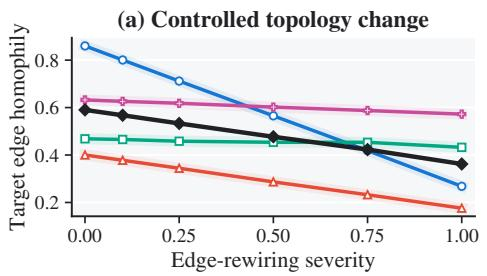

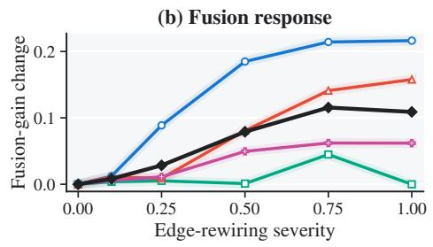  
Figure 6: Supplementary topology intervention. Degree-preserving rewiring lowers target homophily, while the fusion response varies by graph family. The black line is the equal-task mean.

Severity zero reproduces the reference endpoint, and local-expert logits have identical hashes across severities. Table 9 summarizes the maximum-severity changes. The largest response occurs on A→C: graph damage reaches 69.86 points, local-exclusive correctness rises by 33.38 points, and the fusion gain increases by 21.62 points. B1→B2 and EN→DE form intermediate regimes, whereas U→B remains nearly stable. These trajectories expose a graded relationship between neighborhood degradation and the value of graph-free local evidence rather than a binary task split.

Table 9: Endpoint changes at maximum target-topology corruption (percentage points).
<table><tr><td>Transfer</td><td>Graph damage</td><td>Local-exclusive gain</td><td>Fusion-gain change</td></tr><tr><td>A→C</td><td>69.86</td><td>33.38</td><td>21.62</td></tr><tr><td>U→B</td><td>0.76</td><td>0.76</td><td>-0.00</td></tr><tr><td>B1→B2</td><td>27.10</td><td>14.27</td><td>15.77</td></tr><tr><td>EN→DE</td><td>10.36</td><td>8.12</td><td>6.19</td></tr><tr><td>Equal-task mean</td><td>27.02</td><td>14.13</td><td>10.90</td></tr></table>

Table 9 reports the primary maximum-severity endpoints. A complementary fixed-reference-epoch replay yields mean graph-damage, local-exclusive, and fusion-gain changes of 31.29, 11.67, and 1.91 points, respectively. Both readouts preserve the same ordering: transfers with stronger graph-expert degradation expose more local-exclusive evidence and larger gains from combining the two experts.

## D.5 HYPERPARAMETER RESPONSE

The search evaluates 96 trained bundles per task and replays the task-level coefficient on the shared coarse grid $\alpha _ { \tau } \in \{ 0 . 0 5 , 0 . 1 , 0 . 4 , 0 . 6 \}$ . Coefficient replay over stored expert predictions is parameterfree. Figure 7 profiles each search dimension while optimizing over the remaining dimensions; lower gaps indicate wider high-performing regions across the transfer tasks.

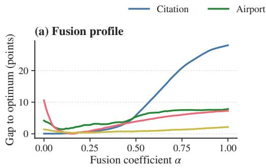

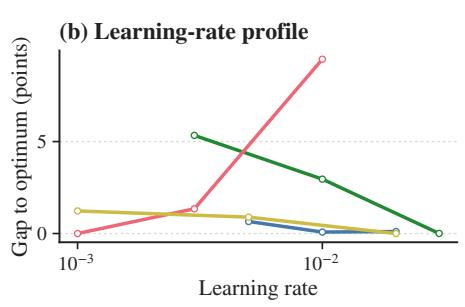

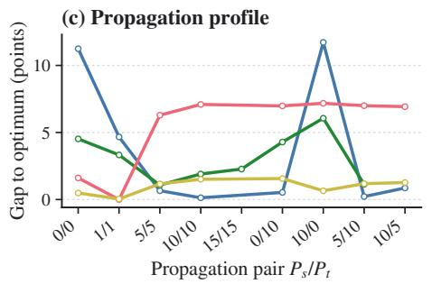

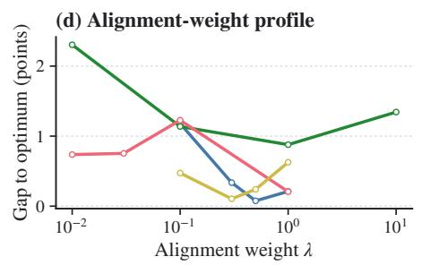  
Figure 7: Family-level hyperparameter profiles. Each point reports the mean gap to the task optimum after profiling over the remaining search dimensions; lower is better.

The following analysis relates each parameter response to its role in graph transfer.

Study on the fusion coefficient. The coefficient controls the balance between graph-aware and graph-free local evidence. The shared grid covers graph-dominant fusion, light local-expert participation, and progressively stronger local-expert contributions. Citation generally favors the graphdominant end, whereas Airport, Blog, and Twitch contain transfers that benefit from larger local weights. The preferred point may differ between transfer scenarios, but within a scenario it is one scalar shared by all nodes. This controlled response supports a compact task-level probability mixture.

Study on propagation depth. Propagation determines how strongly each domain incorporates neighborhood information before alignment. Symmetric and asymmetric pairs form several competitive operating regions, with their ordering varying across families. This agrees with the premise that source and target graphs can require different degrees of structural smoothing and motivates evaluating source and target propagation together as a paired configuration.

Study on learning rate and alignment weight. Learning-rate profiles retain clear favorable regions for each family. The alignment weight exhibits the expected balance: increasing it strengthens crossdomain matching until source discrimination and alignment reach an effective trade-off. Across both dimensions, the response curves identify family-level differences in the balance between source fitting and target alignment.