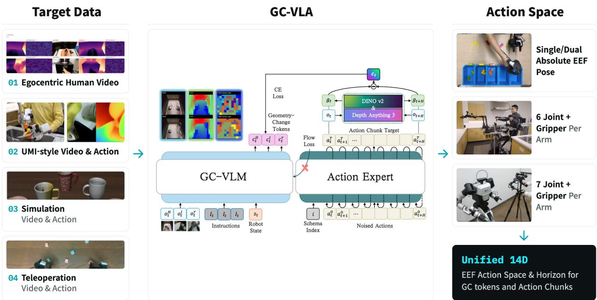
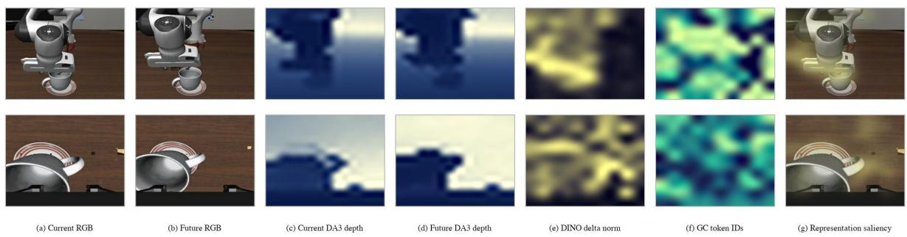
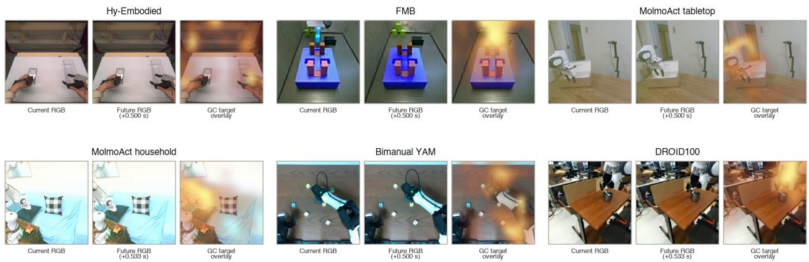

# HABILIS Brain 0: Geometry-Change Supervision for Vision-Language-Action and Residual Flow Recovery

Jinu Pahk, Jesoon Kang, Taegeon Park, Jisu An, Soo Min Kimm, Jaejoon Kim, and Byoung-Tak Zhang

Tommoro Robotics

https://tommoro.ai

Abstract Vision-language-action policies benefit from geometric supervision, but current-frame geometry alone does not explicitly describe the changes associated with manipulation. This design is motivated by the goal of learning an embodiment-agnostic visual interface that can be pretrained across robot and egocentric video before robot-specific action alignment. We introduce Geometry-Change VLA (GC-VLA), which learns to predict multiview future–current geometrychange tokens from current observations. Ofline frame pairs define a nominal 0.5-second prediction horizon; future observations are used only to construct training targets. Stage 1 trains a geometry-change vision-language model (GC-VLM). Stage 2 introduces a continuous ActionExpert and aligns it with robot actions while stopping action-flow gradients at the VLM interface. Stage 3 enables these gradients to update the trainable VLM components jointly with the ActionExpert. Stage 4 freezes GC-VLA and applies Geometry-Conditioned Residual Flow (GCRF), using a binary intervention router and a single bounded residual velocity policy learned from closed-loop feedback. GC-VLA achieves 95.20% success on LIBERO, and GC-VLA with GCRF achieves 99.55%. Inference uses current observations and the learned GC representation without executing the ofline target encoders.

## 1. Introduction

Robot manipulation requires reasoning about not only what is currently visible, but also what should change as an action is executed. Static current-depth supervision can provide useful scene geometry, yet it does not directly describe the geometric transition associated with an action horizon. For manipulation, such transitions include a gripper approaching an object, a drawer moving along its constraint, contact becoming established, or an object changing pose toward a task goal.

Recent world-model and predictive-representation approaches address temporal reasoning by predicting future observations, future latent states, or temporally evolved scene representations [27,30,42]. VideoVLA jointly generates future visual outcomes and robot actions, while FLARE aligns learned future tokens with latent representations of future observations and AHEAD explicitly rolls predicted future VLA features forward for downstream action decoding. These methods motivate future prediction as a useful learning signal for robot control, but leave open the question of what future information should be represented. GC-VLM takes a deliberately diferent target. Rather than reconstructing a future observation or predicting the complete future latent state, it predicts the change between spatial representations of the current and future observations:

$$
\Delta E _ { t , H } = E _ { t + H } - E _ { t } .\tag{1}
$$

The future observation is used only to construct this supervision target during training. The resulting objective emphasizes spatial locations and features that change over the manipulation horizon while reducing the contribution of unchanged scene content. At deployment, no future frame is observed and no learned world model is rolled forward; GC-VLM predicts the geometry-change representation directly from the current observation and instruction, and this representation conditions action generation.

This formulation also provides an interface for heterogeneous pretraining. Robot-action supervision is unavailable for human video and is inconsistent across robot embodiments, action spaces, and data sources. In contrast, temporally paired visual observations are available much more broadly. GC-VLM therefore learns camera-aligned geometry-change targets before requiring a common robot-action representation. This allows geometry pretraining to use both robot demonstrations and action-free video, including egocentric human interaction data, while postponing embodiment-specific action conversion to subsequent robot-action alignment.

We instantiate this idea as a four-stage pipeline. Stage1 trains GC-VLM with multiview future–current geometrychange supervision without requiring robot actions. Stage2 connects the learned representation to a continuous

ActionExpert while stopping the action-flow gradient at the VLM interface. Stage3 removes this detach boundary and jointly adapts the trainable VLM components and ActionExpert on downstream robot demonstrations. Finally, Stage4 freezes GC-VLA and applies Geometry-Conditioned Residual Flow (GCRF), which learns selective bounded corrections to the action-generation flow from closed-loop outcomes.

At inference, GC-VLA receives only the current language instruction, RGB observations, and robot state. Depth Anything v3 [17] and DINOv2 [25] are used exclusively for ofline construction of geometry-change supervision; neither model, future observations, nor future-derived targets are available to the deployed policy.

The paper documents a four-stage pipeline and the resulting evaluations:

• GC-VLM geometry pretraining. Multiview future–current geometry targets support representation learning without requiring robot-action annotations.

• GC-VLA action alignment and adaptation. Detached action alignment is followed by coupled optimization of the ActionExpert and trainable VLM components.

• GCRF residual post-training. A binary router and one bounded residual policy adapt the frozen actiongeneration flow using closed-loop feedback.

• LIBERO evaluation. GC-VLA achieves 95.20% success, and GC-VLA with GCRF achieves 99.55% under the reported evaluation protocol.

## 2. Related Work

Vision-language-action policies. Large-scale VLA policies establish the setting in which a vision-language backbone is adapted to robot actions. RT-1 and RT-2 scale transformer policies and vision-language-action transfer for robot control [2, 3]; OpenVLA provides an open generalist VLA trained on diverse robot demonstrations [13]. Most directly, π couples a pretrained VLM to a continuous action expert trained with flow matching [1]. GC-VLA follows this VLM-to-continuous-action design and uses geometry change over a fixed prediction horizon as VLM-side supervision.

Geometry-aware and future-state supervision. Geometry-aware objectives and future-state prediction provide task-relevant structure for robot policies [8, 36]. GC-VLM uses future–current geometry change as a supervision target. At inference, action generation is conditioned on GC representations predicted from current observations.

Action difusion and flow matching. Difusion Policy models robot action chunks through conditional denoising [5]. Flow Matching provides the general vector-field learning objective used to integrate a continuous flow from noise to data [18]; FlowPolicy further applies consistency flow matching to manipulation policies [38]. Our GC-VLA action expert uses this continuous-action viewpoint, and Stage 4 applies corrections in flow-velocity space rather than directly to the final action chunk.

Residual policy adaptation. Residual Reinforcement Learning augments a controller with an action-space residual [9], while Recovery RL learns selective intervention for safe execution [31]. GCRF applies a bounded residual to the action-generation velocity field. Guided flow methods likewise modify the vector field during sampling [41], and Residual Flow Steering studies adaptation of frozen flow policies [29].

## 3. Method

## 3.1. Geometry-Change Targets

Let the online input be

$$
\boldsymbol x _ { t } = \{ \ell , I _ { t } ^ { \mathrm { h e a d } } , I _ { t } ^ { \mathrm { w r i s t - L } } , I _ { t } ^ { \mathrm { w r i s t - R } } , q _ { t } \} ,\tag{2}
$$

where ℓ is the language instruction, $I _ { t } ^ { ( v ) }$ is an available RGB view, and $q _ { t }$ is the robot state. An ofline geometry encoder $\phi$ maps a camera observation and its pseudo-depth estimate to a compact spatial representation:

$$
E _ { t } ^ { ( v ) } = \phi ( I _ { t } ^ { ( v ) } ) , \quad E _ { t + H _ { \mathrm { G C } } } ^ { ( v ) } = \phi ( I _ { t + H _ { \mathrm { G C } } } ^ { ( v ) } ) .\tag{3}
$$

The training label is the geometry change over the prediction horizon

$$
\begin{array} { r } { \Delta E _ { t , H _ { \mathrm { G C } } } ^ { ( v ) } = E _ { t + H _ { \mathrm { G C } } } ^ { ( v ) } - E _ { t } ^ { ( v ) } \in \mathbb { R } ^ { 1 0 \times 1 0 \times d } . } \end{array}\tag{4}
$$

The $1 0 \times 1 0$ spatial grid is quantized into 100 token positions per view, $y _ { t , H _ { \mathrm { G C } } } ^ { ( v ) } \in \{ 1 , \dots , K \} ^ { 1 0 0 }$ . The fixed-layout target is

$$
y _ { t , H } ^ { \mathrm { G C } } = [ y _ { t , H } ^ { \mathrm { h e a d } } ; y _ { t , H } ^ { \mathrm { w r i s t - L } } ; y _ { t , H } ^ { \mathrm { w r i s t - R } } ] \in \{ 1 , \dots , K \} ^ { 3 0 0 } .\tag{5}
$$

For source frame rate $f ,$ the target ofset is $H _ { \mathrm { G C } } = \mathrm { r o u n d } ( 0 . 5 f )$ frames. The action chunk length, denoted $H _ { A }$ is defined separately when robot-action supervision is introduced. Missing cameras retain their assigned token slots and are excluded by a validity mask. The head view captures scene-level change, while wrist views provide local observations of gripper–object interaction.

Robot state $q _ { t }$ is used by the action policy; geometry pretraining uses the available visual and language inputs without requiring robot state or action annotations.

## 3.2. Architecture

GC-VLM extends the 36-layer Molmo2-ER backbone with 12 additional transformer blocks, initialized by copying the first 12 pretrained blocks. The appended blocks form the upper geometry-change extension and are trained to support prediction of multiview geometry-change tokens. Stage 1 learns this representation without action supervision. Stage 2 trains a continuous ActionExpert conditioned on the learned visual-language and GC representations. Figure 1 summarizes the architecture.

The shared VLM first produces multimodal hidden states

$$
h _ { t } = F _ { \Theta } ( x _ { t } ) , \qquad \hat { y } _ { t , H } ^ { \mathrm { G C } } = g _ { \mathrm { G C } } ( h _ { t } ) .\tag{6}
$$

Geometry-change prediction therefore shapes the representation consumed by the action branch. In addition, the implemented GeometryReader pools the GC hidden states with learned queries and exposes them to selected ActionExpert blocks through cross-attention residual updates:

$$
\tilde { h } _ { t , b } ^ { A } = h _ { t , b } ^ { A } + \mathrm { R e a d e r } _ { b } ( h _ { t , b } ^ { A } , h _ { t } ^ { \mathrm { G C } } , m _ { t } ^ { \mathrm { G C } } ) , \qquad b \in \mathcal { B } _ { \mathrm { G C } } .\tag{7}
$$

Here $m _ { t } ^ { \mathrm { G C } }$ masks unavailable camera slots. The continuous ActionExpert then predicts the flow velocity conditioned on the resulting geometry-aware hidden states,

$$
v _ { k } ^ { \mathrm { b a s e } } = A _ { \Psi } ( z _ { k } , \tau _ { k } , q _ { t } ; h _ { t } , \tilde { h } _ { t } ^ { A } ) .\tag{8}
$$

The reader is initialized as a no-op through a zero-initialized output projection, preserving the pretrained action path at initialization while allowing geometry-conditioned updates to be learned.

## 3.3. Leakage Prevention

Because $\Delta E _ { t , H }$ is built from $I _ { t + H }$ , future information must never enter the evaluation path. All rollout experiments use only $x _ { t }$ at inference. The intended invariant is

$$
\begin{array} { r } { \mathsf { e v a l : } \hat { y } _ { t , H } ^ { \mathrm { G C } } = g _ { \mathrm { G C } } ( F _ { \Theta } ( x _ { t } ) ) , \quad \mathsf { n o t } \phi ( I _ { t + H } ) . } \end{array}\tag{9}
$$

Future frames are labels, not inputs.

## 3.4. GCRF: Geometry-Conditioned Residual Flow

GCRF adapts a frozen GC-VLA policy using one binary intervention router and one unified residual velocity policy.   
The base VLM and ActionExpert parameters remain fixed during this stage.

At replanning instant t, the residual policy receives a context $c _ { t }$ formed from base-policy, GC-conditioned, and flow-history features.

$$
c _ { t } = [ \bar { v } _ { t } ^ { \mathrm { b a s e } } ; g _ { t } ^ { \mathrm { G C } } ; h _ { t } ^ { \mathrm { f l o w } } ] \in \mathbb { R } ^ { 9 6 } ,\tag{10}
$$

  
Figure 1: GC-VLA architecture and training stages. GC-VLM predicts multiview geometry-change tokens from current observations. The ActionExpert is introduced during action alignment and consumes the learned representations The action-flow gradient is detached at the VLM interface in Stage 2 and enabled for trainable VLM components in Stage 3. Future observations are used only for ofline target generation.

where each component is 32-dimensional. The GC component is computed from the model’s intermediate representations rather than an online execution of the ofline target encoders. Let $b _ { t } \in \{ 0 , 1 \}$ } denote the router decision and let $z _ { t }$ denote the selected residual latent. The bounded correction is

$$
d _ { t } = \epsilon \operatorname { t a n h } ( z _ { t } ) .\tag{11}
$$

The base action flow is integrated as

$$
\begin{array} { r } { x _ { t , k + 1 } = x _ { t , k } + \Delta \tau _ { k } \left[ v _ { \mathrm { b a s e } } ( x _ { t , k } , \tau _ { k } \mid o _ { t } ) + b _ { t } d _ { t } \right] , \qquad k = 0 , \ldots , 9 . } \end{array}\tag{12}
$$

The correction is held constant across the ten integration steps of one replanning cycle. A subsequent replan can produce a diferent correction as the observation and context change. At every integration step, the base velocity is evaluated at the updated flow state.

The router is learned from the observed outcomes of base-policy and intervention rollouts. At inference it uses observation-derived features; success labels are used only during training. When $b _ { t } = 0$ , no residual velocity is added. When $b _ { t } = 1$ , the selected correction is applied within the base flow solver.

## 4. Experimental Setup

## 4.1. Pretrained Geometry Models and Target Generation

We use two frozen pretrained models only during ofline target generation. For pseudo-depth estimation, we use depth-anything/DA3-BASE, a 0.12B-parameter checkpoint from Depth Anything 3 [17]. For geometry representation extraction, we use facebook/dinov2-small, corresponding to the 21M-parameter distilled DINOv2 ViT-S/14 model [25]. Both checkpoints are used as preprocessing models and are not executed during GC-VLA inference. For each camera view, Depth Anything 3 first predicts a pseudo-depth map from the current RGB observation. The depth map is resized to a 16 × 16 grid and normalized using per-frame percentile normalization. The resulting single-channel depth grid is replicated to three channels and resized to 224 × 224 before being passed to DINOv2. We remove the DINOv2 class token, resize the patch-token map to $1 0 \times 1 0$ , and apply feature normalization. For a current frame $o _ { t }$ and a future frame $O _ { t + H }$ , where H = round(f · 0.5) for a source frame rate f, the geometry target is computed as

$$
e _ { t } = \psi ( { \mathrm { D A 3 } } ( o _ { t } ) ) , \qquad e _ { t + H } = \psi ( { \mathrm { D A 3 } } ( o _ { t + H } ) ) .\tag{13}
$$

$$
\Delta e _ { t , H } = e _ { t + H } - e _ { t } .\tag{14}
$$

The continuous DINOv2 feature diference is then quantized into 100 discrete codes per view. The canonical cache contains three fixed view slots: head/global view, left-wrist view, and right-wrist view, resulting in 300 geometry tokens per sample. Missing camera views are represented by invalid masks and are not replaced by another camera. Figure 2 illustrates the target construction for head and wrist observations.

Pretrained model licensing. The DINOv2 code and model weights are released under Apache License 2.0. The DA3-BASE model card also lists the checkpoint under Apache 2.0. We use both models only for ofline geometry-target generation and retain the corresponding attribution and license notices in the released implementation. GC-VLM initialization starts from a Molmo2-ER vision-language checkpoint.

## 4.2. Stage-wise Training Data and Optimization

Stages 1–3 use distinct data mixtures with compatible visual and geometry-target interfaces. Their action supervision and gradient routing difer as follows.

Stage 1: GC-VLM geometry pretraining. GC-VLM is initialized from Molmo2-ER and trained on current– future frame pairs with ofline geometry-change targets [6]. Robot-action labels are not required, and no Action-Expert is used in this stage.

Stage 2: Detached action alignment. A continuous ActionExpert is introduced and trained on robot demonstrations converted to a common 14-dimensional bimanual end-efector delta representation. Each arm contributes three translation components, three rotation components, and a gripper command. Unavailable arm dimensions are masked. Geometry supervision continues to train GC-VLM, while action-flow gradients are stopped at the VLM–ActionExpert interface.

Stage 3: Coupled VLA adaptation. The model is adapted to LIBERO with geometry and action supervision. The detach boundary is removed so that action-flow gradients update the trainable VLM components together with the ActionExpert.

Let ${ \mathcal { L } } _ { \mathrm { C E } } ,$ s denote the stage-specific token cross-entropy and $\mathcal { L } _ { \mathrm { F M } }$ the action flow-matching loss. The gradientrouting curriculum is

$$
\mathcal { L } _ { 1 } = \mathcal { L } _ { \mathrm { G C } } ,
$$

$$
\mathsf { n o \ A c t i o n E x p e r t } ,\tag{15}
$$

$$
\mathcal { L } _ { 2 } = \mathcal { L } _ { \mathrm { C E , 2 } } + \lambda _ { \mathrm { F M } } \mathcal { L } _ { \mathrm { F M } } ,
$$

$$
\frac { \partial \mathcal { L } _ { \mathrm { F M } } } { \partial h _ { t } } \bigg | _ { \mathrm { i n t e r f a c e } } = 0 ,\tag{16}
$$

$$
\mathcal { L } _ { 3 } = \mathcal { L } _ { \mathrm { C E , 3 } } + \lambda _ { \mathrm { F M } } \mathcal { L } _ { \mathrm { F M } } ,
$$

$$
\mathsf { a c t i o n \mathrm { - } f l o w \ g r a d i e n t s \ e n a b l e d . }\tag{17}
$$

The token objectives include the valid geometry targets and any action-token targets enabled by the corresponding training recipe.

Stage 4: Residual post-training. GC-VLA is frozen. Closed-loop feedback is used to train selective residual intervention, as described in Section 4.8.

  
Figure 2: Multiview geometry-change target construction on LIBERO. Rows correspond to head and wrist views. Columns show (a) current RGB, (b) future RGB at the selected geometry horizon, (c–d) their ofline DA3 pseudodepth estimates, (e) the magnitude of the DINO feature diference, (f) the quantized GC token IDs, and (g) the GC target overlay on the current RGB frame. The overlay visualizes the training target rather than model attention. Future observations are used only to construct ofline supervision.

## 4.3. Unified End-efector Action Representation

Source demonstrations are converted to a common bimanual end-efector delta representation before action training. For arm $u \in \{ L , R \}$ ,

$$
\begin{array} { r } { a _ { t } ^ { u } = [ \Delta p _ { t } ^ { u } ; \Delta \rho _ { t } ^ { u } ; g _ { t , \mathrm { c m d } } ^ { u } ] \in \mathbb { R } ^ { 7 } , \qquad a _ { t } = [ a _ { t } ^ { L } ; a _ { t } ^ { R } ] \in \mathbb { R } ^ { 1 4 } . } \end{array}\tag{18}
$$

Here $\Delta p$ denotes translation, $\Delta \rho$ denotes the three-component rotation increment under the implemented conversion convention, and $g _ { \mathrm { c m d } }$ is the gripper command rather than a gripper-state diference. Left and right arm blocks have fixed positions. Missing arm dimensions are masked.

Each source adapter resolves pose conventions, units, arm ordering, gripper semantics, and action timing before conversion. Absolute EEF poses are converted into adjacent transitions. Joint-position sources require forward kinematics using the corresponding robot model and frame calibration before EEF conversion. Sources without a validated conversion are excluded from action training.

The model may carry these values in a padded action tensor; padding does not add physical action dimensions.   
Invalid dimensions are excluded from the action loss.

## 4.4. Data

The canonical GC-VLA lineage uses distinct data mixtures at each stage. Stage 1 pretrains the geometry-change representation on current–future frame pairs drawn from diverse human and robot video sources. Stage 2 uses physically validated action-bearing robot caches, with source-specific action schemas mapped to the common masked 32-dimensional transport interface. LIBERO is excluded from these broad pretraining mixtures: it is introduced only for downstream Stage 3 adaptation and is retained as the canonical closed-loop evaluation benchmark.

## 4.5. Training Data

Table 1 lists the source families used at each stage. Stage 1 uses human and robot videos for geometry supervision without requiring action annotations. Stage 2 uses robot demonstrations with validated EEF action conversion. LIBERO is introduced during Stage 3 adaptation. Stage 4 uses closed-loop rollouts of the frozen GC-VLA policy and residual candidates. Figure 3 shows representative current–future pairs and GC target overlays from the training sources.

## 4.6. Action Conversion and Temporal Alignment

Action preprocessing decodes each source format, transforms it into the canonical EEF frame convention, normalizes translation and gripper units, and constructs adjacent EEF transitions. Joint-state sources undergo validated

Table 1: Training-data sources by stage. Stage 1 uses geometry targets; Stage 2 uses validated EEF action targets; Stage 3 uses LIBERO for coupled adaptation. Stage 4 uses closed-loop rollouts.
<table><tr><td>Source family</td><td>S1</td><td>S2</td><td>S3</td><td>Primary role</td></tr><tr><td>HoloAssist [32]</td><td>Y</td><td></td><td></td><td>Egocentric human-interaction geometry; no robot action loss</td></tr><tr><td>Hy-Embodied [37]</td><td>Y</td><td>Y</td><td></td><td>Cross-embodiment and bimanual geometry/action alignment</td></tr><tr><td>HABIT [28]</td><td>Y</td><td>Y</td><td></td><td>Human-present bimanual and shared-workspace manipulation</td></tr><tr><td>MolmoAct tabletop/household [6, Y 14]</td><td></td><td>Y</td><td></td><td>Language-conditioned tabletop and household ma- nipulation</td></tr><tr><td>Bimanual YAM [6]</td><td>Y</td><td>Y</td><td></td><td>Top and dual-wrist bimanual data; FK-normalized EEF actions in S2</td></tr><tr><td>FMB / DROID100 [10, 21]</td><td>Y</td><td>Y</td><td></td><td>Contact-rich and real-world single-arm manipula- tion</td></tr><tr><td>ALOHA [39]</td><td>Y</td><td></td><td></td><td>Dual-wrist bimanual geometry pretraining</td></tr><tr><td>Austin Sailor / Berkeley UR5 [24] −</td><td></td><td>Y</td><td></td><td>Single-arm demonstrations converted to EEF ac- tions</td></tr><tr><td>Berkeley Fanuc [24]</td><td></td><td>Y</td><td></td><td>Single-arm demonstrations converted to EEF ac- tions</td></tr><tr><td>LIBERO [19]</td><td></td><td></td><td>Y</td><td>Downstream coupled adaptation and closed-loop evaluation</td></tr></table>

Stage 2 includes sources with validated EEF conversion, camera-slot mapping, and temporal alignment. Unavailable action and camera dimensions are masked.

Table 2: Four-stage training recipe. “Detach” stops the action-flow gradient at the VLM–ActionExpert interface.
<table><tr><td>Stage</td><td>Data and target</td><td>Learning rule</td></tr><tr><td>1: GC-VLM</td><td>Video pairs and geometry-change targets</td><td>Geometry-token CE; no ActionExpert</td></tr><tr><td>VLA</td><td>2: detached GC- Robot demonstrations with unified EEF targets</td><td>Action flow; VLM interface detached for flow gradients</td></tr><tr><td>VLA</td><td>3: coupled GC- LIBERO geometry and action supervision</td><td>Coupled updates of trainable VLM and ActionExpert</td></tr><tr><td>4: GCRF</td><td>Closed-loop contexts, interventions, and outcomes</td><td>Frozen base; residual and router post- training</td></tr></table>

forward kinematics before this conversion. The resulting left and right arm targets are concatenated and masked as specified in the EEF representation above.

An action chunk comprises consecutive transitions,

$$
A _ { t } = [ a _ { t } , a _ { t + 1 } , \ldots , a _ { t + H _ { A } - 1 } ] ,\tag{19}
$$

rather than displacements measured from the initial chunk state. Action and geometry supervision are aligned using each source’s validated timestamps and sampling rate. At canonical LIBERO inference, the policy predicts a horizon-10 action chunk.

## 4.7. Optimization Summary

Table 2 summarizes the stages and their gradient-routing rules. Geometry-token losses mask unavailable view slots, and action losses mask unavailable action dimensions. The Stage 2 interface is detached for the flow objective; Stage 3 enables action-flow gradients through the trainable VLM components.

## 4.8. Stage 4: GCRF—Geometry-Conditioned Residual Flow

The Stage 3 GC-VLA backbone and ActionExpert are frozen. Closed-loop executions provide contexts, sampled residual latents, and terminal binary success labels. The residual policy is optimized together with a continuous value head using an explicit no-op latent.

  
Figure 3: Examples of geometry-change supervision across training sources. Each example contains current RGB, future RGB at the source-normalized prediction horizon, and a GC target overlay on the current image. The overlay is the spatial magnitude of the DA3–DINO feature diference before quantization. Frame selection uses $H _ { \mathrm { G C } } =$ round(0.5f) for source frame rate $f ;$ the realized interval depends on frame discretization. Future RGB is used only to construct training targets.

Table 3: Action-chunk prediction from alternative representations under a matched state baseline and data split.
<table><tr><td>Representation</td><td>MSE↓</td><td> $\mathrm { R } ^ { 2 } \uparrow$ </td><td>MSE reduction</td></tr><tr><td>State only</td><td>0.1383</td><td>0.354</td><td></td></tr><tr><td>Current-depth VQ</td><td>0.1327</td><td>0.380</td><td>+4.1%</td></tr><tr><td>GC-VLA head delta-depth</td><td>0.1256</td><td>0.413</td><td>+9.2%</td></tr><tr><td>GC-VLA head+wrist delta-depth</td><td>0.1064</td><td>0.503</td><td>+23.1%</td></tr></table>

Let $Q _ { \omega } ( c , z )$ denote a success logit and let $z = 0$ denote no intervention. The value head is trained with binary cross-entropy on observed outcomes. Successful samples additionally impose a margin between the sampled residual and the no-op value. Policy optimization uses centered value diferences $Q _ { \omega } ( c , z ) - Q _ { \omega } ( c , 0 )$ to weight the log likelihood of sampled latents, together with a term favoring higher value at the policy mean.

During value-guided candidate selection, the policy mean is retained when $Q _ { \omega } ( c , \mu _ { \theta } ( c ) ) > Q _ { \omega } ( c , 0 ) + m ;$ ; otherwise the selected latent is zero. The binary intervention router is trained separately from closed-loop outcome supervision.

## 4.9. Evaluation Protocol and Metrics

Canonical LIBERO evaluation comprises four suites with ten tasks per suite and fifty fixed initial states per task. We report episode success rates and the mean over suites. The reported canonical result uses a single fixedinitialization evaluation with seed 1000 and batch size five. The model checkpoint and evaluation configuration are fixed for the reported run.

Representation probes report action-chunk MSE and $R ^ { 2 }$ , and manipulation-phase accuracy. Closed-loop success is the primary policy metric. Diagnostic subsets and inference interventions are reported separately from the full benchmark evaluation.

## 5. Results

## 5.1. Geometry-Change Representation Probes

We evaluate whether geometry-change representations encode action-relevant information using matched actionchunk and manipulation-phase probes. Table 3 compares target representations under a common split and state baseline. Table 4 evaluates information retained in frozen learned representations.

Table 4: Frozen-representation linear probes under matched checkpoints, data, and feature dimensions. Results use task-stratified 10-fold episode cross-validation over 1,600 observations from 400 LIBERO episodes.
<table><tr><td>Probe target</td><td></td><td>Current depth Geometry change Improvement</td><td></td></tr><tr><td>Action-chunk  $R ^ { 2 }$ </td><td>0.512</td><td>0.532</td><td>+0.020</td></tr><tr><td>Manipulation-phase accuracy</td><td>86.9%</td><td>90.6%</td><td>+3.7 pp</td></tr></table>

Action-chunk gain: 95% CI [+0.004, +0.037], one-sided sign-flip $p = 0 . 0 2 7$ . Phase gain: positive in 9/10 folds, Holm-adjusted $p = 0 . 0 1 9 5 ^ { }$

Table 5: Stage-free closed-loop ablation isolating the geometry target from the Stage 1–2 pretraining curriculum.
<table><tr><td>Policy</td><td>Geometry target</td><td>Tokens</td><td>Success</td><td>Rate</td></tr><tr><td>Current-depth control</td><td>Current-depth VQ</td><td>100</td><td>1,642/2,000</td><td>82.1%</td></tr><tr><td>Geometry-change variant Head+wrist depth-delta</td><td></td><td>200</td><td>1,722/2,000</td><td>86.1%</td></tr><tr><td>Improvement</td><td></td><td>+100</td><td>+80</td><td>+4.0 pp</td></tr></table>

Table 4 complements the target-screening result in Table 3: with matched checkpoints, data, and feature dimensions, the frozen GC representation improves manipulation-phase decoding and modestly improves action-chunk prediction relative to current-depth features.

Target-encoder design evidence. Direct DA3 features retain metric-like spatial layout and were competitive in some in-domain action probes; our choice is therefore not based on a claim that direct depth is uniformly inferior. On the matched dynamic-patch benchmark, however, afine-aligned direct depth obtained AUROC/AP of 0.730/0.408, and VQ depth obtained 0.712/0.421, whereas the DA3–DINO feature diference obtained 0.937/0.762. Its static-region false-positive rate was 0.027, compared with 0.092 for afine depth and 0.093 for VQ depth. These measurements motivate DA3–DINO feature diferences as the target representation: the matched probe shows stronger change discrimination and fewer static-region false positives while retaining a spatial token grid.

For wrist observations, a pilot reconstructed camera-frame pseudo-3D trajectories from DA3 depth. It visualized local interaction motion but did not produce a contract-valid SE(3) target: monocular depth lacked stable metric scale, camera and object motion were entangled, and camera-to-robot extrinsics were unavailable or inconsistent across sources. We therefore retain a camera-aligned wrist grid and mask missing views. In a diverse-task action probe, head-only embedded current-plus-delta features achieved $R ^ { 2 } = 0 . 4 6 7$ , wrist-only direct current-plus-delta achieved 0.492, and their aligned combination achieved 0.654; shufling wrist features reduced it to 0.379. This supports complementary local wrist information without treating the pseudo-SE(3) pilot as a controlled policy ablation.

## 5.2. Direct-Training Geometry-Change Ablation

To isolate the efect of geometry-change supervision from the staged pretraining curriculum, we evaluate a matched pair of policies initialized from the same VLA checkpoint and trained directly on LIBERO without using the Stage 1 geometry-pretraining or Stage 2 detached-alignment procedure.

The control variant uses current-depth VQ supervision with 100 geometry tokens. The geometry-change variant replaces this target with 200 head-and-wrist future–current depth-delta tokens while otherwise retaining the same direct VLA training path as MolmoAct2 [6]. Both models are evaluated under the same 2,000-episode fixedinitialization LIBERO protocol.

Replacing current-depth supervision with geometry-change supervision improves closed-loop success from 82.1% to 86.1%, corresponding to 80 additional successful episodes, as shown in Table 5. Because neither variant uses the Stage 1 or Stage 2 pretraining curriculum, this result isolates a benefit from the target design itself rather than from the staged optimization procedure.

The subsequent 95.20% Stage 1–3 result should therefore be interpreted as combining two efects: the geometrychange target already improves direct VLA training, while dedicated geometry pretraining, detached action alignment, and coupled downstream adaptation provide additional gains.

Table 6: Canonical LIBERO evaluation of the frozen GC-VLA base and the final GCRF recovery policy under the same 2,000-rollout contract.
<table><tr><td>Training pipeline</td><td>Evaluation contract</td><td>Success</td><td>Rate</td></tr><tr><td>GC-VLA Stage 1-3</td><td>40 tasks × 50 fixed-init states</td><td>1,904/2,000</td><td>95.20%</td></tr><tr><td>GC-VLA + GCRF</td><td>Same frozen-base evaluation cohort 1,991/2,000</td><td></td><td>99.55%</td></tr><tr><td>Improvement</td><td>Same paired contract</td><td>+87</td><td>+4.35 pp</td></tr></table>

Table 7: Comparison on the canonical LIBERO benchmark. We report success rates (%) on the four standard suites— LIBERO-Spatial, LIBERO-Object, LIBERO-Goal, and LIBERO-Long—and their unweighted mean. Methods are grouped by adaptation regime: supervised or task-specialized policies (upper block) and policies using closed-loop or online post-training on the LIBERO distribution (lower block). The HABILIS Brain 0 row follows the canon ical fixed-initial-state evaluation contract described in Section 4.9. Published baseline values are reproduced from the cited sources for contextual comparison; training data, observation and action interfaces, reset-state cohorts, checkpoint-selection rules, and evaluation implementations may difer across methods. Therefore, this table should not be interpreted as a controlled comparison of held-out-cohort generalization. †The RLinf-GRPO average is computed over the four displayed suites; its reported 98.1 leaderboard value additionally includes LIBERO-90.
<table><tr><td>Method</td><td></td><td>L-Spatial L-Object L-Goal L-Long Average</td><td></td><td></td><td></td></tr><tr><td>Supervised or task-specialized policies</td><td></td><td></td><td></td><td></td><td></td></tr><tr><td>ABot-M0.5 [4]</td><td>100.0</td><td>99.8</td><td>99.4</td><td>98.4</td><td>99.4</td></tr><tr><td>Being-H0.5 [20]</td><td>99.2</td><td>99.6</td><td>99.4</td><td>97.4</td><td>98.9</td></tr><tr><td>PhysBrain 1.0 [16]</td><td>99.6</td><td>99.6</td><td>99.4</td><td>96.4</td><td>98.8</td></tr><tr><td>Xiaomi-Robotics-0 [34]</td><td>98.8</td><td>100.0</td><td>98.8</td><td>97.2</td><td>98.7</td></tr><tr><td>Cosmos Policy [12]</td><td>98.1</td><td>100.0</td><td>98.2</td><td>97.6</td><td>98.5</td></tr><tr><td>MolmoAct2-Think [6]</td><td>98.8</td><td>99.8</td><td>98.5</td><td>95.4</td><td>98.1</td></tr><tr><td>π0.5 [26]</td><td>98.8</td><td>98.2</td><td>98.0</td><td>92.4</td><td>96.9</td></tr><tr><td>NVIDIA GR00T N1.7 [23]</td><td>97.7</td><td>97.5</td><td>98.5</td><td>94.4</td><td>97.0</td></tr><tr><td>Closed-loop or online post-training</td><td></td><td></td><td></td><td></td><td></td></tr><tr><td>Online SRPO [7]</td><td>98.8</td><td>100.0</td><td>99.4</td><td>98.6</td><td>99.2</td></tr><tr><td>SimpleVLA-RL (OpenVLA-OFT) [15]</td><td>99.4</td><td>99.1</td><td>99.2</td><td>98.5</td><td>99.1</td></tr><tr><td>OpenVLA-OFT (RLinf-GRPO) [35]</td><td>99.40</td><td>99.80</td><td>98.79</td><td>93.95</td><td>97.99†</td></tr><tr><td>HABILIS Brain 0</td><td>99.4</td><td>100.0</td><td>99.4</td><td>99.4</td><td>99.55</td></tr></table>

## 5.3. Stage 1–3: Canonical LIBERO Evaluation

The Stage 1–3 GC-VLA policy achieves 95.20% success under the protocol in Section 4.9. Table 6 compares the base policy with the final GCRF configuration. Table 7 compares suite success rates with published methods, grouped by adaptation regime.

## 5.4. GCRF Evaluation

With the GC-VLA base parameters fixed, the final GCRF configuration achieves 99.55% success on LIBERO, compared with 95.20% for GC-VLA alone (Table 6). The evaluated configuration applies the selected bounded velocity correction at all ten flow integration steps within each replanning cycle.

## 5.5. Mechanism Analysis: GC Reader and Residual Placement

Having established the full-policy performance above, we next examine two mechanisms specific to the proposed architecture: whether the GC reader contributes additional information at inference time, and whether the GCRF correction benefits from being applied throughout the flow integration trajectory rather than as a single impulse. These experiments are intended as targeted mechanism interventions rather than suite-wide performance comparisons.

Table 8: Inference-time mechanism interventions. Entries are success rates (%) on individual tasks, not suite-wide scores. GCRF is disabled for the reader interventions. Residual-placement interventions retain the same learned router and residual and match the integrated correction within each solve. The panel mean equally weights the four tasks.
<table><tr><td>Intervention</td><td>Spatial/t5 Long/t9</td><td></td><td>Goal/t3</td><td> $\mathrm { O b j e c t / t 0 }$  Panel mean</td></tr><tr><td>Full GC reader</td><td>58.0</td><td>78.0</td><td>94.0</td><td>100.0</td></tr><tr><td>Reader removed</td><td>66.0</td><td>62.0</td><td>92.0</td><td>100.0 80.0</td></tr><tr><td>Head-supervised GC slots</td><td>58.0</td><td>74.0</td><td>98.0</td><td>98.0 82.0</td></tr><tr><td>Wrist-supervised GC slots</td><td>58.0</td><td>76.0</td><td>96.0</td><td>98.0 82.0</td></tr><tr><td>Residual at all ten steps</td><td>94.0</td><td>96.0</td><td>100.0</td><td>100.0 97.5</td></tr><tr><td>Terminal-action impulse</td><td>62.0</td><td>86.0</td><td>98.0</td><td>100.0 86.5</td></tr><tr><td>First-step impulse</td><td>64.0</td><td>86.0</td><td>96.0</td><td>100.0 86.5</td></tr></table>

We evaluate these interventions on a fixed four-task diagnostic panel: Spatial/task5, Long/task9, Goal/task3, and Object/task0. Each condition uses continuous batches of five across 50 initial states per task, with seed 1000 and ten base flow evaluations. Table 8 reports task-level success rates.

GC reader intervention. The full reader achieves 82.5% compared with 80.0% when removed, with taskdependent efects: retaining the reader improves Long/task9 but reduces success on Spatial/task5. Head-only and wrist-only slot conditions both achieve 82.0%. None of the three planned reader contrasts is significant after Holm correction (adjusted $p = 1 . 0 )$ . Thus, this intervention provides no evidence for a consistent inference-time benefit from the reader pathway alone. Importantly, removing the reader does not remove geometry-change pretraining or the resulting backbone representation; the remaining backbone conditioning is retained, and the masked slots are contextualized. The result therefore suggests that the gains of GC-VLA should not be attributed primarily to the incremental reader pathway, but does not isolate the contribution of geometry-change pretraining itself.

Residual placement. The deployed residual is constant within a replan, while the base velocity is reevaluated along the evolving flow trajectory. We compare its application at all ten steps with adding the accumulated impulse to the terminal action or concentrating it at the first step. All-step application achieves 97.5%, versus 86.5% for either alternative. Both matched-outcome contrasts yield Holm-adjusted $p = 2 . 3 8 \times 1 0 ^ { - 6 }$ across the five planned comparisons. The results support distributed in-flow application on this panel. They do not compare independently trained action-residual policies. Impulse matching does not match peak amplitude or squared control energy, and later replans can difer across closed-loop trajectories. Object/task0 has no nonzero residual exposure and therefore supplies no evidence about placement despite its equal success rates.

## 5.6. LIBERO-PRO Four-Axis Perturbation Evaluation

We evaluate the frozen GC-VLA+GCRF policy on LIBERO-PRO [43] after post-training on canonical LIBERO. No LIBERO-PRO-specific training or parameter updates are performed. Table 9 reports the four selected perturbation axes: language, object, position, and task. Original and environment conditions are excluded from this four-axis comparison.

GC-VLA+GCRF achieves a 51.09% macro-average across the four reported LIBERO-PRO perturbation axes, comparable to the 53.35% macro-average of $\pi _ { 0 . 5 }$ . Performance varies substantially by perturbation type, as is also observed for the comparison methods. GC-VLA+GCRF obtains 93.00% on language perturbations, 71.85% on object perturbations, 18.05% on position perturbations, and 21.45% on task perturbations. For comparison, π0.5 obtains 95.80%, 96.00%, 20.80%, and 0.80% on the same four axes, respectively, with a 53.35% macro-average. Other methods in Table 9 have macro-averages ranging from 23.25% to 48.63%. These results show diferent perturbation profiles across policies rather than a uniform advantage of one method across all axes.

For GC-VLA+GCRF, the LIBERO-PRO evaluation uses the same policy frozen after closed-loop post-training on canonical LIBERO, without LIBERO-PRO-specific training or parameter updates. The result therefore measures how the canonical-LIBERO-trained policy behaves under the LIBERO-PRO perturbations, rather than the efect of adaptation to those perturbations. Because LIBERO-PRO is derived from the same underlying benchmark and task families, we treat this evaluation as a perturbation robustness test and do not interpret it as evidence of general embodiment or environment transfer.

Table 9: LIBERO-PRO success rates (%) over the four reported perturbation axes. The evaluated GC-VLA+GCRF policy is frozen after canonical LIBERO post-training. Average denotes the unweighted mean over the displayed axes. Original and environment conditions are not included.
<table><tr><td>Method Language / Semantic Object Swap / Position Task Average</td></tr><tr><td>59.00 27.63 5.75</td></tr><tr><td>OpenVLA-OFT [11] 0.63 23.25 MolmoAct [14] 85.75 76.00 1.50 1.50 41.19</td></tr><tr><td>π0 [1] 90.50 90.50 0.00 0.00 45.25</td></tr><tr><td>X-VLA [40] 82.88 78.38 1.63 16.38 44.81</td></tr><tr><td>VLA-Adapter [33] 90.75 73.75 0.00 19.75 46.06</td></tr><tr><td>SimVLA [22] 98.75 81.50 8.25 6.00 48.63 π0.5 [26]</td></tr><tr><td>95.80 96.00 20.80 0.80 53.35</td></tr><tr><td>HABILIS Brain 0 93.00 71.85 18.05 21.45 51.09</td></tr></table>

## 6. Limitations

GC-VLA and GCRF address diferent stages of policy learning. Geometry-change supervision shapes the representation, while the final 99.55% LIBERO result additionally uses closed-loop post-training on the benchmark distribution. The result therefore characterizes the combined training procedure, rather than pretraining scale alone. LIBERO-PRO measures perturbation robustness within related simulated task families. Its combined-system result does not isolate the causal contribution of GCRF without a matched base-policy comparison.

## 7. Conclusion

We introduced GC-VLA, which learns action-relevant visual representations through multiview geometry-change supervision. Geometry pretraining is followed by detached action alignment and coupled policy adaptation. The resulting GC-VLA policy achieves 95.20% success on LIBERO. GCRF augments the frozen policy with a binary intervention router and one bounded residual velocity policy, reaching 99.55% under the reported evaluation protocol.

## References

[1] Kevin Black, Noah Brown, Danny Driess, Adnan Esmail, Michael Equi, Chelsea Finn, Karol Hausman, Sergey Levine, Suraj Nair, Karl Pertsch, et al. π : A vision-language-action flow model for general robot control. arXiv preprint arXiv:2410.24164, 2024.

[2] Anthony Brohan, Noah Brown, Justice Carbajal, Yevgen Chebotar, Xi Chen, Krzysztof Choromanski, Danny Driess, Avinava Dubey, Chelsea Finn, Keerthana Gopalakrishnan, et al. Rt-2: Vision-language-action models transfer web knowledge to robotic control. arXiv preprint arXiv:2307.15818, 2023.

[3] Anthony Brohan, Noah Brown, Justice Carbajal, Yevgen Chebotar, Joseph Dabis, Chelsea Finn, Keerthana Gopalakrishnan, Karol Hausman, Alex Herzog, Jasmine Hsu, et al. Rt-1: Robotics transformer for real-world control at scale. arXiv preprint arXiv:2212.06817, 2022.

[4] Ronghan Chen, Yandan Yang, Zuojin Tang, et al. Abot-m0.5: Unified mobility-and-manipulation world action model. arXiv preprint arXiv:2607.00678, 2026.

[5] Cheng Chi, Zhenjia Xu, Siyuan Feng, Eric Cousineau, Yilun Du, Benjamin Burchfiel, Russ Tedrake, and Shuran Song. Difusion policy: Visuomotor policy learning via action difusion. In Robotics: Science and Systems, 2023.

[6] Haoquan Fang, Jiafei Duan, Donovan Clay, Sam Wang, Shuo Liu, Weikai Huang, Xiang Fan, Wei-Chuan Tsai, Shirui Chen, Yi Ru Wang, Shanli Xing, Jaemin Cho, Jae Sung Park, Ainaz Eftekhar, Peter Sushko, Karen Farley, Angad Wadhwa, Cole Harrison, Winson Han, Ying-Chun Lee, Eli VanderBilt, Rose Hendrix, Suveen Ellawela, Lucas Ngoo, Joyce Chai, Zhongzheng Ren, Ali Farhadi, Dieter Fox, and Ranjay Krishna. Molmoact2: Action reasoning models for real-world deployment, 2026.

[7] Senyu Fei, Siyin Wang, Li Ji, et al. Srpo: Self-referential policy optimization for vision-language-action models. arXiv preprint arXiv:2511.15605, 2025.

[8] Jisang Han, Seonghu Jeon, Jaewoo Jung, Ren´e Zurbr¨ugg, Honggyu An, Tifanny Portela, Marco Hutter, Marc Pollefeys, Seungryong Kim, and Sunghwan Hong. Geometric action model for robot policy learning, 2026.

[9] Tobias Johannink, Shikhar Bahl, Ashvin Nair, Jianlan Luo, Avinash Kumar, Matthias Loskyll, Juan Aparicio Ojea, Eugen Solowjow, and Sergey Levine. Residual reinforcement learning for robot control. In IEEE International Conference on Robotics and Automation, 2019.

[10] Alexander Khazatsky, Karl Pertsch, Suraj Nair, et al. Droid: A large-scale in-the-wild robot manipulation dataset. arXiv preprint arXiv:2403.12945, 2024.

[11] Moo Jin Kim, Chelsea Finn, and Percy Liang. Fine-tuning vision-language-action models: Optimizing speed and success. arXiv preprint arXiv:2502.19645, 2025.

[12] Moo Jin Kim, Yihuai Gao, Tsung-Yi Lin, et al. Cosmos policy: Fine-tuning video models for visuomotor control and planning. arXiv preprint arXiv:2601.16163, 2026.

[13] Moo Jin Kim, Karl Pertsch, Siddharth Karamcheti, Ted Xiao, Ashwin Balakrishna, Suraj Nair, Rafael Rafailov, Ethan Foster, Grace Lam, Pannag Sanketi, et al. Openvla: An open-source vision-language-action model. arXiv preprint arXiv:2406.09246, 2024.

[14] Jason Lee, Jiafei Duan, Haoquan Fang, Yuquan Deng, Shuo Liu, Boyang Li, Bohan Fang, Jieyu Zhang, Yi Ru Wang, Sangho Lee, Winson Han, Wilbert Pumacay, Angelica Wu, Rose Hendrix, Karen Farley, Eli VanderBilt, Ali Farhadi, Dieter Fox, and Ranjay Krishna. Molmoact: Action reasoning models that can reason in space, 2025.

[15] Haozhan Li, Yuxin Zuo, Jiale Yu, et al. Simplevla-rl: Scaling vla training via reinforcement learning. arXiv preprint arXiv:2509.09674, 2025.

[16] Shijie Lian, Bin Yu, Xiaopeng Lin, et al. Physbrain 1.0 technical report. arXiv preprint arXiv:2605.15298, 2026.

[17] Haotong Lin, Sili Chen, Junhao Liew, Donny Y. Chen, Zhenyu Li, Guang Shi, Jiashi Feng, and Bingyi Kang. Depth anything 3: Recovering the visual space from any views, 2025.

[18] Yaron Lipman, Ricky T. Q. Chen, Heli Ben-Hamu, Maximilian Nickel, and Matthew Le. Flow matching for generative modeling. In International Conference on Learning Representations, 2023.

[19] Bo Liu, Yifeng Zhu, Chongkai Gao, Yihao Feng, Qiang Liu, Yuke Zhu, and Peter Stone. LIBERO: Benchmarking knowledge transfer for lifelong robot learning. In Advances in Neural Information Processing Systems, 2023.

[20] Hao Luo, Ye Wang, Wanpeng Zhang, et al. Being-h0.5: Scaling human-centric robot learning for crossembodiment generalization. arXiv preprint arXiv:2601.12993, 2026.

[21] Jianlan Luo, Charles Xu, Fangchen Liu, Liam Tan, Zipeng Lin, Jefrey Wu, Pieter Abbeel, and Sergey Levine. Fmb: A functional manipulation benchmark for generalizable robotic learning. The International Journal of Robotics Research, 2024.

[22] Yuankai Luo, Woping Chen, Tong Liang, Baiqiao Wang, and Zhenguo Li. Simvla: A simple vla baseline for robotic manipulation. arXiv preprint arXiv:2602.18224, 2026.

[23] NVIDIA. NVIDIA Isaac GR00T N1.7-3B. Hugging Face model card, 2026. Accessed: 2026-09-19.

[24] Open X-Embodiment Collaboration et al. Open X-Embodiment: Robotic learning datasets and RT-X models, 2023.

[25] Maxime Oquab, Timoth´ee Darcet, Th´eo Moutakanni, Huy V. Vo, Marc Szafraniec, Vasil Khalidov, Pierre Fernandez, Daniel Haziza, Francisco Massa, Alaaeldin El-Nouby, Mahmoud Assran, Nicolas Ballas, Wojciech Galuba, Russell Howes, Po-Yao Huang, Shang-Wen Li, Ishan Misra, Michael Rabbat, Vasu Sharma, Gabriel Synnaeve, Hu Xu, Herv´e Jegou, Julien Mairal, Patrick Labatut, Armand Joulin, and Piotr Bojanowski. DINOv2: Learning robust visual features without supervision. In International Conference on Learning Representations, 2024.

[26] Physical Intelligence. π0.5: A vision-language-action model with open-world generalization. arXiv preprint arXiv:2504.16054, 2025.

[27] Yichao Shen, Fangyun Wei, Zhiying Du, Yaobo Liang, Yan Lu, Jiaolong Yang, Nanning Zheng, and Baining Guo. Videovla: Video generators can be generalizable robot manipulators. In Advances in Neural Information Processing Systems, 2025.

[28] Jaehwi Song, Suchae Jeong, Byeongguk Jeon, Sungdong Kim, Minjoon Seo, Hyungmok Son, and Kimin Lee. Habit: Human-aware behavior and interaction training dataset for robot manipulation. arXiv preprint arXiv:2606.31682, 2026.

[29] Entong Su, Tyler Westenbroek, Anusha Nagabandi, and Abhishek Gupta. Rfs: Reinforcement learning with residual flow steering for dexterous manipulation. arXiv preprint arXiv:2602.01789, 2026.

[30] Shahram Najam Syed, Arthur Jakobsson, Haoran Hao, and Jefrey Ichnowski. Intercepting the future: Latentspace predictive world model for dynamic vla manipulation, 2026.

[31] Brijen Thananjeyan, Ashwin Balakrishna, Suraj Nair, Michael Luo, Krishnan Srinivasan, Minho Hwang, Joseph E. Gonzalez, Julian Ibarz, Chelsea Finn, and Ken Goldberg. Recovery rl: Safe reinforcement learning with learned recovery zones. IEEE Robotics and Automation Letters, 6(3):4915–4922, 2021.

[32] Xin Wang, Taein Kwon, Mahdi Rad, Bowen Pan, Ishani Chakraborty, Sean Andrist, Dan Bohus, Ashley Feniello, Bugra Tekin, Felipe Vieira Frujeri, Neel Joshi, and Marc Pollefeys. Holoassist: An egocentric human interaction dataset for interactive ai assistants in the real world. In Proceedings ofthe IEEE/CVF International Conference on Computer Vision, pages 20270–20281, 2023.

[33] Yihao Wang, Pengxiang Ding, Lingxiao Li, Can Cui, Zirui Ge, Xinyang Tong, Wenxuan Song, Han Zhao, Wei Zhao, Pengxu Hou, et al. Vla-adapter: An efective paradigm for tiny-scale vision-language-action model. arXiv preprint arXiv:2509.09372, 2025.

[34] Xiaomi Robotics. Xiaomi-robotics-0: An open-sourced vision-language-action model with real-time execution. arXiv preprint arXiv:2602.12684, 2026.

[35] Hongzhi Zang, Mingjie Wei, Si Xu, Yongji Wu, Zhen Guo, Yuanqing Wang, Hao Lin, Peihong Wang, Liangzhi Shi, Yuqing Xie, Zhexuan Xu, Zhihao Liu, Kang Chen, Wenhao Tang, Quanlu Zhang, Weinan Zhang, Chao Yu, and Yu Wang. Rlinf-vla: A unified and eficient framework for reinforcement learning of vision-languageaction models. arXiv preprint arXiv:2510.06710, 2025.

[36] Yanjie Ze, Gu Zhang, Kangning Zhang, Chenyuan Hu, Muhan Wang, and Huazhe Xu. 3d difusion policy: Generalizable visuomotor policy learning via simple 3d representations. arXiv preprint arXiv:2403.03954, 2024.

[37] He Zhang, Lingzhu Xiang, Haitao Lin, Zeyu Huang, Minghui Wang, Dingyan Zhong, Yubo Dong, Yihao Wu, Yongming Rao, Dongsheng Zhang, Wanjia He, Ling Chen, Kai Huang, Jiahao Chen, Sichang Su, Xumin Yu, Ziyi Wang, Chengwei Zhu, Xiao Teng, Yuchun Guo, Yufeng Zhang, Yuandong Liu, Rui Wang, Zisheng Lu, Han Hu, and Zhengyou Zhang. Hy-embodied-0.5-vla: From vision-language-action models to a real-world robot learning stack. arXiv preprint arXiv:2606.14409, 2026.

[38] Qinglun Zhang, Zhen Liu, Haoqiang Fan, Guanghui Liu, Bing Zeng, and Shuaicheng Liu. Flowpolicy: Enabling fast and robust 3d flow-based policy via consistency flow matching for robot manipulation. arXiv preprint arXiv:2412.04987, 2024.

[39] Tony Z. Zhao, Vikash Kumar, Sergey Levine, and Chelsea Finn. Learning fine-grained bimanual manipulation with low-cost hardware. In Robotics: Science and Systems, 2023.

[40] Jinliang Zheng, Jianxiong Li, Zhihao Wang, Dongxiu Liu, Xirui Kang, Yuchun Feng, Yinan Zheng, Jiayin Zou, Yilun Chen, Jia Zeng, et al. X-vla: Soft-prompted transformer as scalable cross-embodiment visionlanguage-action model. arXiv preprint arXiv:2510.10274, 2025.

[41] Qinqing Zheng, Matt Le, Neta Shaul, Yaron Lipman, Aditya Grover, and Ricky T. Q. Chen. Guided flows for generative modeling and decision making. arXiv preprint arXiv:2311.13443, 2023.

[42] Ruijie Zheng, Jing Wang, Scott Reed, Johan Bjorck, Yu Fang, Fengyuan Hu, Joel Jang, Kaushil Kundalia, Zongyu Lin, Loic Magne, Avnish Narayan, You Liang Tan, Guanzhi Wang, Qi Wang, Jiannan Xiang, Yinzhen Xu, Seonghyeon Ye, Jan Kautz, Furong Huang, Yuke Zhu, and Linxi Fan. Flare: Robot learning with implicit world modeling. In Proceedings of the 9th Conference on Robot Learning, volume 305 of Proceedings of Machine Learning Research, page 3952–3971, 2025.

[43] Xueyang Zhou, Yangming Xu, Guiyao Tie, Yongchao Chen, Guowen Zhang, Duanfeng Chu, Pan Zhou, and Lichao Sun. LIBERO-PRO: Towards robust and fair evaluation of vision-language-action models beyond memorization, 2025.