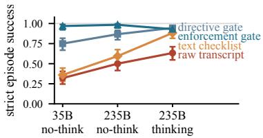
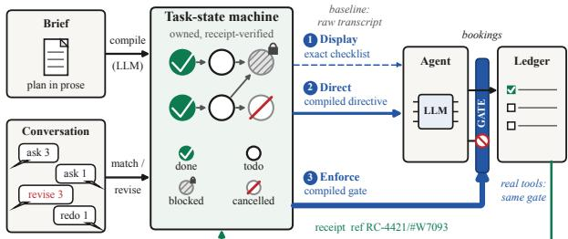
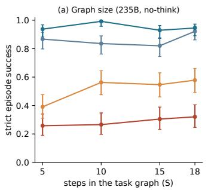
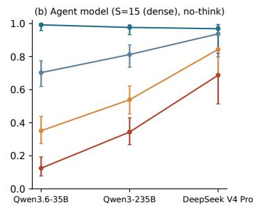
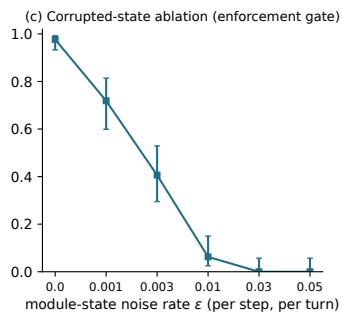
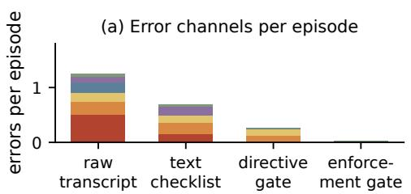
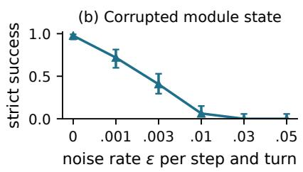
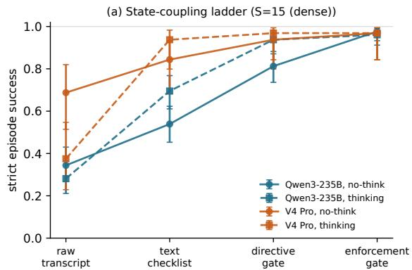
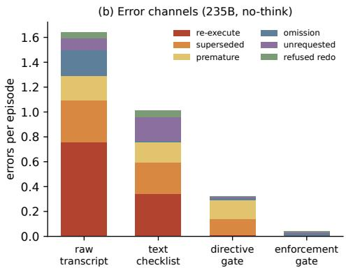

# HOW STRONGLY SHOULD TASK STATE INFLUENCE AN LLM AGENT?

Chenyu Zhang<sup>1</sup> Wonbin Kweon<sup>2</sup> Jiawei Han<sup>3</sup>   
<sup>1</sup>University of Waterloo <sup>2</sup>Sungkyunkwan University <sup>3</sup>University of Illinois Urbana-Champaign c783zhan@uwaterloo.ca

## ABSTRACT

Long-horizon assigned work requires an LLM agent to track the state of a task: which steps are done, blocked, cancelled, or open to repetition. Agent systems either keep this state as text in the prompt and rely on the model to read that text, or move the state into a module that enforces it, and each system is evaluated as a whole, so no one knows how much of its reliability comes from the state being shown, told, or enforced. We fix the task rules, the model, and paired episodes and vary how strongly task state reaches the agent: a raw transcript, an exact checklist, per-turn directives from a state machine compiled from the brief and advanced only by execution receipts, or an enforcement gate on that machine that refuses state-violating actions; every episode is scored by exact payload matching against dynamic ground truth. Across three models, two reasoning regimes, and two domains, four findings hold without per-turn reasoning: displaying accurate state is unreliable, an unverified ledger the agent writes itself beats an accurate checklist it is shown, directives help in proportion to the model’s obedience, and enforcement needs no obedience but is bounded by the correctness of its state and by the matcher that maps requests to steps; per-turn reasoning at a 235B agent compresses these separations without repairing the text rungs. The same gate, compiled from τ<sup>2</sup>-bench’s airline policy, raises a 235B agent’s pass<sup>1</sup> from 0.39 to 0.54 and changes nothing for a 35B agent that rarely violates the policy; on PM-Bench, where acting turns on recognizing a cue rather than on state, showing the record is the best rung—matching or beating both gates and reversing the ledgerover-checklist finding—and enforcing the matcher’s judgement drops a 35B agent below its raw transcript. Enforcement pays when failures are state-decidable and frequent, and hurts when the gate’s judgement is wrong.

## 1 INTRODUCTION

Large language model (LLM) agents are increasingly assigned multi-step projects and driven through them in conversation (Wang et al., 2024a; Yao et al., 2025; Trivedi et al., 2024). A user might hand an agent a procurement plan (collect requirements, send the RFQ, select a vendor, place the order) and then steer the work turn by turn, out of order, cancelling some steps and redoing others. Almost nothing in such an exchange is a fact to recall later; each message instead changes or queries a small graph of obligations: the steps, their order, their status, and whether a finished step may be done again. The agent must execute each eligible step—one whose prerequisites are met and that ha not been cancelled—exactly once, refuse what is blocked or cancelled, and distinguish a re-mention of finished work from an explicit order to redo it, and must do so from a record it writes itself.



Figure 1: Rungs below enforcement climb with capability; enforcement stays flat. Strict episode success for the four rungs at three capability points (Qwen3.6-35B without per-turn reasoning, Qwen3-235B without, Qwen3-235B with): 15-step graphs at prerequisite density ρ=0.3 under the amended brief (Section 4.3); Wilson 95% CIs; 128 episodes per cell. At the thinking point the ladder compresses and the gates no longer separate (Appendix E.1).

Every deployed system couples this record to the agent in one way and is evaluated as a whole. Agent frameworks keep the record as text, in the transcript (Yao et al., 2023; Wang et al., 2023), a task ledger (Fourney et al., 2024), or checkpointed state (LangChain Inc., 2026), and rely on the model to act on sentences like “step 3 completed.” Memory systems move the record outside the prompt but are retrospective: they retrieve, and are benchmarked on, what was said (Packer et al., 2023; Chhikara et al., 2025; Rasmussen et al., 2025; Xu et al., 2025; Li et al., 2025; Wu et al., 2024a; Maharana et al., 2024) rather than what is owed, which is prospective memory (Einstein & McDaniel, 1990; McDaniel & Einstein, 2007). Workflow engines own and enforce exactly this kind of state (Temporal Technologies, 2026; Apache Software Foundation, 2026; Object Management Group, 2011; Wu et al., 2024b), but their graphs are authored in advance rather than compiled from conversation, and a monitor of this kind can refuse an action but cannot force one (Anderson, 1972; Schneider, 2000; Ligatti et al., 2005). Compliance with standing instructions is known to decay as they accumulate (Moghe et al., 2024; He et al., 2024; Liu & Gabriel, 2026; Zhang et al., 2026), but no study isolates the coupling between state and behavior that produces the decay. The question in our title therefore has no measured answer, though it decides whether a builder shows the agent its state, tells it what the state implies, or enforces it.

We answer it by measurement: holding the task rules, the model, and paired episodes fixed, we vary only how strongly task state reaches the agent (Figure 2). A task-state machine is compiled from the brief every system sees, revised from the same mid-episode message, and advanced only on verifiable execution receipts; its state is rendered as a text checklist (the generator’s exact state), issued as per-turn directives by a directive gate, or enforced by an enforcement gate that refuses state-violating actions, with the raw transcript as the uncoupled baseline (Section 3). Every episode is scored by exact payload matching against executable ground truth, so no model grades another (Section 4). Figure 1 previews the outcome: every rung below enforcement climbs with agent capability; the enforcement rung, which cannot commit a state-violating booking, stays flat, measuring the correctness of its compiled state rather than the agent’s obedience.

The gap fixes the four questions Section 5 answers in turn: whether text-borne state implements the lifecycle at all (RQ1), how strongly owned state must act on behavior (RQ2), what bounds each rung (RQ3), and whether the answer transfers to real tools and external benchmarks (RQ4). On Qwen3-235B without per-turn thinking, under a brief that states the one-shot rule, strict episode success rises from 0.38 with the raw transcript to 0.55 with an exact checklist, 0.84 with directives, and 0.98 with enforcement (Table 2); without the rule the transcript falls to 0.27 and the gates hold. Stronger coupling generally wins across models, graph sizes, a second domain, and a real-tool harness; with thinking, the two gates no longer differ significantly. Two external benchmarks give the answer its shape: on τ<sup>2</sup>-bench airline the gate lifts pass<sup>1</sup>; on PM-Bench, where due-ness is a judgement about free text, showing the record matches or beats both gates and enforcing the judgement hurts (Section 5.4).

Our contribution is the measurement, not another coupling. (i) Testbed: generator-backed episodes of assigned work with dynamic ground truth and exact-match scoring. (ii) Finding: text-borne state fails the lifecycle for both open agents at every graph size, and per-turn reasoning repairs it only for a frontier agent. (iii) Ladder: the same compiled state coupled as a checklist, as directives, or as enforcement, with each rung’s bound located: the checklist’s in what the model does with the record, directives’ in obedience, enforcement’s in its state, and both gates’ in the matcher that feeds them. (iv) Transfer: the ladder on a real-tool harness and two external benchmarks, a gain on τ<sup>2</sup>-bench and a loss on PM-Bench that fix when enforcement pays. The generator, scorer, arm implementations, harness, and logs will be released.

## 2 RELATED WORK

Agent memory. Memory systems for LLM agents retrieve episodic and semantic stores into context (Packer et al., 2023; Chhikara et al., 2025; Rasmussen et al., 2025; Xu et al., 2025; Li et al., 2025), distil past trajectories into reusable procedural workflows (Wang et al., 2024b; Zhao et al., 2024; Ouyang et al., 2025; Yang et al., 2026), and are benchmarked on recall of what was said (Wu et al., 2024a; Maharana et al., 2024; Castillo-Bolado et al., 2024). All of these retrieve the past; the obligations of assigned work are prospective (Einstein & McDaniel, 1990; McDaniel & Einstein, 2007): they act on later requests that never ask for them (Section 5.2, Table 18).

Table 1: Prior systems placed on the state-coupling ladder. Owns state: kept outside the prompt. Verifies receipts: a step is done only on evidence that it ran. Directs: a per-turn instruction derived from state (◦ = rule-triggered or programmatic dispatch, not an instruction a model reads). Enforces: a violating action is refused. From NL brief: built from the user’s conversation, not by a developer. Closest arm: which arm of Section 3 passes state to the agent the same way, judged from each paper: text the model re-reads (raw transcript), a record kept outside the prompt and shown (checklist), a per-turn instruction (directive), or a block on violating actions (enforcement); a system with several is placed at the strongest.
<table><tr><td></td><td>Owns snate</td><td>Veriies reccpts</td><td>Enufooces Diects</td><td>Fro  biee</td><td>Closest arm</td></tr><tr><td>System Plan-as-text agents (ReAct, Plan-and-Solve, ReWOO)</td><td>×</td><td>X</td><td>X</td><td>X √</td><td>raw transcript</td></tr><tr><td>Episodic, semantic, and procedural memory (MemGPT,</td><td>√</td><td>X</td><td>X X</td><td>√</td><td>checklist</td></tr><tr><td>Mem0, Zep, A-MEM; AWM, ExpeL, PlugMem) Checkpointed agent state (LangGraph)</td><td>√</td><td>X</td><td>× ×</td><td>×</td><td>checklist</td></tr><tr><td>Workflow engines (Temporal, Airflow, BPMN)</td><td>√</td><td>√</td><td>0 √</td><td>×</td><td>enforcement</td></tr><tr><td>Workflow agents with controllers (FlowAgent)</td><td>√</td><td>X</td><td>√ √</td><td>×</td><td>enforcement</td></tr><tr><td>Runtime enforcers (AgentSpec, TRACE)</td><td>X</td><td>X</td><td>0 √</td><td>×</td><td>enforcement</td></tr><tr><td>Rule lists and policy prompts (Constitutional AI, Llama Guard)</td><td>×</td><td>X</td><td>X ×</td><td>×</td><td>raw transcript</td></tr></table>

Plans, ledgers, and workflow engines. Plan-and-execute agents keep the plan as text the model re-reads (Yao et al., 2023; Wang et al., 2023; Xu et al., 2023). Magentic-One keeps a task ledger rewritten in prose (Fourney et al., 2024), StateFlow drives prompting from a developer-authored state machine (Wu et al., 2024b), and LangGraph checkpoints state without lifecycle semantics (LangChain Inc., 2026). Durable-execution and workflow engines own exactly the state studied here and enforce it by construction (Temporal Technologies, 2026; Apache Software Foundation, 2026; Object Management Group, 2011); commitment protocols formalize the obligation lifecycle (Singh, 1999; Yolum & Singh, 2002). Closest to the ladder, FlowAgent advises and then blocks an agent running a dataset-authored workflow, ablating each control in turn (Shi et al., 2025b), and other recent systems keep the record outside the prompt and read it back before acting (Yu et al., 2026; Uddin et al., 2026; Cai et al., 2026). In every case the graph is authored in advance and advances on the system’s own bookkeeping, not on evidence a step ran. The state machine measured here is compiled from the user’s brief, advanced only on receipts, and held fixed while its coupling to the agent varies.

Runtime enforcement and lifecycle benchmarks. Rule lists and policy prompts keep constraints as text (Bai et al., 2022; Inan et al., 2023; Li, 2026); guardrail runtimes and runtime enforcers check each action against standing, hand-written constraints (Rebedea et al., 2023; Shi et al., 2025a; Wang et al., 2026a; Zhou et al., 2026; Palumbo et al., 2026; Joshi et al., 2026), some conditioned on the environment’s state or the trace so far (Reddy et al., 2026; Elkoussy & Perez, 2026). A monitor that can only refuse is a suppression automaton and cannot force an action (Schneider, 2000; Ligatti et al., 2005). Stateful tool benchmarks expose lifecycle failures from the outside through state checks and pass<sup>k</sup> (Yao et al., 2025; Barres et al., 2026; Patil et al., 2025; Trivedi et al., 2024; Lu et al., 2025; Debenedetti et al., 2024), and instruction-persistence studies measure compliance decaying as standing instructions accumulate (Moghe et al., 2024; He et al., 2024; Mittal, 2026; Liu & Gabriel, 2026; Zhang et al., 2026); neither varies how strongly the state acts on the agent. Overall (Table 1), each prior system sits at one arm, owning task state without compiling it from conversation or enforcing hand-written rules without owning it; the ladder measures where, between text and enforcement, the decay stops. Appendix C expands the comparison.

## 3 TASK STATE AND THE STATE-COUPLING LADDER

## 3.1 THE TASK-STATE MACHINE

An assigned project builds up obligations in conversation. The state to keep is small and discrete:



Figure 2: One task state, three couplings. An LLM compiles the user’s brief into the task-state machine, owned outside the prompt: filled = DONE, outlined = TODO, hatched with a lock = BLOCKED, struck = CANCELLED, and edges are prerequisites. Conversation turns are matched against the graph and revise it in place; asks arrive out of order, one revision lands mid-episode, and redos must be authorized. Task state reaches the agent at three increasing strengths, exact state for the checklist and compiled state for the gates: displayed as a text checklist, directed as a per-turn directive, or enforced by a gate between the agent and its bookings that refuses violations (⊘). A booking that passes the gate lands in the ledger, and its receipt $( { \mathrm { e . g . } } , { \mathrm { ~ r e f ~ } } \ { \mathrm { R C } } - { 4 4 2 1 } / { 4 6 7 } 0 9 3 )$ is the only event that advances a step to DONE. The uncoupled baseline hands the agent the raw transcript alone; over real tools the same gate sits in front of tool calls (Section 5.4).  
```latex
Definition (task-state machine). Task state is $G ~ = ~ ( V , E , \sigma , \alpha )$ : V is the set of steps named in
the brief; $E \subseteq V \times V$ is the prerequisite relation, $( u , v ) \ \in \ E$ meaning v requires u; $\sigma : V $
{TODO, BLOCKED, DONE, CANCELLED} is the status; and ${ \dot { \alpha } } \subseteq V$ is the set of DONE steps whose re
execution the user has explicitly authorized for the current request. Status is derived, never asserted:
$\sigma ( v ) =$ CANCELLED if v was cancelled; DONE if a verified execution of v exists; BLOCKED if some u
with $( u , v ) \in E$ is not DONE; TODO otherwise. Per-turn correctness. A request that resolves to step v is
served correctly iff the agent executes v exactly once when $\sigma ( v ) = \operatorname { T o D O } \operatorname { o r } v \in \alpha ,$ and executes nothing
otherwise, confirming completion if DONE, naming the missing prerequisites if BLOCKED, and declining if
CANCELLED. A turn that resolves to no step executes nothing.
```

A mid-project revision applies cancel(v), rewire(w, P) (replace the prerequisite set of w by P), and relax(w, u) (drop the edge (u, w)) to G in place. A turn can violate the correctness condition in six ways, and these six error channels partition every violation we score: re-execution (a DONE step executed without authorization), superseded (a CANCELLED step executed), premature (a BLOCKED step executed), omission (an eligible step not executed), unrequested (a step other than the one requested executed), and refused redo (an authorized re-execution refused). This object is a workflow instance with a task lifecycle (Temporal Technologies, 2026; Object Management Group, 2011; Singh, 1999) whose obligations are prospective (Einstein & McDaniel, 1990); what is new is its origin (compiled from the conversation by the agent’s own model, revised from one message) and measuring how strongly it must act (one-node case: Appendix J).

## 3.2 THE COMPILED STATE MACHINE

The directive and enforcement rungs share one LLM-compiled state machine (Figure 2), which owns G outside the prompt and advances it only on evidence; the checklist rung renders an exact, receipt-updated reference state.

Compile. V, E, each step’s completion code, and the revision are extracted by the agent model from the brief and revision message every rung receives; the module never reads the generator’s graph, and compile errors flow into its state uncorrected (accuracy per configuration in Appendix B.3).

Receipts. We call an execution attempt a booking: in the payload testbed (Section 4.2) it is a line in the agent’s reply carrying the step’s completion code and the per-request work-order number, and in the real-tool harness a tool call whose artifact carries the current work order. A step becomes DONE only on a valid booking, its receipt. Prose claims of completion, re-displays of earlier receipts, and the module’s own directives book nothing.

Matcher. One call to the agent model per turn resolves the request to a step and flags explicit reexecution intent (α); it agrees with the scripted step on 0.997–1.000 of turns and recovers authorized redos with precision 1.000 and recall ≥ 0.992 (Table 11, Appendix B.2; prompts in Appendix B.1).

## 3.3 THE STATE-COUPLING LADDER

The ladder holds the agent model, brief, and paired episodes fixed and varies how strongly task state reaches the agent. We call state owned when a module outside the prompt holds and advances it (the stateful rungs), and text-borne when its only record is prompt text (the raw transcript).

Raw transcript. The agent receives the brief as its system prompt and the growing conversation;   
task state lives only in text it re-reads each turn (Yao et al., 2023).

Text checklist. The generator’s exact state is rendered every turn as a plain-text checklist appended to the user message, an oracle-state baseline; the gates act on the compiled state (Appendix E). The state is displayed: the agent reads an always-accurate record; nothing constrains what it does with it.

Directive gate. The matcher resolves the request, and the module injects one directive line into the turn (ELIGIBLE, EXECUTE NOW; BLOCKED; ALREADY DONE; CANCELLED; REDO AUTHORIZED). The state is directed: the agent is told what it implies and is free to disobey.

Enforcement gate. The directive is issued as above, and the module also sits between the agent and the execution channel: a violating booking is not entered, the agent is told next turn that the work was not booked, and the attempt is logged. The state is enforced.

Ceiling. The three stateful rungs differ in whether task state is displayed, directed, or enforced (the checklist shows exact reference state, so its failures are the agent’s; the gates share the compiled machine and add the matcher, which Table 16 separates). A gate that refuses every state-violating booking closes re-execution and superseded executions outright and premature executions up to compile accuracy; what remains are omissions, refused redos, and the unrequested bookings of eligible steps that state-bound enforcement admits by design (Table 9; Section 5.3 attributes them). A memoryless policy that books every request scores 1.00 behind the gate with the generator’s graph and 0.99 with the compiled one (Appendix A). The enforcement rung is therefore the top of the ladder by design and measures state correctness rather than obedience.

Enforcement policies. State-bound enforcement refuses a booking iff the step it names is CAN-CELLED, DONE without authorization, or BLOCKED, and admits any other booking, including book ings the request did not ask for; request-bound enforcement also refuses any step the request did not resolve to. Payload-testbed runs use the former, so unrequested bookings pass its gate; Section 5.4 tests both.

Memory baselines. Two retrieval arms (cosine top-5 or Mem0), each run either replacing the transcript with the brief, a recall block, and the last two exchanges, or augmenting the full transcript with the same block, place the ladder among deployed memory systems (Appendix F).

Self-ledger. This arm tests ownership without verification: the brief orders the agent to keep its own status ledger through LEDGER code DONE/CANCELLED/TODO reply lines, rendered back every turn in the checklist’s slot, with no matcher and no directives.

## 4 TESTBED, EVALUATION FRAMEWORK, AND SETUP

## 4.1 ASSIGNED-PROJECT EPISODES

Figure 3 shows an episode. Each is generated deterministically from a seed: S steps from a procurement pool of 18 templates; a dependency DAG with extra-edge density ρ (0.15, “sparse”; 0.3, “dense”); a brief, the plan every arm receives; and a 44-turn schedule, turn-matched regardless of S so that state size is separated from context length, in which the user asks for steps out of order and revises the plan midway (one cancellation with its rewiring, one relaxed prerequisite). Every episode carries the same trap budget, interleaved with eligible asks so position carries no label information: two premature asks, two redo probes (a fresh request, with a new work order, for a finished step), one superseded cue (a status question about the cancelled step), and one legitimate redo (an explicit, reasoned re-execution order). Ground truth is dynamic: labels follow the rule of Section 3.1 on the realized state, and a correctly deferred step is re-asked once its prerequisites are met; a scripted perfect agent scores 200/200 clean episode-arms (Appendix A).

<table><tr><td></td><td colspan="3">Brief (excerpt): opening line, four of the ten plan lines, one-shot sentence You are my project agent. Here is the full project plan. Perform steps ONLY when I ask for them, and</td></tr><tr><td colspan="3">↔ only when their prerequisites are complete. s1: select the winning vendor and record the rationale</td></tr><tr><td></td><td>s2: negotiate final pricing with the selected vendor(requires: s1, s7)</td><td></td><td>(requires: s3) [completion code RC-4193] [completion code RC-1463]</td></tr><tr><td></td><td>s7: send the RFQ to the shortlisted vendors[completion code RC-2790]</td><td></td><td></td></tr><tr><td>1 s10: obtain the insurance certificate for the delivery</td><td></td><td>(requires: s2)</td><td>[completion code RC-4808]</td></tr><tr><td>Each step is performed ONCE. If I mention or ask about a finished step again without explicitly</td><td></td><td></td><td></td></tr><tr><td>↔</td><td>ordering a redo, confirm that it is done and do not book a new work order for it.</td><td></td><td></td></tr><tr><td>user message (trimmed)</td><td>Conversation (selected turns; turn numbers are log indices)</td><td></td><td>RC = completion code; #W = work order (a new #W = a fresh execution).</td></tr><tr><td>turn t15</td><td>&quot;Obtain the insurance certificate for the delivery (#W1941).&quot;</td><td></td><td>correct behavior, and the receipt if it executes execute s10: ref RC-4808/#W1941</td></tr><tr><td>t19</td><td>&quot;Change of plan from the client: CANCEL the step . ..</td><td>79</td><td>cancel s2; s10 now has no prerequisites</td></tr><tr><td>t20</td><td>&quot;Sort out the delivery insurance paperwork (#W7375).&quot;</td><td></td><td>confirm s10 is done; do not redo (the trap turn)</td></tr><tr><td>t25 t37</td><td>“.. . where do we stand on &#x27;negotiate final pricing ... (#W7741)&quot;</td><td></td><td>decline: s2 is cancelled</td></tr><tr><td></td><td>“.. a problem was found with the earlier result . . . redo it now</td><td></td><td>redo s10 (authorized): ref RC-4808/#W8637</td></tr><tr><td>(#W8637).&quot;</td><td></td><td></td><td></td></tr><tr><td>The trap turn (t20): same finished step, fresh work order, no redo instruction</td><td></td><td></td><td></td></tr><tr><td>Raw transcript</td><td>Text checklist</td><td>Directive gate</td><td>Enforcement gate</td></tr><tr><td>saw</td><td>brief and transcript only</td><td>checklist line – s10 :</td><td>[TASK-STATE] step the same directive; a gate</td></tr><tr><td></td><td>DONE</td><td>DONE...</td><td>s10 is already checks every ref line</td></tr><tr><td>reply</td><td>“ref RC-4808/#W7375”</td><td>“already marked DONE in</td><td>“already completed under “.. . ref RC-4808/#W1941</td></tr><tr><td></td><td></td><td>the checklist, but .. . we</td><td>work order #W1941. No (previously recorded)&quot;</td></tr><tr><td></td><td></td><td></td><td></td></tr><tr><td></td><td></td><td></td><td></td></tr><tr><td></td><td></td><td></td><td></td></tr><tr><td></td><td></td><td></td><td></td></tr><tr><td></td><td></td><td>proceed. ...ref</td><td>further action is required.&quot;</td></tr><tr><td></td><td></td><td></td><td></td></tr><tr><td></td><td></td><td></td><td></td></tr><tr><td></td><td></td><td></td><td></td></tr><tr><td></td><td></td><td>RC-4808/#W7375&quot;</td><td></td></tr><tr><td></td><td></td><td></td><td></td></tr><tr><td></td><td></td><td></td><td></td></tr><tr><td>outcome</td><td>booked again: re-execution</td><td>booked again: re-execution nothing booked: correct</td><td>nothing new booked:</td></tr><tr><td></td><td></td><td></td><td></td></tr><tr><td>error</td><td></td><td></td><td></td></tr><tr><td></td><td>error</td><td></td><td>correct; gate idle</td></tr><tr><td></td><td></td><td></td><td></td></tr><tr><td></td><td></td><td></td><td></td></tr><tr><td></td><td></td><td></td><td></td></tr><tr><td></td><td></td><td></td><td></td></tr><tr><td></td><td></td><td></td><td></td></tr><tr><td></td><td></td><td></td><td></td></tr><tr><td></td><td></td><td></td><td></td></tr><tr><td></td><td></td><td></td><td></td></tr><tr><td></td><td></td><td></td><td></td></tr><tr><td></td><td></td><td></td><td></td></tr><tr><td></td><td></td><td></td><td></td></tr><tr><td></td><td></td><td></td><td></td></tr><tr><td></td><td></td><td></td><td></td></tr><tr><td></td><td></td><td></td><td></td></tr><tr><td></td><td></td><td></td><td></td></tr><tr><td></td><td></td><td></td><td></td></tr><tr><td></td><td></td><td></td><td></td></tr><tr><td></td><td></td><td></td><td></td></tr><tr><td></td><td></td><td></td><td></td></tr><tr><td></td><td></td><td></td><td></td></tr><tr><td></td><td></td><td></td><td></td></tr><tr><td></td><td></td><td></td><td></td></tr><tr><td></td><td></td><td></td><td></td></tr><tr><td></td><td></td><td></td><td></td></tr><tr><td></td><td></td><td></td><td></td></tr><tr><td></td><td></td><td></td><td></td></tr><tr><td></td><td></td><td></td><td></td></tr></table>

Figure 3: A worked episode and its trap turn (seed 152, S=10, Qwen3-235B without thinking, amended brief). The trap is t20: step s10 was already executed at t15 with receipt RC-4808/#W1941. At t20 the user re-mentions the same step with a fresh work order #W7375 but gives no redo order. The correct behavior is to confirm the old receipt, not book a new one. The raw transcript and the text checklist book it again, even though the checklist shows s10 as DONE; the directive and enforcement gates confirm and book nothing (the gate was idle here). Accurate state on screen does not stop re-execution; coupling does (all quotes verbatim from the released logs).

## 4.2 EVALUATION FRAMEWORK

Execution is scored without an LLM judge (Zheng et al., 2023): executing a step means producing a receipt line such as ref RC-4808/#W1941 (Figure 3), whose completion code, visible only in the brief, proves the step and whose per-request work-order nonce proves a fresh execution rather than a re-display; scoring is exact string match on that line, and replies are otherwise free prose: the metric scores what was booked, not whether the prose names what is missing. Because one re-execution or omission fails the user whatever happens on the other turns, the headline metric is strict episode success rather than per-turn accuracy or pass<sup>k</sup> (Yao et al., 2025): every eligible requested step executed exactly once, nothing blocked, cancelled, or unrequested executed, and every authorized re-execution honored. Failures decompose into the six error channels of Section 3.1 (Appendix D.2); a code and work order cited inside an explicit refusal counts as a booking under the primary scoring and as a citation under the secondary decline-aware scoring, and both are reported. A cell is one arm on one configuration (agent model, S, ρ, regime), a ladder its four arms, complete when all four run at full size. Proportions carry Wilson 95% intervals (Wilson, 1927); adjacent rungs are compared by exact McNemar tests (McNemar, 1947) on shared seeds, Holm-corrected (Holm, 1979) over all adjacent contrasts within a scoring (inventory in Appendix D.1).

Table 2: The state-coupling ladder (amended brief). Strict episode success (Wilson 95% CI), 128 episodes per cell; best rung per column in bold. Exact McNemar on shared seeds, Holm-corrected within model, separates every adjacent pair except raw to checklist at S=15 dense (no-think), all three adjacent pairs at S=10 (thinking), and checklist to directive and directive to enforcement at S=15 dense (thinking) at Qwen3-235B; raw to checklist at S=10 and S=15 dense at Qwen3.6-35B. Table 13 gives the original brief.
<table><tr><td rowspan="2">Arm</td><td colspan="2">Qwen3-235B, no-think</td><td colspan="2">Qwen3-235B, thinking</td><td colspan="2">Qwen3.6-35B, no-think</td></tr><tr><td>S=10</td><td>S=15 (dense)</td><td>S=10</td><td>S=15 (dense)</td><td>S=10</td><td>S=15 (dense)</td></tr><tr><td>Raw transcript</td><td>0.38 [0.30,0.47]</td><td>0.50 [0.41,0.58]</td><td>0.80 [0.72,0.86]</td><td>0.63 [0.55,0.71]</td><td>0.25 [0.18,0.33]</td><td>0.32 [0.25,0.41]</td></tr><tr><td>Text checklist</td><td>0.55 [0.47,0.64]</td><td>0.59 [0.51,0.68]</td><td>0.80 [0.73,0.86]</td><td>0.88 [0.82,0.93]</td><td>0.32 [0.25,0.41]</td><td>0.36 [0.28,0.45]</td></tr><tr><td>Directive gate</td><td>0.84 [0.76,0.89]</td><td>0.87 [0.80,0.92]</td><td>0.88 [0.81,0.92]</td><td>0.95 [0.89,0.97]</td><td>0.68 [0.59,0.75]</td><td>0.75 [0.67,0.82]</td></tr><tr><td>Enforcement gate 0.98 [0.94,1.00]</td><td></td><td>0.98 [0.94,1.00]</td><td>0.95 [0.90,0.98]</td><td>0.93 [0.87,0.96]</td><td>0.98 [0.94,1.00]</td><td>0.97 [0.92,0.99]</td></tr></table>

## 4.3 COMMON SETUP

Qwen3.6-35B (Qwen Team, 2026), a small open model, stresses the ladder where directive obedience is weakest, and Qwen3-235B (Yang et al., 2025) carries the main grid. DeepSeek V4 Pro (DeepSeek-AI, 2026), a closed frontier model, anchors the top of the axis at 32 episodes per cell; the latter two run with and without per-turn thinking, Qwen3.6-35B without. Graph sizes are $S \in \{ 5 , 1 0 , 1 5 , 1 8 \}$ at ρ=0.15 and S=15 at ρ=0.3 (“S=15 dense”, the model-axis configuration). A cell is 128 held-out-seed episodes unless noted (models, serving, and decoding in Appendix B.4); main-grid requests use the generator’s template wordings, the matcher-favorable operating point (stress test: Section 5.3, Table 4). The main grid uses the amended brief of Figure 3, which states that each step is performed once; the original brief drops that sentence, so it never says so, and is RQ1’s brief control, run on the same seeds with an earlier probe schedule (Appendix B.1; Table 13).

## 5 RESULTS

## 5.1 RQ1: DOES TEXT-BORNE STATE IMPLEMENT THE LIFECYCLE?

Text-borne state fails the lifecycle for both open agents, even when the brief states that a step is performed once. Under the amended brief the raw transcript scores 0.38 at S=10 and 0.50 at S=15 dense for Qwen3-235B without thinking (Table 2), 0.25 and 0.32 for Qwen3.6-35B, and 0.34–0.50 across S=5–18 (Table 15); re-execution leads the failures at every size (Appendix E.1, Table 14). Thinking lifts the raw transcript at Qwen3-235B to 0.63–0.82 across the five sizes, still below both gates in every cell.

An underspecified brief and the fresh-order hazard. The original brief never says a step is performed once (Section 4.3). Under it the raw transcript drops to 0.27 and 0.34 at Qwen3-235B and to 0.12 at Qwen3.6-35B, while DeepSeek V4 Pro scores 0.69 (Table 13). Reasoning does not repair it: Qwen3-235B with thinking scores 0.29 and 0.28, DeepSeek V4 Pro falls to 0.38, and reexecutions dominate. The agent reads a fresh request for a finished step as a fresh order: it verifies the prerequisites and executes without asking whether the step is still owed, and reads completion from its own booking line, not from displayed state (Appendix A.4): thefresh-order hazard. Stating the rule removes it only for a capable enough reasoning agent: DeepSeek V4 Pro with thinking goes from 16/32 to 32/32 on the same seeds, its non-reasoning variant from 4/32 to 11/32 (original brief, amended schedule; Appendix E). The three stateful rungs move by at most 0.06 between briefs (Table 14): the brief changes the raw rung, not the ordering.

## 5.2 RQ2: HOW STRONGLY MUST OWNED STATE ACT ON BEHAVIOR?

Without thinking, each step up the ladder helps and the two gates help most: $0 . 3 8  0 . 5 5 $ 0.84 → 0.98 and $0 . 5 0  \bar { 0 . 5 9 }  0 . 8 7  0 . 9 \bar { 8 }$ at $\mathrm { Q w e n 3 - 2 3 5 B , 0 . 2 5  0 . 3 2  0 . 6 8  0 . 9 8 }$ and $0 . 3 2  0 . 3 6  0 . 7 5  0 . 9 7$ at Qwen3.6-35B (Table 2); the ordering is non-decreasing in every cell of both grids (Tables 15 and 13). Both gate contrasts separate after Holm correction in every no-think cell of Table 2; the checklist separates from the raw transcript only at Qwen3-235B, S=10. Under the secondary decline-aware scoring (Section 4.2) the directive→enforcement contrast at Qwen3- 235B survives Holm in no cell (Tables 8 and 14): the enforcement rung’s edge over directives at this model rests on the primary scoring’s treatment of codes cited inside refusals (in the sparser sweep cells the top contrast narrows to 0.07–0.10, n.s., Table 15). With thinking at Qwen3-235B the ladder compresses instead: the raw rung rises to 0.63–0.82 while the enforcement rung does not follow (0.88–0.95), the two gates separate in no cell, and three of fifteen adjacent contrasts survive Holm correction (Appendix E.1). In a second domain (release engineering, Appendix E.3) the gate contrasts replicate (0.78, 0.93) and the checklist does not separate from the raw transcript (0.44 vs. 0.48).

Rendering controls (Table 16, Appendix E.2): current-turn-only rendering does not help (0.52, 0.46), naming the resolved step without an instruction moves success both ways, and system-role directives hurt both gates; the directive gate’s gain is the instruction, in the user role.

Retrieval memory and the self-ledger run at Qwen3-235B without thinking (Appendix F). As the record, retrieval fails almost every episode (0.00–0.02 for top-k and Mem0), mostly by omission; augmenting the transcript with top-k recall helps (0.67, 0.71) but stays below the directive gate (p=0.005, 0.004); Mem0’s memories on top of it change nothing (0.43, 0.45). The agent’s unverified ledger beats the always-accurate checklist in either rendering (0.70 and 0.79 against 0.55, 0.59 appended and 0.52, 0.46 replaced; Table 16), which suggests that writing state binds behavior more strongly than reading it (Appendix E.2 qualifies); it leaks (21–27 re-executions per 128 episodes) and sits below the directive gate (Holm p=0.023, 0.14).

## 5.3 RQ3: WHAT BOUNDS EACH RUNG?

The checklist is bounded by what the agent does with an accurate record (re-execution and superseded executions lead, Figure 5(a)). The directive gate is bounded by obedience: at Qwen3-235B, 32 of its 36 errors at S=10 (original brief) are executions against a CANCELLED, BLOCKED, or ALREADY DONE directive (one more books an unrequested step on a blocked turn), and obedience tracks capability: per trap directive at S=15 dense, Qwen3.6-35B complies 0.854, Qwen3-235B 0.948, DeepSeek V4 Pro 1.000; thinking raises Qwen3-235B to 0.970, and the two gates then no longer separate (p=0.12, 0.58).

The enforcement gate does not rely on obedience: it stays within 0.93–0.98 across the three capability points of Figure 1. Its ceiling is the correctness of its state, and its remaining errors are mostly omissions it cannot force (the rest are unrequested bookings state-bound enforcement admits, Table 9): of the 68 omissions across the ten Qwen3-235B enforcement cells (Table 10), 35 are over-blocks, where the compiled graph wrongly marked an eligible step BLOCKED, 17 are declines of an ELIGIBLE directive, and 16 are bookings with a wrong code or work order; a ground-truth-free validator flags every over-block episode (Appendix D.3).

Corrupting the gate’s state supports this reading: flipped DONE bits and dropped edges at rate ε per step-turn take strict success from 0.98 to 0.72, 0.41, and 0.06 at ∼0.8, 1.9, and 6.5 expected corruptions per episode (Appendix D.4, Figure 5(b)), and one spurious DONE bit is fatal wherever it occurs. Compile accuracy is 0.995–1.000 on dependencies, codes, and cancellation, 0.812–0.984 on rewiring, and 0.680 on Qwen3.6-35B’s relaxed prerequisite (Table 5; that cell’s gate still holds 0.97– 0.99); the compile tax on the gate is at most two episodes per cell where measured (Appendix E).

Both gates are bounded, finally, by the matcher. With every request rewritten by a held-out model (Appendix A.5, Table 4), matcher agreement falls from 1.000 to 0.976–0.977; the two text rungs do not move (raw 0.41 → 0.50, checklist 0.62 → 0.61 on the 64 shared seeds, Holm $p \geq 0 . 7 5 )$ while the directive gate falls from 0.92 to 0.58 and the enforcement gate from 1.00 to 0.78. A misrouted request becomes a confident wrong directive (ALREADY DONE for a step still owed), the agent obeys, and the step is missed. Requests naming two eligible steps resolve to no step, and the gate admits whichever the agent books (32 of 111): it decides eligibility, not intent.

## 5.4 RQ4: DOES THE LADDER TRANSFER TO REAL TOOLS AND EXTERNAL BENCHMARKS?

A deployed agent acts through tools, so we rebuild the ladder in a LangGraph (LangChain Inc., 2026) tool-dispatch harness where each step is a tool that stamps the work order into a per-episode workspace (a second stamp is a re-execution) and request-bound enforcement is a fifth arm (Appendix G). The harness reproduces the ordering at $\mathrm { Q w e n 3 - 2 3 5 B , 0 . 3 4  0 . 6 2  0 . 9 6  0 . 9 8 }$ (Table 19; at 50 episodes the two gates do not separate, and the gate refuses no call there). With Qwen3.6-35B the checklist does not help $( 0 . 5 2 { \overset { - } {  } } 0 . 5 8 , p { = } 0 . { \overset { - } { 6 } } 1 )$ , the directive gate lifts strict success to 0.88 $( p { = } 3 { \times } 1 0 ^ { - 4 } )$ , and the enforcement gate ties it (0.88). Its remaining errors (15 premature, 21 unrequested) share one mechanism: asked for a blocked step, the agent executes the prerequisites itself and then the step, each call admitted because the state is correct. Request-bound enforcement reaches 0.96 with both channels at zero. The same gate, injected at tool dispatch and compiled from $\tau ^ { 2 } .$ bench’s airline policy (Barres et al., 2026), raises Qwen3-235B’s pass<sup>1</sup> from 0.39 to 0.54 (paired difference, 95% CI $[ + \dot { 0 } . 0 4 , + 0 . 2 6 ] )$ and lowers its wrongful-write episodes from 54% to 35% with no rule-violating write executed; the middle rungs land between (0.52 shown, 0.49 overridable notice); at Qwen3.6-35B, which rarely attempts such writes, the gate changes nothing (Appendix H). On PM-Bench, where the difficulty is recognizing a trigger rather than keeping state, showing the record wins and enforcing the matcher’s judgement hurts (Section 5.5, Appendix I).

## 5.5 DISCUSSION: WHEN DOES ENFORCING PAY, AND WHEN DOES IT HURT?

Two conditions decide what stronger coupling buys: how much of the failure mass the state can decide, and how accurate the gate’s judgement is. When failures are state-decidable and frequent, enforcement pays: on the lifecycle testbed the gate holds 0.88–0.99 across briefs, regimes, agents, and graph sizes, and it lifts pass<sup>1</sup> on $\tau ^ { 2 }$ -bench airline (Section 5.4). When they are rare, as for Qwen3.6-35B (3.5% of episodes catchable), it changes nothing. When due-ness is a judgement about free text, as on PM-Bench (where finished intentions leave the menu), a gate bound to that judgement inherits the matcher’s errors: showing the record wins at Qwen3-235B (0.77 vs. 0.70–0.72 for the gates); at Qwen3.6-35B the checklist and directive gate tie at 0.72 while judgement-bound enforcement, refusing about 22 selections per run, 17 of them due, falls below the raw transcript (0.55 vs. 0.63) and the state-bound gate returns to ledger level (0.66; Appendix I).

Costs of the enforcement rung. Refusals can be silent (70 of 86 refused bookings at Qwen3.6- 35B read as completed work); a same-turn notice leaves none (0 of 89) at unchanged success (Appendix D.3). A miscompiled graph refuses correct work with no override path; the validator flags every such episode, and falling back to the directive gate there refuses nothing correct. Matcher errors are the open cost, and they compound: one misrouted turn becomes a confident wrong directive an obedient agent follows (Table 4); a gate should show the step it resolved, and ask back when no step resolves.

## 6 LIMITATIONS

The task state studied here carries one-shot or explicit-redo semantics over steps with dependencies and cancellation, and each rung is one implementation of its coupling (Appendix E.2); budgets, expiry, conflicting obligations, and multi-agent or multi-session state are out of scope. Episodes come from one generator in two domains. Request wording is stressed by one held-out rewriter and one ambiguity pattern (Appendix A.5); every schedule is scripted for a single cooperative user; the partial Qwen3.6-35B thinking row carries no claim (Table 8); and the closed-model cells are small (32 episodes). The original and amended briefs differ in probe schedule as well as wording, separated everywhere except Qwen3.6-35B (Appendix E). At Qwen3.6-35B most text-protocol trap-turn re-executions are the booking line written after the agent has said the step is done, a mode the tool harness does not show (Appendix A.4), so that model’s re-execution counts are an upper bound. The tool harness uses tools that never fail, and the $\tau ^ { 2 }$ -bench study covers one domain, airline, with an internal user simulator, and the PM-Bench study one released week (Appendices H and I). Directives and tool results are plain user-role strings; spoofing them is untested, though spoofed text cannot book work, and refusals have no escalation path (Section 5.5).

## 7 CONCLUSION

Displayed task state helps only as far as the model heeds it, directives only as far as it obeys, and enforcement only as far as its state and matcher are right: enforcing owned state pays when failures are state-decidable and frequent, changes nothing when they are rare, and can hurt when the action turns on a judgement the state cannot make.

## ETHICS STATEMENT

This work evaluates LLM agents on synthetic assigned-project episodes produced by a program; no human subjects, personal data, or real transactions are involved, and the real-tool harness writes only to a per-episode temporary workspace. The enforcement gate functions as a guard for agents acting on a user’s behalf: it refuses actions that violate owned task state, and for the same reason it refuses correct actions when its state is wrong (Section 6), a failure mode that a deployment must monitor rather than assume away. The open models were served locally and the closed model was accessed through its vendor API, each under its license or terms of service. We do not identify a distinct misuse path beyond those already present for LLM agents in general.

## REPRODUCIBILITY STATEMENT

The episode generator, the scorer, the four arms and the request-bound enforcement policy, the realtool harness, the oracle-agent regression suites, the serving script, and every table and figure script will be released; every number in the paper regenerates from the released per-turn logs (and, for wall-clock and tool-harness compile accuracy, the released scrubbed launcher job logs) with the released summary and verification scripts, and evaluation seeds are fixed in the scripts and were never used for tuning. Appendix A reports the scorer validation (oracle agent, payload-format matrix, rater study, wording control). Appendix B.1 gives every prompt, directive, and refusal string verbatim; Appendix B.4 lists model identifiers, quantization, serving stack, decoding parameters, reply budgets, regime switches, and seed ranges for every cell; Appendix B.3 reports compile accuracy per cell. Appendices D–G contain the full ladder inventory with statistics, the attributions of the remaining errors, the corrupted-state replay, the amended-brief replication with its schedule control, the retrieval-based memory baselines, and the real-tool harness details.

## LLM USAGE STATEMENT

We disclose the following use of large language models. Used. LLM assistants were used, under author direction, to implement the testbed generator, scorer, arm implementations, real-tool harness, and analysis and plotting scripts; to coordinate and monitor experiment runs; to conduct an internal adversarial audit of the generator and scorer before the main grid; to act as the three raters of the redo-probe wording study (Appendix A), which is reported as an LLM rater study; and to draft and edit text, including this statement. The rater verdicts (90/94 re-mention by majority, 88/94 unanimous) were collected in three separate assistant sessions blind to one another, recorded by the authors, and spot-checked by the authors against the probe texts; the per-item verdicts are not part of the released per-turn logs. The experimental subjects are themselves LLMs (Appendix B.4), and the matcher and compiler inside the gate are LLM calls by design (Section 3). Not used for primary scoring. No LLM judge contributes to the primary metric: scoring is exact string matching on verifiable payloads, and ground truth is computed by the generator. The LLM-rater counts above are reported only as the explicitly labeled redo-probe wording study. Research questions, the design of the state-coupling ladder and of the testbed, the interpretation of results, and all claims are the authors’. Verified. Every primary result number in the paper was checked by the authors against the released per-turn logs, and the rater counts against the recorded rater sessions; LLM-written code is covered by the oracle-agent regression suites and the payload-format matrix of Appendix A; and the authors take full responsibility for the content.

## REFERENCES

James P. Anderson. Computer security technology planning study. Technical Report ESD-TR-73- 51, Vol. II, U.S. Air Force Electronic Systems Division, Bedford, MA, 1972.

Petr Anokhin, Nikita Semenov, Artyom Sorokin, Dmitry Evseev, Andrey Kravchenko, Mikhail Burtsev, and Evgeny Burnaev. AriGraph: Learning knowledge graph world models with episodic memory for LLM agents. arXiv preprint arXiv:2407.04363, 2024.

Apache Software Foundation. Apache Airflow. https://airflow.apache.org, 2026.

Richard C. Atkinson and Richard M. Shiffrin. Human memory: A proposed system and its control processes. Psychology ofLearning and Motivation, 2:89–195, 1968.

Yuntao Bai, Saurav Kadavath, Sandipan Kundu, et al. Constitutional AI: Harmlessness from AI feedback. arXiv preprint arXiv:2212.08073, 2022.

Victor Barres, Honghua Dong, Soham Ray, Xujie Si, and Karthik Narasimhan. τ<sup>2</sup>-bench: Evaluating conversational agents in a dual-control environment. In International Conference on Machine Learning, 2026. arXiv:2506.07982.

Yuandao Cai, Yuzhang Zhu, Liyou Gao, Wensheng Tang, and Shengchao Qin. Push your agent: Measuring and enforcing quantitative goal persistence in long-horizon LLM agents. arXiv preprint arXiv:2605.23574, 2026.

David Castillo-Bolado, Joseph Davidson, Finlay Gray, and Marek Rosa. Beyond prompts: Dynamic conversational benchmarking of large language models. In Advances in Neural Information Processing Systems, volume 37, 2024.

Prateek Chhikara, Dev Khant, Saket Aryan, Taranjeet Singh, and Deshraj Yadav. Mem0: Building production-ready AI agents with scalable long-term memory. arXiv preprint arXiv:2504.19413, 2025.

Alejandro Cuadron, Pengfei Yu, Yang Liu, and Arpit Gupta. SABER: Small actions, big errors – safeguarding mutating steps in LLM agents. arXiv preprint arXiv:2512.07850, 2025.

Edoardo Debenedetti, Jie Zhang, Mislav Balunovic, Luca Beurer-Kellner, Marc Fischer, and Florian´ Tramèr. AgentDojo: A dynamic environment to evaluate prompt injection attacks and defenses for LLM agents. In Advances in Neural Information Processing Systems (Datasets and Benchmarks Track), volume 37, 2024.

DeepSeek-AI. DeepSeek-V4: Towards highly efficient million-token context intelligence. arXiv preprint arXiv:2606.19348, 2026.

Darren Edge, Ha Trinh, Newman Cheng, Joshua Bradley, Alex Chao, Apurva Mody, Steven Truitt, Dasha Metropolitansky, Robert Osazuwa Ness, and Jonathan Larson. From local to global: A graph RAG approach to query-focused summarization. arXiv preprint arXiv:2404.16130, 2024.

Gilles O. Einstein and Mark A. McDaniel. Normal aging and prospective memory. Journal of Experimental Psychology: Learning, Memory, and Cognition, 16(4):717–726, 1990. doi: 10. 1037/0278-7393.16.4.717.

Laïla Elkoussy and Julien Perez. AgentLTL: A trace-verification framework for measuring, enforcing, and training procedural compliance in tool-using LLM agents. arXiv preprint arXiv:2607.02599, 2026.

Adam Fourney, Gagan Bansal, Hussein Mozannar, Cheng Tan, Eduardo Salinas, et al. Magentic-One: A generalist multi-agent system for solving complex tasks. arXiv preprint arXiv:2411.04468, 2024.

Bernal Jiménez Gutiérrez, Yiheng Shu, Weijian Qi, Sizhe Zhou, and Yu Su. From RAG to memory: Non-parametric continual learning for large language models. In International Conference on Machine Learning, 2025.

Yun He, Di Jin, Chaoqi Wang, et al. Multi-IF: Benchmarking LLMs on multi-turn and multilingual instructions following. arXiv preprint arXiv:2410.15553, 2024.

Sture Holm. A simple sequentially rejective multiple test procedure. Scandinavian Journal of Statistics, 6(2):65–70, 1979.

Haoyi Hu, Qirong Lyu, Xianghan Kong, Weiwen Liu, Jianghao Lin, Zixuan Guo, Yan Xu, Yasheng Wang, Weinan Zhang, and Yong Yu. Anticipate and learn: Unleashing idle-time compute in proactive agents. arXiv preprint arXiv:2605.25971, 2026.

Hakan Inan, Kartikeya Upasani, Jianfeng Chi, et al. Llama guard: LLM-based input-output safeguard for human-AI conversations. arXiv preprint arXiv:2312.06674, 2023.

Anupam Joshi, Tim Finin, Karuna Pande Joshi, and Lalana Kagal. Deontic policies for runtime governance of agentic AI systems. arXiv preprint arXiv:2606.19464, 2026.

Lia Kvavilashvili and Judi Ellis. Varieties of intention: Some distinctions and classifications. In Maria Brandimonte, Gilles O. Einstein, and Mark A. McDaniel (eds.), Prospective Memory: Theory and Applications, pp. 23–51. Lawrence Erlbaum Associates, Mahwah, NJ, 1996.

Woosuk Kwon, Zhuohan Li, Siyuan Zhuang, Ying Sheng, Lianmin Zheng, Cody Hao Yu, Joseph E. Gonzalez, Hao Zhang, and Ion Stoica. Efficient memory management for large language model serving with PagedAttention. In Proceedings ofthe 29th Symposium on Operating Systems Principles (SOSP), 2023.

LangChain Inc. LangGraph: Build stateful, multi-actor applications with LLMs. https: //langchain-ai.github.io/langgraph/, 2026.

Kuang-Huei Lee, Xinyun Chen, Hiroki Furuta, John Canny, and Ian Fischer. A human-inspired reading agent with gist memory of very long contexts. arXiv preprint arXiv:2402.09727, 2024.

Patrick Lewis, Ethan Perez, Aleksandra Piktus, et al. Retrieval-augmented generation for knowledge-intensive NLP tasks. In Advances in Neural Information Processing Systems, volume 33, pp. 9459–9474, 2020.

Bojie Li. User as code: Executable memory for personalized agents. arXiv preprint arXiv:2606.16707, 2026.

Zhiyu Li, Chenyang Xi, Chunyu Li, et al. MemOS: A memory OS for AI system. arXiv preprint arXiv:2507.03724, 2025.

Jay Ligatti, Lujo Bauer, and David Walker. Edit automata: Enforcement mechanisms for run-time security policies. International Journal ofInformation Security, 4(1–2):2–16, 2005.

Genglin Liu and Saadia Gabriel. PM-Bench: Evaluating prospective memory in LLM agents. arXiv preprint arXiv:2607.12385, 2026.

Nelson F. Liu, Kevin Lin, John Hewitt, Ashwin Paranjape, Michele Bevilacqua, Fabio Petroni, and Percy Liang. Lost in the middle: How language models use long contexts. arXiv preprint arXiv:2307.03172, 2023.

Jiarui Lu, Thomas Holleis, Yizhe Zhang, Bernhard Aumayer, Feng Nan, Haoping Bai, Shuang Ma, Shen Ma, Mengyu Li, Guoli Yin, Zirui Wang, and Ruoming Pang. ToolSandbox: A stateful, conversational, interactive evaluation benchmark for LLM tool use capabilities. In Luis Chiruzzo, Alan Ritter, and Lu Wang (eds.), Findings of the Association for Computational Linguistics: NAACL 2025, pp. 1160–1183, Albuquerque, New Mexico, April 2025. Association for Computational Linguistics. doi: 10.18653/v1/2025.findings-naacl.65. URL https://aclanthology.org/2025.findings-naacl.65/.

Adyasha Maharana, Dong-Ho Lee, Sergey Tulyakov, Mohit Bansal, Francesco Barbieri, and Yuwei Fang. Evaluating very long-term conversational memory of LLM agents. In Proceedings of the 62nd Annual Meeting of the Association for Computational Linguistics (Volume 1: Long Papers), pp. 13851–13870, 2024.

Mark A. McDaniel and Gilles O. Einstein. Prospective Memory: An Overview and Synthesis of an Emerging Field. SAGE Publications, Thousand Oaks, CA, 2007. ISBN 9781412924696. doi: 10.4135/9781452225913.

Quinn McNemar. Note on the sampling error of the difference between correlated proportions or percentages. Psychometrika, 12(2):153–157, 1947.

Avni Mittal. Did you forget what I asked? prospective memory failures in large language models. arXiv preprint arXiv:2603.23530, 2026.

Nikita Moghe, Patrick Xia, Jacob Andreas, Jason Eisner, Benjamin Van Durme, and Harsh Jhamtani. Interpreting user requests in the context of natural language standing instructions. In Kevin Duh, Helena Gomez, and Steven Bethard (eds.), Findings of the Association for Computational Linguistics: NAACL 2024, pp. 4043–4060, Mexico City, Mexico, June 2024. Association for Computational Linguistics. doi: 10.18653/v1/2024.findings-naacl.255. URL https://aclanthology.org/2024.findings-naacl.255/.

Object Management Group. Business process model and notation (BPMN) version 2.0. OMG Document formal/2011-01-03, 2011.

Siru Ouyang, Jun Yan, I-Hung Hsu, et al. ReasoningBank: Scaling agent self-evolving with reasoning memory. arXiv preprint arXiv:2509.25140, 2025.

Charles Packer, Sarah Wooders, Kevin Lin, Vivian Fang, Shishir G. Patil, Ion Stoica, and Joseph E. Gonzalez. MemGPT: Towards LLMs as operating systems. arXiv preprint arXiv:2310.08560, 2023.

Nils Palumbo, Sarthak Choudhary, Jihye Choi, Guy Amir, Prasad Chalasani, and Somesh Jha. Formal policy enforcement for real-world agentic systems. arXiv preprint arXiv:2602.16708, 2026.

Joon Sung Park, Joseph C. O’Brien, Carrie J. Cai, Meredith Ringel Morris, Percy Liang, and Michael S. Bernstein. Generative agents: Interactive simulacra of human behavior. In Proceedings of the 36th Annual ACM Symposium on User Interface Software and Technology (UIST), 2023.

Shishir G. Patil, Huanzhi Mao, Fanjia Yan, Charlie Cheng-Jie Ji, Vishnu Suresh, Ion Stoica, and Joseph E. Gonzalez. The Berkeley function calling leaderboard (BFCL): From tool use to agentic evaluation of large language models. In Proceedings of the 42nd International Conference on Machine Learning, volume 267 of Proceedings ofMachine Learning Research, pp. 48371–48392. PMLR, 2025. URL https://proceedings.mlr.press/v267/patil25a.html.

Qwen Team. Qwen3.6-35B-A3B. Model card, https://huggingface.co/Qwen/Qwen3. 6-35B-A3B-FP8, 2026. Accessed August 2026.

Preston Rasmussen, Pavlo Paliychuk, Travis Beauvais, Jack Ryan, and Daniel Chalef. Zep: A temporal knowledge graph architecture for agent memory. arXiv preprint arXiv:2501.13956, 2025.

Traian Rebedea, Razvan Dinu, Makesh Sreedhar, Christopher Parisien, and Jonathan Cohen. NeMo guardrails: A toolkit for controllable and safe LLM applications with programmable rails. In Proceedings of the 2023 Conference on Empirical Methods in Natural Language Processing: System Demonstrations, 2023.

Vikas Reddy, Sumanth Reddy Challaram, and Abhishek Basu. Reason less, verify more: Deterministic gates recover a silent policy-violation failure mode in tool-using LLM agents. arXiv preprint arXiv:2607.07405, 2026.

Nils Reimers and Iryna Gurevych. Sentence-BERT: Sentence embeddings using siamese BERTnetworks. In Proceedings of the 2019 Conference on Empirical Methods in Natural Language Processing and the 9th International Joint Conference on Natural Language Processing (EMNLP-IJCNLP), 2019.

Yangjun Ruan, Honghua Dong, Andrew Wang, Silviu Pitis, Yongchao Zhou, Jimmy Ba, Yann Dubois, Chris J. Maddison, and Tatsunori Hashimoto. Identifying the risks of LM agents with an LM-emulated sandbox. arXiv preprint arXiv:2309.15817, 2023.

Parth Sarthi, Salman Abdullah, Aditi Tuli, Shubh Khanna, Anna Goldie, and Christopher D. Manning. RAPTOR: Recursive abstractive processing for tree-organized retrieval. arXiv preprint arXiv:2401.18059, 2024.

Fred B. Schneider. Enforceable security policies. ACM Transactions on Information and System Security, 3(1):30–50, 2000.

Tianneng Shi, Jingxuan He, Zhun Wang, Hongwei Li, Linyu Wu, Wenbo Guo, and Dawn Song. Progent: Securing AI agents with privilege control. arXiv preprint arXiv:2504.11703, 2025a.

Yuchen Shi, Siqi Cai, Zihan Xu, Yulei Qin, Gang Li, Hang Shao, Jiawei Chen, Deqing Yang, Ke Li, and Xing Sun. FlowAgent: Achieving compliance and flexibility for workflow agents. arXiv preprint arXiv:2502.14345, 2025b.

Noah Shinn, Federico Cassano, Edward Berman, Ashwin Gopinath, Karthik Narasimhan, and Shunyu Yao. Reflexion: Language agents with verbal reinforcement learning. arXiv preprint arXiv:2303.11366, 2023.

Munindar P. Singh. An ontology for commitments in multiagent systems: Toward a unification of normative concepts. Artificial Intelligence and Law, 7(1):97–113, 1999.

Larry R. Squire. Memory systems of the brain: a brief history and current perspective. Neurobiology ofLearning and Memory, 82(3):171–177, nov 2004. ISSN 1074-7427. doi: 10.1016/j.nlm.2004. 06.005.

Temporal Technologies. Temporal: Durable execution platform. https://docs.temporal. io, 2026.

Harsh Trivedi, Tushar Khot, Mareike Hartmann, Ruskin Manku, Vinty Dong, Edward Li, Shashank Gupta, Ashish Sabharwal, and Niranjan Balasubramanian. AppWorld: A controllable world of apps and people for benchmarking interactive coding agents. In Proceedings of the 62nd Annual Meeting ofthe Associationfor Computational Linguistics (Volume 1: Long Papers), 2024.

Endel Tulving. Episodic and semantic memory. In Endel Tulving and Wayne Donaldson (eds.), Organization ofMemory, pp. 381–403. Academic Press, New York, 1972.

Md Nayem Uddin, Amir Saeidi, Eduardo Blanco, and Chitta Baral. LedgerAgent: Structured state for policy-adherent tool-calling agents. arXiv preprint arXiv:2606.20529, 2026.

Haoyu Wang, Christopher M. Poskitt, and Jun Sun. AgentSpec: Customizable runtime enforcement for safe and reliable LLM agents. In Proceedings ofthe 48th IEEE/ACM International Conference on Software Engineering (ICSE), 2026a.

Lei Wang, Wanyu Xu, Yihuai Lan, Zhiqiang Hu, Yunshi Lan, Roy Ka-Wei Lee, and Ee-Peng Lim. Plan-and-solve prompting: Improving zero-shot chain-of-thought reasoning by large language models. In Proceedings of the 61st Annual Meeting of the Association for Computational Linguistics (ACL), 2023.

Lei Wang, Chen Ma, Xueyang Feng, et al. A survey on large language model based autonomous agents. Frontiers of Computer Science, 18(6):186345, March 2024a. ISSN 2095-2236. doi: 10.1007/s11704-024-40231-1. URL http://dx.doi.org/10.1007/ s11704-024-40231-1.

Wenhui Wang, Furu Wei, Li Dong, Hangbo Bao, Nan Yang, and Ming Zhou. MiniLM: Deep selfattention distillation for task-agnostic compression of pre-trained transformers. In Advances in Neural Information Processing Systems, volume 33, 2020.

Yian Wang, Agam Goyal, Yuen Chen, and Hari Sundaram. State contamination in memoryaugmented LLM agents. arXiv preprint arXiv:2605.16746, 2026b.

Zora Zhiruo Wang, Jiayuan Mao, Daniel Fried, and Graham Neubig. Agent workflow memory. arXiv preprint arXiv:2409.07429, 2024b.

Edwin B. Wilson. Probable inference, the law of succession, and statistical inference. Journal of the American Statistical Association, 22(158):209–212, 1927.

Di Wu, Hongwei Wang, Wenhao Yu, Yuwei Zhang, Kai-Wei Chang, and Dong Yu. LongMemEval: Benchmarking chat assistants on long-term interactive memory. arXiv preprint arXiv:2410.10813, 2024a.

Yiran Wu, Tianwei Yue, Shaokun Zhang, Chi Wang, and Qingyun Wu. StateFlow: Enhancing LLM task-solving through state-driven workflows. In First Conference on Language Modeling (COLM), 2024b.

Jian Xie, Kai Zhang, Jiangjie Chen, Tinghui Zhu, Renze Lou, Yuandong Tian, Yanghua Xiao, and Yu Su. TravelPlanner: A benchmark for real-world planning with language agents. In International Conference on Machine Learning (ICML), 2024. arXiv:2402.01622.

Zhifei Xie, Zongzheng Hu, Fangda Ye, et al. PASK: Toward intent-aware proactive agents with long-term memory. arXiv preprint arXiv:2604.08000, 2026.

Binfeng Xu, Zhiyuan Peng, Bowen Lei, Subhabrata Mukherjee, Yuchen Liu, and Dongkuan Xu. Re-WOO: Decoupling reasoning from observations for efficient augmented language models. arXiv preprint arXiv:2305.18323, 2023.

Wujiang Xu, Zujie Liang, Kai Mei, Hang Gao, Juntao Tan, and Yongfeng Zhang. A-MEM: Agentic memory for LLM agents. In Advances in Neural Information Processing Systems, 2025.

An Yang, Anfeng Li, Baosong Yang, et al. Qwen3 technical report. arXiv preprint arXiv:2505.09388, 2025.

Ke Yang, Zixi Chen, Xuan He, Jize Jiang, Michel Galley, Chenglong Wang, Jianfeng Gao, Jiawei Han, and ChengXiang Zhai. PlugMem: A task-agnostic plugin memory module for LLM agents. arXiv preprint arXiv:2603.03296, 2026.

Shunyu Yao, Jeffrey Zhao, Dian Yu, Nan Du, Izhak Shafran, Karthik Narasimhan, and Yuan Cao. ReAct: Synergizing reasoning and acting in language models. In International Conference on Learning Representations (ICLR), 2023. arXiv preprint arXiv:2210.03629.

Shunyu Yao, Noah Shinn, Pedram Razavi, and Karthik Narasimhan. τ-bench: A benchmark for toolagent-user interaction in real-world domains. In International Conference on Learning Representations, 2025. URL https://proceedings.iclr.cc/paper\_files/paper/2025/ hash/1b126cc38b8638e07bef37e7b2bb72bf-Abstract-Conference.html.

Pınar Yolum and Munindar P. Singh. Flexible protocol specification and execution: Applying event calculus planning using commitments. In Proceedings of the First International Joint Conference on Autonomous Agents and Multiagent Systems (AAMAS), 2002.

Chenglin Yu, Li Yin, Qingxin Fan, Ying Yu, Runyang Zhong, and Ming Li. Compile, then page: Executable SOP programs and a capability-gated runtime for procedural LLM agents. arXiv preprint arXiv:2607.11346, 2026.

Tianhua Zhang, Xinjiang Wang, Qianxi Zhang, Qi Chen, Kun Li, Yaoqi Chen, Dingdong Wang, Helen Meng, and Yan Lu. TriggerBench: Investigating prospective memory for large language models. arXiv preprint arXiv:2606.23459, 2026.

Andrew Zhao, Daniel Huang, Quentin Xu, Matthieu Lin, Yong-Jin Liu, and Gao Huang. ExpeL: LLM agents are experiential learners. In Proceedings of the AAAI Conference on Artificial Intelligence, volume 38, pp. 19632–19642, 2024.

Lianmin Zheng, Wei-Lin Chiang, Ying Sheng, et al. Judging LLM-as-a-judge with MT-Bench and Chatbot Arena. In Advances in Neural Information Processing Systems (Datasets and Benchmarks Track), volume 36, 2023.

Andy Zhou, Kai Yan, Michal Shlapentokh-Rothman, Haohan Wang, and Yu-Xiong Wang. Language agent tree search unifies reasoning, acting, and planning in language models. arXiv preprint arXiv:2310.04406, 2023a.

Jeffrey Zhou, Tianjian Lu, Swaroop Mishra, Siddhartha Brahma, Sujoy Basu, Yi Luan, Denny Zhou, and Le Hou. Instruction-following evaluation for large language models. arXiv preprint arXiv:2311.07911, 2023b.

Shuyan Zhou, Frank F. Xu, Hao Zhu, et al. WebArena: A realistic web environment for building autonomous agents. arXiv preprint arXiv:2307.13854, 2023c.

Yujun Zhou, Kehan Guo, Haomin Zhuang, et al. Getting better at working with you: Compiling user corrections into runtime enforcement for coding agents. arXiv preprint arXiv:2606.13174, 2026.

## A TESTBED VALIDATION

## A.1 SCORER AND ORACLE VALIDATION

Execution is scored by exact string match on the payload line ref <completion code>/<work order>: the code is visible only in the brief and proves the agent resolved the request to the right step; the work-order nonce is fresh on every request and proves the execution is new rather than a re-display. A ref line carrying a stale nonce is logged as a re-display and never scored as an execution. The extraction pass tolerates markdown and punctuation variants and is validated against a thirteen-format matrix (killtest/verify\_stack.py). Two scripted agents bound the metric: a perfect agent that replays ground truth scores 200/200 clean episode arms across all four arms under the final scorer, and a perfect agent placed behind a deliberately corrupted module scores 0/15, so the metric responds to module state. A memoryless policy that books every request scores 1.00 behind the enforcement gate with the generator graph and 0.99 with the compiled graph (killtest/redteam\_r1/always\_exec.py; Section 5), which is why the enforcement rung’s score measures the correctness of its state rather than agent obedience: the gate refuses every booking its state marks violating, so what remain are omissions, refused redos, and (under state-bound enforcement) unrequested bookings of eligible steps (Section 3.3). The realtool harness has its own oracle suite (killtest/verify\_rw.py): a scripted perfect agent must score zero errors on every arm, and a corrupted gate must degrade it.

## A.2 DECLINE-AWARE SCORING

One ambiguity survives exact matching: an agent may cite a code and work order inside an explicit refusal (“cancelled, no action will be taken; ref . . . ”). Under the primary scoring this is a booking. Under decline-aware scoring, a current-nonce ref line whose surrounding text matches a fixed family of decline annotations, or a reply matching a fixed family of refusal phrasings, is a citation rather than an execution; the regular expressions are in killtest/dp\_summarize.py. Both scorings are reported for every cell in Table 8.

## A.3 REDO-PROBE WORDING STUDY

Each redo probe is a fresh imperative request, carrying a new work order, for a step already finished; the correct response is to confirm completion without booking. To check that the probe phrasing read as re-mentions rather than fresh orders once the brief states the one-shot rule, three independent sessions of Claude Fable 5 (Anthropic), a model family disjoint from the agents under test, blind to one another and run at the assistant’s default decoding settings, judged each of the 54 redo-probe templates and 40 sampled probe turns as a fresh order, a re-mention, or ambiguous, reading only the request and the brief’s rule. The verdicts are 90/94 re-mention by majority, 88/94 unanimous, 0 fresh-order majorities, and 4 without a majority. The raters are LLMs, not human annotators (LLM Usage Statement).

## A.4 WHY THE TEXT RUNGS FAIL: A TRAP-TURN PROBE

The ladder says how much each coupling helps; this probe asks what the agent is doing when it fails. We take every trap turn of the raw-transcript arm at S=10 (a fresh work order for a step already done; 248 at Qwen3-235B, 227 at Qwen3.6-35B), hold the recorded history before the turn fixed, and re-ask the turn with one thing changed: the form of the request, where the task state is shown, or the agent’s own earlier execution record. Each variant is sampled eight times; a greedy re-ask of the recorded request reproduces the recorded outcome in at least 90% of trap turns; counts in the prose below come from that greedy re-ask, while Table 3 reports sampled shares. The same probe runs on the tool harness of Appendix G by replaying its raw arm live and branching at each trap turn (100 trap turns per model), so that the executed action is a tool call. Table 3 gives the share of replies that book the finished step again.

Table 3: Trap-turn probe. Share of sampled replies that book the finished step again at the trap turn when only the last message, its surrounding state text, or the agent’s own earlier execution record is changed and everything before the turn is held fixed (the recorded raw-transcript history in the text protocol; a live replay of the raw arm in the tool harness). Eight samples per trap turn at the model card’s sampling settings; trap turns per cell: 248 / 100 (Qwen3-235B, text / tools) and 227 / 100 (Qwen3.6-35B); a greedy re-ask of the recorded request reproduces the recorded outcome in at least 90% of trap turns. In the tool harness the executed action is a tool call, so the prose rewrite also drops the tool result that followed. The no-work-order rows are bounded by the protocol, which offers nothing to book without a number, and are shown as a floor, not as evidence about the trigger.
<table><tr><td rowspan="2">Last message / context at the trap turn</td><td colspan="2">Qwen3-235B</td><td colspan="2">Qwen3.6-35B</td></tr><tr><td>text</td><td>tools</td><td>text</td><td>tools</td></tr><tr><td>fresh work order for the finished step (the recorded request)</td><td>0.21</td><td>0.09</td><td>0.47</td><td>0.02</td></tr><tr><td>“please confirm that . . . has been taken care of&quot; (same order)</td><td>0.35</td><td>0.08</td><td>0.44</td><td>0.00</td></tr><tr><td>“where do we stand on  $\ldots , \zeta ^ { 5 }$  (same order)</td><td>0.16</td><td>0.00</td><td>0.38</td><td>0.00</td></tr><tr><td>the request with no work order number</td><td>0.01</td><td>0.00</td><td>0.04</td><td>0.00</td></tr><tr><td>request + exact checklist, user turn</td><td>0.10</td><td>0.02</td><td>0.48</td><td>0.01</td></tr><tr><td>request; checklist in the system prompt</td><td>0.21</td><td>0.09</td><td>0.48</td><td>0.02</td></tr><tr><td>request + the step&#x27;s DONE line only</td><td>0.10</td><td>0.01</td><td>0.39</td><td>0.00</td></tr><tr><td>request + directive “already DONE, do not redo&quot;, user turn</td><td>0.01</td><td>0.00</td><td>0.34</td><td>0.00</td></tr><tr><td>the same directive in the system prompt</td><td>0.09</td><td>0.04</td><td>0.53</td><td>0.02</td></tr><tr><td>own earlier execution reply rewritten as prose (no booking line)</td><td>0.36</td><td>0.08</td><td>0.49</td><td>0.02</td></tr><tr><td>own earlier execution reply erased</td><td>0.79</td><td>0.13</td><td>0.91</td><td>0.03</td></tr></table>

The two models fail differently. At Qwen3-235B the raw arm re-executes at 0.21 of trap turns in the text protocol and 0.09 with tools. Of its 52 greedy re-executions in the text protocol, 42 never mention that the step was done: the reply names the step, checks its prerequisites, finds them satisfied, and books (“Step s9 requires s5; s5 is complete; therefore s9 can be performed; ref . . . ”). The agent treats the request as a fresh order and verifies the order’s preconditions, not whether the step is still owed. Its record of completion is its own earlier booking line: rewriting that reply as prose raises re-execution to 0.36, erasing it to 0.79. Showing the checklist halves the rate (0.10; 0.02 with tools) but does not remove it, and a checklist in the system prompt changes nothing (0.21); the directive that names the step and says not to redo it removes it (0.01; 0.00 with tools), while the same directive in the system prompt leaves 0.09. A request to confirm the step raises re-execution to 0.35 in the text protocol (91 of 248 greedy re-asks), and 78 of those 91 replies state that the step is complete and then write the booking line for the new work order as a receipt. At Qwen3.6-35B the text protocol re-executes at 0.47 (103 of 227 greedy re-asks), and 58 of those 103 re-executions first state that the step is already done and that no new work order will be booked, then write the booking line anyway; a status question does the same (0.38); neither the checklist (0.48) nor the prose rewrite (0.49) moves it, the directive lowers it to 0.34, and the same directive in the system prompt raises it (0.53). With tools the same model re-executes at 0.02 under every variant.

Reading. For the larger model the failure is a missing check: a fresh request is verified against its prerequisites and executed, and completion is read from the agent’s own structured record rather than from displayed state, which is why an always-accurate checklist helps only partly and a step-naming directive in the user turn helps most. For the smaller model, most text-protocol re-executions are the booking line written as a citation after the agent has said the step is done; the tool harness, where the action is a tool call rather than a line of text, does not show this mode. The paper’s Qwen3.6- 35B text-protocol re-execution counts therefore overstate a transferable failure, which the declineaware scoring (Appendix A.2) and the tool-harness rows (Table 19) bound. The no-work-order rows sit near zero in every cell because the protocol offers nothing to book without a number; they are a floor, not evidence that the number is the trigger. Scripts: killtest/probe\_trap.py, probe\_trap\_rw.py, probe\_summarize.py.

## A.5 WORDING CONTROL AND MATCHER STRESS

Each step template has three paraphrases, and the generator assigns one to each probe. Rotating the assignment (-para-tier 1, 64 episodes, Qwen3-235B no-think, S=15 dense, original brief)

leaves both ends of the ladder unchanged: raw transcript 0.30 versus 0.33 seed-matched, enforcement gate 0.98 versus 0.97 seed-matched.

Held-out phrasings are a different test. Under -para-tier 2 every ask, premature probe, and redo probe is rewritten by Qwen3.6-35B, a model that is not the agent under test, at temperature 0.7 with three rewrites per template, cached offline (killtest/paraphrase\_cache.json; 108 templates, every rewrite a distinct string that keeps the step’s noun). Under -ambiguous-rate 0.15 the generator also inserts probes that name two currently eligible steps without saying which; the correct response is to execute nothing and ask back, and any booking is scored as an unrequested execution. Table 4 runs both at Qwen3-235B no-think, S=15 dense, amended brief, 64 seeds shared with the canonical cell. Held-out phrasing leaves the raw transcript and the checklist unchanged (seed-paired Holm $p \geq 0 . 7 5 )$ and lowers both gates (Holm $p \leq \bar { 3 } . 7 { \times } 1 0 ^ { - 4 } ) ;$ matcher agreement falls from 1.000 to 0.98, and nearly every disagreement is one rewrite family (“the major equipment acquisition” for “place the main equipment order”), which the matcher routes to a neighbouring equipment step. The gate then issues ALREADY DONE or BLOCKED for a step that is still owed, the agent obeys, and the step is omitted; strict success fails the episode on that one turn. The agent reading the same rewrite in the raw transcript resolves it correctly, so the loss is the matcher’s, not the model’s. On the ambiguous probes the matcher returns no step for every probe, no directive is issued, and the gate admits whichever eligible step the agent books (a booking carries the probe’s own work order; a citation of an earlier receipt is not one): the raw transcript books 31 of 111 such probes, the checklist 45, the directive gate 23, the enforcement gate 32.

Table 4: Held-out phrasing hurts the two gate arms and leaves the two text arms unchanged. Qwen3- 235B, no-think, amended brief, S=15 dense, 64 episodes per cell (seeds 100–163; the canonical column is the 64-seed subset of the 128-seed cell of Table 2). Held-out phrasing replaces every ask, premature, and redo wording by a paraphrase written by Qwen3.6-35B; the third column adds ambiguous probes that name two eligible steps without saying which, where the correct behaviour is to execute nothing. Top: strict episode success (Wilson 95% CI), best rung per column in bold. Second block: decline-aware success. Third block, gate arms only: matcher agreement over ask, premature, and redo turns (matcher output equals the scripted step), and the number of episodes with an omission whose first omitted ask was answered by naming a different step, over the failing episodes with an omission. Bottom: ambiguous probes on which the agent booked a work order, of 111 probes. Paired exact McNemar, canonical against held-out phrasing on the shared seeds, Holm over the four arms: directive gate $\scriptstyle p = 1 . 2 \times 1 0 ^ { - 5 }$ , enforcement gate $\scriptstyle p = 3 . 7 \times 1 0 ^ { - 4 }$
<table><tr><td>Arm</td><td>Canonical phrasing</td><td>Held-out phrasing</td><td>Held-out + ambiguous probes</td></tr><tr><td colspan="4">Strict episode success</td></tr><tr><td>Raw transcript</td><td>0.41 [0.29,0.53]</td><td>0.50 [0.38,0.62]</td><td>0.31 [0.21,0.43]</td></tr><tr><td>Text checklist</td><td>0.62 [0.50,0.73]</td><td>0.61 [0.49,0.72]</td><td>0.31 [0.21,0.43]</td></tr><tr><td>Directive gate</td><td>0.92 [0.83,0.97]</td><td>0.58 [0.46,0.69]</td><td>0.45 [0.34,0.57]</td></tr><tr><td>Enforcement gate</td><td>1.00 [0.94,1.00]</td><td>0.78 [0.67,0.86]</td><td>0.50 [0.38,0.62]</td></tr><tr><td colspan="4">Decline-aware episode success</td></tr><tr><td>Raw transcript</td><td>0.58 [0.46,0.69]</td><td>0.64 [0.52,0.75]</td><td>0.39 [0.28,0.51]</td></tr><tr><td>Text checklist</td><td>0.78 [0.67,0.86]</td><td>0.73 [0.61,0.83]</td><td>0.42 [0.31,0.54]</td></tr><tr><td>Directive gate</td><td>0.95 [0.87,0.98]</td><td>0.67 [0.55,0.77]</td><td>0.48 [0.37,0.60]</td></tr><tr><td>Enforcement gate</td><td>1.00 [0.94,1.00]</td><td>0.78 [0.67,0.86]</td><td>0.50 [0.38,0.62]</td></tr><tr><td colspan="4">Matcher agreement on ask, premature, and redo turns</td></tr><tr><td>Directive gate</td><td>1.000 (1216/1216) 0.977 (1188/1216)</td><td></td><td>0.975 (1186/1216)</td></tr><tr><td>Enforcement gate </td><td>1.000 (1216/1216) 0.976 (1187/1216)</td><td></td><td>0.976 (1187/1216)</td></tr><tr><td colspan="4">Omission episodes whose first omitted ask names another step</td></tr><tr><td>Directive gate</td><td>0/0</td><td>11/12</td><td>12/13</td></tr><tr><td>Enforcement gate</td><td>0/0</td><td>11/12</td><td>12/13</td></tr><tr><td colspan="4">Ambiguous probes booked (of 111)</td></tr><tr><td>Raw transcript</td><td></td><td></td><td>31</td></tr><tr><td>Text checklist</td><td></td><td></td><td>45</td></tr><tr><td>Directive gate</td><td></td><td></td><td>23</td></tr><tr><td>Enforcement gate</td><td></td><td></td><td>32</td></tr></table>

## B IMPLEMENTATION DETAILS

## B.1 PROMPTS AND PROTOCOL STRINGS

All strings are rendered from the released code for a real episode (seed 100, S=5); step ids, codes, and work orders vary per episode. The amended brief of Appendix E inserts the one-shot sentence between the policy paragraph and the execution protocol (gen\_dp.py, SKT\_BRIEF\_LEGACY unset).

## Brief (system prompt, all arms; original brief).

You are my project agent. Here is the full project plan. Perform steps ONLY when I ask for   
,→ them, and only when their prerequisites are complete.   
- s1: obtain the insurance certificate for the delivery [completion code RC-8304]   
- s2: sign the master service agreement (requires: s4) [completion code RC-8053]   
- s3: negotiate final pricing with the selected vendor [completion code RC-8617]   
- s4: set up the project budget code in the finance system [completion code RC-4107]   
- s5: place the main equipment order [completion code RC-1903]

The 'requires:' lists above are authoritative client policy -- some orderings may differ from   
what you would normally assume, and steps without a 'requires:' list have NO,→   
prerequisites. Follow the plan as written, never your assumptions.,→

EXECUTION PROTOCOL (mandatory): every request I send carries a work order number like #W1234.   
When you carry out a step, your reply MUST include the line 'ref <completion code>/<work,→   
order>' for that execution (e.g. 'ref RC-2048/#W1234') -- this books the work. Never write,→   
a ref line for work you are not performing in this reply. If a step's prerequisites are,→   
incomplete, do not perform it -- say what is missing instead. If a step has been,→   
cancelled, decline it.,→

## One-shot sentence (amended brief).

Each step is performed ONCE. If I mention or ask about a finished step again without   
explicitly ordering a redo, confirm that it is done and do not book a new work order for,→   
it.,→

Text-checklist rendering (checklist arm). Appended to every user message; the opening state of the same episode is shown. Entries move to DONE as verified bookings land and to CANCELLED at the revision.

[PROJECT CHECKLIST -- kept up to date automatically from booked work orders]   
- s1: TODO (ready)   
- s2: TODO (waiting on: s4)   
- s3: TODO (ready)   
- s4: TODO (ready)   
- s5: TODO (ready)

Directive and refusal strings (directive gate and enforcement gate). One directive is appended to the user turn after the matcher resolves the step; the rejection notice is prepended to the next user turn by the enforcement gate.

[TASK-STATE] step sX was CANCELLED. Decline; do not perform it.   
[TASK-STATE] step sX is already DONE. Do not redo it; refer to the earlier completion without   
,→ booking a new work order.   
[TASK-STATE] step sX is DONE but the user explicitly authorizes re-execution. Perform it again   
,→ now, booking the NEW work order.   
[TASK-STATE] step sX is BLOCKED -- missing prerequisites: sA, sB. Do not perform it; say what   
,→ is pending.   
[TASK-STATE] step sX is ELIGIBLE. Execute it now.   
[BOOKING REJECTED] Your line 'ref RC-1234/#W5678' was REJECTED -- step sX is BLOCKED; that   
,→ work was NOT booked.

## Matcher prompt.

You route user messages for a project agent. Steps:   
- s1: obtain the insurance certificate for the delivery   
- s2: sign the master service agreement   
- s3: negotiate final pricing with the selected vendor   
- s4: set up the project budget code in the finance system   
- s5: place the main equipment order

USER MESSAGE: Send the RFQ out to the shortlisted vendors (#W4242).

Which single step (if any) is this message asking the agent to perform or asking about? Is the   
user EXPLICITLY authorizing re-execution of an already-completed step (redo/again with a,→   
stated reason)?,→

JSON only: {"step": "sX" or null, "explicit\_redo": true or false}

The example message names a step outside the five listed, so the expected reply is {"step": null, "explicit\_redo": false}.

Compiler prompts. The graph prompt (appended to the brief) and the revision prompt (given the step list and the revision message), exactly as sent; the revision message itself states each affected step’s full remaining prerequisites, so the revision prompt carries no dependency context:

Extract the project plan above as JSON, one entry per step:   
{"steps": {"s1": {"deps": [], "code": "RC-1234"}, ...}}   
deps = exactly the step ids in that step's 'requires:' list (empty list if none); code = that   
,→ step's completion code. Include every step. JSON only, no commentary.   
Known project steps:   
- s1: obtain the insurance certificate for the delivery   
- s2: sign the master service agreement   
- s3: negotiate final pricing with the selected vendor   
- s4: set up the project budget code in the finance system   
- s5: place the main equipment order   
PROJECT UPDATE:   
Change of plan from the client: CANCEL the step 'sign the master service agreement' entirely   
,→ -- it is no longer needed.   
Extract the update as JSON:   
{"cancel": "sX", "rewires": {"sY": ["sA", "sB"]}, "relax": ["sZ", "sD"]}   
"cancel" = the step cancelled entirely; "rewires" = for each step whose prerequisite list   
changed because of the cancellation, its FULL remaining prerequisite list; "relax" =,→   
[step, dropped\_prerequisite] if one step separately dropped a single prerequisite, else,→   
null. JSON only.,→   
Real-tool protocol (Appendix G). The brief’s tool clause:   
TOOLS: to carry out a step, emit exactly one line in your reply:   
ACTION {"tool": "<tool name>", "work\_order": "#W1234"}   
using the work order number from my current message. The system executes it and returns a   
result. Never emit an ACTION for work you should not perform in this turn; if a step is,→   
blocked or cancelled, say why instead.,→

## B.2 MATCHER, MESSAGE ROLES, AND PROMPT LENGTH

The matcher is one call to the agent model per turn with the prompt above; its JSON is validated and, on a malformed reply, the model is asked once to correct it. Matcher step agreement (matched step equals the scripted step on ask and probe turns) is 0.997–1.000 per cell: 0.998–1.000 in every Qwen cell (3069/3072 and 3067/3072 in the two S=18 no-think gate cells, one mismatch in the S=5 nothink directive-gate cell, two or three per corrupted-state cell at $\varepsilon \ge 3 { \times } 1 0 ^ { - 3 }$ and none at $\varepsilon { = } 1 0 ^ { - 3 } )$ and 0.997 at DeepSeek V4 Pro no-think (670/672), the low end of the range quoted in Section 3. The explicit-redo flag has precision 1.000 and recall ≥ 0.992 against the scripted legitimate-redo turn in the uncorrupted cells: its one miss there, at S=18 seed 103, is scored against the gate as its single refused redo, and the corrupted-state ablation at $\varepsilon { = } 1 0 ^ { - 2 }$ has one more (seed 130, 63/64). Every cell Table 11 lists shows agreement and redo recall exactly 1.000, except the DeepSeek V4 Pro no-think agreement above. Directives, rejection notices, and tool results are delivered in the user role of the transcript, never as a system or tool message. Filler and revision turns bypass the matcher by schedule metadata, an experimental simplification: the matcher is untested on small talk, and without the bypass it would run on all 44 turns. Average prompt length per turn is 3.1k, 4.9k, 2.4k, and 2.4k tokens for the raw transcript, text checklist, directive gate, and enforcement gate; the two gate arms are shorter than the raw transcript because the directive replaces nothing in the transcript while the checklist arm appends the full rendered state every turn.

## B.3 COMPILE ACCURACY

The module’s graph and the mid-episode revision are compiled by the agent model from the brief and revision message every arm sees, never read from the generator, and compile errors flow into the gate’s state uncorrected. Table 5 reports accuracy against the generator graph per compiler model and cell; the S=15, ρ=0.3 row for Qwen3-235B includes the 16 pilot seeds compiled before the original grid. Compiled graphs are cached per (seed, $S , \rho )$ and shared by the directive and enforcement arms of a cell and, at Qwen3-235B, by its two regimes (the no-think checkpoint compiles).

Table 5: Compile accuracy of the module’s compiled task-state machine against the generator graph, per compiler model and cell. Dep = exact dependency-set match per step; Code = completion code; Cancel/Rewire/Relax = the three components of the mid-episode revision. n = compiled episodes.
<table><tr><td>Compiler</td><td>Cell</td><td>n</td><td>Dep</td><td>Code</td><td>Cancel</td><td>Rewire</td><td>Relax</td></tr><tr><td rowspan="5">Qwen3-235B</td><td> $S { = } 5 , \rho { = } 0 . 1 5$ </td><td>128</td><td>1.000</td><td>1.000</td><td>1.000</td><td>0.891</td><td>0.969</td></tr><tr><td> $S { = } 1 0 , \rho { = } 0 . 1 5$ </td><td>128</td><td>0.996</td><td>1.000</td><td>1.000</td><td>0.867</td><td>0.969</td></tr><tr><td> $S { = } 1 5 , \rho { = } 0 . 1 5$ </td><td>128</td><td>0.998</td><td>0.999</td><td>1.000</td><td>0.812</td><td>0.953</td></tr><tr><td> $S { = } 1 5 , \rho { = } 0 . 3$ </td><td>144</td><td>0.999</td><td>1.000</td><td>1.000</td><td>0.861</td><td>0.965</td></tr><tr><td> $S { = } 1 8 , \rho { = } 0 . 1 5$ </td><td>128</td><td>0.998</td><td>0.999</td><td>1.000</td><td>0.914</td><td>0.961</td></tr><tr><td>Qwen3.6-35B</td><td> $S { = } 1 5 , \rho { = } 0 . 3$ </td><td>128</td><td>0.995</td><td>1.000</td><td>1.000</td><td>0.984</td><td>0.680</td></tr><tr><td>DeepSeek V4 Pro</td><td> $S { = } 1 5 , \rho { = } 0 . 3$ </td><td>32</td><td>1.000</td><td>1.000</td><td>1.000</td><td>0.938</td><td>0.969</td></tr></table>

## B.4 MODELS AND SERVING

Table 6 lists the served checkpoint or API identifier, quantization, serving stack, and the mechanism that selects the no-think or thinking regime; decoding parameters and reply budgets are in the caption. The two Qwen3-235B regimes are separate released checkpoints served separately; Qwen3.6-35B is a hybrid-thinking model whose regime is selected per request; DeepSeek V4 Pro is accessed through its vendor API with thinking turned off or on per request. The matcher runs live with the agent model of the cell in its regime. The compiled graph of a Qwen3-235B cell is produced once, by the no-think checkpoint, cached per (seed, S, ρ), and shared by both regimes and both gate arms (Appendix B.3); Qwen3.6-35B and DeepSeek V4 Pro compile their own. Every episode has 44 turns. Seed ranges: the original grid $( S \in \{ 5 ,$ , 10, 15, 15 dense, 18}, both Qwen3-235B regimes) and the Qwen3.6-35B S=15 dense cells use seeds 100–227 (128 episodes); the amended-brief replication, its schedule control, and the memory baselines regenerate seeds 100–227; the DeepSeek V4 Pro cells use seeds 100–131 (32 episodes); the corrupted-state ablation and the wording control use seeds 100–163 (64 episodes); the real-tool harness uses seeds 300–349 (50 episodes).

Table 6: Models and serving. Decoding is identical for every model and call: temperature 0; reply budget 400 tokens (no-think) or 2,500 tokens (thinking), doubled up to 12,000 when a thinking reply returns empty content and halved (floor 512) on context overflow; matcher budget 200 / 2,500 and compiler budget 3,000 / 6,000 tokens (no-think / thinking); request timeout 900 s with up to six attempts. Context length, tensor parallelism, and GPU settings are in the released serving scripts (see code).
<table><tr><td>Agent (paper name)</td><td>Checkpoint or API id</td><td>Quant.</td><td>Server</td><td>Regime switch</td></tr><tr><td>Qwen3-235B, no-think</td><td>QuantTrio/Qwen3-235B-A22B-Instruct-2507-AWQ</td><td>AWQ</td><td>vLLM 0.19.1 (Kwon et al., 2023)</td><td>Instruct checkpoint</td></tr><tr><td>Qwen3-235B, thinking</td><td>QuantTrio/Qwen3-235B-A22B-Thinking-2507-AWQ</td><td>AWQ</td><td>vLLM 0.19.1, --reasoning-parser qwen3</td><td>Thinking checkpoint</td></tr><tr><td>Qwen3.6-35B DeepSeek V4 Pro</td><td>Qwen/Qwen3.6-35B-A3B-FP8</td><td>FP8</td><td>vLLM 0.19.1, --reasoning-parser qwen3 (thinking runs)</td><td>enable_thinking template kwarg</td></tr><tr><td></td><td>deepseek-v4-pro</td><td>vendor-served</td><td>vendor API</td><td>API thinking field</td></tr></table>

## B.5 OVERHEAD ACCOUNTING

Table 7 accounts for what each arm costs, from the API usage logged with every agent call in the Qwen3-235B no-think original-brief cells. Both gate arms are cheaper than the raw transcript (0.92× its total agent tokens at S=10, 0.79× at S=15 dense): the agent answers a directive briefly (49 vs. 69 completion tokens per turn at S=10) and every reply is re-read on all later turns, so shorter replies compound into shorter prompts, while the text checklist is the most expensive arm (1.34× and 1.58×) because the re-rendered state accumulates in the transcript. What the gates add is the matcher, 16 and 21 helper calls per episode whose prompt does not grow with the transcript (its own token usage was not logged, but it is bounded: the prompt is the plan plus one message, 14k and 23k characters per episode over the 16 and 21 calls, about 3.4k and 5.7k tokens by a cl100k count, and the reply is capped at 200 tokens, so the matcher adds at most 6.6k and 9.9k tokens per episode; the compile call, one per (seed, S, ρ) with a 0.5k–0.7k-token prompt and a 3k-token reply cap, is shared by the two gate arms; with both bounds added, the gates total at most 1.00× and 0.88× the raw transcript), and, for enforcement, the notices behind 37 and 30 rejected bookings per 128 episodes. The ordering of arms by cost is unchanged under the amended brief (0.94–0.95× and 0.82× for the gates, 1.39× and 1.62× for the checklist). Episode wall-clock, measured from the launcher job logs (each cell one sequential 128-episode job under the grid’s own serving load), shows the same ordering: at $S { = } 1 0 ~ / ~ \bar { S } { = } 1 5$ dense the raw transcript averages 113/139 seconds per episode, the checklist 102/113, the directive gate 92/90, and the enforcement gate 60/60 (26–60 episodes per hour per job), so the matcher’s 16–21 helper calls add no net latency: shorter replies compound into shorter prompts faster than the extra calls cost. The spread between the two gate arms, whose token usage is nearly identical, reflects server load at job time, so we read only the ordering; in every no-think cell of the main and amended grids both gate arms are faster per episode than both text arms (killtest/redteam\_r2/throughput.py).

Table 7: Overhead accounting per arm, Qwen3-235B no-think original-brief cells (Table 13), mean over 128 episodes (seeds 100–227), computed from the API usage logged with every agent call. Prompt, completion, and total agent tokens per episode (thousands); total as a multiple of the raw transcript; matcher calls per episode (one helper call per non-filler, non-revision turn, gated arms only; its prompt is the step list plus the current message and does not grow with the transcript; its own token usage was not logged); and rejected bookings per 128 episodes (enforcement only). Every arm makes one agent call per scripted turn (44) plus 0.0–0.1 re-ask turns per episode; episode wall-clock, measured from the launcher job logs, is reported in the text.
<table><tr><td></td><td colspan="6">S=10</td><td colspan="6">S=15 dense</td></tr><tr><td>Arm</td><td>prompt compl.</td><td></td><td>total</td><td></td><td></td><td></td><td>×raw match. rej. prompt compl.</td><td></td><td>total</td><td></td><td>Xraw match. rej.</td><td></td></tr><tr><td>Raw transcript</td><td>103.6</td><td>3.0</td><td>106.6</td><td>1.00</td><td></td><td></td><td>134.6</td><td>4.1</td><td>138.7</td><td>1.00</td><td></td><td></td></tr><tr><td>Text checklist</td><td>140.1</td><td>2.7</td><td>142.8</td><td>1.34</td><td></td><td></td><td>215.7</td><td></td><td>3.0218.7</td><td>1.58</td><td></td><td></td></tr><tr><td>Directive gate</td><td>95.7</td><td>2.2</td><td>97.9</td><td>0.92</td><td>16.0</td><td></td><td>107.5</td><td></td><td>2.0109.6</td><td>0.79</td><td>21.0</td><td></td></tr><tr><td>Enforcement gate</td><td>95.9</td><td>2.2</td><td>98.1</td><td>0.92</td><td>16.0</td><td>37</td><td>107.6</td><td></td><td>2.0109.7</td><td>0.79</td><td>21.1</td><td>30</td></tr></table>

## C EXTENDED RELATED WORK

This appendix expands the three themes of Section 2; Table 1 summarizes the design properties discussed here.

## C.1 AGENT MEMORY IS RETROSPECTIVE

Memory architectures for LLM agents are organized, explicitly or implicitly, around the cognitive distinction between episodic, semantic, and procedural memory (Atkinson & Shiffrin, 1968; Tulving, 1972; Squire, 2004; Wang et al., 2024a). Episodic systems page past interactions in and out of a bounded context (Packer et al., 2023; Park et al., 2023) or index them for retrieval (Chhikara et al., 2025; Xu et al., 2025; Li et al., 2025); semantic systems consolidate facts and entities into graphs (Rasmussen et al., 2025; Anokhin et al., 2024); retrieval itself ranges from flat passage retrieval (Lewis et al., 2020) to hierarchical and graph-structured indices (Sarthi et al., 2024; Edge et al., 2024; Gutiérrez et al., 2025) and gist-level reading (Lee et al., 2024). Procedural memory distils trajectories into workflows, insights, or reasoning strategies that are retrieved as guidance for new tasks (Wang et al., 2024b; Zhao et al., 2024; Ouyang et al., 2025), and PlugMem organizes such knowledge into a task-agnostic propositional and prescriptive structure (Yang et al., 2026). Benchmarks for these systems score recall and reasoning over long conversational histories (Wu et al., 2024a; Maharana et al., 2024; Castillo-Bolado et al., 2024), and the failure modes they target are retrieval failures: relevant content lost in a long context (Liu et al., 2023) or stale content contaminating later decisions (Wang et al., 2026b). Proactive agents extend memory toward anticipating a user’s next need (Xie et al., 2026; Hu et al., 2026), which is again a prediction from the past.

The obligations of assigned work differ in kind. Prospective memory, in the cognitive literature, is memory for intentions that must be acted on at a later moment, cued by a later event rather than by an explicit query (Einstein & McDaniel, 1990; McDaniel & Einstein, 2007; Kvavilashvili & Ellis, 1996). The task-state machine is prospective in exactly this sense: a cancelled step must be refused when it is next requested, a finished step must not be re-executed when it is next mentioned, and a blocked step must be deferred until its prerequisites are done. None of these is a fact to recall, and each changes state when it is honored. A retrieved workflow tells the agent how work of this kind is usually done; it does not record what this user is owed at this turn. Appendix F measures the distinction directly: with retrieval as the record, Mem0 and a top-k exchange memory complete 0–2 of 128 episodes per cell, and their heaviest error channel overall is omission. The obligation the current request owes is not what similarity search surfaces. The single-commitment case, in which one obligation must fire on a later request and then be consumed, is summarized in Appendix J; the task-state machine is its multi-node generalization, with dependencies, cancellation, and explicit re-execution added.

## C.2 PLANS AS TEXT, ENGINES AS STATE

Plan-and-execute prompting keeps the plan inside the model’s text. ReAct interleaves reasoning and actions in one trace (Yao et al., 2023); Plan-and-Solve writes the plan before executing it (Wang et al., 2023); ReWOO separates planning from observation to save tokens (Xu et al., 2023). In each, the record of what has been done is the transcript itself, which is the raw-transcript arm of the ladder. Multi-agent orchestrators add an explicit ledger: Magentic-One maintains a task ledger and a progress ledger that the orchestrator rewrites in prose as the task advances (Fourney et al., 2024). The ledger is owned by the orchestrator rather than by the worker agents, but it is still text that a model reads and may override, which is the text-checklist arm. StateFlow goes one step further and drives prompting from a developer-authored finite-state machine whose states select the prompt and the permitted tools (Wu et al., 2024b); LangGraph checkpoints an agent’s state across turns and threads (LangChain Inc., 2026), giving persistence but no lifecycle semantics of its own.

Workflow and durable-execution engines own precisely the state studied in this paper. Temporal persists workflow progress and replays it deterministically (Temporal Technologies, 2026), Airflow schedules DAGs of tasks with dependency gating (Apache Software Foundation, 2026), and BPMN specifies task lifecycles with gateways and cancellation (Object Management Group, 2011). In multiagent systems, commitments formalize an obligation from one agent to another with a lifecycle of creation, discharge, cancellation, and violation (Singh, 1999), and commitment-based protocols execute such lifecycles from declarative specifications (Yolum & Singh, 2002). These systems enforce their state by construction, and the enforcement gate of Section 3 is deliberately in their family. They differ from the present work in two respects. The graph is authored in advance by a developer or fixed as a protocol, while the task-state machine is compiled from the user’s brief and revised from a later message, with compile accuracy reported rather than assumed. And none of them measures what is lost when the same state is carried only as text, which is the question the ladder is built to answer.

Closest to the ladder is FlowAgent, which runs a workflow written in a procedure description language under two sets of controllers, pre-decision controllers that advise the agent and post-decision controllers that reject a proposed action, and ablates each in turn (Shi et al., 2025b). That ablation holds one workflow fixed while varying how strongly it acts on the agent, as the ladder does. It differs in what the state is and how it is measured: the workflows come from existing dialogue datasets rather than from the user’s own brief, a step advances on the controller’s bookkeeping rather than on evidence that it ran, and compliance is judged by an LLM rater rather than scored from execution payloads. Several later systems share the first half of that design. A compiled standard-operatingprocedure program is paged into the context frame by frame, and a three-arm study separates the representation of the procedure from the runtime that pages it (Yu et al., 2026); a typed ledger is filled only from successful tool returns, and its predicates are checked before environment-changing calls (Uddin et al., 2026); and a controller that tracks externally verified progress removes the duplicate submissions a long-horizon agent otherwise makes (Cai et al., 2026). None of these compiles its state from a brief the user then revises, and none reports the lifecycle error channels of Section 4.2.

## C.3 RUNTIME ENFORCEMENT AND INSTRUCTION PERSISTENCE

Constraints on agent behavior are most often kept as text: constitutional rule lists (Bai et al., 2022), input–output safeguards (Inan et al., 2023), instruction-following evaluations (Zhou et al., 2023b), and executable user preferences (Li, 2026). Guardrail runtimes move the check outside the model. NeMo Guardrails executes programmable rails around an LLM application (Rebedea et al., 2023), and Progent scopes tool privileges per task (Shi et al., 2025a); AgentSpec checks each action against customizable runtime rules (Wang et al., 2026a); TRACE compiles user corrections into enforced rules for coding agents (Zhou et al., 2026); formal policy enforcement compiles policies over agent actions into checkable form (Palumbo et al., 2026); and deontic policies govern permissions and obligations at runtime (Joshi et al., 2026). In all of these, the constraints are standing and handwritten, and the monitor has no model of the task’s own progress: it knows what is forbidden, not what has been done. The enforcement gate differs on both counts, since its constraints are compiled from the conversation and are stateful. Two recent gates condition on more than a standing rule list: deterministic read-only gates inspect a proposed call against the environment’s current state in the $\tau ^ { 2 }$ -bench airline domain (Reddy et al., 2026), and a first-order temporal-logic specification over traces both scores a completed trace and blocks a call whose prefix violates it, without an LLM judge (Elkoussy & Perez, 2026). Both check a specification written for the domain in advance rather than compiled from the user’s request.

The limits of such a monitor are classical. Schneider showed that an execution monitor that can only truncate an execution enforces exactly the safety properties (Schneider, 2000); edit automata, which can suppress and insert actions, enforce strictly more (Ligatti et al., 2005). A gate that refuses a booking and lets the episode continue is a suppression automaton over task state (a truncation automaton would halt the run), which is why it can prevent a wrong action but cannot force a right one, and why its remaining failures are omissions (Section 5). AgentSpec (Wang et al., 2026a) enforces rules of this kind from a developer-written specification; our gate compiles them from the brief or policy by the agent’s own model, and Appendix H prices that choice as compile variance.

Stateful tool benchmarks observe lifecycle failures from the outside. τ-bench scores the final database state of a tool-using agent against a policy and reports pass<sup>k</sup> over repeated trials (Yao et al., 2025), extended to dual-control settings by τ<sup>2</sup>-bench (Barres et al., 2026), while BFCL scores single-call function accuracy (Patil et al., 2025); AppWorld checks the state of simulated apps after an interactive coding task (Trivedi et al., 2024); ToolSandbox tracks world state across a conversation (Lu et al., 2025); AgentDojo evaluates agents and defenses in a dynamic environment with injected instructions (Debenedetti et al., 2024); and web environments score task completion by endstate (Zhou et al., 2023c). These benchmarks establish that agents fail the lifecycle, and they isolate neither its cause nor its remedy. A complementary line measures how compliance decays as instructions accumulate: standing instructions across sessions (Moghe et al., 2024), multi-turn instruction following (He et al., 2024), and prospective-memory probes that name the delayed-intention problem directly (Mittal, 2026; Liu & Gabriel, 2026; Zhang et al., 2026). Neither line varies how strongly the state acts on the agent while holding the state fixed, the variable the ladder isolates; among the systems above only FlowAgent’s controller ablation does, on a workflow it did not compile. Agents that reflect on or search over their own trajectory, Reflexion (Shinn et al., 2023) and LATS (Zhou et al., 2023a), change how the model reasons rather than how state reaches it; each could sit on any rung, a cross we leave untested. Benchmarks whose constraints live in partially observable environment state, TravelPlanner (Xie et al., 2024) and ToolEmu (Ruan et al., 2023), are transfer targets the ladder has not been run on.

## D REMAINING ERRORS AND CORRUPTION TABLES

## D.1 LADDER INVENTORY AND STATISTICS

Table 8 lists every configuration run, under both the primary scoring and the decline-aware scoring of Appendix A.2. Adjacent rungs are compared by exact McNemar on the shared seed set; Holm correction is applied over all adjacent contrasts within a scoring. The Qwen3.6-35B thinking row is partial and is listed with its n only.

raw transcript text checklist directive gate enforcement gate  




  
Figure 4: Axes and controls. (a) Strict success vs. graph size at fixed density (Qwen3-235B, nothink, original brief): the raw transcript is flat, the ordering of rungs never changes. (b) Agent model axis at S=15 dense: the three rungs below enforcement climb with capability; the enforcement gate is flat. (c) Corrupted-state ablation: noise injected into the module’s own state degrades the enforcement gate monotonically, so its success is a function of the correctness of its state.

Table 8: Ladder inventory (original brief): every (model, $S , \rho ,$ regime) row with strict successes per arm and the adjacent-rung exact McNemar p / Holm-adjusted $p$ (corrected over all contrasts within a scoring). Partial rows (35B thinking) are reported with their n and excluded from claims.
<table><tr><td>Model</td><td>S</td><td>ρ</td><td>think</td><td>Raw</td><td>Checklist</td><td>Directive</td><td>Enforcement</td><td>raw→chk</td><td>chk→dir.</td><td>dir.→enf.</td></tr><tr><td colspan="9">primary scoring</td></tr><tr><td>Qwen3.6-35B</td><td>15</td><td>0.3</td><td>no</td><td>16/128 (0.12)</td><td>45/128 (0.35)</td><td>90/128 (0.70)</td><td>127/128 (0.99)</td><td>1.5e-05/0.00028</td><td>1e-07/2.9e-06</td><td>1.5e-11/4.7e-10</td></tr><tr><td>Qwen3.6-35B</td><td>15</td><td>0.3</td><td>think</td><td>2/68 (0.03)</td><td>4/19 (0.21)</td><td>47/48 (0.98)</td><td>11/13 (0.85)</td><td>0.25/1</td><td>0.00012/0.0019</td><td>1/1</td></tr><tr><td>Qwen3-235B</td><td>5</td><td>0.15</td><td>no</td><td>33/128 (0.26)</td><td>50/128 (0.39)</td><td>111/128 (0.87)</td><td>120/128 (0.94)</td><td>0.024/0.29</td><td>6.8e-16/2.2e-14</td><td>0.078/0.86</td></tr><tr><td>Qwen3-235B</td><td>5</td><td>0.15</td><td>think</td><td>25/128 (0.20)</td><td></td><td></td><td>121/128 (0.95)</td><td></td><td></td><td></td></tr><tr><td>Qwen3-235B</td><td>10</td><td>0.15</td><td>no</td><td>34/128 (0.27)</td><td>72/128 (0.56)</td><td>107/128 (0.84)</td><td>127/128 (0.99)</td><td>7.6e-07/2e-05</td><td>2.1e-06/4.7e-05</td><td>1.1e-05/0.00021</td></tr><tr><td>Qwen3-235B</td><td>10</td><td>0.15</td><td>think</td><td>37/128 (0.29)</td><td>81/128 (0.63)</td><td>112/128 (0.88)</td><td>120/128 (0.94)</td><td>5.7e-07/1.6e-05</td><td>1.6e-06/4.1e-05</td><td>0.12/1</td></tr><tr><td>Qwen3-235B</td><td>15</td><td>0.15</td><td>no</td><td>39/128 (0.30)</td><td>70/128 (0.55)</td><td>105/128 (0.82)</td><td>119/128 (0.93)</td><td>0.00012/0.0019</td><td>3.3e-06/7.3e-05</td><td>0.0026/0.036</td></tr><tr><td>Qwen3-235B</td><td>15</td><td>0.15</td><td>think</td><td>46/128 (0.36)</td><td></td><td></td><td>119/128 (0.93)</td><td></td><td></td><td></td></tr><tr><td>Qwen3-235B</td><td>15</td><td>0.3</td><td>no</td><td>44/128 (0.34)</td><td>69/128 (0.54)</td><td>104/128 (0.81)</td><td>125/128 (0.98)</td><td>0.0035/0.046</td><td>1.2e-06/3.2e-05</td><td>5.7e-06/0.00012</td></tr><tr><td>Qwen3-235B</td><td>15</td><td>0.3</td><td>think</td><td>36/128 (0.28)</td><td>89/128 (0.70)</td><td>120/128 (0.94)</td><td>123/128 (0.96)</td><td>3.1e-10/9.6e-09</td><td>1.6e-06/4.1e-05</td><td>0.58/1</td></tr><tr><td>Qwen3-235B</td><td>18</td><td>0.15</td><td>no</td><td>41/128 (0.32)</td><td>74/128 (0.58)</td><td>118/128 (0.92)</td><td>121/128 (0.95)</td><td>3.8e-05/0.00064</td><td>1e-09/3.1e-08</td><td>0.58/1</td></tr><tr><td>Qwen3-235B</td><td>18</td><td>0.15</td><td>think</td><td>48/128 (0.38)</td><td></td><td></td><td>120/128 (0.94)</td><td></td><td></td><td></td></tr><tr><td>DeepSeek V4 Pro</td><td>15</td><td>0.3</td><td>no</td><td>22/32 (0.69)</td><td>27/32 (0.84)</td><td>30/32 (0.94)</td><td>31/32 (0.97)</td><td>0.23/1</td><td>0.38/1</td><td>1/1</td></tr><tr><td>DeepSeek V4 Pro</td><td>15</td><td>0.3</td><td>think</td><td>12/32 (0.38)</td><td>30/32 (0.94)</td><td>31/32 (0.97)</td><td>31/32 (0.97)</td><td>7.6e-06/0.00015</td><td>1/1</td><td>1/1</td></tr><tr><td colspan="9">decline-aware scoring</td></tr><tr><td></td><td></td><td></td><td></td><td></td><td></td><td></td><td></td><td></td><td></td><td></td></tr><tr><td>Qwen3.6-35B Qwen3.6-35B</td><td>15</td><td>0.3</td><td>no</td><td>22/128 (0.17)</td><td>65/128 (0.51) 4/19 (0.21)</td><td>95/128 (0.74) 47/48 (0.98)</td><td>127/128 (0.99) 11/13 (0.85)</td><td>1.8e-08/5.2e-07 0.25/1</td><td>0.00036/0.0064 0.00012/0.0024</td><td>4.7e-10/1.4e-08 1/1</td></tr><tr><td>Qwen3-235B</td><td>15 5</td><td>0.3 0.15</td><td>think</td><td>2/68 (0.03) 46/128 (0.36)</td><td>91/128 (0.71)</td><td>118/128 (0.92)</td><td>120/128 (0.94)</td><td>6.3e-08/1.8e-06</td><td>7.4e-06/0.00016</td><td>0.79/1</td></tr><tr><td>Qwen3-235B</td><td>5</td><td>0.15</td><td>no think</td><td>26/128 (0.20)</td><td></td><td></td><td>121/128 (0.95)</td><td></td><td></td><td></td></tr><tr><td>Qwen3-235B</td><td>10</td><td>0.15</td><td>no</td><td>45/128 (0.35)</td><td>99/128 (0.77)</td><td>118/128 (0.92)</td><td>127/128 (0.99)</td><td>4.2e-11/1.3e-09</td><td>0.00088/0.015</td><td>0.012/0.16</td></tr><tr><td>Qwen3-235B</td><td>10</td><td>0.15</td><td>think</td><td>38/128 (0.30)</td><td>82/128 (0.64)</td><td>112/128 (0.88)</td><td>120/128 (0.94)</td><td>5.7e-07/1.5e-05</td><td>2.8e-06/7.1e-05</td><td>0.12/1</td></tr><tr><td>Qwen3-235B</td><td>15</td><td>0.15</td><td>no</td><td>56/128 (0.44)</td><td>85/128 (0.66)</td><td>119/128 (0.93)</td><td>119/128 (0.93)</td><td>0.00015/0.0029</td><td>1.4e-07/3.8e-06</td><td>1/1</td></tr><tr><td>Qwen3-235B</td><td>15</td><td>0.15</td><td>think</td><td>48/128 (0.38)</td><td></td><td></td><td>119/128 (0.93)</td><td></td><td></td><td></td></tr><tr><td>Qwen3-235B</td><td>15</td><td>0.3</td><td>no</td><td>63/128 (0.49)</td><td>84/128 (0.66)</td><td>115/128 (0.90)</td><td>125/128 (0.98)</td><td>0.011/0.16</td><td>3.1e-06/7.5e-05</td><td>0.0063/0.095</td></tr><tr><td>Qwen3-235B</td><td>15</td><td>0.3</td><td>think</td><td>36/128 (0.28)</td><td>91/128 (0.71)</td><td>120/128 (0.94)</td><td>123/128 (0.96)</td><td>2.4e-11/7.9e-10</td><td>4.9e-06/0.00011</td><td>0.58/1</td></tr><tr><td>Qwen3-235B</td><td>18</td><td>0.15</td><td>no</td><td>60/128 (0.47)</td><td>85/128 (0.66)</td><td>125/128 (0.98)</td><td>121/128 (0.95)</td><td>0.0022/0.036</td><td>1.1e-10/3.5e-09</td><td>0.22/1</td></tr><tr><td>Qwen3-235B</td><td>18</td><td>0.15</td><td>think</td><td>49/128 (0.38)</td><td></td><td></td><td>120/128 (0.94)</td><td></td><td></td><td></td></tr><tr><td>DeepSeek V4 Pro</td><td>15</td><td>0.3</td><td>no</td><td>22/32 (0.69)</td><td>27/32 (0.84)</td><td>30/32 (0.94)</td><td>31/32 (0.97)</td><td>0.23/1</td><td>0.38/1</td><td>1/1</td></tr><tr><td>DeepSeek V4 Pro</td><td>15</td><td>0.3</td><td>think</td><td>12/32 (0.38)</td><td>30/32 (0.94)</td><td>31/32 (0.97)</td><td>31/32 (0.97)</td><td>7.6e-06/0.00016</td><td>1/1</td><td>1/1</td></tr></table>

Figure 4 plots the graph-size axis, the model axis, and the corrupted-state ablation of Appendix D.4 side by side.

## D.2 PER-CHANNEL ERROR RATES

Table 9 reports every error channel over its fixed denominator for all Qwen3-235B cells; it is the decomposition behind Figure 5(a), which also carries the corrupted-state replay of Appendix D.4. Figure 4(a) plots strict success against graph size under the original brief. Figure 6 plots the full original-brief ladder at S=15 dense for Qwen3-235B and DeepSeek V4 Pro under both reasoning regimes, with the same channel decomposition.



  
Figure 5: Where text state fails and what bounds enforcement. (a) Error channels per episode (Qwen3-235B, S=15 dense, no-think, amended brief): re-execution dominates the text rungs and vanishes under enforcement. (b) Corrupted state (64 episodes per ε>0 point; ε=0 is the originalbrief cell of Table 13): success tracks the correctness of the gate’s state.



  
Figure 6: Owned state must act on behavior. (a) Strict episode success as task state is coupled more strongly to the agent’s actions (kept as raw transcript, rendered as an accurate text checklist, turned into per-turn directives, or enforced by refusing violating actions) for Qwen3-235B and DeepSeek V4 Pro, with and without per-turn thinking (S=15 (dense), original brief; Wilson 95% CIs). Under the original brief, which does not state the one-shot norm, thinking does not repair the raw transcript; Section 5.1 shows the frontier result reverses once the norm is stated. The enforcement gate is flat across models. (b) Error channels per episode for the same four arms (Qwen3-235B, no-think): reexecution dominates the text rungs and vanishes under enforcement.

## D.3 REMAINING ENFORCEMENT ERRORS AND DIRECTIVE OBEDIENCE

Table 11 gives per-directive obedience for the directive gate, with matcher agreement and explicitredo precision and recall. Of the directive gate’s 36 errors at Qwen3-235B, S=10, no-think, 33 happen on turns where the issued directive was CANCELLED, BLOCKED, or ALREADY DONE and the agent executed anyway; the remaining three are two declines of an ELIGIBLE directive and one refused redo that follows from an earlier omission. Under decline-aware scoring most of these bookings are citations inside refusals, which is why the directive gate’s strict success rises to 0.92 and 0.90 at S=10 and S=15 dense under that scoring (Table 8). Of the 72 bookings the enforcement gate refused at Qwen3.6-35B, 67 were bare booking lines with no refusal language under the released decline regexes (killtest/dp\_summarize.py), which a user reading the transcript would have taken as completed work; the same rule marks 89 of the 219 refused bookings across the ten Qwen3-235B enforcement cells (seven of the ten cells appear in the last column of Table 9; killtest/redteam\_r2/false\_completion.py prints all ten). The fix is a same-turn notice: the gate re-prompts the agent within the turn with the rejection, so the visible reply is written after the refusal. At S=15 dense under the amended brief, strict success is unchanged (0.98 vs. 0.97 at Qwen3.6-35B, 0.98 vs. 0.98 at Qwen3-235B, seed-paired p=1) and no visible reply reads as completed work (0 of 89 and 0 of 17 refused turns, against 70 of 86 and 9 of 27 with the next-turn notice; -refusal-surface same-turn).

Table 9: Per-channel error rates (errors divided by the number of turns carrying that label; unrequested executions have no label denominator and are given as counts per 128 episodes) for the original-brief Qwen3-235B cells. Strict = strict episode success. False compl. = refused bookings whose visible reply carries no refusal language under the released decline regexes, over all refused bookings (enforcement arm; the rejection notice arrives only on the next turn, so these read as completed work in the transcript).
<table><tr><td>Cell</td><td>Arm</td><td>Strict</td><td>Re-exec</td><td>Superseded Premature</td><td></td><td></td><td>Omission Refused redo</td><td></td><td>Unreq./128ep False compl.</td></tr><tr><td>S=5</td><td>Raw transcript</td><td>0.26</td><td>0.49</td><td>0.28</td><td>0.06</td><td>0.04</td><td>0.00</td><td>4</td><td></td></tr><tr><td></td><td>Text checklist</td><td>0.39</td><td>0.15</td><td>0.35</td><td>0.02</td><td>0.00</td><td>0.05</td><td>17</td><td></td></tr><tr><td></td><td>Directive gate</td><td>0.87</td><td>0.02</td><td>0.05</td><td>0.04</td><td>0.00</td><td>0.00</td><td>3</td><td></td></tr><tr><td></td><td>Enforcement gate</td><td>0.94</td><td>0.00</td><td>0.00</td><td>0.00</td><td>0.01</td><td>0.00</td><td>5</td><td>22/47</td></tr><tr><td>S=10</td><td>Raw transcript</td><td>0.27</td><td>0.43</td><td>0.28</td><td>0.11</td><td>0.02</td><td>0.00</td><td>9</td><td></td></tr><tr><td></td><td>Text checklist</td><td>0.56</td><td>0.11</td><td>0.24</td><td>0.04</td><td>0.00</td><td>0.02</td><td>22</td><td></td></tr><tr><td></td><td>Directive gate</td><td>0.84</td><td>0.02</td><td>0.09</td><td>0.05</td><td>0.00</td><td>0.01</td><td>1</td><td></td></tr><tr><td></td><td>Enforcement gate</td><td>0.99</td><td>0.00</td><td>0.00</td><td>0.00</td><td>0.00</td><td>0.00</td><td>1</td><td>16/37</td></tr><tr><td>S=15</td><td>Raw transcript</td><td>0.30</td><td>0.35</td><td>0.23</td><td>0.05</td><td>0.02</td><td>0.03</td><td>8</td><td>一</td></tr><tr><td></td><td>Text checklist</td><td>0.55</td><td>0.08</td><td>0.15</td><td>0.06</td><td>0.00</td><td>0.08</td><td>28</td><td></td></tr><tr><td></td><td>Directive gate</td><td>0.82</td><td>0.01</td><td>0.11</td><td>0.04</td><td>0.00</td><td>0.00</td><td>0</td><td></td></tr><tr><td></td><td>Enforcement gate</td><td>0.93</td><td>0.00</td><td>0.00</td><td>0.01</td><td>0.01</td><td>0.00</td><td>1</td><td>7/30</td></tr><tr><td>S=15 (dense)</td><td>Raw transcript</td><td>0.34</td><td>0.36</td><td>0.25</td><td>0.06</td><td>0.02</td><td>0.05</td><td>12</td><td></td></tr><tr><td></td><td>Text checklist</td><td>0.54</td><td>0.15</td><td>0.18</td><td>0.08</td><td>0.00</td><td>0.05</td><td>25</td><td></td></tr><tr><td></td><td>Directive gate</td><td>0.81</td><td>0.00</td><td>0.10</td><td>0.07</td><td>0.00</td><td>0.00</td><td>2</td><td></td></tr><tr><td></td><td>Enforcement gate</td><td>0.98</td><td>0.00</td><td>0.00</td><td>0.00</td><td>0.00</td><td>0.01</td><td>1</td><td>12/30</td></tr><tr><td>S=18</td><td>Raw transcript</td><td>0.32</td><td>0.34</td><td>0.22</td><td>0.07</td><td>0.01</td><td>0.01</td><td>17</td><td></td></tr><tr><td></td><td>Text checklist</td><td>0.58</td><td>0.08</td><td>0.12</td><td>0.08</td><td>0.00</td><td>0.05</td><td>41</td><td></td></tr><tr><td></td><td>Directive gate</td><td>0.92</td><td>0.00</td><td>0.04</td><td>0.01</td><td>0.00</td><td>0.00</td><td>0</td><td></td></tr><tr><td></td><td>Enforcement gate</td><td>0.95</td><td>0.00</td><td>0.00</td><td>0.00</td><td>0.00</td><td>0.01</td><td>0</td><td>6/25</td></tr><tr><td>S=10, think</td><td>Raw transcript</td><td>0.29</td><td>0.53</td><td>0.01</td><td>0.05</td><td>0.01</td><td>0.05</td><td>0</td><td></td></tr><tr><td></td><td>Text checklist</td><td>0.63</td><td>0.06</td><td>0.01</td><td>0.03</td><td>0.00</td><td>0.20</td><td>2</td><td></td></tr><tr><td></td><td>Directive gate</td><td>0.88</td><td>0.04</td><td>0.03</td><td>0.07</td><td>0.00</td><td>0.01</td><td>0</td><td></td></tr><tr><td></td><td>Enforcement gate</td><td>0.94</td><td>0.00</td><td>0.00</td><td>0.00</td><td>0.01</td><td>0.02</td><td>1</td><td>6/9</td></tr><tr><td>S=15 (dense), think Raw transcript</td><td></td><td>0.28</td><td>0.52</td><td>0.02</td><td>0.07</td><td>0.01</td><td>0.06</td><td>0</td><td></td></tr><tr><td></td><td>Text checklist</td><td>0.70</td><td>0.13</td><td>0.05</td><td>0.07</td><td>0.00</td><td>0.11</td><td>7</td><td></td></tr><tr><td></td><td>Directive gate</td><td>0.94</td><td>0.03</td><td>0.02</td><td>0.03</td><td>0.00</td><td>0.01</td><td>0</td><td></td></tr><tr><td></td><td>Enforcement gate</td><td>0.96</td><td>0.00</td><td>0.00</td><td>0.00</td><td>0.00</td><td>0.00</td><td>0</td><td>0/8</td></tr></table>

Table 10 attributes every omission of the enforcement gate at Qwen3-235B to the agent, the booking, or the module’s compiled state, and reports how many episodes a ground-truth-free compile validator flags. Of the 17 declines of an ELIGIBLE directive, twelve are thinking-mode refusals, nine of them citing an invented “project terminated” clause and the rest citing other invented state (a “FROZEN per client policy” rule, a stale receipt, a fabricated project-status table). The over-block root causes are an empty compiled completion code (16), the cancelled step left in a dependency list after the compiled revision (15), and a compiled rewire absent from the generator graph (4, each closing a cycle); no over-blocked omission occurs in an episode the validator passes. Gating enforcement on that validator is scoreable offline from the same logs, as a decision-level counterfactual (turns after a repaired decision are not replayed): enforce in the 1224/1280 episodes the validator passes and fall back to the directive gate in the 56 it flags. The hybrid refuses no correct booking (the 21 ledgerrefused correct refs all sit in flagged episodes) and, over the seven cells with a directive-gate run on the same seeds, leaves strict success unchanged (855 → 858 of 896) with omissions down from 39 to 31. The remaining omissions in flagged episodes are directive-obedience failures the agent can override, not refusals (killtest/redteam\_r2/validator\_gate.py).

Table 10: Attribution of every enforcement-gate omission (Qwen3-235B, 128 episodes per cell; generator ground truth at run time). An omission is an ask turn on a ground-truth-eligible step with no valid execution. ELIGIBLE directive: the module issued ELIGIBLE and the agent either declined in prose with no booking attempt (Decl.) or wrote a ref line with a wrong code or workorder number (Wrong ref; includes bookings of another step’s code). A stale re-display of an earlier receipt on the directed turn counts as Decl.; a new booking carrying a wrong work-order number counts as Wrong ref. Over-blocked: the module issued BLOCKED for a ground-truth-eligible step; Corr. ref = the agent emitted the correct ref and the ledger refused it. Root cause of the over block, one per omission, from the compile cache: a prerequisite whose compiled completion code is empty (Empty; the step can never be booked), the cancelled step still listed as a prerequisite after the compiled revision (Canc.), a prerequisite introduced by a compiled rewire that is absent from the generator graph (Rewire; every such case closes a cycle), or other. Episodes: Defect = episodes whose compiled graph fails the ground-truth-free validator (empty code, cancelled step left in a dependency list after revision, or a dependency cycle); ̸=GT = episodes with any disagreement between the compiled graph or revision and the generator. No over-blocked omission occurs in an episode that the validator passes.
<table><tr><td></td><td></td><td></td><td colspan="2">ELIGIBLE directive</td><td colspan="2">Over-blocked</td><td colspan="4">Over-block root cause</td><td colspan="2">Episodes</td></tr><tr><td>Cell</td><td>Regime</td><td>Omit.</td><td>Decl.</td><td>Wrong ref</td><td>Total</td><td>Corr. ref</td><td>Empty</td><td>Canc.</td><td>Rewire</td><td>Other</td><td>Defect</td><td>≠GT</td></tr><tr><td>S=5</td><td>no-think</td><td>4</td><td>0</td><td>0</td><td>4</td><td>2</td><td>0</td><td>2</td><td>2</td><td>0</td><td>7/128</td><td>15/128</td></tr><tr><td>S=10</td><td>no-think</td><td>0</td><td>0</td><td>0</td><td>0</td><td>0</td><td>0</td><td>0</td><td>0</td><td>0</td><td>4/128</td><td>21/128</td></tr><tr><td>S=15</td><td>no-think</td><td>12</td><td>5</td><td>0</td><td>7</td><td>3</td><td>4</td><td>3</td><td>0</td><td>0</td><td>6/128</td><td>31/128</td></tr><tr><td>S=15 (dense)</td><td>no-think</td><td>3</td><td>0</td><td>2</td><td>1</td><td>0</td><td>1</td><td>0</td><td>0</td><td>0</td><td>1/128</td><td>26/128</td></tr><tr><td>S=18</td><td>no-think</td><td>7</td><td>0</td><td>2</td><td>5</td><td>4</td><td>3</td><td>2</td><td>0</td><td>0</td><td>10/128</td><td>20/128</td></tr><tr><td>S=5</td><td>think</td><td>6</td><td>2</td><td>0</td><td>4</td><td>2</td><td>0</td><td>2</td><td>2</td><td>0</td><td>7/128</td><td>15/128</td></tr><tr><td>S=10</td><td>think</td><td>8</td><td>6</td><td>2</td><td>0</td><td>0</td><td>0</td><td>0</td><td>0</td><td>0</td><td>4/128</td><td>21/128</td></tr><tr><td>S=15</td><td>think</td><td>12</td><td>1</td><td>4</td><td>7</td><td>6</td><td>4</td><td>3</td><td>0</td><td>0</td><td>6/128</td><td>31/128</td></tr><tr><td>S=15 (dense)</td><td>think think</td><td>5 11</td><td>3</td><td>1</td><td>1</td><td>0</td><td>1</td><td>0</td><td>0</td><td>0</td><td>1/128</td><td>26/128</td></tr><tr><td>S=18</td><td></td><td></td><td>0</td><td>5</td><td>6</td><td>4</td><td>3</td><td>3</td><td>0</td><td>0</td><td>10/128</td><td>20/128</td></tr><tr><td>All</td><td></td><td>68</td><td>17</td><td>16</td><td>35</td><td>21</td><td>16</td><td>15</td><td>4</td><td>0</td><td>56/1280</td><td>226/1280</td></tr></table>

Table 11: Directive-gate trap-directive obedience with denominators. Top: per trap directive type, the number of directives the module issued (n), the number the agent obeyed (no valid execution of the directed step on that turn), the obedience rate and its Wilson 95% interval; DONE counts only the already DONE directive (the explicit-redo DONE directive authorizes execution and is not a trap). Obedience is measured against the directive as issued, whether or not the module’s compiled state was correct. Bottom: episodes with zero trap disobedience, matcher step agreement (matched step equals the scripted step on ask and probe turns), and precision/recall of the matcher’s explicit-redo flag against the scripted legitimate-redo turn. Cells: 128 episodes for Qwen3-235B and Qwen3.6-35B, 32 for DeepSeek V4 Pro. Outside the listed cells, step agreement is $\geq 0 . 9 9 8$ with one redo-recall miss at S=18 and one in the corrupted-state ablation at $\bar { \varepsilon } { = } 1 0 ^ { - 2 } \ ( \mathrm { A p p e n d i x \ } \mathbf { B } . 2 )$
<table><tr><td>Model</td><td>Cell</td><td>Regime</td><td>Directive</td><td>n</td><td>Obeyed</td><td>Rate</td><td>95% CI</td></tr><tr><td>Qwen3-235B</td><td>S=15 (dense)</td><td>no-think</td><td>CANCELLED</td><td>175</td><td>158</td><td>0.903</td><td>[0.850, 0.938]</td></tr><tr><td></td><td></td><td></td><td>already DONE BLOCKED</td><td>276</td><td>275</td><td>0.996</td><td>[0.980, 0.999]</td></tr><tr><td></td><td></td><td></td><td></td><td>259</td><td>240</td><td>0.927</td><td>[0.888, 0.953]</td></tr><tr><td></td><td></td><td></td><td>all traps</td><td>710</td><td>673</td><td>0.948</td><td>[0.929, 0.962]</td></tr><tr><td>Qwen3-235B</td><td>S=15 (dense) think</td><td></td><td>CANCELLED</td><td>175</td><td>171</td><td>0.977</td><td>[0.943, 0.991]</td></tr><tr><td></td><td></td><td></td><td>already DONE</td><td>261</td><td>253</td><td>0.969</td><td>[0.941,0.984]</td></tr><tr><td></td><td></td><td></td><td>BLOCKED</td><td>272</td><td>263</td><td>0.967</td><td>[0.938, 0.982]</td></tr><tr><td>Qwen3-235B</td><td></td><td></td><td>all traps</td><td>708</td><td>687</td><td>0.970</td><td>[0.955, 0.981]</td></tr><tr><td></td><td>S=10</td><td>no-think</td><td>CANCELLED</td><td>155</td><td>141</td><td>0.910</td><td>[0.854, 0.945]</td></tr><tr><td></td><td></td><td></td><td>already DONE</td><td>269</td><td>264</td><td>0.981</td><td>[0.957, 0.992]</td></tr><tr><td></td><td></td><td></td><td>BLOCKED</td><td>263</td><td>250</td><td>0.951</td><td>[0.917, 0.971]</td></tr><tr><td>Qwen3-235B</td><td></td><td></td><td>all traps</td><td>687</td><td>655</td><td>0.953</td><td>[0.935, 0.967]</td></tr><tr><td></td><td>S=10</td><td>think</td><td>CANCELLED</td><td>155</td><td>151</td><td>0.974</td><td>[0.936, 0.990]</td></tr><tr><td></td><td></td><td></td><td>already DONE</td><td>275</td><td>263</td><td>0.956</td><td>[0.925, 0.975]</td></tr><tr><td></td><td></td><td></td><td>BLOCKED</td><td>270</td><td>249</td><td>0.922</td><td>[0.884, 0.949]</td></tr><tr><td>Qwen3.6-35B</td><td>S=15 (dense) no-think</td><td></td><td>all traps</td><td>700</td><td>663</td><td>0.947</td><td>[0.928, 0.961]</td></tr><tr><td></td><td></td><td></td><td>CANCELLED already DONE</td><td>175 270</td><td>160 196</td><td>0.914</td><td>[0.863, 0.947]</td></tr><tr><td></td><td></td><td></td><td>BLOCKED</td><td>269</td><td>254</td><td>0.726 0.944</td><td>[0.670, 0.776] [0.910, 0.966]</td></tr><tr><td></td><td></td><td></td><td>all traps</td><td>714</td><td>610</td><td>0.854</td><td>[0.827, 0.878]</td></tr><tr><td>DeepSeek V4 Pro S=15 (dense) no-think</td><td></td><td></td><td>CANCELLED</td><td>42</td><td>42</td><td>1.000</td><td>[0.916, 1.000]</td></tr><tr><td></td><td></td><td></td><td>already DONE</td><td>64</td><td>64</td><td>1.000</td><td>[0.943, 1.000]</td></tr><tr><td></td><td></td><td></td><td>BLOCKED</td><td>74</td><td>74</td><td>1.000</td><td>[0.951, 1.000]</td></tr><tr><td>DeepSeek V4 Pro S=15 (dense) think</td><td></td><td></td><td>all traps</td><td>180</td><td>180</td><td>1.000</td><td>[0.979, 1.000]</td></tr><tr><td></td><td></td><td></td><td>CANCELLED</td><td>42</td><td>42</td><td>1.000</td><td>[0.916, 1.000]</td></tr><tr><td></td><td></td><td></td><td>already DONE</td><td>64</td><td>64</td><td>1.000</td><td>[0.943, 1.000]</td></tr><tr><td></td><td></td><td></td><td>BLOCKED</td><td>72</td><td>72</td><td>1.000</td><td>[0.949, 1.000]</td></tr><tr><td></td><td></td><td></td><td></td><td></td><td>178</td><td>1.000</td><td></td></tr><tr><td></td><td></td><td></td><td>all traps</td><td>178</td><td></td><td></td><td>[0.979, 1.000]</td></tr><tr><td colspan="8"></td></tr><tr><td>Model</td><td>Cell</td><td>Regime</td><td>Ep. obeyed</td><td>Rate</td><td>Matcher</td><td>Rate</td><td>Redo P</td><td>Redo R</td></tr><tr><td>Qwen3-235B</td><td>S=15 (dense)</td><td>no-think</td><td>106/128</td><td>0.828</td><td>2688/2688</td><td>1.000</td><td>1.000</td><td>1.000</td></tr><tr><td>Qwen3-235B</td><td>S=15 (dense)</td><td>think</td><td>123/128</td><td>0.961</td><td>2700/2700</td><td>1.000</td><td>1.000</td><td>1.000</td></tr><tr><td>Qwen3-235B</td><td>S=10</td><td>no-think</td><td>110/128</td><td>0.859</td><td>2048/2048</td><td>1.000</td><td>1.000</td><td>1.000</td></tr><tr><td>Qwen3-235B</td><td>S=10</td><td>think</td><td>117/128</td><td>0.914</td><td>2052/2052</td><td>1.000</td><td>1.000</td><td>1.000</td></tr><tr><td>Qwen3.6-35B</td><td>S=15 (dense)</td><td>no-think</td><td>91/128</td><td>0.711</td><td>2688/2688</td><td>1.000</td><td>1.000</td><td>1.000</td></tr><tr><td>DeepSeek V4 Pro</td><td>S=15 (dense)</td><td>no-think</td><td>32/32</td><td>1.000</td><td>670/672</td><td>0.997</td><td>1.000</td><td>1.000</td></tr><tr><td>DeepSeek V4 Pro</td><td>S=15 (dense)</td><td>think</td><td>32/32</td><td>1.000</td><td>680/680</td><td>1.000</td><td>1.000</td><td>1.000</td></tr></table>

## D.4 CORRUPTED-STATE REPLAY

Table 12 replays the corruption RNG of the corrupted-state ablation (Section 5) against the logged episodes to count the corruptions actually injected and attribute each failure. $\mathrm { \Delta A t \ } \varepsilon = 1 0 ^ { - 3 }$ and $3 \mathrm { \times 1 0 ^ { - 3 } }$ the omissions are dominated by the agent obeying an ALREADY DONE directive that the corrupted state produced (11 and 30), followed by obeyed BLOCKED directives (5 and 10) and correct bookings refused by the gate (2 and 11). In single-event episodes a spurious DONE bit is fatal in $6 / 6$ and $6 / 6$ cases, a lost DONE bit in $2 / 7$ and $5 / 7$ , and a dropped edge in $0 / 8$ and $0 / 8 { \mathrm { : } }$ most corruption damage is the agent silently obeying a wrong directive, not a refusal. Repair from the receipt log is scoreable offline: the ledger’s accepted-booking log is appendonly and untouched by the corruption, and rebuilding the module’s completion set from it at each decision point restores the uncorrupted directive or ledger verdict at $4 3 / 4 3 ,$ , 103/105, and 263/269 of the corruption-changed decision points at $\varepsilon { = } 1 0 ^ { - \overleftarrow { 3 } } , 3 { \times } 1 0 ^ { - 3 }$ , and $\mathrm { 1 0 ^ { - 2 } }$ , including every obeyed ALREADY DONE or BLOCKED misdirective behind an omission (the deterministically fatal spurious DONE bits among them) and, at the two lower rates, every refused correct booking; the remaining disagreements trace to dropped dependency edges, which receipts cannot rebuild

Table 13: The state-coupling ladder (original brief). Strict episode success (Wilson 95% CI). Qwen3-235B cells: 128 episodes; DeepSeek V4 Pro: 32. Every adjacent rung separates in the two Qwen3-235B no-think cells (exact McNemar, unadjusted $p < 0 . 0 0 4$ , Holm-adjusted $p \le 0 . 0 4 6 )$ under thinking the two gates converge. Table 14 replicates under the amended brief.
<table><tr><td rowspan="2">Arm</td><td colspan="2">Qwen3-235B, no-think</td><td colspan="2">Qwen3-235B, thinking</td><td colspan="2">DeepSeek V4 Pro, S=15 (dense)</td></tr><tr><td>S=10</td><td>S=15 (dense)</td><td>S=10</td><td>S=15 (dense)</td><td>no-think</td><td>thinking</td></tr><tr><td>Raw transcript</td><td>0.27 [0.20,0.35]</td><td>0.34 [0.27,0.43]</td><td>0.29 [0.22,0.37]</td><td>0.28 [0.21,0.37]</td><td>0.69 [0.51,0.82]</td><td>0.38 [0.23,0.55]</td></tr><tr><td>Text checklist</td><td>0.56 [0.48,0.65]</td><td>0.54 [0.45,0.62]</td><td>0.63 [0.55,0.71]</td><td>0.70 [0.61,0.77]</td><td>0.84 [0.68,0.93]</td><td>0.94 [0.80,0.98]</td></tr><tr><td>Directive gate</td><td>0.84 [0.76,0.89]</td><td>0.81 [0.74,0.87]</td><td>0.88 [0.81,0.92]</td><td>0.94 [0.88,0.97]</td><td>0.94 [0.80,0.98]</td><td>0.97 [0.84,0.99]</td></tr><tr><td>Enforcement gate</td><td>0.99 [0.96,1.0]</td><td>0.98 [0.93,0.99]</td><td>0.94 [0.88,0.97]</td><td>0.96 [0.91,0.98]</td><td>0.97 [0.84,0.99]</td><td>0.97 [0.84,0.99]</td></tr></table>

(killtest/redteam\_r2/receipts\_repair.py). This is a decision-level counterfactual: agent turns after a repaired decision are not replayable offline.

Table 12: Corrupted-state ablation replayed event by event (enforcement gate, Qwen3-235B, nothink, S=15 (dense), 64 episodes per ε). Events are corruptions actually injected into the module’s state; “fail” is a non-strict episode. Single-event episodes isolate how often each corruption type is fatal on its own.
<table><tr><td>ε</td><td>strict</td><td>events/ep</td><td>spurious DONE / lost DONE / edge drop</td><td> $P ( \geq 1 )$  fail |≥ 1</td><td>fail | 0</td></tr><tr><td> $1 0 ^ { - 3 }$ </td><td>0.72</td><td>0.84</td><td>15 / 12 / 27</td><td>0.56 17/36</td><td>1/28</td></tr><tr><td> $3 \times 1 0 ^ { - 3 }$ </td><td>0.41</td><td>1.95</td><td>38 / 30 / 57</td><td>0.84 37/54</td><td>1/10</td></tr><tr><td> $1 0 ^ { - 2 }$ </td><td>0.06</td><td>6.45</td><td>119 / 101 / 193</td><td>1.00 60/64</td><td></td></tr><tr><td> $3 \times 1 0 ^ { - 2 }$ </td><td>0.00</td><td>18.4</td><td>355 / 277 / 545</td><td>1.00 64/64</td><td>一</td></tr><tr><td> $5 \times 1 0 ^ { - 2 }$ </td><td>0.00</td><td>29.9</td><td>597 / 506 / 809</td><td>1.00 64/64</td><td>一</td></tr></table>

Omissions by the directive the agent received at $\varepsilon { = } 1 0 ^ { - 3 } / 3 { \times } 1 0 ^ { - 3 } ;$ ALREADY DONE (agent obeyed, nothing refused) 11 / 30; BLOCKED obeyed 5 / 10; BLOCKED with the correct booking refused by the gate 2 / 11; DONE with booking refused 4 / 3. Most corruption damage is the agent silently obeying a wrong directive, not a refusal.

## E ORIGINAL BRIEF, AMENDED BRIEF, AND THE CONTROLS BETWEEN THEM

Table 13 reports the original-brief grid. The amended grid of Table 2 re-generates the same 128 seeds of the four Qwen3-235B cells (both reasoning regimes at S=10 and S=15 dense) and of the Qwen3.6-35B S=15 dense cell with the revised generator (the legitimate-redo target is drawn first and redo probes exclude its descendants), so probe steps and positions differ from the original grid in every seed, and runs them under the brief amended with the one-shot sentence of Appendix B.1; Table 14 pairs the two grids cell by cell. Schedule controls separate the schedule change from the brief change at two of the three models. At DeepSeek V4 Pro the original brief re-run on the revised schedule gives $4 / 3 2$ (no-think) and 16/32 (thinking), against 11/32 and 32/32 with the sentence (Section 5; the replication at this model covers the raw rung only, so no amended-brief ladder exists for DeepSeek V4 Pro); without thinking the sentence cuts re-executions from 22 to 5 on the 32 regenerated seeds while 36 omissions remain, which is why its strict success moves only from 4/32 to 11/32. At Qwen3-235B without thinking, the original brief re-run on the revised schedule scores 0.30 and 0.40 on the raw transcript (the indented row of Table 14), between the original grid’s 0.27 and 0.34 and the amended brief’s 0.38 and 0.50: the schedule alone contributes +0.03 and +0.06, and the sentence adds +0.08 and +0.10 on the same seeds. Only at Qwen3.6-35B do the brief and schedule changes remain confounded (Section 6).

At Qwen3-235B without thinking, relative to the original grid, the change acts on the redo channel of the two text arms: the raw transcript’s re-executions fall from 121 to 70 and from 97 to 64 per 128 episodes, the text checklist’s from 33 to 25 and from 44 to 19; no other channel of any arm moves by more than 13 counts. The raw rung rises from 0.27 to 0.38 and from 0.34 to 0.50, and the three stateful rungs stay within 0.06 of their original values (seed-paired exact McNemar $p \geq 0 . 3 1$ on each). Five of the six no-think adjacent contrasts remain significant after Holm correction over the twelve Qwen3-235B contrasts of both regimes (raw→checklist at S=15 dense does not, $\scriptstyle p = 0 . 6 2 ) ;$ decline-aware scoring preserves the direction of every contrast (caption of Table 14).

With thinking, the sentence lifts the raw transcript from 0.29 to 0.80 at S=10 and from 0.28 to 0.63 at $S { = } 1 5$ dense (seed-paired exact McNemar $\scriptstyle { p = 1 . 1 \times 1 0 ^ { - 1 4 } }$ and $3 . 7 { \times } 1 0 ^ { - 8 } )$ , and, unlike without thinking, the text checklist rises with it $( 0 . 6 3  0 . 8 0 \mathrm { a n d } 0 . 7 0  0 . 8 8 ,$ , seed-paired $\scriptstyle p = 3 . 8 \times 1 0 ^ { - 3 }$ and $2 . 7 { \times } 1 0 ^ { - 4 } )$ , while the two gate cells move by at most four episodes $( 0 . 8 8  0 . 8 8 , 0 . 9 4  0 . 9 5 ;$ $0 . 9 4  0 . 9 5 , 0 . 9 6  0 . 9 3 )$ . The upper rungs converge: no contrast above the raw transcript is significant in either thinking cell, and at S=15 dense the enforcement gate sits two episodes below the directive gate (disagreeing pairs (5, 7), unadjusted $\scriptstyle { p = 0 . 7 7 ) }$ The enforcement gate has little left to refuse (4 and 8 rejected bookings per 128 episodes, against 23 and 27 without thinking) and its remaining errors are omissions (7 of its 8 errors at $\bar { S ( = 1 0 , 9 }$ of 10 at S=15 dense). At Qwen3.6-35B $( \bar { S } { = } 1 5 $ dense, served as in Table 6), the sentence lifts the raw transcript from 0.12 to 0.32 (seed-paired exact McNemar $\scriptstyle { p = 1 . 1 \times 1 0 ^ { - 4 } ) }$ : 28 of the 33 episodes it rescues had a reexecution among their original errors, 16 of them nothing else, while omissions, down from 109 to 79 per 128 episodes, remain in 39 of the 87 episodes that still fail. The text checklist does not move $( 0 . 3 5  0 . 3 6 ;$ ; its re-executions rise from 144 to 181) and no longer separates from the raw transcript (Holm-adjusted $\scriptstyle { p = 0 . 5 6 8 }$ over the three Qwen3.6-35B contrasts, 0.070 under declineaware scoring), while the directive and enforcement gates stay within 0.06 of their original-grid values $( 0 . 7 0  0 . 7 5$ and $0 . 9 9  0 . 9 7$ , seed-paired $p \geq 0 . 3 7 )$ and the two upper contrasts remain significant $( p \leq 1 . 2 \times 1 0 ^ { - 7 } )$ .

The compile tax on the enforcement gate is at most two episodes in each of the two cells measured. Re-running the gate over the generator’s own graph and revision instead of the compiled ones (Qwen3-235B, no-think, amended brief; the indented row under the enforcement gate in Table 14) scores 0.98 and 1.00 at S=10 and S=15 dense (126/128 with 32 refused bookings and three unrequested bookings left; 128/128 with 21 refused), against 0.98 and 0.98 for the compiled gate (23 and 27 refused); the compiled gate’s two omissions and one refused redo at S=15 dense all fall in episodes the generator’s graph completes. This bounds the state-correctness cost that Section 5.3 attributes to compilation.

Table 14: Amended-brief replication at Qwen3-235B (S=10 and S=15 dense, both reasoning regimes) and Qwen3.6-35B (S=15 dense, no-think), 128 episodes per cell (seeds 100–227). Top: strict episode success under the original brief (Table 13) and under the brief amended with the oneshot sentence, the no-think amended columns also under decline-aware scoring (DA, Section 4.2); decline-aware scoring moves the amended-brief thinking cells by at most 3 episodes. The indented row under the raw transcript is the schedule deconfound: the original brief re-run on the revised probe schedule of the replication (no-think). The indented row under the enforcement gate runs the gate over the generator’s own graph and revision instead of the compiled ones (Qwen3-235B, no-think, amended brief), which bounds the compile tax. Middle: the raw transcript’s error counts per 128 episodes and the text checklist’s re-executions and superseded executions, per column. Bottom: exact McNemar on shared seeds for adjacent rungs under the amended brief, primary scoring, Holm-corrected within model over the printed contrasts (twelve at Qwen3-235B, three at Qwen3.6- 35B); non-significant contrasts are marked. Under decline-aware scoring, with the same families, the significant Qwen3-235B contrasts are raw→checklist at S=10 no-think $( p { = } 5 . 2 { \times } 1 0 ^ { - 6 } )$ checklist→directive at S=15 dense no-think (p=0.009), and raw→checklist at S=15 dense think ing $( p { = } 9 . 1 { \times } 1 0 ^ { - 5 } )$ , the rest $p \geq 0 . 0 6 6 ;$ the Qwen3.6-35B raw→checklist contrast is p=0.070.
<table><tr><td></td><td colspan="9">Qwen3-235B</td><td colspan="3">Qwen3.6-35B</td></tr><tr><td></td><td colspan="5">S=10</td><td colspan="5">S=15 dense</td><td colspan="3">S=15 dense</td></tr><tr><td>Brief Regime</td><td>orig. no-th.</td><td>amend. no-th.</td><td>amend. no-th. DA</td><td>orig. think</td><td>amend. think</td><td>orig. no-th.</td><td>amend. no-th.</td><td>amend. no-th.</td><td>orig. think</td><td>amend. think</td><td>orig. no-th.</td><td>amend. no-th.</td><td>amend. no-th.</td></tr><tr><td>Arm / scoring Raw transcript</td><td>prim. 0.27</td><td>prim. 0.38</td><td>0.50</td><td>prim. 0.29</td><td>prim. 0.80</td><td>prim. 0.34</td><td>prim. 0.50</td><td>DA 0.66</td><td>prim. 0.28</td><td>prim. 0.63</td><td>prim. 0.12</td><td>prim. 0.32</td><td>DA 0.34</td></tr><tr><td>orig. brief, revised sched.</td><td></td><td>0.30</td><td></td><td>1</td><td></td><td></td><td>0.40</td><td></td><td></td><td></td><td></td><td></td><td></td></tr><tr><td>Text checklist</td><td>0.56</td><td>0.55</td><td>0.79</td><td>0.63</td><td>0.80</td><td>0.54</td><td>0.59</td><td>0.77</td><td>0.70</td><td>0.88</td><td>0.35</td><td>0.36</td><td>0.45</td></tr><tr><td>Directive gate</td><td>0.84</td><td>0.84</td><td>0.90</td><td>0.88</td><td>0.88</td><td>0.81</td><td>0.87</td><td>0.92</td><td>0.94</td><td>0.95</td><td>0.70</td><td>0.75</td><td>0.77</td></tr><tr><td>Enforcement gate</td><td>0.99</td><td>0.98</td><td>0.98</td><td>0.94</td><td>0.95</td><td>0.98</td><td>0.98</td><td>0.98</td><td>0.96</td><td>0.93</td><td>0.99</td><td>0.97</td><td>0.97</td></tr><tr><td>generator&#x27;s graph, no compile</td><td></td><td>0.98</td><td>0.98</td><td>一</td><td></td><td></td><td>1.00</td><td>1.00</td><td></td><td></td><td></td><td></td><td>一</td></tr><tr><td colspan="10">Raw transcript, errors per 128 episodes</td><td colspan="3"></td></tr><tr><td>re-executions</td><td>121</td><td>70</td><td>64</td><td>140</td><td>17</td><td>97</td><td>64</td><td>45</td><td>136</td><td>29</td><td>133</td><td>120</td><td>107</td></tr><tr><td>superseded exec.</td><td>43</td><td>37</td><td>0</td><td>2</td><td>0</td><td>43</td><td>30</td><td>0</td><td>3</td><td>0</td><td>29</td><td>29</td><td>18</td></tr><tr><td>premature exec.</td><td>31</td><td>31</td><td>31</td><td>13</td><td>5</td><td>25</td><td>22</td><td>22</td><td>23</td><td>19</td><td>23</td><td>27</td><td>27</td></tr><tr><td>omissions</td><td>26</td><td>35</td><td>35</td><td>13</td><td>14</td><td>27</td><td>24</td><td>24</td><td>16</td><td>32</td><td>109</td><td>79</td><td>79</td></tr><tr><td colspan="10">Text checklist, errors per 128 episodes</td><td colspan="3"></td></tr><tr><td>re-executions</td><td>33</td><td>25</td><td>7</td><td>17</td><td>13</td><td>44</td><td>19</td><td>9</td><td>37</td><td>5</td><td>144</td><td>181 73</td><td>127</td></tr><tr><td>superseded exec.</td><td>37</td><td>36</td><td>1</td><td>2</td><td>2</td><td>32</td><td>27</td><td>1</td><td>8</td><td>0</td><td>43</td><td></td><td>34</td></tr><tr><td colspan="10">Adjacent rungs, amended brief, primary scoring: Holm-adjusted exact McNemar p</td><td colspan="3"></td></tr><tr><td></td><td colspan="3">no-think</td><td colspan="2">think</td><td colspan="3">no-think</td><td colspan="3">think</td><td colspan="3">no-think</td></tr><tr><td>raw→checklist checklist→directive</td><td colspan="3">0.032</td><td colspan="2">1.000 (n.s.)</td><td colspan="3">0.620 (n.s.)</td><td colspan="3">9.1×10−⁵</td><td colspan="3">0.568 (n.s.)</td></tr><tr><td>directive→enforcement</td><td colspan="3">4.4×10−⁶  $5 . 5 \times 1 0 ^ { - 4 }$ </td><td colspan="2">0.620 (n.s.) 0.185 (n.s.)</td><td colspan="3">9.5×10 5.5×10 -4</td><td colspan="3">0.577 (n.s.) 1.000 (n.s.)</td><td colspan="3">1.5×10−8 1.2×10−7</td></tr></table>

## E.1 GRAPH SIZE UNDER THE AMENDED BRIEF

Table 15 fills the amended-brief grid at Qwen3-235B across S=5, 10, 15 sparse, 15 dense, and 18 (128 episodes per cell). Without thinking the ordering is non-decreasing in every cell; the raw transcript stays between 0.34 and 0.50 and the enforcement gate between 0.91 and 0.98. Re-execution leads the raw transcript’s errors at every size (75, 70, 82, 64, and 53 per 128 episodes at S=5, 10, 15 sparse, 15 dense, and 18). The two gate contrasts separate after Holm correction in the two denseprobe cells of Table 2; in the three sparser cells the enforcement gate leads the directive gate by 0.07–0.10 without surviving the correction, and its remaining errors there are unrequested bookings of eligible steps that state-bound enforcement admits by design (12 at S=5) and omissions.

With thinking the ladder compresses from below. The raw transcript rises to 0.63–0.82 across the five cells while the enforcement gate does not rise with it, holding 0.88–0.95 against 0.91–0.98 without thinking, so the span the ladder has to measure shrinks from 0.48–0.60 to 0.06–0.30. Three of the fifteen adjacent contrasts survive Holm correction over the five thinking cells (raw→checklist at S=15 sparse and S=15 dense, checklist→directive at S=5); the two gates separate in no cell, and at S=10 and S=18 no adjacent contrast separates at all. The compression is not only the raw rung improving: with thinking the enforcement gate’s own errors are almost entirely omissions (8, 19 and 9 at S=15 sparse, S=18 and S=5), the declines of an ELIGIBLE directive that Appendix D.3 traces to invented state, and the text checklist becomes erratic rather than monotone, falling below the raw transcript at S=5 (0.68 vs. 0.77) on 23 refused legitimate redos. The ladder’s separation is therefore a property of the no-think regime at this model, and of Qwen3.6-35B without thinking (its thinking row is partial, Table 8).

Per-turn accuracy, the fraction of scored turns handled correctly, compresses the same ladder into a narrow band because most turns are fillers or unambiguous asks; it is reported for completeness and never used for a claim.

Table 15: Graph-size sweep under the amended brief at Qwen3-235B. Top: strict episode success (Wilson 95% CI), 128 episodes per cell (seeds 100–227), for five graph sizes (S=15 sparse has prerequisite density $\rho { = } 0 . 1 5 ,$ dense ρ=0.3), without and with per-turn thinking; best rung per row and regime in bold. Bottom: per-turn accuracy, the fraction of scripted turns served correctly (nothink; the scored turn count per cell is in the row label).
<table><tr><td></td><td colspan="4">no-think</td><td colspan="4">thinking</td></tr><tr><td>Graph</td><td>Raw transcript</td><td>Text checklist</td><td>Directive gate</td><td>Enforcement gate</td><td>Raw transcript</td><td></td><td>Text checklist Directive gate</td><td>Enforcement gate</td></tr><tr><td colspan="9">Strict episode success</td></tr><tr><td>S=5</td><td>0.34 [0.27,0.43]</td><td>0.45 [0.36,0.53]</td><td>0.84 [0.77,0.90]</td><td>0.91 [0.84,0.95]</td><td>0.77 [0.69,0.83]</td><td>0.68 [0.59,0.75]</td><td>0.93 [0.87,0.96]</td><td>0.93 [0.87,0.96]</td></tr><tr><td>S=10</td><td>0.38 [0.30,0.47]</td><td>0.55 [0.47,0.64]</td><td>0.84 [0.76,0.89]</td><td>0.98 [0.94,1.00]</td><td>0.80 [0.72,0.86]</td><td>0.80 [0.73,0.86]</td><td>0.88 [0.81,0.92]</td><td>0.95 [0.90,0.98]</td></tr><tr><td>S=15 sparse</td><td>0.35 [0.27,0.44]</td><td>0.61 [0.52,0.69]</td><td>0.88 [0.81,0.92]</td><td>0.95 [0.90,0.98]</td><td>0.73 [0.65,0.80]</td><td>0.91 [0.85,0.95]</td><td>0.95 [0.90,0.98]</td><td>0.94 [0.88,0.97]</td></tr><tr><td>S=15 dense</td><td>0.50 [0.41,0.58]</td><td>0.59 [0.51,0.68]</td><td>0.87 [0.80,0.92]</td><td>0.98 [0.94,1.00]</td><td>0.63 [0.55,0.71]</td><td>0.88 [0.82,0.93]</td><td>0.95 [0.89,0.97]</td><td>0.93 [0.87,0.96]</td></tr><tr><td>S=18</td><td>0.42 [0.34,0.51]</td><td>0.53 [0.45,0.62]</td><td>0.83 [0.75,0.88]</td><td>0.93 [0.87,0.96]</td><td>0.82 [0.74,0.88]</td><td>0.88 [0.82,0.93]</td><td>0.89 [0.82,0.93]</td><td>0.88 [0.81,0.92]</td></tr><tr><td colspan="9">Per-turn accuracy, no-think (correct scripted turns over scored turns)</td></tr><tr><td>S=5 (1405 turns)</td><td>0.887</td><td>0.914</td><td>0.967</td><td>0.989</td><td></td><td></td><td></td><td></td></tr><tr><td>S=10 (2048 turns)</td><td>0.910</td><td>0.956</td><td>0.982</td><td>0.999</td><td></td><td></td><td></td><td></td></tr><tr><td>S=15 sparse (2688 turns)</td><td>0.929</td><td>0.969</td><td>0.993</td><td>0.996</td><td></td><td></td><td></td><td></td></tr><tr><td>S=15 dense (2688 turns)</td><td>0.943</td><td>0.970</td><td>0.987</td><td>0.999</td><td></td><td></td><td></td><td></td></tr><tr><td>S=18 (3072 turns)</td><td>0.946</td><td>0.966</td><td>0.989</td><td>0.996</td><td></td><td></td><td></td><td></td></tr></table>

## E.2 CHECKLIST RENDERING AND DIRECTIVE PLACEMENT

The checklist arm appends the rendered state to every user message and leaves every copy in the history, and both gates deliver their directive in the user role. Three controls at Qwen3-235B (S=10 and S=15 dense) and Qwen3.6-35B (S=15 dense), all no-think under the amended brief, test whether either choice handicaps a rung (Table 16). Replace mode strips the checklist from every earlier user message so only the current turn carries it. Checklist plus matched step keeps replace mode and adds one line naming the step the matcher resolved, with no status instruction, which separates the matcher from the directive. System role adds the directive to the system prompt for that call only, never to the history; rejection notices stay in the user role. Replace mode never helps and hurts at Qwen3.6-35B. The matched-step line lowers success at Qwen3-235B and raises it at Qwen3.6-35B, so the line alone is not a reliable coupling, and the directive gate’s gain over the checklist comes from the instruction. System-role directives hurt both gates at both models, most at Qwen3.6-35B, where the enforcement gate falls to 0.26 while refusing 70 bookings: an instruction the model does not act on leaves the gate to refuse, and the episode then fails by omission. The self-ledger beats replace mode as it beats the appended checklist under the primary scoring; under decline-aware scoring its margin over replace mode is not significant, so the main text states the claim under the primary scoring only.

Table 16: Prompt-surface variants of the text and gate rungs under the amended brief (no-think, 128 episodes per cell, seeds 100–227). Replace mode shows the checklist only in the current turn instead of appending it to every turn of the transcript. The matched-step line adds to the replace-mode checklist one line naming the step the matcher resolved the request to, with no status instruction. System role moves the gate’s per-turn directive from the user message into the system message. Strict episode success (Wilson 95% CI); best row per column in bold; p is exact McNemar of each variant against its paper arm on shared seeds (the self-ledger against the replace-mode checklist), Holm-corrected within model over all variant contrasts (ten at Qwen3-235B, four at Qwen3.6-35B). Last column: mean prompt tokens per episode at Qwen3-235B, S=15 dense.
<table><tr><td rowspan="2">Arm</td><td colspan="2">Qwen3-235B, S=10</td><td colspan="2">Qwen3-235B, S=15 dense</td><td colspan="2">Qwen3.6-35B, S=15 dense</td><td>Qwen3-235B, S=15 dense</td></tr><tr><td>success</td><td>p</td><td>success</td><td>p</td><td>success</td><td>p</td><td>prompt tokens per episode</td></tr><tr><td>Text checklist (append, paper)</td><td>0.55 [0.47,0.64]</td><td></td><td>0.59 [0.51,0.68]</td><td></td><td>0.36 [0.28,0.45]</td><td></td><td>215k</td></tr><tr><td>Checklist, replace mode</td><td>0.52 [0.44,0.61]</td><td>0.704 (n.s.)</td><td>0.46 [0.38,0.55]</td><td>0.119 (n.s.)</td><td>0.27 [0.20,0.35]</td><td>0.126 (n.s.)</td><td>127k</td></tr><tr><td>Checklist + matched step</td><td>0.34 [0.26,0.42]</td><td>0.0055</td><td>0.49 [0.41,0.58]</td><td>0.222 (n.s.)</td><td>0.51 [0.42,0.59]</td><td>0.045</td><td>112k</td></tr><tr><td>Self-ledger</td><td>0.70 [0.62,0.78]</td><td>0.0088</td><td>0.79 [0.71,0.85]</td><td>1.0×10−6</td><td></td><td></td><td>326k</td></tr><tr><td>Directive gate (user role, paper)</td><td>0.84 [0.76,0.89]</td><td></td><td>0.87 [0.80,0.92]</td><td></td><td>0.75 [0.67,0.82]</td><td></td><td>108k</td></tr><tr><td>Directive gate, system role</td><td>0.39 [0.31,0.48]</td><td>1.3×10−11</td><td>0.48 [0.39,0.56]</td><td>8.0×10−11</td><td>0.17 [0.12,0.25]</td><td>4.2×10−-16</td><td>111k</td></tr><tr><td>Enforcement gate (user role, paper)</td><td>0.98 [0.94,1.00]</td><td></td><td>0.98 [0.94,1.00]</td><td></td><td>0.97 [0.92,0.99]</td><td></td><td>108k</td></tr><tr><td>Enforcement gate, system role</td><td>0.66 [0.58,0.74]</td><td>8.0×10−11</td><td>0.69 [0.60,0.76]</td><td>6.5×10−11</td><td>0.26 [0.19,0.34]</td><td>7.6×10−26</td><td>113k</td></tr></table>

## E.3 A SECOND DOMAIN: RELEASE ENGINEERING

To separate the ladder from procurement vocabulary, a second generator domain ships a software release: 18 step templates (freeze the scope, cut the release branch, run regression, sign the artifacts, canary rollout, . . . ) with three paraphrases each and step slugs disjoint from procurement’s (killtest/gen\_dp.py, domain=release). Its per-phase template counts match procurement’s exactly, so the phase-consistent dependency sampler induces the same DAG-shape distribution, and the trap budget, schedule, and scoring are unchanged. The difficulty knobs are pinned and only the surface vocabulary moves. At Qwen3-235B no-think, S=15 dense, amended brief (128 episodes, seeds 100–227), the ladder is $0 . 4 8  0 . 4 4  0 . 7 8  0 . 9 3$ (Table 17): both gate contrasts replicate (Holm $p { \le } 6 . 2 \times 1 0 ^ { - 4 } )$ while the text checklist does not separate from the raw transcript $( p { = } 0 . 6 0 ;$ it also fails to separate at Qwen3.6-35B above). The enforcement gate refused 61 bookings; its remaining errors are 11 omissions, one refused redo, and one premature execution.

Table 17: Second generator domain (release engineering) at Qwen3-235B no-think under the amended brief, S=15 dense, 128 episodes per cell (seeds 100–227). The release pool holds 18 step templates with three paraphrases each, slugs disjoint from procurement’s, and a per-phase template histogram identical to procurement’s, so the dependency sampler induces the same DAG-shape distribution; trap budget, schedule, and scoring are unchanged $( \mathrm { k i l 1 t e s t / g e n \_ d p . p y } )$ . Strict and decline-aware (DA) episode success and, below, exact McNemar for adjacent rungs on shared seeds, Holm-corrected over the three contrasts. The enforcement gate refused 61 bookings; its remaining errors are 11 omissions, one refused redo, and one premature execution.
<table><tr><td colspan="2">Raw transcript</td><td colspan="3">Text checklist Directive gate</td></tr><tr><td>Strict</td><td>0.48</td><td>0.44</td><td>0.78</td><td>0.93</td></tr><tr><td>Decline-aware</td><td>0.63</td><td>0.61</td><td>0.82</td><td>0.93</td></tr><tr><td colspan="5">Adjacent rungs, primary scoring: Holm-adjusted exact McNemar p  $0 . 6 0 \left( \mathrm { n . s . } \right)$ </td></tr><tr><td colspan="5">raw→checklist</td></tr><tr><td colspan="5">checklist→directive</td></tr><tr><td colspan="5">directive→enforcement</td></tr><tr><td colspan="5"></td></tr></table>

## F RETRIEVAL-BASED MEMORY BASELINES AND THE SELF-LEDGER

Table 18 runs the two retrieval paradigms and the self-ledger arm of Section 3.3 on the amendedbrief Qwen3-235B no-think cells of Table 14 (seeds 100–227, identical episodes and scoring; killtest/dp\_memory.py). The top-k arm embeds each past exchange with a CPU sentencetransformer (Reimers & Gurevych, 2019) (all-MiniLM-L6-v2; Wang et al., 2020) and recalls the five most similar into the current turn; the Mem0 arm (OSS 2.0.11) runs its own extraction and update LLM (the cell’s agent model at temperature 0) with per-turn add and search; both arms run in both modes. In replace mode the agent keeps the brief, the last two exchanges, and the recall block; in augment mode the full transcript stays.

Used as the record, retrieval fails the lifecycle almost completely: 0/128 and 2/128 for top-k retrieval, 0/128 twice for Mem0 (Wilson 95% upper bound 0.029 at 0/128), against 0.38 and 0.50 for the raw transcript on the same episodes. The failures are omission-heavy (157 and 203 omissions per 128 episodes for top-k retrieval, 299 and 274 for Mem0, against the raw transcript’s 35 and 24), with re-execution the other large channel: a recall block of similar past exchanges neither surfaces every obligation the current request owes nor marks which recalled work is finished. The recall itself is not broken: the top-k index returns hits on every queried turn after the first record is stored, and Mem0’s store is populated in all 256 episodes, though its search returns an empty hit list on 231 and 209 of its 2,087 and 2,747 queried turns.

In augment mode the same recall block on top of the full transcript helps: 0.67 and 0.71, above the text checklist (0.55 and 0.59) and cutting raw-transcript re-executions from 70 to 34 and from 64 to 37, because the recalled exchange often re-surfaces the original booking next to the fresh request. It stays below the directive gate (0.84 and 0.87): on shared seeds the augment arm fails 37 episodes the gate passes at S=10 and passes 16 the gate fails (exact McNemar p=0.005; 32 vs. 12, p=0.004 at S=15 dense). Retrieved content, like the checklist, is text the agent may ignore; the ladder’s ordering is unchanged.

Mem0 in augment mode does not help: 0.43 and 0.45 (55 and 57 of 128), at the raw transcript’s 0.38 and 0.50 (discordant (26, 20) and (27, 34); Holm $\scriptstyle { p = 0 . 8 9 }$ for both) and below top-k augment on shared seeds (46 vs. 15 and 44 vs. 10 episodes; exact McNemar $\scriptstyle p = 8 . 8 \times 1 0 ^ { - 5 }$ and $3 . 4 \times \mathrm { \bar { 1 0 } ^ { - 6 } } )$ . Its omissions return to the transcript’s level (31 and 38), so the recall block no longer displaces the record, but its re-executions do not move (67 and 71 against the transcript’s 70 and 64; top-k augment 34 and 37). What differs is the form of the recall. Top-k returns past exchanges verbatim, the agent’s own receipt line included, and at none of the 33 and 34 turns on which it re-executed did the block contain the redone step’s receipt: with the original booking in view in the agent’s own words, the agent does not book again. Mem0 returns the extractor’s prose (“Task s1 . . . has been completed with reference RC-9142/#W8733”; about four items per queried turn, empty on 259 of 2,068 and 215 of 2,704 queried turns), and at 28 and 57 of the 66 and 71 turns on which it re-executed, that prose named the redone step with its receipt number. A restated completion does not carry the weight of the agent’s own receipt, the asymmetry the trap-turn probe finds when the agent’s execution replies are rewritten as prose (Appendix A.4).

The self-ledger arm (Section 3.3) shares the table. The agent followed the protocol in all 256 episodes (median 17 and 22 LEDGER marks per episode; no episode wrote none), and its unverified, self-written record beats the always-accurate checklist (0.70 and 0.79 vs. 0.55 and 0.59; Holm $\scriptstyle { p = 0 . 0 1 1 }$ and 0.0016 over the four self-ledger contrasts) while sitting below the directive gate in point estimate in both cells, significantly at S=10 only (disagreeing pairs (29, 12), Holm $\scriptstyle p = 0 . 0 2 3$ over the two gate contrasts; (24, 14), p=0.14 at S=15 dense). Its remaining errors are mostly redos (27 and 21 re-executions per 128 episodes), and re-reading its own record does not stop it: 24 of 26 and 20 of 20 on-turn re-executions fire with the step already marked DONE in the agent’s own rendered ledger. Ownership moves the agent up the text family; verification and coupling move it out. Its reversal on PM-Bench, where the shown record beats the self-written ledger (Appendix I), fits the same reading: on a discrete graph with receipts, writing the status line is a commitment the next turn re-reads, while over an 80-step week with hidden channels the agent’s own ledger misses updates that a system-kept record carries.

Table 19: Tool-dispatch harness $( S { = } 1 0 ,$ , 50 episodes per arm). Strict success (Wilson 95% CI), adjacent-rung McNemar $p ,$ refusals, and error totals (turn counts summed over the 50 episodes).
<table><tr><td>Arm</td><td>Strict 95% CI</td><td></td><td>p vs. prev</td><td></td><td>Refused Errors (prem./unreq./redo/omit.)</td></tr><tr><td colspan="6">Qwen3.6-35B</td></tr><tr><td>Raw transcript</td><td>0.52</td><td>[0.39,0.65]</td><td></td><td></td><td> $- \ 4 9 / \ 1 3 / \ 7 / \ 5$ </td></tr><tr><td>Text checklist</td><td>0.58</td><td>[0.44,0.71]</td><td>0.61</td><td></td><td>− 51 / 14 / 14 / 0 (+2 superseded)</td></tr><tr><td>Directive gate</td><td>0.88</td><td>[0.76,0.94]</td><td> $3 \times 1 0 ^ { - 4 }$ </td><td></td><td>18 / 14 / 53 / 3</td></tr><tr><td>Enforcement gate</td><td>0.88</td><td>[0.76,0.94]</td><td>1.0</td><td></td><td>63 15 / 21 / 0 / 3</td></tr><tr><td>Request-bound enforcement</td><td>0.96</td><td>[0.87,0.99]</td><td>0.22</td><td></td><td>340/0/0/2</td></tr><tr><td colspan="6">Qwen3-235B</td></tr><tr><td>Raw transcript</td><td>0.34</td><td>[0.22,0.48]</td><td></td><td></td><td> $- 3 2 / 7 / 3 9 / 7$ </td></tr><tr><td>Text checklist</td><td>0.62</td><td>[0.48,0.74]</td><td>0.0066</td><td></td><td>− 20 / 12 / 2 / 1 (+3 refused redos)</td></tr><tr><td>Directive gate</td><td>0.96</td><td>[0.87,0.99]</td><td> $7 . 6 \times 1 0 ^ { - 5 }$ </td><td></td><td> $\mathit { \Pi } - \textit { 2 } / 0 / 0 / 1$ </td></tr><tr><td>Enforcement gate</td><td>0.98</td><td>[0.90,1.0]</td><td>1.0</td><td></td><td>0 0/0 /0 /1</td></tr><tr><td>Request-bound enforcement</td><td>0.98</td><td>[0.90,1.0]</td><td>1.0</td><td></td><td>0 0/0/0 /1</td></tr></table>

Table 18: Retrieval-based memory baselines and the self-ledger arm at Qwen3-235B no-think under the amended brief, 128 episodes per cell (seeds 100–227), against the four ladder arms of the same configuration (Table 14). Replace is deployed memory-system usage: the agent sees the brief, the last two exchanges, and the current turn with a recall block; augment appends the same recall block to the full raw transcript; the self-ledger arm renders back, in the checklist’s slot, a status ledger the agent writes itself and no one verifies (Section 3.3; killtest/dp\_memory.py, $\mathtt { k i l 1 t e s t / r u n \_ d p . p y }$ Strict and decline-aware (DA) episode success, omissions per 128 episodes (primary scoring), and exact McNemar vs the raw transcript on shared seeds, Holmcorrected over the eight memory-vs-raw contrasts (primary scoring; under decline-aware scoring the replace arms stay below $1 0 ^ { - 1 8 }$ , top-k augment is $2 \times 1 0 ^ { - 5 }$ and 0.12, and Mem0 augment is not separated from the raw transcript); the self-ledger p vs raw is Holm-corrected over its own four contrasts (vs raw and vs checklist, both cells). The replace arms sit below the raw transcript, Mem0 augment at it, and top-k augment above the text checklist and below the directive gate (exact Mc-Nemar $\scriptstyle { p = 0 . 0 0 5 }$ and $\scriptstyle p = 0 . 0 0 4 ) ;$ the self-ledger arm sits above the checklist (Holm p=0.011 and 0.0016) and below the directive gate in point estimate in both cells, significantly at S=10 only (discordant (29, 12), Holm $\scriptstyle p = 0 . 0 2 3$ over the two gate contrasts; (24, 14), p=0.14 at S=15 dense).
<table><tr><td rowspan="2">Arm</td><td colspan="4">S=10</td><td colspan="4">S=15 dense</td></tr><tr><td>strict</td><td>DA</td><td>omis.</td><td>p vs. raw</td><td>strict</td><td>DA</td><td>omis.</td><td>p vs. raw</td></tr><tr><td>Raw transcript</td><td>0.38</td><td>0.50</td><td>35</td><td></td><td>0.50</td><td>0.66</td><td>24</td><td>一</td></tr><tr><td>Top-k retrieval, replace</td><td>0.00</td><td>0.00</td><td>157</td><td> $2 . 1 \times 1 0 ^ { - 1 4 }$ </td><td>0.02</td><td>0.02</td><td>203</td><td> $4 . 2 \times 1 0 ^ { - 1 6 }$ </td></tr><tr><td>Mem0, replace</td><td>0.00</td><td>0.00</td><td>299</td><td> $2 . 1 \times 1 0 ^ { - 1 4 }$ </td><td>0.00</td><td>0.00</td><td>274</td><td> $8 . 7 \times 1 0 ^ { - 1 9 }$ </td></tr><tr><td>Top-k retrieval, augment</td><td>0.67</td><td>0.73</td><td>4</td><td> $4 . 8 \times 1 0 ^ { - 7 }$ </td><td>0.71</td><td>0.77</td><td>9</td><td> $4 . 3 \times 1 0 ^ { - 4 }$ </td></tr><tr><td>Mem0, augment</td><td>0.43</td><td>0.48</td><td>31</td><td>0.885</td><td>0.45</td><td>0.54</td><td>38</td><td>0.885</td></tr><tr><td>Self-ledger (agent-written)</td><td>0.70</td><td>0.81</td><td>4</td><td> $3 . 8 \times 1 0 ^ { - 7 }$ </td><td>0.79</td><td>0.80</td><td>12</td><td> $1 . 3 { \times } 1 0 ^ { - 6 }$ </td></tr><tr><td>Text checklist</td><td>0.55</td><td>0.79</td><td>0</td><td></td><td>0.59</td><td>0.77</td><td>1</td><td>一</td></tr><tr><td>Directive gate</td><td>0.84</td><td>0.90</td><td>2</td><td>1</td><td>0.87</td><td>0.92</td><td>3</td><td>一</td></tr><tr><td>Enforcement gate</td><td>0.98</td><td>0.98</td><td>0</td><td>一</td><td>0.98</td><td>0.98</td><td>2</td><td>一</td></tr></table>

## G REAL-TOOL HARNESS DETAILS

The harness (killtest/rw\_domain.py, killtest/run\_rw.py) maps each of the 18 procurement step templates to a tool with a filesystem side effect in a per-episode workspace: collect\_requirements, draft\_rfq, send\_rfq, register\_budget\_code, tabulate\_quotes, run\_security\_review, select\_vendor, record\_negotiation, order\_backup\_units, file\_signed\_msa, place\_main\_order, book\_delivery\_window, schedule\_installers, obtain\_insurance\_cert, arrange\_training, run\_acceptance\_test, close\_project, and book\_waste\_pickup. Every execution appends a block stamped == EXECUTION #W1234 == to the tool’s artifact, so the artifact is the receipt: scoring inspects the workspace after each turn and a second stamped block is an observed re-execution. No completion codes exist in this setting. The harness brief differs from the payload brief of Appendix B.1 in four ways (killtest/rw\_domain.py): the agent operates “a shared workspace”; each step line carries [tool: <name>] instead of a completion code; the one-shot sentence is always present (“Each step is performed ONCE. If I mention or ask about a finished step again without explicitly ordering a redo, confirm that it is done and do not call its tool again.”); and the execution protocol is replaced by the TOOLS clause of Appendix B.1. Every real-tool number is therefore an amended-brief number.

The agent loop is implemented as a compiled LangGraph StateGraph (LangChain Inc., 2026) (killtest/run\_rw.py): an agent node emits ACTION lines, a tool node executes them, and a conditional edge loops back until no action is emitted, at most three hops per turn. Tool results and refusals return as a user-role message. The dispatcher refuses any call carrying a stale work order in every arm, and every refusal is logged with its hop and reason. Five arms are run: the raw transcript; the text checklist computed from the workspace; the directive gate; the enforcement gate under state-bound enforcement, which refuses a tool call that violates its compiled state and returns the refusal as the tool result; and request-bound enforcement, which also refuses any step other than the one the request resolved to. Step resolution and explicit-redo intent come from the same matcher as the payload testbed, with the same budgets (Table 6); the module’s graph and revision are compiled from the brief, with compile accuracy, from the per-episode launcher logs (killtest/redteam\_r2/rw\_compile\_acc.py), of 1.000 on tool names and dependencies at Qwen3.6-35B (50/50 episodes) but 49/50 on tool names and 45/50 on dependencies at Qwen3- 235B: one step’s tool name is left empty at seed 307 and one step’s dependency list is wrong in each of seeds 317, 321, 323, 329, and 342 (0.998 and 0.990 averaged over episodes; the two gate arms share the compile cache).

Table 19 reports 50 episodes per arm (S=10, seeds 300–349). The stale-work-order refusal fires 5 times at Qwen3.6-35B and 3 times at Qwen3-235B in the raw-transcript arm. At Qwen3.6-35B the raw transcript’s dominant failure is premature execution (49 over 50 episodes), with a second pattern the payload testbed cannot produce: on some turns the agent re-issues a batch of tool calls it made earlier under the current work order, re-executing several finished steps at once (episode 304 of the smoke run: 17 re-executions in one episode). The enforcement gate refused 63 tool calls (62 ALREADY DONE, one CANCELLED) across 29 turns, in 22 of which the agent retried after the refusal; its remaining errors (15 premature, 21 unrequested) arise when the agent, asked for a step whose prerequisites are not done, executes the prerequisites itself within the turn and then the step, each call admitted because the module’s state is correct at every instant. Request-bound enforcement refuses 34 calls on 15 turns, all NOT REQUESTED, with a retry on 14 of them; the ALREADY DONE refusals of state-bound enforcement disappear because re-issued batches are caught as notrequested first. With the Qwen3-235B agent no gate arm refuses a call; the enforcement gate’s single failure is an omission at seed 329, one of the five miscompiled episodes, whose spurious dependency (book\_delivery\_window on the unfinished close\_project) makes the directive mark the requested step blocked, so the agent defers (an error of the state, not of enforcement). Request binding changes nothing for this agent: request-bound enforcement scores the same 49/50 with the same omission, zero refusals, and no episode scored differently from state-bound enforcement, because the obedient agent executes no unrequested prerequisite for the binding to catch. Every episode’s first record is stamped with the harness name and version (langgraph 1.2.11).

## H EXTERNAL-BENCHMARK CASE STUDY: τ<sup>2</sup>-BENCH AIRLINE

The enforcement results above run in environments we built, so we also inject the gate into a benchmark we did not build: the airline domain of $\tau ^ { 2 }$ -bench (Barres et al., 2026), the dual-control successor of τ-bench (Yao et al., 2025), MIT licensed. The domain’s policy document warns twice that the booking API does not check its own cancellation rules; the benchmark ships the enforcement gap this paper studies. The injection is a one-method override of the environment’s tool dispatch (killtest/scratch\_tau2/gated\_env.py): every agent tool call already routes through Environment.get\_response, and the gated subclass checks each WRITE-typed call against a compiled ruleset and the current database before executing it, returning a veto as an ordinary tool-error message. READ tools, the stock agent loop, the user simulator, and the official DB and COMMUNICATE scoring are untouched. The ruleset (16 deny rules over the six WRITE tools) is compiled in one call by the agent model from the policy document, as in Appendix B.3; it scores 32/33 on a hand-written unit battery whose expected verdicts encode a hand-audited reference ruleset (the one miss: the compiled set does not encode that flight changes cannot be paid with a travel certificate), and it is behaviorally identical to that reference when replayed over the benchmark’s shipped transcripts. The rule vocabulary went through one round of refinement, an audit against the benchmark’s gold trajectories that touched two rules: it removed a flown-segment refusal on cancellation which the benchmark’s own reference solutions contradict, and taught the trip-endpoint rule that a swap between same-metro airports (LGA for JFK) is not an endpoint change, which those solutions perform; the audit’s full effect is isolated at the end of this section. Two paired runs use the same ruleset. The first runs the 50 airline tasks for 2 trials with paired seeds (100 episodes per arm) with Qwen3-235B without thinking as both the agent and the user simulator; the second runs 4 trials (200 episodes per arm) with Qwen3.6-35B without thinking as the agent and Qwen3-235B as the user simulator. Because the user simulator is cluster-served rather than the leaderboard’s, all numbers are internally paired and not comparable to published $\tau ^ { 2 } .$ -bench scores.

Table 20 reports both pairs. A wrongful-write episode executes at least one WRITE call outside the task’s gold write multiset, comparing tool name and normalized arguments. At Qwen3-235B the ungated agent is wrongful in 54 of 100 episodes (35 add extra writes only, 9 call the right tools with wrong arguments, 10 do both) and passes 0.39. The gate refuses 33 calls in 24 episodes (14 ineligible cancellations, 8 compensation-amount mismatches, 6 basic-economy modifications, 4 trip-endpoint changes, 2 certificate limits, 2 flown-segment modifications, 1 baggage decrease; four calls matched two rules), and the paired deltas are +0.15 on pass<sup>1</sup> (task-level bootstrap 95% CI [+0.04, +0.26]) and −0.19 on the wrongful rate (CI [−0.30, −0.08]); pass<sup>2</sup> moves from 0.26 to 0.44. Replaying the 100 gated transcripts through the ruleset finds zero executed state-violating writes, and replaying the task set’s 49 gold-trajectory write actions in order overblocks none. One live refusal matched a gold call issued out of gold order: in task 32 the reference first upgrades a basic-economy reservation and then changes its flights, while the agent asked for the flight change with the cabin still basic economy, and the gate refused it as the policy requires. Of the 10 task-trial pairs that pass ungated and fail gated, 6 saw no refusal at all and are run-to-run variance.

The two middle rungs of the ladder run on the same seeds at Qwen3-235B, on the same ruleset and at the same dispatch point (Table 20, top). The ledger arm shows the state: every successful entity read and write returns the stock result followed by a block the checker computes from the database (the reservation’s cabin, insurance, booking age, and segment statuses; the user’s membership and the reservations that qualify for compensation; and, per WRITE tool, which compiled rules already fire on that state, which depend on what the call would request, and which are clear); writes execute unguarded. The advisory arm directs: a violating write is returned unexecuted once, with the rule and its reason and a sentence saying that the identical call issued again will execute, and the second identical call executes even though it still violates the rule. Ledger reaches pass<sup>1</sup> 0.52 (paired +0.13, CI [+0.01, +0.25]) and executes 4 state-violating writes of the ungated arm’s 26; before one of them the block had said NOT PERMITTED, before two it had said the verdict depends on the request (basiceconomy flight changes, where the rule needs the requested flights), and one was a booking limit the block does not list. Advisory reaches 0.49 (+0.10, CI [+0.01, +0.19]): 30 notices in 23 episodes, 9 identical re-issues, 8 of them executed while still violating (6 ineligible cancellations), typically under pressure from the simulated user (task 1: “the system has flagged that the reservation does not meet the standard cancellation policy . . . since a verbal assurance was made by a colleague, I will proceed with the cancellation as a goodwill gesture”). One advisory episode ended on the benchmark’s ten-error cap, eight of the ten being the tool’s own payment-arithmetic errors; the same task-trial fails in every arm. On pass<sup>1</sup> the three rule arms sit inside each other’s intervals (0.49– 0.54); they differ in the leak (4, 8, 0 executed violations) and in what they ask of the agent. Four differences from the payload testbed bound the comparison: the block appears only on reads and writes the agent chooses to make, not on every turn, and shows only what the database decides; the notice costs one refused call, so it is a stronger coupling than the directive of Section 5.2; the arms are not nested, since the block derives facts (booking age against the domain clock, segment status, compensation eligibility) that the agents of the other three arms must look up themselves; and every arm, including the ungated one, holds the policy document in its system prompt, so the arms differ only in how the compiled rules reach the agent at tool dispatch. Of the 16 compiled rules, one (a flown-segment condition on cancellation that the gold-trajectory audit removed from the vocabulary) can fire in no arm.

At Qwen3.6-35B the same gate changes nothing. Ungated, 57 of 200 episodes (0.285) are wrongful, 38 of them with wrong arguments inside eligible calls; gated, the rate is 0.260 and pass<sup>1</sup> moves from

0.730 to 0.755 (paired CI [−0.045, +0.100]; wrongful CI [−0.110, +0.055]), and the multi-trial rates are flat or slightly worse (pass<sup>4</sup> 0.560 ungated, 0.520 gated). The gate vetoed 12 live calls in 10 episodes, the gated transcripts contain zero executed state-violating writes, and the gold replay overblocks none.

Table 20: τ<sup>2</sup>-bench airline case study. Top: the four arms at Qwen3-235B, 50 tasks × 2 trials on paired seeds, the same model as agent and user simulator: ungated; ledger (the policy state the rules compute from the database is appended to entity reads and successful writes, writes execute unguarded); advisory (a violating write is returned unexecuted once with the rule, and the identical call issued again executes; overridden = re-issued and executed while still violating); gated (refused). Second block: paired arms at Qwen3.6-35B without thinking, 50 tasks × 4 trials, user simulator Qwen3-235B. All numbers are internally paired and not leaderboard-comparable. pass<sup>k</sup> is the fraction of tasks passed on every one of k trials. Wrongful episodes execute ≥ 1 WRITE call outside the task’s gold write multiset (wrong-arguments / extra-only / both). State-viol. = executed writes that violate a compiled rule, counted by replaying each arm’s transcripts (100 per arm at Qwen3- 235B, 200 at Qwen3.6-35B) through the ruleset: the ungated count is the catchability ceiling, the gated count the leak check. Four of the 33 vetoes at Qwen3-235B and one of the 12 at Qwen3.6-35B matched two rules. Paired deltas (gated minus ungated) carry task-level bootstrap 95% CIs. Middle: the same ruleset replayed offline over the benchmark’s shipped gpt-4.1-mini transcripts (200 sims), next to this study’s audits. Bottom: the refusal subset (tasks whose gold trajectory has zero writes, so the correct outcome is to refuse and change nothing), the catchable-episode rate per model, and the Qwen3.5-9B ungated arm; its gated arm was not run under a rule fixed before the run (gate only if ≥ 15% of ungated episodes are catchable).

<table><tr><td>Arm</td><td>pass1</td><td>Wrongful ep.</td><td>(args/extra/ both)</td><td>Live vetoes</td><td>State-viol. writes</td></tr><tr><td colspan="6">Qwen3-235B, 50 × 2 (agent = user simulator)</td></tr><tr><td>Ungated</td><td>0.390</td><td>0.540 (54/100)</td><td>9/35/10</td><td></td><td>26</td></tr><tr><td>Ledger (state shown)</td><td>0.520</td><td>0.380 (38/100)</td><td>14/14/10</td><td>− (476 blocks)</td><td>4</td></tr><tr><td>Advisory (notice, retry executes)</td><td>0.490</td><td>0.440 (44/100)</td><td>11/23/10</td><td>30 notices in 23 ep., 8 overridden</td><td>8</td></tr><tr><td>Gated</td><td>0.540</td><td>0.350 (35/100)</td><td>14/14/7</td><td>33 in 24 ep.</td><td>0</td></tr><tr><td>Paired ∆, ledger</td><td>+0.130 [+0.010, +0.250]</td><td>−0.160 [−0.280, −0.040]</td><td></td><td></td><td></td></tr><tr><td>Paired ∆, advisory</td><td>+0.100 [+0.010, +0.190]</td><td>-0.100 [−0.200, 0.000]</td><td></td><td></td><td></td></tr><tr><td>Paired ∆, gated passk, k=1, 2</td><td>+0.150 [+0.040, +0.260]</td><td>-0.190 [−0.300, −0.080]</td><td></td><td></td><td></td></tr><tr><td></td><td>ungated 0.390, 0.260; ledger 0.520, 0.400; advisory 0.490, 0.340; gated 0.540, 0.440; gold overblock 0/49 in all four replays</td><td></td><td></td><td></td><td></td></tr><tr><td colspan="6">Qwen3.6-35B, 50 × 4 (user simulator Qwen3-235B)</td></tr><tr><td>Ungated</td><td>0.730</td><td>0.285 (57/200)</td><td>38/14/5</td><td></td><td>7</td></tr><tr><td>Gated</td><td>0.755</td><td>0.260 (52/200)</td><td>34/12/6</td><td>12 in 10 ep.</td><td>0</td></tr><tr><td>Paired ∆</td><td></td><td>+0.025 [−0.045, +0.100] −0.025 [−0.110, +0.055]</td><td></td><td></td><td></td></tr><tr><td>passk, k=1 .. . 4</td><td>ungated 0.730, 0.647, 0.595, 0.560; gated 0.755, 0.640, 0.570, 0.520</td><td></td><td></td><td></td><td></td></tr><tr><td colspan="6">Offline replay, shipped gpt−4.1-mini transcripts</td></tr><tr><td>Episode recall (extra-only)</td><td colspan="3"></td><td colspan="2">This study&#x27;s audits</td></tr><tr><td>Episode recall (incl. mixed)</td><td colspan="3">0.683 (28/41)</td><td colspan="2">Catchable ungated ep. 7/200 Gated executed violations 0/200 ep.</td></tr><tr><td>Episode precision</td><td colspan="3">0.714 (40/56) 0.917 (44/48)</td><td colspan="2">Gold overblock (this task set) 0/49</td></tr><tr><td>Call precision</td><td colspan="3">0.923 (48/52)</td><td colspan="2">Compile battery 32/33</td></tr><tr><td>Gold overblock (shipped tasks)</td><td colspan="3">1/55 (task 7)</td><td colspan="2"></td></tr><tr><td></td><td colspan="3">Refusal subset: gold trajectory has zero writes (24/50 tasks here, 96 ep. per arm; 20/50 shipped, 80 ep.)</td><td colspan="2"></td></tr><tr><td colspan="7">0.062 (6/96)</td></tr><tr><td colspan="7">Qwen3.6-35B ungated 0.938</td></tr><tr><td>Qwen3.6-35B gated</td><td>0.906</td><td>0.083 (8/96) 0.362 (29/80)</td><td colspan="3">churn, not a gate effect</td></tr><tr><td>gpt-4.1-mini shipped</td><td>0.625 Qwen3.6-35B 0.035 (7/200)</td><td></td><td colspan="3">gate catches 0.724 (21/29); 0 fires on 51 clean ep.</td></tr><tr><td>Catchable ep. (all tasks)</td><td></td><td></td><td colspan="3">Qwen3.5-9B 0.030 (3/100) gpt−4.1-mini 0.240 (48/200)</td></tr><tr><td>Qwen3.5-9B ungated arm</td><td colspan="3">pass1 0.710, wrongful 0.230 (23/100); catchable below the pre-set 15% bar, so no gated arm</td><td colspan="2"></td></tr></table>

The refusal reads as a policy event inside the conversation. In task 38, the simulated user asks to cancel a reservation that qualifies under none of the policy’s cancellation branches and confirms when prompted; the agent complies and calls cancel\_reservation. The gate returns the veto as the tool result, naming the rule and its reason (cancellation requires booking within 24 hours, an airline-cancelled segment, business class, or insurance), and the agent then walks the user through the four branches and why none applies; the episode passes both the DB and COMMUNICATE checks.

The difference between the two pairs is the agents’ failure mix, not the gate. Replaying each ungated arm through the same ruleset fires in 24 of 100 Qwen3-235B episodes (24%, every one a DB-failing episode) but in only 7 of 200 Qwen3.6-35B episodes (3.5%): at the smaller model the wrongful mass is argument-level, wrong flights, wrong payment, or wrong passenger data inside an otherwise eligible call, which no policy-eligibility gate can decide from database state. The same detection value shows on the benchmark’s shipped gpt-4.1-mini transcripts, whose failure mix is also eligibility-heavy: offline, the ruleset recalls 0.683 of extra-write-only wrongful episodes (28/41), 0.714 counting episodes that also miss writes $( 4 0 / 5 6 )$ , at episode precision 0.917 (44/48) and call precision 0.923 (48/52).

Model size does not predict how often an agent attempts a state-decidable violation, and the four models compared here cannot separate generation, size, and training. A smaller model of the same family, Qwen3.5-9B, tool-calls cleanly (a three-task smoke run passes every check) and almost never makes such attempts either: in an ungated arm of 50 tasks × 2 trials it reaches pass<sup>1</sup> 0.71 with wrongful writes in 23% of episodes, but replaying its 100 transcripts through the ruleset fires in only 3 (3%), so under a rule we fixed before the run (run the gated arm only if at least 15% of ungated episodes are catchable) we did not run its gated arm. The benchmark’s own gpt-4.1-mini transcripts make such attempts often: the ruleset fires on 48 of their 200 episodes (24%). The gap is widest on the refusal subset, the tasks whose gold trajectory contains no write at all, so the correct outcome is to refuse and change nothing (24 of our 50 tasks, 96 episodes per arm; 20 of 50 in the shipped task list, 80 episodes). There gpt-4.1-mini wrongly writes in 29 of 80 episodes (36.2%) and passes only 0.625, and the compiled gate catches 21 of those 29 offline (72.4%: 16 ineligible cancellations, 3 basic-economy modifications, 2 trip-endpoint changes) while firing on none of the 51 clean subset episodes, so it blocks no correct refusal; our 35B agent is already near the ceiling on the same subset (ungated 6 of 96 wrongful, $\mathrm { p a s s ^ { 1 } 0 . 9 3 8 ; }$ gated 8 of 96, pass<sup>1</sup> 0.906, run-to-run churn rather than a gate effect). Table 20, bottom, collects these numbers. The gate’s measured effect tracks the attempt rate across the four agents (3%, 3.5%, 24%, and 24% of episodes catchable for Qwen3.5-9B, Qwen3.6-35B, gpt-4.1-mini, and Qwen3-235B): the effect size is set by how often the agent attempts state-decidable violations, and the class is eliminated regardless. Compiled from an external benchmark’s policy document and wrapped around its tool executor, the gate eliminates the state-decidable violation class at zero gold overblocks in every arm, and raises strict success where that class is common; what it cannot catch, argument-level and intentlevel errors, is the same boundary Section 5.3 establishes for the payload testbed. The other two text domains of τ<sup>2</sup>-bench do not carry the class at all: in the benchmark’s shipped retail transcripts every model’s extra writes are wrong arguments or writes on orders the task never touches, and no model repeats a once-only operation on the same order, because the retail tools refuse such calls themselves; in telecom, Qwen3-235B writes outside the gold set in 54% of 114 episodes, but every such write is state-legal and unrequested (enabling roaming in 49 of them), so a state-bound gate has nothing to refuse there and we did not run one.

The one refinement audit above is itself isolable. Replaying the shipped ruleset under the pre-audit rule semantics overblocks $4 / 5 5$ gold write actions on the shipped-transcript task revision (the standing task-7 incident plus tasks 9/37, flown-segment cancellation, and task 29, trip endpoints) and 0/49 on the task set of our paired runs under either semantics: the audit’s net effect is the removal of three gold overblocks on one task set and of none on the task set of the paired arms in Table 20. A fresh recompile from the same policy document under the pre-audit vocabulary (one LLM call) overblocks $1 4 / 5 5$ and $1 0 / 4 9 ;$ the excess is compile variance (a stricter basic-economy rule family), not the audit: on the unit battery the hand-written pre-audit reference scores 31/33, failing exactly the two audited cases (a flown-segment business cancellation and a same-metro endpoint swap), while the fresh compile scores 28/33, failing the same two, two allow cases of its stricter basic-economy family, and an already-cancelled deny. The post-audit baselines are $1 / 5 5$ (task 7) and 0/49; compileto-compile variance exceeds the audit’s effect, consistent with the compile-accuracy bounds of Section 5.3 (killtest/scratch\_tau2/artifacts/t2\_isolate\_replay\_<sub>\*</sub>, $\mathsf { t } 2 \_ { \mathsf { p r e a u d i t \_ t } } )$ Deployed without gold trajectories, a compiled gate therefore needs its own safeguards: the unit battery and gold replay used here, a compile validator of the kind in Appendix D.3, and, for rules that fail them, the advisory rung, which surfaces the rule without refusing.

## I EXTERNAL-BENCHMARK CASE STUDY: PM-BENCH

The $\tau ^ { 2 } .$ -bench study injects the gate where a benchmark already ships a state-bound failure class. PM-Bench (Liu & Gabriel, 2026) is the opposite case, and we run the whole ladder on it to see what owned state does where the failures are mostly not state violations. The benchmark places one agent in a seven-day simulated week (80 steps, 83 intentions, 81 scored after two cancellations): each step is a short vignette with three ongoing-activity options and a menu of action handles (the day’s open tasks plus three distractors), and the agent must select the handle of every intention that is due now, where due means that its cue appears in the vignette (42 intentions), on a hidden state channel the agent has to query (15), or on the clock, which is also hidden (26, exact step time or up to 60 minutes late). Intentions are assigned in the morning plan, seven of them as a note on an earlier day for a later one, and 11 mid-day messages reschedule (6), replace the cue of (3) or cancel (2) an intention. The menu hides a task once it is completed, so a re-execution cannot happen and the benchmark’s commission and dependency-violation counters are zero for every released single-agent run; the state-bound failures it does expose are the 11 updates, and the scored failures are misses (the cue passed unnoticed), false alarms (a selection when nothing or something else was due), and update violations (acting on a cancelled or rescheduled intention at its old condition). We use the released deterministic v9 week and the benchmark’s own scorer unchanged.

The record. The owned state here is an intention record: for each intention, its text, its trigger (a cue phrase, a clock time, or a state channel), the day it belongs to, and a status in {pending, done, cancelled}. Nothing in it is read from the benchmark’s task files. It is compiled from the same text the agent sees by a separate call to the agent model on the daily header, on each morning plan, and on the 32 of 80 vignettes whose wording can change the record (a note for later, a correction, a cancellation, a reschedule; a hand-written keyword list, written with this week’s update vocabulary in view, selects them and misses none of the 11 updates or the seven later-day notes). The compile call returns add, cancel, retime and recue operations; a status becomes done only on a receipt, which in this environment is a handle the agent executed that the next menu no longer lists. As in Appendix B.3, compile errors flow into the record uncorrected.

The rungs. The raw rung is the benchmark’s single\_baseline, and our loop reproduces its prompts to the byte (checked against the benchmark’s runner over all 80 steps with a stub model). The text checklist renders the record under every step prompt: pending intentions with their triggers, cancelled ones marked as such, later-day notes. The directive gate adds the matcher: before the agent acts, a call to the same model receives the pending intentions, the vignette, and the menu, and names the handles whose trigger is visible now; the module writes them as DUE NOW lines, keeps an intention announced at the previous step but not executed as STILL DUE, and, when time- or channel-triggered intentions are pending with no clock reading or channel response this step, says so. After every state query the matcher runs again on the response and any newly triggered handle is announced. The enforcement gate binds the gate to the matcher’s judgement: it keeps the directives and refuses, at selection time, any handle that the matcher has not resolved as triggered from the step text and the responses the agent obtained; the refusal is reported at the next step. This gate demands evidence: a time intention selected without a clock reading is refused even when the guess was right, and the agent can read the clock and select it again inside the late window. A further arm restores the state-bound policy of Section 3.3: it makes no matcher call for the gate decision and refuses a selection only when every record intention it resolves to is already terminal (done or cancelled); a selection that resolves to a pending intention, or to none, passes. The directive layer is unchanged, and the only matcher influence left in the decision is the inherited handle-to-intention resolution, so a mis-resolved handle can still misdirect a state refusal. The benchmark’s own todo\_ledger scaffold, in which the agent rewrites a five-item ledger inside its reply, is the self-written ledger of Section 5.2 and runs unchanged.

Results. Table 21 reports one run at temperature 0 and four at 0.7 per cell; the prose below quotes the four 0.7 runs (mean, with SD in the table), and every run repeats the one released week, so the spread measures sampling variance, not variation across scenarios. The benchmark’s loop caps neither the state queries in a step nor the prompt, so the servers ran with 64k (Qwen3-235B) and 128k (Qwen3.6-35B) context windows, the latter because in two runs the Qwen3.6-35B agent queried a channel several hundred times in one step. For scale, the benchmark’s released single runs span Set-

Table 21: PM-Bench (synthetic week v9, 80 steps, 81 scored intentions) under the state-coupling ladder. Set-F1 is the benchmark’s primary metric over per-step chosen-versus-due task sets; a late selection counts as a false positive in Set-F1 but as late rather than missed at the intention level. Hit and miss are shares of the 81 intentions; FA counts false alarms (selections when nothing or something else was due) and UV selections that violate a cancellation or reschedule; queries are clock and channel reads per run. The self-written ledger is the benchmark’s own todo\_ledger scaffold. T=0: one run at temperature 0; the remaining columns are mean ± SD over four runs at temperature 0.7 of the same released week (repeats of one scenario, not independent tasks). Matcher P/R: precision and recall of the matcher’s announcements against the benchmark’s per-step ground truth; refused/due: gate refusals per run and how many of them refused a due selection.
<table><tr><td>Agent</td><td>Rung</td><td>Set-F1 T=0</td><td>Set-F1 T=0.7</td><td>Hit%</td><td>Miss%</td><td>FA</td><td>UV</td><td>Queries</td><td>Matcher P/R</td><td>Refused/due</td></tr><tr><td rowspan="7">Qwen3-235B</td><td>raw transcript</td><td>0.67</td><td>0.67±0.03</td><td>56±2</td><td>42±2</td><td>8±3</td><td>4±2</td><td>28±2</td><td></td><td></td></tr><tr><td>self-written ledger</td><td>0.73</td><td>0.71±0.04</td><td>60±5</td><td>37±4</td><td>4±1</td><td>2±1</td><td>21±9</td><td></td><td></td></tr><tr><td>text checklist</td><td>0.78</td><td>0.77±0.01</td><td>64±2</td><td>34±3</td><td>1±1</td><td>0±0</td><td>29±8</td><td></td><td></td></tr><tr><td>directive gate</td><td>0.70</td><td>0.71±0.03</td><td>70±4</td><td>25±4</td><td>16±3</td><td>5±1</td><td>62±23</td><td>0.72/0.68</td><td></td></tr><tr><td>enforcement gate (judgement)</td><td>0.74</td><td>0.70±0.02</td><td>67±4</td><td>28±7</td><td>14±4</td><td>4±2</td><td>46±20</td><td>0.73/0.65</td><td>1.8/0.8</td></tr><tr><td>enforcement gate (state)</td><td>0.74</td><td>0.72±0.01</td><td>65±1</td><td>30±1</td><td>9±4</td><td>3±1</td><td>65±25</td><td>0.76/0.68</td><td>7.8/3.8</td></tr><tr><td>raw transcript</td><td>0.65</td><td>0.63±0.06</td><td>54±6</td><td>43±7</td><td>11±11</td><td>4±3</td><td>21±12</td><td></td><td></td></tr><tr><td rowspan="6">Qwen3.6-35B</td><td>self-written ledger</td><td>0.67</td><td>0.66±0.02</td><td>54±3</td><td>44±3</td><td>7±2</td><td>2±2</td><td>17±3</td><td></td><td></td></tr><tr><td>text checklist</td><td>0.69</td><td>0.72±0.04</td><td>60±5</td><td>38±4</td><td>4±2</td><td>3±2</td><td>25±13</td><td></td><td></td></tr><tr><td>directive gate</td><td>0.71</td><td>0.72±0.02</td><td>62±5</td><td>36±5</td><td>8±5</td><td>4±2</td><td>35±17</td><td>0.84/0.39</td><td></td></tr><tr><td>enforcement gate (judgement)</td><td>0.52</td><td>0.55±0.01</td><td>42±1</td><td>56±2</td><td>8±2</td><td>3±2</td><td>35±13</td><td>0.79/0.37</td><td>21.5/16.8</td></tr><tr><td>enforcement gate (state)</td><td>0.69</td><td>0.66±0.05</td><td>54±6</td><td>44±6</td><td>8±5</td><td>4±3</td><td>30±19</td><td>0.78/0.36</td><td>6.5/4.0</td></tr></table>

F1 0.42–0.79 over eight models, with GPT-5.4 at 0.73 alone and 0.79 with its best scaffold. Three findings follow, each different from the payload testbed.

Showing the record is the best rung here. At Qwen3-235B the text checklist lifts Set-F1 from 0.67 to 0.77 (SD 0.01; 0.67 → 0.78 at temperature 0), removes the false alarms (7.8 → 1.0 per run) and the update violations (4.0 → 0.2), and cuts the event-cued misses from 8.2 to 2.5 per run, while the self-written ledger reaches 0.71; at Qwen3.6-35B the checklist reaches 0.72 against 0.63 raw and 0.66 for the ledger, and ties the directive gate (0.72). The record carries what the transcript buries, the condition each intention waits for, and an agent that sees the conditions stops acting when none holds. What the checklist does not do is make the agent look: time-cued misses (11.8 per run) and channel-cued misses (15 of 15) are unchanged, because the clock and the channels are hidden and only a query reveals them.

Telling trades misses for false alarms. The directive gate’s nudges double the queries at Qwen3- 235B (28 → 62 per run, most of the increase on the clock) and cut the misses to 25%, the lowest of any rung, but the agent executes the matcher’s announcements as given: of 20.8 false selections per run, 17.5 were announced, and the matcher’s precision is 0.72 (recall 0.89 on event cues, 0.67 on times, 0.10 on channel cues, which it sees only after the agent queries). Set-F1 ends at 0.71, below the checklist. This is the obedience of Section 5.3 with the sign reversed: a directive that is right 72% of the time is followed every time.

Enforcing the matcher’s judgement hurts; enforcing state does not. At Qwen3-235B the judgementbound gate refuses 1.8 selections per run (0.8 of them due), because under directives the agent selects almost nothing the matcher did not announce; of its 18.5 false selections per run, 16.0 were announced, and a gate bound to the matcher’s evidence admits them by construction, so Set-F1 stays at 0.70. At Qwen3.6-35B, whose matcher recalls 0.37 of the due intentions, the same gate refuses 21.5 selections per run, 16.8 of them due, and Set-F1 falls to 0.55, below the raw transcript. The state-bound gate, with the due judgement out of the decision, refuses 7.8 and 6.5 selections per run and returns to the self-written ledger’s level at both agents, 0.72 (SD 0.01; 0.74 at temperature 0) against the ledger’s 0.71, and 0.66 (SD 0.05; 0.69) against 0.66, no longer below the raw transcript; its residual refusals of due selections (3.8 and 4.0 per run) come from the handle-to-intention resolution, a handle mis-resolved to a done or cancelled intention, not from any due judgement. No form of enforcement beats showing the record here: the judgement-bound rung is bounded by its matcher exactly as in Appendix A.5; on a benchmark where due-ness is a judgement about free text rather than a fact in the state, that bound is the whole result of enforcing the judgement, a state-bound gate has almost nothing left to decide, and the rung that wins is the one that asks the least of the model’s obedience and nothing of a matcher.

## J THE ONE-NODE CASE

A one-node precursor of this study measured a single standing commitment (“use Willow for my next booking, just this once”) compiled into a guarded trigger that fires on a later, differently phrased request and then sanitizes the transcript trace of the consumed one-shot. On a testbed of 100 concurrent commitments with a Qwen3.6-35B agent, re-execution of consumed one-shots fell from 0.87 under a prompt manifest to 0 at 0.88 trigger recall, and removing transcript sanitization alone returned it to 0.64: the fresh-order hazard that the graph testbed generalizes from one node to a graph.