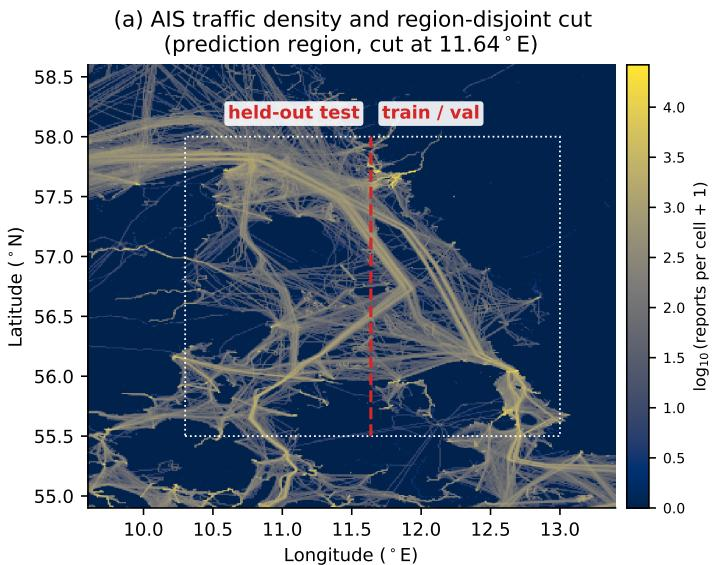
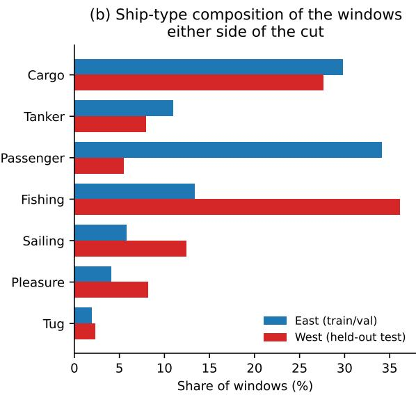
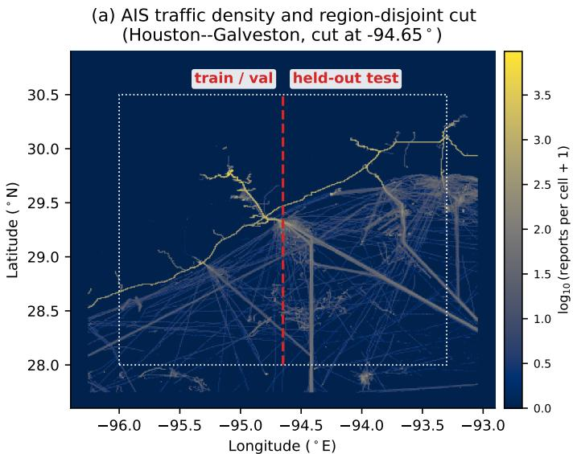
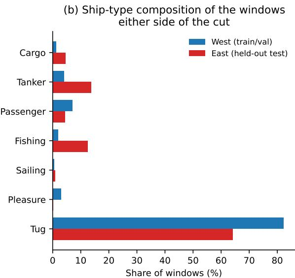
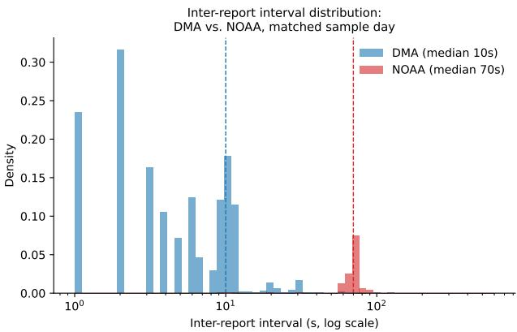
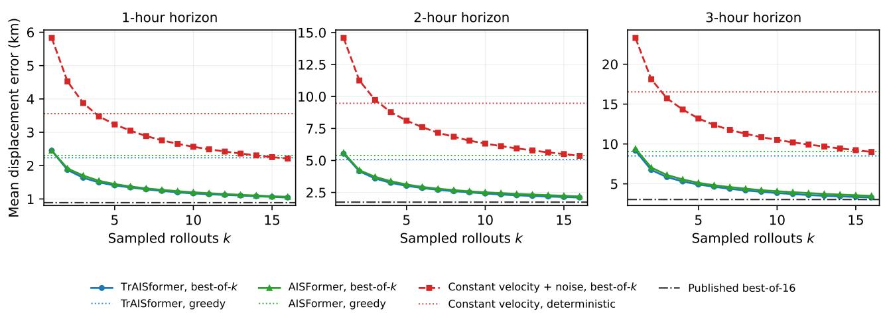
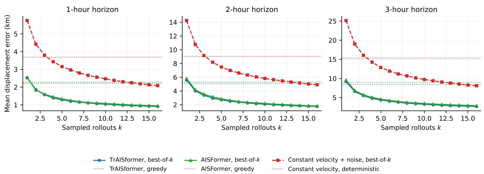
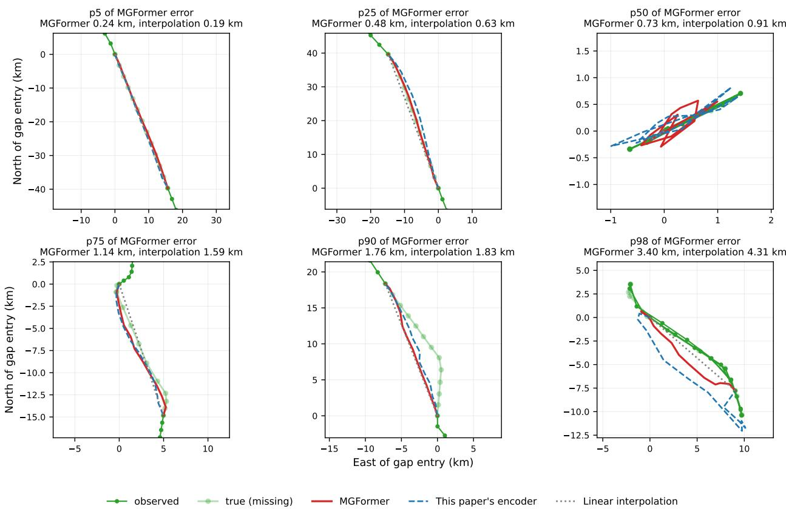
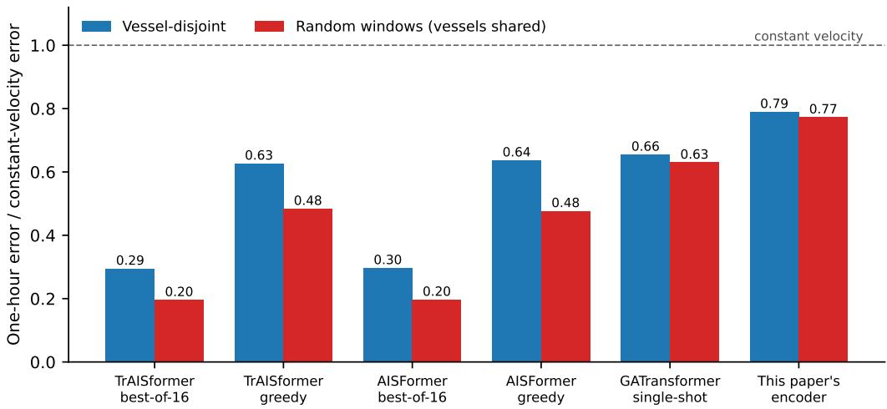
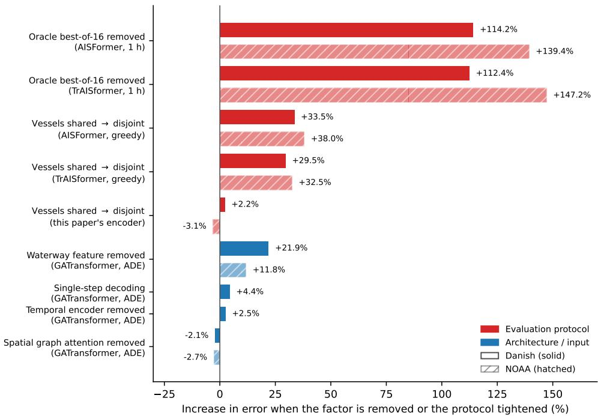

## Highlights

Protocol before progress: leakage-aware evaluation of AIS trajectory prediction Zobeir Raisi, Vali Mohammad Nazarzehi Had

• Oracle decoding inflates a published AIS trajectory baseline 2.1–3.2×

• Vessel-sharing splits inflate error 23–28% for large models, 2% for a small one

• Region-disjoint splits collapse absolute-position AIS models on two corpora

• Graph attention over trafic gives no benefit; an engineered feature does

• Vessel-sharing and region-split efects replicate; time-split leakage does not

# Protocol before progress: leakage-aware evaluation of AIS trajectory prediction

Zobeir Raisia,∗, Vali Mohammad Nazarzehi Hada

aMarine Engineering Faculty, Chabahar Maritime University, Shahid Rigi Blvd., Chabahar, 99717778631, Iran

## A R T I C L E I N F O

Keywords:   
AIS   
vessel trajectory prediction   
data leakage   
reproducibility   
graph attention   
gap imputation

## A BS T RA C T

Reported gains in vessel-trajectory prediction from Automatic Identification System (AIS) data are credited to new architectures, but the evaluation protocol is rarely measured as a source of error reduction. We build a leakage-aware protocol with vessel-, time- and region-disjoint splits and apply it to two corpora with diferent trafic: 31 days of Danish national AIS trafic and 30 days of US Gulf coast trafic of Houston and Galveston. On both, we audit TrAISformer, GATransformer, and controlled AISFormer-inspired reconstructions. Three protocol efects appear in both corpora. First, TrAISformer’s best-of-16 oracle decoder lowers error by a factor of 2.1–3.2 relative to greedy decoding. Second, a split that shares vessels lowers its greedy error by 23–25% at one hour, against 2% or less for a compact 0.43 M-parameter encoder. Third, a region-disjoint split raises TrAISformer’s one-hour error from 2.2 to 24.6 km on the US corpus, because 99.9% of the test contexts fall in longitude bins never seen in training; the encoder built on local ofsets is unafected by this. Architectural mechanisms matter less: GATransformer’s graph attention gives no measurable benefit on either corpus, while its waterway feature is worth 12–22%. The efect of a time-disjoint split is not stable across corpora (13% versus 2%). We release the splits and code.

## 1. Introduction

The Automatic Identification System (AIS) periodically broadcasts a vessel’s position, speed, and course, and these data are widely used for trajectory prediction (Capobianco et al., 2021; Nguyen and Fablet, 2024; Yu et al., 2025) and long-range gap imputation, both of which matter to maritime authorities and shipping operators (Riveiro et al., 2018). Deep-learning methods, particularly transformers, are increasingly applied to both tasks, and recent studies continue to report lower prediction error. When a new model reports a lower error, how much of the improvement belongs to the model? That question has a measurement behind it that has not itself been audited: a reported error reflects the model that produced it only if the evaluation protocol does not supply part of the number.

The concern is not specific to maritime data. Splitting a dataset by report or by track, rather than by vessel, lets the same ship’s habits appear on both sides of the split, so every number measured against it is inflated (Kaufman et al., 2011; Roberts et al., 2017). A survey of machine-learningbased science across seventeen fields traced overoptimistic results in 294 papers to leakage of this kind (Kapoor and Narayanan, 2023), and audits that reimplement published systems under a common protocol have repeatedly found reported gains shrinking or vanishing (Ferrari Dacrema et al., 2019; Henderson et al., 2018; Melis et al., 2018; Musgrave et al., 2020; Oliver et al., 2018); practical checklists now exist (Lones, 2024). To the best of our knowledge, maritime deep learning has not had such an audit. A 2025 survey of transformer-based AIS modeling found no discussion of vessel-, time- or region-level leakage in the literature it covered (Xie et al., 2025), and the one public AIS benchmark built to standardize evaluation uses vessel-disjoint splits but does not quantify how much time- or region-level leakage changes reported error (Ma et al., 2026). A second assumption compounds the first: published decoding protocols for probabilistic predictors typically report a best-of-� oracle figure alongside, or instead of, a single-shot error, without asking what the oracle is worth against a predictor that has learned nothing.

A single dataset cannot settle whether such efects belong to the protocol or to the data. Danish waters are dense, narrow, and dominated by scheduled ferry and cargo trafic; the efects we measure there could be properties of that traffic. We therefore run the same protocol, the same code, and the same hyper-parameters on a second corpus with a diferent geography and trafic mix, one month of US Gulf coast AIS from the Houston–Galveston region (National Oceanic and Atmospheric Administration, 2023). That region is a working port and waterway rather than a passenger corridor: after mapping AIS’s numeric vessel-type codes onto the same seven classes used for the companion classification study, tug and towing vessels are the single largest class by vessel count (33.0%), ahead of tankers (25.8%), reflecting Gulf Intracoastal Waterway barge trafic and the Houston Ship Channel’s tanker terminals; passenger trafic is comparatively rare (3.5%), unlike the Danish ferry corridor. The two regions have the same spatial extent (2.5◦ × 2.7◦), so the models see the same input geometry.

We build one leakage-aware protocol, with three separate split manifests per corpus (disjoint by vessel, by time and by region), and use it to audit four published approaches: TrAISformer, GATransformer, and controlled AISFormerinspired and MGFormer-inspired reconstructions. The audit shows that the protocol supplies much of a published number, and that three of its efects hold in both corpora. TrAISformer’s best-of-16 decoder lowers greedy error by a factor of 2.5 at one hour and 3.2 at three hours on the US corpus (2.1 and 2.5 on the Danish one). A split that is not vesseldisjoint lowers its greedy error by a further 24.5% at one hour on the US corpus (23% on the Danish one), against about 2% for a compact 0.43 M-parameter encoder that reads the same windows. A region-disjoint split, by contrast, breaks the two absolute-position models outright: on the US corpus their one-hour error rises from 2.2 to 24.6 km, and 99.9% of the test contexts sit in longitude bins that training never touched, while the encoder built on local ofsets degrades from 2.8 to 3.8 km. On the architectural side, GATransformer’s graph attention gives no measurable benefit on either corpus, while its engineered waterway feature changes error by 21.9% on the Danish corpus and 11.8% on the US one. Not every efect travels: a chronological split that shares vessels lowers TrAISformer’s greedy error by 13% on the Danish corpus but only 2% on the US one. We report this as a corpusdependent efect, not a replication.

## Our contributions are as follows:

1. A leakage-aware evaluation protocol made of three separate split manifests per corpus (vessel-, time- and regiondisjoint), each isolating one leakage axis, applied to two AIS corpora with diferent geography and trafic (Section 4.4).

2. A measurement of what a best-of-� oracle decoder is worth, against both the model’s own greedy decoding and a predictor that has learned nothing, which holds in both corpora (Sections 5.1 and 6).

3. A measurement of how leakage inflation depends on model class: 23–25% for the 7–8 M-parameter sequence models, 2% or less for a compact encoder, with a causal test on the Danish corpus that traces the inflation to the test vessels’ own training history (Section 6).

4. A finding that region-disjoint evaluation breaks models with absolute position embeddings, with the mechanism verified (unseen longitude bins in the test contexts), and one that time-disjoint evaluation is not a reliable proxy for it (Section 5.1).

5. An audit of four published approaches on both corpora, which separates what each contributes from what its protocol supplies, including two leakage channels that no split manifest closes: a fitted auxiliary structure has its own training data, and 73% (Danish) and 67% (US) of a test vessel’s neighbors are training vessels (Sections 5.3 and 5.1). The MGFormer-inspired arm, the causal test and the imputation task are evaluated on the Danish corpus only.

6. Released artifacts: the split manifests for both corpora, the preprocessing pipelines, and all four comparator implementations, so that each claim can be rechecked rather than taken on trust.

Section 2 reviews related work. Section 3 describes the two corpora, and Section 4 presents the evaluation protocol and the four comparator implementations. Section 5 reports the audit results and Section 6 the leakage analysis; Sections 7 and 8 discuss and conclude.

## 2. Related Work

## 2.1. Trajectory prediction and gap-imputation baselines

TrAISformer (Nguyen and Fablet, 2024) is a widely used baseline for AIS trajectory prediction. It represents latitude, longitude, speed over ground (SOG), and course over ground (COG) as discretized tokens and processes them with a transformer using sequence-index positional encoding. Its published results use a chronological split in which the same vessels can appear in both training and test sets. For each test trajectory, the reported error is based on the best of 16 sampled predictions. We therefore reimplement TrAISformer first (Sections 4.3 and 5.1). Recent Ocean Engineering studies have used similar prediction and evaluation settings. AISFormer (Yu et al., 2025) uses the same sparse four-hot representation and classificationbased prediction setup as TrAISformer. Its main change is a frequency-aware attention mechanism that separates temporal information in the frequency domain, following ideas similar to FEDformer (Zhou et al., 2022). AISFormer is close enough to TrAISformer that the pair isolates the attention mechanism alone. GATransformer (Yuan et al., 2025) instead widens the input: a graph attention aggregates interactions among nearby vessels before a transformer carries them through time, and an engineered distance to waterway intersection nodes supplies the congested-water context the authors credit for their gain. It is the only comparator whose input reaches beyond the trajectory being predicted, which, as Section 4.3 argues, makes vessel-disjointness ill-defined for it. MGFormer (Guo et al., 2026) handles AIS irregularity through a discrete waypoint graph and targets long-range gap imputation rather than forecasting, so we evaluate it on that task (Section 5.3).

Of these four, only MGFormer states a vessel-level partition (all trajectories of one vessel go to one subset, on its own 2017 Bohai Sea and Danish data); the others describe chronological or random divisions of tracks. A movementstate segmentation method (Guo et al., 2024) decomposes tracks into stop, transit and maneuver phases as preprocessing. DifuTraj (Li et al., 2024), a physics-informed neural SDE model (Fang and Ji, 2026) and STGDPM (Jin et al., 2025) pursue predictive uncertainty through difusion and SDE formulations, a largely orthogonal axis to the protocol question here. Generative predictors of this family are where the decoder-protocol question of Section 5.1 bites hardest: a sample rather than a point estimate makes a best-of-� figure the natural, and often only, thing reported, and it is not comparable to the single-shot error of a deterministic regressor. Our oracle-decoding measurements are meant to be reusable in that setting.

## 2.2. Imputation and time-series transformers

Long-gap reconstruction of AIS tracks descends from general time-series imputation: recurrent decay models (Che et al., 2018), bidirectional recurrent imputation (Cao et al., 2018), self-attention imputation (Du et al., 2023) and scorebased difusion (Tashiro et al., 2021). MGFormer replaces their learned temporal dependence with a waypoint graph. On the forecasting side, patch-based (Nie et al., 2023) and frequency-decomposed (Zhou et al., 2022) transformers dominate recent benchmarks, yet a simple linear baseline has been shown to beat many of them (Zeng et al., 2023), which is the closest precedent for the audit we run here.

## 2.3. Sampled trajectory prediction and its evaluation convention

Best-of-� scoring comes from pedestrian and driving forecasting, where a generative predictor draws � futures and is scored on the nearest to the ground truth: Social GAN (Gupta et al., 2018) reports it as a variety loss, Trajectron++ (Salzmann et al., 2020) for multimodal forecasts, and Argoverse (Chang et al., 2019) standardized it as minADE and minFDE over � hypotheses. It measures coverage legitimately, and its side efects on the learned distribution have been analyzed (Thiede and Brahma, 2019). Those studies do not ask what the oracle is worth against a predictor with no learned dynamics, the control Section 5.1 supplies for vessels.

## 2.4. Public benchmarking

EnvShip-Bench (Ma et al., 2026) (version 2, August 2026) is a public prediction benchmark built from four regional AIS sources (the Danish Maritime Authority, NOAA MarineCadastre, the Piraeus dataset from Greece, and Norway’s Kystverket), with released splits and preprocessing. It resamples all trajectories to a fixed 20-second grid, which discards the sub-minute native irregularity of the feeds. Its splits are vessel-disjoint, assigned by a deterministic hash of the MMSI, and leave-one-source-out experiments test transfer across regions by holding out a whole source, not by a region split within one dataset. It covers prediction only. It does not combine vessel-, time- and region-disjoint splits within one dataset, nor does it measure the other leakage channels quantified here (Section 6).

## 2.5. Positioning of this work

To our knowledge, no published system combines vessel-, time- and region-disjoint split manifests with an audit of several published transformers under them. EnvShip-Bench is the closest benchmark, and we contrast our protocol with its design. Of the four systems we audit, only MGFormer originally states a vessel-disjoint evaluation, and none audits it against the other leakage channels measured here.

## 3. Data

We use the complete Danish Maritime Authority (DMA) national AIS feed for all 31 days of May 2026, downloaded as daily archives from the DMA’s public endpoint (Danish Maritime Authority, 2026). The month comprises 652,415,811 raw position reports, reduced by preprocessing to 179,974,088 reports in 396,662 per-vessel tracks. The pipeline (i) restricts to Class A/B vessels with a valid MMSI and coordinates, (ii) segments reports into tracks at gaps exceeding 30 minutes, and (iii) removes stationary-anchor GPS jitter, which otherwise dominates raw counts with near-duplicate positions from vessels at berth. On a representative day (May 1) the cascade runs from 24.6 M raw rows to 11.6 M after the vessel/coordinate filter and 5.8 M after jitter removal, spanning 6,925 vessels and 13,892 tracks, with a native median inter-report interval of 10.0 s (90th percentile 28 s).

Study area. The feed covers Danish national waters and their approaches: the North Sea of the Jutland west coast, the Skagerrak and Kattegat, the three Danish straits (Little Belt, Great Belt and the Øresund), and the western Baltic. Fig. 1(a) shows the trafic density. Deep-water routes carry dense, regular transit trafic, while the straits compress it into narrow channels crossed by frequent ferry services, so a vessel’s next hour is shaped strongly by the channel it occupies and not by its heading alone. The prediction and imputation windows of Section 4.3 lie in the $1 0 . 3 \mathrm { - } 1 3 . 0 ^ { \circ } \mathrm { E } .$ 55.5–58.0◦N region marked in Fig. 1(a), and the regiondisjoint split of Section 4.4 cuts that region at $1 1 . 6 4 ^ { \circ } \mathrm { E } .$ the median anchor longitude of its window pool. The larger, eastern side is train and validation and the smaller, western side is held out for test. Fig. 1(b) shows that the two sides difer in trafic composition and not only in area: the held-out western side carries about one-sixth the share of Passenger trafic (5.5% versus 34.1%) and more than twice the share of Fishing vessels (36.1% versus 13.4%), so the region-disjoint manifest tests generalization across a genuine shift in trafic mix.

Reporting irregularity. The sub-minute cadence is a property of the data source, not of processing: on the DMA sample above, 86% of intervals fall below 30 s. This matters for a companion paper that tokenizes reports at their native, irregular timestamps, but not for the comparators audited here (Section 4.3), which resample every window onto a regular grid before training regardless of source cadence (TrAISformer’s own convention, Section 4.1); a coarser native feed is therefore admissible input for this paper’s protocol even where it would not be for the companion’s irregularity analysis.

Second corpus: NOAA MarineCadastre. A single dataset cannot tell whether an efect measured above belongs to the protocol or to Danish trafic specifically. We therefore run the identical protocol, code and hyper-parameters (not re-tuned) on one month (June 2023) of US Gulf coast AIS broadcast points from NOAA’s MarineCadastre archive (National Oceanic and Atmospheric Administration, 2023), cropped to the Houston–Galveston region (28.0– $3 0 . 5 ^ { \circ } \mathrm { N } , 9 6 . 0 \mathrm { - } 9 3 . 3 ^ { \circ } \mathrm { W } )$ , the same $2 . 5 ^ { \circ } \times 2 . 7 ^ { \circ }$ extent as the Danish prediction region, so the two corpora present the same input geometry to every model. The same three-stage pipeline (Class A/B and coordinate filter, 30-minute track segmentation, stationary-anchor jitter removal) reduces 265.1 M raw reports in the cropped region to 8.1 M reports in 101,662 tracks across 3,270 vessels; on a representative day (June 1) the cascade runs from 8.8 M raw rows to 1.0 M after the region crop and vessel/coordinate filter and 297 K after jitter removal, spanning 1,386 vessels and 1,854 tracks. NOAA’s native reporting floor is an order of magnitude coarser than DMA’s (median 70 s versus 10 s on this region and day, 90th percentile 89 s, consistent with the ∼1-minute minimum interval NOAA enforces), which is why it is not used for the irregularity analysis of the companion paper, but it is still finer than the 10-minute grid every comparator here resamples onto (Section 4.3). Houston–Galveston is a working port and waterway rather than a passenger corridor: by vessel count, tug and towing trafic is the largest class (33.0%) and tankers the second largest (25.8%), against 3.5% passenger trafic, a diferent mix from the Danish ferry corridor (Fig. 2). The vessel-disjoint split assigns 2,174/465/467 vessels to train/validation/test; the regiondisjoint split cuts the same window pool at its median anchor longitude, and the time-disjoint split at its median anchor timestamp, following the Danish manifests’ construction (Section 4.4). All comparator, oracle and leakage results are reported on both corpora (Section 5); the MGFormerinspired imputation arm, the causal leakage test, and vesseltype classification are evaluated on the Danish corpus only, for the reasons given in Section 5.3 and Section 4.1 respectively.

  
Figure 1: Study area. (a) AIS trafic density over the prediction region (log-scaled report counts per grid cell, four sample days spread across the month). The dotted box is the 10.3–13.0◦E, 55.5–58.0◦N region of the prediction and imputation windows, and the dashed line is the region-disjoint cut at the median anchor longitude (11.64◦E), with the western side held out for test. Coastlines and trafic separation schemes are traced by the reports themselves; no basemap is overlaid. (b) Ship-type composition of the region-manifest windows on either side of the cut. Types are each vessel’s modal static AIS type, available for 94.5% of the windows.

Ship-type labels. Descriptive trafic-composition labels (used above and in Fig. 1) come from each vessel’s static

AIS type field: text categories on DMA, and numeric NAIS VesselType codes on NOAA, both collapsed into the same seven classes (Cargo, Tanker, Passenger, Fishing, Sailing, Pleasure, Tug) after removing rare and undefined categories, with a per-vessel modal label where a track’s reported type is inconsistent. On NOAA, codes 31 and 32 (“Towing”) are merged into Tug, the same functional role as code 52 in this region’s trafic.

## 4. Method

## 4.1. Windowing and tokenization

Each training example is a context window of AIS reports from one vessel, tokenized as one token per report with feature embedding of elapsed time since the window anchor (Δ�), latitude, longitude, speed over ground (SOG), and course over ground (COG). The default window spans 20 minutes of context (up to 48 tokens). The ship-type classification windows that share this dataset (Section 3) draw at most three widely spaced anchors per track, a deliberately sparse rule that limits near-duplicate redundancy within a single vessel’s data. Classification is not evaluated in this paper; the rule is reported because the prediction and imputation comparators of Section 4.3 are windowed far more densely, and Section 6 analyzes what that does to measured leakage.

## 4.2. This paper’s encoder

Alongside the four audited systems, each comparator table also reports a compact in-house transformer encoder (≈0.43 M parameters, hidden dimension 128, 3 layers, rotary positional encoding applied to the report index) trained directly on the same dataset, windows and splits as the system it is tabulated against. Its purpose here is not architectural novelty but a known-capacity reference point: a model substantially smaller than the prediction comparators, so that a leakage or protocol efect measured against it isolates what protocol alone buys, uninflated by capacity. Its positional encoding is the product of a separate ablation reported elsewhere; here it is trained from scratch, without pretraining, and used only as a fixed, minimal baseline.

  
Figure 2: NOAA second corpus, same construction as Fig. 1. (a) AIS trafic density over Houston–Galveston (log-scaled report counts per grid cell, four sample days spread across the month). The dotted box is the 28.0–30.5◦N, 96.0–93.3◦W prediction region, and the dashed line is the region-disjoint cut at the median anchor longitude (−94.65◦); unlike the Danish cut, the eastern side is held out for test here. (b) Ship-type composition of the region-manifest windows on either side of the cut, labels from each vessel’s modal AIS type across the full month, available for 80.7% of the windows. Tug and towing trafic dominates both sides (82.2% train/val, 64.1% test) but the held-out side carries a far larger share of Tanker (13.6% versus 4.0%) and Fishing (12.4% versus 1.9%) trafic, so this manifest also tests generalization across a genuine composition shift, in the opposite direction from the Danish one (there, the held-out side has less Passenger and more Fishing trafic than train/val; here, the held-out side has more of nearly every non-Tug class).

  
Figure 3: Distribution of inter-report intervals on a matched sample day. The DMA feed’s native cadence (median 10 s) is an order of magnitude finer than NOAA MarineCadastre’s enforced reporting floor (median 70 s on the Houston–Galveston region and day used here).

## 4.3. Published-baseline comparators

The comparators above run inside this paper’s pipeline, which isolates the variable under test but says nothing about how published systems behave under a leakage-aware protocol. We therefore rebuild four of them and evaluate them on the released split manifests: TrAISformer (Nguyen and Fablet, 2024), the standard transformer baseline for AIS trajectory prediction; AISFormer (Yu et al., 2025), which keeps TrAISformer’s classification framing but replaces its attention with a frequency-aware design; GATransformer (Yuan et al., 2025), which adds graph attention over surrounding trafic and an engineered waterway feature; and MG-Former (Guo et al., 2026), a long-range gap imputer, evaluated on the task it was published for.

TrAISformer (from its released code) and GATransformer (from its full article) are reimplementations. The AISFormer and MGFormer articles are paywalled, have no public code and leave key details unspecified, so we build controlled reconstructions of the mechanism each names, called AISFormer-inspired and MGFormer-inspired, and restrict every conclusion about them to that mechanism. Every reported number is a property of our implementation under our protocol, not the original authors’ result. Where the reconstruction is uncertain, components the source does not distinguish are held identical to the comparator it is read against, so the claimed mechanism is the only diference. Appendix A lists, per system, what the source specifies and what is ours. Below, “AISFormer” and “MGFormer” denote these reconstructions unless the source article is named.

Prediction dataset. TrAISformer’s representation and decoder presuppose a regular sampling grid and a fixed region, so bending it to the windows of Section 4.1 would produce a weakened strawman. We instead rebuild the dataset to its specification and run every comparator on it. Within the published region (55.5–58.0◦N, 10.3–13.0◦E), voyages are re-segmented at gaps above 30 minutes, kept if they carry at least 20 reports, and resampled onto a regular 10- minute grid. Each window has 18 context and 18 target steps (3 h each), so the one-, two- and three-hour horizons come from one sample set. Training windows are spaced one hour apart; validation and test windows three hours apart, so no two evaluated contexts share a report. The vesseldisjoint manifest yields 46,168 training, 3,887 validation and 3,528 test windows from 8,734 voyages. This windowing is far denser per track than the classification protocol of Section 4.1, which matters for Section 6.

TrAISformer and AISFormer. TrAISformer discretizes each observation into a four-hot vector over latitude, longitude, speed and course, and feeds a causal 8-layer transformer; prediction is an autoregressive rollout. We follow the released code, including two details a summary omits: a multi-resolution loss (two smoothing passes over each predicted distribution) and a sampler restricted to the ten most likely bins and, for position, a 40-bin vicinity of the previous position. AISFormer holds the representation, loss, decoder, trainer, schedule and evaluation code identical and changes only the attention, to a causal frequencydecomposing analogue (Appendix B), so the pair difers in one mechanism. Both are swept over dropout, depth, width and learning rate and reported at their best validation setting (7.4 M and 8.3 M parameters, respectively); every leakage figure refers to these configurations.

GATransformer. This comparator is a direct multi-step regressor. A spatial encoder applies graph attention over the eight nearest vessels within 10 km; a temporal encoder reads the target’s own sequence; and an engineered input gives distances to waterway intersections. It emits the whole horizon at once under mean squared error and is reported single-shot, because decoding it autoregressively, or scoring it under the best-of-16 oracle of Table 1, would misread it. The neighbor set, local-frame features, waterway network and hyper-parameters are ours. The source’s dropout of 0.5 and learning rate of $1 0 ^ { - 3 }$ were unstable on this dataset, so the selected configuration uses dropout 0.2 and otherwise the source’s settings; the details are in Appendix A. The waterway network is extracted from the training split alone, for the reason Section 5.3 gives.

A neighborhood cannot be held out. One consequence deserves separating out, because it is a limit on what any split manifest can promise rather than a property of this reconstruction. Vessel-disjointness is well defined for a model that reads one trajectory: hold the vessel out, and nothing it did is in training. It is not well defined for a model that reads the trafic around that vessel. A held-out vessel still sails among the training fleet (in this dataset 73% of the neighbors of a test window belong to training vessels), so its context is largely material the model has already seen, however strictly the target is partitioned.

Measuring that requires a control, because the obvious experiment is confounded. Restricting each window to neighbors from its own split is the strict reading of disjointness, but it also thins the neighborhood, and unequally: a training window retains 70% of its neighbors and a test window 13%, since the training split holds most of the fleet. An arm restricted that way would lose accuracy partly because its neighbors are unfamiliar and partly because it has far fewer of them, and the two are not separable from the comparison alone. We therefore run three arms that difer in the neighbor set and in nothing else: all, every vessel really present, which is what a deployed system observes; strict, only vessels from the window’s own split; and density, all trafic thinned at random to the retention rate strict produces on that same split, matched to within 0.03 percentage points. The step from all to density is the cost of a sparser neighborhood; the step from density to strict is what remains once density is held fixed, and is the part attributable to neighbor identity. Only the second is evidence about leakage.

Decoding. Decoding deserves explicit treatment because it turns out to carry much of the published result. The published protocol draws � = 16 rollouts per test trajectory and reports the error of whichever one lands closest to the ground truth. That selection consults the answer, so it is an oracle: it rewards a predictor for being diverse as well as for being right, and it is not comparable to any single-shot number. We therefore report the same trained model under best-of-16, under a single random draw, under the mean over 16 draws, and under greedy (arg-max) decoding, and we add a deliberately trivial control, constant velocity perturbed by Gaussian noise whose scale is fitted on validation, sampled 16 times and given the same oracle selection, to measure what the protocol grants a predictor that learns nothing at all. Checkpoint selection is done separately for each decoding protocol on validation, so no reported number is depressed by a checkpoint chosen to favor a diferent decoder.

MGFormer and the gap-imputation protocol. MG-Former reconstructs a long missing stretch of a track from the observations on both sides of it. Asking it to forecast would remove the context its architecture is built around, so we evaluate it on the task it was published for, on the same dataset and split manifests as the prediction audit. Each 36- step window loses one contiguous block of 11 steps (30.6% of the window, about 110 minutes), placed in the interior with at least three observed steps on each side. The position is drawn once from a generator keyed by window index, so every system reconstructs identical holes. Error is mean great-circle distance over the masked steps, overall and at the gap’s midpoint.

Our MGFormer-inspired comparator follows the four components the article names: a waypoint graph (256 �- means clusters, 2,926 directed edges), a gated graph network, a bidirectional transformer encoder with position and speed/course heads, and a motion-consistency term. Three departures are forced by the Danish feed or the article’s silence (Appendix A). Three references share the protocol: the model without its waypoint graph, this paper’s encoder with its masked-reconstruction head, and linear interpolation across the gap, which uses no training data and so cannot introduce training-data leakage.

One design choice is a leakage channel the source does not discuss. A waypoint graph extracted from the whole dataset has seen the routes of the vessels held out for testing. We fit the graph on the training split alone by default and run the whole-dataset alternative as an explicit arm, holding model, training and split fixed.

## 4.4. Leakage-aware evaluation protocol

The evaluation protocol enforces disjointness on three independent axes, each built as a separate split manifest over the same underlying dataset so results can be compared axisby-axis:

• Vessel-disjoint (MMSI). No vessel’s MMSI appears in more than one of train/val/test. 10,047 / 2,152 / 2,154 vessels respectively. This is the primary split used throughout the paper unless stated otherwise.

• Time-disjoint. Chronological split by anchor timestamp: the earliest 70% of windows to train, the next 15% to validation, the final 15% to test; vessels may repeat across the split, so this evaluates temporal generalization separately from the vesseldisjoint setting; out-of-sample chronological holdout is the recommended practice for non-stationary series (Cerqueira et al., 2020). Blocked splits of this kind are the generic remedy for autocorrelated data in structured settings (Roberts et al., 2017).

• Region-disjoint. Geographic split by anchor longitude median (Danish straits run broadly east–west): the larger region is train (85%) / validation (15%), the entire smaller region is held out as test. For the prediction and imputation windows of Section 4.3, the cut is at 11.64◦E (the median anchor longitude of that pool), the eastern side is train and validation, and the western side is test. Their 6-hour windows routinely cross the cut, so every window with any step on the far side of the boundary is dropped and none straddles training and test waters; this removes 37% of the pool.

Fitting discipline. No model in this paper is pretrained: every network, including this paper’s encoder, is trained from scratch on the training windows of the manifest it is evaluated on. The only structures fitted from data before training are the waypoint graph of the imputation comparator (�-means centroids and transition counts) and the waterwayintersection nodes of GATransformer, and both are refit separately for every manifest, from that manifest’s own training windows alone: the vessel-, chronological, random and region manifests each build their own graph and intersection set. Everything else is fixed by constants rather than estimated: the coordinate bins are defined by the published region of interest, and the position and speed scales of the imputation models are fixed lengths (20 km, 20 kn), so there is no normalization statistic to leak. What no manifest can govern is the trafic context of a model that reads surrounding vessels, which Section 5.1 measures instead.

## 4.5. Implementation and computational cost

All models are implemented in PyTorch and trained on a single NVIDIA GeForce RTX 4090 (24 GB). The publishedbaseline comparators of Section 4.3 are the most expensive items in the program. The three prediction comparators each get a tuning sweep spanning depth, width, dropout and learning rate, which for TrAISformer means four configurations from 7.4 M to 57.4 M parameters, for AISFormer five, adding a mode-budget arm, and for GATransformer six, adding a graph-head arm; the selected configuration is then retrained under each evaluated split regime. GATransformer additionally carries the cost of its side-car: the co-present trafic tensor is built once over the whole dataset, so its neighbors may belong to any split (the channel measured in Section 5.1), whereas the waterway-intersection nodes are extracted from each manifest’s training windows alone, as in Section 4.4. Its four source ablations and two neighborprovenance arms are each run at six seeds, for the reason given in Section 5.1. The imputation comparator is cheaper (under 1 M parameters) but is run at three seeds against its no-graph ablation, this paper’s own encoder, the evaluated split regimes and four graph-provenance arms. The entire experimental program of this paper, including all four comparator studies, the leakage audit, and every ablation, fits on a single consumer GPU in under two days of training time.

## 5. Experiments and Results

Every experiment in this section runs on the same dataset and the same split manifests released with this paper, so results can be read against one another. The section calibrates this paper’s own encoder against the published record by rebuilding four published approaches (two as controlled reconstructions) and running them on the released splits, three on trajectory prediction (TrAISformer, AISFormer-inspired, GATransformer; Section 5.1) and one on gap imputation (MGFormer-inspired; Section 5.3). Section 6 then quantifies directly how much a naive split would have overstated for each. Unless stated otherwise, every number is measured on the vessel-disjoint split, and error is mean great-circle distance in kilometers.

## 5.1. Three published prediction systems under the leakage-aware protocol

Every comparison so far is internal: all arms share this paper’s pipeline. Section 4.3 therefore rebuilds TrAISformer and AISFormer on their own dataset specification and runs them on the released manifests, in the manner of audits in other fields that separate a method’s contribution from its evaluation protocol (Ferrari Dacrema et al., 2019; Musgrave et al., 2020). Table 1 reports the result.

Mean displacement error (km) at one, two and three hours on the vessel-disjoint test split, under TrAISformer’s best-of-16 protocol and under single-shot decoding. Best-of-16 keeps, per trajectory, the sampled rollout closest to the ground truth; the rows beneath it decode the same trained model without that selection. AISFormer difers from TrAISformer only in its attention mechanism. GATransformer is a direct multi-step regressor and appears among the single-shot references. Lower is better.
<table><tr><td>Method (decoding)</td><td>1h</td><td>2h</td><td>3h</td></tr><tr><td>TrAISformer, as publishedª</td><td>0.89</td><td>1.74</td><td>3.04</td></tr><tr><td colspan="4">TrAISformer, this reimplementation, vessel-disjoint split</td></tr><tr><td>best-of-16 (published protocol)</td><td> $1 . 0 5 \pm 0 . 0 1$ </td><td> $2 . 1 4 \pm 0 . 0 4$ </td><td> $3 . 3 6 \pm 0 . 0 9$ </td></tr><tr><td>single random draw</td><td> $2 . 4 9 \pm 0 . 0 4$ </td><td> $5 . 6 2 \pm 0 . 0 9$ </td><td> $9 . 3 3 \pm 0 . 1 8$ </td></tr><tr><td>mean over 16 draws</td><td> $2 . 4 9 \pm 0 . 0 4$ </td><td> $5 . 6 2 \pm 0 . 1 1$ </td><td> $9 . 3 1 \pm 0 . 2 2$ </td></tr><tr><td>greedy (deterministic)</td><td> $2 . 2 3 \pm 0 . 0 3$ </td><td> $5 . 0 8 \pm 0 . 0 4$ </td><td> $8 . 4 6 \pm 0 . 0 4$ </td></tr><tr><td colspan="4">AISFormer-inspired, this reconstruction, vessel-disjoint split</td></tr><tr><td>best-of-16 (published protocol)</td><td> $1 . 0 6 \pm 0 . 0 3$ </td><td> $2 . 1 6 \pm 0 . 0 5$ </td><td> $3 . 3 9 \pm 0 . 0 8$ </td></tr><tr><td>single random draw</td><td> $2 . 4 4 \pm 0 . 0 4$ </td><td> $5 . 5 3 \pm 0 . 1 4$ </td><td> $9 . 2 2 \pm 0 . 2 5$ </td></tr><tr><td>mean over 16 draws</td><td> $2 . 4 5 \pm 0 . 0 3$ </td><td> $5 . 5 4 \pm 0 . 0 7$ </td><td> $9 . 2 5 \pm 0 . 1 6$ </td></tr><tr><td>greedy (deterministic)</td><td> $2 . 2 7 \pm 0 . 0 3$ </td><td> $5 . 3 7 \pm 0 . 0 8$ </td><td> $8 . 9 9 \pm 0 . 0 8$ </td></tr><tr><td colspan="4">References on the identical windows</td></tr><tr><td>Constant velocity, best-of-16b</td><td>2.21</td><td>5.36</td><td>9.00</td></tr><tr><td>Constant velocity, deterministic</td><td>3.56</td><td>9.47</td><td>16.53</td></tr><tr><td>GATransformer, single-shote</td><td>2.33</td><td>4.72</td><td>7.82</td></tr><tr><td>This paper&#x27;s encoder, single-shota</td><td>2.81</td><td>5.70</td><td>9.42</td></tr><tr><td>with index_rope encoding</td><td>2.87</td><td>5.78</td><td>9.49</td></tr><tr><td>with index_learned encoding</td><td>2.86</td><td>6.09</td><td>9.91</td></tr><tr><td>Four-hot quantization floorc</td><td>0.32</td><td>0.33</td><td>0.33</td></tr></table>

� Table I of Nguyen and Fablet (2024), converted from nautical miles, on a chronological split of Danish AIS in which the same vessels appear in training and test.  
� The anchor’s reported speed and course propagated forward, perturbed by isotropic Gaussian noise whose scale is fitted on validation, sampled 16 times and given the same oracle selection. It reads nothing from the trajectory beyond its last report.  
� Error incurred by encoding the true future position into the four-hot representation and decoding it back. No model using this representation can go below it.  
� Mean over 3 seeds (42/43/44); the largest population standard deviation across horizons is 0.087 km.  
� A direct multi-step regressor: it emits the whole horizon at once and has no sampled decoder, so the best-of-16 protocol above does not apply to it. Scoring it against those rows rather than against the single-shot ones would be the comparison this table exists to caution against.  
The TrAISformer and AISFormer-inspired rows are likewise means over 3 seeds, with population standard deviations. Repeated runs of one configuration agree on validation to within 0.2%, but not always on which epoch to keep, and neighboring epochs difer materially on test; a single run therefore understates the uncertainty on these rows.

Reproduction. Under TrAISformer’s own split convention (a chronological cut with vessels shared) and its bestof-16 decoder, the reimplementation reaches 0.86, 1.75 and 2.84 km at one, two and three hours, against the published 0.89, 1.74 and 3.04 km: within 7% at all horizons, and never more than 1% above the published value. Under the vesseldisjoint manifest the same configuration gives 1.05, 2.14 and 3.36 km. The agreement holds across a sweep spanning 7.4–57.4 M parameters, over which the one-hour best-of-16 error on the vessel-disjoint split varies only between 1.04 and 1.09 km, so it does not rest on a fortunate hyper-parameter choice. We take this as evidence that the comparator is a fair rendering of the published system.

The oracle decoder. The published protocol samples 16 rollouts per test trajectory and keeps whichever lands closest to the truth. Decoding the same trained model greedily moves the one-hour error from 1.05 to 2.23 km, and the twoand three-hour errors from 2.14 and 3.36 km to 5.08 and 8.46 km (three-seed means). The oracle is worth a factor of 2.1 at one hour, rising to 2.5 at three, which is larger than every efect this paper set out to measure.

Some of that factor is genuine multimodality and some is the metric rewarding spread. Giving the same oracle to a predictor that learns nothing separates them: constant velocity perturbed by Gaussian noise, with scale fitted on validation, sampled 16 times and best kept (Fig. 4). Best-of-16 improves this control from 3.56 to 2.21 km at one hour, a factor of 1.6 obtained without reading the trajectory, so roughly three fifths of the improvement (in log terms) the protocol confers on TrAISformer would accrue to any suficiently diverse predictor. The remainder is real: TrAISformer’s best-of-16 error is 2.1 times better than the control’s, and its greedy error of 2.23 km beats deterministic constant velocity by 1.6 times. The system does learn, but a best-of-� figure and a single-shot figure are diferent quantities. Tabulating one beside the other, as happens when sampled trajectory models are compared with regression baselines (Li et al., 2024; Fang and Ji, 2026) or when a variety-style oracle is adopted from other domains (Gupta et al., 2018; Thiede and Brahma, 2019), overstates the former by a factor of 2.1 to 2.5.

Which released TrAISformer detail moves the number. The 7.4 M model on the vessel-disjoint split, one-hour mean displacement error (km), mean ± SD over three seeds. The blur loss is the released multi-resolution cross-entropy (two smoothing passes, weight 1); the decoder restricts each step to the top-10 logits and, for latitude and longitude, to a 40-bin vicinity of the previous position. Oracle factor is greedy over best-of-16.
<table><tr><td>Configuration</td><td>Greedy</td><td> $\mathsf { S i n g l e \ d r a w }$ </td><td> $_ { \mathsf { B e s t - o f - } 1 6 }$ </td><td>Oracle factor</td></tr><tr><td>Plain cross-entropy, unrestricted sampling</td><td> $2 . 5 3 \pm 0 . 1 9$ </td><td> $3 . 3 5 \pm 0 . 0 6$ </td><td> $0 . 9 7 7 { \scriptstyle \pm 0 . 0 1 1 }$ </td><td>2.59</td></tr><tr><td>+ multi-resolution (blur) loss</td><td> $2 . 4 5 \pm 0 . 1 0$ </td><td> $3 . 2 5 \pm 0 . 0 6$ </td><td> $1 . 0 0 5 \pm 0 . 0 1 9$ </td><td>2.43</td></tr><tr><td>+ vicinity / top-k decoder</td><td> $2 . 2 7 \pm 0 . 0 1$ </td><td> $2 . 5 0 \pm 0 . 0 1$ </td><td> $1 . 0 1 2 \pm 0 . 0 2 0$ </td><td>2.24</td></tr><tr><td>Both (published protocol)</td><td> $2 . 2 3 \pm 0 . 0 3$ </td><td> $2 . 4 9 \pm 0 . 0 4$ </td><td> $1 . 0 5 0 \pm 0 . 0 0 5$ </td><td>2.12</td></tr></table>

  
Figure 4: Mean displacement error against the number of sampled rollouts � under best-of-� selection, vessel-disjoint test split. Both systems and a noise-perturbed constant-velocity control improve steeply with �, because selection consults the ground truth; the control learns nothing from the trajectory, so its descent is due to the protocol. Dotted lines: deterministic error; dash-dotted line: published best-of-16 value. The two systems’ curves overlap at every horizon.

The released TrAISformer code also difers from plain cross-entropy training in two details, a multi-resolution (blur) loss and a decoder that restricts each step to the top-10 logits and a 40-bin vicinity of the previous position. Table 2 adds them one at a time. The decoder restriction is what moves the deterministic numbers: greedy error falls from 2.45 to 2.27 km and a single random draw from 3.25 to 2.50 km, while the blur loss alone changes greedy error by less than its seed spread. The best-of-16 figure hardly moves across the four rows (0.98 to 1.05 km), so the published one-hour number does not depend on these details, but the oracle factor does, from 2.6 for plain cross-entropy to 2.1 for the full released protocol. We report the full protocol throughout.

Matched decoding. TrAISformer’s greedy error of 2.23 km at one hour is 0.58 km better than this paper’s 0.43 M-parameter encoder at 2.81 km, and 0.62 and 0.96 km better at two and three hours: advantages of 21%, 11% and 10% for a model with 17 times the parameters. Both are far ahead of the motion models. Encoding the true future position into the four-hot representation and decoding it back already costs 0.32 km, so the published one-hour bestof-16 figure sits about three times above the floor its own discretization imposes.

AISFormer. AISFormer difers from TrAISformer in its attention alone; representation, loss, decoder, trainer, schedule and evaluation code are identical, and each has its own sweep. Both select their smallest arm (7.4 M and 8.3 M parameters, respectively); the 63 M variants overfit within a few epochs. Under best-of-16 at one hour the two are indistinguishable: $1 . 0 6 \pm 0 . 0 3$ against $1 . 0 5 \pm 0 . 0 1$ km over three seeds each, and they stay within 0.03 km of each other at two and three hours. Under greedy decoding of the same trained models AISFormer is 2% worse at one hour (2.27 ± 0.03 against $2 . 2 3 \pm 0 . 0 3$ km) and 6% worse at two and three hours $( 5 . 3 7 \pm 0 . 0 8$ against $5 . 0 8 \pm 0 . 0 4$ km, and 8.99 ± 0.08 against $8 . 4 6 \pm 0 . 0 4 \mathrm { k m } )$ , a gap of several seed standard deviations at the longer horizons. Under a single random draw the two are again level. AISFormer does not beat TrAISformer at any horizon under any decoder we tried, and the spectral path costs about twice the training step time at matched batch size.

The oracle hides part of this. Best-of-16 rewards a diverse predictor and compresses the distance between systems that difer in how sharply they concentrate probability, so the frequency-aware attention looks like a wash through that protocol alone and mildly worse under greedy decoding at longer horizons. The claim is narrow. Our spectral operator may difer from the original, and the source reports horizons up to ten hours, where a mechanism aimed at longrange structure has more room to act than at three. What the comparison establishes is where this family’s performance comes from: both systems sit far above the motion models and the quantization floor, and at the same place as each other, so the shared sparse classification framing appears to account for most of the performance, and the added attention provides no measurable benefit under the tested conditions.

Table 3  
GATransformer on the vessel-disjoint split: the source’s two input feature sets, three variant models and two neighbor-set arms. ADE and FDE are the mean error over the three-hour horizon and at its final step. Δ ADE is relative to the full model; absolute values are not comparable with the source, because the dataset, region and sampling interval difer. Entries are means over 6 seeds with population standard deviations, except “Neighbors thinned to restricted” at 5, one replicate having been disqualified by an optimiser stall.
<table><tr><td>Configuration</td><td>ADE (km)</td><td>FDE (km)</td></tr><tr><td>GATransformer (full model)</td><td> $3 . 8 6 \pm 0 . 0 9$ </td><td> $7 . 8 2 \pm 0 . 1 4$  +21.9%</td></tr><tr><td>Kinematics only, no waterway</td><td> $4 . 7 1 \pm 0 . 0 7$ </td><td> $9 . 5 2 \pm 0 . 0 9$ </td></tr><tr><td>Without temporal encoder</td><td> $3 . 9 6 \pm 0 . 0 6$ </td><td> $8 . 0 3 \pm 0 . 0 8$ </td></tr><tr><td>Without spatial encoder</td><td> $3 . 7 8 \pm 0 . 0 5$ </td><td> $7 . 7 1 \pm 0 . 1 1$ </td></tr><tr><td>Single-step iterative decoding</td><td> $4 . 0 3 \pm 0 . 0 9$ </td><td> $8 . 3 4 \pm 0 . 1 9$  +4.4%</td></tr><tr><td>Neighbors thinned to restricted</td><td> $3 . 8 4 \pm 0 . 0 6$ </td><td> $7 . 7 8 \pm 0 . 1 4$  -0.6%</td></tr><tr><td>Neighbors from own split only</td><td> $3 . 7 9 \pm 0 . 0 6$ </td><td> $7 . 7 1 \pm 0 . 1 2$  -1.8%</td></tr></table>

About three quarters of a test window’s neighbors are training vessels. Restricting a window to its own split thins its neighborhood as well as changing whose it is, so the “thinned” row matches that thinning while leaving the trafic unrestricted.

GATransformer. It regresses the whole horizon at once under mean squared error, so best-of-� has no meaning for it and Table 1 reports it single-shot. On the vessel-disjoint split it reaches $3 . 8 6 \pm 0 . 0 9$ km ADE and $7 . 8 2 \pm 0 . 1 4$ km FDE over three hours, and $2 . 3 3 \pm 0 . 0 8$ km at one hour. Table 3 reproduces its own ablations on that split.

We replicate this system at six seeds rather than three. At three seeds its baseline spread was 0.03 km, which made two ablations look resolved at three times their own noise; six seeds put it at 0.09 km with the mean essentially unmoved. The iterative-decoding row behaved the same (0.01 km over three seeds, 0.09 km over six). In both cases the point estimate survived and only the stated precision moved, the harmless version of this failure, which is detectable only by replication. That seed-to-seed variance can exceed the differences a benchmark reports is a known pitfall (Bouthillier et al., 2021). We therefore compare each ablation against the standard error of its diference from the full model rather than against a raw spread.

The efects are very unequal. Removing the waterway distances and leaving the kinematic channels alone costs 21.9%, seventeen standard errors clear of the full model and the largest single efect in this paper’s comparator studies; this supports the source’s emphasis on that feature. Removing the temporal encoder costs 2.5%, marginal at two standard errors. Removing the spatial encoder, the graph attention over surrounding vessels that the system is named for, costs nothing: the apparent 2.1% improvement is within two standard errors of zero, so the six seeds support that the mechanism gives no measurable benefit here, not that it is harmful. It gives none while accounting for half of the parameter count.

This is not evidence that vessel interactions are uninformative in general. The source works in the Ningbo-Zhoushan approaches at one-minute sampling, where a three-hour horizon covers a small fraction of the ground it covers here and trafic is dense enough that a neighbor’s maneuver constrains the target’s. On a 46,000 km2 region sampled every ten minutes, a vessel has about three neighbors within 10 km and none in open water, and the next three hours are dominated by where it was already going. Here an engineered feature carries the system while the learned interaction mechanism contributes nothing measurable. That is a diferent failure from AISFormer’s, where the mechanism was neutral under one protocol and harmful under another, but the same shape.

The null is not an artifact of our neighborhood. The source does not fix a neighborhood definition, so ours (the eight nearest vessels within 10 km) is a choice, and the obvious objection is that it starved the graph. Table 4 varies the definition over a 4.7-fold range in how full the neighborhood is, from 16% of neighbor slots occupied on the test split to 76%, retraining at six seeds each. The without-spatialencoder control never reads the neighbor tensor, so one sixseed control serves every row.

The objection does not hold. At no neighborhood does the spatial encoder help: all four diferences against the control are positive. The arm closest to the control is the densest: with 76% of slots filled against 38% at the reported setting, the full model lands $0 . 0 1 \pm 0 . 0 2$ km from the model with no graph attention. Quadrupling the trafic the graph can see does not rescue it; it converges the graph onto the ablation that deletes it. Two caveats apply. The diferences are small (0.3% to 2.1% of ADE) and only two of the four are resolved at more than two standard errors, so graph attention here is inert to mildly harmful, not reliably harmful at any setting.

GATransformer’s spatial encoder against the neighborhood definition. Occupancy is the fraction of neighbor slots filled on the test split. ADE and FDE are six-seed means with population standard deviations. The last column is each row’s ADE minus the without-spatial-encoder control (3.78 km), paired per seed, with the standard error of the diference; positive means the graph attention hurts.
<table><tr><td>Neighborhood</td><td>Occupancy</td><td> $\mathsf { A D E } \left( \mathsf { k m } \right)$ </td><td>FDE (km)</td><td>Δ ADE vs. no spatial encoder</td></tr><tr><td> $K { = } 8 \ \mathsf { w i t h i n } \ 5 \mathsf { k m }$ </td><td>16%</td><td> $3 . 8 2 \pm 0 . 0 5$ </td><td> $7 . 7 5 \pm 0 . 1 1$ </td><td> $+ 0 . 0 4 \pm 0 . 0 4$ </td></tr><tr><td>K=16 within 10 km</td><td>20%</td><td> $3 . 8 3 \pm 0 . 0 5$ </td><td> $7 . 7 5 \pm 0 . 0 9$ </td><td> $+ 0 . 0 5 \pm 0 . 0 1$ </td></tr><tr><td>K=8 within 10 km (reported)</td><td>38%</td><td> $3 . 8 6 \pm 0 . 0 9$ </td><td> $7 . 8 2 \pm 0 . 1 4$ </td><td> $+ 0 . 0 8 \pm 0 . 0 4$ </td></tr><tr><td>K=8 within 20 km</td><td>76%</td><td> $3 . 7 9 \pm 0 . 0 7$ </td><td> $7 . 7 0 \pm 0 . 1 2$ </td><td> $+ 0 . 0 1 \pm 0 . 0 2$ </td></tr></table>

And all four arms share distance-ranked selection and tenminute sampling, so a definition that selected neighbors by predicted conflict is untested.

Decoding step by step costs accuracy. The source’s SSI-Prediction emits one step at a time and feeds each prediction back, against the single-shot regression used in every other row. It is 4.4% worse, at $4 . 0 3 \pm 0 . 0 9$ km ADE (three standard errors). The evidence is stronger at the final step: FDE rises 6.7%, to $8 . 3 4 \pm 0 . 1 9$ against $7 . 8 2 \pm 0 . 1 4$ km, five standard errors clear. That asymmetry is what compounding error would produce, since it falls hardest on the last point. We treat the FDE margin as the more reliable half of the result; the ADE margin is narrower than the means suggest, since the single-shot baseline’s weakest seed (4.01 km) still exceeds the iterative decoder’s best (3.87 km).

An iterative decoder can be trained on the true history or on its own predictions, and the article does not say which. Conditioning on the true history fails outright: in a 20-epoch pilot it reached 9.41 km test ADE against 4.16 km for a decoder trained on its own rollout, and its validation error rose from the fifth epoch while training loss kept falling, which is consistent with exposure bias. We select the training mode on validation and report the free-running decoder, so the penalty above is the strategy at its best.

The leakage channel is real and, here, empty. A vessel-disjoint manifest cannot make a held-out window’s surroundings unseen: 73.4% of occupied neighbor slots in a test window carry training vessels, against 70.2% in a training window, and no manifest closes this. Whether it inflates anything is answered by the last two rows of Table 3. Restricting a window to neighbors from its own split lowers ADE by 1.2% against the density-matched control, within one standard error of zero and of the wrong sign for leakage; the point estimate is the same as at three seeds. Thinning the neighborhood itself does not matter either: the control keeps about an eighth of a test window’s neighbors (4.9% of slots occupied against 37.6%) and lands on the unrestricted model within 0.6%, half a standard error.

That control is the least stable arm to train. Matching the restricted arm’s density means matching its sparsity: slots are occupied 27.4% of the time in a training window against 5.8% in validation and 4.9% in test, a factor of five. One of its six replicates stops learning under that asymmetry, reproducibly at the same seed, and is excluded under the policy of Appendix A, so the row reports five seeds where the rows it controls for report six. We prefer the sparse control to a denser one that would confound provenance with density, but a reconstruction should expect it to be the hardest arm to optimize.

The two findings explain each other. A channel can only leak what the model reads through it, and this model reads almost nothing through its neighbors. We record the null rather than the channel: a model whose graph attention carried weight could well show inflation, and the densitymatched control is the design that would separate it from a change in density. The channel should be declared in any paper whose model reads co-present trafic, and measured rather than assumed.

Under the relaxed splits the system behaves like a model of its capacity. A time-disjoint split lowers its three-hour ADE by 7.4% and a random one by 7.3%, each about seven standard errors clear of the vessel-disjoint result. On the onehour ratio to constant velocity of Table 9 the random split lowers it by 4% (0.655 to 0.630) and the time-disjoint split does not lower it at all, against 23% for TrAISformer and 2% for the small encoder. That places it between the two, as its 1.8 M parameters predict, and is the third point on the same curve, a pattern consistent with a model-class or capacity efect on this dataset.

## 5.2. Replication on the NOAA corpus

Section 3 introduced the second corpus: one month of US Gulf coast AIS from Houston–Galveston, a working port and waterway rather than a passenger corridor. We rebuild every window, split manifest and comparator from the identical pipeline and hyper-parameters used above, changing only the source data. Table 5 reports the vessel-disjoint reproduction table’s counterpart.

The oracle factor replicates and is larger. Best-of-16 lowers TrAISformer’s greedy error by a factor of 2.5 at one hour and 3.2 at three hours (2.20→0.89 and 8.44→2.66 km), against 2.1 and 2.5 on the Danish corpus. AISFormerinspired tracks it closely (2.25 to 0.94 at one hour, factor 2.4), as on the Danish corpus.

Matched decoding. TrAISformer’s greedy error is 22.5%, 14.8% and 13.5% lower than this paper’s compact encoder at one, two and three hours (2.20 versus 2.84, 5.07 versus 5.95, 8.44 versus 9.76 km) — a slightly larger advantage at every horizon than on the Danish corpus (21%, 11% and 10%), for the same 17-fold parameter diference.

Table 5  
NOAA second corpus (Houston–Galveston): mean displacement error (km) at one, two and three hours on the vessel-disjoint test split, same protocol and hyper-parameters as Table 1 (not re-tuned on this corpus). Lower is better.
<table><tr><td>Method (decoding)</td><td>1h</td><td>2h</td><td>3h</td></tr><tr><td colspan="4">TrAISformer, this reimplementation, vessel-disjoint split</td></tr><tr><td>best-of-16 (published protocol)</td><td> $0 . 8 9 \pm 0 . 0 1$ </td><td> $1 . 7 1 \pm 0 . 0 3$ </td><td> $2 . 6 6 \pm 0 . 0 8$ </td></tr><tr><td>single random draw</td><td> $2 . 5 0 \pm 0 . 0 2$ </td><td> $5 . 5 9 \pm 0 . 0 1$ </td><td> $9 . 1 7 \pm 0 . 0 1$ </td></tr><tr><td>mean over 16 draws</td><td> $2 . 4 9 \pm 0 . 0 2$ </td><td> $5 . 5 6 \pm 0 . 0 4$ </td><td> $9 . 2 0 \pm 0 . 0 4$ </td></tr><tr><td>greedy (deterministic)</td><td> $2 . 2 0 \pm 0 . 0 2$ </td><td> $5 . 0 7 \pm 0 . 0 3$ </td><td> $8 . 4 4 \pm 0 . 0 3$ </td></tr><tr><td colspan="4">AISFormer-inspired, this reconstruction, vessel-disjoint split</td></tr><tr><td>best-of-16 (published protocol)</td><td> $0 . 9 4 \pm 0 . 0 1$ </td><td> $1 . 8 0 \pm 0 . 0 2$ </td><td> $2 . 8 7 \pm 0 . 0 3$ </td></tr><tr><td>single random draw</td><td> $2 . 5 1 \pm 0 . 0 5$ </td><td> $5 . 7 2 \pm 0 . 0 7$ </td><td> $9 . 5 1 \pm 0 . 0 9$ </td></tr><tr><td>mean over 16 draws</td><td> $2 . 4 6 \pm 0 . 0 2$ </td><td> $5 . 6 4 \pm 0 . 0 6$ </td><td> $9 . 4 5 \pm 0 . 1 1$ </td></tr><tr><td>greedy (deterministic)</td><td> $2 . 2 5 \pm 0 . 0 3$ </td><td> $5 . 2 0 \pm 0 . 0 8$ </td><td> $8 . 8 0 \pm 0 . 1 6$ </td></tr><tr><td colspan="4">References on the identical windows</td></tr><tr><td>Constant velocity, best-of-16ª</td><td>2.09</td><td>4.91</td><td>8.11</td></tr><tr><td>Constant velocity, deterministic</td><td>3.69</td><td>9.03</td><td>15.33</td></tr><tr><td>GATransformer, single-shotb</td><td> $2 . 4 3 \pm 0 . 0 2$ </td><td> $4 . 9 9 \pm 0 . 1 3$ </td><td> $8 . 0 4 \pm 0 . 1 7$ </td></tr><tr><td>This paper&#x27;s encoder, single-shot</td><td> $\pm . 8 4 \pm \mathbf { 0 . 0 3 }$ </td><td> ${ \pm } \ : 0 . 9 5 \pm 0 . 0 3$ </td><td> ${ \pm 0 . 7 6 \pm 0 . 0 6 }$ </td></tr><tr><td>Four-hot quantization floord</td><td>0.41</td><td>0.40</td><td>0.40</td></tr></table>

� Same construction as Table 1, fitted on this corpus’s validation split.  
� Distance at each horizon checkpoint (3 h value is FDE, matching the reading in Table 1); mean over 3 seeds.  
� Mean over 3 seeds (42/43/44), population standard deviation.  
� Error incurred by encoding the true future position into the four-hot representation and decoding it back; single value, deterministic given the fixed grid.  
All TrAISformer and AISFormer-inspired rows are means over 3 seeds (42/43/44), with population standard deviations.

  
Figure 5: NOAA counterpart of Fig. 4: mean displacement error against the number of sampled rollouts �, vessel-disjoint test split, seed 42. Both systems again improve steeply with � and overlap at every horizon; there is no “published best-of-16” reference line here, since that value is TrAISformer’s own reported number on Danish waters and has no NOAA analogue.

GATransformer’s single-shot error (2.43 km at one hour, 8.04 km FDE) again sits between the compact encoder and the tokenized autoregressive systems, as on the Danish corpus.

GATransformer ablation. Table 6 repeats the two ablations that isolate this system’s engineered feature from its learned interaction mechanism. The waterway feature is worth 11.8% here against 21.9% on the Danish corpus — present in both, smaller in magnitude on a corpus where much of the largest class (tug and towing trafic, Section 3) already moves along a narrow, well-defined channel that the kinematic features alone partly encode. The spatial encoder — graph attention over neighboring vessels — again gives no measurable benefit: removing it changes ADE by −2.7%, the same sign as the Danish corpus’s −2.1% null. Both architectural findings replicate.

Not every efect travels, and Section 6 reports the one that does not: the vessel-sharing leakage gap is comparable in size to the Danish corpus, but the time-disjoint gap is far smaller here.

GATransformer on the NOAA vessel-disjoint split: the two ablations replicated from Table 3. Entries are means over 3 seeds $\left( 4 2 / 4 3 / 4 4 \right)$ with population standard deviations; Δ ADE is relative to the full model. The neighbor-density and leakagechannel arms of Table 3 were not re-run on this corpus.
<table><tr><td>Configuration</td><td>ADE (km) FDE (km) Δ ADE</td></tr><tr><td>GATransformer (full model)</td><td> $4 . 0 6 \pm 0 . 0 8 ~ 8 . 0 4 \pm 0 . 1 7$ </td></tr><tr><td>Kinematics only, no waterway</td><td> $4 . 5 4 \pm 0 . 0 6 ~ 9 . 0 6 \pm 0 . 1 7 + 1 1 . 8 \%$ </td></tr><tr><td>Without spatial encoder</td><td> $3 . 9 5 \pm 0 . 0 5 7 . 7 7 \pm 0 . 1 2 - 2 . 7 \%$ </td></tr></table>

## 5.3. A published imputation system, and a leakage channel no split manifest closes

The fourth comparator is measured on a diferent task. MGFormer fills a long gap in a track from the observations on both sides of it; Section 4.3 defines the protocol, in which every 36-step window loses the same block of 11 steps and all systems reconstruct identical holes. Table 7 reports the vessel-disjoint result.

Over the missing steps, our MGFormer-inspired reconstruction reaches $1 . 0 0 4 \pm 0 . 0 1 2$ km against 1.620 km for linear interpolation, a 38% improvement, of the right order for the 21% reduction over baselines the source reports at a comparable missing ratio. That headline is the part the reconstruction can distort. The part it cannot distort is what happens when one component is removed inside one implementation. Deleting the waypoint graph and its graph network costs only 1.6% overall $( 1 . 0 2 0 ~ \pm ~ 0 . 0 1 3$ against $1 . 0 0 4 \pm 0 . 0 1 2$ km), about one seed standard deviation, but 6.8% at the mid-gap step (1.329 against 1.244 km), roughly four to five. The graph earns its place where the mechanism predicts it should, at the point of the gap where the nearest observation is furthest away and route structure is the only information left, and essentially nowhere else; averaged over the whole gap the contribution is diluted below the noise floor. This paper’s 0.60 M encoder, whose masked pretext is this task, lands at $1 . 0 3 3 \pm 0 . 0 0 5$ km, within noise of the no-graph ablation at equal capacity.

Fig. 6 shows where the 38% comes from, using six test gaps drawn at fixed percentiles of MGFormer’s own error. In the median-error example the advantage is modest. At the fifth percentile a straight line beats the model (0.19 against 0.24 km), and from the twenty-fifth to the ninetieth percentile the model leads by 0.06 to 0.45 km (0.48 against 0.63 km at the twenty-fifth, 1.14 against 1.59 km at the seventy-fifth, 1.76 against 1.83 km at the ninetieth). At the median the vessel is nearly stationary, the whole track spans under three kilometers, and both learned systems draw zigzags around it. The average advantage comes from elsewhere. The straight line’s error has a heavy tail that is unrelated to MGFormer’s own rank: the 28% of test gaps where interpolation misses by more than 2 km carry 96% of the total diference between the two, and MGFormer is the better of the two on only 59% of gaps (0.99 against 1.62 km on average for the figure’s checkpoint). The learned systems therefore buy their advantage on the minority of gaps where the vessel does not travel in a straight line, the same result the mid-gap column gives, seen one track at a time.

The lower block of Table 7 tests something the split manifests cannot reach. The waypoint graph is fitted from trajectories, so it has its own training data, and a manifest partitions the windows a model trains on, not the windows from which an auxiliary structure is extracted. A graph built over the whole dataset has in principle seen the routes of the vessels held out for testing. This is the maritime instance of preprocessing performed on training and test data together, among the commonest leakage forms in a cross-disciplinary survey (Kapoor and Narayanan, 2023). Refitting the graph over every window, with model, training, split and holes unchanged and three seeds each, changes the error by 0.6% at 256 waypoints $( 0 . 9 9 8 \pm 0 . 0 0 6$ against $1 . 0 0 4 \pm 0 . 0 1 2$ km) and by 0.2% in the opposite direction at 1024 waypoints $( 0 . 9 9 1 \pm 0 . 0 0 8$ against $0 . 9 8 9 \pm 0 . 0 1 1$ km). Both lie inside the seed spread and the sign does not hold, so on this dataset the channel does not open. Quadrupling the graph’s resolution (2,926 to 14,253 edges) is itself worth 1.5%, again about one seed spread.

The trafic is the likely reason. The Danish feed inside this region is lane-dominated: vessels follow a few heavily used routes through the Kattegat and the Belts, so a held-out vessel’s track is already described by waypoints that training vessels laid down. Adding the held-out tracks yields 6% more edges at 256 waypoints and 9% more at 1024, but almost no new route structure. That protection belongs to this dataset, not the method: trafic with idiosyncratic per-vessel routing, such as fishing grounds or ofshore service, or a graph fine enough to resolve a berth, would not enjoy it. The useful conclusion is procedural. Fitting a graph, codebook, clustering or normalization statistic over the full dataset before splitting is routine; whether it leaks is a property of the dataset and cannot be inferred from the manifest; and the check costs one retraining run. Any system with a fitted auxiliary component should report where it was fitted from alongside its split protocol.

Relaxing the split convention barely moves either system. Table 8 runs the same pool, masking, model and budget under vessel-disjoint, time-disjoint, region-disjoint and random assignment, read against linear interpolation on each split. Between the vessel-disjoint and random columns, MGFormer moves from 0.612 to 0.598 and this paper’s encoder from 0.639 to 0.621, gaps of 0.014 and 0.018, against 0.142 for TrAISformer’s greedy decoding (a 23% reduction; Section 6). The task and the dataset are therefore not responsible for the prediction-side gap. The regiondisjoint column behaves diferently, as it did for prediction: both systems fall behind linear interpolation on the held-out side of the longitude cut (1.73 times interpolation error for MGFormer, 1.15 for this paper’s encoder), although their validation error on the training side stays near its vesseldisjoint level. Like the prediction-side result, this is a transfer failure, not leakage, and we have not isolated its cause. At 0.71 M and 0.60 M parameters, both imputation systems are too small relative to this dataset to memorize the vessels they train on, the same capacity dependence Section 6 finds on the prediction side. That 23% belongs to a 7.4 M-parameter model under dense windowing, not to AIS benchmarks in general.

Table 8  
Table 7  
Long-range gap imputation on the vessel-disjoint test split: mean great-circle error over the missing steps and at the mid-gap step. Every window loses the same block of 11 of 36 steps (30.6% missing, ≈110 min), so all systems reconstruct identical holes. Errors are also given relative to linear interpolation on the same holes. Lower is better.
<table><tr><td>System</td><td>Mean (km)</td><td>Mid-gap (km)</td><td>vs. interpolation</td><td>Params</td></tr><tr><td>Linear interpolationª</td><td>1.620</td><td>2.201</td><td></td><td></td></tr><tr><td>MGFormer-inspired (256 waypoints, graph on train)</td><td> $1 . 0 0 4 \pm 0 . 0 1 2$ </td><td> $1 . 2 4 4 \pm 0 . 0 2 2$ </td><td>-38.0%</td><td>0.71 M</td></tr><tr><td>without the waypoint graph</td><td> $1 . 0 2 0 \pm 0 . 0 1 3$ </td><td> $1 . 3 2 9 \pm 0 . 0 1 6$ </td><td>-37.1%</td><td>0.60 M</td></tr><tr><td>This paper&#x27;s encoderb</td><td> $1 . 0 3 3 \pm 0 . 0 0 5$ </td><td> $1 . 3 2 3 \pm 0 . 0 0 7$ </td><td>-36.2%</td><td>0.60 M</td></tr><tr><td>Graph provenance and resolutionº</td><td></td><td></td><td></td><td></td></tr><tr><td>256 waypoints, graph on all windows</td><td> $0 . 9 9 8 \pm 0 . 0 0 6$ </td><td> $1 . 2 3 8 \pm 0 . 0 1 2$ </td><td>-38.4%</td><td>0.71 M</td></tr><tr><td>1024 waypoints, graph on train</td><td> $0 . 9 8 9 \pm 0 . 0 1 1$ </td><td> $1 . 2 2 6 \pm 0 . 0 0 5$ </td><td>-38.9%</td><td>0.76 M</td></tr><tr><td>1024 waypoints, graph on all windows</td><td> $0 . 9 9 1 \pm 0 . 0 0 8$ </td><td> $1 . 2 4 1 \pm 0 . 0 0 7$ </td><td>-38.8%</td><td>0.76 M</td></tr></table>

� Straight-line fill between the observed reports bracketing the gap. Uses no training data and therefore cannot introduce training-data leakage.  
� The encoder of Section 4.2 with the masked-reconstruction head, at matched width and depth. Its masked pretext is this task, so the in-house reference needs no adaptation.  
� Identical model, training and vessel-disjoint split; only the waypoint graph changes — the data it is extracted from (training windows against all windows, so that it encodes the routes of held-out vessels) and its resolution. A split manifest governs neither. Trained entries are means over 3 seeds (42/43/44) with population standard deviations.

Mean gap-imputation error (km) as the split convention is relaxed; window pool, masking, model and training budget are fixed and only the train/validation/test assignment changes. Ratios to linear interpolation on each regime’s own test split are in parentheses. Single runs, seed 42.
<table><tr><td>System</td><td>Vessel-disjoint</td><td>Time-disjoint</td><td>Random windows</td><td>Region-disjoint</td><td>Ratio gap</td></tr><tr><td>MGFormer-inspired</td><td>0.992 (0.612)</td><td>0.890 (0.606)</td><td>0.902 (0.598)</td><td>2.546 (1.732)</td><td>+0.014</td></tr><tr><td>This paper&#x27;s encoder</td><td>1.035 (0.639)</td><td>0.930 (0.634)</td><td>0.937 (0.621)</td><td>1.696 (1.154)</td><td>+0.018</td></tr><tr><td>Linear interpolation (reference)</td><td>1.620</td><td>1.468</td><td>1.509</td><td>1.470</td><td></td></tr></table>

## 6. Leakage analysis and the split protocol

How much would a naive split have overstated? Every result in Section 5 has been measured on vessel-disjoint manifests, which is the discipline Section 1 argued the field currently lacks. That discipline costs accuracy only if leakage would otherwise have inflated it, and how much it would have inflated is an empirical question with a nonobvious answer rather than a fixed property of the dataset. This section measures it directly on the three prediction comparators, and finds that the answer depends strongly on the model and the evaluation setup.

The published-baseline windows of Section 4.3 are drawn from each voyage every hour rather than the sparse, three-per-track sampling a classification protocol would use, which is a dense, overlapping regime, exactly the setting in which leakage should bite hardest, because the same short stretch of a vessel’s track can recur, in slightly shifted form, on both sides of a permissive split. We rebuilt that same window pool under the three leakage-comparison split conventions (vessel-disjoint, a chronological cut with vessels shared, and a random assignment of windows) and retrained all three systems on each, holding the pool, the architecture and the training budget fixed. The regiondisjoint column of the same table is a separate transfer stress test, not a leakage comparison, and is discussed below. Table 9 and Fig. 7 report the outcome.

The three regimes do not produce equally hard test sets: constant velocity alone ranges from 3.02 to 3.56 km across them, so raw errors are not comparable across columns and each entry is also given as a ratio to constant velocity on its own test split.

Read that way, the prediction holds, and it holds selectively. For TrAISformer, relaxing the split from vesseldisjoint to random improves the one-hour greedy error from 2.23 to 1.64 km, and from 0.627 to 0.484 of constant velocity — a 23% reduction obtained only by letting the same vessels appear on both sides. Under best-of-16 the ratio falls from 0.295 to 0.196 (33%). The chronological convention, which is what the published work used, sits between the two at 0.619 greedy. AISFormer behaves the same way, and slightly more so: 0.637 to 0.477 greedy, 0.297 to 0.197 under bestof-16, a ratio gap of 0.159 against TrAISformer’s 0.142. For this paper’s own 0.43 M-parameter encoder on the identical pool the same relaxation is worth 0.017, from 0.790 to 0.773, about an eighth of the efect.

  
Figure 6: Six imputed gaps from the vessel-disjoint test split, drawn at fixed percentiles of MGFormer’s per-window error; within each percentile band the window with the median interpolation error is shown (rule-based, not hand-picked). Each panel is framed in kilometers on the last observed report, and the scale difers between panels (about 45 km across at p5, about 3 km at p50). Green: observed steps; pale green: the eleven missing steps. In the median-error example neither learned system is reliably better than the straight line; the average advantage is carried by the minority of gaps where interpolation fails badly (see text).

Table 9  
One-hour mean displacement error (km) as the split convention is relaxed; window pool, model and training budget are fixed. Ratios to constant velocity on each regime’s own test split are in parentheses, which normalizes for diferences in baseline test-set dificulty. GATransformer and this paper’s encoder are single-shot. Means over three seeds (42/43/44) where available, with population standard deviations.
<table><tr><td>System</td><td>Vessel-disjoint</td><td>Time (vessels shared)</td><td>Random windows</td><td>Region-disjoint</td><td>Ratio gap</td></tr><tr><td>TrAISformer, best-of-16</td><td>1.05 ± 0.01 (0.295)</td><td>0.86±0.01 (0.273)</td><td>0.67 ± 0.01 (0.196)</td><td>4.32± 0.03 (1.430)</td><td>+0.099</td></tr><tr><td>TrAISformer, greedy</td><td>2.23± 0.03 (0.627)</td><td>1.94± 0.01 (0.619)</td><td>1.64 ± 0.01 (0.484)</td><td>14.98±0.27 (4.958)</td><td>+0.142</td></tr><tr><td>AISFormer, best-of-16</td><td>1.06±0.03 (0.297)</td><td>0.90 ± 0.01 (0.287)</td><td>0.67 ± 0.01 (0.197)</td><td>4.15 ± 0.09 (1.374)</td><td>+0.101</td></tr><tr><td>AISFormer, greedy</td><td>2.27±0.03 (0.637)</td><td>1.93±0.01 (0.617)</td><td>1.62± 0.00 (0.477)</td><td>15.07 ± 0.20 (4.988)</td><td>+0.159</td></tr><tr><td>GATransformer, single-shot</td><td>2.33±0.08 (0.655)</td><td>2.11± 0.05 (0.673)</td><td>2.14±0.03 (0.630)</td><td>6.49± 0.54 (2.148)</td><td>+0.025</td></tr><tr><td>This paper&#x27;s encoder</td><td>2.81 ± 0.03 (0.790)</td><td>2.46 (0.784)</td><td>2.62 (0.773)</td><td>5.87 (1.941)</td><td>+0.017</td></tr><tr><td>Constant velocity (reference)</td><td>3.56</td><td>3.13</td><td>3.39</td><td>3.02</td><td></td></tr></table>

The split between the two groups is the informative part, and it does not follow the boundary between published and in-house systems. It follows capacity and representation. Where the vessel-disjoint split is enforced, TrAISformer’s validation error bottoms out at epoch 13 and rises after; on the random split it keeps improving to epoch 28. An autoregressive model of 7–8 M parameters over discretized position tokens can exploit vessel-specific trajectory history, and a permissive split pays it for doing so. A 0.43 Mparameter regression encoder largely cannot. That two independent systems from that family show gaps of 0.142 and 0.159, while the small encoder on the identical window pool shows 0.017, is consistent with a model-class or capacity efect on this dataset rather than a quirk of any one implementation. Leakage inflation is therefore not a fixed property of a dataset that can be characterized once and quoted, but an interaction between the split, the windowing density and the model’s capacity to exploit them. It also suggests the risk may grow with model size: within the tested TrAISformer family, leakage sensitivity increases with model capacity.

  
Figure 7: One-hour error as a fraction of constant-velocity error on each regime’s own test split, under vessel-disjoint and randomwindow splits (values from Table 9). The two autoregressive TrAISformer-family comparators lose 23–25% of their greedy ratio when vessels are shared; the compact in-house encoder loses 2%.

Table 10  
Leakage gap within one model family. TrAISformer (published loss and decoder) trained at five sizes on the vessel-disjoint pool and on the random-window pool, three seeds each except 57.4 M (one seed), everything else fixed. Entries: one-hour error as a ratio to constant velocity on the pool’s own test split (mean over seeds); gap is the ratio diference, and “relative” the fraction of the vessel-disjoint error removed by the permissive split.
<table><tr><td rowspan="2">Params (M)</td><td colspan="3">Greedy</td><td colspan="3">Best-of-16</td></tr><tr><td>Vessel</td><td>Random</td><td>Gap (rel.)</td><td>Vessel</td><td>Random</td><td>Gap (rel.)</td></tr><tr><td>1.1</td><td>0.682</td><td>0.610</td><td>0.072 (11%)</td><td>0.291</td><td>0.245</td><td>0.046 (16%)</td></tr><tr><td>3.2</td><td>0.636</td><td>0.535</td><td>0.101 (16%)</td><td>0.285</td><td>0.219</td><td>0.066 (23%)</td></tr><tr><td>7.4</td><td>0.627</td><td>0.484</td><td>0.142 (23%)</td><td>0.295</td><td>0.196</td><td>0.099 (33%)</td></tr><tr><td>16.5</td><td>0.647</td><td>0.388</td><td>0.259 (40%)</td><td>0.299</td><td>0.168</td><td>0.131 (44%)</td></tr><tr><td>57.4</td><td>0.658</td><td>0.219</td><td>0.439 (67%)</td><td>0.308</td><td>0.131</td><td>0.178 (58%)</td></tr></table>

Table 10 tests this within one family. TrAISformer with the published loss and decoder, trained at five sizes on the vessel-disjoint and random-window pools, shows a greedy ratio gap that grows monotonically from 0.072 (11% of the vessel-disjoint error) at 1.1 M parameters to 0.439 (67%) at 57.4 M. Nearly all of the change is on the permissive side: the vessel-disjoint ratio stays between 0.63 and 0.68 at every size, while the random-window ratio falls from 0.610 to 0.219. Extra capacity does not help under the vessel-disjoint split and helps a great deal under the random one. The bestof-16 gap follows the same trend (16% to 58%). The 57.4 M row is a single seed, and the trend between the neighboring sizes rests on three.

The comparison so far attributes the gap to shared vessels because the split manifests difer only in that respect, but a random split also changes how much of each vessel’s track the model sees. Table 11 isolates the vessel efect. The test set is held fixed and only the training set changes: the leaky arms replace train-vessel windows with windows of the test vessels themselves that share no report with any test window (earlier in time, or from other voyages), so the number of training windows is unchanged. Adding a test vessel’s earlier windows lowers greedy error from 2.11 to 1.82 km (a paired diference of $- 0 . 2 9 \pm 0 . 0 5$ km) and best-of-16 error from 1.029 to 0.815 km; other voyages of the same vessels give −0.22 ± 0.04 and −0.15 ± 0.01 km. A clean arm reduced by the same number of windows does not improve (greedy $+ 0 . 0 8 \pm 0 . 0 2 \mathrm { k m } )$ , so the gain is not a data-quantity efect. It also saturates quickly: a quarter of the available history already gives −0.23 km greedy. What the model learns from a vessel’s own past is therefore what a random split makes available to it.

The region-disjoint column of Table 9 is a diferent kind of arm. It holds out one side of a longitude cut, so it tests transfer rather than relaxing a discipline, and the systems that inflate most under shared vessels degrade most under it: greedy error for the two tokenized autoregressive systems is about 15 km, five times constant velocity on that side (4.96 and 4.99), against 6.5 km for GATransformer and 5.9 km (1.94 times) for the small encoder. Best-of-16 recovers most of the diference (4.3 and 4.2 km) but is still above constant velocity. We report this as a stress test; the mechanism is verified below, on both corpora.

Table 11  
Causal vessel-leakage test. The test set is held fixed within each block; only the training set changes. � is the set of windows of the test vessels that share no report with any test window (earlier in time for early; other voyages of the same vessels for voyage). Every arm except reduced has the same number of training windows as the clean arm, the leaky arms replacing that many train-vessel windows by windows of the test vessels. Entries: one-hour mean displacement error (km), mean ± SD over three seeds; Δ is the per-seed diference to the clean arm, mean ± SE, negative meaning the test vessels’ own history helped.
<table><tr><td>Training set</td><td>Greedy</td><td>∆ greedy</td><td>Best-of-16</td><td>∆ best-of-16</td></tr><tr><td colspan="5">Early history: 1,153 test windows from 131 vessels;  $| H | = 2 , 9 3 6 ;$  constant velocity 3.57 km</td></tr><tr><td>Clean (train vessels only)</td><td> $2 . 1 1 \pm 0 . 0 4$ </td><td></td><td> $1 . 0 2 9 \pm 0 . 0 1 6$ </td><td></td></tr><tr><td>Clean, reduced by |H| windows</td><td> $2 . 1 9 \pm 0 . 0 3$ </td><td> $+ 0 . 0 7 9 \pm 0 . 0 2 3$ </td><td> $1 . 0 1 6 \pm 0 . 0 0 7$ </td><td> $- 0 . 0 1 3 \pm 0 . 0 1 0$ </td></tr><tr><td>Leaky, 25% of H</td><td> $1 . 8 8 \pm 0 . 0 4$ </td><td> $- 0 . 2 3 0 \pm 0 . 0 3 8$ </td><td> $0 . 8 3 9 \pm 0 . 0 2 1$ </td><td> $- 0 . 1 9 1 \pm 0 . 0 0 4$ </td></tr><tr><td>Leaky, 50% of H</td><td> $1 . 8 5 \pm 0 . 0 3$ </td><td> $- 0 . 2 6 0 \pm 0 . 0 2 6$ </td><td> $0 . 8 3 3 \pm 0 . 0 0 7$ </td><td> $- 0 . 1 9 7 \pm 0 . 0 1 6$ </td></tr><tr><td>Leaky, 100% of H</td><td> $1 . 8 2 \pm 0 . 0 2$ </td><td> $- 0 . 2 9 2 \pm 0 . 0 4 5$ </td><td> $0 . 8 1 5 { \pm } 0 . 0 1 6$ </td><td> $- 0 . 2 1 4 \pm 0 . 0 1 0$ </td></tr><tr><td colspan="5">Other voyages: 1,491 test windows from 231 vessels;  $\vert { H } \vert = 3 , 4 5 9 ; { \mathsf { c o n s t a n t } }$  velocity  $3 . 6 6 ~ \mathsf { k m }$ </td></tr><tr><td>Clean (train vessels only)</td><td> $2 . 1 1 \pm 0 . 0 4$ </td><td></td><td> $0 . 9 5 5 \pm 0 . 0 1 0$ </td><td></td></tr><tr><td>Leaky, 100% of H</td><td> $1 . 8 8 \pm 0 . 0 1$ </td><td> $- 0 . 2 2 3 \pm 0 . 0 3 5$ </td><td> $0 . 8 0 6 \pm 0 . 0 1 9$ </td><td> $- 0 . 1 4 9 \pm 0 . 0 1 1$ </td></tr></table>

Table 12

NOAA second corpus: one-hour mean displacement error (km) as the split convention is relaxed, same window pool, models and training budget as Table 5. Unlike Table 9, entries are raw km, not ratios to constant velocity on each regime’s own test split: NOAA’s constant-velocity oracle control was run on the vessel-disjoint split only, so a per-regime dificulty correction is not available here. AISFormer-inspired and GATransformer were not re-run on the time- and/or region-disjoint arms on this corpus (dashes). Means over 3 seeds $\left( 4 2 / 4 3 / 4 4 \right)$ , population standard deviations.
<table><tr><td>System</td><td>Vessel-disjoint</td><td>Time (vessels shared)</td><td>Random windows</td><td>Region-disjoint</td></tr><tr><td>TrAISformer, best-of-16</td><td> $0 . 8 9 \pm 0 . 0 1$ </td><td> $0 . 9 3 \pm 0 . 0 2$ </td><td> $0 . 6 6 \pm 0 . 0 1$ </td><td> $7 . 0 7 \pm 0 . 0 3$ </td></tr><tr><td>TrAISformer, greedy</td><td> $2 . 2 0 \pm 0 . 0 2$ </td><td> $2 . 1 6 \pm 0 . 0 4$ </td><td> $1 . 6 6 \pm 0 . 0 2$ </td><td> $2 4 . 5 9 \pm 0 . 1 9$ </td></tr><tr><td>AISFormer, best-of-16</td><td> $0 . 9 4 \pm 0 . 0 1$ </td><td></td><td> $0 . 6 7 \pm 0 . 0 0$ </td><td></td></tr><tr><td>AISFormer, greedy</td><td> $2 . 2 5 \pm 0 . 0 3$ </td><td></td><td> $1 . 6 3 \pm 0 . 0 1$ </td><td></td></tr><tr><td>GATransformer, single-shot</td><td> $2 . 4 3 \pm 0 . 0 2$ </td><td></td><td></td><td></td></tr><tr><td>This paper&#x27;s encoder</td><td> $2 . 8 4 \pm 0 . 0 3$ </td><td> $2 . 8 9 \pm 0 . 0 5$ </td><td> $2 . 9 3 \pm 0 . 0 6$ </td><td> $3 . 8 1 \pm 0 . 0 2$ </td></tr></table>

## 6.1. Replication on the NOAA corpus

We repeat every comparison above on the Houston– Galveston corpus, rebuilding the vessel-, time- and regiondisjoint window pools with the same construction and retraining each system with the same hyper-parameters. Table 12 reports one-hour error as raw km rather than a ratio to constant velocity: the oracle control that Table 9 normalizes against was run only on this corpus’s vessel-disjoint split (Section 5.1), so a per-regime dificulty correction is not available here, and AISFormer-inspired and GATransformer were not re-run on every split arm (Section 3 lists what is Danish-only).

Vessel-sharing leakage replicates in size. TrAISformer’s greedy error falls from 2.20 to 1.66 km when vessels are shared (24.5%), close to the Danish corpus’s 23%; AISFormer-inspired falls from 2.25 to 1.63 km (27.6%), also close to its Danish counterpart. The compact encoder moves in the wrong direction, from 2.84 to 2.93 km (+3.2%), so on this corpus sharing vessels gives it no measurable benefit at all rather than the small, same-signed gain (2%) it shows on Danish waters. The qualitative finding — a large, model-class-dependent gap for the tokenized autoregressive systems and none for the compact encoder — replicates; its exact sign for the small encoder does not.

Time-disjoint leakage does not replicate. A chronological split that still shares vessels lowers TrAISformer’s greedy error by only 1.8% here (2.20 to 2.16 km), against 13% on the Danish corpus. Unlike the vessel-sharing efect, this one is corpus-dependent rather than a stable property of the model class, consistent with Section 1’s framing of it as a finding to report rather than a second replication. One plausible source of the diference is trafic composition: the Danish corpus’s ferry-dominated straits carry more strongly time-of-day and day-of-week structured routines than a port and waterway dominated by tug, tow and tanker transits (Section 3), so a chronological split has less regular shortterm structure to leak across than a vessel-sharing one does on this corpus; we did not test this explanation directly.

The region-disjoint mechanism is now verified, on both corpora. Table 12’s region column reproduces the collapse reported in Section 1: TrAISformer’s greedy error rises more than tenfold, from 2.20 to 24.59 km, while the compact encoder rises 34%, from 2.84 to 3.81 km. The equivalent Danish-corpus degradation for the compact encoder (2.81 to 5.87 km, 109%) is larger in relative terms than on NOAA but still an order of magnitude short of TrAISformer’s collapse (2.23 to 14.98 km, 572%) on the same split. We checked the cause this paragraph previously left untested, on both corpora: TrAISformer and AISFormer-inspired discretize position into $0 . 0 1 ^ { \circ }$ longitude bins (Section 4.3); under the region-disjoint split, 99.92% (NOAA) and 99.99% (Danish) of test-context longitude bins never occur in the training data, against 0% under the vessel-disjoint split on either corpus (and 0% for latitude bins under any split, since the cut runs east–west). Every region-disjoint test context therefore asks the four-hot representation to score longitude bins its embedding table never trained on. This is a representation failure specific to absolute positional binning, not a general dificulty of the held-out trafic: the compact encoder, which represents position as a continuous ofset from the window’s own anchor rather than a discrete absolute cell, has no untrained bins to hit and degrades by a bounded amount on both corpora instead.

## 7. Discussion and Limitations

The central finding is that evaluation choices change the reported results (Fig. 8). A best-of-16 decoder lowers error by a factor of 2.1 at one hour and 2.5 at three. A split that shares vessels across the train/test boundary lowers greedy error by a further 23% (TrAISformer) and 25% (AISFormer), equivalently 30% and 34% higher error when vessels are disjoint, against 2% for a small in-house encoder on the same windows (Fig. 7). In each of the three systems audited in depth, the component the source paper names as its contribution does not account for most of the measured performance. AISFormer’s frequency-aware attention ties its predecessor under an oracle decoder and costs up to 6% without one. GATransformer’s graph attention provides no measurable benefit under the tested ten-minute, proximity-based protocol, while its engineered waterway feature carries the gain. MGFormer’s waypoint graph helps only at the middle of an imputation gap. The rest of this section sets these findings against the literature and marks where our evidence stops.

Reimplementation and reconstruction fidelity. The comparators reproduce or reconstruct the published approaches under one controlled, disjoint evaluation protocol; the difusion and neural-SDE lines (Li et al., 2024; Fang and Ji, 2026) remain uncovered, and each reports on a diferent dataset, horizon and preprocessing convention, so no number here is directly comparable to theirs. TrAISformer has public code, and our comparator reproduces its published errors within 7%. GATransformer’s article specifies the architecture, attention equations, loss and decoder, so the comparator difers from the original mainly in hyper-parameters, the neighborhood definition the source leaves open, and the dataset. Of these, the neighborhood could most plausibly have produced our central finding about that system, so we swept it: the spatial encoder provides no measurable benefit across a 4.7-fold range of occupancy, including a setting twice as dense as our default (Table 4).

AISFormer and MGFormer are the weaker cases. Each article omits something a faithful reimplementation needs (the causal treatment of the frequency operator; how the graph embedding enters the sequence, and the draught feature), so both are controlled reconstructions, and their absolute numbers are properties of our reconstruction. The comparisons they support are internal. AISFormer is identical to TrAISformer in everything but its attention; GATransformer is ablated against its own claimed components; and MGFormer’s no-graph and graph-source arms change one component at a time. These conclusions should therefore be interpreted as applying to the controlled mechanisms under our implementations.

The prediction comparison is between comparator implementations based on the published formulations, not isolated components. TrAISformer and AISFormer decode autoregressively from discretized tokens whereas this paper’s encoder regresses the endpoint directly, so rollout error accumulation is part of what the single-shot columns of Table 1 measure. The comparison is also confined to the published region and a regular 10-minute grid, and should be read as behavior under that protocol, not as a general ranking.

Scope of the leakage audit. Danish national AIS trafic from May 2026 and NOAA MarineCadastre trafic from Houston–Galveston, June 2023 (Section 3), together cover the audit’s headline efects: the oracle factor, vessel-sharing leakage, and the region-disjoint representation failure all replicate on both corpora (Sections 5.2 and 6.1), while the time-disjoint efect does not, which is itself evidence that a second corpus was needed rather than assumed suficient. Several results remain single-corpus, however. The finegrained leakage-versus-capacity sweep (2% at 0.43 M parameters, 23–25% at 7–8 M, 67% at 57.4 M) is measured on Danish trafic only, and the largest size on one seed; whether the relationship’s exact shape, rather than its direction, holds on a diferent trafic mix is untested, as is the causal history mechanism behind it (Section 6). The MGFormer-inspired imputation arm and vessel-type classification are likewise Danish-only (Section 3). On NOAA, hyper-parameters are the Danish winners, not re-tuned to this corpus, which if anything understates NOAA’s own achievable accuracy without changing which comparator wins each comparison; and the region-disjoint arm on each corpus covers only one longitude cut of that corpus’s own feed, not an independent test of a third geography. The waypoint-graph channel does not open on the Danish corpus’s lane-dominated trafic (Section 5.3), but that is a property of the trafic, and a region with more idiosyncratic per-vessel routing would not enjoy the same protection; this was not re-tested on NOAA.

What this audit does not cover. The protocol is built for the four comparator systems it evaluates. The finding that protocol efects exceed the architectural efects examined here does not imply that architecture is generally unimportant; it shows only that, for these four systems on this dataset, architecture mattered less. A system whose mechanism reads information unavailable to the comparators (weather, port schedules, AIS message types beyond position reports) is untested. The audit is also confined to prediction and gap imputation; a companion study examines classification and anomaly detection under the same split protocol.

  
Figure 8: Increase in error when a factor is removed or the protocol tightened, from the results in Sections 5, 5.2, 6 and 6.1. Protocol efects (red) exceed the architectural ones (blue) for the two TrAISformer-family comparators, on both corpora; the compact encoder, which shows little to no benefit from shared vessels, is the exception on both. Each percentage is the stricter error over the more permissive one; a 23% reduction in the text corresponds to a 30% increase here. Solid bars are Danish, hatched bars are NOAA. The two are not on an identical footing: Danish protocol-efect bars are ratios to constant velocity on each split’s own test set (Table 9), controlling for the three regimes’ unequal dificulty, whereas NOAA bars use raw km (Table 12), since NOAA lacks a constant-velocity control on every split; NOAA bars are therefore only comparable to their Danish counterparts in sign and rough magnitude, not exactly. Two GATransformer architectural ablations (single-step decoding, temporal encoder) were not rerun on NOAA and have no hatched bar.

## 8. Conclusion

This paper tested whether a reported AIS trajectoryprediction number reflects the model that produced it, using three separate manifests (vessel-, time- and region-disjoint) applied to two corpora with diferent geography and trafic: a month of Danish national trafic and a month of US Gulf coast trafic of Houston and Galveston. The assumption does not consistently hold for the systems examined, and three of the efects that break it hold on both corpora. Our TrAISformer reimplementation reproduces its published error within 7% under its own protocol on the Danish corpus, and against that baseline the best-of-16 decoder lowers error by a factor of 2.1 at one hour and 2.5 at three hours on Danish trafic (2.5 and 3.2 on the US corpus), of which roughly three fifths (in log terms) would accrue to a constantvelocity extrapolation given the same oracle. A split that is not vessel-disjoint lowers greedy error by a further 23% for TrAISformer and 25% for AISFormer on the Danish corpus (24.5% and 27.6% on the US one), against 2% or less for a 0.43 M-parameter in-house encoder, and a causal test on the Danish corpus traces the gain to the test vessels own history. A region-disjoint split breaks the two tokenized systems outright on both corpora (a more than tenfold error increase on the US corpus, verified to come from longitude bins the training data never populates), while the compact encoder’s local-ofset representation degrades by a bounded amount instead. Leakage inflation is not determined by the dataset alone; in our experiments it depends on the split, the windowing density and the model capacity, and within the tested TrAISformer family the efect increases with capacity. Not every efect travels: the time-disjoint gap is 13% on the Danish corpus and 2% on the US one, and we report that as a corpus-dependent finding rather than a second replication.

The other systems show a similar pattern. In the AISFormer-inspired reconstruction, frequency-aware attention ties TrAISformer under the oracle and costs up to 6% without it, on the Danish corpus. In GATransformer, graph attention provides no measurable benefit across six seeds on Danish trafic (three on the US corpus), with error unchanged at half the parameters, while its engineered waterway feature changes error by 21.9% on Danish trafic and 11.8% on the US corpus, in both cases the largest architectural efect we measure there. The MGFormerinspired reconstruction beats linear interpolation by 38% on the task the original was published for, but its waypoint graph helps only in the middle of a gap (Danish corpus only).

Three practices follow, and none is expensive. Report single-shot error alongside any best-of-� figure, since the two are diferent quantities. State the disjointness discipline of a split rather than only that it is fixed and released. And state where each fitted auxiliary structure (a graph, codebook, clustering or normalization statistic) drew its training data from, because a split manifest does not govern that. A fourth follows from running two corpora rather than assuming one generalizes: report which measured efects are stable across a change of geography and trafic mix and which are not, since both kinds of finding occurred here. We release the manifests for both corpora, the preprocessing pipelines and all four comparators (Raisi and Nazarzehi Had, 2026) so that each can be checked.

## A. Comparator implementation details

This appendix states, per comparator, what the source specifies and what is our reconstruction, in support of Section 4.3. The same record is kept component by component in the header of each model file (src/model\_traisformer.py, src/model\_aisformer.py, src/model\_gatransformer.py, src/model\_mgformer.py).

TrAISformer. Each observation is discretized at 0.01◦ in latitude and longitude, 1 knot in speed and $5 ^ { \circ }$ in course, giving a four-hot vector over 250, 270, 30 and 72 bins. The four one-hot components are embedded into 256, 256, 128 and 128 dimensions and concatenated into a 768-wide embedding, consumed by a causal 8-layer, 8-head transformer with a learned index positional encoding. Training minimizes the four next-step cross-entropies plus the released multi-resolution term: each predicted distribution is smoothed twice with a three-bin uniform kernel and the negative smoothed probability of the true bin is added with weight 1. The sampler restricts each step to the ten most likely bins of each attribute and, for latitude and longitude, to a 40-bin vicinity of the previous position. The default model has 57.4 M parameters. We sweep dropout, depth, width and learning rate and report the variant best on validation, so the baseline is measured at its best vessel-disjoint setting rather than its default.

AISFormer. The article specifies the four-hot representation, the eight-layer, eight-head backbone, a multiresolution loss over coarse bins, and an FFT-domain attention that splits low- and high-frequency components at a radius. It does not say how that attention stays causal under next-step training, on which patch layout the transform runs, the radius, or the loss weight. We therefore keep everything else identical to the TrAISformer comparator, use TrAISformer’s smoothing term in place of the coarse-bin term, and replace the attention with a causal analogue built on the running spectrum of the prefix (Appendix B). The default configuration has 16 modes, a 96-wide spectral projection and 63.3 M parameters. The sweep mirrors TrAISformer’s and adds one over the mode budget.

GATransformer. The article gives the architecture, positional encoding, attention equations, loss and decoder, which we follow. The spatial encoder applies a feed-forward augmentation, graph attention over surrounding vessels, positional encoding and multi-head attention; the temporal encoder omits the graph attention; the two outputs are concatenated and decoded by linear layers. The source’s two feature sets are kept under its names, 4-Fs (kinematics) and 102- Fs (kinematics plus distances to waterway intersections), although the kinematic input has five channels here because course enters as sine and cosine.

Three things are ours. (i) Neighbors are the eight nearest vessels within 10 km at each observed step, drawn from the same resampled dataset, and are expressed in the target’s local frame. About 39% of slots are occupied, so a vessel attends to about three neighbors on average and, in open water, to none, in which case the attention reduces to the vessel’s own features through the self coeficient. (ii) The waterway network follows the source’s procedure (rasterize at 100 m, threshold at 20 trafic units per cell, skeletonize, keep skeleton cells with three or more neighbors, merge those within 150 m), with one adaptation: on a ten-minute grid a vessel moves about 3 km between reports, so each segment is sampled along its length to keep the raster connected. It yields 1,681 crossings over a region 27 times larger than the source’s; the busiest 98 are kept so the feature has the source’s width. It is extracted from the training split alone. (iii) Hyper-parameters are chosen over six configurations spanning depth, width, dropout, learning rate and graphhead count. At the source’s dropout of 0.5 and learning rate of $1 0 ^ { - 3 }$ , four of the six arms met non-finite updates and the widest stopped learning after discarding 91% of its updates. The two arms that softened one of those settings trained without such updates, and we select dropout 0.2. We attribute this to the dataset, not the method: the source works at one-minute sampling over about 1,700 km2, where a threehour horizon covers far less open water. Training discards any update with a non-finite loss or gradient; the count is recorded per run, and a run that stopped learning is marked in the released selection record and excluded from comparison.

MGFormer. The article specifies the loss, hyperparameters, feature set, decoder heads, and a Douglas– Peucker and DBSCAN waypoint graph with a gated graph network. It does not say how the graph embedding enters the sequence, and its physical features include draught, which the Danish feed does not carry. Our reconstruction difers in three ways: waypoints are found by �-means rather than Douglas–Peucker and DBSCAN; the physical features are vessel length and type; and the embedding of each observed step is that of its nearest waypoint, while masked steps receive a transfer context pooled from the last waypoint before the gap and the first after it. The graph has 256 waypoints connected where consecutive reports transition at least five times (2,926 directed edges), and a three-step gated graph network gives each waypoint its embedding. A bidirectional transformer encoder feeds two heads, one for position and one for speed and course, and a motionconsistency term ties the displacement between imputed positions to the predicted speed and course. Our default set-up is tuned on validation. We also run the article’s own specification (two layers, two heads, feed-forward width 1024, dropout 0.3, learning rate $1 0 ^ { - 3 }$ , weight decay $5 \times 1 0 ^ { - 4 }$ loss of five times the positional term plus speed and periodic course terms, no consistency term), with and without the graph, at batch size 64 for 60 epochs to fit our compute budget. Over three seeds it reaches $1 . 2 9 7 \pm 0 . 0 1 6$ km with the graph and $1 . 3 7 1 \pm 0 . 0 0 8$ km without, against 1.004 and 1.020 km for our default, so the tuned set-up is the fairer comparator and the graph’s contribution keeps its sign but is larger under the article’s specification (5.7% against 1.6%).

## B. Causal spectral attention in the AISFormer comparator

This appendix gives the construction summarized in Section 4.3. It is our reconstruction of the frequency-aware attention AISFormer describes, not a transcription of the source, which is paywalled and publishes no code; the fidelity caveats of Section 4.3 apply to everything below.

A frequency-enhanced attention block of the usual kind takes the discrete Fourier transform of the whole input sequence. That is unusable here: the comparator is trained with next-step cross-entropy at every position, so a wholesequence transform at position � would read the targets at positions after � and the reported error would be meaningless. We use the causal analogue.

Each block first splits its input with a left-padded moving average into a low-pass trend and a residual, then processes the residual along two paths. The first is ordinary causal selfattention. The second is a spectral path that maintains the running spectrum of the prefix,

$$
X _ { m } ( t ) = \frac { 1 } { t } \sum _ { s \leq t } x _ { s } \exp ( - 2 \pi i m s / P ) ,\tag{B.1}
$$

over a fixed period � and a selected mode set �. Because Eq. (B.1) is a cumulative sum, all positions are computed in one pass rather than one per step. Each retained mode receives a learned complex channel-wise gain and is mapped back to the time domain.

Two properties are worth stating explicitly, since they are what make the comparator a fair rendering rather than an approximation of convenience. First, the value at step � depends only on steps up to �; we verify this numerically by perturbing future positions and confirming the output at � is unchanged. Second, the mode set still spans the spectrum, with the low modes carrying the cruise component and the high modes the maneuver component, which is the separation the source describes as the mechanism’s purpose. Modes are selected deterministically (the lowest half of the budget, then evenly spaced across the remainder) rather than at random, so the comparator is reproducible across seeds.

## Declaration of competing interest

The authors declare that they have no known competing financial interests or personal relationships that could have appeared to influence the work reported in this paper.

## Funding

This research did not receive any specific grant from funding agencies in the public, commercial, or not-for-profit sectors.

## Data availability

The raw AIS data underlying this study are thirdparty public feeds published by the Danish Maritime Authority (Danish Maritime Authority, 2026) and by NOAA’s MarineCadastre archive (National Oceanic and Atmospheric Administration, 2023), and were not collected by the authors. The preprocessing pipelines, the vessel-, time-, and region-disjoint split manifests for both corpora, and all four published-baseline implementations described in Sections 4.3, 5.1 and 5.2 and Appendix A are publicly available on Zenodo (Raisi and Nazarzehi Had, 2026), together with the run configurations and result files. Neither raw feed is redistributed; the archive holds only the split manifests derived from them.

## Declaration of generative AI and AI-assisted technologies in the manuscript preparation process

During the preparation of this work, the authors used generative AI and AI-assisted tools to assist with language editing, translation, grammar correction, formatting, and readability improvement. The authors reviewed and edited the content as needed and take full responsibility for the content of the submitted manuscript. No generative AI tools were used to generate scientific results, data, tables, figures, or conclusions.

## CRediT authorship contribution statement

Zobeir Raisi: Conceptualization, Methodology, Software, Validation, Formal analysis, Investigation, Data curation, Writing – original draft, Writing – review & editing, Visualization, Project administration. Vali Mohammad Nazarzehi Had: Validation, Supervision, Writing – review & editing.

## References

Bouthillier, X., Delaunay, P., Bronzi, M., Trofimov, A., Nichyporuk, B., Szeto, J., Sepah, N., Raf, E., Madan, K., Voleti, V., Kahou, S.E., Michalski, V., Serdyuk, D., Arbel, T., Pal, C., Varoquaux, G., Vincent, P., 2021. Accounting for variance in machine learning benchmarks, in: Proceedings of Machine Learning and Systems (MLSys). arXiv:2103.03098.

Cao, W., Wang, D., Li, J., Zhou, H., Li, L., Li, Y., 2018. BRITS: bidirectional recurrent imputation for time series, in: Advances in Neural Information Processing Systems (NeurIPS) 31. arXiv:1805.10572.

Capobianco, S., Millefiori, L.M., Forti, N., Braca, P., Willett, P., 2021. Deep learning methods for vessel trajectory prediction based on recurrent neural networks. IEEE Trans. Aerosp. Electron. Syst. 57, 4329–4346. doi:10.1109/TAES.2021.3096873.

Cerqueira, V., Torgo, L., Mozetič, I., 2020. Evaluating time series forecasting models: an empirical study on performance estimation methods. Mach. Learn. 109, 1997–2028. doi:10.1007/s10994-020-05910-7.

Chang, M.F., Lambert, J., Sangkloy, P., Singh, J., Bak, S., Hartnett, A., Wang, D., Carr, P., Lucey, S., Ramanan, D., Hays, J., 2019. Argoverse: 3D tracking and forecasting with rich maps, in: 2019 IEEE/CVF Conference on Computer Vision and Pattern Recognition (CVPR), pp. 8740–8749. doi:10.1109/CVPR.2019.00895.

Che, Z., Purushotham, S., Cho, K., Sontag, D., Liu, Y., 2018. Recurrent neural networks for multivariate time series with missing values. Sci. Rep. 8, 6085. doi:10.1038/s41598-018-24271-9.

Danish Maritime Authority, 2026. AIS data, Danish waters, May 2026 [dataset]. Danish Maritime Authority. URL: http://aisdata.ais.dk/. accessed 21 September 2026.

Du, W., Côté, D., Liu, Y., 2023. SAITS: self-attention-based imputation for time series. Expert Syst. Appl. 219, 119619. doi:10.1016/j.eswa.2023. 119619.

Fang, Y., Ji, M., 2026. Physics-informed neural stochastic diferential equations for probabilistic multi-step vessel trajectory prediction. Ocean Eng. 365, 127015. doi:10.1016/j.oceaneng.2026.127015.

Ferrari Dacrema, M., Cremonesi, P., Jannach, D., 2019. Are we really making much progress? a worrying analysis of recent neural recommendation approaches, in: Proceedings of the 13th ACM Conference on Recommender Systems, pp. 101–109. doi:10.1145/3298689.3347058.

Guo, X., Ren, Y., Wei, Y., Liu, J., Mei, Q., Xu, M., 2026. MGFormer: a graph-enhanced transformer framework for long-range gap imputation in AIS trajectories. Ocean Eng. 358, 125563. doi:10.1016/j.oceaneng. 2026.125563.

Guo, X., Wang, N., Ren, Y., Liu, J., Wang, H., Chen, X., Zhang, B., Xu, M., 2024. Ship trajectory segmentation by movement states while addressing uncertainty and sparsity. Ocean Eng. 312, 119218. doi:10.1016/j. oceaneng.2024.119218.

Gupta, A., Johnson, J., Fei-Fei, L., Savarese, S., Alahi, A., 2018. Social GAN: socially acceptable trajectories with generative adversarial networks, in: 2018 IEEE/CVF Conference on Computer Vision and Pattern Recognition (CVPR), pp. 2255–2264. doi:10.1109/CVPR.2018.00240.

Henderson, P., Islam, R., Bachman, P., Pineau, J., Precup, D., Meger, D., 2018. Deep reinforcement learning that matters, in: Proceedings of the AAAI Conference on Artificial Intelligence. doi:10.1609/aaai.v32i1. 11694.

Jin, W., Tang, H., Zhang, X., 2025. STGDPM: Vessel trajectory prediction with spatio-temporal graph difusion probabilistic model, in: Database Systems for Advanced Applications (DASFAA), pp. 571–586. doi:10. 1007/978-981-95-3830-0\_43.

Kapoor, S., Narayanan, A., 2023. Leakage and the reproducibility crisis in machine-learning-based science. Patterns 4, 100804. doi:10.1016/j. patter.2023.100804.

Kaufman, S., Rosset, S., Perlich, C., 2011. Leakage in data mining: formulation, detection, and avoidance, in: Proceedings of the 17th ACM SIGKDD International Conference on Knowledge Discovery and Data Mining, pp. 556–563. doi:10.1145/2020408.2020496.

Li, C., Gan, Y., Lan, T., Cai, Y., Liu, X., Lin, R., Liu, Q., 2024. DifuTraj: a stochastic vessel trajectory prediction approach via guided difusion process. arXiv preprint arXiv:2410.09550 .

Lones, M.A., 2024. Avoiding common machine learning pitfalls. Patterns 5, 101046. doi:10.1016/j.patter.2024.101046.

Ma, K., Han, Q., Song, C., Yao, J., Wang, H., Wu, C., 2026. EnvShip: a unified framework for context-aware and cross-region vessel trajectory forecasting. arXiv preprint arXiv:2606.15240 .

Melis, G., Dyer, C., Blunsom, P., 2018. On the state of the art of evaluation in neural language models, in: International Conference on Learning Representations (ICLR). arXiv:1707.05589.

Musgrave, K., Belongie, S., Lim, S.N., 2020. A metric learning reality check, in: Computer Vision – ECCV 2020, pp. 681–699. doi:10.1007/

978-3-030-58595-2\_41.

National Oceanic and Atmospheric Administration, 2023. AIS broadcast data, MarineCadastre.gov, June 2023 [dataset]. NOAA Ofice for Coastal Management. URL: https://marinecadastre.gov/ais/. accessed 21 September 2026.

Nguyen, D., Fablet, R., 2024. A transformer network with sparse augmented data representation and cross entropy loss for AIS-based vessel trajectory prediction. IEEE Access 12, 21596–21609. doi:10.1109/ACCESS. 2024.3349957.

Nie, Y., Nguyen, N.H., Sinthong, P., Kalagnanam, J., 2023. A time series is worth 64 words: long-term forecasting with transformers, in: International Conference on Learning Representations (ICLR). arXiv:2211.14730.

Oliver, A., Odena, A., Rafel, C., Cubuk, E.D., Goodfellow, I.J., 2018. Realistic evaluation of deep semi-supervised learning algorithms, in: Advances in Neural Information Processing Systems (NeurIPS) 31. arXiv:1804.09170.

Raisi, Z., Nazarzehi Had, V.M., 2026. Code and split manifests for “Protocol before progress: leakage-aware evaluation of AIS trajectory prediction” [software]. Zenodo. doi:10.5281/zenodo.22868234. concept DOI, always resolves to the latest version (v1.1.0 at time of writing, both corpora).

Riveiro, M., Pallotta, G., Vespe, M., 2018. Maritime anomaly detection: a review. WIREs Data Min. Knowl. Discov. 8, e1266. doi:10.1002/widm. 1266.

Roberts, D.R., Bahn, V., Ciuti, S., Boyce, M.S., Elith, J., Guillera-Arroita, G., Hauenstein, S., Lahoz-Monfort, J.J., Schröder, B., Thuiller, W., Warton, D.I., Wintle, B.A., Hartig, F., Dormann, C.F., 2017. Crossvalidation strategies for data with temporal, spatial, hierarchical, or phylogenetic structure. Ecography 40, 913–929. doi:10.1111/ecog. 02881.

Salzmann, T., Ivanovic, B., Chakravarty, P., Pavone, M., 2020. Trajectron++: dynamically-feasible trajectory forecasting with heterogeneous data, in: Computer Vision – ECCV 2020, pp. 683–700. doi:10.1007/ 978-3-030-58523-5\_40.

Tashiro, Y., Song, J., Song, Y., Ermon, S., 2021. CSDI: conditional score-based difusion models for probabilistic time series imputation, in: Advances in Neural Information Processing Systems (NeurIPS) 34. arXiv:2107.03502.

Thiede, L.A., Brahma, P.P., 2019. Analyzing the variety loss in the context of probabilistic trajectory prediction, in: 2019 IEEE/CVF International Conference on Computer Vision (ICCV), pp. 9953–9962. doi:10.1109/ ICCV.2019.01005.

Xie, Z., Tu, E., Fu, X., Yuan, G., Han, Y., 2025. AIS data-driven maritime monitoring based on transformer: a comprehensive review, in: 2025 International Joint Conference on Neural Networks (IJCNN), pp. 1–8. doi:10.1109/IJCNN64981.2025.11228006.

Yu, Q., Yin, X., Geng, X., Chen, S., Yang, J., 2025. AISFormer for longterm vessel trajectory prediction. Ocean Eng. 340, 122098. doi:10.1016/ j.oceaneng.2025.122098.

Yuan, H., Liu, K., Wu, X., Yu, Y., Xin, X., Wang, W., 2025. GATransformer: a vessel trajectory prediction method based on attention algorithm in complex navigable waters. Ocean Eng. 326, 120902. doi:10. 1016/j.oceaneng.2025.120902.

Zeng, A., Chen, M., Zhang, L., Xu, Q., 2023. Are transformers efective for time series forecasting?, in: Proceedings of the AAAI Conference on Artificial Intelligence, pp. 11121–11128. doi:10.1609/aaai.v37i9.26317.

Zhou, T., Ma, Z., Wen, Q., Wang, X., Sun, L., Jin, R., 2022. FEDformer: frequency enhanced decomposed transformer for long-term series forecasting, in: Proceedings of the 39th International Conference on Machine Learning (ICML). arXiv:2201.12740.