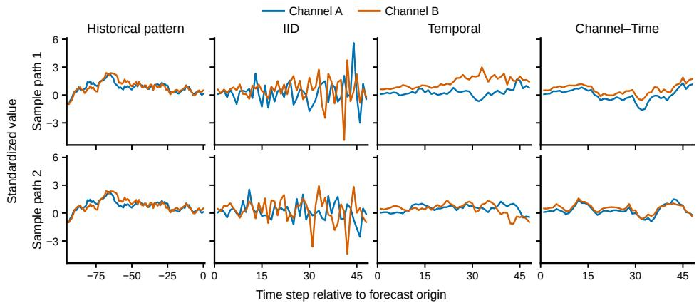

# Interweaving Marginals into Multivariate Sample Paths: Training-Free Dependence Construction for Probabilistic Time Series Foundation Models

Jinmyeong Choi Jinkwan Jang Seul Lee Taesup KimB

Graduate School of Data Science Seoul National University

{jinmyeongchoi, jkjang22, ds\_seul, taesup.kim}@snu.ac.kr

## Abstract

Probabilistic time series foundation models (TSFMs) provide coordinate-wise predictive distributions, but these marginals do not determine a joint distribution over multivariate future trajectories. We study training-free coupling of frozen TSFM marginals into multivariate forecast sample paths. Our primary evaluation fixes the empirical marginal sample multiset at every channel–horizon coordinate across methods, isolating the effect of coupling alone. Historical temporal and channel relations substantially improve their corresponding dependence diagnostics. The same pattern persists when the fixed-marginal constraint is removed and paths are sampled directly, and remains present under native multivariate backbone inference. These results support treating dependence reconstruction as a distinct post-processing problem for probabilistic TSFMs.

## 1 Introduction

Many probabilistic time series foundation models (TSFMs) can provide marginal predictive quantiles for multiple channels and horizons without task-specific retraining[Ansari et al., 2025, Podest et al., 2026, Das et al., 2024]. These outputs do not determine a joint distribution over future trajectories. For example, marginal forecasts alone do not specify whether high values in different channels or at neighboring horizons occur together. Sampling coordinates independently imposes one particular coupling; it does not identify dependence from the marginal outputs.

Copulas provide a framework for modeling dependence separately from marginal distributions. A copula is a multivariate cumulative distribution function whose univariate marginals are uniform on the unit interval [0, 1]. Sklar’s theorem states that any joint cumulative distribution function can be expressed as a copula applied to its marginal cumulative distribution functions [Sklar, 1959]. In our setting, the TSFM supplies the predictive marginals at each channel and horizon, while the copula specifies how outcomes across these coordinates co-occur. A Gaussian copula models this dependence using correlated Gaussian latent variables, which are transformed into marginally uniform probability levels and then mapped through the predictive quantile functions [Wen and Torkkola, 2019]. Gaussian copula assumes a Gaussian structure only for the latent variables used to model dependence; it does not assume that the TSFM’s predictive marginal distributions are Gaussian.

Dependence reconstruction is established in probabilistic forecasting, including the Schaake Shuffle and ensemble copula coupling [Clark et al., 2004, Schefzik et al., 2013]. For multi-step TSFMs, Baron et al. [2025] use a temporal Gaussian copula to generate correlated sample paths from marginal forecasts. Related approaches have also been explored for pretrained forecasting models [Redhead et al., 2026, Benechehab et al., 2025]. Rather than introducing another copula family, we ask: when frozen TSFM marginals are held fixed, what does the choice of channel–horizon coupling itself contribute?

We compare temporal, channel, channel–time, and historical rank-based couplings against independent assembly while holding every finite marginal sample set exactly fixed. A complementary direct-sampling experiment removes this constraint. Evaluations under univariate and native multivariate backbone inference further distinguish conditioning marginals on multivariate history from coupling future outcomes.

## 2 Controlled Coupling of Forecast Marginals

Copula representation. At a fixed forecast origin, let $F _ { d , h }$ be the predictive marginal CDF constructed from a frozen TSFM’s quantile outputs and let $Q _ { d , h } = F _ { d , h } ^ { - 1 }$ denote its quantile function, for channels $d = 1 , \ldots , D$ and horizons $h = 1 , \ldots , H$ . Conditioning on the observed history up to the forecast origin is suppressed in the notation. A copula $C : [ 0 , \breve { 1 } ] ^ { D H } \to [ 0 , 1 ]$ is a joint CDF with uniform marginals [Schefzik et al., 2013]; it couples the forecast marginals into

$$
F _ { C } ( y ) = C \Big ( \big ( F _ { d , h } ( y _ { d , h } ) \big ) _ { d , h } \Big ) .\tag{1}
$$

Thus, the marginal forecasts and their coupling specify distinct components of a joint forecast.   
Quantile construction is detailed in Appendix B.1.

Gaussian copula. For a correlation matrix $R \in \mathbb { R } ^ { D H \times D H }$ , the Gaussian copula is

$$
C _ { R } ( \pmb { u } ) = \Phi _ { R } \big ( \Phi ^ { - 1 } ( u _ { 1 } ) , \dots , \Phi ^ { - 1 } ( u _ { D H } ) \big ) ,\tag{2}
$$

where $\Phi$ is the standard normal CDF and $\Phi _ { R }$ is the CDF of $\mathcal { N } ( \mathbf { 0 } , R )$ [Wen and Torkkola, 2019, Baron et al., 2025]. For the n-th sample path, let $\mathbf { z } ^ { ( n ) } \in \mathbb { R } ^ { D H }$ stack the entries of the latent matrix $Z ^ { ( n ) } \in \mathbb { R } ^ { D \times H }$ by channel, with $z _ { ( d - 1 ) H + h } ^ { ( n ) } = Z _ { d , h } ^ { ( n ) }$ . Thus, horizons are contiguous within each channel. We generate forecast sample paths by

$$
\mathbf { z } ^ { ( n ) } \sim { \mathcal { N } } ( \mathbf { 0 } , R ) , \qquad U _ { d , h } ^ { ( n ) } = \Phi \Bigl ( Z _ { d , h } ^ { ( n ) } \Bigr ) , \qquad \widehat { Y } _ { d , h } ^ { ( n ) } = Q _ { d , h } \Bigl ( U _ { d , h } ^ { ( n ) } \Bigr ) .\tag{3}
$$

Because R has unit diagonal, each $U _ { d , h } ^ { ( n ) }$ is uniformly distributed on (0, 1), and each $\widehat { Y } _ { d , h } ^ { ( n ) }$ has marginal CDF $F _ { d , h }$ . Changing R therefore changes the coupling while preserving each predictive marginal in distribution. The matrix R specifies correlations between the latent Gaussian variables, not generally the Pearson correlations between the final forecast values.

Exactly fixed empirical marginals. Direct draws need not yield identical finite marginal sample sets, even when the underlying marginal distributions are identical. Our primary experiment therefore fixes an ordered marginal sample multiset at each coordinate:

$$
S _ { d , h } = \left\{ Q _ { d , h } \left( \frac { i - \frac { 1 } { 2 } } { N } \right) \right\} _ { i = 1 } ^ { N } , \qquad \widehat { Y } _ { d , h } ^ { ( n ) } = { \cal S } _ { d , h } [ \pi _ { d , h } ( n ) ] .\tag{4}
$$

Every method receives the same $\boldsymbol { \mathcal { S } } _ { d , h }$ and may change only the permutations $\pi _ { d , h }$ . For Gaussian coupling, $\pi _ { d , h } ( n )$ is the rank of $Z _ { d , h } ^ { ( n ) }$ among the N latent draws at that coordinate, in ascending order. Since Φ is monotone, these are also the ranks of the copula probabilities. We use these ranks, rather than the probabilities themselves, to assign the fixed values. This preserves every empirical marginal exactly while varying how its values co-occur with those at other coordinates. All coupling procedures leave the backbone frozen and use only pre-forecast information.

Factorial Gaussian coupling. We estimate $R _ { \mathrm { c h } } \in \mathbb { R } ^ { D \times D }$ from same-time correlations of rank-Gaussianized channel histories. For temporal dependence, we adopt the AR(1)-style form of Baron et al. [2025], $R _ { \mathrm { t i m e } } [ h , h ^ { \prime } ] = \rho ^ { | h - h ^ { \prime } | }$ , where our $\rho$ is the median channel-wise lag-one correlation of the rank-Gaussianized history. Including or excluding each relation gives the $2 \times 2$ factorial

$$
\begin{array} { r } { R _ { \mathrm { I I D } } = I _ { D } \otimes I _ { H } , \qquad R _ { \mathrm { T e m p o r a l } } = I _ { D } \otimes R _ { \mathrm { t i m e } } , } \\ { R _ { \mathrm { C h a n n e l } } = R _ { \mathrm { c h } } \otimes I _ { H } , \quad R _ { \mathrm { C h a n n e l - T i m e } } = R _ { \mathrm { c h } } \otimes R _ { \mathrm { t i m e } } . } \end{array}\tag{5}
$$

Each matrix supplies the latent draws used for rank reassignment above. The separable Channel–Time construction is a controlled decomposition, not an assumption that true channel–horizon dependence is generally separable. Estimation and factorized Gaussian sampling are detailed in Appendix B.

Table 1: IID-relative skill (%) under controlled fixed-marginal coupling and end-to-end direct sampling. The controlled experiment uses $N = 1 0$ and holds every coordinate-wise empirical marginal exactly fixed. Direct sampling uses N = 100 and reports the mean over 30 sampling seeds; its finite empirical marginals are not forced to coincide across methods. Positive values indicate lower scores than IID.
<table><tr><td rowspan="2">Method</td><td colspan="3">Controlled: fixed marginals</td><td colspan="3">Direct copula sampling</td></tr><tr><td>Energy</td><td>Ch.-VS</td><td>Time-VS</td><td>Energy</td><td>Ch.-VS</td><td>Time-VS</td></tr><tr><td>Temporal</td><td>2.83</td><td>0.21</td><td>19.61</td><td>2.64</td><td>0.01</td><td>21.87</td></tr><tr><td>Channel</td><td>0.02</td><td>4.23</td><td>-0.02</td><td>0.04</td><td>4.89</td><td>0.02</td></tr><tr><td>Channel-Time</td><td>2.89</td><td>4.25</td><td>19.51</td><td>2.51</td><td>4.94</td><td>21.86</td></tr><tr><td>Schaake</td><td>2.54</td><td>4.12</td><td>17.99</td><td>1.31</td><td>3.54</td><td>20.52</td></tr></table>

Empirical coupling and controls. As a non-parametric alternative, a Schaake-style construction [Clark et al., 2004, Schefzik et al., 2013] reorders the same fixed samples using historical $D \times H$ rank templates. We also replace $R _ { \mathrm { c h } }$ with an equicorrelation relation or randomly relabeled historical relations to test the value of correctly aligned, heterogeneous channel structure. Historical templates and controls are detailed in Appendices B.5 and E, respectively.

Direct copula sampling. The controlled experiment isolates coupling effects by fixing the finite marginal sample set at every coordinate. As a complementary evaluation, we remove this constraint and generate sample paths directly from each coupling. Gaussian variants map copula probabilities through the predictive quantile functions via Equation (3); historical-template sampling is detailed in Appendix F. Because finite marginal sample sets may differ across methods, this is an end-to-end evaluation rather than a coupling-only comparison.

## 3 Experiments and Results

Experimental setup. We evaluate 14 multivariate forecasting tasks from FEV-bench [Shchur et al., 2026] using three frozen probabilistic backbones: Chronos-2, TimesFM-3, and TiRex-2 [Ansari et al., 2025, Das et al., 2024, Podest et al., 2026]. The primary benchmark uses native multivariate inference and the fixed-marginal protocol of Section 2 with N = 10 sample paths.

We report Energy Score and two targeted Variogram Scores: Ch.-VS evaluates same-horizon crosschannel pairs, while Time-VS evaluates cross-horizon pairs within a channel. All scores are lower-isbetter and use history-based channel standardization (Appendix A.2).

The primary comparison uses the common evaluation support shared by all five methods. For dataset d and backbone $b ,$ let $S _ { d , b } ( M )$ denote the mean score of method M on the common support. We report IID-relative skill,

$$
\mathrm { S k i l l } _ { d , b } ( M ) = 1 0 0 \left( 1 - { \frac { S _ { d , b } ( M ) } { S _ { d , b } ( { \mathrm { I I D } } ) } } \right) .\tag{6}
$$

Skill scores are averaged equally over backbones within each dataset and then over datasets. Positive values indicate improvement over IID, while zero indicates equal performance. Aggregation and uncertainty estimation are detailed in Appendices A.3 and A.4.

Controlled coupling effects. With empirical marginals held exactly fixed, Temporal achieves 19.61% Time-VS skill and Channel achieves 4.23% Ch.-VS skill (Table 1). Channel–Time retains both targeted improvements, while Schaake also improves both diagnostics. The near-zero effects of Temporal on Ch.-VS and Channel on Time-VS are expected by construction. Despite its Ch.-VS improvement, Channel yields only 0.02% Energy skill: Energy Score is substantially less responsive to this intervention than the channel-targeted diagnostic in this benchmark. Additional scores and paired uncertainty are reported in Appendix C.

Channel alignment. On the paired Gaussian support, historical Channel–Time yields lower aggregate Ch.-VS than the equicorrelation and randomly relabeled controls. Mean paired raw-score differences (historical minus control) are −6.78 and −7.73, with 95% hierarchical bootstrap confidence intervals $[ - 1 2 . 7 7 , - 1 . 7 1 ]$ and [−14.10, −2.25], respectively. These results support the value of correctly aligned, heterogeneous historical channel structure beyond the two tested controls (Appendix E).

  
Figure 1: Illustration of direct multivariate sample-path generation using frozen Chronos-2 marginal forecasts on a fixed synthetic multivariate history. Each row shows one prespecified sampled future, with blue and orange denoting Channels A and B. The left column repeats the observed pre-forecast history; the remaining columns compare IID, Temporal, and Channel–Time coupling using the same coordinate-wise marginal forecasts and common Gaussian draws. Temporal coupling introduces within-channel temporal dependence, whereas Channel–Time additionally incorporates the estimated historical cross-channel relation.

Direct sample-path generation. We replace fixed-marginal rank reassignment with direct copula sampling and evaluate $N \in \{ 1 0 , 5 0 , 1 0 0 \}$ over 30 sampling seeds on a common evaluation set. The targeted improvements persist across sample sizes. At $\tilde { N } = 1 0 0$ , Channel–Time achieves 4.94% Ch.-VS skill and 21.86% Time-VS skill, with lower scores than IID on both diagnostics in all 30 seeds (Table 1; Appendix F).

Figure 1 illustrates these coupling effects using frozen TSFM marginal forecasts on a fixed synthetic multivariate history. Temporal coupling introduces within-channel temporal structure, while Channel– Time additionally incorporates the historical cross-channel relation.

Multivariate conditioning. The controlled Channel–Time versus IID comparison yields positive joint-score skill under both univariate and native multivariate inference for all three backbones (Appendix D). Post-hoc coupling therefore remains useful even when the marginal forecasts already condition on multivariate history.

## 4 Conclusion and Limitations

Even simple historical temporal and channel couplings improve targeted joint-forecast diagnostics while keeping empirical marginals fixed. The targeted pattern persists under direct sampling, and Channel–Time coupling remains beneficial under native multivariate inference. These findings support dependence reconstruction as a distinct post-processing problem for frozen probabilistic TSFMs and motivate investigating whether richer post-hoc dependence models can yield further gains.

Limitations. Our findings are limited to the evaluated tasks and backbones. Historical couplings require pre-forecast dependence to remain informative about future outcomes, which may fail under regime or dependence shifts. Our separable Gaussian copula imposes a horizon-invariant latent channel relation and a shared temporal correlation structure, limiting its ability to represent channelpair-specific lead–lag patterns. Schaake-style coupling depends on sufficient, relevant historical rank templates.

## References

Abdul Fatir Ansari, Oleksandr Shchur, Jaris Küken, Andreas Auer, Boran Han, Pedro Mercado, Syama Sundar Rangapuram, Huibin Shen, Lorenzo Stella, Xiyuan Zhang, Mononito Goswami, Shubham Kapoor, Danielle C. Maddix, Pablo Guerron, Tony Hu, Junming Yin, Nick Erickson, Prateek Mutalik Desai, Hao Wang, Huzefa Rangwala, George Karypis, Yuyang Wang, and Michael Bohlke-Schneider. Chronos-2: From univariate to universal forecasting. arXiv preprint arXiv:2510.15821, 2025. URL https://arxiv.org/abs/2510.15821.

Ethan Baron, Boris Oreshkin, Ruijun Ma, Hanyu Zhang, Kari Torkkola, Michael W. Mahoney, Andrew Gordon Wilson, and Tatiana Konstantinova. Efficiently generating correlated sample paths from multi-step time series foundation models, 2025. URL https://arxiv.org/abs/2510. 02224.

Abdelhakim Benechehab, Vasilii Feofanov, Giuseppe Paolo, Albert Thomas, Maurizio Filippone, and Balázs Kégl. Adapts: Adapting univariate foundation models to probabilistic multivariate time series forecasting, 2025. URL https://arxiv.org/abs/2502.10235.

Martyn Clark, Subhrendu Gangopadhyay, Lauren Hay, Balaji Rajagopalan, and Robert Wilby. The schaake shuffle: A method for reconstructing space–time variability in forecasted precipitation and temperature fields. Journal of Hydrometeorology, 5(1):243 – 262, 2004. doi: 10.1175/1525-7541(2004)005<0243:TSSAMF>2.0.CO;2. URL https://journals.ametsoc. org/view/journals/hydr/5/1/1525-7541\_2004\_005\_0243\_tssamf\_2\_0\_co\_2.xml.

Abhimanyu Das, Weihao Kong, Rajat Sen, and Yichen Zhou. A decoder-only foundation model for time-series forecasting, 2024. URL https://arxiv.org/abs/2310.10688.

Patrick Podest, Marco Pichler, Elias Bürger, Levente Zólyomi, Bernhard Voggenberger, Wilhelm Berghammer, Daniel Klotz, Sebastian Böck, Günter Klambauer, and Sepp Hochreiter. Tirex-2: Generalizing tirex to multivariate data and streaming, 2026. URL https://arxiv.org/abs/ 2607.01204.

Benjamin Redhead, Thomas Lee, Cameron Barker, Elliot Crowley, Victor Elvira, Henry Gouk, and Amos Storkey. Copuadapt: A causal attentional copula adapter for probabilistic multivariate time-series forecasting, 2026. 12th Workshop on Mining and Learning from Time Series (MILETS 2026), held in conjunction with KDD 2026.

Roman Schefzik, Thordis L. Thorarinsdottir, and Tilmann Gneiting. Uncertainty quantification in complex simulation models using ensemble copula coupling. Statistical Science, 28(4), November 2013. ISSN 0883-4237. doi: 10.1214/13-sts443. URL http://dx.doi.org/10.1214/13-STS443.

Oleksandr Shchur, Abdul Fatir Ansari, Caner Turkmen, Lorenzo Stella, Nick Erickson, Pablo Guerron, Michael Bohlke-Schneider, and Yuyang Wang. fev-bench: A realistic benchmark for time series forecasting, 2026. URL https://arxiv.org/abs/2509.26468.

Abe Sklar. Fonctions de répartition à n dimensions et leurs marges. Publications de l’Institut de Statistique de l’Université de Paris, 8:229–231, 1959.

Ruofeng Wen and Kari Torkkola. Deep generative quantile-copula models for probabilistic forecasting, 2019. URL https://arxiv.org/abs/1907.10697.

## A Additional Experimental Details

## A.1 Benchmark population and backbones

We evaluate 14 multivariate forecasting tasks from FEV-bench [Shchur et al., 2026]. Table 2 reports the target dimensionality D, forecast horizon H, observed context length $L ,$ and number of evaluated item–origin cells per backbone. One additional declared UCI Air Quality 1H task is excluded upstream because its evaluation windows do not contain finite ground truth over the complete forecast horizon.

Table 2: Core benchmark population. “Cells” denotes evaluated item–origin pairs per backbone.
<table><tr><td>Dataset</td><td>D</td><td>H</td><td>L</td><td>Cells</td></tr><tr><td>UCI Air Quality 1D</td><td>4</td><td>28</td><td>249</td><td>3</td></tr><tr><td>ETT 1D</td><td>7</td><td>28</td><td>164</td><td>16</td></tr><tr><td>ETT 1H</td><td>7</td><td>168</td><td>2048</td><td>16</td></tr><tr><td>ETT 15min</td><td>7</td><td>96</td><td>2048</td><td>16</td></tr><tr><td>Jena Weather 1H</td><td>21</td><td>24</td><td>2048</td><td>8</td></tr><tr><td>BizITObs L2C 1H</td><td>7</td><td>24</td><td>2048</td><td>8</td></tr><tr><td>UK COVID 1D, new</td><td>3</td><td>28</td><td>168</td><td>32</td></tr><tr><td>UK COVID 1D, cumulative</td><td>3</td><td>28</td><td>168</td><td>32</td></tr><tr><td>UK COVID 1W, new</td><td>3</td><td>8</td><td>73</td><td>16</td></tr><tr><td>UK COVID 1W, cumulative</td><td>3</td><td>8</td><td>73</td><td>16</td></tr><tr><td>Boomlet</td><td>28</td><td>60</td><td>2048</td><td>8</td></tr><tr><td>FRED-MD CEE</td><td>3</td><td>12</td><td>558</td><td>8</td></tr><tr><td>FRED-QD CEE</td><td>3</td><td>8</td><td>106</td><td>8</td></tr><tr><td>GVAR</td><td>6</td><td>8</td><td>98</td><td>32</td></tr></table>

We use three frozen probabilistic TSFMs: Chronos-2 [Ansari et al., 2025], TimesFM-3 [Das et al., 2024], and TiRex-2 [Podest et al., 2026]. The primary benchmark uses each backbone’s native multivariate target interface. All backbone parameters remain frozen. Coupling statistics are estimated from pre-forecast history without gradient-based training or task-specific fine-tuning.

## A.2 Metrics and history standardization

Joint scores are computed after channel-wise standardization using only observations available before the forecast origin. For channel d,

$$
\widetilde { y } _ { d , t } = \frac { y _ { d , t } - \mu _ { d , \mathrm { h i s t } } } { \sigma _ { d , \mathrm { h i s t } } + 1 0 ^ { - 8 } } ,
$$

where $\mu _ { d , \mathrm { h i s t } }$ and $\sigma _ { d , \mathrm { h i s t } }$ are the mean and population standard deviation of finite values in the observed context. The same transformation is applied to forecast samples and realized future values. No future observation enters these statistics.

For forecast samples $\{ \mathbf { x } ^ { ( n ) } \} _ { n = 1 } ^ { N }$ and realization $\mathbf { y } ,$ the reported Energy Score uses the fair ensemble form

$$
\mathrm { E S } = \frac { 1 } { N } \sum _ { n = 1 } ^ { N } \left\| \mathbf { x } ^ { ( n ) } - \mathbf { y } \right\| _ { 2 } - \frac { 1 } { N ( N - 1 ) } \sum _ { 1 \leq n < m \leq N } \left\| \mathbf { x } ^ { ( n ) } - \mathbf { x } ^ { ( m ) } \right\| _ { 2 } .
$$

For a set of coordinate pairs $\mathcal { P } _ { \cdot }$ , the empirical Variogram Score of order $p$ is

$$
\mathrm { V S } _ { p , \mathcal { P } } = \sum _ { ( i , j ) \in \mathcal { P } } \left( | y _ { i } - y _ { j } | ^ { p } - \frac { 1 } { N } \sum _ { n = 1 } ^ { N } | x _ { i } ^ { ( n ) } - x _ { j } ^ { ( n ) } | ^ { p } \right) ^ { 2 } .
$$

We use $p = 0 . 5$ . The two primary diagnostic pair sets are

$$
\mathcal { P } _ { \mathrm { c h } } = \{ ( ( d , h ) , ( d ^ { \prime } , h ) ) : d < d ^ { \prime } \} ,
$$

$$
\mathcal { P } _ { \mathrm { t i m e } } = \{ ( ( d , h ) , ( d , h ^ { \prime } ) ) : h < h ^ { \prime } \} .
$$

Thus, Channel Variogram Score $\mathrm { ( C h . - V S ) }$ measures same-horizon cross-channel structure, whereas Temporal Variogram Score (Time-VS) measures cross-horizon structure within a channel. If more than 2,000 pairs are available, a fixed method-independent subset of 2,000 pairs is used for that evaluation cell.

For a scalar predictive ensemble $\{ x ^ { ( n ) } \} _ { n = 1 } ^ { N }$ and realization y, we compute

$$
\mathrm { C R P S } = \frac { 1 } { N } \sum _ { n = 1 } ^ { N } \left| x ^ { ( n ) } - y \right| - \frac { 1 } { 2 N ^ { 2 } } \sum _ { n = 1 } ^ { N } \sum _ { m = 1 } ^ { N } \left| x ^ { ( n ) } - x ^ { ( m ) } \right| .
$$

We additionally evaluate two scalar functionals of each standardized future field,

$$
G ( { \bf y } ) = \frac { 1 } { D H } \sum _ { d = 1 } ^ { D } \sum _ { h = 1 } ^ { H } y _ { d , h } , \qquad M ( { \bf y } ) = \operatorname* { m a x } _ { d , h } y _ { d , h } ,
$$

and report CRPS for the induced predictive distributions of $G ( \mathbf { Y } )$ and $M ( \mathbf { Y } )$ as Global-mean and Global-max CRPS, respectively.

## A.3 Dataset-equal aggregation and relative skill

Absolute score scales differ across tasks because their dimensionalities, forecast horizons, and pair counts differ. For cross-dataset comparisons we therefore use IID-relative skill. Let $S _ { d , b } ( M )$ denote the mean score of method M on dataset d and backbone $b ,$ computed on the exact support shared with IID. We define

$$
\mathrm { S k i l l } _ { d , b } ( M ) = 1 0 0 \left( 1 - { \frac { S _ { d , b } ( M ) } { S _ { d , b } ( { \mathrm { I I D } } ) } } \right) .
$$

Positive values indicate lower scores than IID.

For the overall summary, backbones are averaged equally within each dataset, and datasets are then weighted equally:

$$
\mathrm { S k i l l } ( M ) = \frac { 1 } { | \mathscr { D } | } \sum _ { d \in \mathscr { D } } \left[ \frac { 1 } { | \mathscr { B } | } \sum _ { b \in \mathscr { B } } \mathrm { S k i l l } _ { d , b } ( M ) \right] .
$$

The primary all-method comparison is restricted to the 654 evaluation cells on which IID, Temporal, Channel, Channel–Time, and Schaake are all available. This support spans all 14 datasets and three backbones.

## A.4 Hierarchical uncertainty estimation

Paired uncertainty intervals for the controlled benchmark use hierarchy-aware percentile bootstrap resampling with 10,000 replicates. Resampling follows the evaluation hierarchy used by the implementation: datasets are resampled first, followed by items and forecast origins within the selected dataset. Sampling seeds are averaged within an evaluation cell before the controlled-benchmark bootstrap. Paired method comparisons use the same resampling indices.

## B Coupling Details

## B.1 Marginal quantile construction

All three backbones provide predictive quantiles at levels $\{ 0 . 1 , 0 . 2 , \ldots , 0 . 9 \}$ . Within each channel– horizon coordinate, we first monotonically rearrange the predicted quantile knots to remove crossings and then use piecewise-linear interpolation between adjacent interior knots.

For a fixed coordinate, let $q _ { \tau }$ denote the rearranged quantile at level $\tau .$ . The tails use logarithmic quantile extrapolation, with scales determined by the adjacent outer quantile gaps. For $u < 0 . 1$ ,

$$
Q ( u ) = q _ { 0 . 1 } - \left( q _ { 0 . 2 } - q _ { 0 . 1 } \right) \log _ { 2 } \left( \frac { 0 . 1 } { u } \right) ,
$$

and for $u > 0 . 9 $

$$
Q ( u ) = q _ { 0 . 9 } + ( q _ { 0 . 9 } - q _ { 0 . 8 } ) \log _ { 2 } \biggl ( \frac { 0 . 1 } { 1 - u } \biggr ) .
$$

These extensions join continuously to the interior interpolation at $u = 0 . 1$ and $u = 0 . 9 ;$ ; derivative matching is not imposed. Input probabilities are clipped to $[ 1 0 ^ { - 6 } , 1 - 1 0 ^ { - 6 } ]$ before evaluating $Q$ The same inverse-quantile construction is used by every coupling method.

## B.2 Historical channel relation

Let $Y _ { d , t }$ denote the observed pre-forecast history of channel d. Each channel is transformed independently to Gaussian scores using empirical ranks. If $r _ { d , t }$ is the average rank of a finite observation among the $T _ { d }$ finite observations of channel d, we define

$$
u _ { d , t } = \frac { r _ { d , t } } { T _ { d } + 1 } , \qquad z _ { d , t } = \Phi ^ { - 1 } ( u _ { d , t } ) .
$$

The historical channel relation $R _ { \mathrm { c h } }$ is the Pearson correlation matrix of the rank-Gaussianized channels, computed over timestamps at which all channels are finite.

If fewer than 32 complete timestamps are available, or if $D < 2 ,$ the implementation falls back to $I _ { D } ;$ this fallback does not occur in the Core benchmark. For numerical stability, we clip eigenvalues at $1 0 ^ { - 6 }$ , reconstruct the matrix, rescale it to unit diagonal, and then compute its Cholesky factor. No shrinkage estimator is used.

## B.3 Historical temporal relation

For each channel, we compute the lag-one Pearson correlation between consecutive rank-Gaussianized observations, using only pairs for which both endpoints are finite. Channels with fewer than two usable pairs or zero variance are excluded. The temporal coefficient is the median across usable channels, clipped to [−0.99, 0.99]:

$$
R _ { \mathrm { t i m e } } [ h , h ^ { \prime } ] = \rho ^ { | h - h ^ { \prime } | } .
$$

Across the 219 unique Core evaluation cells, the stored coefficients have mean 0.921 and median 0.955; 151 of 219 exceed 0.9, and 64 of 219 are clipped at 0.99. We therefore interpret this estimator primarily as a strong historical persistence relation rather than evidence that precise cell-specific estimation of $\rho$ is necessary.

## B.4 Gaussian rank coupling

For each sampling seed, the Gaussian variants share a common base-normal tensor

$$
E \in \mathbb { R } ^ { N \times D \times H } ,
$$

and construct

$$
\begin{array} { r } { Z ^ { ( n ) } = L _ { \mathrm { c h } } E ^ { ( n ) } L _ { \mathrm { t i m e } } ^ { \top } , } \end{array}
$$

where $L _ { \mathrm { c h } } L _ { \mathrm { c h } } ^ { \top } = R _ { \mathrm { c h } }$ and $L _ { \mathrm { t i m e } } L _ { \mathrm { t i m e } } ^ { \top } = R _ { \mathrm { t i m e } }$ . The factorial variants replace either factor with the corresponding identity matrix.

In the controlled fixed-marginal experiment, $\Phi ( Z )$ is not mapped through the inverse quantile function. Instead, only the rank ordering of $Z _ { : , d , h }$ across the N sample paths is used. The r-th smallest fixed marginal value is assigned to the path whose latent Gaussian value has rank r. Thus, Gaussian coupling only permutes the common finite marginal samples and introduces no new forecast values.

Using one-based channel and horizon indices, the flattened channel-major coordinate index is

$$
i = ( d - 1 ) H + h .
$$

Under this ordering, the implied full latent Gaussian correlation is

$$
R _ { \mathrm { c h } } \otimes R _ { \mathrm { t i m e } } .
$$

## B.5 Historical empirical rank coupling

As a nonparametric alternative, we use a Schaake-style historical rank reconstruction [Clark et al., 2004, Schefzik et al., 2013].

Candidate $D \times H$ historical blocks are constructed strictly from observations preceding the forecast origin. The procedure first steps backward through history in increments of H, preferring the most recent non-overlapping fully finite blocks. If fewer than N such blocks are available, the spacing is reduced to one time step and the most recent fully finite overlapping blocks are used instead. An evaluation cell is scored only if at least five eligible blocks remain after this fallback.

In the controlled experiment, the selected blocks provide only rank templates. At each coordinate (d, h), their historical values define an ordering across templates, and the common fixed forecast samples are permuted to match this ordering. Hence the empirical marginal sample multiset at every coordinate is unchanged.

At $N = 1 0 .$ , the spacing-one fallback is used in 342 of the 654 scored cells. No scored N = 10 cell requires deterministic template reuse. The direct-sampling version and its finite-template behavior are described separately in Appendix F.

## B.6 Fixed-marginal audit

We audited the controlled implementation over all stored Core cells and coupling variants. Within every audited cell, the sorted coordinate-wise forecast samples are identical across coupling methods up to floating-point summation order. The Gaussian methods generate no new forecast values and only permute the common fixed samples.

This exact finite-marginal identity applies only to the controlled fixed-marginal experiments. It does not apply to the direct-sampling experiment in Appendix F.

## C Full Controlled Benchmark Results

We report the controlled N = 10 benchmark on the 654 evaluation cells shared by IID, Temporal, Channel, Channel–Time, and Schaake. All three backbones use native multivariate inference. Within each cell, the methods receive exactly the same coordinate-wise empirical marginal sample multisets and differ only in their coupling. Metrics and aggregation follow Appendices A.2 and A.3.

## C.1 Absolute scores

Table 3 reports dataset-equal absolute scores. Mean CRPS and Max CRPS evaluate the global mean and global maximum of the standardized future field, respectively; they are distinct from coordinate-wise marginal CRPS.

Table 3: Dataset-equal absolute scores on the 654-cell common support under exactly fixed empirical marginals with N = 10. All metrics are lower-is-better. Mean and Max denote CRPS of the global mean and global maximum of the standardized future field.
<table><tr><td>Method</td><td>Energy</td><td>Ch.-VS</td><td>Time-VS</td><td>Mean CRPS</td><td>Max CRPS</td></tr><tr><td>IID</td><td>8.9099</td><td>121.082</td><td>217.623</td><td>0.2323</td><td>1.5514</td></tr><tr><td>Temporal</td><td>8.8302</td><td>121.062</td><td>198.899</td><td>0.2056</td><td>1.3464</td></tr><tr><td>Channel</td><td>8.9062</td><td>112.819</td><td>217.602</td><td>0.2246</td><td>1.5370</td></tr><tr><td>Channel-Time</td><td>8.8051</td><td>112.781</td><td>199.096</td><td>0.2008</td><td>1.3405</td></tr><tr><td>Schaake</td><td>8.8007</td><td>111.717</td><td>202.239</td><td>0.2097</td><td>1.3875</td></tr></table>

## C.2 IID-relative skill

Table 4 reports IID-relative skill using the same support. Ratios are computed within each dataset– backbone pair before equal averaging over backbones within datasets and then over datasets. Consequently, these skills cannot be recovered by taking ratios of the aggregate absolute scores in Table 3.

Table 4: IID-relative skill (%) under exactly fixed empirical marginals on the 654-cell common support. Ratios are computed within each dataset–backbone pair before equal aggregation over backbones and datasets. Positive values indicate improvement over IID.
<table><tr><td>Method</td><td>Energy</td><td>Ch.-VS</td><td>Time-VS</td><td>Mean CRPS</td><td>Max CRPS</td></tr><tr><td>Temporal</td><td>2.83</td><td>0.21</td><td>19.61</td><td>9.44</td><td>16.84</td></tr><tr><td>Channel</td><td>0.02</td><td>4.23</td><td>-0.02</td><td>2.11</td><td>1.65</td></tr><tr><td>Channel-Time</td><td>2.89</td><td>4.25</td><td>19.51</td><td>6.17</td><td>16.72</td></tr><tr><td>Schaake</td><td>2.54</td><td>4.12</td><td>17.99</td><td>5.99</td><td>13.29</td></tr></table>

## C.3 Paired uncertainty for the controlled factorial

For the Gaussian factorial variants, we additionally report paired raw-score differences on the same 654-cell support:

$$
\Delta ( M ) = S ( M ) - S ( \mathrm { I I D } ) ,
$$

where $S ( M )$ denotes the dataset-equal mean raw score. Negative $\Delta$ favors the coupling method.   
Hierarchy-aware 95% percentile bootstrap intervals use 10,000 replicates, following Appendix A.4.   
Sampling seeds are averaged within cells before resampling datasets, items, and forecast origins;   
paired comparisons use the same resampling indices.

Table 5 repeats the corresponding skills alongside these intervals. The intervals apply to ∆, not to the skill percentages, which use dataset–backbone-specific normalization.

Table 5: IID-relative skill and paired raw-score uncertainty for the controlled Gaussian factorial on the 654-cell common support. $\Delta = S ( M ) - S ( \mathrm { I I D } )$ is the dataset-equal paired raw-score difference; negative values favor the coupling method. Brackets give hierarchy-aware 95% bootstrap intervals for $\Delta .$ , not for skill.
<table><tr><td>Method</td><td>Metric</td><td>Skill (%)</td><td>∆ [95% CI]</td></tr><tr><td rowspan="3">Temporal</td><td>Energy</td><td>2.83</td><td>-0.0797 [-0.135, -0.040]</td></tr><tr><td>Ch.-VS</td><td>0.21</td><td>-0.0198 [-0.107, 0.073]</td></tr><tr><td>Time-VS</td><td>19.61</td><td>-18.72 [−27.7, -10.8]</td></tr><tr><td rowspan="3">Channel</td><td>Energy</td><td>0.02</td><td>-0.0037 [-0.007, -0.001]</td></tr><tr><td>Ch.-VS</td><td>4.23</td><td>-8.263 [−15.9, -1.93]</td></tr><tr><td>Time-VS</td><td>-0.02</td><td>-0.0212 [−0.169, 0.137]</td></tr><tr><td rowspan="3">Channel-Time</td><td>Energy</td><td>2.89</td><td>-0.1048 [−0.178, -0.054]</td></tr><tr><td>Ch.-VS</td><td>4.25</td><td>-8.301 [-15.9, -1.98]</td></tr><tr><td>Time-VS</td><td>19.51</td><td>-18.53 [−27.4, -10.7]</td></tr></table>

## C.4 Factorial interpretation

Construction-implied invariances. For a same-horizon cross-channel pair $( ( d , h ) , ( d ^ { \prime } , h ) )$ , Temporal coupling has zero latent correlation, as does IID. Its bivariate law relevant to Ch.-VS is therefore unchanged. Conversely, Channel coupling leaves the within-channel cross-horizon bivariate laws relevant to Time-VS unchanged from IID. The small observed differences on these untargeted axes are sampling variation; their paired intervals include zero. These contrasts are design checks, not independent discoveries about forecasting ability.

Targeted improvements. The empirical result is that the historical relations improve their targeted diagnostics. Temporal lowers Time-VS by 18.72 raw-score units relative to IID, and Channel lowers Ch.-VS by 8.263; both paired intervals exclude zero. Channel–Time also improves both diagnostics relative to IID. Schaake has positive skill on both axes in Table 4, although its paired uncertainty is not included in Table 5.

Metric response and comparison scope. Channel achieves 4.23% Ch.-VS skill but only 0.02% Energy skill. Thus, Energy Score is less responsive to this channel-only intervention under the reported relative-skill measure; its small paired Energy interval below zero does not imply a large effect. The intervals in Table 5 compare each method with IID. In particular, the Energy skills of Temporal (2.83%) and Channel–Time (2.89%) do not establish that Channel–Time outperforms Temporal. That claim would require a direct paired comparison between the two methods.

## D Jointization skill by inference mode

Native multivariate inference can condition each coordinate-wise marginal forecast on other channels, but this does not by itself specify a joint distribution over future outcomes. We therefore evaluate whether post-hoc dependence reconstruction remains useful under both univariate and native multivariate backbone inference.

Within each backbone and inference mode, IID and Channel–Time use exactly the same coordinatewise empirical marginal samples under the controlled N = 10 protocol. Thus, each comparison changes only the coupling while holding the mode-specific marginal forecasts fixed.

Table 6 reports IID-relative skill,

$$
\mathrm { S k i l l } _ { d , b } ( M ) = 1 0 0 \left( 1 - { \frac { S _ { d , b } ( M ) } { S _ { d , b } ( { \mathrm { I I D } } ) } } \right) ,
$$

where the ratio is computed within each dataset d for a fixed backbone b, and then averaged equally across datasets. Positive values indicate lower scores than IID.

These results use the full 657-cell Gaussian support (219 cells per backbone), on which IID and Channel–Time are both available. This differs from the 654-cell common support used by the allmethod comparison in Table 1, which additionally requires the Schaake-style coupling to be available. Consequently, the three Multi rows below should not be averaged and expected to reproduce the overall Channel–Time values in Table 1.

Table 6: IID-relative skill (%) of Channel–Time coupling under univariate and native multivariate backbone inference, using the controlled N = 10 fixed-marginal protocol on the 657-cell Gaussian support. Within each backbone–mode pair, IID and Channel–Time use identical empirical marginal samples. Skill is computed within each dataset before cross-dataset averaging. This support differs from the 654-cell all-method support in Table 1, which additionally requires Schaake availability. Mean and Max denote CRPS of the global mean and global maximum of the standardized future field.
<table><tr><td>Backbone</td><td>Mode</td><td>Energy</td><td>Ch.-VS</td><td>Time-VS</td><td>Mean CRPS</td><td>Max CRPS</td></tr><tr><td rowspan="2">Chronos-2</td><td>Uni</td><td>2.33</td><td>2.84</td><td>14.45</td><td>13.77</td><td>13.47</td></tr><tr><td>Multi</td><td>2.45</td><td>3.24</td><td>17.14</td><td>13.22</td><td>17.09</td></tr><tr><td rowspan="2">TimesFM-3</td><td>Uni</td><td>3.48</td><td>3.35</td><td>20.91</td><td>11.24</td><td>21.13</td></tr><tr><td>Multi</td><td>3.72</td><td>4.42</td><td>22.18</td><td>13.54</td><td>17.35</td></tr><tr><td rowspan="2">TiRex-2</td><td>Uni</td><td>2.25</td><td>2.07</td><td>17.76</td><td>12.37</td><td>13.67</td></tr><tr><td>Multi</td><td>2.47</td><td>3.15</td><td>18.90</td><td>12.55</td><td>13.88</td></tr></table>

Channel–Time jointization yields positive IID-relative skill for every backbone and inference mode shown. In particular, under native multivariate inference, Ch.-VS skill ranges from 3.15% to 4.42% and Time-VS skill from 17.14% to 22.18%. Thus, allowing the backbone to condition its marginal forecasts on cross-channel history does not eliminate the additional benefit of coupling future outcomes.

We do not interpret the difference between the Uni and Multi rows as the causal effect of multivariate inference. Changing the inference mode also changes the frozen marginal forecasts themselves, and the magnitude of the jointization gain is not uniformly larger under Multi across all metrics and backbones. The relevant conclusion is instead that the IID-to-Channel–Time gain remains present within each inference mode.

## E Negative Controls for Cross-Channel Structure

The controlled factorial compares historical channel coupling with independence. Here we test a narrower question: whether the historical channel relation provides information beyond its average

signed correlation or a randomly relabeled correlation structure. Both controls retain the same temporal relation and fixed empirical marginals as historical Channel–Time.

## E.1 Control definitions

Equicorrelation. Let $\bar { \rho }$ be the mean signed off-diagonal entry of the PSD-repaired historical $R _ { \mathrm { c h } }$ We construct

$$
R _ { \mathrm { e q u i } } = ( 1 - \bar { \rho } ) I _ { D } + \bar { \rho } \mathbf { 1 } \mathbf { 1 } ^ { \top } .
$$

If necessary, $\bar { \rho }$ is clipped to the valid equicorrelation interval $( - 1 / ( D - 1 ) , 1 )$ with a $1 0 ^ { - 6 }$ numerical margin. Up to this numerical clipping, the control preserves average signed correlation while removing pair-specific heterogeneity.

Randomly relabeled historical relation. For a random permutation matrix $P ,$ we construct

$$
R _ { \mathrm { p e r m } } = P R _ { \mathrm { c h } } P ^ { \top } .
$$

This preserves the multiset of correlation entries and the spectrum of $R _ { \mathrm { c h } } .$ , but changes their alignment with the observed channel labels. Results are averaged over five generated permutations per evaluation cell. Individual permutations can leave some channel pairs unchanged, especially when D is small. The control therefore tests random relabeling rather than complete removal of channel-pair identity.

In each control, the replacement channel matrix is combined with the same $R _ { \mathrm { t i m e } }$ used by historical Channel–Time. Coupling uses the controlled N = 10 rank-reassignment protocol, so every coordinate-wise empirical marginal remains fixed.

## E.2 Paired evaluation and results

Each historical-versus-control comparison uses its exact paired Gaussian support of 657 cells. This differs from the 654-cell all-method support in Appendix C, which also requires Schaake availability.

Table 7 reports mean paired raw-score differences, with historical Channel–Time minus the corresponding control. Negative differences favor the historical relation. Intervals follow the hierarchyaware bootstrap of Appendix A.4; W/T/L counts dataset-level wins, ties, and losses for the historical relation.

Table 7: Historical Channel–Time coupling against cross-channel negative controls on the 657- cell paired Gaussian support. ∆ is the raw score of Channel–Time minus that of the corresponding control; negative values favor Channel–Time. Intervals are hierarchy-aware 95% bootstrap confidence intervals for $\Delta$ . W/T/L counts datasets. All comparisons retain the same temporal relation and fixed empirical marginals.
<table><tr><td>Control</td><td>Metric</td><td>n</td><td>Channel-Time</td><td>Control</td><td>∆</td><td>95% CI</td><td>W/T/L</td></tr><tr><td rowspan="5">Equicorr.</td><td>Energy</td><td>657</td><td>8.957</td><td>8.972</td><td>-0.01448</td><td>[-0.0382,-0.0007]</td><td>9/0/5</td></tr><tr><td>Ch.-VS</td><td>657</td><td>113.1</td><td>119.8</td><td>-6.783</td><td>[-12.8,-1.71]</td><td>12/0/2</td></tr><tr><td>Time-VS</td><td>657</td><td>202.4</td><td>202.3</td><td>0.1193</td><td>[-0.0661,0.366]</td><td>6/0/8</td></tr><tr><td>Mean CRPS</td><td>657</td><td>0.2168</td><td>0.2166</td><td>0.000220</td><td>[-0.000441,0.000923]</td><td>5/0/9</td></tr><tr><td>Max CRPS</td><td>657</td><td>1.388</td><td>1.389</td><td>-0.001033</td><td>[-0.0186,0.0156]</td><td>6/1/7</td></tr><tr><td rowspan="5">Permuted</td><td>Energy</td><td>657</td><td>8.957</td><td>8.982</td><td>-0.02475</td><td>[-0.0525,-0.00797]</td><td>11/0/3</td></tr><tr><td>Ch.-VS</td><td>657</td><td>113.1</td><td>120.8</td><td>-7.728</td><td>[-14.1,-2.25]</td><td>12/0/2</td></tr><tr><td>Time-VS</td><td>657</td><td>202.4</td><td>202.3</td><td>0.04151</td><td>[-0.106,0.230]</td><td>5/0/9</td></tr><tr><td>Mean CRPS</td><td>657</td><td>0.2168</td><td>0.2167</td><td>0.000078</td><td>[-0.000614,0.000775]</td><td>6/0/8</td></tr><tr><td>Max CRPS</td><td>657</td><td>1.388</td><td>1.391</td><td>-0.002836</td><td>[-0.0200,0.0126]</td><td>10/1/3</td></tr></table>

## E.3 Interpretation

Historical Channel–Time yields lower Ch.-VS than each control on 12 of 14 datasets. Relative to equicorrelation, its mean paired difference is −6.78, with a 95% interval of $[ - 1 2 . 7 7 , - 1 . 7 1 ]$ Relative to random relabeling, the difference is −7.73, with an interval of [−14.10, −2.25]. These results support the value of correctly aligned, heterogeneous historical channel structure beyond the two tested alternatives in this benchmark.

The Energy contrasts also favor the historical relation, with paired intervals below zero. We do not compare the raw magnitudes of Energy and Ch.-VS changes because the metrics have different scales. The supplementary functional CRPS intervals include zero for both controls.

Time-VS differences are near zero, with both paired intervals including zero. This is expected because all three conditions share $R _ { \mathrm { t i m e } }$ and differ only in the channel relation. The within-channel temporal bivariate laws relevant to Time-VS are therefore unchanged. These temporal contrasts are design checks; the Ch.-VS contrasts test the information in channel heterogeneity and alignment.

## F End-to-End Direct Sampling

We evaluate direct copula sampling for each coupling, reusing the frozen marginal forecasts from the controlled benchmark without additional backbone inference. Unlike fixed-marginal rank reassignment, direct generation does not force the realized coordinate-wise sample multisets to coincide. This experiment is therefore an end-to-end robustness check, not a coupling-only comparison with identical empirical marginals.

All scenario budgets $N \in \{ 1 0 , 5 0 , 1 0 0 \}$ use 30 sampling seeds and the same 654-cell common support spanning 14 datasets and three native-multivariate backbones. Scores use the history-based standardization and definitions in Appendix A.2.

## F.1 Direct Gaussian scenario generation

For each scenario n, we draw

$$
\begin{array} { r } { E _ { d , h } ^ { ( n ) } \overset { \mathrm { i i d } } { \sim } \mathcal { N } ( 0 , 1 ) , \qquad Z ^ { ( n ) } = L _ { \mathrm { c h } } E ^ { ( n ) } L _ { \mathrm { t i m e } } ^ { \top } , } \end{array}
$$

and map the latent Gaussian values through the normal CDF and the frozen marginal quantile functions:

$$
U ^ { ( n ) } = \Phi ( Z ^ { ( n ) } ) , \qquad \widehat { Y } _ { d , h } ^ { ( n ) } = Q _ { d , h } \Big ( U _ { d , h } ^ { ( n ) } \Big ) .
$$

The IID variant replaces both factors with identities, Temporal replaces only the channel factor, and Channel replaces only the temporal factor. Channel–Time uses both historical factors. Gaussian methods share the same base-normal tensor within each sampling seed, following Appendix H.3. The inverse-quantile construction is unchanged from Appendix B.1.

## F.2 Schaake direct sampling

The direct Schaake generator forms a finite pool of distinct historical rank templates. It draws template indices uniformly with replacement and maps the associated rank pseudo-observations through the same frozen marginal quantile functions.

The number of generated scenarios N can exceed the number of distinct templates $K .$ . Some evaluation cells retain only a small template pool even at N = 100, so multiple draws can reuse the same historical rank structure. Increasing N does not by itself enlarge this pool. This finitetemplate constraint is relevant when interpreting scenario-budget sensitivity. We treat Schaake as a nonparametric historical-copula baseline and do not claim uniform dominance of Gaussian Channel–Time over it.

## F.3 Sampling-budget sensitivity

Table 8 reports the three joint-score diagnostics and two supplementary functional CRPS measures. For dataset $d ,$ backbone $b ,$ and method $\bar { M } .$ , IID-relative skill is

$$
\mathrm { S k i l l } _ { d , b } ( M ) = 1 0 0 \left( 1 - { \frac { S _ { d , b } ( M ) } { S _ { d , b } ( \mathrm { I I D } ) } } \right) ,
$$

with equal averaging over backbones within each dataset and then over datasets. Reported values are means over 30 sampling seeds; positive values indicate improvement over IID.

The targeted Gaussian pattern persists across budgets: Temporal improves Time-VS, Channel improves Ch.-VS, and Channel–Time improves both. The untargeted contrasts remain close to zero.

Table 8: IID-relative skill (%) under direct copula sampling. Values are means over 30 sampling seeds on the same 654-cell common support. Ratios are computed within dataset–backbone pairs before dataset-equal aggregation. Positive values indicate improvement over IID. Mean and Max denote the supplementary functional CRPS measures.
<table><tr><td>Method</td><td>N</td><td>Energy</td><td>Ch.-VS</td><td>Time-VS</td><td>Mean CRPS</td><td>Max CRPS</td></tr><tr><td>Temporal</td><td>10</td><td>2.61</td><td>-0.40</td><td>22.83</td><td>6.15</td><td>25.06</td></tr><tr><td></td><td>50</td><td>2.69</td><td>0.07</td><td>21.94</td><td>9.81</td><td>26.43</td></tr><tr><td></td><td>100</td><td>2.64</td><td>0.01</td><td>21.87</td><td>9.99</td><td>26.41</td></tr><tr><td>Channel</td><td>10</td><td>-0.02</td><td>6.65</td><td>-0.17</td><td>1.44</td><td>5.79</td></tr><tr><td></td><td>50</td><td>0.02</td><td>5.10</td><td>-0.02</td><td>2.26</td><td>5.86</td></tr><tr><td></td><td>100</td><td>0.04</td><td>4.89</td><td>0.02</td><td>2.40</td><td>6.03</td></tr><tr><td>Channel-Time</td><td>10</td><td>2.62</td><td>6.94</td><td>22.79</td><td>-0.34</td><td>26.29</td></tr><tr><td></td><td>50</td><td>2.56</td><td>5.22</td><td>21.94</td><td>5.12</td><td>28.03</td></tr><tr><td></td><td>100</td><td>2.51</td><td>4.94</td><td>21.86</td><td>5.78</td><td>28.21</td></tr><tr><td>Schaake</td><td>10</td><td>-1.48</td><td>6.87</td><td>21.11</td><td>1.45</td><td>20.58</td></tr><tr><td></td><td>50</td><td>1.02</td><td>4.29</td><td>20.05</td><td>3.77</td><td>22.80</td></tr><tr><td></td><td>100</td><td>1.31</td><td>3.54</td><td>20.52</td><td>6.33</td><td>23.45</td></tr></table>

Effect sizes are not identical across budgets; for example, Channel–Time Ch.-VS skill decreases from 6.94% at N = 10 to 4.94% at $N = 1 0 0$ , while its Time-VS skill remains above 21%. The conclusion concerns persistence of the targeted improvements, not invariance of their magnitude.

Temporal and Channel–Time retain approximately 2.5–2.7% Energy skill across budgets, whereas Channel-only Energy skill remains close to zero. Schaake has positive skill on both targeted VS diagnostics at all three budgets, but its Energy skill changes from −1.48% at N = 10 to 1.31% at $N \stackrel { - } { = } 1 0 0$

Functional CRPS evaluates distributions of quantities derived from complete trajectories. Temporal and Channel–Time show positive global-max CRPS skill across budgets, whereas Channel–Time global-mean CRPS skill is negative at N = 10 and positive at the larger budgets. Small datasetspecific IID baselines can make these relative ratios sensitive to aggregation. We therefore retain the functional CRPS measures as supplementary diagnostics rather than headline results.

## F.4 Coordinate-wise marginal CRPS

Because direct sampling does not fix the finite marginal sample sets, we separately evaluate coordinate wise marginal CRPS. Unlike global-mean and global-max CRPS, this diagnostic evaluates the individual channel–horizon marginals rather than a functional of the complete future field.

Table 9: IID-relative coordinate-wise marginal CRPS skill (%) under direct sampling, using the same dataset–backbone normalization and aggregation as the joint metrics. Positive values favor the method over IID. These are aggregate marginal-score comparisons, not tests of equality of finite empirical marginals.
<table><tr><td>Method</td><td>N = 10</td><td>N = 50  $N = 1 0 0$ </td></tr><tr><td>Temporal</td><td>-0.289</td><td>-0.021 -0.004</td></tr><tr><td>Channel</td><td>-0.153</td><td>0.010 0.015</td></tr><tr><td>Channel-Time</td><td>-0.381</td><td>-0.009 -0.013</td></tr><tr><td>Schaake</td><td>0.879</td><td>0.030 0.019</td></tr></table>

At $N = 1 0 0$ , the magnitude of aggregate marginal-CRPS skill is below 0.02% for every method, while targeted joint-score gains remain substantial. Thus, the joint improvements are accompanied by small aggregate marginal-score differences. This does not establish equality of the realized empirical marginals or rule out differences at individual coordinates or evaluation cells.

## F.5 Seed stability

The reported standard deviation across sampling seeds of the paired Energy difference decreases from approximately 0.036 at N = 10 to 0.018 at $N = 5 0$ and 0.013 at $N = 1 0 0$ for Temporal. For Channel–Time, the corresponding values are 0.063, 0.033, and 0.021.

At $N = 1 0 0$ , the reported seed-level comparisons favor Temporal and Channel–Time over IID on Energy in all 30 sampling seeds. Channel and Channel–Time are favored on Ch.-VS in every seed, and Temporal and Channel–Time on Time-VS. These summaries concern sensitivity to Monte Carlo sampling and are distinct from the hierarchical bootstrap uncertainty in the controlled experiment (Appendix C.3). They do not establish improvement in every individual evaluation cell.

## F.6 Absolute scores

Table 10 reports dataset-equal absolute scores at each budget. Their cross-dataset ratios should not be used to reconstruct Table 8: IID-relative skills are computed within dataset–backbone pairs before aggregation.

Table 10: Dataset-equal absolute scores under direct stochastic scenario generation on the 654-cell common support. All metrics are lower-is-better. Mean and Max denote CRPS of the global mean and global maximum of the standardized future field.
<table><tr><td>Method</td><td>N</td><td>Energy</td><td>Ch.-VS</td><td>Time-VS</td><td>Mean CRPS</td><td>Max CRPS</td></tr><tr><td>IID</td><td>10</td><td>9.284</td><td>129.037</td><td>231.426</td><td>0.2319</td><td>1.713</td></tr><tr><td rowspan="4"></td><td>50</td><td>9.291</td><td>121.577</td><td>218.964</td><td>0.2287</td><td>1.667</td></tr><tr><td>100</td><td>9.291</td><td>120.653</td><td>217.385</td><td>0.2283</td><td>1.666</td></tr><tr><td>10</td><td>9.186</td><td>128.935</td><td>206.511</td><td>0.2096</td><td>1.372</td></tr><tr><td>50</td><td>9.200</td><td>121.608</td><td>196.400</td><td>0.2003</td><td>1.327</td></tr><tr><td rowspan="4">Channel</td><td>100</td><td>9.200</td><td>120.601</td><td>194.989</td><td>0.1994</td><td>1.327</td></tr><tr><td>10</td><td>9.282</td><td>118.271</td><td>231.519</td><td>0.2244</td><td>1.630</td></tr><tr><td>50</td><td>9.284</td><td>111.933</td><td>218.993</td><td>0.2200</td><td>1.587</td></tr><tr><td>100</td><td>9.284</td><td>111.116</td><td>217.368</td><td>0.2194</td><td>1.584</td></tr><tr><td rowspan="3">Channel-Time</td><td>10</td><td>9.162</td><td>118.107</td><td>206.937</td><td>0.2103</td><td>1.325</td></tr><tr><td>50</td><td>9.177</td><td>112.006</td><td>196.521</td><td>0.1971</td><td>1.278</td></tr><tr><td>100</td><td>9.178</td><td>111.107</td><td>195.099</td><td>0.1958</td><td>1.276</td></tr><tr><td rowspan="3">Schaake</td><td>10</td><td>9.597</td><td>118.380</td><td>209.681</td><td>0.2204</td><td>1.439</td></tr><tr><td>50</td><td>9.343</td><td>112.879</td><td>200.322</td><td>0.2087</td><td>1.374</td></tr><tr><td>100</td><td>9.271</td><td>112.223</td><td>197.370</td><td>0.2018</td><td>1.331</td></tr></table>

## F.7 Synthetic illustration

Figure 1 provides a synthetic illustration separate from the FEV-bench evaluation. For channels $d = 0 , 1 , 2 ,$ , we generate

$$
y _ { d , t } = o _ { d } + s _ { d } \left( a f _ { t } + \sqrt { 1 - a ^ { 2 } } e _ { d , t } \right) ,
$$

where $a = 0 . 9 5 , \mathbf { o } = ( 0 , 1 0 , 5 0 )$ , and $\mathbf { s } = ( 1 , 2 , 5 )$ . The common factor $f _ { t }$ and channel-specific processes $e _ { d , t }$ are mutually independent stationary unit-variance Gaussian AR(1) processes, with coefficients 0.98 and 0.90, respectively. We use $D = 3 ,$ a history length of $L = 5 1 2$ , and a forecast horizon of $H = 4 8$

The synthetic realization is fixed at index 0 with seed 20260917. Frozen Chronos-2 supplies the marginal predictive quantiles from the observed history; these are converted to quantile functions using Appendix B.1. The channel and temporal relations are estimated from the history only, yielding $R _ { \mathrm { c h } } \bar { [ 1 , 2 ] } \bar { = } 0 . 8 8 7 5$ and $\rho = 0 . 9 5 7 1$ . All three coupling methods share these marginal quantile functions and a common base-normal tensor to generate $\bar { N } = 1 0 0$ sample paths.

The figure displays channels 1 and 2 as A and B, respectively, and sample-path indices 0 and 1, using zero-based indexing. It shows the last 96 history steps and all 48 forecast horizons. Values are standardized using each channel’s full pre-forecast history. The realization and displayed channel and path indices are fixed without selection using future observations or method performance. The figure illustrates the coupling mechanism rather than benchmark forecast accuracy.

## G Deterministic Median Point-Forecast Reference

The primary experiments compare alternative ways of coupling frozen coordinate-wise predictive marginals into probabilistic multivariate scenarios. As an additional reference, we ask a different question: how do these probabilistic scenario forecasts compare with using only the coordinate-wise predictive median as a single deterministic future?

This comparison is not a coupling ablation. The Median forecast is a point-mass prediction, whereas IID, Temporal, Channel, Channel–Time, and Schaake produce probabilistic scenario sets. We therefore report Median only as a deterministic point-forecast reference and never use it as the denominator of the IID-relative coupling skill reported in the main experiments.

## G.1 Construction

For every channel d and forecast horizon h, we define the deterministic median trajectory as

$$
M _ { d , h } = Q _ { d , h } ( 0 . 5 ) ,
$$

where $Q _ { d , h }$ is the same inverse quantile function used by the probabilistic scenario methods.

The cached backbone outputs contain the quantile level 0.5 explicitly. As in the main experiments, predicted quantile knots are first monotonically rearranged within each coordinate before constructing $Q _ { d , h }$ . Hence the primary Median reference corresponds to the median of the same rearranged marginal distribution from which all probabilistic scenarios are constructed.

No additional backbone inference is performed. The experiment reuses the same frozen nativemultivariate marginal caches as the primary all-Multi benchmark for Chronos-2, TimesFM-3, and TiRex-2.

The deterministic trajectory is evaluated using exactly the same history-based standardization, realized future, and Variogram pair subsets as the probabilistic methods. For implementation consistency, M is replicated $N = 1 0$ times and passed through the existing scoring functions.

Because all replicated trajectories are identical, the pairwise spread term in Energy Score vanishes, giving

$$
\operatorname { E S } _ { \mathrm { M e d i a n } } = \| \operatorname { v e c } ( M ) - \operatorname { v e c } ( Y ) \| _ { 2 } .
$$

Likewise, for the global-mean functional

$$
G ( Y ) = \frac { 1 } { D H } \sum _ { d = 1 } ^ { D } \sum _ { h = 1 } ^ { H } Y _ { d , h } ,
$$

the predictive distribution is a point mass at $G ( M )$ , and therefore

$$
\mathrm { C R P S } _ { \mathrm { M e a n , M e d i a n } } = \left| G ( M ) - G ( Y ) \right| .
$$

For the global maximum

$$
X ( Y ) = \operatorname* { m a x } _ { d , h } Y _ { d , h } ,
$$

we similarly obtain

$$
\mathrm { C R P S } _ { \mathrm { M a x , M e d i a n } } = \left| X ( M ) - X ( Y ) \right| .
$$

Thus, the Median reference is scored using exactly the same metrics as the probabilistic forecasts, but it contains no predictive spread.

## G.2 Comparison on the primary common support

Table 11 compares the Median reference with the five probabilistic scenario constructions on the same 654-cell support used by the primary controlled benchmark. The support spans all 14 datasets and three frozen backbones.

Table 11: Dataset-equal absolute scores of the deterministic coordinate-wise Median trajectory and the probabilistic scenario forecasts on the 654-cell primary common support. Median is a deterministic point-forecast reference, not a coupling method. All metrics are lower-is-better.
<table><tr><td>Type</td><td>Method</td><td>Energy</td><td>Ch.-VS</td><td>Time-VS</td><td>Mean CRPS</td><td>Max CRPS</td></tr><tr><td>Point forecast</td><td>Median</td><td>12.1851</td><td>137.677</td><td>305.320</td><td>0.2590</td><td>1.8155</td></tr><tr><td rowspan="5">Probabilistic</td><td>IID</td><td>8.9099</td><td>121.082</td><td>217.623</td><td>0.2323</td><td>1.5514</td></tr><tr><td>Temporal</td><td>8.8302</td><td>121.062</td><td>198.899</td><td>0.2056</td><td>1.3464</td></tr><tr><td>Channel</td><td>8.9062</td><td>112.819</td><td>217.602</td><td>0.2246</td><td>1.5370</td></tr><tr><td>Channel-Time</td><td>8.8051</td><td>112.781</td><td>199.096</td><td>0.2008</td><td>1.3405</td></tr><tr><td>Schaake</td><td>8.8007</td><td>111.717</td><td>202.239</td><td>0.2097</td><td>1.3875</td></tr></table>

The probabilistic scenario forecasts obtain lower aggregate scores than the deterministic Median reference. However, this comparison has a different interpretation from the fixed-marginal coupling experiment. Moving from Median to IID changes the forecast representation itself: IID retains multiple levels of each marginal predictive distribution and therefore represents predictive uncertainty, whereas Median collapses each marginal to a single value.

In contrast, the comparisons from IID to Temporal, Channel, and Channel–Time hold the finite empirical marginal sample set exactly fixed and modify only the dependence among coordinates. We therefore use Median to contextualize the value of probabilistic scenario forecasting, while IID remains the appropriate baseline for isolating the contribution of dependence reconstruction.

## G.3 Paired comparisons against Median

For completeness, we perform paired comparisons between each probabilistic forecast and Median. For method M, define

$$
\Delta ( M ) = S ( M ) - S ( \mathrm { M e d i a n } ) .
$$

Since every metric is lower-is-better, $\Delta < 0$ favors the probabilistic forecast.

Confidence intervals use the same hierarchy-aware percentile bootstrap as the controlled benchmark, with 10,000 bootstrap replicates. W/T/L counts datasets after averaging raw score differences equally across backbones within each dataset.

The comparison with IID is particularly useful for separating two effects. Relative to Median, IID already improves Energy, Ch.-VS, Time-VS, and global-mean CRPS on average despite using no structured cross-coordinate dependence. This difference reflects the transition from a deterministic point forecast to a probabilistic ensemble constructed from multiple marginal quantile levels.

The structured couplings provide an additional effect beyond this point-forecast-to-ensemble transition. Relative to IID, Temporal further improves temporal dependence, Channel further improves cross-channel dependence, and Channel–Time retains both targeted gains, as analyzed in the main controlled experiment.

## G.4 Results on the full evaluation set

We additionally compare Median and the Gaussian coupling methods on all 657 evaluation cells, without requiring Schaake availability. This includes the three cells excluded from the 654-cell all-method comparison because insufficient historical blocks prevent Schaake coupling. Analyses that involve only the Gaussian constructions can therefore use all 657 cells. We additionally report the Median reference on this full Gaussian support in Table 13.

The qualitative comparison between Median and the Gaussian probabilistic forecasts is unchanged on the 657-cell support. We nevertheless keep the 654- and 657-cell results separate because their absolute dataset-equal scores are not numerically interchangeable.

## G.5 Implementation checks

We performed several checks to ensure that the Median reference differs from the main experiments only through its deterministic point-forecast representation.

Table 12: Paired raw-score comparisons against the deterministic Median reference on the 654-cell primary support. Negative ∆ indicates a lower score than Median. CI denotes the hierarchy-aware 95% percentile bootstrap interval.
<table><tr><td>Method</td><td>Metric</td><td>∆</td><td>95% CI</td><td>W/T/L</td></tr><tr><td rowspan="5">IID</td><td>Energy</td><td>-3.2752</td><td>[-5.2096, -1.6840]</td><td>14/0/0</td></tr><tr><td>Ch.-VS</td><td>-16.5951</td><td>[-33.469, -4.2585]</td><td>11/0/3</td></tr><tr><td>Time-VS</td><td>-87.6970</td><td>[-179.11, -19.946]</td><td>8/0/6</td></tr><tr><td>Mean CRPS</td><td>-0.0268</td><td>[-0.0406, -0.0146]</td><td>14/0/0</td></tr><tr><td>Max CRPS</td><td>-0.2641</td><td>[-0.5573, 0.0078]</td><td>10/0/4</td></tr><tr><td rowspan="5">Temporal</td><td>Energy</td><td>-3.3549</td><td>[-5.2721, -1.7711]</td><td>14/0/0</td></tr><tr><td>Ch.-VS</td><td>-16.6149</td><td>[-33.524, -4.2761]</td><td>11/0/3</td></tr><tr><td>Time-VS</td><td>-106.421</td><td>[-199.01, -37.710]</td><td>14/0/0</td></tr><tr><td>Mean CRPS</td><td>-0.0534</td><td>[-0.0806, -0.0318]</td><td>14/0/0</td></tr><tr><td>Max CRPS</td><td>-0.4692</td><td>[-0.7120, -0.2635]</td><td>14/0/0</td></tr><tr><td rowspan="6">Channel</td><td>Energy</td><td>-3.2789</td><td>[-5.2142, -1.6860]</td><td>14/0/0</td></tr><tr><td>Ch.-VS</td><td>-24.8584</td><td>[-47.066, -7.6065]</td><td>11/0/3</td></tr><tr><td>Time-VS</td><td>-87.7182</td><td>[-178.98,-20.081]</td><td>8/0/6</td></tr><tr><td>Mean CRPS</td><td>-0.0345</td><td>[-0.0506, -0.0204]</td><td>14/0/0</td></tr><tr><td>Max CRPS</td><td>-0.2786</td><td>[-0.5696, -0.0077]</td><td>10/0/4</td></tr><tr><td>Energy</td><td>-3.3800</td><td>[-5.3131, -1.7815]</td><td>14/0/0</td></tr><tr><td rowspan="5">Channel-Time</td><td>Ch.-VS</td><td>-24.8962</td><td>[-47.134, -7.6102]</td><td>11/0/3</td></tr><tr><td>Time-VS</td><td>-106.225</td><td>[-198.58, -37.589]</td><td>14/0/0</td></tr><tr><td>Mean CRPS</td><td>-0.0582</td><td>[-0.0901, -0.0326]</td><td>14/0/0</td></tr><tr><td>Max CRPS</td><td></td><td>[-0.7120, -0.2713]</td><td>14/0/0</td></tr><tr><td></td><td>-0.4750</td><td></td><td></td></tr><tr><td rowspan="5">Schaake</td><td>Energy</td><td>-3.3844</td><td>[-5.3570, -1.7596]</td><td>14/0/0</td></tr><tr><td>Ch.-VS</td><td>-25.9600</td><td>[-48.820, -8.0386]</td><td>11/0/3</td></tr><tr><td>Time-VS</td><td>-103.081</td><td>[-189.30, -37.979]</td><td>13/0/1</td></tr><tr><td>Mean CRPS</td><td>-0.0494</td><td>[-0.0702, -0.0307]</td><td>14/0/0</td></tr><tr><td>Max CRPS</td><td>-0.4281</td><td>[-0.6899, -0.2077]</td><td>14/0/0</td></tr></table>

Table 13: Dataset-equal absolute scores of Median and the Gaussian scenario methods on the full 657-cell Gaussian support. All metrics are lower-is-better.
<table><tr><td>Method</td><td>Energy</td><td>Ch.-VS</td><td>Time-VS</td><td>Mean CRPS</td><td>Max CRPS</td></tr><tr><td>Median</td><td>12.3983</td><td>138.364</td><td>313.699</td><td>0.2801</td><td>1.8934</td></tr><tr><td>IID</td><td>9.0624</td><td>121.180</td><td>220.727</td><td>0.2518</td><td>1.5963</td></tr><tr><td>Temporal</td><td>8.9827</td><td>121.157</td><td>202.200</td><td>0.2240</td><td>1.3939</td></tr><tr><td>Channel</td><td>9.0585</td><td>113.102</td><td>220.699</td><td>0.2430</td><td>1.5820</td></tr><tr><td>Channel-Time</td><td>8.9571</td><td>113.055</td><td>202.388</td><td>0.2168</td><td>1.3884</td></tr></table>

First, all 42 marginal caches are byte-identical to those recorded by the primary all-Multi experiment, and no additional backbone forward pass is performed. The quantile level 0.5 is present exactly once in every cache.

Second, the primary Median forecast is bitwise identical to Q(0.5) after the canonical monotone rearrangement in all 657 evaluation cells. Some raw cached quantile arrays contain crossing quantiles, so the unrearranged 0.5 knot can differ from the canonical Q(0.5). A separate sensitivity calculation using the raw cached median knot yields only negligible changes in the aggregate scores and does not alter the primary definition.

Third, deterministic-score identities hold numerically in every evaluation cell:

$$
\operatorname { E S } _ { \mathrm { M e d i a n } } = \| \operatorname { v e c } ( M ) - \operatorname { v e c } ( Y ) \| _ { 2 } ,
$$

and the global-mean and global-max CRPS values equal the corresponding absolute functional errors. Finally, the standardization statistics, realized futures, and Variogram pair subsets are identical to those used by the existing probabilistic methods. The resulting support contains exactly 654 cells when Schaake availability is required and 657 cells for the Gaussian-only comparison.

## H Reproducibility and Implementation Audit

## H.1 Backbones and cached marginals

The frozen checkpoints are Chronos-2 (amazon/chronos-2), TimesFM-3 (google/timesfm-3.0-pytorch), and TiRex-2 (NX-AI/TiRex-2). The primary controlled benchmark uses native multivariate inference for all three models. The direct-sampling experiment reuses the same cached marginal forecasts as the controlled benchmark; it does not trigger new backbone forward calls.

## H.2 Existing assets, licenses, and terms of use

We use only existing public benchmark assets and pretrained checkpoints; we do not redistribute their weights or underlying datasets. Table 14 records the identifiers and license or use terms reported by the corresponding official repositories/model cards at submission time.

Table 14: Existing assets used in the experiments and their reported license or use terms.
<table><tr><td>Asset</td><td>Identifier / source</td><td>License or use terms</td></tr><tr><td>fev / fev-bench</td><td>https://github.com/ autogluon/fev</td><td>Apache License 2.0. We use the public benchmark definitions and evaluation infrastructure.</td></tr><tr><td>FEV dataset collec- tion</td><td>https://huggingface. co/datasets/autogluon/ fev_datasets</td><td>The repository is marked license: other. Its dataset card states that its files are reformatted from external sources, that licensing and citation terms of the original sources apply, and that, unless otherwise specified, the datasets are provided only for research purposes. We use the selected FEV-bench tasks only for academic evaluation and do not redistribute the</td></tr><tr><td>Chronos-2</td><td>https://huggingface. co/amazon/chronos-2</td><td>data. Apache License 2.0. Used as a frozen probabilistic</td></tr><tr><td>TimesFM-3</td><td>https://huggingface. co/google/timesfm-3. 0-pytorch</td><td>backbone. TimesFM Non-Commercial License v1.0. The li- cense explicitly permits testing, evaluation, and aca- demic research as non-commercial purposes; we</td></tr><tr><td>TiRex-2</td><td>https://huggingface. co/NX-AI/TiRex-2</td><td>use the checkpoint only for non-commercial aca- demic evaluation. Apache License 2.0. Used as a frozen probabilistic backbone.</td></tr></table>

The FEV dataset collection does not assign a single permissive license to all underlying source datasets. Its dataset card instead points users to the original data sources for dataset-specific licensing and citation terms. We therefore do not claim that all benchmark datasets share the Apache 2.0 license of the fev software package; our use is limited to the research-only evaluation setting described by the dataset card.

## H.3 Randomness and common random numbers

The global random seed is 20260908. For Gaussian methods, a base-normal stream is derived deterministically from the global seed, dataset, item, forecast origin, and sampling-seed index. The same base-normal tensor is shared across Gaussian coupling methods within a seed, providing common random numbers.

In the controlled benchmark, Energy Score and Variogram Score use 20 sampling seeds per evaluation cell for the stochastic Gaussian methods. Schaake rank reassignment is deterministic. The permuted channel controls use five channel permutations per evaluation cell, fixed across sampling seeds. Sampling seeds are averaged within a cell before the controlled hierarchical bootstrap.

The direct-sampling experiment uses 30 sampling seeds for every method and each scenario budget N ∈ {10, 50, 100}.

## H.4 Common support

There are 219 declared Core evaluation cells per backbone and 657 across the three backbones. One UCI Air Quality 1D origin has only two eligible historical blocks after the Schaake fallback and is therefore unavailable to Schaake. The primary all-method comparison consequently uses 654 cells. The same 654-cell support is used for every scenario budget in the direct-sampling experiment.

## H.5 Numerical audit

The fixed-marginal implementation was audited over all stored Core cells. Within each controlled evaluation cell, the sorted coordinate-wise forecast sample values are identical across the Gaussian couplings, controls, and Schaake construction. No target value is used in estimating $R _ { \mathrm { c h } } , \rho ,$ the history standardizer, or the historical rank templates.

The channel–time Gaussian implementation uses

$$
Z ^ { ( n ) } = L _ { \mathrm { c h } } E ^ { ( n ) } L _ { \mathrm { t i m e } } ^ { \top }
$$

with channel-major flattening. A synthetic correlation check agrees with $R _ { \mathrm { c h } } \otimes R _ { \mathrm { t i m e } }$ to numerical Monte Carlo precision; no channel–time indexing swap was found.

## H.6 Scope of sensitivity results

The primary fixed-marginal all-multivariate benchmark is reported at $N ~ = ~ 1 0$ The $N \in$ {10, 50, 100} sensitivity study in Appendix F is a separate direct-sampling experiment, not a fixedmarginal scenario-budget sweep. Older sensitivity artifacts that combine a univariate TimesFM-3 path with multivariate Chronos-2 and TiRex-2 are not used for the final main-paper conclusions.