# LATEST EXACT MATCH ATTENTION

Moritz Brösamle

Department of Mathematics, University of Tübingen, Germany moritzbroesamle@gmail.com

## ABSTRACT

We introduce latest exact match attention (LEMA), an attention variant for transformers where queries and keys are binarized and each query attends only to the latest exactly matching key. We prove that LEMA transformers with chain of thought can simulate word-RAMs, as was recently shown for the less restrictive rightmost hard attention. In contrast to prior hard attention variants, the restriction to exact matches enables an efficient converse direction: word-RAMs can simulate LEMA transformers at a cost per token independent of the context length. Together, these results yield a close correspondence between the two computational models in terms of both compute and memory. Beyond the theory, we propose a training method for LEMA transformers that handles their non-differentiable operations with a straight-through estimator for the binarization and a soft attention surrogate annealed towards LEMA. On a synthetic associative recall task, LEMA models trained this way use their growing state to store and recall a large number of associations, outperforming gated DeltaNet (GDN) with its fixed state size. As a first scaling test, we train LEMA language models with up to 834 million parameters. They match softmax transformers of around half their size in loss and, on repeated rare phrases and a needle-retrieval task, remain behind softmax transformers but recall across longer distances than GDN models of comparable size. Finally, we implement dictionary-based inference for LEMA transformers and show constant generation speed comparable to GDN despite their growing state, with the dictionaries residing in main memory rather than VRAM. Code is available at https://github.com/moritzbroe/latest\_exact\_match\_ attention.

## 1 INTRODUCTION

During autoregressive generation, softmax transformers typically face two costs that grow with context length: reading more keys and values slows generation, and storing them consumes limited GPU memory (VRAM). State space models and linear attention variants—collectively referred to as fixed-state models throughout this work—instead compress the context into a state of fixed size, making both memory and compute per token independent of context length. However, this fixed memory capacity limits recall when the amount of information to be retained grows (Arora et al., 2024a;b; Waleffe et al., 2024; Afendulev et al., 2026). We seek to combine a state that can grow but resides in main memory with the constant generation speed of fixed-state models by using direct lookup operations instead of a scan over the state.

Abstractly, softmax attention can be viewed as a differentiable dictionary lookup. A query is compared with all previous keys and returns a mixture of all values weighted by similarity to their keys. This makes the lookup differentiable, but also involves every stored key and value in the computation. We propose to replace it with the following discrete lookup operation during inference:

Definition 1 (Latest exact match attention). For binary queries and keys $q _ { i } , k _ { i } \in \{ - 1 , 1 \} ^ { d _ { h } }$ and values $v _ { i } \in \mathbb { R } ^ { d _ { h } }$ , latest exact match attention (LEMA) returns

$$
\mathrm { L E M A } \big ( ( q _ { i } , k _ { i } , v _ { i } ) _ { i = 1 } ^ { n } \big ) = ( o _ { i } ) _ { i = 1 } ^ { n } , \qquad o _ { i } = \left\{ v _ { \ell _ { i } } , \quad \ell _ { i } = \operatorname* { m a x } \{ j < i \mid k _ { j } = q _ { i } \} \mathrm { ~ e x i s t s } , \right.
$$

A LEMA head applies this operation to $q _ { i } = \mathrm { s g n } ( W _ { Q } x _ { i } ) , k _ { i } = \mathrm { s g n } ( W _ { K } x _ { i } )$ and $v _ { i } = W _ { V } x _ { i }$ i for hidden states $x _ { i } \in \mathbb { R } ^ { d }$ , with sgn applied coordinatewise and $\operatorname { s g n } ( 0 ) = 1$ . A LEMA transformer replaces softmax attention heads with LEMA heads.

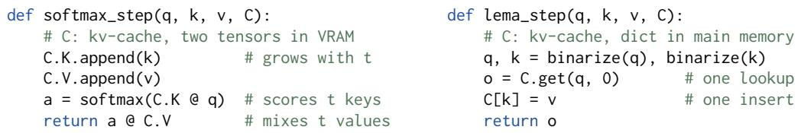  
Figure 1: Simplified code for the kv-cached generation step of a softmax head and a LEMA head.

In words, a LEMA transformer binarizes keys and queries and each query attends only to the latest exactly matching key, retrieving zeros if no key matches. During autoregressive inference of a LEMA transformer, the kv-cache of each attention head can be implemented as a dictionary as illustrated in Figure 1. Processing one token consists of one lookup and one insert to this dictionary, and updating an existing key overwrites its old value, allowing for a content-dependent state size. The dictionary for a LEMA head with head dimension $d _ { h }$ contains at most $2 ^ { d _ { h } }$ entries, as only that many distinct keys exist, so the state size is bounded in theory but practically unbounded for large $d _ { h } .$ Prior works have used attention to the nearest or latest token satisfying some condition (Csordás et al., 2022; Yang et al., 2024a; Friedman et al., 2023) or even to the tokens with exactly matching keys (Liu et al., 2025b; Yang et al., 2025a) as a formal device or in small trained models, but the form of Definition 1 with binarized queries and keys has, to our knowledge, not been proposed.

In Section 3, we establish a correspondence between LEMA transformers with chain of thought and word-RAMs, an abstraction of modern computers, which, to our knowledge, has not been established for other attention variants. Recently, Li et al. (2026) showed that t steps of a word-RAM with word size w can be simulated by a transformer with rightmost hard attention using O(t poly(w)) chain of thought steps. In Theorem 1 we show that an analogous statement holds for the more restrictive LEMA and bound the number of distinct keys used by the LEMA heads in terms of the word-RAM’s space usage. Using LEMA instead of rightmost hard attention enables an efficient converse of this statement: Theorem 2 shows that a word-RAM can perform autoregressive generation of an N-parameter LEMA transformer using O(N) steps per processed token with space usage corresponding to the number of distinct keys. The kv-caches are implemented as trie-based dictionaries on the word-RAM with lookup and insert operations taking time independent of the number of kv-entries. Apart from input/output costs, these results yield a round trip with space overhead polynomial in the word size and time overhead polynomial in the word size and program length.

The hard attention variants of prior expressivity results serve as theoretical abstractions of softmax attention (Hahn, 2020; Merrill & Sabharwal, 2024), whose faithfulness is debated (Merrill et al., 2022; Velickoviˇ c et al., 2025), and those works do not address training models with the analyzed´ attention rules. In contrast, we propose in Section 4 a way to train the very attention rule we analyze despite its non-differentiable operations. Gradients through the binarization of queries and keys come from a straight-through estimator (Bengio et al., 2013; Courbariaux et al., 2016), and for the latest-match operation we use a surrogate based on stick-breaking attention (Tan et al., 2025; Raffel et al., 2017) during training, slowly annealing it towards LEMA. Training with this surrogate stil requires computation quadratic in sequence length.

Using these techniques, we train LEMA transformers on a synthetic associative recall task where a growing number of associations between tokens is presented and then queried. We find that tiny LEMA transformers are able to store a large number of associations, just as softmax transformers, while the linear attention variant gated DeltaNet (GDN) (Yang et al., 2025b) fails once the number of associations becomes too large. Next, we test whether the method scales by training LEMA transformers with up to 834 million parameters on FineWeb-Edu (Penedo et al., 2024). At the larger sizes, they match softmax transformers with slightly more than half their parameters in language modeling loss. On two proxies for long-range recall, namely the loss on repeated rare phrases and the single-needle task of the RULER benchmark (Hsieh et al., 2024) with repetitive filler, they remain clearly behind softmax transformers but outperform GDN at long distances. On both the synthetic recall task and in language modeling, we observe shortcomings of our training method and hence consider it merely a first attempt at training LEMA transformers.

In Section 5, we present and benchmark an implementation of LEMA transformers using hash table as dictionaries for the kv-caches. This keeps the generation speed constant, close to that of GDN, until the hash table nears its capacity. Furthermore, these kv-caches are stored in main memory rather than VRAM, so that the VRAM holds only the model’s parameters and activations.

## 2 RELATED WORK

In most sequence models, every generated token is computed from the whole context-dependent state, so that the compute per token grows with the state, and models differ in how the state grows with the context. Many models use a fixed state size, most prominently recurrent networks (Elman, 1990; Hochreiter & Schmidhuber, 1997), state space models (Gu et al., 2022; Gu & Dao, 2024; Dao & Gu, 2024), linear attention variants (Katharopoulos et al., 2020; Schlag et al., 2021; Liu et al., 2022; Yang et al., 2024b; 2025b) and recent test-time training methods (Sun et al., 2025; Behrouz et al., 2025). Other methods bound the state of transformers: Lingle (2024) quantizes keys to a small fixed codebook and accumulates the values per code, while Zhang et al. (2023) and Xiao et al. (2024) evict entries from the kv-cache beyond a budget, and Cui (2026) adds a small fixed cache of exact key-value pairs to GDN. Softmax transformers (Vaswani et al., 2017) instead grow their state linearly in the context length, while hybrid architectures (Poli et al., 2024), grouped-query and latent attention (Shazeer, 2019; Ainslie et al., 2023; DeepSeek-AI, 2024) and cache quantization (Liu et al., 2024; Hooper et al., 2024) reduce the slope of this growth, and binarized queries and keys (Horton et al., 2025; Xiao et al., 2026) reduce attention computation. Log-linear attention (Guo et al., 2026) grows the state logarithmically. Pal & Rojkova (2026) cache keys far from all stored keys, thus sharing LEMA’s content-dependent state size, but read the full cache with softmax attention. Some methods also merge cache entries at a learned, content-dependent rate (Nawrot et al., 2024) or let transformers summarize or erase their chain of thought (Yan et al., 2026; Yang et al., 2025a; Aghajohari et al., 2026), which allows simulating Turing machines space-efficiently (Yang et al., 2025a; Brösamle & Eckstein, 2026).

Other methods use only part of the state to compute the next token. Several content-based sparseattention methods (Tang et al., 2024; Desai et al., 2025; Gong et al., 2025; Yuan et al., 2025; Lu et al., 2025; DeepSeek-AI, 2025) use a cheap scan over keys or block summaries to select a small subset for attention, so their per-token compute still grows linearly with context length. Reformer (Kitaev et al., 2020) and Routing Transformers (Roy et al., 2021) select keys by locality-sensitive hashing or learned clustering, then mix their values with softmax attention. Other methods use indexed memory access. Neural Random-Access Machines (Kurach et al., 2016) train neural controllers over differentiable arithmetic and memory-access primitives, with constant-time memory access after discretization. Neural Episodic Control (Pritzel et al., 2017) grows a dictionary of key-value pairs and updates the value of an existing key in place, Sparse Access Memory (Rae et al., 2016) reads and writes a few slots of a fixed-size memory per step, Memorizing Transformers (Wu et al., 2022) attend to the nearest neighbors of the query among past keys, and RetrievalAttention (Liu et al., 2025a) and MagicPIG (Chen et al., 2025) keep the kv-cache of trained softmax transformers in main memory and read a small fraction of the keys per query, found by a graph index or sampled through localitysensitive hashing. FwPKM (Zhao & Jones, 2026) and Sparse Delta Memory (Cabannes et al., 2026) maintain a fixed-size state of m value vectors per head in VRAM, selecting entries using two vectors of $\sqrt { m }$ scores. A LEMA head instead addresses up to $2 ^ { d _ { h } }$ entries with a $d _ { h }$ -bit key, storing only keys that occur.

Finally, Engram (Cheng et al., 2026) and memory layers (Lample et al., 2019; Berges et al., 2025) access a large table of parameters through a hashed n-gram or a product key, at a cost independent of or sublinear in its size. As this table contains parameters rather than context-dependent state, these methods are conceptually closer to mixture-of-experts layers (Shazeer et al., 2017) than to LEMA.

## 3 COMPUTATIONAL EQUIVALENCE WITH WORD-RAMS

A word-RAM (Fredman & Willard, 1993; Hagerup, 1998) $M = ( P , r , w )$ consists of a program $P .$ a register count r and a word size w. Its r registers and $2 ^ { w }$ memory cells hold w-bit words, and $P$ is a sequence of arithmetic, branching and memory access instructions reading from and writing to these cells. Time $t _ { M } ( x )$ is the number of executed instructions on an input x before halting, while space $s _ { M } ( x )$ counts the registers and memory cells used by that computation. Precise definitions are given in Appendix A.1.

For this section, a LEMA transformer is a transformer decoder with LEMA heads as defined by Definition 1 using ReLU MLPs and no normalization or positional encodings. All operations in its forward pass use standard IEEE-style floating-point arithmetic, and we write p for the total number of bits of the format, its precision. Generation is greedy. We say that $T$ generates y from x if its autoregressive generation from x ends in <out> y <eos>. The tokens before <out> are the chain of thought. $t _ { T } ( x )$ then denotes the total number of generated tokens and $s _ { T } ( x )$ the sum over all heads of the number of distinct keys used by each head. See Appendix A.2 for the formal model.

## 3.1 LEMA TRANSFORMERS SIMULATE WORD-RAMS

The following result parallels Theorem 1 of Li et al. (2026), which establishes word-RAM simulation capability for the less restrictive rightmost hard attention, where queries and keys are not binarized and each query selects the key with the largest inner product, using rightmost tie-breaking. Notably, many parts of their construction and of constructions in other transformer expressivity works (Merrill & Sabharwal, 2024; Li et al., 2024; Liu et al., 2025b; Yang et al., 2025a; Brösamle & Eckstein, 2026) attend through exact matches of encoded addresses or indices, which partly motivated this work. The encoding enc in the statement writes out words with corresponding memory addresses bit by bit (Definition 9). Every O-expression hides only a universal constant.

Theorem 1. Let $\boldsymbol { M } = ( P , r , \boldsymbol { w } )$ be a word-RAM. Then there exists a LEMA transformer T with an $\mathcal { O } ( 1 ) { - } s i z e$ vocabulary, $\mathcal { O } ( 1 )$ heads per layer, depth $\mathcal { O } ( w )$ , model dimension $d = \mathcal { O } ( w )$ , head dimension $d _ { h } = \mathcal { O } ( w )$ , MLP width $\bar { d _ { \mathbb { H } } } = \bar { \mathcal { O } } ( w + \bar { | P | } )$ and precision $p = \mathcal { O } ( \log w )$ such that the following holds. If M on an input word sequence x halts with output sequence y, then T generates enc(y) from enc(x) and

$$
t _ { T } ( \mathrm { e n c } ( x ) ) = { \cal O } \big ( ( t _ { M } ( x ) + | y | ) w \big ) \qquad a n d \qquad s _ { T } ( \mathrm { e n c } ( x ) ) = { \cal O } \big ( s _ { M } ( x ) + w \big ) \ .
$$

The proof is given in Appendix A.3. During generation, the constructed transformer produces tokens encoding the changes of each word-RAM step to the word-RAM’s registers, memory cells and program counter.

## 3.2 WORD-RAMS SIMULATE LEMA TRANSFORMERS

The next result shows that a word-RAM can evaluate a LEMA transformer with per-token compute independent of the context length and memory growing with the number of distinct keys. Again, every O-expression hides only a universal constant.

Theorem 2. There is a universal constant $C > 0$ such that, for every LEMA transformer $T$ with N parameters, model dimension $d ,$ head dimension $d _ { h }$ and precision $p ,$ there exist a program $P ,$ a register count r and a word size threshold $w _ { 0 }$ satisfying

$$
| P | = \mathcal { O } ( N ) , \qquad r = \mathcal { O } ( 1 ) , \qquad w _ { 0 } = \mathcal { O } ( p + \log N )
$$

such that thefollowing holdsfor every w $\geq w _ { 0 }$ . IfT on input x generates output y and

$$
\operatorname* { m a x } \{ | x | , | y | \} + C \bigl ( d + s _ { T } ( x ) d _ { h } \bigr ) < 2 ^ { w } \ ,
$$

then the word-RAM $M = ( P , r , w )$ outputs the token indices of y from the token indices of x and

$$
t _ { M } ( x ) = { \mathcal O } \big ( ( | x | + t _ { T } ( x ) ) N \big ) \qquad a n d \qquad s _ { M } ( x ) = { \mathcal O } \big ( | x | + | y | + d + s _ { T } ( x ) d _ { h } \big ) .
$$

The proof in Appendix A.4 constructs a word-RAM that performs standard autoregressive inference, with the kv-cache of each head stored as a binary trie mapping keys to their latest values. A lookup or update costs $\mathcal { O } ( d _ { h } )$ time, and the dictionary operations are dominated by the $\mathcal O ( N )$ operations per token needed for matrix-vector multiplications. A trie with s distinct keys uses $\mathcal { O } ( s d _ { h } )$ words, which gives the stated space bound after accounting for reusable buffers and the input and output. The capacity condition ensures that these fit in memory, while the threshold $w _ { 0 }$ provides enough bits for scalar arithmetic and instruction indices.

To see the correspondence between LEMA transformers and word-RAMs, the two results can be combined into a round trip: for a word-RAM $\boldsymbol { M } = ( P , r , \boldsymbol { w } )$ , applying Theorem 1 and then Theorem 2 yields a single word-RAM M′ with word size $\dot { w } ^ { \prime } = \mathcal { O } ( w )$ that maps $\operatorname { e n c } ( x )$ to $\operatorname { e n c } ( y )$ whenever M halts on x with output $y ,$ identifying tokens with their vocabulary indices. Its time and space

satisfy tM′ (enc(x)) = O((tM(x)+|x|+|y|) |P| poly(w)) and sM′ (enc(x)) = O(sM(x) poly(w)).   
See Appendix A.5 for details.

The head dimension $d _ { h }$ loosely corresponds to the word size w: a word-RAM can access $2 ^ { w }$ memory cells through w-bit addresses, while a LEMA head can access up to $2 ^ { d _ { h } }$ key-value pairs through $d _ { h ^ { - } }$ bit keys. The correspondence appears to be specific to LEMA transformers and word-RAMs. Using rightmost hard attention instead of LEMA would replace the exact-match lookups with maximum inner product searches for which no comparably efficient exact method is known. Likewise, Turing machines, the model of many prior chain of thought expressivity results (Pérez et al., 2021; Merrill & Sabharwal, 2024), lack the random memory access that makes the dictionary operations efficient.

## 4 TRAINING LEMA TRANSFORMERS

## 4.1 TRAINING METHOD

Here we introduce the training method we will use to train LEMA transformers. The two nondifferentiable operations, namely the binarization of queries and keys and the latest exact match operation, are treated separately.

Binarizing queries and keys. The binarization of queries and keys in LEMA transformers is analogous to how activations are binarized in binarized neural networks. We adopt the most common training technique used in that literature, the straight-through estimator, which uses the gradient of a similarly shaped differentiable function in the backward pass of the sign function (Courbariaux et al., 2016; Yin et al., 2019). In particular, for the forward pass we obtain queries and keys of a LEMA head for hidden state $x \in \bar { \mathbb { R } } ^ { d }$ as

$$
q = \mathrm { s g n } ( \beta \mathrm { R M S N o r m } ( W _ { Q } x ) )
$$

where in the backward pass the sign function is treated as having derivative tanh′. Neither the normalization RMSNorm $\textstyle ( y ) = y / { \sqrt { \sum _ { i } y _ { i } ^ { 2 } / d _ { h } } }$ (Zhang & Sennrich, 2019) nor the multiplication by the hyperparameter $\beta > 0$ changes the forward pass, as sgn is invariant under positive rescaling, but helps keep activations in a region with gradient magnitudes controlled by $\beta$ instead of drifting.

Annealing towards LEMA. Just as the sign function is approximated by tanh as a differentiable surrogate, we approximate the latest exact match operation with a smooth surrogate. As this surrogate we choose stick-breaking attention (Tan et al., 2025), where a high attention score to one position suppresses the attention weights on earlier positions, and extend it with a threshold parameter c:

$$
\mathrm { s b } _ { \alpha , c } ( ( q _ { i } , k _ { i } , v _ { i } ) _ { i = 1 } ^ { n } ) = ( o _ { i } ) _ { i = 1 } ^ { n }
$$

where the output at position i is defined as

$$
o _ { i } = \sum _ { j < i } w _ { i j } v _ { j } , \ w _ { i j } = \sigma \big ( \alpha \big ( \langle q _ { i } , k _ { j } \rangle - c \big ) \big ) \prod _ { l = j + 1 } ^ { i - 1 } \left( 1 - \sigma \big ( \alpha \big ( \langle q _ { i } , k _ { l } \rangle - c \big ) \big ) \right)\tag{1}
$$

with σ the sigmoid function. With queries and keys binarized to $\{ - 1 , 1 \} ^ { d _ { h } }$ , the score $\left. q _ { i } , k _ { j } \right.$ lies in $\{ d _ { h } , d _ { h } - 2 , \bar { d } _ { h } - 4 , . . . \}$ , so setting $c = d _ { h } - 1$ makes the sigmoid argument α for an exact match and at most −α otherwise. Increasing α hence sharpens the surrogate towards LEMA:

Lemma 1. Let $q _ { i } , k _ { i } \in \{ - 1 , 1 \} ^ { d _ { h } }$ and $v _ { i } \in \mathbb { R } ^ { d _ { h } } f o r i \le n ,$ , and let $\alpha > 0 .$ . Then for every position $i ,$

$$
\big \| \mathrm { L E M A } \big ( ( q _ { j } , k _ { j } , v _ { j } ) _ { j = 1 } ^ { n } \big ) _ { i } - \mathrm { s b } _ { \alpha , d _ { h } - 1 } \big ( ( q _ { j } , k _ { j } , v _ { j } ) _ { j = 1 } ^ { n } \big ) _ { i } \big \| \leq 2 n e ^ { - \alpha } \operatorname* { m a x } _ { j < i } \| v _ { j } \| .
$$

The proof is given in Appendix B.1. With this differentiable approximation of the latest exact match operation, one could try to use the same technique as for the binarization, i.e. using hard LEMA in the forward pass with the gradients from $\mathrm { s b } _ { \alpha , d _ { h } - 1 }$ in the backward pass. Unless $d _ { h }$ is very small, however, at initialization most queries then match no key exactly, leaving attention outputs at zero and degrading learning as discussed in Appendix B.3. Instead, training starts with the stick-breaking surrogate at $c = 0$ and hardens it in two phases. After learning rate warmup, c increases linearly from 0 to $d _ { h } - 1$ while α stays at its initial value $\frac { 1 } { \sqrt { d _ { h } } }$ . Then α increases linearly to 10 at the end of training, gradually aligning the surrogate with LEMA. The timing of both ramps is given per experiment in Appendices B.4 and B.7. For the backward pass, however, we cap α at 2 to retain gradient flow, so forward and backward pass differ again once α exceeds the cap. We use LEMA with head dimension $d _ { h } = 6 4 ;$ ; smaller head dimensions are discussed in Appendix B.9.

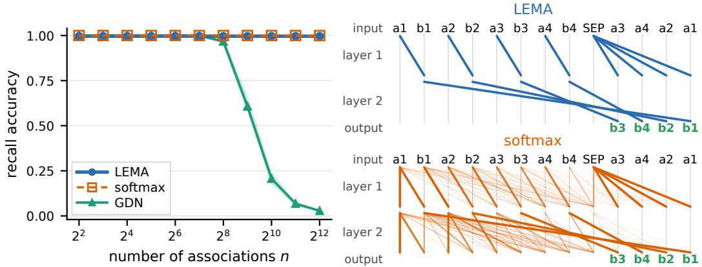  
Figure 2: $L e f t { \mathrm { : } }$ mean recall accuracy at n associations over three seeds, with shaded minimum-tomaximum ranges. LEMA is trained only at $n = 8 ,$ , the others on a curriculum. $R i g h t \cdot$ attention weights of a LEMA transformer and a softmax transformer on one $n = 4$ sample input.

## 4.2 ASSOCIATIVE RECALL

We train LEMA transformers and two baselines used throughout the paper, softmax transformers with rotary positional encodings (RoPE) (Su et al., 2024) and GDN, on a synthetic associative recall task. Similar tasks have been used previously to contrast the memory capacity of transformers and fixed-state models (Arora et al., 2024a;b; Jelassi et al., 2024; Okpekpe & Orvieto, 2025).

Task and models. We use a variation of the multi-query associative recall task introduced in Arora et al. (2024a). Each sample is of the form $( a _ { 1 } , b _ { 1 } , a _ { 2 } , b _ { 2 } , \ldots , a _ { n } , b _ { n } , \mathrm { S E P } , a _ { \pi ( 1 ) } , \ldots , a _ { \pi ( n ) } )$ where $a _ { 1 } , \ldots , a _ { n }$ are sampled without repeats from a vocabulary of size 4096, $b _ { 1 } , \ldots , b _ { n }$ are sampled uniformly from a disjoint vocabulary of the same size, π is a random permutation of $\{ 1 , \ldots , n \}$ and SEP is a separator token. Hence, the total vocabulary size is $2 \cdot 4 0 \bar { 9 } 6 + 1$ and a sequence with n associations has length $3 n + 1$ . After each $a _ { \pi ( i ) }$ following the separator, the model must predict $b _ { \pi ( i ) }$ . Consistent with prior work, we train tiny models: each model has 2 layers, model dimension $d = 6 4$ and a single head of dimension $d _ { h } = 6 4$

Softmax transformers and GDN. Trained directly at larger n, softmax transformers do not discover a solution in our experiments, so we train them and GDN on a curriculum of increasing n, at each stage using the best checkpoint for evaluation at that n and to initialize the next stage. Figure 2 shows the mean accuracy over three seeds, with individual runs in Appendix B.4. Solving the task requires holding all n pairs in the state once they are read. Softmax transformers do so with their linearly growing state, while GDN’s fixed-size state holds a limited number of associations and degrades beyond it.

LEMA. LEMA transformers can grow their state like softmax transformers if they assign distinct key codes to tokens, and the task tests in a controlled setting whether our training method realizes this ability. On this task, we find hardening sensitive to high learning rates and therefore lower the learning rate during hardening (Appendix B.4). Training then succeeds and we can avoid combining a curriculum with hardening, as training only at $n = 8$ extrapolates almost perfectly to $n = 4 0 9 6$ (Figure 2). The underlying stick-breaking attention already extrapolates to a few hundred pairs when trained at $n = 8$ . Zeroing small stick-breaking gates at evaluation largely restores extrapolation to $n = 4 0 9 6$ , showing that leakage through these gates limits recall (Appendix B.6). LEMA’s discrete rule eliminates this leakage.

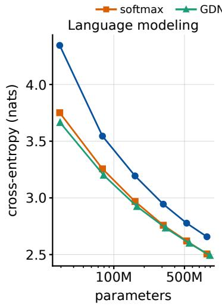

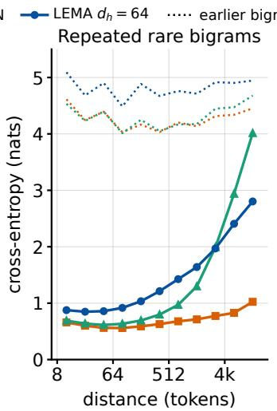

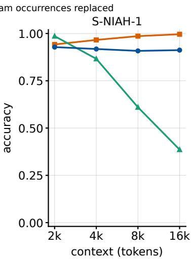  
Figure 3: Results for language models trained on FineWeb-Edu. Left: validation loss against parameter count. Middle: loss on the second token of repeated bigrams occurring rarely in training against the distance to the earlier occurrence of the bigram for the largest models, softmax transformers and GDN after context extension to 16k and LEMA without. Right: accuracy on the single-needle task S-NIAH-1 of RULER against the context length for the same models.

Mechanistic interpretability. As a LEMA head allows each position to attend to at most one prior position, the value routing between positions is explicit. The attention weights in Figure 2 (right) reveal an induction-head circuit, a mechanism hypothesized to underlie much of in-context learning (Olsson et al., 2022). For each presented pair $a _ { i } b _ { i }$ , the first layer’s head copies $a _ { i }$ into the representation at $b _ { i }$ . When $a _ { i }$ reappears after SEP, the second layer’s head can then attend to $b _ { i }$ to retrieve it. The softmax transformer implements the same mechanism but also puts attention mass on other tokens, which makes the value routing harder to trace (Appendix B.5). The mechanism also predicts behavior not seen in training: when the same $a _ { i }$ is paired with different following tokens, LEMA transformers predict the most recently paired token, while softmax transformers and GDN spread their predictions over the alternatives (Table 5). We leave it to future work to investigate whether LEMA offers interpretability benefits on more complex tasks including natural language modeling.

## 4.3 LANGUAGE MODELING

Next, we train LEMA transformers of 29 to 834 million parameters on the FineWeb-Edu dataset of high-quality text documents (Penedo et al., 2024) and compare them to softmax transformers and GDN with the same model dimensions and depths. All models are trained on around 20 tokens per parameter (Hoffmann et al., 2022) at context length 2048. Details can be found in Appendix B.7, ablations and further analyses in Appendices B.8 and B.10. The cross-entropy losses of each model on the validation set are shown in Figure 3 (left) with the precise numbers in Table 7. LEMA transformers stay clearly behind softmax transformers, matching those with 55 to 57% of their parameters from 77M on.

Long-range recall. Production-scale models combine fixed-state layers like GDN with attention layers (MiniMax et al., 2025; Kimi Team et al., 2025), as the poor recall of pure fixed-state models isolated in the synthetic recall task also shows in practice despite their competitive loss (Waleffe et al., 2024). To be a viable architecture, LEMA transformers need better long-range recall than fixed-state models. We assess this with two proxies for long-range recall in which softmax transformers outperform fixed-state architectures. In order to measure recall over longer distances, we extend the context length of softmax transformers and GDN by retraining for 1B tokens at context length 16 384, which is crucial for softmax transformers and clearly improves GDN. Context extension worsened LEMA’s recall, so we use its original checkpoints. See Appendix B.11 for details.

Repeated rare bigrams. A simple measure of recall that needs no additional data is the loss on tokens that can be copied from context (Arora et al., 2024a). In particular, we average the loss of each model over the second token y of every repeated occurrence of a bigram xy in a document of the validation set, i.e. in sequences of the form $( \dots , x , y , \dots , x , y , \dots )$ , where x does not reappear with another continuation in between and the bigram xy occurs at most 100 times per 10B training tokens. This tests a simple form of recall: copying the latest observed continuation of x, as in the induction-head circuit of Section 4.2. These tokens are then mostly parts of rare phrases like names or technical terms. Figure 21 shows examples. The measured loss resolved by the distance between the two occurrences of the bigram is shown in Figure 3 (middle), together with each model’s baseline (dotted), its loss after replacing earlier occurrences of the bigram by random tokens. The softmax transformer excels on this task even at large distances, while GDN declines sharply with distance. LEMA transformers are behind softmax transformers and GDN at short distances but degrade less with distance than GDN: in the farthest bucket their loss is still 2.1 nats below their baseline, while GDN is only 0.7 nats below its baseline and thus makes less use of earlier occurrences to improve its prediction. With intervening competing continuations, LEMA’s long-range advantage over GDN mainly holds relative to each model’s baseline. Details on the task and further numbers, including for the smaller model sizes where results are mostly similar, can be found in Appendix B.12.

Single-needle retrieval. We consider the easiest needle-in-a-haystack task from RULER, S-NIAH-1, which places a seven-digit number in a repeated filler sentence and asks for it at the end. The accuracy of generating the number, averaged over random placements of it between the filler sentences, is shown in Figure 3 (right) for context lengths up to 16k. The exact protocol and further numbers are given in Appendix B.13. Consistent with the literature, our softmax transformer performs almost perfectly up to its (extended) context length. Unlike the synthetic task, this task is solvable with a small state size in principle, but GDN fails to solve it at long contexts anyway. For our LEMA transformers, the dictionaries of an L-layer model stop changing after at most L repetitions of the filler sentence, so further repetitions leave the generated answer unchanged (Appendix B.13). Thus, successful retrieval persists indefinitely through this filler without further state growth. On further RULER tasks (Appendix B.14), GDN and LEMA rarely generate the answer at this scale, GDN more often than LEMA, while the cross-entropy of the correct answer mostly has GDN ahead at short and LEMA at long contexts.

Training limitations. Lower language-modeling loss does not consistently improve recall: training the 77M model on five times the tokens improves its loss yet worsens its bigram recall at every distance (Appendix B.15). Further, around 10% of the heads of the 834M model never find a match (Appendix B.10). Lastly, the gap to softmax transformers does not stem from stick-breaking attention: training the 77M model with continuous queries and keys and regular stick-breaking attention gives slightly lower loss than softmax and comparable bigram recall (Appendix B.8).

## 5 INFERENCE WITH LEMA TRANSFORMERS

## 5.1 AUTOREGRESSIVE GENERATION

We benchmark the generation speed of GDN, LEMA and softmax transformers of different sizes across context lengths. The time per generated token is shown in Figure 4 (top) with some exact numbers in Appendix C.3. As we do not train models at the larger sizes, all models here are untrained, which is irrelevant for softmax transformers and GDN. For LEMA transformers, we replace queries and keys with random ones during generation, which is close to the worst case for the table’s occupancy and cache locality (Appendix C.2). Grouped-query attention (GQA) (Ainslie et al., 2023), common in modern language models but not used in Figure 4, reduces the kv-cache by the group size and flattens the softmax decode curves (Appendix C.4). Appendix C.5 uses 8-fold GQA for softmax and shows LEMA throughput comparable to GDN at large batch sizes.

Softmax transformer and GDN implementation. We use vLLM (Kwon et al., 2023) as a performant baseline (Appendix C.1). When generating a single sequence, generation speed is bottlenecked by the streaming of model weights and kv-cache from VRAM to the GPU cores (Shazeer, 2019; Pope et al., 2023). The linearly growing kv-cache in VRAM then explains the observed linear growth of the time per generated token with context length, while the fixed-size state of GDN keeps it constant.

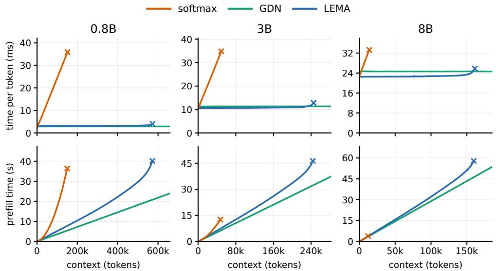  
Figure 4: Time per generated token (top) and prefill time (bottom) against context length at batch size 1 on an RTX 3090. LEMA uses random queries and keys. Crosses mark the VRAM limit for softmax and 95% occupancy of LEMA’s 50 GB hash table in main memory.

LEMA implementation. We implement the kv-caches of all heads as a single open-addressing hash table with linear probing in main memory, in place of the trie-based dictionaries used for Theorem 2. For each generated token, only the model’s weights then need to be streamed from VRAM to the GPU cores. Queries, keys and values for each layer are moved to the CPU and used to query and update the kv-cache there as shown in the code in Figure 1. As long as the hash table is not near its capacity limit, LEMA transformers generate at a constant speed comparable to that of GDN despite their growing state. For the trained 834M model, the dictionaries hold on average 1.7k entries per head after 16k tokens and 18k after 256k tokens (Table 12). Trained models therefore reach the table’s capacity at larger context lengths than the random codes used here (Appendix C.2).

## 5.2 PREFILL

Prefill processes many prompt tokens together, amortizing the GPU’s weight reads across them. For softmax transformers, the attention compute for processing a prompt is quadratic in its length, while LEMA transformers achieve linear-time prefill away from table capacity with alternating lookups and inserts, as does GDN with its chunked kernel. Figure 4 (bottom) shows the measured prefill times, with exact numbers in Appendix C.3.

## 6 DISCUSSION AND FUTURE WORK

LEMA transformers simulate word-RAMs with chain of thought and are in turn simulated by word-RAMs at a cost per token independent of the context length, closely connecting the two computational models. In practice, generation speed is comparable to that of GDN, and the cache can live in main memory rather than VRAM.

The proposed training method successfully exploits the growing state of LEMA on synthetic recall. The general language models trained with it, while showing some promising results relative to GDN on our long-range recall proxies, remain far behind softmax transformers. We believe the training method contributes to this gap: hardening can be sensitive to the learning rate, some attention heads never find matches, and longer training can worsen recall. Improving the training method is therefore a priority for future work. Finally, training with the surrogate still requires quadratic compute.

Unlocking extreme context lengths therefore calls for robust length generalization, as observed on synthetic recall and S-NIAH-1, or a subquadratic training method.

## ACKNOWLEDGMENTS

The author is grateful for support by the German Research Foundation through Project 553088969 as well as the Cluster of Excellence “Machine Learning—New Perspectives for Science” (EXC 2064/1 number 390727645).

## REFERENCES

Kirill Afendulev, Alexey Dontsov, Elena Tutubalina, and Anton Korznikov. What attention recalls and recurrence controls in hybrid language models. In Findings ofthe Associationfor Computational Linguistics: EMNLP 2026, 2026.

Milad Aghajohari, Kamran Chitsaz, Amirhossein Kazemnejad, Sarath Chandar, Alessandro Sordoni, Aaron Courville, and Siva Reddy. The Markovian thinker: Architecture-agnostic linear scaling of reasoning. In International Conference on Learning Representations (ICLR), 2026. arXiv:2510.06557.

Joshua Ainslie, James Lee-Thorp, Michiel de Jong, Yury Zemlyanskiy, Federico Lebrón, and Sumit Sanghai. GQA: Training generalized multi-query transformer models from multi-head checkpoints. In Proceedings ofthe 2023 Conference on Empirical Methods in Natural Language Pro cessing, 2023.

Simran Arora, Sabri Eyuboglu, Aman Timalsina, Isys Johnson, Michael Poli, James Zou, Atri Rudra, and Christopher Ré. Zoology: Measuring and improving recall in efficient language models. In International Conference on Learning Representations (ICLR), 2024a. arXiv:2312.04927.

Simran Arora, Sabri Eyuboglu, Michael Zhang, Aman Timalsina, Silas Alberti, James Zou, Atri Rudra, and Christopher Ré. Simple linear attention language models balance the recall-throughput tradeoff. In International Conference on Machine Learning (ICML), 2024b.

Ali Behrouz, Peilin Zhong, and Vahab Mirrokni. Titans: Learning to memorize at test time. In Advances in Neural Information Processing Systems (NeurIPS), 2025. arXiv:2501.00663.

Yoshua Bengio, Nicholas Léonard, and Aaron Courville. Estimating or propagating gradients through stochastic neurons for conditional computation. arXiv preprint arXiv:1308.3432, 2013.

Vincent-Pierre Berges, Barlas Oguz, Daniel Haziza, Wen-tau Yih, Luke Zettlemoyer, and Gargi˘ Ghosh. Memory layers at scale. In International Conference on Machine Learning (ICML), 2025. arXiv:2412.09764.

Moritz Brösamle and Stephan Eckstein. The expressive power of low precision softmax transformers with (summarized) chain-of-thought. In International Conference on Machine Learning (ICML), 2026. arXiv:2605.18079.

Loïc Cabannes, Pierre-Emmanuel Mazaré, Gergely Szilvasy, Matthijs Douze, Maria Lomeli, Ilze Amanda Auzina, Justin Carpentier, Gabriel Synnaeve, and Hervé Jégou. Sparse delta memory: Scaling the state of linear RNNs through sparsity. arXiv preprint arXiv:2607.07386, 2026.

Shouyuan Chen, Sherman Wong, Liangjian Chen, and Yuandong Tian. Extending context window of large language models via positional interpolation. arXiv preprint arXiv:2306.15595, 2023.

Zhuoming Chen, Ranajoy Sadhukhan, Zihao Ye, et al. MagicPIG: LSH sampling for efficient LLM generation. In International Conference on Learning Representations (ICLR), 2025.

Xin Cheng, Rui Tian, Wangding Zeng, Damai Dai, et al. Conditional memory via scalable lookup: A new axis of sparsity for large language models. arXiv preprint arXiv:2601.07372, 2026.

Matthieu Courbariaux, Itay Hubara, Daniel Soudry, Ran El-Yaniv, and Yoshua Bengio. Binarized neural networks: Training deep neural networks with weights and activations constrained to +1 or −1. arXiv preprint arXiv:1602.02830, 2016.

Róbert Csordás, Kazuki Irie, and Jürgen Schmidhuber. The neural data router: Adaptive control flow in transformers improves systematic generalization. In International Conference on Learning Representations (ICLR), 2022.

Wanyun Cui. A hippocampus for linear attention: An exact memory for what the recurrent state forgets. arXiv preprint arXiv:2607.02303, 2026.

Tri Dao. FlashAttention-2: Faster attention with better parallelism and work partitioning. In International Conference on Learning Representations (ICLR), 2024.

Tri Dao and Albert Gu. Transformers are SSMs: Generalized models and efficient algorithms through structured state space duality. In International Conference on Machine Learning (ICML), 2024.

DeepSeek-AI. DeepSeek-V2: A strong, economical, and efficient mixture-of-experts language model. arXiv preprint arXiv:2405.04434, 2024.

DeepSeek-AI. DeepSeek-V3.2: Pushing the frontier of open large language models. arXiv preprint arXiv:2512.02556, 2025.

Aditya Desai, Shuo Yang, Alejandro Cuadron, Matei Zaharia, Joseph E. Gonzalez, and Ion Stoica. HashAttention: Semantic sparsity for faster inference. In International Conference on Machine Learning (ICML), 2025.

Jeffrey L. Elman. Finding structure in time. Cognitive Science, 14(2):179–211, 1990.

Michael L. Fredman and Dan E. Willard. Surpassing the information theoretic bound with fusion trees. Journal ofComputer and System Sciences, 47(3):424–436, 1993.

Dan Friedman, Alexander Wettig, and Danqi Chen. Learning transformer programs. In Advances in Neural Information Processing Systems (NeurIPS), 2023. arXiv:2306.01128.

Ping Gong, Jiawei Yi, Shengnan Wang, et al. HATA: Trainable and hardware-efficient hash-aware top-k attention for scalable large model inference. In Findings of the Association for Computational Linguistics: ACL 2025, 2025.

Albert Gu and Tri Dao. Mamba: Linear-time sequence modeling with selective state spaces. In Conference on Language Modeling (COLM), 2024.

Albert Gu, Karan Goel, and Christopher Ré. Efficiently modeling long sequences with structured state spaces. In International Conference on Learning Representations (ICLR), 2022.

Han Guo, Songlin Yang, Tarushii Goel, Eric P. Xing, Tri Dao, and Yoon Kim. Log-linear attention. In International Conference on Learning Representations (ICLR), 2026. arXiv:2506.04761.

Torben Hagerup. Sorting and searching on the word RAM. In Symposium on Theoretical Aspects of Computer Science (STACS), 1998.

Michael Hahn. Theoretical limitations of self-attention in neural sequence models. Transactions of the Associationfor Computational Linguistics, 8:156–171, 2020.

Sepp Hochreiter and Jürgen Schmidhuber. Long short-term memory. Neural Computation, 9(8): 1735–1780, 1997.

Jordan Hoffmann, Sebastian Borgeaud, Arthur Mensch, et al. An empirical analysis of computeoptimal large language model training. In Advances in Neural Information Processing Systems (NeurIPS), 2022. arXiv:2203.15556.

Coleman Hooper, Sehoon Kim, Hiva Mohammadzadeh, Michael W. Mahoney, Yakun Sophia Shao, Kurt Keutzer, and Amir Gholami. KVQuant: Towards 10 million context length LLM inference with KV cache quantization. In Advances in Neural Information Processing Systems (NeurIPS), 2024.

Mark Horton, Tergel Molom-Ochir, Peter Liu, Bhavna Gopal, Chiyue Wei, Cong Guo, Brady Taylor, Deliang Fan, Shan X. Wang, Hai Li, and Yiran Chen. Hamming attention distillation: Binarizing keys and queries for efficient long-context transformers. arXiv preprint arXiv:2502.01770, 2025.

Cheng-Ping Hsieh, Simeng Sun, Samuel Kriman, Shantanu Acharya, Dima Rekesh, Fei Jia, Yang Zhang, and Boris Ginsburg. RULER: What’s the real context size of your long-context language models? In Conference on Language Modeling (COLM), 2024. arXiv:2404.06654.

Samy Jelassi, David Brandfonbrener, Sham M. Kakade, and Eran Malach. Repeat after me: Transformers are better than state space models at copying. In International Conference on Machine Learning (ICML), 2024.

Angelos Katharopoulos, Apoorv Vyas, Nikolaos Pappas, and François Fleuret. Transformers are RNNs: Fast autoregressive transformers with linear attention. In International Conference on Machine Learning (ICML), 2020.

Kimi Team, Yu Zhang, Zongyu Lin, Xingcheng Yao, et al. Kimi Linear: An expressive, efficient attention architecture. arXiv preprint arXiv:2510.26692, 2025.

Nikita Kitaev, Łukasz Kaiser, and Anselm Levskaya. Reformer: The efficient transformer. In International Conference on Learning Representations (ICLR), 2020.

Donald E. Knuth. The Art of Computer Programming, Volume 3: Sorting and Searching. Addison-Wesley, 2nd edition, 1998.

Karol Kurach, Marcin Andrychowicz, and Ilya Sutskever. Neural random-access machines. In International Conference on Learning Representations (ICLR), 2016. arXiv:1511.06392.

Woosuk Kwon, Zhuohan Li, Siyuan Zhuang, Ying Sheng, Lianmin Zheng, Cody Hao Yu, Joseph E. Gonzalez, Hao Zhang, and Ion Stoica. Efficient memory management for large language model serving with PagedAttention. In Proceedings ofthe 29th Symposium on Operating Systems Principles (SOSP), 2023.

Guillaume Lample, Alexandre Sablayrolles, Marc’Aurelio Ranzato, Ludovic Denoyer, and Hervé Jégou. Large memory layers with product keys. In Advances in Neural Information Processing Systems (NeurIPS), 2019.

Wonbeom Lee, Jungi Lee, Junghwan Seo, and Jaewoong Sim. InfiniGen: Efficient generative inference of large language models with dynamic KV cache management. In USENIX Symposium on Operating Systems Design and Implementation (OSDI), 2024.

Yanhong Li, Anej Svete, Ashish Sabharwal, and William Merrill. Efficiently representing algorithms with chain-of-thought transformers. arXiv preprint arXiv:2606.19697, 2026.

Zhiyuan Li, Hong Liu, Denny Zhou, and Tengyu Ma. Chain of thought empowers transformers to solve inherently serial problems. In International Conference on Learning Representations (ICLR), 2024.

Lucas D. Lingle. Transformer-VQ: Linear-time transformers via vector quantization. In International Conference on Learning Representations (ICLR), 2024.

Di Liu, Meng Chen, Baotong Lu, et al. RetrievalAttention: Accelerating long-context LLM inference via vector retrieval. In Advances in Neural Information Processing Systems (NeurIPS), 2025a. arXiv:2409.10516.

Jing Liu, Zizheng Pan, Haoyu He, Jianfei Cai, and Bohan Zhuang. EcoFormer: Energy-saving attention with linear complexity. In Advances in Neural Information Processing Systems (NeurIPS), 2022.

Jingwen Liu, Hantao Yu, Clayton Sanford, Alexandr Andoni, and Daniel Hsu. Fast attention mechanisms: A tale of parallelism. In Advances in Neural Information Processing Systems (NeurIPS), 2025b. arXiv:2509.09001.

Zirui Liu, Jiayi Yuan, Hongye Jin, Shaochen Zhong, Zhaozhuo Xu, Vladimir Braverman, Beidi Chen, and Xia Hu. KIVI: A tuning-free asymmetric 2bit quantization for KV cache. In International Conference on Machine Learning (ICML), 2024.

Ilya Loshchilov and Frank Hutter. Decoupled weight decay regularization. In International Conference on Learning Representations (ICLR), 2019.

Enzhe Lu, Zhejun Jiang, Jingyuan Liu, et al. MoBA: Mixture of block attention for longcontext LLMs. In Advances in Neural Information Processing Systems (NeurIPS), 2025. arXiv:2502.13189.

William Merrill and Ashish Sabharwal. The expressive power of transformers with chain of thought. In International Conference on Learning Representations (ICLR), 2024.

William Merrill, Ashish Sabharwal, and Noah A. Smith. Saturated transformers are constant-depth threshold circuits. Transactions of the Association for Computational Linguistics, 10:843–856, 2022.

MiniMax, Aonian Li, Bangwei Gong, Bo Yang, et al. MiniMax-01: Scaling foundation models with lightning attention. arXiv preprint arXiv:2501.08313, 2025.

Piotr Nawrot, Adrian Łancucki, Marcin Chochowski, David Tarjan, and Edoardo M. Ponti. Dynamic´ memory compression: Retrofitting LLMs for accelerated inference. In International Conference on Machine Learning (ICML), 2024.

Destiny Okpekpe and Antonio Orvieto. Revisiting associative recall in modern recurrent models. arXiv preprint arXiv:2508.19029, 2025.

Catherine Olsson, Nelson Elhage, Neel Nanda, et al. In-context learning and induction heads. Transformer Circuits Thread; arXiv:2209.11895, 2022.

Siddharth Pal and Viktoria Rojkova. Remembering distinct items, not tokens: A learnable Dirichletprocess cache between state-space models and attention. arXiv preprint arXiv:2607.09889, 2026.

Guilherme Penedo, Hynek Kydlícek, Loubna Ben Allal, Anton Lozhkov, Margaret Mitchell, Colinˇ Raffel, Leandro Von Werra, and Thomas Wolf. The FineWeb datasets: Decanting the web for the finest text data at scale. In Advances in Neural Information Processing Systems (NeurIPS), Datasets and Benchmarks Track, 2024.

Jorge Pérez, Pablo Barceló, and Javier Marinkovic. Attention is Turing-complete. ´ Journal of Machine Learning Research, 22(75):1–35, 2021.

Michael Poli, Armin W. Thomas, Eric Nguyen, Pragaash Ponnusamy, Björn Deiseroth, Kristian Kersting, Taiji Suzuki, Brian Hie, Stefano Ermon, Christopher Ré, Ce Zhang, and Stefano Massaroli. Mechanistic design and scaling of hybrid architectures. In International Conference on Machine Learning (ICML), 2024.

Reiner Pope, Sholto Douglas, Aakanksha Chowdhery, Jacob Devlin, James Bradbury, Anselm Levskaya, Jonathan Heek, Kefan Xiao, Shivani Agrawal, and Jeff Dean. Efficiently scaling transformer inference. In Proceedings ofMachine Learning and Systems (MLSys), 2023.

Alexander Pritzel, Benigno Uria, Sriram Srinivasan, Adrià Puigdomènech Badia, Oriol Vinyals, Demis Hassabis, Daan Wierstra, and Charles Blundell. Neural episodic control. In International Conference on Machine Learning (ICML), 2017.

Qwen Team. Qwen3-Next: Towards ultimate training & inference efficiency. https://qwen. ai/blog?id=4074cca80393150c248e508aa62983f9cb7d27cd, 2025.

Alec Radford, Jeffrey Wu, Rewon Child, David Luan, Dario Amodei, and Ilya Sutskever. Language models are unsupervised multitask learners. OpenAI blog, 1(8), 2019.

Jack W. Rae, Jonathan J. Hunt, Ivo Danihelka, Timothy Harley, Andrew Senior, Greg Wayne, Alex Graves, and Timothy P. Lillicrap. Scaling memory-augmented neural networks with sparse reads and writes. In Advances in Neural Information Processing Systems (NeurIPS), 2016.

Colin Raffel, Minh-Thang Luong, Peter J. Liu, Ron J. Weiss, and Douglas Eck. Online and lineartime attention by enforcing monotonic alignments. In International Conference on Machine Learning (ICML), 2017.

Aurko Roy, Mohammad Saffar, Ashish Vaswani, and David Grangier. Efficient content-based sparse attention with routing transformers. Transactions of the Association for Computational Linguistics, 9:53–68, 2021.

Baptiste Rozière, Jonas Gehring, Fabian Gloeckle, et al. Code Llama: Open foundation models for code. arXiv preprint arXiv:2308.12950, 2023.

Imanol Schlag, Kazuki Irie, and Jürgen Schmidhuber. Linear transformers are secretly fast weight programmers. In International Conference on Machine Learning (ICML), 2021.

Noam Shazeer. Fast transformer decoding: One write-head is all you need. arXiv preprint arXiv:1911.02150, 2019.

Noam Shazeer. GLU variants improve transformer. arXiv preprint arXiv:2002.05202, 2020.

Noam Shazeer, Azalia Mirhoseini, Krzysztof Maziarz, Andy Davis, Quoc Le, Geoffrey Hinton, and Jeff Dean. Outrageously large neural networks: The sparsely-gated mixture-of-experts layer. In International Conference on Learning Representations (ICLR), 2017.

Ying Sheng, Lianmin Zheng, Binhang Yuan, Zhuohan Li, Max Ryabinin, Beidi Chen, Percy Liang, Christopher Ré, Ion Stoica, and Ce Zhang. FlexGen: High-throughput generative inference of large language models with a single GPU. In International Conference on Machine Learning (ICML), 2023.

Jianlin Su, Murtadha Ahmed, Yu Lu, Shengfeng Pan, Wen Bo, and Yunfeng Liu. RoFormer: Enhanced transformer with rotary position embedding. Neurocomputing, 568:127063, 2024.

Sainbayar Sukhbaatar, Edouard Grave, Piotr Bojanowski, and Armand Joulin. Adaptive attention span in transformers. In Proceedings of the 57th Annual Meeting of the Association for Computational Linguistics, 2019.

Yu Sun, Xinhao Li, Karan Dalal, et al. Learning to (learn at test time): RNNs with expressive hidden states. In International Conference on Machine Learning (ICML), 2025. arXiv:2407.04620.

Shawn Tan, Songlin Yang, Aaron Courville, Rameswar Panda, and Yikang Shen. Scaling stickbreaking attention: An efficient implementation and in-depth study. In International Conference on Learning Representations (ICLR), 2025.

Jiaming Tang, Yilong Zhao, Kan Zhu, Guangxuan Xiao, Baris Kasikci, and Song Han. Quest: Query-aware sparsity for efficient long-context LLM inference. In International Conference on Machine Learning (ICML), 2024.

Ashish Vaswani, Noam Shazeer, Niki Parmar, Jakob Uszkoreit, Llion Jones, Aidan N. Gomez, Łukasz Kaiser, and Illia Polosukhin. Attention is all you need. In Advances in Neural Information Processing Systems (NeurIPS), 2017.

Petar Velickovi ˇ c, Christos Perivolaropoulos, Federico Barbero, and Razvan Pascanu. Softmax is´ not enough (for sharp size generalisation). In International Conference on Machine Learning (ICML), 2025.

Jesse Vig and Yonatan Belinkov. Analyzing the structure of attention in a transformer language model. In Proceedings of the ACL Workshop BlackboxNLP: Analyzing and Interpreting Neural Networksfor NLP, 2019.

Roger Waleffe, Wonmin Byeon, Duncan Riach, Brandon Norick, Vijay Korthikanti, Tri Dao, Albert Gu, Ali Hatamizadeh, Sudhakar Singh, Deepak Narayanan, Garvit Kulshreshtha, Vartika Singh, Jared Casper, Jan Kautz, Mohammad Shoeybi, and Bryan Catanzaro. An empirical study of Mamba-based language models. arXiv preprint arXiv:2406.07887, 2024.

Wenhao Wu, Yizhong Wang, Guangxuan Xiao, Hao Peng, and Yao Fu. Retrieval head mechanistically explains long-context factuality. In International Conference on Learning Representations (ICLR), 2025. arXiv:2404.15574.

Yuhuai Wu, Markus N. Rabe, DeLesley Hutchins, and Christian Szegedy. Memorizing transformers. In International Conference on Learning Representations (ICLR), 2022.

Chaodong Xiao, Zhengqiang Zhang, and Lei Zhang. BinaryAttention: One-bit QK-attention for vision and diffusion transformers. In IEEE Conference on Computer Vision and Pattern Recognition (CVPR), 2026. arXiv:2603.09582.

Guangxuan Xiao, Yuandong Tian, Beidi Chen, Song Han, and Mike Lewis. Efficient streaming language models with attention sinks. In International Conference on Learning Representations (ICLR), 2024.

Wenhan Xiong, Jingyu Liu, Igor Molybog, et al. Effective long-context scaling of foundation models. In Proceedings ofthe 2024 Conference ofthe North American Chapter ofthe Associationfor Computational Linguistics: Human Language Technologies (NAACL), 2024. arXiv:2309.16039.

Yuchen Yan, Yongliang Shen, Yang Liu, Jin Jiang, Mengdi Zhang, Jian Shao, and Yueting Zhuang. InftyThink: Breaking the length limits of long-context reasoning in large language models. In International Conference on Learning Representations (ICLR), 2026. arXiv:2503.06692.

Andy Yang, David Chiang, and Dana Angluin. Masked hard-attention transformers recognize exactly the star-free languages. In Advances in Neural Information Processing Systems (NeurIPS), 2024a. arXiv:2310.13897.

Chenxiao Yang, Nathan Srebro, David McAllester, and Zhiyuan Li. PENCIL: Long thoughts with short memory. In International Conference on Machine Learning (ICML), 2025a. arXiv:2503.14337.

Songlin Yang and Yu Zhang. FLA: A Triton-based library for hardware-efficient implementations of linear attention mechanism. https://github.com/fla-org/ flash-linear-attention, 2024.

Songlin Yang, Bailin Wang, Yu Zhang, Yikang Shen, and Yoon Kim. Parallelizing linear transformers with the delta rule over sequence length. In Advances in Neural Information Processing Systems (NeurIPS), 2024b.

Songlin Yang, Jan Kautz, and Ali Hatamizadeh. Gated delta networks: Improving Mamba2 with delta rule. In International Conference on Learning Representations (ICLR), 2025b.

Penghang Yin, Jiancheng Lyu, Shuai Zhang, Stanley Osher, Yingyong Qi, and Jack Xin. Understanding straight-through estimator in training activation quantized neural nets. In International Conference on Learning Representations (ICLR), 2019.

Jingyang Yuan, Huazuo Gao, Damai Dai, et al. Native sparse attention: Hardware-aligned and natively trainable sparse attention. In Proceedings ofthe 63rd Annual Meeting ofthe Association for Computational Linguistics, 2025. arXiv:2502.11089.

Biao Zhang and Rico Sennrich. Root mean square layer normalization. In Advances in Neural Information Processing Systems (NeurIPS), 2019.

Zhenyu Zhang, Ying Sheng, Tianyi Zhou, et al. H2O: Heavy-hitter oracle for efficient generative inference of large language models. In Advances in Neural Information Processing Systems (NeurIPS), 2023.

Tianyu Zhao and Llion Jones. Fast-weight product key memory. arXiv preprint arXiv:2601.00671, 2026.

## A ADDITIONAL MATERIAL FOR SECTION 3

## A.1 WORD-RAMS

There are many definitions of word-RAMs, differing $\mathrm { e . g . }$ . in the instruction set or how input and output are handled. Our definitions choose these aspects in ways that make Theorem 1 and Theorem 2 particularly clean, but changing the word-RAM definition to another common one would mainly change the results by moving factors of w and changing where the input and output lengths enter the scalings.

For $k \in \mathbb N ,$ , write $[ k ] : = \{ 0 , \ldots , k - 1 \}$ and identify $\left[ 2 ^ { w } \right]$ with the set of w-bit words $\{ 0 , 1 \} ^ { w }$

Definition 2 (Word-RAM). A word-RAM is a triple $\boldsymbol { M } = ( P , r , w )$ consisting of integers w $\geq 2$ and $1 \leq r \leq 2 ^ { w }$ , and a nonempty program $P = ( \bar { I } _ { 0 } , \ldots , I _ { | P | - 1 } )$ with $| P | \le 2 ^ { \overline { { w } } }$ . Every instruction has one of the forms

$$
\begin{array} { l l } { { R _ { i }  c , } } & { { R _ { i }  R _ { j } \odot R _ { j ^ { \prime } } , ~ R _ { i }  \mathrm { m s b } ( R _ { j } ) , } } \\ { { R _ { i }  \mathrm { m e m } [ R _ { j } ] , } } & { { \mathrm { m e m } [ R _ { i } ]  R _ { j } , ~ \mathrm { i f } ~ R _ { i } \not = 0 ~ \mathrm { g o t o } ~ R _ { j } , } } \end{array}
$$

where $i , j , j ^ { \prime } \in [ r ] , c \in [ 2 ^ { w } ] ,$ , and

$$
\begin{array} { r } { \odot \ \in \ \{ + , - , \times , \ll , \gg , \land , \lor , \mathrm { x o r } , < , \leq , = , \neq \} . } \end{array}
$$

Arithmetic operations are unsigned modulo $2 ^ { w }$ . Shift operations are defined as $a \ll b = ( a$ $2 ^ { b } )$ mod $2 ^ { w }$ and $a \gg b = \lfloor \bar { a / 2 ^ { b } } \rfloor$ . Boolean operations $\wedge , \vee$ , xor act bitwise, and comparisons return 0 or 1. Finally,

$$
\operatorname { m s b } ( a ) : = { \left\{ \begin{array} { l l } { \lfloor \log _ { 2 } a \rfloor , } & { a > 0 , } \\ { 0 , } & { a = 0 . } \end{array} \right. }
$$

Definition 3 (Execution). A configuration is a triple $\gamma = ( \mathtt { p c } , \rho , \mu )$ with $\mathtt { p c } \in [ | P | ] \cup \{ \perp \}$ , register state $\rho : [ r ]  [ 2 ^ { w } ]$ , and memory state $\mu : [ 2 ^ { w } ] \to [ 2 ^ { w } ]$ . It is halting exactly when $\mathtt { p c } = \perp$

For $g \in [ | P | ]$ , let nex $\operatorname { t } ( g ) = g + 1 \operatorname { i f } g + 1 < | P |$ , and nex $\operatorname { t } ( g ) = \bot$ otherwise. From a non-halting configuration, first set $\mathtt { p c } ^ { \prime } = \mathtt { n e x t } ( \mathtt { p c } ) , \rho ^ { \prime } = \rho$ and $\mu ^ { \prime } = \mu$ , and then apply the relevant update:

$$
\begin{array} { r l r l } & { R _ { i }  c } & & { \rho ^ { \prime } ( i ) = c , } \\ & { R _ { i }  R _ { j } \odot R _ { j ^ { \prime } } } & & { \rho ^ { \prime } ( i ) = \rho ( j ) \odot \rho ( j ^ { \prime } ) , } \\ & { R _ { i }  \operatorname * { m s b } ( R _ { j } ) } & & { \rho ^ { \prime } ( i ) = \operatorname * { m s b } ( \rho ( j ) ) , } \\ & { R _ { i }  \operatorname * { m e m } [ R _ { j } ] } & & { \rho ^ { \prime } ( i ) = \mu ( \rho ( j ) ) , } \\ & { \operatorname * { m e m } [ R _ { i } ]  R _ { j } } & & { \mu ^ { \prime } ( \rho ( i ) ) = \rho ( j ) , } \\ & { \mathrm { i ~ f ~ } R _ { i } \neq 0 \mathrm { g o t o } R _ { j } } & & { \mathrm { p c } ^ { \prime } = \rho ( j ) \mathrm { i f } \rho ( i ) \neq 0 \mathrm { a n d } \rho ( j ) < | P | , } \\ & { \mathrm { p c } ^ { \prime } = \bot \mathrm { i f } \rho ( i ) \neq 0 \mathrm { a n d } \rho ( j ) \geq | P | , } \\ & { \mathrm { h a l t } } & & { \mathrm { p c } ^ { \prime } = \bot . } \end{array}
$$

An untaken conditional jump keeps the default value next(pc).

Definition 4 (Computation, time and space). Let $x = ( x _ { 1 } , \ldots , x _ { n } ) \in [ 2 ^ { w } ] ^ { n }$ with $n < 2 ^ { w }$ . The initial configuration is

$$
\gamma _ { 0 } ( x ) = ( 0 , \rho _ { 0 } , \mu _ { 0 } ) , \qquad \rho _ { 0 } \equiv 0 , \qquad \mu _ { 0 } = ( n , x _ { 1 } , \ldots , x _ { n } , 0 , 0 , \ldots ) .
$$

If t is the first time at which the induced execution reaches a halting configuration, then M halts in t steps. Its output is $y = ( \mu _ { t } ( 1 ) , \ldots , \mu _ { t } ( m ) )$ , where $m = \mu _ { t } ( 0 )$ , and

$$
\left. \begin{array} { l } { { t _ { M } ( x ) : = t , } } \\ { { \displaystyle s _ { M } ( x ) : = r + \left| \left\{ a \in [ 2 ^ { w } ] : \begin{array} { l } { { a \leq \operatorname* { m a x } ( n , m ) , \mathrm { ~ o r ~ c e l l } a \mathrm { ~ i s ~ a c c e s s e d } } } \\ { { \mathrm { ~ d u r i n g ~ t h e ~ e x e c u t i o n } } } \end{array} \right. \right\} \right| , } } \end{array}
$$

where an access is either a load from or a store to the cell.

## A.2 LEMA TRANSFORMERS

In order to simulate LEMA transformers with word-RAMs, all computational intermediates are rounded to finite precision and we hence define floating-point formats in a standard way. Furthermore, addition with rounding is not associative anymore and hence the order of all operations needs to be fixed in order for a LEMA transformer’s forward pass to be well-defined.

Definition 5 (Floating-point formats). Consider integer mantissa and exponent precisions $p _ { m } \geq 1$ and $p _ { e } \geq 2$ , and let $e _ { \mathrm { m a x } } = 2 ^ { p _ { e } - 1 } - 1$ . The corresponding floating-point format is

$$
\begin{array} { r l } & { \mathbb { F } ( p _ { m } , p _ { e } ) : = \left\{ 0 \right\} } \\ & { \qquad \cup \left\{ ( - 1 ) ^ { s } f 2 ^ { 1 - e _ { \operatorname* { m a x } } - p _ { m } } : s \in \left\{ 0 , 1 \right\} , 1 \le f < 2 ^ { p _ { m } } \right\} } \\ & { \qquad \cup \left\{ ( - 1 ) ^ { s } ( 1 + f 2 ^ { - p _ { m } } ) 2 ^ { E - e _ { \operatorname* { m a x } } } : s \in \{ 0 , 1 \} , 1 \le E \le 2 ^ { p _ { e } } - 2 , 0 \le f < 2 ^ { p _ { m } } \right\} . } \end{array}
$$

Here $f , E \in \mathbb { Z } .$ . The second line consists of the subnormal values and the third of the normal values.   
The format’s precision is $p = 1 + p _ { e } + p _ { m }$ bits.

Let $\Omega = ( 2 - 2 ^ { - p _ { m } - 1 } ) 2 ^ { e _ { \operatorname* { m a x } } }$ . For a real number z with $| z | < \Omega$ , let $\operatorname { r d } ( z )$ be a nearest element of F, with ties broken toward the value whose least significant stored fraction bit is zero, where 0 is stored with all fields zero. For $| z | \geq \Omega$ we say that rounding z overflows and leave $\operatorname { r d } ( z )$ undefined. On its domain, rd coincides with IEEE round-to-nearest ties-to-even, including gradual underflow, since Ω is the midpoint between the largest element of $\mathbb { F }$ and $2 ^ { e _ { \mathrm { m a x } } + 1 }$ and IEEE rounding hence returns a finite value exactly when $| z | < \Omega$ . We write

$$
a \oplus b : = \operatorname { r d } ( a + b ) , \qquad a \otimes b : = \operatorname { r d } ( a b ) .
$$

A floating-point computation isfinite if none of its operations overflows.

Every scalar sum required in the matrix-matrix and matrix-vector multiplications below is evaluated from left to right, starting at 0, and every product is rounded before it is added. Coordinates in a dot product are processed in increasing order, and attention heads are accumulated in increasing head order. Bias and residual additions are performed in the order in which they are displayed.

For the simulations, we use ReLU MLPs and omit normalization and positional encodings, as specified in Section 3. The transformers constructed in Theorem 1 have residual states in $\{ - 1 , 1 \} ^ { d }$ at every sublayer boundary (Appendix A.3.2), so normalization by their root mean square would be the identity in exact arithmetic. The architecture used in the experiments is described in Appendix B.2. Throughout, $\operatorname { s g n } ( u ) = 1$ for u $\geq 0$ and $\operatorname { s g n } ( u ) = - 1$ otherwise, applied coordinatewise.

Definition 6 (LEMA transformer). A LEMA transformer T consists of a finite vocabulary V containing distinct tokens ${ < } \mathsf { O u t } \mathsf { P } >$ and <eos>, positive integers $L , H , d , d _ { h } , d _ { \mathrm { f f } }$ , a format F as in Defi nition 5, and parameters

$$
\begin{array} { r l r } & { \mathrm { e m b } , \mathrm { u n e m b } \in \mathbb { F } ^ { | \mathcal { V } | \times d } , } \\ & { W _ { Q } ^ { \ell , h } , W _ { K } ^ { \ell , h } , W _ { V } ^ { \ell , h } \in \mathbb { F } ^ { d _ { h } \times d } , } & { W _ { O } ^ { \ell , h } \in \mathbb { F } ^ { d \times d _ { h } } , } \\ & { W _ { 1 } ^ { \ell } \in \mathbb { F } ^ { d _ { \mathrm { f f } } \times d } , \ : b ^ { \ell } \in \mathbb { F } ^ { d _ { \mathrm { f f } } } , } & { W _ { 2 } ^ { \ell } \in \mathbb { F } ^ { d \times d _ { \mathrm { f f } } } } \end{array}
$$

for $\ell \in \{ 1 , \ldots , L \}$ and $h \in \{ 1 , \ldots , H \}$ . The number N ofparameters is the total number of entries in these matrices and vectors.

Definition 7 (Forward pass). Let $\tau = ( \tau _ { 1 } , \dots , \tau _ { K } ) \in \mathcal { V } ^ { K }$ with $K \geq 1$ , and set $x _ { i } ^ { ( 0 ) } = \mathrm { e m b } _ { \tau _ { i } }$ . For $\ell = 1 , \dots , L , h = 1 , \dots , H$ and $i = 1 , \dots , K$ , compute

$$
\begin{array} { r } { q _ { i } ^ { \ell , h } = \mathrm { s g n } ( W _ { Q } ^ { \ell , h } x _ { i } ^ { ( \ell - 1 ) } ) , \qquad k _ { i } ^ { \ell , h } = \mathrm { s g n } ( W _ { K } ^ { \ell , h } x _ { i } ^ { ( \ell - 1 ) } ) , \qquad v _ { i } ^ { \ell , h } = W _ { V } ^ { \ell , h } x _ { i } ^ { ( \ell - 1 ) } , } \end{array}
$$

and

$$
\left( o _ { i } ^ { \ell , h } \right) _ { i = 1 } ^ { K } = \mathrm { L E M A } \big ( ( q _ { i } ^ { \ell , h } , k _ { i } ^ { \ell , h } , v _ { i } ^ { \ell , h } ) _ { i = 1 } ^ { K } \big )
$$

as in Definition 1, followed by

$$
\begin{array} { r l r } {  { x _ { i } ^ { ( \ell - \frac { 1 } { 2 } ) } = x _ { i } ^ { ( \ell - 1 ) } + \sum _ { h = 1 } ^ { H } W _ { O } ^ { \ell , h } o _ { i } ^ { \ell , h } , } } \\ & { } & { z _ { i } ^ { \ell } = \mathrm { R e L U } ( W _ { 1 } ^ { \ell } x _ { i } ^ { ( \ell - \frac { 1 } { 2 } ) } + b ^ { \ell } ) , } \\ & { } & { x _ { i } ^ { \ell } = x _ { i } ^ { ( \ell - \frac { 1 } { 2 } ) } + W _ { 2 } ^ { \ell } z _ { i } ^ { \ell } . ~ } \end{array}
$$

Here ReL $\boldsymbol { \mathrm { \Pi } } _ { l } \boldsymbol { \mathrm { U } } ( u ) = \operatorname* { m a x } ( u , 0 )$ coordinatewise. All scalar operations and sums use the order fixed in Definition 5. The forward pass is defined only if it is finite. Its prediction is

$$
T ( \tau ) : = \operatorname * { a r g m a x } _ { \sigma \in \mathcal { V } } \left. \mathrm { u n e m b } _ { \sigma } , x _ { K } ^ { ( L ) } \right. ,
$$

with ties broken by a fixed total order on V. This order also identifies $\nu$ with $[ | \nu | ]$ when tokens are supplied to a word-RAM.

Definition 8 (Generation, time and space). Let $\mathcal { V } _ { 0 } = \mathcal { V } \setminus \left\{ < \mathrm { o u t } > , < \mathrm { e o s } > \right\}$ and let the prompt $\tau _ { 1 : n } \in \mathcal { V } ^ { n }$ be nonempty. Autoregressive generation appends

$$
\tau _ { k + 1 } = T ( \tau _ { 1 : k } ) , \qquad k \geq n .
$$

We say that $T$ generates $y \in \mathcal { V } _ { 0 } ^ { m }$ from $\tau _ { 1 : n }$ in t steps if t is minimal with $\tau _ { n + t } = < \in { \mathsf { o s s } } >$ and, for some $z \in \mathcal { V } _ { 0 } ^ { * }$

$$
( \tau _ { n + 1 } , \dots , \tau _ { n + t } ) = ( z , < \mathrm { o u t } > , y , < \mathrm { e o s } > ) .
$$

This factorization is unique because neither z nor y contains ${ < _ { \mathsf { O U L } } > _ { \mathsf { O r } } < _ { \mathsf { e O S } } > }$ . We set $t _ { T } ( \tau ) : = t$ and

$$
s _ { T } ( \tau ) : = \sum _ { \ell = 1 } ^ { L } \sum _ { h = 1 } ^ { H } \left| \{ k _ { i } ^ { \ell , h } : 1 \leq i \leq n + t - 1 \} \right| .
$$

The final <eos> token is generated but not processed and therefore contributes no key.

Finally, we need to define the encoding of word-RAM inputs and outputs into transformer tokens, which is used in Theorem 1 but not specified there.

Definition 9 (Encoding). Write bit $\mathrm { s } _ { w } ( a ) \in \{ 0 , 1 \} ^ { w }$ for the binary representation of $a \in [ 2 ^ { w } ]$ , most significant bit first, and let

$$
C _ { j } ( v ) : = ( \mathtt { m e m } , \mathtt { b i t s } _ { w } ( j ) , : , \mathtt { b i t s } _ { w } ( v ) )
$$

be the block encoding memory cell j with content v. A word sequence $a = ( a _ { 1 } , \dots , a _ { k } ) \in [ 2 ^ { w } ] ^ { k }$ with $k < 2 ^ { w }$ is encoded as its length followed by its words, one block per memory cell and separated by # tokens,

$$
\operatorname { e n c } ( a ) : = C _ { 0 } ( k ) \# C _ { 1 } ( a _ { 1 } ) \# \ \cdot \cdot \cdot \ \# \ C _ { k } ( a _ { k } ) .
$$

Note that prepending the length of input x and output y is precisely how word-RAMs in Definition 4 handle inputs and outputs. The tokens of enc belong to the constant vocabulary

$$
\mathcal { V } = \{ 0 , 1 , \# , : , \mathfrak { m } \mathrm { e m } , \mathtt { r e g } , \mathtt { p c } , < \mathrm { o u t } > , < \mathrm { e o s } > , \mathrm { s t e p } \}
$$

of the transformer in Theorem 1.

## A.3 PROOF OF THEOREM 1

In order to prove Theorem 1, we start by defining the token sequence that the LEMA transformer simulating a given word-RAM will produce for each input and show that it has the right length. The theorem is then restated, asserting the existence of a LEMA transformer with precisely specified dimensions that predicts this token sequence (Proposition 1). The proof consists of constructing this LEMA transformer, which is done in Appendix A.3.2.

## A.3.1 TOKEN SEQUENCE AND EXACT STATEMENT

Throughout, fix a word-RAM $\boldsymbol { M } = ( P , r , \boldsymbol { w } )$ and an input $x = ( x _ { 1 } , \ldots , x _ { n } ) $ on which M halts, with execution $\gamma _ { 0 } , \ldots , \gamma _ { t }$ and output y of length m. Write ${ \tt p c } _ { k }$ for the program counter of $\gamma _ { k }$ , so that $\mathtt { p c } _ { 0 } = 0$ and $\mathtt { p c } _ { k } = \perp$ only for $k = t$

The transformer keeps the state of M in the token sequence as a log of all writes. A write of the value v to the register or memory cell a is spelled out as the record

$$
D \ \mathrm { b i t s } _ { w } ( a ) : \ \mathrm { b i t s } _ { w } ( v ) \# \qquad \mathrm { w i t h } \ D \in \{ { \tt r e g } , \mathsf { m e m } \} ,
$$

which we read as $^ { 6 6 } D$ -address a now holds $v '$ . The prompt $\operatorname { e n c } ( x )$ followed by # is a sequence of such records, one for every memory cell $0 , \ldots , n$ of the initial memory $\mu _ { 0 }$ . Every step of M is then represented by the token step, followed by the record of the write the step performs, if it performs one, and by $\mathsf { p } \mathsf { C }$ and the bits of the new program counter. At any point, the current content of a register or memory cell is the value of the latest record with that address, or 0 if there is none, since $\bar { M }$ starts from the all-zero state except for the input. Finding the latest record with a given address is exactly what a LEMA head does when the address is its key.

<table><tr><td>part</td><td>tokens</td><td></td><td></td><td></td><td></td><td></td><td></td><td></td><td></td><td></td><td></td><td></td><td></td><td></td><td></td><td></td><td></td><td></td><td></td><td></td><td></td><td></td><td></td><td></td></tr><tr><td>enc(x)</td><td>mem 0 0 0 :</td><td></td><td></td><td></td><td></td><td>: 0 0 1 # mem 0 0 1 :</td><td></td><td></td><td></td><td></td><td></td><td></td><td></td><td></td><td></td><td></td><td></td><td></td><td></td><td></td><td></td><td>0 1 0</td></tr><tr><td>initial program counter</td><td># pc 0 0 0</td><td></td><td></td><td></td><td></td><td></td><td></td><td></td><td></td><td></td><td></td><td></td><td></td><td></td><td></td><td></td><td></td><td></td><td></td><td></td><td></td><td></td></tr><tr><td>step  $1 , R _ { 1 }  1$ </td><td>step reg 0 0 1 :</td><td></td><td></td><td></td><td></td><td></td><td></td><td>0 0 1 # pc 0 0 1</td><td></td><td></td><td></td><td></td><td></td><td></td><td></td><td></td><td></td><td></td><td></td><td></td><td></td><td></td></tr><tr><td>step  $2 , R _ { 0 } \gets \mathsf { m e m } [ R _ { 1 } ]$ </td><td>step reg 0 0 0 :</td><td></td><td></td><td></td><td></td><td></td><td></td><td></td><td></td><td></td><td></td><td></td><td>0 1 0 # pc 0 1 0</td><td></td><td></td><td></td><td></td><td></td><td></td><td></td><td></td><td></td></tr><tr><td>step  $3 , R _ { 0 }  R _ { 0 } + R _ { 0 }$ </td><td>step reg 0 0 0 :</td><td></td><td></td><td></td><td></td><td>: 1 0 0 # pc 0 1 1</td><td></td><td></td><td></td><td></td><td></td><td></td><td></td><td></td><td></td><td></td><td></td><td></td><td></td><td></td><td></td><td></td></tr><tr><td>step 4, mem  $[ R _ { 1 } ]  R _ { 0 }$ </td><td>step mem 0 0 1 : 1 0 0 # pc 1 0 0</td><td></td><td></td><td></td><td></td><td></td><td></td><td></td><td></td><td></td><td></td><td></td><td></td><td></td><td></td><td></td><td></td><td></td><td></td><td></td><td></td><td></td></tr><tr><td>step 5, halt</td><td>step &lt;out&gt;</td><td></td><td></td><td></td><td></td><td></td><td></td><td></td><td></td><td></td><td></td><td></td><td></td><td></td><td></td><td></td><td></td><td></td><td></td><td></td><td></td><td></td></tr><tr><td>enc(y)</td><td></td><td></td><td></td><td></td><td></td><td></td><td></td><td></td><td></td><td></td><td></td><td></td><td></td><td></td><td></td><td></td><td></td><td></td><td></td><td></td><td></td><td>mem 0 0 0 : 0 0 1 # mem 0 0 1 : 1 0 0 &lt;eos&gt;</td></tr></table>

Figure 5: The transcript for $w = 3 ,$ , the program $P = ( R _ { 1 }  1 , R _ { 0 }  \mathsf { m e m } [ R _ { 1 } ] , R _ { 0 }  R _ { 0 } +$ $R _ { 0 }$ , mem $[ R _ { 1 } ]  R _ { 0 }$ , halt) and the input $x = ( 2 )$ , which produces the output $y = ( 4 )$ . Consecutive tokens are separated by one space, so every word consists of three bit tokens, and the rows are to be read as one sequence. Everything after enc(x) is generated.

Definition 10 (Transcript). For $k \in \{ 1 , \ldots , t \}$ let $W _ { k }$ be the empty sequence if step k does not write, and otherwise

$$
W _ { k } = ( D _ { k } , \mathrm { b i t s } _ { w } ( a _ { k } ) , : , \mathrm { b i t s } _ { w } ( v _ { k } ) , \# )
$$

if step k writes the value $v _ { k }$ to the address $a _ { k }$ of type $D _ { k } \in \{ { \mathrm { r e g } } , { \mathrm { m e m } } \}$ . The transcript of M on x is the token sequence

$$
\begin{array} { r l } & { \tau ( x ) = \mathrm { e n c } ( x ) \mathrm { ~ } \# \mathrm { p c ~ b i t s } _ { w } ( 0 ) } \\ & { \qquad \bigl ( \mathrm { s t e p ~ } W _ { 1 } \mathrm { ~ p c ~ b i t s } _ { w } ( \mathsf { p c } _ { 1 } ) \bigr ) \cdots \bigl ( \mathrm { s t e p ~ } W _ { t - 1 } \mathrm { ~ p c ~ b i t s } _ { w } ( \mathsf { p c } _ { t - 1 } ) \bigr ) } \\ & { \qquad \mathrm { s t e p ~ } W _ { t } \mathrm { ~ } { < } \mathrm { o u t } > \mathrm { ~ e n c } ( y ) < \mathsf { e o s } > } \end{array}\tag{2}
$$

over the vocabulary of Definition 9.

Figure 5 shows an example. The initial program counter block has $w + 2$ tokens, every step except the last contributes at most $3 w + 5$ tokens, the last step contributes at most $2 w + 6$ tokens plus enc(y), and $| \operatorname { e n c } ( y ) | = ( m + 1 ) ( 2 w + 3 ) - 1$ . Hence

$$
| \tau ( x ) | - | \mathrm { e n c } ( x ) | \le t ( 3 w + 5 ) + ( m + 1 ) ( 2 w + 3 ) + 2 .\tag{3}
$$

The transcript is designed so that the current state of M can be read off with latest-match lookups. Before <out>, the records of the transcript are the initial memory cells $0 , \ldots , n$ and then the writes of the steps in the order in which they are executed, and every record is complete before the next step token. This gives the following lemma, which is the heart of the construction.

Lemma 2 (Latest write). Let i be the position of the step token of step k, or any position after $< o u t > ,$ in which case put $k = t + 1$ . Fix $\theta \in \{ { x \in g } ,$ , mem} and an address a, and consider the records $o f \tau ( x )$ that lie before i and before ${ < o u t > } _ { \mathrm { { } } }$ , and have type θ and address a. Ifthere is such a record, the value of the latest one is the content of θ-address a in $\gamma _ { k - 1 }$ . If there is none, this content is 0.

Proof. The records before i and before $< _ { \mathrm { O U } } \chi > \mathrm { a r e }$ , in this order, $( \mathrm { m e m } , j , \mu _ { 0 } ( j ) )$ for $j = 0 , \ldots , n$ and then the writes of steps $1 , \ldots , k - 1$ . By Definitions 3 and $4 , \gamma _ { k - 1 }$ arises from the all-zero register and memory state by exactly these writes in this order, since the cells $0 , \ldots , n$ are the only nonzero cells of $\mu _ { 0 } . \mathrm { { A } }$ sequence of writes leaves at every address the value of the last write to it, or 0 if there is none. □

We now state precisely what will be constructed, with explicit sizes.

Proposition 1. There is a LEMA transformer T over the vocabulary ofDefinition 9 with

$$
L = 2 w + 6 , \qquad H = 3 , \qquad d = 9 w + 6 2 , \qquad d _ { h } = w + 5 , \qquad d _ { \mathrm { f f } } \leq | P | + 2 1 w + 2 3 w + \qquad N = 6 . 5 .
$$

and integer parameters ofmagnitude at most max $[ w + 1 , 5 )$ , such that, for every input x on which M halts, the following holds with $\tau = \tau ( x )$ and theforwardpass ofT evaluated in exact arithmetic:

$$
( i ) \ T ( \tau _ { 1 : i } ) = \tau _ { i + 1 } f o r a l l | \ e n c ( x ) | \leq i < | \tau | , i . e . \ T c o n t i n u e s \ e n c ( x ) t o \ \tau ,
$$

Table 1: The layers of the construction.
<table><tr><td>layers</td><td>module</td><td>what is known afterwards</td></tr><tr><td>1</td><td>structure</td><td>token kinds, latest marker, roles of the positions</td></tr><tr><td> $1 , \ldots , w$ </td><td>window</td><td>at every position: the bits of the w tokens before it</td></tr><tr><td> $w + 1$ </td><td>records and decoding</td><td>at every # before &lt;out&gt;: type, address and value of its record. At every step: the instruction, the registers to read.</td></tr><tr><td> $w + 2 , w + 3$ </td><td>reading the state</td><td>At every output #: the next cell at every step: the operands, and the loaded cell for a load. At every output control position: the cell to emit</td></tr><tr><td> $w + 4 , \ldots , 2 w + 4$ </td><td>arithmetic</td><td>at every step: the result of the operation</td></tr><tr><td> $2 w + 5$ </td><td>assembly</td><td>at every control position: the record to emit, the next pro- gram counter, halting</td></tr><tr><td> $2 w + 6$ </td><td>emission</td><td>at every position: the next token</td></tr></table>

(ii) every intermediate value, including every partial sum in the evaluation order of Definition 5, is an integer of magnitude at most max(2w + 3, 11), and

(iii) the keys of T on τ satisfy $s _ { T } \leq 3 s _ { M } ( x ) + 6 w + 2 5 .$

ProofofTheorem 1from Proposition 1. Choose the format $\mathbb { F } ( p _ { m } , p _ { e } )$ with $p _ { m } = \lceil \log _ { 2 } \operatorname* { m a x } ( 2 w +$ $3 , 1 1 ) ]$ and $p _ { e } = \lceil \log _ { 2 } ( p _ { m } + 2 ) \rceil + 1$ . Its normal numbers with exponents up to $p _ { m }$ include every integer of magnitude below 2pm+1, and $e _ { \mathrm { m a x } } \geq p _ { m } + 1$ , so by (ii) every parameter and every value of the forward pass on a prefix of τ is representable. Hence rd acts as the identity, no operation overflows, and the floating-point forward pass coincides with the exact one, so (i) holds for the floating-point transformer with the chosen format as well. The precision of this transformer is $p = 1 + p _ { m } + p _ { e } = \mathcal { O } ( \log w )$ , and its other sizes are the stated O-bounds. By (i), greedy generation from the prompt enc(x) produces $\tau _ { | \mathrm { e n c } ( x ) | + 1 } , \tau _ { | \mathrm { e n c } ( x ) | + 2 } , . .$ . up to the final $< \ominus \hphantom { . 0 0 0 }$ , which is the first ${ < \tt e o s > \tt o f \mathrm { \Delta } \tau }$ . In particular, the generation is of the form $( z , < \infty \mathrm { u t } > , \sec ( y ) , < \mathtt { e o s } > )$ with z and enc(y) containing neither <out> nor <eos>, so T generates enc(y) from enc(x) in the sense of Definition 8, in $| \bar { \tau } | - | \operatorname { e n c } ( x ) | = \mathcal { O } ( ( t + | y | ) w )$ steps by (3), and with $\mathcal { O } ( s _ { M } ( x ) + w )$ distinct keys by (iii). □

## A.3.2 THE CONSTRUCTION

## Proof of Proposition 1.

Overview. Consider the step token of some step k in Figure 5. When the transformer processes this token, it has to decide what comes next: the first token of the record of step k, or pc if the step does not write, or <out> if the machine halts. For this it needs the current instruction, whose index $\mathtt { p c } _ { k - 1 }$ is spelled out in the w tokens right before it, the contents of the registers the instruction reads, and for a load the content of a memory cell. All of this is available in the transcript: by Lemma 2, the current content of any register or cell is the value in the latest earlier record with that address. The transformer therefore proceeds as in Table 1. Layers 1 to $w + 1$ parse the transcript, so that afterwards every # holds the record it closes and every step token its decoded instruction, layers $w + 2$ and $w + 3$ look up the operands, which is the latest exact match rule with the type and address of a record as key, and layers w + 4 to $2 w + 3$ compute the operation one bit per layer, which layer $2 w + 4$ finalizes. Layer $2 w + 5$ assembles the write of the step, the next program counter and whether the machine halts, and layer 2w + 6 emits the next token, where every token after a step token copies the assembled result from it. The output phase works in the same way, with the # tokens between the output records in place of the $\mathtt { S t e p }$ tokens: such a # looks up the next memory cell and emits its record. We call the step tokens, the mem token directly after <out> and the # tokens after ${ < } \mathsf { O u t } \mathsf { P } >$ the control positions, since everything that is emitted is decided at them. The constructed transformers lie in a subclass of all LEMA transformers using the residual stream, MLPs and attention heads only in specific limited ways as explained in the next three paragraphs.

The residual stream. Every coordinate of the residual stream holds +1 or −1 at every sublayer boundary. We call such a vector a binary state, and we partition its coordinates into named fields.

Table 2: The fields of the residual stream, d = 9w + 62 coordinates in total.
<table><tr><td>field</td><td>size</td><td>content</td></tr><tr><td>one</td><td>1</td><td>the constant +1</td></tr><tr><td>tok</td><td>10</td><td>one-hot of the token, with coordinates tokσ</td></tr><tr><td> $\mathbf { d i s t } _ { 0 } , \ldots , \mathbf { d i s t } _ { w }$ </td><td> $w + 1$ </td><td>distj: the token j positions earlier is a marker</td></tr><tr><td>near</td><td>4</td><td>one-hot of the latest marker before this position, with co- ordinates nearσ, at its default if there is none</td></tr><tr><td>prevout, out</td><td>2</td><td>the previous token is  ${ < } \mathsf { O u t } \mathsf { P } ,$  and some earlier token is &lt;out&gt;</td></tr><tr><td>exec, commit, outsep, outstart, ctrl</td><td>5</td><td>roles: the token is  ${ \mathrm { s t e p } } ,$  and see the structure module for the rest</td></tr><tr><td>win</td><td>W</td><td>wink: the token  $w + 1 - k$  positions earlier is 1, so the word holds the bits of the w preceding tokens</td></tr><tr><td>addr, wtype</td><td> $w + 1$ </td><td>at a # before &lt;out&gt;: address and type of the record it</td></tr><tr><td>A, B</td><td>2w</td><td>closes, wtype for reg the operands</td></tr><tr><td>X, Y, Z, Q</td><td>4w</td><td>workspace: the result and then the value to emit, the ad- dress to emit, the next program counter, the product</td></tr><tr><td>q1, q2, load, store, jnz, cmp, op</td><td>19</td><td>the decoded instruction: lookup guards, instruction kinds,</td></tr><tr><td>carry, eq, lt, iszero</td><td>4</td><td>one-hot of the operation arithmetic flags</td></tr><tr><td>write, wreg, stop, output, last</td><td>5</td><td>the assembled step: it writes, it writes a register, the ma- chine halts, output phase, last output cell</td></tr><tr><td>next</td><td>10</td><td>one-hot of the predicted token, with coordinates nextσ</td></tr></table>

These fields for our construction are listed in Table 2. A field of length one is a flag and holds a predicate, +1 for true. A field of length w is a word and holds a number a $\in [ 2 ^ { w } ]$ as $\mathrm { b i t s } _ { w } ( a )$ , most significant bit first, with −1 for the bit 0. A field is at its default if all its coordinates are −1, so a word at its default holds 0. We call the tokens mem, reg, : and pc markers, since each is followed by a word of w bit tokens. The embedding of a token sets the fields one, its own coordinate of tok, the flag eq and the coordinate next to +1, and dist to +1 if the token is a marker, while every other coordinate starts at −1. The unembedding of a token σ is the indicator vector of the coordinate $\mathtt { n e x t } _ { \sigma }$ , so as long as next is one-hot, the prediction is the token whose coordinate is +1.

MLPs. Every neuron of the construction has incoming weights in $\{ - 1 , 0 , 1 \}$ , bias 1 − k where k is the number of nonzero incoming weights, and outgoing weights in $\{ - 2 , 0 , 2 \}$ . On a binary state the neuron outputs 1 if the state agrees with the signs of its incoming weights on all k coordinates and 0 otherwise, since every disagreement lowers the pre-activation by 2. We say that the neuron fires on this condition, and write conditions as conjunctions of flags, negated flags and equations ${ \tt X } = a$ for words X. A firing neuron adds ±2 to the coordinates it writes. Throughout, $+ 2$ is only added to coordinates that are −1 and −2 only to coordinates that are +1, and no two neurons of a layer that write the same coordinate fire together, so an MLP flips some coordinates and the state stays binary. To copy a word into another word, potentially gated on additional coordinates having specific values, takes 2w neurons: for each bit position, one neuron adds 2 to the target bit if the source bit is 1 and the target bit is −1, and one subtracts 2 if the source bit is −1 and the target bit is 1. To clear a word, i.e. set all its entries to −1, takes w neurons, one per bit that subtracts 2 when it is +1, with the same optional gating. To write a constant into a word at its default takes one neuron that sets its 1-bits.

Attention heads. Every head of the construction copies entries of the state from an earlier position, and its projections only select coordinates. The query and key of a position are lists of entries $\pm x _ { c }$ of its state, given by rows $\pm e _ { c }$ of $W _ { Q }$ and $W _ { K }$ , so they are already ±1 and the binarization does nothing. The value is a list of entries $\dot { x _ { c } } + 1 \in \{ 0 , 2 \}$ , given by rows $e _ { c } + e _ { \tt o n e }$ of $W _ { V }$ , and $W _ { O }$ adds every value entry to one destination coordinate. We arrange that the destination coordinates are at their default −1 whenever the head can attend. So the head sets them to the copied entries of the latest earlier position whose key equals the current query, and leaves the state unchanged if there is none. The number of distinct keys of a head is the number of distinct values its key takes over the positions. We use three kinds of heads. If query and key both consist of one, all keys agree and the head copies from the previous position. A flag f in the key against one in the query restricts the copy to the latest position with f, since only keys with $\mathbf { f } = + 1$ match. A flag g in the query against one in the key restricts the head to positions with g, since a query with $\mathsf { g } = - 1$ matches no key. A word in the query against a word in the key gives a dictionary lookup, which copies from the latest position whose key word equals the query word.

Definition 6 fixes one head dimension and one number of heads for all layers, so shorter queries and keys are padded with one, shorter values with zero rows, layers with fewer heads are completed by heads whose query and key consist of one and whose value is zero, which contribute one key each, and unused neurons have zero weights.

Structure (layer 1). The first layer sets flags describing each token’s role and surroundings, for example distinguishing a bit token inside an address from one inside a value, and positions before and after <out>. Three heads act at every position: one copies $\mathtt { d i s t } _ { 0 } , \mathtt { t o l s } _ { 1 }$ and $\mathtt { t o k } _ { < \mathrm { o u t } } >$ from the previous position into $\mathtt { d i s t } _ { 1 } , \mathtt { w i n } _ { w }$ and prevout, one copies the four coordinates of tok for mem, reg, : and pc from the latest position with ${ \tt d i s t } _ { 0 }$ into near, and one copies one from the latest position with $\mathtt { t o k } _ { < \mathrm { o u t } } >$ into out. Where there is no such position, the destinations keep their default, which is the correct value. Four neurons then set the roles:

$$
\begin{array} { r l r } & { \mathtt { e x e c : ~ t o k _ { s t e p } } , } & { \mathtt { c o m m i t : ~ t o k _ { \# } ~ \wedge \neg o u t } , } \\ & { \mathtt { o u t s e p : ~ t o k _ { \# } \wedge \ o u t } , } & { \mathrm { o u t s t a r t : ~ t o k _ { \mathtt { m e m } } ~ \wedge ~ p r e v o u t } , } \\ & { \mathtt { c t r 1 : ~ e x e c ~ V ~ o u t s e p ~ V ~ o u t s t a r t a r t } , } & \end{array}
$$

where the neurons for exec, outsep and outstart also set ctrl. Their firing conditions are mutually exclusive, so this realizes the displayed disjunction without additional neurons. The execution flag exec is simply a copy of $\mathtt { t o k } _ { \mathtt { s t e p } } ;$ commit marks the # tokens before <out>, which close the input and execution records, outsep those after it, outstart the mem after <out>, and ctrl the control positions.

Window (layers 1 to w). This module collects the preceding word at each $: , \#$ and step token and records each bit token’s distance from its marker. In layer j, for $j = 1 , \dots , w$ , one head copies ${ \tt d i s t } _ { j - 1 }$ and wi $\nw + 2 - j$ from the previous position into di $\mathtt { s t } _ { j }$ and wi $\Omega _ { w + 1 - j } ,$ where w $\mathbf { \dot { \ l } } \mathbf { n } _ { w + 1 }$ stands for tok . For $j = 1$ this is the first head of the structure module. By induction on $j ,$ after layer j the flag $\mathtt { d i s t } _ { j }$ of a position says whether the token $j$ positions earlier is a marker, and $\mathtt { w i n } _ { w + 1 - j }$ whether it is 1. Each of these coordinates is written in exactly one layer, so it is at its default before. Hence after layer w every position holds in win the bits of the w tokens before it, most significant first, where every token other than 1 counts as 0.

On a transcript this means the following. Every marker is followed by exactly w bit tokens, its word. So a bit token at distance $j$ from its marker has ${ \tt d i s t } _ { j }$ set and no other ${ \tt d i s t } _ { j ^ { \prime } }$ with $1 \leq j ^ { \prime } \leq w$ , and near names its marker, while every other token has none of $\mathtt { d i s t } _ { 1 } , \dots , \mathtt { d i s t } _ { w }$ set. Moreover, a : token holds in win the address of its record and in near the marker of its record, a # holds in win the value of its record and has near = :, and a step token holds in win the program counter of the block before it and has $\mathtt { n e a r } = \mathtt { p c } .$ . Later modules use win only at these three kinds of tokens.

Records and decoding (layer $w + 1 )$ . Two heads collect the records. At positions with commit, one copies win and $\mathtt { n e a r } _ { \mathtt { r e g } }$ from the latest position with tok into addr and wtype. The latest : before a # is the : of its record, so afterwards every # before <out> holds in (wtype, addr, win) the type, address and value of its record, with wtype = +1 for a register. At positions with outsep, the other head copies win from the latest position with tok into X, so a # closing the output record of cell a − 1 holds a − 1 in X. The fields addr and wtype are written nowhere else, and win is never written again.

The MLP decodes the instruction with one neuron per instruction $g \in [ | P | ]$ : it fires on $\mathtt { t o k } _ { \mathtt { s t e p } } \wedge$ $\mathtt { w i n } = g$ , sets the flags of Table 3 and writes the indices of the registers to be read into X and Y. Exactly one of these neurons fires at a step token and none elsewhere. The same MLP prepares the output phase. At a # with outsep it sets q1 and ${ \tt q } 2$ and increments X, with one neuron per bit s that fires if bit s of X is 0 and all lower bits are 1, and then sets bit s and clears the lower bits. Exactly one of them fires, since $a - 1 < m < 2 ^ { w }$ is not all ones, so afterwards ${ \tt X } = a$ is the address of the next cell to emit. At the mem with outstart it sets q1 only, so ${ \tt X } = { \tt Y } = 0$ there.

Table 3: Decoding: the flags and the register indices written at a step token by the form of its instruction. Words not listed stay 0.
<table><tr><td>instruction</td><td>flags set</td><td>X, Y</td></tr><tr><td> $R _ { i }  c$ </td><td>write, wreg</td><td></td></tr><tr><td> $R _ { i }  R _ { j } \odot R _ { j ^ { \prime } }$ </td><td> $\mathsf { w r i t e , w r e g , q 1 , q 2 , o p _ { \odot } , }$  and cmp  $\mathrm { i f } \odot \in \{ < , \leq , = , \neq \}$ </td><td> $j , j ^ { \prime }$ </td></tr><tr><td> $R _ { i } \gets \mathrm { m s b } ( R _ { j } )$ </td><td> $\mathtt { w r i t e , w r e g , q 1 , o p _ { \mathrm { m s b } } }$ </td><td>j</td></tr><tr><td> $R _ { i } \gets \tt m e m [ R _ { j } ]$ </td><td> $\mathtt { w r i t e } , \mathtt { w r e g } , \mathtt { q 1 } , 1 \mathtt { o a d }$ </td><td>j</td></tr><tr><td>mem  $[ R _ { i } ]  R _ { j }$ </td><td> $\mathtt { w r i t e , q 1 , q 2 , }$  store</td><td>i, j</td></tr><tr><td> $\mathrm { i } \mathrm { f } \ : \ : \mathrm { \ : \stackrel { . } { \it R } } _ { i } \ : \mathrm { \ : \stackrel { . } { \neq } 0 \ : \ : \mathrm { \ : \ : g o t o \ : \ : \ : } } \ : { \cal R } _ { j }$ </td><td> $\mathbb { q } 1 , \mathbb { q } 2 , { \mathrm { j n } } \mathbb { z }$ </td><td>i, j</td></tr><tr><td> $_ { \mathrm { h a l t } }$ </td><td>stop</td><td></td></tr></table>

Reading the state (layers $w + 2$ and $w + 3 )$ . This module performs the memory reads. Each # with commit offers its record as a dictionary entry with the key (−wtype, addr), whose first coordinate $\mathrm { i s } + 1$ for a memory cell and −1 for a register, and the value win. Layer $w + 2$ has two heads. At positions with q1, the first copies win into A from the latest position with commit whose (−wtype, addr) equals (out, X), and at positions with $\mathsf { q 2 } ,$ , the second copies win into B from the latest position with commit whose (−wtype, addr) equals (out, Y). Since addr and wtype are written only at positions with commit, all other positions have the same key. At a step token, out is −1 and X holds a register index, so the first head finds the latest record of a write to this register, and by Lemma 2 copies its current content into A, where a miss leaves A at 0, which is the content in that case. The same holds for B. At an output control position, out is +1 and X holds the address a of the cell to emit, so A becomes $\mu _ { t } ( a )$ , and at a # with outsep, where $\gamma = 0$ , also B becomes $\mu _ { t } ( 0 ) = m$ , the length of the output. The MLP of layer $w + 2$ sets iszero with a neuron firing on jnz $\wedge \mathtt { A } = 0$ and clears X and Y at step tokens, where the register indices are no longer needed.

Layer $w + 3$ has one head for loads: at positions with load, it copies win into X from the latest position with commit whose (−wtype, addr) equals (load, A). At a load, A holds the address of the cell to load and X was just cleared, so X becomes $\mu _ { k - 1 } ( { \tt A } )$ by Lemma 2. After layer $w + 3 ,$ the step token of step k holds the operands of its instruction in A and B, the loaded value in X for a load and 0 otherwise, $\mathtt { Y } = \mathtt { Z } = \mathtt { Q } = 0$ , and $\mathsf { i s z e r o } = \mathbf { 1 } \{ \mathsf { A } = 0 \}$ for a conditional jump. The words A and B are never written again. Every position that is not a control position has X, Y, Z and Q at their defaults, and this remains true until the emission layer, since every neuron from here on is guarded by a flag that is set only at control positions.

Arithmetic (layers $w + 4 \mathbf { t o } 2 w + 4 )$ This module computes $\tt A \odot \tt B$ at the step tokens of arithmetic instructions, with the operations of Definition 2, and it also performs the comparisons needed for jumps and for the output. It consists of w stages, stage s in layer $w + 4 + s .$ , and a finalization layer. Every neuron of a stage is guarded by a coordinate of op or by cmp, jnz, outsep or outstart, and A and B are only read. In this paragraph we index bits by their weight, so bit s of a word has weight $2 ^ { s }$ and is coordinate $w - s$ of the field. For every operation we state what holds after stage $s ,$ which follows by induction on s from the neurons of the stage.

Addition and subtraction. After stage s, bits 0 to s of X are the corresponding bits of $\mathtt { A } \pm \mathtt { B }$ and carry holds the carry, or the borrow, into bit $s + 1$ . Stage s is a full adder: eight neurons per operation, one per assignment of $\mathtt { A } _ { s } , \mathtt { B } _ { s }$ and carry, each guarded by ${ \mathsf { o p } } _ { + } { \mathsf { o r o p } } _ { - } ,$ set ${ \tt X } _ { s }$ and update carry. Before stage 0, carry is at its default, which is the correct incoming carry 0.

Bitwise operations. Stage s sets ${ \tt X } _ { s } = { \tt A } _ { s } \odot { \tt B } _ { s }$ by the neurons with conditions $\circ _ { \mathsf { P } _ { \odot } } , \mathsf { A } _ { s } , \mathsf { B } _ { : }$ s whose result bit is 1.

Shifts. Stage s sets $\mathtt { X } _ { s }$ to bit $s - b$ of A for ≪ and to bit $s + b$ of A for $\gg .$ , where b is the shift amount held by B, by one neuron per amount $b \in [ w ]$ with the conditions $\mathsf { o p } , \mathsf { B } = b$ and the source bit. If the source bit does not exist, or $b \geq w$ , no neuron fires and $\mathtt { X } _ { s }$ stays 0, as the definition of the shifts requires.

Comparisons. These scan from the most significant bit: stage s inspects bit $w - 1 - s$ . After stage s, eq holds that the inspected bits of A and B agree so far, and lt holds that they have decided $\tt { A } < \tt { B }$ The flag eq starts $\mathrm { a t } + 1$ from the embedding. Stage s has two neurons with the conditions cmp, eq and differing inspected bits: if the bit of A is 0 and the bit of B is 1 it clears eq and sets lt, otherwise it only clears eq. After stage $w - 1 , \mathsf { e q } = \mathbf { 1 } \{ \mathsf { A } = \mathsf { B } \}$ and $\mathtt { l t } = \mathbf { 1 } \{ \mathtt { A } < \mathtt { B } \}$

Most significant bit. The same scan uses eq as the flag that no 1 has been seen yet. Stage s has one neuron with the conditions $\circ \mathrm { p } _ { \mathrm { m s b } } ,$ eq and bit $w - 1 - s$ of A, which clears eq and sets the 1-bits of the number $w - 1 - s$ in X. Afterwards X holds the index of the leading 1 of A, or 0 if $\mathtt { A } = 0$

Multiplication. Let a and b be the numbers held by A and B, which do not change, and let $b _ { s }$ be bit s of b. Before stage s, the workspace satisfies

$$
\mathbf { X } + \mathbf { Y } = \left\lfloor { \frac { a \left( b { \bmod { 2 } } ^ { s } \right) } { 2 ^ { s } } } \right\rfloor \qquad { \mathrm { a n d } } \qquad 0 = a b { \bmod { 2 } } ^ { s } ,\tag{4}
$$

where X, Y and Q stand for the numbers held. This holds before stage 0 since all three words are 0. Stage s applies one row of full adders: for every bit j let $u _ { j }$ and $c _ { j }$ be the sum and carry bit of $\mathtt { X } _ { j } + \mathtt { Y } _ { j } + \mathtt { A } _ { j } b _ { s }$ , and set $\mathtt { X } _ { j } : = u _ { j + 1 }$ with $u _ { w } : = 0 , \mathtt { Y } _ { j } : = c _ { j }$ and $\mathsf Q _ { s } : = u _ { 0 }$ . Every new bit depends on at most five old ones, including the old bit it replaces, so the row costs $\mathcal { O } ( w )$ neurons. Writing U and C for the numbers with bits $u _ { j }$ and $c _ { j }$ , the full adders give $U + 2 C = { \tt X } + \dot { \tt Y } + a b _ { s }$ , and the new workspace holds $\mathbf { \boldsymbol { x } } + \mathbf { \boldsymbol { Y } } = ( U - u _ { 0 } ) / 2 + C = \lfloor ( \mathbf { \boldsymbol { X } } + \mathbf { \boldsymbol { Y } } + a b _ { s } ) / 2 \rfloor$ . Now a(b mod $2 ^ { s + 1 } ) = 2 ^ { s } ( { \tt X } + { \tt Y } + a b _ { s } ) + \varrho$ for some $0 \leq \varrho < 2 ^ { s }$ by (4), so this equals $\lfloor a ( b$ mod $2 ^ { s + 1 } ) / 2 ^ { \dot { s } + 1 } \rfloor$ , and $\boldsymbol { u } _ { 0 } = ( \mathtt { X } + \mathtt { Y } + a b _ { s } )$ mod 2 is bit s of $^ { a b , }$ because the higher bits of b contribute multiples of $2 ^ { s + 1 }$ to the product. No carry is lost, since ${ \tt X } + { \tt Y } \leq a < 2 ^ { w }$ throughout. After stage $w - 1 , 0$ holds ab mod $2 ^ { w }$

Jump targets and output. The comparison scan is reused twice. At a step token with jnz it compares B with the constant $| P |$ , one neuron per stage with the conditions jnz, eq and the inspected bit of B differing from that of $| P |$ , so that afterwards $\mathsf { l t } = \mathbf { 1 } \big \{ \mathsf { B } < | P | \big \} . \mathsf { I f } \mathbf { \bar { \Pi } } P | = \bar { 2 } ^ { w }$ , every target is in range and this scan is omitted. At output control positions it compares X, which holds the address a of the cell to emit, with $\mathtt { B } = m$ under outsep, and $\mathtt { A } = m$ with the constant 0 under outstart, so that afterwards ${ \mathsf { e q } } = \mathbf { 1 } \{ a = m \}$ tells whether this is the last cell.

Finalization. Layer $2 w + 4$ brings every result into X. Under $\mathsf { o p } _ { \times }$ it copies Q into X and clears Y, and for a comparison it sets bit 0 of X under the conditions lt for $< ,$ lt or eq for $\leq$ , eq for = and ¬eq for ̸=, where the two conditions for $\leq$ exclude each other. After this layer, the step token of every instruction of the form $R _ { i }  R _ { i } \odot R _ { i ^ { \prime } }$ ′ or $R _ { i } \gets \mathrm { m s b } ( R _ { j } )$ holds the result of the operation in X, a load holds the loaded value in X, and every other step token has ${ \tt X } = 0$

Assembly (layer $2 w + 5 )$ This module turns the results into what the step emits: the value in X, the address in Y, the next program counter in Z, and the flags write, wreg and stop. For a store, the MLP copies A into Y and B into X, which moves the address and the value into place. One neuron per instruction g other than halt, firing on to $\mathfrak { T } _ { \mathtt { S t e p } } \wedge$ win $= g _ { \mathrm { : } }$ , and for a conditional jump additionally on iszero, writes the destination register i into Y for the register-writing forms, writes c into X for $R _ { i }  c ,$ and writes $g + 1$ into Z if $g + 1 < | P |$ and sets stop otherwise. Here Y and Z are at their defaults, and so is X for $R _ { i }  c .$ . For a taken jump, that is under jnz $\wedge \neg \dot { 1 }$ szero, w neurons write the target B into Z by setting $\boldsymbol { \mathrm { Z } } _ { j }$ on $\mathtt { B } _ { j }$ , and, if $| P | < 2 ^ { w }$ , a neuron with the further condition ¬lt sets stop if the target is out of range. For halt, stop was set by the decoder. Comparing with Definition 3, the step token of step k now holds the write of the step, if any, as (wreg, Y, X) with write set, the next program counter ${ \tt p c } _ { k }$ in Z if $k < t ,$ , and $\mathbf { s t o p } = \mathbf { 1 } \{ k = t \}$ , since the machine halts exactly when the program counter becomes ⊥.

At output control positions, the MLP copies X into Y under outsep, which moves the address a of the cell to emit into Y, where it is already 0 under outstart, and copies A into X under both, which moves its content $\mu _ { t } ( a )$ into X. Both set output, and set last if eq holds, that is if $a = m$

Emission (layer $2 w + 6 )$ This module predicts the next token. Three heads, at positions with ¬ctrl, copy X together with the five flags write, wreg, stop, output, last, the word Y, and the word Z from the latest position with ctrl. The destinations are at their defaults there, as noted above. After the heads, every position holds in these fields the values of the latest control position at or before it, or the defaults if there is none, and we call this its broadcast state. The MLP then writes next by the rules of Table 4, one neuron per rule and, for the rules involving a bit position, per value of j and per bit token, where each neuron clears next0 and sets nextσ for its token σ, or does nothing if $ { \boldsymbol { \cdot } } { \boldsymbol { \sigma } } = 0$ . Rules for different tokens exclude each other since tok is one-hot, the rules for a bit token exclude each other since exactly one dist is set, and the alternatives within a rule exclude each other by their flags, so next stays one-hot.

Table 4: The emission rules. The distance of a bit token to its marker is given by ${ \tt d i s t } _ { j }$ and the marker by near. $\mathbf { A } \ \mathbf { \cdots } \mathbf { b i t } \ \mathbf { Y } _ { j + 1 } \mathbf { \cdots } \mathbf { \cdots }$ means the token 1 if this coordinate of the broadcast state is +1 and the token 0 otherwise.
<table><tr><td>current token and broadcast state</td><td>next token</td></tr><tr><td>step with write</td><td> $\tt r e g$  if wreg, else mem</td></tr><tr><td>step without write, or # with ¬out</td><td>&lt;out&gt; if stop, else pc</td></tr><tr><td># with out, or &lt;out&gt;</td><td>mem</td></tr><tr><td>mem or reg</td><td>bit  $\mathtt { Y } _ { 1 }$ </td></tr><tr><td>:</td><td>bit  ${ \tt X } _ { 1 }$ </td></tr><tr><td> $\mathtt { p c }$ </td><td>bit Z1</td></tr><tr><td>bit at distance  $j <$  w from mem or reg</td><td>bit  $\mathtt { Y } _ { j + 1 }$ </td></tr><tr><td>bit at distance w from mem or reg</td><td>:</td></tr><tr><td>bit at distance  $j <$  w from :</td><td>bit  ${ \tt X } _ { j + 1 }$ </td></tr><tr><td>bit at distance w from :</td><td>&lt;eos&gt; if output and last, else #</td></tr><tr><td>bit at distance  $j <$  w from pc</td><td> $\mathrm { { b i t } } \ \mathsfit { Z } _ { j + 1 }$ </td></tr><tr><td>bit at distance w from pc</td><td>step</td></tr></table>

It remains to check the rules against the transcript (2), which proves Proposition 1(i). The last token of enc(x) is a bit at distance w from : with the default broadcast state, so it predicts #. This generated # has ¬out and the default stop, so it predicts $\mathsf { p } \mathsf { C }$ , and the pc and its bits predict the bits of the default $\mathsf Z = 0 = \mathsf { p c } _ { 0 }$ and then step. Now consider the step token of step $k ,$ which holds the assembled state of the step. If the step writes, it predicts $D _ { k } .$ , the marker predicts the first bit of $a _ { k }$ from $\Upsilon ,$ the address bits predict the following bits and then :, the : and the value bits predict the bits of $v _ { k }$ from X and then #, all from the broadcast state of the step token, and this # predicts <out> if stop and pc otherwise. If the step does not write, the step token itself predicts <out> or pc by the same flag. For $k < t$ the pc and its bits predict $\mathrm { b i t s } _ { w } ( \mathtt { p } \mathtt { c } _ { k } )$ from Z and then ${ \tt S t e p }$ , the step token of step $\bar { k } + 1$ . For $k = t$ the token <out> predicts mem, and this mem is the control position for cell 0, holding $\mathtt { Y } = 0 , \mathtt { X } = \mu _ { t } ( 0 ) = m$ and $\mathtt { l a s t } = \mathbf { 1 } \{ m = 0 \}$ . It predicts the first bit of the address 0, the following tokens predict the rest of the record of cell 0 from its broadcast state, and its last bit predicts <eos> if $m = 0$ and # otherwise. That # is the control position for cell 1, and so on: the control position for cell a holds $\mathtt { Y } = a , \mathtt { X } = \mu _ { t } ( a )$ and $\mathtt { l a s t } = \mathbf { 1 } \{ a = m \}$ , so the records of the cells $0 , \ldots , m$ are predicted in turn and the last one is followed by <eos>. This is enc(y) <eos>, and every position from the last token of enc(x) on has predicted its successor.

Sizes, magnitudes and keys. The remaining parts of Proposition 1 are read off Tables 1 and 2. There are 2w + 6 layers, $d = 9 w + 6 2$ coordinates, and at most three heads per layer. The dictionary heads have $w + 3$ query and key coordinates, the broadcast head of X with the five flags has $w + 5$ value coordinates, and all other heads have fewer, so $d _ { h } = w + 5$ . The decoder has one neuron per instruction and $w + 2$ further neurons, every arithmetic stage has at most $2 1 w + 2 3$ neurons, the assembly at most $| P | + 1 1 w + 5$ , and every other layer uses at most $8 w + 1 6$ neurons, so $d _ { \mathrm { f f } } \le | P | + \mathrm { \bar { 2 } } 1 w + 2 3$ . The parameters are the embeddings in $\{ - 1 , 1 \}$ , the unembeddings in {0, 1}, query and key weights in $\{ - 1 , 0 , 1 \}$ , value weights in {0, 1, 2}, output weights in {0, 1}, hidden weights in $\{ - 2 , \ldots , 2 \}$ , and biases of magnitude at most max(w + 1, 5), since no neuron reads more than max( $\left( w + 2 , 6 \right)$ ) coordinates, where w + 2 is attained by the shifts and 6 by the full adders of the multiplication.

For (ii), every residual coordinate is ±1 at sublayer boundaries by the invariants above. Queries and keys have coordinates ±1 and values have coordinates 0 or 2. Attention heads write to disjoint destination coordinates, and every nonzero update changes a default −1 to +1, so the residual stream remains binary after attention. A hidden pre-activation is a sum of at most max $( w + 2 , 6 )$ terms ±1 followed by a bias of magnitude at most max $( w + 1 , 5 )$ , so every partial sum has magnitude at most max $( 2 w + 3 , 1 1 )$ . The hidden activations are 0 or 1, the outgoing weights are ±2, and at most one firing neuron writes a coordinate, so the MLP outputs have magnitude at most 2. The logits are the coordinates of next.

For (iii), consider the transcript up to the position before $< \ominus \bigcirc S >$ . The key of a dictionary head is (one, comm $\mathbf { \mathcal { . } } , \mathbf { - w t y p e } , \mathbf { a d d r } )$ . Since addr and wtype are written only at positions with commit, all other positions share one key, and the positions with commit contribute one key per distinct pair of type and address of a record before <out>. These pairs are the memory cells $0 , \ldots , n$ , the written registers and the stored cells, all of which are counted by $s _ { M } ( x )$ in Definition 4, so the three dictionary heads have at most $3 s _ { M } ( x ) + 3$ keys together. The w previous-position heads have one key each, the latest-marker head, the latest-<out> head, the two record heads and the three broadcast heads two each, and the 5w+8 padded heads one each. In total $s _ { T } \leq 3 s _ { M } ( x ) + 3 + w + 1 4 + 5 w + 8 =$ 3s $_ M ( x ) + 6 w + 2 5$ □

## A.4 PROOF OF THEOREM 2

Fix a LEMA transformer T with vocabulary V, L layers, H heads per layer, dimensions d, $d _ { h } , d _ { \mathrm { f } }$ precision $p$ and $N$ parameters. We describe a word-RAM program that evaluates $T$ one token at a time. We first explain the dictionaries and floating-point operations it uses, then its memory layout and execution, and finally bound its program length, register count, time and space and determine the required word size.

## A.4.1 BUILDING BLOCKS

Trie-based dictionaries. The program maintains one dictionary for each attention head, mapping a binary key of length $d _ { h }$ to its latest value vector of length $d _ { h }$ . A key coordinate −1 is represented by the bit 0 and +1 by the bit 1. Each value coordinate occupies one memory word, using the floating-point encoding described below.

A dictionary is stored as a binary trie of depth $d _ { h }$ . It has one fixed memory cell holding its root pointer. An internal node occupies two consecutive cells: if its address is $u ,$ cells u and $u + 1$ hold the pointers to its 0-child and 1-child. Nodes at depth j correspond to prefixes of j key bits. At depth $d _ { h }$ , a leaf is an array of $d _ { h }$ consecutive cells holding the value of the corresponding key. No key needs to be stored at the leaf, since the path from the root already identifies it. The depth determines whether a pointer refers to an internal node or a value array.

The pointer 0 denotes an absent node. In particular, a zero root pointer represents an empty dictionary. A lookup starts at the root and follows the child selected by each successive key bit. If a pointer is zero, the key is absent and the lookup returns the zero vector. Otherwise, after $d _ { h }$ child pointers it reaches the leaf and copies its value into a buffer. Thus both finding and reading a value take $\mathcal { O } ( d _ { h } )$ ) instructions.

An insertion follows the same path, keeping track of the cell containing the current pointer. Whenever this pointer is zero, the program allocates the missing node and writes its address into that cell. New internal nodes have both child pointers initialized to zero. At depth $d _ { h }$ , the program allocates a value array if there is none and writes the new value into it. If the key was already present, it simply overwrites the existing array. A leaf exists exactly when its key has been inserted, even if its stored value is the zero vector.

All dictionaries share an allocator. In our construction, the fixed workspace occupies the highest memory addresses, and dictionary storage grows from there toward lower addresses, leaving the lowest addresses for input and output. The allocator maintains a pointer hp to the lowest address occupied by the workspace and dictionaries, initially the start of the fixed workspace. To allocate a cells, it reserves the addresses hp $- \ a , \ldots , \mathtt { h p - 1 }$ and decreases hp by a. Here $a = 2$ for an internal node and $a = d _ { h }$ for a leaf. The program never deletes nodes, and replacing an existing value allocates nothing.

An insertion creates at most $d _ { h }$ internal nodes and one leaf, so it takes $\mathcal { O } ( d _ { h } )$ instructions, including allocation and initialization. After s distinct keys have been inserted, there are at most $s d _ { h }$ internal nodes and s leaves. Besides its root-pointer cell, the dictionary therefore occupies at most

$$
2 s d _ { h } + s d _ { h } = 3 s d _ { h }
$$

memory cells. Both traversals are iterative and need only a depth index and constantly many pointers in addition to their key and value buffers.

Floating-point operations. The word-RAM implements the rounded scalar operations of Definition 5. A float is stored in one word by packing its sign, biased exponent and fraction into $p = 1 + p _ { e } + p _ { m }$ bits; zero has the all-zero encoding. We show that rounded addition, multiplication and comparison each require only constantly many instructions of Definition 2, provided w $\geq C _ { 0 } p$ for a universal constant $C _ { 0 }$

Unpacking and exact arithmetic. Shifts and masks extract the three fields. The integer significand is the stored fraction plus $2 ^ { p _ { m } }$ for a normal value, and just the fraction for a subnormal value. Zero operands are handled separately. For a nonzero operand, the instruction msb locates the leading significand bit, so shifts normalize the value to

$$
( - 1 ) ^ { s } a 2 ^ { E } , \qquad 2 ^ { p _ { m } } \leq a < 2 ^ { p _ { m } + 1 } ,
$$

also for subnormal inputs. The exponent $E$ can be negative; a fixed format-dependent offset represents it and the other signed exponent quantities by unsigned integers. All these integers have $\bar { \mathcal { O } } ( p )$ bits.

Multiplication forms the integer product of the two significands, adds their exponents and xors their signs. The exact product significand has at most $2 p _ { m } + 2$ bits. It remains to round this integer times its power of two to the target format, as described below.

For addition, the routine orders the nonzero operands by magnitude as $( - 1 ) ^ { s _ { a } } a 2 ^ { E _ { a } }$ and $( - 1 ) ^ { s _ { b } } b 2 ^ { E _ { b } }$ with $E _ { a } \geq E _ { b }$ , and sets $D = E _ { a } - E _ { b }$ . If $\bar { D \leq p _ { m } + 2 }$ , the integer

$$
Z = ( a \ll D ) + b \quad { \mathrm { o r } } \quad Z = ( a \ll D ) - b ,
$$

according to whether the signs agree, gives the exact sum $( - 1 ) ^ { s _ { a } } Z 2 ^ { E _ { b } }$ . The magnitude $Z$ is nonnegative and has at most $2 p _ { m } + 4$ bits. Cancellation gives $Z = 0$ and returns the canonical zero. If instead $D > p _ { m } + 2$ , then

$$
b 2 ^ { E _ { b } } < 2 ^ { E _ { a } - 2 } .
$$

Every other representable value is at distance at least $2 ^ { E _ { a } - 1 }$ from the larger operand. Hence neither adding nor subtracting the smaller operand changes its rounded value, and the routine returns the larger operand directly. In particular, it never needs an alignment shift exceeding $p _ { m } + 2 .$

Rounding and packing. Both operations reduce to rounding an exact magnitude $Z 2 ^ { E }$ with a separately retained sign. For $Z > 0$ , the routine sets $e _ { \mathrm { m i n } } = 1 - e _ { \mathrm { m a x } }$ and computes

$$
\ell = \mathrm { m s b } ( Z ) , \qquad \lambda = \mathrm { m a x } ( E + \ell - p _ { m } , ~ e _ { \mathrm { m i n } } - p _ { m } ) , \qquad \kappa = \lambda - E .
$$

The spacing $2 ^ { \lambda }$ gives $p _ { m } + 1$ significant bits in the normal range and the fixed spacing in the subnormal range. $\mathrm { I f ~ } \kappa \le 0 .$ , the left shift $q = Z \ll ( - \kappa )$ gives the exact result in these units, with $- \kappa \leq p _ { m }$ . If $\kappa > \ell + 1$ , the magnitude is below half a unit and rounds to zero. In the remaining case $1 \leq \kappa \leq \ell + 1$ , a shift and a mask give the quotient and remainder

$$
q = Z \gg \kappa , \qquad \delta = Z \bmod 2 ^ { \kappa } .
$$

The routine increments q exactly when

$$
\delta > 2 ^ { \kappa - 1 } \quad \mathrm { o r } \quad \bigl ( \delta = 2 ^ { \kappa - 1 } \mathrm { a n d } q \mathrm { i s } \mathrm { o d d } \bigr ) ,
$$

which implements round-to-nearest ties-to-even. It then restores the sign and packs the result, accounting for a significand carry and the normal/subnormal boundary. A zero result receives the canonical encoding. The case of large κ is handled before forming a mask, so every integer formed in rounding has $\mathcal { O } ( p )$ bits. The simulation only needs these routines when the floating-point operation does not overflow, as required for a defined forward pass.

Comparison, binarization and ReLU. For nonnegative finite values, the packed encodings increase with numerical value. Inspecting the signs and reversing the magnitude comparison for two negative operands therefore implements comparison. Binarization returns −1 on a negative operand and +1 otherwise, including zero; the corresponding key bit is 0 or 1. ReLU returns zero on a negative operand and leaves a nonnegative operand unchanged. These decisions use only the sign field and the zero encoding.

Every routine consists of a constant number of arithmetic operations, shifts, masks, comparisons and calls to msb, with $\mathcal { O } ( p )$ -bit constants and intermediates. Consequently a sufficiently large universal $C _ { 0 }$ makes all of them exact word-RAM computations at every $w \geq C _ { 0 } p .$ . Their instruction sequences depend on the format but not on $w ,$ , and they use only constantly many registers and temporary cells.

## A.4.2 THE SIMULATION

Initialization and memory layout. The vocabulary order of Definition 7 assigns the tokens the indices $0 , \ldots , | \mathcal { V } | - 1$ . These indices are the input and output words of the simulating RAM. On a nonempty prompt $x = ( x _ { 1 } , \ldots , x _ { n } )$ , its initial memory therefore holds n in cell 0 and the index of $x _ { i }$ in cell i for $1 \leq i \leq n ,$ as in Definition 4. The program reads this input in place and does not overwrite it during prompt processing.

All parameters of $T$ are constants in the program, not an array in memory. The fixed workspace consists of the following blocks, reused for every token:

<table><tr><td>block</td><td>cells</td><td>purpose</td></tr><tr><td>x</td><td> $d$ </td><td>the current residual representation</td></tr><tr><td>S</td><td>d</td><td>the sum of head outputs, or the MLP output</td></tr><tr><td>U</td><td> $d$ </td><td>one head&#x27;s projected output</td></tr><tr><td>Q, K</td><td> $2 d _ { h }$ </td><td>the current head&#x27;s query and key bits</td></tr><tr><td>V, 0</td><td> $2 d _ { h }$ </td><td>its new value and retrieved value</td></tr><tr><td>R</td><td> $L H$ </td><td>one root pointer for each head&#x27;s dictionary</td></tr><tr><td>scalar workspace</td><td>C</td><td>input and output cursors, current token, generation phase, allo- cator pointer, arithmetic temporaries and other scalar working values</td></tr></table>

Here c is a fixed universal number of cells sufficient for the scalar routines and control logic; none of this scalar storage grows with a model dimension or sequence length. The total number of workspace cells is

$$
S _ { 0 } = 3 d + 4 d _ { h } + L H + c .
$$

Registers hold only a constant number of operands and pointers at a time; vectors and persistent working values reside in the listed memory blocks.

The program places these blocks consecutively, in the listed order, in the $S _ { 0 }$ cells with the highest addresses. Their base address is

$$
{ \mathsf { b a s e } } = 0 - S _ { 0 } { \pmod { 2 ^ { w } } } = 2 ^ { w } - S _ { 0 } .
$$

Every buffer and root-pointer cell consequently has a fixed offset from base determined by T. The program computes these addresses from the base; it does not contain $2 ^ { w }$ as an instruction constant—otherwise, $P$ would depend on $w ,$ which we avoid for generality. The allocator starts with hp = base and places all trie nodes and leaves at lower addresses than the fixed workspace. Cell 0 remains reserved for the input or output length, so no allocated node or leaf has address 0.

By Definition 4, memory outside the input region is initially zero. The capacity bound below ensures that the workspace and dictionary storage stay disjoint from that region, so every root pointer starts at zero and every dictionary is empty. Initialization sets the base and allocator pointers, the input cursor to 1, and the input length to $n ;$ the output length and output-mode flag are already zero. No trie nodes are allocated yet.

Evaluating one token. The program processes each token through the embedding and all L lay ers, reusing the same buffers. Its matrix-vector multiplications are compiled row by row: a scalar accumulator starts at zero, and for each coordinate in increasing order the code loads the vector coordinate from memory and the matrix entry as an immediate constant, performs a rounded multiplication, and adds the rounded product to the accumulator. In other words, the update for a row of a matrix W and a vector u is

$$
a  a \oplus ( W _ { i j } \otimes u _ { j } ) , \qquad j = 1 , 2 , \ldots .
$$

The routines above implement each update in $\mathcal { O } ( 1 )$ instructions. A bias, when present, is added after the dot product. The code for the matrices and biases is fixed by T and is reused on every processed token.

Embedding. The current token is held as its vocabulary index. The program branches on this index to a block of instructions that writes the corresponding embedding row into X. This supplies the initial d-dimensional representation.

Attention. At the start of a layer, X holds its input representation and the program clears S. It processes the heads in increasing order. For head h of layer ℓ, the code for $W _ { Q } ^ { \ell , \hat { h } }$ and $W _ { K } ^ { \ell , h }$ computes the projections of X, binarizes each coordinate and stores the resulting bits in Q and K. The code for $W _ { V } ^ { \ell , h }$ similarly writes the floating-point value vector into V.

The program next looks up Q in this head’s dictionary, whose root pointer is in its designated cell of R, and copies the retrieved vector into O, or fills O with zeros on a miss. Only after this copy does it insert the pair (K, V). This order makes the lookup strictly causal, including when query and key agree: replacing a leaf must not replace the value used for the current attention output.

The code for $W _ { O } ^ { \ell , h }$ projects O into U, and the program adds U coordinatewise to S using rounded addition. The head buffers can then be reused for the next head. Throughout these computations, X is unchanged, so every head reads the same layer input. After all heads, the program adds S to X coordinatewise. Thus each head’s projection is computed separately, the projected outputs are summed in head order, and the residual addition comes last, exactly as in Definition $^ { 7 . }$

MLP. The program clears S again and processes the hidden neurons in increasing order. For neuron $j ,$ it computes row $j$ of $W _ { 1 } ^ { \ell }$ against ${ \tt X } ,$ adds $b _ { j } ^ { \ell }$ and applies ReLU. The resulting scalar $z _ { j }$ is retained while the program updates all d output coordinates by

$$
\mathbf { S } _ { i } \gets \mathbf { S } _ { i } \oplus \big ( ( W _ { 2 } ^ { \ell } ) _ { i j } \otimes z _ { j } \big ) , \qquad i = 1 , \dots , d .
$$

It then discards $z _ { j }$ and continues with neuron $j + 1$ . Each coordinate of $W _ { 2 } ^ { \ell } z$ is therefore accumulated in the prescribed order, without keeping the $d _ { \mathrm { f } }$ hidden activations in memory. The input X stays unchanged until all neurons have been processed, when the program adds S to it. The same buffers now hold the input for the next layer.

Unembedding. After the final layer, the program computes the dot product of X with each unembedding row in vocabulary order. It retains only the largest logit seen so far and its token index. The first logit initializes this pair, and each later logit replaces it only on a strict improvement, so ties are resolved by the fixed vocabulary order. The winning index is the next predicted token. No vector of logits is stored.

Generation and output. The program first processes the prompt tokens from cells $1 , \ldots , n$ in order. It evaluates their layers and updates the dictionaries, but skips unembedding except at the final prompt token, since only that prediction starts generation. The input cursor and input length determine when the prompt has been consumed.

Afterwards, each predicted token is retained as the current token for the next pass through the embedding and layers. Earlier generated tokens are not stored as a transcript; their effects remain in the dictionaries. Before the predicted token <out>, generation writes nothing to the output region. When <out> is predicted, the program sets the output-mode flag and then processes this token like any other token to obtain the next prediction. In output mode, each predicted payload token increments the output length and is written to the corresponding cell $1 , 2 , \ldots$ as well as being retained for the next forward pass. Since the entire prompt has already been consumed, it being overwritten by the output is not a problem.

When <eos> is predicted, the program writes the output length to cell 0 and halts. It does not process <eos> through the transformer. At this point cells ${ \bar { 1 } } , \ldots , | y |$ contain the indices of $y ,$ which is exactly the output convention of Definition 4. The program stores input and output cursors but needs no counter for the total number of generated tokens.

Correctness. Let $\tau$ be the prompt followed by the tokens generated by T, excluding the final <eos>. For a position $i ,$ let $\bar { k } _ { i } ^ { \ell , h }$ and $v _ { i } ^ { \ell , h }$ be the key and value of head h in layer ℓ in the forward pass of Definition 7. Immediately before the program processes position i, the dictionary for this head contains exactly the keys from positions $1 , \ldots , i - 1$ . For each such key it stores ${ \dot { v _ { j } ^ { \ell , h } } }$ at the largest index $j < i$ having that key.

This invariant holds initially because all dictionaries are empty. Assuming it for position i, induction over the layers shows that the computed residuals, queries, keys and values agree with the transformer: each lookup returns the latest strictly earlier matching value, and every scalar operation and every reduction uses the specified floating-point order. In particular, processing MLP neurons one by one interleaves independent output sums but does not reorder any of them. Inserting the current key and value then establishes the dictionary invariant for position $i + 1$ . Strict causality ensures that representations at earlier positions do not change when a new token is appended.

Unembedding consequently predicts the same next token, including ties. Induction over the processed positions proves that the program follows $T \ ' _ { \mathbf { S } }$ generation and halts with the required output whenever $T$ generates y from $x ,$ provided the words and memory are large enough for the operations just described. We verify these requirements next.

## A.4.3 RESOURCE BOUNDS

Program length and registers. The program contains the matrix entries and biases as immediate constants. The code for a dot-product term or a scalar update has constant length, including the floating-point routines, and every parameter, including those of the unembedding matrix, occurs in only constantly many such blocks. The embedding dispatch uses $\mathcal { O } ( | \nu | d )$ instructions. The remaining code for dictionary traversals, buffer operations and control has length $\mathcal { O } ( L H ( d + d _ { h } ) +$ $L d _ { \mathrm { f f } } + | \check { \mathcal { V } } | )$ , which is also $\mathcal { O } ( N )$ . Thus

$$
| P | = { \mathcal { O } } ( N ) .
$$

The loops over model dimensions can be unrolled, leaving a single outer loop over tokens and the input and output control logic. The scalar routines, memory accesses and pointer updates use a constant number of registers, while the buffers and saved scalar state reside in memory. Reusing the same register pool throughout gives $r = \mathcal { O } ( 1 )$ ; in particular, neither a vector dimension nor the number of layers contributes to r.

Time. For one token, embedding dispatch takes $O ( | \nu | + d )$ instructions. Each head takes $\mathcal { O } ( d d _ { h } )$ instructions for its three projections and output projection, $\mathcal { O } ( d _ { h } )$ for dictionary lookup and insertion, and $\mathcal O ( d )$ to add its projected output to the head sum. Each MLP takes $\mathcal { O } ( d d _ { \mathrm { f f } } )$ instructions for its two matrices and $O ( d _ { \mathrm { f f } } + d )$ for bias additions, ReLU and the residual addition. Unembedding and selecting its maximum take $\mathcal { O } ( | \nu | d )$ instructions. Buffer clearing and input/output bookkeeping fit in these bounds.

The parameter count is

$$
N = 2 | \mathcal { V } | d + L \big ( 4 H d d _ { h } + 2 d d _ { \mathrm { f f } } + d _ { \mathrm { f f } } \big ) .
$$

Since all dimensions are positive, the total cost per processed token is therefore $\mathcal { O } ( N )$ . Initialization takes $\mathcal { O } ( 1 )$ instructions. If $T$ generates $y$ from x in $t = t _ { T } ( x )$ steps, the program processes the $n = | x |$ prompt tokens and the $t - 1$ generated tokens before <eos>, so

$$
t _ { M } ( x ) = \mathcal { O } \big ( ( | x | + t _ { T } ( x ) ) N \big ) .
$$

Space and capacity. For each head, the number of allocated leaves is the number of distinct keys seen so far. Summed over all heads, this is at most $s _ { T } ( x )$ throughout the execution. The dictionary bound above therefore gives at most $3 s _ { T } ( x ) d _ { h }$ cells for all nodes and value arrays, in addition to the $L H$ root-pointer cells already counted in $S _ { 0 } .$ The low-memory input and output occupy the union of cells $0 , \ldots , n$ and $0 , \ldots , | y |$ , since their storage is reused. Hence the entire memory layout fits in

$$
\operatorname* { m a x } \{ | x | , | y | \} + 1 + \underbrace { 3 d + 4 d _ { h } + L H + c } _ { S _ { 0 } } + 3 s _ { T } ( x ) d _ { h }
$$

cells. This counts all buffers, roots, scalar working cells, trie nodes, stored values and the input/output length cell; the parameters remain in the program.

The prompt is nonempty, so every head inserts at least one key and $s _ { T } ( x ) \geq L H \geq 1$ . Also $d , d _ { h } \ge 1$ . The number of cells above is thus at most

$$
\operatorname* { m a x } \{ | x | , | y | \} + ( c + 4 ) d + 8 s _ { T } ( x ) d _ { h } .
$$

Choosing the universal constant $C \geq \operatorname* { m a x } \{ c + 4 , 8 \}$ in the theorem makes its capacity condition sufficient for this allocation to fit below $2 ^ { w }$ . Since the fixed workspace and heap occupy one region growing downward from the top of memory, while input and output occupy the low region, they remain disjoint at every stage. The allocator needs neither $s _ { T } ( x )$ nor $| y |$ in advance. Including the constant number of registers gives

$$
s _ { M } ( x ) = \mathcal { O } \big ( | x | + | y | + d + s _ { T } ( x ) d _ { h } \big ) .
$$

Word size and uniformity. The remaining requirement is that words hold the numerical quantities and instruction constants used by the program. The floating-point routines require $w \geq C _ { 0 } p$ . Packed parameters have p bits, and instruction indices, vocabulary indices, model dimensions and offsets within the $S _ { 0 } = \mathcal { O } ( N )$ workspace have ${ \mathcal { O } } ( \log N )$ bits. The additional format-dependent constants of the scalar routines have $\mathcal { O } ( p )$ bits. Consequently a sufficiently large universal $C _ { 1 }$ gives a threshold

$$
w _ { 0 } = \left\lceil C _ { 1 } \left( p + \log _ { 2 } N \right) \right\rceil = \mathcal { O } ( p + \log N )
$$

at which all these constants and scalar arithmetic intermediates fit, and $P$ and the fixed register count define a valid word-RAM.

Neither the instructions nor their constants depend on the eventual word size w. The only dependence of the memory layout on w comes from computing bas ${ \sf z } = 0 - S _ { 0 }$ by modular subtraction; increasing w simply moves the workspace and heap to the top of the larger memory. All allocated addresses and input/output cursors fit whenever the capacity condition holds. Thus the same program $P$ and register count r work for every $w \geq w _ { 0 }$ and every input satisfying that condition, with the time and space bounds proved above. □

## A.5 ROUND TRIP

Fix a word-RAM $M = ( P , r , w )$ . We apply Theorem 2 to the transformer T of Theorem 1, choosing a word size that works for every halting input. This transformer has

$$
N = \mathcal { O } ( w ^ { 2 } ( w + | P | ) ) , \qquad d , d _ { h } = \mathcal { O } ( w ) , \qquad p = \mathcal { O } ( \log w ) .
$$

For any input x on which M halts with output y, write $t = t _ { M } ( x )$ and $s = s _ { M } ( x )$ . Then $T$ generates enc(y) from enc(x) with $t _ { T } ( \mathrm { e n c } ( x ) ) = \mathcal { O } ( ( t + | y | ) w )$ and $s _ { T } ( \mathrm { e n c } ( x ) ) = \mathcal { O } ( s + w )$

By Definition $9 , | \operatorname { e n c } ( a ) | = ( | a | + 1 ) ( 2 w + 3 ) - 1$ . Since $| x | , | y | < s \leq r + 2 ^ { w } \leq 2 ^ { w + 1 }$ , the capacity expression of Theorem 2 satisfies, for a universal constant A,

$$
\operatorname* { m a x } \{ | \operatorname { e n c } ( x ) | , | \operatorname { e n c } ( y ) | \} + C \bigl ( d + s _ { T } ( \operatorname { e n c } ( x ) ) d _ { h } \bigr ) \leq A ( s + w ) w \leq 3 A w 2 ^ { w } .
$$

Also, $| P | \le 2 ^ { w }$ gives $w _ { 0 } = \mathcal { O } ( p + \log N ) = \mathcal { O } ( w )$ . Thus a sufficiently large universal constant b makes $w ^ { \prime } = \lceil b w \rceil$ satisfy both $w ^ { \prime } \geq w _ { 0 }$ and $3 A w 2 ^ { w } < 2 ^ { w ^ { \prime } }$ , uniformly over all halting inputs.

Applying Theorem 2 at this word size gives a single word-RAM $M ^ { \prime }$ mapping $\operatorname { e n c } ( x )$ to $\operatorname { e n c } ( y )$ with tokens identified with their vocabulary indices. Substituting the bounds above gives

$$
\begin{array} { r l } & { t _ { M ^ { \prime } } ( \operatorname { e n c } ( x ) ) = \mathcal { O } \big ( ( | x | + t + | y | ) ( w + | P | ) w ^ { 3 } \big ) , } \\ & { s _ { M ^ { \prime } } ( \operatorname { e n c } ( x ) ) = \mathcal { O } \big ( ( s + w ) w \big ) . } \end{array}
$$

Since $t , s , | P | \geq 1$ , these imply the time and space bounds in the main text.

Remark 1 (Executable constructions). The released code implements both compilers in Python by defining classes for LEMA transformers and word-RAMs reflecting Definitions $\mathbf { \hat { \rho } } _ { 2 }$ and 6 and implementing two functions to convert between the two, corresponding to the constructions in Theorems 1 and 2. Instructions are in verification/README.md. For the forward construction it checks complete predicted transcripts against RAM executions, the binary-state and arithmetic invariants, and the architecture, token, magnitude, and key bounds. For the reverse construction it compares predictions, residual states, and stored dictionaries with direct transformer evaluation and checks program length, word size, and occupied space. The floating-point tests compare the integer algorithms and emitted RAM routines with exact rounding, exhaustively on small formats and on boundary cases for IEEE binary16/32/64. These implementations are mainly provided to analyze fine details of the constructions and automatically check their correctness on selected examples. Of course, they do not replace the proofs above in any way.

## B ADDITIONAL MATERIAL FOR SECTION 4

## B.1 PROOF OF LEMMA 1

Proof of Lemma 1. Fix $i ,$ write $\sigma _ { m } = \sigma \big ( \alpha ( \langle q _ { i } , k _ { m } \rangle - d _ { h } + 1 ) \big )$ and $V = \operatorname* { m a x } _ { j < i } \| v _ { j } \|$ . Since $\left. q _ { i } , k _ { m } \right.$ equals $d _ { h }$ minus twice the number of disagreeing coordinates, $\sigma _ { m } = \sigma ( \alpha ) { \mathrm { ~ i f ~ } } k _ { m } = q _ { i }$ and $\sigma _ { m } \leq \dot { \sigma } ( - \alpha ) \leq e ^ { - \alpha }$ otherwise.

If no $j < i$ satisfies $k _ { j } = q _ { i }$ , the LEMA output is 0 and every weight satisfies $w _ { i j } \leq \sigma _ { j } \leq e ^ { - \alpha }$ , so the difference is at most $( i - 1 ) e ^ { - \alpha } V \leq n e ^ { - \alpha } V$

Otherwise let $\ell = \ell _ { i }$ be the latest match, so the LEMA output is $v _ { \ell }$ and every m with $\ell < m <$ i is a mismatch. Since $\sigma ( \alpha ) \geq 1 - e ^ { - \alpha }$

$$
w _ { i \ell } = \sigma ( \alpha ) \prod _ { m = \ell + 1 } ^ { i - 1 } ( 1 - \sigma _ { m } ) \geq ( 1 - e ^ { - \alpha } ) ^ { i - \ell } \geq 1 - ( i - \ell ) e ^ { - \alpha } \geq 1 - n e ^ { - \alpha } .
$$

Moreover, the telescoping identity $\begin{array} { r } { \sum _ { j < i } w _ { i j } = 1 - \prod _ { m < i } ( 1 - \sigma _ { m } ) ~ \mathrm { g i v e s } \sum _ { j \neq \ell } w _ { i j } \le 1 - w _ { i \ell } . } \end{array}$ The difference is therefore

$$
\Big \| ( 1 - w _ { i \ell } ) v _ { \ell } - \sum _ { j \neq \ell } w _ { i j } v _ { j } \Big \| \leq ( 1 - w _ { i \ell } ) V + ( 1 - w _ { i \ell } ) V \leq 2 n e ^ { - \alpha } V .
$$

## B.2 MODEL AND TRAINING DETAILS SHARED BY ALL EXPERIMENTS

All models are pre-norm decoder-only transformers with RMSNorm (Zhang & Sennrich, 2019), SwiGLU MLPs (Shazeer, 2020) of width $8 d / 3$ rounded up to a multiple of 128, untied input and output embeddings, and neither biases nor dropout. Weights are initialized from $\mathcal { N } ( 0 , 1 / \dot { \mathrm { f a n } } \cdot \mathrm { i n } )$ embeddings from $\mathcal { N } ( 0 , 1 / d )$ , and the output projections of the attention and MLP blocks are additionally scaled by $1 / \sqrt { 2 L }$ for depth $L .$ Softmax transformers use RoPE of base $1 0 ^ { 4 }$ (Su et al., 2024). LEMA and GDN models use no positional encoding, and GDN layers are those of Yang et al. (2025b) in the flash-linear-attention implementation (Yang & Zhang, 2024). All models are trained with AdamW (Loshchilov $\&$ Hutter, 2019) $( \beta _ { 1 } = 0 . 9 , \beta _ { 2 } = 0 . 9 9 9 , { \epsilon } = 1 0 ^ { - 8 } )$ , weight decay 0.1 on all matrices including the embeddings, gradient clipping at norm 1, a linear learning rate warmup and bf16 mixed precision. All LEMA models have the head dimension $d _ { h } = 6 4$ of the softmax transformers, except in Appendix B.9. They use $\beta = 4$ in the binarization of Section 4, the initial value $\alpha = 1 / \sqrt { d _ { h } }$ , the final value $\alpha = 1 0$ and the backward cap of 2. The timing of the c and α ramps is given per experiment. The surrogate runs on the Triton kernel of Tan et al. (2025), modified to take the threshold c as a runtime logit bias, to accumulate the log-space sums in fp32 and to use lock-free atomics in the backward pass.

## B.3 HARDENING SCHEDULE

To understand the hardening schedule better, we run some ablation studies specifically for the 77Mparameter LEMA language models of Section 4.3.

Trajectory of a run. First, we rerun the 77M model to record its hardening trajectory. We plot c and the α used in the forward and backward pass of the model together with the soft and hard loss in Figure 6. Here, soft loss refers to the loss on the probe set, 128 held-out windows of 2048 tokens evaluated every 200 steps, using the current forward α, i.e. using the forward pass that training uses at that step, while hard loss refers to the loss when using the actual LEMA operation with the current model parameters. These diverge heavily in the beginning, where the model learns parameters that work well with the low-α soft forward pass but not when substituting in the LEMA operation. Then, as α grows, the stick-breaking surrogate approaches LEMA (Lemma 1) and thus the soft and hard losses become nearly identical late in training.

Training without hardening. To understand why we use a hardening schedule instead of using LEMA in the forward pass throughout training, we train the same model in that exact way, with the exact latest-match operation in the forward pass from step 0 and the surrogate at $\alpha = 2$ in the backward pass. No query ever finds a matching key, every attention output stays zero and the model trains without attention (Figure 6, bottom), ending 1.95 nats above the hardened run in validation cross-entropy (5.497 against 3.542).

Uncapped backward $\alpha .$ Finally, to understand why we cap α in the backward pass, we train the model again without capping the backward α, i.e. the stick-breaking surrogate uses the same α in the forward and backward passes throughout training. Figure 7 shows the (soft) loss and the gradient magnitudes of the query and key projections $W _ { Q } , \breve { W _ { K } }$ of the model during training with and without the backward cap on α. The gradients of sb $^ { ) } \alpha , d _ { h } - 1$ with respect to the queries and keys for queries and keys in $\{ - 1 , 1 \} ^ { d _ { h } }$ go to zero as $\alpha  \infty$ , explaining why the gradients for the query and key projections die out. This hinders further adaptation of these matrices and leads to a final validation cross-entropy 0.13 nats worse (3.67 against 3.542).

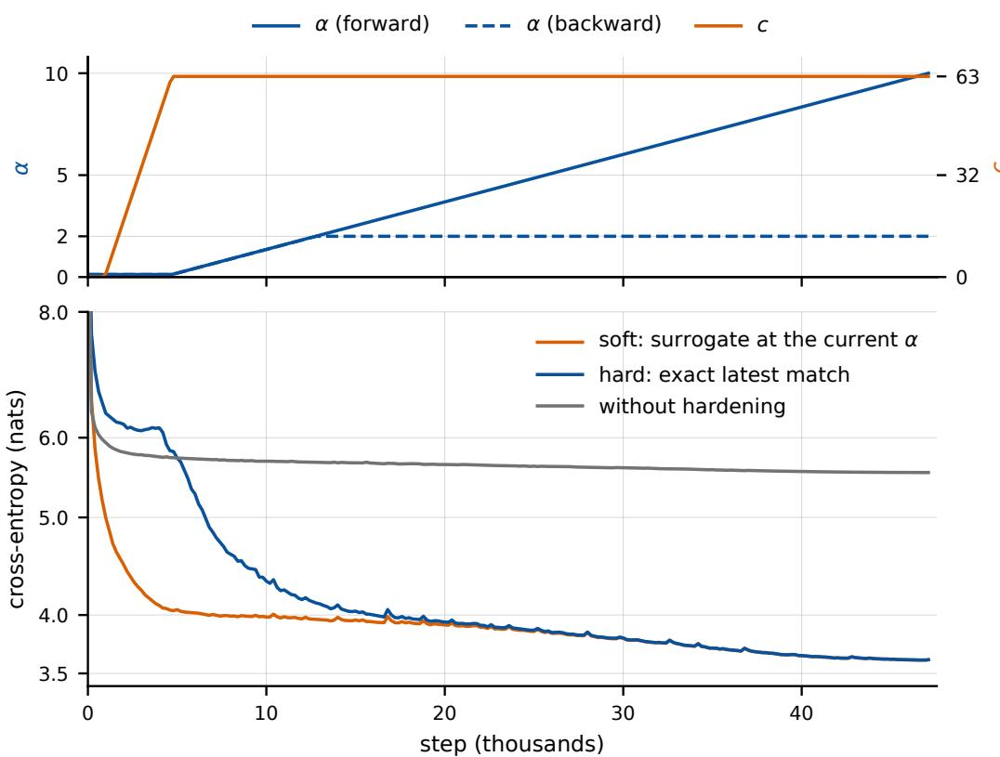  
Figure 6: Hardening trajectory of a 77M LEMA model. Top: the gate threshold c and the forward and backward α over training. Bottom: cross-entropy with the surrogate at the current forward α (soft) and with the exact latest-match operation (hard), and the cross-entropy of the run without hardening.

## B.4 ASSOCIATIVE RECALL DETAILS

Task in prior work. Several prior variants of this task (Arora et al., 2024a;b; Okpekpe & Orvieto, 2025) use at most 64 or 256 pairs and lengthen sequences with filler tokens between the positions where recall is tested. We instead chose to use larger numbers of associations, as this actually requires a larger state to solve.

Training. Settings shared with the language modeling experiment are listed in Appendix B.2. The softmax transformers and GDN models are trained at each n of the curriculum, $\mathrm { i . e . \ 2 , 4 , \ldots , 4 0 9 6 . }$ for at most 50 000 steps with a batch size of $\lfloor 2 ^ { 1 5 } / n \rfloor$ sequences, learning rate $1 0 ^ { - 3 }$ with a linear warmup over the first 1000 steps and cosine decay to 0. If the accuracy on a held-out batch, measured every 250 steps, hits 1.000, the stage ends and the curriculum advances to the next larger n from that checkpoint with a fresh optimizer; a stage that never hits 1.000 runs for the full 50 000 steps and the curriculum advances from its checkpoint with the highest held-out accuracy. Successfu stages typically finish within a few thousand steps. For GDN models, increasing the head dimension increases their state size and hence memory capacity and would likely increase the n up to which the models learn the task. The GDN models use the published value expansion factor of 2, i.e. the state of the single GDN head is a matrix of size $6 4 \times 1 2 8$ . Lowering the peak learning rate to $3 \cdot 1 0 ^ { - 4 }$ or raising it to $3 \cdot 1 0 ^ { - 3 }$ does not improve GDN’s long-range recall (Figure 11). Lastly, the curriculum is particularly important for softmax transformers to aid discovery of an algorithm. In fact, in ou setup they do not learn the task within 100 000 steps when training directly at $n = 4 ,$ , as shown in Figure 9. Some prior works avoid this problem e.g. by training on a mixture of pair counts instead of a curriculum (Arora et al., 2024b).

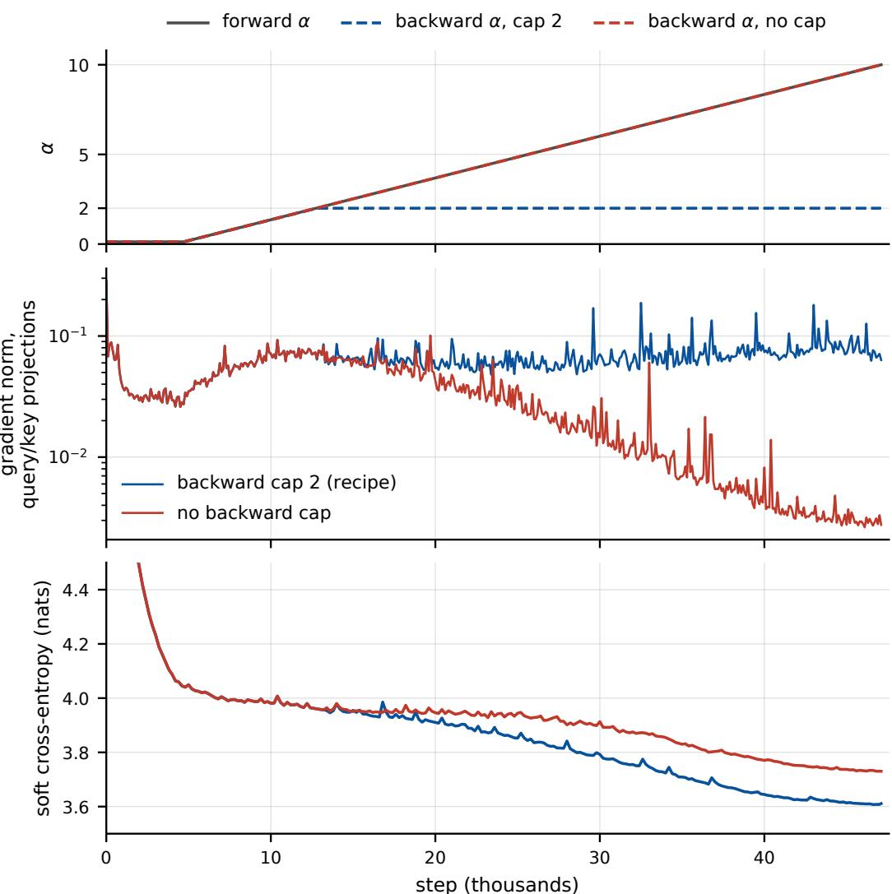  
Figure 7: Backward α capped at 2 (the recipe) against uncapped, 77M model. Top: forward and backward α. Middle: pre-clipping gradient norm of the query and key projections every 100 steps. Bottom: soft cross-entropy on the probe set, which becomes nearly identical to the hard loss late in training in both runs.

For LEMA models, the stick-breaking surrogate discovers a solution directly at $n = 8 .$ . We train for 50 000 steps with a batch size of 4096 sequences and learning rate $3 \cdot 1 0 ^ { - \overline { { 4 } } }$ after a linear warmup over the first 1000 steps. The threshold c rises linearly from 0 to $d _ { h } - 1 = 6 3$ between steps 1000 and 15 000, and α rises linearly from $1 / \sqrt { d _ { h } }$ at step 15 000 to 10 at the last step. With cosine decay from the same peak learning rate to zero, hardening is unstable for some seeds (Figure 10). We therefore lower the learning rate to $5 \cdot 1 0 ^ { - 5 }$ throughout the α ramp and evaluate the final checkpoint. At $n \ = \ 4 0 9 6 .$ final exact-match accuracies with cosine decay are 97.34%, 0.05% and 99.33%, compared with 99.58%–99.73% with our schedule.

Evaluation. Every model is evaluated at $n \in \{ 4 , 8 , \ldots , 4 0 9 6 \}$ on 4 held-out batches of $\lfloor 8 1 9 2 / n \rfloor$ sequences, i.e. 32 768 predictions per n. LEMA models are evaluated with the exact latest-match operation from the final checkpoint of their single run, the baselines from the checkpoint of the stage trained at that n that the curriculum advanced from.

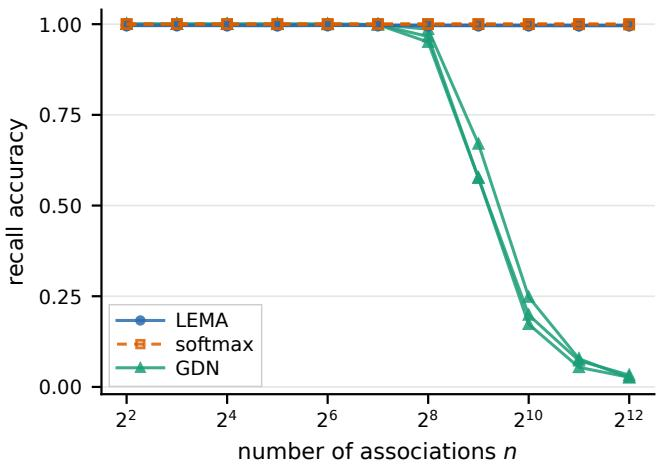  
Figure 8: Same as Figure 2 (left), but showing each of the three seeds separately.

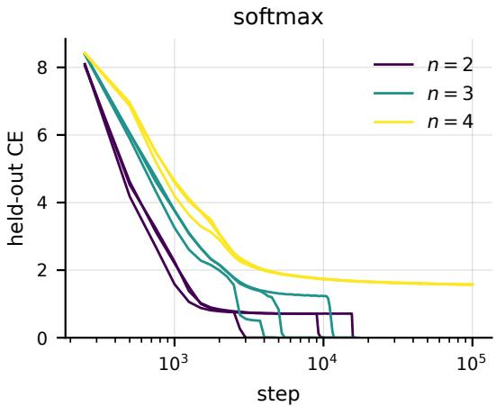  
Figure 9: Loss development of softmax transformers on the synthetic recall task for different numbers of pairs $n ,$ three seeds each. These runs use learning rate $1 0 ^ { - 3 }$ after 1000 warmup steps, without cosine decay. Models converge to a suboptimal solution, then discover the perfect one, while at $n = 4$ this discovery does not happen.

## B.5 MECHANISTIC ANALYSIS OF THE ASSOCIATIVE RECALL MODELS

LEMA models. Figure 12 (left) shows the attention graphs of all three LEMA seeds on the same sample with $n = 4$ . The first one is the picture of Figure 2 (right). All three seeds share the circuit described in the main text: in the first layer, each $b _ { i }$ attends to the $a _ { i }$ directly before it, and in the second layer, each $a _ { i }$ after SEP attends to its paired $b _ { i }$

To check that the same mechanism is used at large n, we record the codes on two samples with $n \ : = \ : 4 0 9 6$ , giving 8192 positions after SEP. Every possible $a _ { i }$ appears in exactly one pair per sample. In the first layer, all tokens $a _ { i }$ before SEP emit the same key code within each seed, and 99.93%, 99.95% and 99.56% of the tokens $b _ { i }$ emit exactly this code as their query code, hence attending to the preceding $a _ { i }$ . The first layer thus copies almost every $a _ { i }$ into the residual stream at $b _ { i }$ . In the second layer, the key code emitted at $b _ { i }$ depends almost only on its preceding $a _ { i } \mathrm { : }$ for 99.85%, 99.88% and 99.12% of the 4096 possible tokens $a _ { i } ,$ this code agrees across the two evaluated samples. Across all pairs in both samples, the tokens $b _ { i }$ emit 4100, 4099 and 4107 distinct key codes. After SEP, the head at $a _ { i }$ retrieves its paired $b _ { i }$ in 99.77%, 99.56% and 99.44% of cases, matching the accuracies of 0.9977, 0.9957 and 0.9946 on these samples.

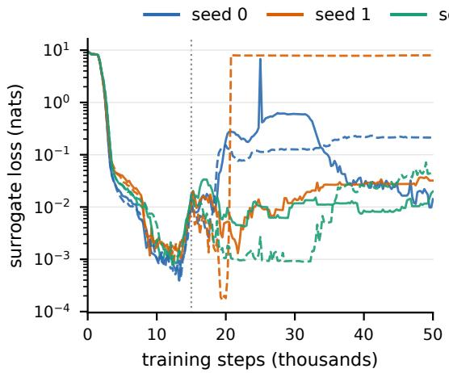

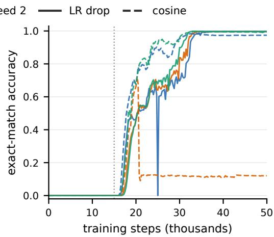  
Figure 10: LEMA hardening on synthetic recall at $n = 8 ,$ three seeds under each learning-rate schedule. Left: held-out loss with the training surrogate, on a logarithmic scale. Right: held-out accuracy with exact latest-match attention. Solid lines use the learning-rate drop to $5 \cdot 1 0 ^ { - 5 }$ , dashed lines cosine decay from the same peak of $3 \cdot 1 0 ^ { - 4 }$ . The vertical dotted line marks the start of the α ramp at step 15 000.

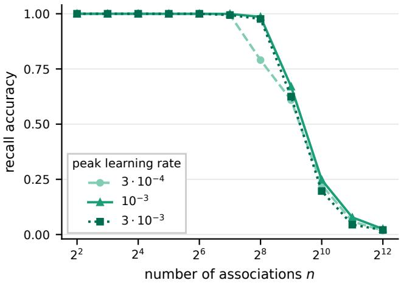  
Figure 11: GDN recall accuracy against the number of associations at different peak learning rates, using seed 0.

Softmax transformers. Figure 12 (right) shows the corresponding circuit in all three softmax transformers, with attention also spread over other positions. $\mathrm { A t } n = 4 0 9 6$ , on the same two samples as above, the tokens $b _ { i }$ place on average 0.51, 0.59 and 1.00 of their first-layer attention mass on the preceding $a _ { i } .$ , for seeds 0, 1 and 2, respectively. The tokens $a _ { i }$ after SEP place 0.93, 0.84 and 0.69 of their second-layer mass on the corresponding $b _ { i }$ . All three seeds solve the task near-perfectly.

Competing associations. We present 64 distinct tokens $a _ { i }$ , each paired four times with different following tokens, with all pairs in random order. After SEP, each $a _ { i }$ appears once more. No model saw such competing associations in training. We use the $n = 6 4$ curriculum checkpoints and the final LEMA checkpoints, evaluating 8192 predictions per seed. Table 5 lists the mean probability mass on the token paired with $a _ { i }$ at each occurrence. LEMA models put almost all their mas on the most recently paired token, as the earlier associations have already been overwritten in the

dictionary. Meanwhile, softmax transformers and GDN show some recency bias, assigning the most mass to the most recently paired token on average.  
Table 5: Mean probability mass on the tokens paired with $a _ { i }$ at its first through fourth occurrences, and on all other tokens, with 64 distinct $a _ { i }$ each appearing in four pairs. Averaged over three seeds.
<table><tr><td>model</td><td>1st</td><td>2nd</td><td> $3 \mathrm { r d }$ </td><td>4th</td><td>elsewhere</td></tr><tr><td>LEMA</td><td>0.000</td><td>0.000</td><td>0.002</td><td>0.996</td><td>0.002</td></tr><tr><td>softmax</td><td>0.005</td><td>0.037</td><td>0.171</td><td>0.528</td><td>0.258</td></tr><tr><td>GDN</td><td>0.093</td><td>0.138</td><td>0.159</td><td>0.233</td><td>0.377</td></tr></table>

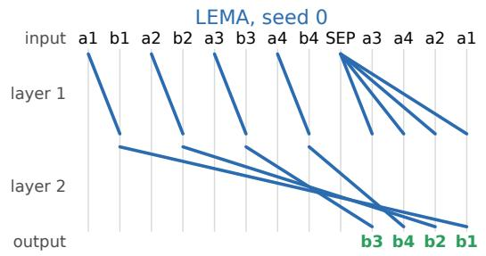

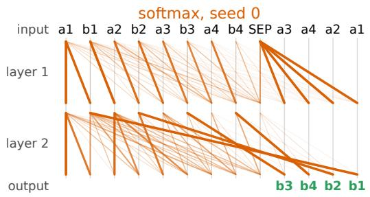

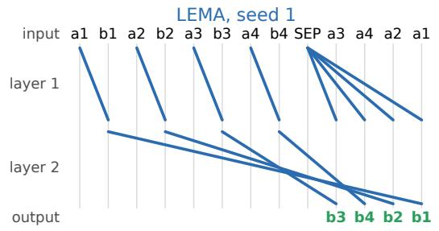

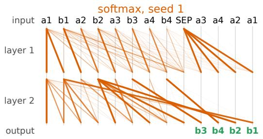

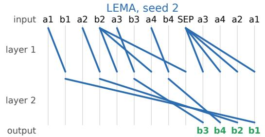

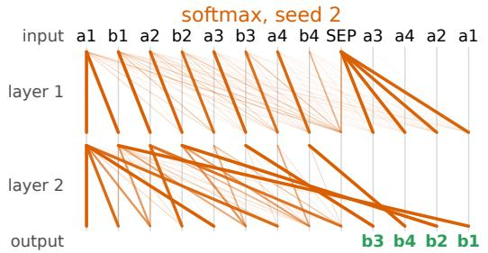  
Figure 12: Attention graphs of the three LEMA (left) and softmax (right) recall models on the same sample with $n = 4 .$ , one row per seed. The top row repeats Figure 2 (right). Position i attending to position j is drawn as a line from $j$ at the top of the layer’s band to i at its bottom, with width and opacity following the attention weight. LEMA weights are 0 or 1. The output row of each panel shows the token predicted at each position after SEP, green when correct.

## B.6 STICK-BREAKING ATTENTION ON THE RECALL TASK

For comparison with LEMA, we train plain stick-breaking models with real-valued queries and keys, $c = 0$ and $\alpha = 1 / \sqrt { d _ { h } }$ , using the same model dimensions, $n = 8 ,$ , 50 000 steps and initial learning rate, without the learning rate drop, for three seeds. Figure 13 (left) shows their accuracy at every n. The solution found at $n = 8$ extrapolates to a few hundred pairs and then fails, with large differences between seeds: at $n = 5 1 2$ the three seeds reach 0.06, 0.98 and 0.94, and at $n = 4 0 9 6$ 0.00, 0.23 and 0.09. A candidate explanation is that the stick is consumed by the many small gate values σ $\lceil ( \alpha \langle q _ { i } , k _ { j } \rangle )$ of non-matching keys before the matching key is reached, an effect that grows with n. Figure 13 (right) tests this by zeroing every gate below a threshold τ at evaluation time. $\mathrm { W i t h } \tau = 0 . 1$ , mean accuracy stays between 0.93 and 0.97 across n, with all three seeds above 0.90 at $n = 4 0 9 6$ . Increasing the threshold to $\tau = 0 . 3$ substantially reduces accuracy. This recovery shows that leakage through small gates limits length extrapolation. LEMA’s discrete rule eliminates such leakage.

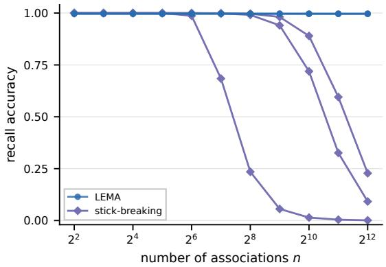

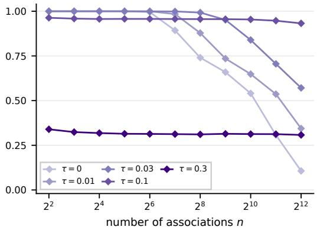  
Figure 13: Plain stick-breaking attention trained at $n = 8$ on the recall task, three seeds. $L e f t { \mathrm { : } }$ accuracy against the number of pairs, with the three LEMA seeds of Figure 8. Right: the same models evaluated with every gate value below τ set to zero, averaged over the seeds.

## B.7 LANGUAGE MODELING DETAILS

Training. Settings shared with the recall experiment are listed in Appendix B.2. We use the sampl $\mathtt { e } { - } 1 0 0 \mathtt { B T }$ subset of FineWeb-Edu (Penedo et al., 2024), tokenized with the GPT-2 tokenizer (Radford et al., 2019). The last of its 140 shards is held out, with its first half of documents used for validation. A training batch consists of 16 windows of 2048 tokens drawn uniformly at random from a subset of the training shards holding at least 31B tokens, i.e. $2 ^ { 1 5 }$ tokens per step. At each model dimension d and depth L, all architectures receive the same training-token budget, approximately 20N, where N is the softmax/LEMA parameter count including the embedding and output matrices (Hoffmann et al., 2022). Table 6 lists the sizes. Softmax transformers and LEMA models use $d / 6 4$ heads of dimension 64. GDN uses $d / 1 2 8$ heads of dimension 128 without value expansion and has slightly more parameters at the same model dimension and depth. The learning rate follows a cosine schedule from a peak of $1 0 ^ { - 3 }$ · $\lfloor 0 2 4 / d$ to 1% of the peak over the full run, with a linear warmup during the first 2% of the steps. For LEMA models, c increases linearly from 0 to $d _ { h } - 1$ 1 between 2% and 10% of the steps, and α increases linearly from $1 / \sqrt { d _ { h } }$ at 10% of the steps to 10 at the last step. The main results use one seed per configuration; three-seed results at $d = 2 5 6$ and $d = 5 1 2$ are shown in Figure 14.

Evaluation. Validation cross-entropy is measured on the first $2 ^ { 1 5 }$ non-overlapping windows of 2048 tokens of the validation set, $2 ^ { 2 6 }$ tokens in total, averaged over all predicted tokens and identical for every model. Every validation cross-entropy in this paper is measured on these $2 ^ { 2 6 }$ tokens, which form $2 ^ { 1 \breve { 2 } }$ windows at context length 16 384. LEMA models are evaluated with the exact latest-match operation.

Validation losses. Table 7 lists the validation cross-entropies behind Figure 3 (left). Interpolating the softmax row log-linearly in the parameter count between neighboring sizes, the 77M to 834M LEMA models match softmax transformers of 44M, 90M, 174M, 292M and 456M parameters.

Variation across seeds. We repeat the experiments at $d = 2 5 6$ and $d = 5 1 2$ with two additional seeds, including context extension and the repeated-bigram evaluation. Validation losses vary little across seeds (Table 8), and the qualitative recall patterns persist (Figure 14).

Table 6: Model dimension $d ,$ depth L, parameter counts and shared training-token budgets of the language models of Section 4.3.
<table><tr><td> $d$ </td><td> $L$ </td><td>softmax/LEMA params</td><td>GDN params</td><td>tokens</td></tr><tr><td>256</td><td>4</td><td>29M</td><td>29M</td><td>0.6B</td></tr><tr><td>512</td><td>8</td><td>77M</td><td>79M</td><td>1.5B</td></tr><tr><td>768</td><td>12</td><td>162M</td><td>170M</td><td>3.2B</td></tr><tr><td>1024</td><td>16</td><td>309M</td><td>326M</td><td>6.2B</td></tr><tr><td>1280</td><td>20</td><td>525M</td><td>559M</td><td>10.5B</td></tr><tr><td>1536</td><td>24</td><td>834M</td><td>892M</td><td>16.7B</td></tr></table>

Table 7: Validation cross-entropy at context length 2048 of the language models of Section 4.3.
<table><tr><td> $d$ </td><td>softmax</td><td>GDN</td><td>LEMA</td></tr><tr><td>256</td><td>3.751</td><td>3.664</td><td>4.345</td></tr><tr><td>512</td><td>3.256</td><td>3.200</td><td>3.545</td></tr><tr><td>768</td><td>2.968</td><td>2.924</td><td>3.194</td></tr><tr><td>1024</td><td>2.759</td><td>2.735</td><td>2.945</td></tr><tr><td>1280</td><td>2.620</td><td>2.600</td><td>2.777</td></tr><tr><td>1536</td><td>2.506</td><td>2.492</td><td>2.657</td></tr></table>

## B.8 LANGUAGE MODELING ABLATIONS

Learning rate ablation. Table 9 shows the validation cross-entropy of the three smallest sizes trained at half and at double the peak learning rate $1 0 ^ { - 3 }$ · 1024/d. Our rule is optimal or close to optimal for each architecture and size and is hence used for the larger models as well.

Stick-breaking ablation. For comparison, we train a 77M model with ordinary stick-breaking attention (Tan et al., 2025), using real-valued queries and keys, no positional encoding and head dimension 64, following the recipe of Appendix B.7. Its validation cross-entropy is 3.189 at context length 2048 against 3.256 for the softmax transformer, and on the recall analysis of Section 4.3 it roughly matches the context-extended softmax transformer (Figure 15). Stick-breaking attention keeps the growing kv-cache and the quadratic cost of softmax attention, so it offers none of the inference gains of Section 5.

## B.9 HEAD DIMENSIONS

Up to 309M parameters, we also train LEMA models on FineWeb-Edu with head dimensions $d _ { h } \in$ {8, 16, 32}, with $d / d _ { h }$ heads per layer. Table 10 lists their validation cross-entropies. At the small model sizes, smaller head dimensions reach a slightly lower cross-entropy, $d _ { h } = 1 6$ is best up to 162M parameters and $d _ { h } = 3 2$ at 309M, but the spread between head dimensions shrinks from 0.22 nats at 29M to 0.02 nats at 309M parameters.

Table 11 shows that heads of smaller dimension hold fewer entries at every context length, recorded as described in Appendix B.10.

Table 8: Validation cross-entropy at context length 2048 for three seeds at the two smallest sizes. Seed 0 is the run of Table 7.
<table><tr><td></td><td colspan="3"> $d = 2 5 6$ </td><td colspan="3"> $d = 5 1 2$ </td></tr><tr><td></td><td>seed 0</td><td>seed 1</td><td>seed 2</td><td>seed 0</td><td>seed 1</td><td>seed 2</td></tr><tr><td>softmax</td><td>3.751</td><td>3.763</td><td>3.761</td><td>3.256</td><td>3.257</td><td>3.258</td></tr><tr><td>GDN</td><td>3.664</td><td>3.666</td><td>3.686</td><td>3.200</td><td>3.198</td><td>3.209</td></tr><tr><td>LEMA</td><td>4.345</td><td>4.334</td><td>4.313</td><td>3.545</td><td>3.554</td><td>3.556</td></tr></table>

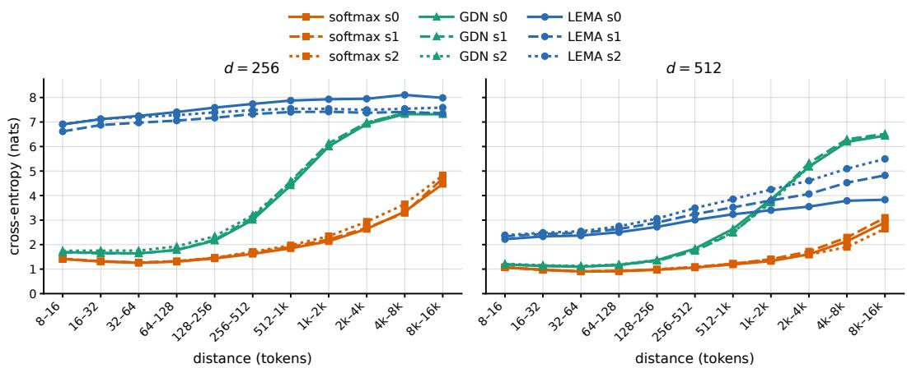  
Figure 14: Repeated-bigram recall for three seeds at d = 256 and d = 512, with softmax and GDN after context extension to 16k and LEMA as trained.

Table 9: Validation cross-entropy at context length 2048 with the peak learning rate of Appendix B.7 (rule), halved and doubled. The softmax run at 162M and double learning rate diverged.
<table><tr><td>model</td><td>params</td><td>d</td><td>half</td><td>rule</td><td>double</td></tr><tr><td>softmax</td><td>29M</td><td>256</td><td>3.780</td><td>3.751</td><td>3.739</td></tr><tr><td>softmax</td><td>77M</td><td>512</td><td>3.276</td><td>3.256</td><td>3.257</td></tr><tr><td>softmax</td><td>162M</td><td>768</td><td>2.973</td><td>2.968</td><td>4.325</td></tr><tr><td>GDN</td><td>29M</td><td>256</td><td>3.713</td><td>3.664</td><td>3.661</td></tr><tr><td>GDN</td><td>79M</td><td>512</td><td>3.227</td><td>3.200</td><td>3.198</td></tr><tr><td>GDN</td><td>170M</td><td>768</td><td>2.940</td><td>2.924</td><td>2.926</td></tr><tr><td>LEMA</td><td>29M</td><td>256</td><td>4.339</td><td>4.345</td><td>4.354</td></tr><tr><td>LEMA</td><td>77M</td><td>512</td><td>3.551</td><td>3.545</td><td>3.597</td></tr><tr><td>LEMA</td><td>162M</td><td>768</td><td>3.193</td><td>3.194</td><td>3.218</td></tr></table>

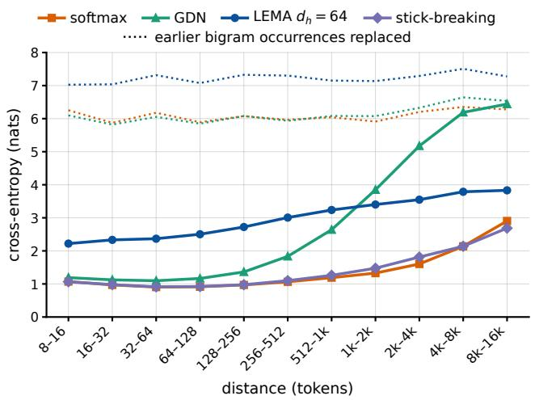  
Figure 15: As Figure 20, for the models at d = 512, including the model trained with stick-breaking attention throughout.

Table 10: Validation cross-entropy at context length 2048 of the LEMA models at every head dimension, best per size in bold.
<table><tr><td> $d$ </td><td>params</td><td> $d _ { h } = 8$ </td><td> $d _ { h } = 1 6$ </td><td> $d _ { h } = 3 2$ </td><td> $d _ { h } = 6 4$ </td></tr><tr><td>256</td><td>29M</td><td>4.141</td><td>4.126</td><td>4.176</td><td>4.345</td></tr><tr><td>512</td><td>77M</td><td>3.486</td><td>3.481</td><td>3.502</td><td>3.545</td></tr><tr><td>768</td><td>162M</td><td>3.157</td><td>3.143</td><td>3.162</td><td>3.194</td></tr><tr><td>1024</td><td>309M</td><td>2.949</td><td>2.950</td><td>2.926</td><td>2.945</td></tr></table>

Table 11: Mean number of entries per head after t tokens for the LEMA models with 309M parameters, averaged over heads and over 32 held-out windows.
<table><tr><td> $d _ { h }$ </td><td>2k</td><td>4k</td><td>8k</td><td>16k</td><td>32k</td><td>64k</td><td>128k</td><td>256k</td></tr><tr><td> $d _ { h } = 8$ </td><td>34</td><td>39</td><td>45</td><td>51</td><td>56</td><td>61</td><td>66</td><td>71</td></tr><tr><td> $d _ { h } = 1 6$ </td><td>98</td><td>137</td><td>188</td><td>256</td><td>335</td><td>431</td><td>539</td><td>660</td></tr><tr><td> $d _ { h } = 3 2$ </td><td>178</td><td>279</td><td>432</td><td>669</td><td>1005</td><td>1514</td><td>2232</td><td>3261</td></tr><tr><td> $d _ { h } = 6 4$ </td><td>210</td><td>340</td><td>542</td><td>872</td><td>1358</td><td>2146</td><td>3347</td><td>5249</td></tr></table>

Figure 16 shows the repeated-bigram analysis of Section 4.3 for the 309M LEMA models at every head dimension and Figure 17 their accuracy on S-NIAH-1. With $d _ { h } = 8 .$ , recall declines worst with distance, while $d _ { h } = 3 2$ and 64 decline more gently than GDN. On S-NIAH-1, every head dimension is flat with the context length, at 0.14 to 0.17 for $d _ { h } = 8 , 0 . 4 2$ to 0.47 for $d _ { h } = 1 6 , 0 . 6 7$ to 0.73 for $d _ { h } = 3 2$ and 0.54 to 0.57 for $d _ { h } = 6 4$ . As the loss penalty of $d _ { h } = 6 4$ shrinks with model size and fewer heads per layer make training and inference faster, we use $d _ { h } = 6 4$ for our main models, accepting its lower S-NIAH-1 accuracy at 309M.

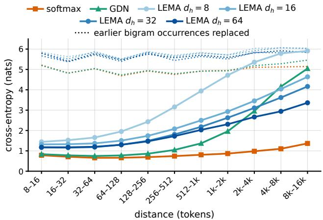  
Figure 16: As Figure 20, for the models at $d = 1 0 2 4$ and every LEMA head dimension.

## B.10 STATE GROWTH AND ATTENTION DISTANCES

State growth. For a trained LEMA model, we feed 32 held-out windows of $2 ^ { 1 8 }$ tokens and record for every head, after every prefix length t, the number of distinct key codes among its first t keys, i.e. the number of entries the head’s dictionary holds after t tokens. Table 12 lists the means over heads and windows at selected context lengths for every model size. Heads differ widely in how many distinct keys they use, and at every context length, larger models use more entries per head.

Attention distance and hit rate. For the largest model (834M parameters), we record on 8 heldout windows of 16 384 tokens where every head reads: the fraction of its queries that find a matching key, and for those the distance $i - \ell _ { i }$ to the position read. Figure 18 shows the distribution of the distance for every head. Of the 576 heads, 56 never find a key. These are dead and indicate that the training procedure could be improved. Most heads retrieve mostly from quite short distances with more long-range heads in the later layers. This is qualitatively somewhat similar to softmax transformers, where lower layers attend locally, attention distance tends to grow with depth and only few heads attend far back (Sukhbaatar et al., 2019; Vig & Belinkov, 2019; Wu et al., 2025).

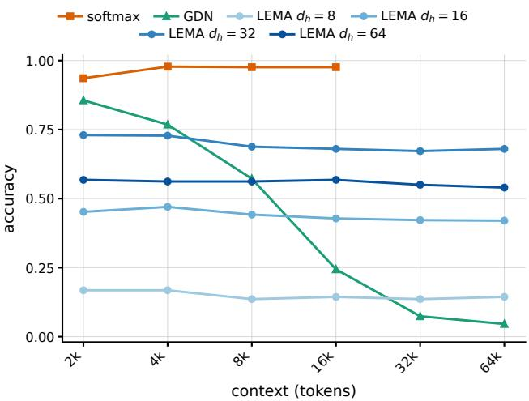  
Figure 17: Accuracy on S-NIAH-1 (Appendix B.13) against the context length for the models at $d = 1 0 2 4$ and every LEMA head dimension.

Table 12: Mean number of entries per head after t tokens for the LEMA models of every size, averaged over heads and over 32 held-out windows.
<table><tr><td>params</td><td>2k</td><td>4k</td><td>8k</td><td>16k</td><td>32k</td><td>64k</td><td>128k</td><td>256k</td></tr><tr><td>29M</td><td>58</td><td>84</td><td>122</td><td>176</td><td>251</td><td>357</td><td>499</td><td>700</td></tr><tr><td>77M</td><td>144</td><td>228</td><td>356</td><td>561</td><td>853</td><td>1306</td><td>1946</td><td>2869</td></tr><tr><td>162M</td><td>190</td><td>306</td><td>482</td><td>767</td><td>1181</td><td>1833</td><td>2785</td><td>4209</td></tr><tr><td>309M</td><td>210</td><td>340</td><td>542</td><td>872</td><td>1358</td><td>2146</td><td>3347</td><td>5249</td></tr><tr><td>525M</td><td>258</td><td>435</td><td>735</td><td>1257</td><td>2128</td><td>3672</td><td>6368</td><td>11 192</td></tr><tr><td>834M</td><td>319</td><td>558</td><td>982</td><td>1748</td><td>3099</td><td>5567</td><td>10029</td><td>18189</td></tr></table>

## B.11 CONTEXT EXTENSION

For context extension, models are retrained from their finished runs for 1B tokens at context length 16 384 (results for the largest models in Table 13) with a fresh AdamW using the betas, weight decay and gradient clipping of pretraining, a peak learning rate of a tenth of the pretraining peak, 2% linear warmup and cosine decay to the final learning rate of pretraining, within the range of Chen et al. (2023) and Xiong et al. (2024). Softmax transformers raise the RoPE base from $1 0 ^ { \overline { { 4 } } }$ to $1 0 ^ { 6 }$ (Rozière et al., 2023), GDN is unchanged. For LEMA, we fix $c = 6 3$ , forward $\alpha = 1 0$ and backward $\alpha = 2$ . The batch size remains $2 ^ { 1 5 }$ tokens for all models. Figure 19 shows the recall curves before and after extension. As is well known, softmax transformers with RoPE do not handle contexts far exceeding the ones seen in training without adapting positional encodings and/or retraining. GDN handles these contexts, but nonetheless its recall ability improves with the context extension. For the LEMA model, extension leaves recall at short distances unchanged and worsens it increasingly with distance, in the farthest bucket from 2.80 to 3.19 nats.

Table 13: Validation cross-entropy of the largest models at context lengths 2048 and 16 384, as trained and after context extension.
<table><tr><td rowspan="2">model</td><td colspan="2">as trained</td><td colspan="2">after extension</td></tr><tr><td>2048</td><td>16 384</td><td>2048</td><td>16 384</td></tr><tr><td>softmax</td><td>2.506</td><td>6.747</td><td>2.521</td><td>2.476</td></tr><tr><td>GDN</td><td>2.492</td><td>2.459</td><td>2.507</td><td>2.470</td></tr><tr><td>LEMA</td><td>2.657</td><td>2.635</td><td>2.668</td><td>2.642</td></tr></table>

heads of a layer, sorted by median attention distance  
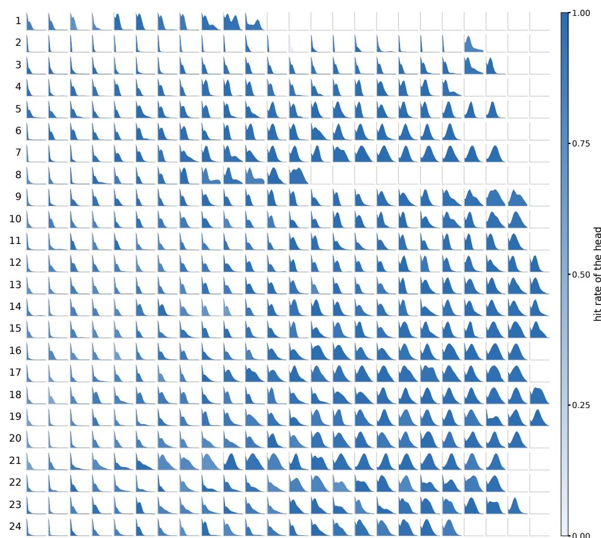  
every panel: attention distance i − ℓi from 1 (left) to 16k (right) in log-spaced bins 1, 2, 3–4, …, 8k–16k height scaled to the panel's maximum  
Figure 18: Attention distance of every head of the largest LEMA model (834M parameters) on 8 held-out windows of 16 384 tokens. One panel per head, layers as rows, heads of a layer sorted by their median distance from left to right. Each panel shows the distribution of the distance i − ℓi between a query and the position it attends to, over all positions with a match, in log-spaced bins from 1 to 16 384 and scaled to the panel’s maximum. The color encodes the hit rate of the head and fades towards white as fewer of its queries find a key. A head that never finds one is empty.

## B.12 REPEATED RARE BIGRAMS

Targets are taken from windows of 16 384 tokens of the validation split, within which documents are delimited by end-of-text tokens. Rarity counts use the first 10B training tokens. A repeated occurrence of a rare bigram xy is a target if x does not recur between it and the previous occurrence of xy. We score y and bucket targets by the distance between these occurrences; target counts range from 117 588 in the 32 to 64 bucket down to 740 in the 8k to 16k bucket. Figure 20 shows the loss of every model size against this distance. The dotted baselines are measured on 1024 targets sampled per bucket, all 740 in the farthest one, each in its own copy of its window in which every earlier occurrence of the bigram is replaced by tokens drawn from the unigram distribution of the validation split, so that corruptions never interfere and every model sees the same windows. The difference to this baseline shows whether a model uses the earlier occurrence, unlike e.g. taking the loss at the first occurrence as baseline, which would be confounded by the available context. Figure 21 (top) shows ten random targets of the farthest bucket, each one a rare phrase to be copied from context.

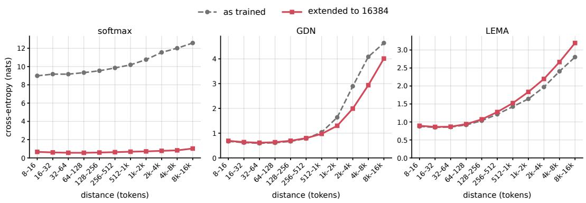  
Figure 19: Cross-entropy on the second token of repeated rare bigrams against the distance to the earlier occurrence for the largest models, as trained and after context extension to 16k.

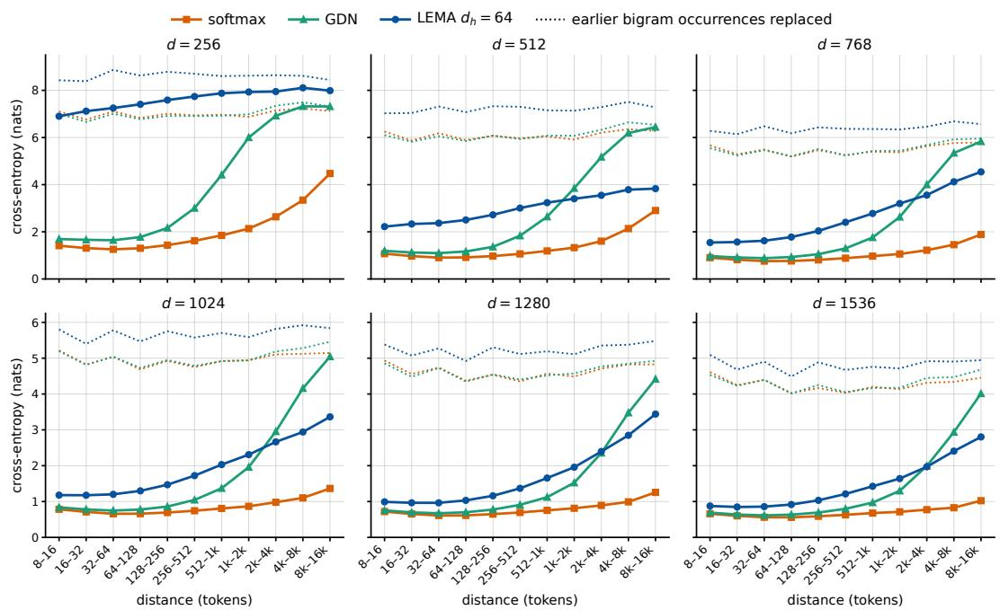  
Figure 20: Cross-entropy on the second token of repeated bigrams occurring rarely in training against the distance to the earlier occurrence of the bigram, one panel per model dimension, for softmax transformers and GDN after context extension to 16k and for LEMA models as trained. Dotted lines estimate the cross-entropy of the same model after replacing all earlier occurrences of the bigram by random tokens.

Our restriction makes $y$ the latest observed continuation of $x ,$ so the copying rule above suffices. With intervening competing continuations (Figure 21, bottom), that rule instead predicts a different token: even perfect retention of xy leaves the model to choose among continuations. Olsson et al. (2022) illustrate how copying previous continuations can hurt prediction in conventional transformers. Allowing such intervening occurrences, as in Arora et al. (2024a), adds targets that constitute

16% of the broader set below 128 tokens but 72% in the farthest bucket. Figure 22 shows the largest models on this broader target set. All models decline more steeply with distance there, softmax transformers included. While LEMA only barely outperforms GDN in the farthest bucket in terms of the loss on this slice, it is still further below its baseline and hence uses the earlier occurrence of the bigram more to improve its prediction than GDN does (0.9 against 0.3 nats difference to baseline).

targets of the analysis: the trigger does not recur in between (10 of 740)   
and Lifset Lajum …(10102)… that Lifset Lajum   
-Hairs / Nit- …(8375)… -Hairs Nit-  
Traffic Separation Scheme (TS …(13845)… Traffic Separation Scheme approaching Boston   
at. Living Resour. …(12354)… at. Living Resour.   
or pottery figurines of …(8399)… from pottery figurines of   
of (decaffeinated C …(8476)… House (decaffeinated coffee   
enlarged our battle organization, whose …(8269)… a joint battle organization should be   
/or learned object–action …(8216)… /or learned object-action   
‘Low Claim Assert …(10495)… ‘Low Claim Assert   
: Grieco JP, A …(9297)… . Grieco JP, A   
dropped by our definition, kept by Arora et al. (2024): the trigger recurs in between (10 of 1873)   
(Great Jazz Pianists …(12379)… of his Jazz Exercises …(3)… the Young Jazz Pianist   
the Issue Megatr …(8370)… the Issue Clouding the Issue / Megatr   
not the Classical Advaita …(2758)… 2011), Classical Sā …(9271)… Modern and Classical Advaita   
launched online through DIKSHA …(9565)… disseminated through telecast and …(2)… also available through DIKSHA   
, pdf mathematic exercise test for …(8479)… \nAdditional mathematic progression worksheet …(903)… , pdf mathematic exercise for 8   
; P trend=0. …(12360)… ; p trend = 0. …(477)… p for trend= 0.   
killed a] Gentile is …(13045)… on the] dead is also …(30)… ours on] Gentiles,   
Hawkesburyites, but …(11313)… Hawkesbury river, and …(884)… Hawkesburyites\nwho   
У═рє …(6623)… ╘═). The first …(2026)… У═рє   
said of Clay that "the …(14145)… joined Henry Clay and Albert Gall …(365)… rival candidate Clay that led the  
Figure 21: Top: ten random targets of the distance bucket 8k to 16k, with two tokens of context on either side of each occurrence and the number of tokens hidden in between. The trigger is marked blue, the token after it, which is scored at the later occurrence, orange. Bottom: ten random targets of the definition of Arora et al. (2024a) that ours drops, with the last occurrence of the trigger before the scored one as the middle span.

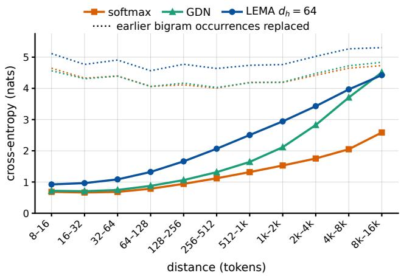  
Figure 22: The largest models on all targets of the definition of Arora et al. (2024a), as in Figure 20.

## B.13 SINGLE-NEEDLE RETRIEVAL

We use the task S-NIAH-1 of RULER (Hsieh et al., 2024) as released. The haystack repeats the sentence “The grass is green. The sky is blue. The sun is yellow. Here we go. There and back again.”, a needle “One of the special magic numbers for {key} is: {number}.” with a random adjective-noun key and a random seven-digit number is inserted at a random depth, and the prompt ends with “What is the special magic number for {key} mentioned in the provided text? The special magic number for {key} mentioned in the provided text is”. The model generates 128 tokens greedily, and a prompt counts as solved if the number occurs in the generation. We use 500 prompts per context length, the context-extended softmax transformers and GDN models (Appendix B.11) and the LEMA models as trained. Table 14 lists the accuracies, Figure 23 their dependence on the depth of the needle at 16k.

Table 14: Accuracy on S-NIAH-1 against the context length, 500 prompts per cell. Softmax transformers are tested only up to their extended context length.
<table><tr><td>d</td><td>model</td><td>2k</td><td>4k</td><td>8k</td><td>16k</td><td>32k</td><td>64k</td></tr><tr><td>1024</td><td>softmax, extended</td><td>0.94</td><td>0.98</td><td>0.98</td><td>0.98</td><td></td><td>一</td></tr><tr><td></td><td>GDN, extended</td><td>0.86</td><td>0.77</td><td>0.57</td><td>0.24</td><td>0.07</td><td>0.05</td></tr><tr><td></td><td>LEMA</td><td>0.57</td><td>0.56</td><td>0.56</td><td>0.57</td><td>0.55</td><td>0.54</td></tr><tr><td>1536</td><td>softmax, extended</td><td>0.94</td><td>0.97</td><td>0.99</td><td>1.00</td><td></td><td></td></tr><tr><td></td><td>GDN, extended</td><td>0.99</td><td>0.87</td><td>0.61</td><td>0.39</td><td>0.22</td><td>0.10</td></tr><tr><td></td><td>LEMA</td><td>0.93</td><td>0.92</td><td>0.91</td><td>0.91</td><td>0.90</td><td>0.89</td></tr></table>

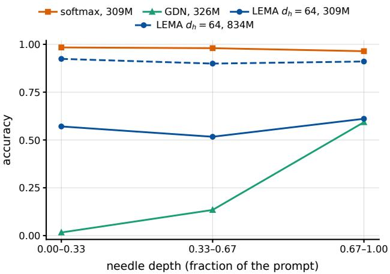  
Figure 23: Accuracy on S-NIAH-1 at context length 16k against the depth of the needle.

Since we use LEMA transformers without positional encoding, their hidden states at a position depend only on the tokens and on the dictionaries. For a repeated sentence, the dictionaries of an L-layer model therefore stop changing after at most L repetitions: the first layer sees the same input in every repetition, so its dictionary is fixed after the first one and its outputs are the same from the second on, and by induction the inputs of layer l are the same from repetition l on, so its dictionary is fixed after repetition l. We feed the filler one repetition at a time and read out every dictionary after each ingestion. The dictionaries of the 16-layer 309M model stop changing after the 14th repetition and those of the 24-layer 834M model after the 21st. The needle then changes the dictionaries, and the filler after it reaches a fixed point again after 13 and 21 repetitions, with 7 591 and 27 557 entries in total. Hence the state at the question, and with it the answer, is the same for any number of filler sentences before and after the needle beyond these counts.

## B.14 FURTHER RULER TASKS

Figure 24 shows the largest models on further RULER tasks with the protocol of Appendix B.13. S-NIAH-2 and S-NIAH-3 place a number or a UUID in the Paul Graham essays that RULER ships, the multi-key task MK-NIAH-1 adds three distractor needles to the essays, and in MK-NIAH-2 the haystack consists of key-value lines, so that the number of stored pairs grows with the context. As GDN and LEMA mostly answer with a blank instead of a number on these tasks, we also report the cross-entropy of the correct answer, the negative log-probability of its tokens given the prompt and the colon that every model emits first, summed over the tokens of the answer and averaged over prompts. On S-NIAH-2, S-NIAH-3 and MK-NIAH-1, GDN generates the answer more often than LEMA and has the lower cross-entropy up to 4k, while LEMA has the lower cross-entropy at 16k. On MK-NIAH-2, GDN stays ahead at every length.

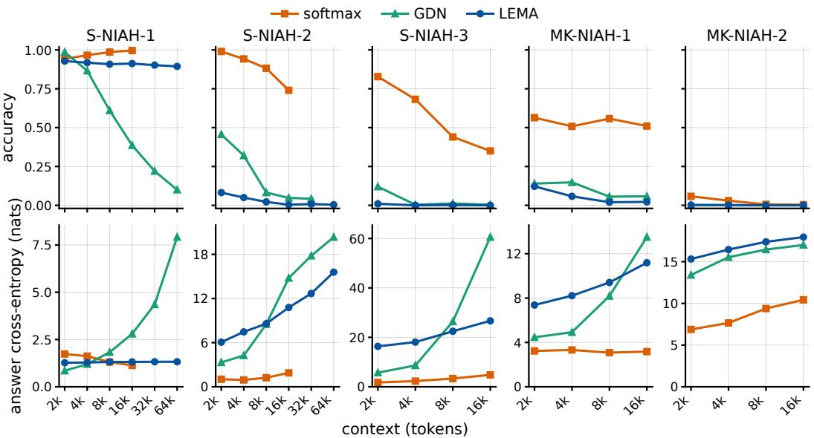  
Figure 24: Accuracy (top) and cross-entropy of the correct answer (bottom) of the largest models on RULER tasks against the context length, softmax transformers and GDN after context extension to 16k.

## B.15 LONGER TRAINING AND RECALL

We train all three architectures at d = 512 on five times the tokens of Appendix B.7, 7.7B instead of 1.5B, with the recipe otherwise unchanged, so that every schedule stretches with the run. Table 15 lists the validation cross-entropies: softmax transformers and GDN improve by 0.16 nats at context length 2048 and LEMA by 0.09 nats, so the gap widens. More importantly, on the recall of repeated rare bigrams (Figure 25), the two baselines, again after context extension, improve at every distance, while the LEMA model worsens at every distance.

Table 15: Validation cross-entropy of the models at d = 512 trained on 1.5B and on 7.7B tokens, at context length 2048 as trained and at 16 384 after context extension for softmax transformers and GDN and as trained for LEMA.
<table><tr><td colspan="3">1.5B tokens</td><td colspan="2">7.7B tokens</td></tr><tr><td>model</td><td>2048</td><td>16 384</td><td>2048</td><td>16 384</td></tr><tr><td>softmax</td><td>3.256</td><td>3.170</td><td>3.101</td><td>3.060</td></tr><tr><td>GDN</td><td>3.200</td><td>3.130</td><td>3.043</td><td>3.017</td></tr><tr><td>LEMA</td><td>3.545</td><td>3.538</td><td>3.452</td><td>3.442</td></tr></table>

## C ADDITIONAL MATERIAL FOR SECTION 5

## C.1 SOFTMAX AND GDN IMPLEMENTATION

The softmax transformers are run with vLLM 0.17 (Kwon et al., 2023) on Llama models of the geometries of Table 16 with random weights, with prefix caching disabled and 95% of the VRAM for weights and cache, and with the faster of its attention kernels in each scenario: FlashAttention-2 (Dao, 2024) for prefill and for every grouped-query or batched generation, its Triton kernel for generation at batch size 1 with multi-head attention.

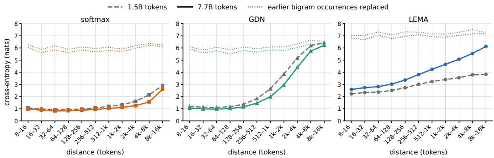  
Figure 25: Cross-entropy on the second token of repeated rare bigrams against the distance to the earlier occurrence for the models at $d = 5 1 2$ trained on 1.5B and on 7.7B tokens, softmax transformers and GDN after context extension to 16k and LEMA as trained. Dotted lines estimate the cross-entropy of the same model after replacing all earlier occurrences of the bigram by random tokens.

An idealized bandwidth lower bound assumes one read of each required weight and cached key and value per decode step. With $W$ bytes of weights accessed per step, excluding unused inputembedding rows, and $4 L H d _ { h }$ bytes of cache per token for L layers, H heads and head dimension $d _ { h }$ in bf16, the bound at context length n is

$$
\frac { W + 4 L H d _ { h } n } { B }
$$

for a memory bandwidth B, a constant plus a term linear in n. Offloading the kv-cache can extend the context, but incurs additional data transfers or CPU attention computation (Sheng et al., 2023; Lee et al., 2024). At the peak bandwidth of the RTX 3090, vLLM is slower than this bound by a factor between 1.29 and 1.56 for all three models and all context lengths.

The GDN models are Qwen3-Next models (Qwen Team, 2025) run in vLLM with every layer set to GDN and dense MLPs, in the geometries of Table 16 with the GDN heads of Appendix B.7, half as many of dimension 128, and random weights. vLLM’s bookkeeping of experts is bypassed, as the models have none. The output gate of the GDN block adds 7% of parameters over the softmax model of the same geometry. The state of a sequence is $2 L H d _ { h } ^ { 2 }$ bytes for the recurrent part, with GDN’s head count and head dimension, plus the short convolution, 10 MB for the 0.8B model, so its state size does not limit context length.

## C.2 LEMA IMPLEMENTATION

Codes. The binarized query or key of a head with $d _ { h } ~ \leq ~ 6 4$ is packed into one 64-bit integer whose i-th bit is set when the i-th pre-activation is nonnegative, so binarization and packing are one operation on the GPU and no ±1 vectors are formed. Two codes match exactly when the integers are equal. Larger head dimensions would need more than one word per code, which changes the constants below but nothing else.

The hash table. All dictionaries of a model reside in one hash table in main memory with open addressing and linear probing (Knuth, 1998), shared by every layer, every head and every sequence of a batch. A slot holds a 64-bit code, a 64-bit identifier of the layer, sequence and head the entry belongs to, and the value, $1 6 + 2 d _ { h }$ bytes in total. The key of an entry is the pair of identifier and code, and its home slot is a hash of this pair. A lookup walks from the home slot over consecutive slots until it finds the key or an empty slot, a miss, which returns the zero vector. An insert walks the same way and either overwrites the value of the key it finds, so that the latest value wins as in Definition 1, or claims the first empty slot. With one table for all heads, a head using many distinct codes takes more slots, the table fills at the total number of distinct codes over all heads instead of at the number of the busiest head times the number of heads, and the load of the table, the fraction of occupied slots that determines the length of the walks, is one number for the whole model. The table is allocated once with a fixed number of slots, every page of it is touched at allocation, and it is never resized. The available memory is known in advance, as for the preallocated kv-cache of the baseline.

Decoding. For each generated token and each layer, the GPU computes the codes and values of every head and copies them into pinned buffers in main memory, one call into a C++ routine looks up the query code and then inserts the key code with its value for each of the bH dictionaries of the layer at batch size $b ,$ and the retrieved values, or zeros, are copied back to the GPU, where the rest of the layer follows. At batch size 1, a token thus costs LH lookups and LH inserts, independent of the context length. The GPU work of a step is captured into L + 1 CUDA graphs, where graph i finishes layer $i - 1$ and starts layer i, and the $\mathrm { C } { + + }$ call runs between two replays. The routine prefetches the home slots of upcoming items, so that the memory accesses of different dictionaries overlap, and processes different dictionaries in parallel during prefill and sufficiently large batches.

Prefill. A prompt is processed in chunks of 2048 tokens, so that only the cache grows with the prompt and not the memory used for other activations. For a LEMA model, the projections and MLPs of a chunk are computed for all its positions at once on the GPU, and the C++ routine then processes the chunk’s $n _ { c } \le$ 2048 positions in every dictionary in order, so that each query sees the keys of all earlier positions, of earlier chunks and of the same chunk, and not its own. No matching takes place on the GPU, the total work equals that of processing the whole prompt at once, and a decode step is the case $n _ { c } = 1$ of the same call.

Random codes. Random codes are close to the worst case for occupancy and locality due to practically no collisions at $d _ { h } = 6 4$ . Generation and prefill times of softmax transformers do not depend on the weights. Those of LEMA models depend on them only through the codes, which determine which slots are accessed and how quickly the table fills. All measurements of Figure 4 use random weights, and for the LEMA models the codes of every layer, queries and keys alike, are replaced by fresh random codes in every step. Codes then never repeat, so every lookup misses, every insert claims a new slot, the table gains LH entries per token, the fastest it can fill, and no access pattern is left for the caches of the CPU to exploit. Trained models repeat codes (Table 12) and fill the table far more slowly. Figure 26 compares the 834M LEMA model of Section 4.3 to a model of the same geometry with random codes, in generation, where the model samples its own text, and in prefill, where it processes held-out text. After 573k generated tokens, the trained model occupies 6% of the table, whereas the random-code model occupies 95%, and its time per token stays at 3.1 ms. In prefill, the trained model processes 571k tokens in 28 s and the random-code model in 40 s.

## C.3 BENCHMARK DETAILS

Hardware and software. All measurements are taken on one machine with an NVIDIA RTX 3090 with 24 GB of VRAM and a peak memory bandwidth of 936 GB/s, an Intel Core i9-12900K and 64 GB of main memory. The LEMA implementation runs on PyTorch 2.8 with CUDA 12.8, and vLLM 0.17 on PyTorch 2.10 with CUDA 13.0. Weights, the kv-cache and the values in the hash table are stored in bf16.

Models. Table 16 lists the three geometries. They follow Appendix B.2 with head dimension 64 throughout, one key and value per query head and the MLP widths of the table, that of Llama 3 for the 8B model. Softmax models use RoPE with base 104 and LEMA models no positional encoding. The 0.8B geometry is that of the largest trained model of Section 4.3.

Provisioning. Both caches are allocated once before a run and are never reallocated. vLLM provisions its kv-cache from 95% of the VRAM minus the weights and its workspace, which is 22, 17 and 7 GB for the three sizes. The hash table of a LEMA model takes 50 GB of main memory for every size, 347 million slots of 144 bytes.

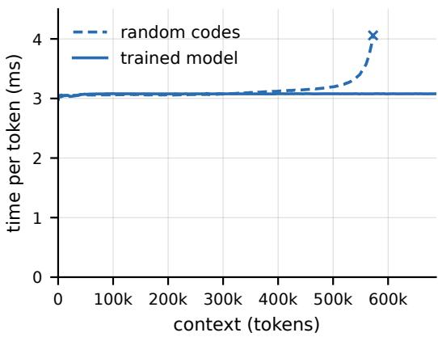

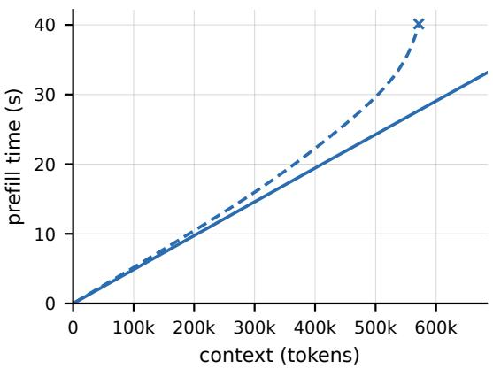  
Figure 26: Time per generated token (left) and prefill time (right) against context length for the 834M LEMA model of Section 4.3, generating its own text and processing held-out text, and for a model of the same geometry with random codes, both with the 50 GB hash table of Figure 4. Crosses mark 95% table occupancy.

Table 16: The three model geometries of Figure 4: depth $L ,$ model dimension $d ,$ heads H of dimension 64, MLP width $d _ { \mathrm { { f f } } } ,$ parameters and their size in bf16, and the parameters of the GDN model of the same geometry.
<table><tr><td>model</td><td>L</td><td> $d$ </td><td>H</td><td> $d _ { \mathrm { f } }$ </td><td>params</td><td>weights</td><td>GDN params</td></tr><tr><td>0.8B</td><td>24</td><td>1536</td><td>24</td><td>4096</td><td>0.83B</td><td>1.7GB</td><td>0.89B</td></tr><tr><td>3B</td><td>28</td><td>3072</td><td>48</td><td>8192</td><td>3.48B</td><td>7.0 GB</td><td>3.75B</td></tr><tr><td>8B</td><td>32</td><td>4096</td><td>64</td><td>14336</td><td>8.20B</td><td>16.4GB</td><td>8.74B</td></tr></table>

Generation. One run gives one curve of Figure 4 (top). Starting from the end-of-text token and an empty cache, the model generates one token at a time, sampled from its own prediction at temperature 1. Softmax and LEMA runs stop at the VRAM limit and 95% table occupancy, respectively; GDN runs stop at prescribed context lengths. The wall-clock time of every step is recorded and averaged over 400 bins of consecutive tokens per curve. Table 17 lists initial decode times, softmax capacity limits, and LEMA measurements at 80% and 95% occupancy. GDN generates at 2.9, 11.3 and 24.6 ms per token at the three sizes, constant to within 1.1 ms over the whole run.

Table 17: Time per generated token in ms over the first bin of the LEMA curve of Figure 4 (top), for softmax over the same tokens, at the end of the softmax curves, where the kv-cache is full, and at loads 0.8 and 0.95 of the hash table for LEMA, with the context length in tokens at these points.
<table><tr><td rowspan="2">model</td><td colspan="3">softmax</td><td colspan="5">LEMA</td></tr><tr><td>first</td><td>full</td><td>tokens</td><td>first</td><td>load 0.8</td><td>tokens</td><td>load 0.95</td><td>tokens</td></tr><tr><td>0.8B</td><td>2.66</td><td>35.9</td><td>150 497</td><td>3.04</td><td>3.17</td><td>481152</td><td>4.06</td><td>572 675</td></tr><tr><td>3B</td><td>10.53</td><td>34.8</td><td>48 913</td><td>10.61</td><td>10.95</td><td>206 304</td><td>12.86</td><td>245 432</td></tr><tr><td>8B</td><td>22.82</td><td>33.3</td><td>13 905</td><td>22.53</td><td>23.00</td><td>135 408</td><td>25.86</td><td>161 064</td></tr></table>

Prefill. One run gives one curve of Figure 4 (bottom). For a LEMA model, a prompt of uniformly random tokens is fed into a freshly provisioned cache in chunks of 2048 tokens, and the elapsed time after every chunk is the time to process a prompt of that length. One chunk is processed beforehand through a separate small cache, so that compilation is not part of any recorded time. For vLLM, a request with a random prompt of every multiple of 1024 tokens is submitted to the running engine, after warm-up requests, and timed until it returns its first token. The curves end as in generation. At 2048 tokens, prefill takes 0.07, 0.25 and 0.55 s for the softmax transformers and 0.11, 0.32 and 0.64 s for the LEMA models. GDN takes 0.07, 0.27 and 0.59 s, and its prefill stays linear at 28k,

7.6k and 3.5k tokens per second. The LEMA curve falls below the softmax curve from 16k and 14k tokens on for the 0.8B and 3B models, and at 12k tokens, where the kv-cache of the 8B model is full, the two curves meet.

## C.4 STATE PER TOKEN

The architectures differ in how much state they keep per processed token. GDN keeps a state of fixed size. A dense softmax transformer stores the keys and values of every head at every position, 144 KiB per token in bf16 for our 834M model, and a LEMA transformer stores at most one entry of 144 bytes per head and token, 81 KiB per token, for which the hash table reserves 85 KiB at its load factor of 0.95, while the trained 834M model stores only about 5.6 KiB per token over its first 256k tokens due to overwriting (Table 12). The state per token determines the slope of the time per generated token at batch size 1 when the state resides in VRAM, as for the softmax curves of Figure $^ { 4 , }$ whereas LEMA’s decode time remains nearly constant until its table approaches capacity. For both, it determines where the context runs out, VRAM for softmax transformers and main memory for LEMA transformers.

Modern language models therefore almost always reduce the state per token by a constant factor, for example through grouped-query attention (GQA) (Shazeer, 2019; Ainslie et al., 2023), where G query heads share one kv-cache and thus divide the state per token by G, so that the kv-cache of the 0.8B model with G = 8 holds 1.2M tokens on our GPU, and through hybrid architectures that replace most attention layers by fixed-state layers (MiniMax et al., 2025; Kimi Team et al., 2025). Both can be applied to LEMA transformers just as well: G query heads can share one dictionary, and LEMA layers can take the place of the attention layers of a hybrid model. Fewer stored entries alone do not imply more efficient memory use, since overwriting can discard information needed for recall. LEMA’s memory advantages lie elsewhere: the state resides in main memory instead of VRAM, and its growth adapts to the content, which we demonstrated on the synthetic task and on S-NIAH-1 (Appendix B.13), while its benefit for language modeling remains unclear.

## C.5 BATCHED GENERATION

When generating a batch of b sequences at once, the weights are streamed once for all b tokens, but the kv-cache of every sequence is read and the dictionaries of every sequence are updated, and the hash table is shared by the batch. Figure 27 shows the throughput at different batch sizes of the trained 834M LEMA model of Section 4.3 and of a softmax transformer of the same geometry but using 8-fold GQA to extend curves further (see Appendix C.4). The throughput of the LEMA model remains nearly constant until the table approaches capacity, at 118k tokens for batch size 64 and 22k tokens for batch size 256, while the softmax transformer slows down from the first thousand tokens on and runs out of VRAM at 19k and 5k tokens. GDN, run as in Appendix C.1, achieves similar throughput to LEMA away from the latter’s capacity limit. The decline at batch size 256 appears to be due to vLLM overhead; GDN’s recurrent state and computation per token remain fixed.

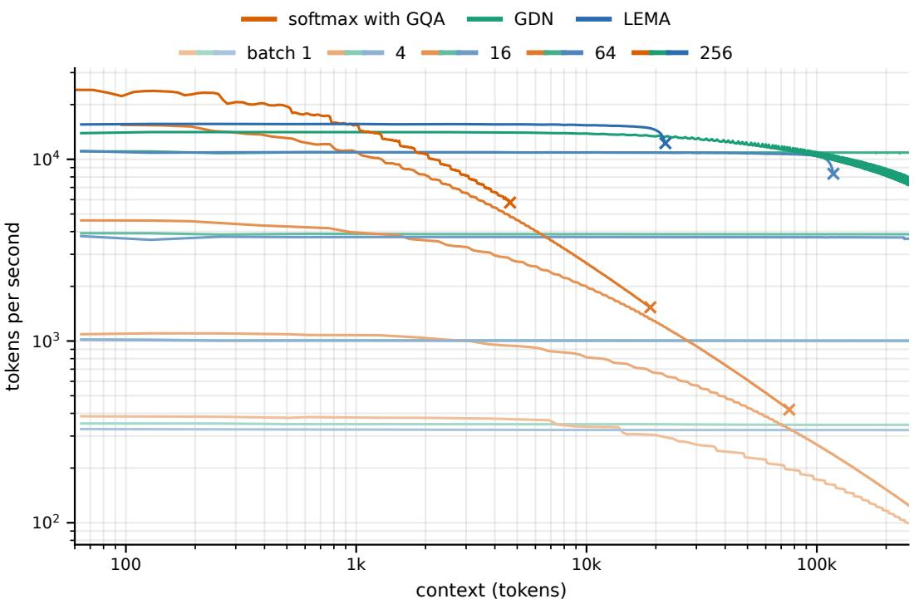  
Figure 27: Tokens generated per second against context length for the trained 834M LEMA model, a softmax transformer of the same geometry with 8-fold GQA and GDN, at batch sizes 1 to 256 on the machine of Appendix C.3. Crosses mark the VRAM limit for softmax and 95% occupancy of LEMA’s hash table; other curves are shown up to 250k tokens.