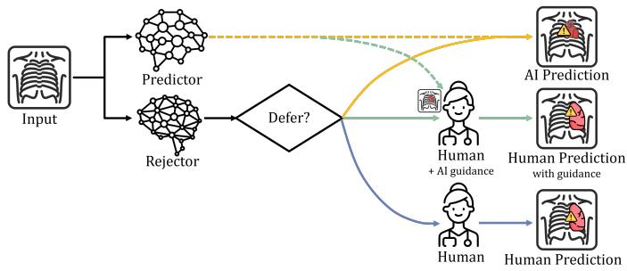
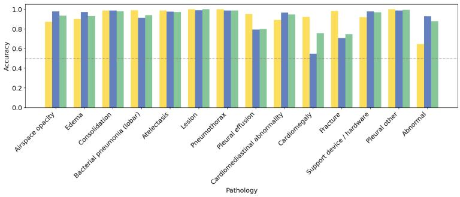
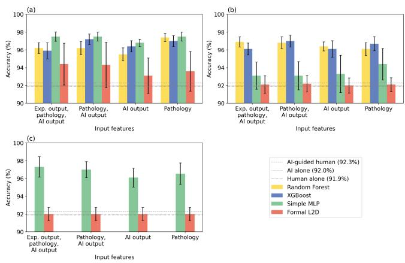
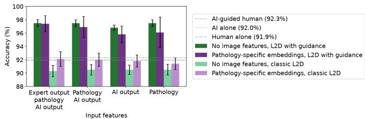

# Learning to Defer with Guidance on Real World Medical Data

Emma Sun, Joshua Strong, and Alison Noble

Department of Engineering Science, University of Oxford, UK Correspondence: emma.sun@eng.ox.ac.uk

Preprint version.

Abstract. Medical image interpretation is high-volume and time-consum and while AI interpretation can reduce workload, fully autonomous deployment carries potential safety concerns and low specificity may in practice lead to increased clinician workload. Learning to Defer (L2D) addresses this by selectively routing cases between autonomous prediction and human experts by learning from input features and AI model and human performance. While theoretical guarantees have been proven for L2D, its performance has not been validated on real-world medical datasets with human reader annotations. We evaluate the predictorrejector formulation of two-stage L2D, where the AI predictor model is fixed and separate from the trainable routing or rejector model, on Collab-CXR, a multilabel chest X-ray dataset with multiple human annotations per case. This is the first work to look at L2D in the context of real-world medical imaging data with human annotations. We further introduce a new setup, L2D with Guidance, where the decision space is extended to three choices: predict autonomously, defer to a human expert, or defer to a human expert and provide AI guidance. We compare multiple rejector architectures and loss functions, and diferent input feature availabilities. This is reproduced on two larger datasets, VinDr-CXR and CheXpert. Our results show that two-stage L2D with Guidance outperforms classic two-stage learning to defer, as well as human-alone, AI-alone and AI-guided human baselines. Notably, this performance is achieved with simpler loss functions compared to formally defined L2D surrogate loss functions in current literature.

Keywords: Learning to Defer · Human-AI Collaboration · Computer-Aided Diagnosis.

## 1 Introduction

Real world medical image interpretation is a high-volume and time-consuming task for clinicians, and delays in image interpretation delay patient care. Various AI models have shown promising performance for some medical image interpretation tasks, but uncertainty around the safety of allowing AI models to make decisions autonomously, or high model sensitivity accompanied by low specificity can result in increased rather than reduced workload for clinicians in practice [3].

  
Fig. 1. L2D with Guidance setup, where the rejector can choose to output autonomous AI prediction, defer to the AI-guided human expert, or defer to the plain, unguided human expert. Adapted from [12].

Human-AI Collaboration (HAIC), in particular Learning to Defer (L2D) [8], in healthcare ofers a potential approach to support workload reduction. L2D is a supervised learning framework in which a rejector model learns, for each input, whether to output an autonomous decision from the AI predictor, or defer to an external expert, so as to minimise the overall expected system-level cost that accounts for both prediction errors and instance-dependent deferral costs. By only deferring to a human expert in cases where it is beneficial, it reduces the number of cases that need review by a human expert while maintaining greater oversight for safety compared to using autonomous AI. In the two-stage predictor-rejector setup of L2D, the rejector is trainable but the predictor is treated as fixed [6]. This flexibility can be useful in medical settings, where AI models (predictors) can be large or proprietary, therefore updating model weights is expensive or forbidden. Two-stage learning to defer is a relatively new addition to the field, and although theoretical guarantees have been proven for the performance, these have not previously been demonstrated with real-world medical-imaging data, with human reader annotations on top of the ground truth annotations. The current standard in the field is to simulate the human reader annotations.

In this work we propose a new L2D setup: L2D with Guidance (L2D-G). The guidance is produced by an AI model and acts an assistive signal, that may for instance take the form of mask overlays or suggested labels with accompanying confidence levels. Combining AI guidance with L2D creates a system which chooses to defer autonomously, defer to a human expert, or defer to a human expert and provide AI guidance (Fig. 1). AI guidance is not guaranteed to be beneficial to human performance in all cases [10] – using L2D will mean only showing AI guidance for cases where it will help. AI and diferent individual clinicians may have diferent strengths and weaknesses; the core principle of L2D is that the rejector can learn how input features are tied to these performance diferences and accordingly select the reader (human, AI, or human with AI assistance) to take advantage of these diferent strengths. Learning to Defer with

Guidance may be particularly useful in the case of out-of-hours care, where clinicians are present but not necessarily those of the optimal speciality. As well as AI producing decisions faster, determining which cases can be safely interpreted by AI or by an available clinician with assistance from AI could allow decisions to be made sooner in the cases where it is safe.

We validate L2D-G on Collab-CXR [7], a multi-label chest X-ray public dataset of 324 images with multiple human annotations per case, and compare its performance with the classic two-stage L2D setup. To our knowledge, this is the first empirical evaluation of L2D on real-world, human-annotated medical data and the first formulation incorporating conditional AI guidance into the deferral decision. This validation is reproduced on two further datasets, CheXpert and VinDr-CXR. In summary, the contributions of this paper are:

– We introduce the Learning to Defer with Guidance setup,

– We evaluate classic L2D for the first time on real-world, human-annotated medical imaging data, and compare the performance of L2D-G and classic L2D.

## 2 Method

Rejector Models L2D rejectors were implemented, adapted from the traditional L2D action space of {Defer, Predict} to extend to the case where human experts are provided with AI guidance.

Four candidate L2D rejector models were implemented, two using tree-based classic machine learning models (XGBoost [2] and Random Forest [1]), and two using multi-layer perceptrons (MLPs). One MLP model was implemented with a binary cross-entropy loss function, which models expert correctness explicitly, and the other with a formal L2D loss function which models expert correctness implicitly, based on the surrogate loss function from Mao et al. [6]:

$$
L _ { h } ( r , x , y ) = \mathbb { 1 } _ { h ( x ) = y } \cdot \ell _ { 2 } ( \bar { r } , x , 0 ) + \sum _ { j = 1 } ^ { J } \bar { c } _ { j } ( x , y ) \cdot \ell _ { 2 } ( \bar { r } , x , j )\tag{1}
$$

where h is the predictor function, r the rejector function, r¯ an associated hypothesis where $\bar { r } ( x , 0 ) = 0$ and $\bar { r } ( x , j ) = - r _ { j } ( x )$ . J is the number of experts, $\ell _ { 2 }$ is a standard multi-class loss function, and $\bar { c } ( x , y ) = 1 - c ( x , y )$ , where $c ( x , y )$ is the cost of deferral.

Input Features An ablation study was performed to assess the importance of each of the input features across the diferent rejectors: image features were either omitted, provided by naive embeddings, or provided by the pathologyspecific encoder applied to the naive embeddings. A ResNet model [4] was used to encode each image as a 2048-dimensional feature embedding. It was first pre-trained on a larger (non-overlapping) CXR dataset to increase relevance of encoded features to the task of CXR interpretation. The weight of this encoder were not updated during training, for computational eficiency. A pathologyspecific encoder was then included to encode the image features according to the pathology being queried, to enable the rejector to focus on the most relevant image features for each pathology accordingly. This encoder mapped the image features extracted by the ResNet encoder to the embedding space, processed these embedded features with further fully connected layers, and created labelspecific embeddings with a separate linear head per pathology label. The weights of this pathology-specific encoder were updated as part of rejector training to allow fine-tuning to the dataset.

The expert predictions, with and without AI guidance, and the output of the AI tool from the dataset are treated as the outputs of two experts and the predictor respectively. These predictor outputs were not updated during training, as per the two-stage setting of L2D [6].

## 3 Experiments

## 3.1 Datasets

Collab-CXR Experiments were performed on data from an public dataset, Collab-CXR [7], the only suitable dataset which is publicly available. Collab-CXR provides annotations by up to 10 radiologists, with and without AI assistance by CheXbert labeller [11], on the probability of the prevalence of 106 pathologies for 324 chest X-ray (CXR) images.

However, the Collab-CXR study design meant that the images were read by an inconsistent combination of the radiologists. This is not suitable for training and testing an L2D system, as the rejector implicitly learns the performance of each expert during training, and accordingly for a naive implementation would be forced to train 10 diferent rejectors (one for each radiologist), each on a much smaller dataset than the original. It was therefore necessary to pool the predictions of the radiologists for each setting to get a single meta-expert probability for each pathology-image combination. While this pooling ‘smooths’ over diferences in performance across individual readers, it enables training on the whole dataset and preserves diferences between human-alone and AI-guided humans performance, and is more realistically-grounded in human performance characteristics compared to synthetic annotations that are the current standard in L2D literature.

AI predictor interpretations were provided on a subset of the pathologies the radiologists annotated, therefore only these 14 pathologies were relevant to L2D and used during these experiments. Analysis of the dataset shows the AI predictor outperforms the human expert in some but not all cases, and AI guidance is helpful to the radiologists in some cases, but not in all (Fig. 2).

The pooled radiologist annotations, CheXbert labeller output probabilities, and images were used for training, and images provided as model input for testing.

  
Fig. 2. Accuracy of the AI predictor (yellow), non-guided human expert (blue) and AI-guided human expert (green) across pathologies. The AI predictor and AI-guided human outperform the non-guided human by the largest margin on pleural efusion, cardiomegaly and fracture.

CheXpert and VinDr-CXR To validate the findings on Collab-CXR, the experiments were repeated with two larger datasets, CheXpert [5] and VinDr-CXR [9]. While these datasets have individual real human annotations, removing the need for pooling, they do not contain human annotations with AI assistance. Following the standard in the L2D literature, the guidance was generated through simulation. The performance of the AI predictor and the AI-guided human were simulated with a pathology-dependent method, with relative performance consistent with the real-world Collab-CXR dataset: flipping binary predictions from ground truth following [8], with pathology-specific probability, to produce baseline accuracies within ± 0.9% of each other, with the AI the best predictor on 46-64% of pathologies, and AI-guided human performance in between AI and human on all but 7-14% of cases.

## 3.2 Models

The ResNet model [4] for image encoding was pre-trained for 20 epochs on the National Institutes of Health Chest X-Ray Dataset (NIH-CXR) [13]. The pathology-specific encoder was pre-trained on the NIH-CXR dataset with NIH pathology labels for 10 epochs, and was updated during rejector training.

A grid search was used in each experiment with Random Forest and XGBoost to tune the hyperparameters for the rejector model. For Random Forest: number of estimators (100-1000), maximum depth of estimator (0-30) and minimum number of samples required to split an internal node (2-10) were tuned. For XGBoost: number of estimators (200-1000), maximum depth of estimator (3-7), and learning rate (0.01-0.1) were tuned. The MLP rejector model consisted of three linear layers interspersed with non-linear activation layers. Training was for up to 100 epochs, with early stopping on validation loss after 10 epochs without improvement.

Experiments were performed for the same n = 20 random seeds for each setup to ensure comparison across the same data splits.

## 4 Results

Baseline The baseline predictor and expert accuracies on Collab-CXR are AIguided human 92.3%, AI alone 92.0% and human alone 91.9%.

Table 1. Accuracy mean and standard deviation of diferent rejector models on Collab-CXR with diferent combinations of tabular and image features. Note that all rejector models outperform the baselines (0.923 AI-guided human, 0.920 AI alone, 0.919 human alone).
<table><tr><td>Rej. Model</td><td>Tabular input features</td><td colspan="3">Image features</td></tr><tr><td rowspan="3">Rand. Forest</td><td>Exp. output, path., AI output 0.962±0.006</td><td>Absent</td><td>Present 0.969±0.006</td><td>Label-specific</td></tr><tr><td>Pathology, AI output</td><td>0.962±0.007</td><td>0.968±0.007</td><td></td></tr><tr><td>AI output</td><td>0.955±0.007</td><td>0.964±0.005</td><td></td></tr><tr><td rowspan="3">XGBoost</td><td>Pathology</td><td>0.974±0.005</td><td>0.961±0.007</td><td></td></tr><tr><td>Exp. output, path., AI output</td><td>0.959±0.010</td><td>0.961±0.007</td><td></td></tr><tr><td>Pathology, AI output AI output</td><td>0.972±0.010 0.964±0.006</td><td>0.970±0.007 0.961±0.009</td><td></td></tr><tr><td rowspan="3">Simple MLP</td><td>Pathology</td><td>0.970±0.010</td><td>0.967±0.008</td><td></td></tr><tr><td>Exp. output, path., AI output</td><td></td><td>0.975±0.005 0.931±0.0150.974±0.012</td><td></td></tr><tr><td>Pathology, AI output AI output</td><td>0.968±0.004</td><td>0.975±0.005 0.931±0.0160.969±0.016</td><td>0.933±0.0210.958±0.012</td></tr><tr><td rowspan="4">Formal L2D</td><td>Pathology Exp. output, path., AI output</td><td>0.975±0.005 0.944±0.018</td><td></td><td>0.961±0.023</td></tr><tr><td></td><td>0.944±0.023</td><td>0.921±0.010 0.920±0.007</td><td></td></tr><tr><td>Pathology, AI output</td><td>0.943±0.026</td><td>0.922±0.0090.920±0.007</td><td></td></tr><tr><td>AI output Pathology</td><td>0.931±0.020</td><td>0.920±0.0090.920±0.007</td><td>0.921±0.0080.920±0.007</td></tr></table>

Table 2. Accuracy of baselines and best performing classic L2D and L2D-G models, across Collab-CXR, CheXpert and VinDr-CXR, with model architectures and input features listed (MLP = simple MLP, RF = Random Forest; P = pathology, AI = AI output, I = image features, LSI = label-specific image features).
<table><tr><td rowspan="2">Dataset</td><td colspan="2">Baseline</td><td colspan="2">Best Model Performance</td></tr><tr><td>AI</td><td>Human AI-guided Human</td><td>Classic L2D</td><td>L2D-G</td></tr><tr><td>Collab-CXR</td><td>0.920 0.919</td><td>0.923</td><td>0.920 (P, AI)</td><td>0.975 (MLP: P ± AI)</td></tr><tr><td>CheXpert</td><td>0.910 0.902</td><td>0.901</td><td>0.950 (AI)</td><td>0.988 (RF: AI, I)</td></tr><tr><td>VinDr-CXR</td><td>0.933 0.940</td><td>0.939</td><td>0.953 (P, AI, I) 0.969 (MLP: P, AI, LSI)</td><td></td></tr></table>

L2D-G Performance L2D with Guidance has accuracy of up to 0.975±0.005 on Collab-CXR, while deferring 38.2±0.9% of cases, compared to the best baseline accuracy of 0.923 (AI-guided human). All rejector models for L2D with

Guidance outperform all of these baselines with some input feature combinations (Table 1). This suggests that L2D-G outperforms human-alone or AI-alone on this dataset, and that the rejector is able to capitalise on the diferent strengths and weaknesses of the predictor and the expert.

Comparison Between Rejector Models Almost all models and input feature combinations outperform all baselines on Collab-CXR, the exceptions being the formal L2D rejector with image features or label-specific image embeddings included as input (Fig.3). The best performing model was the simple MLP on tabular data inputs. These results show that with this dataset, the two-stage L2D-G model with the rejector using a formal surrogate loss function is outperformed by simpler rejector models such as an MLP with binary cross-entropy loss (paired t-test, $p = 0 . 0 2 2 )$ (Table 1). Additionally, for the best performing rejector model, the simple MLP, including more tabular data did not improve performance, including naive image features lowered performance, and including pathology-specific image embeddings did not improve performance above tabular data-alone. This is intuitively consistent, as the naive image embeddings do not reflect the relevance of diferent aspects of the image for diagnosing diferent pathologies - for instance cardiomegaly based on the size of the heart, compared to pleural efusion based on the opacity of the lungs.

  
Fig. 3. Performance of L2D with Guidance using (a) tabular features only, (b) image features, and (c) label-specific image embeddings, on Collab-CXR. Results are shown across diferent rejector models and input feature combinations, averaged over $n = 2 0$ random seeds, and compared to baselines. Note that the y-axis is truncated for legibility.

Classic L2D Performance This new formulation significantly outperforms classic L2D on Collab-CXR (paired t-test, $p < 0 . 0 0 0 1 )$ (Fig. 4). Classic L2D, with a single unguided expert, does not perform above the baselines. We hypothesise that with this moderately-sized dataset, without the option to defer to an AIguided human, there is model overfitting and the system cannot learn useful features to defer between the AI and a single choice of expert.

  
Fig. 4. Accuracy of the L2D system with MLP rejector, comparing L2D-G to classic L2D, with and without pathology-specific image embeddings, on Collab-CXR. L2D-G outperforms baselines of AI-guided human, AI alone and human alone. Classic L2D performs worse than baselines on this data. Note that the y-axis is truncated for legibility.

Results on CheXpert and VinDr-CXR The same relative findings were demonstrated on the two augmented datasets. L2D-G had significantly higher accuracy compared to baseline, with the informal rejector models outperforming the formal L2D rejector. While classic L2D was able to outperform the baselines on these datasets, the best performance of L2D-G was considerably better than the best performance of classic L2D (Table 2).

## 5 Conclusion

In this paper we proposed L2D with Guidance, a new formulation of Learning to Defer that provides optional AI guidance when deferring to a human expert. Validated on Collab-CXR, a publicly-available real-world medical imaging dataset, we achieved per-label accuracy above a baseline of 92.3%. Notably, this performance is achieved with simpler loss functions compared to the formally defined L2D surrogate loss functions in existing literature. This finding is further reproduced on two further datasets, CheXpert and VinDr-CXR.

We also evaluated classic two-stage L2D for the first time on real-world human-annotated medical data and compare it to our new formulation. Our findings indicate weaker performance of two-stage L2D on these datasets, particularly on the real-world Collab-CXR dataset.

L2D is a relatively new human-AI collaboration framework and while the theory under-pinning it has been evolving, to our knowledge this is the first paper evaluating it on a real-world medical imaging dataset with human expert annotations. This work is limited by the moderate size of the real-world dataset; as a next step, we are currently investigating the approach on private datasets across further imaging modalities.

Acknowledgments This work was supported by the Engineering and Physical Sciences Research Council. ES is funded by an EPSRC Doctoral Training Partnership [EP/W524311/1]. JS is funded by the EPSRC Center for Doctoral Training in Health Data Science [EP/S02428X/1]. AN acknowledges EPSRC Turing AI Fellowship: Ultra Sound Multi-Modal Video-based Human-Machine Collaboration [EP/X040186/1].

Disclosure of Interests The authors have no competing interests to declare.

## References

1. Breiman, L.: Random forests. Machine Learning 45(1), 5–32 (Oct 2001). https://doi.org/10.1023/a:1010933404324

2. Chen, T., Guestrin, C.: Xgboost: A scalable tree boosting system. arXiv:1603.02754 (2016)

3. Commission, E., for Health, D.G., Safety, F., EEIG, Evidence, O., PwC: Study on the deployment of AI in healthcare – Final report. Publications Ofice of the European Union (2025). https://doi.org/doi/10.2875/2169577

4. He, K., Zhang, X., Ren, S., Sun, J.: Deep residual learning for image recognition. arXiv:1512.03385 (2015)

5. Irvin, J., Rajpurkar, P., Ko, M., Yu, Y., Ciurea-Ilcus, S., Chute, C., Marklund, H., Haghgoo, B., Ball, R., Shpanskaya, K., et al.: Chexpert: A large chest radiograph dataset with uncertainty labels and expert comparison. Proceedings of the AAAI Conference on Artificial Intelligence 33(01), 590–597 (Jul 2019). https://doi.org/10.1609/aaai.v33i01.3301590

6. Mao, A., Mohri, C., Mohri, M., Zhong, Y.: Two-stage learning to defer with multiple experts. Advances in NeurIPS 36, 3578–3606 (2023)

7. Moehring, A., Kutwal, M., Huang, R., Banerjee, O., Jacobi, A., Eber, C., Mendoza, D., Chung, M., Dayan, E., Gupta, Y., et al.: A dataset for understanding radiologist-artificial intelligence collaboration. Scientific Data 12(1) (May 2025). https://doi.org/10.1038/s41597-025-05054-0

8. Mozannar, H., Sontag, D.: Consistent estimators for learning to defer to an expert. In: ICML. pp. 7076–7087. PMLR (2020)

9. Nguyen, H.Q., Pham, H.H., Tuan Linh, L., Dao, M., Khanh, L.: VinDr-CXR: An open dataset of chest X-rays with radiologist annotations. PhysioNet (Jun 2021). https://doi.org/10.13026/3akn-b287, https://doi.org/10.13026/3akn-b287, version 1.0.0

10. Rudolph, J., Huemmer, C., Preuhs, A., Buizza, G., Hoppe, B.F., Dinkel, J., Koliogiannis, V., Fink, N., Goller, S.S., Schwarze, V., et al.: Nonradiology health care professionals significantly benefit from AI assistance in emergencyrelated chest radiography interpretation. CHEST 166(1), 157–170 (Jul 2024). https://doi.org/10.1016/j.chest.2024.01.039

11. Smit, A., Jain, S., Rajpurkar, P., Pareek, A., Ng, A.Y., Lungren, M.P.: Chexbert: Combining automatic labelers and expert annotations for accurate radiology report labeling using bert. arXiv:2004.09167 (2020)

12. Strong, J., Sun, E., Rogers, H., Higham, H., Noble, A.: Learning to defer: A survey. 10.5281/zenodo.17843044 (2025)

13. Wang, X., Peng, Y., Lu, L., Lu, Z., Bagheri, M., Summers, R.M.: Chestx-ray8: Hospital-scale chest x-ray database and benchmarks on weakly-supervised classification and localization of common thorax diseases. In: Proceedings of the IEEE Conference on Computer Vision and Pattern Recognition. pp. 2097–2106 (2017)