# Learning to Fluctuate: Statistical Foundations for Causal Tabular Pretraining

Zhiheng Zhang School of Statistics and Data Science Shanghai University of Finance and Economics

## Abstract

Causal tabular foundation models amortize effect estimation across synthetic mechanisms, but latenteffect supervision rewards posterior shrinkage instead of directly encoding the repeated-sample response needed in a fixed deployment population. We introduce fluctuation-supervised pretraining (FSP): each synthetic table is labeled by its average treatment effect plus its efficient influence-function fluctuation, while deployment remains a single frozen forward pass. Along the path $T _ { \lambda , P } = \theta ( P ) + \lambda P _ { n } \psi _ { P } ,$ we prove an endpoint transition: every fixed λ < 1 retains label ambiguity of order $( 1 - \lambda ) ^ { 2 } / n ,$ whereas full fluctuation makes the Gaussian label observable and reduces optimal finite-stratum causal label-prediction risk to order n−2. One finite-pretraining bound combines label, network, episodesampling, and optimization errors; its resulting sampling defect controls fixed-mechanism bias, mean squared error, variance, Gaussian approximation, and, with variance-head accuracy, studentized coverage. Complementary lower bounds separate the local n−1 ATE risk that deployment observations cannot erase from the log N/M excess risk of a generic finite-dictionary episode-learning problem. Experiments trace the learned sampling response. With a raw-row/column backbone, FSP reduces large-effect-shift RMSE by 69.8% relative to latent supervision and by 39.5% relative to a released CausalPFN checkpoint on matched tables. Continuous-covariate experiments, known-effect semisynthesis and two randomizedstudy evaluations separate sampling-law fidelity from point-risk shrinkage and expose weak-overlap errors in both learned heads.

## 1 Introduction

Causal tabular foundation models promise to amortize an analysis that is otherwise repeated cohort by cohort: pretrain on synthetic causal mechanisms, freeze the network, and estimate an intervention effect from a new table in one forward pass. The TabPFN paradigm established the data set, rather than an individual row, as the unit of in-context prediction [Müller et al., 2022, Hollmann et al., 2025]; CausalPFN, Do-PFN, and CausalFM extend synthetic table pretraining to causal targets and identifying settings [Balazadeh Meresht et al., 2025, Robertson et al., 2025, Ma et al., 2026]. Causal foundation models can also amortize an estimator’s frequentist sampling response: full fluctuation marks the second-order label-learnability boundary in finite-stratum causal models.

Consider a hypothetical hospital where smoking lowers mean birthweight by 150 g. A model pretrained mostly on near-zero effects may systematically attenuate estimates from this population toward the prior center—for example, around −75 g rather than the true −150 g. Such shrinkage can improve average prediction across synthetic populations. Yet repeated cohorts from this same hospital can produce estimates concentrated around the wrong effect; even an accurate standard error then leaves confidence intervals centered incorrectly. Good prediction over virtual worlds and correct inference in one real world are different objectives. The issue persists even with exact labels and exact population-risk optimization: squared-loss latent supervision rewards prior-conditioned effect prediction, whereas inference requires the correct sampling response at this fixed population (Figure 1).

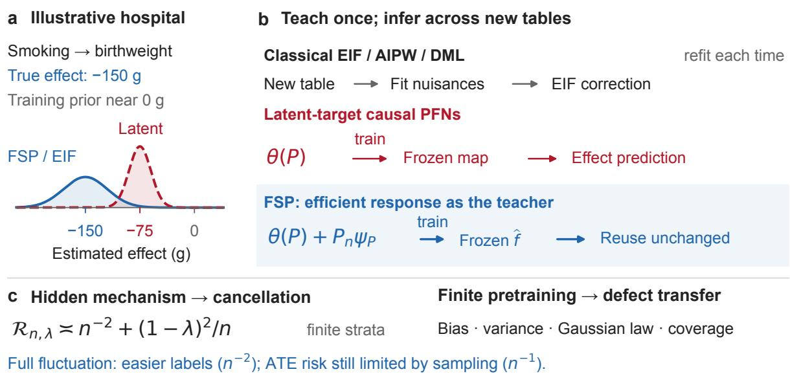  
Figure 1: Teach the sampling response once, reuse it across new tables. Panel a shows why latent-effect prediction can have the wrong repeated-sampling center under prior shift; Panel b shows that FSP moves EIF structure from per-dataset correction to reusable synthetic supervision; Panel c shows why the full-fluctuation endpoint is statistically special and how finite pretraining error propagates into inferential guarantees.

At this intersection, existing methods place the statistical work at three different stages. The first route pretrains a frozen model to infer causal effects or interventional objects directly from a new table [Balazadeh Meresht et al., 2025, Robertson et al., 2025, Ma et al., 2026]. A second constructs an orthogonal or targeted estimate anew on each analyzed data set, through nuisance fitting, cross-fitting, or a targeted neural objective [Chernozhukov et al., 2018, Shi et al., 2019]. A third acts downstream of learned objects: MP-OSPC forms an EIF-based one-step ATE posterior from PFN-derived nuisance posteriors, while WALDO uses simulation-calibrated Neyman inversion to form confidence regions from a predictor or posterior estimator [Melnychuk et al., 2026, Masserano et al., 2023]. We take a fourth route. AIPW/DML typically constructs the nuisance-adjusted estimator afresh on each new data set [Chernozhukov et al., 2018]; FSP teaches its sampling response across synthetic tables and reuses the frozen map without per-table nuisance fitting or test-time correction. Our theory quantifies the statistical cost of that reuse through label ambiguity, network approximation, finite pretraining over M episodes, and optimization error. Appendix Table 2 compares these representative, non-exclusive workflows.

We propose fluctuation-supervised pretraining (FSP). For a synthetic mechanism P, a generated table $D _ { n }$ , its ATE θ(P), and efficient influence function ψP, define the supervision path

$$
T _ { \lambda , P } ( D _ { n } ) = \theta ( P ) + \lambda { \frac { 1 } { n } } \sum _ { i = 1 } ^ { n } \psi _ { P } ( O _ { i } ) , \qquad \lambda \in [ 0 , 1 ] .\tag{1}
$$

Latent-effect supervision is λ = 0 and FSP is the full-fluctuation endpoint λ = 1. We use λ as an analytical interpolation, not a deployment hyperparameter, to ask whether any fixed partial injection suffices, or whether full fluctuation is required to change the statistical order of the supervised problem. The simulator thus teaches the network both where the virtual world’s causal effect lies and how an efficient estimator should move for this particular synthetic table. Simulator-known nuisances are privileged training information used only to construct the synthetic teacher; deployment uses only the observed table and frozen weights, with no

per-table nuisance fitting or test-time correction. We call this uncorrected prediction the nativefrozen output.   
A separate head learns the efficient variance coefficient $V ( P ) = \mathbb { E } _ { P } \psi _ { P } ^ { 2 }$ , used as $V ( P ) / n$ for studentization;   
conditional uncertainty of the label is not the sampling uncertainty of the ATE.

Three results connect this target to inference. First, every fixed $\lambda < 1$ retains label ambiguity proportional to $( 1 - \lambda ) ^ { 2 } / n$ in Gaussian and nondegenerate finite-stratum submodels. Full fluctuation cancels this component: label-prediction risk becomes zero in the Gaussian experiment and has sharp order $n ^ { - 2 }$ in the finite-stratum model. Second, an oracle bound combines label approximation, network approximation, finite pretraining over M synthetic episodes, and optimization error into one native sampling defect. Our theorem transfers this defect to bias, mean squared error, sampling variance, and Gaussian approximation; variance-head accuracy additionally controls studentization. Third, complementary lower bounds distinguish deployment risk of order $n ^ { - 1 }$ from the $\Omega ( \operatorname* { m i n } \{ 1 , \log N / M \} )$ ) excess risk of a separate finite-dictionary episode-learning experiment. The latter matches the generic dictionary-size dependence in the upper bound, without asserting a causal-FSP pretraining necessity. A two-world construction further gives a $1 / ( n M )$ obstruction for partially fluctuated labels. Our contributions are summarized as follows:

• Supervision for inference. We turn efficient-influence-function theory into a synthetic-label design principle and show that full fluctuation is a singular endpoint: it removes the first-order latent ambiguity that persists under every fixed partial fluctuation (Section 3).

• A reusable statistical procedure. We quantify when finite pretraining yields a frozen model with repeated sample guarantees across covered mechanisms, under explicit approximation, transfer, and variance conditions (Section 3).

• Two distinct roles for data. We separate learning a reusable estimator from estimating a population’s effect, clarifying which gains synthetic episodes provide and which still require deployment observations (Sections 3–5).

The experiments test this chain through controlled seven-point λ comparisons, raw-table and continuouscovariate backbones, finite-dictionary scaling, known-effect semisynthesis, and resampling around empirical benchmarks from two randomized studies. Comparisons with released CausalPFN and cross-fitted AIPW/DML separate point accuracy from sampling-response fidelity. Appendix A positions FSP, Sections 2– 3 develop the framework and theory, Section 4 tests their predicted regimes, and Section 5 develops the implications.

## 2 Training experiment and deployed estimator

Causal model and estimand. Fix positive integers K and n. Let P be the observed-data law of $O =$ $( X , A , Y )$ , where $X \in \{ 1 , \ldots , K \}$ is a pretreatment stratum, $A \in \{ 0 , 1 \}$ is treatment, and $Y \in [ 0 , 1 ]$ is the outcome. A table $D _ { n } = ( O _ { i } ) _ { i = 1 } ^ { n }$ consists of independent copies $O _ { i } = ( X _ { i } , A _ { i } , Y _ { i } )$ of $O ,$ , with law $P ^ { n }$ . Write $\mathbb { E } _ { P }$ for expectation of one observation and $\mathbb { E } _ { P ^ { n } }$ for expectation over a table; use the same convention for variances. For a measurable real-valued row function $h ,$ define $\begin{array} { r } { \mathbb { P } _ { n } h = n ^ { - 1 } \sum _ { i = 1 } ^ { n } h ( O _ { i } ) } \end{array}$ . For $s \in \{ 1 , \ldots , K \}$ and $a \in \{ 0 , 1 \}$ , set

$$
p _ { s } = P ( X = s ) , \qquad e _ { s } = P ( A = 1 \mid X = s ) , \qquad m _ { a s } = \mathbb { E } _ { P } ( Y \mid A = a , X = s ) .
$$

Write $p = ( p _ { s } ) _ { s } , e = ( e _ { s } ) _ { s }$ , and $m = ( m _ { a s } ) _ { a , s }$ , suppressing dependence on $P .$ . Let $Y ( a )$ be the potential outcome under treatment a; expectation involving potential outcomes refers to a compatible causal law with observed margin P. Under consistency, conditional exchangeability given $X$ , and positive treatment probabilities, the average treatment effect is the observed-law functional

$$
\theta ( P ) : = \sum _ { s = 1 } ^ { K } p _ { s } ( m _ { 1 s } - m _ { 0 s } ) = \mathbb { E } \{ Y ( 1 ) - Y ( 0 ) \} .\tag{2}
$$

For the finite-stratum analysis, fix $p _ { * } \in ( 0 , 1 / K ]$ and $\epsilon \in ( 0 , 1 / 2 ]$ . The class $\mathcal { P } _ { K , p _ { * } , \epsilon }$ consists of observed laws with $p _ { s } \geq p _ { * }$ and $e _ { s } \in [ \epsilon , 1 - \epsilon ]$ for every s; $\mathcal { P } _ { K , p _ { * } , } ^ { \mathrm { b i n } } ,$ additionally requires $Y \in \{ 0 , 1 \}$ . Put $q _ { * } = p _ { * } \epsilon$ and $H = 1 + \epsilon ^ { - 1 }$ . Then $P ( X = s , A = a ) \geq q _ { * }$ . The principal mean-label upper bounds allow bounded outcomes; the sharp finite-stratum lower bound, explicit variance-head construction, and uniform mechanism covering use the binary-outcome subclass. Here $m _ { a X }$ and $e _ { X }$ are the preceding arrays evaluated at the observed stratum. Define the uncentered ATE score

$$
\phi _ { P } ( O ) = m _ { 1 X } - m _ { 0 X } + \frac { A ( Y - m _ { 1 X } ) } { e _ { X } } - \frac { ( 1 - A ) ( Y - m _ { 0 X } ) } { 1 - e _ { X } } .\tag{3}
$$

Lemma C.1 gives $| \phi _ { P } | \leq H$ under the stated bounds. Its centered influence function, full-fluctuation label, and variance coefficient per observation are

$$
\psi _ { P } ( O ) = \phi _ { P } ( O ) - \theta ( P ) , \qquad T _ { P } ( D _ { n } ) = \mathbb { P } _ { n } \phi _ { P } , \qquad V ( P ) = \mathbb { E } _ { P } \{ \psi _ { P } ( O ) ^ { 2 } \} .\tag{4}
$$

The same realized table determines the network input and the label fluctuation: $T _ { P } ( D _ { n } ) = \theta ( P ) + \mathbb { P } _ { n } \psi _ { P }$ Lemma C.1 gives its exact repeated-sampling moments,

$$
\mathbb { E } _ { P ^ { n } } \{ T _ { P } ( D _ { n } ) \} = \theta ( P ) , \qquad \operatorname { V a r } _ { P ^ { n } } \{ T _ { P } ( D _ { n } ) \} = V ( P ) / n .
$$

For $\lambda \in [ 0 , 1 ]$ , define

$$
T _ { \lambda , P } ( D _ { n } ) = \theta ( P ) + \lambda \mathbb { P } _ { n } \psi _ { P } = ( 1 - \lambda ) \theta ( P ) + \lambda T _ { P } ( D _ { n } ) .\tag{5}
$$

We refer to $T _ { \lambda , P } \left( D _ { n } \right)$ as the oracle teacher label. It may use simulator-known mechanism quantities during synthetic pretraining, but it is never evaluated at deployment. At the FSP endpoint, $T _ { P } \left( D _ { n } \right) =$ $T _ { 1 , P } \left( D _ { n } \right) = P _ { n } \phi _ { P }$ . Every oracle label on this path has expectation $\theta ( P )$ and variance $\lambda ^ { 2 } V ( P ) / n$ at fixed P. FSP uses $\lambda = 1$ ; the other values provide latent-effect and partial-fluctuation comparisons. The simulator uses $( p , e , m )$ to construct the effect labels. For general bounded outcomes, its variance target also uses $\sigma _ { a s } ^ { 2 } : = \mathrm { V a r } _ { P } ( Y \mid A = a , X = s )$ through (19); for binary outcomes, $\sigma _ { a s } ^ { 2 } = m _ { a s } ( 1 - m _ { a s } )$ . The student network receives the observed table or deterministic features of it, while simulator quantities determine only supervision targets.

Pretraining and frozen deployment. Let Π be a distribution over $\mathcal { P } _ { K , p _ { * } , \epsilon }$ . Pretraining uses $M \geq 1$ independent episodes: for $j = 1 , \dots , M$ , draw $P _ { j } \sim \Pi$ and then $D _ { n } ^ { ( j ) } \mid P _ { j } \sim P _ { j } ^ { n }$ . Thus n counts rows per table and M counts independently generated training tables. Let $\mathcal { F }$ be a nonempty class, fixed before training, of measurable table-to-scalar rules $f = f _ { \omega }$ with values in $[ - H , H ]$ , where $\omega$ denotes mean-map weights. For each fixed λ, the empirical squared-label loss is

$$
\widehat { \mathcal { R } } _ { \lambda , \Pi } ( f ) = \frac { 1 } { M } \sum _ { j = 1 } ^ { M } \{ f ( D _ { n } ^ { ( j ) } ) - T _ { \lambda , P _ { j } } ( D _ { n } ^ { ( j ) } ) \} ^ { 2 } .\tag{6}
$$

For FSP, write $\widehat { f } = f _ { \widehat { \omega } _ { M } } \in \mathcal { F }$ for the mean map fitted at $\lambda = 1$ . Its achieved optimization tolerance $\eta _ { M } \geq 0$ satisfies

$$
\widehat { \mathcal { R } } _ { 1 , \Pi } ( \widehat { f } ) \leq \operatorname* { i n f } _ { f \in \mathcal { F } } \widehat { \mathcal { R } } _ { 1 , \Pi } ( f ) + \eta _ { M } .
$$

A separate positive map vb learns $V ( P )$ , the coefficient of fixed-mechanism sampling variance $V ( P ) / n$ which differs from conditional label spread across simulator mechanisms. The complete map includes any shared table representation. In the implementation, its loss is detached from the mean backbone; Appendix N

specifies the log-variance loss and target floor. We suppress the fixed n in $\widehat { \omega } _ { M }$ and the $( M , n )$ dependence of the fitted-map notation.

Freeze both maps and evaluate them on a fresh $D _ { n } \sim P ^ { n }$ , independent of training, at a fixed deployment law P. Fix a nominal error probability $\alpha \in ( 0 , 1 )$ , and let $z _ { 1 - \alpha / 2 }$ be the $( 1 - \alpha / 2 )$ standard-normal quantile. The deployed outputs and nominal Wald interval are

$$
C _ { M , n } = \left[ \widehat { \theta } _ { M , n } - z _ { 1 - \alpha / 2 } \sqrt { \widehat { V } _ { M , n } / n } , \widehat { \theta } _ { M , n } + z _ { 1 - \alpha / 2 } \sqrt { \widehat { V } _ { M , n } / n } \right] ,\tag{7}
$$

where ${ \widehat { \theta } } _ { M , n } = { \widehat { f } } ( D _ { n } ) , { \widehat { V } } _ { M , n } = { \widehat { v } } ( D _ { n } ) > 0$ . These outputs use the table and frozen weights. Theorem 3.3 establishes repeated-sampling coverage under its mechanism-transfer, mean-approximation, variance-accuracy, and nondegeneracy conditions.

Probability levels and the sampling defect. Deployment expectations condition on the fitted maps and hold P fixed while new tables vary under $P ^ { n }$ . Averaging over an independent mechanism $P \sim \Pi$ defines a distinct task-average risk. For a fixed measurable table rule $f \in { \mathcal { F } }$ , define

$$
\begin{array} { r l r } { \mathfrak { D } _ { n } ( P ; f ) = n \mathbb { E } _ { P ^ { n } } \big [ \{ f ( D _ { n } ) - T _ { P } ( D _ { n } ) \} ^ { 2 } \big ] , \mathcal { R } _ { \Pi } ( f ) } & { = \mathbb { E } _ { P \sim \Pi } \mathbb { E } _ { P ^ { n } } \big [ \{ f ( D _ { n } ) - T _ { P } ( D _ { n } ) \} ^ { 2 } \big ] . } \end{array}\tag{8}
$$

Thus $\mathbb { E } _ { P \sim \Pi } \mathfrak { D } _ { n } ( P ; f ) = n \mathcal { R } _ { \Pi } ( f )$ ; the mechanism-transfer conditions in Theorem 3.3 connect this average to fixed-P control. The factor n compares the learned error with the $n ^ { - 1 / 2 }$ sampling scale:

$$
\sqrt { n } \{ f ( D _ { n } ) - \theta ( P ) \} = \frac { 1 } { \sqrt { n } } \sum _ { i = 1 } ^ { n } \psi _ { P } ( O _ { i } ) + \sqrt { n } \{ f ( D _ { n } ) - T _ { P } ( D _ { n } ) \} .
$$

The second term has second moment $\mathfrak { D } _ { n } ( P ; f )$ ; a vanishing defect makes the learned remainder negligible in mean square at the first-order inferential scale. Appendix B gives assumption diagnostics; Appendix I analyzes variance-head learning on its stated subclass.

## 3 From synthetic labels to sampling laws

This section establishes the chain from synthetic supervision to native inference. Proposition 3.1 and Theorem 3.2 show why full fluctuation is statistically special, changing label-prediction error from first to second order. Theorem 3.3 then connects finite pretraining error to fixed-mechanism bias, variance, Gaussian approximation, and coverage. Finally, Theorems 3.4–3.6 separate the information limits of pretraining from those of the fresh deployment sample. Together, these results show what inferential structure can be amortized by pretraining and what population information must still come from the new table.

## 3.1 Full fluctuation is a singular supervision endpoint (Figure 2-b)

The Gaussian experiment isolates supervision from the bounded causal class; its predictors range over $L _ { 2 } ( Z )$ At fixed θ, bias and MSE refer to repeated draws of $Z \mid \theta$

Proposition 3.1 (Exact Gaussian λ-path: an intuitive example). Let $Z \mid \theta \sim N ( \theta , v / n ) , \theta \sim N ( 0 , s ^ { 2 } )$ for fixed $s ^ { 2 } , v > 0$ , and $T _ { \lambda } = ( 1 - \lambda ) \theta + \lambda Z$ . With $\kappa _ { n } = n s ^ { 2 } / ( n s ^ { 2 } + v )$ and $a _ { \lambda , n } = \lambda + ( 1 - \lambda ) \kappa _ { n } ,$ , the minimizer ofpopulation squared label loss, unique up to almost-sure equality, is $f _ { \lambda } ^ { * } ( Z ) = \mathbb { E } ( T _ { \lambda } \mid Z ) = a _ { \lambda , n } Z ,$ , and $\begin{array} { r } { \mathrm { V a r } ( T _ { \lambda } \mid Z ) = ( 1 - \lambda ) ^ { 2 } \frac { s ^ { 2 } v } { n s ^ { 2 } + v } , } \end{array}$ , Biasθ $( f _ { \lambda } ^ { \ast } ) = - ( 1 - \lambda ) ( 1 - \kappa _ { n } ) \theta ,$ $\operatorname { V a r } _ { \theta } ( f _ { \lambda } ^ { * } ) = a _ { \lambda , n } ^ { 2 } v / n$ $\mathrm { M S E } _ { \theta } ( f _ { \lambda } ^ { \ast } ) =$ $( 1 - a _ { \lambda , n } ) ^ { 2 } \theta ^ { 2 } + a _ { \lambda , n } ^ { 2 } v / n$

Hence, everyfixed $\lambda < 1$ leaves $\Theta ( n ^ { - 1 } )$ label ambiguity; $\lambda = 1$ makes the label observable and removes shrinkage while retaining sampling variance $v / n$

Thus the observable label at $\lambda = 1$ has zero conditional prediction variance but fixed-θ sampling variance $v / n$ . For fixed $\lambda < 1$ , shrinkage vanishes asymptotically; the singularity concerns label-prediction order. For finite strata, let $N _ { s } , N _ { a s }$ be stratum and treatment-cell counts and $Z _ { a s }$ their outcome sums. The observable comparator is

$$
S _ { n } ( D _ { n } ) = \sum _ { s = 1 } ^ { K } \frac { N _ { s } } { n } \left\{ \frac { Z _ { 1 s } } { \operatorname* { m a x } ( N _ { 1 s } , n q _ { * } / 2 ) } - \frac { Z _ { 0 s } } { \operatorname* { m a x } ( N _ { 0 s } , n q _ { * } / 2 ) } \right\} .
$$

Gaussian observability is illustrative; with hidden finite-stratum nuisances, the next theorem establishes second-order label learnability from observed tables (Figure 2-b):

Theorem 3.2 (Finite-stratum supervision phase transition). Uniformly over $\mathcal { P } _ { K , p _ { * } , \epsilon } , S _ { n }$ satisfies

$$
\begin{array} { r } { \mathbb { E } _ { P ^ { n } } ( S _ { n } - T _ { P } ) ^ { 2 } \le A _ { n } : = ( n ^ { 2 } p _ { * } \epsilon ^ { 2 } ) ^ { - 1 } + 2 K ( H + 1 ) ^ { 2 } e ^ { - n q _ { * } / 8 } = O ( n ^ { - 2 } ) . } \end{array}\tag{9}
$$

For $\begin{array} { r } { \mathcal { R } _ { n , \lambda } : = \operatorname* { i n f } _ { g } \operatorname* { s u p } _ { P \in { \mathcal { P } _ { K , p _ { s } , \epsilon } } } \mathbb { E } _ { P ^ { n } } \{ g ( D _ { n } ) - T _ { \lambda , P } ( D _ { n } ) \} ^ { 2 } } \end{array}$ , where g observes only the table,

$$
\mathcal { R } _ { n , \lambda } \leq \{ 2 \lambda ^ { 2 } + 4 ( 1 - \lambda ) ^ { 2 } \} A _ { n } + 1 6 H ^ { 2 } ( 1 - \lambda ) ^ { 2 } / n .\tag{10}
$$

On a binary submodel with the same law in every stratum and treated count $N _ { \mathrm { t r } } \ \sim \ \mathrm { B i n } ( n , 1 / 2 )$ , set $r _ { n , \lambda } = \mathbb { E } _ { N _ { \mathrm { t r } } } \{ ( 1 - 2 \lambda N _ { \mathrm { t r } } / n ) ^ { 2 } / [ 6 ( N _ { \mathrm { t r } } + 2 ) ] \}$ }, then

$$
\mathcal { R } _ { n , \lambda } \geq \operatorname* { m a x } \biggr \{ \frac { 2 \lambda ^ { 2 } } { 3 n ( n + 2 ) } , r _ { n , \lambda } \biggr \} , \quad r _ { n , \lambda } \geq \frac { ( 1 - \lambda ) ^ { 2 } + \lambda ^ { 2 } / n } { 6 ( n + 2 ) } , \quad n r _ { n , \lambda } \to \frac { ( 1 - \lambda ) ^ { 2 } } { 3 } .\tag{11}
$$

Thus $\mathcal { R } _ { n , \lambda } \asymp n ^ { - 2 } + ( 1 - \lambda ) ^ { 2 } / n ;$ the second-order window is $1 - \lambda _ { n } = O ( n ^ { - 1 / 2 } )$ . The limit $f o r n r _ { n , \lambda }$ holds atfixed λ.

Allocation imbalance multiplies centered cell-mean error, while rare-cell failures have exponentially small cost (Appendix E; Figure 2). Deployment ATE risk remains $n ^ { - 1 }$

## 3.2 Finite pretraining implies native inference (Figure 2-c)

To turn this comparator into inference, finite pretraining must make the defect vanish (Figure $2 \mathrm { - c } )$ . Write $N _ { \xi } = \mathcal { N } _ { \infty } ( \xi , \mathcal { F } )$ for the uniform ξ-cover of $\mathcal { F }$ over observed tables (Appendix F).

Theorem 3.3 (Finite synthetic pretraining to causal inference). Suppose $\Pi ( \mathcal { P } _ { K , p _ { * } , \epsilon } ) = 1 , \mathcal { F }$ maps tables $t o \ [ - H , H ] , N _ { \xi } < \infty$ , some $f _ { 0 } \in \mathcal { F }$ has $\| f _ { 0 } - S _ { n } \| _ { \infty } \leq a _ { n } ,$ , and fb minimizes (6) at $\lambda = 1$ within $\eta _ { M }$ . Fix $\delta \in ( 0 , 1 )$

(i) Training. With probability at least $1 - \delta ,$

$$
\begin{array} { r } { \mathbb { E } _ { \Pi } \mathfrak { D } _ { n } ( P ; \widehat { f } ) \le B _ { M , n } ( \xi ) : = \underbrace { 6 n A _ { n } } _ { \mathrm { l a b e l } } + \underbrace { 6 n a _ { n } ^ { 2 } + 2 4 n H \xi } _ { \mathrm { a p p r o x . / c o v e r i n g } } + \underbrace { 3 2 n H ^ { 2 } \log ( 2 N _ { \xi } / \delta ) / M } _ { \mathrm { p r e t r a i n i n g } } + \underbrace { 2 n \eta _ { M } } _ { \mathrm { o p t i m i z a t i o n } } . } \end{array}\tag{12}
$$

(ii) Transfer. On this event,for each $\gamma \in ( 0 , 1 )$ and task law $\Pi ^ { \prime } \ll \Pi$ with $d \Pi ^ { \prime } / d \Pi \leq C _ { \mathrm { s h } }$

$$
\Pi \{ P : \mathfrak { D } _ { n } ( P ; \widehat { f } ) \le B _ { M , n } ( \xi ) / \gamma \} \ge 1 - \gamma , \quad \Pi ^ { \prime } \{ P : \mathfrak { D } _ { n } ( P ; \widehat { f } ) \le C _ { \mathrm { s h } } B _ { M , n } ( \xi ) / \gamma \} \ge 1 - \gamma \int _ { \gamma } \{ B _ { M , n } ( \xi ) / \gamma \} .
$$

and an atom $P ^ { \circ }$ of mass $\pi ^ { \circ } > 0$ satisfies $\mathfrak { D } _ { n } ( P ^ { \circ } ; \widehat { f } ) \le B _ { M , n } ( \xi ) / \pi ^ { \circ } .$

(iii) Native sampling. Fix $P$ and the trained maps; put $d = \mathfrak { D } _ { n } ( P ; \widehat { f } ) , \theta = \theta ( P ) , V = V ( P ) , \widehat { \theta } = \widehat { f } ( D _ { n } )$ and $\widehat { V } = \widehat { v } ( D _ { n } )$ . Then

$$
| \mathbb { E } _ { P ^ { n } } \widehat { \theta } - \theta | \leq \sqrt { d / n } , \left| \sqrt { n \mathbb { E } _ { P ^ { n } } ( \widehat { \theta } - \theta ) ^ { 2 } } - \sqrt { V } \right| \leq \sqrt { d } , \left| \sqrt { n \operatorname { V a r } _ { P ^ { n } } ( \widehat { \theta } ) } - \sqrt { V } \right| \leq \sqrt { d } .\tag{13}
$$

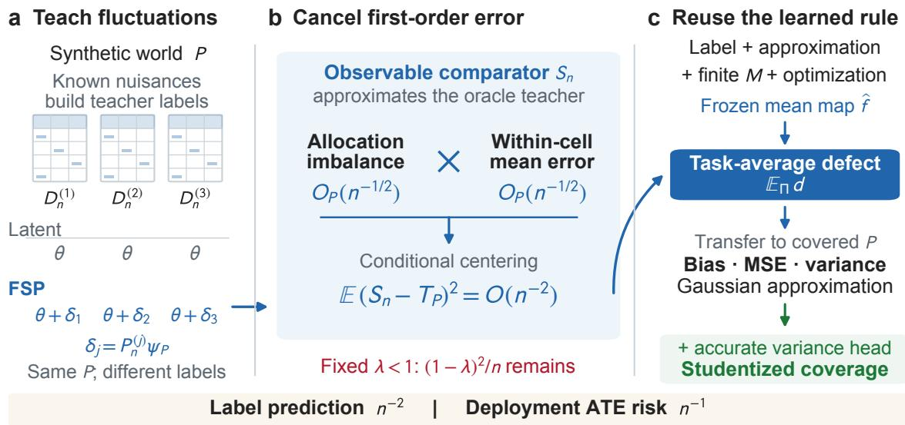  
Figure 2: Second-order label learnability supports first-order inference. (a) FSP labels follow each realized synthetic table. (b) Allocation imbalance multiplies centered cell-mean error; Theorem 3.2 also controls rare cells. (c) Training controls the task average of $d ( P ) = \mathfrak { D } _ { n } ( P ; \widehat { f } )$ ; mechanism transfer and variance-head accuracy yield fixed-population inference. This schematic fixes $K , p _ { * } , \epsilon$ and distinguishes label-prediction risk from deployment ATE risk.

(iv) Distribution and coverage. Let dK be Kolmogorov distance to $N ( 0 , 1 ) , \rho ( P ) = \mathbb { E } _ { P } | \psi _ { P } | ^ { 3 } / V ^ { 3 / 2 }$ , and CBE a universal Berry–Esseen constant. $f V > 0 , f o r t > 0$

$$
d _ { \mathrm { K } } \left( \frac { \sqrt { n } ( \widehat { \theta } - \theta ) } { \sqrt { V } } , N ( 0 , 1 ) \right) \leq C _ { \mathrm { B E } } \rho ( P ) / \sqrt { n } + t / \sqrt { 2 \pi } + d / ( V t ^ { 2 } ) .\tag{14}
$$

$I f \widehat { V } > 0$ almost surely, set $e _ { V } = \mathbb { E } _ { P ^ { n } } ( \widehat { V } / V - 1 ) ^ { 2 }$ . For $r \in ( 0 , 1 / 2 )$ ,

$$
d _ { \mathrm { K } } \left( \frac { \sqrt { n } ( \widehat { \theta } - \theta ) } { \sqrt { \widehat { V } } } , N ( 0 , 1 ) \right) \leq C _ { \mathrm { B E } } \rho ( P ) / \sqrt { n } + t / \sqrt { 2 \pi } + d / ( V t ^ { 2 } ) + r + e _ { V } / r ^ { 2 } .\tag{15}
$$

Twice this bound controls the coverage error of (7), without assuming independence of the heads.

The balanced-panel alternative in Appendix J gives uniform binary-outcome control with $M = J m$ episodes, distinct from pooled training. For a Transformer with W parameters in $[ - B , B ] ^ { W }$ and su $\rho _ { D } | f _ { w } ( D ) -$ $f _ { w ^ { \prime } } ( D ) | \leq L _ { \mathrm { t r } } \| w - w ^ { \prime } \| _ { \infty }$ , we achieve log $N _ { \xi } \le W \log ( 1 + 2 B L _ { \mathrm { t r } } / \xi )$ . The sufficient schedule $a _ { n } =$ $o ( n ^ { - 1 / 2 } ) , n \xi _ { n } \to 0 , n \eta _ { M _ { n } } \to 0$ in probability, and $M _ { n } \gg n \{ \log N _ { \xi _ { n } } + \log ( 1 / \delta _ { n } ) \}$ makes (12) vanish in probability. With V bounded away from zero, bounded $\rho ( P )$ , and $e _ { V } \to 0 ,$ , it yields native coverage on transferred mechanisms. Architecture, variance, and unconditional-training conditions are in Appendices G–I. For binary outcomes, Corollary G.3 gives an explicit quantized-attention construction with $\bar { M } = \lceil n ^ { 3 / 2 } \rceil$ Corollary H.1 separates sampling noise from learned error at finite n.

## 3.3 Two information budgets

Two pretraining lower bounds and one deployment lower bound separate what synthetic episodes can teach from what only a fresh deployment sample can reveal. The first two isolate finite-M limits from supervision geometry and generic episode-learning complexity, while the third shows that even perfect pretraining cannot remove the $n ^ { - 1 }$ information limit of estimating a new population’s effect.

Theorem 3.4 (Pretraining lower bound under partial fluctuation). For everyfixed $\lambda < 1$ , the two Gaussian episode laws $Q _ { \lambda , \sigma } o f ( Z , T _ { \lambda } )$ constructed in Appendix $F . I , \sigma \in \{ - 1 , 1 \}$ , share $P _ { Z } = N ( 0 , 1 / n )$ . A learner A maps M independent episodes to $\widehat { f } _ { A }$ . Then

$$
\operatorname* { i n f } _ { \mathcal { A } } \operatorname* { s u p } _ { \sigma \in \{ - 1 , 1 \} } \mathbb { E } _ { Q _ { \lambda , \sigma } ^ { M } } \{ \mathcal { R } _ { \lambda , \sigma } ( \widehat { f } _ { A } ) - \operatorname* { i n f } _ { f \in L _ { 2 } ( P _ { Z } ) } \mathcal { R } _ { \lambda , \sigma } ( f ) \} \geq ( 1 - \lambda ) ^ { 2 } / ( 1 0 0 n M ) .\tag{16}
$$

Here $\mathcal { R } _ { \lambda , \sigma } ( f ) = \mathbb { E } _ { Q _ { \lambda , \sigma } } \{ f ( Z ) - T _ { \lambda } \} ^ { 2 }$ ; the outer expectation integrates training randomness. $A t \lambda = 1$ , both optimal maps equal Z.

Theorem 3.4 isolates the geometry-specific cost of partial fluctuation; we next separate this effect from the generic complexity cost of learning among many candidate episode predictors.

Theorem 3.5 (Finite-dictionary pretraining lower bound). For $N \geq 2 , M \geq 1$ , and $d _ { N } = \lfloor \log _ { 2 } N \rfloor$ , there are a dictionary $\mathcal { F } _ { N }$ ofat most N bounded episode predictors and laws $\{ Q _ { \sigma } : \sigma \in \{ - 1 , 1 \} ^ { d _ { N } } \} f o r \left( J , L \right)$ such that every possibly randomized learner trained on M episodes obeys

$$
\operatorname* { i n f } _ { \mathcal { A } } \operatorname* { s u p } _ { \sigma \in \{ - 1 , 1 \} ^ { d _ { N } } } \mathbb { E } _ { Q _ { \sigma } ^ { M } } \bigg [ R _ { \sigma } ( \widehat { f } _ { { A } } ) - \operatorname* { i n f } _ { f } R _ { \sigma } ( f ) \bigg ] \geq \frac { 1 } { 3 2 } \operatorname* { m i n } \bigg \{ 1 , \frac { d _ { N } } { M } \bigg \} .\tag{17}
$$

Here $R _ { \sigma } ( f ) = \mathbb { E } _ { Q _ { \sigma } } \{ f ( J ) - L \} ^ { 2 }$ and the inner infimum ranges over measurable predictors. This generic min{1, log $N / M \}$ episode rate matches the dictionary-size dependence in (12); causal sampling defect additionally depends on teacher geometry.

The first two results delimit what finite synthetic pretraining can learn; we now ask what uncertainty remains even if the reusable rule were learned perfectly.

Theorem 3.6 (Deployment-sample lower bound). For every $n \geq 1$ , even with auxiliary pretraining randomness $U \perp D _ { n }$ whose law is identical under every deployment mechanism,

$$
\operatorname* { i n f } _ { \widetilde { \theta } ( U , D _ { n } ) } \operatorname* { s u p } _ { P \in \mathcal { P } _ { K , p * , \epsilon } } \mathbb { E } _ { P ^ { n } , U } ( \widetilde { \theta } - \theta ( P ) ) ^ { 2 } \geq 3 / ( 5 1 2 n ) .\tag{18}
$$

The infimum includes randomized estimators. On the least-favorable path (Pt) through any interior binaryoutcome P with $V ( P ) > 0 \ : ( A p p e n d i x K )$

$$
\operatorname* { l i m } _ { c \to \infty } \operatorname* { l i m i n f } _ { n \to \infty } \operatorname* { i n f } _ { { \widetilde { \theta } _ { n } ( U _ { n } , D _ { n } ) } } \operatorname* { s u p } _ { | u | \leq c } n \mathbb { E } _ { P _ { u / \sqrt { n } } ^ { n } , U _ { n } } ( { \widetilde { \theta } _ { n } - \theta ( P _ { u / \sqrt { n } } ) } ) ^ { 2 } \geq V ( P ) .
$$

Here $U _ { n } \perp D _ { n }$ has a law independent of u. Under Theorem $J . I ' s$ coverage schedule, a panel estimator chosen independently ofc satisfies,for everyfixed $c < \infty$

$$
\operatorname* { s u p } _ { | u | \leq c } \left| n \mathbb { E } _ { P _ { u / \sqrt { n } } ^ { n } , \mathrm { t r a i n } } ( \widehat { f } _ { n } ( D _ { n } ) - \theta ( P _ { u / \sqrt { n } } ) ) ^ { 2 } - V ( P ) \right| \longrightarrow 0 ,
$$

attaining the local bound.

Together, these lower bounds separate the cost of learning the reusable rule from the irreducible cost of learning the deployment population itself. Pretraining learns the rule; the fresh table supplies population information. Continuous confounders, uniform panels, and approximate simulator nuisances are treated in Theorem M.1, Theorem J.1, and Proposition L.1.

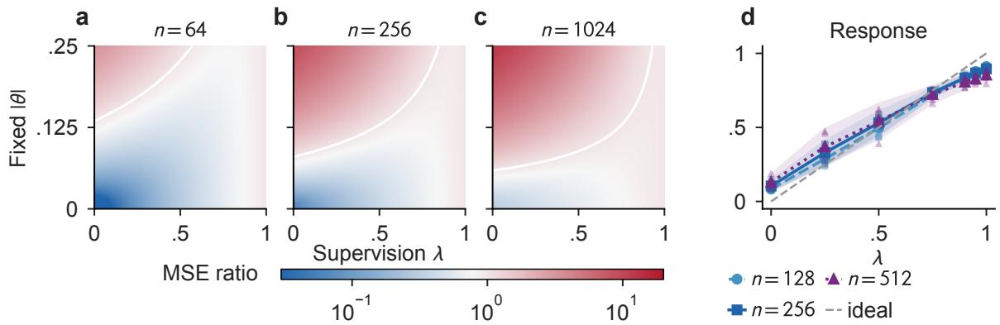  
Figure 3: Changing supervision changes the sampling response. (a–c) Exact Gaussian MSE relative to FSP $( s = . 0 3 5 , v = 1 )$ ; the white contour marks equal MSE. (d) All 105 seedwise coefficients at the typical mechanism: seven targets, five seeds, three context lengths, $M = 8 1 9 2$ . Lines are means; bands are 95% across-seed t intervals. Appendix N.1 defines the coefficient.

## 4 Experiments: from supervision to sampling behavior

We tested three implications of the theory: whether changing only the label changes the sampling response; whether mean and scale errors predict distinct inferential failures; and how the frozen rule transfers to continuous covariates and real populations. Matched backbones and shared deployment tables isolated the supervision effect. Baselines comprised latent supervision, empirical and smoothed stratified estimates, released CausalPFN [Balazadeh Meresht et al., 2025], and cross-fitted sieve AIPW/DML [Chernozhukov et al., 2018]. We measured RMSE for point accuracy, ${ \mathfrak { D } } _ { n }$ and response coefficients for fluctuation fidelity, and variance ratios, Kolmogorov distance and coverage for inference. Appendix N specifies all settings, aggregation rules and uncertainty calculations; Table 5 maps each test to its theoretical claim.

The label is the intervention. Holding generator, network, optimizer and budget fixed, the seven-point λ sweep at the typical mechanism and n = 256 increased the sampling-response coefficient from 0.105 to 0.895 and produced an 8.72-fold reduction in full-label defect (Figure 3). FSP attained native coverage 0.952. The Gaussian panels locate the mechanism: shrinkage improves point risk near the prior center but attenuates shifted effects. At this finite budget, full-label defect has a shallow minimum near λ = .95; Figure 6 reports the separate own-label risk, bias and variance diagnostics.

Raw-table gains under effect shift. On the fixed large-effect mechanism, raw FSP achieved RMSE 0.0457, versus 0.1514 for the identical latent-supervised backbone and 0.0756 for released CausalPFN-S on the same 300 tables: reductions of 69.8% and 39.5% (Figure 4b). Near the prior center, latent supervision instead achieved 0.0126 versus FSP’s 0.0591. On unbinned nonlinear covariates, FSP reduced defect by 65.5% relative to the same latent network, while latent supervision retained lower RMSE; cross-fitted DML recovered a response slope of 1.008 (Figure 8). These controlled reversals distinguish learning an efficient sampling response from minimizing prior-averaged prediction error.

Coverage needs both centering and scale. At the typical mechanism and $n = 2 5 6$ , summary and raw FSP had native coverage .952 and .953, but Kolmogorov distances .081 and .352: similar coverage concealed different distributional shapes. Under weak overlap, raw FSP’s mean $\widehat { V } / V$ fell to .328 and native coverage to .706, versus .998 with oracle V. Replacing the variance head therefore exposed an additional scale error;

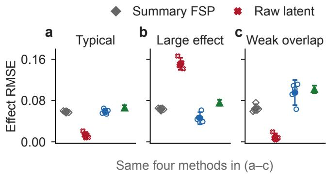

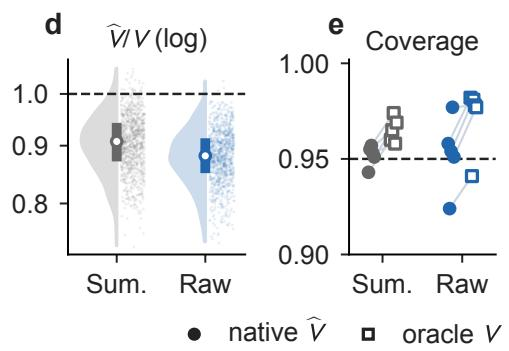  
Figure 4: Point accuracy and inferential fidelity separate. (a–c) RMSE, $n = 2 5 6 , M = 8 1 9 2 , 3 0 0$ common tables per mechanism. Open marks show five seeds; filled marks show mean RMSE (one checkpoint for CausalPFN). 95% intervals use across-seed t statistics or CausalPFN table bootstrap. (d) Typical-mechanism variance ratios: all 1,000 tables per method, averaged over five checkpoints; white marks/bars show medians/interquartile ranges. (e) Five seedwise native/oracle-V coverage pairs on those tables.

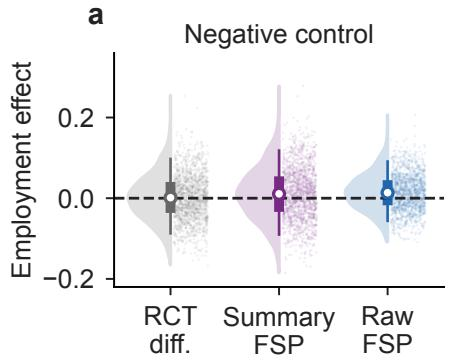

b  
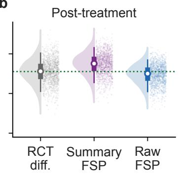

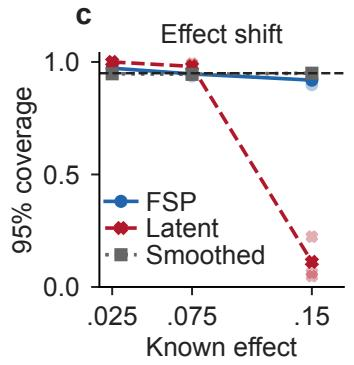  
Figure 5: Frozen transfer trades variance against residual attenuation. (a–b) National Supported Work: rerandomized null and post-treatment empirical benchmark, $n = 2 5 6$ . Rainclouds show all 1,500 resampling estimates per method; FSP points average five checkpoints. White marks denote medians; thick/thin bars span the interquartile/5th– 95th percentile ranges. (c) Known-effect semisynthesis, $n = 2 5 6 \colon$ coverage means and seed points for three-seed summary models, $M = 3 2 7 6 8$

the oracle-V intervals remained conservative. Table 3 reports the joint bias, scale and shape diagnostics corresponding to Theorem 3.3.

Real populations and known-effect transfer. For National Supported Work [LaLonde, 1986, Dehejia and Wahba, 1999], the raw-FSP five-checkpoint ensemble reduced post-treatment RMSE from .0596 to .0522 relative to the arm difference, and pre-treatment null RMSE from .0570 to .0479 (Figure 5). Its post-treatment mean was .0957 against the full-sample benchmark .1106. At n = 256 on the independent social-pressure turnout trial [Gerber et al., 2008], summary/raw FSP ensembles achieved RMSE .0571/.0628 versus .0775 for the arm difference, with biases $- . 0 0 7 7 / - . 0 2 4 1$ . Against these empirical trial contrasts, lower ensemble RMSE coexisted with residual attenuation. Known-effect semisynthesis supplies a complementary coverage test: as the effect increased from .025 to .15, summary-FSP coverage changed from .972 to .919, while latent coverage fell from 1.000 to .112.

Ablations, sensitivity and the two data budgets. The target-only sweep and shifted-teacher ablation isolate supervision; native/oracle variance replacement isolates scale learning. Varying M, n, effect shift, overlap, dimension and smoothness locates their operating regimes (Appendix N). The M × n grid links defect to bias, risk and coverage; 105,000 additional repetitions of the Bernoulli proof family recover the local log N/M scale. These checks keep training and deployment budgets empirically distinct. Appendix O documents the proof-to-code verification map.

## 5 Discussion

Full fluctuation removes first-order label ambiguity; finite-pretraining and mechanism-transfer bounds then quantify how faithfully a frozen rule reproduces that response. Deployment observations still determine the population effect at the n−1 risk scale. The experiments make this distinction operational: changing the target improves response fidelity and shifted-effect accuracy, whereas prior-centered tasks can favor shrinkage. In the randomized-data benchmarks, lower ensemble RMSE coexists with residual attenuation. A reusable estimator should therefore be assessed by its centering, sampling variation and distributional shape, together with point accuracy.

The resulting research agenda is to make these diagnostics guide pretraining. Response coefficients and fixed-mechanism bias assess the mean map; oracle-studentized Kolmogorov distances assess shape; native/oracle comparisons locate additional scale error. Residual products from paired synthetic tables identify squared bias in expectation (Proposition L.2). The balanced-panel bound (Theorem J.1) further separates mechanism coverage from replication within mechanisms. It suggests allocating simulation effort to both: learning an accurate reusable rule and representing the populations in which that rule will be used are distinct statistical requirements. Weak overlap stresses both learned heads, identifying variance extrapolation as a concrete next target. Proposition I.1 quantifies how variance-head learning controls the additional relative-error term in studentization. Extending FSP to heterogeneous effects, quantiles and policy values will require matching each synthetic label to its corresponding repeated-sample object and quantifying finite-pretraining transfer. Semiparametric theory thus supplies a constructive language for teaching reusable causal inference.

## Reproducibility statement

The supplement contains complete proofs; simulator, architecture, optimizer, and seed specifications; a compact numerical replay package with inventoried replicate outputs and checkpoints; data provenance; environment locks; executable analysis scripts; and a theorem–evidence map. Released CausalPFN inference is pinned to a repository commit and checkpoint digest, and matched-table identity is audited by reconstructed raw-array hashes. The three main experimental figures have self-contained numerical sources and a revisionspecific hash manifest. The README distinguishes stored-result replay from regeneration of the full training suite. Lean 4.32 source, a statement-level map for all 21 numbered results, and a kernel-verification record are described in Appendix O.

## AI use statement

Generative AI systems assisted with conceptual brainstorming, literature discovery, mathematical claim formulation, proof drafting and algebraic checking, synthetic-data and experimental-design iteration, code implementation and debugging, experiment orchestration, result interpretation, figure generation, and manuscript drafting and editing. The authors independently checked every citation against its primary source, reviewed every theorem statement and proof, reran the reported computations from versioned scripts and stored data, inspected the raw outputs behind every numerical claim, and take full responsibility for the paper, code, and artifacts.

## References

Vahid Balazadeh Meresht, Hamidreza Kamkari, Valentin Thomas, Junwei Ma, Bingru Li, Jesse C. Cresswell, and Rahul G. Krishnan. CausalPFN: Amortized causal effect estimation via in-context learning. In Advances in Neural Information Processing Systems, volume 38, pages 154945–154984. Curran Associates, Inc., 2025. doi: 10.52202/ 085713-5184. URL https://proceedings.neurips.cc/paper\_files/paper/2025/ hash/e3d3db07c1bfb63e1d0b998996de1d12-Abstract-Conference.html.

Stéphane Boucheron, Gábor Lugosi, and Pascal Massart. Concentration Inequalities: A Nonasymptotic Theory ofIndependence. Oxford University Press, 2013.

Johann Brehmer, Gilles Louppe, Juan Pavez, and Kyle Cranmer. Mining gold from implicit models to improve likelihood-free inference. Proceedings ofthe National Academy ofSciences, 117(10):5242–5249, 2020. doi: 10.1073/pnas.1915980117. URL https://doi.org/10.1073/pnas.1915980117.

Matias D. Cattaneo. Efficient semiparametric estimation of multi-valued treatment effects under ignorability. Journal of Econometrics, 155(2):138–154, 2010. doi: 10.1016/j.jeconom.2009.09.023.

Victor Chernozhukov, Denis Chetverikov, Mert Demirer, Esther Duflo, Christian Hansen, Whitney Newey, and James Robins. Double/debiased machine learning for treatment and structural parameters. The Econometrics Journal, 21(1):C1–C68, 2018. doi: 10.1111/ectj.12097. URL https://doi.org/10. 1111/ectj.12097.

Rajeev H. Dehejia and Sadek Wahba. Causal effects in nonexperimental studies: Reevaluating the evaluation of training programs. Journal of the American Statistical Association, 94(448):1053–1062, 1999. doi: 10.1080/01621459.1999.10473858.

Alan S. Gerber, Donald P. Green, and Christopher W. Larimer. Social pressure and voter turnout: Evidence from a large-scale field experiment. American Political Science Review, 102(1):33–48, 2008. doi: 10.1017/S000305540808009X.

Alan S. Gerber, Donald P. Green, and Christopher W. Larimer. Replication data for: Social pressure and voter turnout: Evidence from a large-scale field experiment, 2026. URL https://doi.org/10.60600/ YU/CGMWNW. Version 2.0, CC0 1.0.

Noah Hollmann, Samuel Müller, Lennart Purucker, Arjun Krishnakumar, Max Körfer, Shi Bin Hoo, Robin Tibor Schirrmeister, and Frank Hutter. Accurate predictions on small data with a tabular foundation model. Nature, 637(8045):319–326, 2025. doi: 10.1038/s41586-024-08328-6. URL https://doi.org/10.1038/s41586-024-08328-6.

Robert J. LaLonde. Evaluating the econometric evaluations of training programs with experimental data. American Economic Review, 76(4):604–620, 1986. URL https://www.jstor.org/stable/ 1806062.

Tianyi Ma, Tengyao Wang, and Richard J. Samworth. Optimal in-context adaptivity and distributional robustness of transformers. arXiv preprint arXiv:2510.23254, 2025. doi: 10.48550/arXiv.2510.23254. URL https://arxiv.org/abs/2510.23254v3. Version 3, revised 7 May 2026.

Yuchen Ma, Dennis Frauen, Emil Javurek, and Stefan Feuerriegel. Foundation models for causal inference via prior-data fitted networks. In International Conference on Learning Representations, volume 2026, pages 79065–79098, 2026. URL https://proceedings.iclr.cc/paper\_files/paper/2026/ hash/7f8cabaf2de70e1a9d3eb187f02bd58c-Abstract-Conference.html.

Luca Masserano, Tommaso Dorigo, Rafael Izbicki, Mikael Kuusela, and Ann B. Lee. Simulator-based inference with WALDO: Confidence regions by leveraging prediction algorithms and posterior estimators for inverse problems. In Proceedings of the 26th International Conference on Artificial Intelligence and Statistics, volume 206 of Proceedings ofMachine Learning Research, pages 2960–2974. PMLR, 2023. URL https://proceedings.mlr.press/v206/masserano23a.html.

Valentyn Melnychuk, Vahid Balazadeh, Stefan Feuerriegel, and Rahul G. Krishnan. Frequentist consistency of prior-data fitted networks for causal inference. In Proceedings of the 43rd International Conference on Machine Learning, volume 306 of Proceedings ofMachine Learning Research. PMLR, 2026. URL https://icml.cc/virtual/2026/poster/61548. Latest public manuscript: arXiv v3, revised 22 July 2026.

Francisco Mourao, David Hajage, Daria Bystrova, Bertrand Bouvarel, Nathanaël Lapidus, Fabrice Carrat, and Benjamin Glemain. Prior-data fitted networks for causal inference: a simulation study with realworld scenarios. arXiv preprint arXiv:2603.15928, 2026. doi: 10.48550/arXiv.2603.15928. URL https://arxiv.org/abs/2603.15928v2. Version 2, revised 13 April 2026.

Samuel Müller, Noah Hollmann, Sebastian Pineda Arango, Josif Grabocka, and Frank Hutter. Transformers can do Bayesian inference. In International Conference on Learning Representations, 2022. URL https://openreview.net/forum?id=KSugKcbNf9.

Thomas Nagler. Statistical foundations of prior-data fitted networks. In Proceedings ofthe 40th International Conference on Machine Learning, volume 202 of Proceedings of Machine Learning Research, pages 25660– 25676. PMLR, 2023. URL https://proceedings.mlr.press/v202/nagler23a.html.

Jake Robertson, Arik Reuter, Siyuan Guo, Noah Hollmann, Frank Hutter, and Bernhard Schölkopf. Do-PFN: In-context learning for causal effect estimation. In Advances in Neural Information Processing Systems, volume 38, pages 174811–174848. Curran Associates, Inc., 2025. doi: 10.52202/ 085713-5814. URL https://proceedings.neurips.cc/paper\_files/paper/2025/ hash/ff997469ac66cf893c4183efeb22212a-Abstract-Conference.html.

Claudia Shi, David M. Blei, and Victor Veitch. Adapting neural networks for the estimation of treatment effects. In Advances in Neural Information Processing Systems, volume 32, pages 2507–2517. Curran Associates, Inc., 2019. URL https://proceedings.neurips.cc/paper/2019/hash/ 8fb5f8be2aa9d6c64a04e3ab9f63feee-Abstract.html.

statsmodels Developers. Treatment effect estimation, 2026. URL https://www.statsmodels.org/ stable/examples/notebooks/generated/treatment\_effect.html. Official documen tation and installed cataneo2.csv benchmark; accessed 17 September 2026.

Aad W. van der Vaart. Asymptotic Statistics. Cambridge University Press, 1998.

## A Related work through three structural distinctions

Predictive targets versus inferential targets. PFNs amortize prediction over synthetic data sets [Müller et al., 2022, Hollmann et al., 2025]. Their theory links variance to sample sensitivity and bias to localization [Nagler, 2023], and analyzes optimal in-context adaptation under specified task-distribution shift [Ma et al., 2025]. CausalPFN amortizes treatment-effect estimation with Bayesian uncertainty, Do-PFN predicts interventional outcomes, and CausalFM constructs SCM-based priors across identification regimes [Balazadeh Meresht et al., 2025, Robertson et al., 2025, Ma et al., 2026]. FSP builds on this interface but studies how the synthetic supervision target shapes the first-order sampling behavior of a frozen estimator at a fixed mechanism. Its focus is causal-label learnability and finite-pretraining inference, rather than another causal prior, identification regime, or uncertainty output. The simulation study of Mourao et al. [2026] further motivates assessing point-estimation error and interval coverage separately.

Training-side versus deployment-side correction. Neyman-orthogonal scores and cross-fitting support debiased estimation with flexible nuisance learners [Chernozhukov et al., 2018], while Dragonnet’s targeted regularization incorporates treatment-effect structure into neural training on the data set being analyzed [Shi et al., 2019]. FSP therefore differs in the unit and purpose of supervision, not simply in acting during training: it labels whole synthetic tables to learn a reusable estimator. A close PFN-specific comparison is Melnychuk et al. [2026], who identify prior-induced confounding bias and establish a semiparametric Bernstein–von Mises result for the OSPC ATE posterior under stated concentration conditions. Their MP-OSPC implementation recovers outcome and propensity nuisance posteriors from a PFN through martingale posteriors and applies an EIF-based one-step correction. FSP instead changes supervision before deployment and analyzes the native frozen output, explicitly tracking finite-pretraining, approximation, and mechanismtransfer errors. The distinction is between constructing a corrected posterior from nuisance posteriors and learning the sampling response of a reusable table-to-effect map.

Simulator privilege versus deployment information. Simulator-accessible joint scores and joint likelihood ratios already provide privileged labels for likelihood-free inference [Brehmer et al., 2020]; simulator privilege itself is not our contribution. FSP uses simulator-known causal nuisances for a different target: each synthetic table’s efficient fluctuation. WALDO wraps a learned predictor or posterior estimator in simulation-calibrated Neyman inversion to construct confidence regions [Masserano et al., 2023]. FSP instead learns the estimator’s first-order sampling response and studentizes the native frozen output with a separate variance head. The new results are the finite-stratum label-learnability transition and its connection to finite-pretraining inference. The variance head targets $V ( P ) = \mathbb { E } _ { P } \psi _ { P } ^ { 2 }$ , the coefficient in the sampling variance $V ( P ) / n ,$ , rather than conditional label uncertainty. Table 2 in Appendix B summarizes what is learned once and what a new data set still requires.

## B Assumptions, probability levels, and implementation contract

The probability structure is

$$
( P _ { j } , D _ { j } , T _ { j } , V _ { j } ) _ { j = 1 } ^ { M } \longrightarrow ( \widehat { f } , \widehat { v } ) \mathrm { ( f r e e z e ) } ; \qquad P ^ { \star } \longrightarrow D _ { n } ^ { ( 1 ) } , D _ { n } ^ { ( 2 ) } , \ldots \longrightarrow \bigl ( \widehat { f } ( D _ { n } ^ { ( b ) } ) , \widehat { v } ( D _ { n } ^ { ( b ) } ) \bigr ) .
$$

Here $D _ { j } = D _ { n } ^ { ( j ) } , T _ { j } = T _ { P _ { j } } ( D _ { j } )$ , and $V _ { j } = V ( P _ { j } )$ . The first arrow is training-task learning; the second is repeated sampling at one mechanism.

Table 1: Assumptions are paired with their role, an observable diagnostic, and the mathematical consequence of failure.
<table><tr><td>Assumption</td><td>Why it is needed</td><td>Observable diagnostic</td><td>Failure consequence</td></tr><tr><td>Consistency and exchange- Identify the ATE in (2) ability</td><td></td><td>Scientific design and sensitivity anal- The same algebra targets an observed ysis; not testable from one table</td><td>standardized contrast, not necessarily a causal effect</td></tr><tr><td> $p _ { s } \geq p _ { * }$  and  $e _ { s } \in [ \epsilon , 1 -$  €]</td><td>Control empty cells and efficient- Stratum and arm counts; estimated score moments</td><td>propensity tails</td><td>Constants or variance diverge; uniform root-n claim is unavailable</td></tr><tr><td>outputs</td><td>losses</td><td>clipping</td><td>Bounded outcomes and Concentrate finite-episode squared Outcome support; enforced output Replace by robust losses and explicit tail conditions</td></tr><tr><td>Independent synthetic episodes</td><td>Make M the effective task sample size</td><td>Generator seeds and episode prove- nance</td><td>Dependent queries cannot be counted as independent tasks</td></tr><tr><td></td><td>try</td><td>agnostics</td><td>Accurate simulator labels Match the intended influence geome- Teacher-corruption and nuisance di- Proposition L.1 adds bias and variance to the native defect</td></tr><tr><td>tion control</td><td>Architecture and optimiza- Separate representability, estimation, and achieved fit</td><td>loss; optimization gap</td><td>Norm/width audit; held-out target The corresponding terms in (12) persist</td></tr><tr><td>Mechanism coverage</td><td>Transfer training risk to deployment</td><td>Prior-density ratio, held-out shift, or No guarantee for unsupported panel resolution</td><td>mechanisms</td></tr><tr><td> $V ( P ) > 0$   $\widehat { V }$ </td><td>and consistent Studentization and Wald coverage</td><td>agnostics</td><td>V /V, oracle/native coverage, QQ di- Scale error appears explicitly in (15)</td></tr></table>

Algorithm 1 FSP changes supervision and keeps deployment frozen   
Require: Causal mechanism generator; table network $f _ { \omega } ;$ variance head $v _ { \zeta }$   
1: for each independent synthetic episode do   
2: Sample $P ,$ generate $D _ { n } \sim P ^ { n }$ , and compute $T _ { \lambda , P } ( D _ { n } )$ and $V ( P )$ from the simulator law.   
3: Update $\omega$ with squared label loss; update $\zeta$ with variance-coefficient loss. Set $\lambda = 1$ for FSP.   
4: end for   
5: Freeze all weights. On a new observed table, return $f _ { \omega } ( D _ { n } )$ and $v _ { \zeta } ( D _ { n } )$ ; use (7) under the stated   
inference conditions.

## C Proof conventions and the efficient-label representation

All expectations are Lebesgue integrals. Conditional expectations are understood up to almost-sure equality. All table functions are measurable; in the finite-class results a fixed deterministic ordering resolves ties, so the empirical selector is measurable. Independence across synthetic episodes is distinct from independence of the rows within a table. A trained network is conditioned on throughout a deployment calculation. The results remain valid for independent external training randomness by enlarging the training sigma-field. A statement uniform over mechanisms is explicitly labeled as such.

The following standard probability tools are used in their usual precise forms [Boucheron et al., 2013, van der Vaart, 1998]: (i) for independent centered $Z _ { i }$ with $| Z _ { i } | \le L$ and $\begin{array} { r } { \sum _ { i } \mathbb { E } Z _ { i } ^ { 2 } \leq v } \end{array}$ , Bernstein’s inequality gives

$$
P \left( \left| \sum _ { i } Z _ { i } \right| \geq { \sqrt { 2 v t } } + { \frac { 2 } { 3 } } L t \right) \leq 2 e ^ { - t } ;
$$

(ii) for iid centered $Z _ { i }$ with variance $\sigma ^ { 2 } > 0$ and finite third absolute moment, the Kolmogorov distance of $\textstyle \sum _ { i } Z _ { i } / ( \sigma { \sqrt { n } } )$ from $N ( 0 , 1 )$ is at most $C _ { \mathrm { B E } } \mathbb { E } | Z _ { i } | ^ { 3 } / ( \sigma ^ { 3 } \sqrt { n } )$ ; (iii) a measurable statistic cannot increase total variation; (iv) $\mathrm { T V } ( P , Q ) \leq \sqrt { \mathrm { K L } ( P , Q ) / 2 }$ . These are invoked as classical theorems, not claimed as new results. All problem-specific assertions below are proved.

Lemma C.1 (Canonical gradient and exact label moments). Under the conditions ofSection 2, $| \phi _ { P } | \leq H ,$

Table 2: Where inferential structure enters. Representative, non-exclusive workflows differ in what is learned once and what a new data set still requires. “Native” denotes the uncorrected output of FSP’s fixed mean and variance heads.
<table><tr><td>Pattern</td><td>Representative examples</td><td>Where inferential structure enters</td><td>Deployment object or operation</td></tr><tr><td>Amortized causal or inter- CausalPFN; ventional prediction</td><td>CausalFM [Bal- azadeh Meresht et al., 2025, Robertson et al.,</td><td>Do-PFN; Synthetic causal or interventional target</td><td>Frozen forward prediction of an effect. uncertainty object, or interventional outcome</td></tr><tr><td>targeted estimation</td><td>2018, Shi et al., 2019]</td><td>Per-data-set orthogonal or DML; targeted regulariza- Nuisance fits plus an orthogonal score and Construct an estimate anew on the tion [Chernozhukov et al., cross-fitting, or a targeted neural objective</td><td>analyzed data set</td></tr><tr><td>Downstream inferential con- MP-OSPC; struction</td><td>Masserano et al., 2023]</td><td>WALDO After nuisance posteriors, a predictor, or a pos- EIF-based one-step ATE posterior, or [Melnychuk et al., 2026, terior estimator has been learned</td><td>simulation-calibrated critical values and Neyman inversion</td></tr><tr><td>FSP</td><td>This work</td><td>Efficient table fluctuation and  $V ( P )$  thetic supervision</td><td>in syn- Reuse native fixed heads; guarantees require stated mechanism-transfer and variance conditions, with a finite-pretraining upper bound and separate hard-family lower bounds</td></tr></table>

$\mathbb { E } _ { P } \phi _ { P } = \theta ( P )$ , and

$$
V ( P ) = \sum _ { s } p _ { s } \left[ ( m _ { 1 s } - m _ { 0 s } - \theta ) ^ { 2 } + \frac { \sigma _ { 1 s } ^ { 2 } } { e _ { s } } + \frac { \sigma _ { 0 s } ^ { 2 } } { 1 - e _ { s } } \right] .\tag{19}
$$

Consequently $\mathbb { E } _ { P ^ { n } } T _ { P } = \theta$ and $\mathrm { V a r } _ { P ^ { n } } ( T _ { P } ) = V ( P ) / n$ . In the interior binary-outcome observed-law model, ψP is the canonical gradient of the ATE functional and $V ( P )$ is its semiparametric efficiency bound per observation.

Proof. For fixed $X = s ,$ exchangeability and consistency identify the observed conditional means with the potential-outcome means. The two residual terms in (3) each have conditional expectation zero. Therefore $\mathbb { E } ( \phi _ { P } \mid X = s ) = m _ { 1 s } - m _ { 0 s }$ , proving the mean identity after averaging over $X$ . Since $| m _ { 1 s } - m _ { 0 s } | \leq 1$ and exactly one of the two residual terms is nonzero, $| \phi _ { P } | \le 1 + 1 / \epsilon = H$

Let $U = A ( Y - m _ { 1 X } ) / e _ { X } - ( 1 - A ) ( Y - m _ { 0 X } ) / ( 1 - e _ { X } )$ . Conditional on X, U has mean zero. Its two summands have zero product, hence

$$
{ \mathbb E } ( U ^ { 2 } \mid X = s ) = \sigma _ { 1 s } ^ { 2 } / e _ { s } + \sigma _ { 0 s } ^ { 2 } / ( 1 - e _ { s } ) .
$$

It is uncorrelated with the X-measurable contrast $m _ { 1 X } - m _ { 0 X } - \theta$ . Expanding $\psi _ { P } ^ { 2 }$ proves (19). Independence of the rows gives the variance of their mean.

For the gradient claim, put $\mathcal { O } = \{ 1 , \ldots , K \} \times \{ 0 , 1 \} \times \{ 0 , 1 \}$ and write $q ( o ) > 0$ for the observed mass function. Every mean-zero function h on O is the score of the local path $q _ { t } ( o ) = q ( o ) ( 1 + t h ( o ) )$ for sufficiently small $| t |$ . Differentiating the finite sums and ratios gives

$$
\dot { p } _ { s } = \mathbb { E } [ { \bf 1 } \{ X = s \} h ( O ) ] , \qquad \dot { m } _ { a s } = \frac { \mathbb { E } [ { \bf 1 } \{ X = s , A = a \} ( Y - m _ { a s } ) h ( O ) ] } { P ( X = s , A = a ) } .
$$

The product rule applied to $\begin{array} { r } { \theta = \sum _ { s } p _ { s } ( m _ { 1 s } - m _ { 0 s } ) } \end{array}$ then yields $\dot { \theta } = \mathbb { E } [ \phi _ { P } h ] = \mathbb { E } [ \psi _ { P } h ]$ . The observed-law tangent space is the entire finite-dimensional space of mean-zero functions; an observed law in this space can be realized by a causal world with independent assignment given $X$ and the stated conditional outcome marginals. Thus the unique gradient in that tangent space is $\psi _ { P } ,$ , completing the claim. □

## D Exact Gaussian objective mismatch

In this illustration, the minimization ranges over square-integrable functions of $Z ,$ separately from the bounded causal class $\mathcal { F }$ . At fixed $\theta , \mathbb { E } _ { \theta }$ and Varθ average repeated draws of $Z \mid \theta _ { : }$ , and Biasθ $( f ) = \mathbb { E } _ { \theta } f ( Z ) - \theta$ and $\mathrm { M S E } _ { \theta } ( f ) = \mathbb { E } _ { \theta } \{ f ( Z ) - \theta \} ^ { 2 }$ . For fixed $\theta , s ^ { 2 } , v , \lambda$ , Proposition 3.1 gives $1 - a _ { \lambda , n } = O ( n ^ { - 1 } )$ . Thus every fixed partial-fluctuation predictor approaches first-order efficiency as n grows; the endpoint distinction is the order of synthetic-label prediction error, not a universal necessity for asymptotic efficiency.

Proof of Proposition 3.1. Multiplication of the likelihood exp $\{ - n ( Z - \theta ) ^ { 2 } / ( 2 v ) \}$ by the prior density exp $ \hfill \{ - \theta ^ { 2 } / ( 2 s ^ { 2 } ) \}$ and completion of the square gives

$$
\theta \mid Z \sim N \left( { \frac { n s ^ { 2 } } { n s ^ { 2 } + v } } Z , { \frac { s ^ { 2 } v } { n s ^ { 2 } + v } } \right) .
$$

For any square-integrable random target $U _ { : }$ , conditioning on the input $Z$ gives

$$
\begin{array} { r } { \mathbb { E } [ ( a - U ) ^ { 2 } \mid Z ] = ( a - \mathbb { E } [ U \mid Z ] ) ^ { 2 } + \mathrm { V a r } ( U \mid Z ) , } \end{array}
$$

so the conditional mean uniquely minimizes squared loss up to null sets. In the Gaussian location experiment, the efficient influence average is $Z - \theta .$ , so the full-fluctuation label is $T _ { 1 } = Z$ . Because $T _ { \lambda } = ( 1 - \lambda ) \theta + \lambda Z$ posterior linearity gives

$$
\mathbb { E } ( T _ { \lambda } \mid Z ) = \{ ( 1 - \lambda ) \kappa _ { n } + \lambda \} Z = a _ { \lambda , n } Z , \quad \quad \mathrm { V a r } ( T _ { \lambda } \mid Z ) = ( 1 - \lambda ) ^ { 2 } { \frac { s ^ { 2 } v } { n s ^ { 2 } + v } } .
$$

At fixed $\theta , a _ { \lambda , n } Z$ has mean $a _ { \lambda , n } \theta$ and variance $a _ { \lambda , n } ^ { 2 } v / n$ , which proves Proposition 3.1. If $\lambda < 1$ is fixed, the conditional variance multiplied by n converges to $( 1 - \lambda ) ^ { 2 } v ; \mathrm { a t } \lambda = 1$ it vanishes identically. □

Lemma D.1 (Population λ-supervision is an $L _ { 2 }$ projection). Let the joint training law be $P \sim \Pi , D _ { n } \sim P ^ { n }$ with $T _ { \lambda } = T _ { \lambda , P } ( D _ { n } ) \in L _ { 2 } . { \cal S e t } g _ { \lambda } ( D _ { n } ) = \mathbb { E } [ T _ { \lambda } \mid D _ { n } ]$ . For every measurable $f ( D _ { n } ) \in L _ { 2 }$

$$
\begin{array} { r } { \mathbb { E } ( f - T _ { \lambda } ) ^ { 2 } = \mathbb { E } \operatorname { V a r } ( T _ { \lambda } \mid D _ { n } ) + \mathbb { E } ( f - g _ { \lambda } ) ^ { 2 } . } \end{array}\tag{20}
$$

$A t \lambda = 1$ , the minimax finite-stratum table-prediction risk is $\Theta ( n ^ { - 2 } )$ ). This conditional label ambiguity is distinctfrom the deployment sampling variance $V ( P ) / n$

Proof. Expand $f - T _ { \lambda } = ( f - g _ { \lambda } ) + ( g _ { \lambda } - T _ { \lambda } )$ . The cross term integrates to zero because $f - g _ { \lambda }$ is measurable with respect to $D _ { n }$ and $\mathbb { E } [ g _ { \lambda } - T _ { \lambda } \mid D _ { n } ] = 0$ . Conditional expectation of the second squared term is $\mathrm { V a r } ( T _ { \lambda } \mid D _ { n } )$ . The $\lambda = 1$ upper and lower orders follow from Theorem 3.2; Proposition 3.1 gives the stated separation from sampling variance. □

## E The finite-stratum lambda-supervision phase transition

Define

$$
N _ { s } = \sum _ { i } { { \bf 1 } \{ X _ { i } = s \} } , \quad N _ { a s } = \sum _ { i } { { \bf 1 } \{ X _ { i } = s , A _ { i } = a \} } , \quad Z _ { a s } = \sum _ { i } { { \bf 1 } \{ X _ { i } = s , A _ { i } = a \} Y _ { i } } .
$$

The denominator-truncated observable comparator is

$$
S _ { n } ( D _ { n } ) = \sum _ { s } \frac { N _ { s } } { n } \left\{ \frac { Z _ { 1 s } / n } { \operatorname* { m a x } ( N _ { 1 s } / n , q _ { * } / 2 ) } - \frac { Z _ { 0 s } / n } { \operatorname* { m a x } ( N _ { 0 s } / n , q _ { * } / 2 ) } \right\} .\tag{21}
$$

Each ratio lies in [0, 1], so $| S _ { n } | \le 1$ . Let

$$
G _ { n } = \bigcap _ { s , a } \{ N _ { a s } \geq n q _ { * } / 2 \} .
$$

On $G _ { n } , S _ { n }$ is the ordinary empirical-stratum-weighted difference of outcome means.

Lemma E.1 (Rare-cell probability). Uniformly over $\mathcal { P } _ { K , p _ { * } , \epsilon } , P ( G _ { n } ^ { c } ) \leq 2 K \exp ( - n q _ { * } / 8 )$

Proof. If $B \sim \mathrm { B i n o m i a l } ( n , q )$ , then Markov’s inequality and the binomial moment generating function give

$$
P ( B \leq n q / 2 ) \leq e ^ { t n q / 2 } ( 1 - q + q e ^ { - t } ) ^ { n } \leq \exp \{ n q ( t / 2 + e ^ { - t } - 1 ) \} .
$$

Taking $t = \log 2$ makes the exponent at most $- n q / 8$ because $( \log 2 ) / 2 - 1 / 2 < - 1 / 8$ . For each cell, $q = P ( X = s , A = a ) \geq q _ { * }$ . The event $N _ { a s } < n q _ { * } / 2$ is contained in $N _ { a s } < n q / 2$ , so its probability is at most $e ^ { - n q _ { * } / 8 }$ . A union bound over 2K cells completes the proof. □

Upper bound in Theorem 3.2. Let $e _ { 1 s } = e _ { s }$ and $e _ { 0 s } = 1 - e _ { s }$ . On $G _ { n }$ , define $\bar { Y } _ { a s } = Z _ { a s } / N _ { a s }$ . Subtracting (4) from the empirical contrast gives the exact identity

$$
S _ { n } - T _ { P } = \sum _ { s , a } ( 2 a - 1 ) \frac { N _ { s } - N _ { a s } / e _ { a s } } { n } ( \bar { Y } _ { a s } - m _ { a s } ) .\tag{22}
$$

Condition on all $( X _ { i } , A _ { i } )$ . Conditional outcome residuals in distinct cells are independent and have mean zero. The event $G _ { n }$ is measurable under this conditioning. Therefore the conditional squared error of the right side is the sum, not the square of the sum, of its conditional variances:

$$
\mathbb { E } _ { P ^ { n } } [ ( S _ { n } - T _ { P } ) ^ { 2 } \mathbf { 1 } _ { G _ { n } } ] = \mathbb { E } _ { P ^ { n } } \left[ \mathbf { 1 } _ { G _ { n } } \sum _ { s , a } \frac { ( N _ { s } - N _ { a s } / e _ { a s } ) ^ { 2 } } { n ^ { 2 } } \frac { \sigma _ { a s } ^ { 2 } } { N _ { a s } } \right] .
$$

A bounded [0, 1] variable has variance at most $1 / 4$ . On $G _ { n } , 1 / N _ { a s } \leq 2 / ( n q _ { * } )$ . For fixed $( s , a )$ , the centered count difference is a sum of iid mean-zero variables $\mathbf { 1 } \{ X _ { i } = s \} ( 1 - \mathbf { 1 } \{ A _ { i } = a \} / e _ { a s } )$ . Its second moment equals

$$
\mathbb { E } _ { P ^ { n } } ( N _ { s } - N _ { a s } / e _ { a s } ) ^ { 2 } = n p _ { s } ( 1 - e _ { a s } ) / e _ { a s } \leq n p _ { s } / \epsilon .
$$

Combining these identities and summing $\begin{array} { r } { \sum _ { s , a } p _ { s } = 2 } \end{array}$ yields

$$
\mathbb { E } _ { P ^ { n } } [ ( S _ { n } - T _ { P } ) ^ { 2 } \mathbf { 1 } _ { G _ { n } } ] \le \frac { 1 } { n ^ { 2 } q _ { * } \epsilon } = \frac { 1 } { n ^ { 2 } p _ { * } \epsilon ^ { 2 } } .
$$

On $G _ { n } ^ { c } , | S _ { n } - T _ { P } | \leq H + 1$ . Lemma E.1 bounds this contribution by $2 K ( H + 1 ) ^ { 2 } e ^ { - n q _ { * } / 8 }$ . Adding the two parts gives (9).

For the complete λ path, use the same observable rule $S _ { n }$ and write

$$
S _ { n } - T _ { \lambda , P } = \lambda ( S _ { n } - T _ { P } ) + ( 1 - \lambda ) ( S _ { n } - \theta ) .
$$

The squared triangle inequality and (9) give

$$
\mathbb { E } _ { P ^ { n } } ( S _ { n } - T _ { \lambda , P } ) ^ { 2 } \le 2 \lambda ^ { 2 } A _ { n } + 2 ( 1 - \lambda ) ^ { 2 } \mathbb { E } _ { P ^ { n } } ( S _ { n } - \theta ) ^ { 2 } .
$$

Moreover, $S _ { n } - \theta = ( S _ { n } - T _ { P } ) + ( T _ { P } - \theta )$ , so Lemma C.1, another squared triangle inequality, and $V ( P ) \leq ( H + 1 ) ^ { 2 } \leq 4 H ^ { 2 }$ imply

$$
\mathbb { E } _ { P ^ { n } } ( S _ { n } - \theta ) ^ { 2 } \le 2 A _ { n } + 2 V ( P ) / n \le 2 A _ { n } + 8 H ^ { 2 } / n .
$$

Substitution proves (10).

Lower bound in Theorem 3.2. Fix any admissible stratum vector $( p _ { s } ) _ { s = 1 } ^ { K }$ with $p _ { s } ~ \geq ~ p _ { * }$ , draw $X ~ \sim ~ p$ independently of $( A , Y )$ , and use the same treatment and outcome law in every stratum. The law of X is parameter-free and ancillary, so conditioning on the complete X sequence leaves every Bayes calculation below unchanged. For the first term in (11), take $A \sim \mathrm { B e r n o u l l i } ( 1 / 2 )$ and $Y \sim \mathrm { B e r n o u l l i } ( \mu )$ independently, and put $\begin{array} { r } { S _ { i } = 2 A _ { i } - 1 , \bar { S } = n ^ { - 1 } \sum _ { i } S _ { i } } \end{array}$ , and $N _ { Y } = \sum _ { i } Y _ { i }$ . The ATE is zero, while its full-model efficient label is

$$
T _ { \mu } ( { \cal D } _ { n } ) = \frac { 2 } { n } \sum _ { i } S _ { i } ( Y _ { i } - \mu ) = \frac { 2 } { n } \sum _ { i } S _ { i } Y _ { i } - 2 \bar { S } \mu .
$$

Hence $T _ { \lambda , \mu } = \lambda T _ { \mu }$ . Place the uniform prior on $\mu \in [ 0 , 1 ]$ . The treatment signs are independent of $\mu$ and the outcome table. Given $Y _ { 1 } , \dots , Y _ { n }$ , the posterior is Beta $\left( N _ { Y } + 1 , n - N _ { Y } + 1 \right)$ , with variance

$$
\frac { ( N _ { Y } + 1 ) ( n - N _ { Y } + 1 ) } { ( n + 2 ) ^ { 2 } ( n + 3 ) } .
$$

The prior-predictive distribution of $N _ { Y }$ is uniform on $\{ 0 , \ldots , n \}$ because $\begin{array} { r } { \binom { n } { k } \int _ { 0 } ^ { 1 } \mu ^ { k } ( 1 - \mu ) ^ { n - k } d \mu = 1 / ( n + } \end{array}$ 1). Summing the quadratic numerator over $k$ gives

$$
\sum _ { k = 0 } ^ { n } ( k + 1 ) ( n - k + 1 ) = { \frac { ( n + 1 ) ( n + 2 ) ( n + 3 ) } { 6 } } , \qquad \operatorname { \mathbb { E } } \operatorname { V a r } ( \mu \mid Y _ { 1 } , \ldots , Y _ { n } ) = { \frac { 1 } { 6 ( n + 2 ) } } .
$$

Since $\mathbb { E } \bar { S } ^ { 2 } = 1 / n$ , the Bayes prediction risk is

$$
\mathbb { E } \operatorname { V a r } ( T _ { \lambda , \mu } \mid D _ { n } ) = 4 \lambda ^ { 2 } \mathbb { E } \bar { S } ^ { 2 } \mathbb { E } \operatorname { V a r } ( \mu \mid Y ) = \frac { 2 \lambda ^ { 2 } } { 3 n ( n + 2 ) } .
$$

For the first-order term, keep $A \sim \mathrm { B e r n o u l l i } ( 1 / 2 )$ , set $Y \mid A = 0 \sim$ Bernoulli $( 1 / 2 )$ and $Y \mid A = 1 \sim$ $\operatorname { B e r n o u l l i } ( \mu )$ , and again place the uniform prior on $\mu .$ Let $N = \textstyle \sum _ { i } A _ { i }$ . The ATE is $\theta _ { \mu } = \mu - 1 / 2$ , and direct substitution in the efficient score gives

$$
T _ { \lambda , \mu } ( D _ { n } ) = \left( 1 - \frac { 2 \lambda N } { n } \right) \mu + C _ { \lambda } ( D _ { n } ) ,
$$

where $C _ { \lambda } ( D _ { n } )$ is observable and contains no $\mu .$ Conditional on $N = k$ and the treated outcomes, the posterior is $\operatorname { B e t a } ( Z _ { 1 } + 1 , k - Z _ { 1 } + 1 )$ , where $\begin{array} { r } { Z _ { 1 } = \sum _ { i } A _ { i } Y _ { i } } \end{array}$ . Its prior-predictive average variance is $1 / \{ 6 ( k + 2 ) \}$ by the same beta-integral calculation. Control outcomes contain no information about $\mu .$ . Therefore

$$
\mathbb { E } \operatorname { V a r } ( T _ { \lambda , \mu } \mid D _ { n } ) = \mathbb { E } _ { N \sim \operatorname { B i n o m i a l } ( n , 1 / 2 ) } \left[ { \frac { ( 1 - 2 \lambda N / n ) ^ { 2 } } { 6 ( N + 2 ) } } \right] = r _ { n , \lambda } .
$$

Every supremum risk dominates the Bayes risk under either prior, which proves the two lower bounds.

Because $N + 2 \leq n + 2$ and $\mathbb { E } ( 2 N / n ) = 1$ with $\mathrm { V a r } ( 2 N / n ) = 1 / n .$

$$
r _ { n , \lambda } \ge \frac { \mathbb { E } ( 1 - 2 \lambda N / n ) ^ { 2 } } { 6 ( n + 2 ) } = \frac { ( 1 - \lambda ) ^ { 2 } + \lambda ^ { 2 } / n } { 6 ( n + 2 ) } .
$$

It remains to establish the limit. On $\lbrace N \geq n / 4 \rbrace$

$$
\frac { n ( 1 - 2 \lambda N / n ) ^ { 2 } } { 6 ( N + 2 ) } \longrightarrow \frac { ( 1 - \lambda ) ^ { 2 } } { 3 }
$$

in probability, since $N / n  1 / 2$ . For $\lambda \in \ [ 0 , 1 ]$ the integrand on this event is bounded by $2 / 3 ,$ , so convergence in probability also gives convergence of its expectation. On $\lbrace N < n / 4 \rbrace$ it is at most $n / 1 2$ while the binomial Chernoff bound $P ( N < n / 4 ) \leq e ^ { - n / 1 6 }$ makes that event’s expected contribution at most $n e ^ { - n / 1 6 } / 1 2$ . Together these prove $n r _ { n , \lambda } \to ( 1 - \lambda ) ^ { 2 } / 3$ □

## F Finite pretraining: complete concentration argument

For the covering argument, the observed-table domain is ${ \mathcal { O } } ^ { n }$ with $\mathcal { O } = \{ 1 , \ldots , K \} \times \{ 0 , 1 \} \times [ 0 , 1 ]$ , and $\begin{array} { r } { \| f - g \| _ { \infty } = \operatorname* { s u p } _ { D \in \mathcal { O } ^ { n } } | f ( D ) - g ( D ) } \end{array}$ |. The class $\mathcal { F }$ and its ξ-cover are fixed before pretraining; $a _ { n }$ is the uniform approximation error of a member $f _ { 0 } \in \mathcal { F }$ to the observable comparator $S _ { n }$ , whereas $\xi$ is a resolution used in the concentration argument. The confidence parameter $\delta$ selects a training event. Conditional on that event, $\gamma$ determines the excluded task mass in the mechanism-transfer bound, and $C _ { \mathrm { s h } }$ bounds a task-law density ratio. A balanced panel uses a separate maximum-over-mechanisms loss and $M = J m$ independent episodes, not the pooled empirical loss (6).

Lemma F.1 (A bounded nonnegative-loss oracle inequality). Let G be a nonemptyfinite classfixed before m independent, identically distributed training observations. Suppose $0 \leq \ell _ { g } \leq L$ . Write $R _ { g } = \mathbb { E } \ell _ { g }$ and $\begin{array} { r } { \widehat { R } _ { g } = m ^ { - 1 } \sum _ { i } \ell _ { g } ( Z _ { i } ) . \ I f \widehat { R } _ { \widehat { g } } \leq \operatorname* { m i n } _ { g } \widehat { R } _ { g } + \eta , } \end{array}$ then with probability at least $1 - \delta _ { : }$

$$
R _ { \widehat { g } } \leq 3 \operatorname* { m i n } _ { g } R _ { g } + \frac { 2 0 L \log ( 2 \vert \mathcal { G } \vert / \delta ) } { 3 m } + 2 \eta .
$$

The same statement holdsfor minimizing the maximum ofJ empirical risks, each based on m independent observations, with ming $R _ { g }$ replaced by ming maxj $R _ { j g }$ and the logarithm replaced by $\log ( 2 J | \mathcal { G } | / \delta )$

Proof. Since $0 \leq \ell _ { g } \leq L$ $\mathrm { V a r } ( \ell _ { g } ) \le \mathbb { E } \ell _ { g } ^ { 2 } \le L R _ { g }$ . Bernstein’s inequality and a union bound imply, for $t = \log ( 2 | \mathcal { G } | / \delta )$ , simultaneously for all $^ { g , }$

$$
| \widehat { R } _ { g } - R _ { g } | \leq \sqrt { 2 L R _ { g } t / m } + 2 L t / ( 3 m ) \leq R _ { g } / 2 + 5 L t / ( 3 m ) .
$$

The second inequality follows from ${ \sqrt { 2 x y } } \leq x / 2 + y$ with $x = R _ { g } , y = L t / m$ . Set $c = 5 L t / ( 3 m )$ . Then $R _ { \widehat { g } } \leq 2 \widehat { R } _ { \widehat { g } } + 2 c$ . For a population minimizer $g _ { * }$ , which exists because the class is finite,

$$
\begin{array} { r } { R _ { \widehat { g } } \leq 2 \widehat { R } _ { g _ { * } } + 2 \eta + 2 c \leq 3 R _ { g _ { * } } + 2 \eta + 4 c . } \end{array}
$$

This proves the scalar statement. For the panel version, apply the same event to every pair $( j , g )$ , then use

$$
\operatorname* { m a x } _ { j } R _ { j \hat { g } } \le 2 \operatorname* { m a x } _ { j } \widehat { R } _ { j \hat { g } } + 2 c \le 2 \operatorname* { m i n } _ { g } \operatorname* { m a x } _ { j } \widehat { R } _ { j g } + 2 \eta + 2 c \le 3 \operatorname* { m i n } _ { g } \operatorname* { m a x } _ { j } R _ { j g } + 2 \eta + 4 c .
$$

Independence between panels is not needed for the union bound, although the stated construction supplies it. Independence and identical distribution within each panel are needed for its concentration bound. □

## F.1 A lower bound in the number of pretraining episodes

ProofofTheorem 3.4. Put $\tau ^ { 2 } = 1 / n$ and $\delta = ( 4 \sqrt { M } ) ^ { - 1 }$ . In meta-world $\sigma \in \{ - 1 , 1 \}$ , generate

$$
\theta \sim N ( 0 , s _ { \sigma } ^ { 2 } ) , \qquad \varepsilon \sim N ( 0 , r _ { \sigma } ^ { 2 } ) , \qquad Z = \theta + \varepsilon ,
$$

independently, where

$$
s _ { \sigma } ^ { 2 } = \frac { \tau ^ { 2 } } 2 ( 1 + \sigma \delta ) , \qquad r _ { \sigma } ^ { 2 } = \frac { \tau ^ { 2 } } 2 ( 1 - \sigma \delta ) .
$$

Every labeled episode reveals $( Z , T _ { \lambda } )$ with $T _ { \lambda } = ( 1 - \lambda ) \theta + \lambda Z$ . Both worlds have the same deployment marginal $Z \sim N ( 0 , \tau ^ { 2 } )$ , while Gaussian conditioning gives

$$
g _ { \sigma } ( z ) = \mathbb { E } _ { \sigma } ( T _ { \lambda } \mid Z = z ) = \left\{ \lambda + ( 1 - \lambda ) { \frac { 1 + \sigma \delta } { 2 } } \right\} z .
$$

Thus, under their common $Z$ law $\nu ,$

$$
\Vert g _ { + } - g _ { - } \Vert _ { L _ { 2 } ( \nu ) } ^ { 2 } = \tau ^ { 2 } ( 1 - \lambda ) ^ { 2 } \delta ^ { 2 } = \frac { ( 1 - \lambda ) ^ { 2 } } { 1 6 n M } .\tag{23}
$$

For the lower bound, allow the learner to observe the more informative latent pairs $( \theta , \varepsilon ) ;$ ; every labeledsample learner is obtained by applying the measurable map $( \theta , \varepsilon ) \mapsto ( Z , T _ { \lambda } )$ first. Let $p _ { \sigma }$ denote the density of one latent pair and put $\begin{array} { r } { A _ { M } = \int \sqrt { p _ { + } ^ { \otimes M } p _ { - } ^ { \otimes M } } } \end{array}$ . Direct Gaussian integration and product factorization give

$$
A _ { M } ^ { 2 } = \left\{ \frac { 4 s _ { + } ^ { 2 } r _ { + } ^ { 2 } } { ( s _ { + } ^ { 2 } + r _ { + } ^ { 2 } ) ^ { 2 } } \right\} ^ { M } = ( 1 - \delta ^ { 2 } ) ^ { M } \geq 1 - M \delta ^ { 2 } = \frac { 1 5 } { 1 6 } .
$$

Writing $\begin{array} { r } { \alpha _ { M } = \int \operatorname* { m i n } ( p _ { + } ^ { \otimes M } , p _ { - } ^ { \otimes M } ) } \end{array}$ , Cauchy–Schwarz yields

$$
A _ { M } ^ { 2 } \leq \left\{ \int \operatorname* { m i n } ( p _ { + } ^ { \otimes M } , p _ { - } ^ { \otimes M } ) \right\} \left\{ \int \operatorname* { m a x } ( p _ { + } ^ { \otimes M } , p _ { - } ^ { \otimes M } ) \right\} = \alpha _ { M } ( 2 - \alpha _ { M } ) ,
$$

so α $_ M \geq 3 / 4$

Let an arbitrary algorithm map the training sample x to $\widehat { f } _ { x }$ . Conditional-expectation orthogonality identifies its excess episode risk in world σ with $\left\| \widehat { f } _ { x } - g _ { \sigma } \right\| _ { L _ { 2 } ( \nu ) } ^ { 2 }$ , also in the extended-real sense for predictors of infinite risk. The parallelogram inequality gives

$$
\begin{array} { r l } & { \mathbb { E } _ { + } \left\| \widehat { f } - g _ { + } \right\| _ { L _ { 2 } ( \nu ) } ^ { 2 } + \mathbb { E } _ { - } \left\| \widehat { f } - g _ { - } \right\| _ { L _ { 2 } ( \nu ) } ^ { 2 } } \\ & { \quad \geq \displaystyle \int \operatorname* { m i n } ( p _ { + } ^ { \otimes M } , p _ { - } ^ { \otimes M } ) \left\{ \left\| \widehat { f } _ { x } - g _ { + } \right\| _ { 2 } ^ { 2 } + \left\| \widehat { f } _ { x } - g _ { - } \right\| _ { 2 } ^ { 2 } \right\} d x } \\ & { \quad \geq \displaystyle \frac { \alpha _ { M } } { 2 } \left\| g _ { + } - g _ { - } \right\| _ { L _ { 2 } ( \nu ) } ^ { 2 } . } \end{array}
$$

The larger excess risk is at least half their sum. Combining this with (23), and restricting back to labeledsample learners, proves

$$
\operatorname* { s u p } _ { \sigma } \mathbb { E } _ { \sigma } [ \mathrm { e x c e s s ~ r i s k } ] \geq \frac { 3 } { 2 5 6 } \frac { ( 1 - \lambda ) ^ { 2 } } { n M } \geq \frac { ( 1 - \lambda ) ^ { 2 } } { 1 0 0 n M } .
$$

$\mathrm { A t } \lambda = 1 , T _ { 1 } = Z$ and $g _ { + } = g _ { - } = Z$ . Independent algorithmic randomization is included by conditioning on its seed and then integrating the same inequality. □

Proof of Theorem 3.5. Let $d = d _ { N } = \lfloor \log _ { 2 } N \rfloor$ and let J be uniform on $\{ 1 , \ldots , d \}$ . For $\sigma \in \{ - 1 , 1 \} ^ { d }$ and $\varepsilon \in ( 0 , 1 / 2 ]$ , let the episode label $L \in \{ - 1 , 1 \}$ satisfy

$$
Q _ { \sigma } ( L = 1 \mid J = j ) = \frac { 1 + \varepsilon \sigma _ { j } } { 2 } .
$$

The regression function is $g _ { \sigma } ( j ) = \mathbb { E } _ { \sigma } ( L \ | \ J = j ) = \varepsilon \sigma _ { j } ;$ ; take $\mathcal { F } _ { N } = \{ g _ { \sigma } : \sigma \in \{ - 1 , 1 \} ^ { d } \}$ , whose cardinality is $2 ^ { d } \leq N$ . For every predictor $f ,$ , conditional-mean orthogonality gives

$$
R _ { \sigma } ( f ) - \operatorname* { i n f } _ { g } R _ { \sigma } ( g ) = { \frac { 1 } { d } } \sum _ { j = 1 } ^ { d } \{ f ( j ) - \varepsilon \sigma _ { j } \} ^ { 2 } .\tag{24}
$$

Choose $\varepsilon ^ { 2 } = \operatorname* { m i n } \{ 1 / 4 , d / ( 8 M ) \}$ . If $\sigma ^ { ( j ) }$ is obtained by flipping coordinate $j ,$ then

$$
\mathrm { K L } \bigl ( Q _ { \sigma } , Q _ { \sigma ^ { ( j ) } } \bigr ) = \frac { \varepsilon } { d } \log \frac { 1 + \varepsilon } { 1 - \varepsilon } \leq \frac { 4 \varepsilon ^ { 2 } } { d } ,
$$

because log $\{ ( 1 + x ) / ( 1 - x ) \} \leq 4 x$ on $[ 0 , 1 / 2 ]$ . Product additivity and Pinsker’s inequality imply

$$
\mathrm { T V } \big ( Q _ { \sigma } ^ { M } , Q _ { \sigma ^ { ( j ) } } ^ { M } \big ) \leq \sqrt { 2 M \varepsilon ^ { 2 } / d } \leq \frac { 1 } { 2 } .
$$

For the learner’s output set $\widehat { \sigma } _ { j } = 1 \operatorname { i f } \widehat { f } ( j ) \geq 0 \operatorname { a n d } - 1$ otherwise. Pairing each $\sigma$ with $\sigma ^ { ( j ) }$ and applying the binary testing inequality yields

$$
2 ^ { - d } \sum _ { \sigma } P _ { \sigma } ( \widehat { \sigma } _ { j } \ne \sigma _ { j } ) \ge \frac { 1 } { 2 } \{ 1 - \operatorname* { s u p } _ { \sigma } \mathrm { T V } ( Q _ { \sigma } ^ { M } , Q _ { \sigma ^ { ( j ) } } ^ { M } ) \} \ge \frac { 1 } { 4 } .
$$

The uniform-prior average expected Hamming loss is therefore at least $d / 4$ . A sign error in coordinate $j$ makes the corresponding squared error in (24) at least $\varepsilon ^ { 2 }$ . Lower-bounding a supremum by the hypercube average proves

$$
\operatorname* { s u p } _ { \sigma } \mathbb { E } _ { \sigma } \{ R _ { \sigma } ( \widehat { f } ) - R _ { \sigma } ( g _ { \sigma } ) \} \geq \varepsilon ^ { 2 } / 4 = \operatorname* { m i n } \biggl \{ \frac { 1 } { 1 6 } , \frac { d } { 3 2 M } \biggr \} .
$$

The argument covers randomized learners by conditioning on an independent seed. The resulting excess-risk lower bound is specific to this episode-regression experiment; it does not by itself lower-bound the causal sampling defect of (8). □

## F.2 Covering-number upper bound and transfer

Training and transfer part ofTheorem 3.3. For each $f \in { \mathcal { F } } ,$ , the episode loss $( f ( D _ { n } ) - T _ { P } ( D _ { n } ) ) ^ { 2 }$ is nonnegative and bounded by $4 H ^ { 2 }$ . The approximation assumption and $( u + v ) ^ { 2 } \leq 2 u ^ { 2 } + 2 v ^ { 2 }$ give

$$
\begin{array} { r } { \mathcal { R } _ { \Pi } ( f _ { 0 } ) \le 2 a _ { n } ^ { 2 } + 2 \mathbb { E } _ { \Pi } \mathbb { E } _ { P ^ { n } } ( S _ { n } - T _ { P } ) ^ { 2 } \le 2 a _ { n } ^ { 2 } + 2 A _ { n } . } \end{array}
$$

Let $\mathcal { G } _ { \xi }$ be a uniform ξ-net of $\mathcal { F }$ of minimum cardinality $N _ { \xi }$ . Squared loss is 4H-Lipschitz in its prediction on $[ - H , H ] \colon \mathrm { i f } \parallel f - g \parallel _ { \infty } \leq \xi$ , then both empirical and population risks differ by at most $4 H \xi$ . Choose $\widetilde { f } \in { \mathcal G } _ { \xi }$ within $\xi$ of $\widehat { f } .$ . Then

$$
\widehat { \mathcal { R } } _ { 1 , \Pi } ( \widetilde { f } ) \leq \operatorname* { i n f } _ { g \in \mathcal { G } _ { \xi } } \widehat { \mathcal { R } } _ { 1 , \Pi } ( g ) + \eta _ { M } + 4 H \xi .
$$

A net point within $\xi$ of $f _ { 0 }$ has population risk at most $\mathcal { R } _ { \Pi } ( f _ { 0 } ) + 4 H \xi$ . Apply Lemma $\mathrm { F . 1 }$ to $\mathcal { G } _ { \xi }$ with $L = 4 H ^ { 2 }$ and tolerance $\eta _ { M } + 4 H \xi$ , and transfer back from $\widetilde { f }$ to ${ \widehat { f } } .$ Since $8 0 / 3 \le 3 2$

$$
\mathcal { R } _ { \Pi } ( \widehat { f } ) \leq 6 a _ { n } ^ { 2 } + 6 A _ { n } + 2 4 H \xi + \frac { 3 2 H ^ { 2 } \log ( 2 N _ { \xi } / \delta ) } { M } + 2 \eta _ { M } .
$$

Multiply by $n .$ . On the resulting training event, nonnegativity and $d \Pi ^ { \prime } / d \Pi \leq C _ { \mathrm { s t } }$ imply $\mathbb { E } _ { \Pi ^ { \prime } } \mathfrak { D } _ { n } \le C _ { \mathrm { s h } } \mathbb { E } _ { \Pi } \mathfrak { D } _ { n }$ If $P _ { j }$ has mass $\pi _ { j }$ , then $\pi _ { j } \mathfrak { D } _ { n } ( P _ { j } ) \leq \mathbb { E } _ { \Pi } \mathfrak { D } _ { n }$ . These are deterministic consequences on the same training event. They do not require resampling the trained model. □

Variable context lengths. For training lengths in a finite set $\mathcal { N }$ with probability $\nu ( n ) > 0$ , one may apply the theorem conditionally to each length using its independent episode count, with a union budget. Alternatively, the nonnegative joint risk bounds the risk at length n after division by $\nu ( n )$ . Neither argument yields a theorem for a length assigned zero training probability. Reusing many masked queries from a single mechanism-table pair does not multiply its number of independent episodes.

## G A constructive table-attention approximation

The next two lemmas instantiate both complexity terms in Theorem 3.3: norm constraints yield a covering number for continuous-weight Transformers, and an explicit attention circuit approximates the finite-stratum comparator.

Lemma G.1 (Metric entropy of a norm-constrained Transformer). Fix a table-Transformer computation graph with W scalar parameters and bounded row inputs. Constrain every parameter to $[ - B , B ]$ , every matrix operator norm and hidden representation to a bounded set, and every layer-normalization denominator by a fixed positive stabilizer. Clip the scalar output to $[ - H , H ]$ . Then there is afinite, recursively computable constant $L _ { \mathrm { t r } }$ such that

$$
\operatorname* { s u p } _ { D _ { n } } | f _ { w } ( D _ { n } ) - f _ { w ^ { \prime } } ( D _ { n } ) | \leq L _ { \mathrm { t r } } \left. w - w ^ { \prime } \right. _ { \infty } .
$$

Consequently, for every $\xi > 0$

$$
\log N _ { \infty } ( \xi , \mathcal { F } _ { \mathrm { t r } } ) \leq W \log \left( 1 + \frac { 2 B L _ { \mathrm { t r } } } { \xi } \right) .
$$

This bound controls continuous weights directly in Theorem 3.3.

Proof. On the declared compact domains, an affine map is jointly Lipschitz in its input and parameters. ReLU and output clipping are 1-Lipschitz, and GELU has bounded derivative. If $p = \operatorname { s o f t m a x } ( u )$ , its Jacobian is $\mathrm { d i a g } ( p ) - p p ^ { \top }$ , so the mean value theorem gives $\left. \operatorname { s o f t m a x } ( u ) - \operatorname { s o f t m a x } ( v ) \right. _ { 1 } \leq 2 \left. u - v \right. _ { \infty }$ . The positive layer-normalization stabilizer bounds every derivative of that operation on the compact hidden-state set. Dot-product attention is a finite composition of these maps and bounded bilinear products. Induction through the fixed computation graph therefore gives a finite parameter-to-output Lipschitz constant $L _ { \mathrm { t r } }$ , recursively in the layer-norm bounds, activation bounds, graph depth, and input bound.

If $L _ { \mathrm { t r } } = 0 \mathrm { o r } B = 0$ , all admissible parameters give the same function, so a single representative suffices. Otherwise partition each coordinate interval $[ - B , B ]$ into $\lceil 2 B L _ { \mathrm { t r } } / \xi \rceil$ intervals of length at most $\xi / L _ { \mathrm { t r } }$ . In each product cell that intersects the admissible parameter set, select one admissible representative. Points in the same cell are within $\xi / L _ { \mathrm { t r } }$ in $\ell _ { \infty } .$ , so parameter Lipschitzness maps these representatives to an internal uniform ξ-net of $\mathcal { F } _ { \mathrm { t r } }$ . This construction retains all norm and hidden-state constraints and uses at most $( 1 + 2 B L _ { \mathrm { t r } } / \xi ) ^ { W }$ representatives. Taking logarithms proves the claim. □

Lemma G.2 (Explicit comparator approximation by a table network). For $Y \in [ 0 , 1 ]$ andfixed K, $q _ { * } > 0 ;$ there exists a permutation-invariant table-attention network with a ReLU row embedding, a uniform-attention aggregation, and a fixed-depth ReLU readout, whose bounded output $f _ { J }$ satisfies

$$
\operatorname* { s u p } _ { D _ { n } } | f _ { J } ( D _ { n } ) - S _ { n } ( D _ { n } ) | \leq C _ { K , q _ { * } } J ^ { - 2 } .
$$

The readout has $O ( K J )$ hidden units andfinite bounded weights for each J. Bounded quantization with sufficiently fine mesh preserves the approximation up to any prescribed additional error. A network family with $W _ { 0 }$ trainable weights on a mesh ofspacing $2 ^ { - b } i n \left[ - B _ { 0 } , B _ { 0 } \right]$ has cardinality at most $( 1 + 2 B _ { 0 } 2 ^ { b } ) ^ { W _ { 0 } }$

Proof. Encode each stratum by its one-hot vector $r _ { s } = { \bf 1 } \{ X = s \}$ . Because $r _ { s } , A$ are binary and $0 \leq Y \leq 1$ the following identities remain exact:

$$
{ \mathrm { R e L U } } ( r _ { s } + A - 1 ) = \mathbf { 1 } \{ X = s , A = 1 \} ,
$$

$$
{ \mathrm { R e L U } } ( r _ { s } + A + Y - 2 ) = \mathbf { 1 } \{ X = s , A = 1 \} Y ,
$$

$$
{ \mathrm { R e L U } } ( r _ { s } + 1 - A + Y - 2 ) = \mathbf { 1 } \{ X = s , A = 0 \} Y .
$$

Use these 4K coordinates as a row embedding. A query whose attention logits are all zero assigns weight $1 / n$ to each row, so its value is exactly the vector of empirical frequencies

$$
u _ { s } = N _ { s } / n , \quad h _ { 1 s } = N _ { 1 s } / n , \quad z _ { 1 s } = Z _ { 1 s } / n , \quad z _ { 0 s } = Z _ { 0 s } / n .
$$

Set $h _ { 0 s } = u _ { s } - h _ { 1 s }$ . The operation $d _ { a s } = \operatorname* { m a x } ( h _ { a s } , q _ { * } / 2 )$ is represented exactly by a ReLU and an affine map. If $q _ { * } \ge 2 ,$ , every denominator equals $q _ { * } / 2 ,$ , so $\begin{array} { r } { S _ { n } = ( 2 / q _ { * } ) \sum _ { s } u _ { s } ( z _ { 1 s } - z _ { 0 s } ) } \end{array}$ ; only the product approximators below are needed. For $0 < q _ { * } < 2$ , let $r _ { J }$ be piecewise-linear interpolation of $x \mapsto 1 / x$ on $[ q _ { * } / 2 , 1 ]$ at $J + 1$ equally spaced knots. On each interval, the elementary interpolation error bound follows by two applications of Rolle’s theorem to the error minus a multiple of $( x - a ) ( x - b )$ : it is at most sup $| f ^ { \prime \prime } | ( b - a ) ^ { 2 } / 8$ . Since sup $| f ^ { \prime \prime } | \leq 1 6 / q _ { * } ^ { 3 }$ , we have

$$
\operatorname* { s u p } _ { x \in [ q _ { * } / 2 , 1 ] } | r _ { J } ( x ) - 1 / x | \leq 2 q _ { * } ^ { - 3 } J ^ { - 2 } .
$$

Every continuous piecewise-linear function with knots $t _ { j }$ is exactly an affine term plus a sum $\textstyle \sum _ { j } c _ { j }$ ReL $\scriptstyle { \mathrm { J } } ( x -$ $t _ { j } )$ , by matching successive slope increments. Thus $r _ { J }$ has a one-hidden-layer ReLU representation with $O ( J )$ units.

For products, use $u v = ( ( u + v ) ^ { 2 } - ( u - v ) ^ { 2 } ) / 4$ . Piecewise-linear interpolation of $x ^ { 2 } \mathrm { o n } \left[ - B , B \right]$ at $J + 1$ equally spaced knots has error at most $B ^ { 2 } / J ^ { 2 }$ , by the same bound. It therefore approximates $u v .$ , for $| u | + | v | \leq B$ , with error at most $B ^ { 2 } / ( 2 J ^ { 2 } )$ . Here all intermediate exact reciprocals are at most $2 / q _ { * }$ . First approximate $z _ { a s } r _ { J } ( d _ { a s } )$ , then multiply by $u _ { s }$ , and sum the two arms over s. The number of layers is a fixed constant, since these operations have fixed composition depth. All inputs and intermediate values lie in a compact interval depending only on $q _ { * }$ . The triangle inequality at each multiplication consequently bounds the total error by $C _ { K , q _ { * } } J ^ { - 2 }$ , for example a sufficiently large constant $1 0 0 K ( 1 + q _ { * } ^ { - 3 } )$ . Clip the scalar output to $[ - 1 , 1 ]$ using ReLUs; projection onto an interval cannot increase its error relative to $S _ { n } \in [ - 1 , 1 ]$

All constructed weights and biases are finite. On a compact input domain, the output of a fixed finite ReLU computation is uniformly continuous in its weights; equivalently, induction through its affine maps and 1-Lipschitz ReLUs gives a finite uniform weight-to-output Lipschitz bound on every bounded weight box. Thus sufficiently fine coordinatewise quantization adds at most any chosen tolerance. There are at most $1 + 2 B _ { 0 } 2 ^ { b }$ possible values per weight, giving the displayed cardinality bound by multiplication. A zero-logit attention layer uses fixed weights and therefore introduces no approximation or additional quantized parameters. □

Architecture scope. The row aggregation is an exact sufficient-statistic reduction for the declared categorical experiment. Continuous tables use the histogram-attention construction of Theorem M.1. The implemented GELU checkpoint and the constructive ReLU circuit share the table-to-estimate interface; their approximation and optimization quantities are kept separate as $a _ { n }$ and $\eta _ { M }$

Corollary G.3 (An explicit attention/pretraining schedule). Forfixed $K , p _ { * } , \epsilon$ ϵ and binary outcomes, there are bounded table-attention classes with $O ( n ^ { 1 / 3 } )$ readout units and O(log n)-bit quantization such that, with $M = \lceil n ^ { 3 / 2 } \rceil , \eta _ { M } \leq n ^ { - 2 }$ , and $\delta _ { n } = n ^ { - 2 }$

$$
\mathbb { E } _ { \Pi } \mathfrak { D } _ { n } ( P ; \widehat { f } ) = O ( n ^ { - 1 / 6 } \log n )
$$

on the training event and after integrating over training. Dominated task laws and fixed prior atoms inherit the corresponding density- and mass-weighted rates.

ProofofCorollary G.3. Take $J = \lceil n ^ { 1 / 3 } \rceil$ in Lemma G.2. A sparse realization has readout depth at most seven and at most $2 0 K J + 1 0 K + 2$ ReLU units, with shared wires retaining inputs across successive product modules. It uses $W _ { J } = O ( K J )$ scalar weights; identical interpolation coefficients may be tied across strata. A single bounded box suffices for these trainable coefficients for all $J \colon$ the knots lie in fixed intervals, reciprocal slopes are bounded by $4 / q _ { * } ^ { 2 } .$ , and square-interpolant slopes and their differences are uniformly bounded on the fixed interpolation domain.

Propagating magnitude and parameter-perturbation bounds through this specific circuit gives $L _ { J } \ \leq$ $C _ { K , q _ { * } } ( J + 1 ) ^ { 3 }$ on that box. Choose an integer $b _ { 0 }$ with $2 ^ { b _ { 0 } } \geq C _ { K , q * }$ and set $b _ { J } = b _ { 0 } + 5 \lceil \log _ { 2 } ( J + 1 ) \rceil$ Coordinatewise dyadic rounding within the box then adds at most $L _ { J } 2 ^ { - b _ { J } } \leq ( J + 1 ) ^ { - 2 }$ uniformly over tables. The required number of bits is $O ( \log J ) = O ( \log n )$ , the quantized comparator error is $a _ { n } = O ( J ^ { - 2 } ) =$ $O ( n ^ { - 2 / 3 } )$ , and

$$
\log | \mathcal { F } _ { n } | = O ( W _ { J } \log J ) = O ( n ^ { 1 / 3 } \log n ) .
$$

All outputs are clipped, so the class remains uniformly bounded. Substitution into Theorem 3.3 gives $n A _ { n } \stackrel { . } { = } O ( n ^ { - 1 } ) , \hat { n a _ { n } ^ { 2 } } = O ( n ^ { - 1 / 3 } )$ $n \log ( 2 | \mathcal { F } _ { n } | / \delta _ { n } ) / \dot { M } = O ( n ^ { - 1 / 6 }$ log n), and $n \eta _ { M } = O ( n ^ { - 1 } )$ . These prove the high-probability rate. On the complementary training event, $\mathfrak { D } _ { n } \leq 4 n H ^ { 2 }$ ; multiplying by $\delta _ { n } = n ^ { - 2 }$ adds only $O ( n ^ { - 1 } )$ to the unconditional task-average defect. The transfer conclusions follow directly from nonnegativity and the last part of Theorem 3.3; achieved optimization accuracy is represented explicitly by $\eta _ { M }$ □

## H Bias, finite-sample deviations, and Gaussian approximation

Inference and studentization part of Theorem 3.3. Fix the training realization. Set $R = f ( D _ { n } ) - T _ { P } ( D _ { n } )$ By definition $\mathbb { E } R ^ { 2 } = d / n$ . Lemma C.1 gives $\updownarrow ( T _ { P } - \theta ) = 0$ and $\| T _ { P } - \theta \| _ { 2 } = { \sqrt { V / n } }$ . Hence Cauchy– Schwarz implies $| \mathbb { E } f - \theta | = | \mathbb { E } R | \leq { \sqrt { d / n } }$ . The ordinary and reverse triangle inequalities in $L _ { 2 }$ give

$$
| \| f - \theta \| _ { 2 } - \| T _ { P } - \theta \| _ { 2 } | \leq \| R \| _ { 2 } .
$$

Multiply by $\sqrt { n }$ to prove Theorem 3.3. For variance, center both summands:

$$
f - \mathbb { E } f = ( T _ { P } - \theta ) + ( R - \mathbb { E } R ) , \qquad \left\| R - \mathbb { E } R \right\| _ { 2 } \leq \left\| R \right\| _ { 2 } .
$$

Applying the same two triangle inequalities proves the result in Theorem 3.3; independence between R and $T _ { P }$ is neither assumed nor needed.

For the distribution bound, put

$$
Z _ { n } = \frac { 1 } { \sqrt { n V } } \sum _ { i } \psi _ { P } ( O _ { i } ) , \qquad U _ { n } = \frac { \sqrt { n } R } { \sqrt { V } } .
$$

The classical Berry–Esseen inequality bounds su $\begin{array} { r } { \ u { x } _ { x } \left| P ( Z _ { n } \leq x ) - \Phi ( x ) \right| } \end{array}$ by $C _ { \mathrm { B E } } \rho ( P ) / \sqrt { n }$ . Markov’s inequality gives $P ( | U _ { n } | > t ) \leq d / ( V t ^ { 2 } )$ . Without any independence of $U _ { n } , Z _ { n }$

$$
P ( Z _ { n } \leq x - t ) - P ( | U _ { n } | > t ) \leq P ( Z _ { n } + U _ { n } \leq x ) \leq P ( Z _ { n } \leq x + t ) + P ( | U _ { n } | > t ) .
$$

The normal density is bounded by $( 2 \pi ) ^ { - 1 / 2 } , \mathrm { { s o } } \ | \Phi ( x \pm t ) - \Phi ( x ) | \leq t / { \sqrt { 2 \pi } }$ . These inequalities prove (14). If $d > 0$ , choosing $t = ( d / V ) ^ { 1 / 3 }$ gives the stated order; if $d = 0 , \operatorname { l e t } t \downarrow 0 .$

For the quantitative studentization bound, set $X = \sqrt { n } ( f - \theta ) / \sqrt { V }$ and $Q = \widehat { V } / V$ . Interpret the nonnegative moment $e _ { V } = \mathbb { E } ( Q - 1 ) ^ { 2 }$ as an extended expectation. If $e _ { V } = \infty$ , the claimed upper bound is immediate; otherwise $Q - 1 \in L _ { 2 }$ , and the following argument applies. On the event $E _ { r } = \left\{ | Q - 1 | \leq r \right\}$ the threshold $x \sqrt { Q }$ lies between $x { \sqrt { 1 - r } }$ and $x { \sqrt { 1 + r } }$ , with the order reversed when $x < 0$ . Hence the distribution function of $X / \sqrt { Q }$ is bracketed by the corresponding two distribution functions of X, up to $P ( E _ { r } ^ { c } )$ . For every $a > 0$

$$
\operatorname* { s u p } _ { x } | \Phi ( a x ) - \Phi ( x ) | \leq { \frac { | \log a | } { \sqrt { 2 \pi e } } } ,
$$

because the derivative of $\Phi ( e ^ { u } x )$ in u is $e ^ { u } x \phi ( e ^ { u } x )$ and $\mathrm { s u p } _ { y } | y | \phi ( y ) = 1 / \sqrt { 2 \pi e }$ . For $r < 1 / 2$ , both $| \log { \sqrt { 1 - r } } |$ and $| \log { \sqrt { 1 + r } } |$ are at most r. Markov’s inequality gives $P ( E _ { r } ^ { c } ) \leq e _ { V } / r ^ { 2 }$ . Combining these facts with (14) proves (15) without any independence assumption between the two heads.

For a sequence of mechanisms, bounded $\rho , V \geq v _ { * } > 0 , d \to 0 ,$ , and $e _ { V } \to 0$ make the right side converge to zero. An explicit choice that also covers identically zero errors is $t _ { n } = ( d _ { n } / V _ { n } ) ^ { 1 / 3 } + n ^ { - 1 / 6 }$ and $r _ { n } = \operatorname* { m i n } \{ 1 / 4 , e _ { V , n } ^ { 1 / 3 } + n ^ { - 1 / 6 } \}$ . Both are positive and tend to zero; eventually $d _ { n } / ( V _ { n } t _ { n } ^ { 2 } ) \leq ( d _ { n } / V _ { n } ) ^ { 1 / 3 }$ and $e _ { V , n } / r _ { n } ^ { 2 } \leq e _ { V , n } ^ { 1 / 3 }$ . The normal distribution has no mass at $\pm z _ { 1 - \alpha / 2 }$ , so the interval coverage converges to $1 - \alpha$ □

Corollary H.1 (A population finite-sample deviation bound). Under the conditions of Theorem $3 . 3 , f o r t > 0$ and $\gamma \in ( 0 , 1 )$ ,

$$
P \left\{ | f - \theta | > \sqrt { 2 V t / n } + \frac { 4 H t } { 3 n } + \sqrt { \frac { d } { n \gamma } } \right\} \leq 2 e ^ { - t } + \gamma .
$$

Proof. Since $| \psi _ { P } | \le H + 1 \le 2 H$ , Bernstein’s inequality controls $\lvert T _ { P } - \theta \rvert$ by the first two terms with error at most $2 e ^ { - t }$ . Markov’s inequality controls $| f - T _ { P } |$ by the third term with error at most $\gamma$ . On the intersection of the two events, the triangle inequality gives the conclusion. The union bound requires no independence between the events. □

Integrating over training. The main theorem holds on a training event of probability $1 - \delta _ { n }$ . To deduce unconditional distributional convergence it suffices that $\delta _ { n } \to 0$ together with the displayed defect bound. For unconditional mean squared efficiency, choose $n \delta _ { n }  0 \backslash$ the contribution of the complement is at most $n ( H + 1 ) ^ { 2 } \delta _ { n }$ . A fixed confidence level for a training-risk theorem must not silently be used to claim unconditional MSE convergence. An atomic training catalogue establishes pointwise claims at those atoms, not local regularity over the full causal model; Theorem J.1 is the stated route to the latter.

## I Variance supervision has its own learnability condition

Assume here binary outcomes and $V ( P ) \geq v _ { * } > 0$ . Let $\widehat { p } _ { s } = N _ { s } / n$ , let $\widehat { m } _ { a s } = Z _ { a s } / N _ { a s }$ with value $1 / 2$ if $N _ { a s } = 0$ , and let $\widehat { e } _ { s }$ be $N _ { 1 s } / N _ { s }$ clipped to $[ \epsilon / 2 , 1 - \epsilon / 2 ]$ (value $1 / 2 \mathrm { i f } N _ { s } = 0 )$ . Set $\begin{array} { r } { \widehat { \theta } _ { S } = \sum _ { s } \widehat { p } _ { s } ( \widehat { m } _ { 1 s } - \widehat { m } _ { 0 s } ) } \end{array}$ and

$$
\widehat V _ { S } = \sum _ { s } \widehat { p } _ { s } \left[ ( \widehat { m } _ { 1 s } - \widehat { m } _ { 0 s } - \widehat { \theta } _ { S } ) ^ { 2 } + \frac { \widehat { m } _ { 1 s } ( 1 - \widehat { m } _ { 1 s } ) } { \widehat { e } _ { s } } + \frac { \widehat { m } _ { 0 s } ( 1 - \widehat { m } _ { 0 s } ) } { 1 - \widehat { e } _ { s } } \right] .
$$

Clip this value to $[ v _ { * } / 2 , H ^ { 2 } ]$

Proposition I.1 (A learnable sampling-variance head). There is a finite constant $C = C ( K , p _ { * } , \epsilon , v _ { * } )$ such that

$$
\operatorname* { s u p } _ { P } \mathbb { E } _ { P ^ { n } } ( \widehat { V } _ { S } - V ( P ) ) ^ { 2 } \leq C / n + C e ^ { - n q _ { * } / 8 } .
$$

Let GV be a fixed class of $\cdot [ v _ { * } / 2 , H ^ { 2 } ]$ -valued heads, let $N _ { \zeta } ^ { V }$ be its uniform ζ-covering number, and suppose $g _ { 0 } \in \mathcal { G } _ { V }$ satisfies $\begin{array} { r } { \operatorname* { s u p } _ { D } | g _ { 0 } ( D ) - \widehat { V } _ { S } ( D ) | \leq a _ { V } } \end{array}$ $H \widehat { V }$ minimizes empirical squared variance-label loss to

tolerance $\eta _ { V } :$ , then with training probability at least $1 - \delta ,$

$$
\mathbb { E } _ { \Pi } ( \widehat { V } - V ) ^ { 2 } \le B _ { M , n } ^ { V } : = 6 \{ C / n + C e ^ { - n q _ { * } / 8 } \} + 6 a _ { V } ^ { 2 } + 1 2 H ^ { 2 } \zeta + \frac { 8 H ^ { 4 } \log ( 2 N _ { \zeta } ^ { V } / \delta ) } { M } + 2 \eta _ { V } .\tag{25}
$$

The same task-quantile, dominated-shift, atomic, and panel routes used in Theorem 3.3 turn this average bound into $\mathbb { E } _ { P ^ { n } } ( \widehat { V } - V ) ^ { 2 } \leq b _ { V } ( P )$ . In the panel route the variance head likewise minimizes the maximum mechanismwise empirical variance loss. A mean-head good set oftask mass $1 - \gamma _ { \mu }$ and a variance-head good set of mass $1 - \gamma _ { V }$ intersect in mass at least $1 - \gamma _ { \mu } - \gamma _ { V } ;$ the analogous density-shift and panel statements follow by the same union bound. Then the last term in (15) obeys $e _ { V } \leq b _ { V } ( P ) / v _ { * } ^ { 2 }$ . The same conclusion followsfrom squared log-variance risk when target and output are clipped to this positive compact interval.

Proof. The map

$$
\begin{array} { c } { { ( p , e , m ) \mapsto \displaystyle \sum _ { s } p _ { s } ( m _ { 1 s } - m _ { 0 s } ) ^ { 2 } - \left\{ \sum _ { s } p _ { s } ( m _ { 1 s } - m _ { 0 s } ) \right\} ^ { 2 } } } \\ { { + \displaystyle \sum _ { s } p _ { s } \left[ \frac { m _ { 1 s } ( 1 - m _ { 1 s } ) } { e _ { s } } + \frac { m _ { 0 s } ( 1 - m _ { 0 s } ) } { 1 - e _ { s } } \right] ^ { 2 } } } \end{array}
$$

is continuously differentiable on the compact box with $p$ in the simplex, $e _ { s } \in [ \epsilon / 2 , 1 - \epsilon / 2 ]$ , and $m _ { a s } \in [ 0 , 1 ]$ Its first derivatives are bounded by a finite constant depending only on $K , \epsilon .$ . The mean value theorem therefore bounds its error by this constant times the $\ell _ { 1 }$ error of $( \widehat { p } , \widehat { e } , \widehat { m } )$

The empirical ratios admit a global bound that also covers empty cells. Define $r ( u , v ) = u / v$ for $v > 0$ and $r ( 0 , 0 ) = 1 / 2 . \mathrm { I f } \ 0 \leq u \leq v , 0 \leq a \leq b$ , and $b \geq q > 0$ , then

$$
| r ( u , v ) - a / b | \leq \frac { 4 } { q } \{ | u - a | + | v - b | \} .
$$

For $v \geq q / 2$ , this follows by subtracting the two ratios. For $v < q / 2$ , both ratios lie in [0, 1] and $| v - b | \geq q / 2$ which proves the same bound. Every numerator and denominator here is an empirical average of a $[ 0 , 1 ] \cdot$ valued row feature, with mean squared error at most $1 / n$ . Squaring the display therefore bounds each ratio error by $6 4 / ( n q ^ { 2 } )$ . Use $q = q _ { * }$ for the arm means and treatment fractions; the latter have population denominator $p _ { s } ~ \ge ~ p _ { * } ~ \ge ~ q _ { * }$ Clipping cannot increase their distance from the true propensity. Also $\mathbb { E } ( \widehat { p } _ { s } - p _ { s } ) ^ { 2 } = p _ { s } ( 1 - p _ { s } ) / n$ . Combining these bounds with $( \textstyle \sum _ { j = 1 } ^ { 4 K } | u _ { j } | ) ^ { 2 } \le 4 K \textstyle \sum _ { j } u _ { j } ^ { 2 }$ and the preceding Lipschitz bound gives the stronger uniform risk bound $C / n$ . Final projection onto an interval containing $V ( P )$ cannot enlarge squared error, establishing the stated bound as well.

For (25), choose a ζ-net of $\mathcal { G } _ { V }$ . The squared loss is bounded by $H ^ { 4 }$ and is $2 H ^ { 2 } .$ -Lipschitz in its prediction on the clipped interval. The two net transfers contribute at most $1 2 H ^ { 2 } \zeta$ . Moreover, $( u + v ) ^ { 2 } \leq \bar { 2 } u ^ { 2 } + 2 v ^ { 2 }$ and the first part of the proposition bound the comparator risk by $2 a _ { V } ^ { 2 } + 2 \{ C / n + C e ^ { - n q _ { * } / 8 } \}$ . Lemma F.1, with $2 0 / 3 \leq 8 $ , gives the display after transferring back from the net. Markov’s inequality, density shift, nonnegativity at an atom, or the panel union bound gives the stated mechanismwise routes. Finally $V \geq v _ { * }$ implies relative squared error at most $b _ { V } / v _ { * } ^ { 2 } . \ \mathrm { O n } \ [ v _ { * } / 2 , H ^ { 2 } ]$ , both log and exp have bounded derivatives, so squared log and level errors control one another up to constants. □

## J Balanced panels and continuous deployment coverage

Theorem J.1 (Balanced mechanism panels). Under the bounded-class, covering, and common-comparator assumptions of Theorem 3.3, let $P _ { 1 } , \ldots , P _ { J }$ be a catalogue in $\mathcal { P } _ { K , p _ { * } , \epsilon } ,$ with m independent training tables per

mechanism, and minimize the maximum empirical mechanismwise FSP risk to tolerance η. With probability at least $1 - \delta ,$

$$
\operatorname* { m a x } _ { j \leq J } \mathfrak { D } _ { n } ( P _ { j } ; \widehat { f } ) \leq B _ { m , n , J } ^ { \operatorname* { m a x } } ( \xi ) : = 6 n A _ { n } + 6 n a _ { n } ^ { 2 } + 2 4 n H \xi + \frac { 3 2 n H ^ { 2 } \log ( 2 J N _ { \xi } / \delta ) } { m } + 2 n \eta .\tag{26}
$$

If the catalogue is an r-net of $\mathcal { P } _ { K , p _ { * , \epsilon } } ^ { \mathrm { b i n } }$ in total variation, with $L _ { \phi } = 8 / ( p _ { * } \epsilon ^ { 2 } )$ , then

$$
\operatorname* { s u p } _ { P \in \mathcal { P } _ { K , p _ { * } , \epsilon } ^ { \mathrm { b i n } } } \mathfrak { D } _ { n } ( P ; \widehat { f } ) \leq 2 B _ { m , n , J } ^ { \operatorname* { m a x } } ( \xi ) + 8 H ^ { 2 } n ^ { 2 } r + 2 n L _ { \phi } ^ { 2 } r ^ { 2 } .\tag{27}
$$

A net exists with $J \le ( 1 + 8 K / r ) ^ { 4 K - 1 }$ . For example, $r _ { n } = n ^ { - 3 } , a _ { n } = o ( n ^ { - 1 / 2 } ) , n \xi _ { n } \to 0 , n \eta _ { n } \to 0 ,$ , and

$$
m _ { n } \gg n \{ \log J _ { n } + \log N _ { \xi _ { n } } + \log ( 1 / \delta _ { n } ) \}
$$

make the uniform defect vanish.

Lemma J.2 (Continuity of the label and product-experiment transfer). For binary outcomes, let $P , Q \in$ $\mathcal { P } _ { K , p _ { * } , \epsilon } ^ { \mathrm { b i n } }$ and $\mathrm { T V } ( P , Q ) \leq r$ . Then

$$
\operatorname* { s u p } _ { o \in \mathcal { O } } | \phi _ { P } ( o ) - \phi _ { Q } ( o ) | \le L _ { \phi } r , \qquad L _ { \phi } = 8 / ( p _ { * } \epsilon ^ { 2 } ) .
$$

For every $| f | \leq H ,$

$$
\mathfrak { D } _ { n } ( P ; f ) \le 2 \mathfrak { D } _ { n } ( Q ; f ) + 8 H ^ { 2 } n ^ { 2 } r + 2 n L _ { \phi } ^ { 2 } r ^ { 2 } .
$$

Proof. Total variation bounds the difference of the probability of each event by $r .$ Both stratum probabilities are at least $p _ { * }$ and both arm-stratum probabilities are at least $q _ { * }$ . For ratios of a numerator u and denominator v, with $0 \leq u \leq v$ and analogous $u ^ { \prime } , v ^ { \prime } .$ , the identity

$$
\left| { \frac { u } { v } - \frac { u ^ { \prime } } { v ^ { \prime } } } \right| \leq \frac { | u - u ^ { \prime } | } { v } + \frac { u ^ { \prime } } { v ^ { \prime } } \frac { | v - v ^ { \prime } | } { v }
$$

gives $| e _ { P } - e _ { Q } | \le 2 r / p _ { * }$ and $| m _ { a , P } - m _ { a , Q } | \leq 2 r / q _ { * }$ . The contrast term in $\phi$ therefore changes by at most $4 r / q _ { * }$ . For the one active residual term,

$$
\left| \frac { Y - m _ { P } } { e _ { P } } - \frac { Y - m _ { Q } } { e _ { Q } } \right| \leq \frac { 2 r } { q _ { * } \epsilon } + \frac { 2 r } { p _ { * } \epsilon ^ { 2 } } ,
$$

with the same calculation for the control arm. Thus the total is at most 4 $\cdot / ( p _ { * } \epsilon ) + 4 r / ( p _ { * } \epsilon ^ { 2 } ) \le L _ { \phi } r$ Averaging this pointwise inequality over the rows gives $| T _ { P } ( D _ { n } ) - T _ { Q } ( D _ { n } ) | \leq L _ { \phi } r$ for every table.

A product coupling, or telescoping the signed product measures, gives $\mathrm { T V } ( P ^ { n } , Q ^ { n } ) \leq n \mathrm { T V } ( P , Q ) \leq n r$ For a table function $0 \leq h \leq C , | \mathbb { E } _ { P ^ { n } } h - \mathbb { E } _ { Q ^ { n } } h | \leq C \mathrm { T V } ( P ^ { n } , Q ^ { n } )$ by integration of the level sets $\{ h > t \}$ Apply this with $h = ( f - T _ { Q } ) ^ { 2 } \leq 4 H ^ { 2 }$ . The squared triangle inequality gives

$$
\begin{array} { r } { \mathbb { E } _ { P ^ { n } } ( f - T _ { P } ) ^ { 2 } \le 2 \mathbb { E } _ { P ^ { n } } ( f - T _ { Q } ) ^ { 2 } + 2 L _ { \phi } ^ { 2 } r ^ { 2 } \le 2 \mathbb { E } _ { Q ^ { n } } ( f - T _ { Q } ) ^ { 2 } + 8 H ^ { 2 } n r + 2 L _ { \phi } ^ { 2 } r ^ { 2 } . } \end{array}
$$

Multiplication by n proves the claim.

Proof of Theorem J.1. Apply the ξ-net reduction from the proof of Theorem 3.3 and then the panel version of Lemma F.1 to losses $( \bar { f } ( D ) - T _ { P _ { i } } ( D ) ) ^ { 2 } \leq 4 H ^ { 2 }$ . The common approximation comparator has risk at most $2 a _ { n } ^ { 2 } + 2 A _ { n }$ at every mechanism, by Theorem 3.2. The two net transfers and approximate minimization contribute $2 4 H \xi$ , while the union bound ranges over $J N _ { \xi }$ mechanism–net pairs. Multiplication by n yields (26).

For the net claim, a binary observed law is a probability vector on 4K atoms. Partition its first $4 K - 1$ coordinates into intervals of length at most $r / ( 4 K )$ . For every box intersecting $\mathcal { P } _ { K , p _ { * } , \epsilon } .$ select one law from that intersection. Two probability vectors in the same box differ by at most r in the sum of the first-coordinate absolute differences; their last-coordinate difference is at most that sum. Therefore their total variation is at most r. The number of boxes is at most $( 1 + 8 K / r ) ^ { 4 K - 1 }$ after harmless rounding. All selected laws satisfy the model restrictions because they are selected within the class.

For any P, choose its net point $Q = P _ { j }$ and apply Lemma J.2, then take the supremum over $P .$ This gives (27). The asserted convergence follows by substituting $A _ { n } .$ , observing $n A _ { n }  0$ for fixed positive $q _ { * } ,$ , and applying the stated conditions to each remaining term. For unconditional MSE conclusions take $\delta = \delta _ { n } = o ( n ^ { - 1 } )$ as explained in Appendix H. □

Local-model interpretation of the panel. The net radius in Theorem J.1 decreases with n and therefore covers the contiguous alternatives required by the binary observed-law local minimax experiment. A fixed separated catalogue instead defines a classification problem that can be exponentially easier. The complete pretraining cost is $M = J m \colon J$ pays for mechanism resolution and m for replication within each mechanism.

## K ATE minimax risk and the efficiency constant

Finite-sample part ofTheorem 3.6. Fix any admissible $( p _ { s } ) _ { s = 1 } ^ { K }$ , draw $X \sim p ,$ and use the same conditional law in every stratum: $P ( A = 1 \mid X ) = 1 / 2 , P ( Y = 1 \mid A = 0 , X ) = 1 / 2 |$ , and $P _ { \pm } ( Y = 1 \mid A = 1 , X ) =$ $1 / 2 \pm h$ , with $h = 1 / ( 8 \sqrt { n } )$ . These laws are realized by binary potential outcomes independent of A given X and belong to $\mathcal { P } _ { K , p _ { * } , \epsilon } \dot { , }$ ; their ATEs are $\theta _ { \pm } = \pm h$ . The common ancillary X factor contributes zero likelihood ratio.

Only treated outcomes differ. For $h \leq 1 / 4$

$$
\mathrm { K L } ( P _ { + } , P _ { - } ) = h \log \frac { 1 + 2 h } { 1 - 2 h } \leq 8 h ^ { 2 } .
$$

To check the inequality, for $x \in [ 0 , 1 / 2 ]$ one has $\log ( 1 + x ) \leq x { \mathrm { ~ a n d } } - \log ( 1 - x ) \leq x / ( 1 - x )$ ; hence log $( ( 1 + x ) / ( 1 - x ) ) \leq 2 x / ( 1 - x ) \leq 4 x$ , and take $x = 2 h$ . Independence gives $\mathrm { K L } ( P _ { + } ^ { n } , P _ { - } ^ { n } ) \leq 8 n h ^ { 2 } = 1 / 8$ so Pinsker’s inequality yields $\mathrm { T V } ( P _ { + } ^ { n } , P _ { - } ^ { n } ) \leq 1 / 4$

For an arbitrary estimator ${ \widetilde { \theta } } ,$ use the test $\varphi = \mathbf { 1 } \{ \widetilde { \theta } > 0 \}$ . Under $P _ { + }$ , the event $\varphi = 0$ implies squared estimation error at least $h ^ { 2 } ;$ under $P _ { - }$ , the event $\varphi = 1$ has the same implication. Thus

$$
\operatorname* { m a x } _ { j \in \{ + , - \} } \mathbb { E } _ { j } ( \widetilde { \theta } - \theta _ { j } ) ^ { 2 } \geq \frac { h ^ { 2 } } { 2 } \{ P _ { + } ( \varphi = 0 ) + P _ { - } ( \varphi = 1 ) \} \geq \frac { h ^ { 2 } } { 2 } ( 1 - \mathrm { T V } ( P _ { + } ^ { n } , P _ { - } ^ { n } ) ) \geq \frac { 3 } { 5 1 2 n } .
$$

The middle testing inequality follows directly from $P _ { + } ( \varphi = 0 ) + P _ { - } ( \varphi = 1 ) = 1 - ( P _ { + } ( \varphi = 1 ) - P _ { - } ( \varphi =$ 1)) and the definition of total variation. Appending auxiliary training data or algorithm randomness whose law is the same in both worlds does not change either the likelihood ratio or total variation. This proves the stated pretraining-robust lower bound. □

Lemma K.1 (A self-contained local Bayes information inequality). Let D be a finite sample space and let $q _ { t } ( d ) > 0$ be a continuously differentiable family ofprobability mass functions on a compact parameter interval, with score $\dot { \ell } _ { t } ( d )$ and information $I _ { n } ( t ) = \mathbb { E } _ { t } \dot { \ell } _ { t } ^ { 2 }$ . Let $w ( t )$ be a continuously differentiable prior density on a compact interval, vanish at its endpoints, and have finite $\begin{array} { r } { I ( w ) = \int ( w ^ { \prime } ) ^ { 2 } / w } \end{array}$ . Let $\vartheta ( t )$ be continuously differentiable. Then every estimator withfinite integrated squared risk satisfies

$$
\int \mathbb { E } _ { t } ( \widehat { \vartheta } - \vartheta ( t ) ) ^ { 2 } w ( t ) d t \geq \frac { \{ \int \vartheta ^ { \prime } ( t ) w ( t ) d t \} ^ { 2 } } { \int I _ { n } ( t ) w ( t ) d t + I ( w ) } .
$$

For the finite-categorical paths used below, all differentiations and integrations are justified by finite sums and compact interior support.

Proof. Under the joint law $w ( t ) q _ { t } ( d )$ , the joint score is $S ( t , d ) = \dot { \ell } _ { t } ( d ) + w ^ { \prime } ( t ) / w ( t )$ . Integration by parts, with boundary term zero because w vanishes, gives

$$
{ \mathbb E } [ ( \widehat { \vartheta } ( d ) - \vartheta ( t ) ) S ( t , d ) ] = \int \vartheta ^ { \prime } ( t ) w ( t ) d t .
$$

Indeed $\widehat { \vartheta } ( d )$ does not depend on t when differentiating the joint density, whereas the derivative of $- \vartheta ( t )$ $\mathrm { i s } - \vartheta ^ { \prime } ( t )$ . The model score has conditional mean zero, so its cross product with $w ^ { \prime } / w$ integrates to zero, and $\begin{array} { r } { \mathbb E S ^ { 2 } = \int I _ { n } ( t ) w ( t ) d t + I ( w ) } \end{array}$ . Cauchy–Schwarz gives the result. If the integrated risk is infinite, the inequality is immediate. For a finite table sample space the integration by parts is a finite sum. Independent external randomness can be integrated afterward; its density contains no t and adds no score. □

Local constant and attainability in Theorem 3.6. Fix an interior binary observed law P with $V = V ( P ) > 0$ Here $\epsilon < e _ { s } < 1 - \epsilon$ and $0 < m _ { a s } < 1$ for every cell; also $p _ { s } > p _ { * }$ when $K \geq 2$ , whereas $p _ { 1 } = 1$ when $K = 1$ . These are the full-dimensional interior conditions relative to the observed-law probability simplex; they ensure $q ( o ) > 0$ and leave an open neighborhood of admissible observed laws. When $K \geq 2$ and $p _ { * } = 1 / K$ , or when $\epsilon = 1 / 2$ , that interior is empty. For $K = 1$ , the equality $p _ { 1 } = 1$ is imposed by normalization and is preserved by every probability path below. Define $h ( o ) = \psi _ { P } ( o ) / V$ and, for sufficiently small t,

$$
q _ { t } ( o ) = q ( o ) ( 1 + t h ( o ) ) .
$$

The masses sum to one because $\mathbb { E } _ { P } h = 0$ , and remain positive for $| t | \left\| h \right\| _ { \infty } < 1$ . The functional derivative calculation in Lemma C.1 gives $\theta ^ { \prime } ( 0 ) = \mathbb { E } _ { P } [ \psi _ { P } h ] = 1$ . The one-observation Fisher information is

$$
I ( t ) = \sum _ { o } \frac { q ( o ) h ( o ) ^ { 2 } } { 1 + t h ( o ) } \longrightarrow \frac { 1 } { V } .
$$

Choose a smooth density w on $[ - 1 , 1 ]$ that vanishes at the endpoints and has finite $I ( w )$ , for example a normalized $( 1 - u ^ { 2 } ) ^ { 2 }$ . For fixed $c > 0 .$ , put $w _ { n , c } ( t ) = \sqrt { n } w ( \sqrt { n } t / c ) / c .$ supported on $[ - c / \sqrt { n } , c / \sqrt { n } ]$ . Its information is $n I ( w ) / c ^ { 2 }$ . For all large n, this support stays inside the path’s interior neighborhood. Applying Lemma K.1 and multiplying by n gives

$$
n \int \mathbb { E } _ { t } ( \widetilde { \theta } - \theta ( P _ { t } ) ) ^ { 2 } w _ { n , c } ( t ) d t \geq \frac { \{ \int \theta ^ { \prime } ( t ) w _ { n , c } ( t ) d t \} ^ { 2 } } { \int I ( t ) w _ { n , c } ( t ) d t + I ( w ) / c ^ { 2 } } .
$$

Continuity of $\theta ^ { \prime }$ and I on this finite-dimensional interior path makes the right side converge to $1 / ( 1 / V +$ $I ( w ) / c ^ { 2 } )$ . A supremum risk over that neighborhood dominates the integrated risk. Taking lim infn→∞, then $c \to \infty$ , proves the local lower bound V . This explicit path suffices for a lower bound over the larger observed-law model; no assumption of regularity of the competing estimator is imposed.

For the upper bound, Theorem J.1 supplies a sequence with uniform defect tending to zero, on training events whose complements can be chosen to have probability $\delta _ { n } = o ( n ^ { - 1 } )$ . Theorem 3.3(iii), uniformly on a shrinking neighborhood of P, gives

$$
| \sqrt { n \mathbb { E } _ { P _ { t } ^ { n } } ( \widehat f - \theta ( P _ { t } ) ) ^ { 2 } } - \sqrt { V ( P _ { t } ) } | \leq \operatorname* { s u p } _ { Q } \sqrt { \mathfrak { D } _ { n } ( Q ; \widehat f ) }  0 .
$$

The finite-dimensional expression (19) is continuous, so $V ( P _ { t } ) \to V ( P )$ uniformly for $| t | \leq c / { \sqrt { n } }$ . The bounded output controls the training-failure contribution by $n ( H + 1 ) ^ { 2 } \delta _ { n }  0$ . After integrating training randomness, for every fixed $c < \infty$

$$
\operatorname* { s u p } _ { | u | \leq c } | n \mathbb { E } _ { P _ { u / \sqrt { n } } ^ { n } , \operatorname { t r a i n } } \{ \widehat { f } _ { n } - \theta ( P _ { u / \sqrt { n } } ) \} ^ { 2 } - V ( P ) |  0 .
$$

Hence the same estimator attains the local constant $V$ . On the full binary-outcome finite-stratum class, the same argument gives a uniform $O ( n ^ { - 1 } )$ upper bound. The order is matching on classes that also contain the randomized lower-bound subexperiment (or an equivalent nondegenerate local subexperiment); no minimax lower bound is asserted for arbitrary restricted subclasses such as a singleton with known ATE. The total pretraining cost of the panel construction can be very large; attainability does not imply an optimal rate in that cost. □

## L Approximate simulator mechanisms and other boundaries

Proposition L.1 (Teacher error has a visible inferential price). Let $\widetilde { T }$ be an approximate label and $\widetilde d =$ $n \mathbb { E } _ { P ^ { n } } ( f - \widetilde { T } ) ^ { 2 }$ . Suppose the simulator approximations are fixed (or conditionally fixed), $\widetilde { m } _ { a } \in [ 0 , 1 ]$ , and $\widetilde { e } \in [ \epsilon , 1 - \epsilon ]$ . Then

$$
\mathfrak { D } _ { n } ( P ; f ) \le 2 \widetilde { d } + 2 n \mathbb { E } _ { P ^ { n } } ( \widetilde { T } - T _ { P } ) ^ { 2 } .
$$

$\begin{array} { r } { I f \widetilde { T } = \mathbb { P } _ { n } \phi _ { \widetilde { \eta } } , } \end{array}$ , put $\delta _ { a } = \widetilde { m } _ { a } - m _ { a }$ and $\Delta e = \widetilde { e } - e ,$ , with all displayed $L _ { 2 }$ norms taken under $P _ { X }$ . Its exact bias is

$$
B _ { P } = \mathbb { E } _ { P } \left[ \Delta e \left\{ \frac { \delta _ { 1 } } { \widetilde { e } } + \frac { \delta _ { 0 } } { 1 - \widetilde { e } } \right\} \right] ,\tag{28}
$$

and

$$
\begin{array} { r } { n \mathbb { E } _ { P ^ { n } } ( \widetilde { T } - T _ { P } ) ^ { 2 } \leq n B _ { P } ^ { 2 } + 1 6 \epsilon ^ { - 4 } \{ \| \delta _ { 0 } \| _ { 2 } ^ { 2 } + \| \delta _ { 1 } \| _ { 2 } ^ { 2 } + \| \Delta e \| _ { 2 } ^ { 2 } \} . } \end{array}\tag{29}
$$

Proof of Proposition $L . l .$ . Write $f - T _ { P } = ( f - \widetilde { T } ) + ( \widetilde { T } - T _ { P } )$ and use $( u + v ) ^ { 2 } \leq 2 u ^ { 2 } + 2 v ^ { 2 }$ before taking expectations. This proves the first inequality without any independence requirement.

For the score identity, condition on $X$ . The expected treated residual under the true mechanism is

$$
\mathbb { E } \left[ \frac { A ( Y - \widetilde { m } _ { 1 } ) } { \widetilde { e } } \mid X \right] = \frac { e } { \widetilde { e } } ( m _ { 1 } - \widetilde { m } _ { 1 } ) ,
$$

and the analogous control expectation is $( 1 - e ) ( m _ { 0 } - \widetilde { m } _ { 0 } ) / ( 1 - \widetilde { e } )$ . Substitute $\widetilde { m } _ { a } = m _ { a } + \delta _ { a }$ and subtract $m _ { 1 } - m _ { 0 }$ . Combining coefficients yields exactly

$$
( \widetilde e - e ) \left\{ \frac { \delta _ { 1 } } { \widetilde e } + \frac { \delta _ { 0 } } { 1 - \widetilde e } \right\} .
$$

Averaging over $X$ proves (28). In particular $| B _ { P } | \leq \epsilon ^ { - 1 } \| \Delta e \| _ { 2 } ( \| \delta _ { 1 } \| _ { 2 } + \| \delta _ { 0 } \| _ { 2 } )$ by Cauchy–Schwarz.

Let $W = \phi _ { \widetilde { \eta } } ( O ) - \phi _ { P } ( O )$ . The conditionally fixed case means that generator-side randomness is independent of the fresh table $D _ { n }$ at fixed $P ;$ condition on that randomness throughout. Since $\widetilde { \eta }$ is then a fixed generator approximation for the mechanism, the rowwise $W _ { i }$ are iid and

$$
\begin{array} { r } { n \mathbb { E } _ { P ^ { n } } ( \widetilde { T } - T _ { P } ) ^ { 2 } = n B _ { P } ^ { 2 } + \mathrm { V a r } _ { P } ( W ) . } \end{array}
$$

Using bounded outcomes, bounded outcome regressions, and propensities in the stated interval,

$$
\begin{array} { r } { | W | \leq ( 1 + \epsilon ^ { - 1 } ) ( | \delta _ { 0 } | + | \delta _ { 1 } | ) + \epsilon ^ { - 2 } | \Delta e | . } \end{array}
$$

Squaring, using $( u + v ) ^ { 2 } \leq 2 u ^ { 2 } + 2 v ^ { 2 }$ twice, and $\epsilon \leq 1 / 2 ,$ , gives

$$
\begin{array} { r } { \mathbb { E } _ { P } W ^ { 2 } \le 1 6 \epsilon ^ { - 4 } ( \| \delta _ { 0 } \| _ { 2 } ^ { 2 } + \| \delta _ { 1 } \| _ { 2 } ^ { 2 } + \| \Delta e \| _ { 2 } ^ { 2 } ) . } \end{array}
$$

Because $\operatorname { V a r } _ { P } ( W ) \leq \mathbb { E } _ { P } W ^ { 2 }$ , this proves (29). A randomized label approximation must be conditioned on its generator-side randomness or supplied with an additional error bound; the iid step is not valid for arbitrary table-dependent approximate nuisances without further analysis. □

Proposition L.2 (A repeated-mechanism diagnostic for fixed-task bias). For fixed P and a frozen estimator $f ,$ let $D _ { n } ^ { ( 1 ) } , D _ { n } ^ { ( 2 ) }$ be conditionally independent tables. Put $R _ { j } = f ( D _ { n } ^ { ( j ) } ) - T _ { P } ( D _ { n } ^ { ( j ) } )$ . Then

$$
\mathbb { E } _ { P ^ { n } \otimes P ^ { n } } ( R _ { 1 } R _ { 2 } ) = \{ \mathbb { E } _ { P ^ { n } } f - \theta ( P ) \} ^ { 2 } , \qquad \mathbb { E } _ { P ^ { n } } R _ { 1 } ^ { 2 } = \mathrm { V a r } _ { P ^ { n } } ( f - T _ { P } ) + \{ \mathbb { E } _ { P ^ { n } } f - \theta ( P ) \} ^ { 2 } .
$$

Proof. Conditional independence factors the first expectation, and Lemma C.1 makes each residual mean equal to $\mathbb { E } _ { P ^ { n } } f - \theta ( P )$ . The second equality is the definition of variance. The sample product can be negative even though its expectation is nonnegative. The diagnostic therefore does not by itself define a nonnegative per-table training loss or control the efficient variance. This is why it is secondary to FSP, rather than a replacement for the fluctuation label. □

Identification remains a maintained boundary. A simulator supplies a valid efficient label only relative to its declared identifying model. If real unmeasured confounding breaks exchangeability, the observed-law functional (2) can remain estimable while differing from the causal ATE. None of the label, approximation, or pretraining theorems changes that fact. Likewise, clustered sampling needs a cluster-level efficient experiment; continuous treatments need their own score and support conditions. These extensions are not included in the present guarantees.

## M Proof of the continuous-confounder extension

Theorem M.1 (Continuous causal-label learnability). Let $X \in [ 0 , 1 ] ^ { d }$ have density bounded below by $c _ { * } > 0 ,$ , retain exchangeability at the original X, and let $m , e$ be Hölder with exponents $\beta _ { m } , \beta _ { e } \in ( 0 , 1 ]$ For a regular cube partition with $h ^ { - 1 } \in \mathbb { N } ,$ , there is a bounded observable histogram comparator $S _ { n , h }$ approximable by table attention, such that

$$
\begin{array} { r } { n \mathbb { E } _ { P ^ { n } } ( S _ { n , h } - T p ) ^ { 2 } \leq C \left\{ ( n h ^ { d } ) ^ { - 1 } + n h ^ { 2 ( \beta _ { m } + \beta _ { \epsilon } ) } + h ^ { 2 \beta _ { m } } + h ^ { 2 \beta _ { \epsilon } } + n h ^ { - d } e ^ { - c _ { * } \epsilon n h ^ { d } / 8 } \right\} = : L _ { n , h } . } \end{array}\tag{30}
$$

Ifthe architecture class (which may grow with $h ^ { - d } )$ contains $f _ { 0 , h }$ with su $\begin{array} { r } { \mathfrak { \ k } _ { D } \left| f _ { 0 , h } ( D ) - S _ { n , h } ( D ) \right| \leq a _ { n , h } , } \end{array}$ Theorem 3.3 holds with 6n $A _ { n }$ replaced by $6 L _ { n , h }$ and $a _ { n }$ by $a _ { n , h } . \ I f \beta _ { m } + \beta _ { e } > d / 2$ , a bandwidth $h _ { n } \asymp n ^ { - \alpha }$ with $1 / \{ 2 ( \beta _ { m } + \beta _ { e } ) \} < \alpha < 1 / d$ makes $L _ { n , h _ { n } } \to 0$

ProofofTheorem M.1. Use Euclidean Hölder conditions

$$
| m _ { a } ( x ) - m _ { a } ( x ^ { \prime } ) | \leq L _ { m } \left. x - x ^ { \prime } \right. ^ { \beta _ { m } } , \qquad | e ( x ) - e ( x ^ { \prime } ) | \leq L _ { e } \left. x - x ^ { \prime } \right. ^ { \beta _ { e } } .
$$

Let $B _ { h } ( X )$ index the h-cubes, and let $p _ { b } = P ( B _ { h } = b )$ . The density lower bound gives $p _ { b } \geq c _ { * } h ^ { d }$ . Define the actual observed-law bin quantities

$$
e _ { b } = P ( A = 1 \mid B _ { h } = b ) , \qquad m _ { a b } = \operatorname { \mathbb { E } } ( Y \mid A = a , B _ { h } = b ) .
$$

Importantly, $m _ { a b }$ is not assumed to equal $\mathbb { E } [ Y ( a ) \mid B _ { h } = b ]$ . Conditional exchangeability at the original X yields

$$
m _ { 1 b } = \frac { \mathbb { E } [ e ( X ) m _ { 1 } ( X ) \mid B _ { h } = b ] } { \mathbb { E } [ e ( X ) \mid B _ { h } = b ] } , \qquad m _ { 0 b } = \frac { \mathbb { E } [ ( 1 - e ( X ) ) m _ { 0 } ( X ) \mid B _ { h } = b ] } { \mathbb { E } [ 1 - e ( X ) \mid B _ { h } = b ] } .
$$

These are weighted averages of $m _ { a } ( X )$ within the bin. They lie between its infimum and supremum there. Writing $\widetilde { m } _ { a } ( x ) = m _ { a , B _ { h } ( x ) }$ and $\widetilde { e } ( x ) = e _ { B _ { h } ( x ) }$ , the bin diameter $\sqrt { d } h$ gives

$$
\operatorname* { s u p } _ { x } \left| \widetilde { m } _ { a } ( x ) - m _ { a } ( x ) \right| \leq L _ { m } d ^ { \beta _ { m } / 2 } h ^ { \beta _ { m } } = : c _ { m } h ^ { \beta _ { m } } , \quad \operatorname* { s u p } _ { x } \left| \widetilde { e } ( x ) - e ( x ) \right| \leq L _ { e } d ^ { \beta _ { e } / 2 } h ^ { \beta _ { e } } = : c _ { e } h ^ { \beta _ { e } } .
$$

The binned propensity is still in $[ \epsilon , 1 - \epsilon ]$ . Put $T _ { B } = \mathbb { P } _ { n } \phi _ { \widetilde { \eta } }$ . Proposition L.1, which is a score identity under the original X-identified model, gives

$$
n \mathbb { E } _ { P ^ { n } } ( T _ { B } - T _ { P } ) ^ { 2 } \le 4 \epsilon ^ { - 2 } c _ { e } ^ { 2 } c _ { m } ^ { 2 } n h ^ { 2 ( \beta _ { m } + \beta _ { e } ) } + 1 6 \epsilon ^ { - 4 } ( 2 c _ { m } ^ { 2 } h ^ { 2 \beta _ { m } } + c _ { e } ^ { 2 } h ^ { 2 \beta _ { e } } ) .\tag{31}
$$

This step explicitly pays for residual confounding within bins.

The purely algebraic finite-cell learnability proof in Appendix E uses the observed conditional means and probabilities, not the causal interpretation of its coarse functional. Apply it to $( B _ { h } , A , Y )$ , with $K = h ^ { - d }$ and $p _ { * } = c _ { * } h ^ { d }$ . Let $S _ { n , h }$ be (21) with denominator floor $c _ { * } \epsilon h ^ { d } / 2$ . It is bounded by one and satisfies

$$
n \mathbb { E } _ { P ^ { n } } ( S _ { n , h } - T _ { B } ) ^ { 2 } \overset { } { \le } \frac { 1 } { n c _ { * } \epsilon ^ { 2 } h ^ { d } } + 2 n h ^ { - d } ( H + 1 ) ^ { 2 } e ^ { - c _ { * } \epsilon n h ^ { d } / 8 } .
$$

Combining this bound with (31) by the squared triangle inequality proves (30), for a constant depending only on the displayed model quantities. Deterministic bin labels can be fed to the comparator-attention construction of Lemma G.2; no unknown causal parameter enters that row encoder. This deterministic bin encoder is part of the input map, so uniform network approximation is over the encoded rows. Repeating the ERM proof with this comparator yields the stated modification of Theorem 3.3.

For $h _ { n } \asymp n ^ { - \alpha }$ , the cell term vanishes when $\alpha d < 1$ , and the coarsening term vanishes when $2 \alpha ( \beta _ { m } +$ $\beta _ { e } ) > 1$ . The remaining powers of $h _ { n }$ then vanish. Because $n h _ { n } ^ { d }$ is a positive power of $n ,$ the exponentially decreasing last term dominates its polynomial factor and also vanishes. The interval of admissible $\alpha$ is nonempty exactly under the stated strict smoothness inequality. At or below its boundary this particular construction gives no efficient root-n claim; no impossibility theorem for every possible estimator is inferred from that fact. □

An analytic example for the numerical diagnostic. In the separate continuous-covariate experiment, X ∼ Uniform $[ 0 , 1 ] , e ( x ) = 0 . 1 5 + 0 . 7 x , m _ { 0 } ( x ) = 0 . 1 2 + 0 . 5 x ,$ , and $m _ { 1 } ( x ) = m _ { 0 } ( x ) + 0 . 0 7$ . Thus the true ATE is exactly 0.07. On a bin of width h, $\operatorname { C o v } ( e ( X ) , m _ { a } ( X ) \mid B ) = 0 . 7 \cdot 0 . 5 \ : h ^ { 2 } / 1 2$ . If $e _ { b }$ is the propensity at its center, then

$$
m _ { 1 b } - m _ { 0 b } = 0 . 0 7 + \frac { 0 . 7 \cdot 0 . 5 h ^ { 2 } } { 1 2 e _ { b } ( 1 - e _ { b } ) } .
$$

This follows directly from the two weighted-average identities above. Averaging over the equally probable bins gives the exact population coarsening bias used in the figure. A large bin is biased even with infinitely many rows; too many small bins produce empty-cell instability. This diagnostic isolates the histogram comparator; Appendix N separately evaluates neural FSP on unbinned continuous rows.

## N Complete experimental specification

The evaluation separates three questions: learning the realized efficient fluctuation, converting that response into calibrated inference, and reusing the frozen rule on new populations. Table 5 connects these questions to theorems; the specifications below distinguish the original three-seed summary experiments from the five-seed architecture extensions.

## N.1 Metrics, aggregation and uncertainty

For a fixed mechanism, write $\widehat { \theta } _ { b r } = f _ { b } ( D _ { r } )$ for checkpoint b on common table r, $T _ { r } = \theta + P _ { n , r } \psi _ { P }$ , and B, R for the numbers of checkpoints and tables. Point RMSE estimates $\{ \mathbb { E } ( \widehat { \theta } - \theta ) ^ { 2 } \} ^ { 1 / 2 } ;$ ; native defect estimates $n \mathbb { E } ( \widehat { \theta } - T ) ^ { 2 }$ . The seven-target experiment reports the through-origin fluctuation coefficient

$$
\widehat { \beta } _ { b } = \frac { \sum _ { r = 1 } ^ { R } ( \widehat { \theta } _ { b r } - \theta ) ( T _ { r } - \theta ) } { \sum _ { r = 1 } ^ { R } ( T _ { r } - \theta ) ^ { 2 } } .
$$

The continuous-neural experiment instead uses an ordinary least-squares slope with an intercept, centering both predictions and teacher labels at their empirical means. Both quantify response to the efficient fluctuation; their finite-sample centering conventions differ.

For the five-seed extension comparisons, including Figure 4a–c, the reported RMSE is the mean of checkpoint-specific RMSEs, $\begin{array} { r } { B ^ { - 1 } \sum _ { b } \bar { \{ R ^ { - 1 } \sum _ { r } ( \widehat { \theta } _ { b r } - \theta ) ^ { 2 } \} } ^ { 1 / 2 } } \end{array}$ . The randomized-data ensemble first averages predictions, $\begin{array} { r } { \widehat { \theta } _ { r } = B ^ { - 1 } \sum _ { b } \widehat { \theta } _ { b r } } \end{array}$ , then computes RMSE over r. Averaging squared losses first and taking one square root defines a third, pooled-loss RMSE. The original three-seed summary table (Table 4) uses pooled-loss RMSE. These averaging orders are kept separate. Coverage, variance ratios and Kolmogorov distances in the synthetic diagnostics are computed per checkpoint before averaging.

The number of deployment repetitions is experiment-specific: 2,000 in the original summary study and semisynthesis, 1,000 in the seven-target/raw extension, 300 common tables per scenario for released CausalPFN, 400 per continuous mechanism–length cell, and 1,500 for each randomized-data endpoint and context length. Prediction rows from multiple checkpoints on one table share that table’s sampling noise. Across-seed 95% t intervals use the independent training seeds; table-bootstrap intervals condition on the fitted checkpoints. Wilson coverage intervals use the actual number of deployment repetitions in their cell.

## N.2 Paired uncertainty for the main baseline comparison

The large-effect comparison uses the same 300 tables for five raw-FSP checkpoints, five latent checkpoints and the released CausalPFN-S model. We resampled table indices jointly across methods 2,500 times, keeping all checkpoints fixed. The mean-checkpoint-RMSE reductions were 69.81% versus latent supervision, with percentile interval [67.73%, 71.84%], and 39.52% versus CausalPFN-S, with interval [35.18%, 43.37%]. Thus the reported gains persist under paired deployment-sampling uncertainty.

A second calculation averages squared losses over checkpoints before pairing by table. The FSPminus-latent mean squared-error difference was −.020827, with 95% interval $\left[ - . 0 2 1 0 8 2 , - . 0 2 0 5 3 8 \right]$ ; the FSP-minus-CausalPFN-S difference was −.003548, with interval $[ - . 0 0 4 3 1 9 , - . 0 0 2 8 2 0 ]$ . The resulting pooled-loss RMSEs are .046483, .151617 and .075558, respectively. Their small differences from Figure 4b arise from the averaging order, not different deployment tables. The paired predictions, table-level losses and bootstrap results are supplied with code/validate\_experiment\_contract.py.

## N.3 Synthetic mechanisms and actual observed rows

We use four fixed stratum descriptors $z _ { s } \in \{ ( - 1 , - 1 ) , ( - 1 , 1 ) , ( 1 , - 1 ) , ( 1 , 1 ) \}$ . For every independent training episode,

$$
\left( \widetilde { p } _ { 1 } , \ldots , \widetilde { p } _ { 4 } \right) \sim \mathrm { D i r i c h l e t } ( 8 , 8 , 8 , 8 ) , \qquad p _ { s } = 0 . 0 7 + 0 . 7 2 \widetilde { p } _ { s } .
$$

Independently draw $c \sim \mathrm { U n i f o r m } [ - 2 . 3 , 0 ] , \beta \sim N ( 0 , 0 . 4 ^ { 2 } I _ { 2 } )$ , and $b \sim N ( 0 , 0 . 2 ^ { 2 } )$ . The control means are

$$
\begin{array} { r } { m _ { 0 s } = \exp \mathrm { i t } ( c + \beta ^ { \top } z _ { s } + b z _ { s 1 } z _ { s 2 } ) . } \end{array}
$$

Draw $\Delta \sim N ( 0 , 0 . 0 3 5 ^ { 2 } )$ and $\gamma \sim N ( 0 , 0 . 0 1 5 ^ { 2 } I _ { 2 } )$ , and set

$$
\begin{array} { r } { m _ { 1 s } = \mathrm { c l i p } _ { [ 0 . 0 1 5 , 0 . 9 8 5 ] } ( m _ { 0 s } + \Delta + \gamma ^ { \top } z _ { s } ) . } \end{array}
$$

For propensity, draw $c _ { e } \sim N ( - 0 . 3 5 , 0 . 5 ^ { 2 } )$ and $\beta _ { e } \sim N ( 0 , 0 . 5 5 ^ { 2 } I _ { 2 } )$ , and let $e _ { s } = \mathrm { c l i p } _ { [ 0 . 1 5 , 0 . 8 5 ] } \{ \mathrm { e x p i t } ( c _ { e } +$ $\beta _ { e } ^ { \top } z _ { s } ) \}$ . Rows are generated independently by $X _ { i } \sim p , A _ { i } \mid X _ { i } = s \sim$ Bernoulli(e ), and $Y _ { i } \mid X _ { i } =$ $s , A _ { i } = a \sim$ Bernoulli(m ). A compatible potential-outcome model draws Bernoulli potential outcomes independently of assignment given $X { \mathrm { : } }$ ; their unobserved joint dependence is irrelevant to the ATE. No oracle effect or artificial route bias is added after the rows are generated.

The heterogeneous evaluation uses 2,000 fresh mechanisms and one table per mechanism in each cell. Effect shift replaces $\Delta$ with a random sign times Uniform[0.13, 0.20]. Weak overlap uses an intercept $N ( - 1 , 0 . 4 ^ { 2 } )$ and $1 . 8 \beta _ { e }$ , clipped only to [0.035, 0.965]. The null configuration sets $\Delta = 0$ and $\gamma = 0 ;$ the final clipping convention is retained. Because $m _ { 0 }$ can lie outside the treatment-mean clipping range, this is a zero-increment generator before clipping, not an assertion that every clipped task has exactly zero ATE. Actual truth always uses $\begin{array} { r } { \sum _ { s } p _ { s } ( m _ { 1 s } - m _ { 0 s } ) } \end{array}$ , not the requested increment. This distinction is represented in the raw outputs.

The original summary-backbone fixed-mechanism experiments instead use

$$
p = ( 0 . 2 0 , 0 . 3 0 , 0 . 3 0 , 0 . 2 0 ) , \quad e = ( 0 . 2 0 , 0 . 3 8 , 0 . 6 2 , 0 . 7 8 ) , \quad m _ { 0 } = ( 0 . 1 2 , 0 . 2 3 , 0 . 3 4 , 0 . 4 8 ) ,
$$

with $m _ { 1 } - m _ { 0 } = ( 0 . 0 2 5 , 0 . 0 3 5 , 0 . 0 1 5 , 0 . 0 2 5 )$ . The large-effect mechanism adds 0.15 to every contrast, giving exactly $\theta = 0 . 1 7 5$ . The weakened-overlap mechanism uses $e = ( 0 . 0 4 , 0 . 1 2 , 0 . 7 8 , 0 . 9 5 )$ and the original contrast. Each configuration and $n \in \{ 6 4 , 1 2 8 , 2 5 6 , 5 1 2 , 1 0 2 4 \}$ has 2,000 independent tables. All model comparisons within a cell use identical tables.

## N.4 Network inputs, training and absence of deployment correction

The six coordinates of stratum token s are

$$
( N _ { s } / n , \ N _ { 1 s } / n , \ Z _ { 1 s } / n , \ Z _ { 0 s } / n , \ \log ( n ) / 6 , \ n ^ { - 1 / 2 } ) .
$$

They are deterministic statistics of observed rows. There is no propensity estimate, outcome-regression estimate, teacher score, or true task label in an input token. The first four entries jointly determine the empirical categorical law; ordering of the four tokens is irrelevant to the aggregation. The network has a $6  4 8 $ 48 GELU embedding, one four-head Transformer encoder layer with width 48 and feed-forward width 96, no dropout, and a local $5 4  6 4  3 2  1$ GELU readout. $\mathrm { { A 2 t a n h } ( \cdot / 2 ) }$ transformation bounds each local contrast. Weighting by $N _ { s } / n$ gives the final effect. A separate $4 8  3 2  1$ head reads the detached aggregate representation and predicts log variance.

Training uses AdamW, initial learning rate 0.0012, cosine decay to 0.00006, weight decay $1 0 ^ { - 5 }$ , batch size 256, 60 epochs, and gradient-norm clipping at 2. The scalar loss is mean squared target error plus 0.002 times squared log-variance-label error, with V floored at 0.03 before its logarithm. The variance branch does not send gradients into the mean backbone, although both branches share the global optimization implementation. Targets are exactly $\theta , T _ { P } , ( \theta + T _ { P } ) / 2$ , and $T _ { P } + 0 . 0 2 5$ for the four recorded variants. There is no externally fitted nuisance model at test time.

For each M and seed, the same generator stream supplies equal counts of the four training lengths: M is the total number of episodes, and each length receives $M / 4$ . The fixed-n theory applies to a lengthconditioned training experiment with its own episode count. An independent 2,000-task, in-prior validation pool selects the epoch with the smallest loss for that method’s own mean target. No shifted evaluation task or real observation participates in this selection. Seeds 0, 1, 2 are used at all three primary training budgets; blended and biased-label ablations use seed zero and $M = 3 2 7 6 8$ . The package contains all 20 actual checkpoints and epoch histories. These controlled runs establish the reported comparisons at the stated architecture and training budgets.

## N.5 Partial fluctuation and the raw row/column backbone

The supervision-path study fixes the summary architecture, generator, optimizer and compute, then trains $\lambda \in \{ 0 , . 2 5 , . 5 , . 7 5 , . 9 , . 9 5 , 1 \}$ with $M = 8 1 9 2 ,$ 40 epochs, and seeds $0 , \ldots , 4$ . Evaluation uses 1,000 common tables in every mechanism–n cell. Besides target RMSE and FSP defect, we regress the frozen prediction on the realized efficient-label fluctuation within a fixed mechanism; its slope is the empirical sampling-response coefficient in Figure 3. The replicate-level outputs also report own-label risk, n- and $n ^ { 2 } .$ -scaled risk, fixed-mechanism bias, and sampling variance for every executed $( \lambda , n )$ cell.

The raw model receives only $n \times 4$ arrays $( X _ { 1 } , X _ { 2 } , A , Y )$ , with the two binary covariates coded in $\{ - 1 , 1 \}$ . A value map and learned role embedding feed a four-column, four-head Transformer inside each row. Eight inducing tokens cross-attend to all row representations, a second four-head block mixes those queries, and a direct raw-row residual is fused with the attention summary. Width is 32, feed-forward width is 64, dropout is zero, and the bounded effect head is $3 2  6 4  3 2  1$ . The detached variance head is $3 2  3 2  1$ . This computation is permutation-invariant over rows; an explicit 16-table permutation test changed effects by at most $1 . 9 4 \times 1 0 ^ { - 7 }$ and log variances by at most $2 . 6 9 \times 1 0 ^ { - 7 }$ . Five latent and five FSP models use $M = 8 1 9 2 .$ , 25 epochs, AdamW with initial learning rate $1 . 5 \times 1 0 ^ { - 3 }$ , cosine decay to $6 \times 1 0 ^ { - 5 }$ , weight decay $1 0 ^ { - 5 }$ , gradient clipping at 2, and batch size 128 on Apple MPS. Checkpoints are selected by their own label loss on independent generator draws. The first raw architecture collapsed toward a constant at $M = 2 0 4 8 ;$ its checkpoints and outputs are retained as the $\mathtt { r a w \_ v l }$ \_pilot artifacts, and the higher-capacity residual architecture is the declared V2 evaluation.

## N.6 Released baseline protocol

We evaluate the official vdblm/CausalPFN ATEEstimator at repository commit 7da4afa35affea0f with released checkpoint $\mathrm { S H A } { - } 2 5 6 \ 4 \ f 0 \ f 5 3 7 1 { - } \ . \ . \ 8 4 1 \mathrm { d }$ . Single-thread CPU inference avoids a macOS OpenMP collision. Algorithms S and RA are paired by the shared generator seed, scenario, and replicate index on the first 300 of the 1,000 held-out tables used by the raw checkpoints. The audit independently reconstructs these tables and records a SHA-256 fingerprint of their raw arrays for each scenario, rather than inferring table identity from a common target. CausalFM was pinned at commit $7 8 0 8 \mathrm { c } 6 2$ , whose evaluation notebook refers to an unreleased best\_model.pth; the OSPC paper-facing sources expose no runnable checkpoint. The audit records these repository-level outcomes and reports numerical scores only for the completed official inference path.

## N.7 Baselines and interval semantics

The stratified baseline uses empirical stratum weights and within-arm outcome means, assigning $1 / 2$ to an empty arm cell. Its smoothed counterpart replaces an arm mean by $( Z _ { a s } + 1 / 2 ) / ( N _ { a s } + 1 )$ . Both use the same finite-stratum plug-in sampling-variance formula, with empirical propensities clipped to [0.025, 0.975]. These are asymptotic plug-in intervals, not exact small-sample coverage statements. The unadjusted contrast uses the ordinary Bernoulli two-group sample-variance formula for its own mean difference. The oracle-label diagnostic uses the true simulator $V ( P )$ ; it is never an implementable baseline.

All neural normal intervals use their native learned ${ \widehat { V } } / n$ and are evaluated as frequentist intervals. Replacing $\widehat { V }$ by simulator-known V while holding the mean map fixed isolates the effect of scale estimation on coverage. Bias, response coefficients and oracle-studentized Kolmogorov distance then diagnose the mean map. Deployment uses the native learned scale.

Table 3: Joint inference diagnostics at $n = 2 5 6$ $M = 8 1 9 2$ . Means over five checkpoints, each evaluated on 1,000 common tables. Coverage and Kolmogorov columns list native/oracle-V values; smaller Kolmogorov distance means closer agreement with $N ( 0 , 1 )$
<table><tr><td>Mechanism</td><td>FSP map</td><td>Bias</td><td> ${ \mathfrak { D } } _ { n }$ </td><td> $\widehat { V } / V$ </td><td>Coverage</td><td>Kolmogorov</td></tr><tr><td>Typical</td><td>Summary</td><td>.0098</td><td>.095</td><td>.906</td><td>.952/.965</td><td>.081/.082</td></tr><tr><td>Typical</td><td>Raw</td><td>.0414</td><td>.715</td><td>.882</td><td>.953/.972</td><td>.352/.345</td></tr><tr><td>Large effect</td><td>Summary</td><td>-.0046</td><td>.115</td><td>.909</td><td>.963/.971</td><td>.064/.071</td></tr><tr><td>Large effect</td><td>Raw</td><td>-.0039</td><td>.399</td><td>.864</td><td>.993/.995</td><td>.186/.199</td></tr><tr><td>Weak overlap</td><td>Summary</td><td>.0388</td><td>1.444</td><td>.398</td><td>.955/1.000</td><td>.287/.311</td></tr><tr><td>Weak overlap</td><td>Raw</td><td>.0828</td><td>3.286</td><td>.328</td><td>.706/.998</td><td>.591/.514</td></tr></table>

For each architecture, training seed, mechanism, and context length, we also compute the exact empirical Kolmogorov distance between the 1,000 native-studentized outputs and $N ( 0 , 1 )$ , and repeat the calculation after replacing the learned scale by oracle V. At the typical mechanism and $n = 2 5 6$ , seed-averaged native/oracle distances are .081/.082 for summary FSP and .352/.345 for raw FSP. These 90 cell-level values are stored in studentized\_kolmogorov.csv; the QQ curves are visual summaries of the same distributional question, not substitutes for the metric.

## N.8 Monte Carlo reporting conventions

Bias is averaged over repeated samples of a fixed mechanism. Task-mixture averages are called average signed error, not fixed-mechanism bias. Monte Carlo standard errors use the variance of the estimation error, whereas fixed-mechanism sampling variance is reported separately. The original summary-study paired intervals resample 2,000 common table indices 2,500 times after averaging squared losses over its three checkpoints. The released-baseline comparison uses the 300-table protocol specified above. Both quantify deployment-sampling uncertainty conditional on the checkpoints.

Density ridges use Gaussian kernel smoothing solely for display and are peak-normalized, so ridge heights should not be compared as common-scale probability densities. The displayed horizontal quantile ranges are distribution summaries, not confidence intervals for a mean. The main rainclouds show all recorded points in their declared cells. The legacy birthweight panel in Figure 20 overlays a seeded subset of 160 points on a density and summaries computed from all 2,000 outputs. Heatmaps use common color scales when comparing methods. No interpolation of unrun experimental cells is used.

## N.9 Continuous-covariate diagnostics

The analytic mechanism in Appendix M is simulated for $n \in \{ 6 4 , 1 2 8 , 2 5 6 , 5 1 2 , 1 0 2 4 , 2 0 4 8 , 4 0 9 6 \}$ and $K \in \{ 2 , 4 , 8 , 1 6 , 3 2 , 6 4 \}$ , with 1,500 independently generated tables per cell. The comparator denominator is floored at n ${  \cdot } ( 0 . 1 5 ) / ( 2 K )$ in count units. We record squared distance to the continuous oracle label, defect, bias, MSE, and exact population coarsening bias.

A second experiment trains directly on unbinned continuous rows. Each token contains four padded covariate coordinates, a four-coordinate dimension mask, treatment, and outcome. Mechanisms vary dimension $d \in \{ 1 , 2 , 4 \}$ , smooth versus rough nonlinear response surfaces, strong versus weak overlap, and $n \in \{ 1 2 8 , 2 5 6 \}$ . Three neural FSP and three neural latent checkpoints use the same permutation-invariant gated set encoder, $M = 4 0 9 6$ tables per target and seed, and 20 epochs; a two-fold cross-fitted AIPW estimator with a fixed nonlinear ridge sieve supplies a fitted-data comparator. Every one of the 12 mechanism cells uses 400 common evaluation tables. At $n \ : = \ : 2 5 6$ , averaging cells and neural seeds gives $( \mathrm { R M S E } , \mathfrak { D } _ { n } , \mathrm { r e s p o n s e \ s l o p e } ) = ( . 0 5 9 7 8 , . 2 9 6 5 6 , . 8 1 8 6 7 )$ for neural FSP, (.03927, .85847, .29273) for neural latent supervision, and (.07804, .52233, 1.00796) for cross-fitted DML. Thus FSP reduces native sampling defect by 65.5% while the latent target retains lower point RMSE.

## N.10 Finite-dictionary pretraining lower-bound experiment

We execute the Bernoulli hypercube used in the proof of Theorem 3.5, with $N \in \{ 4 , 8 , 1 6 , 3 2 , 6 4 , 1 2 8 , 2 5 6 \}$ and $M \in \{ 3 2 , 6 4 , 1 2 8 , 2 5 6 , 5 1 2 , 1 0 2 4 \}$ . Put $d = \lfloor \log _ { 2 } N \rfloor , \varepsilon ^ { 2 } = \operatorname* { m i n } \{ 1 / 4 , d / ( 8 M ) \}$ and at each repetition draw $\sigma$ uniformly from $\{ - 1 , 1 \} ^ { d }$ , holding it fixed across the M episodes. Each episode draws J uniformly from $\{ 1 , \ldots , d \}$ and $Y \in \{ - 1 , 1 \}$ with $\operatorname* { P r } ( Y = 1 \mid J = j ) = ( 1 + \varepsilon \sigma _ { j } ) / 2$ . Exact squared-loss ERM over the $2 ^ { d } = N$ sign functions is coordinatewise empirical-sign selection. The simulator draws the sufficient counts exactly from their multinomial and conditional binomial laws; exhaustive dictionary enumeration independently checks one repetition in every cell–seed pair. Population excess risk is exactly $\textstyle 4 \varepsilon ^ { 2 } d ^ { - 1 } \sum _ { i } \mathbf { 1 } \{ \widehat { \sigma } _ { j } \neq \sigma _ { j } \}$

Each of the 42 cells has five seeds and 500 repetitions, totaling 105,000. The log–log slope against $d / M$ is 1.000 (descriptive regression interval [.996, 1.003]), with $R ^ { 2 } = . 9 9 9 9$ . Mean excess risk divided by the proof’s lower bound lies between 5.64 and 5.96 across cells. This measures ERM in the theorem’s shrinking-signal family: the signal itself changes with M, so the observed rate describes local episodelearning difficulty, rather than the learning curve of a fixed neural FSP problem. Raw repetitions and the seed/cell summaries accompany the executable validation script.

The earlier Gaussian dictionary companion uses the same $N \times M \mathrm { \ g r i d } , a ^ { 2 } = . 2 0 \log ( N ) / M$ , five seeds and 500 repetitions. Its 105,000 repetitions yield slope 1.043 (standard error .018, descriptive interval $[ 1 . 0 0 8 , 1 . 0 7 8 ] )$ and $R ^ { 2 } = . 9 8 8$ against log $N / M$ (Figure 9). It illustrates the same local complexity scale in a different observation model; the Bernoulli experiment above directly implements the proof family.

## N.11 Cattaneo data provenance and two different validation targets

The raw file was obtained from the installed statsmodels distribution at treatment $/ \mathrm { t e s t s } / \mathrm { r e s u l t s } / \mathrm { c a t a n e o } 2 . \mathrm { c s v }$ and copied without modifying its records. The package records its SHA-256 digest and source documentation [Cattaneo, 2010, statsmodels Developers, 2026]. Exposure is mbsmoke\_; outcome is lbweight. Strata are $2 1 \{ \mathrm { m a g e } \geq 2 5 \} + 1 \{ \mathrm { m e d u } \geq 1 2 \}$ . No pregnancy-care mediator is adjusted for in this deliberately restricted example.

For actual-data resampling, the full empirical law fixes a descriptive contrast 0.06208267148538865. We generate 2,000 bootstrap samples at each $n \in \{ 1 2 8 , 2 5 6 , 5 1 2 \}$ with replacement. The benchmark is calculated from the same original records; it is explicitly not held out. Its role is to define the target of a conditional empirical-distribution study, not provide ground truth for a scientific causal effect. Models remain frozen throughout.

For semisynthetic validation, only the real stratum proportions are retained. We choose

$$
e = ( 0 . 2 0 , 0 . 1 2 , 0 . 2 7 , 0 . 1 8 ) , \quad m _ { 0 } = ( 0 . 0 7 , 0 . 0 4 , 0 . 1 1 , 0 . 0 7 5 ) , \quad m _ { 1 } = m _ { 0 } + \Delta ,
$$

with $\Delta \in \{ 0 . 0 2 5 , 0 . 0 7 5 , 0 . 1 5 \}$ . New assignment and outcomes are sampled from these mechanisms. True ATE and sampling variance are therefore known and do not depend on the original smoking or birthweight labels. We use 2,000 repetitions at each n and $\Delta$ . Figure 5c reports the original summary backbone trained at $M = 3 2 7 6 8 .$ with three independent seeds; coverage is computed per checkpoint and then averaged. These models remain frozen, with no real-data fine-tuning.

## N.12 Randomized National Supported Work validation

The Dehejia–Wahba experimental sample contains 185 treated and 260 control observations from the National Supported Work demonstration [LaLonde, 1986, Dehejia and Wahba, 1999]. The archived Stata file is downloaded from the authors’ NBER data page and stored with SHA-256 d1bd2680...4e072. Age and education are thresholded at 25 and 12 to form the two raw covariate columns. Post-treatment employment is $\mathbf { 1 } \{ \mathrm { R E 7 8 } > 0 \}$ ; its finite-sample randomized benchmark is the complete-data arm difference 0.1106029. At each $n \in \{ 1 2 8 , 2 5 6 \}$ , 1,500 arm-stratified bootstrap samples preserve the experimental arms. The pre-treatment endpoint $\mathbf { 1 } \{ \mathrm { R E 7 5 } > 0 \}$ has causal effect zero by temporal ordering; each repetition takes a simple random subsample and completely re-randomizes treatment at the trial allocation fraction, eliminating the chance baseline imbalance in the single realized assignment. All five summary-FSP and raw-FSP checkpoints see identical rows, and the design-based difference in means is computed from those rows.

For the NSW ensemble summaries, predictions are averaged over the five fixed checkpoints within each repetition before computing bias and RMSE. $\mathrm { ~ A t ~ } n = 2 5 6$ , raw-FSP post-treatment ensemble RMSE is .0522, while the mean of its individual-checkpoint RMSEs is .0578; the design-based difference has RMSE .0596. The ensemble therefore has its own explicitly defined estimand-performance summary, alongside the seed-level diagnostics.

## N.13 Second randomized benchmark: social-pressure turnout trial

We independently evaluate the frozen checkpoints on the Gerber–Green–Larimer household-randomized social-pressure field experiment [Gerber et al., 2008, 2026]. The pinned Yale Dataverse version contains 344,084 records. We compare the neighbors-mailing arm (38,201 individuals in 20,000 households) with the no-mail control (191,243 individuals in 99,999 households), using turnout in the August 2006 Michigan primary as the binary outcome. The authors’ analysis file verifies the arm codes. Two pre-treatment voting indicators, general-election turnout in 2002 and primary-election turnout in 2004, form the raw binary covariates; all four resulting strata contain both arms. The complete-trial observed-arm difference, $0 . 3 7 7 9 4 8 2 - 0 . 2 9 6 6 3 8 3 = 0 . 0 8 1 3 0 9 9$ , is the declared finite-trial randomized benchmark, not a superpopulation ground truth.

At each $n \in \{ 1 2 8 , 2 5 6 \}$ , 1,500 common arm-stratified samples are drawn without replacement within each repetition, using the trial allocation fraction rounded to integer arm counts. Every repetition is evaluated by the design-based difference and by all five frozen summary-FSP and raw-FSP checkpoints, with no retraining or checkpoint selection. At $n = 1 2 8$ , the respective design-based and five-checkpoint neuralensemble means are .08018, .06732, and .05218, with RMSE .11750, .08467, and .08901 against the full-trial difference. $\mathrm { A t } n = 2 5 6$ , the means are .08502, .07362, and .05721, with RMSE .07751, .05710, and .06275. Thus both learned estimators reduce repeated-subsample RMSE in this design, while their negative biases expose shrinkage that the RMSE comparison does not erase.

The resampling unit here is the individual record within each trial arm. This defines precision around the empirical arm contrast; the original experiment randomized households, so inference under its assignment design would instead require household-level resampling or randomization. We use this experiment for the declared point-risk and bias comparison. The raw-FSP mean individual-checkpoint RMSE at $n = 2 5 6$ is .0675, versus ensemble RMSE .0628.

## N.14 Teacher and prediction ablations

The blended-label and shifted-label experiments modify only synthetic target construction. The first measures the continuum between prior-conditioned effect prediction and fluctuation prediction; the second tests the signed bias term in Proposition L.1. Together with native/oracle variance replacement, they isolate target

design and scale learning. Architecture comparisons test transfer of the phenomenon across encoders; they do not identify the necessity of every architectural block. The teacher perturbation study uses a controlled label shift, leaving table-dependent estimated-nuisance teachers as a separate dependence problem.

## N.15 Complete evidence panels

## O Proof, software, and claim audit

## O.1 Mathematical verification ledger

Every numbered manuscript result has a written proof in the preceding appendices. The proof chain separates classical inputs (Bernstein, Berry–Esseen, Pinsker, total-variation contraction, and conditional-expectation projection) from problem-specific identities and bounds. In particular, the count-product cancellation proves second-order FSP-label learnability; the finite-cover oracle inequality tracks pretraining, approximation, and optimization errors; norm perturbations yield the inferential consequences; Assouad’s cube supplies the finite-dictionary M lower bound; and a self-contained van Trees argument supplies the local n lower bound. The continuous and panel extensions state their narrower scopes explicitly.

The primary label identities, Gaussian and λ-path algebra, count decompositions, beta-prior finite sums, and finite-class constants are independently checked by exact or symbolic computation in code/verify\_math.py. A separate mathematical red-team audit rederived all constants and quantifiers after the final scope edits. These checks complement the analytic proofs and are recorded with commands and outputs.

## O.2 Lean source and verification status

The LeanProofs project maps every one of the 21 numbered results in this manuscript to compiled declarations in coverage\_manifest.json. The map includes actual Gaussian and causal experiments, the bounded-outcome label minimax problem, finite-episode pretraining, normal approximation and studentization, the explicit quantized network and training schedule, variance learning, uniform panels, the deployment and local information bounds, and the continuous-covariate extension. It also records the original constants and the statistical domains of the formal statements. A separate count of Lean’s auxiliary declarations is not a count of paper results.

The checker uses Lean 4.32.0 with Git-pinned Mathlib and the formalized Berry–Esseen theorem in ProbabilityApproximation. It compiles every source module with warnings treated as errors, audits all compiled project declarations (including generated and private ones), checks the upstream normalapproximation theorem, and confirms that the 21 manuscript labels agree exactly with the statement-level map. The transitive axiom audit permits only propext, Classical.choice, and Quot.sound. Source hashes, dependency revisions, commands, and the result of the immutable full-project run are in LeanProofs/verification\_status.json; research\_audit/Lean\_coverage\_20260922.md explains the correspondence. The earlier Lean 4.19 check is archived separately.

## O.3 Empirical integrity checks

The extension suite records 405,000 fixed-mechanism prediction rows: 45 fitted maps evaluated on 9,000 distinct common tables, rather than 405,000 independent deployment samples. Its 90,000 variance-diagnostic rows are derived from the same predictions. The NSW and social-pressure evaluations add 66,000 and 33,000 prediction rows. Checks verify all seven λ levels and five training seeds, MSE-decomposition closure to $1 . 3 9 \times 1 0 ^ { - 1 7 }$ , and raw-row permutation invariance below $2 . 7 \times 1 0 ^ { - 7 }$ . The MSE identity is a softwareconsistency check; sampling-law accuracy is evaluated separately by bias, variance and the 90 empirical Kolmogorov distances.

Table 4: Accuracy and inferential behavior on the original summary architecture. All fixed-mechanism rows use n = 256 and learned methods use M = 32768. The final block reports inclusion of an empirical descriptive contrast.
<table><tr><td>Target / setting</td><td>Method</td><td>Bias</td><td>RMSE Coverage / inclusion</td></tr><tr><td>Fixed large effect</td><td>Latent-PFN</td><td>-0.1262</td><td>0.1271 0.506</td></tr><tr><td rowspan="7">Fixed typical effect</td><td>FSP-PFN</td><td>+0.0056</td><td>0.0645 0.953</td></tr><tr><td>Smoothed-stratified</td><td>-0.0010 0.0628</td><td>0.956</td></tr><tr><td>Stratified</td><td>+0.0006 0.0667</td><td>0.942</td></tr><tr><td>Latent-PFN</td><td>-0.0143</td><td>0.0234 1.000</td></tr><tr><td>FSP-PFN</td><td>+0.0062 0.0632</td><td>0.947</td></tr><tr><td>Smoothed-stratified</td><td>+0.0047</td><td>0.0616 0.949</td></tr><tr><td>Stratified</td><td>+0.0003 0.0650</td><td>0.929</td></tr><tr><td rowspan="4">Semi-synthetic, 7.5 pp</td><td>Latent-PFN</td><td>-0.0640</td><td>0.0655</td><td>0.980</td></tr><tr><td>FSP-PFN</td><td>-0.0001</td><td>0.0488</td><td>0.947</td></tr><tr><td>Smoothed-stratified</td><td>+0.0224</td><td>0.0589</td><td>0.945</td></tr><tr><td>Stratified</td><td>+0.0003</td><td>0.0592</td><td>0.902</td></tr><tr><td rowspan="4">Real empirical contrast Latent-PFN</td><td></td><td>-0.0557</td><td>0.0573</td><td>0.993</td></tr><tr><td>FSP-PFN</td><td>+0.0026</td><td>0.0444</td><td>0.957</td></tr><tr><td>Smoothed-stratified</td><td>+0.0178</td><td>0.0526</td><td>0.940</td></tr><tr><td>Stratified</td><td>+0.0006</td><td>0.0526</td><td>0.911</td></tr></table>

Table 5: Theorem–evidence contract. Proof establishes each mathematical statement; the paired experiment probes its observable implication.
<table><tr><td>Theory</td><td>Implemented check</td><td>Diagnostic readout</td></tr><tr><td>λ-phase transition</td><td>and compute</td><td>Seven targets, five seeds, identical generator Scaled own-label risk, FSP defect, response slope</td></tr><tr><td>Finite pretraining defect</td><td>Summary-backbone M × n maps and a separate raw n-grid</td><td>Bias, RMSE, nE(f − TP)2</td></tr><tr><td>Bias, variance, CLT</td><td>quantiles</td><td>Fixed-mechanism repetitions; native output Centering, spread, Kolmogorov/QQ shape</td></tr><tr><td>Studentization</td><td>Native/oracle-V intervals and Kolmogorov /V, coverage, centering and shape distances</td><td></td></tr><tr><td>Pretraining lower bound</td><td>Exact Bernoulli proof family; separate Gaussian dictionary companion</td><td>Excess risk versus log N/M</td></tr><tr><td>Teacher robustness</td><td>Blended and shifted labels on common tables</td><td>Signed bias response</td></tr><tr><td>Continuous extension</td><td>Raw nonlinear X, varying dimension/smoothness/overlap, DML</td><td>Point risk, defect, response slope</td></tr><tr><td>Real transfer</td><td>Two empirical trial benchmarks; known-effect semisynthesis</td><td>Benchmark RMSE/bias, re-randomized null; synthetic coverage</td></tr></table>

The Gaussian dictionary and continuous-neural extensions contain 105,000 and 76,800 replicate records. The revision additionally executes 105,000 repetitions of the exact Bernoulli lower-bound family and 2,500 paired bootstrap resamples of the 300-table large-effect comparison. The official CausalPFN evaluation is paired by a shared seed–scenario–replicate rule; independent reconstruction records one raw-table SHA-256 fingerprint per scenario. The turnout benchmark checks treatment-code mapping, the official source MD5, common subsample-index hashes and ten checkpoint hashes.

The compact replay inventory, results/artifact\_provenance.json, identifies the supplied extension records and checkpoints; code/audit\_compact\_evidence.py verifies their hashes, finite values and shared-table counts. Earlier run manifests document the full historical experiment suite, including some large original-summary replicate files regenerated by the supplied training scripts. The main-figure revision has its own source/output manifest, separating the revised layout from historical figure hashes. New Bernoulli and bootstrap calculations are independently replayable from code/validate\_experiment\_c

Three accounting corrections were applied before the frozen artifact audit: the semisynthetic oracle-label interval uses oracle variance, the unadjusted contrast uses its own two-group variance, and task-average signed-error uncertainty uses the error variance. The raw V1 constant-prediction failure is retained as a pilot artifact; the reported V2 architecture is independently named and fully specified. Results for external systems are emitted only after a completed official checkpoint call. This rule yields a matched CausalPFN comparison and repository-level availability records for CausalFM and OSPC.

## O.4 Scope contract

The finite-class theorem treats the architecture class as fixed before its concentration sample and exposes optimization tolerance rather than assuming an optimizer certificate. The binary mechanism panel provides the stated uniform route; continuous outcomes retain task-average, dominated-shift, or atomic routes. The continuous-X theorem pays both sparse-cell and within-bin confounding terms. Studentization requires a separately consistent variance head. Real causal interpretation follows the identifying assumptions in Section 2; randomized-study resampling evaluates declared empirical contrasts, the re-randomized NSW negative control has a known null, and semisynthesis supplies known causal effects. The birthweight bootstrap targets its declared observed-data functional. These contracts make each conclusion traceable to a theorem condition and an executable diagnostic.

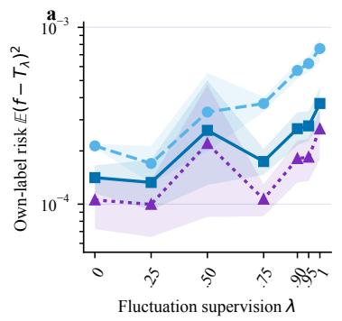

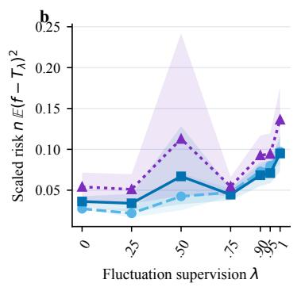

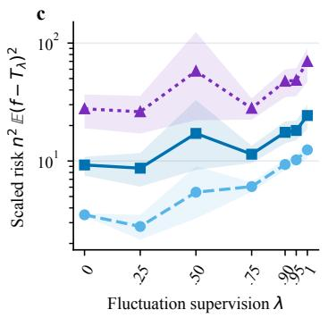

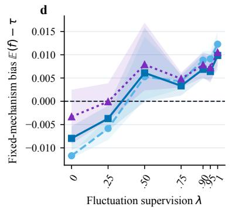

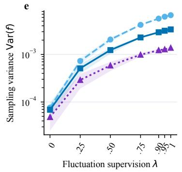  
Summary backbone; typical mechanism M = 8,192 pretraining tables 5 checkpoint seeds × 1,000 held-out tables Bands: exact 95% seed-bootstrap intervals Label-learnability theorem: order change; these curves show its finite-network signature. n = 128 n = 256 n = 512

Figure 6: Seven-target finite-network diagnostics. Panels a–c report own-label risk and its n- and $n ^ { 2 } .$ -scaled versions; panels d–e report fixed-mechanism bias and sampling variance. Every mark averages five independently trained checkpoints over 1,000 common held-out tables. Intervals are percentile intervals from all $5 ^ { 5 }$ ordered seed-bootstrap resamples. These finite-network diagnostics complement the population order transition in Theorem 3.2.  
a Coarse bias versus sparse-cell error  
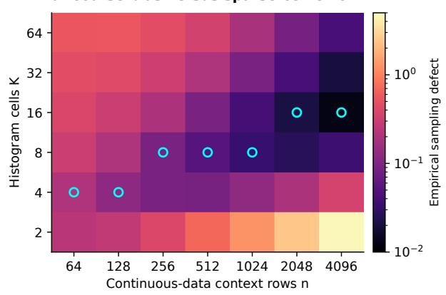  
b Label ambiguity is second order

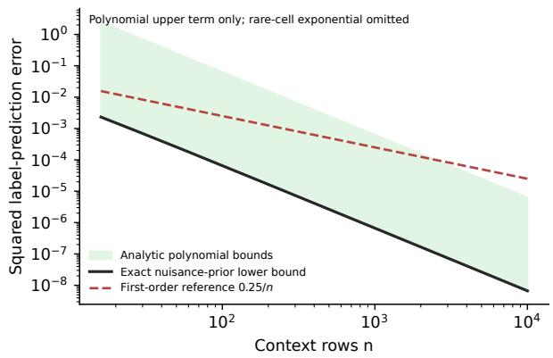  
Figure 7: Two distinct scales, and the cost of forgetting confounding information. Left: empirical comparator defect on continuous data; cyan rings identify the smallest observed defect at each $n ,$ without asserting optimality beyond the tested grid. Coarse bins retain confounding bias; excessively fine bins create sparse-cell error. Right: analytic polynomial bounds and the exact Bernoulli nuisance-prior label lower bound. The exponentially small rare-cell term is omitted only in this explicitly labeled scale diagram, not in the theorem. The $n ^ { - 1 }$ reference concerns causal parameter estimation, whereas the $n ^ { - 2 }$ curve concerns predicting the efficient training label.

Fluctuation supervision on raw continuous covariates  
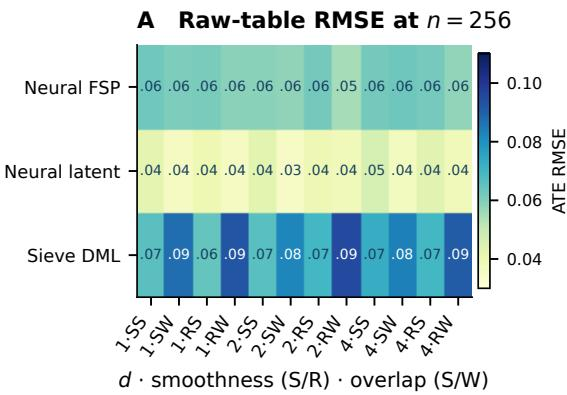

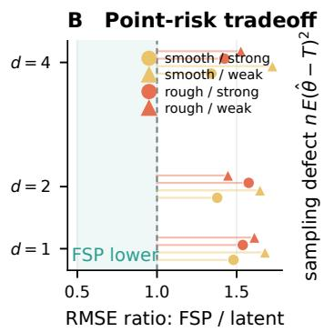

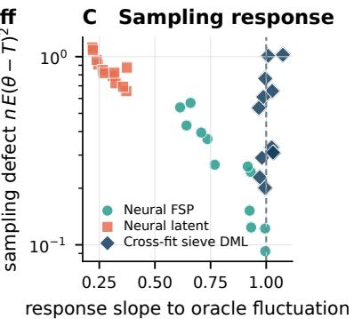  
Figure 8: Neural FSP on unbinned continuous covariates. The 12 mechanisms use 400 common tables each at $n = 2 5 6 ;$ neural metrics average three checkpoints. Panel A resolves dimension, smoothness and overlap; B shows the point-risk cost of moving toward the efficient sampling response; C compares native defect with response slope. Latent supervision has lower point RMSE, whereas FSP recovers more efficient fluctuation.

Finite-dictionary pretraining exhibits the predicted log N/M local scaling

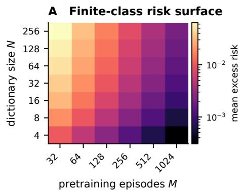

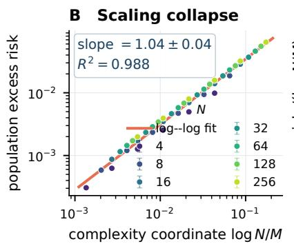

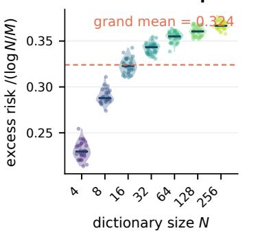  
Figure 9: Gaussian dictionary companion to the Bernoulli proof-family experiment. The executed $N \times M$ surface (left) collapses against log $N / M$ with near-unit log–log slope (center). Error bars are ±1.96 standard errors across five simulation seeds. Right: each violin pools 30 seed–budget mean risks per N, normalized by log $N / M$

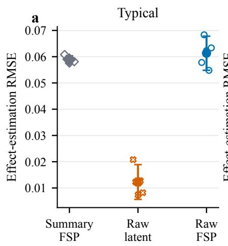

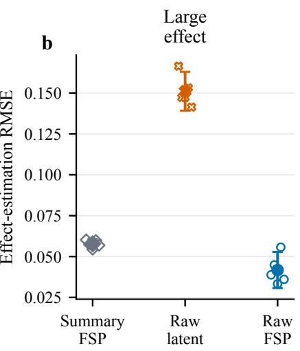

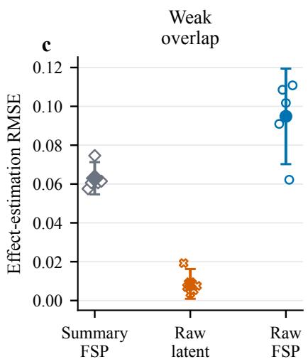  
Figure 10: Seed-level raw-backbone stress test. RMSE at $n = 2 5 6 , M = 8 1 9 2 .$ , using all 1,000 common tables per mechanism (the main released-baseline comparison uses the first 300). Open marks show five training seeds, filled marks their mean, and intervals are 95% across-seed t intervals.

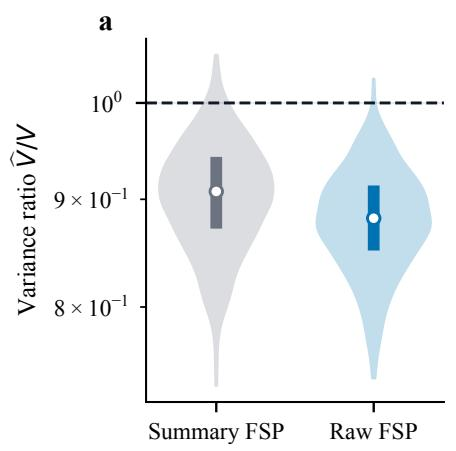

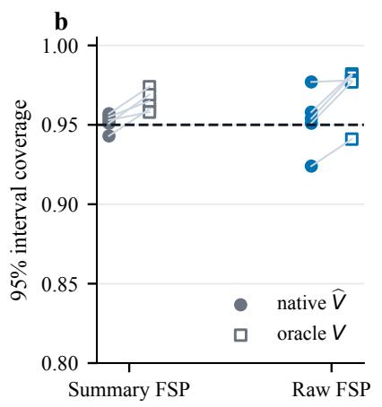

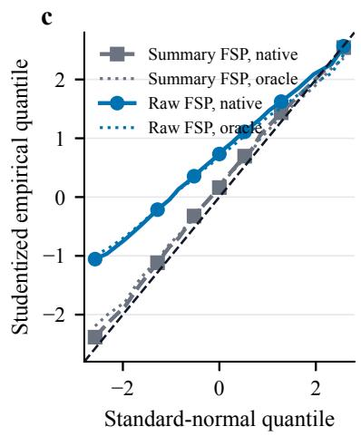  
Figure 11: Mean-head and variance-head diagnostics. Typical mechanism, $n = 2 5 6 , 1 , 0 0 0$ common tables. (a) Tablewise variance ratios averaged over five checkpoints, with median/interquartile marks. (b) Paired checkpointspecific native/oracle coverage. (c) Quantiles averaged over checkpoints, rather than quantiles of ensemble predictions. QQ shape distinguishes centering and scale even when marginal coverage is close to nominal.

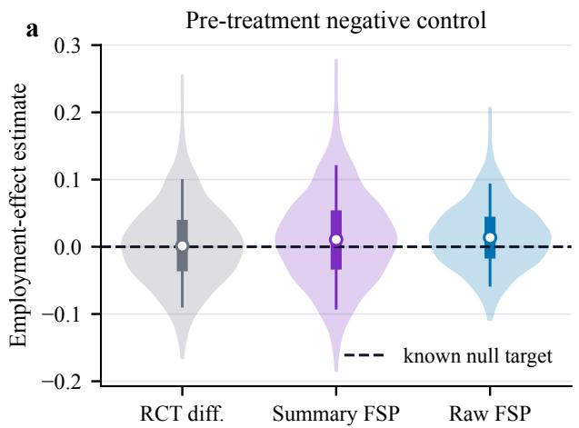

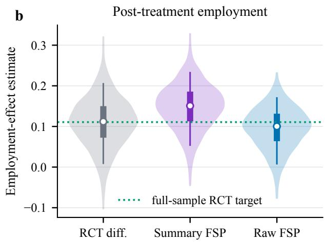  
Figure 12: Full randomized-data distributions. National Supported Work at $n = 2 5 6 .$ , with 1,500 resamples for each endpoint: the re-randomized pre-treatment null and the post-treatment empirical benchmark. Neural predictions average five checkpoints. White marks show medians, thick bars interquartile ranges, and thin bars 5th–95th percentile ranges.

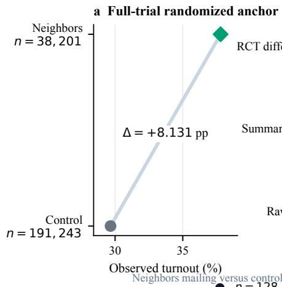

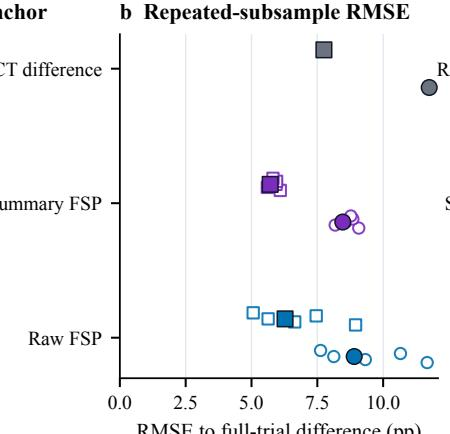

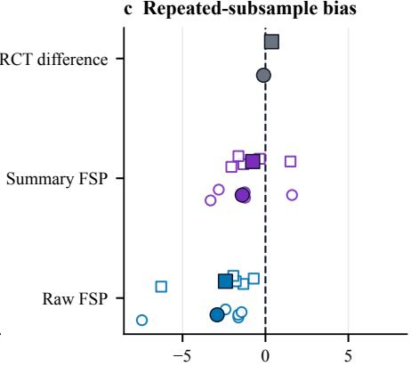  
Figure 13: Independent randomized validation on voter turnout. (a) Full-trial neighbors-mailing versus control contrast. (b–c) RMSE and bias over 1,500 common arm-stratified subsamples at each context length. Open symbols show five learned checkpoints; filled symbols show their prediction ensemble or the unaveraged design-based estimator. Every error targets the full-trial observed-arm difference.

Ablation: the teaching target changes the estimator  
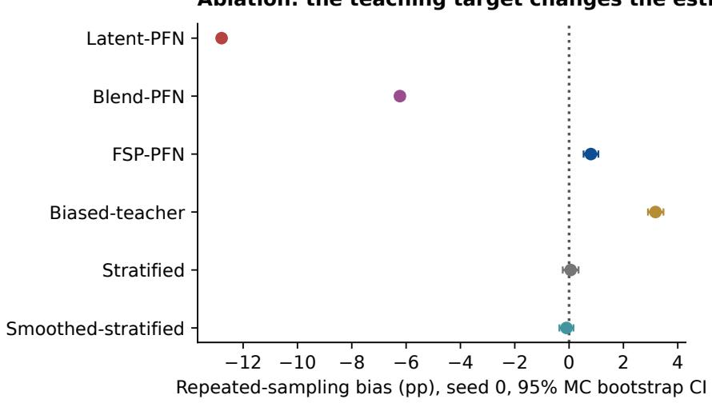  
Figure 14: Changing the target changes the native repeated-sample bias. Fixed large-effect mechanism, $n = 2 5 6 ,$ $M = 3 2 7 6 8 .$ , seed zero, same deployment tables. Intervals bootstrap table indices and quantify Monte Carlo uncertainty of the signed bias. They do not quantify variation across training seeds. The blended target partially retains shrinkage, and the deliberately biased teacher visibly shifts the learned estimator.  
a One prior, two sampling laws

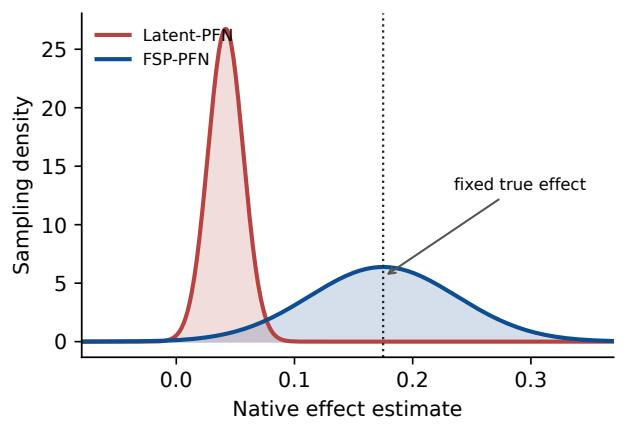  
b Prediction-optimal is not uniformly unbiased

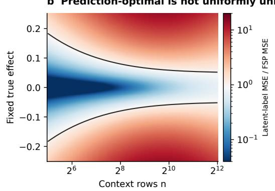  
Figure 15: Exact Gaussian objective map. Fixed-task sampling distributions and the analytic latent-to-FSP MSE ratio from Proposition 3.1; the equality contour separates prior-center shrinkage from effect-shift attenuation.

All 15 cells were executed (3 checkpoint seeds × 2,000 tables); the defect=1 overlay follows executed-cell edges only. Executed-cell boundary: mean defect ≥ 1  
a Latent-PFN: native sampling defect  
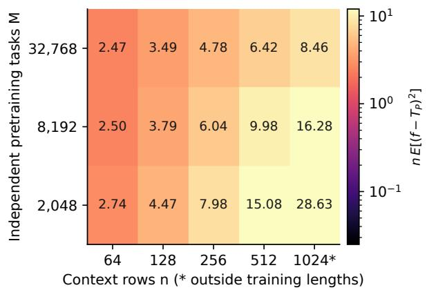

b FSP-PFN: native sampling defect  
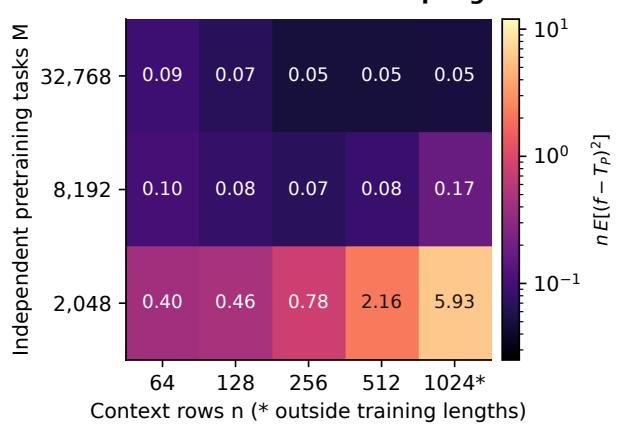  
Figure 16: Deployment rows and pretraining episodes are separate resources. Same-scale maps of $n \mathbb { E } ( f - T _ { P } ) ^ { 2 }$ on the large-effect mechanism over the executed $M \times n$ grid. Asterisks identify the extrapolation length $n = 1 0 2 4$

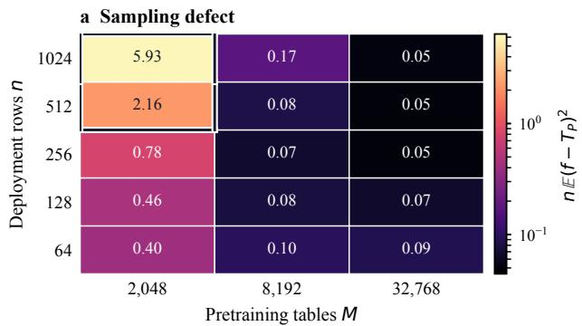  
c Oracle-normalized MSE

b Standardized absolute bias  
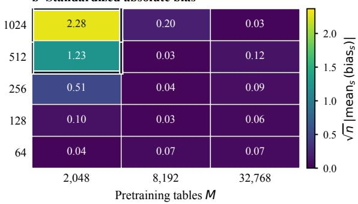

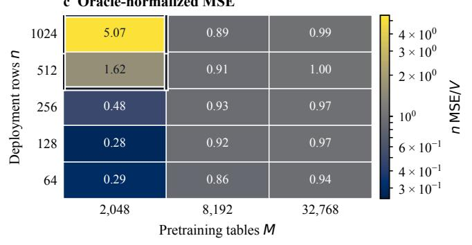

d Native 95% interval coverage  
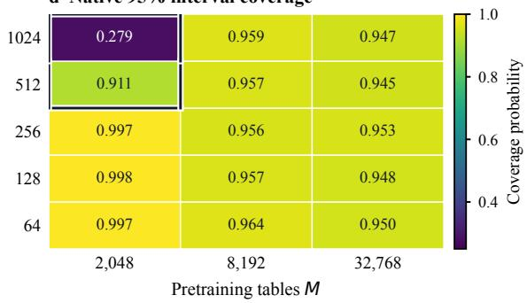  
Figure 17: One executed $M \times n$ grid, four inferential consequences. Summary-backbone FSP on the fixed largeeffect mechanism, with three checkpoint seeds and 2,000 common tables per cell. Panels show native defect, $\sqrt { n }$ times the absolute seed-averaged bias, oracle-normalized n MSE, and native 95% coverage. The outlined executed-cell region is where mean defect is at least one; every displayed value is an executed cell.

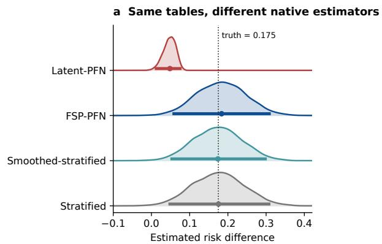  
b Normal approximation of the native output

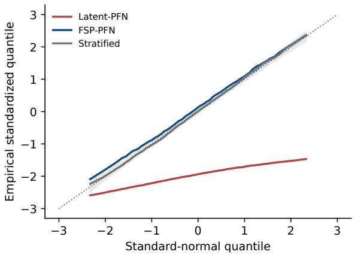  
Figure 18: Repeated-sample shape at a fixed mechanism. Peak-normalized ridges and QQ diagnostics use the large-effect mechanism, n = 256, 2,000 common tables, and seed-zero neural models trained at $M = 3 2 7 6 8 .$ . QQ outputs are standardized with oracle $V ;$ the grey band is an approximate pointwise 95% normal-quantile envelope.  
a Bias and variance are different objectives

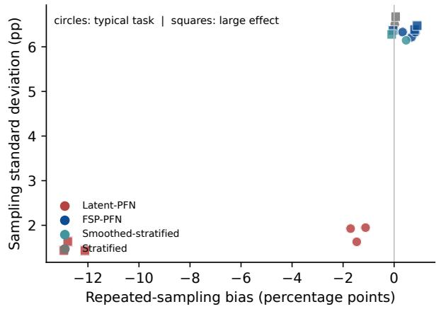

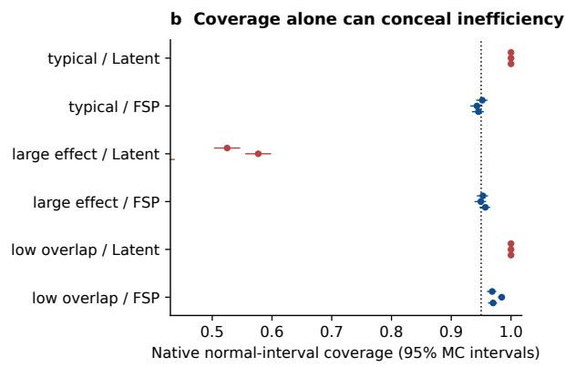  
Figure 19: Bias, sampling spread, and native coverage. $\mathrm { A t } n = 2 5 6 , M = 3 2 7 6 8$ , learned methods show three checkpoint seeds and baselines one deterministic-model point. Right-panel 95% Wilson intervals use 2,000 deployment repetitions per checkpoint. Centering, spread and coverage assess complementary aspects of inference.

a Real-data resampling, not causal ground truth  
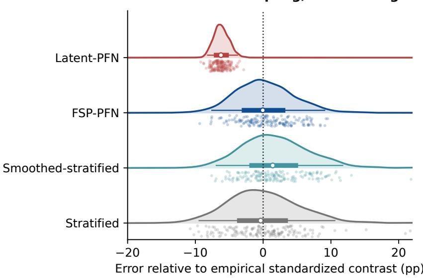

b Known-effect validation on real covariate frequencies  
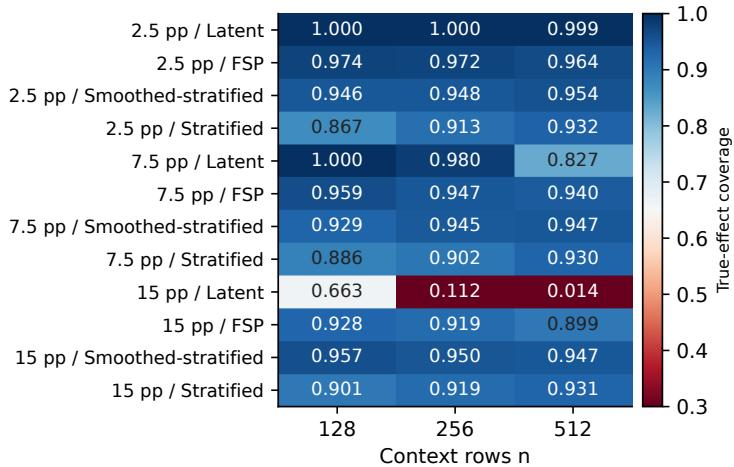  
Figure 20: Observed-data stability and known-effect calibration. Top: the empirical birthweight contrast, $n = 2 5 6 ,$ seed zero; 160 displayed dots accompany density and median/interquartile/2.5th–97.5th percentile summaries of all 2,000 bootstrap outputs. Bottom: known-effect semisynthesis uses 2,000 tables per context length and effect, with neural coverage averaged over three checkpoints trained at $M = 3 2 7 6 8$