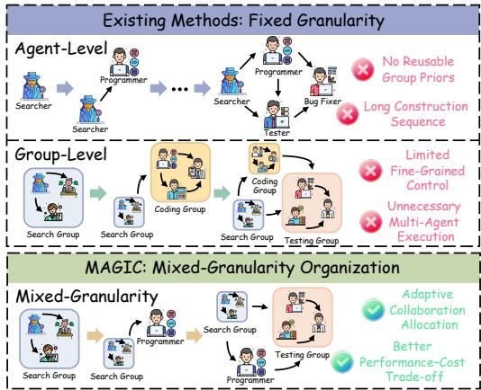
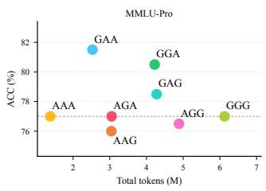
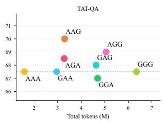
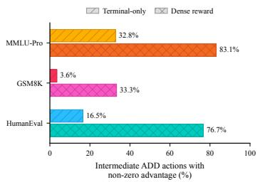
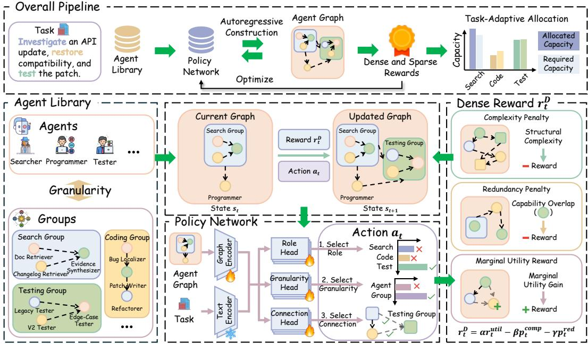
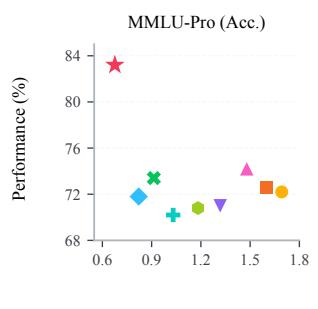
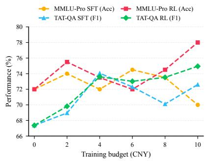
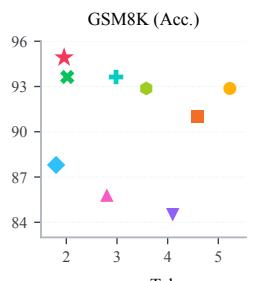
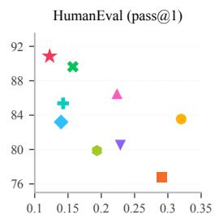
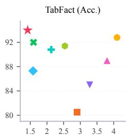

# MAGIC: MIXED-GRANULARITY AGENT GRAPHS VIA INCREMENTAL CONSTRUCTION WITH DENSE-REWARD REINFORCEMENT LEARNING

Kairui Yang Ziheng Yi Xunkai Li Minghao An Zhanke Liu Zekai Chen Rong-Hua Li

## ABSTRACT

Collaboration topology shapes both the performance and execution cost of LLMbased multi-agent systems. Because tasks differ in complexity and required capabilities, recent approaches generate task-specific collaboration graphs that specify agent participation and information flow. However, representative topology generators use either individual agents or predefined groups throughout an organization, overlooking differing collaboration needs across subtasks. Our key insight is to select granularity locally for each functional role, combining fine-grained control with reusable collaboration patterns within one organization. Learning such organizations requires exploring a combinatorial construction space with limited intermediate feedback from final-answer rewards. Therefore, we propose MAGIC, a dense-reward reinforcement learning framework for mixed-granularity graph generation. Specifically, MAGIC constructs a mixed-granularity agent graph by sequentially selecting a functional role, instantiating it as a single agent or reusable group, and connecting it to existing units. We directly optimize the construction policy using returns from trajectories sampled under the current policy and use potential-based reward shaping to provide intermediate feedback from probe-based utility and structural signals while preserving the cumulative task reward. MAGIC outperforms state-of-the-art baselines across eight benchmarks and demonstrates strong inference efficiency in our efficiency study.

## 1 INTRODUCTION

LLM-based multi-agent systems (MAS) coordinate specialized language-model agents through structured interaction (Wu et al., 2024a; Du et al., 2023; Liu et al., 2023). Their effectiveness and cost depend on collaboration topology, which determines agent participation and information flow (Zhuge et al., 2024; Li et al., 2024; Zhang et al., 2025). Because tasks differ in complexity and required capabilities, recent work generates these topologies conditioned on each task (Zhang et al., 2025; Li et al., 2025; Chen et al., 2026). The closest approaches follow two routes: agentlevel methods predict edges over specified agents or generate atomic-agent roles and connections (Zhang et al., 2025; Li et al., 2025), whereas group-level methods connect predefined collaborative groups as reusable units (Chen et al., 2026). Despite their different scales, both fix node granularity before construction, producing only atomic-agent or only group topologies.

  
Figure 1: Fixed-granularity organizations versus MAGIC’s mixed-granularity construction for an API-update task.

of collaboration, yet every constructed unit must use the same organizational scale. Consider an API-update task. Investigating upstream changes and testing compatibility may merit a SearchGroup and a TestingGroup, while implementing a one- or two-line patch may need only a ProgrammerAgent. The resulting gap concerns reusable collaboration priors, construction length, and execution cost: an all-atomic graph must assemble collaboration node by node, without reusable group priors (Chen et al., 2026) and with longer construction sequences, whereas an all-group graph treats each group as an indivisible construction unit, limiting fine-grained structural control and thereby imposing unnecessary multi-agent execution on subtasks that a single agent can handle. The controlled assignments in Section 3 (D1) show task- and role-dependent performance– cost preferences, motivating local granularity selection in a mixed space whose all-atomic and allgroup organizations remain special cases.

Learning in this mixed space requires an effective optimization route and informative feedback for intermediate construction decisions. Search-then-SFT trains generators to imitate construction trajectories selected through search and verification (Li et al., 2025; Chen et al., 2026). Mixed granularity adds configurations to this search: even with a fixed role–edge skeleton, m dual-granularity roles admit $2 ^ { m }$ realizations. D2 bounds the fraction verifiable under a given execution budget. We study an alternative learning route that uses returns from current-policy trajectories directly for updates, without first selecting demonstration graphs. Section 5.4 compares these routes under matched API cost budgets. Separately, trajectories sampled for the same query receive identical terminal-only returns when their final scores coincide. D3 shows that potential-based shaping can distinguish some such trajectories at intermediate construction steps by incorporating information about their partial graphs. This motivates complementing return-based construction learning with intermediate graph feedback.

We therefore propose MAGIC, a dense-reward reinforcement learning framework for mixedgranularity graph generation through incremental construction of an agent graph from an empty graph. At each construction step, a task-conditioned policy selects a functional role, its atomicor-group realization, and predecessors, yielding an executable organization. The mixed-granularity organization space permits local atomic-or-group choices, and training uses proposals sampled from the current policy without a pre-collected corpus of successful trajectories. We use potential-based reward shaping to provide construction-level feedback from probe utility, structural complexity, and role repetition while preserving the terminal task objective.

Our contributions. (1) Mixed-granularity perspective. We formulate task-conditioned MAS topology generation in a mixed-granularity organization space that supports local selection between single agents and reusable groups, with all-atomic and all-group organizations as special cases. (2) Dense-reward incremental construction. We propose MAGIC, which directly optimizes role, granularity, and dependency decisions using returns from current-policy trajectories with potentialbased construction feedback. (3) Observed evidence. MAGIC outperforms state-of-the-art baselines across eight benchmarks and demonstrates strong inference efficiency in our efficiency study.

## 2 PROBLEM FORMULATION

Given a task query Q, we construct a task-specific multi-agent organization from a fixed domain library R. Its role profiles and admissible realizations are built once offline and held fixed across queries; construction changes only the organization selected for $\mathcal { Q } .$

Mixed-granularity organization space. Each library role $r \in \mathcal { R }$ admits one or both realizations in $\mathcal { Z } ( r ) \subseteq \{ \mathsf { A t o m i c A g e n t } , \mathsf { G r o u p } \}$ . A task-specific mixed-granularity agent graph is

$$
\mathcal { G } = ( \mathcal { U } , \mathcal { E } ) , \qquad \mathcal { U } = \{ u _ { i } = ( i , r _ { i } , z _ { i } ) \} _ { i = 1 } ^ { N } , \qquad z _ { i } \in \mathcal { Z } ( r _ { i } ) ,\tag{1}
$$

where U contains top-level units and $\mathcal { E } \subseteq \mathcal { U } \times \mathcal { U }$ their directed dependencies. An atomic unit executes its role directly; a group is a fixed internal agent graph with the same external interface. The mixed space $\mathbb { G } _ { \mathrm { m i x } }$ contains the restricted all-atomic and all-group spaces $\mathbb { G } _ { \mathrm { a t o m i c } }$ and $\mathbb { G } _ { \mathrm { g r o u p } } .$

Task objective and constraints. Let $\widehat { \boldsymbol { y } } = \mathrm { E x e c u t e } ( \mathcal { Q } , \mathcal { G } )$ denote the answer obtained by executing organization $\mathcal { G }$ on query $\mathcal { Q } .$ , with execution specified in Section 4.1. Let $S ( \widehat { y } , y ^ { * } )$ be its score against the reference answer or tests $y ^ { * }$ . We seek a construction policy inducing $p _ { \theta } ( \mathcal { G } \mid \mathcal { Q } , \mathcal { R } )$ that

maximizes expected task score:

$$
\operatorname* { m a x } _ { \theta } \mathbb { E } _ { ( Q , y ^ { * } ) } \mathbb { E } _ { { \mathcal { G } } \sim p _ { \theta } ( \cdot \vert { \mathcal { Q } } , { \mathcal { R } } ) } \left[ S ( \operatorname { E x e c u t e } ( Q , { \mathcal { G } } ) , y ^ { * } ) \right] ,\tag{2}
$$

subject to $\mathcal { G } \in \mathbb { G } _ { \mathrm { l e g a l } }$ and $N \leq N _ { \operatorname* { m a x } }$ . Here $\mathbb { G } _ { \mathrm { l e g a l } } \subseteq \mathbb { G } _ { \mathrm { m i x } }$ requires admissible role realizations, compatible interfaces, and acyclic expanded graphs; $N _ { \mathrm { m a x } }$ bounds the number of top-level units. Execution cost is evaluated alongside task performance. Gold answers or tests are used only after execution for scoring. The space raises questions about local granularity, configuration verification, and construction credit, examined next.

## 3 EMPIRICAL INVESTIGATION

We examine local granularity preferences (D1), configuration verification costs (D2), and intermediate construction feedback (D3).

D1: Granularity preferences are task and role dependent. With a fixed library and execution settings, we enumerate all eight atomic/group assignments of a serial decomposer–solver–verifier skeleton on 200 queries each from MMLU-Pro test and TAT-QA dev. Figure 2(a,b) shows that MMLU-Pro favors GAA, whereas TAT-QA favors AAG. These mixed assignments outperform both fixed-granularity endpoints by 4.5 and 2.5 accuracy points, respectively, while consuming fewer tokens than GGG. The preferred grouped role thus differs by task, supporting local granularity selection. Appendix D.1 gives the protocol and detailed comparisons.

D2: Verified configuration coverage is analytically bounded. For a fixed role–edge skeleton with m dual-granularity roles and a budget of B complete graph executions, the configuration count and verifiable fraction satisfy

$$
| { \mathcal { Z } } _ { \mathrm { m i x } } | = 2 ^ { m } , \qquad \operatorname { C o v e r a g e } ( B ) \leq \mathrm { m i n } \left( 1 , { \frac { B } { 2 ^ { m } } } \right) ,\tag{3}
$$

since verifying each assignment requires at least one execution. Role and edge choices further enlarge the construction space.

D3: Relative learning signals at intermediate construction steps. On the same 720 trajectories from MMLU-Pro, GSM8K, and HumanEval, we compare terminal-only feedback with the dense reward defined in Section 4.3. Figure 2(c) shows higher non-zero advantage rates for intermediate ADD actions on all three datasets, including an increase from 32.81% to 83.13% on MMLU-Pro. Dense returns also distinguish some equal-terminal-score trajectories at intermediate positions, supporting partial-graph information as a source of relative learning signals. Appendix D.3 reports the protocol and full statistics; Section 5.3 evaluates the learning benefits of this feedback.

These observations motivate local granularity choices and intermediate feedback. Section 5.4 compares direct policy optimization with Search-then-SFT under matched API cost budgets.

  
(a)

  
(b)

  
(c)  
Figure 2: Granularity preferences and construction feedback. (a,b) D1: accuracy versus total input/output tokens on MMLU-Pro and TAT-QA. Letters denote atomic (A) or group (G) realizations of the decomposer, solver, and verifier. TAT-QA uses the diagnostic’s strict-answer protocol. (c) D3: non-zero advantage rates for intermediate ADD actions, excluding initial decisions and STOP.

## 4 METHODOLOGY

As illustrated in Figure 3, MAGIC learns to construct an executable mixed-granularity agent graph from a task query and a fixed role library. A task-conditioned policy incrementally selects roles, atomic-or-group realizations, and dependencies. Frozen LLM executors then execute the resulting organization. Training uses on-policy trajectories and potential-based reward shaping to provide construction-level feedback while preserving the terminal task objective.

## 4.1 MIXED-GRANULARITY REALIZATION AND EXECUTION

We instantiate the units defined in Section 2 with frozen LLM executors. An atomic unit uses one role executor; a group uses its internal agents and an aggregator that emits a single role-level result. Both realizations expose this result through the same input–output contract, allowing connected units to exchange role-level outputs regardless of granularity. Internal group membership and topology remain fixed during construction.

To execute a nonempty partial or final graph, we expand each group into its internal DAG and run the resulting atomic-agent graph in dependency order. A fixed outer summarizer produces the final answer from the public task, output requirements, and results from all sinks of the expanded graph. For the empty graph $\mathcal { G } _ { 0 }$ , including immediate STOP, the base LLM instead receives a minimal direct-answer prompt containing the question, any answer options, and the answer requirement. Appendix A.1 details the execution semantics, and Appendix C.7 specifies the role library and interfaces.

## 4.2 TASK-CONDITIONED INCREMENTAL CONSTRUCTION

The policy observes the public query and partial agent graph. A frozen text encoder embeds the query and role realizations; node features combine realization semantics with granularity, construction position, and degree embeddings. An Edge-aware GRU encodes units in construction order, combining each unit’s features with the mean representation of its actual predecessors and the query embedding. Its recurrent state captures construction history, whereas predecessor aggregation captures graph dependencies. Task-conditioned attention pools the node states, and a projection combines the pooled representation, query, and construction progress into decision context $\mathbf { c } _ { t }$ . A learned empty-graph vector initializes this process. Appendix $\mathrm { A } \bar { . 2 }$ gives the encoder and action-head formulations.

Three conditioned heads parameterize a non-STOP action $a _ { t } = \left( r _ { t } , z _ { t } , \mathbf { b } _ { t } \right)$ , where $b _ { j t }$ indicates an edge from existing unit j to the new unit:

$$
\pi _ { \theta } ( a _ { t } \mid s _ { t } ) = \pi _ { \theta } ( r _ { t } \mid s _ { t } ) \pi _ { \theta } ( z _ { t } \mid r _ { t } , s _ { t } ) \prod _ { j \in \mathcal { V } _ { t } } \pi _ { \theta } ( b _ { j t } \mid r _ { t } , z _ { t } , s _ { t } ) .\tag{4}
$$

Here $\nu _ { t }$ contains legal predecessors. Roles and STOP share one masked categorical distribution; a second categorical distribution selects the chosen role’s realization. Independent Bernoulli decisions then select an admissible subset of predecessors. A STOP action uses only its role-level probability and skips the remaining heads. Legality masks enforce the library, direction, and structural constraints.

  
Figure 3: Overview of the proposed MAGIC framework.

Each addition updates the graph encoding before the next decision. Construction ends with an explicit STOP action; at the maximum unit horizon, all other roles are masked, making STOP the only legal choice. At inference, the policy samples a graph with dropout disabled and then executes it; probe scores, gold answers, and rewards are training-only information. The text encoder and execution LLMs remain frozen throughout training; only the graph encoder, feature projections, pooling, and action heads are updated.

## 4.3 POTENTIAL-BASED DENSE-REWARD OPTIMIZATION

Task objective and graph potential. Let $S ( \mathcal G , q ) \in [ 0 , 1 ]$ denote the score obtained by executing graph G on query q. Training maximizes expected terminal task score, using accuracy, official F1, or code-test success as appropriate. For each query’s trajectory group, we select a fixed probe set P from other training queries and share it across all trajectories and construction steps. Executing partial graphs on these probes provides a common, multi-query reference for their utility, complementing the terminal score on the conditioning query. Keeping P fixed lets us compare successive organizations on the same questions. Adding a unit changes the graph from $\mathcal { G } _ { t }$ to $\mathcal { G } _ { t + 1 }$ , yielding the paired utility gain:

$$
\Delta U _ { t } = \frac { \sum _ { p \in P } [ S ( \mathcal { G } _ { t + 1 } , p ) - S ( \mathcal { G } _ { t } , p ) ] } { | P | + \kappa } .\tag{5}
$$

Here $\kappa \geq 0$ smooths the gain. To represent structural overhead, we define $C ( \mathcal { G } ) = w _ { n } [ N _ { \mathrm { e x p } } ( \mathcal { G } ) -$ $b _ { n } ] _ { + } + w _ { e } [ E _ { \mathrm { e x p } } ( \mathcal { G } ) - b _ { e } ] _ { + }$ , where $[ x ] _ { + } = \mathrm { m a x } ( 0 , x ) , N _ { \mathrm { e x p } }$ and $E _ { \exp }$ count nodes and edges after expanding groups, and $b _ { n } , b _ { e }$ are free allowances. Role repetition is $\begin{array} { r } { D ( \mathcal { G } ) = \sum _ { r } [ m _ { r } ( \mathcal { G } ) - 1 ] _ { + } , } \end{array}$ where $m _ { r }$ counts outer units assigned role r, regardless of their granularity. Thus, each addition contributes $d _ { t } = \alpha \Delta U _ { t } - \beta \Delta C _ { t } \mathsf { ^ { - } } \gamma _ { R } \Delta D _ { t }$ , with $\Delta C _ { t } = C ( \stackrel { \smile } { { \cal G } _ { t + 1 } } ) - C ( \stackrel { \smile } { { \cal G } _ { t } } )$ and analogously for $\Delta D _ { t }$ . The weights balance utility gains against added structural complexity and repeated roles in the shaping signal. Starting from $\Phi _ { 0 } = 0$ , we accumulate $\Phi _ { t + 1 } = \Phi _ { t } + d _ { t } ;$ fixed probes and consistent graph scores define the graph potential $\Phi _ { t } = \Phi _ { P } ( \mathcal { G } _ { t } )$ ) relative to the initial graph. Evaluation caching and full reward definitions are detailed in Appendix A.3; Appendix C.6 records the documented configuration.

Shaping and terminal settlement. With discount η shared by shaping and return computation, the reward is

$$
\boldsymbol { r } _ { t } ^ { \prime } = \boldsymbol { r } _ { t } ^ { \mathrm { t a s k } } + \eta \Phi _ { t + 1 } - \Phi _ { t } .\tag{6}
$$

The base reward is zero during construction and the task score at termination. We set initial and terminal potentials to zero. Thus, explicit STOP receives $S ( \mathcal { G } , q ) - \Phi _ { P } ( \mathcal { G } )$ , including when forced by the unit horizon. The implementation accumulates paired utility and structural increments to compute the intermediate potential. With the current $\eta = 1$ , shaping redistributes reward across construction steps while the trajectory total remains its terminal score.

Policy optimization. For each query, we sample K trajectories from the current policy and compute discounted return-to-go $G _ { k , t }$ . Returns are normalized among trajectories that contain an action at the same position: $A _ { k , t } = ( G _ { k , t } - \mu _ { t } ) / ( \sigma _ { t } + \epsilon )$ . We minimize the action-averaged loss

$$
\mathcal { L } = - \overline { { \mathrm { s g } ( A ) \log \pi _ { \theta } ( a \mid s ) } } + \beta _ { \mathrm { K L } } \overline { { D _ { \mathrm { K L } } ( \pi _ { \theta } \| \pi _ { \mathrm { r e f } } ) } } - \beta _ { H } \overline { { H ( \pi _ { \theta } ) } } .\tag{7}
$$

The bar averages over all recorded action positions, including the final STOP even when forced by the horizon. This probability-one action has zero log-probability but remains in position-aligned normalization and the averaging denominator. The operator sg stops gradients through advantages. The reference policy is a frozen copy from the start of RL. KL and entropy are computed over the full hierarchical action distribution at each visited state. This trains the construction policy directly from its own trajectories, without a pre-collected successful-trajectory corpus or a value network. Appendix A.3 specifies normalization and regularization.

Training and inference incur different execution costs. During training, multiple trajectories per query use partial-graph evaluations on shared probes and final-graph scoring on the conditioning query, followed by return computation and policy updates. At inference, the policy constructs a graph from the public query and executes only the completed organization. Probe evaluation and policy updates are confined to training (Appendix A.4).

## 4.4 POLICY INVARIANCE OF REWARD SHAPING

Following potential-based reward shaping (Ng et al., 1999), we establish the relation between the shaped and terminal task objectives. Proposition 1 (Return preservation). For a finite construction episode with T reward transitions, use the same discount η in shaping and returns, set $\Phi _ { 0 } = \Phi _ { T } = 0$ and fully settle the potential under both sampled and forced termination. Then

$$
\sum _ { t = 0 } ^ { T - 1 } \eta ^ { t } r _ { t } ^ { \prime } = \sum _ { t = 0 } ^ { T - 1 } \eta ^ { t } r _ { t } ^ { \mathrm { t a s k } } .\tag{8}
$$

Consequently, shaping preserves the expected task return and its optimal policy set. In our undiscounted setting, both returns equal the final task score. The proof telescopes the potential differences and is given in Appendix B.

This property separates the task objective from construction-level feedback: probe utility and structural information redistribute learning signals without adding a lasting cost term to the terminal objective. For $\eta = 1$ , the shaped return-to-go is $G _ { k , t } = S ( \mathcal { G } _ { k } , q ) - \Phi _ { k , t }$ . The pre-action potential serves as a state-dependent reference for the organization already built. Position-aligned normalization therefore compares terminal outcomes relative to these partial-graph potentials, yielding the intermediate signal differences examined in D3 even when final scores coincide. The proposition concerns environment returns; policy updates use the normalized, KL- and entropy-regularized loss in Equation 7.

## 5 EXPERIMENTS

We organize the evaluation around four questions. Q1:Effectiveness. Does MAGIC consistently outperform strong baselines across four task families and eight benchmarks (Sec. 5.2)? Q2:Interpretability. Do mixed granularity, direct graph-generation optimization, and dense construction credit each contribute to the learned performance–cost trade-off (Sec. 5.3)? Q3: Optimization Strategies. Under matched Qwen Flash API cost budgets, how does the dense-return policygradient training route compare with Search-then-SFT (Sec. 5.4)? Q4:Efficiency. Does MAGIC achieve a favorable inference performance–token trade-off relative to alternative agent organizations (Sec. 5.5)?

## 5.1 EXPERIMENTAL SETUP

Datasets. We evaluate MAGIC on eight benchmarks spanning four task families: (1) knowledge and commonsense reasoning: MMLU-Pro (Wang et al., 2024) and StrategyQA (Geva et al., 2021); (2) mathematical reasoning: AQuA (Ling et al., 2017) and GSM8K (Cobbe et al., 2021); (3) code generation: HumanEval (Chen et al., 2021) and LiveCodeBench-v6 (LCB-v6) (Jain et al., 2025); and (4) table and financial reasoning: TAT-QA (Zhu et al., 2021) and TabFact (Chen et al., 2020). Data and scoring protocols are detailed in Appendix C.2.

Baselines. We compare against 17 baselines in three categories: (1) direct/single-agent methods: DeepSeek V4 Flash (DeepSeek, 2026) and Qwen Flash (Alibaba Cloud, 2026); (2) established MAS: AutoGen (Wu et al., 2024a) and LLM-Debate (Du et al., 2023); and (3) adaptive/learned organizations: DyLAN (Liu et al., 2023), GPTSwarm (Zhuge et al., 2024), G-Designer (Zhang et al., 2025), Sparse-Comm (Li et al., 2024), GraphSearch (Wu et al., 2024b), Graph-R1 (Luo et al., 2025), R-GFM (Liu et al., 2026), BIGMAS (Hao et al., 2026), MasRouter (Yue et al., 2025), GoAgent (Chen et al., 2026), VeriMAP (Xu et al., 2026), ARG-Designer (Li et al., 2025), and EIB-Learner (Shen et al., 2025). Baseline provenance and implementation settings are provided in Appendices C.3 and C.6.

## 5.2 OVERALL PERFORMANCE

For Q1, MAGIC uses DeepSeek V4 Flash as its executor. We train a separate construction policy for each benchmark on 100 training examples; HumanEval uses the same 100 examples as Live-CodeBench. Each benchmark uses one training run, and we evaluate its final checkpoint. Datasetspecific training and evaluation partitions are detailed in Appendix C.3.

Table 1: Overall performance across eight benchmarks (%). We report official F1 for TAT-QA, pass@1 for code-generation tasks, and accuracy for all remaining tasks. Best scores in each column are shown in bold.
<table><tr><td></td><td colspan="2">Knowledge &amp; Commonsense (Acc. %)</td><td colspan="2">Mathematical Reasoning (Acc. %)</td><td colspan="2">Code Generation (pass@1 %)</td><td colspan="2">Table &amp; Financial Reasoning (F1 / Acc. %)</td></tr><tr><td>Method</td><td>|MMLU-Pro StrategyQA</td><td></td><td>AQuA</td><td>GSM8K</td><td>HumanEval</td><td>LCB-v6</td><td>TAT-QA</td><td>TabFact</td></tr><tr><td>DeepSeek V4 Flash</td><td>72.80</td><td>85.40</td><td>89.76</td><td>93.71</td><td>84.76</td><td>20.57</td><td>70.48</td><td>91.60</td></tr><tr><td>Qwen Flash</td><td>60.60</td><td>78.00</td><td>68.90</td><td>59.44</td><td>90.24</td><td>26.86</td><td>69.51</td><td>80.00</td></tr><tr><td>AutoGen</td><td>73.00</td><td>85.20</td><td>88.98</td><td>92.87</td><td>81.71</td><td>18.86</td><td>70.29</td><td>92.00</td></tr><tr><td>LLM-Debate</td><td>72.20</td><td>84.40</td><td>89.37</td><td>92.87</td><td>83.54</td><td>21.71</td><td>70.66</td><td>92.80</td></tr><tr><td>DyLAN</td><td>73.60</td><td>83.00</td><td>89.76</td><td>93.33</td><td>85.98</td><td>22.86</td><td>70.48</td><td>93.80</td></tr><tr><td>GPTSwarm</td><td>71.20</td><td>84.60</td><td>91.34</td><td>93.56</td><td>84.76</td><td>19.43</td><td>70.41</td><td>92.00</td></tr><tr><td>G-Designer</td><td>70.20</td><td>87.00</td><td>88.98</td><td>93.63</td><td>85.37</td><td>23.43</td><td>70.23</td><td>90.80</td></tr><tr><td>Sparse-Comm</td><td>70.60</td><td>85.00</td><td>89.76</td><td>93.86</td><td>84.76</td><td>21.14</td><td>70.41</td><td>92.20</td></tr><tr><td>GraphSearch</td><td>71.60</td><td>85.80</td><td>89.37</td><td>93.56</td><td>81.10</td><td>22.29</td><td>71.26</td><td>91.80</td></tr><tr><td>Graph-R1</td><td>71.60</td><td>84.20</td><td>90.55</td><td>92.87</td><td>86.59</td><td>20.00</td><td>69.75</td><td>92.00</td></tr><tr><td>R-GFM</td><td>68.60</td><td>84.20</td><td>89.76</td><td>93.18</td><td>89.02</td><td>19.43</td><td>71.20</td><td>90.60</td></tr><tr><td>BIGMAS</td><td>69.80 71.20</td><td>84.40</td><td>90.55 88.98</td><td>93.18</td><td>84.76</td><td>21.71 20.57</td><td>70.41 69.99</td><td>92.40</td></tr><tr><td>MasRouter GoAgent</td><td>70.80</td><td>83.40</td><td>89.76</td><td>93.71 92.87</td><td>76.83 79.88</td><td>20.57</td><td>71.14</td><td>92.60</td></tr><tr><td>VeriMAP</td><td>72.40</td><td>84.00</td><td>89.76</td><td>93.63</td><td>78.66</td><td>21.14</td><td>70.23</td><td>91.40</td></tr><tr><td></td><td>73.40</td><td>82.00</td><td>90.55</td><td>93.63</td><td>89.63</td><td>19.43</td><td>71.02</td><td>91.80</td></tr><tr><td>ARG-Designer EIB-Learner</td><td>72.00</td><td>83.20 83.80</td><td>89.76</td><td>93.56</td><td>83.54</td><td>21.71</td><td>69.99</td><td>92.00</td></tr><tr><td></td><td></td><td></td><td></td><td></td><td></td><td></td><td></td><td>91.60</td></tr><tr><td>MAGIC (Ours)</td><td>83.20</td><td>87.20</td><td>91.73</td><td>94.92</td><td>90.85</td><td>36.57</td><td>72.22</td><td>94.00</td></tr></table>

To answer Q1, Table 1 compares MAGIC with 17 baselines across four task families. MAGIC ranks first on all eight benchmarks, outperforming direct inference, established MAS, and adaptive organizations. The largest gains over the strongest baselines occur on MMLU-Pro and LCB-v6:

accuracy increases from 73.60% to 83.20%, while pass@1 rises from 26.86% to 36.57%. Improvements also extend to mathematical and structured-data reasoning, where several baselines already obtain closely clustered scores. Thus, the overall advantage spans both reasoning accuracy and executable-code correctness.

The leading baseline varies across tasks, highlighting the importance of task-dependent organization. In particular, Qwen Flash outperforms every MAS baseline on both code-generation benchmarks, yet MAGIC improves further on both. On MMLU-Pro and TAT-QA, it instead surpasses the learned organizations DyLAN and GraphSearch, respectively. This pattern is consistent with the motivation for adapting collaboration to each task rather than using a uniform execution scale. MAGIC supports such adaptation through local atomic-or-group choices and feedback-driven construction learning. Together, these results establish the framework’s effectiveness across heterogeneous tasks; the following ablations examine the contributions of its organization space and training design.

## 5.3 COMPONENT ABLATIONS

To answer Q2, we ablate granularity selection, policy optimization, and dense feedback under shared Qwen Flash settings on MMLU-Pro and TAT-QA. All-Atomic and All-Group restrict training and inference to one granularity; Initialization only evaluates the untrained policy; Final-reward only keeps the mixed space and RL updates but removes potential-based shaping, using only terminal task scores.

Table 2: Component ablations on MMLU-Pro and TAT-QA. Best scores and lowest token counts are shown in bold; second-best values are underlined. Arrows indicate numerical changes relative to Full: percentage points for accuracy/F1 and relative percentages for unrounded token counts.
<table><tr><td rowspan="2">Variant</td><td colspan="2">MMLU-Pro</td><td colspan="2">TAT-QA</td></tr><tr><td> $\mathbf { A c c . } \left( \% \right) \uparrow$ </td><td>Tokens↓</td><td> $F 1 \left( \% \right) \mathrm { \uparrow }$ </td><td>Tokens ↓</td></tr><tr><td>All-Atomic</td><td> $6 9 . 0 0 \downarrow 8 . 0 0$ </td><td> ${ \bf 6 . 2 \times 1 0 ^ { 5 } }$  ↓44.76%</td><td> $7 7 . 5 8 \downarrow 5 . 9 3$ </td><td> $\mathbf { 7 . 8 \times 1 0 ^ { 5 } \downarrow 1 1 . 5 7 \% }$ </td></tr><tr><td>All-Group</td><td> $\underline { { 7 1 . 0 0 } } \downarrow 6 . 0 0$ </td><td> $2 . 4 \times 1 0 ^ { 6 } \uparrow 1 1 0 . 6 1 \%$ </td><td> $7 8 . 5 9 \downarrow 4 . 9 2$ </td><td> $2 . 8 \times 1 0 ^ { 6 } \uparrow 2 1 1 . 4 0 \%$ </td></tr><tr><td>Initialization only</td><td> $6 7 . 0 0 \downarrow 1 0 . 0 0$ </td><td> $1 . 3 \times 1 0 ^ { 6 } \uparrow 1 5 . 5 2 \%$ </td><td> $7 8 . 6 2 \downarrow 4 . 8 9$ </td><td> $1 . 3 \times 1 0 ^ { 6 } \uparrow 4 9 . 3 0 \%$ </td></tr><tr><td>Final-reward only</td><td> $7 0 . 0 0 \downarrow 7 . 0 0$ </td><td> $1 . 3 \times 1 0 ^ { 6 } \uparrow 1 8 . 0 3 \%$ </td><td> $\underline { { 8 2 . 9 9 } } \downarrow 0 . 5 2$ </td><td> $1 . 1 \times 1 0 ^ { 6 } \uparrow 1 8 . 6 3 \%$ </td></tr><tr><td>MAGIC (Full)</td><td> $7 7 . { \bf 0 0 } \ \mathrm { ( r e f . ) }$ </td><td> $\underline { { 1 . 1 } } \times 1 0 ^ { 6 } ~ \mathrm { ( r e f . ) }$ </td><td> ${ \bf 8 3 . 5 1 \ ( r e f . ) }$ </td><td> ${ 8 . 9 \times 1 0 ^ { 5 } ~ ( \mathrm { r e f . ) } }$ </td></tr></table>

Table 2 shows that Full achieves the highest performance on both datasets. All-Atomic uses the fewest tokens but loses 8.00 accuracy points on MMLU-Pro and 5.93 F1 points on TAT-QA; All-Group consumes substantially more tokens while also underperforming Full. Mixed granularity therefore improves performance over both fixed endpoints while avoiding the cost of exclusively group-based execution. Full also improves on Initialization only with fewer tokens, supporting learned construction. Compared with Final-reward only, dense feedback yields a 7.00-point accuracy gain on MMLU-Pro and a smaller 0.52-point F1 gain on $\mathrm { T A T - Q A } .$ , while reducing tokens by 15.28% and 15.70%, respectively. These results support both local granularity selection and intermediate construction feedback for learning effective, economical organizations.

## 5.4 MATCHED OPTIMIZATION COMPARISON

To answer Q3, we compare Search-then-SFT (SFT) and Dense-reward RL (RL) from the same initialization under matched Qwen Flash API training budgets. SFT alternates candidate search and verification with imitation of the highest-scoring candidates with positive task scores; RL directly updates from current-policy trajectories using dense feedback. At successive budget stages, we evaluate both routes on the same 200 held-out MMLU-Pro queries and 200 held-out TAT-QA queries, using accuracy and official F1, respectively (Appendix C.5).



Figure 4 shows that Dense-reward RL outperforms Search-then-SFT at four of the five nonzero budget stages on each dataset. At CNY 10, it reaches 78.00% accuracy on MMLU-Pro and 74.95% F1 on TAT-QA, exceeding Search-then-SFT by 8.00 and 2.35 percentage points, respectively. The advantage across most budget stages supports using construction-level returns directly for policy updates, rather than first filtering candidates into demonstrations, to obtain stronger policies within the available API budget.  
  
Figure 4: Performance versus Qwen Flash API training budget.

## 5.5 PERFORMANCE–COST TRADE-OFF

To answer Q4, we compare performance and total inference-token consumption with alternative fixed and learned agent organizations on four representative benchmarks, reusing the Q1 evaluations. We count input and output tokens across all execution calls, including group-internal work and final aggregation; training costs are accounted for separately.





  
LLM-Debate Complete Random Tree Chain G-Designer ARG-Designer GoAgent Ours

Figure 5: Performance–token trade-off across four datasets. The x-axis reports total inference-token consumption, and the y-axis reports task performance (accuracy or pass@1). Points toward the upper left indicate a more favorable trade-off.

Figure 5 shows that MAGIC lies on the Pareto frontier on all four datasets: it has the highest performance throughout and the lowest token use on MMLU-Pro, HumanEval, and TabFact. On GSM8K, Chain uses fewer tokens but is 7.12 percentage points less accurate. Thus, MAGIC combines strong task performance with economical inference. This trade-off is consistent with its mixed-granularity design, which allows collaboration to be introduced locally while retaining single-agent execution for other units.

## 6 CONCLUSION

We presented MAGIC, a unified perspective on task-conditioned MAS design as mixed-granularity construction, where each role is locally realized as an atomic agent or reusable group. Without a pre-collected successful corpus, MAGIC learns from current-policy trajectories using potentialshaped returns and a regularized policy-gradient loss. Shaping provides construction-level feedback while preserving the cumulative task reward. Across four task families, eight benchmarks, and 17 baselines, it ranks first on every benchmark. On four representative benchmarks, it remains on the performance–token Pareto frontier and uses the fewest inference tokens on three, supporting efficient task-adaptive organization.

## REFERENCES

Alibaba Cloud. Qwen-Flash. Model Studio documentation, 2026. URL https://www. alibabacloud.com/help/en/model-studio/qwen-flash. Accessed September 18, 2026.

Hongjiang Chen, Xin Zheng, Yixin Liu, Pengfei Jiao, Shiyuan Li, Huan Liu, Zhidong Zhao, Ziqi Xu, Ibrahim Khalil, and Shirui Pan. GoAgent: Group-of-agents communication topology generation for LLM-based multi-agent systems, 2026. URL https://arxiv.org/abs/2603. 19677.

Mark Chen, Jerry Tworek, Heewoo Jun, Qiming Yuan, Henrique Ponde de Oliveira Pinto, Jared Kaplan, Harri Edwards, Yuri Burda, Nicholas Joseph, Greg Brockman, et al. Evaluating large language models trained on code, 2021. URL https://arxiv.org/abs/2107.03374.

Wenhu Chen, Hongmin Wang, Jianshu Chen, Yunkai Zhang, Hong Wang, Shiyang Li, Xiyou Zhou, and William Yang Wang. TabFact: A large-scale dataset for table-based fact verification. In International Conference on Learning Representations, 2020.

Karl Cobbe, Vineet Kosaraju, Mohammad Bavarian, Mark Chen, Heewoo Jun, Lukasz Kaiser, Matthias Plappert, Jerry Tworek, Jacob Hilton, Reiichiro Nakano, Christopher Hesse, and John Schulman. Training verifiers to solve math word problems, 2021. URL https://arxiv. org/abs/2110.14168.

DeepSeek. DeepSeek V4 Preview Release. DeepSeek API documentation, 2026. URL https: //api-docs.deepseek.com/news/news260424/. Released April 24, 2026. Accessed September 18, 2026.

Yilun Du, Shuang Li, Antonio Torralba, Joshua B. Tenenbaum, and Igor Mordatch. Improving factuality and reasoning in language models through multiagent debate. In International Conference on Machine Learning, 2023.

Mor Geva, Daniel Khashabi, Elad Segal, Tushar Khot, Dan Roth, and Jonathan Berant. Did aristotle use a laptop? a question answering benchmark with implicit reasoning strategies. Transactions of the Associationfor Computational Linguistics, 9:346–361, 2021. doi: 10.1162/tacl a 00370.

Guangfu Hao, Yuming Dai, Xianzhe Qin, and Shan Yu. Brain-inspired graph multi-agent systems for LLM reasoning, 2026. URL https://arxiv.org/abs/2603.15371.

Naman Jain, King Han, Alex Gu, Wen-Ding Li, Fanjia Yan, Tianjun Zhang, Sida Wang, Armando Solar-Lezama, Koushik Sen, and Ion Stoica. LiveCodeBench: Holistic and contamination free evaluation of large language models for code. In International Conference on Learning Representations, 2025.

Shiyuan Li, Yixin Liu, Qingsong Wen, Chengqi Zhang, and Shirui Pan. Assemble your crew: Automatic multi-agent communication topology design via autoregressive graph generation, 2025. URL https://arxiv.org/abs/2507.18224.

Yunxuan Li, Yibing Du, Jiageng Zhang, Le Hou, Peter Grabowski, Yeqing Li, and Eugene Ie. Improving multi-agent debate with sparse communication topology. In Findings of the Association for Computational Linguistics: EMNLP 2024, pp. 7281–7294, 2024. doi: 10.18653/v1/2024. findings-emnlp.427.

Wang Ling, Dani Yogatama, Chris Dyer, and Phil Blunsom. Program induction by rationale generation: Learning to solve and explain algebraic word problems. In Proceedings of the 55th Annual Meeting of the Association for Computational Linguistics, pp. 158–167, 2017. doi: 10.18653/v1/P17-1015.

Haokun Liu, Zezhong Ding, and Xike Xie. Learning graph foundation models on riemannian graphof-graphs, 2026. URL https://arxiv.org/abs/2605.09993.

Zijun Liu, Yanzhe Zhang, Peng Li, Yang Liu, and Diyi Yang. A dynamic LLM-powered agent network for task-oriented agent collaboration, 2023. URL https://arxiv.org/abs/2310. 02170.

Linhao Luo et al. Graph-R1: Towards agentic GraphRAG framework via end-to-end reinforcement learning, 2025. URL https://arxiv.org/abs/2507.21892.

Andrew Y. Ng, Daishi Harada, and Stuart Russell. Policy invariance under reward transformations: Theory and application to reward shaping. In Proceedings of the Sixteenth International Conference on Machine Learning, pp. 278–287. Morgan Kaufmann, 1999.

Xu Shen, Yixin Liu, Yiwei Dai, Yili Wang, Rui Miao, Yue Tan, Shirui Pan, and Xin Wang. Understanding the information propagation effects of communication topologies in LLM-based multiagent systems. In Proceedings of the 2025 Conference on Empirical Methods in Natural Language Processing, pp. 12347–12361, 2025. doi: 10.18653/v1/2025.emnlp-main.623.

Yubo Wang, Xueguang Ma, Ge Zhang, Yuansheng Ni, Abhranil Chandra, Shiguang Guo, Weiming Ren, Aaran Arulraj, Xuan He, Ziyan Jiang, Tianle Li, Max Ku, Kai Wang, Alex Zhuang, Rongqi Fan, Xiang Yue, and Wenhu Chen. MMLU-Pro: A more robust and challenging multitask language understanding benchmark. In Advances in Neural Information Processing Systems, volume 37, 2024. doi: 10.52202/079017-3018.

Qingyun Wu, Gagan Bansal, Jieyu Zhang, Yiran Wu, Beibin Li, Erkang Zhu, Li Jiang, Xiaoyun Zhang, Shaokun Zhang, Jiale Liu, et al. AutoGen: Enabling next-gen LLM applications via multi-agent conversation. In ICLR Workshop on Large Language Model Agents, 2024a.

Xixi Wu, Yifei Shen, Caihua Shan, Kaitao Song, Siwei Wang, Bohang Zhang, Jiarui Feng, Hong Cheng, Wei Chen, Yun Xiong, and Dongsheng Li. Can graph learning improve planning in LLMbased agents? In Advances in Neural Information Processing Systems, volume 37, 2024b. doi: 10.52202/079017-0173.

Tianyang Xu, Dan Zhang, Kushan Mitra, and Estevam Hruschka. Verification-aware planning for multi-agent systems. In Proceedings ofthe 19th Conference ofthe European Chapter ofthe Association for Computational Linguistics, pp. 7528–7546, 2026. doi: 10.18653/v1/2026.eacl-long. 353.

Yanwei Yue, Guibin Zhang, Boyang Liu, Guancheng Wan, Kun Wang, Dawei Cheng, and Yiyan Qi. MasRouter: Learning to route LLMs for multi-agent systems. In Proceedings of the 63rd Annual Meeting of the Association for Computational Linguistics, pp. 15549–15572, 2025. doi: 10.18653/v1/2025.acl-long.757.

Guibin Zhang, Yanwei Yue, Xiangguo Sun, Guancheng Wan, Miao Yu, Junfeng Fang, Kun Wang, Tianlong Chen, and Dawei Cheng. G-Designer: Architecting multi-agent communication topologies via graph neural networks. In International Conference on Machine Learning, 2025.

Fengbin Zhu, Wenqiang Lei, Youcheng Huang, Chao Wang, Shuo Zhang, Jiancheng Lv, Fuli Feng, and Tat-Seng Chua. TAT-QA: A question answering benchmark on a hybrid of tabular and textual content in finance. In Proceedings of the 59th Annual Meeting of the Association for Computational Linguistics and the 11th International Joint Conference on Natural Language Processing, pp. 3277–3287, 2021. doi: 10.18653/v1/2021.acl-long.254.

Mingchen Zhuge, Wenyi Wang, Louis Kirsch, Francesco Faccio, Dmitrii Khizbullin, and Jurgen¨ Schmidhuber. GPTSwarm: Language agents as optimizable graphs. In International Conference on Machine Learning, 2024.

## A DETAILED METHOD AND ALGORITHMS

This section expands the construction policy, executable mixed-granularity agent graph, and training procedure of MAGIC in Section 4. We first specify how the fixed library is executed, then describe the policy computation, potential-based rewards, and policy updates. The numerical settings below refer to the current documented configuration; diagnostic-specific settings are reported with their respective protocols.

## A.1 ROLE REALIZATIONS AND AGENT GRAPH EXECUTION

A domain library supplies role profiles and their admissible atomic and group realizations. Each selected realization occupies one outer unit $u _ { i } = ( i , r _ { i } , z _ { i } )$ , regardless of its internal size. An atomic realization uses one role executor. In the current group templates, three workers feed an internal aggregator, which emits the group’s role-level result. For example, the calculation-auditor group combines a primary calculator, an independent recalculator, and a magnitude-and-unit checker with a calculation aggregator. Group membership, internal edges, role prompts, and tool permissions are fixed by the library; the policy chooses the outer roles, realizations, dependencies, and stopping position.

Outer edges point from existing units to newly appended units. During execution, groups expand into their fixed internal DAGs and agents run in dependency order. Each node request includes the public question, context, answer-format requirements, and a predecessors JSON array. Its structured message objects retain predecessor identifiers, roles, granularities, status, and payload fields such as analysis, answers, and tool observations. The request is serialized as JSON text for the execution LLM. Message projection and length budgets bound the supplied content.

All three workers in a group receive the results of every external direct predecessor. The internal aggregator receives the three workers as its direct predecessors, together with the public task, answer requirements, and role description. External predecessor messages are not additionally routed directly to this aggregator. The group exposes only the aggregator’s result. The fixed outer summarizer receives the original question, output requirements, and results from all sinks of the expanded graph. This execution rule applies to nonempty partial graphs used for probes as well as completed graphs. An empty graph instead invokes the base LLM with the question, available answer options, and answer requirement, as defined in Section 4.1.

The construction policy observes the public query and graph structure. Executor responses, probe scores, and gold answers do not enter its decision context. At inference, construction is completed before the organization is executed. Tool requests and their results are handled by the execution layer; training updates neither the tools nor the execution LLM. The current execution configuration uses temperature zero, disabled thinking, json object output, and a 2,048-token output limit. Core response content includes analysis and an answer, with field validity handled by the execution parser. The selected execution backbone and full prompt templates belong to the experiment-specific configuration.

## A.2 TASK-CONDITIONED CONSTRUCTION POLICY

Frozen semantic features. The sentence-transformers $/ \mathsf { a l 1 - M i n i L M - L 6 - v } 2$ encoder produces 384-dimensional semantic vectors. The public task view separates the question and options, public context, and metadata such as dataset and role/tool information. Long fields are chunked at the tokenizer limit. Each chunk is L2-normalized; chunk vectors are averaged and normalized again to obtain a field vector. With missing fields omitted, the task embedding is

$$
{ \bf q } = \mathrm { N o r m a l i z e } \left( 0 . 5 { \bf e } _ { \mathrm { q u e s t i o n } } + 0 . 4 { \bf e } _ { \mathrm { c o n t e x t } } + 0 . 1 { \bf e } _ { \mathrm { m e t a d a t a } } \right) .\tag{9}
$$

Answer-format instructions are supplied to the executors separately. Task and role-realization embeddings are cached and frozen during training.

Graph features and recurrence. Each outer unit has a 256-dimensional feature vector

$$
\mathbf { x } _ { i } = W _ { s } \mathbf { e } _ { i } + \mathbf { e } _ { z _ { i } } + \mathbf { e } _ { \mathrm { p o s } ( i ) } + \mathbf { e } _ { \mathrm { d e g } ^ { - } ( i ) } + \mathbf { e } _ { \mathrm { d e g } ^ { + } ( i ) } ,\tag{10}
$$

where $\mathbf { e } _ { i }$ is its frozen realization embedding. The semantic projection, granularity embedding, construction-position embedding, and outer-degree embeddings are trainable. Position, indegree, and outdegree each use a separate $N _ { \mathrm { m a x } } \times 2 5 6$ embedding table, currently $3 \times 2 5 6$ . Construction positions are indexed by 0, 1, and $2 ;$ degrees are measured on the outer agent graph. Unsupported indices raise an error rather than being clamped. A shared Edge-aware GRUCell processes units in construction order:

$$
\begin{array} { r l r } & { \mathbf { p } _ { i } = \mathrm { M e a n } _ { j \to i } \mathbf { h } _ { j } , } & { \mathbf { v } _ { i } = W _ { x } \mathbf { x } _ { i } + W _ { p } \mathbf { p } _ { i } + W _ { q } \mathbf { q } , } \\ & { \mathbf { u } _ { i } = \mathrm { G R U C e l l } ( \mathrm { D r o p o u t } ( \mathbf { v } _ { i } ) , \mathbf { u } _ { i - 1 } ) , } & { \mathbf { h } _ { i } = \mathrm { L a y e r N o r m } ( \mathbf { u } _ { i } ) . } \end{array}\tag{11}
$$

An empty predecessor set gives $\mathbf { p } _ { i } = \mathbf { 0 } $ , and ${ \bf u } _ { 0 } = { \bf 0 }$ . The recurrent state represents construction history; predecessor aggregation represents actual outer dependencies. Both belong to the policy’s structural encoding. Agent-to-agent execution messages continue to follow the selected edges. The current graph is re-encoded at every construction decision, including its updated degrees.

Pooling and decision context. Task-conditioned attention pools the node representations:

$$
a _ { i } = \mathrm { s o f t m a x } _ { i } \left( \frac { ( W _ { k } \mathbf { h } _ { i } ) ^ { \top } W _ { a } \mathbf { q } } { \sqrt { 2 5 6 } } \right) , \qquad \mathbf { g } _ { \mathrm { p o o l } } = \sum _ { i } a _ { i } \mathbf { h } _ { i } .\tag{12}
$$

For an empty graph, a learned 256-dimensional vector replaces $\mathbf { g } _ { \mathrm { p o o l } }$ . Concatenating the pooled vector with q and applying a linear projection and LayerNorm gives a 256-dimensional graph vector $\mathbf { g } _ { t }$ . The action context is

$$
\mathbf { c } _ { t } = \mathrm { L a y e r N o r m } \left( \mathrm { G E L U } \left( W _ { c } [ \mathbf { g } _ { t } ; \mathbf { q } ; N _ { t } / N _ { \operatorname* { m a x } } ; 1 - N _ { t } / N _ { \operatorname* { m a x } } ] + \mathbf { b } _ { c } \right) \right) ,\tag{13}
$$

where $N _ { t }$ is the current outer-unit count and $W _ { c }$ maps 642 inputs to 256 outputs.

Hierarchical actions. A shared role-scoring MLP receives $\mathbf { c } _ { t }$ and each role’s semantic embed ding; a separate MLP scores STOP from $\mathbf { c } _ { t }$ . These scores enter one masked categorical distribution. Conditional on the sampled role, the granularity MLP receives the context, role semantics, and atomic and group semantics to score the admissible realizations. Conditional on both choices, the connection head forms a query from their semantics and context, and keys from existing node states. Each edge score combines a query–key dot product and an interaction MLP over the query, node state, and their coordinate-wise product. Legal predecessor indicators are sampled as independent Bernoulli variables. The current head dimensions are:

<table><tr><td>Module</td><td>Dimensions and transformation</td></tr><tr><td>Role MLP</td><td>640 → 256 → 1, intermediate GELU; shared across roles</td></tr><tr><td>STOP MLP</td><td>256 → 256 → 1, intermediate GELU</td></tr><tr><td>Granularity MLP</td><td>1408 → 256 → 2, intermediate GELU</td></tr><tr><td>Connection query</td><td>1024 → 256, linear with bias</td></tr><tr><td>Connection key</td><td>256 → 256, linear without bias</td></tr><tr><td>Connection interaction MLP</td><td>768 → 256 → 1, intermediate GELU</td></tr></table>

For connection query $\mathbf { v } _ { r , z }$ and key $\mathbf { k } _ { j }$ obtained from node state $\mathbf { h } _ { j }$ , the edge score is

$$
\ell _ { r , z , j } = \mathbf { v } _ { r , z } ^ { \top } \mathbf { k } _ { j } + \mathrm { M L P } ( [ \mathbf { v } _ { r , z } ; \mathbf { h } _ { j } ; \mathbf { v } _ { r , z } \odot \mathbf { h } _ { j } ] ) .\tag{14}
$$

The connection dot product is unscaled, and its interaction term uses the node state $\mathbf { h } _ { j }$ . Taskconditioned graph pooling uses the $1 / \sqrt { 2 5 6 }$ scaling in Equation 12. The decision heads contain no dropout.

Writing $p _ { j , t }$ for the probability of predecessor edge $j ,$ the sampled non-STOP action has logprobability

$$
\begin{array} { l } { \log \pi _ { \theta } ( a _ { t } \mid s _ { t } ) = \log \pi _ { \theta } ( r _ { t } \mid s _ { t } ) + \log \pi _ { \theta } ( z _ { t } \mid r _ { t } , s _ { t } ) } \\ { \quad \quad \quad + \displaystyle \sum _ { j \in \mathcal { V } _ { t } } \left[ b _ { j , t } \log p _ { j , t } + ( 1 - b _ { j , t } ) \log ( 1 - p _ { j , t } ) \right] . } \end{array}\tag{15}
$$

Both selected and absent legal edges contribute. A sampled STOP uses only its role-layer probability. The first unit has no existing predecessor, so its edge term is an empty sum. Masks restrict choices to available roles and realizations, compatible interfaces, and the expanded-depth bound. Predecessors must be existing units and edges follow construction order, with self-loops and duplicate predecessor entries excluded. Zero-predecessor additions remain legal after the first unit, allowing independent branches. Repeated roles are also legal and contribute to the role-repetition component of the shaping potential. There is no separate maximum-indegree parameter.

Expanded depth counts nodes on the longest path, with root depth one. It includes group workers and internal aggregators and excludes the outer summarizer. An independent atomic unit has depth one, an independent group has depth two, and two serial groups have depth four. STOP is always legal. At the outer-unit limit, all non-STOP roles are masked, leaving a probability-one STOP action. This action remains an explicit position in the trajectory.

The documented policy uses one shared GRUCell with hidden size 256, dropout 0.1 on each GRU input projection sum during training, inference policy sampling temperature $1 . 0 ,$ a maximum of three outer units, and maximum expanded depth four. Evaluation disables dropout and retains probabilistic graph sampling. The policy starts from random initialization without STOP warmup. Semantic projections, structural embeddings, the GRU, attention pooling, context projection, and action heads are trainable; MiniLM and the execution LLM remain frozen.

## A.3 POTENTIAL-BASED REWARDS AND POLICY OPTIMIZATION

Probe utility and evaluation reuse. Four probe questions are selected without replacement from the remaining training pool using a reproducible, seed-dependent pseudorandom hash ordering, and are held fixed throughout each trajectory group as the probe set ${ \bar { \mathbf { \Gamma } } } _ { P } .$ . The current training query is excluded. Candidate hash keys depend on the experiment seed, current query ID, update index, and data-source version; the first four candidates in this ordering are selected. Probe questions may recur across updates. Each partial graph is executed with its selected roles and edges on the probe questions, providing a shared auxiliary measure of graph utility across these training queries. The terminal score separately evaluates the completed graph on the conditioning query. For score $S ( \mathcal G , p ) \in [ 0 , 1 ]$ , define

$$
U _ { P } ( \mathcal G ) = \frac { \kappa u _ { 0 } + \sum _ { p \in P } S ( \mathcal G , p ) } { \kappa + | P | } .\tag{16}
$$

Parent–child differences cancel the shared prior:

$$
\Delta U _ { P } = \frac { \sum _ { p \in P } [ S ( \mathcal { G } ^ { \prime } , p ) - S ( \mathcal { G } , p ) ] } { \kappa + | P | } .\tag{17}
$$

The evaluation ledger stores reusable graph–query execution results. A missing graph–probe pair is executed and recorded; an available reusable record is read directly. Probe membership stays fixed independently of cache availability. Terminal and probe executions populate the ledger according to their execution paths. These records support reward computation and are not inputs to the construction policy.

Structural potential. Let $N _ { \mathrm { e x p } }$ and $E _ { \exp }$ count execution nodes and edges after group expansion. With $[ x ] _ { + } = \operatorname* { m a x } ( 0 , x )$ , define

$$
\begin{array} { l } { { \displaystyle C ( \mathcal { G } ) = w _ { n } [ N _ { \mathrm { e x p } } ( \mathcal { G } ) - b _ { n } ] _ { + } + w _ { e } [ E _ { \mathrm { e x p } } ( \mathcal { G } ) - b _ { e } ] _ { + } , } } \\ { { \displaystyle D ( \mathcal { G } ) = \sum _ { r \in \mathcal { R } } [ m _ { r } ( \mathcal { G } ) - 1 ] _ { + } , } } \end{array}\tag{18}
$$

where $m _ { r }$ counts outer units assigned role r across both realizations. For every addition, the accumulated potential changes by

$$
d _ { t } = \alpha \Delta U _ { P } - \beta \Delta C - \gamma _ { R } \Delta D , \qquad \Phi _ { t + 1 } = \Phi _ { t } + d _ { t } , \quad \Phi _ { 0 } = 0 .\tag{19}
$$

With fixed probes and consistent recorded evaluations, this accumulation implements the initialgraph-relative potential defined in Section 4.3.

Rewards and termination. An ordinary addition receives shaping reward $F _ { t } = \eta \Phi _ { t + 1 } - \Phi _ { t }$ Every trajectory ends with an explicit STOP action, including when the outer-unit limit makes STOP the only legal choice. At this position, the graph receives its task score and the potential is fully settled to zero. The trajectory stores addition rewards in transitions, all addition and STOP decisions in actions, and terminal scoring and settlement separately as terminal reward and terminal shaping reward. The settlement equals the negative pre-STOP potential and is retained even when negative.

Let $T _ { k }$ be the STOP action index. Return computation combines the two terminal fields at this position and then proceeds backward:

$$
\begin{array} { r l } & { G _ { k , T _ { k } } = r _ { \mathrm { t e r m i n a l } , k } + r _ { \mathrm { t e r m i n a l } . \mathrm { s h a p i n g } , k } = S ( \mathcal G _ { k } , q ) - \Phi _ { k , T _ { k } } , } \\ & { \quad G _ { k , t } = r _ { k , t } ^ { \mathrm { d e n s e } } + \eta G _ { k , t + 1 } \quad ( t < T _ { k } ) . } \end{array}\tag{20}
$$

The terminal terms are kept separate from the final addition’s stored dense reward. Immediate STOP has zero initial potential and receives the direct-answer score. A horizon-forced STOP has log-probability zero but still occupies an action position for return normalization and loss averaging.

Terminal scores use accuracy for ordinary answer tasks, official F1 for TAT-QA, and single-sample test success for coding, reported as pass@1. The current call and token reward weights are zero. Reward parameters are $\alpha = 1 , \beta = 0 . 0 2 , \gamma _ { R } = 0 . 0 5 , \eta = 1 , \kappa = 1 , u _ { 0 } = 0 . 5 , w _ { n } = w _ { e } = 1$ , and $b _ { n } = b _ { e } = 6$ . The free allowances apply to expanded nodes and edges. Structural terms redistribute intermediate credit; full terminal settlement leaves the trajectory’s total reward equal to its task score.

Position-aligned returns and advantages. For the current configuration, $K = 2$ trajectories are sampled for each query. Let $L _ { k } = T _ { k } + 1$ count recorded action positions in trajectory $k ,$ including its final STOP even when forced by the horizon. After incorporating terminal scoring and settlement, compute discounted returns backward with the same η used for shaping. For $\eta = 1$ , the return at an actual action position is

$$
G _ { k , t } = S ( \mathcal { G } _ { k } , q ) - \Phi _ { k , t } ,\tag{21}
$$

where $\mathcal { G } _ { k }$ is the final graph and $\Phi _ { k , t }$ is the potential before that action. For $I _ { t } = \{ k : t < L _ { k } \}$ and $n _ { t } = | I _ { t } |$ , compute

$$
\begin{array} { l } { \displaystyle \mu _ { t } = \frac { 1 } { n _ { t } } \sum _ { k \in I _ { t } } G _ { k , t } , \quad \displaystyle \sigma _ { t } = \left( \frac { 1 } { n _ { t } } \sum _ { k \in I _ { t } } ( G _ { k , t } - \mu _ { t } ) ^ { 2 } \right) ^ { 1 / 2 } , } \\ { \displaystyle A _ { k , t } = \frac { G _ { k , t } - \mu _ { t } } { \sigma _ { t } + \epsilon } , \qquad \displaystyle \epsilon = 1 0 ^ { - 8 } . } \end{array}\tag{22}
$$

The standard deviation uses the population denominator. For numerical stability, the implementation divides returns at each position by their maximum absolute value $m _ { t } = \operatorname* { m a x } _ { k \in I _ { t } } \left| G _ { k , t } \right|$ and scales epsilon to $\epsilon / m _ { t }$ . When $m _ { t } \ > \ 0 .$ , this gives Equation 22 in exact arithmetic. All-zero returns, zero standard deviation, and singleton positions yield zero advantage. Short trajectories supply no padding values. Alignment follows action index, so a STOP may be compared with an addition at the same position in another trajectory. Advantages are detached before policy optimization.

Hierarchical KL and entropy. The reference policy is a deep copy made before the first RL update, with all parameters frozen and evaluation mode enabled throughout training. At each visited state, both policies use the same legal action support. For $X \in \{ \kappa , \varkappa \}$ denoting KL or entropy, respectively,

$$
X ( s ) = X _ { r } ( s ) + \sum _ { r \neq \mathrm { S T O P } } \pi _ { \theta } ( r \mid s ) \left[ X _ { z } ( s , r ) + \sum _ { z } \pi _ { \theta } ( z \mid r , s ) \sum _ { j \in \mathcal { V } ( s , r , z ) } X _ { e _ { j } } ( s , r , z ) \right] .\tag{23}
$$

For $\kappa ,$ the terms are categorical or Bernoulli divergences in the current-to-reference direction; for $\mathcal { H } ,$ they are current-policy entropies. Conditional terms are weighted by current-policy probabilities. The sums cover all legal branches at the visited state, including when the sampled action is STOP. Edge terms are summed over legal predecessors, and logarithms are natural.

Sampled action log-probabilities retain their computation graphs. For a non-STOP action, KL and entropy reuse the stored sampling output and hence the same dropout realization. STOP decoding skips conditional heads; to obtain the full hierarchical distribution, the implementation restores the pre-sampling RNG state and repeats the forward pass. It checks that the reproduced role logits match the sampled logits elementwise. Thus the current-policy regularizers share the sampling dropout realization, while the reference policy always has dropout disabled.

With $\begin{array} { r } { M = \sum _ { k } L _ { k } } \end{array}$ , including every final STOP position, the action-averaged loss is

$$
\mathcal { L } = \frac { 1 } { M } \sum _ { k } \sum _ { t = 0 } ^ { L _ { k } - 1 } \left[ - \operatorname { s g } ( A _ { k , t } ) \log \pi _ { \theta } ( a _ { k , t } \mid s _ { k , t } ) + \beta _ { \mathrm { K L } } K ( s _ { k , t } ) - \beta _ { H } \mathcal { H } ( s _ { k , t } ) \right] .\tag{24}
$$

Each recorded action position, including a probability-one STOP at the horizon, receives equal weight. KL and entropy enter the loss separately from the rewards and can contribute gradients at zero-advantage positions. The optimizer is Adam with fixed learning rate $1 0 ^ { - 4 }$ and otherwise default parameters, without gradient clipping or a learning-rate schedule; $\beta _ { \mathrm { K L } } = 0 . 0 1$ , and $\beta _ { H } = 0 . 0 0 1$ Only the construction policy parameters listed above are updated.

## A.4 TRAINING AND INFERENCE PROCEDURES

The procedures below specify the current undiscounted setting. Ledger lookups reuse existing evaluations; each newly executed graph–query pair incurs execution cost, including group members, tool-related calls when applicable, and final summarization. Probe execution is confined to training.

## Procedure A1: One training update.

1. Inputs: training query $q ,$ its scorer, fixed library, current policy $\pi _ { \theta }$ , frozen RL-initial reference $\pi _ { \mathrm { r e f } } .$ , training query pool, and evaluation ledger. Select a shared probe set $P$ excluding q and encode the public task.

2. Rollouts: for each of $K$ trajectories, initialize $\mathcal { G }  \mathcal { G } _ { 0 }$ and $\Phi  0$ . Until termination, encode the current graph and sample a masked role-or-STOP action. Record the visited state and action log-probability with its computation graph. Retain the sampling output, or replay the pre-sampling RNG state for STOP, to obtain the full current-policy distribution with the same dropout realization.

3. Addition: if a role is selected, sample its realization and legal predecessor indicators, completing the recorded action probability. Append the unit to obtain $\mathcal { G } ^ { \prime }$ . Retrieve or execute parent and child probe evaluations; compute $\Delta U _ { P } , \Delta C$ , and $\Delta D$ . Record reward $d = \alpha \bar { \Delta U _ { P } } - \beta \Delta C - \gamma _ { R } \Delta D$ and set $( \mathcal { G } , \Phi )  ( \mathcal { G } ^ { \prime } , \Phi + d )$ . Return to the role decision; at the outer-unit horizon, mask all non-STOP roles and record the resulting probability-one STOP.

4. Termination: on STOP, score the final graph on $q$ and store terminal reward = $S ( { \mathcal { G } } , q )$ and terminal shaping reward = −Φ. Keep this STOP in the action sequence. Set its return to the sum of the terminal fields; leave previously stored addition rewards unchanged.

5. Update: compute returns backward for every trajectory, normalize by actual action position using Equation 22, and detach the advantages. Compute hierarchical KL and entropy on the recorded states using the retained or replayed current-policy outputs and the frozen reference in evaluation mode. Include the STOP positions in normalization and action averaging. Minimize Equation 24 with Adam. Outputs: updated construction-policy parameters and ledger.

## Procedure A2: Inference.

1. Inputs: public query $q ,$ fixed library, trained policy, and frozen execution LLM. Disable policy dropout and initialize the empty graph.

2. Re-encode the graph and sample the role-or-STOP decision. On a role decision, sample its realization and legal predecessor indicators, append the unit, and repeat. At the outer-unit horizon, only STOP remains legal. Terminate when STOP is selected.

3. Execute the completed agent graph and summarize the expanded graph’s sink results together with the public task and output requirements, or use the direct-answer fallback for an empty graph. Output: final answer.

## B PROOF OF RETURN PRESERVATION

This section proves Proposition 1 in Section 4.4, following potential-based reward shaping (Ng et al., 1999), and derives the return-to-go used in Appendix A. The construction episode includes its final STOP action, also when the outer-unit limit leaves STOP as the only legal choice.

## B.1 EPISODE AND POTENTIAL CONVENTIONS

Fix a query and a probe set shared throughout its trajectory group. Let an episode contain $T$ action transitions, indexed by $t = 0 , \ldots , T - \bar { 1 }$ , with STOP at index $\bar { T } - 1$ . State $s _ { t }$ is the state before action $t ,$ and $s _ { T }$ is the terminal state after STOP. For N additions, $T = N + 1$ ; immediate STOP gives $T = 1$ . The horizon limits additions while retaining the final STOP position.

During construction, the potential is defined relative to the initial graph using the fixed probes, structural complexity, and role repetition specified in Appendix A. Evaluation records and the accumulated potential can be included in the training state to make this quantity well-defined along the realized episode. The policy continues to observe only the public task and graph features. We set

$$
\Phi _ { 0 } = 0 , \qquad \Phi _ { T } = 0 .\tag{25}
$$

Here $\Phi _ { T - 1 }$ is the potential of the completed graph before STOP. Its settlement sets the terminal-state potential to zero while retaining the graph’s task score. Let S denote that score and define the base rewards by

$$
r _ { t } ^ { \mathrm { t a s k } } = \left\{ \begin{array} { l l } { 0 , } & { 0 \leq t < T - 1 , } \\ { S , } & { t = T - 1 . } \end{array} \right.\tag{26}
$$

Using the same discount η for shaping and return computation, each shaped reward is

$$
\boldsymbol { r } _ { t } ^ { \prime } = \boldsymbol { r } _ { t } ^ { \mathrm { t a s k } } + \eta \Phi _ { t + 1 } - \Phi _ { t } .\tag{27}
$$

In particular, the STOP reward is $S - \Phi _ { T - 1 }$ . The implementation stores the score and settlement separately and combines them at the STOP position when computing returns.

## B.2 PROOF OF PROPOSITION 1

Proposition 1 (Return preservation). For a finite episode with the endpoint conditions in Equation 25, the shaped and base discounted returns coincide:

$$
\sum _ { t = 0 } ^ { T - 1 } \eta ^ { t } r _ { t } ^ { \prime } = \sum _ { t = 0 } ^ { T - 1 } \eta ^ { t } r _ { t } ^ { \mathrm { t a s k } } .\tag{28}
$$

Proof. Substitute Equation 27 and collect the potential terms:

$$
\begin{array} { l } { { \displaystyle \sum _ { t = 0 } ^ { T - 1 } \eta ^ { t } r _ { t } ^ { \prime } = \sum _ { t = 0 } ^ { T - 1 } \eta ^ { t } r _ { t } ^ { \mathrm { t a s k } } + \sum _ { t = 0 } ^ { T - 1 } \eta ^ { t + 1 } \Phi _ { t + 1 } - \sum _ { t = 0 } ^ { T - 1 } \eta ^ { t } \Phi _ { t } } } \\ { { \displaystyle \qquad = \sum _ { t = 0 } ^ { T - 1 } \eta ^ { t } r _ { t } ^ { \mathrm { t a s k } } - \Phi _ { 0 } + \eta ^ { T } \Phi _ { T } } } \\ { { \displaystyle \qquad = \sum _ { t = 0 } ^ { T - 1 } \eta ^ { t } r _ { t } ^ { \mathrm { t a s k } } . } } \end{array}\tag{29}
$$

Every interior potential cancels with its counterpart from the adjacent transition, and both endpoint terms vanish. The identity holds for each realized episode, including immediate STOP and the probability-one STOP at the unit horizon. Taking expectations over task queries, probe selection, policy samples, and execution outcomes therefore gives the same expected return for every policy under the two reward definitions. Their maximizing policy sets coincide, including within the policy class used by MAGIC. □

For a general discount, the common return is $\eta ^ { T - 1 } S .$ . In the implemented setting $\eta = 1$ , it is exactly S, so potential shaping preserves the expected terminal task-score objective in the main text. Utility, structural complexity, and role repetition determine the intermediate allocation of reward, with their net contribution settled at STOP.

## B.3 RETURN-TO-GO AND POSITION-ALIGNED CREDIT

Applying the same cancellation from an arbitrary action position t gives

$$
\begin{array} { l } { { \displaystyle G _ { t } ^ { \prime } = \sum _ { j = t } ^ { T - 1 } \eta ^ { j - t } r _ { j } ^ { \prime } } } \\ { { \mathrm { ~ } = G _ { t } ^ { \mathrm { t a s k } } - \Phi _ { t } + \eta ^ { T - t } \Phi _ { T } } } \\ { { \mathrm { ~ } = \eta ^ { T - 1 - t } S - \Phi _ { t } . } } \end{array}\tag{30}
$$

Thus, for the current undiscounted configuration,

$$
G _ { t } ^ { \prime } = S - \Phi _ { t } .\tag{31}
$$

The first action has return S because its potential is zero. At later positions, the potential provides a state-dependent reference for the partial organization built before the action. For two trajectories with the same terminal score, $G _ { i , t } ^ { \prime } - \bar { G } _ { j , t } ^ { \prime } = \bar { - } ( \Phi _ { i , t } - \Phi _ { j , t } ) \colon$ their returns differ according to their pre-action graph potentials. Position-aligned normalization converts these state-relative returns into advantages that weight the sampled construction actions. At the final STOP position, Equation 31 gives precisely the score plus terminal settlement, including for a horizon-forced STOP.

Return preservation concerns the environment objective. The learning procedure subsequently normalizes returns within each action position and applies hierarchical KL and entropy regularization as specified in Appendix A. Keeping these operations separate makes explicit how shaping preserves the task objective while supplying the returns used by the implemented optimizer.

## C EXPERIMENTAL CONFIGURATION AND PROTOCOLS

This section separates shared resources from experiment-specific data allocations and run settings. Appendix A defines the method and algorithms; Appendix D contains the diagnostic protocols. Source split names describe dataset provenance, whereas training, probe, development, and evaluation describe an example’s role in a particular experiment.

## C.1 EXPERIMENT OVERVIEW

<table><tr><td>Experiment</td><td>Datasets</td><td>Protocol</td></tr><tr><td>D1</td><td>MMLU-Pro; TAT-QA</td><td>Appendix D.1</td></tr><tr><td>D2</td><td>Analytical configuration coverage</td><td>Appendix D</td></tr><tr><td>D3</td><td>MMLU-Pro; GSM8K; HumanEval</td><td>Appendix D.3</td></tr><tr><td>Q1 /Q4</td><td>Eight main benchmarks / four efficiency Appendix C.3 benchmarks</td><td></td></tr><tr><td>Q2</td><td>MMLU-Pro; TAT-QA</td><td>Appendix C.4</td></tr><tr><td>Q3</td><td>MMLU-Pro; TAT-QA</td><td>Appendix C.5</td></tr></table>

Table 3: Experiment-to-protocol index. Data allocations and settings apply only to the experiments explicitly identified in each protocol.

## C.2 SHARED RESOURCES AND EVALUATION CONVENTIONS

Benchmarks and data roles. The main evaluation covers eight benchmarks across four task families. The source inventory below describes the dataset collections, not the samples used by every experiment. Q1 allocations are listed in Appendix C.3; Q2, Q3, D1, and D3 have separate protocols. Scores are expressed as percentages. TAT-QA uses official F1, coding tasks use pass@1, and the remaining main tasks use accuracy. D1’s TAT-QA diagnostic uses its explicitly specified strict-answer scoring. Dataset versions and membership lists must identify the actual snapshots and examples used in each run.

Table 4: Source dataset inventory for the main-table runs.
<table><tr><td>Benchmark</td><td>Source train</td><td>Source validation/development</td><td>Source test</td></tr><tr><td>MMLU-Pro</td><td>None</td><td>70</td><td>12,032</td></tr><tr><td>StrategyQA</td><td>2,061 under the official-code split of 2,290 public training</td><td>229 under that split</td><td>490 hidden examples</td></tr><tr><td>AQuA-RAT</td><td>questions 97,467</td><td>254</td><td>254</td></tr><tr><td>GSM8K</td><td>7,473</td><td>None</td><td>1,319</td></tr><tr><td>HumanEval</td><td>None</td><td>None</td><td>164</td></tr><tr><td>LiveCodeBench</td><td>No standard training split</td><td>No standard development split 1,055 cumulative</td><td>examples in</td></tr><tr><td>TAT-QA</td><td>13,215</td><td>1,668</td><td>release_v6 1,669</td></tr><tr><td>TabFact</td><td>92,283</td><td>12,792</td><td>12,779</td></tr></table>

Answer extraction and scoring. The scoring metric for each main-evaluation benchmark follows Table 5. For training, rewards use the corresponding score on a scale from zero to one; TAT-QA uses official F1, with EM recorded separately in the documented reward configuration. Coding rewards are single-sample test-success indicators.

The D1 diagnostic uses a separate strict-answer protocol for TAT-QA. Its accuracy measurements and the official F1 scores in the main evaluation and component ablations are reported under their respective protocols. Diagnostic sampling and scoring details belong to Appendix D.

The model produces a JSON object containing analysis and answer. Only answer is scored; the evaluator does not infer or recover answers from the analysis text. The executor deterministically adds the internal FINAL: wrapper required by the scoring interface, without an additional model call. A null or empty final answer, or failure to parse the final answer, receives zero credit. TAT-QA uses the official NExTplusplus/TAT-QA scorer pinned to commit 870accc41953dcde 885aabeb963d94aabdc0fbc3. Dataset answer contracts are specified in Appendix C.7.

MMLU-Pro, AQuA, StrategyQA, TabFact, and GSM8K use binary scoring: a matching final answer receives one and any mismatch or parsing failure receives zero. Leading and trailing whitespace is removed before comparison. For MMLU-Pro and AQuA, the prediction must be a single English letter and is matched case-insensitively against the reference option label. MMLU-Pro integer reference indices are mapped as 0 7→ A, 1 7→ B, and so on; AQuA uses its correct field. Reference option labels are uppercased.

For StrategyQA and TabFact, predictions must be case-insensitive true or false strings and are compared as Boolean values. StrategyQA Boolean references are retained, with reference yes/no strings mapped to Boolean values. TabFact reference labels 1/entailed map to true and 0/refuted to false.

For GSM8K, the reference is the trimmed text following the last #### delimiter. Predictions must match -?[0-9.,]+ in full. After removing commas from both strings, scoring uses exact string equality. Thus, 1,000 matches 1000, while 42.0 and 042 do not match 42; numerical tolerance is not applied.

Validation, recovery, and failure handling. The analysis/answer object permits additional fields while requiring the mandatory fields and their correct types. Invalid JSON, duplicate keys, missing required fields, and type errors are recorded as format failures. TAT-QA’s nested values/scale object remains strictly validated.

An intermediate node that fails semantic or contextual validation may receive one repair call. Format errors do not uniformly trigger repair. When an intermediate response is truncated at the 2,048-token output limit, one additional attempt may request a concise, complete answer. Direct-answer and outer-finalizer nodes do not receive these format-repair or truncation-recovery calls.

Network exceptions, timeouts, HTTP 429 responses, and HTTP 5xx responses allow at most four total attempts, with backoff intervals of 1, 2, and 4 seconds. SDK-level retries are disabled.

Node failures are recorded individually. Other graph nodes and the outer finalizer may still produce a valid answer, which is scored normally. An internal failure event therefore does not by itself set the example’s score to zero. If no valid final answer is obtained, the score is zero; failed examples are retained in the evaluation denominator.

Code evaluation and pass@1. HumanEval and LiveCodeBench-v6 use a custom evaluation entry point that executes Python programs in a Bubblewrap sandbox inside a local Lima Linux virtual machine. For HumanEval, the evaluator retains necessary imports and helper definitions from the public prompt, removes the placeholder definition of the target function, loads the final program, and executes the supplied test code through check(candidate) using the task’s entry point. Success requires all assertions to pass. For LiveCodeBench-v6, evaluation combines public and private test cases and supports both standard-input/output and function-call modes. Standard output is compared after stripping leading and trailing whitespace from each line, with numerical lines compared exactly using Decimal; function return values are compared using Python value equality. All test cases must pass.

Candidate execution is limited to 2 seconds of CPU time and 3 seconds of wall-clock time, with sandbox startup measured separately. The infrastructure has an overall 30-second wall-clock limit. Memory and output limits are 256 MiB and 64 KiB, respectively. For LiveCodeBench-v6, these execution limits are set when each test case starts, and CPU and execution wall-clock times are also accumulated across all cases and checked against the same 2-second and 3-second totals.

Pass@1 is the mean binary success score of one final program from one complete system run per question. Internal candidates, tool calls, and public-test executions are part of that run; hidden-test outcomes are used only to score the final submission. Syntax errors, runtime errors, failed tests, execution timeouts, and unparseable final answers receive zero credit. Sandbox unavailability and infrastructure timeouts also receive zero credit, with distinct execution statuses retained to identify their causes.

## C.3 OVERALL PERFORMANCE AND INFERENCE EFFICIENCY (Q1 / Q4)

Q1 data allocation. Table 5 applies to the overall-performance comparison in Table 1. It does not specify the data pools for the component, optimization, or diagnostic experiments.

Table 5: Data allocation for Q1 overall performance.
<table><tr><td>Benchmark</td><td>Metric</td><td>Study training examples</td><td>Study test examples</td></tr><tr><td>MMLU-Pro</td><td>Accuracy</td><td>100 from source test</td><td>500 from source test</td></tr><tr><td>StrategyQA</td><td>Accuracy</td><td>100 from the pooled source dev + train partitions</td><td>500 from the pooled source dev + train partitions</td></tr><tr><td>AQuA-RAT</td><td>Accuracy</td><td>100 from source train</td><td>All 254 source test examples</td></tr><tr><td>GSM8K</td><td>Accuracy</td><td>100 from source train</td><td>All 1,319 source test examples</td></tr><tr><td>HumanEval</td><td>pass@1</td><td>The same 100 LiveCodeBench training examples</td><td>All 164 source test examples</td></tr><tr><td>LiveCodeBench- v6</td><td>pass@1</td><td>100 sampled from the remainder of release_v6, excluding the v6 test</td><td>All 175 examples with</td></tr><tr><td>TAT-QA</td><td>Official F1</td><td>subset 100 from source train</td><td>version_tag=&quot;v6&quot; All 1,669 source test</td></tr><tr><td>TabFact</td><td>Accuracy</td><td>100 from source train</td><td>examples 500 from source test</td></tr></table>

No separate development set is used for hyperparameter tuning or checkpoint selection in the main evaluation. The source splits and the study-specific allocations are distinguished explicitly. For MMLU-Pro, the supplied allocation uses examples from the benchmark’s source test split for both study training and study evaluation, with separate sampled indices assigned to the two uses. HumanEval reuses the same 100 training examples as LiveCodeBench; its 164 test examples are evaluated separately.

Main-table sampling. For MMLU-Pro, 600 indices are drawn without replacement from the source test split using Python random.Random(42). The sampled indices are then sorted by source index. The first 500 selected indices are assigned to evaluation and the last 100 to training.

StrategyQA is formed by concatenating the development and training partitions in dev + train order and sampling 600 examples with seed 42. The sampled examples are sorted by their indices in the concatenated pool; the first 500 are assigned to evaluation and the last 100 to training.

AQuA-RAT, GSM8K, and TAT-QA each use 100 training examples selected with seed 42 and their complete stated test splits. LiveCodeBench evaluation uses all 175 examples with version tag="v6" in the cumulative release v6 collection. After excluding this test subset, 100 examples are sampled from the remaining collection with seed 42 for training. HumanEval reuses these same 100 training examples and evaluates on all 164 HumanEval test examples. TabFact uses 100 source training examples and 500 source test examples, selected with seed 42. MAGIC uses random initialization with seed 42 and no behavior-cloning initialization.

For Q1, each dataset-specific policy is trained for one pass over its 100 training examples. Each example yields two trajectories and one optimizer update, giving 200 trajectories and 100 updates. The policy sampling temperature decreases linearly from 1.2 to 1.0 over these updates, and evaluation uses the final policy weights. Q4 reuses these trained weights and the same training and evaluation subsets as Q1. All random selections for the main evaluation use sampling without replacement with seed 42. Unless an explicit release is specified above, datasets use the latest versions available when the experiments were conducted.

Dataset-specific training and utility probes. A separate construction policy is trained for each dataset. Training queries, utility probes, and final evaluation examples serve distinct roles. Four probe questions are selected without replacement from the remaining training pool using a reproducible, seed-dependent pseudorandom hash ordering, and are held fixed throughout each trajectory group. The current training query is excluded. Gold answers and code tests are used for scoring after execution and are excluded from policy observations.

## Baseline scope.

Baseline results and provenance. The main table compares MAGIC with 17 baselines whose results are taken from OpenMAS-GCom: A Comprehensive Benchmarkfor Graph-Enhanced Multi-Agent Systems. We refer readers to that work for the baseline implementations, configurations, prompts, and evaluation protocols. The methods are grouped into the following three categories.

Table 6: Baseline categories reported in OpenMAS-GCom.
<table><tr><td>Category</td><td>Methods</td></tr><tr><td>Direct / single agent</td><td>DeepSeek V4 Flash; Qwen Flash</td></tr><tr><td>Established MAS</td><td>AutoGen; LLM-Debate</td></tr><tr><td>Adaptive / learned organization</td><td>DyLAN; GPTSwarm; G-Designer; Sparse-Comm; GraphSearch; Graph-R1; R-GFM; BIGMAS; MasRouter;</td></tr></table>

MAGIC uses the initial release of deepseek-v4-flash for Q1. Baseline configurations are documented in OpenMAS-GCom.

Q4 result reuse and token accounting. The efficiency analysis reuses Q1 performance results on MMLU-Pro, GSM8K, HumanEval, and TabFact and compares them with inference-token consumption. Performance scores and token measurements are obtained from the same execution records. It does not introduce a separate training objective or new dataset allocation. Inference performance–cost measurements count both input and output tokens across all LLM calls. Accounting includes failed attempts, retries, repair calls, and every LLM turn before and after tool execution, as well as group-internal nodes and the outer finalizer. Internal recovery costs are therefore included alongside successful calls. Training-resource accounting is kept separate from final inference consumption.

## C.4 COMPONENT ABLATIONS (Q2)

Component comparisons. On MMLU-Pro and TAT-QA, All-Atomic and All-Group restrict realizations during both training and inference. Initialization only evaluates the policy before optimization. Final-reward only retains the mixed action space and RL training while removing dense utility and structural rewards. These four variants are compared with Full using Qwen Flash on the same evaluation examples within this experiment. MMLU-Pro uses accuracy and TAT-QA uses officia F1. These allocations are specific to Q2 and are not inherited from the Q1 data table.

Data partition and training. For MMLU-Pro, we read the locally cached official test split in its original file order and shuffle the rows using Python’s random.Random(23). The first 100 questions are used for evaluation and the next 100 for policy training. These are disjoint subsets constructed within the official test split, without subject stratification or filtering by difficulty or model performance. For TAT-QA, we partition the locally cached official development split by table UID, defined as the prefix before the colon in each question’s uid. Groups are listed in first-occurrence order and shuffled using random.Random(23). Preserving the original question order within each group, we select 100 evaluation questions followed by 100 training questions from subsequent, disjoint groups. Unused questions in boundary groups are discarded. This separates tables and their associated context, rather than entire annual reports; no stratification by question type, difficulty, or answer category is applied. All variants share the same partition within each dataset. Each trained variant undergoes 100 updates with two trajectories per query; Initialization only receives no updates.

For each dataset, Full, Final-reward only, All-Atomic, and All-Group each make one pass over the 100 training queries. Each query yields a group of two trajectories and one optimizer update, giving 200 trajectories and 100 updates per configuration. Training starts from random initialization without STOP warmup. Evaluation uses the final parameters after update 100 in evaluation mode, with no intermediate-checkpoint selection or early stopping. Initialization only evaluates the randomly initialized parameters with zero updates. The comparison matches training-query, trajectory, and update counts; realized token consumption and API costs vary with granularity, probe executions, and ledger reuse.

Q2 uses initialization seed 23, with all configurations on a given dataset sharing the same initial policy weights. During the 100 training updates, the policy sampling temperature decreases linearly from 1.2 to 1.0. Inference uses probabilistic sampling at temperature 1.0 with dropout disabled. Apart from the specified ablations and these seed and temperature settings, the configurations share the core architecture, optimizer, regularization, graph limits, and executor settings in Table 7. Densereward configurations use four fixed probes per trajectory group and the listed shaping weights, discount, and free node/edge allowances.

Execution and reporting. Qwen Flash uses JSON-object output, temperature zero, thinking disabled, and a 2,048-token output limit. Evaluation samples graphs at policy temperature one with dropout disabled. Full and the fixed-granularity variants use the potential-based reward; Finalreward only sets the three shaping weights to zero. Reported tokens sum executor input and output usage over the 100 evaluation questions, including evaluation retries and excluding training calls.

## C.5 OPTIMIZATION STRATEGY COMPARISON (Q3)

Data and sample selection. Evaluation uses 200 MMLU-Pro source-test queries and 200 TAT-QA source-dev queries. For each dataset, the original training experiment’s 100 training examples and 100 evaluation examples are excluded; TAT-QA exclusions apply to the corresponding complete table UIDs. Remaining IDs are sorted, shuffled with seed 23, and the first 200 are selected. The selected memberships are recorded in the dataset-specific membership.json files.

Comparison and training budget. Both routes cycle through a fixed set of 100 training questions per dataset and start from identical random weights with seed 23. They use a one-layer, 256- dimensional edge-aware GRU with training dropout 0.1, at most three outer units and expanded depth four, and Adam with learning rate 10<sup>−4</sup>. Both start from the same ledger snapshot and subsequently maintain separate caches; cached graph–question scores incur no additional API cost. The comparison controls Qwen Flash API expenditure, not parameter-update counts. Checkpoints are saved at initialization and CNY 2, 4, 6, 8, and 10 budget stages. Costs use call usage and official pricing, with complete-batch accounting allowing small budget overshoots; evaluation costs are separate.

Search and demonstration selection. For each question, Search-then-SFT generates eight distinct candidates, including the empty graph, using seeded random roles and granularities over singlenode, two-node serial/parallel, three-node converging, and random legal DAG shapes. Candidates are generated independently of the policy network. Scored candidates accumulate in a per-question pool. If the best score is positive, one highest-scoring graph is subjected to legal single-node and single-edge deletions, which are scored and added to the pool. Up to four highest-scoring positive candidates are retained, breaking ties by graph hash. Thus MMLU-Pro demonstrations are correct answers, whereas TAT-QA demonstrations have the highest positive F1 in the pool, not necessarily F1 one.

Stage-wise SFT and RL updates. At each nonzero budget stage, SFT runs one epoch over questions with a demonstration, selecting one graph per question and rotating tied demonstrations across stages. Each graph is serialized into node-addition actions followed by STOP. One Adam update per question minimizes role and granularity cross-entropy plus legal-predecessor binary cross-entropy, averaged over action positions including STOP. Demonstrations may be reused across stages. SFT incurs no LLM API calls and uses no RL KL or entropy regularizers; search resumes after each stage. RL instead samples two current-policy trajectories per question and updates once per group. It uses the final potential-based reward with four shared fixed probes, discount one, shaping weights (1, 0.02, 0.05), node/edge free allowances of six, and zero terminal call/token penalties. Its KL and entropy coefficients are 0.01 and 0.001.

On MMLU-Pro, Search-then-SFT performs 411 search batches and 423 SFT updates at CNY 10.0121, while RL performs 215 updates at CNY 10.0748. On TAT-QA, the corresponding totals are 488 search batches and 458 SFT updates at CNY 10.0104, versus 194 RL updates at CNY 10.0497.

Evaluation settings. Execution uses Qwen Flash with json object, thinking disabled, temperature zero, and a 2,048-token output limit. Graph construction is probabilistic with dropout disabled; seed 23 and the query ID determine the construction randomness. The API concurrency limit is eight. The common initial policy is evaluated once per dataset and its results are shown for both routes. Across all stages, evaluation comprises 4,400 actual MAS executions and 4,800 reported rows; utility-ledger answers are not reused.

Scoring and accounting. MMLU-Pro uses accuracy; TAT-QA uses official F1, with EM recorded separately. Valid final-answer scores and execution-failure events are recorded separately. Evaluation-token records include inputs, outputs, post-tool turns, summarization, and retries with returned usage. Shared initialization is displayed under both routes but counted only once in physical execution totals. These evaluation tokens are distinct from the training API cost on the budget axis. Results are aggregated over the 200 evaluation examples per dataset at each saved stage.

## C.6 IMPLEMENTATION AND REPRODUCIBILITY

Reference implementation settings and run-specific overrides. Table 7 summarizes the core configuration used in Q1 and Q2 Full. These runs share the policy architecture, optimizer and learning rate, regularization, reward settings, graph limits, probe count, and executor decoding and output settings. Q1 uses initialization seed 42 and DeepSeek V4 Flash, while Q2 uses seed 23 and Qwen Flash. Q4 reuses the Q1 policies and configuration. The Q2 ablations modify the components specified above. Q3 uses Qwen Flash under its separate protocol. D1’s expanded-depth limit is six and D3’s diagnostic group size is eight.

Table 7: Reference implementation settings.
<table><tr><td>Component</td><td>Setting</td></tr><tr><td>Frozen semantic encoder</td><td>sentence-transformers/all-MiniLM-L6-v2, 384 dimensions</td></tr><tr><td>Graph encoder</td><td>One shared edge-aware GRUCell, hidden size 256</td></tr><tr><td>GRU input dropout</td><td>0.1 during training; disabled at inference</td></tr><tr><td></td><td>Maximum outer units / expanded depth 3 / 4; outer summarizer excluded from depth</td></tr><tr><td>Q1/Q2 training policy temperature</td><td>Linear annealing from 1.2 to 1.0 over 100 updates</td></tr><tr><td>Inference policy temperature</td><td>1.0; probabilistic sampling</td></tr><tr><td>Initialization</td><td>Random; seed 42 for Q1, 23 for Q2; no behavior-cloning initialization or STOP warmup</td></tr><tr><td>RL trajectories per query group</td><td>2</td></tr><tr><td>Fixed utility probes per group</td><td>4 other training queries</td></tr><tr><td>Optimizer / learning rate</td><td>Adam with default parameters / fixed  $1 0 ^ { - 4 }$ </td></tr><tr><td>KL / entropy coefficients</td><td>0.01 / 0.001</td></tr><tr><td>Advantage epsilon</td><td> $1 0 ^ { - 8 }$  , scaled consistently during numerical normalization</td></tr><tr><td>Reward weights  $( \alpha , \beta , \gamma _ { R } )$ </td><td>(1, 0.02, 0.05)</td></tr><tr><td>Shaping and return discount</td><td>1</td></tr><tr><td>Utility smoothing  $( \kappa , u _ { 0 } )$ </td><td>(1, 0.5)</td></tr><tr><td>Expanded node / edge weights</td><td>1/1</td></tr><tr><td>Free expanded node / edge allowances</td><td>6/6</td></tr><tr><td>Terminal call / token penalty weights</td><td>0/0</td></tr><tr><td>Executor temperature / thinking</td><td>0 / disabled</td></tr><tr><td>Executor output mode / output limit</td><td>json_object / 2,048 tokens</td></tr></table>

The results of our Q1, Q2, and Q4 evaluations are obtained from a single run per evaluated configuration, with one complete system execution per evaluation question. Reported benchmark scores aggregate question-level scores within that run.

Adam uses default parameters apart from the learning rate, with no gradient clipping or learning-rate schedule. Policy sampling and executor decoding use separate temperatures. The unit horizon and depth bound constrain organization structure; the free node and edge allowances define the potential. The reward configuration’s call and token normalizers do not impose execution hard limits.

The reference policy is frozen before the first RL update and remains in evaluation mode. The current policy’s regularizers reuse the sampling dropout realization, including RNG replay for STOP, as detailed in Appendix A. Reproducibility therefore depends on policy sampling and dropout randomness as well as the dataset and probe selection procedures.

Run count and aggregation. Given the API cost, Q1, Q2, and Q3 use one run per dataset and experimental condition. Reported scores aggregate evaluation examples within that run, rather than averaging across independent training seeds. Q3’s budget stages are checkpoints along the same run for each route, not independent repeats.

Q1 uses seed 42 and Q2 uses seed 23 for policy initialization, policy sampling, and training dropout.   
D3 uses eight trajectories per query under its separate diagnostic protocol.

Software, hardware, and resource measurement.

## C.7 ROLE LIBRARIES, PROMPTS, AND EXECUTION INTERFACES

Role library and realizations. The documented framework registers 14 top-level roles, each with an atomic and a group realization. A dataset profile selects the available roles and tools; the construction policy selects the units that actually execute. An atomic realization uses one executor. Each group contains three workers feeding one internal aggregator, with no direct worker-to-worker edges. Table 8 lists the registered roles and their internal assignments. These library definitions remain fixed during policy training and inference.

Table 8: Registered roles and group realizations.
<table><tr><td>Top-level role</td><td>Atomic responsibility</td><td>Three group workers</td><td>Internal aggregator</td></tr><tr><td>task_decomposer</td><td>Identify constraints, subproblems, dependencies, and</td><td>constraint_extractor; subproblem_planner; dependency-checker</td><td>decomposition_ aggregator</td></tr><tr><td>evidence_ analyst</td><td>output requirements Extract, rank, and reconcile public</td><td>evidence_finder; relevance_ranker;</td><td>evidence_ aggregator</td></tr><tr><td>independent_ solver</td><td>evidence Solve independently and assess predecessor conclusions</td><td>contradiction_finder solver_a; solver_b; assumption_checker</td><td>solution_ consensus</td></tr><tr><td>adversarial_ verifier</td><td>Check counterexamples, consistency, omissions,</td><td>counterexample_ searcher; consistency- aggregator checker; format_</td><td>verification_</td></tr><tr><td>knowledge_ reasoner</td><td>and answer format Apply model knowledge and identify uncertainty</td><td>checker fact_recaller; contextual_reasoner; uncertainty- calibrator</td><td>knowledge_ aggregator</td></tr><tr><td>option_ eliminator</td><td>Assess support and objections for candidate</td><td>option_support_</td><td>option_</td></tr><tr><td></td><td>options</td><td>analyst;option_ refute_analyst; distractor_detector</td><td>aggregator</td></tr><tr><td>quantitative_ modeler</td><td>Define variables, equations, units, and a solution plan</td><td>variable_mapper; equation_builder; unit_constraint_</td><td>model_ aggregator</td></tr><tr><td>calculation_ auditor</td><td>Recompute numerical results and identify discrepancies</td><td>primary-calculator; independent_ recalculator; magnitude_unit_</td><td>calculation_ aggregator</td></tr><tr><td>algorithm_ designer</td><td>Develop algorithms and assess complexity and boundary cases</td><td>checker algorithm_candidate_ a;algorithm_ candidate_b; complexity-edgecase_</td><td>algorithm_ aggregator</td></tr><tr><td>code_ implementer</td><td>Implement the required function or input/output interface</td><td>analyst implementation_ drafter;interface_ specialist;public_</td><td>code_aggregator</td></tr><tr><td>code_reviewer</td><td>Review correctness, complexity, and boundary behavior</td><td>sample_runner static_analyzer;edge_ review_ case_generator; complexity-reviewer</td><td>aggregator</td></tr><tr><td>table_ interpreter</td><td>Locate rows, columns, entities, time references, and scales</td><td>row_locator;column_ relation_analyst; temporal_scale_</td><td>table_ aggregator</td></tr><tr><td>entailment_ judge</td><td>Assess a claim using supporting and refuting evidence</td><td>checker support_case_builder; refutation_case_ builder;quantifier_ scope_checker</td><td>entailment_ aggregator</td></tr></table>

Role responsibilities are specified through prompts. Intermediate roles may supply a complete candidate answer or null when unable to answer. Aggregators combine their workers’ contributions, retaining relevant disagreements, uncertainty, and failed checks. Roles named “finder” or “searcher” examine public task information or model knowledge; the documented tool registry contains no web-search tool.

Tool access. The executor supports four tools. calculator evaluates restricted expressions; python exec runs a standalone Python program in a sandbox and returns stdout, stderr, and exit status; public code performs public code checks and sample tests; and table reader accesses the task’s public table data. Public code tests use either standard-input/output comparisons or function-call comparisons with supplied expected outputs. Hidden benchmark tests remain part of final scoring.

Table 10: Executor-level tool permissions.  
Atomic role or group worker Permitted tools   
calculation auditor, calculator, python exec   
primary calculator,   
independent recalculator,   
magnitude unit checker   
code implementer, public public code, python exec   
sample runner   
code reviewer, static public code   
analyzer, edge case   
generator   
table interpreter, row table reader   
locator, column relation   
analyst, temporal scale   
checker

Other registered execution roles have no tool permission. Actual availability is the intersection of executor-level permissions and tools enabled by the dataset profile, subject to runtime availability. Each group worker has its own permissions; atomic-role permissions are not automatically inherited by the group members or aggregator.

Content and tool-request protocol. The documented content protocol is analysis-answer-v2. Its core object requires analysis and answer, with additional fields permitted:

```json
{
"analysis": "Brief reasoning, evidence, checks, and uncertainty",
"answer": "Complete candidate answer"
}
```

analysis must be a nonempty string. answer follows the dataset-specific contract in Table 11 and may be null when a node cannot answer. The model returns JSON without Markdown fences or a FINAL: prefix. Ordinary atomic nodes, group workers, and internal aggregators wrap their content in a node-response envelope:

```json
{
"kind": "content",
"content": {
"analysis": "Checked the public evidence",
"answer": "42"
}
}
```

A permitted tool is requested with the alternative envelope:

{   
"kind": "tool\_request",   
"tool\_request": {   
"tool": "python\_exec",   
"payload": {   
"source": "print((120 - 100) / 100 <sub>\*</sub> 100)"   
}   
}   
}

Each node execution permits at most one tool request. After the executor supplies the actual tool result, the next model response must submit content. A normal execution therefore uses one model response without a tool or two with a tool; intermediate-node repair, truncation recovery, and transport retries may add API calls under the rules in Appendix C.2. The runtime supplies tool observations, status, timing, and token-accounting fields. These fields are not generated by the model.

Routing and finalization. Parsed outputs are wrapped in runtime packets carrying provenance, task association, and execution status. Downstream requests contain the public task, role responsibilities, answer contract, and projected messages from graph-specified predecessors. Message projection and length budgets determine the content delivered to each node. Gold answers and hidden tests are excluded from solving inputs.

All three group workers receive every external direct predecessor’s result. The internal aggregator receives the three workers as its direct predecessors and emits the group’s external result. The outer finalizer receives the public question, output contract, and packets from all sinks of the expanded graph. The finalizer and the documented direct single-LLM path emit the core analysis/answer object without the ordinary node’s kind envelope. Appendix A provides the construction-to execution flow.

Table 11: Required model answer formats.
<table><tr><td>Dataset</td><td>answer format</td></tr><tr><td>MMLU-Pro</td><td>Option-label string, e.g., &quot;A&quot;</td></tr><tr><td>AQuA-RAT</td><td>Option-label string, e.g., &quot;B&quot;</td></tr><tr><td>StrategyQA</td><td>String &quot;true&quot; or &quot;false&quot;</td></tr><tr><td>TabFact</td><td>String &quot;true&quot; or &quot;false&quot;</td></tr><tr><td>GSM8K</td><td>Numeric string without units, currency symbols, or commas; integers omit . 0</td></tr><tr><td>HumanEval</td><td>Complete function source as a string without code fences</td></tr><tr><td>LiveCodeBench-v6</td><td>Complete code string matching the problem interface, without code fences</td></tr><tr><td>TAT-QA</td><td>Object with values and scale fields</td></tr></table>

Dataset answer contracts. StrategyQA and TabFact use string values rather than JSON Booleans. For TAT-QA, each answer span is a separate string in values; arithmetic and counting answers contain a single numeric value as required by the prompt. Allowed scales are the empty string, thousand, million, billion, and percent. Numeric answers do not repeat unit suffixes. For example:

```json
{
"analysis": "Compute the growth rate from the relevant years",
"answer": {
"values": [
"15.64"
],
"scale": "percent"
}
}
```

The runtime deterministically converts the validated final answer into the representation required by the scorer, including its internal FINAL: wrapper. The model itself does not emit this wrapper, and conversion requires no model call. Format validation and task scoring are separate: the scorer evaluates the answer’s numerical, textual, and scale correctness after conversion.

Prompt and profile artifacts. The tables and protocol examples above specify the registered li brary and communication contracts. Exact role prompts and dataset-specific profiles are separate reproducibility artifacts.

## D EXTENDED EMPIRICAL INVESTIGATION

This section supplements the three diagnostics in the main-text Empirical Investigation: local granularity preferences, verified configuration coverage, and construction-level credit.

## D.1 CONTROLLED GRANULARITY ASSIGNMENTS

Protocol. We fix a serial decomposer–solver–verifier skeleton and enumerate its eight atomic/group assignments: AAA, AAG, AGA, AGG, GAA, GAG, GGA, and GGG. The letters follow the role order; A denotes an atomic realization and G a group realization. All assignments use the same 200 MMLU-Pro test queries and 200 TAT-QA development queries, with one run per query and assignment. The role library, execution model, prompts, and decoding settings remain fixed across assignments. This gives 1,600 query–configuration executions per dataset.

For each dataset, the adapter produces a stable example id. Examples are sorted by the ascending SHA-256 digest below, and the first 200 are selected:

key = hashlib.sha256(f"d1-v1\0{42}\0{example\_id}".encode()).digest()

This seed-42 selection is unstratified. TAT-QA is sampled at the question level, rather than by table or document. All eight assignments share the selected examples. D1 explicitly sets the maximum expanded depth to six, rather than the depth-four limit of the current construction policy, so all eight serial assignments, including GGG, are admissible. The diagnostic reports accuracy and total input/output tokens on these diagnostic-specific sets.

Historical TAT-QA scoring. D1 uses a custom binary scorer that extracts an answer string from a unique terminal FINAL: marker. This historical protocol precedes the official F1 scorer and the current values/scale object contract. Its principal rules are:

Table 12: D1 TAT-QA binary scoring rules.
<table><tr><td>Answer type</td><td>Correctness rule</td></tr><tr><td>Arithmetic</td><td>Parse prediction and reference as Decimal values, round both to two decimal places using ties-to-even, and compare for equality.</td></tr><tr><td>Count</td><td>Compare Decimal values exactly, without two-decimal rounding.</td></tr><tr><td>Numeric syntax and scale</td><td>Accept thousands separators, leading currency symbols, and parentheses for negatives. A nonempty reference scale requires a matching percent, thousand, million, or billion suffix; % is also accepted for percent.</td></tr><tr><td>Single text span</td><td>Apply Unicode NFKC and case normalization, collapse whitespace, strip designated boundary punctuation, and require exact equality.</td></tr><tr><td>Multiple spans</td><td>Split on semicolons, normalize each span, and compare multisets using Counter, ignoring order while retaining multiplicity.</td></tr><tr><td>Numeric span</td><td>Apply numeric normalization and two-decimal comparison; compare scale as well for scaled numeric spans.</td></tr></table>

The recorded correctness also requires execution without a failure event:

correct = score.correct and not result.failures

Consequently, a correct answer accompanied by a recorded MAS execution failure receives zero credit in D1. This diagnostic-specific rule is distinct from the final-answer scoring protocol in Appendix C, which records internal failures separately.

Role-conditioned comparisons. To isolate a local realization change, we compare a mixed assignment with AAA while keeping the other two roles atomic. The final-answer accuracy changes reported in the main text are:

Table 13: D1 role-level granularity interventions.
<table><tr><td>Intervention relative to AAA</td><td>MMLU-Pro change (percentage points)</td><td>TAT-QA change (percentage points)</td></tr><tr><td>Group only the decomposer: GAA</td><td>+4.5</td><td>0.0</td></tr><tr><td>Group only the verifier: AAG</td><td>-1.0</td><td>+2.5</td></tr></table>

These differences concern the diagnostic correctness measure after the full fixed skeleton executes. MMLU-Pro favors GAA, reaching 81.5% accuracy versus 77.0% for both fixed endpoints, whereas TAT-QA favors AAG, reaching 70.0% versus 67.5%. Relative to GGG, these mixed assignments reduce token consumption by 58.72% and 48.15%, respectively. On each dataset, AAA and the preferred mixed assignment form the observed accuracy–token frontier: the mixed assignment increases accuracy at additional cost over AAA, while using fewer tokens than GGG. The controlled assignments therefore identify task-dependent choices about where to allocate group execution.

## D.2 VERIFIED CONFIGURATION COVERAGE

Fix the role sequence and outer dependency skeleton, with m positions that each admit both atomic and group realizations. The diagnostic counts their binary realization assignments:

$$
{ \mathcal { Z } } _ { \mathrm { m i x } } = \{ A , G \} ^ { m } , \qquad | { \mathcal { Z } } _ { \mathrm { m i x } } | = 2 ^ { m } .\tag{32}
$$

Let $V _ { B }$ be the set of distinct assignments verified under a budget of B complete graph executions. Since each verification consumes at least one such execution,

$$
| V _ { B } | \leq \operatorname * { m i n } ( 2 ^ { m } , B ) , \qquad \mathrm { C o v e r a g e } ( B ) = \frac { | V _ { B } | } { 2 ^ { m } } \leq \operatorname * { m i n } \left( 1 , \frac { B } { 2 ^ { m } } \right) .\tag{33}
$$

Repeated executions of an already verified assignment consume budget without adding a distinct assignment to $V _ { B }$ . The denominator counts the binary assignments for the fixed skeleton; additional role orders and edge choices expand the construction space. This counting argument relates verified configuration coverage to graph-execution budget.

## D.3 CONSTRUCTION CREDIT ON SHARED TRAJECTORIES

Data and diagnostic updates. The Qwen Flash diagnostic uses 30 distinct queries per dataset from MMLU-Pro validation, GSM8K train, and HumanEval test. Each dataset has an independently initialized policy trained with the model and reward defined in Section 4, rather than restored from an earlier diagnostic checkpoint. Each query is used for one update with eight trajectories, giving 30 updates and 240 trajectories per dataset, or 720 trajectories overall. HumanEval test examples serve as diagnostic training data in this protocol. Each query group shares four fixed probes drawn from other training queries. The eight-trajectory group size is diagnostic-specific.

Diagnostic return definitions. Terminal-only and dense returns are computed on the same recorded trajectories. Dense rewards follow Section 4.3 and Appendix A.3, including full potential settlement at both sampled and horizon-forced STOP. With discount $\eta = 1$ , the two return-to-go definitions are

$$
G _ { i , t } ^ { \mathrm { t e r m i n a l } } = S _ { i } , \qquad G _ { i , t } ^ { \mathrm { d e n s e } } = S _ { i } - \Phi _ { i , t } .\tag{34}
$$

Here $S _ { i }$ is the terminal task score and $\Phi _ { i , t }$ is the potential before action t. Both initial returns equal $S _ { i }$ because $\Phi _ { i , 0 } = 0$ . The implementation checks that each complete shaped return equals its terminal score and that both initial returns agree.

Non-zero action advantages. Within each eight-trajectory query group, returns are normalized at each action position over the trajectories that contain that position:

$$
A _ { i , t } = \frac { G _ { i , t } - \mu _ { t } } { \sigma _ { t } + 1 0 ^ { - 8 } } , \qquad \mathrm { n o n \mathrm { - z e r o } ~ i f f } ~ | A _ { i , t } | > 1 0 ^ { - 8 } .\tag{35}
$$

The mean and standard deviation are computed separately for each return definition. Zero-standard deviation positions receive zero advantage. Normalization includes all trajectories with an actual action at that position, including STOP; shorter trajectories contribute no padding. A STOP and an addition may therefore be compared at the same index. After normalization, the primary statistic selects only intermediate additions, $\mathcal { T } \ = \ \{ ( i , t ) \ : \ t \ > \ 0 , \ a _ { i , t } \ \mathrm { i s \ A D D } \}$ , and reports $\textstyle \rho = \sum _ { ( i , t ) \in { \mathcal { T } } } { \mathbf { 1 } } [ | A _ { i , t } | > ] 0 ^ { - 8 } ] / | { \mathcal { Z } } |$ . Counts are also reported by construction position. Initial decisions, subsequent sampled STOP, and horizon-forced STOP are reported separately from this primary statistic. Empty reporting sets are marked N/A.

Equal-terminal-reward pairs. Within each update, we enumerate unordered pairs among that query’s eight trajectories. We retain equal-terminal-score pairs satisfying

$$
| S _ { i } - S _ { j } | < 1 0 ^ { - 8 } .\tag{36}
$$

For each retained pair, an eligible comparison position has $t > 0$ and an actual ADD action in both trajectories. A trajectory-pair–position is counted as distinguished when

$$
| G _ { i , t } ^ { \mathrm { d e n s e } } - G _ { j , t } ^ { \mathrm { d e n s e } } | > 1 0 ^ { - 8 } .\tag{37}
$$

The denominator is the number of eligible trajectory-pair–positions, each counted once within its query group. One pair can contribute multiple positions. Returns are computed from the complete recorded reward sequence, including terminal settlement; shorter trajectories are not padded. The statistic is N/A when no eligible comparisons exist.

Pooled statistics. Table 14 reports pooled counts across updates for each dataset. Percentages are ratios of pooled numerators and denominators, rather than averages of per-query percentages.

Table 14: D3 statistics under the final potential-based reward, pooled over 30 queries and 240 trajectories per dataset.
<table><tr><td>Dataset</td><td>Terminal-only non-zero advantages / intermediate ADD actions</td><td>Dense non-zero advantages Distinguished / eligible / intermediate ADD actions equal-score pair-positions</td><td></td></tr><tr><td>MMLU-Pro</td><td>105/320 (32.81%)</td><td>266/320 (83.13%)</td><td>343/642 (53.43%)</td></tr><tr><td>GSM8K</td><td>5/141 (3.55%)</td><td>47/141 (33.33%)</td><td>48/204 (23.53%)</td></tr><tr><td>HumanEval</td><td>39/236 (16.53%)</td><td>181/236 (76.69%)</td><td>123/376 (32.71%)</td></tr></table>

Potential-based shaping supplies non-zero relative advantages to a larger fraction of intermediate ADD actions and distinguishes some equal-terminal-score trajectories at intermediate positions while preserving complete task returns as established in Proposition 1. The two action-statistic columns compare return definitions on the same trajectory sample, rather than independent training runs.