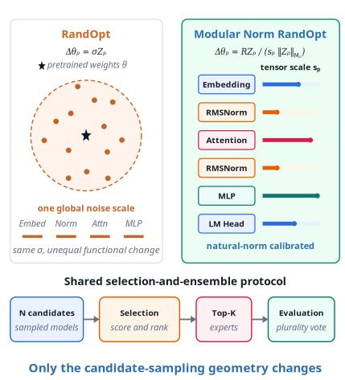
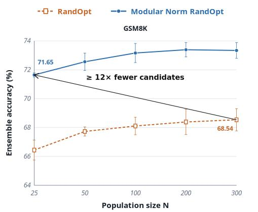
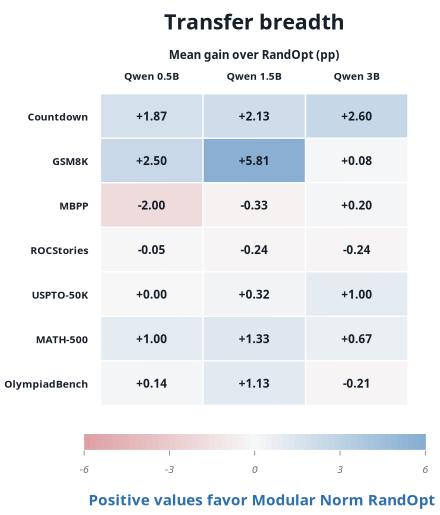
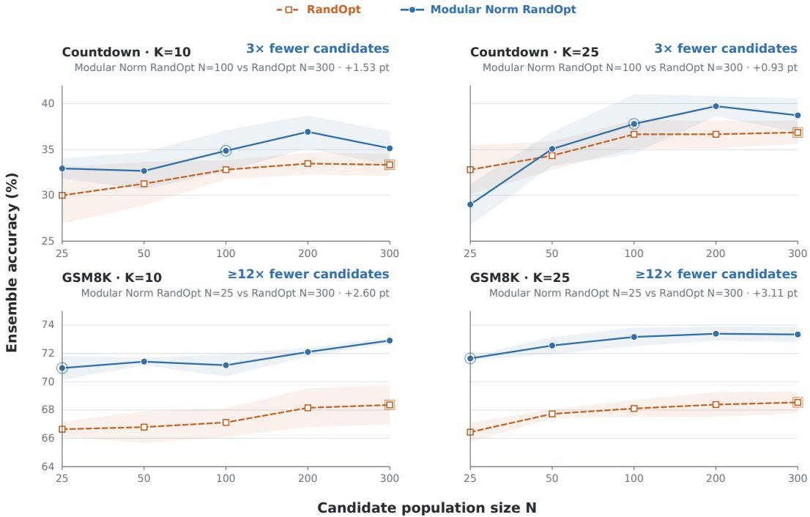
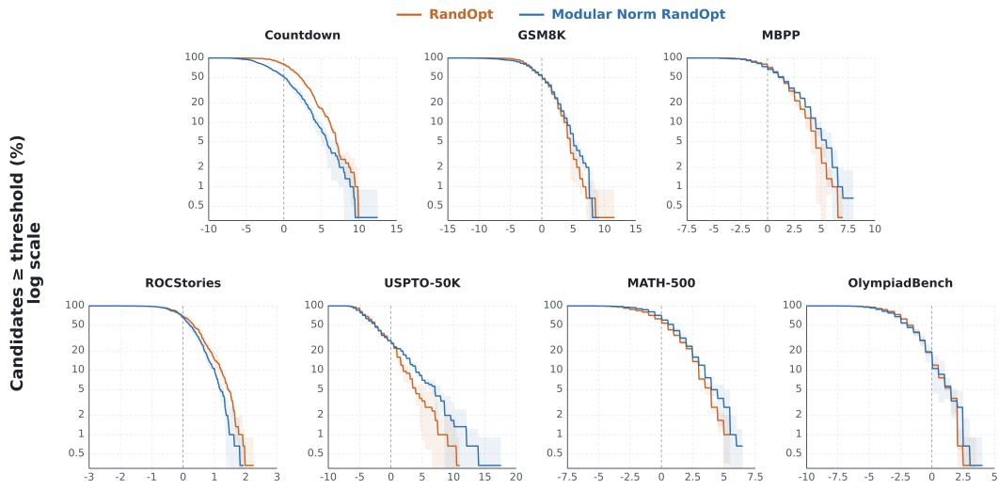
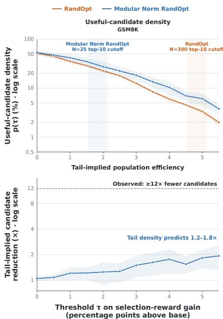
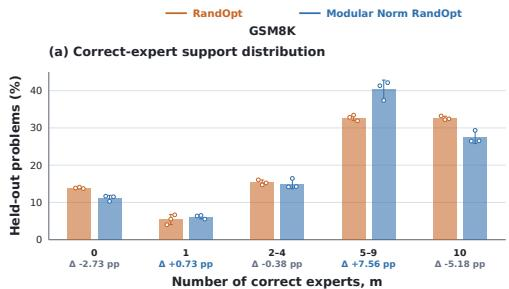
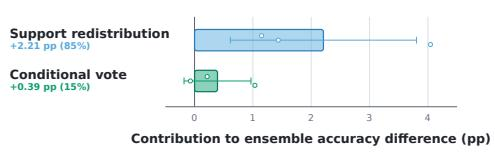

# MODULAR NORM RANDOPT: POPULATION-EFFICIENT ENSEMBLING THROUGH ARCHITECTURE-AWARE PERTURBATIONS

Kirato Yoshihara The University of Osaka kiratoyoshihara@gmail.com

Hiroaki Hamade The University of Osaka hiroakihamade@gmail.com

## ABSTRACT

RandOpt samples weight-perturbed language models and ensembles top-ranked candidates through plurality voting, but its global perturbation scale ignores heterogeneous module geometry. We propose Modular Norm RandOpt, an architecture-aware sampling method using module-wise natural norms and calibrated scales while preserving selection and voting. It outperforms RandOpt using 3× fewer candidates on Countdown and at least 12× fewer on GSM8K, with corresponding wall-clock savings. Evaluations across seven tasks and three Qwen scales (0.5B–3B) show higher mean accuracy than RandOpt on Countdown, GSM8K, and MATH-500 at every scale. The gains extend to Llama 3.2 3B and Gemma 3 4B on Countdown and GSM8K. On Qwen2.5-1.5B, our ensembles also achieve higher mean accuracy than iterative baselines on both tasks at comparable main-run evaluation budgets. On GSM8K, a tail-density diagnostic implies only a 1.2–1.8× candidate reduction, while most ensemble improvement is associated with more favorable correct-expert support. These results highlight perturbation geometry as a key design choice for population-efficient, gradient-free search around pretrained models.

Architecture-aware perturbations  
  
(a)

Population-efficient ensembling  
  
(b)

  
(c)  
Figure 1: Modular Norm RandOpt enables architecture-aware, population-efficient ensembling. (a) Modular Norm RandOpt replaces isotropic perturbations with module-wise natural-norm and architecture-aware scaling, while keeping selection and ensembling unchanged. (b) On GSM8K with $K = 2 5$ , it exceeds RandOpt using $\geq 1 2 \times$ fewer candidates; error bars show one sample standard deviation over three seeds. (c) The calibrated geometry transfers across seven tasks and three Qwen model scales.

## 1 INTRODUCTION

Modern language models have gained broad capabilities through scaling model size, data, and computation (Brown et al., 2020; Chowdhery et al., 2023; Hoffmann et al., 2022), with open model families demonstrating strong performance across architectures and scales (Touvron et al., 2023a;b; Jiang et al., 2023; Groeneveld et al., 2024; Qwen Team, 2024; Llama Team, 2024; Gemma Team, 2025). After pretraining, models are commonly adapted through supervised, parameter-efficient, preference-based, or feedback-driven methods (Ouyang et al., 2022; Hu et al., 2022; Chung et al., 2024; Wang et al., 2023; Bai et al., 2022; Rafailov et al., 2023).

As a gradient-free alternative, RandOpt samples N random weight perturbations around a pretrained model, evaluates them on a small selection set, and ensembles the top K by plurality vote (Gan & Isola, 2026). It can be competitive with more involved post-training procedures, consistent with evidence that useful task specialists are dense near well-pretrained weights (Gan & Isola, 2026). However, every candidate must be evaluated before selection, so search cost grows directly with N. We therefore ask: can equally strong ensembles be obtained from substantially smaller candidate populations without changing RandOpt’s selection or ensembling?

We argue that a key opportunity lies in the geometry used to sample candidates. RandOpt perturbs the full parameter vector with isotropic Gaussian noise controlled by a global scale, whereas Transformer models are compositions of heterogeneous modules with distinct parameterizations and functional roles (Vaswani et al., 2017; Ba et al., 2016; Zhang & Sennrich, 2019; Shazeer, 2020; Su et al., 2024; Ainslie et al., 2023). Equal Euclidean perturbation magnitudes therefore need not induce comparable functional changes across the network. The modular norm formalizes an architecture-aware geometry for optimization by assigning modules natural norms and composing them according to network structure (Large et al., 2024). This motivates using the same geometric principle to shape RandOpt’s candidate distribution.

We introduce Modular Norm RandOpt, which replaces RandOpt’s isotropic sampling with architecture-aware perturbations normalized by module-wise natural norms and calibrated modular scales. Candidate evaluation, top-K selection, and plurality voting remain unchanged, isolating candidate-sampling geometry as the intervention (Figure 1(a)).

This change substantially improves population efficiency. On Countdown, Modular Norm RandOpt with N = 100 matches or exceeds RandOpt with N = 300; on GSM8K (Cobbe et al., 2021), N = 25 exceeds RandOpt with N = 300 at both K = 10 and K = 25, corresponding to 3× and at least 12× fewer candidates. Across seven tasks (Cobbe et al., 2021; Austin et al., 2021; Mostafazadeh et al., 2016; Jin et al., 2017; Hendrycks et al., 2021; He et al., 2024) and three Qwen2.5 scales (Qwen Team, 2024), our method achieves higher mean performance than RandOpt in 14 of 21 settings and ties in one. The gains also extend to Llama 3.2 3B (Llama Team, 2024) and Gemma 3 4B (Gemma Team, 2025), with additional cross-family evaluation on OLMo 3 7B-Instruct (Team Olmo, 2025) on Countdown and GSM8K.

On GSM8K, high-reward tail enrichment predicts only a 1.2–1.8× candidate reduction, far below the observed ≥ 12× reduction. Our ensemble-level analysis shows that most of the GSM8K accuracy gain arises from a more favorable distribution of correct-expert support under plurality voting.

## 2 BACKGROUND AND RELATED WORK

## 2.1 RANDOPT AND GRADIENT-FREE POST-TRAINING

Evolution strategies (Salimans et al., 2017; Qiu et al., 2026), black-box prompt tuning (Sun et al., 2022), and zeroth-order fine-tuning (Malladi et al., 2023; Zhang et al., 2026a) perform iterative optimization. CMA-ES adapts search covariances (Hansen & Ostermeier, 2001), while natural evolution strategies update search distributions using natural gradients (Wierstra et al., 2014). RandOpt instead ensembles selected candidates from a fixed population, with parallelizable candidate evaluations (Gan & Isola, 2026). CoRP consolidates rewarded perturbations into one model (Zhang et al., 2026b); we instead modify candidate generation while preserving RandOpt’s selection and voting.

## 2.2 PERTURBATION GEOMETRY AND MODULAR STRUCTURE

Modular norms normalize updates according to network structure (Large et al., 2024), while modular duality constructs duality maps from layer-wise norms (Bernstein & Newhouse, 2025). Manifoldconstrained GPT-2 experiments also suggest different geometry preferences for attention and MLP modules (Yoshihara, 2026). Safe Mutations rescales mutations using output sensitivities to weights (Lehman et al., 2018); PATS adds sensitivity-dependent noise during language-model fine-tuning (Zhang et al., 2022). Kim et al. (2026) examine perturbation dimension, subspace, and norm under fixed scoring and voting. We combine natural norms, architecture-based allocation, and moduleinput Jacobian estimates to fix the sampling geometry before candidate search.

## 2.3 WEIGHT-SPACE DIVERSITY AND ENSEMBLING

Deep and snapshot ensembles combine independently trained predictors or training checkpoints (Lakshminarayanan et al., 2017; Huang et al., 2017). SWAG samples from a Gaussian weight posterior approximation fitted to SGD iterates (Maddox et al., 2019), while PEP perturbs trained weights (Mehrtash et al., 2020). RandOpt additionally ranks candidates on a selection set (Gan & Isola, 2026). Self-consistency samples reasoning paths in output space (Wang et al., 2022), whereas RandOpt and our method perturb weights. Ensemble theory highlights trade-offs between member errors and diversity (Wood et al., 2023), motivating our analysis of correct-expert support and voting beyond individual candidate scores.

## 3 MODULAR NORM RANDOPT

RandOpt samples candidate models by adding isotropic Gaussian perturbations to pretrained parameters, ranks them on a selection set, and ensembles the top-K candidates (Gan & Isola, 2026). We retain this selection and ensembling procedure and modify only the candidate sampling geometry. Modular Norm RandOpt replaces the global isotropic scale with parameter specific perturbations determined by natural norms and sensitivity calibrated recursive modular scales. Figure 1(a) illustrates this distinction.

## 3.1 ARCHITECTURE-AWARE PERTURBATION GEOMETRY

Let $\pmb { \theta } = \{ \theta _ { p } \} _ { p \in \mathcal { P } }$ denote the pretrained parameters, where $\mathcal { P }$ is the set of physical parameter tensors to be perturbed. Each tensor p is represented by a leaf module $\mathsf { M } _ { p }$ in the model’s module tree, with

$$
m _ { p } : = { \mathsf { M } } _ { p } . { \mathrm { m a s s } } , \qquad \parallel \cdot \parallel _ { \mathsf { M } _ { p } } : = { \mathsf { M } } _ { p } . { \mathrm { n o r m } } .\tag{1}
$$

Here $m _ { p } \ > \ 0$ is a fixed architecture-based weight that allocates perturbation magnitude across tensors, not the tensor’s parameter count, and $\| \cdot \| _ { \mathsf { M } _ { p } }$ is its role-specific norm. The scale $s _ { p } > 0$ combines this mass allocation with a calibrated sensitivity correction (Section 3.2). The resulting max-form geometry on the full perturbation is

$$
\| \Delta \pmb { \theta } \| _ { \mathsf { M } } : = \operatorname* { m a x } _ { p \in \mathcal { P } } s _ { p } \| \Delta \theta _ { p } \| _ { \mathsf { M } _ { p } } ,\tag{2}
$$

where M denotes the root model module. For candidate $i ,$ we generate a standard Gaussian noise tensor $Z _ { i , p } \sim \mathcal { N } ( \mathbf { 0 } , \mathbf { I } )$ with the same shape as $\theta _ { p }$ and set

$$
\Delta \theta _ { i , p } = R \frac { Z _ { i , p } } { s _ { p } \| Z _ { i , p } \| _ { \mathsf { M } _ { p } } } , \qquad \theta _ { i , p } ^ { \prime } = \theta _ { p } + \Delta \theta _ { i , p } ,\tag{3}
$$

Here $R > 0$ is the global modular radius. Each active tensor has natural-norm magnitude $R / s _ { p } ,$ so larger $s _ { p }$ implies a smaller perturbation. Hence $s _ { p } \| \Delta \theta _ { i , p } \| _ { \mathsf { M } _ { p } } = R$ and $\| \Delta \pmb { \theta } _ { i } \| _ { \mathsf { M } } = ^ { \circ } R$

We use role-specific natural norms: maximum-row $\ell _ { 2 }$ for embeddings, spectral norm for linear maps, and $\ell _ { \infty }$ for one-dimensional parameters. Appendix A.1 gives the complete mapping, including fused projections and fallback cases.

Algorithm 1 Modular Norm RandOpt. Highlighted lines are the architecture-aware normalization   
and scaling steps that differ from RandOpt.   
Require: pretrained parameters $\theta ,$ selection set $\mathcal { D } _ { \mathrm { s e l } } .$ , population size $N ,$ ensemble size $K ,$ , radius   
$R ,$ fixed scales $\{ { \dot { s } } _ { p } \} _ { p \in \mathcal { P } }$   
1: for $i = 1 , \ldots , \tilde { N }$ do   
2: For each $p \in { \mathcal { P } } ,$ sample $Z _ { i , p } \sim \mathcal { N } ( \mathbf { 0 } , \mathbf { I } )$   
3: Compute $\| Z _ { i , p } \| _ { \mathsf { M } _ { p } }$ for every $p \in \mathcal P$   
4: Set $\Delta \theta _ { i , p } \gets R \frac { Z _ { i , p } } { s _ { p } \| Z _ { i , p } \| _ { \mathsf { M } _ { p } } }$ for all $p \in \mathcal P$   
5: Construct candidate parameters $\theta _ { i , p } ^ { \prime }  \theta _ { p } + \Delta \theta _ { i , p }$ for all $p \in \mathcal P$   
6: scorei $ \mathrm { E v a l u a t e } ( \pmb { \theta } _ { i } ^ { \prime } , \mathcal { D } _ { \mathrm { s e l } } )$   
7: end for   
8: $\mathcal { T } _ { \mathrm { t o p } }  \mathrm { T o p K } ( \{ \mathrm { s c o r e } _ { i } \} _ { i = 1 } ^ { N } , K )$   
9: for test input x do   
10: $\mathcal { A } ( x ) \ : \dot {  } \ : \{ \mathrm { G e n e r a t e } ( \pmb { \theta } _ { i } ^ { \prime } , x ) : i \in \mathbb { Z } _ { \mathrm { t o p } } \}$   
11: ${ \widehat { y } } ( x ) \gets$ PluralityVoteA(x)   
12: end for   
13: return $\widehat { y }$

## 3.2 SENSITIVITY-CALIBRATED RECURSIVE MODULAR SCALES

The scale $s _ { p }$ combines the mass allocation induced by the module tree with a layer-relative functional-sensitivity correction. For calibration example e, Transformer layer ℓ, and functional map index τ, we estimate the largest local amplification of a unit Euclidean activation perturbation,

$$
\widehat { \gamma } _ { e , \ell , \tau } \approx \operatorname* { m a x } _ { \| v \| _ { 2 } = 1 } \left\| J _ { f _ { \ell , \tau } } ( x _ { e , \ell , \tau } ) v \right\| _ { 2 } , \qquad J _ { f } ( x ) : = \frac { \partial f ( x ) } { \partial x } .\tag{4}
$$

Here $f _ { \ell , \tau }$ is the functional map indexed by τ in layer $\ell ,$ and $x _ { e , \ell , \tau }$ is its input for calibration example e. Let $\scriptstyle { \mathcal { T } } _ { \ell }$ denote the calibration examples assigned to layer ℓ. We aggregate the estimates in log space,

$$
\Gamma _ { \ell , \tau } = \exp \Bigl [ Q _ { 0 . 9 } \left( \left\{ \log \operatorname * { m a x } \bigl ( \widehat { \gamma } _ { e , \ell , \tau } , 1 0 ^ { - 1 2 } \bigr ) \right\} _ { e \in \mathcal { T } _ { \ell } } \right) \Bigr ] .\tag{5}
$$

Here $Q _ { 0 . 9 }$ denotes the empirical 90th percentile. With the root scale set to one and all functional sensitivities in the recursive modular composition rule replaced by one, the mass ratios telescope along each root-to-leaf path:

$$
s _ { p } ^ { \mathrm { b a s e } } = \frac { m _ { \mathsf { M } } } { m _ { p } } , \qquad m _ { \mathsf { M } } : = \mathsf { M } . \mathrm { m a s s } = \sum _ { p \in \mathcal { P } } m _ { p } .\tag{6}
$$

Parameters with $m _ { p } = 0$ are excluded from perturbation. The aggregated sensitivities and projection gains define a role-specific raw correction $\bar { r } _ { p } ^ { \mathrm { r a w } }$ . For an active tensor $p$ within a Transformer layer, let $\ell ( p )$ denote its layer and $\mathcal { P } _ { \ell }$ the set of active tensors in layer ℓ. Its layer-relative correction and final scale are

$$
\rho _ { p } = \mathrm { c l i p } \left( \frac { r _ { p } ^ { \mathrm { r a w } } } { \mathrm { m e d i a n } \{ r _ { q } ^ { \mathrm { r a w } } : q \in \mathcal { P } _ { \ell ( p ) } \} } , \frac { 1 } { 2 } , 2 \right) , \qquad s _ { p } = s _ { p } ^ { \mathrm { b a s e } } \rho _ { p } .\tag{7}
$$

Combining the scale construction with Equation 3, the perturbation magnitude is

$$
\| \Delta \theta _ { i , p } \| _ { \mathsf { M } _ { p } } = \frac { R } { s _ { p } } = R \frac { m _ { p } } { m _ { \mathsf { M } } } \frac { 1 } { \rho _ { p } } .\tag{8}
$$

Thus, the mass fraction sets the architecture-based baseline perturbation magnitude, while $\rho _ { p }$ provides a layer-relative sensitivity adjustment bounded to a factor of two in either direction. For active tensors outside the repeated Transformer layers, we set $\rho _ { p } = 1$ . All scales are fixed before candidate search and shared across candidates. Appendix $\mathbf { A }$ gives the calibration protocol, mass allocation, and construction of $r _ { p } ^ { \mathrm { r a w } }$

Table 1: Transfer and runtime results. MN RandOpt denotes Modular Norm RandOpt; RMSNorm-only perturbs only RMSNorm weights. Values are mean ± sample SD over seeds 42– 44. (a) Qwen2.5 task/scale transfer at N = 100, K = 25. The Modular Norm RandOpt sensitivity profile and radius are determined on Countdown and transferred unchanged across tasks. (b) Modelfamily transfer at $N = 1 0 0 , K = 2 5$ , with radius selected on Countdown and fixed on GSM8K. Scores in (a,b) are accuracy (%), except USPTO-50K (balanced accuracy). (c) Wall-clock minutes at $K = 2 5$ , comparing RandOpt $N = 3 0 0$ with Modular Norm RandOpt $N = 1 0 0$ on Countdown and $N = 2 5$ on GSM8K. Bold marks the highest mean transfer score within each model/task (all tied methods) or lower runtime.  
(a) Qwen task and scale transfer
<table><tr><td colspan="8"></td></tr><tr><td>Model Method</td><td></td><td>Countdown</td><td>GSM8K</td><td>MBPP</td><td>ROCStories</td><td>USPTO-50K</td><td>MATH-500</td><td>Olympiad Bench</td></tr><tr><td rowspan="3">0.5B</td><td>RandOpt</td><td> $7 . 7 3 \pm 0 . 8 3$ </td><td>53.35±0.58</td><td> ${ \bf 2 6 . 7 3 \pm 0 . 9 9 }$ </td><td> $0 . 8 2 \pm 0 . 0 3$ </td><td> $\mathbf { 1 0 . 0 0 } \pm 0 . 0 0$ </td><td> $3 8 . 6 7 \pm 0 . 5 8$ </td><td> $1 4 . 4 2 \pm 1 . 3 6$ </td></tr><tr><td>RMSNorm-only</td><td> $1 . 2 7 \pm 0 . 3 1$ </td><td> $4 5 . 3 6 \pm 0 . 2 4$ </td><td> $2 6 . 2 7 \pm 0 . 8 1$ </td><td> $\mathbf { 0 . 8 9 \pm 0 . 0 1 }$ </td><td> $\mathbf { 1 0 . 0 0 } \pm 0 . 0 0$ </td><td> $2 9 . 6 7 \pm 0 . 3 3$ </td><td> $1 1 . 3 2 \pm 0 . 3 2$ </td></tr><tr><td>MN RandOpt</td><td> $\mathbf { 9 . 6 0 \pm 2 . 8 0 }$ </td><td> ${ \bf 5 5 . 8 5 \pm 0 . 7 6 }$ </td><td> $2 4 . 7 3 \pm 2 . 3 7$ </td><td> $0 . 7 7 \pm 0 . 0 5$ </td><td> $\mathbf { 1 0 . 0 0 } \pm 0 . 0 0$ </td><td> ${ \bf 3 9 . 6 7 \pm 1 . 7 6 }$ </td><td> ${ \bf 1 4 . 5 6 \pm 1 . 2 7 }$ </td></tr><tr><td rowspan="3">1.5B</td><td>RandOpt</td><td> $3 5 . 6 7 \pm 1 . 2 2$ </td><td> $6 8 . 3 9 \pm 1 . 1 2$ </td><td> ${ \bf 4 9 . 4 7 \pm 0 . 8 1 }$ </td><td> ${ \bf 6 . 8 9 \pm 0 . 1 2 }$ </td><td> $1 1 . 3 4 \pm 0 . 6 0$ </td><td> $5 8 . 3 3 \pm 1 . 2 0 $ </td><td> $2 8 . 6 2 \pm 0 . 7 4$ </td></tr><tr><td>RMSNorm-only</td><td> $2 4 . 0 0 \pm 0 . 3 5$ </td><td> $6 2 . 0 4 \pm 0 . 3 9$ </td><td> $4 8 . 4 0 \pm 0 . 3 5$ </td><td> $6 . 6 5 \pm 0 . 0 1$ </td><td> $1 0 . 7 7 \pm 0 . 0 4$ </td><td> $5 4 . 3 3 \pm 0 . 6 7$ </td><td> $2 3 . 8 4 \pm 0 . 3 7$ </td></tr><tr><td>MN RandOpt</td><td> $\mathbf { 3 7 . 8 0 \pm 0 . 8 7 }$ </td><td> ${ \bf 7 4 . 2 0 \pm 0 . 3 2 }$ </td><td> $4 9 . 1 3 \pm 0 . 8 1$ </td><td> $6 . 6 5 \pm 0 . 0 8$ </td><td> ${ \bf 1 1 . 6 5 \pm 0 . 5 7 }$ </td><td> ${ \bf 5 9 . 6 7 \pm 0 . 3 3 }$ </td><td> ${ \bf 2 9 . 7 5 \pm 0 . 7 6 }$ </td></tr><tr><td rowspan="3">3B</td><td>RandOpt</td><td> $4 9 . 5 3 \pm 0 . 6 4$ </td><td> $8 6 . 0 8 \pm 0 . 2 3$ </td><td> $6 0 . 1 3 \pm 0 . 4 6$ </td><td> ${ \bf 1 4 . 2 2 \pm 0 . 0 5 }$ </td><td> $1 2 . 9 5 \pm 0 . 6 1$ </td><td> $6 8 . 3 3 \pm 0 . 5 8 $ </td><td> $\mathbf { 4 1 . 9 1 \pm 0 . 8 0 }$ </td></tr><tr><td>RMSNorm-only</td><td> $4 1 . 6 0 \pm 0 . 6 0$ </td><td> $8 2 . 9 7 \pm 0 . 1 2$ </td><td> $5 7 . 9 3 \pm 0 . 3 1$ </td><td> $1 3 . 9 0 \pm 0 . 0 5$ </td><td> $\mathbf { 1 5 . 1 1 \pm 0 . 4 0 }$ </td><td> $6 3 . 1 1 \pm 0 . 6 9$ </td><td> $3 6 . 4 3 \pm 0 . 6 4$ </td></tr><tr><td>MN RandOpt</td><td> ${ \bf 5 2 . 1 3 \pm 0 . 9 9 }$ </td><td> ${ \bf 8 6 . 1 5 \pm 0 . 1 6 }$ </td><td> ${ \bf 6 0 . 3 3 \pm 0 . 6 1 }$ </td><td> $1 3 . 9 8 \pm 0 . 0 6$ </td><td> $1 3 . 9 5 \pm 0 . 4 7$ </td><td> ${ \bf 6 9 . 0 0 \pm 1 . 2 0 }$ </td><td> $4 1 . 7 0 \pm 0 . 3 2$ </td></tr></table>

(c) Wall-clock time

(b) Model-family transfer
<table><tr><td>Model</td><td>Method</td><td>Countdown</td><td>GSM8K</td></tr><tr><td>Llama 3.2</td><td>RandOpt</td><td> $4 0 . 9 3 \pm 1 . 0 3$ </td><td> $8 0 . 9 5 \pm 0 . 2 3$ </td></tr><tr><td>3B</td><td>MN RandOpt</td><td> ${ \bf 4 4 . 6 0 \pm 1 . 7 4 }$ </td><td> ${ \bf 8 1 . 4 5 \pm 0 . 3 1 }$ </td></tr><tr><td>Gemma 3 4B</td><td>RandOpt</td><td> $7 3 . 2 7 \pm 0 . 8 3$ </td><td> $8 7 . 1 1 \pm 0 . 2 0$ </td></tr><tr><td></td><td>MN RandOpt</td><td> ${ \bf 7 3 . 4 7 \pm 1 . 2 9 }$ </td><td> ${ \bf 8 7 . 7 9 \pm 0 . 3 5 }$ </td></tr><tr><td>OLMo 3</td><td>RandOpt</td><td> $8 6 . 0 7 \pm 1 . 0 3$ </td><td> ${ \bf 8 9 . 2 1 \pm 0 . 0 9 }$ </td></tr><tr><td>7B</td><td>MN RandOpt</td><td> $\mathbf { 8 6 . 4 0 \pm 0 . 4 0 }$ </td><td> $8 8 . 7 3 \pm 0 . 2 4$ </td></tr></table>

<table><tr><td>Task</td><td>Method</td><td>N</td><td>Search</td><td>Total</td></tr><tr><td rowspan="2">Countdown</td><td>RandOpt</td><td>300</td><td> $4 5 . 8 6 \pm 0 . 4 0$ </td><td> $5 2 . 1 5 \pm 0 . 5 2$ </td></tr><tr><td>MN RandOpt 100</td><td></td><td> ${ \bf 1 4 . 8 2 \pm 0 . 2 2 }$ </td><td> ${ \bf 2 1 . 0 7 \pm 0 . 3 5 }$ </td></tr><tr><td rowspan="2">GSM8K</td><td>RandOpt</td><td>300</td><td> $2 9 . 4 7 \pm 0 . 2 4$ </td><td> $3 7 . 7 9 \pm 0 . 3 0$ </td></tr><tr><td>MN RandOpt</td><td>25</td><td> ${ \bf 2 . 4 3 \pm 0 . 1 6 }$ </td><td> ${ \bf 1 0 . 8 5 \pm 0 . 1 7 }$ </td></tr></table>

## 4 EXPERIMENTAL SETUP

Models and tasks. We evaluate primarily on Qwen2.5-Instruct models at 0.5B, 1.5B, and 3B parameters (Qwen Team, 2024), and test model-family transfer on Llama 3.2 3B (Llama Team, 2024), Gemma 3 4B (Gemma Team, 2025), and OLMo 3 7B-Instruct (Team Olmo, 2025). Our seven tasks span arithmetic and mathematical reasoning, code generation, commonsense reasoning, and reaction prediction: Countdown, GSM8K (Cobbe et al., 2021), MBPP (Austin et al., 2021), ROCStories (Mostafazadeh et al., 2016), USPTO-50K (Jin et al., 2017), MATH-500 (Hendrycks et al., 2021), and OlympiadBench (He et al., 2024). We report accuracy except for USPTO-50K, for which we use balanced accuracy.

Evaluation protocol. Unless otherwise stated, results are averaged over seeds 42, 43, and 44, and we report the mean and sample standard deviation. Transfer experiments use population size N = 100 and ensemble size $K = 2 5$ . For population scaling, we evaluate prefixes

$$
N \in \{ 2 5 , 5 0 , 1 0 0 , 2 0 0 , 3 0 0 \}
$$

of the same $N _ { \mathrm { m a x } } = 3 0 0$ candidate population within each run and report $K \in \{ 1 0 , 2 5 \}$ . Candidate ranking uses a fixed selection set of 200 examples, while final performance is measured on the corresponding held-out evaluation set.

Calibration and transfer. For task transfer, we calibrate a profile on Countdown separately for each Qwen model scale and reuse it unchanged on target tasks without recalibration.

Implementation. RandOpt, Modular Norm RandOpt, and iterative ES use bfloat16, whereas MeZO and ZO-Finetuner use float16 following training-only numerical-stability checks (Appendix D.1). All methods use greedy decoding and the same task-specific completion caps. Taskspecific prompting, scoring rules, preprocessing, and additional implementation details are provided in Appendix B. For the wall-clock comparison, we use Qwen2.5-1.5B with $K = 2 5$ on Countdown and GSM8K under identical hardware and inference settings, and report both candidate-search and end-to-end execution time over three seeds.

## 5 POPULATION-EFFICIENT ENSEMBLING AND TRANSFER

## 5.1 POPULATION SCALING

We first compare ensemble accuracy as the candidate budget increases. At both $K = 1 0$ and $K = 2 5$ , Modular Norm RandOpt exceeds the N = 300 RandOpt reference using $N = 1 0 0$ on Countdown and $N = 2 5$ on GSM8K (Figure 2), corresponding to 3× and at least 12× fewer candidates.

In a separate comparison at $N = 3 , 0 0 0 , K = 2 5$ for both methods, Modular Norm RandOpt also achieves higher mean accuracy on both tasks (Table 2).

Table 2: Large-population comparison. Qwen2.5-1.5B-Instruct with $N \stackrel { - } { = } 3 { , } 0 0 0$ K = 25 for both methods. Accuracy (%): mean ± sample SD over seeds 42–44. Bold marks the higher mean.
<table><tr><td>Method</td><td>Countdown</td><td>GSM8K</td></tr><tr><td>RandOpt</td><td> $3 5 . 2 9 \pm 1 . 6 0$ </td><td> $6 9 . 9 5 \pm 1 . 1 1 $ </td></tr><tr><td>MN RandOpt</td><td> ${ \bf 3 8 . 4 4 \pm 1 . 2 0 }$ </td><td> ${ \bf 7 4 . 4 5 \pm 0 . 9 5 }$ </td></tr></table>

  
Figure 2: Population scaling on Countdown and GSM8K. At both $K = 1 0$ and $K = 2 5$ , Modular Norm RandOpt exceeds the N = 300 RandOpt reference using $N = 1 0 0$ candidates on Countdown and $N = 2 5$ on GSM8K. Curves show means and shaded regions show one sample standard deviation over seeds 42, 43, and 44. Population sizes are nested prefixes of the same $N _ { \mathrm { m a x } } = 3 0 0$ population within each run.

## 5.2 TRANSFER ACROSS TASKS AND MODEL SCALES

We next test transfer beyond the calibration task. For each Qwen2.5 scale, we calibrate the profile on Countdown and reuse it unchanged across target tasks. At $N = 1 0 0$ and $K = 2 5$ , Modular Norm RandOpt achieves higher mean scores than RandOpt in 14 of 21 settings and ties in one (Table 1(a)). The full method also matches or exceeds the RMSNorm-only baseline’s reported mean in 18 of 21 settings, suggesting that RMSNorm weight perturbations alone do not explain the gains. Improvements over RandOpt span all three scales on Countdown, GSM8K, and MATH-500, but benefits remain task dependent, with failures on ROCStories and the smaller MBPP models.

Table 3: Runtime efficiency, iterative baselines, and ablations. Accuracy (%) and speedups are mean ± sample SD over seeds 42–44. (a) Modular Norm RandOpt versus iterative baselines. N: cumulative perturbation evaluations; Eval. red.: main-run budget ratio (ES/method; Appendix D.2). (b) Modular Norm RandOpt speedups over RandOpt for Table 1(c). (c) Countdown ablations on Qwen2.5-1.5B-Instruct at $N = 1 \bar { 0 } 0 , \mathrm { \bar { \it K } = \bar { 2 } 5 }$ . Bold marks higher mean accuracy or fewer evaluations than ES in (a), speedups in (b), and the highest mean accuracy in (c).  
(a) Comparison with iterative baselines
<table><tr><td>Method</td><td>N</td><td>K</td><td>Acc. (%)</td><td>Eval. red.</td></tr><tr><td>Countdown</td><td></td><td></td><td></td><td></td></tr><tr><td>Iterative ES</td><td>3,000</td><td>1</td><td> $3 5 . 6 7 \pm 5 . 0 8$ </td><td>1.00×</td></tr><tr><td>ZO-Finetuner</td><td>3,000</td><td>1</td><td> $2 9 . 5 6 \pm 0 . 8 2$ </td><td>0.99×</td></tr><tr><td>MeZO</td><td>3,000</td><td>1</td><td> $2 9 . 2 2 \pm 1 . 9 3$ </td><td>0.99×</td></tr><tr><td>MN RandOpt</td><td>3,000</td><td>1</td><td> $1 6 . 1 8 \pm 1 . 0 8$ </td><td>1.00×</td></tr><tr><td>MN RandOpt</td><td>2,820</td><td>25</td><td> ${ \bf 3 9 . 0 9 \pm 1 . 5 6 }$ </td><td>1.00×</td></tr><tr><td>MN RandOpt</td><td>100</td><td>25</td><td> $\mathbf { 3 8 . 4 0 \pm 2 . 7 1 }$ </td><td>10.46×</td></tr><tr><td>GSM8K</td><td></td><td></td><td></td><td></td></tr><tr><td>Iterative ES</td><td>3,000</td><td>1</td><td> $7 3 . 1 1 \pm 0 . 5 2$ </td><td>1.00×</td></tr><tr><td>ZO-Finetuner</td><td>3,000</td><td>1</td><td> $7 2 . 5 3 \pm 0 . 5 8$ </td><td>0.99×</td></tr><tr><td>MeZO</td><td>3,000</td><td>1</td><td> $7 1 . 7 2 \pm 0 . 2 7$ </td><td>0.99×</td></tr><tr><td>MN RandOpt</td><td>3,000</td><td>1</td><td> $6 4 . 4 2 \pm 0 . 2 9$ </td><td>1.00×</td></tr><tr><td>MN RandOpt</td><td>2,841</td><td>25</td><td> $\mathbf { 7 4 . 4 3 \pm 0 . 8 1 }$ </td><td>1.00×</td></tr><tr><td>MN RandOpt</td><td>100</td><td>25</td><td> $\mathbf { 7 4 . 2 0 \pm 7 4 . 2 0 }$ </td><td>11.35×</td></tr></table>

(b) Runtime speedups (×)
<table><tr><td>Task</td><td>Search</td><td>End-to-end</td></tr><tr><td>Countdown</td><td> $\mathbf { \overline { { 3 . 1 0 \pm 0 . 0 3 } } }$ </td><td> $\mathbf { \overline { { 2 . 4 8 \pm 0 . 0 2 } } }$ </td></tr><tr><td>GSM8K</td><td> $\mathbf { 1 2 . 1 5 \pm 0 . 8 4 }$ </td><td> ${ \bf 3 . 4 9 \pm 0 . 0 8 }$ </td></tr></table>

(c) Countdown ablations
<table><tr><td>Variant</td><td>Accuracy (%)</td></tr><tr><td>Full (ours)</td><td>37.80±0.87</td></tr><tr><td>No sensitivity</td><td>36.87±1.62</td></tr><tr><td>RMSNorm-only scale correction</td><td>36.80±1.64</td></tr><tr><td>No recursive scaling</td><td>35.80±1.22</td></tr><tr><td>Frobenius norm</td><td> $3 4 . 4 0 \pm 0 . 7 2$ </td></tr><tr><td>Attention only</td><td> $2 4 . 0 0 \pm 1 . 5 6$ </td></tr><tr><td>MLP only</td><td> $2 3 . 7 3 { \pm } 0 . 6 4$ </td></tr><tr><td>Pretrained base</td><td> $1 2 . 4 0 { \pm } 0 . 0 0$ </td></tr></table>

## 5.3 TRANSFER ACROSS MODEL FAMILIES

To test transfer beyond Qwen, we evaluate Llama 3.2 3B, Gemma 3 4B, and OLMo 3 7B-Instruct (Table 1(b)). Modular Norm RandOpt improves over RandOpt in all four Llama and Gemma com parisons, with OLMo extending evaluation to 7B.

## 5.4 WALL-CLOCK EFFICIENCY

Table 1(c) compares wall-clock times for RandOpt at N = 300 and Modular Norm RandOpt at N = 100 on Countdown and $N = 2 5$ on GSM8K, with matched hardware, inference settings, and $K = 2 5$ . Speedups (Table 3(b)) closely track candidate reductions during search but are smaller end-to-end due to fixed-ensemble evaluation and other population-independent costs.

## 5.5 COMPARISON WITH ITERATIVE BASELINES

We compare Modular Norm RandOpt with iterative ES (Qiu et al., 2026), MeZO (Malladi et al., 2023), and a task-adapted ZO-Finetuner (Zhang et al., 2026a) on Countdown and GSM8K (Table 3(a)). For the ES comparison, we adjust N to match main-run evaluation budgets rather than candidate counts (Appendix D.2). MeZO and ZO-Finetuner each perform 1,500 two-sided updates, using 600,000 training model–prompt evaluations; their checkpoint-selection costs are additionally counted. Settings are provided in Appendix D.1. Our $K = 2 5$ ensembles achieve higher mean accuracy than ES, MeZO, and ZO-Finetuner on both tasks at ES-matched budgets. At ${ \bar { N } } = 1 0 0 .$ $K = 2 5$ , Modular Norm RandOpt uses approximately 10.6× and 11.5× fewer model–prompt evaluations than MeZO or ZO-Finetuner on Countdown and GSM8K, respectively (Appendix D.2). At $N = 3 { , } 0 0 0$ and $K = 1$ , however, our method underperforms iterative ES on both tasks. These results support population-efficient ensembling rather than superior single-model optimization.

## 5.6 ABLATIONS AND CONTROLS

Table 3(c) compares module coverage, norm choice, and scaling components. The full method achieves the highest mean accuracy. Removing sensitivity correction or recursive scaling lowers the mean by 0.93 and 2.00 percentage points, respectively, while the Frobenius-norm control is 3.40 points lower. Attention- and MLP-only controls retain full-method perturbation scales and mask other perturbations to zero without renormalization, yet yield much lower accuracy. RMSNormonly scale correction remains close to the full method, with a 1.00-point mean difference. Together, these controls favor combining broad module coverage with calibrated modular scaling.

## 6 MECHANISTIC ANALYSIS: WHY DOES IT WORK?

We next examine how the perturbation geometry changes the candidate population and why this can improve the selected ensemble. The analysis separates candidate-level reward effects from changes that emerge only after selection and voting.

## 6.1 CANDIDATE-LEVEL EFFECTS

Figure 3 shows that candidate-reward distributions do not shift uniformly. Modular Norm RandOpt has a more favorable high-reward tail on GSM8K, whereas RandOpt has a heavier tail on Countdown despite the stronger Modular Norm RandOpt ensemble. Candidate quality alone therefore cannot fully explain the gains.

  
Selection reward minus base reward (percentage points)  
Figure 3: Selection-reward distributions across tasks. Curves show the mean percentage of candidates exceeding each selection-reward-gain threshold; shading shows mean ± one sample SD across seeds 42–44, not confidence intervals. Bands are clipped to the displayed probability range.

## 6.2 TAIL ENRICHMENT DOES NOT EXPLAIN THE FULL GAIN

We quantify this discrepancy on GSM8K, where Modular Norm RandOpt produces a denser high-reward tail.

Figure 4 uses a tail-based required-population diagnostic: for each seed, we compute the population needed to obtain at least 10 above-threshold candidates with probability at least 0.9 and average the paired ratios (Appendix E.2). The resulting 1.2–1.8× reduction is far below the observed ≥ 12× reduction, where Modular Norm RandOpt with N = 25 exceeds RandOpt with N = 300 at K = 10.

Figure 4: Tail enrichment does not explain the full gain on GSM8K. Both panels use threshold τ on selection-reward gain over the pretrained base(percentage points). Top: p(τ) is the fraction of candidates with gain at least τ; vertical bands show mean ± sample SD of the top-10 selection cutoffs. Bottom: Mean paired-seed ratio $\dot { N } _ { \mathrm { R a n d O p t } , s } ^ { \mathrm { r e q } } ( \tau ) / N _ { \mathrm { M N } , s } ^ { \mathrm { r e q } } ( \tau ) .$ where $N ^ { \mathrm { r e q } }$ is the smallest population giving at least 10 above-threshold candidates with probability at least 0.9 under a binomial model. The dashed line marks the observed ≥ 12× candidate reduction. Curves show means over seeds 42–44; ribbons show mean ± one sample SD, not confidence intervals. Both vertical axes are logarithmic; bands are clipped to the plotting limits.

## 6.3 SUPPORT REDISTRIBUTION UNDER PLURALITY VOTING

Tail enrichment does not explain the full population-efficiency gap, so we next examine the support structure of the selected experts in Figure 5.

(b) Contributions to ensemble accuracy di erence  

Support accounting. For method a, let $p _ { a } ( m )$ be the fraction of held-out evaluation problems with exactly $m \in \{ 0 , \ldots , K \}$ correct selected experts, and let $q _ { a } ( m )$ be the plurality accuracy conditional on m. The ensemble accuracy is therefore $\begin{array} { r } { \operatorname { A c c } _ { a } = \sum _ { m = 0 } ^ { K } p _ { a } ( m ) q _ { a } ( m ) . } \end{array}$

Observed shift. Modular Norm RandOpt reduces unsupported problems and moves probability mass toward the bin containing 5 to 9 correct experts. A symmetric decomposition of the 2.60 point ensemble gain attributes 2.21 points, or 85%, to support redistribution and 0.39 points, or 15%, to changes in conditional plurality accuracy.

Interpretation. The gain is associated primarily with a more favorable distribution of correct-expert support, rather than improved voting at a fixed support level.

Figure 5: Selected-set support on GSM8K. Modular Norm RandOpt uses $N = 2 5$ , RandOpt uses $N = 3 0 0$ , and both use $K = 1 0 .$ . (a) Distribution of held-out evaluation problems by the number m of selected experts producing the gold answer. (b) Decomposition of the ensemble-accuracy difference into support redistribution and conditional voting. Bars show means, markers denote individual seeds, and error bars show ${ \mathrm { m e a n } } \pm { \mathrm { o n e } }$ sample SD over seeds 42–44, not confidence intervals.

## 7 LIMITATIONS AND CONCLUSION

Limitations. The benefits of Modular Norm RandOpt are task and model dependent rather than uniform. Cross-family evaluation covers Llama 3.2 3B, Gemma 3 4B, and OLMo 3 7B-Instruct on Countdown and GSM8K, with mixed results on OLMo. Evaluation beyond 7B, additional architectures, and broader task families remain directions for future work. We have not fully characterized sensitivity to calibration choices or radius-selection grids. Our wall-clock measurements use one model, two tasks, and a single hardware configuration, so absolute speedups may vary across systems. Moreover, reducing the search population does not remove the cost of evaluating the final K selected experts. Finally, the candidate-tail and support-redistribution analyses are observational, with the detailed decomposition focused on GSM8K.

Conclusion. We introduced Modular Norm RandOpt, which replaces RandOpt’s isotropic candidate distribution with an architecture-aware geometry based on module-specific natural norms and calibrated modular scales, while preserving candidate evaluation, top-K selection, and plurality voting. The method matches or exceeds substantially larger RandOpt populations using 3× fewer candidates on Countdown and at least 12× fewer candidates on GSM8K, with corresponding wall-clock savings. Across seven tasks and three Qwen scales, it outperforms RandOpt in 14 of 21 settings and ties in one, with higher mean accuracy at every tested scale on Countdown, GSM8K, and MATH-500. The gains also transfer across model families, improving all four Llama 3.2 3B and Gemma 3 4B comparisons, with additional cross-family evaluation extending to OLMo 3 7B. On Qwen2.5-1.5B, our ensembles also achieve higher mean accuracy than iterative ES, MeZO, and task-adapted ZO-Finetuner on Countdown and GSM8K at comparable main-run evaluation budgets. Ablations across module coverage, norm choice, and scale construction demonstrate the benefits of the full method. Candidate-tail enrichment alone does not explain the observed population efficiency; on GSM8K, most of the ensemble gain is associated with a more favorable distribution of correct-expert support after selection. Together, these results establish perturbation geometry as an important design choice for population-efficient, gradient-free search around pretrained models and show that modular network structure can be used to construct more useful candidate ensembles.

## AI USE STATEMENT

Large language models (LLMs) were used solely for improving written English and stylistic refinement under careful author supervision. They were not used to generate scientific content, design experiments, analyze data, or make intellectual contributions, and did not influence any reported results.

## ETHICS STATEMENT

This work uses publicly available language models and benchmark datasets and does not involve human subjects or private personal data. We are not aware of any specific ethical concerns beyond those generally associated with large language models.

## REPRODUCIBILITY STATEMENT

We provide the full method specification and experimental protocol in Sections 3–4, with additional implementation details, calibration procedures, hyperparameter settings, evaluation protocols, and prompt templates in the Appendix. We also report random seeds and the configurations used for the main comparisons and ablations. Code and experiment configurations will be released to facilitate reproduction of the reported results.

## ACKNOWLEDGMENTS

We thank Phillip Isola and Yulu Gan for their insightful discussions and continued feedback, which helped refine our experimental evaluation and interpretation of the results. We are particularly grateful to Phillip Isola for suggesting the use of modular norms to scale random weight perturbations, which helped motivate this work. We also thank the Ishiguro Laboratory at The University of Osaka for providing the computational resources used in this research. This work was partially supported by the JST-SICORP project.

## REFERENCES

Joshua Ainslie, James Lee-Thorp, Michiel De Jong, Yury Zemlyanskiy, Federico Lebrón, and Sumit Sanghai. Gqa: Training generalized multi-query transformer models from multi-head checkpoints. In Proceedings ofthe 2023 conference on empirical methods in natural language processing, 2023.

Jacob Austin, Augustus Odena, Maxwell Nye, Maarten Bosma, Henryk Michalewski, David Dohan, Ellen Jiang, Carrie Cai, Michael Terry, Quoc Le, et al. Program synthesis with large language models. arXiv preprint arXiv:2108.07732, 2021.

Jimmy Lei Ba, Jamie Ryan Kiros, and Geoffrey E Hinton. Layer normalization. arXiv preprint arXiv:1607.06450, 2016.

Yuntao Bai, Saurav Kadavath, Sandipan Kundu, Amanda Askell, Jackson Kernion, Andy Jones, Anna Chen, Anna Goldie, Azalia Mirhoseini, Cameron McKinnon, et al. Constitutional ai: Harmlessness from ai feedback. arXiv preprint arXiv:2212.08073, 2022.

Jeremy Bernstein and Laker Newhouse. Modular duality in deep learning. In Forty-second International Conference on Machine Learning, 2025.

Tom Brown, Benjamin Mann, Nick Ryder, Melanie Subbiah, Jared D Kaplan, Prafulla Dhariwal, Arvind Neelakantan, Pranav Shyam, Girish Sastry, Amanda Askell, Sandhini Agarwal, Ariel Herbert-Voss, Gretchen Krueger, Tom Henighan, Rewon Child, Aditya Ramesh, Daniel Ziegler, Jeffrey Wu, Clemens Winter, Chris Hesse, Mark Chen, Eric Sigler, Mateusz Litwin, Scott Gray, Benjamin Chess, Jack Clark, Christopher Berner, Sam McCandlish, Alec Radford, Ilya Sutskever, and Dario Amodei. Language models are few-shot learners. In Advances in Neural Information Processing Systems, 2020. URL https://proceedings.neurips.cc/paper\_files/ paper/2020/file/1457c0d6bfcb4967418bfb8ac142f64a-Paper.pdf.

Aakanksha Chowdhery, Sharan Narang, Jacob Devlin, Maarten Bosma, Gaurav Mishra, Adam Roberts, Paul Barham, Hyung Won Chung, Charles Sutton, Sebastian Gehrmann, et al. Palm: Scaling language modeling with pathways. Journal of machine learning research, 2023.

Hyung Won Chung, Le Hou, Shayne Longpre, Barret Zoph, Yi Tay, William Fedus, Yunxuan Li, Xuezhi Wang, Mostafa Dehghani, Siddhartha Brahma, et al. Scaling instruction-finetuned lan guage models. Journal ofmachine learning research, 2024.

Karl Cobbe, Vineet Kosaraju, Mohammad Bavarian, Mark Chen, Heewoo Jun, Lukasz Kaiser, Matthias Plappert, Jerry Tworek, Jacob Hilton, Reiichiro Nakano, et al. Training verifiers to solve math word problems. arXiv preprint arXiv:2110.14168, 2021.

Yulu Gan and Phillip Isola. Neural thickets: Diverse task experts are dense around pretrained weights. In Forty-third International Conference on Machine Learning, 2026. URL https: //openreview.net/forum?id=92oF5bU4cU.

Gemma Team. Gemma 3 technical report. arXiv preprint arXiv:2503.19786, 2025.

Dirk Groeneveld, Iz Beltagy, Evan Walsh, Akshita Bhagia, Rodney Kinney, Oyvind Tafjord, Ananya Jha, Hamish Ivison, Ian Magnusson, Yizhong Wang, et al. Olmo: Accelerating the science of language models. In Proceedings ofthe 62nd annual meeting ofthe associationfor computational linguistics (volume 1: long papers), 2024.

Nikolaus Hansen and Andreas Ostermeier. Completely derandomized self-adaptation in evolution strategies. Evolutionary computation, 2001.

Chaoqun He, Renjie Luo, Yuzhuo Bai, Shengding Hu, Zhen Thai, Junhao Shen, Jinyi Hu, Xu Han, Yujie Huang, Yuxiang Zhang, Jie Liu, Lei Qi, Zhiyuan Liu, and Maosong Sun. OlympiadBench: A challenging benchmark for promoting AGI with olympiad-level bilingual multimodal scientific problems. In Proceedings of the 62nd Annual Meeting of the Association for Computational Linguistics, 2024. URL https://aclanthology.org/2024.acl-long.211/.

Dan Hendrycks, Collin Burns, Saurav Kadavath, Akul Arora, Steven Basart, Eric Tang, Dawn Song, and Jacob Steinhardt. Measuring mathematical problem solving with the math dataset. In NeurIPS Datasets and Benchmarks, 2021. URL https://datasets-benchmarks-proceedings.neurips.cc/paper/2021/ hash/be83ab3ecd0db773eb2dc1b0a17836a1-Abstract-round2.html.

Jordan Hoffmann, Sebastian Borgeaud, Arthur Mensch, Elena Buchatskaya, Trevor Cai, Eliza Rutherford, Diego de Las Casas, Lisa Anne Hendricks, Johannes Welbl, Aidan Clark, Thomas Hennigan, Eric Noland, Katherine Millican, George van den Driessche, Bogdan Damoc, Aurelia Guy, Simon Osindero, Karén Simonyan, Erich Elsen, Oriol Vinyals, Jack Rae, and Laurent Sifre. An empirical analysis of compute-optimal large language model training. In Advances in Neural Information Processing Systems, 2022. URL https://proceedings.neurips.cc/paper\_files/paper/2022/ file/c1e2faff6f588870935f114ebe04a3e5-Paper-Conference.pdf.

Edward J Hu, yelong shen, Phillip Wallis, Zeyuan Allen-Zhu, Yuanzhi Li, Shean Wang, Lu Wang, and Weizhu Chen. LoRA: Low-rank adaptation of large language models. In International Conference on Learning Representations, 2022. URL https://openreview.net/forum? id=nZeVKeeFYf9.

Gao Huang, Yixuan Li, Geoff Pleiss, Zhuang Liu, John E Hopcroft, and Kilian Q Weinberger. Snapshot ensembles: Train 1, get m for free. arXiv preprint arXiv:1704.00109, 2017.

Albert Q. Jiang, Alexandre Sablayrolles, Arthur Mensch, Chris Bamford, Devendra Singh Chaplot, Diego de las Casas, Florian Bressand, Gianna Lengyel, Guillaume Lample, Lucile Saulnier, Lélio Renard Lavaud, Marie-Anne Lachaux, Pierre Stock, Teven Le Scao, Thibaut Lavril, Thomas Wang, Timothée Lacroix, and William El Sayed. Mistral 7b. arXiv preprint arXiv:2310.06825, 2023.

Wengong Jin, Connor Coley, Regina Barzilay, and Tommi Jaakkola. Predicting organic reaction outcomes with weisfeiler-lehman network. In Advances in Neural Information Processing Systems, 2017.

Taeyeong Kim, Ahhyun Kim, TaeHyeon Kim, and Unggi Lee. Not the dimension, the norm: What matters in gradient-free weight perturbation of language models. arXiv preprint arXiv:2608.01624, 2026.

Woosuk Kwon, Zhuohan Li, Siyuan Zhuang, Ying Sheng, Lianmin Zheng, Cody Hao Yu, Joseph E. Gonzalez, Hao Zhang, and Ion Stoica. Efficient memory management for large language model serving with PagedAttention. In Proceedings ofthe 29th Symposium on Operating Systems Prin ciples, 2023.

Balaji Lakshminarayanan, Alexander Pritzel, and Charles Blundell. Simple and scalable predictive uncertainty estimation using deep ensembles. In Advances in Neural Information Processing Systems, 2017. URL https://proceedings.neurips.cc/paper\_files/paper/ 2017/file/9ef2ed4b7fd2c810847ffa5fa85bce38-Paper.pdf.

Tim Large, Yang Liu, Minyoung Huh, Hyojin Bahng, Phillip Isola, and Jeremy Bernstein. Scalable optimization in the modular norm. In The Thirty-eighth Annual Conference on Neural Information Processing Systems, 2024. URL https://openreview.net/forum?id=SFxAjB7UXx.

Joel Lehman, Jay Chen, Jeff Clune, and Kenneth O Stanley. Safe mutations for deep and recurrent neural networks through output gradients. In Proceedings of the Genetic and Evolutionary Computation Conference, 2018.

Llama Team. The llama 3 herd of models. arXiv preprint arXiv:2407.21783, 2024.

Wesley J. Maddox, Pavel Izmailov, Timur Garipov, Dmitry P. Vetrov, and Andrew Gordon Wilson. A simple baseline for Bayesian uncertainty in deep learning. In Advances in Neural Information Processing Systems, 2019.

Sadhika Malladi, Tianyu Gao, Eshaan Nichani, Alex Damian, Jason D. Lee, Danqi Chen, and Sanjeev Arora. Fine-tuning language models with just forward passes. In Thirty-seventh Confer ence on Neural Information Processing Systems, 2023. URL https://openreview.net/ forum?id=Vota6rFhBQ.

Alireza Mehrtash, Purang Abolmaesumi, Polina Golland, Tina Kapur, Demian Wassermann, and William Wells. Pep: Parameter ensembling by perturbation. In Advances in Neural Information Processing Systems, 2020.

Nasrin Mostafazadeh, Nathanael Chambers, Xiaodong He, Devi Parikh, Dhruv Batra, Lucy Vanderwende, Pushmeet Kohli, and James Allen. A corpus and cloze evaluation for deeper understanding of commonsense stories. In Proceedings ofthe 2016 Conference ofthe North American Chapter of the Association for Computational Linguistics: Human Language Technologies, 2016.

Long Ouyang, Jeffrey Wu, Xu Jiang, Diogo Almeida, Carroll Wainwright, Pamela Mishkin, Chong Zhang, Sandhini Agarwal, Katarina Slama, Alex Gray, John Schulman, Jacob Hilton, Fraser Kelton, Luke Miller, Maddie Simens, Amanda Askell, Peter Welinder, Paul Christiano, Jan Leike, and Ryan Lowe. Training language models to follow instructions with human feedback. In Advances in Neural Information Processing Systems, 2022. URL https://openreview.net/ forum?id=TG8KACxEON.

Xin Qiu, Yulu Gan, Conor F. Hayes, Qiyao Liang, Yinggan XU, Roberto Dailey, Elliot Meyerson, Babak Hodjat, and Risto Miikkulainen. Evolution strategies at scale: LLM fine-tuning beyond reinforcement learning. In Forty-third International Conference on Machine Learning, 2026. URL https://openreview.net/forum?id=i0P4ew9GpS.

Qwen Team. Qwen2.5 technical report. arXiv preprint arXiv:2412.15115, 2024.

Rafael Rafailov, Archit Sharma, Eric Mitchell, Christopher D Manning, Stefano Ermon, and Chelsea Finn. Direct preference optimization: Your language model is secretly a reward model. In Thirty-seventh Conference on Neural Information Processing Systems, 2023. URL https: //openreview.net/forum?id=HPuSIXJaa9.

Tim Salimans, Jonathan Ho, Xi Chen, Szymon Sidor, and Ilya Sutskever. Evolution strategies as a scalable alternative to reinforcement learning. arXiv preprint arXiv:1703.03864, 2017.

Noam Shazeer. Glu variants improve transformer. arXiv preprint arXiv:2002.05202, 2020.

Jianlin Su, Yu Lu, Shengfeng Pan, Ahmed Murtadha, Bo Wen, and Yunfeng Liu. Roformer: Enhanced transformer with rotary position embedding. Neurocomputing, 568:127063, 2024.

Tianxiang Sun, Yunfan Shao, Hong Qian, Xuanjing Huang, and Xipeng Qiu. Black-box tuning for language-model-as-a-service. In International Conference on Machine Learning, 2022. URL https://proceedings.mlr.press/v162/sun22e.html.

Team Olmo. Olmo 3. arXiv preprint arXiv:2512.13961, 2025.

Hugo Touvron, Thibaut Lavril, Gautier Izacard, Xavier Martinet, Marie-Anne Lachaux, Timothée Lacroix, Baptiste Rozière, Naman Goyal, Eric Hambro, Faisal Azhar, et al. Llama: Open and efficient foundation language models. arXiv preprint arXiv:2302.13971, 2023a.

Hugo Touvron, Louis Martin, Kevin Stone, Peter Albert, Amjad Almahairi, Yasmine Babaei, Nikolay Bashlykov, Soumya Batra, Prajjwal Bhargava, Shruti Bhosale, et al. Llama 2: Open foundation and fine-tuned chat models. arXiv preprint arXiv:2307.09288, 2023b.

Ashish Vaswani, Noam Shazeer, Niki Parmar, Jakob Uszkoreit, Llion Jones, Aidan N. Gomez, Lukasz Kaiser, and Illia Polosukhin. Attention is all you need. In Advances in Neural Information Processing Systems, 2017. URL http://papers.nips.cc/paper/ 7181-attention-is-all-you-need.

Xuezhi Wang, Jason Wei, Dale Schuurmans, Quoc Le, Ed Chi, Sharan Narang, Aakanksha Chowdhery, and Denny Zhou. Self-consistency improves chain of thought reasoning in language models. arXiv preprint arXiv:2203.11171, 2022.

Yizhong Wang, Yeganeh Kordi, Swaroop Mishra, Alisa Liu, Noah A Smith, Daniel Khashabi, and Hannaneh Hajishirzi. Self-instruct: Aligning language models with self-generated instructions. In Proceedings of the 61st annual meeting of the association for computational linguistics (volume 1: long papers), 2023.

Daan Wierstra, Tom Schaul, Tobias Glasmachers, Yi Sun, Jan Peters, and Jürgen Schmidhuber. Natural evolution strategies. The Journal ofMachine Learning Research, 2014.

Danny Wood, Tingting Mu, Andrew M Webb, Henry WJ Reeve, Mikel Lujan, and Gavin Brown. A unified theory of diversity in ensemble learning. Journal ofmachine learning research, 2023.

Kirato Yoshihara. Different layers, different manifolds: Module-wise weight-space geometry in transformer optimization. arXiv preprint arXiv:2606.13276, 2026.

Biao Zhang and Rico Sennrich. Root mean square layer normalization. In Advances in Neural Information Processing Systems, 2019.

Kairun Zhang, Haoyu Li, Yanjun Zhao, Yifan Sun, and Huan Zhang. Learning a zeroth-order optimizer for fine-tuning LLMs. In Forty-third International Conference on Machine Learning, 2026a.

Yupeng Zhang, Hongzhi Zhang, Sirui Wang, Wei Wu, and Zhoujun Li. Pats: Sensitivity-aware noisy learning for pretrained language models. In Proceedings of the 2022 Conference on Empirical Methods in Natural Language Processing, 2022.

Zheyu Zhang, Shuo Yang, and Gjergji Kasneci. Consolidating rewarded perturbations for LLM post-training. In COLM 2026 Workshop on Efficient Reasoning, 2026b. URL https:// openreview.net/forum?id=u1FwA16AJm.

## APPENDIX CONTENTS

A Sensitivity Calibration and Recursive Modular Scales 16   
A.1 Module Norms 16   
A.2 Calibration Protocol and Jacobian Estimation 16   
A.3 Mass Allocation and Recursive Base Scales 17   
A.4 Role-Specific Corrections and Final Scales 18   
B Implementation and Evaluation Details 19   
B.1 Data, Generation, and Scoring Protocol . 19   
B.2 Candidate Scoring and Decoding. 19   
B.3 Perturbation Settings and Radius Selection 20   
B.4 USPTO-50K Metric 21   
B.5 Hardware and Runtime Details 21   
C Additional Experimental Results 22   
C.1 Population and Ensemble-Size Scaling . 22   
C.2 Ablations and Controls . 22   
D Comparison with Iterative Baselines 23   
D.1 Baseline Configurations and Comparison Protocol 23   
D.2 Evaluation-Budget Accounting 23   
D.3 Full Results and Single-Model Controls . 24   
E Additional Candidate and Ensemble Analyses 25   
E.1 Solution Density on Countdown and GSM8K 25   
E.2 Tail-Implied Population Efficiency 25   
E.3 Support Redistribution and Conditional Voting . 26   
F Prompt Templates 26

## A SENSITIVITY CALIBRATION AND RECURSIVE MODULAR SCALES

This appendix specifies the natural norms, architecture-based mass allocation, sensitivity calibration, and final tensor-wise scales used to construct the perturbation geometry in Equation 3.

## A.1 MODULE NORMS

Table A1 specifies the role-specific natural norm assigned to each parameter type used in our models. The same role-specific rule is applied in every Transformer layer, including fused projections and fallback cases.

Table A1: Leaf-module norms used to normalize sampled parameter perturbations. For fused QKV and fused gate–up parameters, the norm is evaluated on the stored physical matrix.
<table><tr><td>Tensor type</td><td>Parameter roles</td><td> $\| Z _ { p } \| _ { \mathsf { M } _ { p } }$ </td></tr><tr><td>Embedding matrix</td><td>Token embedding</td><td> $\operatorname* { m a x } _ { i } \| Z _ { p , j , : } \| _ { 2 }$  J</td></tr><tr><td></td><td>Matrix-valued linear map Q, K, V, attention-output, gate, up, down, and separately stored output-head weights</td><td> $\sigma _ { \mathrm { m a x } } ( Z _ { p } )$ </td></tr><tr><td>One-dimensional tensor</td><td>Input, post-attention, and final RMSNorm weights; other vector parameters</td><td> $\| Z _ { p } \| _ { \infty }$ </td></tr><tr><td>Scalar</td><td>Scalar parameters, when present</td><td> $| Z _ { p } |$ </td></tr><tr><td>Other tensor</td><td>Fallback for unmatched tensors</td><td> $\| Z _ { p } \| _ { F }$ </td></tr></table>

Matrix spectral norms used in the leaf-module norm are computed by a deterministic power-iteration routine initialized from an all-ones vector and therefore introduce no additional random seed.

## A.2 CALIBRATION PROTOCOL AND JACOBIAN ESTIMATION

For each model scale, we use the first $n _ { \mathrm { c a l } } = 6 4$ prompts, in fixed order, from the 200-example Countdown training split constructed with split seed 42. The calibrator performs no additional shuffle or subsampling, and labels are not used in the Jacobian-norm estimates.

For a model with L Transformer layers, example $e \in \{ 0 , \ldots , 6 3 \}$ is assigned four layers,

$$
\ell _ { e , k } = ( 4 e + k ) \bmod L , \qquad k \in \{ 0 , 1 , 2 , 3 \} .\tag{9}
$$

Let

$$
\mathcal { T } _ { \ell } : = \{ e : \ell _ { e , k } = \ell \mathrm { ~ f o r ~ s o m e ~ } k \in \{ 0 , 1 , 2 , 3 \} \} .\tag{10}
$$

Thus $n _ { \mathrm { c a l } } = 6 4$ is the number of prompts, not the number of local measurements per layer. For Qwe $1 2 . 5 { \cdot } 1 . 5 \mathrm { B } \ ( L = 2 8 )$ , layers 0–3 receive ten estimates and layers 4–27 receive nine; the final RMSNorm is evaluated on all 64 prompts.

For layer $\ell ,$ let $\mathsf { N } _ { \mathrm { i n } , \ell }$ and $\mathsf { N } _ { \mathrm { p o s t } , \ell }$ denote the two RMSNorm maps, $\mathsf { A } _ { \ell }$ the attention map, and $\mathsf { F } _ { \ell }$ the MLP map. Define

$$
\begin{array} { r } { \mathsf { R } _ { \mathrm { a t t n } , \ell } ( h ) : = h + \mathsf { A } _ { \ell } \big ( \mathsf { N } _ { \mathrm { i n } , \ell } ( h ) \big ) , } \end{array}\tag{11}
$$

$$
\mathsf { R } _ { \mathrm { m l p } , \ell } ( r ) : = r + \mathsf { F } _ { \ell } \big ( \mathsf { N } _ { \mathrm { p o s t } , \ell } ( r ) \big ) ,\tag{12}
$$

$$
\mathsf { B } _ { \ell } ( h ) : = \mathsf { R } _ { \mathrm { m l p } , \ell } \bigl ( \mathsf { R } _ { \mathrm { a t t n } , \ell } ( h ) \bigr ) .\tag{13}
$$

The estimator uses these seven maps in the order

$$
\big ( \mathsf { N } _ { \mathrm { i n } , \ell } , \mathsf { N } _ { \mathrm { p o s t } , \ell } , \mathsf { A } _ { \ell } , \mathsf { R } _ { \mathrm { a t t n } , \ell } , \mathsf { F } _ { \ell } , \mathsf { R } _ { \mathrm { m l p } , \ell } , \mathsf { B } _ { \ell } \big ) ,\tag{14}
$$

with corresponding offsets $\kappa ( \tau ) = 0 , 1 , \ldots , 6 .$

For a functional map f evaluated at activation x, define

$$
\gamma ( f , x ) : = \operatorname* { m a x } _ { \| v \| _ { 2 } = 1 } \| J _ { f } ( x ) v \| _ { 2 } , \qquad J _ { f } ( x ) = { \frac { \partial f ( x ) } { \partial x } } ,\tag{15}
$$

where activation tensors are vectorized before applying the Euclidean norm. For each example, layer, and functional map, we use a dedicated deterministic random seed to initialize the Gaussian vector for power iteration. The final RMSNorm uses a separate deterministic seed.

With $g \sim \mathcal { N } ( \mathbf { 0 } , \mathbf { I } )$ and $v _ { 0 } = g / \lVert g \rVert _ { 2 }$ , three JVP/VJP power-iteration steps are

$$
u _ { k } = \frac { J _ { f } ( x ) v _ { k } } { \operatorname* { m a x } \{ \| J _ { f } ( x ) v _ { k } \| _ { 2 } , 1 0 ^ { - 1 2 } \} } ,\tag{16}
$$

$$
\boldsymbol { v } _ { k + 1 } = \frac { \boldsymbol { J } _ { f } ( \boldsymbol { x } ) ^ { \top } \boldsymbol { u } _ { k } } { \operatorname* { m a x } \{ \| \boldsymbol { J } _ { f } ( \boldsymbol { x } ) ^ { \top } \boldsymbol { u } _ { k } \| _ { 2 } , 1 0 ^ { - 1 2 } \} } , \qquad k = 0 , 1 , 2 ,\tag{17}
$$

followed by

$$
\widehat { \gamma } ( f , x ) = \operatorname* { m a x } \{ \| J _ { f } ( x ) v _ { 3 } \| _ { 2 } , 1 0 ^ { - 1 2 } \} .\tag{18}
$$

For each layer and functional map, we aggregate only the examples assigned to that layer:

$$
\Gamma _ { \ell , \tau } = \exp \Bigl [ Q _ { 0 . 9 } ^ { \mathrm { l i n e a r } } \left( \left\{ \log \operatorname * { m a x } \bigl ( \widehat { \gamma } _ { e , \ell , \tau } , 1 0 ^ { - 1 2 } \bigr ) \right\} _ { e \in \mathcal { T } _ { \ell } } \right) \Bigr ] .\tag{19}
$$

We use the 90th percentile to emphasize upper-tail local sensitivities while reducing dependence on isolated extreme values. The final-RMSNorm aggregate applies the same rule to all 64 prompts.

## A.3 MASS ALLOCATION AND RECURSIVE BASE SCALES

Our mass allocation is motivated by the modular-norm framework, where user-specified mass fractions bound individual modules’ contributions to linearized output changes relative to the full modular-norm perturbation, under the well-normedness assumptions (Large et al., 2024). We adopt this allocation principle as a structural prior for perturbation sampling. Following the depthindependent mass-taring strategy (Large et al., 2024), we assign fixed total masses to architectural groups and distribute them across repeated layers. This prevents embedding and output-head mass fractions from vanishing solely as depth increases. The values in Table A2 instantiate this prior with equal total mass for attention and MLP and smaller total masses for normalization and other parameters.

Table A2: Total mass assigned to each parameter group.
<table><tr><td>Parameter group g</td><td>Total mass  $M _ { g }$ </td></tr><tr><td>Embedding Attention</td><td>1  $1 / 2$ </td></tr><tr><td>MLP</td><td> $1 / 2$ </td></tr><tr><td>Output head</td><td>1</td></tr><tr><td>Normalization</td><td> $1 / 1 0$ </td></tr><tr><td>Other</td><td> $1 / 1 0$ </td></tr></table>

Let tensor $p$ belong to logical module u, parameter group g, and repeated layer instance $\ell .$ Its mass is

$$
m _ { p } = \frac { M _ { g } } { L _ { g } } \frac { w _ { u } } { \sum _ { v \in \mathcal { U } _ { \ell , g } } w _ { v } } \frac { 1 } { n _ { u } } ,\tag{20}
$$

where $L _ { g }$ is the number of repeated instances in group $g , \mathcal { U } _ { \ell , g }$ is the set of logical modules in that group and instance, $w _ { u }$ is the logical multiplicity, and $n _ { u }$ is the number of physical tensors belonging to u. We use $w _ { u } = 3$ for fused ${ \mathrm { Q K V } } , w _ { u } = 2$ for fused gate–up, and $w _ { u } = 1$ otherwise.

For a sequential composition $\mathsf { N } = \mathsf { F } _ { n } \circ \cdots \circ \mathsf { F } _ { 1 }$ , the modular rule propagates the parent scale to child i as

$$
s _ { \mathsf { F } _ { i } } = s _ { \mathsf { N } } \frac { m _ { \mathsf { N } } } { m _ { \mathsf { F } _ { i } } } \prod _ { j > i } \gamma ( \mathsf { F } _ { j } ) .\tag{21}
$$

The downstream-sensitivity product is absent for parallel and residual composition. Setting the root scale and all functional sensitivities to one makes the mass ratios telescope, yielding

$$
s _ { p } ^ { \mathrm { b a s e } } = \frac { m _ { \mathsf { M } } } { m _ { p } } , \qquad m _ { \mathsf { M } } = \sum _ { p \in \mathcal { P } } m _ { p } .\tag{22}
$$

Tensors with $m _ { p } = 0$ are excluded from perturbation.

## A.4 ROLE-SPECIFIC CORRECTIONS AND FINAL SCALES

For a linear map $W \in \mathbb { R } ^ { d _ { \mathrm { o u t } } \times d _ { \mathrm { i n } } }$ , define

$$
\lambda ( W ) = \sqrt { \frac { d _ { \mathrm { i n } } } { d _ { \mathrm { o u t } } } } \sigma _ { \mathrm { m a x } } ( W ) .\tag{23}
$$

For fused QKV and fused gate–up projections, the corresponding logical matrices are concatenated along the output-row dimension before evaluating Equation 23. We use

$$
\mathrm { c l i p } ( x , a , b ) : = \operatorname* { m i n } \{ \operatorname* { m a x } \{ x , a \} , b \} .\tag{24}
$$

For attention in layer ℓ, define

$$
q _ { \ell } : = \mathrm { c l i p } \big ( \lambda ( W _ { \mathrm { Q K V } , \ell } ) , \frac { 1 } { 4 } , 4 \big ) ,\tag{25}
$$

$$
o _ { \ell } : = \mathrm { c l i p } \big ( \lambda ( W _ { O , \ell } ) , \frac { 1 } { 4 } , 4 \big ) ,\tag{26}
$$

$$
\widetilde { \Gamma } _ { \ell } ^ { A } : = \mathrm { c l i p } \big ( \Gamma _ { \ell , \mathrm { a t t e n t i o n } } , \frac { 1 } { 4 } , 4 \big ) ,\tag{27}
$$

$$
\phi _ { A , \ell } : = \mathrm { c l i p } \left( \frac { \widetilde \Gamma _ { \ell } ^ { A } } { q _ { \ell } o _ { \ell } } , \frac { 1 } { 4 } , 4 \right) .\tag{28}
$$

For the MLP, define

$$
g _ { \ell } : = \mathrm { c l i p } \big ( \lambda ( W _ { \mathrm { g a t e / u p } , \ell } ) , \frac { 1 } { 4 } , 4 \big ) ,\tag{29}
$$

$$
d _ { \ell } : = \mathrm { c l i p } \big ( \lambda ( W _ { \mathrm { d o w n } , \ell } ) , \frac { 1 } { 4 } , 4 \big ) ,\tag{30}
$$

$$
\widetilde { \Gamma } _ { \ell } ^ { F } : = \mathrm { c l i p } \big ( \Gamma _ { \ell , \mathrm { M L P } } , \frac { 1 } { 4 } , 4 \big ) ,\tag{31}
$$

$$
\phi _ { F , \ell } : = \mathrm { c l i p } \left( \frac { \widetilde \Gamma _ { \ell } ^ { F } } { g _ { \ell } d _ { \ell } } , \frac 1 4 , 4 \right) .\tag{32}
$$

Table A3: Raw correction assigned to each corrected Qwen parameter role.
<table><tr><td>Physical parameter role in layer l</td><td> $r _ { p } ^ { \mathrm { r a w } }$ </td></tr><tr><td>Input RMSNorm</td><td> $q _ { \ell } \phi _ { A , \ell } O \ell$ </td></tr><tr><td>Q, K, or V projection, including fused QKV</td><td> $\phi _ { A , \ell O \ell }$ </td></tr><tr><td>Attention output projection</td><td>1</td></tr><tr><td>Post-attention RMSNorm</td><td> $g _ { \ell } \phi _ { F , \ell } d _ { \ell }$ </td></tr><tr><td>Gate or up projection, including fused gate-up</td><td> $\phi _ { F , \ell } d _ { \ell }$ </td></tr><tr><td>MLP down projection</td><td>1</td></tr></table>

Roles not listed in Table A3 use $r _ { p } ^ { \mathrm { r a w } } = 1$ . Let ${ \mathcal { P } } _ { \ell } : = \{ q \in { \mathcal { P } } : \ell ( q ) = \ell \}$ . For each tensor in a repeated Transformer layer, the final correction and scale are

$$
\rho _ { p } = \mathrm { c l i p } \left( \frac { r _ { p } ^ { \mathrm { r a w } } } { \mathrm { m e d i a n } \{ r _ { q } ^ { \mathrm { r a w } } : q \in \mathcal { P } _ { \ell ( p ) } \} } , \frac { 1 } { 2 } , 2 \right) , \qquad s _ { p } = s _ { p } ^ { \mathrm { b a s e } } \rho _ { p } .\tag{33}
$$

The $[ 1 / 2 , 2 ]$ bound prevents sensitivity corrections from overwhelming the architecture-based baseline. For active tensors outside the repeated Transformer layers, we set $\rho _ { p } \ = \ 1$ . The profile is constructed once before candidate search and remains fixed throughout the population run.

## B IMPLEMENTATION AND EVALUATION DETAILS

## B.1 DATA, GENERATION, AND SCORING PROTOCOL

Table B1: Task-specific data, generation, and scoring protocol. Selection uses 200 fixed examples for every task. Completion caps are identical across RandOpt and Modular Norm RandOpt within each task.
<table><tr><td>Task</td><td>Selection</td><td>Held-out</td><td>Cap</td><td>Selection reward</td><td>Held-out metric</td></tr><tr><td>Countdown</td><td>200</td><td>500</td><td>1024</td><td>legal answer + format bonus</td><td>numeric-answer accuracy</td></tr><tr><td>GSM8K</td><td>200</td><td>1319</td><td></td><td>1024 normalized-answer accuracy</td><td>normalized-answer accuracy</td></tr><tr><td>MBPP</td><td>200</td><td></td><td></td><td>500 2048 all stored tests pass</td><td>all stored tests pass</td></tr><tr><td>ROCStories</td><td>200</td><td>9817</td><td></td><td>64 0.6 position + 0.4 adjacency</td><td>exact five-sentence order</td></tr><tr><td>USPTO-50K</td><td>200</td><td>1001</td><td></td><td>64 micão accuracy</td><td>balanced accuracy</td></tr><tr><td>MATH-500</td><td>200</td><td></td><td></td><td>300 2048 normalized-answer accuracy</td><td>normalized-answer accuracy</td></tr><tr><td>OlympiadBench</td><td>200</td><td></td><td></td><td>474 2048 normalized-answer accuracy</td><td>normalized-answer accuracy</td></tr></table>

Task-specific scoring. Countdown requires a legal arithmetic expression using every supplied number exactly once and evaluating to the target. GSM8K uses normalized final-answer matching. For MBPP, the prompt displays at most three stored tests, while scoring executes the complete stored test list and setup code. ROCStories selection uses a continuous 0.6 position plus 0.4 adjacentorder reward, whereas held-out evaluation requires the complete five-sentence ordering to be exact. USPTO-50K removes atom-map indices before prompting; candidate selection uses micro accuracy and held-out reporting uses balanced accuracy. MATH-500 and OlympiadBench use normalized final-answer matching.

## B.2 CANDIDATE SCORING AND DECODING

Candidate scoring. For candidate i and selection example $j ,$ let $r _ { i j }$ denote the task-specific selection reward. Candidates are ranked by

$$
R _ { i } = \frac { 1 } { M } \sum _ { j = 1 } ^ { M } r _ { i j } , \qquad M = 2 0 0 .\tag{34}
$$

The top $K$ candidates under $R _ { i }$ are retained for ensembling. Task-specific definitions of $r _ { i j }$ are given in Table B1.

Decoding and tie breaking. All canonical runs use greedy decoding with one completion per prompt. Invalid or unextractable answers receive no vote. Candidate-score ties preserve candidate order, and plurality-vote ties are resolved by the answer first produced by the highest-ranked selected candidate. RandOpt and Modular Norm RandOpt use identical decoding, extraction, ranking, and voting procedures.

Generation configuration. Canonical Qwen runs use one vLLM engine (Kwon et al., 2023) with tensor parallelism one. The completion caps in Table B1 are configured upper bounds rather than observed generation lengths. Selection and held-out generation use no prompt truncation, whereas sensitivity calibration uses only the leading 128 prompt tokens.

## B.3 PERTURBATION SETTINGS AND RADIUS SELECTION

Table B2: Perturbation-scale selection for the primary experiments. (a) Adopted values and tested grids. (b) Qwen scale-selection procedure on Qwen2.5-1.5B Countdown. Llama, Gemma, and OLMo use the functional-matching protocol in Table B3.

(a) Adopted scales and tested grids
<table><tr><td>Setting</td><td>Adopted value</td><td>Tested grid</td></tr><tr><td>Qwen RandOpt</td><td> $\sigma = 0 . 0 0 0 5$ </td><td>{0.0001, 0.0002, 0.0005, 0.001, 0.002}</td></tr><tr><td>Qwen MN RandOpt</td><td> $R = 0 . 1 6$ </td><td> $\{ 0 . 0 4 , 0 . 0 8 , 0 . 1 6 , 0 . 3 2 , 0 . 6 4 \}$ </td></tr><tr><td>Llama MN RandOpt</td><td> $R = 0 . 3 2$ </td><td>{0.01, 0.02, 0.04, 0.08, 0.16, 0.32, 0.64}</td></tr><tr><td>Gemma MN RandOpt</td><td> $R = 0 . 6 4$ </td><td>Same as Llama</td></tr><tr><td>OLMo MN RandOpt</td><td> $R = 0 . 6 4$ </td><td>Same as Llama</td></tr></table>

(b) Qwen scale-selection procedure
<table><tr><td>Setting</td><td>Protocol</td></tr><tr><td>Trial configuration</td><td>N = 100, K = 25 for both methods</td></tr><tr><td>Candidate ranking</td><td>Same 200 fixed Countdown training examples</td></tr><tr><td>Scale-selection data</td><td>Same 500-example Countdown development set</td></tr><tr><td>Tuning seeds</td><td>39–41 for every scale of both methods</td></tr><tr><td>Selection criterion</td><td>Highest mean development-set ensemble accuracy over seeds 39–41</td></tr><tr><td>Exact tie</td><td>Smaller scale</td></tr></table>

Scale selection. For Qwen2.5-1.5B Countdown, we select the RandOpt noise scale σ and the Modular Norm RandOpt radius R using the same grid-search protocol. For each scale, we use $N = 1 0 0 , K = 2 5$ , and seeds 39–41, rank candidates on the same 200 training examples, and evaluate the selected ensemble on the same 500-example development set. We select the scale with the highest mean development ensemble accuracy, breaking exact ties in favor of the smaller scale. This procedure selects $\sigma = 0 . 0 0 0 5$ for RandOpt and $R = 0 . 1 6$ for Modular Norm RandOpt. The development set is distinct from the primary evaluation set, and target-task evaluation sets are not used for scale selection.

Functional-matching objective. For Llama, Gemma, and OLMo, the radius is chosen to match functional changes to isotropic RandOpt rather than optimize answer accuracy. Let $D _ { \mathrm { K L } } ( R )$ and $D _ { h } ( R )$ denote the symmetric next-token KL divergence and relative hidden-state RMS displacement from the unperturbed model for Modular Norm RandOpt at radius R. The superscript iso denotes the corresponding reference measurements. We minimize

$$
J ( R ) = \left[ \log \frac { D _ { \mathrm { K L } } ( R ) } { D _ { \mathrm { K L } } ^ { \mathrm { i s o } } } \right] ^ { 2 } + \left[ \log \frac { D _ { h } ( R ) } { D _ { h } ^ { \mathrm { i s o } } } \right] ^ { 2 } .\tag{35}
$$

Each term is zero at exact matching and penalizes both larger and smaller relative changes.

Table B3: Functional-matching protocol. Shared by Llama 3.2 3B, Gemma 3 4B, and OLMo 3 7B-Instruct. The radius grids and selected values are in Table B2(a).
<table><tr><td>Setting</td><td>Protocol</td></tr><tr><td>Isotropic reference</td><td>RandOpt with  $\sigma = 0 . 0 0 0 5$ </td></tr><tr><td>Matching data</td><td>64 fixed Countdown prompts</td></tr><tr><td>Perturbation seeds</td><td>First 25 candidate seeds from a 100-candidate pool generated with global seed 42</td></tr><tr><td>Shared inputs</td><td>Identical prompts and perturbation seeds for every radius and the isotropic reference</td></tr><tr><td>Prompt handling</td><td>Full prompts; fail-fast length limit of 512 tokens</td></tr><tr><td>Answer generation / labels</td><td>No answer generation or accuracy labels</td></tr><tr><td>Tie breaking</td><td>Smaller radius for exact ties in  $J ( R )$ </td></tr><tr><td>Transfer to GSM8K</td><td>Selected radius and Countdown-calibrated sensitivity profile reused unchanged</td></tr></table>

## TASK AND MODEL-SCALE TRANSFER

The selected σ and R are reused across Qwen model sizes and target tasks. The sensitivity profile is calibrated separately for each model size on Countdown and reused unchanged across target tasks.

## B.4 USPTO-50K METRIC

In our experiments, USPTO-50K is formulated as ten-class reaction classification. Candidate selection uses micro accuracy: the fraction of selection examples assigned the correct class.

Held-out reporting instead uses balanced accuracy, which gives each class equal weight despite unequal class frequencies:

$$
{ \mathrm { B a l a n c e d A c c } } = { \frac { 1 } { 1 0 } } \sum _ { c = 1 } ^ { 1 0 } { \frac { \sum _ { j } { \bf 1 } [ y _ { j } = c \wedge \widehat { y } _ { j } = c ] } { \sum _ { j } { \bf 1 } [ y _ { j } = c ] } } .\tag{36}
$$

Here $y _ { j }$ is the reference class and $\widehat { y } _ { j }$ is the ensemble prediction. All ten classes occur in the evaluation set. Invalid or missing predictions do not count as correct.

Balanced accuracy is recomputed from the saved ensemble predictions; it is distinct from the micro accuracy used to rank candidates.

## B.5 HARDWARE AND RUNTIME DETAILS

Table B4: Hardware and evaluation settings for the primary wall-clock experiments. Both methods use 200 selection examples and K = 25 under the same hardware and inference settings.

(a) Shared hardware and inference settings
<table><tr><td>Setting</td><td>Value</td></tr><tr><td>Model</td><td>Qwen2.5-1.5B-Instruct</td></tr><tr><td>GPU</td><td>NVIDIA RTX PRO 6000 Blackwell Max-Q (1 GPU per run)</td></tr><tr><td>vLLM engines per run</td><td>1</td></tr><tr><td>Tensor parallelism</td><td>1</td></tr><tr><td>Weight precision</td><td>bfloat16</td></tr><tr><td>Decoding</td><td>Greedy</td></tr><tr><td>Completion cap</td><td>1,024 tokens</td></tr></table>

(b) Population and evaluation sizes
<table><tr><td>Task</td><td>RandOpt N</td><td>MN RandOpt N</td><td>Evaluation examples</td></tr><tr><td>Countdown</td><td>300</td><td>100</td><td>500</td></tr><tr><td>GSM8K</td><td>300</td><td>25</td><td>1,319</td></tr></table>

Timing scope. Candidate-search time includes perturbation construction, generation on the selection set, reward computation, perturbation restoration, and candidate ranking. For Modular Norm RandOpt, construction of the fixed scale map is included in search time.

Pipeline end-to-end time additionally includes model, tokenizer, and data setup, together with prediction and plurality voting by the selected K = 25 experts on the evaluation set. CUDA is synchronized at phase boundaries.

Excluded costs. The reused sensitivity-profile calibration, which takes approximately 19 seconds, is excluded from the reported pipeline times. Prior hyperparameter exploration and an auxiliary unperturbed-model evaluation are also outside the timed pipeline.

Speedup aggregation. For each task and population seed, speedup is computed as the RandOpt elapsed time divided by the Modular Norm RandOpt elapsed time for the corresponding phase. We report the mean and sample standard deviation of these three ratios over seeds 42–44.

## C ADDITIONAL EXPERIMENTAL RESULTS

## C.1 POPULATION AND ENSEMBLE-SIZE SCALING

We extend the main population comparison to $K \in \{ 1 , 5 , 1 0 , 2 5 \}$ . All runs use Qwen2.5-1.5B-Instruct and nested prefixes N ∈ {25, 50, 100, 200, 300} of a 300-candidate population.

Table C1 reports the same cross-budget contrast at each ensemble size. The candidate-efficiency advantage is not uniform across K: on GSM8K the contrast is negative at $K = 1$ but positive from $K = 5$ onward.

Table C1: Cross-budget accuracy differences across ensemble sizes. Values are mean accuracy differences in percentage points, Modular Norm RandOpt minus RandOpt, over seeds 42–44. Countdown compares Modular Norm RandOpt $N = 1 0 0$ with RandOpt $N = 3 0 0$ ; GSM8K compares Modular Norm RandOpt $N = 2 5$ with RandOpt N = 300.

<table><tr><td>K</td><td>Countdown</td><td>GSM8K</td></tr><tr><td>1</td><td>+0.00</td><td>-1.49</td></tr><tr><td>5</td><td>+0.07</td><td>+2.35</td></tr><tr><td>10</td><td>+1.53</td><td>+2.60</td></tr><tr><td>25</td><td> $+ 0 . 9 3$ </td><td> $+ 3 . 1 1$ </td></tr></table>

## C.2 ABLATIONS AND CONTROLS

Table C2: Settings for the Countdown ablations. (a) Shared experimental settings. (b) Perturbation configurations. Radii are defined in each configuration’s normalization geometry and are not numerically comparable across different norm choices.

(a) Shared experimental settings
<table><tr><td>Setting</td><td colspan="2">Value</td></tr><tr><td>Model / task</td><td colspan="2">Qwen2.5-1.5B / Countdown</td></tr><tr><td>Selection / evaluation examples</td><td colspan="2">200 / 500</td></tr><tr><td>Population / ensemble size</td><td colspan="2"> $N = 1 0 0 , K = 2 5$ </td></tr><tr><td>Seeds</td><td colspan="2">42-44</td></tr><tr><td>Decoding</td><td colspan="2">Greedy</td></tr><tr><td>Completion cap</td><td colspan="2">1,024 tokens</td></tr><tr><td colspan="3">(b) Perturbation configurations</td></tr><tr><td>Configuration</td><td>Radius</td><td>Perturbed parameters and scaling rule</td></tr><tr><td>MN RandOpt (full)</td><td>0.16</td><td>Full active set; module-specific natural norms with calibrated modular scales.</td></tr><tr><td>Attention only</td><td>0.16</td><td>Attention parameters only; retain full-method calibrated scales and mask all non-attention perturbations to zero.</td></tr><tr><td>MLP only</td><td>0.16</td><td>MLP parameters only; retain full-method calibrated scales and mask all non-MLP perturbations to zero.</td></tr><tr><td>RMSNorm-only scale correction</td><td>0.16</td><td>Full active set; recursive base scales with doubled normalization denominators for input and post-attention RMSNorm parameters in each block, halving their perturbation magnitudes relative to the base-scale perturbations. All other parameters, including final RMSNorm, retain their base scales.</td></tr><tr><td>Frobenius baseline</td><td>0.5</td><td>Full active set; per-parameter Frobenius-normalized perturbations.</td></tr></table>

For the attention-only and MLP-only controls, scales are not recomputed over the active subset, and masked perturbations are not renormalized. Here, R denotes the full-method radius before masking.

## D COMPARISON WITH ITERATIVE BASELINES

## D.1 BASELINE CONFIGURATIONS AND COMPARISON PROTOCOL

We adapt iterative ES (Qiu et al., 2026), MeZO (Malladi et al., 2023), and ZO-Finetuner (Zhang et al., 2026a) to Countdown and GSM8K. All use Qwen2.5-1.5B-Instruct, the same 200 training prompts per task, greedy decoding with a 1,024-token cap, and final seeds 42–44. Final tests contain 1,500 Countdown and 1,319 GSM8K examples, with scoring as in Appendix B.

Table D1: Settings and hyperparameter selection for iterative baselines. Each method returns one model. Hyperparameters are selected on Countdown and reused on GSM8K. ES uses Z-score reward shaping; MeZO and ZO-Finetuner use zero weight decay.  
(a) Main-run configuration
<table><tr><td>Setting</td><td>Iterative ES</td><td>MeZO</td><td>ZO-Finetuner</td></tr><tr><td>Precision</td><td>BF16</td><td>FP16</td><td>FP16</td></tr><tr><td>Main-run updates</td><td>100</td><td>1,500</td><td>1,500</td></tr><tr><td>Perturbed models per update</td><td>30</td><td>2</td><td>2</td></tr><tr><td>Perturbation scale</td><td> $\sigma = 0 . 0 0 1$ </td><td> $\epsilon = 0 . 0 0 1$ </td><td> $\epsilon = 0 . 0 0 1$ </td></tr><tr><td>Update coefficient / learning rate</td><td> $\alpha = 0 . 0 0 0 5$ </td><td> $1 0 ^ { - 6 }$ </td><td> $1 0 ^ { - 6 }$ </td></tr><tr><td>Reported checkpoint</td><td>Iteration 100</td><td>Best development</td><td>Best development</td></tr><tr><td>Generator preparation</td><td>None</td><td>None</td><td>Once, shared</td></tr><tr><td colspan="4">(b) Hyperparameter selection on Countdown</td></tr><tr><td>Setting</td><td>Iterative ES</td><td>MeZO</td><td>ZO-Finetuner</td></tr><tr><td>Tuned parameter</td><td>Noise scale σ</td><td>Learning rate</td><td>Learning rate</td></tr><tr><td>Search grid</td><td>{0.0005, 0.001, 0.002}</td><td> $\{ 1 0 ^ { - 6 } , 1 0 ^ { - 5 } , 1 0 ^ { - 4 } \}$ </td><td> $\{ 1 0 ^ { - 8 } , 1 0 ^ { - 7 } , 1 0 ^ { - 6 } \}$ </td></tr><tr><td>Updates per trial</td><td>10</td><td>500</td><td>500</td></tr><tr><td>Tuning seeds</td><td>39-41</td><td>39</td><td>39</td></tr><tr><td>Selection criterion</td><td>Highest mean development accuracy</td><td>Best stable trial by development accuracy</td><td>Best stable trial by development accuracy</td></tr></table>

Development sets and checkpoint selection. Countdown selection uses the historical 500- question development set. For GSM8K, MeZO and ZO-Finetuner use 500 development examples held out from the training pool, disjoint from the fixed training prompts and final test. Both methods evaluate development performance at step 0 and every 100 updates, then evaluate the best checkpoint once on the final test. FP16 is chosen using training-only numerical-stability checks. No final-test scores are used for selection.

ZO-Finetuner preparation. The perturbation generator is trained once on 196 solved Countdown training examples for 15 epochs, using batch size 4, learning rate 0.01, and FP32. This preparation uses supervised solutions and gradients. Generator weights are then frozen and reused across both tasks and all seeds, while predicted perturbation amplitudes remain state-dependent. MeZO requires no such preparation. Auxiliary costs are reported separately in Appendix D.2.

## D.2 EVALUATION-BUDGET ACCOUNTING

Let S denote the number of final-test examples. One model–prompt evaluation generates and scores one response from one model on one prompt. The main-run budget includes search or training, checkpoint selection, and final evaluation. Preparation and hyperparameter-selection costs are reported separately. For Modular Norm RandOpt with population size N and ensemble size K, the main-run evaluation count is

$$
B _ { \mathrm { M N } } ( N , K , S ) = 2 0 0 N + K S .\tag{37}
$$

Iterative ES evaluates 3,000 candidates on the same 200 selection prompts and returns one final model, giving

$$
B _ { \mathrm { E S } } ( S ) = 2 0 0 \times 3 0 0 0 + S .\tag{38}
$$

For MeZO and ZO-Finetuner, 1,500 two-sided updates on 200 training examples require 600,000 evaluations. Development evaluation at steps 0, 100, . . . , 1500 uses $1 6 \times 5 0 0 = 8 { , } 0 0 0$ additional evaluations. The selected checkpoint is evaluated once on the final test:

$$
B _ { \mathrm { M e Z O } } ( S ) = B _ { \mathrm { Z O } } ( S ) = 2 \times 1 5 0 0 \times 2 0 0 + 1 6 \times 5 0 0 + S = 6 0 8 , 0 0 0 + S .\tag{39}
$$

We report

$$
\mathrm { E v a l . r e d . } = \frac { B _ { \mathrm { E S } } ( S ) } { B _ { \mathrm { m e t h o d } } ( S ) } .\tag{40}
$$

This gives 601,500/609,500 on Countdown and 601,319/609,319 on GSM8K, both rounded to 0.99×. The ES budget excludes intermediate test monitoring that was not used to select the reported iteration-100 checkpoint. These additional calls total 6S per run. In contrast, MeZO and ZO-Finetuner development evaluations are included because they determine the reported checkpoint.

For Countdown, $S = 1 5 0 0$ and $N = 2 8 2 0$ gives $B _ { \mathrm { M N } } = B _ { \mathrm { E S } } = 6 0 1 , 5 0 0$ . For GSM8K, $S = 1 3 1 9$ and $N \ = \ 2 8 4 1$ gives $B _ { \mathrm { M N } } ~ = ~ 6 0 1 , 1 7 5$ , compared with $B _ { \mathrm { E S } } ~ = ~ 6 0 1 , 3 1 9 .$ . The 144-evaluation difference arises from rounding the integer candidate population downward; both are displayed as 1.00× at the precision used in Table 3.

For Countdown, with $S \ = \ 1 5 0 0$ , Modular Norm RandOpt with $N ~ = ~ 1 0 0$ and $K \ : = \ : 2 5$ uses $2 0 0 \times 1 0 0 + 2 5 \times 1 5 0 0 = 5 7 . 5 0 0$ main-run model–prompt evaluations, compared with 609,500 for either MeZO or ZO-Finetuner. This corresponds to approximately 10.6× fewer evaluations, or a 90.6% reduction.

For GSM8K, Modular Norm RandOpt with $N = 1 0 0$ and $K = 2 5 { \mathrm { ~ u s e s ~ } } 2 0 0 \times 1 0 0 + 2 5 \times 1 3 1 9 =$ 52,975 main-run model–prompt evaluations, compared with 609,319 for either MeZO or ZO-Finetuner. This corresponds to approximately 11.5× fewer evaluations, or a 91.3% reduction.

Auxiliary costs. Outside the main-run budget, each MeZO or ZO-Finetuner learning-rate sweep uses 600,000 training and 9,000 development evaluations; precision checks add 3,200 evaluations per method. ZO-Finetuner generator preparation costs approximately 623 seconds once, shared across tasks and seeds.

## D.3 FULL RESULTS AND SINGLE-MODEL CONTROLS

Both methods perform 3,000 candidate evaluations with 200 selection prompts per candidate, corresponding to 600,000 search model–prompt evaluations. Iterative ES uses 30 candidates per iteration for 100 iterations, whereas Modular Norm RandOpt samples one population of 3,000 candidates. The K = 1 and K = 25 Modular Norm RandOpt results use the same saved search.

Table D2: Iterative ES and Modular Norm RandOpt at the same search-evaluation count. Accuracy (%) is mean ± sample SD over seeds 42–44. Evaluation uses 1,500 Countdown examples and 1,319 GSM8K examples. The Countdown evaluation set differs from the 500-example set used in the primary transfer and population-scaling experiments.
<table><tr><td>Method</td><td>K</td><td>Countdown</td><td>GSM8K</td></tr><tr><td>Iterative ES</td><td>1</td><td> $3 5 . 6 7 \pm 5 . 0 8$ </td><td> $7 3 . 1 1 \pm 0 . 5 2$ </td></tr><tr><td>MN RandOpt</td><td>1</td><td> $1 6 . 1 8 \pm 1 . 0 8$ </td><td> $6 4 . 4 2 \pm 0 . 2 9$ </td></tr><tr><td>MN RandOpt</td><td>25</td><td> $3 8 . 4 4 \pm 1 . 2 0$ </td><td> $7 4 . 4 5 \pm 0 . 9 5$ </td></tr></table>

Modular Norm RandOpt has higher mean accuracy with $K = 2 5$ but lower accuracy as a single selected model. Matching the search evaluation count does not equalize inference cost: a $K = 2 5$ ensemble requires 25 model predictions per input, whereas iterative ES returns one model. Nor doe an equal model–prompt count imply equal runtime or generated-token count.

## E ADDITIONAL CANDIDATE AND ENSEMBLE ANALYSES

## E.1 SOLUTION DENSITY ON COUNTDOWN AND GSM8K

This analysis evaluates individual perturbed candidates rather than selected ensembles. For candidate accuracy $a _ { i }$ and unperturbed-model accuracy $a _ { 0 }$ , measured as fractions on the same fixed set of questions, define

$$
\delta ( t ) = \frac { 1 } { N } \sum _ { i = 1 } ^ { N } \mathbf { 1 } [ 1 0 0 ( a _ { i } - a _ { 0 } ) \geq t ] .\tag{41}
$$

The threshold t is measured in percentage points. For example, $\delta ( 2 )$ is the fraction of candidates improving over the unperturbed model by at least two percentage points.

We evaluate 3,000 candidates per method and population seed using Qwen2.5-1.5B-Instruct, RandOpt with $\sigma ~ = ~ 0 . 0 0 0 5$ , and Modular Norm RandOpt with $R = { \bf \bar { 0 . 1 6 } }$ , over seeds 42–44. The fixed density-evaluation sets contain 500 Countdown questions and 1,000 GSM8K questions. The GSM8K density set is distinct from the 1,319-example set used for the primary ensemble evaluation.

Table E1: Solution densities. Values are percentages of candidates averaged over three population seeds. Thresholds denote accuracy improvements in percentage points, not relative percentage gains.
<table><tr><td>Task</td><td>Method</td><td> $t = 1$ </td><td> $t = 2$ </td><td> $t = 3$ </td><td> $t = 5$ </td></tr><tr><td>Countdown</td><td>RandOpt</td><td>30.88</td><td>15.98</td><td>6.71</td><td>0.43</td></tr><tr><td rowspan="3">GSM8K</td><td>MN RandOpt</td><td>16.92</td><td>9.61</td><td>4.76</td><td>0.81</td></tr><tr><td>RandOpt</td><td>22.20</td><td>9.56</td><td>3.06</td><td>0.13</td></tr><tr><td>MN RandOpt</td><td>22.99</td><td>12.28</td><td>5.36</td><td>0.41</td></tr></table>

The ordering depends on task and threshold. On Countdown, Modular Norm RandOpt has lower density at thresholds of 1–3 points but higher density at 5 points; on GSM8K, its mean density is higher at all four displayed thresholds.

These measurements use the adopted perturbation scales and do not match methods for outputdistribution displacement. They neither determine ensemble accuracy nor imply that Modular Norm RandOpt uniformly produces more individually useful candidates.

## E.2 TAIL-IMPLIED POPULATION EFFICIENCY

Let $p _ { a , s } ( \tau )$ denote the empirical fraction of candidates from method a and population seed s whose selection-reward gain over the pretrained model is at least threshold $\tau .$ Each estimate uses the corresponding $\bar { N _ { \mathrm { m a x } } } = 3 0 0$ population. Under a constant-hit-rate binomial model, define

$$
N _ { a , s } ^ { \mathrm { r e q } } ( \tau ) = \operatorname* { m i n } \left\{ N \in \mathbb { N } : \mathrm { P r } [ \mathrm { B i n o m i a l } ( N , p _ { a , s } ( \tau ) ) \geq 1 0 ] \geq 0 . 9 \right\} .\tag{42}
$$

The tail-implied candidate-reduction factor is computed separately for each paired seed as

$$
\rho _ { s } ( \tau ) = \frac { N _ { \mathrm { R a n d O p t } , s } ^ { \mathrm { r e q } } ( \tau ) } { N _ { \mathrm { M N } , s } ^ { \mathrm { r e q } } ( \tau ) } .\tag{43}
$$

Figure 4 plots the mean of these ratios over seeds 42, 43, and 44, with a band of one sample SD on either side (denominator $3 - 1 )$ . The top-panel densities and selection-cutoff bands use the same mean-±-sample-SD convention. Displayed bands are not confidence intervals and are clipped to the plotting limits where necessary. Across thresholds $\tau = 1 . 5 , 2 . 0 , \ldots , 5 . 0$ percentage points, spanning the observed top-10 cutoffs, the mean ratios range from 1.2 to 1.8× after rounding.

This diagnostic matches the modeled probability of obtaining at least 10 candidates above a single selection-reward threshold. It does not match the full selected reward distribution, coverage of eval uation questions, or plurality-vote accuracy. The gap between the tail-implied 1.2–1.8× reduction and the observed population reduction therefore indicates that tail abundance alone does not explain the population-efficiency gain.

## E.3 SUPPORT REDISTRIBUTION AND CONDITIONAL VOTING

For each held-out evaluation question, let $m \in \{ 0 , \ldots , K \}$ denote the number of selected experts producing the correct answer. Let $p _ { a } ( m )$ denote the fraction of questions with support m under method $^ { a , }$ and let $q _ { a } ( m )$ denote plurality accuracy conditional on that support. Ensemble accuracy is therefore

$$
\mathrm { A c c } _ { a } = \sum _ { m = 0 } ^ { K } p _ { a } ( m ) q _ { a } ( m ) .\tag{44}
$$

For Modular Norm RandOpt (M) and RandOpt (R), we use the symmetric decomposition

$$
\begin{array} { l } { \displaystyle \Delta \mathrm { A c c } = \frac { 1 } { 2 } \sum _ { m } \left[ p _ { M } ( m ) - p _ { R } ( m ) \right] \left[ q _ { M } ( m ) + q _ { R } ( m ) \right] } \\ { \displaystyle + \frac { 1 } { 2 } \sum _ { m } \left[ p _ { M } ( m ) + p _ { R } ( m ) \right] \left[ q _ { M } ( m ) - q _ { R } ( m ) \right] . } \end{array}\tag{45}
$$

(46)

The first term measures the contribution associated with redistribution of support across questions, while the second measures changes in plurality accuracy conditional on support.

We analyze GSM8K at $K = 1 0 ,$ comparing Modular Norm RandOpt with $N = 2 5$ against RandOpt with $N \stackrel { \cdot } { = } 3 0 0$ . Predictions reconstructed from the saved selected-expert outputs match the recorded ensemble results.

Table E2: Per-seed decomposition of the GSM8K ensemble-accuracy difference. Contributions are Modular Norm RandOpt minus RandOpt in percentage points. Values are rounded independently, so displayed components may not sum exactly.
<table><tr><td>Seed</td><td>Support redistribution</td><td>Conditional voting</td><td>Total</td></tr><tr><td>42</td><td>1.15</td><td>0.22</td><td>1.36</td></tr><tr><td>43</td><td>1.44</td><td>-0.07</td><td>1.36</td></tr><tr><td>44</td><td>4.04</td><td>1.04</td><td>5.08</td></tr><tr><td>Mean</td><td>2.21</td><td>0.39</td><td>2.60</td></tr></table>

Approximately 85% of the mean accuracy difference is assigned to the support-redistribution term in this accounting. Across all three seeds, the support-redistribution contribution is positive and larger than the conditional-voting contribution, indicating that the ensemble gain is associated primarily with a more favorable distribution of correct-expert support.

## F PROMPT TEMPLATES

The boxes below show the exact message content used in all reported experiments before application of each model’s native chat template. Braced fields denote per-example substitutions. RandOpt and Modular Norm RandOpt use identical prompts and rendering procedures within each task.

Countdown   
System message:   
You are a helpful assistant. You first think about the reasoning process in your mind and   
then provide the user with the answer.   
User template:   
Using the numbers {numbers}, create an equation that equals {target}. You can use basic   
arithmetic operations (+, -, \*, /) and each number can only be used once. Show your   
work in <think> </think> tags. And return the final answer in <answer> </answer>   
tags, for example <answer> (1 + 2) / 3 </answer>.   
Note:

{numbers} is the supplied number multiset and {target} is the requested value.

## GSM8K

System message:   
[No explicit system-role message]   
User template:   
{question} Let's think step by step and output the final answer after "####".

## MBPP

System message:   
You are a Python programming assistant. Write clean, correct Python code to solve the   
given problem.   
User template:   
{text}   
Your code should pass these tests:   
{tests}   
Think through your solution in <think> </think> tags.   
Return your final Python code in <answer> </answer> tags, e.g.:   
<answer>   
def solution(x):   
return x + 1   
</answer>   
Note:   
The prompt displays at most the first three stored tests; scoring executes the complete   
stored test list and setup code.

## ROCStories

System message:   
You are a helpful assistant that excels at story comprehension and logical reasoning.   
Given shuffled sentences from a story, you carefully analyze the narrative flow and   
temporal cues to determine the correct chronological order.   
User template:   
Below are 5 sentences from a story, but they are in the wrong order.   
Please arrange them in the correct chronological order.   
Title: {title}   
Sentence A: {sentence\_0}   
Sentence B: {sentence\_1}   
Sentence C: {sentence\_2}   
Sentence D: {sentence\_3}   
Sentence E: {sentence\_4}   
Output the correct order as comma-separated letters (e.g., B,A,D,E,C).   
Only output the letters, nothing else.

## USPTO-50K

System message:

You are an expert organic chemist. Your task is to classify chemical reactions into one of 10 standard reaction categories based on the transformation type.

3: C-C bond formation - New C-C bonds (e.g., Suzuki, Heck, Grignard)   
4: Heterocycle formation - Creating rings with N, O, S   
5: Protections - Adding protecting groups (Boc, Bn, TBS, etc.)   
6: Deprotections - Removing protecting groups   
7: Reductions - Adding H, removing O (e.g., ketone→alcohol, nitro→amine)   
8: Oxidations - Adding O, removing H (e.g., alcohol→ketone)   
9: Functional group interconversion - Changing one FG to another   
10: Functional group addition - Adding new FG to molecule (e.g., halogenation)

User template:

Classify this reaction:

Reactants >> Product:

{rxn\_smiles}

Analyze the key transformation and output the class number (1-10) in <answer>X</answer> tags.

Note:

The reaction string is inserted after atom-map indices have been removed.

## MATH-500

System message:

[No explicit system-role message]

User template:

{problem} Please reason step by step, and put your final answer within \boxed{}.

## OlympiadBench

System message:

[No explicit system-role message; the handler constructs the user message.]

User template:

{question}

Let’s think step by step and output the final answer after ####.