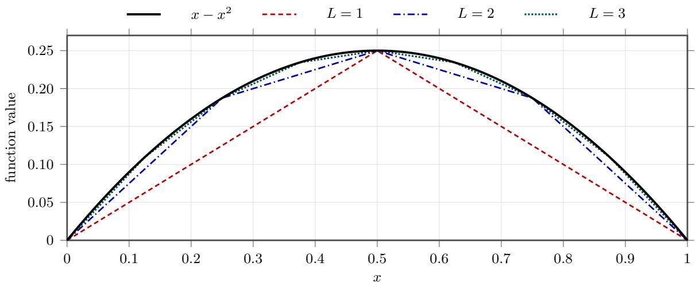
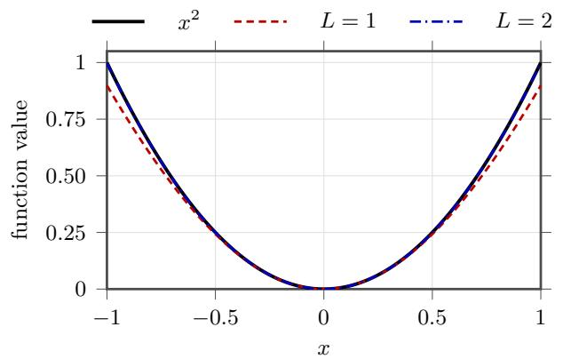
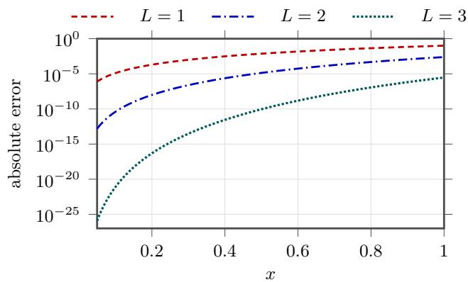
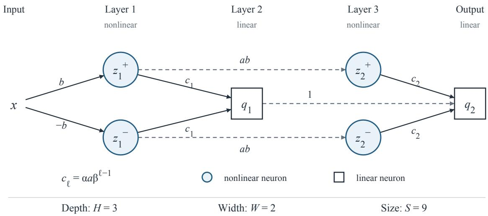
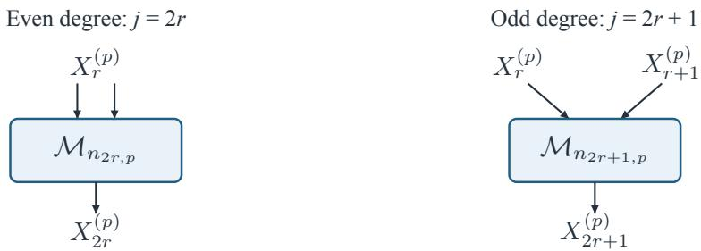

# Neural Approximation by Function Composition: Rigidity and Doubly Exponential Convergence

Wentao Huang∗ Haizhang Zhang†

## Abstract

Deep neural networks approximate functions by composing afine maps with nonlinear activations, but how composition itself creates approximation power is not yet fully understood. We investigate a fundamental mechanism: geometrically weighted sums of iterates of a single scalar generator function. This mechanism underpins the classical tent-map construction of the function $x - x ^ { 2 }$ and related recursive representations used by Yarotsky, W. E, et al., to analyze the approximation powers of deep neural networks.

First, we establish a rigidity theorem: for continuous piecewise linear generators with a finite number of segments, any C3 function that can be represented in this way is at most quadratic. For non-afine quadratic functions, the geometric factor is at least 1/4. This result both reveals limitations of the tent-map approach and complements existing methods based on hierarchical bases and recursive polynomial constructions. Second, using an exact remainder identity as guidance, we construct a smooth generator whose iterates yield doubly exponential error decay in total depth for square approximation and, through multiplication modules, for each fixed polynomial. For power series with absolutely summable coeficients on $[ - 1 , 1 ] ^ { d }$ , distributing depth according to monomial degree yields a uniform approximation error of order $O ( e ^ { - c L ^ { 1 / d } } )$ on each interior cube. These findings demonstrate how generator dynamics and remainder estimates govern depth allocation and approximation rates of deep neural networks.

Keywords: neural network approximation; function composition; iterative functional equations; piecewise linear rigidity; doubly exponential convergence; bounded weights Mathematics Subject Classification 2020: 39B12, 41A25, 41A46, 68T07.

## 1 Introduction

Function representation and approximation play a central role in mathematics and machine learning. Classical methods, including power series, Fourier expansions, and wavelets, approximate a target by linear combinations of prescribed functions. A feedforward neural network constructs intermediate representations layer by layer by composing afine maps with nonlinear activations. This raises a natural question: how can composition improve approximation as depth increases?

In this paper, we study a construction that repeatedly applies a single scalar function, called the generator, and forms geometrically weighted sums of its iterates. We investigate how the choice of generator afects the functions that can be represented and the convergence of their approximations. Our starting point is the classical approximation of the square function using the tent map

$$
s ( x ) = \left\{ \begin{array} { l l } { 2 x , } & { 0 \leq x \leq 1 / 2 , } \\ { 2 - 2 x , } & { 1 / 2 < x \leq 1 , } \end{array} \right. \quad s ( x ) = 2 x - 4 \mathrm { R e L U } ( x - \frac { 1 } { 2 } ) \quad ( x \in [ 0 , 1 ] ) ,\tag{1.1}
$$

where ReL $\boldsymbol J ( t ) = \operatorname* { m a x } \{ 0 , t \}$ . Write $\varphi ^ { \circ j }$ for the j-fold self-composition of a map $\varphi ,$ and set $\varphi ^ { \circ 0 } = { \mathrm { I d } }$ The identity used in [15, 31] is

$$
F ( x ) : = x - x ^ { 2 } = \sum _ { \ell = 1 } ^ { \infty } 4 ^ { - \ell } s ^ { \circ \ell } ( x ) , \qquad x \in [ 0 , 1 ] .\tag{1.2}
$$

The partial sums interpolate F at the dyadic points $k / 2 ^ { L } ;$ ; see Figure 1.1. Reusing the same tent map therefore gives a square approximation, from which the diference-of-squares identity supplies a multiplication module. E and Wang [8] used this construction for fixed-width ReLU approximation of low-dimensional analytic functions.

  
Figure 1.1: Successive piecewise linear interpolants $\scriptstyle \sum _ { \ell = 1 } ^ { L } 4 ^ { - \ell } s ^ { \circ \ell }$ of $x - x ^ { 2 }$

The expansion follows from the one-step relation $F = { \textstyle { \frac { 1 } { 4 } } } s + { \textstyle { \frac { 1 } { 4 } } } F$ s. More generally, for a self-map $\varphi : I  I$ of a compact interval and $| \beta | < 1$ 2

$$
f = \alpha \sum _ { \ell = 1 } ^ { \infty } \beta ^ { \ell - 1 } \varphi ^ { \circ \ell } \quad \Longleftrightarrow \quad f - \alpha \varphi = \beta f \circ \varphi \qquad ( f { \mathrm { ~ b o u n d e d } } ) .\tag{1.3}
$$

Writing $\begin{array} { r } { S _ { L } = \alpha \sum _ { \ell = 1 } ^ { L } \beta ^ { \ell - 1 } \varphi ^ { \circ \ell } } \end{array}$ , iteration gives the exact remainder

$$
f ( x ) - S _ { L } ( x ) = \beta ^ { L } f ( \varphi ^ { \circ L } ( x ) ) .\tag{1.4}
$$

The series solution and this identity belong to the classical theory; see [13, Chapters 1–4] and [27, Chapter I] for the general framework, and [4, Chapter 3] for the related neural-network viewpoint. The remainder separates the geometric factor from the values of the target along the iterates. It gives a common starting point for studying representation limits, faster convergence, and depth allocation.

Our first results concern piecewise linear generators. By Theorems 2.5 and 2.8, a continuous piecewise linear generator with finitely many pieces can produce a $C ^ { 3 }$ output only if that output is a polynomial of degree at most two. A non-afine quadratic requires $\beta \ge 1 / 4$ , and its uniform truncation error is $\Theta ( \beta ^ { L } )$ for each fixed representation. A fixed point where the target is nonzero prevents the iterated target from contributing additional uniform decay. The tent map attains both bounds.

He, Li, and Xu [11] give a hierarchical basis interpretation of the tent-map construction and establish a related quadratic rigidity result for the fixed tent map, without requiring geometric coeficients. Our result allows the piecewise linear generator to vary, while retaining geometric weights. Despr´es and Ancellin [5] construct recursive representations of arbitrary univariate polynomials of the form $\begin{array} { r } { H = e _ { 0 } + \sum _ { i } \beta _ { i } H \circ e _ { i } } \end{array}$ , using several piecewise linear composition maps and a separate piecewise linear additive term; see also [4, Chapter 3]. These works also discuss the classical tent-map identity. Our results concern the additional constraint that a single generator $\varphi$ supplies both the additive term αφ and the composition map in $f \circ \varphi$ . Their polynomial existence results do not, by themselves, determine the rigidity or sharp truncation rates under this constraint. Our rigidity results do not limit polynomial approximation by general ReLU networks.

We next use the remainder to design a smooth generator whose iterates approach zero. For fixed admissible parameters $\alpha > 1$ and $0 < \beta < 1$ , as specified in Section 3, the generator satisfies $0 \leq \varphi ( x ) \leq x ^ { 2 } / \alpha$ on $[ - 1 , 1 ]$ . The square module $Q _ { n } .$ , using n iterations and depth proportional to n, satisfies

$$
0 \leq t ^ { 2 } - Q _ { n } ( t ) \leq \varepsilon _ { n } | t | ^ { 2 ^ { n + 1 } } , \qquad \varepsilon _ { n } = \beta ^ { n } \alpha ^ { - 2 ( 2 ^ { n } - 1 ) } , \quad | t | \leq 1 .\tag{1.5}
$$

This gives doubly exponential error decay in depth. The construction uses the fixed activation

$$
\psi ( t ) = \sqrt { 1 + ( t _ { + } ) ^ { 2 } } - 1 , \qquad t _ { + } = \operatorname* { m a x } \{ t , 0 \} .
$$

This activation is nonpolynomial, belongs to $C ^ { 1 } ( \mathbb { R } )$ , and is globally 1-Lipschitz. The weights and biases are bounded independently of the approximation accuracy.

The local factor $| t | ^ { 2 ^ { n + 1 } }$ connects this estimate to larger networks. The associated multiplication modules satisfy $| { \mathcal { M } } _ { n } ( u , v ) | \leq | u v |$ , preserving the small magnitudes of their factors. Composing them gives a doubly exponential error bound in total depth for each fixed polynomial on $[ - 1 , 1 ] ^ { d }$ (Theorem 4.2). On an interior cube, balanced monomial factorizations give small inputs to higher-degree modules, allowing them to use less depth. Choosing module depths by degree gives total depth and size $O ( p ^ { d } )$ for all monomials through degree $p ,$ for fixed d.

Combining this allocation with power-series truncation gives uniform error $O ( e ^ { - c L ^ { 1 / d } } )$ on each interior cube for targets with absolutely summable power-series coeficients on $[ - 1 , 1 ] ^ { d } .$ . Theorem 4.3 gives depth at most $L ,$ width at most four, and size $O ( L )$ . The networks reuse earlier outputs through skip connections, with all connection weights counted in the size. Depth and width count both nonlinear and linear hidden layers and neurons; width does not bound storage.

For fixed $d ,$ our size exponent $1 / d$ exceeds the $1 / ( 2 d )$ exponent of E and Wang [8] in the same power-series and interior-cube setting. Opschoor, Schwab, and Zech [19, Theorems 3.6 and 3.10] obtain size exponents $1 / ( d + 1 )$ for ReLU and $1 / d$ for RePU under holomorphic-extension assumptions. Section 4 compares these results, including the diferences in domains, norms, architectures, and depth bounds.

For suitable smooth activations, classical finite-diference constructions give fixed-size multiplication approximations using weights that grow as the error tends to zero; see [19, Remark 2.15] and [21]. Shen, Yang, and Zhang [25] obtain arbitrary accuracy with a fixed number of neurons using a specially constructed activation. Their result does not provide accuracy-independent bounds on weights and biases. Here we study error decay with depth under a fixed activation and bounded coeficients. Our bounds concern this construction and do not assert optimality over activations or network architectures.

Foundations of neural approximation include [1, 2]; broader accounts of approximation and compositional structure appear in [3, 6, 7, 9, 10, 14, 20, 22]. Related constructions use sparse grids [17], the Kolmogorov–Arnold representation [18], and width–depth tradeofs [23, 24]. Other work addresses sharp Sobolev and Besov approximation bounds [26], norm constraints [12], convergence as depth grows [29, 30], and convolutional universality [32].

The remainder of the paper is organized as follows. Section 2 develops the functional equation and proves the piecewise linear rigidity results. Section 3 constructs the smooth square module and establishes its convergence rate with bounded weights. Section 4 uses the local error estimates to build polynomial networks and allocate depth for analytic approximation.

## 2 Geometrically weighted compositions and piecewise linear rigidity

The tent-map identity (1.2) is one instance of a general self-similar mechanism. Let I be a compact interval and let $\varphi$ be a function from I to $I ,$ called a self-map of I. Suppose that $f$ admits the geometrically weighted expansion

$$
f ( x ) = \alpha \sum _ { \ell = 1 } ^ { \infty } \beta ^ { \ell - 1 } \varphi ^ { \circ \ell } ( x ) , \qquad \alpha \in \mathbb { R } , \quad | \beta | < 1 .\tag{2.1}
$$

All iterates remain in $I ,$ so the series converges uniformly. For every truncation level $L \geq 1$ ，

$$
\begin{array} { l } { { f ( x ) - \alpha \displaystyle \sum _ { \ell = 1 } ^ { L } \beta ^ { \ell - 1 } \varphi ^ { \circ \ell } ( x ) = \alpha \displaystyle \sum _ { j = 1 } ^ { \infty } \beta ^ { L + j - 1 } \varphi ^ { \circ ( L + j ) } ( x ) } } \\ { { = \beta ^ { L } f \big ( \varphi ^ { \circ L } ( x ) \big ) . } } \end{array}
$$

The remainder is a scaled copy of $f ,$ evaluated at the current iterate $\varphi ^ { \circ L } ( x )$ . Its decay depends on both the geometric factor and the values of the target along these iterates. Taking $L = 1$ recovers the one-step equation (1.3).

We first formulate the representation for arbitrary self-maps of a compact interval. We then show how requiring a continuous piecewise linear generator restricts both the smooth outputs and their truncation rates. For non-afine quadratic outputs, the iterates cannot provide additional uniform decay in the remainder. This limitation motivates the design of a new generator in Section 3.

## 2.1 The compositional class and its basic properties

For a nondegenerate compact interval $I = [ a , b ]$ , write

$$
{ \mathfrak { S } } ( I ) : = \{ \varphi : I \to I \}
$$

for the set of all self-maps of $I ,$ and let $B ( I )$ be the space of bounded real-valued functions on $I ,$ equipped with the uniform norm. Throughout this paper, $\| \cdot \| _ { L ^ { \infty } ( I ) }$ denotes the supremum norm, not the essential supremum. No continuity, piecewise linearity, or diferentiability is required in the following definition.

Definition 2.1 (Geometrically weighted compositional class) Define

$$
\mathcal { G } ( I ) : = \left\{ \alpha \sum _ { \ell = 1 } ^ { \infty } \beta ^ { \ell - 1 } \varphi ^ { \circ \ell } : \alpha \in \mathbb { R } , \quad | \beta | < 1 , \quad \varphi \in \mathfrak { S } ( I ) \right\} .\tag{2.2}
$$

The series is understood in $B ( I )$ with the uniform norm.

The definition is meaningful because all iterates take values in the compact interval I. Each series in (2.2) therefore converges absolutely and uniformly. If $\varphi$ is continuous, then every iterate is continuous and the uniform limit belongs to $C ( I )$ . Continuous and piecewise linear generators can thus be treated as additional restrictions within the same framework.

The unrestricted class alone imposes little constraint on the output. For example, $\mathcal { G } ( [ - 1 , 1 ] ) =$ $B ( [ - 1 , 1 ] )$ : for bounded $f ,$ choose $\alpha \ge \operatorname* { m a x } \{ 1 , \| f \| _ { L ^ { \infty } ( [ - 1 , 1 ] ) } \}$ , set $\varphi = f / \alpha$ , and take $\beta = 0$ . The substantive questions concern restrictions on the generator and on the representation parameters.

We first establish three elementary properties of functions in $\mathcal { G } ( I )$ . Scaling changes only the leading coeficient. Afine normalization allows us to reduce the analysis to [0, 1], provided that the target function is shifted and rescaled accordingly. The functional equation then replaces the infinite series by a one-step identity and gives its exact finite-depth remainder.

Lemma 2.2 (Scaling) If $f \in { \mathcal { G } } ( I )$ and $\gamma \in \mathbb { R }$ , then $\gamma f \in { \mathcal { G } } ( I )$ . More precisely, multiplying a representation of f by $\gamma$ replaces α by $\gamma \alpha$ and leaves $\beta$ and $\varphi$ unchanged.

Proof: For any representation (2.1),

$$
\gamma f = ( \gamma \alpha ) \sum _ { \ell = 1 } ^ { \infty } \beta ^ { \ell - 1 } \varphi ^ { \circ \ell } ,
$$

which has the required form.

Lemma 2.3 (Afine normalization of a representation) Suppose that $f \in { \mathcal { G } } ( I )$ and $I = [ a , b ]$ Let

$$
t ( y ) = { \frac { y - a } { b - a } } , \qquad \chi = t \circ \varphi \circ t ^ { - 1 } ,
$$

and define

$$
\widetilde { f } ( x ) = \frac { f ( t ^ { - 1 } ( x ) ) - \alpha a / ( 1 - \beta ) } { b - a } , \qquad x \in [ 0 , 1 ] .\tag{2.3}
$$

Then $\chi \in \mathfrak { S } ( [ 0 , 1 ] )$ and $\widetilde { f } \in \mathcal { G } ( [ 0 , 1 ] )$ , with

$$
\widetilde { f } ( x ) = \alpha \sum _ { \ell = 1 } ^ { \infty } \beta ^ { \ell - 1 } \chi ^ { \circ \ell } ( x ) .\tag{2.4}
$$

Continuity, finite piecewise linearity, and diferentiability are preserved by this afine normalization.

Proof: Since t maps I bijectively onto [0, 1], the conjugate $\chi$ is a self-map of [0, 1]. For every $\ell \geq 1$

$$
\chi ^ { \circ \ell } ( x ) = \left( t \circ \varphi ^ { \circ \ell } \circ t ^ { - 1 } \right) ( x ) = { \frac { \varphi ^ { \circ \ell } ( t ^ { - 1 } ( x ) ) - a } { b - a } } .
$$

Consequently,

$$
\begin{array} { r l r } & { } & { \alpha \displaystyle \sum _ { \ell = 1 } ^ { \infty } \beta ^ { \ell - 1 } \chi ^ { \circ \ell } ( x ) = \frac { 1 } { b - a } \left( f ( t ^ { - 1 } ( x ) ) - \alpha a \sum _ { \ell = 1 } ^ { \infty } \beta ^ { \ell - 1 } \right) } \\ & { } & { = \frac { f ( t ^ { - 1 } ( x ) ) - \alpha a / ( 1 - \beta ) } { b - a } = \widetilde { f } ( x ) . } \end{array}
$$

This proves (2.4). The regularity assertions follow from the afine changes of variables and target values. □

Lemma 2.4 (Functional-equation characterization) For $f \in \mathcal { B } ( I ) , \alpha \in \mathbb { R } , | \beta | < 1$ , and $\varphi \in { \mathfrak { S } } ( I )$ representation (2.1) holds if and only $i f$

$$
f ( x ) - \alpha \varphi ( x ) = \beta f ( \varphi ( x ) ) , \qquad x \in I .\tag{2.5}
$$

For every integer $L \geq 1$ , either condition gives

$$
f ( x ) - \alpha \sum _ { \ell = 1 } ^ { L } \beta ^ { \ell - 1 } \varphi ^ { \circ \ell } ( x ) = \beta ^ { L } f ( \varphi ^ { \circ L } ( x ) ) ,\tag{2.6}
$$

and hence

$$
\left\| f - \alpha \sum _ { \ell = 1 } ^ { L } \beta ^ { \ell - 1 } \varphi ^ { \circ \ell } \right\| _ { L ^ { \infty } ( I ) } \leq | \beta | ^ { L } \| f \circ \varphi ^ { \circ L } \| _ { L ^ { \infty } ( I ) } \leq | \beta | ^ { L } \| f \| _ { L ^ { \infty } ( I ) } .\tag{2.7}
$$

Proof: Suppose first that (2.1) holds. Separating its first term and using uniform convergence, we obtain

$$
\begin{array} { c l c r } { { f ( x ) - \alpha \varphi ( x ) = \displaystyle \alpha \sum _ { \ell = 2 } ^ { \infty } \beta ^ { \ell - 1 } \varphi ^ { \circ \ell } ( x ) } } \\ { { = \displaystyle \beta f ( \varphi ( x ) ) , } } \end{array}
$$

which is (2.5) with the same parameters.

Conversely, assume that (2.5) holds. Substituting $\varphi ^ { \circ ( \ell - 1 ) } ( x )$ for x and multiplying by $\beta ^ { \ell - 1 }$ gives

$$
\begin{array} { r } { \beta ^ { \ell - 1 } f ( \varphi ^ { \circ ( \ell - 1 ) } ( x ) ) - \alpha \beta ^ { \ell - 1 } \varphi ^ { \circ \ell } ( x ) = \beta ^ { \ell } f ( \varphi ^ { \circ \ell } ( x ) ) . } \end{array}
$$

Summing over $\ell = 1 , \ldots , L$ cancels all intermediate terms and yields (2.6). Since $\varphi ^ { \circ L } ( I ) \subseteq I$

$$
\| \beta ^ { L } f \circ \varphi ^ { \circ L } \| _ { L ^ { \infty } ( I ) } \leq | \beta | ^ { L } \| f \| _ { L ^ { \infty } ( I ) } \longrightarrow 0 .
$$

The partial sums therefore converge uniformly to $f ,$ proving (2.1) and the stated bound.

The characterization is for a fixed choice of $\alpha , ~ \beta ,$ , and $\varphi _ { : }$ not merely an assertion that some representation exists. This distinction matters below, where we derive restrictions on the generator and on the geometric factor from the functional equation. The exact remainder also separates two possible sources of decay: the factor $\beta ^ { L }$ and the value of $f$ along the iterated map.

## 2.2 The piecewise linear generator bottleneck

We now impose piecewise linearity on the generator. Let ${ \mathcal { P } } { \mathcal { L } } ( I ) \subset { \mathfrak { S } } ( I )$ be the set of continuous self-maps $\varphi : I  I$ for which there exists a finite partition $a = x _ { 0 } < x _ { 1 } < \cdot \cdot \cdot < x _ { m } = b$ such that $\varphi$ is afine on every $[ x _ { i - 1 } , x _ { i } ]$ . Define the subclass

$$
\mathcal { G } _ { \mathrm { P L } } ( I ) : = \left\{ \alpha \sum _ { \ell = 1 } ^ { \infty } \beta ^ { \ell - 1 } \varphi ^ { \circ \ell } : \alpha \in \mathbb { R } , \quad | \beta | < 1 , \quad \varphi \in \mathcal { P L } ( I ) \right\} \subseteq \mathcal { G } ( I ) .\tag{2.8}
$$

In the next theorem, the regularity assumption is imposed on the output $f .$ Although iterating a piecewise linear map can create many new knots, the functional equation strongly constrains which $C ^ { 3 }$ functions the resulting series can represent.

Theorem 2.5 (Smooth rigidity) If

$$
f \in \mathcal { G } _ { \mathrm { P L } } ( [ 0 , 1 ] ) \cap C ^ { 3 } ( [ 0 , 1 ] ) ,
$$

then f is a polynomial of degree at most two, including the afine and constant cases.

Proof: By the definition of $\mathcal { G } _ { \mathrm { P L } } ( [ 0 , 1 ] )$ and Lemma 2.4, there exist $\alpha \in \mathbb { R } , | \beta | < 1$ , and $\varphi \in { \mathcal { P L } } ( [ 0 , 1 ] )$ such that

$$
f - \alpha \varphi = \beta f \circ \varphi .\tag{2.9}
$$

If $\beta = 0 .$ , then $f = \alpha \varphi$ . Since a piecewise linear $C ^ { 3 }$ function is afine, the conclusion follows. If $\varphi$ is afine on [0, 1], each iterate of $\varphi$ is afine; the uniformly convergent series defining $f$ is therefore afine as well. We may thus assume that $\beta \neq 0$ and that $\varphi$ has at least one interior knot.

We show that the third derivative of f vanishes, first at the knots and their preimages, and then on the intervals that avoid them. Let $m \geq 2$ and

$$
0 = x _ { 0 } < x _ { 1 } < \cdot \cdot \cdot < x _ { m } = 1
$$

be a minimal partition on which $\varphi ( x ) = k _ { i } x + c _ { i }$ for $x \in [ x _ { i - 1 } , x _ { i } ]$ , and let $\mathcal { K } = \{ x _ { 1 } , \ldots , x _ { m - 1 } \}$ be the set of interior knots. Put $u = f ^ { \prime \prime \prime }$ . On every open linearity interval, diferentiating (2.9) three times gives

$$
u ( x ) = \beta k _ { i } ^ { 3 } u ( \varphi ( x ) ) .\tag{2.10}
$$

At a knot $\xi = x _ { i }$ , continuity of u and the left and right limits in (2.10) imply

$$
u ( \xi ) = \beta k _ { i } ^ { 3 } u ( \varphi ( \xi ) ) = \beta k _ { i + 1 } ^ { 3 } u ( \varphi ( \xi ) ) .
$$

The partition is minimal, so $k _ { i } \neq k _ { i + 1 }$ . It follows that $u ( \varphi ( \xi ) ) = u ( \xi ) = 0$ . Hence $u = 0$ on $\kappa .$

Consider the set of points in (0, 1) whose forward orbits meet the knot set $\kappa$

$$
E = \bigcup _ { \ell = 0 } ^ { \infty } \{ x \in ( 0 , 1 ) : \varphi ^ { \circ \ell } ( x ) \in K \} .
$$

Iterating (2.10) along an orbit up to its first visit to $\kappa$ shows that $u = 0$ on $E .$ By continuity, $u = 0$ on $\overline { E }$ as well.

The set $E$ need not be dense in [0, 1]. To handle the remaining points, let $J$ be any connected component of $( 0 , 1 ) \setminus \overline { { E } }$ . Since this complement is open, $J$ is a nonempty open interval, so $| J | > 0$ . For

every $l \geq 0$ , the image $\varphi ^ { \circ l } ( J )$ is an interval disjoint from $\kappa ;$ otherwise, some point of J would belong to $E .$ Thus $\varphi$ is afine on each $\varphi ^ { \circ l } ( J )$ , and induction shows that every iterate of $\varphi$ is afine on $J .$ . In particular, for each $\ell \geq 1$ , there are constants $K _ { \ell } , C _ { \ell }$ such that

$$
\varphi ^ { \circ \ell } ( x ) = K _ { \ell } x + C _ { \ell } , \qquad x \in J .
$$

Since $\varphi ^ { \circ \ell } ( J ) \subseteq [ 0 , 1 ]$ , taking diameters gives $| K _ { \ell } | | J | \le 1$ . Iterating (2.9) ℓ times and diferentiating the resulting identity three times on $^ { J , }$ we obtain

$$
\begin{array} { r l } { | u ( x ) | = | \beta | ^ { \ell } | K _ { \ell } | ^ { 3 } | u ( K _ { \ell } x + C _ { \ell } ) | } & { { } } \\ { \le | \beta | ^ { \ell } | K _ { \ell } | ^ { 3 } \left\| u \right\| _ { L ^ { \infty } ( [ 0 , 1 ] ) } } & { { } } \\ { \le | \beta | ^ { \ell } | J | ^ { - 3 } \left\| u \right\| _ { L ^ { \infty } ( [ 0 , 1 ] ) } , \quad } & { { } x \in J . } \end{array}
$$

Since $| \beta | < 1$ , letting $\ell \to \infty$ yields $u = 0$ on J. As J is arbitrary and $u = 0$ on ${ \overline { { E } } } .$ , we conclude that $u = 0$ on $( 0 , 1 )$ , and hence on [0, 1] by continuity. Thus $f ^ { \prime \prime \prime } = 0$ on [0, 1], so $f$ is a polynomial of degree at most two. □

Remark 2.6 In [11], the generator s is fixed while the expansion coeficients are arbitrary. Here the coeficients are geometrically constrained, whereas the continuous piecewise linear self-map $\varphi$ may vary. This distinction separates the result in [11] from the rigidity theorem above.

Corollary 2.7 Let $I = [ a , b ]$ , with $a < b$ . If

$$
f \in { \mathcal { G } } _ { \mathrm { P L } } ( I ) \cap C ^ { 3 } ( I ) ,
$$

then $f$ is a polynomial of degree at most two.

Proof: Choose a representation

$$
f = \alpha \sum _ { \ell = 1 } ^ { \infty } \beta ^ { \ell - 1 } \varphi ^ { \circ \ell } , \qquad \varphi \in { \mathcal { P L } } ( I ) .
$$

With $t , \chi .$ , and $\widetilde { f }$ as in Lemma 2.3, afine conjugation gives $\underline { { \chi } } \in \mathcal { P L } ( [ 0 , 1 ] )$ , while $\widetilde { f } \in C ^ { 3 } ( [ 0 , 1 ] )$ . Thus $\widetilde { f } \in \mathcal { G } _ { \mathrm { P L } } ( [ 0 , 1 ] ) \cap C ^ { 3 } ( [ 0 , 1 ] )$ , and Theorem 2.5 shows that $\ddot { f }$ is a polynomial of degree at most two. Finally,

$$
f ( y ) = ( b - a ) { \widetilde { f } } ( t ( y ) ) + { \frac { \alpha a } { 1 - \beta } } , \qquad y \in I ,
$$

so $f$ also has degree at most two.

We next quantify the truncation rate for the non-afine quadratic outputs allowed by Theorem 2.5. A lower bound on $\beta$ alone would not exclude faster convergence, since $f \circ \varphi ^ { \circ L }$ could still decay. The next result shows both that $\beta \ge 1 / 4$ and that the uniform norm of this iterated target stays bounded below by a positive constant. Together, these bounds determine the actual uniform truncation rate for each fixed representation.

Theorem 2.8 (Optimal geometric factor and sharp truncation rate) Let

$$
f ( x ) = c _ { 2 } x ^ { 2 } + c _ { 1 } x + c _ { 0 } , \qquad c _ { 2 } \neq 0 .
$$

Suppose that, for some $\alpha \in \mathbb { R } , | \beta | < 1$ , and $\varphi \in { \mathcal { P L } } ( [ 0 , 1 ] )$ ),

$$
f ( x ) = \alpha \sum _ { \ell = 1 } ^ { \infty } \beta ^ { \ell - 1 } \varphi ^ { \circ \ell } ( x ) .
$$

Then

$$
\beta \geq { \frac { 1 } { 4 } } .\tag{2.11}
$$

Moreover, $\varphi$ has a fixed point $p \in ( 0 , 1 ]$ with $f ( p ) \neq 0$ . Hence, with $c _ { f } : = | f ( \boldsymbol { p } ) | > 0$

$$
\begin{array} { r } { \left. f \circ \varphi ^ { \circ L } \right. _ { L ^ { \infty } ( [ 0 , 1 ] ) } \geq c _ { f } , \qquad L \geq 1 . } \end{array}
$$

Consequently, the uniform truncation error satisfies

$$
c _ { f } { \beta } ^ { L } \leq \left\| f - \alpha \sum _ { \ell = 1 } ^ { L } { \beta } ^ { \ell - 1 } \varphi ^ { \circ \ell } \right\| _ { L ^ { \infty } ( [ 0 , 1 ] ) } \leq \| f \| _ { L ^ { \infty } ( [ 0 , 1 ] ) } \beta ^ { L } , \qquad L \geq 1 .\tag{2.12}
$$

Thus, for each fixed representation, the uniform truncation error is of order $\beta ^ { L }$ . The iterated target $f \circ \varphi ^ { \circ L }$ provides no additional uniform decay. Since $\beta \ge 1 / 4$ , the truncation error cannot decay faster than a positive multiple of $4 ^ { - L }$ . The constant $c _ { f }$ may depend on the fixed representation.

Proof: By Lemma 2.2, we may divide by $c _ { 2 }$ and assume $f ( x ) = x ^ { 2 } + c _ { 1 } x + c _ { 0 }$ . The case $\beta = 0$ would imply $f = \alpha \varphi$ , which is impossible for a non-afine quadratic. The functional equation becomes

$$
\beta \varphi ( x ) ^ { 2 } + ( \alpha + \beta c _ { 1 } ) \varphi ( x ) + \beta c _ { 0 } - f ( x ) = 0 .
$$

Equivalently,

$$
\left( 2 \beta \varphi ( x ) + \alpha + \beta c _ { 1 } \right) ^ { 2 } = D ( x ) ,\tag{2.13}
$$

where

$$
D ( x ) = ( \alpha + \beta c _ { 1 } ) ^ { 2 } - 4 \beta \big ( \beta c _ { 0 } - f ( x ) \big ) .
$$

On any nondegenerate linearity interval of $\varphi ,$ the left-hand side of (2.13) is the square of an afine function. Since the equality holds on a nondegenerate interval, the polynomial identity theorem implies that the global quadratic polynomial $D$ is a perfect square. Its leading coeficient is $4 \beta ,$ so necessarily $\beta > 0$ , and

$$
D ( x ) = q ( x ) ^ { 2 }
$$

for an afine function $q$ whose slope has absolute value $2 { \sqrt { \beta } } .$

Equation (2.13) gives $2 \beta \varphi ( x ) + \alpha + \beta c _ { 1 } = \pm q ( x )$ . Continuity permits a change of sign only at the at most one zero of the afine function $q .$ . Hence $\varphi$ has at most two afine pieces, and the absolute value of its slope on each piece is $\beta ^ { - 1 / 2 }$ . At least one of the pieces has length at least $1 / 2$ . Since $\varphi ( [ 0 , 1 ] ) \subseteq [ 0 , 1 ]$ , the variation of $\varphi$ over that piece cannot exceed 1. Therefore

$$
\frac 1 2 \beta ^ { - 1 / 2 } \leq 1 ,
$$

which is equivalent to (2.11).

For the remainder estimate, return to the original f and $\alpha ;$ the conclusions about $\varphi$ and $\beta$ are unchanged. Write $s = \beta ^ { - 1 / 2 } > 1$ . The self-map $\varphi$ has a fixed point $p \in ( 0 , 1 ]$ . Indeed, if $\varphi ( 0 ) > 0$ this follows by applying the intermediate value theorem to $\varphi ( x ) - x$ . If $\varphi ( 0 ) = 0$ , the first afine piece must have slope $s ,$ since $\varphi$ is nonnegative. Thus $\varphi ( x ) > x$ for small positive $x ,$ while $\varphi ( 1 ) \leq 1$ , giving the same conclusion. Also $\alpha \neq 0 ;$ otherwise the functional equation and $| \beta | < 1$ would imply $f = 0$ Evaluating that equation at $p$ gives

$$
f ( p ) = { \frac { \alpha p } { 1 - \beta } } \neq 0 .
$$

Set $c _ { f } = | f ( p ) | = | \alpha | p / ( 1 - \beta ) > 0$ . Since $\varphi ^ { \circ L } ( p ) = p ,$ we have $\| f \circ \varphi ^ { \circ L } \| _ { L ^ { \infty } ( [ 0 , 1 ] ) } \geq c _ { f }$ for every $L \geq 1$ The self-map property also gives the upper bound $\| f \circ \varphi ^ { \circ L } \| _ { L ^ { \infty } ( [ 0 , 1 ] ) } \leq \| f \| _ { L ^ { \infty } ( [ 0 , 1 ] ) }$ . Multiplying these bounds by $\beta ^ { L }$ and using the exact remainder (2.6) proves (2.12). □

Remark 2.9 Theorems 2.5 and 2.8 concern the piecewise linear subclass $\mathcal { G } _ { \mathrm { P L } } ( [ 0 , 1 ] )$ in (2.8). They impose no such restrictions on the full class ${ \mathcal { G } } ( [ 0 , 1 ] )$ or on polynomial approximation by general ReLU networks. Within this subclass, the classical tent map shows that both the geometric-factor bound and the truncation-rate bound are sharp: for $F ( x ) = x - x ^ { 2 }$ , surjectivity of every iterate gives the exact norm error $4 ^ { - L } \| F \| _ { L ^ { \infty } ( [ 0 , 1 ] ) } = 4 ^ { - L - 1 }$

Theorem 2.8 rules out additional uniform decay from $f \circ \varphi ^ { \circ L }$ for these piecewise linear representations. The next section constructs a generator whose iterates approach a zero of the target, so this composed target tends uniformly to zero and accelerates the truncation beyond the geometric weights.

## 3 A diferentiable generator with quadratically convergent iterates

We now seek additional uniform decay in the iterated target $f \circ \varphi ^ { \circ L }$ within the exact remainder (2.6). For $f ( x ) = x ^ { 2 }$ on $[ - 1 , 1 ]$ , we construct a smooth self-map satisfying $0 \leq \varphi ( x ) \leq x ^ { 2 } / \alpha$ , with $\alpha > 1$ Repeated composition then drives the target values in the remainder to zero at a doubly exponential rate, while the coeficients remain geometrically weighted. The generator is realized using one fixed activation, with the two parameters entering only through afine coeficients.

## 3.1 Existence of a generator

For a prescribed target $f ,$ we first seek a continuous self-map $\varphi$ satisfying

$$
f ( x ) - \alpha \varphi ( x ) = \beta f ( \varphi ( x ) ) .\tag{3.1}
$$

We work on $I = [ - 1 , 1 ]$ to accommodate targets of either sign. The following proposition shows that, for every $0 < \beta < 1$ , such a generator exists whenever $f$ is Lipschitz and $\alpha$ is suficiently large.

Proposition 3.1 (Existence of a self-map solution) Let $I = [ - 1 , 1 ]$ , and let $f : I  \mathbb { R }$ be Lipschitz with constant $L _ { f } . \ I f \ 0 < \beta < 1$ and

$$
\alpha > \operatorname* { m a x } \{ \beta L _ { f } , ( 1 + \beta ) \| f \| _ { L ^ { \infty } ( I ) } \} ,\tag{3.2}
$$

then (3.1) has a unique continuous self-map solution. This solution satisfies

$$
f = \alpha \sum _ { \ell = 1 } ^ { \infty } \beta ^ { \ell - 1 } \varphi ^ { \circ \ell } , \qquad \left\| f - \alpha \sum _ { \ell = 1 } ^ { L } \beta ^ { \ell - 1 } \varphi ^ { \circ \ell } \right\| _ { L ^ { \infty } ( I ) } \leq \beta ^ { L } \| f \circ \varphi ^ { \circ L } \| _ { L ^ { \infty } ( I ) } .
$$

Proof: Let $C ( I , I ) : = \{ u \in C ( I , \mathbb { R } ) : u ( I ) \subseteq I \}$ , equipped with the uniform metric $d _ { \infty } ( u , v ) =$ $\| u - v \| _ { L ^ { \infty } ( I ) }$ . Since $I = [ - 1 , 1 ]$ , this set is the closed unit ball of the Banach space $C ( I , \mathbb { R } )$ under the uniform norm, and hence is a complete metric space. Define $T u = \alpha ^ { - 1 } ( f - \beta f \circ u )$ . Condition (3.2) gives $\| T u \| _ { L ^ { \infty } ( I ) } < 1$ and $\| T u - T v \| _ { L ^ { \infty } ( I ) } \leq ( \beta L _ { f } / \alpha ) \| u - v \| _ { L ^ { \infty } ( I ) }$ . Banach’s fixed-point theorem gives the unique solution $\varphi .$ . The representation and error estimate follow from Lemma 2.4 and $( 2 . 6 ) . \quad \bigsqcup$

The generator in Proposition 3.1 depends on the target $f ,$ so this existence result alone does not provide a network with a prescribed activation. For the square function, however, the generator is explicit and can be realized using a single fixed activation for every admissible parameter pair $( \alpha , \beta )$ . The resulting square approximation will be used to approximate multiplication and, in turn, to construct polynomial approximants in Section 4.

## 3.2 Square approximation with a fixed activation

Throughout the remaining sections, fix

$$
0 < \beta < 1 , \qquad \alpha > \operatorname * { m a x } \{ 2 \beta , 1 + \beta \} .\tag{3.3}
$$

The nonnegative solution of (3.1) for $f ( x ) = x ^ { 2 }$ is

$$
\varphi ( x ) = { \frac { \sqrt { \alpha ^ { 2 } + 4 \beta x ^ { 2 } } - \alpha } { 2 \beta } } = { \frac { 2 x ^ { 2 } } { \sqrt { \alpha ^ { 2 } + 4 \beta x ^ { 2 } } + \alpha } } .\tag{3.4}
$$

It is smooth, even, nonnegative, and satisfies

$$
x ^ { 2 } = \alpha \varphi ( x ) + \beta \varphi ( x ) ^ { 2 } , \qquad 0 \leq \varphi ( x ) \leq { \frac { x ^ { 2 } } { \alpha } } .\tag{3.5}
$$

In particular, $\varphi ( [ - 1 , 1 ] ) \subseteq [ 0 , 1 / \alpha ] \subset [ 0 , 1 ]$ , so $\varphi$ also preserves $[ 0 , 1 ]$ . And we will use the quadratic bound in (3.5) to estimate the iterates of $\varphi$ and the resulting truncation error.

Define

$$
\psi ( t ) = \left\{ \begin{array} { l l } { \sqrt { 1 + t ^ { 2 } } - 1 , } & { t \geq 0 , } \\ { 0 , } & { t < 0 , } \end{array} \right. \quad \quad a = \frac { \alpha } { 2 \beta } , \quad \quad b = \frac { 2 \sqrt { \beta } } { \alpha } .\tag{3.6}
$$

The activation $\psi$ is nonpolynomial, belongs to $C ^ { 1 } ( \mathbb { R } )$ , and is globally 1-Lipschitz. Indeed, its derivative is zero on the negative half-line and equals $t / \sqrt { 1 + t ^ { 2 } }$ for $t > 0$ , with common limit zero at the origin. The generator has the realization

$$
\varphi ( x ) = a \bigl [ \psi ( b x ) + \psi ( - b x ) \bigr ] .\tag{3.7}
$$

This realization uses a single fixed activation $\psi ,$ with $\alpha$ and $\beta$ entering only through the afine coeficients. For every integer $\ell \geq 1$ , its iterates satisfy

$$
\varphi ^ { \circ \ell } ( x ) = \bigl ( a \psi ( b \cdot ) \bigr ) ^ { \circ \ell } ( x ) + \bigl ( a \psi ( b \cdot ) \bigr ) ^ { \circ \ell } ( - x ) , \qquad x \in [ - 1 , 1 ] .
$$

For $L \geq 1$ , consider the partial sums

$$
Q _ { L } ( x ) : = \alpha \sum _ { \ell = 1 } ^ { L } \beta ^ { \ell - 1 } \varphi ^ { \circ \ell } ( x ) .\tag{3.8}
$$

Figure 3.1 illustrates the approximation for $( \alpha , \beta ) = ( 2 , 1 / 2 )$ . The error decreases with L and vanishes more rapidly near the origin. We next describe the networks that realize these partial sums and specify their resource counts.

  
Figure 3.1: Square approximation with $( \alpha , \beta ) = ( 2 , 1 / 2 )$ . Left: $x ^ { 2 }$ and the partial sums $Q _ { 1 } , Q _ { 2 }$ on $[ - 1 , 1 ]$ . Right: the errors $x ^ { 2 } - Q _ { L } ( x )$ for $L = 1 , 2 , 3$ on $0 . 0 5 \leq x \leq 1$ , with a logarithmic vertical axis. The errors are even and vanish at $x = 0$

Definition 3.2 (Compositional Neural Networks) A ψ-compositional network is a feedforward network with alternating nonlinear and linear hidden layers, assembled from smaller networks called modules. Skip connections allow inputs and earlier neuron outputs to be reused.

For an input $\pmb { x } \in \mathbb { R } ^ { d }$ , set $\boldsymbol { h } _ { 0 } = \boldsymbol { x }$ . With H hidden layers, write

$$
\begin{array} { r l } & { \quad h _ { \ell } = \rho _ { \ell } ( A _ { \ell } \pmb { u } _ { \ell } + \pmb { b } _ { \ell } ) , \qquad 1 \leq \ell \leq H , } \\ & { } \\ & { \mathcal { N } ( \pmb { x } ) = \pmb { a } ^ { \top } \pmb { u } _ { \mathrm { o u t } } + c , \qquad \quad \rho _ { \ell } = \left\{ \begin{array} { l l } { \psi , \quad \ell \mathrm { o d d } , } \\ { \mathrm { I d } , \quad \ell \mathrm { e v e n } . } \end{array} \right. } \end{array}
$$

The activation acts coordinatewise. The vector $\mathbf { \pmb { u } } _ { \ell }$ collects selected input coordinates and earlier neuron outputs, each listed once; these selections are fixed by the network architecture. The vector ${ \mathbf { \pmb { u } } } _ { \mathrm { o u t } }$ is chosen in the same way. For example, in a network consisting of a single module, the connections after the first nonlinear–linear pair can take the form

$$
\begin{array} { r } { u _ { 2 r - 1 } = h _ { 2 r - 3 } , \qquad u _ { 2 r } = \left[ \begin{array} { l l l } { h _ { 2 r - 1 } } \\ { h _ { 2 r - 2 } } \end{array} \right] , \qquad r \geq 2 , } \end{array}
$$

whenever the indicated layers are present. The nonlinear layer reuses the preceding nonlinear output, and the linear layer combines the new nonlinear output with the preceding linear output.

The depth is the number H of hidden layers. The width W counts all neurons in a hidden layer, including linear neurons; the input and final output layers are excluded. The size $S$ counts all nonzero weights and biases:

$$
\begin{array} { c } { W = \underset { 1 \leq \ell \leq H } { \operatorname* { m a x } } \dim \pmb { h _ { \ell } } , } \\ { S = \underset { \ell = 1 } { \overset { H } { \sum } } ( \operatorname { n n z } ( A _ { \ell } ) + \operatorname { n n z } ( \pmb { b _ { \ell } } ) ) + \operatorname { n n z } ( \pmb { a } ) + \operatorname { n n z } ( c ) . } \end{array}
$$

Here nnz counts nonzero entries, also for scalars; set $W = 0$ when $H = 0$ . We say that the weights and biases are bounded by $B > 0$ if every entry of $A _ { \ell } , b _ { \ell } ,$ and $^ { a , }$ and the output bias $^ { c , }$ has absolute value at most B.

Each nonzero weight or bias is counted separately in S, including weights on skip connections. Reusing an existing output adds only the weights on its new connections. When a square or multiplication module is used inside a larger network, its output becomes a linear hidden neuron and is counted in both depth and width. Stored outputs reused through skip connections do not add neurons to later layers.

Connections between multiplication modules are prescribed by the monomial factorization rule in Section 4; each module receives the outputs of its two specified factors. Figure 3.2 shows the pattern within a square module for $Q _ { 2 }$

  
Figure 3.2: An alternating realization of $Q _ { 2 }$ , with $c _ { \ell } = \alpha a \beta ^ { \ell - 1 }$ . Circles denote nonlinear neurons and squares denote linear neurons. Dashed skip connections carry the branch values and the running sum across one intervening layer. All three hidden layers contribute to depth.

For general L, the partial sum $Q _ { L }$ in (3.8) has an alternating realization: a nonlinear layer updates the two generator branches, and a linear layer adds their contribution to the running sum. Here L counts generator iterations. Set

$$
\varepsilon _ { L } : = \beta ^ { L } \alpha ^ { - 2 ( 2 ^ { L } - 1 ) } .
$$

Starting from $q _ { 0 } = 0$ , define

$$
\begin{array} { r l r } & { \quad z _ { 1 } ^ { \pm } = \psi ( \pm b x ) , } & \\ & { \quad z _ { \ell + 1 } ^ { \pm } = \psi ( a b z _ { \ell } ^ { \pm } ) , } & { 1 \leq \ell < L , } \\ & { \quad q _ { \ell } = q _ { \ell - 1 } + \alpha a \beta ^ { \ell - 1 } ( z _ { \ell } ^ { + } + z _ { \ell } ^ { - } ) , } & { 1 \leq \ell \leq L . } \end{array}\tag{3.9}
$$

For each input, all neuron outputs in one branch are zero. Induction gives $\varphi ^ { \circ \ell } ( x ) = a ( z _ { \ell } ^ { + } + z _ { \ell } ^ { - } )$ and hence $q _ { \ell } = Q _ { \ell } ( x )$ . Thus $q _ { L }$ is the final output, while $q _ { 1 } , \ldots , q _ { L - 1 }$ are linear hidden neurons. The branches and the running sum each pass across one intervening layer through skip connections.

Theorem 3.3 (Double-exponential square approximation) Under (3.3), the network $Q _ { L }$ has depth $2 { \cal L } - 1$ , width 2, and size at most $5 L - 1$ . It has no biases, and all its weights are bounded by

$$
B _ { \alpha , \beta } : = \operatorname* { m a x } \{ 1 , b , a b , \alpha a \} ,\tag{3.10}
$$

independently of L. Moreover,

$$
0 \leq x ^ { 2 } - Q _ { L } ( x ) = \beta ^ { L } { \bigl ( } \varphi ^ { \circ L } ( x ) { \bigr ) } ^ { 2 } \leq \varepsilon _ { L } , \qquad | x | \leq 1 .\tag{3.11}
$$

Consequently, uniform error ε is attained with depth and size $O ( \log \log ( 1 / \varepsilon ) )$ as $\varepsilon \downarrow 0 _ { i }$ , for the fixed activation $\psi$ and fixed parameters $( \alpha , \beta )$

Proof: There are L nonlinear layers of width two and $L - 1$ linear hidden layers of width one, followed by the scalar output $q _ { L }$ . Thus the depth is $2 { \cal L } - 1$ and the width is two. The nonlinear neurons use $2 + 2 ( L - 1 ) = 2 L$ weights. The accumulators use 2L weights on the branch outputs and $L - 1$ unit weights on earlier sums, giving size at most $5 L - 1$ . The zero initialization $q _ { 0 }$ needs no neuron or connection. All coeficients are among b, ab, 1, and $\alpha a \beta ^ { \ell - 1 }$ , so the weight bound (3.10) holds.

The equality in (3.11) follows from (3.5) and the exact remainder (2.6). Induction using (3.5) gives

$$
0 \leq \varphi ^ { \circ L } ( x ) \leq \alpha ^ { - ( 2 ^ { L } - 1 ) } | x | ^ { 2 ^ { L } } , \qquad | x | \leq 1 .\tag{3.12}
$$

This proves the upper bound. For $0 < \varepsilon < 1$ , it is enough to take

$$
L = \operatorname* { m a x } \left. 1 , \left\lceil \log _ { 2 } \left( 1 + \frac { \log ( 1 / \varepsilon ) } { 2 \log \alpha } \right) \right\rceil \right. ,
$$

because $\beta ^ { L } \leq 1$ . The asserted depth and size estimates follow.

Since $\varphi$ also preserves $[ 0 , 1 ]$ , the same error estimate holds on the interval used for the piecewise linear comparison in Section 2. We use $[ - 1 , 1 ]$ to accommodate the signed arguments $( u \pm v ) / 2$ in the multiplication construction of Section 4.

The improved rate comes from quadratic convergence to the fixed point 0, not from varying $\beta$ with depth. For example, the fixed choice $( \alpha , \beta ) = ( 2 , 1 / 2 )$ gives $\varepsilon _ { L } = 2 ^ { - L - \overline { { 2 } } ( 2 ^ { L } - 1 ) }$ and $B _ { \alpha , \beta } = 4$ . Since $\varphi$ is even and increasing on [0, 1], the worst-case error is attained at $x = \pm 1$

$$
\| x ^ { 2 } - Q _ { L } \| _ { L ^ { \infty } ( [ - 1 , 1 ] ) } = \beta ^ { L } [ \varphi ^ { \circ L } ( 1 ) ] ^ { 2 } .
$$

Table 3.1 illustrates the diference between the geometric bound and the bound obtained by tracking the iterates. The weight bound depends on the fixed pair $( \alpha , \beta )$ ; it is not uniform as $\beta \downarrow 0$

The next section uses the explicit square modules $Q _ { n }$ . The square approximation error satisfies a sharper bound for smaller inputs, with the dependence on input magnitude becoming stronger as the number of iterations increases. The associated multiplication modules produce outputs no larger in magnitude than the exact products. Together, these properties allow depth to be allocated according to factor size in polynomial and analytic approximation.

Table 3.1: Square approximation with fixed $( \alpha , \beta ) = ( 2 , 1 / 2 )$ and weights bounded by four. Values are rounded to five significant digits. The last column evaluates the exact remainder formula in high precision; it is not the error of a floating-point evaluation of the truncated sum.
<table><tr><td> $L$ </td><td> $\overline { { \mathrm { G e o m e t r i c ~ b o u n d ~ } \beta ^ { L } } }$ </td><td> $\mathrm { B o u n d } \varepsilon _ { L }$ </td><td>Exact norm error</td></tr><tr><td>1</td><td> $5 . 0 0 0 0 \times 1 0 ^ { - 1 }$ </td><td> $\overline { { 1 . 2 5 0 0 \times 1 0 ^ { - 1 } } }$ </td><td> $\overline { { 1 . 0 1 0 2 \times 1 0 ^ { - 1 } } }$ </td></tr><tr><td>2</td><td> $2 . 5 0 0 0 \times 1 0 ^ { - 1 }$ </td><td> $3 . 9 0 6 3 \times 1 0 ^ { - 3 }$ </td><td> $2 . 4 3 0 0 \times 1 0 ^ { - 3 }$ </td></tr><tr><td>3</td><td> $1 . 2 5 0 0 \times 1 0 ^ { - 1 }$ </td><td> $7 . 6 2 9 4 \times 1 0 ^ { - 6 }$ </td><td> $2 . 9 4 5 3 \times 1 0 ^ { - 6 }$ </td></tr><tr><td>4</td><td> $6 . 2 5 0 0 \times 1 0 ^ { - 2 }$ </td><td> $5 . 8 2 0 8 \times 1 0 ^ { - 1 1 }$ </td><td> $8 . 6 7 5 0 \times 1 0 ^ { - 1 2 }$ </td></tr><tr><td>5</td><td> $3 . 1 2 5 0 \times 1 0 ^ { - 2 }$ </td><td> $6 . 7 7 6 3 \times 1 0 ^ { - 2 1 }$ </td><td> $1 . 5 0 5 1 \times 1 0 ^ { - 2 2 }$ </td></tr><tr><td>6</td><td> $1 . 5 6 2 5 \times 1 0 ^ { - 2 }$ </td><td> $1 . 8 3 6 7 \times 1 0 ^ { - 4 0 }$ </td><td> $9 . 0 6 1 6 \times 1 0 ^ { - 4 4 }$ </td></tr></table>

## 4 Polynomial and analytic approximation

We now use the local square remainder to guide the construction of polynomial networks. We first control the error and output magnitude of a multiplication module, then combine factors of comparable degree to build monomials. On an interior cube, the smaller inputs to higher-degree products allow shallower modules. This allocation gives analytic approximation with error $O ( e ^ { - c L ^ { 1 / d } } )$ , depth at most $L ,$ and size $O ( L )$

Fix $0 < \beta < 1$ and α satisfying (3.3). Throughout this section, all networks use the single activation $\psi$ from Section 3. We use n for the number of generator iterations in each square or multiplication module and reserve L for the total depth budget, including linear hidden layers. We use $Q _ { n }$ for the square network defined in (3.8), with depth $2 n - 1$ , and we write

$$
\varepsilon _ { n } : = \beta ^ { n } \alpha ^ { - 2 \left( 2 ^ { n } - 1 \right) } \leq \alpha ^ { 2 } \exp \bigl ( - 2 \log \alpha 2 ^ { n } \bigr ) , \qquad n \geq 1 .\tag{4.1}
$$

The exact remainder and (3.12) give the stronger pointwise estimate

$$
0 \leq e _ { n } ( t ) : = t ^ { 2 } - Q _ { n } ( t ) = \beta ^ { n } \left( \varphi ^ { \circ n } ( t ) \right) ^ { 2 } \leq \varepsilon _ { n } | t | ^ { 2 ^ { n + 1 } } , \qquad | t | \leq 1 .
$$

Here $0 < \varepsilon _ { n } < 1$ , and increasing n also raises the order of vanishing of the error at the origin. We will use this local behavior together with control of intermediate magnitudes to assign depth to each multiplication module. We use the depth, width, and size conventions of Definition 3.2. Width counts all neurons in each hidden layer, including linear neurons. Later modules may reuse earlier outputs through skip connections, with every nonzero connection weight included in the size. Thus width four below does not bound the number of values retained for reuse or the width needed to carry them through consecutive layers.

## 4.1 Stable multiplication and polynomial networks

Define

$$
\mathcal { M } _ { n } ( u , v ) : = Q _ { n } \bigg ( \frac { u + v } { 2 } \bigg ) - Q _ { n } \bigg ( \frac { u - v } { 2 } \bigg ) .\tag{4.2}
$$

Using the constants $a , b$ from (3.6), every multiplication module has the same repeated layer pattern:

$$
C ( u , v ) = ( u + v , - u - v , u - v , - u + v ) ^ { \mathsf { T } } ,
$$

$$
z _ { 1 } = \psi \left( { \frac { b } { 2 } } C ( u , v ) \right) , \qquad z _ { \ell + 1 } = \psi ( a b z _ { \ell } ) , \quad 1 \leq \ell < n ,\tag{4.3}
$$

$$
m _ { 0 } = 0 , \qquad m _ { \ell } = m _ { \ell - 1 } + \alpha a \beta ^ { \ell - 1 } ( z _ { \ell , 1 } + z _ { \ell , 2 } - z _ { \ell , 3 } - z _ { \ell , 4 } ) , \quad 1 \leq \ell \leq n .
$$

Here $\psi$ acts componentwise and $m _ { n } = \mathcal { M } _ { n } ( u , v )$ . Four-neuron nonlinear layers $z _ { \ell }$ alternate with scalar linear accumulators $m _ { \ell }$ . Within a module, each update of $z _ { \ell }$ skips one linear layer, and each update of $m _ { \ell }$ skips one nonlinear layer. The two inputs enter only the first nonlinear layer; the final accumulator supplies the product to later modules. Thus changing n only changes the number of repetitions of this fixed pair of layers. As a standalone network, the module has $m _ { n }$ as its afine output. When used inside a larger network, this output becomes a scalar linear hidden layer.

The one-sided square error controls both the error and the magnitude of the approximate product.

Lemma 4.1 (Stable multiplication) For $u , v \in [ - 1 , 1 ]$

$$
\begin{array} { c c c } { \displaystyle { u v \mathcal { M } _ { n } ( u , v ) \geq 0 , \qquad | \mathcal { M } _ { n } ( u , v ) | \leq | u v | , } } \\ { \displaystyle { | u v - \mathcal { M } _ { n } ( u , v ) | \leq \varepsilon _ { n } \bigg ( \frac { | u | + | v | } { 2 } \bigg ) ^ { 2 ^ { n + 1 } } \leq \varepsilon _ { n } . } } \end{array}\tag{4.4}
$$

The module has depth 2n 1, width at most four, and size at most 9n + 3. All its weights and biases are bounded by $B _ { \alpha , \beta }$ , the constant in Theorem 3.3.

Proof: Put $s = ( u + v ) / 2$ and $t = ( u - v ) / 2$ . Both arguments belong to $[ - 1 , 1 ]$ , and

$$
\boldsymbol { u } \boldsymbol { v } - \boldsymbol { \mathcal { M } } _ { n } ( \boldsymbol { u } , \boldsymbol { v } ) = \boldsymbol { e } _ { n } ( s ) - \boldsymbol { e } _ { n } ( t ) .
$$

Both $Q _ { n }$ and $e _ { n } = \beta ^ { n } ( \varphi ^ { \circ n } ) ^ { 2 }$ are even and increasing on [0, 1]. If $u v \geq 0$ , then $| s | \geq | t |$ , so $\mathcal { M } _ { n } ( u , v ) \geq 0$ and $u v - \mathcal { M } _ { n } ( u , v ) \geq 0$ . If $u v \leq 0$ , both inequalities reverse. This proves the sign and magnitude assertions. The pointwise square error gives

$$
| e _ { n } ( s ) - e _ { n } ( t ) | \leq \operatorname* { m a x } \{ e _ { n } ( s ) , e _ { n } ( t ) \} \leq \varepsilon _ { n } \left( { \frac { | u | + | v | } { 2 } } \right) ^ { 2 ^ { n + 1 } } .
$$

The realization (4.3) has n nonlinear hidden layers and $n - 1$ linear hidden layers, so its depth is $2 n - 1$ and its width is at most four. The first nonlinear layer uses at most eight weights, its successors use $4 ( n - 1 )$ , the contributions to the accumulators use $4 n .$ , and the accumulator connections use $n - 1$ Their sum is $9 n + 3$ . For distinct input sources, the weights belong to $\{ \pm b / 2 , a b , \pm \alpha a \beta ^ { \ell - 1 } , 1 \}$ , so their magnitudes are at most $B _ { \alpha , \beta }$ , and all biases are zero. If the same earlier output is used for both u and $v ,$ the first-layer inputs reduce to $b u , - b u , 0 , 0$ , which obey the same bounds. □

Fix an integer d $\geq 1$ , and write $\mathbb { Z } _ { + } = \{ 0 , 1 , 2 , \ldots \}$ . Let $e _ { i }$ denote the i-th standard basis vector of $\mathbb { R } ^ { d }$ . For $k \in \mathbb { Z } _ { + } ^ { d }$ , write $| \pmb { k } | = k _ { 1 } + \cdots + k _ { d }$ and $\pmb { x } ^ { k } = \overset { \cdot } { x } _ { 1 } ^ { k _ { 1 } } \cdot \cdot \cdot x _ { d } ^ { k _ { d } }$ . For each k of total degree $j = | \pmb { k } | \geq 2$ the two input factors are fixed by

$$
k _ { i } ^ { - } : = \operatorname* { m i n } \left\{ k _ { i } , \operatorname* { m a x } \left( 0 , \left\lfloor \frac { j } { 2 } \right\rfloor - \sum _ { r < i } k _ { r } \right) \right\} , \quad 1 \leq i \leq d , \quad \quad k ^ { + } : = k - k ^ { - } .\tag{4.5}
$$

This rule assigns the first $\lfloor j / 2 \rfloor$ coordinate factors of $x ^ { k }$ to $\boldsymbol { x ^ { k ^ { - } } }$ , in coordinate order. In particular,

$$
| k ^ { - } | = \lfloor j / 2 \rfloor , \qquad | k ^ { + } | = \lceil j / 2 \rceil .
$$

Starting with $X _ { e _ { i } , n } ( \pmb { x } ) = x _ { i }$ , define the remaining monomial approximants in increasing total degree by

$$
X _ { \boldsymbol { k } , n } ( \boldsymbol { x } ) = \mathcal { M } _ { n } \Big ( X _ { \boldsymbol { k } ^ { - } , n } ( \boldsymbol { x } ) , X _ { \boldsymbol { k } ^ { + } , n } ( \boldsymbol { x } ) \Big ) .\tag{4.6}
$$

Both factors have smaller total degree, so their approximations have already been computed. A factor may be reused in several products, including twice in the same product.

For an integer $p \geq 2 .$ , the number of multiplication modules is

$$
M _ { d , p } = \sum _ { j = 2 } ^ { p } { \binom { d + j - 1 } { d - 1 } } = { \binom { d + p } { d } } - d - 1 .\tag{4.7}
$$

We place the multiplication modules one after another, in increasing total degree. Within each degree, we use lexicographic order: at the first coordinate where two multi-indices difer, the smaller entry comes first. Denote the resulting order by .

For example, take $d = 2 , p = 3$ , and use n iterations in every module. The seven multiplication modules occur in the following order:

$$
\begin{array} { r }  \frac  \mathrm { M o d u l e } \ | \ 1 \ 2 \ 3 \ 3 \ | \ 4 \ 5 \ 6 \ 7 \ 7 \ 1 \ 3 \ 3 \ 3 \ 3 \ 3 \ 3 \ 3 \ 4 \ 3 \ 3 \ 6 \ 3 \ 7 \ 7 \ 3 \ 3 \ 3 \ 3 \ 3 \ 3 \ 3 \ 3 \ 3 \ 3 \ 3 \ 3 \ 3 \ 3 \ 3 \ 3 \ 3 \ 3 \ 3 \ 3 \ 3 \ 3 \ 3 \ 3 \ 3 \ 3 \ 3 \ 3 \ 3 \ 3 \ 3 \ 3 \ 3 \ 3 \ 3 \ 3 \ 3 \ 3 \ 3 \ 3 \ 3 \ 3 \ 3 \ 3 \ 3 \ 3 \ 3 \ 3 \ 3 \ 3 \ 3 \ 3 \ 3 \ 3 \ 3 \ 3 \ 3 \ 3 \ 3 \ 3 \ 3 \ 3 \ 3 \ 3 \ 3 \ 3 \ 3 \ 3 \ 3 \ 3 \ 3 \ 3 \ 3 \ 3 \ 3 \ 3 \ 3 \ 3 \ 3 \ 3 \ 3 \ 3 \ 3 \ 3 \ 3 \ 3 \ 3 \ 3 \ 3 \ 3 \ 3 \ 3 \ 3 \ 3 \ 3 \ 3 \ 3 \ 3 \ 3 \ 3 \ 3 \ 3 \ 3 \ 3 \ 3 \ 3 \ 3 \ 3 \ 3 \ 3 \ 3 \ 3 \ 3 \ 3 \ 3 \ 3 \ 3 \ 3 \ 3 \ 3 \ 3 \ 3 \ 3 \ 3 \ 3 \ 3 \ 3 \ 3 \ 3 \ 3 \ 3 \ 3 \ 3 \ 3 \ 3 \ 3 \ 3 \ 3 \ 3 \ 3 \ 3 \ 3 \ 3 \ 3 \ 3 \ 3 \ 3 \ 3 \ 3 \ 3 \ 3 \ 3 \ 3 \ 3 \ 3 \ 3 \ 3 \ 3 \ 3 \ 3 \ 3 \ 3 \ 3 \ 3 \ 3 \ 3 \ 3 \ 3 \ 3 \ 3 \ 3 \ 3 \ 3 \ 3 \ 3 \ 3 \ 3 \ 3 \ 3 \ 3 \ 3 \ 3 \ 3 \ 3 \ 3 \ 3 \ 3 \ 3 \ 3 \ 3 \ 3 \ 3 \ 3 \ 3 \ 3 \ 3 \ 3 \ 3 \ 3 \ 3 \ 3 \ 3 \ 3 \ 3 \ 3 \ 3 \ 3 \ 3 \ 3 \ 3 \ 3 \ 3 \ 3 \ 3 \ 3 \ 3 \ 3 \ 3 \ 3 3 \ 3 \ 3 \ 3 \ 3 3 \ 3 \ 3 \ 3 3 \ 3 \ 3 3 \ 3 \ 3 3 \ 3 3 \ 3 3 \ 3 3 \ 3 3 \ 3 3 \ 3 3 \ 3 3 3 \ 3 3 \ 3 3 3 \ 3 3 3 \ 3 3 3 \ 3 3 3 3 \  \end{array}
$$

The first three modules approximate the degree-two monomials. The fourth and fifth modules both reuse the first module’s output:

$$
\begin{array} { r } { X _ { ( 0 , 3 ) , n } = \mathcal { M } _ { n } \big ( x _ { 2 } , X _ { ( 0 , 2 ) , n } \big ) , } \\ { X _ { ( 1 , 2 ) , n } = \mathcal { M } _ { n } \big ( x _ { 1 } , X _ { ( 0 , 2 ) , n } \big ) . } \end{array}
$$

The sixth and seventh similarly use the outputs of the second and third modules, respectively, together with $x _ { 1 }$ . If $n = 2$ , the successive modules occupy hidden layers $1 \substack { 1 - 4 , 5 - 8 , . . . , 2 5 - 2 8 }$ , giving depth 28 and width at most four.

Let $\nu _ { j } \geq 1$ be the integer iteration count assigned to each module of degree $j .$ The polynomial construction above uses $\nu _ { j } = n$ , while the analytic construction below allows this count to depend on $j .$ Each embedded module consists of $\nu _ { j }$ pairs of hidden layers, with four nonlinear neurons followed by one linear neuron in each pair. The last linear neuron gives the module output. Placing these modules sequentially keeps the overall width at most four.

The first nonlinear layer of each module receives the two factor outputs specified by (4.5). A factor of degree one is supplied directly by the corresponding input coordinate. The remaining layers follow the fixed pattern in (4.3), with internal skip connections crossing one intervening layer. Once computed, a module output can be reused by later products and by the final afine output. Connections between modules may cross several layers, but their endpoints are determined by the factor rule and the module order. Thus, for fixed $d , p ,$ and $( \nu _ { j } ) _ { j = 2 } ^ { p }$ , the module connections are fixed independently of the input values and polynomial coeficients. The latter enter only through the final afine output.

For completeness, the layer positions can be written explicitly. The number of hidden layers before module k is

$$
s _ { k } : = 2 \sum _ { 2 \leq | h | \leq p } \nu _ { | h | } .\tag{4.8}
$$

Its ℓ-th nonlinear–linear pair occupies layers $s _ { k } + 2 \ell - 1$ and $s _ { k } + 2 \ell .$ , respectively, for $1 \leq \ell \leq \nu _ { | k | }$ . In particular, its output is the linear neuron in layer $s _ { k } + 2 \nu _ { | k | }$

Theorem 4.2 (Polynomial approximation) Let $d , n \geq 1$ and $p \geq 2$ be integers, and let $P ( { \pmb x } ) =$ $\scriptstyle \sum _ { | k | \leq p } a _ { k } x ^ { k }$ . The network

$$
\mathcal { P } _ { p , n } ( { \pmb x } ) = a _ { \mathbf { 0 } } + \sum _ { i = 1 } ^ { d } a _ { e _ { i } } x _ { i } + \sum _ { 2 \leq | { \pmb k } | \leq p } a _ { { \pmb k } } X _ { { \pmb k } , n } ( { \pmb x } )\tag{4.9}
$$

has width at most four, depth at most $2 n M _ { d , p } ,$ , and size at most

$$
( 9 n + 4 ) M _ { d , p } + d + 1 .\tag{4.10}
$$

Its weights and biases have magnitude at most max $\left\{ B _ { \alpha , \beta } , \operatorname* { m a x } _ { | \pmb { k } | \le p } | a _ { \pmb { k } } | \right\}$ , and

$$
\| P - \mathcal { P } _ { p , n } \| _ { L ^ { \infty } ( [ - 1 , 1 ] ^ { d } ) } \leq \varepsilon _ { n } \sum _ { 2 \leq | k | \leq p } ( | k | - 1 ) | a _ { k } | .\tag{4.11}
$$

In other words, for fixed $d , p$ and P, there exist compositional networks of depth at most L whose uniform error on $[ - 1 , 1 ] ^ { d }$ is $O ( \exp [ - ( \log \alpha ) 2 ^ { L / ( 2 M _ { d , p } ) } ] )$ as $L \to \infty$ . This is a doubly exponential error bound in the total depth L.

Proof: Induction in k , using Lemma 4.1, gives

$$
\begin{array} { r l } & { ~ | X _ { { \pmb k } , n } ( { \pmb x } ) | \leq | { \pmb x } ^ { { \pmb k } } | , \qquad { \pmb x } \in [ - 1 , 1 ] ^ { d } , } \\ & { \| X _ { { \pmb k } , n } - { \pmb x } ^ { { \pmb k } } \| _ { L ^ { \infty } ( [ - 1 , 1 ] ^ { d } ) } \leq ( | { \pmb k } | - 1 ) \varepsilon _ { n } . } \end{array}\tag{4.12}
$$

The magnitude bound follows directly from $| \mathcal { M } _ { n } ( u , v ) | \leq | u v |$ . For the error, let $E _ { k }$ denote the uniform error for a monomial. The two factor approximations and the exact monomials have magnitude at most one, so

$$
{ E } _ { k } \leq { E } _ { k ^ { - } } + { E } _ { k ^ { + } } + \varepsilon _ { n } \leq ( | k | - 1 ) \varepsilon _ { n } .
$$

Taking the weighted sum proves (4.11). By Lemma 4.1, each multiplication module uses at most $9 n + 3$ nonzero weights and biases, including the weights on its two factor inputs. Previously computed factors are reused through these connections, without copying the modules that produced them. Hence the $M _ { d , p }$ modules together use at most $( 9 n + 3 ) M _ { d , p }$ nonzero weights and biases.

Retaining their afine outputs as linear hidden neurons adds no coeficients. The final afine output contributes at most $M _ { d , p } + d + 1$ additional coeficients, giving

$$
S \le ( 9 n + 3 ) M _ { d , p } + M _ { d , p } + d + 1 = ( 9 n + 4 ) M _ { d , p } + d + 1 .
$$

Each embedded module contributes 2n hidden layers. Their sequential arrangement therefore gives depth at most 2n $M _ { d , p }$ and width at most four.

For the statement in terms of total depth, take $n = \lfloor L / ( 2 M _ { d , p } ) \rfloor$ . When $L \ge 2 M _ { d , p }$ , we have 2n $M _ { d , p } \leq L$ and $2 ^ { n } \geq 2 ^ { L / ( 2 M _ { d , p } ) - 1 }$ . Substituting this into (4.1) and (4.11) gives the stated rate. $\boxed { \begin{array} { r l } \end{array} }$

The polynomial construction above uses the same iteration count n in every multiplication module. For analytic approximation, we also choose the polynomial truncation degree p. The total error then has two contributions: the truncation error and the error in realizing the polynomial by a network. We choose p and the module depths together so that the network error does not afect the convergence rate of the polynomial truncation, while keeping the total depth small. On an interior cube, the magnitude estimate in (4.12) and the local square remainder allow higher-degree products to use shallower modules. This leads to the degree-dependent allocation below.

## 4.2 Power-series targets and balanced depth allocation

We consider power series with absolutely summable coeficients on $[ - 1 , 1 ] ^ { d }$ and approximate on $[ - \delta , \delta ] ^ { d }$ where $0 < \delta < 1$ . This setting includes functions that extend holomorphically to a complex polydisk centered at the origin with all radii greater than one. Truncation at degree $p$ gives a tail of order $\delta ^ { p + 1 }$ . We choose the module depths so that the accumulated multiplication error does not afect this geometric rate.

The key is that the local error in (4.4) depends on the sizes of the two factors. For a product of total degree $j ,$ the balanced factorization uses degrees $\lfloor j / 2 \rfloor$ and $\lceil j / 2 \rceil$ . The magnitude bound in Lemma 4.1 ensures that both approximate factors have magnitude at most $\delta ^ { \lfloor j / 2 \rfloor }$ . Thus, writing $m = \lfloor j / 2 \rfloor$ 2

$$
| u v - { \mathcal { M } } _ { n } ( u , v ) | \leq \varepsilon _ { n } \delta ^ { m 2 ^ { n + 1 } } .
$$

Since $\varepsilon _ { n } < 1$ , the condition $m 2 ^ { n } \geq p$ makes this local error at most $\delta ^ { 2 p }$ . For each integer $p \geq 2$ , we therefore assign

$$
n _ { j , p } : = \left\lceil \log _ { 2 } \frac { p } { \lfloor j / 2 \rfloor } \right\rceil , \qquad 2 \leq j \leq p .
$$

These positive iteration counts are nonincreasing in $j .$ Low-degree products receive more iterations, while products of degree comparable to $p$ need only a bounded number. As the proof below shows, the accumulated error in each monomial of degree at most $p$ is bounded by $( p - 1 ) \delta ^ { 2 p } = O ( \delta ^ { p + 1 } )$ for fixed δ. Thus realizing the truncated polynomial by a network preserves the overall $O ( \delta ^ { p + 1 } )$ error bound.

Each module contributes $2 n _ { j , p }$ hidden layers. We use the same factorization rule as in (4.5) and the same module order, with $\nu _ { j } = n _ { j , p }$ in (4.8).

Write $X _ { k } ^ { ( p ) }$ for the resulting monomial approximants. Figure 4.1 shows the one-dimensional factor rule and the depth allocation for $p = 8$

Example: $p = 8$ and $X _ { 1 } ^ { ( 8 ) } = x .$ . Modules are arranged in increasing degree.
<table><tr><td>Degree j</td><td>2</td><td>3</td><td>4</td><td>5</td><td>6</td><td></td><td>7</td><td>8</td></tr><tr><td>Inputs</td><td> $X _ { 1 } ^ { ( 8 ) } , X _ { 1 } ^ { ( 8 ) }$ </td><td>X(8) , X(8</td><td>(8)</td><td> $X _ { 2 } ^ { ( 8 ) } , ~ X _ { 2 } ^ { ( 8 ) }$ </td><td>X(8) ), X(8 (8)</td><td>X(8 (8) X(8 (8)</td><td>X(8),</td><td>(8)  $X _ { 4 } ^ { ( 8 ) } , ~ X _ { 4 } ^ { ( 8 ) }$ </td></tr><tr><td>Iterations  ${ n } _ { j , 8 }$ </td><td>3</td><td>3</td><td></td><td>2</td><td>2</td><td>2</td><td>2</td><td>1</td></tr><tr><td>Hidden layers</td><td>1-6</td><td>7-12</td><td></td><td>13-16</td><td>17-20</td><td>21-24</td><td>25-28</td><td>29-30</td></tr></table>

Each repeated unit: four nonlinear neurons, then one linear neuron. $H = 3 0 , W = 4 .$  
Figure 4.1: Depth allocation in one dimension. The upper diagrams show the general factor rule, and the table gives $p = 8$ . Here $X _ { j } ^ { ( p ) }$ approximates $x ^ { j }$ . The iteration counts $n _ { j , 8 }$ decrease from three to one as the degree increases. Each module contributes $2 n _ { j , 8 }$ hidden layers, giving total depth 30 and width at most four.

These approximants satisfy

$$
\begin{array} { r l } & { X _ { e _ { i } } ^ { ( p ) } ( \pmb { x } ) = x _ { i } , } \\ & { X _ { \pmb { k } } ^ { ( p ) } ( \pmb { x } ) = \mathcal { M } _ { n _ { | \pmb { k } | , p } } \left( X _ { \pmb { k } ^ { - } } ^ { ( p ) } ( \pmb { x } ) , X _ { \pmb { k } ^ { + } } ^ { ( p ) } ( \pmb { x } ) \right) , \qquad 2 \leq | \pmb { k } | \leq p . } \end{array}
$$

The total depth is at most $2 T _ { d , p } ,$ where

$$
T _ { d , p } : = \sum _ { j = 2 } ^ { p } { \binom { d + j - 1 } { d - 1 } } n _ { j , p } .
$$

The theorem below shows that $T _ { d , p } \leq 4 M _ { d , p } = O ( p ^ { d } )$ . Thus the average number of iterations per module stays bounded, even though the low-degree modules become deeper as p increases.

Theorem 4.3 (Analytic approximation) Suppose

$$
f ( \pmb { x } ) = \sum _ { \pmb { k } \in \mathbb { Z } _ { + } ^ { d } } a _ { \pmb { k } } \pmb { x } ^ { k } , \qquad A _ { f } : = \sum _ { \pmb { k } \in \mathbb { Z } _ { + } ^ { d } } | a _ { \pmb { k } } | < \infty\tag{4.13}
$$

on $[ - 1 , 1 ] ^ { d }$ , and fix $0 < \delta < 1$ . For each integer $p \geq 2$ , the network

$$
\mathcal { A } _ { p } ( \pmb { x } ) : = a _ { \pmb { 0 } } + \sum _ { 1 \leq | \pmb { k } | \leq p } a _ { \pmb { k } } X _ { \pmb { k } } ^ { ( p ) } ( \pmb { x } )
$$

satisfies

$$
\| f - \mathcal { A } _ { p } \| _ { L ^ { \infty } ( [ - \delta , \delta ] ^ { d } ) } \leq \frac { A _ { f } } { 1 - \delta } \delta ^ { p + 1 } .\tag{4.14}
$$

Its depth H, width W, and size S obey

$$
\begin{array} { c c c } { { H \le 2 T _ { d , p } \le 8 M _ { d , p } , } } & { { W \le 4 , } } \\ { { \ S \le 9 T _ { d , p } + 4 M _ { d , p } + d + 1 \le 1 3 T _ { d , p } + d + 1 . } } \end{array}
$$

Consequently, for every suficiently large integer $L ,$ there exists a compositional network $\mathcal { N } _ { L }$ with depth at most L, width at most 4, size at most $\frac { 1 3 } { 2 } L + \dot { d } + 1$ , and

$$
\begin{array} { l } { \displaystyle \| f - \mathcal { N } _ { L } \| _ { L ^ { \infty } ( [ - \delta , \delta ] ^ { d } ) } \leq C A _ { f } e ^ { - c L ^ { 1 / d } } , } \\ { \displaystyle C = \frac { \delta ^ { - d } } { 1 - \delta } , \quad c = \log ( 1 / \delta ) \left( \frac { d ! } { 8 } \right) ^ { 1 / d } . } \end{array}\tag{4.15}
$$

All these networks have weights and biases bounded by max $\{ B _ { \alpha , \beta } , A _ { f } \}$ , independently of p and L.

Proof: 1. Approximation error. Induction in total degree, using the magnitude bound in Lemma 4.1, gives

$$
| X _ { \pmb { k } } ^ { ( p ) } ( \pmb { x } ) | \leq | \pmb { x } ^ { \pmb { k } } | \leq \delta ^ { | \pmb { k } | } , \qquad \pmb { x } \in [ - \delta , \delta ] ^ { d } .
$$

For a product of degree $j ,$ both approximate factors therefore have magnitude at most $\delta ^ { m }$ , where $m = \lfloor j / 2 \rfloor$ . Our choice $m 2 ^ { n _ { j , p } } \geq p$ and (4.4) bound the local multiplication error by

$$
\varepsilon _ { n _ { j , p } } \delta ^ { m 2 ^ { n _ { j , p } + 1 } } \leq \delta ^ { 2 p } .
$$

Let $E _ { \boldsymbol { k } } ^ { ( p ) }$ be the uniform error in $X _ { \pmb { k } } ^ { ( p ) } \mathrm { ~ o n ~ } [ - \delta , \delta ] ^ { d }$ . Errors inherited from the two factors are multiplied by quantities of magnitude at most one. Since the degree-one factors are exact, induction gives

$$
E _ { \pm } ^ { ( p ) } \leq E _ { k ^ { - } } ^ { ( p ) } + E _ { k ^ { + } } ^ { ( p ) } + \delta ^ { 2 p } \leq ( | k | - 1 ) \delta ^ { 2 p } .
$$

The same estimate applies when a factor is used twice. Taking the weighted sum over monomials and adding the omitted series terms yields

$$
\| f - \mathcal { A } _ { p } \| _ { L ^ { \infty } ( [ - \delta , \delta ] ^ { d } ) } \leq \underbrace { A _ { f } ( p - 1 ) \delta ^ { 2 p } } _ { \mathrm { n e t w o r k ~ e r r o r } } + \underbrace { A _ { f } \delta ^ { p + 1 } } _ { \mathrm { s e r i e s ~ t a i l } } .
$$

Since $\begin{array} { r } { ( p - 1 ) \delta ^ { p - 1 } \leq \sum _ { k = 1 } ^ { p - 1 } \delta ^ { k } \leq \delta / ( 1 - \delta ) } \end{array}$ , this proves (4.14).

2. Network size. There are $m _ { j } = { \binom { d + j - 1 } { d - 1 } }$ modules of degree $j .$ . These counts are nondecreasing in $j ,$ while the iteration counts $n _ { j , p }$ are nonincreasing. The average iteration count over all modules is therefore no larger than the unweighted average over degrees by Chebyshev’s sum inequality:

$$
\frac { T _ { d , p } } { M _ { d , p } } \leq \frac { 1 } { p - 1 } \sum _ { j = 2 } ^ { p } n _ { j , p } .
$$

Using $| j / 2 | \geq ( j - 1 ) / 2 , \log ( ( p - 1 ) ! ) \geq ( p - 1 ) \log ( p - 1 ) - ( p - 1 ) + 1 { \mathrm { ~ a n d ~ } } ( p - 1 ) \log ( p / ( p - 1 ) ) \leq 1$ we obtain

$$
\begin{array} { r l } { \displaystyle \sum _ { j = 2 } ^ { p } n _ { j , p } \leq p - 1 + \displaystyle \sum _ { j = 2 } ^ { p } \log _ { 2 } \frac { p } { \left| j / 2 \right| } } \\ { \displaystyle } & { \leq p - 1 + \log _ { 2 } p + \displaystyle \sum _ { j = 3 } ^ { p } \log _ { 2 } \frac { 2 p } { j - 1 } } \\ { \displaystyle } & { \leq 2 ( p - 1 ) + \frac { 1 } { \log 2 } \sum _ { j = 1 } ^ { p - 1 } \log \frac { p } { j } } \\ { \displaystyle } & { \leq \left( 2 + \frac { 1 } { \log 2 } \right) ( p - 1 ) < 4 ( p - 1 ) . } \end{array}
$$

This proves $T _ { d , p } \leq 4 M _ { d , p }$

The modules contribute at most $9 T _ { d , p } + 3 M _ { d , p }$ nonzero coeficients, and the final afine output contributes at most $M _ { d , p } + d + 1$ . Since every module uses at least one iteration, $M _ { d , p } \leq T _ { d , p } ,$ giving the stated size bounds. The width and coeficient bounds follow from the same construction as in Theorem 4.2.

3. Choosing the degree for a given depth. Since the error decays geometrically in $p$ and the depth is $O ( p ^ { d } )$ , we take p of order $L ^ { 1 / d }$ . Specifically, set

$$
R _ { L } = \left( { \frac { d ! L } { 8 } } \right) ^ { 1 / d } , \qquad p _ { L } = \left\lfloor R _ { L } \right\rfloor - d .\tag{4.16}
$$

For $p _ { L } \geq 2$ , which holds whenever $L \ge 8 ( d + 2 ) ^ { d } / d !$ , the network $\mathcal { N } _ { L } = \mathcal { A } _ { p _ { L } }$ satisfies

$$
2 T _ { d , p _ { L } } \leq 8 M _ { d , p _ { L } } \leq \frac { 8 ( p _ { L } + d ) ^ { d } } { d ! } \leq L .
$$

Its size is at most $\begin{array} { r } { 1 3 T _ { d , p _ { L } } + d + 1 \leq \frac { 1 3 } { 2 } L + d + 1 } \end{array}$ . Since $p _ { L } + 1 \geq R _ { L } - d _ { \ Z }$ , (4.14) gives, with $r = \log ( 1 / \delta )$

$$
\| f - \mathcal { N } _ { L } \| _ { L ^ { \infty } ( [ - \delta , \delta ] ^ { d } ) } \leq \frac { A _ { f } \delta ^ { - d } } { 1 - \delta } e ^ { - r R _ { L } } ,\tag{4.17}
$$

which is (4.15) with the stated constants.

For fixed $d , \alpha , \beta , \delta$ and $0 < \varepsilon < 1$ , choose $p \geq 2$ so that $\delta ^ { p + 1 } \leq ( 1 - \delta ) \varepsilon$ . This requires only $p = O \bigl ( \log ( 1 / \varepsilon ) \bigr )$ , so (4.14) gives error at most $A _ { f } \varepsilon$ with depth and size

$$
O \left( ( \log ( 1 / \varepsilon ) ) ^ { d } \right) , \qquad \varepsilon \downarrow 0 .\tag{4.18}
$$

In one dimension, (4.15) becomes ${ \cal O } ( e ^ { - c L } )$

Remark 4.4 (Scope of the analytic result) The polynomial theorem holds on the full cube, but the analytic rate uses $0 < \delta < 1$ both for the coeficient tail and for the decay of the monomial factors. At $\delta = 1$ , absolute summability alone gives no specified rate for the coeficient tail. Likewise, real analyticity near the real cube does not ensure convergence of the Taylor series at the origin throughout that cube. A full-cube theorem for a general holomorphic neighborhood requires additional approximation arguments. An afine change of variables transfers the present result to another box whenever the transformed target satisfies (4.13) on a larger normalized cube.

Remark 4.5 (Comparison of the resource bounds) For fixed $d ,$ the bound $\begin{array} { r } { S \le \frac { 1 3 } { 2 } L + d + 1 } \end{array}$ also yields an error bound $O ( \exp ( - c _ { \mathrm { s i z e } } N ^ { 1 / d } ) )$ under a size budget N, for some $c _ { \mathrm { s i z e } } > 0$ . For absolutely convergent power series, E and Wang [8] obtained interior-cube approximation by ReLU networks of width $d + 4$ , with an exponential term $\stackrel { \cdot \bf { \bar { e } } } { \exp } ( - c L ^ { 1 / ( 2 d ) } )$ in their depth parameter. Their fixed width gives $O _ { d } ( L )$ parameters, so the size exponent is $1 / ( 2 d )$ as well. Their construction uses input and output skip connections before conversion to a standard feedforward network; its reported width counts the full hidden layers, as does ours. Our network retains skip connections between modules, so the two width bounds refer to diferent architectures.

For functions with a holomorphic extension to a polyellipse, Opschoor, Schwab, and Zech [19, Theorem 3.6] obtained ReLU networks of size at most N, depth $O ( \bar { N } ^ { 1 / ( d + 1 ) } \log N )$ , and $W ^ { 1 , \infty }$ -error ${ \cal O } ( \exp ( - b N ^ { 1 / ( d + 1 ) } ) )$ on the full cube. Their RePU result [19, Theorem 3.10] gives size $O ( N )$ , depth O(log N), and $W ^ { k , \infty }$ -error $O ( \exp ( - b N ^ { 1 / d } ) )$ for every fixed integer $k \geq 0$

The present upper bound has a larger size exponent than these ReLU bounds and the same exponent as the RePU bound. It uses the fixed globally Lipschitz activation $\psi ,$ weights bounded independently of accuracy, and the uniform norm on an interior cube under (4.13). The activation, approximation setting, and depth bounds difer; no matching lower bound for Definition 3.2 is established here.

The improvement follows from the local square remainder, the magnitude control of the multiplication module, and the assignment of depths by degree. Both linear and nonlinear hidden layers contribute to our depth and width, and the size includes weights on skip connections.

## 5 Conclusion

The results connect restrictions on a shared generator with the behavior of the exact approximation remainder. When a continuous piecewise linear generator with finitely many pieces supplies both the forcing term and the composition map, every $C ^ { 3 }$ output is at most quadratic. For non-afine quadratics, $\beta \ge 1 / 4$ , and a fixed point with nonzero target value keeps the uniform norm of $f \circ \varphi ^ { \circ L }$ bounded below by a positive constant. The iterated target therefore provides no additional uniform decay, and each fixed representation has truncation error of order $\beta ^ { L }$

For the square target, we construct a generator satisfying $0 \leq \varphi ( x ) \leq x ^ { 2 } / \alpha$ , with $\alpha > 1$ . Its iterates drive the composed target in the remainder to zero, giving doubly exponential accuracy with fixed geometric weighting. The construction uses one fixed nonpolynomial, globally 1-Lipschitz $C ^ { 1 }$ activation and network coeficients bounded independently of accuracy.

Repeated composition gives a square approximation whose error is controlled by increasingly high powers of the input magnitude. The associated multiplication module preserves the small magnitudes of intermediate factors. Composing these modules gives a doubly exponential error bound in total depth for each fixed polynomial. Together, these properties allow balanced monomial factorizations to use less depth for higher-degree products on interior cubes. The average module depth stays bounded, giving total depth and size $O ( p ^ { d } )$ through degree p. For power series with absolutely summable coeficients on $[ - 1 , 1 ] ^ { d }$ , this allocation transfers the exponential truncation decay to uniform error $O ( e ^ { - c L ^ { 1 / d } } )$ on interior cubes, with depth at most L and size $O ( L )$ . These bounds quantify how local errors can guide depth allocation within this compositional construction.

Further work could investigate other polynomial bases, including Chebyshev polynomials, to treat general holomorphic neighborhoods; see [16] and [28, Chapters 3 and 8]. Explicit costs for replacing skip connections by consecutive layers and error bounds for finite-precision evaluation would also clarify how the construction translates into numerical implementation.

## Declaration of AI use

The original mathematical ideas and the initial manuscript were developed by the authors without AI assistance. During subsequent revisions, the authors used OpenAI Codex (GPT-5.6-Sol and GPT-6-Astra) to assist with language editing, reference checking, preparation of code for mathematical figures, and refinement of the approximation error for the degree-dependent allocation of network depth in Section 4. All material retained from this assistance was independently checked and, where necessary, revised by the authors. The authors assume full responsibility for the accuracy, originality, and integrity of the final manuscript.

## References

[1] A. R. Barron, Universal approximation bounds for superpositions of a sigmoidal function, IEEE Trans. Inform. Theory, 1993, 39(3): 930–945.

[2] G. Cybenko, Approximation by superpositions of a sigmoidal function, Math. Control Signals Syst., 1989, 2(4): 303–314.

[3] I. Daubechies, R. DeVore, S. Foucart, et al., Nonlinear approximation and (deep) ReLU networks, Constr. Approx., 2022, 55(1): 127–172.

[4] B. Despr´es, Neural Networks and Numerical Analysis, De Gruyter, 2022.

[5] B. Despr´es and M. Ancellin, A functional equation with polynomial solutions and application to neural networks, C. R. Math., 2020, 358(9–10): 1059–1072.

[6] R. DeVore, B. Hanin, and G. Petrova, Neural network approximation, Acta Numer., 2021, 30: 327–444.

[7] V. Dolean and H. Montanelli, Machine learning for scientific computing and numerical analysis, Lecture notes, Ecole Polytechnique, 2026, HAL: hal-04976856v2.´

[8] W. E and Q. Wang, Exponential convergence of the deep neural network approximation for analytic functions, Sci. China Math., 2018, 61(10): 1733–1740.

[9] D. Elbr¨achter, D. Perekrestenko, P. Grohs, et al., Deep neural network approximation theory, IEEE Trans. Inform. Theory, 2021, 67(5): 2581–2623.

[10] I. Goodfellow, Y. Bengio, and A. Courville, Deep Learning, MIT Press, 2016.

[11] J. He, L. Li, and J. Xu, ReLU deep neural networks from the hierarchical basis perspective, Comput. Math. Appl., 2022, 120: 105–114.

[12] Y. Jiao, Y. Wang, and Y. Yang, Approximation bounds for norm constrained neural networks with applications to regression and GANs, Appl. Comput. Harmon. Anal., 2023, 65: 249–278.

[13] M. Kuczma, B. Choczewski, and R. Ger, Iterative Functional Equations, Encyclopedia of Mathematics and its Applications, vol. 32, Cambridge University Press, 1990.

[14] Y. LeCun, Y. Bengio, and G. Hinton, Deep learning, Nature, 2015, 521(7553): 436–444.

[15] S. Liang and R. Srikant, Why deep neural networks for function approximation?, 5th International Conference on Learning Representations (ICLR), 2017.

[16] J. C. Mason and D. C. Handscomb, Chebyshev Polynomials, Chapman & Hall/CRC, 2003.

[17] H. Montanelli and Q. Du, New error bounds for deep ReLU networks using sparse grids, SIAM J. Math. Data Sci., 2019, 1(1): 78–92.

[18] H. Montanelli and H. Yang, Error bounds for deep ReLU networks using the Kolmogorov–Arnold superposition theorem, Neural Netw., 2020, 129: 1–6.

[19] J. A. A. Opschoor, C. Schwab, and J. Zech, Exponential ReLU DNN expression of holomorphic maps in high dimension, Constr. Approx., 2022, 55(1): 537–582.

[20] P. Petersen and J. Zech, Mathematical theory of deep learning, arXiv preprint arXiv:2407.18384, 2024, Version 4, revised 15 January 2026.

[21] A. Pinkus, Approximation theory of the MLP model in neural networks, Acta Numer., 1999, 8: 143–195.

[22] T. Poggio, H. Mhaskar, L. Rosasco, et al., Why and when can deep-but not shallow-networks avoid the curse of dimensionality: A review, Internat. J. Automat. Comput., 2017, 14(5): 503–519.

[23] Z. Shen, H. Yang, and S. Zhang, Deep network approximation characterized by number of neurons, Commun. Comput. Phys., 2020, 28(5): 1768–1811.

[24] Z. Shen, H. Yang, and S. Zhang, Deep network with approximation error being reciprocal of width to power of square root of depth, Neural Comput., 2021, 33(4): 1005–1036.

[25] Z. Shen, H. Yang, and S. Zhang, Deep network approximation: Achieving arbitrary accuracy with fixed number of neurons, J. Mach. Learn. Res., 2022, 23(276): 1–60.

[26] J. W. Siegel, Optimal approximation rates for deep ReLU neural networks on Sobolev and Besov spaces, J. Mach. Learn. Res., 2023, 24(357): 1–52.

[27] R. K. Singh and J. S. Manhas, Composition Operators on Function Spaces, North-Holland Mathematics Studies, vol. 179, North-Holland, 1993.

[28] L. N. Trefethen, Approximation Theory and Approximation Practice, Extended Edition, Society for Industrial and Applied Mathematics, 2019.

[29] Y. Xu and H. Zhang, Convergence of deep convolutional neural networks, Neural Netw., 2022, 153: 553–563.

[30] Y. Xu and H. Zhang, Uniform convergence of deep neural networks with Lipschitz continuous activation functions and variable widths, IEEE Trans. Inform. Theory, 2024, 70(10): 7125–7142.

[31] D. Yarotsky, Error bounds for approximations with deep ReLU networks, Neural Netw., 2017, 94: 103–114.

[32] D.-X. Zhou, Universality of deep convolutional neural networks, Appl. Comput. Harmon. Anal., 2020, 48(2): 787–794.