# Optimal Sequential Annotations for Of-Policy Evaluation

Woojin Chae University of Southern California wchae@usc.edu

Haitong Qin University of Washington, Seattle haitongq@uw.edu

Ezinne Nwankwo University of California, Berkeley ezinne\_nwankwo@berkeley.edu

Angela Zhou University of Southern California zhoua@usc.edu

## Abstract

Ofline reinforcement learning and of-policy evaluation evaluates dynamic treatment rules based on retrospectively collected data prior to deployment. In recent AI applications, state and reward information is recorded as complex text or image, which recent AI advancements such as LLM-as-a-judge can label with unknown bias. Expert annotation may be available but at a higher cost. For example, safety classification via cheap but imperfect classifiers vs. expensive expert review. We show how a limited budget for ground-truth data-annotation can be used via doubly-robust OPE with missing rewards, and we optimize variance-optimal annotation probabilities for sequential of-policy evaluation, where the target policy value is estimated from annotated data. We characterize the optimal annotation probabilities for sequential forward monotone annotation protocols, and provide a feasible batch-adaptive implementation. Our work is motivated by a collaboration with a homelessness services nonprofit that writes casenotes for individuals over time. Our method can be used to unlock trustworthy inference from casenote data and answer new inferential questions such as: how does expanding outreach efort over time afect progress towards a housing application and improvement in housing placement? In simulations and on two real datasets — casenotes from the nonprofit and human-preference votes from LMArena — we see reductions in RMSE of 34–65% for housing placement and 17–68% for progress towards a housing application at budgets of 40% of full annotation and above, and by 55–62% at every budget on LMArena.

## 1 Introduction

Ofline reinforcement learning is crucial in consequential domains where online experimentation is infeasible or costly due to safety or data-eficiency concerns. Increasingly, sequential reward and/or state information takes the form of rich text or image observations of underlying true tabular rewards and states. For example, in healthcare and social services, clinical or case notes may document the underlying state of the individual. Prior work has studied rich-observation reinforcement learning (Lamb et al., 2022), but often requires strong representation or opaque latent-state assumptions. Recent advancements in AI ofer the simple alternative of LLM-as-a-judge paradigms, which are easy-to-use but of ultimately unknown trustworthiness. On the other side of the spectrum, ground truth data annotation is the gold-standard for coding or labelled unstructured data, but is costly and time-consuming.

In our work, we build on approaches that combine LLM-as-a-judge with ground-truth data annotation by formulating combined estimation as missing outcome data in causal inference to obtain more trustworthy inference from complex observations. Since ground-truth data annotation is costly and time-consuming in practice, we treat this as a resource allocation problem to optimize the annotation probabilities for variance-optimal sequential of-policy evaluation. Importantly, the goal of functional statistical estimation changes the optimal annotation strategy as compared to prediction-targeting active learning.

Our work is motivated by a collaboration with a homelessness services nonprofit that conducts street outreach to support unhoused clients in pursuing their goals and completing a housing application. They maintain intensive longitudinal relationships with clients, yet their richest data is in social-service casenotes written after every interaction, not in structured tabular data. Although the nonprofit typically reports endline metrics such as successful housing placements, these are rare terminal events that do not capture the full picture of what the nonprofit achieves, including connecting clients with other resources for material, health, mental and income support. Our method can leverage a small budget for ground-truth data annotation to enable dynamic of-policy evaluation of outreach eforts over time, in particular to assess the impact on intermediate outcomes such as progress towards completing a housing application. Many other organizations across sectors such as healthcare, social services, e-commerce, and LLM post-training from interaction logs (ofline RL with rubric-based or LLM-as-a-judge rewards) face similar challenges with dynamic interactions captured in text that can be annotated at a cost.

On the casenote data and on a second real dataset of LMArena human-preference votes, the variance-optimal design reduces the RMSE of the policy-value estimate relative to random annotation at equal label cost by 34–65% (housing placement), 17–68% (progress) and 55–62% (LMArena) at budgets of 40% and above. Gains are small for small pilots, where the design’s nuisances are learned from few labels, and persist as the budget grows.

Our paper is structured as follows. Section 2 reviews related work. Section 3 introduces the problem setup, observation model and our sequential annotation protocol. Section 4 develops the method and optimal annotation probabilities, where we develop the T = 2 case in particular detail for concreteness and intuition. Section 6 illustrates the benefits of our approach through simulations and real data: social services casenotes from our motivating application, as well as Arena data on evaluated LLM-user conversations.

## 2 Related Work

There is a large literature on ofline reinforcement learning (evaluation and optimization) (Jin et al., 2021; Xie et al., 2021), including approaches that leverage importance sampling or introduce marginalized versions (Jiang and Li, 2016; Thomas et al., 2015; Kallus and Uehara, 2019; Liu et al., 2018).

Our general approach for obtaining trustworthy inference from LLM-imputed rewards centers on optimizing the selection of a validation set for of-policy evaluation. We do not impose distributional assumptions on exactly how the LLM predictions difer from the true underlying reward, especially since typical distributional conditions for non-standard measurement error (Schennach, 2016) are generally inapplicable to text or images, our motivating application. As such, our estimator takes the form of of-policy evaluation with missing rewards, wherein we choose annotation probabilities to optimize the asymptotic variance.

In single time-step statistical inference, several works have fruitfully exploited the missing data model of ground-truth data annotation (Egami et al., 2022; Wang et al., 2020; Angelopoulos et al., 2023), sometimes called “prediction-powered inference”. (See (Song et al., 2026; Ji et al., 2026) for a survey overview.) Zrnic and Candès (2024) studies optimizing the ground-truth annotation probabilities for mean and M-estimation. Kluger and Bates (2026) study M-estimation under multi-wave sampling, with annotated covariates, leveraging parametric eficiency adjustments. The key diference is that we apply analogous debiasing-data-annotation ideas to the sequential ofline reinforcement learning setting, so that our estimation is that of of-policy evaluation with missing rewards (and/or reward-induced states). Further, we focus on optimizing the data-annotation probabilities therein. However, in our joint reward-and-state annotation setting, unlike Kluger and Bates (2026) we do not account for the impact of revealing states on eficient estimation of Q functions - this is an approximation motivated by preserving optimization structure. In the single time-step setting of causal inference, prior work Nwankwo et al. (2026) has optimized the ground-truth annotation probabilities for average treatment efect (ATE) causal estimation, and characterized the closed-form solution. Crucially, their closed-form solution reveals that the Riesz representer under the variance-optimal annotation distribution is independent of treatment propensities, and therefore balancing weight methods that do not explicitly estimate treatment propensities achieve better finite-sample performance.

Adaptive annotation protocols build on ideas and methods from adaptive treatment allocation, with some crucial distinctions. Our work finds reward annotation probabilities that optimize the asymptotic variance, whether via batch or full adaptivity, most closely tracking the general batchadaptive protocol of Hahn et al. (2011). In this work, we study the more complex sequential annotation problem. Li and Owen (2024)also considers a double machine learning version of Hahn et al. (2011).

There is also an enormous and rich literature on active learning (Settles, 2009; Xia et al., 2025; Jesson et al., 2021; Sundin et al., 2019), but in general it optimizes for prediction error which is not the of-policy evaluation error itself, and in sequential settings, is a proxy/surrogate loss. But for our data-annotation in OPE motivation, in-sample regret is not meaningful for post-hoc data annotation of already-realized rewards, prediction error difers from the target policy value functiona overall, and minimum-variance estimation difers from classification of the best arm in general. Batch annotation is more relevant for querying human annotators, instead of full adaptivity. However, the asymptotic inferential guarantees of Hahn et al. (2011) can indeed be strengthened by modern technical tools, which we leave for future work.

Several papers in of-policy evaluation have considered either surrogate terminal rewards, or optimal action policies for variance reduction in OPE, but not the question of which trajectory rewards should be ground-truthed. Sonabend-W et al. (2023) similarly combines small “gold”-labeled longitudinal datasets with surrogates, but in dynamic treatment regimes and hence with terminal rewards only, and with uniform allocation. We further have stagewise reward and annotation structure, resulting in our stagewise annotation strategies, and optimize the “gold” sampling. In a similar spirit, Mandyam et al. (2025) augments a small “gold”-labeled sequential dataset with auxiliary samples, combining entire trajectories, but therefore also generating synthetic dynamic transitions and trajectories. In contrast, in our work, dynamics are nearly fully observed through S′ and we primarily annotate rewards (whose history may then construct state). In parallel, the ofline reinforcement learning literature has bridged experimental design for of-policy evaluation by optimizing the behavior policy’s actions for low-variance of-policy evaluation afterwards(Li et al., 2023; Mukherjee et al., 2024a; Hanna et al., 2024; Mukherjee et al., 2024b; Liu et al., 2025; Liu and Zhang, 2023), where the variance-optimal behavior policy may in general difer from the target policy itself. One particularly closely related work (Li et al., 2023) optimizes the behavior policy for contrasting all-treat vs. all-control policies, resulting in a Neyman-like allocation that samples whether to deploy all-treat or all-control proportional to the initial-state-conditional variance of each for the entire horizon.

Many other papers study adaptive treatment allocation, and the bandit, active-learning and best-arm identification literature is simply enormous (Gao et al., 2019; Zhao, 2023; Cook et al., 2024;

Shi et al., 2024; Zhao, 2024; Simchi-Levi and Wang, 2023; Qin and Russo, 2024).

## 3 Problem Setup

Full-data sequential target. We assume the data are generated by a full-information Markov decision process $\mathcal { M } = ( \mathcal { S } , \mathcal { A } , \mathcal { R } , \mathbb { P } , \mathbb { P } _ { 0 } , \gamma )$ with state space $s ,$ action space ${ \mathcal { A } } ,$ reward function $\mathcal { R }$ transition kernel P, initial state distribution $\mathbb { P } _ { 0 }$ , and discount factor $\gamma .$ . For each unit, the (unobserved) full-data trajectory is $( S _ { 1 } , A _ { 1 } , R _ { 1 } , S _ { 2 } , A _ { 2 } , R _ { 2 } , . . . , S _ { T } , A _ { T } , R _ { T } )$ . Here $S _ { t }$ denotes the true state, $A _ { t }$ the action, and $R _ { t }$ the reward. Let $\pi _ { b } ( a \mid s )$ denote the behavior policy, whose distribution governs the actions in the historical dataset, and let $\pi _ { e } ( a \mid s )$ denote a fixed evaluation policy. The target value is

$$
\begin{array} { r } { \Phi ^ { \pi _ { e } } = \mathbb { E } _ { \pi _ { e } } \left[ \sum _ { t = 1 } ^ { T } \gamma ^ { t - 1 } R _ { t } \right] . } \end{array}
$$

Though we want to estimate the target policy value $\Phi ^ { \pi _ { e } }$ , the central challenge of of-policy evaluation is that we only have access to data collected under $\pi _ { b }$ . Further, in our work, we assume we only have complex image or text observations of $R _ { t }$ . We adopt the convention that $V _ { T + 1 } ^ { \pi _ { e } } \equiv 0$ . For any given policy π, the state-action value $\left( Q _ { t } ^ { \pi } \right)$ and value functions $\left( V _ { t } ^ { \pi } \right)$ are

$$
Q _ { t } ^ { \pi } ( s , a ) = \mathbb { E } \left[ R _ { t } + \gamma V _ { t + 1 } ^ { \pi } ( S _ { t + 1 } ) ~ | ~ S _ { t } = s , A _ { t } = a \right] , \quad V _ { t } ^ { \pi } ( s ) = \sum _ { a } \pi _ { e } ( a \mid s ) Q _ { t } ^ { \pi } ( s , a )
$$

As in our motivating application, we also allow the underlying MDP state to reflect history including the history of rewards (via Markovian updates). That is, we allow $S _ { t + 1 } = f ( S _ { t + 1 } ^ { \prime } , R _ { t } ) + \epsilon$ for some structural transition function $f ( \cdot )$ and i.i.d. random noise ϵ. Define the product of behavior policy weights and the marginal density ratio, where $p _ { \pi _ { t } } \left( s _ { t } , a _ { t } \right)$ denotes the marginal distribution of $s _ { t } , a _ { t }$ under $P _ { \pi }$

$$
\begin{array} { r } { \rho _ { 1 : t } ^ { \pi _ { e } } = \prod _ { j = 1 } ^ { t } \frac { \pi _ { e } ( A _ { j } | S _ { j } ) } { \pi _ { b } ( A _ { j } | S _ { j } ) } , \qquad \mu _ { t } ^ { \pi _ { e } } = \frac { p _ { \pi _ { e } } ( S _ { t } , A _ { t } ) } { p _ { \pi _ { b } } ( S _ { t } , A _ { t } ) } . } \end{array}
$$

Observation model. We assume the observation model is given by a sequence of random variables $O _ { t } = ( S _ { t } ^ { \prime } , A _ { t } , \tilde { R } _ { t } )$ for $t = 1 , 2 , \dots , T$ , where $S _ { t } ^ { \prime }$ is the observed tabular state, $A _ { t }$ is the observed action, $\tilde { R } _ { t }$ is the always-observed noisy proxy for the reward. We suppose that $\tilde { R } _ { t }$ is something like text or images, such that standard MDP tools in the space of $\tilde { R } _ { t }$ are generally not applicable. The annotation setting presumes that a human annotator can easily extract or measure $R _ { t }$ given ${ \tilde { R } } _ { t } ,$ though not all datapoints can have ground-truth revealed. We let $C _ { t } \in \{ 0 , 1 \}$ denote whether or not to reveal reward $R _ { t }$ from $\tilde { R } _ { t }$ ; we treat this as a missingness indicator. In our later application, we seek to annotate reward information that also informs state construction. Therefore, we allow $\tilde { S } _ { t + 1 }$ to therefore be an always-observed noisy proxy for the true state $S _ { t + 1 }$ , obtained by combining always-observed tabular state information $S _ { t } ^ { \prime }$ with always-observed reward information $\tilde { R } _ { t }$ . With missingness, the observed and annotated trajectory is given by

$$
\mathcal { O } = \{ ( S _ { t } ^ { \prime } , A _ { t } , \tilde { R } _ { t } , C _ { t } , C _ { t } R _ { t } , \tilde { S } _ { t + 1 } , C _ { t } S _ { t + 1 } ) \} _ { t = 1 } ^ { T } .
$$

Variants of our reward-next-state annotation model are possible. If $S _ { t + 1 }$ is already observed, the method reduces to reward-only annotation. If $S _ { t + 1 }$ contains reward-derived or annotation-derived components, then annotation at timestep t reveals both $R _ { t }$ and the relevant next-state component. If rewards and states require separate annotation tasks, the martingale construction still applies with separate indicators and increments.

Handling Markovian and non-Markovian problem setups Our analysis extends both to non-Markovian and Markovian decision-process settings, although we use diferent estimators in either case. Define the history prior to $A _ { t }$ as $\mathcal { H } _ { S _ { t } } = ( S _ { 1 } , A _ { 1 } , R _ { 1 } , \ldots , S _ { t - 1 } , A _ { t - 1 } , R _ { t - 1 } , S _ { t } )$

Setting 1 (Markovian decision process). The reward and transition law satisfy: $\left( R _ { t } , S _ { t + 1 } \right) \perp \mathcal { H } _ { S _ { t } } \mid$ $S _ { t } , A _ { t }$ □

Setting 2 (Non-Markovian decision process). The conditional distributions of $( R _ { t } , S _ { t + 1 } )$ can be history $\mathcal { H } _ { S _ { t } }$ dependent. □

While details of estimation can difer, our general framework covers both settings, and otherwise we discuss the resulting diferences explicitly when it is relevant. For notational ease, we primarily notate the $\mathrm { M D P }$ case. Throughout, we generally assume either a Markovian or non-Markovian decision process holds, with actions taken based on the simpler tabular state $S ^ { \prime }$ alone.

Assumption 1 (Sequential ignorability given $S _ { t } ^ { \prime } )$ . We assume the underlying Markovian dynamics factorize as

$$
p _ { \pi _ { b } } \left( S _ { 1 } , A _ { 1 } , R _ { 1 } , \ldots , S _ { T } \right) = p ( S _ { 1 } ) \prod _ { t = 1 } ^ { T } \pi _ { b } \left( A _ { t } \mid S _ { t } ^ { \prime } \right) p \left( S _ { t + 1 } , R _ { t } \mid S _ { t } , A _ { t } \right) .
$$

In particular, we suppose sequential ignorability holds with respect to the tabular state $S _ { t } ^ { \prime }$ and the reward $R _ { t }$ , rather than the high-dimensional measurements $\tilde { R } _ { t }$ and ${ \tilde { S } } _ { t }$ . Sequential ignorability efectively assumes that the underlying dynamics follow an MDP rather than a partially observed MDP; although this is often the terminology used in the dynamic treatment regime literature, we avoid introducing potential-outcome notation, which is unnecessary for our purposes.

Variants on annotation settings Our framework accommodates a hierarchy of structural assumptions on the observation/annotation model. Simpler settings arise from adding some of the assumptions describe above, or simplifying the annotation model.

Throughout, we always assume Assumption 1: sequential ignorability holds with respect to the tabular state $S ^ { \prime }$ alone. This happens, for instance, when previously taken actions occur given a fixed policy with limited dependence on context. For example, in the real-world setting, outreach frequency is typically on a schedule aimed at balancing geographic constraints with reaching caseload goals of meeting clients at least three times a month.

Setting 3 (Reward-only annotation). The simplest setting is that of Figure $^ { 1 a , }$ with only the tabular state $S _ { t } ^ { \prime }$ without rich state observations, and therefore only annotating rewards $R _ { t }$ from $\tilde { R } _ { t }$ data.

More challenging settings arise when leveraging rewards to augment state history, such that $\{ R _ { t } , S _ { t + 1 } \}$ reveals true reward and true state (covariate) for the future value function, which benefits from the annotated $R _ { t }$ (and therefore tabular history).

Setting 4 (Annotating $\{ R _ { t } , S _ { t + 1 }$ , with $S _ { t + 1 }$ augmenting $V , Q$ but not $R )$ . Annotations reveal $\{ R _ { t } , S _ { t + 1 } \}$ in the set-up described in Figure 1b. □

Identification assumptions. We make the following assumptions for causal identification. The first set are standard causal assumptions on the underlying Markov decision process (on tabular states and rewards).

Assumption 1 in particular constrains the behavior policy to act through the tabular state alone, $\pi _ { b } ( A _ { t } \mid S _ { t } ) = \pi _ { b } ( A _ { t } \mid S _ { t } ^ { \prime } )$ . Since the evaluation policy $\pi _ { e }$ is likewise defined as an intervention on $S _ { t } ^ { \prime }$ the marginal density ratio inherits this tabular suficiency. As such, $\mu _ { t }$ becomes $\mathcal { F } _ { 0 } .$ -measurable for all $t = 1 , \dots , T$

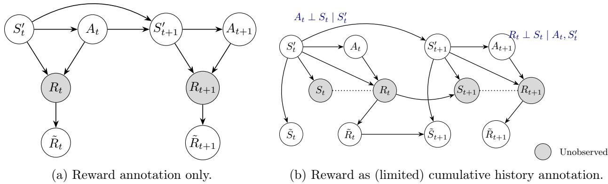  
Figure 1: Sequential annotation model for Breaking Ground outreach.

Assumption 2 (Bounded rewards). The reward satisfies $0 \leq R _ { t } \leq R _ { \operatorname* { m a x } }$ for all $t = 1 , \ldots , T .$

Assumption 3 (Sequential overlap). The annotation scores and density ratios satisfy $c _ { \lambda } \leq \lambda _ { t } \leq 1$ and $0 \leq \mu _ { t } \leq C _ { \mu }$ for some positive constant $c _ { \lambda } > 0$ and $C _ { \mu } > 0$ for all $t = 1 , \ldots , T .$ , and the behavior policy satisfies $\pi _ { b } ( a \mid s ) \geq \varepsilon _ { b } > 0$ for all $( s , a )$

Action overlap can be replaced by weaker concentrability assumptions that are standard in ofline reinforcement learning. The next assumptions are specific to our annotation setting. The first holds by design of our annotation sampling.

Assumption 4 (Annotation ignorability). The annotation design satisfies

$$
P ( C _ { t } = 1 \mid \mathcal { F } _ { T } , C _ { 1 : t - 1 } = 1 ) = P ( C _ { t } = 1 \mid \mathcal { F } _ { t - 1 } , C _ { 1 : t - 1 } = 1 ) = \lambda _ { t } ( \mathcal { F } _ { t - 1 } ) .
$$

Thus, conditional on the already observed prefix, the stage-t annotation decision is made before the newly revealed stage-t information is observed.

We assume there is no latent confounding on annotation decisions between the decision of which datapoints are annotated, and the information revealed by annotation. Note that this assumption holds by design in our batch-adaptive data-annotation setting, where we design the annotation probabilities based on $S _ { t } , A _ { t } , C _ { t ^ { \prime } } , t ^ { \prime } < t$ alone.

Assumption 5 (Proxy reward exclusion restriction). $\mathbb { E } [ R _ { t } \ | \ \tilde { R } _ { t } , S _ { t } , A _ { t } ] = \mathbb { E } [ R _ { t } \ | \ \tilde { R } _ { t } , S _ { t } ^ { \prime } , A _ { t } ]$

Sequential annotation protocols. We introduce annotation filtrations that describe potentially sequential annotations. Define the sequence of annotation filtrations $( \mathcal { F } _ { t } ) _ { t = 0 } ^ { T }$ with endpoints

$$
\mathcal F _ { 0 } = \sigma ( \mathcal O ) , \mathrm { ~ a n d ~ } \mathcal F _ { T } = \sigma ( \mathcal O , R _ { 1 } , S _ { 2 } , \dots , R _ { T - 1 } , S _ { T } , R _ { T } ) .
$$

There are diferent ways of proceeding sequentially (i.e. one timestep at a time) from initiallyobserved to fully-observed trajectories. We primarily focus on forward monotone sampling, which is particularly natural for physical multi-stage sampling designs, e.g. if conducting follow-up on an individual and tracking them via endline surveys.

Definition 1 (Forward monotone sampling.). A sequential annotation protocol is forward monotone if annotation proceeds along prefixes of the trajectory. At annotation stage $t = 1 , \dots , T - 1$ , gold labeling reveals $R _ { t }$ and $S _ { t + 1 }$ . At the terminal annotation stage $T ,$ , gold labeling reveals $R _ { T }$

• Previously available • Newly annotated ◦ Unrevealed (dashed)  
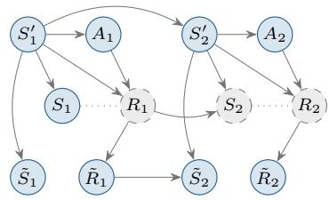  
(a) $\mathcal { F } _ { 0 } \colon$ before annotation.

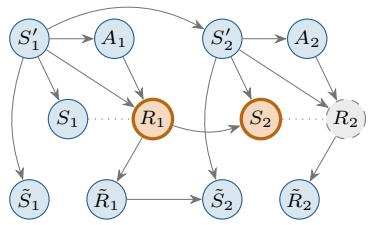  
(b) $\mathcal { F } _ { 1 } \colon$ reveal $R _ { 1 } , S _ { 2 }$

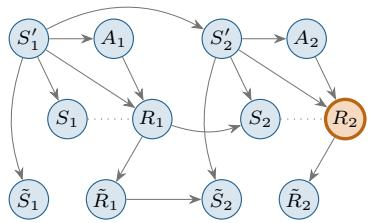  
(c) $\mathcal { F } _ { 2 } \colon$ reveal $R _ { 2 } .$  
Figure 2: Forward-monotone annotation for $T = 2$ , with $S _ { 1 }$ initially observed. The panels show successive information sets along a labeled trajectory: stage 1 reveals $( R _ { 1 } , S _ { 2 } )$ , and stage 2 reveals $R _ { 2 }$ . Annotation may stop at any panel, but cannot skip stage 1: $C _ { 2 } = 1$ implies $C _ { 1 } = 1$ . Blue nodes are already available, orange nodes are newly revealed, and dashed gray nodes remain unobserved.

Therefore, under joint reward and state annotation,

$$
\mathcal F _ { t } = \mathcal F _ { t - 1 } \cup \{ R _ { t } , S _ { t + 1 } \} , \qquad \mathcal F _ { t } = \sigma ( \mathcal O , R _ { 1 } , S _ { 2 } , \ldots , R _ { t } , S _ { t + 1 } )
$$

The annotation indicators satisfy

$$
C _ { 1 } \geq C _ { 2 } \geq \cdot \cdot \cdot \geq C _ { T }
$$

Equivalently, for each $t = 2 , \ldots , T , C _ { t } = 1 \quad \mathrm { o n l y ~ i f } \quad C _ { 1 } = \cdots = C _ { t - 1 } = 1$

Figure 2 illustrates the successive annotation prefixes for $T = 2$

Define the sampling probabilities, and their product

$$
\lambda _ { t } ( \mathcal { F } _ { t - 1 } ) = P ( C _ { t } = 1 \mid C _ { 1 } , \ldots , C _ { t - 1 } , \mathcal { F } _ { t - 1 } ) , \qquad \Lambda _ { 1 : t } = \prod _ { j = 1 } ^ { t } \lambda _ { j } ( \mathcal { F } _ { j - 1 } ) , \qquad t = 1 , \ldots , T .
$$

## 4 Method

## 4.1 Estimation under sequential annotation protocols.

Sequential estimation under annotation. If we had completely observed rewards, the eficient estimator for of-policy evaluation is as follows (Kallus and Uehara, 2019):

$$
\begin{array} { r } { \Gamma _ { T } ^ { \pi _ { e } } = V _ { 1 } ^ { \pi _ { e } } ( S _ { 1 } ) + \sum _ { t = 1 } ^ { T } \gamma ^ { t - 1 } \mu _ { t } ^ { \pi _ { e } } \{ R _ { t } + \gamma V _ { t + 1 } ^ { \pi _ { e } } ( S _ { t + 1 } ) - Q _ { t } ^ { \pi _ { e } } ( S _ { t } , A _ { t } ) \} } \end{array}
$$

We define projections of the full-data score onto the annotation filtration.

$$
m _ { t } ^ { \pi _ { e } } ( \mathcal { F } _ { t } ) = \mathbb { E } [ \Gamma _ { T } ^ { \pi _ { e } } \mid \mathcal { F } _ { t } ]
$$

The initial imputation $m _ { 0 } ^ { \pi _ { e } } ( \mathcal { F } _ { 0 } )$ conditions only on the initially observed data O. To distinguish trajectory time t from annotation stage j, define

$$
b _ { t } ( \mathcal { F } _ { j } ) = \mathbb { E } [ R _ { t } \ | \ \mathcal { F } _ { j } ] , \qquad \tilde { V } _ { t } ^ { \pi _ { e } } ( \mathcal { F } _ { j } ) = \mathbb { E } [ V _ { t } ^ { \pi _ { e } } ( S _ { t } ) \ | \ \mathcal { F } _ { j } ] , \qquad \tilde { Q } _ { t } ^ { \pi _ { e } } ( \mathcal { F } _ { j } ) = \mathbb { E } [ Q _ { t } ^ { \pi _ { e } } ( S _ { t } , A _ { t } ) \ | \ \mathcal { F } _ { j } ] .
$$

Initial projections use ${ \mathcal { F } } _ { 0 } ;$ immediately before revelation, the corresponding projections are $b _ { t } ( \mathcal { F } _ { t - 1 } )$ for $R _ { t }$ and $\tilde { V } _ { t } ^ { \pi _ { e } } ( \mathcal { F } _ { t - 2 } ) , \tilde { Q } _ { t } ^ { \pi _ { e } } ( \mathcal { F } _ { t - 2 } )$ for $t \geq 2$

Our sequentially-annotated estimator begins with the full-imputation estimator $m _ { 0 } ^ { \pi _ { e } } ( \mathcal { F } _ { 0 } )$ and proceeds with sequential inverse-annotation-weighted increments of correcting the imputations of

$m _ { t - 1 }$ with the incrementally annotated $m _ { t }$ , using the data obtained by annotating data at time t. Let

$$
\tilde { \Gamma } _ { T } ^ { \pi _ { e } } ( O ; \Lambda , \hat { \eta } _ { m } ) = \hat { m } _ { 0 } ^ { \pi _ { e } } ( { \mathcal F } _ { 0 } ) + \sum _ { t = 1 } ^ { T } \frac { C _ { 1 : t } } { \Lambda _ { 1 : t } } ( \hat { m } _ { t } ^ { \pi _ { e } } ( { \mathcal F } _ { t } ) - \hat { m } _ { t - 1 } ^ { \pi _ { e } } ( { \mathcal F } _ { t - 1 } ) ) .\tag{1}
$$

Under annotation ignorability and using the true annotation probabilities, the projection increments are mean-zero and telescope, cancelling in expectation but providing variance reduction.

$$
\mathbb { E } [ \tilde { \Gamma } ( O ; \mathbf { A } , \hat { \pmb { \eta } } _ { m } ) \mid \mathcal { F } _ { T } ] = \hat { m } _ { 0 } + \sum _ { t = 1 } ^ { T } ( \hat { m } _ { t } - \hat { m } _ { t - 1 } ) = \hat { m } _ { T } .\tag{2}
$$

Consequently, this estimator, with oracle nuisance functions, is unbiased for our target policy value estimand.

Proposition 1 (Unbiased estimation). $\mathbb { E } [ \tilde { \Gamma } _ { T } ^ { \pi _ { e } } ] = \Phi ^ { \pi _ { e } }$

Proof. See Appendix A.1.

Suppose the forward monotone annotation strategy of Definition 1. In the sequential setting, the martingale nature of the annotation filtrations admits the following variance decomposition.

Proposition 2 (Variance decomposition).

$$
\mathrm { V a r } ( \tilde { \Gamma } ^ { \pi _ { e } } ) = \mathrm { V a r } ( m _ { 0 } ^ { \pi _ { e } } ( \mathcal { F } _ { 0 } ) ) + \sum _ { t = 1 } ^ { T } \mathbb { E } \left[ \frac { \mathrm { V a r } ( m _ { t } ^ { \pi _ { e } } ( \mathcal { F } _ { t } ) \mid \mathcal { F } _ { t - 1 } ) } { \Lambda _ { 1 : t } ( \mathcal { F } _ { t - 1 } ) } \right]\tag{3}
$$

Proof. See Appendix A.2.

Closed-form simplifications of the estimator The estimator is defined with slightly diferent $\mu _ { t }$ functions depending on whether the decision process is Markovian (Setting 1) or non-Markovian (Setting 2).

Remark 1 (Tabular suficiency of the density ratio). Suppose $\pi _ { e }$ depends only on $A _ { t } , S _ { t } ^ { \prime }$ . If we have a Markov decision process (Setting 1) under reward-only annotation (Setting 3), then the cumulative importance weight $\rho _ { 1 : t } ( S _ { t } , A _ { t } )$ is $\mathcal { F } _ { 0 } .$ -measurable, as is $\mu _ { t } ( S _ { t } , A _ { t } )$ , and can therefore be learned via the standard recursion.

If we have a Markov decision process (Setting 1) with joint reward-state annotation (Setting 4), instead the required density ratio satisfies a recursion with respect to $S _ { t } ^ { \prime } , A _ { t }$ -conditional expectations only under an additional restrictive assumption that $S t \perp \{ A _ { t - 1 } , S _ { t - 1 } ^ { \prime } \} \mid S _ { t } ^ { \prime }$ . Otherwise, $\mu _ { t } ( S _ { t } , A _ { t } )$ satisfies the analogous recursion with $\mathbb { E } \left[ \mu _ { t - 1 } \cdot ( \pi _ { e } ( a _ { t } \mid s _ { t } ^ { \prime } ) / \pi _ { b } ( a _ { t } \mid s _ { t } ^ { \prime } ) ) | S _ { t } , A _ { t } \right]$ □

For a non-Markovian decision process, under the forward monotone annotation strategy, we can equivalently pull out $\mu _ { t } ( s ^ { \prime } , a ^ { \prime } )$ from the ${ \tilde { S } } _ { t }$ projection.

To provide more intuition, we first consider the two-stage case, where $T = 2$ . The always-observed data is $\mathcal { O } _ { 0 } = \{ ( S _ { 1 } ^ { \prime } , A _ { 1 } , \tilde { R } _ { 1 } , \tilde { S } _ { 2 } , A _ { 2 } , \tilde { R } _ { 2 } ) \}$ .

For $T = 2$ , the first annotation reveals $( R _ { 1 } , S _ { 2 } )$ , while the second reveals $R _ { 2 }$ . For an NMDP setting, starting from

$$
m _ { 0 } ( \mathcal { F } _ { 0 } ) = V _ { 1 } + \sum _ { t = 1 } ^ { T } \gamma ^ { t - 1 } \mu _ { t } \big ( b _ { t } ( \mathcal { F } _ { 0 } ) + \gamma \tilde { V } _ { t + 1 } ( \mathcal { F } _ { 0 } ) - \tilde { Q } _ { t } ( \mathcal { F } _ { 0 } ) \big ) ,
$$

with $\tilde { Q } _ { 1 } ( \mathcal { F } _ { 0 } ) = Q _ { 1 }$ and $\tilde { V } _ { T + 1 } ( \mathcal { F } _ { 0 } ) = 0$ , the additional incremental projections are

$$
\begin{array} { r l } & { m _ { 1 } ^ { \pi _ { e } } ( \mathcal { F } _ { 1 } ) - m _ { 0 } ^ { \pi _ { e } } ( \mathcal { F } _ { 0 } ) = \mu _ { 1 } ^ { \pi _ { e } } \Big \{ R _ { 1 } - b _ { 1 } ( \mathcal { F } _ { 0 } ) + \gamma \big ( V _ { 2 } ^ { \pi _ { e } } - \tilde { V } _ { 2 } ^ { \pi _ { e } } ( \mathcal { F } _ { 0 } ) \big ) \Big \} } \\ & { \phantom { m _ { 1 } ^ { \pi _ { e } } } + \gamma \Big \{ \mu _ { 2 } ^ { \pi _ { e } } \big ( b _ { 2 } ( \mathcal { F } _ { 1 } ) - Q _ { 2 } ^ { \pi _ { e } } \big ) - \mathbb { E } \big [ \mu _ { 2 } ^ { \pi _ { e } } \{ R _ { 2 } - Q _ { 2 } ^ { \pi _ { e } } \} \mid \mathcal { F } _ { 0 } \big ] \Big \} , } \\ & { m _ { 2 } ^ { \pi _ { e } } ( \mathcal { F } _ { 2 } ) - m _ { 1 } ^ { \pi _ { e } } ( \mathcal { F } _ { 1 } ) = \gamma \mu _ { 2 } ^ { \pi _ { e } } ( R _ { 2 } - b _ { 2 } ( \mathcal { F } _ { 1 } ) ) . } \end{array}
$$

By Assumption $5 , \mathbb { E } [ R _ { t + 1 } ~ | ~ \mathcal { F } _ { t } ] - \mathbb { E } [ R _ { t + 1 } ~ | ~ \mathcal { F } _ { t - 1 } ] = 0 .$

The estimator is simplest when only annotating rewards. In that case,

$$
m _ { t } ^ { \pi _ { c } } ( \mathcal { F } _ { t } ) - m _ { t - 1 } ^ { \pi _ { c } } ( \mathcal { F } _ { t - 1 } ) = \gamma ^ { t - 1 } \left\{ \mu _ { t } ^ { \pi _ { c } } ( R _ { t } - b _ { t } ( \mathcal { F } _ { t - 1 } ) ) \right\} . ~ ( \mathrm { f o r ~ N / M D P ~ w i t h ~ r e w a r d - o n l y ~ a n n o t a t i o n } )
$$

For MDPs with joint reward and state annotation (Setting 4), annotation t reveals $( R _ { t } , S _ { t + 1 } )$ . The exact projection increment is

$$
\begin{array} { r l } & { m _ { t } ^ { \pi _ { e } } ( \mathcal { F } _ { t } ) - m _ { t - 1 } ^ { \pi _ { e } } ( \mathcal { F } _ { t - 1 } ) = \gamma ^ { t - 1 } \Big \{ \mu _ { t } ^ { \pi _ { e } } ( R _ { t } + \gamma V _ { t + 1 } ^ { \pi _ { e } } ) - \mathbb { E } [ \mu _ { t } ^ { \pi _ { e } } ( R _ { t } + \gamma V _ { t + 1 } ^ { \pi _ { e } } ) \mid \mathcal { F } _ { t - 1 } ] \Big \} } \\ & { \phantom { m _ { t } ^ { \pi _ { e } } ( \mathcal { F } _ { t } ) - m _ { t - 1 } ^ { \pi _ { e } } ( \mathcal { F } _ { t } ) } + \displaystyle \sum _ { j = t + 1 } ^ { T } \gamma ^ { j - 1 } \Big \{ \mathbb { E } [ \mu _ { j } ^ { \pi _ { e } } ( R _ { j } + \gamma V _ { j + 1 } ^ { \pi _ { e } } - Q _ { j } ^ { \pi _ { e } } ) \mid \mathcal { F } _ { t } ] - \mathbb { E } [ \mu _ { j } ^ { \pi _ { e } } ( R _ { j } + \gamma V _ { j + 1 } ^ { \pi _ { e } } - Q _ { j } ^ { \pi _ { e } } ) \mid \mathcal { F } _ { t - 1 } ] \Big \} . } \end{array}
$$

Here $V _ { T + 1 } ^ { \pi _ { e } } = 0 _ { ; }$ , and the sum is empty when $t = T$ . While $\mathcal { F } _ { t - 1 }$ reveals $\mu _ { t } ^ { \pi _ { e } } Q _ { t } ^ { \pi _ { e } }$ , the other terms in the last sum record how the new annotation updates predictions of future weighted residuals.

Further simplified estimator via local approximation The final estimator that we use is a local approximation that retains corrections to the current reward and next-stage value functions, while omitting updates to predictions of more distant score components.

$$
\tilde { \Gamma } _ { T } ^ { \pi _ { c } } = m _ { 0 } ^ { \pi _ { c } } ( \mathcal { F } _ { 0 } ) + \sum _ { t = 1 } ^ { T } \gamma ^ { t - 1 } \frac { C _ { 1 : t } } { \Lambda _ { 1 : t } } \Big [ \mu _ { t } ^ { \pi _ { c } } \{ R _ { t } - b _ { t } ( \mathcal { F } _ { t - 1 } ) + \gamma \big ( V _ { t + 1 } ^ { \pi _ { c } } - \tilde { V } _ { t + 1 } ^ { \pi _ { c } } ( \mathcal { F } _ { t - 1 } ) \big ) \} - \gamma \mu _ { t + 1 } ^ { \pi _ { c } } \big ( Q _ { t + 1 } ^ { \pi _ { c } } - \tilde { Q } _ { t + 1 } ^ { \pi _ { c } } ( \mathcal { F } _ { t - 1 } ) \big ) \Big ] .
$$

The local approximation combines two approximations. The first approximation can be viewed as using a misspecified predictor,

$$
\mathrm { e s t i m a t i n g ~ } \mathbb { E } [ \mu _ { t + 1 } Q _ { t + 1 } \mid { \mathcal { F } } _ { t - 1 } ] \mathrm { ~ w i t h ~ } \mathbb { E } [ \mu _ { t + 1 } ( S _ { t + 1 } , A _ { t + 1 } ) \mid { \mathcal { F } } _ { t - 1 } ] \mathbb { E } [ Q _ { t + 1 } \mid { \mathcal { F } } _ { t - 1 } ] .
$$

The second simplification omits updates to future value predictions induced by annotation t, which reveals $( R _ { t } , S _ { t + 1 } )$ :

$$
\mathbb { E } [ Q _ { t ^ { \prime } } \ | \ \mathcal { F } _ { t } ] = \mathbb { E } [ Q _ { t ^ { \prime } } \ | \ \mathcal { F } _ { t - 1 } ] , \qquad t ^ { \prime } \ge t + 2 .
$$

When the corresponding density ratio is F0-measurable, such omitted updates have mean zero by iterated expectation, e.g. $\mathbb { E } [ \mu _ { 2 } \{ b _ { 2 } ( \mathcal { F } _ { 1 } ) - b _ { 2 } ( \mathcal { F } _ { 0 } ) \} ] = 0$ , though omission can change the variance. In general, these predictions frozen to earlier annotation updates have a diferent asymptotic variance, larger than that in Proposition 2. But they result in the same unbiased estimation, due to the following result under approximate projections.

Remark 2 (Modifications for MDPs with joint states and rewards). Finally, in the MDP setting with joint states and rewards, when $T > 2$ , we require the following adjustments since $\mu _ { t } ( S _ { t } , A _ { t } )$ is not $\mathcal { F } _ { \mathrm { 0 ^ { - } m e a s u r a b l e } }$ . We add a small correction to the estimator that restores telescoping.

$$
\tilde { \Gamma } _ { T , M } ^ { \pi e } = \hat { m } _ { 0 } + \sum _ { t = 1 } ^ { T - 1 } \frac { C _ { 1 : t } } { \Lambda _ { 1 : t } } \left( \hat { m } _ { t } - \hat { m } _ { t - 1 } \right) + \frac { C _ { 1 : T } } { \Lambda _ { 1 : T } } \left( \hat { \Gamma } _ { T } ^ { \pi e } - \hat { m } _ { T - 1 } \right)\tag{5}
$$

□

Our estimator is fairly robust to approximate projections onto $\mathcal { F } _ { t - 1 }$ , which enables such approximations, so long as standard DRL product-error rates are satisfied. We summarize this in the following, where $\hat { \pmb { \eta } } _ { m } = \{ \{ \hat { \mu } _ { t } , \hat { Q } _ { t } , \hat { b } _ { t } \} _ { t = 1 } ^ { T } , \{ \hat { \tilde { V } } _ { t } , \hat { \tilde { Q } } _ { t } \} _ { t = 2 } ^ { T } \}$

Proposition 3 (Bias under approximate projections). Consider a Markov decision process and suppose that Setting 1 and assumptions 1, 3 and 4 hold. Condition on an independent training sample. With the actual annotation probabilities Λ, and $\hat { m } _ { T } = \hat { \Gamma } _ { T } ^ { \pi _ { e } }$ , then

$$
\mathbb { E } \big [ \tilde { \Gamma } ( O ; \mathbf { A } , \hat { \eta } _ { m } ) \big ] - \Phi ^ { \pi _ { e } } = \mathbb { E } _ { \pi _ { b } } [ \hat { m } _ { T } - m _ { T } ] = \sum _ { t = 1 } ^ { T } \gamma ^ { t - 1 } \mathbb { E } _ { \pi _ { b } } \big [ ( \hat { \mu } _ { t } - \mu _ { t } ) \{ \gamma ( \hat { V } _ { t + 1 } - V _ { t + 1 } ) - ( \hat { Q } _ { t } - Q _ { t } ) \} \big ] .
$$

Crucially, no consistency of $\hat { m } _ { t } , \ t \ < \ T$ , is required for unbiased estimation. When $\hat { m } _ { t }$ are misspecified, such that they converge to a probability limit $m _ { t } ^ { \dagger } \neq m _ { t }$ , we retain orthogonal estimation and unbiasedness, but the variance minimization can be suboptimal. We therefore recommend the first batch uniformly sample independent trajectories to enable estimation of the full-state nuisances $\mu _ { t } , \hat { V } , \hat { Q }$ , to ensure the above error is $o _ { p } ( n ^ { - \frac { 1 } { 2 } } )$ under typical assumptions.

Let $m _ { t } ^ { \dagger }$ be the frozen predictions with full-data endpoint $m _ { T } ^ { \dagger } = \Gamma _ { T } ^ { \pi _ { e } }$ . Let $m _ { t } = \mathbb { E } [ \Gamma _ { T } ^ { \pi _ { e } } \mid { \mathcal F } _ { t } ]$ be the exact projections, and let $\eta _ { m } ^ { \dag }$ collect the frozen predictions.

Proposition 4 (Surrogate variance). Assume annotation ignorability, overlap and finite second moments. Let $m _ { t } = \mathbb { E } [ \Gamma _ { T } ^ { \pi _ { e } } \mid { \mathcal F } _ { t } ]$ and let $m _ { t } ^ { \dagger }$ be $\mathcal { F } _ { t }$ -measurable frozen predictions with $m _ { T } ^ { \dagger } = \Gamma _ { T } ^ { \pi _ { e } }$ . Let $\eta _ { m }$ and $\eta _ { m } ^ { \dagger }$ collect these respective predictions. Using the realized annotation probabilities, and set $\Lambda _ { \mathrm { 1 : 0 } } = 1$ . The budget-constraint class is fixed throughout.

(i) Surrogate variance. With finite second moments and $\Lambda _ { \mathrm { { 1 : 0 } } } = 1$ ，

$$
\mathrm { V a r } ( \tilde { \Gamma } ( O ; \mathbf { A } , \eta _ { m } ^ { \dagger } ) ) = \mathrm { V a r } ( m _ { 0 } ) + \sum _ { t = 1 } ^ { T } \mathbb { E } \left[ \frac { \mathrm { V a r } ( m _ { t } \mid \mathcal { F } _ { t - 1 } ) } { \Lambda _ { 1 : t } } \right] + \sum _ { \ell = 1 } ^ { T } \mathbb { E } \left[ \left( \frac { 1 } { \Lambda _ { 1 : t } } - \frac { 1 } { \Lambda _ { 1 : t - 1 } } \right) ( m _ { t - 1 } ^ { \dagger } - m _ { t - 1 } ) ^ { 2 } \right] .
$$

variance cost of freezing

(6)

(ii) Optimization guarantee. Suppose the second term above, the variance cost, is at most ε uniformly over feasible designs. If $\boldsymbol { \Lambda } ^ { * }$ minimizes the surrogate variance in part (i), then

$$
\operatorname { V a r } ( \tilde { \Gamma } ( O ; \mathbf { \Delta } \mathbf { \cdot } \pmb { \eta } _ { m } ^ { \dag } ) ) - \operatorname* { i n f } _ { \mathbf { \Delta } \mathbf { \Delta } \mathbf { \Lambda } } \operatorname { V a r } ( \tilde { \Gamma } ( O ; \mathbf { \Delta } \mathbf { \cdot } \pmb { \eta } _ { m } ^ { \dag } ) ) \leq \varepsilon .
$$

If an estimated or further simplified variance criterion difers uniformly from the surrogate variance by at most $\delta ,$ its minimizer Λˆ instead satisfies the same bound with $\varepsilon + 2 \delta$ . The guarantee holds on the event of these uniform bounds and also controls the shortfall in maximized variance reduction relative to a fixed reference variance.

(iii) Approximation bound. Suppose every feasible design satisfies $\Lambda _ { 1 : T } \geq \underline { { \Lambda } } > 0$ almost surely. Then

$$
0 \leq \operatorname* { s u p } _ { \mathbf { A } } \Big \{ \mathrm { V a r } \big ( \widetilde { \Gamma } ( O ; \Lambda , \eta _ { m } ^ { \dagger } ) \big ) - \mathrm { V a r } \big ( \widetilde { \Gamma } ( O ; \Lambda , \eta _ { m } ) \big ) \Big \} \leq ( \underline { { \Lambda } } ^ { - 1 } - 1 ) \sum _ { t = 1 } ^ { T } \| m _ { t - 1 } ^ { \dagger } - m _ { t - 1 } \| _ { 2 } ^ { 2 } .\tag{7}
$$

Our approximation posits that intermediate annotation updates $S _ { t ^ { \prime } } , t ^ { \prime } < t$ are less informative than revealing the true conditioning state $S _ { t }$ itself.

$$
\mathbb { E } \left[ \left\{ \mathbb { E } [ V _ { t } \mid \mathcal { F } _ { k } ] - \mathbb { E } [ V _ { t } \mid \mathcal { F } _ { k - 1 } ] \right\} ^ { 2 } \right] \leq \mathbb { E } \left[ \left\{ V _ { t } ( S _ { t } ) - \mathbb { E } [ V _ { t } \mid \mathcal { F } _ { t - 2 } ] \right\} ^ { 2 } \right] , k < t - 2 .
$$

## Practical estimation of nuisance functions

Estimation scheme of $\mu _ { t }$ Note that we overload notation so that $\mu _ { t }$ is the corresponding inverse propensity term in either the non-Markovian or Markovian setting. In the non-Markovian setting, $\begin{array} { r } { \mu _ { t } = \prod _ { i = 1 } ^ { t } \frac { \pi _ { e } \left( a _ { i } | s _ { i } ^ { \prime } \right) } { \pi _ { b } \left( a _ { i } | s _ { i } ^ { \prime } \right) } } \end{array}$ . In the Markovian setting, $\mu _ { t }$ is the state-projected behavior density ratio which generally satisfies the recursive relation

$$
\mu _ { t } ( s _ { t } , a _ { t } ) \underset { A s n . 1 } { = } \mathbb { E } \left[ \prod _ { i = 1 } ^ { t } \frac { \pi _ { e } ( a _ { i } \mid s _ { i } ^ { \prime } ) } { \pi _ { b } ( a _ { i } \mid s _ { i } ^ { \prime } ) } \bigg | s _ { t } , a _ { t } \right] = \mathbb { E } \left[ \mu _ { t - 1 } \cdot \frac { \pi _ { e } ( a _ { t } \mid s _ { t } ^ { \prime } ) } { \pi _ { b } ( a _ { t } \mid s _ { t } ^ { \prime } ) } \bigg | s _ { t } , a _ { t } \right] .
$$

If the behavior policy is not known, this could be resolved by replacing the behavior policy in the objective above by its estimate $\hat { \pi } _ { b }$ , or the estimate of the importance ratio $\rho = \pi _ { e } / \pi _ { b }$

Estimation scheme of $Q _ { t } ^ { \pi _ { e } }$ and $\tilde { Q } _ { t } ^ { \pi _ { e } }$ . The estimation of the state-action value $Q _ { t }$ and its proxy projection $\tilde { Q } _ { t }$ is conducted jointly in a backward order. Given a convention that $V _ { T + 1 } = \tilde { V } _ { T + 1 } =$ $Q _ { T + 1 } = \tilde { Q } _ { T + 1 } \equiv 0$ , for $t = T , T - 1 , \dots , 1$ , we first learn $Q _ { t }$ via debiased fitted $\mathrm { Q } \mathrm { . }$ -evaluation $\mathrm { ( F Q E ) }$ using the following objective:

$$
Q _ { t } \in \underset { q _ { t } } { \mathrm { a r g m i n } } \mathbb { E } \left[ \frac { C _ { 1 : t - 1 } } { \Lambda _ { 1 : t - 1 } } ( \tilde { Y } _ { t } ^ { q _ { t } } - q _ { t } ) ^ { 2 } \right] ,
$$

where

$$
\tilde { Y } _ { t } ^ { q _ { t } } = b _ { t } ( \mathcal { F } _ { t - 1 } ) + \gamma \tilde { V } _ { t + 1 } ^ { \pi _ { e } } ( \mathcal { F } _ { t - 1 } ) + \frac { C _ { t } } { \lambda _ { t } } \left\{ R _ { t } + \gamma V _ { t + 1 } ^ { \pi _ { e } } - \left( b _ { t } ( \mathcal { F } _ { t - 1 } ) + \gamma \tilde { V } _ { t + 1 } ^ { \pi _ { e } } ( \mathcal { F } _ { t - 1 } ) \right) \right\} .
$$

We then learn $\tilde { Q } _ { t } ^ { \pi _ { e } } ( \mathcal { F } _ { t - 2 } )$ by regressing the estimated $Q _ { t } ^ { \pi _ { e } }$ on $\mathcal { F } _ { t - 2 } $

$$
\tilde { Q } _ { t } ^ { \pi _ { e } } ( \mathcal { F } _ { t - 2 } ) = \mathbb { E } [ Q _ { t } ^ { \pi _ { e } } ( S _ { t } , A _ { t } ) \mid \mathcal { F } _ { t - 2 } ]
$$

The resulting estimate of $\tilde { Q } _ { t } ^ { \pi _ { e } } ( \mathcal F _ { t - 2 } )$ is used to construct $\tilde { V } _ { t } ^ { \pi _ { e } } ( \mathcal { F } _ { t - 2 } )$ , which is subsequently used in the estimation of $Q _ { t - 1 } ^ { \pi _ { e } }$ . In practice, however, it is hard to justify the regression $\mathbb { E } [ Q _ { t } ^ { \pi _ { e } } ( S _ { t } , A _ { t } ) \ | \ { \mathcal { F } } _ { t - 2 } ]$ due to the high-dimensionality of ${ \tilde { S } } _ { t }$ . The practical way to bypass this challenge includes learning the state representation $\phi : \tilde { S }  S$ that takes noisy proxy state as an input and gives the rich observation state as an output. This enables considering the regression $\mathbb { E } [ Q _ { t } ^ { \pi _ { e } } ( S _ { t } , A _ { t } ) \mid \phi ( \tilde { S } _ { t } ) , A _ { t } ]$ (in the case of MDP) or $\mathbb { E } [ Q _ { t } ^ { \pi _ { e } } ( S _ { t } , A _ { t } ) \mid \{ \phi ( S _ { i } ) , A _ { i } \} _ { i \leq t } ]$ (in the case of NMDP), though it is susceptible to misspecification bias of the representation.

Similarly, we can conduct similar debiasing for other nuisance functions to fully leverage the data.

## 4.2 Batch-adaptive experiment scheme

In this section, we introduce the adaptive experiment scheme. Following the convergent split batchadaptive experiment (CSBAE) framework of Li and Owen (2024), we partition the data along two dimensions: M batches, indexed by their sequential order of collection in the adaptive experiment, and K folds to preserve independence between a nuisance estimate and the data it is evaluated on. For simplicity, we focus on the two-batch setting $( M = 2 )$ throughout this section.

Adaptive protocol The adaptive experiment uses the first batch as pilot data to obtain initial estimates of the nuisance functions that will determine the annotation policy in subsequent batches. To ensure reliable initial estimation, we annotate the entire trajectory in the first batch with a prespecified probability $p ,$ that is,

$$
C _ { i ; 1 : T } \sim \operatorname { B e r } ( p ) ,
$$

where $C _ { i ; 1 : T } = 1$ indicates that the full trajectory of unit i is annotated; all experiments in Section 6 take $p = 1$ and assign units to the first batch by independent Bernoulli $\left( \kappa _ { 1 } \right)$ draws with $\kappa _ { 1 } = 0 . 3 B$ so that 30% of the budget is spent uniformly on the first batch, the nuisances are fit on it, and the remaining units receive the mixture-corrected probabilities $[ ( \Lambda ^ { * } - \kappa _ { 1 } ) / ( 1 - \kappa _ { 1 } ) ] _ { \varepsilon } ^ { 1 }$ ; there is no separate pilot sample equivalently, the pilot batch uses the forward-monotone design $\hat { \Lambda } _ { 1 , 1 : t } ^ { ( k ) } = p$ for every $t = 1 , \dots , T$ , where $\Lambda _ { b , 1 : t } ^ { ( k ) }$ denotes the cumulative annotation probability from time 1 to $t ,$ at batch- $\cdot b ,$ fold-k. Starting from the second batch, annotation at each stage t is instead carried out according to the annotation probability obtained by solving the constrained optimization problem described in section 4.3. This probability is updated after each batch using only the data collected in preceding batches within the same fold, which preserves the independence between the data being annotated and the plug-in nuisance estimates constructed via cross-fitting after the experiment for final inference. The batch-b probability is chosen so that the design pooled across all batches attains the empirical budget-optimal target. The probabilities $\{ \hat { \mathbf { A } } _ { b } \} _ { b = 1 } ^ { M }$ are solved so that the weighted average $\begin{array} { r } { \sum _ { b } ( N _ { b } / N ) \hat { \Lambda } _ { b , 1 : t } } \end{array}$ equals the solution of the optimization problem.

Cross-fitting with CSBAE ((Li and Owen, 2024)) After the adaptive experiment concludes, we pool the data collected across all batches and estimate the nuisance functions required for the OPE estimator using K-fold cross-fitting. For each fold, the nuisance functions are estimated using observations outside that fold and then evaluated on the held-out observations. This construction helps preserve the independence between nuisance estimation and score evaluation required by our asymptotic analysis introduced in the later section. The resulting feasible estimator is

$$
\hat { \psi } _ { \mathrm { a d } } = \frac { 1 } { n } \sum _ { k = 1 } ^ { K } \sum _ { ( b , i ) \in \mathcal { T } _ { k } } \tilde { \Gamma } \Big ( O _ { b , i } ; \hat { \Lambda } ^ { ( - k ) } , \hat { \eta } _ { m } ^ { ( - k ) } \Big ) \quad \mathrm { s . t . } \quad \tilde { \Gamma } ( O ; \Lambda , \eta _ { m } ) = m _ { 0 } + \sum _ { t = 1 } ^ { T } \frac { C _ { 1 : t } } { \Lambda _ { 1 : t } } \big ( m _ { t } - m _ { t - 1 } \big ) ,\tag{8}
$$

where $\mathcal { T } _ { k }$ denotes the set of data labeled as (batch, unit) in fold k and $O _ { b , i }$ for $( b , i ) \in \mathcal { T } _ { k }$ denotes the realized outcome of unit i at batch–fold pair $( b , k )$ . Also, $\hat { \mathbf { A } } ^ { ( - k ) }$ denotes the set of annotation probabilities trained on data except fold k across time $t = 1 , \dots , T$ , i.e., $\hat { \mathbf { A } } ^ { ( - k ) } = \{ \hat { \Lambda } _ { 1 : t } ^ { ( - k ) } : t =$ $1 , \ldots , T \}$ , and $\hat { \pmb { \eta } } _ { m } ^ { ( - k ) }$ denotes the set of nuisance functions $\hat { \pmb { \eta } } _ { m , t } ^ { ( - k ) }$ associated with projections $\hat { m } _ { t } ^ { ( - k ) }$ $t = 1 , \dots , T$ , i.e, $\hat { \pmb { \eta } } _ { m } ^ { ( - k ) } = \{ \hat { \pmb { \eta } } _ { m , t } ^ { ( - k ) } : t = 1 , \dots , T \}$ . Note that in the final inference (post-experiment) stage, the annotation probability $\Lambda _ { 1 : t }$ is estimated from the realizations, not evaluated from solving the optimization problem as in the experiment stage.

## 4.3 Optimized allocation probabilities.

Next we discuss our optimization problem, which optimizes the part of the asymptotic variance (Equation (3)) that depends on the annotation probabilities. The annotation design problem allocates the budget across stages so as to minimize it. Since $\{ ( m _ { t } ^ { \pi _ { e } } , \mathcal { F } _ { t } ) , t = 1 , \dots , T \}$ is a martingale, the stagewise conditional variance is the second moment of the increment,

$$
\operatorname { V a r } \left( m _ { t } ^ { \pi _ { e } } ( { \mathcal F } _ { t } ) \mid { \mathcal F } _ { t - 1 } \right) = { \mathbb E } \left[ \left( m _ { t } ^ { \pi _ { e } } ( { \mathcal F } _ { t } ) - m _ { t - 1 } ^ { \pi _ { e } } ( { \mathcal F } _ { t - 1 } ) \right) ^ { 2 } \mid { \mathcal F } _ { t - 1 } \right] .
$$

In the reward-state annotation setting setting 4, for instance, the conditional variance simplifies as

$$
\mathrm { V a r } \Big [ \mu _ { t } ^ { \pi _ { e } } ( R _ { t } + \gamma V _ { t + 1 } ^ { \pi _ { e } } ) - \gamma { \bf 1 } \{ t < T \} \mu _ { t + 1 } ^ { \pi _ { e } } Q _ { t + 1 } ^ { \pi _ { e } } \Big | { \mathcal F } _ { t - 1 } \Big ] .
$$

We state the optimization problem in terms of a generic

$$
\sigma _ { t } ^ { 2 } ( \mathcal { F } _ { t - 1 } ) = \operatorname { V a r } \big ( m _ { t } ^ { \pi _ { e } } ( \mathcal { F } _ { t } ) \mid \mathcal { F } _ { t - 1 } \big ) .
$$

For diferent settings such as non-Markovian or Markovian decision processes, reward or joint reward-and-state annotation, or diferent approximate projections, diferent increments of conditional variance enter the above additively.

Next we discuss the annotation budget. Note that annotating stage t requires $C _ { 1 : t } = 1$ , which occurs with probability $\Lambda _ { 1 : t } ( \mathcal { F } _ { t - 1 } )$ , so the expected number of gold labels is $\scriptstyle \sum _ { t = 1 } ^ { T } \mathbb { E } [ \Lambda _ { 1 : t } ( { \mathcal { F } } _ { t - 1 } ) ]$ Therefore, the optimal annotation problem with variance minimization objective, subject to the budget B and to forward monotonicity, can be written as

$$
\operatorname* { m i n } _ { \{ \Lambda _ { 1 : t } \} _ { t = 1 } ^ { T } \in [ 0 , 1 ] ^ { T } } \left\{ \sum _ { t = 1 } ^ { T } \mathbb { E } \left[ \frac { \sigma _ { t } ^ { 2 } ( \mathcal { F } _ { t - 1 } ) } { \Lambda _ { 1 : t } ( \mathcal { F } _ { t - 1 } ) } \right] : \sum _ { t = 1 } ^ { T } \mathbb { E } \big [ \Lambda _ { 1 : t } ( \mathcal { F } _ { t - 1 } ) \big ] \leq B ; \ \Lambda _ { 1 : t + 1 } ( \mathcal { F } _ { t } ) \leq \Lambda _ { 1 : t } ( \mathcal { F } _ { t - 1 } ) , \ \forall t \in [ T - 1 ] \right\} ,\tag{OPT}
$$

where B is the annotation budget. The first constraint enforces the budget, and the second enforces forward monotonicity of the resulting annotation policy. Since both $\sigma _ { t } ^ { 2 }$ and $\Lambda _ { 1 : t }$ are $\mathcal { F } _ { t } .$ −1-measurable and $\sigma _ { t } ^ { 2 } \geq 0$ , the optimization problem $( \mathrm { O P T } )$ is convex, thus we can leverage KKT condition to find the optimal solution. The optimal solution introduced in the following theorem has an intuitive structure: the annotation probability at each stage is proportional to the conditional standard deviation of that stage annotation’s contribution to the score, normalized so that it binds the budget constraint.

Optimal annotation probabilities: special case of $T = 2$ For simplicity, first let us again specialize to the two-stage case, $T = 2$ , whose optimization problem is

$$
\begin{array} { r l } { \underset { \lambda _ { 1 } , \Lambda _ { 1 : 2 } \in [ 0 , 1 ] } { \operatorname* { m i n } } } & { \mathbb { E } \left[ \frac { \sigma _ { 1 } ^ { 2 } ( \mathcal { F } _ { 0 } ) } { \lambda _ { 1 } ( \mathcal { F } _ { 0 } ) } \right] + \mathbb { E } \left[ \frac { \sigma _ { 2 } ^ { 2 } ( \mathcal { F } _ { 1 } ) } { \Lambda _ { 1 : 2 } ( \mathcal { F } _ { 1 } ) } \right] } \\ { \mathrm { s . t . } } & { \mathbb { E } \left[ \lambda _ { 1 } ( \mathcal { F } _ { 0 } ) + \Lambda _ { 1 : 2 } ( \mathcal { F } _ { 1 } ) \right] \leq B ; \qquad \Lambda _ { 1 : 2 } ( \mathcal { F } _ { 1 } ) \leq \lambda _ { 1 } ( \mathcal { F } _ { 0 } ) . } \end{array}
$$

$$
\left( \mathrm { O P T } \left( T = 2 \right) \right)
$$

Theorem 1 (Optimal allocation probabilities, T = 2.). Define the normalizing constant

$$
\beta = \frac { 1 } { B ^ { 2 } } \left( \mathbb { E } \left[ \sqrt { \sigma _ { 1 } ^ { 2 } ( \mathcal { F } _ { 0 } ) } + \sqrt { \sigma _ { 2 } ^ { 2 } ( \mathcal { F } _ { 1 } ) } \right] \right) ^ { 2 } .
$$

Provided $\sigma _ { 1 } ( \mathcal { F } _ { 0 } ) \le \sqrt { \beta }$ almost surely (so that $\lambda _ { 1 } ^ { * } \leq 1 )$ , the solution to (OPT (T = 2)) is:

$$
\lambda _ { 1 } ^ { * } ( \mathcal { F } _ { 0 } ) = \frac { \sqrt { \sigma _ { 1 } ^ { 2 } ( \mathcal { F } _ { 0 } ) } } { \sqrt { \beta } } , \qquad \Lambda _ { 1 : 2 } ^ { * } ( \mathcal { F } _ { 1 } ) = \frac { \sqrt { \sigma _ { 2 } ^ { 2 } ( \mathcal { F } _ { 1 } ) } } { \sqrt { \beta } } \qquad \mathrm { i f } \qquad \Lambda _ { 1 : 2 } ^ { * } ( \mathcal { F } _ { 1 } ) \leq \lambda _ { 1 } ^ { * } ( \mathcal { F } _ { 0 } ) .
$$

This closed form gives the interior solution under the feasibility condition above; when the forward monotonicity constraint binds instead, the same pointwise truncation for $\Lambda _ { 1 : 2 } ^ { * }$ holds conditional on $\lambda _ { 1 } ^ { * }$ , while $\lambda _ { 1 } ^ { * }$ is determined by the boundary KKT condition in Appendix A.3, a scalar fixed-point equation that can be numerically solved easily (convex decreasing or concave increasing).

Proof. See Appendix A.3.

Algorithm 1 Two-batch adaptive prefix annotation $\overline { { ( T = 2 ) } }$   
Require: $\mathcal { D } _ { 0 } , \pi _ { e } , \widehat { \pi } _ { b } , B , \kappa _ { 1 } , p , K , \varepsilon$   
Ensure: $\widehat { \psi } ^ { \pi _ { e } }$   
1: Assign units to K folds $\{ D ^ { ( k ) } \} _ { k = 1 } ^ { K } ;$ split into pilot and adaptive batches $( \mathbb { Z } _ { \mathrm { p i l } } , \mathbb { Z } _ { \mathrm { a d } } )$ with $| \mathbb { Z } _ { \mathrm { p i l } } | / n =$   
$\kappa _ { 1 }$ , stratifying the split within each fold.   
2: Pilot batch. For $i \in \mathcal { I } _ { \mathrm { p i l } }$ , draw a single $C _ { i ; 1 : T } \sim \mathrm { B e r n } ( p )$ and annotate the full trajectory   
if $C _ { i ; 1 : T } = 1 ;$ ; equivalently, the pilot uses the forward-monotone design $\Lambda _ { 1 : t } ^ { 0 } = p$ for all $t ,$ i.e.   
$( \lambda _ { \mathrm { p i l } , 1 } , \Lambda _ { \mathrm { p i l } , 1 : 2 } ) = ( p , p )$   
3: Let $[ x ] _ { \ell } ^ { u } = \operatorname* { m i n } \{ u , \operatorname* { m a x } \{ \ell , x \} \}$ and let $\left[ \frac { x - \kappa _ { 1 } x _ { \mathrm { p i l } } } { 1 - \kappa _ { 1 } } \right] _ { \varepsilon } ^ { u }$ denote the pilot/adaptive mixture correction,   
i.e. the projected solution in $x _ { \mathrm { a d } }$ of $\kappa _ { 1 } x _ { \mathrm { p i l } } + ( 1 - \kappa _ { 1 } ) x _ { \mathrm { a d } } = x .$   
4: for $k = 1 , \ldots , K$ do   
5: Design-time estimation. Estimate the closed-form allocation of Theorem 1 from the fold-k   
pilot units $D ^ { ( k ) } \cap \mathcal { T } _ { \mathrm { p i l } }$ , and form the clipped plug-in optimum $( \widehat { \lambda } _ { \mathrm { p i l } , 1 } ^ { * ( k ) } , \widehat { \Lambda } _ { \mathrm { p i l } , 1 : 2 } ^ { * ( k ) } )$ at budget B.   
6: for $i \in D ^ { ( k ) } \cap \mathcal { T } _ { \mathrm { a d } }$ do   
7: Set $\begin{array} { r } { \lambda _ { \mathrm { a d } , i , 1 } ^ { ( k ) } = \left[ \frac { \widehat { \lambda } _ { \mathrm { p i l } , 1 } ^ { \ast ( k ) } ( \mathcal { F } _ { i , 0 } ) - \kappa _ { 1 } p } { 1 - \kappa _ { 1 } } \right] _ { \varepsilon } ^ { 1 } } \end{array}$ and draw $C _ { i , 1 } \sim \mathrm { B e r n } ( \lambda _ { \mathrm { a d } , i , 1 } ^ { ( k ) } )$   
8: If $C _ { i , 1 } = 1$ , reveal $( R _ { i , 1 } , S _ { i , 2 } )$ , set $\begin{array} { r l } & { \Lambda _ { \mathrm { a d } , \mathrm { i } , 1 : 2 } ^ { ( k ) } = \bigg [ \frac { \widehat { \Lambda } _ { \mathrm { p i l } , 1 : 2 } ^ { * ( k ) } ( \mathcal { F } _ { i , 1 } ) - \kappa _ { 1 } p } { 1 - \kappa _ { 1 } } \bigg ] _ { \varepsilon } ^ { \lambda _ { \mathrm { a d } , i , 1 } ^ { ( k ) } } } \end{array}$ , and draw $C _ { i , 2 } \sim$   
Bern $( \Lambda _ { \mathrm { a d , i , 1 : 2 } } ^ { ( k ) } / \lambda _ { \mathrm { a d , } i , 1 } ^ { ( k ) } )$ ; otherwise set ${ \cal C } _ { i , 2 } = 0 \ :$   
9: end for   
10: end for   
11: Record the realized design. For every unit, store the prefix probabilities $\pmb { \Lambda } _ { i } = ( \Lambda _ { i , 1 } , \Lambda _ { i , 1 : 2 } )$   
equal to $( p , p )$ on $\mathcal { I } _ { \mathrm { p i l } }$ and to $( \lambda _ { \mathrm { a d } , i , 1 } ^ { ( k ) } , \Lambda _ { \mathrm { a d } , \mathrm { i } , 1 : 2 } ^ { ( k ) } )$ on $\mathcal { T } _ { \mathrm { a d } }$   
12: Inference. Pool both batches and, under the same fold assignment, refit the cross-fitted   
nuisances $\hat { \mathbf { A } } ^ { ( - k ) } = ( \hat { \Lambda } _ { 1 : t } ^ { ( - k ) } )$ and $\widehat { \pmb { \eta } } _ { m } ^ { ( - k ) } = ( \widehat { \mu } _ { t } ^ { ( - k ) } , \widehat { Q } _ { t } ^ { ( - k ) } , \widehat { b } _ { t } ^ { ( - k ) } , \widehat { \widetilde { Q } } _ { t } ^ { ( - k ) } )$ for each k.   
K   
13: return $\widehat { \psi } ^ { \pi _ { e } } = n ^ { - 1 } \sum _ { k = 1 } ^ { s * } \sum _ { i \in D ^ { ( k ) } } \tilde { \Gamma } \big ( { \cal O } _ { i } , \hat { \bf A } ^ { ( - k ) } , \widehat { \pmb { \eta } } ^ { ( - k ) } \big )$

## 4.4 Feasible batch-adaptive annotation.

Algorithm 1 gives the feasible two-batch implementation of Theorem 1. The pilot batch estimates the nuisances; the adaptive batch applies the plug-in allocation from Equation (OPT $\left( T = 2 \right) )$ with a mixture correction so that the pooled design targets the optimal prefix-label distribution.

## 5 Analysis

In this section, we establish the statistical properties of our proposed estimator. We show that both non-adaptive version and the batch-adaptive version of estimator are asymptotically normal, given the proper convergence rates of the nuisance estimators.

## 5.1 Asymptotic normality under the non-adaptive experiment

We begin with the non-adaptive setting, in which the annotation probability remains fixed across batches, i.e., $\Lambda _ { b , 1 : t } = \Lambda _ { 1 : t }$ for all $b ,$ because it serves as an oracle benchmark that the batch-adaptive

estimator seeks to achieve asymptotically. In this setting, the feasible estimator takes the form of

$$
\hat { \psi } _ { \mathrm { n a d } } = \frac { 1 } { n } \sum _ { k = 1 } ^ { K } \sum _ { i \in \mathcal { D } ^ { ( k ) } } \tilde { \Gamma } \Big ( O _ { i } ; \hat { \mathbf { A } } ^ { ( - k ) } , \hat { \eta } _ { m } ^ { ( - k ) } \Big ) \quad \mathrm { s . t . } \quad \tilde { \Gamma } ( O , \Lambda , \eta _ { m } ) = m _ { 0 } + \sum _ { t = 1 } ^ { T } \frac { C _ { 1 : t } } { \Lambda _ { 1 : t } } \big ( m _ { t } - m _ { t - 1 } \big ) ,\tag{9}
$$

where $\mathcal { D } ^ { ( k ) }$ denotes the data in fold k. Asymptotic normality holds for $\hat { \psi } _ { \mathrm { n a d } }$ under the following assumptions.

Assumption 6 (Bounded estimators). The estimators are globally bounded: $c _ { \lambda } \leq \hat { \lambda } _ { t } ^ { ( - k ) } \leq 1$ $0 \leq \hat { \mu } _ { t } ^ { ( - k ) } \leq C _ { \hat { \mu } }$ , and lim $\begin{array} { r } { \operatorname* { s u p } _ { n  \infty } \| \hat { f } _ { t } ^ { ( - k ) } \| _ { \infty } < \infty } \end{array}$ for $\hat { f } \in \{ \hat { Q } , \hat { b } , \hat { \tilde { Q } } \} , k = 1 , \dots , K , t = 1 , \dots , T .$

Remark 3. The assumption 6 ensures that every projection estimates $\hat { m } _ { t }$ is uniformly bounded.

Assumption 7 (Rate assumption). With the conventions $\Delta Q _ { T + 1 } ^ { ( - k ) } = \Delta \tilde { Q } _ { T + 1 } ^ { ( - k ) } = \Delta \mu _ { T + 1 } ^ { ( - k ) } : = 0$ , the following product error rates hold for all $1 \leq k \leq K$ and $1 \leq t \leq \dot { T }$

(R1)

$$
\| \Delta \mu _ { t } ^ { ( - k ) } \| _ { 2 } \Big ( \| \Delta Q _ { t } ^ { ( - k ) } \| _ { 2 } + \| \Delta Q _ { t + 1 } ^ { ( - k ) } \| _ { 2 } \Big ) = o _ { p } ( n ^ { - 1 / 2 } ) ,\tag{R2}
$$

$$
\sum _ { j \leq t } \| \Delta \lambda _ { j } ^ { ( - k ) } \| _ { 2 } \Big ( \| \Delta b _ { t } ^ { ( - k ) } \| _ { 2 } + \| \Delta Q _ { t + 1 } ^ { ( - k ) } \| _ { 2 } + \| \Delta \mu _ { t } ^ { ( - k ) } \| _ { 2 } + \| \Delta \mu _ { t + 1 } ^ { ( - k ) } \| _ { 2 } \Big ) = o _ { p } ( n ^ { - 1 / 2 } ) .
$$

We refer to (R1) as the double reinforcement learning (DRL) product error and to (R2) as the annotation product error.

Theorem 2 (Asymptotic normality under the non-adaptive setting). Suppose assumptions 1 to $^ { 4 , }$ 6 and 7 hold, together with $\| \hat { \lambda } _ { t } ^ { ( - k ) } - \lambda _ { t } \| _ { 2 } = o _ { p } ( 1 ) , \| \hat { \mu } _ { t } ^ { ( - k ) } - \mu _ { t } \| _ { 2 } = o _ { p } ( 1 ) , \| \hat { Q } _ { t } ^ { ( - k ) } - Q _ { t } \| _ { 2 } = o _ { p } ( 1 )$ $\| \hat { b } _ { t } ^ { ( - k ) } - b _ { t } \| _ { 2 } = o _ { p } ( 1 )$ , and $\| \hat { \tilde { Q } } _ { t } ^ { ( - k ) } - \tilde { Q } _ { t } \| _ { 2 } = o _ { p } ( 1 )$ for all $1 \leq k \leq K$ and $1 \leq t \leq T$ . Then

$$
\sqrt { n } \big ( \hat { \psi } _ { \mathrm { n a d } } - \Phi ^ { \pi _ { e } } \big ) \Longrightarrow \mathcal { N } ( 0 , \sigma ^ { 2 } ) , \qquad w h e r e \qquad \sigma ^ { 2 } = \mathrm { V a r } ( m _ { 0 } ) + \sum _ { t = 1 } ^ { T } \mathbb { E } \left[ \frac { \mathrm { V a r } ( m _ { t } \mid \mathcal { F } _ { t - 1 } ) } { \Lambda _ { 1 : t } } \right] ,
$$

and $\sigma ^ { 2 } \in ( 0 , \infty )$

Proof. See Appendix B.1.

## 5.2 Asymptotic normality under the batch-adaptive experiment

Next, we present our main result, the asymptotic normality of the batch-adaptive estimator. In the batch-adaptive setting, the annotation probability used on batch-b, fold-k experiment is derived from the data in previous batches at the same fold, say $\mathcal { D } _ { 1 : b - 1 } ^ { ( k ) }$ . Therefore, we define the cumulative annotation probability for batch-b, fold-k experiment as $\hat { \Lambda } _ { b , 1 : t } ^ { ( k ) }$ . Accordingly, we modify the boundedness and rate assumptions as follows.

Assumption 8 (Bounded estimators under the batch-adaptive setting). The estimators are globally bounded: $c _ { \lambda } \leq \hat { \lambda } _ { b , t } ^ { ( k ) } \leq 1 , \ c _ { \hat { \Lambda } } \leq \hat { \Lambda } _ { 1 : t } ^ { ( - k ) } \leq 1 , \ 0 \leq \hat { \mu } _ { t } ^ { ( - k ) } \leq C _ { \hat { \mu } }$ , and lim $\begin{array} { r } { \operatorname* { s u p } _ { n  \infty } \| \widehat { f } _ { t } ^ { ( - k ) } \| _ { \infty } < \infty } \end{array}$ for $\hat { f } \in \{ \hat { Q } , \hat { b } , \hat { \tilde { Q } } \} , b = 1 , \dots , M , k = 1 , \dots , K , t = 1 , \dots , T .$

Assumption 9 (Rate assumption under the batch-adaptive setting). With the conventions $\Delta Q _ { T + 1 } ^ { ( - k ) } =$ $\Delta \tilde { Q } _ { T + 1 } ^ { ( - k ) } = \Delta \mu _ { T + 1 } ^ { ( - k ) } : = 0$ , the following product error rates hold for all $1 \leq b \leq M , 1 \leq k \leq K$ , and $1 \leq t \leq T ;$

(R1)

$$
\| \Delta \mu _ { t } ^ { ( - k ) } \| _ { 2 } \Big ( \| \Delta Q _ { t } ^ { ( - k ) } \| _ { 2 } + \| \Delta Q _ { t + 1 } ^ { ( - k ) } \| _ { 2 } \Big ) = o _ { p } ( n ^ { - 1 / 2 } ) ,\tag{R2a}
$$

$$
\sum _ { j \leq t } \| \Delta \hat { \lambda } _ { b , j } ^ { ( k ) } \| _ { 2 } \Big ( \| \Delta b _ { t } ^ { ( - k ) } \| _ { 2 } + \| \Delta Q _ { t + 1 } ^ { ( - k ) } \| _ { 2 } + \| \Delta \mu _ { t } ^ { ( - k ) } \| _ { 2 } + \| \Delta \mu _ { t + 1 } ^ { ( - k ) } \| _ { 2 } \Big ) = o _ { p } ( n ^ { - 1 / 2 } ) ,\tag{R2b}
$$

$$
\sum _ { j \le t } \| \Delta \hat { \lambda } _ { j } ^ { ( - k ) } \| _ { 2 } \Big ( \| \Delta b _ { t } ^ { ( - k ) } \| _ { 2 } + \| \Delta Q _ { t + 1 } ^ { ( - k ) } \| _ { 2 } + \| \Delta \mu _ { t } ^ { ( - k ) } \| _ { 2 } + \| \Delta \mu _ { t + 1 } ^ { ( - k ) } \| _ { 2 } \Big ) = o _ { p } ( n ^ { - 1 / 2 } ) .
$$

We refer to (R1) as the double reinforcement learning (DRL) product error and to (R2a)–(R2b) as the annotation product errors.

Remark 4. We now have two annotation product error terms. (R2a) arises from the annotation probability used during the experiment for each batch and fold. (R2b) arises from the annotation probability estimated over the pooled data using cross-fitting after the experiment. □

Theorem 3 (Asymptotic normality under the batch-adaptive setting). Suppose assumptions 1 to $^ { 4 , }$ 8 and 9 hold, together with $\| \hat { \lambda } _ { b , t } ^ { ( k ) } - \lambda _ { b , t } ^ { * } \| _ { 2 } = o _ { p } ( 1 ) , \| \hat { \lambda } _ { t } ^ { ( - k ) } - \lambda _ { t } ^ { * } \| _ { 2 } = o _ { p } ( 1 ) , \| \hat { \mu } _ { t } ^ { ( - k ) } - \mu _ { t } \| _ { 2 } = o _ { p } ( 1 )$ ， $\| \hat { Q } _ { t } ^ { ( - k ) } - Q _ { t } \| _ { 2 } = o _ { p } ( 1 ) , \| \hat { b } _ { t } ^ { ( - k ) } - b _ { t } \| _ { 2 } = o _ { p } ( 1 )$ , and $\lVert \hat { \tilde { Q } } _ { t } ^ { ( - k ) } - \tilde { Q } _ { t } \rVert _ { 2 } = o _ { p } ( 1 )$ for all $1 \leq b \leq M$ 2 $1 \leq k \leq K$ and $1 \leq t \leq T$ . Then,

$$
\sqrt { n } \big ( \hat { \psi } _ { \mathrm { a d } } - \Phi ^ { \pi _ { e } } \big ) \Longrightarrow { \cal N } ( 0 , \sigma _ { \ast } ^ { 2 } ) , \qquad w h e r e \qquad \sigma ^ { 2 } = \mathrm { V a r } ( m _ { 0 } ) + \sum _ { t = 1 } ^ { T } \mathbb { E } \left[ \frac { \mathrm { V a r } ( m _ { t } \mid \mathcal { F } _ { t - 1 } ) } { \Lambda _ { 1 : t } ^ { \ast } } \right] \in ( 0 , \infty ) .
$$

Proof. See Appendix B.2.

Finally, the asymptotic inference results also extend to our family of simplified estimators, including for the more complex MDP setting with reward and state annotation and the corrected estimator of Equation (5). This comes at a small cost, as we then sufer a small cost in suboptimal variance.

Proposition 5 (Batch-adaptive asymptotic normality with realized annotation probabilities). Under setting 1 and assumptions 1 to 4, use the independent-fold batch-adaptive experiment and crossfitting scheme of Theorem 3. In eq. (8), use the realized annotation probabilities $\hat { \Lambda } _ { b } ^ { ( k ) }$ and set $\hat { m } _ { T } ^ { ( - k ) } = \hat { \Gamma } _ { T } ^ { \pi _ { e } , ( - k ) }$ as in Proposition 3.

Assume condition (R1) of Assumption 9, the bounds in Assumption 8 for the fitted state-action functions and recorded probabilities, and uniformly bounded adapted predictions. For every batch and fold, require

$$
\| \hat { \mu } _ { t } ^ { ( - k ) } - \mu _ { t } \| _ { 2 } + \| \hat { Q } _ { t } ^ { ( - k ) } - Q _ { t } \| _ { 2 } = o _ { p } ( 1 ) , \qquad \| \hat { \lambda } _ { b , t } ^ { ( k ) } - \lambda _ { b , t } ^ { * } \| _ { 2 } = o _ { p } ( 1 ) , \qquad \| \hat { m } _ { t } ^ { ( - k ) } - m _ { t } ^ { \dagger } \| _ { 2 } = o _ { p } ( 1 )
$$

with deterministic limits common across folds. The intermediate limits may difer from the exact projections; $m _ { T } ^ { \dagger } = \Gamma _ { T } ^ { \pi _ { e } }$ . Then

$$
\sqrt { n } ( \hat { \psi } _ { \mathrm { a d } } - \Phi ^ { \pi _ { e } } ) \Longrightarrow { \cal N } ( 0 , \sigma ^ { 2 } ) , \qquad \sigma ^ { 2 } = \sum _ { b = 1 } ^ { M } \kappa _ { b } \mathrm { V a r } \Bigl [ \tilde { \Gamma } ( \tilde { O } _ { b } ; \Lambda _ { b } ^ { * } , \eta _ { m } ^ { \dagger } ) \Bigr ] ,\tag{10}
$$

provided $\sigma ^ { 2 } > 0$

## 6 Experiments

First, we outline some variants in implementation that we consider when relevant. Such implementation variants can improve empirical performance or adapt our general method to the challenges or opportunities of specific applications.

Practical conditional variance estimates: plug-in proxies for $\sigma _ { t } ^ { 2 }$ . The optimal probabilities of Section 4.3 depend on $\sigma _ { t } ^ { 2 } ( \mathcal { F } _ { t - 1 } )$ , which is unknown and must be estimated from data. In every experiment the implemented design replaces it by a design signal $\hat { s } _ { t } ^ { 2 } ( \mathcal { F } _ { t - 1 } )$ , any nonnegative $\mathcal { F } _ { t - 1 ^ { - } }$ measurable quantity, and sets $\lambda _ { t } \propto \hat { s } _ { t }$ subject to the floor and prefix constraints of $\left( \mathrm { O P T } \left( T = 2 \right) \right)$ By Proposition 1, diferent choices of signals only afect eficiency through how closely $\hat { s } _ { t }$ tracks $\sigma _ { t }$ Diferent options include:

• Residual regression. The standard way to estimate the conditional variance $\hat { s } _ { t } ^ { 2 }$ is by regressing squared residuals on $\mathcal { F } _ { t - 1 }$ , which must be learned from the first batch.

• Binary rewards and a link function. When outcomes are known to be binary, we can leverage the conditional variance expression for a Bernoulli outcome, $p ( 1 - p )$ . For a binary reward, $\hat { s } _ { t } ^ { 2 } = \hat { \mu } _ { t } ^ { 2 } \hat { b } _ { t } ( 1 - \hat { b } _ { t } )$ , where $\hat { b } _ { t }$ estimates $b _ { t } = \mathbb { E } [ R _ { t } \mid \mathcal { F } _ { t - 1 } ]$ on the first batch of Section 4.4 (when the revealed reward also determines the next state, the same two-point variance is applied to the full stage increment; see Section C.4).

• Always-observed silver label variance. Sometimes an always-observed silver or surrogate label $\tilde { R } _ { t }$ is available for every unit, such as in our casenote annotation application with zero-shot LLM annotation. Further, we may have an ensemble of the silver labels available, such as LLM annotations from diferent models. Then we can use silver-label disagreement from zero-shot models as a variance proxy. Such zero-shot variance proxies are therefore $\mathcal { F } _ { \mathrm { 0 - m e a s u r a b l e } }$

Implemented allocation protocol. The experiments run a simplified variant of Algorithm 1 that difers from it in three respects. We use the known annotation probabilities in $\tilde { \Gamma }$ rather than re-estimation, which helps in small pilots. Second, the fold-k conditional variance $\hat { s } _ { t }$ is fit on firstbatch units outside fold k so that we can use out-of-fold data, $( K - 1 ) / K$ of the first batch rather than $1 / K$ . The cross-fold design does introduce additional dependence beyond the independence structure assumed in Section 5. We see this may have led to slightly worsened coverage, although variance improvements persist. Third, the second-batch probabilities are the optimized allocation of the residual budget $B - \kappa _ { 1 }$ , which clips the optimal annotation probabilities to feasibility after an initial pilot.

Trajectory-wise annotation as an additional constraint on allocation optimization. Forward monotone annotation is most relevant when reward variance difers from stage to stage, and can be learned. If instead reward variance is similar at every timestep, an alternative is to annotate whole trajectories. We give an example in the two-stage setting. Since $\lambda _ { 1 }$ is $\mathcal { F } _ { 0 }$ -measurable, $\mathbb { E } [ \sigma _ { 2 } ^ { 2 } ( \mathcal { F } _ { 1 } ) / \lambda _ { 1 } ( \mathcal { F } _ { 0 } ) ] = \mathbb { E } [ \mathbb { E } [ \sigma _ { 2 } ^ { 2 } ( \mathcal { F } _ { 1 } ) \mid \mathcal { F } _ { 0 } ] / \lambda _ { 1 } ( \mathcal { F } _ { 0 } ) ]$ , and the restricted problem reduces to a single-stage Neyman problem on the summed increment variances:

$$
\operatorname* { m i n } _ { \lambda _ { 1 } \in [ c _ { \lambda } , 1 ] } \mathbb { E } \left[ \frac { \sigma _ { 1 } ^ { 2 } ( \mathcal { F } _ { 0 } ) + \gamma ^ { 2 } \mathbb { E } [ \sigma _ { 2 } ^ { 2 } ( \mathcal { F } _ { 1 } ) \mid \mathcal { F } _ { 0 } ] } { \lambda _ { 1 } ( \mathcal { F } _ { 0 } ) } \right] \quad \mathrm { s . t . } \quad 2 \mathbb { E } [ \lambda _ { 1 } ( \mathcal { F } _ { 0 } ) ] \leq B ,\tag{11}
$$

The budget-normalized solution is:

$$
\lambda _ { 1 } ^ { \mathrm { t r a j } } ( \mathcal { F } _ { 0 } ) \propto \sqrt { \sigma _ { 1 } ^ { 2 } ( \mathcal { F } _ { 0 } ) + \gamma ^ { 2 } \mathbb { E } [ \sigma _ { 2 } ^ { 2 } ( \mathcal { F } _ { 1 } ) \mid \mathcal { F } _ { 0 } ] }
$$

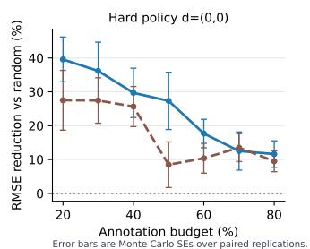

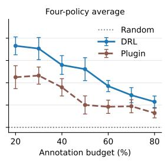

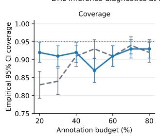

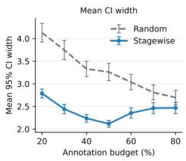

Figure 3: Simulated data results. Left two subplots showcase RMSE reduction for plugin estimator and DRL. Right two subplots show, for DRL, coverage and confidence interval width diagnostics stagewise vs. random sampling.  
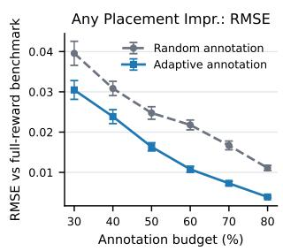

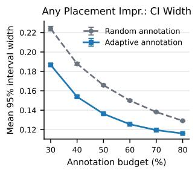

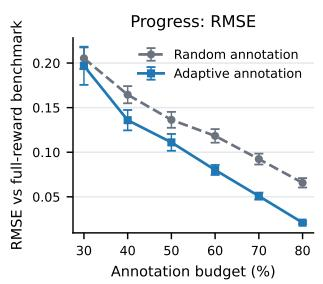

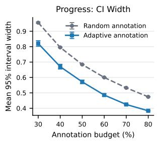  
Figure 4: Real-world data results, casenote data. Left two subplots showcase RMSE and interval width for the “Any Placement” outcome, with the binary-link variance estimate $\hat { s } _ { t } ^ { 2 } = \hat { \mu } _ { t } ^ { 2 } \hat { b } _ { t } ( 1 - \hat { b } _ { t } )$ $\hat { b } _ { t }$ fit on the first batch $( \kappa _ { 1 } = 0 . 3 B , p = 1$ , i.e. 30% of the budget). Right two subplots show RMSE and interval width for the $\mathrm { ^ { 6 6 } P r o g r e s s ^ { 3 } }$ outcome, whose variance proxy is the sample variance $\widehat { \mathrm { V a r } } ( \tilde { R } _ { t } )$ of per-outreach labels. Since this is ${ \mathcal { F } } _ { 0 } .$ -measurable, we omit the initial pilot and the entire budget is allocated by the stagewise optimized probabilities of Theorem 1.

The solution is therefore suboptimal for the original problem, but still results in variance reduction compared to uniform allocation.

## 6.1 Simulated data

First, we illustrate our methods in a simulation with known ground truth. For the data-generating process, we summarize here and refer to Section C for the full details. Each unit has correlated (5-dimensional) Gaussian states across stages, binary treatments assigned by truncated logistic behavior policies with overlap bounded below by 0.05, and additive rewards depending on state, treatment, and a second-stage treatment interaction. The key design feature is heteroskedasticity targeted to the harder-to-learn arm: the less common control arm has much larger conditional reward variance at both stages, creating a setting where adaptive reward annotation can prioritize observations with high variance and high overlap importance.

Results. Figure 3 illustrates the improvements from adaptive sampling. The first two subplots showcase the reduction in root-mean-squared error (RMSE) of target policy value, where solid blue is the double reinforcement learning (DRL) estimator of Kallus and Uehara (2019) and dashed red is naive plug-in estimation (g-computation) with kernel ridge regression. We consider learning from a dataset of size $n = 1 0 0 0$ , where we sample 100 Monte Carlo replications. The x-axis ranges over diferent budgets, ranging from low 20% to high 80% budget on the right-hand side. The first subplot shows results for the harder target policy $( A _ { 1 } = 0 , A _ { 2 } = 0 )$ while the second averages over the four possible unpersonalized dynamic treatment regimes. The adaptive allocation reduces DRL RMSE by 37–40% at a 20% budget, decaying to ∼12% at 80%. However, plug-in DRL has poor coverage, omitted from plots to preserve scale. The second two subplots show the coverage (at 95% nominal level) and mean confidence interval width diagnostics for DRL under stagewise vs. random sampling. Adaptive sampling improves coverage where random sampling undercovers most (0.92 vs. 0.83 at a 20% budget) at substantially smaller (therefore more informative) interval widths throughout (15–35% narrower). However, our inferential results are asymptotic, and could potentially be further improved.

## 6.2 Real-world data: casenotes from street outreach for homelessness services

Data We revisit the data of our motivating application. We work with a two-year cohort of clients from a homelessness services nonprofit and evaluate impacts on average client outcomes. Of course, there are extraordinary measurement challenges in homelessness services, so we restricted the cohort to 777 clients who were observed regularly throughout the entire two-year period. The nonprofit typically seeks to engage clients for outreach at least three times a month, and it’s recorded when they intend to outreach and do not find the client. Casenotes are written after every outreach attempt and record unstructured interactions with outreach workers, ranging from initial engagement about services, to personal conversations that reveal important eligibility information, to actively working towards completing a housing application by collecting required documentation and income support and attending various required appointments.

Our annotation task focuses on structured coding of progress towards a housing application. We conducted extensive conversations with the nonprofit to refine the coding schema and recruited several Masters of Social Work students to code the casenotes accordingly. The schema is ordinal, with labels (0) No progress made, (0.975) conversation or meeting client need, (2) discussing plans to complete intermediate tasks for housing application or other personal goals, (2.5) signing documents and paperwork towards either of these, (3) completing an appointment, (3.5) improved condition, (4) new placement. (Similar ordinal schemas appear in prior literature on impacts of street outreach (Ng and McQuistion, 2004; Levy, 2010).) We used the initial annotations to fine-tune local language models (Qwen 2.5 14B and others) in order to approximate ground-truth, which we are not able to manually obtain for the 180k casenotes. Fine-tuned models achieve 73%-75% accuracy; we take their silver labels for a controlled real-data annotation simulation in the experiments.

Experiment set-up. We embed the two-year Breaking Ground cohort as a two-stage dynamic treatment regime problem. Stage 1 corresponds to the first six months after cohort entry, with treatment discretized as the client’s outreach intensity quintile and intermediate reward defined from observed progress during that period. First-period progress summaries (constructed moments of the progress trajectory within that period) enter the stage-2 history. For simplicity, we consider reward annotation only. Stage 2 corresponds to months 6-12, with treatment again defined by outreach-intensity quintile during this period. We consider two diferent estimands.

• The progress task treats the reward as cumulative progress, combining first-period and second-period progress rewards $R = ( R _ { 1 } , R _ { 2 } )$ , with the max progress over each action period.

• The placement improvement task focuses only on a terminal housing outcome: “any placement improvement” is a binary indicator for whether the client’s observed placement status improved at any point relative to baseline during the second-year outcome window.

Thus, the progress analysis asks whether adaptive annotation improves estimation of progress-based rewards, while the placement- improvement analysis asks whether adaptive annotation improves estimation and inference for a more directly policy-relevant terminal housing outcome, $R = ( 0 , Y _ { 2 } )$ (where $Y \in \{ 0 , 1 \}$ is housing placement improvement). The progress is a dense, early-observed signal that is predictive of the sparse terminal placement improvement outcome. While 22.5% of the clients see a placement improvement by the end of the 2-year period, more achieve intermediate progress, i.e. 66.3% of clients achieve progress ≥ 2 (start making plans, appointments) in year 2.

The target policy increases outreach intensity by increasing each client’s outreach intensity by one quintile. Based on full-data DRL estimates, for the progress reward task, shifting outreach up one quintile has DRL-estimated value 4.75 of total max-progress $( R _ { 1 } + R _ { 2 } )$ , 95%CI : (4.56, 4.94), an absolute increase of 0.37 progress units upon existing outreach. For any placement improvement, the corresponding DRL estimate is 0.260 (95%CI : (0.202, 0.317)), an absolute increase of 3.5 percentage points. Baselines for these increases are the observed means on the analysis population, i.e., the value of the existing outreach policy evaluated on its own data (4.38 progress units; 22.4% placement improvement).

Figure 4 illustrates the results. Of course, the ground-truth is unknown, but we give a sense of uncertainty quantification by repeatedly subsampling 600 clients from the cohort for 100 Monte Carlo replications — however resulting standard errors are of course optimistically small.

The diferent rewards use diferent variance measures $\hat { s } _ { t } ^ { 2 }$ . Placement Improvement is a binary outcome, so its conditional variance is exactly $b _ { t } ( 1 - b _ { t } )$ for $b _ { t } = \mathbb { E } [ R _ { t } \ | \ \mathcal { F } _ { t - 1 } ]$ . We combine the fitted $b _ { t }$ with this structural knowledge of the estimator and obtain $\hat { s } _ { t } ^ { 2 } = \hat { \mu } _ { t } ^ { 2 } \hat { b } _ { t } ( 1 - \hat { b } _ { t } )$ . The first two subplots show that adaptive annotation reduces DRL RMSE by about 23% at budgets of 30–40% and by 34–65% at budgets of 50% and above, and interval width by 16–18% at budgets up to 60%. For the Progress task, the rewards are themselves LLM-coded, and we can use the within-window sample variance of the silver (LLM) labels: $\hat { s } _ { t } ^ { 2 } = \hat { \mu } _ { t } ^ { 2 } \widehat { \mathrm { V a r } } ( \tilde { R } _ { t } )$ , available for every casenote before annotation, so $\kappa _ { 1 } = 0$ , the entire budget is allocated by the optimized probabilities, and the value functions are then fit on the annotated rows with inverse-inclusion weights. The design is the stagewise allocation of Theorem 1, so annotation of a client may stop after the first stage. This zero-gold-cost design reduces DRL RMSE by 17–32% at budgets of 40–60% and by 45–68% at 70–80%, and interval width by 14–20% across budgets. Crucially, structure-specific prediction error estimation for $\sigma ^ { 2 }$ is important for improvements from adaptive allocations upon random.

Since the ground truth is unknown here, Section C.3 repeats the two protocols on a simulator that we fit to the same cohort data. Fitting the simulator allows us to evaluate coverage relative to a ground-truth, although the resulting model-based efect estimates are less credible. We see that annotated-DRL intervals cover the true policy value at 0.89–0.96 across budgets, and adaptive annotation reduces RMSE to the truth, relative to random allocation, by 12–38% (placement) and 33–51% (progress).

## 6.3 Real-world data: sequential preferences in LMArena

We also study annotation of human preferences using a large dataset from Arena, where users input a prompt, then compare two LLM model responses and vote for either response, a tie, or “both bad.”1 A user’s prompt is routed to diferent potential LLM models. Arena must balance exploring many models to obtain evaluation data against the user experience, which may sufer if users read many completions from weaker models. We build a T = 2 OPE task by keeping the first two prompts of each session. Action $A _ { t }$ is the displayed model pair’s category: two closed models, two open-weight models, or mixed. Singh et al. (2026) alleged that open-source models received diferential coverage, while LMArena discussed user experience preservation as part of the reason for stratified sampling of models, rather than uniform sampling. We let stagewise rewards be the outcome $U _ { t } \in \{ \mathrm { A } , \mathrm { B }$ , tie, both bad} denote the vote at stage $t ;$ we define the reward $R _ { t } = \mathbf { 1 } \{ U _ { t } \neq$ both bad}, which is the user’s indication that at least one response is acceptable. Reward models such as Skywork-Reward-V2-Llama-3.1-8B are used as features for predicting human responses, as well as tf-idf embeddings of prompts and both responses.

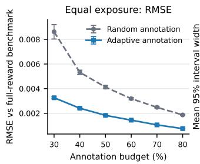

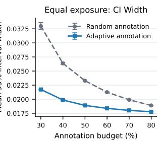

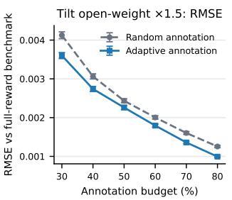

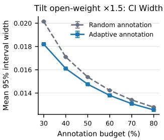  
Figure 5: LMArena results, with all labels used by the adaptive design charged to the annotation budget; 1,000 Monte Carlo replications of 21,685 sessions, error against each replication’s fullannotation estimate. Left two subplots show RMSE and interval width for the equal exposure policy $( \pi _ { e }$ uniform over the three model-pair categories). Right two subplots show the same for the tilt policy $( \pi _ { b }$ with open-weight pair mass ×1.5).

We analyze joint reward and state annotation. We evaluate two policies: equal exposure, assigning probability 1/3 to each pair category, and a smaller tilt toward open-weight pairs centered at the behavior policy. We use the Bernoulli outcome binary-link variance form. Section C.4 gives further sampling, fitting and evaluation details.

Figure 5 shows the results over 1,000 replications of 21,685 sessions. For scale, the full-annotation estimates are $\Phi ^ { \pi _ { b } } = 0 . 9 6 7$ , Φequal = 0.958 and $\Phi ^ { \mathrm { t i l t } } = 0 . 9 6 6$ , so equal exposure costs about 0.01 (significant). Under equal exposure, adaptive annotation reduces RMSE against the full-annotation benchmark by 55–62% at every budget and interval width by 34% at a 30% budget. Random allocation’s RMSE (0.0086) at a 30% budget is still of the same order of magnitude of the equalexposure efect, while the adaptive design’s (0.0033) can enable inferential conclusions sooner.

## References

Anastasios N Angelopoulos, Stephen Bates, Clara Fannjiang, Michael I Jordan, and Tijana Zrnic. Prediction-powered inference. Science, 382(6671):669–674, 2023.

Thomas Cook, Alan Mishler, and Aaditya Ramdas. Semiparametric eficient inference in adaptive experiments. In Causal Learning and Reasoning, pages 1033–1064. PMLR, 2024.

Naoki Egami, Christian J Fong, Justin Grimmer, Margaret E Roberts, and Brandon M Stewart. How to make causal inferences using texts. Science Advances, 8(42):eabg2652, 2022.

Zijun Gao, Yanjun Han, Zhimei Ren, and Zhengqing Zhou. Batched multi-armed bandits problem. Advances in Neural Information Processing Systems, 32, 2019.

Jinyong Hahn, Keisuke Hirano, and Dean Karlan. Adaptive experimental design using the propensity score. Journal of Business & Economic Statistics, 29(1):96–108, 2011.

Josiah P Hanna, Yash Chandak, Philip S Thomas, Martha White, Peter Stone, and Scott Niekum. Data-eficient policy evaluation through behavior policy search. Journal of Machine Learning Research, 25(313):1–58, 2024.

Andrew Jesson, Panagiotis Tigas, Joost van Amersfoort, Andreas Kirsch, Uri Shalit, and Yarin Gal. Causal-bald: Deep bayesian active learning of outcomes to infer treatment-efects from observational data. Advances in Neural Information Processing Systems, 34:30465–30478, 2021.

Wenlong Ji, Lihua Lei, and Tijana Zrnic. Predictions as surrogates: Revisiting surrogate outcomes in the age of ai. Biometrika, page asag053, 2026.

Nan Jiang and Lihong Li. Doubly robust of-policy value evaluation for reinforcement learning. Proceedings of the 33rd International Conference on Machine Learning, 2016.

Ying Jin, Zhuoran Yang, and Zhaoran Wang. Is pessimism provably eficient for ofline rl? In International Conference on Machine Learning, pages 5084–5096. PMLR, 2021.

Nathan Kallus and Masatoshi Uehara. Double reinforcement learning for eficient of-policy evaluation in markov decision processes. arXiv preprint arXiv:1908.08526, 2019.

Dan M Kluger and Stephen Bates. M-estimation under two-phase multiwave sampling with applications to prediction-powered inference. arXiv preprint arXiv:2602.16933, 2026.

Alex Lamb, Riashat Islam, Yonathan Efroni, Aniket Rajiv Didolkar, Dipendra Misra, Dylan J Foster, Lekan P Molu, Rajan Chari, Akshay Krishnamurthy, and John Langford. Guaranteed discovery of control-endogenous latent states with multi-step inverse models. Transactions on Machine Learning Research, 2022.

Jay S Levy. Homeless narratives & pretreatment pathways: From words to housing. Loving Healing Press, 2010.

Harrison H Li and Art B Owen. Double machine learning and design in batch adaptive experiments. Journal of Causal Inference, 12(1):20230068, 2024.

Ting Li, Chengchun Shi, Jianing Wang, Fan Zhou, et al. Optimal treatment allocation for eficient policy evaluation in sequential decision making. Advances in Neural Information Processing Systems, 36:48890–48905, 2023.

Qiang Liu, Lihong Li, Ziyang Tang, and Dengyong Zhou. Breaking the curse of horizon: Infinitehorizon of-policy estimation. In Advances in Neural Information Processing Systems, pages 5356–5366, 2018.

Shuze Liu and Shangtong Zhang. Eficient policy evaluation with ofline data informed behavior policy design. arXiv preprint arXiv:2301.13734, 2023.

Shuze Liu, Claire Chen, and Shangtong Zhang. Doubly optimal policy evaluation for reinforcement learning. In International Conference on Learning Representations, volume 2025, pages 10793– 10820, 2025.

Aishwarya Mandyam, Jason Meng, Ge Gao, Jiankai Sun, Mac Schwager, Barbara E Engelhardt, and Emma Brunskill. Perry: Policy evaluation with confidence intervals using auxiliary data. arXiv preprint arXiv:2507.20068, 2025.

Subhojyoti Mukherjee, Josiah P Hanna, and Robert Nowak. Saver: Optimal data collection strategy for safe policy evaluation in tabular mdp. arXiv preprint arXiv:2406.02165, 2024a.

Subhojyoti Mukherjee, Qiaomin Xie, Josiah P Hanna, and Robert Nowak. Speed: Experimental design for policy evaluation in linear heteroscedastic bandits. In International Conference on Artificial Intelligence and Statistics, pages 2962–2970. PMLR, 2024b.

Anthony T Ng and Hunter L McQuistion. Outreach to the homeless: Craft, science, and future implications. Journal of Psychiatric Practice, 10(2):95–105, 2004.

Ezinne Nwankwo, Lauri Goldkind, and Angela Zhou. Batch-adaptive causal annotations. In The 29th International Conference on Artificial Intelligence and Statistics, 2026.

Chao Qin and Daniel Russo. Optimizing adaptive experiments: A unified approach to regret minimization and best-arm identification. arXiv preprint arXiv:2402.10592, 2024.

Susanne M Schennach. Recent advances in the measurement error literature. Annual Review of Economics, 8(1):341–377, 2016.

Burr Settles. Active learning literature survey, 2009. URL https://api.semanticscholar.org/ CorpusID:324600.

Lei Shi, Waverly Wei, and Jingshen Wang. Using surrogates in covariate-adjusted response-adaptive randomization experiments with delayed outcomes. In The Thirty-eighth Annual Conference on Neural Information Processing Systems, 2024.

David Simchi-Levi and Chonghuan Wang. Multi-armed bandit experimental design: Online decisionmaking and adaptive inference. In International Conference on Artificial Intelligence and Statistics, pages 3086–3097. PMLR, 2023.

Shivalika Singh, Yiyang Nan, Alex Wang, Daniel Dsouza, Sayash Kapoor, Ahmet Üstün, Sanmi Koyejo, Yuntian Deng, Shayne Longpre, Noah Smith, et al. The leaderboard illusion. Advances in neural information processing systems, 38, 2026.

Aaron Sonabend-W, Nilanjana Laha, Ashwin N Ananthakrishnan, Tianxi Cai, and Rajarshi Mukherjee. Semi-supervised of-policy reinforcement learning and value estimation for dynamic treatment regimes. Journal of Machine Learning Research, 24(323):1–86, 2023.

Yilin Song, Dan M Kluger, Harsh Parikh, and Tian Gu. Demystifying prediction powered inference. arXiv preprint arXiv:2601.20819, 2026.

Iiris Sundin, Peter Schulam, Eero Siivola, Aki Vehtari, Suchi Saria, and Samuel Kaski. Active learning for decision-making from imbalanced observational data. In International conference on machine learning, pages 6046–6055. PMLR, 2019.

Philip Thomas, Georgios Theocharous, and Mohammad Ghavamzadeh. High confidence policy improvement. In International Conference on Machine Learning, pages 2380–2388, 2015.

Siruo Wang, Tyler H McCormick, and Jefrey T Leek. Methods for correcting inference based on outcomes predicted by machine learning. Proceedings of the National Academy of Sciences, 117 (48):30266–30275, 2020.

Yu Xia, Subhojyoti Mukherjee, Zhouhang Xie, Junda Wu, Xintong Li, Ryan Aponte, Hanjia Lyu, Joe Barrow, Hongjie Chen, Franck Dernoncourt, et al. From selection to generation: A survey of llm-based active learning. In Proceedings of the 63rd Annual Meeting of the Association for Computational Linguistics (Volume 1: Long Papers), pages 14552–14569, 2025.

Tengyang Xie, Ching-An Cheng, Nan Jiang, Paul Mineiro, and Alekh Agarwal. Bellman-consistent pessimism for ofline reinforcement learning. Advances in neural information processing systems, 34:6683–6694, 2021.

Jinglong Zhao. Adaptive neyman allocation. arXiv preprint arXiv:2309.08808, 2023.

Jinglong Zhao. Experimental design for causal inference through an optimization lens. In Tutorials in Operations Research: Smarter Decisions for a Better World, pages 146–188. INFORMS, 2024.

Tijana Zrnic and Emmanuel J Candès. Active statistical inference. arXiv preprint arXiv:2403.03208, 2024.

• Section A: Proofs of method

• Section B: Proofs of Estimation Results

• Section C: Details on experiments

## A Proofs of method

## A.1 Proof of Proposition 1

Proof. Let

$$
D _ { t } ^ { \pi _ { e } } = m _ { t } ^ { \pi _ { e } } ( \mathcal { F } _ { t } ) - m _ { t - 1 } ^ { \pi _ { e } } ( \mathcal { F } _ { t - 1 } ) .
$$

Since $m _ { t } ^ { \pi _ { e } } = \mathbb { E } [ \Gamma ^ { \pi _ { e } } \mid \mathcal { F } _ { t } ]$ , the sequence $( m _ { t } ^ { \pi _ { e } } ) _ { t = 0 } ^ { T }$ is a martingale with respect to $( \mathcal { F } _ { t } ) _ { t = 0 } ^ { T }$ . Hence

$$
\mathbb { E } [ D _ { t } ^ { \pi _ { e } } \mid \mathcal { F } _ { t - 1 } ] = 0 .
$$

We show that every weighted annotation increment has mean zero. For any $t = 1 , \dots , T$ , by iterated expectation,

$$
\mathbb { E } \left[ \frac { C _ { 1 : t } } { \Lambda _ { 1 : t } } D _ { t } ^ { \pi _ { e } } \right] = \mathbb { E } \left[ \frac { C _ { 1 : t - 1 } } { \Lambda _ { 1 : t - 1 } } \mathbb { E } \left[ \frac { C _ { t } } { \lambda _ { t } ( \mathcal { F } _ { t - 1 } ) } D _ { t } ^ { \pi _ { e } } \bigg | C _ { 1 : t - 1 } , \mathcal { F } _ { t - 1 } \right] \right] .
$$

By the design of the annotation protocol, conditional on $C _ { 1 : t - 1 } = 1$ and $\mathcal { F } _ { t - 1 }$ , the stage-t annotation indicator is drawn before the new stage-t information is revealed, with probability $\lambda _ { t } ( \mathcal { F } _ { t - 1 } )$ . Therefore,

$$
\mathbb { E } \left[ C _ { t } D _ { t } ^ { \pi _ { e } } \mid C _ { 1 : t - 1 } = 1 , { \mathcal F } _ { t - 1 } \right] = \lambda _ { t } ( { \mathcal F } _ { t - 1 } ) \mathbb { E } [ D _ { t } ^ { \pi _ { e } } \mid { \mathcal F } _ { t - 1 } ] .
$$

Thus

$$
\mathbb { E } \left[ \frac { C _ { 1 : t } } { \Lambda _ { 1 : t } } D _ { t } ^ { \pi _ { e } } \right] = \mathbb { E } \left[ \frac { C _ { 1 : t - 1 } } { \Lambda _ { 1 : t - 1 } } \mathbb { E } [ D _ { t } ^ { \pi _ { e } } \mid \mathcal { F } _ { t - 1 } ] \right] = 0 .
$$

Substituting this,

$$
\mathbb { E } [ \tilde { \Gamma } ^ { \pi _ { e } } ] = \mathbb { E } [ m _ { 0 } ^ { \pi _ { e } } ( \mathcal { F } _ { 0 } ) ] + \sum _ { t = 1 } ^ { T } \mathbb { E } \left[ \frac { C _ { 1 : t } } { \Lambda _ { 1 : t } } D _ { t } ^ { \pi _ { e } } \right] = \mathbb { E } [ m _ { 0 } ^ { \pi _ { e } } ( \mathcal { F } _ { 0 } ) ] .
$$

Finally, by the tower property,

$$
\mathbb { E } [ m _ { 0 } ^ { \pi _ { e } } ( \mathcal { F } _ { 0 } ) ] = \mathbb { E } [ \mathbb { E } [ \Gamma ^ { \pi _ { e } } \mid \mathcal { F } _ { 0 } ] ] = \mathbb { E } [ \Gamma ^ { \pi _ { e } } ] = \Phi ^ { \pi _ { e } } .
$$

## A.2 Proof of Proposition 2

Proof. Since $m _ { t } ^ { \pi _ { e } } = \operatorname { E } [ \Gamma _ { T } ^ { \pi _ { e } } \mid { \mathcal F } _ { t } ]$ , the sequence $m _ { t } ^ { \pi _ { e } }$ is a martingale with respect to the filtration $( \mathcal { F } _ { t } ) _ { t = 0 } ^ { T }$ . Define the diference $D _ { t }$ , which satisfies that

$$
D _ { t } ^ { \pi _ { e } } = m _ { t } ^ { \pi _ { e } } - m _ { t - 1 } ^ { \pi _ { e } } , ~ \operatorname { E } [ D _ { t } ^ { \pi _ { e } } \mid { \mathcal F } _ { t - 1 } ] = 0 .
$$

Denote

$$
W _ { t } = \frac { \prod _ { j = 1 } ^ { t } C _ { j } } { \prod _ { j = 1 } ^ { t } \lambda _ { j } ( \mathcal { F } _ { j - 1 } ) } , \qquad \Lambda _ { 1 : t } = \prod _ { j = 1 } ^ { t } \lambda _ { j } ( \mathcal { F } _ { j - 1 } ) .
$$

Cross-terms $W _ { t } D _ { t } ^ { \pi _ { e } }$ have conditional expectation zero. Indeed, for $s < t ,$

$$
\begin{array} { r l r } { \mathrm { E } [ W _ { s } D _ { s } ^ { \pi _ { e } } W _ { t } D _ { t } ^ { \pi _ { e } } ] = \mathrm { E } \left[ \frac { I _ { s } I _ { t } } { \Lambda _ { 1 : s } \Lambda _ { 1 : t } } D _ { s } ^ { \pi _ { e } } D _ { t } ^ { \pi _ { e } } \right] } \\ & { } & { = \mathbb { E } \left[ \frac { I _ { t } } { \Lambda _ { 1 : s } \Lambda _ { 1 : t } } D _ { s } ^ { \pi _ { e } } D _ { t } ^ { \pi _ { e } } \right] } \\ & { } & { = \mathbb { E } \left[ \frac { D _ { s } ^ { \pi _ { e } } } { \Lambda _ { 1 : s } \Lambda _ { 1 : t } } \right] } \\ & { } & { \quad \quad \quad \quad \quad \quad \quad \quad \quad \quad \quad \quad \mathrm { ( b y ~ i t e r ~ e x p . ~ a n d ~ s e q u e n t i a l ~ i g n o r a b i l i t y ) } } \\ & { } & { = \mathbb { E } \left[ \frac { D _ { s } ^ { \pi _ { e } } } { \Lambda _ { 1 : s } } \mathbb { E } \left[ D _ { t } ^ { \pi _ { e } } \mid \mathcal { F } _ { t - 1 } \right] \right] \quad \mathrm { ( b y ~ i t e r ~ e x p . ~ o n ~ \mathcal { F } ^ { \pi _ { t - 1 } } ~ s i n c e ~  { D ^ { \pi _ { t } } } _ { t }  { \mathrm { \texttt { i s } } } \mathcal { F } _ { t - 1 } \mathrm { . ~ m e a s u r a b l e } ) } } \end{array}
$$

The same argument gives orthogonality for cross-terms of $m _ { 0 } ^ { \pi _ { e } } , D _ { t } ^ { \pi _ { e } }$ . Therefore only diagonal terms remain:

$$
\mathrm { V a r } ( \widehat { \Gamma } _ { T } ^ { \pi _ { e } } ) = \mathrm { V a r } ( m _ { 0 } ^ { \pi _ { e } } ) + \sum _ { t = 1 } ^ { T } \mathrm { E } [ ( W _ { t } D _ { t } ^ { \pi _ { e } } ) ^ { 2 } ] .
$$

For each t,

$$
\operatorname { E } [ ( W _ { t } D _ { t } ^ { \pi _ { e } } ) ^ { 2 } ] = \operatorname { E } \left[ { \frac { I _ { t } } { \Lambda _ { 1 : t } ^ { 2 } } } ( D _ { t } ^ { \pi _ { e } } ) ^ { 2 } \right] = \operatorname { E } \left[ { \frac { 1 } { \Lambda _ { 1 : t } } } ( D _ { t } ^ { \pi _ { e } } ) ^ { 2 } \right] ,
$$

using $\mathrm { E } [ I _ { t } \mid { \mathcal F _ { T } } ] = \Lambda _ { 1 : t }$ . Finally,

$$
\operatorname { E } [ ( D _ { t } ^ { \pi _ { e } } ) ^ { 2 } \mid { \mathcal { F } } _ { t - 1 } ] = \operatorname { V a r } ( m _ { t } ^ { \pi _ { e } } \mid { \mathcal { F } } _ { t - 1 } ) ,
$$

because $m _ { t - 1 } ^ { \pi _ { e } } = \operatorname { E } [ m _ { t } ^ { \pi _ { e } } \mid { \mathcal { F } } _ { t - 1 } ]$ . Substituting this into the previous display proves the result. □

## A.3 Proof of Theorem 1

Proof. The optimization problem is strictly convex, since $1 / x$ is strictly convex on the domain where $x > 0$ and afine transformations preserve convexity. Therefore, the KKT conditions characterize the optimal solution.

First consider the case of an interior solution, where the constraint $0 \leq \Lambda _ { 1 : 2 } ( \mathcal { F } _ { 1 } ) \leq \lambda _ { 1 } ^ { * } ( \mathcal { F } _ { 0 } ) \leq 1$ is not binding, i.e.,

$$
0 < \frac { \sqrt { \sigma _ { 2 } ^ { 2 } ( \mathcal { F } _ { 1 } ) } } { \sqrt { \beta } } < \frac { \sqrt { \sigma _ { 1 } ^ { 2 } ( \mathcal { F } _ { 0 } ) } } { \sqrt { \beta } } < 1 .
$$

Note that (by construction of $\beta )$ , the given solutions satisfy the KKT conditions. The Lagrangian of Equation $\left( \mathrm { O P T } \left( T = 2 \right) \right)$ is:

$$
\mathcal { L } ( \lambda _ { 1 } , \Lambda _ { 1 : 2 } ) = \mathbb { E } \left[ \frac { \sigma _ { 1 } ^ { 2 } ( \mathcal { F } _ { 0 } ) } { \lambda _ { 1 } ( \mathcal { F } _ { 0 } ) } \right] + \mathbb { E } \left[ \frac { \sigma _ { 2 } ^ { 2 } ( \mathcal { F } _ { 1 } ) } { \Lambda _ { 1 : 2 } ( \mathcal { F } _ { 1 } ) } \right] + \beta ( \mathbb { E } [ \lambda _ { 1 } ( \mathcal { F } _ { 0 } ) + \Lambda _ { 1 : 2 } ( \mathcal { F } _ { 1 } ) ] - B )
$$

Taking derivatives with respect to $\lambda _ { 1 }$ and $\Lambda _ { 1 : 2 }$ , we obtain the first-order conditions:

$$
{ \frac { \partial { \mathcal { L } } } { \partial \lambda _ { 1 } } } = - { \frac { \sigma _ { 1 } ^ { 2 } ( { \mathcal { F } } _ { 0 } ) } { \lambda _ { 1 } ^ { 2 } ( { \mathcal { F } } _ { 0 } ) } } + \beta = 0 \implies \lambda _ { 1 } ^ { * } ( { \mathcal { F } } _ { 0 } ) = { \frac { { \sqrt { \sigma _ { 1 } ^ { 2 } ( { \mathcal { F } } _ { 0 } ) } } } { \sqrt { \beta } } }
$$

$$
\frac { \partial \mathcal { L } } { \partial \Lambda _ { 1 : 2 } } = - \frac { \sigma _ { 2 } ^ { 2 } ( \mathcal { F } _ { 1 } ) } { \Lambda _ { 1 : 2 } ^ { 2 } ( \mathcal { F } _ { 1 } ) } + \beta = 0 \implies \Lambda _ { 1 : 2 } ^ { * } ( \mathcal { F } _ { 1 } ) = \frac { \sqrt { \sigma _ { 2 } ^ { 2 } ( \mathcal { F } _ { 1 } ) } } { \sqrt { \beta } }
$$

The optimal solutions satisfy the budget equality constraint, plugging in the first-order solutions to the budget constraint, we obtain

$$
\frac { 1 } { \sqrt { \beta } } \left( { \mathbb E } \left[ \sqrt { \sigma _ { 1 } ^ { 2 } ( \mathscr { F } _ { 0 } ) } + \sqrt { \sigma _ { 2 } ^ { 2 } ( \mathscr { F } _ { 1 } ) } \right] \right) = B .
$$

Next consider the boundary case where $\Lambda _ { 1 : 2 } ( \mathcal { F } _ { 1 } ) \leq \lambda _ { 1 } ( \mathcal { F } _ { 0 } )$ binds. With multiplier $\eta ( \mathcal { F } _ { 1 } ) \ge 0$ for $\Lambda _ { 1 : 2 } ( \mathcal { F } _ { 1 } ) - \lambda _ { 1 } ( \mathcal { F } _ { 0 } ) \leq 0$ , the KKT conditions are

$$
- \frac { \sigma _ { 2 } ^ { 2 } ( \mathcal { F } _ { 1 } ) } { \Lambda _ { 1 : 2 } ( \mathcal { F } _ { 1 } ) ^ { 2 } } + \beta + \eta ( \mathcal { F } _ { 1 } ) = 0 , \qquad - \frac { \sigma _ { 1 } ^ { 2 } ( \mathcal { F } _ { 0 } ) } { \lambda _ { 1 } ( \mathcal { F } _ { 0 } ) ^ { 2 } } + \beta - \mathbb { E } [ \eta ( \mathcal { F } _ { 1 } ) \mid \mathcal { F } _ { 0 } ] = 0 .
$$

Complementarity gives $\begin{array} { r l } & { \Lambda _ { 1 : 2 } ^ { * } ( \mathcal { F } _ { 1 } ) = \operatorname* { m i n } \left\{ \lambda _ { 1 } ^ { * } ( \mathcal { F } _ { 0 } ) , \sqrt { \frac { \sigma _ { 2 } ^ { 2 } ( \mathcal { F } _ { 1 } ) } { \beta } } \right\} , \eta ( \mathcal { F } _ { 1 } ) = \left( \frac { \sigma _ { 2 } ^ { 2 } ( \mathcal { F } _ { 1 } ) } { \lambda _ { 1 } ^ { * } ( \mathcal { F } _ { 0 } ) ^ { 2 } } - \beta \right) _ { - } } \end{array}$ . Substituting + into the KKT condition for $\lambda _ { 1 }$ , and writing $Z ( \mathcal { F } _ { 0 } ) = \beta \lambda _ { 1 } ^ { * } ( \mathcal { F } _ { 0 } ) ^ { 2 }$ , yields

$$
Z ( \mathcal { F } _ { 0 } ) = \sigma _ { 1 } ^ { 2 } ( \mathcal { F } _ { 0 } ) + \mathbb { E } [ \{ \sigma _ { 2 } ^ { 2 } ( \mathcal { F } _ { 1 } ) - Z ( \mathcal { F } _ { 0 } ) \} _ { + } \mid \mathcal { F } _ { 0 } ] .
$$

This equation has a unique solution since $z - \mathbb { E } [ \{ \sigma _ { 2 } ^ { 2 } ( \mathcal { F } _ { 1 } ) - z \} _ { + } \mid \mathcal { F } _ { 0 } ]$ is strictly increasing. Therefore

$$
\lambda _ { 1 } ^ { * } ( \mathcal { F } _ { 0 } ) = \sqrt { \frac { Z ( \mathcal { F } _ { 0 } ) } { \beta } } , \qquad \Lambda _ { 1 : 2 } ^ { * } ( \mathcal { F } _ { 1 } ) = \operatorname* { m i n } \left\{ \lambda _ { 1 } ^ { * } ( \mathcal { F } _ { 0 } ) , \sqrt { \frac { \sigma _ { 2 } ^ { 2 } ( \mathcal { F } _ { 1 } ) } { \beta } } \right\} .
$$

The budget constraint binds because the objective is decreasing in both variables, and convexity makes the KKT conditions suficient.

Proof. Proof of Proposition 4 Proof of the proposition. For part (i), set $C _ { \mathrm { 1 : 0 } } = 1$ . Summation by parts gives

$$
\widetilde { \Gamma } ( O ; \mathbf { A } , \pmb { \eta } _ { m } ^ { \dagger } ) - \Gamma _ { T } ^ { \pi _ { e } } = \sum _ { t = 1 } ^ { T } \left( \frac { C _ { 1 : t } } { \Lambda _ { 1 : t } } - \frac { C _ { 1 : t - 1 } } { \Lambda _ { 1 : t - 1 } } \right) ( \Gamma _ { T } ^ { \pi _ { e } } - m _ { t - 1 } ^ { \dagger } ) .
$$

Conditional on the complete trajectory, the weight increments are orthogonal, centered, and have variances $1 / \Lambda _ { 1 : t } - 1 / \Lambda _ { 1 : t - 1 }$ . Total variance and conditional squared-error decomposition around $m _ { t - 1 }$ give part (i), using Proposition 2 for the exact projections.

For part (ii), nonnegative variance cost and optimality give

$$
\begin{array} { r l } & { \mathrm { V a r } ( \widetilde \Gamma ( O ; \Lambda ^ { * } , \eta _ { m } ^ { \dagger } ) ) \leq \mathrm { V a r } ( \widetilde \Gamma ( O ; \Lambda ^ { * } , \eta _ { m } ) ) + \varepsilon = \underset { \Lambda } { \operatorname* { i n f } } \mathrm { V a r } ( \widetilde \Gamma ( O ; \Lambda , \eta _ { m } ) ) + \varepsilon } \\ & { \qquad \leq \underset { \Lambda } { \operatorname* { i n f } } \mathrm { V a r } ( \widetilde \Gamma ( O ; \Lambda , \eta _ { m } ^ { \dagger } ) ) + \varepsilon . } \end{array}
$$

Uniform criterion error $\delta$ adds at most $2 \delta \colon$ compare the criteria once at the selected design and once at the surrogate-optimal design.

For part (iii), decreasing prefix probabilities imply $0 \leq 1 / \Lambda _ { 1 : t } - 1 / \Lambda _ { 1 : t - 1 } \leq \underline { { { \Lambda } } } ^ { - 1 } - 1 ;$ ; substitute into part (i). □

## B Proofs of Estimation Results

## B.1 Proofs of Theorem 2

Recall that the non-adaptive estimator can be written as

$$
\hat { \psi } _ { \mathrm { n a d } } = \sum _ { k = 1 } ^ { K } \frac { n _ { k } } { n } \cdot \frac { 1 } { n _ { k } } \sum _ { i \in \mathcal { D } ^ { ( k ) } } \tilde { \Gamma } \left( O _ { i } ; \hat { \Lambda } ^ { ( - k ) } , \hat { \eta } _ { m } ^ { ( - k ) } \right) ,
$$

where $n _ { k } = | \mathcal { D } ^ { ( k ) } |$ , thus $\textstyle \sum _ { k = 1 } ^ { K } n _ { k } = n$ . Therefore,

$$
\sqrt { n } ( \hat { \psi } _ { \mathrm { n a d } } - \Phi ^ { \pi _ { e } } ) = \sum _ { k = 1 } ^ { K } \sqrt { \frac { n _ { k } } { n } } \cdot \sqrt { n _ { k } } \left( \mathbb { E } _ { n _ { k } } \left[ \tilde { \Gamma } ( O ; \hat { \mathbf { A } } ^ { ( - k ) } , \hat { \pmb { \eta } } _ { m } ^ { ( - k ) } ) \right] - \Phi ^ { \pi _ { e } } \right) ,
$$

where we use $\mathbb { E } _ { n _ { k } }$ to refer empirical mean over the data in $\mathcal { D } ^ { ( k ) }$ , for $k = 1 , \cdots , K$ . Then it sufices to probe the asymptotic behavior of the kth fold term, as the same logic applies to the other terms. Note that the kth term allows the following decomposition

$$
\sqrt { n _ { k } } \left( \mathbb { E } _ { n _ { k } } [ \tilde { \Gamma } ( O ; \hat { \mathbf { A } } ^ { ( - k ) } , \hat { \pmb { \eta } } _ { m } ^ { ( - k ) } ) ] - \Phi ^ { \pi _ { e } } \right) =\tag{12}
$$

$$
+ \underbrace { \sqrt { n _ { k } } \big ( \mathbb { E } _ { n _ { k } } - \mathbb { E } \big ) \left[ \tilde { \Gamma } ( O ; \Lambda , \eta _ { m } ) \big | \mathcal { D } ^ { ( - k ) } \right] } _ { \mathrm { ~ } }\tag{13}
$$

$$
_ \mathrm { o r a c l e \ t e r m }
$$

$$
+ \sqrt { n _ { k } } \Big ( \mathbb { E } [ \tilde { \Gamma } ( O ; \hat { \Lambda } ^ { ( - k ) } , \hat { \eta } _ { m } ^ { ( - k ) } ) \big | \mathcal { D } ^ { ( - k ) } ] - \Phi ^ { \pi _ { e } } \Big ) ,\tag{14}
$$

We established the asymptotic behavior of the empirical process, oracle, and drift terms in propositions 6 to $^ { 8 , }$ respectively. Proposition 6 shows that the empirical process term is $o _ { p } ( 1 )$ via Chebyshev’s inequality, by conditioning on $\mathcal { D } ^ { ( - k ) }$ and showing that the conditional mean of the term is zero while its conditional variance goes to zero in probability. Proposition 7 shows that the oracle term converges in distribution to ${ \mathcal { N } } ( 0 , \sigma ^ { 2 } )$ by the central limit theorem. Proposition 8 shows that the drift term is $o _ { p } ( 1 )$ under the assumed product error rates. Combining these three results yields

$$
\sqrt { n _ { k } } \left( \mathbb { E } _ { n _ { k } } [ \tilde { \Gamma } ( O ; \hat { \Lambda } ^ { ( - k ) } , \hat { \eta } _ { m } ^ { ( - k ) } ) ] - \Phi ^ { \pi _ { e } } \right) \Longrightarrow { \cal N } ( 0 , \sigma ^ { 2 } )
$$

by Slutsky’s theorem. Since each fold is independent, combining all terms together yields

$$
\sqrt { n } ( \hat { \psi } _ { \mathrm { n a d - } } \Phi ^ { \pi _ { e } } ) = \sum _ { k = 1 } ^ { K } \sqrt { \frac { n _ { k } } { n } } \cdot \sqrt { n _ { k } } \left( \mathbb { E } _ { n _ { k } } \left[ \tilde { \Gamma } ( O ; \hat { \mathbf { A } } ^ { ( - k ) } , \hat { \eta } _ { m } ^ { ( - k ) } ) \right] - \Phi ^ { \pi _ { e } } \right) \Longrightarrow \mathcal { N } \left( 0 , \sum _ { k = 1 } ^ { K } \frac { n _ { k } } { n } \sigma ^ { 2 } \right) = \mathcal { N } ( 0 , \sigma ^ { 2 } ) .
$$

Before delving into the proofs of these three propositions, we introduce useful decompositions and reduction that appear frequently throughout the proofs.

Lemma 1 (Useful decompositions of $\tilde { \Gamma } ( O ; \hat { \mathbf { A } } , \hat { \pmb { \eta } } _ { m } ) - \tilde { \Gamma } ( O ; \pmb { \Lambda } , \pmb { \eta } _ { m } ) )$ . Let $\Delta ( \cdot ) = \hat { ( \cdot ) } - ( \cdot )$ be the nuisance estimation error. Then, the diference between the feasible estimator and the feasible oracle estimator decomposes as

$$
\begin{array} { l } { \displaystyle \tilde { \Gamma } ( O ; \hat { \mathbf { A } } , \hat { \boldsymbol { \eta } } _ { m } ) - \tilde { \Gamma } ( O ; \mathbf { A } , \boldsymbol { \eta } _ { m } ) = \Delta m _ { 0 } - \sum _ { t = 1 } ^ { T } \frac { C _ { 1 : t } } { \hat { \Lambda } _ { 1 : t } \Lambda _ { 1 : t } } \Delta \Lambda _ { 1 : t } \Delta \bigl ( m _ { t } - m _ { t - 1 } \bigr ) - \sum _ { t = 1 } ^ { T } \frac { C _ { 1 : t } } { \hat { \Lambda } _ { 1 : t } \Lambda _ { 1 : t } } \Delta \Lambda _ { 1 : t } \bigl ( m _ { t } - m _ { t - 1 } \bigr ) } \\ { \displaystyle \qquad + \sum _ { t = 1 } ^ { T } \frac { C _ { 1 : t } } { \Lambda _ { 1 : t } } \Delta \bigl ( m _ { t } - m _ { t - 1 } \bigr ) . } \end{array}
$$

The three summands $\Delta m _ { 0 }$ $( m _ { t } - m _ { t - 1 } )$ , and $\Delta ( m _ { t } - m _ { t - 1 } )$ decompose further as follows.

(i) Full imputation estimation error $\Delta m _ { 0 }$

$$
\begin{array} { l } { \displaystyle \Delta m _ { 0 } = \Delta V _ { 1 } + \sum _ { t = 1 } ^ { T } \gamma ^ { t - 1 } \Delta \mu _ { t } \big ( \Delta b _ { t } + \gamma \Delta \tilde { V } _ { t + 1 } - \Delta \tilde { Q } _ { t } \big ) + \sum _ { t = 1 } ^ { T } \Delta \mu _ { t } \big ( b _ { t } + \gamma \tilde { V } _ { t + 1 } - \tilde { Q } _ { t } \big ) } \\ { \displaystyle + \sum _ { t = 1 } ^ { T } \mu _ { t } \big ( \Delta b _ { t } + \gamma \Delta \tilde { V } _ { t + 1 } - \Delta \tilde { Q } _ { t } \big ) , } \end{array}
$$

(ii) Oracle projection increment $m _ { t } - m _ { t - 1 } .$

$$
( m _ { t } - m _ { t - 1 } ) = \gamma ^ { t - 1 } \mu _ { t } \{ ( R _ { t } - b _ { t } ) + \gamma ( V _ { t + 1 } - \tilde { V } _ { t + 1 } ) \} + \gamma ^ { t } { \bf 1 } \{ t < T \} \mu _ { t + 1 } \big ( \tilde { Q } _ { t + 1 } - Q _ { t + 1 } \big ) ,
$$

(iii) Increment estimation error $\Delta ( m _ { t } - m _ { t - 1 } )$

$$
\begin{array} { r l } & { \Delta ( m _ { t } - m _ { t - 1 } ) = \gamma ^ { t - 1 } \Delta \mu _ { t } \big ( - \Delta b _ { t } + \gamma \Delta V _ { t + 1 } - \gamma \Delta \tilde { V } _ { t + 1 } \big ) + \gamma ^ { t - 1 } \Delta \mu _ { t } \big \{ ( R _ { t } - b _ { t } ) + \gamma ( V _ { t + 1 } - \tilde { V } _ { t + 1 } ) \big \} } \\ & { \qquad + \gamma ^ { t - 1 } \mu _ { t } \big ( - \Delta b _ { t } + \gamma \Delta V _ { t + 1 } - \gamma \Delta \tilde { V } _ { t + 1 } \big ) + \mathbf { 1 } \{ t < T \} \gamma ^ { t } \Delta \mu _ { t + 1 } \big ( \Delta \tilde { Q } _ { t + 1 } - \Delta Q _ { t + 1 } \big ) } \\ & { \qquad + \mathbf { 1 } \{ t < T \} \gamma ^ { t } \Delta \mu _ { t + 1 } \big ( \tilde { Q } _ { t + 1 } - Q _ { t + 1 } \big ) + \mathbf { 1 } \{ t < T \} \gamma ^ { t } \mu _ { t + 1 } \big ( \Delta \tilde { Q } _ { t + 1 } - \Delta Q _ { t + 1 } \big ) . } \end{array}
$$

Lemma 2 (Useful decomposition of the mean of $\tilde { \Gamma } ( O ; \hat { \mathbf { A } } , \hat { \pmb { \eta } } _ { m } ) - \tilde { \Gamma } ( O ; \mathbf { A } , \pmb { \eta } _ { m } ) )$ ). The mean of the diference between the feasible estimator and the feasible oracle estimator decomposes as

$$
\begin{array} { r l } {  \mathbf { I } ( \mathcal { O } , \mathbf { A } , \mathbf { \Phi } , \mathbf { \Phi } ) , \mathbf { \Phi }  } & { \overset { \mathrm { T } } { \underset { \mathrm { I } ^ { ( 0 , * ) } } { = } }  \mathbf { I } ( \mathcal { O } , \mathbf { A } , \mathbf { \Phi } , \mathbf { \Phi } )  - \displaystyle \sum _ { i = 1 } ^ { \infty } \mathbb { E }  \mathbf { I } ^ { * } \cdot \mathbf { A } \mathbf { a } _ { i } \rho _ { i } \mathbf { x } _ { i + 1 } \ \Delta T _ { i + 1 } \ \Delta T _ { i + 1 } \ \ \Delta T _ { i + 1 } \ \ } \\ & { \quad \quad \quad \quad \quad \quad \quad \quad \frac { \mathrm { T } } { \underset { \mathrm { I } ^ { ( 0 , * ) } } { = } } \epsilon ^ { - 1 } \mathbb { E } [ \underset { \mathrm { I } ^ { ( 0 , * ) } } { \leq } \Delta _ { i \neq 1 } \Delta _ { i \neq 1 } \Delta _ { i } ( \Delta \mathbf { A } _ { i } - \mathbf { A } \mathbf { A } ^ { \mathrm { T } } ( \mathbf { A } , \mathbf { \Phi } ) ) \ \underset { \mathrm { I } ^ { ( 0 , * ) } } { = } \epsilon \Delta T _ { i + 1 } \ ] \ \underset { \mathrm { I } ^ { ( 0 , * ) } } { = } \epsilon \Delta T _ { i + 1 } \delta _ { i }  \Bigg | } \\ &  \quad \quad \quad \quad \quad \quad \quad \quad \quad \quad \quad \quad \quad \quad \quad \quad \quad \quad \quad \quad \quad \quad \quad \quad \quad \quad \quad \quad \quad \quad \quad \quad \quad \quad \quad \quad \quad \quad \quad \quad \frac { T } { \mathrm { I } ^ { ( 0 , * ) } } \epsilon ^ { - 1 } \mathbb { E } [ \underset { \mathrm { I } ^ { ( 0 , * ) } } { \leq } \Delta _ { i \neq 1 } \Delta _ { i } ( \Delta \mathbf { A } _ { i } - \mathbf { A } ^ { \mathrm { T } } ( \mathbf { A } , \mathbf { A } ^ { \mathrm { T } } ( \mathbf { A } , \mathbf { A } ^  \mathrm  \end{array}\tag{15}
$$

Lemma 3 (Nuisance error reductions, from V to $Q )$ . For $t = 1 , \dots , T$ , the following inequality holds

$$
\lVert \Delta V _ { t } ^ { ( - k ) } \rVert _ { 2 , \pi _ { b } } ^ { 2 } \leq \epsilon _ { b } ^ { - 1 } \lVert \Delta Q _ { t } ^ { ( - k ) } \rVert _ { 2 , \pi _ { b } } ^ { 2 } ,
$$

$$
\lVert \Delta \tilde { V } _ { t } ^ { ( - k ) } \rVert _ { 2 , \pi _ { b } } ^ { 2 } \leq \epsilon _ { b } ^ { - 1 } \lVert \Delta Q _ { t } ^ { ( - k ) } \rVert _ { 2 , \pi _ { b } } ^ { 2 } ,
$$

$$
\| \Delta \tilde { Q } _ { t } ^ { ( - k ) } \| _ { 2 , { \pi _ { b } } } ^ { 2 } \le \| \Delta Q _ { t } ^ { ( - k ) } \| _ { 2 , { \pi _ { b } } } ^ { 2 } .
$$

We defer the proofs of these lemmas to the end of the section. Building on these lemmas, the following three propositions articulate the asymptotic behavior of the three terms.

Proposition 6 (Empirical process term). The empirical process term is $o _ { p } ( 1 )$ , i.e.,

$$
\sqrt { n _ { k } } \big ( \mathbb { E } _ { n _ { k } } - \mathbb { E } \big ) \left[ \tilde { \Gamma } ( O ; \hat { \mathbf { A } } ^ { ( - k ) } , \hat { \pmb { \eta } } _ { m } ^ { ( - k ) } ) - \tilde { \Gamma } ( O ; \mathbf { A } , \eta _ { m } ) \big | \mathcal { D } ^ { ( - k ) } \right] = o _ { p } ( 1 ) .
$$

Proof of Proposition 6. Let $\varphi = \tilde { \Gamma } ( O ; \hat { \Lambda } ^ { ( - k ) } , \hat { \eta } _ { m } ^ { ( - k ) } ) - \tilde { \Gamma } ( O ; \Lambda , \eta _ { m } )$ . Then it sufices to show that for every $\epsilon > 0$

$$
\operatorname* { l i m } _ { n _ { k } / n  1 / K } P \big [ | \sqrt { n _ { k } } ( \mathbb { E } _ { n _ { k } } [ \varphi ] - \mathbb { E } [ \varphi \mid \mathcal { D } ^ { ( - k ) } ] ) | > \epsilon \mid \mathcal { D } ^ { ( - k ) } \big ] = 0 \mathrm { i n ~ p r o b a b i l i t y . }\tag{16}
$$

The reason is that LHS is bounded ([0, 1]-valued), thus the condition (16) implies

$$
\operatorname* { l i m } _ { n  \infty , \atop n _ { k } / n  1 / K } P \big [ | \sqrt { n _ { k } } ( \mathbb { E } _ { n _ { k } } [ \varphi ] - \mathbb { E } [ \varphi \mid \mathcal { D } ^ { ( - k ) } ] ) | > \epsilon \big ] = 0
$$

by the bounded convergence theorem, concluding the proof. To prove (16), we show that the conditional mean is zero and the conditional variance is $o _ { p } ( 1 )$

First, note that the conditional mean of $\sqrt { n _ { k } } ( { \mathbb E } _ { n _ { k } } [ \varphi ] - { \mathbb E } [ \varphi \mid { \mathcal D } ^ { ( - k ) } ] )$ is zero, since $\hat { \mathbf { A } } ^ { ( - k ) }$ and $\hat { \pmb { \eta } } _ { m } ^ { ( - k ) }$ is fixed given $\mathcal { D } ^ { ( - k ) }$ , i.e.,

$$
\mathbb { E } [ \sqrt { n _ { k } } ( \mathbb { E } _ { n _ { k } } [ \varphi ] - \mathbb { E } [ \varphi \mid \mathcal { D } ^ { ( - k ) } ] ) \mid \mathcal { D } ^ { ( - k ) } ] = 0 .
$$

Next, as a consequence of conditional mean being zero, its conditional variance equals its conditional second moment, which in turn reduces to the conditional variance of $\varphi$ itself:

$$
\begin{array} { r l } & { \operatorname { V a r } \left[ \sqrt { n _ { k } } \left( { \mathbb { E } } _ { n _ { k } } \left[ \varphi \right] - { \mathbb { E } } \left[ \varphi \mid { \mathcal { D } } ^ { ( - k ) } \right] \right) \mid { \mathcal { D } } ^ { ( - k ) } \right] = { \mathbb { E } } \left[ \left\{ \sqrt { n _ { k } } \left( { \mathbb { E } } _ { n _ { k } } \left[ \varphi \right] - { \mathbb { E } } \left[ \varphi \mid { \mathcal { D } } ^ { ( - k ) } \right] \right) \right\} ^ { 2 } \mid { \mathcal { D } } ^ { ( - k ) } \right] } \\ & { \qquad = n _ { k } \cdot { \mathbb { E } } \left[ \left( { \mathbb { E } } _ { n _ { k } } \left[ \varphi \right] - { \mathbb { E } } \left[ \varphi \mid { \mathcal { D } } ^ { ( - k ) } \right] \right) ^ { 2 } \mid { \mathcal { D } } ^ { ( - k ) } \right] } \\ & { \qquad = \operatorname { V a r } \left[ \varphi \mid { \mathcal { D } } ^ { ( - k ) } \right] , } \end{array}
$$

where the last equality holds because the $n _ { k }$ evaluation-fold observations are i.i.d. given $\mathcal { D } ^ { ( - k ) }$ , so that $\operatorname { V a r } [ \mathbb { E } _ { n _ { k } } [ \varphi ] \mid { \mathcal { D } } ^ { ( - k ) } ] = \operatorname { V a r } [ \varphi \mid { \mathcal { D } } ^ { ( - k ) } ] / n _ { k }$ . Using the slight modification of the $\varphi -$ decomposition derived in lemma 1:

$$
\varphi = \Delta m _ { 0 } ^ { ( - k ) } + \sum _ { t = 1 } ^ { T } { \frac { C _ { 1 : t } } { \hat { \Lambda } _ { 1 : t } ^ { ( - k ) } \Lambda _ { 1 : t } } } \Delta \Lambda _ { 1 : t } ^ { ( - k ) } \big ( \hat { m } _ { t } ^ { ( - k ) } - \hat { m } _ { t - 1 } ^ { ( - k ) } \big ) + \sum _ { t = 1 } ^ { T } { \frac { C _ { 1 : t } } { \Lambda _ { 1 : t } } } \Delta \big ( m _ { t } ^ { ( - k ) } - m _ { t - 1 } ^ { ( - k ) } \big ) ,
$$

one can deduce the upper bound of the conditional variance as follows:

$$
\begin{array} { r l } { \mathrm { V a r } [ \varphi \mid \mathcal { D } ^ { ( - k ) } ] \leq \mathbb { E } \left[ \varphi ^ { 2 } \big \vert \mathcal { D } ^ { ( - k ) } \right] } & { } \\ & { \leq 3 \mathbb { E } \big [ ( \Delta m _ { 0 } ^ { ( - k ) } ) ^ { 2 } \mid \mathcal { D } ^ { ( - k ) } \big ] } \\ & { + 3 T \displaystyle \sum _ { t = 1 } ^ { T } \mathbb { E } \left[ \frac { C _ { 1 : t } } { \big ( \hat { \Lambda } _ { 1 : t } ^ { ( - k ) } \Lambda _ { 1 : t } \big ) ^ { 2 } } \big ( \Delta \Lambda _ { 1 : t } ^ { ( - k ) } \big ) ^ { 2 } \big ( \hat { m } _ { t } ^ { ( - k ) } - \hat { m } _ { t - 1 } ^ { ( - k ) } \big ) ^ { 2 } \Bigg \vert \mathcal { D } ^ { ( - k ) } \right] } \\ & { + 3 T \displaystyle \sum _ { t = 1 } ^ { T } \mathbb { E } \left[ \frac { C _ { 1 : t } } { \Lambda _ { 1 : t } ^ { 2 } } \big ( \Delta ( m _ { t } ^ { ( - k ) } - m _ { t - 1 } ^ { ( - k ) } ) \big ) ^ { 2 } \Bigg \vert \mathcal { D } ^ { ( - k ) } \right] , } \end{array}
$$

where the second inequality is due to $( a + b + c ) ^ { 2 } \leq 3 ( a ^ { 2 } + b ^ { 2 } + c ^ { 2 } )$ and the Cauchy–Schwarz inequality. Since the oracle annotation probability $\Lambda _ { 1 : t }$ , the increment estimation error $m _ { t } - m _ { t - 1 }$ and their estimates $\hat { \Lambda } _ { 1 : t } ^ { ( - k ) } , ( \hat { m } _ { t } ^ { ( - k ) } - m _ { t - 1 } ^ { ( - k ) } )$ are bounded by assumptions 3 and 6, one can simplify the RHS as

$$
V a r [ \varphi \mid \mathcal D ^ { ( - k ) } ] = \mathcal O \left( \mathbb E \big [ ( \Delta m _ { 0 } ^ { ( - k ) } ) ^ { 2 } \mid \mathcal D ^ { ( - k ) } \big ] + \sum _ { t = 1 } ^ { T } \mathbb E \big [ ( \Delta \Lambda _ { 1 : t } ^ { ( - k ) } ) ^ { 2 } \mid \mathcal D ^ { ( - k ) } \big ] + \sum _ { t = 1 } ^ { T } \mathbb E \left[ ( \Delta ( m _ { t } ^ { ( - k ) } - m _ { t - 1 } ^ { ( - k ) } ) ) ^ { 2 } \mid \mathcal D ^ { ( - k ) } \right] \right)
$$

We bound each terms in order, entirely at the level of the primitive nuisances.

$( i ) \mathbb { E } \big [ ( \Delta m _ { 0 } ^ { ( - k ) } ) ^ { 2 } \mid \mathcal { D } ^ { ( - k ) } \big ]$ : Using the slight modification of $\Delta m _ { 0 } ^ { ( - k ) }$ –decomposition derived in lemma 1

$$
\begin{array} { r } { \Delta m _ { 0 } ^ { ( - k ) } = \Delta V _ { 1 } ^ { ( - k ) } + \displaystyle \sum _ { t = 1 } ^ { T } \gamma ^ { t - 1 } \Delta \mu _ { t } ^ { ( - k ) } ( \hat { b } _ { t } ^ { ( - k ) } + \gamma \tilde { V } _ { t + 1 } ^ { ( - k ) } - \tilde { Q } _ { t } ^ { ( - k ) } ) } \\ { + \displaystyle \sum _ { t = 1 } ^ { T } \gamma ^ { t - 1 } \mu _ { t } ( \Delta b _ { t } ^ { ( - k ) } + \gamma \Delta \tilde { V } _ { t + 1 } ^ { ( - k ) } - \Delta \tilde { Q } _ { t } ^ { ( - k ) } ) , } \end{array}
$$

applying the inequality $\begin{array} { r } { ( \sum _ { i = 1 } ^ { k } a _ { i } ) ^ { 2 } \leq k ( \sum _ { i = 1 } ^ { k } a _ { i } ^ { 2 } ) } \end{array}$ and the Cauchy-Schwarz inequality over the sum yields

$$
\begin{array} { r l } & { \mathbb { E } \Big [ \big ( \Delta m _ { 0 } ^ { ( - k ) } \big ) ^ { 2 } \mid \mathcal { D } ^ { ( - k ) } \Big ] \leq 3 \mathbb { E } \left[ \big ( \Delta V _ { 1 } ^ { ( - k ) } \big ) ^ { 2 } \mid \mathcal { D } ^ { ( - k ) } \right] } \\ & { \qquad + 3 T \displaystyle \sum _ { t = 1 } ^ { T } \gamma ^ { 2 ( t - 1 ) } \mathbb { E } \left[ \big ( \Delta \mu _ { t } ^ { ( - k ) } \big ) ^ { 2 } ( \hat { b } _ { t } ^ { ( - k ) } + \gamma \tilde { V } _ { t + 1 } ^ { ( - k ) } - \tilde { Q } _ { t } ^ { ( - k ) } ) ^ { 2 } \mid \mathcal { D } ^ { ( - k ) } \right] } \\ & { \qquad + 9 T \displaystyle \sum _ { t = 1 } ^ { T } \gamma ^ { 2 ( t - 1 ) } \mathbb { E } \left[ \mu _ { t } ^ { 2 } \big ( | \Delta b _ { t } ^ { ( - k ) } | ^ { 2 } + \gamma | \Delta \tilde { V } _ { t + 1 } ^ { ( - k ) } | ^ { 2 } + | \Delta \tilde { Q } _ { t } ^ { ( - k ) } | ^ { 2 } \big ) \mid \mathcal { D } ^ { ( - k ) } \right] . } \end{array}
$$

Since $b _ { t } ^ { ( - k ) } + \gamma \tilde { V } _ { t + 1 } ^ { ( - k ) } - \tilde { Q } _ { t } ^ { ( - k ) }$ and $\mu _ { t }$ are bounded above by assumptions 3 and 6, one can simplify the RHS as

$$
\begin{array} { r l } & { \mathbb { E } \big [ ( \Delta m _ { 0 } ^ { ( - k ) } ) ^ { 2 } \mid \mathcal { D } ^ { ( - k ) } \big ] = \mathcal { O } \left( \mathbb { E } \big [ ( \Delta V _ { 1 } ^ { ( - k ) } ) ^ { 2 } \mid \mathcal { D } ^ { ( - k ) } \big ] + \displaystyle \sum _ { t = 1 } ^ { T } \mathbb { E } \big [ ( \Delta \mu _ { t } ^ { ( - k ) } ) ^ { 2 } \mid \mathcal { D } ^ { ( - k ) } \big ] \right. } \\ & { \qquad \left. + \displaystyle \sum _ { t = 1 } ^ { T } \mathbb { E } \big [ ( \Delta b _ { t } ^ { ( - k ) } ) ^ { 2 } + ( \Delta \tilde { V } _ { t + 1 } ^ { ( - k ) } ) ^ { 2 } + ( \Delta \tilde { Q } _ { t } ^ { ( - k ) } ) ^ { 2 } \mid \mathcal { D } ^ { ( - k ) } \big ] \right) . } \end{array}
$$

By the reduction from lemma 3, the RHS further reduces to

$$
\begin{array} { r l } & { \mathbb { E } \big [ ( \Delta m _ { 0 } ^ { ( - k ) } ) ^ { 2 } \mid \mathcal { D } ^ { ( - k ) } \big ] = \mathcal { O } \left( \mathbb { E } \big [ ( \Delta Q _ { 1 } ^ { ( - k ) } ) ^ { 2 } \mid \mathcal { D } ^ { ( - k ) } \big ] + \displaystyle \sum _ { t = 1 } ^ { T } \mathbb { E } \big [ ( \Delta \mu _ { t } ^ { ( - k ) } ) ^ { 2 } \mid \mathcal { D } ^ { ( - k ) } \big ] \right. } \\ & { \qquad \left. + \displaystyle \sum _ { t = 1 } ^ { T } \mathbb { E } \big [ ( \Delta b _ { t } ^ { ( - k ) } ) ^ { 2 } + ( \Delta Q _ { t + 1 } ^ { ( - k ) } ) ^ { 2 } + ( \Delta Q _ { t } ^ { ( - k ) } ) ^ { 2 } \mid \mathcal { D } ^ { ( - k ) } \big ] \right) , } \end{array}
$$

which is $o _ { p } ( 1 )$ by the $\mathcal { L } _ { 2 } .$ -consistency hypothesis.

(ii) E $\left[ ( \Delta \Lambda _ { 1 : t } ^ { ( - k ) } ) ^ { 2 } \mid \mathcal { D } ^ { ( - k ) } \right]$ : Note that

$$
\mathbb { E } \left[ ( \Delta \Lambda _ { 1 : t } ^ { ( - k ) } ) ^ { 2 } \mid \mathcal { D } ^ { ( - k ) } \right] \leq \mathbb { E } \left[ \left( \sum _ { t = 1 } ^ { T } \Delta \lambda _ { t } ^ { ( - k ) } \right) ^ { 2 } \middle | \mathcal { D } ^ { ( - k ) } \right] \leq T \sum _ { t = 1 } ^ { T } \mathbb { E } \left[ ( \Delta \lambda _ { t } ^ { ( - k ) } ) ^ { 2 } \mid \mathcal { D } ^ { ( - k ) } \right] = o _ { p } ( 1 )
$$

where the first inequality is due to lemma 5, the second inequality is due to the Cauchy-Schwarz inequality and the final equality holds under the consistency hypothesis.

(iii) $\begin{array} { r } { \sum _ { t = 1 } ^ { T } \mathbb { E } \left[ ( \Delta ( m _ { t } ^ { ( - k ) } - m _ { t - 1 } ^ { ( - k ) } ) ) ^ { 2 } \mid \mathcal { D } ^ { ( - k ) } \right] } \end{array}$ : Based on the decomposition below derived in lemma 1

$$
\begin{array} { r l } & { \Delta ( m _ { t } ^ { ( - k ) } - m _ { t - 1 } ^ { ( - k ) } ) = \gamma ^ { t - 1 } \Delta \mu _ { t } ^ { ( - k ) } ( - \Delta b _ { t } ^ { ( - k ) } + \gamma \Delta V _ { t + 1 } ^ { ( - k ) } - \gamma \Delta \tilde { V } _ { t + 1 } ^ { ( - k ) } ) } \\ & { \qquad + \gamma ^ { t - 1 } \Delta \mu _ { t } ^ { ( - k ) } \{ ( R _ { t } - b _ { t } ) + \gamma ( V _ { t + 1 } - \tilde { V } _ { t + 1 } ) \} } \\ & { \qquad + \gamma ^ { t - 1 } \mu _ { t } ( - \Delta b _ { t } ^ { ( - k ) } + \gamma \Delta V _ { t + 1 } ^ { ( - k ) } - \gamma \Delta \tilde { V } _ { t + 1 } ^ { ( - k ) } ) } \\ & { \qquad + \mathbf { 1 } \{ t < T \} \gamma ^ { t } \Delta \mu _ { t + 1 } ^ { ( - k ) } ( \Delta \tilde { Q } _ { t + 1 } ^ { ( - k ) } - \Delta Q _ { t + 1 } ^ { ( - k ) } ) } \\ & { \qquad + \mathbf { 1 } \{ t < T \} \gamma ^ { t } \Delta \mu _ { t + 1 } ^ { ( - k ) } ( \tilde { Q } _ { t + 1 } - Q _ { t + 1 } ) } \\ & { \qquad + \mathbf { 1 } \{ t < T \} \gamma ^ { t } \mu _ { t + 1 } ( \Delta \tilde { Q } _ { t + 1 } ^ { ( - k ) } - \Delta Q _ { t + 1 } ^ { ( - k ) } ) , } \end{array}
$$

one can deduce the following by applying $\begin{array} { r } { ( \sum _ { i = 1 } ^ { k } a _ { i } ) ^ { 2 } \leq k \sum _ { i = 1 } ^ { k } a _ { i } ^ { 2 } } \end{array}$ and the Cauchy–Schwarz inequality:

$$
\begin{array} { r l } { \displaystyle \sum _ { t = 1 } ^ { 2 \nu } \mathbb { E } \big [ \Delta ( \omega _ { t } ^ { ( t - 1 ) } - \omega _ { t - 1 } ^ { ( t - 1 ) } ) ^ { 2 } \big | \mathcal { D } ^ { ( - t - 1 ) } \big | \leq \mathbb { N } \displaystyle \sum _ { \ell = 1 } ^ { 2 \nu } \mathbb { E } \big [ \Delta \phi _ { t } ^ { ( t - 1 ) \ell } \big ( \Delta \hat { \omega } _ { t } ^ { ( t - 1 ) \ell } \big ) ^ { 2 } + \big | \Delta \hat { V } _ { ( t - 1 ) } \big | ^ { 2 } \big | \Delta \hat { V } _ { ( t + 1 ) } \big | ^ { 2 } \big | \mathcal { D } ^ { ( - t ) } \big | } \\ & { \quad + \displaystyle \sum _ { \ell = 1 } ^ { 2 \nu } \mathbb { E } \big [ \big ( ( \theta _ { t } - \hat { \omega } _ { t } ) + \mathcal { D } ( \hat { \omega } _ { t - 1 } - \hat { V } _ { ( t + 1 ) } ) \big ) ^ { 2 } \big | \mathcal { D } \rho _ { t } ^ { ( - t ) } \big | ^ { 2 } \big | \mathcal { D } ^ { ( - t ) } \big | } \\ & { \quad \quad + \displaystyle \operatorname* { N } \displaystyle \sum _ { \ell = 1 } ^ { 2 \nu } \mathbb { E } \big [ \mu _ { t } ^ { 2 } \big ( \Delta \hat { \omega } _ { t } ^ { ( t - 1 ) \ell } \big ) ^ { 2 } - \big | \Delta \hat { V } _ { ( t + 1 ) } ^ { ( t - 1 ) \ell } \big ) ^ { 2 } + \big | \Delta \hat { V } _ { ( t + 1 ) } ^ { ( t - 1 ) \ell } \big | \mathcal { D } ^ { ( - t ) } \big | } \\ &  \quad \quad + \displaystyle \operatorname* { N } \displaystyle \sum _ { \ell = 1 } ^ { 2 \nu } \mathbb { E } \big [ \Delta \hat { \omega } _ { t - 1 } ^ { ( t ) \ell } \big | ^ { 2 } \big ( \Delta \hat { \omega } _ { t + 1 } ^ { ( t - 1 ) \ell } \big ) ^ { 2 } + \big | \ \end{array}
$$

Peeling the uniformly bounded factors under the boundness assumption as before, we have

$$
\begin{array} { r l } { \displaystyle \sum _ { t = 1 } ^ { T } \mathbb { E } \left[ ( \Delta ( m _ { t } ^ { ( - k ) } - m _ { t - 1 } ^ { ( - k ) } ) ) ^ { 2 } \mid \mathcal { D } ^ { ( - k ) } \right] = \mathcal { O } \left( \displaystyle \sum _ { t = 1 } ^ { T } \mathbb { E } [ ( \Delta \mu _ { t } ^ { ( - k ) } ) ^ { 2 } \mid \mathcal { D } ^ { ( - k ) } ] \right. } & { } \\ { \displaystyle \left. + \sum _ { t = 1 } ^ { T } \mathbb { E } [ ( \Delta b _ { t } ^ { ( - k ) } ) ^ { 2 } + ( \Delta V _ { t + 1 } ^ { ( - k ) } ) ^ { 2 } + ( \Delta \tilde { V } _ { t + 1 } ^ { ( - k ) } ) ^ { 2 } \mid \mathcal { D } ^ { ( - k ) } ] \right. } & { } \\ { \displaystyle \left. + \sum _ { t = 1 } ^ { T } \mathbb { E } [ ( \Delta \tilde { Q } _ { t + 1 } ^ { ( - k ) } ) ^ { 2 } + ( \Delta Q _ { t + 1 } ^ { ( - k ) } ) ^ { 2 } \mid \mathcal { D } ^ { ( - k ) } ] \right) . } & { } \end{array}
$$

The RHS further simplifies under the reduction from lemma 3 as

$$
\sum _ { t = 1 } ^ { T } \mathbb { E } \left[ ( \Delta ( m _ { t } ^ { ( - k ) } - m _ { t - 1 } ^ { ( - k ) } ) ) ^ { 2 } \mid \mathcal { D } ^ { ( - k ) } \right] = \mathcal { O } \left( \sum _ { t = 1 } ^ { T } \mathbb { E } [ ( \Delta \mu _ { t } ^ { ( - k ) } ) ^ { 2 } + ( \Delta b _ { t } ^ { ( - k ) } ) ^ { 2 } + ( \Delta Q _ { t + 1 } ^ { ( - k ) } ) ^ { 2 } \mid \mathcal { D } ^ { ( - k ) } ] \right) ,
$$

which is $o _ { p } ( 1 )$ by the L2-consistency hypothesis.

Combining $( i ) \mathrm { - } ( i i i )$ , each of which is $o _ { p } ( 1 )$ under the consistency hypotheses of theorem 2, gives $\mathbb { E } [ \varphi ^ { 2 } \mid { \mathcal { D } } _ { 2 } ] = o _ { p } ( 1 )$ . By the conditional Chebyshev inequality,

$$
P \big [ | \sqrt { n _ { k } } ( \mathbb { E } _ { n _ { k } } [ \varphi ] - \mathbb { E } [ \varphi \mid \mathcal { D } ^ { ( - k ) } ] ) | > \epsilon \mid \mathcal { D } ^ { ( - k ) } \big ] \leq \frac { \mathrm { V a r } [ \sqrt { n _ { k } } ( \mathbb { E } _ { n _ { k } } - \mathbb { E } ) [ \varphi ] \mid \mathcal { D } ^ { ( - k ) } ] } { \epsilon ^ { 2 } } \leq \frac { \mathbb { E } [ \varphi ^ { 2 } \mid \mathcal { D } ^ { ( - k ) } ] } { \epsilon ^ { 2 } } = o _ { p } ( 1 ) ,
$$

which is the conditional statement (16) required above. This concludes the proof.

Proposition 7 (Oracle term). The oracle term converges to ${ \mathcal { N } } ( 0 , \sigma ^ { 2 } )$ in distribution, where $\begin{array} { r } { \sigma ^ { 2 } = \mathrm { V a r } ( m _ { 0 } ) + \sum _ { t = 1 } ^ { T } \mathbb { E } [ \mathrm { V a r } ( m _ { t } \mid \mathcal { F } _ { t - 1 } ) / \Lambda _ { 1 : t } ] } \end{array}$ , i.e.,

$$
\sqrt { n _ { k } } ( \mathbb { E } _ { n _ { k } } - \mathbb { E } ) \left[ \tilde { \Gamma } ( O ; \mathbf { A } , \eta _ { m } ) \mid \mathcal { D } ^ { ( - k ) } \right] \Longrightarrow \mathcal { N } ( 0 , \sigma ^ { 2 } ) , \quad \sigma ^ { 2 } = \mathrm { V a r } ( m _ { 0 } ) + \sum _ { t = 1 } ^ { T } \mathbb { E } \left[ \frac { \mathrm { V a r } ( m _ { t } \mid \mathcal { F } _ { t - 1 } ) } { \Lambda _ { 1 : t } } \right] .
$$

Proof of proposition 7. Note that $\tilde { \Gamma } ( O ; \Lambda , \eta _ { m } )$ is unbiased due to proposition 1:

$$
\mathbb { E } [ \tilde { \Gamma } ( O ; \mathbf { A } , \pmb { \eta } _ { m } ) | \mathcal { D } ^ { ( - k ) } ] = \mathbb { E } [ \tilde { \Gamma } ( O ; \mathbf { A } , \pmb { \eta } _ { m } ) ] = \Phi ^ { \pi _ { e } } .
$$

Then, the summands $\tilde { \Gamma } ( O _ { i } ; \Lambda , \pmb { \eta } _ { m } ) , i \in \mathcal { D } _ { 1 }$ are i.i.d. and uniformly bounded, the CLT yields

$$
\sqrt { n _ { k } } ( \mathbb { E } _ { n _ { k } } - \mathbb { E } ) \left[ \tilde { \Gamma } ( O ; \mathbf { A } , \eta _ { m } ) \mid \mathcal { D } ^ { ( - k ) } \right] \Longrightarrow \mathcal { N } ( 0 , \sigma ^ { 2 } ) , \quad \sigma ^ { 2 } = \mathrm { V a r } ( m _ { 0 } ) + \sum _ { t = 1 } ^ { T } \mathbb { E } \left[ \frac { \mathrm { V a r } ( m _ { t } \mid \mathcal { F } _ { t - 1 } ) } { \Lambda _ { 1 : t } } \right] .
$$

Proposition 8 (Drift term). The drift term is $o _ { p } ( 1 )$ , i.e.,

$$
\sqrt { n _ { k } } \left( \mathbb { E } [ \tilde { \Gamma } ( O ; \hat { \mathbf { A } } ^ { ( - k ) } , \hat { \eta } _ { m } ^ { ( - k ) } ) \big | \mathcal { D } ^ { ( - k ) } ] - \Phi ^ { \pi _ { e } } \right) = o _ { p } ( 1 ) .
$$

Proof of proposition 8. Since $\tilde { \Gamma } ( O ; \Lambda , \eta _ { m } )$ is unbiased (proposition 1) and is independent of $\mathcal { D } ^ { ( - k ) }$ one can rewrite the drift term as follows:

$$
\sqrt { n _ { k } } \left( \mathbb { E } [ \tilde { \Gamma } ( O ; \hat { \mathbf { A } } ^ { ( - k ) } , \hat { \pmb { \eta } } _ { m } ^ { ( - k ) } | \mathcal { D } ^ { ( - k ) } ] - \Phi ^ { \pi _ { e } } \right) = \sqrt { n _ { k } } \left( \mathbb { E } [ \tilde { \Gamma } ( O ; \hat { \mathbf { A } } ^ { ( - k ) } , \hat { \pmb { \eta } } _ { m } ^ { ( - k ) } ) - \tilde { \Gamma } ( O ; \mathbf { A } , \eta _ { m } ) | \mathcal { D } ^ { ( - k ) } ] \right)
$$

This allows to bring the decomposition derived in lemma 2, which gives rise to

$$
\begin{array}{c} \begin{array} { r l } & { \sqrt { n _ { k } } \left( \mathbb { E } [ \bar { \Gamma } ( O ; \hat { \mathbf { A } } ^ { ( - k ) } , \hat { \eta } _ { m } ^ { ( - k ) } ) - \bar { \Gamma } ( O ; \mathbf { A } , \eta _ { m } ) \mid \mathcal { D } ^ { ( - k ) } ] \right) } \\ & { \quad = \displaystyle \sum _ { t = 1 } ^ { T } \sqrt { n _ { k } } \left( \mathbb { E } \left[ \gamma ^ { t - 1 } \Delta \mu _ { t } ^ { ( - k ) } ( \gamma \Delta V _ { t + 1 } ^ { ( - k ) } - \Delta Q _ { t } ^ { ( - k ) } ) \mid \mathcal { D } ^ { ( - k ) } \right] \right) } \\ & { \quad \quad \quad + \displaystyle \sum _ { t = 1 } ^ { T } \gamma ^ { t - 1 } \sqrt { n _ { k } } \left( \mathbb { E } \left[ \frac { C _ { 1 : t } } { \hat { \Lambda } _ { 1 : t } ^ { ( - k ) } \Lambda _ { 1 : t } } \Delta \Lambda _ { 1 : t } ^ { ( - k ) } \Delta \mu _ { t } ^ { ( - k ) } ( - \Delta b _ { t } ^ { ( - k ) } + \gamma \Delta V _ { t + 1 } ^ { ( - k ) } - \gamma \Delta \bar { V } _ { t + 1 } ^ { ( - k ) } ) \mid \mathcal { D } ^ { ( - k ) } \right] \right) } \end{array} ( 1 )  \end{array}\tag{7}
$$

(18)

$$
+ \sum _ { t = 1 } ^ { T } \gamma ^ { t - 1 } \sqrt { n _ { k } } \left( \mathbb { E } \left[ \frac { C _ { 1 : t } } { \hat { \Lambda } _ { 1 : t } ^ { ( - k ) } \Lambda _ { 1 : t } } \Delta \Lambda _ { 1 : t } ^ { ( - k ) } \mu _ { t } ( - \Delta b _ { t } ^ { ( - k ) } + \gamma \Delta V _ { t + 1 } ^ { ( - k ) } - \gamma \Delta \tilde { V } _ { t + 1 } ^ { ( - k ) } ) \mid \mathcal { D } ^ { ( - k ) } \right] \right) ,\tag{19}
$$

$$
+ \sum _ { t = 1 } ^ { T } \gamma ^ { t - 1 } \sqrt { n _ { k } } \left( \mathbb { E } \left[ \frac { C _ { 1 : t } } { \hat { \Lambda } _ { 1 : t } ^ { ( - k ) } \Lambda _ { 1 : t } } \Delta \Lambda _ { 1 : t } ^ { ( - k ) } \Delta \mu _ { t } ^ { ( - k ) } \{ ( R _ { t } - b _ { t } ) + \gamma ( V _ { t + 1 } - \tilde { V } _ { t + 1 } ) \} \mid \mathcal { D } ^ { ( - k ) } \right] \right) ,\tag{20}
$$

$$
+ \sum _ { t = 1 } ^ { T - 1 } \gamma ^ { t } \sqrt { n _ { k } } \left( \mathbb { E } \left[ \frac { C _ { 1 : t } } { \hat { \Lambda } _ { 1 : t } ^ { ( - k ) } \Lambda _ { 1 : t } } \Delta \Lambda _ { 1 : t } ^ { ( - k ) } \Delta \mu _ { t + 1 } ^ { ( - k ) } ( \Delta \tilde { Q } _ { t + 1 } ^ { ( - k ) } - \Delta Q _ { t + 1 } ^ { ( - k ) } ) \mid \mathcal { D } ^ { ( - k ) } \right] \right)\tag{21}
$$

$$
+ \sum _ { t = 1 } ^ { T - 1 } \gamma ^ { t } \sqrt { n _ { k } } \left( \mathbb { E } \left[ \frac { C _ { 1 : t } } { \hat { \Lambda } _ { 1 : t } ^ { ( - k ) } \Lambda _ { 1 : t } } \Delta \Lambda _ { 1 : t } ^ { ( - k ) } \mu _ { t + 1 } ( \Delta \tilde { Q } _ { t + 1 } ^ { ( - k ) } - \Delta Q _ { t + 1 } ^ { ( - k ) } ) \mid \mathcal { D } ^ { ( - k ) } \right] \right)\tag{22}
$$

$$
+ \sum _ { t = 1 } ^ { T - 1 } \gamma ^ { t } \sqrt { n _ { k } } \left( \mathbb { E } \left[ \frac { C _ { 1 : t } } { \hat { \Lambda } _ { 1 : t } ^ { ( - k ) } \Lambda _ { 1 : t } } \Delta \Lambda _ { 1 : t } ^ { ( - k ) } \Delta \mu _ { t + 1 } ^ { ( - k ) } ( \tilde { Q } _ { t + 1 } - Q _ { t + 1 } ) \mid \mathcal { D } ^ { ( - k ) } \right] \right) .\tag{23}
$$

We then bound each line via the Cauchy–Schwarz inequality to obtain a product of nuisance error terms, reducing the derived errors to primitive-nuisance errors via lemma 3. This yields either the DRL product error or the annotation product error, each of which is $o _ { p } ( 1 )$ by assumption 7.

Line (17): By the reduction of $\Delta V$ to $\Delta Q$ in lemma 3, we have

$$
( 1 7 ) \leq \mathcal { O } \left( \sum _ { t = 1 } ^ { T } \sqrt { n _ { k } } \cdot \| \Delta \mu _ { t } ^ { ( - k ) } \| _ { 2 } \big ( \| \Delta Q _ { t + 1 } ^ { ( - k ) } \| _ { 2 } + \| \Delta Q _ { t } ^ { ( - k ) } \| _ { 2 } \big ) \right) ,
$$

and this is $o _ { p } ( 1 )$ by the DRL product error assumption 7.

Line (18),(19),(21),(22): Peeling the oracle density ratio $| \mu _ { t } | \le C _ { \mu }$ (assumption 3) and the its estimation error $\vert \Delta \mu _ { t } ^ { ( - k ) } \vert \le C _ { \mu } + C _ { \hat { \mu } }$ , the oracle annotation probability $\Lambda _ { 1 : t } \geq c _ { \lambda } ^ { t }$ and its estimates $\hat { \Lambda } _ { 1 : t } \geq c _ { \hat { \lambda } } ^ { t }$ (assumptions 3 and 6) leaves the product error between the annotation probability error

$\Delta \Lambda _ { 1 : t } ^ { ( - k ) }$ and the outcome error. As a result, we have

$$
\begin{array} { r l } & { ( 1 | \mathcal { S } _ { 1 } ) , ( 1 | \mathcal { S } ) \leq \mathcal { O } ( \displaystyle \sum _ { i = 1 } ^ { \infty } \sqrt { \alpha _ { 1 } } \cdot | | \Delta _ { i } ^ { ( - k ) } | | _ { 2 } | \langle | \Delta _ { i } ^ { ( - k ) } | | _ { 2 } + | | \Delta _ { i - 1 } ^ { ( - k ) } | | _ { 2 } + | | \Delta _ { i + 1 } ^ { ( - k ) } | | _ { 2 } ) , \quad \mathrm { f o r ~ C - S a u n d y - S i o n a z } } \\ & { \qquad \leq \mathcal { O } ( \displaystyle \sum _ { i = 1 } ^ { \infty } \sqrt { \alpha _ { 1 } } \cdot | \Delta _ { i } ^ { ( - k ) } | | \Delta _ { i } ^ { ( - k ) } | | \Delta _ { i } ^ { ( - k ) } | | _ { 2 } + | | \Delta _ { i + 1 } ^ { ( - k ) } | | _ { 2 } ) } \\ & { \qquad \leq \mathcal { O } ( \displaystyle \sum _ { i = 1 } ^ { \infty } \sqrt { \alpha _ { 1 } } \cdot \sum _ { i = 1 } ^ { \infty } | | \Delta _ { i } ^ { ( - k ) } | | \partial _ { i } ^ { ( k ) } | | \partial _ { i } ^ { ( k ) } - \partial _ { 1 } ^ { ( - k ) } | | _ { 2 } + | | \Delta _ { i + 1 } ^ { ( - k ) } | | _ { 1 } ) , \qquad \mathrm { f o r ~ I - i z e r m m ~ \hat { z } _ i ~ } } \\ & { ( 2 1 ) , ( 2 2 ) \leq \mathcal { O } ( \displaystyle \sum _ { i = 1 } ^ { \infty } \sqrt { \alpha _ { 1 } } \cdot | | \Delta _ { i } ^ { ( - k ) } | | _ { 2 } | \partial _ { i } ^ { ( - k ) } | | \partial _ { i - 1 } ^ { ( - k ) } | | \Delta _ { i + 1 } ^ { ( - k ) } | | _ { 2 } ) , \qquad \mathrm { f o r ~ C a u n d y - S i o n a z } } \\ &  \qquad \leq \mathcal { O } ( \displaystyle \sum _ { i = 1 } ^ { \infty }  \end{array}
$$

which are all $o _ { p } ( 1 )$ under the assumed annotation product error assumption 7.

Line (20), (23): Peeling the uniformly bounded factors $\hat { \Lambda } _ { 1 : t } ^ { ( - k ) } , \Lambda _ { 1 : t } , \{ ( R _ { t } - b _ { t } ) + \gamma ( V _ { t + 1 } - \tilde { V } _ { t + 1 } ) \}$ , and $( \tilde { Q } _ { t + 1 } - Q _ { t + 1 } )$ leaves the product error between the annotation probability error $\Delta \Lambda _ { 1 : t } ^ { ( - k ) }$ and the density ratio error $\Delta \mu _ { t } ^ { ( - k ) }$ . As a consequence, we have

$$
\begin{array} { r l } & { ( 2 0 ) \le { \mathcal O } \left( \displaystyle \sum _ { t = 1 } ^ { T } \sqrt { n _ { k } } \| \Delta \Lambda _ { 1 : t } ^ { ( - k ) } \| _ { 2 } \| \Delta \mu _ { t } ^ { ( - k ) } \| _ { 2 } \right) \le { \mathcal O } \left( \displaystyle \sum _ { t = 1 } ^ { T } \sqrt { n _ { k } } \cdot \displaystyle \sum _ { j \le t } \| \Delta \lambda _ { j } ^ { ( - k ) } \| _ { 2 } \| \Delta \mu _ { t } ^ { ( - k ) } \| _ { 2 } \right) , } \\ & { ( 2 3 ) \le { \mathcal O } \left( \displaystyle \sum _ { t = 1 } ^ { T } \sqrt { n _ { k } } \| \Delta \Lambda _ { 1 : t } ^ { ( - k ) } \| _ { 2 } \| \Delta \mu _ { t + 1 } ^ { ( - k ) } \| _ { 2 } \right) \le { \mathcal O } \left( \displaystyle \sum _ { t = 1 } ^ { T } \sqrt { n _ { k } } \cdot \displaystyle \sum _ { j \le t } \| \Delta \lambda _ { j } ^ { ( - k ) } \| _ { 2 } \| \Delta \mu _ { t + 1 } ^ { ( - k ) } \| _ { 2 } \right) . } \end{array}
$$

These are all $o _ { p } ( 1 )$ by the annotation product error assumption 7. Therefore, combining these results ensures that the drift term is $o _ { p } ( 1 )$ . □

## B.1.1 Proofs of Technical Lemmas

Proof of Lemma 1. Using ${ \hat { x } } { \hat { y } } - x y = ( { \hat { x } } - x ) ( { \hat { y } } - y ) + ( { \hat { x } } - x ) y + x ( { \hat { y } } - y )$ , one can decompose the diference between the feasible estimator and the feasible oracle estimator as follows:

$$
\begin{array} { l } { \displaystyle \tilde { \Gamma } ( \boldsymbol { O } ; \hat { \boldsymbol { \Lambda } } , \hat { \eta } _ { m } ) - \tilde { \Gamma } ( \boldsymbol { O } ; \boldsymbol { \Lambda } , \boldsymbol { \eta } _ { m } ) = \big ( \hat { m } _ { 0 } - m _ { 0 } \big ) + \displaystyle \sum _ { t = 1 } ^ { T } C _ { 1 : t } \left( \frac { 1 } { \hat { \boldsymbol { \Lambda } } _ { 1 : t } } ( \hat { m } _ { t } - \hat { m } _ { t - 1 } ) - \frac { 1 } { \hat { \boldsymbol { \Lambda } } _ { 1 : t } } ( m _ { t } - m _ { t - 1 } ) \right) } \\ { \displaystyle = \Delta m _ { 0 } - \displaystyle \sum _ { t = 1 } ^ { T } \frac { C _ { 1 : t } } { \hat { \boldsymbol { \Lambda } } _ { 1 : t } \boldsymbol { \Lambda } _ { 1 : t } } \Delta \boldsymbol { \Lambda } _ { 1 : t } \Delta ( m _ { t } - m _ { t - 1 } ) } \\ { \displaystyle \qquad - \displaystyle \sum _ { t = 1 } ^ { T } \frac { C _ { 1 : t } } { \hat { \boldsymbol { \Lambda } } _ { 1 : t } \boldsymbol { \Lambda } _ { 1 : t } } \Delta \boldsymbol { \Lambda } _ { 1 : t } ( m _ { t } - m _ { t - 1 } ) } \\ { \displaystyle \qquad + \displaystyle \sum _ { t = 1 } ^ { T } \frac { C _ { 1 : t } } { \boldsymbol { \Lambda } _ { 1 : t } } \Delta ( m _ { t } - m _ { t - 1 } ) . } \end{array}
$$

This gives the intermediate result stated in the lemma above. Now it remains to prove that each full imputation estimation error, oracle projection increment, and the increment estimation error further decomposes as above.

(i) Full imputation estimation error $\Delta m _ { 0 } .$ Note that the closed form of the full imputation m can be derived by replacing all reward $( R _ { t } )$ , value functions $( V _ { t } )$ , action-value function $\left( Q _ { t } \right)$ of the semiparametrically eficient OPE estimator to its $\mathcal { F } _ { 0 } . . . \mathrm { p r o j e c t i o n s }$ , which are $b _ { t } , \tilde { V _ { t } } , \tilde { Q _ { t } }$ , respectively. This gives the closed form as follows:

$$
m _ { 0 } = V _ { 1 } + \sum _ { t = 1 } ^ { T } \gamma ^ { t - 1 } \mu _ { t } ( b _ { t } + \gamma \tilde { V } _ { t + 1 } - \tilde { Q } _ { t } ) ,
$$

where the initial value function satisfies ${ \tilde { V _ { 1 } } } = V _ { 1 }$ , because ${ \tilde { S } } _ { 1 } = S _ { 1 }$ . Then, using the equation ${ \hat { x } } { \hat { y } } - x y = ( { \hat { x } } - x ) ( { \hat { y } } - y ) + ( { \hat { x } } - x ) y + x ( { \hat { y } } - y )$ again, we can rewrite $\Delta m _ { 0 }$ as

$$
\begin{array} { r l } { \displaystyle \Delta m _ { 0 } = \left( \widehat { V } _ { 1 } + \displaystyle \sum _ { t = 1 } ^ { T } \gamma ^ { t - 1 } \widehat { \mu } _ { t } ( \widehat { b } _ { t } + \gamma \widehat { V } _ { t + 1 } - \widehat { \mathcal { Q } } _ { t } ) \right) - \left( V _ { 1 } + \displaystyle \sum _ { t = 1 } ^ { T } \gamma ^ { t - 1 } \mu _ { t } ( b _ { t } + \gamma \widehat { V } _ { t + 1 } - \tilde { \mathcal { Q } } _ { t } ) \right) } & { } \\ { \displaystyle } & { = \Delta V _ { 1 } + \displaystyle \sum _ { t = 1 } ^ { T } \gamma ^ { t - 1 } \Delta \mu _ { t } \Delta ( b _ { t } + \gamma \widetilde { V } _ { t + 1 } - \tilde { \mathcal { Q } } _ { t } ) } \\ { \displaystyle } & { \qquad + \displaystyle \sum _ { t = 1 } ^ { T } \gamma ^ { t - 1 } \Delta \mu _ { t } ( b _ { t } + \gamma \widetilde { V } _ { t + 1 } - \bar { \mathcal { Q } } _ { t } ) } \\ { \displaystyle } & { \qquad + \displaystyle \sum _ { t = 1 } ^ { T } \gamma ^ { t - 1 } \mu _ { t } \Delta ( b _ { t } + \gamma \widetilde { V } _ { t + 1 } - \bar { \mathcal { Q } } _ { t } ) . } \end{array}
$$

Rewriting $\Delta ( b _ { t } + \gamma \tilde { V } _ { t + 1 } - \tilde { Q } _ { t } ) = \Delta b _ { t } + \gamma \Delta \tilde { V } _ { t + 1 } - \Delta \tilde { Q } _ { t }$ gives the same form as above.

(ii) Oracle projection increment $m _ { t } - m _ { t - 1 } .$ Oracle projection increment term $m _ { t } - m _ { t - 1 }$ measures the marginal improvement on $\Gamma _ { T } ^ { \pi _ { e } }$ estimation by using $( R _ { t } , S _ { t + 1 } )$ instead of $( \tilde { R } _ { t } , \tilde { S } _ { t + 1 } )$ , the information that annotating the data at time t reveals. Therefore, $m _ { t } - m _ { t - 1 }$ leaves the term where revealing $R _ { t }$

and $S _ { t + 1 }$ impacts:

$$
m _ { t } - m _ { t - 1 } = \gamma ^ { t - 1 } \mu _ { t } \{ ( R _ { t } - b _ { t } ) + \gamma ( V _ { t + 1 } - \tilde { V } _ { t + 1 } ) \} + { \bf 1 } \{ t < T \} \gamma ^ { t } \mu _ { t + 1 } ( \tilde { Q } _ { t + 1 } - Q _ { t + 1 } ) .
$$

(iii) Increment estimation error $\Delta ( m _ { t } - m _ { t - 1 } )$ : Building on the closed form of $m _ { t } - m _ { t - 1 }$ below

$$
m _ { t } - m _ { t - 1 } = \gamma ^ { t - 1 } \mu _ { t } \{ ( R _ { t } - b _ { t } ) + \gamma ( V _ { t + 1 } - \tilde { V } _ { t + 1 } ) \} + { \bf 1 } \{ t < T \} \gamma ^ { t } \mu _ { t + 1 } ( \tilde { Q } _ { t + 1 } - Q _ { t + 1 } ) ,
$$

we can rewrite $\Delta ( m _ { t } - m _ { t - 1 } )$ using ${ \hat { x } } { \hat { y } } - x y = ( { \hat { x } } - x ) ( { \hat { y } } - y ) + ( { \hat { x } } - x ) y + x ( { \hat { y } } - y )$ again as

$$
\begin{array} { r l } & { \Delta ( m _ { t } - m _ { t - 1 } ) = \gamma ^ { t - 1 } \Delta \mu _ { t } \Delta \{ ( R _ { t } - b _ { t } ) + \gamma ( V _ { t + 1 } - \tilde { V } _ { t + 1 } ) \} } \\ & { \qquad + \gamma ^ { t - 1 } \Delta \mu _ { t } \{ ( R _ { t } - b _ { t } ) + \gamma ( V _ { t + 1 } - \tilde { V } _ { t + 1 } ) \} } \\ & { \qquad + \gamma ^ { t - 1 } \mu _ { t } \Delta \{ ( R _ { t } - b _ { t } ) + \gamma ( V _ { t + 1 } - \tilde { V } _ { t + 1 } ) \} } \\ & { \qquad + \mathbf { 1 } \{ t < T \} \gamma ^ { t } \Delta \mu _ { t + 1 } \Delta ( \tilde { Q } _ { t + 1 } - Q _ { t + 1 } ) } \\ & { \qquad + \mathbf { 1 } \{ t < T \} \gamma ^ { t } \Delta \mu _ { t + 1 } ( \tilde { Q } _ { t + 1 } - Q _ { t + 1 } ) } \\ & { \qquad + \mathbf { 1 } \{ t < T \} \gamma ^ { t } \mu _ { t + 1 } \Delta ( \tilde { Q } _ { t + 1 } - Q _ { t + 1 } ) , } \end{array}
$$

which further reduces to

$$
\begin{array} { r l } & { \Delta ( m _ { t } - m _ { t - 1 } ) = \gamma ^ { t - 1 } \Delta \mu _ { t } ( - \Delta b _ { t } + \gamma \Delta V _ { t + 1 } - \gamma \Delta \tilde { V } _ { t + 1 } ) } \\ & { \qquad + \gamma ^ { t - 1 } \Delta \mu _ { t } \{ ( R _ { t } - b _ { t } ) + \gamma ( V _ { t + 1 } - \tilde { V } _ { t + 1 } ) \} } \\ & { \qquad + \gamma ^ { t - 1 } \mu _ { t } ( - \Delta b _ { t } + \gamma \Delta V _ { t + 1 } - \gamma \Delta \tilde { V } _ { t + 1 } ) } \\ & { \qquad + { \bf 1 } \{ t < T \} \gamma ^ { t } \Delta \mu _ { t + 1 } ( \Delta \tilde { Q } _ { t + 1 } - \Delta Q _ { t + 1 } ) } \\ & { \qquad + { \bf 1 } \{ t < T \} \gamma ^ { t } \Delta \mu _ { t + 1 } ( \tilde { Q } _ { t + 1 } - Q _ { t + 1 } ) } \\ & { \qquad + { \bf 1 } \{ t < T \} \gamma ^ { t } \mu _ { t + 1 } ( \Delta \tilde { Q } _ { t + 1 } - \Delta Q _ { t + 1 } ) , } \end{array}
$$

as $\Delta R _ { t } = 0$ . This concludes the proof.

Proof of Lemma 2. In lemma 1, we proved

$$
\begin{array} { l } { { \displaystyle \tilde { \Gamma } ( O ; \hat { \mathbf { A } } , \hat { \boldsymbol { \eta } } _ { m } ) - \tilde { \Gamma } ( O ; \mathbf { A } , \boldsymbol { \eta } _ { m } ) = \Delta m _ { 0 } + \sum _ { t = 1 } ^ { T } \frac { C _ { 1 : t } } { \Lambda _ { 1 : t } } \Delta \big ( m _ { t } - m _ { t - 1 } \big ) . } } \\ { { \displaystyle ~ - \sum _ { t = 1 } ^ { T } \frac { C _ { 1 : t } } { \hat { \Lambda } _ { 1 : t } \Lambda _ { 1 : t } } \Delta \Lambda _ { 1 : t } \big ( m _ { t } - m _ { t - 1 } \big ) } } \\ { { \displaystyle ~ - \sum _ { t = 1 } ^ { T } \frac { C _ { 1 : t } } { \hat { \Lambda } _ { 1 : t } \Lambda _ { 1 : t } } \Delta \Lambda _ { 1 : t } \Delta \big ( m _ { t } - m _ { t - 1 } \big ) } } \end{array}
$$

Taking an expectation on the both sides reduces the first line in the RHS to $\mathbb { E } [ \Delta m _ { T } ]$ due to telescoping, i.e.,

$$
\mathbb { E } \left[ \Delta m _ { 0 } \right] + \sum _ { t = 1 } ^ { T } \mathbb { E } \left[ \frac { C _ { 1 : t } } { \Lambda _ { 1 : t } } ( \Delta m _ { t } - \Delta m _ { t - 1 } ) \right] = \mathbb { E } [ \Delta m _ { 0 } ] + \sum _ { t = 1 } ^ { T } \mathbb { E } [ \Delta m _ { t } - \Delta m _ { t - 1 } ] = \mathbb { E } [ \Delta m _ { T } ] ,
$$

and eliminates the second line in the RHS due to the martingale property, i.e.,

$$
\sum _ { t = 1 } ^ { T } \mathbb { E } \left[ \frac { C _ { 1 : t } } { \hat { \Lambda } _ { 1 : t } \Lambda _ { 1 : t } } \Delta \Lambda _ { 1 : t } ( m _ { t } - m _ { t - 1 } ) \right] = \sum _ { t = 1 } ^ { T } \mathbb { E } \left[ \frac { \Delta \Lambda _ { 1 : t } } { \hat { \Lambda } _ { 1 : t } } \underbrace { \mathbb { E } [ ( m _ { t } - m _ { t - 1 } ) \mid \mathcal { F } _ { t - 1 } ] } _ { = 0 } \right] = 0 .
$$

As a result, the expectation simplifies as follows:

$$
\tilde { \Gamma } ( O ; \hat { \Lambda } , \hat { \eta } _ { m } ) - \tilde { \Gamma } ( O ; \Lambda , \eta _ { m } ) = \mathbb { E } [ \Delta m _ { T } ] - \mathbb { E } \left[ \sum _ { t = 1 } ^ { T } \frac { C _ { 1 : t } } { \hat { \Lambda } _ { 1 : t } \Lambda _ { 1 : t } } \Delta \Lambda _ { 1 : t } \Delta ( m _ { t } - m _ { t - 1 } ) \right] ,
$$

Since we derived the closed form of $\Delta ( m _ { t } - m _ { t - 1 } )$ in the previous lemma, it remains to derive the closed form of double reinforcement learning $( \mathrm { D R L } )$ error $\Delta m _ { T }$ . Note that $m _ { T }$ is the projection of $\Gamma _ { T } ^ { \pi _ { e } }$ on the complete history $\mathcal { F } _ { T }$ , which is $\Gamma _ { T } ^ { \pi _ { e } }$ itself:

$$
m _ { T } = V _ { 1 } + \sum _ { t = 1 } ^ { T } \gamma ^ { t - 1 } \mu _ { t } ( R _ { t } + \gamma V _ { t + 1 } - Q _ { t } ) .
$$

Note that DRL error decomposes as

$$
\begin{array} { r l } { \displaystyle \Delta m _ { T } = \left\{ \hat { V } _ { 1 } + \sum _ { t = 1 } ^ { T } \gamma ^ { t - 1 } \hat { \mu } _ { t } ( R _ { t } + \gamma \hat { V } _ { t + 1 } - \hat { Q } _ { t } ) \right\} - \left\{ V _ { 1 } + \sum _ { t = 1 } ^ { T } \gamma ^ { t - 1 } \mu _ { t } ( R _ { t } + \gamma V _ { t + 1 } - Q _ { t } ) \right\} } & { { } } \\ { \displaystyle } & { { } = \Delta V _ { 1 } + \sum _ { t = 1 } ^ { T } \gamma ^ { t - 1 } \mu _ { t } \Delta ( R _ { t } + \gamma V _ { t + 1 } - Q _ { t } ) } \\ { \displaystyle } & { { } ~ + \sum _ { t = 1 } ^ { T } \gamma ^ { t - 1 } \Delta \mu _ { t } ( R _ { t } + \gamma V _ { t + 1 } - Q _ { t } ) } \\ { \displaystyle } & { { } ~ + \sum _ { t = 1 } ^ { T } \gamma ^ { t - 1 } \Delta \mu _ { t } \Delta ( R _ { t } + \gamma V _ { t + 1 } - Q _ { t } ) . } \end{array}
$$

Taking an expectation on both sides eliminates the first line in the RHS due to telescoping, i.e.,

$$
\begin{array} { r } { \mathbb { E } [ \Delta V _ { 1 } ] + \displaystyle \sum _ { t = 1 } ^ { T } \gamma ^ { t - 1 } \mathbb { E } [ \mu _ { t } \Delta ( R _ { t } + \gamma V _ { t + 1 } - Q _ { t } ) ] = \mathbb { E } [ \Delta V _ { 1 } ] + \displaystyle \sum _ { t = 1 } ^ { T } \gamma ^ { t - 1 } \mathbb { E } [ \mu _ { t } ( \gamma \Delta V _ { t + 1 } - \Delta Q _ { t } ) ] } \\ { = \mathbb { E } [ \Delta V _ { 1 } ] + \displaystyle \sum _ { t = 1 } ^ { T } ( \gamma ^ { t } \mathbb { E } [ \Delta V _ { t + 1 } ] - \gamma ^ { t - 1 } \mathbb { E } [ \Delta Q _ { t } ] ) } \\ { = \mathbb { E } [ \Delta V _ { 1 } ] + \displaystyle \sum _ { t = 1 } ^ { T } ( \gamma ^ { t } \mathbb { E } [ \Delta V _ { t + 1 } ] - \gamma ^ { t - 1 } \mathbb { E } [ \Delta V _ { t } ] ) } \\ { = \gamma ^ { T } \mathbb { E } [ \Delta V _ { T + 1 } ] = 0 } \end{array}
$$

where the second equality is due to the change of measure from data generating distribution induced by behavior policy to the one by target policy and the third equality is due to the tower rule.

Next, the second line also vanishes due to the Bellman equation:

$$
\begin{array} { r } { \mathbb { E } [ \gamma ^ { t - 1 } \Delta \mu _ { t } ( R _ { t } + \gamma V _ { t + 1 } - Q _ { t } ) ] = \mathbb { E } [ \gamma ^ { t - 1 } \Delta \mu _ { t } \underbrace { \mathbb { E } [ ( R _ { t } + \gamma V _ { t + 1 } - Q _ { t } ) \mid S _ { t } , A _ { t } ] } _ { = 0 } ] = 0 . } \end{array}
$$

As a result,

$$
\mathbb { E } [ \Delta m _ { T } ] = \sum _ { t = 1 } ^ { T } \gamma ^ { t - 1 } \mathbb { E } [ \Delta \mu _ { t } \Delta ( R _ { t } + \gamma V _ { t + 1 } - Q _ { t } ) ] = \sum _ { t = 1 } ^ { T } \gamma ^ { t - 1 } \mathbb { E } [ \Delta \mu _ { t } ( \gamma \Delta V _ { t + 1 } - \Delta Q _ { t } ) ] .
$$

Combining this result with the closed form of $\Delta ( m _ { t } - m _ { t - 1 } )$ , we have:

$$
\begin{array} { r l } { \sqrt { ( \zeta ) ( g , \zeta ) } , \Phi _ { \eta , \eta , \zeta } - \zeta ( g , \mathbf { \lambda } , \eta _ { \eta , \zeta } ) } & { = \zeta [ \displaystyle \sum _ { j = 1 } ^ { N } \xi _ { j } ( \sum _ { k = 0 } ^ { N } \xi _ { j } ( \mathbf { D } _ { \eta , \zeta } - \mathbf { D } _ { \eta , \zeta } ) ) ] } \\ & { = \displaystyle - \sum _ { j = 1 } ^ { N } g , \zeta ^ { \prime } ( \mathbf { D } _ { \eta , \zeta } ) ( \Delta _ { \eta , \zeta } ) \Delta _ { \eta , \eta , \zeta } - \frac { \zeta ( g , \mathbf { \lambda } ) } { N } \zeta _ { j } ( \mathbf { D } _ { \eta , \zeta } ) } \\ & { = \displaystyle \sum _ { j = 1 } ^ { N } \xi _ { j } ( \displaystyle \sum _ { k = 0 } ^ { N } \xi _ { j } ( \mathbf { D } _ { \eta , \zeta } ) \Delta _ { \eta , \eta , \zeta } - \frac { \zeta ( g , \mathbf { \lambda } ) } { N } \xi _ { j } ( \mathbf { D } _ { \eta , \zeta } ) \Delta _ { \eta , \zeta } ) } \\ & { = \displaystyle \sum _ { j = 1 } ^ { N } \xi _ { j } [ \displaystyle \sum _ { k = 0 } ^ { N } \xi _ { j } ( \mathbf { D } _ { \eta , \zeta } ) \Delta _ { \eta , \eta , \zeta } ] ( \Delta _ { \eta , \eta } - \zeta ( g , \mathbf { \lambda } ) ( g , \mathbf { \lambda } ) ( g , \mathbf { \zeta } ) - \frac { \zeta ( g , \mathbf { \lambda } ) } { N } \xi _ { j } ) ] } \\ &  = \displaystyle \sum _ { j = 1 } ^ { N } \eta _ { j } [ \displaystyle \sum _ { k = 0 } ^ { N } \xi _ { j } ( \Delta _ { \eta , \zeta } ) \Delta _ { \eta , \eta , \zeta } ] ( \Delta _ { \eta , \zeta } ) ( \Delta _ { \eta , \eta } - \zeta ( g , \mathbf { \lambda } ) \end{array}
$$

Proof of Lemma 3.

$$
\begin{array} { r l r l } { \big \| \Delta V _ { 1 } ^ { ( - k ) } \big \| _ { 2 \pi _ { \mathfrak m } } ^ { 2 } = \operatorname { \mathbb { P } } _ { S _ { 1 } \sim \pi _ { \mathfrak m } } \big [ \operatorname { \mathbb { R } } _ { 4 \sim \pi _ { \mathfrak m } + ( \cdot | S _ { 1 } ) } [ \Delta Q _ { 1 } ^ { ( - k ) } ( S _ { 1 } , A _ { 1 } ) ] \mid S _ { 1 } \big ] \big ) ^ { 2 } \mid \mathcal { D } ^ { ( - k ) } \big ] } & & \\ { \leq \operatorname { \mathbb { E } } _ { S _ { 2 } \sim \pi _ { \mathfrak m } } \big [ \operatorname { \mathbb { E } } _ { A _ { 1 } \sim \pi _ { \mathfrak m } + ( \cdot | S _ { 1 } ) } [ ( \Delta Q _ { 1 } ^ { ( - k ) } ( S _ { 1 } , A _ { 1 } ) ] ^ { 2 } \mid S _ { 1 } ] \mid \mathcal { D } ^ { ( - k ) } \big ] } & & \\ { \leq \operatorname { \mathbb { E } } _ { S _ { 1 } \sim \pi _ { \mathfrak m } } \big [ \operatorname { \mathbb { E } } _ { A _ { 1 } \sim \pi _ { \mathfrak m } + ( \cdot | S _ { 1 } ) } [ ( \pi _ { \mathfrak m } / m _ { 1 } ) ( A _ { 1 } \mid S _ { 1 } ) ( \Delta Q _ { 1 } ^ { ( - k ) } ( S _ { 1 } , A _ { 1 } ) ) ^ { 2 } \mid S _ { 1 } ] \mid \mathcal { D } ^ { ( - k ) } \big ] } & & \\  \leq \operatorname { \mathbb { E } } _ { S _ { 1 } \sim \pi _ { \mathfrak m } } \big [ \operatorname { \mathbb { E } } _ { A _ { 1 } \sim \pi _ { \mathfrak m } + ( \cdot | S _ { 1 } ) } [ \operatorname { \mathbb { E } } _ { \mathfrak m } \int _ { \mathfrak m } \operatorname { \mathbb { R } } _ { 4 \sim \pi _ { \mathfrak m } + ( \cdot | S _ { 1 } ) } [ \mathcal { D } ^ { ( - k ) } ( S _ { 1 } , A _ { 1 } ) ] \big ) ^ { 2 } \mid S _ { 1 } \mid \mathcal { D } ^  (  \end{array}
$$

$$
\begin{array} { r l } {  \hat { X } _ { t + 1 } ^ { \dagger }  | ^ { 2 }  \varphi _ { t \in \mathcal { N } } - \widetilde { Y } _ { t + 1 }  [ \underbrace { ( \mathbf { E } _ { s + 1 } ) [ \mathbf { E } _ { s + 1 + \cdots , s + ( | \mathbf { E } _ { s + 1 } | ) \setminus ( \Delta \phi _ { t + 1 } ^ { \dagger } ) } ( S _ { 1 + 1 } ) ] ) ^ { 2 } } _ { - \hbar \phi _ { t } ^ { \dagger } \star ( S _ { 1 + 1 } ) }  S _ { 1 + 1 }  | ^ { 2 }  \widetilde { \gamma } _ { t + 1 } ^ { ( 1 ) }  ^ { 2 } } & { \ : \mathcal { P } ^ { ( 1 ) } \ : \ : \forall } \\ & { \qquad - \frac { \partial \mathbf { E } _ { s + 1 } ^ { \dagger } \cdot \mathbf { E } _ { 0 } ^ { \dagger } \cdot \mathbf { E } _ { 0 } ^ { \dagger } } { ( \Delta \phi _ { t + 1 } ^ { \dagger } ) ^ { 2 } }  } \\ & { \qquad  - \frac { \partial \mathbf { E } _ { s + 1 } ^ { \dagger } \cdot \mathbf { E } _ { 0 } ^ { \dagger } \cdot \mathbf { E } _ { 0 } ^ { \dagger } } { ( \Delta \phi _ { t + 1 } ^ { \dagger } ) ^ { 2 } } | ^ { 2 }  S _ { 2 - 1 }  | ^ { 2 }  \vartheta _ { t + 1 }  ^ { 2 } |  | S _ { 4 + 1 } |  \mathcal { P } ^ { ( \mathbf { a } - s ) } | } \\ &  \qquad   \mathbf { E } _ { s + 1 } ^ { \dagger }  | \mathbf { E } _  s + 1 - s + | \mathbf { E } _ { s + 1 }  | ^ { 2 } \}  \Delta \phi _ { t + 1 } ^ { \dagger }   S _ { 4 + 1 }  \mathcal { A } _ { 4 + 1 }  ^  2  \end{array}
$$

and

$$
\begin{array} { r l r } { \| \Delta \tilde { Q } _ { t } ^ { ( - k ) } \| _ { 2 , \pi _ { b } } ^ { 2 } = \mathbb { E } _ { ( \tilde { S } _ { t } , A _ { t } ) } \big [ \big ( \mathbb { E } _ { S t } \big [ \Delta Q _ { t } ^ { ( - k ) } ( S _ { t } , A _ { t } ) \mid \tilde { S } _ { t } , A _ { t } \big ] \big ) ^ { 2 } \big ] } \\ { \leq \mathbb { E } _ { ( \tilde { S } _ { t } , A _ { t } ) } \big [ \mathbb { E } _ { S t } \big [ ( \Delta Q _ { t } ^ { ( - k ) } ( S _ { t } , A _ { t } ) ) ^ { 2 } \mid \tilde { S } _ { t } , A _ { t } \big ] \big ] } & { \qquad } & { \mathrm { ( \cdot , ~ J e n s e n ' s ~ i n e q u a l i t y ) } } \\ { = \mathbb { E } _ { ( S _ { t } , A _ { t } ) } \big [ \big ( \Delta Q _ { t } ^ { ( - k ) } ( S _ { t } , A _ { t } ) ) ^ { 2 } \big ] } & { \qquad } & { \mathrm { ( \cdot , ~ T o w e r ~ p r o p e r t y ) } } \\ { = \| \Delta Q _ { t } ^ { ( - k ) } \| _ { 2 , \pi _ { b } } ^ { 2 } = o _ { p } ( 1 ) . } \end{array}
$$

□

## B.2 Proof of Theorem 3

Proof. Recall that the batch-adaptive estimator $\hat { \psi } _ { \mathrm { a d } }$ takes the form of

$$
\hat { \psi } _ { \mathrm { a d } } = \frac { 1 } { n } \sum _ { k = 1 } ^ { K } \sum _ { ( b , i ) \in \mathcal { L } _ { k } } \tilde { \Gamma } \left( O _ { b , i } ; \hat { \mathbf { A } } ^ { ( - k ) } , \hat { \eta } _ { m } ^ { ( - k ) } \right) , \quad \mathrm { w h e r e } \quad \tilde { \Gamma } ( O ; \mathbf { A } , \eta _ { m } ) = m _ { 0 } + \sum _ { t = 1 } ^ { T } \frac { C _ { 1 : t } } { \Lambda _ { 1 : t } } ( m _ { t } - m _ { t - 1 } ) .
$$

In contrast to the non-adaptive estimator, the outcomes in each batch–fold are now drawn under a potentially diferent, (batch–fold)–dependent random annotation probability $\hat { \lambda } _ { b , t } ^ { ( k ) }$ , rather than a single non-random oracle $\lambda _ { t }$ across all batches. We therefore need to compare the realized experiment to a counterfactual, non-adaptive experiment. For this reason, we define $\tilde { O } _ { b , i }$ to denote the counterfactua outcome of unit i in batch b under the (nonrandom) oracle annotation policy $\lambda _ { b , t } ^ { * }$ , and set

$$
\varphi _ { b , i } ^ { ( k ) } : = \tilde { \Gamma } \big ( { \cal O } _ { b , i } ; \hat { \Lambda } ^ { ( - k ) } , \hat { \eta } _ { m } ^ { ( - k ) } \big ) - \tilde { \Gamma } \big ( \tilde { \cal O } _ { b , i } ; \Lambda ^ { * } , \eta _ { m } \big ) .
$$

For $b = 1 , \dots , M$ and $k = 1 , \ldots , K$ , let $\mathcal { D } _ { 1 : b - 1 } ^ { ( k ) } : = \sigma \big ( \{ O _ { u , i } : ( u , i ) \in \mathbb { Z } _ { k } , \ u < b \} \big )$ be the σ-algebra that contains every available data for experiment design in batch-b, fold-k. This includes the fold-k data of all batches collected before batch b. By construction, $\hat { \mathbf { A } } _ { b } ^ { ( k ) }$ is $\mathcal { D } _ { 1 : b - 1 } ^ { ( k ) }$ -measurable, and the

batch-b, fold-k trajectories are independent of $\mathcal { D } ^ { ( - k ) }$ . Splitting the first term by centering each summand at its $\sigma ( \mathcal { D } _ { 1 : b - 1 } ^ { ( k ) } , \mathcal { D } ^ { ( - k ) } ,$ -conditional mean, we obtain the three-term decomposition

$$
\begin{array} { l } { \sqrt { n } ( \hat { \psi } _ { s d } - \Phi ^ { \mathrm { r } } * ) = \underbrace { K } _ { \underbrace { k = 1 } \nu = 1 } ^ { K } \sqrt { \frac { n _ { b , k } } { n } } \{ \frac { 1 } { \sqrt { n _ { b , k } } } \underbrace { \sum _ { i = 1 } ^ { n } ( \varphi _ { b , i } ^ { ( k ) } - \mathbb { E } [ \varphi _ { b , i } ^ { ( k ) } - \mathbb { E } [ \varphi _ { b , i } ^ { ( k ) } \mid \mathcal { D } _ { 1 : b - 1 } ^ { ( k ) } , \mathcal { D } ^ { ( - k ) } ] ) ) } _ { \mathrm { c u p i t a l ~ p r o s s ~ t e r m } } \} } \\ { + \underbrace { K \sum _ { k = 1 } ^ { M } \sqrt { \frac { n _ { b , k } } { n } } \{ \frac { 1 } { \sqrt { n _ { b , k } } } \{ \underbrace { 1 } _ { \mathrm { e i f f u b j e c t ~ \quad } } \mathbb { E } [ \varphi _ { b , i } ^ { ( k ) } | \mathcal { D } _ { 1 : b - 1 } ^ { ( k ) } , \mathcal { D } ^ { ( - k ) } ] \} } _ { \mathrm { d i f f u e c t ~ \quad } }  } \\ { + \underbrace { \sum _ { b = 1 } ^ { M } \sqrt { \frac { n _ { b , k } } { n } } \{ \frac { 1 } { \sqrt { n _ { b } } } \{ \frac { 1 } { \sqrt { n _ { b , k } } } \{ ( \hat { D } _ { b , i } ^ { ( k ) } ; \mathbb { E } ( \hat { D } _ { i , j } ^ { ( k ) } , \mathcal { D } _ { i , n } ) - \Phi ^ { \mathrm { r } } ) \} } _ { \mathrm { c u p t a r e } } \} } _ { \mathrm { s p u r t e r m } } ,  \end{array}
$$

where $\mathcal { D } _ { b }$ denotes a set of data in batch-b and $n _ { b , k } = | \mathcal { D } _ { b } ^ { ( k ) } |$ refers to the size of data in batch-b, fold-k, thus $\begin{array} { r } { \sum _ { k = 1 } ^ { K } \sum _ { b = 1 } ^ { M } n _ { b , k } = n } \end{array}$ . Structurally, the proof closely follows that of theorem 2. We establish the asymptotic behavior of the empirical process, drift, and oracle term in propositions 9 to 11.

Proposition 9 (Empirical process term). With $\varphi _ { b , i } ^ { ( k ) } : = \tilde { \Gamma } ( O _ { b , i } ; \hat { \Lambda } ^ { ( - k ) } , \hat { \eta } _ { m } ^ { ( - k ) } ) - \tilde { \Gamma } ( \tilde { O } _ { b , i } ; \Lambda ^ { \ast } , \eta _ { m } )$ for $( b , i ) \in \mathcal { T } _ { k }$ , the empirical process term is $o _ { p } ( 1 )$ , i.e.,

$$
\sum _ { k = 1 } ^ { K } \sum _ { b = 1 } ^ { M } \sqrt { \frac { n _ { b , k } } { n } } \left\{ \frac { 1 } { \sqrt { n _ { b , k } } } \sum _ { i : ( b , i ) \in \mathcal { I } _ { k } } \left( \varphi _ { b , i } ^ { ( k ) } - \mathbb { E } \big [ \varphi _ { b , i } ^ { ( k ) } \mid \mathcal { D } _ { 1 : b - 1 } ^ { ( k ) } , \mathcal { D } ^ { ( - k ) } \big ] \right) \right\} = o _ { p } ( 1 ) .
$$

Proof of proposition 9. For any batch-b and fold-k, it sufices to show

$$
\operatorname* { l i m } _ { n _ { b , k }  \infty } P [ | \frac { 1 } { \sqrt { n _ { b , k } } } \sum _ { i : ( b , i ) \in \mathcal { I } _ { k } } ( \varphi _ { b , i } ^ { ( k ) } - \mathbb { E } [ \varphi _ { b , i } ^ { ( k ) } \ | \ \mathcal { D } _ { 1 : b - 1 } ^ { ( k ) } , \mathcal { D } ^ { ( - k ) } ] ) | > \epsilon \bigg | \mathcal { D } _ { 1 : b - 1 } ^ { ( k ) } , \mathcal { D } ^ { ( - k ) } ] = 0 ,\tag{24}
$$

because once the above statement holds, the bounded convergence theorem implies that

$$
\operatorname* { l i m } _ { n _ { b , k } \to \infty } \mathbb { P } \left[ \left| \frac { 1 } { \sqrt { n _ { b , k } } } \sum _ { i : ( b , i ) \in \mathcal { T } _ { k } } \left( \varphi _ { b , i } ^ { ( k ) } - \mathbb { E } [ \varphi _ { b , i } ^ { ( k ) } \ | \ \mathcal { D } _ { 1 : b - 1 } ^ { ( k ) } , \mathcal { D } ^ { ( - k ) } ] \right) \right| > \epsilon \right] = 0 ,
$$

or equivalently,

$$
\frac { 1 } { \sqrt { n _ { b , k } } } \sum _ { i : ( b , i ) \in \mathcal { I } _ { k } } \left( \varphi _ { b , i } ^ { ( k ) } - \mathbb { E } [ \varphi _ { b , i } ^ { ( k ) } \ | \ \mathcal { D } _ { 1 : b - 1 } ^ { ( k ) } , \mathcal { D } ^ { ( - k ) } ] \right) = o _ { p } ( 1 ) .
$$

Then it follows that

$$
\sum _ { k = 1 } ^ { K } \sum _ { b = 1 } ^ { M } \sqrt { \frac { n _ { b , k } } { n } } \left\{ \frac { 1 } { \sqrt { n _ { b , k } } } \sum _ { i : ( b , i ) \in \mathcal { T } _ { k } } \left( \varphi _ { b , i } ^ { ( k ) } - \mathbb { E } [ \varphi _ { b , i } ^ { ( k ) } \mid \mathcal { D } _ { 1 : b - 1 } ^ { ( k ) } , \mathcal { D } ^ { ( - k ) } ] \right) \right\} = o _ { p } ( 1 ) ,
$$

since the number of batches and folds are finite $( \mathrm { i . e . , } K < \infty , M < \infty$ and $\sqrt { { n _ { b , k } } / { n } } \to \sqrt { { \kappa _ { b } } / { K } }$ as $n _ { b , k } \to \infty )$ . To show the requirement (24), we proceed by deriving the upper bound of probability using Chebyshev’s inequality, and show that the upper bound is $o _ { p } ( 1 )$ . With that, we start with the conditional mean. Note that the conditional mean is zero:

$$
\mathbb { E } \left[ \frac { 1 } { \sqrt { n _ { b , k } } } \sum _ { i : ( b , i ) \in \mathcal { T } _ { k } } \left( \varphi _ { b , i } ^ { ( k ) } - \mathbb { E } [ \varphi _ { b , i } ^ { ( k ) } \mid \mathcal { D } _ { 1 : b - 1 } ^ { ( k ) } , \mathcal { D } ^ { ( - k ) } ] \right) \bigg | \mathcal { D } _ { 1 : b - 1 } ^ { ( k ) } , \mathcal { D } ^ { ( - k ) } \right] = 0 .
$$

Next, we consider the conditional variance. Note that the conditional variance can be simplified as

$$
\begin{array} { r l } & { \operatorname { V a r } \left( \frac { 1 } { \sqrt { n _ { b , k } } } \displaystyle \sum _ { i : ( b , i ) \in \mathbb { Z } _ { k } } \left( \varphi _ { b , i } ^ { ( k ) } - \mathbb { E } [ \varphi _ { b , i } ^ { ( k ) } \mid \mathcal { D } _ { 1 : b - 1 } ^ { ( k ) } , \mathcal { D } ^ { ( - k ) } ] \right) \bigg | \mathcal { D } _ { 1 : b - 1 } ^ { ( k ) } , \mathcal { D } ^ { ( - k ) } \right) } \\ & { \qquad = \frac { 1 } { n _ { b , k } } \displaystyle \sum _ { i : ( b , i ) \in \mathbb { Z } _ { k } } \operatorname { V a r } \left( \varphi _ { b , i } ^ { ( k ) } | \mathcal { D } _ { 1 : b - 1 } ^ { ( k ) } , \mathcal { D } ^ { ( - k ) } \right) = \frac { 1 } { n _ { b , k } } \displaystyle \sum _ { i : ( b , i ) \in \mathbb { Z } _ { k } } \mathbb { E } \left[ ( \varphi _ { b , i } ^ { ( k ) } ) ^ { 2 } \mid \mathcal { D } _ { 1 : b - 1 } ^ { ( k ) } , \mathcal { D } ^ { ( - k ) } \right] , } \end{array}
$$

where the first equality is due to the fact that every $\varphi _ { b , i } ^ { ( k ) }$ for $( b , i ) \in \mathcal { T } _ { k }$ is independent given $\mathcal { D } _ { 1 : b - 1 } ^ { ( k ) }$ and $\mathcal { D } ^ { ( - k ) }$ , and the second equality is due to the fact that the conditional mean of $\varphi _ { b , i } ^ { ( k ) }$ is zero. Provided that $\varphi _ { b , i } ^ { ( k ) }$ decomposes as

$$
\varphi _ { b , i } ^ { ( k ) } = \left( \tilde { \Gamma } ( O _ { b , i } ; \hat { \mathbf { A } } ^ { ( - k ) } , \hat { \pmb { \eta } } _ { m } ^ { ( - k ) } ) - \tilde { \Gamma } ( \tilde { O } _ { b , i } ; \hat { \mathbf { A } } ^ { ( - k ) } , \hat { \pmb { \eta } } _ { m } ^ { ( - k ) } ) \right) + \left( \tilde { \Gamma } ( \tilde { O } _ { b , i } ; \hat { \mathbf { A } } ^ { ( - k ) } , \hat { \pmb { \eta } } _ { m } ^ { ( - k ) } ) - \tilde { \Gamma } ( \tilde { O } _ { b , i } ; \mathbf { A } ^ { * } , \pmb { \eta } _ { m } ) \right) ,
$$

one can decompose the conditional second moment of $\varphi _ { b , i } ^ { ( k ) }$ as follows using $( a + b ) ^ { 2 } \leq 2 ( a ^ { 2 } + b ^ { 2 } )$ :

$$
\begin{array} { r l } & { \mathbb { E } \left[ ( \varphi _ { b , i } ^ { ( k ) } ) ^ { 2 } \mid \mathcal { D } _ { 1 : b - 1 } ^ { ( k ) } , \mathcal { D } ^ { ( - k ) } \right] \leq 2 \mathbb { E } \left[ \left( \tilde { \Gamma } ( O _ { b , i } ; \hat { \mathbf { A } } ^ { ( - k ) } , \hat { \pmb { \eta } } _ { m } ^ { ( - k ) } ) - \tilde { \Gamma } ( \tilde { O } _ { b , i } ; \hat { \mathbf { A } } ^ { ( - k ) } , \hat { \pmb { \eta } } _ { m } ^ { ( - k ) } ) ^ { 2 } \mid \mathcal { D } _ { 1 : b - 1 } ^ { ( k ) } , \mathcal { D } ^ { ( - k ) } \right) \right] } \\ & { \qquad + 2 \mathbb { E } \left[ \left( \tilde { \Gamma } ( \tilde { O } _ { b , i } ; \hat { \mathbf { A } } ^ { ( - k ) } , \hat { \pmb { \eta } } _ { m } ^ { ( - k ) } ) - \tilde { \Gamma } ( \tilde { O } _ { b , i } ; \mathbf { A } ^ { * } , \pmb { \eta } _ { m } ) \right) ^ { 2 } \mid \mathcal { D } _ { 1 : b - 1 } ^ { ( k ) } , \mathcal { D } ^ { ( - k ) } \right] . } \end{array}
$$

We show that both terms are $o _ { p } ( 1 )$

When it comes to the first term, note that

$$
\begin{array} { r l } {  { \mathbb { E } [ ( \tilde { \Gamma } ( \partial _ { t , \xi } \hat { \mathbf { A } } ^ { ( - k ) } , \hat { \pmb { \eta } } _ { n } ^ { ( - k ) } ) - \tilde { \Gamma } ( \tilde { O } _ { k , \xi } \hat { \mathbf { A } } ^ { ( - k ) } , \hat { \pmb { \eta } } _ { n } ^ { ( - k ) } ) ^ { 2 } ) ^ { 2 } | \mathcal { D } _ { 1 , \textbf { b } , \textbf { \mathcal { T } } } ^ { ( k ) } ( \hat { \textbf { \xi } } ^ { - k } ) ] } } \\ & { = \mathbb { E } [ ( \sum _ { t = 1 } ^ { T } ( \frac { C _ { t , \pm 1 , \pm 1 } - \tilde { C } _ { t , \pm 1 , \pm 1 } } { \hat { \Lambda } _ { 1 : t } ^ { ( - k ) } } ) ( \hat { m } _ { t } ^ { ( - k ) } - \hat { m } _ { t - 1 } ^ { ( - k ) } ) ) ^ { 2 } \bigg | \mathcal { D } _ { 1 , \textbf { b } , \textbf { \mathcal { T } } } ^ { ( k ) } ( \hat { \textbf { \xi } } ^ { - k } ) ] } \\ & { \le \mathrm { T } \sum _ { t = 1 } ^ { T } \mathbb { E } [ ( \frac { C _ { t , \pm 1 , \pm 1 } - \tilde { C } _ { t , \pm 1 , \pm 1 } } { \hat { \Lambda } _ { 1 : t } ^ { ( - k ) } } ) ^ { 2 } ( \hat { m } _ { t } ^ { ( - k ) } - \hat { m } _ { t - 1 } ^ { ( - k ) } ) ^ { 2 } \bigg | \mathcal { D } _ { 1 , \textbf { b } , \textbf { \mathcal { T } } } ^ { ( k ) } ( \hat { \textbf { \xi } } ^ { - k } ) ] } \\ &  \le \displaystyle \sum _ { t = 1 } ^ { T } O ( \mathbb { E } [ \hat { \Delta } _ { 0 , t , \pm 1 } ^ { ( k ) } - \hat { \Delta } _ { 0 , t , \pm 1 } ^ { ( k ) } \big | \mathcal  D  \end{array}
$$

where the first inequality holds by applying the Cauchy–Schwarz inequality over the sum. The second inequality follows from bounding $( \hat { m } _ { t } ^ { ( - k ) } - \hat { m } _ { t - 1 } ^ { ( - k ) } )$ and $\hat { \Lambda } _ { 1 : t } ^ { ( - k ) }$ using the bounded estimators assumption 8, followed by the equation

$$
\begin{array} { r l } & { \mathbb { E } \big [ ( C _ { i , 1 : t } - \tilde { C } _ { i , 1 : t } ) ^ { 2 } \mid \mathcal { D } _ { 1 : b - 1 } ^ { ( k ) } , \mathcal { D } ^ { ( - k ) } \big ] = \mathbb { E } \big [ \mathbb { E } \big [ ( C _ { i , 1 : t } - \tilde { C } _ { i , 1 : t } ) ^ { 2 } \mid \mathcal { F } _ { i , t } , \mathcal { D } _ { 1 : b - 1 } ^ { ( k ) } , \mathcal { D } ^ { ( - k ) } \big ] \mid \mathcal { D } _ { 1 : b - 1 } ^ { ( k ) } , \mathcal { D } ^ { ( - k ) } \big ] } \\ & { \qquad = \mathbb { E } \big [ \big | \hat { \Lambda } _ { b , 1 : t } ^ { ( k ) } - \Lambda _ { b , 1 : t } ^ { * } \big | \mid \mathcal { D } _ { 1 : b - 1 } ^ { ( k ) } , \mathcal { D } ^ { ( - k ) } \big ] . } \end{array}
$$

The last inequality is due to the product-comparison lemma 5) and the final equality holds by the rate assumption 7.

Next, we bound the second term. Note that $\tilde { \Gamma } ( \tilde { O } _ { b , i } ; \hat { \Lambda } ^ { ( - k ) } , \hat { \eta } _ { m } ^ { ( - k ) } ) - \tilde { \Gamma } ( \tilde { O } _ { b , i } ; \Lambda ^ { * } , \eta _ { m } )$ decomposes as (see lemma 1)

$$
\begin{array} { l } { \displaystyle \tilde { \Gamma } ( \tilde { O } _ { b , i } ; \hat { \mathbf { A } } ^ { ( - k ) } , \hat { \pmb { \eta } } _ { m } ^ { ( - k ) } ) - \tilde { \Gamma } ( \tilde { O } _ { b , i } ; \mathbf { A } ^ { * } , \pmb { \eta } _ { m } ) = \Delta m _ { 0 } ^ { ( - k ) } - \displaystyle \sum _ { t = 1 } ^ { T } \frac { \tilde { C } _ { i , 1 : t } } { \hat { \Lambda } _ { 1 : t } ^ { ( - k ) } \Lambda _ { 1 : t } ^ { * } } \Delta \Lambda _ { 1 : t } ^ { ( - k ) } ( \hat { m } _ { t } ^ { ( - k ) } - \hat { m } _ { t - 1 } ^ { ( - k ) } ) } \\ { \displaystyle - \sum _ { t = 1 } ^ { T } \frac { \tilde { C } _ { i , 1 : t } } { \hat { \Lambda } _ { 1 : t } ^ { * } } \Delta ( m _ { t } ^ { ( - k ) } - m _ { t - 1 } ^ { ( - k ) } ) . } \end{array}
$$

Then, by applying $( a + b + c ) ^ { 2 } \leq 3 ( a ^ { 2 } + b ^ { 2 } + c ^ { 2 } )$ and the Cauchy-Schwarz inequality, we have

$$
\begin{array} { r l } {  { \mathbb { E } [ ( \tilde { \Gamma } ( \tilde { O } _ { b , i } ; \hat { \Lambda } ^ { ( - k ) } , \hat { \eta } _ { m } ^ { ( - k ) } ) - \tilde { \Gamma } ( \tilde { O } _ { b , i } ; \Lambda ^ { * } , \eta _ { m } ) ) ^ { 2 } | \mathcal { D } _ { 1 ; b - 1 } ^ { ( k ) } , \mathcal { D } ^ { ( - k ) } ] } } \\ & { \leq 3 \mathbb { E } [ ( \Delta m _ { 0 } ^ { ( - k ) } ) ^ { 2 } | \mathcal { D } _ { 1 ; b - 1 } ^ { ( k ) } , \mathcal { D } ^ { ( - k ) } ] } \\ & { + 3 T \sum _ { t = 1 } ^ { T } \mathbb { E } [ ( \frac { \tilde { C } _ { i , 1 ; t } } { \hat { \Lambda } _ { 1 ; t } ^ { ( - k ) } } \Delta _ { 1 ; t } ^ { ( - k ) } ( \hat { m } _ { t } ^ { ( - k ) } - \hat { m } _ { t - 1 } ^ { ( - k ) } ) ) ^ { 2 } | \mathcal { D } _ { 1 ; b - 1 } ^ { ( k ) } , \mathcal { D } ^ { ( - k ) } ] } \\ & { + 3 T \sum _ { t = 1 } ^ { T } \mathbb { E } [ ( \frac { \tilde { C } _ { i , 1 ; t } } { \hat { \Lambda } _ { 1 ; t } ^ { ( - k ) } } \Delta _ { ( m _ { t } ^ { ( - k ) } - m _ { t - 1 } ^ { ( - k ) } ) } ^ { * } ) ^ { 2 } | \mathcal { D } _ { 1 ; b - 1 } ^ { ( - k ) } , \mathcal { D } ^ { ( - k ) } ] . } \end{array}
$$

Since $\hat { \Lambda } _ { 1 : t } ^ { ( - k ) } , \Lambda _ { 1 : t } ^ { * }$ and $\hat { m } _ { t } ^ { ( - k ) } - \hat { m } _ { t - 1 } ^ { ( - k ) }$ are bounded by assumptions 3 and 8, one can simplify above as

$$
\begin{array} { r l } {  { \mathbb { E } [ ( \tilde { \Gamma } ( \tilde { O } _ { b , i } ; \hat { \Lambda } ^ { ( - k ) } , \hat { \eta } _ { m } ^ { ( - k ) } ) - \tilde { \Gamma } ( \tilde { O } _ { b , i } ; \Lambda ^ { * } , \eta _ { m } ) ) ^ { 2 } | \mathcal { D } _ { 1 : b - 1 } ^ { ( k ) } , \mathcal { D } ^ { ( - k ) } ] } } \\ & { \quad = \mathcal { O } ( \mathbb { E } [ ( \Delta m _ { 0 } ^ { ( - k ) } ) ^ { 2 } + \sum _ { t = 1 } ^ { T } ( \Delta \Lambda _ { 1 : t } ^ { ( - k ) } ) ^ { 2 } + \sum _ { t = 1 } ^ { T } ( \Delta ( m _ { t } ^ { ( - k ) } - m _ { t - 1 } ^ { ( - k ) } ) ) ^ { 2 } | \mathcal { D } _ { 1 : b - 1 } ^ { ( k ) } , \mathcal { D } ^ { ( - k ) } ] ) , } \end{array}
$$

which is the same reduction that we obtained in the empirical process term proof of the non-adaptive estimator (proposition 6). The same argument applies to the proof, just by additionally conditioning on $\mathcal { D } _ { 1 : b - 1 } ^ { ( k ) }$ . Therefore, we omit the proof and conclude that it is $o _ { p } ( 1 )$ . As a result, the conditional second moment of $\varphi _ { b , i } ^ { ( k ) }$ is $o _ { p } ( 1 )$ . Then it follows that

$$
\begin{array} { l } { \mathrm { { V a r } } \left( \displaystyle \frac { 1 } { \sqrt { n _ { b , k } } } \sum _ { i : ( b , i ) \in \mathcal { T } _ { k } } \left( \varphi _ { b , i } ^ { ( k ) } - \mathbb { E } [ \varphi _ { b , i } ^ { ( k ) } \mid \mathcal { D } _ { 1 : b - 1 } ^ { ( k ) } , \mathcal { D } ^ { ( - k ) } ] \right) \bigg | \mathcal { D } _ { 1 : b - 1 } ^ { ( k ) } , \mathcal { D } ^ { ( - k ) } \right) } \\ { = \displaystyle \frac { 1 } { n _ { b , k } } \sum _ { i : ( b , i ) \in \mathcal { T } _ { k } } \mathbb { E } \left[ ( \varphi _ { b , i } ^ { ( k ) } ) ^ { 2 } \mid \mathcal { D } _ { 1 : b - 1 } ^ { ( k ) } , \mathcal { D } ^ { ( - k ) } \right] = o _ { p } ( 1 ) , } \end{array}
$$

and by conditional Chebyshev’s inequality,

$$
\begin{array} { r l } & { P \left[ \left| \frac { 1 } { \sqrt { n b _ { b , k } } } \displaystyle \sum _ { i : ( b , i ) \in \mathbb { Z } _ { k } } \left( \varphi _ { b , i } ^ { ( k ) } - \mathbb { E } [ \varphi _ { b , i } ^ { ( k ) } \mid \mathcal { D } _ { 1 : b - 1 } ^ { ( k ) } , \mathcal { D } ^ { ( - k ) } ] \right) \right| > \epsilon \Bigg | \mathcal { D } _ { 1 : b - 1 } ^ { ( k ) } , \mathcal { D } ^ { ( - k ) } \right] } \\ & { \qquad \le \frac { \operatorname { V a r } \Big ( \frac { 1 } { \sqrt { n _ { b , k } } } \sum _ { i : ( b , i ) \in \mathbb { Z } _ { k } } \Big ( \varphi _ { b , i } ^ { ( k ) } - \mathbb { E } [ \varphi _ { b , i } ^ { ( k ) } \mid \mathcal { D } _ { 1 : b - 1 } ^ { ( k ) } , \mathcal { D } ^ { ( - k ) } ] \Big ) \mid \mathcal { D } _ { 1 : b - 1 } ^ { ( k ) } , \mathcal { D } ^ { ( - k ) } \Big ) } { \epsilon ^ { 2 } } = o _ { p } ( 1 ) , } \end{array}
$$

which is the conditional statement (24) required above. This concludes the proof.

Proposition 10 (Drift term). With $\varphi _ { b , i } ^ { ( k ) } : = \tilde { \Gamma } ( O _ { b , i } ; \hat { \Lambda } ^ { ( - k ) } , \hat { \eta } _ { m } ^ { ( - k ) } ) - \tilde { \Gamma } ( \tilde { O } _ { b , i } ; \Lambda ^ { \ast } , \eta _ { m } )$ for $( b , i ) \in \mathcal { T } _ { k }$ the drift term is $o _ { p } ( 1 )$ , i.e,

$$
\sum _ { k = 1 } ^ { K } \sum _ { b = 1 } ^ { M } \sqrt { \frac { n _ { b , k } } { n } } \left\{ \frac { 1 } { \sqrt { n _ { b , k } } } \sum _ { i : ( b , i ) \in \mathbb { Z } _ { k } } \mathbb { E } \left[ \varphi _ { b , i } ^ { ( k ) } \mid \mathcal { D } _ { 1 : b - 1 } ^ { ( k ) } , \mathcal { D } ^ { ( - k ) } \right] \right\} = o _ { p } ( 1 ) .
$$

Proof of proposition 10. For any batch b and fold k, it sufices to show

$$
\frac { 1 } { \sqrt { n _ { b , k } } } \sum _ { i : ( b , i ) \in \mathcal { T } _ { k } } \mathbb { E } \left[ \varphi _ { b , i } ^ { ( - k ) } \mid \mathcal { D } _ { 1 : b - 1 } ^ { ( k ) } , \mathcal { D } ^ { ( - k ) } \right] = o _ { p } ( 1 ) ,
$$

since the same analysis and conclusion hold for every other batch–fold pair, provided the numbers of batches and folds are finite $( \mathrm { i . e . , ~ } M < \infty , K < \infty )$ and $\sqrt { { n _ { b , k } } / { n } } \to \sqrt { { \kappa _ { b } } / { K } }$ as $n _ { b , k }  \infty$

To show this, we decompose $\mathbb { E } [ \tilde { \Gamma } ( O _ { b , i } ; \hat { \mathbf { A } } ^ { ( - k ) } , \hat { \pmb { \eta } } _ { m } ^ { ( - k ) } ) - \tilde { \Gamma } ( \tilde { O } _ { b , i } ; \mathbf { A } ^ { * } , \pmb { \eta } _ { m } ) ]$ following the same steps as in lemma 2. The only diference arises in the annotation-probability error term. Since we are now comparing the realized outcome O against the counterfactual outcome $\tilde { O } .$ , the weight diference $C _ { 1 : t } / \hat { \Lambda } _ { 1 : t } ^ { ( - k ) } - \tilde { C } _ { 1 : t } / \Lambda _ { 1 : t } ^ { * }$ takes the place of the diference $C _ { 1 : t } / \hat { \Lambda } _ { 1 : t } ^ { ( - k ) } - C _ { 1 : t } / \Lambda _ { 1 : t } ^ { * }$ used there. i.e,

$$
\begin{array} { r l } { \mathrm { ( n o n - a d a p t i v e ) } } & { { } - \frac { C _ { 1 : t } } { \hat { \Lambda } _ { 1 : t } ^ { ( - k ) } } \Delta \Lambda _ { 1 : t } ^ { ( - k ) } = \frac { C _ { 1 : t } } { \hat { \Lambda } _ { 1 : t } ^ { ( - k ) } } - \frac { C _ { 1 : t } } { \Lambda _ { 1 : t } ^ { * } } \quad \Longrightarrow \quad \frac { C _ { 1 : t } } { \hat { \Lambda } _ { 1 : t } ^ { ( - k ) } } - \frac { \tilde { C } _ { 1 : t } } { \Lambda _ { 1 : t } ^ { * } } \quad \mathrm { ( b a t c h - a d a p t i v e ) } } \end{array}
$$

Even with this modification, one can reach the same conclusion under one additional annotation product error rate assumption. This follows from the decomposition

$$
\frac { C _ { 1 : t } } { \hat { \Lambda } _ { 1 : t } ^ { ( - k ) } } - \frac { \tilde { C } _ { 1 : t } } { \Lambda _ { 1 : t } ^ { * } } = \frac { C _ { 1 : t } - \tilde { C } _ { 1 : t } } { \hat { \Lambda } _ { 1 : t } ^ { ( - k ) } } + \tilde { C } _ { 1 : t } \left( \frac { \Lambda _ { 1 : t } ^ { * } - \hat { \Lambda } _ { 1 : t } ^ { ( - k ) } } { \hat { \Lambda } _ { 1 : t } ^ { ( - k ) } \Lambda _ { 1 : t } ^ { * } } \right) ,
$$

which yields the annotation error term as follows: $\forall i \in ( b , i ) \in \mathcal { T } _ { k }$ ，

$$
\begin{array} { r l } & { \mathbb { E } [ \frac { C _ { i , 1 : t } } { \hat { \Lambda } _ { 1 : t } ^ { ( - k ) } } - \frac { \tilde { C } _ { i , 1 : t } } { \Lambda _ { 1 : t } ^ { * } } \mid \mathcal { D } _ { 1 : b - 1 } ^ { ( k ) } , \mathcal { D } ^ { ( - k ) } ] \Bigg \rvert } \\ & { \qquad \leq  \mathbb { E } [ \frac { C _ { i , 1 : t } - \tilde { C } _ { i , 1 : t } } { \hat { \Lambda } _ { 1 : t } ^ { ( - k ) } } \mid \mathcal { D } _ { 1 : b - 1 } ^ { ( k ) } , \mathcal { D } ^ { ( - k ) } ]  +  \mathbb { E } [ \tilde { C } _ { i , 1 : t } ( \frac { \Lambda _ { 1 : t } ^ { * } - \hat { \Lambda } _ { 1 : t } ^ { ( - k ) } } { \hat { \Lambda } _ { 1 : t } ^ { ( - k ) } } ) \mid \mathcal { D } _ { 1 : b - 1 } ^ { ( k ) } , \mathcal { D } ^ { ( - k ) } ]  } \\ & { \qquad = \mathcal { O } (  \mathbb { E } [ \hat { \Lambda } _ { b , 1 : t } ^ { ( k ) } - \Lambda _ { b , 1 : t } ^ { * } \mid \mathcal { D } _ { 1 : b - 1 } ^ { ( k ) } , \mathcal { D } ^ { ( - k ) } ]  +  \mathbb { E } [ \hat { \Lambda } _ { 1 : t } ^ { ( - k ) } - \Lambda _ { 1 : t } ^ { * } \mid \mathcal { D } _ { 1 : b - 1 } ^ { ( k ) } , \mathcal { D } ^ { ( - k ) } ]  ) } \\ &  \qquad = \mathcal { O } (  \mathbb { E } [ \Delta \Lambda _ { b , 1 : t } ^ { ( k ) } \mid \mathcal { D } _ { 1 : b - 1 } ^ { ( k ) } , \mathcal { D } ^ { ( - k ) } ]  +  \mathbb { E } [ \Delta \Lambda _ { 1 : t } ^ { ( - k ) } \mid \mathcal { D } _  1 : b  \end{array}
$$

where the first equality follows from three facts: (i) $\hat { \Lambda } _ { 1 : t } ^ { ( - k ) } \geq c _ { \hat { \lambda } } ^ { t }$ and $\Lambda _ { 1 : t } ^ { * } \geq c _ { \lambda } ^ { t }$ (assumptions 3 and 8), used to bound $1 / \hat { \Lambda } _ { 1 : t } ^ { ( - k ) }$ and $1 / ( \hat { \Lambda } _ { 1 : t } ^ { ( - k ) } \Lambda _ { 1 : t } ^ { * } )$ above by a constant; (ii) $| \tilde { C } _ { i , 1 : t } | \leq 1 ;$ ; and (iii) the identity $\mathbb { E } [ C _ { i , 1 : t } - { \tilde { C } } _ { i , 1 : t } \ | \ \mathcal { D } _ { 1 : b - 1 } ^ { ( k ) } , \mathcal { D } ^ { ( - k ) } ] = \hat { \Lambda } _ { b , 1 : t } ^ { ( k ) } - \Lambda _ { b , 1 : t } ^ { * }$ from the coupling construction. This introduces an additional annotation-probability estimation error, $\Delta \hat { \Lambda } _ { b , 1 : t } ^ { ( k ) }$ , that does not appear in the drift term analysis of the non-adaptive estimator, necessitating the additional product error rate assumption

$$
\sum _ { j \leq t } \| \Delta \hat { \lambda } _ { b , j } ^ { ( k ) } \| _ { 2 } \left( \| \Delta b _ { t } ^ { ( - k ) } \| _ { 2 } + \| \Delta Q _ { t + 1 } ^ { ( - k ) } \| _ { 2 } + \| \Delta \mu _ { t } ^ { ( - k ) } \| _ { 2 } + \| \Delta \mu _ { t + 1 } ^ { ( - k ) } \| _ { 2 } \right) = o _ { p } ( 1 )
$$

for all $1 \leq b \leq M , 1 \leq k \leq K$ , and $1 \leq t \leq T$ . We omit the remaining proof to avoid redundancy and conclude that the drift term is $o _ { p } ( 1 )$ □

Proposition 11 (Oracle term). The oracle term converges to ${ \mathcal { N } } ( 0 , \sigma ^ { 2 } )$ in distribution, where $\begin{array} { r } { \sigma _ { * } ^ { 2 } = \operatorname { V a r } ( m _ { 0 } ) + \sum _ { t = 1 } ^ { T } \mathbb { E } [ \operatorname { V a r } ( m _ { t } \mid \mathcal { F } _ { t - 1 } ) / \Lambda _ { 1 : t } ^ { * } ] . } \end{array}$ , i.e,

$$
\sum _ { b = 1 } ^ { M } \sqrt { \frac { n _ { b } } { n } } \left\{ \frac { 1 } { \sqrt { n _ { b } } } \sum _ { i \in \mathcal { D } _ { b } } \left( \tilde { \Gamma } ( \tilde { O } _ { b , i } ; \Lambda ^ { * } , \eta _ { m } ) - \Phi ^ { \pi _ { e } } \right) \right\} \Longrightarrow { \cal N } ( 0 , \sigma _ { * } ^ { 2 } ) .
$$

Proof. Note that the inner term converges in distribution to $\mathcal { N } ( 0 , \sigma _ { b } ^ { 2 } )$ , i.e.,

$$
\frac { 1 } { \sqrt { n _ { b } } } \sum _ { i \in \mathcal { D } _ { b } } \left( \tilde { \Gamma } ( \tilde { O } _ { b , i } ; \Lambda ^ { * } , \eta _ { m } ) - \Phi ^ { \pi _ { c } } \right) \Longrightarrow { \mathcal N } ( 0 , \sigma _ { b } ^ { 2 } ) , \quad \sigma _ { b } ^ { 2 } = \mathrm { V a r } ( m _ { 0 } ) + \sum _ { t = 1 } ^ { T } \mathbb { E } \left[ \frac { \Lambda _ { b , 1 : t } ^ { * } \mathrm { V a r } ( m _ { t } \mid \mathcal { F } _ { t - 1 } ) } { \left( \Lambda _ { 1 : t } ^ { * } \right) ^ { 2 } } \right] .
$$

Aggregating across batches then yields

$$
\sum _ { b = 1 } ^ { M } \sqrt { \frac { n _ { b } } { n } } \left\{ \frac { 1 } { \sqrt { n _ { b } } } \sum _ { i \in \mathcal { D } _ { b } } \left( \widetilde { \Gamma } ( \bar { O } _ { b , i } ; \Lambda ^ { * } , \eta _ { m } ) - \Phi ^ { \pi _ { c } } \right) \right\} \Longrightarrow \mathcal { N } ( 0 , \sigma _ { * } ^ { 2 } ) , \quad \sigma _ { * } ^ { 2 } = \mathrm { V a r } ( m _ { 0 } ) + \sum _ { t = 1 } ^ { T } \mathbb { E } \left[ \frac { \mathrm { V a r } ( m _ { t } \mid \mathcal { F } _ { t - 1 } ) } { \Lambda _ { 1 : t } ^ { * } } \right] ,
$$

since the batches are independent, so the limiting distribution is a mixture of independent normal random variables with mean zero and variance equal to the weighted sum of the batch variances:

$$
\sigma _ { * } ^ { 2 } = \sum _ { b = 1 } ^ { M } \underbrace { \frac { n _ { b } } { n } } _ { = \kappa _ { b } } \left( \mathrm { V a r } ( m _ { 0 } ) + \sum _ { t = 1 } ^ { T } \mathbb { E } \left[ \frac { \Lambda _ { b , 1 : t } ^ { * } \mathrm { V a r } ( m _ { t } \mid \mathcal { F } _ { t - 1 } ) } { ( \Lambda _ { 1 : t } ^ { * } ) ^ { 2 } } \right] \right) = \mathrm { V a r } ( m _ { 0 } ) + \sum _ { t = 1 } ^ { T } \mathbb { E } \left[ \frac { \mathrm { V a r } ( m _ { t } \mid \mathcal { F } _ { t - 1 } ) } { \Lambda _ { 1 : t } ^ { * } } \right] ,
$$

where the second equality is due to the fact that $\begin{array} { r } { \Lambda _ { 1 : t } ^ { * } = \sum _ { b } \kappa _ { b } \Lambda _ { b , 1 : t } ^ { * } } \end{array}$ . This concludes the proof.

Proof of proposition 5. Drift term. Condition on $\mathcal { D } ^ { ( - k ) }$ and $\mathcal { D } _ { 1 : b - 1 } ^ { ( k ) }$ . By lemma 4 and the endpoint equality, the conditional mean of a fitted score is $\mathbb { E } _ { \pi _ { b } } [ \hat { \Gamma } _ { T } ^ { \pi _ { e } , ( - k ) } \mid \mathcal { D } ^ { ( - k ) } ]$

By proposition 3, its diference from $\Phi ^ { \pi _ { e } }$ equals

$$
\sum _ { t = 1 } ^ { T } \gamma ^ { t - 1 } \mathbb { E } _ { \pi _ { b } } \left[ ( \hat { \mu } _ { t } ^ { ( - k ) } - \mu _ { t } ) \{ \gamma ( \hat { V } _ { t + 1 } ^ { ( - k ) } - V _ { t + 1 } ) - ( \hat { Q } _ { t } ^ { ( - k ) } - Q _ { t } ) \} \mid \mathcal { D } ^ { ( - k ) } \right] .
$$

Cauchy–Schwarz, lemma 3, and condition (R1) of assumption 9 bound this by $o _ { p } ( n ^ { - 1 / 2 } )$

Empirical process term. Compare the fitted score with the score using $m ^ { \dagger }$ , but with the same recorded annotation weights. Overlap bounds the conditional second moment of their diference by a constant times

$$
\sum _ { t = 0 } ^ { T - 1 } \lVert \hat { m } _ { t } ^ { ( - k ) } - m _ { t } ^ { \dag } \rVert _ { 2 } ^ { 2 } + \lVert \hat { \Gamma } _ { T } ^ { \pi _ { e } , ( - k ) } - \Gamma _ { T } ^ { \pi _ { e } } \rVert _ { 2 } ^ { 2 } = o _ { p } ( 1 ) .
$$

Consistency of the full-state nuisance estimates, together with appropriate boundedness conditions, implies $\| \hat { \Gamma } _ { T } ^ { \pi _ { e } } - \Gamma _ { T } ^ { \pi _ { e } } \| _ { L _ { 2 } ( P _ { b } ) } = o _ { p } ( 1 )$ . Conditional on training and preceding same-fold batches, current trajectories and their annotation draws are independent. The conditional Chebyshev argument in proposition 9 therefore makes the centered root-n empirical diference $o _ { p } ( 1 )$ . Summing over a fixed number of batches and folds gives the result.

Oracle term. The oracle term follows by the martingale CLT argument in proposition 11. With recorded annotation probabilities and the full-data endpoint, telescoping preserves conditional mean $\Phi ^ { \pi _ { e } }$ even when the intermediate predictions are approximate. Under the stated convergence, boundedness and overlap conditions, the limiting variance is (10). Combining this with the drift and empirical-process bounds proves asymptotic normality.

Variance estimation. At a limiting batch design, summation by parts yields

$$
\tilde { \Gamma } - \Gamma _ { T } ^ { \pi _ { e } } = \sum _ { t = 1 } ^ { T } \left( \frac { C _ { 1 : t } } { \Lambda _ { b , 1 : t } ^ { * } } - \frac { C _ { 1 : t - 1 } } { \Lambda _ { b , 1 : t - 1 } ^ { * } } \right) ( \Gamma _ { T } ^ { \pi _ { e } } - m _ { t - 1 } ^ { \dag } ) ,
$$

with $C _ { 1 : 0 } = \Lambda _ { b , 1 : 0 } ^ { * } = 1$ . Conditional annotation-weight orthogonality gives

$$
\mathrm { V a r } [ \tilde { \Gamma } ( \tilde { O } _ { b } ; \Lambda _ { b } ^ { * } , \eta _ { m } ^ { \dag } ) ] = \mathrm { V a r } ( \Gamma _ { T } ^ { \pi _ { e } } ) + \sum _ { t = 1 } ^ { T } \mathbb { E } \Bigg [ \Bigg ( \frac { 1 } { \Lambda _ { b , 1 : t } ^ { * } } - \frac { 1 } { \Lambda _ { b , 1 : t - 1 } ^ { * } } \Bigg ) \left( \Gamma _ { T } ^ { \pi _ { e } } - m _ { t - 1 } ^ { \dag } \right) ^ { 2 } \Bigg ] .
$$

A bounded martingale law of large numbers gives convergence of oracle first and second empirical moments. The $L _ { 2 }$ comparison above transfers these limits to fitted scores. All batch means converge to $\Phi ^ { \pi _ { e } }$ , so their pooled empirical variance consistently estimates $\sigma ^ { 2 }$ □

## B.3 Auxiliary lemmas

Lemma 4 (Weight collapse). Under assumption $^ { 4 , }$ for every integrable $\mathcal { F } _ { T }$ -measurable X and $t = 1 , \dots , T$ 2

$$
\begin{array} { r } { \mathbb { E } [ w _ { t } X ] = \mathbb { E } [ X ] , \qquad \mathbb { E } [ \hat { w } _ { t } X ] = \mathbb { E } \Big [ \frac { \Lambda _ { 1 : t } } { \hat { \Lambda } _ { 1 : t } } X \Big ] . } \end{array}
$$

Proof. For FT-measurable $Y ,$ , conditioning on $\sigma ( \mathcal { F } _ { T } , C _ { 1 } , \dots , C _ { s - 1 } )$ and using assumption 4 on $\{ C _ { 1 : s - 1 } = 1 \}$ (both sides vanish on the complement) gives $\mathbb { E } [ C _ { 1 : s } Y ] = \mathbb { E } [ C _ { 1 : s - 1 } \lambda _ { s } Y ]$ . Since $\lambda _ { s } Y$ is again $\mathcal { F } _ { T }$ -measurable, iterating from $s = t$ down to $s = 1$ with $Y = X / \Lambda _ { 1 : t } \ ( \mathrm { r e s p . ~ } Y = X / \Lambda _ { 1 : t } ;$ both denominators are $\mathcal { F } _ { t - 1 } { \mathrm { - m e a s u r a b l e } } )$ yields the claims. □

Lemma 5 (Product comparison). For $i = 1 , \ldots , n$ , suppose that $a _ { i } , b _ { i } \in \mathbb { R }$ , with $| a _ { i } | \leq M$ and $| b _ { i } | \leq M$ . Then,

$$
| \prod _ { i = 1 } ^ { n } a _ { i } - \prod _ { i = 1 } ^ { n } b _ { i } | \leq M \sum _ { i = 1 } ^ { n } | a _ { i } - b _ { i } | .
$$

Proof. For $n = 2 .$ , we merely have to write

$$
a _ { 1 } a _ { 2 } - b _ { 1 } b _ { 2 } = a _ { 1 } ( a _ { 2 } - b _ { 2 } ) + ( a _ { 1 } - b _ { 1 } ) b _ { 2 } .
$$

Finish by taking absolute values and using the fact that all $| a _ { i } |$ and $| b _ { i } |$ are bounded M. For general $n _ { \mathrm { : } }$ , use induction. □

## C Details on experiments

## C.1 Simulated data

Data-generating process. Let $p = 5$ . For each unit, $S _ { 1 } \sim N ( 0 , I _ { p } ) , S _ { 2 } = 0 . 5 S _ { 1 } + \sqrt { 0 . 7 5 } \eta$ . Define the truncated logistic map $\ell _ { 0 . 0 5 } ( z ) = 0 . 0 5 + 0 . 9 0 \{ 1 + \exp ( - z ) \} ^ { - 1 }$ . The behavior policy is

$$
p _ { 1 } = \mathrm { { P r } } ( A _ { 1 } = 1 \mid S _ { 1 } ) = \ell _ { 0 . 0 5 } \{ 1 . 5 ( 0 . 5 - S _ { 1 , 2 } + S _ { 1 , 3 } ) \} ,
$$

$$
p _ { 2 } = \operatorname* { P r } ( A _ { 2 } = 1 \mid S _ { 1 } , A _ { 1 } , X _ { 2 } ) = \ell _ { 0 . 0 5 } \left\{ 1 . 5 ( 0 . 5 - X _ { 2 , 2 } + X _ { 2 , 3 } + 0 . 3 5 A _ { 1 } ) \right\} .
$$

Rewards are generated as

$$
\begin{array} { r l } & { R _ { 1 } = 0 . 5 ( S _ { 1 , 1 } - 2 S _ { 1 , 2 } ) + 1 . 1 A _ { 1 } + \epsilon _ { 1 } , } \\ & { R _ { 2 } = 0 . 5 ( S _ { 2 , 1 } - 2 S _ { 2 , 2 } ) + 2 . 2 A _ { 2 } + 0 . 5 A _ { 1 } A _ { 2 } + \epsilon _ { 2 } . } \end{array}
$$

The high-variance arm is the less common control arm at both stages:

$$
\begin{array} { r l } & { \mathrm { V a r } ( \epsilon _ { t } \mid S _ { t } , A _ { t } = 0 ) = 4 . 0 \operatorname* { m a x } \{ 3 . 5 + 0 . 3 \cos ( S _ { t , 3 } ) , 0 . 0 5 \} , } \\ & { \mathrm { V a r } ( \epsilon _ { t } \mid S _ { t } , A _ { t } = 1 ) = \operatorname* { m a x } \{ 1 . 3 + 0 . 4 \sin ( S _ { t , 1 } ) , 0 . 0 5 \} , \qquad t \in \{ 1 , 2 \} . } \end{array}
$$

## C.2 Trajectory-wise versus stagewise annotation on the casenote data

Figure 6 compares the two designs on the progress task at equal expected label cost (100 replications of 600 clients, otherwise as in Figure 4). The stagewise design uses its freedom — it forgoes the second label for about 20% of the clients it annotates at stage 1 at low budgets, $\Lambda _ { 1 : 2 } / \lambda _ { 1 } \approx 0 . 6 4$ rising to 0.85 at an 80% budget — but the two designs are statistically indistinguishable: the RMSE ratio stagewise/trajectory-wise is 1.00, 1.00, 1.07, 1.09, 1.15, 1.00 at budgets 30–80%, with paired-bootstrap 95% intervals all covering one, and mean interval widths agree within 2%. The trajectory-wise priority only needs the design signal to rank clients, and a common miscalibration of the silver variance cancels in the normalization; the stagewise allocation additionally trades labels between stages within a client, so it needs the stage-1 and stage-2 signals to be calibrated relative to each other, which the within-window variance of LLM codes is not designed to be. Realizing the theoretical gap of (11) therefore requires a stage-calibrated variance signal (the binary link, a per-stage residual regression, or the silver variance rescaled by a per-stage constant fit on the first batch). The simulator of Section C.3, whose silver labels are generated by one mechanism at both stages, illustrates this: there the stagewise design attains 0.80–0.99 of the trajectory-wise RMSE against the true value (largest gain, 20%, at a 50% budget) with 2–17% narrower intervals.

## C.3 Simulator-grounded validation of the real-data protocols

We repeat the two protocols of Figure 4 on a simulator fit to the Breaking Ground cohort, where the value of the target policy is known, running the estimation pipeline unchanged on simulated cohorts written in the format of the real data.

Simulator. The simulator is a monthly outreach MDP. The state is the compact state of the cohort’s monthly panel: last recorded placement in {0, 1, 2, 3}, last recorded progress bin, previousmonth service bin, age–gender group, and prior-shelter and cumulative-contact bins. The action is the month’s outreach count, binned as {1, 2–3, 4–7, 8+}. Transitions of placement, progress bin and service bin are multinomial logistic regressions on random Fourier features of state and action (300 features; bandwidth chosen by held-out likelihood over a client split), fit on the 22,401 client-months with positive outreach; months without outreach leave the state unchanged. Predicted and held-out change rates agree (placement 6.8% vs. 6.0%; progress 54.8% vs. 53.9%). Outreach intensity is drawn once per six-month stage from a multinomial logistic behavior policy $\pi _ { b }$ fit on the real analysis population, stage 1 on the baseline covariates and stage 2 additionally on the stage-1 quintile, contact count and silver progress summaries, so that $\pi _ { b }$ depends only on the tabular states $S _ { 1 } ^ { \prime } , S _ { 2 } ^ { \prime }$ and Assumption 1 holds by construction. Given a client’s outreach quintile for the stage, the simulator first draws the number of contacts in that six-month stage from the empirical distribution of stage totals among cohort clients in the same quintile. It then spreads those contacts over the six months with a Dirichlet-multinomial draw, whose concentration parameter is chosen so that, as in the cohort, 45% of client-months have no contact. Year 2 outreach follows $\pi _ { b }$ . Within a month, every contact is stamped with the client’s placement status at the start of the month, except the last contact of the month, which is stamped with the updated status produced by that month’s transition. Each contact also receives a gold progress label, drawn from the empirical distribution of real 2019 labels given the client’s end-of-month progress bin; the last contact of every month is labeled, and each earlier contact is labeled independently with probability 0.70, matching the cohort’s label coverage. Silver labels are a misspecified linear imputation of the label from pre-annotation covariates, fit on the real 2019 labels and mixed with the label so that the silver–gold correlation matches the data (0.83 vs. 0.81). Initial states are resampled from the 769 cohort clients with a January 2019 panel state.

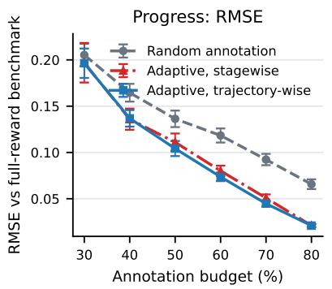

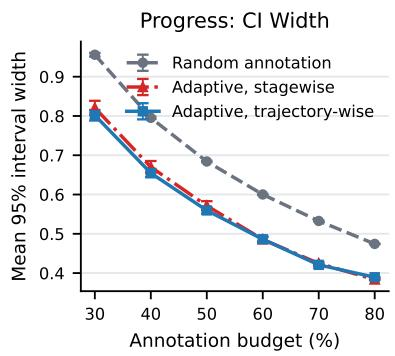  
Figure 6: Casenote progress task: random annotation, the trajectory-wise design (11), and the stagewise design of Theorem 1, all with the silver-variance signal and $\kappa _ { 1 } = 0 ;$ ; 100 replications of 600 clients, error bars are Monte Carlo standard errors.

Although prediction of placement changes and the type of progress is quite noisy, the simulated population matches the real data on aggregate population moments. These include stage contact counts (median 21 vs. 19), placement-improvement rate (0.215 vs. 0.225), and the baseline placement and action distributions; stage rewards are somewhat higher and less dispersed $( R _ { 1 }$ mean 2.34, sd 1.03, vs. 2.20, 1.16).

Protocol. We draw a pool of 8,000 clients and subsample 600 for each of 100 replications. The estimation protocol follows that used for the real data. The true target-policy value $\Phi ^ { \pi _ { e } }$ is evaluated under the model from 100,000 rollouts (5.53 total progress and 0.252 placement-improvement probability; the behavior values are 4.68 and 0.211). Since $\pi _ { b }$ is known, the pipeline uses $\pi _ { b } ( \cdot \mid S _ { t } ^ { \prime } )$ in place of the estimated propensity, both in $\pi _ { e }$ and in the DRL weights; the outcome models and the annotation design are estimated as on the real data. The experiment therefore validates the design, the outcome models and the inference, not propensity estimation.

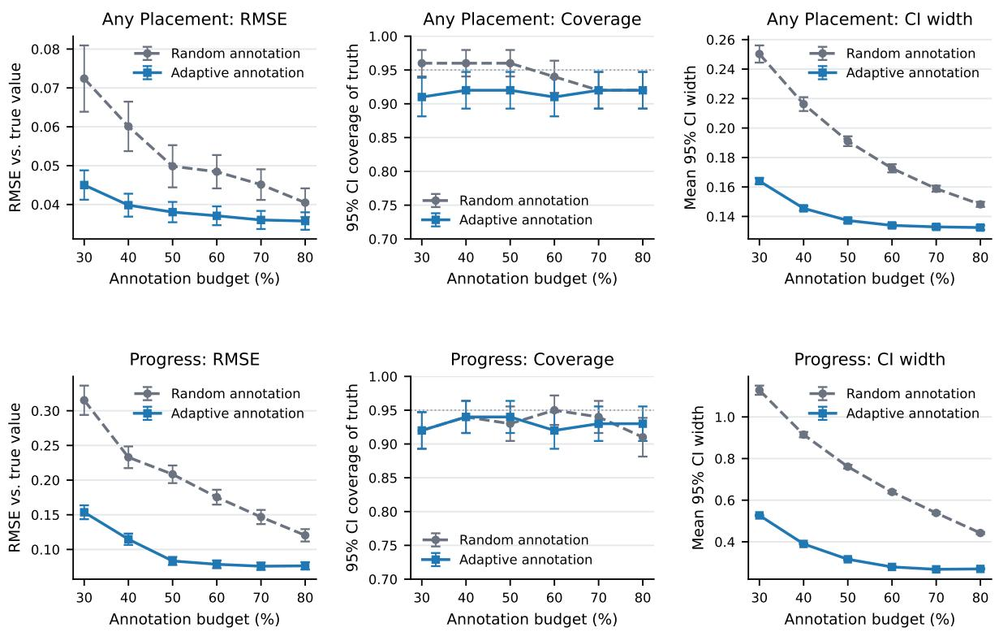  
Figure 7: Simulator-grounded validation of the two protocols of Figure 4 (DRL, 100 replications of 600 clients). Top: any placement improvement (binary-link signal, first batch $\kappa _ { 1 } = 0 . 3 B , p = 1 )$ . Bottom: progress (silver-variance signal, $\kappa _ { 1 } = 0 )$ . Left: RMSE against the true target-policy value; middle: coverage of that value by the model-based 95% interval (dotted line at 0.95); right: mean interval width. Error bars are Monte Carlo standard errors.

Results. Figure 7 shows RMSE against $\Phi ^ { \pi _ { e } }$ , coverage of $\Phi ^ { \pi _ { e } }$ , and interval width. Coverage is close to nominal at every budget for both samplers: 0.92–0.96 (random) and 0.91–0.92 (adaptive) for placement, 0.91–0.95 and 0.92–0.94 for progress. Adaptive annotation reduces RMSE against the truth by 12–38% (placement) and 37–60% (progress), and interval width by 11–34% and 39–58%, the same order as the reductions against the full-annotation benchmark in Figure 4. Plug-in intervals undercover here as well (0.2–0.5).

## C.4 LMArena experiment details

Sessions and observations. The downloaded release contains 135,634 battles dated April 17–July 24, 2025. We retain the earliest record for each session/order pair, removing 15 duplicate records, and exclude 7,068 sessions without a first vote. Of the 108,304 eligible sessions, 10,196 contain both first and second votes. Session identifiers determine the units; the release does not provide user identifiers, so distinct sessions cannot be guaranteed to come from distinct users.

Let $Z _ { 1 }$ indicate that the release contains a second vote. This is observed metadata in $\mathcal { F } _ { 0 }$ , even

though it describes continuation after the first action. The state model is

$$
S _ { 1 } = \mathrm { w e e k } , \qquad S _ { 2 } = \left\{ \begin{array} { l l } { { ( \mathrm { w e e k } , R _ { 1 } ) , } } & { { Z _ { 1 } = 1 , } } \\ { { + \nonumber } } & { { Z _ { 1 } = 0 , } } \end{array} \right. \qquad S _ { 3 } = \dag .
$$

Set $R _ { 2 } = V _ { 2 } ^ { \pi _ { e } } ( \dag ) = Q _ { 2 } ^ { \pi _ { e } } ( \dag , a ) = 0 \mathrm { o n } \ \{ Z _ { 1 } = 0 \}$ . The observed component $S _ { 2 } ^ { \prime }$ contains week and continuation status, while $R _ { 1 }$ is withheld until the first annotation. We therefore distinguish $S _ { 2 }$ from $S _ { 2 } ^ { \prime }$ even though the fitted state representation is tabular. This representation is a modeling restriction: it omits other prompt and session history.

Actions and policies. We split the 53 models into 18 open-weight and 35 closed models. Actions are the three resulting pair categories. The category intervention changes their probabilities while retaining the behavior distribution of model identities within each category and week. Behavior probabilities are empirical category frequencies by week, estimated on the original 64,886-session training partition and held fixed in the annotation experiment.

Full-data nuisance functions. We estimate $Q _ { 2 } ^ { \pi _ { e } }$ by the mean reward within each week, firstreward and second-action cell. We obtain $V _ { 2 } ^ { \pi _ { e } }$ by averaging under $\pi _ { e } ,$ and fit $Q _ { 1 } ^ { \pi _ { e } }$ to $R _ { 1 } + V _ { 2 } ^ { \pi _ { e } } ( S _ { 2 } )$ Cells with fewer than 20 training sessions use the corresponding cell pooled across weeks. The stage-2 density ratio includes the change in the distribution of first rewards and recorded continuation:

$$
\mu _ { 2 } ^ { \pi e } ( S _ { 2 } , A _ { 2 } ) = \frac { p _ { \pi _ { e } } ( R _ { 1 } , Z _ { 1 } = 1 \mid \mathrm { w e e k } ) } { p _ { \pi _ { b } } ( R _ { 1 } , Z _ { 1 } = 1 \mid \mathrm { w e e k } ) } \frac { \pi _ { e } ( A _ { 2 } ) } { \pi _ { b } ( A _ { 2 } \mid \mathrm { w e e k } ) } , \qquad Z _ { 1 } = 1 .
$$

The fitted transition tables determine the first factor. Because it depends on $R _ { 1 }$ , this ratio is generally not $\mathscr { F } _ { 0 } { \mathrm { - m e a s u r a b l e . } }$ . The implementation evaluates it separately at $R _ { 1 } = 0$ and $R _ { 1 } = 1$ when constructing the initial prediction.

Reward predictions and score. Reward predictors use response metadata, Skywork-Reward-V2- Llama-3.1-8B scores, and a fitted TF–IDF text score. We fit $b _ { 1 }$ and $b _ { 2 }$ using standardized logistic regression with regularization parameter $C = 0 . 1$ ; the stage-2 predictor also uses the revealed $R _ { 1 }$ Predictions are clipped to [0.001, 0.999].

Allocation criterion. The design uses the two-stage constrained allocation solver with probability floor 0.01 and second-stage cost $Z _ { 1 }$ , with the binary-link design signals of Section 6. At stage $2 , \hat { s } _ { 2 } ^ { 2 } = \hat { \mu } _ { 2 } ^ { 2 } \hat { b } _ { 2 } ( 1 - \hat { b } _ { 2 } )$ . At stage 1 the revealed $R _ { 1 }$ also determines $S _ { 2 }$ , so the stage-1 increment $\hat { \mu } _ { 1 } \{ R _ { 1 } + \hat { V } _ { 2 } ( S _ { 2 } ) \} - \hat { \mu } _ { 2 } \hat { Q } _ { 2 }$ is a function $h ( R _ { 1 } )$ of the binary $R _ { 1 }$ alone given $\mathcal { F } _ { 0 }$ , with $h ( r ) = \hat { \mu } _ { 1 } \{ r +$ $\hat { V } _ { 2 } ( r ) \} - \hat { \mu } _ { 2 } ( r ) \hat { Q } _ { 2 } ( r )$ evaluated at the state (week, r); its conditional variance is the two-point variance $\hat { s } _ { 1 } ^ { 2 } = \hat { b } _ { 1 } ( 1 - \hat { b } _ { 1 } ) \{ h ( 1 ) - h ( 0 ) \} ^ { 2 }$ . The stage-1 signal omits the change in $\hat { \mu } _ { 2 } \hat { b } _ { 2 }$ with $R _ { 1 }$ , although the score retains it through $\hat { m } _ { 1 }$ and the endpoint correction; $\hat { s } _ { 1 } ^ { 2 }$ is therefore a surrogate for $\sigma _ { 1 } ^ { 2 } = \mathrm { V a r } ( m _ { 1 } \mid \mathcal { F } _ { 0 } )$ afecting eficiency but not validity.

Sampling and fitting. We run 1,000 replications at budget fractions $B \in \{ 0 . 3 , 0 . 4 , 0 . 5 , 0 . 6 , 0 . 7 , 0 . 8 \}$ of all available votes. Each replication draws 21,685 sessions without replacement and assigns them to five session folds. An initial uniform sample reveals all available votes with probability $p = 0 . 3 B$ where $B$ is the budget fraction.

Evaluation. We recompute the full-annotation benchmark on each sampled set of sessions. RMSE is calculated from the diference between the partially and fully annotated estimates. Reported intervals have width $2 ( 1 . 9 6 ) \widehat { \mathrm { s d } } ( \mathrm { s c o r e s } ) / \sqrt { n }$ . These intervals include sampling variation that is shared with the same-session benchmark, so coverage of that benchmark does not establish coverage of the population policy value. We report interval widths, not a coverage guarantee.

Results. Table 1 reports the quantities plotted in Figure 5.
<table><tr><td rowspan="2"></td><td colspan="4">equal exposure</td><td colspan="4">tilt ×1.5</td></tr><tr><td>RMSE random</td><td> $\times 1 0 ^ { - 3 }$  adaptive</td><td>interval random</td><td> $\mathrm { w i d t h } \times 1 0 ^ { - 3 }$  adaptive</td><td>random</td><td> $\mathrm { R M S E } { \times } 1 0 ^ { - 3 }$  adaptive</td><td>interval random</td><td> $\mathrm { w i d t h } \times 1 0 ^ { - 3 }$  adaptive</td></tr><tr><td>0.3</td><td>8.62</td><td>3.26</td><td>33.0</td><td>21.7</td><td>4.13</td><td>3.60</td><td>20.1</td><td>18.2</td></tr><tr><td>0.4</td><td>5.33</td><td>2.41</td><td>26.4</td><td>19.9</td><td>3.06</td><td>2.74</td><td>17.1</td><td>16.1</td></tr><tr><td>0.5</td><td>4.12</td><td>1.83</td><td>23.3</td><td>18.9</td><td>2.43</td><td>2.26</td><td>15.4</td><td>14.8</td></tr><tr><td>0.6</td><td>3.19</td><td>1.44</td><td>21.2</td><td>18.4</td><td>2.00</td><td>1.79</td><td>14.2</td><td>13.8</td></tr><tr><td>0.7</td><td>2.48</td><td>1.06</td><td>19.9</td><td>18.0</td><td>1.60</td><td>1.36</td><td>13.4</td><td>13.1</td></tr><tr><td>0.8</td><td>1.87</td><td>0.76</td><td>18.9</td><td>17.8</td><td>1.25</td><td>0.99</td><td>12.8</td><td>12.6</td></tr></table>

Table 1: LMArena, 1,000 replications of 21,685 sessions; all entries $\times 1 0 ^ { - 3 }$ . RMSE is against each replication’s full-annotation estimate; interval width is the mean model-based 95% width.