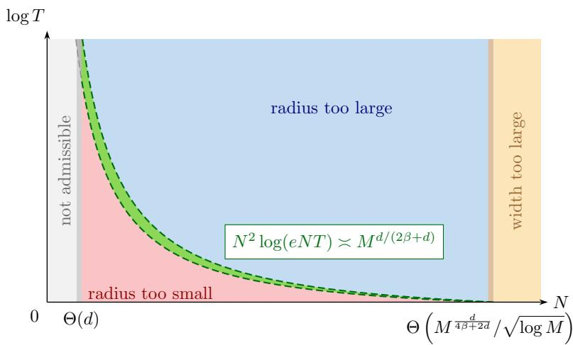
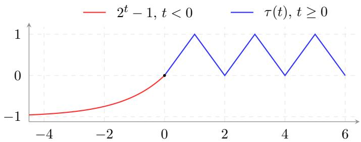
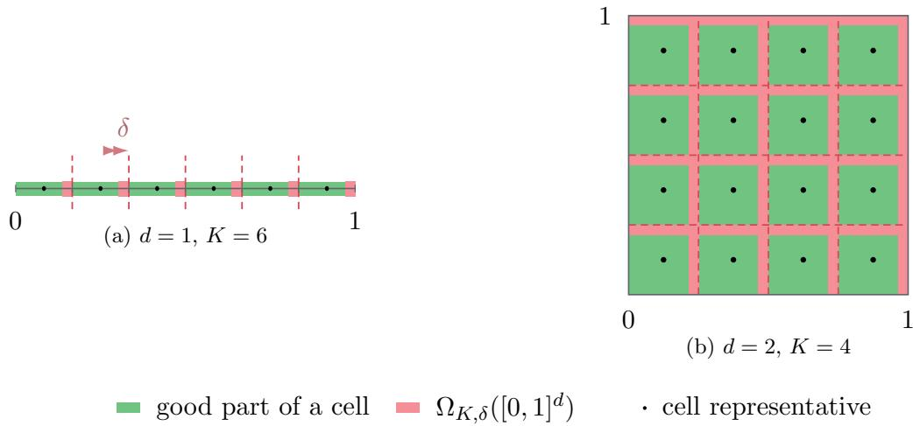
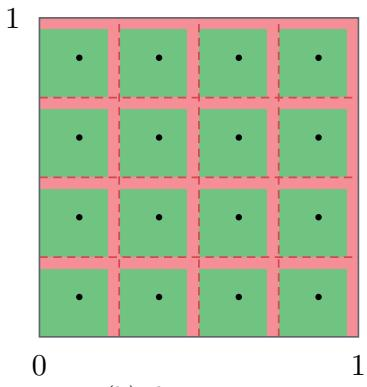
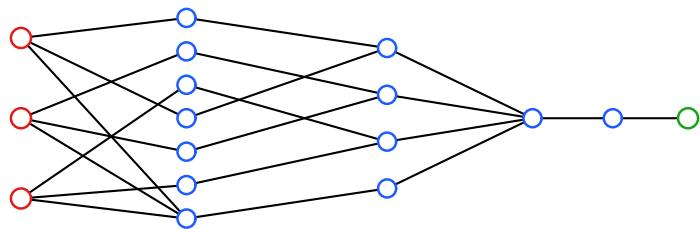
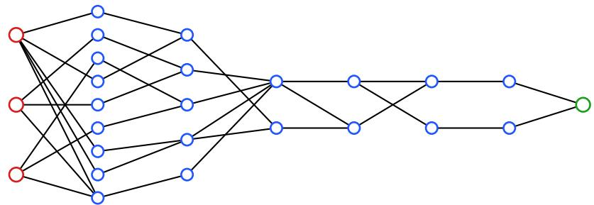
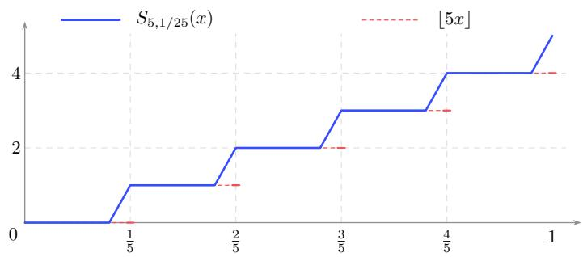
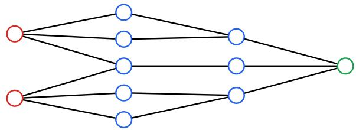
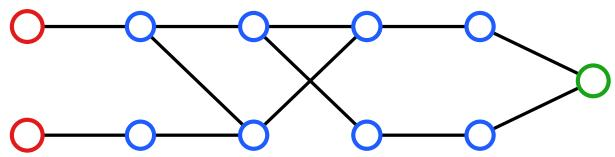

# Optimal Tradeofs Between Network Size and Parameter Magnitude in Neural Approximation and Minimax Regression

Baicheng Li∗ Zuowei Shen† Haizhao Yang∗ Shijun Zhang‡

## Abstract

The statistical accuracy of neural networks depends on both their approximation power and the complexity of the class fitted from data. While increasing network size is a natural way to improve approximation, parameter magnitude provides another resource whose role must be quantified in both respects. We establish a sharp width–magnitude tradeof at fixed depth using one elementary bounded 1-Lipschitz Dyadic–Triangular Activation. For the unit $\beta \mathrm { - H \ " o l d e r }$ ball on $[ 0 , 1 ] ^ { d } \mathrm { w i t h } \ 0 < \beta \leq 1$ , the optimal Lp approximation error for $0 < p < \infty$ is of order $[ N ^ { 2 } \log ( \dot { e } N T ) ] ^ { - \beta / d }$ when the network width satisfies $N \geq 2 d + 3$ and the parameter magnitudes are bounded by $T \geq 1$ . Matching lower bounds hold for every fixed globally H¨older activation; its H¨older exponent afects the constants but not the rate. Under bounded design densities and independent centered sub-Gaussian noise, approximate least squares over the full clipped class at depth 23 attains the classical H¨older minimax risk $\mathcal { O } ( M ^ { - \frac { 2 \beta } { 2 \beta + d } } )$ without logarithmic loss whenever $N ^ { 2 } \log ( e N T ) \asymp M ^ { \frac { d } { 2 \beta + d } }$ , where M is the sample size. This yields a continuum of statistically optimal choices, ranging from unit parameter radius to fixed network size. At fixed size, four hidden layers with at most $8 d + 7$ nonzero parameters give a near-optimal radius, while six layers with at most $8 d + 2 7$ attain the optimal order log $T = \mathcal { ( } ) ( \eta ^ { - d / \beta } )$ at approximation error η. The same decoding method also yields fixed-size Transformer approximation.

Keywords: fixed-size neural network, parameter magnitude, approximation theory, minimax nonparametric regression, Transformer approximation

## Contents

1 Introduction 2   
1.1 Main contributions . 4   
1.2 Related work and comparison 5   
2 Setting and main results 7   
2.1 The Dyadic–Triangular Activation 7   
2.2 Network convention 8   
2.3 Target, hypothesis classes, and approximation theorems 9   
2.4 Fixed-size Transformer approximation 10   
2.5 Sampling model and the regression rate 11   
3 Proofs of Theorems 1–3 12   
3.1 Dyadic table decoder . 13   
3.2 Trifling region and grid encoder . 13   
3.3 Proof of Theorem 1 . . 14   
3.4 Block-grid encoding and coupled decoding 16   
3.5 Proof of Theorem 2 . . . 17   
3.6 The unit-radius theorem and Proof of Theorem 3 18   
4 Proofs of Theorems 4 and 6 19   
4.1 Proof of Theorem 4 . 20   
4.2 Proof of Theorem 6 . 23   
5 Conclusion 24   
A Proofs of Propositions 2 and 3 29   
A.1 Proof of Proposition 2 29   
A.2 Proof of Proposition 3 31   
B Proof of Proposition 1 32   
C Proof of Proposition 4 37   
C.1 A phase-coding lemma 37   
C.2 Proof of Proposition 4, part (a) 38   
C.3 Two technical lemmas 42   
C.4 Proof of Proposition 4, part (b) 47   
D Proof of Theorem 7 50   
D.1 The unit-radius encoder 50   
D.2 The unit-radius decoder 52   
D.3 Proof of Theorem 7 . 58   
E Proof of Theorem 5 60   
F Proofs of Propositions 6 and 7 64

## 1 Introduction

Neural networks provide flexible function classes for nonparametric regression, where an unknown regression function is estimated from noisy observations. Their statistical accuracy depends on a balance between approximation and estimation: the network class must be rich enough to approximate the target, yet suficiently controlled to permit accurate estimation from finite samples. A natural way to improve approximation is to increase network width or depth as the sample size grows. However, network size is only one resource governing expressivity. Even within a fixed architecture, the allowed magnitudes of weights and biases afect the richness of the function class, with the resulting approximation power depending on the activation function. This raises a basic question: can larger parameters compensate for fewer neurons while preserving optimal statistical accuracy?

Answering this question requires tracking parameter magnitude in both the approximation error and the statistical complexity of the network class. We establish a sharp tradeof between network width and parameter radius at fixed depth, where the radius bounds every weight and bias in absolute value. For one explicit elementary, bounded, globally Lipschitz activation, we characterize the optimal approximation error over H¨older classes as a joint function of these two resources. Applied to nonparametric regression, this approximation law yields a continuum of minimax-optimal models, ranging from networks with unit parameter radius to a fixed architecture with increasing parameter radius. Thus, optimal statistical accuracy can be attained through diferent allocations of network width and parameter magnitude. The starting point is the approximation–estimation balance.

Let F be any class of measurable functions from $[ 0 , 1 ] ^ { d } \mathrm { t o } [ - 1 , 1 ]$ . We observe $Y _ { i } = f (  { \boldsymbol { X } } _ { i } ) + \varepsilon _ { i } .$ $i = 1 , \dots , M$ , where $f \in { \mathcal { F } }$ , the covariates are i.i.d. with law $\mu ,$ and the errors are i.i.d. centered σ-sub-Gaussian variables independent of the covariates. Let G be a nonempty, supremum-norm separable class of measurable functions with the same domain and range, and let ${ \widehat { f } } _ { M }$ be a measurable M−1-approximate minimizer of empirical squared loss over ${ \mathcal { G } } .$ Classical least-squares theory separates its worst-case prediction risk into approximation and estimation costs (Gy¨orfi et al. 2002); see also Schmidt-Hieber (2020, Lemma 4). The empirical-cover version used here is (Proposition 7)

$$
\operatorname* { s u p } _ { f \in \mathscr { F } } \mathbb { E } \| \widehat { f } _ { M } - f \| _ { L ^ { 2 } ( \mu ) } ^ { 2 } \lesssim \operatorname* { s u p } _ { \stackrel { f \in \mathscr { F } } { \mathrm { a p p r o x i m a t i o n ~ e r r o r } } } ^ { \prime } + \underbrace { \frac { \log [ e \mathrm { \mathcal { N } } ( ( 4 8 M ) ^ { - 1 } , \mathbb { S } , 2 M ) ] } { M } } _ { \mathrm { e s t i m a t i o n ~ e r r o r } } .\tag{1.1}
$$

Here $\mathcal { N } ( \delta , \mathcal { G } , n )$ is the proper covering number in the maximum norm on n evaluations, maximized over their input locations: it counts representative predictions at resolution $\delta .$ The implicit constant depends only on the noise level, the factor e absorbs the optimization tolerance, and the expectation is under the target $f .$ One can estimate this covering number directly or use the pseudo-dimension, the VC dimension of the subgraph class. Discretization and the Sauer bound give (Anthony and Bartlett 1999)

$$
\frac { \log [ e \Re ( ( 4 8 M ) ^ { - 1 } , \mathcal { G } , 2 M ) ] } { M } \lesssim \frac { 1 + \mathrm { P d i m } ( \mathcal { G } ) \log ( e M ) } { M } .\tag{1.2}
$$

A direct cover retains information about parameter magnitudes. Pseudo-dimension can sometimes control a class even when its parameters are unrestricted. These are two ways to bound the same estimation cost.

Take $\mathcal { F } = \mathcal { H } ^ { \beta } ( [ 0 , 1 ] ^ { d } )$ , the unit H¨older ball, $0 < \beta \le 1$ , and suppose that $\mu$ has density at most κ. This transfers Lebesgue $L ^ { 2 }$ approximation bounds to prediction error. The squared-risk benchmark is $M ^ { - 2 \beta / ( 2 \beta + d ) }$ , with a matching minimax lower bound under uniform design and nondegenerate Gaussian noise (Stone 1982). For an activation $\varphi ,$ let $\mathcal { F } _ { \varphi } ( N , L , T )$ contain all fully connected networks with at most L hidden layers, width at most $N$ , and every weight and bias bounded in absolute value by $T .$ , followed by clipping $\pi ( t ) = \operatorname* { m a x } \{ - 1 , \operatorname* { m i n } \{ 1 , t \} \}$ Clipping keeps predictions in the target range without increasing their pointwise error. We fit this entire class. Write $\begin{array} { r } { \mathcal { E } _ { \varphi } ( N , L , T ) = \operatorname* { s u p } _ { f \in \mathcal { H } ^ { \beta } } \operatorname* { i n f } _ { g \in \mathcal { F } _ { \varphi } ( N , L , T ) } \lVert g - f \rVert _ { L ^ { 2 } ( [ 0 , 1 ] ^ { d } ) } } \end{array}$ for its worstcase approximation error. Fix $L = L _ { * }$ ∗ independently of sample size. For a globally α-H¨older activation, $0 < \alpha \leq 1$ , parameter discretization gives log $\Re ( \delta , \mathcal { F } _ { \varphi } ( N , L _ { * } , T ) , n ) \lesssim N ^ { 2 } \log ( e N T / \delta )$ for $T \geq 1$ and $0 < \delta \leq 1$ (Proposition 6). Hence

$$
\operatorname* { s u p } _ { f \in \mathcal { H } ^ { \beta } } \mathbb { E } \| \widehat { f } _ { M } - f \| _ { L ^ { 2 } ( \mu ) } ^ { 2 } \lesssim \mathcal { E } _ { \varphi } ( N , L _ { * } , T ) ^ { 2 } + \frac { N ^ { 2 } \log ( e M N T ) } { M } .\tag{1.3}
$$

The bound in (1.3) suggests trading width for radius. Doubling the width roughly quadruples the leading estimation cost, whereas replacing $T$ by $T ^ { 2 }$ only doubles its log $T$ contribution. Can a smaller network recover the lost accuracy by using larger parameters? The answer depends on the approximation term. For a fixed architecture, we require $\mathcal { E } _ { \varphi } ( N , L , T ) \to 0$ as $T \to \infty$ , and the decay must be fast enough to ofset the larger estimation term. This is why the same radius must be tracked in both parts of the risk bound. $\mathrm { A }$ joint approximation law would tell us how to divide the required approximation power between width and magnitude.

ReLU, logistic sigmoid, and tanh are all known to exhibit a fixed-size approximation obstruction, as they belong to the class of piecewise Pfafian activations considered in Yarotsky (2021, Theorem 5). At fixed architecture their oscillations along a line are bounded uniformly over the parameters, which yields a positive worst-case error for our finite- $L ^ { p }$ targets $( \mathcal { E } _ { \varphi } ( N , L , \infty ) > 0 )$ A periodic branch behaves diferently: rescaling its input produces more oscillations without adding neurons. To obtain an approximation theorem, these oscillations must be used to recover the target values through a fixed number of layers, with a quantitative bound on the parameter magnitudes. Following fixed-size universal-activation constructions (Shen et al. 2022a), we combine a triangular wave with a shifted exponential branch to obtain the Dyadic–Triangular Activation, DTA: one explicit bounded 1-Lipschitz function, fixed for all targets, dimensions, and accuracies. For DTA, Pdim $( \mathcal { F } _ { \mathtt { D T A } } ( N , L , \infty ) ) = \infty$ for every $N , L \geq 1$ ; infinite VC dimension at fixed architecture also occurs for superexpressive activations (Yarotsky 2021, Section 3). We therefore retain T in the covering-number bound (1.3) to control the estimation error.

## 1.1 Main contributions

Our main approximation theorem identifies an optimal exchange between width and parameter magnitude. For $0 < p < \infty$ , put $L _ { p } = 1 7 + \lceil 3 p \beta \rceil$ . Theorems 3 and 4 give, for every $N \geq 2 d + 3$ and $T \geq 1$ ，

$$
\operatorname* { s u p } _ { f \in \mathcal { H } ^ { \beta } } \operatorname* { i n f } _ { g \in \mathcal { F } _ { \mathtt { D T A } } ( N , L _ { p } , T ) } \| f - g \| _ { L ^ { p } ( [ 0 , 1 ] ^ { d } ) } \asymp [ N ^ { 2 } \log ( e N T ) ] ^ { - \beta / d } .\tag{1.4}
$$

For each prescribed pair $( N , T )$ , this law gives an attainable error and a matching lower bound. At accuracy η, the relation $\dot { N ^ { 2 } } \log ( e N T ) \asymp \eta ^ { - d / \beta }$ therefore determines how much additional radius compensates for a reduction in width. The lower bound holds for every fixed globally H¨older activation at every fixed depth. Its H¨older exponent afects the constants, but not the power $\beta / d .$ . A single simple bounded Lipschitz activation thus attains the best joint order throughout the range, including both unit radius and fixed width.

  
Figure 1: Schematic width–radius tradeof at fixed M. The green strip satisfies (1.6); its thickness decreases like $N ^ { - 2 }$ as N grows and changes little as T increases.

This joint law also supplies the approximation bound needed for regression. For $p = 2 .$ $1 7 + \left\lceil 6 \beta \right\rceil \leq 2 3 ;$ fitting the entire class $\mathcal { F } _ { \mathtt { D T A } } ( N , 2 3 , T )$ and combining (1.4) with (1.3) gives

$$
\operatorname* { s u p } _ { f \in \mathcal { H } ^ { \beta } } \mathbb { E } \| \widehat { f } _ { M } - f \| _ { L ^ { 2 } ( \mu ) } ^ { 2 } \lesssim [ N ^ { 2 } \log ( e N T ) ] ^ { - 2 \beta / d } + \frac { N ^ { 2 } \log ( e M N T ) } { M } .\tag{1.5}
$$

For deterministic $N _ { M } \ge 2 d + 3 , T _ { M } \ge 1$ , balancing these terms yields (Theorem 6)

$$
N _ { M } ^ { 2 } \log ( e N _ { M } T _ { M } ) \asymp M ^ { \frac { d } { 2 \beta + d } } \quad \Longrightarrow \quad \operatorname* { s u p } _ { f \in \mathcal { H } ^ { \beta } } \mathbb { E } \| \widehat { f } _ { M } - f \| _ { L ^ { 2 } ( \mu ) } ^ { 2 } \lesssim M ^ { - \frac { 2 \beta } { 2 \beta + d } } .\tag{1.6}
$$

The relation on the left implies $N _ { M } ^ { 2 }$ log $M \lesssim M ^ { d / ( 2 \beta + d ) }$ , so both terms in (1.5) are bounded at the minimax scale, even at $T _ { M } = 1$ . The gain in approximation exactly ofsets the logarithm in the estimation bound. Thus the same least-squares inequality gives the exact minimax rate along a whole curve. At one end, $T _ { M } = 1$ and $N _ { M } \stackrel { - } { \sim } M ^ { d / [ 2 ( 2 \bar { \beta } + d ) ] } / \sqrt { \log M } ;$ at the other, $N _ { M } = 2 d + 3$ and log $T _ { M } \asymp M ^ { d / ( 2 \beta + d ) }$ . Between these ends, one may choose a smaller width and increase the radius to retain the same minimax rate. Figure 1 shows this freedom in the width–radius plane. Each pair specifies an entire clipped class to be fitted. At fixed width, more data require a larger parameter range without adding neurons. For simplicity, (1.4) and (1.6) are stated in asymptotic form; the corresponding results in Theorems 3 and 6 are nonasymptotic, with Theorem 6 valid for every $M \geq 1$ satisfying its stated width–radius bounds.

The fixed-width endpoint raises a more precise question about small networks. With N fixed, (1.4) gives log $T \asymp \eta ^ { - d / \beta }$ at error η. How few layers and parameters sufice to attain this optimal order? Theorem 1 gives a four-hidden-layer construction with at most $8 d + 7$ nonzero parameters and log $T \lesssim \eta ^ { - d / \beta } \log ( \eta ^ { - 1 } )$ . Theorem 2 removes the logarithm with six hidden layers and at most $8 d + 2 7$ nonzero parameters, matching the lower bound for every fixed globally H¨older activation. Our proof develops several novel parameter-controlled encoding and decoding methods in the spirit of eficient bit extraction. In particular, a coupled decoder reduces the radius needed to recover the stored values, avoiding the extra logarithmic cost of the simpler construction. Distributing this information across more parameters gives the width dependence, and a separate construction covers the unit-radius end. The method also yields fixed-size Transformer approximation for matrix-valued H¨older maps of fixed sequence length n: one attention head achieves $L ^ { p }$ error η with log $T \lesssim \eta ^ { - d n / \beta }$ (Theorem 5), under the stated position-dependent-bias convention. Eficient training and numerical stability remain separate questions.

## 1.2 Related work and comparison

We review related work on neural approximation, minimax regression, and fixed-size universal approximation, and compare some of the closest results in Table 1.

Approximation theory with classical activations. Classical theory measures accuracy by width N and hidden depth $L _ { ; }$ with unrestricted parameters $( T = \infty )$ unless specified. Rates concern unit balls on $[ 0 , 1 ] ^ { d }$ and suficiently large widths or depths. Growing width gives density (Cybenko 1989; Hornik 1991; Leshno et al. 1993); for functions with bounded first Fourier moment, Barron (1993) obtains $L ^ { 2 }$ error $\mathcal { O } ( N ^ { - 1 / 2 } )$ with one sigmoidal hidden layer. For ReLU, work on smooth (Yarotsky 2017) and piecewise smooth functions (Petersen and Voigtlaender 2018) revealed how depth improves accuracy. On H¨older balls with $0 < \beta \le 1$ , width $2 d + 1 0$ sufices for uniform error $\mathcal { O } ( L ^ { - 2 \beta / d } )$ (Yarotsky 2018; Shen et al. 2020); varying width as well yields $\mathcal { O } ( [ N ^ { 2 } L ^ { 2 } \log ( e N ) ] ^ { - \beta / d } )$ (Shen et al. 2022b). Depth and target-to-parameter continuity organize these rates into a phase diagram (Yarotsky and Zhevnerchuk 2020). Greater smoothness improves the exponent: Lu et al. (2021) use s continuous derivatives to obtain uniform error $\mathcal { O } ( [ N L / ( \log ( e N ) \log ( e L ) ) ] ^ { - 2 s / d } )$ on $C ^ { s }$ balls. Sobolev $W ^ { s , q }$ and Besov $B _ { q , r } ^ { s }$ spaces allow less uniform regularity. On their unit balls, the $L ^ { p }$ rate $\mathcal { O } ( L ^ { - 2 s / d } )$ at width 25d + 31 (Siegel 2023) extends to $\mathcal { O } ( ( N L ) ^ { - 2 s / d } )$ when both resources vary (Yang 2025), provided $s > 0 , 1 \leq p , q , r \leq \infty .$ and $s / d > 1 / q - 1 / p$ . Derivative approximation follows a similar pattern: mixed $\mathrm { R e L U { - } R e L U ^ { 2 } }$ networks attain $W ^ { 2 , p }$ error $\mathcal { O } ( [ N L / ( \log ( e N ) \log ( e L ) ) ] ^ { - 2 ( s - 2 ) / d } )$ on $W ^ { s , p }$ balls for $s \in \{ 3 , 4 , \ldots \}$ and $1 \leq p \leq \infty$ (Yang et al. 2023).

Other activations inherit the function-value rates: “Beyond ReLU” (Zhang et al. 2024) transfers ReLU upper bounds to sigmoid and tanh with width–depth pair (3N, 2L), and to

Softplus, GELU, and SiLU with $( N , L )$ , without controlling parameter size. For ReLU itself, the fixed-depth $L ^ { 2 }$ H¨older benchmark is sharp (Shen et al. 2022b; Siegel 2023):

$$
\mathcal { E } _ { \mathrm { R e L U } } ( N , 2 9 , \infty ) \asymp \left[ N ^ { 2 } \log ( e N ) \right] ^ { - \beta / d } , \qquad N \geq 4 8 d .\tag{1.7}
$$

Thus arbitrarily large parameters cannot replace the need for growing width.

Near-minimax and minimax regression. A richer class improves approximation but costs more to estimate. Sparse ReLU estimators achieve risk $\mathcal { O } \bar { ( } M ^ { - 2 \beta / ( 2 \bar { \beta } + d ) } \log ^ { 3 } M )$ with $N _ { M } \asymp M ^ { d / ( 2 \beta + d ) } , L _ { M } \asymp \log M .$ , and $T _ { M } = 1$ (Schmidt-Hieber 2020; Schmidt-Hieber and Vu 2024). Related results cover smooth hierarchical sigmoidal models (Bauer and Kohler 2019), sparse ReLU on Besov classes (Suzuki 2019), and smooth compositional ReLU models without sparsity constraints (Kohler and Langer 2021); all retain logarithmic losses. At fixed depth $L _ { * }$ , the bound Pdim $( \mathcal { F } _ { \mathrm { R e L U } } ( N , L _ { * } , \infty ) ) \lesssim N ^ { 2 }$ log(eN) (Bartlett et al. 2019), combined with (1.1)–(1.3), yields

$$
\operatorname* { s u p } _ { f \in \mathcal { H } ^ { \beta } } \mathbb { E } \| \widehat { f } _ { M } - f \| _ { L ^ { 2 } ( \mu ) } ^ { 2 } \lesssim \mathcal { E } _ { \mathrm { R e L U } } ( N , L _ { * } , T ) ^ { 2 } + \frac { N ^ { 2 } } { M } \operatorname* { m i n } \{ \log ( e M N T ) , \log ( e N ) \log ( e M ) \} .\tag{1.8}
$$

Substituting the depth-29 benchmark (1.7) and balancing the two terms gives the near-minimax order $\mathcal { O } \big ( ( \log M / M ) ^ { 2 \beta / ( 2 \beta + d ) } \big )$ . Alternatively, Fan and Gu (2024) and Liu et al. (2026, Theorem 4.1) give fixed-depth error $\mathcal { O } ( N ^ { - 2 \beta / d } )$ with radii polynomial in N, respectively in $L ^ { \infty }$ for ReLU and $L ^ { 2 }$ for sigmoid, SiLU, and GELU. Equation (1.3) then gives the same near-minimax order for the full clipped classes. These suficient radii leave open the best approximation at a prescribed (N, T) (Liu et al. 2026, Remark 4.3).

Table 1: Width–radius approximation and regression for $0 < \beta \le 1$ . Errors are unsquared; risks are squared. Resource choices are suficient, with suitable constants and integer rounding; poly(N) denotes a fixed-degree polynomial, and $C _ { 0 } , L _ { 0 }$ are absolute. The first four statistical rows combine the cited approximation results with the oracle bounds; the fixed-depth Ou–B¨olcskei choice uses their Lemma 3.4.
<table><tr><td rowspan=1 colspan=1>Reference</td><td rowspan=1 colspan=1>Activation</td><td rowspan=1 colspan=1>Hiddenlayers</td><td rowspan=1 colspan=1>Resources(N,T)</td><td rowspan=1 colspan=1>Approximationerror</td><td rowspan=1 colspan=1>Statistical choice $( N _ { M } , T _ { M } )$ </td><td rowspan=1 colspan=1>Risk0(·)</td></tr><tr><td rowspan=1 colspan=1>Fan and Gu(2024)</td><td rowspan=1 colspan=1>ReLU</td><td rowspan=1 colspan=1> $1 2 + 2 d$ </td><td rowspan=1 colspan=1> $( N , \mathrm { p o l y } \left( N \right) )$ N ≥ 34d 3d</td><td rowspan=1 colspan=1> $\mathcal { O } \left( N ^ { - 2 \beta / d } \right)$ </td><td rowspan=1 colspan=1> $\left( \Theta \left( \left( \textstyle { \frac { M } { \log M } } \right) ^ { \frac { d } { 2 \left( 2 \beta + d \right) } } \right) , \Theta \left( M ^ { \frac { 2 d } { 2 \beta + d } } \right) \right)$ </td><td rowspan=1 colspan=1> $\left( { \frac { \log M } { M } } \right) ^ { \frac { 2 \beta } { 2 \beta + d } }$ </td></tr><tr><td rowspan=1 colspan=1>Liu et al. (2026)</td><td rowspan=1 colspan=1>sigmoidSiLUGELU</td><td rowspan=1 colspan=1>5</td><td rowspan=1 colspan=1> $( N , \mathrm { p o l y } \left( N \right) )$ N ≥ C</td><td rowspan=1 colspan=1> $\mathcal { O } \left( N ^ { - 2 \beta / d } \right)$ </td><td rowspan=1 colspan=1> $\begin{array} { r } { \left( \Theta \left( \left( \frac { M } { \log M } \right) ^ { \frac { d } { 2 ( 2 \beta + d ) } } \right) , \Theta \left( M ^ { \frac { \operatorname* { m a x } \{ d , 5 \} } { 2 } } \right) \right) } \end{array}$ </td><td rowspan=1 colspan=1> $\left( { \frac { \log M } { M } } \right) ^ { \frac { 2 \beta } { 2 \beta + d } }$ </td></tr><tr><td rowspan=1 colspan=1>Shen et al.(2022b)</td><td rowspan=1 colspan=1>ReLU</td><td rowspan=1 colspan=1>29</td><td rowspan=1 colspan=1> $( N , \infty )$  $N \geq 4 8 d$ </td><td rowspan=1 colspan=1> $\Theta \left( [ N ^ { 2 } \log ( e N ) ] ^ { - { \frac { \beta } { d } } } \right)$ </td><td rowspan=1 colspan=1> $\begin{array} { r } { \left( \Theta \left( \frac { M ^ { \frac { d } { 2 \left( 2 \beta + d \right) } } } { \left( \log M \right) ^ { \frac { \beta + d } { 2 \beta + d } } } \right) , \infty \right) } \end{array}$ </td><td rowspan=1 colspan=1> $\left( { \frac { \log M } { M } } \right) ^ { \frac { 2 \beta } { 2 \beta + d } }$ </td></tr><tr><td rowspan=1 colspan=1>Ou and Bölcskei(in press) $\overset { \cdot } { d } = \overset { \cdot } { \beta } = \overset { \cdot } { 1 }$ </td><td rowspan=1 colspan=1>ReLU</td><td rowspan=1 colspan=1> $L _ { 0 }$ </td><td rowspan=1 colspan=1> $( N , 1 )$  $N \geq C _ { 0 }$ </td><td rowspan=1 colspan=1> $\Theta \left( [ N ^ { 2 } \log ( e N ) ] ^ { - 1 } \right)$ </td><td rowspan=1 colspan=1> $\begin{array} { r } { \left( \Theta \left( \frac { M ^ { 1 / 6 } } { \sqrt { \log M } } \right) , 1 \right) } \end{array}$ </td><td rowspan=1 colspan=1> $M ^ { - 2 / 3 }$ </td></tr><tr><td rowspan=1 colspan=1>This paperjoint law</td><td rowspan=1 colspan=1>DTA</td><td rowspan=1 colspan=1>23</td><td rowspan=1 colspan=1>(N,T) $^ N \geq 2 d + 3$ </td><td rowspan=1 colspan=1> $\left| \Theta \left( [ N ^ { 2 } \log ( e N T ) ] ^ { - { \frac { \beta } { d } } } \right) \right.$ </td><td rowspan=1 colspan=1> $N _ { M } ^ { 2 } \log ( e N _ { M } T _ { M } ) \asymp M ^ { \frac { d } { 2 \beta + d } }$ </td><td rowspan=1 colspan=1> $M ^ { - } \frac { 2 \beta } { 2 \beta + d }$ </td></tr><tr><td rowspan=1 colspan=1>This paperunit radius</td><td rowspan=1 colspan=1>DTA</td><td rowspan=1 colspan=1>23</td><td rowspan=1 colspan=1>(N,1) $N \geq 2 d + 3$ </td><td rowspan=1 colspan=1> $\Theta \left( [ N ^ { 2 } \log ( e N ) ] ^ { - \frac { \beta } { d } } \right)$ </td><td rowspan=1 colspan=1> $\begin{array} { r } { \left( \Theta \left( \frac { M ^ { \frac { d } { 2 \left( 2 \beta + d \right) } } } { \sqrt { \log M } } \right) , 1 \right) } \end{array}$ </td><td rowspan=1 colspan=1> $M ^ { - } \frac { 2 \beta } { 2 \beta + d }$ </td></tr><tr><td rowspan=1 colspan=1>This paperfixed width</td><td rowspan=1 colspan=1>DTA</td><td rowspan=1 colspan=1>6</td><td rowspan=1 colspan=1> $( 2 d + 3 , T )$ T ≥1</td><td rowspan=1 colspan=1> $\Theta \left( [ \log ( e T ) ] ^ { - { \frac { \beta } { d } } } \right)$ </td><td rowspan=1 colspan=1> $\left( 2 d + 3 , \exp \left( \Theta \left( M ^ { \frac { d } { 2 \beta + d } } \right) \right) \right)$ </td><td rowspan=1 colspan=1> $M ^ { - \frac { 2 \beta } { 2 \beta + d } }$ </td></tr></table>

Removing the logarithmic loss requires a more precise balance. Liu et al. (2022) obtain $\mathcal { O } _ { P } ( M ^ { - 2 \beta / ( 2 \bar { \beta } + d ) } )$ for the conditional risk of a spline-based ReLU estimator, with $\dot { N _ { M } } \asymp \dot { M } ^ { d / ( 2 \beta + d ) }$ and $L _ { M } \asymp \log M .$ For $d = \beta = 1$ , Ou and B¨olcskei (in press) obtain exact expected risk $\mathcal { O } ( M ^ { - 2 / 3 } )$

under Gaussian noise with $T _ { M } = 1$ ; their bounds also yield the fixed-depth choice in Table 1. Our result gives an entire optimal curve, $N _ { M } ^ { 2 } \log ( e N _ { M } T _ { M } ) \asymp M ^ { d / ( 2 \beta + d ) }$ . Every admissible pair yields expected risk $\mathcal { O } ( M ^ { - 2 \beta / ( 2 \beta + d ) } )$ for least squares over the full clipped class. At fixed depth, one may grow width with $T _ { M } = 1$ , or keep the architecture fixed and grow the radius. Matching bounds quantify this exchange along the entire curve, including both endpoints in Table 1.

Fixed-size approximation theory. The classical size obstruction motivates a diferent route: choose an activation that makes a fixed architecture universal. The Kolmogorov–Arnold theorem (Arnol’d 1957; Kolmogorov 1957) provides a starting point: continuous multivariate functions admit representations by a fixed number of univariate functions, with fixed inner functions and target-dependent outer functions. Maiorov and Pinkus (1999) obtained fixed-size universality with one specially constructed sigmoid, followed by algorithmic constructions (Guliyev and Ismailov 2018) and elementary superexpressive activations (Yarotsky 2021). A change of activation also accelerates convergence: floor–exponential–step networks achieve uniform H¨older error $\mathcal { O } ( 2 ^ { - \beta N } )$ at depth three and width $N \geq d$ (Shen et al. 2021; Jiao et al. 2023). The EUAF construction (Shen et al. 2022a) achieves uniform density at fixed size with one bounded 1-Lipschitz activation. Later developments address eficiency and derivatives: subnetwork reuse reduces the number of unique parameters to $\mathcal O ( d )$ (Maiti et al. 2024), while smooth $\mathrm { D U A F _ { \infty } }$ gives density in $W ^ { s - 1 , \infty }$ for $W ^ { s , \infty }$ targets with $s \in \mathbb { N }$ (Li et al. 2026). Connecting the theory to training, PEUAF introduces a trainable triangular-wave frequency and performs competitively on industrial fault-diagnosis benchmarks (Wang et al. 2025). Regression brings the remaining resource question into focus: how large must the parameters become? For uniform H¨older error $\eta ,$ Beknazaryan (2022) obtains log $T = \mathcal { O } ( \eta ^ { - d / \beta } \log ( \eta ^ { - 1 } ) )$ using floor and an abstract discontinuous selector; Fan et al. (2026) obtain log $T = \mathcal { O } ( \eta ^ { - 2 d / \beta } \log ( \eta ^ { - 1 } ) )$ using floor, ReLU, ReL $\boldsymbol { \mathrm { J ^ { 2 } } }$ , and a modified reciprocal. For finite $L ^ { p }$ , four DTA layers match the former radius order with a single bounded 1-Lipschitz activation; six remove the logarithm and attain log $T = \mathcal { 0 } ( \eta ^ { - d / \beta } )$ . Our matching lower bound applies to every fixed globally H¨older activation and fixed architecture, establishing the optimal radius order for $0 < p < \infty$ . This identifies the unavoidable cost of keeping an architecture fixed: as the error decreases, the required parameters grow exponentially. Additional width can absorb part of this cost. The joint theorem then extends this characterization across all admissible $( N , T )$ , including $T = 1$ : fixed-size approximation and the classical growing-width regime are the two endpoints of one sharp width–radius law.

## 2 Setting and main results

We first state how width and radius determine approximation accuracy, then identify the choices that attain the optimal regression rate. The activation is fixed throughout; neither its definition nor the allowed depth changes with the target accuracy or sample size.

Throughout, $\mathbb { N } = \{ 1 , 2 , . . . \} , \mathbb { N } _ { 0 } = \{ 0 , 1 , 2 , . . . \}$ , and log is natural. Sequence, grid, vector and table indices are integers: $0 \leq r < n$ means $r \in \{ 0 , \ldots , n - 1 \}$ , unless a real interval is stated. We write $\mathbf { 1 } _ { m } , \mathbf { 0 } _ { m } \in \mathbb { R } ^ { m }$ and ${ \bf 1 } _ { m \times n } , { \bf 0 } _ { m \times n }$ for the all-ones and zero vectors and matrices, ${ \cal I } _ { m }$ for the identity, and $\mathbf { 1 } _ { \{ E \} }$ for an indicator. The matrix norm is $\| A \| _ { \operatorname* { m a x } } = \operatorname* { m a x } _ { i , j } | A _ { i j } |$ . For coordinates indexed by $0 , \ldots , m - 1$ , the standard basis is $e _ { 0 } , \ldots , e _ { m - 1 }$

## 2.1 The Dyadic–Triangular Activation

Motivated by the EUAF construction of Shen et al. (2022a), we combine two elementary functions in one activation. Related EUAF-type activations have shown empirical utility in signal-based applications and as complements to standard activations (Wang et al. 2025), providing practical motivation for studying such nonstandard activations beyond their theoretical properties.

  
Figure 2: The Dyadic–Triangular Activation: a shifted exponential on the negative half-line and the triangular wave on the nonnegative half-line.

Define the triangular wave τ and the Dyadic–Triangular Activation DTA by

$$
\tau ( t ) = \left. t - 2 \left. \frac { t + 1 } { 2 } \right. \right. , \quad t \in \mathbb { R } , \quad \quad \mathtt { D T A } ( t ) = \left\{ \begin{array} { l l } { 2 ^ { t } - 1 , } & { t < 0 , } \\ { \tau ( t ) , } & { t \geq 0 . } \end{array} \right.\tag{2.1}
$$

The function $\tau$ is 2-periodic, takes values in $[ 0 , 1 ]$ , and is 1-Lipschitz. Equivalently, $\tau ( t ) =$ $\begin{array} { r } { \frac { 2 } { \pi } \left| \arcsin ( \sin ( \pi t / 2 ) ) \right| } \end{array}$ , so the floor formula is only a compact representation of a continuous elementary function. The two branches of DTA meet continuously at the origin, where $\mathtt { D T A } ( 0 ) = 0$ The negative branch has derivative $( \log 2 ) 2 ^ { t } < 1$ , and the positive branch is 1-Lipschitz. Across the origin, if $u < 0 \leq v ,$ then $\tau ( v ) \leq v$ and $1 - 2 ^ { u } \leq - u$ , so

$$
0 \leq \mathtt { D T A } ( v ) - \mathtt { D T A } ( u ) = \tau ( v ) + 1 - 2 ^ { u } \leq v - u .
$$

Thus DTA is globally 1-Lipschitz and $- 1 < \tt D T A \le 1$ . We repeatedly use

$$
{ \mathrm { D T A } } ( - u ) = 2 ^ { - u } - 1 , \qquad { \mathrm { D T A } } ( u ) = \tau ( u ) , \qquad u \geq 0 ,\tag{2.2}
$$

and $ \mathsf { D T A } ( z ) = z$ for $0 \leq z \leq 1$ , which passes such coordinates through an activated layer unchanged; see Figure 2.

## 2.2 Network convention

Let $\sigma : \mathbb { R }  \mathbb { R }$ act coordinatewise. For input dimension $d ,$ output dimension $n ,$ width $N ,$ hidden depth $L ,$ and parameter radius $T \in ( 0 , \infty ]$ , write $\displaystyle \mathcal { N } _ { \sigma } ( d , n ; N , L , T )$ for the corresponding class of fully connected networks. Here width is the largest hidden-layer width, depth is the number of hidden layers, and the final afine map is not counted as a hidden layer.

A map $\phi : \mathbb { R } ^ { d }  \mathbb { R } ^ { n }$ belongs to this class if there are $1 \le \ell \le L$ , layer dimensions $n _ { 0 } = d ,$ $n _ { \ell + 1 } = n$ , positive integers $n _ { 1 } , \ldots , n _ { \ell } \leq N$ , and afine maps ${ \mathcal { L } } _ { j } ( z ) = W _ { j } z + b _ { j }$ such that

$$
\phi = \mathcal { L } _ { \ell + 1 } \circ \sigma \circ \mathcal { L } _ { \ell } \circ \cdot \cdot \cdot \circ \sigma \circ \mathcal { L } _ { 1 } ,\tag{2.3}
$$

where $W _ { j } \in \mathbb { R } ^ { n _ { j } \times n _ { j - 1 } }$ and $b _ { j } \in \mathbb { R } ^ { n _ { j } }$ for $1 \leq j \leq \ell + 1$ . The parameter radius of this realization is

$$
\operatorname* { m a x } _ { 1 \leq j \leq \ell + 1 } \| \mathscr { L } _ { j } \| _ { \mathrm { p a r } } , \qquad \| \mathscr { L } _ { j } \| _ { \mathrm { p a r } } : = \operatorname* { m a x } \{ \| W _ { j } \| _ { \operatorname* { m a x } } , \| b _ { j } \| _ { \infty } \} .
$$

Thus $\phi \in \mathrm { \mathcal { N } } _ { \sigma } ( d , n ; N , L , T )$ precisely when the displayed radius is at most T; $T = \infty$ means that the parameters are unrestricted. When an exact architecture matters, we list the hidden widths $[ n _ { 1 } , \ldots , n _ { \ell } ]$ . The number of nonzero parameters is the number of nonzero scalar entries in all displayed matrices and biases. We use the same letter for a network and its realization.

## 2.3 Target, hypothesis classes, and approximation theorems

For $0 < \beta \leq 1$ , let

$$
\begin{array} { r } { \mathcal { F } ^ { \beta } ( [ 0 , 1 ] ^ { d } ) : = \left\{ f : [ 0 , 1 ] ^ { d } \to \mathbb { R } : \| f \| _ { \infty } \leq 1 , ~ | f ( x ) - f ( y ) | \leq \| x - y \| _ { \infty } ^ { \beta } \right\} } \end{array}
$$

be the unit $\beta { \mathrm { - H } } \mathrm { \ddot { o l d e r } }$ ball; the inequality is required for all $\pmb { x } , \pmb { y } \in [ 0 , 1 ] ^ { d }$ . We write $\mathcal { H } ^ { \beta }$ when the domain is clear. For $\begin{array} { r } { 0 < p < \infty , \| g \| _ { L ^ { p } } = ( \int _ { [ 0 , 1 ] ^ { d } } | g ( \pmb { x } ) | ^ { p } \mathrm { d } \pmb { x } ) ^ { 1 / p } ; } \end{array}$ for $p < 1$ this is the usual quasi-norm.

Let $\pi ( t ) = \operatorname* { m a x } \{ - 1 , \operatorname* { m i n } \{ t , 1 \} \}$ , which clips every real input to the interval $[ - 1 , 1 ]$ . For $N , L \in \mathbb { N }$ and $T \geq 1$ , define

$$
\mathfrak { F } _ { \sigma } ( N , L , T ) : = \left\{ \left. ( \pi \circ \phi ) \vert _ { [ 0 , 1 ] ^ { d } } : \phi \in \mathfrak { N } _ { \sigma } ( d , 1 ; N , L , T ) \right. \right\} .\tag{2.4}
$$

We suppress the fixed input dimension d and write $\mathcal { F } _ { \mathtt { D T A } } ( N , L , T )$ when $\sigma = \tt D T A$ . We keep clipping outside the base network so that the width, depth, and radius in $( 2 . 4 )$ retain their stated values. For $t \in \mathbb { R }$ and $y \in [ - 1 , 1 ]$ , the inequality $| \pi ( t ) - y | \leq | t - y |$ shows that clipping cannot increase approximation error. The map π is also exactly realizable by a fixed DTA network. Using $\mathtt { D T A } ( 1 + z ) = 1 - | z | \mathrm { ~ f o r ~ } | z | \le 1$ , we obtain

$$
\begin{array} { r l } & { \mathrm { 3 D T A } \left( 3 ^ { - 1 } \left( \mathrm { D T A } ( \frac { t + 1 } { 2 } ) + \mathrm { D T A } ( \frac { t - 1 } { 2 } ) + 2 \right) \right) - \mathrm { D T A } \left( 1 + \mathrm { D T A } ( \frac { t + 1 } { 2 } ) \right) - \mathrm { D T A } \left( 1 + \mathrm { D T A } ( \frac { t - 1 } { 2 } ) \right) - 1 } \\ & { \qquad = \mathrm { D T A } ( \frac { t + 1 } { 2 } ) + \mathrm { D T A } ( \frac { t - 1 } { 2 } ) + 1 - \mathrm { D T A } \left( 1 + \mathrm { D T A } ( \frac { t + 1 } { 2 } ) \right) - \mathrm { D T A } \left( 1 + \mathrm { D T A } ( \frac { t - 1 } { 2 } ) \right) } \\ & { \qquad = \mathrm { D T A } ( \frac { t + 1 } { 2 } ) + \mathrm { D T A } ( \frac { t - 1 } { 2 } ) + \left| \mathrm { D T A } ( \frac { t + 1 } { 2 } ) \right| + \left| \mathrm { D T A } ( \frac { t - 1 } { 2 } ) \right| - 1 } \\ & { \qquad = 2 \operatorname* { m a x } \left\{ \mathrm { D T A } ( \frac { t + 1 } { 2 } ) , 0 \right\} + 2 \operatorname* { m a x } \left\{ \mathrm { D T A } ( \frac { t - 1 } { 2 } ) , 0 \right\} - 1 } \\ & { \qquad = \pi ( t ) . } \end{array}\tag{2.5}
$$

Indeed, $\mathtt { D T A } \big ( ( t + 1 ) / 2 \big ) + \mathtt { D T A } \big ( ( t - 1 ) / 2 \big ) + 2 \in ( 0 , 3 ]$ , which justifies the first equality, while the final identity follows directly from the three cases $t \leq - 1 , - 1 \leq t \leq 1$ , and $t \geq 1$ . Hence clipping can be implemented with hidden widths [2, 3] and parameter radius at most three; we keep it external only to preserve the stated architecture.

We first ask how much parameter magnitude is needed when the architecture cannot grow. The first two theorems give explicit answers for small, fully specified networks. We then allow width to vary and determine the joint rate by matching upper and lower bounds. All norms below are taken over $[ 0 , 1 ] ^ { d }$ unless indicated otherwise.

Theorem 1 (Four-hidden-layer approximation). Let $d \in \mathbb { N } , 0 < p < \infty$ , and $0 < \beta \le 1$ . For every $f \in \mathcal { H } ^ { \beta } ( [ 0 , 1 ] ^ { d } )$ and $\eta \in ( 0 , 1 / 2 ]$ , there exists a DTA network $\phi$ with hidden-layer widths $[ 2 d + 1 , d + 1 , 1 , 1 ]$ and at most $8 d + 7$ nonzero parameters such that

$$
\| f - \phi \| _ { L ^ { p } } \leq \eta , \qquad \| \phi \| _ { L ^ { \infty } } \leq 1 , \qquad \log T _ { \eta } \leq C _ { 0 } \eta ^ { - d / \beta } \log ( \eta ^ { - 1 } ) ,
$$

where $T _ { \eta }$ denotes the parameter radius $o f \phi _ { ; }$ and $C _ { 0 }$ depends only on $d , \beta ,$ and $p .$

The same four-hidden-layer architecture works for every target and every accuracy. Its number of nonzero parameters is only linear in the input dimension; all dependence on accuracy is in their magnitudes. Thus the result quantifies fixed-size approximation rather than merely asserting universality. The proof is in Section 3.3. The next theorem removes the logarithmic overhead with another completely specified small architecture.

Theorem 2 (Optimal parameter-radius approximation). Let d $\prime \in \mathbb { N } , 0 < p < \infty$ , and $0 < \beta \leq 1$ For every $f \in \mathcal { H } ^ { \beta } ( [ 0 , 1 ] ^ { d } )$ and $\eta \in ( 0 , 1 / 2 ]$ , there exists a DTA network $\phi ^ { \star }$ of depth $6 ,$ with hidden-layer widths $[ 2 d + 3 , d + 2 , 2 , 2 , 2 , 2 ]$ and at most $8 d + 2 7$ nonzero parameters such that

$$
\| f - \phi ^ { \star } \| _ { L ^ { p } } \leq \eta , \qquad \| \phi ^ { \star } \| _ { L ^ { \infty } } \leq 5 / 4 , \qquad \log T _ { \eta } ^ { \star } \leq C _ { 1 } \eta ^ { - d / \beta } ,
$$

where $T _ { \eta } ^ { \star }$ denotes the parameter radius of $\phi ^ { \star }$ , and $C _ { 1 }$ depends only on $d , \beta _ { ; }$ , and $p .$

The logarithmic radius now has order $\eta ^ { - d / \beta }$ , which Theorem 4 shows is optimal in the worst case at fixed size. Compared with Theorem 1, two additional hidden layers remove the logarithmic overhead, while the bound on the number of nonzero parameters increases by only twenty. The proof is in Section 3.5.

Approximating the whole H¨older ball at fixed size therefore requires exponentially large radii as the error tends to zero. Increasing width can reduce these magnitudes. The next theorem quantifies the trade-of uniformly in both width and radius.

Theorem 3 (Joint width–radius approximation). Let $d \in \mathbb { N } , 0 < p < \infty$ , and $0 < \beta \leq 1$ . There is a constant $C _ { 2 } = C _ { 2 } ( d , \beta , p ) > 0$ such that, for every integer $N \geq 2 d + 3$ and every $T \geq 1$ -，

$$
\operatorname* { s u p } _ { f \in \mathcal { H } ^ { \beta } } \operatorname* { i n f } _ { g \in \mathfrak { F } _ { \mathtt { D T A } } ( N , 1 \ 7 + \lceil 3 p \beta \rceil , T ) } \lVert f - g \rVert _ { L ^ { p } } \leq C _ { 2 } \big [ N ^ { 2 } \log ( e N T ) \big ] ^ { - \beta / d } .
$$

At fixed depth, the quantity $N ^ { 2 } \log ( e N T )$ determines the approximation scale. The endpoint $T = 1$ gives the width rate $[ N ^ { 2 } \log ( e N ) ] ^ { - \beta / d }$ , while fixed N gives the radius rate $[ \log ( e T ) ] ^ { - \beta / d }$ The theorem also covers choices in which both vary, with one constant independent of N and T. Consequently, an accuracy requirement does not prescribe a unique network size: it leaves a quantitative choice between width and radius. The proof is in Section 3.6. The next theorem shows that this joint order cannot be improved within the stated regularity class of activations.

Theorem 4 (Joint width–radius lower bound). Let d, $L \in \mathbb { N } , 0 < \alpha , \beta \leq 1$ , and $0 < p < \infty$ . If $\varphi : \mathbb { R } $ R is globally α-H¨older, then there is $c = c ( d , L , \alpha , \beta , p , \varphi ) > 0$ such that, for all $N \in  { \mathbb { N } }$ and $T \geq 1$

$$
\operatorname* { s u p } _ { f \in \mathcal { H } ^ { \beta } } \operatorname* { i n f } _ { g \in \mathcal { F } _ { \varphi } ( N , L , T ) } \Vert f - g \Vert _ { L ^ { p } ( [ 0 , 1 ] ^ { d } ) } \geq c \big [ N ^ { 2 } \log ( e N T ) \big ] ^ { - \beta / d } .
$$

The lower bound holds for the full clipped class and every globally H¨older activation at fixed depth, not just for the networks constructed here. Taking $\varphi = \mathtt { D T A }$ and $L = 1 7 + \lceil 3 p \beta \rceil$ gives joint optimality of Theorem 3. Taking $N = 2 d + 3$ and $L = 6$ shows that a radius suficient for the whole H¨older ball must satisfy log $T \gtrsim \eta ^ { - d / \beta }$ as $\eta \downarrow 0$ . This establishes the optimal order in Theorem 2; it is a worst-case requirement, not a claim that every individual target needs large parameters. The proof is in Section 4.1.

## 2.4 Fixed-size Transformer approximation

Transformers are now a standard architecture for sequence modeling. We show that the fixed-size phenomenon above also extends to matrix-valued maps on sequences of fixed length. Our construction consists of one self-attention layer between two feedforward blocks; their widths and attention dimensions are independent of the target accuracy, while the required parameter radius is controlled explicitly.

We use columnwise attention as in Jiao et al. (2026). A sequence of n tokens, each with q coordinates, is represented by $\pmb { X } \in \mathbb { R } ^ { q \times n }$ , with one token per column. A feedforward afine layer has the form

$$
X \longmapsto W X + B , \qquad W \in \mathbb { R } ^ { q _ { \mathrm { o u t } } \times q } , \quad B \in \mathbb { R } ^ { q _ { \mathrm { o u t } } \times n } .
$$

Thus W is shared across token positions, whereas the bias may depend on position; every entry of B is counted as a scalar parameter. For $\pmb { A } = ( A _ { r s } ) \in \mathbb { R } ^ { n \times n }$ , softmax acts columnwise as $[ \pmb { \sigma } \mathrm { s } ( \pmb { A } ) ] _ { r s } = e ^ { A _ { r s } } / \sum _ { t = 1 } ^ { n } e ^ { A _ { t s } }$ , and the self-attention layer is

$$
\mathfrak { F } _ { \mathrm { S A } } ( \pmb { X } ) = \pmb { X } + \sum _ { i = 1 } ^ { h } \mathbf { W } _ { O } ^ { ( i ) } \pmb { W } _ { V } ^ { ( i ) } \pmb { X } \pmb { \sigma } _ { \mathrm { S } } \big ( ( \pmb { W } _ { K } ^ { ( i ) } \pmb { X } ) ^ { \top } ( \pmb { W } _ { Q } ^ { ( i ) } \pmb { X } ) \big ) .
$$

Here the query and key maps determine how tokens are mixed, the value map supplies the quantities being mixed, and the output map returns the result to the token space; the leading

X is the residual connection. Feedforward activations act coordinatewise. The parameter radius is the largest absolute value among all entries of the afine and attention maps.

For $\pmb { X } = \left( x _ { r s } \right)$ , write $\| \boldsymbol { X } \| _ { \operatorname* { m a x } } = \operatorname* { m a x } _ { r , s } | x _ { r s } |$ . Let $\mathcal { H } _ { d , n } ^ { \beta }$ be the class of maps $f = \left( f _ { r s } \right)$ $[ 0 , 1 ] ^ { d \times n }  \mathbb { R } ^ { d \times n }$ such that ma $\mathrm { x } _ { r , s } \| f _ { r s } \| _ { \infty } \leq 1$ and $| f _ { r s } ( X ) - f _ { r s } ( Y ) | \leq \| X - Y \| _ { \operatorname* { m a x } } ^ { \beta }$ for all $X , Y$ and all $r , s$ . Thus the approximation problem has n input tokens in $\mathbb { R } ^ { d }$ and n output tokens of the same dimension. For $0 < p < \infty$ , set

$$
d _ { p } ( { \pmb f } , { \pmb g } ) = \left( \int _ { [ 0 , 1 ] ^ { d \times n } } \sum _ { r = 1 } ^ { d } \sum _ { s = 1 } ^ { n } | f _ { r s } ( { \pmb X } ) - g _ { r s } ( { \pmb X } ) | ^ { p } ~ \mathrm { d } { \pmb X } \right) ^ { 1 / p } ;
$$

for $p < 1$ , this is the usual $L ^ { p }$ quasi-distance.

Theorem 5 (Fixed-size Transformer approximation). Let $d , n \in \mathbb { N } , 0 < p < \infty , 0 < \beta \leq 1$ , and $\pmb { f } \in \mathcal { H } _ { d , n } ^ { \beta }$ . For every $\eta \in ( 0 , 1 / 2 ]$ , there is a Transformer

$$
\mathbf { \mathcal { T } } _ { \eta } = \mathbf { \mathcal { F } } _ { \mathrm { F F } } ^ { \mathrm { o u t } } \circ \mathbf { \mathcal { F } } _ { \mathrm { S A } } \circ \mathbf { \mathcal { F } } _ { \mathrm { F F } } ^ { \mathrm { i n } } .
$$

The input feedforward block has hidden widths $[ 2 d + 3 , d + 2 , 6 ]$ and output dimension six, the self-attention block has one head of size two, and the output feedforward block has hidden widths [2d, 2d, 2d, 2d] and output dimension d. Its parameter radius $T _ { \mathrm { T r } , \eta }$ and realization satisfy

$$
d _ { p } ( f , \mathcal { T } _ { \eta } ) \leq \eta , \qquad \operatorname* { s u p } _ { X \in [ 0 , 1 ] ^ { d \times n } } \Vert \mathfrak { T } _ { \eta } ( X ) \Vert _ { \mathrm { m a x } } \leq 5 / 4 , \qquad \log T _ { \mathrm { T r } , \eta } \leq C _ { \mathrm { T r } } \eta ^ { - d n / \beta } ,
$$

where $C _ { \mathrm { T r } } > 0$ depends only on $d , n , p$ , and $\beta .$ . Both feedforward blocks are activated by DTA.

For fixed d and n, the entire architecture is therefore independent of accuracy: one attention head and the displayed feedforward blocks sufice for every η, and only the parameter magnitudes grow. The exponent $d n / \beta$ reflects the dn scalar input coordinates. The construction and proof are in Appendix E.

## 2.5 Sampling model and the regression rate

We now state the regression consequence of the joint approximation law. The estimator minimizes empirical squared loss over the full clipped width–depth–radius class. The design and noise assumptions, loss, and optimization tolerance are specified below.

Fix $d \in \mathbb { N } , 0 < \beta \leq 1$ , and $f \in \mathcal { H } ^ { \beta } ( [ 0 , 1 ] ^ { d } )$ . Let $m _ { d }$ denote Lebesgue measure on $[ 0 , 1 ] ^ { d }$ , and suppose that $\mu$ has density $w = \mathrm { d } \mu / \mathrm { d } m _ { d } \leq \kappa \ m _ { c }$ -almost everywhere for some $\kappa \geq 1$ . For each $M \in \mathbb { N }$ , let

$$
X _ { 1 , \dots , } \underline { { { X } } } _ { M } \stackrel { \mathrm { i . i . d . } } { \sim } \mu , \qquad \varepsilon _ { 1 } , \dots , \varepsilon _ { M } \stackrel { \mathrm { i . i . d . } } { \sim } \nu , \qquad Y _ { i } = f ( X _ { i } ) + \varepsilon _ { i } ,
$$

where the design and noise variables are independent, and $\nu$ is centered and σ-sub-Gaussian for some $\sigma \geq 0 \mathrm { : ~ } \mathbb { E } _ { \nu } e ^ { t \varepsilon } \leq e ^ { \sigma ^ { 2 } t ^ { 2 } / 2 }$ for every $t \in \mathbb { R } . \ \mathrm { A n }$ unqualified expectation is taken over the observations generated by f. For measurable $g : [ 0 , 1 ] ^ { d }  [ - 1 , 1 ]$ , define

$$
\widehat { \mathcal { R } } _ { M } ( g ) = \frac { 1 } { M } \sum _ { i = 1 } ^ { M } \bigl ( g ( X _ { i } ) - Y _ { i } \bigr ) ^ { 2 } .
$$

If $( \boldsymbol { X } , \varepsilon , \boldsymbol { Y } )$ is an independent copy of one observation, then

$$
\begin{array} { r l } & { \mathbb { E } \{ ( g ( { \pmb X } ) - { \pmb Y } ) ^ { 2 } - ( f ( { \pmb X } ) - { \pmb Y } ) ^ { 2 } \} = \mathbb { E } ( g ( { \pmb X } ) - f ( { \pmb X } ) ) ^ { 2 } - 2 \mathbb { E } \{ ( g ( { \pmb X } ) - f ( { \pmb X } ) ) \varepsilon \} } \\ & { \qquad = \| g - f \| _ { L ^ { 2 } ( \mu ) } ^ { 2 } . } \end{array}\tag{2.6}
$$

The density assumption enters only through

$$
\| g - f \| _ { L ^ { 2 } ( \mu ) } ^ { 2 } = \int _ { [ 0 , 1 ] ^ { d } } | g - f | ^ { 2 } w \mathrm { d } m _ { d } \leq \kappa \| g - f \| _ { L ^ { 2 } ( [ 0 , 1 ] ^ { d } ) } ^ { 2 } .\tag{2.7}
$$

More generally, if $w \in L ^ { q } ( m _ { d } )$ for some $q > 1$ , H¨older’s inequality gives

$$
\begin{array} { r } { \| g - f \| _ { L ^ { 2 } ( \mu ) } ^ { 2 } \leq \| w \| _ { L ^ { q } ( m _ { d } ) } \| g - f \| _ { L ^ { 2 q / ( q - 1 ) } ( [ 0 , 1 ] ^ { d } ) } ^ { 2 } , } \end{array}
$$

and Theorem 3 applies at that finite Lebesgue exponent.

We call ${ \widehat { f } } _ { M }$ an $M ^ { - 1 }$ -approximate empirical-risk minimizer over a class G if it is measurable, belongs to G, and

$$
\widehat { \mathcal { R } } _ { M } ( \widehat { f } _ { M } ) \leq \operatorname* { i n f } _ { g \in \mathcal { G } } \widehat { \mathcal { R } } _ { M } ( g ) + M ^ { - 1 } \qquad \mathrm { a l m o s t ~ s u r e l y } .
$$

Theorem 6 (Optimal regression along the width–radius curve). Fix $d \in \mathbb { N } , 0 < \beta \leq 1$ , and $M \in \mathbb { N }$ , and assume the sampling model above. Let $N \geq 2 d + 3$ be an integer and $T \geq 1$ , and suppose that, for some fixed constants $0 < c _ { - } \le c _ { + } < \infty$ ，

$$
c _ { - } M ^ { \frac { d } { 2 \beta + d } } \leq N ^ { 2 } \log ( e N T ) \leq c _ { + } M ^ { \frac { d } { 2 \beta + d } } ,\tag{2.8}
$$

$I f \ { \widehat { f } } _ { M }$ is a measurable $M ^ { - 1 }$ -approximate empirical-risk minimizer over $\mathcal { F } _ { \mathtt { D T A } } ( N , 2 3 , T )$ , then

$$
\operatorname* { s u p } _ { f \in \mathcal { H } ^ { \beta } } \mathbb { E } \| \widehat { f } _ { M } - f \| _ { L ^ { 2 } ( \mu ) } ^ { 2 } \leq C _ { 3 } M ^ { - \frac { 2 \beta } { 2 \beta + d } } ,
$$

where the constant $C _ { 3 }$ depends only on $d , \beta , \kappa , \sigma , c _ { - } , c _ { + }$

The theorem gives a family of minimax-optimal model choices, not a single calibration of network size. This family is nonempty for every integer $M \ge \big \lceil \{ ( 2 d + 3 ) ^ { 2 } \log ( e ( 2 \bar { d } + 3 ) ) / c _ { + } \} ^ { ( 2 \beta + d ) / d } \big \rceil$ since one may take $N = 2 d + 3$ and choose $T \geq 1$ accordingly. Width may remain fixed, with log $T \asymp M ^ { \frac { u } { 2 \beta + d } }$ , or radius may remain one, with $N ^ { 2 } \log ( e N ) \asymp M ^ { \frac { d } { 2 \beta + d } }$ . Every deterministic calibration on (2.8) attains the same risk order, so greater width can be exchanged for smaller parameter magnitudes without a statistical penalty in the rate. Under uniform design and fixed nondegenerate Gaussian noise, the bound matches the classical H¨older minimax rate (Stone 1982), with no logarithmic loss.

The guarantee concerns approximate least squares over the full clipped class, not a finite dictionary of constructed approximants. It applies to any measurable approximate minimizer satisfying the stated empirical-risk condition, but does not assert that one can be computed eficiently. Measurable approximate minimizers exist by the separability argument in Appendix F. The risk proof is in Section 4.2.

## 3 Proofs of Theorems 1–3

A fine grid reduces approximation of $f$ to two finite tasks: locate the grid cell containing the input, and recover the value stored for that cell. We call the corresponding maps an encoder and a decoder. Since a continuous network cannot change the cell index exactly at every boundary, we allow short boundary strips and control their contribution to the $L ^ { p }$ error.

For Theorem 1, the stored values are arbitrary. The dyadic table decoder encodes the entire table through a single integer; its quantitative construction ultimately relies on algebraic separation of dyadic frequencies and a Gaussian Fourier argument for a Kronecker-type approximation problem. For Theorem 2, we instead use the H¨older condition: after rescaling and rounding, neighboring values difer by at most one. Each block can therefore be stored by its initial value and increments from 1, 0, 1 . The resulting coupled decoder encodes these increments as ternary digits and uses an afine cancellation between two code evaluations to remove a shared coding error. Both the encoder and decoder change in this construction.

Theorem 3 distributes the same coded information across more neurons and combines the large-radius construction with a separate unit-radius theorem. The latter requires a diferent bounded-parameter encoding and decoding scheme to reach the endpoint $T = 1$ . These two decoders and the unit-radius construction contain the main technical machinery; their detailed proofs are placed in the appendices. Here we state the needed ingredients and show how they combine to yield the three approximation theorems.

## 3.1 Dyadic table decoder

Start with a finite list $c _ { 1 } , \ldots , c _ { N }$ . We assign distinct inputs $2 ^ { - i / ( N + 1 ) } - 1$ to its entries and fit all the values using one hidden unit. Bounding the output between these inputs will also control the error near grid boundaries.

Proposition 1 (Dyadic table decoder). Let $N \in \mathbb { N } , 0 < \varepsilon < 1$ , and $c _ { 1 } , \ldots , c _ { N } \in [ - 1 , 1 ]$ . There is a DTA network $\mathcal { R } : \mathbb { R }  \mathbb { R }$ with one hidden unit such that

$$
\operatorname* { m a x } _ { 1 \leq i \leq N } \left| \mathcal { R } \Big ( 2 ^ { - i / ( N + 1 ) } - 1 \Big ) - c _ { i } \right| \leq \varepsilon , \qquad \operatorname* { s u p } _ { - 1 < v \leq 1 } | \mathcal { R } ( v ) | \leq 1 .\tag{3.1}
$$

The network has at most four nonzero parameters. Its parameter radius is at most $6 \big ( 4 0 N ^ { 3 / 2 } \varepsilon ^ { - 1 } \big ) ^ { N }$

The proof is given in Appendix B. For later compositions we write $\mathscr R = B _ { 2 } \circ \mathsf { D T A } \circ B _ { 1 }$ , where $B _ { 1 } ( v ) = 2 m v + 4 | m | + 2$ and $B _ { 2 } ( w ) = 2 w - 1$ . Thus, once an encoder returns $- i / ( N + 1 )$ , one more activation produces $2 ^ { - i / { ( N + 1 ) } } - 1$ and R approximates the ith table value to error at most ε.

## 3.2 Trifling region and grid encoder

A continuous network cannot make an exact jump at every grid boundary. We therefore let the staircase interpolate on short intervals of width δ immediately before those boundaries. The encoder will be exact outside their union, while the volume of the union controls the remaining $L ^ { p }$ error. For an integer $K \geq 2$ and $0 < \delta < 1 / K$ , define

$$
\Omega _ { K , \delta } ( [ 0 , 1 ] ^ { d } ) = \bigcup _ { j = 1 } ^ { d } \left\{ x \in [ 0 , 1 ] ^ { d } : x _ { j } \in \bigcup _ { k = 1 } ^ { K } \left( \frac { k } { K } - \delta , \frac { k } { K } \right] \right\} .
$$

These are the strips of width δ immediately to the left of the grid boundaries, including the boundary at 1. In particular, a point with $x _ { j } = 1$ lies in the trifling region, so the floor formula below is used only when every grid index belongs to $\{ 0 , \ldots , K - 1 \}$ . The one-dimensional intervals are disjoint. Taking the product of their complements gives

$$
m _ { d } \left( \Omega _ { K , \delta } ( [ 0 , 1 ] ^ { d } ) \right) = 1 - ( 1 - K \delta ) ^ { d } = K \delta \sum _ { j = 0 } ^ { d - 1 } ( 1 - K \delta ) ^ { j } \leq d K \delta .\tag{3.2}
$$

Figure 3 shows these sets in one and two dimensions. The next network combines the d cell indices $\lfloor K x _ { j } \rfloor$ into one base-K integer, then rescales it to the input needed by Proposition 1.

Proposition 2 (Grid encoder). Let d, $K \in \mathbb { N } , K \geq 2$ , and $0 < \delta < 1 / K$ . There is a DTA network $\Lambda _ { K , \delta } : \mathbb { R } ^ { d }  \mathbb { R }$ with hidden-layer widths $[ 2 d + 1 , d + 1 ]$ . It is negative on $[ 0 , 1 ] ^ { d }$ , and outside the trifling region,

$$
\Lambda _ { K , \delta } ( { \pmb x } ) = - \frac { 1 } { K ^ { d } + 1 } \left( 1 + \sum _ { j = 1 } ^ { d } K ^ { j - 1 } \lfloor K x _ { j } \rfloor \right) .
$$

  
Figure 3: Good cells and the trifling strips $\Omega _ { K , \delta }$

The network has at most $8 d + 3$ nonzero parameters. Its parameter radius is at most 4 max $\{ K , ( K \delta ) ^ { - 1 } \}$

The proof, including the afine maps and parameter count, is in Appendix A.1. The scalar staircase used in both encoders is

$$
S _ { K , \delta } ( x ) = K x + \tau \biggl ( \tau ( K x ) + \frac 1 2 + \frac { \tau ( K x + K \delta ) - \tau ( K x ) } { 2 K \delta } \biggr ) - 1 .
$$

It equals $\lfloor K x \rfloor$ of the trifling intervals and interpolates linearly from $j - 1$ to j on the interval immediately before $j / K$

## 3.3 Proof of Theorem 1

Outside the trifling region, the grid encoder supplies the input at which the decoder approximates the prescribed cell value. We choose the grid size and table accuracy to control the error there, then choose the strip width to bound the remaining contribution to the $L ^ { p }$ integral. Finally, we count the nonzero parameters and bound the radius of the composition.

Proof of Theorem 1. Choose $K = \left\lceil \left( 2 ^ { 1 + 1 / p } / \eta \right) ^ { 1 / \beta } \right\rceil$ and $\delta = \eta ^ { p } / ( 2 ^ { p + 1 } d K )$ . Then $K \geq 2 , 0 <$ $\delta < 1 / K$ , and

$$
K ^ { - \beta } \leq 2 ^ { - 1 - 1 / p } \eta , \qquad m _ { d } \bigl ( \Omega _ { K , \delta } ( [ 0 , 1 ] ^ { d } ) \bigr ) \leq d K \delta = \frac { \eta ^ { p } } { 2 ^ { p + 1 } } .\tag{3.3}
$$

The first inequality controls the oscillation in one grid cell, and the second makes the total trifling region small. Let $\mathcal { I } _ { K } = \{ 0 , \ldots , K - 1 \} ^ { d }$ and set

$$
J _ { r } = \left\{ \begin{array} { l l } { [ r / K , ( r + 1 ) / K ) , } & { 0 \leq r \leq K - 2 , } \\ { [ ( K - 1 ) / K , 1 ] , } & { r = K - 1 . } \end{array} \right.
$$

For $\boldsymbol { \ell } = ( \ell _ { 1 } , \dots , \ell _ { d } ) ^ { \top } \in \mathcal { I } _ { K }$ , define

$$
Q _ { \ell } = \prod _ { j = 1 } ^ { d } J _ { \ell _ { j } } , \qquad \pmb { x } _ { \ell } = \frac { 1 } { K } \left( \ell + \frac 1 2 \mathbf { 1 } _ { d } \right) , \qquad I ( \ell ) = 1 + \sum _ { j = 1 } ^ { d } K ^ { j - 1 } \ell _ { j } .\tag{3.4}
$$

The cells $Q _ { \ell }$ form a disjoint partition of $[ 0 , 1 ] ^ { d } .$ , and I is a bijection from $\mathcal { I } _ { K }$ onto $\{ 1 , \dots , K ^ { d } \}$ Thus every point outside the trifling region has one grid address, and it remains only to recover the value stored at that address.

Apply Proposition 1 with $N = K ^ { d } , \varepsilon = 2 ^ { - 1 - 1 / p } \eta .$ and $c _ { I ( \ell ) } = f ( \pmb { x } _ { \ell } )$ . It gives a decoder $\mathcal { R } = B _ { 2 } \circ \mathsf { D T A } \circ B _ { 1 }$ such that

$$
\operatorname* { m a x } _ { \ell } \left| \mathcal { R } \Big ( 2 ^ { - I ( \ell ) / ( K ^ { d } + 1 ) } - 1 \Big ) - f ( { \pmb x } _ { \ell } ) \right| \leq 2 ^ { - 1 - 1 / p } \eta , \qquad \operatorname* { s u p } _ { - 1 < v \leq 1 } | \mathcal { R } ( v ) | \leq 1 .\tag{3.5}
$$

Let $\Lambda _ { K , \delta } = A _ { 3 } \circ \tt { D T A } \circ A _ { 2 } \circ \tt { D T A } \circ A _ { 1 }$ be the encoder from Proposition 2 and define

$$
\Phi : = \Re \circ \mathrm { D T A } \circ \Lambda _ { K , \delta } = B _ { 2 } \circ \mathrm { D T A } \circ B _ { 1 } \circ \mathrm { D T A } \circ A _ { 3 } \circ \mathrm { D T A } \circ A _ { 2 } \circ \mathrm { D T A } \circ A _ { 1 } .\tag{3.6}
$$

The network Φ has hidden-layer widths $[ 2 d + 1 , d + 1 , 1 , 1 ]$ . Figure 4 shows the composition for $d = 3 \colon$ the first scalar node after the encoder forms the dyadic code, and the last hidden node decodes the table value.

  
Figure 4: The four-hidden-layer network Φ for $d = 3$

Fix $\pmb { x } \in Q _ { \ell } \setminus \Omega _ { K , \delta } ( [ 0 , 1 ] ^ { d } )$ . Then $\lfloor K x _ { j } \rfloor = \ell _ { j } , \| x - { \pmb x } _ { \ell } \| _ { \infty } \leq 1 / ( 2 K )$ , and

$$
\Lambda _ { K , \delta } ( \pmb { x } ) = - \frac { I ( \pmb { \ell } ) } { K ^ { d } + 1 } < 0 , \qquad \Phi ( \pmb { x } ) = \Re \Big ( 2 ^ { - I ( \pmb { \ell } ) / ( K ^ { d } + 1 ) } - 1 \Big ) .
$$

The H¨older condition, (3.3), and (3.5) therefore give

$$
\left| f ( \pmb { x } ) - \Phi ( \pmb { x } ) \right| \leq \left| f ( \pmb { x } ) - f ( \pmb { x } _ { \ell } ) \right| + \left| f ( \pmb { x } _ { \ell } ) - \Phi ( \pmb { x } ) \right| \leq K ^ { - \beta } + 2 ^ { - 1 - 1 / p } \eta \leq 2 ^ { - 1 / p } \eta .
$$

On the whole cube, $\Lambda _ { K , \delta } < 0$ , so $- 1 < \tt D T A ( \Lambda _ { K , \delta } ) < 0$ and $| \Phi | \le 1$ by (3.5). Put $\Omega = \Omega _ { K , \delta } ( [ 0 , 1 ] ^ { d } )$ Splitting the pth power over the good and trifling regions gives

$$
\begin{array} { l } { \displaystyle \| f - \Phi \| _ { L ^ { p } ( [ 0 , 1 ] ^ { d } ) } ^ { p } = \int _ { [ 0 , 1 ] ^ { d } \backslash \Omega } | f ( \pmb { x } ) - \Phi ( \pmb { x } ) | ^ { p } \mathrm { d } \pmb { x } + \int _ { \Omega } | f ( \pmb { x } ) - \Phi ( \pmb { x } ) | ^ { p } \mathrm { d } \pmb { x } } \\ { \leq \displaystyle \frac { \eta ^ { p } } { 2 } + 2 ^ { p } m _ { d } ( \Omega ) \leq \displaystyle \frac { \eta ^ { p } } { 2 } + \frac { \eta ^ { p } } { 2 } = \eta ^ { p } . } \end{array}
$$

This argument uses only the pth power of the quasi-norm and is therefore valid for every $0 < p < \infty$

It remains to bound the parameters in (3.6). Since $( K \delta ) ^ { - 1 } = 2 ^ { p + 1 } d \eta ^ { - p }$ , Propositions 1 and 2 give

$$
\begin{array} { r l } & { \log T _ { \eta } \le \operatorname* { m a x } \left\{ \log \left( 4 \operatorname* { m a x } \{ K , ( K \delta ) ^ { - 1 } \} \right) , \log 6 + K ^ { d } \log \left( 4 0 K ^ { 3 d / 2 } 2 ^ { 1 + 1 / p } \eta ^ { - 1 } \right) \right\} } \\ & { \qquad \le C K ^ { d } \{ 1 + \log K + \log ( \eta ^ { - 1 } ) \} \le C _ { 0 } \eta ^ { - d / \beta } \log ( \eta ^ { - 1 } ) , } \end{array}
$$

where $K \le C \eta ^ { - 1 / \beta }$ and log $K \leq C \log ( \eta ^ { - 1 } )$ ; here $C > 0$ depends only on $d , \beta ,$ and $p .$ The encoder and decoder use at most $8 d + 3$ and 4 nonzero afine parameters, respectively, so the network has at most $8 d + 7$ nonzero parameters. Taking $\phi = \Phi$ completes the proof. □

## 3.4 Block-grid encoding and coupled decoding

To exploit neighboring values, divide the ordered grid into blocks of B cells. The quotient and remainder of a grid address on division by B give its block index and position within the block. Staircases at frequencies H and $H / B$ compute these two quantities; the next proposition $\mathrm { g i }$ ves their normalized form.

Proposition 3 (Block-grid encoder). Let d, H, $B \in \mathbb { N } , B \mid H , 1 \leq B \leq H / 2$ , and $0 < \delta < 1 / H$ There is a DTA network $\mathcal { E } = ( \mathcal { E } _ { 1 } , \mathcal { E } _ { 2 } ) : \mathbb { R } ^ { d }  \mathbb { R } ^ { 2 }$ with hidden-layer widths $[ 2 d + 3 , d + 2 ]$ such that, for $\pmb { x } \in [ 0 , 1 ] ^ { d }$

$$
\begin{array} { l } { \displaystyle \mathcal { E } _ { 1 } ( \pmb { x } ) \geq 0 , \qquad \displaystyle \frac { 1 } { 2 B } \leq \mathcal { E } _ { 2 } ( \pmb { x } ) \leq 1 - \displaystyle \frac { 1 } { 2 B } , } \end{array}
$$

and, whenever x $\not \in \Omega _ { H , \delta } ( [ 0 , 1 ] ^ { d } )$ and $\ell _ { j } = \lfloor H x _ { j } \rfloor$ for the integers $1 \leq j \leq d ,$

$$
\mathcal { E } ( \pmb { x } ) = \left( \left\lfloor \frac { \ell _ { 1 } + H \ell _ { 2 } + \cdot \cdot \cdot + H ^ { d - 1 } \ell _ { d } } { B } \right\rfloor , \frac { \ell _ { 1 } - B \lfloor \ell _ { 1 } / B \rfloor + 1 / 2 } { B } \right) .
$$

The network has at most $8 d + 1 2$ nonzero parameters, and its parameter radius is at most max $\{ 4 H ^ { d } , B / ( 2 H \delta ) \}$

The proof, including the afine maps and parameter count, is in Appendix A.2. The two coordinates produced by the encoder are precisely the inputs needed by the decoder below: the first gives the block index, while the second gives the normalized position within that block. We now describe how the target values in each block are stored and recovered.

Now consider integers $a _ { t }$ whose adjacent diferences belong to $\{ - 1 , 0 , 1 \}$ within each row. The value at position $r$ in a block is its starting value plus the first r increments. We encode the increments as ternary digits. Two evaluations with a common error recover the exact position of the required partial sum by an afine subtraction; this is why we call the decoder coupled. Part (a) uses two neurons per hidden layer. Part (b) places the codes in a square array to reduce their length.

Proposition 4 (Coupled block decoder). Let H, $Q \in \mathbb { N }$ , let $4 \leq U \leq H$ , assume that H is a power of two and $H \mid Q$ , and suppose that $a _ { 0 } , \dots , a _ { Q - 1 } \in [ - U , U ] \cap \mathbb { Z }$ satisfy $| a _ { t + 1 } - a _ { t } | \leq 1$ for every integer t with $0 \leq t < Q - 1$ and $t \not \equiv H - 1$ (mod H). There is a power of two $B \mid H$ such that $1 \leq B \leq U / 4$ and $B \le U ^ { 1 / 5 }$ , with the following properties.

(a) There is a four-hidden-layer DTA network $\mathcal { D } _ { 2 } : \mathbb { R } ^ { 2 }  \mathbb { R }$ whose hidden layers all have width two and such that

$$
\operatorname* { m a x } _ { \substack { 0 \le b < Q / B , 0 \le r < B } } \left| \mathfrak { D } _ { 2 } \bigg ( b , \frac { r + 1 / 2 } { B } \bigg ) - \frac { a _ { b B + r } } { U } \right| < \frac { 1 } { 2 5 U } , \qquad \operatorname* { s u p } _ { b \geq - 1 \atop 0 \le v \le 1 } | \mathfrak { D } _ { 2 } ( b , \nu ) | \le 1 + \frac { B } { U } .
$$

Moreover, the network has at most 18 nonzero parameters and parameter radius $T _ { \mathrm { { \mathcal { D } } _ { 2 } } }$ with log $T _ { \mathrm { mathcal { D } _ { 2 } } } \leq 1 2 Q$

(b) For every integer $N \geq 2$ , there is a four-hidden-layer DTA network $\mathcal { D } _ { N } : \mathbb { R } ^ { 2 }  \mathbb { R }$ whose hidden layers all have width N. Its table error satisfies the first inequality in $p a r t \ ( a )$ , with $b , r$ integers, and

$$
\operatorname* { s u p } _ { b \geq - 1 \atop 0 \leq \nu \leq 1 } | \mathfrak { D } _ { N } ( b , \nu ) | \leq 1 + \frac { 3 B } { U } .
$$

When $Q = H ^ { d } .$ , write $\begin{array} { r } { \mathfrak { D } _ { N } = D _ { 5 } \circ \mathsf { D } \mathtt { T A } \circ D _ { 4 } \circ \mathsf { D } \mathtt { T A } \circ D _ { 3 } \circ \mathsf { D } \mathtt { T A } \circ D _ { 2 } \circ \mathsf { D } \mathtt { T A } \circ D _ { 1 } } \end{array}$ and take $A _ { 3 } ^ { \mathrm { b l } }$ from Proposition 3. For a numerical constant $\mathrm { C D } > 0$ , the maps may be chosen so that

$$
\| D _ { 1 } \circ A _ { 3 } ^ { \mathrm { b l } } \| _ { \mathrm { p a r } } \leq C _ { \mathrm { D } } H ^ { d } , \qquad \operatorname* { m a x } _ { 2 \leq j \leq 5 } \log \| D _ { j } \| _ { \mathrm { p a r } } \leq C _ { \mathrm { D } } \frac { Q } { N ^ { 2 } } + \log Q + \frac { 9 } { 5 } \log U + C _ { \mathrm { D } } .
$$

Parts (a) and (b) are proved in online Appendices C.2 and C.4, respectively. The two radius bounds in part (b) distinguish the map merged with the grid encoder from the remaining afine maps. This distinction is needed to control the composed network. In the proof of Theorem 2, we will verify the adjacent-diference condition directly from H¨older continuity and rounding.

## 3.5 Proof of Theorem 2

The block-grid encoder gives the block number and position; the coupled decoder approximates the corresponding rounded value. We construct the network for an arbitrary decoder width $n \geq 2$ . Taking $n = 2$ proves this theorem, while keeping n variable gives the radius estimate for Theorem 3.

Proof of Theorem 2. Fix $f \in \mathcal { H } ^ { \beta } ( [ 0 , 1 ] ^ { d } ) , ~ \eta \in ( 0 , 1 / 2 ]$ , and an integer $n \geq 2$ . Choose $U =$ $\lceil 2 ^ { 1 + 1 / p } / \eta \rceil$ and log $_ { 2 } H = \lceil \log _ { 2 } ( ( U + 1 ) ^ { 1 / \beta } ) \rceil$ . Then $U \geq 4 .$ , and H is a power of two satisfying $H \geq U + 1$ ; in particular, $H \geq 8$ . Moreover,

$$
H ^ { - \beta } \le \frac 1 { U + 1 } , \qquad H < 2 ( U + 1 ) ^ { 1 / \beta } , \qquad U + 1 \le C _ { p } \eta ^ { - 1 } ,\tag{3.7}
$$

where one may take $C _ { p } = 2 ^ { 1 + 1 / p } + 1$ . For $\ell \in \{ 0 , \ldots , H - 1 \} ^ { d }$ , put ${ \pmb x } _ { \ell } = H ^ { - 1 } ( \ell + { \bf 1 } _ { d } / 2 )$ and $a _ { \ell } = \lfloor U f ( \pmb { x } _ { \ell } ) + 1 / 2 \rfloor$ . Then $a _ { \ell } \in [ - U , U ] \cap \mathbb { Z }$ and $| a _ { \ell } - U f ( { \pmb x } _ { \ell } ) | \leq 1 / 2$ . If $\ell _ { 1 } \leq H - 2 $ , then

$$
\begin{array} { r } { | a _ { \ell + e _ { 1 } } - a _ { \ell } | \le 1 + U | f ( { \pmb x } _ { \ell + e _ { 1 } } ) - f ( { \pmb x } _ { \ell } ) | \le 1 + U H ^ { - \beta } < 2 , } \end{array}
$$

so this integer is at most one. Flatten the table by $a _ { t } = a _ { \ell }$ when $t = \ell _ { 1 } + H \ell _ { 2 } + \cdot \cdot \cdot + H ^ { d - 1 } \ell _ { d } .$ Whenever $t \not \equiv H - 1$ (mod $H )$ , increasing t changes only $\ell _ { 1 } ;$ hence Proposition 4 applies with $Q = H ^ { d }$

Use part (a) when $n = 2$ and part (b) otherwise, and denote the resulting decoder by $\mathfrak { D } _ { n }$ Let $T _ { n } ^ { \star }$ be the parameter radius after the encoder and decoder are merged, and set

$$
\delta = \frac { \eta ^ { p } } { 2 d H ( 2 + 3 B / U ) ^ { p } } .\tag{3.8}
$$

Since $0 < H \delta < 1$ , Proposition 3 supplies $\mathcal { E } = A _ { 3 } ^ { \mathrm { b l } }$ DTA $\circ A _ { 2 } ^ { \mathrm { b l } }$ DTA $\circ A _ { 1 } ^ { \mathrm { b l } }$ . Define $\phi _ { n } ^ { \star } = \mathcal { D } _ { n } \circ \mathcal { E }$ and merge the last encoder map with the first decoder map. The resulting DTA network has hidden-layer widths $[ 2 d + 3 , d + 2 , n , n , n , n ]$ . For $n = 2 , D _ { 1 } ( b , \nu ) = ( - g ( b + 1 ) , \nu ) ^ { \top }$ . Write $\begin{array} { r } { \omega _ { H , d } = ( 1 , H , \dots , H ^ { d - 1 } ) ^ { \top } , \Gamma _ { H , d } = \sum _ { j = 1 } ^ { d } H ^ { j - 1 } } \end{array}$ , and let $e _ { 1 }$ be the first coordinate vector. The encoder output map in (A.10) then gives

$$
( D _ { 1 } \circ A _ { 3 } ^ { \mathrm { b l } } ) ( { \boldsymbol u } , { \boldsymbol \bar { u } } , { \boldsymbol c } ) = \left[ { \displaystyle - g B ^ { - 1 } ( \omega _ { H , d } - e _ { 1 } ) ^ { \top } } \quad - g \quad - g H \Gamma _ { H , d } / B \right] \left[ \bar { \boldsymbol { u } } \right] + \left[ { \displaystyle g ( \Gamma _ { H , d } - 1 ) / B } \right] .
$$

Its first row has at most $d + 2$ nonzero parameters including its bias, and its second row has three. The first two encoder maps and the four remaining decoder maps therefore give the total

$$
( 4 d + 3 ) + ( 3 d + 4 ) + ( d + 5 ) + 5 + 4 + 3 + 3 = 8 d + 2 7 .
$$

Figure 5 shows this decoder-width-two network when $d = 3$

Fix x / $\Omega _ { H , \delta } ( [ 0 , 1 ] ^ { d } )$ , put $\ell _ { j } = \lfloor H x _ { j } \rfloor$ , and write $t = \ell _ { 1 } + H \ell _ { 2 } + \cdot \cdot \cdot + H ^ { d - 1 } \ell _ { d } = B b + r$ . The encoder gives $\begin{array} { r } { \mathcal { E } ( \pmb { x } ) = ( b , ( r + 1 / 2 ) / B ) ^ { \top } } \end{array}$ , and therefore

$$
\begin{array} { l } { | f ( { \pmb x } ) - \phi _ { n } ^ { \star } ( { \pmb x } ) | \leq | f ( { \pmb x } ) - f ( { \pmb x } _ { \ell } ) | + \displaystyle \frac { | U f ( { \pmb x } _ { \ell } ) - a _ { \ell } | } { U } + \left| \mathfrak { D } _ { n } \bigg ( b , \frac { r + 1 / 2 } { B } \bigg ) - \frac { a _ { \ell } } { U } \right| } \\ { \leq H ^ { - \beta } + \displaystyle \frac { 1 } { 2 U } + \frac { 1 } { 2 5 U } < \frac { 2 } { U } \leq 2 ^ { - 1 / p } \eta . } \end{array}
$$

  
Figure 5: The six-hidden-layer approximator for $d = 3$ and decoder width two. The first two hidden layers form the block address, and the four width-two layers carry out the coupled decoder evaluations.

On the whole cube, the encoder output lies in the decoder domain and $B / U \le 1 / 4$ , so $\| \phi _ { n } ^ { \star } \| _ { L ^ { \infty } } \leq$ $7 / 4 { \mathrm { : } }$ ; for $n = 2$ , part (a) improves this to $5 / 4$ . With $\Omega = \Omega _ { H , \delta } ( [ 0 , 1 ] ^ { d } )$ and $m _ { d } ( \Omega ) \leq d H \delta$

$$
\begin{array} { l } { \displaystyle \| f - \phi _ { n } ^ { \star } \| _ { L ^ { p } ( [ 0 , 1 ] ^ { d } ) } ^ { p } = \int _ { [ 0 , 1 ] ^ { d } \backslash \Omega } | f ( \pmb { x } ) - \phi _ { n } ^ { \star } ( \pmb { x } ) | ^ { p } \mathrm { d } \pmb { x } + \int _ { \Omega } | f ( \pmb { x } ) - \phi _ { n } ^ { \star } ( \pmb { x } ) | ^ { p } \mathrm { d } \pmb { x } } \\ { \leq \displaystyle \frac { \eta ^ { p } } { 2 } + ( 2 + 3 B / U ) ^ { p } d H \delta = \eta ^ { p } . } \end{array}
$$

Only the pth power is used, so this calculation is valid for every $0 < p < \infty$

We bound the radius after merging the afine interface. Increase the numerical constant $ { C _ { \mathrm { D } } }$ , if necessary, so that the first term in the maximum below covers the scalar case $n = 2$ and bounds both log $( 4 H ^ { d } )$ and $\log ( C _ { \mathrm { D } } H ^ { d } )$ . Since $B / ( 2 H \delta ) = d B ( 2 + 3 B / U ) ^ { p } \eta ^ { - p } , B \le U ^ { 1 / 5 }$ , and $B / U \le 1 / 4$ , the two possible contributions give

$$
\begin{array} { l } { { \log T _ { n } ^ { \star } \leq \operatorname* { m a x } \left\{ C _ { \mathrm { D } } \displaystyle \frac { H ^ { d } } { n ^ { 2 } } + d \log H + \frac { 9 } { 5 } \log U + C _ { \mathrm { D } } , \log \displaystyle \frac { B } { 2 H \delta } \right\} } } \\ { { \mathrm { ~ } \leq C _ { \mathrm { D } } \displaystyle \frac { H ^ { d } } { n ^ { 2 } } + \operatorname* { m a x } \left\{ d \log H + \frac { 9 } { 5 } \log U , p \log ( \eta ^ { - 1 } ) + \frac { 1 } { 5 } \log U \right\} + C } } \\ { { \mathrm { ~ } \leq C n ^ { - 2 } \eta ^ { - d / \beta } + \operatorname* { m a x } \left\{ \frac { d } { \beta } + \frac { 9 } { 5 } , p + \frac { 1 } { 5 } \right\} \log ( C / \eta ) . } } \end{array}
$$

Here we used $U + 1 \le C _ { p } \eta ^ { - 1 }$ and $H \textless 2 ( U + 1 ) ^ { 1 / \beta } ; C \geq 1$ depends only on $d , \beta , p$ . Set $\gamma = 3 + 3 ( p + 2 ) \beta / d$ . Since $2 d \gamma / ( 5 \beta )$ dominates both coeficients in the maximum, we may choose $C _ { 1 } = C _ { 1 } ( d , \beta , p ) \geq ( \gamma + 2 ) ^ { 2 }$ large enough so that

$$
\log T _ { n } ^ { \star } \leq C _ { 1 } n ^ { - 2 } \eta ^ { - d / \beta } + \frac { 2 d \gamma } { 5 \beta } \log \left( C _ { 1 } ^ { \beta / ( 2 d ) } \eta ^ { - 1 } \right) .\tag{3.9}
$$

For $n = 2$ , the logarithmic term is bounded by a constant multiple of $\eta ^ { - d / \beta }$ . Thus log $T _ { \eta } ^ { \star } : =$ log $T _ { 2 } ^ { \star } \le C _ { 1 } \eta ^ { - d / \beta }$ after fixing $C _ { 1 }$ once and for all. The network has at most $8 d + 2 7$ nonzero parameters and $\| \phi _ { 2 } ^ { \star } \| _ { L ^ { \infty } } \leq 5 / 4$ , so Theorem 2 follows. □

## 3.6 The unit-radius theorem and Proof of Theorem 3

The preceding construction gives the required error when the radius is large relative to width. To cover the remaining radii, we first need the endpoint in which every afine parameter is bounded by one.

Theorem 7 (Unit-radius approximation). Let $d \in \mathbb { N } , 0 < p < \infty$ , and $0 < \beta \leq 1$ . There is a constant $C _ { \mathrm { u r } } = C _ { \mathrm { u r } } ( d , \beta , p ) > 0$ such that, for every $N \in  { \mathbb { N } }$

$$
\operatorname* { s u p } _ { f \in \mathcal { H } ^ { \beta } } \operatorname* { i n f } _ { g \in \mathfrak { H } \mathtt { N } \mathtt { A } } ( N , 1 7 + \lceil 3 p \beta \rceil , 1 )  \| f - g \| _ { L ^ { p } ( [ 0 , 1 ] ^ { d } ) } \leq C _ { \mathtt { u r } } \big [ N ^ { 2 } \log ( e N ) \big ] ^ { - \beta / d } .\tag{3.10}
$$

For large N, the construction fits a table of order $N ^ { 2 } \log ( e N )$ grid values with every parameter bounded by one. A constant network handles the remaining widths after enlarging $C _ { \mathrm { u r } }$ , so no additional lower bound on N is needed. The proof is given in Appendix D.

The two constructions cover all radii. When T is bounded by a fixed power of $N , \log ( e N T )$ is comparable to $\mathrm { l o g } ( e N )$ , so Theorem 7 sufices. For larger $T ,$ we use (3.9). We now make this division and the constants explicit.

Proof of Theorem 3. Keep the constant $C _ { 1 }$ in (3.9), set $\gamma = 3 + 3 ( p + 2 ) \beta / d$ , and choose

$$
C _ { 2 } : = \operatorname* { m a x } \left\{ 2 ( 1 6 C _ { 1 } ) ^ { \beta / d } , C _ { \mathrm { u r } } ( 1 + \gamma ) ^ { \beta / d } \right\} .\tag{3.11}
$$

Write $L _ { \star } = 1 7 + \lceil 3 p \beta \rceil$ for this proof, and fix $N \geq 2 d + 3$ and $T > 1$

Case 1: $T \geq N ^ { \gamma }$ . For $f \in \mathcal { H } ^ { \beta } ( [ 0 , 1 ] ^ { d } )$ , put $\eta = ( 1 6 C _ { 1 } ) ^ { \beta / d } [ N ^ { 2 } \log ( e N T ) ] ^ { - \beta / d }$ . If $\eta > 1 / 2$ , the zero network gives error at most $1 < 2 \eta \le C _ { 2 } [ N ^ { 2 } \log ( e N T ) ] ^ { - \beta / d }$ , proving the claim. Assume henceforth that $\eta \leq 1 / 2$ and apply (3.9) with $n = N$ . Because $N \geq 5$ and $T \geq N ^ { \gamma }$ , we have log $N \leq \gamma ^ { - 1 }$ log T and $\log ( e N T ) \leq ( \gamma + 2 ) \gamma ^ { - 1 } \log T$ . Using log $x \leq x / e$ for $x > 0$ , followed by $\gamma \geq 3$ and $\sqrt { C _ { 1 } } \geq \gamma + 2$ , we obtain

$$
\begin{array} { r l } & { \log T _ { N } ^ { \star } \leq C _ { 1 } N ^ { - 2 } \eta ^ { - d / \beta } + \frac { 2 d \gamma } { 5 \beta } \log \Big ( C _ { 1 } ^ { \beta / ( 2 a ) } \eta ^ { - 1 } \Big ) = \frac { 1 } { 1 6 } \log ( e N T ) + \frac { 2 \gamma } { 5 } \log \Big ( \frac { N ^ { 2 } \log ( e N T ) } { 1 6 \sqrt { C _ { 1 } } } \Big ) } \\ & { \qquad = \frac { 1 } { 1 6 } \log ( e N T ) + \frac { 4 \gamma } { 5 } \log N + \frac { 2 \gamma } { 5 } \log \left( \frac { \log ( e N T ) } { 1 6 \sqrt { C _ { 1 } } } \right) } \\ & { \qquad \leq \frac { 1 } { 1 6 } \log ( e N T ) + \frac { 4 \gamma } { 5 } \log N + \frac { \gamma } { 4 0 e \sqrt { C _ { 1 } } } \log ( e N T ) } \\ & { \qquad = \bigg ( \frac { 1 } { 1 6 } + \frac { \gamma } { 4 0 e \sqrt { C _ { 1 } } } \Big ) \log ( e N T ) + \frac { 4 \gamma } { 5 } \log N \leq \bigg ( \frac { \gamma + 2 } { 1 6 \gamma } + \frac { \gamma + 2 } { 4 0 e \sqrt { C _ { 1 } } } + \frac { 4 } { 5 } \bigg ) \log T } \\ & { \qquad \leq \bigg ( \frac { 5 } { 4 8 } + \frac { 1 } { 4 0 e } + \frac { 4 } { 5 } \bigg ) \log T < \bigg ( \frac { 5 } { 4 8 } + \frac { 1 } { 9 6 } + \frac { 4 } { 5 } \bigg ) \log T = \frac { 4 3 9 } { 4 8 0 } \log T < \log T . } \end{array}
$$

Clipping cannot increase the distance to $f .$ The constructed network has hidden widths $[ 2 d + 3 , d + 2 , N , N , N , N ]$ , hence width N and depth six because $N \geq 2 d + 3$ . Since $6 \leq L _ { \star }$ , its clipped realization belongs to $\mathcal { F } _ { \mathtt { D T A } } ( N , 6 , T ) \subseteq \mathcal { F } _ { \mathtt { D T A } } ( N , L _ { \star } , T )$ . The construction is valid for every $f \in \mathcal { H } ^ { \beta } ( [ 0 , 1 ] ^ { d } )$ , so taking the infimum over the stated class gives

$$
\operatorname* { i n f } _ { g \in \mathfrak { F } _ { \mathrm { N T } } ( N , L _ { \star } , T ) } \lVert f - g \rVert _ { L ^ { p } } \leq ( 1 6 C _ { 1 } ) ^ { \beta / d } [ N ^ { 2 } \log ( e N T ) ] ^ { - \beta / d } \leq C _ { 2 } [ N ^ { 2 } \log ( e N T ) ] ^ { - \beta / d } .
$$

Case $\ d { 2 } \colon 1 \leq T < N ^ { \gamma }$ . Since $T \geq 1$ , every unit-radius network allowed by Theorem 7 also belongs to the class used here. Since $\log ( e N T ) \leq ( 1 + \gamma ) \log ( e N )$ ，

$$
\begin{array} { r l } { \underset { g \in \mathfrak { H } _ { \mathtt { N L } } ( N , L _ { \star } , T ) } { \operatorname* { i n f } } \Vert f - g \Vert _ { L ^ { p } } \le \underset { g \in \mathfrak { H } _ { \mathtt { N L } } ( N , L _ { \star } , 1 ) } { \operatorname* { i n f } } \Vert f - g \Vert _ { L ^ { p } } \le C _ { \mathrm { { u r } } } [ N ^ { 2 } \log ( e N ) ] ^ { - \beta / d } } & { } \\ { \le C _ { \mathrm { { u r } } } ( 1 + \gamma ) ^ { \beta / d } [ N ^ { 2 } \log ( e N T ) ] ^ { - \beta / d } \le C _ { 2 } [ N ^ { 2 } \log ( e N T ) ] ^ { - \beta / d } . } & { } \end{array}
$$

The two cases cover every $T \geq 1$ and prove the theorem.

## 4 Proofs of Theorems 4 and 6

Both results use parameter covers: comparison with H¨older entropy gives the lower bound, while the empirical-process estimate gives the regression risk. For a class $\mathcal { G }$ of real-valued functions on Ω and $M \in \mathbb { N }$ , define the uniform proper empirical covering number by

$$
\Re ( \varepsilon , \mathfrak { G } , M ) = \operatorname* { s u p } _ { x _ { 1 } , \ldots , x _ { M } \in \Omega } \mathcal { N } _ { \mathrm { p r o p } } \big ( \varepsilon , \big \{ \big ( g ( x _ { 1 } ) , \ldots , g ( x _ { M } ) \big ) : g \in \mathfrak { G } \big \} , \| \cdot \| _ { \infty } \big ) .\tag{4.1}
$$

Every center belongs to the set being covered, so losses and multipliers remain evaluated within the hypothesis class. The supremum makes the bound design-independent.

## 4.1 Proof of Theorem 4

At a given error scale, the H¨older ball contains many separated functions. A network class with too small a cover cannot approximate them all. We first quantify this comparison, then cover the network class by discretizing its parameters.

The entropy order below is classical (Kolmogorov and Tikhomirov 1961; Kerkyacharian and Picard 2003). We include a direct packing proof because it treats the endpoint $\beta = 1$ and the quasi-norm range $0 < p < 1$ in exactly the form used here.

Lemma 1 (H¨older packing). Let $d \in \mathbb { N } , 0 < \beta \leq 1$ , and $0 < p < \infty$ . There are $c _ { \mathrm { H } } , \delta _ { \mathrm { H } } > 0$ depending only on $d , \beta , p ,$ such that

$$
\begin{array} { r } { \log \mathfrak { N } _ { \mathrm { p r o p } } \Big ( \delta , \mathcal { H } ^ { \beta } ( [ 0 , 1 ] ^ { d } ) , \| \cdot \| _ { L ^ { p } ( [ 0 , 1 ] ^ { d } ) } \Big ) \ge c _ { \mathrm { H } } \delta ^ { - d / \beta } , \qquad 0 < \delta \le \delta _ { \mathrm { H } } . } \end{array}\tag{4.2}
$$

Proof. Let $\psi ( \pmb { x } ) = ( 1 - 2 \| \pmb { x } \| _ { \infty } ) _ { + }$ and, for an integer m $\geq 1$ , put $h = ( 4 m ) ^ { - 1 }$ . For $k \in$ $\{ 0 , \ldots , m - 1 \} ^ { d }$ , let $z _ { k } = ( ( 4 k _ { j } + 2 ) h ) _ { j = 1 } ^ { d }$ . The supports of $\psi ( ( \cdot - z _ { k } ) / h )$ lie in $[ 0 , 1 ] ^ { d }$ and are mutually separated by at least 3h. For $\omega = ( \omega _ { k } ) \in \{ 0 , 1 \} ^ { m ^ { d } }$ , define

$$
f _ { \omega } ( x ) = \frac { 1 } { 4 } h ^ { \beta } \sum _ { k \in \{ 0 , . . . , m - 1 \} ^ { d } } \omega _ { k } \psi \left( \frac { x - z _ { k } } { h } \right) .
$$

Since the supports are disjoint and $0 \leq \psi \leq 1 , \| f _ { \omega } \| _ { \infty } \leq h ^ { \beta } / 4 \leq 1$ . To check the H¨older condition, put $r = \| \pmb { x } - \pmb { y } \| _ { \infty }$ . If x, y do not belong to two distinct supports, the 2-Lipschitz property of $\psi$ gives $| f _ { \omega } ( x ) - f _ { \omega } ( y ) | \leq h ^ { \beta } \operatorname* { m i n } \{ 2 r / h , 1 \} / 4 \leq r ^ { \beta } / 2 ,$ using min $\{ 2 t , 1 \} \leq 2 t ^ { \beta }$ . If they belong to distinct supports, then $r \geq 3 h$ , while the diference is at most $h ^ { \beta } / 4 \leq r ^ { \beta } / ( 4 \cdot 3 ^ { \beta } )$ . Hence $f _ { \omega } \in \mathcal { H } ^ { \beta } ( [ 0 , 1 ] ^ { d } )$ for every $\omega .$

For $m ^ { d }$ suficiently large, the Varshamov–Gilbert bound (Tsybakov 2009, Lemma 2.9) gives $\mathcal { V } \subset \{ 0 , 1 \} ^ { m ^ { d } }$ with log $| \boldsymbol { \mathcal { V } } | \geq c m ^ { d }$ such that any two distinct elements of V difer in at least $m ^ { d } / 8$ coordinates. Since the corresponding bump supports are disjoint, for ω $\neq \omega ^ { \prime }$ in $\mathcal { V }$ ,

$$
\begin{array} { r l } & { \| f _ { \omega } - f _ { \omega ^ { \prime } } \| _ { L ^ { p } } ^ { p } = \frac { h ^ { \beta p } } { 4 ^ { p } } \displaystyle \sum _ { { \boldsymbol k } : \omega _ { \boldsymbol k } \neq \omega _ { \boldsymbol k } ^ { \prime } } \int _ { { \mathbb { R } } ^ { d } } \psi \displaystyle \left( \frac { { \boldsymbol x } - { \boldsymbol z } _ { \boldsymbol k } } { h } \right) ^ { p } \mathrm { d } { \boldsymbol x } = \frac { h ^ { \beta p + d } } { 4 ^ { p } } \# \{ { \boldsymbol k } : \omega _ { \boldsymbol k } \neq \omega _ { \boldsymbol k } ^ { \prime } \} \int _ { { \mathbb { R } } ^ { d } } \psi ( { \boldsymbol u } ) ^ { p } \mathrm { d } { \boldsymbol u } } \\ & { \qquad \ge \displaystyle \frac { m ^ { d } } { 8 \cdot 4 ^ { p } } h ^ { \beta p + d } \int _ { { \mathbb { R } } ^ { d } } \psi ( { \boldsymbol u } ) ^ { p } \mathrm { d } { \boldsymbol u } = \frac { 1 } { 8 \cdot 4 ^ { d + p } } \left( \int _ { { \mathbb { R } } ^ { d } } \psi ( { \boldsymbol u } ) ^ { p } \mathrm { d } { \boldsymbol u } \right) h ^ { \beta p } : = c _ { d , p } h ^ { \beta p } . } \end{array}
$$

Thus the pairwise $L ^ { p }$ distance is at least $c _ { * } h ^ { \beta }$ for some $c _ { * } = c _ { * } ( d , p ) > 0$

For suficiently small $\delta ,$ choose $m = \lfloor c _ { 0 } \delta ^ { - 1 / \beta } \rfloor$ , where $c _ { 0 } = c _ { 0 } ( d , \beta , p ) > 0$ is fixed suficiently small. Then $m \geq ( c _ { 0 } / 2 ) \delta ^ { - 1 / \beta }$ and $c _ { * } h ^ { \beta } \geq c _ { * } ( 4 c _ { 0 } ) ^ { - \beta } \delta$ , which by the choice of $c _ { 0 }$ is larger than 2δ when $p \geq 1$ and larger than $2 ^ { 1 / p } \delta$ when $0 < p < 1$ . Hence a radius-δ $L ^ { p }$ ball contains at most one $f _ { \omega }$ with $\omega \in { \mathcal { V } } ;$ : for $p \geq 1$ this is the triangle inequality, while for $p < 1$ two such functions in the same ball would satisfy $\| f _ { \omega } - f _ { \omega ^ { \prime } } \| _ { L ^ { p } } ^ { p } \leq 2 \delta ^ { p }$ . Therefore every proper radius-δ cover of $\mathcal { H } ^ { \beta } ( [ 0 , 1 ] ^ { d } )$ contains at least $| \mathcal V |$ centers, and hence

$$
\begin{array} { r } { \log \mathcal { N } _ { \mathrm { p r o p } } \Big ( \delta , \mathcal { H } ^ { \beta } \big ( [ 0 , 1 ] ^ { d } \big ) , \| \cdot \| _ { L ^ { p } ( [ 0 , 1 ] ^ { d } ) } \Big ) \geq \log | \mathcal { V } | \geq c m ^ { d } \geq c _ { \mathrm { H } } \delta ^ { - d / \beta } . } \end{array}
$$

After decreasing $\delta _ { \mathrm { H } } > 0$ so that the preceding choices are valid, the proof is complete. □

The next proposition converts this entropy into a lower bound on the worst-case $L ^ { p }$ approximation error of any class satisfying a logarithmic empirical-cover estimate.

Proposition 5 (Entropy-to-approximation lower bound). Let $d \in \mathbb { N } , 0 < \beta \leq 1$ , and $0 < p < \infty$ and let U be a nonempty class of measurable functions on $[ 0 , 1 ] ^ { d }$ . Suppose that some $A _ { 0 } , A _ { 1 } \geq 1$ satisfy

$$
\log { \mathcal { N } ( \varepsilon , \mathcal { U } , M ) } \leq A _ { 0 } \log { \left( A _ { 1 } \varepsilon ^ { - 1 } \right) }\tag{4.3}
$$

for every $M \in \mathbb { N }$ and $0 < \varepsilon \le 1$ . Then there is $c > 0$ , depending only on $d , \beta _ { i }$ , and $p ,$ such that

$$
\operatorname* { s u p } _ { f \in \mathcal { H } ^ { \beta } } \operatorname* { i n f } _ { g \in \mathcal { U } } \| f - g \| _ { L ^ { p } ( [ 0 , 1 ] ^ { d } ) } \geq c \left[ A _ { 0 } \log ( e A _ { 0 } A _ { 1 } ) \right] ^ { - \beta / d } .
$$

Proof. Let $c _ { \mathrm { H } }$ and $\delta _ { \mathrm { H } }$ be the constants from Lemma 1, put $a = d / \beta$ , and set

$$
a _ { p } = \left\{ { \begin{array} { l l } { 8 , } & { p \geq 1 , } \\ { 8 ^ { 1 / p } , } & { 0 < p < 1 . } \end{array} } \right.
$$

Choose $c _ { 0 } > 0$ , depending only on $d , \beta , p$ , so small that

$$
c _ { 0 } \leq \operatorname* { m i n } \{ 1 / 2 , \delta _ { \mathrm { H } } / a _ { p } \} , \qquad c _ { \mathrm { H } } a _ { p } ^ { - a } c _ { 0 } ^ { - a } > 1 + \log ( c _ { 0 } ^ { - 1 } ) + \frac { 2 } { a } .
$$

Put $B = \log ( e A _ { 0 } A _ { 1 } )$ and $\eta = c _ { 0 } ( A _ { 0 } B ) ^ { - 1 / a }$ , and suppose for contradiction that every target in the H¨older ball has distance at most η from U.

Since $\mathcal { H } ^ { \beta } ( [ 0 , 1 ] ^ { d } )$ is compact in $L ^ { p } ( [ 0 , 1 ] ^ { d } )$ , it contains a finite maximal $a _ { p } \eta$ -separated set $f _ { 1 } , \ldots , f _ { J }$ . Maximality makes these same functions a proper $a _ { p } \eta \cdot$ -cover of the H¨older ball, and Lemma 1 therefore gives

$$
\log J \geq c _ { \mathrm { H } } a _ { p } ^ { - a } \eta ^ { - a } .\tag{4.4}
$$

For each i, choose $g _ { i } \in \mathcal { U }$ with $\Vert f _ { i } - g _ { i } \Vert _ { L ^ { p } } < 3 \eta / 2$ . If $p \geq 1$ , the triangle inequality gives $\| g _ { i } - g _ { j } \| _ { L ^ { p } } > 5 \eta$ for $i \neq j$ . If $0 < p < 1$ and the latter inequality failed, then

$$
\begin{array} { r } { \| f _ { i } - f _ { j } \| _ { L ^ { p } } ^ { p } \leq \| f _ { i } - g _ { i } \| _ { L ^ { p } } ^ { p } + \| g _ { i } - g _ { j } \| _ { L ^ { p } } ^ { p } + \| g _ { j } - f _ { j } \| _ { L ^ { p } } ^ { p } < \{ 2 ( 3 / 2 ) ^ { p } + 5 ^ { p } \} \eta ^ { p } < ( a _ { p } \eta ) ^ { p } , } \end{array}
$$

again contradicting the separation. Thus

$$
\| g _ { i } - g _ { j } \| _ { L ^ { p } } > 5 \eta , \qquad i \neq j .\tag{4.5}
$$

For every $i < j$ , choose $\pmb { x } _ { i j } \in [ 0 , 1 ] ^ { d }$ with $| g _ { i } ( \pmb { x } _ { i j } ) - g _ { j } ( \pmb { x } _ { i j } ) | > 5 \eta ;$ otherwise (4.5) would fail because the cube has unit measure. List these points as $\pmb { x } _ { 1 } , \ldots , \pmb { x } _ { M }$ and let

$$
\pmb { v } _ { i } = ( g _ { i } ( \pmb { x } _ { 1 } ) , \dots , g _ { i } ( \pmb { x } _ { M } ) ) , \qquad 1 \leq i \leq J .
$$

Then $\| \pmb { v } _ { i } - \pmb { v } _ { j } \| _ { \infty } >$ 5η whenever $i \neq j$ . Hence every proper empirical 2η-cover of U on these sample points has at least J elements. Combining this with (4.4), $\eta ^ { - a } = c _ { 0 } ^ { - a } A _ { 0 } B$ , and $B = \log ( e A _ { 0 } A _ { 1 } ) \geq 1$ , we obtain

$$
\begin{array} { r l } & { c _ { \mathrm { H } } a _ { p } ^ { - \alpha } c _ { 0 } ^ { - \alpha } A _ { 0 } B \le \log { J } \le \log { \mathcal { N } ( 2 \eta , \mathbb { U } , M ) } \le A _ { 0 } \log { \left( \frac { A _ { 1 } } { 2 \eta } \right) } \le A _ { 0 } \left\{ \log { A _ { 1 } } + \log ( \eta ^ { - 1 } ) \right\} } \\ & { \qquad = A _ { 0 } \left\{ \log { A _ { 1 } } + \log ( c _ { 0 } ^ { - 1 } ) + \frac { 1 } { a } \log { A _ { 0 } } + \frac { 1 } { a } \log { B } \right\} } \\ & { \qquad \le A _ { 0 } B \left\{ 1 + \log ( c _ { 0 } ^ { - 1 } ) + \frac { 2 } { a } \right\} , } \end{array}
$$

contradicting the choice of $c _ { 0 }$ . Thus the asserted lower bound holds with $c = c _ { 0 }$

To apply this comparison to $\mathcal { F } _ { \varphi } ( N , L , T )$ , cover each parameter cube and then take the finite union over the possible architectures. For ReLU networks, related parameter-covering estimates appear in Schmidt-Hieber (2020, Lemma 5); the parameter-grid correction for that lemma is recorded in Schmidt-Hieber and Vu (2024). See also Ou and B¨olcskei (in press, Theorem 2.1).

Proposition 6 (H¨older covering for bounded width and depth). Let $d , N , L , M \in \mathbb { N } , T \geq 1$ and $0 < \varepsilon \le 1$ . Suppose that $0 < \alpha \leq 1$ and $\varphi : \mathbb { R }  \mathbb { R }$ is globally α-H¨older continuous with constant $H _ { \varphi }$ . Then

$$
\log \mathcal { N } ( \varepsilon , \mathcal { F } _ { \varphi } ( N , L , T ) , M ) \leq C _ { \varphi , d } \alpha ^ { - L } ( d N + L N ^ { 2 } ) \log \left( \frac { e ( N + 1 ) ^ { L } T ^ { L + 1 } } { \varepsilon } \right) .\tag{4.6}
$$

One may take $C _ { \varphi , d } = 4 + 4 \log _ { 2 } \bigl ( ( d + 1 ) ( 1 + \vert \varphi ( 0 ) \vert + H _ { \varphi } ) \bigr )$

The proof is given in Appendix F.

Corollary 1 (Covering the general DTA class). For $d , N , L , M \in \mathbb { N } , T \geq 1$ , and $0 < \varepsilon \le 1$

$$
\log \mathfrak { N } ( \varepsilon , \mathfrak { F } _ { \mathtt { D T A } } ( N , L , T ) , M ) \le C _ { d } ( d N + L N ^ { 2 } ) \log \left( \frac { e ( N + 1 ) ^ { L } T ^ { L + 1 } } { \varepsilon } \right) .\tag{4.7}
$$

One may take $C _ { d } = 8 + 4 \log _ { 2 } ( d + 1 )$

Proof. The activation DTA is globally 1-Lipschitz and satisfies $\mathtt { D T A } ( 0 ) = 0$ . Apply Proposition 6 with $\alpha = H _ { \varphi } = 1$ □

The covering estimate now gives the joint lower bound directly.

Proof of Theorem $\it 4 .$ Proposition 6 supplies the hypothesis of Proposition 5 with $\mathcal { U } = \mathcal { F } _ { \varphi } ( N , L , T )$ and

$$
A _ { 0 } = C _ { \varphi , d } \alpha ^ { - L } ( d N + L N ^ { 2 } ) , \qquad A _ { 1 } = e ( N + 1 ) ^ { L } T ^ { L + 1 } .
$$

Set $C _ { * } = C _ { \varphi , d } \alpha ^ { - L } ( d + L ) \geq 1$ . Since $N , T \geq 1$ , we have $A _ { 0 } \le C _ { * } N ^ { 2 }$ , and the logarithmic factor satisfies

$$
\begin{array} { r l } & { \log ( e A _ { 0 } A _ { 1 } ) = 2 + \log A _ { 0 } + L \log ( N + 1 ) + ( L + 1 ) \log T } \\ & { \qquad \le 2 + \log C _ { * } + 2 \log N + L \log ( 2 N ) + ( L + 1 ) \log T } \\ & { \qquad = 2 + \log C _ { * } + L \log 2 + ( L + 2 ) \log N + ( L + 1 ) \log T } \\ & { \qquad \le \left( L + 4 + \log C _ { * } + L \log 2 \right) \log ( e N T ) . } \end{array}
$$

Thus $A _ { 0 } \log ( e A _ { 0 } A _ { 1 } ) \leq C N ^ { 2 } \log ( e N T )$ , where one may take $C = C _ { * } \big ( L + 4 + \log C _ { * } + L \log 2 \big )$ Proposition 5 now gives

$$
\operatorname* { s u p } _ { f \in \mathcal { H } ^ { \beta } } \operatorname* { i n f } _ { g \in \mathcal { I } _ { \varphi } ( N , L , T ) } \lVert f - g \rVert _ { L ^ { p } } \geq c _ { 0 } \big [ A _ { 0 } \log ( e A _ { 0 } A _ { 1 } ) \big ] ^ { - \beta / d } \geq c _ { 0 } C ^ { - \beta / d } \big [ N ^ { 2 } \log ( e N T ) \big ] ^ { - \beta / d } .
$$

Taking $c = c _ { 0 } C ^ { - \beta / d }$ proves the claim with the stated dependence of the constant.

For $\varphi = \mathtt { D T A }$ and $L = 1 7 + \lceil 3 p \beta \rceil$ , Theorems 3 and 4 give

$$
\operatorname* { s u p } _ { f \in \mathcal { H } ^ { \beta } } \operatorname* { i n f } _ { g \in \mathfrak { F } _ { \mathtt { D T A } } ( N , 1 \ 7 + \lceil 3 p \beta \rceil , T ) } \lVert f - g \rVert _ { L ^ { p } } \asymp _ { d , \beta , p } [ N ^ { 2 } \log ( e N T ) ] ^ { - \beta / d }
$$

for every integer $N \geq 2 d + 3$ and every $T \geq 1$ . This is joint optimality in width and parameter radius, including the unit-radius endpoint $T = 1$

For the fixed-size result, put $N _ { 0 } = 2 d + 3$ and $L _ { 0 } = 6$ . If $T _ { \eta }$ sufices uniformly for the architecture in Theorem 2, clipping and the lower bound give

$$
\eta \ge \operatorname* { s u p } _ { f \in \mathcal { H } ^ { \beta } } \operatorname* { i n f } _ { g \in \mathcal { F } _ { \mathtt { b T a } } ( N _ { 0 } , L _ { 0 } , T _ { \eta } ) } \lVert f - g \rVert _ { L ^ { p } } \ge c \{ N _ { 0 } ^ { 2 } \log ( e N _ { 0 } T _ { \eta } ) \} ^ { - \beta / d } ,
$$

$$
\log T _ { \eta } \ge \frac { c ^ { d / \beta } } { N _ { 0 } ^ { 2 } } \eta ^ { - d / \beta } - \log ( e N _ { 0 } ) \ge \frac { c ^ { d / \beta } } { N _ { 0 } ^ { 2 } } \eta ^ { - d / \beta } - \frac { c ^ { d / \beta } } { 2 N _ { 0 } ^ { 2 } } \eta ^ { - d / \beta } = \frac { c ^ { d / \beta } } { 2 N _ { 0 } ^ { 2 } } \eta ^ { - d / \beta }
$$

for suficiently small $\eta .$ Thus the fixed-size logarithmic radius in Theorem 2 is optimal in the worst case over the H¨older ball.

## 4.2 Proof of Theorem 6

The approximation theorem bounds the best error in the class, and an empirical-risk inequality controls the cost of fitting noisy data. It remains to absorb the extra log M in the covering bound. We show that log(eNT) controls this term along the entire width–radius curve, including the unit-radius endpoint.

The following oracle inequality is given in an explicit form that separates approximation, optimization, and covering errors; related oracle inequalities appear in Schmidt-Hieber (2020, Theorem 2) and Suzuki (2019, Proposition 4).

Proposition 7 (Sub-Gaussian empirical-risk bound). Let d, $M \in \mathbb { N } , \xi \geq 0$ , and let G be a nonempty class of measurable functions on $[ 0 , 1 ] ^ { d }$ that is separable under $\| \cdot \| _ { \infty }$ . Assume that $\| g \| _ { \infty } \leq 1$ for every $g \in { \mathcal { G } }$ , and let $f : [ 0 , 1 ] ^ { d } \to \mathbb { R }$ be measurable with $\| f \| _ { \infty } \leq 1$ . Under the sampling model of Section ${ \mathcal { Q } } ,$ suppose that a measurable ${ \widehat { g } } \in { \mathcal { G } }$ satisfies, almost surely,

$$
\widehat { \mathcal { R } } _ { M } ( \widehat { g } ) \leq \operatorname* { i n f } _ { g \in \mathcal { G } } \widehat { \mathcal { R } } _ { M } ( g ) + \xi .
$$

Then

$$
\mathbb { E } \Vert \widehat { g } - f \Vert _ { L ^ { 2 } ( \mu ) } ^ { 2 } \leq 4 \operatorname* { i n f } _ { g \in \Theta } \Vert g - f \Vert _ { L ^ { 2 } ( \mu ) } ^ { 2 } + 3 \xi + \frac { 8 3 + 3 7 \sigma ^ { 2 } } { M } \left\{ \log \left[ 2 \mathrm { { N } } \bigg ( \frac { 1 } { 4 8 M } , 9 , 2 M \bigg ) \right] + 1 \right\} .
$$

The proof of Proposition 7 is given in Appendix F.

Proof of Theorem 6. Let $0 < c _ { - } \le c _ { + } < \infty$ be the fixed lower and upper comparison constants in (2.8). Fix $M \geq 1$ , let $f \in \mathcal { H } ^ { \beta } ( [ 0 , 1 ] ^ { d } )$ , and denote $\mathfrak { G } = \mathfrak { F } _ { \mathtt { D T A } } ( N , 2 3 , T )$ . Since $1 7 + \lceil 6 \beta \rceil \leq 2 3$ Theorem 3 and the density bound (2.7) yield

$$
\begin{array} { l } { \displaystyle \operatorname* { i n f } _ { g \in \mathbb { S } } \| g - f \| _ { L ^ { 2 } ( \mu ) } ^ { 2 } \leq \kappa \operatorname* { i n f } _ { g \in \mathbb { S } } \| g - f \| _ { L ^ { 2 } ( [ 0 , 1 ] ^ { d } ) } ^ { 2 } \leq \kappa C _ { 2 } ^ { 2 } \big [ N ^ { 2 } \log ( e N T ) \big ] ^ { - 2 \beta / d } } \\ { \quad \quad \leq \kappa C _ { 2 } ^ { 2 } c _ { - } ^ { - 2 \beta / d } M ^ { - \frac { 2 \beta } { 2 \beta + d } } . } \end{array}\tag{4.8}
$$

For the estimation term, the only additional factor is log M. The inequality log $x \leq x / e ,$ applied to $x = M ^ { \frac { d } { 2 \beta + d } } / N ^ { 2 }$ , and the upper comparison in (2.8) give

$$
\begin{array} { l } { { N ^ { 2 } \log M = \displaystyle \frac { 2 \beta + d } { d } \left\{ 2 N ^ { 2 } \log N + N ^ { 2 } \log \left( \displaystyle \frac { M ^ { \frac { d } { 2 \beta + d } } } { N ^ { 2 } } \right) \right\} } } \\ { { \mathrm { } \leq \displaystyle \frac { 2 \beta + d } { d } \left\{ 2 N ^ { 2 } \log ( e N T ) + e ^ { - 1 } M ^ { \frac { d } { 2 \beta + d } } \right\} } } \\ { { \mathrm { } \leq \displaystyle \frac { 2 \beta + d } { d } ( 2 c _ { + } + e ^ { - 1 } ) M ^ { \frac { d } { 2 \beta + d } } . } } \end{array}\tag{4.9}
$$

Since log $( N + 1 ) \leq \log ( e N )$ and log $( e N T ) \ge 1$ , it follows that

$$
\begin{array} { r l } & { N ^ { 2 } \log \bigl ( 4 8 e M ( N + 1 ) ^ { 2 3 } T ^ { 2 4 } \bigr ) = N ^ { 2 } \log M + N ^ { 2 } \{ \log ( 4 8 e ) + 2 3 \log ( N + 1 ) + 2 4 \log T \} } \\ & { \qquad \leq N ^ { 2 } \log M + \{ \log ( 4 8 e ) + 2 4 \} N ^ { 2 } \log ( e N T ) } \\ & { \qquad \leq \left\{ \displaystyle \frac { 2 \beta + d } { d } ( 2 c _ { + } + e ^ { - 1 } ) + c _ { + } \bigl ( \log ( 4 8 e ) + 2 4 \bigr ) \right\} M ^ { \frac { d } { 2 \beta + d } } } \\ & { \qquad = : K _ { + } M ^ { \frac { d } { 2 \beta + d } } . } \end{array}\tag{4.10}
$$

Using Corollary 1 with $L = 2 3$ and $\varepsilon = ( 4 8 M ) ^ { - 1 }$ , we obtain

$$
\begin{array} { r l } & { \log \bigg [ 2 \Re \bigg ( \frac { 1 } { 4 8 M } , \mathcal { G } , 2 M \bigg ) \bigg ] + 1 \le \log 2 + 1 + C _ { d } ( d N + 2 3 N ^ { 2 } ) \log \big ( 4 8 e M ( N + 1 ) ^ { 2 3 } T ^ { 2 4 } \big ) } \\ & { \qquad \le \log 2 + 1 + 2 4 C _ { d } N ^ { 2 } \log \big ( 4 8 e M ( N + 1 ) ^ { 2 3 } T ^ { 2 4 } \big ) } \\ & { \qquad \le \log 2 + 1 + 2 4 C _ { d } K _ { + } M ^ { \frac { d } { 2 \beta + d } } } \\ & { \qquad \le \big ( \log 2 + 1 + 2 4 C _ { d } K _ { + } \big ) M ^ { \frac { d } { 2 \beta + d } } . } \end{array}\tag{4.11}
$$

Here $C _ { d } = 8 + 4 \log _ { 2 } ( d + 1 )$ is the constant from Corollary 1. The second inequality uses $d N + 2 3 N ^ { 2 } \leq 2 4 N ^ { 2 }$ , the third follows from (4.10), and the last uses $M ^ { \frac { d } { 2 \beta + d } } \geq 1$

Continuous realization maps send the finitely many parameter cubes to compact subsets of the supremum-norm function space, so G is separable. Applying Proposition $^ { 7 }$ with $\xi = M ^ { - 1 }$ then using (4.8), (4.11), and $M ^ { - 1 } \leq M ^ { - { \frac { \angle \rho } { 2 \beta + d } } }$ , gives

$$
\begin{array} { r l } & { \mathbb { E } \| \hat { f } _ { M } - f \| _ { L ^ { 2 } ( \mu ) } ^ { 2 } } \\ & { \le 4 \underset { g \in \mathfrak { G } } { \operatorname* { i n f } } \| g - f \| _ { L ^ { 2 } ( \mu ) } ^ { 2 } + \frac { 3 } { M } + \frac { 8 3 + 3 7 \sigma ^ { 2 } } { M } \left\{ \log \left[ 2 \Re \left( \frac { 1 } { 4 8 M } , \mathcal { G } , 2 M \right) \right] + 1 \right\} } \\ & { \le 4 \kappa C _ { 2 } ^ { 2 } c _ { - } ^ { - 2 \beta / d } M ^ { - \frac { 2 \beta } { 2 \beta + d } } + \frac { 3 } { M } + ( 8 3 + 3 7 \sigma ^ { 2 } ) \left\{ \frac { \log 2 + 1 } { M } + 2 4 C _ { d } K _ { + } M ^ { - \frac { 2 \beta } { 2 \beta + d } } \right\} } \\ & { \le \left\{ 4 \kappa C _ { 2 } ^ { 2 } c _ { - } ^ { - 2 \beta / d } + ( 8 3 + 3 7 \sigma ^ { 2 } ) ( \log 2 + 1 + 2 4 C _ { d } K _ { + } ) \right\} M ^ { - \frac { 2 \beta } { 2 \beta + d } } + \frac { 3 } { M } } \\ & { \le \left\{ 4 \kappa C _ { 2 } ^ { 2 } c _ { - } ^ { - 2 \beta / d } + 3 + ( 8 3 + 3 7 \sigma ^ { 2 } ) ( \log 2 + 1 + 2 4 C _ { d } K _ { + } ) \right\} M ^ { - \frac { 2 \beta } { 2 \beta + d } } . } \end{array}
$$

The expression in braces defines $C _ { 3 }$ and depends only on $d , \beta , \kappa , \sigma , c _ { - } , c _ { + }$ . Taking the supremum over $f \in \mathcal { H } ^ { \beta } ( [ 0 , 1 ] ^ { d } )$ completes the proof. □

## 5 Conclusion

We have established the sharp width–radius approximation law $[ N ^ { 2 } \log ( e N T ) ] ^ { - \beta / d }$ for the unit β-H¨older ball, $0 ~ < ~ \beta ~ \leq ~ 1$ , in every finite $L ^ { p } ,$ at fixed depth. One explicit bounded 1-Lipschitz activation, DTA, attains this order for all $N \geq 2 d + 3$ and $T \geq 1$ , matching the lower bound for globally H¨older activations at fixed depth. At fixed size, four hidden layers give log $T \lesssim \eta ^ { - d / \beta } \log ( \eta ^ { - 1 } )$ , while six remove the logarithm and attain the optimal order log $T \lesssim \eta ^ { - d / \beta } .$ The decoding method also yields fixed-size Transformer approximation with log $T \lesssim \eta ^ { - d n / \beta }$ . Under our sampling assumptions, approximate least squares over the full clipped class at depth 23 attains squared risk $\mathcal { O } ( M ^ { - 2 \beta / ( 2 \beta + d ) } )$ along $N _ { M } ^ { 2 } \log ( e N _ { M } T _ { M } ) \asymp M ^ { d / ( 2 \beta + d ) }$ Thus exact minimax accuracy permits an entire curve of choices, from unit radius to fixed width.

Three directions remain. Allowing depth to vary suggests the conjecture $\mathcal { E } _ { \mathtt { D T A } } ( N , L , T ) \asymp$ $[ N ^ { 2 } L ^ { 2 } \log ( e N T ) ] ^ { - \beta / d }$ , uniformly above fixed width and depth thresholds and for $T \geq 1$ . A matching construction would extend the regression curve to the surface $N _ { M } ^ { 2 } L _ { M } ^ { 2 } \log ( e N _ { M } T _ { M } ) \asymp$ $M ^ { d / ( 2 \beta + \overline { { d } } ) }$ Another question is whether the same optimal laws hold for a broad class of activations, particularly a single elementary, explicitly specified, bounded Lipschitz activation that is real analytic on R. Finally, an efective training theory must connect these statistical guarantees to computation. Proposition 7 shows that an empirical-loss gap of order $M ^ { - 2 \beta / ( 2 \beta + d ) }$ sufices to preserve the minimax rate. Finding algorithms that attain this tolerance, while controlling arithmetic precision and sensitivity to large parameters, would help choose among the statistically equivalent models.

## References

Anthony, M., and Bartlett, P. L. (1999), Neural Network Learning: Theoretical Foundations, Cambridge: Cambridge University Press, DOI: https://doi.org/10.1017/CBO9780511624216.

Arnol’d, V. I. (1957), “On Functions of Three Variables,” Doklady Akademii Nauk SSSR, 114(4), 679–681, available at https://www.mathnet.ru/eng/dan22002.

Barron, A. R. (1993), “Universal Approximation Bounds for Superpositions of a Sigmoidal Function,” IEEE Transactions on Information Theory, 39(3), 930–945, DOI: https://doi.org/ 10.1109/18.256500.

Bartlett, P. L., Harvey, N., Liaw, C., and Mehrabian, A. (2019), “Nearly-Tight VC-Dimension and Pseudodimension Bounds for Piecewise Linear Neural Networks,” Journal of Machine Learning Research, 20(63), 1–17, available at https://jmlr.org/papers/v20/17-612.html.

Bauer, B., and Kohler, M. (2019), “On Deep Learning as a Remedy for the Curse of Dimensionality in Nonparametric Regression,” The Annals of Statistics, 47(4), 2261–2285, DOI: https://doi. org/10.1214/18-AOS1747.

Beknazaryan, A. (2022), “Neural Networks With Superexpressive Activations and Integer Weights,” in Intelligent Computing: Proceedings of the 2022 Computing Conference, Volume 2, ed. K. Arai, Lecture Notes in Networks and Systems (Vol. 507), Cham: Springer, pp. 445–451, DOI: https://doi.org/10.1007/978-3-031-10464-0 30.

Cybenko, G. (1989), “Approximation by Superpositions of a Sigmoidal Function,” Mathematics of Control, Signals, and Systems, 2(4), 303–314, DOI: https://doi.org/10.1007/BF02551274.

Fan, F.-L., Li, Z.-Y., Wang, C.-Y., and Wang, J.-J. (2026), “On Explicit Super-Expressive Approximation for Neural Networks,” arXiv:2607.06781, available at https://arxiv.org/abs/ 2607.06781.

Fan, J., and Gu, Y. (2024), “Factor Augmented Sparse Throughput Deep ReLU Neural Networks for High Dimensional Regression,” Journal of the American Statistical Association, 119(548), 2680–2694, DOI: https://doi.org/10.1080/01621459.2023.2271605.

Fukshansky, L., and Moshchevitin, N. (2018), “On an Efective Variation of Kronecker’s Approximation Theorem Avoiding Algebraic Sets,” Proceedings of the American Mathematical Society, 146(10), 4151–4163, DOI: https://doi.org/10.1090/proc/14110.

Gonek, S. M., and Montgomery, H. L. (2016), “Kronecker’s Approximation Theorem,” Indagationes Mathematicae, 27(2), 506–523, DOI: https://doi.org/10.1016/j.indag.2016.02.002.

Guliyev, N. J., and Ismailov, V. E. (2018), “Approximation Capability of Two Hidden Layer Feedforward Neural Networks With Fixed Weights,” Neurocomputing, 316, 262–269, DOI: https://doi.org/10.1016/j.neucom.2018.07.075.

Gy¨orfi, L., Kohler, M., Krzy˙zak, A., and Walk, H. (2002), A Distribution-Free Theory of Nonparametric Regression, Springer Series in Statistics, New York: Springer, DOI: https: //doi.org/10.1007/b97848.

Hornik, K. (1991), “Approximation Capabilities of Multilayer Feedforward Networks,” Neural Networks, 4(2), 251–257, DOI: https://doi.org/10.1016/0893-6080(91)90009-T.

Jiao, Y., Lai, Y., Lu, X., Wang, F., Yang, J. Z., and Yang, Y. (2023), “Deep Neural Networks with ReLU-Sine-Exponential Activations Break Curse of Dimensionality in Approximation on H¨older Class,” SIAM Journal on Mathematical Analysis, 55(4), 3635–3649, DOI: https: //doi.org/10.1137/21M144431X.

Jiao, Y., Lai, Y., Wang, Y., and Yan, B. (2026), “Transformers Can Overcome the Curse of Dimensionality: A Theoretical Study From an Approximation Perspective,” Journal of Machine Learning Research, 27(50), 1–34, available at https://jmlr.org/papers/v27/25-1214.html.

Kanade, V., Rebeschini, P., and Vaˇskeviˇcius, T. (2024), “Exponential Tail Local Rademacher Complexity Risk Bounds Without the Bernstein Condition,” Journal of Machine Learning Research, 25(388), 1–43, available at https://jmlr.org/papers/v25/23-0063.html.

Kerkyacharian, G., and Picard, D. (2003), “Replicant Compression Coding in Besov Spaces,” ESAIM: Probability and Statistics, 7, 239–250, DOI: https://doi.org/10.1051/ps:2003011.

Kohler, M., and Langer, S. (2021), “On the Rate of Convergence of Fully Connected Deep Neural Network Regression Estimates,” The Annals of Statistics, 49(4), 2231–2249, DOI: https://doi.org/10.1214/20-AOS2034.

Kolmogorov, A. N. (1957), “On the Representation of Continuous Functions of Many Variables by Superposition of Continuous Functions of One Variable and Addition,” Doklady Akademii Nauk SSSR, 114(5), 953–956, available at https://www.mathnet.ru/eng/dan22050.

Kolmogorov, A. N., and Tikhomirov, V. M. (1961), “ε-Entropy and ε-Capacity of Sets in Functional Spaces,” American Mathematical Society Translations, Series 2, 17, 277–364, DOI: https://doi.org/10.1090/trans2/017/10.

Leshno, M., Lin, V. Y., Pinkus, A., and Schocken, S. (1993), “Multilayer Feedforward Networks With a Nonpolynomial Activation Function Can Approximate Any Function,” Neural Networks, 6(6), 861–867, DOI: https://doi.org/10.1016/S0893-6080(05)80131-5.

Li, B., Yang, H., and Zhang, S. (2026), “Sobolev Approximation by Fixed-Size Neural Networks With Arbitrary Accuracy,” arXiv:2606.16975, available at https://arxiv.org/abs/2606.16975.

Liang, T., Rakhlin, A., and Sridharan, K. (2015), “Learning With Square Loss: Localization Through Ofset Rademacher Complexity,” in Proceedings of the 28th Conference on Learning Theory, Proceedings of Machine Learning Research (Vol. 40), PMLR, pp. 1260–1285, available at https://proceedings.mlr.press/v40/Liang15.html.

Liu, R., Boukai, B., and Shang, Z. (2022), “Optimal Nonparametric Inference via Deep Neural Network,” Journal of Mathematical Analysis and Applications, 505(2), 125561, DOI: https: //doi.org/10.1016/j.jmaa.2021.125561.

Liu, Y., Wang, Z., Wu, L., and Zhang, S. (2026), “Smoothness Adaptivity in Constant-Depth Neural Networks: Optimal Rates via Smooth Activations,” arXiv:2602.19691v2, available at https://arxiv.org/abs/2602.19691v2.

Lu, J., Shen, Z., Yang, H., and Zhang, S. (2021), “Deep Network Approximation for Smooth Functions,” SIAM Journal on Mathematical Analysis, 53(5), 5465–5506, DOI: https://doi.org/ 10.1137/20M134695X.

Maiorov, V., and Pinkus, A. (1999), “Lower Bounds for Approximation by MLP Neural Networks,” Neurocomputing, 25(1–3), 81–91, DOI: https://doi.org/10.1016/S0925-2312(98)00111-8.

Maiti, A., Michelle, M., and Yang, H. (2024), “Optimal Neural Network Approximation for High-Dimensional Continuous Functions,” arXiv:2409.02363v4, revised 2025, available at https://arxiv.org/abs/2409.02363v4.

Neukirch, J. (1999), Algebraic Number Theory, Grundlehren der mathematischen Wissenschaften (Vol. 322), Berlin: Springer, DOI: https://doi.org/10.1007/978-3-662-03983-0.

Ou, W., and B¨olcskei, H. (in press), “Covering Numbers for Deep ReLU Networks With Applications to Function Approximation and Nonparametric Regression,” Foundations of Computational Mathematics, arXiv:2410.06378, available at https://arxiv.org/abs/2410.06378.

Petersen, P., and Voigtlaender, F. (2018), “Optimal Approximation of Piecewise Smooth Functions Using Deep ReLU Neural Networks,” Neural Networks, 108, 296–330, DOI: https: //doi.org/10.1016/j.neunet.2018.08.019.

Schmidt-Hieber, J. (2020), “Nonparametric Regression Using Deep Neural Networks With ReLU Activation Function,” The Annals of Statistics, 48(4), 1875–1897, DOI: https://doi.org/10. 1214/19-AOS1875.

Schmidt-Hieber, J., and Vu, D. (2024), “Correction to ‘Nonparametric Regression Using Deep Neural Networks With ReLU Activation Function’,” The Annals of Statistics, 52(1), 413–414, DOI: https://doi.org/10.1214/24-AOS2351.

Shen, Z., Yang, H., and Zhang, S. (2020), “Deep Network Approximation Characterized by Number of Neurons,” Communications in Computational Physics, 28(5), 1768–1811, DOI: https://doi.org/10.4208/cicp.OA-2020-0149.

Shen, Z., Yang, H., and Zhang, S. (2021), “Neural Network Approximation: Three Hidden Layers Are Enough,” Neural Networks, 141, 160–173, DOI: https://doi.org/10.1016/j.neunet. 2021.04.011.

Shen, Z., Yang, H., and Zhang, S. (2022a), “Deep Network Approximation: Achieving Arbitrary Accuracy With Fixed Number of Neurons,” Journal of Machine Learning Research, 23(276), 1–60, available at https://jmlr.org/papers/v23/21-1404.html.

Shen, Z., Yang, H., and Zhang, S. (2022b), “Optimal Approximation Rate of ReLU Networks in Terms of Width and Depth,” Journal de Math´ematiques Pures et Appliqu´ees, 157, 101–135, DOI: https://doi.org/10.1016/j.matpur.2021.07.009.

Siegel, J. W. (2023), “Optimal Approximation Rates for Deep ReLU Neural Networks on Sobolev and Besov Spaces,” Journal of Machine Learning Research, 24(357), 1–52, available at https://jmlr.org/papers/v24/23-0025.html.

Stone, C. J. (1982), “Optimal Global Rates of Convergence for Nonparametric Regression,” The Annals of Statistics, 10(4), 1040–1053, DOI: https://doi.org/10.1214/aos/1176345969.

Suzuki, T. (2019), “Adaptivity of Deep ReLU Network for Learning in Besov and Mixed Smooth Besov Spaces: Optimal Rate and Curse of Dimensionality,” in International Conference on Learning Representations, available at https://openreview.net/forum?id=H1ebTsActm.

Tsybakov, A. B. (2009), Introduction to Nonparametric Estimation, Springer Series in Statistics, New York: Springer, DOI: https://doi.org/10.1007/b13794.

Wang, Q., Zhang, S., Zeng, D., Xie, Z., Guo, H., Zeng, T., and Fan, F.-L. (2025), “Don’t Fear Peculiar Activation Functions: EUAF and Beyond,” Neural Networks, 186, 107258, DOI: https://doi.org/10.1016/j.neunet.2025.107258.

Yang, Y., Wu, Y., Yang, H., and Xiang, Y. (2023), “Nearly Optimal Approximation Rates for Deep Super ReLU Networks on Sobolev Spaces,” arXiv:2310.10766v5, revised 2025, available at https://arxiv.org/abs/2310.10766v5.

Yang, Y. (2025), “On the Optimal Approximation of Sobolev and Besov Functions Using Deep ReLU Neural Networks,” Applied and Computational Harmonic Analysis, 79, 101797, DOI: https://doi.org/10.1016/j.acha.2025.101797.

Yarotsky, D. (2017), “Error Bounds for Approximations With Deep ReLU Networks,” Neural Networks, 94, 103–114, DOI: https://doi.org/10.1016/j.neunet.2017.07.002.

Yarotsky, D. (2018), “Optimal Approximation of Continuous Functions by Very Deep ReLU Networks,” in Proceedings of the 31st Conference on Learning Theory, Proceedings of Machine Learning Research (Vol. 75), PMLR, pp. 639–649, available at https://proceedings.mlr.press/ v75/yarotsky18a.html.

Yarotsky, D. (2021), “Elementary Superexpressive Activations,” in Proceedings of the 38th International Conference on Machine Learning, Proceedings of Machine Learning Research (Vol. 139), PMLR, pp. 11932–11940, available at https://proceedings.mlr.press/v139/yarotsky21a. html.

Yarotsky, D., and Zhevnerchuk, A. (2020), “The Phase Diagram of Approximation Rates for Deep Neural Networks,” in Advances in Neural Information Processing Systems (Vol. 33), Curran Associates, Inc., pp. 13005–13015, available at https://proceedings.neurips.cc/paper files/ paper/2020/hash/979a3f14bae523dc5101c52120c535e9-Abstract.html.

Zhang, S., Lu, J., and Zhao, H. (2024), “Deep Network Approximation: Beyond ReLU to Diverse Activation Functions,” Journal of Machine Learning Research, 25(35), 1–39, available at https://jmlr.org/papers/v25/23-0912.html.

## A Proofs of Propositions 2 and 3

We give the afine maps for the two encoders used in the main proofs. The first returns a normalized grid address; the second returns a block index and a position within that block. Both use the same scalar staircase, whose interpolation on the trifling intervals also controls the output on the whole cube.

## A.1 Proof of Proposition 2

Proof of Proposition 2. We apply the scalar staircase to each input coordinate and combine the resulting linear terms in one shared coordinate.

Step 1: the one-dimensional staircase. Let

$$
W _ { 1 } = \left[ K \right] , \quad b _ { 1 } = \left[ \begin{array} { c } { { 0 } } \\ { { 0 } } \\ { { K \delta } } \end{array} \right] , \quad W _ { 2 } = \left[ \begin{array} { c c c } { { 0 } } & { { 1 - \frac { 1 } { 2 K \delta } } } & { { \frac { 1 } { 2 K \delta } } } \\ { { K } } & { { 0 } } & { { 0 } } \end{array} \right] , \quad b _ { 2 } = \left[ \frac { 1 } { 2 } \right] .
$$

For $x \in [ 0 , 1 ]$ , define the afine maps, their activated outputs, and the staircase by

$$
\begin{array} { r l } & { A _ { 1 } ( x ) = W _ { 1 } x + b _ { 1 } , \qquad A _ { 2 } ( h ) = W _ { 2 } h + b _ { 2 } , \qquad A _ { 3 } ^ { \mathrm { s t a i r } } ( u ) = u _ { 1 } + ( K + 1 ) u _ { 2 } - 1 , } \\ & { \qquad h = \mathtt { D T A } ( A _ { 1 } ( x ) ) = ( h _ { 1 } , h _ { 2 } , h _ { 3 } ) ^ { \top } , \qquad u = \mathtt { D T A } ( A _ { 2 } ( h ) ) = ( u _ { 1 } , u _ { 2 } ) ^ { \top } , } \\ & { \qquad \quad S _ { K , \delta } = A _ { 3 } ^ { \mathrm { s t a i r } } \circ \mathtt { D T A } \circ A _ { 2 } \circ \mathtt { D T A } \circ A _ { 1 } . } \end{array}
$$

We claim that $S _ { K , \delta } ( x ) = \lfloor K x \rfloor$ whenever $\textstyle x \not \in \bigcup _ { k = 1 } ^ { K } \left( { \frac { k } { K } } - \delta , { \frac { k } { K } } \right]$ (see Figure 6 for an illustration).

  
Figure 6: The exact staircase away from its trifling intervals.

We verify the claim directly. All first-layer preactivations are nonnegative, so the nonnegative branch in (2.1) gives

$$
\begin{array} { r } { h _ { 1 } = x , \qquad h _ { 2 } = \tau ( K x ) , \qquad h _ { 3 } = \tau ( K x + K \delta ) . } \end{array}
$$

Writing q and z for the two second-layer preactivations, direct substitution gives

$$
q = \left( 1 - \frac { 1 } { 2 K \delta } \right) h _ { 2 } + \frac { 1 } { 2 K \delta } h _ { 3 } + \frac { 1 } { 2 } = \tau ( K x ) + \left( \frac { 1 } { 2 } + \frac { \tau ( K x + K \delta ) - \tau ( K x ) } { 2 K \delta } \right) , \quad z = \frac { K x } { K + 1 } .
$$

Because τ is 1-Lipschitz,

$$
\frac 1 2 + \frac { \tau ( K x + K \delta ) - \tau ( K x ) } { 2 K \delta } \in [ 0 , 1 ] .
$$

Together with $0 \leq \tau \leq 1$ this shows $0 \leq q \leq 2$ . Also $0 \le z \le K / ( K + 1 ) < 1$ . Hence $u _ { 1 } = \mathtt { D T A } ( q ) = \tau ( q )$ and $u _ { 2 } = { \tt D T A } ( z ) = z$ , so the last afine map reduces to

$$
S _ { K , \delta } ( x ) = \tau ( q ) + ( K + 1 ) z - 1 = K x + \tau ( q ) - 1 .
$$

Outside the trifling region, write $r = K x - \lfloor K x \rfloor$ . Then $0 \leq r \leq 1 - K \delta$ , so $K x$ and $K x + K \delta$ lie in the same unit interval. On its increasing or decreasing branch, direct substitution yields

$$
\bigl ( \tau ( K x ) , \tau ( K x + K \delta ) , q , \tau ( q ) \bigr ) = \left\{ \begin{array} { l l } { ( r , r + K \delta , 1 + r , 1 - r ) , } & { \lfloor K x \rfloor \mathrm { ~ e v e n } , } \\ { ( 1 - r , 1 - r - K \delta , 1 - r , 1 - r ) , } & { \lfloor K x \rfloor \mathrm { ~ o d d } . } \end{array} \right.\tag{A.1}
$$

In either case, $S _ { K , \delta } ( x ) = K x + \tau ( q ) - 1 = K x - r = \lfloor K x \rfloor$ . Therefore

$$
S _ { K , \delta } ( x ) = \lfloor K x \rfloor\tag{A.2}
$$

for every x outside the one-dimensional trifling region. On a trifling interval, write $K x = j - K \delta s$ where $0 \leq s \leq 1$ . The two branches meeting at j give

$$
\frac { 1 \tau ( K x ) } { \textit { j } \mathrm { e v e n } } \frac { \tau ( K x ) } { K \delta s } \quad \tau ( K x + K \delta ) \quad \quad q \quad  \\  \textit { j } \mathrm { o d d } \quad \left| \begin{array} { l l l } { 1 - K \delta s } & { 1 - K \delta ( 1 - s ) } & { 1 + s - K \delta s } \\ { K \delta s } & { K \delta ( 1 - s ) } & { 1 - s + K \delta s } \end{array} \right.
$$

so in both cases $\tau ( q ) = 1 - s + K \delta s$ and $S _ { K , \delta } ( x ) = j - K \delta s + \tau ( q ) - 1 = j - s \in [ j - 1 , j ]$ Together with $\mathrm { ( A . 2 ) }$ , this also proves the global bound $S _ { K , \delta } ( x ) \in [ 0 , K ]$ . This proves the claim. Step 2: a shared carrier and the normalized address. Set

$$
D _ { K , d } : = 1 + \sum _ { j = 1 } ^ { d } K ^ { j } , \qquad \lambda _ { K , \delta } : = \frac { 1 } { 2 K \delta } , \qquad \gamma _ { K , d } ^ { \top } : = D _ { K , d } ^ { - 1 } ( K , K ^ { 2 } , \ldots , K ^ { d } ) .
$$

The three afine maps are

$$
A _ { 1 } ^ { ( d ) } ( \pmb { x } ) = \left[ \begin{array} { c } { K { I _ { d } } } \\ { K { I _ { d } } } \\ { \gamma _ { K , d } ^ { \top } } \end{array} \right] \pmb { x } + \left[ \begin{array} { c } { \mathbf { 0 } _ { d } } \\ { K \delta \mathbf { 1 } _ { d } } \\ { 0 } \end{array} \right] , \quad A _ { 2 } ^ { ( d ) } ( \pmb { h } ) = \left[ \begin{array} { c c } { ( 1 - \lambda _ { K , \delta } ) { I _ { d } } } & { \lambda _ { K , \delta } { I _ { d } } } & { \mathbf { 0 } _ { d } } \\ { \mathbf { 0 } _ { d } ^ { \top } } & { \mathbf { 0 } _ { d } ^ { \top } } & { 1 } \end{array} \right] \pmb { h } + \left[ \mathbf { 1 } _ { d } / 2 \right] ,
$$

$$
A _ { 3 } ^ { ( d ) } ( { \pmb u } ) = - \frac { D _ { K , d } u _ { d + 1 } + \sum _ { j = 1 } ^ { d } K ^ { j - 1 } u _ { j } - \sum _ { j = 1 } ^ { d } K ^ { j - 1 } + 1 } { K ^ { d } + 1 } .\tag{A.3}
$$

Let $\pmb { h } = \mathbb { D T A } ( A _ { 1 } ^ { ( d ) } ( \pmb { x } ) )$ and $\pmb { u } = \mathbb { D T A } \big ( A _ { 2 } ^ { ( d ) } ( \pmb { h } ) \big )$ . The first d coordinates reproduce the scalar staircase, while the last coordinate carries the weighted linear combination of the input. Thus

$$
S _ { K , \delta } ( x _ { j } ) = K x _ { j } + u _ { j } - 1 , \qquad D _ { K , d } u _ { d + 1 } = \sum _ { j = 1 } ^ { d } K ^ { j } x _ { j } .\tag{A.4}
$$

The carrier cancels the linear terms $K x _ { j }$ in the weighted sum $\begin{array} { r } { \sum _ { j = 1 } ^ { d } K ^ { j - 1 } ( u _ { j } - 1 ) } \end{array}$ , leaving only the staircase address. Multiplying the last afine output by $K ^ { d } + 1$ makes this cancellation explicit:

$$
\begin{array} { l } { { ( { \cal K } ^ { d } + 1 ) A _ { 3 } ^ { ( d ) } ( { \pmb u } ) = \displaystyle - { \cal D } _ { K , d } u _ { d + 1 } - \sum _ { j = 1 } ^ { d } K ^ { j - 1 } ( u _ { j } - 1 ) - 1 } } \\ { ~ } \\ { { \displaystyle ~ = - \sum _ { j = 1 } ^ { d } K ^ { j } x _ { j } - \sum _ { j = 1 } ^ { d } K ^ { j - 1 } \big ( S _ { K , \delta } ( x _ { j } ) - K x _ { j } \big ) - 1 } } \\ { { \displaystyle ~ = - 1 - \sum _ { j = 1 } ^ { d } K ^ { j - 1 } S _ { K , \delta } ( x _ { j } ) } . } \end{array}\tag{A.5}
$$

  
Figure 7: The grid encoder $\Lambda _ { K , \delta }$ for $d = 2$

Set $\Lambda _ { K , \delta } = A _ { 3 } ^ { ( d ) } \circ \mathsf { D T A } \circ A _ { 2 } ^ { ( d ) } \circ \mathsf { D T A } \circ A _ { 1 } ^ { ( d ) } . \mathrm { ~ B y ~ ( A . 5 ) }$ , this network is negative on $[ 0 , 1 ] ^ { d }$ . Outside $\Omega _ { K , \delta } ( [ 0 , 1 ] ^ { d } )$ , the identity $S _ { K , \delta } ( x _ { j } ) = \lfloor K x _ { j } \rfloor$ gives the asserted normalized address. Figure 7 shows the resulting shared-carrier architecture for $d = 2$

The three afine maps contain at most 4d, 3d+1, and d+2 nonzero parameters. Moreover, the first map contributes at most K to the parameter radius, the second at most max $\{ 1 , ( 2 K \delta ) ^ { - 1 } \}$ , and $\begin{array} { r } { \frac { D _ { K , d } } { K ^ { d } + 1 } < 2 , 0 \leq \frac { \sum _ { j = 1 } ^ { d } K ^ { j - 1 } - 1 } { K ^ { d } + 1 } < 1 } \end{array}$ . Thus the network has at most $8 d + 3$ nonzero parameters and parameter radius at most 4 max $\{ K , ( K \delta ) ^ { - 1 } \}$ □

## A.2 Proof of Proposition 3

Proof of Proposition 3. We first isolate the only scalar fact used by the encoder. Consider the fine trifling interval immediately before $k / H$ , where k is an integer with $1 \leq k \leq H$ . Write $k = B q + r$ with integers $q , r$ satisfying $0 \leq r < B$ , and let $x = k / H - \delta s$ with the real parameter $0 \leq s \leq 1$ . If $r = 0$ , this is also a coarse trifling interval; otherwise it lies between two coarse trifling intervals. In the two cases,

$$
S _ { H , \delta } ( x ) - B S _ { H / B , \delta } ( x ) = \left\{ \begin{array} { l l } { ( B q - s ) - B ( q - s ) = ( B - 1 ) s , } & { r = 0 , } \\ { ( B q + r - s ) - B q = r - s \in [ r - 1 , r ] , } & { 1 \leq r < B . } \end{array} \right.
$$

Between the fine trifling intervals both staircases are exact. Therefore

$$
0 \leq S _ { H , \delta } ( x ) - B S _ { H / B , \delta } ( x ) \leq B - 1 \qquad ( 0 \leq x \leq 1 ) ,\tag{A.6}
$$

and outside the fine trifling set

$$
S _ { H , \delta } ( x ) = \lfloor H x \rfloor , \qquad S _ { H / B , \delta } ( x ) = \lfloor H x / B \rfloor .\tag{A.7}
$$

The network is given by afine matrices followed by coordinatewise DTA. Let $\begin{array} { r l } { e _ { 1 } } & { { } = } \end{array}$ $( 1 , 0 , \ldots , 0 ) ^ { \top } \in \mathbb { R } ^ { d }$ , put

$$
\omega _ { H , d } : = ( 1 , H , \ldots , H ^ { d - 1 } ) ^ { \top } , \qquad \Gamma _ { H , d } : = \mathbf { 1 } _ { d } ^ { \top } \omega _ { H , d } , \qquad \lambda : = ( 2 H \delta ) ^ { - 1 } ,
$$

and order the first two hidden vectors as $( h , h ^ { + } , \bar { h } , \bar { h } ^ { + } , c )$ and $( { \pmb u } , \bar { \boldsymbol u } , c )$ . The first afine map is

$$
A _ { 1 } ^ { \mathrm { b l } } ( \pmb { x } ) = \left[ \begin{array} { c } { H \pmb { I _ { d } } } \\ { H \pmb { I _ { d } } } \\ { ( H / B ) e _ { 1 } ^ { \top } } \\ { ( H / B ) e _ { 1 } ^ { \top } } \\ { \Gamma _ { H , d } ^ { - 1 } \omega _ { H , d } ^ { \top } } \end{array} \right] \pmb { x } + \left[ \begin{array} { c } { \mathbf { 0 } _ { d } } \\ { H \delta \mathbf { 1 } _ { d } } \\ { 0 } \\ { H \delta / B } \\ { 0 } \end{array} \right] .\tag{A.8}
$$

For $z _ { 1 } = ( h , h ^ { + } , \bar { h } , \bar { h } ^ { + } , c ) ^ { \top }$ , the second map is

$$
A _ { 2 } ^ { \mathrm { b l } } ( z _ { 1 } ) = \left[ \begin{array} { c c c c c } { ( 1 - \lambda ) I _ { d } } & { \lambda I _ { d } } & { \mathbf { 0 } _ { d \times 1 } } & { \mathbf { 0 } _ { d \times 1 } } & { \mathbf { 0 } _ { d \times 1 } } \\ { \mathbf { 0 } _ { 1 \times d } } & { \mathbf { 0 } _ { 1 \times d } } & { 1 - B \lambda } & { B \lambda } & { 0 } \\ { \mathbf { 0 } _ { 1 \times d } } & { \mathbf { 0 } _ { 1 \times d } } & { 0 } & { 0 } & { 1 } \end{array} \right] z _ { 1 } + \left[ \begin{array} { c } { \frac { 1 } { 2 } \mathbf { 1 } _ { d } } \\ { \frac { 1 } { 2 } } \\ { 0 } \end{array} \right] .\tag{A.9}
$$

Finally, for $z _ { 2 } = ( \boldsymbol { u } , \bar { \boldsymbol { u } } , c ) ^ { \top }$ , set

$$
A _ { 3 } ^ { \mathrm { b l } } ( z _ { 2 } ) = \left[ { \begin{array} { c c c } { B ^ { - 1 } ( \omega _ { H , d } - e _ { 1 } ) ^ { \top } } & { 1 } & { H \Gamma _ { H , d } / B } \\ { B ^ { - 1 } e _ { 1 } ^ { \top } } & { - 1 } & { 0 } \end{array} } \right] z _ { 2 } + \left[ { - 1 - ( \Gamma _ { H , d } - 1 ) / B } \right] .\tag{A.10}
$$

These three maps have dimensions $d \to 2 d + 3 \to d + 2 \to 2 ;$ so

$$
\mathcal { E } = A _ { 3 } ^ { \mathrm { b l } } \circ \mathrm { D T A } \circ A _ { 2 } ^ { \mathrm { b l } } \circ \mathrm { D T A } \circ A _ { 1 } ^ { \mathrm { b l } }
$$

has the claimed hidden widths. In the two activated vectors we reuse the symbol c: the last coordinate of (A.8) lies in [0, 1], and both activations therefore leave it unchanged.

Let

$$
\begin{array} { r } { z _ { 1 } : = \mathrm { D T A } \big ( A _ { 1 } ^ { \mathrm { b l } } ( \boldsymbol { x } ) \big ) = ( h , h ^ { + } , \bar { h } , \bar { h } ^ { + } , c ) ^ { \top } , \quad z _ { 2 } : = \mathrm { D T A } \big ( A _ { 2 } ^ { \mathrm { b l } } ( z _ { 1 } ) \big ) = ( \boldsymbol { u } , \bar { \boldsymbol { u } } , c ) ^ { \top } . } \end{array}
$$

The scalar staircase identity gives

$$
S _ { H , \delta } ( x _ { j } ) = H x _ { j } + u _ { j } - 1 , \quad S _ { H / B , \delta } ( x _ { 1 } ) = \frac { H } { B } x _ { 1 } + \bar { u } - 1 , \quad \Gamma _ { H , d } c = \omega _ { H , d } ^ { \top } x .
$$

Substituting these three identities into (A.10) yields

$$
\xi _ { 1 } ( { \pmb x } ) = S _ { H / B , \delta } ( { \pmb x } _ { 1 } ) + \frac { 1 } { B } \sum _ { j = 2 } ^ { d } H ^ { j - 1 } S _ { H , \delta } ( { \pmb x } _ { j } ) , \qquad \xi _ { 2 } ( { \pmb x } ) = \frac { S _ { H , \delta } ( { \pmb x } _ { 1 } ) - B S _ { H / B , \delta } ( { \pmb x } _ { 1 } ) + 1 / 2 } { B } ,
$$

where the sum is empty when $d = 1$ . The first expression is nonnegative, and (A.6) gives $1 / ( 2 B ) \le \mathfrak { E } _ { 2 } \le 1 - 1 / ( 2 B )$ . Outside $\Omega _ { H , \delta } ( [ 0 , 1 ] ^ { d } )$ , equation (A.7) and $B \mid H$ give the stated block index and normalized within-block position.

The three afine maps contain at most 4d $+ 3 , 3 d + 4 ,$ , and $d + 5$ nonzero parameters. Their radii are at most H, max $\{ 1 , B / ( 2 H \delta ) \}$ , and $4 H ^ { d }$ , respectively. Hence the whole encoder has at most $8 d + 1 2$ nonzero parameters and radius at most max $\{ 4 H ^ { d } , B / ( 2 H \delta ) \}$ □

## B Proof of Proposition 1

The radius estimate in Proposition 1 leads to a quantitative Kronecker problem: given a target vector, find one integer m that approximates all its dyadic phases, with a bound on m that is uniform over the targets. Qualitative orbit density does not give the parameter bound needed here. We resolve this problem for the present frequencies by combining an algebraic separation estimate with Gaussian Fourier analysis. The separation estimate excludes short dual-lattice vectors; comparing periodized Gaussian sums at two scales then forces a primal-lattice point near every target. A suitable scaling converts that point into the required integer m. Efective Kronecker results in more general settings are developed by Gonek and Montgomery (2016); Fukshansky and Moshchevitin (2018); the argument below uses the specific dyadic frequencies to obtain the explicit bound required by our decoder.

Lemma B.1 (Dyadic orbit density). Let $N \in \mathbb { N } .$ , define $\alpha _ { i } = 2 ^ { - i / ( N + 1 ) }$ for the integers $1 \leq i \leq N$ , and put $\pmb { \alpha } = ( \alpha _ { 1 } , \ldots , \alpha _ { N } ) ^ { \top }$ . For every $0 < \delta < 1$ and $\pmb { t } \in \mathbb { R } ^ { N }$ , there exist $m \in \mathbb { Z }$ and $\pmb { p } \in \mathbb { Z } ^ { N }$ such that

$$
\begin{array} { r } { | m | \leq \big ( 1 0 \delta ^ { - 1 } N ^ { 3 / 2 } \big ) ^ { N } , \quad \| m \alpha - p - t \| _ { \infty } \leq \delta . } \end{array}
$$

Proof. Set $\pmb { \alpha } = ( \alpha _ { 1 } , \ldots , \alpha _ { N } ) ^ { \top }$ and write the prescribed target as $\pmb { t } = ( t _ { 1 } , \ldots , t _ { N } ) ^ { \top }$

Step 1: algebraic separation of the frequencies. We first show that no nonzero integer combination of the dyadic frequencies can lie too close to an integer. This is the only place where the special choice $\overset { \cdot } { \alpha } _ { i } = 2 ^ { - i / ( \overset { \cdot } { N } + 1 ) }$ is used. For every nonzero $\pmb { h } \in \mathbb { Z } ^ { N }$ ，

$$
\| h \cdot \alpha \| _ { \mathbb { T } } \geq 5 ^ { - N } \| h \| _ { 1 } ^ { - N } , \qquad \| x \| _ { \mathbb { T } } : = \operatorname* { m i n } _ { m \in \mathbb { Z } } | x - m | .
$$

Let $A = \| h \| _ { 1 }$ . Since $h \neq 0 , A \geq 1$ . Put $\theta = 2 ^ { 1 / ( N + 1 ) }$ and choose $k \in \mathbb { Z }$ such that

$$
\left| k + \sum _ { i = 1 } ^ { N } h _ { i } \theta ^ { - i } \right| = \left\| \sum _ { i = 1 } ^ { N } h _ { i } \theta ^ { - i } \right\| _ { \mathbb { T } } .
$$

Let $\zeta = e ^ { 2 \pi i / ( N + 1 ) }$ and $r _ { j } = \theta \zeta ^ { j } , j = 0 , \dots , N$ . These are precisely the distinct roots of $x ^ { N + 1 } - 2$ Define

$$
L _ { j } : = k + \sum _ { i = 1 } ^ { N } h _ { i } r _ { j } ^ { - i } \quad ( j = 0 , \ldots , N ) , \qquad P ( x ) : = k x ^ { N } + h _ { 1 } x ^ { N - 1 } + h _ { 2 } x ^ { N - 2 } + \cdots + h _ { N } .
$$

Then $P ( r _ { j } ) = r _ { j } ^ { N } L _ { j }$ . By Eisenstein’s criterion at the prime $2 , x ^ { N + 1 } - 2$ is irreducible over $\mathbb { Q } .$ so every $r _ { j }$ has degree $N + 1$ . The polynomial $P$ is nonzero because some $h _ { i }$ is nonzero, and deg $P \leq N$ ; hence $P ( r _ { j } ) \neq 0$ for every $j .$

Because $r _ { j } ^ { N } L _ { j } = \dot { P ( r _ { j } ) } \neq 0$ , we have

$$
\left( \prod _ { j = 0 } ^ { N } r _ { j } ^ { N } \right) \left( \prod _ { j = 0 } ^ { N } L _ { j } \right) = \prod _ { j = 0 } ^ { N } P ( r _ { j } ) = N _ { \mathbb { Q } ( \theta ) / \mathbb { Q } } { \big ( } P ( \theta ) { \big ) } \in \mathbb { Z } \setminus \{ 0 \} .\tag{B.1}
$$

Indeed, the embeddings of $\mathbb { Q } ( \theta )$ send $\theta$ to $r _ { 0 } , \ldots , r _ { N }$ , giving the displayed product for the norm. Since $P ( \theta )$ is a nonzero algebraic integer, its norm is a nonzero integer; see Neukirch (1999, Chapter $\operatorname { I } , \ \ S \ 2 )$ . Taking absolute values and using $\left| \prod _ { j = 0 } ^ { N } r _ { j } \right| = 2$ gives

$$
1 \leq \left| \left( \prod _ { j = 0 } ^ { N } r _ { j } ^ { N } \right) \left( \prod _ { j = 0 } ^ { N } L _ { j } \right) \right| = \left| \prod _ { j = 0 } ^ { N } r _ { j } \right| ^ { N } \prod _ { j = 0 } ^ { N } | L _ { j } | = 2 ^ { N } \prod _ { j = 0 } ^ { N } | L _ { j } | .
$$

Equivalently, $\begin{array} { r } { \prod _ { j = 0 } ^ { N } | L _ { j } | \geq 2 ^ { - N } } \end{array}$ . It remains to upper bound the $N$ conjugate factors $L _ { j } , j \neq 0$ $\mathrm { B y }$ the choice of $k$

$$
| k | \leq \left| \sum _ { i = 1 } ^ { N } h _ { i } \theta ^ { - i } \right| + { \frac { 1 } { 2 } } \leq \sum _ { i = 1 } ^ { N } \left| h _ { i } \right| + { \frac { 1 } { 2 } } \leq A + { \frac { A } { 2 } } = { \frac { 3 } { 2 } } A ,
$$

where we used $A \geq 1$ . Also $| r _ { j } ^ { - i } | = \theta ^ { - i } \leq 1$ . Hence, for $j \neq 0$

$$
| L _ { j } | \leq | k | + \sum _ { i = 1 } ^ { N } | h _ { i } | | r _ { j } | ^ { - i } \leq \frac 3 2 A + A = \frac 5 2 A .
$$

Combining this estimate with $\begin{array} { r } { \prod _ { j = 0 } ^ { N } | L _ { j } | \geq 2 ^ { - N } } \end{array}$ gives

$$
\| h \cdot \alpha \| _ { \mathbb { T } } = \left| k + \sum _ { i = 1 } ^ { N } h _ { i } \theta ^ { - i } \right| = | L _ { 0 } | \ge 2 ^ { - N } \left( \frac 5 2 A \right) ^ { - N } = 5 ^ { - N } \| h \| _ { 1 } ^ { - N } .
$$

This proves the no-resonance estimate. We next turn such a lower bound on the dual lattice into a covering bound for the primal lattice.

Step 2: Gaussian Fourier analysis and lattice covering. Let $r \geq 2 ,$ let $\textbf {  { B } }$ be an invertible $r \times r$ real matrix, and set $G = B \mathbb { Z } ^ { r }$ and $G ^ { * } = B ^ { - T } \mathbb { Z } ^ { r }$ . Suppose every nonzero $w \in G ^ { * }$ satisfies $\| \pmb { w } \| _ { 1 } \ge \Lambda$ . We claim that, for every $\pmb { y } \in \mathbb { R } ^ { r }$ , there is $\pmb { v } \in G$ such that

$$
\| \pmb { v } - \pmb { y } \| _ { 2 } \le \frac { r ^ { 3 / 2 } } { \Lambda } .
$$

We prove this covering estimate by comparing two periodized Gaussian sums. Fourier expansion controls them through the dual lattice, whereas a hole in the original lattice would force an incompatible ratio. From $\| \pmb { w } \| _ { 1 } \leq \sqrt { r } \| \pmb { w } \| _ { 2 }$ , every nonzero point of $G ^ { * }$ has Euclidean norm at least $\lambda : = \Lambda / \sqrt { r }$ . Put $s _ { 0 } : = \sqrt { r } / \lambda = r / \Lambda$ . For $a > 0$ and $\ b { y } , \ b { u } \in \mathbb { R } ^ { r }$ , write ${ \pmb v } = { \pmb B } { \pmb n }$ with $\mathbf { \boldsymbol { n } } \in \mathbb { Z } ^ { r }$ and define

$$
S _ { a } ( \pmb { y } ) : = \sum _ { \pmb { v } \in G } \exp \left( - \pi \frac { \| \pmb { v } - \pmb { y } \| _ { 2 } ^ { 2 } } { a ^ { 2 } } \right) , \qquad F _ { \pmb { y } } ( \pmb { u } ) : = \sum _ { \pmb { n } \in \mathbb { Z } ^ { r } } \exp \left( - \pi \frac { \| \pmb { B } ( \pmb { u } + \pmb { n } ) - \pmb { y } \| _ { 2 } ^ { 2 } } { a ^ { 2 } } \right) .
$$

Gaussian decay makes $F _ { y }$ smooth and Zr-periodic, with $S _ { a } ( { \pmb y } ) = F _ { \pmb { y } } ( \mathbf { 0 } )$ , and justifies termwise integration. To compute $S _ { a }$ , first unfold the Fourier coeficient at $\boldsymbol { k } \in \mathbb { Z } ^ { r }$

$$
\begin{array} { r l } & { \displaystyle \widehat { F } _ { y } ( \boldsymbol { k } ) = \sum _ { n \in \mathbb { Z } ^ { r } } \int _ { [ 0 , 1 ] ^ { r } } \exp \left( - \pi \frac { \| \boldsymbol { B } ( \boldsymbol { u } + \boldsymbol { n } ) - \boldsymbol { y } \| _ { 2 } ^ { 2 } } { a ^ { 2 } } \right) e ^ { - 2 \pi i \boldsymbol { k } \cdot \boldsymbol { u } } \mathrm { ~ d } \boldsymbol { u } } \\ & { \quad \quad \quad = \sum _ { n \in \mathbb { Z } ^ { r } } \int _ { n + [ 0 , 1 ] ^ { r } } \exp \left( - \pi \frac { \| \boldsymbol { B } \boldsymbol { v } - \boldsymbol { y } \| _ { 2 } ^ { 2 } } { a ^ { 2 } } \right) e ^ { - 2 \pi i \boldsymbol { k } \cdot ( \boldsymbol { v } - \boldsymbol { n } ) } \mathrm { ~ d } \boldsymbol { v } } \\ & { \quad \quad \quad = \int _ { \mathbb { R } ^ { r } } \exp \left( - \pi \frac { \| \boldsymbol { B } \boldsymbol { v } - \boldsymbol { y } \| _ { 2 } ^ { 2 } } { a ^ { 2 } } \right) e ^ { - 2 \pi i \boldsymbol { k } \cdot \boldsymbol { v } } \mathrm { ~ d } \boldsymbol { v } , } \end{array}
$$

since $k \cdot n \in \mathbb { Z }$ and the translated unit cubes partition $\mathbb { R } ^ { r }$ up to their boundaries. With $\pmb { z } = \pmb { B } \pmb { v } - \pmb { y } .$ , so ${ \pmb v } = { \pmb B } ^ { - 1 } ( { \pmb z } + { \pmb y } )$ and $\mathrm { d } \pmb { v } = | \operatorname* { d e t } \pmb { B } | ^ { - 1 } \mathrm { d } \pmb { z }$ , this becomes

$$
\widehat { F } _ { y } ( k ) = \frac { e ^ { - 2 \pi i ( B ^ { - T } k ) \cdot y } } { \vert \operatorname* { d e t } B \vert } \int _ { \mathbb { R } ^ { r } } e ^ { - \pi \| z \| _ { 2 } ^ { 2 } / a ^ { 2 } } e ^ { - 2 \pi i ( B ^ { - T } k ) \cdot z } \mathrm { ~ d } z .
$$

The integral is computed coordinate by coordinate. For real $\xi ,$

$$
\int _ { \mathbb R } e ^ { - \pi t ^ { 2 } / a ^ { 2 } } e ^ { - 2 \pi i \xi t } \mathrm { d } t = e ^ { - \pi a ^ { 2 } \xi ^ { 2 } } \int _ { \mathbb R + i a ^ { 2 } \xi } e ^ { - \pi z ^ { 2 } / a ^ { 2 } } \mathrm { d } z = e ^ { - \pi a ^ { 2 } \xi ^ { 2 } } \int _ { \mathbb R } e ^ { - \pi z ^ { 2 } / a ^ { 2 } } \mathrm { d } z = a e ^ { - \pi a ^ { 2 } \xi ^ { 2 } } .
$$

For the contour shift, apply Cauchy’s theorem on the rectangle with vertical sides $\mathrm { a t } \pm R ;$ their integrals tend to zero as $R \to \infty$ because the height is fixed and the Gaussian factor is $\mathcal { O } ( e ^ { - \pi R ^ { 2 } / \breve { a } ^ { 2 } } )$ . Consequently,

$$
\begin{array} { l } { \displaystyle \widehat { F } _ { y } ( \boldsymbol { k } ) = \frac { e ^ { - 2 \pi i ( B ^ { - T } \boldsymbol { k } ) \cdot y } } { \vert \operatorname* { d e t } B \vert } \prod _ { j = 1 } ^ { r } \int _ { \mathbb { R } } e ^ { - \pi z _ { j } ^ { 2 } / a ^ { 2 } } e ^ { - 2 \pi i ( B ^ { - T } \boldsymbol { k } ) _ { j } z _ { j } } \mathrm { d } z _ { j } } \\ { = \frac { e ^ { - 2 \pi i ( B ^ { - T } \boldsymbol { k } ) \cdot y } } { \vert \operatorname* { d e t } B \vert } \prod _ { j = 1 } ^ { r } a e ^ { - \pi a ^ { 2 } ( B ^ { - T } \boldsymbol { k } ) _ { j } ^ { 2 } } } \\ { = \frac { a ^ { r } } { \vert \operatorname* { d e t } B \vert } \exp \bigl ( - \pi a ^ { 2 } \Vert B ^ { - T } \boldsymbol { k } \Vert _ { 2 } ^ { 2 } \bigr ) e ^ { - 2 \pi i ( B ^ { - T } \boldsymbol { k } ) \cdot y } . } \end{array}
$$

The Fourier coeficients have Gaussian decay on $G ^ { * }$ , so the Fourier series converges absolutely to $F _ { y }$ . Evaluating it at zero gives

$$
\begin{array} { l } { { S _ { a } ( { \pmb y } ) = \displaystyle \sum _ { k \in \mathbb Z ^ { r } } { \widehat F } _ { { \pmb y } } ( { \pmb k } ) = \displaystyle \frac { a ^ { r } } { | \operatorname* { d e t } B | } \sum _ { k \in \mathbb Z ^ { r } } \exp \left( - \pi a ^ { 2 } \| { \pmb B } ^ { - T } { \pmb k } \| _ { 2 } ^ { 2 } \right) e ^ { - 2 \pi i ( { \pmb B } ^ { - T } { \pmb k } ) \cdot { \pmb y } } } } \\ { { \qquad = \displaystyle \frac { a ^ { r } } { | \operatorname* { d e t } B | } \sum _ { w \in G ^ { \ast } } e ^ { - \pi a ^ { 2 } \| w \| _ { 2 } ^ { 2 } } e ^ { - 2 \pi i w \cdot { \pmb y } } . } } \end{array}\tag{B.2}
$$

We next estimate the nonzero lattice contribution. For $k \geq 1$ , let

$$
A _ { k } : = \{ \pmb { w } \in \pmb { G } ^ { * } : k \lambda \leq \| \pmb { w } \| _ { 2 } < ( k + 1 ) \lambda \} .
$$

The balls $B _ { \lambda / 2 , | \cdot | } ( \pmb { w } ) , \pmb { w } \in A _ { k }$ , are pairwise disjoint and lie in $B _ { ( k + 3 / 2 ) \lambda , | \cdot | } ( \mathbf { 0 } )$ . Indeed, distinct centers difer by a nonzero vector of $G ^ { * }$ and are therefore at least λ apart; the containment follows from the triangle inequality. Hence

$$
\# A _ { k } \mathrm { ~ v o l ~ } B _ { \lambda / 2 , | \cdot | } ( \mathbf { 0 } ) \leq \mathrm { v o l ~ } B _ { ( k + 3 / 2 ) \lambda , | \cdot | } ( \mathbf { 0 } ) , \qquad \# A _ { k } \leq ( 2 k + 3 ) ^ { r } .
$$

Since $s _ { 0 } ^ { 2 } \lambda ^ { 2 } = r$

$$
\sum _ { 0 \neq w \in G ^ { * } } e ^ { - \pi s _ { 0 } ^ { 2 } \| w \| _ { 2 } ^ { 2 } } = \sum _ { k = 1 } ^ { \infty } \sum _ { w \in A _ { k } } e ^ { - \pi s _ { 0 } ^ { 2 } \| w \| _ { 2 } ^ { 2 } } \leq \sum _ { k = 1 } ^ { \infty } \# A _ { k } e ^ { - \pi s _ { 0 } ^ { 2 } k ^ { 2 } \lambda ^ { 2 } } \leq \sum _ { k = 1 } ^ { \infty } \bigl ( ( 2 k + 3 ) e ^ { - \pi k ^ { 2 } } \bigr ) ^ { r } .
$$

For $k \geq 1 , ( 2 k + 3 ) e ^ { - \pi k ^ { 2 } } \leq 5 k e ^ { - \pi k ^ { 2 } } \leq 5 e ^ { - \pi } < 1$ . Since $r \geq 2$ , each base is less than one, so raising it to the power r only decreases it; hence

$$
\sum _ { k = 1 } ^ { \infty } \left( ( 2 k + 3 ) e ^ { - \pi k ^ { 2 } } \right) ^ { r } \leq \sum _ { k = 1 } ^ { \infty } 5 k e ^ { - \pi k ^ { 2 } } \leq 5 e ^ { - \pi } + 5 \int _ { 1 } ^ { \infty } x e ^ { - \pi x ^ { 2 } } \mathrm { d } x = 5 e ^ { - \pi } \left( 1 + { \frac { 1 } { 2 \pi } } \right) < { \frac { 1 } { 3 } } ,
$$

because $x \mapsto x e ^ { - \pi x ^ { 2 } }$ is decreasing on $[ 1 , \infty )$ . Thus, with

$$
R _ { a } : = \sum _ { \mathbf { 0 } \neq w \in G ^ { * } } e ^ { - \pi a ^ { 2 } \| \pmb { w } \| _ { 2 } ^ { 2 } } ,
$$

we have $R _ { s _ { 0 } } < 1 / 3$ . Each summand decreases with $^ { a , }$ so also $R _ { \sqrt { 2 } s _ { 0 } } \leq R _ { s _ { 0 } } < 1 / 3$ . Using (B.2) first with $a = s _ { 0 }$ and then with $a = \sqrt { 2 } s _ { 0 }$ , together with

$$
\left| \sum _ { \mathbf { 0 } \neq w \in G ^ { * } } e ^ { - \pi a ^ { 2 } \| w \| _ { 2 } ^ { 2 } } e ^ { - 2 \pi i w \cdot y } \right| \leq \sum _ { \mathbf { 0 } \neq w \in G ^ { * } } e ^ { - \pi a ^ { 2 } \| w \| _ { 2 } ^ { 2 } } = R _ { a } ,
$$

yields

$$
S _ { s _ { 0 } } ( \pmb { y } ) \geq \frac { s _ { 0 } ^ { r } } { | \operatorname* { d e t } \pmb { B } | } ( 1 - R _ { s _ { 0 } } ) > \frac { 2 s _ { 0 } ^ { r } } { 3 | \operatorname* { d e t } \pmb { B } | } , \quad S _ { \sqrt { 2 } s _ { 0 } } ( \pmb { y } ) \leq \frac { ( \sqrt { 2 } s _ { 0 } ) ^ { r } } { | \operatorname* { d e t } \pmb { B } | } ( 1 + R _ { \sqrt { 2 } s _ { 0 } } ) < \frac { 4 2 ^ { r / 2 } s _ { 0 } ^ { r } } { 3 | \operatorname* { d e t } \pmb { B } | } .
$$

We claim that some $\boldsymbol { v } \in G$ satisfies $\| { \pmb v } - { \pmb y } \| _ { 2 } \le s _ { 0 } \sqrt { r }$ . If not, then $\| \pmb { v } - \pmb { y } \| _ { 2 } ^ { 2 } / s _ { 0 } ^ { 2 } > r$ for every $\pmb { v } \in G$ , and hence

$$
\exp \left( - \pi \frac { \| \pmb { v } - \pmb { y } \| _ { 2 } ^ { 2 } } { s _ { 0 } ^ { 2 } } \right) \leq e ^ { - \pi r / 2 } \exp \left( - \pi \frac { \| \pmb { v } - \pmb { y } \| _ { 2 } ^ { 2 } } { 2 s _ { 0 } ^ { 2 } } \right) .
$$

Summing over $v \in G$ gives $S _ { s _ { 0 } } ( { \pmb y } ) \leq e ^ { - \pi r / 2 } S _ { \sqrt { 2 } s _ { 0 } } ( { \pmb y } )$ . Combining the preceding bounds and cancelling $s _ { 0 } ^ { r } / ( 3 |$ det B ) gives

$$
2 < 4 2 ^ { r / 2 } e ^ { - \pi r / 2 } .
$$

This is impossible for $r \geq 2 \colon$ since $e ^ { \pi / 2 } > 4$ , the right-hand side is smaller than $4 ( \sqrt { 2 } / 4 ) ^ { r } \leq 1 / 2$ Hence some $\pmb { v } \in G$ satisfies $\| { \pmb v } - { \pmb y } \| _ { 2 } \le s _ { 0 } \sqrt { r }$ . Finally,

$$
\| v - y \| _ { \infty } \leq \| v - y \| _ { 2 } \leq s _ { 0 } \sqrt { r } = \frac { r } { \lambda } = \frac { r ^ { 3 / 2 } } { \Lambda } .
$$

The covering estimate is now proved. We finish by building a lattice with $r = N + 1$ and $\Lambda = r ^ { 3 / 2 } / \delta$

Step 3: convert the lattice bound into a phase approximation. The first N lattice coordinates measure ${ \pmb { p } } - q { \pmb { \alpha } } + { \pmb { t } } ,$ and the last one forces $| q | \le Q$ . Set $Q = ( 1 0 N ^ { 3 / 2 } / \delta ) ^ { N } , r = N + 1$ , and

$$
G = \{ { \binom { p - q \alpha } { ( \delta / Q ) q } } : p \in \mathbb { Z } ^ { N } , q \in \mathbb { Z } \} = B \mathbb { Z } ^ { r } , \qquad B = { \binom { I _ { N } } { \mathbf { 0 } ^ { \top } } } \ { \delta / Q } ) .
$$

Then

$$
{ B ^ { - T } = \binom { I _ { N } } { ( Q / \delta ) \alpha ^ { \top } } \begin{array} { c } { { { \bf 0 } } } \\ { { Q / \delta } } \end{array} }  ,
$$

which follows by inverting the block upper-triangular matrix B and then transposing, so every vector in $G ^ { * } = B ^ { - T } \mathbb { Z } ^ { r }$ has the form

$$
\pmb { w } ( \pmb { h } , \pmb { m } ) = \binom { \pmb { h } } { ( Q / \delta ) ( \pmb { h } \cdot \pmb { \alpha } + \pmb { m } ) } , \qquad \pmb { h } \in \mathbb { Z } ^ { N } , \quad \pmb { m } \in \mathbb { Z } .
$$

If $\mathbf { \nabla } _ { h } = \mathbf { 0 }$ and ${ \pmb w } ( { \pmb h } , m ) \neq { \pmb 0 }$ , then $m \neq 0$ . Since $0 < \delta < 1 , Q \ge 1 0 N ^ { 3 / 2 } \ge ( N + 1 ) ^ { 3 / 2 } = r ^ { 3 / 2 }$ , and hence $\| w ( h , m ) \| _ { 1 } = ( Q / \delta ) | m | \geq r ^ { 3 / 2 } / \delta$ . If $\mathbf { \nabla } _ { \boldsymbol { h } } \neq \mathbf { 0 }$ and $A = \| h \| _ { 1 }$ , then, using $| h \cdot \alpha { + } m | \geq \| h \cdot \alpha \| _ { \mathbb { T } }$ and Step 1,

$$
\| \pmb { w } ( \pmb { h } , m ) \| _ { 1 } \geq A + \frac { Q } { \delta } \| \pmb { h } \cdot \pmb { \alpha } \| _ { \mathbb { T } } \geq \frac { \delta A + Q 5 ^ { - N } A ^ { - N } } { \delta } .
$$

It remains to lower bound the numerator. Minimizing over all real $A > 0$ can only decrease it. For $\psi ( A ) = \delta A + Q 5 ^ { - N } A ^ { - N }$ , the unique critical point is $A _ { * } = \left( N Q 5 ^ { - N } \delta ^ { - 1 } \right) ^ { 1 / ( N ^ { * } + 1 ) }$ . It is the minimum because $\psi$ is strictly convex. Substitution, together with $Q 5 ^ { - N } = ( 2 N ^ { 3 / 2 } / \delta ) ^ { N }$ , gives

$$
\begin{array} { r l } & { \underset { A > 0 } { \operatorname* { m i n } } \psi ( A ) = ( N + 1 ) N ^ { - N / ( N + 1 ) } \delta ^ { N / ( N + 1 ) } ( Q \mathfrak { G } ^ { - N } ) ^ { 1 / ( N + 1 ) } } \\ & { \quad \quad \quad \quad = ( N + 1 ) N ^ { - N / ( N + 1 ) } ( 2 N ^ { 3 / 2 } ) ^ { N / ( N + 1 ) } } \\ & { \quad \quad \quad = ( N + 1 ) \left[ ( 4 N ) ^ { N } \right] ^ { \frac { 1 } { 2 ( N + 1 ) } } } \\ & { \quad \quad \quad \geq ( N + 1 ) \left[ ( N + 1 ) ^ { N + 1 } \right] ^ { \frac { 1 } { 2 ( N + 1 ) } } } \\ & { \quad \quad \quad = r ^ { 3 / 2 } . } \end{array}
$$

In the penultimate line we used $( 4 N ) ^ { N } \geq ( N + 1 ) ^ { N + 1 }$ , which follows from $N + 1 \leq 2 N$ and $N \leq 2 ^ { N - 1 }$ for $N \geq 1$ . Thus every nonzero vector of $G ^ { * }$ has $\ell ^ { 1 }$ norm at least $r ^ { 3 / 2 } / \delta$ . Step 2, with $\Lambda = r ^ { 3 / 2 } / \delta$ and target $\pmb { y } = ( - \pmb { t } ^ { \top } , 0 ) ^ { \top }$ , now gives a lattice point of $G$ within $\delta$ in $\ell ^ { \infty }$ norm. By the definition of $G ,$ there are $\pmb { p } \in \mathbb { Z } ^ { N }$ and $q \in \mathbb { Z }$ such that

$$
\| p - q \pmb { \alpha } + \pmb { t } \| _ { \infty } \leq \delta , \qquad | ( \delta / Q ) q | \leq \delta .
$$

The second inequality gives $| q | \le Q$ , and the first is equivalent to $\| q \pmb { \alpha } - \pmb { p } - \pmb { t } \| _ { \infty } \leq \delta$ . Since $Q = ( 1 0 N ^ { 3 / 2 } / \delta ) ^ { \overline { { N } } }$ , this is the claimed bound. □

Apply the orbit lemma to the table in Proposition 1. The integers $p _ { i }$ and residuals $e _ { i }$ below are the integer and residual parts of that approximation.

Proof of Proposition 1. Recall the activation identities in (2.2) and the decoder definition in Proposition 1. Put $y _ { i } = ( c _ { i } + 1 ) / 2 \in [ 0 , 1 ]$ . Apply Lemma B.1 to $( y _ { 1 } / 2 , \ldots , y _ { N } / 2 ) ^ { \top }$ with tolerance $\varepsilon / 4$ . Then there exist $m , p _ { 1 } , \dotsc , p _ { N } \in \mathbb { Z }$ and $e _ { 1 } , \ldots , e _ { N } \in \mathbb { R }$ such that

$$
\left| m \right| \leq \left( 4 0 N ^ { 3 / 2 } \varepsilon ^ { - 1 } \right) ^ { N } , \quad m 2 ^ { - i / ( N + 1 ) } = p _ { i } + \frac { y _ { i } } { 2 } + e _ { i } , \quad \left| e _ { i } \right| \leq \frac { \varepsilon } { 4 } , \quad 1 \leq i \leq N .
$$

Define, as in the proposition,

$$
B _ { 1 } ( v ) = 2 m v + 4 | m | + 2 , \qquad B _ { 2 } ( w ) = 2 w - 1 , \qquad \Re = B _ { 2 } \circ \mathrm { D T A } \circ B _ { 1 } .
$$

For $v _ { i } = 2 ^ { - i / ( N + 1 ) } - 1$

$$
B _ { 1 } ( v _ { i } ) = 2 p _ { i } - 2 m + y _ { i } + 2 e _ { i } + 4 | m | + 2 .
$$

The integer $2 p _ { i } - 2 m + 4 | m | + 2$ is even. Since $\tau$ is 2-periodic, $\tau ( y _ { i } ) = y _ { i }$ , and $\tau$ is 1-Lipschitz,

$$
| \mathcal { R } ( v _ { i } ) - c _ { i } | = 2 | \tau ( y _ { i } + 2 e _ { i } ) - \tau ( y _ { i } ) | \leq 4 | e _ { i } | \leq \varepsilon .
$$

For the uniform bound, if $m \geq 0$ and $- 1 < v \leq 1$ , then $B _ { 1 } ( v ) \geq 2 m + 2 \geq 2 $ if $m < 0$ , then $B _ { 1 } ( v ) \geq 2 m + 4 | m | + 2 = 2 | m | + 2 \geq 2$ . Thus $0 \leq \tt D T A ( B _ { 1 } ( \boldsymbol { v } ) ) \leq 1$ and $| \mathcal { R } ( v ) | \leq 1$

Finally, put $R = ( 4 0 N ^ { 3 / 2 } \varepsilon ^ { - 1 } ) ^ { N }$ . Lemma B.1 gives $| m | \leq R$ , while $R \geq 1$ . The two weights and two biases in $B _ { 1 } , B _ { 2 }$ are therefore bounded by

$$
2 | m | \leq 2 R , \qquad 4 | m | + 2 \leq 6 R , \qquad 2 \leq 2 R , \qquad 1 \leq R .
$$

Hence the parameter radius is at most $6 R ,$ as claimed.

## C Proof of Proposition 4

We approximate an integer sequence whose increments lie in $\{ - 1 , 0 , 1 \}$ within each row. Each short block is stored through its starting value and increments. In the width-two construction, two approximate evaluations have a common error that cancels when forming the next address. The wider construction preserves this cancellation while distributing the data among shorter integers.

## C.1 A phase-coding lemma

The first lemma stores any finite list of numbers in $[ \zeta , 1 - \zeta ]$ . Dividing the resulting integer by a power of $G$ recovers one prescribed number up to an integer and a small error. Keeping the numbers away from 0 and 1 keeps each perturbation within the same linear branch of the triangular wave.

Lemma C.1 (Guarded phase code). Let $N \in \mathbb { N } , 0 < \zeta \leq 1 / 2$ , and $\theta _ { 1 } , \ldots , \theta _ { N } \in [ \zeta , 1 - \zeta ]$ For every integer $G \ge 2 / \zeta$ , there are $m \in \{ 0 , \ldots , G ^ { N } - 1 \}$ , an integer-valued function k : $\{ 1 , \ldots , N \} \to \mathbb { N } _ { 0 }$ , and an error function $e : \{ 1 , \ldots , N \} \to \mathbb { R }$ such that

$$
m G ^ { - i } = k [ i ] + \theta _ { i } + e [ i ] , \qquad | e [ i ] | \leq { \frac { 1 } { 2 G } } \leq { \frac { \zeta } { 4 } } , \qquad 1 \leq i \leq N .
$$

Proof. We choose the base-G digits successively: $r _ { i }$ records the carry from the earlier digits, and $q _ { i }$ is the nearest integer needed to match $\theta _ { i }$ . For every integer i with $1 \leq i \leq N$ , define

$$
r _ { i } : = \sum _ { j = 1 } ^ { i - 1 } q _ { j } G ^ { j - i - 1 } , \qquad q _ { i } : = \left\lfloor G ( \theta _ { i } - r _ { i } ) + { \frac { 1 } { 2 } } \right\rfloor ,
$$

where the empty sum gives $r _ { 1 } = 0$ . We verify inductively that $q _ { i } \in \{ 0 , \ldots , G - 1 \}$ . For $i = 1$ since $\theta _ { 1 } \in [ \zeta , 1 - \zeta ]$ and $G \zeta \geq 2$ , we have $0 < G \theta _ { 1 } + 1 / 2 < G$ , and hence $q _ { 1 } \in \{ 0 , \ldots , G - 1 \}$ . If $2 \leq i \leq N$ and $q _ { 1 } , \dots , q _ { i - 1 } \in \{ 0 , \dots , G - 1 \}$ , then

$$
0 \leq r _ { i } \leq \left( G - 1 \right) \sum _ { \ell = 2 } ^ { i } G ^ { - \ell } = \frac { 1 } { G } \big ( 1 - G ^ { - ( i - 1 ) } \big ) < \frac { 1 } { G } \leq \frac { \zeta } { 2 } .
$$

Thus $\zeta / 2 \leq \theta _ { i } - r _ { i } \leq 1 - \zeta$ , and consequently $0 < G ( \theta _ { i } - r _ { i } ) + 1 / 2 < G$ , which gives $q _ { i } ~ \in$ $\{ 0 , \ldots , G - 1 \}$ and completes the induction.

Since $q _ { i } = \lfloor G ( \theta _ { i } - r _ { i } ) + 1 / 2 \rfloor$ , the definition of the floor function gives $q _ { i } - 1 / 2 \le G ( \theta _ { i } - r _ { i } ) <$ $q _ { i } + 1 / 2$ , and hence

$$
\left| { \frac { q _ { i } } { G } } + r _ { i } - \theta _ { i } \right| = { \frac { 1 } { G } } \left| q _ { i } - G ( \theta _ { i } - r _ { i } ) \right| \leq { \frac { 1 } { 2 G } } .
$$

Now put

$$
m : = \sum _ { j = 1 } ^ { N } q _ { j } G ^ { j - 1 } , \qquad k [ i ] : = \sum _ { j = i + 1 } ^ { N } q _ { j } G ^ { j - i - 1 } , \qquad e [ i ] : = \frac { q _ { i } } { G } + r _ { i } - \theta _ { i } .
$$

Since $0 \leq q _ { j } \leq G - 1$ , we have $0 \leq m < G ^ { N }$ , while $\pmb { k } [ i ] \in \mathbb { N } _ { 0 }$ . Separating the ith digit gives

$$
m G ^ { - i } = \sum _ { j = i + 1 } ^ { N } q _ { j } G ^ { j - i - 1 } + \frac { q _ { i } } { G } + \sum _ { j = 1 } ^ { i - 1 } q _ { j } G ^ { j - i - 1 } = k [ i ] + \frac { q _ { i } } { G } + r _ { i } = k [ i ] + \theta _ { i } + e [ i ] .
$$

Lastly, $| e [ i ] | \le 1 / ( 2 G ) \le \zeta / 4$ because $G \geq 2 / \zeta$

## C.2 Proof of Proposition 4, part (a)

Proof of Proposition $^ { 4 , }$ part $( a )$ . Step 1: store starting values and increments. Recall that $H , Q , U$ and $( a _ { t } ) _ { t = 0 } ^ { Q - 1 }$ are as in the proposition, with unit jumps inside each length-H row. Put $n = \lceil \log _ { 2 } U \rceil$ and choose

$$
B = { \left\{ \begin{array} { l l } { 1 , } & { 2 \leq n < 8 , } \\ { 2 ^ { \lfloor \log _ { 2 } ( n / 4 ) \rfloor } , } & { n \geq 8 . } \end{array} \right. }
$$

Then B is a power of two dividing H. If $n \geq 8 .$ , then $n / 8 < B \leq n / 4 ; { \mathrm { i f ~ } } 2 \leq n < 8 $ , then $B = 1$ Since $U \geq 4$ and H is a power of two with $H \geq U$ , these relations imply $1 \le B \le U / 4 \le H / 2$ and

$$
B \leq U ^ { 1 / 5 } , \quad 3 ^ { B - 1 } < 2 ^ { 2 n / 5 } < 2 U ^ { 2 / 5 } , \quad 4 B ^ { 2 } 3 ^ { B - 1 } \leq 2 ^ { n } \leq H , \quad 3 ^ { B - 1 } \geq B .\tag{C.1}
$$

For $n \geq 8$ , use $\log _ { 2 } 3 < 8 / 5 , B \leq n / 4$ , and $n / 4 \le 2 ^ { ( n - 1 ) / 5 } < U ^ { 1 / 5 }$ . The stronger bound needed later follows from

$$
4 B ^ { 2 } 3 ^ { B - 1 } \leq ( n ^ { 2 } / 4 ) 2 ^ { 2 n / 5 } \leq 2 ^ { n } ;
$$

indeed, $n ^ { 2 } 2 ^ { - 3 n / 5 }$ is decreasing for $n \geq 8$ and its value at 8 is less than 4. For $2 \leq n < 8 , B = 1$ gives the assertions directly. Finally, $3 ^ { B - 1 } \geq B$ follows by induction on B.

For every integer b with $0 \leq b < Q / B$ , encode the $B - 1$ increments in block b by

$$
\begin{array} { l } { \displaystyle { w ( b ) : = \sum _ { j = 1 } ^ { B - 1 } \bigl ( a _ { b B + j } - a _ { b B + j - 1 } + 1 \bigr ) 3 ^ { j - 1 } , } } \\ { \displaystyle { s ( w , r ) : = \sum _ { j = 1 } ^ { r } \left( \left\lfloor \frac { w } { 3 ^ { j - 1 } } \right\rfloor - 3 \left\lfloor \frac { w } { 3 ^ { j } } \right\rfloor - 1 \right) , \qquad w , r \in \mathbb { Z } , \quad 0 \leq w < 3 ^ { B - 1 } , \quad 0 \leq r < B , } } \end{array}
$$

with the convention that an empty sum equals zero. Since $B \mid H$ , the index $b B + j - 1$ is not congruent to $H - 1$ modulo H for $1 \leq j \leq B - 1$ . Hence every coeficient in $w ( b )$ lies in $\{ 0 , 1 , 2 \}$ and $0 \leq w ( b ) < 3 ^ { B - 1 }$ . More precisely, for $1 \leq j \leq B - 1$ -

$$
\left\lfloor \frac { w ( b ) } { 3 ^ { j - 1 } } \right\rfloor = a _ { b B + j } - a _ { b B + j - 1 } + 1 + \sum _ { \ell = j + 1 } ^ { B - 1 } \big ( a _ { b B + \ell } - a _ { b B + \ell - 1 } + 1 \big ) 3 ^ { \ell - j } ,
$$

$$
3 \left\lfloor { \frac { w ( b ) } { 3 ^ { j } } } \right\rfloor = \sum _ { \ell = j + 1 } ^ { B - 1 } { \bigl ( } a _ { b B + \ell } - a _ { b B + \ell - 1 } + 1 { \bigr ) } 3 ^ { \ell - j } .
$$

For every integer r with $0 \leq r < B$ , subtracting the two identities and then summing from $j = 1$ to r gives the partial block sum explicitly:

$$
s ( w ( b ) , r ) = \sum _ { j = 1 } ^ { r } \bigl ( a _ { b B + j } - a _ { b B + j - 1 } \bigr ) = a _ { b B + r } - a _ { b B } .\tag{C.2}
$$

In particular $| s ( w , r ) | \leq r \leq B - 1$ for all integers $w , r$ with $0 \leq w < 3 ^ { B - 1 }$ and $0 \leq r < B$

To keep the starting value away from the endpoints of a triangular branch, set

$$
\begin{array} { r l } & { ~ y ( b ) : = \operatorname* { m i n } \left\{ 1 - \displaystyle \frac { 1 } { 6 4 U } , \operatorname* { m a x } \left\{ \displaystyle \frac { 1 } { 6 4 U } , \frac { 1 } { 2 } \left( 1 + \displaystyle \frac { a _ { b B } } { U } \right) \right\} \right\} , } \\ & { \Longrightarrow y ( b ) \in \left[ \displaystyle \frac { 1 } { 6 4 U } , 1 - \displaystyle \frac { 1 } { 6 4 U } \right] , \qquad 2 \left| y ( b ) - \displaystyle \frac { 1 } { 2 } \left( 1 + \displaystyle \frac { a _ { b B } } { U } \right) \right| \le \frac { 1 } { 3 2 U } . } \end{array}
$$

Consider the following $Q / B + B 3 ^ { B - 1 }$ phases, with all three indices $b , w , r$ restricted to integers in the following ranges:

$$
\frac { 2 w ( b ) + y ( b ) } { 8 3 ^ { B - 1 } } \quad ( 0 \leq b < Q / B ) , \qquad \frac 1 4 \left( 1 + \frac { s ( w , r ) } { B } \right) \quad ( 0 \leq w < 3 ^ { B - 1 } , 0 \leq r < B ) .
$$

They satisfy

$$
\frac { 2 w ( b ) + y ( b ) } { 8 3 ^ { B - 1 } } \in \left[ \frac { 1 } { 5 1 2 3 ^ { B - 1 } U } , \frac { 1 } { 4 } \right] , \qquad \frac { 1 } { 4 } \left( 1 + \frac { s ( w , r ) } { B } \right) \in \left[ \frac { 1 } { 4 B } , \frac { 1 } { 2 } - \frac { 1 } { 4 B } \right] .
$$

Because $3 ^ { B - 1 } \geq B$ and $U \geq 4$ , all these phases belong to

$$
\left[ \frac { 1 } { 5 1 2 3 ^ { B - 1 } U } , 1 - \frac { 1 } { 5 1 2 3 ^ { B - 1 } U } \right] : = [ \zeta , 1 - \zeta ] .
$$

Let $g \in \mathbb { N }$ be minimal such that $G : = 2 ^ { g } \ge 2 / \zeta$ and apply Lemma C.1 to these phases. It gives an integer $0 \leq m < G ^ { Q / B + B 3 ^ { B - 1 } }$ , an integer-valued function k, and an error function e such that

$$
\left\{ \begin{array} { l l } { m { \cal G } ^ { - ( b + 1 ) } = k [ b + 1 ] + \displaystyle \frac { 2 w ( b ) + y ( b ) } { 8 3 ^ { B - 1 } } + e [ b + 1 ] , } \\ { m { \cal G } ^ { - ( Q / B + 1 + B w + r ) } = k [ Q / B + 1 + B w + r ] + \displaystyle \frac { 1 } { 4 } \left( 1 + \displaystyle \frac { s ( w , r ) } { B } \right) + e [ Q / B + 1 + B w + r ] } \end{array} \right.\tag{C.3}
$$

where

$$
G \in \left[ 1 0 2 4 3 ^ { B - 1 } U , 2 0 4 8 3 ^ { B - 1 } U \right) , \qquad | e [ i ] | \leq \frac { 1 } { 2 G } \leq \frac { 1 } { 2 0 4 8 3 ^ { B - 1 } U } .\tag{C.4}
$$

Step 2: construct the four hidden layers. The first two afine maps recover the starting value and the ternary word. The third forms the position of the needed partial sum; the last two maps recover that sum and add it to the starting value. For $( u , v ) ^ { \top } \in \mathbb { R } ^ { 2 }$ , let

$$
D _ { 1 } { \binom { b } { \nu } } = { \binom { - g } { 0 } } \ { \binom { 0 } { 1 } } \left( { \binom { b } { \nu } } + { \binom { - g } { 0 } } \right) ,
$$

$$
D _ { 2 } { \binom { u } { v } } = { \binom { 8 3 ^ { B - 1 } m } { 2 m } } \quad { \frac { 0 } { 2 3 ^ { B - 1 } } } { \binom { u } { v } } + { \binom { 2 4 3 ^ { B - 1 } m + 2 } { 6 m + 2 } } ,
$$

$$
{ \cal D } _ { 3 } { \binom { u } { v } } = \left[ \frac { g B } { 2 } \begin{array} { c c } { { - 2 g B 3 ^ { B - 1 } } } \\ { { } } & { { 0 } } \end{array} \right] { \binom { u } { v } } + \left[ { - g \left( \frac { Q } { B } + \frac 1 2 \right) } \right] ,
$$

$$
{ \cal D } _ { 4 } { \binom { u } { v } } = { \binom { 2 m } { 0 } } \left[ { \binom { u } { v } } + { \binom { 6 m + 2 } { 0 } } , { \cal D } _ { 5 } { \binom { u } { v } } = { \Big [ } { \frac { 2 B } { U } } 2 { \Big ] } { \binom { u } { v } } - \left( 1 + { \frac { B } { U } } \right) . \right.\tag{C.5}
$$

  
Figure 8: The scalar decoder network $\mathrm { \mathcal { D } _ { 2 } }$

Then $\mathrm { \mathcal { D } } _ { 2 } = D _ { 5 } \circ \mathrm { D T A } \circ D _ { 4 } \circ \mathrm { D T A } \circ D _ { 3 } \circ \mathrm { D T A } \circ D _ { 2 } \circ \mathrm { D T A } \circ D _ { 1 }$ (see Figure 8 for the network illustration), which has the architecture in part (a).

Step 3: recover the block and cancel the error. Fix an integer b with $0 \leq b < Q / B$ and a real number $\nu \in [ 0 , 1 ]$ . Define successively $h _ { 1 } , \ldots , h _ { 4 }$ by applying DTA after $D _ { 1 } , \ldots , D _ { 4 }$ . The first hidden layer is

$$
h _ { 1 , 1 } = \mathtt { D T A } ( - g ( b + 1 ) ) = G ^ { - ( b + 1 ) } - 1 , \qquad h _ { 1 , 2 } = \mathtt { D T A } ( \nu ) = \nu .
$$

Substituting the first identity in (C.3) into $D _ { 2 }$ gives the two preactivations

$$
\begin{array} { l } { { ( D _ { 2 } ( h _ { 1 } ) ) _ { 1 } = 8 3 ^ { B - 1 } k [ b + 1 ] + 2 w ( b ) + y ( b ) + 8 3 ^ { B - 1 } e [ b + 1 ] + 1 6 3 ^ { B - 1 } m + 2 , } } \\ { { ( D _ { 2 } ( h _ { 1 } ) ) _ { 2 } = 2 k [ b + 1 ] + \displaystyle \frac { 4 w ( b ) + 2 y ( b ) + 4 \nu } { 8 3 ^ { B - 1 } } + 2 e [ b + 1 ] + 4 m + 2 . } } \end{array}
$$

The integer terms in both lines are even. The remaining terms lie on increasing branches of the triangular wave, because

$$
\begin{array} { c } { \displaystyle \frac { 3 } { 2 5 6 U } \le y ( b ) + 8 3 ^ { B - 1 } e [ b + 1 ] \le 1 - \frac { 3 } { 2 5 6 U } , } \\ { \displaystyle \frac { 3 } { 1 0 2 4 3 ^ { B - 1 } U } \le \frac { 4 w ( b ) + 2 y ( b ) + 4 \nu } { 8 3 ^ { B - 1 } } + 2 e [ b + 1 ] \le \displaystyle \frac { 1 } { 2 } + \frac { 1 } { 4 3 ^ { B - 1 } } - \frac { 3 } { 1 0 2 4 3 ^ { B - 1 } U } < 1 . } \end{array}
$$

It follows from $\mathsf { D T A } ( t ) = \tau ( t )$ for $t \geq 0$ that

$$
h _ { 2 , 1 } = y ( b ) + 8 3 ^ { B - 1 } e [ b + 1 ] , \quad h _ { 2 , 2 } = \frac { 4 w ( b ) + 2 y ( b ) + 4 \nu } { 8 3 ^ { B - 1 } } + 2 e [ b + 1 ] .
$$

The common error cancels in the following identity:

$$
\begin{array} { c } { { 2 \displaystyle 3 ^ { B - 1 } h _ { 2 , 2 } - \frac 1 2 h _ { 2 , 1 } = w ( b ) + \frac { y ( b ) } { 2 } + \nu + 4 \Im ^ { B - 1 } e [ b + 1 ] - \frac { y ( b ) } { 2 } - 4 \Im ^ { B - 1 } e [ b + 1 ] } } \\ { { = w ( b ) + \nu . } } \end{array}\tag{C.6}
$$

Consequently the first coordinate of $D _ { 3 } ( h _ { 2 } )$ is

$$
( D _ { 3 } ( h _ { 2 } ) ) _ { 1 } = - g \left\{ \frac { Q } { B } + B \left[ 2 3 ^ { B - 1 } h _ { 2 , 2 } - \frac { 1 } { 2 } h _ { 2 , 1 } \right] + \frac { 1 } { 2 } \right\} = - g \left( \frac { Q } { B } + B w ( b ) + B \nu + \frac { 1 } { 2 } \right) ,
$$

whereas $( D _ { 3 } ( h _ { 2 } ) ) _ { 2 } \ : = \ : h _ { 2 , 1 }$ . At a table input, take an integer r with $0 ~ \leq ~ r ~ < ~ B$ and set $\nu = ( r + 1 / 2 ) / B$ . Then the first coordinate is exactly the integer address of the second phase, and the preceding formula becomes

$$
( D _ { 3 } ( h _ { 2 } ) ) _ { 1 } = - g \left( \frac { Q } { B } + 1 + B w ( b ) + r \right) , \qquad ( D _ { 3 } ( h _ { 2 } ) ) _ { 2 } = y ( b ) + 8 3 ^ { B - 1 } e [ b + 1 ] .
$$

The second quantity belongs to (0, 1) by the preceding branch estimate; hence the third hidden layer is

$$
h _ { 3 , 1 } = \mathtt { D T A } \big ( ( D _ { 3 } ( h _ { 2 } ) ) _ { 1 } \big ) = G ^ { - ( Q / B + 1 + B w ( b ) + r ) } - 1 , \qquad h _ { 3 , 2 } = \mathtt { D T A } \big ( ( D _ { 3 } ( h _ { 2 } ) ) _ { 2 } \big ) = h _ { 2 , 1 } .
$$

Step $\it { 4 } \mathrm { : }$ add the partial increment sum. Use the second identity in (C.3), now with the integer index $Q / B + 1 + B w ( b ) + r$ . The first preactivation of $D _ { 4 }$ is an even integer plus

$$
\frac { 1 } { 2 } \left( 1 + \frac { s ( w ( b ) , r ) } { B } \right) + 2 e [ Q / B + 1 + B w ( b ) + r ] .
$$

This number lies in (0, 1), since

$$
0 < \frac { 1 } { 2 B } - \frac { 1 } { G } \leq \frac { 1 } { 2 } \left( 1 + \frac { s ( w ( b ) , r ) } { B } \right) + 2 e [ Q / B + 1 + B w ( b ) + r ] \leq 1 - \frac { 1 } { 2 B } + \frac { 1 } { G } < 1 .
$$

Here $G \geq 1 0 2 4 3 ^ { B - 1 } U \geq 4 0 9 6 B$ . The second coordinate is $h _ { 3 , 2 } \in [ 0 , 1 ]$ and is unchanged by DTA. Therefore

$$
\left\{ \begin{array} { l l } { \displaystyle 2 h _ { 4 , 1 } - 1 = \frac { s ( w ( b ) , r ) } { B } + 4 e [ Q / B + 1 + B w ( b ) + r ] , } \\ { \displaystyle 2 h _ { 4 , 2 } - 1 = 2 y ( b ) - 1 + 1 6 3 ^ { B - 1 } e [ b + 1 ] , } \\ { \displaystyle \mathcal { D } _ { 2 } \bigg ( b , \frac { r + 1 / 2 } { B } \bigg ) = 2 h _ { 4 , 2 } - 1 + \frac { B } { U } ( 2 h _ { 4 , 1 } - 1 ) . } \end{array} \right.
$$

Since $s ( w ( b ) , r ) = a _ { b B + r } - a _ { b B }$ , the two phase errors and the initial-value guard contribute separately:

$$
\begin{array} { r l } & { \left| \mathrm { D } _ { 2 } \Big ( b , \frac { \tau + 1 / 2 } { B } \Big ) - \frac { a _ { \theta , \theta + r } } { U } \right| } \\ & { = \left| 2 R _ { 4 , 2 } - 1 + \frac { B } { U } ( 2 R _ { 4 , 1 } - 1 ) - \frac { a _ { \theta , \theta + r } } { U } \right| } \\ & { = \left| 2 y ( b ) - 1 + 1 6 3 ^ { B - 1 } e [ b + 1 ] + \frac { s ( w ( b ) , \tau ) } { U } + \frac { 4 B } { U } e [ Q / B + 1 + B w ( b ) + r ] - \frac { a _ { \theta , \theta + r } } { U } \right| } \\ & { = \left| 2 y ( b ) - 1 - \frac { a _ { \theta , \theta } } { U } + 1 6 3 ^ { B - 1 } e [ b + 1 ] + \frac { 4 B } { U } e [ Q / B + 1 + B w ( b ) + r ] \right| } \\ & { \leq 2 \left| y ( b ) - \frac { 1 } { 2 } \left( 1 + \frac { a _ { \theta , \theta } } { U } \right) \right| + 1 6 3 ^ { B - 1 } \left| e [ b + 1 ] \right| + \frac { 4 B } { U } \left| e [ Q / B + 1 + B w ( b ) + r ] \right| } \\ & { \leq \frac { 1 } { 3 2 U } + \frac { 8 3 ^ { B - 1 } } { G } + \frac { 2 B } { G ( U ) } \leq \frac { 1 } { 3 2 U } + \frac { 1 } { 1 2 N U } + \frac { 1 } { 5 1 2 U ^ { 2 } } \leq \frac { 8 1 } { 2 4 4 8 U ^ { 5 } } < \frac { 1 } { 2 4 4 7 } . } \end{array}
$$

Here $G \geq 1 0 2 4 3 ^ { B - 1 } U$ and $3 ^ { B - 1 } \geq B$ give the first bound in the last line, while $U \geq 4$ gives the second.

Step 5: bound the output between prescribed inputs. Let $b \geq - 1$ be real and $\nu \in [ 0 , 1 ]$ . Then $- 1 < h _ { 1 , 1 } \leq 0$ and $h _ { 1 , 2 } = \nu .$ . The two coordinates of $D _ { 2 } ( h _ { 1 } )$ are at least $1 6 3 ^ { B - 1 } m + 2$ and $4 m + 2$ , respectively, so $h _ { 2 } \in [ 0 , 1 ] ^ { 2 }$ . Since DT $\mathsf { A } ( \mathbb { R } ) \subset ( - 1 , 1 ]$ and DTA is the identity on $[ 0 , 1 ]$ , we have $h _ { 3 , 1 } > - 1$ and $h _ { 3 , 2 } = h _ { 2 , 1 }$ . Hence $( D _ { 4 } ( h _ { 3 } ) ) _ { 1 } \geq 4 m + 2$ and $h _ { 4 , 2 } = h _ { 2 , 1 } \in [ 0 , 1 ]$ , which give $h _ { 4 } \in [ 0 , 1 ] ^ { 2 }$ and

$$
| \mathcal { D } _ { 2 } ( b , \nu ) | = \left| 2 h _ { 4 , 2 } - 1 + \frac { B } { U } \left( 2 h _ { 4 , 1 } - 1 \right) \right| \le | 2 h _ { 4 , 2 } - 1 | + \frac { B } { U } | 2 h _ { 4 , 1 } - 1 | \le 1 + \frac { B } { U } .
$$

Step 6: count parameters and bound their size. The five afine maps in (C.5) have at most $3 , 5 , 4 , 3 , 3$ nonzero parameters, respectively, totaling 18. Put $P = Q / B + B 3 ^ { B - 1 }$ . Since $4 B ^ { 2 } 3 ^ { B - 1 } \leq Q$ and $B / U \le 1 / 4$ , inspection of these maps gives

$$
T _ { \mathfrak { D } _ { 2 } } = \operatorname* { m a x } \left\{ g \left( \frac { Q } { B } + \frac { 1 } { 2 } \right) , 2 4 3 ^ { B - 1 } m + 2 \right\} \le \operatorname* { m a x } \left\{ g P , 3 2 3 ^ { B - 1 } G ^ { P } \right\} = 3 2 3 ^ { B - 1 } G ^ { P } ,\tag{C.7}
$$

where we used $m < G ^ { P }$ and $g P \le 2 ^ { g P } = G ^ { P } . \mathrm { ~ I f ~ } B = 1$ , then $2 \leq n \leq 7 , g \leq n + 1 0$ , and $Q \geq 2 ^ { n }$ . If $B \geq 2$ , then $n < 8 B , Q \geq 2 5 6$ , and $g \leq n + 2 B + 8 \leq 1 0 B + 7 \leq 2 7 B / 2 ;$ moreover, $P \leq 5 Q / ( 4 B )$ and $3 2 3 ^ { B - 1 } \le 8 Q / B ^ { 2 } \le 2 Q$ . Consequently,

$$
\begin{array} { r l } & { \log T _ { \mathfrak { D } _ { 2 } } \leq \log ( 3 2 3 ^ { B - 1 } ) + ( \frac { Q } { B } + B 3 ^ { B - 1 } ) g \log 2 } \\ & { \qquad \leq Q \log 2 \{ \underbrace { n + 1 0 + ( n + 1 5 ) 2 ^ { - n } , \quad B = 1 } _ { Q }  } \\ & { \qquad \leq  \frac { 1 0 9 9 } { 6 4 } Q \log 2 < 1 2 Q . } \end{array}\tag{C.8}
$$

The first expression is convex in $n \in [ 2 , 7 ]$ and has its larger endpoint value at $n = 7 ;$ ; the second uses $\log _ { 2 } ( 2 Q ) \leq Q / 8$ for $Q \geq 2 5 6$ . This proves part (a). For part (b), the same estimates give $g \le 1 7 B$ , so rounding g up to an even integer preserves the required bound: $2 [ g / 2 ] / B \le ( g + 1 ) / B \le 1 8 < 2 0$ □

## C.3 Two technical lemmas

The wider construction first selects a row from an integer address, then extracts a prescribed phase from a short integer. The next two lemmas implement these operations with explicit parameter bounds. The row selector is also used in the unit-radius construction in Appendix D.

Lemma C.2 (Cyclic triangular selector). Let $W = 2 s + 1 \ge 3$ , let $Q e _ { j } = e _ { ( j + 1 ) }$ ) mod W, and define

$$
G = I _ { W } + \frac { 1 } { 2 } ( Q ^ { s } + Q ^ { s + 1 } ) - \frac { 2 W } { W ^ { 2 } + 1 } { \bf 1 } _ { W } { \bf 1 } _ { W } ^ { \top } , \qquad { \bf \Delta } { \bf \Delta } { \bf \Gamma } { \bf } { \bf \Delta } { \bf \Gamma } { \bf \Delta } { \bf \mathrm { I } } = ( j / W ) _ { j = 0 } ^ { W - 1 } .\tag{C.9}
$$

These matrices have the following properties.

(i) For every integer $p ,$ with $e _ { p }$ interpreted modulo W,

$$
\mathbf { \Gamma } \Gamma \left( 1 - \tau \left( \frac { 2 ( p - j ) } { W } \right) \right) _ { j = 0 } ^ { W - 1 } = e _ { p } , \qquad G \mathbf { 1 } _ { W } = \frac { 2 } { W ^ { 2 } + 1 } \mathbf { 1 } _ { W } .\tag{C.10}
$$

(ii) For every real $x = p + t$ , where $p \in \mathbb { Z } , 0 \leq t < 1$ , and $u = \operatorname* { m i n } \{ t , 1 - t \}$ ，

$$
\left\| \mathbf { r } \left( 1 - \tau \left( \frac { 2 ( x - j ) } { W } \right) \right) _ { j = 0 } ^ { W - 1 } \right\| _ { 1 } = 1 + \frac { 4 u W ( W - 2 ) } { W ^ { 2 } + 1 } < 3 .\tag{C.11}
$$

(iii) The normalized matrix satisfies

$$
\| G \| _ { \operatorname* { m a x } } \leq 1 , \qquad \| 2 \lambda ^ { \top } G \| _ { \infty } < 1 , \qquad \operatorname* { m a x } _ { t } \left\{ \sum _ { j : G _ { j t } > 0 } G _ { j t } , \sum _ { j : G _ { j t } < 0 } | G _ { j t } | \right\} < 2 .\tag{C.12}
$$

Proof. (i) Integer indices. All matrix indices in this proof are taken modulo W. Set $\kappa _ { j } =$ $1 - \tau ( 2 j / W )$ and $\pmb { K } = ( \kappa _ { p - j } ) _ { p , j = 0 } ^ { W - 1 }$ . The two branches of τ give

$$
\kappa _ { j } = \left\{ 1 - 2 j / W , \quad 0 \leq j \leq s , \qquad \sum _ { j = 0 } ^ { W - 1 } \kappa _ { j } = 1 + 2 \sum _ { j = 1 } ^ { s } \left( 1 - \frac { 2 j } { W } \right) = \frac { W ^ { 2 } + 1 } { 2 W } . \right.
$$

To invert K, add the two shifts on either side of the opposite vertex. Substitution of the same branch formulas yields

$$
\begin{array} { r l } & { \kappa _ { j - s } + \kappa _ { j - s - 1 } = \left\{ \begin{array} { l l } { 2 / W , } & { j = 0 , } \\ { ( 2 j + 1 ) / W + ( 2 j - 1 ) / W , } & { 1 \le j \le s , } \\ { 1 - 2 ( j - s ) / W + 1 - 2 ( j - s - 1 ) / W , } & { s < j < W } \end{array} \right. } \\ & { \quad \quad \quad = 2 - 2 \kappa _ { j } + \displaystyle \frac { 2 } { W } { \bf 1 } _ { \{ j = 0 \} } . } \end{array}
$$

Thus $K ( Q ^ { s } + Q ^ { s + 1 } ) = 2 \mathbf { 1 } _ { W } \mathbf { 1 } _ { W } ^ { \top } - 2 K + 2 { \cal I } _ { W } / W$ and $\pmb { K } \pmb { 1 } _ { W } = ( W ^ { 2 } + 1 ) \pmb { 1 } _ { W } / ( 2 W )$ . Substituting these two identities gives

$$
\begin{array} { l } { { { \pmb { K } } { \bf { T } } = { \cal { W } } { \pmb { K } } + \displaystyle \frac { { \cal { W } } } { 2 } { \pmb { K } } ( { \pmb { Q } } ^ { s } + { \pmb { Q } } ^ { s + 1 } ) - \displaystyle \frac { 2 { \cal { W } } ^ { 2 } } { W ^ { 2 } + 1 } ( { \pmb { K } } { \bf { 1 } } _ { W } ) { \bf { 1 } } _ { W } ^ { \top } } } \\ { ~ = { \cal { W } } { \pmb { K } } + { \cal { W } } { \bf { 1 } } _ { W } { \bf { 1 } } _ { W } ^ { \top } - { \cal { W } } { \pmb { K } } + { \cal { I } } _ { W } - { \cal { W } } { \bf { 1 } } _ { W } { \bf { 1 } } _ { W } ^ { \top } } \\ { ~ = { \cal { I } } _ { W } . } \end{array}
$$

Since the matrices are square, $\mathbf { \nabla } \Gamma K = I _ { W }$ as well. Its pth column gives the first identity in (C.10); the second follows from

$$
G { \bf 1 } _ { W } = \left( 1 + \frac { 1 } { 2 } + \frac { 1 } { 2 } - \frac { 2 W ^ { 2 } } { W ^ { 2 } + 1 } \right) { \bf 1 } _ { W } = \frac { 2 } { W ^ { 2 } + 1 } { \bf 1 } _ { W } .
$$

(ii) Noninteger indices. Write ${ \pmb v } ( { \boldsymbol x } ) = ( 1 - \tau ( 2 ( { \boldsymbol x } - { \boldsymbol j } ) / W ) ) _ { i = 0 } ^ { W - 1 }$ . The identities $\pmb { v } ( p + t ) = \pmb { Q } ^ { p } \pmb { v } ( t )$ and $\mathbf { \Gamma } \mathbf { } \mathbf { } \mathbf { Q } ^ { p } = \mathbf { \Gamma } \mathbf { Q } ^ { p } \mathbf { T }$ reduce the norm calculation to $0 \leq \dot { t } < 1$ . Put $u = \operatorname* { m i n } \{ t , 1 - t \}$ . Only coordinate $s + 1$ changes slope in this interval: its value is $| 2 t - 1 | / W$ , instead of the linear interpolation $1 / W$ . Thus

$$
\begin{array} { c } { { v ( t ) = ( 1 - t ) v ( 0 ) + t v ( 1 ) + \displaystyle \frac { | 2 t - 1 | - 1 } { W } e _ { s + 1 } = ( 1 - t ) v ( 0 ) + t v ( 1 ) - \displaystyle \frac { 2 u } { W } e _ { s + 1 } , } } \\ { { G e _ { s + 1 } = e _ { s + 1 } + \displaystyle \frac { 1 } { 2 } ( e _ { 0 } + e _ { 1 } ) - \displaystyle \frac { 2 W } { W ^ { 2 } + 1 } { \bf 1 } _ { W } , } } \\ { { \boldsymbol { \neg } } { \boldsymbol { v } } ( t ) = ( 1 - t ) e _ { 0 } + t e _ { 1 } - 2 u G e _ { s + 1 } = ( 1 - t - u ) e _ { 0 } + ( t - u ) e _ { 1 } - 2 u e _ { s + 1 } + \displaystyle \frac { 4 u W } { W ^ { 2 } + 1 } { \bf 1 } _ { W } . }  \end{array}
$$

In particular,

$$
[ \Gamma v ( t ) ] _ { j } = \left\{ \begin{array} { l l } { 1 - t - u + 4 u W / ( W ^ { 2 } + 1 ) , } & { j = 0 , } \\ { t - u + 4 u W / ( W ^ { 2 } + 1 ) , } & { j = 1 , } \\ { - 2 u ( W - 1 ) ^ { 2 } / ( W ^ { 2 } + 1 ) , } & { j = s + 1 , } \\ { 4 u W / ( W ^ { 2 } + 1 ) , } & { j \not \in \{ 0 , 1 , s + 1 \} . } \end{array} \right.\tag{C.13}
$$

Since $u \leq t , 1 - t .$ , only coordinate $s + 1$ can be negative. Taking first the signed sum and then the absolute sum gives

$$
\begin{array} { l } { \displaystyle \mathbf { 1 } _ { W } ^ { \top } \mathbf { r } v ( t ) = 1 - 2 u \mathbf { 1 } _ { W } ^ { \top } G e _ { s + 1 } = 1 - \frac { 4 u } { W ^ { 2 } + 1 } , } \\ { \| \mathbf { r } v ( t ) \| _ { 1 } = \mathbf { 1 } _ { W } ^ { \top } \mathbf { r } v ( t ) - 2 [ \mathbf { r } v ( t ) ] _ { s + 1 } = 1 - \frac { 4 u } { W ^ { 2 } + 1 } + \frac { 4 u ( W - 1 ) ^ { 2 } } { W ^ { 2 } + 1 } } \\ { \displaystyle \qquad = 1 + \frac { 4 u W ( W - 2 ) } { W ^ { 2 } + 1 } \leq 1 + \frac { 2 W ( W - 2 ) } { W ^ { 2 } + 1 } < 3 . } \end{array}
$$

(iii) Normalized matrix entries. Before subtracting $2 W \mathbf { 1 } _ { W } \mathbf { 1 } _ { W } ^ { \top } / ( W ^ { 2 } + 1 )$ , each column of $G$ has the three nonzero entries $1 , 1 / 2 , 1 / 2$ . Consequently,

$$
\begin{array} { c } { \displaystyle { \| { \cal G } \| _ { \operatorname* { m a x } } \leq \operatorname* { m a x } \left\{ \displaystyle { \frac { 2 W } { W ^ { 2 } + 1 } } , 1 - \displaystyle { \frac { 2 W } { W ^ { 2 } + 1 } } , \left| \displaystyle { \frac { 1 } { 2 } } - \displaystyle { \frac { 2 W } { W ^ { 2 } + 1 } } \right| \right\} \leq 1 , } } \\ { \displaystyle { \sum _ { j : G _ { j t } > 0 } G _ { j t } \leq 1 - \displaystyle { \frac { 2 W } { W ^ { 2 } + 1 } } + \displaystyle { \frac { 1 } { 2 } } + \displaystyle { \frac { 1 } { 2 } } = 2 - \displaystyle { \frac { 2 W } { W ^ { 2 } + 1 } } < 2 , \qquad \displaystyle { \sum _ { j : G _ { j t } < 0 } | G _ { j t } | \leq \displaystyle { \frac { 2 W ^ { 2 } } { W ^ { 2 } + 1 } } < 2 } . } } \end{array}
$$

For the remaining row, let $[ j ] _ { W } \in \{ 0 , \dots , W - 1 \}$ denote the residue of $j .$ . The same three entries give

$$
\begin{array} { c } { { ( 2 \lambda ^ { \top } G ) _ { t } = \displaystyle \frac { 2 t + [ t + s ] _ { W } + [ t + s + 1 ] _ { W } } { W } - \displaystyle \frac { 4 W } { W ^ { 2 } + 1 } \sum _ { j = 0 } ^ { W - 1 } \displaystyle \frac { j } { W } } } \\ { { = - \displaystyle \frac { 2 W ( W - 1 ) } { W ^ { 2 } + 1 } + \left\{ \begin{array} { l l } { { 1 + 4 t / W , } } & { { 0 \leq t < s , } } \\ { { 2 - 2 / W , } } & { { t = s , } } \\ { { 4 t / W - 1 , } } & { { s < t < W . } } \end{array} \right. } } \end{array}
$$

The branch values range from 1 to $3 - 4 / W$ . Hence

$$
\begin{array} { r l } & { - 1 < - 1 + \displaystyle \frac { 2 ( W + 1 ) } { W ^ { 2 } + 1 } = 1 - \displaystyle \frac { 2 W ( W - 1 ) } { W ^ { 2 } + 1 } \leq ( 2 \lambda ^ { \top } \pmb { G } ) _ { t } , } \\ & { ( 2 \lambda ^ { \top } \pmb { G } ) _ { t } \leq 3 - \displaystyle \frac { 4 } { W } - \displaystyle \frac { 2 W ( W - 1 ) } { W ^ { 2 } + 1 } = 1 - \displaystyle \frac { 2 ( W ^ { 2 } - W + 2 ) } { W ( W ^ { 2 } + 1 ) } < 1 . } \end{array}
$$

This proves (C.12).

We will also use one scalar identity to retain a selected value. For $0 \leq u , c \leq 1$ , both arguments below lie in [0, 2], and

$$
\mathtt { D T A } \left( 1 + { \frac { u - c } { 2 } } \right) - \mathtt { D T A } \left( 1 + { \frac { u + c } { 2 } } \right) = { \frac { u + c - | u - c | } { 2 } } = \operatorname* { m i n } \{ u , c \} .\tag{C.14}
$$

The selector determines one row. We now store the phase list in a $W \times W$ array of integers, each containing M phases. The next lemma selects the required integer and the required power of G without multiplying two network outputs.

Lemma C.3 (Short-code array). Let $W \ \geq \ 3$ be odd, let $M \in \mathbb { N }$ , let $g \ \geq \ 2$ be an even integer, and set $G = 2 ^ { g }$ . Given integers $0 \leq m _ { p q } < G ^ { M } \ f o r \ 0 \leq p , q < W$ , there are explicit afine maps $\mathcal { A } : \mathbb { R } ^ { 2 }  \mathbb { R } ^ { 4 W }$ and $Z , P : \mathbb { R } ^ { 4 W } \overset { \cdot \cdot } {  } \mathbb { R } ^ { W }$ with the following properties. Write $\pmb { h } ( x , c ) = \tt D T A ( \mathcal { A } ( \boldsymbol { x } , c ) )$

(i) $\begin{array} { r } { I f i = q W M + W ( \ell - 1 ) + p + 1 } \end{array}$ , where $0 \leq p , q < W$ and $1 \leq \ell \leq M$ , then, for $c \in [ 0 , 1 ]$

$$
[ Z ( h ( i , c ) ) ] _ { p } = m _ { p q } G ^ { - \ell } , \qquad P ( h ( i , c ) ) = e _ { p } , \qquad h _ { 4 W } ( i , c ) = c .\tag{C.15}
$$

(ii) For every $x \geq 0$ and $c \in \mathbb { R } , \| P ( h ( x , c ) ) \| _ { 1 } < 3$

(iii) The afine maps satisfy

$$
\begin{array} { r } { \| \ b { \mathcal { A } } \| _ { \mathrm { p a r } } \leq \operatorname* { m a x } \{ g W M , 2 W ^ { 2 } M \} , \qquad \| \ b { Z } \| _ { \mathrm { p a r } } \leq 4 W ^ { 2 } M \ b { G } ^ { M } , \qquad \| \pmb { P } \| _ { \mathrm { p a r } } \leq W . } \end{array}\tag{C.16}
$$

Proof. Step 1: define the afine maps. Use Γ from Lemma C.2 and let $\pmb { m } = ( m _ { p q } ) _ { p , q = 0 } ^ { W - 1 }$ . Define

$$
\begin{array} { r l } & { J _ { q j } = \mathbf { 1 } _ { \{ j = q \} } - G ^ { - M } \mathbf { 1 } _ { \{ j = q + 1 \} } , \qquad 0 \leq q < W , \quad 0 \leq j \leq W , } \\ & { C = \mathrm { d i a g } \left( \tau \left( \frac { g ( p + 1 ) } { W } \right) \right) _ { p = 0 } ^ { W - 1 } , \qquad \Lambda = \mathrm { d i a g } \left( \frac { 2 ^ { g ( p + 1 ) / W } } { G } \right) _ { p = 0 } ^ { W - 1 } . } \end{array}\tag{C.17}
$$

The $W \times ( W + 1 )$ matrix J takes adjacent diferences, with factor $G ^ { - M }$ on the second term. The address map has five groups:

$$
\mathcal { A } ( x , c ) = \left( \begin{array} { c } { \left( - \frac { g x } { W } + g q M \right) _ { q = 0 } ^ { W } } \\ { \left( 1 + \frac { x } { 2 W ^ { 2 } M } - \frac { q } { 2 W } \right) _ { q = 1 } ^ { W - 1 } } \\ { \left( 1 + \frac { x - 1 } { 2 W ^ { 2 } M } - \frac { q } { 2 W } \right) _ { q = 1 } ^ { W - 1 } } \\ { \left( 2 W ^ { 2 } M + \frac { 2 \left( x - j - 1 \right) } { W } \right) _ { j = 0 } ^ { W - 1 } } \\ { c } \end{array} \right) .\tag{C.18}
$$

For $\pmb { h } = ( \pmb { u } , \pmb { v } ^ { ( 0 ) } , \pmb { v } ^ { ( 1 ) } , \pmb { r } , c )$ , with block lengths $W + 1 , W - 1 , W - 1 , W , 1$ , set

$$
\begin{array} { r l } & { \pmb { T } ( h ) = \left( W ^ { 2 } M ( \pmb { v } ^ { ( 1 ) } - \pmb { v } ^ { ( 0 ) } ) + \frac { 1 } { 2 } \pmb { 1 } _ { W - 1 } \right) , \qquad \pmb { P } ( h ) = \pmb { \Gamma } ( \pmb { 1 } _ { W } - \pmb { r } ) , } \\ & { \pmb { Z } ( h ) = \pmb { \Lambda } \left\{ m \pmb { J } \pmb { u } + ( \pmb { I } _ { W } + \pmb { C } ) m \pmb { J } \pmb { T } ( h ) - ( 1 - G ^ { - M } ) \pmb { C } m \pmb { 1 } _ { W } \right\} . } \end{array}\tag{C.19}
$$

All parameters are fixed by the prescribed integers, so these maps are afine in h. We verify that T identifies the column, $_ { \pmb { P } }$ selects the row, and the adjacent diferences in $z$ retain the required power of $G .$

Step 2: locate the row and column. Fix $i = q W M + W ( \ell - 1 ) + p + 1$ in the stated ranges. For $1 \leq j < W$ , the middle preactivations are

$$
\begin{array} { l } { { a _ { j } ^ { ( 0 ) } = 1 + \displaystyle \frac { i - j W M } { 2 W ^ { 2 } M } = 1 + \displaystyle \frac { q - j } { 2 W } + \displaystyle \frac { W ( \ell - 1 ) + p + 1 } { 2 W ^ { 2 } M } , } } \\ { { a _ { j } ^ { ( 1 ) } = 1 + \displaystyle \frac { i - 1 - j W M } { 2 W ^ { 2 } M } = a _ { j } ^ { ( 0 ) } - \displaystyle \frac { 1 } { 2 W ^ { 2 } M } . } } \end{array}
$$

Since $q W M < i \leq ( q + 1 ) W M$ , both belong to $( 1 / 2 , 3 / 2 )$ ; for $j \leq q$ both are at least one, and for $j > q$ both are at most one. Using the two linear branches of DTA on [0, 2] therefore gives

$$
\begin{array}{c} \begin{array} { r l } & { W ^ { 2 } M ( v _ { j } ^ { ( 1 ) } - v _ { j } ^ { ( 0 ) } ) = W ^ { 2 } M \left\{ \begin{array} { l l } { ( 2 - a _ { j } ^ { ( 1 ) } ) - ( 2 - a _ { j } ^ { ( 0 ) } ) , } & { j \leq q , } \\ { a _ { j } ^ { ( 1 ) } - a _ { j } ^ { ( 0 ) } , } & { j > q } \end{array} \right. = \left\{ 1 / 2 , \quad j \leq q , \atop - 1 / 2 , \quad j > q , \right.} \end{array}   \\ & { T ( h ( i , c ) ) = ( \mathbf { 1 } _ { \{ j \leq q \} } ) _ { j = 0 } ^ { W } . } \end{array}
$$

The fourth group of preactivations is nonnegative. Its activated coordinates satisfy

$$
\begin{array} { c l } { \displaystyle r _ { j } = \tau \left( 2 W ^ { 2 } M + \frac { 2 ( i - j - 1 ) } { W } \right) = \tau \left( 2 W ^ { 2 } M + 2 q M + 2 ( \ell - 1 ) + \frac { 2 ( p - j ) } { W } \right) = \tau \left( \frac { 2 ( p - j ) } { W } \right) , } \\ { \displaystyle P ( h ( i , c ) ) = \mathbf { T } \left( 1 - \tau \left( \frac { 2 ( p - j ) } { W } \right) \right) _ { j = 0 } ^ { W - 1 } = e _ { p } . } \end{array}
$$

Here the last equality is Lemma C.2(i).

Step 3: recover the selected short integer. Put $\xi = 2 ^ { - g ( \ell - 1 ) - g ( p + 1 ) / W }$ and $c _ { p } = \tau ( g ( p + 1 ) / W )$ The first group has preactivation

$$
- g i / W + g j M = g M ( j - q ) - g ( \ell - 1 ) - g ( p + 1 ) / W .
$$

It is negative for $j \leq q$ and nonnegative for $j > q .$ . In the latter case, $g M ( j - q ) - g ( \ell - 1 )$ is even. Using the negative branch of DTA, and the evenness and period two of $\tau ,$ gives

$$
u _ { j } = \left\{ \begin{array} { l l } { G ^ { M ( j - q ) } \xi - 1 , } & { j \le q , } \\ { \tau ( - g ( p + 1 ) / W ) = c _ { p } , } & { j > q . } \end{array} \right.\tag{C.20}
$$

Write $\pmb { T } = \pmb { T } ( \pmb { h } ( i , c ) )$ . The adjacent diferences are

$$
\begin{array} { r l } & { ( J u ) _ { q ^ { \prime } } = u _ { q ^ { \prime } } - G ^ { - M } u _ { q ^ { \prime } + 1 } } \\ & { \quad \quad = \left\{ \begin{array} { l l } { ( G ^ { M ( q ^ { \prime } - q ) } \xi - 1 ) - G ^ { - M } ( G ^ { M ( q ^ { \prime } + 1 - q ) } \xi - 1 ) , } & { q ^ { \prime } < q , } \\ { \xi - 1 - G ^ { - M } c _ { p } , } & { q ^ { \prime } = q , } \\ { c _ { p } - G ^ { - M } c _ { p } , } & { q ^ { \prime } > q } \end{array} \right. } \\ & { \quad \quad = \left\{ \begin{array} { l l } { - ( 1 - G ^ { - M } ) , } & { q ^ { \prime } < q , } \\ { \xi - 1 - G ^ { - M } c _ { p } , } & { q ^ { \prime } = q , } \\ { ( 1 - G ^ { - M } ) c _ { p } , } & { q ^ { \prime } > q . } \end{array} \right. } \end{array}
$$

whereas

$$
( J T ) _ { q ^ { \prime } } = \mathbf { 1 } _ { \{ q ^ { \prime } \leq q \} } - G ^ { - M } \mathbf { 1 } _ { \{ q ^ { \prime } + 1 \leq q \} } = \left\{ { 1 , \atop 0 , } \right. \qquad q ^ { \prime } = q ,\tag{C.21}
$$

The correction in (C.19) cancels the unwanted terms on both sides of the selected column:

$$
\begin{array} { r l } & { ( J u ) _ { q ^ { \prime } } + ( 1 + c _ { p } ) ( J T ) _ { q ^ { \prime } } - ( 1 - G ^ { - M } ) c _ { p } } \\ & { \quad = \left\{ \begin{array} { l l } { - ( 1 - G ^ { - M } ) + ( 1 + c _ { p } ) ( 1 - G ^ { - M } ) - ( 1 - G ^ { - M } ) c _ { p } = 0 , } & { q ^ { \prime } < q , } \\ { \xi - 1 - G ^ { - M } c _ { p } + 1 + c _ { p } - ( 1 - G ^ { - M } ) c _ { p } = \xi , } & { q ^ { \prime } = q , } \\ { ( 1 - G ^ { - M } ) c _ { p } - ( 1 - G ^ { - M } ) c _ { p } = 0 , } & { q ^ { \prime } > q . } \end{array} \right. } \end{array}
$$

Substituting in the pth row of $z$ now yields

$$
\begin{array} { l } { { [ { \cal Z } ( h ( i , c ) ) ] _ { p } = \displaystyle \frac { 2 ^ { g ( p + 1 ) / W } } { { \cal G } } \sum _ { q ^ { \prime } = 0 } ^ { W - 1 } m _ { p q ^ { \prime } } \{ ( J u ) _ { q ^ { \prime } } + ( 1 + c _ { p } ) ( J T ) _ { q ^ { \prime } } - ( 1 - G ^ { - M } ) c _ { p } \} } } \\ { { { } } } \\ { { { } = \displaystyle \frac { 2 ^ { g ( p + 1 ) / W } } { { \cal G } } m _ { p q } \xi = m _ { p q } 2 ^ { g ( p + 1 ) / W - g - g ( \ell - 1 ) - g ( p + 1 ) / W } } } \\ { { { } } } \\ { { { } = m _ { p q } G ^ { - \ell } . } } \end{array}
$$

The carried coordinate satisfies $h _ { 4 W } ( i , c ) = \tt D T A ( \boldsymbol { c } ) = c .$ For real $x \ge 0$ , all fourth-group preactivations are at least $2 W ^ { 2 } M - 2 \geq 0$ , independently of c. Hence

$$
\| P ( h ( x , c ) ) \| _ { 1 } = \left\| \mathbf { { T } } \left( 1 - \tau \left( \frac { 2 ( x - 1 - j ) } { W } \right) \right) _ { j = 0 } ^ { W - 1 } \right\| _ { 1 } < 3
$$

by Lemma C.2(ii). This proves parts (i) and (ii).

Step $\it 4 :$ bound the afine parameters. Write $\mathcal { A } ( x , c ) = \pmb { a } x + \pmb { e } _ { 4 W } c + b$ . Formula (C.18) gives

$$
\boldsymbol { a } = \left( - \frac { g } { W } \mathbf { 1 } _ { W + 1 } ^ { \top } , \frac { 1 } { 2 W ^ { 2 } M } \mathbf { 1 } _ { W - 1 } ^ { \top } , \frac { 1 } { 2 W ^ { 2 } M } \mathbf { 1 } _ { W - 1 } ^ { \top } , \frac { 2 } { W } \mathbf { 1 } _ { W } ^ { \top } , 0 \right) ^ { \top } , \qquad \| \boldsymbol { a } \| _ { \infty } = g / W ,
$$

$$
\begin{array} { r } { \| b \| _ { \infty } \leq \operatorname* { m a x } \{ g W M , 2 W ^ { 2 } M \} , \qquad \| \mathcal { A } \| _ { \operatorname* { p a r } } = \operatorname* { m a x } \{ \| a \| _ { \infty } , 1 , \| b \| _ { \infty } \} \leq \operatorname* { m a x } \{ g W M , 2 W ^ { 2 } M \} . } \end{array}
$$

For Z, let $J ^ { \circ }$ consist of columns $1 , \ldots , W - 1$ of J, and set $\mathbf { \delta t } _ { 0 } = ( 1 , \mathbf { 1 } _ { W - 1 } ^ { \top } / 2 , 0 ) ^ { \top }$ . The weight matrix and bias in $Z ( h ) = Z _ { \mathrm { 0 } } h + z _ { \mathrm { 0 } }$ are

$$
\begin{array} { r l } & { Z _ { 0 } = \Lambda \big [ m J , - W ^ { 2 } M ( I _ { W } + C ) m J ^ { \circ } , W ^ { 2 } M ( I _ { W } + C ) m J ^ { \circ } , \mathbf { 0 } _ { W \times W } , \mathbf { 0 } _ { W \times 1 } \big ] , } \\ & { z _ { 0 } = \Lambda ( I _ { W } + C ) m J t _ { 0 } - ( 1 - G ^ { - M } ) \Lambda C m \mathbf { 1 } _ { W } . } \end{array}\tag{C.22}
$$

Since $0 \leq m _ { p q } < G ^ { M }$ , the adjacent columns satisfy

$$
\begin{array} { r l } & { ( m J ) _ { p j } = \left\{ \begin{array} { l l } { m _ { p 0 } , } & { j = 0 , } \\ { m _ { p j } - G ^ { - M } m _ { p , j - 1 } , } & { 1 \leq j < W , \qquad \| m J \| _ { \operatorname* { m a x } } \leq G ^ { M } , } \\ { - G ^ { - M } m _ { p , W - 1 } , } & { j = W , } \end{array} \right. } \\ & { \| J t _ { 0 } \| _ { 1 } = 1 - \displaystyle \frac { G ^ { - M } } { 2 } + \displaystyle \frac { W - 2 } { 2 } ( 1 - G ^ { - M } ) + \displaystyle \frac { 1 } { 2 } = \displaystyle \frac { W + 1 - ( W - 1 ) G ^ { - M } } { 2 } \leq W . } \end{array}
$$

Also $0 < \Lambda _ { p p } \leq 1 , 0 \leq C _ { p p } \leq 1$ . Thus every weight and bias in (C.22) is bounded as follows:

$$
\begin{array} { r l } & { \| Z _ { 0 } \| _ { \operatorname* { m a x } } \leq \operatorname* { m a x } \{ G ^ { M } , 2 W ^ { 2 } M G ^ { M } \} = 2 W ^ { 2 } M G ^ { M } , } \\ & { \| z _ { 0 } \| _ { \infty } \leq 2 G ^ { M } \| J t _ { 0 } \| _ { 1 } + W G ^ { M } \leq 3 W G ^ { M } , } \\ & { \| Z \| _ { \operatorname* { p a r } } \leq \operatorname* { m a x } \{ 2 W ^ { 2 } M G ^ { M } , 3 W G ^ { M } \} \leq 4 W ^ { 2 } M G ^ { M } . } \end{array}
$$

Finally, P has weight block Γ on $^ { r , }$ zero on the other blocks, and bias $\mathbf { \Gamma } _ { \mathbf { \Gamma } } \mathbf { \Gamma } _ { \mathbf { \Gamma } } \mathbf { \Gamma } _ { \mathbf { \Gamma } } \mathbf { \Gamma } _ { \mathbf { \Gamma } } \mathbf { \Gamma } _ { \mathbf { \Gamma } } \mathbf { \Gamma } _ { \mathbf { \Gamma } } \mathbf { \Gamma } _ { \mathbf { \Gamma } } \mathbf { \Gamma } _ { \mathbf { \Gamma } } \mathbf { \Gamma } _ { \mathbf { \Gamma } } \mathbf { \Gamma } _ { \mathbf { \Gamma } } \mathbf { \Gamma } _ { \mathbf { \Gamma } } \mathbf { \Gamma } _ { \mathbf { \Gamma } } \mathbf { \Gamma } _ { \mathbf { \Gamma } } \mathbf { \Gamma } _ { \mathbf { \Gamma } } \mathbf { \Gamma } _ { \mathbf { \Gamma } } \mathbf { \Gamma } _ { \mathbf { \Gamma } } \mathbf { \Gamma } _ { \mathbf { \Gamma } }$ . Therefore

$$
\| P \| _ { \mathrm { p a r } } = \operatorname* { m a x } \{ \| \mathbf { \Gamma } \| _ { \operatorname* { m a x } } , \| \mathbf { \Gamma } \mathbf { 1 } _ { W } \| _ { \infty } \} \le \operatorname* { m a x } \left\{ W , \frac { 2 W } { W ^ { 2 } + 1 } \right\} = W .
$$

## C.4 Proof of Proposition 4, part (b)

Proof of Proposition $^ { 4 , }$ part $( b )$ . We distribute the phase list of part (a) among $W ^ { 2 }$ shorter codes. Lemma C.3 lets us read them in the same four hidden layers, while the cyclic selector of Lemma C.2 controls the output between integer addresses.

Step 1: distribute the phases. For now, assume $N \geq 1 2$ and $Q \geq 9 .$ , and take W to be the largest odd integer not exceeding min $\{ N / 4 , \sqrt { Q } \}$ . Then $W \geq 3 , 4 W \leq N$ , and $W ^ { 2 } \leq Q$ . The remaining cases are treated at the end. Keep $B , w ( b ) , y ( b )$ , and the ordered phase list from part (a), and set

$$
P = { \frac { Q } { B } } + B 3 ^ { B - 1 } , \qquad M = \left\lceil { \frac { P } { W ^ { 2 } } } \right\rceil .
$$

Recall from part (a) that $4 B ^ { 2 } 3 ^ { B - 1 } \leq H \leq Q .$ , so $P \leq 5 Q / ( 4 B )$ . Extend the list by $1 / 4$ to length $W ^ { 2 } M$ , and denote its entries by $\theta _ { 1 } , \ldots , \theta _ { W ^ { 2 } M }$ . Round the exponent from part (a) up to an even integer g. Its estimates give $g \le 2 0 B$ and 1024 $3 ^ { B - 1 } U \le G : = 2 ^ { g } < 4 0 9 6 3 ^ { B - 1 } U$ . For each $0 \leq p , q < W$ , apply Lemma C.1 to the M phases at addresses $i = q W M + W ( \ell - 1 ) + p + 1$ $1 \leq \ell \leq M$ . There are integers $m _ { p q }$ and $k _ { p q \ell } \geq 0$ such that

$$
0 \leq m _ { p q } < G ^ { M } , \qquad m _ { p q } G ^ { - \ell } = k _ { p q \ell } + \theta _ { i } + e _ { i } , \qquad | e _ { i } | \leq \frac { 1 } { 2 G } .\tag{C.23}
$$

Use these integers in Lemma C.3, and retain its afine maps A, Z, and $_ { r }$

Step $\it 2 .$ read the first phase and recover the second address. To extract a selected row, we use two copies of each triangular branch, one shifted by the selector. If the selector equals $e _ { p }$ and $F _ { p } = 2 k + v$ , where $k \in  { \mathbb { N } } _ { 0 }$ and $v \in [ 0 , 1 ]$ , then

$$
\sum _ { j = 0 } ^ { W - 1 } \left\{ \mathsf { D T A } ( F _ { j } ) - \mathsf { D T A } \left( F _ { j } + ( e _ { p } ) _ { j } \right) \right\} = \mathsf { D T A } ( F _ { p } ) - \mathsf { D T A } ( F _ { p } + 1 ) = 2 v - 1 .\tag{C.24}
$$

All other rows cancel. Accordingly, set $D _ { 1 } ( b , \nu ) = \mathcal { A } ( b + 1 , \nu )$ and, with $c = h _ { 4 W }$ , define

$$
D _ { 2 } ( \pmb { h } ) = \left( \begin{array} { c } { 8 3 ^ { B - 1 } \pmb { Z } ( \pmb { h } ) + 2 \mathbf { 1 } _ { W } } \\ { 8 3 ^ { B - 1 } \pmb { Z } ( \pmb { h } ) + \pmb { P } ( \pmb { h } ) + 2 \mathbf { 1 } _ { W } } \\ { 2 \pmb { Z } ( \pmb { h } ) + \left( 2 + \frac { c } { 2 3 ^ { B - 1 } } \right) \mathbf { 1 } _ { W } } \\ { 2 \pmb { Z } ( \pmb { h } ) + \pmb { P } ( \pmb { h } ) + \left( 2 + \frac { c } { 2 3 ^ { B - 1 } } \right) \mathbf { 1 } _ { W } } \end{array} \right) .\tag{C.25}
$$

Write $\pmb { h } _ { 1 } = \mathbb { D } \mathbb { T } \mathtt { A } \big ( D _ { 1 } ( b , \nu ) \big )$ and $\pmb { h } _ { 2 } = \mathbb { D } \mathbb { T } \mathtt { A } ( D _ { 2 } ( \pmb { h } _ { 1 } ) ) = ( \pmb { a } _ { 1 } , \pmb { b } _ { 1 } , \pmb { a } _ { 2 } , \pmb { b } _ { 2 } )$ . For $\pmb { h } = \left( \pmb { a } _ { 1 } , \pmb { b } _ { 1 } , \pmb { a } _ { 2 } , \pmb { b } _ { 2 } \right)$ , let $\begin{array} { r } { H _ { j } ( \pmb { h } ) = \frac 1 2 + \frac 1 2 \pmb { 1 } _ { W } ^ { \top } ( \pmb { a } _ { j } - \pmb { b } _ { j } ) , j = 1 , 2 . } \end{array}$ , and abbreviate $H _ { j } = H _ { j } ( h _ { 2 } )$

Fix integers $0 \leq b < Q / B$ and $0 \leq r < B$ , and take $\nu = ( r + 1 / 2 ) / B$ . At address $b + 1$ , the short-code lemma gives $P ( h _ { 1 } ) = e _ { p }$ and $[ Z ( h _ { 1 } ) ] _ { p } = k + \theta _ { b + 1 } + e _ { b + 1 }$ for some row $p$ and integer $k \geq 0$ , while $h _ { 1 , 4 W } = \nu$ . The branch check in Step 3 of part (a) still applies, since the phase error bound and the lower bound on $G$ are unchanged. Thus (C.24) yields

$$
H _ { 1 } = y ( b ) + 8 3 ^ { B - 1 } e _ { b + 1 } , \qquad H _ { 2 } = \frac { 4 w ( b ) + 2 y ( b ) + 4 \nu } { 8 3 ^ { B - 1 } } + 2 e _ { b + 1 } ,
$$

with $0 < H _ { 1 } , H _ { 2 } < 1$ . As in part $\mathrm { ( a ) }$ , the common phase error cancels in the afine address $I ( \pmb { h } ) = Q / B + B \left( 2 \Im ^ { B - 1 } H _ { 2 } ( \pmb { h } ) - H _ { 1 } ( \pmb { h } ) / 2 \right) + 1 / 2 |$ 2:

$$
\begin{array} { l } { { I ( h _ { 2 } ) = \displaystyle \frac { Q } { B } + B \left( w ( b ) + \frac { y ( b ) } { 2 } + \nu + 4 3 ^ { B - 1 } e _ { b + 1 } - \frac { y ( b ) } { 2 } - 4 3 ^ { B - 1 } e _ { b + 1 } \right) + \displaystyle \frac { 1 } { 2 } } } \\ { { \displaystyle ~ = \frac { Q } { B } + B w ( b ) + r + 1 . } } \end{array}\tag{C.26}
$$

This is an integer in $[ Q / B + 1 , P ] \subset [ 1 , W ^ { 2 } M ]$ , so it can be read exactly by the same array.

Step 3: read the second phase and reconstruct the table value. Use the address just obtained and carry $H _ { 1 }$ through the next layer. The remaining afine maps are

$$
D _ { 3 } ( h ) = \mathcal { A } \left( I ( h ) , H _ { 1 } ( h ) \right) , \qquad D _ { 4 } ( h ) = \left( 2 Z ( h ) + P ( h ) + 2 \mathbf { 1 } _ { W } \right) ,\tag{C.27}
$$

$$
D _ { 5 } ( { \pmb a } _ { 3 } , { \pmb b } _ { 3 } , c _ { 2 } ) = \frac { B } { U } { \bf 1 } _ { W } ^ { \top } ( { \pmb a } _ { 3 } - { \pmb b } _ { 3 } ) - 2 c _ { 2 } + 1 .\tag{C.28}
$$

Set $\begin{array} { r } { h _ { 3 } = \mathtt { D T A } ( D _ { 3 } ( h _ { 2 } ) ) , h _ { 4 } = \mathtt { D T A } ( D _ { 4 } ( h _ { 3 } ) ) = ( { \pmb a } _ { 3 } , { \pmb b } _ { 3 } , { \pmb c } _ { 2 } ) } \end{array}$ , and $\mathfrak { D } _ { N } = D _ { 5 } ( h _ { 4 } )$ . The active hidden widths are $( 4 W , 4 W , 4 W , 2 W + 1 )$ ; since $\mathtt { D T A } ( 0 ) = 0$ , zero padding gives width exactly N in every hidden layer.

At a table input, $0 < H _ { 1 } < 1$ ensures that the carried coordinate passes unchanged through the third activation. Apply the short-code lemma at $( I ( h _ { 2 } ) , H _ { 1 } )$ , and write $I = I ( h _ { 2 } )$ . The second phase in (C.3), the branch check in Step 4 of part (a), and (C.24) give

$$
\mathbf { 1 } _ { W } ^ { \top } ( a _ { 3 } - b _ { 3 } ) = \frac { s ( w ( b ) , r ) } { B } + 4 e _ { I } , \qquad c _ { 2 } = \mathtt { D T A } ( 1 + H _ { 1 } ) = 1 - H _ { 1 } .
$$

Substitution into $D _ { 5 }$ recovers the same value as in part (a):

$$
\mathcal { D } _ { N } \left( b , \frac { r + 1 / 2 } { B } \right) = 2 y ( b ) - 1 + \frac { s ( w ( b ) , r ) } { U } + 1 6 3 ^ { B - 1 } e _ { b + 1 } + \frac { 4 B } { U } e _ { I } .
$$

Since $a _ { b B + r } = a _ { b B } + s ( w ( b ) , r )$ and $| 2 y ( b ) - 1 - a _ { b B } / U | \le 1 / ( 3 2 U )$ , the error satisfies

$$
\begin{array} { r l } & { \left| \displaystyle \mathfrak { D } _ { N } \left( b , \frac { r + 1 / 2 } { B } \right) - \frac { a _ { b B + r } } { U } \right| \le \frac { 1 } { 3 2 U } + \frac { 8 3 ^ { B - 1 } } { G } + \frac { 2 B } { G U } \le \frac { 1 } { 3 2 U } + \frac { 1 } { 1 2 8 U } + \frac { 1 } { 5 1 2 U ^ { 2 } } } \\ & { \qquad \le \frac { 8 1 } { 2 0 4 8 U } < \frac { 1 } { 2 5 U } . } \end{array}\tag{C.29}
$$

Distributing the phases therefore introduces no additional error.

Step 4: bound the output between table inputs. Take real $b \geq - 1$ and $\nu \in [ 0 , 1 ]$ . The first address $b + 1$ is nonnegative. The 1-Lipschitz property of DTA and the selector bound in Lemma C.3(ii) imply, for $j = 1 , 2$

$$
\left| H _ { j } - \frac { 1 } { 2 } \right| \leq \frac { 1 } { 2 } \sum _ { p = 0 } ^ { W - 1 } | a _ { j , p } - b _ { j , p } | \leq \frac { 1 } { 2 } \sum _ { p = 0 } ^ { W - 1 } | [ P ( h _ { 1 } ) ] _ { p } | < \frac { 3 } { 2 } .
$$

Hence $- 1 < H _ { 1 } , H _ { 2 } < 2$ . Since $Q / B \geq 4 B 3 ^ { B - 1 }$ , the second address remains positive:

$$
\begin{array} { l } { { I ( h _ { 2 } ) = \displaystyle \frac { Q } { B } + B \left( 2 3 ^ { B - 1 } H _ { 2 } - \frac { 1 } { 2 } H _ { 1 } \right) + \frac { 1 } { 2 } > \displaystyle \frac { Q } { B } - 2 B 3 ^ { B - 1 } - B + \frac { 1 } { 2 } } } \\ { { \displaystyle \qquad \geq 2 B 3 ^ { B - 1 } - B + \frac { 1 } { 2 } \geq B + \frac { 1 } { 2 } > 0 . } } \end{array}
$$

The same selector bound therefore applies to the second read, even though the carried scalar $H _ { 1 }$ need not lie in [0, 1]. Here $c _ { 2 } = \mathtt { D T A } \big ( 1 + \mathtt { D T A } ( H _ { 1 } ) \big ) = 1 - \mathtt { | D T A } \big ( H _ { 1 } \big ) | \ \in \ [ 0 , 1 ]$ , because $\mathtt { M } ( \mathbb { R } ) \subset ( - 1 , 1 ]$ . Consequently,

$$
| \mathfrak { D } _ { N } ( b , \nu ) | \le \frac { B } { U } \sum _ { p = 0 } ^ { W - 1 } | a _ { 3 , p } - b _ { 3 , p } | + | 1 - 2 c _ { 2 } | \le \frac { B } { U } \sum _ { p = 0 } ^ { W - 1 } | [ \mathbf { P } ( h _ { 3 } ) ] _ { p } | + 1 < 1 + \frac { 3 B } { U } .
$$

Step 5: bound the parameters and cover every width. First note that $B \leq \sqrt { Q } / 2$ and $W \leq \sqrt { Q }$ so $B W \le Q / 2$ . The definition of M then gives

$$
W ^ { 2 } M \le P + W ^ { 2 } \le \frac { 5 Q } { 4 B } + Q \le \frac { 9 Q } { 4 } ,
$$

$$
B W M \leq { \frac { B P } { W } } + B W \leq { \frac { 5 Q } { 4 W } } + { \frac { Q } { 2 } } \leq Q .
$$

Write the address map from (C.18) as $\mathcal { A } ( x , c ) = a x + e _ { 4 W } c + b$ . It has $a _ { 4 W } = b _ { 4 W } = 0$ $| a _ { j } | \le g / W$ , and $\vert b _ { j } \vert \le \operatorname* { m a x } \{ g W M , 2 W ^ { 2 } M \} \le 2 0 Q$ . Thus the address and the carried scalar enter disjoint coordinates.

For the encoder interface, write $A _ { 3 } ^ { \mathrm { b l } } ( z ) = ( L _ { 1 } z + \beta _ { 1 } , L _ { 2 } z + \beta _ { 2 } ) ^ { \top }$ . Equation (A.10) gives $| ( L _ { 1 } ) _ { k } | \leq 2 Q / B , | \beta _ { 1 } + 1 | \leq Q / B$ , and $| ( L _ { 2 } ) _ { k } | , | \beta _ { 2 } | \leq 1$ . In particular, the shift $b + 1$ in $D _ { 1 }$ cancels the constant 1 in the encoder. For $Q = H ^ { d }$ this yields

$$
\lVert D _ { 1 } \circ A _ { 3 } ^ { \mathrm { b l } } \rVert _ { \mathrm { p a r } } \leq \operatorname* { m a x } \left\{ \frac { 2 g Q } { W B } , \frac { g Q } { W B } + 2 0 Q , 1 \right\} \leq \operatorname* { m a x } \left\{ \frac { 4 0 Q } { W } , \frac { 2 0 Q } { W } + 2 0 Q \right\} \leq 3 0 H ^ { d } .
$$

For $D _ { 3 }$ , the parameters of I are bounded by $Q / B + B 3 ^ { B - 1 } + 1 / 2$ , and those of $H _ { 1 }$ by $1 / 2$ . The same coordinate separation gives

$$
\| D _ { 3 } \| _ { \mathrm { p a r } } \leq \frac { g } { W } \left( \frac { Q } { B } + B 3 ^ { B - 1 } + \frac { 1 } { 2 } \right) + 2 0 Q \leq \frac { 5 5 Q } { 2 W } + 2 0 Q < 3 0 Q .
$$

For the remaining maps, use $\| Z \| _ { \mathrm { p a r } } \le 4 W ^ { 2 } M G ^ { M }$ and $\| \ b { P } \| _ { \mathrm { p a r } } \le W$ from Lemma C.3(iii) to obtain

$$
\begin{array} { r l r } {  { \operatorname* { m a x } _ { j \in \{ 2 , 4 , 5 \} } \| D _ { j } \| _ { \operatorname* { p a r } } \le 8 3 ^ { B - 1 } \| Z \| _ { \operatorname* { p a r } } + \| P \| _ { \operatorname* { p a r } } + 3 \le 3 2 3 ^ { B - 1 } W ^ { 2 } M G ^ { M } + W + 3 } } \\ & { } & { \le 7 2 3 ^ { B - 1 } Q G ^ { M } + W + 3 \le 7 5 3 ^ { B - 1 } Q G ^ { M } . } \end{array}
$$

This also bounds $D _ { 3 }$ . Now use $M \leq P / W ^ { 2 } + 1 , g \leq 2 0 B$ , and $G \textless 4 0 9 6 3 ^ { B - 1 } U$ . Since $3 ^ { B - 1 } < 2 U ^ { 2 / 5 }$ by part (a),

$$
\begin{array} { l } { \displaystyle \operatorname* { m a x } _ { 2 \leq j \leq 5 } \log \lVert D _ { j } \rVert _ { \mathrm { p a r } } \leq M \log G + \log Q + ( B - 1 ) \log 3 + \log 7 5 } \\ { \displaystyle \qquad \leq \frac { 5 Q } { 4 B W ^ { 2 } } 2 0 B \log 2 + \log Q + \log \left( 7 5 3 ^ { B - 1 } G \right) } \\ { \displaystyle \qquad \leq 2 5 \log 2 \frac { Q } { W ^ { 2 } } + \log Q + \frac { 9 } { 5 } \log U + \log ( 1 2 2 8 8 0 0 ) . } \end{array}\tag{C.30}
$$

We now check that the asserted bounds hold for every $N \geq 2$ . If $2 \leq N \leq 1 1$ or $Q < 9$ use the scalar decoder from part (a), padded with zeros. Its approximation and output bounds are suficient. Moreover, log $T _ { \mathrm { mathcal { D } _ { 2 } } } \leq 1 2 Q$ is at most $1 4 5 2 Q / N ^ { 2 }$ when $N \leq 1 1$ , and at most 96 when $Q < 9$ . The encoder cancellation above gives $\| D _ { 1 } \circ A _ { 3 } ^ { \mathrm { b l } } \| _ { \mathrm { p a r } } \le 2 g Q / B \le 4 0 Q$ . Thus both parameter bounds hold in these cases with $C _ { \mathrm { D } } = 1 5 0 0$

For $N \geq 1 2$ and $Q \geq 9$ , the choice of the largest odd integer W gives

$$
\begin{array} { c } { { W \le \operatorname* { m i n } \{ N / 4 , \sqrt { Q } \} < W + 2 \le \displaystyle \frac { 5 W } { 3 } , } } \\ { { \displaystyle \frac { Q } { W ^ { 2 } } \le \displaystyle \frac { 2 5 } { 9 } \operatorname* { m a x } \left\{ \displaystyle \frac { 1 6 Q } { N ^ { 2 } } , 1 \right\} \le \displaystyle \frac { 4 0 0 } { 9 } \displaystyle \frac { Q } { N ^ { 2 } } + \displaystyle \frac { 2 5 } { 9 } . } } \end{array}\tag{C.31}
$$

Substituting into (C.30), with the same $C _ { \mathrm { D } } = 1 5 0 0$ , we conclude that

$$
\begin{array} { l } { \displaystyle \operatorname* { m a x } _ { 2 \leq j \leq 5 } \log \| D _ { j } \| _ { \mathrm { p a r } } \leq \frac { 1 0 0 0 0 \log 2 } { 9 } \frac { Q } { N ^ { 2 } } + \log Q + \displaystyle \frac { 9 } { 5 } \log U + \frac { 6 2 5 \log 2 } { 9 } + \log ( 1 2 2 8 8 0 0 ) } \\ { \displaystyle \qquad \leq C _ { \mathrm { D } } \frac { Q } { N ^ { 2 } } + \log Q + \displaystyle \frac { 9 } { 5 } \log U + C _ { \mathrm { D } } . } \end{array}\tag{C.32}
$$

Zero padding changes neither the output nor the parameter bounds.

## D Proof of Theorem $\mathrm { ^ 7 }$

We first produce normalized grid indices, then fit the values assigned to them, using only parameters of magnitude at most one. Repeated coordinates replace large multipliers, and Lemma C.2 selects the stored values. We then compose the two networks and check the resulting afine interface.

For $k \in \mathbb { Z }$ and $0 \leq u \leq 1$ , we use

$$
\tau ( 2 k + u ) = u , \qquad \tau ( 2 k + 1 + u ) = 1 - u .\tag{D.1}
$$

## D.1 The unit-radius encoder

Recall the trifling region $\Omega _ { K , \delta } ( [ 0 , 1 ] ^ { d } )$ from Section 3. The following encoder difers from the staircase used in Proposition 2: its scalar output is normalized by K, and every afine parameter has absolute value at most one.

Proposition D.1 (Normalized unit-radius grid encoder). Let d, m, $K \in \mathbb N$ , let m, $K \geq 2$ be powers of two, and let $0 < \delta < 1 / K$ . Set $q _ { K } = \lceil \log _ { m } K \rceil$ and $q _ { \delta } = \lceil \log _ { m } ( K \delta ) ^ { - 1 } \rceil$ . There is an explicit DTA network $\mathcal { E } _ { K , \delta } ^ { \mathrm { u r } } : [ 0 , 1 ] ^ { d } \to [ 0 , 1 ] ^ { d }$ of width at most $d ( 2 m + 1 )$ , hidden depth at most $1 + q _ { K } + q _ { \delta }$ , and parameter radius at most one, such that

$$
{ \mathcal E } _ { K , \delta } ^ { \mathrm { u r } } ( \boldsymbol { x } ) = \frac { 1 } { K } \big ( \lfloor K x _ { 1 } \rfloor , \ldots , \lfloor K x _ { d } \rfloor \big ) \qquad ( \boldsymbol { x } \notin \Omega _ { K , \delta } ( [ 0 , 1 ] ^ { d } ) ) .\tag{D.2}
$$

Proof of Proposition $D . 1 .$ Step 1: generate the grid frequency. We first construct one scalar output. Evenness and period two give $t = 2 q + \epsilon \tau ( t )$ for some $q \in \mathbb { Z }$ and $\epsilon \in \{ - 1 , 1 \}$ . Hence

$$
\tau ( a t ) = \tau ( 2 a q + \epsilon a \tau ( t ) ) = \tau ( \epsilon a \tau ( t ) ) = \tau ( a \tau ( t ) ) \qquad ( a \in \mathbb { N } , \ t \in \mathbb { R } ) .\tag{D.3}
$$

Write $K = 2 ^ { u }$ and $m = 2 ^ { v }$ . The factors $k _ { i } = m$ for $i < q _ { K }$ and $k _ { q _ { K } } = 2 ^ { u - v ( q _ { K } - 1 ) }$ are integers in $[ 1 , m ]$ with product K. Each factor is implemented by summing m equal coordinates with weight $k _ { i } / m \colon$

$$
\begin{array} { r l } & { A _ { 0 } ( x ) = ( x \mathbf { 1 } _ { m } , ( x + \delta ) \mathbf { 1 } _ { m } , x ) , } \\ & { A _ { i } ( \pmb { u } , \pmb { v } , c ) = \left( \frac { k _ { i } } { m } \mathbf { 1 } _ { m } \mathbf { 1 } _ { m } ^ { \top } \pmb { u } , \frac { k _ { i } } { m } \mathbf { 1 } _ { m } \mathbf { 1 } _ { m } ^ { \top } \pmb { v } , c \right) , \qquad 1 \leq i \leq q _ { K } . } \end{array}\tag{D.4}
$$

All parameters lie in $[ 0 , 1 ]$ , and the only nonzero bias is $\delta < 1$ . The first activation folds $x + \delta$ when it exceeds one; (D.3) still applies. If the activated state before $A _ { i }$ contains $\tau ( k _ { 1 } \cdot \cdot \cdot k _ { i - 1 } x )$ then

$$
{ \tt D T A } \left( \frac { k _ { i } } { m } \sum _ { j = 1 } ^ { m } \tau ( k _ { 1 } \cdots k _ { i - 1 } x ) \right) = \tau \big ( k _ { i } \tau ( k _ { 1 } \cdot \cdot \cdot k _ { i - 1 } x ) \big ) = \tau ( k _ { 1 } \cdot \cdot \cdot k _ { i } x )
$$

by (D.3); the same calculation applies to $x + \delta$ . Hence the activated states form the chain

$$
\begin{array} { r l } & { x \xrightarrow { \mathrm { \scriptsize { \mathrm { \scriptsize ~ D T R o } } } A _ { 0 } } \to ( x \mathbf { 1 } _ { m } , \tau ( x + \delta ) \mathbf { 1 } _ { m } , x ) \xrightarrow { \mathrm { \scriptsize { \mathrm { \scriptsize ~ D T R o } } } A _ { 1 } } \to ( \tau ( k _ { 1 } x ) \mathbf { 1 } _ { m } , \tau ( k _ { 1 } ( x + \delta ) ) \mathbf { 1 } _ { m } , x ) \xrightarrow { \mathrm { \scriptsize { \mathrm { \scriptsize ~ D T A o } } } A _ { 2 } } \to } \\ & { \quad \cdots \xrightarrow { \mathrm { \scriptsize { \mathrm { \scriptsize ~ D T R o } } } A _ { q _ { K } } } ( \tau ( K x ) \mathbf { 1 } _ { m } , \tau ( K ( x + \delta ) ) \mathbf { 1 } _ { m } , x ) : = ( h \mathbf { 1 } _ { m } , h ^ { + } \mathbf { 1 } _ { m } , x ) . } \end{array}\tag{D.5}
$$

due to the fact that $k _ { 1 } \cdot \cdot \cdot k _ { q _ { K } } = K$

Step 2: sharpen the short interpolation intervals. Put $z = ( h ^ { + } - h + K \delta ) / 2$ . Since $\tau$ is 1- Lipschitz, $0 \leq z \leq K \delta$ . Take $\alpha _ { i } = m$ for $i < q _ { \delta }$ and $\alpha _ { q _ { \delta } } = ( K \delta ) ^ { - 1 } m ^ { 1 - q _ { \delta } }$ , so that $1 \leq \alpha _ { i } \leq$ m and $\prod _ { i = 1 } ^ { q _ { \delta } } \alpha _ { i } = ( K \delta ) ^ { - 1 }$ . If $q _ { \delta } = 1$ , use

$$
T _ { 1 } ( \pmb { u } , \pmb { v } , c ) = \bigg ( \frac { 1 - \alpha _ { 1 } / 2 } { m } \pmb { 1 } _ { m } ^ { \top } \pmb { u } + \frac { \alpha _ { 1 } } { 2 m } \pmb { 1 } _ { m } ^ { \top } \pmb { v } + \frac { 1 } { 2 } , c \bigg ) .\tag{D.6}
$$

At the state in (D.5), its first coordinate is $h + \alpha _ { 1 } ( h ^ { + } - h ) / 2 + 1 / 2 = h + z / ( K \delta )$ . For $q _ { \delta } \geq 2$ use instead

$$
T _ { 1 } ( \pmb { u } , \pmb { v } , c ) = \left( \frac { 1 } { m } \mathbf { 1 } _ { m } \mathbf { 1 } _ { m } ^ { \top } \pmb { u } , \frac { \alpha _ { 1 } } { 2 m } \mathbf { 1 } _ { m } \mathbf { 1 } _ { m } ^ { \top } ( \pmb { v } - \pmb { u } ) + \frac { \alpha _ { 1 } K \delta } { 2 } \mathbf { 1 } _ { m } , c \right) ,
$$

$$
T _ { i } ( \pmb { u } , \pmb { v } , c ) = \left( \frac { 1 } { m } \mathbf { 1 } _ { m } \mathbf { 1 } _ { m } ^ { \top } \pmb { u } , \frac { \alpha _ { i } } { m } \mathbf { 1 } _ { m } \mathbf { 1 } _ { m } ^ { \top } \pmb { v } , c \right) , \qquad 2 \leq i < q _ { \delta } ,
$$

$$
T _ { \boldsymbol { q } _ { \delta } } ( \boldsymbol { \mathbf { \boldsymbol { u } } } , \boldsymbol { \boldsymbol { v } } , c ) = \left( \frac { 1 } { m } \mathbf { 1 } _ { m } ^ { \top } \boldsymbol { \mathbf { \boldsymbol { u } } } + \frac { \alpha _ { \boldsymbol { q } _ { \delta } } } { m } \mathbf { 1 } _ { m } ^ { \top } \boldsymbol { v } , c \right) .\tag{D.7}
$$

Before the final map, the amplified coordinate remains in [0, 1]:

$$
0 \leq \alpha _ { 1 } \cdots \alpha _ { i } z \leq \alpha _ { 1 } \cdots \alpha _ { q _ { \delta } } z = { \frac { z } { K \delta } } \leq 1 \qquad ( 1 \leq i < q _ { \delta } ) .
$$

Thus these activations are identities, and the last activated output is

$$
\mathrm { D T A } \left( T _ { q _ { \delta } } ( h \mathbf { 1 } _ { m } , \alpha _ { 1 } \cdot \cdot \cdot \alpha _ { q _ { \delta } - 1 } z \mathbf { 1 } _ { m } , x ) \right) = \left( \tau ( h + \alpha _ { 1 } \cdot \cdot \cdot \alpha _ { q _ { \delta } } z ) , x \right) = \left( \tau \left( h + \frac z { K \delta } \right) , x \right) .\tag{D.8}
$$

The same final expression holds when $q _ { \delta } = 1$

Step $\it 3 .$ recover the normalized grid index. The last preactivation and the afine output are

$$
r = h + \frac { z } { K \delta } = h + \frac { 1 } { 2 } + \frac { h ^ { + } - h } { 2 K \delta } \in [ 0 , 2 ] , \qquad C ( w , c ) = c + \frac { w - 1 } { K } .\tag{D.9}
$$

Of the trifling intervals, write $K x = \ell + u$ with $\ell = \lfloor K x \rfloor$ and $0 \leq u \leq 1 - K \delta$ . The two parities give $( z , r ) = ( K \delta , 1 + u )$ or $( z , r ) = ( 0 , 1 - u )$ ; in either case,

$$
\tau ( r ) = 1 - u , \qquad C ( \tau ( r ) , x ) = \frac { \ell + u } { K } + \frac { ( 1 - u ) - 1 } { K } = \frac { \ell } { K } .
$$

On $( j / K - \delta , j / K ]$ , write $K x = j - K \delta s , 0 \leq s \leq 1$ . Here

$$
\begin{array} { r l } & { ( h , h ^ { + } , r ) = \left\{ \begin{array} { l l } { ( K \delta s , ~ K \delta ( 1 - s ) , ~ 1 - s + K \delta s ) , } & { j ~ \mathrm { e v e n } , } \\ { ( 1 - K \delta s , ~ 1 - K \delta ( 1 - s ) , ~ 1 + s - K \delta s ) , } & { j ~ \mathrm { o d d } , } \end{array} \right. } \\ & { \tau ( r ) = 1 - s + K \delta s , ~ C ( \tau ( r ) , x ) = \cfrac { j - K \delta s } { K } + \cfrac { - s + K \delta s } { K } = \cfrac { j - s } { K } . } \end{array}
$$

The scalar network therefore interpolates between consecutive normalized indices on every trifling interval and stays in [0, 1].

Its afine maps, in order, are $A _ { 0 } , \dots , A _ { q _ { K } } , T _ { 1 } , \dots , T _ { q _ { \delta } } , C$ , with an activation after each map except C. The remaining parameter bounds are

$$
\frac { \alpha _ { i } } { m } \leq 1 , \qquad \frac { \alpha _ { 1 } } { 2 m } \leq \frac { 1 } { 2 } , \qquad \frac { \left| 1 - \alpha _ { 1 } / 2 \right| } { m } \leq \frac { 1 } { 2 } , \qquad \frac { \alpha _ { 1 } K \delta } { 2 } \leq \frac { 1 } { 2 } , \qquad \frac { 1 } { K } \leq 1 .
$$

Thus the width is at most $2 m + 1$ , the hidden depth is $1 + q _ { K } + q _ { \delta }$ , and the radius is at most one. Putting d copies in parallel gives block-diagonal afine matrices and output $\mathcal { E } _ { K , \delta } ^ { \mathrm { u r } } ( \pmb { x } ) =$ $( S _ { K , \delta } ^ { \operatorname { u r } } ( x _ { 1 } ) , \dots , S _ { K , \delta } ^ { \operatorname { u r } } ( x _ { d } ) )$ , where $S _ { K , \delta } ^ { \mathrm { u r } }$ is the scalar network just constructed. Only the width is multiplied by $d ,$ proving the proposition. □

## D.2 The unit-radius decoder

The grid values will form a finite sequence with small adjacent diferences. The next proposition fits this sequence with radius one: it determines the block and position, recovers the starting value, and adds the required increments.

Proposition D.2 (Unit-radius point-fitting decoder). Let $N , M \in \mathbb { N }$ with $N \geq 1 2 8$ , let $0 < \varepsilon \le 1$ 2 and suppose that

$$
y _ { 0 } , \dotsc , y _ { M - 1 } \in [ - 1 , 1 ] , \qquad | y _ { j } - y _ { j - 1 } | \leq \varepsilon \quad f o r \ e v e r y \ i n t e g e r \ j \ w i t h \ 1 \leq j < M .
$$

$I f ( 2 4 \log 5 ) M \leq N ^ { 2 } \log ( e N )$ , then there are an integer $M _ { * } \geq M$ and a DTA network $\mathcal { D } : \mathbb { R } $ R of width at most N, hidden depth 13, and parameter radius at most one such that

$$
\left| \pi \circ \mathrm { \mathcal { D } } \left( \frac { j } { M _ { * } } \right) - y _ { j } \right| \leq \varepsilon , \qquad 0 \leq j < M .\tag{D.10}
$$

Moreover, the first afine map may be chosen in the form

$$
D _ { 1 } ( t ) = \big ( t { \mathbf 1 } _ { \widehat W } , ( t + \Delta ) \mathbf { 1 } _ { \widehat W } , t \big )\tag{D.11}
$$

for some odd $\widehat { W }$ with $2 \widehat { W } + 1 \leq N$ and some $0 < \Delta \le 1 / 2$

We prove the three components in this order. After padding, the sequence has $W ^ { 2 }$ blocks of odd length n, and $j = b n + r , 0 \leq r < n$ . Writing $b = q W + p$ , the required calculation is

$$
\frac { b n + r } { W ^ { 2 } n } \longmapsto \left( \frac { b } { W ^ { 2 } } , \frac { r } { n } \right) \longmapsto \left( \gamma _ { b } , \xi _ { b } , \frac { r } { n } \right) \longmapsto 2 \gamma _ { b } - 1 + \varepsilon \sum _ { s = 1 } ^ { r } ( \theta _ { b , s } - 1 ) .
$$

Here $\gamma _ { b }$ represents the starting value and $\begin{array} { r } { \xi _ { b } = \sum _ { s = 1 } ^ { n - 1 } \theta _ { b , s } 5 ^ { - s } } \end{array}$ stores the increments. The proof of Proposition D.2, given after Lemma D.3 at the end of this subsection, specifies these data and verifies that every merged afine parameter is bounded by one.

Lemma D.1 (Block-index encoder). Let $3 \leq n \leq W$ be integers. There is a unit-radius DTA network $\mathcal { S } _ { W , n } : \mathbb { R }  \mathbb { R } ^ { 2 }$ with four hidden layers and width at most $2 W + 1$ such that

$$
\mathcal { S } _ { W , n } \left( \frac { b n + r } { W ^ { 2 } n } \right) = \left( \frac { b } { W ^ { 2 } } , \frac { r } { n } \right) , \qquad 0 \le b < W ^ { 2 } , \quad 0 \le r < n .
$$

Its first afine map is $S _ { 1 } ( x ) = ( x \mathbf { 1 } _ { W } , ( x + \Delta ) \mathbf { 1 } _ { W } , x )$ , where $\Delta = ( 2 W ^ { 2 } n ) ^ { - 1 }$

Proof. We need to separate the integer and fractional parts of $W ^ { 2 } x = b + r / n$ . Two successive sums of W equal coordinates create the frequency $W ^ { 2 }$ without using a parameter larger than one. Define

$$
\begin{array} { r l } & { S _ { 1 } ( x ) = ( x { \mathbf { 1 } } _ { W } , ( x + \Delta ) { \mathbf { 1 } } _ { W } , x ) , \quad S _ { 2 } ( u , v , c ) = S _ { 3 } ( u , v , c ) = ( { \mathbf { 1 } } _ { W } { \mathbf { 1 } } _ { W } ^ { \top } u , { \mathbf { 1 } } _ { W } { \mathbf { 1 } } _ { W } ^ { \top } v , c ) , } \\ & { S _ { 4 } ( u , v , c ) = \left( \displaystyle \frac { 1 - n } { W } { \mathbf { 1 } } _ { W } ^ { \top } u + \displaystyle \frac { n } { W } { \mathbf { 1 } } _ { W } ^ { \top } v + \displaystyle \frac { 1 } { 2 } , c \right) , \quad S _ { 5 } ( w , x ) = \left( x + \displaystyle \frac { w - 1 } { W ^ { 2 } } , 1 - w \right) . } \end{array}\tag{D.12}
$$

Let $\mathcal { S } _ { W , n } = S _ { 5 } \circ \mathrm { D T A } \circ S _ { 4 } \circ \mathrm { D T A } \circ S _ { 3 } \circ \mathrm { D T A } \circ S _ { 2 } \circ \mathrm { D T A } \circ S _ { 1 }$ . At a sample $x = ( b n + r ) / ( W ^ { 2 } n )$ , we have $0 \leq x < x + \Delta < 1$ . The first activation preserves the copies of x and $x + \Delta$ . The next two hidden layers are, using (D.3),

$$
\begin{array} { r l } & { h _ { 2 } = ( \tau ( W x ) \mathbf { 1 } _ { W } , \tau ( W x + W \Delta ) \mathbf { 1 } _ { W } , x ) , } \\ & { h _ { 3 } = ( \tau ( W \tau ( W x ) ) \mathbf { 1 } _ { W } , \tau ( W \tau ( W x + W \Delta ) ) \mathbf { 1 } _ { W } , x ) } \\ & { \quad = ( \tau ( W ^ { 2 } x ) \mathbf { 1 } _ { W } , \tau ( W ^ { 2 } x + W ^ { 2 } \Delta ) \mathbf { 1 } _ { W } , x ) = ( \tau ( W ^ { 2 } x ) \mathbf { 1 } _ { W } , \tau ( W ^ { 2 } x + 1 / ( 2 n ) ) \mathbf { 1 } _ { W } , x ) . } \end{array}
$$

Put $u = r / n$ . The two arguments lie on the same linear branch because $0 \leq u \leq 1 - 1 / n$ Evaluating $S _ { 4 }$ and its activation gives

$$
\begin{array} { r l } & { \xrightarrow [ b \mathrm { ~ e v e n } ] { \left| \tau ( W ^ { 2 } x ) \right| \tau ( W ^ { 2 } x + 1 / ( 2 n ) ) \ \left| \ ( S _ { 4 } ) _ { 1 } \right| \ D \mathrm { T A } ( ( S _ { 4 } ) _ { 1 } ) } } \\ & { \quad \left. \vphantom { \int } { \mathrm { ~ b ~ o d d } } \right| \quad 1 - u \ } \end{array}\tag{D.13}
$$

Consequently

$$
S _ { 5 } ( 1 - u , x ) = \left( x - \frac { u } { W ^ { 2 } } , u \right) = \left( \frac { b } { W ^ { 2 } } , \frac { r } { n } \right) .
$$

All afine parameters have magnitude at most one, since $n / W \leq 1 , ( n - 1 ) / W \leq 1$ , and $\Delta , W ^ { - 2 } \leq 1$ . The four hidden widths are at most $2 W + 1$ □

The next lemma solves a finite interpolation problem: recover an arbitrary entry $\Theta _ { p q }$ from the single number $( q W + p ) / W ^ { 2 }$ . It uses Lemma C.2 twice, first for p and then for q.

Lemma D.2 (Square-table decoder). Let $W \geq 3$ be odd, let $h \in \mathbb { N }$ , and let $\Theta ^ { ( 1 ) } , \dots , \Theta ^ { ( h ) } \in$ $[ 0 , 1 ] ^ { W \times W }$ . There is a unit-radius DTA network $\mathcal { R } _ { \Theta } : \mathbb { R } \to \mathbb { R } ^ { h }$ with five hidden layers and width at most max $\{ 2 W + 2 , 2 h W \}$ such that

$$
\left[ \mathcal { R } _ { \Theta } \left( \frac { q W + p } { W ^ { 2 } } \right) \right] _ { \ell } = \Theta _ { p q } ^ { ( \ell ) } , \qquad 0 \le p , q < W , \quad 1 \le \ell \le h .\tag{D.14}
$$

For $h = 1$ , the output may instead be $2 \Theta _ { p q } ^ { ( 1 ) } - 1$ , with width at most $2 W + 2$ . Any k extra inputs in [0, 1] can be carried unchanged through the network, increasing the width by at most k and leaving the depth and radius unchanged.

Proof. Step 1: recover the two indices. Use G and λ from Lemma C.2. The first two afine maps are

$$
R _ { 1 } ( x ) = ( x { \mathbf 1 } _ { 2 W } , 1 , 1 ) ,
$$

$$
R _ { 2 } ( z , \kappa _ { 1 } , \kappa _ { 2 } ) = \bigg ( \Big ( \mathbf { 1 } _ { 2 W } ^ { \top } z + ( 1 - j / W ) ( \kappa _ { 1 } + \kappa _ { 2 } ) \Big ) _ { j = 0 } ^ { W - 1 } , \kappa _ { 1 } , \kappa _ { 2 } , z _ { 0 } , z _ { 1 } \bigg ) .\tag{D.15}
$$

Write the activated output of $R _ { 2 }$ as $( v , \kappa _ { 1 } , \kappa _ { 2 } , x _ { 1 } , x _ { 2 } )$ . The third afine map is

$$
\begin{array} { l } { { \displaystyle R _ { 3 } ( v , \kappa _ { 1 } , \kappa _ { 2 } , x _ { 1 } , x _ { 2 } ) = \big ( ( a _ { j } ) _ { j = 0 } ^ { W - 1 } , G ( \kappa _ { 1 } \mathbf { 1 } _ { W } - v ) , \kappa _ { 1 } \big ) , } } \\ { { \displaystyle a _ { j } = 2 \lambda ^ { \top } G v + \left( 1 - \frac { j } { W } - \frac { 2 ( W - 1 ) } { W ^ { 2 } + 1 } \right) \kappa _ { 1 } + \left( 1 - \frac { j } { W } \right) \kappa _ { 2 } + x _ { 1 } + x _ { 2 } . } } \end{array}\tag{D.16}
$$

At $x = ( q W + p ) / W ^ { 2 }$ , the first activation preserves the copies of $x$ and the constants. Since $\lambda ^ { \top } G \mathbf { 1 } _ { W } = ( W - 1 ) / ( W ^ { 2 } + 1 )$ ,

$$
v _ { j } = \tau \left( 2 + 2 W x - \frac { 2 j } { W } \right) = \tau \left( 2 + 2 q + \frac { 2 ( p - j ) } { W } \right) = \tau \left( \frac { 2 ( p - j ) } { W } \right) ,
$$

$$
c : = G ( { \bf 1 } _ { W } - { \pmb v } ) = \frac { \pmb { e } _ { p } } { W } , \qquad \lambda ^ { \top } G ( \pmb { v } - { \bf 1 } _ { W } ) = - \frac { p } { W ^ { 2 } } ,
$$

$$
a _ { j } = 2 + 2 x - \frac { 2 j } { W } + 2 \lambda ^ { \top } G ( v - { \bf 1 } _ { W } ) = 2 + \frac { 2 ( q W + p ) } { W ^ { 2 } } - \frac { 2 j } { W } - \frac { 2 p } { W ^ { 2 } } = 2 + \frac { 2 ( q - j ) } { W } > 0 ,
$$

$$
w _ { j } : = \mathrm { D T A } \big ( a _ { j } \big ) = \tau \left( \frac { 2 ( q - j ) } { W } \right) , \qquad G ( \mathbf { 1 } _ { W } - \pmb { w } ) = \frac { e _ { q } } { W } .
$$

Thus the third hidden layer is $( \pmb { w } , \pmb { e } _ { p } / W , 1 )$

Step 2: retain the required table entry. For an input $( { \pmb w } , { \pmb c } , { \kappa } )$ to the fourth afine map and $0 \leq p ^ { \prime } < W , 1 \leq \ell \leq h$ , define

$$
u _ { p ^ { \prime } \ell } = \sum _ { q ^ { \prime } = 0 } ^ { W - 1 } \Theta _ { p ^ { \prime } q ^ { \prime } } ^ { ( \ell ) } [ G ( \kappa { \bf 1 } _ { W } - w ) ] _ { q ^ { \prime } } , \quad A _ { p ^ { \prime } \ell } = 1 + \frac { u _ { p ^ { \prime } \ell } - c _ { p ^ { \prime } } } { 2 } , \quad B _ { p ^ { \prime } \ell } = 1 + \frac { u _ { p ^ { \prime } \ell } + c _ { p ^ { \prime } } } { 2 } .\tag{D.17}
$$

Let $R _ { 4 }$ consist of these 2hW rows, and put $\mathbf { \boldsymbol { a } } ^ { ( \ell ) } = ( \mathtt { D T A } ( \mathbf { \boldsymbol { A } } _ { p ^ { \prime } \ell } ) ) _ { p ^ { \prime } }$ and $\begin{array} { r } { \pmb { b } ^ { ( \ell ) } = ( \mathtt { D T A } ( B _ { p ^ { \prime } \ell } ) ) _ { p ^ { \prime } } } \end{array}$ . At the specified input, $u _ { p ^ { \prime } \ell } = \Theta _ { p ^ { \prime } q } ^ { ( \ell ) } / W$ and $c _ { p ^ { \prime } } = \mathbf { 1 } _ { \{ p ^ { \prime } = p \} } / W$ . Since $0 \leq u _ { p ^ { \prime } \ell } \leq 1 / W$ , (C.14) gives

$$
\mathtt { D T A } ( A _ { p ^ { \prime } \ell } ) - \mathtt { D T A } ( B _ { p ^ { \prime } \ell } ) = \operatorname* { m i n } \{ u _ { p ^ { \prime } \ell } , c _ { p ^ { \prime } } \} = \frac { \Theta _ { p q } ^ { ( \ell ) } } { W } \mathbf { 1 } _ { \{ p ^ { \prime } = p \} } ,
$$

$$
S _ { \ell } : = \mathbf { 1 } _ { W } ^ { \top } ( { \boldsymbol a } ^ { ( \ell ) } - { \boldsymbol b } ^ { ( \ell ) } ) = \sum _ { p ^ { \prime } = 0 } ^ { W - 1 } \frac { \Theta _ { p q } ^ { ( \ell ) } } { W } \mathbf { 1 } _ { \{ p ^ { \prime } = p \} } = \frac { \Theta _ { p q } ^ { ( \ell ) } } { W } \in [ 0 , 1 ] .
$$

Define

$$
R _ { 5 } ( ( { \pmb a } ^ { ( \ell ) } , { \pmb b } ^ { ( \ell ) } ) _ { \ell } ) = ( S _ { \ell } { \bf 1 } _ { W } ) _ { \ell } , \qquad R _ { 6 } ( ( { \pmb g } ^ { ( \ell ) } ) _ { \ell } ) = ( { \bf 1 } _ { W } ^ { \top } { \pmb g } ^ { ( \ell ) } ) _ { \ell } .\tag{D.18}
$$

The fifth activation preserves $S _ { \ell } \mathbf { 1 } _ { W }$ , so $R _ { 6 }$ returns $W S _ { \ell } = \Theta _ { p q } ^ { ( \ell ) }$

Step 3: width and radius. The five hidden widths are $2 W + 2 , W + 4 , 2 W + 1 , 2 h W , h W$ , and their maximum is the stated bound. The only nontrivial parameters occur in $R _ { 3 } , R _ { 4 }$ . Lemma C.2(iii) gives $\| 2 \lambda ^ { \top } G \| _ { \infty } < 1$ and $\| G \| _ { \operatorname* { m a x } } \leq 1$ . The weight vector multiplying $\kappa _ { 1 }$ in the second block of $R _ { 3 }$ is ${ \cal G } { \bf 1 } _ { W } = 2 { \bf 1 } _ { W } / ( W ^ { 2 } + 1 )$ , whose entries also have magnitude at most one. The remaining parameters satisfy

$$
1 - \frac { j } { W } - \frac { 2 ( W - 1 ) } { W ^ { 2 } + 1 } \in \left[ \frac { 1 } { W } - \frac { 2 ( W - 1 ) } { W ^ { 2 } + 1 } , 1 - \frac { 2 ( W - 1 ) } { W ^ { 2 } + 1 } \right] \subset ( - 1 , 1 ) ,
$$

$$
\frac { 1 } { 2 } \left| \sum _ { q ^ { \prime } = 0 } ^ { W - 1 } \Theta _ { p ^ { \prime } q ^ { \prime } } ^ { ( \ell ) } G _ { q ^ { \prime } t } \right| \leq \frac { 1 } { 2 } \operatorname* { m a x } \left\{ \sum _ { q ^ { \prime } : G _ { q ^ { \prime } t } > 0 } G _ { q ^ { \prime } t } , \sum _ { q ^ { \prime } : G _ { q ^ { \prime } t } < 0 } | G _ { q ^ { \prime } t } | \right\} < 1 ,
$$

$$
\frac { 1 } { 2 } \left| \sum _ { q ^ { \prime } = 0 } ^ { W - 1 } \Theta _ { p ^ { \prime } q ^ { \prime } } ^ { ( \ell ) } ( { \pmb G } { \bf 1 } _ { W } ) _ { q ^ { \prime } } \right| \leq \frac { W } { W ^ { 2 } + 1 } < 1 .
$$

These bounds control, respectively, the remaining entries of $R _ { 3 }$ and the weights multiplying $w _ { t }$ and κ in $R _ { 4 }$ . The weights multiplying $c _ { p ^ { \prime } } \mathrm { a r e } \pm 1 / 2$ , and the $R _ { 4 }$ bias is 1. All other entries are 0, 1, 1 or $1 - j / W$ , so the radius is at most one. Thus $\mathcal { R } _ { \Theta } = R _ { 6 } \mathsf { o D T A o } R _ { 5 } \mathsf { o D T A o } R _ { 4 } \mathsf { o D T A o } R _ { 3 } \mathsf { o D T A o } R _ { 2 } \mathsf { o D T A o } R _ { 1 }$ has the required properties.

For $h = 1$ , let $R _ { 5 }$ make 2W copies of $S _ { 1 }$ and let $R _ { 6 }$ sum them and subtract one. This gives $2 \Theta _ { p q } ^ { ( 1 ) } - 1$ with the same width bound. Identity rows carry any extra $[ 0 , 1 ]$ coordinates through each activation without changing the radius. □

The table decoder supplies the starting value and the base-five word. We now recover and sum only the first r digits.

Lemma D.3 (Prefix decoder). Let $n \geq 3$ be odd and $0 < \varepsilon \le 1 / 2$ . There is a unit-radius DTA network $\mathcal { P } _ { \varepsilon , n } : \mathbb { R } ^ { 3 } \to \mathbb { R }$ such that, for all $\gamma \in [ 0 , 1 ]$ , all $\textstyle \xi = \sum _ { j = 1 } ^ { n - 1 } \theta _ { j } 5 ^ { - j }$ with $\theta _ { j } \in \{ 0 , 1 , 2 \}$ , and all integers $0 \leq r < n$

$$
\mathcal { P } _ { \varepsilon , n } \left( \gamma , \xi , \frac { r } { n } \right) = 2 \gamma - 1 + 2 \varepsilon \left( \sum _ { j = 1 } ^ { r } \theta _ { j } - r \right) .\tag{D.19}
$$

Its hidden depth is four and its width is at most max $\left\{ ( 5 ^ { n - 1 } - 1 ) / 2 + n + 3 , 3 n + 2 \right\}$

Proof. Step 1: recover the digits. Each digit is obtained from two consecutive base-five tails. To create $2 \cdot 5 ^ { j - 1 } \xi$ with unit weights, the first layer makes that many copies of ξ:

$$
P _ { 1 } ( \gamma , \xi , \nu ) = \left( \gamma , \gamma , 1 , \nu { \bf 1 } _ { n } , ( \xi { \bf 1 } _ { 2 \cdot 5 ^ { j - 1 } } ) _ { j = 1 } ^ { n - 1 } \right) .\tag{D.20}
$$

Write a state in this layer as $( \gamma _ { 1 } , \gamma _ { 2 } , \kappa , \pmb { u } , ( \pmb { x } ^ { ( j ) } ) _ { j = 1 } ^ { n - 1 } )$ , where $\mathbf { \pmb { u } } \in \mathbb { R } ^ { n }$ and $\pmb { x } ^ { ( j ) } \in \mathbb { R } ^ { 2 \cdot 5 ^ { j - 1 } }$ . The next afine map carries $\gamma _ { 1 } , \gamma _ { 2 } , \kappa , \pmb { u }$ and appends

$$
\left( \mathbf { 1 } _ { 2 \cdot 5 ^ { j - 1 } } ^ { \top } \mathbf { x } ^ { ( j ) } \right) _ { j = 1 } ^ { n - 1 } , \qquad \left( u _ { 0 } + u _ { 1 } + ( 1 - 2 k / n ) \kappa + 1 \right) _ { k = 0 } ^ { n - 1 } .\tag{D.21}
$$

This defines $P _ { 2 }$ on its whole domain, with every weight and bias in $[ - 1 , 1 ]$ . At the inputs of the lemma, the first activation is the identity. The new activated coordinates are therefore $z _ { j } = \tau ( 2 \cdot 5 ^ { j - 1 } \xi )$ and $v _ { k } = \tau ( 2 + 2 \nu - 2 k / n )$ . Set $z _ { n } = 0$ and $\begin{array} { r } { \rho _ { j } = \sum _ { k = j } ^ { n - 1 } \theta _ { k } 5 ^ { j - k - 1 } } \end{array}$ , so $\rho _ { n } = 0$ The earlier digits contribute an even integer, while each remaining tail stays in one increasing branch:

$$
\rho _ { j } \in \left[ 0 , 2 \sum _ { k = 1 } ^ { n - j } 5 ^ { - k } \right] = \left[ 0 , \frac 1 2 \left( 1 - 5 ^ { - ( n - j ) } \right) \right] \subset \left[ 0 , \frac 1 2 \right) .
$$

Consequently, for $1 \leq j < n$

$$
z _ { j } = \tau ( 2 \cdot 5 ^ { j - 1 } \xi ) = \tau \left( 2 \sum _ { k < j } \theta _ { k } 5 ^ { j - k - 1 } + 2 \rho _ { j } \right) = \tau ( 2 \rho _ { j } ) = 2 \rho _ { j } ,
$$

$$
5 \rho _ { j } = \theta _ { j } + \sum _ { k = j + 1 } ^ { n - 1 } \theta _ { k } \ 5 ^ { j - k } = \theta _ { j } + \rho _ { j + 1 } , \qquad 5 z _ { j } - z _ { j + 1 } = 2 ( 5 \rho _ { j } - \rho _ { j + 1 } ) = 2 \theta _ { j } .
$$

Step 2: retain only the first r digits. Take G from Lemma C.2 with $W = n$ and set $T _ { j k } = \mathbf { 1 } _ { \{ k \geq j \} }$ for $1 \leq j < n , 0 \leq k < n$ . Define $H = T G$ and ${ \pmb { b } } = { \pmb { T } } { \pmb { G } } { \bf 1 } _ { n }$ . The row sums and column bounds in that lemma give

$$
b _ { j } = \sum _ { t = j } ^ { n - 1 } ( { \cal G } { \bf 1 } _ { n } ) _ { t } = \frac { 2 ( n - j ) } { n ^ { 2 } + 1 } \in ( 0 , 1 ) ,
$$

$$
\left| H _ { j k } \right| = \left| \sum _ { t = j } ^ { n - 1 } G _ { t k } \right| \le \operatorname* { m a x } \left\{ \sum _ { t : G _ { t k } > 0 } G _ { t k } , \sum _ { t : G _ { t k } < 0 } \left| G _ { t k } \right| \right\} < 2 .\tag{D.22}
$$

At $\nu = r / n$ , the same lemma converts v into the indicators needed for the prefix:

$$
b - H v = T G ( \mathbf { 1 } _ { n } - v ) = { \frac { T e _ { r } } { n } } = \left( { \frac { \mathbf { 1 } _ { \{ j \leq r \} } } { n } } \right) _ { j = 1 } ^ { n - 1 } .\tag{D.23}
$$

The third afine map carries $\gamma _ { 1 } , \gamma _ { 2 } , { \pmb u }$ and creates the following $2 ( n - 1 )$ coordinates:

$$
\begin{array} { l l } { { } } & { { \displaystyle { A _ { j } = 1 + \frac { 5 z _ { j } - z _ { j + 1 } } { 8 n } - \frac { b _ { j } } { 2 } \kappa + \frac { 1 } { 2 } \sum _ { k = 0 } ^ { n - 1 } H _ { j k } v _ { k } } , } } \\ { { } } & { { \displaystyle { B _ { j } = 1 + \frac { 5 z _ { j } - z _ { j + 1 } } { 8 n } + \frac { b _ { j } } { 2 } \kappa - \frac { 1 } { 2 } \sum _ { k = 0 } ^ { n - 1 } H _ { j k } v _ { k } , \qquad 1 \le j < n . } } } \end{array}\tag{D.24}
$$

Take the output of $P _ { 3 }$ in the order $( ( A _ { j } ) _ { j = 1 } ^ { n - 1 } , ( B _ { j } ) _ { j = 1 } ^ { n - 1 } , \gamma _ { 1 } , \gamma _ { 2 } , \pmb { u } )$ . The term $z _ { n }$ is omitted in the last pair because it is the constant zero. Substituting the recovered digits and indicators, and then using (C.14), gives

$$
\begin{array} { r l } & { A _ { j } = 1 + \displaystyle \frac { 1 } { 2 } \left( \frac { \theta _ { j } } { 2 n } - \frac { \mathbf { 1 } _ { \{ j \leq r \} } } { n } \right) , \qquad B _ { j } = 1 + \displaystyle \frac { 1 } { 2 } \left( \frac { \theta _ { j } } { 2 n } + \frac { \mathbf { 1 } _ { \{ j \leq r \} } } { n } \right) , } \\ & { \tt D T A ( A _ { j } ) - D T A ( B _ { j } ) = \operatorname* { m i n } \left\{ \displaystyle \frac { \theta _ { j } } { 2 n } , \frac { \mathbf { 1 } _ { \{ j \leq r \} } } { n } \right\} = \displaystyle \frac { \theta _ { j } } { 2 n } \mathbf { 1 } _ { \{ j \leq r \} } . } \end{array}\tag{D.25}
$$

The last equality uses $0 \leq \theta _ { j } \leq 2$

Step 3: sum the prefix and check the size. Write $a _ { j } = \mathtt { D T A } ( A _ { j } ) , b _ { j } ^ { \prime } = \mathtt { D T A } ( B _ { j } )$ and $S = \mathbf { 1 } _ { n - 1 } ^ { \top } ( \pmb { a } - \pmb { b } ^ { \prime } )$ The remaining maps make 2n copies of S and add them with unit-radius parameters:

$$
\begin{array} { r l } & { P _ { 4 } ( \ b { a } , \ b { b } ^ { \prime } , \gamma _ { 1 } , \gamma _ { 2 } , \ b { u } ) = ( S \mathbf { 1 } _ { 2 n } , \gamma _ { 1 } , \gamma _ { 2 } , \ b { u } ) , } \\ & { P _ { 5 } ( \ b { z } , \gamma _ { 1 } , \gamma _ { 2 } , \ b { u } ) = 2 \varepsilon \mathbf { 1 } _ { 2 n } ^ { \top } \ b { z } + \gamma _ { 1 } + \gamma _ { 2 } - 2 \varepsilon \mathbf { 1 } _ { n } ^ { \top } \ b { u } - 1 . } \end{array}\tag{D.26}
$$

At the prescribed inputs, $\textstyle S = \sum _ { j = 1 } ^ { r } \theta _ { j } / ( 2 n ) \in [ 0 , 1 )$ , so the fourth activation preserves its inputs. Hence

$$
\begin{array} { l } { { \displaystyle \mathcal { P } _ { \varepsilon , n } ( \gamma , \xi , r / n ) = P _ { 5 } ( S { \bf 1 } _ { 2 n } , \gamma , \gamma , ( r / n ) { \bf 1 } _ { n } ) = 2 \varepsilon ( 2 n S ) + \gamma + \gamma - 2 \varepsilon \sum _ { k = 1 } ^ { n } \frac { r } { n } - 1 } } \\ { ~ } \\ { { \displaystyle = 2 \gamma - 1 + 2 \varepsilon \left( \sum _ { j = 1 } ^ { r } \theta _ { j } - r \right) . } } \end{array}
$$

The four hidden widths and the parameter bounds are

$$
2 + 1 + n + \sum _ { j = 1 } ^ { n - 1 } 2 \cdot 5 ^ { j - 1 } = { \frac { 1 } { 2 } } \left( 5 ^ { n - 1 } - 1 \right) + n + 3 , \qquad 2 + 1 + n + ( n - 1 ) + n = 3 n + 2 ,
$$

$$
2 ( n - 1 ) + 2 + n = 3 n , \qquad 2 n + 2 + n = 3 n + 2 ,
$$

$$
\| P _ { 1 } \| _ { \mathrm { p a r } } , \| P _ { 2 } \| _ { \mathrm { p a r } } , \| P _ { 4 } \| _ { \mathrm { p a r } } \leq 1 , \qquad \| P _ { 5 } \| _ { \mathrm { p a r } } \leq \operatorname* { m a x } \{ 1 , 2 \varepsilon \} = 1 ,
$$

$$
\| P _ { 3 } \| _ { \mathrm { p a r } } \leq \operatorname* { m a x } \bigg \{ 1 , \frac { 5 } { 8 n } , \frac { 1 } { 8 n } , \frac { 1 } { 2 } \| \pmb { b } \| _ { \infty } , \frac { 1 } { 2 } \| \pmb { H } \| _ { \operatorname* { m a x } } \bigg \} = 1 .
$$

Thus $\mathcal { P } _ { \varepsilon , n } = { P } _ { 5 }$ DTA $P _ { 4 }$ DTA $P _ { 3 }$ DTA  P2 DTA  P1 has the required properties.

Proof of Proposition D.2. Step 1: choose the number and length of the blocks. Let W be the largest odd integer not exceeding $( N - 1 ) / 4$ , and let n be the largest odd integer satisfying

$( 5 ^ { n - 1 } - 1 ) / 2 + n + 3 \leq N$ . Since $N \geq 1 2 8 , n \geq 3$ . Also $( 5 ^ { n - 1 } - 1 ) / 2 + n + 3 \geq 4 n + 1$ for odd $n \geq 3$ , so

$$
n \leq W , \qquad 4 W + 1 \leq N , \qquad \operatorname* { m a x } \left\{ { \frac { 1 } { 2 } } \left( 5 ^ { n - 1 } - 1 \right) + n + 3 , 3 n + 2 \right\} \leq N .\tag{D.27}
$$

We verify that $W ^ { 2 }$ blocks of length n sufice. Maximality gives $W > ( N - 9 ) / 4$ . If $n = 3$ , then $1 2 8 \leq N < 3 2 0$ ; if $n \geq 5$ , then $N \geq 3 2 0$ and $N < 5 ^ { n + 1 }$ . For $F ( x ) = x ^ { 2 } \log ( e x ) / ( x - 9 ) ^ { 2 }$

$$
{ \frac { F ^ { \prime } ( x ) } { F ( x ) } } = { \frac { 1 } { x \log ( e x ) } } - { \frac { 1 8 } { x ( x - 9 ) } } > 0 \quad ( x \geq 1 2 8 ) ,
$$

because $x - 9 > 1 8 \log ( e x )$ at 128 and its left-minus-right diference has derivative $1 - 1 8 / x > 0$ Hence

$$
\frac { N ^ { 2 } \log ( e N ) } { W ^ { 2 } n \log 5 } < \frac { 1 6 N ^ { 2 } \log ( e N ) } { ( N - 9 ) ^ { 2 } n \log 5 } \leq \left\{ \begin{array} { l l } { \frac { 1 6 \cdot 3 2 0 ^ { 2 } \log ( 3 2 0 e ) } { 3 \cdot 3 1 1 ^ { 2 } \log 5 } , } & { n = 3 , } \\ { 1 6 \left( \frac { 3 2 0 } { 3 1 1 } \right) ^ { 2 } \left( 1 + \frac { 1 } { 5 } + \frac { 1 } { 5 \log 5 } \right) , } & { n \geq 5 , } \end{array} \right.\tag{D.28}
$$

Thus $M \leq N ^ { 2 } \log ( e N ) / ( 2 4 \log 5 ) < W ^ { 2 } n$ . Set $M _ { * } = W ^ { 2 } n$ and extend the sequence to this length by repeating $y _ { M - 1 }$ . There are now exactly $W ^ { 2 }$ blocks, indexed by $b = q W + p$

Step 2: store an initial value and the increments. For $0 \leq j < M _ { * }$ and $0 \leq b < W ^ { 2 }$ , round the values and form one initial value and one base-five word per block:

$$
\begin{array} { r l r l } & { a _ { j } = \left\lfloor \displaystyle \frac { y _ { j } } { \varepsilon } + \frac { 1 } { 2 } \right\rfloor , \quad } & { \theta _ { b , s } = a _ { b n + s } - a _ { b n + s - 1 } + 1 \quad ( 1 \leq s < n ) , } \\ & { \gamma _ { b } = \displaystyle \frac { 1 + \pi ( \varepsilon a _ { b n } ) } { 2 } , \quad } & { \xi _ { b } = \sum _ { s = 1 } ^ { n - 1 } \theta _ { b , s } 5 ^ { - s } , \quad } & { \Theta _ { p q } ^ { ( 1 ) } = \gamma _ { q W + p } , \quad \Theta _ { p q } ^ { ( 2 ) } = \xi _ { q W + p } . } \end{array}\tag{D.29}
$$

The rounding error is at most $\varepsilon / 2$ . If $y _ { j } \geq y _ { j - 1 }$ , the increment assumption and monotonicity of the floor function give

$$
0 \leq a _ { j } - a _ { j - 1 } \leq \left\lfloor { \frac { y _ { j - 1 } } { \varepsilon } } + { \frac { 3 } { 2 } } \right\rfloor - \left\lfloor { \frac { y _ { j - 1 } } { \varepsilon } } + { \frac { 1 } { 2 } } \right\rfloor = 1 .
$$

Interchanging the two indices covers the other ordering. Hence $\theta _ { b , s } \in \{ 0 , 1 , 2 \} , \gamma _ { b } \in [ 0 , 1 ]$ , and $\textstyle 0 \leq \xi _ { b } \leq 2 \sum _ { s = 1 } ^ { n - 1 } 5 ^ { - s } < 1 / 2 .$ ; both tables therefore meet Lemma D.2.

Step 3: compose and evaluate the three networks. Take ${ \mathcal { S } } _ { W , n }$ from Lemma D.1, the two-table decoder $\mathcal { \widetilde { R } } _ { \Theta }$ from Lemma D.2 with the second coordinate carried unchanged, and $\mathcal { P } _ { \varepsilon / 2 , n }$ from Lemma D.3. Define

$$
\begin{array} { r } { \mathrm { \Phi } \mathrm { \mathcal { D } } = \mathrm { \mathcal { P } } _ { \varepsilon / 2 , n } \circ \widetilde { \mathcal { R } } _ { \Theta } \circ \mathcal { S } _ { W , n } . } \end{array}\tag{D.30}
$$

For $j = b n + r$ , the intermediate values and output are

$$
\begin{array} { c } { \displaystyle \frac { b n + r } { W ^ { 2 } n } \xrightarrow [ ] { \mathbb { s } _ { W , n } } \left( \displaystyle \frac { b } { W ^ { 2 } } , \displaystyle \frac { r } { n } \right) \xrightarrow [ ] { \mathbb { \tilde { R } } _ { \Theta } } \left( \gamma _ { b } , \xi _ { b } , \displaystyle \frac { r } { n } \right) , } \\ { \displaystyle \textcircled { b n } \bigg ( \displaystyle \frac { b n + r } { W ^ { 2 } n } \bigg ) = 2 \gamma _ { b } - 1 + \varepsilon \sum _ { s = 1 } ^ { r } ( \theta _ { b , s } - 1 ) = \pi ( \varepsilon a _ { b n } ) + \varepsilon ( a _ { b n + r } - a _ { b n } ) . } \end{array}\tag{D.31}
$$

Since $y _ { b n } \in [ - 1 , 1 ]$ , the distance from $\varepsilon a _ { b n }$ to $[ - 1 , 1 ]$ is at most its distance to $y _ { b n }$ . Therefore

$$
\begin{array} { r l } & { \displaystyle \left. \pi \circ \mathrm { \mathcal { D } } \left( \frac { j } { M _ { * } } \right) - y _ { j } \right. \leq \displaystyle \left. \mathrm { \mathcal { D } } \left( \frac { j } { M _ { * } } \right) - y _ { j } \right. = \displaystyle \left. \pi ( \varepsilon a _ { b n } ) - \varepsilon a _ { b n } + \varepsilon a _ { j } - y _ { j } \right. } \\ & { \quad \quad \quad \leq \displaystyle \left. \pi ( \varepsilon a _ { b n } ) - \varepsilon a _ { b n } \right. + \displaystyle \left. \varepsilon a _ { j } - y _ { j } \right. \leq \displaystyle \left. y _ { b n } - \varepsilon a _ { b n } \right. + \displaystyle \left. \varepsilon a _ { j } - y _ { j } \right. } \end{array}
$$

$$
\leq { \frac { \varepsilon } { 2 } } + { \frac { \varepsilon } { 2 } } = \varepsilon .
$$

Step $\it { 4 } \mathrm { : }$ check the merged afine maps. The radius must remain one after adjacent afine maps are merged. At the first interface, the final map $S _ { 5 }$ and the first map $R _ { 1 }$ merge into

$$
( w , x ) \longmapsto \left( \left( x + \frac { w - 1 } { W ^ { 2 } } \right) \mathbf { 1 } _ { 2 W } , 1 , 1 , 1 - w \right) .\tag{D.32}
$$

Its weights are 0, 1, $\cdot 1 , W ^ { - 2 }$ and its biases are 0, 1, $W ^ { - 2 }$ . At the second interface, $R _ { 6 }$ followed by $P _ { 1 }$ becomes

$$
\begin{array} { r } { ( { \pmb g } ^ { ( 1 ) } , { \pmb g } ^ { ( 2 ) } , \nu ) \longmapsto \left( \mathbf { 1 } _ { W } ^ { \top } { \pmb g } ^ { ( 1 ) } , \mathbf { 1 } _ { W } ^ { \top } { \pmb g } ^ { ( 1 ) } , 1 , \nu \mathbf { 1 } _ { n } , \left( ( \mathbf { 1 } _ { W } ^ { \top } { \pmb g } ^ { ( 2 ) } ) \mathbf { 1 } _ { 2 \cdot 5 ^ { j - 1 } } \right) _ { j = 1 } ^ { n - 1 } \right) . } \end{array}\tag{D.33}
$$

Every weight and bias of this map is 0 or 1. The width bounds in (D.27) apply to all three components, including the carried coordinate in the two-table decoder. Their hidden depths add to $4 + 5 + 4 = 1 3$ . The first afine map is the one in the proposition with $\widehat { W } = W$ and $\Delta = ( 2 M _ { * } ) ^ { - 1 }$ , completing the proof. □

## D.3 Proof of Theorem 7

Proof of Theorem 7. Fix $f \in \mathcal { H } ^ { \beta } ( [ 0 , 1 ] ^ { d } )$ and $N \in  { \mathbb { N } }$ . We first treat large widths, leaving the bounded-width case to a constant network. Choose $N _ { 0 } = N _ { 0 } ( d ) \geq \operatorname* { m a x } \{ 1 2 8 , 5 d \}$ so that, for every $N \geq N _ { 0 }$

$$
2 ^ { d } \cdot 7 2 \log 5 \leq N ^ { 2 } \log ( e N ) \leq ( N / 8 d ) ^ { 3 d } \cdot 7 2 \log 5 .\tag{D.34}
$$

Such a choice is possible: the middle quantity tends to infinity, while its ratio to $( N / ( 8 d ) ) ^ { 3 d }$ is a constant depending only on d times $\bar { \log ( e N ) } / { N ^ { 3 d - 2 } }$ , which tends to zero.

Step 1: choose the grid and construct its normalized indices. Assume $N \geq N _ { 0 }$ . Let m be the largest power of two not exceeding $( N / d - 1 ) / 2$ . Then $m \ge 2 , d ( 2 m + 1 ) \le N$ , and $m > ( N / d - 1 ) / 4 \geq N / ( 8 d )$ . Choose K to be the largest power of two satisfying $K ^ { d } \leq$ $N ^ { 2 } \log ( e N ) / ( 7 2 \log 5 )$ . The first inequality in (D.34) ensures $K \geq 2$ , and dyadic maximality gives

$$
K ^ { d } \in \left( \frac { N ^ { 2 } \log ( e N ) } { 7 2 2 ^ { d } \log 5 } , \frac { N ^ { 2 } \log ( e N ) } { 7 2 \log 5 } \right] .\tag{D.35}
$$

The second inequality in (D.34) now yields $K < m ^ { 3 }$ . Put $\delta = K ^ { - 1 - p \beta }$ and apply Proposition D.1. Since $q _ { K } = \lceil \log _ { m } K \rceil \leq 3$ and $q _ { \delta } = \lceil \log _ { m } K ^ { p \beta } \rceil \leq \lceil 3 p \beta \rceil$ , the resulting encoder has width at most N, hidden depth at most $4 + \lceil 3 p \beta \rceil$ , and parameter radius at most one.

Step 2: make the grid values into a slowly varying sequence. Adjacent values in a last-coordinate row difer by at most $K ^ { - \beta }$ . Between rows this may fail, so we insert 2K interpolated values to bridge each jump. The original values keep explicit addresses. For $\ell = ( \ell _ { 1 } , \ldots , \ell _ { d } ) \in$ $\{ 0 , \ldots , K - 1 \} ^ { d }$ , let

$$
i ( \ell ) : = \sum _ { j = 1 } ^ { d - 1 } \ell _ { j } K ^ { d - 1 - j } , \qquad j ( \ell ) : = 3 K i ( \ell ) + \ell _ { d } , \qquad y _ { j ( \ell ) } : = f ( \ell / K ) .\tag{D.36}
$$

For each integer i with $0 \leq i < K ^ { d - 1 }$ , place the K true values of row i in its first K positions. Between row i and row $i + 1$ , fill the next 2K positions by

$$
y _ { 3 K i + K - 1 + s } : = \left( 1 - { \frac { s } { 2 K + 1 } } \right) y _ { 3 K i + K - 1 } + { \frac { s } { 2 K + 1 } } y _ { 3 K ( i + 1 ) } , \qquad 1 \leq s \leq 2 K ,\tag{D.37}
$$

for each integer i with $0 \leq i < K ^ { d - 1 } - 1$ . After the final row, repeat its last true value in the remaining 2K positions. There are $K ^ { d - 1 }$ rows, each occupying 3K positions, so the resulting sequence has length $M : = 3 K ^ { d }$

The H¨older condition bounds each increment within a row by $K ^ { - \beta }$ . Across a bridge, include its two endpoints as $s = 0$ and $s = 2 K + 1$ in (D.37). For $1 \leq s \leq 2 K + 1$ 2

$$
\left| y _ { 3 K i + K - 1 + s } - y _ { 3 K i + K - 2 + s } \right| = \frac { \left| y _ { 3 K ( i + 1 ) } - y _ { 3 K i + K - 1 } \right| } { 2 K + 1 } \leq \frac { 2 } { 2 K + 1 } < K ^ { - 1 } \leq K ^ { - \beta } .
$$

The final padding is constant. Thus all $M = 3 K ^ { d }$ values belong to $[ - 1 , 1 ]$ and satisfy $| y _ { j } - y _ { j - 1 } | \leq$ $K ^ { - \beta }$

Step 3: compose the networks without increasing the radius. The next afine row converts the normalized grid index into the sample address at which its value was stored:

$$
\psi ( z ) : = \sum _ { j = 1 } ^ { d - 1 } K ^ { 1 - j } z _ { j } + \frac { z _ { d } } { 3 K ^ { d - 1 } } , \qquad \psi ( \ell / K ) = \frac { j ( \ell ) } { 3 K ^ { d } } .\tag{D.38}
$$

The upper bound in (D.35) gives $M = 3 K ^ { d } \le N ^ { 2 } \log ( e N ) / ( 2 4 \log 5 )$ ; hence Proposition D.2, with $\varepsilon = K ^ { - \beta }$ , gives a decoder D and an integer $M _ { * } \geq M$ . Set $\lambda = M / M _ { * }$ and $A _ { \mathrm { a d } } : = \lambda \psi$ . The approximating network is

$$
\begin{array} { r } { \Phi _ { N } : = \mathfrak { D } \circ A _ { \mathrm { a d } } \circ \mathcal { E } _ { K , \delta } ^ { \mathrm { u r } } , \qquad g _ { N } : = \pi \circ \Phi _ { N } . } \end{array}\tag{D.39}
$$

We must check the actual afine map left after composition, since composing unit-radius maps need not preserve the radius. Let $\pmb { t } = ( t _ { 1 } , \ldots , t _ { d } ) ^ { \top }$ denote the last activated coordinates of the d scalar encoders. Order the last hidden coordinates as $( { \pmb x } , { \pmb t } )$ . By (D.9), their final afine map is

$$
C ^ { ( d ) } { \binom { \pmb { x } } { t } } = \left[ { \pmb { I } } _ { d } \quad K ^ { - 1 } { \pmb { I } } _ { d } \right] { \binom { \pmb { x } } { t } } - \frac 1 K { \pmb { 1 } } _ { d } .
$$

Write $A _ { \mathrm { a d } } ( z ) = \pmb { a } ^ { \top } z .$ , where $a _ { j } = \lambda K ^ { 1 - j }$ for $j <$ d and $a _ { d } = \lambda / ( 3 K ^ { d - 1 } )$ . By Proposition D.2, the first afine map of the decoder may be chosen as

$$
D _ { 1 } ( s ) = \left[ \begin{array} { c c c c } { \mathbf { 1 } _ { \widehat { W } } } \\ { \mathbf { 1 } _ { \widehat { W } } } \\ { 1 } \end{array} \right] s + \left[ \begin{array} { c c c c } { \mathbf { 0 } _ { \widehat { W } } } \\ { \Delta \mathbf { 1 } _ { \widehat { W } } } \\ { 0 } \end{array} \right] , \qquad 2 \widehat { W } + 1 \leq N , \quad 0 < \Delta \leq \frac 1 2 .
$$

The consecutive afine maps $C ^ { ( d ) } , A _ { \mathrm { a d } }$ , and $D _ { 1 }$ merge as follows:

$$
( D _ { 1 } \circ A _ { \mathrm { a d } } \circ C ^ { ( d ) } ) { \binom { x } { t } } = \left[ \begin{array} { c c } { \mathbf { 1 } _ { \widehat { W } } } \\ { \mathbf { 1 } _ { \widehat { W } } } \\ { 1 } \end{array} \right] \left[ \mathbf { a } ^ { \top }  &  K ^ { - 1 } \mathbf { a } ^ { \top } \right] { \binom { x } { t } } - \frac { \mathbf { a } ^ { \top } \mathbf { 1 } _ { d } } { K } \left[ \begin{array} { c } { \mathbf { 1 } _ { \widehat { W } } } \\ { \mathbf { 1 } _ { \widehat { W } } } \\ { 1 } \end{array} \right] + \left[ \begin{array} { c } { \mathbf { 0 } _ { \widehat { W } } } \\ { \mathbf { \Delta } \mathbf { 1 } _ { \widehat { W } } } \\ { 0 } \end{array} \right] .\tag{D.40}
$$

Since $0 < \lambda \leq 1$ and $K \geq 2 ,$ every entry of a belongs to $[ 0 , 1 ]$ , and hence every entry of the matrix in (D.40) has absolute value at most one. Moreover,

$$
0 < \frac { { \pmb a } ^ { \top } { \bf 1 } _ { d } } { K } = \lambda \left( \sum _ { j = 1 } ^ { d - 1 } K ^ { - j } + \frac { 1 } { 3 K ^ { d } } \right) < \sum _ { j = 1 } ^ { \infty } K ^ { - j } = \frac { 1 } { K - 1 } \le 1 .
$$

Therefore the first and third bias blocks in (D.40) lie in $( - 1 , 0 )$ , while the second lies in $( - 1 , 1 / 2 ]$ because $0 < \Delta \le 1 / 2$ . Thus every weight and bias of the merged afine map belongs to $[ - 1 , 1 ]$ and its output dimension is $2 \widehat { W } + 1 \leq N$

The parameters in all other maps remain unchanged. The hidden depths add to $4 + \left\lceil 3 p \beta \right\rceil + 1 3$ with no new hidden layer at the merged interface. Hence

$$
\Phi _ { N } \in \mathcal { N } _ { \mathrm { D T A } } \big ( d , 1 ; N , 1 7 + \lceil 3 p \beta \rceil , 1 \big ) .
$$

Step $\it 4 :$ estimate the error. If x $\not \in \Omega _ { K , \delta } ( [ 0 , 1 ] ^ { d } )$ and $\ell = ( \lfloor K x _ { 1 } \rfloor , \dots , \lfloor K x _ { d } \rfloor )$ , then

$$
\mathcal { E } _ { K , \delta } ^ { \mathrm { u r } } ( \pmb { x } ) = \frac \ell K , \qquad A _ { \mathrm { a d } } \bigl ( \mathcal { E } _ { K , \delta } ^ { \mathrm { u r } } ( \pmb { x } ) \bigr ) = \frac { M } { M _ { * } } \frac { j ( \ell ) } { M } = \frac { j ( \ell ) } { M _ { * } } .\tag{D.41}
$$

The network is evaluated at the sample storing $f ( \ell / K )$ . The cell variation and point-fitting error each contribute $K ^ { - \beta } \colon$

$$
\begin{array} { r l } & { | f ( \pmb { x } ) - g _ { N } ( \pmb { x } ) | \leq | f ( \pmb { x } ) - f ( \pmb { \ell } / K ) | + \left| y _ { j ( \pmb { \ell } ) } - \pi \circ \mathrm { \mathcal { D } } \left( \frac { j ( \pmb { \ell } ) } { M _ { \ast } } \right) \right| } \\ & { \qquad \leq K ^ { - \beta } + K ^ { - \beta } = 2 K ^ { - \beta } . } \end{array}\tag{D.42}
$$

On the trifling region both functions belong to $[ - 1 , 1 ]$ . Splitting the integral and using (3.2) with $\delta = K ^ { - 1 - p \beta }$ gives

$$
\begin{array} { l } { \displaystyle \| f - g _ { N } \| _ { L ^ { p } } ^ { p } = \int _ { [ 0 , 1 ] ^ { d } \setminus \Omega _ { K , \delta } ( [ 0 , 1 ] ^ { d } ) } | f - g _ { N } | ^ { p } d x + \int _ { \Omega _ { K , \delta } ( [ 0 , 1 ] ^ { d } ) } | f - g _ { N } | ^ { p } d x } \\ { \leq ( 2 K ^ { - \beta } ) ^ { p } + 2 ^ { p } m _ { d } \bigl ( \Omega _ { K , \delta } ( [ 0 , 1 ] ^ { d } ) \bigr ) \leq 2 ^ { p } K ^ { - p \beta } + 2 ^ { p } d K \delta } \\ { = 2 ^ { p } ( d + 1 ) K ^ { - p \beta } . } \end{array}\tag{D.43}
$$

Taking the pth root and applying (D.35), we obtain

$$
\begin{array} { r } { \| f - g _ { N } \| _ { L ^ { p } } \leq 2 ( d + 1 ) ^ { 1 / p } K ^ { - \beta } < 2 ( d + 1 ) ^ { 1 / p } ( 7 2 2 ^ { d } \log 5 ) ^ { \beta / d } \big [ N ^ { 2 } \log ( e N ) \big ] ^ { - \beta / d } . } \end{array}\tag{D.44}
$$

Together with $g _ { N } \in \mathfrak { F } _ { \mathtt { D T A } } ( N , 1 7 + \lceil 3 p \beta \rceil , 1 )$ , this proves the required bound for every $N \geq N _ { 0 }$ For $1 \le N < N _ { 0 }$ , put $\pmb { x } _ { \circ } = ( 1 / 2 , \ldots , 1 / 2 )$ and use the constant network $g _ { N } \equiv f ( { \pmb x } _ { \circ } )$ . It belongs to the same class and satisfies $\| f - g _ { N } \| _ { L ^ { p } } \leq 2 ^ { - \beta }$ . Define

$$
C _ { \operatorname { u r } } : = \operatorname* { m a x } \left\{ 2 ( d + 1 ) ^ { 1 / p } ( 7 2 2 ^ { d } \log 5 ) ^ { \beta / d } , \ 2 ^ { - \beta } \operatorname * { m a x } _ { 1 \leq N ^ { \prime } < N _ { 0 } } \left[ ( N ^ { \prime } ) ^ { 2 } \log ( e N ^ { \prime } ) \right] ^ { \beta / d } \right\} .\tag{D.45}
$$

Since $N _ { 0 }$ depends only on $d ,$ the constant $C _ { \mathrm { u r } }$ depends only on $d , \beta , p$ and bounds both width regimes. Taking the infimum over the network class and then the supremum over $f \in \mathcal { H } ^ { \beta }$ proves Theorem 7. □

## E Proof of Theorem 5

One attention layer combines local addresses into a global address; the output block then decodes all coordinates in parallel.

Proof of Theorem 5. Put $D = d n$ and choose

$$
U = \left\lceil { \frac { 7 7 ( 2 D ) ^ { 1 / p } } { 5 0 \eta } } \right\rceil , \qquad \log _ { 2 } H = \left\lceil { \log _ { 2 } \bigl ( ( U + 1 ) ^ { 1 / \beta } \bigr ) } \right\rceil , \qquad M = H ^ { D } , \qquad Q = D M .\tag{E.1}
$$

Then $U \geq 4$ , and $H$ is a power of two satisfying $H \geq U + 1$ . Consequently, $H \geq 8$ and $U < H$ Moreover,

$$
H ^ { - \beta } \leq \frac { 1 } { U + 1 } , \qquad H < 2 ( U + 1 ) ^ { 1 / \beta } , \qquad U + 1 \leq \left( 1 + \frac { 7 7 ( 2 D ) ^ { 1 / p } } { 5 0 } \right) \eta ^ { - 1 } .\tag{E.2}
$$

For $\ell = ( \ell _ { r s } ) \in \{ 0 , \ldots , H - 1 \} ^ { d \times n }$ , set

$$
\begin{array} { l } { \displaystyle { X _ { \ell } = H ^ { - 1 } ( \ell + { \bf 1 } _ { d \times n } / 2 ) , \qquad t ( \ell ) = \sum _ { s = 1 } ^ { n } \sum _ { r = 1 } ^ { d } H ^ { ( s - 1 ) d + r - 1 } \ell _ { r s } , \qquad q ( r , s ) = ( s - 1 ) d + r . } } \end{array}
$$

Here $r , s$ are integer coordinate indices with $1 \leq r \leq d$ and $1 \leq s \leq n$ . Define the table explicitly by

$$
a _ { t ( \ell ) + ( q ( r , s ) - 1 ) M } : = \left\lfloor U f _ { r s } ( X _ { \ell } ) + { \frac { 1 } { 2 } } \right\rfloor .\tag{E.3}
$$

Then $a _ { u } \in [ - U , U ] \cap \mathbb { Z }$ for every integer u with $0 \leq u < Q$ , and the rounding error is at most $1 / 2$ . Within each output table, its integer index u satisfies u mod $H = \ell _ { 1 1 }$ because $H \mid M$ . Thus increasing such an index u $\not \equiv H - 1$ (mod H) changes only $\ell _ { 1 1 }$ , and the H¨older condition gives $| a _ { u + 1 } - a _ { u } | \leq 1 + U H ^ { - \beta } < 2 ;$ this integer is at most one. The boundary after the qth output table is $q M - 1$ , which is congruent to $H - 1$ modulo $H ,$ so every inter-table transition is among the excluded indices. Apply Proposition $4 ( \mathrm { a } )$ . It gives a power of two $B \mid H$ and the scalar coupled decoder, $\mathrm { \mathcal { D } } = D _ { 5 } \circ \mathrm { D T A } \circ D _ { 4 } \circ \mathrm { D T A } \circ D _ { 3 } \circ \mathrm { D T A } \circ D _ { 2 } \circ \mathrm { D T A } \circ D _ { 1 }$ . Set

$$
\delta = \frac { \eta ^ { p } } { 2 D ^ { 2 } H ( 2 + B / U ) ^ { p } } .\tag{E.4}
$$

Since $0 < H \delta = \eta ^ { p } / [ 2 D ^ { 2 } ( 2 + B / U ) ^ { p } ] < 1$ , we have $0 < \delta < 1 / H$

Step 1: the input feedforward block. The first two activated layers are the fine and coarse staircases from Proposition 3, applied with the same weights in every column. Put $\begin{array} { r } { \Gamma _ { H , d } = \sum _ { r = 1 } ^ { d } H ^ { r - 1 } } \end{array}$ $\lambda _ { H , \delta } = ( 2 H \delta ) ^ { - 1 } , e _ { 1 } = ( 1 , 0 , . . . , 0 ) ^ { \top }$ , and, with $n _ { * } = \operatorname* { m a x } \{ n - 1 , 1 \}$ , let $\rho _ { s } = ( s - 1 ) / n _ { * }$ and $\iota _ { s } = { \bf 1 } _ { \{ s = 1 \} }$ . When $d = 1$ , sums and matrix blocks indexed from 2 to d are empty; when $n = 1$ $n _ { * } = 1$ and $\rho _ { 1 } = 0$ . Write

$$
\begin{array} { r } { \boldsymbol { F } _ { j } ^ { \mathrm { i n } } = \mathrm { D } \mathrm { T } \mathrm { A } \big ( \boldsymbol { W } _ { j } ^ { \mathrm { i n } } \boldsymbol { F } _ { j - 1 } ^ { \mathrm { i n } } + \boldsymbol { B } _ { j } ^ { \mathrm { i n } } \big ) \quad ( 1 \leq j \leq 3 ) , \qquad \boldsymbol { F } _ { 0 } ^ { \mathrm { i n } } = \boldsymbol { X } , \qquad \boldsymbol { Z } = \boldsymbol { W } _ { 4 } ^ { \mathrm { i n } } \boldsymbol { F } _ { 3 } ^ { \mathrm { i n } } + \boldsymbol { B } _ { 4 } ^ { \mathrm { i n } } . } \end{array}
$$

The first two afine maps are

$$
\begin{array} { r } { W _ { 1 } ^ { \mathrm { i n } } = \left[ \begin{array} { c } { H I _ { d } } \\ { H I _ { d } } \\ { ( H / B ) e _ { 1 } ^ { \top } } \\ { ( H / B ) e _ { 1 } ^ { \top } } \\ { \Gamma _ { H , d } ^ { - 1 } ( 1 , H , \ldots , H ^ { d - 1 } ) } \end{array} \right] , \qquad B _ { 1 } ^ { \mathrm { i n } } = \left[ \begin{array} { c } { \mathbf { 0 } _ { d \times n } } \\ { H \delta \mathbf { 1 } _ { d } \mathbf { 1 } _ { n } ^ { \top } } \\ { \mathbf { 0 } _ { 1 \times n } } \\ { ( H \delta / B ) \mathbf { 1 } _ { n } ^ { \top } } \\ { \mathbf { 0 } _ { 1 \times n } } \end{array} \right] , } \end{array}
$$

$$
\mathbf { W } _ { 2 } ^ { \mathrm { i n } } = \left[ \begin{array} { c c c c } { ( 1 - \lambda _ { H , \delta } ) I _ { d } \lambda _ { H , \delta } I _ { d } } & { \mathbf { 0 } } & { \mathbf { 0 } } & { \mathbf { 0 } } \\ { \mathbf { 0 } ^ { \top } } & { \mathbf { 0 } ^ { \top } } & { 1 - B \lambda _ { H , \delta } B \lambda _ { H , \delta } \mathbf { 0 } } \\ { \mathbf { 0 } ^ { \top } } & { \mathbf { 0 } ^ { \top } } & { 0 } & { 0 } & { 1 } \end{array} \right] , \qquad B _ { 2 } ^ { \mathrm { i n } } = \left[ \begin{array} { c } { \mathbf { 1 } _ { d } \mathbf { 1 } _ { n } ^ { \top } / 2 } \\ { \mathbf { 1 } _ { n } ^ { \top } / 2 } \\ { \mathbf { 0 } _ { 1 } \times n } \end{array} \right] .
$$

The first two activated layers act separately on each column. The d pairs of fine staircases determine its grid digits, the coarse pair locates the block containing the first digit, and c carries the weighted linear term needed for cancellation. If the rows of $\pmb { F } _ { 2 } ^ { \mathrm { i n } }$ are denoted by $( u _ { 1 } , \ldots , u _ { d } , \bar { u } , c )$ , the scalar calculation gives $S _ { H , \delta } ( x _ { r s } ) = H x _ { r s } + u _ { r } - 1 , S _ { H / B , \delta } ( x _ { 1 s } ) =$ $( H / B ) x _ { 1 s } + \bar { u } - 1$ , and $\begin{array} { r } { \Gamma _ { H , d } c = \sum _ { r = 1 } ^ { d } H ^ { r - 1 } x _ { r s } } \end{array}$ . The last two maps are

$$
W _ { 3 } ^ { \mathrm { i n } } = \left[ \begin{array} { c c c } { \frac { 1 } { H \Gamma _ { H , d } } ( 1 , H , \ldots , H ^ { d - 1 } ) } & { 0 } & { 1 } \\ { B ^ { - 1 } e _ { 1 } ^ { \top } } & { - 1 } & { 0 } \\ { B ^ { - 1 } e _ { 1 } ^ { \top } } & { - 1 } & { 0 } \\ { \mathbf { 0 } _ { 1 \times d } } & { 0 } & { 0 } \\ { \mathbf { 0 } _ { 1 \times d } } & { 0 } & { 0 } \\ { \mathbf { 0 } _ { 1 \times d } } & { 0 } & { 0 } \end{array} \right] , \quad B _ { 3 } ^ { \mathrm { i n } } = \left[ \begin{array} { c } { - H ^ { - 1 } \mathbf { 1 } _ { n } ^ { \top } } \\ { ( 1 - B ^ { - 1 } ) \mathbf { 1 } _ { n } ^ { \top } } \\ { ( 2 - B ^ { - 1 } ) \mathbf { 1 } _ { n } ^ { \top } - ( \iota _ { s } ) _ { s = 1 } ^ { n } } \\ { ( \iota _ { s } ) _ { s = 1 } ^ { n } } \\ { ( \rho _ { s } ) _ { s = 1 } ^ { n } } \\ { \mathbf { 0 } _ { 1 \times n } } \end{array} \right] ,
$$

$$
W _ { 4 } ^ { \mathrm { i n } } = \left[ \begin{array} { c c c c c c c } { 0 } & { 0 } & { 0 } & { 0 } & { d n _ { * } \log H - d n _ { * } \log H } \\ { \frac { H \Gamma _ { H , d } } { B } - \frac { 1 } { 2 } - \frac { 1 } { 2 } } & { - \frac { 1 } { 2 } } & { 0 } & { 2 - \frac { H \Gamma _ { H , d } } { B } } \\ { 0 } & { \frac { 1 } { 2 } } & { \frac { 1 } { 2 } } & { \frac { B + 1 } { 2 B } } & { 0 } & { - \frac { 4 B + 1 } { 2 B } } \\ { 0 } & { 0 } & { 0 } & { 0 } & { 0 } & { 1 } \\ { 0 } & { 0 } & { 0 } & { 0 } & { 0 } & { 0 } \\ { 0 } & { 0 } & { 0 } & { 0 } & { 0 } & { 0 } \end{array} \right] , \qquad B _ { 4 } ^ { \mathrm { i n } } = \left[ \begin{array} { c } { 0 } \\ { 1 / 2 } \\ { - 1 / 2 } \\ { 1 } \\ { 0 } \\ { 0 } \end{array} \right] \mathbf { 1 } _ { n } ^ { \intercal } .
$$

Substituting the three carrier identities from the preceding paragraph into the two displayed afine maps, row by row, gives

$$
\begin{array} { r } { Z = \left[ \begin{array} { c c c c c } { 0 } & { d \log H } & { \cdots } & { d ( n - 1 ) \log H } \\ { C _ { 1 } } & { C _ { 2 } } & { \cdots } & { C _ { n } } \\ { \nu } & { 0 } & { \cdots } & { 0 } \\ { 1 } & { 1 } & { \cdots } & { 1 } \\ { 0 } & { 0 } & { \cdots } & { 0 } \\ { 0 } & { 0 } & { \cdots } & { 0 } \end{array} \right] , } \end{array}\tag{E.5}
$$

where

$$
\begin{array} { r l } & { C _ { 1 } = S _ { H / B , \delta } ( x _ { 1 1 } ) + \displaystyle \frac { 1 } { B } \sum _ { r = 2 } ^ { d } H ^ { r - 1 } S _ { H , \delta } ( x _ { r 1 } ) , \qquad C _ { s } = \displaystyle \frac { 1 } { B } \sum _ { r = 1 } ^ { d } H ^ { r - 1 } S _ { H , \delta } ( x _ { r s } ) \quad ( s \ge 2 ) , } \\ & { \nu = \displaystyle \frac { S _ { H , \delta } ( x _ { 1 1 } ) - B S _ { H / B , \delta } ( x _ { 1 1 } ) + 1 / 2 } { B } . } \end{array}
$$

In particular, $C _ { s } \geq 0$ and $1 / ( 2 B ) \le \nu \le 1 - 1 / ( 2 B )$ on the whole cube.

Step 2: the self-attention layer. Use one head of size two and take

$$
W _ { K } = \left[ { \begin{array} { l l l l l l } { 1 } & { 0 } & { 0 } & { 0 } & { 0 } & { 0 } \\ { 0 } & { 0 } & { 0 } & { 0 } & { 0 } & { 0 } \end{array} } \right] , \quad W _ { Q } = \left[ { \begin{array} { l l l l l l } { 0 } & { 0 } & { 0 } & { 1 } & { 0 } & { 0 } \\ { 0 } & { 0 } & { 0 } & { 0 } & { 0 } & { 0 } \end{array} } \right] , \quad W _ { V } = \left[ { \begin{array} { l l l l l l } { 0 } & { 1 } & { 0 } & { 0 } & { 0 } & { 0 } \\ { 0 } & { 0 } & { 1 } & { 0 } & { 0 } & { 0 } \end{array} } \right] .
$$

$$
W _ { O } = \left[ \begin{array} { c c } { { 0 } } & { { 0 } } \\ { { 0 } } & { { 0 } } \\ { { 0 } } & { { 0 } } \\ { { 0 } } & { { 0 } } \\ { { \sum _ { t = 1 } ^ { n } H ^ { d ( t - 1 ) } } } & { { 0 } } \\ { { 0 } } & { { \sum _ { t = 1 } ^ { n } H ^ { d ( t - 1 ) } } } \end{array} \right] .
$$

From (E.5),

$$
\begin{array} { l l } { { W _ { K } Z = \left[ 0 \quad d \log { \cal H } \quad \cdots \quad d ( n - 1 ) \log { \cal H } \right] , } } \\ { { \quad } } & { { \quad \quad 0 \quad \quad \quad 0 } } \\ { { W _ { Q } Z = \left[ \mathbf { 1 } _ { n } ^ { \top } \right] , \quad \quad W _ { V } Z = \left[ C _ { 1 } \quad C _ { 2 } \quad \cdots \quad C _ { n } \right] . } } \\ { { \quad } } & { { \quad \quad } } \end{array}
$$

Multiplying the displayed key and query matrices gives

$$
\begin{array} { r l } & { \boldsymbol { A } _ { H } : = ( \boldsymbol { W } _ { K } \boldsymbol { Z } ) ^ { \top } ( \boldsymbol { W } _ { \boldsymbol { Q } } \boldsymbol { Z } ) = \left[ 0 \quad \boldsymbol { d } \log H \quad \cdots \quad \boldsymbol { d } ( n - 1 ) \log H \right] ^ { \top } \mathbf { 1 } _ { n } ^ { \top } , } \\ & { \boldsymbol { \sigma } _ { \mathrm { S } } ( \boldsymbol { A } _ { H } ) = \frac { 1 } { \sum _ { t = 1 } ^ { n } e ^ { \boldsymbol { d } ( t - 1 ) \log H } } \left[ \begin{array} { c } { 1 } \\ { e ^ { \boldsymbol { d } \log H } } \\ { \vdots } \\ { e ^ { \boldsymbol { d } ( n - 1 ) \log H } } \end{array} \right] \mathbf { 1 } _ { n } ^ { \top } = \frac { 1 } { \sum _ { t = 1 } ^ { n } H ^ { \boldsymbol { d } ( t - 1 ) } } \left[ \begin{array} { c } { 1 } \\ { H ^ { \boldsymbol { d } } } \\ { \vdots } \\ { H ^ { \boldsymbol { d } ( n - 1 ) } } \end{array} \right] \mathbf { 1 } _ { n } ^ { \top } . } \end{array}
$$

Consequently,

$$
W _ { V } Z { \sigma } _ { \mathrm { S } } ( A _ { H } ) = \frac { 1 } { \sum _ { t = 1 } ^ { n } H ^ { d ( t - 1 ) } } \left[ { b } _ { H } ^ { } ( { \pmb X } ) \right] \mathbf { 1 } _ { n } ^ { \top } , \qquad b _ { H } ^ { } ( { \pmb X } ) = { C } _ { 1 } + H ^ { d } { C } _ { 2 } + \cdot \cdot \cdot + H ^ { d ( n - 1 ) } { C } _ { n } .
$$

The matrix $W _ { O }$ cancels the denominator, and the residual connection gives

$$
\pmb { Y } : = \pmb { \operatorname { \mathcal { F } } } _ { \mathrm { S A } } ( \pmb { Z } ) = \pmb { Z } + [ 0 , 0 , 0 , 0 , b _ { H } ( \pmb { X } ) , \nu ] ^ { \top } \mathbf { 1 } _ { n } ^ { \top } .\tag{E.6}
$$

Outside the trifling region, let $\ell _ { r s } = \lfloor H x _ { r s } \rfloor$ and write uniquely $t ( \ell ) = B b + r _ { 0 }$ with integers $b , r _ { 0 }$ satisfying $0 \leq r _ { 0 } < B$ . Since $B \mid H$ , the exact staircase identities $\mathrm { g i }$ ve

$$
b _ { H } ( { \pmb X } ) = b = \left\lfloor \frac { t ( \pmb \ell ) } { B } \right\rfloor , \qquad \nu = \frac { r _ { 0 } + 1 / 2 } { B } .\tag{E.7}
$$

Step 3: the output feedforward block. The fifth and sixth rows of $\mathbf { Y }$ are the decoder inputs. Since $B \mid M$ , the complete address for output $( r , s )$ is

$$
\left\lfloor \frac { t ( \ell ) + ( q ( r , s ) - 1 ) M } { B } \right\rfloor = b _ { H } ( X ) + \frac { ( q ( r , s ) - 1 ) M } { B } ,\tag{E.8}
$$

and its remainder is still $r _ { 0 }$ . We therefore place d copies of the five decoder maps in parallel. With $G _ { j } = \tt D T A ( W _ { j } ^ { \mathrm { o u t } } G _ { j - 1 } + B _ { j } ^ { \mathrm { o u t } } )$ for $1 \le j \le 4 , G _ { 0 } = Y$ , and ${ \pmb { \mathcal { T } } } _ { \eta } = { \pmb { W } } _ { 5 } ^ { \mathrm { o u t } } { \pmb { G } } _ { 4 } + { \pmb { B } } _ { 5 } ^ { \mathrm { o u t } }$ , take

$$
{ \cal W } _ { 1 } ^ { \mathrm { o u t } } = \left[ \mathbf { 0 } _ { d \times 4 } - g \mathbf { 1 } _ { d } \ \mathbf { 0 } _ { d } \right] , \qquad ( B _ { 1 } ^ { \mathrm { o u t } } ) _ { r , s } = - g \left( 1 + \frac { ( q ( r , s ) - 1 ) M } { B } \right) , \qquad ( B _ { 1 } ^ { \mathrm { o u t } } ) _ { d + r , s } = 0 ,
$$

$$
\pmb { W } _ { 2 } ^ { \mathrm { o u t } } = \left[ \begin{array} { c c } { 8 3 ^ { B - 1 } m I _ { d } } & { \mathbf { 0 } } \\ { 2 m I _ { d } } & { ( 2 3 ^ { B - 1 } ) ^ { - 1 } I _ { d } } \end{array} \right] , \quad \pmb { B } _ { 2 } ^ { \mathrm { o u t } } = \left[ \begin{array} { c c } { ( 2 4 3 ^ { B - 1 } m + 2 ) \mathbf { 1 } _ { d } \mathbf { 1 } _ { n } ^ { \top } } \\ { ( 6 m + 2 ) \mathbf { 1 } _ { d } \mathbf { 1 } _ { n } ^ { \top } } \end{array} \right] ,
$$

$$
\begin{array} { r } { W _ { 3 } ^ { \mathrm { o u t } } = \left[ \stackrel { \left( g B / 2 \right) I _ { d } } { I _ { d } } \stackrel { - 2 g B 3 ^ { B - 1 } I _ { d } } { \mathbf { 0 } } \right] , \quad B _ { 3 } ^ { \mathrm { o u t } } = \left[ \stackrel { - g \left( Q / B + 1 / 2 \right) \mathbf { 1 } _ { d } \mathbf { 1 } _ { n } ^ { \top } } { \mathbf { 0 } _ { d \times n } } \right] , } \end{array}
$$

$$
\begin{array} { r l } & { W _ { 4 } ^ { \mathrm { o u t } } = \left[ \begin{array} { c c } { 2 m I _ { d } } & { \mathbf { 0 } } \\ { \mathbf { 0 } } & { I _ { d } } \end{array} \right] , \qquad B _ { 4 } ^ { \mathrm { o u t } } = \left[ \begin{array} { c c } { ( 6 m + 2 ) \mathbf { 1 } _ { d } \mathbf { 1 } _ { n } ^ { \top } } \\ { \mathbf { 0 } _ { d \times n } } \end{array} \right] , } \\ & { W _ { 5 } ^ { \mathrm { o u t } } = \left[ ( 2 B / U ) I _ { d } \mathbf { 2 } I _ { d } \right] , \qquad B _ { 5 } ^ { \mathrm { o u t } } = - ( 1 + B / U ) \mathbf { 1 } _ { d } \mathbf { 1 } _ { n } ^ { \top } . } \end{array}
$$

These are exactly $D _ { 1 } , \ldots , D _ { 5 }$ constructed in the proof of Proposition $4 ( \mathrm { a } )$ in $\mathrm { C . 2 } { \cdot }$ with the outputcoordinate ofset inserted in the first bias. Its magnitude is at most $g \{ 1 + ( D - 1 ) M / B \} \leq g Q$ the exponentially large entries are already in the scalar decoder matrices. A direct evaluation as in C.2 gives

$$
[ \pmb { \mathcal { T } } _ { \pmb { \eta } } ( \pmb { X } ) ] _ { r s } = \Im \bigg ( b _ { H } ( \pmb { X } ) + \frac { ( q ( r , s ) - 1 ) M } { B } , \nu \bigg ) .\tag{E.9}
$$

This proves the stated input, attention, and output architectures.

Let $\Omega _ { H , \delta } ^ { d \times n }$ be the union of the one-dimensional trifling intervals over the D scalar inputs, and let $m _ { D }$ denote D-dimensional Lebesgue measure. Then $m _ { D } ( \Omega _ { H , \delta } ^ { d \times n } ) \leq D H \delta$ . Identify X with $\pmb { x } \in [ 0 , 1 ] ^ { D }$ and write $f _ { j } = f _ { r s }$ and $[ \mathcal { T } _ { \eta } ] _ { j } = [ \mathcal { T } _ { \eta } ] _ { r s }$ when $j = q ( r , s )$ . Outside the trifling region, (E.7), (E.8), (E.9), the decoder estimate, and (E.3) give, for every output coordinate,

$$
| [ \mathcal { T } _ { \eta } ( \pmb { X } ) ] _ { r s } - f _ { r s } ( \pmb { X } ) | \leq H ^ { - \beta } + \frac { 1 } { 2 U } + \frac { 1 } { 2 5 U } < \frac { 7 7 } { 5 0 U } \leq \frac { \eta } { ( 2 D ) ^ { 1 / p } } .
$$

The good region therefore contributes at most $\eta ^ { p } / 2$ to $d _ { p } ( \pmb { f } , \pmb { \mathcal { T } } _ { \eta } ) ^ { p }$ . On the whole cube, the decoder’s uniform bound and the scalar argument in Theorem 2 give $\| \mathfrak { T } _ { \eta } ( X ) \| _ { \operatorname* { m a x } } \le 1 + ( B / U ) \le$ $5 / 4$ . Each coordinate error on the trifling region is at most $2 + B / U$ , so

$$
\begin{array} { l } { \displaystyle d _ { p } ( f , \mathfrak { T } _ { \eta } ) ^ { p } = \displaystyle \sum _ { j = 1 } ^ { D } \int _ { [ 0 , 1 ] ^ { d \times n } \setminus \Omega _ { H , \delta } ^ { d \times n } } | f _ { j } ( X ) - \mathfrak { T } _ { \eta , j } ( X ) | ^ { p } \ d X + \displaystyle \sum _ { j = 1 } ^ { D } \int _ { \Omega _ { H , \delta } ^ { d \times n } } | f _ { j } ( X ) - \mathfrak { T } _ { \eta , j } ( X ) | ^ { p } \ d X } \\ { \displaystyle \qquad \leq \frac { \eta ^ { p } } { 2 } + D ( 2 + B / U ) ^ { p } m _ { D } ( \Omega _ { H , \delta } ^ { d \times n } ) \leq \frac { \eta ^ { p } } { 2 } + D ^ { 2 } ( 2 + B / U ) ^ { p } H \delta = \eta ^ { p } . } \end{array}
$$

This remains valid for $0 < p < 1$ because only the pth power of the quasi-distance is used.

For a constant $C _ { d , n } > 0$ depending only on d and n, the input block has parameter radius at most

$$
C _ { d , n } \operatorname* { m a x } \{ H ^ { d } , B / ( H \delta ) , 1 + \log H \} .
$$

The attention matrices are bounded by $n H ^ { d ( n - 1 ) }$ . The output block uses the scalar decoder matrices together with coordinate ofsets of size at most $g Q$ . Proposition $\mathrm { 4 ( a ) }$ gives log $T _ { \mathcal { D } } \leq 1 2 Q$ and the construction gives $g \le C Q$ for a universal constant $C .$ . Thus the ofsets add only a polynomial factor. For another universal constant $C ^ { \prime } > 0$ , the complete output block satisfies

$$
\log T _ { \mathrm { o u t } } \leq \operatorname* { m a x } \{ 1 2 Q , \log ( C Q ^ { 2 } ) \} \leq C ^ { \prime } Q .
$$

The input and attention terms have logarithmic size $\mathcal { O } _ { d , n , p , \beta } ( 1 + \log \eta ^ { - 1 } )$ , whereas

$$
Q = D H ^ { D } \leq D 2 ^ { D } \left( 1 + 7 7 ( 2 D ) ^ { 1 / p } / 5 0 \right) ^ { D / \beta } \eta ^ { - D / \beta } .
$$

All remaining terms are therefore absorbed by the last bound, and hence log $T _ { \mathrm { T r } , \eta } \leq C _ { \mathrm { T r } } \eta ^ { - d n / \beta }$

## F Proofs of Propositions 6 and $\mathrm { ^ 7 }$

We first propagate parameter perturbations through the network to obtain empirical covers. We then bound the quadratic fluctuation from the random design and the noise multiplier, and combine them in the least-squares oracle inequality.

Proof of Proposition 6. Fix a hidden-width sequence $( n _ { 1 } , \ldots , n _ { \ell } )$ with $1 \le \ell \le L$ and $1 \leq n _ { j } \leq$ N, and set $n _ { 0 } = d$ and $n _ { \ell + 1 } = 1$ . Write

$$
N _ { n } = \operatorname* { m a x } _ { 1 \leq j \leq \ell } n _ { j } , \quad P _ { n } = \sum _ { j = 1 } ^ { \ell + 1 } n _ { j } ( n _ { j - 1 } + 1 ) , \quad K _ { \varphi , d } = ( d + 1 ) ( 1 + \vert \varphi ( 0 ) \vert + H _ { \varphi } ) .
$$

We first prove a covering estimate for a general parameterized function family. We then apply it to a fixed network architecture and finally take the union over all admissible hidden-width sequences.

A parameter cover for a general function family. Let X be nonempty, $\boldsymbol { \mathcal { O } } \neq \boldsymbol { \Theta } \subset [ - T , T ] ^ { P }$ , and $h _ { \pmb { \theta } } : \mathcal { X }  \mathbb { R }$ for $\pmb { \theta } \in \Theta$ . Suppose

$$
\operatorname* { s u p } _ { x \in \mathcal { X } } | h _ { \pmb { \theta } } ( x ) - h _ { \pmb { \theta } ^ { \prime } } ( x ) | \leq G \| \pmb { \theta } - \pmb { \theta } ^ { \prime } \| _ { \infty } ^ { q }
$$

whenever $\| \pmb \theta - \pmb \theta ^ { \prime } \| _ { \infty } \leq 1$ , where $G \geq 1$ and $0 < q \leq 1$ . Put $\mathcal { H } = \left. h _ { \pmb { \theta } } : \pmb { \theta } \in \Theta \right.$ , fix $x _ { 1 } , \dots , x _ { M } \in \mathcal { X }$ and let $r = ( \varepsilon / G ) ^ { 1 / q } \leq 1$ . With this choice of $r ,$ , an r-cover of the parameter set gives an ε-cover of the corresponding functions.

Choose a maximal r-separated sequence $\theta _ { 1 } , \ldots , \theta _ { J }$ in $\Theta$ . The cubes $\pmb { \theta } _ { j } + ( - r / 2 , r / 2 ) ^ { P }$ are pairwise disjoint and contained in $[ - T - r / 2 , T + r / 2 ] ^ { P }$ . Hence, for every partial selection of size m,

$$
m r ^ { P } = \left| \bigcup _ { j = 1 } ^ { m } \bigl ( \theta _ { j } + ( - r / 2 , r / 2 ) ^ { P } \bigr ) \right| \leq ( 2 T + r ) ^ { P } , \qquad m \leq \left( 1 + 2 T ( G / \varepsilon ) ^ { 1 / q } \right) ^ { P } .
$$

Maximality gives $\| \pmb \theta - \pmb \theta _ { j } \| _ { \infty } \le r$ for some $j$ and every $\pmb { \theta } \in \Theta$ . Therefore

$$
\operatorname* { m a x } _ { 1 \leq i \leq M } | h _ { \pmb { \theta } } ( x _ { i } ) - h _ { \pmb { \theta } _ { j } } ( x _ { i } ) | \leq G \| \pmb { \theta } - \pmb { \theta } _ { j } \| _ { \infty } ^ { q } \leq \varepsilon .
$$

The centers belong to H, hence the cover is proper. Taking the supremum over $x _ { 1 } , \ldots , x _ { M }$ gives

$$
\log \mathfrak { N } ( \varepsilon , \mathcal { H } , M ) \leq P \log \left( 1 + 2 T ( G / \varepsilon ) ^ { 1 / q } \right) .\tag{F.1}
$$

Specialization to the H¨older network class. We now verify the parameter H¨older estimate needed above for the fixed architecture $( d , n _ { 1 } , \dots , n _ { \ell } , 1 )$ . Take $\Theta = [ - T , T ] ^ { P _ { n } }$ . For $\pmb { \theta } = ( \pmb { W } _ { j } , \pmb { b } _ { j } ) _ { j = 1 } ^ { \ell + 1 } \in \Theta$ let $A _ { j } ^ { \theta } ( z ) = W _ { j } z + b _ { j }$ and define

$$
\phi _ { \pmb \theta } = A _ { \ell + 1 } ^ { \pmb \theta } \circ \varphi \circ A _ { \ell } ^ { \pmb \theta } \circ \cdots \circ \varphi \circ A _ { 1 } ^ { \pmb \theta } , \qquad h _ { \pmb \theta } = ( \pi \circ \phi _ { \pmb \theta } ) | _ { [ 0 , 1 ] ^ { d } } ,
$$

and set $\mathcal { H } = \left\{ h _ { \pmb { \theta } } : \pmb { \theta } \in [ - T , T ] ^ { P _ { n } } \right\}$ . Take $\theta , \theta ^ { \prime } \in \Theta$ with $\| \pmb \theta - \pmb \theta ^ { \prime } \| _ { \infty } \le 1$ . For $\pmb { x } \in [ 0 , 1 ] ^ { d }$ , write

$$
h _ { 0 } = h _ { 0 } ^ { \prime } = x , \qquad z _ { j } = W _ { j } h _ { j - 1 } + b _ { j } , \qquad h _ { j } = \varphi ( z _ { j } ) , \quad 1 \leq j \leq \ell ,
$$

with primed quantities defined analogously. All vector norms below are max norms and all matrix norms are $\ell ^ { \infty } \to \ell ^ { \infty }$ norms. We have $\| \mathbf { \boldsymbol { W } } _ { j } \| _ { \infty \to \infty } \le n _ { j - 1 } T$ and $\lVert \boldsymbol { W } _ { j } - \boldsymbol { W } _ { j } ^ { \prime } \rVert _ { \infty } - \infty \leq n _ { j - 1 } \lVert \pmb { \theta } - \pmb { \theta } ^ { \prime } \rVert _ { \infty }$

We first control the size of the hidden states. Whenever $\| \mathbf { \boldsymbol { u } } \| _ { \infty } \leq \bar { \boldsymbol { A } }$ and $A \geq 1$ 2

$$
1 + \| \varphi ( \pmb { u } ) \| _ { \infty } \le 1 + \| \varphi ( \pmb { u } ) - \varphi ( \pmb { 0 } ) \| _ { \infty } + \| \varphi ( \pmb { 0 } ) \| _ { \infty } \le 1 + H _ { \varphi } \| \pmb { u } \| _ { \infty } ^ { \alpha } + | \varphi ( \pmb { 0 } ) | \le K _ { \varphi , d } A ^ { \alpha } .\tag{F.2}
$$

To control the efect of a parameter perturbation through the network, we prove the size and diference estimates together. We claim that, for $1 \leq j \leq \ell ,$

$$
\begin{array} { r l } & { 1 + \| h _ { j } \| _ { \infty } , 1 + \| h _ { j } ^ { \prime } \| _ { \infty } \le K _ { \varphi , d } [ K _ { \varphi , d } ( N _ { n } + 1 ) ] ^ { \alpha + \cdots + \alpha ^ { j - 1 } } ( K _ { \varphi , d } T ) ^ { \alpha + \cdots + \alpha ^ { j } } , } \\ & { \qquad \| h _ { j } - h _ { j } ^ { \prime } \| _ { \infty } \le K _ { \varphi , d } [ K _ { \varphi , d } ( N _ { n } + 1 ) ] ^ { \alpha + \cdots + \alpha ^ { j - 1 } } ( K _ { \varphi , d } T ) ^ { \alpha + \cdots + \alpha ^ { j - 1 } } \| \theta - \theta ^ { \prime } \| _ { \infty } ^ { \alpha \rangle } , } \end{array}
$$

where empty sums are zero.

We prove the two estimates simultaneously by induction. For $j = 1 , \| z _ { 1 } \| _ { \infty } \leq ( d + 1 ) T \leq$ $K _ { \varphi , d } T$ , and the same holds for $z _ { 1 } ^ { \prime }$ . Thus (F.2) gives the first estimate. Also

$$
\| z _ { 1 } - z _ { 1 } ^ { \prime } \| _ { \infty } \leq ( d + 1 ) \| \pmb \theta - \pmb \theta ^ { \prime } \| _ { \infty } ,
$$

so

$$
\| h _ { 1 } - h _ { 1 } ^ { \prime } \| _ { \infty } \leq H _ { \varphi } ( d + 1 ) ^ { \alpha } \| \theta - \theta ^ { \prime } \| _ { \infty } ^ { \alpha } \leq K _ { \varphi , d } \| \theta - \theta ^ { \prime } \| _ { \infty } ^ { \alpha } .
$$

Suppose the estimates hold at level $j - 1$ , where $2 \le j \le \ell$ . Using the size estimate at level $j - 1$

$$
\begin{array} { r } { \| z _ { j } \| _ { \infty } \leq N _ { n } T \| h _ { j - 1 } \| _ { \infty } + T \leq ( N _ { n } + 1 ) T \big ( 1 + \| h _ { j - 1 } \| _ { \infty } \big ) } \\ { \leq [ K _ { \varphi , d } ( N _ { n } + 1 ) ] ^ { 1 + \alpha + \cdots + \alpha ^ { j - 2 } } ( K _ { \varphi , d } T ) ^ { 1 + \alpha + \cdots + \alpha ^ { j - 1 } } . } \end{array}
$$

Applying (F.2) gives the required size estimate, and the primed case is identical. For the diference estimate, write

$$
z _ { j } - z _ { j } ^ { \prime } = W _ { j } ( h _ { j - 1 } - h _ { j - 1 } ^ { \prime } ) + ( W _ { j } - W _ { j } ^ { \prime } ) h _ { j - 1 } ^ { \prime } + ( b _ { j } - b _ { j } ^ { \prime } ) ,
$$

hence

$$
\begin{array} { r l } & { \| z _ { j } - z _ { j } ^ { \prime } \| _ { \infty } \leq N _ { n } T \| h _ { j - 1 } - h _ { j - 1 } ^ { \prime } \| _ { \infty } + ( N _ { n } + 1 ) \| \theta - \theta ^ { \prime } \| _ { \infty } \big ( 1 + \| h _ { j - 1 } ^ { \prime } \| _ { \infty } \big ) } \\ & { \qquad \leq 2 [ K _ { \varphi , d } ( N _ { n } + 1 ) ] ^ { 1 + \alpha + \cdots + \alpha ^ { j - 2 } } ( K _ { \varphi , d } T ) ^ { 1 + \alpha + \cdots + \alpha ^ { j - 2 } } \| \theta - \theta ^ { \prime } \| _ { \infty } ^ { \alpha ^ { j - 1 } } . } \end{array}
$$

Here $T \geq 1 , \| \pmb { \theta } - \pmb { \theta } ^ { \prime } \| _ { \infty } \leq \| \pmb { \theta } - \pmb { \theta } ^ { \prime } \| _ { \infty } ^ { \alpha ^ { j - 1 } }$ , and $\alpha + \cdot \cdot \cdot + \alpha ^ { j - 1 } \leq 1 + \alpha + \cdot \cdot \cdot + \alpha ^ { j - 2 }$ . Applying the α-H¨older continuity of $\varphi$ therefore gives

$$
\begin{array} { r } { \| h _ { j } - h _ { j } ^ { \prime } \| _ { \infty } \leq K _ { \varphi , d } [ K _ { \varphi , d } ( N _ { n } + 1 ) ] ^ { \alpha + \cdots + \alpha ^ { j - 1 } } ( K _ { \varphi , d } T ) ^ { \alpha + \cdots + \alpha ^ { j - 1 } } \| \theta - \theta ^ { \prime } \| _ { \infty } ^ { \alpha ^ { j } } , } \end{array}
$$

because $2 ^ { \alpha } H _ { \varphi } \le K _ { \varphi , d } .$ . This completes the induction.

It remains to control the afine output layer. Using the estimates at level $\ell ,$

$$
\begin{array} { r l } & { \left| \phi _ { \theta } ( x ) - \phi _ { \theta ^ { \prime } } ( x ) \right| \leq n _ { \ell } T \| h _ { \ell } - h _ { \ell } ^ { \prime } \| _ { \infty } + \| \theta - \theta ^ { \prime } \| _ { \infty } \big ( n _ { \ell } \| h _ { \ell } ^ { \prime } \| _ { \infty } + 1 \big ) } \\ & { \qquad \leq 2 [ K _ { \varphi , d } ( N _ { n } + 1 ) ] ^ { 1 + \alpha + \cdots + \alpha ^ { \ell - 1 } } ( K _ { \varphi , d } T ) ^ { 1 + \alpha + \cdots + \alpha ^ { \ell - 1 } } \| \theta - \theta ^ { \prime } \| _ { \infty } ^ { \alpha ^ { \ell } } } \\ & { \qquad \leq \left[ 2 K _ { \varphi , d } ^ { 2 } ( N _ { n } + 1 ) T \right] ^ { \ell } \| \theta - \theta ^ { \prime } \| _ { \infty } ^ { \alpha ^ { \ell } } . } \end{array}
$$

Since π is 1-Lipschitz, the same bound holds for $h _ { \theta } - h _ { \theta ^ { \prime } }$ . Thus the condition in (F.1) holds with $G = [ 2 K _ { \varphi , d } ^ { 2 } ( N _ { n } + 1 ) T ] ^ { \ell } , q = \alpha ^ { \ell }$ , and $P = P _ { n }$ . Hence

$$
\log \mathfrak { N } ( \varepsilon , \mathcal { H } , M ) \le P _ { n } \log \left[ 1 + 2 T \left\{ 2 K _ { \varphi , d } ^ { 2 } ( N _ { n } + 1 ) T \right\} ^ { \ell / \alpha ^ { \ell } } \varepsilon ^ { - 1 / \alpha ^ { \ell } } \right] .\tag{F.3}
$$

Union over the allowed hidden-width sequences. We now combine the fixed-architecture covers. For every such sequence, $P _ { n } \leq N ( d + 1 ) + ( \ell - 1 ) N ( N + 1 ) + N + 1 \leq 2 ( d N + L N ^ { 2 } )$ , and there are at most $\begin{array} { r } { \sum _ { \ell = 1 } ^ { L } N ^ { \ell } \le ( N + 1 ) ^ { L } } \end{array}$ possible sequences. The union of the corresponding proper covers is again proper. Since $N _ { n } \leq N$ and $\ell / \alpha ^ { \ell } \le L / \alpha ^ { L }$ ，

$$
\begin{array} { r l } & { \mathbb { E } \{ \mathcal { R } ( \mathcal { R } , \mathcal { R } , \mathcal { L } , \mathcal { R } ) , \mathcal { R } , \bar { t } \} } \\ & { \quad \le \mathbb { E } \{ \mathcal { R } \} [ \frac { \bar { \Phi } } { \Gamma \omega } \sum _ { i = 1 } ^ { N } \frac { \bar { \Phi } } { \Gamma \omega } ] ( - \mathcal { R } ^ { 2 } ( \mathcal { R } \mathcal { R } _ { i } ^ { 2 } , \mathcal { R } \mathcal { R } _ { i } - 1 ) T ^ { \{ \beta \alpha } } { _ x _ { i } } ( \mathcal { R } ^ { 2 } { \bar { R } \bar { \alpha } } _ { i } ^ { 2 }  \mathcal { R } \mathcal { R } ) ^ { 2 } )  \\ & { \quad \quad \quad \quad \quad \quad \quad \quad \quad \quad \quad \quad \quad \quad \quad \quad \quad \quad \quad \quad }  \\ & & { \quad \quad \quad \quad \quad \quad \quad \quad \quad \quad \quad \quad \quad \quad \quad \quad \quad \quad \quad \quad \quad \quad \quad \quad \quad \quad \quad \quad \quad \quad \quad \quad \quad \quad \quad \quad \quad \quad \quad \quad }  \\ & & { \quad \quad \quad \quad \quad \quad \quad \quad \quad \quad \quad \quad \quad \quad \quad \quad \quad \quad \quad \quad \quad \quad \quad \quad \quad \quad \quad \quad \quad \quad \quad \quad \quad \quad \quad \quad \quad \quad \quad \quad \quad \quad \quad \quad \quad \quad \quad }  \\ & & { \quad \quad \quad \quad \quad \quad \quad \quad - \mathbb { E } \{ ^ { 1 } \bar { \Phi } } ( \mathcal { R } + 1 T ^ { \{ \beta }  ( \bar { L } + \mathcal { R } ^ { 2 } ( \mathcal { R } \mathcal { R } \mathcal { R } _ { i } ^ { 2 } , \mathcal { R } \mathcal { R } \mathcal { R } + 1 ) T ^ { \{ \beta \alpha }  { _ x _ { i } } ( \mathcal { R } ^ { 2 }  \mathcal { R } \mathcal { R } ^ { 2 }  \mathcal { R } ) ) ^ { 2 } \sin { ( ( \mathcal { R }  \bar { \alpha } } + 1 T ^ { \{ \beta \alpha }  \end{array}
$$

This proves the result.

For the remainder of this appendix, use the assumptions of Proposition 7. For $g \in { \mathcal { G } }$ , write

$$
\begin{array} { l } { \displaystyle r ( { g } ) = \int _ { [ 0 , 1 ] ^ { d } } ( { g } - { f } ) ^ { 2 } \mathrm { d } \mu , \quad { r } _ { M } ( { g } ) = \frac { 1 } { M } \displaystyle \sum _ { i = 1 } ^ { M } \bigl ( g ( { \pmb X } _ { i } ) - f ( { \pmb X } _ { i } ) \bigr ) ^ { 2 } , } \\ { \nu _ { M } ( { g } ) = \displaystyle \frac { 1 } { M } \sum _ { i = 1 } ^ { M } \varepsilon _ { i } \bigl ( g ( { \pmb X } _ { i } ) - f ( { \pmb X } _ { i } ) \bigr ) . } \end{array}\tag{F.4}
$$

The first lemma controls the quadratic process generated by the random design. It is a properempirical-cover version of the classical relative- deviation estimate for bounded squared loss; compare Gy¨orfi et al. (2002). Closely related covering-number oracle inequalities for least-squares regression appear in Schmidt-Hieber (2020; 2024).

Lemma F.1 (Quadratic deviation). Under the boundedness assumptions of Proposition 7,

$$
\mathbb { E } _ { X } \left[ \operatorname* { s u p } _ { g \in \mathfrak { S } } \{ r ( g ) - 2 r _ { M } ( g ) \} \right] _ { + } \le \frac { 4 6 } { M } \left\{ \log \left[ 2 \Re \bigg ( \frac { 1 } { 3 8 M } , \mathcal { G } , 2 M \bigg ) \right] + 1 \right\} .
$$

Proof. Recall r and $r _ { M }$ from (F.4). The claim is immediate if the covering number on the right is infinite, so assume it is finite. Fix a countable uniformly dense subclass ${ \mathcal { G } } _ { 0 } = \{ g _ { 1 } , g _ { 2 } , . . . \}$ Continuity in the supremum norm lets us take all suprema over $\mathcal { G } _ { 0 }$ , which also makes them measurable. For $y > 0$ , let

$$
E _ { y } = \left\{ \operatorname* { s u p } _ { g \in \mathcal { G } } \bigl ( r ( g ) - 2 r _ { M } ( g ) \bigr ) > y \right\} .
$$

On $E _ { y }$ , choose the first $g _ { j }$ satisfying $r ( g _ { j } ) - 2 r _ { M } ( g _ { j } ) > y ;$ this choice is measurable with respect to the original sample. Put $\ell _ { g } ( \pmb { x } ) = | g ( \pmb { x } ) - f ( \pmb { x } ) | ^ { 2 }$ . Since $f$ and all functions in G take values in [−1, 1],

$$
0 \le \ell _ { g } \le 4 , \qquad | \ell _ { g } ( { \pmb x } ) - \ell _ { h } ( { \pmb x } ) | \le 4 | g ( { \pmb x } ) - h ( { \pmb x } ) | .
$$

Fix $b \in ( 0 , 1 / 2 )$ and set $a _ { 0 } = 1 / 2 - b$ . If g witnesses $E _ { y }$ , then $r _ { M } ( g ) < ( r ( g ) - y ) / 2$ and $r ( g ) > y$ . Let $\widetilde { X } _ { 1 } , \ldots , \widetilde { X } _ { M }$ be an independent copy of the design sample, and set

$$
\widetilde r _ { M } ( g ) = \frac { 1 } { M } \sum _ { i = 1 } ^ { M } \ell _ { g } ( \widetilde { X } _ { i } ) .
$$

Condition on the original design sample. For a fixed possible witness, the variables $\ell _ { g } ( \widetilde {  { X } } _ { i } )$ have mean $r ( g )$ , lie in [0, 4], and have variance at most $4 r ( g )$ . Bernstein’s lower-tail inequality gives

$$
\begin{array} { r l } & { \mathbb { P } _ { \widetilde { X } } \{ \widetilde { r } _ { M } ( g ) < r ( g ) - a _ { 0 } ( r ( g ) + y ) \} \le \exp \left\{ - \frac { M a _ { 0 } ^ { 2 } ( r ( g ) + y ) ^ { 2 } } { 2 \mathrm { V a r } ( \ell _ { g } ( \widetilde { X } _ { 1 } ) ) + ( 8 / 3 ) a _ { 0 } ( r ( g ) + y ) } \right\} } \\ & { \qquad \le \exp \left\{ - \frac { 4 a _ { 0 } ^ { 2 } } { 8 + ( 1 6 / 3 ) a _ { 0 } } y M \right\} . } \end{array}
$$

The last line uses $( r ( g ) + y ) ^ { 2 } \geq 4 r ( g ) y$ and $r ( g ) + y \leq 2 r ( g )$

Let

$$
q _ { y } = \exp \Biggl \{ - \frac { 4 a _ { 0 } ^ { 2 } } { 8 + ( 1 6 / 3 ) a _ { 0 } } y M \Biggr \} .
$$

If $q _ { y } \le 1 / 2$ , the chosen witness satisfies the ghost-sample lower bound with conditional probability at least $1 / 2$ . Integrating over the original sample gives

$$
\mathbb { P } _ { X } ( E _ { y } ) \le 2 \mathbb { P } _ { X , \widetilde { X } } ( F _ { y } ) ,
$$

where $F _ { y }$ is the measurable event that some $g \in { \mathcal { G } } _ { 0 }$ satisfies

$$
r _ { M } ( g ) \leq \frac { r ( g ) - y } { 2 } , \qquad \widetilde r _ { M } ( g ) \geq r ( g ) - a _ { 0 } ( r ( g ) + y ) .
$$

Fix the 2M design locations and take a proper empirical δ-net H of G on those locations. Choose the net once for the unordered collection of locations and keep it fixed under every subsequent pairwise swap; the empirical max norm is invariant under these swaps. The bound below is pointwise on each finite swap orbit, so no measurable selection of the net is needed. If $g$ witnesses $F _ { y }$ , choose $h \in { \mathcal { H } }$ with $| g - h | \leq \delta$ at all sample and ghost-sample points. The loss changes by at most 4δ at each point. We obtain

$$
r _ { M } ( h ) \leq \frac { r ( g ) - y } { 2 } + 4 \delta , \qquad \widetilde r _ { M } ( h ) \geq r ( g ) - a _ { 0 } ( r ( g ) + y ) - 4 \delta .
$$

Set $D _ { h } = \widetilde { r } _ { M } ( h ) - r _ { M } ( h )$ . The preceding inequalities imply

$$
D _ { h } \geq b ( r ( g ) + y ) - 8 \delta , \qquad \widetilde { r } _ { M } ( h ) + r _ { M } ( h ) \leq D _ { h } + r ( g ) - y + 8 \delta .
$$

Let $\vartheta = b / ( 1 + b )$ and choose $\delta = b y / [ 8 ( 1 + b ) ]$ . The two preceding inequalities then give

$$
D _ { h } \geq b ( r ( g ) + y ) - 8 \delta = b \big ( r ( g ) + 8 \delta \big )
$$

and $y + \widetilde { r } _ { M } ( h ) + r _ { M } ( h ) \le D _ { h } + r ( g ) + 8 \delta$ . Since $1 - \vartheta = 1 / ( 1 + b )$ , the first inequality is equivalent to $( 1 - \vartheta ) D _ { h } \geq \vartheta ( r ( g ) + 8 \delta )$ . Combining the two relations yields

$$
D _ { h } \geq \vartheta \big ( y + \widetilde { r } _ { M } ( h ) + r _ { M } ( h ) \big ) .
$$

For one fixed $h ,$ pair $X _ { i }$ with $\widetilde { X _ { i } }$ and randomly exchange the two entries in each pair. The joint law is unchanged because each pair consists of two independent observations with the same design distribution. For fixed paired loss values, write $\mathbb { E } _ { \mathrm { s w } }$ for expectation over the independent exchanges. Denote the two loss values by $u _ { i } , v _ { i } \in [ 0 , 4 ]$ , and put $s _ { i } = u _ { i } + v _ { i } , d _ { i } = u _ { i } - v _ { i }$ . Under the random exchange, the ith summand in $( 1 - \vartheta ) \widetilde { r } _ { M } ( h ) - ( 1 + \vartheta ) r _ { M } ( h )$ equals $d _ { i } - \vartheta s _ { i }$ or $- d _ { i } - \vartheta s _ { i }$ , each with probability $1 / 2$ . With $\lambda = \vartheta / 2$

$$
\begin{array} { r l } & { \mathbb { E } _ { \mathrm { s w } } \exp \Bigl \{ \lambda \bigl [ ( 1 - \vartheta ) \ell _ { h } ( \widetilde { X } _ { i } ) - ( 1 + \vartheta ) \ell _ { h } ( X _ { i } ) \bigr ] \Bigr \} = e ^ { - \lambda \vartheta s _ { i } } \cosh ( \lambda d _ { i } ) } \\ & { \qquad \le \exp \left( - \lambda \vartheta s _ { i } + \frac { \lambda ^ { 2 } d _ { i } ^ { 2 } } { 2 } \right) \le 1 , } \end{array}
$$

where $d _ { i } ^ { 2 } \leq 4 s _ { i }$ was used in the last line. Markov’s inequality and a union bound over the net give

$$
\mathbb { P } _ { X , \widetilde { X } } ( F _ { y } ) \le \Re \bigg ( \frac { b y } { 8 ( 1 + b ) } , 9 , 2 M \bigg ) \exp \left[ - \frac { 1 } { 2 } \left( \frac { b } { 1 + b } \right) ^ { 2 } y M \right] .
$$

Choose $b = 3 / 1 1$ . Then

$$
\frac { b } { 8 ( 1 + b ) } = \frac { 3 } { 1 1 2 } \geq \frac { 1 } { 3 8 } , \qquad \frac { 1 } { 2 } \left( \frac { b } { 1 + b } \right) ^ { 2 } = \frac { 9 } { 3 9 2 } > \frac { 1 } { 4 5 } ,
$$

and a direct substitution of $\begin{array} { r } { a _ { 0 } = 1 / 2 - b = 5 / 2 2 \mathrm { ~ g i v e s ~ } \frac { 4 a _ { 0 } ^ { 2 } } { 8 + ( 1 6 / 3 ) a _ { 0 } } > \frac { 1 } { 4 5 } . \mathrm { ~ I f ~ } q _ { y } \leq 1 / 2 } \end{array}$ , the preceding symmetrization and union bound therefore imply

$$
\mathbb { P } _ { X } ( E _ { y } ) \le 2 \Re \Big ( \frac { y } { 3 8 } , 9 , 2 M \Big ) \exp \left( - \frac { y M } { 4 5 } \right) .
$$

If $q _ { y } > 1 / 2$ , then $e ^ { - y M / 4 5 } > 1 / 2$ by the last numerical inequality. Since every covering number of a nonempty class is at least one, the right-hand side of the same estimate is larger than one, so the bound remains valid by the trivial bound $\mathbb { P } _ { X } ( E _ { y } ) \le 1$ . Thus the tail estimate holds for every $y > 0$

Let

$$
A = 2 \Re { \left( \frac { 1 } { 3 8 M } , 9 , 2 M \right) } , \qquad c = \frac { M } { 4 5 } .
$$

By monotonicity of covering numbers, for $y \ge M ^ { - 1 }$ the preceding probability is at most min $\left\{ 1 , A e ^ { - c y } \right\}$ . Hence

$$
\begin{array} { r l } { \mathbb { E } _ { X } \left[ \underset { g \in \mathcal { G } } { \operatorname* { s u p } } \{ r ( g ) - 2 r _ { M } ( g ) \} \right] _ { + } \leq \frac { 1 } { M } + \displaystyle \int _ { 0 } ^ { \infty } \operatorname* { m i n } \{ 1 , A e ^ { - c y } \} \mathrm { d } y \leq \frac { 1 } { M } + c ^ { - 1 } ( \log A + 1 ) } & { } \\ { \leq \frac { 4 6 } { M } \left\{ \log \left[ 2 \Re \left( \frac { 1 } { 3 8 M } , 9 , 2 M \right) \right] + 1 \right\} . } \end{array}
$$

This proves the lemma.

The preceding lemma handles the random-design fluctuation. We next treat the sub-Gaussian multiplier. Its linear-minus-quadratic form is closely related to the ofset processes used for square-loss localization by Liang et al. (2015); see also the bounded-multiplier exponentialmoment estimate of Kanade et al. (2024, Proposition 7). We prove below the finite-cover form needed for our sub-Gaussian noise assumption.

Lemma F.2 (Sub-Gaussian multiplier). Under the assumptions of Proposition $^ { 7 , }$

$$
\mathbb { E } \left[ \operatorname* { s u p } _ { g \in \mathfrak { S } } \left\{ 2 | \nu _ { M } ( g ) | - \frac { 1 } { 3 } r _ { M } ( g ) \right\} \right] _ { + } \leq \frac { 1 4 5 ( 1 + \sigma ^ { 2 } ) } { 2 4 M } \left\{ \log \left[ 2 \Re \bigg ( \frac { 1 } { 4 8 M } , \mathfrak { S } , 2 M \bigg ) \right] + 1 \right\} .
$$

Proof. We condition on the design, establish an exponential tail for each function, extend it to the class using a proper empirical cover, and integrate the tail. Recall $r _ { M }$ and $\nu _ { M }$ from (F.4). If the covering number on the right is infinite, the claim is immediate. Fix a realization $X _ { 1 } = x _ { 1 } , \dotsc , X _ { M } = x _ { M }$ . Write $\mathbb { E } _ { \varepsilon }$ and $\mathbb { P } _ { \varepsilon }$ for expectation and probability over the independent noise variables. By separability, the suprema below are measurable. Fix $g \in { \mathcal { G } }$ , put $a _ { i } = g ( \pmb { x } _ { i } ) - f ( \pmb { x } _ { i } )$ , and set $\lambda = [ 6 ( 1 + \sigma ^ { 2 } ) ] ^ { - 1 }$ . Then $\begin{array} { r } { \nu _ { M } ( g ) = M ^ { - 1 } \sum _ { i = 1 } ^ { M } a _ { i } \varepsilon _ { i } } \end{array}$ and $\begin{array} { r } { r _ { M } ( g ) = M ^ { - 1 } \sum _ { i = 1 } ^ { M } a _ { i } ^ { 2 } } \end{array}$ . Hence, for either $s \in \{ - 1 , 1 \}$ , independence and the sub-Gaussian bound give

$$
\begin{array} { r l } & { \mathbb { E } _ { \varepsilon } \exp \biggl \{ \lambda M \left( 2 s \nu _ { M } ( g ) - \frac { 1 } { 3 } r _ { M } ( g ) \right) \biggr \} } \\ & { = \displaystyle \prod _ { i = 1 } ^ { M } e ^ { - \lambda a _ { i } ^ { 2 } / 3 } \mathbb { E } _ { \varepsilon } e ^ { 2 \lambda s a _ { i } \varepsilon _ { i } } \leq \prod _ { i = 1 } ^ { M } \exp \biggl \{ \left( 2 \sigma ^ { 2 } \lambda ^ { 2 } - \frac { \lambda } { 3 } \right) a _ { i } ^ { 2 } \biggr \} } \\ & { = \exp \Biggl \{ \left[ \frac { \sigma ^ { 2 } } { 1 8 ( 1 + \sigma ^ { 2 } ) ^ { 2 } } - \frac { 1 + \sigma ^ { 2 } } { 1 8 ( 1 + \sigma ^ { 2 } ) ^ { 2 } } \right] \sum _ { i = 1 } ^ { M } a _ { i } ^ { 2 } \Biggr \} = \exp \Biggl \{ - \frac { 1 } { 1 8 ( 1 + \sigma ^ { 2 } ) ^ { 2 } } \sum _ { i = 1 } ^ { M } a _ { i } ^ { 2 } \Biggr \} \leq 1 . } \end{array}
$$

Therefore, for every $y > 0$ , Markov’s inequality yields

$$
\mathbb { P } _ { \varepsilon } \bigg \{ 2 s \nu _ { M } ( g ) - \frac { 1 } { 3 } r _ { M } ( g ) \geq y \bigg \} \leq e ^ { - \lambda M y } \mathbb { E } _ { \varepsilon } \exp \bigg \{ \lambda M \left( 2 s \nu _ { M } ( g ) - \frac { 1 } { 3 } r _ { M } ( g ) \right) \bigg \} \leq e ^ { - \lambda M y } .
$$

Since $2 | \nu _ { M } ( g ) | = \operatorname* { m a x } _ { s \in \{ - 1 , 1 \} } 2 s \nu _ { M } ( g )$ , a union bound over the two signs gives

$$
\mathbb { P } _ { \varepsilon } \bigg \{ 2 | \nu _ { M } ( g ) | - \frac { 1 } { 3 } r _ { M } ( g ) \geq y \bigg \} \leq 2 e ^ { - \lambda M y } .
$$

Set $\delta = ( 4 8 M ) ^ { - 1 }$ . Apply the definition of the uniform proper empirical covering number to the repeated sequence

$$
\pmb { x } _ { 1 } , \hdots , \pmb { x } _ { M } , \pmb { x } _ { 1 } , \hdots , \pmb { x } _ { M } .
$$

Since repetition does not change the empirical supremum metric, there exists a proper net ${ \mathcal { H } } \subseteq { \mathcal { G } }$ such that, for every $g \in { \mathcal { G } }$ , some $h \in { \mathcal { H } }$ satisfies

$$
\operatorname* { m a x } _ { 1 \leq i \leq M } | g ( \pmb { x } _ { i } ) - h ( \pmb { x } _ { i } ) | \leq \delta , \qquad \# \mathcal { H } \leq \Re ( \delta , \mathcal { G } , 2 M ) .
$$

The preceding tail estimate and a union bound over H imply

$$
\mathbb { P } _ { \varepsilon } \bigg \{ \operatorname* { m a x } _ { h \in \mathcal { H } } \bigg ( 2 | \nu _ { M } ( h ) | - \frac { 1 } { 3 } r _ { M } ( h ) \bigg ) \geq y \bigg \} \leq \operatorname* { m i n } \Big \{ 1 , 2 \# \mathcal { H } e ^ { - \lambda M y } \Big \} .
$$

Using $\begin{array} { r } { \mathbb { E } _ { \varepsilon } [ Z _ { + } ] = \int _ { 0 } ^ { \infty } \mathbb { P } _ { \varepsilon } \{ Z \ge y \} } \end{array}$ dy, and splitting the integral at $\log ( 2 \# \mathcal { H } ) / ( \lambda M )$ , we obtain

$$
\begin{array} { r l } { \displaystyle \mathbb { E } _ { \varepsilon } \left[ \underset { h \in \mathcal { H } } { \operatorname* { m a x } } \left\{ 2 | \nu _ { M } ( h ) | - \frac { 1 } { 3 } r _ { M } ( h ) \right\} \right] _ { + } \leq \int _ { 0 } ^ { \frac { \log ( 2 \# \mathcal { H } ) } { 3 M } } 1 \mathrm { d } y + \int _ { \frac { \log ( 2 \# \mathcal { H } ) } { \lambda M } } ^ { \infty } 2 \# \mathcal { H } e ^ { - \lambda M y } \mathrm { d } y } & { } \\ { \displaystyle = \frac { \log ( 2 \# \mathcal { H } ) } { \lambda M } + \frac { 2 \# \mathcal { H } } { \lambda M } e ^ { - \log ( 2 \# \mathcal { H } ) } } & { } \\ { \displaystyle = \frac { 6 ( 1 + \sigma ^ { 2 } ) } { M } \left\{ \log ( 2 \# \mathcal { H } ) + 1 \right\} . } \end{array}
$$

For any $g \in { \mathcal { G } }$ , choose $h \in { \mathcal { H } }$ as above. Since $f , g , h \in [ - 1 , 1 ]$

$$
| r _ { M } ( g ) - r _ { M } ( h ) | \leq \frac { 1 } { M } \sum _ { i = 1 } ^ { M } | g ( \pmb { x } _ { i } ) - h ( \pmb { x } _ { i } ) | | g ( \pmb { x } _ { i } ) + h ( \pmb { x } _ { i } ) - 2 f ( \pmb { x } _ { i } ) | \leq 4 \delta ,
$$

$$
| \nu _ { M } ( g ) - \nu _ { M } ( h ) | \leq \frac { 1 } { M } \sum _ { i = 1 } ^ { M } | \varepsilon _ { i } | | g ( \pmb { x } _ { i } ) - h ( \pmb { x } _ { i } ) | \leq \delta \frac { 1 } { M } \sum _ { i = 1 } ^ { M } | \varepsilon _ { i } | .
$$

Consequently,

$$
\begin{array} { r l } {  { 2 | \nu _ { M } ( g ) | - \frac { 1 } { 3 } r _ { M } ( g ) \le 2 | \nu _ { M } ( h ) | - \frac { 1 } { 3 } r _ { M } ( h ) + 2 | \nu _ { M } ( g ) - \nu _ { M } ( h ) | + \frac { 1 } { 3 } | r _ { M } ( g ) - r _ { M } ( h ) | } } \\ & { \le 2 | \nu _ { M } ( h ) | - \frac { 1 } { 3 } r _ { M } ( h ) + 2 \delta \frac { 1 } { M } \sum _ { i = 1 } ^ { M } | \varepsilon _ { i } | + \frac { 4 } { 3 } \delta . } \end{array}
$$

Taking the supremum over $g _ { ; }$ , then the positive part and expectation over the noise, and using $\mathbb { E } _ { \varepsilon } | \varepsilon _ { i } | \leq ( \mathbb { E } _ { \varepsilon } \varepsilon _ { i } ^ { 2 } ) ^ { 1 / 2 } \leq \sigma$ , gives

$$
\begin{array} { r l } { \mathbb { E } _ { \varepsilon } \left[ \displaystyle \operatorname* { s u p } _ { g \in \mathcal { G } } \left\{ 2 | \nu _ { M } ( g ) | - \frac 1 3 r _ { M } ( g ) \right\} \right] _ { + } \le \frac { 6 ( 1 + \sigma ^ { 2 } ) } { M } \left\{ \log ( 2 \# \mathcal { H } ) + 1 \right\} + \left( \frac 4 3 + 2 \sigma \right) \delta } & { } \\ { \le \frac { 6 ( 1 + \sigma ^ { 2 } ) } { M } \left\{ \log \left[ 2 \Re \left( \frac 1 { 4 8 M } , \mathcal { G } , 2 M \right) \right] + 1 \right\} + \frac { 1 + \sigma ^ { 2 } } { 2 4 M } , } \end{array}
$$

where the second inequality follows from

$$
\left( \frac { 4 } { 3 } + 2 \sigma \right) \delta \leq 2 ( 1 + \sigma ^ { 2 } ) \delta = \frac { 1 + \sigma ^ { 2 } } { 2 4 M } ,
$$

because $2 ( 1 + \sigma ^ { 2 } ) - ( 4 / 3 + 2 \sigma ) = 2 ( \sigma - \textstyle { \frac { 1 } { 2 } } ) ^ { 2 } + \textstyle { \frac { 1 } { 6 } } \ge 0 .$

Finally, log $[ 2 \Re ( ( 4 8 M ) ^ { - 1 } , \thinspace 9 , 2 M ) ] + 1 \ge 1$ , and therefore

$$
\mathbb { E } _ { \varepsilon } \left[ \operatorname* { s u p } _ { g \in \mathfrak { S } } \left\{ 2 | \nu _ { M } ( g ) | - \frac 1 3 r _ { M } ( g ) \right\} \right] _ { + } \le \frac { 1 4 5 ( 1 + \sigma ^ { 2 } ) } { 2 4 M } \left\{ \log \left[ 2 \Re \bigg ( \frac 1 { 4 8 M } , \mathfrak { S } , 2 M \bigg ) \right] + 1 \right\} .
$$

The bound is independent of the fixed design points, so integrating it with respect to $( \pmb { X } _ { 1 } , \dots , \pmb { X } _ { M } )$ completes the proof. □

Before applying these bounds, we verify that the network class admits a measurable approximate minimizer.

Existence of measurable approximate minimizers. For fixed $M , N , T$ , the class $\mathcal { F } _ { \mathtt { D T A } } ( N , 2 3 , T )$ is a finite union of compact images of parameter cubes in $C ( [ 0 , 1 ] ^ { d } )$ , and hence is separable. Choose a deterministic dense sequence $( g _ { j } ) _ { j \geq 1 }$ and put $\begin{array} { r } { I = \operatorname* { i n f } _ { j \geq 1 } \widehat { \mathscr { R } } _ { M } ( g _ { j } ) } \end{array}$ . Continuity of empirical risk makes I equal to the infimum over the full class. The first index J satisfying $\widehat { \mathcal { R } } _ { M } ( g _ { J } ) \leq I + M ^ { - 1 }$ is finite and measurable: $\{ J = j \}$ is the intersection of $\{ \widehat { \mathcal { R } } _ { M } ( g _ { j } ) \leq I + M ^ { - 1 } \}$ and the finitely many events $\{ \widehat { \mathcal { R } } _ { M } ( g _ { k } ) > I + M ^ { - 1 } \} , k < j$ . Thus $\widehat { f } _ { M } = g _ { J }$ is a measurable approximate minimizer.

Proof of Proposition 7. Fix $h \in \mathcal G$ and recall (F.4). Expanding $Y _ { i } = f ( \boldsymbol { X } _ { i } ) + \varepsilon _ { i }$ gives

$$
\widehat { \mathscr { R } } _ { M } ( g ) = r _ { M } ( g ) - 2 \nu _ { M } ( g ) + \frac { 1 } { M } \sum _ { i = 1 } ^ { M } \varepsilon _ { i } ^ { 2 } \qquad ( g \in \mathfrak { S } ) .\tag{F.5}
$$

The common noise term cancels in the empirical-risk comparison. Approximate minimality and the triangle inequality therefore yield

$$
\begin{array} { l } { { r _ { M } ( \widehat g ) \le r _ { M } ( h ) + 2 \nu _ { M } ( \widehat g ) - 2 \nu _ { M } ( h ) + \xi \le r _ { M } ( h ) + 2 | \nu _ { M } ( \widehat g ) | + 2 | \nu _ { M } ( h ) | + \xi } } \\ { { \displaystyle \qquad \le \frac 4 3 r _ { M } ( h ) + \frac 1 3 r _ { M } ( \widehat g ) + 2 \left( \displaystyle \operatorname* { s u p } _ { u \in \displaystyle \mathfrak g } \left\{ 2 | \nu _ { M } ( u ) | - \frac 1 3 r _ { M } ( u ) \right\} \right) _ { \ 、 } + \xi . } } \end{array}
$$

The last step bounds the two terms $2 | \nu _ { M } ( g ) | - r _ { M } ( g ) / 3$ , for $\begin{array} { r } { g = h , \widehat { g } , } \end{array}$ , by the same positive supremum. Subtract $r _ { M } ( \widehat { \boldsymbol { g } } ) / 3$ and multiply by three. Comparing empirical and population losses then gives

$$
\begin{array} { r l r } {  { r ( \widehat { g } ) \le 2 r _ { M } ( \widehat { g } ) + ( \operatorname* { s u p } _ { u \in \mathfrak { S } } \{ r ( u ) - 2 r _ { M } ( u ) \} ) _ { + } } } \\ & { } & { \le 4 r _ { M } ( h ) + 3 \xi + 6 ( \operatorname* { s u p } _ { u \in \mathfrak { S } } \{ 2 | \nu _ { M } ( u ) | - \frac { 1 } { 3 } r _ { M } ( u ) \} ) _ { + } + ( \operatorname* { s u p } _ { u \in \mathfrak { S } } \{ r ( u ) - 2 r _ { M } ( u ) \} ) _ { + } . } \end{array}
$$

Since h is deterministic, $\begin{array} { r } { \mathbb { E } _ { \pmb { X } } r _ { M } ( h ) = M ^ { - 1 } \sum _ { i = 1 } ^ { M } \mathbb { E } _ { \pmb { X } } | h ( \pmb { X } _ { i } ) - f ( \pmb { X } _ { i } ) | ^ { 2 } = r ( h ) } \end{array}$ . Lemmas F.2 and F.1, and monotonicity of the covering number, yield

$$
\begin{array} { r l } & { \mathbb { E } r ( \widehat { g } ) \leq 4 r ( h ) + 3 \xi + \frac { 1 4 5 ( 1 + \sigma ^ { 2 } ) } { 4 M } \left\{ \log \left[ 2 \mathrm { { N } } \left( \frac { 1 } { 4 8 M } , \mathcal { G } , 2 M \right) \right] + 1 \right\} } \\ & { \qquad + \frac { 4 6 } { M } \left\{ \log \left[ 2 \mathrm { { N } } \left( \frac { 1 } { 3 8 M } , \mathcal { G } , 2 M \right) \right] + 1 \right\} } \\ & { \qquad \leq 4 r ( h ) + 3 \xi + \frac { 4 6 + \frac { 1 4 5 } { 4 } ( 1 + \sigma ^ { 2 } ) } { M } \left\{ \log \left[ 2 \mathrm { { N } } \left( \frac { 1 } { 4 8 M } , \mathcal { G } , 2 M \right) \right] + 1 \right\} } \\ & { \qquad \leq 4 r ( h ) + 3 \xi + \frac { 8 3 + 3 7 \sigma ^ { 2 } } { M } \left\{ \log \left[ 2 \mathrm { { N } } \left( \frac { 1 } { 4 8 M } , \mathcal { G } , 2 M \right) \right] + 1 \right\} . } \end{array}
$$

Here $4 6 + 1 4 5 ( 1 + \sigma ^ { 2 } ) / 4 = ( 3 2 9 + 1 4 5 \sigma ^ { 2 } ) / 4 \le 8 3 + 3 7 \sigma ^ { 2 }$ . Taking the infimum over $h \in \mathcal G$ proves the proposition. □