# PACT: From Credit Assignment to Critic Alignment

AllSpark Team

“The real justification of these definitions, however, will reside in their implications.”

— Claude E. Shannon

Reinforcement learning has become a central component of large language model (LLM) posttraining, yet token-level credit lacks a generally accepted mathematical definition, leaving its relationship to commonly used training signals unclear. We formulate three regularity conditions, namely Completeness, Prefix Consistency, and Neutrality, and prove that they uniquely determine token-level credit. This characterization provides a unified basis for explaining phenomena across existing algorithms and guides the development of an improved actor-critic training procedure. Through this lens, an ideal teacher in On-Policy Distillation (OPD) acts as an implicit critic, yielding an expected policy gradient proportional to that induced by token-level credit. Response-level REINFORCE Leave-One-Out (RLOO) signals match the expected policy-gradient contribution of token-level credit despite their coarser granularity. We further establish approximate credit sparsity under bounded outcome rewards and show how intermediate critic errors in Generalized Advantage Estimation (GAE) can become comparable to the underlying credit. These motivate Policy Aligned Critic Training (PACT), which adopts an Actor-then-Critic update order to apply importance sampling correction to critic training and better align the critic with the updated policy. In agentic mathematical reasoning, PACT achieves 72.87% average accuracy across four benchmarks, outperforming GRPO and PPO by 8.80 and 13.16 percentage points, respectively. On SWE-bench Verified, PACT achieves a pass rate of 67.4%, outperforming PPO, GRPO, and SAO by 2.4, 2.0, and 3.8 percentage points, respectively.

Date: September 22, 2026 Github: htps://github.com/AllSpark-Research/PACT

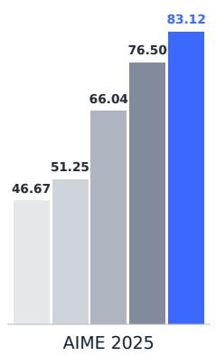

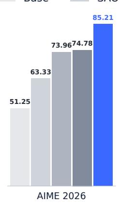

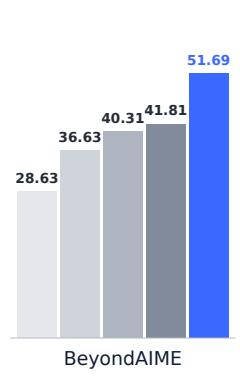

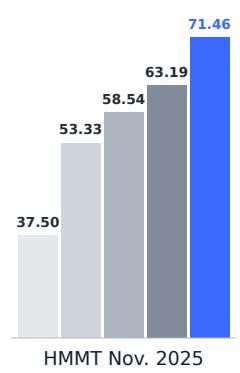

AllSpark

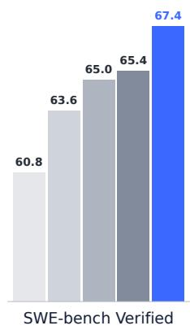  
Figure 1: Performance comparison of the base models and models trained with PPO (λ = 1), GRPO, SAO, and PACT on mathematical reasoning and coding benchmarks. Mathematical reasoning results report Avg@16 accuracy on AIME 2025, AIME 2026, BeyondAIME, and HMMT Nov. 2025 using Qwen3.5-4B with OpenCode. Coding results report pass@1 rates on SWE-bench Verified using Qwen3.6-35B-A3B with Codex.

## 1 Introduction

Recent advances have demonstrated that reinforcement learning can substantially improve the capabilities of large language models across general tasks [11, 24, 6], general agents [45], and coding agents [7, 46]. In these settings, a language model may generate a long sequence of tokens and repeatedly interact with an external environment. However, the training signal is often a scalar outcome reward revealed only after the completion of the trajectory, while optimization updates are applied at the level of individual generated tokens. This difference in granularity gives rise to a fundamental credit assignment problem of determining how the final outcome should be attributed to the tokens in the trajectory. Furthermore, despite its central role in reinforcement learning, credit itself lacks a generally accepted mathematical characterization, and existing methods operationalize it through different algorithm-dependent quantities [31].

A common formulation models autoregressive language model reinforcement learning as a token-level Markov Decision Process, where the complete generation history is treated as the state and the next generated token as the action [34]. In interactive settings, taking the complete history of the prompt, generated tokens, and environment observations as the state yields a Markov representation. However, this repre sentation alone does not characterize how the realized outcome should be attributed across the generated tokens. In particular, it does not describe how the statistical information relevant to the final reward changes as the trajectory unfolds. Credit assignment therefore requires an additional characterization beyond the Markov formulation.

In this work, we formulate three regularity conditions for credit assignment, namely Completeness, Prefix Consistency, and Neutrality, and prove that credit is uniquely determined under these conditions. The resulting representation subsumes related forms previously derived under specific objectives or algorithmic constructions [2, 19, 37]. The same uniqueness result holds for credit assignment at coarser granularities, such as the turn level, with the corresponding representation obtained by aggregating token-level credit over consecutive segments.

## Our contributions are twofold:

• A unique representation theorem and its consequences. We establish a unique representation theorem for credit under three regularity conditions, namely Completeness, Prefix Consistency, and Neutrality. This representation provides a unified perspective on several phenomena in LLM reinforcement learning.

Under an ideal teacher, the On-Policy Distillation (OPD) [23] update is equivalent in expectation, up to a scaling factor, to the policy-gradient update induced by the unique credit, with the teacher acting as an implicit critic.

For REINFORCE Leave-One-Out (RLOO) [1], the response-level signal, although not itself tokenlevel credit, induces the same expected policy-gradient contribution as the unique credit representation.

We further establish approximate sparsity of token-level credit under bounded outcome rewards, providing a perspective on the sensitivity of fine-grained credit estimation to critic errors and the empirical difficulty of Generalized Advantage Estimation (GAE) based Actor-Critic methods in long-horizon settings [35].

• Policy Aligned Critic Training. Motivated by these findings, we propose Policy Aligned Critic Training (PACT). PACT adopts an Actor-then-Critic update order to enable importance sampling correction in critic training, better aligning the critic with the updated policy. We also use Binary Cross Entropy (BCE) instead of Mean Squared Error (MSE) to train the critic to better approximate the true values.

On four mathematical reasoning benchmarks, PACT achieves 72.87% average accuracy, outperforming GRPO and PPO by 8.80 and 13.16 percentage points, respectively. On SWE-bench Verified, PACT achieves a pass rate of 67.4%, outperforming PPO, GRPO, and SAO by 2.4, 2.0, and 3.8 percentage points, respectively.

All proofs are deferred to the appendices, which also contain additional discussion and a detailed review of related work.

## 2 Unique Representation of Token-Level Credit

Credit assignment can be defined at different granularities. For example, one may assign rewards to complete responses, interaction turns, or individual tokens. In autoregressive language model reinforcement learning, however, coarser-grained credit assignments can be viewed as special cases of token-level credit by aggregating consecutive tokens into larger units. Therefore, we shall firstly focus on the finest-grained formulation and study token-level credit assignment.

## 2.1 Notation: Reward Information Flow

We first introduce the necessary notation to formalize the information flow of rewards during autoregressive generation. Our formulation covers both standard autoregressive generation and agentic interaction. Given a prompt q, a realized trajectory takes the form

$$
Y = ( q , T _ { 1 } , O _ { 1 } , T _ { 2 } , O _ { 2 } , . . . , T _ { \tau } , O _ { \tau } ) ,
$$

where $T _ { i }$ is the i-th token generated by the policy and $O _ { i }$ is the observation returned by the environment after $T _ { i } .$ . An observation may be a tool response, an environment transition, user feedback, or any other information revealed to the model. We allow $O _ { i } = \alpha ;$ consequently, ordinary autoregressive language generation is recovered as the special case in which every observation is empty. The terminal reward is defined as a measurable function of the complete trajectory, $R = \mathcal { R } ( Y )$ ). In particular, R need not be assigned to any specific token or observation.

Let $\mathcal { F } _ { 0 } = \sigma ( q ) , \mathcal { F } _ { i } = \sigma ( q , T _ { 1 } , O _ { 1 } , \dots , T _ { i } , O _ { i } )$ denote the information available after the i-th token and its associated observation have been revealed. Here, $\sigma ( \cdot )$ denotes the generated sigma-algebra. We define the conditional reward prediction at this point as $V _ { i } = \dot { \mathbb { E } } \big [ R \mid \mathcal { F } _ { i } \big ]$

## 2.2 Regularity Conditions of Credit Assignment

Let $C _ { i }$ denote the credit assigned to the i-th generated token $T _ { i } .$ Although environmental observations $O _ { i }$ are incorporated into the information filtration and affect future token generation, credit assignment aims to attribute the final outcome only to the model’s generated tokens, rather than to environment-provided information. Here we also define the accumulated token credit up to step i as

$$
{ \cal S } _ { i } = \sum _ { j = 1 } ^ { i } { \cal C } _ { j } , \qquad { \cal S } _ { 0 } = 0 .
$$

We characterize token-level credit assignments through the following three regularity conditions.

Completeness. The assigned credits should fully explain the deviation of the final reward from its initial prediction:

$$
\sum _ { i = 1 } ^ { \tau } C _ { i } = R - \mathbb { E } [ R \mid \mathcal { F } _ { 0 } ] .
$$

Prefix Consistency. Credit assigned to a generated prefix should only reflect the information contained in that prefix. In particular, once a prefix has been generated, the credit accumulated by this prefix should be fixed from the perspective of the available information. Different realizations of future tokens or observations should be attributed to future decisions, rather than modifying the credit already assigned to previous tokens. Formally, for any two trajectories $Y$ and $\widetilde { Y } ,$ , if they share the same prefix information up to step i,

$$
( q , T _ { 1 } , O _ { 1 } , \dots , T _ { i } , O _ { i } ) = ( \widetilde { q } , \widetilde { T } _ { 1 } , \widetilde { O } _ { 1 } , \dots , \widetilde { T } _ { i } , \widetilde { O } _ { i } ) ,
$$

then the accumulated credits at step i should satisfy $S _ { i } ( Y ) = S _ { i } ( \widetilde { Y } )$

Neutrality. A token credit should neither systematically overestimate nor underestimate the contribution of the corresponding token from the perspective of the available information. The expected credit assigned to the next token should be zero:

$$
\mathbb { E } [ C _ { i } \mid { \mathcal { F } } _ { i - 1 } ] = 0 .
$$

## 2.3 Unique Representation Theorem

The following theorem is the central result of our characterization and provides the foundation for the subsequent analysis. It establishes that a token-level credit assignment satisfying the three regularity conditions introduced above exists and is unique, and that the unique assignment is given by the differences of a martingale. We further establish in Appendix C.2.3 that all three conditions are necessary for uniqueness by showing that omitting any one admits alternative credit assignments.

Theorem 1 (Unique Representation of Token-Level Credit). Let L denote the maximum number of generated tokens in a trajectory, and let $\tau \leq L$ be the stopping time induced by the generation process. Assume that R is integrable and $\mathcal { F } _ { \tau }$ -measurable. Define

$$
V _ { i } : = \mathbb { E } [ R \mid { \mathcal { F } } _ { i } ] , \qquad i = 0 , \ldots , \tau .
$$

There exists a unique integrable token-level credit assignment, up to almost-sure equality, $\{ C _ { i } \} _ { i = 1 } ^ { \tau }$ satisfying Completeness, Prefix Consistency, and Neutrality.

It admits the representation

$$
C _ { i } = V _ { i } - V _ { i - 1 } = \mathbb { E } [ R \mid { \mathcal { F } } _ { i } ] - \mathbb { E } [ R \mid { \mathcal { F } } _ { i - 1 } ] \quad a . s . , \qquad i = 1 , \ldots , \tau .
$$

Moreover, $\{ C _ { i } \} _ { i = 1 } ^ { \tau }$ is a martingale difference sequence with respect to $\{ \mathcal { F } _ { i } \} _ { i = 0 } ^ { \tau }$

Corollary 1 (Aggregation of the Unique Token-Level Representation). Consider any partition of the token sequence into consecutive segments

$$
\mathcal { T } _ { 1 } , \mathcal { T } _ { 2 } , \ldots , \mathcal { T } _ { K } ,
$$

where each segment $\mathcal { T } _ { k }$ contains a set of consecutive token indices. Define the segment-level credit as

$$
C ^ { ( k ) } = \sum _ { i \in \mathcal { T } _ { k } } C _ { i } .
$$

The resulting segment-level credit is

$$
C ^ { ( k ) } = \displaystyle \sum _ { i \in \mathbb { Z } _ { k } } \left( V _ { i } - V _ { i - 1 } \right) = V _ { b _ { k } } - V _ { a _ { k } - 1 } ,
$$

where $a _ { k }$ and $b _ { k }$ denote thefirst and last token indices of segment $\mathcal { T } _ { k }$

In particular, existing coarse-grained credit assignment schemes, such as turn-level attribution, can be recovered as special cases by aggregating the unique token-level representation over appropriate token segments.

## 3 Interpreting Existing RL Algorithms through the Unique Credit Representation

In this section, we use the unique credit representation to revisit several phenomena in LLM reinforcement learning. We first examine the relationship between OPD and critics, then study credit granularity in RLOO and credit estimation in GAE. All these analyses together motivate Policy Aligned Critic Training (PACT), introduced in the next section.

## 3.1 The Teacher in On-Policy Distillation is an Implicit Critic

On-Policy Distillation trains on student-generated trajectories using dense token-level supervision from a teacher [23]. Prior work further showed that the OPD objective can be algebraically reformulated as dense KL-constrained RL, in which the teacher–student log-density ratio plays the role of a token-level advantage [48]. This optimization-level equivalence, however, does not by itself guarantee that the induced signal is consistent with the outcome reward R, or that it constitutes a correct token-level credit assignment. We establish this missing credit-level connection by identifying an ideal teacher under which OPD induces, up to scaling, the same policy-gradient update as the unique token-level credit in Theorem 1.

Moreover, recent work suggests that effective on-policy distillation requires a teacher that improves upon the student while remaining compatible with its on-policy distribution [20]. We capture these requirements with an idealized teacher defined through KL-regularized reward improvement.

Fix a policy $\pi = \pi _ { \theta }$ and a token position $t \leq \tau$ . Let

$$
p _ { t } ( a ) = \pi _ { \theta } ( a \mid { \mathcal F } _ { t - 1 } )
$$

denote the current policy distribution over the vocabulary $\mathcal { V } .$ Define the token-action value

$$
\begin{array} { r } { Q _ { t } ^ { \pi } ( a ) = \mathbb { E } _ { \pi } \left[ R | \mathcal { F } _ { t - 1 } , T _ { t } = a \right] . } \end{array}
$$

The expectation includes the subsequent environment observation and all future tokens and observations generated under $\pi$

Definition 1 (Ideal Teacher). Let $\beta > 0$ . At each prefix $\mathcal { F } _ { t - 1 }$ , the ideal teacher distribution is defined by

$$
q _ { t } ^ { \star } \in \arg \operatorname* { m a x } _ { q \in \Delta ( \mathcal { V } ) } \left\{ \mathbb { E } _ { a \sim q } \left[ Q _ { t } ^ { \pi } ( a ) \right] - \beta D _ { \mathrm { K L } } ( q \| p _ { t } ) \right\} .
$$

We assume that R is bounded and that $p _ { t }$ has full support over V. The distribution $q _ { t } ^ { \star }$ is defined relative to the current policy and is held fixed during the corresponding OPD update.

For a teacher distribution $q _ { t } ,$ , sampled-token OPD assigns the signal

$$
A _ { t } ^ { \mathrm { O P D } } ( q _ { t } ) = \log \frac { q _ { t } ( T _ { t } ) } { p _ { t } ( T _ { t } ) } , \qquad T _ { t } \sim p _ { t } .
$$

Let

$$
Z _ { t } = \nabla _ { \boldsymbol { \theta } } \log \pi _ { \boldsymbol { \theta } } ( T _ { t } \mid \mathcal { F } _ { t - 1 } )
$$

denote the policy score. The on-policy update direction induced by $A _ { t } ^ { \mathrm { O P D } } ( q _ { t } )$ is

$$
G _ { t } ^ { \mathrm { { O P D } } } ( q _ { t } ) : = \mathbb { E } _ { \boldsymbol { \pi } } \left[ \left. Z _ { t } A _ { t } ^ { \mathrm { { O P D } } } ( q _ { t } ) \right| \mathcal { F } _ { t - 1 } \right] = \mathbb { E } _ { \boldsymbol { \pi } } \left[ \left. Z _ { t } \log \frac { q _ { t } ( T _ { t } ) } { p _ { t } ( T _ { t } ) } \right| \mathcal { F } _ { t - 1 } \right] .
$$

The following theorem identifies the OPD teacher as an implicit critic under the ideal-teacher assumption. Unlike a conventional critic represented by a value head, the OPD teacher provides credit through its KLbased objective. From this perspective, the empirical success of OPD further highlights the role of critics, even when no explicit value head is used.

Theorem 2 (Teacher Credit Equivalence). Let $q _ { t } ^ { \star }$ be the ideal teacher in Definition 1. Then

$$
G _ { t } ^ { \mathrm { O P D } } ( q _ { t } ^ { \star } ) = \frac { 1 } { \beta } \mathbb { E } _ { \boldsymbol { \pi } } \left[ Z _ { t } C _ { t } ^ { \boldsymbol { \pi } } | \mathcal { F } _ { t - 1 } \right] \qquad a . s . ,
$$

where

$$
C _ { t } ^ { \pi } = V _ { t } ^ { \pi } - V _ { t - 1 } ^ { \pi } , \quad \quad V _ { t } ^ { \pi } = \mathbb { E } _ { \pi } [ R \mid \mathcal { F } _ { t } ]
$$

is the unique token-level credit from Theorem 1.

## 3.2 Group-Level Baselines as Gradient-Equivalent Credit Surrogates

The unique representation theorem shows that the unique token-level credit depends on the evolution of conditional reward predictions: $C _ { i } = V _ { i } - V _ { i - 1 }$ . However, recent group-based RL algorithms for language models, such as GRPO [39] and RLOO [1], construct advantages using multiple sampled responses from the same prompt. The resulting baseline is defined at the response level, since it aggregates rewards from different sampled trajectories. This response-level baseline is then broadcast to every token position within the same response during policy optimization. This introduces a granularity gap between response-level baseline estimation and token-level credit assignment.

We now examine group-level baseline methods, taking RLOO as a representative example. We show that, although the RLOO baseline is constructed at the response level, the resulting token-wise policy gradient contribution coincides in expectation with that of the unique token-level credit.

Theorem 3 (Gradient Unbiasedness of the RLOO Estimator). Conditioned on a prompt $q ,$ let $G \geq 2$ trajectories be sampled independently from the current policy $\pi _ { \theta } .$ Let $R _ { j }$ denote the reward of trajectory j. For trajectory i, define the leave-one-out baseline

$$
\bar { R } _ { - i } = \frac { 1 } { G - 1 } \sum _ { j \neq i } R _ { j } .
$$

Then its token-level policy gradient estimator is equivalent in expectation to the gradient induced by the unique tokenlevel credit representation:

$$
\begin{array} { r } { \mathbb { E } \left[ \nabla _ { \theta } \log \pi _ { \theta } ( T _ { t } | \mathcal { F } _ { t - 1 } ) ( R _ { i } - \bar { R } _ { - i } ) \right] = \mathbb { E } \left[ \nabla _ { \theta } \log \pi _ { \theta } ( T _ { t } | \mathcal { F } _ { t - 1 } ) C _ { t } \right] . } \end{array}
$$

The preceding equivalence holds only in expectation and does not imply equal statistical efficiency. The conditional expectation $V _ { t } = \mathbb { E } [ R \mid \mathcal { F } _ { t } ]$ minimizes the mean squared prediction error among Ft-measurable predictors. In contrast, the response-level RLOO baseline retains randomness from finite outcomes. In long-horizon settings, these fluctuations can be substantial relative to the local credit signal. This motivates estimating credit at a finer granularity.

## 3.3 Approximate Credit Sparsity and Error Sensitivity of GAE

Recent empirical observations suggest that GAE with λ close to one can be beneficial in LLM reinforcement learning. DeepSeek-R1 [11] reports that PPO [36] with $\lambda \ : = \ : 1$ outperforms the commonly used setting $\lambda = 0 . { \check { 9 } } 5$ . SAO [14] adopts a length-adaptive GAE coefficient that approaches one as the response length increases. To understand these observations, we first establish an approximate sparsity property of credit and then examine how critic estimation errors enter GAE.

For any bounded reward, we can apply a positive affine transformation to normalize it into [0, 1] without changing the optimal policy. Therefore, we consider $R \in [ 0 , 1 ]$ without loss of generality. In this case, the reward variance satisfies $\begin{array} { r } { \mathrm { V a r } ( R ) \leq \frac { 1 } { 4 } } \end{array}$

Theorem 4 (Approximate Credit Sparsity). For any fixed prompt q,

$$
\mathbb { E } \left[ \sum _ { i = 1 } ^ { \tau } C _ { i } ^ { 2 } \mid \mathcal { F } _ { 0 } \right] = \operatorname { V a r } ( R \mid \mathcal { F } _ { 0 } ) \leq \frac { 1 } { 4 } .
$$

Consequently, for any $\epsilon > 0$

$$
\mathbb { E } \left[ \sum _ { i = 1 } ^ { \tau } \mathbf { 1 } \{ | C _ { i } | > \epsilon \} \Bigg | \mathcal { F } _ { 0 } \right] \leq \frac { 1 } { 4 \epsilon ^ { 2 } } .
$$

We now examine how this sparsity property relates to GAE in the outcome-only reward setting, where the reward is revealed only after the generation trajectory is complete. Let the critic estimate be ${ \widehat { V } } _ { i } = V _ { i } + \varepsilon _ { i } ,$ where $\varepsilon _ { i }$ denotes the value estimation error. With $\gamma = 1$ and the terminal prediction set to ${ \widehat { V } } _ { \tau } = R ,$ the TD residual becomes $\widehat { \delta } _ { i } = \widehat { V } _ { i } - \widehat { V } _ { i - 1 } = C _ { i } + \varepsilon _ { i } - \varepsilon _ { i - 1 }$ . For GAE with parameter $\lambda ,$ bthe estimated advantage is computed as $\begin{array} { r } { \widehat { A } _ { t } ^ { \lambda } = \sum _ { i = t } ^ { \tau } \lambda ^ { i - t } \widehat { \delta _ { i } } . } \end{array}$ . Substituting the above TD decomposition gives $\begin{array} { r } { \widehat { A } _ { t } ^ { \lambda } = \sum _ { i = t } ^ { \tau } \lambda ^ { i - t } C _ { i } - \varepsilon _ { t - 1 } + } \end{array}$ $\begin{array} { r } { \left( 1 - \lambda \right) \sum _ { i = t } ^ { \tau - 1 } \lambda ^ { i - t } \varepsilon _ { i } , } \end{array}$ bwhere the terminal value error is assumed to be zero.

This decomposition separates the true credit signal from critic estimation errors. The first term corresponds to the accumulated token-level credit, while the remaining terms arise from imperfect value estimation. When $\lambda < 1$ , intermediate critic errors are retained through the last term. However, Theorem 4 bounds the expected number of credit increments exceeding any fixed magnitude, independently of the maximum response length. Consequently, the critic error term can become comparable to, or even dominate, the true credit signal.

In contrast, when $\lambda \ : = \ : 1 .$ , the intermediate critic error term vanishes: $\widehat { A } _ { t } ^ { 1 } \ : = \ : \sum _ { i = t } ^ { \tau } C _ { i } - \varepsilon _ { t - 1 } \ : = \ : R - \widehat { V } _ { t - 1 }$ Therefore, $\lambda = 1$ beliminates intermediate value estimation errors, leaving only the prefix value error $- \varepsilon _ { t - 1 }$ Following the analysis above, our proposed method, i.e., PACT, uses $\lambda = 1$

## 4 Policy Aligned Critic Training

## 4.1 Motivation

Theorems 1 and 4 highlight the importance of accurate value estimation for fine-grained credit assignment. By Theorem 1, the unique token-level credit under policy π is

$$
C _ { i } ^ { \pi } = V _ { i } ^ { \pi } - V _ { i - 1 } ^ { \pi } , \qquad V _ { i } ^ { \pi } = \mathbb { E } _ { \pi } [ R \mid { \mathcal F } _ { i } ] .
$$

Thus, recovering local credit requires not only accurate value predictions, but also values corresponding to the policy currently being optimized. Moreover, Theorem 4 shows that most local credits can be small in long-horizon generation. Consequently, even a modest value error or policy mismatch may dominate the underlying credit signal.

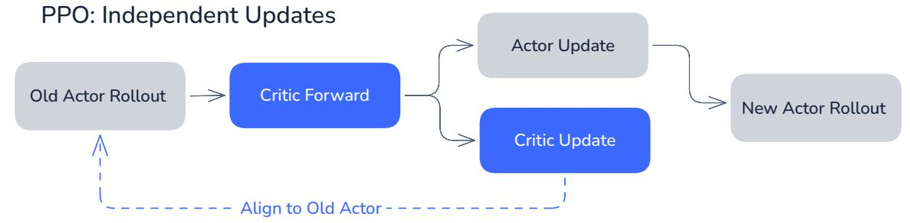

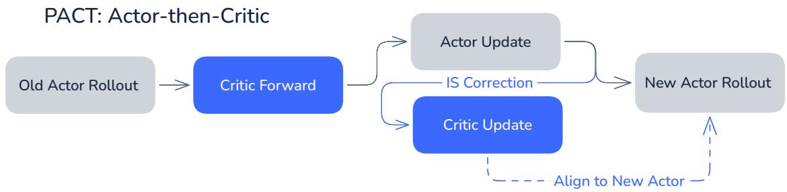  
Figure 2: PPO and PACT training workflows.

Under current RL training frameworks, PPO-style training can introduce a policy mismatch between the actor and the critic. Let $\pi _ { k }$ denote the policy used to generate the trajectories $\mathcal { D } _ { k } \bar { \ }$ in iteration k. The critic values used to compute advantages on $\mathcal { D } _ { k }$ are produced before the critic is updated on $\mathcal { D } _ { k }$ . Hence, these values are generated by critic parameters learned from the previous trajectories $\mathcal { D } _ { k - 1 } \sim \pi _ { k - 1 }$ :

$$
\begin{array} { r } { \mathcal { D } _ { k } \sim \pi _ { k } , \qquad \widehat { V } _ { \phi _ { k - 1 } } \approx V ^ { \pi _ { k - 1 } } . } \end{array}
$$

Although the critic is subsequently updated on $\mathcal { D } _ { k } ,$ the resulting critic is not used to recompute the advantages for the current actor update. After the actor is updated from $\pi _ { k }$ to $\pi _ { k + 1 } ,$ the critic is therefore again one policy update behind.

This policy–critic lag is especially consequential when token-level credit is obtained by differencing consecutive conditional values. It motivates training procedures that improve value estimation while explicitly synchronizing the critic with the updated policy. We shall develop such a procedure in this section.

## 4.2 Probabilistic Value Estimation

As discussed above and proved in Appendix C.1, any bounded reward can be normalized to $\left\lceil 0 , 1 \right\rceil$ without changing the optimal policy. We therefore assume $R \check { \in } [ 0 , 1 ]$ , which also implies $V _ { i } ^ { \pi } = \mathbb { E } _ { \pi } [ R \mid ^ { * } { \dot { \mathcal { F } } } _ { i } ] ^ { * } \in [ 0 , 1 ]$

Instead of the conventional mean squared error, we parameterize the critic as $\widehat { V } _ { \phi , i } = \sigma ( z _ { \phi , i } )$ and optimize the soft binary cross-entropy loss

$$
\mathcal { L } _ { \mathrm { B C E } } ( \phi ) = \mathbb { E } \left[ - R \log \widehat { V } _ { \phi , i } - ( 1 - R ) \log ( 1 - \widehat { V } _ { \phi , i } ) \right] .
$$

For $R \in [ 0 , 1 ]$ , BCE and MSE have the same optimal prediction:

$$
\arg \operatorname* { m i n } _ { v \in [ 0 , 1 ] } \mathbb { E } [ - R \log v - ( 1 - R ) \log ( 1 - v ) \mid \mathcal { F } _ { i } ] = \arg \operatorname* { m i n } _ { v \in \mathbb { R } } \mathbb { E } [ ( v - R ) ^ { 2 } \mid \mathcal { F } _ { i } ] = V _ { i } ^ { \pi } .
$$

At the endpoints, BCE is defined by its limits, allowing the value +∞, with 0 log $0 = 0$ . Thus, using BCE does not change the value being estimated. Classification-based objectives have shown favorable empirical performance for value estimation in deep reinforcement learning [8]. Furthermore, a controlled criticpretraining ablation, reported in Section 5.3, shows that the probabilistic BCE critic converges substantially faster than the conventional MSE critic.

Table 1: Mathematical reasoning performance on Avg@16 accuracy (%).
<table><tr><td>Method</td><td>AIME 2025</td><td>AIME 2026</td><td>BeyondAIME</td><td>HMMT Nov. 2025</td><td>Average</td></tr><tr><td>Base Model</td><td>46.67</td><td>51.25</td><td>28.63</td><td>37.50</td><td>41.01</td></tr><tr><td>GRPO  $( \epsilon _ { \mathrm { h i g h } } = 0 . 2 8 )$ </td><td>76.50</td><td>74.78</td><td>41.81</td><td>63.19</td><td>64.07</td></tr><tr><td>PPO (λ = 0.95)</td><td>32.33</td><td>29.38</td><td>17.86</td><td>25.67</td><td>26.31</td></tr><tr><td>PPO (λ = 1.0)</td><td>66.04</td><td>73.96</td><td>40.31</td><td>58.54</td><td>59.71</td></tr><tr><td>SAO</td><td>51.25</td><td>63.33</td><td>36.63</td><td>53.33</td><td>51.14</td></tr><tr><td>PACT w/o IS</td><td>76.04</td><td>82.50</td><td>51.38</td><td>61.04</td><td>67.74</td></tr><tr><td>PACT</td><td>83.12</td><td>85.21</td><td>51.69</td><td>71.46</td><td>72.87</td></tr></table>

## 4.3 Off-Policy Critic Synchronization

As shown in Figure 2, Policy Aligned Critic Training (PACT) introduces an Actor-then-Critic dependency through importance-corrected critic targets, whereas standard PPO allows independent actor and critic updates. Within each iteration, the current critic first provides the value predictions required for actor optimization. After all actor updates have been completed, we perform one additional forward pass over the same rollout batch using the updated actor. Together with the log-probabilities recorded before the update, this produces importance ratios between the pre-update and post-update policies. We then train the critic using these ratios, so that the iteration ends with the critic better aligned to the updated actor.

Let $\mu = \pi _ { k }$ be the policy before the actor update and $\pi = \pi _ { k + 1 }$ the updated policy. For a prefix $\mathcal { F } _ { t - 1 }$ , define the continuation importance ratio

$$
I _ { t } = \prod _ { k = t } ^ { \tau } \frac { \pi ( T _ { k } \mid \mathcal { F } _ { k - 1 } ) } { \mu ( T _ { k } \mid \mathcal { F } _ { k - 1 } ) } .
$$

Assuming unchanged environment dynamics and absolute continuity of the continuation distributions, a change of measure gives

$$
V _ { t - 1 } ^ { \pi } = \mathbb { E } _ { \pi } [ R \mid { \mathcal F } _ { t - 1 } ] = \mathbb { E } _ { \mu } [ I _ { t } R \mid { \mathcal F } _ { t - 1 } ] .
$$

We now regard $I _ { t } R$ as a single random variable. As established in the previous subsection, binary crossentropy recovers the conditional mean: for any integrable random variable Y whose conditional mean lies in $[ 0 , { \dot { 1 } } ] .$

$$
\operatorname { \mathbb { E } } \left[ Y \mid { \mathcal { F } } \right] = \arg \operatorname* { m i n } _ { x \in [ 0 , 1 ] } \operatorname { \mathbb { E } } \left[ { \mathcal { L } } _ { \mathrm { B C E } } ( x , Y ) \mid { \mathcal { F } } \right] .
$$

Throughout this subsection, the conditional expected BCE is extended to $x = 0$ and $x = 1$ by taking onesided limits after the conditional expectation. For a sigmoid-parameterized critic, optima at 0 and 1 are approached as the logit tends to −∞ and +∞, respectively.

Applying this result with $Y = I _ { t } R$ immediately gives

$$
V _ { t - 1 } ^ { \pi } = \arg \operatorname* { m i n } _ { x \in [ 0 , 1 ] } \mathbb { E } _ { \mu } \left[ \mathcal { L } _ { \mathrm { B C E } } ( x , I _ { t } R ) \ : | \ : \mathcal { F } _ { t - 1 } \right] .
$$

Therefore, trajectories sampled before the actor update can be used to train a critic for the updated actor by replacing the original reward target R with the importance-corrected target $I _ { t } R .$ . Although an individual realization of $I _ { t } R$ need not lie in $[ 0 , 1 ]$ , this does not alter the conditional minimizer above; a logit-space gradient analysis is provided in Appendix C.6. In practice, the exact continuation ratio can have high variance for long responses. We use the detached current-token importance ratio and mask out token-level critic losses whose ratios fall outside $[ \rho _ { \mathrm { m i n } } , \rho _ { \mathrm { m a x } } ]$ . These ratios require only one additional forward pass after actor training and no additional rollout generation, yielding a stable and inexpensive surrogate for exact policy synchronization.

## 5 Experiments

## 5.1 Experimental Setup

All RL training experiments use Dressage [16], an agentic RL framework built on slime [54] that integrates agent execution, trajectory collection, and policy training.

Table 2: SWE-bench Verified pass rates (%) with Qwen3.6-35B-A3B.
<table><tr><td>Method</td><td>Base Model</td><td>GRPO</td><td> $\mathrm { P P O } \left( \lambda = 1 . 0 \right)$ </td><td>SAO</td><td>PACT</td></tr><tr><td>Pass@1 Rate</td><td>60.8</td><td>65.4</td><td>65.0</td><td>63.6</td><td>67.4</td></tr></table>

Training Details. For mathematical reasoning, we train Qwen3.5-4B [32] on a subset of DAPO-Math-17k [49] using the OpenCode [29] agentic harness, with final-answer correctness as the outcome reward. The training subset contains 3,200 problems, constructed by prioritizing problems that the initial policy fails under pass@1 evaluation and randomly sampling additional problems from the remaining pool. For agentic coding, we train Qwen3.6-35B-A3B [33] on OpenSWE [9] using a Codex [28] agent through Harbor [12], with terminal rewards provided by the task verifier. For both tasks, each rollout round produces 512 trajectories. GRPO samples 8 trajectories for each of 64 prompts. The optimization batch size is 128, yielding four minibatches per rollout round. SAO uses DIS with importance ratio ranges of [0.7, 6.0] for mathematical reasoning and [0.6, 3.0] for coding. PACT uses the same actor-side DIS range as SAO for mathematical reasoning and PPO clipping for coding. For critic training, PACT masks out samples whose importance ratios fall outside [0, 6]. For both tasks, the context window is 128k tokens, and the maximum generation length per interaction turn is 64k tokens.

Evaluation. For mathematical reasoning, we evaluate on AIME 2025, AIME 2026, HMMT Nov. 2025 [4], and BeyondAIME [5], reporting Avg@16 accuracy. We compare PACT with GRPO using Clip-Higher, PPO with $\bar { \lambda ^ { \prime } } \in \lbrace 0 . 9 5 , 1 . 0 \rbrace$ , and SAO. For agentic coding, we evaluate on SWE-bench Verified [18] and compare PACT with SAO, GRPO with Clip-Higher, and PPO with λ = 1.0.

## 5.2 Main Results

Tables 1 and 2 report the results on mathematical reasoning and agentic coding, respectively. On mathematical reasoning, PACT achieves the highest accuracy on all four benchmarks, averaging 72.87% and outperforming GRPO, PPO with λ = 1.0, and SAO by 8.80, 13.16, and 21.73 percentage points, respectively. PPO with $\lambda = 1 . 0$ also outperforms λ = 0.95, which undergoes policy collapse during training, consistent with our analysis of intermediate critic errors in GAE. On SWE-bench Verified, PACT achieves the highest pass rate of 67.4%, outperforming GRPO, PPO with λ = 1.0, and SAO by 2.0, 2.4, and 3.8 percentage points, respectively.

## 5.3 Ablation Studies

Critic Objective. We isolate the effect of the critic objective by fixing the rollout policy and training BCE and MSE critics from the same initialization on the same on-policy rollout data. We conduct this comparison in both settings described above: Qwen3.5-4B on mathematical reasoning and Qwen3.6-35B-A3B on agentic coding.

As shown in Figure $^ { 3 , }$ across both model scales, BCE-trained critics achieve lower BCE and MSE losses and greater value separation than their MSE-trained counterparts. Here, $\Delta \pm$ denotes the mean predicted value on positive samples minus that on negative samples. The larger separation indicates that BCE-trained critics assign more distinct values to successful and unsuccessful trajectories.

Importance Sampling Correction. PACT w/o IS retains the Actor-then-Critic update order, BCE critic objective, and actor-side optimization settings, but removes the critic-target importance sampling correction. As shown in Table 1, adding importance correction improves average accuracy from 67.74% to 72.87%, a gain of 5.13 percentage points, with improvements on all four benchmarks. It also leads to more stable training, as illustrated by the training reward curves in Appendix E.3. This comparison supports the effectiveness of importance sampling correction in PACT.

## 6 Conclusion

We studied credit assignment under three regularity conditions, namely Completeness, Prefix Consistency, and Neutrality, and proved that credit is uniquely determined under these conditions. The resulting representation provides a unified basis for explaining phenomena across existing algorithms. Under an ideal teacher, OPD yields an expected policy gradient proportional to that induced by credit, identifying the teacher as an implicit critic. RLOO yields the same expected policy gradient contribution despite its coarser granularity. We further established approximate credit sparsity under bounded outcome rewards and analyzed how intermediate critic errors affect GAE in long-horizon settings.

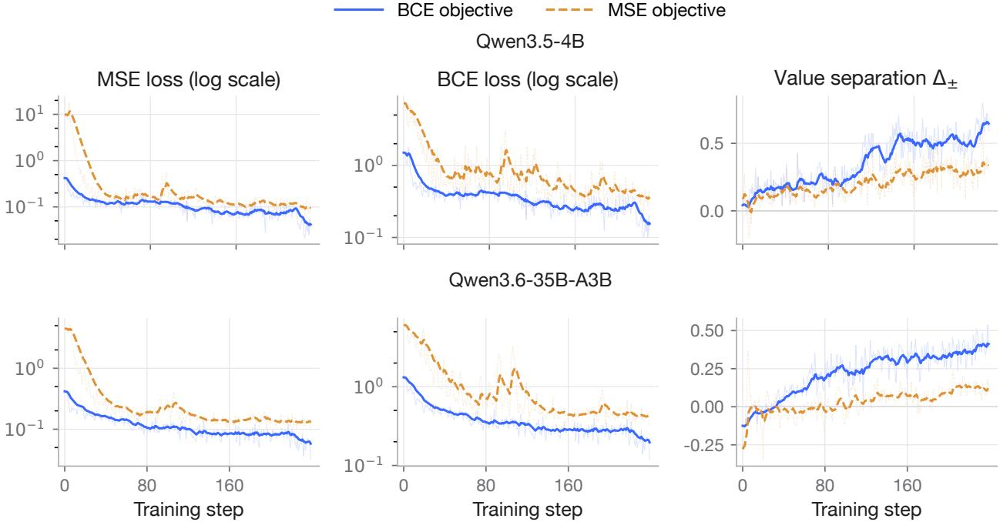  
Figure 3: Fixed-policy critic pretraining with BCE and MSE objectives. Critics are trained from the same initialization on the same on-policy rollout data. We compare BCE loss, MSE loss, and value separation ∆±.

Motivated by these findings, we proposed Policy Aligned Critic Training (PACT). Its Actor-then-Critic update order enables importance sampling correction in critic training to better align the critic with the updated policy. PACT also uses BCE instead of MSE to improve value estimation. Across four mathematical reasoning benchmarks, PACT achieves 72.87% average accuracy, outperforming GRPO and PPO by 8.80 and 13.16 percentage points, respectively. On SWE-bench Verified, PACT achieves a pass rate of 67.4%, outperforming GRPO, PPO, and SAO by 2.0, 2.4, and 3.8 percentage points, respectively. Together, these results show how a mathematical characterization of credit can explain existing algorithms and guide improvements to actor-critic training.

## References

[1] Arash Ahmadian, Chris Cremer, Matthias Gallé, Marzieh Fadaee, Julia Kreutzer, Olivier Pietquin, Ahmet Üstün, and Sara Hooker. Back to basics: Revisiting reinforce-style optimization for learning from human feedback in llms. In Proceedings of the 62nd Annual Meeting of the Association for Computational Linguistics (Volume 1: Long Papers), pp. 12248–12267, 2024.

[2] Jose A Arjona-Medina, Michael Gillhofer, Michael Widrich, Thomas Unterthiner, Johannes Brandstetter, and Sepp Hochreiter. Rudder: Return decomposition for delayed rewards. Advances in Neural Information Processing Systems, 32, 2019.

[3] Yuntao Bai, Andy Jones, Kamal Ndousse, Amanda Askell, Anna Chen, Nova DasSarma, Dawn Drain, Stanislav Fort, Deep Ganguli, Tom Henighan, et al. Training a helpful and harmless assistant with reinforcement learning from human feedback. arXiv preprint arXiv:2204.05862, 2022.

[4] Mislav Balunovi´c, Jasper Dekoninck, Ivo Petrov, Nikola Jovanovi´c, and Martin Vechev. Matharena: Evaluating llms on uncontaminated math competitions, 2026. URL https://arxiv.org/abs/2505. 23281.

[5] ByteDance-Seed. BeyondAIME: Advancing math reasoning evaluation beyond high school olympiads. https://huggingface.co/datasets/ByteDance-Seed/BeyondAIME, 2025.

[6] Jorge Zhoujun Cheng, Shibo Hao, Tianyang Liu, Fan Zhou, Yutao Xie, Feng Yao, Yuexin Bian, Nilabjo Dey, Yonghao Zhuang, Yuheng Zha, et al. Revisiting reinforcement learning for llm reasoning from a cross-domain perspective. Advances in Neural Information Processing Systems, 38, 2026.

[7] Jeff Da, Clinton Wang, Xiang Deng, Yuntao Ma, Nikhil Barhate, and Sean Hendryx. Agentrlvr: Training software engineering agents via guidance and environment rewards. arXiv preprint arXiv:2506.11425, 2025.

[8] Jesse Farebrother, Jordi Orbay, Quan Vuong, Adrien Ali Taïga, Yevgen Chebotar, Ted Xiao, Alex Irpan, Sergey Levine, Pablo Samuel Castro, Aleksandra Faust, et al. Stop regressing: Training value functions via classification for scalable deep rl. arXiv preprint arXiv:2403.03950, 2024.

[9] Dayuan Fu, Shenyu Wu, Yunze Wu, Zerui Peng, Yaxing Huang, Jie Sun, Ji Zeng, Mohan Jiang, Lin Zhang, Yukun Li, Jiarui Hu, Liming Liu, Jinlong Hou, and Pengfei Liu. davinci-env: Open swe environment synthesis at scale, 2026. URL https://arxiv.org/abs/2603.13023.

[10] Wei Fu, Jiaxuan Gao, Xujie Shen, Chen Zhu, Zhiyu Mei, Chuyi He, Shusheng Xu, Guo Wei, Jun Mei, Jiashu Wang, et al. Areal: A large-scale asynchronous reinforcement learning system for language reasoning. Advances in Neural Information Processing Systems, 38:36256–36282, 2026.

[11] Daya Guo, Dejian Yang, Haowei Zhang, Junxiao Song, Peiyi Wang, Qihao Zhu, Runxin Xu, Ruoyu Zhang, Shirong Ma, Xiao Bi, et al. Deepseek-r1: Incentivizing reasoning capability in llms via rein forcement learning. arXiv preprint arXiv:2501.12948, 2025.

[12] Harbor Framework Team. Harbor: A framework for evaluating and optimizing agents and models in container environments, 2026. URL https://doi.org/10.5281/zenodo.20953922.

[13] Anna Harutyunyan, Will Dabney, Thomas Mesnard, Mohammad Gheshlaghi Azar, Bilal Piot, Nicolas Heess, Hado P van Hasselt, Gregory Wayne, Satinder Singh, Doina Precup, et al. Hindsight credit assignment. Advances in neural information processing systems, 32, 2019.

[14] Zhenyu Hou, Yujiang Li, Jie Tang, and Yuxiao Dong. Single-rollout asynchronous optimization for agentic reinforcement learning. arXiv preprint arXiv:2607.07508, 2026.

[15] Jian Hu, Jason Klein Liu, Haotian Xu, and Wei Shen. Reinforce++: Stabilizing critic-free policy optimization with global advantage normalization. arXiv preprint arXiv:2501.03262, 2025.

[16] Liangmeng Huang, Qingchuan Li, Hongwei Xue, Shilin Yan, and Dressage Contributors. Dressage: Scalable RL for any agent and any sandbox. https://github.com/Accio-Lab/Dressage, 2026.

[17] Chia-Chun Hung, Timothy Lillicrap, Josh Abramson, Yan Wu, Mehdi Mirza, Federico Carnevale, Arun Ahuja, and Greg Wayne. Optimizing agent behavior over long time scales by transporting value. Nature communications, 10(1):5223, 2019.

[18] Carlos E Jimenez, John Yang, Alexander Wettig, Shunyu Yao, Kexin Pei, Ofir Press, and Karthik R Narasimhan. SWE-bench: Can language models resolve real-world github issues? In The Twelfth International Conference on Learning Representations, 2024. URL https://openreview.net/forum?id= VTF8yNQM66.

[19] Amirhossein Kazemnejad, Milad Aghajohari, Eva Portelance, Alessandro Sordoni, Siva Reddy, Aaron Courville, and Nicolas Le Roux. Vineppo: Refining credit assignment in rl training of llms. arXiv preprint arXiv:2410.01679, 2024.

[20] Yaxuan Li, Yuxin Zuo, Bingxiang He, Jinqian Zhang, Chaojun Xiao, Cheng Qian, Tianyu Yu, Huanang Gao, Wenkai Yang, Zhiyuan Liu, et al. Rethinking on-policy distillation of large language models: Phenomenology, mechanism, and recipe. arXiv preprint arXiv:2604.13016, 2026.

[21] Ziniu Li, Tian Xu, Yushun Zhang, Zhihang Lin, Yang Yu, Ruoyu Sun, and Zhi-Quan Luo. Remax: A simple, effective, and efficient reinforcement learning method for aligning large language models. arXiv preprint arXiv:2310.10505, 2023.

[22] Zichen Liu, Changyu Chen, Wenjun Li, Penghui Qi, Tianyu Pang, Chao Du, Wee Sun Lee, and Min Lin. Understanding r1-zero-like training: A critical perspective. arXiv preprint arXiv:2503.20783, 2025.

[23] Kevin Lu and Thinking Machines Lab. On-policy distillation. Thinking Machines Lab: Connectionism, 2025. doi: 10.64434/tml.20251026. https://thinkingmachines.ai/blog/on-policy-distillation.

[24] Xueguang Ma, Qian Liu, Dongfu Jiang, Ge Zhang, Zejun Ma, and Wenhu Chen. General-reasoner: Advancing llm reasoning across all domains. Advances in Neural Information Processing Systems, 38: 56596–56618, 2026.

[25] Thomas Mesnard, Théophane Weber, Fabio Viola, Shantanu Thakoor, Alaa Saade, Anna Harutyunyan, Will Dabney, Tom Stepleton, Nicolas Heess, Arthur Guez, et al. Counterfactual credit assignment in model-free reinforcement learning. arXiv preprint arXiv:2011.09464, 2020.

[26] Alexander Meulemans, Simon Schug, Seijin Kobayashi, Nathaniel Daw, and Gregory Wayne. Would i have gotten that reward? long-term credit assignment by counterfactual contribution analysis, 2023. URL https://arxiv.org/abs/2306.16803.

[27] Marvin Minsky. Steps toward artificial intelligence. Proceedings of the IRE, 49(1):8–30, 1961.

[28] OpenAI. Codex CLI. https://github.com/openai/codex, 2025. GitHub repository.

[29] OpenCode Contributors. OpenCode: The open source ai coding agent. https://github.com/ anomalyco/opencode, 2025. GitHub repository.

[30] Long Ouyang, Jeffrey Wu, Xu Jiang, Diogo Almeida, Carroll Wainwright, Pamela Mishkin, Chong Zhang, Sandhini Agarwal, Katarina Slama, Alex Ray, et al. Training language models to follow instructions with human feedback. Advances in neural information processing systems, 35:27730–27744, 2022.

[31] Eduardo Pignatelli, Johan Ferret, Matthieu Geist, Thomas Mesnard, Hado van Hasselt, Olivier Pietquin, and Laura Toni. A survey of temporal credit assignment in deep reinforcement learning. arXiv preprint arXiv:2312.01072, 2023.

[32] Qwen Team. Qwen3.5: Towards native multimodal agents, February 2026. URL https://qwen.ai/ blog?id=qwen3.5.

[33] Qwen Team. Qwen3.6-35B-A3B: Agentic coding power, now open to all, April 2026. URL https: //qwen.ai/blog?id=qwen3.6-35b-a3b.

[34] Rajkumar Ramamurthy, Prithviraj Ammanabrolu, Kianté Brantley, Jack Hessel, Rafet Sifa, Christian Bauckhage, Hannaneh Hajishirzi, and Yejin Choi. Is reinforcement learning (not) for natural language processing: Benchmarks, baselines, and building blocks for natural language policy optimization. arXiv preprint arXiv:2210.01241, 2022.

[35] John Schulman, Philipp Moritz, Sergey Levine, Michael Jordan, and Pieter Abbeel. High-dimensional continuous control using generalized advantage estimation. arXiv preprint arXiv:1506.02438, 2015.

[36] John Schulman, Filip Wolski, Prafulla Dhariwal, Alec Radford, and Oleg Klimov. Proximal policy optimization algorithms. arXiv preprint arXiv:1707.06347, 2017.

[37] Amrith Setlur, Chirag Nagpal, Adam Fisch, Xinyang Geng, Jacob Eisenstein, Rishabh Agarwal, Alekh Agarwal, Jonathan Berant, and Aviral Kumar. Rewarding progress: Scaling automated process verifiers for llm reasoning. In International Conference on Learning Representations, volume 2025, pp. 60808– 60838, 2025.

[38] Claude Elwood Shannon. A mathematical theory of communication. The Bell system technical journal, 27(3):379–423, 1948.

[39] Zhihong Shao, Peiyi Wang, Qihao Zhu, Runxin Xu, Junxiao Song, Xiao Bi, Haowei Zhang, Mingchuan Zhang, YK Li, Yang Wu, et al. Deepseekmath: Pushing the limits of mathematical reasoning in open language models. arXiv preprint arXiv:2402.03300, 2024.

[40] Nisan Stiennon, Long Ouyang, Jeffrey Wu, Daniel Ziegler, Ryan Lowe, Chelsea Voss, Alec Radford, Dario Amodei, and Paul F Christiano. Learning to summarize with human feedback. Advances in neural information processing systems, 33:3008–3021, 2020.

[41] Richard S Sutton. Learning to predict by the methods of temporal differences. Machine learning, 3(1): 9–44, 1988.

[42] Richard S. Sutton and Andrew G. Barto. Reinforcement Learning: An Introduction. MIT Press, Cambridge, MA, 1998.

[43] Richard S Sutton, David McAllester, Satinder Singh, and Yishay Mansour. Policy gradient methods for reinforcement learning with function approximation. Advances in neural information processing systems, 12, 1999.

[44] Kimi Team, Angang Du, Bofei Gao, Bowei Xing, Changjiu Jiang, Cheng Chen, Cheng Li, Chenjun Xiao, Chenzhuang Du, Chonghua Liao, et al. Kimi k1.5: Scaling reinforcement learning with llms. arXiv preprint arXiv:2501.12599, 2025.

[45] Zihan Wang, Kangrui Wang, Qineng Wang, Pingyue Zhang, Linjie Li, Zhengyuan Yang, Xing Jin, Kefan Yu, Minh Nhat Nguyen, Licheng Liu, et al. Ragen: Understanding self-evolution in llm agents via multi-turn reinforcement learning. arXiv preprint arXiv:2504.20073, 2025.

[46] Yuxiang Wei, Zhiqing Sun, Emily McMilin, Jonas Gehring, David Zhang, Gabriel Synnaeve, Daniel Fried, Lingming Zhang, and Sida Wang. Toward training superintelligent software agents through self-play swe-rl. arXiv preprint arXiv:2512.18552, 2025.

[47] Ronald J Williams. Simple statistical gradient-following algorithms for connectionist reinforcement learning. Machine learning, 8(3):229–256, 1992.

[48] Wenkai Yang, Weijie Liu, Ruobing Xie, Kai Yang, Saiyong Yang, and Yankai Lin. Learning beyond teacher: Generalized on-policy distillation with reward extrapolation. arXiv preprint arXiv:2602.12125, 2026.

[49] Qiying Yu, Zheng Zhang, Ruofei Zhu, Yufeng Yuan, Xiaochen Zuo, Yu Yue, Weinan Dai, Tiantian Fan, Gaohong Liu, Lingjun Liu, et al. Dapo: An open-source llm reinforcement learning system at scale. Advances in Neural Information Processing Systems, 38:113222–113244, 2026.

[50] Yufeng Yuan, Yu Yue, Ruofei Zhu, Tiantian Fan, and Lin Yan. What’s behind ppo’s collapse in long-cot? value optimization holds the secret. arXiv preprint arXiv:2503.01491, 2025.

[51] Yu Yue, Yufeng Yuan, Qiying Yu, Xiaochen Zuo, Ruofei Zhu, Wenyuan Xu, Jiaze Chen, Chengyi Wang, TianTian Fan, Zhengyin Du, et al. Vapo: Efficient and reliable reinforcement learning for advanced reasoning tasks. arXiv preprint arXiv:2504.05118, 2025.

[52] Kaiyan Zhang, Yuxin Zuo, Bingxiang He, Youbang Sun, Runze Liu, Che Jiang, Yuchen Fan, Kai Tian, Guoli Jia, Pengfei Li, et al. A survey of reinforcement learning for large reasoning models. arXiv preprint arXiv:2509.08827, 2025.

[53] Chujie Zheng, Shixuan Liu, Mingze Li, Xiong-Hui Chen, Bowen Yu, Chang Gao, Kai Dang, Yuqiong Liu, Rui Men, An Yang, Jingren Zhou, and Junyang Lin. Group sequence policy optimization, 2025. URL https://arxiv.org/abs/2507.18071.

[54] Zilin Zhu, Chengxing Xie, Xin Lv, and slime Contributors. slime: An llm post-training framework for rl scaling. https://github.com/THUDM/slime, 2025. GitHub repository. Corresponding author: Xin Lv.

## A Contributors

Jiayan Fu, Hang $\mathrm { { X u } ^ { * } }$ , Yong Zhang, Zhaokai Luo, Yao Hu, Dongyan ZhaoB, Mu ChuanB

## B Additional Related Work

## B.1 Reinforcement Learning for Large Language Models

Reinforcement learning has become an important component of large language model post-training, supporting both preference alignment and the development of complex reasoning capabilities [30, 11]. Its early applications focused primarily on preference alignment [52]. Representative RLHF methods train scalar reward models from human preferences over model responses and use PPO to optimize language model policies [40, 30, 3]. Their PPO implementations use learned value functions to construct token-level advantage estimates [40, 30]. More recently, reinforcement learning has increasingly been used to improve complex reasoning through outcome-level or verifiable rewards [39, 11, 44, 52].

To avoid the computational cost and optimization difficulty of training a critic, ReMax [21] uses the reward of a greedily decoded response as its baseline, whereas RLOO [1] constructs a leave-one-out baseline from the rewards of other responses sampled for the same prompt. GRPO [39] instead replaces the learned value model with group-relative advantage estimates. REINFORCE++ [15] combines critic-free optimization with global advantage normalization. Subsequent work refines different components of critic-free optimization, including clipping, sampling, and loss aggregation in DAPO [49], normalization-bias correction in Dr. GRPO [22], and sequence-level importance weighting and clipping in GSPO [53].

Despite the prevalence of critic-free optimization, recent work has continued to develop value-based methods for long and heterogeneous reasoning trajectories. VC-PPO [50] attributes observed failures of PPO in long-chain-of-thought training to value-initialization bias and the attenuation of terminal reward signals in GAE, and accordingly introduces value pretraining and decoupled GAE. VAPO [51] builds on these techniques and introduces length-adaptive GAE for responses of varying lengths. The high and variable cost of generating long trajectories has also motivated asynchronous training systems [10, 14]. AReaL [10] decouples rollout generation from policy optimization and explicitly accounts for stale training samples, whereas SAO [14] combines single-rollout asynchronous training with a learned value model and a token-level GAE estimator. In contrast to these studies of optimization algorithms and training systems, our work develops a general characterization of token-level credit in long-sequence LLM reinforcement learning and studies its implications for response-level baselines and learned critics.

## B.2 Credit Assignment in Reinforcement Learning

Credit assignment concerns how earlier decisions contribute to subsequent outcomes and has been recognized as a fundamental difficulty in learning systems since early work on artificial intelligence [27]. Many classical reinforcement learning methods connect decisions to outcomes through sampled returns and temporal structure. Monte Carlo methods use sampled returns as targets for value estimation [42], whereas REINFORCE-style policy gradient methods use observed rewards or returns to construct gradient estimates [47]. Temporal-difference learning bootstraps from temporally successive predictions [41], while eligibility traces distribute subsequent TD errors to previously visited states and actions [42]. Actor-critic methods use learned value functions to estimate policy gradients [43]. Generalized advantage estimation combines TD residuals to control the bias-variance trade-off in advantage estimation [35].

When consequential decisions are separated from their outcomes by long temporal gaps, subsequent work has developed more targeted mechanisms. RUDDER learns return-equivalent reward redistributions through contribution analysis of return predictions [2], while Temporal Value Transport uses attentional memory retrieval to transport value estimates from later events to relevant events in the distant past [17]. Hindsight Credit Assignment assigns credit to past decisions according to the likelihood that they led to an observed outcome [13]. Counterfactual Credit Assignment constructs future-conditioned baselines to disentangle an action’s influence from external factors and subsequent actions [25], whereas COCOA estimates an action’s contribution by asking whether a subsequent reward would still have been obtained under an alternative action [26].

Pignatelli et al. [31] organize these developments into several methodological families, including approaches based on temporal contiguity, return decomposition, and future conditioning. Collectively, these methods address the propagation of delayed rewards, the decomposition of trajectory returns, or the estimation of action influence, but they do so through different target quantities and estimation procedures. In long-horizon reinforcement learning for large language models, this problem becomes especially salient, as many outcome-supervised methods use a single response-level or terminal reward to train a large number of token-level decisions. Our work studies the mathematical characterization of credit under three regularity conditions and uses the resulting unique representation to analyze existing algorithms and guide critic training.

## C Detailed Proofs

## C.1 Reward Normalization and Variance Bound

For a bounded reward R satisfying $R _ { \mathrm { m i n } } \le R \le R _ { \mathrm { m a x } }$ with $R _ { \mathrm { m i n } } < R _ { \mathrm { m a x } } ,$ define the normalized reward by

$$
\widetilde { R } = \frac { R - R _ { \operatorname* { m i n } } } { R _ { \operatorname* { m a x } } - R _ { \operatorname* { m i n } } } .
$$

Since this is a positive affine transformation, i.e.,

$$
\widetilde { R } = a R + b , \qquad a > 0 ,
$$

maximizing the expected reward is equivalent to maximizing the expected normalized reward.

It remains to show the variance bound for $R \in [ 0 , 1 ]$ . Let

$$
\mu = \mathbb { E } [ R ] .
$$

Since $0 \leq R \leq 1$ , we have

$$
R ^ { 2 } \leq R .
$$

Therefore,

$$
\operatorname { V a r } ( R ) = \mathbb { E } [ R ^ { 2 } ] - \mu ^ { 2 } \leq \mu - \mu ^ { 2 } = \mu ( 1 - \mu ) \leq { \frac { 1 } { 4 } } .
$$

## C.2 Unique Representation Theorem

## C.2.1 Prefix Consistency Implies Adaptedness

Lemma 1. Suppose that the prompt and all environmental observations are represented asfinite token sequences over afinite vocabulary. If a token-level credit assignment satisfies Prefix Consistency, then its accumulated-credit process $\{ S _ { i } \} _ { i = 0 } ^ { L }$ is adapted to the prefix filtration $\{ \mathcal { F } _ { i } \} _ { i = 0 } ^ { L } ;$ that $i s , S _ { i } \mathrm { ~ } i s \mathrm { ~ } \mathcal { F } _ { i }$ -measurable for every $i = 0 , \ldots , L$

Proof. Let $( \Omega , \mathcal { F } , \mathbb { P } )$ denote the underlying probability space. We assume that all information presented to the language model, including the prompt q and each environmental observation $O _ { j } ,$ , is represented as a finite token sequence over the finite vocabulary V. Let

$$
\mathcal { V } ^ { * } = \bigcup _ { m = 0 } ^ { \infty } \mathcal { V } ^ { m }
$$

denote the set of all finite token sequences. Since V is finite, $\mathcal { V } ^ { \ast }$ is countable. For any fixed step i, define the observed prefix

$$
H _ { i } = ( q , T _ { 1 } , O _ { 1 } , \dots , T _ { i } , O _ { i } ) .
$$

Then $H _ { i }$ takes values in the countable prefix space

$$
\mathcal { H } _ { i } = \mathcal { V } ^ { * } \times ( \mathcal { V } \times \mathcal { V } ^ { * } ) ^ { i } ,
$$

which we equip with the discrete sigma-algebra $2 ^ { \mathcal { H } _ { i } }$ . By construction,

$$
{ \mathcal { F } } _ { i } = \sigma ( H _ { i } ) .
$$

Prefix Consistency requires that, for any $\omega , \widetilde { \omega } \in \Omega$

$$
H _ { i } ( \omega ) = H _ { i } ( \widetilde { \omega } ) \quad \Longrightarrow \quad S _ { i } ( \omega ) = S _ { i } ( \widetilde { \omega } ) .
$$

Hence, for each $h \in H _ { i } ( \Omega )$ e, the random variable $S _ { i }$ etakes a common value on the fiber

$$
H _ { i } ^ { - 1 } ( \{ h \} ) .
$$

Define $g _ { i } : \mathcal { H } _ { i } \to \mathbb { R }$ by assigning this common value to $g _ { i } ( h )$ for $h \in H _ { i } ( \Omega )$ , and set $g _ { i } ( h ) = 0$ for h $\notin H _ { i } ( \Omega )$ Prefix Consistency ensures that $g _ { i }$ is well defined. Because $\mathcal { H } _ { i }$ is equipped with the discrete sigma-algebra, $g _ { i }$ is measurable. Moreover, by construction,

$$
S _ { i } = g _ { i } \circ H _ { i } .
$$

Since $H _ { i }$ is $\mathcal { F } _ { i }$ -measurable, it follows that $S _ { i }$ is also ${ \mathcal { F } } _ { i } .$ measurable. As this argument applies to every $i ,$ the accumulated-credit process is adapted to the prefix filtration.

## C.2.2 ProofofUnique Representation Theorem

Theorem 1 (Unique Representation of Token-Level Credit). Let L denote the maximum number of generated tokens in a trajectory, and let $\tau \leq L$ be the stopping time induced by the generation process. Assume that R is integrable and ${ \mathcal { F } } _ { \tau }$ -measurable. Define

$$
V _ { i } : = \mathbb { E } [ R \mid { \mathcal { F } } _ { i } ] , \qquad i = 0 , \ldots , \tau .
$$

There exists a unique integrable token-level credit assignment, up to almost-sure equality, $\{ C _ { i } \} _ { i = 1 } ^ { \tau }$ satisfying Completeness, Prefix Consistency, and Neutrality.

It admits the representation

$$
C _ { i } = V _ { i } - V _ { i - 1 } = \mathbb { E } [ R \mid { \mathcal { F } } _ { i } ] - \mathbb { E } [ R \mid { \mathcal { F } } _ { i - 1 } ] \quad a . s . , \qquad i = 1 , \ldots , \tau .
$$

Moreover, $\{ C _ { i } \} _ { i = 1 } ^ { \tau }$ is a martingale difference sequence with respect to $\{ \mathcal { F } _ { i } \} _ { i = 0 } ^ { \tau } .$

Proof. Since $\tau \leq L$ almost surely, we adopt the convention that $C _ { i } = 0$ on $\{ i > \tau \}$ and regard every credit sequence as being defined on the deterministic horizon $\{ 1 , \ldots , L \}$ . We similarly define

$$
V _ { i } : = \mathbb { E } [ R \mid { \mathcal { F } } _ { i } ] , \qquad i = 0 , \ldots , L .
$$

This extension is innocuous. Indeed, since R is $\mathcal { F } _ { \tau }$ -measurable, we have

$$
V _ { i } = R \qquad \mathrm { o n } ~ \{ \tau \leq i \} \quad \mathrm { a . s . }
$$

Consequently, $V _ { i } - V _ { i - 1 } = 0$ on $\{ i > \tau \}$ almost surely.

Existence. Define

$$
C _ { i } ^ { \star } : = V _ { i } - V _ { i - 1 } , \qquad i = 1 , \ldots , L .
$$

We verify that this assignment satisfies the three regularity conditions.

First, the sum telescopes:

$$
\sum _ { i = 1 } ^ { \tau } C _ { i } ^ { \star } = V _ { \tau } - V _ { 0 } .
$$

Because R is $\mathcal { F } _ { \tau }$ -measurable,

$$
V _ { \tau } = \mathbb { E } [ R \ | \ \mathcal { F } _ { \tau } ] = R \quad { \mathrm { a . s . } }
$$

Therefore,

$$
\sum _ { i = 1 } ^ { \tau } C _ { i } ^ { \star } = R - { \mathbb { E } } [ R \mid { \mathcal { F } } _ { 0 } ] \quad { \mathrm { a . s . } } ,
$$

which establishes Completeness.

Next, let

$$
S _ { i } ^ { \star } : = \sum _ { j = 1 } ^ { i } C _ { j } ^ { \star } = V _ { i } - V _ { 0 } .
$$

Recall that ${ \mathcal { F } } _ { i } = \sigma ( H _ { i } )$ and that the prefix space $\mathcal { H } _ { i }$ is countable. Hence, we may choose a version of the conditional expectation for which

$$
V _ { i } = v _ { i } ( H _ { i } )
$$

for some measurable function $v _ { i } : \mathcal { H } _ { i } \to \mathbb { R }$ . Likewise, $V _ { 0 } = v _ { 0 } ( q )$ for some measurable function $v _ { 0 }$ . It follows that

$$
S _ { i } ^ { \star } = v _ { i } ( H _ { i } ) - v _ { 0 } ( q ) .
$$

Thus, if two trajectories have the same prefix up to step i, they have the same value of $S _ { i } ^ { \star }$ . This proves Prefix Consistency.

Finally, the tower property of conditional expectation gives

$$
\begin{array} { r l } & { \mathbb { E } [ C _ { i } ^ { \star } \mid \mathcal { F } _ { i - 1 } ] = \mathbb { E } [ V _ { i } - V _ { i - 1 } \mid \mathcal { F } _ { i - 1 } ] } \\ & { \qquad = \mathbb { E } [ \mathbb { E } [ R \mid \mathcal { F } _ { i } ] \mid \mathcal { F } _ { i - 1 } ] - V _ { i - 1 } } \\ & { \qquad = \mathbb { E } [ R \mid \mathcal { F } _ { i - 1 } ] - V _ { i - 1 } } \\ & { \qquad = 0 \quad \mathrm { a . s . } } \end{array}
$$

Therefore, $C _ { i } ^ { \star }$ also satisfies Neutrality, proving existence.

Uniqueness. Let $\{ \widetilde { C } _ { i } \} _ { i = 1 } ^ { \tau }$ be any other credit assignment satisfying Completeness, Prefix Consistency, and eNeutrality. Extend it by setting $\dot { \widetilde { C } } _ { i } = 0 \mathrm { o n } \left\{ i > \tau \right\}$ , and define its accumulated credit process by

$$
\widetilde { S } _ { i } : = \sum _ { j = 1 } ^ { i } \widetilde { C } _ { j } , \qquad i = 0 , \dots , L ,
$$

with $\widetilde { S } _ { 0 } = 0$

By Prefix Consistency, $\widetilde { S } _ { i }$ depends only on the observed prefix $H _ { i } .$ . Equivalently, as established in Lemma 1, $\widetilde { S } _ { i }$ is ${ \mathcal { F } } _ { i } .$ e-measurable. Moreover, Neutrality yields

$$
\begin{array} { r l } & { \mathbb { E } \big [ \widetilde { S } _ { i } \mid \mathcal { F } _ { i - 1 } \big ] = \mathbb { E } \big [ \widetilde { S } _ { i - 1 } + \widetilde { C } _ { i } \mid \mathcal { F } _ { i - 1 } \big ] } \\ & { \qquad = \widetilde { S } _ { i - 1 } + \mathbb { E } \big [ \widetilde { C } _ { i } \mid \mathcal { F } _ { i - 1 } \big ] } \\ & { \qquad = \widetilde { S } _ { i - 1 } . } \end{array}
$$

Hence, $\{ \widetilde { S } _ { i } \} _ { i = 0 } ^ { L }$ is a martingale with respect to $\{ \mathcal { F } _ { i } \} _ { i = 0 } ^ { L }$

By Completeness and the zero extension after $\tau ,$ its terminal value is

$$
\widetilde { S } _ { L } = \widetilde { S } _ { \tau } = R - \mathbb { E } [ R \ | \ \mathcal { F } _ { 0 } ] = R - V _ { 0 } \quad \mathrm { a . s . }
$$

A finite-horizon martingale is determined by its terminal value. Therefore, for every $i = 0 , \ldots , L ,$

$$
\begin{array} { r l } & { \widetilde { S } _ { i } = \mathbb { E } [ \widetilde { S } _ { L } \mid \mathcal { F } _ { i } ] } \\ & { \quad = \mathbb { E } [ R - V _ { 0 } \mid \mathcal { F } _ { i } ] } \\ & { \quad = \mathbb { E } [ R \mid \mathcal { F } _ { i } ] - V _ { 0 } } \\ & { \quad = V _ { i } - V _ { 0 } \quad \mathrm { a . s . } } \end{array}
$$

Taking successive differences gives

$$
\widetilde { C } _ { i } = \widetilde { S } _ { i } - \widetilde { S } _ { i - 1 } = V _ { i } - V _ { i - 1 } = C _ { i } ^ { \star } \quad \mathrm { a . s . }
$$

for every $i \leq \tau$ . Thus, the credit assignment is unique up to almost-sure equality.

The representation also immediately implies

$$
\mathbb { E } [ C _ { i } ^ { \star } \mid { \mathcal { F } } _ { i - 1 } ] = 0 ,
$$

so $\{ C _ { i } ^ { \star } \} _ { i = 1 } ^ { \tau }$ is a martingale difference sequence with respect to $\{ \mathcal { F } _ { i } \} _ { i = 0 } ^ { \tau } .$

## C.2.3 Necessity of the Regularity Conditions

The three regularity conditions in Theorem 1 are logically independent. The following construction shows that removing any one of them admits credit assignments that differ from the unique conditional-reward increments.

Proposition 1 (Necessity of the three regularity conditions). None of Completeness, Prefix Consistency, and Neutrality is implied by the other two. A single bounded two-step process suffices to show that none of the three conditions is implied by the other two.

Proof. Let X and Y be independent Rademacher random variables:

$$
\mathbb { P } ( X = 1 ) = \mathbb { P } ( X = - 1 ) = \mathbb { P } ( Y = 1 ) = \mathbb { P } ( Y = - 1 ) = { \frac { 1 } { 2 } } .
$$

Consider a stochastic process with a deterministic two-step horizon with

$$
\tau = 2 , \qquad \mathcal { F } _ { 0 } = \{ \emptyset , \Omega \} , \qquad \mathcal { F } _ { 1 } = \sigma ( X ) , \qquad \mathcal { F } _ { 2 } = \sigma ( X , Y ) ,
$$

and define the terminal reward by

$$
R = { \frac { 1 + X } { 2 } } .
$$

Thus $R \in \{ 0 , 1 \}$ , and

$$
V _ { 0 } = \mathbb { E } [ R ] = { \frac { 1 } { 2 } } , \qquad V _ { 1 } = \mathbb { E } [ R \mid { \mathcal { F } } _ { 1 } ] = R , \qquad V _ { 2 } = \mathbb { E } [ R \mid { \mathcal { F } } _ { 2 } ] = R .
$$

The unique representation from Theorem 1 is therefore

$$
C _ { 1 } ^ { \star } = \frac { X } { 2 } , \qquad C _ { 2 } ^ { \star } = 0 .
$$

Completeness Consider the assignment

$$
C _ { 1 } = 0 , \qquad C _ { 2 } = 0 .
$$

Its accumulated credits are

$$
S _ { 1 } = 0 , \qquad S _ { 2 } = 0 ,
$$

so Prefix Consistency holds. Neutrality also holds because

$$
\operatorname { \mathbb { E } } [ C _ { 1 } \mid { \mathcal { F } } _ { 0 } ] = 0 , \qquad \operatorname { \mathbb { E } } [ C _ { 2 } \mid { \mathcal { F } } _ { 1 } ] = 0 .
$$

However,

$$
C _ { 1 } + C _ { 2 } = 0 \not = R - V _ { 0 } = { \frac { X } { 2 } } .
$$

Thus an assignment may be prefix-consistent and neutral while explaining none of the realized reward deviation.

Prefix Consistency Consider the assignment

$$
C _ { 1 } = \frac { X } { 2 } + Y , \qquad C _ { 2 } = - Y .
$$

It satisfies Completeness because

It also satisfies Neutrality:

$$
C _ { 1 } + C _ { 2 } = \frac { X } { 2 } = R - V _ { 0 } .
$$

$$
\mathbb { E } [ C _ { 1 } \mid { \mathcal { F } } _ { 0 } ] = \mathbb { E } \left[ { \frac { X } { 2 } } + Y \right] = 0
$$

and, by the independence of X and $\boldsymbol { Y } ,$

$$
\mathbb { E } \big [ C _ { 2 } \mid \mathcal { F } _ { 1 } \big ] = - \mathbb { E } \big [ Y \mid X \big ] = 0 .
$$

Nevertheless,

$$
S _ { 1 } = C _ { 1 } = \frac { X } { 2 } + Y
$$

is not $\mathcal { F } _ { 1 }$ -measurable. Indeed,

$$
\operatorname { V a r } ( S _ { 1 } \mid { \mathcal { F } } _ { 1 } ) = \operatorname { V a r } ( Y \mid X ) = 1 .
$$

Consequently, two trajectories with the same first-step information X but different future realizations of Y assign different credit to the first token. The assignment therefore uses future information to revise the credit of an already generated prefix.

Neutrality Consider the assignment

$$
C _ { 1 } = X , \qquad C _ { 2 } = - \frac { X } { 2 } .
$$

It satisfies Completeness because

$$
C _ { 1 } + C _ { 2 } = \frac { X } { 2 } = R - V _ { 0 } .
$$

Both $S _ { 1 } = X$ and $S _ { 2 } = X / 2$ are measurable with respect to their corresponding prefix sigma-algebras. Thus, Prefix Consistency is satisfied. However,

$$
\mathbb { E } [ C _ { 2 } \mid { \mathcal { F } } _ { 1 } ] = - { \frac { X } { 2 } } \neq 0 \qquad { \mathrm { a . s . } }
$$

The second-token credit is already completely predictable before the second token is generated. Thus credit can be moved arbitrarily between token positions through predictable compensating terms while preserving both prefix measurability and the terminal sum.

The three constructions show that each condition excludes a distinct pathology. Completeness prevents the assignment from ignoring part or all of the realized outcome. Prefix Consistency prevents future information from modifying credit assigned to an earlier prefix. Neutrality prevents predictable zero-sum transfers of credit across token positions. Hence all three conditions are necessary for the unique representation in Theorem 1. □

## C.2.4 Aggregation of the Unique Token-Level Representation

Corollary 1 (Aggregation of the Unique Token-Level Representation). Consider any partition of the token sequence into consecutive segments

$$
\mathcal { T } _ { 1 } , \mathcal { T } _ { 2 } , \ldots , \mathcal { T } _ { K } ,
$$

where each segment $\mathcal { T } _ { k }$ contains a set of consecutive token indices. Define the segment-level credit as

$$
C ^ { ( k ) } = \sum _ { i \in \mathcal { T } _ { k } } C _ { i } .
$$

The resulting segment-level credit is

$$
C ^ { ( k ) } = \displaystyle \sum _ { i \in \mathbb { Z } _ { k } } \left( V _ { i } - V _ { i - 1 } \right) = V _ { b _ { k } } - V _ { a _ { k } - 1 } ,
$$

where $a _ { k }$ and $b _ { k }$ denote thefirst and last token indices of segment $\mathcal { T } _ { k }$

Proof. The result follows directly from Theorem 1 by summing the unique token-level credit increments within each segment. □

## C.3 Teacher Credit Equivalence Theorem

Theorem 2 (Teacher Credit Equivalence). Let $q _ { t } ^ { \star }$ be the ideal teacher in Definition 1. Then

$$
G _ { t } ^ { \mathrm { O P D } } ( q _ { t } ^ { \star } ) = \frac { 1 } { \beta } \mathbb { E } _ { \boldsymbol { \pi } } \left[ Z _ { t } C _ { t } ^ { \boldsymbol { \pi } } | \mathcal { F } _ { t - 1 } \right] \qquad a . s . ,
$$

where

$$
C _ { t } ^ { \pi } = V _ { t } ^ { \pi } - V _ { t - 1 } ^ { \pi } , \quad \quad V _ { t } ^ { \pi } = \mathbb { E } _ { \pi } [ R \mid \mathcal { F } _ { t } ]
$$

is the unique token-level creditfrom Theorem 1.

Proof. Condition on $\mathcal { F } _ { t - 1 }$ . The optimization problem in Definition 1 can be written as

$$
\operatorname* { m a x } _ { q \in \Delta ( \mathcal { V } ) } \left\{ \sum _ { a \in \mathcal { V } } q ( a ) Q _ { t } ^ { \pi } ( a ) - \beta \sum _ { a \in \mathcal { V } } q ( a ) \log \frac { q ( a ) } { p _ { t } ( a ) } \right\} .
$$

Its Lagrangian is

$$
\mathcal { L } ( q , \lambda ) = \sum _ { a \in \mathcal { V } } q ( a ) Q _ { t } ^ { \pi } ( a ) - \beta \sum _ { a \in \mathcal { V } } q ( a ) \log \frac { q ( a ) } { p _ { t } ( a ) } + \lambda \left( \sum _ { a \in \mathcal { V } } q ( a ) - 1 \right) .
$$

The first-order condition for each $a \in \nu$ is

$$
Q _ { t } ^ { \pi } ( a ) - \beta \left( \log \frac { q ( a ) } { p _ { t } ( a ) } + 1 \right) + \lambda = 0 .
$$

Consequently, the unique optimizer is

$$
q _ { t } ^ { \star } ( a ) = \frac { p _ { t } ( a ) \exp ( Q _ { t } ^ { \pi } ( a ) / \beta ) } { \sum _ { b \in \mathcal { V } } p _ { t } ( b ) \exp ( Q _ { t } ^ { \pi } ( b ) / \beta ) } .
$$

Define the prefix-dependent normalizing factor

$$
\mathcal { Z } _ { t } = \sum _ { b \in \mathcal { V } } p _ { t } ( b ) \exp ( Q _ { t } ^ { \pi } ( b ) / \beta ) .
$$

It follows that

$$
\log \frac { q _ { t } ^ { \star } ( a ) } { p _ { t } ( a ) } = \frac { 1 } { \beta } Q _ { t } ^ { \pi } ( a ) - \log \mathcal { Z } _ { t } .
$$

Substituting this identity into the OPD gradient yields

$$
G _ { t } ^ { \mathrm { O P D } } ( q _ { t } ^ { \star } ) = \frac { 1 } { \beta } \mathbb { E } _ { \boldsymbol { \pi } } \left[ Z _ { t } Q _ { t } ^ { \boldsymbol { \pi } } ( T _ { t } ) \vert \mathcal { F } _ { t - 1 } \right] - \log \mathcal { Z } _ { t } \mathbb { E } _ { \boldsymbol { \pi } } \left[ Z _ { t } \vert \mathcal { F } _ { t - 1 } \right] .
$$

The conditional score-function identity gives

$$
\mathbb { E } _ { \pi } \left[ Z _ { t } | \mathcal { F } _ { t - 1 } \right] = 0 .
$$

Therefore,

$$
G _ { t } ^ { \mathrm { O P D } } ( q _ { t } ^ { \star } ) = \frac { 1 } { \beta } \mathbb { E } _ { \boldsymbol \pi } \left[ Z _ { t } Q _ { t } ^ { \boldsymbol \pi } ( T _ { t } ) | \mathcal { F } _ { t - 1 } \right] .
$$

It remains to relate the token-action value to the unique credit. Since

$$
\begin{array} { r } { C _ { t } ^ { \pi } = V _ { t } ^ { \pi } - V _ { t - 1 } ^ { \pi } , } \end{array}
$$

the tower property gives

$$
\begin{array} { r l } & { \mathbb { E } _ { \boldsymbol \pi } \left[ C _ { t } ^ { \pi } | \mathcal { F } _ { t - 1 } , T _ { t } \right] = \mathbb { E } _ { \boldsymbol \pi } \left[ V _ { t } ^ { \pi } | \mathcal { F } _ { t - 1 } , T _ { t } \right] - V _ { t - 1 } ^ { \pi } } \\ & { \qquad = Q _ { t } ^ { \pi } ( T _ { t } ) - V _ { t - 1 } ^ { \pi } . } \end{array}
$$

Because $Z _ { t }$ is measurable with respect to $\sigma ( \mathcal { F } _ { t - 1 } , T _ { t } )$ ,

$$
\begin{array} { r l } & { \mathbb { E } _ { \boldsymbol \pi } \left[ Z _ { t } C _ { t } ^ { \pi } | \mathcal { F } _ { t - 1 } \right] = \mathbb { E } _ { \boldsymbol \pi } \left[ Z _ { t } \mathbb { E } _ { \boldsymbol \pi } \left[ C _ { t } ^ { \pi } | \mathcal { F } _ { t - 1 } , T _ { t } \right] | \mathcal { F } _ { t - 1 } \right] } \\ & { \qquad = \mathbb { E } _ { \boldsymbol \pi } \left[ Z _ { t } \left( Q _ { t } ^ { \pi } ( T _ { t } ) - V _ { t - 1 } ^ { \pi } \right) | \mathcal { F } _ { t - 1 } \right] } \\ & { \qquad = \mathbb { E } _ { \boldsymbol \pi } \left[ Z _ { t } Q _ { t } ^ { \pi } ( T _ { t } ) | \mathcal { F } _ { t - 1 } \right] . } \end{array}
$$

The last equality again follows from the conditional score-function identity. Combining the two expressions proves

$$
G _ { t } ^ { \mathrm { O P D } } ( q _ { t } ^ { \star } ) = \frac { 1 } { \beta } \mathbb { E } _ { \pi } \left[ Z _ { t } C _ { t } ^ { \pi } | \mathcal { F } _ { t - 1 } \right] .
$$

## C.4 Gradient Unbiasedness of the RLOO Estimator

Throughout the proof, all expectations are conditioned on the prompt q. Following the zero-extension convention, set both $C _ { t }$ and $\dot { Z } _ { t }$ to zero after termination. Assume that all expectations involving policy scores below are finite.

Proof. Let

$$
Z _ { t } = \nabla _ { \theta } \log \pi _ { \theta } ( T _ { t } \mid { \mathcal F } _ { t - 1 } ) .
$$

By Theorem 1, the unique token-level credit satisfies $C _ { t } = V _ { t } - V _ { t - 1 }$ and $\begin{array} { r } { R _ { i } - V _ { 0 } = \sum _ { k = 1 } ^ { \tau } C _ { k } } \end{array}$ . We first show that

$$
\mathbb { E } \big [ Z _ { t } \big ( R _ { i } - C _ { t } \big ) \big ] = 0 .
$$

For k $< t , C _ { k }$ is $\mathcal { F } _ { t - 1 }$ -measurable, and therefore

$$
\mathbb { E } [ Z _ { t } C _ { k } ] = \mathbb { E } [ C _ { k } \mathbb { E } [ Z _ { t } | \mathcal { F } _ { t - 1 } ] ] = 0 .
$$

For k $> t , Z _ { t }$ is $\mathcal { F } _ { k - 1 }$ -measurable, and the martingale difference property of $C _ { k }$ gives

$$
\mathbb { E } [ Z _ { t } C _ { k } ] = \mathbb { E } [ Z _ { t } \mathbb { E } [ C _ { k } | \mathcal { F } _ { k - 1 } ] ] = 0 .
$$

The same argument applies to $V _ { 0 } .$ , since $V _ { 0 }$ is $\mathcal { F } _ { t } .$ − -measurable. Hence

$$
\mathbb { E } \big [ Z _ { t } \big ( R _ { i } - C _ { t } \big ) \big ] = 0 .
$$

For the RLOO baseline, $\bar { R } _ { - i }$ is computed from independent responses and is independent of the current trajectory.

Thus $\mathbb { E } [ Z _ { t } \bar { R } _ { - i } ] = 0$ . Combining the above results gives

$$
\mathbb { E } [ Z _ { t } ( R _ { i } - \bar { R } _ { - i } ) ] = \mathbb { E } [ Z _ { t } C _ { t } ] .
$$

## C.5 Approximate Credit Sparsity Theorem

Theorem 4 (Approximate Credit Sparsity). For any fixed prompt $q ,$

$$
\mathbb { E } \left[ \sum _ { i = 1 } ^ { \tau } C _ { i } ^ { 2 } \mid \mathcal { F } _ { 0 } \right] = \operatorname { V a r } ( R \mid \mathcal { F } _ { 0 } ) \leq \frac { 1 } { 4 } .
$$

Consequently, for any $\epsilon > 0$

$$
\mathbb { E } \left[ \sum _ { i = 1 } ^ { \tau } \mathbf { 1 } \{ | C _ { i } | > \epsilon \} \Bigg | \mathcal { F } _ { 0 } \right] \leq \frac { 1 } { 4 \epsilon ^ { 2 } } .
$$

Proof. Since $\tau \leq L$ almost surely, extend the credit sequence to the deterministic horizon $\{ 1 , \ldots , L \}$ by setting $C _ { i } = 0 \mathrm { o n } \{ i > \tau \}$ . By the unique representation, $C _ { i } = V _ { i } - V _ { i - 1 . }$ , where $V _ { i } = \mathbb { E } [ R \mid \mathcal { F } _ { i } ]$ . Because $R \in [ \breve { 0 } , 1 ]$ , these increments are square-integrable.

For $1 \leq i < j \leq L , C _ { i }$ is $\mathcal { F } _ { j - 1 }$ -measurable. The tower property and the martingale difference property therefore give

$$
\mathbb { E } \big [ C _ { i } C _ { j } \mid \mathcal { F } _ { 0 } \big ] = \mathbb { E } \big [ C _ { i } \mathbb { E } \big [ C _ { j } \mid \mathcal { F } _ { j - 1 } \big ] \big | \mathcal { F } _ { 0 } \big ] = 0 .
$$

By Completeness and the zero extension,

$$
\sum _ { i = 1 } ^ { L } C _ { i } = \sum _ { i = 1 } ^ { \tau } C _ { i } = R - V _ { 0 } , \qquad V _ { 0 } = \mathbb { E } [ R \mid \mathcal { F } _ { 0 } ] .
$$

Consequently,

$$
\begin{array} { r l } & { \mathbb { E } [  \underset { i = 1 } { \overset { { \boldsymbol { \tau } } } { \sum } } C _ { i } ^ { 2 } \Bigg | \mathcal { F } _ { 0 } ] = \underset { i = 1 } { \overset { { \boldsymbol { \cal L } } } { \sum } } \mathbb { E } [ C _ { i } ^ { 2 } \mid \mathcal { F } _ { 0 } ] } \\ & { \quad \quad \quad = \mathbb { E } [  ( \underset { i = 1 } { \overset { { \boldsymbol { \cal L } } } { \sum } } C _ { i } ) ^ { 2 } \Bigg | \mathcal { F } _ { 0 } ] } \\ & { \quad \quad \quad = \mathbb { E } [ ( R - V _ { 0 } ) ^ { 2 } \mid \mathcal { F } _ { 0 } ] } \\ & { \quad \quad = \mathrm { V a r } ( R \mid \mathcal { F } _ { 0 } ) . } \end{array}
$$

Since $R ^ { 2 } \leq R$ and $V _ { 0 } \in [ 0 , 1 ]$

$$
\operatorname { V a r } ( R \mid { \mathcal { F } } _ { 0 } ) = \mathbb { E } [ R ^ { 2 } \mid { \mathcal { F } } _ { 0 } ] - V _ { 0 } ^ { 2 } \leq V _ { 0 } ( 1 - V _ { 0 } ) \leq { \frac { 1 } { 4 } } .
$$

Finally, for any $\epsilon > 0$ , the pointwise inequality

$$
\epsilon ^ { 2 } \sum _ { i = 1 } ^ { \tau } \mathbf { 1 } \{ | C _ { i } | > \epsilon \} \leq \sum _ { i = 1 } ^ { \tau } C _ { i } ^ { 2 }
$$

implies, upon taking conditional expectations,

$$
\mathbb { E } \left[ \sum _ { i = 1 } ^ { \tau } \mathbf { 1 } \{ | C _ { i } | > \epsilon \} \Bigg | \mathcal { F } _ { 0 } \right] \le \frac { \mathrm { V a r } ( R \mid \mathcal { F } _ { 0 } ) } { \epsilon ^ { 2 } } \le \frac { 1 } { 4 \epsilon ^ { 2 } } .
$$

□

## C.6 Gradient of BCE with Importance-Weighted Targets

For the prefix $\mathcal { F } _ { t - 1 }$ , let the critic prediction be

$$
\widehat { V } _ { \phi , t - 1 } = \sigma ( z _ { \phi , t - 1 } ) ,
$$

where $z _ { \phi , t - 1 }$ is the critic logit. Let $I _ { t }$ be the exact continuation importance ratio satisfying

$$
\mathbb { E } _ { \mu } [ I _ { t } R \ | \ { \mathcal F } _ { t - 1 } ] = V _ { t - 1 } ^ { \pi } .
$$

The importance-weighted target $I _ { t } R$ is held fixed when differentiating with respect to the critic logit. Its BCE is

$$
\begin{array} { r l } & { \mathrm { B C E } \left( \sigma ( z _ { \phi , t - 1 } ) , I _ { t } R \right) = - I _ { t } R \log \sigma ( z _ { \phi , t - 1 } ) } \\ & { \qquad - \left( 1 - I _ { t } R \right) \log \left( 1 - \sigma ( z _ { \phi , t - 1 } ) \right) } \\ & { \qquad = \log \left( 1 + \exp ( z _ { \phi , t - 1 } ) \right) - I _ { t } R z _ { \phi , t - 1 } . } \end{array}
$$

Therefore,

$$
\frac { \partial } { \partial z _ { \phi , t - 1 } } \operatorname { B C E } \left( \sigma ( z _ { \phi , t - 1 } ) , I _ { t } R \right) = \widehat { V } _ { \phi , t - 1 } - I _ { t } R .
$$

Taking the conditional expectation under the rollout policy gives

$$
\begin{array} { r } { \mathbb { E } _ { \boldsymbol { \mu } } \left[ \frac { \partial } { \partial z _ { \phi , t - 1 } } \operatorname { B C E } \left( \sigma ( z _ { \phi , t - 1 } ) , I _ { t } R \right) \bigg | \mathcal { F } _ { t - 1 } \right] = \widehat { V } _ { \boldsymbol { \phi } , t - 1 } - \mathbb { E } _ { \boldsymbol { \mu } } [ I _ { t } R \ | \ \mathcal { F } _ { t - 1 } ] } \\ { = \widehat { V } _ { \boldsymbol { \phi } , t - 1 } - V _ { t - 1 } ^ { \pi } . } \end{array}
$$

For $0 < V _ { t - 1 } ^ { \pi } < 1$ , the expected logit gradient vanishes exactly when

$$
\widehat { V } _ { \phi , t - 1 } = V _ { t - 1 } ^ { \pi } .
$$

When $V _ { t - 1 } ^ { \pi } = 0$ or 1, equality is approached as the logit tends to $- \infty \mathrm { o r } + \infty ,$ , respectively. In addition,

$$
\frac { \partial ^ { 2 } } { \partial z _ { \phi , t - 1 } ^ { 2 } } \operatorname { B C E } \left( \sigma ( z _ { \phi , t - 1 } ) , I _ { t } R \right) = \widehat { V } _ { \phi , t - 1 } \left( 1 - \widehat { V } _ { \phi , t - 1 } \right) \leq \frac { 1 } { 4 } .
$$

Thus, although individual importance-weighted targets may fall outside [0, 1], the expected logit gradient has the sign of the value prediction error, and the curvature with respect to the logit remains uniformly bounded.

We further show that approaching the minimum expected BCE implies approaching the target conditional mean in mean square. Let Y be an integrable target and write

$$
m = \mathbb { E } [ Y \mid { \mathcal { F } } ] \in [ 0 , 1 ] .
$$

For an ${ \mathcal { F } } .$ -measurable prediction $v \in ( 0 , 1 )$ , define

$$
\ell ( v ) = \operatorname { \mathbb { E } } [ \operatorname { B C E } ( v , Y ) \mid { \mathcal { F } } ] = - m \log v - ( 1 - m ) \log ( 1 - v ) .
$$

All logarithms are natural, and the expectations below are assumed to exist and be finite. Differentiating $\mathrm { g i v e s }$

$$
\ell ^ { \prime } ( v ) = { \frac { v - m } { v ( 1 - v ) } } .
$$

Since $u ( 1 - u ) \leq 1 / 4 ,$ , for $v \geq m$

$$
\ell ( v ) - \ell ( m ) = \int _ { m } ^ { v } { \frac { u - m } { u ( 1 - u ) } } d u \geq 4 \int _ { m } ^ { v } ( u - m ) d u = 2 ( v - m ) ^ { 2 } .
$$

Similarly, for $v < m$

$$
\ell ( v ) - \ell ( m ) = \int _ { v } ^ { m } { \frac { m - u } { u ( 1 - u ) } } d u \geq 4 \int _ { v } ^ { m } ( m - u ) d u = 2 ( v - m ) ^ { 2 } .
$$

Here,

$$
\ell ( m ) = - m \log m - ( 1 - m ) \log ( 1 - m ) ,
$$

with $0 \log 0 = 0$ . When $m = 0 \mathrm { o r } m = 1$ , this expression denotes the infimum over $v \in \mathsf { \Gamma } ( 0 , 1 )$ , and the inequalities follow by taking limits. Taking expectations gives

$$
\mathbb { E } [ ( v - m ) ^ { 2 } ] \leq { \frac { 1 } { 2 } } \mathbb { E } [ \ell ( v ) - \ell ( m ) ] .\tag{1}
$$

Consequently, for any sequence of predictions $v _ { n }$

$$
\mathbb { E } [ \ell ( v _ { n } ) - \ell ( m ) ] \longrightarrow 0 \quad \Longrightarrow \quad \mathbb { E } [ ( v _ { n } - m ) ^ { 2 } ] \longrightarrow 0 .
$$

This applies both to the on-policy target $Y ~ = ~ R$ and to the exact importance-weighted target $Y \ = \ I R$ provided that $\mathbb { E } _ { \mu } [ I R \ | \ F ] = \dot { V } ^ { \pi }$

We can further relate value estimation error to credit estimation error. Fix a policy π and a trajectory distribution under which all the following expectations are taken. For $i \in \{ t - 1 , \dot { t } \}$ , suppose that

$$
\mathbb { E } [ Y _ { i } \mid { \mathcal { F } } _ { i } ] = V _ { i } ^ { \pi } ,
$$

and let $\ell _ { i }$ denote the corresponding conditional expected BCE. Define

$$
\begin{array} { r } { \varepsilon _ { i } = \widehat { V } _ { \phi , i } - V _ { i } ^ { \pi } , \qquad \widehat { C } _ { \phi , t } = \widehat { V } _ { \phi , t } - \widehat { V } _ { \phi , t - 1 } . } \end{array}
$$

Since $C _ { t } ^ { \pi } = V _ { t } ^ { \pi } - V _ { t - 1 } ^ { \pi } .$

$$
\widehat { C } _ { \phi , t } - C _ { t } ^ { \pi } = \varepsilon _ { t } - \varepsilon _ { t - 1 } .
$$

Using $( a - b ) ^ { 2 } \leq 2 a ^ { 2 } + 2 b ^ { 2 }$ and Equation $^ { 1 , }$ , we obtain

$$
\begin{array} { r l } & { \mathbb { E } [ ( \widehat { C } _ { \phi , t } - C _ { t } ^ { \pi } ) ^ { 2 } ] \leq 2 \mathbb { E } [ \varepsilon _ { t } ^ { 2 } ] + 2 \mathbb { E } [ \varepsilon _ { t - 1 } ^ { 2 } ] } \\ & { \qquad \leq \mathbb { E } [ \ell _ { t } ( \widehat { V } _ { \phi , t } ) - \ell _ { t } ( V _ { t } ^ { \pi } ) ] } \\ & { \qquad + \mathbb { E } [ \ell _ { t - 1 } ( \widehat { V } _ { \phi , t - 1 } ) - \ell _ { t - 1 } ( V _ { t - 1 } ^ { \pi } ) ] . } \end{array}\tag{2}
$$

Thus, if the expected BCE at both adjacent prefixes approaches its minimum, the estimated credit converges to $C _ { t } ^ { \pi }$ in mean square.

## C.7 Current-Token Importance Weighting as a One-Step Policy-Tracking Surrogate

Exact synchronization with an updated policy requires correcting the entire continuation distribution. Such a correction involves a product of token-level importance ratios and can be unstable for long trajectories We characterize here the current-token importance target used in our method and its relation to the exact updated-policy value.

Let $\mu$ denote the rollout policy and π the policy obtained after actor optimization. For the token generated after prefix $\mathcal { F } _ { t - 1 }$ , define

$$
\rho _ { t } = \frac { \pi ( T _ { t } \mid \mathcal { F } _ { t - 1 } ) } { \mu ( T _ { t } \mid \mathcal { F } _ { t - 1 } ) } .
$$

We assume that $\pi ( \cdot \mid \mathcal { F } _ { t - 1 } )$ is absolutely continuous with respect to $\mu ( \cdot \mid \mathcal { F } _ { t - 1 } )$ . The exact continuation importance ratio is

$$
W _ { t } = \prod _ { k = t } ^ { \tau } \rho _ { k } ,
$$

and change of measure gives

$$
V _ { t - 1 } ^ { \pi } = \mathbb { E } _ { \pi } [ R \mid { \mathcal F } _ { t - 1 } ] = \mathbb { E } _ { \mu } [ W _ { t } R \mid { \mathcal F } _ { t - 1 } ] .
$$

Our practical critic target instead uses only the current-token ratio,

$$
Y _ { t } ^ { \mathrm { o n e } } = \rho _ { t } R , \qquad \widetilde { V } _ { t - 1 } ^ { \pi , \mu } = \mathbb { E } _ { \mu } [ \rho _ { t } R \mid \mathcal { F } _ { t - 1 } ] .
$$

Proposition 2 (One-step policy tracking). The surrogate value $\widetilde { V } _ { t - 1 } ^ { \pi , \mu }$ is exactly the value of the hybrid policy that samples $T _ { t }$ from π and follows µ thereafter:

$$
\widetilde V _ { t - 1 } ^ { \pi , \mu } = \mathbb { E } _ { \pi \triangleright t } [ R \ | \ { \mathcal F } _ { t - 1 } ] .
$$

Moreover, suppose that $R \in [ 0 , 1 ] , \tau \leq L ,$ , and

$$
| \rho _ { k } - 1 | \leq \varepsilon , \qquad k = t , \ldots , \tau .
$$

Writing $\delta _ { k } = \rho _ { k } - 1 .$ , we have

$$
V _ { t - 1 } ^ { \pi } = \widetilde { V } _ { t - 1 } ^ { \pi , \mu } + \mathbb { E } _ { \mu } \left[ R \sum _ { k = t + 1 } ^ { \tau } \delta _ { k } \bigg | \mathcal { F } _ { t - 1 } \right] + \mathcal { R } _ { t } ,
$$

where

$$
| \mathcal { R } _ { t } | \leq ( 1 + \varepsilon ) ^ { L - t + 1 } - 1 - ( L - t + 1 ) \varepsilon = O _ { L } ( \varepsilon ^ { 2 } ) .
$$

Consequently,

$$
\widetilde V _ { t - 1 } ^ { \pi , \mu } = V _ { t - 1 } ^ { \pi } + O _ { L } ( \varepsilon )
$$

as ε → 0 for fixed $L .$

Proof. Conditioning first on $T _ { t } ,$ , we obtain

$$
\begin{array} { r l } & { \mathbb { E } _ { \mu } \big [ \rho _ { t } R \ | \ \mathcal { F } _ { t - 1 } \big ] = \displaystyle \sum _ { a } \mu ( a \mid \mathcal { F } _ { t - 1 } ) \frac { \pi ( a \mid \mathcal { F } _ { t - 1 } ) } { \mu ( a \mid \mathcal { F } _ { t - 1 } ) } \mathbb { E } _ { \mu } \big [ R \mid \mathcal { F } _ { t - 1 } , T _ { t } = a \big ] } \\ & { \qquad = \displaystyle \sum _ { a } \pi ( a \mid \mathcal { F } _ { t - 1 } ) \mathbb { E } _ { \mu } \big [ R \mid \mathcal { F } _ { t - 1 } , T _ { t } = a \big ] . } \end{array}
$$

The last expression is precisely the expected reward obtained by sampling the current token from π and using $\mu$ for the remaining continuation. This proves the hybrid-policy identity.

For the local expansion, observe that

$$
W _ { t } = \prod _ { k = t } ^ { \tau } ( 1 + \delta _ { k } ) = 1 + \sum _ { k = t } ^ { \tau } \delta _ { k } + r _ { t } ,
$$

where $r _ { t }$ contains all products involving at least two distinct $\delta _ { k } { ' } \mathbf { s } .$ . Since $| \delta _ { k } | \le \varepsilon$ and $\tau - t + 1 \leq L - t + 1$

$$
| r _ { t } | \leq \sum _ { m = 2 } ^ { L - t + 1 } { \binom { L - t + 1 } { m } } \varepsilon ^ { m } = ( 1 + \varepsilon ) ^ { L - t + 1 } - 1 - ( L - t + 1 ) \varepsilon .
$$

Multiplying by $R ,$ taking the conditional expectation, and using $0 \leq R \leq 1$ gives

$$
\begin{array} { r l } & { V _ { t - 1 } ^ { \pi } = \mathbb { E } _ { \mu } \left[ W _ { t } R \middle | \mathcal { F } _ { t - 1 } \right] } \\ & { \quad \quad = \mathbb { E } _ { \mu } \left[ ( 1 + \delta _ { t } ) R \middle | \mathcal { F } _ { t - 1 } \right] + \mathbb { E } _ { \mu } \left[ R \underset { k = t + 1 } { \overset { \tau } { \sum } } \delta _ { k } \bigg | \mathcal { F } _ { t - 1 } \right] + \mathcal { R } _ { t } } \\ & { \quad \quad = \widetilde { V } _ { t - 1 } ^ { \pi , \mu } + \mathbb { E } _ { \mu } \left[ R \underset { k = t + 1 } { \overset { \tau } { \sum } } \delta _ { k } \bigg | \mathcal { F } _ { t - 1 } \right] + \mathcal { R } _ { t } . } \end{array}
$$

The stated bounds follow immediately.

For comparison, the complete first-order expansion of the continuation importance target is

$$
Y _ { t } ^ { \mathrm { F O } } = R \left( 1 + \sum _ { k = t } ^ { \tau } ( \rho _ { k } - 1 ) \right) ,
$$

which satisfies

$$
\mathbb { E } _ { \mu } [ Y _ { t } ^ { \mathrm { F O } } \mid { \mathcal F } _ { t - 1 } ] = V _ { t - 1 } ^ { \pi } + O _ { L } ( \varepsilon ^ { 2 } ) .
$$

The practical target $\rho _ { t } R$ retains the current-token component of this first-order correction and omits the remaining continuation terms. It is therefore a one-step truncation of the full policy correction. This choice avoids the multiplicative continuation weight while moving the critic target toward the updated policy.

## D Policy Aligned Critic Training Procedure

Algorithm 1 summarizes PACT. Here, ActorUpdate denotes its policy optimization step. All importance ratios and critic targets are computed token-wise.

Notation: actor policy $\pi _ { \theta _ { 0 } } ;$ probabilistic critic $\widehat { V } _ { \phi _ { 0 } } ( \mathcal { F } ) = \sigma ( z _ { \phi _ { 0 } } ( \mathcal { F } ) )$ ; number of iterations $K ;$ actor/critic bsteps B; importance-ratio acceptance bounds ρmin, ρmax

Algorithm 1 Policy Aligned Critic Training   
Require: $\pi _ { \theta _ { 0 } } , \widehat { V } _ { \phi _ { 0 } } , { \cal K } , { \cal B } ,$ ρmin, ρmax   
for $k = 0 , . . . , \tilde { K } - 1$ do   
$\mathcal { D } _ { k } , R , \ell ^ { \mathrm { o l d } }  \mathrm { R o \Omega \backslash O U T } ( \pi _ { \theta _ { k } } )$   
$\widehat { V } \gets \mathsf { s g } \big ( \widehat { V } _ { \phi _ { k } } ( \mathcal { D } _ { k } ) \big )$   
${ \widehat { C } } \gets \mathrm { C R E D I T } \big ( R , \widehat { V } \big )$   
$\theta  \theta _ { k }$   
for $b \overset { \vartriangle } { = } 1 , \ldots , B$ do   
$\theta \gets \mathrm { A }$ CTORUPDATE $( \theta , \mathcal { D } _ { k } , \widehat { C } , \ell ^ { \mathrm { o l d } } )$   
end for   
$\theta _ { k + 1 }  \theta$   
$\ell ^ { \mathrm { { \scriptsize { \dot { n } e w } } } } \gets \mathrm { L o G P R O B } ( \pi _ { \theta _ { k + 1 } } , { \cal D } _ { k } )$   
$\rho \gets \mathsf { s g } \Big [ \mathrm { e x p } \big ( \ell ^ { \mathrm { n e w } } - \ell ^ { \mathrm { o l d } } \big ) \Big ]$   
m $ \mathbb { I } \{ \rho _ { \operatorname* { m i n } } \leq \rho \leq \rho _ { \operatorname* { m a x } } \}$   
$Y \gets \rho \stackrel { \sim } { \odot } R$   
$\phi  \phi _ { k }$   
for $b \overset { \cdots } { = } 1 , \ldots , B$ do   
${ \mathcal { L } } _ { \mathrm { P A C T } } ( \phi ) \gets \frac { \sum \mathbf { m } \odot \mathrm { B C E } \left( \widehat { V } _ { \phi } ( { \mathcal { D } } _ { k } ) , Y \right) } { \Gamma \mathbf { m } }$   
∑ m   
$\smash { \phi  \phi - \eta _ { \phi } \nabla _ { \phi } \mathcal { L } _ { \mathrm { P A C T } } ( \phi ) }$   
end for   
$\phi _ { k + 1 }  \phi$   
end for   
return $\pi _ { \theta _ { K } } , \widehat { V } _ { \phi _ { K } }$

## E Experimental Details

## E.1 Prompt of Agentic Reasoning for Math

After constructing the training subset, we convert each selected DAPO-Math-17k example and each evaluation example from a direct-answer problem into an agentic tool-use episode. We preserve the original problem statement and ground-truth final answer, while adding neither reference solutions nor tool-use demonstrations. The ground-truth answer is stored separately and is never included in the policy input.

Specifically, we prepend an instruction that informs the model of the available Python sandbox and explicitly encourages tool use for calculation, case enumeration, and verification. We also append a formatting instruction requiring the final answer to appear in a \boxed{} expression on the last line. The resulting prompt template is:

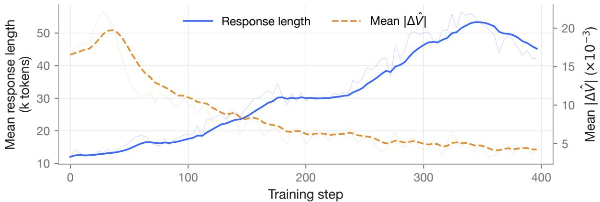  
Figure 4: Dynamics of response length and mean $| \widehat { V } _ { t } - \widehat { V } _ { t - 1 } |$ during PACT training.

Table 3: Key training hyperparameters.
<table><tr><td>Hyperparameter</td><td>Mathematical Reasoning</td><td>Coding</td></tr><tr><td>Actor learning rate</td><td>1e − 6</td><td>1e − 6</td></tr><tr><td>Critic learning rate</td><td>5e-6</td><td>5e-6</td></tr><tr><td>PACT actor update</td><td>DIS</td><td>PPO clipping</td></tr><tr><td>PACT actor DIS range</td><td>[0.7,6.0]</td><td>N/A</td></tr><tr><td>PACT critic IS acceptance range</td><td>[0,6]</td><td>[0,6]</td></tr></table>

Solve the following math problem. You are in a sandbox with a working Python interpreter—USE it: write and run Python code to do the calculations, enumerate cases, and verify your result, instead of computing by hand.

original problem statement

Please put your final answer in \boxed{}. The last line of your response must have the form Answer: \boxed{answer}.

## E.2 Further Empirical Evidence for Theorem 4

As shown in Figure 4, responses become progressively longer during PACT training, while the mean $| \widehat { V } _ { t } -$ $\widehat { V } _ { t - 1 } |$ decreases. This trend is consistent with the intuition behind Theorem 4.

## E.3 Training Dynamics

Figures 5 and 6 show the evolution of mean trajectory rewards during training on mathematical reasoning and agentic coding, respectively.

## E.4 Key Training Hyperparameters

Table 3 summarizes the key training hyperparameters for mathematical reasoning and coding.

PPO, GRPO, and SAO use rollout log-probabilities for actor updates, whereas PACT applies TIS with a ratio range of [0, 2] to account for the mismatch between training and rollout inference. PACT w/o critic IS retains all other settings of PACT, including actor-side corrections, the BCE critic objective, and the Actorthen-Critic update order.

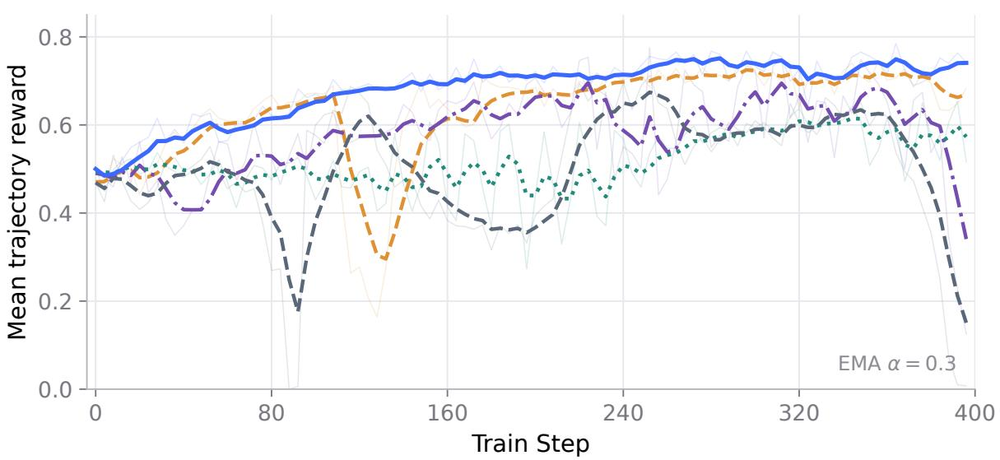  
Figure 5: Training reward on agentic mathematical reasoning with Qwen3.5-4B. Faint lines show raw mean trajectory rewards, while bold lines show exponential moving averages with α = 0.3. Each rollout round corresponds to four training steps.

## F Limitations

Our characterization of credits does not imply that all possible notions of credit must take the form derived in this work. The uniqueness result is conditional on the three proposed regularity conditions. Just as replacing Euclid’s parallel postulate leads to different but internally consistent geometries, adopting different requirements for credit may lead to different representations.

Second, the notion of credit studied here is statistical rather than causal. It is defined through conditional expectations and does not characterize the counterfactual causal effect of replacing an individual token or action.

Finally, this work characterizes what token-level credit should be under the proposed conditions, but does not solve the problem of estimating it exactly in practical LLM reinforcement learning. Developing accurate and efficient estimators of token-level credit remains an important direction for future work.

Qwen3.6-35B-A3B  
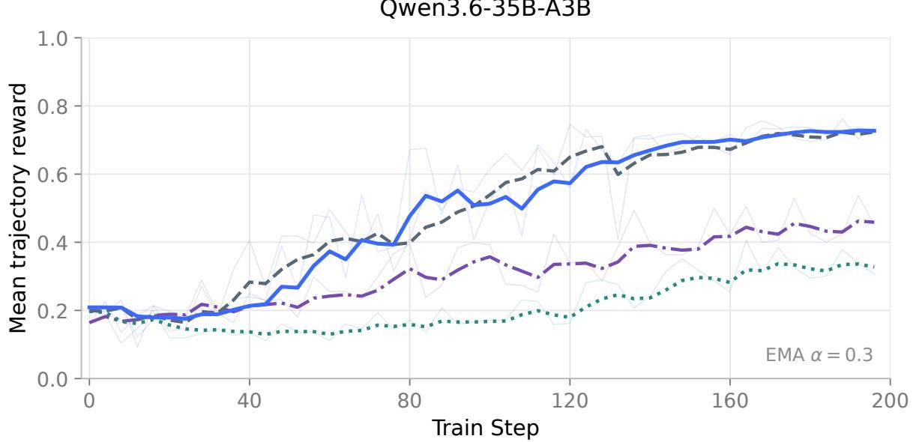  
Figure 6: Training reward on agentic coding with Qwen3.6-35B-A3B. Faint lines show raw mean trajectory rewards, while bold lines show exponential moving averages with α = 0.3.