# A Unified Uncertainty Representation for Graph Neural Networks via Doubly-Spectral Stochastic Expansion

Fred Xu∗ Department of Computer Science University of California, Los Angeles fredxu@cs.ucla.edu

Florence Regol Mila, Quebec AI Institute florence.regol@mila.quebec

Thomas Markovich Block, Inc. tmarkovich@squareup.com

Yizhou Sun Department of Computer Science University of California, Los Angeles yzsun@cs.ucla.edu

## Abstract

Reliable deployment of graph neural networks requires calibration, out-ofdistribution (OOD) detection, and robustness to distribution shift, yet existing methods address these needs with separate models and objectives. We model uncertain node embeddings as random graph signals: graph Fourier filters capture structural variation, and a scalar orthogonal-polynomial chaos coordinate captures latent stochastic variation. The resulting doubly-spectral stochastic (DSS) expansion supplies task-matched readouts from one representation: the mean coefficient encodes class evidence for the energy-based OOD score, the higher-order coefficients encode structured logit variation, and quadrature averaging over the chaos coordinate defines the single predictive distribution used for prediction and calibration. A capacity theorem shows that, under a full-rank feature assumption, a restricted subfamily matches the chaos coefficients of any Gaussian-latent random graph signal, with exponentially decaying truncation error under a growth condition; the task-level claims are established empirically. DSS-GNN has two deployment modes: standalone, or as a residual branch beside a deterministic encoder (DSS-Hybrid). Standalone DSS-GNN achieves the lowest Brier score among the compared uncertainty-aware baselines on all 14 node classification benchmarks without post-hoc correction; DSS-Hybrid achieves the best AUROC on most node-OOD settings, competitive cross-graph OOD detection, and the strongest shifted accuracy on all 7 GOOD concept-shift benchmarks under standard empirical risk minimization (ERM). Cross-evaluating both modes on all three tasks shows that each remains effective on the other’s tasks, with documented exceptions, and yields explicit deployment guidance.

## 1 Introduction

Graph neural networks (GNNs) perform well on graph-structured data, yet reliable deployment in drug discovery [31], fraud detection [7], or traffic forecasting [18] requires calibrated probabilities, out-of-distribution (OOD) detection, and robustness to distribution shift. On graphs the three needs are coupled, because uncertainty depends on neighborhood structure as well as node features, and they are instances of one question: when, and how confidently, can the model predict? Calibration measures the agreement between confidence and accuracy in distribution (ID), OOD detection requires low confidence outside the training support, and shift robustness requires that accuracy decrease slowly as the input distribution changes. A representation that explicitly encodes predictive uncertainty addresses all three, with calibrated probabilities, OOD evidence, and a regularized residual under shift obtained from one signal. Most existing methods target one requirement: sampling-based uncertainty methods add computational overhead [10, 17, 19]; evidential models such as Graph Posterior Network (GPN) [30] provide OOD evidence but not shift-robust classification, and intrinsic uncertainty models such as G-∆UQ [33] target calibration under shift; energy-based detectors [9, 36] provide separation scores rather than calibrated probabilities; and robust-training methods [1, 27, 38] do not model uncertainty explicitly.

Spectral GNNs learn filters along the graph-frequency axis [6]; we add a second spectral axis for stochastic variation. DSS-GNN represents each node embedding as a polynomial chaos expansion in a scalar Gaussian latent [37] and propagates the joint graph-frequency/chaos-order coefficients through a learnable doubly-spectral layer (Figure 4, Appendix H). One deterministic forward pass gives task-matched readouts: the quadrature-averaged predictive distribution, whose argmax is the point predictor, is used for prediction and calibration, with the higher-order coefficients encoding structured logit variation; the zeroth-order mean logit gives an energy score for OOD detection that retains the common-logit shifts that softmax cancels; and, paired with a deterministic encoder (DSS-Hybrid, e.g., GCN [15]), the DSS branch acts as a regularized low-/high-pass residual under distribution shift. DSS-GNN is thus one uncertainty representation with two deployment modes; Section 4.5 evaluates both on all three tasks and states which to prefer where. Our contributions are:

1. A doubly-spectral stochastic representation for GNNs with a capacity theorem: under a full-rank feature assumption, a restricted DSS subfamily matches the chaos coefficients of any Gaussianlatent random graph signal, with exponentially decaying truncation error for targets with an entire extension of Gaussian growth (Theorem 2). The theorem (Section 3.3) establishes representational capacity, consistent with the empirical plateau at P=1–2, but does not by itself guarantee calibration, OOD detection, or robustness, which are supported empirically.

2. A learnable doubly-spectral layer whose quadrature-averaged loss differs from the mean-logit loss by a curvature-weighted correction over the chaos covariance (Proposition 2), relating the chaos coefficients to calibration, bounding the gap between the quadrature predictive and the mean-logit softmax (Corollary 1), and identifying the mean-logit energy as the readout that retains common-logit shifts.

3. Empirically, the lowest Brier score among compared uncertainty-aware baselines on all 14 calibration benchmarks (standalone), the best AUROC on most node-OOD settings with competitive cross-graph OOD, and the strongest shifted accuracy on all 7 concept-shift benchmarks under ERM (hybrid), plus a cross-evaluation of both modes on all three tasks, component-wise ablations (Table 21), and explicit deployment guidance.

## 2 Background

Spectral GNNs and uncertainty on graphs. A graph signal on $\mathcal { G } = ( V , E )$ with N nodes is a vector $\boldsymbol { x } \in \mathbb { R } ^ { N }$ in the Hilbert space $\ell ^ { \overline { { 2 } } } ( V )$ ; the Laplacian $L _ { G }$ is self-adjoint and its eigenvectors form the graph Fourier basis [24, 29]. Spectral GNNs define graph convolutions as polynomial filters of ${ \mathit { L } } _ { G } { \mathrm { ; } }$ ChebNet [6] uses $\begin{array} { r } { g ( L _ { G } ) = \sum _ { k = 0 } ^ { K } c _ { k } T _ { k } ( \widetilde { L } _ { G } ) } \end{array}$ with learned coefficients $c _ { k } .$ , Chebyshev polynomials $T _ { k }$ , and the rescaled Laplacian $\widetilde { L } _ { G } = 2 L _ { G } / \lambda _ { \mathrm { m a x } } - I ( \lambda _ { \mathrm { m a x } }$ the largest eigenvalue), which keeps filtering localized and allows low-pass or high-pass responses under homophily or heterophily [2]. DSS-GNN adds a second spectral axis, chaos order, orthogonal to graph frequency, and embeds uncertainty directly into spectral filtering.

Polynomial chaos and the doubly-spectral expansion. To organize stochastic variation spectrally, as the graph Fourier basis organizes structural variation, we use polynomial chaos expansion (PCE) [4, 35, 37], classical in uncertainty quantification [23] but, to our knowledge, not previously combined with graph spectral filtering inside a GNN (Appendix A.1 gives a self-contained introduction). PCE represents a square-integrable random variable $Y ( \omega )$ as a series in the orthonormal Hermite polynomials $\{ \Psi _ { n } ( \omega ) \} _ { n \geq 0 }$ of a Gaussian latent $\omega \sim \mathcal { N } ( 0 , 1 )$ ; truncating at order P gives $Y ( \omega ) \approx$ $\scriptstyle \sum _ { n = 0 } ^ { P } Y _ { n } \Psi _ { n } ( \omega )$ , where $Y _ { 0 }$ is the mean and $\textstyle \sum _ { n = 1 } ^ { P } Y _ { n } ^ { 2 }$ (the chaos energy) the variance. Combined with the Laplacian eigenbasis $\{ u _ { j } \}$ on $\ell ^ { 2 } ( V )$ , the Hermite basis on $L ^ { 2 } ( \mathbb { R } , \gamma ) \left( \gamma \right.$ the standard Gaussian measure) gives a tensor-product representation: a random graph signal determined by ω is in $\ell ^ { 2 } ( V ) \otimes \breve { L ^ { 2 } } ( \mathbb { R } , \gamma )$ and admits the doubly-spectral stochastic expansion

$$
Y ( \omega ) = \sum _ { n = 0 } ^ { \infty } \sum _ { j = 1 } ^ { N } u _ { j } \hat { Y } _ { n , j } ^ { \top } \Psi _ { n } ( \omega ) ,\tag{1}
$$

where $\hat { Y } _ { n , j } \in \mathbb { R } ^ { d }$ is the joint coefficient at graph frequency $\lambda _ { j }$ (the j-th Laplacian eigenvalue) and chaos order $n ,$ , and d is the signal dimension; $\{ u _ { j } \otimes \Psi _ { n } \}$ is a complete orthonormal basis of this space (Remark 2), ω is scalar, and each chaos coefficient is a d-dimensional graph signal. DSS-GNN learns a truncation and a propagation rule on this tensor-product space.

## 3 Method

DSS-GNN instantiates the doubly-spectral expansion (1) as a trainable network by learning a coupled propagation rule for the joint coefficients $\hat { Y } _ { n , j }$ through parameterized graph filters and non-intrusive chaos projection (Figure 4, Appendix H).

Intuition. A random graph signal assigns to each node a random variable with finite second moment. We model all randomness as driven by a single shared standard Gaussian factor ω: every node embedding is a deterministic function of ω, expanded in the Hermite polynomials $\Psi _ { n } ( \omega )$ , which play along the stochastic axis exactly the role that the graph Fourier modes play along the structural axis. A DSS layer therefore stores, for every node, $\bar { P + 1 }$ coefficient vectors (one per chaos order) instead of a single hidden vector; a deterministic embedding is the special case in which only the order-0 coefficient is nonzero. Each layer decomposes the embeddings onto this basis, applies learned filters jointly per graph frequency and per chaos order (dual low/high-pass Chebyshev filters along the graph axis, per-order gates along the chaos axis), and reassembles. The core Gaussian is never materialized: because pointwise nonlinearities mix chaos orders, the layer evaluates the embedding field at S deterministic Gauss–Hermite nodes, applies the activation there, and projects back onto the Hermite basis. With $S \geq P + 1$ the polynomial filter and gate terms are integrated exactly at the gate orders used in practice $( P _ { g } \leq 1$ , Appendix A), and the nonlinearity is handled by a controlled non-intrusive projection (Remark 3), so the network is deterministic end to end: no Monte-Carlo sampling and no sampling variance. The expansion itself requires only the shared Gaussian factor and finite second moments; the exponential truncation rate of Theorem 2 additionally requires targets with an entire (analytic) Gaussian extension. Readouts then select task-appropriate functionals of the same expansion: the quadrature-averaged predictive (8) for prediction and calibration, and the mean-logit energy (9) for OOD scores.

## 3.1 DSS layer

Let $\mathcal { G } = ( V , E )$ have $N = | V |$ nodes, features $X \in \mathbb { R } ^ { N \times d _ { \mathrm { i n } } }$ , and Laplacian $L _ { G }$ . DSS-GNN stacks L layers on a truncated expansion at chaos order $P ;$ the input is lifted by $H _ { n } ^ { ( 0 ) } = X W _ { \mathrm { i n } } ^ { ( n ) }$ with $W _ { \mathrm { i n } } ^ { ( n ) } \in \mathbb { R } ^ { d _ { \mathrm { i n } } \times d _ { 0 } }$ , and at layer $\ell \in \{ 0 , \ldots , L { - } 1 \}$ the embeddings are

$$
H ^ { ( \ell ) } ( \omega ) = \sum _ { n = 0 } ^ { P } H _ { n } ^ { ( \ell ) } \Psi _ { n } ( \omega ) , \qquad H _ { n } ^ { ( \ell ) } \in \mathbb { R } ^ { N \times d _ { \ell } } ,\tag{2}
$$

with $d _ { \ell }$ the hidden width, so each node maintains $P { + 1 }$ coefficient-valued hidden states. The layer updates them along both spectral axes. Along the graph-frequency axis, dual Chebyshev filters propagate each coefficient through localized low-pass and high-pass branches,

$$
G _ { \mathrm { l p } } ( L _ { G } ) = \sum _ { k = 0 } ^ { K _ { \mathrm { l p } } } c _ { k } ^ { ( \mathrm { l p } ) } T _ { k } ( \widetilde { L } _ { G } ) , \qquad G _ { \mathrm { h p } } ( L _ { G } ) = \sum _ { k = 0 } ^ { K _ { \mathrm { h p } } } c _ { k } ^ { ( \mathrm { h p } ) } T _ { k } ( \widetilde { L } _ { G } ) ,\tag{3}
$$

with filter degrees $K _ { \mathrm { l p } } , K _ { \mathrm { h p } }$ and learned coefficients $c _ { k } ^ { \mathrm { ( l p ) } } , c _ { k } ^ { \mathrm { ( h p ) } } \in \mathbb { R }$ . Along the chaos-order axis, perorder chaos gates $\bar { \alpha _ { n } ( \omega ) } , \bar { \beta _ { n } ( \omega ) }$ couple the two branches; they are deterministic scalars or low-order

chaos expansions of gate order $P _ { g }$ with learnable $a _ { n , r } , b _ { n , r } \in \mathbb { R } \colon$

$$
\begin{array} { r } { \alpha _ { n } ( \omega ) = \sum _ { r = 0 } ^ { P _ { g } } a _ { n , r } \Psi _ { r } ( \omega ) , \qquad \beta _ { n } ( \omega ) = \sum _ { r = 0 } ^ { P _ { g } } b _ { n , r } \Psi _ { r } ( \omega ) . } \end{array}\tag{4}
$$

Because pointwise nonlinearities mix chaos orders, the update has no closed form. A non-intrusive projection evaluates the field at S Gauss–Hermite nodes $\{ ( \omega _ { s } , \mu _ { s } ) \} _ { s = 1 } ^ { S }$ (nodes $\omega _ { s } \in \mathbb { R }$ , weights $\mu _ { s } > 0 )$ , applies the activation $\sigma ,$ and projects back:

$$
\widetilde { H } ^ { ( \ell + 1 ) } ( \omega _ { s } ) = \left( \sum _ { n = 0 } ^ { P } \Psi _ { n } ( \omega _ { s } ) \Big ( \alpha _ { n } ( \omega _ { s } ) G _ { \mathrm { I p } } ( L _ { G } ) H _ { n } ^ { ( \ell ) } + \beta _ { n } ( \omega _ { s } ) G _ { \mathrm { h p } } ( L _ { G } ) H _ { n } ^ { ( \ell ) } \Big ) \right) W _ { \ell } .\tag{5}
$$

$$
H _ { m } ^ { ( \ell + 1 ) } = \sum _ { s = 1 } ^ { S } \mu _ { s } \sigma \big ( \widetilde { H } ^ { ( \ell + 1 ) } ( \omega _ { s } ) \big ) \Psi _ { m } ( \omega _ { s } ) , \qquad m = 0 , \ldots , P ,\tag{6}
$$

with $W _ { \ell } \ \in \ \mathbb { R } ^ { d _ { \ell } \times d _ { \ell + 1 } }$ trainable (quadrature details in Appendix A.1; notation in Table 30, Appendix H).

## 3.2 Uncertainty readout

After L layers a linear readout $W _ { \mathrm { o u t } } \in \mathbb { R } ^ { d _ { L } \times C }$ (C classes, labels $y _ { i } \in \{ 1 , . . . , C \} )$ produces perorder logit coefficients $Z _ { i , n } : = ( H _ { n } ^ { ( L ) } W _ { \mathrm { o u t } } ) _ { i } \in \mathbb { R } ^ { C }$ for node i. The mean logit $Z _ { i , 0 }$ encodes the zeroth-order class evidence used by the energy score; the logit covariance and chaos energy are

$$
\Sigma _ { z _ { i } } = \sum _ { n = 1 } ^ { P } Z _ { i , n } Z _ { i , n } ^ { \top } \in \mathbb { R } ^ { C \times C } , \qquad \mathcal { E } _ { i } = \mathrm { t r } ( \Sigma _ { z _ { i } } ) = \sum _ { n = 1 } ^ { P } \| Z _ { i , n } \| ^ { 2 } .\tag{7}
$$

The quadrature logits $\begin{array} { r } { z _ { i } ^ { ( s ) } = \sum _ { n = 0 } ^ { P } Z _ { i , n } \Psi _ { n } ( \omega _ { s } ) } \end{array}$ are deterministic evaluations of the learned expansion (no Gaussian noise is injected in training or inference) and define the readouts. The quadrature-averaged predictive

$$
\bar { p } _ { i } = \sum _ { s = 1 } ^ { S } \mu _ { s } \operatorname { s o f t m a x } ( z _ { i } ^ { ( s ) } ) \in \mathbb { R } ^ { C }\tag{8}
$$

is the model’s predictive distribution and the point prediction is its argmax, $\hat { y } _ { i } = \arg \operatorname* { m a x } _ { c } \bar { p } _ { i , c }$ so prediction and calibration are two functionals of one distribution. Its deviation from the meanlogit softmax is bounded by the chaos covariance, $\begin{array} { r } { \| \bar { p } _ { i } - \mathrm { s o f t m a x } ( Z _ { i , 0 } ) \| _ { \infty } \leq \frac { B } { 2 } \operatorname { t r } ( \sum _ { z _ { i } } ) } \end{array}$ for a universal constant B (Corollary 1), which training keeps small (Section 3.5); Section 4.2 measures the agreement. For OOD detection, the energy score [20]

$$
s _ { \mathrm { e n e r g y } } ( i ) = - \log \sum _ { c = 1 } ^ { C } \exp ( Z _ { i , 0 , c } ) ,\tag{9}
$$

with $Z _ { i , 0 , c }$ the c-th mean logit, captures confidence in the mean prediction; predictive entropy and mutual information of the quadrature softmaxes are auxiliary summaries of the same readout. The OOD experiments use the energy score with graph propagation, following GNNSafe [36].

## 3.3 Theoretical properties

Four results connect the layer to the expansion (1); proofs are in Appendix A.

Proposition 1 (Generalization). With $P = 0$ and $P _ { g } = 0 ,$ , (2) has a single deterministic coefficient $H _ { 0 } ^ { ( \ell ) }$ with scalar gates, and the DSS layer reduces to a standard polynomial spectral GNN layer, recovering ChebNet, GCN, and related models as special cases.

Theorem 1 (Doubly-spectral operator). With the pointwise nonlinearity omitted, gates of chaos degree at most $P _ { g } ,$ states ofdegree at most P, and a Gauss–Hermite rule exactfor all triple products $\tilde { \Psi _ { r } } \Psi _ { n } \Psi _ { m } ( r \leq \mathring { P } _ { g } ; n , m \leq \mathring { P ; } S \geq \lceil ( P _ { g } + 2 P + 1 ) / 2 \rceil$ suffices), the linearized DSS layer is a linear operator on the joint graph-frequency/chaos-order domain of (1), acting frequency by frequency: the Chebyshevfilters set the graph-frequency response and the chaos gates the chaos-order mixing (Appendix A.4; the omitted nonlinearity’s projection error is decomposed in Proposition 3).

Theorem 2 (Representational capacity and truncation under full-rank features). Let G have N nodes and features $X ~ \in ~ \mathbb { R } ^ { N \times d _ { \mathrm { i n } } ^ { \bullet } }$ with $\operatorname { r a n k } ( X ) \ = \ N$ (which requires $d _ { \mathrm { i n } } \geq N )$ . With ReLU activation, a restricted subfamily ofDSS-GNNs (one layer, lifted width $2 d ( P { + } 1 )$ , quadrature size $S = P { + } 1$ , constant gates, identity low-pass filter) has the following properties. For any target $Y \in L ^ { 2 } ( \mathbb { R } , \gamma ; \mathbb { R } ^ { N \times d } )$ and any chaos order $P ,$ some output $\smash { \widetilde { Y } } _ { P }$ matches the chaos coefficients ofY through order $P ;$ letting $P$ and width vary, the resulting outputs are dense in $L ^ { 2 } ( \mathbb { R } , \gamma ; \mathbb { R } ^ { N \times d } )$ . If Y in addition admits an entire Gaussian extension with controlled growth (Appendix A.6), the truncation error decays exponentially:

$$
\| Y - \widetilde { Y } _ { P } \| _ { L ^ { 2 } ( \mathbb { R } , \gamma ; \mathbb { R } ^ { N \times d } ) } \le C _ { \mathrm { t r } } \beta ^ { P }\tag{10}
$$

for some $C _ { \mathrm { t r } } > 0$ and $\beta \in ( 0 , 1 )$ depending on $Y ,$

Theorems 1 and 2 are capacity statements: they establish the operator structure and the representational capacity of the layer and identify no inherent expressivity obstruction, but they do not by themselves guarantee calibration, OOD detection, or robustness, which are empirical claims supported task by task in Section 4. The full-rank case requires $d _ { \mathrm { i n } } \geq N ;$ for ran $\mathfrak { x } ( \mathbf { \bar { \boldsymbol { X } } } ) < N$ , the common case (Cora has 1,433 features for 2,708 nodes), Remark 5 shows that the same construction still matches every truncated target whose chaos-coefficient columns lie in range(X), under one positivity condition satisfiable by appending a constant feature column.

Proposition 2 (Stochastic and mean-logit readouts). Assume the number ofGauss–Hermite quadrature nodes is at least one more than the chaos order, and that the per-node loss $\ell ( \cdot , y _ { i } )$ satisfies the regularity conditions in Lemma 3. Then:

1. (Calibration channel.) The per-node quadrature-averaged loss $\begin{array} { r } { \bar { \ell } _ { i } : = \sum _ { s = 1 } ^ { S } \mu _ { s } \ell ( z _ { i } ^ { ( s ) } , y _ { i } ) } \end{array}$ admits the Taylor expansion $\begin{array} { r } { \bar { \ell } _ { i } = \ell ( Z _ { i , 0 } , y _ { i } ) + \frac { 1 } { 2 } \operatorname { t r } ( \mathcal { H } _ { i } \Sigma _ { z _ { i } } ) + O ( } \end{array}$ ma $\nu _ { s } \parallel z _ { i } ^ { ( s ) } - Z _ { i , 0 } \parallel ^ { 3 } )$ where $\mathcal { H } _ { i } = \nabla _ { z } ^ { 2 } \ell ( Z _ { i , 0 } , y _ { i } )$ is the loss Hessian and $\Sigma _ { z _ { i } }$ is the chaos covariance $( 7 )$

2. (OOD channel.) Shifting every class logit by the same constant leaves the softmax output, and hence any softmax-derived summary such as predictive entropy or mutual information, unchanged; by contrast, the energy score (9) decreases by exactly that constant.

Calibration: the curvature-weighted term $\begin{array} { r } { { \frac { 1 } { 2 } } \operatorname { t r } ( \mathscr { H } _ { i } \Sigma _ { z _ { i } } ) } \end{array}$ is the leading-order difference between the quadrature-averaged and the mean-logit objectives; it weights the chaos covariance by the loss curvature and, for cross-entropy, is at most $\textstyle { \frac { 1 } { 4 } } { \mathcal { E } } _ { i }$ , the quantity that (11) regularizes; no post-hoc temperature scaling is used. The same expansion applied to the softmax readout bounds the gap between ${ \bar { p } } _ { i }$ and softmax $( Z _ { i , 0 } )$ by the chaos covariance (Corollary 1), which the objective keeps small; the calibration gains of $\dot { P _ { \mathrm { ~ \scriptsize ~ > ~ 0 ~ } } }$ therefore arise through training rather than a readout-time correction, and the two trained readouts agree closely (Section 4.2). OOD detection: the energy score is linear in a common logit shift, while softmax-derived summaries cancel it, so an OOD input that uniformly lowers the class-evidence logits changes the energy but not the entropy; Section 4.3 confirms that detection is insensitive to the chaos order, as this readout predicts.

## 3.4 Hybrid deployment

Distribution shift weakens the common-evidence signal and changes which graph frequencies are predictive; like OOD detection it requires a strong deterministic predictor on seen structure paired with a regularized residual that accounts for cross-distribution variability. DSS-Hybrid adds DSS-GNN as a residual branch beside a deterministic base encoder with one shared class readout, $z _ { i , 0 } ^ { \mathrm { h y b } } =$ $z _ { i } ^ { \mathrm { b a s e } } + \gamma _ { \mathrm { r e s } } Z _ { i , 0 }$ , with $z _ { i } ^ { \mathrm { b a s e } } \in \mathbb { R } ^ { C }$ the base logit and $\gamma _ { \mathrm { r e s } } \in \mathbb { R }$ a learned scale (lowercase for postcombination logits, uppercase $Z _ { i , n }$ for the DSS coefficients); the quadrature logits combine the same way, $\begin{array} { r } { z _ { i } ^ { \mathrm { h y b , ( \it s ) } } = z _ { i } ^ { \mathrm { b a s e } } + \gamma _ { \mathrm { r e s } } \sum _ { n = 0 } ^ { P } Z _ { i , n } \Psi _ { n } ( \omega _ { s } ) } \end{array}$ , so the readouts of Section 3.2 transfer directly. The chaos-energy regularizer keeps the residual from fitting in-distribution noise, so its dual filters retain capacity for shifts in graph-frequency response and its mean logit remains a common-evidence channel for the energy score. The base encoder, a 2-layer GCN for fair comparison with baselines, is warmed up before the DSS branch is activated. This design is an inductive bias rather than a distribution-free guarantee.

## 3.5 Training and downstream tasks

Both modes are trained with the chaos-energy-regularized mean-logit loss

$$
\mathcal { L } _ { \mathrm { b a s e } } = \frac { 1 } { | \mathcal { V } _ { \mathrm { t r } } | } \sum _ { i \in \mathcal { V } _ { \mathrm { t r } } } \ell ( Z _ { i , 0 } , y _ { i } ) \ + \ \lambda _ { \mathrm { r e g } } \frac { 1 } { | \mathcal { V } _ { \mathrm { t r } } | } \sum _ { i \in \mathcal { V } _ { \mathrm { t r } } } \mathcal { E } _ { i } ,\tag{11}
$$

with $\mathcal { V } _ { \mathrm { t r } }$ the training nodes, ℓ the per-node cross-entropy, and $\lambda _ { \mathrm { r e g } } \geq 0 ;$ for DSS-Hybrid, $Z _ { i , 0 }$ is replaced by $z _ { i , 0 } ^ { \mathrm { h y b } }$ and the regularizer applies to the DSS coefficients only. Only the mean logit is supervised, but the projection update (6) couples $Z _ { i , 0 }$ to all chaos orders, so the higher-order coefficients are trained implicitly while the regularizer constrains their variation. By Proposition 2, $\mathcal { L } _ { \mathrm { b a s e } }$ agrees to first order with the quadrature-averaged loss ${ \mathcal { L } } _ { \mathrm { q u a d } }$ (35) of Appendix D; we use $\mathcal { L } _ { \mathrm { b a s e } }$ throughout. The trace that Corollary 1 bounds is the regularized chaos energy $\mathcal { E } _ { i } ;$ ; where the selected $\lambda _ { \mathrm { r e g } }$ is small or zero, the measured readout gap remains small (Table 27).

## 4 Experiments

## 4.1 Setup

For calibration, standalone DSS-GNN is compared with TFE-GNN [8] and G-∆UQ [33] on 14 node classification benchmarks [15, 25, 26, 28], reporting accuracy and the Brier score [3] over 10 splits without post-hoc calibration. For OOD detection, DSS-Hybrid is evaluated on the GNNSafe benchmark [36] (nine node-OOD settings on Cora, Amazon-Photo, and Coauthor-CS, plus crossgraph Twitch and Arxiv; 3 seeds) against GNNSafe, GNNSafe++, and GPN [30] at the values reported by Wu et al. [36], and against Graph-EBM [9] (scored with its own diffusion), MC-dropout (M=20) [10] and Deep Ensembles (M=5) [17] on the same GCN backbone with the same score propagation. For distribution shift, DSS-Hybrid is trained with empirical risk minimization (ERM) on 7 concept-shift settings of GOOD [12] and compared with the 12 GOOD/TAR baselines [1, 27, 38] and G-∆UQ. Point predictions are arg max ¯p (Section 3.2); Table 1 reports the mean-logit readout, which Section 4.2 shows to agree with it. All experiments use $\mathcal { L } _ { \mathrm { b a s e } }$ (11); in the OOD experiments DSS-Hybrid, like GNNSafe++, adds the GNNSafe++ energy-margin regularizer at per-dataset margins. Baselines, datasets, and configurations are in Appendices B–D; code is available at https://github.com/heraclixus/DSSGNN.

## 4.2 Node classification and calibration

Table 1 shows that DSS-GNN achieves the lowest Brier score among the compared uncertainty-aware baselines on all 14 datasets, homophilous and heterophilous, without post-hoc calibration, and the best accuracy on 13. The Brier gains over the deterministic $P = 0$ arm are largest on Citeseer, Texas, and Minesweeper (Table 14), consistent with the curvature-weighted correction of Proposition 2. This is not an accuracy effect: standard GNNs match or exceed DSS-GNN in accuracy on Cora and Citeseer while remaining less calibrated (Appendix F), and at $P = 0 \mathrm { D S S - G N N }$ is a competitive dual-filter spectral GNN (Proposition 1), so the gains are attributable to the chaos expansion (Table 19). Figure 1 visualizes the correction $\begin{array} { r } { c _ { i } = \frac { 1 } { 2 } \operatorname { t r } ( \mathscr { H } _ { i } \Sigma _ { z _ { i } } ) } \end{array}$ on Minesweeper: it is largest where stochastic variation aligns with high-curvature directions and concentrates on the hardest nodes.

Prediction and calibration use one predictive distribution. Under the full protocol with both readouts evaluated at the same checkpoints, arg max ${ \bar { p } } _ { i }$ and arg max $Z _ { i , 0 }$ disagree on at most 0.21% of test nodes (exactly zero on 10 of 14 datasets), with accuracy within 0.04 points and Brier within 0.003 (Table 27, Appendix G); in hybrid mode the disagreement is 0.0000 on all 14 datasets. The agreement is structural: for $S \geq P { + } 1$ Corollary 1 bounds the readout gap by $\mathrm { t r } ( \Sigma _ { z _ { i } } )$ , which the objective keeps small (Section 3.5), so the reported calibration is that of the distribution the predictions are drawn from.

Chaos order. Sweeping $P \in \{ 0 , \ldots , 6 , 8 \}$ (Appendix E, Figure 3) improves Brier on 12 of 14 datasets at $P > 0$ , and at least one of $P = 1$ or $\bar { P } = 2$ is within 0.02 Brier of the best swept order on every dataset, consistent with the exponential truncation bound of Theorem 2. P is selected per dataset on validation Brier (Table 12); the larger selected orders are near-ties rather than requirements, and we recommend $P = 1 - 2$ as the default. Within the shared-factor family $P = 1$ is exactly a

(b) Correction is largest on hard nodes  
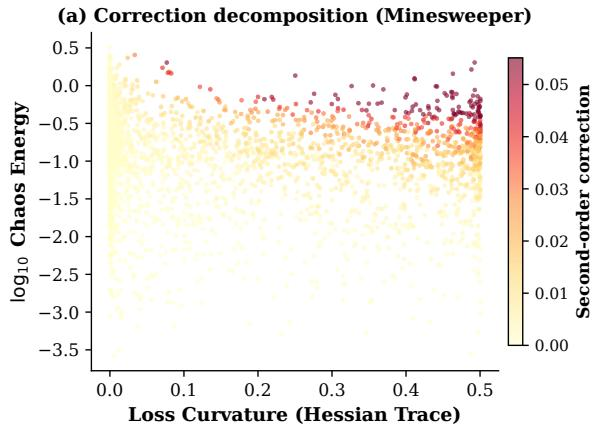

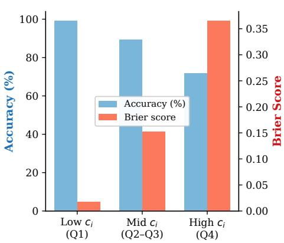  
Figure 1: (a) Second-order correction $c _ { i }$ (Proposition 2) on Minesweeper. Each node is positioned by loss curvature $( \operatorname { t r } ( \mathcal { H } _ { i } ) )$ and chaos energy $( \mathcal { E } _ { i } ) ;$ color shows correction magnitude. (b) Nodes binned by correction quartile: the correction concentrates on hard nodes (low accuracy, high Brier).

Table 1: Node classification: test accuracy $( \% , \uparrow )$ and Brier score (↓). Mean ± standard deviation over 10 runs. Best result per dataset in bold. DSS-GNN uses the per-dataset configuration of Table 12 and the mean-logit readout.
<table><tr><td rowspan="2">Dataset</td><td colspan="3">Accuracy (%)</td><td colspan="3">Brier Score</td></tr><tr><td>DSS-GNN</td><td>TFE-GNN</td><td> $\mathrm { \bf G } { \cdot } \Delta { \bf U } \mathrm { \bf Q }$ </td><td>DSS-GNN</td><td>TFE-GNN</td><td>G-∆UQ</td></tr><tr><td>Cora</td><td> ${ \pm } \mathbf { { 6 . 6 3 \pm 1 . 2 6 } }$ </td><td> $7 1 . 2 5 \pm 1 . 9 0$ </td><td> $8 4 . 3 5 \pm 1 . 9 7$ </td><td> ${ \bf 0 . 2 0 7 \pm 0 . 0 1 9 }$ </td><td> $0 . 4 4 9 \pm 0 . 0 2 4$ </td><td> $0 . 2 2 6 \pm 0 . 0 2 3$ </td></tr><tr><td>Citeseer</td><td> ${ \bf 8 0 . 2 0 \pm 1 . 2 8 }$ </td><td> $6 8 . 8 7 \pm 1 . 8 7$ </td><td> $7 0 . 8 5 \pm 2 . 2 2$ </td><td> ${ \bf 0 . 3 0 8 \pm 0 . 0 1 0 }$ </td><td> $0 . 4 6 3 \pm 0 . 0 2 0$ </td><td> $0 . 4 3 3 \pm 0 . 0 2 6$ </td></tr><tr><td>PubMed</td><td> $\mathbf { 8 9 . 7 2 \pm 0 . 3 1 }$ </td><td> $8 2 . 8 4 \pm 0 . 7 6$ </td><td> $8 8 . 1 8 \pm 0 . 6 6$ </td><td> $\mathbf { 0 . 1 5 6 \pm 0 . 0 0 5 }$ </td><td> $0 . 2 6 5 \pm 0 . 0 1 1$ </td><td> $0 . 1 7 9 \pm 0 . 0 0 8$ </td></tr><tr><td>Texas</td><td> ${ \bf 9 1 . 3 1 } \pm 3 . 4 4$ </td><td> $8 4 . 9 2 \pm 4 . 2 6$ </td><td> $9 . 0 2 \pm 1 . 8 3$ </td><td> ${ \bf 0 . 2 4 0 \pm 0 . 1 1 1 }$ </td><td> $0 . 2 5 5 \pm 0 . 0 8 3$ </td><td> $0 . 7 7 9 \pm 0 . 0 2 9$ </td></tr><tr><td>Cornell</td><td> ${ \bf 8 5 . 1 1 \pm 5 . 1 2 }$ </td><td> $8 1 . 2 8 \pm 5 . 4 5$ </td><td> $2 1 . 0 6 \pm 3 . 4 9$ </td><td> ${ \bf 0 . 2 3 1 \pm 0 . 0 7 9 }$ </td><td> $0 . 2 9 0 \pm 0 . 0 6 9$ </td><td> $0 . 7 9 3 \pm 0 . 0 2 3$ </td></tr><tr><td>Wisconsin</td><td> ${ \bf 9 3 . 2 5 \pm 3 . 3 9 }$ </td><td> $7 6 . 5 0 \pm 2 3 . 9 5$ </td><td> $5 2 . 2 5 \pm 1 7 . 8 0$ </td><td> ${ \bf 0 . 1 0 4 \pm 0 . 0 4 7 }$ </td><td> $0 . 2 9 2 \pm 0 . 1 8 6$ </td><td> $0 . 5 7 1 \pm 0 . 1 0 9$ </td></tr><tr><td>Chameleon</td><td> ${ \bf 7 5 . 3 6 \pm 1 . 1 9 }$ </td><td> $7 3 . 4 1 \pm 1 . 5 3$ </td><td> $3 7 . 3 1 \pm 2 . 3 6$ </td><td> ${ \bf 0 . 3 3 9 \pm 0 . 0 1 9 }$ </td><td> $0 . 3 6 5 \pm 0 . 0 1 6$ </td><td> $0 . 7 6 5 \pm 0 . 0 1 1$ </td></tr><tr><td>Squirrel</td><td> $6 8 . 0 6 \pm 2 . 2 1$ </td><td> ${ \bf 7 1 . 5 6 \pm 1 . 4 2 }$ </td><td> $2 5 . 8 8 \pm 1 . 9 1$ </td><td> ${ \bf 0 . 3 9 4 \pm 0 . 0 2 7 }$ </td><td> $0 . 3 9 5 \pm 0 . 0 1 7$ </td><td> $0 . 7 9 5 \pm 0 . 0 0 6$ </td></tr><tr><td>CS</td><td> ${ \bf 9 6 . 1 7 \pm 0 . 2 3 }$ </td><td> $9 5 . 0 5 \pm 0 . 2 4$ </td><td> $9 4 . 3 7 \pm 0 . 2 3 $ </td><td> $\mathbf { 0 . 0 6 2 \pm 0 . 0 0 4 }$ </td><td> $0 . 0 8 2 \pm 0 . 0 0 5$ </td><td> $0 . 0 8 5 \pm 0 . 0 0 4$ </td></tr><tr><td>Roman-Emp.</td><td> ${ \bf 7 8 . 8 4 \pm 0 . 6 1 }$ </td><td> $7 0 . 3 5 \pm 0 . 6 0$ </td><td> $5 1 . 2 4 \pm 1 . 0 7$ </td><td> $\mathbf { 0 . 3 0 0 \ : \pm 0 . 0 0 7 }$ </td><td> $0 . 4 1 4 \pm 0 . 0 0 6$ </td><td> $0 . 6 4 1 \pm 0 . 0 0 8$ </td></tr><tr><td>Amz-Rat.</td><td> ${ \bf 4 9 . 7 2 \pm 0 . 6 4 }$ </td><td> $4 8 . 7 9 \pm 0 . 4 3$ </td><td> $4 4 . 4 3 \pm 0 . 4 2$ </td><td> $\mathbf { 0 . 6 3 4 \pm 0 . 0 0 5 }$ </td><td> $0 . 6 3 7 \pm 0 . 0 0 4$ </td><td> $0 . 6 7 4 \pm 0 . 0 0 3$ </td></tr><tr><td>Minesweeper</td><td> ${ \bf 8 7 . 6 6 \pm 1 . 1 0 }$ </td><td> $8 2 . 4 2 \pm 0 . 3 3$ </td><td> $8 0 . 2 2 \pm 0 . 2 2$ </td><td> ${ \bf 0 . 1 6 9 \pm 0 . 0 1 4 }$ </td><td> $0 . 2 4 8 \pm 0 . 0 0 3$ </td><td> $0 . 2 8 8 \pm 0 . 0 0 3$ </td></tr><tr><td>Tolokers</td><td> $\mathbf { 7 9 . 8 8 \pm 0 . 4 9 }$ </td><td> $7 8 . 1 8 \pm 0 . 1 0$ </td><td> $7 9 . 7 5 \pm 0 . 5 5$ </td><td> $\mathbf { 0 . 2 6 8 \ : \pm 0 . 0 0 5 }$ </td><td> $0 . 3 8 2 \pm 0 . 0 0 4$ </td><td> $0 . 2 8 9 \pm 0 . 0 0 7$ </td></tr><tr><td>Questions</td><td> ${ \bf 9 7 . 1 7 \pm 0 . 0 4 }$ </td><td> $9 7 . 0 7 \pm 0 . 0 9$ </td><td> $9 7 . 0 6 \pm 0 . 0 5$ </td><td> $\mathbf { 0 . 0 5 3 \pm 0 . 0 0 1 }$ </td><td> $0 . 0 6 1 \pm 0 . 0 0 1$ </td><td> $0 . 0 5 4 \pm 0 . 0 0 1$ </td></tr></table>

Gaussian embedding; the higher orders add non-Gaussian structure (Citeseer Brier 0.346 to 0.308 at $P = 2 ;$ Tables 13–14).

## 4.3 OOD detection

Tables 2–3 compare DSS-Hybrid with GNNSafe++ [36], the strongest OOD baseline: it has the best AUROC on 6 of 9 node-OOD cells (Cora 94.32/97.60/94.11 versus 90.62/95.56/92.75 for structure/feature/label; Amazon-Photo feature/label 99.66/97.52; Coauthor-CS label 98.07) and is within 0.13 points of the best method on the three remaining cells, where both it and GNNSafe++ exceed 99.6. On Twitch it improves over GNNSafe++ on every metric (AUROC 95.75 vs 95.36, FPR95 22.40 vs 33.57); on Arxiv it gives the best FPR95 and ID accuracy while remaining within 1.41 AUROC points of GNNSafe++ (73.36 vs 74.77). DSS-Hybrid follows the GNNSafe++ protocol (same GCN backbone configuration, energy-margin objective with its per-dataset margins, and score propagation; Appendix D), so the two differ in the DSS residual branch. Against MC-dropout and Deep Ensembles, which receive the same propagation, DSS-Hybrid has the higher AUROC on all 11 settings in one forward pass versus their 20 passes and 5 models; the published GPN values are below GNNSafe++ throughout.

Table 2: OOD detection (AUROC, %) on the nine node-OOD settings and the two cross-graph settings (AUPR, FPR95, and ID accuracy for the latter are in Table 3). GNNSafe/GNNSafe++ and GPN [30] values as reported by Wu et al. [36] on this benchmark (their Tables 1–2; their appendix lists 81.77/93.24 for GPN on Coauthor-CS feature/label; GPN out-of-memory on Arxiv); Graph-EBM [9], MC-dropout (M=20), and Deep Ensembles (M=5) run in our pipeline on the same GCN backbone (3 seeds; the latter two with the same score propagation). Bold: best.
<table><tr><td rowspan="2">Model</td><td colspan="3">CORA</td><td colspan="3">AMAZON-PHOTO</td><td colspan="3">COAUTHOR-CS</td><td colspan="2">CROSS-GRAPH</td></tr><tr><td>Structure</td><td>Feature</td><td>Label</td><td>Structure</td><td>Feature</td><td>Label</td><td>Structure</td><td>Feature</td><td>Label</td><td>Twitch</td><td>Arxiv</td></tr><tr><td>GNNSafe</td><td>87.52</td><td>93.44</td><td>92.80</td><td>99.58</td><td>98.55</td><td>97.35</td><td>99.60</td><td>99.64</td><td>97.23</td><td>66.82</td><td>71.06</td></tr><tr><td>GNNSafe++</td><td>90.62</td><td>95.56</td><td>92.75</td><td>99.82</td><td>99.64</td><td>97.51</td><td>99.99</td><td>99.97</td><td>97.89</td><td>95.36</td><td>74.77</td></tr><tr><td>Graph-EBM</td><td>61.14</td><td>72.42</td><td>92.69</td><td>75.22</td><td>86.49</td><td>97.24</td><td>72.75</td><td>89.28</td><td>97.91</td><td>44.43</td><td>52.80</td></tr><tr><td>MC-dropout</td><td>87.50</td><td>93.12</td><td>93.03</td><td>98.67</td><td>98.50</td><td>96.80</td><td>99.51</td><td>99.53</td><td>97.25</td><td>68.58</td><td>66.34</td></tr><tr><td>Deep Ensemble</td><td>87.87</td><td>93.63</td><td>93.75</td><td>98.58</td><td>98.43</td><td>97.35</td><td>98.18</td><td>98.45</td><td>94.97</td><td>72.25</td><td>67.72</td></tr><tr><td>GPN</td><td>77.47</td><td>85.88</td><td>90.34</td><td>97.17</td><td>87.91</td><td>92.72</td><td>34.67</td><td>72.56</td><td>83.65</td><td>51.73</td><td>00M</td></tr><tr><td>DSS-Hybrid</td><td>94.32</td><td>97.60</td><td>94.11</td><td>99.69</td><td>99.66</td><td>97.52</td><td>99.96</td><td>99.95</td><td>98.07</td><td>95.75</td><td>73.36</td></tr></table>

Table 3: Cross-graph OOD (AUROC, AUPR: ↑; FPR95, false positive rate at 95% true positive rate: ↓; ID: in-distribution; bold: best). GNNSafe/GNNSafe++ and GPN values as reported by Wu et al. [36] (OOM: out of memory on a 24 GB GPU); Graph-EBM [9], MC-dropout, and Deep Ensembles run in our pipeline (3 seeds).
<table><tr><td colspan="5">TWITCH</td><td colspan="4">ARXIV</td></tr><tr><td>Model</td><td>AUROC</td><td>AUPR</td><td>FPR95</td><td>ID Acc.</td><td>AUROC</td><td>AUPR</td><td>FPR95</td><td>ID Acc.</td></tr><tr><td>GNNSafe</td><td>66.82</td><td>70.97</td><td>76.24</td><td>70.40</td><td>71.06</td><td>80.44</td><td>87.01</td><td>53.39</td></tr><tr><td>GNNSafe++</td><td>95.36</td><td>97.12</td><td>33.57</td><td>70.18</td><td>74.77</td><td>83.21</td><td>77.43</td><td>53.50</td></tr><tr><td>Graph-EBM</td><td>44.43</td><td>57.91</td><td>94.84</td><td>63.04</td><td>52.80</td><td>65.88</td><td>97.40</td><td>53.45</td></tr><tr><td>MC-dropout</td><td>68.58</td><td>81.25</td><td>94.84</td><td>64.10</td><td>66.34</td><td>74.88</td><td>89.69</td><td>53.56</td></tr><tr><td>Deep Ensemble</td><td>72.25</td><td>83.19</td><td>94.29</td><td>66.94</td><td>67.72</td><td>75.98</td><td>87.32</td><td>47.58</td></tr><tr><td>GPN</td><td>51.73</td><td>66.36</td><td>95.51</td><td>68.09</td><td>OOM</td><td>00M</td><td>OOM</td><td>OOM</td></tr><tr><td>DSS-Hybrid</td><td>95.75</td><td>97.51</td><td>22.40</td><td>70.52</td><td>73.36</td><td>79.11</td><td>76.67</td><td>53.99</td></tr></table>

Detection comes from the energy readout, with propagation, acting on the DSS mean logit (9), which Proposition 2 formalizes as the readout that retains common-evidence shifts. Under this identical readout the DSS representation separates ID from OOD more widely than the GCN encoder alone (the Cora columns of Table 2), and a controlled ablation that varies only the chaos order $P \in \{ 0 , \ldots , 3 \}$ at one fixed configuration leaves energy AUROC flat (Cora-structure $9 1 . 0 / 9 1 . 2 / 9 0 . 9 / 9 0 . 8 \dot { ; }$ the level differs from Table 2 as the ablation is a separate set of runs; Appendix E), as the design predicts since the energy score reads the mean logit alone. Score propagation contributes up to +18.2 AUROC (Twitch) and +14.5 (Cora-structure) at identical checkpoints (Appendix E). Figure 2 shows the resulting wider energy-density gap between ID and OOD modes relative to the energy-based baselines.

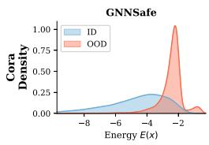

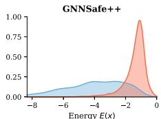

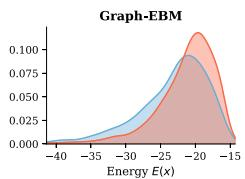

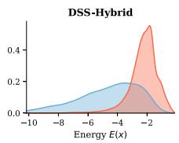

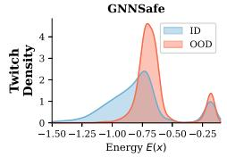

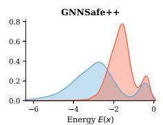

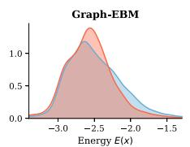

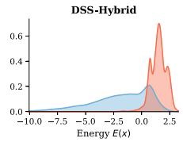  
Figure 2: Energy density for ID (blue) vs. OOD (red). Top: Cora/structure. Bottom: Twitch (crossgraph). Lower energy indicates higher confidence. DSS-Hybrid separates the ID and OOD modes on both datasets.

Table 4: Test accuracy (%) on the concept-shift GOOD node benchmark for DSS-Hybrid (standard ERM training) and 13 baselines; ERM through TAR as reported by Zheng et al. [38], G-∆UQ run in our pipeline. Best in bold, second-best underlined; OOM: out of memory.
<table><tr><td>Model</td><td>GOOD-CBAS color</td><td>GOOD-WebKB university</td><td>GOOD-Twitch language</td><td>GOOD-Cora word</td><td>GOOD-Cora degree</td><td>GOOD-Arxiv time</td><td>GOOD-Arxiv degree</td></tr><tr><td>ERM</td><td>82.43</td><td>27.16</td><td>51.59</td><td>64.03</td><td>60.30</td><td>65.64</td><td>54.81</td></tr><tr><td>IRM</td><td>82.00</td><td>26.06</td><td>49.78</td><td>63.93</td><td>60.26</td><td>65.54</td><td>56.72</td></tr><tr><td>VREx</td><td>82.86</td><td>26.61</td><td>55.75</td><td>64.03</td><td>60.53</td><td>65.92</td><td>56.68</td></tr><tr><td>Coral</td><td>81.57</td><td>28.07</td><td>51.80</td><td>64.04</td><td>60.30</td><td>65.79</td><td>55.14</td></tr><tr><td>DANN</td><td>83.57</td><td>29.36</td><td>51.67</td><td>63.96</td><td>60.23</td><td>65.67</td><td>55.34</td></tr><tr><td>SRGNN</td><td>82.14</td><td>26.42</td><td>51.58</td><td>63.96</td><td>60.27</td><td>65.64</td><td>55.08</td></tr><tr><td>EERM</td><td>65.71</td><td>29.91</td><td>OOM</td><td>63.42</td><td>60.21</td><td>OOM</td><td>OOM</td></tr><tr><td>FLOOD</td><td>84.29</td><td>28.62</td><td>54.22</td><td>64.01</td><td>60.31</td><td>65.66</td><td>58.59</td></tr><tr><td>CIT</td><td>83.71</td><td>28.99</td><td>OOM</td><td>63.77</td><td>60.05</td><td>OOM</td><td>OOM</td></tr><tr><td>KL-DRO</td><td>81.14</td><td>29.54</td><td>51.87</td><td>64.03</td><td>60.52</td><td>65.51</td><td>54.70</td></tr><tr><td>GroupDRO</td><td>82.71 87.29</td><td>29.17</td><td>52.24 57.20</td><td>64.10</td><td>60.43</td><td>65.93</td><td>56.24</td></tr><tr><td>TAR</td><td>67.14</td><td>30.83 30.77</td><td>54.97</td><td>64.73 58.90</td><td>61.73 60.06</td><td>66.08</td><td>59.26</td></tr><tr><td>G-∆UQ</td><td></td><td></td><td></td><td></td><td></td><td>65.46</td><td>64.34</td></tr><tr><td>DSS-Hybrid</td><td>88.57</td><td>40.77</td><td>61.21</td><td>64.81</td><td>62.73</td><td>66.76</td><td>66.43</td></tr></table>

Table 5: Both deployment modes on all three tasks. Each cell summarizes the full per-dataset comparison in Appendix G (Tables 24, 25, and 26); the standalone OOD and GOOD cells and the hybrid calibration cell are the cross-evaluations; the other cells restate Tables 1, 2–3, and 4.
<table><tr><td>Task</td><td>Standalone DSS-GNN</td><td>DSS-Hybrid</td></tr><tr><td>Calibration (14 datasets)</td><td>Best Brier on all 14 and best accuracy on 13 (Table 1); stronger than the hybrid on 13 of 14</td><td>Never loses beyond noise to its own GCN base; Roman-Empire +27.7 accuracy, —0.33 Brier</td></tr><tr><td>OOD detection (11 settings)</td><td>Effective on 10 of 11: Cora 79.8/88.2/94.0, Photo 96.5–98.1, CS 94.3–97.8, Arxiv 73.7 (margin objective);</td><td>Best published AUROC on 7 of 11 (Table 2); stronger than the standalone on 10 of 11</td></tr><tr><td>GOOD concept shift (7 settings)</td><td>the Twitch energy score does not separate Above every published baseline on 5 of 7, at ERM level on the other 2</td><td>Strongest on all 7 (Table 4)</td></tr></table>

## 4.4 Distribution-shifted classification

The GOOD benchmark [12] tests generalization under distribution shift. Table 4 compares DSS-Hybrid, trained with standard ERM, against the GOOD/TAR baselines and G-∆UQ on seven concept-shift settings (covariate-shift splits in Appendix G.7): it has the best mean shifted accuracy in every case, by margins from 0.08 (GOOD-Cora/word) to 9.94 points (GOOD-WebKB/university). This is consistent with the inductive bias of Section 3.4: the regularized low-/high-pass residual can model the shift in which graph frequencies are predictive while the base predictor is preserved. Section 4.5 isolates the residual pathway as a unit (hybrid versus its identically trained GCN base), and Appendix E (Table 15) isolates the chaos order under shift: at the validation-selected standalone configurations, P=1 improves shifted accuracy over P=0 on GOOD-Cora/word (+1.7), GOOD-Cora/degree (+1.2), and GOOD-Arxiv/time (+0.6), so on those settings the uncertainty representation, not only the dual-filter structure, contributes.

## 4.5 Standalone versus hybrid: cross-evaluation and deployment guidance

Each mode is also evaluated on the other’s tasks under the same protocols. Table 5 summarizes the outcome, and Tables 24–26 in Appendix G give the per-dataset numbers with standard deviations and ID accuracies (protocols in Appendix G.1).

Classification and calibration. The standalone is the stronger calibrated classifier on 13 of 14 datasets; Tolokers is the one exception (hybrid 81.2 accuracy / 0.255 Brier versus 79.9 / 0.268). Where the GCN encoder is strong the two are close (Cora 86.6 vs 84.3); on heterophilous graphs the DSS residual compensates for a weak encoder (Roman-Empire 78.8 vs 74.4); and where a plain GCN is unsuitable the standalone is higher (Texas 91.3 vs 45.6, Squirrel 68.1 vs 26.4). Against its own identically trained GCN base, the hybrid never loses beyond noise on either metric (worst accuracy delta −0.8 on Texas, inside one standard deviation of 7.7) and gains where the encoder is weak (Roman-Empire +27.7 accuracy / −0.33 Brier, Minesweeper +6.6 / −0.11): the residual never measurably reduces its encoder’s calibration or clean accuracy, and where the base is unsuitable (small heterophilous graphs) the hybrid matches it rather than improving on it.

OOD detection. The hybrid is the stronger detector on 10 of 11 settings. Its GCN-plus-residual encoder is stronger in the sparse-label perturbation regime (Cora-structure 94.3 vs 79.8) and for cross-graph transfer (Twitch), while on Arxiv the standalone run under the GNNSafe++ margin objective is 0.4 higher with the best Arxiv ID accuracy (61.2 vs 54.0). The one standalone exception is Twitch: the classifier trains (ID accuracy 68.4 vs 70.5) but its energy score does not separate the cross-graph OOD inputs, so the hybrid (95.8) is preferred there. On the perturbation settings with tiny public splits the GNNSafe pipeline gives every backbone BatchNorm, and plain GCN in the same pipeline does not train without it (ID accuracy 75.7 with BatchNorm, 45.8 without, on Cora-structure); the standalone uses one BatchNorm1d per chaos channel (Appendix D) in all OOD and GOOD cells but OOD Twitch and GOOD-Arxiv/degree, and does not need it under the full-label calibration protocol (Appendix G.6).

Distribution shift. On GOOD the standalone is above every baseline of Table 4 on 5 of 7 settings (WebKB 36.4 and Twitch 60.3 vs TAR 30.8 and 57.2) and at ERM’s level on the other two (CBAS 82.4, Arxiv/time 65.4), with ID accuracy between 63.5 and 96.2 (Appendix G); the hybrid is above every baseline on all 7.

Deployment guidance. The two modes share one uncertainty representation and the same two readouts, (8) and (9), and differ in the encoder. Outside the exceptions above, each is the better mode on its deployment task and remains effective on the other’s. We recommend the standalone for calibration-critical single-graph use, in particular under heterophily, and the hybrid when a strong conventional encoder exists, for cross-graph transfer, and for OOD detection in sparse-label regimes; the standalone requires BatchNorm stabilization in sparse-label regimes, and the hybrid shares its encoder’s failures (Section 5).

## 5 Conclusion and Limitations

DSS-GNN is one uncertainty representation, a doubly-spectral stochastic expansion over graphfrequency and chaos-order axes, with task-matched readouts and two deployment modes. Empirically, the standalone has the lowest Brier score among the compared uncertainty-aware baselines on all 14 calibration benchmarks, the hybrid the strongest AUROC on most node-OOD settings and the strongest shifted accuracy on all 7 concept-shift benchmarks under ERM, and both modes are effective on all three tasks with the exceptions noted in Section 4.5.

Limitations. (i) Two deployment modes. The modes share one representation and the same readouts but are not interchangeable in every regime. The standalone model requires BatchNorm stabilization in sparse-label regimes, where every baseline backbone in the OOD pipeline also uses it, and uses it on 6 of 7 GOOD settings; under the full-label calibration protocol it is not needed and is not used (Appendix G.6). The hybrid is preferable when a strong conventional encoder exists and shares that encoder’s limits: on small heterophilous graphs the hybrid matches its base without improving on it. The standalone energy score does not separate cross-graph OOD inputs on Twitch, where only the hybrid is effective. (ii) Scalar latent. All stochastic variation is due to one shared Gaussian factor, perfectly dependent across nodes, so the logit covariance across nodes has rank at most P. This suffices for the marginal readouts used here (per-node calibration and energy scores) and is what makes single-pass quadrature possible, but it cannot represent independent per-node noise, so joint cross-node uncertainty is not modeled; the sampling baselines (MC-dropout, Deep Ensembles) have higher Brier than the standalone and lower AUROC than the hybrid (Appendix F, Table 2). A vector latent of dimension q would cost Sq quadrature nodes on a full tensor grid, which sparse grids mitigate; we leave this to future work. (iii) Compute. The chaos expansion adds a $( { P + 1 } ) \times { S }$ operation count per layer; the measured per-epoch overhead at P=2 is 2.9× on Cora and 1.2× on Amazon-Ratings, and about 4% per additional order on ogbn-arxiv, with memory linear in P+1 (Table 20).

## Acknowledgments and Disclosure of Funding

This work was supported in part by the National Science Foundation under grant 2531008. Part of this work was done while Fred Xu was an intern at Block, Inc., and we thank Block, Inc. for its support.

## References

[1] Martin Arjovsky, Léon Bottou, Ishaan Gulrajani, and David Lopez-Paz. Invariant risk minimization. arXiv preprint arXiv:1907.02893, 2019. doi: 10.48550/arXiv.1907.02893. URL https://arxiv.org/abs/1907.02893.

[2] Deyu Bo, Xiao Wang, Chuan Shi, and Huawei Shen. Beyond low-frequency information in graph convolutional networks. Proceedings ofthe AAAI Conference on Artificial Intelligence, 35 (5):3950–3957, 2021. doi: 10.1609/aaai.v35i5.16514. URL https://ojs.aaai.org/index. php/AAAI/article/view/16514.

[3] Glenn W. Brier. Verification of forecasts expressed in terms of probability. Monthly Weather Review, 78(1):1–3, 1950. doi: 10.1175/1520-0493(1950)078<0001:VOFEIT>2.0.CO;2. URL https://doi.org/10.1175/1520-0493(1950)078%3C0001:VOFEIT%3E2.0.CO;2.

[4] Robert H. Cameron and William T. Martin. The orthogonal development of non-linear functionals in series of Fourier-Hermite functionals. Annals ofMathematics, 48(2):385–392, 1947. doi: 10.2307/1969178. URL https://doi.org/10.2307/1969178.

[5] Eli Chien, Jianhao Peng, Pan Li, and Olgica Milenkovic. Adaptive universal generalized PageRank graph neural network. In International Conference on Learning Representations, 2021. URL https://openreview.net/forum?id=n6jl7fLxrP.

[6] Michaël Defferrard, Xavier Bresson, and Pierre Vandergheynst. Convolutional neural networks on graphs with fast localized spectral filtering. In Advances in Neural Information Processing Systems, 2016. URL https://proceedings.neurips.cc/paper/2016/hash/ 04df4d434d481c5bb723be1b6df1ee65-Abstract.html.

[7] Yingtong Dou, Zhiwei Liu, Li Sun, Yutong Deng, Hao Peng, and Philip S. Yu. Enhancing graph neural network-based fraud detectors against camouflaged fraudsters. In Proceedings of the 29th ACM International Conference on Information & Knowledge Management, pages 315–324. ACM, 2020. doi: 10.1145/3340531.3411903. URL https://doi.org/10.1145/ 3340531.3411903.

[8] Rui Duan, Mingjian Guang, Junli Wang, Chungang Yan, Hongda Qi, Wenkang Su, Can Tian, and Haoran Yang. Unifying homophily and heterophily for spectral graph neural networks via triple filter ensembles. In Advances in Neural Information Processing Systems, 2024. doi: 10.52202/079017-2966. URL https://proceedings.neurips.cc/paper\_files/paper/ 2024/hash/a9db2b121c3517fd559ecbe5038701ee-Abstract-Conference.html.

[9] Dominik Fuchsgruber, Tom Wollschläger, and Stephan Günnemann. Energybased epistemic uncertainty for graph neural networks. In Advances in Neural Information Processing Systems, 2024. doi: 10.52202/079017-1084. URL https://proceedings.neurips.cc/paper\_files/paper/2024/hash/ 3cd50f2922b7adaaa9e5113e35bae095-Abstract-Conference.html.

[10] Yarin Gal and Zoubin Ghahramani. Dropout as a Bayesian approximation: Representing model uncertainty in deep learning. In Proceedings ofthe 33rd International Conference on Machine Learning, volume 48 of Proceedings ofMachine Learning Research, pages 1050–1059. PMLR, 2016. URL https://proceedings.mlr.press/v48/gal16.html.

[11] Gene H. Golub and John H. Welsch. Calculation of Gauss quadrature rules. Mathematics of Computation, 23(106):221–230, 1969. doi: 10.1090/S0025-5718-69-99647-1. URL https: //doi.org/10.1090/S0025-5718-69-99647-1.

[12] Shurui Gui, Xiner Li, Limei Wang, and Shuiwang Ji. GOOD: A graph outof-distribution benchmark. In Advances in Neural Information Processing Systems, 2022. URL https://proceedings.neurips.cc/paper\_files/paper/2022/hash/ 0dc91de822b71c66a7f54fa121d8cbb9-Abstract-Datasets\_and\_Benchmarks.html.

[13] Mingguo He, Zhewei Wei, Zengfeng Huang, and Hongteng Xu. BernNet: Learning arbitrary graph spectral filters via Bernstein approximation. In Advances in Neural Information Processing Systems, 2021. URL https://proceedings.neurips.cc/paper/2021/hash/ 76f1cfd7754a6e4fc3281bcccb3d0902-Abstract.html.

[14] Svante Janson. Gaussian Hilbert Spaces. Cambridge University Press, 1997. doi: 10.1017/ CBO9780511526169. URL https://doi.org/10.1017/CBO9780511526169.

[15] Thomas N. Kipf and Max Welling. Semi-supervised classification with graph convolutional networks. In International Conference on Learning Representations, 2017. URL https: //openreview.net/forum?id=SJU4ayYgl.

[16] David Krueger, Ethan Caballero, Joern-Henrik Jacobsen, Amy Zhang, Jonathan Binas, Dinghuai Zhang, Remi Le Priol, and Aaron Courville. Out-of-distribution generalization via risk extrapolation (REx). In Proceedings of the 38th International Conference on Machine Learning, volume 139 of Proceedings ofMachine Learning Research, pages 5815–5826. PMLR, 2021. URL https://proceedings.mlr.press/v139/krueger21a.html.

[17] Balaji Lakshminarayanan, Alexander Pritzel, and Charles Blundell. Simple and scalable predictive uncertainty estimation using deep ensembles. In Advances in Neural Information Processing Systems, 2017. URL https://proceedings.neurips.cc/paper\_files/paper/ 2017/hash/9ef2ed4b7fd2c810847ffa5fa85bce38-Abstract.html.

[18] Yaguang Li, Rose Yu, Cyrus Shahabi, and Yan Liu. Diffusion convolutional recurrent neural network: Data-driven traffic forecasting. In International Conference on Learning Representations, 2018. URL https://openreview.net/forum?id=SJiHXGWAZ.

[19] Xixun Lin, Wenxiao Zhang, Fengzhao Shi, Chuan Zhou, Lixin Zou, Xiangyu Zhao, Dawei Yin, Shirui Pan, and Yanan Cao. Graph neural stochastic diffusion for estimating uncertainty in node classification. In Proceedings ofthe 41st International Conference on Machine Learning, volume 235 of Proceedings of Machine Learning Research, pages 30457–30478. PMLR, 2024. URL https://proceedings.mlr.press/v235/lin24x.html.

[20] Weitang Liu, Xiaoyun Wang, John Owens, and Yixuan Li. Energy-based outof-distribution detection. In Advances in Neural Information Processing Systems, 2020. URL https://proceedings.neurips.cc/paper/2020/hash/ f5496252609c43eb8a3d147ab9b9c006-Abstract.html.

[21] Edward Nelson. The free Markoff field. Journal ofFunctional Analysis, 12(2):211–227, 1973. doi: 10.1016/0022-1236(73)90025-6. URL https://doi.org/10.1016/0022-1236(73) 90025-6.

[22] David Nualart. The Malliavin Calculus and Related Topics. Probability and Its Applications. Springer Berlin Heidelberg, 2nd edition, 2006. doi: 10.1007/3-540-28329-3. URL https: //doi.org/10.1007/3-540-28329-3.

[23] Sergey Oladyshkin, Timothy Praditia, Ilja Kröker, Farid Mohammadi, Wolfgang Nowak, and Sebastian Otte. The deep arbitrary polynomial chaos neural network or how Deep Artificial Neural Networks could benefit from data-driven homogeneous chaos theory. Neural Networks, 166:85–104, 2023. doi: 10.1016/j.neunet.2023.06.036. URL https://doi.org/10.1016/j. neunet.2023.06.036.

[24] Antonio Ortega, Pascal Frossard, Jelena Kovaceviˇ c, José M. F. Moura, and Pierre Vandergheynst.´ Graph signal processing: Overview, challenges, and applications. Proceedings ofthe IEEE, 106 (5):808–828, 2018. doi: 10.1109/JPROC.2018.2820126. URL https://doi.org/10.1109/ JPROC.2018.2820126.

[25] Hongbin Pei, Bingzhe Wei, Kevin Chen-Chuan Chang, Yu Lei, and Bo Yang. Geom-GCN: Geometric graph convolutional networks. In International Conference on Learning Representations, 2020. URL https://openreview.net/forum?id=S1e2agrFvS.

[26] Oleg Platonov, Denis Kuznedelev, Michael Diskin, Artem Babenko, and Liudmila Prokhorenkova. A critical look at the evaluation of GNNs under heterophily: Are we really making progress? In International Conference on Learning Representations, 2023. URL https://openreview.net/forum?id=tJbbQfw-5wv.

[27] Shiori Sagawa, Pang Wei Koh, Tatsunori B. Hashimoto, and Percy Liang. Distributionally robust neural networks. In International Conference on Learning Representations, 2020. URL https://openreview.net/forum?id=ryxGuJrFvS.

[28] Oleksandr Shchur, Maximilian Mumme, Aleksandar Bojchevski, and Stephan Günnemann. Pitfalls of graph neural network evaluation. In Relational Representation Learning Workshop, NeurIPS 2018, 2018. doi: 10.48550/arXiv.1811.05868. URL https://arxiv.org/abs/ 1811.05868.

[29] David I. Shuman, Sunil K. Narang, Pascal Frossard, Antonio Ortega, and Pierre Vandergheynst. The emerging field of signal processing on graphs: Extending high-dimensional data analysis to networks and other irregular domains. IEEE Signal Processing Magazine, 30(3):83–98, 2013. doi: 10.1109/MSP.2012.2235192. URL https://doi.org/10.1109/MSP.2012.2235192.

[30] Maximilian Stadler, Bertrand Charpentier, Simon Geisler, Daniel Zügner, and Stephan Günnemann. Graph Posterior Network: Bayesian predictive uncertainty for node classification. In Advances in Neural Information Processing Systems, 2021. URL https://proceedings.neurips.cc/paper/2021/hash/ 95b431e51fc53692913da5263c214162-Abstract.html.

[31] Jonathan M. Stokes, Kevin Yang, Kyle Swanson, Wengong Jin, Andres Cubillos-Ruiz, Nina M. Donghia, Craig R. MacNair, Shawn French, Lindsey A. Carfrae, Zohar Bloom-Ackermann, et al. A deep learning approach to antibiotic discovery. Cell, 180(4):688–702.e13, 2020. doi: 10.1016/j.cell.2020.01.021. URL https://doi.org/10.1016/j.cell.2020.01.021.

[32] Gábor Szego.˝ Orthogonal Polynomials. American Mathematical Society, 4th edition, 1975.

[33] Puja Trivedi, Mark Heimann, Rushil Anirudh, Danai Koutra, and Jayaraman J. Thiagarajan. Accurate and scalable estimation of epistemic uncertainty for graph neural networks. In International Conference on Learning Representations, 2024. URL https://openreview. net/forum?id=ZL6yd6N1S2.

[34] Petar Velickovi ˇ c, Guillem Cucurull, Arantxa Casanova, Adriana Romero, Pietro Liò, and Yoshua´ Bengio. Graph attention networks. In International Conference on Learning Representations, 2018. URL https://openreview.net/forum?id=rJXMpikCZ.

[35] Norbert Wiener. The homogeneous chaos. American Journal ofMathematics, 60(4):897–936, 1938. doi: 10.2307/2371268. URL https://doi.org/10.2307/2371268.

[36] Qitian Wu, Yiting Chen, Chenxiao Yang, and Junchi Yan. Energy-based out-of-distribution detection for graph neural networks. In International Conference on Learning Representations, 2023. URL https://openreview.net/forum?id=zoz7Ze4STUL.

[37] Dongbin Xiu and George Em Karniadakis. The Wiener–Askey polynomial chaos for stochastic differential equations. SIAM Journal on Scientific Computing, 24(2):619–644, 2002. doi: 10.1137/S1064827501387826. URL https://doi.org/10.1137/S1064827501387826.

[38] Weihuang Zheng, Jiashuo Liu, Jiaxing Li, Jiayun Wu, Peng Cui, and Youyong Kong. Topologyaware dynamic reweighting for distribution shifts on graph. In Proceedings of the 42nd International Conference on Machine Learning, volume 267 of Proceedings of Machine Learning Research, pages 78260–78275. PMLR, 2025. URL https://proceedings.mlr.press/ v267/zheng25k.html.

A Proofs and Derivations 16   
A.1 Background: Wiener chaos and Gauss–Hermite quadrature 16   
A.2 Supporting technical results . 18   
A.3 Proof of Proposition 1 (Generalization) 19   
A.4 Proof of Theorem 1 (Doubly-spectral operator) 19   
A.5 Proof of Theorem 2 (Representational capacity and truncation) 21   
A.6 Proof of the Truncation Bound in Theorem 2 . 23   
A.7 Proof of Proposition 2 (Stochastic and mean-logit readouts) . 24   
B Baseline Details 27   
B.1 Baseline methods 27   
C Dataset Statistics and Licenses 28   
C.1 Calibration benchmarks . 28   
C.2 OOD detection benchmarks 29   
C.3 GOOD distribution-shift benchmarks . 29   
D Implementation Details 29   
D.1 General training protocol 29   
D.2 Calibration (Table 1) 29   
D.3 OOD detection (Section 4.3) 30   
D.4 Distribution shift (Table 4) 31   
D.5 Software, hardware, and compute budget . 31   
E Ablation Study Details 32   
E.1 Polynomial order P across all datasets 32   
E.2 Chaos order on OOD detection and under distribution shift 32   
E.3 Energy-score propagation . 33   
E.4 Chaos energy regularization λreg 33   
E.5 Number of quadrature nodes S 34   
E.6 Contribution decomposition: backbone vs. chaos 35   
E.7 Computational overhead 35   
E.8 Summary of component evidence . 36   
F Comparison with Standard GNN Baselines 37   
G Cross-Evaluation of the Two Deployment Modes 39   
G.1 Protocols 39   
G.2 Calibration: standalone, hybrid, and the hybrid’s GCN base . 39   
G.3 OOD detection: standalone versus hybrid 40   
G.4 Distribution shift: standalone versus hybrid 40   
G.5 Readout coincidence 41   
G.6 BatchNorm under the calibration protocol 41   
G.7 Covariate shift on GOOD . 41   
H Architecture Overview and Notation 43

## A Proofs and Derivations

We begin with a self-contained introduction to Wiener chaos and Gauss–Hermite quadrature $( \mathsf { A p - }$ pendix $\mathbf { A . l } ) .$ , then present supporting technical results (Appendix A.2), followed by individual proofs of each main-text theorem (Appendices A.3–A.7).

## A.1 Background: Wiener chaos and Gauss–Hermite quadrature

This section collects the probability and approximation theory underlying the doubly-spectral expansion. The material is classical; we follow the presentation in Janson [14] and Xiu and Karniadakis [37]. This appendix is self-contained.

Gaussian measure and Hermite polynomials. Let $\gamma$ denote the standard Gaussian measure on R, $\operatorname { i . e . , } d \gamma ( \omega ) = ( 2 \pi ) ^ { - 1 / 2 } e ^ { - \omega ^ { 2 } / 2 } d \omega$ . The Hilbert space $L ^ { 2 } ( \mathbb { R } , \gamma )$ consists of all square-integrable functions with respect to $\gamma ,$ equipped with the inner product $\begin{array} { r } { \langle f , g \rangle = \int _ { \mathbb { R } } f ( \omega ) \bar { g } ( \omega ) d \gamma \bar { \langle \omega \rangle } = } \end{array}$ $\mathbb { E } [ f ( \omega ) g ( \omega ) ]$ where $\omega \sim \mathcal { N } ( 0 , 1 )$ .

The probabilists’ Hermite polynomials [32] are defined by the Rodrigues formula

$$
{ \mathrm { H e } } _ { n } ( \omega ) = ( - 1 ) ^ { n } e ^ { \omega ^ { 2 } / 2 } { \frac { d ^ { n } } { d \omega ^ { n } } } e ^ { - \omega ^ { 2 } / 2 } , \qquad n = 0 , 1 , 2 , \ldots\tag{12}
$$

The first few are $\mathrm { H e } _ { 0 } ( \omega ) = 1 , \mathrm { H e } _ { 1 } ( \omega ) = \omega , \mathrm { H e } _ { 2 } ( \omega ) = \omega ^ { 2 } - 1 , \mathrm { H e } _ { 3 } ( \omega ) = \omega ^ { 3 } - 3 \omega$ . They satisfy the three-term recurrence

$$
\mathrm { H e } _ { n + 1 } ( \omega ) = \omega \mathrm { H e } _ { n } ( \omega ) - n \mathrm { H e } _ { n - 1 } ( \omega ) ,\tag{13}
$$

with He $_ - 1 = 0$ , and the orthogonality relation $\mathbb { E } [ \mathrm { H e } _ { m } ( \omega ) \mathrm { H e } _ { n } ( \omega ) ] = n ! \delta _ { m n }$ . Normalizing gives the orthonormal Hermite basis

$$
\Psi _ { n } ( \omega ) : = \frac { \operatorname { H e } _ { n } ( \omega ) } { \sqrt { n ! } } , \qquad \mathbb { E } [ \Psi _ { m } \Psi _ { n } ] = \delta _ { m n } ,\tag{14}
$$

which forms a complete orthonormal system for $L ^ { 2 } ( \mathbb { R } , \gamma ) \ [ 1 4 , 3 2 ]$ . Every $f \in L ^ { 2 } ( \mathbb { R } , \gamma )$ can therefore be expanded as $\begin{array} { r } { f ( \omega ) = \sum _ { n = 0 } ^ { \infty } f _ { n } \Psi _ { n } ( \omega ) } \end{array}$ with ${ \bf \dot { f } } _ { n } = \mathbb { E } [ f \Psi _ { n } ]$ and Parseval’s identity $\begin{array} { r } { \| f \| _ { L ^ { 2 } ( \gamma ) } ^ { 2 } = \sum _ { n } f _ { n } ^ { 2 } . } \end{array}$

Wiener–Itô chaos decomposition. The Hermite expansion generalizes to a fundamental structural result in Gaussian analysis. Let $( \Omega , \mathcal { F } , \mathbb { P } )$ be a probability space carrying a standard Gaussian random variable $\omega ,$ and define the associated Gaussian subspace

$$
L _ { \omega } ^ { 2 } : = \{ f ( \omega ) : f \in L ^ { 2 } ( \mathbb { R } , \gamma ) \} \subseteq L ^ { 2 } ( \Omega , \mathbb { P } ) .
$$

Define the n-th Wiener chaos ${ \mathcal { C } } _ { n }$ as the closed linear span of $\Psi _ { n } ( \omega )$ in $L _ { \omega } ^ { 2 }$ . Since we use a single Gaussian latent $( q = 1 )$ , each ${ \mathcal { C } } _ { n }$ is one-dimensional and spanned by $\Psi _ { n } ( \omega )$ ; with $q > 1$ , the corresponding chaos subspace would be indexed by Hermite multi-indices. The Wiener–Itô chaos decomposition states [4, 14, 35]:

$$
L _ { \omega } ^ { 2 } = \bigoplus _ { n = 0 } ^ { \infty } \mathcal C _ { n } ,\tag{15}
$$

that is, every square-integrable random variable measurable with respect to $\omega$ admits a unique, orthogonal expansion in the Hermite basis. Denoting the orthogonal projection onto $\mathcal { C } _ { n }$ by $P _ { n }$ any $\bar { f } \in L _ { \omega } ^ { 2 }$ satisfies $\textstyle f = \sum _ { n = 0 } ^ { \infty } P _ { n } f$ with $\begin{array} { r } { \| f \| ^ { 2 } = \breve { \sum _ { n } } \| P _ { n } f \| ^ { 2 } } \end{array}$ . The zeroth chaos $\mathcal { C } _ { 0 }$ consists of constants $( \operatorname { \bar { P } } _ { 0 } f = \operatorname { \mathbb { E } } [ { \dot { f } } ] )$ ; the first chaos is the space of centered Gaussian random variables; higher chaoses capture progressively more complex nonlinear functionals of ω.

Remark 1 (Analogy with graph spectral decomposition). The decomposition (15) is the stochastic counterpart of the graph spectral decomposition $\ell ^ { 2 } ( V ) = \bigoplus _ { j = 1 } ^ { N } \operatorname { s p a n } ( u _ { j } )$ . Both decompose a Hilbert space into eigenspaces of a self-adjoint operator: the graph Laplacian $L _ { G } f o r \ell ^ { 2 } ( V )$ , and the Ornstein–Uhlenbeck operator L (defined below)for the Gaussian Hilbert space $\mathrm { \bar { \it L } } _ { \omega } ^ { 2 } .$

Remark 2 (Completeness of the doubly-spectral basis). Take the signal domain to be the random graph signals generated by the shared latent: a random variable per node with finite second moment, measurable with respect to ω, i.e. an element ofthe tensor-product Hilbert space $\ell ^ { 2 } ( V ) \otimes L ^ { 2 } ( \mathbb { R } , \gamma )$ . The graph Fourier eigenvectors $\{ u _ { j } \} _ { j = 1 } ^ { N }$ form an orthonormal basis of $\cdot \ell ^ { 2 } ( V { \hat { ) } }$ and, by the Wiener–Itô decomposition (15), the normalized Hermite polynomials $\{ \Psi _ { n } \} _ { n \ge 0 }$ form an orthonormal basis of $L ^ { 2 } ( \mathbb { R } , { \overset { \cdot } { \gamma } } )$ . The tensor product oforthonormal bases is an orthonormal basis ofthe tensor-product space, so $\{ u _ { j } \otimes \Psi _ { n } \} _ { j \le N , n \ge 0 }$ is a complete orthonormal basis of this domain, and the double expansion (1) is a bi-spectral decomposition in the strict sense: both factors are eigenbases of self-adjoint operators (Remark 1). The scope caveat is that the space is built over the scalar ω: signals with independent per-node latents are outside it (Section 5).

The Ornstein–Uhlenbeck operator and hypercontractivity. The Ornstein–Uhlenbeck (O-U) operator $\mathcal { L }$ is defined on its standard dense domain in $L ^ { 2 } ( \mathbb { R } , \gamma )$ by

$$
\begin{array} { r } { \mathcal { L } f ( \omega ) = f ^ { \prime \prime } ( \omega ) - \omega f ^ { \prime } ( \omega ) , } \end{array}\tag{16}
$$

with eigenvalues and eigenfunctions ${ \mathcal { L } } \Psi _ { n } = - n \Psi _ { n }$ [22]. This is directly analogous to the graph Laplacian having eigenpairs $( u _ { j } , \lambda _ { j } ) \colon - \mathcal { L }$ is the corresponding operator on $\overline { { L ^ { 2 } ( \mathbb { R } , \gamma ) } }$ , with the chaos orders $0 , 1 , 2 , \ldots$ . as eigenvalues. The associated O-U semigroup $T _ { t } = e ^ { t \mathcal { L } }$ acts as $T _ { t } \Psi _ { n } = e ^ { - n t } \Psi _ { n }$ damping higher-order chaos components exponentially.

A fundamental property of $T _ { t }$ is hypercontractivity: for $1 < p \leq q$ and $e ^ { 2 t } \geq ( q - 1 ) / ( p - 1 )$

$$
\| T _ { t } f \| _ { L ^ { q } ( \gamma ) } \leq \| f \| _ { L ^ { p } ( \gamma ) }\tag{17}
$$

for all $f \in L ^ { p } ( \gamma ) [ 1 4 , 2 1 ]$ . A direct consequence for chaos components is the moment comparison inequality: for every $g \in { \mathcal { C } } _ { n }$ and $q \geq 2$

$$
\| g \| _ { L ^ { q } ( \gamma ) } \leq ( q - 1 ) ^ { n / 2 } \| g \| _ { L ^ { 2 } ( \gamma ) } .\tag{18}
$$

This follows by applying (17) with $p = 2$ and $\rho = e ^ { - t } = ( q - 1 ) ^ { - 1 / 2 }$ to $g \in { \mathcal { C } } _ { n }$ , using $T _ { t } g =$ $e ^ { - n t } g [ 1 4$ , Corollary 5.11]. Equation (18) bounds the higher moments of a fixed chaos component; the exponential decay of chaos coefficients with order n requires additional regularity and is established separately in Theorem 2 via a Cauchy-estimate argument.

Gauss–Hermite quadrature. To evaluate integrals against $\gamma$ numerically, we use Gauss–Hermite quadrature [11, 37]. An S-point rule $\{ ( \omega _ { s } , \mu _ { s } ) \} _ { s = 1 } ^ { \bar { S } }$ approximates

$$
\int _ { \mathbb { R } } f ( \omega ) d \gamma ( \omega ) \approx \sum _ { s = 1 } ^ { S } \mu _ { s } f ( \omega _ { s } ) ,\tag{19}
$$

where the nodes $\omega _ { 1 } < \cdots < \omega _ { S }$ are the roots of ${ \mathrm { H e } } _ { S } ( \omega )$ and the weights $\mu _ { s } > 0$ sum to one. The main property is polynomial exactness: the approximation is exact whenever $f$ is a polynomial of degree at most $2 { \bar { S } } - 1 [ 3 2 ]$ . In particular:

• Orthonormality: $\begin{array} { r } { \sum _ { s = 1 } ^ { S } \mu _ { s } \Psi _ { m } ( \omega _ { s } ) \Psi _ { n } ( \omega _ { s } ) = \delta _ { m n } \mathrm { ~ f o r ~ a l l ~ } m + n \leq 2 S - 1 } \end{array}$

• Triple products: $\begin{array} { r } { \sum _ { s = 1 } ^ { S } \mu _ { s } \Psi _ { r } ( \omega _ { s } ) \Psi _ { n } ( \omega _ { s } ) \Psi _ { m } ( \omega _ { s } ) = \mathbb { E } [ \Psi _ { r } \Psi _ { n } \Psi _ { m } ] } \end{array}$ whenever $r + n + m \leq$ $2 S - 1$

For DSS-GNN with chaos order P and gate order $P _ { g } ,$ the most demanding integrand is the triple product $\Psi _ { r } \Psi _ { n } \Psi _ { m }$ with $r \leq P _ { q } , n , m \leq P$ , which has degree $P _ { g } + 2 P$ . Exactness therefore requires $\mathbf { \bar { \boldsymbol { S } } } \geq \lceil ( P _ { g } + 2 P + 1 ) / 2 \rceil$ quadrature nodes. For $P _ { g } \leq 1$ the threshold is $S \geq P + 1 ;$ the experiments use $S = 4 .$ , which is exact for $P \leq 3$

Remark 3 (Non-intrusive vs. intrusive projection). In the polynomial chaos literature $I 3 7 J ,$ , two strategies compute the chaos coefficients of a transformed variable $\sigma ( H ( \omega ) ) \colon ( i )$ intrusive methods analytically propagate the expansion through σ using triple-product coefficients (Lemma 1); (ii) non-intrusive methods evaluate σ at quadrature nodes and project back (19). DSS-GNN uses the non-intrusive approach (6) because it applies unchanged to any pointwise activation σ without requiring closed-form triple-product expansions. Theorem 3 proves exact agreement for product terms $\alpha \stackrel { \smile } { ( \omega ) } H ( \omega )$ when the quadrature rule integrates the relevant triple products exactly; for a general nonlinear activation σ, the non-intrusive projection remains an approximation whose error is decomposed in Proposition 3.

## A.2 Supporting technical results

Lemma 1 (Products in chaos: triple-product contraction). Let $\begin{array} { r } { \alpha ( \omega ) = \sum _ { r = 0 } ^ { P _ { g } } a _ { r } \Psi _ { r } ( \omega ) } \end{array}$ and $H ( \omega ) =$ $\textstyle \sum _ { n = 0 } ^ { P } H _ { n } \Psi _ { n } ( \omega )$ . Then the order-m coefficient ofthe produc $\alpha ( \omega ) H ( \omega )$ is

$$
( \alpha H ) _ { m } = \sum _ { r = 0 } ^ { P _ { g } } \sum _ { n = 0 } ^ { P } a _ { r } H _ { n } c _ { r n m } , \qquad c _ { r n m } : = \mathbb { E } [ \Psi _ { r } \Psi _ { n } \Psi _ { m } ] .
$$

Proof. Expand the product in the Hermite basis:

$$
\alpha ( \omega ) H ( \omega ) = \Bigl ( \sum _ { r = 0 } ^ { P _ { g } } a _ { r } \Psi _ { r } ( \omega ) \Bigr ) \Bigl ( \sum _ { n = 0 } ^ { P } H _ { n } \Psi _ { n } ( \omega ) \Bigr ) = \sum _ { r , n } a _ { r } H _ { n } \Psi _ { r } ( \omega ) \Psi _ { n } ( \omega ) .
$$

The order-m coefficient is obtained by projecting onto $\Psi _ { m }$ using the orthonormality $\mathbb { E } [ \Psi _ { i } \Psi _ { j } ] = \delta _ { i j } \colon$

$$
( \alpha H ) _ { m } = \mathbb { E } \big [ \alpha ( \omega ) H ( \omega ) \Psi _ { m } ( \omega ) \big ] = \sum _ { r , n } a _ { r } H _ { n } \mathbb { E } [ \Psi _ { r } \Psi _ { n } \Psi _ { m } ] = \sum _ { r , n } a _ { r } H _ { n } c _ { r n m } .
$$

The triple-product constants $c _ { r n m } = \mathbb { E } [ \Psi _ { r } \Psi _ { n } \Psi _ { m } ]$ are computable in closed form from the threeterm recurrence of the probabilists’ Hermite polynomials [37]. In particular, $c _ { r n m } = 0$ unless $| r - n | \leq m \leq r + n$ and $r + n + m$ is even, which makes the coupling matrices sparse. □

Theorem 3 (Non-intrusive projection recovers product coefficients when quadrature is exact). Let $\begin{array} { r } { \widehat { ( \alpha H ) _ { m } } : = \sum _ { s = 1 } ^ { S } \mu _ { s } \alpha ( \omega _ { s } ) H ( \omega _ { s } ) \Psi _ { m } ( \omega _ { s } ) } \end{array}$ be the discrete projection of the product using a Gauss–Hermite quadrature rule $\{ ( \omega _ { s } , \mu _ { s } ) \} _ { s = 1 } ^ { S }$ . If the quadrature integrates all triple products $\Psi _ { r } ( \omega ) \Psi _ { n } ( \omega ) \Psi _ { m } ( \omega )$ exactlyfor $r \leq P _ { g } , n \leq P , m \leq P$ , then ${ \widehat { ( \alpha H ) } } _ { m } = ( \alpha H ) _ { m }$ for all $m \leq P .$

Proof. Substituting the expansions of α and H:

$$
\begin{array} { c } { \widehat { ( \alpha H ) } _ { m } = \displaystyle \sum _ { s = 1 } ^ { S } \mu _ { s } \alpha ( \omega _ { s } ) H ( \omega _ { s } ) \Psi _ { m } ( \omega _ { s } ) } \\ { = \displaystyle \sum _ { s = 1 } ^ { S } \mu _ { s } \displaystyle \sum _ { r = 0 } ^ { P _ { g } } \sum _ { n = 0 } ^ { P } a _ { r } H _ { n } \Psi _ { r } ( \omega _ { s } ) \Psi _ { n } ( \omega _ { s } ) \Psi _ { m } ( \omega _ { s } ) } \\ { = \displaystyle \sum _ { r , n } a _ { r } H _ { n } \displaystyle \sum _ { s = 1 } ^ { S } \mu _ { s } \Psi _ { r } ( \omega _ { s } ) \Psi _ { n } ( \omega _ { s } ) \Psi _ { m } ( \omega _ { s } ) . } \end{array}
$$

The integrand $\Psi _ { r } \Psi _ { n } \Psi _ { m }$ is a polynomial of degree $r + n + m \leq P _ { q } + 2 P$ under the Gaussian weight γ. An S-point Gauss–Hermite rule integrates polynomials of degree up to $2 S - 1$ exactly [37]. The condition $2 S - 1 \ge P _ { g } + 2 P$ , i.e. $S \subseteq \lceil ( P _ { g } ^ { \cdot } + \mathbf { \bar { 2 } } P + 1 ) / 2 \rceil$ , therefore ensures $Q _ { S } [ \Psi _ { r } \Psi _ { n } \Psi _ { m } ] =$ $\mathbb { E } [ \Psi _ { r } \Psi _ { n } \Psi _ { m } ] = c _ { r n m } . \mathrm { ~ I ~ }$ By Lemma $1 , \widehat { ( \alpha H ) } _ { m } = ( \alpha H ) _ { m }$ □

Proposition 3 (Discrete projection error decomposition). Let ΠP be the exact $L ^ { 2 } ( \mathbb { R } , \gamma )$ projection onto the first $P + 1$ Wiener chaos orders, and let $\Pi _ { P , S } Q$ be the finite chaos expansion whose coefficients are induced by a quadrature rule: $\begin{array} { r } { ( \Pi _ { P , S } Q ) _ { m } : = \sum _ { s = 1 } ^ { S } \mu _ { s } Q ( \omega _ { s } ) \Psi _ { m } ( \omega _ { s } ) } \end{array}$ . Then for any $Q \in L ^ { 2 } ( \mathbb { R } , \gamma )$

$$
\begin{array} { r } { \| Q - \Pi _ { P , S } Q \| _ { L ^ { 2 } } \ \le \ \underbrace { \| Q - \Pi _ { P } Q \| _ { L ^ { 2 } } } _ { t r u n c a t i o n \ e r r o r } + \underbrace { \| \Pi _ { P } Q - \Pi _ { P , S } Q \| _ { L ^ { 2 } } } _ { q u a d r a t u r e \ e r r o r } . } \end{array}
$$

Moreover, Gauss–Hermite rules yield exact coefficients whenever $Q ( \omega ) \Psi _ { m } ( \omega )$ is a polynomial of sufficiently low degree under the Gaussian weight

Proof. The triangle inequality in $L ^ { 2 } ( \mathbb { R } , \gamma )$ gives $\lVert Q - \Pi _ { P , S } Q \rVert \leq \lVert Q - \Pi _ { P } Q \rVert + \lVert \Pi _ { P } Q - \Pi _ { P , S } Q \rVert$ For the truncation term, $\Pi _ { P }$ is the orthogonal projection onto $\textstyle \bigoplus _ { n = 0 } ^ { P } { \mathcal { C } } _ { n }$ , the direct sum of the first $P +$ 1 Wiener chaos subspaces [14], so $\begin{array} { r } { \| Q - \mathbf { \bar { I } } _ { P } Q \mathbf { \bar { \| } } ^ { 2 } = \sum _ { n > P } \| Q _ { n } \| ^ { 2 } } \end{array}$ where $Q _ { n } = \mathbb { E } [ Q \Psi _ { n } ]$ are the exact chaos coefficients. For the quadrature term, the m-th coefficient of $\Pi _ { P , S } Q$ is $\begin{array} { r } { \sum _ { s } \mu _ { s } Q ( \omega _ { s } ) \Psi _ { m } ( \omega _ { s } ) } \end{array}$ which approximates $\int Q \Psi _ { m } d \gamma$ . When $Q \Psi _ { m }$ is a polynomial of degree at most $2 S - 1$ , Gauss– Hermite quadrature integrates it exactly [37], making the quadrature error zero. In the DSS layer context, the pre-activation $\widetilde H ^ { ( \ell + 1 ) } ( \omega )$ before applying σ is a polynomial of degree at most $P _ { g } + P _ { g }$ in $\omega ;$ after applying σ it is no longer polynomial, and the quadrature error reflects the approximation quality of the S-point rule on this non-polynomial integrand. □

## A.3 Proof of Proposition 1 (Generalization)

Proposition 1 (Generalization). With $P = 0$ and $P _ { g } = 0 ,$ , (2) has a single deterministic coefficient $H _ { 0 } ^ { ( \ell ) }$ with scalar gates, and the DSS layer reduces to a standard polynomial spectral GNN layer, recovering ChebNet, GCN, and related models as special cases.

Proof. When $P = 0$ , the chaos expansion (2) contains a single term: $H ^ { ( \ell ) } ( \omega ) = H _ { 0 } ^ { ( \ell ) } \Psi _ { 0 } ( \omega )$ . Since the zeroth normalized Hermite polynomial satisfies $\Psi _ { 0 } \equiv 1 \ [ 3 7 ]$ , the representation is deterministic: $H ^ { ( \ell ) } ( \omega ) = H _ { 0 } ^ { ( \ell ) }$ for all $\omega \in \Omega$

Step 1 (Gate reduction). With $P = 0$ , the mixing weights (4) are indexed by $n = 0$ only. Setting the gate order $P _ { g } = 0$ (no stochastic gating when the representation itself is deterministic) yields scalar constants $\alpha _ { 0 } = a _ { 0 , 0 } \in \mathbb { R }$ and $\beta _ { 0 } = b _ { 0 , 0 } \in \mathbb { R }$

Step 2 (Pre-activation collapse). The quadrature-node pre-activation (5) reduces to

$$
\begin{array} { r l } & { \widetilde { H } ^ { ( \ell + 1 ) } ( \omega _ { s } ) = \Psi _ { 0 } ( \omega _ { s } ) \big ( \alpha _ { 0 } G _ { \mathrm { l p } } ( L _ { G } ) H _ { 0 } ^ { ( \ell ) } + \beta _ { 0 } G _ { \mathrm { h p } } ( L _ { G } ) H _ { 0 } ^ { ( \ell ) } \big ) W _ { \ell } } \\ & { \quad \quad \quad = \big ( \alpha _ { 0 } G _ { \mathrm { l p } } ( L _ { G } ) + \beta _ { 0 } G _ { \mathrm { h p } } ( L _ { G } ) \big ) H _ { 0 } ^ { ( \ell ) } W _ { \ell } , } \end{array}
$$

which is independent of the quadrature node $\omega _ { s }$

Step 3 (Projection collapse). The projection (6) for $m = 0$ becomes

$$
H _ { 0 } ^ { ( \ell + 1 ) } = \sum _ { s = 1 } ^ { S } \mu _ { s } \sigma \big ( \widetilde { H } ^ { ( \ell + 1 ) } ( \omega _ { s } ) \big ) \Psi _ { 0 } ( \omega _ { s } ) = \sigma \big ( \widetilde { H } ^ { ( \ell + 1 ) } \big ) \sum _ { s = 1 } ^ { S } \mu _ { s } = \sigma \big ( \widetilde { H } ^ { ( \ell + 1 ) } \big ) ,
$$

where the second equality uses the fact that $\widetilde H ^ { ( \ell + 1 ) }$ does not depend on $\omega _ { s } ( \mathrm { S t e p } \ : 2 )$ , and the third uses the normalization $\begin{array} { r } { \sum _ { s } \mu _ { s } = \int _ { \mathbb { R } } d \gamma = 1 } \end{array}$ of the Gauss–Hermite weights [37].

Step 4 (Recovery of spectral GNN). Combining Steps 2 and 3, the full DSS layer update at $P = 0$ i

$$
H _ { 0 } ^ { ( \ell + 1 ) } = \sigma \big ( g ( L _ { G } ) H _ { 0 } ^ { ( \ell ) } W _ { \ell } \big ) , \qquad g ( L _ { G } ) : = \alpha _ { 0 } G _ { \mathrm { l p } } ( L _ { G } ) + \beta _ { 0 } G _ { \mathrm { h p } } ( L _ { G } ) .
$$

Since $G _ { \mathrm { l p } }$ and $G _ { \mathrm { h p } }$ are Chebyshev polynomials in $L _ { G } \left( 3 \right)$ , their linear combination $g ( L _ { G } )$ is a polynomial in $L _ { G }$ of degree max $( K _ { \mathrm { l p } } , \bar { K _ { \mathrm { h p } } } )$ . This is exactly the form of a polynomial spectral graph convolution layer [6, 29]: the filter g acts in the graph-frequency domain as $g ( \lambda _ { j } ) = \alpha _ { 0 } g _ { \mathrm { l p } } ( \lambda _ { j } ) +$ $\beta _ { 0 } g _ { \mathrm { h p } } ( \lambda _ { j } )$ , where $\begin{array} { r } { g _ { \mathrm { l p } } ( \lambda ) = \sum _ { k } c _ { k } ^ { \mathrm { ( l p ) } } T _ { k } ( \tilde { \lambda } ) } \end{array}$ is the scalar frequency response of the low-pass branch and $\tilde { \lambda } = 2 \lambda / \lambda _ { \operatorname* { m a x } } - 1$

Special cases. Setting $\beta _ { 0 } = 0$ and $K _ { \mathrm { l p } } = 1$ with the renormalization trick of Kipf and Welling [15] yields GCN as a single-layer DSS-GNN with $P = 0$ . Allowing arbitrary Chebyshev degree with both filter branches active recovers ChebNet [6] in its scalar-coefficient form (filter weights $\Theta _ { k } = c _ { k } W _ { \ell } )$ With generalized polynomial coefficient learning, GPR-GNN [5] and BernNet [13] are similarly obtained as $P = 0$ specializations.

## A.4 Proof of Theorem 1 (Doubly-spectral operator)

Lemma 2 (Exact-projection conditions for the joint transfer). In Theorem 1, assume the pointwise nonlinearity is omitted, the gates have chaos degree at most $P _ { g } ,$ , the state has chaos degree at most $P ,$ and the Gauss–Hermite rule integrates all triple products $\breve { \Psi } _ { r } \Psi _ { n } \Psi _ { m }$ with $r \leq P _ { g }$ and $n , m \leq P$

A sufficient condition is $S \ge \lceil ( P _ { g } + 2 P + 1 ) / 2 \rceil$ . Under this condition, the stochastic coupling matrices in the joint-transferformula are

$$
M _ { m n } ^ { ( \ell , \mathrm { l p } ) } : = \sum _ { r = 0 } ^ { P _ { g } } a _ { n , r } c _ { r n m } , \qquad M _ { m n } ^ { ( \ell , \mathrm { h p } ) } : = \sum _ { r = 0 } ^ { P _ { g } } b _ { n , r } c _ { r n m } , \qquad c _ { r n m } : = \mathbb { E } [ \Psi _ { r } \Psi _ { n } \Psi _ { m } ] .
$$

Proof. The product $\Psi _ { r } \Psi _ { n } \Psi _ { m }$ has degree at most $P _ { g } + 2 P$ under the stated index ranges. An S-point Gauss–Hermite rule is exact for polynomials of degree at most $2 S - 1$ , so $2 S - 1 \ge \breve { P _ { q } } + 2 P$ suffices. The coupling matrix definitions are obtained by collecting the exactly projected triple-product coefficients in the linearized DSS update. □

Theorem 1 (Doubly-spectral operator). With the pointwise nonlinearity omitted, gates of chaos degree at most $P _ { g } ,$ states ofdegree at most P, and a Gauss–Hermite rule exactfor all triple products $\Psi _ { r } \Psi _ { n } \Psi _ { m } ( r \leq \check { P } _ { g } ; n , m \leq \check { P } ; S \geq \lceil ( P _ { g } + 2 P + 1 ) / 2 \rceil$ suffices), the linearized DSS layer is a linear operator on the joint graph-frequency/chaos-order domain of (1), acting frequency by frequency: the Chebyshev filters set the graph-frequency response and the chaos gates the chaos-order mixing (Appendix A.4; the omitted nonlinearity’s projection error is decomposed in Proposition 3).

Proof. Let $\{ u _ { j } \} _ { j = 1 } ^ { N }$ be the orthonormal eigenvectors of the graph Laplacian $L _ { G }$ with eigenvalues $\{ \lambda _ { j } \} _ { j = 1 } ^ { N }$ , so that $\begin{array} { r } { L _ { G } = \sum _ { j = 1 } ^ { N } \lambda _ { j } u _ { j } u _ { j } ^ { \top } } \end{array}$ [29]. Because the Chebyshev filters (3) are polynomials in $L _ { G }$ , each eigenvector is simultaneously an eigenvector of both filters:

$$
G _ { \mathrm { l p } } ( L _ { G } ) u _ { j } = g _ { \mathrm { l p } } ( \lambda _ { j } ) u _ { j } , \qquad G _ { \mathrm { h p } } ( L _ { G } ) u _ { j } = g _ { \mathrm { h p } } ( \lambda _ { j } ) u _ { j } ,\tag{20}
$$

where $\begin{array} { r } { g _ { \mathrm { l p } } ( \lambda ) = \sum _ { k } c _ { k } ^ { \mathrm { ( l p ) } } T _ { k } ( \tilde { \lambda } ) } \end{array}$ and $\begin{array} { r } { g _ { \mathrm { h p } } ( \lambda ) = \sum _ { k } c _ { k } ^ { \mathrm { ( h p ) } } T _ { k } ( \tilde { \lambda } ) } \end{array}$ are the scalar frequency responses.

Step 1 (Graph Fourier transform of chaos coefficients). Define the joint spectral coefficient at graph frequency $\lambda _ { j }$ and chaos order n as $\hat { H } _ { n } ^ { ( \ell ) } ( \lambda _ { j } ) : = u _ { i } ^ { \top } H _ { n } ^ { ( \ell ) } \in \mathbb { R } ^ { 1 \times d _ { \ell } }$ . For proof convenience, write $U _ { n } ^ { \mathrm { l p } } : = G _ { \mathrm { l p } } ( L _ { G } ) H _ { n } ^ { ( \ell ) }$ and $U _ { n } ^ { \mathrm { h p } } : = G _ { \mathrm { h p } } ( L _ { G } ) H _ { n } ^ { ( \ell ) }$ . These spectrally filtered coefficients from (5) satisfy

$$
u _ { j } ^ { \top } U _ { n } ^ { \mathrm { l p } } = u _ { j } ^ { \top } G _ { \mathrm { l p } } ( L _ { G } ) H _ { n } ^ { ( \ell ) } = g _ { \mathrm { l p } } ( \lambda _ { j } ) \hat { H } _ { n } ^ { ( \ell ) } ( \lambda _ { j } ) ,\tag{21}
$$

and analogously $u _ { j } ^ { \top } U _ { n } ^ { \mathrm { h p } } = g _ { \mathrm { h p } } ( \lambda _ { j } ) \ \hat { H } _ { n } ^ { ( \ell ) } ( \lambda _ { j } )$

Step 2 (Linearized update in the chaos basis). Omitting the pointwise nonlinearity σ (linearization), the DSS update (5)–(6) gives

$$
\begin{array} { l } { { \displaystyle { \cal H } _ { m } ^ { ( \ell + 1 ) } = \sum _ { s = 1 } ^ { S } \mu _ { s } \widetilde { \cal H } ^ { ( \ell + 1 ) } ( \omega _ { s } ) \Psi _ { m } ( \omega _ { s } ) } } \\ { { \displaystyle ~ = \sum _ { s = 1 } ^ { S } \mu _ { s } \sum _ { n = 0 } ^ { P } \Psi _ { n } ( \omega _ { s } ) \big ( \alpha _ { n } ( \omega _ { s } ) U _ { n } ^ { \mathrm { l p } } + \beta _ { n } ( \omega _ { s } ) U _ { n } ^ { \mathrm { h p } } \big ) W _ { \ell } \Psi _ { m } ( \omega _ { s } ) . } } \end{array}\tag{22}
$$

Expanding the gates $\begin{array} { r } { \alpha _ { n } ( \omega _ { s } ) = \sum _ { r = 0 } ^ { P _ { g } } a _ { n , r } \Psi _ { r } ( \omega _ { s } ) } \end{array}$ from (4) and exchanging the order of summation:

$$
\begin{array} { r l r } {  { H _ { m } ^ { ( \ell + 1 ) } = \sum _ { n = 0 } ^ { P } \biggl [ \Bigl ( \sum _ { r = 0 } ^ { P _ { g } } a _ { n , r } \underbrace { \sum _ { s = 1 } ^ { S } \mu _ { s } \Psi _ { r } ( \omega _ { s } ) \Psi _ { n } ( \omega _ { s } ) \Psi _ { m } ( \omega _ { s } ) } _ { = c _ { r n m } } \biggr ) U _ { n } ^ { \mathrm { l p } } } } \\ & { } & { + \ \biggl ( \displaystyle \sum _ { r = 0 } ^ { P _ { g } } b _ { n , r } c _ { r n m } \biggr ) U _ { n } ^ { \mathrm { h p } } \biggr ] W _ { \ell } , } \end{array}\tag{23}
$$

where the identification $\begin{array} { r } { \sum _ { s } \mu _ { s } \Psi _ { r } ( \omega _ { s } ) \Psi _ { n } ( \omega _ { s } ) \Psi _ { m } ( \omega _ { s } ) ~ = ~ c _ { r n m } ~ : = ~ \mathbb { E } [ \Psi _ { r } \Psi _ { n } \Psi _ { m } ] } \end{array}$ follows from Theorem 3: the Gauss–Hermite rule integrates the triple product exactly when S is sufficiently large.

Define the chaos coupling matrices $M ^ { ( \ell , \mathrm { l p } ) } , M ^ { ( \ell , \mathrm { h p } ) } \in \mathbb { R } ^ { ( P + 1 ) \times ( P + 1 ) }$ with entries

$$
M _ { m n } ^ { ( \ell , \mathrm { l p } ) } : = \sum _ { r = 0 } ^ { P _ { g } } a _ { n , r } c _ { r n m } , \qquad M _ { m n } ^ { ( \ell , \mathrm { h p } ) } : = \sum _ { r = 0 } ^ { P _ { g } } b _ { n , r } c _ { r n m } .\tag{24}
$$

Then (23) simplifies to

$$
H _ { m } ^ { ( \ell + 1 ) } = \sum _ { n = 0 } ^ { P } \bigl ( M _ { m n } ^ { ( \ell , \mathrm { l p } ) } U _ { n } ^ { \mathrm { l p } } + M _ { m n } ^ { ( \ell , \mathrm { h p } ) } U _ { n } ^ { \mathrm { h p } } \bigr ) W _ { \ell } .\tag{25}
$$

Step 3 (Joint spectral representation). Left-multiplying (25) by u⊤j and applying (21):

$$
\hat { H } _ { m } ^ { ( \ell + 1 ) } ( \lambda _ { j } ) = \sum _ { n = 0 } ^ { P } \bigl ( M _ { m n } ^ { ( \ell , \mathrm { l p } ) } g _ { \mathrm { l p } } ( \lambda _ { j } ) + M _ { m n } ^ { ( \ell , \mathrm { h p } ) } g _ { \mathrm { h p } } ( \lambda _ { j } ) \bigr ) \hat { H } _ { n } ^ { ( \ell ) } ( \lambda _ { j } ) W _ { \ell } .
$$

Stack the chaos orders into a matrix $\widehat { \mathbf { H } } ^ { ( \ell ) } ( \lambda _ { j } ) : = \left[ \hat { H } _ { 0 } ^ { ( \ell ) } ( \lambda _ { j } ) ; ~ . ~ . ~ . ~ ; ~ \hat { H } _ { P } ^ { ( \ell ) } ( \lambda _ { j } ) \right] \in \mathbb { R } ^ { ( P + 1 ) \times d _ { \ell } }$ . The equation above is the $( m , \cdot )$ row of the matrix relation

$$
\widehat { \mathbf { H } } ^ { ( \ell + 1 ) } ( \lambda _ { j } ) = \mathcal { H } ^ { ( \ell ) } ( \lambda _ { j } ) \widehat { \mathbf { H } } ^ { ( \ell ) } ( \lambda _ { j } ) \mathbf { \Lambda } _ { W _ { \ell } , }\tag{26}
$$

where the $( P + 1 ) \times ( P + 1 )$ transfer matrix decomposes as

$$
\begin{array} { r } { \mathcal { H } ^ { ( \ell ) } ( \lambda ) = g _ { \mathrm { l p } } ( \lambda ) ~ M ^ { ( \ell , \mathrm { l p } ) } + g _ { \mathrm { h p } } ( \lambda ) ~ M ^ { ( \ell , \mathrm { h p } ) } . } \end{array}\tag{27}
$$

Interpretation. Equation (26) shows that, in the linearized regime, the DSS layer implements a learned linear operator on the joint spectral domain of the doubly-spectral expansion (1). The decomposition (27) separates two independent mechanisms:

1. Graph-frequency response: the scalar functions $g _ { \mathrm { l p } } ( \lambda )$ and $g _ { \mathrm { h p } } ( \lambda )$ shape how the layer responds to each graph eigenvalue $\lambda _ { j } .$ , exactly as in standard spectral GNNs [6, 29].

2. Chaos-order coupling: the matrices $M ^ { ( \ell , \mathrm { l p } ) }$ and $M ^ { ( \ell , \mathrm { h p } ) }$ control the coupling between chaos orders $0 , \ldots , P _ { \mathrm { { i } } }$ , enabling the layer to redistribute energy across the chaos spectrum.

Together, these two axes parameterize a bilinear family of operators on the tensor-product Hilbert space $\ell ^ { 2 } ( V ) \otimes L ^ { 2 } ( \mathbb { R } , \gamma )$ , thereby justifying the doubly-spectral designation. □

## A.5 Proof of Theorem 2 (Representational capacity and truncation)

Theorem 2 (Representational capacity and truncation under full-rank features). Let G have N nodes and features $X ~ \in ~ \mathbb { R } ^ { N \times d _ { \mathrm { i n } } ^ { \bullet } }$ with rank $\mathbf { \chi } ( \mathbf { \chi } ) \mathbf { \chi } = N$ (which requires $d _ { \mathrm { i n } } \geq N )$ . With ReLU activation, a restricted subfamily ofDSS-GNNs (one layer, lifted width $2 d ( P { + } 1 )$ , quadrature size $S = P { + } 1$ , constant gates, identity low-pass filter) has the following properties. For any target $Y \in L ^ { 2 } ( \mathbb { R } , \gamma ; \mathbb { R } ^ { N \times d } )$ ) and any chaos order P, some output $\smash { \widetilde { Y } } _ { P }$ matches the chaos coefficients $o f Y$ through order $P ;$ ; letting P and width vary, the resulting outputs are dense in $L ^ { 2 } ( \mathbb { R } , \gamma ; \mathbb { R } ^ { N \times d } )$ . If Y in addition admits an entire Gaussian extension with controlled growth (Appendix A.6), the truncation error decays exponentially:

$$
\| Y - \widetilde { Y } _ { P } \| _ { L ^ { 2 } ( \mathbb { R } , \gamma ; \mathbb { R } ^ { N \times d } ) } \le C _ { \mathrm { t r } } \beta ^ { P }\tag{10}
$$

for some $C _ { \mathrm { t r } } > 0$ and $\beta \in ( 0 , 1 )$ depending on $Y$

Proof of the approximation claim. The proof proceeds in three stages: (i) truncation in the chaosorder axis, (ii) a rank argument for the quadrature projection, and (iii) a one-layer constructive realization using the final linear readout.

Step 1 (Chaos-order truncation). By the Wiener–Itô chaos decomposition [14], any $Y \in$ $L ^ { 2 } ( \mathbf { \mathbb { R } } , \gamma ; \mathbf { \mathbb { R } } ^ { N \times d } )$ admits the expansion $\begin{array} { r } { \dot { Y } ( \omega ) = \sum _ { n = 0 } ^ { \infty } Y _ { n } \Psi _ { n } ( \omega ) } \end{array}$ with deterministic coefficients $Y _ { n } = \mathbb { E } [ Y \Psi _ { n } ] \in \mathbb { R } ^ { N \times d }$ , and by Parseval’s identity $\begin{array} { r } { \| \dot { \boldsymbol { Y } } \| _ { L ^ { 2 } } ^ { 2 } = \sum _ { n = 0 } ^ { \infty } \| \boldsymbol { Y } _ { n } \| _ { F } ^ { 2 } < \infty } \end{array}$ . Fix a truncation order $\bar { P }$ for the construction. For the density claim, $\mathrm { f i x } \ \varepsilon > 0$ and take this P large enough that $\begin{array} { r } { \sum _ { n > P } \| Y _ { n } \| _ { F } ^ { 2 } < \varepsilon ^ { 2 } } \end{array}$ ; for the explicit rate, keep P arbitrary and apply the tail estimate proved below.

Step 2 (Quadrature projection rank). Take $S = P + 1$ and let $\{ ( \omega _ { s } , \mu _ { s } ) \} _ { s = 1 } ^ { S }$ be the associated S-point Gauss–Hermite rule. Define the projection matrix $\Phi \in \mathbb { R } ^ { ( P + 1 ) \times S }$ with entries $\Phi _ { n s } =$ $\mu _ { s } \Psi _ { n } ( \omega _ { s } )$ . The Hermite polynomials $\Psi _ { 0 } , \ldots , \Psi _ { P }$ are linearly independent on the $S = P + 1$ distinct quadrature nodes, and $\mu _ { s } > 0$ for all s, so Φ is invertible. Consequently, for any target coefficients $\{ Y _ { n } \} _ { n = 0 } ^ { P }$ , there exist matrices $\{ V _ { s } \} _ { s = 1 } ^ { S }$ in $\mathbb { R } ^ { N \times d }$ satisfying

$$
\sum _ { s = 1 } ^ { S } \mu _ { s } V _ { s } \Psi _ { n } ( \omega _ { s } ) = Y _ { n } , \qquad n = 0 , \ldots , P .\tag{28}
$$

Step 3 (Constructive one-layer realization with ReLU). We construct a one-layer DSS-GNN $( L = 1 )$ whose post-readout output matches the truncated coefficients exactly. Let $q : = 2 d$ and define the nonnegative hidden targets

$$
R _ { s } : = [ V _ { s } ^ { + } , V _ { s } ^ { - } ] \in \mathbb { R } _ { + } ^ { N \times q } , \qquad V _ { s } = V _ { s } ^ { + } - V _ { s } ^ { - } ,
$$

where $V _ { s } ^ { + } , V _ { s } ^ { - }$ are the entrywise positive and negative parts of $V _ { s }$ . Choose the final readout

$$
W _ { \mathrm { o u t } } = \left[ \frac { I _ { d } } { - I _ { d } } \right] \in \mathbb { R } ^ { q \times d } ,
$$

so that $R _ { s } W _ { \mathrm { o u t } } = V _ { s }$ for every $s .$

Next define the generalized Vandermonde matrix

$$
\begin{array} { r } { \Theta \in \mathbb { R } ^ { S \times S } , \qquad \Theta _ { s t } : = \Psi _ { t - 1 } ( \omega _ { s } ) , \qquad s , t = 1 , \dots , S . } \end{array}
$$

Because $\Psi _ { 0 } , \ldots , \Psi _ { S - 1 }$ are linearly independent and the quadrature nodes $\omega _ { 1 } , \ldots , \omega _ { S }$ are distinct, Θ is invertible. Hence for the prescribed matrices $R _ { s }$ there exist unique matrices $A _ { 1 } , \dots , A _ { S } \in \mathbb { R } ^ { N \times q }$ such that

$$
\sum _ { t = 1 } ^ { S } \Psi _ { t - 1 } ( \omega _ { s } ) A _ { t } = R _ { s } , \qquad s = 1 , \ldots , S .\tag{29}
$$

Next, we realize these $A _ { t }$ with the DSS layer. Set the lifted input width to $d _ { 0 } = S q$ and partition the lifted features into S blocks $b _ { 1 } , \ldots , b _ { S }$ , each of width $q .$ Choose the graph filters and gates as

$$
\begin{array} { c c c } { { G _ { \mathrm { l p } } ( L _ { G } ) = I } } & { { ( K _ { \mathrm { l p } } = 0 , \ : c _ { 0 } ^ { ( \mathrm { l p } ) } = 1 ) , } } & { { G _ { \mathrm { h p } } ( L _ { G } ) = 0 , } } \\ { { } } & { { \alpha _ { n } ( \omega ) \equiv 1 ( n = 0 , \ldots , P ) , } } & { { \beta _ { n } ( \omega ) \equiv 0 , } } \end{array}
$$

so $P _ { g } = 0$ suffices. Since rank $( X ) = N $ , for each $t = 1 , \ldots , S$ there exists a matrix $B _ { t } \in \mathbb { R } ^ { d _ { \mathrm { i n } } \times q }$ with X $\ b { \cdot } \ b { B _ { t } } = \ b { A _ { t } }$ . Set $W _ { \mathrm { i n } } ^ { ( t - 1 ) }$ to place $B _ { t }$ in block $b _ { t }$ and zeros elsewhere. Then $H _ { t - 1 } ^ { ( 0 ) } = X W _ { \mathrm { i n } } ^ { ( t - 1 ) }$ is zero outside block $b _ { t }$ and equals $A _ { t }$ on block $b _ { t }$

Finally, choose $W _ { 0 } \in \mathbb { R } ^ { d _ { 0 } \times q }$ so that each row-block corresponding to $b _ { t }$ equals the identity $I _ { q } .$ . At quadrature node $\omega _ { s } .$ , the quadrature-node pre-activation becomes

$$
\widetilde H ^ { ( 1 ) } ( \omega _ { s } ) = \sum _ { t = 1 } ^ { S } \Psi _ { t - 1 } ( \omega _ { s } ) A _ { t } = R _ { s }
$$

by (29). Since each $R _ { s }$ is entrywise nonnegative and $\sigma = \mathrm { R e L U }$ , we obtain

$$
\sigma \big ( \widetilde { H } ^ { ( 1 ) } ( \omega _ { s } ) \big ) = R _ { s } , \qquad \sigma \big ( \widetilde { H } ^ { ( 1 ) } ( \omega _ { s } ) \big ) W _ { \mathrm { o u t } } = V _ { s } .
$$

Projecting back to chaos coefficients gives, for every $m = 0 , \ldots , P$

$$
H _ { m } ^ { ( 1 ) } W _ { \mathrm { o u t } } = \sum _ { s = 1 } ^ { S } \mu _ { s } \sigma \bigr ( \widetilde { H } ^ { ( 1 ) } ( \omega _ { s } ) \bigr ) W _ { \mathrm { o u t } } \Psi _ { m } ( \omega _ { s } ) = \sum _ { s = 1 } ^ { S } \mu _ { s } V _ { s } \Psi _ { m } ( \omega _ { s } ) = Y _ { m } ,
$$

where the last equality is exactly (28).

Step 4 (Combining with the tail). The retained coefficients are matched exactly, so the order-P output $\smash { \widetilde { Y } } _ { P }$ lies in $\begin{array} { r } { \hat { \bigoplus _ { n = 0 } ^ { P } } \mathcal { C } _ { n } \otimes \mathbb { R } ^ { N \times d } } \end{array}$ and has no chaos coefficients for $n > P .$ . By orthogonality of the chaos subspaces and Parseval’s identity, it satisfies

$$
\Vert Y - \widetilde { Y } _ { P } \Vert _ { L ^ { 2 } } ^ { 2 } = \sum _ { n > P } \Vert Y _ { n } \Vert _ { F } ^ { 2 } .
$$

Thus choosing P so that the right-hand side is below $\varepsilon ^ { 2 }$ proves density in $L ^ { 2 }$

Remark 4 (Practical vs. theoretical capacity). The constructive part ofTheorem 2 is an existence resultfor a restricted subfamily ofDSS-GNNs: the proofrequires ran $\begin{array} { r } { \dot { \mathrm { k } } ( X ) = N \left( i . e . , d _ { \mathrm { i n } } \geq N \right) } \end{array}$ , a one-layer construction with lifted width $d _ { 0 } = 2 d S = \bar { 2 } d ( \bar { P } + \bar { 1 } )$ ) and output width $d _ { 1 } = 2 d$ , quadrature size $S = P + 1$ , the ReLU activation, constant gates $( P _ { g } = 0 )$ , the identity low-passfilter, and afinal linear readout that combines positive and negative hidden channels. The construction uses the identity low-pass filter and constant gates, so it bounds the capacity of the chaos axis alone; Theorem 1 describes the graph-frequency axis. The practical model differsfrom these conditions $( d _ { \mathrm { i n } }$ is typically smaller than N, P is small, and thefilters are learned), so the theorem establishes representational capacity, while calibration, OOD detection, and robustness are established empirically. The explicit exponential bound adds that,for targets satisfying the entire-extension condition, a low truncation order should capture most ofthe gain, which is empirically consistent with the plateau at $P = 1 - 2$ observed in Figure 3(b).

Remark 5 (Rank-deficient features). When rank $. ( X ) = r < N ,$ , the same construction still matches every truncated target whose chaos-coefficient columns lie in range(X), under one positivity condition required by the ReLU step: the nonnegative quadrature-node evaluations $\hat { R _ { s } } ^ { \mathrm { ~ \scriptsize ~ = ~ } } [ V _ { s } ^ { + } , V _ { s } ^ { - } ]$ of Step 3 must themselves have columns in range $( X )$ , since $A _ { t } = X B _ { t }$ forces every $A _ { t } ,$ and hence every $R _ { s } ,$ into that range. The condition is satisfiable,for example, by appending a constantfeature column to $X \cdot$ with $V _ { s } ^ { \breve { + } } : = V _ { s } + c \mathbf { 1 } \mathbf { 1 } ^ { \top }$ and $V _ { s } ^ { - } : = \bar { c } \mathbf { 1 } \mathbf { 1 } ^ { \top } f o r c \geq \operatorname* { m a x } _ { s } \| V _ { s } \| _ { \operatorname* { m a x } } ^ { - }$ , both parts are nonnegative and have columns in rang $\mathsf { \Omega } _ { \mathsf { \Omega } } ^ { \mathsf { \Gamma } } ( [ X , \mathbf { 1 } ] ) \stackrel { \smile } { \supseteq } \mathrm { r a n g e } ( X )$ , so every truncated target with columns in $\mathrm { r a n g e } ( [ X , \mathbf { 1 } ] )$ is matched. We state exactly this matching property; no claim is madefor targets whose coefficients are outside that range.

## A.6 Proof of the Truncation Bound in Theorem 2

The analytic Gaussian-growth condition referenced in Theorem 2 is the following: each centered coordinate $\bar { Y _ { i k } } ( \omega ) : = Y _ { i k } ( \bar { \omega } ) - \mathbb { E } [ Y _ { i k } ]$ extends to an entire function satisfying $| \bar { Y } _ { i k } ( \breve { z } ) | \leq A _ { i k } \exp ( a | z | ^ { 2 } )$ for some $a \ \in \ ( 0 , { \frac { 1 } { 4 } } )$ uniform in $( i , k )$ , with $\textstyle \sum _ { i , k } A _ { i k } ^ { 2 } < \infty$ . Under this condition, set $\alpha : =$ $2 a / ( 1 - 2 a ) < 1$ ; the proof yields the theorem for every $\beta \in ( \sqrt { \alpha } , 1 )$ , with $C _ { \mathrm { t r } }$ depending on $a , \beta ,$ and $\textstyle \sum _ { i , k } A _ { i k } ^ { 2 }$

Proofofthe truncation bound. We prove the bound coordinate-wise and sum. Fix a centered coordi nate function $g : = \bar { Y } _ { i k }$ with chaos coefficients $c _ { n } : = \mathbb { E } [ g ( \omega ) \Psi _ { n } ( \omega ) ]$ ], so that $\begin{array} { r } { g ( \omega ) = \sum _ { n = 1 } ^ { \infty } c _ { n } \Psi _ { n } ( \omega ) } \end{array}$

Step 1 (Hermite generating function). The generating function of the normalized Hermite polynomials [32] gives $\begin{array} { r } { \sum _ { n = 0 } ^ { \infty } \frac { t ^ { n } } { \sqrt { n ! } } \Psi _ { n } ( \omega ) = \exp ( t \omega - t ^ { 2 } / 2 ) } \end{array}$ . Multiplying by $g ( \omega )$ and taking the Gaussian expectation yields

$$
\phi ( s ) : = \sum _ { n = 1 } ^ { \infty } { \frac { c _ { n } } { \sqrt { n ! } } } s ^ { n } = \mathbb { E } \bigl [ g ( \omega + s ) \bigr ] = \int _ { \mathbb { R } } g ( x + s ) d \gamma ( x ) ,\tag{30}
$$

which is verified by expanding g in the Hermite basis and using $\mathbb { E } [ \Psi _ { n } ( \omega ) \exp ( s \omega - s ^ { 2 } / 2 ) ] = s ^ { n } / \sqrt { n ! }$ The series defining ϕ converges for every complex s because $| c _ { n } | \le \| g \| _ { L ^ { 2 } ( \gamma ) }$ , so ϕ is entire; the right-hand side is entire by the growth bound below and dominated convergence, and the two sides agree for real s, hence for all $s \in \mathbb { C }$

Step 2 (Growth bound on $\phi )$ . The hypothesis $| g ( z ) | \leq A \exp ( a | z | ^ { 2 } )$ with $\textstyle a < { \frac { 1 } { 4 } }$ gives

$$
| \phi ( s ) | \leq \int _ { \mathbb { R } } A \exp \bigl ( a | x + s | ^ { 2 } \bigr ) d \gamma ( x ) = A e ^ { a | s | ^ { 2 } } \int _ { \mathbb { R } } \exp \bigl ( a x ^ { 2 } + 2 a x \operatorname { R e } ( s ) \bigr ) d \gamma ( x ) .
$$

Completing the square in the exponent $\begin{array} { r } { ( a x ^ { 2 } + 2 a \operatorname { R e } ( s ) x - x ^ { 2 } / 2 = - ( \frac { 1 } { \mathit { \Omega } } - a ) x ^ { 2 } + 2 a \operatorname { R e } ( s ) x , } \end{array}$ which is a Gaussian integral convergent for $a < \frac { 1 } { 2 } )$ yields

$$
| \phi ( s ) | \leq { \frac { A } { \sqrt { 1 - 2 a } } } \exp \Bigl ( { \frac { a } { 1 - 2 a } } | s | ^ { 2 } \Bigr ) .
$$

Step 3 (Cauchy estimate and Stirling bound). Since $\phi$ is entire, Cauchy’s inequality on the circle $| s | = R$ gives

$$
{ \frac { | c _ { n } | } { \sqrt { n ! } } } ~ \leq ~ R ^ { - n } ~ \operatorname* { s u p } _ { | s | = R } ~ | \phi ( s ) | ~ \leq ~ { \frac { A } { \sqrt { 1 - 2 a } } } ~ R ^ { - n } e ^ { a ^ { \prime } R ^ { 2 } } , \qquad a ^ { \prime } : = { \frac { a } { 1 - 2 a } } .
$$

Setting $R = \sqrt { n / ( 2 a ^ { \prime } ) }$ (the minimizer of −n ln $R + a ^ { \prime } R ^ { 2 } )$

$$
| c _ { n } | \leq { \frac { A } { \sqrt { 1 - 2 a } } } \sqrt { n ! } \Big ( { \frac { 2 a ^ { \prime } } { n } } \Big ) ^ { n / 2 } e ^ { n / 2 } .
$$

By Stirling’s inequality ${ \sqrt { n ! } } \leq e ^ { 1 / 2 } ( 2 \pi n ) ^ { 1 / 4 } ( n / e ) ^ { n / 2 }$ , the product $( n / e ) ^ { n / 2 } ( 2 a ^ { \prime } / n ) ^ { n / 2 } e ^ { n / 2 }$ simplifies to $( 2 a ^ { \prime } ) ^ { n / 2 }$ , giving

$$
c _ { n } ^ { 2 } \ \leq \ { \frac { A ^ { 2 } e { \sqrt { 2 \pi n } } } { 1 - 2 a } } ( 2 a ^ { \prime } ) ^ { n } \ = \ { \frac { A ^ { 2 } e { \sqrt { 2 \pi n } } } { 1 - 2 a } } \alpha ^ { n } , \qquad \alpha : = 2 a ^ { \prime } = { \frac { 2 a } { 1 - 2 a } } .\tag{31}
$$

Since $\textstyle a < { \frac { 1 } { 4 } }$ , we have $\alpha < 1$

Step 4 (Tail bound). For any $\eta \in ( \alpha , 1 )$ the $\sqrt { n }$ factor in (31) is absorbed into the geometric ratio: $\bar { \sqrt { n } \alpha } ^ { n } \leq C _ { \eta } \eta ^ { n }$ , where $\begin{array} { r } { C _ { \eta } : = \operatorname* { s u p } _ { n > 1 } \sqrt { n } ( \alpha / \eta ) ^ { n } < \infty } \end{array}$ since $\alpha / \eta < 1$ . Substituting this into (31) and summing the resulting geometric series over $n > P ;$

$$
\sum _ { n = P + 1 } ^ { \infty } c _ { n } ^ { 2 } \leq \frac { A ^ { 2 } e \sqrt { 2 \pi } C _ { \eta } } { 1 - 2 a } \frac { \eta ^ { P + 1 } } { 1 - \eta } .
$$

Summing over all coordinates $( i , k )$ and applying Parseval on the graph eigenbasis $\begin{array} { r l } {  { ( \sum _ { j } \| \hat { Y } _ { n , j } \| ^ { 2 } = } } \end{array}$ $\begin{array} { r } { \lVert Y _ { n } \rVert _ { \ell ^ { 2 } ( V ) } ^ { 2 } = \sum _ { i , k } c _ { n , i k } ^ { 2 } ) \left[ 2 9 \right] } \end{array}$ :

$$
\sum _ { n = P + 1 } ^ { \infty } \sum _ { j = 1 } ^ { N } \Vert \hat { Y } _ { n , j } \Vert ^ { 2 } \leq C \eta ^ { P }
$$

for a constant $C$ depending on $a , \eta ,$ , and $\textstyle \sum _ { i , k } A _ { i k } ^ { 2 }$ . Now fix any $\beta \in ( \sqrt { \alpha } , 1 )$ ) and set $\eta = \beta ^ { 2 }$ . Taking square roots gives

$$
\bigg ( \sum _ { n > P } \sum _ { j = 1 } ^ { N } \| \hat { Y } _ { n , j } \| ^ { 2 } \bigg ) ^ { 1 / 2 } \leq C _ { \mathrm { t r } } \beta ^ { P } , \qquad C _ { \mathrm { t r } } : = \sqrt { C } .
$$

Since the construction above matches all retained coefficients exactly, $\| Y - { \widetilde { Y } } _ { P } \| _ { L ^ { 2 } }$ equals this omitted tail, which gives the bound stated in Theorem 2. Since $\beta > \sqrt { \alpha }$ can be chosen arbitrarily close to $\sqrt { \alpha }$ , the effective decay rate is $e ^ { - c P }$ with $\begin{array} { r } { c = \frac { 1 } { 2 } \ln ( 1 / \alpha ) = \frac { 1 } { 2 } \ln \bigl ( \frac { 1 - 2 a } { 2 a } \bigr ) > 0 } \end{array}$ □

## A.7 Proof of Proposition 2 (Stochastic and mean-logit readouts)

Lemma 3 (Readout regularity and quadrature conditions). Let $\begin{array} { r } { z _ { i } ^ { ( s ) } = \sum _ { n = 0 } ^ { P } Z _ { i , n } \Psi _ { n } ( \omega _ { s } ) } \end{array}$ , where $Z _ { i , 0 }$ is the mean logit. Assume $S \geq P + 1$ , so the quadrature rule integrates $\Psi _ { n } \Psi _ { m }$ exactly for $n , m \leq P _ { ; }$ , and assume $\ell ( \cdot , y _ { i } ) i s C ^ { 3 }$ on a convex neighborhood of $Z _ { i , 0 }$ containing all quadrature logits. Then, with $\delta _ { i } ^ { ( s ) } : = z _ { i } ^ { ( s ) } - Z _ { i , 0 }$

$$
\sum _ { s } \mu _ { s } \delta _ { i } ^ { ( s ) } = 0 , \quad \quad \sum _ { s } \mu _ { s } \delta _ { i } ^ { ( s ) } ( \delta _ { i } ^ { ( s ) } ) ^ { \top } = \Sigma _ { z _ { i } } ,
$$

and Taylor expansion around $Z _ { i , 0 }$ has a remainder of order $O ( \operatorname* { m a x } _ { s } \| \boldsymbol { \delta } _ { i } ^ { ( s ) } \| ^ { 3 } )$ . For cross-entropy, $\nabla _ { z } ^ { 2 } \ell ( z , y ) = \mathrm { d i a g } ( p ) - p p ^ { \intercal }$ with p = softmax(z); for finite logits its nullspace is span{1}.

Proof. The first identity follows from $\begin{array} { r } { \sum _ { s } \mu _ { s } \Psi _ { n } ( \omega _ { s } ) = \mathbb E [ \Psi _ { n } ] = 0 } \end{array}$ for $n \geq 1$ . The second follows from exact quadrature orthonormality, $\begin{array} { r } { \sum _ { s } \mu _ { s } \Psi _ { n } ( \omega _ { s } ) \Psi _ { m } ( \omega _ { s } ) = \delta _ { n m } , \mathrm { g i v i n g } \sum _ { s } \mu _ { s } \delta _ { i } ^ { ( s ) } ( \delta _ { i } ^ { ( s ) } ) ^ { \top } = } \end{array}$ $\begin{array} { r } { \sum _ { n = 1 } ^ { P } Z _ { i , n } Z _ { i , n } ^ { \top } = \Sigma _ { z _ { i } } } \end{array}$ . The $C ^ { 3 }$ condition gives the stated Taylor remainder. The cross-entropy Hessian is the covariance matrix of a categorical distribution with probabilities $p ,$ so its finite-logit nullspace consists exactly of common shifts. □

Proposition 2 (Stochastic and mean-logit readouts). Assume the number ofGauss–Hermite quadrature nodes is at least one more than the chaos order, and that the per-node loss $\ell ( \cdot , y _ { i } )$ satisfies the regularity conditions in Lemma 3. Then:

1. (Calibration channel.) The per-node quadrature-averaged loss $\begin{array} { r } { \bar { \ell } _ { i } : = \sum _ { s = 1 } ^ { S } \mu _ { s } \ell ( z _ { i } ^ { ( s ) } , y _ { i } ) } \end{array}$ admits the Taylor expansion $\begin{array} { r } { \bar { \ell } _ { i } = \ell ( Z _ { i , 0 } , y _ { i } ) + \frac { 1 } { 2 } \operatorname { t r } ( \mathcal { H } _ { i } \Sigma _ { z _ { i } } ) + O \big ( \operatorname* { m a x } _ { s } \| z _ { i } ^ { ( s ) } - Z _ { i , 0 } \| ^ { 3 } \big ) } \end{array}$ where $\mathcal { H } _ { i } = \nabla _ { z } ^ { 2 } \ell ( Z _ { i , 0 } , y _ { i } )$ is the loss Hessian and $\Sigma _ { z _ { i } }$ is the chaos covariance (7).

2. (OOD channel.) Shifting every class logit by the same constant leaves the softmax output, and hence any softmax-derived summary such as predictive entropy or mutual information, unchanged; by contrast, the energy score (9) decreases by exactly that constant.

Proof. The quadrature logits at node $\omega _ { s }$ are $\begin{array} { r } { z _ { i } ^ { ( s ) } = \sum _ { n = 0 } ^ { P } Z _ { i , n } \Psi _ { n } ( \omega _ { s } ) } \end{array}$ , and the quadrature-averaged loss is $\begin{array} { r } { \bar { \ell } _ { i } = \sum _ { s = 1 } ^ { S } \mu _ { s } \ell ( z _ { i } ^ { ( s ) } , y _ { i } ) } \end{array}$

Step 1 (Taylor expansion at each quadrature node). Write $z _ { i } ^ { ( s ) } = Z _ { i , 0 } + \delta _ { i } ^ { ( s ) }$ where $\delta _ { i } ^ { ( s ) } = $ $\begin{array} { r } { \sum _ { n = 1 } ^ { P } Z _ { i , n } \Psi _ { n } ( \omega _ { s } ) \in \mathbb { R } ^ { C } } \end{array}$ is the stochastic perturbation. Expanding ℓ to second order around $Z _ { i , 0 }$ and using that $\ell ( \cdot , y _ { i } )$ is $C ^ { 3 }$ in a neighborhood of $Z _ { i , 0 } { \mathrm { : } }$

$$
\begin{array} { r } { \ell ( z _ { i } ^ { ( s ) } , y _ { i } ) = \ell ( Z _ { i , 0 } , y _ { i } ) + \nabla _ { z } \ell ( Z _ { i , 0 } , y _ { i } ) ^ { \top } \delta _ { i } ^ { ( s ) } + \frac { 1 } { 2 } ( \delta _ { i } ^ { ( s ) } ) ^ { \top } \nabla _ { z } ^ { 2 } \ell ( Z _ { i , 0 } , y _ { i } ) \delta _ { i } ^ { ( s ) } + O ( \| \delta _ { i } ^ { ( s ) } \| ^ { 3 } ) . } \end{array}
$$

Step 2 (Quadrature averaging of the linear term). The first-order term vanishes under quadrature averaging:

$$
\sum _ { s = 1 } ^ { S } \mu _ { s } \nabla _ { z } \ell ^ { \top } \delta _ { i } ^ { ( s ) } = \nabla _ { z } \ell ^ { \top } \sum _ { n = 1 } ^ { P } Z _ { i , n } \underbrace { \sum _ { s = 1 } ^ { S } \mu _ { s } \Psi _ { n } ( \omega _ { s } ) } _ { = \mathbb { E } [ \Psi _ { n } ] = 0 } = 0 ,
$$

since $\mathbb { E } [ \Psi _ { n } ] = 0$ for $n \geq 1$ by the orthonormality of the Hermite basis (14), and the Gauss–Hermite rule integrates $\Psi _ { n }$ exactly for $n \leq 2 S - 1$

Step 3 (Quadrature averaging of the quadratic term). For the second-order term, abbreviate $\mathcal { H } _ { i } : = \nabla _ { z } ^ { \bar { 2 } } \ell ( Z _ { i , 0 } , y _ { i } )$ and compute:

$$
\begin{array} { r l } { \displaystyle \sum _ { s = 1 } ^ { S } \mu _ { s } \left( \boldsymbol { \delta } _ { i } ^ { ( s ) } \right) ^ { \top } \mathcal { H } _ { i } \boldsymbol { \delta } _ { i } ^ { ( s ) } = \displaystyle \sum _ { s = 1 } ^ { S } \mu _ { s } \left( \sum _ { n = 1 } ^ { P } Z _ { i , n } \Psi _ { n } ( \omega _ { s } ) \right) ^ { \top } \mathcal { H } _ { i } \Big ( \displaystyle \sum _ { m = 1 } ^ { P } Z _ { i , m } \Psi _ { m } ( \omega _ { s } ) \Big ) } & { } \\ { = \displaystyle \sum _ { n , m = 1 } ^ { P } Z _ { i , n } ^ { \top } \mathcal { H } _ { i } Z _ { i , m } \displaystyle \sum _ { \underset { s = 1 } { \underbrace { S = 1 } } } ^ { S } \mu _ { s } \Psi _ { n } ( \omega _ { s } ) \Psi _ { m } ( \omega _ { s } ) } & { } \\ { = \displaystyle \sum _ { n = 1 } ^ { P } Z _ { i , n } ^ { \top } \mathcal { H } _ { i } Z _ { i , n } = \mathrm { ~ t r } \Big ( \mathcal { H } _ { i } \displaystyle \sum _ { n = 1 } ^ { P } Z _ { i , n } Z _ { i , n } ^ { \top } \Big ) \ = \ \mathrm { t r } ( \mathcal { H } _ { i } \Sigma _ { z _ { i } } ) , } \end{array}
$$

where the orthonormality $\begin{array} { r } { \sum _ { s } \mu _ { s } \Psi _ { n } ( \omega _ { s } ) \Psi _ { m } ( \omega _ { s } ) = \delta _ { n m } } \end{array}$ holds by exactness of the Gauss–Hermite rule for polynomials of degree $n + m \le 2 P \le 2 S - 1$ , and $\begin{array} { r } { \Sigma _ { z _ { i } } = \sum _ { n = 1 } ^ { P } Z _ { i , n } Z _ { i , n } ^ { \top } } \end{array}$ is the logit covariance from (7).

Step 4 (Combining). Substituting Steps 2 and 3 into the averaged Taylor expansion:

$$
\begin{array} { r } { \bar { \ell } _ { i } = \displaystyle \sum _ { s } \mu _ { s } \ell ( z _ { i } ^ { ( s ) } , y _ { i } ) = \ell ( Z _ { i , 0 } , y _ { i } ) + 0 + \frac { 1 } { 2 } \operatorname { t r } \big ( \nabla _ { z } ^ { 2 } \ell ( Z _ { i , 0 } , y _ { i } ) \Sigma _ { z _ { i } } \big ) + O \Big ( \operatorname* { m a x } _ { s } \| \delta _ { i } ^ { ( s ) } \| ^ { 3 } \Big ) . } \end{array}\tag{32}
$$

Step 5 (Positive semi-definiteness and nullspace characterization for cross-entropy). For the cross-entropy loss $\ell ( z , y ) = - \log p _ { y }$ where $p = \operatorname { s o f t m a x } ( z )$ , the Hessian is $\nabla _ { z } ^ { 2 } \ell = \mathrm { d i a g } ( p ) - p p ^ { \top }$ This is the covariance matrix of a categorical distribution with probabilities p, hence positive semidefinite: for any $\begin{array} { r } { v \in \mathbb { R } ^ { C } , v ^ { \top } ( \mathrm { d i a g } ( p \big ) - p p ^ { \top } ) v = \mathbb { E } _ { \hat { y } \sim p } [ v _ { \hat { y } } ^ { 2 } ] \stackrel { \cdot } { - } ( \mathbb { E } _ { \hat { y } \sim p } [ v _ { \hat { y } } ] ) ^ { \hat { 2 } } = \mathrm { V a r } _ { \hat { y } \sim p } ( v _ { \hat { y } } ) \ge 0 } \end{array}$ Since $\mathcal { H } _ { i } \succeq 0$ and $\Sigma _ { z _ { i } } \succeq 0$

$$
\mathrm { t r } ( \mathcal { H } _ { i } \Sigma _ { z _ { i } } ) = \mathrm { t r } \big ( \Sigma _ { z _ { i } } ^ { 1 / 2 } \mathcal { H } _ { i } \Sigma _ { z _ { i } } ^ { 1 / 2 } \big ) \geq 0 .
$$

Moreover, $\mathrm { t r } ( \mathscr { H } _ { i } \Sigma _ { z _ { i } } ) = 0$ if and only if $\cdot \Sigma _ { z _ { i } } ^ { 1 / 2 } \mathcal { H } _ { i } \Sigma _ { z _ { i } } ^ { 1 / 2 } = 0$ , equivalently $\mathrm { r a n g e } ( \Sigma _ { z _ { i } } ) \subseteq \mathrm { n u l l } ( \mathcal { H } _ { i } )$ For finite logits, softmax probabilities satisfy $p _ { c } > 0$ for every class, and the Hessian nullspace is

null $( \mathcal { H } _ { i } ) = \mathrm { s p a n } \{ { \bf 1 } \}$ ; thus purely common logit offsets do not contribute to the correction. The special case $\Sigma _ { z _ { i } } = 0$ recovers the non-stochastic model, while in the fully confident limit $\boldsymbol { p } \to \boldsymbol { e } _ { y }$ we have $\mathcal { H } _ { i } \to 0$

Step 6 (Energy shift identity). For any scalar $^ { a , }$

$$
\mathrm { s o f t m a x } ( z + a \mathbf { 1 } ) _ { c } = \frac { e ^ { z _ { c } + a } } { \sum _ { r = 1 } ^ { C } e ^ { z _ { r } + a } } = \frac { e ^ { z _ { c } } } { \sum _ { r = 1 } ^ { C } e ^ { z _ { r } } } = \mathrm { s o f t m a x } ( z ) _ { c } .
$$

Thus any uncertainty summary that is a function only of the softmax probabilities, such as predictive entropy, is invariant under common-logit shifts. By contrast,

$$
s _ { \mathrm { e n e r g y } } ( z + a \mathbf { 1 } ) = - \log \sum _ { c = 1 } ^ { C } e ^ { z _ { c } + a } = - \log \Bigl ( e ^ { a } \sum _ { c = 1 } ^ { C } e ^ { z _ { c } } \Bigr ) = s _ { \mathrm { e n e r g y } } ( z ) - a .\tag{33}
$$

For completeness, the analogous second-order expansion for the quadrature-averaged energy follows by the same calculation. Write $z _ { i } ^ { ( s ) } = Z _ { i , 0 } + \delta _ { i } ^ { ( s ) }$ and $A ( z ) = \textstyle \log \sum _ { c } e ^ { z _ { c } }$ . The gradient and Hessian of A are

$$
\nabla A ( z ) = p , \qquad \nabla ^ { 2 } A ( z ) = \operatorname { d i a g } ( p ) - p p ^ { \top } = : H _ { A } ( z ) ,
$$

where $p = \operatorname { s o f t m a x } ( z )$ . Since $s _ { \mathrm { e n e r g y } } = - A$ , Taylor expansion around $Z _ { i , 0 }$ gives

$$
\begin{array} { r } { s _ { \mathrm { e n e r g y } } ( z _ { i } ^ { ( s ) } ) = s _ { \mathrm { e n e r g y } } ( Z _ { i , 0 } ) - p _ { i } ^ { \top } \delta _ { i } ^ { ( s ) } - \frac { 1 } { 2 } ( \delta _ { i } ^ { ( s ) } ) ^ { \top } H _ { A } ( Z _ { i , 0 } ) \delta _ { i } ^ { ( s ) } + O ( \| \delta _ { i } ^ { ( s ) } \| ^ { 3 } ) . } \end{array}
$$

The quadrature average of the linear term vanishes as in Step 2, and the quadratic term averages as in Step 3:

$$
\sum _ { s } \mu _ { s } ( \delta _ { i } ^ { ( s ) } ) ^ { \top } H _ { A } ( Z _ { i , 0 } ) \delta _ { i } ^ { ( s ) } = \mathrm { t r } \big ( H _ { A } ( Z _ { i , 0 } ) \Sigma _ { z _ { i } } \big ) ,
$$

using exact quadrature orthonormality for pairwise products $\Psi _ { n } \Psi _ { m }$ with $n , m \leq P$ . Therefore

$$
\sum _ { s } \mu _ { s } s _ { \mathrm { e n e r g y } } ( z _ { i } ^ { ( s ) } ) = s _ { \mathrm { e n e r g y } } ( Z _ { i , 0 } ) - \frac { 1 } { 2 } \operatorname { t r } \bigl ( H _ { A } ( Z _ { i , 0 } ) \Sigma _ { z _ { i } } \bigr ) + O \Bigl ( \operatorname* { m a x } _ { s } \| \delta _ { i } ^ { ( s ) } \| ^ { 3 } \Bigr ) .\tag{34}
$$

The Hessian $H _ { A } ( z )$ is the same categorical covariance matrix as the cross-entropy Hessian, so the stochastic energy correction also vanishes for common-logit stochastic variation. The non-stochastic common shift of the mean logit, however, is read out linearly by (33). □

Corollary 1 (Readout gap). Assume $S \geq P + 1$ as in Lemma 3. Let $f ( z ) = \mathrm { s o f t m a x } ( z )$ and $B : = \operatorname* { s u p } _ { z \in \mathbb { R } ^ { C } }$ max $c \| \bar { \nabla } _ { z } ^ { 2 } \bar { f } _ { c } ( z ) \| _ { \mathrm { o p } }$ , which is finite because every entry of $\nabla _ { z } ^ { 2 } f _ { c }$ is a polynomial in the probabilities $f ( z ) \in [ 0 , 1 ] ^ { C } ;$ since $\nabla _ { z } ^ { 2 } f _ { c } = f _ { c } \big [ ( e _ { c } - f ) ( e _ { c } - f ) ^ { \top } - ( \mathrm { d i a g } ( f ) - f f ^ { \top } ) \big ] \ i s \ f _ { c }$ times a difference of positive semidefinite matrices of operator norm at most $2 ( 1 - f _ { c } ) ^ { 2 }$ and $\textstyle { \frac { 1 } { 2 } } , B \leq { \frac { 1 } { 2 } } f o r$ every C. Thenfor every node i,

$$
\begin{array} { r } { \| \bar { p } _ { i } - \mathrm { s o f t m a x } ( Z _ { i , 0 } ) \| _ { \infty } \ \leq \ \frac { B } { 2 } \operatorname { t r } ( \Sigma _ { z _ { i } } ) , } \end{array}
$$

and arg maxc $\bar { p } _ { i , c } = \mathrm { a r g } \mathrm { m a x } _ { c }$ softmax $( Z _ { i , 0 } )$ c whenever the gap between the two largest entries of softmax $( Z _ { i , 0 } )$ exceeds $\bar { B } \mathrm { t r } ( \Sigma _ { z _ { i } } )$

Proof. Write $z _ { i } ^ { ( s ) } = Z _ { i , 0 } + \delta _ { i } ^ { ( s ) }$ . Taylor’s theorem with integral remainder gives, for each class $c ,$

$$
f _ { c } ( \boldsymbol { z } _ { i } ^ { ( s ) } ) = f _ { c } ( Z _ { i , 0 } ) + \nabla f _ { c } ( Z _ { i , 0 } ) ^ { \top } \delta _ { i } ^ { ( s ) } + \int _ { 0 } ^ { 1 } ( 1 - t ) \left( \delta _ { i } ^ { ( s ) } \right) ^ { \top } \nabla ^ { 2 } f _ { c } \big ( Z _ { i , 0 } + t \delta _ { i } ^ { ( s ) } \big ) \delta _ { i } ^ { ( s ) } d t ,
$$

and the remainder is bounded in absolute value by $\frac { B } { 2 } \Vert \delta _ { i } ^ { ( s ) } \Vert ^ { 2 }$ . Averaging with the quadrature weights, the linear term vanishes because $\begin{array} { r } { \sum _ { s } \mu _ { s } \delta _ { i } ^ { ( s ) } = 0 } \end{array}$ (Lemma 3), and $\begin{array} { r } { \sum _ { s } \mu _ { s } \| \boldsymbol { \delta } _ { i } ^ { ( s ) } \| ^ { 2 } = \mathrm { t r } ( \Sigma _ { z _ { i } } ) } \end{array}$ by the same lemma, which gives the bound. Each component of ${ \bar { p } } _ { i }$ therefore lies within $\begin{array} { r l } {  { \frac { B } { 2 } \operatorname { t r } \bigl ( \sum _ { z _ { i } } \bigr ) } } \end{array}$ of the corresponding component of softma $\mathfrak { c } ( Z _ { i , 0 } )$ , so the two argmax rules agree whenever the top-two gap of softmax $( Z _ { i , 0 } )$ exceeds $B \mathrm { t r } ( \Sigma _ { z _ { i } } )$ . Since (11) penalizes $\bar { \mathcal { E } } _ { i } = \mathrm { t r } ( \bar { \Sigma } _ { z _ { i } } )$ on training nodes, the bound is the structural reason the two readouts agree closely in practice (Section 4.2, Table 27).

## B Baseline Details

## B.1 Baseline methods

Table 6 summarizes which tasks each method evaluates. G-∆UQ is the closest baseline in scope because it reports all three task families; we compare against it on calibration (Table 1) and distribution shift (Table 4). On OOD detection, the anchor-sampling mechanism in G-∆UQ causes out-ofmemory errors in the GNNSafe OOD pipeline, preventing a direct comparison. Across the evaluated benchmarks, the DSS representation gives the strongest calibration and GOOD results among the compared methods, with the best AUROC on 7 of 11 OOD settings. The calibration and GOOD results use plain cross-entropy or ERM training without task-specific robust objectives; in the OOD detection experiments DSS-Hybrid is trained with the same energy-margin objective as GNNSafe++ (Appendix D).

Table 6: Tasks evaluated by each method. ✓= evaluated in the original paper; (✓) = evaluated as a secondary metric or in the appendix; ✓∗ = evaluated in the original paper but OOM on our benchmark; ✗= not evaluated in the original paper or not designed for that task.
<table><tr><td>Method</td><td>Calibration</td><td>OOD Detection</td><td>Robust Classif.</td></tr><tr><td>MC-dropout [10]</td><td>(S)</td><td>x</td><td>X</td></tr><tr><td>Deep Ensembles [17]</td><td>√</td><td>(S)</td><td>x</td></tr><tr><td>G-∆UQ [33]</td><td>√</td><td>√*</td><td>√</td></tr><tr><td>TFE-GNN [8]</td><td>(S)</td><td>x</td><td>X</td></tr><tr><td>GNNSafe [36]</td><td>x</td><td>√</td><td>x</td></tr><tr><td>GNNSafe++ [36]</td><td>x</td><td>√</td><td>X</td></tr><tr><td>Graph-EBM [9]</td><td>(S)</td><td>√</td><td>x</td></tr><tr><td>GPN [30]</td><td>√</td><td>√</td><td>x</td></tr><tr><td>IRM [1]</td><td>x</td><td>x</td><td>√</td></tr><tr><td>GroupDRO [27]</td><td>X</td><td>x</td><td>√</td></tr><tr><td>TAR [38]</td><td>x</td><td>x</td><td>√</td></tr><tr><td>DSS-GNN / DSS-Hybrid (ours)</td><td>√</td><td>√</td><td>√</td></tr></table>

We compare against the following baselines across the three evaluation tasks.

## Calibration baselines.

• TFE-GNN [8]: A spectral GNN that combines three complementary polynomial filters (low-pass, high-pass, and band-pass) via learned attention weights. It uses a propagate-first architecture where spectral filtering is applied once before an MLP backbone.

• G-∆UQ [33]: An intrinsic uncertainty method that estimates predictive uncertainty through anchor distances in the learned embedding space, without requiring ensembles or Monte Carlo sampling.

## OOD detection baselines.

• GNNSafe [36]: Uses the energy score $\begin{array} { r } { E ( x ) = - T \log \sum _ { c } \exp ( z _ { c } / T ) } \end{array}$ as an OOD detection signal, propagated over the graph adjacency to exploit neighborhood consistency. Does not require OOD exposure during training.

• GNNSafe++ [36]: Extends GNNSafe with an energy-based regularization loss that uses OOD training data to separate in-distribution and OOD energy scores. Uses per-dataset margin hyperparameters $( m _ { \mathrm { { i n } } } , m _ { \mathrm { { o u t } } } , \lambda )$ .

• Graph-EBM [9]: Models the joint distribution of node features and labels using an energy-based model with graph-aware components, including local and group energy terms propagated through graph diffusion.

• MC-dropout [10] and Deep Ensembles [17]: Stochastic baselines on the same GCN backbone and training protocol, with M=20 dropout passes at test time and M=5 independently trained models respectively; both are scored with the same energy score and graph propagation as the energy-based methods (Appendix D).

• GPN [30]: Graph Posterior Network, an evidential model that propagates per-node Dirichlet evidence over the graph; we report the values obtained on this benchmark by Wu et al. [36].

Distribution-shift baselines. Table 4 evaluates the GOOD/TAR baselines under concept shift and adds G-∆UQ. Results for ERM through TAR are taken from the TAR paper [38]. Representative baselines include:

• ERM: Standard empirical risk minimization without any robustness modification.

• IRM [1]: Invariant Risk Minimization, which penalizes features that are not invariant across training environments.

• GroupDRO [27]: Distributionally robust optimization that upweights the worst-performing group during training.

• VREx [16]: Variance Risk Extrapolation, which penalizes variance of risks across training environments.

• TAR [38]: Topology-Aware Dynamic Reweighting, which uses graph-local transport to reweight training nodes based on loss and neighborhood structure.

## C Dataset Statistics and Licenses

Tables 8–10 summarize the datasets used in our experiments. Table 7 lists the source repositories and licenses for all datasets. All datasets are publicly available and were used in accordance with their respective licenses.

Table 7: Dataset sources and licenses.
<table><tr><td>Dataset(s)</td><td>Repository</td><td>License</td></tr><tr><td>Cora, Citeseer, PubMed</td><td>https://github.com/kimiyoung/planetoid</td><td>MIT</td></tr><tr><td>Texas, Cornell, Wisconsin, Chameleon, Squirrel</td><td>https://github.com/bingzhewei/geom-gcn</td><td>not stated</td></tr><tr><td>Coauthor-CS, Amazon-Photo</td><td>https://github.com/shchur/gnn-benchmark</td><td>MIT</td></tr><tr><td>Roman-Empire, Amazon-Ratings, Minesweeper, Tolokers, Questions</td><td>https://github.com/yandex-research/heterophilous-graphs</td><td>MIT</td></tr><tr><td>Twitch</td><td>https://github.com/benedekrozemberczki/MUSAE</td><td>GPL-3.0</td></tr><tr><td>ogbn-arxiv</td><td>https://github.com/snap-stanford/ogb</td><td>MIT</td></tr><tr><td>GOOD benchmark</td><td>https://github.com/divelab/GOOD</td><td>GPL-3.0</td></tr></table>

## C.1 Calibration benchmarks

Table 8: Node classification datasets for calibration experiments (Section 4.2). Results use 10 splits per dataset (Appendix D); edges are counted in both directions. Cornell uses the corrected files of the geom-gcn repository, whose initial release duplicated the Texas features and labels. Datasets below the mid-rule are from the heterophilous suite of Platonov et al. [26].

<table><tr><td>Dataset</td><td>Nodes</td><td>Edges</td><td>Classes</td><td>Features</td></tr><tr><td>Cora</td><td>2,708</td><td>10,556</td><td>7</td><td>1,433</td></tr><tr><td>Citeseer</td><td>3,327</td><td>9,228</td><td>6</td><td>3,703</td></tr><tr><td>PubMed</td><td>19,717</td><td>88,651</td><td>3</td><td>500</td></tr><tr><td>Texas</td><td>183</td><td>574</td><td>5</td><td>1,703</td></tr><tr><td>Cornell</td><td>183</td><td>557</td><td>5</td><td>1,703</td></tr><tr><td>Wisconsin</td><td>251</td><td>916</td><td>5</td><td>1,703</td></tr><tr><td>Chameleon</td><td>2,277</td><td>62,792</td><td>5</td><td>2,325</td></tr><tr><td>Squirrel</td><td>5,201</td><td>396,846</td><td>5</td><td>2,089</td></tr><tr><td>CS</td><td>18,333</td><td>163,788</td><td>15</td><td>6,805</td></tr><tr><td>Roman-Empire</td><td>22,662</td><td>65,854</td><td>18</td><td>300</td></tr><tr><td>Amazon-Ratings</td><td>24,492</td><td>186,100</td><td>5</td><td>300</td></tr><tr><td>Minesweeper</td><td>10,000</td><td>78,804</td><td>2</td><td>7</td></tr><tr><td>Tolokers</td><td>11,758</td><td>1,038,000</td><td>2</td><td>10</td></tr><tr><td>Questions</td><td>48,921</td><td>307,080</td><td>2</td><td>301</td></tr></table>

## C.2 OOD detection benchmarks

Table 9: OOD detection datasets (Section 4.3). For node-OOD (Cora, Amazon-Photo, Coauthor-CS), OOD nodes are generated via structure (stochastic block model), feature (random interpolation of node features), or label (held-out classes) perturbations. For cross-graph OOD, the ID and OOD graphs are from different domains. Statistics are for the in-distribution graph.
<table><tr><td>Dataset</td><td>OOD type</td><td>Nodes</td><td>Edges</td><td>Classes</td><td>Features</td></tr><tr><td>Cora</td><td>structure / feature / label</td><td>2,708</td><td>10,556</td><td>7</td><td>1,433</td></tr><tr><td>Amazon-Photo</td><td>structure / feature / label</td><td>7,650</td><td>238,162</td><td>8</td><td>745</td></tr><tr><td>Coauthor-CS</td><td>structure / feature / label</td><td>18,333</td><td>163,788</td><td>15</td><td>6,805</td></tr><tr><td>Twitch (DE→ES/FR/RU)</td><td>cross-graph</td><td>9,498</td><td>306,276</td><td>2</td><td>3,170</td></tr><tr><td>Arxiv (≤2015→2018–20)</td><td>cross-graph (temporal)</td><td>169,343</td><td>2,315,598</td><td>40</td><td>128</td></tr></table>

## C.3 GOOD distribution-shift benchmarks

Table 10 reports the node-level concept-shift settings from GOOD [12] used in our distribution-shift experiments.

Table 10: GOOD benchmark settings (Section 4.4). All use concept shift. The domain column indicates the covariate that defines the distribution shift. Node counts are for the full graph before splitting; GOOD-Cora is built on the full Cora citation graph (CoraFull), not on the 7-class Planetoid subset of Table 8.
<table><tr><td>Setting</td><td>Domain</td><td>Nodes</td><td>Edges</td><td>Classes</td><td>Features</td></tr><tr><td>GOOD-Cora / degree</td><td>node degree</td><td>19,793</td><td>126,842</td><td>70</td><td>8,710</td></tr><tr><td>GOOD-Cora / word</td><td>word diversity</td><td>19,793</td><td>126,842</td><td>70</td><td>8,710</td></tr><tr><td>GOOD-Arxiv / degree</td><td>node degree</td><td>169,343</td><td>2,315,598</td><td>40</td><td>128</td></tr><tr><td>GOOD-Arxiv / time</td><td>publication year</td><td>169,343</td><td>2,315,598</td><td>40</td><td>128</td></tr><tr><td>GOOD-CBAS / color</td><td>node color</td><td>700</td><td>3,962</td><td>4</td><td>4</td></tr><tr><td>GOOD-WebKB / university</td><td>university</td><td>617</td><td>1,138</td><td>5</td><td>1,703</td></tr><tr><td>GOOD-Twitch / language</td><td>user language</td><td>34,120</td><td>892,346</td><td>2</td><td>128</td></tr></table>

## D Implementation Details

## D.1 General training protocol

All DSS-GNN models are trained with the mean-logit cross-entropy loss $\mathcal { L } _ { \mathrm { b a s e } }$ (11); the quadratureaveraged loss

$$
\mathcal { L } _ { \mathrm { q u a d } } = \frac { 1 } { \vert \mathcal { V } _ { \mathrm { t r } } \vert } \sum _ { i \in \mathcal { V } _ { \mathrm { t r } } } \bar { \ell } _ { i } + \lambda _ { \mathrm { r e g } } \frac { 1 } { \vert \mathcal { V } _ { \mathrm { t r } } \vert } \sum _ { i \in \mathcal { V } _ { \mathrm { t r } } } \mathcal { E } _ { i } , \qquad \bar { \ell } _ { i } = \sum _ { s = 1 } ^ { S } \mu _ { s } \ell ( z _ { i } ^ { ( s ) } , y _ { i } ) ,\tag{35}
$$

supervises every quadrature node, agrees with $\mathcal { L } _ { \mathrm { b a s e } }$ to first order by Proposition 2, and is used only in that analysis. The loss includes the chaos energy regularizer; $\lambda _ { \mathrm { r e g } }$ is selected per dataset on validation Brier from $\{ 0 , 1 0 ^ { - 3 } , 1 0 ^ { - 2 } , 1 0 ^ { - 1 } \}$ (Table 12; Table 17 reports its effect at $P { = } 2 )$ , with 0.01 as the default. Training uses early stopping on validation loss with the patience listed per task below. All calibration results report mean ± standard deviation over 10 splits, identical for every method. For the nine datasets above the mid-rule of Table 8 the splits are random with fixed seeds: a class-balanced training set whose per-class quota totals 60% of the nodes when every class is large enough, 20% of the nodes for validation, and the remainder for testing. The five heterophilous-suite datasets use the first 10 public 50/25/25 splits of Platonov et al. [26].

## D.2 Calibration (Table 1)

Shared defaults. Chebyshev filter degrees $K _ { \mathrm { l p } } { = } K _ { \mathrm { h p } } { = } 4 .$ , chaos order centered at $P { = } 2$ in the base grid, quadrature nodes $S { = } 4 , \lambda _ { \mathrm { r e g } } { = } 0 . 0 1$ , deterministic scalar gates $( P _ { g } { = } 0 )$ , loss type = mean, activation = ReLU, learning rate 0.01, weight decay $5 \times 1 0 ^ { - 4 }$ , propagation dropout 0.5, linear dropout 0.0, epochs 1000, patience 200. The best architecture variant per dataset was selected from a grid over propagation type (Chebyshev / TFE-adjacency / propagate-first), graph filter symmetry (symmetric / random-walk), optimizer (Adam / RMSprop), hidden dimension (64 / 128), number of layers (2 / 3), and dropout $( 0 . 5 / 0 . 6 / 0 . 8 )$ , evaluated on validation Brier score. Roman-Empire uses hidden 32 and $K _ { \mathrm { l p } } { = } \bar { K } _ { \mathrm { h p } } { = } 2$ , outside this grid, Minesweeper uses learning rate 0.005, and Chameleon uses sum aggregation. The chaos order $\check { P }$ is a regular hyperparameter selected per dataset on validation Brier over the sweep of Appendix E; Table 12 lists the selected order per dataset together with that single configuration’s accuracy and Brier.

Per-dataset configurations. Table 11 lists the architecture variant and any hyperparameter overrides from the shared defaults for each dataset.

Table 11: Per-dataset non-P DSS-GNN configuration for the calibration experiments (Table 1). “Prop-first” = propagate-once structure (spectral filtering followed by MLP); “TFE-adj” = TFE-style adjacency propagation; “Cheb” = Chebyshev filters on rescaled Laplacian. Unlisted hyperparameters use the shared defaults above; $P , \lambda _ { \mathrm { r e g } } ,$ , and S per dataset are listed in Table 12.
<table><tr><td>Dataset</td><td>Architecture</td><td>Hidden</td><td>L</td><td>Optimizer</td><td>Overrides</td></tr><tr><td>Cora</td><td>Prop-first (rw)</td><td>64</td><td>2</td><td>Adam</td><td>dropout 0.8</td></tr><tr><td>Citeseer</td><td>Cheb</td><td>64</td><td>2</td><td>Adam</td><td>none</td></tr><tr><td>PubMed</td><td>Cheb</td><td>128</td><td>2</td><td>Adam</td><td>none</td></tr><tr><td>Texas</td><td>Prop-first</td><td>64</td><td>2</td><td>RMSprop</td><td>none</td></tr><tr><td>Cornell</td><td>Cheb</td><td>128</td><td>2</td><td>Adam</td><td>dropout 0.8</td></tr><tr><td>Wisconsin</td><td>Cheb</td><td>64</td><td>2</td><td>Adam</td><td>dropout 0.6</td></tr><tr><td>Chameleon</td><td>Prop-first (sum)</td><td>64</td><td>2</td><td>Adam</td><td>none</td></tr><tr><td>Squirrel</td><td>Prop-first (rw)</td><td>64</td><td>2</td><td>RMSprop</td><td>none</td></tr><tr><td>CS</td><td>TFE-adj</td><td>64</td><td>2</td><td>Adam</td><td>none</td></tr><tr><td>Roman-Emp.</td><td>TFE-adj</td><td>32</td><td>3</td><td>Adam</td><td>hidden 32, K=2</td></tr><tr><td>Amz-Rat.</td><td>TFE-adj</td><td>64</td><td>3</td><td>Adam</td><td>none</td></tr><tr><td>Minesweeper</td><td>Cheb</td><td>64</td><td>2</td><td>Adam</td><td>lr 0.005</td></tr><tr><td>Tolokers</td><td>Prop-first (rw)</td><td>64</td><td>2</td><td>RMSprop</td><td>none</td></tr><tr><td>Questions</td><td>Prop-first</td><td>64</td><td>2</td><td>RMSprop</td><td>none</td></tr></table>

Selected chaos order per dataset. Table 12 lists, for each dataset, the chaos order and regularization strength selected on validation Brier, with the accuracy and Brier of that configuration over the same 10 splits, taken from the sweeps of Tables 13 and 14, and its validation Brier (recorded in a separate run of the same configuration on the same splits); Table 1 reports these configurations. DSS-GNN has the best mean Brier on all 14 datasets, including the closest comparisons (Texas 0.240 vs 0.255, Squirrel 0.394 vs 0.395, Amazon-Ratings 0.634 vs 0.637, all TFE-GNN; Questions 0.053 vs 0.054, G-∆UQ). At least one of P=1 or P=2 is within 0.02 Brier of the best swept order on every dataset (Section 4.2), so the larger selected orders are near-ties rather than requirements. The quadrature size is S=4 throughout: exact for the polynomial filter and gate terms at $\bar { P } \le 3$ (Appendix A.1), while at P ≥ 4 the highest-order Hermite products are integrated approximately. The recommended default P=1–2 is exact for these terms at S=4, and the S sweep at P=2 (Table 18) moves Brier by at most 0.011 on 12 of 14 datasets.

## D.3 OOD detection (Section 4.3)

DSS-Hybrid uses a 2-layer GCN base encoder (hidden 64, dropout 0.0) with a DSS residual branch $( K _ { \mathrm { l p } } { = } 3 , K _ { \mathrm { h p } } { = } 2 , P { = } 1 , S { = } 4$ , deterministic scalar gates). The base encoder is warmed up for 50 epochs before the DSS branch is activated; the residual scale $\gamma _ { \mathrm { r e s } }$ is initialized to 0.1. All methods run in our pipeline use Adam with learning rate 0.01, weight decay 0.01, 200 epochs, and 3 seeds, following the GNNSafe protocol. The GNNSafe pipeline uses BatchNorm in its GCN backbones, and so does the DSS-Hybrid base; the standalone model of Appendix G adds per-chaos-channel BatchNorm in all OOD and GOOD cells but OOD Twitch and GOOD-Arxiv/degree. OOD detection scores are computed with the energy score (9) at temperature T=1, propagated over the graph adjacency with K=2 hops and mixing α=0.5, following the GNNSafe protocol [36]. DSS-Hybrid is trained with the GNNSafe++ energy-margin regularizer, using the per-dataset margin hyperparameters $( m _ { \mathrm { { i n } } } , m _ { \mathrm { { o u t } } } , \lambda )$ of Wu et al. [36], as GNNSafe++ is; Graph-EBM, MC-dropout, and Deep Ensembles are trained without it, as GNNSafe is. MC-dropout keeps dropout active at test time with BatchNorm frozen and aggregates $M { = } 2 0$ stochastic passes; Deep Ensembles aggregate M=5 independently initialized backbones; both are scored with the same energy score and propagation as the energy-based methods, applied to the mean logits across passes or members.

Table 12: Selected configuration per dataset for the calibration experiments (Table 1): chaos order P, chaos energy regularization $\lambda _ { \mathrm { r e g } }$ , quadrature size $S ,$ and that single configuration’s test accuracy (%) and Brier score $( \mathrm { m e a n } \pm \mathrm { S D }$ over the same 10 splits). The last column reports the validation Brier of the selected configuration, recorded in a separate run on the same 10 splits (for Cornell, in the same run).
<table><tr><td>Dataset</td><td>P</td><td> $\lambda _ { \mathrm { r e g } }$ </td><td>S</td><td>Accuracy</td><td>Brier</td><td>Val. Brier</td></tr><tr><td>Cora</td><td>1</td><td>0.01</td><td>4</td><td> $8 6 . 6 3 \pm 1 . 2 6$ </td><td> $0 . 2 0 7 \pm 0 . 0 1 9$ </td><td>0.203</td></tr><tr><td>Citeseer</td><td>2</td><td>0</td><td>4</td><td> $8 0 . 2 0 \pm 1 . 2 8$ </td><td> $0 . 3 0 8 \pm 0 . 0 1 0$ </td><td>0.315</td></tr><tr><td>PubMed</td><td>5</td><td>0.01</td><td>4</td><td> $8 9 . 7 2 \pm 0 . 3 1$ </td><td> $0 . 1 5 6 \pm 0 . 0 0 5$ </td><td>0.152</td></tr><tr><td>Texas</td><td>2</td><td>0.01</td><td>4</td><td> $9 1 . 3 1 \pm 3 . 4 4$ </td><td> $0 . 2 4 0 \pm 0 . 1 1 1$ </td><td>0.190</td></tr><tr><td>Cornell</td><td>1</td><td>0.01</td><td>4</td><td> $8 5 . 1 1 \pm 5 . 1 2$ </td><td> $0 . 2 3 1 \pm 0 . 0 7 9$ </td><td>0.166</td></tr><tr><td>Wisconsin</td><td>2</td><td>0</td><td>4</td><td> $9 3 . 2 5 \pm 3 . 3 9$ </td><td> $0 . 1 0 4 \pm 0 . 0 4 7$ </td><td>0.088</td></tr><tr><td>Chameleon</td><td>1</td><td>0.01</td><td>4</td><td> $7 5 . 3 6 \pm 1 . 1 9$ </td><td> $0 . 3 3 9 \pm 0 . 0 1 9$ </td><td>0.333</td></tr><tr><td>Squirrel</td><td>1</td><td>0.1</td><td>4</td><td> $6 8 . 0 6 \pm 2 . 2 1$ </td><td> $0 . 3 9 4 \pm 0 . 0 2 7$ </td><td>0.415</td></tr><tr><td>CS</td><td>1</td><td>0.01</td><td>4</td><td> $9 6 . 1 7 \pm 0 . 2 3$ </td><td> $0 . 0 6 2 \pm 0 . 0 0 4$ </td><td>0.060</td></tr><tr><td>Roman-Empire</td><td>1</td><td>0</td><td>4</td><td> $7 8 . 8 4 \pm 0 . 6 1$ </td><td> $0 . 3 0 0 \pm 0 . 0 0 7$ </td><td>0.304</td></tr><tr><td>Amazon-Ratings</td><td>8</td><td>0.01</td><td>4</td><td> $4 9 . 7 2 \pm 0 . 6 4$ </td><td> $0 . 6 3 4 \pm 0 . 0 0 5$ </td><td>0.637</td></tr><tr><td>Minesweeper</td><td>6</td><td>0.001</td><td>4</td><td> $8 7 . 6 6 \pm 1 . 1 0$ </td><td> $0 . 1 6 9 \pm 0 . 0 1 4$ </td><td>0.170</td></tr><tr><td>Tolokers</td><td>2</td><td>0.01</td><td>4</td><td> $7 9 . 8 8 \pm 0 . 4 9$ </td><td> $0 . 2 6 8 \pm 0 . 0 0 5$ </td><td>0.305</td></tr><tr><td>Questions</td><td>4</td><td>0.001</td><td>4</td><td> $9 7 . 1 7 \pm 0 . 0 4$ </td><td> $0 . 0 5 3 \pm 0 . 0 0 1$ </td><td>0.054</td></tr></table>

Standalone model in the OOD and GOOD pipelines. For the cross-evaluation of Appendix G, the standalone model adds one BatchNorm1d per chaos channel between hidden DSS layers where noted; Table 1 uses no BatchNorm. The per-cell configurations are listed in Appendix G.

Graph-EBM reproduction. Graph-EBM is run with a port of the official GraphEBMWrapper [9] at the official default hyperparameters: the multi-scale corrected-conditional energy model with Mahalanobis logit correction, three energy scales, and label-propagation diffusion (diagonal untied covariance, $\gamma { = } 1$ , unit energy weights, $\alpha { = } 0 . 5$ with k=10 steps). The scorer is fitted on the same GCN encoder (with BatchNorm, as in the GNNSafe pipeline), trained with the same hyperparameters and seeds as the other baselines run in our pipeline; Graph-EBM’s own diffusion replaces the GNNSafe score propagation for this row. On an exported Cora/structure run (trained GCN logits and embeddings, both graphs, labels, and masks) the port and the official implementation agree at Spearman rank correlation 0.994, and exactly (rank correlation 1.0) once the interval and covariance estimators of the official implementation are used.

## D.4 Distribution shift (Table 4)

DSS-Hybrid uses a 2-layer GCN base encoder with a DSS residual branch $( K _ { \mathrm { l p } } { = } 3 , K _ { \mathrm { h p } } { = } 2 , P { = } 1$ $S { = } 4 ,$ , hidden 64, deterministic scalar gates, 3 layers total). Training uses Adam with learning rate $1 0 ^ { - 3 }$ , weight decay $5 \times 1 0 ^ { - 4 }$ , dropout 0.5, 500 epochs, patience 200. The base encoder is warmed up for 25 epochs. Standard ERM training is used (no robust objective). Published baseline results (ERM through TAR) are taken from the TAR paper [38]; G-∆UQ is run in our pipeline.

## D.5 Software, hardware, and compute budget

Experiments use PyTorch and PyTorch Geometric (the released environment pins PyTorch 2.5) on NVIDIA A100 (40 GB) and H100 GPUs; the ogbn-arxiv timing runs of Table 20 use one H100, and the Cornell experiments run on CPU. Mixed precision (FP16) is used for calibration experiments to reduce memory on larger graphs. On the A100 runs, per-epoch wall-clock times range from ∼35 ms (Cora, P=0) to ∼650 ms (Amazon-Ratings, P=3); see Table 20 for a detailed breakdown.

Compute estimate. The reported experiments (calibration: 14 datasets $\times 1 0$ runs; OOD: 5 datasets $\times 3$ seeds; GOOD: 7 settings) total approximately 8 A100 GPU-hours. The ablation studies (chaos order $P ,$ regularization $\lambda _ { \mathrm { r e g } } ,$ quadrature nodes $S ,$ and contribution decomposition; Appendix E) add approximately 100 GPU-hours. Hyperparameter selection (grid search over architecture variant, hidden dimension, optimizer, and dropout) required an additional ${ \sim } 2 5$ GPU-hours. The total compute for the project, including preliminary experiments not reported in the paper, is approximately 200 A100 GPU-hours.

Code is available at https://github.com/heraclixus/DSSGNN.

## E Ablation Study Details

## E.1 Polynomial order P across all datasets

Figure 3 summarizes the chaos-order sweep referenced in Section 4.2, and Tables 13 and 14 report the per-dataset classification accuracy and Brier score for DSS-GNN across all 14 datasets for $P \in \{ 0 , 1 , 2 , 3 , 4 , 5 , 6 , 8 \}$ . All results are mean ± standard deviation over 10 random splits. For each dataset, the best-performing $P$ is highlighted in bold.

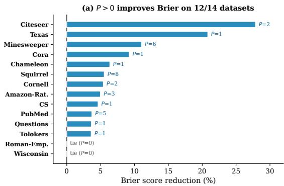

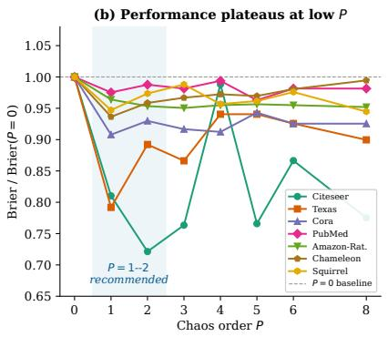  
Figure 3: (a) Percentage Brier reduction of the best swept order $P { > } 0$ over $P { = } 0$ (Table 14). (b) Brier relative to $P { = } 0$ versus chaos order, for seven datasets.

Table 13: Accuracy (%) of DSS-GNN for varying chaos order $P$ across all datasets.
<table><tr><td>Dataset</td><td> $P = 0$ </td><td> $P = 1$ </td><td> $P = 2$ </td><td> $P = 3$ </td><td> $P = 4$ </td><td> $P = 5$ </td><td> $P = 6$ </td><td> $P = 8$ </td></tr><tr><td>Cora</td><td> $8 5 . 1 2 \pm 1 . 0 6$ </td><td> ${ \pm 6 . 6 3 \pm 1 . 2 6 }$ </td><td> $8 6 . 3 3 \pm 1 . 1 2$ </td><td> $8 6 . 3 3 \pm 0 . 8 2$ </td><td> ${ \bf 8 6 . 6 3 \pm 1 . 1 4 }$ </td><td> $8 6 . 3 2 \pm 1 . 1 3$ </td><td> $8 6 . 6 1 \pm 0 . 8 4$ </td><td> $8 6 . 3 8 \pm 0 . 9 6$ </td></tr><tr><td>Citeseer</td><td> $6 5 . 3 9 \pm 1 . 0 2$ </td><td> $7 9 . 2 1 \pm 0 . 7 9$ </td><td> ${ \bf 8 0 . 2 0 \pm 1 . 2 8 }$ </td><td> $7 8 . 4 7 \pm 0 . 8 0$ </td><td> $7 1 . 5 0 \pm 4 . 5 8$ </td><td> $7 8 . 9 2 \pm 1 . 1 3$ </td><td> $7 6 . 7 7 \pm 2 . 1 9$ </td><td> $7 8 . 4 9 \pm 1 . 0 8$ </td></tr><tr><td>PubMed</td><td> $8 9 . 1 2 \pm 0 . 5 7$ </td><td> $8 9 . 3 3 \pm 0 . 4 9$ </td><td> $8 9 . 3 3 \pm 0 . 6 6$ </td><td> $8 9 . 3 8 \pm 0 . 6 7$ </td><td> $8 9 . 3 3 \pm 0 . 5 4$ </td><td> $\mathbf { 8 9 . 7 2 \pm 0 . 3 1 }$ </td><td>89.40 ± 0.57</td><td> $8 9 . 3 9 \pm 0 . 5 1$ </td></tr><tr><td>Texas</td><td> $7 5 . 0 8 \pm 2 3 . 7 0$ </td><td> $8 8 . 3 6 \pm 4 . 5 7$ </td><td> $9 1 . 3 1 \pm 3 . 4 4$ </td><td> $8 9 . 1 8 \pm 4 . 9 2$ </td><td> $9 1 . 3 1 \pm 3 . 3 0$ </td><td> $8 7 . 5 4 \pm 5 . 5 9$ </td><td> $8 9 . 0 1 \pm 2 . 8 2$ </td><td> $8 7 . 3 7 \pm 5 . 4 3$ </td></tr><tr><td>Cornell</td><td> $8 3 . 6 2 \pm 6 . 8 0$ </td><td> $8 5 . 1 1 \pm 5 . 1 2$ </td><td> ${ \bf 8 5 . 7 4 \pm 6 . 7 3 }$ </td><td> $8 3 . 6 2 \pm 5 . 3 9$ </td><td> $8 4 . 2 6 \pm 6 . 8 7$ </td><td> $8 3 . 8 3 \pm 7 . 3 8$ </td><td> $8 3 . 6 2 \pm 6 . 5 3$ </td><td> $8 2 . 9 8 \pm 7 . 6 1$ </td></tr><tr><td>Wisconsin</td><td> $9 3 . 2 5 \pm 3 . 4 6$ </td><td> $9 2 . 8 7 \pm 2 . 9 2$ </td><td> $9 3 . 2 5 \pm 3 . 3 9$ </td><td> $8 8 . 5 0 \pm 3 . 3 5$ </td><td> $9 3 . 0 0 \pm 3 . 4 6$ </td><td> $9 0 . 7 5 \pm 2 . 8 4$ </td><td> $8 9 . 6 3 \pm 4 . 8 2$ </td><td> $9 0 . 5 0 \pm 2 . 9 2$ </td></tr><tr><td>Chameleon</td><td> $7 4 . 5 3 \pm 2 . 3 2$ </td><td> $7 5 . 3 6 \pm 1 . 1 9$ </td><td> $7 4 . 5 3 \pm 1 . 7 4$ </td><td> $7 4 . 5 1 \pm 1 . 5 7$ </td><td> $7 4 . 7 7 \pm 1 . 8 6$ </td><td> $7 4 . 9 2 \pm 1 . 6 0$ </td><td> $7 4 . 4 0 \pm 1 . 6 5$ </td><td> $7 3 . 6 3 \pm 1 . 6 9$ </td></tr><tr><td>Squirrel</td><td> $6 6 . 3 5 \pm 2 . 5 6$ </td><td> ${ \bf 6 8 . 0 6 \pm 2 . 2 1 }$ </td><td> $6 7 . 2 6 \pm 2 . 1 3$ </td><td> $6 6 . 9 9 \pm 1 . 2 4$ </td><td> $6 7 . 3 9 \pm 2 . 4 4$ </td><td> $6 7 . 2 3 \pm 1 . 5 5$ </td><td> $6 7 . 0 2 \pm 1 . 5 0$ </td><td> $6 7 . 7 1 \pm 1 . 5 1$ </td></tr><tr><td>CS</td><td> $9 5 . 9 4 \pm 0 . 2 0$ </td><td> ${ \bf 9 6 . 1 7 \pm 0 . 2 3 }$ </td><td> $9 6 . 0 1 \pm 0 . 2 5$ </td><td> $9 6 . 0 3 \pm 0 . 1 9$ </td><td> $9 6 . 1 3 \pm 0 . 2 5$ </td><td> $9 5 . 9 6 \pm 0 . 2 9$ </td><td> $9 6 . 0 2 \pm 0 . 2 3$ </td><td> $9 6 . 0 2 \pm 0 . 1 7$ </td></tr><tr><td>Roman-Emp.</td><td> ${ \bf 7 9 . 0 1 \pm 0 . 2 7 }$ </td><td> $7 8 . 8 4 \pm 0 . 6 1$ </td><td> $7 8 . 8 1 \pm 0 . 6 1$ </td><td> $7 8 . 9 8 \pm 0 . 8 7$ </td><td> $7 8 . 7 5 \pm 0 . 3 2$ </td><td> $7 8 . 7 7 \pm 0 . 6 9$ </td><td> ${ \bf 7 9 . 0 1 \pm 0 . 2 7 }$ </td><td> $7 8 . 9 7 \pm 0 . 7 9$ </td></tr><tr><td>Amazon-Rat.</td><td> $4 5 . 4 0 \pm 0 . 7 6$ </td><td> $4 8 . 1 3 \pm 1 . 1 4$ </td><td> $4 9 . 4 1 \pm 0 . 7 1$ </td><td> $4 9 . 6 5 \pm 1 . 1 5$ </td><td> $4 9 . 3 6 \pm 0 . 7 0$ </td><td>49.05 ± 0.73</td><td> $4 9 . 3 5 \pm 0 . 8 3$ </td><td>49.72 ± 0.64</td></tr><tr><td>Minesweeper</td><td> $8 6 . 1 4 \pm 0 . 6 0$ </td><td>86.93 ± 0.51</td><td> $8 7 . 3 7 \pm 1 . 1 0$ </td><td> $8 6 . 3 7 \pm 1 . 0 6$ </td><td> $8 6 . 5 3 \pm 0 . 9 6$ </td><td> $8 6 . 1 7 \pm 0 . 4 5$ </td><td> ${ \pm 7 . 6 6 \pm 1 . 1 0 }$ </td><td> $8 7 . 4 2 \pm 0 . 9 3$ </td></tr><tr><td>Tolokers</td><td> $7 9 . 3 3 \pm 0 . 6 6$ </td><td> $7 9 . 8 2 \pm 0 . 4 5$ </td><td> $7 9 . 8 8 \pm 0 . 4 9$ </td><td> $7 9 . 2 8 \pm 0 . 7 9$ </td><td> $7 9 . 6 2 \pm 0 . 5 6$ </td><td> $7 9 . 3 2 \pm 0 . 6 6$ </td><td> $7 9 . 2 1 \pm 0 . 7 5$ </td><td> $7 9 . 3 6 \pm 0 . 7 9$ </td></tr><tr><td>Questions</td><td> $9 7 . 1 5 \pm 0 . 0 6$ </td><td> $9 7 . 1 5 \pm 0 . 0 6$ </td><td> $9 7 . 1 3 \pm 0 . 0 6$ </td><td> $9 7 . 1 6 \pm 0 . 0 6$ </td><td> ${ \bf 9 7 . 1 7 \pm 0 . 0 4 }$ </td><td> $9 7 . 1 5 \pm 0 . 0 6$ </td><td> $9 7 . 1 5 \pm 0 . 0 6$ </td><td> $9 7 . 1 4 \pm 0 . 0 9$ </td></tr></table>

On four datasets the best swept order exceeds two (PubMed, Squirrel, Amazon-Ratings, and Minesweeper); on every dataset $P = 1$ or $P = 2$ is within 0.02 Brier of the best swept value.

## E.2 Chaos order on OOD detection and under distribution shift

OOD detection. Varying only the chaos order $P \in \{ 0 , 1 , 2 , 3 \}$ in the DSS-Hybrid OOD configuration (GCN base, energy score with propagation, energy-margin training, every other hyperparameter fixed; 3 runs) leaves energy AUROC flat: Cora-structure $9 1 . 0 / 9 1 . 2 / 9 0 . 9 / 9 0 . 8 $ and Amazon-Photo/feature $9 9 . 4 / 9 9 . 5 / 9 9 . 5 / 9 9 . 5 $ for $P = 0 , 1 , 2 , 3 ,$ , Coauthor-CS likewise flat, and on ogbn-arxiv the AUROC moves by at most 0.8 across $P = 0$ to 3 (the runs of Table 20). The absolute levels differ from Table 2 because the ablation is a separate set of runs at one configuration per dataset. This is the behavior the design predicts: the energy score reads the mean logit alone (9), so P can be selected for calibration without affecting detection, and the detection margin comes from the DSS representation under a fixed readout (Section 4.3).

Table 14: Brier Score (↓) of DSS-GNN for varying chaos order P across all datasets.
<table><tr><td>Dataset</td><td> $P = 0$ </td><td> $P = 1$ </td><td> $P = 2$ </td><td> $P = 3$ </td><td> $P = 4$ </td><td> $P = 5$ </td><td> $P = 6$ </td><td> $P = 8$ </td></tr><tr><td>Cora</td><td> $0 . 2 2 8 \pm 0 . 0 1 3$ </td><td> ${ \bf 0 . 2 0 7 \pm 0 . 0 1 9 }$ </td><td> $0 . 2 1 2 \pm 0 . 0 1 6$ </td><td> $0 . 2 0 9 \pm 0 . 0 1 6$ </td><td> $0 . 2 0 8 \pm 0 . 0 1 9$ </td><td> $0 . 2 1 5 \pm 0 . 0 1 5$ </td><td> $0 . 2 1 1 \pm 0 . 0 1 1$ </td><td> $0 . 2 1 1 \pm 0 . 0 1 5$ </td></tr><tr><td>Citeseer</td><td> $0 . 4 2 7 \pm 0 . 0 0 8$ </td><td> $0 . 3 4 6 \pm 0 . 0 0 8$ </td><td> ${ \bf 0 . 3 0 8 \pm 0 . 0 1 0 }$ </td><td> $0 . 3 2 6 \pm 0 . 0 1 2$ </td><td> $0 . 4 2 2 \pm 0 . 0 2 7$ </td><td> $0 . 3 2 7 \pm 0 . 0 1 2$ </td><td> $0 . 3 7 0 \pm 0 . 0 2 3$ </td><td> $0 . 3 3 1 \pm 0 . 0 1 3$ </td></tr><tr><td>PubMed</td><td> $0 . 1 6 2 \pm 0 . 0 0 7$ </td><td> $0 . 1 5 8 \pm 0 . 0 0 7$ </td><td> $0 . 1 6 0 \pm 0 . 0 0 8$ </td><td> $0 . 1 5 9 \pm 0 . 0 0 8$ </td><td> $0 . 1 6 1 \pm 0 . 0 0 7$ </td><td> ${ \bf 0 . 1 5 6 \pm 0 . 0 0 5 }$ </td><td> $0 . 1 5 9 \pm 0 . 0 0 8$ </td><td> $0 . 1 5 9 \pm 0 . 0 0 7$ </td></tr><tr><td>Texas</td><td> $0 . 2 6 9 \pm 0 . 0 8 2$ </td><td> ${ \bf 0 . 2 1 3 \pm 0 . 1 1 1 }$ </td><td> $0 . 2 4 0 \pm 0 . 1 1 1$ </td><td> $0 . 2 3 3 \pm 0 . 0 9 6$ </td><td>0.253 ± 0.096</td><td> $0 . 2 5 3 \pm 0 . 0 8 6$ </td><td> $0 . 2 4 9 \pm 0 . 1 1 4$ </td><td> $0 . 2 4 2 \pm 0 . 0 8 2$ </td></tr><tr><td>Cornell</td><td> $0 . 2 4 1 \pm 0 . 0 8 7$ </td><td> $0 . 2 3 1 \pm 0 . 0 7 9$ </td><td> ${ \bf 0 . 2 2 8 \pm 0 . 0 8 8 }$ </td><td> $0 . 2 5 0 \pm 0 . 0 9 0$ </td><td> $0 . 2 6 3 \pm 0 . 1 2 9$ </td><td> $0 . 2 4 7 \pm 0 . 1 0 7$ </td><td> $0 . 2 5 2 \pm 0 . 0 7 9$ </td><td> $0 . 2 7 3 \pm 0 . 1 1 1$ </td></tr><tr><td>Wisconsin</td><td> ${ \bf 0 . 1 0 3 \pm 0 . 0 4 8 }$ </td><td> $0 . 1 0 7 \pm 0 . 0 4 1$ </td><td> $0 . 1 0 4 \pm 0 . 0 4 7$ </td><td> $0 . 1 6 1 \pm 0 . 0 6 0$ </td><td> ${ \bf 0 . 1 0 3 \pm 0 . 0 4 8 }$ </td><td> $0 . 1 2 9 \pm 0 . 0 3 7$ </td><td> $0 . 1 5 3 \pm 0 . 0 5 2$ </td><td> $0 . 1 3 5 \pm 0 . 0 4 0$ </td></tr><tr><td>Chameleon</td><td> $0 . 3 6 2 \pm 0 . 0 1 9$ </td><td> ${ \bf 0 . 3 3 9 \pm 0 . 0 1 9 }$ </td><td> $0 . 3 4 7 \pm 0 . 0 2 2$ </td><td> $0 . 3 5 0 \pm 0 . 0 1 6$ </td><td> $0 . 3 5 2 \pm 0 . 0 1 6$ </td><td> $0 . 3 5 1 \pm 0 . 0 1 8$ </td><td> $0 . 3 5 5 \pm 0 . 0 1 3$ </td><td> $0 . 3 6 0 \pm 0 . 0 1 5$ </td></tr><tr><td>Squirrel</td><td> $0 . 4 1 6 \pm 0 . 0 2 8$ </td><td> $0 . 3 9 4 \pm 0 . 0 2 7$ </td><td> $0 . 4 0 5 \pm 0 . 0 2 4$ </td><td>0.411 ± 0.019</td><td> $0 . 3 9 8 \pm 0 . 0 2 8$ </td><td> $0 . 4 0 0 \stackrel { - } { \pm } 0 . 0 1 \stackrel { - } { 6 }$ </td><td> $0 . 4 0 6 \pm 0 . 0 1 4$ </td><td> $\mathbf { 0 . 3 9 3 \mathop { \pm } 0 . 0 1 7 }$ </td></tr><tr><td>CS</td><td> $0 . 0 6 5 \pm 0 . 0 0 3$ </td><td>0.062 ± 0.004</td><td> $0 . 0 6 3 \pm 0 . 0 0 3$ </td><td> $0 . 0 6 4 \pm 0 . 0 0 3$ </td><td> $0 . 0 6 3 \pm 0 . 0 0 3$ </td><td> $0 . 0 6 4 \pm 0 . 0 0 4$ </td><td> $0 . 0 6 3 \pm 0 . 0 0 3$ </td><td> $0 . 0 6 3 \pm 0 . 0 0 3$ </td></tr><tr><td>Roman-Emp.</td><td> ${ \bf 0 . 2 9 8 \pm 0 . 0 0 5 }$ </td><td> $0 . 3 0 0 \stackrel { \_ } { \pm } 0 . 0 0 7$ </td><td> $0 . 3 0 0 \pm 0 . 0 0 8$ </td><td> ${ \bf 0 . 2 9 8 \pm 0 . 0 0 5 }$ </td><td> $0 . 2 9 9 \pm 0 . 0 0 5$ </td><td> $0 . 3 0 0 \stackrel { - } { \pm } 0 . 0 0 9$ </td><td> $0 . 2 9 9 \pm 0 . 0 0 7$ </td><td> ${ \bf 0 . 2 9 8 \pm 0 . 0 0 5 }$ </td></tr><tr><td>Amazon-Rat.</td><td> $0 . 6 6 6 \pm 0 . 0 0 3$ </td><td> $0 . 6 4 2 \pm 0 . 0 1 0$ </td><td> $0 . 6 3 5 \pm 0 . 0 0 6$ </td><td> $\mathbf { 0 . 6 3 3 \pm 0 . 0 0 6 }$ </td><td> $0 . 6 3 6 \pm 0 . 0 0 6$ </td><td> $0 . 6 3 7 \pm 0 . 0 0 5$ </td><td> $0 . 6 3 6 \pm 0 . 0 0 4$ </td><td> $0 . 6 3 4 \pm 0 . 0 0 5$ </td></tr><tr><td>Minesweeper</td><td> $0 . 1 9 0 \pm 0 . 0 0 7$ </td><td> $0 . 1 8 0 \pm 0 . 0 0 6$ </td><td> $0 . 1 7 0 \pm 0 . 0 1 4$ </td><td> $0 . 1 8 5 \pm 0 . 0 1 1$ </td><td> $0 . 1 8 1 \pm 0 . 0 1 1$ </td><td> $0 . 1 8 7 \pm 0 . 0 0 5$ </td><td> ${ \bf 0 . 1 6 9 \pm 0 . 0 1 4 }$ </td><td> $0 . 1 7 1 \pm 0 . 0 1 2$ </td></tr><tr><td>Tolokers</td><td> $0 . 2 7 8 \pm 0 . 0 1 0$ </td><td> $\mathbf { 0 . 2 6 8 \pm 0 . 0 0 4 }$ </td><td> ${ \bf 0 . 2 6 8 \pm 0 . 0 0 5 }$ </td><td> $0 . 2 7 6 \pm 0 . 0 1 2$ </td><td> $0 . 2 8 0 \pm 0 . 0 0 9$ </td><td> $0 . 2 7 7 \pm 0 . 0 1 0$ </td><td> $0 . 2 7 8 \pm 0 . 0 0 9$ </td><td> $0 . 2 7 9 \pm 0 . 0 0 9$ </td></tr><tr><td>Questions</td><td> $0 . 0 5 5 \pm 0 . 0 0 1$ </td><td> $\mathbf { 0 . 0 5 3 \pm 0 . 0 0 1 }$ </td><td> $0 . 0 5 4 \pm 0 . 0 0 2$ </td><td> $\mathbf { 0 . 0 5 3 \pm 0 . 0 0 1 }$ </td><td> $\mathbf { 0 . 0 5 3 \pm 0 . 0 0 1 }$ </td><td> $\mathbf { 0 . 0 5 3 \mathop { \pm } 0 . 0 0 1 }$ </td><td> $\mathbf { 0 . 0 5 3 \pm 0 . 0 0 1 }$ </td><td> ${ \bf 0 . 0 5 3 \pm 0 . 0 0 2 }$ </td></tr></table>

Distribution shift. At the validation-selected standalone configurations of Appendix G, Table 15 varies only P (3 seeds). $P { = } 1$ is the argmax on both the OOD-validation and the test split on all three settings, so at these configurations the chaos order contributes $+ 1 . 7 , + 1 . 2 ,$ and +0.6 points of shifted accuracy over the deterministic P=0 arm.

<table><tr><td>Setting</td><td>P=0</td><td>P=1</td><td> $P { = } 2$ </td></tr><tr><td>GOOD-Cora / word</td><td> $6 3 . 2 4 \pm 0 . 4 0$ </td><td> ${ \bf 6 4 . 8 9 \pm 0 . 2 1 }$ </td><td> $6 4 . 0 1 \pm 0 . 2 5$ </td></tr><tr><td>GOOD-Cora / degree</td><td> $6 1 . 3 8 \pm 0 . 8 1$ </td><td> ${ \bf 6 2 . 6 0 \pm 0 . 5 9 }$ </td><td> $6 1 . 2 2 \pm 0 . 0 7$ </td></tr><tr><td>GOOD-Arxiv / time</td><td> $6 4 . 8 1 \pm 0 . 2 7$ </td><td> ${ \pm } 5 . 4 3 \pm 1 . 0 7$ </td><td> $6 4 . 4 8 \pm 0 . 2 7$ </td></tr></table>

Table 15: Shifted test accuracy (%) of standalone DSS-GNN on GOOD concept shift as the chaos order varies at the validation-selected configuration (mean ± SD over 3 seeds).

## E.3 Energy-score propagation

Table 16 isolates the score-propagation step of the energy readout on DSS-Hybrid: the raw energy and the propagated energy are computed from the same trained checkpoints (one fixed configuration, 3 runs), so the difference is due to propagation alone. Propagation helps on 9 of 11 settings, by up to +18.2 AUROC (Twitch) and +14.5 (Cora-structure); the two exceptions are Cora/label $( - 6 . 7 ) .$ , where the fixed smoothing averages away part of the leave-out signal inside homophilous neighborhoods, and Amazon-Photo/structure (−0.4), at noise level. The same step transfers to the standalone model (Cora/label +0.9, Amazon-Photo/label +13.4 at identical checkpoints). We apply propagation uniformly for protocol parity with GNNSafe++.

Table 16: Effect of energy-score propagation on DSS-Hybrid: change in AUROC (points) from the raw to the propagated energy score at identical checkpoints (3 runs, fixed configuration).
<table><tr><td>Dataset</td><td>Structure</td><td>Feature</td><td>Label</td></tr><tr><td>Cora</td><td>+14.5</td><td>+5.4</td><td>-6.7</td></tr><tr><td>Amazon-Photo</td><td>-0.4</td><td>+1.7</td><td>+3.9</td></tr><tr><td>Coauthor-CS</td><td>+1.9</td><td>+1.1</td><td>+1.3</td></tr><tr><td>Twitch (cross-graph)</td><td></td><td>+18.2</td><td></td></tr><tr><td>Arxiv (cross-graph)</td><td></td><td>+7.3</td><td></td></tr></table>

## E.4 Chaos energy regularization $\lambda _ { \mathrm { r e g } }$

Table 17 reports the Brier score as the chaos energy regularization strength $\lambda _ { \mathrm { r e g } }$ varies from 0 to 0.1 with $P = 2$ fixed. Each column is an independent set of 10-split runs; at each dataset’s selected $\lambda _ { \mathrm { r e g } }$ the cell agrees with the P=2 column of Table 14 within one standard deviation. The

regularizer of (11) penalizes large chaos coefficients; at $\lambda _ { \mathrm { r e g } } = 0$ the chaos expansion is still active (all $P + 1$ channels are learned), but without an explicit energy penalty. Moderate regularization $\dot { ( \lambda _ { \mathrm { r e g } } } \in \{ 1 0 ^ { - 3 } , 1 0 ^ { - 2 } \} )$ yields the best calibration on the majority of datasets. On Texas, $\lambda _ { \mathrm { r e g } }$ matters most (0.366 at 0 versus 0.213 at $1 0 ^ { - 2 } ) ;$ on Citeseer, Wisconsin, and Roman-Empire $\lambda _ { \mathrm { r e g } } { = } 0$ is best and larger values degrade Brier, which is why $\lambda _ { \mathrm { r e g } }$ is selected per dataset on validation Brier.  
Table 17: Effect of chaos energy regularization $\lambda _ { \mathrm { r e g } }$ on Brier score (↓), with $P = 2$ fixed. Bold indicates the best $\lambda _ { \mathrm { r e g } }$ per dataset.
<table><tr><td>Dataset</td><td> $\lambda _ { \mathrm { { r e g } } } { = } 0$ </td><td> $1 0 ^ { - 3 }$ </td><td> $1 0 ^ { - 2 }$ </td><td> $1 0 ^ { - 1 }$ </td></tr><tr><td>Cora Citeseer</td><td>0.219 0.308</td><td>0.219 0.310 0.156</td><td>0.207 0.318 0.156</td><td>0.220 0.499 0.157</td></tr><tr><td>PubMed Texas Cornell Wisconsin Chameleon Squirrel CS</td><td>0.159 0.366 0.230 0.103 0.362 0.405 0.064</td><td>0.246 0.237 0.107 0.354 0.407 0.066</td><td>0.213 0.228 0.108 0.339 0.398 0.062</td><td>0.251 0.342 0.174 0.342 0.393 0.083</td></tr><tr><td>Roman-Emp. Amazon-Rat. Minesweeper Tolokers Questions</td><td>0.298 0.663 0.186 0.281 0.054</td><td>0.323 0.660 0.169 0.275 0.053</td><td>0.603 0.633 0.190 0.268 0.054</td><td>0.789 0.633 0.228 0.280 0.055</td></tr></table>

## E.5 Number of quadrature nodes S

Table 18 reports the Brier score as the number of Gauss–Hermite quadrature nodes $S$ varies from 2 to 8, with $P = 2$ fixed. Each column is an independent set of 10-split runs; the $S { = } 4$ column agrees with the $P { = } 2$ column of Table 14 within one standard deviation. For the deterministic gates used in these runs $( P _ { g } = 0 )$ , the theoretical minimum for exact chaos arithmetic at $P = 2$ is $\bar { S } \geq \lceil ( P _ { g } + 2 P + 1 ) / 2 \rceil = 3 ( \mathsf { A }$ ppendix A.1). Brier varies by at most 0.011 across $S \in \{ 2 , \ldots , 8 \}$ on 12 of 14 datasets. The exceptions are Wisconsin, where ${ \dot { S } } { = } 2 ,$ , below the theoretical minimum, gives a higher Brier score (0.142 vs 0.109 at S=3), consistent with the exactness requirement of Theorem 3, and Cornell, where the spread across S (0.218 to 0.286) is within one standard deviation of its 10-split results. The chaos-order sweeps of Tables 13–14 use S=4 throughout, exact for $P \leq 3 ;$ at $P \geq 4$ the highest-order Hermite products are integrated approximately (Appendix D).

Table 18: Brier score (↓) vs. number of quadrature nodes S, with $P = 2$ fixed. The theoretical minimum is $S = 3$
<table><tr><td>Dataset</td><td>S=2</td><td>S=3</td><td>S=4</td><td>S=6</td><td>S=8</td></tr><tr><td>Cora</td><td>0.216</td><td>0.207</td><td>0.217</td><td>0.209</td><td>0.212 0.311</td></tr><tr><td>Citeseer PubMed</td><td>0.310 0.157</td><td>0.308 0.156</td><td>0.312 0.156</td><td>0.313 0.158</td><td>0.156</td></tr><tr><td>Texas Cornell</td><td>0.216 0.235</td><td>0.221 0.286</td><td>0.213 0.228</td><td>0.217 0.218</td><td>0.218 0.242</td></tr><tr><td>Wisconsin Chameleon</td><td>0.142 0.341</td><td>0.109 0.344</td><td>0.115 0.343</td><td>0.103 0.339</td><td>0.108 0.340</td></tr><tr><td>Squirrel CS</td><td>0.395 0.062</td><td>0.397 0.062</td><td>0.393 0.062</td><td>0.396 0.063</td><td>0.400 0.063</td></tr><tr><td>Roman-Emp. Amazon-Rat. Minesweeper Tolokers</td><td>0.298 0.633 0.170</td><td>0.298 0.634 0.169</td><td>0.298 0.636 0.170</td><td>0.298 0.636 0.171</td><td>0.298 0.637 0.170</td></tr></table>

## E.6 Contribution decomposition: backbone vs. chaos

Table 19 decomposes the calibration improvement into two factors: the graph-spectral backbone and the chaos expansion. The “ChebNet” column reports a vanilla single-branch Chebyshev filter $( K { = } 4 ,$ hidden 64) as a diagnostic backbone baseline, not as part of the main uncertainty-aware baseline comparison in Table 1. The $" P \mathrm { = } 0 "$ column uses the Table 1 architecture for each dataset (which may include propagate-first or dual branches) with the chaos expansion disabled. The “Best $P { > } 0 ^ { \circ }$ column adds the chaos expansion on the same architecture. The $\scriptstyle { \dot { P } } = 0 \to P > 0$ comparison is strictly fair (same architecture, only $P$ changes) and shows that the chaos expansion improves calibration on 12 of 14 datasets (3.6–27.9% Brier reduction), indicating that the stochastic expansion is the primary source of the calibration gains over the $P { = } 0$ version in this controlled comparison. The ChebNet column gives useful context: on the small WebKB datasets Texas and Wisconsin, the single-filter ChebNet attains a lower absolute Brier score, while the controlled $P { = } 0$ versus $P { > } 0$ comparison still isolates the contribution of the chaos expansion. The ChebNet column is also the single-filter control for the filtering design: at $P { = } 0$ the per-dataset dual-filter architecture has lower or equal Brier than the single-branch ChebNet on 12 of 14 datasets (equal on Questions; Chameleon 0.362 vs 0.776, Squirrel 0.416 vs 0.798, Roman-Empire 0.298 vs 0.368), with Texas and Wisconsin as the exceptions noted above.

Table 19: Contribution decomposition: Brier score (↓). ChebNet $K { = } 4$ is a vanilla single-filter diagnostic; $P { = } 0$ and Best $P { > } 0$ are the P=0 column and the best $P { > } 0$ column of Table 14 (same per-dataset architecture). Boldface compares the controlled $P { = } 0$ versus Best $P { > } 0$ pair, and the rightmost column isolates the chaos contribution. Table 1 reports the selected order of Table 12, which can differ from the best swept order.
<table><tr><td>Dataset</td><td>ChebNet K=4</td><td> $P { = } 0$ </td><td>Best P&gt;0</td><td>∆ Chaos</td></tr><tr><td>Cora</td><td>0.281</td><td>0.228</td><td>0.207</td><td>-9.2%</td></tr><tr><td>Citeseer</td><td>0.470</td><td>0.427</td><td>0.308</td><td>-27.9%</td></tr><tr><td>PubMed</td><td>0.171</td><td>0.162</td><td>0.156</td><td>-3.7%</td></tr><tr><td>Texas</td><td>0.208</td><td>0.269</td><td>0.213</td><td>-20.8%</td></tr><tr><td>Cornell Wisconsin</td><td>0.324 0.073</td><td>0.241 0.103</td><td>0.228 0.103</td><td>-5.4% 0%</td></tr><tr><td>Chameleon</td><td>0.776</td><td>0.362</td><td>0.339</td><td>-6.4%</td></tr><tr><td>Squirrel CS</td><td>0.798 0.069</td><td>0.416 0.065</td><td>0.393 0.062</td><td>-5.5% -4.6%</td></tr><tr><td></td><td></td><td></td><td></td><td></td></tr><tr><td>Roman-Emp.</td><td>0.368</td><td>0.298</td><td>0.298</td><td>0%</td></tr><tr><td>Amazon-Rat.</td><td>0.676</td><td>0.666</td><td>0.633</td><td>-5.0%</td></tr><tr><td>Minesweeper</td><td>0.208</td><td>0.190</td><td>0.169</td><td>-11.1%</td></tr><tr><td></td><td></td><td></td><td></td><td></td></tr><tr><td>Tolokers</td><td>0.303</td><td>0.278</td><td>0.268</td><td>-3.6%</td></tr><tr><td>Questions</td><td>0.055</td><td>0.055</td><td>0.053</td><td>-3.6%</td></tr></table>

## E.7 Computational overhead

Asymptotic complexity. Although the doubly-spectral expansion is defined on the tensor product $\ell ^ { 2 } ( \boldsymbol { V } ) \bar { \otimes } L ^ { 2 } ( \mathbb { R } , \boldsymbol { \gamma } )$ , truncating the chaos basis at order $P$ retains only $P { + 1 }$ coefficients along the stochastic axis, so the graph-filtering cost and the coefficient memory scale as $( P \mathrm { + } 1 ) \times$ the deterministic ChebNet baseline and the node-wise dense cost as $S \times$ . Concretely, one DSS layer takes $\mathcal { O } \big ( ( P + 1 ) ( K _ { \mathrm { l p } } + K _ { \mathrm { h p } } ) | E | d + S N d ^ { 2 } + S ( P + 1 ) N d \big )$ time and $\mathcal { O } ( ( P + 1 + S ) N d )$ memory, where $| E |$ is the number of edges, d the hidden width, and S the number of Gauss–Hermite quadrature nodes; the chaos extension is therefore additive, not combinatorial, in the stochastic direction, and no eigendecomposition is ever computed. With S at the exactness threshold $( S = P + 1 )$ ) the quadrature term is quadratic in $P ;$ this is the worst-case operation count, and the measured growth in $\bar { P }$ is much smaller (below). By Theorem 2 the truncation error decays exponentially in P for targets satisfying the growth condition of Appendix A.6, consistent with the empirical plateau at $P { = } 1 { - } 2$ , so the constant factor over a deterministic backbone stays small. All chaos coefficients share the same Chebyshev filters and projection weights, so the parameter count per layer is $\mathcal { O } \big ( K _ { \mathrm { l p } } + K _ { \mathrm { h p } } + ( P + 1 ) ( \hat { P _ { g } } + 1 ) + d _ { \ell } d _ { \ell + 1 } \big )$ (filter coefficients, gate coefficients $a _ { n , r } , b _ { n , r } ,$ and the linear map); the chaos order enters only through the gate coefficients and the input lift. By contrast, the MC-dropout and Deep Ensemble baselines require M forward passes or models at inference (M=20 and $\bar { M } { = } 5$ in our comparisons).

Wall-clock measurements. Table 20 reports the wall-clock time per training epoch as the chaos order P increases, on three datasets spanning two orders of magnitude in size. The overhead grows linearly with $P \colon$ each additional chaos order adds one extra graph filter evaluation and Gauss–Hermite projection per layer. At $P = 2$ the per-epoch cost ranges from 2.9× on Cora to $1 . 2 \times$ on Amazon-Ratings and 1.1× on ogbn-arxiv relative to the deterministic baseline $( P = 0 )$ , within the asymptotic bound above and well below the M× overhead of MC-dropout or ensembles. The measured overhead decreases as graphs grow because the per-order arithmetic is batched into single kernels, and on larger graphs fixed per-epoch costs and better accelerator utilization account for a larger share of the epoch time. On ogbn-arxiv (169K nodes, one H100 GPU) each additional chaos order adds about 4% per-epoch time, and peak GPU memory grows linearly in $P + 1 ( 1 . 6 8 / 2 . 7 5 / 3 . 8 8 / 5 . 0 2$ GiB for $P = 0 , \ldots , 3 )$ , consistent with the memory analysis above; peak memory on Cora is 75.9 MiB.

Table 20: Wall-clock time per epoch (ms) vs. chaos order P (Cora and Amazon-Ratings on an A100; ogbn-arxiv on one H100, 3 runs, with peak GPU memory in MiB).
<table><tr><td>Dataset</td><td> $P { = } 0$ </td><td> $P { = } 1$ </td><td> $P { = } 2$ </td><td> $P { = } 3$ </td><td>Ratio  $P { = } 2 / P { = } 0$ </td></tr><tr><td>Cora (2.7K nodes)</td><td>35</td><td>67</td><td>102</td><td>131</td><td>2.9×</td></tr><tr><td>Amazon-Rat. (25K nodes)</td><td>464</td><td>526</td><td>576</td><td>646</td><td>1.2×</td></tr><tr><td>ogbn-arxiv (169K nodes)</td><td>2002</td><td>2088</td><td>2174</td><td>2273</td><td>1.1×</td></tr><tr><td>ogbn-arxiv peak memory (MiB)</td><td>1721</td><td>2813</td><td>3976</td><td>5141</td><td>2.3×</td></tr></table>

## E.8 Summary of component evidence

Table 21 collects, for each architectural component, the controlled comparison that isolates it and the effect measured. The chaos expansion improves calibration (and, at the selected GOOD configurations, shifted accuracy); the spectral filtering design and the residual improve accuracy under heterophily and shift; the energy score with propagation provides OOD detection. Each task’s readout uses a different part of the same representation.

Table 21: Component-wise evidence. Each row names one component, the comparison that isolates it, and the measured effect.
<table><tr><td>Component</td><td>Comparison</td><td>Effect</td></tr><tr><td>Chaos expansion (P)</td><td>P=0 vs best P&gt;0, same architecture (Tables 13, 14, 19)</td><td>Calibration: Citeseer Brier —27.9% and accuracy +14.8 points (the endpoint also beats plain GCN, 0.308 vs 0.318 Brier, Tables 1/23); Texas —20.8%;</td></tr><tr><td>Chaos expansion (P)</td><td>OOD ablation varying only P (Appendix E.2)</td><td>Minesweeper —11.1% Energy AUROC flat across P (Cora-structure 91.0/91.2/90.9/90.8 at one fixed configuration); detection reads the mean logit, so P can be selected for calibration without changing detection</td></tr><tr><td>Chaos expansion (P)</td><td>GOOD ablation at the selected configurations (Table 15)</td><td>Shifted accuracy: P=1 beats P=0 on GOOD-Cora word (+1.7), degree (+1.2), and GOOD-Arxiv time (+0.6)</td></tr><tr><td>Spectral backbone (chaos off)</td><td>P=0 vs GCN (Tables 13, 23)</td><td>Heterophilous accuracy comes from the spectral backbone: Roman-Empire 79.0 at P=0 vs GCN 51.3 Lower or equal Brier for the full design on 12 of 14</td></tr><tr><td>Filtering design vs single filter</td><td>Per-dataset architecture at P=0 vs single-branch ChebNet (Table 19)</td><td>datasets (equal on Questions; Chameleon 0.362 vs 0.776, Squirrel 0.416 vs 0.798, Roman-Empire 0.298 vs 0.368); exceptions are Texas and Wisconsin</td></tr><tr><td>DSS residual branch (as a unit)</td><td>Hybrid vs identically trained GCN base, 14 datasets (Table 24) DSS-Hybrid vs GNNSafe++ (same</td><td>Accuracy: Roman-Empire +27.7, Minesweeper +6.6; no dataset loses beyond noise (worst —0.8)</td></tr><tr><td>DSS representation under a fixed OOD readout</td><td>energy readout, propagation, objective, GCN encoder in both; Table 2)</td><td>Cora 94.3/97.6/94.1 vs 90.6/95.6/92.8</td></tr><tr><td>Energy-score propagation</td><td>Same-checkpoint on/off, all 11 settings (Table 16)</td><td>Helps on 9 of 11, up to +18.2 AUROC (Twitch) and +14.5 (Cora-structure)</td></tr></table>

## F Comparison with Standard GNN Baselines

Table 1 in the main text compares DSS-GNN against recent uncertainty-aware graph methods (TFE-GNN and G-∆UQ). Here we additionally compare against GCN [15] and GAT [34], two widely used GNN architectures that do not incorporate any uncertainty mechanism. Both baselines use 2 layers, 64 hidden units, Adam optimizer (lr=0.01, weight decay $\stackrel { - 5 } { = } \times 1 0 ^ { - 4 } )$ , and the same 10 splits as DSS-GNN.

Table 23 reports accuracy and Brier score. The main observation is that higher accuracy does not imply better calibration. On Cora, GCN and GAT both achieve higher accuracy than DSS-GNN (87.5% and 87.8% vs. 86.6%) yet have worse Brier scores (0.213 and 0.222 vs. 0.207). On Citeseer, GAT matches DSS-GNN in accuracy (80.6% vs. 80.2%) but is substantially worse in Brier (0.353 vs. 0.308). On many heterophilous benchmarks, GCN and GAT have much lower accuracy and higher Brier scores than DSS-GNN. The calibration gains of DSS-GNN are therefore not an accuracy effect.

Stochastic baselines under the same protocol. Table 22 adds MC-dropout (M=20 stochastic passes at test time, probabilities averaged) and Deep Ensembles (M=5 independently trained models, probabilities averaged) on the GCN of Table 23, under the full 10-split protocol and the same code path; the plain-GCN control from that code path reproduces Table 23 (Cora 87.47 vs 87.45, Wisconsin 50.25 vs 50.25). DSS-GNN’s Brier is lower on all 14 datasets than either baseline, and ensembling improves the GCN’s Brier by at most 0.008 on any dataset while MC-dropout sometimes worsens it (Cora): averaging a conventional GNN does not remove the calibration difference. On Cora and Questions the margins are small (0.207 vs 0.213 and 0.053 vs 0.055). The same multi-pass cost structure applies to sampling-based Bayesian GNNs and latent-variable GNNs; the chaos expansion is instead deterministic, with no sampling variance.

Table 22: Brier score (↓) with test accuracy (%) in parentheses for DSS-GNN (Table 1) and stochastic GCN baselines under the same 10-split protocol (means over 10 splits).
<table><tr><td>Dataset</td><td>DSS-GNN</td><td>MC-dropout</td><td>Deep Ensemble</td><td>Plain GCN</td></tr><tr><td>Cora</td><td>0.207 (86.63)</td><td>0.2188 (87.36)</td><td>0.2134 (87.45)</td><td>0.2125 (87.47)</td></tr><tr><td>Citeseer</td><td>0.308 (80.20)</td><td>0.3230 (80.03)</td><td>0.3170 (79.77)</td><td>0.3176 (80.00)</td></tr><tr><td>PubMed</td><td>0.156 (89.72)</td><td>0.2176 (86.20)</td><td>0.2153 (86.16)</td><td>0.2155 (86.10)</td></tr><tr><td>Texas Cornell</td><td>0.240 (91.31)</td><td>0.5862 (64.43)</td><td>0.5686 (62.79)</td><td>0.5758 (64.43)</td></tr><tr><td>Wisconsin</td><td>0.231 (85.11) 0.104 (93.25)</td><td>0.6829 (52.77) 0.6370 (50.38)</td><td>0.6826 (52.98)</td><td>0.6839 (52.34)</td></tr><tr><td>Chameleon</td><td></td><td></td><td>0.6373 (51.25)</td><td>0.6435 (50.25)</td></tr><tr><td>Squirrel</td><td>0.339 (75.36)</td><td>0.7378 (41.73)</td><td>0.7371 (42.71)</td><td>0.7374 (42.21)</td></tr><tr><td>CS</td><td>0.394 (68.06)</td><td>0.7850 (28.11)</td><td>0.7847 (28.81)</td><td>0.7849 (28.38)</td></tr><tr><td></td><td>0.062 (96.17)</td><td>0.0821 (94.55)</td><td>0.0809 (94.63)</td><td>0.0816 (94.58)</td></tr><tr><td>Roman-Emp.</td><td>0.300 (78.84)</td><td>0.6554 (50.92)</td><td>0.6471 (51.49)</td><td>0.6477 (51.37)</td></tr><tr><td>Amz-Rat.</td><td>0.634 (49.72)</td><td>0.6772 (44.08)</td><td>0.6769 (44.00)</td><td>0.6771 (44.07)</td></tr><tr><td>Minesweeper</td><td>0.169 (87.66)</td><td>0.2874 (80.20)</td><td>0.2874 (80.20)</td><td>0.2874 (80.21)</td></tr><tr><td>Tolokers</td><td>0.268 (79.88)</td><td>0.2970 (78.78)</td><td>0.2970 (78.78)</td><td>0.2971 (78.79)</td></tr><tr><td>Questions</td><td>0.053 (97.17)</td><td>0.0548 (97.06)</td><td>0.0549 (97.07)</td><td>0.0549 (97.07)</td></tr></table>

Table 23: Node classification: test accuracy (%, ↑) and Brier score (↓) for DSS-GNN vs. standard GNN baselines. Mean ± SD over 10 splits. Best per dataset in bold.
<table><tr><td></td><td colspan="3">Accuracy (%)</td><td colspan="3">Brier Score</td></tr><tr><td>Dataset</td><td>DSS-GNN</td><td>GCN</td><td>GAT</td><td>DSS-GNN</td><td>GCN</td><td>GAT</td></tr><tr><td>Cora</td><td> $8 6 . 6 3 \pm 1 . 2 6$ </td><td> $8 7 . 4 5 \pm 1 . 6 1$ </td><td> ${ \pm 7 . 7 5 \pm 1 . 7 1 }$ </td><td> ${ \bf 0 . 2 0 7 \pm 0 . 0 1 9 }$ </td><td> $0 . 2 1 3 \pm 0 . 0 1 4$ </td><td> $0 . 2 2 2 \pm 0 . 0 1 5$ </td></tr><tr><td>Citeseer</td><td> $8 0 . 2 0 \pm 1 . 2 8$ </td><td> $7 9 . 8 4 \pm 0 . 9 6$ </td><td> ${ \bf 8 0 . 5 7 \pm 1 . 1 2 }$ </td><td> $\mathbf { 0 . 3 0 8 \pm 0 . 0 1 0 }$ </td><td> $0 . 3 1 8 \pm 0 . 0 0 7$ </td><td> $0 . 3 5 3 \pm 0 . 0 0 7$ </td></tr><tr><td>PubMed</td><td> $\mathbf { 8 9 . 7 2 \pm 0 . 3 1 }$ </td><td> $8 6 . 2 1 \pm 0 . 3 1$ </td><td> $8 5 . 7 2 \pm 0 . 2 8$ </td><td> ${ \bf 0 . 1 5 6 \pm 0 . 0 0 5 }$ </td><td> $0 . 2 1 5 \pm 0 . 0 0 5$ </td><td> $0 . 2 3 2 \pm 0 . 0 0 4$ </td></tr><tr><td>Texas</td><td> $9 1 . 3 1 \pm 3 . 4 4$ </td><td> $6 4 . 4 3 \pm 6 . 8 0$ </td><td> $7 1 . 8 0 \pm 7 . 0 6$ </td><td> ${ \bf 0 . 2 4 0 \pm 0 . 1 1 1 }$ </td><td> $0 . 5 7 6 \pm 0 . 0 3 1$ </td><td> $0 . 5 5 5 \pm 0 . 0 3 8$ </td></tr><tr><td>Cornell</td><td> $\mathbf { 8 5 . 1 1 \pm 5 . 1 2 }$ </td><td> $5 2 . 3 4 \pm 9 . 9 9$ </td><td> $4 9 . 5 7 \pm 1 2 . 6 3$ </td><td> ${ \bf 0 . 2 3 1 \pm 0 . 0 7 9 }$ </td><td> $0 . 6 8 4 \pm 0 . 0 8 0$ </td><td> $0 . 6 3 1 \pm 0 . 0 7 3$ </td></tr><tr><td>Wisconsin</td><td> $9 3 . 2 5 \pm 3 . 3 9$ </td><td> $5 0 . 2 5 \pm 5 . 3 0$ </td><td> $5 6 . 6 2 \pm 4 . 7 1$ </td><td> ${ \bf 0 . 1 0 4 \pm 0 . 0 4 7 }$ </td><td> $0 . 6 4 3 \pm 0 . 0 2 4$ </td><td> $0 . 5 9 8 \pm 0 . 0 2 1$ </td></tr><tr><td>Chameleon</td><td> ${ 7 5 . 3 6 \pm 1 . 1 9 }$ </td><td> $4 2 . 2 1 \pm 1 . 7 8$ </td><td> $4 3 . 8 3 \pm 2 . 5 4$ </td><td> ${ \bf 0 . 3 3 9 \pm 0 . 0 1 9 }$ </td><td> $0 . 7 3 7 \pm 0 . 0 0 9$ </td><td> $0 . 7 1 2 \pm 0 . 0 1 5$ </td></tr><tr><td>Squirrel</td><td> ${ \bf 6 8 . 0 6 \pm 2 . 2 1 }$ </td><td> $2 8 . 3 9 \pm 1 . 1 7$ </td><td> $2 7 . 5 7 \pm 0 . 7 5$ </td><td> ${ \bf 0 . 3 9 4 \pm 0 . 0 2 7 }$ </td><td> $0 . 7 8 5 \pm 0 . 0 0 3$ </td><td> $0 . 7 8 9 \pm 0 . 0 0 2$ </td></tr><tr><td>CS</td><td> ${ \bf 9 6 . 1 7 \pm 0 . 2 3 }$ </td><td> $9 4 . 6 1 \pm 0 . 2 4$ </td><td> $9 4 . 4 5 \pm 0 . 1 8$ </td><td> $\mathbf { 0 . 0 6 2 \pm 0 . 0 0 4 }$ </td><td> $0 . 0 8 2 \pm 0 . 0 0 4$ </td><td> $0 . 0 8 5 \pm 0 . 0 0 4$ </td></tr><tr><td>Roman-Emp.</td><td> $7 8 . 8 4 \pm 0 . 6 1$ </td><td> $5 1 . 3 0 \pm 0 . 3 1$ </td><td> $4 2 . 8 5 \pm 0 . 5 3$ </td><td> $\mathbf { 0 . 3 0 0 \pm 0 . 0 0 7 }$ </td><td> $0 . 6 4 8 \pm 0 . 0 0 1$ </td><td> $0 . 7 5 5 \pm 0 . 0 0 3$ </td></tr><tr><td>Amz-Rat.</td><td> $\mathbf { 4 9 . 7 2 \pm 0 . 6 4 }$ </td><td> $4 3 . 9 7 \pm 0 . 3 7$ </td><td> $4 2 . 2 0 \pm 0 . 4 3$ </td><td> ${ \bf 0 . 6 3 4 } \pm 0 . 0 0 5$ </td><td> $0 . 6 7 7 \pm 0 . 0 0 2$ </td><td> $0 . 6 9 0 \pm 0 . 0 0 1$ </td></tr><tr><td>Minesweeper</td><td> ${ \pm 7 . 6 6 \pm 1 . 1 0 }$ </td><td> $8 0 . 2 1 \pm 0 . 1 9$ </td><td> $8 0 . 1 0 \pm 0 . 0 8$ </td><td> ${ \bf 0 . 1 6 9 \pm 0 . 0 1 4 }$ </td><td> $0 . 2 8 7 \pm 0 . 0 0 3$ </td><td> $0 . 2 8 1 \pm 0 . 0 0 3$ </td></tr><tr><td>Tolokers</td><td> $\mathbf { 7 9 . 8 8 \pm 0 . 4 9 }$ </td><td> $7 8 . 8 1 \pm 0 . 4 7$ </td><td> $7 8 . 1 9 \pm 0 . 1 6$ </td><td> ${ \bf 0 . 2 6 8 \pm 0 . 0 0 5 }$ </td><td> $0 . 2 9 7 \pm 0 . 0 0 5$ </td><td> $0 . 2 9 9 \pm 0 . 0 0 2$ </td></tr><tr><td>Questions</td><td> ${ \bf 9 7 . 1 7 \pm 0 . 0 4 }$ </td><td> $9 7 . 0 8 \pm 0 . 0 2$ </td><td> $9 7 . 0 2 \pm 0 . 0 0$ </td><td> $\mathbf { 0 . 0 5 3 \pm 0 . 0 0 1 }$ </td><td> $0 . 0 5 5 \pm 0 . 0 0 0$ </td><td> $0 . 0 5 7 \pm 0 . 0 0 0$ </td></tr></table>

## G Cross-Evaluation of the Two Deployment Modes

This appendix gives the full tables for Section 4.5: the hybrid under the calibration protocol, the standalone model under the OOD and GOOD protocols, the readout-coincidence measurement of Section 4.2, the effect of BatchNorm under the calibration protocol, and the covariate-shift counterpart of Table 4.

Table 5 (Section 4.5) summarizes both deployment modes on all three tasks; the per-dataset comparisons summarized in its cells are Tables 24, 25, and 26 below.

## G.1 Protocols

Hybrid under the calibration protocol. DSS-Hybrid (2-layer GCN base with the DSS residual branch of Appendix D) is trained under the identical 10-split protocol of Table 1, paired with its own GCN base trained identically with the residual removed and matched budgets, so the pair isolates the residual branch.

Standalone under the OOD protocol. Standalone DSS-GNN is trained in the GNNSafe pipeline (200 epochs, 3 runs, energy score with propagation, pipeline defaults: hidden 64, 2 layers, weight decay $\mathrm { 1 0 ^ { - 2 } }$ , learning rate $1 0 ^ { - 2 } , P { = } 1 , \dot { S } { = } \bar { 4 } )$ . Rows marked +BN add the per-chaos-channel BatchNorm of Appendix D, with every other hyperparameter unchanged; the variant is selected on the validation split. Twitch uses learning rate $\mathrm { \dot { 1 0 } ^ { - 3 } }$ , hidden 128, and no BatchNorm, selected on validation ID accuracy. The Arxiv row is trained with the GNNSafe++ energy-margin objective at the Arxiv margin hyperparameters of Wu et al. [36] with $m _ { \mathrm { o u t } } = - 1$ , selected on validation ID accuracy. All other rows use standard ID training.

Standalone under the GOOD protocol. Standalone DSS-GNN is trained in the GOOD pipeline with $L _ { 1 }$ row-normalized input features, 2 layers, $K _ { \mathrm { l p } } { = } 3 , K _ { \mathrm { h p } } { = } 2 , 5 0 0$ epochs, patience 200, 3 seeds; the epoch is selected by OOD-validation loss within each run and the configuration (BatchNorm on/off, learning rate, hidden width, P) on the GOOD OOD-validation split: CBAS and WebKB +BN, learning rate ${ \bar { 1 } } 0 ^ { - 2 } ;$ Twitch +BN, $1 0 ^ { - 3 } ;$ GOOD-Cora/word +BN, $5 \times 1 0 ^ { - 3 }$ , hidden 128, weight decay $\bar { 1 } 0 ^ { - 3 } \colon$ ; GOOD-Cora/degree $\mathbf { + B N , 3 \times 1 0 ^ { - 3 } }$ , hidden 128; GOOD-Arxiv/time +BN, $1 0 ^ { - 2 }$ hidden 256; GOOD-Arxiv/degree no BatchNorm, $1 0 ^ { - 2 }$ , hidden 64; P=1 throughout.

## G.2 Calibration: standalone, hybrid, and the hybrid’s GCN base

Table 24: Test accuracy (%) and Brier score, mean $\pm \ : \mathrm { S D }$ over the same 10 splits. The standalone column is Table 1; the hybrid and its GCN base are a matched pair (identical training, budgets, and splits; the only difference is the DSS residual).
<table><tr><td></td><td colspan="2">Standalone DSS-GNN</td><td colspan="2">DSS-Hybrid</td><td colspan="2">GCN base</td></tr><tr><td>Dataset</td><td>Accuracy</td><td>Brier</td><td>Accuracy</td><td>Brier</td><td>Accuracy</td><td>Brier</td></tr><tr><td>Cora</td><td> $8 6 . 6 3 \pm 1 . 2 6$ </td><td> $0 . 2 0 7 \pm 0 . 0 1 9$ </td><td> $8 4 . 3 3 \pm 0 . 9 7$ </td><td> $0 . 2 4 1 \pm 0 . 0 1 5$ </td><td> $8 4 . 2 0 \pm 1 . 0 2$ </td><td> $0 . 2 4 3 \pm 0 . 0 1 6$ </td></tr><tr><td>Citeseer</td><td> $8 0 . 2 0 \pm 1 . 2 8$ </td><td> $0 . 3 0 8 \pm 0 . 0 1 0$ </td><td> $7 4 . 7 1 \pm 1 . 0 5$ </td><td> $0 . 3 7 5 \pm 0 . 0 0 9$ </td><td> $7 4 . 3 2 \pm 1 . 1 3$ </td><td> $0 . 3 7 8 \pm 0 . 0 0 9$ </td></tr><tr><td>PubMed</td><td> $8 9 . 7 2 \pm 0 . 3 1$ </td><td> $0 . 1 5 6 \pm 0 . 0 0 5$ </td><td> $8 8 . 2 7 \pm 0 . 5 6$ </td><td> $0 . 1 7 7 \pm 0 . 0 0 6$ </td><td> $8 7 . 9 3 \pm 0 . 5 6$ </td><td> $0 . 1 8 1 \pm 0 . 0 0 6$ </td></tr><tr><td>Texas</td><td> $9 1 . 3 1 \pm 3 . 4 4$ </td><td> $0 . 2 4 0 \pm 0 . 1 1 1$ </td><td> $4 5 . 5 7 \pm 7 . 6 8$ </td><td> $0 . 7 3 7 \pm 0 . 0 3 4$ </td><td> $4 6 . 3 9 \pm 7 . 5 5$ </td><td> $0 . 7 3 7 \pm 0 . 0 3 4$ </td></tr><tr><td>Cornell</td><td> $8 5 . 1 1 \pm 5 . 1 2$ </td><td> $0 . 2 3 1 \pm 0 . 0 7 9$ </td><td> $5 5 . 1 1 \pm 1 4 . 0 3$ </td><td> $0 . 6 5 6 \pm 0 . 1 4 2$ </td><td> $4 7 . 6 6 \pm 1 2 . 0 1$ </td><td> $0 . 7 2 7 \pm 0 . 0 6 8$ </td></tr><tr><td>Wisconsin</td><td> $9 3 . 2 5 \pm 3 . 3 9$ </td><td> $0 . 1 0 4 \pm 0 . 0 4 7$ </td><td> $4 8 . 1 2 \pm 6 . 5 0$ </td><td> $0 . 6 8 0 \pm 0 . 0 2 9$ </td><td>48.50 ± 6.14</td><td> $0 . 6 8 0 \pm 0 . 0 2 8$ </td></tr><tr><td>Chameleon</td><td> $7 5 . 3 6 \pm 1 . 1 9$ </td><td> $0 . 3 3 9 \pm 0 . 0 1 9$ </td><td> $3 3 . 5 0 \pm 2 . 1 0$ </td><td> $0 . 7 7 7 \pm 0 . 0 0 4$ </td><td> $3 4 . 0 0 \pm 2 . 4 4$ </td><td> $0 . 7 7 7 \pm 0 . 0 0 4$ </td></tr><tr><td>Squirrel</td><td> $6 8 . 0 6 \pm 2 . 2 1$ </td><td> $0 . 3 9 4 \pm 0 . 0 2 7$ </td><td> $2 6 . 3 5 \pm 2 . 0 2$ </td><td> $0 . 7 9 0 \pm 0 . 0 0 3$ </td><td> $2 6 . 2 3 \pm 2 . 3 6$ </td><td> $0 . 7 9 0 \pm 0 . 0 0 3$ </td></tr><tr><td>CS</td><td> $9 6 . 1 7 \pm 0 . 2 3$ </td><td> $0 . 0 6 2 \pm 0 . 0 0 4$ </td><td> $9 4 . 2 6 \pm 0 . 2 4$ </td><td> $0 . 0 8 7 \pm 0 . 0 0 4$ </td><td> $9 4 . 2 3 \pm 0 . 2 1$ </td><td> $0 . 0 8 8 \pm 0 . 0 0 3$ </td></tr><tr><td>Roman-Empire</td><td> $7 8 . 8 4 \pm 0 . 6 1$ </td><td> $0 . 3 0 0 \pm 0 . 0 0 7$ </td><td> $7 4 . 3 6 \pm 0 . 6 1$ </td><td> $0 . 3 6 1 \pm 0 . 0 0 7$ </td><td> $4 6 . 6 3 \pm 0 . 2 6$ </td><td> $0 . 6 9 0 \pm 0 . 0 0 3$ </td></tr><tr><td>Amazon-Ratings</td><td> $4 9 . 7 2 \pm 0 . 6 4$ </td><td> $0 . 6 3 4 \pm 0 . 0 0 5$ </td><td> $4 6 . 3 6 \pm 0 . 5 7$ </td><td> $0 . 6 6 1 \pm 0 . 0 0 4$ </td><td> $4 6 . 3 2 \pm 0 . 4 8$ </td><td> $0 . 6 6 1 \pm 0 . 0 0 2$ </td></tr><tr><td>Minesweeper</td><td> $8 7 . 6 6 \pm 1 . 1 0$ </td><td> $0 . 1 6 9 \pm 0 . 0 1 4$ </td><td> $8 6 . 9 1 \pm 0 . 4 5$ </td><td> $0 . 1 8 4 \pm 0 . 0 0 6$ </td><td> $8 0 . 3 1 \pm 0 . 2 1$ </td><td> $0 . 2 8 9 \pm 0 . 0 0 3$ </td></tr><tr><td>Tolokers</td><td> $7 9 . 8 8 \pm 0 . 4 9$ </td><td> $0 . 2 6 8 \pm 0 . 0 0 5$ </td><td> $8 1 . 1 9 \pm 0 . 5 0$ </td><td> $0 . 2 5 5 \pm 0 . 0 0 6$ </td><td> $7 9 . 4 6 \pm 0 . 3 4$ </td><td> $0 . 2 9 1 \pm 0 . 0 0 6$ </td></tr><tr><td>Questions</td><td> $9 7 . 1 7 \pm 0 . 0 4$ </td><td> $0 . 0 5 3 \pm 0 . 0 0 1$ </td><td> $9 7 . 0 9 \pm 0 . 0 4$ </td><td> $0 . 0 5 3 \pm 0 . 0 0 1$ </td><td> $9 7 . 0 8 \pm 0 . 0 4$ </td><td> $0 . 0 5 4 \pm 0 . 0 0 1$ </td></tr></table>

The hybrid is at or above its own base on 11 of 14 datasets in accuracy; the three negative deltas (Texas −0.82, Chameleon −0.50, Wisconsin −0.38) are far inside one standard deviation, and every positive Brier delta (hybrid worse) is at most 0.0008, also far inside one standard deviation. The gains are structural and large where the GCN inductive bias fails: Roman-Empire +27.7 accuracy and

−0.33 Brier, Minesweeper +6.6 and −0.11, Tolokers +1.7 and −0.04. On the small heterophilous graphs where the GCN backbone itself fails (Texas, Cornell, Wisconsin, Chameleon, Squirrel), the residual matches the base rather than improving on it, and the standalone model is the deployment choice. In hybrid mode the argmax of the quadrature predictive and of the mean logit agree on every test node of every dataset (disagreement 0.0000 on all 14).

## G.3 OOD detection: standalone versus hybrid

Table 25: AUROC (%) and ID test accuracy (%) on the 11 OOD settings. Standalone: 3 runs, mean ± SD; hybrid: Tables 2–3 (AUROC only for the nine node-OOD settings∗). The last column gives the standalone training objective.
<table><tr><td>Setting</td><td>Standalone AUROC</td><td>Standalone ID acc.</td><td>Hybrid AUROC</td><td>Hybrid ID acc</td><td>Objective (standalone)</td></tr><tr><td>Cora / structure</td><td> $7 9 . 7 9 \pm 1 . 4 6 ( \mathrm { + B N } )$ </td><td>69.50</td><td>94.32</td><td>n/r*</td><td>standard (no OOD exposure)</td></tr><tr><td>Cora / feature</td><td> $8 8 . 1 5 \pm 1 . 0 2 \left( + \mathrm { B N } \right)$ </td><td>69.17</td><td>97.60</td><td>n/r*</td><td>standard (no OOD exposure)</td></tr><tr><td>Cora / label</td><td> $9 4 . 0 3 \pm 1 . 0 9 \left( + \mathrm { { B N } } \right)$ </td><td>89.24</td><td>94.11</td><td>n/r*</td><td>standard (no OOD exposure)</td></tr><tr><td>Amazon-Photo / structure</td><td> $9 6 . 5 3 \pm 1 . 4 1 ( \mathrm { + B N } )$ </td><td>91.59</td><td>99.69</td><td>n/r*</td><td>standard (no OOD exposure)</td></tr><tr><td>Amazon-Photo / feature</td><td> $9 8 . 1 0 \pm 0 . 1 1 ( + \mathrm { B N } )$ </td><td>92.00</td><td>99.66</td><td>n/r*</td><td>standard (no OOD exposure)</td></tr><tr><td>Amazon-Photo / label</td><td> $9 6 . 5 3 \pm 0 . 1 0 ( + \mathrm { B N } )$ </td><td>94.81</td><td>97.52</td><td>n/r*</td><td>standard (no OOD exposure)</td></tr><tr><td>Coauthor-CS / structure</td><td> $9 4 . 3 3 \pm 0 . 2 9 ( \mathrm { + B N } )$ </td><td>92.64</td><td>99.96</td><td>n/r*</td><td>standard (no OOD exposure)</td></tr><tr><td>Coauthor-CS / feature</td><td> $9 7 . 7 9 \pm 0 . 1 6 ( + \mathrm { B N } )$ </td><td>92.47</td><td>99.95</td><td>n/r*</td><td>standard (no OOD exposure)</td></tr><tr><td>Coauthor-CS / label</td><td> $9 5 . 8 7 \pm 1 . 8 3 \mathrm { { \dot { ( + } B N ) } }$ </td><td>94.00</td><td>98.07</td><td>n/r*</td><td>standard (no OOD exposure)</td></tr><tr><td>Twitch (cross-graph)</td><td> $5 1 . 8 5 \pm 4 . 8 3 ( \mathrm { n o \ s e p a r a t i o n } )$ </td><td>68.39 ± 0.20</td><td>95.75</td><td>70.52</td><td>standard (no OOD exposure)</td></tr><tr><td>Arxiv (cross-graph)</td><td> $7 3 . 7 3 \pm 0 . 2 4 ( \mathrm { \dot { + } B N } )$ </td><td>61.16 ± 0.58</td><td>73.36</td><td>53.99</td><td>GNNSafe++ margin objective</td></tr></table>

∗Table 2 reports AUROC only. Hybrid ID accuracy on these nine settings (3 runs under the same protocol) is Cora 81.6/81.1/90.6, Amazon-Photo 92.4/91.0/95.4, Coauthor-CS 93.0/93.0/95.5 (structure/feature/label).

The hybrid is the stronger detector on 10 of 11 settings; the standalone trains on all 11 (ID accuracies in Table 25) and is competitive on the label-shift settings (Cora/label 94.03 vs 94.11) and on Arxiv, where under the GNNSafe++ margin objective it reaches 73.73 AUROC, above the hybrid’s 73.36, with the best Arxiv ID accuracy of any method in Table 3 (61.16). The one standalone exception is Twitch: the classifier itself trains (ID accuracy 68.39 vs the hybrid’s 70.52), but its energy score does not separate the cross-graph OOD inputs, so the hybrid (95.75) is preferred there. The per-chaoschannel BatchNorm of Appendix D is used on all nine perturbation settings, where the sparse public splits require it for every backbone in the pipeline (Section 4.5).

## G.4 Distribution shift: standalone versus hybrid

Table 26: Shifted (OOD) test accuracy (%) on the GOOD concept-shift settings. Standalone: mean ± SD over 3 seeds, configuration selected on the GOOD OOD-validation split (Appendix G.1); hybrid and best baseline from Table 4.
<table><tr><td>Setting</td><td>Standalone</td><td>Hybrid</td><td>Best baseline</td></tr><tr><td>GOOD-CBAS / color</td><td> $8 2 . 3 8 \pm 1 3 . 1 7 \mathrm { { \left( + B N \right) } }$ </td><td>88.57</td><td>TAR 87.29</td></tr><tr><td>GOOD-WebKB / university</td><td> $3 6 . 4 1 \pm 1 . 6 0 \left( \mathrm { + B N } \right)$ </td><td>40.77</td><td>TAR 30.83</td></tr><tr><td>GOOD-Twitch / language</td><td> $6 0 . 2 8 \pm 0 . 5 1 \ : ( + \mathrm { B N } )$ </td><td>61.21</td><td>TAR 57.20</td></tr><tr><td>GOOD-Cora / word</td><td> $6 4 . 8 9 \pm 0 . 2 1 \ \mathrm { ( + B N ) }$ </td><td>64.81</td><td>TAR 64.73</td></tr><tr><td>GOOD-Cora / degree</td><td> $6 2 . 6 0 \pm 0 . 5 9 ( + \mathrm { B N } )$ </td><td>62.73</td><td>TAR 61.73</td></tr><tr><td>GOOD-Arxiv / time</td><td> $6 5 . 4 3 \pm 1 . 0 7 \ : ( \mathrm { + B N } )$ </td><td>66.76</td><td>TAR 66.08</td></tr><tr><td>GOOD-Arxiv / degree</td><td> $6 4 . 6 2 \pm 0 . 1 5$ </td><td>66.43</td><td>G-∆UQ 64.34</td></tr></table>

The standalone model is above every baseline of Table 4 on 5 of 7 settings (WebKB, Twitch, Cora word, Cora degree, Arxiv degree) and at ERM’s level on the remaining two (ERM: 82.43 on CBAS and 65.64 on Arxiv/time), while the hybrid is above every baseline on all 7; on GOOD-Cora/word the two modes agree within noise (64.81 vs $6 4 . 8 9 \pm 0 . 2 1 ) $ . GOOD-CBAS is a small synthetic graph with the largest seed variance of the seven settings (standalone SD 13.2 over 3 seeds). ID accuracies of the standalone runs are between 63.5 and 96.2 across the seven settings (CBAS 96.2, WebKB 76.0, Twitch 63.5, Cora word 68.8, Cora degree 68.9, Arxiv time 74.1, Arxiv degree 71.5).

## G.5 Readout coincidence

Table 27 compares the two readouts of Section 3.2 at identical checkpoints.

Table 27: Quadrature readout versus mean-logit readout at identical checkpoints under the full 10-split protocol of Table 1: absolute Brier difference and the fraction of test nodes on which arg max ¯pi and arg max $Z _ { i , 0 }$ disagree (mean over 10 splits). Accuracy differs by at most 0.04 points on every dataset. In hybrid mode the disagreement is 0.0000 on all 14 datasets.
<table><tr><td>Dataset</td><td>|∆Brier|</td><td>Disagree (%)</td><td>Dataset</td><td>|∆Brier|</td><td>Disagree (%)</td></tr><tr><td>Cora</td><td>0.0002</td><td>0.03</td><td>Roman-Emp.</td><td>0.0000</td><td>0.00</td></tr><tr><td>Citeseer</td><td>0.0000</td><td>0.00</td><td>Amz-Rat.</td><td>0.0000</td><td>0.00</td></tr><tr><td>PubMed</td><td>0.0000</td><td>0.02</td><td>Minesweeper</td><td>0.0003</td><td>0.21</td></tr><tr><td>Texas</td><td>0.0021</td><td>0.00</td><td>Tolokers</td><td>0.0000</td><td>0.00</td></tr><tr><td>Cornell</td><td>0.0000</td><td>0.00</td><td>Questions</td><td>0.0000</td><td>0.00</td></tr><tr><td>Wisconsin</td><td>0.0000</td><td>0.00</td><td>CS</td><td>0.0001</td><td>0.00</td></tr><tr><td>Chameleon</td><td>0.0001</td><td>0.00</td><td>Squirrel</td><td>0.0007</td><td>0.08</td></tr></table>

## G.6 BatchNorm under the calibration protocol

Table 28 re-runs the Table 1 protocol with and without the per-chaos-channel BatchNorm on four datasets (10 splits each). The BatchNorm-free controls reproduce Table 1 within a fraction of one standard deviation (the Citeseer run uses the selected P=2 configuration of Table 12, with $\lambda _ { \mathrm { r e g } } { = } 0$ and reproduces that row as well). With BatchNorm, Cora and Roman-Empire are unchanged within noise and Wisconsin is within one standard deviation, while Citeseer degrades far beyond noise (−13.2 accuracy). BatchNorm is therefore a stabilization for the sparse-label OOD pipeline, where every baseline backbone also uses it, and is not used under the full-label calibration protocol.

Table 28: Test accuracy (%) / Brier, mean ± SD over 10 splits, under the protocol of Table 1 at one calibration configuration per dataset, without and with per-chaos-channel BatchNorm.
<table><tr><td>Dataset</td><td>BatchNorm off (control)</td><td>Table 1</td><td>BatchNorm on</td></tr><tr><td>Cora</td><td> $8 6 . 4 4 \pm 1 . 5 6 / 0 . 2 1 6 \pm 0 . 0 2 2$ </td><td> $8 6 . 6 3 \pm 1 . 2 6 / 0 . 2 0 7 \pm 0 . 0 1 9$ </td><td> $8 5 . 7 8 \pm 1 . 7 6 / 0 . 2 2 0 \pm 0 . 0 1 7$ </td></tr><tr><td>Citeseer</td><td> $8 0 . 2 7 \pm 1 . 1 8 / 0 . 3 0 7 \pm 0 . 0 1 0$ </td><td> $8 0 . 2 0 \pm 1 . 2 8 / 0 . 3 0 8 \pm 0 . 0 1 0$ </td><td> $6 7 . 0 3 \pm 1 . 8 5 / 0 . 4 8 0 \pm 0 . 0 2 4$ </td></tr><tr><td>Wisconsin</td><td> $9 3 . 6 2 \pm 1 . 7 2 / 0 . 1 0 9 \pm 0 . 0 2 9$ </td><td> $9 3 . 2 5 \pm 3 . 3 9 / 0 . 1 0 4 \pm 0 . 0 4 7$ </td><td> $9 1 . 7 5 \pm 4 . 7 5 / 0 . 1 3 4 \pm 0 . 0 6 1$ </td></tr><tr><td>Roman-Empire</td><td> $7 8 . 8 2 \pm 1 . 0 8 / 0 . 3 0 0 \pm 0 . 0 1 2$ </td><td> $7 8 . 8 4 \pm 0 . 6 1 / 0 . 3 0 0 \pm 0 . 0 0 7$ </td><td> $7 8 . 6 0 \pm 0 . 6 4 / 0 . 3 0 0 \pm 0 . 0 0 9$ </td></tr></table>

## G.7 Covariate shift on GOOD

Table 29 is the covariate-shift counterpart of Table 4: the same seven GOOD settings under their covariate splits, comparing ERM-trained DSS-Hybrid (GCN encoder, configuration selected by validation loss) with the same-protocol ERM GCN of the GNNSafe pipeline (3 seeds). DSS-Hybrid is above the ERM control on 6 of 7 settings; the one loss, GOOD-Cora/degree, is within 1.8 points. The two Arxiv ERM baselines did not converge within the shared 120-epoch budget (ID accuracy 45 to 50, versus 72 to 77 for the DSS runs on the same splits), so those two margins are not informative on their own. With the seven concept-shift settings of Table 4 this covers both shift families that GOOD defines.

Table 29: Shifted test accuracy (%) under GOOD covariate shift: ERM-trained DSS-Hybrid (GCN encoder, validation-loss-selected configuration) versus the same-protocol ERM GCN. ∗ERM baseline not converged within the shared budget (see text).
<table><tr><td>Setting (covariate split)</td><td>ERM GCN</td><td>DSS-Hybrid (ERM)</td></tr><tr><td>GOOD-CBAS / color</td><td>49.05</td><td>53.33</td></tr><tr><td>GOOD-WebKB / university</td><td>13.49</td><td>29.10</td></tr><tr><td>GOOD-Twitch / language</td><td>42.78</td><td>52.64</td></tr><tr><td>GOOD-Cora / word</td><td>61.84</td><td>64.18</td></tr><tr><td>GOOD-Cora / degree</td><td>56.66</td><td>54.94</td></tr><tr><td>GOOD-Arxiv / time</td><td>44.80*</td><td>70.39</td></tr><tr><td>GOOD-Arxiv / degree</td><td>25.68*</td><td>57.60</td></tr></table>

## H Architecture Overview and Notation

Figure 4 gives a schematic of the DSS-GNN architecture of Section 3: the two spectral axes that index the chaos coefficients, one DSS layer, the two readouts and the chaos energy, and the two deployment modes. Table 30 summarizes the notation of the DSS layer, Eqs. (2)–(6).

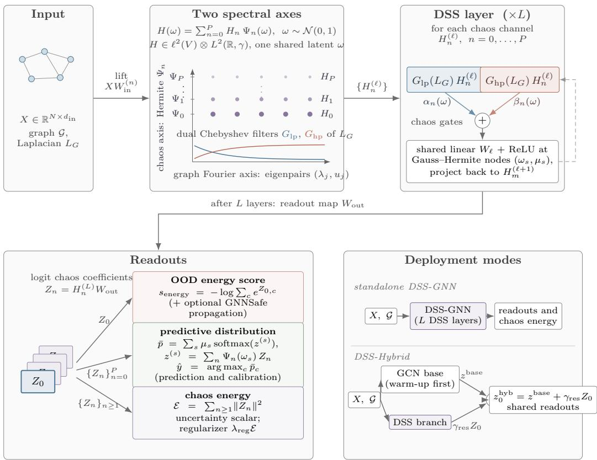  
Figure 4: Overview of DSS-GNN. Input features X on graph $\mathcal { G }$ are lifted to chaos coefficients $\bar { H _ { n } ^ { ( 0 ) } } = X W _ { \mathrm { i n } } ^ { ( n ) }$ , which are indexed by two spectral axes: the graph Fourier axis (Laplacian eigenpairs $( \lambda _ { j } , u _ { j } )$ , filtered by dual Chebyshev filters $\bar { G } _ { \mathrm { l p } } , G _ { \mathrm { h p } } )$ and the Wiener chaos axis (Hermite basis $\Psi _ { n }$ of a scalar Gaussian latent ω). Each DSS layer propagates every chaos channel $H _ { n } ^ { ( \ell ) }$ through both filters, couples them with per-order chaos gates $\alpha _ { n } , \beta _ { n }$ , and applies a shared linear map and ReLU at Gauss–Hermite nodes before projecting back (Eqs. (3)–(6)). The final coefficients $Z _ { n } = H _ { n } ^ { ( L ) } W _ { \mathrm { o u t } }$ are the inputs of the two task readouts, the mean-logit energy score for OOD detection (9) and the quadrature-averaged predictive p¯ for class prediction and calibration (8), together with the chaos energy $\mathcal { E } ,$ which is used as regularizer and uncertainty scalar (7) (bottom left). Bottom right: the two deployment modes, standalone DSS-GNN and DSS-Hybrid, which adds the DSS branch residually (scale $\gamma _ { \mathrm { r e s } } )$ to a warmed-up GCN base (Section 3.4); both use the same readouts. The node index i is suppressed for readability.

Table 30: Notation for the DSS layer, Eqs. (2)–(6).
<table><tr><td>Symbol</td><td>Meaning</td></tr><tr><td>ω</td><td>the single shared standard Gaussian latent; never sampled, integrated out by quadrature</td></tr><tr><td> $\Psi _ { n }$ </td><td>normalized Hermite polynomial of order  $^ { n ; }$  orthonormal basis of  $L ^ { 2 } ( \mathbb { R } , \gamma )$ </td></tr><tr><td> $P$   $H _ { n } ^ { ( \ell ) } \in \mathbb { R } ^ { N \times d _ { \ell } }$ </td><td>chaos truncation order;  $n , m = 0 , \ldots , P$  index input/output chaos orders order-n chaos coefficient of the layer-l embeddings (2); the embedding field is</td></tr><tr><td> $\widetilde { L } _ { G } , T _ { k }$ </td><td> $\begin{array} { r } { H ^ { ( \ell ) } ( \omega ) = \sum _ { n } H _ { n } ^ { ( \ell ) } \Psi _ { n } ( \omega ) } \end{array}$  rescaled Laplacian  $2 L _ { G } / \lambda _ { \mathrm { m a x } } - I$  and Chebyshev polynomial of degree k</td></tr><tr><td> $G _ { \mathrm { l p } } , G _ { \mathrm { h p } }$ </td><td>(Section 2) learned low/high-pass filter polynomials of degrees  $K _ { \mathrm { l p } } , K _ { \mathrm { h p } }$  with coefficients</td></tr><tr><td> $\alpha _ { n } ( \omega ) , \beta _ { n } ( \omega )$ </td><td> $c _ { k } ^ { \mathrm { ( l p ) } } , c _ { k } ^ { \mathrm { ( h p ) } } \left( 3 \right)$  per-order chaos gates coupling the two filter branches; deterministic scalars, or</td></tr><tr><td> $\omega _ { s } , \mu _ { s } , S$ </td><td> $\mathrm { { \bar { o r d e r } } } { \cdot } P _ { g }$  expansions with coefficients  $a _ { n , r } , b _ { n , r } \left( 4 \right)$  Gauss-Hermite quadrature nodes and weights,  $s = 1 , \ldots , S ;$  exact for the</td></tr><tr><td> $\widetilde H ^ { ( \ell + 1 ) } ( \omega _ { s } )$ </td><td>filter/gate polynomials when  $S \geq P + 1$  (for  $P _ { g } \leq 1 )$ </td></tr><tr><td> $W _ { \ell } , \sigma$ </td><td>pre-activation field evaluated at quadrature node  $\omega _ { s } \ ( 5 )$  trainable linear map  $d _ { \ell } \to d _ { \ell + 1 }$  and pointwise activation; Eq. (6) projects  $\sigma ( \widetilde { H } ^ { ( \ell + 1 ) } ( \omega _ { s } ) )$ </td></tr></table>