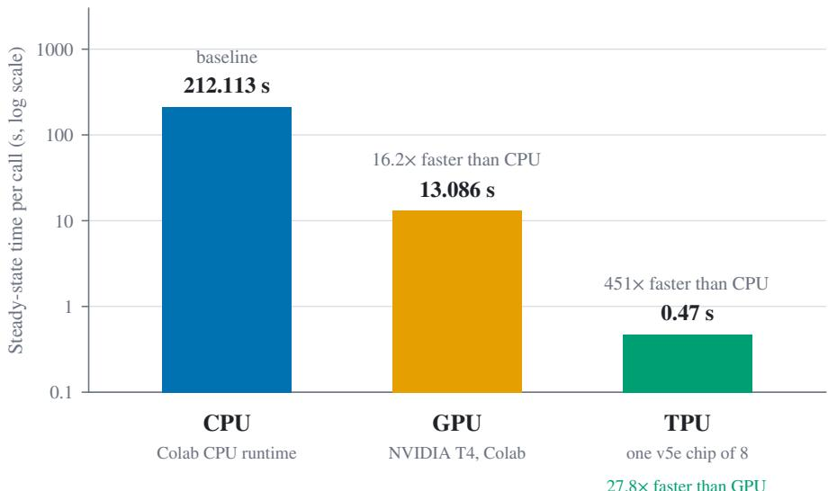
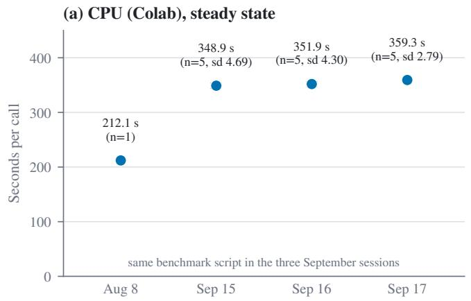
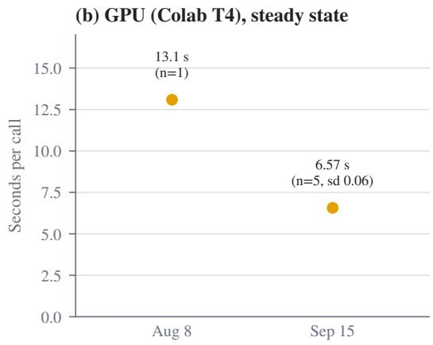
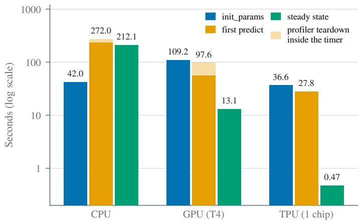
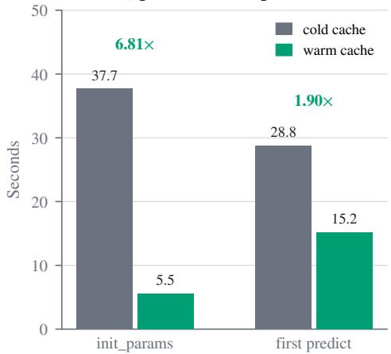
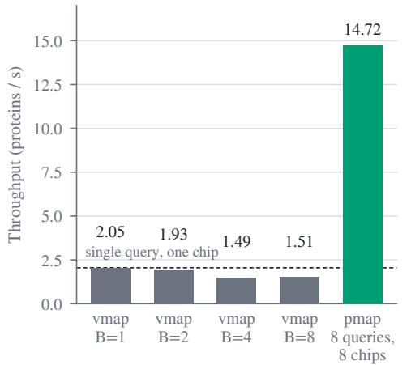
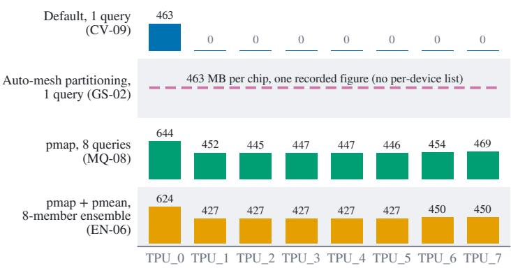
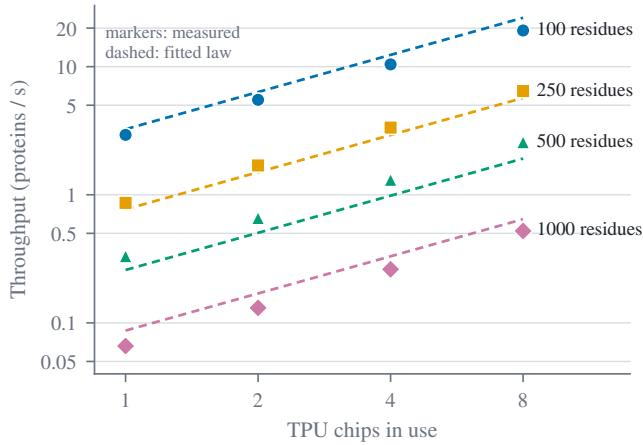
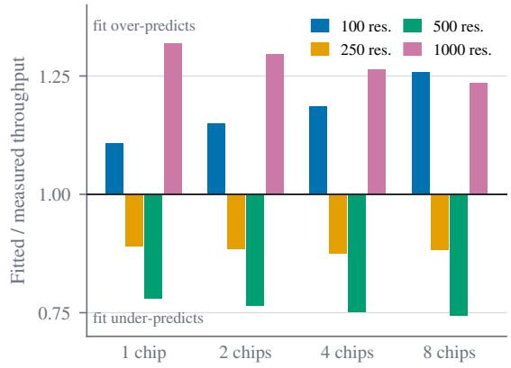

# ACCELERATOR CHOICE IS NOT ENOUGH: ALPHAFOLD2 INFERENCE ON CLOUD TPUS

PREPRINT

Lorenzo Pazienza LUISS Guido Carli University Rome, Italy lorenzo.pazienza@gmail.com

Ihab El Bani Al Akhawayn University Ifrane, Morocco elbani.ihab@gmail.com

September 28, 2026

## ABSTRACT

AlphaFold2 is written in JAX, so the same inference code compiles and runs unchanged on CPUs, GPUs and Google Cloud TPUs. That portability makes the accelerator look like the main decision a user has to make. We show that it is not. Running one AlphaFold2 inference workload across a Colab CPU runtime, an NVIDIA T4 GPU and a dedicated eight-chip Cloud TPU v5e slice, we find a large hardware advantage for the TPU, 0.47 s per call in steady state on a single chip against 13.1 s on the T4 in the same measurement campaign, and three ways in which the software layer decides how much of it a user actually gets. The default execution path uses one chip of the eight, and at list prices the idle capacity makes the slice cost about as much per prediction as the GPU. Batching with jax.vmap never exceeds single-query throughput, while mapping queries across chips with jax.pmap gives eight chips 6.5–7.9× the throughput of one on a matched grid; automatic sharding leaves the per-chip footprint unchanged, consistent with replication, most plausibly because AlphaFold2 carries no sharding annotations. Our retained trace analysis of a first call at a new input shape reports about three quarters of the traced span in JAX tracing and compilation rather than execution. Reruns five weeks later reproduced neither cloud baseline, the GPU one off by roughly a factor of two, so the hardware ratio above is specific to one campaign.

Keywords Tensor Processing Units · JAX/XLA · Automatic sharding · Data parallelism · Protein structure prediction · Benchmarking

## 1 Introduction

AlphaFold2 made accurate protein structure prediction routine [Jumper et al., 2021], and in doing so turned it into a computing workload: large screening campaigns run inference on thousands of sequences, and each prediction is a deep network evaluated on specialized hardware. Its public implementation is written in JAX, which compiles the same Python program through XLA for CPUs, GPUs and Google’s Tensor Processing Units (TPUs). On paper this makes the choice of accelerator a matter of picking the fastest or cheapest device. In practice, the performance a user obtains depends on more than the device: on how the program is compiled, on how its computation is mapped onto the chips that are allocated, and on how stable the underlying cloud machine is from one session to the next. For this class of scientific workload, the gap between what the hardware can deliver and what a user running the model actually gets has received little systematic attention.

This paper measures that gap. We run the same AlphaFold2 inference code on the same input on three backends: a Colab CPU runtime, an NVIDIA T4 GPU, and a dedicated eight-chip Google Cloud TPU v5e slice. We then ask three questions: how the backends compare on a single call, where the time goes when a call is first compiled, and what it takes to put all the allocated chips to work.

The single-call comparison favors the TPU by a wide margin: in steady state, one TPU chip completes an inference call in 0.47 s, 27.8× faster than the T4 in our August baseline (Section 4). That comparison comes with three qualifications. It is the performance of one chip: in the default execution path, seven of the eight allocated chips hold no data at all, so a user pays for a full slice and uses an eighth of it, and at list prices this idle capacity makes the TPU slice cost about the same per prediction as the T4 GPU on that same August baseline (Section 8). The first call on each new input shape is dominated by work that precedes execution: in a profiler trace of the first call, about three quarters of the traced model-application span is self time in JAX’s tracing and compilation path (Section 5). For one-off jobs, this cold start matters more than steady-state speed. Finally, the CPU and GPU baselines did not reproduce across Colab sessions weeks apart: the CPU became roughly 1.6–1.7× slower and the GPU about twice as fast, for reasons we could not identify. The GPU change bears directly on the TPU-over-GPU ratio above, so we report every session rather than a single canonical value (Section 4.4).

The idle chips are not recovered by the obvious fix. Vectorizing the model over a batch of queries with jax.vmap does not help: throughput never exceeds that of a single query and falls to roughly three quarters of it at batch sizes 4 and 8 (0.73× and 0.74×). Mapping independent queries across devices with jax.pmap does put all eight chips to work: on a matched grid, eight chips deliver 6.53× to 7.91× the throughput of one, the efficiency rising with sequence length (Section 7); against the single-query baseline, which uses a different input family, the gain is 6.92×. JAX’s automatic partitioner, which is meant to make such manual mapping unnecessary, leaves the per-chip memory footprint of a single-query run unchanged from the one-chip case, consistent with replicating the model rather than splitting it. Our best explanation is that the model carries no sharding annotations, leaving the partitioner nothing from which to derive a split, which is the documented fallback of an annotation-driven partitioner [Xu et al., 2021, OpenXLA Project, 2026] and matches the reported effect of stripping sharding structure from such a system [Rush et al., 2024]. We did not retain the compiler evidence that would confirm it. AlphaFold2’s own ensembling cannot be split this way either, because the public implementation runs ensemble members in a sequential while\_loop rather than along an array axis. We build the ensemble outside the model instead: eight differently seeded featurizations of one query, one per chip under pmap, with their predicted\_lddt logits averaged by pmean. AlphaFold2’s source and its internal num\_ensemble = 1 path are left untouched, so this demonstrates that an ensemble can be spread across the slice; it does not replace AlphaFold2’s own ensembling (Section 6).

Prior work has optimized AlphaFold2 training and long-sequence inference on GPU clusters through model parallelism (FastFold) and through pipeline separation with compilation reuse (ParaFold) [Cheng et al., 2024, Zhong et al., 2022]. Both target NVIDIA GPUs; neither reports TPU experiments. Closer to the hardware, JAXBench includes operators extracted from AlphaFold2 among its TPU kernel benchmarks [Tschand et al., 2026], and a recent characterization of AlphaFold3 profiles its bottlenecks on CPUs and GPUs [Kim et al., 2025]; to our knowledge, neither measures end-to-end AlphaFold2 inference on TPU.

Our contributions are:

• a controlled comparison of AlphaFold2 inference on CPU, GPU and a multi-chip TPU slice, using identical code and input, with its provenance gaps and cross-session variability reported (Sections 3 and 4);

• a retained trace analysis of the cold-start regime on TPU, reporting that about three quarters of the traced apply\_fn span is JAX tracing and compilation rather than execution, consistent with the compilation cost that ParaFold identified on GPU, together with a profiler-overhead correction to our CPU and GPU first-call timings, which we could not verify on TPU (Section 5);

• a measurement showing that vectorization does not raise throughput for this model while explicit data parallelism across chips does (Section 6);

• an observation that automatic sharding leaves AlphaFold2’s per-chip footprint unchanged, with a hypothesis for why, and a demonstration that an ensemble can instead be built outside the model and mapped across chips, leaving the model source untouched (Section 6);

• a matched 16-point grid over chip count and sequence length, with measured eight-over-one-chip speedups of 6.53–7.91×, a descriptive fit to it, and its consequences for cost per prediction (Sections 7 and 8);

• a portability finding across model generations: the AlphaFold3 release we tested accepts only CPU, GPU and Apple MPS backends, not TPU (Section 9).

Section 2 introduces TPUs, the JAX/XLA compilation model and the computational structure of AlphaFold2. Section 3 describes the setup, and Sections 4 to 9 present the results. Section 10 places them in context, Section 11 discusses what they imply for users of scientific JAX workloads, and Sections 12 and 13 state the limitations and conclude.

## 2 Background

## 2.1 TPU slices and device placement

A single Cloud TPU v5e chip, the generation used throughout this work, provides 197 bf16 TFLOPs and 16 GB of HBM with a memory bandwidth of 800 GiB/s [Google Cloud, 2026b]. Multiple chips on a slice are connected by a dedicated Inter-Chip Interconnect (ICI) fabric arranged as a 2D torus, independent of the host network, allowing up to 256 chips per pod to exchange activations and gradients without going through the datacenter network [Google Cloud, 2026b]. Because v5e has no dedicated peer-reviewed architecture paper, we cite the vendor documentation for per-chip specifications and the two Jouppi ISCA papers [Jouppi et al., 2017, 2023] for the systolic-array design and its evolution across TPU generations.

Software sees each chip as an explicit JAX device. Nothing about the torus interconnect is used unless the program says so. A slice with n chips visible does not automatically distribute an n-chip job across them: how work is mapped onto devices is decided by the JAX/XLA compilation layer, or explicitly by the programmer, not by the hardware. Section 6 measures what that layer does with AlphaFold2 on this slice.

## 2.2 The JAX/XLA compilation model

JAX traces Python functions into an intermediate representation (a jaxpr) the first time they are called with a new combination of argument shapes, then lowers that representation to XLA HLO and compiles it to a binary for the target device. The profile labels the function that performs this trace-and-compile step cache\_miss, after the fallback path taken when JAX’s fast-path jit cache does not hold an entry for the call; for a Haiku-based model such as AlphaFold2, this trace walks through Haiku’s apply\_fn, lowering the full Evoformer computation graph into XLA’s representation before a single matrix multiply has executed. Compilation is keyed on input shapes and dtypes, together with any static arguments: a function called again with the same signature reuses the compiled binary, while a change to it (a different sequence length, or a switch between float32 and bfloat16) triggers a fresh trace and compile. A workload’sfirst call at a given input shape is therefore different work from every call after it, and the timing methodology has to separate the two (Section 3). A persistent compilation cache can carry compiled binaries across process restarts, avoiding the XLA-compile step on a shape that has already been compiled once, but a fresh process still has to re-trace the Python program down to a jaxpr before it can consult that cache, so a persistent cache reduces cold-start cost without eliminating it.

JAX’s own transformations for expressing parallelism, vmap for vectorizing a function over a batch axis and pmap for mapping a function across physical devices with an explicit per-device argument axis, are different operations even though both add a leading axis to a function’s inputs: vmap changes what a single device computes, pmap changes which device computes it. XLA’s automatic partitioner, in turn, can shard a computation across devices without a user manually writing per-device code, but it does so by propagating sharding decisions outward from explicit annotations, principally PartitionSpec constraints placed on inputs, outputs or intermediates. (JAX also offers shard\_map, the manual complement to automatic partitioning: there the programmer writes the per-device code and the collectives.) A computation carrying no annotations gives the partitioner nothing to propagate from, and its documented fallback is to replicate the computation rather than split it

## 2.3 AlphaFold2’s computational structure

AlphaFold2 predicts a protein’s three-dimensional structure from its amino-acid sequence by iterating two representations against each other: a multiple sequence alignment (MSA) representation, one row per homologous sequence, and a pair representation, one entry per pair of residues, encoding the model’s evolving belief about which residues are close in space. The Evoformer block updates both representations through attention operations (including triangular self-attention and triangular multiplicative updates on the pair representation, whose cost scales with the number of residues beyond simple quadratic attention) before a structure module converts the final single and pair representations into three-dimensional coordinates [Jumper et al., 2021]. The whole Evoformer-plus-structure-module pipeline is then recycled: its own output is fed back as input for a further pass, refining the prediction over a small, fixed number of iterations [Jumper et al., 2021]. AlphaFold2’s public implementation is written in JAX and Haiku, which is what makes it usable, unmodified, as a systems benchmark across JAX-supported backends (Section 3): a real, widely used model with an attention-heavy graph and small sequential control flow. Its diffusion-based successor, AlphaFold3, replaces the Evoformer/structure-module pair with a different architecture, and its released entry point accepts a different set of backends (Section 9). We report those as two separate facts: nothing we measured connects the one to the other.

One further structural detail matters for multi-chip execution. AlphaFold2 can run an ensemble: several stochastic variations of the same input are processed and their representations averaged. The released configuration uses a single member for evaluation, as do our runs. When more members are requested, the public implementation does not compute them along an array axis. It iterates over them with a sequential hk.while\_loop inside AlphaFoldIteration, and recycling is implemented as a while\_loop in the same way. Sequential control flow of this kind offers no tensor dimension to split across devices, so the ensemble cannot be parallelized by sharding its arrays; spreading members across chips requires mapping them explicitly, which is what we do in Section 6. This is a separate matter from the partitioner behavior we observe on a single-member forward pass, for which the most plausible explanation is the general mechanism described in Section 2.2: the model carries no sharding annotations for the partitioner to propagate. Section 6 states what evidence we have for that and what we lack.

## 3 Methodology

This section describes the hardware, software, workload and timing procedure behind every measurement in the paper, and states what our records do not contain. The full provenance audit, with a file-level source for each statement below, is part of the released repository (see Code and Data Availability).

## 3.1 Hardware

We compare three backends running the same AlphaFold2 inference code (Table 1). CPU and GPU runs used Google Colab runtimes; TPU runs used a Google Kubernetes Engine cluster in us-west4 provided through Stanford’s ME344 course.

Table 1: Hardware and software per backend. “Not recorded” means our run artifacts do not contain the value; these gaps are discussed in Section 12.
<table><tr><td></td><td>CPU (Colab)</td><td>GPU (Colab)</td><td>TPU (GKE)</td></tr><tr><td>Device</td><td>x8664 CPU runtime, 2 vCPU (from our write-up, not a recorded field in the run artifacts); August host CPU model not recorded; September reruns: Intel Xeon @ 2.20 GHz (family 6, model 79)</td><td>NVIDIA Tesla T4, 15,360 MiB. compute capability 7.5, driver 580.82.07</td><td>TPU v5e slice (tpu-v5-lite-podslice, topology 2×4): 8 chips, 16.9 GB HBM limit per chip</td></tr><tr><td>Host CPU / RAM JAX</td><td>same as device unpinned in August (resolved version not recorded); 0.10.2 in</td><td>not recorded (August) unpinned, jax [cuda12] (resolved version not recorded)</td><td>not recorded jax[tpu]==0.10.2</td></tr><tr><td>Scheduling</td><td>the September reruns interactive notebook</td><td>interactive notebook</td><td>Kubernetes Job, Kueue queue, 8 chips requested</td></tr></table>

Two properties of this setup bear on the results. The TPU allocation is always the full 8-chip slice, but in the default single-query execution path only one chip performs work: seven of the eight chips report zero bytes of device memory in use. Single-query TPU timings therefore measure one v5e chip (Section 4.2), while cost is billed for all eigh (Section 8). The backends are also not equally isolated: the TPU ran as a dedicated Kubernetes Job, whereas the CPU and GPU ran on shared Colab runtimes whose underlying machine is chosen by the provider and may change between sessions. Section 4.4 reports how repeated CPU and GPU timings varied across sessions; we did not isolate a cause, and shared tenancy remains a hypothesis there rather than a demonstrated one.

## 3.2 Software

All AlphaFold2 runs use the public DeepMind implementation, cloned from its default branch at run time. The August runs did not record which commit that resolved to; the September reruns do, in their environment files. The AlphaFold2 source is not modified. One compatibility shim is applied from outside it: our scripts wrap jax.numpy.clip so that the a\_min/a\_max keyword arguments used by AlphaFold2 map onto the argument names of current JAX releases. No container image digest or lockfile was used for the original runs: TPU Jobs started from a floating python:3.12-slim image and installed packages at start-up, with only JAX pinned, and the Colab notebooks installed JAX and AlphaFold2’s dependencies unpinned. For the September reruns, each result is stored together with the benchmark repository commit it was run from and a capture of the environment (installed package versions and host CPU).

## 3.3 Workload

Every AlphaFold2 run uses the model\_3 configuration (no templates), a single ensemble member, no recycling (num\_recycle = 0) and float32 precision, unless an experiment varies one of these explicitly (the recycling, precision and model-comparison sweeps).

Input sequences. Single-query experiments fold a fixed synthetic 118-residue sequence. The sequence-length sweep, the vmap batching experiment, the multi-query pmap experiment and the chip-count scaling grid instead use the 20-letter amino-acid alphabet repeated to the target length (rotated per batch item), including at 118 residues. These two inpu families are therefore not identical. The one place the paper sets a number from each family side by side is the 6.92× multi-query throughput gain of Section 6, whose denominator is the fixed-sequence single-query baseline; we flag that mismatch where the figure appears, and treat the matched chip-count grid as the cleaner comparison.

MSA and features. To isolate model execution from the data pipeline, no genetic database search is run and no templates are used: the MSA contains only the query sequence, built with AlphaFold2’s own parsing and feature code. Feature processing happens before any timer starts. The trivial MSA does not shrink the compiled graph, because AlphaFold2 pads its MSA tensors to fixed sizes: the logged model inputs are msa\_feat of shape (1, 512, 118, 49) and extra\_msa of shape (1, 5120, 118). All feature, parameter and prediction seeds are fixed to 0, with one exception: the external ensemble experiment of Section 6 builds its eight feature sets with seeds 0–7, since identical seeds would give identical members. Parameter initialization and the shared model PRNG stay at 0 there too.

Why random weights. AlphaFold2 is run with randomly initialized parameters; the trained checkpoint is never loaded. This is a systems study: the question is where time goes during compilation and execution, not how accurate the predicted structures are, and the compiled graph’s shapes and operations do not depend on parameter values. The predicted structures are therefore meaningless and are never interpreted, and timing equivalence with trained weights is argued rather than measured: we did not time a run with trained weights, so value-dependent runtime effects cannot be ruled out. The AlphaFold3 runs (Section 9) use the real, trained AlphaFold3 weights.

## 3.4 Timing procedure

All times are host wall-clock (time.time()). Every timed predict call is followed by jax.block\_until\_ready, so that asynchronous accelerator work is included; the init\_params timer has no such explicit barrier, so any device work it leaves outstanding is not counted in that region. Each single-query process times three consecutive regions: parameter initialization (init\_params, including its own tracing and compilation), a first predict call, which compiles and executes the model, and a second, identical predict call, which reuses the compiled program and is reported as the steady state. The first call is the only warm-up. The timed predict region also includes the confidence metrics that AlphaFold2 computes on the host after the forward pass.

Repeated steady-state calls. In the original August baselines, the steady state is a single call per process. For the September CPU and GPU reruns, the committed script repeats the steady-state call a configurable number of times and makes the profiler optional: each rerun times five consecutive steady-state calls in the same process, with the profiler disabled, and we report their mean and sample standard deviation.

Profiler overhead on the first call. In the August and TPU runs of the single-query and vmap scripts, the first predict runs inside a jax.profiler.trace context, and closing that context is inside the timer. The Colab logs let us measure this directly: after predict returned, the timer kept running for another 36.00 s on CPU and 42.02 s on GPU, while the same block\_until\_ready took under a millisecond on the second call. Reported first-call times from these scripts therefore include trace finalization; steady-state times are unaffected. Section 4.3 reports cold-start ratios corrected for this overhead on CPU and GPU. No TPU run log survives, so the size of the overhead on TPU is unknown. The pmap, ensemble-sharding and auto-mesh scripts do not use the profiler, so their first-call times are not comparable with those of the single-query script.

Multi-chip experiments. The multi-query pmap and vmap experiments report throughput as batch size divided by the steady-state call time. Device memory is read once per process from JAX’s per-device memory statistics after the second call; the reported peak is the process-lifetime peak.

AlphaFold3. AlphaFold3 is timed from its own log: model inference for one seed and five diffusion samples, which includes JIT compilation because AlphaFold3 makes a single model call per process with no warm-up. Because recycling depth, compilation and sample accounting all differ between the two models, we report no AlphaFold3-to-AlphaFold2 speed ratio (Section 9).

## 3.5 Repetitions and noise

Most experiments are a single process per configuration point. The auto-mesh partitioning experiment was run twice, with steady states of 0.472 s and 0.473 s, but the only deliberate noise characterization on the TPU ran the single-query benchmark three times in the same pod, with a coefficient of variation of 0.12% on steady state, 0.82% on init\_params and 1.00% on the first call. This noise estimate applies to the TPU setup only. Access to the TPU cluster ended with the course, so the TPU measurements cannot be repeated. For the shared Colab runtimes, we instead reran the CPU baseline in three further sessions (2026-09-15, -16 and -17) and the GPU baseline in one (2026-09-15), five steady-state calls each (Section 4.4). Experiments that share a Kubernetes Job ran back to back in one pod, in a fixed order.

## 3.6 Provenance

The original results were committed together with the benchmark scripts in a single commit, so version control cannot tie a result to the script revision that produced it. The August CPU and GPU baselines were produced by an uncommitted copy of the script embedded in the Colab notebooks, with the same timing structure as the committed version; the TPU baseline result matches neither surviving script version. TPU run dates were not recorded. Version control only bound them from above, since all TPU results were already committed by 2026-08-11 (most of them on 2026-08-08). The September reruns close this gap for CPU and GPU, since each is tied to an explicit commit and a captured environment.

The consequence is that the August baseline runs, and the headline ratios computed from them, cannot be regenerated from the repository as it stands. We know what was measured and from which result file each number comes, because the catalogue records that. What we cannot do is re-execute the exact configuration that produced them. The September reruns are reproducible in that stronger sense, and the comparison between the two is reported in Section 4.4. Everything else our records do not contain is listed with its consequences in Section 12.

## 4 Single-Chip Hardware Comparison

## 4.1 Main comparison

Table 2 reports init\_params, first predict and steady-state timing for the same AlphaFold2 forward pass (model\_3, 118 residues, num\_recycle=0, float32, untrained weights) on CPU (Google Colab), GPU (NVIDIA T4, Google Colab) and TPU (a single v5e chip on the Stanford cluster slice). These are the original August 2026 baseline runs, each a single call with no repetition. None of the three result files records a timestamp or a session identifier. Archived execution output in the August notebooks dates the CPU and GPU runs to 2026-08-08 by the notebook’s own clock; the TPU run is bounded only by the commit that carries it. Nothing establishes that the three backends ran within one session (Section 3.6); Section 4.4 reports what changed when we reran two of the three backends five weeks later.

Table 2: The August 2026 single-call baseline on the three backends: one 118-residue inference per backend, untrained weights, float32. The TPU row is a single v5e chip.
<table><tr><td>Backend</td><td>init_params (s)</td><td>First predict (s)</td><td>Steady state (s)</td></tr><tr><td>CPU</td><td>41.99</td><td>271.98</td><td>212.113</td></tr><tr><td>GPU (T4)</td><td>109.16</td><td>97.62</td><td>13.086</td></tr><tr><td>TPU (v5e)</td><td>36.6</td><td>27.78</td><td>0.47</td></tr></table>

At steady state, the TPU is 451× faster than the CPU and 27.8× faster than the T4; the T4 itself is 16.2× faster than the CPU. Each ratio compares exactly two measured points. We do not chain any two of them into a claim about the TPU’s advantage over the CPU through the GPU. Figure 1 shows the same three timings on a log scale, with each backend’s speedup over the CPU; the TPU row carries the single-chip caveat of Section 4.2.

## 4.2 TPU figures are single-chip figures

The Stanford cluster slice exposes 8 TPU chips, but the single-query path used for every number in Table 2 places work on only one of them: the other seven report 0 MB of device memory in use throughout the run. The TPU numbers above therefore compare one v5e chip against one T4 GPU or a two-vCPU Colab runtime (the vCPU count is from our

write-up, not a recorded field), not an 8-chip slice against a single device. This caveat applies wherever these ratios are cited later in the paper, including the central claim in Section 1. Section 6 is about what changes once the other seven chips are put to work.

  
Figure 1: Steady-state time per AlphaFold2 inference call (log scale), with the speedup of each backend over the CPU. The TPU value uses one of the slice’s eight chips (Section 4.2). All values are single-call August 2026 baselines; Section 4.4 reports how CPU and GPU timings changed across sessions.

## 4.3 The cold-start regime, corrected for profiler overhead

The first predict call is far more expensive than steady state (271.98 s vs. 212.113 s for CPU, 97.62 s vs. 13.086 s for GPU) because it includes JIT compilation of the full computation graph (Section 2), not just execution. Read at face value this gives cold/steady ratios of 1.28× (CPU) and 7.46× (GPU). Both first-predict timings, however, were captured with jax.profiler.trace running inside the timed region, and trace finalization itself measurably inflates the timer: 36.00 s on CPU and 42.02 s on GPU (Section 5). Subtracting that overhead gives corrected cold/steady ratios of approximately 1.11× for CPU and 4.25× for GPU: the compilation cost is real, but roughly 40% smaller than the raw numbers suggest for GPU, and close to negligible for CPU. The equivalent TPU correction cannot be applied: no TPU run log recording profiler overhead separately is in the repository, so the TPU’s raw 59.1× cold/steady ratio is neither confirmed nor corrected, and we do not report a corrected TPU figure.

## 4.4 Cross-session variability, on two backends

Two of the three backends were rerun five weeks later, on 2026-09-15, with the same input and the same metric definitions as the August baseline, from a committed revision of the benchmark script (the August runs used an uncommitted copy of the script, so code identity with August cannot be verified); the CPU backend was rerun twice more, on 2026-09-16 and 2026-09-17. No rerun matches the August baseline (Figure 2).

The CPU steady state rose from 212.113 s (n=1, August) to $3 4 8 . 8 6 1 \pm 4 . 6 9 0 \mathrm { ~ s ~ } ( \mathtt { n } = 5 , 2 0 2 6 \mathrm { - } 0 9 \mathrm { - } 1 5 ) , 3 5 1 . 8 9 1 \pm 4 . 3 0 3 \mathrm { ~ s ~ }$ (n=5, 2026-09-16) and 359.273 ± 2.787 s (n=5, 2026-09-17). The three September sessions span 3% and all sit 1.64–1.69× above the August value. All three ran on the same host CPU model (an Intel Xeon at 2.20 GHz, family 6, model 79) with the same JAX version (0.10.2); for the August session neither the host CPU model nor the JAX version was recorded, so the gap cannot be attributed to either. With four session-level data points the pattern looks less like symmetric noise around a stable mean and more like a level shift between August and September; four sessions are not enough to say which of the two levels is typical for this Colab tier. The GPU steady state moved the other direction, from 13.086 s (n=1, August) to 6.567 ± 0.057 s (n=5, 2026-09-15), an almost 2× drop; there is only one September data point for this backend. In neither case does the repository record a verified cause: for GPU specifically, both sessions report identical GPU model, driver and compute capability; the script copy and the numpy version differ, while the August session’s JAX version and host CPU were never recorded, so those cannot be compared at all. No rerun isolates any of these as the source of the gap. We report all session values rather than picking one as canonical.



  
Figure 2: Steady-state time per call across Colab sessions for the same benchmark and input. (a) CPU: the August baseline (one call) and three September sessions (five calls each, mean and sample standard deviation). (b) GPU (T4): the August baseline and one September session. Neither backend reproduced its August value; the two moved in opposite directions.

Prior reports of cloud benchmark instability put our gaps in context, though they do not fully account for them. Surveying that literature, Bulej et al. [2020] report differences of around 15% among instances sharing a CPU type, and similar differences for one instance over time, while differences as large as 280% appear between different CPU types. Those figures are examples from particular studies, not bounds, so they do not tell us which case our CPU gap (August vs. the September sessions, 64–69%) and GPU gap (approximately 100%) fall into. A host reassignment between sessions, which the provider does not expose to the tenant, would be consistent with both gaps; so would a change in the resolved software environment, which the August runs did not record. Neither can be confirmed: the September sessions record their host CPU and package versions, the August ones do not, so no matched comparison is possible. What is unusual about our case is not the magnitude but that it appears on two different backends of the same benchmark, run weeks apart. The two are not independent observations: both are Google Colab runtimes, sharing a provider and a tenancy model, and the evidence behind them is thin: one August call per backend, three September CPU sessions and one September GPU session. We read this as consistent with a phenomenon the cloud-systems literature already documents for general compute, not as independent confirmation of it on ML accelerators (Section 12). Every ratio in this paper that is derived from the August GPU baseline (B-10, B-11 and B-14 in our results catalogue, and with them the GPU cost figures C-06 and C-09 of Section 8) inherits this open gap, and we did not recompute them against the September value.

## 5 Profiling the Cold-Start Regime

Section 4 showed that the first call to AlphaFold2’s forward pass at a new input shape is far more expensive than steady state, and that part of that cost is an artifact of capturing the call inside a profiler trace rather than compilation itself (Section 4.3). This section looks inside a single first call to identify, at the function level, where the remaining cost goes.

## 5.1 Tracing a first call

We captured one first-predict call for the single-query TPU configuration (model\_3, 118 residues, num\_recycle=0) inside jax.profiler.trace, copied the resulting trace off the pod before it was reclaimed, and inspected it in Chrome’s trace viewer. TPU pods on this cluster are torn down within roughly a minute of job completion, so capturing the trace file required an explicit copy step while the pod was still alive.

## 5.2 The cache\_miss finding

The traced call stack descends from AlphaFold2’s outer apply\_fn wrapper, which itself accounts for essentially none of the traced time, into a function named cache\_miss, defined in JAX’s own pjit.py. Its purpose is to trace and compile a computation the first time JAX encounters a given input shape. Of the 16.56 s spanned by the traced apply\_fn call, 12.55 s (about 76%) is self time inside cache\_miss itself, not in any function it calls. These trace figures come from the analysis written up when the trace was taken; the raw profiler trace is not in the repository, so they are reported figures that cannot be re-derived from a retained artifact (Section 12). Below cache\_miss, the call stack descends through \_infer\_params, \_trace\_for\_jit, and trace\_to\_jaxpr into Haiku’s own apply\_fn, which lowers AlphaFold2’s Evoformer computation into XLA’s intermediate representation. Every frame in this path executes on the host. The TPU device track in the same trace shows only a handful of brief marks near the start of the window, and is otherwise idle for nearly the full 16.56 s while the host finishes tracing and compiling.

The 76% figure is a share of the traced span, not of the first-predict call as a whole: the trace covers 16.56 s, while the first-predict timings reported in Section 4 run 27.43–28.80 s in the runs that measure it directly. The two are separate captures of related but not identical work, and the trace does not by itself explain the gap between them. We report the 76% figure only as a property of the traced apply\_fn span: three quarters of that span is JAX’s own tracing-and-compilation machinery, concentrated in a single named function, rather than TPU execution, data movement or AlphaFold2’s own arithmetic.

(a) Timed regions, August baselines  


(b) TPU, persistent compilation cache  
  
Figure 3: The cold-start regime. (a) The three timed regions of the August baselines on each backend, on a log scale. On CPU and GPU the lighter top segment of the first-predict bar is the profiler teardown that ran inside the timer (36.00 s and 42.02 s, Section 4.3); the TPU bar cannot be corrected because no TPU run log survives. (b) On TPU, a persistent compilation cache shortens init\_params 6.81× and the first predict call 1.90× in a fresh process; the steady state is unchanged.

## 5.3 Compilation cache

A persistent JAX compilation cache stores compiled XLA binaries across process restarts, so a second process at the same input shape can skip the compile step that produced them. Comparing a cold process against one with a warm cache, on the same single-query configuration (Figure 3b), init\_params drops from 37.68 s to 5.53 s, a 6.81× speedup, and the first predict call drops from 28.80 s to 15.19 s, a 1.90× speedup. These are two different compilations and the two speedups should not be compared to each other or to the 12.55 s cache\_miss figure above: the cache experiment and the trace are separate runs, and a warm cache still requires a fresh process to re-trace the Python program down to a jaxpr before it can consult the cache, which plausibly accounts for part of the 15.19 s that remains on the warm first call. The comparison does establish that most of AlphaFold2’s start-up cost on TPU is avoidable across process restarts at a fixed input shape, provided that cost is taken as init\_params and the first predict together: the two fall from 66.48 s to 20.72 s, a 69% reduction. The first predict alone falls only 47%, so more than half of it survives the cache, and init\_params benefits far more from caching than the forward pass itself does.

## 5.4 Relation to prior work

Compilation-dominated cold starts are not unique to this hardware or this study. ParaFold identifies JAX recompilation as a major cost of running AlphaFold2 at scale on GPU, and mitigates it within a process by sorting input sequences by length so that fewer distinct shapes trigger a fresh trace-and-compile cycle [Zhong et al., 2022]. Our finding is the same underlying cost, reported at the function level by our retained trace analysis, on a different accelerator. We take it as consistent evidence that the cost comes from AlphaFold2’s JAX/XLA compilation model, whatever the backend, and do not claim it as an independent discovery.

## 6 Expressing Parallelism on a Multi-Chip TPU Slice

(a) Throughput by JAX transformation



(b) HBM in use per chip (MB)  


Figure 4: What each JAX transformation does with the eight-chip slice. (a) Steady-state throughput on one chip with jax.vmap at batch sizes 1–8, and with jax.pmap mapping eight independent queries onto eight chips; the dashed line is the vmap batch-size-1 rate (2.051 proteins/second), not the 2.128 proteins/second single-query baseline behind the 6.92× figure in the text, which comes from a different input family and timer. (b) HBM in use on each chip after the second call. Under the default path only one chip holds data; the auto-mesh summary reports 463 MB per chip, consistent with replication, stored as a single scalar, with no per-device list, and drawn as a dashed line; pmap and the pmap+pmean ensemble distribute across all eight. Row labels give the results-catalogue row IDs.

## 6.1 Default execution leaves most of the slice idle

A Cloud TPU v5e slice with eight chips exposes eight independent devices to JAX, but nothing about calling jax.jit or invoking AlphaFold2’s own inference function causes computation to spread across them. Under the default call path, only the first device (TPU\_0) allocates HBM for the model’s parameters and activations; the remaining seven report zero bytes used for the duration of the run. The rest of the section covers two ways of asking JAX to use the other seven, one that does not work and one that does, an automatic mechanism that does not split the model either, and an ensemble built outside the model. Figure 4 summarizes all four cases.

## 6.2 Batching within one device: jax.vmap

The first attempt batches queries with jax.vmap, which maps a function over a leading array axis by tracing it once and vectorizing the resulting operations. This is a within-device transformation: it changes the shape of the computation that runs on a single core, not the number of cores it runs on. Applied to AlphaFold2’s forward pass, it does not shard the batch axis across the slice. The sweep records only TPU\_0’s HBM, which grows with batch size from 487 MB to 821 MB. The run write-up reports the other seven chips at 0 MB, but no per-device record was retained.

The throughput data confirms this is not a partial win. At batch sizes 1, 2, 4, and 8 the measured throughput is 2.051, 1.928, 1.487, and 1.508 proteins/second, i.e. 0.94×, 0.73×, and 0.74× the batch-size-1 rate. No tested batch size exceeds the batch-size-1 throughput, and the degradation is not monotonic: the batch-8 rate is marginally higher than batch-4. We report the values as measured rather than fitting a smooth trend to them. At every batch size tested, vectorization within a device gives Cloud TPU v5e no more throughput than not batching at all.

## 6.3 Explicit device mapping: jax.pmap

jax.pmap traces the function once and executes one copy per device, communicating explicitly rather than relying on an automatic partitioner. Assigning eight independent protein queries to the eight chips, one query per chip, yield 14.718 proteins/second against a 2.128 proteins/second single-query, single-chip baseline (0.47 s per query): a 6.92× throughput gain. Distinct per-chip HBM allocations confirm the work is distributed across the chips: 644 MB on TPU\_0 and 445–469 MB on the remaining seven chips. On a like-for-like eight-versus-one-chip comparison at a fixed input length of 100 residues, the corresponding speedup is 6.53×, that is 81.6% parallel efficiency; the 118-residue multi-query run’s 6.92× corresponds to 86.5%. The two figures answer different questions: 6.92× is the throughput gain over a single query on a single chip, and 6.53× is the eight-over-one-chip speedup on a matched workload, corresponding to 81.6% parallel efficiency. Neither should be quoted in place of the other.

The difference between Section 6.2 and this section is one of semantics, not tuning. vmap vectorizes an axis within a computation; on its own, with unsharded inputs as here, it gives the partitioner no reason to place slices of that axis on different devices. pmap does exactly that: it is, by construction, a per-device dispatch.

## 6.4 Automatic sharding

Between manual pmap and no parallelism at all sits JAX’s automatic partitioner, which infers a sharding of a computation graph from the sharding of its inputs and outputs without requiring the programmer to rewrite the function. Two implementations of that idea exist: GSPMD [Xu et al., 2021], long the default, and Shardy [OpenXLA Project, 2026], which has since replaced it as JAX’s default. The committed Job configuration pins jax[tpu]==0.10.2 and sets no partitioner flag; that release defaults to Shardy. No retained execution artifact records the effective setting, so we describe the automatic-mesh experiment without attributing its outcome to a confirmed implementation. Both implementations propagate shardings outward from annotations, which is the property the observation below turns on, though shared principles do not guarantee identical decisions on a given graph. Running AlphaFold2’s forward pass under automatic mesh assignment shows no sign of a sharded model: both retained run summaries record 463 MB of HBM per chip, equal to the unsharded single-chip footprint, with steady states of 0.472 s and 0.473 s. Each summary stores that one per-chip figure, with no per-device list, and no compiled layout or partitioner decision was retained. That is consistent with replication and gives no evidence of any reduction in per-chip footprint. It does not by itself establish that every chip executed an identical full computation.

An earlier account of this result attributed the failure to AlphaFold2’s ensembling, implemented as a sequential hk.while\_loop with no axis for the partitioner to distribute over. That explanation does not hold for this experiment: the run in question used num\_ensemble = 1. AlphaFold2 computes the first ensemble member outside the loop and enters hk.while\_loop at index 1 with the condition i < num\_ensemble, so during inference at a single member the loop body never executes (initialization invokes it once, separately), and it cannot be the cause of the single-chip-sized footprint the run records. AlphaFold2’s released evaluation configuration in fact sets num\_ensemble = 1 by default; the model does not run an ensemble unless explicitly configured to.

The explanation we find most plausible does not depend on control flow at all, and we state it as a hypothesis rather than a demonstrated cause. An automatic partitioner of this kind works by propagating sharding information outward from whatever annotations exist on a computation’s inputs and parameters. Inspecting AlphaFold2’s Haiku modules and our driver, we find no partition spec attached to any weight or activation, and none supplied from outside through input or output shardings. A partitioner given nothing to propagate has no basis for a split, and replicating the whole computation is its documented fallback [Xu et al., 2021]. DrJAX reports, by analogy, that removing explicit sharding structure from a partitioner-based system removes its ability to scale even for embarrassingly parallel patterns [Rush et al., 2024]. Our records do not contain the evidence that would confirm this account for this graph: no compiler trace, no retained array layouts, and no ablation that adds annotations and observes a change. We present the missing annotations as the likely explanation, consistent with the design literature and with what we observed, not as a result we measured.

The sequential hk.while\_loop used for AlphaFold2’s ensembling does matter for the external ensemble of Section 6.5: because the ensemble average is computed inside a loop with no vectorizable or shardable axis, distributing it requires an approach that does not depend on the partitioner inferring structure that the loop does not expose.

## 6.5 An external ensemble with pmap + lax.pmean

Rather than modify AlphaFold2’s sequential loop, we sidestep it and build an ensemble outside the model. The configuration keeps num\_ensemble = 1, so each chip runs exactly the single-member forward pass AlphaFold2 always runs; what varies across chips is the featurization, built eight times with a different random\_seed each. An explicit pmap places one member per chip and a jax.lax.pmean averages the resulting predicted\_lddt logits across devices. Listing 1 contrasts the two shapes.

This demonstration has two limits. AlphaFold2’s own ensembling is not replaced or exercised here: it stays at a single member throughout, and the loop we describe above never executes its body, so this experiment shows that an ensemble can be distributed across the slice, not that AlphaFold2’s internal one can. The quantity averaged also differs: AlphaFold2 combines representations inside the model, whereas pmean here reduces the per-member confidence logits after the forward pass, which is where a plain JAX array is available to a collective. The eight members share one trivial single-sequence MSA and differ only by seed, so they are near-identical inputs; the result demonstrates the mechanism, not a scientifically meaningful ensemble.

```python
1 # AlphaFold2 ’s own ensembling : the first member is computed outside
2 # the loop , and hk. while_loop accumulates the rest sequentially on one
3 # device . We leave this untouched at num_ensemble = 1, so the loop body
4 # never executes .
5 representations = evoformer ( slice_batch (0))
6
7 def body (x):
8 i, current = x
9 return i + 1, current + evoformer ( slice_batch (i))
10
11 _, total = hk. while_loop ( lambda x: x [0] < num_ensemble , body ,
12 (1, representations ))
13
14 # What we run instead : one differently seeded featurization per chip ,
15 # each a standard single - member forward pass , averaged across devices .
16 per_member_features = [ featurize ( query , random_seed = i )
17 for i in range ( n_chips )]
18
19 @functools . partial (jax .pmap , axis_name =" ensemble ")
20 def sharded_apply ( feat ) :
21 out = runner . apply ( params , rng , feat )
22 return jax. lax . pmean ( out[" predicted_lddt "][" logits "],
23 axis_name =" ensemble ")
24
25 averaged = sharded_apply ( stack ( per_member_features ))
```

Listing 1: AlphaFold2’s internal ensembling, which stays at a single member here, against the external ensemble we distribute instead. The per-member forward pass is the same in both.

This places the work on the whole slice: all eight chips report nonzero HBM allocation, and an allclose check on the first and last returned replicas passes. The change touches none of AlphaFold2’s own modules; only the entry point that drives ensemble members is replaced. jax.lax.pmean averages the predicted\_lddt logits emitted by each member; individual predicted structures are not themselves averaged. Steady-state latency for the eight-way ensemble-sharded configuration is 0.538 s. No sequential num\_ensemble=8 baseline exists in the data, so no speedup figure is reported or derived for this configuration; it should not be described as faster or slower than a sequential ensemble we did not measure.

This result is distinct from Section 6.3’s multi-query experiment, which maps eight independent protein queries onto eight chips and measures throughput. Here the eight members of one query’s ensemble are mapped onto eight chips, and the question is whether the reduction that combines them can be executed without a sequential loop. Both use pmap, but they parallelize different axes of the problem.

## 6.6 Summary

The slice’s eight chips are never disabled or defective. Every experiment in this section runs on the same hardware. What changes across the section is how much of that hardware the program uses: one chip under the default path and under vmap, eight chips under pmap for independent queries, with a 6.92× throughput gain over a single query at

118 residues and a 6.53× eight-over-one-chip speedup at 100 residues, one chip’s worth of computation apparently replicated eight times under automatic sharding, and eight chips each running a full forward pass once an ensemble is built outside the model and mapped across them with an explicit pmap+pmean reduction. The last case distributes independent members and reduces their confidence logits; it does not partition one model instance, and does not repair the automatic sharding of the case before it. In all four cases the hardware is the same, and the outcome depends on the JAX transformation used to express the work.

## 7 Scaling with Chip Count and Sequence Length

## 7.1 Measurement grid

We measure throughput of the multi-query pmap configuration from Section 6 on a full grid of chip count (1, 2, 4, 8) and sequence length (100, 250, 500, 1000 residues), 16 points total, each a single steady-state measurement with no repeat. At chips=8, throughput falls from 19.153 to 0.522 proteins/second as length grows from 100 to 1000 residues. At length=100, it rises from 2.935 to 19.153 proteins/second as chips grow from 1 to 8. Every point on this grid uses the rotated-alphabet input described in Section 3, not the 118-residue toy sequence used for the single-query experiments elsewhere in the paper. Because chip count and length are varied on the same input family and the same timer, this grid is the paper’s cleanest measure of what adding chips buys.

(a) Measured grid and fitted power law  


(b) Where the fit misses  
  
Figure 5: The 16-point scaling grid (multi-query pmap, repeated-alphabet inputs, one process per point). (a) Measured throughput against chips in use for each sequence length, with the fitted law $4 5 2 7 . { \overset { \cdot } { 7 } } { \overset { \cdot } { 7 } } \times { \mathrm { c h i p s } } ^ { 0 . 9 6 3 } \times { \mathrm { l e n g t h } } ^ { - 1 . 5 7 2 }$ drawn dashed. (b) Fitted divided by measured throughput at every grid point: the fit over-predicts at 100 and 1000 residues and under-predicts at 250 and 500, a systematic pattern. The one-chip point at 1000 residues is recorded to two significant figures.

## 7.2 Measured speedup at each length

The eight-over-one-chip speedup is 6.53× at length 100, rising to 7.47× at 250, 7.76× at 500, and 7.91× at 1000. The four-over-one and two-over-one speedups show the same pattern: 3.55× to 3.97×, and 1.88× to 1.98×, respectively, moving toward their ideal values (4×, 2×) as length grows. Scaling efficiency is worst at the shortest sequence length in this grid, which is also closest to the 118-residue input used throughout the rest of the paper: the fixed per-call overhead that Sections 5 and 6 describe makes up a larger share of a short call, leaving less of the eight-chip speedup to be realized. At longer sequences, where per-chip compute dominates more of the call, the measured speedup approaches ideal linear scaling.

## 7.3 A descriptive power-law fit

An ordinary-least-squares fit in log-log space summarizes the grid as

$$
\mathrm { t h r o u g h p u t } \approx 4 5 2 7 . 7 7 \times \mathrm { c h i p s } ^ { 0 . 9 6 3 } \times \mathrm { l e n g t h } ^ { - 1 . 5 7 2 } , \quad R ^ { 2 } = 0 . 9 8 1 .\tag{1}
$$

The chip exponent, 0.963, is close enough to 1 to describe scaling across chips as near-linear over this range. The length exponent, −1.572, is steeper than −1: throughput falls faster than simple inverse proportionality with sequence length, consistent with the pair representation’s cost growing faster than linearly in residue count (Section 2).

$R ^ { 2 } = 0 . 9 8 1$ describes the fit in log space across all 16 points; it does not mean the fit tracks the grid closely at any one length. The ratio of fitted to measured throughput follows a systematic pattern: the fit over-predicts by 10–26% at length 100 and by 23–32% at length 1000, and under-predicts by 11–13% at length 250 and by 22–26% at length 500 (Figure 5). A single global exponent therefore approximates a relationship that curves, and we use the fit only as a summary of this grid. We give per-length residuals instead of a regression interval on the exponents: with one measurement per cell the deviation is dominated by misspecification, not by sampling noise, and an interval would understate it. A chip exponent close to 1 predicts that cost per prediction is roughly flat in chip count. Section 8 tests this on the measured grid and finds it holds only at longer sequences.

## 8 Cost Analysis

## 8.1 Pricing basis

We price each backend at an August 2026 on-demand rate, and the three rates do not come from the same place. The TPU figure, \$1.20 per v5e chip-hour, so \$9.60/hour for an 8-chip pod, is Google Cloud’s own published price [Google Cloud, 2026a]. The GPU figure, approximately \$0.35/hour for an NVIDIA T4 instance, is taken from a third-party survey of Google Cloud prices carried out in the same month. The CPU figure, approximately \$0.19/hour for an instance comparable to n2-standard-4, is our own estimate, for which we recorded no dated source. It is the weakest input here, and we use it only for the CPU row. The catalogue marks all three as input assumptions, not measurements. These are list prices for a hypothetical always-on rental, not the cost we were actually billed: our TPU cluster was a Stanford course allocation, and our Colab CPU/GPU sessions ran on shared, non-dedicated infrastructure. We could not obtain a smaller TPU slice than the full 8-chip pod on our GKE setup, so the single-call TPU cost below bills for the whole pod even though only one chip does work. The chip-count analysis in Section 8.3 instead prices slices of 1, 2, 4 and 8 chips at the same per-chip rate, which prices hypothetical slices: 2- and 4-chip subsets failed to initialize on our setup with a libtpu topology error, so no smaller slice was ever billed. The \$1.20 rate was still listed unchanged when we re-checked Google’s pricing page on 2026-09-17.

## 8.2 Cost per prediction, single call

Combining these rates with the steady-state throughput measured in Section 4 gives the per-backend cost of 1,000 predictions in Table 3.

Table 3: Cost per 1,000 single-call predictions at on-demand list prices, from August steady-state throughput. The TPU row bills the full 8-chip pod.
<table><tr><td>Backend</td><td>Throughput (pred/h)</td><td>$ / 1,000 predictions</td></tr><tr><td>CPU</td><td>17.0</td><td>$11.19</td></tr><tr><td>GPU (T4)</td><td>275</td><td>$1.27</td></tr><tr><td>TPU pod, 1 of 8 chips active</td><td>7,660</td><td>$1.25</td></tr></table>

The TPU pod and the GPU land at almost the same \$/1k despite the pod costing 27.4× more per hour: the chip is far faster than the GPU, 7,660 against 275 predictions per hour, but on this single-chip workload the pod bills for seven idle chips (87.5% of the pod, the same idle-chip finding as Section 6), and the two effects very nearly cancel. If it were possible to rent one TPU chip alone at the same per-chip rate, the hypothetical cost would be \$0.157/1k, about 8.1× cheaper than the GPU. That makes the pod-billing effect, not the chip’s own economics, the reason the \$1.25 figure looks unremarkable next to the GPU. The near-equality is specific to the August GPU baseline: on the September rerun the GPU would sit near \$0.64/1k and the pod would be about twice as expensive (Section 4.4). The idle-chip mechanism does not depend on which baseline is used.

Renting the whole pod stops being wasteful once all 8 chips do useful work. Using the multi-query pmap throughput from Section 6 (6.92× over one chip, 14.718 proteins/second across 8 independent proteins) at the same \$9.60/hour pod rate gives \$9.60 / $( 1 4 . 7 1 8 \times 3 6 0 0 ) \dot { ~ } \times 1 0 0 0 \dot { \approx } \dot { \mathfrak { G } } 0 . 1 8 1 / 1 \mathrm { k }$ predictions, within about 15% of the single-chip hypothetical rate once the pod is kept busy. The two rates are not strictly commensurable: the multi-query throughput comes from the rotated-alphabet input family timed around apply, while the single-chip baseline folds the fixed synthetic sequence and times predict, which also includes AlphaFold2’s host-side confidence metrics (Section 3.3). The like-for-like chip-count comparison is the 100-residue grid of Section 8.3.

## 8.3 Cost as a function of chip count

Section 7 finds throughput scaling as chips<sup>0.963</sup>, just below linear, which by itself would predict that cost per prediction is nearly independent of chip count. We test this directly on the measured chip-count × sequence-length grid, not on the fitted formula, in Table 4. Each point is the multi-query pmap workload, and each cost charges only the chips in use (chips × \$1.20 per hour divided by measured throughput). This prices a hypothetical slice of that size at the same per-chip rate, unlike Table 3, which bills the whole 8-chip pod; as Section 8.1 notes, slices smaller than eight chips could not be obtained on our setup.

Table 4: Cost per 1,000 predictions by chip count and sequence length, computed from measured throughput on the scaling grid. The last column is the increase from 1 to 8 chips.
<table><tr><td>Length (residues)</td><td>1 chip</td><td>2 chips</td><td>4 chips</td><td>8 chips</td><td>1→8</td></tr><tr><td>100</td><td>$0.114</td><td>$0.121</td><td>$0.128</td><td>$0.139</td><td>+23%</td></tr><tr><td>250</td><td>$0.386</td><td>$0.394</td><td>$0.399</td><td>$0.413</td><td>+7%</td></tr><tr><td>500</td><td>$1.004</td><td>$1.012</td><td>$1.019</td><td>$1.036</td><td>+3%</td></tr><tr><td>1000</td><td>$5.051</td><td>$5.089</td><td>$5.089</td><td>$5.109</td><td>+1%</td></tr></table>

Adding chips is not free: going from 1 to 8 chips raises cost per prediction by 22.6% at 100 residues (23% in the table’s integer rounding, computed from the unrounded throughputs). The penalty shrinks quickly with sequence length, to 7% at 250, 3% at 500 and about 1% at 1000 residues; the last figure is within the rounding of the one-chip throughput at that length, which the grid records to only two significant figures. On this grid, with one run per point, the near-invariance implied by the fitted exponent therefore holds only for long sequences. For short sequences, close to the 118-residue input of our single-query experiments, using more chips has a real, double-digit cost.

## 8.4 Practical implication

Chip count should therefore be chosen for latency and throughput requirements, not to minimize unit cost: the cost penalty for using more chips is modest, but it is not zero, and it is largest exactly in the short-sequence regime this study otherwise focuses on. In our measurements, the dominant cost lever for this workload is not how many chips are rented but whether they are kept busy. Renting an 8-chip pod to run a single-chip job wastes 87.5% of what is being paid for; the same pod running eight independent proteins in parallel does not cost more per hour and delivers 6.92× the predictions, an 86.5% parallel efficiency.

All figures in this section use a single steady-state measurement per backend (Section 12). We did not recompute the CPU figures against the September sessions: no session has a better claim than another to being the reference (Section 4.4).

## 9 Portability to AlphaFold3

We treat AlphaFold3 not as a second benchmark study but as a portability question: does what Section 6 and Section 4 found about AlphaFold2 on TPU generalize to a newer model in the same family. AlphaFold3 is run with its real, trained weights, not the untrained weights used for AlphaFold2 elsewhere in this paper (Section 3). The setup, timings and per-sample score comparisons are in Appendix A; two findings bear on the argument of this paper.

## 9.1 No TPU backend in the release we tested

Running the same TPU Job configuration used throughout this paper against AlphaFold3 fails immediately: run\_alphafold.py rejects --jax\_backend=tpu at flag parsing, after 5.588 s, before any model code executes. The accepted values are cpu, gpu and mps. This matches AlphaFold3’s own documentation, which lists CPU or an

NVIDIA GPU of compute capability 7.0 or greater as the supported targets [Google DeepMind, 2026]. TPU is not a documented target. The rejection above is a Job failure on our own cluster, not an inference from the documentation alone.

## 9.2 Output differs across backends

Running the identical seed and input on the same backend but different machines (Stanford’s CPU cluster versus the Colab CPU) changes the per-sample ranking score by at most 1.67%, and by under 0.1% on four of five samples; running it on different backends (Colab CPU versus Colab GPU) changes it by up to 32.33% on one sample. The across-backend divergence is roughly an order of magnitude larger than the across-machine, same-backend noise. A plausible, documented cause exists in AlphaFold3’s own performance notes, which report known numerical issues on CUDA Capability 7.x devices such as the Colab T4 [Google DeepMind, 2026]. We did not isolate the operation responsible, so this cause remains plausible and unconfirmed (Appendix A.3).

## 9.3 Summary

Section 6’s central finding, that realized performance on TPU depends on how parallelism is expressed rather than on the accelerator alone, cannot be tested on AlphaFold3 at all: the release we tested has no TPU path to express parallelism on in the first place. The broader caution of this paper does carry over: a newer model in the same family changes not just speed but which backends are available at all, and, on a documented edge case of GPU hardware, how far the reported output can be trusted to match across sessions.

## 10 Related Work

## 10.1 AlphaFold2 acceleration

AlphaFold2 inference optimization has been studied almost entirely on NVIDIA GPUs. ParaFold separates the CPUbound MSA search stage from GPU inference and avoids redundant JAX recompilation across a batch of proteins by sorting them by length, reporting an average 13.8× speedup over baseline AlphaFold2 [Zhong et al., 2022]. FastFold introduces Dynamic Axial Parallelism, a model-parallel scheme specific to AlphaFold2’s Evoformer, together with an activation-memory reduction technique (AutoChunk); its arXiv version reports scaling to 512 GPUs [Cheng et al., 2023]. We do not place our 86.5% parallel efficiency on 8 chips (Section 6) next to the efficiency reported there: that figure is a training scaling result and ours is inference throughput, and the two are not directly comparable [Cheng et al., 2024, 2023]. APACE distributes AlphaFold2’s ensemble across hundreds of A100 GPUs to reduce time-to-solution on real structures from weeks to minutes [Park et al., 2024]. ScaleFold and HelixFold scale AlphaFold2 training, rather than inference, to large GPU clusters [Zhu et al., 2024, Wang et al., 2022]. Uni-Fold reimplements AlphaFold2 in PyTorch specifically because the original was TPU-trained and TPU access is scarce, an explicit statement of the accessibility gap this paper’s TPU results speak to [Li et al., 2022]. OpenFold is a widely used GPU-targeted reimplementation and ColabFold a widely used inference workflow around the released models; ColabFold’s roughly 90× batch speedup, achieved in part by avoiding recompilation across a batch, is the same JAX-recompilation cost that Section 5’s retained trace analysis reports at the function level on a different accelerator [Ahdritz et al., 2024, Mirdita et al., 2022]. AlphaFold2 optimization has thus been a GPU-and-CPU-centric literature; none of it reports TPU experiments.

Two works come closer to the TPU setting considered here, but address different questions. ManyFold is a JAX library for training and validating protein-folding models that does run on TPU, but the TPU role there is training a different, smaller model (pLMFold) on a TPU v2-128 pod; its own AlphaFold-style inference-speed comparison runs on a GPU, not a multi-chip TPU slice [Villegas-Morcillo et al., 2023]. MatrixFold describes itself as the first systematic study of AlphaFold2 mixed-precision inference on a many-core ARM CPU architecture; the framing is close to this paper’s, but the hardware is not [Du et al., 2026]. Neither measures AlphaFold2 inference across a multi-chip TPU slice using pmap, vmap, or automatic partitioning, which is this paper’s subject.

JAXBench includes operators extracted from AlphaFold2 among the TPU kernels it benchmarks [Tschand et al., 2026]; it benchmarks kernels, not the end-to-end model. A recent characterization of AlphaFold3 profiles that model’s bottlenecks on CPUs and GPUs [Kim et al., 2025] and does not include TPU.

## 10.2 Accelerator benchmarking methodology

Outside the AlphaFold family, recent trace-based and end-to-end comparisons of TPU against GPU on language models [Ding et al., 2026, Kishnani et al., 2026] are precedent for comparing the two through platform-specific stacks on the same model and task; none touches protein folding, and we do not draw on their results. Jouppi et al.’s original and TPU v4 architecture papers [Jouppi et al., 2017, 2023], together with Google’s own v5e documentation [Google Cloud, 2026b], are our source for the hardware specifications in Section 2, since the v5e generation used throughout this paper has no dedicated peer-reviewed architecture paper of its own.

## 10.3 Compilation and parallelism frameworks

GSPMD, the design JAX/XLA’s automatic partitioners follow, shards a computation by propagating sharding decisions outward from explicit annotations, and its own presentation treats a computation carrying none as a limiting case of that design rather than as a failure [Xu et al., 2021]. DrJAX documents a closely related case: removing explicit sharding structure from a partitioner-based MapReduce system removes its ability to scale efficiently, even for an embarrassingly parallel pattern [Rush et al., 2024]. This is the closest published precedent to Section 6’s observation, and to our hypothesis that AlphaFold2’s unannotated Haiku modules leave the partitioner nothing to shard on. Neither paper reports this on AlphaFold2 or on any protein-folding model. We present our result as consistent with what that design implies when annotations are absent, not as a new mechanism or a confirmed one. Recent JAX/XLA measurements on TPU v6e report first-call compilation costs of the same order as ours [Santoni and Thapar, 2026], and a separate benchmark confirms that a new input shape retriggers the cost [Hauck et al., 2025]. Finally, Duet Benchmarking and the SPEC Research Group’s methodology for reproducible cloud performance evaluation document that same-type cloud instances can vary substantially in measured performance due to hardware heterogeneity the provider does not expose to the tenant [Bulej et al., 2020, Papadopoulos et al., 2021]; we read the gaps Section 4.4 reports as consistent with that literature, without a cause isolated, and not as an independent confirmation of it on ML accelerators.

## 11 Discussion

The results in this paper separate two things that are easy to conflate when picking an accelerator: what the hardware is capable of, and what a given program actually gets from it. On every measure we took, the single v5e chip’s raw capability was never in question. What varied, sometimes by an order of magnitude, was how much of that capability the default execution path exposed, and closing that gap required knowing which JAX transformation to reach for (Section 6), understanding what a profiler trace was and was not measuring (Section 5), and pricing a slice by whether it was kept busy rather than by its hourly rate (Section 8). None of this required modifying AlphaFold2’s own source

## 11.1 Steady state versus cold start

The single-chip comparison in Section 4 favors the TPU by a wide margin at steady state, but the same section shows a raw 59.1× gap between the TPU’s cold and steady-state call, uncorrected because no TPU profiler-overhead log survives to correct it. Whatever the true corrected value, the qualitative point carries: a workload dominated by one-off calls at varying input shapes pays the compilation cost on nearly every call, while a workload that reuses one compiled shape repeatedly, such as sustained serving of a fixed-length input, amortizes it away. This paper measures a steady-state advantage, and nothing here tests whether it holds for a workload that never reaches steady state.

## 11.2 The cost of the default path

A user who runs our unmodified single-query forward-pass driver on an 8-chip TPU slice gets the result Section 6 describes: one chip working, seven idle, with no error or warning that anything is wrong. We did not test every production entry point, but nothing in AlphaFold2’s default configuration asks for anything different. Section 8 shows what this costs in money as well as in throughput: the pod bills for 87.5% capacity that produced no output. No bug is involved: on our reading of the evidence, this is the documented behavior of jax.jit and of an automatic partitioner given a model with no sharding annotations. The gap this paper measures is therefore not primarily a hardware limitation or a flaw in AlphaFold2’s implementation, but a gap in what a user needs to know about JAX’s parallelism primitives before an 8-chip rental delivers 8 chips of work.

## 12 Limitations

One sequence length for most experiments. Every single-query timing in Sections 4 and 5 uses one 118-residue sequence. The sequence-length sweep behind Section 7’s fit covers 100 to 1000 residues, but on a different, rotatedalphabet input family (Section 3) that we do not compare timings against the 118-residue results.

One TPU generation. All TPU measurements use v5e; we have no data on v6e, v7 (Ironwood), or the announced TPU 8t/8i generation [Google Cloud, 2026c], and make no claim about whether any finding here holds on a different generation.

Untrained weights. AlphaFold2 runs with randomly initialized parameters throughout (Section 3). This is deliberate for a timing study and does not affect the compiled graph’s shape, but it means every result here is a statement about compute, not about prediction quality, and we did not measure whether timing with trained weights is the same.

Asymmetric isolation. The TPU ran as a dedicated Kubernetes Job. CPU and GPU ran on shared Colab runtimes whose underlying machine the provider chooses and can change between sessions (Section 4.4). The session-to-session variability we measured and report is therefore a property of the CPU/GPU setup specifically, not evidence about TPU stability one way or the other.

The headline speedups are computed from baselines that did not reproduce. The 27.8× TPU-over-GPU figure divides the August GPU steady state by the TPU one, and the 451× TPU-over-CPU figure divides the August CPU steady state by it; both numerators moved on rerun, the GPU one by roughly a factor of two and the CPU one by 1.6–1.7×, gaps we could not explain (Section 4.4). We keep the August figures because they come from the same measurement campaign as the TPU numbers and no TPU rerun exists to pair with the September values: substituting them would compare across sessions in exactly the way this section’s own finding argues against. Our records do not, however, establish that the three August backends ran in a single session: the result files carry no timestamp or session identifier, archived notebook output dates the CPU and GPU runs to 2026-08-08, and the TPU run is dated only by its commit (Section 3.6). The consequence is that these ratios compare one chip against one T4 and two vCPUs respectively, on one measurement campaign whose baselines later moved, and should not be read as portable hardware constants.

Most TPU measurements are single runs. Two exceptions: a three-repeat check on the single-query configuration (coefficient of variation under 1.2% on every timed region), and the auto-mesh experiment, which ran twice. Neither extends to the multi-chip pmap or scaling-grid experiments. Access to the TPU cluster ended with the course that provided it, so none of this can be regenerated or repeated.

Provenance gaps predating this project’s audit. The original August baselines were produced by scripts that were never committed to version control in the form that ran (Section 3), so those specific numbers cannot be reproduced bit-for-bit from the released repository. The September reruns close this gap for CPU and GPU only. Several supporting figures, including the raw XLA profiler trace behind Section 5, the vendor hardware specifications in Section 2, and one AlphaFold3 Stanford-CPU timing, come from project documentation, with no raw data file behind them in the repository.

The measured software stack is only partly pinned. On the TPU Jobs only jax[tpu] was pinned, to 0.10.2; dm-haiku, tensorflow-cpu, numpy, biopython, ml\_collections and absl-py were installed unpinned at container start-up, and the AlphaFold2 commit was not recorded (Section 3.2). Re-running the same scripts today may therefore resolve a different dependency set from the one that produced these numbers, and any effect of that difference cannot be separated from the hardware and session effects discussed above.

Cost figures rest on a single measurement per backend and one pricing snapshot. Section 8 prices each backend from one steady-state throughput value, not from the session-level distributions of Section 4.4, and uses on-demand list prices from a single date. Neither changes qualitatively with small input variation, but neither is a distribution.

The scaling-law fit is an approximation, not a tight one. Section 7 reports the fitted curve’s actual deviation from the measured grid directly, up to 32% at the extremes of the tested length range; with a single measurement per grid cell we do not compute a confidence interval. A global two-exponent power law is a convenient summary of this grid, not a precise model of it.

AlphaFold3 results are effectively single runs per backend. Each of the five diffusion samples in Section 9 comes from one process invocation, not five independent runs, so the CPU-versus-GPU divergence there is one comparison, not a distribution of comparisons, and the documented cause we report for it (Appendix A.3) is plausible but unconfirmed.

## 13 Conclusion and Future Work

On the same AlphaFold2 inference code and the same input, accelerator choice alone did not determine what a user actually got. A single TPU v5e chip beat a T4 GPU by 27.8× at steady state on our August baseline, a figure Section 12 qualifies. That number also described one of eight allocated chips; the other seven sat at 0 MB until we explicitly asked JAX to use them (Section 6), and the pod’s list price reflected all eight regardless (Section 8). Vectorizing with jax.vmap never recovered them. Mapping independent queries across devices with jax.pmap did, giving eight chips

6.53–7.91× the throughput of one on a matched grid. Automatic sharding, meant to make that mapping unnecessary, left the per-chip footprint at its single-chip size, consistent with replication. Our best explanation is that AlphaFold2’s Haiku modules carry no sharding annotations for it to propagate from, which we could not confirm from retained compiler evidence. Separately, we showed that an ensemble built outside the model can be mapped across all eight chips with an explicit pmap and jax.lax.pmean reduction, without changing AlphaFold2’s source. None of this was visible from steady-state throughput alone. The cold-start cost appeared only in a profiler trace (Section 5), the baseline drift only when we reran the same benchmark weeks later (Section 4), and the idle-chip cost only when the slice was priced as it is billed (Section 8).

## Future work

Three extensions follow directly from what this paper could not test. Google’s TPU 8i, announced before these measurements but not evaluated here [Google Cloud, 2026c], is inference-specialized silicon. Testing it against the first-call compilation costs characterized here is a natural next step once it is available. FastFold’s Dynamic Axial Parallelism is a model-parallel alternative to the data-parallel approach this paper uses. Whether it transfers to TPU, and how it compares to the pmap-based approach here, is untested. And the single sequence length and single TPU generation noted in Section 12 are the most direct gaps to close: longer sequences, multimer inputs, and later TPU generations would each test whether the mechanisms identified here, not just the specific numbers, generalize beyond this study’s setup.

## Code and Data Availability

All benchmark scripts, Kubernetes Job definitions, notebooks, raw result files and the results catalogue that every number in this paper is taken from are available at https://github.com/lorenzopazienza/alphafold-tpu-benchmark, branch paper, commit a63e955. The catalogue (paper/data/canonical\_results.md) gives, for each value, the file and field it comes from and whether it is measured, derived, an input assumption or reported only; paper/sections/methodology.md documents the provenance of the setup line by line, including what our records do not contain. The reproduction runs of September 2026 (results/repro/) each store the benchmark commit they ran from together with the resolved package versions and host CPU of their session. The TPU experiments ran with jax[tpu]==0.10.2; their remaining dependencies were not pinned, as Section 12 states.

## Acknowledgments

This work was carried out during the ME344 High Performance Computing and AI Systems course at Stanford University (Summer Session 2026). We thank Mourad Bouache (Google), who taught the course, for his guidance throughout the project and for the opportunity to present this work at Google, and Steve Jones, Director of the Stanford High Performance Computing Center and Research Scientist at Stanford University, for access to the TPU v5e cluster used throughout. We also thank the Department of Mechanical Engineering at Stanford University for hosting the course.

## References

Gustaf Ahdritz, Nazim Bouatta, Christina Floristean, Sachin Kadyan, Qinghui Xia, William Gerecke, Timothy J. O’Donnell, Daniel Berenberg, Ian Fisk, Niccolò Zanichelli, Bo Zhang, Arkadiusz Nowaczynski, Bei Wang, Marta M. Stepniewska-Dziubinska, Shang Zhang, Adegoke Ojewole, Murat Efe Guney, Stella Biderman, Andrew M. Watkins, Stephen Ra, Pablo Ribalta Lorenzo, Lucas Nivon, Brian Weitzner, Yih-En Andrew Ban, Shiyang Chen, Minjia Zhang, Conglong Li, Shuaiwen Leon Song, Yuxiong He, Peter K. Sorger, Emad Mostaque, Zhao Zhang, Richard Bonneau, and Mohammed AlQuraishi. OpenFold: retraining AlphaFold2 yields new insights into its learning mechanisms and capacity for generalization. Nature Methods, 21(8):1514–1524, 2024. doi:10.1038/s41592-024-02272-z.

Lubomír Bulej, Vojtech Horký, Petr T˚uma, François Farquet, and Aleksandar Prokopec. Duet benchmarking: Improvingˇ measurement accuracy in the cloud. In Proceedings of the ACM/SPEC International Conference on Performance Engineering (ICPE), 2020. arXiv:2001.05811.

Shenggan Cheng, Xuanlei Zhao, Guangyang Lu, Jiarui Fang, Zhongming Yu, Tian Zheng, Ruidong Wu, Xiwen Zhang, Jian Peng, and Yang You. FastFold: Reducing AlphaFold training time from 11 days to 67 hours, 2023. arXiv:2203.00854v3.

Shenggan Cheng, Xuanlei Zhao, Guangyang Lu, Jiarui Fang, Tian Zheng, Ruidong Wu, Xiwen Zhang, Jian Peng, and Yang You. FastFold: Optimizing AlphaFold training and inference on GPU clusters. In Proceedings of the

29th ACM SIGPLAN Annual Symposium on Principles and Practice of Parallel Programming (PPoPP), 2024. doi:10.1145/3627535.3638465.

Eric Ding, Byungsoo Oh, Bhaskar Kataria, Kaiwen Guo, Jelena Gvero, Abhishek Vijaya Kumar, Arjun Devraj, Lindsey Bowen, Atharv Sonwane, Emaad Manzoor, and Rachee Singh. CCL-Bench 1.0: A trace-based benchmark for LLM infrastructure, 2026. arXiv:2605.06544.

Shaokang Du, Hailong Yang, Tao Lu, Xin You, Baojian Zhou, and Depei Qian. MatrixFold: Unleashing manycore CPUs with outer-product units for mixed-precision AlphaFold inference. In Euro-Par 2026: Parallel Processing, volume 16782 of Lecture Notes in Computer Science, pages 423–436, 2026. doi:10.1007/978-3-032-35251-4\_29.

Google Cloud. Cloud TPU pricing. https://cloud.google.com/tpu/pricing, 2026a. Accessed 2026-09-17.

Google Cloud. Cloud TPU v5e. https://docs.cloud.google.com/tpu/docs/v5e, 2026b. Accessed 2026-09-18.

Google Cloud. TPU 8t and TPU 8i technical deep dive. https://cloud.google.com/blog/products/compute tpu-8t-and-tpu-8i-technical-deep-dive, 2026c. Accessed 2026-09-18.

Google DeepMind. AlphaFold3 performance. https://github.com/google-deepmind/alphafold3/blob/ main/docs/performance.md, 2026. Accessed 2026-09-18.

Sascha H. Hauck, Matthias Kabel, and Nicolas R. Gauger. Performance benchmarking of tensor trains for accelerated quantum-inspired homogenization on TPU, GPU and CPU architectures, 2025. arXiv:2512.07811.

Norman P. Jouppi et al. In-datacenter performance analysis of a tensor processing unit. In Proceedings of the 44th Annual International Symposium on Computer Architecture (ISCA), 2017.

Norman P. Jouppi et al. TPU v4: An optically reconfigurable supercomputer for machine learning with hardware support for embeddings, 2023. arXiv:2304.01433. ISCA 2023.

John Jumper, Richard Evans, Alexander Pritzel, Tim Green, Michael Figurnov, Olaf Ronneberger, Kathryn Tunyasuvunakool, Russ Bates, Augustin Žídek, Anna Potapenko, Alex Bridgland, Clemens Meyer, Simon A. A. Kohl, Andrew J. Ballard, Andrew Cowie, Bernardino Romera-Paredes, Stanislav Nikolov, Rishub Jain, Jonas Adler, Trevor Back, Stig Petersen, David Reiman, Ellen Clancy, Michal Zielinski, Martin Steinegger, Michalina Pacholska, Tamas Berghammer, Sebastian Bodenstein, David Silver, Oriol Vinyals, Andrew W. Senior, Koray Kavukcuoglu, Pushmeet Kohli, and Demis Hassabis. Highly accurate protein structure prediction with AlphaFold. Nature, 596:583–589, 2021. doi:10.1038/s41586-021-03819-2.

Jinpyo Kim, Mingi Kwon, and Jishen Zhao. AlphaFold3 workload characterization: A comprehensive analysis of bottlenecks and performance scaling. In IEEE International Symposium on Workload Characterization (IISWC), 2025.

Jatin Kishnani, Mayank Goel, Amit Singh, Pulkit Agrawal, and Sairanjan Mishra. Fine-tuning and serving Gemma 4 31B on Google Cloud TPU: A technical comparison with GPU baselines, 2026. arXiv:2605.25645.

Ziyao Li, Xuyang Liu, Weijie Chen, Fan Shen, Hangrui Bi, Guolin Ke, and Linfeng Zhang. Uni-Fold: An open-source platform for developing protein folding models beyond AlphaFold. bioRxiv, 2022. doi:10.1101/2022.08.04.502811.

Milot Mirdita, Konstantin Schütze, Yoshitaka Moriwaki, Lim Heo, Sergey Ovchinnikov, and Martin Steinegger. ColabFold: making protein folding accessible to all. Nature Methods, 19:679–682, 2022. doi:10.1038/s41592-022- 01488-1.

OpenXLA Project. Shardy: An MLIR-based tensor partitioning system. https://github.com/openxla/shardy, 2026. Accessed 2026-09-18.

Alessandro Vittorio Papadopoulos, Laurens Versluis, André Bauer, Nikolas Herbst, Jóakim von Kistowski, Ahmed Ali-Eldin, Cristina L. Abad, José Nelson Amaral, Petr T˚uma, and Alexandru Iosup. Methodological principles for reproducible performance evaluation in cloud computing. IEEE Transactions on Software Engineering, 47(8), 2021.

Hyun Park, Parth Patel, Roland Haas, and E. A. Huerta. APACE: AlphaFold2 and advanced computing as a service for accelerated discovery in biophysics. Proceedings ofthe National Academy ofSciences, 121(27):e2311888121, 2024. doi:10.1073/pnas.2311888121. Preprint: arXiv:2308.07954.

Keith Rush, Zachary Charles, Zachary Garrett, Sean Augenstein, and Nicole Mitchell. DrJAX: Scalable and differentiable MapReduce primitives in JAX, 2024. arXiv:2403.07128.

Cosmo Santoni and Anmol Thapar. Compiler-first state space duality and portable O(1) autoregressive caching for inference, 2026. arXiv:2603.09555.

Arya Tschand, Charles Hong, Julian Walker, Nina Cai, Shangkun Wang, Suvinay Subramanian, Sundar Dev, Vijay Janapa Reddi, Amir Yazdanbakhsh, and Sethu Sankaran. JAXBench: Benchmarking autonomous TPU kernel optimization, 2026. arXiv:2607.20466.

Amelia Villegas-Morcillo, Louis Robinson, Arthur Flajolet, and Thomas D. Barrett. ManyFold: an efficient and flexible library for training and validating protein folding models. Bioinformatics, 39(1):btac773, 2023. doi:10.1093/bioinformatics/btac773.

Guoxia Wang, Xiaomin Fang, Zhihua Wu, Yiqun Liu, Yang Xue, Yingfei Xiang, Dianhai Yu, Fan Wang, and Yanjun Ma. HelixFold: An efficient implementation of AlphaFold2 using PaddlePaddle, 2022. arXiv:2207.05477.

Yuanzhong Xu, HyoukJoong Lee, Dehao Chen, Blake Hechtman, Yanping Huang, Rahul Joshi, Maxim Krikun, Dmitry Lepikhin, Andy Ly, Marcello Maggioni, Ruoming Pang, Noam Shazeer, Shibo Wang, Tao Wang, Yonghui Wu, and Zhifeng Chen. GSPMD: General and scalable parallelization for ML computation graphs, 2021. arXiv:2105.04663.

Bozitao Zhong, Xiaoming Su, Minhua Wen, Sicheng Zuo, Liang Hong, and James Lin. ParaFold: Paralleling AlphaFold for large-scale predictions. In HPC Asia 2022 Workshops (Workshops ofHPC Asia 2022), 2022. arXiv:2111.06340.

Feiwen Zhu, Jie Xin, Sukru Burc Eryilmaz, Arkadiusz Nowaczynski, Yifei Song, Jun Yang, Rundong Li, Michal Marcinkiewicz, and Michael Andersch. ScaleFold: Reducing AlphaFold initial training time to 10 hours, 2024. arXiv:2404.11068.

## A AlphaFold3 Setup, Timings and Score Comparison

This appendix records how AlphaFold3 was brought up on each backend, its timings, and the per-sample score comparisons summarized in Section 9.

## A.1 Bringing AlphaFold3 up

AlphaFold3 is a separate, diffusion-based codebase, not a version increment of AlphaFold2, and required meaningfully more engineering to run on every backend. Unlike AlphaFold2’s pure-Python install, AlphaFold3 needs a native C++ build step (libcifpp and pybind11 bindings) unavailable without root on our cluster’s login node, and a separate build\_data step that constructs the Chemical Component Dictionary the model needs at startup. Skipping it does not fail at start-up but a few seconds into the run, with a missing-file error. The T4 also required XLA\_FLAGS=--xla\_disable\_hlo\_passes=custom-kernel-fusion-rewriter, documented in AlphaFold3’s own Dockerfile comments: without it the run raises a ValueError before any computation starts. Its released weights decompress to 1.15 GB. That is roughly 3.3× an AlphaFold2 model, measured against an approximately 350 MB AlphaFold2 figure taken from our own notes; we did not weigh a checkpoint, since these runs initialize AlphaFold2 randomly and never load a trained one. On our cluster, the C++ build step had to run inside a Kubernetes Job, for the same reason the rest of this paper’s TPU work does: no root access outside a Job.

## A.2 CPU and GPU results

AlphaFold3’s own timed model-inference region (one seed, five diffusion samples, including JIT compilation, since AlphaFold3 makes a single model call per process with no warm-up) runs 2401.38 s on the Colab CPU and 86.21 s on the Colab T4, a 27.86× GPU-over-CPU speedup with compilation included on both sides. As with AlphaFold2, we do not compute an AlphaFold3-over-AlphaFold2 speed ratio anywhere in this paper: the two models differ in recycling depth, in whether the timed region includes compilation, and in how many output samples one call produces, and an early draft of this comparison that did not control for those differences reached the wrong sign. We report each model’s own internal ratios and nothing that divides one model’s timing by the other’s.

## A.3 A reproducibility finding

Section 9.2 gives the headline comparison. Across backends, the best-ranked sample’s score falls from 0.41 to 0.33 and its fraction of disordered residues from 0.37 to 0.21. The divergence is not explained by anything in our own methodology: the two runs share seed, input and AlphaFold3 version. They are not identical in every respect: the GPU run also sets the XLA flag described above, which the CPU run does not need, and we did not isolate that flag’s effect on the outputs.

A plausible, independently documented cause exists. AlphaFold3’s own performance documentation states that CUDA Capability 7.x devices have known numerical issues, and recommends a specific XLA flag as a workaround [Google DeepMind, 2026]; the Colab T4 used throughout this paper is compute capability 7.5, inside that range, and the same flag was required to get any AlphaFold3 result on it at all (Appendix A.1). Community reports on AlphaFold3’s own issue tracker corroborate output problems on GPUs below the officially tested tier (A100 and H100), though we did not find that tracker discussion naming compute capability 7.5 specifically. We treat the documented CUDA-capability issue, not the tracker discussion, as the source for this explanation, and report it as a plausible cause consistent with our own measurements. It is not confirmed: we did not instrument AlphaFold3 internally to isolate which operation produces the divergence.