# ADJOINT GUIDANCE FLOW: AMORTIZED CRITIC GUIDANCE FOR VLA POLICIES

Jeongsol Kim<sup>1</sup>, Youngjun Jun<sup>1</sup>, Kyumin Choi<sup>2</sup>, Youngmin Kim<sup>1</sup>, Seonghyun Jin<sup>1</sup> Sunwoo Park<sup>1</sup>, Jangho Park<sup>1</sup>, Kwanyoung Kim<sup>3∗</sup>, Jong Chul Ye<sup>1∗</sup> <sup>1</sup>KAIST <sup>2</sup>SKKU <sup>3</sup>GIST <sup>∗</sup>Co-corresponding authors

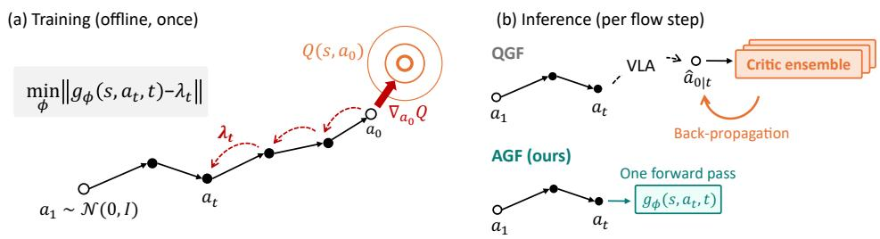

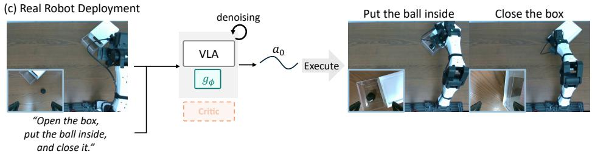  
Figure 1: Overview of AGF. (a) Training: the terminal critic gradient is carried back through the frozen flow and regressed into $g _ { \phi } .$ . (b) Inference: QGF back-propagates a critic ensemble per step; AGF runs one forward pass of $g _ { \phi } .$ . (c) Deployment on a real robot, with no critic ensemble on board.

## ABSTRACT

Flow-based Vision-Language-Action (VLA) policies are typically trained by behavior cloning and thus do not explicitly optimize long-term task return. Critic guidance steers generation toward higher-value actions, but existing methods differentiate the critic through a one-step surrogate of the sampler and back-propagate a critic ensemble at every flow step. In contrast, here we propose Adjoint Guidance Flow (AGF), which amortizes trajectory-aware critic guidance into a lightweight guidance network while preserving the pretrained VLA policy. Specifically, we formulate critic-guided flow generation as a deterministic optimal control problem, whose optimal guidance is a costate that carries the terminal critic gradient back through the remaining flow, and regress the guidance network onto this costate while keeping both the VLA and critic frozen. This design provides favorable memory and throughput scaling during training, and inference needs one guidancenetwork forward pass per step, without the critic ensemble, back-propagation, or adjoint computation. Across LIBERO, RoboCasa, and LIBERO-Pro, AGF consistently improves pretrained VLAs, remains competitive with critic-guidance and policy-fine-tuning baselines, and is the most robust method when a single guidance strength is deployed across tasks. Compared with QGF, AGF runs 3.6× faster per guidance step with 7.0× fewer parameters, with comparable and even better performance, showing that critic guidance can be trajectory-aware and lightweight.

Project page: https://jeongsol-kim.github.io/agf/project\_ page/

## 1 INTRODUCTION

Table 1: Comparison of critic-guidance paradigms. Pointwise guidance: DPS (Chung et al., 2023), QGF (Zhou et al., 2026), QPILOTS (Ruan et al., 2026), GAF (Yang et al., 2026); adjoint matching: AM (Domingo-Enrich et al., 2025), QAM (Li & Levine, 2026); $\hat { a } _ { 0 \mid t }$ is the Tweedie estimate.
<table><tr><td>Paradigm</td><td>Inference-time control</td><td>Guidance signal</td><td>Guidance computation at inference</td><td>Trained component</td></tr><tr><td>Pointwise guidance</td><td>√</td><td> $\nabla _ { { \pmb a } _ { t } } Q ^ { \pi } ( { \pmb s } , \hat { { \pmb a } } _ { 0 \mid t } )$ </td><td>critic forward + backward</td><td></td></tr><tr><td>Adjoint matching</td><td>X</td><td> $\nabla _ { { \pmb a } _ { t } } Q ^ { \pi } ( { \pmb s } , { \pmb a } _ { 0 } )$ </td><td>none</td><td>policy</td></tr><tr><td>AGF (Ours)</td><td>L</td><td> $\nabla _ { { \pmb a } _ { t } } Q ^ { \pi } ( { \pmb s } , { \pmb a } _ { 0 } )$ </td><td>guidance forward</td><td>guidance net</td></tr></table>

Vision-Language-Action (VLA) models have recently emerged as a promising paradigm for learning general-purpose robot policies by leveraging the rich visual and semantic representations of visionlanguage models (VLMs) (Zitkovich et al., 2023; Kim et al., 2024; Intelligence et al., 2025). Given visual observations and language instructions, VLAs aim to generate temporally coherent action for accomplishing diverse manipulation tasks, often predicted in chunks (Zhao et al., 2023; Intelligence et al., 2025). A central challenge in robot policy learning is the inherently multimodal distribution of feasible actions (Mandlekar et al., 2022): regression-based behavior cloning can average across modes, producing actions that match no demonstrated behavior (Zhang et al., 2018; Florence et al., 2022). Diffusion and flow policies address this by modeling the conditional action distribution through iterative generation (Chi et al., 2025), but typically rely on task-specific visual representations without the broad semantic understanding of pretrained VLMs.

Recent VLA models combine the two: rather than discretizing actions into tokens as in Open-VLA (Kim et al., 2024), which can interfere with the VLM’s pretrained representations, they pair a pretrained VLM with a diffusion- or flow-based action expert that models the continuous action distribution (Intelligence et al., 2025; Shukor et al., 2025; Bjorck et al., 2025). Despite their expressive action distributions, these policies are commonly trained with behavior cloning (Chi et al., 2025), which neither optimizes task return nor distinguishes high-value actions from actions that are merely likely under the demonstrations (Wang et al., 2023; Psenka et al., 2024; Wang et al., 2026). Recent works therefore incorporate a learned critic of long-term utility, either adapting the policy toward high-value actions through additional training (Doo et al., 2026; Shi et al., 2026; Wang et al., 2026) or keeping it fixed and applying critic guidance during generation, such as QGF (Zhou et al., 2026), which steers each generation step with critic gradients (Ruan et al., 2026). The former does not require the critic during inference, but requires additional policy optimization for the downstream task, whereas inference-time guidance can incorporate task-specific value information while preserving the pretrained generative policy.

However, existing inference-time critic-guidance methods (Zhou et al., 2026; Ruan et al., 2026; Yang et al., 2026) suffer from two main limitations. First, they differentiate the critic only at the Tweedie estimate, a one-step surrogate of the sampler, and thus ignore how the remaining flow shapes the executed action. Second, they require repeated critic back-propagation at every generation step, whose cost is further amplified when a critic ensemble is used for conservative value estimation. Fine-tuning approaches such as adjoint matching (Domingo-Enrich et al., 2025) and QAM (Li & Levine, 2026) avoid the critic at inference by amortizing adjoint supervision into the policy itself, but require policy back-propagation and modify its weights for each downstream task.

To bridge these alternatives, we propose Adjoint Guidance Flow (AGF), which amortizes trajectorywise critic adjoints into a separate, lightweight guidance network. We formulate critic-guided flow generation as a deterministic optimal control problem, where the optimal guidance at each flow step is a costate: the sensitivity of the final critic value to the current intermediate action through all remaining flow steps. We then train the guidance network to directly predict this costate from intermediate flow states. Once trained, AGF guides the frozen policy with a single guidance-network forward pass, without the critic ensemble or modifying the pretrained policy (Table 1); compared with QGF, this is 3.6× faster per guidance step with 7.0× fewer parameters. Our contributions are summarized as follows.

• To guide a frozen VLA without evaluating or back-propagating the critic at inference, we propose AGF, which amortizes trajectory-aware critic guidance into a lightweight network.

• We characterize the optimal guidance as the costate of a deterministic optimal control problem and regress the guidance network onto costates computed along its own trajectories, smoothed by particle-averaged Jacobians whose noise adds no bias for any number of particles.

• Across LIBERO, RoboCasa, and LIBERO-Pro with three flow-based VLAs and on a real robot, AGF improves every pretrained policy, remains competitive with critic guidance and policy fine-tuning, and keeps its gains under one shared strength.

## 2 BACKGROUND

## 2.1 FLOW-BASED MODEL

Flow-based generative models transport a noise sample ${ \pmb a } _ { 1 } \sim p _ { 1 }$ to a data sample $a _ { 0 } \sim p _ { 0 }$ along the ODE $d \mathbf { a } _ { t } = \pmb { v } _ { t } ( \mathbf { a } _ { t } ) d t$ , where the velocity field is parameterized by a neural network v trained with the conditional flow matching objective (Lipman et al., 2023),

$$
\operatorname* { m i n } _ { \theta } \mathbb { E } _ { t , a _ { 0 } \sim p _ { 0 } , a _ { 1 } \sim p _ { 1 } } \left\| v _ { t } ( a _ { t } | a _ { 0 } ) - v _ { \theta } ( a _ { t } ) \right\| ^ { 2 } ,\tag{1}
$$

where ${ \pmb a } _ { t } = ( 1 - t ) { \pmb a } _ { 0 } + t { \pmb a } _ { 1 }$ is the linear interpolant and ${ \pmb v } _ { t } ( { \pmb a } _ { t } | { \pmb a } _ { 0 } ) = { \pmb a } _ { 1 } - { \pmb a } _ { 0 }$ denotes the conditional target. Samples are generated by integrating the ODE backward from $t = 1$ to $t = 0$ The posterior mean at time $t ,$ known as Tweedie’s estimate (Efron, 2011; Kim & Ye, 2021), is $\mathbb { E } [ { \pmb a } _ { 0 } | { \pmb a } _ { t } ] = { \pmb a } _ { t } - t { \pmb v } _ { \theta } ( { \pmb a } _ { t } )$ . Hereafter, a denotes an action chunk generated conditioned on the state s, with velocity ${ \pmb v } _ { \theta } ( { \pmb a } _ { t } , { \pmb s } , t )$

## 2.2 ACTION-VALUE FUNCTION

Consider a trajectory $\tau = \{ ( \pmb { s } ^ { ( k ) } , \pmb { a } ^ { ( k ) } ) \} _ { k = 1 } ^ { H }$ , where $\pmb { \mathscr { s } } ^ { ( k ) } \in \mathcal { S }$ and $\pmb { a } ^ { ( k ) } \in \mathcal { A }$ denote the state and action at time step $k ,$ respectively, and H denotes the finite horizon. A policy $\pi ( \boldsymbol { a } ^ { ( k ) } | \boldsymbol { s } ^ { ( k ) } )$ specifies the distribution of actions conditioned on the current state, and a reward function $r _ { k } = r ( \pmb { s } ^ { ( k ) } , \pmb { a } ^ { ( k ) } ,$ ) assigns a scalar reward at each time step. We define the discounted return from time step k as $\begin{array} { r } { G _ { k } = \sum _ { i = k } ^ { H } \gamma ^ { i - k } r _ { i } } \end{array}$ where $\gamma \in [ 0 , 1 ]$ denotes the discount factor. The action-value function under policy π is then defined as

$$
Q ^ { \pi } ( \pmb { \mathscr { s } } ^ { ( k ) } , \pmb { a } ^ { ( k ) } ) = \mathbb { E } _ { \pi } [ G _ { k } | \pmb { \mathscr { s } } ^ { ( k ) } , \pmb { a } ^ { ( k ) } ] ,\tag{2}
$$

which represents the expected return obtained by taking action $\mathbf { \pmb { a } } ^ { ( k ) }$ at state $\pmb { s } ^ { ( k ) }$ and following the policy π thereafter (Sutton et al., 1998; Murphy, 2024). In our setting, the reward is sparse and assigned only at the terminal state. In other words, $r _ { k } = 0$ for $k < H$ and $r _ { H } = r ( s ^ { ( H ) } )$ . For a fixed policy, the critic is trained with a SARSA (Rummery & Niranjan, 1994) style temporal-difference objective (Sutton, 1988),

$$
\operatorname* { m i n } _ { \omega } \mathbb { E } \left[ ( Q _ { \omega } ( s ^ { ( k ) } , { \pmb a } ^ { ( k ) } ) - y _ { k } ) ^ { 2 } \right] , \qquad y _ { k } = r _ { k } + \gamma Q _ { \bar { \omega } } ( s ^ { ( k + 1 ) } , { \pmb a } ^ { ( k + 1 ) } ) ,\tag{3}
$$

where $Q _ { \bar { \omega } }$ denotes an EMA-updated target critic and the next action $\pmb { a } ^ { ( k + 1 ) } \sim \pi ( \cdot | \pmb { s } ^ { ( k + 1 ) } )$ is taken from the same policy rollout. This critic is frozen after training and is the only value signal in the rest of the paper; every guidance method we compare, AGF included, uses its action gradient.

## 2.3 CRITIC GUIDANCE

Recent flow-based VLAs model action generation as a conditional flow process. We use k for the environment step and $t \in [ 0 , 1 ]$ for the continuous flow time. At step $k ,$ the policy transforms a noisy action chunk $\pmb { a } _ { 1 } ^ { ( k ) }$ into a clean action $\mathbf { \pmb { a } } _ { 0 } ^ { ( k ) }$ through the learned velocity field. Since the critic $Q ^ { \pi } ( s , \pmb { a } )$ is defined on the clean action at $t = 0 ,$ , critic guidance at $\mathbf { } \mathbf { a } _ { t }$ ideally follows

$$
\begin{array} { r } { \pmb { g } _ { t } = \nabla _ { \pmb { a } _ { t } } \mathbb { E } _ { \pmb { a } _ { 0 } | \pmb { a } _ { t } } \left[ Q ^ { \pi } ( \pmb { s } , \pmb { a } _ { 0 } ) \right] , } \end{array}\tag{4}
$$

where we omit the environment-step superscript for simplicity. Monte-Carlo estimation requires sampling actions from $\mathbf { \nabla } p ( \mathbf { \pmb { a } } _ { 0 } \mid \mathbf { \pmb { a } } _ { t } )$ and evaluating the critic for each sample, which is often computationally expensive. DPS-type approximation (Chung et al., 2023) replaces the expectation of the

critic with the critic evaluated at the posterior mean,

$$
\begin{array} { r } { g _ { t } \approx \nabla _ { a _ { t } } Q ^ { \pi } ( \pmb { s } , \hat { \pmb { a } } _ { 0 \mid t } ) , \qquad \hat { \pmb { a } } _ { 0 \mid t } = \pmb { a } _ { t } - t \pmb { v } _ { \theta } ( \pmb { a } _ { t } , t ) , } \end{array}\tag{5}
$$

where $\hat { a } _ { 0 \mid t }$ is the Tweedie estimate of the clean action.

Recent methods including QGF (Zhou et al., 2026), QPILOTS (Ruan et al., 2026), and GAF (Yang et al., 2026) further replace the Jacobian of the Tweedie map, $\partial \hat { { \mathbf a } } _ { 0 \mid t } / \partial { \mathbf a } _ { t } = { \mathbf I } - t \partial v _ { \theta } ( { \mathbf a } _ { t } , t ) / \partial a _ { t }$ , by the identity, keeping only the critic gradient at $\hat { \mathbf { \alpha } } _ { 0 \mid t }$ <sub>t</sub>,

$$
\nabla _ { a _ { t } } Q ^ { \pi } ( s , \hat { a } _ { 0 \mid t } ) = \left( \frac { \partial \hat { a } _ { 0 \mid t } } { \partial a _ { t } } \right) ^ { \top } \frac { \partial Q ^ { \pi } ( s , \hat { a } _ { 0 \mid t } ) } { \partial \hat { a } _ { 0 \mid t } } \approx \frac { \partial Q ^ { \pi } ( s , \hat { a } _ { 0 \mid t } ) } { \partial \hat { a } _ { 0 \mid t } } .\tag{6}
$$

This avoids back-propagation through the flow model, but ignores how perturbations at intermediate flow states propagate through the remaining generation trajectory.

## 3 ADJOINT GUIDANCE FLOW

## 3.1 OPTIMAL CONTROL PROBLEM

Consider a pretrained flow policy v<sub>θ</sub> that generates a clean action chunk ${ \pmb a } _ { 0 } \sim \pi _ { \ b \theta } ( { \pmb a } _ { 0 } \ | \ { \pmb s } )$ by integrating the corresponding flow ODE, and an action-value function $Q ^ { \pi } ( \pmb { s } , \pmb { a } _ { 0 } )$ trained as in Eq. (3). Critic guidance steers the flow trajectory toward higher-value actions by augmenting the pretrained dynamics with an additive control,

$$
d \pmb { a } _ { t } = \left[ \pmb { v } _ { \theta } ( \pmb { a } _ { t } , \pmb { s } , t ) + \pmb { u } _ { t } \right] d t ,\tag{7}
$$

where $\mathbf { \Delta } \mathbf { u } _ { t }$ denotes the guidance at flow time t. Rather than constructing $\mathbf { \pmb { u } } _ { t }$ from pointwise critic gradients at the Tweedie estimate as in Eq. (6), we formulate it as a deterministic optimal control problem over the generation trajectory, targeting the value of the action it will actually produce.

For a given state s and initial noise sample, the time-dependent control $\mathbf { \Delta } \mathbf { u } _ { t }$ is optimized by

$$
\pmb { u } ^ { \star } = \arg \operatorname* { m a x } _ { \pmb { u } } Q ^ { \pi } ( \pmb { s } , \pmb { a } _ { 0 } ) - \int _ { 0 } ^ { 1 } \frac { 1 } { 2 \beta _ { t } } \| \pmb { u } _ { t } \| ^ { 2 } d t ,\tag{8}
$$

which is subject to the controlled flow dynamics Eq. (7), whose integration from the initial noise determines the terminal action $\mathbf { \delta } _ { \mathbf { a } _ { 0 } }$ . The two terms represent complementary objectives. The terminal value $Q ^ { \pi } ( \pmb { s } , \pmb { a } _ { 0 } )$ drives the generated action toward high expected return, while the quadratic control cost penalizes the energy of the deviation from the pretrained flow, so that as $\beta _ { t } \to 0$ the controlled dynamics reduce to the pretrained policy. The coefficient $\beta _ { t }$ thus interpolates between pure imitation and pure value seeking. The following result characterizes the optimal guidance under our generativetime convention, where the flow evolves from $t = 1$ (noise) to t = 0 (clean action).

Proposition 1. Under the controlled dynamics $d \pmb { a } _ { t } = [ \pmb { v } _ { \theta } ( \pmb { a } _ { t } , \pmb { s } , t ) + \pmb { u } _ { t } ] d t$ , the optimal control of Eq. (8) satisfies

$$
\begin{array} { r } { \pmb { u } _ { t } ^ { \star } = - \beta _ { t } \pmb { \lambda } _ { t } , } \end{array}\tag{9}
$$

where the costate $\lambda _ { t }$ is initialized by $\lambda _ { 0 } = \nabla _ { \pmb { a } _ { 0 } } Q ^ { \pi } ( \pmb { s } , \pmb { a } _ { 0 } )$ and evolves according to

$$
\frac { d \mathbf { \lambda } _ { t } } { d t } = - \left( \frac { \partial \pmb { v } _ { \theta } ( \pmb { a } _ { t } , \pmb { s } , t ) } { \partial \pmb { a } _ { t } } \right) ^ { \top } \mathbf { \lambda } _ { t } .\tag{10}
$$

The result follows from the standard forward-time optimal-control formulation under the reparameterization $\tau = 1 - t ;$ we provide the derivation in Appendix A.1. Proposition 1 has a simple interpretation. Integrating the costate dynamics in Eq. (10) from the terminal condition gives the closed form

$$
{ \pmb { \lambda } } _ { t } = \left( \frac { \partial { \pmb { a } } _ { 0 } } { \partial { \pmb { a } } _ { t } } \right) ^ { \top } \nabla _ { { \pmb { a } } _ { 0 } } Q ^ { \pi } ( { \pmb { s } } , { \pmb { a } } _ { 0 } ) ,\tag{11}
$$

where $\partial { \pmb a } _ { 0 } / \partial { \pmb a } _ { t }$ is the Jacobian of the map that carries the intermediate state $\mathbf { } \mathbf { a } _ { t }$ to the terminal action $\mathbf { \delta } _ { \mathbf { a } _ { 0 } }$ under the controlled dynamics. The costate therefore measures how the critic value of the final action responds to a perturbation of the current state. The optimal control $\pmb { u } _ { t } ^ { \star } = - \beta _ { t } \pmb { \lambda } _ { t }$ steers each intermediate state in the direction that most increases the critic value of the action it will produce, rather than the value of the Tweedie estimate.

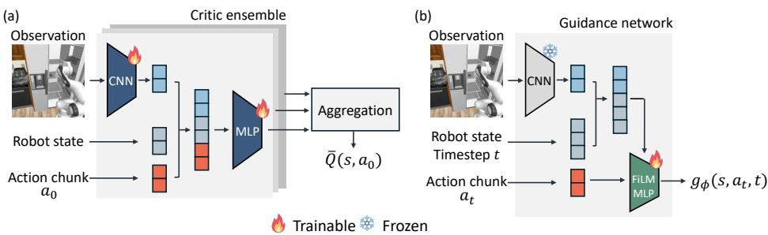  
Figure 2: Guidance-network architectures. (a) The critic ensemble predicts $Q ^ { \pi } ( \pmb { s } , \pmb { a } _ { 0 } )$ from the observation, robot state, and clean action chunk. (b) Ours: $g _ { \phi }$ reuses one frozen critic encoder and predicts the trajectory-wise adjoint $g _ { \phi } ( s , a _ { t } , t )$ with a FiLM-conditioned MLP.

A direct approach is to amortize the adjoint into the flow policy itself, as in adjoint matching (Domingo-Enrich et al., 2025), which fine-tunes the policy under a memoryless stochastic sampler. For large pretrained VLAs, however, this updates the policy parameters at substantial memory and compute cost, may alter the pretrained behavior, and fixes the guidance strength into the fine-tuned weights. Instead, we train a lightweight guidance network $g _ { \phi }$ to approximate $\lambda _ { t }$ while keeping the VLA frozen, so that no VLA parameter gradients are computed and the guidance can be attached or removed without modifying the policy.

## 3.2 GUIDANCE NETWORK TRAINING

Concretely, our guidance network $g _ { \phi }$ reuses a frozen visual encoder of one critic ensemble member and predicts the costate with a lightweight FiLM-modulated MLP (Perez et al., 2018) conditioned on the visual feature, flow timestep, and robot state where available (Figure 2b).

Training $g _ { \phi }$ requires a costate target at each intermediate action state, built in two steps: generate a controlled flow trajectory with the current guidance network, then propagate the terminal critic gradient backward through its transitions. The control $\pmb { u } _ { t } = - \beta _ { t } g _ { \phi } ( \pmb { s } , \pmb { a } _ { t } , t )$ gives the Euler transition

$$
\begin{array} { r } { a _ { t + \Delta t } = a _ { t } + \Delta t \left[ v _ { \theta } ( a _ { t } , s , t ) - \beta _ { t } g _ { \phi } ( s , a _ { t } , t ) \right] , \qquad \Delta t < 0 . } \end{array}\tag{12}
$$

After generating the trajectory from $t = 1 \mathrm { t o } t = 0$ , we initialize the terminal costate as $\lambda _ { 0 } =$ $\nabla _ { { \pmb a } _ { 0 } } Q ^ { \bar { \pi } } ( { \pmb s } , { \pmb a } _ { 0 } )$ and propagate it backward through the discretized transitions. Consistent with the optimal-control formulation, the realized control $\mathbf { \Delta } \mathbf { u } _ { t }$ is held fixed during this propagation, so each transition contributes the Jacobian $\partial { \pmb a } _ { t + \Delta t } / \partial { \pmb a } _ { t } | _ { { \pmb u } _ { t } } = { \bf I } + \Delta t ( \partial { \pmb v } _ { \theta } / \partial { \pmb a } _ { t } )$ , giving the recursive update

$$
\lambda _ { t } = \left( \mathbf { I } + \Delta t J _ { t } ( a _ { t } ) \right) ^ { \top } \lambda _ { t + \Delta t } , \qquad \mathrm { w h e r e } \quad J _ { t } ( a _ { t } ) : = \frac { \partial v _ { \theta } ( a _ { t } , s , t ) } { \partial a _ { t } } .\tag{13}
$$

This recursion is the discrete counterpart of the continuous costate dynamics in Eq. (10), and $- \beta _ { t } \lambda _ { t }$ is the optimal control Eq. (9) of the discretized dynamics. Therefore, we train the guidance network by matching these trajectory-wise adjoint targets,

$$
\mathcal { L } _ { \mathrm { A G F } } ( \phi ) = \mathbb { E } _ { s , a _ { 1 } \sim \mathcal { N } ( 0 , \mathbf { I } ) , t } \left[ \lVert g _ { \phi } ( s , a _ { t } , t ) - \mathrm { s g } [ \lambda _ { t } ] \rVert _ { 2 } ^ { 2 } \right] ,\tag{14}
$$

where sg[·] denotes stop-gradient. Since the optimal control is $- \beta _ { t } \lambda _ { t }$ , we regress $g _ { \phi }$ onto $\lambda _ { t }$ itself and set $\beta _ { t } = 1$ during training; at inference the guidance scale is exposed as a weight w, deploying $\pmb { u } _ { t } = - w g _ { \phi } ( \pmb { s } , \pmb { a } _ { t } , t )$ , so the strength can be adjusted without retraining.

Importantly, the guidance network affects the adjoint targets through the trajectory it induces, but its Jacobian is not included in the adjoint recursion. This is not an approximation but a consequence of the optimal-control formulation: in Pontryagin’s principle (Pontryagin, 1987), the adjoint is defined along the dynamics with the realized control held fixed, whereas including the Jacobian of $g _ { \phi }$ would compute the sensitivity of a different, closed-loop system. The stop-gradient in Eq. (14) enforces the same separation at the loss level. As $g _ { \phi }$ is updated, we regenerate the controlled trajectories and recompute their adjoint targets, yielding iterative on-policy refinement.

## 3.3 LOCALLY REGULARIZED ADJOINT ESTIMATION

The adjoint target in Eq. (13) depends on the flow Jacobian $J _ { t } ( { \boldsymbol { a } } _ { t } )$ , which provides the exact local sensitivity along a given trajectory but can vary substantially across nearby intermediate actions in neural flow models. Small changes in the guided trajectory can therefore perturb the adjoint targets, which is particularly relevant under on-policy refinement, where successive updates of the guidance network continuously shift the intermediate action trajectory. To obtain a more locally regularized sensitivity estimate, we perturb each intermediate action with Gaussian particles, $\pmb { a } _ { t , m } = \pmb { a } _ { t } + \sigma \pmb { \epsilon } _ { m }$ where $\epsilon _ { m } \sim \mathcal { N } ( 0 , \mathbf { I } )$ , and average the corresponding flow Jacobians,

$$
\widehat { J } _ { t } ( \pmb { a } _ { t } ) = \frac { 1 } { M } \sum _ { m = 1 } ^ { M } J _ { t } \left( \pmb { a } _ { t } + \sigma \pmb { \epsilon } _ { m } \right) ,\tag{15}
$$

where M denotes the number of particles and σ controls the local perturbation scale. Under standard regularity conditions that permit exchanging differentiation and expectation, we have $\mathbb { E } _ { \epsilon } \left[ J _ { t } ( \boldsymbol { a } _ { t } + \sigma \epsilon ) \right] = \nabla _ { \boldsymbol { a } _ { t } } \mathbb { E } _ { \epsilon } \left[ \boldsymbol { v } _ { \theta } ( \boldsymbol { a } _ { t } + \sigma \epsilon , \boldsymbol { s } , t ) \right]$ . Thus, $\widehat { J } _ { t } ( \mathbf { \boldsymbol { a } } _ { t } )$ is a Monte Carlo estimate of the Jacobian of a locally Gaussian-smoothed flow field, rather than an ad hoc average of pointwise Jacobians. Because the particles are redrawn independently at each flow step, the resulting target is an unbiased estimate of the costate propagated with the smoothed Jacobian for any M, and M only sets its variance (Lemma 1, Appendix A.2). The adjoint is then propagated as

$$
\widehat { \pmb { \lambda } } _ { t } = \Big ( \mathbf { I } + \Delta t \widehat { J } _ { t } ( \pmb { a } _ { t } ) \Big ) ^ { \top } \widehat { \pmb { \lambda } } _ { t + \Delta t } ,\tag{16}
$$

with the same terminal condition $\widehat { \lambda } _ { 0 } = \nabla _ { \pmb { a } _ { 0 } } Q ^ { \pi } ( \pmb { s } , \pmb { a } _ { 0 } )$ . This smoothing suppresses highly localized Jacobian variations while retaining sensitivity patterns that persist in a neighborhood of the current trajectory. Accordingly, $\sigma$ controls a trade-off between pointwise fidelity and local regularity: as $\sigma  0 .$ , the estimator approaches the original pointwise adjoint, while larger σ provides stronger smoothing of the supervision signal. Empirically, combining Gaussian smoothing with particle averaging broadens the effective range of guidance strengths, yielding positive suite-averaged gains across all tested scales (Section 4.3). We use the resulting particle-averaged adjoint $\widehat { \lambda } _ { t }$ as the training target for the guidance network.

## 4 EXPERIMENTS

We evaluate AGF on three flow-based VLAs: SmolVLA, $\pi _ { 0 . 5 } .$ , and MolmoAct2, across LIBERO, RoboCasa, and LIBERO-Pro. On the standard benchmarks, we evaluate SmolVLA (Shukor et al., 2025) on all four LIBERO suites and $\pi _ { 0 . 5 }$ (Intelligence et al., 2025) on the atomic suite in RoboCasa. We further evaluate MolmoAct2 (Fang et al., 2026) on LIBERO-Pro, which covers the four LIBERO suites under five visual conditions, and in real-robot manipulation experiments.

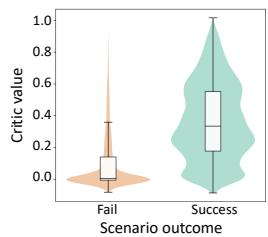

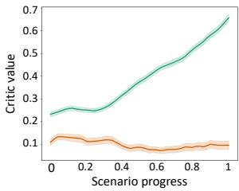  
Figure 3: Critic analysis. (Left) Distribution of critic values by scenario outcome. (Right) Critic values over normalized scenario progress. Pooled across all 4 LIBERO suites (40 tasks, 1,200 episodes).

Baselines. We compare AGF with two inference-time critic-guidance methods QDPS and QGF<sup>1</sup>, critic-based action selection method called Q-BoN (Best-of-N), and policy fine-tuning method QAM. For the details on each baseline methods, please refer to the Appendix B.2.3.

Implementation and evaluation. We evaluate SmolVLA (Shukor et al., 2025) on all 10 tasks of each LIBERO suite (Liu et al., 2023) and $\pi _ { 0 . 5 }$ (Intelligence et al., 2025) on 18 atomic RoboCasa tasks (Nasiriany et al., 2024), with 50 episodes per task and identical episode seeds for paired comparisons. All inference-time guidance methods freeze the pretrained VLA and share the same task-specific critic, number of action-generation steps, and guidance-weight sweep range, with one weight selected per suite (Table 10). Following prior single-task flow-RL settings (Doo et al., 2026; Zhou et al., 2026), we train a separate critic ensemble per task, and likewise a separate guidance network per task; the guidance network is trained on the same rollout data used for critic training, requiring no additional data collection. AGF denotes the particle-averaged variant $( M = 4 , \sigma = 0 . 0 2 )$ and $M = 1$ the pointwise-adjoint variant. Training uses 5k rollout updates for SmolVLA and π<sub>0.5</sub> and 1k for MolmoAct2, at roughly 40 minutes per 1k updates on a single RTX 4090. QAM is trained under the same wall-clock budget. Remaining details are in Appendix B, which also compares the QGF and AGF inference procedures (Algorithms 2, 3).

Table 2: Success rate (%) on LIBERO (SmolVLA), RoboCasa $( \pi _ { 0 . 5 } ) ,$ and LIBERO-Pro (MolmoAct2). Suite means over tasks, 50 episodes each; LIBERO-Pro is averaged over five visual conditions (Appendix C.1). Bold and underline mark the best and second-best inference-time method per row; QAM fine-tunes the policy and is excluded from the ranking.
<table><tr><td>Benchmark / policy</td><td>Suite</td><td>Calibration</td><td>Base</td><td>QAM</td><td>Q-BoN</td><td>QDPS</td><td>QGF</td><td>AGF (M=1)</td><td>AGF (M=4)</td></tr><tr><td rowspan="4">LIBERO/ SmolVLA</td><td>Goal</td><td>Suite-level Task-level</td><td>76.6</td><td>83.6</td><td>78.0 82.4</td><td>79.8 82.2</td><td>80.6 81.4</td><td>80.2 83.2</td><td>81.0 83.2</td></tr><tr><td>Object</td><td>Suite-level Task-level</td><td>89.6</td><td>94.6</td><td>90.6 92.0</td><td>89.4 91.0</td><td>93.6 95.6</td><td>92.4 95.0</td><td>93.4 95.4</td></tr><tr><td>Spatial</td><td>Suite-level Task-level</td><td>71.6</td><td>71.4</td><td>71.2 75.4</td><td>68.0 73.2</td><td>73.0 77.6</td><td>72.2 74.8</td><td>74.6 75.6</td></tr><tr><td>LIBERO-10</td><td>Suite-level Task-level</td><td>33.6</td><td>41.0</td><td>33.6 35.4</td><td>36.8 38.4</td><td>36.0 39.2</td><td>36.2 39.6</td><td>36.8 42.0</td></tr><tr><td>RoboCasa  $\prime \ : \pi _ { 0 . 5 }$ </td><td>Atomic</td><td>Suite-level Task-level</td><td>44.0</td><td>45.8</td><td>45.6 49.6</td><td>45.8 50.0</td><td>46.3 49.6</td><td>45.9 48.9</td><td>46.6 49.4</td></tr><tr><td rowspan="4">LIBERO-Pro / MolmoAct2</td><td>Goal</td><td>Suite-level Task-level</td><td>75.4</td><td>53.8</td><td>10.4 10.4</td><td>76.2 77.6</td><td>76.0 77.4</td><td>76.0 77.4</td><td>76.4 77.8</td></tr><tr><td>Object</td><td>Suite-level Task-level</td><td>83.0</td><td>59.6</td><td>1.0 1.0</td><td>84.0 85.0</td><td>84.6 85.8</td><td>84.6 84.8</td><td>83.8 84.6</td></tr><tr><td>Spatial</td><td>Suite-level Task-level</td><td>75.8</td><td>58.4</td><td>5.8 5.8</td><td>76.8 78.6</td><td>76.0 77.0</td><td>76.0 78.0</td><td>77.4 79.0</td></tr><tr><td>LIBERO-10</td><td>Suite-level Task-level</td><td>65.8</td><td>53.2</td><td>0.2 0.2</td><td>66.8 68.4</td><td>67.8 69.4</td><td>67.2 68.6</td><td>67.0 68.8</td></tr></table>

## 4.1 MAIN RESULTS

Critic quality. We first validate whether the trained action-value function assigns meaningful values to each task. We sample actions from the policies used to train the critic and evaluate the rollout. At the end of each scenario, the rollout is labeled as either successful or failed. Figure 3 shows that the trained critic assigns higher values to successful rollouts than to failed ones. For successful rollouts, the predicted value increases as the task progresses, while it remains low for failed cases. This outcome-dependent temporal behavior supports the critic as a guidance signal.

Task performance. Table 2 compares AGF with inference-time critic-guidance, action-selection, and policy-fine-tuning baselines on LIBERO, RoboCasa, and LIBERO-Pro. For inference-time methods, we report suite-level calibration, which shares one guidance strength per suite, and tasklevel calibration, which selects the best strength per task from the sweep and thus serves as a per-task upper bound; strength transfer to genuinely held-out tasks is evaluated by the LOTO protocol below. Under suite-level calibration, AGF improves the pretrained VLA by 2.6–4.4 percentage points across the five suites, outperforming Q-BoN on all five and QGF on four while matching or exceeding QDPS throughout. With task-level calibration, its gains further increase to 4.0–8.4 points. Compared with QAM, AGF achieves competitive performance without modifying the pretrained policy and retains an adjustable guidance strength at inference. The same trend holds on LIBERO-Pro with the larger MolmoAct2 backbone. Per-condition results are provided in Appendix C.1. QAM, fine-tuned under the same wall-clock budget, falls substantially below the pretrained policy on this 5.5B backbone, which is consistent with its unfavorable training scaling (Figure 4a), indicating that fine-tuning at this scale requires stabilization beyond matched compute. Q-BoN is a notable exception, collapsing on MolmoAct2. We attribute this to best-of-N over-optimization (Gao et al., 2023): although all actions are sampled from the base policy, the critic is reliable only in regions sufficiently covered by its finite rollout data (Appendix C.2).

Statistical significance. Paired tests over identical episode seeds support these comparisons: AGF significantly improves the pretrained policy (+3.6pp pooled over 40 LIBERO tasks, McNemar $p < 1 0 ^ { - 3 } )$ and matches QGF (+0.7pp in AGF’s favor, $p = 0 . 5 4 )$ at a fraction of its inference cost, with the same pattern on LIBERO-Pro, and directionally, on RoboCasa. Full tests are in Appendix C.4.

(a)  
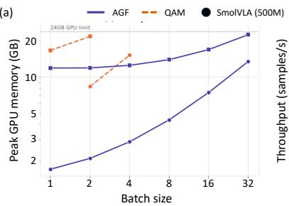

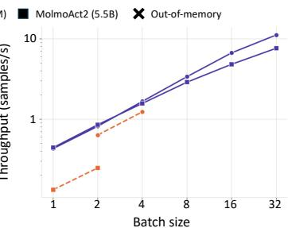

(b)  
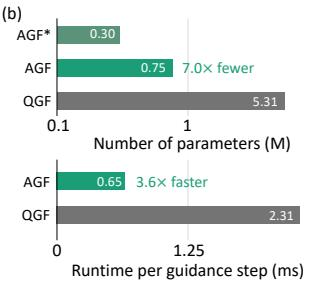  
Figure 4: Training and inference efficiency. (a) Peak training memory and throughput of AGF versus QAM as the batch size grows, on one RTX 4090. (b) Parameters and runtime per guidance step of AGF versus vectorized QGF (SmolVLA). $\mathrm { \mathbf { A G F } ^ { \star } }$ : trainable part of $g _ { \phi }$ only.

Calibration transfer. QGF attains the strongest task-level results on the Object and Spatial suites with SmolVLA, but this ordering reverses under suite-level calibration, reflecting AGF’s broad effective scale range (Figure 5). Leave-one-task-out (LOTO) calibration tests this directly: the strength is selected on all but one task and evaluated on the held-out task. AGF outperforms QGF under LOTO on all four suites of LIBERO and atomic tasks of RoboCasa; on four of them it selects the same strength regardless of the held-out task, so its LOTO performance coincides with suite-level calibration. Details are in Appendix C.3.

## 4.2 TRAINING AND INFERENCE EFFICIENCY

The results above show that AGF matches or outperforms inference-time critic-guidance methods and remains competitive with policy fine-tuning. AGF reaches this performance at a fraction of their cost: its lightweight guidance design makes both training and inference substantially cheaper than baselines. Specifically, AGF optimizes only the guidance network while keeping the pretrained VLA frozen. As a result, it maintains no parameter gradients or optimizer states for the VLA, substantially reducing the training cost. Figure 4(a) compares the peak GPU memory and training throughput of AGF and QAM as the batch size increases. Across VLA backbones, AGF scales to substantially larger batch sizes under the same memory budget. Its throughput also continues to increase with the batch size.

However, the scaling of QAM is limited earlier. This difference becomes bigger for the larger VLA backbone. Even under parameter-efficient fine-tuning, QAM must backpropagate through both the flow policy and the VLM, storing intermediate activations for the full backbone, whereas AGF only requires action-space vector–Jacobian products of the action expert, never entering the VLM backbone.

At inference time, QDPS and QGF evaluate and backpropagate through the critic ensemble at every flow step, whereas AGF requires only a forward pass through the guidance network. As shown in Figure 4(b), AGF runs 3.6× faster per guidance step than vectorized QGF and accesses 7.0× fewer parameters; end-to-end per-chunk overhead measured inside a real control loop is reported in Section 4.4. Thus, AGF transfers the expensive criticgradient computation to a lightweight guidance-network training stage, enabling guidance at deployment without the critic ensemble.

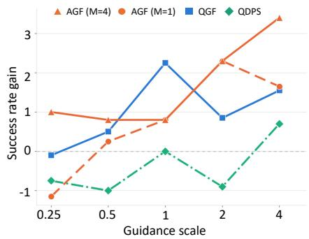  
Figure 5: Weight ablation. Guidancescale sweep (0.25–4.0) for each inference-time method, averaged over all LIBERO suites; AGF consistently improves performance across all scales.

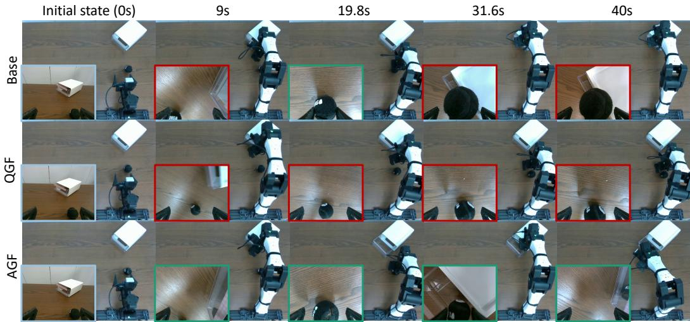  
Figure 6: Real-robot evaluation on open-pnp-close. Columns show top-view observations at identical timestamps across methods, each chosen where AGF completes a subtask. Insets show the right wrist camera; green and red borders mark subtask success and failure.

## 4.3 EFFECTIVE RANGE OF GUIDANCE STRENGTH

We now examine the effect of the guidance strength, sweeping it from 0.25 to 4.0 for both calibration settings, relative to the magnitude of the flow velocity predicted by the pretrained VLA. Figure 5 shows the average success-rate gain over the pretrained policy across all LIBERO suites; model parameters are fixed within each method, and only the inference-time guidance strength is varied. QDPS shows no consistent gain and can degrade performance, and QGF peaks at an intermediate scale but fluctuates across the range, whereas AGF (M=4) attains positive gains throughout the range, performing best at both the smallest and largest scales.

## 4.4 REAL ROBOT EXPERIMENT

We verify the proposed AGF pipeline, including critic training, guidance network training, and deployment without the critic ensemble, on the real hardware setup. In particular, we examine whether AGF improves the base VLA effectively without carrying the critic ensemble and backpropagating it at deployment.

Setup. We adopt the real-robot setup of MolmoAct2 (Fang et al., 2026), a YAM 6-DoF arm with a parallel-jaw gripper and two RGB cameras, and evaluate on two manipulation tasks, one short (“Pick up the ball and place it on the plate.”) and one long task (“Open the box, put the ball inside, and close it”). Critics and guidance networks are trained on robot rollouts following the same procedure as in simulation. Guidance strengths are likewise transferred from simulation without on-robot tuning: each method uses the strength that maximizes its average gain in the simulation sweep (Figure 5; w = 1 for QGF, w = 4 for AGF). We compare Base, QGF, and AGF over 50 paired episodes for a short task, and 25 paired episodes for a long task; the full protocol is in Appendix B.3.

Results. Table 3 reports success rates and per-chunk guidance overhead measured during the rollouts on the same RTX 4090. Both methods are deployed under the same no-tuning protocol: each transfers its simulation-selected strength without any on-robot calibration. Under this protocol, AGF significantly improves the base VLA without carrying the critic ensemble at deployment, whereas QGF’s transferred strength yields no measurable gain, consistent with its fluctuating response to the guidance strength in simulation (Figure 5).

Table 3: Real robot results. Success rate (%) over paired episodes; parentheses count discordant pairs against Base (F→S, S→F), on which the pooled McNemar p is computed. Overhead is per action chunk.
<table><tr><td></td><td>Base</td><td>QGF</td><td>AGF</td></tr><tr><td>pnp-plate (n=50)</td><td>78.0</td><td>78.0 (4/4)</td><td>88.0 (7/2)</td></tr><tr><td>open-pnp-close (n=25)</td><td>44.0</td><td>48.0 (5/4)</td><td>76.0 (10/2)</td></tr><tr><td>Pooled (n=75)</td><td>66.7</td><td>68.0 (9/8)</td><td>84.0 (17/4)</td></tr><tr><td>McNemar p (pooled)</td><td>一</td><td>1.000</td><td>0.007</td></tr><tr><td>Overhead (ms/chunk)</td><td>一</td><td>31.2</td><td>11.2</td></tr></table>

The paired gap between the two is itself significant (+16.0pp in AGF’s favor, p=0.004): live critic guidance would require on-robot strength calibration to be effective, which is precisely the perdeployment cost that inference-time guidance is meant to avoid, whereas AGF transfers directly. The guidance overhead of AGF is also modest (1.12 vs. 3.12ms per flow step for vectorized QGF) relative to the ∼640ms chunk generation. In a representative open-pnp-close rollout (Figure 6), only AGF completes all three stages, opening the box, placing the ball inside, and closing it, whereas Base and QGF fail to complete the task. Additional rollouts are provided in Appendix C.7.

## 5 CONCLUSION

We propose AGF, which formulates critic guidance for a frozen flow policy as deterministic optimal control and regresses a lightweight network onto the resulting costate, the exact value gradient of the executed action. On LIBERO, RoboCasa, and LIBERO-Pro, AGF improves every pretrained VLA, matches live critic guidance and policy fine-tuning, keeps its gains under a single deployed strength, and carries a simulation-chosen strength to a real robot, while removing the critic ensemble and all back-propagation from the control loop. We discuss limitations and future directions in Appendix D.

## USE OF LARGE LANGUAGE MODELS

We used a large language model as a writing and statistical analysis aid during the preparation of this paper. Specifically, it was used for sentence-level editing and grammar checking of author-written text, and assisting the statistical analysis of experimental results, such as the paired significance tests reported in Appendix C.4. Other aspects, including research ideas, methodologies, experimental design and experiments, and scientific claims are made by the authors. LLM-assisted text and analyses were reviewed and verified by the authors.

## ETHICS STATEMENT

This work does not involve human subjects or private data. Real robot experiments were conducted by the authors on a tabletop manipulation platform handling benign objects such as a ball, a plate, and a box. Demonstration data were collected by the authors via teleoperation and contains no personally indentifiable information. All simulation benchmarks and pretrained checkpoints are publicly available and used under their respective licenses.

## REPRODUCIBILITY STATEMENT

We provide the complete derivations of Proposition 1 and Lemma 1 in Appendix A.1 and Appendix A.2. Appendix B specifies everything needed to reproduce our pipeline, from the exact pretrained checkpoints with their Hugging Face identifiers (B.1), critic and guidance-network architectures, training objectives, hyperparameters, and per-setting action-chunking configurations (B.2, Table 4), baseline implementations (B.2.3), and the full real-robot protocol—dataset statistics, fine-tuning configuration, asynchronous execution, critic-input padding, and the paired evaluation procedure (B.3). All comparisons use identical episode seeds; the statistical procedures and selected guidance weights are detailed in Appendix C.4 and Appendix C.5. The code with trained critics and guidance networks will be publicly available upon publication.

## REFERENCES

Johan Bjorck, Fernando Castaneda, Nikita Cherniadev, Xingye Da, Runyu Ding, Linxi Fan, Yu Fang,˜ Dieter Fox, Fengyuan Hu, Spencer Huang, et al. Gr00t n1: An open foundation model for generalist humanoid robots. arXiv preprint arXiv:2503.14734, 2025.

Cheng Chi, Zhenjia Xu, Siyuan Feng, Eric Cousineau, Yilun Du, Benjamin Burchfiel, Russ Tedrake, and Shuran Song. Diffusion policy: Visuomotor policy learning via action diffusion. The International Journal ofRobotics Research, 44(10-11):1684–1704, 2025.

Hyungjin Chung, Jeongsol Kim, Michael Thompson Mccann, Marc Louis Klasky, and Jong Chul Ye. Diffusion posterior sampling for general noisy inverse problems. In International Conference on Learning Representations, 2023. URL https://openreview.net/forum?id= OnD9zGAGT0k.

Carles Domingo-Enrich, Michal Drozdzal, Brian Karrer, and Ricky T. Q. Chen. Adjoint matching: Fine-tuning flow and diffusion generative models with memoryless stochastic optimal control. In The Thirteenth International Conference on Learning Representations, 2025. URL https: //openreview.net/forum?id=xQBRrtQM8u.

JaeHyeok Doo, Byeongguk Jeon, Seonghyeon Ye, Kimin Lee, and Minjoon Seo. Q-flow: Stable and expressive reinforcement learning with flow-based policy. In Forty-third International Conference on Machine Learning, 2026. URL https://openreview.net/forum?id= oZqOS1N6Ag.

Bradley Efron. Tweedie’s formula and selection bias. Journal ofthe American Statistical Association, 106(496):1602–1614, 2011.

Haoquan Fang, Jiafei Duan, Donovan Clay, Sam Wang, Shuo Liu, Weikai Huang, Xiang Fan, Wei-Chuan Tsai, Shirui Chen, Yi Ru Wang, et al. Molmoact2: Action reasoning models for real-world deployment. arXiv preprint arXiv:2605.02881, 2026.

Pete Florence, Corey Lynch, Andy Zeng, Oscar A Ramirez, Ayzaan Wahid, Laura Downs, Adrian Wong, Johnny Lee, Igor Mordatch, and Jonathan Tompson. Implicit behavioral cloning. In Conference on robot learning, pp. 158–168. PMLR, 2022.

Leo Gao, John Schulman, and Jacob Hilton. Scaling laws for reward model overoptimization. In International conference on machine learning, pp. 10835–10866. PMLR, 2023.

Edward J Hu, yelong shen, Phillip Wallis, Zeyuan Allen-Zhu, Yuanzhi Li, Shean Wang, Lu Wang, and Weizhu Chen. LoRA: Low-rank adaptation of large language models. In International Conference on Learning Representations, 2022. URL https://openreview.net/forum? id=nZeVKeeFYf9.

Physical Intelligence, Kevin Black, Noah Brown, James Darpinian, Karan Dhabalia, Danny Driess, Adnan Esmail, Michael Equi, Chelsea Finn, Niccolo Fusai, et al. π : a vision-language-action model with open-world generalization. arXiv preprint arXiv:2504.16054, 2025.

Kwanyoung Kim and Jong Chul Ye. Noise2Score: Tweedie’s Approach to Self-Supervised Image Denoising without Clean Images. Advances in Neural Information Processing Systems, 34, 2021.

Moo Jin Kim, Karl Pertsch, Siddharth Karamcheti, Ted Xiao, Ashwin Balakrishna, Suraj Nair, Rafael Rafailov, Ethan Foster, Grace Lam, Pannag Sanketi, et al. Openvla: An open-source vision-language-action model. arXiv preprint arXiv:2406.09246, 2024.

Qiyang Li and Sergey Levine. Q-learning with adjoint matching. In The Fourteenth International Conference on Learning Representations, 2026. URL https://openreview.net/forum? id=vd4eNAdtO6.

Yaron Lipman, Ricky T. Q. Chen, Heli Ben-Hamu, Maximilian Nickel, and Matthew Le. Flow matching for generative modeling. In The Eleventh International Conference on Learning Representations, 2023. URL https://openreview.net/forum?id=PqvMRDCJT9t.

Bo Liu, Yifeng Zhu, Chongkai Gao, Yihao Feng, Qiang Liu, Yuke Zhu, and Peter Stone. Libero: Benchmarking knowledge transfer for lifelong robot learning. Advances in Neural Information Processing Systems, 36:44776–44791, 2023.

Ajay Mandlekar, Danfei Xu, Josiah Wong, Soroush Nasiriany, Chen Wang, Rohun Kulkarni, Li Fei-Fei, Silvio Savarese, Yuke Zhu, and Roberto Mart´ın-Mart´ın. What matters in learning from offline human demonstrations for robot manipulation. In Aleksandra Faust, David Hsu, and Gerhard Neumann (eds.), Proceedings of the 5th Conference on Robot Learning, volume 164 of Proceedings ofMachine Learning Research, pp. 1678–1690. PMLR, 08–11 Nov 2022. URL https://proceedings.mlr.press/v164/mandlekar22a.html.

Kevin Murphy. Reinforcement learning: an overview. arXiv preprint arXiv:2412.05265, 2024.

Soroush Nasiriany, Abhiram Maddukuri, Lance Zhang, Adeet Parikh, Aaron Lo, Abhishek Joshi, Ajay Mandlekar, and Yuke Zhu. Robocasa: Large-scale simulation of everyday tasks for generalist robots. arXiv preprint arXiv:2406.02523, 2024.

Ethan Perez, Florian Strub, Harm De Vries, Vincent Dumoulin, and Aaron Courville. Film: Visual reasoning with a general conditioning layer. In Proceedings ofthe AAAI conference on artificial intelligence, volume 32, 2018.

Lev Semenovich Pontryagin. Mathematical theory of optimal processes. CRC press, 1987.

Michael Psenka, Alejandro Escontrela, Pieter Abbeel, and Yi Ma. Learning a diffusion model policy from rewards via q-score matching. In Forty-first International Conference on Machine Learning, 2024. URL https://openreview.net/forum?id=35ahHydjXo.

Yifan Ruan, Chenyang Cao, Andreas Burger, Ali Pesaranghader, Kaveh Kamali, Jaehong Kim, Nandita Vijaykumar, Alan Aspuru-Guzik, Igor Gilitschenski, and Nicholas Rhinehart. Qpilots: Efficient test-time q-steering for flow policies. arXiv preprint arXiv:2606.14801, 2026.

Gavin A Rummery and Mahesan Niranjan. On-line Q-learning using connectionist systems, volume 37. University of Cambridge, Department of Engineering Cambridge, UK, 1994.

Kexin Shi, Junyao Shi, Poorvi Hebbar, Zhuoluo Zhao, Tarun Amarnath, Yifan Su, Shikhar Bahl, and Deepak Pathak. FlowDPG: Deterministic policy gradient on flow matching policies for real-world manipulation. In RSS 2026 Workshop on Diffusionfor Robot Learning, 2026. URL https://openreview.net/forum?id=Aw2sXj1IfW.

Mustafa Shukor, Dana Aubakirova, Francesco Capuano, Pepijn Kooijmans, Steven Palma, Adil Zouitine, Michel Aractingi, Caroline Pascal, Martino Russi, Andres Marafioti, et al. Smolvla: A vision-language-action model for affordable and efficient robotics, 2025. URL https://arxiv. org/abs/2506.01844, 2:1844, 2025.

Richard S Sutton. Learning to predict by the methods of temporal differences. Machine learning, 3 (1):9–44, 1988.

Richard S Sutton, Andrew G Barto, and Andrew Barto. Reinforcement learning: An introduction, volume 1. MIT press Cambridge, 1998.

Zhendong Wang, Jonathan J Hunt, and Mingyuan Zhou. Diffusion policies as an expressive policy class for offline reinforcement learning. In The Eleventh International Conference on Learning Representations, 2023. URL https://openreview.net/forum?id=AHvFDPi-FA.

Ziqian Wang, Jiayu Sun, Xingjian Mao, Minqian Wang, and Yao Mu. Q-vgm: Q-guided valuegradient matching for flow-matching vla policies. arXiv e-prints, pp. arXiv–2606, 2026.

Liuhaichen Yang, Zhuang Jiang, Chenchao Sheng, and Zezhi Tang. Guided action flow: Q-guided inference for flow-matching vision-language-action policies. arXiv preprint arXiv:2607.02092, 2026.

Tianhao Zhang, Zoe McCarthy, Owen Jow, Dennis Lee, Xi Chen, Ken Goldberg, and Pieter Abbeel. Deep imitation learning for complex manipulation tasks from virtual reality teleoperation. In 2018 IEEE international conference on robotics and automation (ICRA), pp. 5628–5635. Ieee, 2018.

Tony Z. Zhao, Vikash Kumar, Sergey Levine, and Chelsea Finn. Learning Fine-Grained Bimanual Manipulation with Low-Cost Hardware. In Proceedings of Robotics: Science and Systems, Daegu, Republic of Korea, July 2023. doi: 10.15607/RSS.2023.XIX.016. URL https://doi.org/ 10.15607/RSS.2023.XIX.016.

Zhiyuan Zhou, Andy Peng, Charles Xu, Qiyang Li, Tobias Springenberg, Kevin Frans, and Sergey Levine. Test-time gradient guidance of flow policies in reinforcement learning. arXiv preprint arXiv:2606.11087, 2026.

Brianna Zitkovich, Tianhe Yu, Sichun Xu, Peng Xu, Ted Xiao, Fei Xia, Jialin Wu, Paul Wohlhart, Stefan Welker, Ayzaan Wahid, Quan Vuong, Vincent Vanhoucke, Huong Tran, Radu Soricut, Anikait Singh, Jaspiar Singh, Pierre Sermanet, Pannag R. Sanketi, Grecia Salazar, Michael S. Ryoo, Krista Reymann, Kanishka Rao, Karl Pertsch, Igor Mordatch, Henryk Michalewski, Yao Lu, Sergey Levine, Lisa Lee, Tsang-Wei Edward Lee, Isabel Leal, Yuheng Kuang, Dmitry Kalashnikov, Ryan Julian, Nikhil J. Joshi, Alex Irpan, Brian Ichter, Jasmine Hsu, Alexander Herzog, Karol Hausman, Keerthana Gopalakrishnan, Chuyuan Fu, Pete Florence, Chelsea Finn, Kumar Avinava Dubey, Danny Driess, Tianli Ding, Krzysztof Marcin Choromanski, Xi Chen, Yevgen Chebotar, Justice Carbajal, Noah Brown, Anthony Brohan, Montserrat Gonzalez Arenas, and Kehang Han. Rt-2: Vision-language-action models transfer web knowledge to robotic control. In Jie Tan, Marc Toussaint, and Kourosh Darvish (eds.), Proceedings ofThe 7th Conference on Robot Learning, volume 229 of Proceedings ofMachine Learning Research, pp. 2165–2183. PMLR, 06–09 Nov 2023. URL https://proceedings.mlr.press/v229/zitkovich23a.html.

## A PROOFS

## A.1 OPTIMAL CONTROL

Proposition 1. Under the controlled dynamics $d \pmb { a } _ { t } = [ \pmb { v } _ { \theta } ( \pmb { a } _ { t } , \pmb { s } , t ) + \pmb { u } _ { t } ] d t ,$ , the optimal control of $E q .$ (8) satisfies

$$
\begin{array} { r } { \pmb { u } _ { t } ^ { \star } = - \beta _ { t } \pmb { \lambda } _ { t } , } \end{array}\tag{9}
$$

where the costate $\lambda _ { t }$ is initialized by $\lambda _ { 0 } = \nabla _ { \pmb { a } _ { 0 } } Q ^ { \pi } ( \pmb { s } , \pmb { a } _ { 0 } )$ and evolves according to

$$
\frac { d \mathbf { \lambda } _ { t } } { d t } = - \left( \frac { \partial \pmb { v } _ { \theta } ( \pmb { a } _ { t } , \pmb { s } , t ) } { \partial \pmb { a } _ { t } } \right) ^ { \top } \mathbf { \lambda } _ { t } .\tag{10}
$$

Proof. For the derivation, we first consider the equivalent forward generation time $\tau \in [ 0 , 1 ]$ , where $\tau = 0$ corresponds to noise and $\tau = 1$ to the clean action. Let the controlled ODE be

$$
\frac { d \pmb { a } _ { \tau } } { d \tau } = \pmb { f } _ { \theta } ( \pmb { a } _ { \tau } , \pmb { s } , \tau ) + \pmb { u } _ { \tau } ,\tag{17}
$$

with the objective

$$
\operatorname* { m a x } _ { \pmb { u } } Q ^ { \pi } ( \pmb { s } , \pmb { a } _ { 1 } ) - \int _ { 0 } ^ { 1 } \frac { 1 } { 2 \beta _ { \tau } } \| \pmb { u } _ { \tau } \| _ { 2 } ^ { 2 } d \tau .\tag{18}
$$

The corresponding Hamiltonian is

$$
\mathcal { H } = \pmb { \lambda } _ { \tau } ^ { \top } \left( \pmb { f } _ { \boldsymbol { \theta } } ( \pmb { a } _ { \tau } , \pmb { s } , \tau ) + \pmb { u } _ { \tau } \right) - \frac { 1 } { 2 \beta _ { \tau } } \| \pmb { u } _ { \tau } \| _ { 2 } ^ { 2 } .\tag{19}
$$

By Pontryagin’s maximum principle (Pontryagin, 1987), the optimal control maximizes the Hamiltonian pointwise. Hence,

$$
\frac { \partial \mathcal { H } } { \partial \pmb { u } _ { \tau } } = \pmb { \lambda } _ { \tau } - \frac { 1 } { \beta _ { \tau } } \pmb { u } _ { \tau } = 0 ,\tag{20}
$$

which gives

$$
\begin{array} { r } { \pmb { u } _ { \tau } ^ { \star } = \beta _ { \tau } \pmb { \lambda } _ { \tau } . } \end{array}\tag{21}
$$

The costate follows

$$
\frac { d \pmb { \lambda } _ { \tau } } { d \tau } = - \frac { \partial \mathcal { H } } { \partial \pmb { a } _ { \tau } } = - \left( \frac { \partial f _ { \theta } ( \pmb { a } _ { \tau } , \pmb { s } , \tau ) } { \partial \pmb { a } _ { \tau } } \right) ^ { \top } \pmb { \lambda } _ { \tau } ,\tag{22}
$$

with the terminal condition $\lambda _ { 1 } = \nabla _ { \pmb { a } _ { 1 } } Q ^ { \pi } ( \pmb { s } , \pmb { a } _ { 1 } )$

Our flow convention instead uses $t = 1$ for noise and $t = 0$ for the clean action. Under $t = 1 - \tau ,$ the drift and control map to $\pmb { f } _ { \theta } = - \pmb { v } _ { \theta }$ and ${ \pmb u } _ { \tau } = - { \pmb u } _ { t }$ , and the two sign flips in the costate dynamics cancel, giving

$$
\pmb { u } _ { t } ^ { \star } = - \beta _ { t } \pmb { \lambda } _ { t } , \qquad \frac { d \pmb { \lambda } _ { t } } { d t } = - \left( \frac { \partial \pmb { v } _ { \theta } ( \pmb { a } _ { t } , \pmb { s } , t ) } { \partial \pmb { a } _ { t } } \right) ^ { \top } \pmb { \lambda } _ { t } ,\tag{23}
$$

with $\lambda _ { 0 } = \nabla _ { \pmb { a } _ { 0 } } Q ^ { \pi } ( \pmb { s } , \pmb { a } _ { 0 } )$ , which proves Proposition 1.

## A.2 PARTICLE-AVERAGED ADJOINT

Lemma 1. Fix a controlled trajectory $\{ { \pmb a } _ { t _ { j } } \} _ { j = 0 } ^ { n }$ with $t _ { 0 } = 0$ and any $n \in \{ 1 , \ldots , N \}$ , and let $\widehat { \lambda }$ follows Eq. (16), where the particle sets $\{ \epsilon _ { m } ^ { ( j ) } \} _ { m = 1 } ^ { M }$ are drawn i.i.d. from $\mathcal { N } ( \mathbf { 0 } , \mathbf { I } )$ , independently across flow steps j and of $( s , a _ { 1 } )$ . Let $\bar { J } _ { t _ { j } } = \mathbb { E } _ { \epsilon } [ J _ { t _ { j } } ( { \pmb a } _ { t _ { j } } + \sigma { \epsilon } ) ]$ ] and assume $\mathbb { E } _ { \epsilon } \| J _ { t _ { j } } ( \pmb { a } _ { t _ { j } } + \sigma \epsilon ) -$ $\bar { J } _ { t _ { j } } \Vert _ { F } ^ { 2 } \leq c f o r a l l j$ . Then,for every $M \geq 1$

$$
\begin{array} { r } { \mathbb { E } \big [ \widehat { \lambda } _ { t _ { n } } \big ] = \bar { \lambda } _ { t _ { n } } : = \big ( \mathbf { I } + \Delta t \bar { J } _ { t _ { n } } \big ) ^ { \top } \cdot \cdot \cdot \big ( \mathbf { I } + \Delta t \bar { J } _ { t _ { 1 } } \big ) ^ { \top } \nabla _ { a _ { 0 } } Q ^ { \pi } ( \pmb { s } , \pmb { a } _ { 0 } ) , } \end{array}\tag{24}
$$

$$
\mathbb { E } { \lVert \widehat { \lambda } _ { t _ { n } } - \bar { \lambda } _ { t _ { n } } \rVert } _ { 2 } ^ { 2 } \leq \frac { C _ { n } } { M } ,\tag{25}
$$

where $C _ { n }$ does not depend on M. Consequently, with the rollout guidance fixed, t uniform on the grid, and a finite loss, the minimizer of Eq. (14) with target λb is λ¯ a.e. for every M.

Proof. Let $\lambda _ { 0 } = \nabla _ { \pmb { a } _ { 0 } } Q ^ { \pi } ( \pmb { s } , \pmb { a } _ { 0 } )$ and

$$
\begin{array} { r } { \pmb { A } _ { j } = \mathbf { I } + \Delta t \widehat { J } _ { t _ { j } } ( \pmb { a } _ { t _ { j } } ) , \qquad \bar { \pmb { A } } _ { j } = \mathbf { I } + \Delta t \bar { J } _ { t _ { j } } , \qquad \pmb { E } _ { j } = \widehat { J } _ { t _ { j } } ( \pmb { a } _ { t _ { j } } ) - \bar { J } _ { t _ { j } } . } \end{array}\tag{26}
$$

Unrolling Eq. (16) from $\widehat { \lambda } _ { t _ { 0 } } = \lambda _ { 0 }$

$$
\begin{array} { r } { \widehat { \lambda } _ { t _ { n } } = A _ { n } ^ { \top } A _ { n - 1 } ^ { \top } \cdot \cdot A _ { 1 } ^ { \top } \lambda _ { 0 } , \qquad A _ { j } = \bar { A } _ { j } + \Delta t E _ { j } . } \end{array}\tag{27}
$$

The particles enter only ${ \widehat { J } } .$ , not the forward pass, so $\mathbf { \Delta } \mathbf { a } _ { t _ { j } }$ and $\lambda _ { 0 }$ are fixed, $A _ { 1 } , \ldots , A _ { n }$ are independent, and by Eq. (15):

$$
\mathbb { E } [ E _ { j } ] = \frac { 1 } { M } \sum _ { m = 1 } ^ { M } \mathbb { E } _ { \epsilon } \big [ J _ { t j } ( \pmb { a } _ { t j } + \sigma \epsilon _ { m } ^ { ( j ) } ) \big ] - \bar { J } _ { t j } = \mathbf { 0 } , \qquad \mathbb { E } [ \pmb { A } _ { j } ] = \bar { A } _ { j } .\tag{28}
$$

Mean. Taking expectations in Eq. (27):

$$
\begin{array} { r l } & { \mathbb { E } \big [ \widehat { \lambda } _ { t _ { n } } \big ] = \mathbb { E } [ A _ { n } ] ^ { \top } \cdots \mathbb { E } [ A _ { 1 } ] ^ { \top } \lambda _ { 0 } \quad ( \mathrm { i n d e p e n d e n c e } ) } \\ & { \qquad = \bar { A } _ { n } ^ { \top } \cdots \bar { A } _ { 1 } ^ { \top } \lambda _ { 0 } = \bar { \lambda } _ { t _ { n } } . } \end{array}
$$

Variance. Each $E _ { j }$ is an average of M i.i.d. zero-mean matrices:

$$
\begin{array} { r l } & { \mathbb { E } \| \pmb { E } _ { j } \| _ { 2 } ^ { 2 } \leq \mathbb { E } \| \pmb { E } _ { j } \| _ { F } ^ { 2 } \quad ( \| \cdot \| _ { 2 } \leq \| \cdot \| _ { F } ) } \\ & { \qquad = \cfrac { 1 } { M } \mathbb { E } _ { \epsilon } \big \| J _ { t _ { j } } ( \pmb { a } _ { t _ { j } } + \sigma \epsilon ) - \bar { J } _ { t _ { j } } \big \| _ { F } ^ { 2 } \leq \cfrac { c } { M } \quad \mathrm { ( i . i . d . , z e r o ~ m e a n ) } . } \end{array}
$$

Expanding Eq. (27) by the set ${ \mathcal { P } } \subseteq \{ 1 , \ldots , n \}$ of factors that contribute $\Delta t E _ { j }$

$$
\widehat { \lambda } _ { t _ { n } } - \bar { \lambda } _ { t _ { n } } = \sum _ { \mathcal { P } \neq \emptyset } d _ { \mathcal { P } } , \qquad d _ { \mathcal { P } } = ( B _ { n } ^ { \mathcal { P } } ) ^ { \top } \cdot \cdot \cdot ( B _ { 1 } ^ { \mathcal { P } } ) ^ { \top } \lambda _ { 0 } , \qquad B _ { j } ^ { \mathcal { P } } = \left\{ \begin{array} { l l } { \Delta t E _ { j } , } & { j \in \mathcal { P } , } \\ { \bar { A } _ { j } , } & { j \notin \mathcal { P } . } \end{array} \right.\tag{29}
$$

For $\mathcal { P } \neq \mathcal { P } ^ { \prime }$ , pick $j$ in exactly one of them; then $d _ { \mathcal { P } } ^ { \top } d _ { \mathcal { P } ^ { \prime } }$ is linear in $E _ { j }$ :

$$
\begin{array} { r } { \mathbb { E } \big [ \pmb { d } _ { P } ^ { \top } \pmb { d } _ { P ^ { \prime } } \big ] = \mathbb { E } \Big [ \mathbb { E } \big [ \pmb { d } _ { P } ^ { \top } \pmb { d } _ { P ^ { \prime } } \big | \{ \pmb { E } _ { i } \} _ { i \neq j } \big ] \Big ] = 0 . } \end{array}\tag{30}
$$

With ρ = max<sub>j</sub> $\lVert \bar { A } _ { j } \rVert _ { 2 } , \ell = \lVert \lambda _ { 0 } \rVert _ { 2 }$ , and $\eta = \Delta t ^ { 2 } c / M$

$$
\begin{array} { r l } & { \mathbb { E } \| \hat { \lambda } _ { t _ { n } } - \bar { \lambda } _ { t _ { n } } \| _ { 2 } ^ { 2 } = \sum _ { \mathcal { P } \neq \emptyset } \mathbb { E } \| d _ { \mathcal { P } } \| _ { 2 } ^ { 2 } \quad \mathrm { ( c r o s s ~ t e r m s ~ v a n i s h ) } } \\ & { \qquad \leq \ell ^ { 2 } \sum _ { \mathcal { P } \neq \emptyset } \prod _ { j \notin \mathcal { P } } \| \bar { A } _ { j } \| _ { 2 } ^ { 2 } \prod _ { j \in \mathcal { P } } \Delta t ^ { 2 } \mathbb { E } \| E _ { j } \| _ { 2 } ^ { 2 } \quad \mathrm { ( s u b m u l t i p l i c a t i v i t y , i n d e p . ) } } \\ & { \qquad \leq \ell ^ { 2 } \sum _ { \mathcal { P } \neq \emptyset } \rho ^ { 2 ( n - | \mathcal { P } | ) } \eta ^ { | \mathcal { P } | } = \ell ^ { 2 } \big [ ( \rho ^ { 2 } + \eta ) ^ { n } - \rho ^ { 2 n } \big ] \quad \mathrm { ( b i n o m i a l ~ t h e o r e m ) } } \\ & { \qquad \leq n \ell ^ { 2 } \eta ( \rho ^ { 2 } + \eta ) ^ { n - 1 } \quad \mathrm { ( m e a n ~ v a l u e ~ t h e o r e m ) } } \\ & { \qquad \leq \frac { C _ { n } } { M } \quad ( M \geq 1 ) , } \end{array}
$$

with $C _ { n } = n \ell ^ { 2 } \Delta t ^ { 2 } c ( \rho ^ { 2 } + \Delta t ^ { 2 } c ) ^ { n - 1 }$

Minimizer. For a fixed input $( s , a _ { t } , t )$ and any output z:

$$
\begin{array} { r } { { \mathbb { E } } \big [ \| z - \widehat { \lambda } _ { t } \| _ { 2 } ^ { 2 } \big | s , a _ { t } , t \big ] = \big \| z - { \mathbb { E } } \big [ \widehat { \lambda } _ { t } \mid s , a _ { t } , t \big ] \big \| _ { 2 } ^ { 2 } + \mathrm { c o n s t } . } \end{array}\tag{31}
$$

The input fixes the trajectory from $\mathbf { } \mathbf { a } _ { t }$ to $\mathbf { \delta } _ { \mathbf { \alpha } \mathbf { \delta } _ { \mathbf { \alpha } } \mathbf { \delta } _ { \mathbf { \alpha } \mathbf { \delta } _ { \mathbf { \alpha } \mathbf { \delta } _ { \mathrm { ~ a ~ t ~ o ~ } } } } }$ , and the particles are independent of $\mathrm { i t , }$ so by Eq. (24):

$$
\begin{array} { r } { g _ { \phi } ^ { \star } ( s , \boldsymbol { a } _ { t } , t ) = \mathbb { E } \big [ \widehat { \lambda } _ { t } \mid s , \boldsymbol { a } _ { t } , t \big ] = \bar { \lambda } _ { t } \quad \mathrm { f o r e v e r y } \ M . } \end{array}\tag{32}
$$

Remark 1. λ<sup>¯</sup> propagates the smoothed Jacobian along the unsmoothed trajectory, so it differs from λ by a smoothing bias that vanishes as $\sigma  0$ under suitable continuity and integrability conditions. Independent particle draws across flow steps ensure unbiasedness; reusing particles across steps can introduce bias. With rollout inputs held fixed and stop-gradient applied to the targets, the squared-loss gradient is affine in its target. Thus, the stochastic regression gradient is unbiased relative to regression against λ<sup>¯</sup>, for any $g _ { \phi }$ and any fixed terminal vector, including the ensemble critic gradient.

## B IMPLEMENTATION DETAILS

## B.1 VLA BACKBONES

All experiments build on publicly released checkpoints from the Hugging Face hub, each fine-tuned on the demonstrations of the corresponding benchmark. We use all backbones frozen; AGF trains only the critic and the guidance network on top.

SmolVLA (Shukor et al., 2025), trained on LIBERO (HuggingFaceVLA/smolvla libero), used for LIBERO.

$\pi _ { 0 . 5 }$ (Intelligence et al., 2025), trained on RoboCasa (lerobot/pi05 robocasa), used for the RoboCasa atomic tasks.

MolmoAct2 (Fang et al., 2026), trained on LIBERO; we use the LeRobot-format conversion (allenai/MolmoAct2-LIBERO-LeRobot) for LIBERO-Pro. For the realrobot experiments (Section 4.4), we instead start from the bimanual-YAM checkpoint (allenai/MolmoAct2-BimanualYAM) and fine-tune it on our demonstrations (Appendix B.3).

Table 4: Action-chunking configuration per setting. The critic and the guidance network share the same horizon. † For the details, see Appendix B.3.
<table><tr><td>Setting</td><td>Chunk length</td><td>Executed steps</td><td>Critic/guidance horizon</td></tr><tr><td>SmolVLA + LIBERO</td><td>50</td><td>10</td><td>10</td></tr><tr><td> $\pi _ { 0 . 5 } + \mathrm { R o b o C a s a }$ </td><td>50</td><td>50</td><td>50</td></tr><tr><td> $\mathrm { M o l m o A c t 2 + L I B E R O  – P r o }$ </td><td>10</td><td>10</td><td>10</td></tr><tr><td> $\mathbf { M o l m o A c t } 2 + \mathbf { r e a l } \mathbf { r o b o t } ^ { \dagger }$ </td><td>30</td><td>~15 (async)</td><td>29</td></tr></table>

## B.2 SIMULATION BENCHMARKS

## B.2.1 CRITICS

We adopt the critic architecture from QPILOTS (Ruan et al., 2026): an ensemble of 10 Q-functions, each a four-layer CNN encoder followed by an MLP, aggregated pessimistically as $\bar { Q } = \operatorname { m e a n } ( Q _ { i } ) -$ $0 . 5 { \mathrm { s t d } } ( Q _ { j } )$ . We train the critic for 10K iterations using the objective in Eq. (3) with $\gamma = 0 . 9 9$ , a delayed target critic updated by EMA with decay 0.995, and Adam with a learning rate of $3 \times 1 0 ^ { - 4 }$ The VLA predicts an action chunk $\mathbf { \delta } _ { \mathbf { a } _ { 0 } }$ but executes only a prefix of it before replanning, whose length is model-specific (Table 4). The critic’s action input is this executed prefix rather than the full predicted chunk.

## B.2.2 AGF

The guidance network is trained on the same rollout dataset used for critic training for 5k rollout updates for SmolVLA and $\pi _ { 0 . 5 } .$ , and 1k updates for MolmoAct2 using AdamW with a learning rate of $3 \times 1 0 ^ { - 4 }$ , with intermediate flow states generated by the frozen VLA policy under the current guidance network and adjoint targets computed with the frozen critic. Note that training the guidance network requires no additional rollouts since it reuses the rollout data collected for critic training. Therefore, the entire AGF pipeline after data collection runs offline without further robot interaction. For particle-based adjoint estimation, we use $M = 4$ particles with $\sigma = 0 . 0 2$ . RoboCasa evaluation uses the default task-specific episode horizons. We set $\beta _ { t } = 1$ during training, so that controlled trajectories are generated with $\pmb { u } _ { t } = - g _ { \phi } ( \pmb { s } , \pmb { a } _ { t } , t )$ , and absorb the guidance scale into the inference-time weight w, so that the deployed control is $\pmb { u } _ { t } = - w g _ { \phi } ( \pmb { s } , \pmb { a } _ { t } , t )$

## B.2.3 BASELINES

All inference-time baselines share the same pretrained VLA, the same task-specific critic ensemble, and the same number of action-generation steps as AGF; they differ only in how the critic signal is injected during generation.

Q-BoN (Best-of-N). Q-BoN applies the critic only at the terminal step. For each environment step, we sample N action chunks $\{ a _ { 0 } ^ { ( i ) } \} _ { i = 1 } ^ { N }$ from the unguided pretrained flow with independent initial noises, evaluate the aggregated critic $\bar { Q } ( s , \pmb { a } _ { 0 } ^ { ( i ) } )$ for each candidate, and execute the chunk with the highest value. Q-BoN requires no back-propagation and uses intermediate generation as is, but its per-step cost scales linearly with N. Analogously to the guidance-weight sweep of the gradient-based methods, we sweep $N \in \dot { \{ 4 , 8 , 1 6 \} }$ and select the best value per suite; the selected values are listed in Table 10.

QDPS. QDPS adapts diffusion posterior sampling (Chung et al., 2023) to critic guidance. Specifically, at each flow step, the critic is evaluated at the Tweedie estimate $\hat { \mathbf { \alpha } } _ { 0 \mid t }$ and its gradient is back-propagated through the flow model to the intermediate action, $\pmb { g } _ { t } = \nabla _ { \pmb { a } _ { t } } \bar { Q } ( \pmb { s } , \hat { \pmb { a } } _ { 0 \mid t } )$ , which is then added to the velocity with weight $w .$ Unlike QGF, QDPS retains the Jacobian of the Tweedie map, requiring a backward pass through ${ \pmb v } _ { \pmb { \theta } }$ at every step, which is computationally more expensive.

QGF. QGF (Zhou et al., 2026) further approximates the Jacobian of the Tweedie map by the identity (Eq. (6)), evaluating ${ \bf g } _ { t } = \partial \bar { Q } ( s , \hat { a } _ { 0 | t } ) / \partial \hat { a } _ { 0 | t }$ and injecting it directly (Algorithm 2). This removes the backward pass through the flow but back-propagates through the critic ensemble at every step. As noted in Section 4, we treat QPILOTS (Ruan et al., 2026) and GAF (Yang et al., 2026) as variants of QGF sharing the same core update rule.

QAM. QAM (Li & Levine, 2026) amortizes the critic signal into the policy itself: the flow policy is fine-tuned with adjoint-matching supervision so that no critic is needed at inference. We fine-tune the policy with LoRA (Hu et al., 2022) (rank 16) using AdamW with learning rate $1 \times 1 0 ^ { - 4 }$ , weight decay $\mathrm { \dot { 1 } \times 1 \dot { 0 } ^ { - 4 } }$ , and gradient clipping at norm 1.0, for 4,000 steps under the same wall-clock budget as AGF training. Following the original method, the adjoint supervision is clipped element-wise at magnitude 1.0 for numerical stability; for stable adaptation of the large pretrained VLA, we additionally warm up training with a behavior-cloning mixture $( \lambda _ { \mathrm { m a x } } = 0 . 5$ over the first 200 steps). Since the guidance strength is absorbed into the fine-tuned weights, QAM has no inference-time hyperparameter and reports a single result across both calibration settings.

```latex
Algorithm 1 Training procedure of AGF
Require: frozen flow ${ \boldsymbol { v } } _ { \boldsymbol { \theta } } ,$ critic $Q _ { \omega } ,$ , guidance network $g _ { \phi } ,$ guidance strength $\beta _ { t }$ , time grid $\{ t _ { n } \} _ { n = 0 } ^ { N }$
with $t _ { 0 } = 0$ (clean) and $t _ { N } = 1$ (noise), particles M, perturbation scale σ
1: for each training iteration do
2: sample s; generate $\{ a _ { t _ { n } } \}$ by integrating $d \pmb { a } _ { t } = [ \pmb { v } _ { \theta } ( \pmb { a } _ { t } , \pmb { s } , t ) - \beta _ { t } g _ { \phi } ( \pmb { s } , \pmb { a } _ { t } , t ) ] d t$
3: $\lambda  \nabla _ { a _ { 0 } } \bar { Q } _ { \omega } ( s , { \pmb a } _ { 0 } )$ ▷ terminal seed at the clean boundary
4: for $n = 1 , \ldots , N$ do ▷ clean → noise
5: $\begin{array} { r } { \widehat { J } \gets \frac { 1 } { M } \sum _ { m = 1 } ^ { M } \partial v _ { \theta } ( { a } _ { t _ { n } } + \sigma \epsilon _ { m } , s , t _ { n } ) / \partial a , \quad \epsilon _ { m } \sim \mathcal { N } ( 0 , { \bf I } ) } \end{array}$
6: $\begin{array} { r } { \lambda  ( \mathbf { I } + \Delta t \widehat { J } ) ^ { \top } \lambda ; } \end{array}$ store $( \pmb { a } _ { t _ { n } } , \pmb { \lambda } )$ ▷ VJP through ${ \pmb v } _ { \theta }$
7: end for
8: update $\phi$ with $\begin{array} { r } { \mathcal { L } _ { \mathrm { A G F } } ( \phi ) = \sum _ { n } \left| \left| g _ { \phi } ( \pmb { s } , \pmb { a } _ { t _ { n } } , t _ { n } ) - \mathrm { s g } [ \pmb { \lambda } _ { t _ { n } } ] \right| \right| _ { 2 } ^ { 2 } } \end{array}$
9: end for
```

Algorithm 2 QGF guidance (inference) Algorithm 3 AGF guidance (inference, ours)   
Require: frozen flow $v _ { \theta } ,$ critic $Q _ { \omega }$ , guidance Require: frozen flow $v _ { \theta } .$ , guidance network $g _ { \phi }$   
weight w, step $\Delta t < 0$ guidance weight w, step $\Delta t < 0$   
1: $\mathbf { \Phi } _ { \mathbf { a } _ { 1 } } \overset { \cdot } { \sim } \mathcal { N } ( 0 , \mathbf { I } )$ 1: $\bar { \mathbf { a } } _ { 1 } \sim \mathcal { N } ( 0 , \mathbf { I } )$   
2: for $t = \dot { 1 } , 1 + \Delta t , \dots$ until $t = 0$ do 2: for $t = \dot { 1 } , 1 + \Delta t , . .$ . until $t = 0$ do   
3: $\hat { \mathbf { a } } _ { 0 | t } \gets \mathbf { a } _ { t } - t { \pmb v } _ { \theta } ( \mathbf { a } _ { t } , \mathbf { s } , t )$ 3: $\pmb { g }  g _ { \phi } ( \pmb { s } , \pmb { a } _ { t } , t )$ ▷ single forward pass   
4: $\pmb { g } \gets \nabla _ { \hat { \pmb { a } } _ { 0 | t } } Q _ { \omega } ( \pmb { s } , \hat { \pmb { a } } _ { 0 | t } )$ ▷ back-prop 4: $\mathbf { a } _ { t + \Delta t }  \mathbf { a } _ { t } + \Delta t [ \pmb { v } _ { \theta } ( \mathbf { a } _ { t } , \pmb { s } , t ) - w \pmb { g } ]$   
5: $\mathbf { a } _ { t + \Delta t } \gets \mathbf { a } _ { t } + \Delta t \left[ \pmb { v } _ { \theta } ( \mathbf { a } _ { t } , \pmb { s } , t ) - w \pmb { g } \right]$ 5: end for   
6: end for 6: return $\mathbf { \delta } _ { \mathbf { a } _ { 0 } }$   
7: return $\mathbf { \delta } _ { \mathbf { a } _ { 0 } }$

Table 5: Real-world dataset statistics. <sup>†</sup>denotes the two evaluation tasks.
<table><tr><td>Task</td><td>Episodes</td><td>Frames</td><td>Avg. Length (s)</td></tr><tr><td>pnp-plate†</td><td>106</td><td>47,002</td><td>14.8</td></tr><tr><td>pnp-box</td><td>108</td><td>47,616</td><td>14.7</td></tr><tr><td>open-pnp-close†</td><td>108</td><td>91,614</td><td>28.3</td></tr><tr><td>open-place</td><td>102</td><td>82,313</td><td>26.9</td></tr><tr><td>Overall</td><td>424</td><td>268,545</td><td>21.2</td></tr></table>

## B.3 REAL ROBOT EXPERIMENTS

Robot setup. Apart from the task set, we follow the real-robot setup of MolmoAct2 (Fang et al., 2026): a YAM 6-DoF robot arm equipped with a parallel-jaw gripper, resulting in a 7-dimensional action space (six joint positions and one gripper command). The platform is bimanual, but we use it in a single-arm configuration and control only the right arm throughout data collection and evaluation. The policy observes two RGB camera views (top and right) together with the robot’s proprioceptive state, and receives a language instruction describing the task. Raw joint states and teleoperation commands are recorded at approximately 200Hz and linearly interpolated onto the 30Hz camera timestamps, so all training and evaluation data are at 30Hz. At deployment, the policy runs in a 30Hz control loop and predicts 30-step action chunks (1s). Chunks are generated asynchronously: a new chunk is requested every 0.5s and, once available, replaces the remaining action queue, so roughly 15 steps of each chunk are executed under nominal inference latency. All policies run on a single NVIDIA RTX 4090, and all latencies are measured on the same machine.

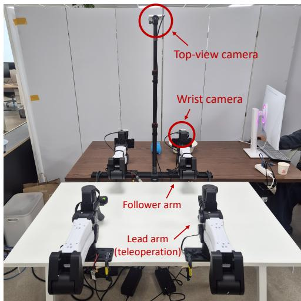  
Figure 7: Real-robot setup. Bimanual platform with the top-view camera; the platform is used in a single-arm configuration and only one follower arm is controlled. Wrist camera on that arm.

Dataset and training. We collect approximately 100 episodes for each of four tasks (eight datacollection variants differing in object instances, e.g., different balls for pnp-plate, grouped into four tasks). The exact statistics are in Table 5. We fully fine-tune MolmoAct2 (starting from allenai/MolmoAct2-BimanualYAM; all parameters updated except the frozen embeddings) on the collected demonstrations through behavior cloning, using AdamW (lr $1 0 ^ { - 5 }$ , cosine decay to $1 0 ^ { - 6 }$ with 200-step warmup, no weight decay) with batch size 108 for 20,000 steps on a single B200 GPU and standard image augmentations (color jitter, sharpness jitter, random affine within $\pm 5 ^ { \circ }$ and ±5% translation); we use the checkpoint at 14,000 steps. Following the per-task protocol of the simulated experiments, critics and guidance networks are trained for the two evaluation tasks, using rollouts of the fine-tuned policy on each task. The critic takes the full 29-step action chunk as input (Table $4 ) ^ { 2 }$ . Because a new chunk replaces the action queue roughly every 0.5s under asynchronous execution, the recorded per-chunk action sequences are typically 15–20 steps rather than the full 29; we pad them to 29 steps by repeating the last predicted action. Discarding incomplete chunks instead would remove nearly all records, including the terminal ones where success and failure signals concentrate. The two evaluation tasks are “pick up the ball and place it on the plate” (pnp-plate), where a black ball must be picked and placed onto a plate, and “open the box, put the ball inside, and close it” (open-pnp-close), a long-horizon sequence in which the robot opens a box, picks and places the black ball inside, and closes the box.

Evaluation details. pnp-plate is evaluated over 50 paired episodes and open-pnp-close over 25, with a time limit of 30s for pnp-plate and 45s for open-pnp-close. Episodes differ in their initial configuration: the ball and plate positions vary across pnp-plate episodes, and the ball position varies across open-pnp-close episodes. All methods are nevertheless evaluated on the same set of initial configurations, enabling paired comparison. We report the success rate (%). For pnp-plate, an episode is successful once the ball lies entirely on the plate and the gripper has opened. For open-pnp-close, an episode is successful only if the ball is placed inside the box and the box is fully closed. Latencies are measured with CUDA synchronization inside the deployed control loop (10 denoising steps, two 480×640 camera views), with each method at its deployed strength; QGF uses a vectorized (vmap) critic-ensemble implementation.

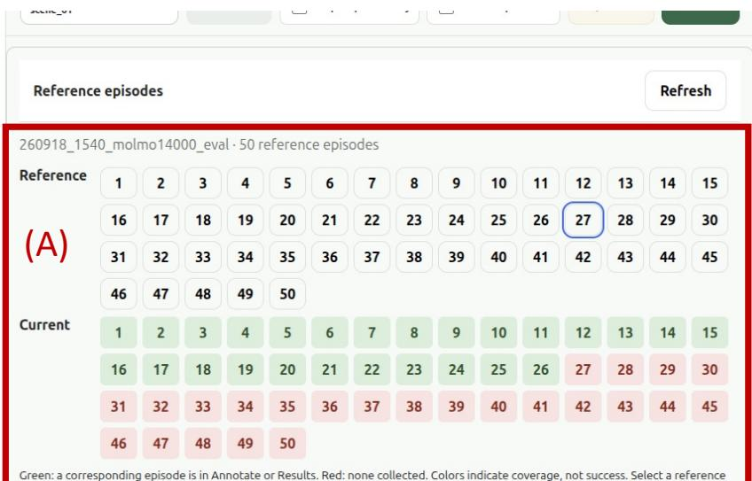

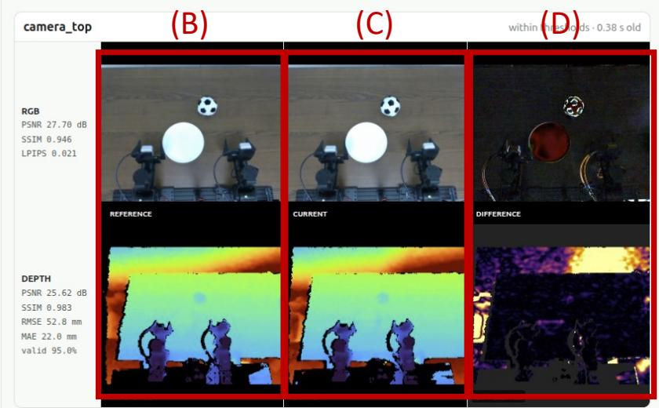  
Figure 8: Paired evaluation interface. (A) Coverage tracker over the 50 reference episodes. (B) Reference view captured when the first method is evaluated, (C) the current scene before a subsequent method is run, and (D) their difference map, used to verify that each scenario is initialized consistently across methods.

Paired evaluation. We built a dedicated interface for paired evaluation across the compared methods (Figure 8). Panel (A) tracks which scenarios have been evaluated. Panel (B) shows the reference camera view for initialization, captured when the first method is evaluated; subsequent methods are initialized against this reference. Specifically, we compare the reference view (B) with the current view (C) and compute their difference map (D), which ensures that each scenario is initialized consistently across all methods.

Table 6: Per-condition LIBERO-Pro results with MolmoAct2. Task success rate (%) averaged over the four LIBERO suites for each visual condition, under suite-level and task-level calibration; the Avg. column corresponds to the LIBERO-Pro rows of Table 2. Bold and underline mark the best and second-best inference-time method per column within each calibration setting; our method is shaded.
<table><tr><td>Calibration</td><td>Method</td><td>Clean</td><td>Position</td><td>Object</td><td>Semantic</td><td>Environment</td><td>Avg.</td></tr><tr><td rowspan="5">Suite-level</td><td>Pretrained VLA</td><td>97.2</td><td>23.0</td><td>83.5</td><td>97.2</td><td>74.0</td><td>75.0</td></tr><tr><td>Q-BoN (N=4)</td><td>8.2</td><td>1.2</td><td>2.0</td><td>6.5</td><td>3.8</td><td>4.3</td></tr><tr><td>QDPS</td><td>97.5</td><td>24.0</td><td>84.0</td><td>98.2</td><td>76.0</td><td>76.0</td></tr><tr><td>QGF</td><td>97.2</td><td>24.2</td><td>85.2</td><td>98.0</td><td>75.8</td><td>76.1</td></tr><tr><td>ÀGF (M=1)</td><td>97.0</td><td>24.8</td><td>84.8</td><td>97.5</td><td>75.8</td><td>76.0</td></tr><tr><td rowspan="6">Task-level</td><td>AGF (M=4)</td><td>98.0</td><td>25.8</td><td>84.0</td><td>97.8</td><td>75.2</td><td>76.2</td></tr><tr><td>Pretrained VLA</td><td>97.2</td><td>23.0</td><td>83.5</td><td>97.2</td><td>74.0</td><td>75.0</td></tr><tr><td>Q-BoN (N=4)</td><td>8.2</td><td>1.2</td><td>2.0</td><td>6.5</td><td>3.8</td><td>4.3</td></tr><tr><td>QDPS</td><td>97.8</td><td>26.8</td><td>85.2</td><td>98.0</td><td>79.2</td><td>77.4</td></tr><tr><td>QGF</td><td>98.2</td><td>27.0</td><td>85.5</td><td>98.5</td><td>77.8</td><td>77.4</td></tr><tr><td>AGF (M=1) AGF (M=4)</td><td>97.2 97.5</td><td>26.2 27.0</td><td>85.8 85.8</td><td>98.0 98.2</td><td>78.8 79.2</td><td>77.2 77.5</td></tr></table>

## C ADDITIONAL RESULTS AND ANALYSIS

## C.1 PER-CONDITION LIBERO-PRO RESULTS

Table 6 reports the per-condition LIBERO-Pro breakdown; the suite-averaged MolmoAct2 results correspond to the LIBERO-Pro rows of Table 2. The Clean and Semantic conditions are near saturation for MolmoAct2, leaving little room for guidance, whereas the gains of all guidance methods concentrate on the harder conditions, most notably Position, where AGF (M = 4) improves the pretrained policy from 23.0 to 27.0 under task-level calibration. Across all five conditions, AGF remains on par with QDPS and QGF under both calibration settings, extending the suite-level observation of Section 4 to individual visual perturbations. Q-BoN collapses uniformly across conditions; we analyze this failure in Appendix C.2.

## C.2 Q-BON OVER-OPTIMIZATION ON MOLMOACT2

On MolmoAct2, Q-BoN collapses across all four LIBERO-Pro suites (Table 2), although the same critic provides effective guidance for QGF and AGF. We verified that Q-BoN uses the same critic checkpoint and pessimistic aggregation, with the correct ranking polarity and independently sampled candidates. The failure instead arises from best-of-N over-optimization. QGF and AGF make local corrections around the base-policy trajectory, where the critic is sufficiently supported by its finite rollout data. In contrast, maximizing over N independent samples increasingly favors low-density candidates with positive value-estimation errors, resulting in actions that score highly under the critic but fail in execution.

Table 7 shows this effect across all four suites. As N increases, the predicted advantage of the selected candidate, Q<sup>¯</sup>best − Q<sup>¯</sup>mean, grows monotonically, while the actual success rate collapses, which is a characteristic signature of over-optimization against an imperfect value estimate. Task-level selection does not resolve the issue because for every task with nonzero success, N=4 is already optimal, with one tie, while the remaining tasks fail for all evaluated values of N. Consequently, the suite- and task-level results in Table 2 coincide.

## C.3 LEAVE-ONE-TASK-OUT CALIBRATION

Suite-level calibration in Table 2 selects a single guidance strength using all tasks within a suite. While this evaluates whether one shared strength can work across heterogeneous tasks, each task still contributes to the selection, so it does not directly measure transfer to a task unseen during calibration.

Table 7: Best-of-N over-optimization on MolmoAct2. Suite-level success rate (%) and the critic’s apparent advantage of the selected candidate $( \bar { Q } _ { \mathrm { b e s t } } - \bar { Q } _ { \mathrm { m e a n } }$ , averaged over episodes) as the number of candidates N grows. Across all four suites, the apparent advantage increases monotonically while the actual success rate collapses.
<table><tr><td rowspan="2">Suite</td><td rowspan="2"></td><td colspan="3">N</td></tr><tr><td>4</td><td>8</td><td>16</td></tr><tr><td>Goal</td><td>Success rate  $\bar { Q } _ { \mathrm { b e s t } } - \bar { Q } _ { \mathrm { m e a n } }$ </td><td>10.4 0.224</td><td>2.0 0.344</td><td>0.6 0.446</td></tr><tr><td>Object</td><td>Success rate  $\bar { Q } _ { \mathrm { b e s t } } - \bar { Q } _ { \mathrm { m e a n } }$ </td><td>1.0 0.218</td><td>0.0 0.309</td><td>0.0 0.359</td></tr><tr><td>Spatial</td><td> $\operatorname { S u c c e s s } { \mathrm { ~ r a t e } }$   $\bar { Q } _ { \mathrm { b e s t } } - \bar { Q } _ { \mathrm { m e a n } }$ </td><td>5.8 0.253</td><td>1.2 0.363</td><td>0.2 0.438</td></tr><tr><td>LIBERO-10</td><td>Success rate  $\bar { Q } _ { \mathrm { b e s t } } - \bar { Q } _ { \mathrm { m e a n } }$ </td><td>0.2 0.105</td><td>0.0 0.137</td><td>0.0 0.166</td></tr></table>

Table 8: Leave-one-task-out (LOTO) calibration. Success rate (%) when the guidance strength is selected on all but one task and evaluated on the held-out task, averaged over held-out tasks. Bold marks the better LOTO result per suite; our method is shaded.
<table><tr><td rowspan="2">Calibration Method</td><td rowspan="2"></td><td colspan="4">LIBERO (SmolVLA)</td><td rowspan="2">RoboCasa (π0.5)</td><td colspan="3">LIBERO-Pro (MolmoAct2)</td></tr><tr><td>Goal</td><td>Object</td><td>Spatial</td><td>LIBERO-10</td><td>Atomic Goal</td><td>Object Spatial</td><td>LIBERO-10</td></tr><tr><td rowspan="2">Task-level</td><td>QGF</td><td>81.4</td><td>95.6</td><td>77.6</td><td>39.2</td><td>49.6</td><td>77.4</td><td>85.8 77.0</td><td>69.4</td></tr><tr><td>AGF</td><td>83.2</td><td>95.4</td><td>75.6</td><td>42.0</td><td>49.4</td><td>77.8</td><td>84.6 79.0</td><td>68.8</td></tr><tr><td rowspan="2">Suite-level</td><td>QGF</td><td>80.6</td><td>93.6</td><td>73.0</td><td>36.0</td><td>46.3</td><td>76.0</td><td>84.6 76.0</td><td>67.8</td></tr><tr><td>AGF</td><td>81.0</td><td>93.4</td><td>74.6</td><td>36.8</td><td>46.6</td><td>76.4</td><td>83.8 77.4</td><td>67.0</td></tr><tr><td rowspan="2">LOTO</td><td>QGF</td><td>80.6</td><td>91.8</td><td>69.6</td><td>31.8</td><td>46.3</td><td>74.8</td><td>84.6 76.0</td><td>67.8</td></tr><tr><td>AGF</td><td>81.0</td><td>93.4</td><td>74.6</td><td>33.6</td><td>46.6</td><td>75.2</td><td>83.0 77.4</td><td>65.4</td></tr></table>

To evaluate this setting, we conduct a leave-one-task-out (LOTO) test: for each task in a suite, the guidance strength is selected to maximize the average success rate over the remaining tasks and evaluated on the held-out task, with results averaged over all held-out tasks. We reuse the per-task success rates from the guidance-strength sweep in Appendix C.5, and each method selects within its own sweep range.

Table 8 reports the results. On the LIBERO and RoboCasa atomic tasks, AGF outperforms QGF on every held-out suite. Its advantage comes from stability rather than peak performance: on most suites AGF selects the same strength regardless of which task is held out, so excluding a task from calibration costs it almost nothing, whereas QGF loses a larger share of its task-level gains once per-task selection is unavailable, which is consistent with its fluctuating response to the guidance strength (Figure 5). On LIBERO-Pro with MolmoAct2 (right block), the two methods remain comparable under LOTO, mirroring their suite-level parity in Table 2, and both degrade only mildly from task-level calibration. LIBERO-10 is the exception in both settings, where task heterogeneity makes any single shared strength less effective. Overall, AGF is ahead on the large majority of the nine LOTO comparisons, and the results support suite-level calibration as a practical proxy for deployment to unseen tasks without task-specific strength selection.

## C.4 PAIRED SIGNIFICANCE TESTS

All comparisons use the suite-level calibration weights of Table 10 and are episode-level paired tests: both methods are evaluated on identical episode seeds on all three benchmarks: LIBERO (10 tasks × 50 episodes per suite, SmolVLA), RoboCasa (18 atomic tasks × 50 episodes, $\pi _ { 0 . 5 } )$ , and LIBERO-Pro (10 tasks × 5 conditions × 10 episodes per suite, MolmoAct2), with a single training seed throughout; AGF denotes the $M { = } 4$ variant as in the main text. Each episode seed fixes both the initial action noise and the environment initialization, and for each task all methods are evaluated on the same RTX 4090 to avoid hardware-dependent nondeterminism, so that per-episode outcomes are directly comparable across methods. We report the mean success-rate difference ∆SR (percentage points, positive favors AGF), exact McNemar p-values, and 95% paired bootstrap confidence intervals (20,000 resamples), per suite and pooled within each benchmark. Pooled over suites, AGF’s improvement over the pretrained policy is significant on LIBERO and LIBERO-Pro and directionally positive on RoboCasa, while AGF and QGF are statistically indistinguishable on every suite of every benchmark.

Table 9: Paired significance tests. Episode-level paired comparisons on identical seeds across all three benchmarks; positive ∆SR favors AGF.
<table><tr><td>Comparison</td><td>Suite</td><td>∆SR</td><td>McNemar p</td><td>95% CI</td></tr><tr><td colspan="5">LIBERO (SmolVLA)</td></tr><tr><td rowspan="4">Base vs. AGF</td><td>Goal</td><td>+4.4</td><td>0.021</td><td>[+0.8, +8.0]</td></tr><tr><td>Object</td><td>+3.8</td><td>0.020</td><td>[+0.8, +6.8]</td></tr><tr><td>Spatial</td><td>+3.0</td><td>0.191</td><td>[−1.2, +7.2]</td></tr><tr><td>LIBERO-10 Pooled</td><td>+3.2 +3.6</td><td>0.195 3.4 × 10 -4</td><td>[−1.2, +7.8]</td></tr><tr><td rowspan="5">QGF vs. AGF</td><td>Goal</td><td>+0.4</td><td>0.913</td><td>[+1.7, +5.6]</td></tr><tr><td>Object</td><td>-0.2</td><td>1.000</td><td>[−3.2, +4.0] [−2.6, +2.2]</td></tr><tr><td>Spatial</td><td>+1.6</td><td>0.526</td><td>[−2.8, +6.0]</td></tr><tr><td>LIBERO-10</td><td>+0.8</td><td>0.801</td><td></td></tr><tr><td>Pooled</td><td>+0.7</td><td>0.542</td><td>[−3.8, +5.4] [−1.3, +2.6]</td></tr><tr><td colspan="5">RoboCasa (π0.5)</td></tr><tr><td rowspan="2">Base vs. AGF QGF vs. AGF</td><td>Atomic</td><td>+2.6</td><td>0.075</td><td>[−0.2, +5.2]</td></tr><tr><td>Atomic</td><td>+0.2</td><td>0.939</td><td>[−2.6, +3.0]</td></tr><tr><td colspan="5">LIBERO-Pro (MolmoAct2)</td></tr><tr><td rowspan="5">Base vs. AGF</td><td>Goal</td><td>+1.0</td><td>0.359</td><td>[−0.6, +2.8]</td></tr><tr><td>Object</td><td>+0.8</td><td>0.424</td><td>[−0.6, +2.2]</td></tr><tr><td>Spatial</td><td>+1.6</td><td>0.022</td><td>[+0.4, +3.0]</td></tr><tr><td>LIBERO-10</td><td>+1.2</td><td>0.286</td><td>[−0.6, +3.0]</td></tr><tr><td>Pooled</td><td>+1.1</td><td>5.9 × 10−3</td><td>[+0.4, +1.9]</td></tr><tr><td rowspan="5">QGF vs. AGF</td><td>Goal</td><td>+0.4</td><td>0.839</td><td>[−1.6, +2.2]</td></tr><tr><td>Object</td><td>-0.8</td><td>0.388</td><td>[−2.2, +0.6]</td></tr><tr><td>Spatial</td><td>+1.4</td><td>0.167</td><td>[−0.2, +3.2]</td></tr><tr><td>LIBERO-10</td><td>-0.8</td><td>0.557</td><td>[−2.8, +1.2]</td></tr><tr><td>Pooled</td><td>+0.0</td><td>1.000</td><td>[−0.8, +0.9]</td></tr></table>

## C.5 GUIDANCE WEIGHT SELECTION

For each method we use a single guidance weight per benchmark suite, selected by the suite-level average success rate. The guidance term of each method is normalized by the magnitude of the flow velocity predicted by the pretrained VLA, so that all methods share the common sweep range [0.25, 4.0]; the selected values are listed in Table 10.

## C.6 SUBTASK ANALYSIS FOR REAL ROBOT LONG TASK

We evaluate AGF on the real-robot system with two tasks: a short pick-and-place (pnp-plate) and a long compositional task (open-pnp-close) consisting of three subtasks: open the box, place the ball inside, and close the box. For the compositional task, Table 11 scores each subtask independently over the 25 paired episodes. AGF improves every subtask over the base policy and completes all 25 opening attempts, while the base policy frequently skips or fails intermediate subtasks (e.g., closing the box without placing the ball), which the independent scoring makes visible. QGF’s transferred strength improves opening and placing only marginally and does not improve closing, consistent with its overall lack of gain on this task (Table 3).

Table 10: Selected guidance hyperparameters. Suite-level selected guidance weight w for each gradient-based method and the selected number of candidates N for Q-BoN. All gradient-based methods share the sweep range [0.25, 4.0] after flow-velocity normalization; Q-BoN sweeps N ∈ {4, 8, 16}. Ties are broken toward the smaller weight.
<table><tr><td></td><td colspan="4">LIBERO (SmolVLA)</td><td>RoboCasa (π0.5)</td><td colspan="4">LIBERO-Pro (MolmoAct2)</td></tr><tr><td>Method</td><td>Goal</td><td>Object Spatial</td><td></td><td>LIBERO-10</td><td>Atomic</td><td>Goal</td><td>Object</td><td>Spatial</td><td>LIBERO-10</td></tr><tr><td>QDPS</td><td>4.0</td><td>0.25</td><td>4.0</td><td>1.0</td><td>4.0</td><td>2.0</td><td>1.0</td><td>2.0</td><td>1.0</td></tr><tr><td>QGF</td><td>4.0</td><td>1.0</td><td>2.0</td><td>1.0</td><td>0.25</td><td>2.0</td><td>0.5</td><td>0.25</td><td>0.25</td></tr><tr><td>Q-BoN (N)</td><td>8</td><td>8</td><td>4</td><td>4</td><td>4</td><td>4</td><td>4</td><td>4</td><td>4</td></tr><tr><td>AGF (M=1)</td><td>4.0</td><td>2.0</td><td>2.0</td><td>2.0</td><td>2.0</td><td>1.0</td><td>2.0</td><td>2.0</td><td>0.5</td></tr><tr><td>AGF (M=4)</td><td>4.0</td><td>2.0</td><td>4.0</td><td>4.0</td><td>4.0</td><td>2.0</td><td>4.0</td><td>1.0</td><td>2.0</td></tr></table>

Table 11: Subtask success on open-pnp-close (25 paired episodes; each subtask judged independently, so a later subtask can succeed after an earlier one fails, e.g., closing the box without placing the ball).
<table><tr><td>Subtask</td><td>Base</td><td>QGF</td><td>AGF</td></tr><tr><td>Open the box</td><td>15/25</td><td>18/25</td><td>25/25</td></tr><tr><td>Place the ball inside</td><td>12/25</td><td>15/25</td><td>21/25</td></tr><tr><td>Close the box</td><td>17/25</td><td>14/25</td><td>20/25</td></tr><tr><td>All three (task success)</td><td>11/25</td><td>12/25</td><td>19/25</td></tr></table>

## C.7 QUALITATIVE COMPARISON FOR REAL ROBOT EXPERIMENTS

We show paired rollouts of Base VLA, QGF, and AGF on both evaluation tasks, using identical initial conditions within each task.

pnp-plate. Figure 9 shows a different failure mode. All three methods grasp the ball successfully, so the gap does not arise at the picking stage. Base VLA and QGF, however, release the ball in transit: the gripper opens before reaching the plate, and neither recovers within the episode time limit. AGF transports the ball without dropping it and completes the task. This is consistent with the subtask breakdown in Table 11, where AGF’s gain concentrates in the transport-and-place stage rather than in grasping.

open-pnp-close. Figure 10 shows that the three methods diverge at the very first subtask. Base VLA fails all three: it never opens the box, and the episode ends without the ball being transported or the box closed. QGF opens nothing either, yet proceeds to pick and place the ball, so the sequence is executed out of order and the episode is scored as a failure. AGF completes the three subtasks in order (opening the box, placing the ball inside, and closing it) within the time limit.

## D LIMITATIONS

AGF inherits two dependencies from its design. First, following the single-task critic setting of prior work, each task requires training its own critic ensemble and guidance network. The critic is shared with every guidance baseline; the guidance network is the additional cost AGF pays to remove the critic from deployment, paid once per task rather than once per episode. Amortizing guidance across tasks with a shared network remains an open direction. Second, the quality of the guidance is bounded by the quality of the critic: AGF distills the critic’s gradient signal and cannot correct for a poorly calibrated value function. Finally, on suites with highly heterogeneous tasks such as LIBERO-10, any single deployed guidance strength degrades from per-task calibration (Appendix C.3), suggesting that strength selection itself could benefit from state-dependent adaptation.

Base VLA  
QGF  
AGF  
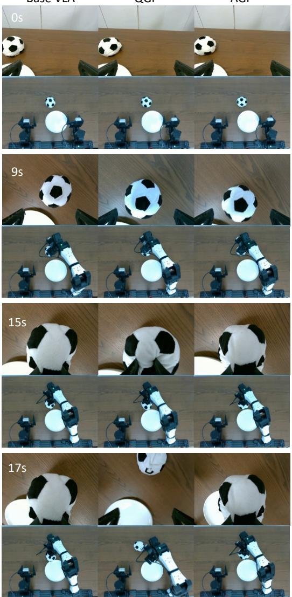

Base VLA  
QGF  
AGF  
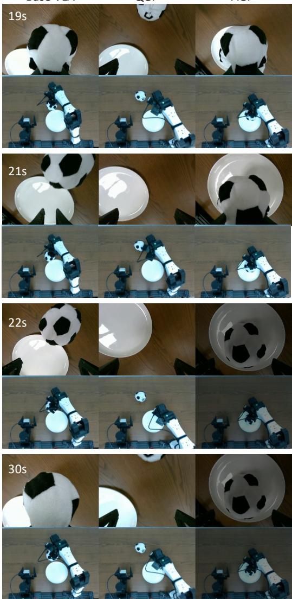  
Figure 9: Qualitative rollouts on pnp-plate. Eight timestamps from paired episodes of Base VLA, QGF, and AGF, all initialized identically. Within each block the top row is the wrist camera and the bottom row the top-view camera. Frames are dimmed after a method has completed the task.

Base VLA  
QGF  
AGF  
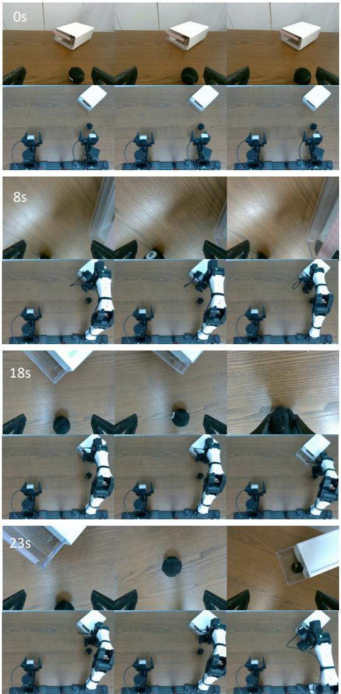

Base VLA  
QGF  
AGF  
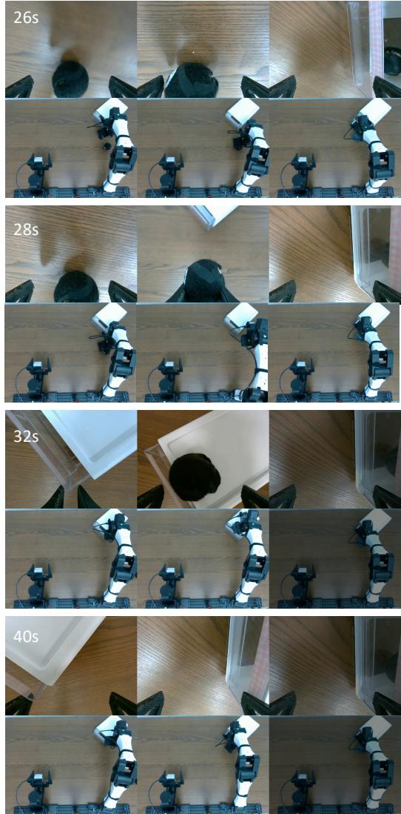  
Figure 10: Qualitative rollouts on open-pnp-close. Eight timestamps from paired episodes of Base VLA, QGF, and AGF, all initialized identically. Within each block the top row is the wrist camera and the bottom row the top-view camera. Frames are dimmed after a method has completed the task.