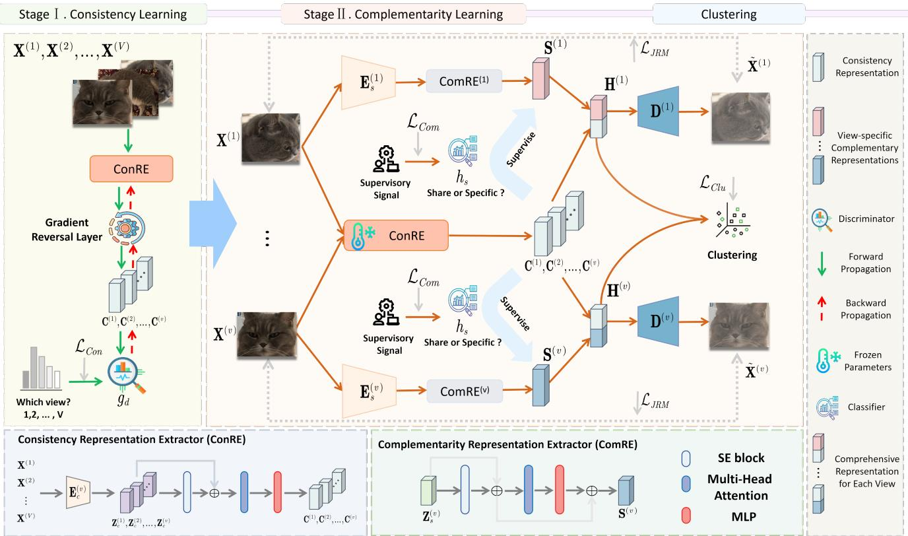
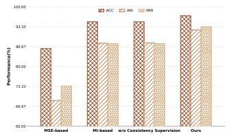
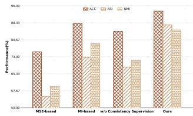
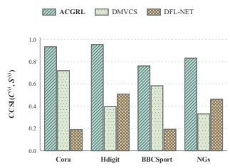
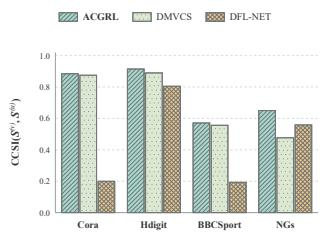
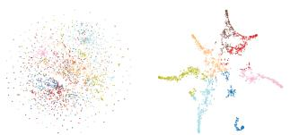
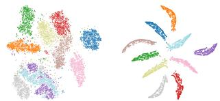

# ADVERSARIAL CONSISTENCY-GUIDED REPRESENTATION LEARNING FOR MULTI-VIEW CLUSTERING

Yuchen Lin 1,2,†

Kunpeng Xu 3,†

Ying Fang 1,∗

Lifei Chen 1,2,∗

1 School of Computer and Cyber Security, Fujian Normal University, Fuzhou 350000, China 2 Digital Fujian Internet-of-Things Laboratory of Environmental Monitoring, Fujian Normal University, Fuzhou 350000, China 3 School of Computer Science, McGill University, Montreal H3A 2A7, Quebec, Canada

## ABSTRACT

Multi-view clustering aims to capture cross-view consistency while exploiting view-specific information. However, shared representations learned to capture cross-view consistency may still retain viewidentifying information, potentially compromising the consistency of cross-view clustering structures. To address this issue, we propose ACGRL, an adversarial consistency-guided representation learning framework for multi-view clustering. ACGRL employs a gradientreversal view discriminator to reduce view identifiability and obtain invariant reference representations. These representations are then frozen to provide fixed references for disentangling view-specific information from cross-view common information in the subsequent learning stage. The fixed reference representations are concatenated with the learned view-specific representations for reconstruction and clustering, with cross-view cluster alignment encouraging consistent clustering assignments. Experiments on four benchmark datasets demonstrate the superior clustering performance of ACGRL compared with representative multi-view clustering methods.

Index Terms— Multi-view Clustering, Disentangled Representation Learning, Adversarial Consistency Learning

## 1. INTRODUCTION

Multi-view clustering aims to discover cluster structure by exploiting cross-view consistency and complementary information across heterogeneous views [1]. Existing methods pursue this goal through representation alignment, dependence maximization, or sharedspecific decomposition [2, 3]. However, shared representations may still retain view-identifying information, potentially compromising the consistency of cross-view clustering structures. To address this limitation, we propose ACGRL, an adversarial consistency-guided representation learning framework that uses fixed references to guide the separation of common and view-specific information. In Stage I, adversarial training with a gradient reversal layer reduces view identifiability in the reference representations. In Stage II, these references are frozen to guide view-specific learning and concatenated with the resulting representations for reconstruction and clustering, with cross-view cluster alignment encouraging consistent assignments. Experiments on four benchmark datasets demonstrate ACGRL’s superior clustering performance over representative methods. Our main contributions are summarized as follows:

• We introduce adversarial consistency learning with gradient reversal to reduce view identifiability in shared representations.

• We use frozen shared representations to supervise viewspecific representation learning and concatenate both components for reconstruction and clustering, with cross-view cluster alignment encouraging consistent assignments.

• Experiments on four benchmark datasets demonstrate that ACGRL outperforms representative multi-view clustering methods.

## 2. RELATED WORK

## 2.1. Multi-view Clustering

Multi-view clustering (MVC) seeks a common cluster structure across heterogeneous views. Existing methods model cross-view relations through subspace or graph learning, while deep approaches employ reconstruction, self-expression, and representation alignment to learn nonlinear latent structures [4, 5]. For example, EPFMVC learns view-specific representations and adaptively fuses them according to inter-view relations [6], whereas self-expressive approaches learn a shared affinity structure in a unified latent space [1]. ACGRL employs adversarial training to encourage cross-view consistency in the learned representations, which are then frozen to provide fixed supervision for view-specific representation learning, with the aim of separating view-specific information from crossview common information.

## 2.2. Multi-view Representation Disentanglement

Multi-view representation disentanglement aims to separate shared and view-specific information to improve clustering performance [3]. Multi-VAE disentangles shared and view-specific factors through variational modeling [7], while MRDD reduces their redundancy through distilled disentangling [8]. However, separating shared and view-specific information does not necessarily eliminate view-identifying information from the shared component. ACGRL explicitly targets such information through adversarial consistency learning and uses the resulting frozen representations to guide viewspecific representation learning.

## 3. METHOD

Notation: We introduce Adversarial Consistency-Guided Representation Learning (ACGRL) for multi-view clustering, as illustrated in Figure 1. Let $\mathcal { X } = \{ \mathbf { X } ^ { \left( v \right) } \} _ { v = } ^ { V }$ denote a multi-view dataset, where $\mathbf { X } ^ { \left( v \right) } \in \mathbb { R } ^ { n \times d ^ { \left( v \right) } }$ is the feature matrix of the v-th view. ACGRL learns consistent and complementary representations for clustering.

  
Fig. 1: Overview of ACGRL. Stage I adversarially learns view-invariant representations, which are frozen to provide consistency supervision for view-specific learning in Stage II. The resulting representations are integrated for reconstruction and clustering.

## 3.1. Adversarial Consistency Learning

In Stage I, we learn shared representations whose source views are difficult to identify. For each view, the consistency representation extractor maps the input into a latent representation:

$$
{ \bf C } ^ { ( v ) } = f _ { c } ^ { ( v ) } ( { \bf X } ^ { ( v ) } ) , \qquad v = 1 , \ldots , V ,\tag{1}
$$

where $f _ { c } ^ { ( v ) }$ denotes the Consistency Representation Extractor (ConRE), which comprises an input encoder, an SE-based feature recalibration block, and a multi-head self-attention block with residual connections.

To explicitly reduce view-identifiable information, we introduce a shared discriminator $g _ { d }$ coupled with the consistency extractors through a gradient reversal layer (GRL). The adversarial objective is

$$
\mathcal { L } _ { \mathrm { C o n } } = \frac { 1 } { N V } \sum _ { v = 1 } ^ { V } \sum _ { i = 1 } ^ { N } \mathrm { C E } \left( g _ { d } ( \mathcal { R } _ { \lambda } ( \mathbf { c } _ { i } ^ { ( v ) } ) ) , v \right) ,\tag{2}
$$

where $\mathcal { R } _ { \lambda }$ acts as an identity mapping during forward propagation but reverses the gradient during backpropagation: $\partial \mathcal { R } _ { \lambda } / \partial \mathbf { x } = - \lambda \mathbf { I }$ Consequently, the discriminator learns to identify the source view, whereas the consistency extractors are optimized to make this identification difficult, thereby encouraging view-invariant representations.

The reversal coefficient is progressively increased as

$$
\lambda ( p ) = \frac { 2 } { 1 + \exp ( - \beta p ) } - 1 ,\tag{3}
$$

where $p \in \ [ 0 , 1 ]$ denotes the normalized training progress and $\beta$ controls the growth rate of the adversarial signal.

## 3.2. Consistency-Supervised View-Specific Learning

After Stage I, we freeze the consistency extractors to keep the learned representations $\mathbf { C } ^ { ( v ) }$ fixed, allowing them to serve as anchors that supervise the subsequent learning of view-specific representations. For each view, an independently parameterized view-specific extractor maps the original input to

$$
\mathbf { S } ^ { ( v ) } = f _ { s } ^ { ( v ) } ( \mathbf { X } ^ { ( v ) } ) , \qquad v = 1 , \ldots , V ,\tag{4}
$$

where $f _ { s } ^ { ( v ) }$ represents the Complementarity Representation Extractor (ComRE), which employs an independent view-specific encoder and the same types of SE and multi-head attention blocks as $f _ { c } .$ It further combines the recalibrated and attention-enhanced features using a learnable weight $\alpha _ { v }$

To distinguish view-specific variations from the fixed shared anchors, we introduce an auxiliary classifier $h _ { s }$ .The auxiliary classifier $h _ { s }$ assigns the frozen shared representations to class 0 and the viewspecific representations to their respective view classes $1 , \ldots , V$ . Its objective is

$$
\begin{array} { c l } { \displaystyle \mathcal { L } _ { \mathrm { C o m } } = \frac { 1 } { V } \sum _ { v = 1 } ^ { V } \Big [ \epsilon \mathrm { C E } \left( h _ { s } ( \mathbf { S } ^ { ( v ) } ) , v \right) + ( 1 - \epsilon ) \mathrm { C E } \left( h _ { s } ( \mathbf { C } ^ { ( v ) } ) , 0 \right) } \\ { + \eta \mathcal { H } \big ( h _ { s } ( \mathbf { S } ^ { ( v ) } ) \big ) \Big ] . } \end{array}\tag{5}
$$

The fixed representations $\mathbf { C } ^ { ( v ) }$ provide a common reference, while the view labels encourage $\mathbf { S } ^ { ( v ) }$ to retain variations specific to each view. The entropy term further encourages confident view assignments. Reconstruction and clustering objectives are subsequently introduced to preserve task-relevant information in these representations.

## 3.3. Reconstruction and Clustering Objectives

For each view, the view-invariant and view-specific representations are concatenated to form the comprehensive representation $\mathbf { H } ^ { ( v ) } =$ $[ \mathbf { C } ^ { ( v ) } , \mathbf { S } ^ { ( v ) } ] \in \mathbb { R } ^ { N \times 2 o }$ . To retain the information required to characterize each view, a decoder reconstructs the original input from $\mathbf { H } ^ { \left( v \right) }$

$$
\mathcal { L } _ { \mathrm { J R M } } = \frac { 1 } { V } \sum _ { v = 1 } ^ { V } \left. D ^ { ( v ) } ( \mathbf { H } ^ { ( v ) } ) - \mathbf { X } ^ { ( v ) } \right. _ { F } ^ { 2 } .\tag{6}
$$

A set of independently parameterized view-specific clustering heads $\{ g _ { p } ^ { ( v ) } \} _ { v = 1 } ^ { V }$ produces the soft cluster assignments:

$$
\mathbf { Q } ^ { ( v ) } = g _ { p } ^ { ( v ) } ( \mathbf { H } ^ { ( v ) } ) \in \mathbb { R } ^ { N \times K } , \qquad v = 1 , \dots , V ,\tag{7}
$$

where the final layer of each $g _ { p } ^ { ( v ) }$ applies a softmax operation, and ${ \bf q } _ { i } ^ { ( v ) } = { \bf Q } _ { : , i } ^ { ( v ) } \in \dot { \mathbb { R } ^ { N } }$ denotes the assignment vector of the j-th cluster across all instances in view v. To align the clustering structures across views, assignment vectors corresponding to the same cluster are treated as positive pairs, while those corresponding to different clusters are treated as negative pairs. For a pair of views $( v , u )$ , the contrastive clustering loss is defined as

$$
\ell _ { v c } ^ { ( v , u ) } = - \frac { 1 } { K } \sum _ { j = 1 } ^ { K } l o g \frac { \mathrm { e } ^ { s i m ( \mathbf { Q } _ { : , j } ^ { ( v ) } , \mathbf { Q } _ { : , j } ^ { ( u ) } ) / \tau } } { \sum _ { m = v , u } \sum _ { k = 1 , k \neq j } ^ { K } \mathrm { e } ^ { s i m ( \mathbf { Q } _ { : , j } ^ { ( v ) } , \mathbf { Q } _ { : , k } ^ { ( m ) } ) / \tau } } ,\tag{8}
$$

where sim(·, ·) denotes cosine similarity and τ is the temperature parameter. The loss is averaged over all ordered view pairs:

$$
\mathcal { L } _ { \mathrm { c l u } } = \frac { 1 } { V ( V - 1 ) } \sum _ { v = 1 } ^ { V } \sum _ { u = 1 , u \ne v } ^ { V } \ell _ { \mathrm { v c } } ^ { ( v , u ) } .\tag{9}
$$

Finally, the view-specific assignment matrices are uniformly averaged to obtain the consensus cluster assignment:

$$
\bar { \mathbf { Q } } = \frac { 1 } { V } \sum _ { v = 1 } ^ { V } \mathbf { Q } ^ { ( v ) } .\tag{10}
$$

The predicted cluster label of the i-th instance is then given by

$$
\hat { y } _ { i } = \underset { 1 \leq j \leq K } { \arg \operatorname* { m a x } } \bar { \mathbf { Q } } _ { i j } ,\tag{11}
$$

where $\bar { \bf Q } _ { i , : } \in \mathbb { R } ^ { K }$ denotes the consensus assignment probabilities of the i-th instance over the K clusters.

## 4. EXPERIMENTS

## 4.1. Datasets and Baseline

We evaluate ACGRL on four widely used multi-view datasets. NGs [9] contains 500 samples described by 3 views and grouped into 5 classes. BBCSport [10] contains 544 samples described by 2 views and grouped into 5 classes. Cora [11] contains 2,708 samples described by 2 views and grouped into 7 classes. Hdigit [12] contains 10,000 samples described by 2 views and grouped into 10 classes.

We compare ACGRL with nine representative methods. MFLVC [13] separates reconstruction and contrastive consistency learning into different feature levels. DCP [14] combines mutualinformation-based contrastive learning with cross-view prediction.

MetaViewer [15] learns unified representations through a metalearning-based uniform-to-specific framework. DealMVC [16] captures cross-view consistency through global and local contrastive calibration. GCFAggMVC [17] combines global and cross-view feature aggregation with structure-guided contrastive learning. DFL-Net [3] learns consistent and complementary representations through contrastive and complementarity regularization. DDMVC [18] combines contrastive consistency learning with sample diversity and feature decorrelation. GAVIM [19] integrates variational information maximization, local geometry preservation, and Gramian alignment for imputation-free incomplete multi-view clustering. DMVCS [2] combines representation disentanglement with semantic relevance alignment and multi-hop neighbor contrastive learning. All baselines are evaluated using the parameter settings recommended in their respective papers.

## 4.2. Experimental Setup

We evaluate clustering performance using clustering accuracy (ACC), adjusted Rand index (ARI), and normalized mutual information (NMI). ACGRL is optimized using Adam with a cosineannealing learning-rate schedule. The initial learning rate is set to $1 0 ^ { - 4 }$ , except for the clustering module, which uses $\bar { 1 0 } ^ { - 3 }$ . Stages I and II are trained for 300 and 400 epochs, respectively.

## 4.3. Experimental Results and Analysis

We compare ACGRL with nine representative multi-view clustering methods as shown in Table 1. ACGRL achieves the highest ACC on all four datasets, exceeding the strongest baseline on each dataset by 5.40, 0.15, 12.88, and 9.34 percentage points on NGs, Hdigit, BBCSport, and Cora, respectively. The improvements vary across datasets, with larger gains on NGs, BBCSport, and Cora and a marginal gain on Hdigit.

## 4.4. Ablation Study

Loss Function: As shown in Table 2, removing any of the four objectives reduces ACC, ARI, and NMI on both Cora and BBCSport. These results support the contribution of each objective to clustering performance within the complete two-stage framework.

Component analysis. We evaluate three variants on NGs and BBCSport (Figure 2). The MSE- and MI-based variants replace adversarial consistency learning in Stage I with direct representation alignment and mutual-information maximization, respectively. The w/o Consistency Supervision variant removes fixed-reference guidance in Stage II. Full ACGRL outperforms all three variants on both datasets, supporting the effectiveness of adversarial consistency learning and fixed-reference guidance within our framework.

  
(a) NGs

  
(b) BBCSport  
Fig. 2: Ablation study on different components.

Table 1: Clustering performance comparison on four multi-view datasets (%). The best results are highlighted in bold with a pink background, while the second-best results are underlined with a gray background.
<table><tr><td rowspan="2">Method</td><td colspan="3">NGs</td><td colspan="3">Hdigit</td><td colspan="3">BBCSport</td><td colspan="3">Cora</td></tr><tr><td>ACC</td><td>ARI</td><td>NMI</td><td>ACC</td><td>ARI</td><td>NMI</td><td>ACC</td><td>ARI</td><td>NMI</td><td>ACC ARI</td><td></td><td>NMI</td></tr><tr><td>MFLVC (CVPR 2022)</td><td>49.00</td><td>38.28</td><td></td><td>50.20 99.74</td><td>99.42</td><td></td><td>99.17 64.52</td><td>38.77</td><td>46.22</td><td>46.42</td><td>26.31</td><td>37.00</td></tr><tr><td>DCP (TPAMI 2022)</td><td>22.52</td><td>0.14</td><td>4.64</td><td>99.62</td><td>99.16</td><td>98.78</td><td>42.65</td><td>5.53</td><td>13.96</td><td>23.46</td><td>-1.18</td><td>3.84</td></tr><tr><td>MetaViewer (CVPR 2023)</td><td>31.30</td><td>3.61</td><td>17.25</td><td>82.35</td><td>72.22</td><td>77.19</td><td>43.24</td><td>13.44</td><td>17.40</td><td>41.07</td><td>14.92</td><td>21.83</td></tr><tr><td>DealMVC (ACM MM 2023)</td><td>91.60</td><td>79.84</td><td>78.51</td><td>99.80</td><td>99.34</td><td>99.33</td><td>80.70</td><td>60.05</td><td>65.59</td><td>52.70</td><td>27.82</td><td>36.96</td></tr><tr><td>GCFAggMVC (CVPR 2023)</td><td>68.20</td><td>44.52</td><td></td><td>50.9497.44</td><td>94.34</td><td></td><td>92.96 66.54</td><td>40.18</td><td>55.7149.34</td><td></td><td>23.31</td><td>30.98</td></tr><tr><td>DFL-Net (TKDE 2025)</td><td>90.40</td><td>78.00</td><td>77.39</td><td>98.90</td><td>97.57</td><td></td><td>96.74 61.03</td><td>38.85</td><td>43.36 54.91</td><td></td><td>31.72</td><td>39.74</td></tr><tr><td>DDMVC (PR 2025)</td><td>90.40</td><td>78.47</td><td>79.19</td><td>99.43</td><td>98.74</td><td>98.19</td><td>69.67</td><td>46.46</td><td>53.41</td><td>55.24</td><td>30.80</td><td>36.20</td></tr><tr><td>GAVIM (AAAI 2026)</td><td>49.20</td><td>21.92</td><td></td><td>27.16 81.33</td><td>84.30</td><td></td><td>78.37 31.25</td><td>2.07</td><td>3.08</td><td>23.97</td><td>0.20</td><td>0.54</td></tr><tr><td>DMVCS (TKDE 2026)</td><td>47.20</td><td>13.78</td><td>17.37</td><td>89.96</td><td>86.79</td><td>91.05</td><td>37.68</td><td>2.28</td><td>8.08</td><td>30.58</td><td>0.32</td><td>1.34</td></tr><tr><td>Ours</td><td>97.00</td><td>92.26</td><td></td><td>93.31 99.95</td><td>99.89</td><td></td><td>99.86 93.58</td><td>87.34</td><td>85.10</td><td>64.58</td><td>39.58</td><td>43.61</td></tr></table>

Table 2: Comparison of different loss-function combinations on the clustering task.
<table><tr><td>Dataset</td><td>|Metric (%) w/o</td><td> ${ \mathcal { L } } _ { \mathrm { C o n } }$  w/o  ${ \mathcal { L } } _ { \mathrm { C o m } }$ </td><td>w/o  $\mathcal { L } _ { \mathrm { J R M } }$ </td><td>w/o</td><td> ${ \mathcal { L } } _ { \mathrm { C l u } }$  Ours</td></tr><tr><td rowspan="2">BBCSport</td><td>ACC</td><td>87.16</td><td>92.66</td><td>39.45</td><td>35.78</td><td>|93.58</td></tr><tr><td>ARI NMI</td><td>71.69 77.59</td><td>81.95 81.47</td><td>2.17 6.64</td><td>0.00 0.00</td><td>87.34 85.10</td></tr><tr><td rowspan="3">Cora</td><td>ACC</td><td></td><td>58.30</td><td>31.37</td><td>40.22</td><td></td></tr><tr><td>ARI</td><td>59.04 32.49</td><td>32.02</td><td>2.31</td><td>11.56</td><td>|64.58</td></tr><tr><td>NMI</td><td>39.42</td><td>36.61</td><td>4.34</td><td>15.36</td><td>39.58 43.61</td></tr></table>

## 4.5. Representation Separation Analysis

We assess representational similarity using centered kernel alignment (CKA) [20] and canonical correlation analysis (CCA) [21]. For a compact summary, we define the CKA–CCA Separation Index (CCSI) as

$$
\operatorname { C C S I } ( \mathbf { A } , \mathbf { B } ) = 1 - { \frac { \operatorname { C K A } ( \mathbf { A } , \mathbf { B } ) + { \overline { { \rho ^ { 2 } } } } ( \mathbf { A } , \mathbf { B } ) } { 2 } } ,\tag{12}
$$

where $\overline { { \rho ^ { 2 } } }$ denotes the mean squared canonical correlation. Higher CCSI values indicate lower average similarity under the two measures, rather than directly establishing semantic disentanglement.

We compute CCSI between $\mathbf { C } ^ { ( v ) }$ and $\mathbf { S } ^ { ( v ) }$ within each view, and between $\mathbf { S } ^ { ( v ) }$ and $\mathbf { S } ^ { ( u ) }$ across views (v ̸= u). As shown in Figure 3, ACGRL achieves higher CCSI values than DMVCS and DFL-NET in both settings across all four datasets. These results indicate lower average representational similarity under the selected measures, complementing the clustering and ablation analyses.

## 4.6. Visualization Analysis

We employ t-SNE to qualitatively assess the representations learned by ACGRL. As shown in Figure 4, for both Cora and Hdigit, the left and right plots visualize the raw features and the learned representations, respectively. Compared with the highly overlapping distributions of the raw features, the learned representations exhibit clearer cluster structures, with improved inter-cluster separation on Cora and more compact and distinguishable clusters on Hdigit. These observations qualitatively demonstrate that ACGRL learns more cluster-discriminative representations.

  
(a) Intra-view consistency–specific separation.

  
(b) Cross-view specific-feature separation.

Fig. 3: Disentanglement comparison using CCSI.  
  
(a) Cora: raw (left) and learned (right) features.

  
(b) Hdigit: raw (left) and learned (right) features.  
Fig. 4: t-SNE visualizations of the raw features and learned clustering representations on the Cora and Hdigit datasets.

## 5. CONCLUSION

This paper presented ACGRL, a two-stage framework for disentangling consistent and complementary representations in multi-view clustering. ACGRL employs a view discriminator with a gradient reversal layer to suppress view-identifying information in shared representations. These representations are then frozen and used as fixed guidance for separating shared and view-specific information in the second stage. Experiments on four benchmark datasets demonstrate that ACGRL consistently outperforms representative baselines, while ablation and representation separation analyses further support the effectiveness of its core designs.

## Compliance with Ethical Standards

This study uses publicly available benchmark datasets and does not involve human or animal subjects; no ethical approval was required.

## Acknowledgments

This work was supported by the Natural Science Foundation of Fujian Province, China, under Grants 2026J001408 and 2024J01067, and by the National Natural Science Foundation of China under Grant U1805263. The authors have no relevant financial or nonfinancial interests to disclose.

## 6. REFERENCES

[1] Shangzhi Zhang, Chong You, Rene Vidal, and Chun-Guang Li,´ “Learning a self-expressive network for subspace clustering,” in Proceedings of the IEEE/CVF Conference on Computer Vision and Pattern Recognition, 2021, pp. 12393–12403.

[2] Pengyuan Li, Dongxia Chang, Yiming Wang, Zisen Kong, Linhua Kong, and Yao Zhao, “Disentangled contrastive multiview clustering via semantic relevance invariance,” IEEE Transactions on Knowledge and Data Engineering, 2026.

[3] Zhe Chen, Xiao-Jun Wu, Tianyang Xu, and Josef Kittler, “Dflnet: Disentangled feature learning network for multi-view clustering,” IEEE Transactions on Knowledge and Data Engineering, 2025.

[4] Zhepeng Wang, Zhenghao Zhang, Tianyu Zong, Feng Chen, and Jun Xie, “Graph-guided contrastive learning for incomplete multi-view clustering with consistent global graph,” in ICASSP 2026-2026 IEEE International Conference on Acoustics, Speech and Signal Processing (ICASSP). IEEE, 2026, pp. 2581–2585.

[5] Nan Li and Songlin Du, “Underlying-complementarity and surrounding-correspondence for multi-view clustering,” in IEEE International Conference on Acoustics, Speech and Signal Processing, ICASSP 2024, Seoul, Republic ofKorea, April 14-19, 2024. 2024, pp. 7975–7979, IEEE.

[6] Zhibin Dong, Meng Liu, Siwei Wang, Ke Liang, Yi Zhang, Suyuan Liu, Jiaqi Jin, Xinwang Liu, and En Zhu, “Enhanced then progressive fusion with view graph for multi-view clustering,” in Proceedings of the Computer Vision and Pattern Recognition Conference, 2025, pp. 15518–15527.

[7] Jie Xu, Yazhou Ren, Huayi Tang, Xiaorong Pu, Xiaofeng Zhu, Ming Zeng, and Lifang He, “Multi-vae: Learning disentangled view-common and view-peculiar visual representations for multi-view clustering,” in Proceedings of the IEEE/CVF international conference on computer vision, 2021, pp. 9234– 9243.

[8] Guanzhou Ke, Bo Wang, Xiaoli Wang, and Shengfeng He, “Rethinking multi-view representation learning via distilled disentangling,” in Proceedings of the IEEE/CVF Conference on Computer Vision and Pattern Recognition, 2024, pp. 26774–26783.

[9] Syed Fawad Hussain, Gilles Bisson, and Clement Grimal, “An´ improved co-similarity measure for document clustering,” in 2010 ninth international conference on machine learning and applications. IEEE, 2010, pp. 190–197.

[10] Dino Ienco, Celine Robardet, Ruggero G. Pensa, and Rosa´ Meo, “Parameter-less co-clustering for star-structured heterogeneous data,” Data Min. Knowl. Discov., vol. 26, no. 2, pp. 217–254, 2013.

[11] Gilles Bisson and Clement Grimal, “Co-clustering of multi- ´ view datasets: a parallelizable approach,” in 2012 IEEE 12th international conference on data mining. IEEE, 2012, pp. 828– 833.

[12] Jinrong Cui, Yuting Li, Han Huang, and Jie Wen, “Dual contrast-driven deep multi-view clustering,” IEEE Transactions on Image Processing, vol. 33, pp. 4753–4764, 2024.

[13] Jie Xu, Huayi Tang, Yazhou Ren, Liang Peng, Xiaofeng Zhu, and Lifang He, “Multi-level feature learning for contrastive multi-view clustering,” in Proceedings of the IEEE/CVF conference on computer vision and pattern recognition, 2022, pp. 16051–16060.

[14] Yijie Lin, Yuanbiao Gou, Xiaotian Liu, Jinfeng Bai, Jiancheng Lv, and Xi Peng, “Dual contrastive prediction for incomplete multi-view representation learning,” IEEE Transactions on Pattern Analysis and Machine Intelligence, vol. 45, no. 4, pp. 4447–4461, 2022.

[15] Ren Wang, Haoliang Sun, Yuling Ma, Xiaoming Xi, and Yilong Yin, “Metaviewer: Towards a unified multi-view representation,” in Proceedings of the IEEE/CVF Conference on Computer Vision and Pattern Recognition, 2023, pp. 11590– 11599.

[16] Xihong Yang, Jin Jiaqi, Siwei Wang, Ke Liang, Yue Liu, Yi Wen, Suyuan Liu, Sihang Zhou, Xinwang Liu, and En Zhu, “Dealmvc: Dual contrastive calibration for multi-view clustering,” in Proceedings of the 31st ACM international conference on multimedia, 2023, pp. 337–346.

[17] Weiqing Yan, Yuanyang Zhang, Chenlei Lv, Chang Tang, Guanghui Yue, Liang Liao, and Weisi Lin, “Gcfagg: Global and cross-view feature aggregation for multi-view clustering,” in Proceedings of the IEEE/CVF conference on computer vision and pattern recognition, 2023, pp. 19863–19872.

[18] Junpeng Xu, Min Meng, Jigang Liu, and Jigang Wu, “Deep multi-view clustering with diverse and discriminative feature learning,” Pattern Recognition, vol. 161, pp. 111322, 2025.

[19] Wenlan Chen, Lu Gao, Daoyuan Wang, Fei Guo, and Cheng Liang, “Geometry-aware variational information maximization for deep incomplete multi-view clustering,” in Proceedings of the AAAI Conference on Artificial Intelligence, 2026, vol. 40, pp. 20289–20297.

[20] Arthur Gretton, Olivier Bousquet, Alex Smola, and Bernhard Scholkopf, “Measuring statistical dependence with hilbert-¨ schmidt norms,” in International conference on algorithmic learning theory. Springer, 2005, pp. 63–77.

[21] Harold Hotelling, “Relations between two sets of variates,” in Breakthroughs in statistics: methodology and distribution, pp. 162–190. Springer, 1992.