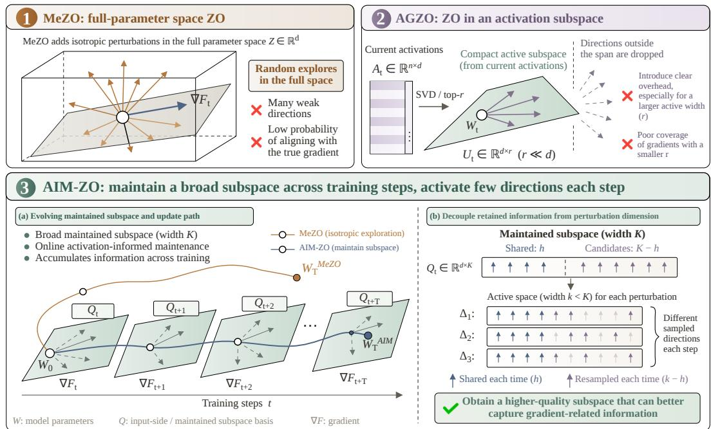
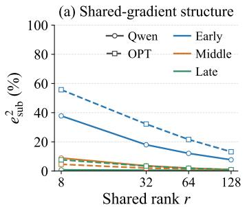
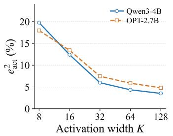
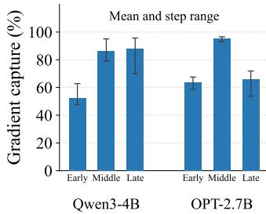
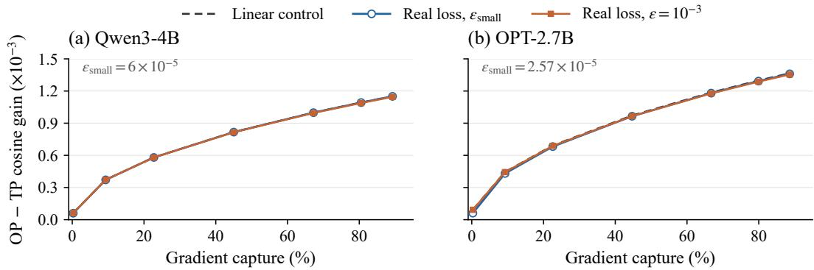
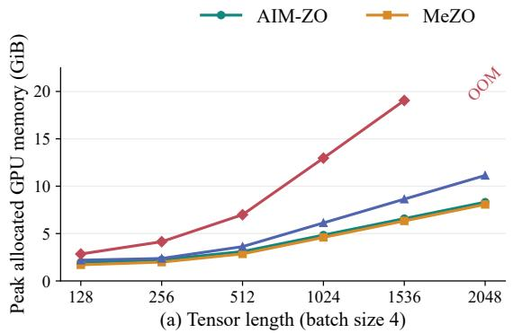
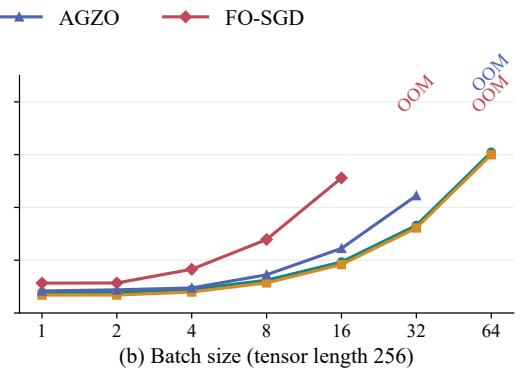

# AIM-ZO: ACTIVATION-INFORMED SUBSPACE MAIN-TENANCE FOR ZEROTH-ORDER LLM FINE-TUNING

Yue Xie1∗, Zhi Zheng2\*, Yunpeng Ba1, Xuyang Wu1, Xialiang Tong3, Zhichao Lu4, Tao Zhong3, Zhenkun Wang1

1Southern University of Science and Technology 2National University of Singapore   
3Huawei Technologies Ltd. 4City University of Hong Kong   
wuxy6@sustech.edu.cn, zhi.zheng@u.nus.edu

## ABSTRACT

Zeroth-order (ZO) optimization offers a memory-efficient alternative for LLM fine-tuning by estimating updates only from forward evaluations of perturbed parameters, without backpropagation or activation storage. However, in billionparameter LLMs, isotropic perturbations often waste many forward evaluations on weakly informative directions. To make these evaluations more informative, existing ZO methods restrict perturbations to low-dimensional subspaces. Yet the quality of these subspaces is critical: overly compressed or poorly maintained spaces can miss useful update directions. To obtain a high-quality subspace for ZO updates, this paper proposes AIM-ZO, a ZO fine-tuning method based on Activation-Informed Subspace Maintenance. AIM-ZO uses forward activations as local directional information and continuously integrates them into a broad, evolving subspace over training. To access broader gradient-relevant structure while keeping individual perturbations low-dimensional, AIM-ZO activates only a smaller set of shared and sampled directions, decoupling the maintained width from the active width. We evaluate AIM-ZO across 5 LLMs and 11 downstream tasks under matched forward-evaluation budgets; its six-task average exceeds the strongest fully evaluated ZO baseline by 1.26 percentage points on OPT-2.7B and MeZO by 2.85 percentage points on OPT-30B. Our code is available at https://github.com/EkkoXy/AIM-ZO

## 1 INTRODUCTION

Fine-tuning large language models (LLMs) requires substantial memory because backpropagation stores intermediate activations for gradient computation. Zeroth-order (ZO) optimization avoids this cost by estimating gradients from forward loss evaluations at perturbed parameter points (Ghadimi & Lan, 2013; Nesterov & Spokoiny, 2017; Zheng et al., 2026; Ba et al., 2026). MeZO shows that this approach can fine-tune LLMs with a memory footprint close to inference (Malladi et al., 2023). However, MeZO samples perturbation directions randomly from the full parameter space. As illustrated on the left of Figure 1, in billion-parameter models, many such random directions are poorly aligned with useful update directions, so a large fraction of forward evaluations provide only weak optimization signals.

Prior studies have shown that gradients can concentrate in low-dimensional subspaces that remain relatively stable over parts of training (Gur-Ari et al., 2018; Jaiswal et al., 2025). Building on this observation, recent ZO methods exploit low-dimensional structure through low-rank perturbations, random projections, or forward activations (Chen et al., 2025; Yu et al., 2025; Lin et al., 2026; Dong et al., 2026). Their effectiveness, however, depends critically on the quality of the perturbation subspace. Specifically, 1) random or overly compressed perturbation subspaces may miss useful gradient information; and 2) simply enlarging the perturbation subspace can capture more gradient information but also make finite-sample estimation more difficult as its width grows. These challenges motivate our central research question:

  
Figure 1: Perturbation spaces. MeZO explores the full parameter space; AGZO constructs a subspace from current activations. AIM-ZO maintains a width-K subspace across training and activates a width-k subspace with h shared and k − h sampled directions per perturbation.

AGZO constructs perturbation subspaces from current activations, rebuilding them at each step without accumulating activation structure across training (Lin et al., 2026). This repeated construction adds computational cost and can leave the subspace sensitive to stochastic variation; using the same subspace for perturbations also couples gradient coverage to estimation variance.

To address these limitations, we propose AIM-ZO, a ZO fine-tuning method based on Activation-Informed Subspace Maintenance. AIM-ZO continuously accumulates activation information across training into a broader width-K maintained subspace. Each perturbation then activates only k < K directions, combining h shared directions with k − h directions sampled from the remaining maintained space. This decouples the amount of gradient-relevant information retained by the maintained subspace from the dimensionality used in each perturbation, allowing low-dimensional perturbations to access different parts of a broader subspace over time. A population-centered one-sided estimator aggregates these perturbations into the parameter update. We evaluate AIM-ZO across 5 LLMs, ranging from 0.6B to 30B parameters, and 11 downstream tasks. AIM-ZO achieves stronger overall performance than existing ZO baselines, including a 1.26 percentage-point improvement over the strongest fully evaluated baseline on OPT-2.7B and a 2.85 percentage-point improvement over MeZO on OPT-30B. Our contributions are as follows:

• We propose AIM-ZO, which accumulates forward activation information across training to maintain a broad, evolving perturbation subspace. Our analysis gives a lower bound on its gradient capture, which we also measure empirically.

• We decouple maintained and active subspace widths, allowing low-dimensional perturbations to access a broader space. Our analysis identifies when estimates from the active subspace align better with the gradient than estimates from the full maintained subspace.

• We comprehensively evaluate AIM-ZO across 5 LLMs and 11 downstream tasks. The results show stronger overall performance than existing ZO baselines, while peak-memory measurements on Qwen3-0.6B show only modest overhead relative to MeZO.

## 2 RELATED WORK

Zeroth-Order Fine-Tuning. ZO fine-tuning estimates parameter updates from forward loss evaluations without backpropagation. We consider min ${ } _ { w } F ( w )$ , where $F ( \dot { w } ) = \mathbb { E } _ { \xi } [ \mathcal { L } ( w ; \xi ) ]$ and w denotes the trainable parameters. For matrix parameters, we use $w = \mathrm { v e c } ( \dot { W } )$ and $z = \operatorname { v e c } ( Z )$ ; full-model

vectors concatenate the corresponding parameter blocks. Given a perturbation z and scale $\epsilon > 0 .$ , a standard two-sided estimator for ZO is as follows:

$$
\widehat { g } = \frac { \mathcal { L } ( w + \epsilon z ; \xi ) - \mathcal { L } ( w - \epsilon z ; \xi ) } { 2 \epsilon } z .
$$

MeZO samples $z \sim \mathcal { N } ( 0 , I )$ and regenerates perturbations from random seeds to avoid storing full perturbation vectors (Malladi et al., 2023). Subsequent methods improve how perturbations are generated or how gradient estimates are converted into updates.

Curvature-Guided Scaling and Coordinate Selection. These methods adjust perturbations according to coordinate-level information. HiZOO uses $z = \Sigma ^ { 1 / 2 } u$ , where u $\sim \mathcal { N } ( 0 , I )$ and Σ is a diagonal inverse-Hessian approximation estimated from forward evaluations; its factored variant $\mathrm { H i } \bar { Z } \mathrm { O O - L }$ reduces the memory required for this state (Zhao et al., 2025). CurvZO constructs sparse perturbations $z = m \odot u ,$ sampling the mask m using accumulated curvature-proxy scores and correcting nonuniform sampling through probability reweighting (Wang et al., 2026). Sparse MeZO instead uses parameter magnitudes to select a subset of coordinates for fine-tuning (Liu et al., 2025).

Structured Perturbations and Random Subspaces. Another approach reduces the estimation or computational burden through low-rank structure and subspace restriction. LoZO constructs $Z = U { \bar { V } } ^ { \top }$ , reusing the random right factor V across multiple steps while resampling U (Chen et al., 2025). SubZero uses $\boldsymbol { Z } = \boldsymbol { U } \boldsymbol { R } \boldsymbol { V } ^ { \intercal }$ , with periodically refreshed random orthonormal bases $U , V$ and fresh coefficients R (Yu et al., 2025). ZO-Muon uses $Z = Q A$ with a random orthonormal basis $Q .$ then applies Muon-style orthogonalization to the reduced-space estimate before mapping it back to the parameter space (Lang et al., 2026). These methods construct and reuse structured perturbation spaces, but their random bases do not explicitly target gradient-relevant directions.

Activation-Informed Subspaces. AGZO extracts a compact perturbation subspace from each minibatch’s activations using power iteration (Lin et al., 2026), while ZO-Act reuses a subspace derived from initial activations (Dong et al., 2026). AGZO adapts to current activations, but repeated extraction incurs computational cost and does not retain activation structure observed at earlier training steps. ZO-Act avoids repeated extraction, but its fixed subspace cannot track changes in model representations. Both methods restrict perturbations to a truncated activation span, which excludes gradient components outside that span. Widening the span can improve coverage, but also increases basis storage and, when fully activated, estimation dimension.

AIM-ZO accumulates activation information across steps in a width-K maintained subspace, while each perturbation activates only $k < K$ directions: h shared directions and $k - h$ sampled directions. Directions omitted from one perturbation remain available to others, so the maintained subspace can cover more candidate directions without increasing the dimension of every estimate. Additional related work and a design comparison appear in Appendix I.

## 3 METHODOLOGY: AIM-ZO

AIM-ZO maintains a broad subspace using forward activations accumulated across training. At each step, it selects a smaller active subspace for each perturbation and aggregates the one-sided population evaluations into a parameter update.

## 3.1 NOTATION AND SETUP

Let $\mathcal { W } = \{ W _ { \ell } \} _ { \ell = 1 } ^ { L }$ denote the trainable matrices, with $W _ { \ell } \in \mathbb { R } ^ { p _ { \ell } \times d _ { \ell } }$ for layer $\ell .$ At iteration $t ,$ we draw a minibatch $\xi _ { t }$ and write $G _ { \ell , t } = \nabla _ { W _ { \ell } } \mathcal { L } ( \mathcal { W } _ { t } ; \xi _ { t } )$ for the layer gradient used in the analysis. A perturbation population comprises $N$ perturbations whose associated perturbed parameter points are evaluated on the same minibatch to estimate an update.

Throughout, $\ell , t ,$ and i index layers, training iterations, and population members, respectively. For matrices of the same shape, write $\langle A , B \rangle _ { F } = \operatorname { t r } ( A ^ { \top } B )$ . We use $\| A \| _ { F } = \sqrt { \langle A , A \rangle _ { F } }$ for the Frobenius norm and $\| A \| _ { 2 }$ for the spectral norm. For any column-orthonormal basis $Q , P _ { Q } = Q Q ^ { \top }$ denotes the orthogonal projector onto its column space.

Algorithm 1 One training run of AIM-ZO   
Require: Iterations $T ;$ weights $\mathcal { W } _ { 0 } ;$ bases $\{ \widetilde { Q } _ { \ell , 0 } \}$ ; widths K, h, k with $0 \leq h \leq k \leq K$ ; population   
size $N \geq 2 ;$ schedules $\bar { \{ } \epsilon _ { t } \} , \{ \bar { \eta } _ { t } \} ;$ Oja step size $\eta _ { q }$   
1: for $t = 0 , \ldots , T - 1$ do   
2: Sample $\xi _ { t } ;$ run a centre forward pass to collect $\{ H _ { \ell , t } \}$   
3: For each layer ℓ, update $Q _ { \ell , t } ^ { \mathrm { w i d e } }$ by Equation 2   
4: for $i = 1 , \ldots , N$ do   
5: For each layer ℓ, sample $S _ { \ell , t , i } , a _ { \ell , t , i }$ , and $b _ { \ell , t , i } ;$ form $Q _ { \ell , t , i } ^ { \mathrm { a c t } }$ and $Z _ { \ell , t , i }$ by Equations $3 { \ - } 4$   
6: Evaluate $y _ { t , i } ^ { + } = \mathcal { L } ( \mathcal { W } _ { t } + \epsilon _ { t } \mathcal { Z } _ { t , i } ; \xi _ { t } )$ with $\mathcal { Z } _ { t , i } = \{ Z _ { \ell , t , i } \} _ { \ell = 1 } ^ { L }$   
7: end for   
8: For each $\ell ,$ compute ${ \widehat { G } } _ { \ell , { ~ } }$ t by Equation $^ { 5 }$ and set $W _ { \ell , t + 1 } = W _ { \ell , t } - \eta _ { t } \widehat { G } _ { \ell , t }$   
9: Store $\widetilde { Q } _ { \ell , t + 1 } \gets Q _ { \ell , t } ^ { \mathrm { w i d e } }$ for all ℓ   
10: end for   
11: return $\mathcal { W } _ { T }$

## 3.2 ACTIVATION-INFORMED SUBSPACE MAINTENANCE

At iteration $t ,$ let $H _ { \ell , t } \in \mathbb { R } ^ { n _ { \ell , t } \times d _ { \ell } }$ be the input activations of a linear layer, where $n _ { \ell , t }$ counts the activation rows and $Y _ { \ell , t } = H _ { \ell , t } W _ { \ell , t } ^ { \top }$ . The weight gradient satisfies

$$
G _ { \ell , t } = E _ { \ell , t } ^ { \top } H _ { \ell , t } ,\tag{1}
$$

where $E _ { \ell , t }$ is the loss derivative with respect to $Y _ { \ell , t }$ . Thus, the row space of $G _ { \ell , i }$ t lies in the row space of $H _ { \ell , i }$ (Lin et al., 2026). We maintain an orthonormal basis $Q _ { \ell , t } ^ { \mathrm { w i d e } } \in \mathbb { R } ^ { d _ { \ell } \times K }$ to track prominent activation directions across iterations.

An unperturbed centre pass updates the stored basis by Oja’s rule (Huang et al., 2021):

$$
\begin{array} { r } { Q _ { \ell , t } ^ { \mathrm { w i d e } } = \operatorname { q f } \left( \widetilde { Q } _ { \ell , t } + \eta _ { q } n _ { \ell , t } ^ { - 1 } H _ { \ell , t } ^ { \top } ( H _ { \ell , t } \widetilde { Q } _ { \ell , t } ) \right) , } \end{array}\tag{2}
$$

Here $\eta _ { q }$ is the Oja step size, and $\mathrm { q f }$ returns a thin, unpivoted QR basis with fixed signs. A Gaussian matrix initializes the basis. One update serves all $N$ perturbations, after which we store $\widetilde Q _ { \ell , t + 1 } =$ $Q _ { \ell , t } ^ { \mathrm { w i d e } }$ . Appendix D.1 compares gradient capture and construction time with AGZO’s current-batch reconstruction (Lin et al., 2026); Appendix E.2 reports an online maintenance-frequency ablation.

## 3.3 ACTIVE-SUBSPACE SELECTION AND PARAMETER UPDATES

From the width-K subspace maintained across iterations, AIM-ZO selects a width-k active subspace for each perturbation. Different perturbations can thus access different parts of the maintained subspace while keeping each estimate low-dimensional. An online comparison with a shared active subspace is in Appendix E.1.

For the layer-wise expressions below, we fix an iteration and suppress the layer and iteration indices. For each perturbation, we form an active subspace from the same first h shared basis directions $Q _ { h } = Q ^ { \mathrm { w i d e } } [ : , 1 : h ]$ and $s = k - h$ columns sampled from the remaining pool, with $0 \leq h \leq k \leq K$ and $k \geq 1$ . Specifically, perturbation i uses

$$
Q _ { i } ^ { \mathrm { a c t } } = \left[ Q _ { h } , Q ^ { \mathrm { w i d e } } [ : , S _ { i } ] \right] , \qquad | S _ { i } | = s ,\tag{3}
$$

where $Q _ { i } ^ { \mathrm { { a c t } } }$ is a basis of the active subspace and $S _ { i }$ is sampled uniformly without replacement from $\{ h + 1 , \ldots , K \}$ , independently across population members and layers. The shared columns follow the stored basis order.

Following the low-rank perturbation construction of $\mathrm { L o Z O }$ (Chen et al., 2025), we independently draw $a _ { i } \stackrel { - } { \sim } \mathcal { N } ( 0 , I _ { p } )$ and $\mathbf { \widehat { b } } _ { i } \sim \mathcal { N } ( 0 , I _ { k } )$ and form

$$
U _ { i } = a _ { i } b _ { i } ^ { \top } ( Q _ { i } ^ { \mathrm { a c t } } ) ^ { \top } , \qquad \alpha _ { i } = \frac { \sqrt { p d } } { \| U _ { i } \| _ { F } + 1 0 ^ { - 1 2 } } , \qquad Z _ { i } = \alpha _ { i } U _ { i } .\tag{4}
$$

This normalization matches the layer-wise perturbation magnitude to the root-mean-square Frobenius norm of MeZO’s isotropic Gaussian perturbations.

For $N \geq 2 .$ , each population member perturbs all layers on the same minibatch: $\mathcal { Z } _ { i } = \{ Z _ { \ell , i } \} _ { \ell = 1 } ^ { L }$ $y _ { i } ^ { + } = \mathcal { L } ( \mathcal { W } + \epsilon \mathcal { Z } _ { i } ; \xi )$ , and $\begin{array} { r } { \bar { y } ^ { + } = N ^ { - 1 } \sum _ { i = 1 } ^ { N } y _ { i } ^ { + } } \end{array}$ . For each layer, the REINFORCE leave-one-out (RLOO) estimator is

$$
{ \widehat G } = { \frac { 1 } { ( N - 1 ) \epsilon } } \sum _ { i = 1 } ^ { N } ( y _ { i } ^ { + } - { \bar { y } } ^ { + } ) Z _ { i } .\tag{5}
$$

Each iteration uses one unperturbed and $N$ perturbed forward passes, followed by a parameter update with learning rate η (Algorithm 1). Further ablations of population size and perturbation coefficient rank are in Appendix E.

## 4 ANALYSIS OF AIM-ZO COMPONENTS

This section characterizes gradient capture by the activation-maintained subspace and derives a condition under which decoupling maintained and active widths improves directional alignment. It then examines one-sided and two-sided estimation at a matched evaluation budget. Proofs are provided in Appendices $\mathrm { A } { - } \mathrm { B }$

The analysis uses the notation of Section 3.1 and suppresses the layer index: $W \in \mathbb { R } ^ { p \times d }$ denotes one weight matrix, $f$ its minibatch loss with other weights fixed, and $\dot { \boldsymbol { G } } = \nabla f ( \boldsymbol { W } )$ ).

## 4.1 MAINTAINING GRADIENT-RELEVANT INFORMATION

Gradient structure and capture. Let $Q _ { t } : = Q _ { t } ^ { \mathrm { w i d e } }$ denote the maintained basis. Define $S _ { t } =$ $H _ { t } ^ { \top } H _ { t } / n _ { t }$ and $M _ { t } = \mathbb { E } [ S _ { t } \ \bar { \mid } \mathcal { F } _ { t - 1 } ]$ , where $\mathcal { F } _ { t - 1 }$ is the history before sampling the current batch. Let $V _ { t } ^ { \star }$ span the top-K eigenspace of $M _ { t }$ . The tracking error between the maintained and target subspaces is

$$
\varepsilon _ { \mathrm { t r k } , t } : = \| P _ { Q _ { t } } - P _ { V _ { t } ^ { \star } } \| _ { 2 } .
$$

Let $\mathcal { T } _ { t }$ index a sliding window of $T _ { \mathrm { w } }$ training steps with nonzero minibatch gradients $G _ { \tau }$ . All gradients in this window are compared against the same $V _ { t } ^ { \star }$ and $Q _ { t }$ . Prior observations of concentrated and locally stable gradient directions (Gur-Ari et al., 2018; Jaiswal et al., 2025) motivate the following shared-subspace assumption.

Assumption 1 (Local shared gradient structure). For each window $\mathcal { T } _ { t } ,$ , there exists a shared columnorthonormal basis $U _ { t } ^ { \star } \in \mathbb { R } ^ { d \times \overline { { r } } }$ , with $1 \leq r \leq K$ , such that

$$
\left[ \frac { 1 } { T _ { \mathrm { w } } } \sum _ { \tau \in \mathcal { T } _ { t } } \frac { \Vert G _ { \tau } ( I - P _ { U _ { t } ^ { \star } } ) \Vert _ { F } ^ { 2 } } { \Vert G _ { \tau } \Vert _ { F } ^ { 2 } } \right] ^ { 1 / 2 } \leq \varepsilon _ { \mathrm { s u b } , t } .\tag{6}
$$

The activation target must also cover the shared gradient subspace.

Assumption 2 (Activation–gradient alignment). The width-K population activation subspace covers the gradient energy within the shared rank-r space spanned by the same $U _ { t } ^ { \star }$ from Assumption 1, up to residual $\varepsilon _ { \mathrm { a c t } , t } .$

$$
\left[ \frac { 1 } { T _ { \mathrm { w } } } \sum _ { \tau \in \mathcal { T } _ { t } } \frac { \Vert G _ { \tau } P _ { U _ { t } ^ { \star } } ( I - P _ { V _ { t } ^ { \star } } ) \Vert _ { F } ^ { 2 } } { \Vert G _ { \tau } \Vert _ { F } ^ { 2 } } \right] ^ { 1 / 2 } \leq \varepsilon _ { \mathrm { a c t } , t } .\tag{7}
$$

Figure $\ v { 2 } ( \mathbf { a } , \mathbf { b } )$ reports diagnostics for these two residuals: the shared-gradient residual is smaller in middle and late layers, and the activation-alignment residual decreases with K.

Tracking the activation subspace. For the Oja update in Equation 2, define target drift as $\omega _ { t } =$ $\| P _ { V _ { t } ^ { \star } } - P _ { V _ { t - 1 } ^ { \star } } \| _ { F } / \sqrt { 2 }$ and set $t = 0$ after burn-in.

Assumption 3 (Burn-in initialization). For $0 \leq \delta _ { \mathrm { i n i t } } < 1$ , the initial error $\begin{array} { r } { \Phi _ { 0 } : = \frac 1 2 \| P _ { Q _ { 0 } } - P _ { V _ { 0 } ^ { \star } } \| _ { F } ^ { 2 } } \end{array}$ is at most $\varepsilon _ { \mathrm { { b u r n } } } ^ { 2 }$ with probability at least $1 - \delta _ { \mathrm { i n i t } }$

(b) Activation alignment (r = 8)  

(c) Oja capture (K= 128)  
  
Figure 2: RTE diagnostics over 16 consecutive training steps using exact training-set mean gradients. (a) Held-out shared-gradient residual. (b) Activation-alignment residual $( r = 8 ,$ averaged over three layers). (c) Maintained-subspace capture $( K = 1 2 8 )$ ; bars show means and whiskers min–max ranges. Protocols are in Appendix D.

Stationary Oja results support this initialization condition under their sampling and step-size requirements (Huang et al., 2021). Post-burn-in tracking further requires the following conditions.

Assumption 4 (Post-burn-in tracking conditions). $F o r { 1 } \leq t \leq T ,$ , the following conditions hold almost surely: (i) spectral separation, $\lambda _ { K } ( M _ { t } ) - \lambda _ { K + 1 } ( M _ { t } ) \geq \gamma > 0 ;$ (ii) bounded observations, $\| S _ { t } \| _ { 2 } \leq \Lambda$ and $\mathbb { E } [ \| \hat { S } _ { t } \| _ { 2 } ^ { 2 } | \mathcal { F } _ { t - 1 } ] \le \Sigma ^ { 2 } ,$ ; and (iii) bounded target drift, $\omega _ { t } \leq \bar { \omega }$ . Here $\lambda _ { j } ( M _ { t } )$ is the jth largest eigenvalue of $M _ { t }$

Theorem 1 (Post-burn-in tracking). Suppose Assumptions 3 and 4 and the step-size, drift, noise, and burn-in conditions in Appendix A hold. Then, for $\eta _ { q } > 0 ;$ , tracking-bound failure probability $0 < \delta < 1$ , and $t \leq T$

$$
\mathbb { E } \varepsilon _ { \mathrm { t r k } , t } ^ { 2 } \leq \underbrace { O \left( e ^ { - \eta _ { q } \gamma t / 2 } \varepsilon _ { \mathrm { b u r n } } ^ { 2 } \right) } _ { i n i t i a l i z a t i o n } + \underbrace { O \left( \frac { \bar { \omega } ^ { 2 } } { \eta _ { q } ^ { 2 } \gamma ^ { 2 } } \right) } _ { t r a c k i n g l a g } + \underbrace { O \left( \frac { K \eta _ { q } \Sigma ^ { 2 } } { \gamma } \right) } _ { s t o c h a s t i c e r r o r } + \underbrace { O ( K ( \delta + \delta _ { \mathrm { i n i t } } ) ) } _ { f a i l u r e e v e n s } .\tag{8}
$$

A larger eigengap γ reduces tracking lag and stochastic error, while larger drift ω¯ or observation second moment $\bar { \Sigma } ^ { 2 }$ increases them. Within the admissible range, increasing $\eta _ { q }$ speeds initialization decay and reduces lag but increases stochastic error; the last two terms also scale with K. Together with the structural and alignment residuals, this bound gives the following capture guarantee.

Proposition 1 (Maintained-subspace capture). Under Assumptions 1–2,

$$
\frac { 1 } { T _ { \mathrm { w } } } \sum _ { \tau \in \mathcal { T } _ { t } } \frac { \Vert G _ { \tau } P _ { Q _ { t } } \Vert _ { F } ^ { 2 } } { \Vert G _ { \tau } \Vert _ { F } ^ { 2 } } \geq 1 - \left( \varepsilon _ { \mathrm { s u b } , t } + \varepsilon _ { \mathrm { a c t } , t } + \varepsilon _ { \mathrm { t r k } , t } \right) ^ { 2 } .\tag{9}
$$

Figure 2(c) shows 52.2%–95.1% gradient capture by the maintained subspace.

## 4.2 DECOUPLING MAINTAINED AND ACTIVE WIDTHS

A wider maintained subspace can improve gradient capture, but using all K basis directions in each estimate increases variance. Fix $G \neq 0$ and an ordered orthonormal maintained basis $Q \in \mathbb { R } ^ { d \times K }$ . As in Section $3 . 3 , Q _ { S }$ uses $h = \theta k \in \mathbb { Z }$ shared columns and $k - h$ sampled columns, where $0 < \theta < 1$ and $1 \leq k \leq K$ . Define

$$
{ \cal C } _ { \cal Q } = \frac { \| G P _ { \cal Q } \| _ { F } ^ { 2 } } { \| G \| _ { F } ^ { 2 } } > 0 , \qquad \tau _ { h } = \frac { \| G P _ { \cal Q _ { h } } \| _ { F } ^ { 2 } } { \| G P _ { \cal Q } \| _ { F } ^ { 2 } } , \qquad \rho = \frac { k - h } { K - h } .
$$

For standard Gaussian $R \in \mathbb { R } ^ { p \times k }$ , let $Z = R Q _ { S } ^ { \top }$ and $\widehat { G } _ { k , 0 } = \langle G , Z \rangle _ { F } Z$ . Applying the Gaussian subspace moments of Yu et al. (2025, Theorem 2) conditional on QS gives

$$
\mathbb { E } _ { R } \Vert \widehat { G } _ { k , 0 } - G \Vert _ { F } ^ { 2 } = \underbrace { ( p k + 1 ) \Vert G P _ { Q _ { S } } \Vert _ { F } ^ { 2 } } _ { \mathrm { e s t i m a t i o n ~ v a r i a n c e } } + \underbrace { \Vert G ( I - P _ { Q _ { S } } ) \Vert _ { F } ^ { 2 } } _ { \mathrm { s q u a r e d ~ p r o j e c t i o n ~ b i a s } } .\tag{10}
$$

  
Figure 3: OP–TP cosine gain versus gradient capture on RTE. OP16 and TP8 each use 16 perturbed loss evaluations at $k = 6 4$ . Points average matched populations across checkpoints and batches; dashed curves show the corresponding linear control.

Full activation retains all maintained signal at variance factor $p K + 1$ , while increasing K at fixed $h ,$ k lowers tail inclusion $\rho .$ The sampling rule and fixed-subspace cosine identity of Lin et al. (2026, Theorem 5.4) yield the following result.

Proposition 2 (Active capture and directional alignment). Let $A _ { K , k }$ denote the expectedfraction of maintained gradient energy retained by the active subspace, $J _ { K , k } : = \mathbb { E } \cos ( \widehat { G } _ { k , 0 } , G )$ , and $\beta _ { D } : =$ $\Gamma ( D / 2 ) / [ \sqrt { \pi } \Gamma ( ( D + 1 ) / 2 ) ]$ , with $\cos ( 0 , G ) = 0$ . Then

$$
\frac { \mathbb { E } _ { S } \| G P _ { Q _ { S } } \| _ { F } ^ { 2 } } { \| G \| _ { F } ^ { 2 } } = C _ { Q } A _ { K , k } , \qquad A _ { K , k } = \tau _ { h } + \rho ( 1 - \tau _ { h } ) .\tag{11}
$$

For $k < K$ , if $A _ { K , k } > \beta _ { p K } / \beta _ { p k }$ , then $J _ { K , k } > J _ { K , K } .$ : partial activation has higher expected cosine with G thanfull activation.

Since $\beta _ { D } \simeq \sqrt { 2 / ( \pi D ) }$ for large D, the sufficient threshold is approximately $\sqrt { k / K }$ . Offline capture diagnostics meet this condition in the evaluated settings (Appendix D.2). Online scans of maintained and shared widths are in Appendices E.3, E.4, and E.5; proofs are in Appendix B.

## 4.3 ONE-SIDED ESTIMATION IN A HIGH-CAPTURE SUBSPACE

Online training and offline ablations favor the RLOO estimator used by AIM-ZO over two-sided estimation (Appendices F.1 and D.3). To examine how subspace quality affects this advantage, we vary gradient capture at fixed active width and compare the directional alignment of the two estimators through $\Delta _ { \mathrm { c o s } } = \cos ( \widehat { G } _ { \mathrm { O P } } , G ) - \cos ( \widehat { G } _ { \mathrm { T P } } , G )$

Figure 3 shows that the OP–TP alignment gain increases with gradient capture. Actual-loss results closely follow a linear control constructed from the same-batch gradient, indicating that the trend is largely explained by the first-order signal. Further results are in Appendix F.2.

## 5 EXPERIMENTS

In this section, we empirically evaluate the proposed AIM-ZO methods over a wide collection of datasets and LLMs. Section 5.1 compares the performance of AIM-ZO on two mainly chosen LLMs for ZO. Section 5.3 evaluates the peak GPU memory consumption. Additional experiments are in the Appendix: Appendix D complements the analysis in Section 4 and Appendix H provides broader fine-tuning results, including all 11 OPT-2.7B tasks and additional evaluations on Qwen3 LLMs.

Experiment Settings. We consider a wide collection of LLMs, including OPT-2.7B, OPT-13B, OPT-30B, and Qwen3-8B-Base; supplementary experiments consider two more LLMs, Qwen3-0.6B-Base and Qwen3-4B. We fine-tune LLMs over the 11 downstream tasks included in Malladi et al. (2023); OPT-2.7B covers all 11 tasks, while the main tables report six-task comparisons.

Table 1: Multi-method comparison on OPT-2.7B and OPT-13B. Scores are accuracy (%) except SQuAD (F1). Avg. is the unweighted mean over six tasks. Best mean scores are bold; subscripts report available sample standard deviations. Evaluation details are in Appendix H.
<table><tr><td>Method</td><td>RTE</td><td>BoolQ</td><td>SST-2</td><td>WiC</td><td>WSC</td><td>SQuAD</td><td> $\operatorname { A v g } .$ </td></tr><tr><td colspan="8">OPT-2.7B</td></tr><tr><td>Zero-shot</td><td>55.23</td><td>52.87</td><td>56.65</td><td>54.86</td><td>36.54</td><td>26.92</td><td>47.18</td></tr><tr><td>MeZO</td><td> $6 5 . 1 3 { \scriptstyle \pm 1 . 6 7 }$ </td><td> $6 6 . 1 0 { \scriptstyle \pm 2 . 2 6 }$ </td><td> $9 2 . 5 0 { \scriptstyle \pm 0 . 5 4 }$ </td><td> $5 8 . 5 3 { \scriptstyle \pm 0 . 4 1 }$ </td><td> $5 4 . 8 1 _ { \pm 1 . 5 2 }$ </td><td> $8 0 . 9 9 { \scriptstyle \pm 1 . 4 2 }$ </td><td>69.68</td></tr><tr><td>CurvZO</td><td> $6 4 . 5 3 { \scriptstyle \pm 4 . 8 3 }$ </td><td> $6 8 . 0 1 { \scriptstyle \pm 0 . 6 2 }$ </td><td> $\mathbf { 9 2 . 9 6 _ { \pm 0 . 3 1 } }$ </td><td> $5 7 . 9 6 { \scriptstyle \pm 2 . 0 7 }$ </td><td> $4 6 . 4 7 { \scriptstyle \pm 7 . 2 8 }$ </td><td> $5 8 . 7 1 { \scriptstyle \pm 2 . 4 7 }$ </td><td>64.77</td></tr><tr><td>HiZOO</td><td> $6 0 . 2 9 { \scriptstyle \pm 2 . 9 4 }$ </td><td> $6 7 . 3 1 _ { \pm 1 . 3 4 }$ </td><td> $9 1 . 7 7 _ { \pm 0 . 6 7 }$ </td><td> $5 8 . 8 8 _ { \pm 0 . 8 0 }$ </td><td> $5 3 . 5 3 { \scriptstyle \pm 2 . 4 2 }$ </td><td> $7 3 . 8 1 _ { \pm 0 . 9 0 }$ </td><td>67.60</td></tr><tr><td>AGZO</td><td> $6 4 . 4 0 _ { \pm 3 . 1 0 }$ </td><td> $6 6 . 2 6 _ { \pm 1 . 4 6 }$ </td><td> $9 2 . 5 9 { \scriptstyle \pm 0 . 5 1 }$ </td><td> $5 7 . 0 2 _ { \pm 1 . 7 3 }$ </td><td> $4 7 . 7 6 _ { \pm 2 . 2 2 }$ </td><td> $2 9 . 8 2 _ { \pm 5 . 5 4 }$ </td><td>59.64</td></tr><tr><td>ZO-Muon</td><td> $6 3 . 3 2 { \scriptstyle \pm 2 . 5 3 }$ </td><td> ${ \bf 6 8 . 9 0 _ { \pm 1 . 1 2 } }$ </td><td> $9 2 . 7 5 { \scriptstyle \pm 0 . 5 2 }$ </td><td> ${ \bf 6 1 . 1 3 _ { \pm 1 . 1 2 } }$ </td><td> $5 1 . 6 0 { \scriptstyle \pm 3 . 3 8 }$ </td><td> $7 8 . 9 3 { \scriptstyle \pm 1 . 1 3 }$ </td><td>69.44</td></tr><tr><td>LoZO</td><td> $6 1 . 8 8 { \scriptstyle \pm 4 . 4 8 }$ </td><td> $6 5 . 3 3 { \scriptstyle \pm 0 . 7 3 }$ </td><td> $9 1 . 5 1 { \scriptstyle \pm 0 . 8 3 }$ </td><td> $5 3 . 6 7 { \scriptstyle \pm 2 . 7 0 }$ </td><td> $5 0 . 9 6 { \scriptstyle \pm 7 . 2 6 }$ </td><td> $4 3 . 5 2 _ { \pm 1 . 2 4 }$ </td><td>61.15</td></tr><tr><td> $\mathbf { A I M - Z O } \ ( \mathbf { O U R S } )$ </td><td> ${ \bf 6 7 . 5 1 _ { \pm 3 . 1 8 } }$ </td><td> $6 7 . 2 2 _ { \pm 1 . 6 7 }$ </td><td> $9 2 . 8 7 _ { \pm 0 . 4 7 }$ </td><td> $6 0 . 1 3 { \scriptstyle \pm 1 . 7 0 }$ </td><td> ${ \bf 5 6 . 7 3 _ { \pm 4 . 3 5 } }$ </td><td> $\mathbf { 8 1 . 1 9 _ { \pm 0 . 4 9 } }$ </td><td>70.94</td></tr><tr><td colspan="8">OPT-13B</td></tr><tr><td>Zero-shot</td><td> $6 1 . 7 3$ </td><td> $6 0 . 4 6 $ </td><td>60.21</td><td> $5 5 . 1 7$ </td><td> $4 0 . 3 8 $ </td><td> $4 0 . 8 0$ </td><td>53.13</td></tr><tr><td>MeZO</td><td> $6 7 . 3 6 { \scriptstyle \pm 1 . 5 4 }$ </td><td> $7 1 . 0 8 { \scriptstyle \pm 1 . 3 7 }$ </td><td> $9 2 . 0 0 { \scriptstyle \pm 0 . 6 9 }$ </td><td> $5 8 . 5 8 { \scriptstyle \pm 1 . 9 3 }$ </td><td> $5 4 . 4 9 { \scriptstyle \pm 8 . 7 2 }$ </td><td> $5 8 . 6 4 { \scriptstyle \pm 1 . 4 2 }$ </td><td>67.02</td></tr><tr><td>CurvZO</td><td> $5 2 . 2 3 { \scriptstyle \pm 2 . 7 3 }$ </td><td> $6 1 . 7 3 { \scriptstyle \pm 0 . 4 2 }$ </td><td> $4 9 . 3 9 _ { \pm 0 . 7 8 }$ </td><td> $4 9 . 0 1 _ { \pm 1 . 0 7 }$ </td><td> ${ \bf 6 1 . 2 2 _ { \pm 3 . 8 9 } }$ </td><td> $6 5 . 5 6 _ { \pm 1 . 4 2 }$ </td><td>56.52</td></tr><tr><td>HiZOO</td><td> ${ \bf 7 3 . 6 5 _ { \pm 1 . 6 5 } }$ </td><td> $7 1 . 5 8 _ { \pm 0 . 1 2 }$ </td><td> $9 1 . 6 3 _ { \pm 1 . 7 1 }$ </td><td> ${ \bf 5 9 . 8 2 _ { \pm 0 . 5 9 } }$ </td><td> $5 8 . 0 1 _ { \pm 1 . 1 1 }$ </td><td> $7 5 . 4 5 { \scriptstyle \pm 0 . 7 4 }$ </td><td>71.69</td></tr><tr><td>AGZO</td><td> $5 2 . 5 9 { \scriptstyle \pm 5 . 7 6 }$ </td><td> $6 1 . 4 3 { \scriptstyle \pm 1 . 1 0 }$ </td><td> $8 8 . 2 3 { \scriptstyle \pm 0 . 9 8 }$ </td><td> $4 9 . 4 3 { \scriptstyle \pm 2 . 2 0 }$ </td><td> $5 7 . 3 7 { \scriptstyle \pm 2 . 0 0 }$ </td><td> $7 5 . 2 4 { \scriptstyle \pm 1 . 2 4 }$ </td><td>64.05</td></tr><tr><td>ZO-Muon</td><td> $6 3 . 0 6 { \scriptstyle \pm 1 . 5 0 }$ </td><td> $6 6 . 5 3 { \scriptstyle \pm 1 . 3 9 }$ </td><td> $9 1 . 7 8 { \scriptstyle \pm 0 . 6 5 }$ </td><td> $5 6 . 7 9 { \scriptstyle \pm 0 . 9 4 }$ </td><td> $5 0 . 0 0 { \scriptstyle \pm 5 . 8 5 }$ </td><td> $8 0 . 3 5 { \scriptstyle \pm 0 . 9 3 }$ </td><td>68.08</td></tr><tr><td>LoZO</td><td> $4 9 . 7 0 { \scriptstyle \pm 2 . 8 0 }$ </td><td> $6 2 . 1 5 _ { \pm 0 . 0 7 }$ </td><td> $5 0 . 2 7 { \scriptstyle \pm 0 . 5 2 }$ </td><td> $4 7 . 3 9 _ { \pm 1 . 0 1 }$ </td><td> $5 7 . 3 7 { \scriptstyle \pm 5 . 8 8 }$ </td><td> $4 7 . 4 0 _ { \pm 6 . 6 8 }$ </td><td>52.38</td></tr><tr><td>AIM-ZO (OURS)</td><td> $7 0 . 6 9 { \scriptstyle \pm 2 . 9 7 }$ </td><td> $\mathbf { 7 1 . 9 3 _ { \pm 2 . 6 5 } }$ </td><td> $\mathbf { 9 3 . 7 8 _ { \pm 0 . 3 9 } }$ </td><td> $5 9 . 5 2 _ { \pm 0 . 3 9 }$ </td><td> $5 7 . 0 5 { \scriptstyle \pm 2 . 4 2 }$ </td><td> $\mathbf { 8 1 . 5 8 _ { \pm 0 . 2 5 } }$ </td><td>72.42</td></tr></table>

Baselines. We include various baselines, including 1) zero-shot scores provide a non-training reference. 2) MeZO Malladi et al. (2023) with full perturbation. 3) HiZOO (Zhao et al., 2025) and CurvZO (Wang et al., 2026) with curvature-guided scaling, and 4) LoZO (Chen et al., 2025), AGZO (Lin et al., 2026), and ZO-Muon (Lang et al., 2026) as subspace-based perturbation baselines.

Implementation details All fine-tuning methods use BF16 and approximately 40,000 training forward evaluations, with update counts adjusted for each method’s forward evaluations per update. AIM-ZO uses 16 forward evaluations per update and thus runs for 2,500 updates, with $K \stackrel { = } { = } 1 2 8 .$ $h = 4 8 ,$ and $k = 6 4$ . Most results use three seeds; tables report mean percentages and available sample standard deviations. Data splits and evaluation protocols are in Appendix C; component ablations are in Appendix E.

## 5.1 COMPARISON WITH ZEROTH-ORDER METHODS

Table 1 compares AIM-ZO with six representative ZO baselines on OPT-2.7B and OPT-13B under matched forward-evaluation budgets. All methods are evaluated using our unified protocol, which may differ from the settings reported in their original papers.

Observation 1: AIM-ZO achieves the strongest overall performance across tasks. AIM-ZO obtains the highest six-task average among methods with complete results on both OPT-2.7B (70.94%) and OPT-13B (72.42%). Relative to MeZO, it improves all six reported tasks at both model scales, and further achieves higher mean performance on nine of the full 11 OPT-2.7B tasks (Appendix H). Although several baselines remain stronger on individual tasks, AIM-ZO avoids the large task-specific degradations observed for some alternatives and therefore provides more balanced performance across the benchmark.

Observation 2: AIM-ZO consistently improves over existing subspace-based ZO methods. Compared with representative subspace methods, including LoZO, AGZO, and ZO-Muon, AIM-ZO achieves the highest six-task average at both scales. On OPT-2.7B, it improves the average from 69.44% for the strongest subspace baseline, ZO-Muon, to 70.94%; on OPT-13B, the corresponding gap increases from 68.08% to 72.42%. The advantage is particularly pronounced over AGZO and LoZO, whose compact perturbation spaces show substantial degradation on several tasks. These results suggest that the quality and maintenance of the perturbation subspace matter beyond simply restricting ZO updates to a low-dimensional space.

Besides OPT-2.7B and OPT-13B, Table 2 extends the comparison to OPT-30B and Qwen3-8B. On OPT-30B, AIM-ZO improves over MeZO on all six tasks, raising the average by 2.85 percentage points. On Qwen3-8B, it improves on five of six tasks and raises the average by 0.93 points over

Qwen3-8B-Base  
Table 2: Scaling and model-family comparisons on OPT-30B and Qwen3-8B (%). SQuAD uses F1; other tasks use accuracy. Avg. is the unweighted mean over six tasks. Best mean scores are bold; subscripts report standard deviations. Qwen3-8B entries use three seeds and development-selected checkpoints.
<table><tr><td colspan="8">OPT-30B</td></tr><tr><td>Method</td><td>RTE</td><td>BoolQ</td><td>SST-2</td><td>WiC</td><td>WSC</td><td>SQuAD</td><td>Avg.</td></tr><tr><td>Zero-shot</td><td>53.79</td><td>40.90</td><td>58.83</td><td>52.98</td><td>37.50</td><td> $4 6 . 4 8$ </td><td>48.41</td></tr><tr><td>MeZO</td><td> $6 3 . 2 5 { \scriptstyle \pm 1 . 7 9 }$ </td><td> $7 0 . 7 4 { \scriptstyle \pm 1 . 1 7 }$ </td><td> $9 1 . 0 8 _ { \pm 0 . 3 6 }$ </td><td> $5 5 . 9 6 _ { \pm 1 . 8 1 }$ </td><td> $5 8 . 0 8 { \scriptstyle \pm 2 . 8 5 }$ </td><td> $8 0 . 2 2 _ { \pm 0 . 9 9 }$ </td><td>69.89</td></tr><tr><td>AIM-ZO (OURS)</td><td> $\mathbf { 6 8 . 1 6 _ { \pm 2 . 6 6 } }$ </td><td> $\mathbf { 7 4 . 9 0 _ { \pm 1 . 5 3 } }$ </td><td> $\mathbf { 9 3 . 4 7 _ { \pm 0 . 5 6 } }$ </td><td> ${ \bf 5 7 . 7 1 _ { \pm 0 . 9 1 } }$ </td><td> $\mathbf { 5 9 . 2 3 _ { \pm 2 . 7 7 } }$ </td><td> $\mathbf { 8 2 . 9 6 _ { \pm 0 . 6 9 } }$ </td><td>72.74</td></tr></table>

<table><tr><td>Method</td><td>RTE</td><td>BoolQ</td><td>SST-2</td><td>WiC</td><td>MultiRC</td><td>SQuAD</td><td>Avg.</td></tr><tr><td>Zero-shot</td><td>86.28</td><td>74.60</td><td>58.49</td><td>65.67</td><td> $7 2 . 7 7$ </td><td>83.67</td><td>73.58</td></tr><tr><td>MeZO</td><td> $8 8 . 3 3 { \scriptstyle \pm 1 . 3 7 }$ </td><td> $8 5 . 7 5 { \scriptstyle \pm 0 . 3 6 }$ </td><td> $\mathbf { 9 0 . 9 4 _ { \pm 0 . 4 0 } }$ </td><td> $6 7 . 9 2 _ { \pm 1 . 3 1 }$ </td><td> $8 6 . 0 1 _ { \pm 0 . 4 8 }$ </td><td> $8 6 . 9 0 _ { \pm 1 . 9 5 }$ </td><td>84.31</td></tr><tr><td>AGZO</td><td> $8 6 . 8 8 _ { \pm 1 . 5 0 }$ </td><td> $7 9 . 4 0 _ { \pm 0 . 8 5 }$ </td><td> $8 1 . 4 2 _ { \pm 2 . 8 8 }$ </td><td> $6 5 . 7 8 _ { \pm 1 . 7 5 }$ </td><td> $8 3 . 7 6 _ { \pm 1 . 8 8 }$ </td><td> $6 8 . 2 0 { \scriptstyle \pm 4 . 7 7 }$ </td><td>77.57</td></tr><tr><td>AIM-ZO (OURS)</td><td> $\mathbf { 8 9 . 5 3 _ { \pm 1 . 0 8 } }$ </td><td> $\mathbf { 8 5 . 7 6 _ { \pm 0 . 1 3 } }$ </td><td> $8 9 . 4 9 { \scriptstyle \pm 0 . 8 1 }$ </td><td> $\mathbf { 6 8 . 1 8 _ { \pm 1 . 5 1 } }$ </td><td> $\mathbf { 8 6 . 6 8 _ { \pm 0 . 1 6 } }$ </td><td> $\mathbf { 9 1 . 8 0 _ { \pm 0 . 4 2 } }$ </td><td>85.24</td></tr></table>

  
Figure 4: Peak allocated GPU memory on Qwen3-0.6B-Base/DROP with BF16 weights. Left: varying tensor length at batch size four. Right: varying batch size at tensor length 256. OOM marks observed failures, not measured memory values.

MeZO; SQuAD has the largest gain, while SST-2 declines. These results show stronger gains as OPT scales and positive gains on Qwen3.

## 5.2 ABLATION STUDIES

We ablate the three main design choices of AIM-ZO. First, online subspace maintenance is beneficial: on OPT-2.7B RTE, updating the maintained subspace every step achieves higher mean performance than either a fixed activation subspace or less frequent updates (Appendix E). Second, per-perturbation active-subspace resampling consistently improves over using one common active subspace for the whole population across all four tested tasks, supporting the benefit of exposing different perturbations to different parts of the maintained space (Appendix E.1). Third, the population-centered one-sided estimator outperforms the two-sided alternative at both the best and final checkpoints on OPT-2.7B RTE (Appendix F.1). Additional width, population-size, and perturbation-rank ablations are reported in Appendix E.

## 5.3 PEAK GPU MEMORY

Figure 4 compares peak memory during complete training updates. On Qwen3-0.6B-Base/DROP, AIM-ZO uses 0.242–0.254 GiB more than MeZO and less than AGZO and full-parameter SGD across the measured configurations. SGD runs out of memory at the largest tested tensor lengths or batch sizes, and AGZO at batch size 64. Measurement details, runtime comparisons, and caching ablations are in Appendix G.

## 6 CONCLUSION

We presented AIM-ZO, which maintains an activation-informed subspace across training and selects smaller shared-and-sampled active subspaces for forward-only ZO updates. Our analysis bound gradient capture by the maintained subspace and characterizes when the active subspace improves directional alignment over full activation. Across five models and 11 tasks, AIM-ZO attains the best six-task average among fully evaluated ZO baselines on OPT-2.7B and improves over MeZO on all six OPT-30B tasks. Gains on Qwen3 are smaller, with modest peak-memory overhead.

The analysis assumes post-burn-in tracking conditions and Gaussian perturbations, leaving the implemented rank-one updates and changing active subspaces only partially characterized. Adapting the preset widths and tail sampling using loss feedback remains future work.

## REFERENCES

Zeyuan Allen-Zhu and Yuanzhi Li. First efficient convergence for streaming k-PCA: A global, gapfree, and near-optimal rate. In Proceedings of the 58th Annual IEEE Symposium on Foundations of Computer Science, pp. 487–492, 2017. doi: 10.1109/FOCS.2017.51.

Yunpeng Ba, Zhi Zheng, Yue Xie, Jiaqing Li, Xialiang Tong, Tao Zhong, Mingxuan Yuan, Zhichao Lu, Xuyang Wu, and Zhenkun Wang. Understanding evolution strategies for LLM reasoning: Broader reasoning coverage than GRPO. arXiv preprint arXiv:2608.27351, 2026. URL https: //arxiv.org/abs/2608.27351.

Daniel Bienstock, Minchan Jeong, Apurv Shukla, and Se-Young Yun. Robust streaming PCA. In Advances in Neural Information Processing Systems, volume 35, pp. 4231–4243, 2022.

Yiming Chen, Yuan Zhang, Liyuan Cao, Kun Yuan, and Zaiwen Wen. Enhancing zeroth-order fine-tuning for language models with low-rank structures. In International Conference on Learning Representations, 2025.

Krzysztof M. Choromanski, Aldo Pacchiano, Jack Parker-Holder, Yunhao Tang, and Vikas Sindhwani. From complexity to simplicity: Adaptive ES-active subspaces for blackbox optimization. In Advances in Neural Information Processing Systems, volume 32, 2019.

Xun Dong, Yibo Xu, Naigang Wang, Xin Li, Penghang Yin, and Zi Yang. ZO-Act: Efficient zeroth-order fine-tuning via one-shot activation-informed low-rank subspaces. arXiv preprint arXiv:2607.01125, 2026.

Saeed Ghadimi and Guanghui Lan. Stochastic first- and zeroth-order methods for nonconvex stochastic programming. SIAM Journal on Optimization, 23(4):2341–2368, 2013. doi: 10.1137/ 120880811.

Wentao Guo, Jikai Long, Yimeng Zeng, Zirui Liu, Xinyu Yang, Yide Ran, Jacob R. Gardner, Osbert Bastani, Christopher De Sa, Xiaodong Yu, Beidi Chen, and Zhaozhuo Xu. Zeroth-order fine-tuning of LLMs with transferable static sparsity. In International Conference on Learning Representations, 2025.

Guy Gur-Ari, Daniel A. Roberts, and Ethan Dyer. Gradient descent happens in a tiny subspace. arXiv preprint arXiv:1812.04754, 2018.

De Huang, Jonathan Niles-Weed, and Rachel Ward. Streaming k-PCA: Efficient guarantees for Oja’s algorithm, beyond rank-one updates. In Proceedings of the 34th Conference on Learning Theory, volume 134, pp. 2463–2498. PMLR, 2021.

Ajay Kumar Jaiswal, Yifan Wang, Lu Yin, Shiwei Liu, Runjin Chen, Jiawei Zhao, Ananth Grama, Yuandong Tian, and Zhangyang Wang. From low rank gradient subspace stabilization to low-rank weights: Observations, theories, and applications. In Proceedings of the 42nd International Conference on Machine Learning, volume 267, pp. 26740–26756. PMLR, 2025.

Yicheng Lang, Changsheng Wang, Yihua Zhang, Mingyi Hong, Zheng Zhang, Wotao Yin, and Sijia Liu. Powering up zeroth-order training via subspace gradient orthogonalization. arXiv preprint arXiv:2602.17155, 2026.

Kaizhao Liang, Bo Liu, Lizhang Chen, and Qiang Liu. Memory-efficient LLM training with online subspace descent. In Advances in Neural Information Processing Systems, volume 37, 2024. doi: 10.52202/079017-2054.

Wei Lin, Yining Jiang, Qingyu Song, Qiao Xiang, and Hong Xu. AGZO: Activation-guided zerothorder optimization for LLM fine-tuning. In Proceedings of the International Conference on Machine Learning, 2026. URL https://arxiv.org/abs/2601.17261.

Yong Liu, Zirui Zhu, Chaoyu Gong, Minhao Cheng, Cho-Jui Hsieh, and Yang You. Sparse meZO: Less parameters for better performance in zeroth-order LLM fine-tuning. In Advances in Neural Information Processing Systems, volume 38, 2025.

Sadhika Malladi, Tianyu Gao, Eshaan Nichani, Alex Damian, Jason D. Lee, Danqi Chen, and Sanjeev Arora. Fine-tuning language models with just forward passes. In Advances in Neural Information Processing Systems, volume 36, pp. 53038–53075, 2023.

Yurii Nesterov and Vladimir Spokoiny. Random gradient-free minimization of convex functions. Foundations ofComputational Mathematics, 17(2):527–566, 2017. doi: 10.1007/s10208-015-9296-2.

Sahar Rajabi, Nayeema Nonta, and Sirisha Rambhatla. SubTrack++: Gradient subspace tracking for scalable LLM training. In Advances in Neural Information Processing Systems, volume 38, 2025. doi: 10.52202/085713-1060.

Joel A. Tropp. Freedman’s inequality for matrix martingales. Electronic Communications in Probability, 16:262–270, 2011. URL https://tropp.caltech.edu/papers/ Tro11-Freedmans-Inequality.pdf.

Shuo Wang, Ziyu Chen, and Ming Tang. CurvZO: Adaptive curvature-guided sparse zeroth-order optimization for efficient LLM fine-tuning. arXiv preprint arXiv:2603.21725, 2026.

Ziming Yu, Pan Zhou, Sike Wang, Jia Li, Mi Tian, and Hua Huang. Zeroth-order fine-tuning of LLMs in random subspaces. In Proceedings of the IEEE/CVF International Conference on Computer Vision, pp. 4475–4485, 2025.

Jiawei Zhao, Zhenyu Zhang, Beidi Chen, Zhangyang Wang, Anima Anandkumar, and Yuandong Tian. GaLore: Memory-efficient LLM training by gradient low-rank projection. In Proceedings of the 41st International Conference on Machine Learning, volume 235, pp. 61121–61143. PMLR, 2024.

Yanjun Zhao, Sizhe Dang, Haishan Ye, Guang Dai, Yi Qian, and Ivor W. Tsang. Second-order fine-tuning without pain for LLMs: A hessian informed zeroth-order optimizer. In International Conference on Learning Representations, 2025.

Zhi Zheng, Rongsheng Chen, Yunpeng Ba, Zhenkun Wang, Yee Whye Teh, and Wee Sun Lee. Agentic ESOpt: Fine-tuning long-horizon LLM agents with minimal GPU requirements. arXiv preprint arXiv:2608.17310, 2026. URL https://arxiv.org/abs/2608.17310.

## APPENDIX CONTENTS

Key Notation 14   
A. Maintained-Subspace Tracking and Gradient Capture 15   
B. Energy Capture and Directional Alignment in Active Subspaces 19   
C. Experimental Setup and Evaluation Protocol 21   
D. Supplementary Experiments for Section 4 22   
E. Active-Subspace Ablations 27   
F. Space Quality and One-Sided Estimation 29   
G. Runtime and Peak Memory 31   
H. Additional Fine-Tuning Results 32   
I. Additional Related Work 34

## KEY NOTATION

We summarize the main symbols used in the analysis; other quantities are defined where they first appear. Each basis matrix represents the subspace spanned by its columns, with $P _ { Q } = Q Q ^ { \top }$ denoting the corresponding projector. The unindexed $Q$ denotes the maintained basis in Section 4.2 and Appendix B.
<table><tr><td>Symbol</td><td>Description</td></tr><tr><td> $K , k , h , s$ </td><td>Maintained, active, prefix, and sampled-tail widths;  $k = h + s \leq K$ </td></tr><tr><td> $Q _ { t } , Q _ { S }$ </td><td>Maintained basis at step t and active basis selected from a fixed maintained basis</td></tr><tr><td> $U _ { t } ^ { \star } , V _ { t } ^ { \star }$ </td><td>Shared gradient basis and population activation target basis</td></tr><tr><td> $r , \mathcal { T } _ { t } , \mathcal { T } _ { \mathrm { w } }$ </td><td>Shared-gradient rank, sliding window, and window length</td></tr><tr><td> $S _ { t } , M _ { t }$ </td><td>Uncentered activation Gram observation  $H _ { t } ^ { \top } H _ { t } / n _ { t }$  and its conditional mean</td></tr><tr><td> $\varepsilon _ { \mathrm { s u b } , t }$ </td><td>Bound on the shared-gradient residual</td></tr><tr><td> $\varepsilon _ { \mathrm { a c t } , t }$ </td><td>Bound on the activation-alignment residual</td></tr><tr><td> $\varepsilon _ { \mathrm { t r k } , t }$ </td><td>Spectral distance between maintained and target projectors</td></tr><tr><td> $\Phi _ { t }$ </td><td>Squared chordal tracking error</td></tr><tr><td> $\omega _ { t } , \bar { \omega }$ </td><td>Target-subspace drift and its upper bound</td></tr><tr><td> $\gamma , \eta _ { q }$ </td><td>Eigengap lower bound and Oja step size</td></tr><tr><td> $C _ { Q }$ </td><td>Gradient capture  $\| G P _ { Q } \| _ { F } ^ { 2 } / \| G \| _ { F } ^ { 2 }$ </td></tr><tr><td> $\tau _ { h } , \rho$ </td><td>Prefix share of maintained energy and tail inclusion probability</td></tr><tr><td>0</td><td>Fixed shared fraction in the active-width comparison;  $h = \theta k$ </td></tr><tr><td> $\beta _ { D } , \mathcal { L } _ { K , k }$ </td><td>Gaussian direction factor and shared-and-sampled alignment lower bound</td></tr><tr><td> $R , D$ </td><td>Gaussian coefficient matrix in the active-width analysis and its dimension  $D = p k$ </td></tr><tr><td> $\widehat { G } _ { \mathrm { O P } } , \widehat { G } _ { \mathrm { T P } }$ </td><td>One-sided RLOO and two-sided gradient estimators</td></tr></table>

## A MAINTAINED-SUBSPACE TRACKING AND GRADIENT CAPTURE

## A.1 CONDITIONS AND STATEMENT

Let $t = 0$ mark the end of burn-in and $T \geq 1$ the number of subsequent Oja updates. Define $P _ { t } = Q _ { t } Q _ { t } ^ { \top } , P _ { \star , t } = V _ { t } ^ { \star } V _ { t } ^ { \star \top }$ , and

$$
\begin{array} { r } { \Phi _ { t } = K - \mathrm { t r } ( P _ { \star , t } P _ { t } ) = \frac { 1 } { 2 } \| P _ { t } - P _ { \star , t } \| _ { F } ^ { 2 } , \qquad \varepsilon _ { \mathrm { t r k } , t } ^ { 2 } \le \Phi _ { t } \le K . } \end{array}
$$

The history $\mathcal { F } _ { t - 1 }$ precedes the current observation $S _ { t } ; Q _ { t - 1 } , M _ { t } , P _ { \star , t }$ are measurable with respect to this history. We impose the following conditions for a fixed horizon T.

1. There is an $\mathcal { F } _ { \mathrm { 0 } } \mathrm { - m e a s u r a b l e }$ event ${ \mathcal E } _ { 0 } = \{ \Phi _ { 0 } \le \varepsilon _ { \mathrm { b u r n } } ^ { 2 } \}$ with probability at least $1 - \delta _ { \mathrm { i n i t } }$

2. $S _ { t } \succeq 0 , M _ { t } = \mathbb { E } [ S _ { t } \vert \mathcal { F } _ { t - 1 } ]$ , and $\lambda _ { K } ( M _ { t } ) - \lambda _ { K + 1 } ( M _ { t } ) \geq \gamma > 0$

3. Almost surely $\| S _ { t } \| _ { 2 } \leq \Lambda$ and $\mathbb { E } [ \| S _ { t } \| _ { 2 } ^ { 2 } \ | \ F _ { t - 1 } ] \le \Sigma ^ { 2 }$

4. $\omega _ { t } = \Vert P _ { \star , t } - P _ { \star , t - 1 } \Vert _ { F } / \sqrt { 2 } \leq \bar { \omega } .$

Initialization. Under the stationary sampling and two-phase step-size conditions of Huang et al. (2021), Gaussian-initialized Oja attains a prescribed projector accuracy with high probability. In particular, $\lVert P _ { Q _ { 0 } } - P _ { V _ { 0 } ^ { \star } } \rVert _ { 2 } \leq \varepsilon _ { \mathrm { b u r n } } / \sqrt { K }$ implies $\Phi _ { 0 } \le \varepsilon _ { \mathrm { b u r n } } ^ { 2 } .$ , since $\Phi _ { 0 } \leq K \| P _ { Q _ { 0 } } - P _ { V _ { 0 } ^ { \star } } \| _ { 2 } ^ { 2 }$ . For the evolving activation sequence, we assume this entrance condition.

Take $\eta _ { q } > 0 , 0 \leq \delta _ { \mathrm { i n i t } } < 1$ , and $0 < \Sigma \leq \Lambda$ . Set $a = \gamma / 2 , \kappa = 1 - \eta _ { q } a$ and, for $0 < \delta < 1$

$$
b _ { T } ( \delta ) = 2 \sqrt { 2 } K \sqrt { \frac { \eta _ { q } \Sigma ^ { 2 } } { a } \log \frac { T } { \delta } } + \frac { 8 } { 3 } K \eta _ { q } \Lambda \log \frac { T } { \delta } .
$$

The explicit sufficient step-size and entrance budgets are

$$
\eta _ { q } \Lambda \leq \frac { 1 } { 8 } , \qquad \varepsilon _ { \mathrm { b u r n } } ^ { 2 } \leq \frac { 1 } { 1 6 } , \qquad { \bar { \omega } } \leq \frac { \eta _ { q } a } { 4 } , \qquad \frac { 1 6 K \eta _ { q } \Lambda ^ { 2 } } { a } + b _ { T } ( \delta ) \leq \frac { 1 } { 8 } .\tag{12}
$$

Since $0 \preceq M _ { t } \preceq \Lambda I .$ , we have $\gamma \leq \Lambda$ , so they imply $0 < \eta _ { q } a \leq 1 / 1 6$ . Define

$$
B _ { \mathrm { m a x } } = \frac { \bar { \omega } ^ { 2 } } { \eta _ { q } ^ { 2 } a ^ { 2 } } + \frac { 1 6 K \eta _ { q } \Lambda ^ { 2 } } { a } , \qquad r _ { \mathrm { s a f e } } ^ { 2 } = \mathrm { m a x } \{ \varepsilon _ { \mathrm { b u r n } } ^ { 2 } , B _ { \mathrm { m a x } } \} + b _ { T } ( \delta ) .
$$

We prove that, with probability at least $1 - \delta _ { \mathrm { i n i t } } - \delta , \Phi _ { t } \leq r _ { \mathrm { s a f e } } ^ { 2 }$ simultaneously for $t \leq T$ . The explicit expected bound underlying Theorem 1 is

$$
\mathbb { E } \varepsilon _ { \mathrm { t r k } , t } ^ { 2 } \le \kappa ^ { t } \varepsilon _ { \mathrm { b u r n } } ^ { 2 } + ( 1 - \kappa ^ { t } ) \left[ \frac { 4 \bar { \omega } ^ { 2 } } { \eta _ { q } ^ { 2 } \gamma ^ { 2 } } + \frac { 3 2 K \eta _ { q } \Sigma ^ { 2 } } { \gamma } \right] + K ( \delta + \delta _ { \mathrm { i n i t } } ) .\tag{13}
$$

Using $\kappa ^ { t } \leq e ^ { - \eta _ { q } \gamma t / 2 }$ and $1 - \kappa ^ { t } \leq 1$ gives the simplified bound in the main text.

## A.2 ONE-STEP EXPANSION

Lemma 1 (Second-order expansion of one QR–Oja step). Let $P = Q Q ^ { \top } , Q ^ { \top } Q = I _ { K } , l e t S = S ^ { \top }$ and let $P ^ { + }$ project onto co $( ( I + \eta _ { q } S ) Q ) . \ I f \eta _ { q } \| S \| _ { 2 } \leq 1 / 8 ,$ , then

$$
\begin{array} { r l } & { P ^ { + } = P + \eta _ { q } [ ( I - P ) S P + P S ( I - P ) ] + R , } \\ & { \qquad \| R \| _ { 2 } \leq 1 6 \eta _ { q } ^ { 2 } \| S \| _ { 2 } ^ { 2 } . } \end{array}\tag{14}
$$

Proof. Set

$$
\begin{array} { r } { E = \eta _ { q } S , \qquad e = \| E \| _ { 2 } \le \frac 1 8 , \qquad \widetilde Q = ( I + E ) Q . } \end{array}\tag{15}
$$

The update changes the Gram matrix of the columns of $Q .$ Define its first- and second-order parts by

$$
A _ { E } = Q ^ { \mathsf { T } } E Q , \qquad B _ { E } = Q ^ { \mathsf { T } } E ^ { 2 } Q , \qquad \Delta _ { E } = 2 A _ { E } + B _ { E } .\tag{16}
$$

Because $Q ^ { \top } Q = I _ { K }$ and $E = E ^ { \top }$

$$
\tilde { Q } ^ { \top } \tilde { Q } = I + \Delta _ { E } .\tag{17}
$$

Moreover, $\| A _ { E } \| _ { 2 } \leq e , \| B _ { E } \| _ { 2 } \leq e ^ { 2 }$ , and hence

$$
\| \Delta _ { E } \| _ { 2 } \leq 2 e + e ^ { 2 } \leq \frac { 1 7 } { 6 4 } < 1 .\tag{18}
$$

The exact resolvent identity $( I + \Delta _ { E } ) ^ { - 1 } = I - \Delta _ { E } + \Delta _ { E } ^ { 2 } ( I + \Delta _ { E } ) ^ { - 1 }$ therefore gives

$$
( I + \Delta _ { E } ) ^ { - 1 } = I - 2 A _ { E } + F _ { E } , \qquad F _ { E } = - B _ { E } + \Delta _ { E } ^ { 2 } ( I + \Delta _ { E } ) ^ { - 1 } .\tag{19}
$$

Since $\| ( I + \Delta _ { E } ) ^ { - 1 } \| _ { 2 } \leq ( 1 - \| \Delta _ { E } \| _ { 2 } ) ^ { - 1 }$

$$
\| F _ { E } \| _ { 2 } \leq e ^ { 2 } + \frac { ( 2 e + e ^ { 2 } ) ^ { 2 } } { 1 - 2 e - e ^ { 2 } } \leq 8 e ^ { 2 } .\tag{20}
$$

QR does not change the column space of ${ \cal \widetilde Q } ,$ so

$$
P ^ { + } = \widetilde { Q } ( \widetilde { Q } ^ { \top } \widetilde { Q } ) ^ { - 1 } \widetilde { Q } ^ { \top } .\tag{21}
$$

Substitution of the inverse expansion, together with $Q A _ { E } Q ^ { \top } = P E P$ , yields

$$
P ^ { + } = P + E P + P E - 2 P E P + R _ { E } = P + ( I - P ) E P + P E ( I - P ) + R _ { E } ,\tag{22}
$$

where the terms of order at least two are collected exactly as

$$
\begin{array} { c } { { R _ { E } = E P E - 2 E P E P - 2 P E P E - 2 E P E P E } } \\ { { { } } } \\ { { + ( I + E ) Q F _ { E } Q ^ { \top } ( I + E ) . } } \end{array}\tag{23}
$$

Using $\| P \| _ { 2 } = \| Q \| _ { 2 } = 1$ and Equation 20,

$$
\begin{array} { c } { { \| R _ { { \cal E } } \| _ { 2 } \leq [ 1 + 2 + 2 + 2 e + 8 ( 1 + e ) ^ { 2 } ] e ^ { 2 } } } \\ { { \leq 1 6 e ^ { 2 } . } } \end{array}\tag{24}
$$

Finally, substituting $E = \eta _ { q } S$ and renaming $R _ { E }$ as R proves Equation 14.

## A.3 GLOBAL INEQUALITY AND LOCAL CONTRACTION

Fix t and abbreviate $P = P _ { t - 1 }$ . Put $u _ { t } = K - \mathrm { t r } ( P _ { \star , t } P )$ . In the orthonormal eigenbasis of $M _ { t } ,$ , write

$$
P = \left[ { X } \atop { Y ^ { \top } } \quad Y \right] , \qquad M _ { t } = \left[ { M _ { t } ^ { \| } } \atop { 0 } \quad { 0 } _ { t } \right] .
$$

Since $P ^ { 2 } = P , Y Y ^ { \top } = X - X ^ { 2 }$ . Thus

$$
\begin{array} { r l } & { A _ { t } : = \mathrm { t r } ( P _ { \star , t } ( I - P ) M _ { t } P ) } \\ & { \quad = \mathrm { t r } ( M _ { t } ^ { \parallel } Y Y ^ { \top } ) - \mathrm { t r } ( M _ { t } ^ { \perp } Y ^ { \top } Y ) \geq \gamma \Vert Y \Vert _ { F } ^ { 2 } . } \end{array}
$$

If $\theta _ { i }$ are the principal angles, then $\begin{array} { r } { u _ { t } = \sum _ { i } \sin ^ { 2 } \theta _ { i } } \end{array}$ and $\begin{array} { r } { \| Y \| _ { F } ^ { 2 } = \sum _ { i } \sin ^ { 2 } \theta _ { i } \cos ^ { 2 } \theta _ { i } \geq u _ { t } ( 1 - u _ { t } ) _ { + } } \end{array}$ Define the mean-zero increment

$$
\zeta _ { t } = - 2 \eta _ { q } \mathrm { t r } ( P _ { \star , t } ( I - P ) ( S _ { t } - M _ { t } ) P ) .
$$

The expansion lemma and $| \operatorname { t r } ( P _ { \star , t } R ) | \leq K \| R \| _ { 2 }$ give globally

$$
\Phi _ { t } \leq u _ { t } - 2 \eta _ { q } \gamma u _ { t } ( 1 - u _ { t } ) _ { + } + 1 6 K \eta _ { q } ^ { 2 } \| S _ { t } \| _ { 2 } ^ { 2 } + \zeta _ { t } .
$$

The projector distance satisfies the triangle inequality, so $\sqrt { u _ { t } } \le \sqrt { \Phi _ { t - 1 } } + \omega _ { t }$ . When $u _ { t } \le 1 / 2$ , the preceding inequality and

$$
( 1 - 2 \eta _ { q } a ) ( x + y ) ^ { 2 } \leq ( 1 - \eta _ { q } a ) x ^ { 2 } + \frac { y ^ { 2 } } { \eta _ { q } a } \quad ( x , y \geq 0 )
$$

therefore imply

$$
\Phi _ { t } \leq \kappa \Phi _ { t - 1 } + \frac { \bar { \omega } ^ { 2 } } { \eta _ { q } a } + 1 6 K \eta _ { q } ^ { 2 } \| S _ { t } \| _ { 2 } ^ { 2 } + \zeta _ { t } .\tag{25}
$$

The following induction verifies $u _ { t } \leq 1 / 2$ throughout the finite trajectory on a high-probability event.

## A.4 CONCENTRATION AND INVARIANT-REGION INDUCTION

The matrix $P P _ { \star , t } ( I - P )$ is predictable, has rank at most K and spectral norm at most one. Consequently

$$
\begin{array} { r } { \mathbb { E } [ \zeta _ { t } \mid \mathcal { F } _ { t - 1 } ] = 0 , \quad | \zeta _ { t } | \le 4 K \eta _ { q } \Lambda , \quad \mathbb { E } [ \zeta _ { t } ^ { 2 } \mid \mathcal { F } _ { t - 1 } ] \le 4 K ^ { 2 } \eta _ { q } ^ { 2 } \Sigma ^ { 2 } . } \end{array}
$$

The variance bound follows by centering the scalar trace, whose second moment is at most $K ^ { 2 } \mathbb { E } [ \| S _ { t } \| _ { 2 } ^ { 2 } ~ | ~ \mathcal { F } _ { t - 1 } ]$ . For each fixed endpoint t, apply the scalar Freedman inequality (Tropp, 2011, Theorem 1.1) to $\textstyle \sum _ { s = 1 } ^ { t } \kappa ^ { t - s } \zeta _ { s }$ . For each fixed $t ,$ the weights $\kappa ^ { t - s }$ are deterministic; the partial sums in s form a martingale. Its predictable variance is at most 4 $K ^ { 2 } \eta _ { q } \Sigma ^ { 2 } / a$ and its increments are bounded by $4 K \eta _ { q } \Lambda$ . The bound $\sqrt { 2 v x } + 2 b x / 3$ for variance v and increment bound $b ,$ followed by a union bound over $t \leq T$ , gives an event $\mathcal { E }$ such that

$$
\mathrm { P r } ( \mathcal { E } \mid \mathcal { E } _ { 0 } ) \ge 1 - \delta , \qquad \sum _ { s = 1 } ^ { t } \kappa ^ { t - s } \zeta _ { s } \le b _ { T } ( \delta ) \quad \mathrm { f o r } \mathrm { e v e r y } t \le T .
$$

Since $\mathcal { E } _ { 0 } \in \mathcal { F } _ { 0 }$ , the same bound holds conditionally on ${ \mathcal { E } } _ { 0 }$ . Write $v = \bar { \omega } ^ { 2 } / ( \eta _ { q } ^ { 2 } a ^ { 2 } ) \leq 1 / 1 6$ and $w = 1 6 K \eta _ { q } \Lambda ^ { 2 } / a$

$$
\begin{array} { r } { r _ { \mathrm { s a f e } } ^ { 2 } \leq \operatorname* { m a x } \{ \varepsilon _ { \mathrm { b u r n } } ^ { 2 } , v \} + w + b _ { T } ( \delta ) \leq \frac { 1 } { 1 6 } + \frac { 1 } { 8 } = \frac { 3 } { 1 6 } < \frac { 1 } { 4 } . } \end{array}
$$

Thus the budgets imply $r _ { \mathrm { s a f e } } \leq 1 / 2 , \bar { \omega } \leq 1 / 6 4$ , and $r _ { \mathrm { s a f e } } + \bar { \omega } < 1 / \sqrt { 2 }$ . On $\mathcal { E } _ { 0 } \cap \mathcal { E } .$ , suppose inductively that $\Phi _ { j } \le r _ { \mathrm { s a f e } } ^ { 2 }$ for all $j < t .$ . Then $u _ { s } \leq ( r _ { \mathrm { s a f e } } + \bar { \omega } ) ^ { 2 } < 1 / 2$ for every $s \leq t$ . Iterating Equation 25 and using the pathwise bound $\lVert S _ { s } \rVert _ { 2 } \leq \Lambda$ yields

$$
\Phi _ { t } \le \kappa ^ { t } \Phi _ { 0 } + ( 1 - \kappa ^ { t } ) B _ { \mathrm { m a x } } + b _ { T } ( \delta ) \le r _ { \mathrm { s a f e } } ^ { 2 } .
$$

The base case is $\mathcal { E } _ { 0 } ^ { \mathrm { ~ ~ } }$ , completing the induction.

## A.5 EXPECTED TRACKING ERROR

Condition on ${ \mathcal { E } } _ { 0 } ~ \in ~ { \mathcal { F } } _ { 0 }$ , so the noise increments retain their conditional mean-zero property. Write $\mathbb { E } _ { 0 } , \mathrm { P r } _ { 0 }$ for expectation and probability under this conditioning, and define $J _ { t } = \mathbf { 1 } \{ \Phi _ { j } \leq$ $r _ { \mathrm { s a f e } } ^ { 2 }$ for every $0 \leq j \leq t \}$ and ${ U _ { t } = \Phi _ { t } J _ { t } }$ . Because $J _ { t - 1 }$ is predictable, $J _ { t } \le J _ { t - 1 }$ , and $\Phi _ { t } \geq 0 .$ , we have $U _ { t } \leq J _ { t - 1 } \Phi _ { t }$ . On $\{ \mathcal { J } _ { t - 1 } = 1 \}$ the local inequality applies; on its complement both $U _ { t }$ and $U _ { t - 1 }$ vanish. Predictability and mean-zero noise give

$$
\mathbb { E } _ { 0 } [ U _ { t } \mid \mathcal { F } _ { t - 1 } ] \le \kappa U _ { t - 1 } + \frac { \bar { \omega } ^ { 2 } } { \eta _ { q } a } + 1 6 K \eta _ { q } ^ { 2 } \Sigma ^ { 2 } .
$$

Iteration and $\operatorname* { P r } ( J _ { t } = 0 \mid { \mathcal { E } } _ { 0 } ) \leq \delta$ imply

$$
\mathbb { E } [ \Phi _ { t } \mid \mathcal { E } _ { 0 } ] \leq \kappa ^ { t } \varepsilon _ { \mathrm { b u r n } } ^ { 2 } + \left( 1 - \kappa ^ { t } \right) \left[ \frac { \bar { \omega } ^ { 2 } } { \eta _ { q } ^ { 2 } a ^ { 2 } } + \frac { 1 6 K \eta _ { q } \Sigma ^ { 2 } } { a } \right] + K \delta .
$$

Finally $\Phi _ { t } \leq K$ on burn-in failure. Substitute $a = \gamma / 2$ and $\varepsilon _ { \mathrm { t r k } , t } ^ { 2 } \leq \Phi _ { t }$ to obtain Equation 8.

## A.6 PROOF OF MAINTAINED-SUBSPACE CAPTURE

All projectors in this section are orthogonal. Fix a time t. Let $Q _ { t } \in \mathbb { R } ^ { d \times K }$ be the maintained orthonormal basis, $V _ { t } ^ { \star } \in \mathbb { R } ^ { d \times K }$ the top- $\bar { . \cal K }$ eigenbasis of the population activation covariance $M _ { t } .$ , and $U _ { t } ^ { \star } \in \mathbb { R } ^ { d \times r }$ the shared rank-r right gradient basis for the window $\mathcal { T } _ { t }$ . These three bases are held fixed for every gradient in the window. The preceding tracking theorem controls $\varepsilon _ { \mathrm { t r k } , t } = \| P _ { Q _ { t } } - P _ { V _ { t } ^ { \star } } \| _ { 2 } ;$ here we relate this error to gradient capture. The target $\bar { V } _ { t } ^ { \star }$ is defined by the conditional covariance $M _ { t }$ , not by a covariance averaged over future observations. For any nonzero matrix G, write

$$
G ( I - P _ { Q _ { t } } ) = G ( I - P _ { U _ { t } ^ { \star } } ) ( I - P _ { V _ { t } ^ { \star } } ) + G P _ { U _ { t } ^ { \star } } ( I - P _ { V _ { t } ^ { \star } } ) + G ( P _ { V _ { t } ^ { \star } } - P _ { Q _ { t } } ) .
$$

The first term has norm at most $\| G ( I - P _ { U _ { t } ^ { \star } } ) \| _ { F } ;$ the last has norm at most $\| G \| _ { F } \varepsilon _ { \mathrm { t r k } , t }$ . Divide by $\| G \| _ { F }$ and apply the triangle inequality in the product Hilbert space over $\mathcal { T } _ { t }$ , with weight $1 / T _ { \mathrm { w } }$ Assumptions $_ { 1 - 2 }$ give

$$
\left[ \frac { 1 } { T _ { \mathrm { w } } } \sum _ { \tau \in \mathcal { T } _ { t } } \frac { \Vert G _ { \tau } ( I - P _ { Q _ { t } } ) \Vert _ { F } ^ { 2 } } { \Vert G _ { \tau } \Vert _ { F } ^ { 2 } } \right] ^ { 1 / 2 } \leq \varepsilon _ { \mathrm { s u b } , t } + \varepsilon _ { \mathrm { a c t } , t } + \varepsilon _ { \mathrm { t r k } , t } .
$$

Orthogonality gives $\lVert G \rVert _ { F } ^ { 2 } = \lVert G P _ { Q _ { t } } \rVert _ { F } ^ { 2 } + \lVert G ( I - P _ { Q _ { t } } ) \rVert _ { F } ^ { 2 }$ , proving Proposition 1. For an individual gradient, the same argument holds with its individual structural residuals. A window-average assumption alone does not imply the corresponding pointwise bound.

## B ENERGY CAPTURE AND DIRECTIONAL ALIGNMENT IN ACTIVE SUBSPACES

## B.1 FIXED-SUBSPACE IDENTITY

Fix $G \neq 0$ and an ordered orthonormal maintained basis $Q \in \mathbb { R } ^ { d \times K }$ with $C _ { Q } > 0$ . As in Section $4 . 2$ let $0 < \theta < 1 , 1 \leq k \leq K$ , and $h = \theta k \in \mathbb { Z }$ . The active basis $Q _ { S }$ contains the first h columns of Q and $k - h$ columns sampled uniformly without replacement from the remaining $K - h$ columns. Condition on the active basis $Q _ { S }$ . Let $B _ { S } = G Q _ { S }$ and $D = p k$ . The fixed-subspace cosine identity of Lin et al. (2026, Theorem 5.4), applied to $Q _ { S }$ , gives

$$
\mathbb { E } _ { R } \cos ( \langle G , R Q _ { S } ^ { \top } \rangle _ { F } R Q _ { S } ^ { \top } , G ) = \beta _ { D } \frac { \| B _ { S } \| _ { F } } { \| G \| _ { F } } .
$$

Indeed, the cosine is $| \langle B _ { S } , R \rangle _ { F } | / ( \| G \| _ { F } \| R \| _ { F } )$ . After aligning the first coefficient axis with $B _ { S }$ , the expected absolute first coordinate of a uniform unit vector is $\mathsf { \bar { T } } ( D / 2 ) / [ \sqrt { \pi } \Gamma ( ( D + 1 ) / 2 ) ]$ ]. We use the convention $\cos ( 0 , G ) = 0$ , including when $B _ { S } = 0$

## B.2 PROOF OF THE ESTIMATION-ERROR DECOMPOSITION

Conditional on $Q _ { S } ,$ , write $B _ { S } = G Q _ { S }$ and $D \ = \ p k$ . The Gaussian subspace moments of Yu et al. (2025, Theorem 2) give $\mathbb { E } _ { R } [ \langle B _ { S } , R \rangle _ { F } R ] = B _ { S } ^ { - }$ and $\mathbb { E } _ { R } [ \langle B _ { S } , R \rangle _ { F } ^ { 2 } \| R \| _ { F } ^ { 2 } ] = ( D + 2 ) \| B _ { S } \| _ { F } ^ { 2 }$ Consequently, the conditional mean of $\hat { G } _ { k , 0 }$ is $G P _ { Q _ { S } }$ , and its conditional variance is $( D + 1 ) \| B _ { S } \| _ { F } ^ { 2 }$ The decomposition

$$
\widehat { G } _ { k , 0 } - G = ( \widehat { G } _ { k , 0 } - G P _ { Q _ { S } } ) - G ( I - P _ { Q _ { S } } )
$$

has orthogonal components in the Frobenius inner product. Hence

$$
\begin{array} { r } { \mathbb { E } _ { R } \| \widehat { G } _ { k , 0 } - G \| _ { F } ^ { 2 } = ( p k + 1 ) \| G P _ { Q _ { S } } \| _ { F } ^ { 2 } + \| G ( I - P _ { Q _ { S } } ) \| _ { F } ^ { 2 } . } \end{array}
$$

This proves Equation 10.

## B.3 PROOF OF PROPOSITION 2

Write $Q = [ q _ { 1 } , \dotsc , q _ { K } ]$ and $e _ { j } ~ = ~ \| G q _ { j } \| _ { 2 } ^ { 2 }$ . Each non-shared column has inclusion probability $\rho = ( k - h ) / ( K - h )$ . Since the selected columns are orthonormal,

$$
\begin{array} { l } { \displaystyle \mathbb { E } _ { S } \| G Q _ { S } \| _ { F } ^ { 2 } = \sum _ { j = 1 } ^ { h } e _ { j } + \rho \sum _ { j = h + 1 } ^ { K } e _ { j } } \\ { = \| G P _ { Q } \| _ { F } ^ { 2 } [ \tau _ { h } + \rho ( 1 - \tau _ { h } ) ] . } \end{array}
$$

Dividing by $\| G \| _ { F } ^ { 2 } > 0$ proves the capture identity in Equation 11. Moreover, $A _ { K , k } = 1 - ( K -$ $k ) ( 1 - \tau _ { h } ) / ( K \bar { \mathbf { \xi } } - h )$ , so $\tau _ { h } \geq 1 - \varepsilon$ implies $A _ { K , k } \geq 1 - \varepsilon ( K - k ) / ( K - h )$

Under the Gaussian model, define

$$
\mathcal { L } _ { K , k } : = \beta _ { p k } \sqrt { C _ { Q } } [ \tau _ { h } + \rho ( 1 - \tau _ { h } ) ] .
$$

Let $X = \| G Q _ { S } \| _ { F }$ and $b = \| G P _ { Q } \| _ { F } > 0$ . Since $0 \leq X \leq b , X \geq X ^ { 2 } / b$ . The fixed-subspace identity therefore gives

$$
\mathbb { E } _ { S , R } \cos ( \widehat { G } _ { k , 0 } , G ) = \frac { \beta _ { p k } } { \| G \| _ { F } } \mathbb { E } _ { S } X \ge \beta _ { p k } \sqrt { C _ { Q } } [ \tau _ { h } + \rho ( 1 - \tau _ { h } ) ] ,
$$

which establishes $J _ { K , k } \ge \mathcal { L } _ { K , k } . ~ \mathrm { A t } ~ k = K , Q _ { S }$ spans the maintained subspace, and the fixedsubspace identity gives $J _ { K , K } = \beta _ { p K } \sqrt { C _ { Q } }$ . Since $C _ { Q } > 0$ , the sufficient condition in Proposition 2 makes the lower bound on $J _ { K , k }$ strictly exceed this exact full-activation value.

## B.4 SUPPLEMENTARY DIRECTIONAL-ALIGNMENT BOUNDS

For comparison, concavity of the square root yields the upper bound

$$
\mathbb { E } _ { S , R } \cos ( \widehat { G } _ { k , 0 } , G ) \le \beta _ { p k } \sqrt { C _ { Q } [ \tau _ { h } + \rho ( 1 - \tau _ { h } ) ] } .
$$

## B.5 SEPARATING MAINTAINED AND ACTIVE WIDTHS

Substituting $h = \theta k$ into the exact bound gives

$$
\mathcal { L } _ { K , k } = \beta _ { p k } \sqrt { C _ { Q } } \left[ \tau _ { \theta k } + \frac { ( 1 - \theta ) k } { K - \theta k } ( 1 - \tau _ { \theta k } ) \right] .
$$

The gamma-ratio expansion $\beta _ { p k } = \sqrt { 2 / ( \pi p k ) } [ 1 + O ( ( p k ) ^ { - 1 } ) ]$ gives the decomposition

$$
\mathcal { L } _ { K , k } = \sqrt { \frac { 2 C _ { Q } } { \pi p } } \left[ \frac { \tau _ { \theta k } } { \sqrt { k } } + \frac { ( 1 - \theta ) ( 1 - \tau _ { \theta k } ) \sqrt { k } } { K - \theta k } \right] \left[ 1 + O ( ( p k ) ^ { - 1 } ) \right] .\tag{26}
$$

For fixed θ, the continuous extension of the inclusion probability has derivatives

$$
\left. \frac { \partial \rho } { \partial K } \right| _ { k } = - \frac { ( 1 - \theta ) k } { ( K - \theta k ) ^ { 2 } } < 0 , \qquad \left. \frac { \partial \rho } { \partial k } \right| _ { K } = \frac { ( 1 - \theta ) K } { ( K - \theta k ) ^ { 2 } } > 0 .
$$

The same monotonicities hold on admissible integer widths.

$\operatorname { A t } k = K$ , every column participates, $\rho = 1$ , and the fixed-subspace identity gives E cos $( \widehat { G } _ { K , 0 } , G ) =$ $\beta _ { p K } \sqrt { C _ { Q } }$ , recovering Lin et al. (2026, Theorem 5.4). For a fixed-prefix selection $k = h$ , the identity instead gives $\beta _ { p k } \sqrt { C _ { Q } \tau _ { h } }$

## B.6 ADDITIONAL COMPARISON UNDER SHARED-ENERGY CONCENTRATION

Since the shared subspace is contained in every active subspace, which is contained in the maintained subspace, orthogonal projection gives

$$
\| G P _ { Q _ { h } } \| _ { F } ^ { 2 } \leq \| G P _ { Q _ { S } } \| _ { F } ^ { 2 } \leq \| G P _ { Q } \| _ { F } ^ { 2 } .
$$

Since $\| G Q _ { S } \| _ { F } = \| G P _ { Q _ { S } } \| _ { F }$ , taking square roots, dividing by $\| G \| _ { F }$ , and applying the fixedsubspace identity yields

$$
\beta _ { p k } \sqrt { \tau _ { \theta k } C _ { Q } } \le \mathbb { E } _ { S , R } \cos ( \widehat { G } _ { k , 0 } , G ) \le \beta _ { p k } \sqrt { C _ { Q } } .
$$

Now suppose $\tau _ { \theta k _ { 0 } } \geq 1 - \varepsilon$ , with $0 \leq \varepsilon < 1$ . Applying the lower bound at $k _ { 0 }$ and the upper bound at $k _ { 1 }$ gives

$$
\begin{array} { r l } & { \mathbb { E } \cos ( \widehat { G } _ { k _ { 0 } , 0 } , G ) \geq \beta _ { p k _ { 0 } } \sqrt { ( 1 - \varepsilon ) C _ { Q } } , } \\ & { \mathbb { E } \cos ( \widehat { G } _ { k _ { 1 } , 0 } , G ) \leq \beta _ { p k _ { 1 } } \sqrt { C _ { Q } } . } \end{array}
$$

Since $C _ { Q } > 0 , \mathrm { i f } \ \beta _ { p k _ { 1 } } / \beta _ { p k _ { 0 } } < \sqrt { 1 - \varepsilon } ,$ , then $\mathbb { E } \cos ( \widehat { G } _ { k _ { 0 } , 0 } , G ) > \mathbb { E } \cos ( \widehat { G } _ { k _ { 1 } , 0 } , G )$

Table 3: AIM-ZO learning rates and initial perturbation scales.
<table><tr><td>Model</td><td>Learning rate η</td><td>Initial scale  $\epsilon _ { \mathrm { 0 } }$ </td></tr><tr><td>OPT-2.7B</td><td> $1 . 5 \times 1 0 ^ { - 3 }$ </td><td> $8 \times 1 0 ^ { - 5 }$ </td></tr><tr><td>OPT-13B</td><td> $1 \times 1 0 ^ { - 3 }$ </td><td> $8 \times 1 0 ^ { - 5 }$ </td></tr><tr><td>OPT-30B</td><td> $5 \times 1 0 ^ { - 4 }$ </td><td> $6 \times 1 0 ^ { - 5 }$ </td></tr><tr><td>Qwen3-0.6B-Base</td><td> $1 \times 1 0 ^ { - 3 }$ </td><td> $8 \times 1 0 ^ { - 5 }$ </td></tr><tr><td>Qwen3-8B-Base</td><td> $1 \times 1 0 ^ { - 3 }$ </td><td> $8 \times 1 0 ^ { - 5 }$ </td></tr></table>

## C EXPERIMENTAL SETUP AND EVALUATION PROTOCOL

Models, tasks, and metrics. The main comparisons use OPT-2.7B, OPT-13B, OPT-30B, Qwen3- 0.6B-Base, and Qwen3-8B-Base. The 11 tasks are RTE, BoolQ, SST-2, WiC, WSC, COPA, CB, MultiRC, ReCoRD, SQuAD, and DROP; OPT-2.7B is evaluated on all 11. The main OPT tables report RTE, BoolQ, SST-2, WiC, WSC, and SQuAD; the Qwen tables replace WSC with MultiRC. Qwen3-4B is used in supplementary experiments. Baselines are MeZO, LoZO, AGZO, HiZOO, CurvZO, and ZO-Muon, with zero-shot scores as a non-training reference. We report accuracy for classification tasks and F1 for extractive question answering. Additional metrics and task results appear in Appendix H.

Data split. Following the MeZO sampling protocol (Malladi et al., 2023), training and development subsets are sampled without overlap from each task’s official training split. For the six-task main comparisons, the subsets contain 1,000 training and 500 development examples, except WSC, which uses 454/100. The training minibatch size is 16. The additional OPT-2.7B CB and COPA comparisons use 150/100 and 300/100, respectively. Methods compared on a task use the same sampled splits. The OPT-2.7B and OPT-13B comparisons use five evenly spaced development checkpoints; Qwen3- 0.6B-Base runs evaluate every 500 training steps. The OPT-13B MeZO, CurvZO, and LoZO SQuAD runs select checkpoints by generated-answer development F1. Other runs follow their recorded evaluation schedules. The selected checkpoint is evaluated on a separate official validation set. In the OPT-2.7B eleven-task comparison, BoolQ, ReCoRD, SQuAD, and DROP use fixed 1,000-example official-validation subsets; the other tasks use their full official validation sets.

Training budget. Training budgets are matched by perturbed and unperturbed forward evaluations, with approximately 40,000 training forwards per run; validation and checkpoint I/O are excluded from this budget. AIM-ZO uses 15 perturbed evaluations and one unperturbed centre evaluation per update, giving 2,500 updates. MeZO uses two perturbed evaluations per update, giving 20,000 updates. Update counts for the other baselines account for their respective evaluations per update.

Training hardware. OPT-30B and Qwen3-8B-Base experiments use 140 GiB NVIDIA H200 GPUs. The other main experiments run on NVIDIA RTX 4090 GPUs with 24 or 48 GiB of memory. Training ablations run on RTX 4090 GPUs.

Method settings. AIM-ZO uses BF16 and updates all model parameters. Each trainable layer maintains K = 128 directions and activates k = 64 per perturbation: h = 48 shared directions and 16 directions sampled independently from the maintained tail. The maintained subspace is updated at every training step with Oja step size $\eta _ { q } = 0 . 3 .$ . Each perturbation uses the rank-one construction and layer-wise Frobenius normalization in Section 3.3. The learning rate is constant and weight decay is zero. Over T = 2,500 updates, the perturbation scale follows $\epsilon _ { t } = \epsilon _ { 0 } [ { \textstyle { \frac { 1 } { 4 } } } + { \textstyle { \frac { 3 } { 8 } } } ( 1 + \cos ( \pi t \bar { / } T ) ) ]$ , from the initial values in Table 3 to $\epsilon _ { 0 } / 4 .$ . Table 4 summarises the baseline hyperparameter search ranges.

Reporting. Tables report mean scores in percent and sample standard deviations when available.   
Six-task averages are unweighted and are reported only when all six task scores are available.   
Additional evaluation records are given in Appendix H.

Ablation protocol. Unless stated otherwise, training ablations follow the corresponding main comparison’s data split, batch size, forward-evaluation budget, checkpoint-selection rule, and final evaluation set. Changed components and seed counts are specified with each ablation.

Table 4: Baseline hyperparameter search ranges and calls per update for OPT-13B and Qwen3-0.6B, with OPT-2.7B MeZO also included.
<table><tr><td>Method</td><td>Calls/update</td><td>Learning rate</td><td>Perturbation scale</td></tr><tr><td>MeZO</td><td>2</td><td> $( 1 - 5 ) \times 1 0 ^ { - 7 }$ </td><td> $1 0 ^ { - 3 }$ </td></tr><tr><td>CurvZO</td><td>2</td><td> $( 1 { - } 8 ) \times 1 0 ^ { - 7 }$ </td><td> $5 \times 1 0 ^ { - 4 } – 1 0 ^ { - 3 }$ </td></tr><tr><td>AGZO</td><td>3</td><td> $5 \times 1 0 ^ { - 7 }$ </td><td> $1 0 ^ { - 4 } – 1 0 ^ { - 3 }$ </td></tr><tr><td>HiZOO</td><td>3</td><td> $5 \times 1 0 ^ { - 7 }$ </td><td> $5 \times 1 0 ^ { - 4 } – 1 0 ^ { - 3 }$ </td></tr><tr><td>LoZO</td><td>2</td><td> $1 0 ^ { - 7 } – 1 0 ^ { - 6 }$ </td><td> $1 0 ^ { - 3 }$ </td></tr><tr><td>ZO-Muon</td><td>5</td><td> $1 0 ^ { - 2 }$ </td><td> $1 0 ^ { - 3 }$ </td></tr></table>

Peak-memory measurement. Figure 4 reports peak allocated GPU memory from complete parameter-update steps, varying batch size and padded tensor length on Qwen3-0.6B-Base/DROP. The measurement uses BF16 weights, SDPA attention, and a 24 GiB RTX 4090, with no gradient checkpointing or key-value cache. Each configuration runs ten updates in a separate process; OOM denotes an observed failure. Further implementation details are in Appendix G.

## D SUPPLEMENTARY EXPERIMENTS FOR SECTION 4

We provide additional measurements for the three analyses in Section 4: gradient capture by the maintained subspace, the relation between maintained and active widths, and one-sided estimation.

## D.1 GRADIENT STRUCTURE AND MAINTAINED-SUBSPACE CAPTURE

We evaluate whether gradients concentrate in a shared subspace, whether activations identify that subspace, and how well Oja maintains it during training. The first two measurements use both fixed checkpoints and consecutive training checkpoints; the third compares saved Oja subspaces with current-batch references.

Fixed-checkpoint protocol. We evaluate RTE checkpoints of Qwen3-4B at steps 500 and 2500, OPT-2.7B at step 2000, and OPT-30B at step 1000. Three disjoint sets contain 128 activationcalibration batches, 16 gradient-fit batches, and 16 gradient-test batches. They construct the top-K activation subspace, fit the shared rank-r right gradient subspace, and evaluate residuals and capture, respectively. Early, middle, and late refer to $\mathtt { q \_ p r o j }$ layers 0, 18, and 35 in Qwen3-4B; 0, 16, and 31 in OPT-2.7B; and 0, 24, and 47 in OPT-30B.

The frozen-checkpoint rank scan measures the squared structural residual by layer at $r \in \mathbf { \Sigma }$ {1, 8, 32, 64, 128}. The width scan fixes the fitted shared space at $r \ = \ 8$ and varies $K \in$ {8, 16, 32, 64, 128}, reporting the arithmetic mean of the three layer-wise squared alignment residuals. Residuals are normalized by each test gradient’s squared Frobenius norm before averaging over batches; they are held-out counterparts of the quantities in Assumptions 1–2. Specifically, let $\widehat { U } _ { r }$ be the rank-r basis fitted on the gradient-fit batches and $\widehat { V } _ { K }$ the width-K activation basis fitted on the calibration batches. For the held-out set $\boldsymbol { B } _ { \mathrm { t e s t } }$ of size $B _ { \mathrm { t e s t } } = 1 6$ , we report

$$
e _ { \mathrm { s u b } } ^ { 2 } ( r ) = \frac { 1 } { B _ { \mathrm { t e s t } } } \sum _ { b \in B _ { \mathrm { t e s t } } } \frac { \Vert G _ { b } ( I - P _ { \hat { U } _ { r } } ) \Vert _ { F } ^ { 2 } } { \Vert G _ { b } \Vert _ { F } ^ { 2 } } , \qquad e _ { \mathrm { a c t } } ^ { 2 } ( r , K ) = \frac { 1 } { B _ { \mathrm { t e s t } } } \sum _ { b \in B _ { \mathrm { t e s t } } } \frac { \Vert G _ { b } P _ { \hat { U } _ { r } } ( I - P _ { \hat { V } _ { K } } ) \Vert _ { F } ^ { 2 } } { \Vert G _ { b } \Vert _ { F } ^ { 2 } } .
$$

The hats distinguish fitted subspaces from the theoretical window optimizer $U _ { t } ^ { \star }$ and population target $V _ { t } ^ { \star }$ . The frozen-checkpoint capture comparison evaluates the calibration-based activation target and the checkpoint Oja subspace at $K = 1 2 { \bar { 8 } }$

Moving training trajectory. Figure 2 uses 16 consecutive pre-update checkpoints: steps 500–515 for Qwen3-4B and 2000–2015 for OPT-2.7B, on RTE (seed 42). At each distinct parameter value $W _ { t }$ , we compute

$$
\bar { G } _ { t } = \nabla _ { W } \frac { 1 } { 1 0 0 0 } \sum _ { x \in \mathcal { D } _ { \mathrm { t r a i n } } } \ell ( x ; W _ { t } ) .
$$

BF16 checkpoint weights are promoted to FP32. Autograd gradients are accumulated over fourexample microbatches with sample-count weighting, retaining the three selected $\mathtt { q \mathrm { - } p r o \dot { ] } }$ matrices. The first eight gradients fit a shared right space; the last eight evaluate its normalized capture. This temporal split tests transfer across training steps without fitting on the evaluation gradients. Unlike the minibatch gradients in Assumption 1, $\hat { G } _ { t }$ is the exact mean over the finite training set.

Table 5: Temporal held-out shared-space capture. The rank-r space is fitted on eight steps and evaluated on the next eight.
<table><tr><td>Model</td><td>Layer</td><td> $r = 8$ </td><td> $r = 3 2$ </td><td> $r = 6 4$ </td><td> $r = 1 2 8$ </td></tr><tr><td rowspan="3">Qwen3-4B</td><td>Early</td><td>.622</td><td>.820</td><td>.879</td><td>.923</td></tr><tr><td>Middle</td><td>.911</td><td>.964</td><td>.980</td><td>.990</td></tr><tr><td>Late</td><td>.992</td><td>.994</td><td>.995</td><td>.995</td></tr><tr><td rowspan="3">OPT-2.7B</td><td>Early</td><td>.443</td><td>.678</td><td>.784</td><td>.868</td></tr><tr><td>Middle</td><td>.954</td><td>.980</td><td>.987</td><td>.992</td></tr><tr><td>Late</td><td>.923</td><td>.966</td><td>.981</td><td>.991</td></tr></table>

Middle and late layers exhibit concentrated shared mean-gradient structure, whereas early layers require a larger rank.

For activation alignment, a disjoint 500-example train-dev split provides activation observations at the first eight checkpoints. The fitted activation target and the rank-8 shared gradient space are evaluated using the last eight full-training-set gradients, with the same normalized residual formula as above. The fitted target provides an empirical window reference for $V _ { t } ^ { \star }$

Table 6: Temporal held-out activation alignment residual $e _ { \mathrm { a c t } } ^ { 2 }$ at fixed shared rank $r = 8 .$
<table><tr><td>Model</td><td>Layer</td><td> $K = 8$ </td><td> $K = 1 6$ </td><td> $K = 3 2$ </td><td> $K = 6 4$ </td><td> $K = 1 2 8$ </td></tr><tr><td rowspan="3">Qwen3-4B</td><td>Early</td><td>.2710</td><td>.1242</td><td>.0523</td><td>.0491</td><td>.0462</td></tr><tr><td>Middle</td><td>.1120</td><td>.0909</td><td>.0636</td><td>.0469</td><td>.0370</td></tr><tr><td>Late</td><td>.2101</td><td>.1572</td><td>.0636</td><td>.0344</td><td>.0225</td></tr><tr><td rowspan="3">OPT-2.7B</td><td>Early</td><td>.2439</td><td>.1550</td><td>.0526</td><td>.0295</td><td>.0209</td></tr><tr><td>Middle</td><td>.0394</td><td>.0223</td><td>.0142</td><td>.0064</td><td>.0046</td></tr><tr><td>Late</td><td>.2557</td><td>.2252</td><td>.1571</td><td>.1398</td><td>.1184</td></tr></table>

The alignment residual decreases with K, although its magnitude differs substantially by layer; the late OPT layer retains a residual of .1184 at $K = 1 2 8$

Saved Oja subspaces and current-batch references. The saved Oja subspace is evaluated against $\hat { G } _ { t }$ at every checkpoint. An exact-SVD top-128 space from the current training batch provides a separate reference (Table 7).

Table 7: Capture of the finite-training-set mean gradient over 16 steps at $K = 1 2 8 ;$ the current-batch reference uses exact SVD.
<table><tr><td>Model</td><td>Layer</td><td>Oja mean</td><td>Oja range</td><td>Current SVD mean</td></tr><tr><td>Qwen3-4B</td><td>Early</td><td>.522</td><td>.476–.628</td><td>.695</td></tr><tr><td rowspan="5">OPT-2.7B</td><td>Middle</td><td>.862</td><td>.791–.951</td><td>.890</td></tr><tr><td>Late</td><td>.878</td><td>.699-.957</td><td>.926</td></tr><tr><td>Early</td><td>.635</td><td>.587–.675</td><td>.717</td></tr><tr><td>Middle</td><td>.951</td><td>.932-.966</td><td>.964</td></tr><tr><td>Late</td><td>.657</td><td>.537-.719</td><td>.770</td></tr></table>

The exact current-batch SVD has higher capture in all six layers.

A second control reconstructs current-batch spaces using the actual training batch and five-step subspace iteration with Rayleigh–Ritz extraction (PI-5). At each checkpoint, both banks are evaluated against FP32 autograd gradients of 16 independent 16-example batches from the disjoint 500-example train-dev split. Four-example microbatch accumulation preserves each batch mean. Each layer has 256 paired batch/checkpoint comparisons. Active width 64 uses the average over 15 selections of the first 48 columns plus 16 random tail columns. The saved Qwen trajectory uses $\eta _ { q } = . 3$

Table 8: Oja minus PI-5 current-batch capture in percentage points (pp), and Oja win rates. Pairs share checkpoints and are not independent training runs.
<table><tr><td colspan="3">Wide subspace</td><td rowspan="2"> $( K = 1 2 8 )$ </td><td colspan="2">Active space  $( k = 6 4 )$  Difference (pp)</td></tr><tr><td>Model</td><td>Layer</td><td>Difference (pp)</td><td>Win rate</td><td>Win rate</td></tr><tr><td rowspan="3">Qwen3-4B</td><td>Early</td><td>-11.06</td><td>3.9%</td><td>-10.31</td><td>11.7%</td></tr><tr><td>Middle</td><td>+4.71</td><td>98.8%</td><td>+4.06</td><td>94.5%</td></tr><tr><td>Late</td><td>+1.02</td><td>49.6%</td><td>+2.38</td><td>64.5%</td></tr><tr><td rowspan="3">OPT-2.7B</td><td>Early</td><td>+8.95</td><td>96.1%</td><td>+6.29</td><td>83.2%</td></tr><tr><td>Middle</td><td>+1.54</td><td>80.9%</td><td>+2.19</td><td>83.6%</td></tr><tr><td>Late</td><td>+4.82</td><td>61.3%</td><td>+4.68</td><td>63.3%</td></tr></table>

Oja improves mean independent-batch capture in five of the six measured layers, with the early Qwen layer as the exception.

Oja maintenance takes 0.124 s versus 0.229 s for current-batch PI basis construction, a 45.9% reduction; total step times are 0.774 s and 0.760 s, respectively.

Stationary Oja replay. At frozen checkpoints, Oja is replayed over the calibration activation stream from three random initializations. Table 9 reports final normalized projector error and held-out gradient capture. The preferred step size varies by layer: a larger step can reduce transient error, whereas smaller steps can reduce the observation floor.

Table 9: Stationary replay: (normalized Φ, gradient capture). Qwen and OPT use steps 500 and 2000, respectively.
<table><tr><td>Model</td><td>Layer</td><td> $\eta _ { q } = . 0 3$ </td><td>.1</td><td>.3</td><td>.6</td></tr><tr><td>Qwen3-4B</td><td>Early</td><td>(.943,.140)</td><td>(.926,.315)</td><td>(.892,.414)</td><td>(.837,.549)</td></tr><tr><td rowspan="4">OPT-2.7B</td><td>Middle</td><td>(.527,.898)</td><td>(.330,.901)</td><td>(.338,.894)</td><td>(.410,.886)</td></tr><tr><td>Late</td><td>(.533,.924)</td><td>(.618,.923)</td><td>(.657,.922)</td><td>(.670,.921)</td></tr><tr><td>Early</td><td>(.161,.713)</td><td>(.263,.677)</td><td>(.349,.646)</td><td>(.384,.635)</td></tr><tr><td>Middle</td><td>(.349,.943)</td><td>(.417,.940)</td><td>(.559,.935)</td><td>(.617,.933)</td></tr><tr><td></td><td>Late</td><td>(.440,.704)</td><td>(.572,.662)</td><td>(.663,.648)</td><td>(.697,.644)</td></tr></table>

## D.2 ACTIVE-WIDTH DIAGNOSTICS

The following scan compares gradient capture and single-direction alignment across active widths.

Table 10: Full active-space width scan using independent Gaussian coefficient matrices. Each cell gives learned capture / random capture / mean learned single-direction first-order cosine.
<table><tr><td>Width</td><td>Qwen3-4B</td><td>OPT-2.7B</td></tr><tr><td>8</td><td>.7022 / .0020 / .002272</td><td>.8137 / .0026 / .002855</td></tr><tr><td>16</td><td>.7758 / .0068 / .001615</td><td>.8458 / .0043 / .002052</td></tr><tr><td>32</td><td>.8243 / .0121 / .001072</td><td>.8736 / .0082 / .001374</td></tr><tr><td>64</td><td>.8624 / .0277 / .000829</td><td>.8975 / .0183 / .000982</td></tr><tr><td>128</td><td>.8866 / .0510 / .000564</td><td>.9166 / .0416 / .000752</td></tr></table>

Capture increases while single-direction estimate alignment decreases as coefficient dimension grows. At active width 64, first-48 plus random-tail-16 capture is .8526 on Qwen and .8928 on OPT, compared with .8624 and .8975 for top-64.

## D.3 ONE-SIDED AND TWO-SIDED ESTIMATION

We examine one-sided and two-sided estimates under a fixed objective, a finite-training-set gradient reference, and the BF16 rank-one implementation.

Fixed-objective Gaussian test. The checkpoint, minibatch, top-64 basis, and three representative q proj matrices are fixed. OP uses N positive endpoints with population centering and denominator $N - 1 ; \mathrm { T P }$ uses $N / 2$ pairs, for the same number of perturbed loss evaluations. Estimates are compared with the exact autograd gradient of that minibatch, including energy outside the active subspace. Across five perturbation scales and $N \in \{ 4 , 8 , 1 6 \}$ , FP32 OP has lower mean MSE in all 15 settings per model, in both learned and random spaces. At $N = 1 6$ and $\epsilon = 8 \times 1 0 ^ { - 5 }$ , learned-space MSE reductions are 45.8% on Qwen and 48.1% on OPT. Unnormalized Gaussian BF16 tests favor OP in only 3/30 learned-space and 4/30 random-space settings; they are numerically sensitive and differ from the normalized implementation.

Matched perturbations in learned, random, and full spaces. A separate FP32 control uses full Gaussian $A Q ^ { \top }$ for learned and random spaces and full iid Gaussian matrices for full-space perturbations. Directions are layer-Frobenius normalized to ${ \sqrt { p d } } ;$ structured estimates are divided by the induced covariance factor $d / K$ . At batch size 1, $K = 6 4 , \epsilon = 8 \times 1 0 ^ { - 5 }$ , and 16 repeated perturbation populations, we obtain Table 11. OP16 uses 16 one-sided directions and TP8 uses eight two-sided directions; both require 16 perturbed loss evaluations.

Table 11: Matched normalized Gaussian control against a fixed batch gradient. MSE is normalized by gradient energy; cosine gap is OP minus TP.
<table><tr><td>Model</td><td>Space</td><td>OP MSE</td><td>TP MSE</td><td>Reduction</td><td>Cosine gap</td></tr><tr><td rowspan="2">Qwen3-4B</td><td>Learned</td><td>50,357</td><td>94,002</td><td>46.4%</td><td> $1 . 1 9 2 \times 1 0 ^ { - 3 }$ </td></tr><tr><td>Random</td><td>1,042</td><td>1,680</td><td>38.0%</td><td> $1 . 9 1 1 \times 1 0 ^ { - 4 }$ </td></tr><tr><td rowspan="4">OPT-2.7B</td><td>Dense</td><td>1,825,752</td><td>3,487,915</td><td>47.7%</td><td> $1 . 6 4 7 \times 1 0 ^ { - 4 }$ </td></tr><tr><td>Learned</td><td>30,755</td><td>65,777</td><td>53.2%</td><td> $1 . 1 2 9 \times 1 0 ^ { - 3 }$ </td></tr><tr><td>Random</td><td>764</td><td>1,369</td><td>44.2%</td><td> $2 . 5 3 0 \times 1 0 ^ { - 4 }$ </td></tr><tr><td>Dense</td><td>1,115,083</td><td>1,998,325</td><td>44.2%</td><td> $2 . 2 8 0 \times 1 0 ^ { - 4 }$ </td></tr></table>

OP lowers MSE in all three spaces. The learned-minus-random interaction in the OP–TP cosine gap is $1 . 0 0 1 \times 1 0 ^ { - 3 }$ on Qwen (95% Monte Carlo interval $[ 7 . 6 4 \times 1 0 ^ { - 4 } , 1 . 2 4 \times 1 0 ^ { - 3 } ] )$ and $8 . 7 5 6 \times 1 0 ^ { - 4 } ,$ on OPT $( [ 3 . 5 8 \times 1 0 ^ { - 4 } , 1 . 3 9 \times 1 0 ^ { - 3 } ] )$ . Against full-space perturbations the interactions are $1 . 0 2 7 \times 1 0 ^ { - 3 }$ $( [ 8 . 1 7 \mathrm { \dot { ~ } } \times 1 0 ^ { - 4 } , 1 . 2 4 \times 1 0 ^ { - 3 } ] )$ and $9 . \dot { 0 0 6 } \times 1 0 ^ { - 4 } ( [ 4 . 5 \dot { 0 } \times 1 0 ^ { - 4 }$ $1 . 3 5 \times 1 0 ^ { - 3 } ] )$  
Finite-training-set gradient. OP16 and TP8 estimates from 16 mutually disjoint 16-example minibatches are compared with the exact 1000-example mean gradient at a fixed checkpoint. The selected three matrices are evaluated jointly using FP32 full-Gaussian structured or full-space perturbations. This protocol incorporates minibatch noise.

Table 12: Finite-training-set reference at $\epsilon = 8 \times 1 0 ^ { - 5 }$ $K = 6 4 ,$ , and 16 loss evaluations.
<table><tr><td>Model</td><td>Space</td><td>OP MSE</td><td>TP MSE</td><td>Reduction</td><td>Cosine gap</td></tr><tr><td>Qwen3-4B</td><td>Learned</td><td>1,995,835</td><td>3,743,201</td><td>46.7%</td><td> $+ 7 . 4 7 \times 1 0 ^ { - 5 }$ </td></tr><tr><td rowspan="5">OPT-2.7B</td><td>Random</td><td>45,462</td><td>91,242</td><td>50.2%</td><td> $+ 3 . 0 6 \times 1 0 ^ { - 5 }$ </td></tr><tr><td>Dense</td><td>96,707,409</td><td>192,548,225</td><td>49.8%</td><td> $- 3 . 7 2 \times 1 0 ^ { - 5 }$ </td></tr><tr><td>Learned</td><td>1,374,688</td><td>2,154,535</td><td>36.2%</td><td> $+ 8 . 4 4 \times 1 0 ^ { - 5 }$ </td></tr><tr><td>Random</td><td>31,731</td><td>53,723</td><td>40.9%</td><td> $+ 7 . 2 9 \times 1 0 ^ { - 5 }$ </td></tr><tr><td>Dense</td><td>63,415,059</td><td>116,824,528</td><td>45.7%</td><td> $- 2 . 9 2 \times 1 0 ^ { - 5 }$ </td></tr></table>

At small tested scales, learned-space mean cosine favors OP whereas dense mean cosine favors TP in both models. $\mathrm { A t 1 0 ^ { - 3 } }$ , the learned-space gain disappears on Qwen and shrinks on OPT. The paired 95% intervals for learned-space gains include zero with 16 repetitions; OP has lower MSE in every tested space and scale.

Table 13: Perturbation-scale control against the exact training gradient. Entries are OP MSE reduction (%) / OP–TP cosine gap in units of $1 \overline { { 0 } } ^ { - 5 }$
<table><tr><td>Model</td><td>E</td><td>Learned</td><td>Random</td><td>Dense</td></tr><tr><td rowspan="3">Qwen3-4B</td><td> $6 \times 1 0 ^ { - 5 }$ </td><td> $4 6 . 7 / + 7 . 6 4$ </td><td> $5 0 . 2 \ : / + 2 . 9 9$ </td><td> $4 9 . 8 / - 3 . 6 9$ </td></tr><tr><td> $7 . 4 3 \times 1 0 ^ { - 5 }$ </td><td> $4 6 . 7 / + 7 . 4 8$ </td><td> $5 0 . 2 \ : / + 3 . 0 4 $ </td><td> $4 9 . 9 / - 3 . 7 2$ </td></tr><tr><td> $1 0 ^ { - 3 }$ </td><td> $3 9 . 1 / - 1 . 1 7$ </td><td> $5 0 . 3 \ : / + 3 . 0 7$ </td><td> $5 0 . 6 / - 3 . 7 0 $ </td></tr><tr><td rowspan="3">OPT-2.7B</td><td> $2 . 5 7 \times 1 0 ^ { - 5 }$ </td><td> $3 6 . 5 \ : / + 7 . 6 6$ </td><td> $4 1 . 1 \ : / + 7 . 4 9$ </td><td> $4 5 . 7 / - 2 . 6 8$ </td></tr><tr><td> $6 \times 1 0 ^ { - 5 }$ </td><td> $3 6 . 3 \ : / + 8 . 5 1$ </td><td> $4 1 . 2 / + 7 . 2 8$ </td><td> $4 5 . 7 / - 2 . 9 8$ </td></tr><tr><td> $1 0 ^ { - 3 }$ </td><td> $3 3 . 9 \ : / + 2 . 5 5$ </td><td> $4 0 . 9 \ : / + 7 . 2 1$ </td><td> $4 5 . 7 / - 2 . 8 2$ </td></tr></table>

Implementation-level direction alignment. This control compares rank-one $A B Q ^ { \top }$ , layer-Frobenius-normalized BF16 perturbations at batch size 16 with dense Gaussian perturbations. OP uses 15 positive endpoints plus one center; $\mathrm { T P }$ uses eight pairs, each costing 16 loss evaluations. Cosine is measured against the exact gradient of the same fixed minibatch at $\epsilon = 8 \times 1 0 ^ { - 5 }$ , with 16 paired repetitions.

Table 14: BF16 implementation-level cosine. All numeric entries are in units of $1 0 ^ { - 5 } ;$ intervals are paired 95% intervals conditional on the checkpoint and batch.
<table><tr><td>Model</td><td>Space</td><td>OP</td><td>TP</td><td>Difference</td><td>95% interval</td></tr><tr><td>Qwen3-4B</td><td>Learned</td><td>38.72</td><td>32.93</td><td>5.791</td><td>[1.96,9.63]</td></tr><tr><td rowspan="3">OPT-2.7B</td><td>Dense</td><td>2.774</td><td>2.443</td><td>.3307</td><td>[-.514,1.18]</td></tr><tr><td>Learned</td><td>40.48</td><td>32.60</td><td>7.882</td><td>[4.17,11.6]</td></tr><tr><td>Dense</td><td>5.482</td><td>4.246</td><td>1.236</td><td>[.536,1.94]</td></tr></table>

Learned-space directions have higher cosine alignment, and their mean OP–TP gain is larger in both models.

## E ACTIVE-SUBSPACE ABLATIONS

## E.1 SHARED VERSUS INDEPENDENTLY RESAMPLED ACTIVE SUBSPACES

We compare using one common active basis for the perturbations within an update with independently resampling the candidate columns for each perturbation. Both variants retain the shared directions and use the same population estimator. Table 15 reports development-selected official validation scores on OPT-2.7B, using five matched seeds and 40,000 training forward evaluations. Independent resampling gives higher mean scores on all four tasks in this comparison.

Table 15: Common active basis versus per-perturbation resampling on OPT-2.7B. Classification scores are accuracy; SQuAD uses F1 (%).
<table><tr><td>Variant</td><td>RTE</td><td>BoolQ</td><td>SST-2</td><td> ${ \mathrm { S Q u A D } }$ </td></tr><tr><td>MeZO</td><td> $6 5 . 1 3 \pm 1 . 6 7$ </td><td> $6 6 . 1 0 \pm 2 . 2 6$ </td><td> $9 2 . 5 0 \pm . 5 4$ </td><td> $8 0 . 9 9 \pm 1 . 4 2 $ </td></tr><tr><td>Common active basis</td><td> $6 6 . 1 4 \pm . 7 8$ </td><td> $6 6 . 8 4 \pm . 6 3$ </td><td> $9 2 . 4 8 \pm . 7 8$ </td><td> $8 1 . 0 6 \pm 1 . 0 2$ </td></tr><tr><td>AIM-ZO</td><td> $6 7 . 5 1 \pm 3 . 1 8$ </td><td> $6 7 . 2 2 \pm 1 . 6 7$ </td><td> $9 2 . 8 7 \pm . 4 7$ </td><td> $8 1 . 1 9 \pm . 4 9$ </td></tr></table>

## E.2 MAINTENANCE REFRESH FREQUENCY

On OPT-2.7B RTE, we compare a fixed activation subspace with Oja updates every ten steps and every step. Table 16 reports final development accuracy after 2,500 updates over five seeds; per-step updates have the highest mean.

Table 16: OPT-2.7B RTE maintenance-frequency ablation (five seeds; final development accuracy, %).
<table><tr><td>Maintenance rule</td><td>Accuracy</td></tr><tr><td>Fixed subspace Oja every ten steps Oja every step</td><td> $6 8 . 4 0 \pm 2 . 0 4$   $6 8 . 9 2 \pm 3 . 3 8 $   $7 0 . 2 0 \pm 1 . 9 5$ </td></tr></table>

## E.3 MAINTAINED WIDTH AND FIXED-PREFIX SELECTION

Table 17 compares width-64 and width-128 maintenance with a fixed prefix of 64 active directions. The AIM-ZO column gives the main-result reference at $K = 1 2 8 , k = 6 4$ , and $h = 4 8$ . The fixedprefix variants use three seeds and 40,000 training forward evaluations; the main-result reference uses five seeds. All scores are official RTE accuracy on 277 examples. The two fixed-prefix widths use separately initialized maintained spaces, so this is a configuration ablation rather than a test of additional columns acting on an identical prefix.

Table 17: RTE accuracy (%) with fixed-prefix activation and the AIM-ZO main-result reference.
<table><tr><td>Model</td><td> $K = 6 4 , k = h = 6 4$ </td><td> $K = 1 2 8 , k = h = 6 4$ </td><td>AIM-ZO</td></tr><tr><td>OPT-2.7B</td><td> $6 4 . 2 6 \pm 3 . 8 2$ </td><td> $6 6 . 5 5 \pm 1 . 1 0$ </td><td> ${ \bf 6 7 . 5 1 \pm 3 . 1 8 }$ </td></tr><tr><td> $\mathrm { Q w e n } 3 { \cdot } 0 . 6 \mathrm { B }$ </td><td> $7 7 . 3 8 \pm 1 . 7 1$ </td><td> $7 7 . 3 8 \pm . 4 2$ </td><td> ${ \bf 7 7 . 6 2 \pm . 9 2 }$ </td></tr></table>

## E.4 MAINTAINED WIDTH WITH SAMPLED TAILS

We vary K while fixing $k = 6 4$ and $h = 4 8$ on OPT-2.7B RTE. All three variants use BF16, three seeds, 40,000 training forward evaluations, and an Oja refresh every ten steps. The $K = 1 2 8$ row shares the three-seed rank-one setting of Table 21. At $K = 6 4$ , all 16 tail columns are selected; at larger widths, they are sampled from the maintained tail. Table 18 reports the resulting accuracy.

Table 18: OPT-2.7B RTE maintained-width scan at $k = 6 4$ and $h \ : = \ : 4 8$ (three seeds; officialvalidation accuracy, %).
<table><tr><td>Maintained width K</td><td>Accuracy</td></tr><tr><td>64</td><td> $6 5 . 7 0 \pm 1 . 2 5$ </td></tr><tr><td>128</td><td> $6 5 . 4 6 \pm 3 . 6 2$ </td></tr><tr><td>256</td><td> $6 7 . 1 5 \pm 0 . 7 2$ </td></tr></table>

## E.5 SHARED WIDTH

At fixed $K = 1 2 8$ and $k = 6 4 .$ , we vary the number h of shared directions in the same OPT-2.7B RTE protocol. The $h = 4 8$ row reuses the rank-one control above; $h = 6 4$ is the fixed-prefix OPT-2.7B result from Table 17. Table 19 reports the three-seed RTE comparison.

Table 19: OPT-2.7B RTE shared-width scan at $K = 1 2 8$ and $k = 6 4$ (three seeds; official-validation accuracy, %).
<table><tr><td>Shared width h</td><td>Sampled tail k − h</td><td>Accuracy</td><td></td></tr><tr><td>0</td><td>64</td><td> $6 0 . 7 7 \pm 1 . 9 9$ </td><td rowspan="4"></td></tr><tr><td>48</td><td>16</td><td> $6 5 . 4 6 \pm 3 . 6 2$ </td></tr><tr><td>64</td><td>0</td><td> $6 6 . 5 5 \pm 1 . 1 0$ </td></tr></table>

## E.6 POPULATION SIZE

We compare eight and 15 one-sided population members on OPT-2.7B RTE at $K = 1 2 8 , k = 6 4 ,$ , and $h = 4 8 .$ . The $\check { N } = 8$ runs use 4,444 updates with nine forward evaluations per update (39,996 in total); the $N = 1 5$ control uses 2,500 updates with 16 evaluations per update (40,000 in total). Both use three seeds and Oja refresh every ten steps. Table 20 reports development-selected official-validation accuracy. The larger population has the higher mean under this matched forward-evaluation budget.

Table 20: OPT-2.7B RTE population-size ablation (three seeds; official-validation accuracy, %).
<table><tr><td>Population size N</td><td>Training forwards</td><td>Accuracy</td></tr><tr><td>8</td><td>39,996</td><td> $6 1 . 0 1 \pm 3 . 7 7$ </td></tr><tr><td>15</td><td>40,000</td><td> $6 5 . 4 6 \pm 3 . 6 2$ </td></tr></table>

## E.7 PERTURBATION COEFFICIENT RANK

Table 21 compares rank-one, rank-four, and full Gaussian coefficients in the active subspace on OPT-2.7B RTE. Each variant uses three seeds, BF16, and 40,000 training forward evaluations. Mean accuracies are similar; step times summarize the median non-evaluation time of each training run.

Table 21: Coefficient-rank ablation on OPT-2.7B RTE over three seeds. Accuracy is official-validation accuracy (%); time is mean per-run median non-evaluation step time; memory is peak CUDA allocated memory.
<table><tr><td>Coefficient form</td><td></td><td>Accuracy (%) Step time (s)</td><td>Memory (GiB)</td></tr><tr><td>Rank-one  $a b ^ { \top } Q ^ { \top }$ </td><td> $6 5 . 4 6 \pm 3 . 6 2$ </td><td>10.35</td><td> $1 1 . 2 1 4 \pm 0 . 1 5 8$ </td></tr><tr><td>Rank-four  $A B Q ^ { \top }$ </td><td> $6 4 . 9 8 \pm 2 . 0 1$ </td><td>9.77</td><td> $1 1 . 2 1 6 \pm 0 . 1 6 0$ </td></tr><tr><td>Full  $R Q ^ { \top }$ </td><td> $6 5 . 5 8 \pm 2 . 2 1$ </td><td>12.24</td><td> $1 1 . 1 5 3 \pm 0 . 1 0 5$ </td></tr></table>

## F SPACE QUALITY AND ONE-SIDED ESTIMATION

## F.1 ONLINE ESTIMATOR ABLATION

We first compare OP15-RLOO with raw TP8 in complete OPT-2.7B RTE training runs over five matched seeds. The two variants share the training data, 2,500 updates, Oja maintenance, and perturbation settings. OP15-RLOO uses 15 positive evaluations and one centre evaluation per update; TP8 uses eight positive–negative pairs and one centre evaluation, giving 40,000 and 42,500 loss evaluations in total. Table 22 reports development accuracy. OP15-RLOO has a 1.36-point higher mean at the best-accuracy checkpoint and a 1.84-point higher mean after the final update.

Table 22: Online OPT-2.7B RTE estimator ablation over five matched seeds (development accuracy, %).
<table><tr><td>Estimator</td><td>Best checkpoint Final update</td><td></td></tr><tr><td>OP15-RLOO</td><td> $7 1 . 4 0 \pm 3 . 0 2$ </td><td> $7 1 . 1 2 \pm 3 . 2 9$ </td></tr><tr><td>Raw TP8</td><td> $7 0 . 0 4 \pm 4 . 3 8$ </td><td> $6 9 . 2 8 \pm 4 . 6 2$ </td></tr></table>

## F.2 SPACE QUALITY AT FIXED ACTIVE WIDTH

We isolate space quality at fixed active width $k = 6 4$ by rotating a learned orthonormal basis toward an orthogonal random complement:

$$
\begin{array} { r l r } { Q ( s ) = \sqrt { s } Q _ { \mathrm { l e a r n e d } } + \sqrt { 1 - s } Q _ { \perp } , } & { { } } & { Q _ { \mathrm { l e a r n e d } } ^ { \top } Q _ { \perp } = 0 . } \end{array}
$$

Each basis has the same dimension. The seven rotation levels are $s \in \{ 0 , . 1 , . 2 5 , . 5 , . 7 5 , . 9 , 1 \}$ and capture is measured at each level. All levels use matched full-Gaussian coefficient matrices, FP32 arithmetic, and no layer-wise Frobenius normalization. OP uses 16 population-centered onesided directions and TP uses eight two-sided pairs, each with 16 perturbed loss evaluations. For $Z _ { i } = A _ { i } Q ( s ) ^ { \top }$ , let $y _ { i } ^ { \pm } = f ( W \pm \epsilon Z _ { i } )$ and $\begin{array} { r } { \bar { y } ^ { + } = N ^ { - 1 } \sum _ { i = 1 } ^ { N } y _ { i } ^ { + } } \end{array}$ . The compared estimators are

$$
\widehat { G } _ { \mathrm { O P } } = \frac { 1 } { \epsilon ( N - 1 ) } \sum _ { i = 1 } ^ { N } ( y _ { i } ^ { + } - \bar { y } ^ { + } ) Z _ { i } , \qquad \widehat { G } _ { \mathrm { T P } } = \frac { 1 } { M } \sum _ { i = 1 } ^ { M } \frac { y _ { i } ^ { + } - y _ { i } ^ { - } } { 2 \epsilon } Z _ { i } ,\tag{27}
$$

where N = 16 and $M = 8$ . We measure $\Delta _ { \mathrm { c o s } } = \cos ( \widehat { G } _ { \mathrm { O P } } , G ) - \cos ( \widehat { G } _ { \mathrm { T P } } , G )$

Exact-linear control. At eight saved checkpoints per model, the reference is the exact mean gradient over the 1,000-example RTE training set. In this control, the endpoint values are $y _ { i } ^ { \pm } =$ $\bar { \ b { f } } ( \ b { W } ) \pm \epsilon \langle \ b { G } , \ b { Z } _ { i } \rangle _ { F }$ . Each rotation level uses 64 paired perturbation populations with an exact linear loss oracle. Table 23 averages populations within each checkpoint and then averages the checkpoint means. The alignment gain increases with capture at every checkpoint; Pearson correlations over checkpoint-level quality means are .970 for Qwen3-4B and .965 for OPT-2.7B.

Table 23: Fixed-width space-quality control with an exact linear oracle. Alignment gains are reported in units of $1 0 ^ { - 3 }$
<table><tr><td colspan="3">Qwen3-4B</td><td colspan="2">OPT-2.7B</td></tr><tr><td>S</td><td>Capture</td><td> $\Delta _ { \mathrm { c o s } }$ </td><td>Capture</td><td> $\Delta _ { \mathrm { c o s } }$ </td></tr><tr><td>0</td><td>.0046</td><td>.0795</td><td>.0020</td><td>.0668 .448</td></tr><tr><td>.10</td><td>.0857</td><td>.365</td><td>.0931</td><td></td></tr><tr><td>.25</td><td>.2072</td><td>.567</td><td>.2304</td><td>.705</td></tr><tr><td>.50</td><td>.4094</td><td>.798</td><td>.4598</td><td>.996</td></tr><tr><td>.75</td><td>.6116</td><td>.975</td><td>.6894</td><td>1.220</td></tr><tr><td>.90</td><td>.7329</td><td>1.067</td><td>.8274</td><td>1.337</td></tr><tr><td>1</td><td>.8136</td><td>1.124</td><td>.9199</td><td>1.410</td></tr></table>

Real-loss control. The corresponding FP32 forward evaluations cover three checkpoints per model and four independent one-example batches per checkpoint, with two perturbation scales and 16 paired populations per quality level. The reference is the exact gradient of the fixed batch objective. Across all 48 checkpoint/batch/scale settings, the mean alignment gain increases with capture. All 336 checkpoint/batch/scale/quality mean-MSE comparisons favor OP (Table 24). These tests complement the rank-one BF16 implementation diagnostic in Table 14.

Table 24: Real-loss space-quality sweep. Correlation relates measured capture to the OP–TP alignment gain; monotone counts refer to checkpoint/batch settings.
<table><tr><td>Model</td><td>€</td><td>Correlation</td><td>Monotone</td><td>OP MSE wins</td></tr><tr><td>Qwen3-4B</td><td> $6 \times 1 0 ^ { - 5 }$ </td><td>.952</td><td>12/12</td><td>84/84</td></tr><tr><td rowspan="3">OPT-2.7B</td><td> $1 0 ^ { - 3 }$ </td><td>.952</td><td>12/12</td><td>84/84</td></tr><tr><td> $2 . 5 7 \times 1 0 ^ { - 5 }$ </td><td>.927</td><td>12/12</td><td>84/84</td></tr><tr><td> $1 0 ^ { - 3 }$ </td><td>.926</td><td>12/12</td><td>84/84</td></tr></table>

## G RUNTIME AND PEAK MEMORY

## G.1 PEAK-MEMORY SCALING ON DROP

We measure Qwen3-0.6B-Base on DROP using BF16, SDPA attention, use cache=False, and no gradient checkpointing on a 24 GiB RTX 4090. Each of 48 unique method/batch/length configurations runs ten actual parameter updates in a separate process. Peak memory is PyTorch CUDA allocated memory, including model weights and the training update; OOM denotes an observed out-of-memory failure. FO-SGD uses full-parameter SGD without momentum or FP32 master weights. AIM-ZO uses rank-one perturbations, K = 128, k = 64, h = 48, 15 population members, and factor restoration caching.

Figure 4 shows that AIM-ZO uses .242–.254 GiB more memory than MeZO across the measured configurations and less than AGZO and FO-SGD. Inputs are padded to the stated tensor length, so the length sweep measures tensor-shape scaling.

## G.2 COMPLETE RUNS AT A MATCHED EVALUATION BUDGET

Table 25 reports accumulated training-step time from completed 40,000-evaluation runs, excluding validation and checkpoint I/O. Each row averages three matched seeds. Tasks and execution conditions differ across rows; the ratios are within-row comparisons.

Table 25: Training-step hours at 40,000 forward evaluations. Ratio is AIM-ZO time divided by MeZO time.
<table><tr><td>Model</td><td>Task</td><td>AIM-ZO</td><td>MeZO</td><td>Ratio</td></tr><tr><td>Qwen3-0.6B</td><td>RTE</td><td>4.339</td><td>1.871</td><td>2.319</td></tr><tr><td>OPT-2.7B</td><td>RTE</td><td>7.363</td><td>3.508</td><td>2.099</td></tr><tr><td>OPT-13B</td><td>BoolQ</td><td>26.603</td><td>21.919</td><td>1.214</td></tr></table>

## G.3 LARGE-MODEL SHORT-RUN MEASUREMENTS

Each model and method runs ten BF16 training updates in an independent process, with the first batch matched across methods. Table 26 reports mean step time over steps 6–10 and peak allocated memory; time per evaluation divides mean step time by the number of forward evaluations.

Table 26: Large-model short-run time and memory.
<table><tr><td>Model</td><td>Method</td><td>Evaluations/step</td><td>s/step</td><td>s/eval.</td><td>GiB</td></tr><tr><td>Qwen3-8B</td><td>MeZO</td><td>2</td><td>.653</td><td>.327</td><td>19.929</td></tr><tr><td rowspan="5">OPT-30B</td><td>AIM-ZO</td><td>16</td><td>7.396</td><td>.462</td><td>19.937</td></tr><tr><td>AGZO</td><td>3</td><td>1.196</td><td>.399</td><td>18.772</td></tr><tr><td>MeZO</td><td>2</td><td>1.810</td><td>.905</td><td>58.552</td></tr><tr><td>AIM-ZO</td><td>16</td><td>14.052</td><td>.878</td><td>60.034</td></tr><tr><td>AGZO</td><td>3</td><td>2.727</td><td>.909</td><td>58.087</td></tr></table>

## G.4 RESTORATION CACHING

On Qwen3-0.6B-Base/SQuAD, we compare three AIM-ZO caching variants over ten updates on an RTX 4090 with matched batches. All variants produce identical parameter updates. Factor caching reduces mean step time by 20.6% for an additional .036 GiB of allocated memory (Table 27); full-noise caching yields little further speedup.

Table 27: Cache ablation for AIM-ZO. Time averages all ten steps; allocated and reserved memory are reported separately.
<table><tr><td>Cache</td><td>s/step</td><td>Allocated GiB</td><td>Reserved GiB</td></tr><tr><td>None</td><td>9.164</td><td>10.251</td><td>19.111</td></tr><tr><td>Factor restoration</td><td>7.273</td><td>10.287</td><td>19.143</td></tr><tr><td>Factor restoration + full noise</td><td>7.248</td><td>10.576</td><td>20.516</td></tr></table>

## H ADDITIONAL FINE-TUNING RESULTS

This section provides additional task results and evaluation metrics. Experimental settings are described in Appendix C.

Main-table evaluation details. OPT-2.7B CurvZO RTE and OPT-13B AIM-ZO WiC use four seeds, while OPT-2.7B HiZOO WiC uses two. OPT-13B LoZO RTE and BoolQ use seeds 42, 142, and 242. MeZO, CurvZO, and LoZO SQuAD results select checkpoints by generated-answer development F1 and evaluate on an independent 1,000-example official-validation subset. The MeZO SQuAD entry uses full-parameter generation CE. A separate reproduction of $ { \mathbf { M e Z O ^ { \circ } s } }$ five-tokenprefix F1 setup reaches $7 5 . 2 9 \pm 2 . 6 1$ F1 over three seeds; the main table uses the full-parameter setting.

## H.1 COMPLETE OPT-2.7B TASK COVERAGE

Table 28: Five-seed official-validation results for OPT-2.7B under 40,000 matched training forwards. Higher is better. W/T/L counts paired-seed outcomes for AIM-ZO relative to MeZO. Scores are percentages.
<table><tr><td>Dataset</td><td>Metric</td><td>MeZO</td><td>AIM-ZO</td><td>W/T/L</td></tr><tr><td>RTE</td><td>Accuracy</td><td> $6 5 . 1 3 \pm 1 . 6 7$ </td><td> ${ \bf 6 7 . 5 1 \pm 3 . 1 8 }$ </td><td>4/1/0</td></tr><tr><td>BoolQ</td><td>Accuracy</td><td> $6 6 . 1 0 \pm 2 . 2 6$ </td><td> ${ \bf 6 7 . 2 2 \pm 1 . 6 7 }$ </td><td>5/0/0</td></tr><tr><td>SST-2</td><td>Accuracy</td><td> $9 2 . 5 0 \pm 0 . 5 4$ </td><td> ${ \bf 9 2 . 8 7 \pm 0 . 4 7 }$ </td><td>5/0/0</td></tr><tr><td>WiC</td><td>Accuracy</td><td> $5 8 . 5 3 \pm 0 . 4 1$ </td><td> ${ \bf 6 0 . 1 3 \pm 1 . 7 0 }$ </td><td>5/0/0</td></tr><tr><td>MultiRC</td><td>Accuracy</td><td> $6 1 . 9 6 \pm 2 . 0 4$ </td><td> ${ \bf 6 3 . 9 4 \pm 1 . 5 9 }$ </td><td>4/0/1</td></tr><tr><td>MultiRC</td><td>F1a</td><td> $3 4 . 7 1 \pm 1 0 . 8 1$ </td><td> $\mathbf { 4 8 . 9 1 \pm 4 . 0 9 }$ </td><td>5/0/0</td></tr><tr><td>ReCoRD</td><td>F1</td><td> $8 8 . 0 7 \pm 0 . 3 7$ </td><td> ${ \bf 8 8 . 5 5 \pm 0 . 2 0 }$ </td><td>4/0/1</td></tr><tr><td>SQuAD</td><td>F1</td><td> $8 0 . 9 9 \pm 1 . 4 2 $ </td><td> ${ \bf 8 1 . 1 9 \pm 0 . 4 9 }$ </td><td>3/0/2</td></tr><tr><td>DROP</td><td>F1</td><td> $2 4 . 5 0 \pm 0 . 4 6$ </td><td> ${ \bf 2 5 . 7 8 \pm 0 . 4 5 }$ </td><td>5/0/0</td></tr><tr><td>WSC</td><td>Accuracy</td><td> $5 4 . 8 1 \pm 1 . 5 2$ </td><td> ${ \bf 5 6 . 7 3 \pm 4 . 3 5 }$ </td><td>4/0/1</td></tr><tr><td>COPA</td><td>Accuracy</td><td> ${ \bf 8 0 . 8 0 \pm 2 . 1 7 }$ </td><td> $8 0 . 6 0 \pm 3 . 2 1$ </td><td>2/0/3</td></tr><tr><td>CB</td><td>Accuracy</td><td> ${ \bf 6 8 . 9 3 \pm 2 . 4 0 }$ </td><td> $6 7 . 8 6 \pm 3 . 5 7$ </td><td>2/0/3</td></tr><tr><td>CB</td><td>Macro-F1</td><td> ${ \bf 5 3 . 6 6 \pm 8 . 8 3 }$ </td><td> $4 9 . 3 6 \pm 6 . 8 2$ </td><td>1/0/4</td></tr></table>

Using each task’s primary metric, AIM-ZO has the higher five-seed mean on 9 of 11 tasks, with 43 wins, 1 tie, and 11 losses across the 55 paired task–seed comparisons. The largest gain is on MultiRC F1a. COPA is approximately tied, while CB favors MeZO under both accuracy and macro-F1.

Additional SQuAD metrics. Zero-shot EM is 11.00 on OPT-2.7B and 21.90 on OPT-13B. On OPT-13B, MeZO, CurvZO, LoZO, and AIM-ZO obtain EM scores of 44.13 ± 1.76, 51.73 ± 1.26, 34.23±6.79, and 71.07±0.29, respectively. On OPT-30B, MeZO and AIM-ZO obtain $7 0 . 1 0 { \pm } 1 . 3 6$ and $7 2 . 8 8 \pm 0 . 8 8$ EM over five seeds.

## H.2 QWEN3-0.6B RESULTS

Table 29 reports the six-task comparison on Qwen3-0.6B-Base. The task set replaces WSC with MultiRC. Trained methods use three seeds and approximately 40,000 training forward evaluations; SQuAD is evaluated on a fixed 1,000-example official-validation subset.

Table 29: Multi-method comparison on Qwen3-0.6B-Base (%). SQuAD uses F1; other tasks use accuracy. Avg. is the unweighted mean over six tasks; subscripts report available sample standard deviations.
<table><tr><td>Method</td><td>RTE</td><td>BoolQ</td><td>SST-2</td><td>WiC</td><td>MultiRC</td><td>SQuAD</td><td> $\operatorname { A v g } .$ </td></tr><tr><td>Zero-shot</td><td>58.48</td><td>62.20</td><td>58.26</td><td>51.25</td><td>59.08</td><td> $5 6 . 2 2 $ </td><td>57.58</td></tr><tr><td>MeZO</td><td> $7 7 . 6 2 { \scriptstyle \pm 1 . 1 1 }$ </td><td> $7 3 . 8 7 { \scriptstyle \pm 0 . 5 7 }$ </td><td> $8 8 . 4 2 { \scriptstyle \pm 1 . 3 5 }$ </td><td> $5 5 . 3 6 { \scriptstyle \pm 2 . 4 4 }$ </td><td> $7 2 . 7 8 { \scriptstyle \pm 1 . 4 9 }$ </td><td> $8 3 . 2 3 { \scriptstyle \pm 0 . 7 6 }$ </td><td>75.21</td></tr><tr><td>CurvZO</td><td> $7 7 . 1 4 { \scriptstyle \pm 1 . 0 4 }$ </td><td> $6 8 . 2 8 { \scriptstyle \pm 0 . 8 0 }$ </td><td> $8 2 . 8 7 _ { \pm 1 . 1 5 }$ </td><td> $4 9 . 7 4 { \scriptstyle \pm 1 . 3 7 }$ </td><td> $7 1 . 7 2 { \scriptstyle \pm 2 . 8 6 }$ </td><td> $7 1 . 2 9 _ { \pm 3 . 4 6 }$ </td><td>70.17</td></tr><tr><td>HiZOO</td><td> $7 7 . 8 6 { \scriptstyle \pm 0 . 5 5 }$ </td><td> $7 2 . 7 6 { \scriptstyle \pm 0 . 8 4 }$ </td><td> $8 8 . 8 0 { \scriptstyle \pm 0 . 8 8 }$ </td><td> $5 3 . 9 2 _ { \pm 1 . 9 6 }$ </td><td> $7 6 . 1 1 { \scriptstyle \pm 0 . 9 3 }$ </td><td> $8 0 . 4 2 _ { \pm 0 . 8 9 }$ </td><td>74.98</td></tr><tr><td>AGZO</td><td> $6 9 . 6 8 { \scriptstyle \pm 4 . 3 9 }$ </td><td> $6 8 . 4 0 { \scriptstyle \pm 0 . 2 6 }$ </td><td> $8 4 . 7 5 { \scriptstyle \pm 3 . 0 4 }$ </td><td> $5 2 . 7 7 { \scriptstyle \pm 3 . 7 0 }$ </td><td> $7 3 . 8 9 { \scriptstyle \pm 0 . 3 8 }$ </td><td> $7 3 . 1 7 { \scriptstyle \pm 1 . 4 3 }$ </td><td>70.44</td></tr><tr><td>ZO-Muon</td><td> $7 5 . 6 9 { \scriptstyle \pm 0 . 2 1 }$ </td><td> $7 2 . 7 3 { \scriptstyle \pm 0 . 7 9 }$ </td><td> $8 8 . 7 6 _ { \pm 0 . 7 0 }$ </td><td> $5 7 . 7 9 { \scriptstyle \pm 2 . 0 5 }$ </td><td> $7 5 . 1 0 { \scriptstyle \pm 0 . 6 3 }$ </td><td> $8 1 . 1 0 { \scriptstyle \pm 1 . 3 6 }$ </td><td>75.20</td></tr><tr><td> $\mathrm { L o Z O }$ </td><td> $7 3 . 5 3 { \scriptstyle \pm 0 . 2 1 }$ </td><td> $6 9 . 8 8 { \scriptstyle \pm 1 . 4 9 }$ </td><td> $8 5 . 6 7 { \scriptstyle \pm 0 . 7 5 }$ </td><td> $5 2 . 9 3 { \scriptstyle \pm 0 . 9 0 }$ </td><td> $7 2 . 5 9 { \scriptstyle \pm 0 . 7 0 }$ </td><td> $7 6 . 7 4 { \scriptstyle \pm 1 . 1 7 }$ </td><td>71.89</td></tr><tr><td>AIM-ZO</td><td> $7 7 . 6 2 { \scriptstyle \pm 0 . 9 2 }$ </td><td> $7 3 . 8 4 { \scriptstyle \pm 0 . 5 6 }$ </td><td> $8 8 . 9 4 { \scriptstyle \pm 0 . 7 0 }$ </td><td> $5 4 . 9 2 { \scriptstyle \pm 2 . 1 1 }$ </td><td> $7 6 . 8 3 { \scriptstyle \pm 0 . 5 4 }$ </td><td> $8 1 . 9 7 { \scriptstyle \pm 0 . 5 7 }$ </td><td>75.69</td></tr></table>

For SQuAD, zero-shot EM is 39.00. MeZO, CurvZO, HiZOO, AGZO, ZO-Muon, LoZO, and AIM-ZO obtain EM scores of $7 4 . 5 7 \pm 1 . 1 2 .$ 60.13 ± 4.01, 71.77 ± 1.15, 61.63 ± 1.77, 71.67 ± 1.45, $6 6 . 3 0 \pm 1 . 5 7 .$ , and $7 2 . 8 7 \pm 0 . 5 9$ , respectively.

## H.3 ADDITIONAL QWEN3-8B METRICS

Table 30 gives Qwen3-8B metrics omitted from the six-task comparison in Table 2. The MeZO and AIM-ZO results use the same three seeds and development-selected checkpoints as the main table. The AGZO main-table row uses three seeds, BF16, and 39,999 training forward evaluations, with checkpoints selected from five development milestones.

Table 30: Additional Qwen3-8B-Base evaluation metrics (%; three seeds for trained methods).
<table><tr><td>Metric</td><td>Zero-shot</td><td>MeZO</td><td>AIM-ZO</td></tr><tr><td>MultiRC F1a</td><td>54.70</td><td> $8 3 . 9 5 \pm 0 . 2 5$ </td><td> $8 4 . 4 8 \pm 0 . 3 7$ </td></tr><tr><td>MultiRC question EM</td><td>28.23</td><td> $5 4 . 6 0 \pm 1 . 3 7$ </td><td> $5 6 . 3 1 \pm 0 . 4 4$ </td></tr><tr><td>SQuAD EM</td><td>72.40</td><td> $7 8 . 2 0 \pm 2 . 2 3 $ </td><td> $8 4 . 6 3 \pm 0 . 4 2$ </td></tr></table>

## I ADDITIONAL RELATED WORK

Table 31 summarizes the design differences among representative ZO methods.

Table 31: Design properties of representative ZO methods. Sparse coordinate spaces count as subspace perturbations; guidance and history refer to information used in perturbation construction.
<table><tr><td>Method</td><td>Subspace perturbations</td><td>Information- guided</td><td>History- informed</td><td>Width decoupling</td></tr><tr><td>MeZO</td><td>X</td><td>×</td><td>×</td><td>X</td></tr><tr><td>HiZOO</td><td>X</td><td>√</td><td>√</td><td>X</td></tr><tr><td>CurvZO</td><td>√</td><td>√</td><td>√</td><td>×</td></tr><tr><td>LoZO</td><td>√</td><td>×</td><td>×</td><td>×</td></tr><tr><td>SubZero</td><td>√</td><td>×</td><td>×</td><td>×</td></tr><tr><td>ZO-Muon</td><td>√</td><td>X</td><td>×</td><td>×</td></tr><tr><td>AGZO</td><td>√</td><td>√</td><td>×</td><td>×</td></tr><tr><td>AIM-ZO</td><td>√</td><td>√</td><td>√</td><td>√</td></tr></table>

Fixed activation-informed subspaces. ZO-Act constructs a fixed low-rank basis from an initial activation snapshot and uses it to restrict perturbations throughout fine-tuning (Dong et al., 2026). This avoids repeated basis construction, but does not refresh the activation-derived basis as model parameters change.

Sparse parameter selection. Sparse MeZO selects parameters according to their magnitudes and sensitivity to ZO estimation noise (Liu et al., 2025). Transferable Static Sparsity instead reuses a predetermined parameter mask throughout training (Guo et al., 2025). These approaches restrict perturbations in parameter coordinates, whereas a matrix subspace can represent combinations of coordinates through its basis vectors.

Adaptive spaces and temporal gradient structure. ASEBO estimates an adaptive space from the covariance of full-dimensional evolution-strategy gradient estimates and allocates function evaluations between that space and its orthogonal complement (Choromanski et al., 2019). AIM-ZO maintains layer-wise bases from forward activations and samples smaller active subspaces within them. Prior studies have observed that gradient information can concentrate in low-dimensional subspaces that remain stable or evolve gradually over portions of training (Gur-Ari et al., 2018; Jaiswal et al., 2025). First-order optimisers exploit related temporal structure: GaLore periodically refreshes projection bases from gradient SVDs, whereas Online Subspace Descent and SubTrack++ update or track them from backpropagated gradients (Zhao et al., 2024; Liang et al., 2024; Rajabi et al., 2025).

Streaming subspace estimation. Streaming PCA methods such as block Oja provide tools for incrementally estimating a leading eigenspace (Allen-Zhu & Li, 2017; Huang et al., 2021). Classical guarantees typically assume a stationary covariance; robust streaming PCA also studies Oja updates under temporally drifting covariances (Bienstock et al., 2022). AIM-ZO uses this maintained activation space to construct ZO perturbations.