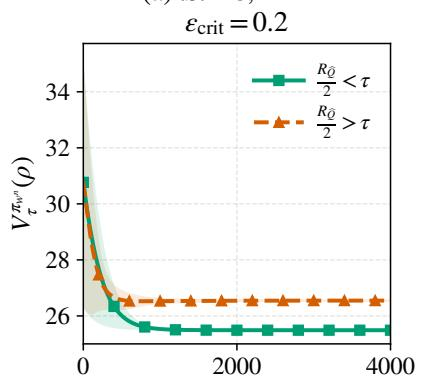
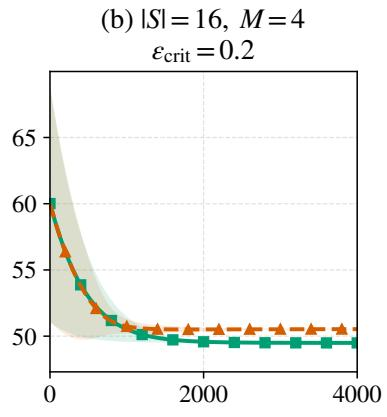
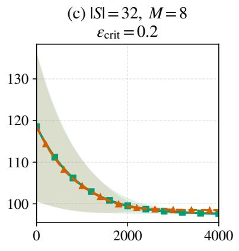
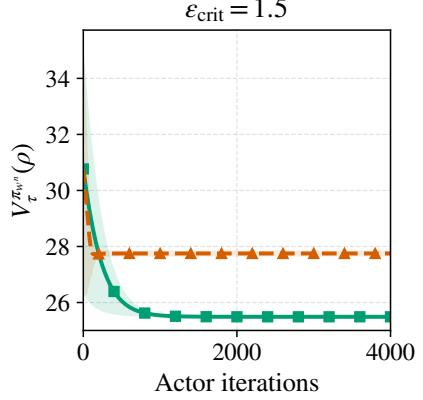
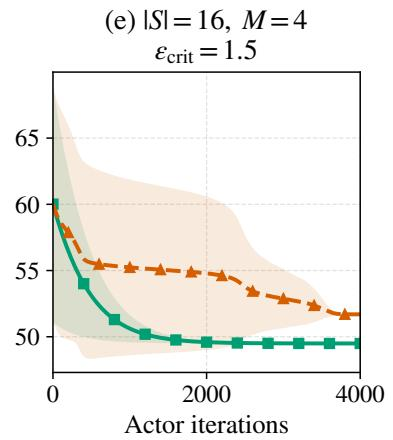
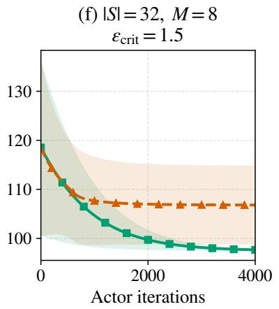
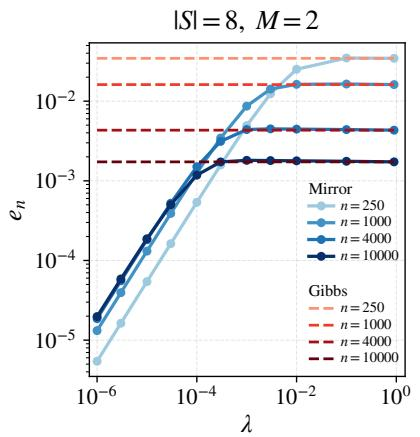
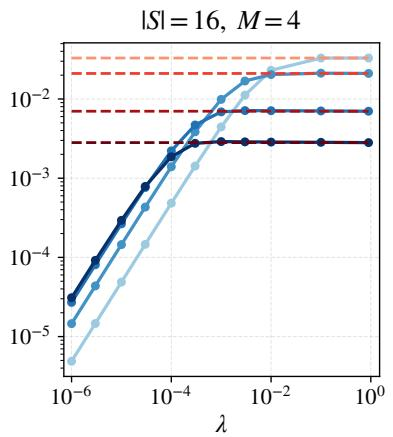
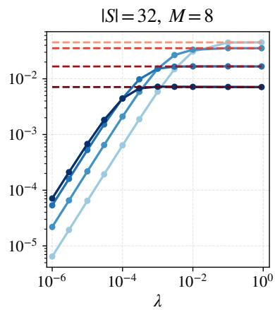

# AN ANALYSIS OF MIRROR-DESCENT SOFT ACTOR-CRITIC

DENIS ZORBA1 AND MICHAL VALKO2

Abstract. Soft Actor-Critic (SAC) is widely used for entropy-regularised reinforcement learning with continuous action spaces, and practical implementations perform only a few actor steps towards an evolving target. In this work, we prove convergence guarantees when the target policy arises from policy mirror descent and compare it with the classical Gibbs target. We derive suficient conditions for the strong convexity and smoothness of the actor objective, characterised by the curvature of the Q-function estimate through the Legendre diferential operator, and establish an ON− 5 best-iterate finite-time convergence rate up to actor and critic approximation errors. Moreover, the mirror-descent step size λ directly controls the target drift and hence actor tracking error, whereas the analogous Gibbs bound contains a non-vanishing tracking term.

## 1. Introduction

In reinforcement learning (RL), an agent seeks to learn an optimal policy that minimises its expected cumulative cost through interactions with an environment. This framework has led to remarkable successes across a range of challenging domains, including robotics, autonomous control and games (Levine et al., 2016; Lillicrap et al., 2016; Mnih et al., 2015). Broadly speak ing, methods to tackle RL problems may be divided into two families: model-based approaches, which explicitly learn or exploit a model of the environment dynamics (Sutton and Barto, 2018; Levine and Koltun, 2013), and model-free approaches, which seek to learn a policy or value function directly from observed transitions (Sutton and Barto, 2018; Lillicrap et al., 2016; Haarnoja et al., 2018a).

In continuous action spaces, tackling model-free RL problems typically involves two learning problems. Firstly, equipped with function approximations, a critic (an estimate of the advantage or Q-function) is learned from observed transitions, commonly through some variant of temporal-diference learning (Sutton, 1988; Watkins and Dayan, 1992), which is then in turn used to update the actor (the policy). Such actor updates may be performed directly through policy-gradient methods (Williams, 1992; Sutton et al., 1999), or through proximal methods which improve stability by controlling the change between successive policies (Schulman et al., 2015, 2017). A closely related idea arises from policy mirror descent (Lan, 2023; Zhan et al., 2023; Ju and Lan, 2026), where a KL-divergence penalty is introduced directly into the policyimprovement problem, with the resulting update admitting a closed-form policy. However, in continuous action spaces, this target generally involves an intractable normalisation constant (Haarnoja et al., 2017, 2018a).

Entropy regularisation leads to a number of theoretical and practical benefits (Geist et al., 2019; Cayci et al., 2024a; Leahy et al., 2022). For example, entropy regularisation induces a unique statewise optimal policy under standard assumptions such as bounded costs (Geist et al., 2019; Kerimkulov et al., 2026) and can accelerate the convergence of policy gradient methods (Mei et al., 2020; Cen et al., 2022; Lan, 2023). It also encourages stochastic policies and persistent exploration (Haarnoja et al., 2017, 2018a).

The Soft Actor-Critic (SAC) algorithm (Haarnoja et al., 2018b) was introduced as an eficient approach to tackling large-scale continuous model-free RL tasks with entropy regularisation, initially derived as a practical implementation of soft policy iteration (Haarnoja et al., 2018a). During SAC training, one performs gradient descent steps on a reverse Kullback–Leibler (KL)

divergence with respect to some target policy, typically the exponential of the Q-function which in turn is motivated by the Bellman principle. Crucially, the normalisation constant is independent of the actor parameters and therefore disappears when taking gradients of the actor objective. This gives a practical policy-improvement procedure without requiring the intractable normalisation constant.

Despite the practical success of SAC, its theoretical analysis remains sparse and challenging. In practice, the actor is commonly parametrised by a squashed Gaussian distribution with a parametrised mean, that is a Gaussian followed by a tanh transformation to enforce the bounds of the action space (after scaling). Moreover, the reverse-KL projection onto the target policy is not solved exactly, but rather a single or a few steps of gradient descent are performed (Haarnoja et al., 2018a). Such an objective is in general non-convex, and the tanh transformation produces policy log-densities which become unbounded near the boundary of the action space. Therefore regularity hypotheses used in policy-gradient analyses can fail (Bedi et al., 2022), while policyspace convergence results (Lan, 2023; Kerimkulov et al., 2026) do not directly cover such a framework.

In this work, we provide the first theoretical guarantees for a population-level formalisation of the SAC framework, with a fixed-covariance squashed Gaussian actor, linear mean and a critic oracle, where one treats a policy arising from mirror descent as the target, as well as the classical Gibbs target. We consider the setting where only a single projected gradient step is performed towards an evolving target policy. Moreover we identify conditions on the curvature of the critic under which the reverse-KL actor objective becomes strongly convex and smooth, allowing us to control the error incurred by the actor as it tracks the changing target.

## 2. Related works

There is a tremendous amount of research literature on RL theory, which underscores its importance. Our work relates to policy optimisation in entropy-regularised MDPs and to the analysis of actor-critic algorithms, which we summarise here.

Entropy regularised RL. Encouraging explorative policies during the training of RL policies have been demonstrated to be an important foundation of practical deep RL methods (Haarnoja et al., 2018a; Lan, 2023) which in turn establishes the importance of understanding entropy regularisation in MDPs. A particular line of work where the presence of entropy regularisation has been shown to have a meaningful contribution are policy mirror descent methods (Lan, 2023; Ju and Lan, 2026; Kerimkulov et al., 2026), where it was proven that the entropy regularisation can induce an exponential convergence to the optimal policy when the critic is known. More recently, it has been shown that one can maintain this exponential convergence when the critic is solved to suficient accuracy in both the tabular case (Labbi et al., 2026) and the general case (Zorba et al., 2026).

Having said that, such theoretical analyses typically rely on the updates existing in the policy space and using measure theoretic techniques. Moving from policy-space updates to a practical parametrisation, a line of work (Sherman et al., 2025; Alfano et al., 2023; Yuan et al., 2023; Agarwal et al., 2021) approximates mirror-descent updates by solving the minimisation sub-optimally under various assumptions.

Actor-critic analysis. Early convergence analyses use multi-timescale stochastic approximation and ODE based approaches (Borkar and Konda, 1997; Konda and Tsitsiklis, 1999). Since then, the study of diferent regimes of actor critic algorithms can fall into a few categories. Firstly, a line of work studies the sample complexity of certain actor critic regimes in tabular and function-approximation settings under various assumptions in the unregularised case (Olshevsky and Gharesifard, 2023; Kumar et al., 2025; Gaur et al., 2024) and regularised case (Cayci et al., 2024b; Labbi et al., 2026). Another line of work studies the underlying convergence and stability behaviour of actor critic methods in general state and action spaces by focusing on a population level analysis (Zorba et al., 2026; Hong et al., 2023; Kerimkulov et al., 2026; Leahy et al., 2022).

## 3. Contributions

• We formalise the $\mathrm { S A C }$ policy class as the push-forward under tanh of a Gaussian distribution with parametrised mean, as standard in modern implementations of Soft Actor Critic (Haarnoja et al., 2018a,b). We study the reverse-KL objective for the actor parameters with target policies including the classical Gibbs measure (Haarnoja et al., 2018a) and a policy arising from performing a step of policy mirror descent with step size/ penalty λ (Tomar et al., 2021; Lan, 2023). Note that in general, such a loss function is non-convex. In this work, we identify suficient conditions under which the strong convexity of such an objective is guaranteed on any Euclidean ball of radius $\mathrm { R } > 0$ . We demonstrate that the curvature of the critic, quantified through the Legendre diferential operator, plays a particular role alongside the entropy regularisation parameter $\tau > 0$

• We prove global finite-time best-iterate convergence guarantees (up to approximation errors) under a $\varepsilon _ { \mathrm { c r i t } ^ { - } } \mathrm { o p t i m a l }$ critic oracle assumption. We derive bounds on the actor tracking error for both the classical Gibbs target and the mirror-descent target. We show that the mirror descent step size λ can directly control the tracking error and provides an explicit trade of between balancing policy improvement against the actor’s ability to track the target. In contrast, the corresponding bound for the classical Gibbs target contains a non-vanishing contribution determined by the regularisation parameter τ.

## 4. Entropy Regularised MDPs

Consider an infinite horizon Markov Decision Process $( S , A , P , c , \gamma )$ , where $S$ is the state space (which may be an arbitrary Polish space) and A is the action space, which we set as $A : = ( - 1 , 1 ) ^ { M }$ for a fixed action dimension $M \geq 1$ . Moreover, $P \in \mathcal P ( S | S \times A )$ is the state transition probability kernel, c is a bounded cost function and $\gamma \in ( 0 , 1 )$ is the discount factor. Let $\Lambda _ { \mathbb { R } }$ denote Lebesgue measure on R, let $\Lambda _ { \mathbb { R } ^ { M } } : = \Lambda _ { \mathbb { R } } ^ { \otimes M }$ , and let Λ denote normalised Lebesgue measure on $A _ { i }$ , that is $\Lambda ( B ) : = 2 ^ { - M } \Lambda _ { \mathbb { R } ^ { M } } ( B )$ for ${ \bar { B } } \in B ( A )$ Finally, let $\tau > 0$ denote a regularisation parameter. For each stochastic policy $\pi \in { \mathcal { P } } ( A | S )$ and $s \in S$ , we define the regularised value function by

$$
V _ { \tau } ^ { \pi } ( s ) = \mathbb { E } _ { s } ^ { \pi } \left( \sum _ { n = 0 } ^ { \infty } \gamma ^ { n } \Big ( c ( s _ { n } , a _ { n } ) - \tau \mathrm { H } ( \pi ( \cdot | s _ { n } ) ) \Big ) \right) .
$$

where $\mathbb { E } _ { s } ^ { \pi }$ denotes the expectation over the state-action trajectory $( s _ { 0 } , a _ { 0 } , s _ { 1 } , a _ { 1 } , . . . )$ generated by policy π and kernel $P$ such that $s _ { 0 } : = s , \ a _ { n } \sim \pi ( \cdot \mid s _ { n } ) , s _ { n + 1 } \sim P ( \cdot | s _ { n } , a _ { n } )$ for all $n \geq 0$ and for any $\nu \in { \mathcal { P } } ( A )$ , the entropy is defined as

$$
\mathrm { H } ( \nu ) : = - \int _ { A } \log \frac { d \nu } { d \Lambda } ( a ) \nu ( d a ) .
$$

if $\nu$ is absolutely continuous with respect to the Lebesgue measure and $- \infty$ otherwise. As a result, for any $s \in S$ we have that $V _ { \tau } ^ { \pi } ( s ) \in \mathbb { R } \cup \{ + \infty \}$ . Moreover for any state distribution $\rho \in \mathcal P ( S )$ , we denote $\begin{array} { r } { V _ { \tau } ^ { \pi } ( \rho ) : = \int _ { S } V _ { \tau } ^ { \pi } ( \dot { s } ) \rho ( d s ) } \end{array}$ . The optimal value function is defined as

$$
V _ { \tau } ^ { * } ( \rho ) = \operatorname* { i n f } _ { \pi \in \mathcal { P } ( A | S ) } V _ { \tau } ^ { \pi } ( \rho ) .
$$

We refer to $\pi ^ { * }$ as the optimal policy if $V _ { \tau } ^ { * } ( \rho ) = V _ { \tau } ^ { \pi ^ { * } } ( \rho )$ . For each $\pi _ { \mathrm { : } }$ the state-action value function $Q _ { \tau } ^ { \pi }$ is defined as

$$
Q _ { \tau } ^ { \pi } ( s , a ) = c ( s , a ) + \gamma \int _ { S } V _ { \tau } ^ { \pi } ( s ^ { \prime } ) P ( d s ^ { \prime } | s , a ) .\tag{1}
$$

Then for every $\pi \in { \mathcal { P } } ( A | S )$ the advantage function is defined as $A _ { \tau } ^ { \pi } = Q _ { \tau } ^ { \pi } + \tau$ log $\frac { d \pi } { d \Lambda } - V _ { \tau } ^ { \pi }$ . The occupation measure for policy π with initial distribution $\rho$ is denoted by $d _ { \rho } ^ { \pi }$ and is defined in Appendix B, alongside the Bellman principle for entropy-regularised MDPs.

## 5. Soft Actor Critic and Mirror Descent

In the seminal work of Haarnoja et al. (2018a), a framework for tackling of-policy entropy regularised MDPs was introduced, which has since been regarded as one of the state of the art approaches for entropy regularised MDPs with continuous action spaces. The idea is relatively simple and consists of learning a critic through some variant of temporal diference/ Q-learning and then learning the new actor by projecting the exponential of the critic onto your policy class using the Kullback-Leibler (KL) divergence. That is, given some policy class $\Pi \subset { \mathcal { P } } ( A | S )$ for each $s \in S$ compute

$$
\pi _ { \mathrm { n e w } } = \underset { \pi ^ { \prime } \in \Pi } { \arg \operatorname* { m i n } } \mathrm { K L } \left( \pi ^ { \prime } ( \cdot | s ) \bigg | \frac { 1 } { Z ^ { \pi _ { \mathrm { o l d } } } ( s ) } \exp \left( - \frac { 1 } { \tau } Q ^ { \pi _ { \mathrm { o l d } } } ( s , \cdot ) \right) \right) .\tag{2}
$$

One can then establish that (2) guarantees policy improvement when the minimisation is solved fully, at least in the tabular setting (Haarnoja et al., 2018a) and thus with exact critics, iterations of (2) results in a sequence of policies which converges to an optimal policy inside Π, although it is worth mentioning that in most cases the true optimal policy $\pi ^ { * }$ need not belong in Π. Moreover, such guarantees only hold in the case where the optimisation in (2) is solved to full accuracy and when the action space is finite.

One issue that can arise from such a formulation is that the new policy $\pi _ { \mathrm { n e w } }$ may be drastically diferent from the old policy $\pi _ { \mathrm { o l d } }$ , resulting in a large relative entropy $\mathrm { K L } ( \pi _ { \mathrm { n e w } } ( \cdot | s ) | \pi _ { \mathrm { o l d } } ( \cdot | s ) )$ Policy mirror descent provides a solution to this by penalising such policies. Formally, for some $\lambda > 0$ , the policies are updated by

$$
\pi _ { \mathrm { M D } } ( \cdot | s ) = \underset { m \in \mathcal { P } ( A ) } { \arg \operatorname* { m i n } } \left\{ \int _ { A } \left( Q _ { \tau } ^ { \pi _ { \mathrm { o l d } } } ( s , a ) + \tau \log \frac { d \pi _ { \mathrm { o l d } } } { d \Lambda } ( s , a ) \right) m ( d a ) + \frac { 1 } { \lambda } \mathrm { K L } \left( m \mid \pi _ { \mathrm { o l d } } ( \cdot | s ) \right) \right\} .
$$

Suppose that the initial policy is uniform on A. By Dupuis and Ellis (1997), we have the following closed form solution to the optimisation problem

$$
\frac { d \pi _ { \mathrm { M D } } } { d \Lambda } ( s , a ) = \frac { 1 } { Z _ { \mathrm { M D } } ( s ) } \left( \frac { d \pi _ { \mathrm { o l d } } } { d \Lambda } ( s , a ) \right) ^ { 1 - \tau \lambda } \exp \left( - \lambda Q _ { \tau } ^ { \pi _ { \mathrm { o l d } } } ( s , a ) \right) .\tag{3}
$$

From here, it is clear to see that the policy mirror descent policy behaves as a geometric interpolation between the old policy and the full soft policy-improvement update, controlled by the proximal penalty/ step size $\lambda > 0$ and the entropy regularisation $\tau > 0$ . In particular, they coincide when precisely we have $\begin{array} { r } { \lambda = \frac { 1 } { \tau } } \end{array}$ , giving the soft policy-improvement update of (Haarnoja et al., 2018a).

Given that computing the normalisation constant in (3) is just as intractable as (2), one natural extension is to replace the target in (2) with (3), since the normalisation constant does not afect the gradient steps. This approach has demonstrated promising empirical results (Tomar et al., 2021).

## 6. Policy Class

Let us now introduce the policy class before presenting the algorithm. Recall that $A =$ $( - 1 , 1 ) ^ { M }$ and $\mathfrak { B } ( \mathrm { R } ) = \left\{ w \in \mathbb { R } ^ { d } : | w | _ { 2 } \leq \mathrm { R } \right\}$ is the Euclidean ball of radius R in $\mathbb { R } ^ { d }$ . Let $x : S $ $\mathbb { R } ^ { d \times M }$ be a bounded feature map satisfying $| x ( s ) | _ { \mathrm { o p } } \leq 1$ for all $s \in S$ , where $| \cdot | _ { \mathrm { o p } }$ is the Euclidean operator norm (see Appendix A for an overview of notation). For any $\varsigma > 0$ , we denote the centred Gaussian with covariance $\varsigma ^ { 2 } I _ { M }$ by $q ^ { \varsigma } : = N ( 0 , \varsigma ^ { 2 } I _ { M } )$ . Let $\Sigma : = \operatorname { d i a g } ( \sigma _ { 1 } ^ { 2 } , . . . , \sigma _ { M } ^ { 2 } )$ with $\sigma _ { i } > 0$ for all i. For any $w \in \mathfrak { B } ( \mathbf { R } ) \subset \mathbb { R } ^ { d }$ , we parametrise the mean by $m _ { w } ( s ) = x ( s ) ^ { \top } \overline { { w } } \in \mathbb { R } ^ { M }$ for each $s \in S$ and denote $q _ { w } ( \cdot | s ) : = \mathcal { N } ( m _ { w } ( s ) , \Sigma )$ . We denote this class of Gaussian kernels by $\mathcal { Q } _ { \Sigma } : = \{ q _ { w } : w \in \mathfrak { B } ( \mathrm { R } ) \} \subset \mathcal { P } ( \mathbb { R } ^ { M } | S )$ Throughout, tanh and its inverse act component-wise. To formalise the policy class, we must first introduce the notion of a push forward measure.

Definition 1 (Push-forward measure, Ambrosio et al., 2008, §5.2). Let $T : \mathbb { R } ^ { M } \to A$ be measurable and let $\nu \in \mathcal P ( \mathbb { R } ^ { M } )$ . The push-forward of ν by T is the probability measure $T _ { \# } \nu \in$

${ \mathcal { P } } ( A )$ such that for any $B \in B ( A )$

$$
T _ { \# } \nu ( B ) : = \nu ( T ^ { - 1 } ( B ) ) .
$$

Equivalently, for every bounded measurable function $f : A  \mathbb { R }$ 2

$$
\int _ { A } f ( a ) T _ { \# } \nu ( d a ) = \int _ { \mathbb { R } ^ { M } } f ( T ( u ) ) \nu ( d u ) .
$$

The policy class is then simply the push-forward under tanh of $\mathcal { Q } _ { \Sigma }$

Definition 2 (Squashed Gaussian Policies). The admissible policy class is given by

$$
\Pi _ { \Sigma } : = \{ \pi _ { w } = ( \operatorname { t a n h } ) _ { \# } q _ { w } : q _ { w } \in \mathcal { Q } _ { \Sigma } \} .
$$

The following lemma of Dupuis-Ellis becomes very useful in the proofs of the main results.

Lemma 1 (Dupuis and Ellis, 1997, Lemma E.2.1). Let $T : \mathbb { R } ^ { M }  A$ be a measurable bijection with measurable inverse. Then for any $\nu , \eta \in \mathcal { P } ( \mathbb { R } ^ { M } )$ 2

$$
\mathrm { K L } \left( T _ { \# } \nu | T _ { \# } \eta \right) = \mathrm { K L } ( \nu | \eta ) .
$$

Note that in general the log densities log $\textstyle { \frac { d \pi _ { w } } { d \Lambda } }$ are unbounded near the boundary of the action space $A = ( - 1 , 1 ) ^ { M }$ . Therefore, one cannot directly apply classical tools such as the performance diference lemma for entropy regularised MDPs, which require bounded log densities, without careful treatment. However one can show that although the log densities are unbounded, the entropy $\mathrm { H } ( \pi _ { w } ( \cdot | s ) )$ remains bounded for all $s \in S$ when $w \in \mathfrak { B } ( \mathrm { R } )$ , which can serve as a remedy (see Lemma 5). Furthermore, while we adopt the tanh transformation due to its tractability and widespread use in practical implementations of soft actor-critic, much of the analysis extends to other suficiently regular bijections from $\mathbb { R } ^ { M }$ to $( - 1 , 1 ) ^ { M }$

## 7. Algorithm

For any iteration $n \in \mathbb { N }$ , we denote the replay bufer state law by $\rho _ { n } \in \mathcal { P } ( S )$ with $\rho _ { 0 } = \rho$ the initial state distribution, which we model as an exponentially weighted mixture of all preceding state-occupancies up to the iteration $n > 0$ with parameter $\chi > 0$ (see Definition 5 in Appendix B). Then for any target policy $\pi _ { \mathrm { t a r g e t } } \in \mathcal { P } ( A | S ) , \pi _ { w } \in \Pi _ { \Sigma }$ and $n \in \mathbb { N }$ we define

$$
J _ { n } ( w , \pi _ { \mathrm { t a r g e t } } ) = \int _ { S } \mathrm { K L } ( \pi _ { w } ( \cdot | s ) | \pi _ { \mathrm { t a r g e t } } ( \cdot | s ) ) \rho _ { n } ( d s ) ,
$$

Now suppose that one has access to an estimate of the Q-function for each encountered policy, and denote this sequence by $\{ { \widehat Q } ^ { n } \} _ { n \geq 0 }$ . Let $\pi ^ { 0 } ( d a | s ) : = \Lambda ( d a )$ for all $s \in S$ . Firstly, we will denote the Gibbs target as

$$
\frac { d \pi _ { \mathrm { G } } ^ { n + 1 } } { d \Lambda } ( s , a ) = \frac { 1 } { Z _ { n } ( s ) } \exp \left( - \frac { 1 } { \tau } \widehat { Q } ^ { n } ( s , a ) \right) .\tag{4}
$$

Furthermore, we denote the target arising from policy mirror descent as

$$
\pi ^ { n + 1 } ( \cdot | s ) = \operatorname * { a r g m i n } _ { m \in \mathcal { P } ( A ) } \Bigg \{ \int _ { A } \left( \widehat { Q } ^ { n } ( s , a ) + \tau \log \frac { d \pi ^ { n } } { d \Lambda } ( s , a ) \right) m ( d a ) + \frac { 1 } { \lambda } \mathop { \mathrm { K L } } ( m | \pi ^ { n } ( \cdot | s ) ) \Bigg \} .\tag{5}
$$

Throughout, $\{ \pi ^ { n } \} _ { n \geq 0 }$ denotes the evolving target sequence, updated recursively from the previous target rather than from the current actor, whereas $\pi _ { w } n$ denotes the actor tracking it. Moreover, throughout we take the initial actor satisfies $w ^ { 0 } \in \mathfrak { B } ( \mathrm { R } )$ , and the replay parameters satisfy $0 < \chi \lambda \leq 1$ . We present the training procedure in Algorithm 1. To summarise, we study the case where one performs a single step of gradient descent of the objective with a mirror descent target for each critic estimate, then projects the new parameters onto $\mathfrak { B } ( \mathrm { R } )$

We work under the following assumptions.

Algorithm 1 Projected actor update   
1: for $n = 0 , 1 , 2 , . . .$ . do   
2: Obtain critic estimate ${ \widehat { Q } } ^ { n }$   
3: Update replay law $\rho _ { n + 1 }$   
4: $\boldsymbol { w } ^ { \hat { n } + 1 } = \hat { \mathcal { P } } _ { \mathfrak { B } ( \mathrm { R } ) } \left( \boldsymbol { w } ^ { n } - \boldsymbol { h } \nabla _ { w } J _ { n + 1 } ( \boldsymbol { w } ^ { n } , \pi ^ { n + 1 } ) \right)$   
5: end for

Assumption 1 (Q-function oracle). There exists $\varepsilon _ { \mathrm { c r i t } } \geq 0$ such that, for all $n \geq 0$ , the critic estimate $\widehat { Q } ^ { n } \in B _ { b } ( S \times A )$ satisfies $\widehat { Q } ^ { n } ( s , \cdot ) \in C ^ { 2 } ( A )$ for each $s \in S , \left. \widehat { Q } ^ { n } \right. _ { B _ { b } ( S \times A ) } \leq \widehat { Q } _ { \mathrm { m a x } }$ and

$$
\left| \widehat { Q } ^ { n } - Q _ { \tau } ^ { \pi _ { w } n } \right| _ { B _ { b } ( S \times A ) } \leq \varepsilon _ { \mathrm { c r i t } } .
$$

Assumption 1 allows us to isolate dynamics of training the Gaussian policies $\pi _ { w } n$ . While one could additionally introduce a parametrised critic and analyse its update jointly with the actor, we abstract away from the critic dynamics and capture the resulting approximation error through $\varepsilon _ { \mathrm { c r i t } }$ . This further allows our results to accommodate general twice-diferentiable $Q \mathrm { - }$ -function parametrisations, including standard smooth neural network architectures. Assumption 1 holds in many practical implementations when one freezes the policy and performs sufficiently many steps of temporal diference learning and when the parametrisation of the critic is suficiently rich.

Assumption 2 (Optimal-occupancy concentrability). There exists $A _ { 2 } < \infty$ such that

$$
\left. \frac { d d _ { \rho } ^ { \pi ^ { * } } } { d \rho } \right. _ { L ^ { 2 } ( \rho ) } \le A _ { 2 } .
$$

Assumption 2 is designed to control the distributional shift between the optimal discounted occupancy measure and the initial state distribution. Such concentrability or distributionmismatch conditions are standard in analyses of approximate dynamic programming, of-policy learning and policy-gradient methods (Munos and Szepesv´ari, 2008; Chen and Jiang, 2019; Agarwal et al., 2021). Note that, we require that only the optimal discounted occupancy measure $d _ { \rho } ^ { \pi ^ { * } }$ has a density with respect to the initial state distribution $\rho \in \mathcal P ( S )$ and is square integrable with respect to $\rho$ which is strictly weaker than imposing a uniform bound in the supremum norm (Agarwal et al., 2021) and imposing a similar assumption for every encountered policy during training (Uehara et al., 2020; Munos and Szepesv´ari, 2008). One case where Assumption 2 holds is when the transition kernel is square integrable with respect to the initial state distribution (see Lemma 7). This includes, under appropriate covariance and mean conditions, dynamics with Gaussian transition noise when the initial state distribution is also Gaussian.

Assumption 3 (Eigenvalues for actor parametrisation). Assume that

$$
\lambda _ { P } : = \lambda _ { \operatorname* { m i n } } \left( \int _ { S } x ( s ) x ( s ) ^ { \top } \rho ( d s ) \right) > 0 .
$$

Assumption 3 is a standard non-degeneracy condition on the feature map and requires that the feature covariance matrix under the initial state distribution be positive definite, ensuring that every direction in the actor parameter space is suficiently represented under only the initial state distribution $\rho .$

## 8. Main results

While we do not impose any assumptions regarding the realisability of the critic or policy in the main results, we inevitably must account for the bias that arises when the policy class of squashed Gaussians are not suficiently rich enough to represent the target policies.

Definition 3 (Gaussian approximation error). For each $\{ { \widehat Q } ^ { n } \} _ { n \geq 0 }$ , the Gaussian approximation error to the mirror descent policies $\{ \pi ^ { n } \} _ { n \geq 0 }$ is defined as

$$
\varepsilon _ { \mathrm { a c t } } ^ { n } = \operatorname* { m i n } _ { w \in \mathfrak { B } ( \mathrm { R } ) } J _ { n } \mathopen { } \mathclose \bgroup \left( w , \pi ^ { n } \aftergroup \egroup \right) .
$$

Moreover, for any $n \geq 1$ , we define $\begin{array} { r } { \varepsilon _ { \mathrm { a p p r o x } } ( n ) = \varepsilon _ { \mathrm { c r i t } } + \frac { 1 } { n } \sum _ { k = 0 } ^ { n - 1 } \left( \varepsilon _ { \mathrm { a c t } } ^ { k } \right) ^ { \frac { 1 } { 2 } } } \end{array}$

In the following results, we denote $\begin{array} { r } { w _ { * } ^ { n } \in \arg \operatorname* { m i n } _ { w \in \mathfrak { B } ( \mathrm { R } ) } J _ { n } ( w , \pi ^ { n } ) } \end{array}$ , the optimal parameters $w \in \mathfrak { B } ( \mathrm { R } )$ for the target at iteration $n \in \mathbb { N }$ . Theorem 1 establishes the first bound on the value function optimality gap for Algorithm 1.

Theorem 1. Let Assumptions 1 and 2 hold, let $0 < \tau \lambda < 1$ . Then there exists $\mathrm { { C } < \infty }$ such that for all $n \geq 1$ ，

$$
\begin{array} { r l } & { \underset { 0 \leq r \leq n - 1 } { \operatorname* { m i n } } V _ { \tau } ^ { \pi _ { w } r } ( \rho ) - V _ { \tau } ^ { \pi ^ { * } } ( \rho ) } \\ & { \quad \leq \mathrm { C } \left( \lambda \left( \frac { 1 } { \lambda ^ { 2 } n } + 1 \right) + \displaystyle \frac { 1 } { n } \sum _ { k = 0 } ^ { n - 1 } \left( J _ { k } ( w ^ { k } , \pi ^ { k } ) - J _ { k } ( w _ { * } ^ { k } , \pi ^ { k } ) \right) ^ { \frac { 1 } { 2 } } + \varepsilon _ { \mathrm { a p p r o x } } ( n ) \right) . } \end{array}
$$

See Appendix C for a proof.

Theorem 1 shows that, up to approximation errors, the convergence of Algorithm 1 relies on two components. The first is the actor tracking error, that is how well can performing just one step of gradient descent on the objective track the evolving target. Secondly, one can see that the first term yields a constant which can be controlled by λ. Thus if one can also control the actor tracking error by a function of $\lambda ,$ after a careful fine tuning a convergence rate may be possible. To that end, as standard in the analyses of coupled actor-critic and online gradient descent algorithms (Barakat et al., 2022; Olshevsky and Gharesifard, 2023; Mokhtari et al., 2016), we must establish suficient regularity of the objective in order to control the tracking error.

To that end, since in general the reverse KL objective is non-convex, we must derive some suficient conditions under which convexity holds. The first step towards doing so is by defining the following operator.

Definition 4. Let $D : A \to \mathbb { S } ^ { M }$ be $D ( a ) : = \mathrm { d i a g } ( 1 - a _ { 1 } ^ { 2 } , . . . , 1 - a _ { M } ^ { 2 } )$ and for any $f \in C ^ { 2 } ( A )$ define $\mathcal { T } : C ^ { 2 } ( A ) \to C ( A ; \mathbb { S } ^ { M } )$ by

$$
( { \mathscr T } f ) ( a ) : = D ( a ) ^ { \frac { 1 } { 2 } } { \nabla } _ { a } ^ { 2 } f ( a ) D ( a ) ^ { \frac { 1 } { 2 } } - 2 \mathrm { d i a g } \big ( a _ { 1 } \partial _ { a _ { 1 } } f ( a ) , \dots , a _ { M } \partial _ { a _ { M } } f ( a ) \big ) .
$$

Firstly observe that since $f \in C ^ { 2 } ( A )$ , Tf is continuous on A and thus T is well defined. Moreover for any $a \in A$ , we can express T component-wise as

$$
( T f ) _ { i j } ( a ) = \left\{ \begin{array} { l l } { ( 1 - a _ { i } ^ { 2 } ) \partial _ { a _ { i } a _ { i } } f ( a ) - 2 a _ { i } \partial _ { a _ { i } } f ( a ) , } & { i = j , } \\ { \sqrt { ( 1 - a _ { i } ^ { 2 } ) ( 1 - a _ { j } ^ { 2 } ) } \partial _ { a _ { i } a _ { j } } f ( a ) , } & { i \ne j . } \end{array} \right.
$$

For the special case of $M = 1 , \tau$ reduces to the classical Legendre diferential operator $\begin{array} { r l r } {  { \frac { d } { d a } \big ( ( 1 - } } & { { } } & { } \end{array}$ $a ^ { 2 } ) f ^ { \prime } ( a ) ) \ ( \mathrm { D L M F } , \ S 1 8 . 8 )$ . In the present setting, T provides a convenient way of expressing the curvature of the actor objective and critic estimate and which in turn allows us to establish suficient convexity conditions on the actor objective. Recall that, for each integer $k \geq 1 , \mathbb { S } ^ { k }$ denotes the space of real symmetric matrices in $\mathbb { R } ^ { k \times k }$

Theorem 2. Let Assumptions 1 and 3 hold and define

$$
R _ { \widehat { Q } } : = \operatorname* { s u p } _ { n \in \mathbb { N } , \ s \in S , \ a \in A } \left| \mathcal { T } ( \widehat { Q } ^ { n } ( s , \cdot ) ) ( a ) \right| _ { \mathrm { { o p } } } ,
$$

Moreover let $0 < \tau \lambda < 1$ and $c _ { \Sigma , \mathrm { R } } : = \operatorname* { m i n } _ { 1 \leq i \leq M } \left( 1 - \operatorname { t a n h } ^ { 2 } ( \mathrm { R } + \sigma _ { i } ) \right) ( 2 \Phi ( 1 ) - 1 )$ with $\Phi : \mathbb { R } $ (0, 1) the standard Gaussian cumulative distribution function. If it holds that

$$
\frac { R _ { \widehat { Q } } } { 2 } < \tau ,
$$

then the functions $w \mapsto J _ { n } ( w , \pi ^ { n } )$ and $w \mapsto J _ { n } ( w , \pi _ { \mathrm { G } } ^ { n } )$ are $\begin{array} { r } { ( 1 - \gamma ) \left( 2 - \frac { R _ { \widehat { Q } } } { \tau } \right) c _ { \Sigma , \mathrm { R } } \lambda _ { P } \ – s t r o n g } \end{array}$ ly convex and $2 + \frac { R _ { \widehat { Q } } } { \tau }$ -smooth on B(R) for all $n \in \mathbb { N }$

See Appendix D for a proof.

Theorem 2 demonstrates suficient conditions under which for any $n \in \mathbb { N }$ , the actor objective with mirror descent target $w \mapsto J _ { n } ( w , \pi ^ { n } )$ is strongly convex on the Euclidean ball of radius $\mathrm { R } > 0$ . Fundamentally speaking, this condition ensures that the Hessian of the actor objective is uniformly positive definite. Intuitively speaking, the curvature induced by the diferential entropy relative to Lebesgue measure dominates the worst-case adverse curvature introduced by the critic, thereby preventing the actor objective from developing locally non-convex directions. See Remark 1 in Appendix D for an explicit example of $R _ { \widehat { Q } }$ for Fourier critic parametrisations and see Figure 1 for a comparison of training dynamics for the MDP defined in Appendix J in the cases where the condition in Theorem 2 is satisfied and violated.

With Theorem 2 in hand, we now seek to control the actor tracking error.

Lemma 2 (Actor tracking). Let Assumptions 1 and 3 and the condition of Theorem 2 hold, and suppose that $\begin{array} { r } { 0 < h < \frac { \tau } { 2 \tau + R _ { \widehat { O } } } } \end{array}$ . Then there exists a non-negative constant $C _ { 1 } < \infty$ such that for every $n \geq 1$ , it holds that

$$
\frac { 1 } { n } \sum _ { k = 0 } ^ { n - 1 } \Big ( J _ { k } ( w ^ { k } , \pi ^ { k } ) - J _ { k } ( w _ { * } ^ { k } , \pi ^ { k } ) \Big ) ^ { \frac { 1 } { 2 } } \leq C _ { 1 } \left( \frac { 1 } { h n } + \frac { \lambda } { h ^ { 2 } } \right) ^ { \frac { 1 } { 4 } } .
$$

See Appendix F for a proof.

Lemma 2 separates the actor optimisation error from the drift of the target and shows that, when the target policy arises from the mirror-descent update (5), the drift of the target can be directly controlled through the mirror-descent step size $\lambda > 0$ . In particular, small λ makes consecutive target policies closer and therefore allows the actor, despite performing only a single gradient step per iteration, to track the evolving target more accurately.

However, of course choosing λ arbitrarily small does not come for free. Indeed, Theorem 1 contains the term $\frac { 1 } { \lambda n }$ , reflecting the progress made by the underlying mirror-descent updates that we are approximating. This demonstrates an intrinsic trade of for Algorithm 1 between smaller values of λ, which produce a slowly moving target that is easier for the actor to track, and larger values of λ which allow for more aggressive policy improvement but increase the actor tracking error. Therefore balancing these efects is required to establish a result which demonstrates convergence up to approximation errors.

It is now worth addressing the behaviour of the actor tracking error when one has the classical Gibbs target (4) rather than the mirror descent target. For the following corollary and its proof, $\{ w ^ { n } \} _ { n \geq 0 }$ denotes the iterates of Algorithm 1 with $\pi ^ { n + 1 }$ replaced by $\pi _ { \mathrm { G } } ^ { n + 1 }$ in the actor update in Algorithm 1. To that end, for $k \geq 1$ let us denote $w _ { \mathrm { G } , \ast } ^ { k } = \arg \operatorname* { m i n } _ { w \in \mathfrak { B } ( \mathrm { R } ) } J _ { k } ( w , \pi _ { \mathrm { G } } ^ { k } )$ , which is unique under the conditions of Theorem 2.

Corollary 1. Let Assumptions 1 and 3 and the condition of Theorem 2 hold and let $0 < h <$ $\frac { \tau } { 2 \tau + R _ { \widehat { Q } } }$ . Then there exists $C _ { \mathrm { G } } < \infty$ such that, for every $n \geq 1$ R

$$
\frac { 1 } { n } \sum _ { k = 1 } ^ { n - 1 } \left( J _ { k } ( w ^ { k } , \pi _ { \mathrm { G } } ^ { k } ) - J _ { k } ( w _ { \mathrm { G } , * } ^ { k } , \pi _ { \mathrm { G } } ^ { k } ) \right) ^ { \frac { 1 } { 2 } } \leq C _ { \mathrm { G } } \left( \frac { 1 } { h n } + \frac { 1 } { h ^ { 2 } } \left( \frac { 1 } { \tau } + \chi \lambda \right) \right) ^ { \frac { 1 } { 4 } } .
$$

The classical Gibbs target incurs the non-vanishing term $\frac { 1 } { \tau }$ . Consequently, even when the replay distribution changes slowly, the bound in Corollary 1 does not guarantee that the actor can track the Gibbs target arbitrarily closely. In contrast, the mirror-descent formulation provides an explicit mechanism for slowing the evolution of the target to match the optimisation timescale of the actor. See Figure 2.

Theorem 3. Let Assumptions 1, 2, and 3 hold and suppose that the conditions of Theorem 2 hold. For any integer $N \geq 1$ , let ϑ := min $\left\{ { \frac { 1 } { \tau } } , { \frac { 1 } { \chi } } \right\}$ and let $\{ \pi _ { w ^ { r } } \} _ { r = 0 } ^ { N - 1 }$ be the iterates of Algorithm

1 with $\begin{array} { r } { \lambda = \frac { \vartheta } { 2 N ^ { \frac { 4 } { 5 } } } } \end{array}$ and $\begin{array} { r } { 0 < h < \frac { \tau } { 2 \tau + R _ { \widehat { Q } } } } \end{array}$ . Then there exists $C < \infty$ such that

$$
\displaystyle \operatorname* { m i n } _ { 0 \leq r \leq N - 1 } V _ { \tau } ^ { \pi _ { w } r } ( \rho ) - V _ { \tau } ^ { \pi ^ { * } } ( \rho ) \leq C \left( N ^ { - \frac { 1 } { 5 } } + \varepsilon _ { \mathrm { a p p r o x } } ( N ) \right) .
$$

Theorem 3 demonstrates that for a carefully tuned proximal penalty/step-size $\lambda > 0$ and step size $h > 0$ and any projecting radius $\mathrm { R } > 0$ one can establish a finite time convergence rate up to approximation errors. One promising route to achieving a faster convergence rate, at the cost of a more intricate analysis, is by also incorporating the critic dynamics and controlling the accuracy to which the critic is solved to at each iteration. Another one is to restrict $\mathrm { R } > \delta$ for some $\delta > 0$ suficiently large in order to ensure that the minimisers $w _ { * } ^ { n }$ lie in the interior of $\mathfrak { B } ( \mathrm { R } )$ . We do not pursue this here in order to retain generality for every $\mathrm { R } > 0$

  
(a) |S| = 8, M = 2

  
Figure 1. Training curves of Algorithm 1 for the MDP in Appendix J, with varying state-space size |S| and action dimension M, $A = ( - 1 , 1 ) ^ { M }$ , and temperature $\tau = 1$ . Within each panel, the two critics have equal error $\varepsilon _ { \mathrm { c r i t } }$ but diferent $R _ { \widehat { Q } }$ . The curvature condition of Theorem 2 is satisfied in green and violated in orange. Curves show means and shaded regions show one standard deviation across nine paired initialisations.

## 9. Conclusion and limitations

In this work, we prove convergence guarantees for a mathematical formalisation of Soft Actor Critic and demonstrate theoretical advantages of having a target policy arising from mirror descent rather than the classical Gibbs measure.

While the results in this work can be directly demonstrated in simplified settings (see Figures 1 and 2), the analysis is only performed in the population setting and thus the efect of sampling

  
Figure 2. Averaged actor tracking error $e _ { n }$ := $\begin{array} { r } { \frac { 1 } { n } \sum _ { k < n } \left( J _ { k } ( w ^ { k } , \pi ^ { k } ) - J _ { k } ( w _ { * } ^ { k } , \pi ^ { k } ) \right) ^ { \frac { 1 } { 2 } } } \end{array}$ against the mirror-descent step size λ for the MDP defined in Appendix J with exact critics, evaluated at four actor budgets n (light to dark). Solid lines use the mirror-descent target (5) and dashed lines the Gibbs target (4) at the same budget. For the Gibbs target λ does not enter (4) itself, only the replay dynamics of Definition 5. See Appendix J for more details.

remains open. Moreover, we do not incorporate explicit critic dynamics in this work which remains a challenging direction for future work.

## References

Alekh Agarwal, Sham M. Kakade, Jason D. Lee, and Gaurav Mahajan. On the theory of policy gradient methods: Optimality, approximation, and distribution shift. Journal of Machine Learning Research, 22(98):1–76, 2021. URL http://jmlr.org/papers/v22/19-736.html.

Carlo Alfano, Rui Yuan, and Patrick Rebeschini. A novel framework for policy mirror descent with general parameterization and linear convergence. In Advances in Neural Information Processing Systems, volume 36, pages 30681–30725. Curran Associates, Inc., 2023. doi: 10. 52202/075280-1338. URL https://proceedings.neurips.cc/paper\_files/paper/2023/ hash/61a9278dfef5f871b5e472389f8d6fa1-Abstract-Conference.html.

Luigi Ambrosio, Nicola Gigli, and Giuseppe Savar´e. Gradient Flows: In Metric Spaces and in the Space of Probability Measures. Lectures in Mathematics. ETH Z¨urich. Birkh¨auser Basel, second edition, 2008. doi: 10.1007/978-3-7643-8722-8.

Pierre-Cyril Aubin-Frankowski, Anna Korba, and Flavien L´eger. Mirror descent with relative smoothness in measure spaces, with application to Sinkhorn and EM. In Advances in Neural Information Processing Systems, volume 35, pages 17263–17275. Curran Associates, Inc., 2022. doi: 10.52202/068431-1255. URL https://proceedings.neurips.cc/paper\_files/ paper/2022/hash/6e3daaeca6be8579573f69082b2dd58b-Abstract.html.

Anas Barakat, Pascal Bianchi, and Julien Lehmann. Analysis of a target-based actor-critic algorithm with linear function approximation. In Gustau Camps-Valls, Francisco J. R. Ruiz, and Isabel Valera, editors, Proceedings of The 25th International Conference on Artificial Intelligence and Statistics, volume 151 of Proceedings of Machine Learning Research, pages 991– 1040. PMLR, 28–30 Mar 2022. URL https://proceedings.mlr.press/v151/barakat22a. html.

Amrit Singh Bedi, Souradip Chakraborty, Anjaly Parayil, Brian M. Sadler, Pratap Tokekar, and Alec Koppel. On the hidden biases of policy mirror ascent in continuous action spaces. In Proceedings of the 39th International Conference on Machine Learning, volume 162 of Proceedings of Machine Learning Research, pages 1716–1731. PMLR, 2022. URL https: //proceedings.mlr.press/v162/bedi22a.html.

Vivek S. Borkar and Vijaymohan R. Konda. The actor-critic algorithm as multi-time-scale stochastic approximation. Sadhana, 22(4):525–543, 1997. doi: 10.1007/BF02745577.

Semih Cayci, Niao He, and R. Srikant. Convergence of entropy-regularized natural policy gradient with linear function approximation. SIAM Journal on Optimization, 34(3):2729– 2755, 2024a. doi: 10.1137/22M1540156. URL https://doi.org/10.1137/22M1540156.

Semih Cayci, Niao He, and R. Srikant. Finite-time analysis of entropy-regularized neural natural actor-critic algorithm. Transactions on Machine Learning Research, 2024b. ISSN 2835-8856. URL https://openreview.net/forum?id=BkEqk7pS1I.

Shicong Cen, Chen Cheng, Yuxin Chen, Yuting Wei, and Yuejie Chi. Fast global convergence of natural policy gradient methods with entropy regularization. Operations Research, 70(4): 2563–2578, 2022. doi: 10.1287/opre.2021.2151. URL https://arxiv.org/abs/2007.06558.

Jinglin Chen and Nan Jiang. Information-theoretic considerations in batch reinforcement learning. In Proceedings of the 36th International Conference on Machine Learning (ICML), volume 97 of Proceedings of Machine Learning Research, pages 1042–1051. PMLR, 2019. URL https://proceedings.mlr.press/v97/chen19e.html.

DLMF. NIST Digital Library of Mathematical Functions. https://dlmf.nist.gov/, Release 1.2.8 of 2026-09-15, 2026. URL https://dlmf.nist.gov/. F. W. J. Olver, A. B. Olde Daalhuis, D. W. Lozier, B. I. Schneider, R. F. Boisvert, C. W. Clark, B. R. Miller, B. V. Saunders, H. S. Cohl, and M. A. McClain, eds.

Paul Dupuis and Richard S. Ellis. A Weak Convergence Approach to the Theory of Large Deviations. Wiley Series in Probability and Statistics. John Wiley & Sons, Inc., 1997. ISBN 9780471076728. doi: 10.1002/9781118165904. URL https://doi.org/10.1002/ 9781118165904.

Mudit Gaur, Amrit Bedi, Di Wang, and Vaneet Aggarwal. Closing the gap: Achieving global convergence (Last iterate) of actor-critic under Markovian sampling with neural network parametrization. In Ruslan Salakhutdinov, Zico Kolter, Katherine Heller, Adrian Weller, Nuria Oliver, Jonathan Scarlett, and Felix Berkenkamp, editors, Proceedings of the 41st International Conference on Machine Learning, volume 235 of Proceedings of Machine Learning Research, pages 15153–15179. PMLR, 21–27 Jul 2024. URL https://proceedings.mlr.press/v235/gaur24a.html.

Matthieu Geist, Bruno Scherrer, and Olivier Pietquin. A theory of regularized Markov decision processes. In Proceedings of the 36th International Conference on Machine Learning, volume 97 of Proceedings of Machine Learning Research, pages 2160–2169. PMLR, 2019. URL https://proceedings.mlr.press/v97/geist19a.html.

Tuomas Haarnoja, Haoran Tang, Pieter Abbeel, and Sergey Levine. Reinforcement learning with deep energy-based policies. In Proceedings of the 34th International Conference on Machine Learning, volume 70 of Proceedings of Machine Learning Research, pages 1352–1361. PMLR, 2017. URL https://proceedings.mlr.press/v70/haarnoja17a.html.

Tuomas Haarnoja, Aurick Zhou, Pieter Abbeel, and Sergey Levine. Soft actor-critic: Ofpolicy maximum entropy deep reinforcement learning with a stochastic actor. In Jennifer Dy and Andreas Krause, editors, Proceedings of the 35th International Conference on Machine Learning, volume 80 of Proceedings of Machine Learning Research, pages 1861–1870. PMLR, 2018a. URL https://proceedings.mlr.press/v80/haarnoja18b.html.

Tuomas Haarnoja, Aurick Zhou, Kristian Hartikainen, George Tucker, Sehoon Ha, Jie Tan, Vikash Kumar, Henry Zhu, Abhishek Gupta, Pieter Abbeel, and Sergey Levine. Soft actorcritic algorithms and applications, 2018b. URL https://arxiv.org/abs/1812.05905.

Mingyi Hong, Hoi-To Wai, Zhaoran Wang, and Zhuoran Yang. A two-timescale stochastic algorithm framework for bilevel optimization: Complexity analysis and application to actorcritic. SIAM Journal on Optimization, 33(1):147–180, 2023. doi: 10.1137/20M1387341. URL https://doi.org/10.1137/20M1387341.

Norman L. Johnson, Samuel Kotz, and N. Balakrishnan. Continuous Univariate Distributions, Volume 1. John Wiley & Sons, New York, second edition, 1994. ISBN 9780471584957.

Caleb Ju and Guanghui Lan. Policy optimization over general state and action spaces. SIAM Journal on Optimization, 36(3):1731–1772, 2026. doi: 10.1137/25M1791585. URL https:

//doi.org/10.1137/25M1791585.

Bekzhan Kerimkulov, James-Michael Leahy, David Siska, Lukasz Szpruch, and Yufei Zhang. A fisher–rao gradient flow for entropy-regularised markov decision processes in polish spaces. Foundations of Computational Mathematics, 26:2395–2469, 2026. doi: 10.1007/ s10208-025-09729-3. URL https://doi.org/10.1007/s10208-025-09729-3.

Vijay R. Konda and John N. Tsitsiklis. Actor-critic algorithms. In S. Solla, T. Leen, and K. M¨uller, editors, Advances in Neural Information Processing Systems, volume 12, pages 1008–1014. MIT Press, 1999. URL https://proceedings.neurips.cc/paper\_files/ paper/1999/file/6449f44a102fde848669bdd9eb6b76fa-Paper.pdf.

Navdeep Kumar, Priyank Agrawal, Giorgia Ramponi, Kfir Y. Levy, and Shie Mannor. On the convergence of single-timescale actor-critic. In D. Belgrave, C. Zhang, H. Lin, R. Pascanu, P. Koniusz, M. Ghassemi, and N. Chen, editors, Advances in Neural Information Processing Systems, volume 38, Main Conference, pages 36406–36438. Curran Associates, Inc., 2025. doi: 10.52202/085713-1223. URL https://proceedings.neurips.cc/paper\_files/paper/ 2025/file/33ed8e42e696dfcb77379777c5036472-Paper-Conference.pdf.

Safwan Labbi, Paul Mangold, Daniil Tiapkin, and Eric Moulines. Refined analysis of entropyregularized actor-critic. arXiv:2605.24357, 2026. URL https://arxiv.org/abs/2605.24357.

Guanghui Lan. Policy mirror descent for reinforcement learning: Linear convergence, new sampling complexity, and generalized problem classes. Mathematical Programming, 198(1): 1059–1106, 2023. doi: 10.1007/s10107-022-01816-5.

James-Michael Leahy, Bekzhan Kerimkulov, David Siska, and Lukasz Szpruch. Convergence of policy gradient for entropy regularized MDPs with neural network approximation in the mean-field regime. In Kamalika Chaudhuri, Stefanie Jegelka, Le Song, Csaba Szepesvari, Gang Niu, and Sivan Sabato, editors, Proceedings of the 39th International Conference on Machine Learning, volume 162 of Proceedings of Machine Learning Research, pages 12222– 12252. PMLR, 17–23 Jul 2022. URL https://proceedings.mlr.press/v162/leahy22a. html.

Sergey Levine and Vladlen Koltun. Guided policy search. In Proceedings of the 30th International Conference on Machine Learning, volume 28 of Proceedings of Machine Learning Research, pages 1–9. PMLR, 2013. URL https://proceedings.mlr.press/v28/levine13. html. Part 3.

Sergey Levine, Chelsea Finn, Trevor Darrell, and Pieter Abbeel. End-to-end training of deep visuomotor policies. Journal of Machine Learning Research, 17(39):1–40, 2016. URL https: //jmlr.org/papers/v17/15-522.html.

Timothy P. Lillicrap, Jonathan J. Hunt, Alexander Pritzel, Nicolas Heess, Tom Erez, Yuval Tassa, David Silver, and Daan Wierstra. Continuous control with deep reinforcement learning. In International Conference on Learning Representations, 2016. URL https://arxiv.org/ abs/1509.02971.

Jincheng Mei, Chenjun Xiao, Csaba Szepesvari, and Dale Schuurmans. On the global convergence rates of softmax policy gradient methods. In Proceedings of the 37th International Conference on Machine Learning, volume 119 of Proceedings of Machine Learning Research, pages 6820–6829. PMLR, 2020. URL https://proceedings.mlr.press/v119/mei20b.html.

Volodymyr Mnih, Koray Kavukcuoglu, David Silver, Andrei A. Rusu, Joel Veness, Marc G. Bellemare, Alex Graves, Martin Riedmiller, Andreas K. Fidjeland, Georg Ostrovski, Stig Petersen, Charles Beattie, Amir Sadik, Ioannis Antonoglou, Helen King, Dharshan Kumaran, Daan Wierstra, Shane Legg, and Demis Hassabis. Human-level control through deep reinforcement learning. Nature, 518(7540):529–533, 2015. doi: 10.1038/nature14236.

Aryan Mokhtari, Shahin Shahrampour, Ali Jadbabaie, and Alejandro Ribeiro. Online optimization in dynamic environments: Improved regret rates for strongly convex problems. In 2016 IEEE 55th Conference on Decision and Control (CDC), pages 7195–7201. IEEE, 2016. doi: 10.1109/CDC.2016.7799379.

R´emi Munos and Csaba Szepesv´ari. Finite-time bounds for fitted value iteration. Journal of Machine Learning Research, 9(27):815–857, 2008. URL https://jmlr.org/papers/v9/ munos08a.html.

Yurii Nesterov. Introductory Lectures on Convex Optimization: A Basic Course, volume 87 of Applied Optimization. Kluwer Academic Publishers, Boston, 2004. doi: 10.1007/ 978-1-4419-8853-9.

Alex Olshevsky and Bahman Gharesifard. A small gain analysis of single timescale actor critic. SIAM Journal on Control and Optimization, 61(2):980–1007, 2023. doi: 10.1137/ 22M1483335.

John Schulman, Sergey Levine, Pieter Abbeel, Michael Jordan, and Philipp Moritz. Trust region policy optimization. In Proceedings of the 32nd International Conference on Machine Learning, volume 37 of Proceedings of Machine Learning Research, pages 1889–1897. PMLR, 2015. URL https://proceedings.mlr.press/v37/schulman15.html.

John Schulman, Filip Wolski, Prafulla Dhariwal, Alec Radford, and Oleg Klimov. Proximal policy optimization algorithms. arXiv preprint arXiv:1707.06347, 2017. URL https:// arxiv.org/abs/1707.06347.

Uri Sherman, Tomer Koren, and Yishay Mansour. Convergence of policy mirror descent beyond compatible function approximation. In Proceedings of the 42nd International Conference on Machine Learning, volume 267 of Proceedings of Machine Learning Research, pages 54825– 54863. PMLR, 2025. URL https://proceedings.mlr.press/v267/sherman25a.html.

Richard S. Sutton. Learning to predict by the methods of temporal diferences. Machine Learning, 3(1):9–44, 1988. doi: 10.1007/BF00115009.

Richard S. Sutton and Andrew G. Barto. Reinforcement Learning: An Introduction. MIT Press, Cambridge, MA, USA, second edition, 2018. ISBN 0262039249.

Richard S. Sutton, David A. McAllester, Satinder P. Singh, and Yishay Mansour. Policy gradient methods for reinforcement learning with function approximation. In Advances in Neural Information Processing Systems, volume 12, pages 1057– 1063. MIT Press, 1999. URL https://proceedings.neurips.cc/paper/1999/hash/ 464d828b85b0bed98e80ade0a5c43b0f-Abstract.html.

Manan Tomar, Lior Shani, Yonathan Efroni, and Mohammad Ghavamzadeh. Mirror descent policy optimization, 2021. URL https://arxiv.org/abs/2005.09814.

Masatoshi Uehara, Jiawei Huang, and Nan Jiang. Minimax weight and Q-function learning for of-policy evaluation. In Hal Daum´e, III and Aarti Singh, editors, Proceedings of the 37th International Conference on Machine Learning, volume 119 of Proceedings of Machine Learning Research, pages 9659–9668. PMLR, 13–18 Jul 2020. URL https://proceedings. mlr.press/v119/uehara20a.html.

Christopher J. C. H. Watkins and Peter Dayan. Q-learning. Machine Learning, 8(3–4):279–292, May 1992. ISSN 0885-6125. doi: 10.1007/BF00992698. URL https://doi.org/10.1007/ BF00992698.

Ronald J. Williams. Simple statistical gradient-following algorithms for connectionist reinforcement learning. Machine Learning, 8:229–256, 1992. doi: 10.1007/BF00992696.

Rui Yuan, Simon S. Du, Robert M. Gower, Alessandro Lazaric, and Lin Xiao. Linear convergence of natural policy gradient methods with log-linear policies. In The Eleventh International Conference on Learning Representations, Kigali, Rwanda, 2023. OpenReview.net. URL https://openreview.net/forum?id=-z9hdsyUwVQ.

Wenhao Zhan, Shicong Cen, Baihe Huang, Yuxin Chen, Jason D. Lee, and Yuejie Chi. Policy mirror descent for regularized reinforcement learning: A generalized framework with linear convergence. SIAM Journal on Optimization, 33(2):1061–1091, 2023. doi: 10.1137/21M1456789. URL https://arxiv.org/abs/2105.11066.

Denis Zorba, David Siˇska, and Lukasz Szpruch. Mirror descent actor-critic methods for entropy ˇ regularised MDPs in general spaces: stability and convergence, 2026. URL https://arxiv. org/abs/2602.10838.

## Appendix A. Notation

Let $( E , d _ { E } )$ denote a Polish space, that ${ \mathrm { i s } } ,$ a complete separable metric space. We always equip a Polish space with its Borel σ-field $B ( E )$ . We denote by $B _ { b } ( E )$ the space of bounded

measurable functions $f : E \to \mathbb { R }$ , endowed with the supremum norm

$$
| f | _ { B _ { b } ( E ) } : = \operatorname* { s u p } _ { x \in E } | f ( x ) | .
$$

We denote by $\mathcal { M } ( E )$ the space of finite signed measures on $E _ { \mathrm { { i } } }$ endowed with the total variation norm

$$
| \mu | _ { \mathcal { M } ( E ) } : = \operatorname* { s u p } _ { | f | _ { B _ { b } ( E ) } \leq 1 } \left| \int _ { E } f ( x ) \mu ( d x ) \right| ,
$$

and by ${ \mathcal { P } } ( E ) \subset { \mathcal { M } } ( E )$ the set of probability measures on E. For Polish spaces E and $F , { \mathcal { P } } ( E | F )$ denotes the set of probability kernels from $F$ to E. For $\mu , \nu \in { \mathcal { P } } ( E )$ , their relative entropy is

$$
\mathrm { K L } ( \mu | \nu ) : = \int _ { E } \log \frac { d \mu } { d \nu } ( x ) \mu ( d x )
$$

when $\mu$ is absolutely continuous with respect to $\nu ,$ and $\mathrm { K L } ( \mu | \nu ) : = + \infty$ otherwise. For $\mu \in { \mathcal { P } } ( E )$ and a fixed σ-finite reference measure ν on $E _ { i }$ , the entropy is $\begin{array} { r } { \mathrm { H } ( \mu ) : = - \int _ { E } \log \frac { d \mu } { d \nu } ( x ) \mu ( d x ) } \end{array}$ when $\mu$ is absolutely continuous with respect to ν and the integral is well defined, and $- \infty$ when it is not absolutely continuous; the reference measure is Λ on A and $\Lambda _ { \mathbb { R } ^ { M } }$ for the Gaussian laws on $\mathbb { R } ^ { M }$ . Given $p \geq 1$ , a measure $\mu \in { \mathcal { P } } ( E )$ , and a measurable function $f : E \to \mathbb { R }$ , we write

$$
| f | _ { L ^ { p } ( \mu ) } : = \left( \int _ { E } | f ( x ) | ^ { p } \mu ( d x ) \right) ^ { \frac { 1 } { p } } .
$$

We let $\mathbb { N } : = \{ 0 , 1 , 2 , \ldots \}$ . For any $k \in \mathbb N$ with $k \geq 1$ , we denote the Euclidean inner product on $\mathbb { R } ^ { k }$ by $\langle \cdot , \cdot \rangle$ with norm denoted by $| \cdot | _ { 2 } ,$ , and we write $\textstyle | z | _ { 1 } : = \sum _ { i = 1 } ^ { k } | z _ { i } |$ for the $\ell ^ { 1 }$ norm. We denote the Euclidean ball of radius $R > 0$ in $\mathbb { R } ^ { d }$ by $\mathfrak { B } ( \mathrm { R } ) : = \{ w \in \mathbb { R } ^ { d } : | w | _ { 2 } \leq \mathrm { R } \}$ . We denote by $\mathbb { S } ^ { k }$ the space of real symmetric $k \times k$ matrices and by $I _ { k }$ the $k \times k$ identity matrix. For a real matrix H, its Euclidean operator norm is

$$
| H | _ { \mathrm { o p } } : = \operatorname* { s u p } _ { | v | _ { 2 } = 1 } | H v | _ { 2 } .
$$

For $H \in \mathbb { S } ^ { k } , \lambda _ { \operatorname* { m i n } } ( H )$ denotes its minimum eigenvalue. Given $H , G \in \mathbb { S } ^ { k }$ , we write $H \preceq G$ if $G - H$ is positive semidefinite and $H \prec G \operatorname { i f } G - H$ is positive definite. For $z = ( z _ { 1 } , \dots , z _ { k } ) \in \mathbb { R } ^ { k }$ 2 diag $\gamma ( z _ { 1 } , \ldots , z _ { k } )$ denotes the $k \times k$ diagonal matrix with diagonal entries $z _ { 1 } , \ldots , z _ { k } .$

For an open set $U \subset \mathbb { R } ^ { k } , C ^ { 2 } ( U )$ denotes the space of twice continuously diferentiable realvalued functions on U. For a Polish space E, $C ( E ; \mathbb { S } ^ { k } )$ denotes the space of continuous functions from E to $\mathbb { S } ^ { k }$

To ease notation, for each $\pi \in { \mathcal { P } } ( A | S ) , s \in S$ and $a \in A$ we define $\begin{array} { r } { P _ { \pi } ( d s ^ { \prime } | s ) : = \int _ { A } P ( d s ^ { \prime } | s , a ) \pi ( d a | s ) } \end{array}$ and $P ^ { \pi } ( d s ^ { \prime } , d a ^ { \prime } | s , a ) : = P ( d s ^ { \prime } | s , a ) \pi ( d a ^ { \prime } | s ^ { \prime } )$

## Appendix B. Background

The state-occupancy kernel $d ^ { \pi } \in { \mathcal { P } } ( S | S )$ is defined by

$$
d ^ { \pi } ( d s ^ { \prime } | s ) = ( 1 - \gamma ) \sum _ { n = 0 } ^ { \infty } \gamma ^ { n } P _ { \pi } ^ { n } ( d s ^ { \prime } | s ) ,
$$

where $P _ { \pi } ^ { n }$ is the n-times product of the kernel $P _ { \pi }$ with $P _ { \pi } ^ { 0 } ( d s ^ { \prime } | s ) : = \delta _ { s } ( d s ^ { \prime } )$ . Given any state distribution $\rho \in \mathcal P ( S )$ , we define the state-occupancy measure as

$$
d _ { \rho } ^ { \pi } ( d s ) = \int _ { S } d ^ { \pi } ( d s | s ^ { \prime } ) \rho ( d s ^ { \prime } ) .\tag{6}
$$

Definition 5. Let $\rho ~ \in ~ \mathcal { P } ( S )$ be an initial-state distribution, let $\chi > 0$ , and suppose that $0 < \chi \lambda \leq 1$ . Given a sequence of policies $\{ \pi _ { w ^ { n } } \} _ { n \geq 0 }$ , define the sequence of replay distributions $\{ \rho _ { n } \} _ { n \ge 0 } \subset \mathcal { P } ( S )$ recursively by

$$
\rho _ { 0 } : = \rho , \qquad \rho _ { n + 1 } : = ( 1 - \chi \lambda ) \rho _ { n } + \chi \lambda d _ { \rho } ^ { \pi _ { w } n } , \qquad n \ge 0 .
$$

Equivalently, for every $n \geq 1$

$$
\rho _ { n } = ( 1 - \chi \lambda ) ^ { n } \rho + \chi \lambda \sum _ { j = 0 } ^ { n - 1 } ( 1 - \chi \lambda ) ^ { n - 1 - j } d _ { \rho } ^ { \pi _ { w } j } .
$$

Lemma 3. For every $n \geq 0$ , the replay measure satisfies

$$
\rho _ { n } \geq ( 1 - \gamma ) \rho ,
$$

$$
\lambda _ { \operatorname* { m i n } } \left( \int _ { S } x ( s ) x ( s ) ^ { \top } \rho _ { n } ( d s ) \right) \geq ( 1 - \gamma ) \lambda _ { P } .
$$

Proof of Lemma 3. Recall that $\rho _ { n + 1 } : = ( 1 - \chi \lambda ) \rho _ { n } + \chi \lambda d _ { \rho } ^ { \pi _ { w } n }$ . Let $\beta : = 1 - \chi \lambda$ . Unrolling this gives

$$
\rho _ { n } = \beta ^ { n } \rho + ( 1 - \beta ) \sum _ { j = 0 } ^ { n - 1 } \beta ^ { n - 1 - j } d _ { \rho } ^ { \pi _ { w ^ { j } } } .
$$

Since $d _ { \rho } ^ { \pi } \geq ( 1 - \gamma ) \rho$ for every policy π,

$$
\rho _ { n } \geq \big ( \beta ^ { n } + ( 1 - \gamma ) ( 1 - \beta ^ { n } ) \big ) \rho \geq ( 1 - \gamma ) \rho .
$$

Finally, for any $v \in \mathbb { R } ^ { d }$

$$
v ^ { \top } \left( \int _ { S } x ( s ) x ( s ) ^ { \top } \rho _ { n } ( d s ) \right) v \geq ( 1 - \gamma ) v ^ { \top } \left( \int _ { S } x ( s ) x ( s ) ^ { \top } \rho ( d s ) \right) v ,
$$

which concludes the proof.

We recall the dynamic programming principle from (Kerimkulov et al., 2026, Appendix B).

Theorem 4 (Dynamic Programming Principle). Let $\tau > 0$ . The optimal value function $V _ { \tau } ^ { * }$ is the unique bounded solution of the following Bellman equation:

$$
V _ { \tau } ^ { * } ( s ) = - \tau \log \int _ { A } \exp \left( - \frac { 1 } { \tau } Q _ { \tau } ^ { * } ( s , a ) \right) \Lambda ( d a ) ,
$$

where $Q _ { \tau } ^ { \ast } \in B _ { b } ( S \times A )$ is defined by

$$
Q _ { \tau } ^ { * } ( s , a ) = c ( s , a ) + \gamma \int _ { S } V _ { \tau } ^ { * } ( s ^ { \prime } ) P ( d s ^ { \prime } | s , a ) , \quad \forall ( s , a ) \in S \times A .
$$

Moreover, there is an optimal policy $\pi ^ { * } \in { \mathcal { P } } ( A | S )$ given by

$$
\pi ^ { * } ( d a | s ) = \exp \left( - { \frac { 1 } { \tau } } ( Q _ { \tau } ^ { * } ( s , a ) - V _ { \tau } ^ { * } ( s ) ) \right) \Lambda ( d a ) , \quad \forall s \in S .\tag{7}
$$

Finally, for every $\pi \in { \mathcal { P } } ( A | S )$ with $\mathrm { H } ( \pi ( \cdot | \cdot ) ) \in B _ { b } ( S )$ , the value function $V _ { \tau } ^ { \pi }$ is the unique bounded solution of the following Bellman equation for all $s \in S$

$$
V _ { \tau } ^ { \pi } ( s ) = \int _ { A } \left( Q _ { \tau } ^ { \pi } ( s , a ) + \tau \log \frac { d \pi } { d \Lambda } ( s , a ) \right) \pi ( d a | s ) .
$$

We now prove a performance diference lemma for policies with possibly unbounded log densities but with bounded entropy.

Lemma 4 (Performance diference). For every $\rho \in { \mathcal { P } } ( S )$ and every $\pi \in { \mathcal { P } } ( A | S )$ such that ${ V } _ { \tau } ^ { \pi } \in { B } _ { b } ( S )$ and $\mathrm { H } ( \pi ( \cdot | \cdot ) ) \in B _ { b } ( S )$ , it holds that

$$
\begin{array} { l } { { \displaystyle V _ { \tau } ^ { \pi } ( \rho ) - V _ { \tau } ^ { \pi ^ { * } } ( \rho ) } \ ~ } \\ { { \displaystyle ~ = \frac { 1 } { 1 - \gamma } \int _ { S } \Bigg ( \int _ { A } Q _ { \tau } ^ { \pi } ( s , a ) ( \pi - \pi ^ { * } ) ( d a | s ) + \tau \left( \mathrm { H } ( \pi ^ { * } ( \cdot | s ) ) - \mathrm { H } ( \pi ( \cdot | s ) ) \right) d _ { \rho } ^ { \pi ^ { * } } ( d s ) . } } \end{array}
$$

Proof. Fix $\rho \in \mathcal P ( S )$ and $\pi \in { \mathcal { P } } ( A | S )$ . By Theorem 4, for all $s \in S$ it holds that

$$
\begin{array} { r l } & { \int _ { A } Q _ { \tau } ^ { \pi } ( s , a ) ( \pi - \pi ^ { * } ) ( d a | s ) + \tau \left( \mathrm { H } ( \pi ^ { * } ( \cdot | s ) ) - \mathrm { H } ( \pi ( \cdot | s ) ) \right) } \\ & { \quad = \left( \displaystyle \int _ { A } Q _ { \tau } ^ { \pi } ( s , a ) \pi ( d a | s ) - \tau \mathrm { H } ( \pi ( \cdot | s ) ) \right) - \left( \displaystyle \int _ { A } Q _ { \tau } ^ { \pi } ( s , a ) \pi ^ { * } ( d a | s ) - \tau \mathrm { H } ( \pi ^ { * } ( \cdot | s ) ) \right) } \\ & { \quad = V _ { \tau } ^ { \pi } ( s ) - V _ { \tau } ^ { \pi ^ { * } } ( s ) - \displaystyle \int _ { A } \left( Q _ { \tau } ^ { \pi } - Q _ { \tau } ^ { \pi ^ { * } } \right) ( s , a ) \pi ^ { * } ( d a | s ) } \\ & { \quad = V _ { \tau } ^ { \pi } ( s ) - V _ { \tau } ^ { \pi ^ { * } } ( s ) - \gamma \displaystyle \int _ { S } \left( V _ { \tau } ^ { \pi } ( s ^ { \prime } ) - V _ { \tau } ^ { \pi ^ { * } } ( s ^ { \prime } ) \right) P _ { \pi ^ { * } } ( d s ^ { \prime } | s ) , } \end{array}
$$

where in the second equality we used that $\begin{array} { r } { V _ { \tau } ^ { \pi } ( s ) = \int _ { A } Q _ { \tau } ^ { \pi } ( s , a ) \pi ( d a | s ) - \tau \mathrm { H } ( \pi ( \cdot | s ) ) } \end{array}$ . In the third equality, we used the definition of the state-action value function in (1). Now set $f : = V _ { \tau } ^ { \pi } - V _ { \tau } ^ { \pi ^ { * } }$ and let $g$ denote the left hand side. By assumption we have $V _ { \tau } ^ { \pi } \in B _ { b } ( S )$ and by the Bellman principle, since $c \in B _ { b } ( S \times A )$ , we have $V _ { \tau } ^ { \pi ^ { * } } \in B _ { b } ( S )$ and thus $f \in B _ { b } ( S )$

Similarly, since $V _ { \tau } ^ { \pi } \in B _ { b } ( S )$ it holds that $Q _ { \tau } ^ { \pi } \in B _ { b } ( S \times A )$ and H $( \pi ( \cdot | \cdot ) ) \in B _ { b } ( S )$ . By the Bellman principle, it also holds that $\mathrm { H } ( \pi ^ { \ast } ( \cdot | \cdot ) ) \in B _ { b } ( S )$ . Therefore, by Kerimkulov et al. (2026, Lemma 3.2), for all $s \in S$ it holds that

$$
V _ { \tau } ^ { \pi } ( s ) - V _ { \tau } ^ { \pi ^ { * } } ( s ) = \frac { 1 } { 1 - \gamma } \int _ { S } g ( s ^ { \prime } ) d ^ { \pi ^ { * } } ( d s ^ { \prime } | s ) .
$$

Integrating both sides with respect to $\rho$ and using the definition of the state occupancy measure in (6) concludes the proof. □

Define

$$
M _ { \Lambda } = \left\{ m \in \mathcal { P } ( A ) : \log \frac { d m } { d \Lambda } \in B _ { b } ( A ) \right\} ,
$$

and notice that this is a convex subset of ${ \mathcal { P } } ( A )$ . A proof of the following classical three-point lemma can be found in (Aubin-Frankowski et al., 2022).

Lemma 6 (Three point lemma/Bregman proximal inequality). Let $G : M _ { \Lambda } \to \mathbb { R }$ be convex. For all $m ^ { \prime } \in M _ { \Lambda }$ let

$$
m ^ { * } = \arg \operatorname* { m i n } _ { m \in M _ { \Lambda } } \left\{ G ( m ) + { \mathrm { K L } } ( m | m ^ { \prime } ) \right\} .
$$

Then for all $m \in M _ { \Lambda }$ we have

$$
G ( m ) + \mathrm { K L } ( m | m ^ { \prime } ) \geq G ( m ^ { * } ) + \mathrm { K L } ( m | m ^ { * } ) + \mathrm { K L } ( m ^ { * } | m ^ { \prime } )
$$

## Appendix C. Proof of Theorem 1

Proof. For some $\lambda > 0$ with $1 - \tau \lambda \in ( 0 , 1 )$ and for all $n \geq 0$ and $s \in S$ , recall that

$$
\pi ^ { n + 1 } ( \cdot | s ) = \operatorname * { a r g m i n } _ { m \in \mathcal { P } ( A ) } \Bigg \{ \int _ { A } \left( \widehat { Q } ^ { n } ( s , a ) + \tau \log \frac { d \pi ^ { n } } { d \Lambda } ( s , a ) \right) m ( d a ) + \frac { 1 } { \lambda } \mathop { \mathrm { K L } } ( m | \pi ^ { n } ( \cdot | s ) ) \Bigg \} .
$$

By (7) and $( 4 6 ) , \pi ^ { * } ( \cdot | s ) , \pi ^ { n } ( \cdot | s ) , \pi ^ { n + 1 } ( \cdot | s ) \in M _ { \Lambda }$ , and the minimiser in the preceding display belongs to $M _ { \Lambda }$ . The Three Point Lemma (Lemma 6 with $m = \pi ^ { * } ( \cdot | s ) )$ yields

$$
\begin{array} { r l } & { \int _ { A } \left( \widehat { Q } ^ { n } ( s , a ) + \tau \log \displaystyle \frac { d \pi ^ { n } } { d \Lambda } ( s , a ) \right) ( \pi ^ { n } - \pi ^ { * } ) ( d a | s ) } \\ & { \le \displaystyle \frac { 1 } { \lambda } \left( \mathrm { K L } ( \pi ^ { * } | \pi ^ { n } ) ( s ) - \mathrm { K L } ( \pi ^ { * } | \pi ^ { n + 1 } ) ( s ) - \mathrm { K L } ( \pi ^ { n + 1 } | \pi ^ { n } ) ( s ) \right) } \\ & { \quad + \displaystyle \int _ { A } \left( \widehat { Q } ^ { n } ( s , a ) + \tau \log \displaystyle \frac { d \pi ^ { n } } { d \Lambda } ( s , a ) \right) ( \pi ^ { n } - \pi ^ { n + 1 } ) ( d a | s ) . } \end{array}\tag{8}
$$

We will now lower bound the left hand side. Firstly recall the standard identity

$$
\int _ { A } \log { \frac { d \pi ^ { n } } { d \Lambda } } ( s , a ) \pi ^ { * } ( d a | s ) = - \mathrm { H } ( \pi ^ { * } ( \cdot | s ) ) - \mathrm { K L } ( \pi ^ { * } ( \cdot | s ) | \pi ^ { n } ( \cdot | s ) ) .
$$

Consequently,

$$
\begin{array} { r l } & { \displaystyle \int _ { A } \widehat { Q } ^ { n } ( s , a ) ( \pi ^ { n } - \pi ^ { * } ) ( d a | s ) + \tau \left( \mathrm { H } ( \pi ^ { * } ( \cdot | s ) ) - \mathrm { H } ( \pi ^ { n } ( \cdot | s ) ) \right) } \\ & { = \displaystyle \int _ { A } \left( \widehat { Q } ^ { n } ( s , a ) + \tau \log \frac { d \pi ^ { n } } { d \Lambda } ( s , a ) \right) ( \pi ^ { n } - \pi ^ { * } ) ( d a | s ) - \tau \mathrm { K L } ( \pi ^ { * } | \pi ^ { n } ) ( s ) } \\ & { \le \displaystyle \int _ { A } \left( \widehat { Q } ^ { n } ( s , a ) + \tau \log \frac { d \pi ^ { n } } { d \Lambda } ( s , a ) \right) ( \pi ^ { n } - \pi ^ { * } ) ( d a | s ) , } \end{array}
$$

Therefore (8) becomes

$$
\begin{array} { r l } & { \int _ { A } \widehat { Q } ^ { n } ( s , a ) ( \pi ^ { n } - \pi ^ { * } ) ( d a | s ) + \tau \left( \mathrm { H } ( \pi ^ { * } ( \cdot | s ) ) - \mathrm { H } ( \pi ^ { n } ( \cdot | s ) ) \right) } \\ & { \leq \frac { 1 } { \lambda } \left( \mathrm { K L } ( \pi ^ { * } | \pi ^ { n } ) ( s ) - \mathrm { K L } ( \pi ^ { * } | \pi ^ { n + 1 } ) ( s ) - \mathrm { K L } ( \pi ^ { n + 1 } | \pi ^ { n } ) ( s ) \right) } \\ & { \quad + \displaystyle \int _ { A } \left( \widehat { Q } ^ { n } ( s , a ) + \tau \log \frac { d \pi ^ { n } } { d \Lambda } ( s , a ) \right) ( \pi ^ { n } - \pi ^ { n + 1 } ) ( d a | s ) . } \end{array}\tag{9}
$$

Now we seek to upper bound the final term on the right hand side of (9). By Pinsker’s inequality, it holds that

$$
\begin{array} { r l } & { \displaystyle \int _ { A } \left( \widehat { Q } ^ { n } ( s , a ) + \tau \log \frac { d \pi ^ { n } } { d \Lambda } ( s , a ) \right) ( \pi ^ { n } - \pi ^ { n + 1 } ) ( d a | s ) } \\ & { \le \left( \widehat { Q } _ { \operatorname* { m a x } } + \tau \displaystyle \operatorname* { s u p } _ { n \in \mathbb { N } } \left| \log \frac { d \pi ^ { n } } { d \Lambda } \right| _ { B _ { b } ( S \times A ) } \right) \left| \pi ^ { n + 1 } ( \cdot | s ) - \pi ^ { n } ( \cdot | s ) \right| _ { \mathcal { M } ( A ) } } \\ & { \le \left( \widehat { Q } _ { \operatorname* { m a x } } + \tau C _ { \log } \right) \sqrt { 2 \operatorname { K L } ( \pi ^ { n + 1 } ( \cdot | s ) | \pi ^ { n } ( \cdot | s ) ) } } \end{array}
$$

where we used that $\begin{array} { r } { \operatorname* { s u p } _ { n \in \mathbb { N } } \left| \log \frac { d \pi ^ { n } } { d \Lambda } \right| _ { B _ { b } ( S \times A ) } \le \frac { 2 \widehat { Q } _ { \operatorname* { m a x } } } { \tau } : = C _ { \log } } \end{array}$ by (47). Now, by Young’s inequality in the form $\begin{array} { r } { a b \le \frac { \lambda } { 2 } a ^ { 2 } + \frac { 1 } { 2 \lambda } b ^ { 2 } } \end{array}$ , with $a = \widehat { Q } _ { \mathrm { m a x } } + \tau C _ { \mathrm { l o g } }$ and $b = \sqrt { 2 \mathrm { K L } ( \pi ^ { n + 1 } ( \cdot | s ) | \pi ^ { n } ( \cdot | s ) ) }$ , we obtain

$$
\begin{array} { r l } & { \left( \widehat { Q } _ { \operatorname* { m a x } } + \tau C _ { \mathrm { l o g } } \right) \sqrt { 2 \mathrm { K L } ( \pi ^ { n + 1 } ( \cdot | s ) | \pi ^ { n } ( \cdot | s ) ) } - \frac { \mathrm { K L } ( \pi ^ { n + 1 } ( \cdot | s ) | \pi ^ { n } ( \cdot | s ) ) } { \lambda } } \\ & { \leq \frac { \lambda } { 2 } \left( \widehat { Q } _ { \operatorname* { m a x } } + \tau C _ { \mathrm { l o g } } \right) ^ { 2 } + \frac { 1 } { 2 \lambda } \left( \sqrt { 2 \mathrm { K L } ( \pi ^ { n + 1 } ( \cdot | s ) | \pi ^ { n } ( \cdot | s ) ) } \right) ^ { 2 } - \frac { \mathrm { K L } ( \pi ^ { n + 1 } ( \cdot | s ) | \pi ^ { n } ( \cdot | s ) ) } { \lambda } } \\ & { = \frac { \lambda } { 2 } \left( \widehat { Q } _ { \operatorname* { m a x } } + \tau C _ { \mathrm { l o g } } \right) ^ { 2 } + \frac { \mathrm { K L } ( \pi ^ { n + 1 } ( \cdot | s ) | \pi ^ { n } ( \cdot | s ) ) } { \lambda } - \frac { \mathrm { K L } ( \pi ^ { n + 1 } ( \cdot | s ) | \pi ^ { n } ( \cdot | s ) ) } { \lambda } } \\ & { = \frac { \lambda } { 2 } \left( \widehat { Q } _ { \operatorname* { m a x } } + \tau C _ { \mathrm { l o g } } \right) ^ { 2 } . } \end{array}
$$

Therefore (9) simplifies to

$$
\begin{array} { r l } & { \displaystyle \int _ { A } \widehat { Q } ^ { n } ( s , a ) ( \pi ^ { n } - \pi ^ { * } ) ( d a | s ) + \tau \left( \mathrm { H } ( \pi ^ { * } ( \cdot | s ) ) - \mathrm { H } ( \pi ^ { n } ( \cdot | s ) ) \right) } \\ & { \displaystyle \leq \frac { 1 } { \lambda } \left( \mathrm { K L } ( \pi ^ { * } | \pi ^ { n } ) ( s ) - \mathrm { K L } ( \pi ^ { * } | \pi ^ { n + 1 } ) ( s ) \right) + \frac { \lambda } { 2 } \left( \widehat { Q } _ { \mathrm { m a x } } + \tau C _ { \mathrm { l o g } } \right) ^ { 2 } . } \end{array}
$$

Therefore after integrating over $S$ with respect to $d _ { \rho } ^ { \pi ^ { \ast } } \in \mathcal { P } ( S )$ and summing over $k = 0 , . . . , n - 1$ we arrive at

$$
\sum _ { k = 0 } ^ { n - 1 } \left( \int _ { S } \left( \int _ { A } \widehat { Q } ^ { k } ( s , a ) ( \pi ^ { k } - \pi ^ { * } ) ( d a | s ) + \tau \left( \mathrm { H } ( \pi ^ { * } ( \cdot | s ) ) - \mathrm { H } ( \pi ^ { k } ( \cdot | s ) ) \right) \right) d _ { \rho } ^ { \pi ^ { * } } ( d s ) \right)\tag{10}
$$

$$
\leq \frac { 1 } { \lambda } \int _ { S } \mathrm { K L } ( \pi ^ { * } | \pi ^ { 0 } ) ( s ) d _ { \rho } ^ { \pi ^ { * } } ( d s ) + \frac { n \lambda } { 2 } \left( \widehat { Q } _ { \mathrm { m a x } } + \tau C _ { \mathrm { l o g } } \right) ^ { 2 } ,
$$

Now we turn to the performance diference lemma (Lemma 4) for between $\pi _ { w ^ { n } }$ and $\pi ^ { * }$ , which states that

$$
\begin{array} { l } { { \displaystyle \Big ( V _ { \tau } ^ { \pi _ { w } n } ( \rho ) - V _ { \tau } ^ { \pi ^ { * } } ( \rho ) \Big ) } \ ~ } \\ { { \displaystyle = \frac { 1 } { 1 - \gamma } \int _ { S } \Bigg ( \int _ { A } Q _ { \tau } ^ { \pi _ { w } n } ( s , a ) ( \pi _ { w ^ { n } } - \pi ^ { * } ) ( d a | s ) + \tau \left( \mathrm { H } ( \pi ^ { * } ( \cdot | s ) ) - \mathrm { H } ( \pi _ { w ^ { n } } ( \cdot | s ) ) \right) \Bigg ) d _ { \rho } ^ { \pi ^ { * } } ( d s ) . } } \end{array}
$$

Adding and subtracting ${ \widehat { Q } } ^ { n }$ and using Assumption 1, it holds that

$$
\begin{array} { r l } & { \Big ( V _ { \tau } ^ { \pi _ { w ^ { n } } } ( \rho ) - V _ { \tau } ^ { \pi ^ { * } } ( \rho ) \Big ) } \\ & { \quad \le \displaystyle \frac { 1 } { 1 - \gamma } \int _ { S } \Bigg ( \displaystyle \int _ { A } \widehat Q ^ { n } ( s , a ) ( \pi _ { w ^ { n } } - \pi ^ { * } ) ( d a | s ) + \tau ( \mathrm { H } ( \pi ^ { * } ( \cdot | s ) ) - \mathrm { H } ( \pi _ { w ^ { n } } ( \cdot | s ) ) ) \Bigg ) d _ { \rho } ^ { \pi ^ { * } } ( d s ) } \\ & { \qquad + \displaystyle \frac { 2 \varepsilon _ { \mathrm { c r i t } } } { 1 - \gamma } . } \end{array}
$$

Furthermore adding and subtracting $\pi ^ { n }$ and $\operatorname { H } ( \pi ^ { n } ( \cdot | s ) )$ we arrive at

$$
\begin{array} { r l } & { V _ { \tau } ^ { \pi _ { w ^ { n } } } ( \rho ) - V _ { \tau } ^ { \pi ^ { * } } ( \rho ) } \\ & { \quad \le \displaystyle \frac { 1 } { 1 - \gamma } \int _ { S } \Bigg ( \int _ { A } \widehat Q ^ { n } ( s , a ) ( \pi ^ { n } - \pi ^ { * } ) ( d a | s ) + \tau \left( \mathrm { H } ( \pi ^ { * } ( \cdot | s ) ) - \mathrm { H } ( \pi ^ { n } ( \cdot | s ) ) \right) \Bigg ) d _ { \rho } ^ { \pi ^ { * } } ( d s ) } \\ & { \qquad + \displaystyle \frac { 1 } { 1 - \gamma } \int _ { S } \Bigg ( \int _ { A } \widehat Q ^ { n } ( s , a ) ( \pi _ { w ^ { n } } - \pi ^ { n } ) ( d a | s ) + \tau \left( \mathrm { H } ( \pi ^ { n } ( \cdot | s ) ) - \mathrm { H } ( \pi _ { w ^ { n } } ( \cdot | s ) ) \right) \Bigg ) d _ { \rho } ^ { \pi ^ { * } } ( d s ) } \\ & { \qquad + \displaystyle \frac { 2 \varepsilon _ { \mathrm { c r i t } } } { 1 - \gamma } . } \end{array}\tag{11}
$$

To bound the second term on the right hand side, observe that by Theorem 5 and Pinsker’s inequality, it holds that

$$
\begin{array} { r l } & { \displaystyle \int _ { A } \widehat { Q } ^ { n } ( s , a ) ( \pi _ { w ^ { n } } - \pi ^ { n } ) ( d a | s ) + \tau \left( \mathrm { H } ( \pi ^ { n } ( \cdot | s ) ) - \mathrm { H } ( \pi _ { w ^ { n } } ( \cdot | s ) ) \right) } \\ & { \le \widehat { Q } _ { \operatorname* { m a x } } | \pi _ { w ^ { n } } ( \cdot | s ) - \pi ^ { n } ( \cdot | s ) | _ { \mathcal { M } ( A ) } + \tau C _ { \mathrm { K L } } \mathrm { K L } ( \pi _ { w ^ { n } } ( \cdot | s ) | \pi ^ { n } ( \cdot | s ) ) ^ { \frac { 1 } { 2 } } } \\ & { \le ( \sqrt { 2 } \widehat { Q } _ { \operatorname* { m a x } } + \tau C _ { \mathrm { K L } } ) \mathrm { K L } ( \pi _ { w ^ { n } } ( \cdot | s ) | \pi ^ { n } ( \cdot | s ) ) ^ { \frac { 1 } { 2 } } . } \end{array}
$$

Therefore after integrating over S with respect to $d _ { \rho } ^ { \pi ^ { * } }$ it also holds that

$$
\begin{array} { r l } & { \displaystyle \int _ { S } ( \int _ { A } \widehat { Q } ^ { n } ( s , a ) ( \pi _ { w ^ { n } } - \pi ^ { n } ) ( d a | s ) + \tau ( { \mathrm { H } } ( \pi ^ { n } ( \cdot | s ) ) - { \mathrm { H } } ( \pi _ { w ^ { n } } ( \cdot | s ) ) ) ) d _ { \rho } ^ { \pi ^ { * } } ( d s ) } \\ & { \displaystyle \leq ( \sqrt { 2 } \widehat { Q } _ { \operatorname* { m a x } } + \tau C _ { \mathrm { K L } } ) \int _ { S } \mathrm { K L } ( \pi _ { w ^ { n } } ( \cdot | s ) | \pi ^ { n } ( \cdot | s ) ) ^ { \frac { 1 } { 2 } } d _ { \rho } ^ { \pi ^ { * } } ( d s ) . } \end{array}
$$

By Holder’s inequality and assumption 2, it holds that

$$
\begin{array} { r l } & { \int _ { \mathbb { S } } \mathrm { h } \{ \alpha _ { 2 } \alpha _ { 3 } ( \cdot , \Phi ) \} w _ { 1 } ^ { - 1 } \xi _ { 1 } ^ { \prime } \xi _ { 2 } ^ { \prime } \xi ( \Phi ) } \\ & { = \int _ { \mathbb { S } } \mathrm { E } \{ \mathrm { t r } ( x _ { 1 } ^ { \cdot } ( \cdot , \Phi ) ) ^ { \alpha _ { 3 } } \xi _ { 1 } ^ { \prime } \} \xi _ { 2 } ^ { \prime } \xi ( \Phi ) } \\ & { \leq \left( \int _ { \mathbb { S } } \mathrm { E } \{ \mathrm { t r } ( x _ { 1 } ^ { \cdot } ( \cdot , \Phi ) ) \xi _ { 1 } ^ { \prime \prime } ( \Phi ) \} w _ { 1 } ^ { - 1 } \xi _ { 1 } ^ { \prime \prime } ( \Phi ) \right) ^ { \alpha _ { 3 } } \left( \int _ { \mathbb { S } } \left( \frac { d \Phi } { \Phi } \right) ^ { \alpha _ { 2 } } \hat { \sigma } ( \Phi ) \right) ^ { \frac { 1 } { 2 } } \rho ( \Delta \xi ) } \\ & { = \left| \frac { d \Phi } { d \theta } \right| _ { \mathcal { S } _ { 0 } } \bigg ( \int _ { \mathbb { S } } \mathrm { t r } ( x _ { 1 } ^ { \cdot } ( \cdot , \Phi ) ) \mathrm { t r } ( x _ { 2 } ^ { \prime } ( \cdot , \Phi ) ) w _ { 1 } ^ { - 1 } \xi _ { 2 } ^ { \prime \prime } ( \Phi ) \bigg ) ^ { \frac { 1 } { 2 } } } \\ &  \leq \frac { 1 } { \sqrt { 1 + \frac { d \Phi } { d t } } } \left| \frac { d \Phi } { d \theta } \right| _ { \mathcal { S } _ { 0 } } \bigg ( \int _ { \mathbb { S } } \mathrm { E } \{ \mathrm { t r } ( x _ { 1 } ^ { \cdot } ( \cdot , \Phi ) ) \} w _ { 1 } ^ { - 1 } \xi _ { 1 } ^ { \prime \prime } ( \Phi ) \mathrm { t r } ( x _ { 2 } ^ { \prime } ( \cdot , \Phi ) ) \mathrm { t r } ( x _ { 3 } ^ { \prime } \end{array}\tag{12}
$$

Hence substituting (12) into (11) it holds that

$$
\begin{array} { r l } & { V _ { \tau } ^ { \pi _ { w } n } ( \rho ) - V _ { \tau } ^ { \pi ^ { * } } ( \rho ) } \\ & { \quad \le \displaystyle \frac { 1 } { 1 - \gamma } \int _ { S } \bigg ( \int _ { A } \widehat { Q } ^ { n } ( s , a ) ( \pi ^ { n } - \pi ^ { * } ) ( d a | s ) + \tau \left( \mathrm { H } ( \pi ^ { * } ( \cdot | s ) ) - \mathrm { H } ( \pi ^ { n } ( \cdot | s ) ) \right) \bigg ) d _ { \rho } ^ { \pi ^ { * } } ( d s ) } \\ & { \qquad + \displaystyle \frac { A _ { 2 } ( \sqrt { 2 } \widehat { Q } _ { \operatorname* { m a x } } + \tau C _ { \mathrm { K L } } ) } { ( 1 - \gamma ) ^ { \frac { 3 } { 2 } } } J _ { n } ( w ^ { n } , \pi ^ { n } ) ^ { \frac { 1 } { 2 } } + \displaystyle \frac { 2 \varepsilon _ { \mathrm { c r i t } } } { 1 - \gamma } } \end{array}
$$

Now let $\begin{array} { r } { w _ { * } ^ { n } \in \arg \operatorname* { m i n } _ { w \in \mathfrak { B } ( \mathrm { R } ) } J _ { n } ( w , \pi ^ { n } ) } \end{array}$ . Adding and subtracting $J _ { n } ( w _ { * } ^ { n } , \pi ^ { n } )$ and using that $( a + b ) ^ { \frac { 1 } { 2 } } \leq a ^ { \frac { 1 } { 2 } } + b ^ { \frac { 1 } { 2 } }$ for any non-negative $a , b$ it holds that

$$
\begin{array} { r l } & { V _ { \tau } ^ { \pi , n } ( \rho ) - V _ { \tau } ^ { \pi ^ { n } } ( \rho ) } \\ & { \qquad \le \displaystyle \frac { 1 } { 1 - \gamma } \int _ { S } \Bigg ( \int _ { A } \widehat { Q } ^ { n } ( s , a ) ( \pi ^ { n } - \pi ^ { * } ) ( d a | s ) + \tau \left( \mathbb { H } ( \pi ^ { * } ( \cdot | s ) ) - \mathbb { H } ( \pi ^ { n } ( \cdot | s ) ) \right) \Bigg ) d \rho ^ { * } ( d s ) } \\ & { \qquad + \displaystyle \frac { A _ { 2 } ( \sqrt { 2 } \widehat { Q } _ { \operatorname* { m a x } } + \tau \mathcal { C } \kappa \mathrm { L } ) } { ( 1 - \gamma ) ^ { \frac { 3 } { 2 } } } \left( J _ { n } ( w ^ { n } , \pi ^ { n } ) - J _ { n } ( w _ { * } ^ { n } , \pi ^ { n } ) + J _ { n } ( w _ { * } ^ { n } , \pi ^ { n } ) \right) ^ { \frac { 1 } { 2 } } + \frac { 2 \mathcal { E } _ { \mathrm { c r i t } } } { 1 - \gamma } } \\ & { \qquad \le \displaystyle \frac { 1 } { 1 - \gamma } \int _ { S } \Bigg ( \int _ { A } \widehat { Q } ^ { n } ( s , a ) ( \pi ^ { n } - \pi ^ { * } ) ( d a | s ) + \tau \left( \mathbb { H } ( \pi ^ { * } ( \cdot | s ) ) - \mathbb { H } ( \pi ^ { n } ( \cdot | s ) ) \right) \Bigg ) d \rho ^ { * } ( d s ) } \\ &  \qquad + \displaystyle \frac { A _ { 2 } ( \sqrt { 2 } \widehat { Q } _ { \operatorname* { m a x } } + \tau \mathcal { C } \kappa \mathrm { L } ) } { ( 1 - \gamma ) ^ { \frac { 3 } { 2 } } } \left( \left( J _ { n } ( w ^ { n } , \pi ^ { n } ) - J _ { n } ( w _ { * } ^ { n } , \pi ^ { n } ) \right) ^ { \frac { 1 } { 2 } } + J _ { n } ( w _ { * } ^ { n } , \pi ^ { n } ) ^ { \frac { 1 } { 2 } } \right) + \end{array}
$$

Summing over $k = 0 , \ldots , n - 1$ for any $n \in \mathbb { N }$ it holds that

$$
\begin{array} { r l } & { \displaystyle \sum _ { k = 0 } ^ { n - 1 } \Big ( V _ { \tau } ^ { \pi _ { w ^ { k } } } ( \rho ) - V _ { \tau } ^ { \pi ^ { * } } ( \rho ) \Big ) } \\ & { \displaystyle \leq \frac { 1 } { 1 - \gamma } \displaystyle \sum _ { k = 0 } ^ { n - 1 } \int _ { S } \bigg ( \int _ { A } \widehat { Q } ^ { k } ( s , a ) ( \pi ^ { k } - \pi ^ { * } ) ( d a | s ) + \tau \Big ( \mathrm { H } ( \pi ^ { * } ( \cdot | s ) ) - \mathrm { H } ( \pi ^ { k } ( \cdot | s ) ) \Big ) \bigg ) d _ { \rho } ^ { \pi ^ { * } } ( d s ) } \\ & { \quad \quad \quad + \displaystyle \frac { A _ { 2 } ( \sqrt { 2 } \widehat { Q } _ { \operatorname* { m a x } } + \tau C _ { \mathrm { K L } } ) } { ( 1 - \gamma ) ^ { \frac { 3 } { 2 } } } \displaystyle \sum _ { k = 0 } ^ { n - 1 } \bigg ( \Big ( J _ { k } ( w ^ { k } , \pi ^ { k } ) - J _ { k } ( w _ { * } ^ { k } , \pi ^ { k } ) \Big ) ^ { \frac { 1 } { 2 } } + J _ { k } ( w _ { * } ^ { k } , \pi ^ { k } ) ^ { \frac { 1 } { 2 } } \bigg ) + \frac { 2 \varepsilon _ { \mathrm { c r i t } } n } { 1 - \gamma } . } \end{array}
$$

Substituting in (10), we arrive at

$$
\begin{array} { r l } & { \displaystyle \sum _ { k = 0 } ^ { n - 1 } \left( V _ { \tau } ^ { \pi _ { w ^ { k } } } ( \rho ) - V _ { \tau } ^ { \pi ^ { * } } ( \rho ) \right) } \\ & { \displaystyle \leq \frac { 1 } { \lambda ( 1 - \gamma ) } \displaystyle \int _ { S } \mathrm { K L } ( \pi ^ { * } | \pi ^ { 0 } ) ( s ) d _ { \rho } ^ { \pi ^ { * } } ( d s ) + \frac { n \lambda } { 2 ( 1 - \gamma ) } \left( \widehat Q _ { \operatorname* { m a x } } + \tau C _ { \mathrm { l o g } } \right) ^ { 2 } } \\ & { \quad \quad \ + \frac { A _ { 2 } ( \sqrt { 2 } \widehat Q _ { \operatorname* { m a x } } + \tau C _ { \mathrm { K L } } ) } { ( 1 - \gamma ) ^ { \frac { 3 } { 2 } } } \displaystyle \sum _ { k = 0 } ^ { n - 1 } \left( \left( J _ { k } ( w ^ { k } , \pi ^ { k } ) - J _ { k } ( w _ { * } ^ { k } , \pi ^ { k } ) \right) ^ { \frac { 1 } { 2 } } + J _ { k } ( w _ { * } ^ { k } , \pi ^ { k } ) ^ { \frac { 1 } { 2 } } \right) + \frac { 2 \varepsilon _ { \mathrm { c r i t } } n } { 1 - \gamma } . } \end{array}
$$

Dividing through by $n > 0$ , using that the minimum is less than the average and $J _ { k } ( w _ { * } ^ { k } , \pi ^ { k } ) =$ $\varepsilon _ { \mathrm { a c t } } ^ { k }$ , we arrive at

$$
\begin{array} { r l } & { \underset { 0 \leq r \leq n - 1 } { \operatorname* { m i n } } V _ { \tau } ^ { \pi _ { w } } ( \rho ) - V _ { \tau } ^ { \pi ^ { * } } ( \rho ) } \\ & { \leq \frac { 1 } { \lambda ( 1 - \gamma ) n } \displaystyle \int _ { S } \mathrm { K L } ( \pi ^ { * } | \pi ^ { 0 } ) ( s ) d _ { \rho } ^ { \pi ^ { * } } ( d s ) + \frac { \lambda } { 2 ( 1 - \gamma ) } \left( \widehat { Q } _ { \operatorname* { m a x } } + \tau C _ { \log } \right) ^ { 2 } } \\ & { \quad \quad + \frac { A _ { 2 } \left( \sqrt { 2 } \widehat { Q } _ { \operatorname* { m a x } } + \tau C _ { \mathrm { K L } } \right) } { ( 1 - \gamma ) ^ { \frac { 3 } { 2 } n } } \displaystyle \sum _ { k = 0 } ^ { n - 1 } \left( \left( J _ { k } ( w ^ { k } , \pi ^ { k } ) - J _ { k } ( w _ { * } ^ { k } , \pi ^ { k } ) \right) ^ { \frac { 1 } { 2 } } + ( \varepsilon _ { \mathrm { a c t } } ^ { k } ) ^ { \frac { 1 } { 2 } } \right) + \frac { 2 \varepsilon _ { \mathrm { c r i t } } } { 1 - \gamma } } \\ & { \leq \mathrm { C } \left( \frac { 1 } { \lambda n } + \lambda + \frac { 1 } { n } \displaystyle \sum _ { k = 0 } ^ { n - 1 } \left( J _ { k } ( w ^ { k } , \pi ^ { k } ) - J _ { k } ( w _ { * } ^ { k } , \pi ^ { k } ) \right) ^ { \frac { 1 } { 2 } } + \varepsilon _ { \mathrm { a p p r o x } } ( n ) \right) , } \end{array}
$$

where

$$
\begin{array} { c } { { \displaystyle \mathrm { C } : = \operatorname* { m a x } \Bigg \{ \displaystyle \frac { 1 } { 1 - \gamma } \int _ { S } \mathrm { K L } ( \pi ^ { * } | \pi ^ { 0 } ) ( s ) d _ { \rho } ^ { \pi ^ { * } } ( d s ) , \displaystyle \frac { ( \widehat { Q } _ { \mathrm { m a x } } + \tau C _ { \mathrm { l o g } } ) ^ { 2 } } { 2 ( 1 - \gamma ) } , } } \\ { { \displaystyle \frac { A _ { 2 } ( \sqrt 2 \widehat { Q } _ { \mathrm { m a x } } + \tau C _ { \mathrm { K L } } ) } { ( 1 - \gamma ) ^ { \frac { 3 } { 2 } } } , \displaystyle \frac { 2 } { 1 - \gamma } \Bigg \} . } } \end{array}
$$

## Appendix D. Proof of Theorem 2

Proof. For any $n \in \mathbb { N }$ and $w \in \mathfrak { B } ( \mathrm { R } )$ , recall that

$$
J _ { n + 1 } ( w , \pi ^ { n + 1 } ) = \int _ { S } \mathrm { K L } ( \pi _ { w } ( \cdot | s ) | \pi ^ { n + 1 } ( \cdot | s ) ) \rho _ { n + 1 } ( d s ) .
$$

Focusing on the integrand, by Lemma 1, for every $s \in S$ it holds that

$$
\begin{array} { r l } & { \mathrm { K L } ( \pi _ { w } ( \cdot | s ) | \pi ^ { n + 1 } ( \cdot | s ) ) = \mathrm { K L } \left( ( \operatorname { t a n h } ) _ { \# } q _ { w } ( \cdot | s ) | \pi ^ { n + 1 } ( \cdot | s ) \right) } \\ & { \quad \quad \quad = \mathrm { K L } \left( q _ { w } ( \cdot | s ) | \left( \operatorname { t a n h } ^ { - 1 } \right) _ { \# } \pi ^ { n + 1 } ( \cdot | s ) \right) . } \end{array}\tag{13}
$$

Let $\Lambda _ { \mathbb { R } ^ { M } }$ denote Lebesgue measure on $\mathbb { R } ^ { M }$ . Since tanh : $\mathbb { R } ^ { M }  A$ is a measurable bijection with measurable inverse, performing the change of variable a = tanh u with $u \in \mathbb { R } ^ { M }$ , for every

$B \in B ( \mathbb { R } ^ { M } )$ it holds that

$$
\begin{array} { l } { { \displaystyle \left( ( \operatorname { t a n h } ^ { - 1 } ) _ { \# } \pi ^ { n + 1 } \right) ( B | s ) = \pi ^ { n + 1 } ( \operatorname { t a n h } ( B ) \vert s ) } } \\ { { \displaystyle \qquad = \int _ { \operatorname { t a n h } ( B ) } \frac { d \pi ^ { n + 1 } } { d \Lambda } ( s , a ) \Lambda ( d a ) } } \\ { { \displaystyle \qquad = \int _ { B } \frac { d \pi ^ { n + 1 } } { d \Lambda } ( s , \operatorname { t a n h } u ) 2 ^ { - M } \operatorname * { d e t } D ( \operatorname { t a n h } u ) \Lambda _ { \mathbb { R } ^ { M } } ( d u ) } . }  \end{array}
$$

Thus it holds that

$$
\begin{array} { r l } & { \displaystyle \frac { d \left( \operatorname { t a n h } ^ { - 1 } \right) _ { \# } \pi ^ { n + 1 } } { d \Lambda _ { \mathbb { R } ^ { M } } } ( s , u ) = \frac { \operatorname* { d e t } D ( \operatorname { t a n h } u ) } { 2 ^ { M } } \frac { d \pi ^ { n + 1 } } { d \Lambda } ( s , \operatorname { t a n h } u ) } \\ & { \qquad \quad = \frac { \operatorname* { d e t } D ( \operatorname { t a n h } u ) } { 2 ^ { M } \overline { { Z } } _ { n + 1 } ( s ) } \exp \left( - \lambda \displaystyle \sum _ { k = 0 } ^ { n } ( 1 - \tau \lambda ) ^ { n - k } \widehat { Q } ^ { k } ( s , \operatorname { t a n h } u ) \right) , } \end{array}\tag{14}
$$

such that $\begin{array} { r } { \overline { { Z } } _ { n + 1 } ( s ) : = \int _ { A } \exp \left( - \lambda \sum _ { k = 0 } ^ { n } ( 1 - \tau \lambda ) ^ { n - k } \widehat { Q } ^ { k } ( s , a ) \right) \Lambda ( d a ) } \end{array}$ . To ease notation, let

$$
F _ { n } ( s , u ) : = \lambda \sum _ { k = 0 } ^ { n } ( 1 - \tau \lambda ) ^ { n - k } \widehat { Q } ^ { k } ( s , \operatorname { t a n h } u ) .
$$

Starting from (13) we therefore have that

$$
\begin{array} { r l } & { \mathrm { L E _ { 1 } } [ \gamma _ { \infty } \lbrace \mathrm { A g } _ { 1 } \rbrace ] ^ { n } } \\ & { = \mathrm { K n }  \frac { 1 } { \rho } ( \mathrm { L e } ( \mathrm { i g } _ { 1 } )  \mathrm { L e m b } ^ { - 1 }    } \\ & { - \mathrm { K n }   \frac { 1 } { \rho }  \mathrm { a d } _ { 1 }  \mathrm { a d d } _ { 1 }   _ { 1 \leq 1 }    } \\ & { =  \int _ { \Omega _ { \mathrm { s c } } } \mathrm { s i n } _ { \mathcal { C } } ( \mathrm { p a n a n } ^ { - 1 } ) \phi _ { 1 } \mathrm { e } ^ { - \mathrm { i g } _ { 1 }  \mathrm { a d } _ { 1 }  \mathrm { a d } _ { 1 }  }  } \\ & { -  \int _ { \Omega _ { \mathrm { s c } } } \mathrm { a d } _ { 1 } ( \frac { d \mathrm { a d } _ { 1 } \alpha _ { \mathrm { s c } } } { d \mathrm { B g } _ { 1 } }  \mathrm { a d d } _ { 1 }  \mathrm { a d d } _ { 1 }      d } \\ & {    \int _ { \Omega _ { \mathrm { s c } } } \mathrm { a d } _ { 1 }  \mathrm { a d d } _ { 1 }  \mathrm { a d } _ { 1 }  \mathrm { a d d } _ { 1 }  \mathrm { a d d } _ { 1 }      d } \\ &  -    \int _ { \Omega _ { \mathrm { s c } } } \mathrm { s i n } _ { \mathcal { C } } ( \mathrm { a d d } _ { 1 } \Delta _ { 1 } )  \mathrm { a d } _ { 1 }  \mathrm { a d } _ { 1 }  \mathrm { a d } _ { 1 }  \mathrm { a d } _ { 1 }  \mathrm { a d } _ { 1 }  \mathrm { a d } _  \end{array}\tag{15}
$$

where in the fifth equality we used (14) and the definition of the entropy $\mathrm { H } ( q _ { w } ( \cdot | s ) )$ . In the sixth equality we used det $\begin{array} { r } { D ( \operatorname { t a n h } u ) = \prod _ { i = 1 } ^ { M } \cosh ^ { - 2 } u _ { i } } \end{array}$ and in the final equality we used that $\begin{array} { r } { \mathrm { H } ( q _ { w } ( \cdot | s ) ) = \log ( ( 2 \pi ) ^ { \frac { M } { 2 } } \sqrt { \operatorname* { d e t } \Sigma } ) + \frac { M } { 2 } } \end{array}$ . We now further ease notation through

$$
\widetilde { F } _ { n } ( s , u ) : = 2 \sum _ { i = 1 } ^ { M } \log \cosh u _ { i } + F _ { n } ( s , u ) , \qquad C _ { n } : = \int _ { S } \left( \log \frac { 2 ^ { M } \overline { { Z } } _ { n + 1 } ( s ) } { ( 2 \pi ) ^ { \frac { M } { 2 } } \sqrt { \operatorname* { d e t } \Sigma } } - \frac { M } { 2 } \right) \rho _ { n + 1 } ( d s ) .
$$

Therefore integrating (15) over $S$ with respect to $\rho _ { n + 1 }$ it holds that

$$
J _ { n + 1 } ( w , \pi ^ { n + 1 } ) = \int _ { S } \int _ { \mathbb { R } ^ { M } } \widetilde { F } _ { n } ( s , u ) q _ { w } ( d u | s ) \rho _ { n + 1 } ( d s ) + C _ { n } .
$$

Now recall that for $f \in C ^ { 2 } ( A )$ and $a = \operatorname { t a n h } u ,$ the definition of $\tau$ and the chain rule $\mathrm { g i v e }$ for every $i , j \in \{ 1 , \ldots , M \}$

$$
\begin{array} { r l } & { \partial _ { u _ { i } u _ { j } } \big ( f ( \operatorname { t a n h } u ) \big ) = ( 1 - a _ { i } ^ { 2 } ) ( 1 - a _ { j } ^ { 2 } ) \partial _ { a _ { i } a _ { j } } f ( a ) - 2 \mathbf { 1 } _ { \{ i = j \} } a _ { i } ( 1 - a _ { i } ^ { 2 } ) \partial _ { a _ { i } } f ( a ) , } \\ & { \quad \nabla _ { u } ^ { 2 } \big ( f ( \operatorname { t a n h } u ) \big ) = D ( a ) ^ { \frac { 1 } { 2 } } ( \mathcal { T } f ) ( a ) D ( a ) ^ { \frac { 1 } { 2 } } . } \end{array}
$$

Moreover recall that $R _ { \widehat { Q } } = \operatorname* { s u p } _ { k \in \mathbb { N } , \ s \in S , \ a \in A } | T ( \widehat { Q } ^ { k } ( s , \cdot ) ) ( a ) | _ { \mathrm { o p } } .$ . Since $0 \prec D ( a ) \preceq I _ { M }$ , it therefore holds that

$$
\begin{array} { r l } & { \nabla _ { u } ^ { 2 } \widetilde { F } _ { n } ( s , u ) = D ( a ) ^ { \frac { 1 } { 2 } } \left( 2 I _ { M } + \lambda \displaystyle \sum _ { k = 0 } ^ { n } ( 1 - \tau \lambda ) ^ { n - k } \mathcal { T } ( \widehat { Q } ^ { k } ( s , \cdot ) ) ( a ) \right) D ( a ) ^ { \frac { 1 } { 2 } } } \\ & { \qquad \succeq \left( 2 - R _ { \widehat { Q } } \lambda \displaystyle \sum _ { k = 0 } ^ { n } ( 1 - \tau \lambda ) ^ { n - k } \right) D ( a ) . } \end{array}
$$

Analogously it also holds that

$$
\begin{array} { l } { { \nabla _ { u } ^ { 2 } \widetilde { F } _ { n } ( s , u ) = D ( a ) ^ { \frac { 1 } { 2 } } \left( 2 I _ { M } + \lambda \displaystyle \sum _ { k = 0 } ^ { n } ( 1 - \tau \lambda ) ^ { n - k } \mathcal { T } ( { \widehat Q } ^ { k } ( s , \cdot ) ) ( a ) \right) D ( a ) ^ { \frac { 1 } { 2 } } } } \\ { { \preceq \left( 2 + R _ { \widehat { Q } } \lambda \displaystyle \sum _ { k = 0 } ^ { n } ( 1 - \tau \lambda ) ^ { n - k } \right) D ( a ) . } } \end{array}
$$

and thus after using that $\begin{array} { r } { \lambda \sum _ { k = 0 } ^ { n } ( 1 - \tau \lambda ) ^ { n - k } \leq \frac { 1 } { \tau } } \end{array}$ , for all $s \in S$ and $u \in \mathbb { R } ^ { M }$ it holds that

$$
\left( 2 - \frac { R _ { \widehat { Q } } } { \tau } \right) D ( a ) \preceq \nabla _ { u } ^ { 2 } \widetilde { F } _ { n } ( s , u ) \preceq \left( 2 + \frac { R _ { \widehat { Q } } } { \tau } \right) D ( a ) .
$$

Since a = tanh u, we may write these bounds as

$$
\left( 2 - \frac { R _ { \widehat { Q } } } { \tau } \right) D ( \operatorname { t a n h } u ) \preceq \nabla _ { u } ^ { 2 } \widetilde { F } _ { n } ( s , u ) \preceq \left( 2 + \frac { R _ { \widehat { Q } } } { \tau } \right) D ( \operatorname { t a n h } u ) .\tag{16}
$$

Now we have upper and lower bounds on the Hessian of ${ \widetilde { F } } _ { n }$ , we translate these into upper and lower bounds on the Hessian of the objective $\begin{array} { r } { J _ { n + 1 } ( w , \pi ^ { n + 1 } ) = \int _ { S } \int _ { \mathbb { R } ^ { M } } \widetilde { F } _ { n } ( s , u ) q _ { w } ( d u | s ) \rho _ { n + 1 } ( d s ) + } \end{array}$ $C _ { n } .$ On that end, firstly observe that after performing the change of variable $u = m _ { w } ( s ) + \Sigma ^ { \frac { 1 } { 2 } } z$ it holds that

$$
\int _ { \mathbb { R } ^ { M } } \widetilde { F } _ { n } ( s , u ) q _ { w } ( d u | s ) = \int _ { \mathbb { R } ^ { M } } \widetilde { F } _ { n } ( s , m _ { w } ( s ) + \Sigma ^ { \frac { 1 } { 2 } } z ) q ^ { 1 } ( d z ) .
$$

Applying the chain rule twice (after recalling that $m _ { w } ( s ) = x ( s ) ^ { \top } w )$ yields

$$
\nabla _ { w } ^ { 2 } \left( \int _ {  { { \mathbb R } } ^ { M } } \widetilde F _ { n } ( s , u ) q _ { w } ( d u | s ) \right) = x ( s ) \left( \int _ {  { { \mathbb R } } ^ { M } } \nabla _ { u } ^ { 2 } \widetilde F _ { n } ( s , u ) \Big | _ { u = m _ { w } ( s ) + \Sigma ^ { \frac { 1 } { 2 } } z } q ^ { 1 } ( d z ) \right) x ( s ) ^ { \top } .
$$

Consequently, for every $v \in \mathbb { R } ^ { d }$ , it holds that

$$
\begin{array} { r l } & { \boldsymbol { v } ^ { \top } \nabla _ { \boldsymbol { w } } ^ { 2 } \left( \displaystyle \int _ { \mathbb R ^ { M } } \widetilde { F } _ { n } ( \boldsymbol { s } , \boldsymbol { u } ) q _ { \boldsymbol { w } } ( d \boldsymbol { u } | \boldsymbol { s } ) \right) \boldsymbol { v } } \\ & { \quad = \displaystyle \int _ { \mathbb R ^ { M } } ( \boldsymbol { x } ( \boldsymbol { s } ) ^ { \top } \boldsymbol { v } ) ^ { \top } \nabla _ { \boldsymbol { u } } ^ { 2 } \widetilde { F } _ { n } ( \boldsymbol { s } , \boldsymbol { u } ) \Big | _ { \boldsymbol { u = m _ { \boldsymbol { w } } } ( \boldsymbol { s } ) + \Sigma ^ { \frac { 1 } { 2 } } \boldsymbol { z } } ( \boldsymbol { x } ( \boldsymbol { s } ) ^ { \top } \boldsymbol { v } ) q ^ { 1 } ( d \boldsymbol { z } ) . } \end{array}\tag{17}
$$

Now we apply the lower bound in (16) at $u = m _ { w } ( s ) + \Sigma ^ { \frac { 1 } { 2 } } z$ to arrive at

$$
\begin{array} { r l } & { v ^ { \top } \nabla _ { w } ^ { 2 } \left( \displaystyle \int _ { \mathbb R ^ { M } } \widetilde F _ { n } ( s , u ) q _ { w } ( d u | s ) \right) v } \\ & { \quad \ge \left( 2 - \displaystyle \frac { R _ { \widehat { Q } } } \tau \right) \displaystyle \sum _ { i = 1 } ^ { M } ( x ( s ) ^ { \top } v ) _ { i } ^ { 2 } \displaystyle \int _ { \mathbb R ^ { M } } \left( 1 - \operatorname { t a n h } ^ { 2 } ( m _ { w } ( s ) _ { i } + \sigma _ { i } z _ { i } ) \right) q ^ { 1 } ( d z ) . } \end{array}\tag{18}
$$

It thus remains to lower bound each integral $\begin{array} { r } { \int _ { \mathbb { R } ^ { M } } \bigl ( 1 - \operatorname { t a n h } ^ { 2 } ( m _ { w } ( s ) _ { i } + \sigma _ { i } z _ { i } ) \bigr ) q ^ { 1 } ( d z ) } \end{array}$ . To that end, since the integrand is non-negative and $r \mapsto 1 - \operatorname { t a n h } ^ { 2 } r$ is even and decreasing for $r \geq 0$ , for every $i \in \{ 1 , \ldots , M \} , w \in \mathfrak { B } ( \mathrm { R } )$ and $s \in S$ , it holds that

$$
\begin{array} { r l } { \int _ { \mathbb { R } ^ { M } } \left( 1 - \operatorname { t a n h } ^ { 2 } ( m _ { w } ( s ) _ { i } + \sigma _ { i } z _ { i } ) \right) q ^ { 1 } ( d z ) \geq \int _ { \{ z \in \mathbb { R } ^ { M } : | z _ { i } | \leq 1 \} } \left( 1 - \operatorname { t a n h } ^ { 2 } ( m _ { w } ( s ) _ { i } + \sigma _ { i } z _ { i } ) \right) q ^ { 1 } ( d z ) } & { } \\ { \geq \left( 1 - \operatorname { t a n h } ^ { 2 } ( \operatorname { R } + \sigma _ { i } ) \right) \int _ { \{ z \in \mathbb { R } ^ { M } : | z _ { i } | \leq 1 \} } q ^ { 1 } ( d z ) } & { } \\ { = \left( 1 - \operatorname { t a n h } ^ { 2 } ( \operatorname { R } + \sigma _ { i } ) \right) \mathbb { P } ( | Z _ { i } | \leq 1 ) } & { } \\ { = \left( 1 - \operatorname { t a n h } ^ { 2 } ( \operatorname { R } + \sigma _ { i } ) \right) \left( 2 \Phi ( 1 ) - 1 \right) . } \end{array}
$$

Here $Z \sim q ^ { 1 }$ , Φ is the standard univariate Gaussian distribution function, and $| m _ { w } ( s ) _ { i } | \le$ $| x ( s ) ^ { \top } w | _ { 2 } \leq \mathrm { R }$ . Taking the minimum of these lower bounds over i gives

$$
\begin{array} { r l r } {  { \int _ { \mathbb { R } ^ { M } } ( 1 - \operatorname { t a n h } ^ { 2 } ( m _ { w } ( s ) _ { i } + \sigma _ { i } z _ { i } ) ) q ^ { 1 } ( d z ) \ge c _ { \Sigma , \mathrm { R } } } } \\ & { } & { = \displaystyle \operatorname* { m i n } _ { 1 \le j \le M } ( 1 - \operatorname { t a n h } ^ { 2 } ( \mathrm { R } + \sigma _ { j } ) ) ( 2 \Phi ( 1 ) - 1 ) > 0 . } \end{array}
$$

Let $\begin{array} { r } { c _ { \Sigma , \mathrm { R } } : = \operatorname* { m i n } _ { 1 \leq j \leq M } \left( 1 - \operatorname { t a n h } ^ { 2 } ( \mathrm { R } + \sigma _ { j } ) \right) ( 2 \Phi ( 1 ) - 1 ) } \end{array}$ . (18) becomes

$$
v ^ { \top } \nabla _ { w } ^ { 2 } \left( \int _ { \mathbb { R } ^ { M } } \widetilde { F } _ { n } ( s , u ) q _ { w } ( d u | s ) \right) v \geq \left( 2 - \frac { R _ { \widehat { Q } } } { \tau } \right) c _ { \Sigma , \mathrm { R } } | x ( s ) ^ { \top } v | _ { 2 } ^ { 2 } .\tag{19}
$$

Integrating (19) over $S$ with respect to $\rho _ { n + 1 }$ gives

$$
\begin{array} { r l } & { v ^ { \top } \nabla _ { w } ^ { 2 } J _ { n + 1 } ( w , \pi ^ { n + 1 } ) v \ge \displaystyle \left( 2 - \frac { R _ { \widehat { Q } } } { \tau } \right) c _ { \Sigma , \mathbb { R } } \int _ { S } | x ( s ) ^ { \top } v | _ { 2 } ^ { 2 } \rho _ { n + 1 } ( d s ) } \\ & { \qquad = \displaystyle \left( 2 - \frac { R _ { \widehat { Q } } } { \tau } \right) c _ { \Sigma , \mathbb { R } } v ^ { \top } \left( \int _ { S } x ( s ) x ( s ) ^ { \top } \rho _ { n + 1 } ( d s ) \right) v } \\ & { \qquad \ge ( 1 - \displaystyle \gamma ) \left( 2 - \frac { R _ { \widehat { Q } } } { \tau } \right) c _ { \Sigma , \mathbb { R } } v ^ { \top } \left( \int _ { S } x ( s ) x ( s ) ^ { \top } \rho ( d s ) \right) v } \\ & { \qquad \ge ( 1 - \displaystyle \gamma ) \left( 2 - \frac { R _ { \widehat { Q } } } { \tau } \right) c _ { \Sigma , \mathbb { R } } \lambda _ { P } | v | _ { 2 } ^ { 2 } , } \end{array}\tag{20}
$$

where we used Lemma 3 in the second inequality and Assumption 3 in the final inequality. Thus (20) implies that the Hessian of $w \mapsto J _ { n + 1 } ( w , \pi ^ { n + 1 } )$ has a minimum eigenvalue bounded from below by $( 1 - \gamma ) \lambda _ { P } ( 2 - \frac { R _ { \widehat { Q } } } { \tau } ) c _ { \Sigma , \mathrm { R } }$ for all $n \in \mathbb { N } ,$ , which in turn implies that $w \mapsto J _ { n + 1 } ( w , \pi ^ { n + 1 } )$ is $( 1 - \gamma ) \lambda _ { P } ( 2 - \frac { R _ { \widehat { Q } } } { \tau } ) c _ { \Sigma , \mathrm { R } }$ -strongly convex for all $n \in \mathbb { N }$ and $w \in \mathfrak { B } ( \mathrm { R } )$

Now we turn to analogously demonstrate smoothness. Using the upper bound in (16) in (17), we have

$$
\begin{array} { r l } & { v ^ { \top } \nabla _ { w } ^ { 2 } \left( \displaystyle \int _ { \mathbb R ^ { M } } \widetilde F _ { n } ( s , u ) q _ { w } ( d u | s ) \right) v } \\ & { \quad \le \left( 2 + \displaystyle \frac { R _ { \widehat { Q } } } \tau \right) \displaystyle \sum _ { i = 1 } ^ { M } ( x ( s ) ^ { \top } v ) _ { i } ^ { 2 } \displaystyle \int _ { \mathbb R ^ { M } } \left( 1 - \operatorname { t a n h } ^ { 2 } ( m _ { w } ( s ) _ { i } + \sigma _ { i } z _ { i } ) \right) q ^ { 1 } ( d z ) . } \end{array}
$$

Since $1 - \operatorname { t a n h } ^ { 2 } u _ { i } \le 1$ and $q ^ { 1 }$ is a probability measure, it holds that $\begin{array} { r } { \int _ { \mathbb { R } ^ { M } } ( 1 - \operatorname { t a n h } ^ { 2 } ( m _ { w } ( s ) _ { i } } \end{array}$ + $\sigma _ { i } z _ { i } ) ) q ^ { 1 } ( d z ) \leq 1$ for every i. Hence it holds that

$$
v ^ { \top } \nabla _ { w } ^ { 2 } \left( \int _ { \mathbb { R } ^ { M } } \widetilde { F } _ { n } ( s , u ) q _ { w } ( d u | s ) \right) v \leq \left( 2 + \frac { R _ { \widehat { Q } } } { \tau } \right) | x ( s ) ^ { \top } v | _ { 2 } ^ { 2 } .\tag{21}
$$

Integrating (21) over S with respect to $\rho _ { n + 1 }$ gives

$$
\begin{array} { r l } { v ^ { \top } \nabla _ { w } ^ { 2 } J _ { n + 1 } ( w , \pi ^ { n + 1 } ) v \le \left( 2 + \frac { R _ { \widehat { Q } } } { \tau } \right) \displaystyle \int _ { S } | x ( s ) ^ { \top } v | _ { 2 } ^ { 2 } \rho _ { n + 1 } ( d s ) } & { } \\ { \le \left( 2 + \frac { R _ { \widehat { Q } } } { \tau } \right) | v | _ { 2 } ^ { 2 } , } \end{array}
$$

where the final inequality follows from $| x ( s ) | _ { \mathrm { o p } } \leq 1$ for all $s \in S$ . Thus, the maximum eigenvalue of the Hessian of $w \mapsto J _ { n + 1 } ( w , \pi ^ { n + 1 } )$ is bounded from above by $2 + \frac { R _ { \widehat { Q } } } { \tau }$ uniformly over $n \in \mathbb { N }$ and $w \in \mathfrak { B } ( \mathrm { R } )$ . Hence, $w \mapsto J _ { n + 1 } ( w , \pi ^ { n + 1 } )$ is $2 + \frac { R _ { \widehat { Q } } } { \tau }$ -smooth. For the Gibbs target (4), the same calculations hold with $F _ { n } ( s , u ) = { \frac { 1 } { \tau } } \widehat Q ^ { n } ( s , \operatorname { t a n h } u )$ . Since $| T ( \widehat { Q } ^ { n } ( s , \cdot ) ) ( a ) | _ { \mathrm { { o p } } } \leq R _ { \widehat { O } }$ , the bound (16) still holds, and the remaining argument gives the same strong-convexity and smoothness constants for $w \mapsto J _ { n + 1 } ( w , \pi _ { G } ^ { n + 1 } )$ □

Remark 1 (Linear Fourier critic). Suppose that ${ \widehat Q } ^ { n } ( s , a ) = ( \theta ^ { n } ) ^ { \top } \xi ( s , a )$ , where $| \theta ^ { n } | _ { 2 } \leq \mathrm { C }$ and $\xi = ( \xi _ { 1 } , \dots , \xi _ { K } )$ with $\xi _ { j } ( s , a ) = \phi _ { j } ( s ) \cos ( \omega _ { j } ^ { \top } a )$ with $\omega _ { j } ~ \in ~ \mathbb { R } ^ { M }$ and $| \phi _ { j } ( s ) | \le 1$ . A direct calculation gives that for each $s \in S$ and $a \in A , | \nabla _ { a } \xi _ { j } ( s , a ) | _ { 2 } \leq | \omega _ { j }$ |2 and $| \nabla _ { a } ^ { 2 } \xi _ { j } ( s , a ) | _ { \mathrm { o p } } \leq | \omega _ { j } | _ { 2 } ^ { 2 } .$ Therefore it also holds that

$$
\begin{array} { r l } & { | \mathcal { T } \xi _ { j } ( s , \cdot ) ( a ) | _ { \mathrm { o p } } \leq | D ( a ) ^ { \frac { 1 } { 2 } } | _ { \mathrm { o p } } ^ { 2 } | \nabla _ { a } ^ { 2 } \xi _ { j } ( s , a ) | _ { \mathrm { o p } } + 2 \underset { 1 \leq i \leq M } { \operatorname* { m a x } } | a _ { i } \partial _ { a _ { i } } \xi _ { j } ( s , a ) | } \\ & { \qquad \leq | \omega _ { j } | _ { 2 } ^ { 2 } + 2 | \omega _ { j } | _ { 2 } . } \end{array}
$$

Hence we have

$$
| \mathcal { T } \widehat { Q } ^ { n } ( s , \cdot ) ( a ) | _ { \mathrm { o p } } \leq \sum _ { j = 1 } ^ { K } | \theta _ { j } ^ { n } | | \mathcal { T } \xi _ { j } ( s , \cdot ) ( a ) | _ { \mathrm { o p } } \leq \mathrm { C } \left( \sum _ { j = 1 } ^ { K } \left( | \omega _ { j } | _ { 2 } ^ { 2 } + 2 | \omega _ { j } | _ { 2 } \right) ^ { 2 } \right) ^ { \frac { 1 } { 2 } } .
$$

Thus the conditions of Theorem 2 is satisfied whenever

$$
\left( \sum _ { j = 1 } ^ { K } ( | \omega _ { j } | _ { 2 } ^ { 2 } + 2 | \omega _ { j } | _ { 2 } ) ^ { 2 } \right) ^ { \frac { 1 } { 2 } } < \frac { 2 \tau } { \mathrm { C } } .
$$

## Appendix E. Proof of Lemma 9

Lemma 9. Let Assumptions 1 and 3 and the condition of Theorem 2 hold and let $0 < \chi \lambda \leq 1$ Then for all $n \in \mathbb { N }$ it holds that

$$
| w _ { * } ^ { n + 1 } - w _ { * } ^ { n } | _ { 2 } ^ { 2 } \le C _ { d r i f t } \lambda
$$

$$
\begin{array} { r } { s u c h \ t h a t \ C _ { d r i f l } = \frac { 1 } { \kappa } \left( 1 6 \widehat { Q } _ { \mathrm { m a x } } + 4 \chi \left( K _ { \Sigma , \mathrm { R } } + \frac { 2 \widehat { Q } _ { \mathrm { m a x } } } { \tau } \right) \right) \ a n d \ \kappa : = \left( 1 - \gamma \right) \left( 2 - \frac { R _ { \widehat { Q } } } { \tau } \right) c _ { \Sigma , \mathrm { R } } \lambda _ { P } . } \end{array}
$$

Proof. Firstly define $D _ { n } ( w ) : = J _ { n + 1 } ( w , \pi ^ { n + 1 } ) - J _ { n } ( w , \pi ^ { n } )$ for any $w \in \mathfrak { B } ( \mathrm { R } )$ and observe that by Theorem 2, $w \mapsto J _ { n } ( w , \pi ^ { n } )$ is κ-strongly convex for all $w \in \mathfrak { B } ( R )$ and $n \in \mathbb { N }$ , which implies that

$$
\frac { \kappa } { 2 } | w _ { * } ^ { n + 1 } - w _ { * } ^ { n } | _ { 2 } ^ { 2 } \leq J _ { n + 1 } ( w _ { * } ^ { n } , \pi ^ { n + 1 } ) - J _ { n + 1 } ( w _ { * } ^ { n + 1 } , \pi ^ { n + 1 } ) .\tag{22}
$$

Moreover since $J _ { n + 1 } ( w _ { * } ^ { n } , \pi ^ { n + 1 } ) - J _ { n + 1 } ( w _ { * } ^ { n + 1 } , \pi ^ { n + 1 } ) \leq D _ { n } ( w _ { * } ^ { n } ) - D _ { n } ( w _ { * } ^ { n + 1 } )$ for any $n \in \mathbb N$ , it sufices to bound $D _ { n } ( w _ { * } ^ { n } ) - D _ { n } ( w _ { * } ^ { n + 1 } )$ . To that end define

$$
l _ { n } ( s , a ) : = \log \frac { d \pi ^ { n } } { d \Lambda } ( s , a ) - \int _ { A } \log \frac { d \pi ^ { n } } { d \Lambda } ( s , a ^ { \prime } ) \Lambda ( d a ^ { \prime } )
$$

Observe that by (46), a direct calculation yields

$$
l _ { n + 1 } ( s , a ) = ( 1 - \tau \lambda ) l _ { n } ( s , a ) - \lambda \left( \widehat { Q } ^ { n } ( s , a ) - \int _ { A } \widehat { Q } ^ { n } ( s , a ^ { \prime } ) \pi ^ { 0 } ( d a ^ { \prime } | s ) \right) .
$$

Subtracting $l _ { n }$ from both sides for each $s \in S$ and $a \in A$ gives

$$
l _ { n + 1 } ( s , a ) - l _ { n } ( s , a ) = - \tau \lambda l _ { n } ( s , a ) - \lambda \left( \widehat { Q } ^ { n } ( s , a ) - \int _ { A } \widehat { Q } ^ { n } ( s , a ^ { \prime } ) \pi ^ { 0 } ( d a ^ { \prime } | s ) \right) .
$$

Taking absolute values and using the triangle inequality, we obtain

$$
\vert l _ { n + 1 } ( s , a ) - l _ { n } ( s , a ) \vert \leq \tau \lambda \vert l _ { n } ( s , a ) \vert + \lambda \left| \widehat { Q } ^ { n } ( s , a ) - \int _ { A } \widehat { Q } ^ { n } ( s , a ^ { \prime } ) \pi ^ { 0 } ( d a ^ { \prime } \vert s ) \right| .\tag{23}
$$

Moreover observe that

$$
\begin{array} { l l l } { \displaystyle \left. \widehat { Q } ^ { n } ( s , a ) - \int _ { A } \widehat { Q } ^ { n } ( s , a ^ { \prime } ) \pi ^ { 0 } ( d a ^ { \prime } \vert s ) \right. \leq \displaystyle \vert \widehat { Q } ^ { n } ( s , a ) \vert + \int _ { A } \vert \widehat { Q } ^ { n } ( s , a ^ { \prime } ) \vert \pi ^ { 0 } ( d a ^ { \prime } \vert s ) } \\ { \displaystyle \qquad \leq 2 \vert \widehat { Q } ^ { n } \vert _ { B _ { b } ( S \times A ) } } \\ { \displaystyle \qquad \leq 2 \widehat { Q } _ { \mathrm { m a x } } , } \end{array}
$$

Thus, for all $n \in \mathbb { N } .$ , (23) becomes

$$
| l _ { n + 1 } - l _ { n } | _ { B _ { b } ( S \times A ) } \leq \lambda \left( \tau | l _ { n } | _ { B _ { b } ( S \times A ) } + 2 \widehat { Q } _ { \operatorname* { m a x } } \right) .\tag{24}
$$

By (46), $\Lambda ( A ) = 1$ and the triangle inequality, it holds that

$$
\bigl | l _ { n } \bigr | _ { B _ { b } ( S \times A ) } \leq 2 \widehat { Q } _ { \mathrm { m a x } } \lambda \sum _ { k = 1 } ^ { n } ( 1 - \tau \lambda ) ^ { n - k } \leq \frac { 2 \widehat { Q } _ { \mathrm { m a x } } } { \tau } .
$$

Substituting this into (24), we obtain

$$
\begin{array} { c } { \displaystyle { | l _ { n + 1 } - l _ { n } | _ { B _ { b } ( S \times A ) } \leq \lambda \left( \tau \left( \frac { 2 \widehat { Q } _ { \mathrm { m a x } } } { \tau } \right) + 2 \widehat { Q } _ { \mathrm { m a x } } \right) } } \\ { = 4 \lambda \widehat { Q } _ { \mathrm { m a x } } . } \end{array}\tag{25}
$$

Thus for every $w , w ^ { \prime } \in \mathfrak { B } ( \mathrm { R } )$ and $n \in \mathbb { N } ,$ by (25) it holds that

$$
\begin{array} { r l } & { \left| \left( J _ { n + 1 } ( w , \pi ^ { n + 1 } ) - J _ { n + 1 } ( w , \pi ^ { n } ) \right) - \left( J _ { n + 1 } ( w ^ { \prime } , \pi ^ { n + 1 } ) - J _ { n + 1 } ( w ^ { \prime } , \pi ^ { n } ) \right) \right| } \\ & { = \displaystyle \left| \int _ { S } \int _ { A } \left( l _ { n } ( s , a ) - l _ { n + 1 } ( s , a ) \right) ( \pi _ { w } - \pi _ { w ^ { \prime } } ) ( d a | s ) \rho _ { n + 1 } ( d s ) \right| } \\ & { \leq 2 \left| l _ { n + 1 } - l _ { n } \right| _ { B _ { b } ( S \times A ) } } \\ & { \leq 8 \lambda \widehat Q _ { \operatorname* { m a x } } . } \end{array}\tag{26}
$$

Now recall that by the proof of Theorem $5 ,$ for all $n \in \mathbb N$ it holds that $\mathrm { K L } ( \pi _ { w } ( \cdot | s ) | \pi ^ { n } ( \cdot | s ) ) \leq$ $\begin{array} { r } { K _ { \Sigma , \mathrm { R } } + \frac { 2 \widehat { Q } _ { \mathrm { m a x } } } { \tau } = : M _ { J } } \end{array}$ for all $s \in S$ . Moreover, by definition of the replay distribution we have $\rho _ { n + 1 } - \rho _ { n } = \chi \lambda ( d _ { \rho } ^ { \pi _ { w } n } - \rho _ { n } )$ . Thus it follows that

$$
\begin{array} { l } { \displaystyle \left. \left( J _ { n + 1 } ( w , \pi ^ { n } ) - J _ { n } ( w , \pi ^ { n } ) \right) - \left( J _ { n + 1 } ( w ^ { \prime } , \pi ^ { n } ) - J _ { n } ( w ^ { \prime } , \pi ^ { n } ) \right) \right. } \\ { \displaystyle = \left. \int _ { S } \mathrm { K L } ( \pi _ { w } ( \cdot \vert s ) \vert \pi ^ { n } ( \cdot \vert s ) ) ( \rho _ { n + 1 } - \rho _ { n } ) ( d s ) - \int _ { S } \mathrm { K L } ( \pi _ { w ^ { \prime } } ( \cdot \vert s ) \vert \pi ^ { n } ( \cdot \vert s ) ) ( \rho _ { n + 1 } - \rho _ { n } ) ( d s ) \right. } \\ { \displaystyle = \chi \lambda \left. \int _ { S } \mathrm { K L } ( \pi _ { w } ( \cdot \vert s ) \vert \pi ^ { n } ( \cdot \vert s ) ) - \mathrm { K L } ( \pi _ { w ^ { \prime } } ( \cdot \vert s ) \vert \pi ^ { n } ( \cdot \vert s ) ) ) d _ { \rho } ^ { \pi _ { w ^ { n } } } ( d s ) \right. } \\ { \displaystyle \left. \qquad - \int _ { S } \left( \mathrm { K L } ( \pi _ { w } ( \cdot \vert s ) \vert \pi ^ { n } ( \cdot \vert s ) ) - \mathrm { K L } ( \pi _ { w ^ { \prime } } ( \cdot \vert s ) \vert \pi ^ { n } ( \cdot \vert s ) ) \right) \rho _ { n } ( d s ) \right. } \\ { \displaystyle \leq 2 \chi \lambda M _ { J , I } . } \end{array}\tag{27}
$$

Now define $D _ { n } ( w ) : = J _ { n + 1 } ( w , \pi ^ { n + 1 } ) - J _ { n } ( w , \pi ^ { n } )$ . Combining (26) and (27) yields

$$
| D _ { n } ( w ) - D _ { n } ( w ^ { \prime } ) | \leq \lambda \left( 8 \widehat { Q } _ { \mathrm { m a x } } + 2 \chi M _ { J } \right) .\tag{28}
$$

Now observe that, since $w \mapsto J _ { n + 1 } ( w , \pi ^ { n + 1 } )$ is κ-strongly convex on $\mathfrak { B } ( \mathrm { R } )$ and $w _ { * } ^ { n + 1 }$ minimises $w \mapsto J _ { n + 1 } ( w , \pi ^ { n + 1 } )$ over $\mathfrak { B } ( \mathrm { R } )$ , we have

$$
\frac { \kappa } { 2 } | w _ { * } ^ { n + 1 } - w _ { * } ^ { n } | _ { 2 } ^ { 2 } \leq J _ { n + 1 } ( w _ { * } ^ { n } , \pi ^ { n + 1 } ) - J _ { n + 1 } ( w _ { * } ^ { n + 1 } , \pi ^ { n + 1 } ) .
$$

Adding and subtracting $J _ { n } ( w _ { * } ^ { n } , \pi ^ { n } )$ and $J _ { n } ( w _ { * } ^ { n + 1 } , \pi ^ { n } )$ and using (28) yields

$$
J _ { n + 1 } ( w _ { * } ^ { n } , \pi ^ { n + 1 } ) - J _ { n + 1 } ( w _ { * } ^ { n + 1 } , \pi ^ { n + 1 } ) \leq D _ { n } ( w _ { * } ^ { n } ) - D _ { n } ( w _ { * } ^ { n + 1 } ) \leq \lambda \left( 8 \widehat { Q } _ { \operatorname* { m a x } } + 2 \chi M _ { J } \right)\tag{29}
$$

Combining (22) and (29), and rearranging, concludes the proof.

## Appendix F. Proof of Lemma 2

Proof. Let $\begin{array} { r } { \kappa : = ( 1 - \gamma ) \left( 2 - \frac { R _ { \widehat { Q } } } { \tau } \right) c _ { \Sigma , \mathrm { R } } \lambda _ { P } } \end{array}$ and $L : = 2 + \frac { R _ { \widehat { Q } } } { \tau }$ . By assumption and Theorem 2, $w \mapsto J _ { n } ( w , \pi ^ { n } )$ is κ-strongly convex and L-smooth for any $n \in \mathbb { N }$ . Now recall that by definition, for any $n \geq 1$

$$
w ^ { n } = \mathcal { P } _ { \mathfrak { B } ( \mathrm { R } ) } \left( w ^ { n - 1 } - h \nabla _ { w } J _ { n } ( w ^ { n - 1 } , \pi ^ { n } ) \right) .
$$

Since $\begin{array} { r } { w _ { * } ^ { n } = \arg \operatorname* { m i n } _ { w \in \mathfrak { B } ( \mathrm { R } ) } J _ { n } ( w , \pi ^ { n } ) } \end{array}$ , the first-order optimality condition gives that for all $w \in$ B(R)

$$
\left( \nabla _ { w } J _ { n } ( w _ { * } ^ { n } , \pi ^ { n } ) \right) ^ { \top } ( w - w _ { * } ^ { n } ) \ge 0 .\tag{30}
$$

Since B(R) is closed and convex, the projection characterisation gives $x = \mathcal { P } _ { \mathfrak { B } ( \mathrm { R } ) } ( y )$ if and only if $( y - x ) ^ { \top } ( w - x ) \leq 0$ for all $w \in \mathfrak { B } ( \mathrm { R } )$ . Applying this with $x = w _ { * } ^ { n }$ and $y = w _ { * } ^ { n } - h \nabla _ { w } J _ { n } ( w _ { * } ^ { n } , \pi ^ { n } )$ (30) implies that

$$
w _ { * } ^ { n } = \mathcal { P } _ { \mathfrak { B } ( \mathrm { R } ) } \left( w _ { * } ^ { n } - h \nabla _ { w } J _ { n } ( w _ { * } ^ { n } , \pi ^ { n } ) \right) .
$$

Therefore, it holds that

$$
\begin{array} { r l } & { | w ^ { n } - w _ { * } ^ { n } | _ { 2 } ^ { 2 } = \left| \mathcal { P } _ { \mathfrak { B } ( \mathtt { R } ) } \left( w ^ { n - 1 } - h \nabla _ { w } J _ { n } ( w ^ { n - 1 } , \pi ^ { n } ) \right) - w _ { * } ^ { n } \right| _ { 2 } ^ { 2 } } \\ & { \qquad = \left| \mathcal { P } _ { \mathfrak { B } ( \mathtt { R } ) } \left( w ^ { n - 1 } - h \nabla _ { w } J _ { n } ( w ^ { n - 1 } , \pi ^ { n } ) \right) - \mathcal { P } _ { \mathfrak { B } ( \mathtt { R } ) } \left( w _ { * } ^ { n } - h \nabla _ { w } J _ { n } ( w _ { * } ^ { n } , \pi ^ { n } ) \right) \right| _ { 2 } ^ { 2 } } \\ & { \qquad \le | w ^ { n - 1 } - w _ { * } ^ { n } - h \left( \nabla _ { w } J _ { n } ( w ^ { n - 1 } , \pi ^ { n } ) - \nabla _ { w } J _ { n } ( w _ { * } ^ { n } , \pi ^ { n } ) \right) | _ { 2 } ^ { 2 } } \\ & { \qquad = | w ^ { n - 1 } - w _ { * } ^ { n } | _ { 2 } ^ { 2 } - 2 h \left( \nabla _ { w } J _ { n } ( w ^ { n - 1 } , \pi ^ { n } ) - \nabla _ { w } J _ { n } ( w _ { * } ^ { n } , \pi ^ { n } ) \right) ^ { \top } ( w ^ { n - 1 } - w _ { * } ^ { n } ) } \\ & { \qquad + h ^ { 2 } \left| \nabla _ { w } J _ { n } ( w ^ { n - 1 } , \pi ^ { n } ) - \nabla _ { w } J _ { n } ( w _ { * } ^ { n } , \pi ^ { n } ) \right| _ { 2 } ^ { 2 } , } \end{array}\tag{31}
$$

where in the first inequality we used the non-expansiveness of the projection operator. By Nesterov (2004, Theorem 2.1.12), it holds that

$$
\begin{array} { r l } & {  { ( \nabla _ { w } J _ { n } ( w , \pi ^ { n } ) - \nabla _ { w } J _ { n } ( \bar { w } , \pi ^ { n } ) ) ^ { \top } ( w - \bar { w } ) } } \\ & { \qquad \geq \displaystyle \frac { \kappa L } { \kappa + L } | w - \bar { w } | _ { 2 } ^ { 2 } + \frac { 1 } { \kappa + L } | \nabla _ { w } J _ { n } ( w , \pi ^ { n } ) - \nabla _ { w } J _ { n } ( \bar { w } , \pi ^ { n } ) | _ { 2 } ^ { 2 } . } \end{array}\tag{32}
$$

Applying (32) with $w = w ^ { n - 1 }$ and $\bar { w } = w _ { * } ^ { n }$ and substituting into the right hand side of (31), we have

$$
\begin{array} { r l } & { | w ^ { n } - w _ { * } ^ { n } | _ { 2 } ^ { 2 } \le | w ^ { n - 1 } - w _ { * } ^ { n } | _ { 2 } ^ { 2 } - \displaystyle \frac { 2 h \kappa L } { \kappa + L } | w ^ { n - 1 } - w _ { * } ^ { n } | _ { 2 } ^ { 2 } } \\ & { \qquad + \left( h ^ { 2 } - \displaystyle \frac { 2 h } { \kappa + L } \right) \left| \nabla _ { w } J _ { n } ( w ^ { n - 1 } , \pi ^ { n } ) - \nabla _ { w } J _ { n } ( w _ { * } ^ { n } , \pi ^ { n } ) \right| _ { 2 } ^ { 2 } } \\ & { \qquad = \left( 1 - \displaystyle \frac { 2 h \kappa L } { \kappa + L } \right) | w ^ { n - 1 } - w _ { * } ^ { n } | _ { 2 } ^ { 2 } } \\ & { \qquad + \left( h ^ { 2 } - \displaystyle \frac { 2 h } { \kappa + L } \right) \left| \nabla _ { w } J _ { n } ( w ^ { n - 1 } , \pi ^ { n } ) - \nabla _ { w } J _ { n } ( w _ { * } ^ { n } , \pi ^ { n } ) \right| _ { 2 } ^ { 2 } . } \end{array}\tag{33}
$$

Since $h L < 1$ and $\kappa \leq L$ , it holds that $\frac { 2 L h \kappa } { \kappa + L } \geq h \kappa$ and

$$
h ^ { 2 } - \frac { 2 h } { \kappa + L } \leq \frac { h } { L } - \frac { 2 h } { \kappa + L } = h \frac { \kappa - L } { L ( \kappa + L ) } \leq 0 .
$$

Hence, after dropping the nonpositive gradient term in (33) and using that $\begin{array} { r } { 1 - \frac { 2 L h \kappa } { \kappa + L } \leq 1 - h \kappa } \end{array}$ we arrive at

$$
\begin{array} { c } { \displaystyle | w ^ { n } - w _ { * } ^ { n } | _ { 2 } ^ { 2 } \leq \left( 1 - \frac { 2 h \kappa L } { \kappa + L } \right) | w ^ { n - 1 } - w _ { * } ^ { n } | _ { 2 } ^ { 2 } } \\ { \leq ( 1 - h \kappa ) | w ^ { n - 1 } - w _ { * } ^ { n } | _ { 2 } ^ { 2 } . } \end{array}
$$

Now adding and subtracting $w _ { * } ^ { n - 1 }$ on the right hand side and using Young’s inequality for any $\delta > 0$ , it holds that

$$
| w ^ { n } - w _ { * } ^ { n } | _ { 2 } ^ { 2 } \le ( 1 + \delta ) ( 1 - h \kappa ) | w ^ { n - 1 } - w _ { * } ^ { n - 1 } | _ { 2 } ^ { 2 } + \left( 1 + \frac { 1 } { \delta } \right) ( 1 - h \kappa ) | w _ { * } ^ { n } - w _ { * } ^ { n - 1 } | _ { 2 } ^ { 2 } .
$$

By Lemma 9, for every $n \geq 1$ we have

$$
| w ^ { n } - w _ { * } ^ { n } | _ { 2 } ^ { 2 } \leq ( 1 + \delta ) ( 1 - h \kappa ) | w ^ { n - 1 } - w _ { * } ^ { n - 1 } | _ { 2 } ^ { 2 } + \lambda C _ { \mathrm { d r i f t } } \left( 1 + \frac { 1 } { \delta } \right) \left( 1 - h \kappa \right) .\tag{34}
$$

Now choose $\begin{array} { r } { \delta : = \frac { h \kappa } { 2 ( 1 - h \kappa ) } } \end{array}$ , which is well-defined because $0 < h \kappa \leq h L < 1$ . Then (34) becomes

$$
\begin{array} { l } { | w ^ { n } - w _ { * } ^ { n } | _ { 2 } ^ { 2 } \le \left( 1 + \displaystyle \frac { h \kappa } { 2 ( 1 - h \kappa ) } \right) ( 1 - h \kappa ) | w ^ { n - 1 } - w _ { * } ^ { n - 1 } | _ { 2 } ^ { 2 } + \lambda C _ { \mathrm { d r i f t } } \left( 1 + \displaystyle \frac { 2 ( 1 - h \kappa ) } { h \kappa } \right) ( 1 - h \xi ) 5 } \\ { \displaystyle \qquad \le \left( 1 - \displaystyle \frac { h \kappa } { 2 } \right) | w ^ { n - 1 } - w _ { * } ^ { n - 1 } | _ { 2 } ^ { 2 } + \displaystyle \frac { 2 \lambda C _ { \mathrm { d r i f t } } } { h \kappa } . } \end{array}
$$

where in the last inequality we used that $\begin{array} { r } { \left( 1 + \frac { 2 \left( 1 - h \kappa \right) } { h \kappa } \right) \left( 1 - h \kappa \right) \leq \frac { 2 } { h \kappa } } \end{array}$ . Iterating (35), for any $k \in \mathbb { N } \mathrm { ~ g i ~ }$ ves

$$
\begin{array} { l } { | w ^ { k } - w _ { * } ^ { k } | _ { 2 } ^ { 2 } \leq \left( 1 - \displaystyle \frac { h \kappa } { 2 } \right) ^ { k } | w ^ { 0 } - w _ { * } ^ { 0 } | _ { 2 } ^ { 2 } + \displaystyle \frac { 2 \lambda C _ { \mathrm { d r i f t } } } { h \kappa } \sum _ { j = 0 } ^ { k - 1 } \left( 1 - \displaystyle \frac { h \kappa } { 2 } \right) ^ { j } } \\ { \leq \left( 1 - \displaystyle \frac { h \kappa } { 2 } \right) ^ { k } | w ^ { 0 } - w _ { * } ^ { 0 } | _ { 2 } ^ { 2 } + \displaystyle \frac { 4 \lambda C _ { \mathrm { d r i f t } } } { h ^ { 2 } \kappa ^ { 2 } } . } \end{array}\tag{36}
$$

To ease notation, let $C _ { \mathrm { i n i t } } : = \frac { 2 | w ^ { 0 } - w _ { * } ^ { 0 } | _ { 2 } ^ { 2 } } { \kappa }$ and $\begin{array} { r } { C _ { \mathrm { t r a c k } } : = \frac { 4 C _ { \mathrm { d r i f t } } } { \kappa ^ { 2 } } } \end{array}$ . Averaging (36) over $k = 0 , \ldots , n { - } 1$ we obtain

$$
\begin{array} { r l r } {  { \frac { 1 } { n } \sum _ { k = 0 } ^ { n - 1 } | w ^ { k } - w _ { * } ^ { k } | ^ { 2 } \leq \frac { | w ^ { 0 } - w _ { * } ^ { 0 } | _ { 2 } ^ { 2 } } { n } \sum _ { k = 0 } ^ { n - 1 } ( 1 - \frac { h \kappa } { 2 } ) ^ { k } + \frac { \lambda C _ { \mathrm { t r a c k } } } { h ^ { 2 } } } } \\ & { } & { \leq \frac { C _ { \mathrm { i n i t } } } { h n } + \frac { \lambda C _ { \mathrm { t r a c k } } } { h ^ { 2 } } . } \end{array}\tag{37}
$$

Now fix $k \in \{ 0 , \ldots , n - 1 \}$ . Since $w \mapsto J _ { k } ( w , \pi ^ { k } )$ is L-smooth on B(R) by Theorem 2 for any $k \in \mathbb N$ we have

$$
J _ { k } ( w ^ { k } , \pi ^ { k } ) - J _ { k } ( w _ { * } ^ { k } , \pi ^ { k } ) \leq \Big ( \nabla _ { w } J _ { k } ( w _ { * } ^ { k } , \pi ^ { k } ) \Big ) ^ { \top } \left( w ^ { k } - w _ { * } ^ { k } \right) + \frac { L } { 2 } | w ^ { k } - w _ { * } ^ { k } | _ { 2 } ^ { 2 } .\tag{38}
$$

By Lemma 8 for every $k \in \mathbb N$ and every $w \in \mathfrak { B } ( \mathrm { R } )$ it holds that

$$
\Big | \nabla _ { w } J _ { k } ( w , \pi ^ { k } ) \Big | _ { 2 } \leq 2 \sqrt { M } + \sqrt { \frac { 2 } { \pi } } \frac { \widehat { Q } _ { \mathrm { m a x } } } { \tau } \sum _ { i = 1 } ^ { M } \frac { 1 } { \sigma _ { i } } : = C _ { \mathrm { g r a d } }
$$

Moreover, since $w ^ { k } , w _ { \ast } ^ { k } \in \mathfrak { B } ( \mathrm { R } )$ , it holds that $| w ^ { k } - w _ { * } ^ { k } | _ { 2 } \leq 2 \mathrm { R }$ , which in turn implies that $| w ^ { k } - w _ { * } ^ { k } | _ { 2 } ^ { 2 } \leq 2 \mathrm { R } | w ^ { k } - w _ { * } ^ { k } | _ { 2 }$ . Using this bound in (38) we have

$$
\begin{array} { r l } & { J _ { k } ( w ^ { k } , \pi ^ { k } ) - J _ { k } ( w _ { * } ^ { k } , \pi ^ { k } ) \leq C _ { \mathrm { g r a d } } | w ^ { k } - w _ { * } ^ { k } | _ { 2 } + L \mathrm { R } | w ^ { k } - w _ { * } ^ { k } | _ { 2 } } \\ & { \qquad = ( C _ { \mathrm { g r a d } } + L \mathrm { R } ) | w ^ { k } - w _ { * } ^ { k } | _ { 2 } . } \end{array}\tag{39}
$$

Since $w _ { * } ^ { k }$ minimises $w \mapsto J _ { k } ( w , \pi ^ { k } )$ over $\mathfrak { B } ( \mathrm { R } )$ and $w ^ { k } \in \mathfrak { B } ( \mathrm { R } )$ , the left hand side of (39) is nonnegative. Define $C _ { 3 } : = ( C _ { \mathrm { g r a d } } + L \mathrm { R } ) ^ { \frac { 1 } { 2 } }$ . Then taking the square root of (39), averaging and using H¨older’s inequality, it holds that

$$
\begin{array} { r l } { \displaystyle \frac { 1 } { n } \sum _ { k = 0 } ^ { n - 1 } \Big ( J _ { k } ( w ^ { k } , \pi ^ { k } ) - J _ { k } ( w _ { * } ^ { k } , \pi ^ { k } ) \Big ) ^ { \frac { 1 } { 2 } } \leq \frac { C _ { 3 } } { n } \sum _ { k = 0 } ^ { n - 1 } | w ^ { k } - w _ { * } ^ { k } | _ { 2 } ^ { \frac { 1 } { 2 } } } & { } \\ { \leq C _ { 3 } \left( \frac { 1 } { n } \displaystyle \sum _ { k = 0 } ^ { n - 1 } | w ^ { k } - w _ { * } ^ { k } | _ { 2 } ^ { 2 } \right) ^ { \frac { 1 } { 4 } } . } \end{array}
$$

Substituting (37), we obtain

$$
\begin{array} { r l } { \displaystyle \frac { 1 } { n } \sum _ { k = 0 } ^ { n - 1 } \Big ( J _ { k } ( w ^ { k } , \pi ^ { k } ) - J _ { k } ( w _ { * } ^ { k } , \pi ^ { k } ) \Big ) ^ { \frac { 1 } { 2 } } \leq C _ { 3 } \left( \frac { C _ { \mathrm { i n i t } } } { h n } + \frac { \lambda C _ { \mathrm { t r a c k } } } { h ^ { 2 } } \right) ^ { \frac { 1 } { 4 } } } & { } \\ { \leq C _ { 3 } \operatorname* { m a x } \left\{ C _ { \mathrm { i n i t } } , C _ { \mathrm { t r a c k } } \right\} ^ { \frac { 1 } { 4 } } \left( \frac { 1 } { h n } + \frac { \lambda } { h ^ { 2 } } \right) ^ { \frac { 1 } { 4 } } . } \end{array}
$$

Thus the result follows with $C _ { 1 } : = C _ { 3 } \operatorname* { m a x } \left. C _ { \mathrm { i n i t } } , C _ { \mathrm { t r a c k } } \right. { } ^ { \frac 1 4 }$

## Appendix G. Proof of Theorem 3

Proof. The proof is a direct calculation. Let $\vartheta : =$ min $\begin{array} { r } { \left\{ \frac { 1 } { \tau } , \frac { 1 } { \chi } \right\} , \lambda = \frac { \vartheta } { 2 N ^ { \frac { 4 } { 5 } } } } \end{array}$ and $\begin{array} { r } { 0 < h < \frac { \tau } { 2 \tau + R _ { \widehat { O } } } } \end{array}$ Since $N \geq 1$ we have $\begin{array} { r } { 0 < \tau \lambda \le \frac { 1 } { 2 } } \end{array}$ and $\begin{array} { r } { 0 < \chi \lambda \le \frac { 1 } { 2 } } \end{array}$ . Therefore by Theorem 1 and Lemma 2, there exists $\mathrm { C } < \infty$ , independent of $N _ { ; }$ , such that

$$
\begin{array} { r l } & { \underset { 0 \leq r \leq \infty - 1 } { \operatorname* { m i n } } V _ { r } ^ { \pi _ { \sigma } r } ( \rho ) - V _ { \tau } ^ { \pi ^ { * } } ( \rho ) } \\ & { \quad \leq \mathrm { C } \left( \displaystyle \frac { 1 } { \lambda N } + \lambda + \left( \frac { 1 } { h N } + \frac { \lambda } { h ^ { 2 } } \right) ^ { \frac { 1 } { 4 } } + \varepsilon _ { \mathrm { a p p r o x } } ( N ) \right) } \\ & { \quad = \mathrm { C } \left( \displaystyle \frac { 2 } { \vartheta } N ^ { - \frac { 1 } { s } } + \frac { \vartheta } { 2 } N ^ { - \frac { 1 } { s } } + N ^ { - \frac { 1 } { s } } \left( \frac { 1 } { h N ^ { \frac { 1 } { s } } } + \frac { \vartheta } { 2 h ^ { 2 } } \right) ^ { \frac { 1 } { 4 } } + \varepsilon _ { \mathrm { a p p r u x } } ( N ) \right) } \\ & { \quad \leq \mathrm { C } \left( \left( \displaystyle \frac { 2 } { \vartheta } + \displaystyle \frac { \vartheta } { 2 } + \left( \frac { 1 } { h } + \frac { \vartheta } { 2 h ^ { 2 } } \right) ^ { \frac { 1 } { 4 } } \right) N ^ { - \frac { 1 } { s } } + \varepsilon _ { \mathrm { a p p r o x } } ( N ) \right) } \\ & { \quad \leq C \left( N ^ { - \frac { 1 } { s } } + \varepsilon _ { \mathrm { a p p r o x } } ( N ) \right) , } \end{array}
$$

where

$$
C : = \operatorname { C m a x } \left\{ \frac { 2 } { \vartheta } + \frac { \vartheta } { 2 } + \left( \frac { 1 } { h } + \frac { \vartheta } { 2 h ^ { 2 } } \right) ^ { \frac { 1 } { 4 } } , 1 \right\} .
$$

## Appendix H. Proof of Corollary 1

Proof. Firstly recall that Theorem 2 holds in the case where the target policy is $\pi _ { G } ^ { n + 1 }$ for all $n \in \mathbb { N } .$ . Therefore $w \mapsto J _ { n } ( w , \pi _ { G } ^ { n } ) \mathrm { i s } ( 1 - \gamma ) \left( 2 - \frac { R _ { \widehat { Q } } } { \tau } \right) c _ { \Sigma , \mathrm { R } } \lambda$ P-strongly convex and $2 + \frac { \widetilde { R } _ { \widehat { Q } } } { \tau }$ -smooth for all $w \in \mathfrak { B } ( \mathrm { R } )$ and $n \geq 1$ . Moreover, it also directly holds that

$$
\left| \log \frac { d \pi _ { \mathrm { G } } ^ { k } } { d \Lambda } \right| _ { B _ { b } ( S \times A ) } \le \frac { 2 \widehat { Q } _ { \mathrm { m a x } } } { \tau } ,
$$

and consequently by (42) we have

$$
\begin{array} { r l } & { \displaystyle \mathrm { K L } ( \pi _ { w ^ { n } } ( \cdot | s ) | \pi _ { \mathrm { G } } ^ { n } ( \cdot | s ) ) \leq K _ { \Sigma , \mathrm { R } } + \left| \log \frac { d \pi _ { G } ^ { n } } { d \Lambda } \right| _ { B _ { b } ( S \times A ) } } \\ & { \qquad \leq K _ { \Sigma , \mathrm { R } } + \frac { 2 \widehat { Q } _ { \mathrm { m a x } } } { \tau } } \\ & { \qquad : = M _ { \mathrm { G } } } \end{array}
$$

Therefore, analogously to the proof of Lemma 2, let

$$
D _ { k } ( w ) : = J _ { k + 1 } ( w , \pi _ { \mathrm { G } } ^ { k + 1 } ) - J _ { k } ( w , \pi _ { \mathrm { G } } ^ { k } ) ,
$$

then for all $k > 1$ it holds that

$$
\begin{array} { l } { \displaystyle \left. \left( J _ { k + 1 } ( w , \pi _ { \mathrm { G } } ^ { k + 1 } ) - J _ { k + 1 } ( w , \pi _ { \mathrm { G } } ^ { k } ) \right) - \left( J _ { k + 1 } ( w ^ { \prime } , \pi _ { \mathrm { G } } ^ { k + 1 } ) - J _ { k + 1 } ( w ^ { \prime } , \pi _ { \mathrm { G } } ^ { k } ) \right) \right. } \\ { \displaystyle = \frac { 1 } { \tau } \left. \int _ { S } \int _ { A } \left( \widehat { Q } ^ { k } ( s , a ) - \widehat { Q } ^ { k - 1 } ( s , a ) \right) ( \pi _ { w } - \pi _ { w ^ { \prime } } ) ( d a | s ) \rho _ { k + 1 } ( d s ) \right. } \\ { \displaystyle \leq \frac { 4 \widehat { Q } _ { \operatorname* { m a x } } } { \tau } . } \end{array}
$$

Moreover, using $\rho _ { k + 1 } - \rho _ { k } = \chi \lambda ( d _ { \rho } ^ { \pi _ { w } k } - \rho _ { k } )$ exactly as in (27) gives

$$
\left| \left( J _ { k + 1 } ( w , \pi _ { \mathrm { G } } ^ { k } ) - J _ { k } ( w , \pi _ { \mathrm { G } } ^ { k } ) \right) - \left( J _ { k + 1 } ( w ^ { \prime } , \pi _ { \mathrm { G } } ^ { k } ) - J _ { k } ( w ^ { \prime } , \pi _ { \mathrm { G } } ^ { k } ) \right) \right| \leq 2 \chi \lambda M _ { \mathrm { G } } .
$$

Therefore it also holds that

$$
| D _ { k } ( w ) - D _ { k } ( w ^ { \prime } ) | \leq \frac { 4 \widehat { Q } _ { \operatorname* { m a x } } } { \tau } + 2 \chi \lambda M _ { \mathrm { G } } .
$$

Now by strong convexity and optimality, we have

$$
\begin{array} { r l } & { \frac { \kappa } { 2 } | w _ { \mathrm { G } , * } ^ { k + 1 } - w _ { \mathrm { G } , * } ^ { k } | _ { 2 } ^ { 2 } \leq J _ { k + 1 } ( w _ { \mathrm { G } , * } ^ { k } , \pi _ { \mathrm { G } } ^ { k + 1 } ) - J _ { k + 1 } ( w _ { \mathrm { G } , * } ^ { k + 1 } , \pi _ { \mathrm { G } } ^ { k + 1 } ) } \\ & { \qquad \leq D _ { k } ( w _ { \mathrm { G } , * } ^ { k } ) - D _ { k } ( w _ { \mathrm { G } , * } ^ { k + 1 } ) } \\ & { \qquad \leq \frac { 4 \widehat { Q } _ { \operatorname* { m a x } } } { \tau } + 2 \chi \lambda M _ { \mathrm { G } } . } \end{array}
$$

Hence after rearranging it holds that

$$
| w _ { \mathrm { G } , * } ^ { k + 1 } - w _ { \mathrm { G } , * } ^ { k } | _ { 2 } ^ { 2 } \leq C _ { \mathrm { d r i f t } } \left( \frac { 1 } { \tau } + \chi \lambda \right) ,
$$

where $\begin{array} { r } { C _ { \mathrm { d r i f t } } : = \frac { 1 } { \kappa } } \end{array}$ max $\left\{ 8 \widehat { Q } _ { \mathrm { m a x } } , 4 M _ { \mathrm { G } } \right\}$ . Now by (32) and (33), for all $k \geq 1$ it holds that

$$
| w ^ { k + 1 } - w _ { \mathrm { G } , * } ^ { k + 1 } | _ { 2 } ^ { 2 } \leq \left( 1 - \frac { h \kappa } { 2 } \right) | w ^ { k } - w _ { \mathrm { G } , * } ^ { k } | _ { 2 } ^ { 2 } + \frac { 2 C _ { \mathrm { d r i f t } } } { h \kappa } \left( \frac { 1 } { \tau } + \chi \lambda \right) .
$$

Since $| w ^ { 1 } - w _ { \mathrm { G } , * } ^ { 1 } | _ { 2 } \leq 2 \mathrm { R }$ , iterating and averaging yields

$$
\frac { 1 } { n } \sum _ { k = 1 } ^ { n - 1 } | w ^ { k } - w _ { \mathrm { G } , * } ^ { k } | _ { 2 } ^ { 2 } \leq \frac { 8 \mathrm { R } ^ { 2 } } { h \kappa n } + \frac { 4 C _ { \mathrm { d r i f t } } } { h ^ { 2 } \kappa ^ { 2 } } \left( \frac { 1 } { \tau } + \chi \lambda \right) .
$$

Moreover, by Lemma 8, for every $w \in \mathfrak { B } ( \mathrm { R } )$ and $k \geq 1$ it holds that

$$
| \nabla _ { w } J _ { k } ( w , \pi _ { \mathrm { G } } ^ { k } ) | _ { 2 } \leq C _ { \mathrm { g r a d } } : = 2 \sqrt { M } + \sqrt { \frac { 2 } { \pi } } \frac { \widehat { Q } _ { \mathrm { m a x } } } { \tau } \sum _ { i = 1 } ^ { M } \frac { 1 } { \sigma _ { i } } .
$$

Thus, by L-smoothness and H¨older’s inequality,

$$
\begin{array} { r l } & { \displaystyle \frac { 1 } { n } \sum _ { k = 1 } ^ { n - 1 } \Big ( J _ { k } ( w ^ { k } , \pi _ { \mathrm { G } } ^ { k } ) - J _ { k } ( w _ { \mathrm { G } , * } ^ { k } , \pi _ { \mathrm { G } } ^ { k } ) \Big ) ^ { \frac { 1 } { 2 } } } \\ & { \quad \le ( C _ { \mathrm { g r a d } } + L \mathrm { R } ) ^ { \frac { 1 } { 2 } } \left( \frac { 1 } { n } \displaystyle \sum _ { k = 1 } ^ { n - 1 } | w ^ { k } - w _ { \mathrm { G } , * } ^ { k } | _ { 2 } ^ { 2 } \right) ^ { \frac { 1 } { 4 } } } \\ & { \quad \le C \left( \displaystyle \frac { 1 } { h n } + \displaystyle \frac { 1 } { h ^ { 2 } } \left( \frac { 1 } { \tau } + \chi \lambda \right) \right) ^ { \frac { 1 } { 4 } } , } \end{array}
$$

where

$$
C : = ( C _ { \mathrm { g r a d } } + L \mathrm { R } ) ^ { \frac { 1 } { 2 } } \operatorname* { m a x } \left\{ \frac { 8 \mathrm { R } ^ { 2 } } { \kappa } , \frac { 4 C _ { \mathrm { d r i f t } } } { \kappa ^ { 2 } } \right\} ^ { \frac { 1 } { 4 } } .
$$

## Appendix I. Auxiliary results

## I.1. Proof of Lemma 5.

Lemma 5 (Entropy of a squashed Gaussian policy). For every $s \in S$ and every $w \in \mathfrak { B } ( \mathrm { R } )$ , it holds that

$$
\begin{array} { r l } & { \mathrm { H } ( \pi _ { w } ( \cdot | s ) ) = \log \left( \frac { ( 2 \pi ) ^ { \frac M 2 } \sqrt { \operatorname* { d e t } \Sigma } } { 2 ^ { M } } \right) + \frac { M } { 2 } - 2 \displaystyle \int _ { \mathbb R ^ { M } } \sum _ { i = 1 } ^ { M } \log \cosh ( u _ { i } ) q _ { w } ( d u | s ) } \\ & { \geq - 2 \sqrt { M } \mathrm { R } - 2 \sqrt { \frac { 2 } { \pi } } \displaystyle \sum _ { i = 1 } ^ { M } \sigma _ { i } - \left| \log \left( \frac { ( 2 \pi ) ^ { \frac M 2 } \sqrt { \operatorname* { d e t } \Sigma } } { 2 ^ { M } } \right) + \frac { M } { 2 } \right| } \\ & { = : - K _ { \Sigma , \mathrm { R } } . } \end{array}\tag{40}
$$

Proof. Since the Jacobian of $u \mapsto$ tanh u is $D ( \operatorname { t a n h } u )$ , the change-of-variables formula gives, for every $a \in A$ with $u = \operatorname { t a n h } ^ { - 1 } a$

$$
\frac { d \pi _ { w } } { d \Lambda } ( s , a ) = \frac { 2 ^ { M } } { ( 2 \pi ) ^ { \frac { M } { 2 } } \sqrt { \operatorname* { d e t } \Sigma } } \frac { 1 } { \operatorname* { d e t } D ( a ) } \exp \left( - \frac { 1 } { 2 } ( u - m _ { w } ( s ) ) ^ { \top } \Sigma ^ { - 1 } ( u - m _ { w } ( s ) ) \right) .
$$

Therefore, by Definition 1 it holds that

$$
\begin{array} { r l } & { \mathrm { H } ( \pi _ { w } ( \cdot \vert s ) ) } \\ & { \displaystyle = - \int _ { \mathbb R ^ { M } } \Bigg ( M \log 2 - \log \big ( ( 2 \pi ) ^ { \frac M 2 } \sqrt { \operatorname* { d e t } \Sigma } \big ) - \frac 1 2 \big ( u - m _ { w } ( s ) \big ) ^ { \top } \Sigma ^ { - 1 } ( u - m _ { w } ( s ) ) \bigg ) q _ { w } ( d u \vert s ) } \\ & { \quad + \int _ { \mathbb R ^ { M } } \displaystyle \sum _ { i = 1 } ^ { M } \log \big ( 1 - \operatorname { t a n h } ^ { 2 } u _ { i } \big ) q _ { w } ( d u \vert s ) } \\ & { \displaystyle = \log \Bigg ( \frac { ( 2 \pi ) ^ { \frac M 2 } \sqrt { \operatorname* { d e t } \Sigma } } { 2 ^ { M } } \Bigg ) + \frac M 2 - 2 \int _ { \mathbb R ^ { M } } \displaystyle \sum _ { i = 1 } ^ { M } \log \cosh ( u _ { i } ) q _ { w } ( d u \vert s ) , } \end{array}
$$

where the second equality uses $1 - \mathrm { t a n h ^ { 2 } } u _ { i } = \cosh ^ { - 2 } u _ { i }$ and $\begin{array} { r } { \int _ { \mathbb { R } ^ { M } } ( u - m _ { w } ( s ) ) ^ { \top } \Sigma ^ { - 1 } ( u - m _ { w } ( s ) ) q _ { w } ( d u | s ) = } \end{array}$ M. Finally, log cosh $u _ { i } \leq | u _ { i } |$ and

$$
\begin{array} { r l } { \displaystyle \int _ { \mathbb R ^ { M } } | u | _ { 1 } q _ { w } ( d u | s ) \leq | m _ { w } ( s ) | _ { 1 } + \int _ { \mathbb R ^ { M } } | u - m _ { w } ( s ) | _ { 1 } q _ { w } ( d u | s ) } & { } \\ { \displaystyle } & { = | m _ { w } ( s ) | _ { 1 } + \sqrt { \frac 2 \pi } \sum _ { i = 1 } ^ { M } \sigma _ { i } \leq \sqrt { M } \mathrm { R } + \sqrt { \frac 2 \pi } \sum _ { i = 1 } ^ { M } \sigma _ { i } , } \end{array}
$$

where $| m _ { w } ( s ) | _ { 1 } \leq \sqrt { M } | x ( s ) ^ { \top } w | _ { 2 } \leq \sqrt { M } \mathrm { R }$ . Substitution into (40) concludes the proof. □

## I.2. Proof of Theorem 5.

Theorem 5. Let Assumption 1 hold and suppose that $0 < \tau \lambda < 1$ . Then there exists a non negative constant $C _ { \mathrm { K L } } < \infty$ such that for all $n \in \mathbb { N }$ and $s \in S$ it holds that

$$
\begin{array} { r } { | \mathrm { H } ( \pi _ { w ^ { n } } ( \cdot | s ) ) - \mathrm { H } ( \pi ^ { n } ( \cdot | s ) ) | \leq C _ { \mathrm { K L } } \left( \mathrm { K L } ( \pi _ { w ^ { n } } ( \cdot | s ) | \pi ^ { n } ( \cdot | s ) ) \right) ^ { \frac { 1 } { 2 } } . } \end{array}
$$

Proof. Firstly observe that, by definition of the entropy, for all $s \in S$ and for all $n \geq 0$ we have

$$
\begin{array} { r l } & { \mathrm { H } ( \pi _ { w ^ { n } } ( \cdot | s ) ) - \mathrm { H } ( \pi ^ { n } ( \cdot | s ) ) } \\ & { \ = - \displaystyle \int _ { A } \log \frac { d \pi _ { w ^ { n } } } { d \Lambda } ( s , a ) \pi _ { w ^ { n } } ( d a | s ) + \displaystyle \int _ { A } \log \frac { d \pi ^ { n } } { d \Lambda } ( s , a ) \pi ^ { n } ( d a | s ) } \\ & { \ = \displaystyle - \int _ { A } \log \left( \frac { d \pi _ { w ^ { n } } } { d \pi ^ { n } } ( s , a ) \frac { d \pi ^ { n } } { d \Lambda } ( s , a ) \right) \pi _ { w ^ { n } } ( d a | s ) + \displaystyle \int _ { A } \log \frac { d \pi ^ { n } } { d \Lambda } ( s , a ) \pi ^ { n } ( d a | s ) } \\ & { \ = \displaystyle - \mathrm { K L } ( \pi _ { w ^ { n } } ( \cdot | s ) | \pi ^ { n } ( \cdot | s ) ) - \displaystyle \int _ { A } \log \frac { d \pi ^ { n } } { d \Lambda } ( s , a ) \left( \pi _ { w ^ { n } } - \pi ^ { n } \right) ( d a | s ) . } \end{array}
$$

Therefore, by the triangle inequality, it holds that

$$
\begin{array} { r l } & { \lvert \mathrm { H } ( \pi _ { w ^ { n } } ( \cdot \vert s ) ) - \mathrm { H } ( \pi ^ { n } ( \cdot \vert s ) ) \rvert } \\ & { \le \mathrm { K L } ( \pi _ { w ^ { n } } ( \cdot \vert s ) \vert \pi ^ { n } ( \cdot \vert s ) ) + \left. \displaystyle \int _ { A } \log \frac { d \pi ^ { n } } { d \Lambda } ( s , a ) \left( \pi _ { w ^ { n } } - \pi ^ { n } \right) ( d a \vert s ) \right. . } \end{array}\tag{41}
$$

Furthermore recall the standard identity

$$
\begin{array} { r l } {  { \mathrm { K L } ( \pi _ { w ^ { n } } ( \cdot \vert s ) \vert \pi ^ { n } ( \cdot \vert s ) ) = \int _ { A } \log \frac { d \pi _ { w ^ { n } } } { d \pi ^ { n } } ( s , a ) \pi _ { w ^ { n } } ( d a \vert s ) } } \\ & { = \int _ { A } \log \frac { d \pi _ { w ^ { n } } } { d \Lambda } ( s , a ) \pi _ { w ^ { n } } ( d a \vert s ) - \int _ { A } \log \frac { d \pi ^ { n } } { d \Lambda } ( s , a ) \pi _ { w ^ { n } } ( d a \vert s ) } \\ & { \le - \mathrm { H } ( \pi _ { w ^ { n } } ( \cdot \vert s ) ) +  \log \frac { d \pi ^ { n } } { d \Lambda }  _ { B _ { b } ( S \times A ) } . } \end{array}
$$

Since $\pi _ { w ^ { n } } \in \Pi _ { \Sigma }$ for all $n \geq 0$ , Lemma 5 provides the following bound

$$
- \mathrm { H } ( \pi _ { w ^ { n } } ( \cdot | s ) ) \leq K _ { \Sigma , \mathrm { R } } .
$$

Therefore, it holds that

$$
\mathrm { K L } ( \pi _ { w ^ { n } } ( \cdot | s ) | \pi ^ { n } ( \cdot | s ) ) ^ { \frac { 1 } { 2 } } \leq \left( K _ { \Sigma , \mathrm { R } } + \left| \log \frac { d \pi ^ { n } } { d \Lambda } \right| _ { B _ { b } ( S \times A ) } \right) ^ { \frac { 1 } { 2 } } .\tag{42}
$$

Multiplying both sides by $( \mathrm { K L } ( \pi _ { w ^ { n } } ( \cdot | s ) | \pi ^ { n } ( \cdot | s ) ) ) ^ { \frac { 1 } { 2 } } \geq 0$ we have

$$
\mathrm { K L } ( \pi _ { w ^ { n } } ( \cdot | s ) | \pi ^ { n } ( \cdot | s ) ) \leq \left( K _ { \Sigma , \mathrm { R } } + \left| \log \frac { d \pi ^ { n } } { d \Lambda } \right| _ { B _ { b } ( S \times A ) } \right) ^ { \frac { 1 } { 2 } } \mathrm { K L } ( \pi _ { w ^ { n } } ( \cdot | s ) | \pi ^ { n } ( \cdot | s ) ) ^ { \frac { 1 } { 2 } } .\tag{43}
$$

Using Pinsker’s inequality we bound the second term of (41) by

$$
\left| \int _ { A } \log { \frac { d \pi ^ { n } } { d \Lambda } } ( s , a ) \left( \pi _ { w ^ { n } } - \pi ^ { n } \right) ( d a | s ) \right| \leq \left| \log { \frac { d \pi ^ { n } } { d \Lambda } } \right| _ { B _ { b } ( S \times A ) } \left| \pi _ { w ^ { n } } ( \cdot | s ) - \pi ^ { n } ( \cdot | s ) \right| _ { M ( A ) }\tag{44}
$$

$$
\leq \sqrt { 2 } \left| \log \frac { d \pi ^ { n } } { d \Lambda } \right| _ { B _ { b } ( S \times A ) } \left( \mathrm { K L } ( \pi _ { w ^ { n } } ( \cdot | s ) | \pi ^ { n } ( \cdot | s ) ) \right) ^ { \frac { 1 } { 2 } } .
$$

Substituting (43) and (44) into (41), we arrive at

$$
\begin{array} { r l r } {  { \big \vert \mathrm { H } ( \pi _ { w ^ { n } } ( \cdot \vert s ) ) - \mathrm { H } ( \pi ^ { n } ( \cdot \vert s ) ) \big \vert } } \\ & { } & { \leq ( ( K _ { \Sigma , \mathrm { R } } +  \log \frac { d \pi ^ { n } } { d \Lambda }  _ { B _ { b } ( S \times A ) } ) ^ { \frac { 1 } { 2 } } + \sqrt { 2 }  \log \frac { d \pi ^ { n } } { d \Lambda }  _ { B _ { b } ( S \times A ) } ) ( \mathrm { K L } ( \pi _ { w ^ { n } } ( \cdot \vert s ) \vert \pi ^ { n } ( \cdot \vert s ) ) ) ^ { \frac { 1 } { 2 } } . } \end{array}\tag{45}
$$

We now prove that the log densities are uniformly bounded. To that end, by iterating (5) from $\pi ^ { 0 } = \Lambda$ we have

$$
\frac { d \pi ^ { n + 1 } } { d \Lambda } ( s , a ) = \frac { 1 } { \overline { { { Z } } } _ { n + 1 } ( s ) } \exp \left( - \lambda \sum _ { k = 1 } ^ { n + 1 } ( 1 - \tau \lambda ) ^ { n + 1 - k } \widehat { Q } ^ { k - 1 } ( s , a ) \right)\tag{46}
$$

with $\begin{array} { r } { \overline { { Z } } _ { n + 1 } ( s ) = \int _ { A } \exp \Big ( - \lambda \sum _ { k = 1 } ^ { n + 1 } ( 1 - \tau \lambda ) ^ { n + 1 - k } \widehat Q ^ { k - 1 } ( s , a ) \Big ) \Lambda ( d a ) } \end{array}$ . Therefore, by assumption 1 we have $\bigl | \widehat { Q } ^ { n } \bigr | _ { B _ { b } ( S \times A ) } \leq \widehat { Q } _ { \mathrm { m a x } }$ thus it also holds that

$$
\begin{array} { r l } & { \left| \log \displaystyle \frac { d \pi ^ { n } } { d \Lambda } ( s , a ) \right| = \left| - \log \overline { { Z } } _ { n } ( s ) - \lambda \sum _ { k = 1 } ^ { n } ( 1 - \tau \lambda ) ^ { n - k } \widehat { Q } ^ { k - 1 } ( s , a ) \right| } \\ & { \qquad \le \left| \log \overline { { Z } } _ { n } ( s ) \right| + \left| \lambda \sum _ { k = 1 } ^ { n } ( 1 - \tau \lambda ) ^ { n - k } \widehat { Q } ^ { k - 1 } ( s , a ) \right| } \\ & { \qquad \le \displaystyle \frac { 2 \widehat { Q } _ { \operatorname* { m a x } } } { \tau } } \end{array}\tag{47}
$$

Therefore, substituting this bound into (45) gives

$$
\begin{array} { r l } & { | \mathrm { H } ( \pi _ { w ^ { n } } ( \cdot | s ) ) - \mathrm { H } ( \pi ^ { n } ( \cdot | s ) ) | } \\ & { \le \left( \left( K _ { \Sigma , \mathrm { R } } + \frac { 2 \widehat { Q } _ { \operatorname* { m a x } } } { \tau } \right) ^ { \frac 1 2 } + \sqrt { 2 } \left( \frac { 2 \widehat { Q } _ { \operatorname* { m a x } } } { \tau } \right) \right) \mathrm { K L } ( \pi _ { w ^ { n } } ( \cdot | s ) | \pi ^ { n } ( \cdot | s ) ) ^ { \frac 1 2 } } \\ & { = C _ { \mathrm { K L } } \mathrm { K L } ( \pi _ { w ^ { n } } ( \cdot | s ) | \pi ^ { n } ( \cdot | s ) ) ^ { \frac 1 2 } , } \end{array}
$$

with

$$
C _ { \mathrm { K L } } : = \left( \left( K _ { \Sigma , \mathrm { R } } + \frac { 2 \widehat { Q } _ { \mathrm { m a x } } } { \tau } \right) ^ { \frac { 1 } { 2 } } + \sqrt { 2 } \left( \frac { 2 \widehat { Q } _ { \mathrm { m a x } } } { \tau } \right) \right) .
$$

## I.3. Proof of Lemma 7.

Lemma 7. Let $\rho \in \mathcal P ( S )$ and suppose that there exists a constant $A _ { 2 } < \infty$ such that, for every $s \in S$ and $a \in A$ 2

$$
\left| { \frac { d P } { d \rho } } ( s , a , \cdot ) \right| _ { L ^ { 2 } ( \rho ) } \leq A _ { 2 } .
$$

Then for any $\pi \in { \mathcal { P } } ( A | S )$ it holds that

$$
\left| \frac { d d _ { \rho } ^ { \pi } } { d \rho } \right| _ { L ^ { 2 } ( \rho ) } \le ( 1 - \gamma ) + \gamma A _ { 2 }
$$

Proof. Firstly we seek to identify the density of $P _ { \pi }$ with respect to $\rho$ for any $\pi \in { \mathcal { P } } ( A | S )$ . To that end, for any $B \in B ( S )$ and any $s \in S$ we have

$$
\begin{array} { l } { { \displaystyle P _ { \pi } ( B | s ) = \int _ { A } P ( B | s , a ) \pi ( d a | s ) } } \\ { { \displaystyle ~ = \int _ { A } \int _ { B } \frac { d P } { d \rho } ( s , a , s ^ { \prime } ) \rho ( d s ^ { \prime } ) \pi ( d a | s ) } } \\ { { \displaystyle ~ = \int _ { B } \left( \int _ { A } \frac { d P } { d \rho } ( s , a , s ^ { \prime } ) \pi ( d a | s ) \right) \rho ( d s ^ { \prime } ) . } } \end{array}
$$

Since this holds for all $B \in B ( S )$ , we have

$$
\frac { d P _ { \pi } } { d \rho } ( s , s ^ { \prime } ) = \int _ { A } \frac { d P } { d \rho } ( s , a , s ^ { \prime } ) \pi ( d a | s ) .
$$

Therefore, by Minkowski’s integral inequality it holds that for all $s \in S$ R

$$
\begin{array} { r l r } & { } & { \left| \frac { d { \cal P } _ { \pi } } { d \rho } ( s , \cdot ) \right| _ { L ^ { 2 } ( \rho ) } = \left( \int _ { { \cal S } } \left| \int _ { \cal A } \frac { d { \cal P } } { d \rho } ( s , a , s ^ { \prime } ) \pi ( d a | s ) \right| ^ { 2 } \rho ( d s ^ { \prime } ) \right) ^ { \frac { 1 } { 2 } } } \\ & { } & { \leq \displaystyle \int _ { \cal A } \left( \int _ { \cal S } \left| \frac { d { \cal P } } { d \rho } ( s , a , s ^ { \prime } ) \right| ^ { 2 } \rho ( d s ^ { \prime } ) \right) ^ { \frac { 1 } { 2 } } \pi ( d a | s ) } \\ & { } & { \quad \leq { \cal A } _ { 2 } . \qquad } \end{array}\tag{48}
$$

We now prove a bound that holds for any initial state distribution $\rho \in \mathcal P ( S )$ . Fix $n \geq 1$ . We wish to identify the density of $\textstyle \int _ { S } P _ { \pi } ^ { n } ( \cdot | s ) \rho ( d s )$ with respect to $\rho .$ To that end, observe that for any $B \in B ( S )$ ,

$$
\begin{array} { r l } { \displaystyle \int _ { S } P _ { \pi } ^ { n } ( B | s ) \rho ( d s ) = \int _ { S } \int _ { S } P _ { \pi } ( B | s ^ { \prime } ) P _ { \pi } ^ { n - 1 } ( d s ^ { \prime } | s ) \rho ( d s ) } & { } \\ { = \displaystyle \int _ { S } P _ { \pi } ( B | s ^ { \prime } ) \left( \int _ { S } P _ { \pi } ^ { n - 1 } ( d s ^ { \prime } | s ) \rho ( d s ) \right) } & { } \\ { = \displaystyle \int _ { S } \int _ { B } \frac { d P _ { \pi } } { d \rho } ( s ^ { \prime } , s ^ { \prime \prime } ) \rho ( d s ^ { \prime \prime } ) \left( \int _ { S } P _ { \pi } ^ { n - 1 } ( d s ^ { \prime } | s ) \rho ( d s ) \right) } & { } \\ { = \displaystyle \int _ { B } \left( \int _ { S } \frac { d P _ { \pi } } { d \rho } ( s ^ { \prime } , s ^ { \prime \prime } ) \left( \int _ { S } P _ { \pi } ^ { n - 1 } ( d s ^ { \prime } | s ) \rho ( d s ) \right) \right) \rho ( d s ^ { \prime \prime } ) . } \end{array}
$$

Since this holds for all $B \in B ( S )$ , it follows that

$$
\frac { d \left( \int _ { S } P _ { \pi } ^ { n } ( \cdot | s ) \rho ( d s ) \right) } { d \rho } ( s ^ { \prime \prime } ) = \int _ { S } \frac { d P _ { \pi } } { d \rho } ( s ^ { \prime } , s ^ { \prime \prime } ) \left( \int _ { S } P _ { \pi } ^ { n - 1 } ( d s ^ { \prime } | s ) \rho ( d s ) \right) .
$$

Consequently, by Minkowski’s integral inequality and (48), it holds that

$$
\begin{array} { r l } & { \left. \frac { d \left( \int _ { S } P _ { \pi } ^ { n } ( \cdot \vert s ) \rho ( d s ) \right) } { d \rho } \right. _ { L ^ { 2 } ( \rho ) } = \left( \int _ { S } \left. \int _ { S } \frac { d P _ { \pi } } { d \rho } ( s ^ { \prime } , s ^ { \prime \prime } ) \left( \int _ { S } P _ { \pi } ^ { n - 1 } ( d s ^ { \prime } \vert s ) \rho ( d s ) \right) \right. ^ { 2 } \rho ( d s ^ { \prime \prime } ) \right) ^ { \frac { 1 } { 2 } } } \\ & { \qquad \leq \int _ { S } \left. \frac { d P _ { \pi } } { d \rho } ( s ^ { \prime } , \cdot ) \right. _ { L ^ { 2 } ( \rho ) } \left( \int _ { S } P _ { \pi } ^ { n - 1 } ( d s ^ { \prime } \vert s ) \rho ( d s ) \right) } \\ & { \qquad \leq A _ { 2 } \int _ { S } \left( \int _ { S } P _ { \pi } ^ { n - 1 } ( d s ^ { \prime } \vert s ) \rho ( d s ) \right) } \\ & { \qquad = A _ { 2 } , } \end{array}
$$

where in the final equality we used that $\begin{array} { r } { \int _ { S } P _ { \pi } ^ { n - 1 } ( d s ^ { \prime } | s ) \rho ( d s ) } \end{array}$ is a probability measure on $S .$ Now recall that by definition, we have

$$
d _ { \rho } ^ { \pi } ( d s ^ { \prime } ) = ( 1 - \gamma ) \sum _ { n = 0 } ^ { \infty } \gamma ^ { n } \int _ { S } P _ { \pi } ^ { n } ( d s ^ { \prime } | s ) \rho ( d s ) ,
$$

with $P _ { \pi } ^ { 0 } ( d s ^ { \prime } | s ) = \delta _ { s } ( d s ^ { \prime } )$ . Hence applying the triangle inequality in $L ^ { 2 } ( \rho )$ to the partial sums and then taking the limit, we obtain

$$
\begin{array} { r l } {  {  \frac { d { d } _ { \rho } ^ { \pi } } { d \rho }  _ { L ^ { 2 } ( \rho ) } \le ( 1 - \gamma )  \frac { d \rho } { d \rho }  _ { L ^ { 2 } ( \rho ) } + ( 1 - \gamma ) \displaystyle \sum _ { n = 1 } ^ { \infty } \gamma ^ { n }  \frac { d ( \int _ { S } P _ { \pi } ^ { n } ( \cdot \vert s ) \rho ( d s ) ) } { d \rho }  _ { L ^ { 2 } ( \rho ) } } } \\ & { \le ( 1 - \gamma ) + ( 1 - \gamma ) \displaystyle \sum _ { n = 1 } ^ { \infty } \gamma ^ { n } A _ { 2 } } \\ & { = ( 1 - \gamma ) + \gamma A _ { 2 } . } \end{array}
$$

## I.4. Proof of Lemma 8.

Lemma 8 (Uniform boundedness of the actor gradient). Let Assumption 1 hold. Then for all $n \in \mathbb { N }$ and all $w \in \mathfrak { B } ( \mathrm { R } )$ , it holds that

$$
\big | \nabla _ { w } J _ { n + 1 } ( w , \pi ^ { n + 1 } ) \big | _ { 2 } \leq 2 \sqrt { M } + \sqrt { \frac { 2 } { \pi } } \frac { \widehat { Q } _ { \operatorname* { m a x } } } { \tau } \sum _ { i = 1 } ^ { M } \frac { 1 } { \sigma _ { i } } .
$$

Moreover, for any $n \in \mathbb { N }$ , the same bounds holds for $| \nabla _ { w } J _ { n + 1 } ( w , \pi _ { G } ^ { n + 1 } ) | _ { 2 }$

Proof. Firstly observe that for every $n \in \mathbb { N }$ and every $w \in \mathfrak { B } ( \mathrm { R } )$ , we can write

$$
\begin{array} { l } { { \displaystyle J _ { n + 1 } ( w , \pi ^ { n + 1 } ) = \int _ { S } \mathrm { K L } ( \pi _ { w } ( \cdot \vert s ) \vert \pi ^ { n + 1 } ( \cdot \vert s ) ) \rho _ { n + 1 } ( d s ) } } \\ { { \displaystyle \qquad = \int _ { S } \int _ { A } \log \frac { d \pi _ { w } } { d \pi ^ { n + 1 } } ( s , a ) \pi _ { w } ( d a \vert s ) \rho _ { n + 1 } ( d s ) } } \\ { { \displaystyle \qquad = \int _ { S } \int _ { A } \log \left( \frac { d \pi _ { w } } { d \Lambda } ( s , a ) \frac { d \Lambda } { d \pi ^ { n + 1 } } ( s , a ) \right) \pi _ { w } ( d a \vert s ) \rho _ { n + 1 } ( d s ) } } \\ { { \displaystyle \qquad = \qquad \int _ { S } \mathrm { H } ( \pi _ { w } ( \cdot \vert s ) ) \rho _ { n + 1 } ( d s ) - \int _ { S } \int _ { A } \log \frac { d \pi ^ { n + 1 } } { d \Lambda } ( s , a ) \pi _ { w } ( d a \vert s ) \rho _ { n + 1 } ( d s ) . } } \end{array}
$$

We now bound the gradients of these two terms separately. For the first term, using Lemma 5, for every $s \in S$ we have

$$
\begin{array} { l } { \displaystyle - \mathrm { H } ( \pi _ { w } ( \cdot | s ) ) = 2 \int _ { \mathbb { R } ^ { M } } \sum _ { i = 1 } ^ { M } \log \cosh ( u _ { i } ) q _ { w } ( d u | s ) - \log \left( \frac { ( 2 \pi ) ^ { \frac { M } { 2 } } \sqrt { \operatorname* { d e t } \Sigma } } { 2 ^ { M } } \right) - \frac { M } { 2 } } \\ { = 2 \int _ { \mathbb { R } ^ { M } } \displaystyle \sum _ { i = 1 } ^ { M } \log \cosh ( m _ { w } ( s ) _ { i } + \sigma _ { i } z _ { i } ) q ^ { 1 } ( d z ) - \log \left( \frac { ( 2 \pi ) ^ { \frac { M } { 2 } } \sqrt { \operatorname* { d e t } \Sigma } } { 2 ^ { M } } \right) - \frac { M } { 2 } . } \end{array}
$$

Therefore, diferentiating under the integral, it follows that

$$
\nabla _ { \boldsymbol { w } } \mathrm { H } ( \pi _ { \boldsymbol { w } } ( \cdot \vert \boldsymbol { s } ) ) = - 2 \int _ { \mathbb { R } ^ { M } } \boldsymbol { x } ( \boldsymbol { s } ) \operatorname { t a n h } ( m _ { \boldsymbol { w } } ( \boldsymbol { s } ) + \Sigma ^ { \frac { 1 } { 2 } } \boldsymbol { z } ) q ^ { 1 } ( d \boldsymbol { z } ) .
$$

Hence, using | tanh $u | _ { 2 } \leq \sqrt { M }$ and $| x ( s ) | _ { \mathrm { o p } } \leq 1$ for all $s \in S$ , it holds that

$$
| \nabla _ { w } \mathrm { H } ( \pi _ { w } ( \cdot | s ) ) | _ { 2 } \leq 2 \sqrt { M } .\tag{49}
$$

Before proceeding with the second term, let us simplify the notation with

$$
F _ { n } ( s , u ) : = \lambda \sum _ { k = 0 } ^ { n } ( 1 - \tau \lambda ) ^ { n - k } \widehat { Q } ^ { k } ( s , \operatorname { t a n h } u ) ,
$$

and thus recall that

$$
\frac { d \pi ^ { n + 1 } } { d \Lambda } \big ( s , \operatorname { t a n h } u \big ) = \frac { 1 } { \overline { { Z } } _ { n + 1 } \big ( s \big ) } \exp \big ( { - F _ { n } ( s , u ) } \big ) .
$$

Let $\Lambda _ { \mathbb { R } ^ { M } }$ denote Lebesgue measure on $\mathbb { R } ^ { M }$ . By Definition 1 it holds that

$$
\begin{array} { r l } & { \int _ { A } \log \frac { d \pi ^ { n + 1 } } { d \Lambda } ( s , a ) \pi _ { w } ( d a | s ) } \\ & { = \int _ { A } \log \frac { d \pi ^ { n + 1 } } { d \Lambda } ( s , a ) ( \mathrm { t a n h } ) _ { \# } \pi _ { w } ( d a | s ) } \\ & { = \int _ { [ a , b ] } \log \frac { d \pi ^ { n + 1 } } { d \Lambda } ( s , \mathrm { t a n h } \ u ) q _ { w } ( d a | s ) } \\ & { = \int _ { [ a , b ] } \left( - F _ { v } ( s , u ) - \log \overline { { Z } } _ { v , \{ 1 \} } ( s ) \right) q _ { w } ( d u | s ) } \\ & { = \frac { 1 } { ( 2 \pi ) ^ { \frac { 1 } { s } } \sqrt { \operatorname* { d e t } \{ 2 \} } } \int _ { \mathbb R ^ { M } } \left( - F _ { n } ( s , u ) - \log \overline { { Z } } _ { n , 1 \{ ( s ) \} } ( s ) \right) } \\ & { \qquad \mathrm { e x p } \left( - \frac 1 2 ( u - m _ { w } ( s ) ) ^ { \top } \Sigma ^ { - 1 } ( u - m _ { w } ( s ) ) \right) \Lambda _ { \mathbb { R } ^ { M } } ( d u ) . } \end{array}
$$

Therefore diferentiation under the integral also gives

$$
\nabla _ { \boldsymbol { w } } \int _ { A } \log \frac { d \pi ^ { n + 1 } } { d \Lambda } ( \boldsymbol { s } , \boldsymbol { a } ) \pi _ { \boldsymbol { w } } ( d \boldsymbol { a } | \boldsymbol { s } ) = - \int _ { \mathbb { R } ^ { M } } F _ { n } ( \boldsymbol { s } , \boldsymbol { u } ) \boldsymbol { x } ( \boldsymbol { s } ) \Sigma ^ { - 1 } ( \boldsymbol { u } - m _ { w } ( \boldsymbol { s } ) ) q _ { \boldsymbol { w } } ( d \boldsymbol { u } | \boldsymbol { s } ) .
$$

Here the term containing log ${ \overline { { Z } } } _ { n + 1 } ( s )$ vanishes because $\begin{array} { r } { \int _ { \mathbb { R } ^ { M } } q _ { w } ( d u | s ) = 1 } \end{array}$ for every $w \in \mathfrak { B } ( \mathrm { R } )$ Hence for all $s \in S$ it holds that

$$
\begin{array} { r l r } {  {  \nabla _ { w } \int _ { A } \log \frac { d \pi ^ { n + 1 } } { d \Lambda } ( s , a ) \pi _ { w } ( d a \vert s )  _ { 2 } \le | F _ { n } | _ { B _ { b } ( S \times \mathbb { R } ^ { M } ) } \int _ { \mathbb { R } ^ { M } } | \Sigma ^ { - 1 } ( u - m _ { w } ( s ) ) | _ { 2 } q _ { w } ( d u \vert s ) } } \\ & { } & { \ \le \frac { \widehat { Q } _ { \operatorname* { m a x } } } { \tau } \int _ { \mathbb { R } ^ { M } } | \Sigma ^ { - 1 } ( u - m _ { w } ( s ) ) | _ { 2 } q _ { w } ( d u \vert s ) , ~ } \end{array}
$$

Since $q _ { w } ( \cdot | s )$ is Gaussian with mean $m _ { w } ( s )$ and covariance Σ, the Gaussian first moment (Johnson et al., 1994, Ch. 13) yields

$$
\begin{array} { r l } { \displaystyle \int _ { \mathbb R ^ { M } } | \Sigma ^ { - 1 } ( u - m _ { w } ( s ) ) | _ { 2 } q _ { w } ( d u | s ) \leq \displaystyle \sum _ { i = 1 } ^ { M } \frac { 1 } { \sigma _ { i } ^ { 2 } } \int _ { \mathbb R ^ { M } } | u _ { i } - m _ { w } ( s ) _ { i } | q _ { w } ( d u | s ) } & { } \\ { \displaystyle } & { = \sqrt { \frac { 2 } { \pi } } \displaystyle \sum _ { i = 1 } ^ { M } \frac { 1 } { \sigma _ { i } } . } \end{array}
$$

Hence it holds that

$$
\left| \nabla _ { w } \int _ { A } \log \frac { d \pi ^ { n + 1 } } { d \Lambda } ( s , a ) \pi _ { w } ( d a | s ) \right| _ { 2 } \le \sqrt { \frac { 2 } { \pi } } \frac { \widehat { Q } _ { \operatorname* { m a x } } } { \tau } \sum _ { i = 1 } ^ { M } \frac { 1 } { \sigma _ { i } } .\tag{50}
$$

Combining (49) and (50), and using that $\rho _ { n + 1 }$ is a probability measure, gives

$$
\big | \nabla _ { w } J _ { n + 1 } ( w , \pi ^ { n + 1 } ) \big | _ { 2 } \leq 2 \sqrt { M } + \sqrt { \frac { 2 } { \pi } } \frac { \widehat { Q } _ { \operatorname* { m a x } } } { \tau } \sum _ { i = 1 } ^ { M } \frac { 1 } { \sigma _ { i } } .
$$

To bound $\left| \nabla _ { w } J _ { n + 1 } ( w , \pi _ { G } ^ { n + 1 } ) \right| _ { 2 } ,$ , the same arguments hold with $\begin{array} { r } { F _ { n } ( s , u ) = \frac { \widehat { Q } ^ { n } ( s , \operatorname { t a n h } u ) } { \tau } \leq \frac { \widehat { Q } _ { \operatorname* { m a x } } } { \tau } } \end{array}$ □

## Appendix J. Implementation details

In this section we give an overview on the environment used in Figures 1 and 2. In order to validate the theory, we restrict to an MDP in which the critics can be solved exactly. To that end, we require that for all $s \in S , c ( s , \cdot ) : A \mapsto \mathbb { R }$ is quadratic and the transition kernel is afine in the action variable. To ease notation, let $g : S \mapsto \mathbb { R } ^ { M }$ be $g ( s ) = f ( s ) \iota$ with $\begin{array} { r } { f ( s ) = - \frac { 2 } { 5 } + \frac { 4 } { 5 } \frac { s } { | S | - 1 } } \end{array}$ and $v = ( 1 , - \frac { 1 } { 2 } , 1 , - \frac { 1 } { 2 } , \ldots ) \in \mathbb { R } ^ { M }$ . Denoting $\begin{array} { r } { \bar { a } = \frac { 1 } { M } \sum _ { i = 1 } ^ { M } a _ { i } } \end{array}$ with $a = ( a _ { 1 } , a _ { 2 } , \ldots , a _ { M } ) \in ( - 1 , 1 ) ^ { M }$ and $s ^ { + } : = \operatorname* { m i n } ( s + 1 , | S | - 1 ) , s ^ { - } : = \operatorname* { m a x } ( s - 1 , 0 )$ , the cost function and transition dynamics are defined as

$$
\begin{array} { c } { { \displaystyle c ( s , a ) = \frac { 1 } { 1 0 } | a - g ( s ) | _ { 2 } ^ { 2 } + \frac { 3 } { 1 0 0 ( M - 1 ) } \sum _ { i < j } ( a _ { i } - a _ { j } ) ^ { 2 } + \frac { 3 } { 1 0 } \frac { s } { | S | - 1 } , } } \\ { { \displaystyle P ( s ^ { \prime } | s , a ) = \frac { 1 } { 1 0 | S | } + \frac { 9 } { 1 0 } \left( \frac { 1 + \bar { a } } { 2 } \delta _ { s ^ { + } } ( s ^ { \prime } ) + \frac { 1 - \bar { a } } { 2 } \delta _ { s ^ { - } } ( s ^ { \prime } ) \right) } } \end{array}
$$

Given that the state space is tabular, we parametrise the actor using the canonical basis function on $\mathbb { R } ^ { | S | }$ , that is $\boldsymbol { x } ( s ) = \boldsymbol { e } _ { s } \otimes \boldsymbol { I } _ { M }$ so that $m _ { w } ( s ) = x ( s ) ^ { \top } w , | x ( s ) | _ { \mathrm { o p } } = 1$ which in turn implies that $\begin{array} { r } { \lambda _ { P } = \frac { 1 } { | S | } } \end{array}$ . We take $\Sigma = 0 . 1 5 ^ { 2 } I _ { M }$ and define the projection radius in Algorithm 1 as $\mathrm { R } = { \sqrt { | S | M } }$ In Figure 1, to compare the efect on Algorithm 1 in the regimes where the condition of Theorem 2 is satisfied and not, we firstly learn the exact critic through a linear solve (Theorem $^ { 4 ) }$ , then add perturbations such that both resulting perturbed critics have the same approximation error $\varepsilon _ { \mathrm { c r i t } }$ but diferent curvatures measures through $R _ { \widehat { Q } }$ . Concretely, we construct two sequences of critics such that

$$
\widehat { Q } ^ { n } ( s , a ) = Q _ { \tau } ^ { \pi _ { w ^ { n } } } ( s , a ) + \varepsilon _ { \mathrm { c r i t } } \sum _ { j = 1 } ^ { 4 } \alpha _ { j } \cos \left( \omega _ { j } ^ { \top } a \right)
$$

with amplitudes $\alpha = ( 0 . 5 5 , 0 . 2 0 , 0 . 1 5 , 0 . 1 0 ) , \textstyle \sum _ { j = 1 } ^ { 4 } \alpha _ { j } = 1$ , and such that $\begin{array} { r } { \omega _ { j } = \frac { r _ { j } } { \sqrt { M } } \mathbf { 1 } _ { M } } \end{array}$ . Then we construct two instances of $r \in \mathbb { R } ^ { 4 }$ , with $r = ( 0 . 6 , 0 . 8 , 1 , 1 . 2 )$ and $r = ( 6 , 7 , 8 , 9 )$ giving $\frac { \mathrm { R } _ { \widehat { Q } } } { 2 } < \tau$ and $\frac { \mathrm { R } _ { \widehat { Q } } } { 2 } > \tau$ respectively, while $\left| \widehat { Q } ^ { n } - Q _ { \tau } ^ { \pi _ { w } n } \right| _ { B _ { b } ( S \times A ) } = \varepsilon _ { \mathrm { c r i t } }$ in both.

In Figure 2, we use the same MDP with varying dimensions but with exact critics $( \varepsilon _ { \mathrm { c r i t } } = 0 )$ in order to isolate the efect of the proximal step-size/ penalty λ on the actor tracking error. Finally, in all instances, we set the initial state distribution to $\textstyle \rho ( s ) = { \frac { 1 } { | S | } }$ , the entropy temperature to $\tau = 1$ , discount factor $\gamma = 0 . 9$ , the actor step size to $h = 0 . { \dot { 0 } } 1$ and the exponential moving average weight in the replay bufer dynamics to $\chi = 1$