# ANSWERMAP: FAITHFUL SPATIAL INTERPRETABILITY OF VLMS FROM ANSWER POSTERIORS

Mohamed Eltahir1∗ Fardows Adam1∗ Duaa M. Tahir1∗ Lama Alamoudi1 Sana Ammar1 Atheer A. Alboloshi1 Jory Albluey1 Tanveer Hussain2‡ Naeemullah Khan1§

1King Abdullah University of Science and Technology (KAUST), Thuwal, Saudi Arabia 2Department of Computer Science, Edge Hill University, Ormskirk, England

{mohamed.hamid, fardoos.ahmad, duaa.tahir, lama.alamoudi, sana.taffour, atheer.alboloshi, jory.albluey, naeemullah.khan}@kaust.edu.sa hussaint@edgehill.ac.uk

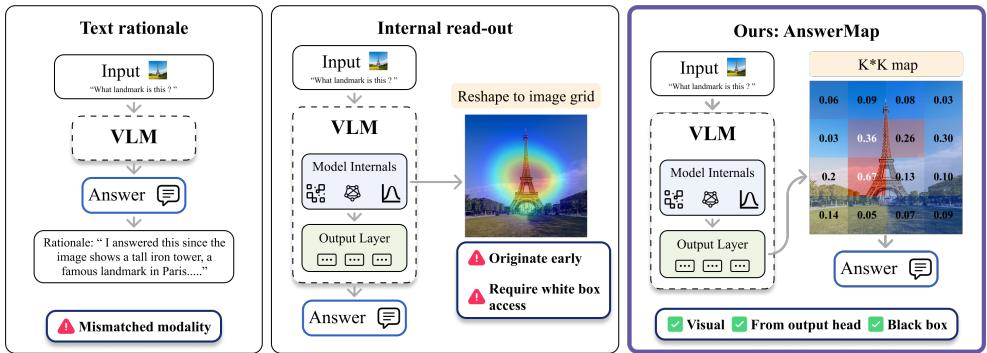  
Figure 1: Three ways to explain one frozen VLM’s answer. A text rationale is in a mismatched modality. An internal read-out is in the right modality but originates too early and needs the weights. AnswerMap reads the output head one band at a time, the map is visual and black-box, and a fixed read-out computes the answer from it.

## ABSTRACT

When a VLM answers a visual query, current interpretability tools rely on text rationales, which use a mismatched modality, or on internal read-outs, which originate too early to reflect the final output and require white-box access to the model. We introduce AnswerMap, a training-free, task-agnostic, black-box visual rationale constructed from the output head. The image is cut into K row and K column bands, each shown alone to the frozen model along with the query in the format of a yes/no relevance question. The outer product of the row and column “yes” posteriors gives the query-conditioned spatial map. Crucially, by defining a fixed read-out R (e.g., expectation, maximum) on top of AnswerMap, we can derive continuous outputs like location natively. This bypasses the reliance on discrete text tokens for continuous-output tasks and guarantees an image-dependent answer by construction. However, a rationale can be confabulated, so we validate AnswerMap across four models and three query distributions with two tests: (a) agreement with the model’s own generated point and (b) deletion of the map’s region. The map lands where the model points (AUC 0.85 against 0.38 for attention), and deleting its region flips 53% of correct answers (against 19% for attention’s). Beyond establishing faithfulness, we demonstrate the map’s task-agnostic utility through three distinct read-outs: its maximum flags hallucinated objects without generation, its expectation localizes correctly when the model’s own pointing fails, and its top-mass region, fed back as a crop, fixes half of the model’s wrong answers. AnswerMap thus offers a new lens on VLM interpretability and, through its read-outs, a new output interface for visual tasks beyond text tokens.

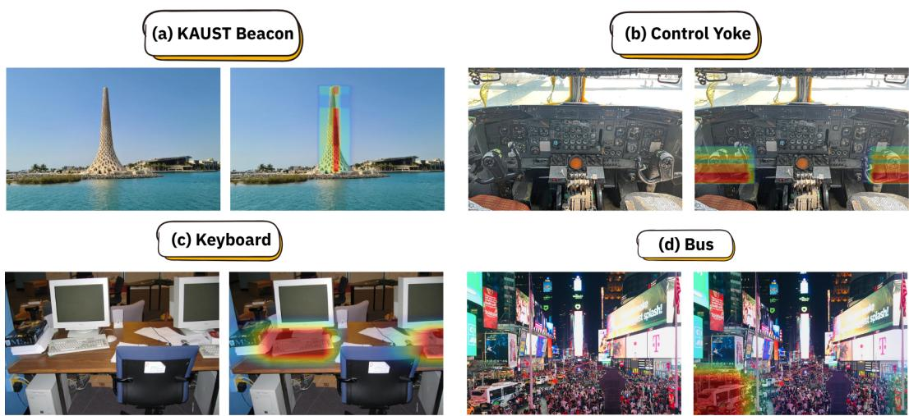  
Figure 2: AnswerMap (multigrid) from GPT-6-sol through its API, one query each.

## 1 INTRODUCTION

When a vision language model (VLM) answers a visual query, the natural check is spatial: which part of the image did the answer come from. A radiologist reading a generated report or an auditor checking a claim needs that check. Providing it is the job of interpretability tools.

Current interpretability tools for VLMs suffer from distinct structural limits (Figure 1). Text rationales come from the same head as the answer but operate in a mismatched modality. They name no explicit region, cannot be tested against the image, and often fail to reflect what actually drove the prediction (Turpin et al., 2023; Ding et al., 2025). Internal read-outs, attention and gradient attribution, are in the right modality but originate earlier in the network than where the answer is generated. The relationship between their values and the final output is notoriously unclear, a verdict measured first on text models and now on VLMs (Jain & Wallace, 2019; Song et al., 2026), and much of their mass sits on sink tokens the answer does not need (Kang et al., 2025b). A third line of work, perturbation (Zeiler & Fergus, 2014; Petsiuk et al., 2018), avoids these limits. It is visual, reads the final output, and requires no internal access. However, standard occlusion scores one cell at a time by removing it from the full image. Consequently, each score is merely the difference between two near-certain answers, a cell scores nothing if the rest of the image covers for it, and the method scales quadratically, paying one forward pass per cell.

We build on this third line but change what each cell’s score sees. AnswerMap, a training-free, task-agnostic visual rationale (Figure 3), does not read the model’s words or its internals. Instead, it asks the model about each part of the image and records the answer probability. The image is cut into K row and K column bands, and each band is shown to the frozen model in isolation alongside one yes/no question about the query. Thus, every score is a full-contrast recognition judgment of a region on its own, rather than a measure of its removal from context. The outer product of the row and column "yes" posteriors is a K × K query-conditioned map, O(K) queries rather than $O ( K ^ { 2 } )$

Crucially, the rationale does more than explain. Applying a fixed read-out R to the map derives the answer directly, such as taking its expectation for a location or its maximum for grounding strength. This has two major structural consequences. First, the output becomes continuous: a coordinate rather than a discrete token. Second, because every entry is a posterior derived from a single strip shown in isolation, there is no unconstrained generation step where the language prior can take over. So, reliance on the image is guaranteed by construction.

Because any rationale can be confabulated, we introduce two ground-truth-free tests for spatial explanations: (a) the model’s own generated point should land where the map is high, and (b) deleting the map’s peak region should break the answer. AnswerMap passes both tests across four models. In contrast, attention fails both, and the strongest white-box baseline trails on each. Finally, three different read-outs applied to the same map actively solve downstream tasks: flagging hallucinated objects, localizing when the model’s own pointing fails, and fixing the model’s prior mistakes through a targeted crop.

Table 1: Positioning. Any answer: the rationale exists for non-word answers such as coordinates. Cell score: what a cell’s value measures (where attention routed, how strongly a word activates, whether the cell is necessary when removed from the full image, or whether a band shown alone suffices). Black box: needs only the model’s output token probabilities. Passes: forward passes for one $K \times K$ map.
<table><tr><td>Rationale</td><td></td><td>Spatial Any answer</td><td>Cell score</td><td></td><td>Black box Passes per map</td></tr><tr><td>Words (text generation)</td><td>x</td><td>√</td><td>none</td><td>√</td><td>1</td></tr><tr><td>Attention</td><td>√</td><td>√</td><td>routing</td><td>X</td><td>1</td></tr><tr><td>Gradient relevancy (e.g., T-MM)</td><td>√</td><td>√</td><td>routing</td><td>x</td><td>1</td></tr><tr><td>Token activation (e.g., TAM)</td><td>√</td><td>X</td><td>activation</td><td>x</td><td>1</td></tr><tr><td>Occlusion</td><td>√</td><td>√</td><td>necessity</td><td>√</td><td>K2</td></tr><tr><td>AnswerMap</td><td>√</td><td>√</td><td>sufficiency</td><td>√</td><td>2K</td></tr></table>

Contributions. (1) AnswerMap, a black-box spatial rationale from answer posteriors at 2K queries, with a multigrid product to capture different types of context. (2) Read-outs on the map as an output interface. (3) A two-test, ground-truth-free faithfulness protocol for any spatial explanation of any VLM.

## 2 RELATED WORK

Text rationales. The default explanation of a VLM answer is the model’s own words. However, a model’s stated reasoning can misrepresent the cause of its prediction (Turpin et al., 2023), text supplies most of a VL decoder’s output (Parcalabescu & Frank, 2025), a model that writes “let me check the figure again” rarely notices a swapped figure (Shi et al., 2026), and VLM explanations only partly survive counterfactual tests of the concepts they cite (Ding et al., 2025). The fundamental limit across all four failure modes is the modality: a sentence names no explicit region, so nothing in it can be tested against the image.

Attention as explanation. Attention weights, raw or propagated by rollout (Abnar & Zuidema, 2020), are the most common lens on where a transformer looks. Text-domain intervention studies were the first to question this lens, showing that very different attention distributions can yield the same prediction (Jain & Wallace, 2019), and that attention predicts input importance only noisily (Serrano & Smith, 2019). For VLMs the signal is further distorted. Image tokens receive a vanishing share of attention in deep layers (Chen et al., 2025), high attention lands on sink tokens irrelevant to the text (Kang et al., 2025b), and attention systematically under-allocates to the regions a question actually needs (Xi et al., 2026). Furthermore, grounding from attention requires first finding the few specific heads that localize (Kang et al., 2025a), and its faithfulness varies by input, often exhibiting a mode where no attended region is individually necessary (Song et al., 2026). The limit here is structural: an attention weight records how much a position was read, but nothing directly ties that number to the final answer. A cell score that is itself an answer about the cell would not inherit this problem.

Gradient, relevancy, and activation attribution. Grad-CAM (Selvaraju et al., 2017), integrated gradients (Sundararajan et al., 2017), and Transformer-MM relevancy propagation (T-MM) (Chefer et al., 2021) route the output’s gradient back to the input. Recent methods also condition directly on the generated answer: GLIMPSE fuses gradient-weighted attention across layers (Shen, 2025), and TAM projects image-token states onto a generated word through the output layer (Li et al., 2025). On vision transformer classifiers a salience-based faithfulness test finds every method in the family only moderately faithful, Grad-CAM and integrated gradients low, plain LRP near the random floor, and gradient-weighted attention aggregated across layers, T-MM, at the top (Wu et al., 2024). Additionally, multi-encoder VLM architectures make gradient methods notoriously difficult to apply (Xing et al., 2025). Crucially, all of these methods require white-box access to the model weights, a ceiling the mechanistic literature explicitly acknowledges as its own limitation (Mann et al., 2026).

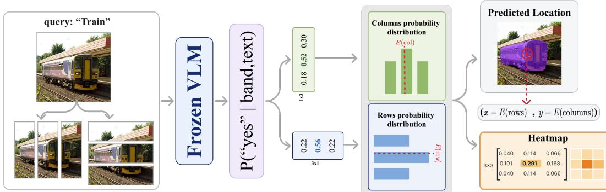  
Figure 3: The AnswerMap operator. K row and K column band questions fill a $K \times K$ map through the outer product, and a read-out computes the answer from the map.

Black-box perturbation. Occlusion (Zeiler & Fergus, 2014) and RISE (Petsiuk et al., 2018) estimate importance by masking the input and watching the output, which needs no internals and can be tested by the same intervention. The closest method to our setting optimizes a deletion-validated heatmap for VLM answers (Xing et al., 2025), but it needs gradients and the generated answer. For purely black-box approaches, computational cost is the bottleneck: they require one forward pass per occluder position (e.g., 4,000 to 8,000 masked passes per map for RISE). Furthermore, each score represents the marginal effect of one cell against a full image that still displays context everywhere else. A signal that judges a region on its own, combined with a factorization that keeps the pass count linear in the grid, would preserve the black-box access while eliminating the prohibitive cost.

Low-rank factorization and answer-space probing. Writing a matrix as an outer product of two vectors is the cheapest structure a matrix can have, and it is a workhorse wherever a full matrix is too expensive to learn or measure, from separable filters to low-rank adaptation of weight updates (Hu et al., 2021). GridProbe brought the same structure to inference: it arranges video frames on a $K \times K$ grid, asks a frozen VLM 2K questions about the rows and the columns, and reads the outer product of the answer confidences as a frame importance map, $O ( K )$ passes for $K ^ { 2 }$ candidates (Eltahir et al., 2026). An image is a grid too. If the same 2K questions read a map on an image, the map is no longer a means to select inputs but the explanation itself, at the cost perturbation cannot reach.

Across these threads, text rationales cannot be tested against the image, internal read-outs are unreliable even when weights are available, and perturbation is testable and black-box but pays a steep pass-per-cell cost for a signal diluted by surrounding context. What is missing is a spatial rationale whose cell scores are direct answers, read entirely from the output head at a linear cost. The following section builds it, and Table 1 summarizes the positioning.

## 3 ANSWERMAP

## 3.1 WHAT THE PROBE READS

Let x be an image and q a free-text query. We cut x into K horizontal bands and K vertical bands. Each band is cropped out and shown alone to the frozen model, as one strip image with no index and no surrounding image, with one binary question, “is $\{ q \}$ in this band”. The answer is never read from generated text. Let $z _ { \mathrm { y e s } }$ and $z _ { \mathrm { n o } }$ be the model’s first answer-token logits for the two labels. The yes posterior of row band i is

$$
p _ { i } ^ { \mathrm { r o w } } = \frac { \exp { z _ { \mathrm { y e s } } } } { \exp { z _ { \mathrm { y e s } } } + \exp { z _ { \mathrm { n o } } } } , \qquad i = 1 , \dots , K ,\tag{1}
$$

and likewise $p _ { j } ^ { \mathrm { c o l } }$ for column band j. The two marginals combine into a $K \times K$ map by the outer product

$$
M _ { i j } = p _ { i } ^ { \mathrm { r o w } } p _ { j } ^ { \mathrm { c o l } } ,\tag{2}
$$

where cell $( i , j )$ is the intersection of row band i and column band $j .$ . Intuitively, a cell is important only if both the row and the column through it draw a confident yes. One confident marginal gives partial weight, neither gives none. An $8 \times 8$ map costs $2 K { = } 1 6$ forward passes, against 65 for occlusion at the same grid, and the only access it needs is the first-token logprobs of two labels. The bands are cut in pixel space, so the operator never touches the model’s token layout: dynamic resolution, tiling, and token merging, which an internal read-out must invert to reach pixels, are invisible to it. It does need a model that accepts non-square inputs, natively or by tiling. The signal also differs from occlusion’s, not only its cost. Occlusion asks whether a cell is necessary given the rest of the image, a signal that redundancy hides. The probe asks whether a band alone suffices, so each answer is one recognition judgment, and the factorization turns 2K of them into a $K \times K$ map.

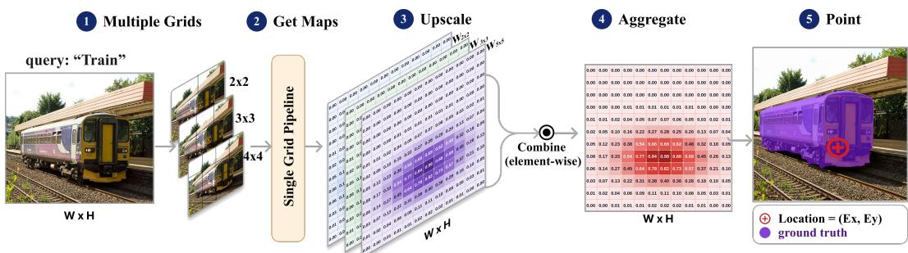  
Figure 4: Multigrid product. Coprime grids are probed separately, upsampled to a shared grid, and combined, so a region survives only if every band width endorses it.

The read-out. The map is the rationale. The answer is a read-out $R ( M )$ , a fixed function of the map, computed rather than generated. We use two in the tests and a third in Section 5. Let $c _ { i j }$ be the centre of cell $( i , j )$ in image coordinates, and let $m = \operatorname* { m i n } _ { i , j } M _ { i j }$ be the smallest entry of the map. The expectation is the weighted mean of the cell centres,

$$
\hat { \ell } ( M ) = \sum _ { i , j } w _ { i j } c _ { i j } , \qquad w _ { i j } = \frac { M _ { i j } - m } { \sum _ { i ^ { \prime } , j ^ { \prime } } ( M _ { i ^ { \prime } j ^ { \prime } } - m ) } ,\tag{3}
$$

a continuous sub-cell location. Subtracting m removes the map’s floor, which puts the probe on the same zero-floor footing every baseline map has by construction. The maximum $\operatorname* { m a x } _ { i j } M _ { i j }$ is a scalar grounding strength, high when the model commits to a region, read on the raw map of Equation $^ { 2 , }$ whose entries are products of posteriors. For a spatial query the read-out is the answer. For a question answered in words the map is the rationale beside the answer, and Section 4 tests both.

Why the image must matter. A VLM can answer a visual question from its language prior alone, and a fluent answer does not show when it did (Shi et al., 2026; Parcalabescu & Frank, 2025). Under generation the model sees the image and the question together, and nothing in the emitted text records what it drew on. The guarantee against this is a property of the read-out. Under R the strips differ only in content: no index, no surrounding image, the same question. Whatever the language prior contributes, it contributes to every strip alike, since nothing lets it tell one strip from another, so it can raise or lower the whole map but cannot move mass across it. Any location or peak a read-out computes therefore comes from the strips, and reliance on the image is guaranteed by construction.

## 3.2 MULTIGRID PRODUCT

A single grid fixes one band width, and the band width fixes what each question can see. A coarse grid shows the model wide bands, so each answer is judged with context and the map captures global structure. A fine grid shows thin bands, so each answer is local and precise. We therefore probe several coarse and fine grids, upsample each map by nearest neighbour to a shared $6 4 \times 6 4$ grid, min-max normalize each map to [0, 1], and multiply them elementwise (Figure 4). The product is a product of experts, a soft intersection under which a location survives only if every view endorses it, so a region must be supported both in context and in detail. The product also gains resolution: a row profile from $K _ { 1 }$ bands times one from $K _ { 2 }$ bands is piecewise constant on the union of their boundaries, so coprime sizes, which share no boundary, give $\stackrel { \cdot } { K } _ { 1 } + K _ { 2 } - 1$ pieces from $K _ { 1 } { + } K _ { 2 }$ questions, each still wide enough to answer, whereas nested sizes such as {2, 4, 8} repeat boundaries and add none. The map stays separable, a row profile times a column profile, so the product sharpens one region and does not add a second.

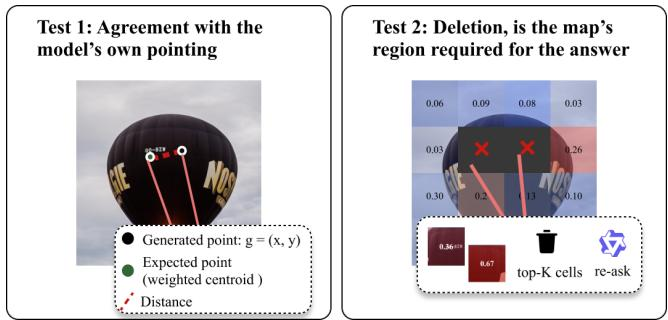  
Figure 5: The two-test faithfulness protocol. Left, agreement, score the full map at the model’s own generated point. Right, deletion, remove the map’s top-mass region against a matched random region and re-ask.

## 3.3 THE TWO TESTS

A map elicited from the model’s own answers could be confabulation, so we measure its faithfulness with two ground-truth-free tests that apply to any spatial explanation (Figure 5).

Test 1, agreement. The map claims to read the model’s belief about where the query is. The model can also state that belief itself, by pointing at the query through its native grounding prompt. If the map is faithful, the generated point is a sample from the belief the map describes and should fall where the map is high. The test therefore scores the map at the model’s own point, against the model rather than against ground truth.

Test 2, deletion. The map claims that the answer depended on the region it names. If the map is faithful, removing that region from the image should break a correct answer, and removing a random region of the same size should not. The test therefore deletes the map’s region, re-asks the question, and compares the answer change rate with the random control.

## 4 EXPERIMENTS

## 4.1 SETUP

All experiments use frozen open-weight models in bfloat16 with greedy decoding and no training: Qwen3-VL-4B-Instruct (Bai et al., 2025) as the primary model, replicated on Qwen3-VL-8B, Qwen3- VL-30B-A3B, and InternVL3.5-8B (Wang et al., 2025). The single K=8 grid is the default probe, and the coprime pair {3, 5}, which costs the same 16 queries, is reported beside it. Probes use a 512-pixel long side, generation and deletion use 1024 (probing at 1024 instead leaves the agreement scores unchanged, Appendix A.5). Baselines are zero-shot, calibration-free, and answer-free. Attention enters three ways: at its best layer, at the last layer, and by rollout (Abnar & Zuidema, 2020). The best layer is chosen once per model by sweeping all decoder layers on 200 RefCOCOg examples, then fixed for every benchmark and both tests. The 200 are among the 800 RefCOCOg examples evaluated, an overlap that can only favor attention. T-MM relevancy (Chefer et al., 2021) is the white-box representative. Occlusion (Zeiler & Fergus, 2014) runs on the same 8 × 8 grid, one grey cell at a time. A random map is the floor. Within each table all methods are scored on the same examples. TAM (Li et al., 2025) is white-box and explains a generated token, so it runs in its own regime: in Test 1 the model names the queried object and TAM explains the name, with the best sub-token counted as in its Obj-IoU, in Test 2 it explains the generated answer. Prompts are in Appendix A.2 and the full configuration in Table 13.

Metrics. Test 1 scores the full map at the model’s generated point g with the saliency-canon metrics (Bylinskii et al., 2019): NSS, the z-scored map value at g (chance 0), and AUC, the probability that the map ranks the cell containing g above a random cell (chance 0.5). Both score the map directly, so multimodal maps are treated fairly, and each map is scored at its native resolution. Test 2 pools every map to the shared 8 × 8 grid, deletes its 8 highest-valued cells (12.5% of the image, not necessarily contiguous) by setting them to grey, and reports the answer change rate on questions the model answers correctly with the full image. Controls delete a random region of the same cell count, drawn uniformly or disjoint from method regions.

Table 2: Test 1. Does the map land where the model points? NSS and AUC at the model’s own generated point (chance 0 and 0.5). RefCOCOg n=800, RefCOCO+ n=800, CAVE n=334. TAM is answer-conditioned and runs in its own regime (Section 4.1). Controls: the probe run on a blank image, and on the image of another example, with the model’s generated point held fixed.
<table><tr><td rowspan="2"></td><td colspan="2">RefCOCOg</td><td colspan="2">RefCOCO+</td><td colspan="2">CAVE</td></tr><tr><td>NSS</td><td>AUC</td><td>NSS</td><td>AUC</td><td>NSS</td><td>AUC</td></tr><tr><td>AnswerMap (K=8)</td><td>1.36</td><td>0.824</td><td>1.44</td><td>0.817</td><td>1.73</td><td>0.828</td></tr><tr><td>AnswerMap ({3, 5}, equal cost)</td><td>1.56</td><td>0.853</td><td>1.52</td><td>0.840</td><td>1.70</td><td>0.845</td></tr><tr><td>Attention (best layer)</td><td>-0.22</td><td>0.380</td><td>-0.18</td><td>0.432</td><td>-0.21</td><td>0.409</td></tr><tr><td>Attention (last layer)</td><td>-0.15</td><td>0.464</td><td>-0.11</td><td>0.490</td><td>-0.17</td><td>0.456</td></tr><tr><td>Attention rollout</td><td>-0.16</td><td>0.457</td><td>-0.15</td><td>0.475</td><td>-0.13</td><td>0.543</td></tr><tr><td>Relevancy T-MM</td><td>0.33</td><td>0.656</td><td>0.62</td><td>0.689</td><td>0.44</td><td>0.668</td></tr><tr><td>Token activation TAM (own regime)</td><td>0.77</td><td>0.693</td><td>0.74</td><td>0.694</td><td>0.60</td><td>0.626</td></tr><tr><td>Occlusion (65 queries)</td><td>1.04</td><td>0.649</td><td>1.14</td><td>0.654</td><td>1.12</td><td>0.644</td></tr><tr><td>Random map</td><td>-0.05</td><td>0.486</td><td>-0.02</td><td>0.493</td><td>-0.01</td><td>0.497</td></tr><tr><td>Probe map, blank image</td><td>0.00</td><td>0.500</td><td>0.00</td><td>0.500</td><td>0.00</td><td>0.500</td></tr><tr><td>Probe map, swapped image</td><td>-0.02</td><td>0.475</td><td>-0.02</td><td>0.490</td><td>-0.03</td><td>0.494</td></tr></table>

Table 3: Test 2. Does deleting the map’s region break the answer? Answer change rate (%) on questions answered correctly with the full image. TextVQA n=400, GQA n=800. Right columns: blur instead of grey, and non-binary questions only, those whose answer is not yes or no. TAM is answer-conditioned and runs in its own regime.
<table><tr><td>Method</td><td>TextVQA</td><td>TextVQA (blur)</td><td>GQA</td><td>GQA (non-binary)</td></tr><tr><td>AnswerMap (ours)</td><td>53.4</td><td>54.0</td><td>22.4</td><td>26.2</td></tr><tr><td>Relevancy T-MM</td><td>36.8</td><td>36.5</td><td>17.1</td><td>15.3</td></tr><tr><td>Attention (best layer)</td><td>18.8</td><td>19.3</td><td>3.0</td><td>2.2</td></tr><tr><td>Attention (last layer)</td><td>18.3</td><td>19.6</td><td>4.2</td><td>4.9</td></tr><tr><td>Attention rollout</td><td>9.5</td><td>9.5</td><td>3.4</td><td>5.3</td></tr><tr><td>Token activation TAM (own regime)</td><td>33.2</td><td>32.7</td><td>8.8</td><td>13.9</td></tr><tr><td>Occlusion (65 queries)</td><td>48.8</td><td>49.0</td><td>18.2</td><td>19.2</td></tr><tr><td>Random region, uniform</td><td>8.2</td><td>8.7</td><td>4.5</td><td>5.6</td></tr><tr><td>Random region, disjoint from all maps</td><td>3.3</td><td>3.3</td><td>2.7</td><td>2.2</td></tr></table>

## 4.2 TEST 1: THE MAP LANDS WHERE THE MODEL POINTS

Table 2 reports Test 1 on referring expressions RefCOCOg (Mao et al., 2016), appearance-only expressions RefCOCO+ (Yu et al., 2016), and anomaly descriptions CAVE (Bhagwatkar et al., 2025), with the same ordering on all three. Qualitative maps are in Appendix A.3.

The probe leads and the equal-cost multigrid {3, 5} leads further. Occlusion, the only other black-box method above chance, has the same access as the probe and four times its queries, yet trails on both metrics, so the margin comes from what each cell’s score measures, not from black-box access. Attention is at or below chance even at the best of its 36 layers (Figure 10), for a mechanical reason: its mass sits on sink tokens irrelevant to the text (Kang et al., 2025b), so its expectation barely moves with the query (Figure 7). T-MM, the strongest white-box baseline, and TAM land between the two.

The two control rows test the guarantee of Section 3.1 with the generated point held fixed and only the probe input changed. A blank image gives a flat map and both metrics land exactly at chance. An image swapped in from another example gives a map that follows that image: no correlation with this image’s point, and an expectation farther from it than the image centre (Table 11), so the map is not neutral but committed to what it was shown. The query alone carries no location, and the image alone decides where the map goes.

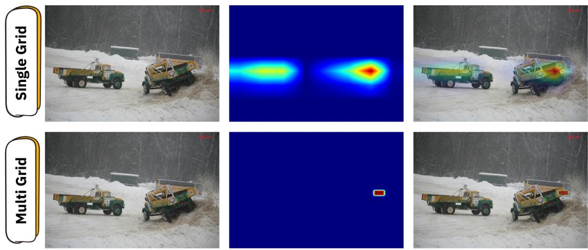  
Figure 6: AnswerMap on GPT-6-sol through its API, Query: "a truck number 14 on a snow bank." Logprobs only. Top: an 8 × 8 grid, 16 calls. Bottom: the multigrid product, 58 calls, narrows the map onto the truck the query names.

## 4.3 TEST 2: DELETING THE MAP’S REGION BREAKS THE ANSWER

Table 3 reports Test 2 on TextVQA (Singh et al., 2019), where answers are text at a location, and GQA (Hudson & Manning, 2019), where answers are objects and relations. The probe’s region breaks the answer at six times the rate of a uniform random region on TextVQA and five times on GQA, the gap holds under blur and on the non-binary questions, and the strongest baselines are occlusion, the method closest in construction to a deletion test, which trails the probe at four times the queries, and T-MM among the white-box read-outs, well above attention and well below the probe.

## 4.4 THE RESULT HOLDS ACROSS SCALE AND FAMILY

The probe is stable everywhere with no per-model tuning, while attention’s best layer moves with the model. On InternVL occlusion matches the probe’s NSS and trails its AUC, at four times the queries.

Table 4: Both tests at 8B, 30B, and on a second family. Test 1: the probe and the strongest baseline run on that model, attention at the model’s own swept best layer. Test 2 on TextVQA: the probe, occlusion, and a uniform random region of the same size, all measured on the same model and examples.
<table><tr><td></td><td colspan="5">Test 1, agreement</td><td colspan="3">Test 2, deletion</td></tr><tr><td>Model</td><td colspan="2">Probe</td><td colspan="3">Best baseline</td><td colspan="3"></td></tr><tr><td></td><td>NSS</td><td>AUC</td><td></td><td>NSS</td><td>AUC</td><td>Probe</td><td>Occlusion</td><td>Random</td></tr><tr><td>Qwen3-VL-4B</td><td>1.36</td><td>0.824</td><td>occlusion</td><td>1.04</td><td>0.649</td><td>53.4</td><td>48.8</td><td>8.2</td></tr><tr><td>Qwen3-VL-8B</td><td>1.49</td><td>0.823</td><td>attention</td><td>0.33</td><td>0.634</td><td>51.1</td><td>50.3</td><td>9.4</td></tr><tr><td>Qwen3-VL-30B-A3B</td><td>1.39</td><td>0.813</td><td>occlusion</td><td>1.03</td><td>0.671</td><td>45.8</td><td>45.0</td><td>7.4</td></tr><tr><td>InternVL3.5-8B</td><td>1.03</td><td>0.768</td><td>occlusion</td><td>1.03</td><td>0.699</td><td>50.4</td><td>50.0</td><td>9.6</td></tr></table>

## 4.5 THE OPERATOR RUNS ON A CLOSED MODEL

Nothing in AnswerMap needs more than first-token logprobs, so it runs unchanged on GPT-6-sol through its API (Figures 2 and 6). $\mathrm { A n } 8 \times 8$ grid spreads the map over both trucks in the same rows, and the multigrid product narrows it onto the one the query names. Two keyboards and two yokes sharing a row are both lit, with nothing between them.

Table 5: Does the map localize where the model’s own pointing fails? Point-in-region accuracy (%) against ground-truth boxes, parse failures scored as misses after getting retried 3 times. Qwen3-VL-4B on CAVE and RefCOCOg, and the medical Lingshu-7B on RefCOCOg.
<table><tr><td></td><td colspan="2">Qwen3-VL-4B</td><td>Lingshu-7B</td></tr><tr><td>Read-out</td><td>CAVE</td><td>RefCOCOg</td><td>RefCOCOg</td></tr><tr><td>Generated point (the interface)</td><td>77.8</td><td>94.5</td><td>46.7</td></tr><tr><td>Probe expectation (AnswerMap)</td><td>71.3</td><td>67.5</td><td>57.7</td></tr><tr><td>Attention (best layer)</td><td>57.2</td><td>40.0</td><td>40.0</td></tr><tr><td>Image-centre prior</td><td>58.1</td><td>40.5</td><td>39.3</td></tr><tr><td>Random point</td><td>24.3</td><td>24.8</td><td>24.3</td></tr></table>

Table 7: Does a crop of the map’s region help the model? Accuracy (%) on TextVQA, n=500, Qwen3-VL-4B.

Table 6: Does deletion tell a grounded yes from a hallucinated one? Flip rate (%) of yes claims on POPE when the map’s region or a random region is deleted.
<table><tr><td>Yes claim</td><td>Map region</td><td>Random</td></tr><tr><td>Grounded</td><td>41.0</td><td>1.4</td></tr><tr><td>Hallucinated</td><td>69.5</td><td>11.2</td></tr></table>

<table><tr><td>Added crop</td><td>Accuracy</td></tr><tr><td>None (image alone)</td><td>91.6</td></tr><tr><td>Own map region</td><td>92.4</td></tr><tr><td>Random region</td><td>89.0</td></tr></table>

## 5 READ-OUTS AS THE OUTPUT INTERFACE

The two tests established that the rationale is faithful. This section shows that the read-out is general. The same map, with a different fixed read-out on top, serves a different visual task, with no training and no change to the operator, and each read-out is scored against ground truth rather than against the model itself.

Read-out 1, the expectation: a location where pointing fails. Generation is one interface to a model’s spatial belief, and it can be narrower than the belief. Table 5 reads the belief through the expectation and sets it against what the interface emits, on a strong pointer, Qwen3-VL-4B, and on a weak one, the medical Lingshu-7B (Xu et al., 2026), whose pointing fails to parse on 30% of RefCOCOg queries. On the strong pointer generation is the richer channel and the map recovers most of it. On Lingshu-7B the order flips and the map beats the model’s own point by 11 points. The belief is intact, the interface is the bottleneck, and the gap between them is measurable.

Read-out 2, the maximum: a hallucinated claim is anchored nowhere. The maximum reads how strongly the model commits to a region, and the natural place to read it is a claim about object existence. POPE (Li et al., 2023) asks whether a named object is in the image, with labels for which objects are present. A yes on a present object is a grounded claim, a yes on an absent one is a hallucinated claim. On the full benchmark the model says yes 4,006 times, 223 of them hallucinated, and we read the map’s maximum before it answers. A hallucinated object has nowhere to peak, so the maximum separates the two kinds of claim at ROC-AUC 0.833, with no labels and 16 queries. Deletion confirms the reading from a second angle (Table 6). A grounded yes dies only when its own region is deleted. A hallucinated yes breaks eight times more often than a grounded one under a random deletion, and far more often under deletion of its map region.

Read-out 3, the top-mass region: a crop the model can act on. A faithful explanation should be useful to the model itself, and a confabulated one should not. We test this by acting on the map: probe first, then crop the top-mass region from the full-resolution image and append it as a close-up before answering. On TextVQA (Table 7) the map’s crop lifts accuracy where a random crop through the same mechanics lowers it. Behind the net numbers, the map’s crop turns 50% of the model’s 42 wrong answers right and the random crop 38% of them, while disturbing 4% against 6% of the answers the model had right.

Table 8: How should a query budget be spent? NSS at the model’s own point on a fixed 296-example RefCOCOg split, Qwen3-VL-4B.
<table><tr><td>Axis</td><td>Configuration</td><td>Queries</td><td>NSS</td></tr><tr><td rowspan="6">Refine one grid</td><td>K=2</td><td>4</td><td>0.75</td></tr><tr><td>K=4</td><td>8</td><td>1.25</td></tr><tr><td>K=6</td><td>12</td><td>1.46</td></tr><tr><td>K=8 (default)</td><td>16</td><td>1.14</td></tr><tr><td>K=17</td><td>34</td><td>1.11</td></tr><tr><td>K=40</td><td>80</td><td>0.22</td></tr><tr><td rowspan="5">Compose grids</td><td>{3, 5}, coprime</td><td>16</td><td>1.50</td></tr><tr><td>{2, 3, 5}, coprime</td><td>20</td><td>1.50</td></tr><tr><td>{2, 4, 8}, nested</td><td>28</td><td>1.25</td></tr><tr><td>{2, 3, 5, 7, 11}, coprime</td><td>56</td><td>1.25</td></tr><tr><td>{2, 3, 5, 7, 11, 13}, coprime</td><td>82</td><td>1.27</td></tr><tr><td rowspan="3">Fusion rule, {2, 3, 5}</td><td>product</td><td>20</td><td>1.50</td></tr><tr><td>mean</td><td>20</td><td>1.39</td></tr><tr><td>max</td><td>20</td><td>0.89</td></tr></table>

## 6 ABLATION STUDY

All ablations use Qwen3-VL-4B on RefCOCOg. Table 8 varies how a query budget is spent. Both strategies trace an inverted U (Figure 8, Appendix A.1), because a band question is only informative while the band retains enough context for an easy yes/no. Refining one grid peaks narrowly at K=6 and collapses as bands thin. Composing coprime grids reaches the same peak at {3, 5} and stays flat across a five-fold budget range, so the value of composition is robustness. The nested set {2, 4, 8} spends more queries for less, because nested grids double-count correlated evidence. The gain is agreement-side: on deletion {3, 5} ties K=8 (52.3 against 53.4), since both select nearly the same top-mass cells. Finally, the fusion rule behaves as the product-of-experts reading predicts: product beats mean beats max.

## 7 CONCLUSION

We introduced AnswerMap, a training-free visual rationale read from the output head of a frozen VLM: 2K yes/no band questions and an outer product give a query-conditioned map, and a fixed read-out on the map derives the answer instead of generating it, continuous and image-dependent by construction. The map passes two ground-truth-free faithfulness tests across three query distributions, four models, and two families, where attention fails both and the strongest white-box baseline trails, and three read-outs on the same map flag hallucinated objects, localize where the model’s own pointing fails, and fix half of the model’s wrong answers through a crop.

A few limitations and natural refinements remain. The operator needs a model that accepts non-square inputs, since each band is a long thin strip. And because the map is built from row and column answers, it knows which rows and which columns contain the query but not which pairs of them do: when the query matches two separate objects, the map also lights the two empty cells where their rows and columns cross. Beyond these, the read-out is the main design surface, and three steps follow: richer read-outs on the same map (extent, count, relations), training on top of the map as label-free supervision for the interface that cannot express it, and probe-guided generation that acts on the audit before the claim is generated. The answer posterior read through a fixed function is a new axis for visual tasks, not yet optimized, and we expect the interface to matter as much as the map.

## ACKNOWLEDGMENTS

We are grateful to the KAUST Academy for its generous support. For computer time, this research used Ibex managed by the Supercomputing Core Laboratory at King Abdullah University of Science & Technology (KAUST) in Thuwal, Saudi Arabia.

## REFERENCES

Samira Abnar and Willem Zuidema. Quantifying attention flow in transformers. In Dan Jurafsky, Joyce Chai, Natalie Schluter, and Joel Tetreault (eds.), Proceedings of the 58th Annual Meeting of the Association for Computational Linguistics, pp. 4190–4197, Online, July 2020. Association for Computational Linguistics. doi: 10.18653/v1/2020.acl-main.385. URL https://aclanthology.org/2020.acl-main.385/.

Shuai Bai, Yuxuan Cai, Ruizhe Chen, Keqin Chen, Xionghui Chen, Zesen Cheng, Lianghao Deng, Wei Ding, Chang Gao, Chunjiang Ge, Wenbin Ge, Zhifang Guo, Qidong Huang, Jie Huang, Fei Huang, Binyuan Hui, Shutong Jiang, Zhaohai Li, Mingsheng Li, Mei Li, Kaixin Li, Zicheng Lin, Junyang Lin, Xuejing Liu, Jiawei Liu, Chenglong Liu, Yang Liu, Dayiheng Liu, Shixuan Liu, Dunjie Lu, Ruilin Luo, Chenxu Lv, Rui Men, Lingchen Meng, Xuancheng Ren, Xingzhang Ren, Sibo Song, Yuchong Sun, Jun Tang, Jianhong Tu, Jianqiang Wan, Peng Wang, Pengfei Wang, Qiuyue Wang, Yuxuan Wang, Tianbao Xie, Yiheng Xu, Haiyang Xu, Jin Xu, Zhibo Yang, Mingkun Yang, Jianxin Yang, An Yang, Bowen Yu, Fei Zhang, Hang Zhang, Xi Zhang, Bo Zheng, Humen Zhong, Jingren Zhou, Fan Zhou, Jing Zhou, Yuanzhi Zhu, and Ke Zhu. Qwen3-vl technical report, 2025. URL https://arxiv.org/abs/2511.21631.

Rishika Bhagwatkar, Syrielle Montariol, Angelika Romanou, Beatriz Borges, Irina Rish, and Antoine Bosselut. CAVE : Detecting and explaining commonsense anomalies in visual environments. In Christos Christodoulopoulos, Tanmoy Chakraborty, Carolyn Rose, and Violet Peng (eds.), Proceedings of the 2025 Conference on Empirical Methods in Natural Language Processing, pp. 27110–27151, Suzhou, China, November 2025. Association for Computational Linguistics. ISBN 979-8-89176-332-6. doi: 10.18653/v1/2025.emnlp-main.1379. URL https://aclanthology.org/2025.emnlp-main.1379/.

Zoya Bylinskii, Tilke Judd, Aude Oliva, Antonio Torralba, and Frédo Durand. What do different evaluation metrics tell us about saliency models? IEEE Transactions on Pattern Analysis and Machine Intelligence, 41(3):740–757, 2019. doi: 10.1109/TPAMI.2018.2815601.

Hila Chefer, Shir Gur, and Lior Wolf. Generic attention-model explainability for interpreting bi-modal and encoder-decoder transformers. In 2021 IEEE/CVF International Conference on Computer Vision (ICCV), pp. 387–396, 2021. doi: 10.1109/ICCV48922.2021.00045.

Liang Chen, Haozhe Zhao, Tianyu Liu, Shuai Bai, Junyang Lin, Chang Zhou, and Baobao Chang. An image is worth 1/2 tokens after layer 2: Plug-and-play inference acceleration for large visionlanguage models. In Aleš Leonardis, Elisa Ricci, Stefan Roth, Olga Russakovsky, Torsten Sattler, and Gül Varol (eds.), Computer Vision – ECCV 2024, pp. 19–35, Cham, 2025. Springer Nature Switzerland. ISBN 978-3-031-73004-7.

Sihao Ding, Santosh Vasa, and Aditi Ramadwar. Explanation-driven counterfactual testing for faithfulness in vision-language model explanations, 2025. URL https://arxiv.org/abs/ 2510.00047.

Mohamed Eltahir, Lama Ayash, Ali Habibullah, Tanveer Hussain, and Naeemullah Khan. Gridprobe: Posterior-probing for adaptive test-time compute in long-video vlms, 2026. URL https:// arxiv.org/abs/2605.10762.

Edward J. Hu, Yelong Shen, Phillip Wallis, Zeyuan Allen-Zhu, Yuanzhi Li, Shean Wang, Lu Wang, and Weizhu Chen. Lora: Low-rank adaptation of large language models, 2021. URL https: //arxiv.org/abs/2106.09685.

Drew A. Hudson and Christopher D. Manning. Gqa: A new dataset for real-world visual reasoning and compositional question answering. In 2019 IEEE/CVF Conference on Computer Vision and Pattern Recognition (CVPR), pp. 6693–6702, 2019. doi: 10.1109/CVPR.2019.00686.

Sarthak Jain and Byron C. Wallace. Attention is not Explanation. In Jill Burstein, Christy Doran, and Thamar Solorio (eds.), Proceedings ofthe 2019 Conference ofthe North American Chapter of the Association for Computational Linguistics: Human Language Technologies, Volume 1 (Long and Short Papers), pp. 3543–3556, Minneapolis, Minnesota, June 2019. Association for Computational Linguistics. doi: 10.18653/v1/N19-1357. URL https://aclanthology. org/N19-1357/.

Seil Kang, Jinyeong Kim, Junhyeok Kim, and Seong Jae Hwang. Your large vision-language model only needs a few attention heads for visual grounding. In 2025 IEEE/CVF Conference on Computer Vision and Pattern Recognition (CVPR), pp. 9339–9350, 2025a. doi: 10.1109/CVPR52734.2025. 00872.

Seil Kang, Jinyeong Kim, Junhyeok Kim, and Seong Jae Hwang. See what you are told: Visual attention sink in large multimodal models. In Y. Yue, A. Garg, N. Peng, F. Sha, and R. Yu (eds.), International Conference on Learning Representations, volume 2025, pp. 87676–87703, 2025b. URL https://proceedings.iclr.cc/paper\_files/paper/2025/file/ da8a39bc39ae1c89dd6ebb1e3bcbb3f3-Paper-Conference.pdf.

Yi Li, Hualiang Wang, Xinpeng Ding, Haonan Wang, and Xiaomeng Li. Token activation map to visually explain multimodal llms. In 2025 IEEE/CVF International Conference on Computer Vision (ICCV), pp. 48–58, 2025. doi: 10.1109/ICCV51701.2025.00012.

Yifan Li, Yifan Du, Kun Zhou, Jinpeng Wang, Xin Zhao, and Ji-Rong Wen. Evaluating object hallucination in large vision-language models. In Houda Bouamor, Juan Pino, and Kalika Bali (eds.), Proceedings of the 2023 Conference on Empirical Methods in Natural Language Processing, pp. 292–305, Singapore, December 2023. Association for Computational Linguistics. doi: 10.18653/v1/2023.emnlp-main.20. URL https://aclanthology.org/2023. emnlp-main.20/.

Logan Mann, Ajit Saravanan, Ishan Dave, Shikhar Shiromani, Saadullah Ismail, Yi Xia, and Emily Huang. Where reliability lives in vision-language models: A mechanistic study of attention, hidden states, and causal circuits, 2026. URL https://arxiv.org/abs/2605.08200.

Junhua Mao, Jonathan Huang, Alexander Toshev, Oana Camburu, Alan L. Yuille, and Kevin Murphy. Generation and comprehension of unambiguous object descriptions. In Proceedings of the IEEE Conference on Computer Vision and Pattern Recognition (CVPR), June 2016.

Letitia Parcalabescu and Anette Frank. Do vision &amp; language decoders use images and text equally? how self-consistent are their explanations? In Y. Yue, A. Garg, N. Peng, F. Sha, and R. Yu (eds.), International Conference on Learning Representations, volume 2025, pp. 21634–21663, 2025. URL https://proceedings.iclr.cc/paper\_files/paper/2025/file/ 37294f033582ac0064bf90fa557c2573-Paper-Conference.pdf.

Vitali Petsiuk, Abir Das, and Kate Saenko. Rise: Randomized input sampling for explanation of black-box models, 2018. URL https://arxiv.org/abs/1806.07421.

Ramprasaath R. Selvaraju, Michael Cogswell, Abhishek Das, Ramakrishna Vedantam, Devi Parikh, and Dhruv Batra. Grad-cam: Visual explanations from deep networks via gradient-based localization. In Proceedings ofthe IEEE International Conference on Computer Vision (ICCV), Oct 2017.

Sofia Serrano and Noah A. Smith. Is attention interpretable? In Anna Korhonen, David Traum, and Lluís Màrquez (eds.), Proceedings ofthe 57th Annual Meeting ofthe Associationfor Computational Linguistics, pp. 2931–2951, Florence, Italy, July 2019. Association for Computational Linguistics. doi: 10.18653/v1/P19-1282. URL https://aclanthology.org/P19-1282/.

Guanxi Shen. Glimpse: Holistic cross-modal explainability for large vision-language models, 2025. URL https://arxiv.org/abs/2506.18985.

Chufan Shi, Cheng Yang, Yaokang Wu, Linghao Jin, Bo Shui, Taylor Berg-Kirkpatrick, and Xuezhe Ma. Are vlms seeing or just saying? uncovering the illusion of visual re-examination, 2026. URL https://arxiv.org/abs/2605.15864.

Amanpreet Singh, Vivek Natarajan, Meet Shah, Yu Jiang, Xinlei Chen, Dhruv Batra, Devi Parikh, and Marcus Rohrbach. Towards vqa models that can read. In 2019 IEEE/CVF Conference on Computer Vision and Pattern Recognition (CVPR), pp. 8309–8318, 2019. doi: 10.1109/CVPR.2019.00851.

Xurui Song, Weishi Wang, Zhongqi Yue, Kuluhan Binici, Tao Bai, Hongxin Shao, Daniel Dahlmeier, and Jun Luo. Visual attention faithfulness in vision-language models is heterogeneous, 2026. URL https://arxiv.org/abs/2609.00830.

Mukund Sundararajan, Ankur Taly, and Qiqi Yan. Axiomatic attribution for deep networks. In Doina Precup and Yee Whye Teh (eds.), Proceedings ofthe 34th International Conference on Machine Learning, volume 70 of Proceedings of Machine Learning Research, pp. 3319–3328. PMLR, 06–11 Aug 2017. URL https://proceedings.mlr.press/v70/sundararajan17a. html.

Miles Turpin, Julian Michael, Ethan Perez, and Samuel Bowman. Language models don't always say what they think: Unfaithful explanations in chain-of-thought prompting. In A. Oh, T. Naumann, A. Globerson, K. Saenko, M. Hardt, and S. Levine (eds.), Advances in Neural Information Processing Systems, volume 36, pp. 74952–74965. Curran Associates, Inc., 2023. doi: 10.52202/ 075280-3275. URL https://proceedings.neurips.cc/paper\_files/paper/ 2023/file/ed3fea9033a80fea1376299fa7863f4a-Paper-Conference.pdf.

Weiyun Wang, Zhangwei Gao, Lixin Gu, Hengjun Pu, Long Cui, Xingguang Wei, Zhaoyang Liu, Linglin Jing, Shenglong Ye, Jie Shao, Zhaokai Wang, Zhe Chen, Hongjie Zhang, Ganlin Yang, Haomin Wang, Qi Wei, Jinhui Yin, Wenhao Li, Erfei Cui, Guanzhou Chen, Zichen Ding, Changyao Tian, Zhenyu Wu, Jingjing Xie, Zehao Li, Bowen Yang, Yuchen Duan, Xuehui Wang, Zhi Hou, Haoran Hao, Tianyi Zhang, Songze Li, Xiangyu Zhao, Haodong Duan, Nianchen Deng, Bin Fu, Yinan He, Yi Wang, Conghui He, Botian Shi, Junjun He, Yingtong Xiong, Han Lv, Lijun Wu, Wenqi Shao, Kaipeng Zhang, Huipeng Deng, Biqing Qi, Jiaye Ge, Qipeng Guo, Wenwei Zhang, Songyang Zhang, Maosong Cao, Junyao Lin, Kexian Tang, Jianfei Gao, Haian Huang, Yuzhe Gu, Chengqi Lyu, Huanze Tang, Rui Wang, Haijun Lv, Wanli Ouyang, Limin Wang, Min Dou, Xizhou Zhu, Tong Lu, Dahua Lin, Jifeng Dai, Weijie Su, Bowen Zhou, Kai Chen, Yu Qiao, Wenhai Wang, and Gen Luo. Internvl3.5: Advancing open-source multimodal models in versatility, reasoning, and efficiency, 2025. URL https://arxiv.org/abs/2508.18265.

Junyi Wu, Weitai Kang, Hao Tang, Yuan Hong, and Yan Yan. On the faithfulness of vision transformer explanations. In 2024 IEEE/CVF Conference on Computer Vision and Pattern Recognition (CVPR), pp. 10936–10945, 2024. doi: 10.1109/CVPR52733.2024.01040.

Gongli Xi, Ye Tian, Mengyu Yang, Huahui Yi, Liang Lin, Xiaoshuai Hao, Kun Wang, and Wendong Wang. Large vision-language models get lost in attention, 2026. URL https://arxiv.org/ abs/2605.05668.

Xiaoying Xing, Chia-Wen Kuo, Li Fuxin, Yulei Niu, Fan Chen, Ming Li, Ying Wu, Longyin Wen, and Sijie Zhu. Where do large vision-language models look at when answering questions?, 2025. URL https://arxiv.org/abs/2503.13891.

Weiwen Xu, Hou Pong Chan, Long Li, Mahani Aljunied, Ruifeng Yuan, Jianyu Wang, Chenghao Xiao, Guizhen Chen, Chaoqun Liu, Zhaodonghui Li, Yu Sun, Junao Shen, Chaojun Wang, Can Hu, Siwei Pan, Jie Tan, Tingyang Xu, Deli Zhao, Hao Zhang, and Yu Rong. Lingshu: Generalist foundation model for unified multimodal medical understanding and reasoning. IEEE Transactions on Pattern Analysis and Machine Intelligence, pp. 1–18, 2026. doi: 10.1109/TPAMI.2026.3730310.

Licheng Yu, Patrick Poirson, Shan Yang, Alexander C. Berg, and Tamara L. Berg. Modeling context in referring expressions. In Bastian Leibe, Jiri Matas, Nicu Sebe, and Max Welling (eds.), Computer Vision – ECCV 2016, pp. 69–85, Cham, 2016. Springer International Publishing. ISBN 978-3-319-46475-6.

Matthew D. Zeiler and Rob Fergus. Visualizing and understanding convolutional networks. In David Fleet, Tomas Pajdla, Bernt Schiele, and Tinne Tuytelaars (eds.), Computer Vision – ECCV 2014, pp. 818–833, Cham, 2014. Springer International Publishing. ISBN 978-3-319-10590-1.

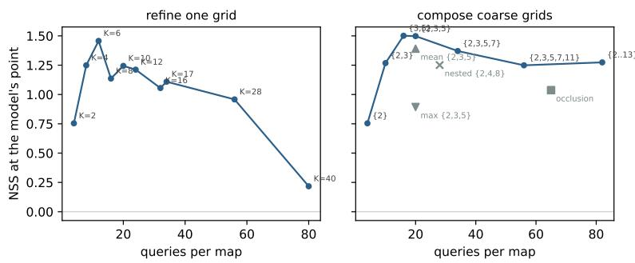  
Figure 8: Faithfulness against query budget. Refining one grid (left) peaks narrowly and collapses, composing coprime grids (right) is flat-topped. Grey markers, the fusion and independence controls of Table 8.

## A APPENDIX

## A.1 ADDITIONAL FIGURES AND TABLES

This appendix collects the figures the main text refers to and the cost measurements behind Section 6.

Why attention sits below chance. Figure 7 plots each map’s expectation against the model’s generated point on RefCOCOg. The probe’s expectation tracks the point along the diagonal. Bestlayer attention’s expectation is a flat band: its mass sits on sink tokens irrelevant to the query, so it barely moves with the point, which is what a below-chance AUC looks like in coordinates.

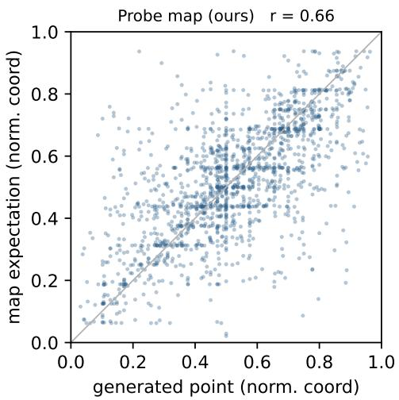

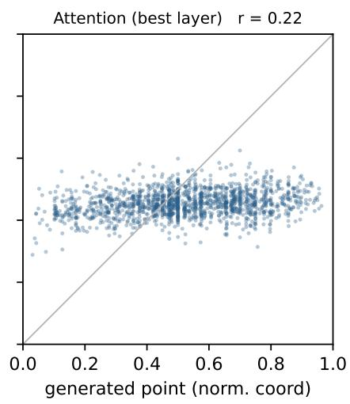  
Figure 7: Map expectation against the model’s generated point on RefCOCOg. The probe tracks the diagonal, best-layer attention is a flat band regardless of where the model points.

Query budget curves. Figure 8 plots Table 8 against the query budget. Refining one grid rises to a narrow peak at K=6 and collapses as bands thin. Composing coprime grids reaches the same peak and stays flat across a five-fold budget range. The grey markers are the fusion and independence controls, mean, max, and the nested set.

Cost. The probe runs at 0.4 to 1.3 seconds per map from 4B to 30B, four to five times cheaper than occlusion, the other black-box method (Table 9). Internal read-outs are cheaper per map where the internals are available, since one forward pass beats 16, so the case for the probe is access and faithfulness at modest cost, not raw speed.

Table 9: Seconds per explanation map on one A100, 20 samples at image side 512. Bold: the faster of the two black-box methods. T-MM additionally carries gradient memory, up to 47% extra at 4B.
<table><tr><td>Method</td><td>Queries</td><td>Access</td><td>4B</td><td>30B</td></tr><tr><td>Probe map (ours)</td><td>16</td><td>logits only</td><td>0.41</td><td>1.25</td></tr><tr><td>Occlusion</td><td>65</td><td>logits only</td><td>1.80</td><td>5.90</td></tr><tr><td>Attention (best layer)</td><td>1</td><td>internals, eager</td><td>0.07</td><td>0.38</td></tr><tr><td>Attention rollout</td><td>1</td><td>internals, eager</td><td>0.59</td><td>1.15</td></tr><tr><td>Relevancy T-MM</td><td>1</td><td>internals, eager, gradients</td><td>0.18</td><td>1.35</td></tr></table>

## A.2 PROMPT TEMPLATES

All prompts are listed verbatim. Placeholders in braces are filled at run time, {cond} and {q} with the user query exactly as it appears in the benchmark. In every prompt the images precede the text in the model’s chat template, and where two images are given, the full image comes first and the crop second.

Band probe (every probe query). Each of the 2K band questions shows the model the band content and asks:

You are shown one or more adjacent tiles cropped from a larger   
image. Is the following present in ANY of these tiles?   
"{cond}"   
Answer with exactly one word: Yes or No.

The answer is never read from generated text. We take the first answer-token logits and compute the yes posterior over the closed label set, aggregating surface forms by logsumexp, yes forms {Yes, yes, YES} with and without a leading space, and likewise for no.

Pointing reference (agreement test and point-in-region). The generated point uses each family’s native grounding convention, declared per family rather than inferred, coordinates are parsed from the reply and interpreted on a 0 to 1000 scale for both families below. Qwen3-VL models, and medical derivatives built on Qwen-VL such as Lingshu:

Locate "{q}" in this image and output its center point as   
JSON: {"point\_2d": [x, y], "label": "{q}"}

InternVL models, the documented grounding template, the box centre is taken as the point:

Please provide the bounding box coordinate of the region this sentence describes: <ref>{q}</ref>

Other models, a generic pixel-space prompt:

Point to {q} in this image. Output ONLY the pixel coordinates   
of its center as (x, y). No other text.

Open-ended answering (deletion test, image-reliance labeling, self-conditioning).

{q}   
Answer with a single word or phrase.

Existence claims (hallucination audit).

{q}   
Answer yes or no.

Self-conditioning close-up. The receiver sees the full image and the crop of the map’s top-mass region as a second image:

{q}   
The second image is a close-up of the region most relevant to   
the question.   
Answer with a single word or phrase.

## A.3 QUALITATIVE EXAMPLES

Figure 9 shows three probe maps at K=8 on Qwen3-VL-4B, each with its query as the sub-caption: a landmark, a referring expression with a distractor, and a pathology slide with a medical query. In each the map is a single mode on the queried region, and the third shows that the operator works even on specific domains, the band question carries the query as is.

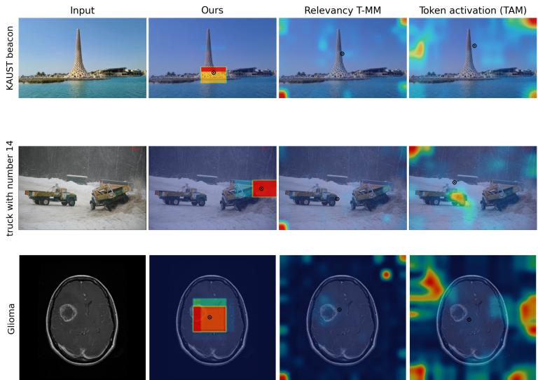  
Figure 9: Qualitative examples of the probe map. Each column shows one example, with the input image above its corresponding probe map.

## A.4 ADDITIONAL DIAGNOSTICS

This appendix holds the diagnostics behind Section 4: the attention layer sweep, the image-reliance split of the deletion test, the full four-metric agreement table with the control rows, the map-maximum grading, and the localization-heads variant.

Attention layer sweep. Figure 10 scores the attention map of every decoder layer of Qwen3-VL-4B against the model’s generated point. A mid-stack band peaks at layer 15, the layer every attention row in the main tables uses, and the last layer is negative.

Where the map matters. Whole-image deletion labels each correctly answered question by whether the image was needed. Probe-region deletion flips 57.4% of the questions that needed the image and 22.0% of those that did not, and the split holds at every scale and on both families (Table 10).

Agreement in all four metrics. Table 11 adds to Table 2 the distance from the map’s expectation to the generated point, as a fraction of the image diagonal, and the Pearson correlation of their coordinates, on RefCOCOg. The image-centre prior is the floor for the distance. The two control rows show the guarantee of Section 3.1 in coordinates: on a blank image the expectation sits exactly on the centre, and on a swapped image it lands farther from the point than the centre does, with no correlation, so the map follows the image it was shown.

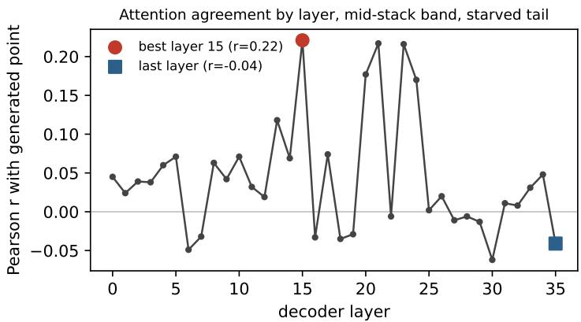  
Figure 10: Agreement of each decoder layer’s attention map with the model’s point on Qwen3-VL-4B. A mid-stack band peaks at layer 15, the last layer is negative.

Table 10: The map matters where the image mattered. Probe-region flip rate (%) on questions the image was needed for against questions it was not, labeled by whole-image deletion. TextVQA unless noted.
<table><tr><td>Model</td><td>Image used</td><td>Image unused</td><td>Random (unused)</td></tr><tr><td>Qwen3-VL-4B</td><td>57.4</td><td>22.0</td><td>2.4</td></tr><tr><td>Qwen3-VL-8B</td><td>53.8</td><td>31.1</td><td>2.2</td></tr><tr><td>Qwen3-VL-30B-A3B</td><td>48.4</td><td>22.2</td><td>0.0</td></tr><tr><td>InternVL3.5-8B</td><td>54.5</td><td>20.6</td><td>5.9</td></tr><tr><td>GQA non-binary, 4B</td><td>30.0</td><td>18.7</td><td>0.0</td></tr></table>

The maximum grades causal strength. Binning by the map maximum, the probe-region flip rate rises from the lowest to the highest tercile in all five configurations tested (Table 12), and as a scalar the maximum predicts the flip with AUC up to 0.677 on the 30B. The maximum reads spatial commitment, not answer reliance: it does not predict whether the answer needed the image at all (AUC 0.49 against the whole-image label), which is the label’s question, not the map’s.

Localization heads, per-example variant. The published method selects heads on a calibration corpus. A per-example adaptation with no calibration performs at noise level on both tests (agreement distance 0.375, coordinate correlation −0.051 on RefCOCOg, deletion at the random control), consistent with the authors’ own finding that uncalibrated attention maps are sparse and noisy (Kang et al., 2025a).

## A.5 CONFIGURATION DETAILS

Table 13 lists every fixed setting, and the protocol notes below cover scoring and the cases the main text does not spell out.

Protocol notes. All runs use one NVIDIA A100 80GB with HuggingFace Transformers. Openended answers are scored by normalized string match against the annotator answers. In point-in-region evaluation a parse failure is scored as a miss. Random regions and random maps use fixed per-example seeds. In Test 1 each map is scored at its native resolution, and the finest map, the multigrid product, scores highest, so resolution does not drive the ordering. The probe’s own resolution does not either: on a fixed 300-example RefCOCOg split the K=8 probe scores NSS 1.14 and AUC 0.801 at a 512-pixel long side and 1.14 and 0.807 at 1024, the resolution the reference point is generated at.

Table 11: Full agreement detail on RefCOCOg, all four metrics. Bold: best per column among the methods.
<table><tr><td>Method</td><td>NSS</td><td>AUC</td><td>Dist. ↓</td><td>Pearson r</td></tr><tr><td>Probe map (K=8)</td><td>1.36</td><td>0.824</td><td>0.130</td><td>0.665</td></tr><tr><td>Probe map ({3, 5})</td><td>1.56</td><td>0.853</td><td>0.122</td><td>0.711</td></tr><tr><td>Attention (best layer, l=15)</td><td>-0.22</td><td>0.380</td><td>0.193</td><td>0.224</td></tr><tr><td>Attention (last layer)</td><td>-0.15</td><td>0.464</td><td>0.193</td><td>-0.036</td></tr><tr><td>Attention rollout</td><td>-0.16</td><td>0.457</td><td>0.292</td><td>0.120</td></tr><tr><td>Relevancy T-MM (all layers)</td><td>0.33</td><td>0.656</td><td>0.159</td><td>0.706</td></tr><tr><td>Relevancy T-MM (last block)</td><td>-0.15</td><td>0.420</td><td>0.213</td><td>0.048</td></tr><tr><td>Occlusion</td><td>1.04</td><td>0.649</td><td>0.160</td><td>0.504</td></tr><tr><td>Token activation TAM (own regime)</td><td>0.77</td><td>0.693</td><td>0.179</td><td>0.446</td></tr><tr><td>Random map</td><td>-0.05</td><td>0.486</td><td>0.188</td><td>0.048</td></tr><tr><td>Probe map, blank image</td><td>0.00</td><td>0.500</td><td>0.189</td><td></td></tr><tr><td>Probe map, swapped image</td><td>-0.02</td><td>0.475</td><td>0.224</td><td>-0.055</td></tr><tr><td>Image-centre prior</td><td></td><td></td><td>0.189</td><td></td></tr></table>

Table 12: Map-maximum grading. Probe-region flip rate (%) on the lowest and highest tercile of the map maximum, per configuration.
<table><tr><td>Configuration</td><td>Low tercile</td><td>High tercile</td></tr><tr><td>TextVQA, 4B, blank</td><td>44.3</td><td>64.2</td></tr><tr><td>TextVQA, 4B, blur</td><td>49.2</td><td>61.8</td></tr><tr><td>GQA, 4B</td><td>16.1</td><td>28.4</td></tr><tr><td>TextVQA, 30B</td><td>26.9</td><td>58.5</td></tr><tr><td>TextVQA, InternVL3.5-8B</td><td>48.3</td><td>60.7</td></tr></table>

Table 13: Per-experiment configuration. All values are fixed across models and benchmarks unless a sweep is the experiment.
<table><tr><td>Probe image long side</td><td>512 px</td></tr><tr><td>Answering and deletion long side</td><td>1024 px</td></tr><tr><td>Self-conditioning long side</td><td>1280 px (the crop inherits it)</td></tr><tr><td>Grid</td><td>K=8 default, multigrid product {3, 5} or {2, 3, 5}</td></tr><tr><td>Multigrid shared grid</td><td>64 × 64, nearest-neighbour upsampling</td></tr><tr><td>Band presentation</td><td>one concatenated strip image per question</td></tr><tr><td>Deletion region</td><td>top-mass cells, 12% of the grid (8 of 64)</td></tr><tr><td>Deletion fill</td><td>grey RGB (127,127,127), blur variant Gaussian</td></tr><tr><td>Random control</td><td>same cell count, disjoint from every method region</td></tr><tr><td>Crop (self-conditioning)</td><td>bounding box of the 8 top-mass cells, expanded 18% per side, minimum 96 px</td></tr><tr><td>Attention layer selection</td><td>swept over all decoder layers on the first 200 RefCOCOg examples, once per model, then fixed</td></tr><tr><td>Decoding</td><td>greedy, deterministic, fixed per-example seeds</td></tr></table>