# ATTENTION GRAPHONS: A GRAPH LIMIT PERSPEC-TIVE ON GRAPH TRANSFORMERS

Caio F. Deberaldini Netto Johns Hopkins University Baltimore, MD cnetto1@jh.edu

Moshe Eliasof University of Cambridge Cambridge, UK me532@cam.ac.uk

Luana Ruiz   
Johns Hopkins University   
Baltimore, MD   
lrubini1@jh.edu

## ABSTRACT

Graph Transformers produce, for each attention head, a dense n × n matrix of learned pairwise interactions. We ask a fundamental question: do these attentioninduced graphs converge to a stable limit object as n grows, or does the learned interaction pattern remain unstructured and size-dependent? We answer this using dense graph limit theory, treating each attention matrix as a finite sample from an underlying kernel—an attention graphon—and studying concentration around this limit under the cut-distance. We derive a worst-case variance bound requiring no assumptions on the graphon, and a sharper regularity-aware bound based on nonparametric estimation theory. To operationalize the theory, we propose a canonicalize-then-block-average pipeline for estimating dataset-level attention graphons, and a variance-based diagnostic for testing whether attention admits a stable continuum description. Experiments across multiple graph benchmarks show that learned attention stabilizes to dataset-specific graphon structure on several datasets; that empirical cut-distance and cut-norm variance decreases with n consistent with our bounds; and that attention graphons transfer to larger graph sizes with error decreasing in n.

## 1 INTRODUCTION

Graph Transformers (GTs) (Dwivedi & Bresson, 2021; Ying et al., 2021; Rampášek et al., 2022) adapt the self-attention mechanism of the Transformer architecture (Vaswani et al., 2017) to graphstructured inputs. For an input graph with n nodes, each attention head produces an n × n matrix of learned pairwise interactions, which can be thought of as a dense weighted graph on the node set. This paper answers a fundamental question:

Do attention-induced graphs converge to a stable limit object as n grows, or does the learned interaction pattern remain unstructured and size-dependent?

This question matters because if attention-induced graphs admit a stable limit, the interaction patterns learned by GTs can be compressed into a single, dataset-level low-dimensional object that simultaneously encodes inductive bias, supports size-agnostic comparison across graphs, and provides a theoretical basis for transferability across graph sizes.

We study these questions using dense graph limit theory. For dense graphs, convergent sequences admit limit objects given by graphons— symmetric measurable kernels on [0, 1]<sup>2</sup>—where convergence is characterized by the alignment of subgraph density profiles and, equivalently, by the vanishing of cut-norm discrepancies across all node bipartitions (Borgs et al., 2008; Lovász, 2012). Graphons also serve as generative models for graphs of any size, making them well-suited for comparing attention patterns across different scales. More specifically, graphon estimation provides practical tools for recovering and comparing latent kernels from finite samples (Chan & Airoldi, 2014; Gao et al., 2015).

Equipped with the graphon toolkit, we formalize and study the question of whether attention matrices concentrate around a dataset-specific attention graphon as graph size grows. Our contributions are:

(C1) Graphon viewpoint for attention. We formalize pre-softmax attention matrices as finite samples from an underlying kernel, and propose a canonicalize-then-block-average pipeline that produces a dataset-level attention graphon estimate. A paramount consequence of such perspective is transferability. In graph machine learning (GML), graphon theory explains why GML models (e.g., graph neural networks) trained on moderate-size graphs can be transferred to a larger graph sampled from the same graphon, with a performance gap vanishing as both graphs grow Ruiz et al. (2020). Thus, an attention layer trained on small graph samples approximates its behavior on larger ones, with an error decaying with size. That gives a principled account of size generalization, suggesting that long-context behavior can be probed using small samples.

(C2) Variance bounds. We derive a worst-case variance bound for the deviation of attention graphs from their underlying graphon, and a sharper regularity-aware bound based on nonparametric graphon estimation. Together, these results ground cut-distance and cut-norm variance curves as principled diagnostics for whether attention admits a stable continuous description.

(C3) Empirical validation. We evaluate on multiple graph benchmarks and synthetic graphon families, showing that, for several of them, estimated attention graphons stabilize with graph size and that empirical variance decreases with n, consistent with the theory. For datasets admitting an attention graphon, we further show that the estimated kernel can be used to approximate attention on larger graphs, yielding transfer error curves that decrease with n relative to the exactly computed attention matrices.

Notation. We denote a simple undirected graph with $n = | V |$ nodes $G = ( V , E )$ , and its adjacency matrix $A _ { G } \in \{ 0 , 1 \} ^ { n \times n }$ , where $( A _ { G } ) _ { i j } \ = \ \mathrm { \hat { 1 } }$ iff $( i , j ) \in E$ and $( A _ { G } ) _ { i i } \ = \ 0$ . We also consider weighted graphs with adjacency matrix $A \in [ 0 , 1 ] ^ { n \times n }$ . Nodes are labeled as $[ n ] = \{ 1 , \dots , n \}$ , and their node features denoted $\ b X \in \mathbb R ^ { n \times d }$ . We use π to express a permutation of $[ n ]$ with associated permutation matrix $M _ { \pi }$

## 2 BACKGROUND

Our object of study is the pre-softmax attention matrix produced by a GT layer. We view this matrix as the adjacency matrix of a dense weighted graph.

## 2.1 GTS AND ATTENTION MATRICES AS WEIGHTED GRAPHS

Consider a GT operating on node representations $X ^ { ( \ell ) } \in \mathbb { R } ^ { n \times d }$ at layer ℓ. For head $h ,$ query, key, and value embeddings are respectively $Q ^ { ( \ell , h ) } = X ^ { ( \ell ) } W _ { Q } ^ { ( \ell , h ) } , K ^ { ( \ell , h ) } = X ^ { ( \ell ) } W _ { K } ^ { ( \ell , h ) }$ , and $V ^ { ( \ell , h ) } ~ = ~ X ^ { ( \ell ) } W _ { V } ^ { ( \ell , h ) }$ . The pre and post-softmax attention matrices have entries respectively

$$
S _ { i j } ^ { ( \ell , h ) } = \frac { \langle q _ { i } ^ { ( \ell , h ) } , k _ { j } ^ { ( \ell , h ) } \rangle } { \sqrt { d _ { k } } } + b _ { i j } ^ { ( \ell , h ) } ( 1 ) { } ~ P _ { i j } ^ { ( \ell , h ) } = \frac { \exp ( S _ { i j } ^ { ( \ell , h ) } ) } { \sum _ { t = 1 } ^ { n } \exp ( S _ { i t } ^ { ( \ell , h ) } ) } ,\tag{2}
$$

where $b _ { i j } ^ { ( \ell , h ) }$ are positional encodings $( \mathrm { e . g . }$ , distance or spectral information), and the post-softmax attention matrix is its row-wise softmax.

We interpret $S ^ { ( \ell , h ) } ( G )$ as the adjacency matrix of a weighted directed graph on the node set $V$ . In particular, for each fixed $( \ell , h )$ , a Transformer layer defines a map $G \mapsto S ^ { ( \ell , h ) } ( G )$ from an input graph sample to a dense weighted graph. Section 2.3 motivates the choice of $S ^ { ( \ell , h ) }$ over $P ^ { ( \ell , h ) }$ and describes how its entries are mapped onto [0, 1].

Symmetric attention. While $S ^ { ( \ell , h ) } ( G )$ is generally asymmetric, symmetrization is well-motivated both theoretically—attention with tied query-key weights produces a symmetric pre-softmax attention matrix by construction (Kitaev et al., 2020)—and empirically, as learned symmetric attention patterns tend to be more efficient to train while retaining model performance (Yang et al., 2024; Courtois et al., 2024). Measured on trained models, the information discarded by symmetrization is limited, and negligible on some datasets (Table 6). Symmetrizing attention is also a common simplification choice in theoretical analyses of Transformers (Edelman et al., 2022; Ataee Tarzanagh et al., 2023; Tian et al., 2023). Here, we take a similar approach, working with the symmetrized pre-softmax attention matrix:

$$
\begin{array} { r } { \bar { S } ^ { ( \ell , h ) } ( G ) \ : = \ \frac { 1 } { 2 } \big ( S ^ { ( \ell , h ) } ( G ) + S ^ { ( \ell , h ) } ( G ) ^ { \top } \big ) \in \mathbb { R } ^ { n \times n } . } \end{array}\tag{3}
$$

Directional relationships become undirected ones, and pairwise affinity structure is preserved. This symmetrization places attention squarely in the undirected dense graph regime, where graphons are the natural limit objects.

## 2.2 GRAPHONS AND GRAPH DISTANCES

To ask whether attention-induced graphs stabilize as their number of nodes grows, we require two ingredients: (1) a limiting object for sequences of dense graphs, and (2) a notion of distance between graphs under which the aforementioned sequences converge. Graphons, defined as symmetric measurable functions $W \colon [ 0 , 1 ] ^ { 2 } \to [ 0 , 1 ]$ (Lovász & Szegedy, 2006), are the natural limit object for dense symmetric graphs. To measure discrepancies between graphs, we use either the cut distance, when labelings are unknown or arbitrary, or the cut norm, when node correspondences are known.

Cut-distance and cut-norm. The cut-distance is the metric under which graphs admitting graphon limits converge. For two graphs $G _ { n }$ and $G _ { m } .$ , the cut-distance is defined via the cut-norm of their associated induced graphons. Given an n-node graph G with adjacency matrix A, the induced graphon $W _ { G } : [ 0 , 1 ] ^ { \tilde { 2 } } \stackrel { \cdot } {  } \mathbb { R }$ is defined as

$$
W _ { G } ( u , v ) : = \sum _ { j = 1 } ^ { n } \sum _ { k = 1 } ^ { n } [ A ] _ { j k } \mathbb { I } ( u \in I _ { j } ) \mathbb { I } ( v \in I _ { k } ) ,\tag{4}
$$

where $\{ I _ { j } \} _ { j = 1 } ^ { n }$ is a partition of $[ 0 , 1 ]$ into equal-measure intervals and I is the indicator function.

For a kernel $K : [ 0 , 1 ] ^ { 2 } \to [ - 1 , 1 ] , \mathrm { e }$ the cut-norm is defined as

$$
\| K \| _ { \Pi } : = \operatorname* { s u p } _ { S , T \subseteq [ 0 , 1 ] } \left| \int _ { S \times T } K ( u , v ) \mathrm { d } u \mathrm { d } v \right| .\tag{5}
$$

The cut-distance between $G _ { n }$ and $G _ { m }$ is then

$$
\delta _ { \sharp } ( G _ { n } , G _ { m } ) : = \operatorname* { i n f } _ { \phi } \left. W _ { G _ { n } } - W _ { G _ { m } } ^ { \phi } \right. _ { \sharp } ,\tag{6}
$$

where the infimum is taken over all measure-preserving bijections $\phi : [ 0 , 1 ]  [ 0 , 1 ]$

While the cut-distance searches over all relabelings, if graphs sampled from the same graphon are compared under a labeling aligned with the graphon’s latent node ordering, their convergence may also be expressed directly in the cut-norm difference $\lVert W _ { G _ { n } } - W _ { G _ { m } } \rVert _ { \Pi } \mathrm { ( L \bar { o v a s z } , 2 0 1 2 , }$ , Chapter 11).

Graphons as generative models. Beyond their graph limit interpretation, graphons are random graph models. This generative model perspective formalizes the idea that a finite graph is a discrete stochastic observation of an underlying kernel. To sample an n-node weighted graph, denoted $H ( n , W )$ , we first sample n i.i.d. latent variables $x _ { 1 } , . . . , { \overset { \underset { - } { } } { x } } x _ { n } \sim \operatorname { U n i f } [ 0 , 1 ]$ and set the edge weights as $\dot { W } ( x _ { i } , x _ { j } )$ , yielding a complete graph. To obtain undirected graphs $G ( \boldsymbol { \dot { n } } , W )$ , we instead sample edges $( i , j ) \sim$ Bernoull $\mathsf { i } ( W ( x _ { i } , x _ { j } ) )$ for $; \ne j$ (Lovász, 2012). From hereon, unless otherwise stated, we refer to $H ( n , W )$ as H and $G ( n , W )$ as $G .$

## 2.3 PRE-SOFTMAX ATTENTION GRAPHS

We build attention graphs from pre-softmax scores. Given the symmetrized pre-softmax attention matrix $\bar { S } ^ { ( \ell , h ) } ( G )$ of Equation (3), an increasing bijection $\rho \colon  { \mathbb { R } } \to ( 0 , 1 )$ applied entrywise, and a constant offset $c \in \mathbb { R }$ , we define

$$
A ^ { ( \ell , h ) } ( G ) : = \rho \big ( \bar { S } ^ { ( \ell , h ) } ( G ) - c \big ) \in ( 0 , 1 ) ^ { n \times n } .\tag{7}
$$

We take $\rho = \sigma$ , the logistic sigmoid, and set c to the average pre-softmax score over the graphs analyzed. This centers the entries in the nearly linear range of σ. Other admissible choices of $\rho$ are discussed in Appx D. From here on, $A ^ { ( \ell , h ) } ( G )$ is the attention graph whose limit we study.

Because $\rho$ is invertible, $A ^ { ( \ell , h ) }$ loses no information about the post-softmax attention. This allows us to recompute attention from estimated kernels in later sections.

Proposition 2.1. Let $\rho \colon  { \mathbb { R } } \to ( 0 , 1 )$ be a bijection, $c \in \mathbb { R } ,$ , and $A = \rho ( \bar { S } - c )$ . Then softma $\mathbf { x } ( { \bar { S } } ) =$ softmax $\left( \rho ^ { - 1 } ( A ) \right)$ , and the post-softmax attention is recovered from A independently of c.

Proof. Invertibility gives $\bar { S } = \rho ^ { - 1 } ( A ) + c ,$ and the softmax is shift invariant, that is, softmax(x + $t 1 ) \stackrel { \cdot } { = } \mathrm { s o f t m a x } ( x )$ for every $t \in \mathbb { R }$ □

## 3 THEORY: GRAPHON SAMPLE CONCENTRATION

We work with the attention graphs of Equation (7) produced by a trained GT, one matrix per input graph and attention head. Since these matrices vary in dimension with the number of nodes of the input graphs, their comparison across input samples requires a common, size-independent representation, achieved by embedding such graphs into a common function space.

Embedding attention graphs in graphon space. Given a weighted symmetric adjacency matrix $A \in [ 0 , 1 ] ^ { n \times n }$ and its associated n-node weighted graph H, we consider its induced graphon, $W _ { H }$ as defined in Equation (4). This construction places finite matrices of different sizes and continuous kernels W in the same space, without introducing error. Without any assumptions on the node labeling in A, or on how it relates to the node labeling of the graphon nodes, we measure the discrepancy between them using the cut-distance $\delta _ { \bigstar } ( 6 )$ , and write $\bar { \delta } _ { \square } \bar { ( } W _ { n } , W )$ as shorthand for $\delta _ { \square } ( W _ { H } , \bar { W } )$

Testing the graphon hypothesis. Embedding attention graphs into graphon space does not by itself imply they were generated by a graphon. To test this hypothesis, we rely on classical graphon sampling results, which characterize how far a finite sample $H ( n , W )$ can deviate from W.

## 3.1 A UNIVERSAL VARIANCE BOUND

We begin with a concentration bound for graphon samples that requires no structural assumptions. Its generality comes at the cost of a slow 1/ log n rate, which does not explain the much faster concentration we observe for learned attention.

Theorem 3.1 (Cut-distance variance). Let $W \in \mathcal { W } _ { 0 }$ be a graphon and let $H ( n , W )$ be a weighted graph sampledfrom it. Then

$$
\begin{array} { r } { \mathrm { V a r } \big ( \delta _ { \bigstar } ( W _ { n } , W ) \big ) = \mathcal { O } \big ( \frac 1 { \log n } \big ) , } \end{array}\tag{8}
$$

where $W _ { n }$ is the graphon induced by $H ( n , W )$ . Proof and omitted assumptions are in Appx B.

The bound in Thm. 3.1 is a corollary of the second sampling lemma for graphons (Lovász, 2012). It is universal, since no assumptions are made on the graphon, and it provides a natural baseline to measure the closeness of our samples to the graphon that generated them. However, this bound is not useful in practice; it decays with $( \log n ) ^ { - 1 }$ , which is astronomically loose. If we were to compare empirical sample variances to this bound, they would always be smaller even for extremely large graph samples known not to come from a graphon.

## 3.2 A REGULARITY-AWARE VARIANCE BOUND

While the cut-distance is invariant to arbitrary relabelings, the conservativeness of Thm. 3.1 is a direct consequence of this relabeling invariance. When the underlying graphon has additional regularity, such as Hölder or Lipschitz continuity, sharper rates can be obtained under aligned representations which restrict comparisons to graph labelings compatible with the graphon’s latent ordering on [0, 1]. This alignment trades full permutation invariance for substantially tighter convergence guarantees (Gao et al., 2015; Ruiz et al., 2023). Switching to this more structured regime, we rely on nonparametric graphon estimation rates under Hölder regularity to derive a more useful variance bound (Chan & Airoldi, 2014; Gao et al., 2015). Note that in contrast to the previous result, which controls fluctuations in cut-distance, the following bound is stated in terms of the cut-norm, reflecting the use of aligned representations.

Theorem 3.2 (Regularity-aware cut-norm variance). Fix $\alpha > 0$ and $M > 0 ,$ , and assume $W \in$ ${ \mathcal { F } } _ { \alpha } ( M )$ (a Hölder class; defined in Appx C). For latent variables $( x _ { 1 } , \ldots , x _ { n } ) \sim { \mathcal { P } } _ { X }$ , let $H ( n , W )$ be a weighted graph sample. With block resolution $k = \lceil n ^ { 1 / ( \operatorname* { m i n } ( \alpha , 1 ) + 1 ) } \rceil$ , there exists $C > 0 _ { : }$ depending on M, such that

$$
\mathrm { V a r } \big ( \lVert W _ { n } - W \rVert _ { \Pi } \big ) = \mathcal { O } \left( n ^ { - \frac { 2 \operatorname* { m i n } ( \alpha , 1 ) } { ( \operatorname* { m i n } ( \alpha , 1 ) + 1 ) } } \right) ,\tag{9}
$$

where $W _ { n }$ is the graphon induced by $H ( n , W )$ . Proofand omitted assumptions are in $A p p x C$

In Thm. 3.2, we establish a regularity-aware concentration bound for the variance of the cut norm difference between the graphon induced by $H ( n , W ) , W _ { n }$ , and the true graphon W. Unlike the

bound in Thm. 3.1, which decays as $( \log n ) ^ { - 1 }$ , faster convergence is possible due to Hölder regularity.   
Specifically, if $W \in { \mathscr { F } } _ { \alpha } ( M )$ , then the variance vanishes at a polynomial rate.

The nonparametric rate $n ^ { - 2 \operatorname* { m i n } ( \alpha , 1 ) / ( \operatorname* { m i n } ( \alpha , 1 ) + 1 ) }$ balances two errors in the resolution k. Finer blocks reduce the error of approximating a Hölder kernel by block averages, while coarser blocks average more node pairs and are less noisy. The dependence on min $( \alpha , 1 )$ reflects a structural limit of piecewise-constant estimators, which cannot exploit smoothness beyond Lipschitz without local polynomial corrections (Olhede & Wolfe, 2014), so the rate stabilizes at $n ^ { - 1 }$ for $\alpha \geq 1$ . The label-alignment requirement is provided by our canonicalization procedure (Sec. 4.2), which follows the SAS estimator (Chan & Airoldi, 2014) and recovers the latent node ordering consistently under strict monotonicity of the degree function.

Remark: Choice of attention graph. The concentration results in this section are informative when the analyzed matrix stays bounded as n grows and its limit depends on what the model learns. The attention graph of Equation (7) satisfies both. Its entries lie in (0, 1) by construction, and pre-softmax scores carry no normalization over the nodes, so the limit is not forced to be trivial. The natural alternatives each miss one of these properties. Row-stochasticity makes the graphons induced by $P ^ { ( \ell , h ) }$ converge to the zero graphon for every model and dataset. The rescaled matrix ${ \boldsymbol { n } } P ^ { ( \ell , h ) }$ avoids this, but its entries can grow with n (c.f. Appx D).

## 4 PRACTICE: ATTENTION GRAPHONS

We now apply the theory of Section 3 to GTs. We represent each input’s pre-softmax attention as a graph that is comparable across inputs and sizes, and estimate a dataset-level attention graphon from these graphs. We also define the cut-norm variance statistic tracked across graph sizes in Section 5.

## 4.1 DOES GT ATTENTION CONVERGE TO A GRAPHON?

The central question of this paper is whether the dense weighted graphs induced by pre-softmax attention exhibit a stable continuum structure as the number of nodes grows. We ask whether, for a fixed trained model and a fixed head, the learned attention adjacencies can be well-approximated by sampling from an underlying kernel.

A graphon proxy model for attention. Given a trained GT, a layer $\ell ,$ and head $h ,$ we say that the attention-induced adjacencies admit a graphon description on a given dataset (or size-controlled family) if there exists a bounded symmetric kernel $\bar { W } ^ { ( \ell , h ) } \colon [ 0 , 1 ] ^ { 2 } \to [ 0 , M ]$ such that attention matrices for graphs with n nodes behave like random samples from $W ^ { ( \ell , h ) }$ , up to relabeling. Concretely, the proxy model posits latent variables $x _ { 1 } , \ldots , x _ { n } \overset { \mathrm { i i d } } { \sim } \mathbb { P } _ { X }$ and an underlying affinity matrix $\theta _ { i j } ~ = ~ W ^ { ( \ell , h ) } ( x _ { i } , x _ { j } )$ , with the observed attention adjacency $A ^ { ( \ell , h ) } ( G )$ being a noisy observation of $\theta .$ Importantly, this proxy model makes no claim about how the input graphs are generated; it only formalizes a hypothesis about the learned attention graphs produced by the trained network. This hypothesis is natural for a trained model with frozen weights, since the pre-softmax score of a pair of nodes depends only on their representations. Hence $\mathbf { \bar { \Phi } } _ { A _ { i j } } ^ { ( \ell , h ) } = W ^ { ( \ell , \bar { h } ) } ( \omega _ { i } , \omega _ { j } )$ for a fixed symmetric kernel $W ^ { ( \ell , h ) }$ on node descriptors $\omega _ { i }$ , comprising features and structural role, and whether the resulting graphs converge as n grows is what our diagnostic assesses.

Practical implication. If attention-induced graphs admit such a stable kernel description, then the cut-distance deviations of $A ^ { ( \ell , h ) } ( G )$ from a dataset-level kernel estimate should shrink with $n .$ . This is precisely the behavior predicted by the cut-distance concentration results in Sec. 3, which motivates our empirical diagnostics based on $\| \cdot \| _ { \Pi }$ and its variance across graph sizes.

## 4.2 ESTIMATING ATTENTION GRAPHONS

In Sec. 4.1 we consider each input graph and its attention-induced dense weighted adjacency $A ^ { ( \ell , h ) } ( G )$ . We now turn a collection of such adjacencies into a single, interpretable kernel estimate. Our estimator follows a canonicalize-then-block-average template, closely related to the sort-and-smooth graphon estimator (Chan & Airoldi, 2014). Let $\{ A _ { r } \} _ { r = 1 } ^ { \bar { m } }$ denote attention-induced adjacencies from m graphs, with $A _ { r } \in [ 0 , 1 ] ^ { n _ { r } \times n _ { r } }$ of varying size $n _ { r }$ . The estimator has three steps:

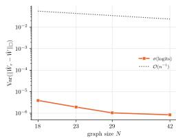  
(a) NCI109

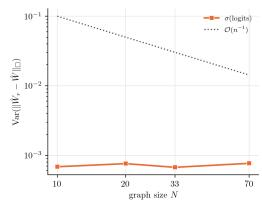  
(b) PROTEINS

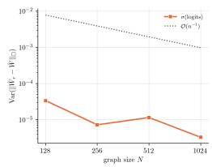  
(c) ModelNet10

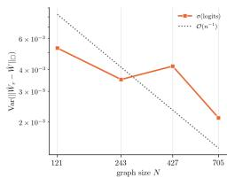  
(d) REDDIT-MULTI-5K  
Figure 1: Empirical cut-norm variance versus regularity-aware theoretical proxy. Each panel compares the empirical variance of $\| \hat { W } _ { r } - \hat { W } \| _ { \Sigma }$ against the scaling proxy $\mathcal { O } ( n ^ { - 1 } )$ (Thm. 3.2).

(i) Size normalization. To place all samples in a common space, we pad each A<sub>r</sub> to a shared size N by repeating rows/columns, yielding $\tilde { A } _ { r } \mathrm { ~ \in ~ } [ 0 , 1 ] ^ { N \times N }$ , with weights preserved.

(ii) Canonicalization by degree sorting. For each N-node graph, there are N! possible node labelings, so considering each of these labelings for each of the m graphs to estimate the graphon is computationally infeasible. We therefore use a lightweight canonicalization to reduce permutation variability: we sort nodes by their attention-induced degrees $\begin{array} { r } { d _ { i } ( \tilde { \cal A } _ { r } ) \ = \ \sum _ { i = 1 } ^ { N } ( \tilde { \cal A } _ { r } ) _ { i j } } \end{array}$ and, to each attention graph, apply the induced permutation $M _ { \pi } ^ { r }$ , producing $\bar { A } _ { r } = M _ { \pi } ^ { r } \tilde { A } _ { r } M _ { \pi } ^ { r ^ { \top } }$ . Intuitively, this aligns graphs using a coarse structural statistic before averaging.

Formally, degree sorting recovers the latent node ordering when the degree function $g ( x ) \ =$ $\textstyle \int _ { 0 } ^ { 1 } W ( x , y ) d y$ is strictly monotone. This is the standard identifiability condition in nonparametric graphon estimation (Bickel & Chen, 2009; Yang et al., 2014), and the condition under which the SAS estimator is consistent (Chan & Airoldi, 2014), as formalized in Assumption C.6. We also tested spectral (Fiedler) ordering, which yields nearly identical variance decay (see Figure 27, Appx H).

(iii) Block averaging (graphon smoothing). Fix a resolution k. We use $k = \mathrm { m i n } ( 6 4 , N )$ , so the estimator refines with the graph size up to a cap. Thm. 3.2 admits $k = \lceil N ^ { 1 / ( \operatorname* { m i n } ( \alpha , 1 ) + 1 ) } \rceil \in$ $[ \lceil \sqrt { N } \rceil , N ]$ , a range that contains k whenever $N \leq 6 4 ^ { 2 }$ , which covers every size we evaluate. Keeping $k \leq N$ also avoids empty blocks, which would lower the measured variance for a mechanical reason (Appx H). Partition $[ N ]$ into consecutive bins $B _ { 1 } , \ldots , B _ { k }$ of equal size (except for a possible remainder), and compute the block mean. Then, taking the graphon induced by the matrix $\hat { \Theta } _ { r }$ (cf. Equation (4)) produces a step-function kernel estimate $\hat { W } _ { r }$ . To obtain our final estimate for the attention graphon, we aggregate across samples. Those operations are defined as follows

$$
( \hat { \Theta } _ { r } ) _ { a b } \ = \ \frac { 1 } { | B _ { a } | | B _ { b } | } \sum _ { i \in B _ { a } } \sum _ { j \in B _ { b } } ( \bar { A } _ { r } ) _ { i j }\tag{10}
$$

$$
\hat { \Theta } \ = \ \frac { 1 } { m } \sum _ { r = 1 } ^ { m } \hat { \Theta } _ { r } ,\tag{11}
$$

with $a , b \in [ k ]$ . The graphon induced by $\hat { \Theta }$ defines the attention graphon estimate $\hat { W }$

## 4.3 HYPOTHESIS TESTING

We use the estimated graphon as a reference kernel to assess the consistency of attention-induced graphs across sizes and verify our hypothesis that attention graphs for a given layer and head are samples from a common graphon. Specifically, we compute cut-norm deviations between attention matrices and the estimated graphon, estimate their empirical variance, and compare it against the theoretical variance bounds via a one-sided hypothesis test. Formally, given a set of attention-induced graphs $\{ A _ { r } \} _ { r = 1 } ^ { m }$ , represented by its adjacency matrices, distributed $A _ { i } \sim W _ { i }$ according to graphons $W _ { i } .$ we consider the following test:

$$
H _ { 0 } \colon W _ { 1 } = \cdot \cdot \cdot = W _ { m }\tag{vs.}
$$

$$
H _ { a } \colon { \mathrm { ~ a t ~ l e a s t ~ o n e ~ } } W _ { i } \neq W _ { j } .
$$

The test statistic is the empirical variance of the cut-norm of the samples to the estimated graphon. The critical value is the upper bound in Thm. 3.2. More practically, given that the smoothness parameter α is unknown, we select the value that gives the fastest rate $( \mathrm { i . e . , } \bar { \mathcal { O } } ( n ^ { - 1 } ) )$ . This is conservative, since we reject $H _ { 0 }$ when the empirical variance exceeds the theoretical bound, and fail to reject otherwise. It is conservative in the sense that the fastest admissible rate yields the smallest threshold. Hence, the test is one-sided: a rejection implies that the attention graphs are not consistent with a common

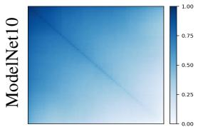

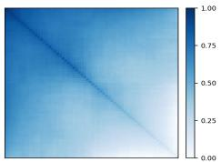

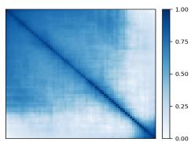

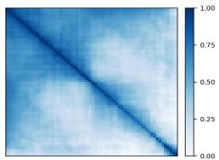

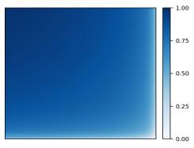  
COLLAB

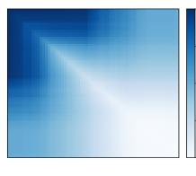  
PROTEINS

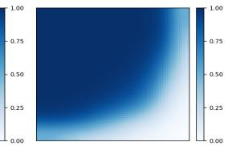  
REDDIT-MULTI-5K

Figure 2: Estimated attention graphons across datasets and graph sizes. Each panel shows the K×K $( \check { K } = 6 4 )$ block-step estimate of the attention kernel at target size N. Top row: Attention graphon convergence for ModelNet10, as target size N grows $( N \in \{ 1 2 8 , 2 5 6 , 5 1 2 , 1 0 2 4 \}$ ). Kernel estimates stabilize as N increases and remains distinct across datasets Bottom row: Attention graphon estimate for COLLAB, PROTEINS, and REDDIT-MULTI-5K (resp., $N = \{ 1 1 8 , 7 0 , 7 0 5 \}$ ).  
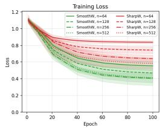

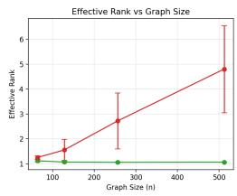

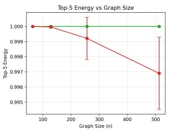

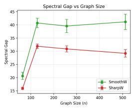  
Figure 3: Training dynamics and spectral summaries under synthetic graphon families. Left: training loss for SmoothW and SharpW at increasing sizes. Middle/right: spectral summaries of the estimated attention graphons (effective rank, top-5 energy, and spectral gap) as size grows. Metrics are defined in Appx F.2.

Table 1: Lipschitz constants and test accuracy (%) of estimated attention graphons on synthetic and real-world datasets. For synthetic datasets, the Lipschitz constant correlates with task difficulty. For real-world datasets, it reflects the complexity of learned attention.
<table><tr><td rowspan="2">Metric ↓ / Dataset →</td><td colspan="3">Synthetic</td><td colspan="7">Real-World</td></tr><tr><td>SMOOTHW</td><td>SHARPW</td><td>NOISYCSBM</td><td>MUTAG</td><td>PROTEINS</td><td>NCI1</td><td>NCI109 COLLAB</td><td>IMDB-M</td><td>REDDIT-M-5K</td><td>MODELNET</td></tr><tr><td>Graph size n</td><td>1024</td><td>1024</td><td>1024</td><td>28</td><td>600</td><td>111 111</td><td>498</td><td>89</td><td>1024</td><td>1024</td></tr><tr><td>Lipschitz (Îw)</td><td>25.02</td><td>45.29</td><td>64.60</td><td>6.36</td><td>54.80 27.42</td><td>28.34</td><td>33.15</td><td>20.24</td><td>28.14</td><td>33.70</td></tr><tr><td>Accuracy (%) ↑</td><td>92.18</td><td>74.10</td><td>58.98</td><td>78.95</td><td>77.68</td><td>66.42 70.46</td><td>74.60</td><td>56.00</td><td>54.20</td><td>78.50</td></tr><tr><td>Correlation (r)</td><td colspan="3">−0.999 (p = 0.024) 一</td><td colspan="9">0.207 (p = 0.622)</td></tr></table>

graphon, while a failure to reject indicates that the estimated kernels concentrate, without certifying a common limit, since low dispersion can also arise from nearly uniform attention. We refer the reader to Appx H for additional calibration procedures (bootstrap, permutation test, and synthetic null simulation) to this test, and to Appx E for the constant hidden in the threshold.

## 5 EXPERIMENTS

Our experiments seek to address three questions: (Q1) Does the dispersion of attention in cut-norm decrease with size, and how does it behave compared with the regularity-aware proxy in Equation (9)? (Q2) Do GT attention matrices stabilize to a dataset-driven kernel as graph size grows? (Q3) Can we use the attention-graphon relationship to learn GTs more efficiently?

To answer them, we use eight real-world graph classification benchmarks and three synthetic nodeclassification datasets: MUTAG, PROTEINS, NCI1, NCI109, IMDB-MULTI, COLLAB, REDDIT-MULTI-5K, ModelNet10, a sparse contextual SBM (NoisyCSBM), and two ground truth graphons (SmoothW and SharpW) — for details and extensive experiments spanning additional architectures, large-scale datasets, tasks, transferability, multi-head attention, statistical calibration (bootstrap CIs, permutation and synthetic-null tests), runtime, and sensitivity/robustness analyses, see Appxs F, H.

## 5.1 ESTIMATED ATTENTION GRAPHONS

(i) Cut-norm variance vs. theoretical scaling. We quantify attention concentration via the empirical variance of $\Delta _ { r } = \| \hat { W } _ { r } - \hat { W } \| _ { \Sigma }$ across samples (Appx E) and compare it to the theoretical bound in Equation (9). Fig. 1 shows representative datasets from each domain (bioinformatics, point clouds, and social networks). On most datasets, the empirical variance decreases with graph size (see Fig. 7), and on every dataset except REDDIT-MULTI-5K it stays below the theoretical bound at all sizes, so we fail to reject the null hypothesis that the graphs come from the same graphon. REDDIT-MULTI-5K exceeds the bound at its two largest sizes, where the test rejects. This supports concentration of attention around a stable kernel and answers (Q1).

(ii) Convergence to attention graphon. In Fig. 2, we show the estimated attention graphons for 4 datasets with large graphs, Our results show that the estimated kernel becomes more consistent as N increases, indicating that attention is not an arbitrary dense matrix but exhibits a stable global structure. Across datasets, the limiting kernels are qualitatively distinct, supporting the view that GT attention induces dataset-dependent interaction kernels, providing an affirmative answer to (Q2).

## 5.2 TRANSFERABILITY, TRAINING DYNAMICS, AND TASK-HARDNESS

We address (Q3) from three perspectives: transferability, training dynamics, and task-hardness.

Setup. For the transferability and training dynamics experiments, we employ two synthetic graphon families: SmoothW, a Hölder-smooth kernel defined as $W ( x , y ) = x y$ , and SharpW, a kernel with sharper transitions defined as $W ( x , y ) = { \textstyle { \frac { 1 } { 2 } } } ( e ^ { - x y } + | \sin ( \omega ( x + y ) ) | )$ for frequency $\omega \gg 1$ . Node labels for the downstream classification task are derived from the latent positions via terciles, yielding three balanced classes. Node features are random walk positional encodings. For the task-hardness experiments, our analysis includes both synthetic and real-world datasets.

(i) Transferability. We evaluate whether GTs can transfer across graph sizes by training models on small graphs, estimating the attention graphon, and using them to generate attention matrices for larger graphs at inference. We first generate a fixed baseline dataset of graphs with $n = 1 0 2 4$ nodes from each graphon model. Then, for each $n \in \{ 1 2 8 , 2 5 6 , 5 1 2 , 1 0 2 4 \}$ , we generate a separate dataset of graphs with n nodes from the same graphon and train a model on this dataset. At transfer time, we bypass the query-key mechanism by sampling attention scores from the attention graphon estimated from the smaller graphs. Sampled kernel values are mapped back to attention scores by applying $\rho ^ { - 1 }$ and the row-wise softmax (see Prop. 2.1). The value projections of the larger graphs are obtained using the frozen value matrix from the small-graph model. The relative accuracy gap is computed against the baseline dataset. Fig. 4 shows that the accuracy gap decreases as the training graph size increases. SmoothW exhibits smaller transfer error throughout, consistent with its smaller Lipschitz constant.

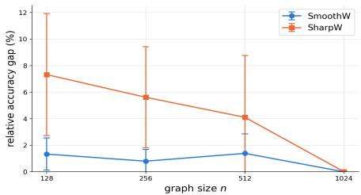  
Figure 4: Attention graphon transferability to larger graphs. Relative test-accuracy gap between a model trained and evaluated on small graphs and the same model evaluated on a largescale test set. Results show that training on smaller graphs and transferring can approach the performance of a model trained on larger datasets, while being faster and less computationally intensive. Furthermore, the smoother graphon has better transferability.

These results show that a model trained on smaller graphs, when evaluated at larger scales, can approach the accuracy of a baseline trained on the large-scale dataset, reducing computations without sacrificing performance. The query-key product costs $\mathcal { O } ( n ^ { 2 } d )$ for every input, whereas sampled attention is block-constant and can be applied to the values in $\mathring { \mathcal { O } } ( n d _ { v } + \dot { K } ^ { 2 } d _ { v } ^ { \ } )$ operations, linear in n, where $d _ { v }$ is the value dimension (Table 4 in Appx H). In other words, graphon structure can be exploited for efficient inference with GTs; this answers (Q3) in the affirmative.

This behavior is expected under our hypothesis. If attention matrices are samples from a graphon W, transferability of the induced graph filter follows from results for graphon operators (Ruiz et al., 2023), and the curves in Figure 4 are evidence that this premise holds. The converse may also hold. On REDDIT-MULTI-5K, the only dataset where the test rejects, the transferability gap stays between 23% and 44% and does not shrink with the training size (Figure 19, Appx H).

(ii) Training dynamics. Next, we probe the link between kernel regularity and learnability on SmoothW and SharpW, training GT models for node classification at n ∈ {64, 128, 256, 512} and recording training curves and spectral properties of the estimated attention graphons (effective rank, top-5 energy, and spectral gap). SharpW yields higher training loss than SmoothW at every size, and its estimated attention graphons have higher effective rank and lower top-5 energy (Fig. 3), suggesting that less regular kernels are harder to learn.

(iii) Task-hardness. We also examine whether the Lipschitz constant of the estimated attention graphon, computed as in Appx F.3, tracks task difficulty (Table 1). On the synthetic families, smoother graphons come with higher accuracy, in line with the training dynamics above. On real-world datasets the relation is more nuanced, and no clear correlation emerges, as these tasks also depend on node features and domain-specific factors that the graphon alone does not capture. We therefore read these results as a link between graphon regularity and learnability on synthetic data, not as a general proxy for task difficulty.

## 6 DISCUSSION AND LIMITATIONS

Results in Sec. 5 show that, for a fixed trained GT, each attention head induces a dense weighted graph whose large-n behavior is often well described by a dataset-dependent graphon, with dispersion in cutnorm decreasing with graph size. This provides a principled way to summarize and compare attention patterns across datasets and scales. We next discuss additional aspects from this understanding and experiments, and directions for future work.

Can the graphon viewpoint fail? The attention-graphon perspective in Sec. 3 is a modeling assumption, and can be violated when attention depends on size or on discrete structures not captured by a single size-invariant kernel. Empirically, non-monotonic variance curves can flag such regimes (Fig. 1), but they can also arise from finite-sample effects (induced-subgraph sampling) and imperfect canonicalization. A promising direction are resolution-free, basis-invariant neural estimators (e.g., (Xia et al., 2023; Ramezanpour et al., 2025)) to mitigate canonicalization artifacts.

When it might fail. The attention-graphon view is less reliable for size-dependent or strongly asymmetric attention, for discrete motifs that no size-invariant kernel captures, and when a degenerate degree profile keeps canonicalization from recovering a latent ordering. Our test can also fail under sparse attention: pre-softmax scores of −∞ off the input edges make the mass of A<sup>(ℓ,h)</sup> vanish with edge density, so the induced graphons converge to the zero graphon, the variance vanishes, and the test does not reject (Figure 32 in Appx. H). Tracking the kernel mass flags this regime.

Canonicalization and directed attention. We use degree sorting as a practical surrogate for the optimal relabeling in the cut-metric, but it is not guaranteed to recover the latent ordering of the underlying kernel; alternative canonicalizations (e.g., spectral embeddings or optimal transport) are a promising direction. We also symmetrize attention to fit the standard (undirected) graphon formalism; extending the framework to directed kernels would allow using raw row-stochastic attention matrices.

Dense vs. sparse limits. Although attention matrices are dense by construction, input graphs are often sparse. Our framework remains applicable because attention produces dense pairwise interactions regardless of input sparsity, yet understanding how sparse input structure, positional encodings, and attention sparsification schemes affect the induced attention kernels is an open question.

Which heads to model. Since the diagnostic is applied per head, it also gives a selection rule in practice. A head is modeled by its attention graphon only when the test does not reject, and full attention is kept for the remaining heads. Because the kernels of different heads lie in a common function space, distances between them also measure head similarity, and heads with close kernels are natural candidates for merging or pruning, which we leave for future work.

## 7 CONCLUSION

We proposed a graphon lens that views GT attention matrices as dense weighted graphs, with cutdistance and cut-norm concentration calibrations and a pipeline that estimates dataset-level attention graphons and their stability across sizes. Across benchmarks, these graphons stabilize and cut-norm variance typically decreases with size, supporting the usefulness graph-limit tools for attention.

## REFERENCES

E. M. Airoldi, T. B. Costa, and S. H. Chan. Stochastic blockmodel approximation of a graphon: Theory and consistent estimation. In 27th Neural Inform. Process. Syst., pp. 692–700. NIPS Foundation, 2013. 14

Davoud Ataee Tarzanagh, Yingcong Li, Xuechen Zhang, and Samet Oymak. Max-margin token selection in attention mechanism. Advances in neural information processing systems, 36:48314– 48362, 2023. 2

Peter J. Bickel and Aiyou Chen. A nonparametric view of network models and Newman–Girvan and other modularities. Proceedings of the National Academy of Sciences, 106(50):21068– 21073, 2009. doi: 10.1073/pnas.0907096106. URL https://www.pnas.org/doi/abs/ 10.1073/pnas.0907096106. 6

C. Borgs, J. T. Chayes, L. Lovász, V. T. Sós, and K. Vesztergombi. Convergent sequences of dense graphs I: Subgraph frequencies, metric properties and testing. Adv. Math., 219(6):1801–1851, 2008. 1, 14

Karsten M. Borgwardt, Cheng Soon Ong, Stefan Schönauer, S. V. N. Vishwanathan, Alex J. Smola, and Hans-Peter Kriegel. Protein function prediction via graph kernels. Bioinformatics, 21(1): 47–56, January 2005. ISSN 1367-4803. doi: 10.1093/bioinformatics/bti1007. URL https: //doi.org/10.1093/bioinformatics/bti1007. 22

J. Cervino, L. Ruiz, and A. Ribeiro. Learning by transference: Training graph neural networks on growing graphs. IEEE Trans. Signal Process., 71:233–247, 2023. 14

Stanley H. Chan and Edoardo M. Airoldi. A consistent histogram estimator for exchangeable graph models. In Proceedings of the 31st International Conference on Machine Learning, volume 32 of Proceedings of Machine Learning Research, pp. 208–216, 2014. URL https://proceedings.mlr.press/v32/chan14.html. 1, 4, 5, 6, 14, 17

Ping-Ko Chiu and Gaston Cavallo. Cutnorm: Approximation via gaussian rounding and optimization with orthogonality constraints. https://github.com/pingkoc/cutnorm, 2018. Accessed: 01-01-2026. 21

Martin Courtois, Malte Ostendorff, Leonhard Hennig, and Georg Rehm. Symmetric dot-product attention for efficient training of bert language models. In Findings of the Association for Computational Linguistics: ACL 2024, pp. 8002–8011, 2024. 2

Asim Kumar Debnath, Rosa L. Lopez de Compadre, Gargi Debnath, Alan J. Shusterman, and Corwin Hansch. Structure-activity relationship of mutagenic aromatic and heteroaromatic nitro compounds. correlation with molecular orbital energies and hydrophobicity. Journal ofMedicinal Chemistry, 34(2):786–797, 1991. doi: 10.1021/jm00106a046. URL https://doi.org/10. 1021/jm00106a046. 21

Yash Deshpande, Subhabrata Sen, Andrea Montanari, and Elchanan Mossel. Contextual stochastic block models. Advances in Neural Information Processing Systems, 31, 2018. 22

Persi Diaconis and Svante Janson. Graph limits and exchangeable random graphs. Rendiconti di Matematica e delle sue Applicazioni. Serie VII, 28:33–61, 2008. URL https: //www.diva-portal.org/smash/record.jsf?pid=diva2:224369. 14

Paul D. Dobson and Andrew J. Doig. Distinguishing enzyme structures from non-enzymes without alignments. Journal ofMolecular Biology, 330(4):771–783, 2003. ISSN 0022-2836. doi: https: //doi.org/10.1016/S0022-2836(03)00628-4. URL https://www.sciencedirect.com science/article/pii/S0022283603006284. 22

Vijay Prakash Dwivedi and Xavier Bresson. A generalization of transformer networks to graphs. AAAI Workshop on Deep Learning on Graphs: Methods and Applications, 2021. 1

Vijay Prakash Dwivedi, Ladislav Rampášek, Mikhail Galkin, Ali Parviz, Guy Wolf, Anh Tuan Luu, and Dominique Beaini. Long range graph benchmark. In Thirty-sixth Conference on Neural Information Processing Systems Datasets and Benchmarks Track, 2022. URL https: //openreview.net/forum?id=in7XC5RcjEn. 23

Benjamin L Edelman, Surbhi Goel, Sham Kakade, and Cyril Zhang. Inductive biases and variable creation in self-attention mechanisms. In International Conference on Machine Learning, pp. 5793–5831. PMLR, 2022. 2

Matthias Fey and Jan E. Lenssen. Fast graph representation learning with PyTorch Geometric. In ICLR Workshop on Representation Learning on Graphs and Manifolds, 2019. 22

C. Gao, Y. Lu, and H. H. Zhou. Rate-optimal graphon estimation. Ann. Stat., 43(6):2624–2652, 2015. 1, 4, 14, 16, 17

Weihua Hu, Matthias Fey, Marinka Zitnik, Yuxiao Dong, Hongyu Ren, Bowen Liu, Michele Catasta, and Jure Leskovec. Open graph benchmark: Datasets for machine learning on graphs. Advances in neural information processing systems, 33:22118–22133, 2020. 23

Md Shamim Hussain, Mohammed J Zaki, and Dharmashankar Subramanian. Global self-attention as a replacement for graph convolution. In Proceedings ofthe 28th ACM SIGKDD conference on knowledge discovery and data mining, pp. 655–665, 2022. 14

Md Shamim Hussain, Mohammed J. Zaki, and Dharmashankar Subramanian. Triplet interaction improves graph transformers: accurate molecular graph learning with triplet graph transformers. In Proceedings of the 41st International Conference on Machine Learning, ICML’24. JMLR.org, 2024. 14

Nikita Kitaev, Lukasz Kaiser, and Anselm Levskaya. Reformer: The efficient transformer. In International Conference on Learning Representations, 2020. URL https://openreview. net/forum?id=rkgNKkHtvB. 2

Devin Kreuzer, Dominique Beaini, Will Hamilton, Vincent Létourneau, and Prudencio Tossou. Rethinking graph transformers with spectral attention. Advances in Neural Information Processing Systems, 34:21618–21629, 2021. 14

Nils Kriege and Petra Mutzel. Subgraph matching kernels for attributed graphs. In Proceedings of the 29th International Coference on International Conference on Machine Learning, pp. 291–298, 2012. 22

R. Levie, W. Huang, L. Bucci, M. Bronstein, and G. Kutyniok. Transferability of spectral graph convolutional neural networks. J. Mach. Learning Res., 22(272):1–59, 2021. 14

L. Lovász. Large Networks and Graph Limits, volume 60. American Mathematical Society, 2012. 1, 3, 4, 14, 15, 18

L. Lovász and B. Szegedy. Limits of dense graph sequences. J. Comb. Theory, Series B, 96(6): 933–957, 2006. 3

Liheng Ma, Chen Lin, Derek Lim, Adriana Romero-Soriano, Puneet K. Dokania, Mark Coates, Philip Torr, and Ser-Nam Lim. Graph inductive biases in transformers without message passing, 2023. URL https://arxiv.org/abs/2305.17589. 14, 23

Erxue Min, Runfa Chen, Yatao Bian, Tingyang Xu, Kangfei Zhao, Wenbing Huang, Peilin Zhao, Junzhou Huang, Sophia Ananiadou, and Yu Rong. Transformer for graphs: An overview from architecture perspective. arXiv preprint arXiv:2202.08455, 2022. 14

Christopher Morris, Martin Ritzert, Matthias Fey, William L. Hamilton, Jan Eric Lenssen, Gaurav Rattan, and Martin Grohe. Weisfeiler and leman go neural: Higher-order graph neural networks. In Proceedings of the AAAI Conference on Artificial Intelligence, 2019. 14

Luis Müller, Mikhail Galkin, Christopher Morris, and Ladislav Rampášek. Attending to graph transformers. arXiv preprint arXiv:2302.04181, 2023. 14

Sofia C Olhede and Patrick J Wolfe. Network histograms and universality of blockmodel approximation. Proceedings of the National Academy of Sciences, 111(41):14722–14727, 2014. 5, 17

Ciyuan Peng, Yuelong Huang, Qichao Dong, Shuo Yu, Feng Xia, Chengqi Zhang, and Yaochu Jin. Biologically plausible brain graph transformer, 2025. URL https://arxiv.org/abs/ 2502.08958. 14

Reza Ramezanpour, Victor M Tenorio, Antonio G Marques, Ashutosh Sabharwal, and Santiago Segarra. A few moments please: Scalable graphon learning via moment matching. arXiv preprint arXiv:2506.04206, 2025. 9, 14

Ladislav Rampášek, Michael Galkin, Vijay Prakash Dwivedi, Anh Tuan Luu, Guy Wolf, and Dominique Beaini. Recipe for a general, powerful, scalable graph transformer. In Advances in Neural Information Processing Systems, volume 35, 2022. 1, 14

Olivier Roy and Martin Vetterli. The effective rank: A measure of effective dimensionality. In 2007 15th European Signal Processing Conference, pp. 606–610, 2007. 22

L. Ruiz, L. F. O. Chamon, and A. Ribeiro. Graphon neural networks and the transferability of graph neural networks. In 34th, Vancouver, BC (Virtual), 6-12 Dec. 2020. NeurIPS Foundation. 2, 14

Luana Ruiz, Luiz F. O. Chamon, and Alejandro Ribeiro. Transferability properties of graph neural networks. IEEE Transactions on Signal Processing, 71:3474–3489, 2023. doi: 10.1109/TSP.2023. 3297848. 4, 8, 14

Nino Shervashidze, Pascal Schweitzer, Erik Jan van Leeuwen, Kurt Mehlhorn, and Karsten M. Borgwardt. Weisfeiler-lehman graph kernels. J. Mach. Learn. Res., 12:2539–2561, November 2011. ISSN 1532-4435. 22

Yuandong Tian, Yiping Wang, Beidi Chen, and Simon S Du. Scan and snap: Understanding training dynamics and token composition in 1-layer transformer. Advances in neural information processing systems, 36:71911–71947, 2023. 2

A. Vaswani, N. Shazeer, N. Parmar, J. Uszkoreit, L. Jones, A. N. Gomez, Ł. Kaiser, and I. Polosukhin. Attention is all you need. In Neural Inform. Process. Syst., pp. 5998–6008. NIPS Foundation, 2017. 1, 14

Petar Velickoviˇ c, Adrià Puigdomènech Badia, David Budden, Razvan Pascanu, Andrea Banino,´ Misha Dashevskiy, Raia Hadsell, and Charles Blundell. The clrs algorithmic reasoning benchmark. In International Conference on Machine Learning, pp. 22084–22102. PMLR, 2022. 23

Petar Velickoviˇ c, Guillem Cucurull, Arantxa Casanova, Adriana Romero, Pietro Liò, and Yoshua´ Bengio. Graph attention networks. In International Conference on Learning Representations, 2018. URL https://openreview.net/forum?id=rJXMpikCZ. 14

Nikil Wale and George Karypis. Comparison of descriptor spaces for chemical compound retrieval and classification. In Sixth International Conference on Data Mining (ICDM’06), pp. 678–689, 2006. doi: 10.1109/ICDM.2006.39. 22

Zhirong Wu, Shuran Song, Aditya Khosla, Fisher Yu, Linguang Zhang, Xiaoou Tang, and Jianxiong Xiao. 3d shapenets: A deep representation for volumetric shapes. In Proceedings of the IEEE conference on computer vision and pattern recognition, pp. 1912–1920, 2015. 22

Xinyue Xia, Gal Mishne, and Yusu Wang. Implicit graphon neural representation. In International Conference on Artificial Intelligence and Statistics, pp. 10619–10634. PMLR, 2023. 9, 14

Hongteng Xu, Dixin Luo, Lawrence Carin, and Hongyuan Zha. Learning graphons via structured gromov-wasserstein barycenters. In Proceedings of the AAAI Conference on Artificial Intelligence, volume 35, pp. 10505–10513, 2021. 14

Keyulu Xu, Weihua Hu, Jure Leskovec, and Stefanie Jegelka. How powerful are graph neural networks? In International Conference on Learning Representations, 2019. URL https: //openreview.net/forum?id=ryGs6iA5Km. 14

Pinar Yanardag and S.V.N. Vishwanathan. Deep graph kernels. In Proceedings of the 21th ACM SIGKDD International Conference on Knowledge Discovery and Data Mining, KDD ’15, pp. 1365–1374, New York, NY, USA, 2015. Association for Computing Machinery. ISBN 9781450336642. doi: 10.1145/2783258.2783417. URL https://doi.org/10.1145/ 2783258.2783417. 22

Justin Yang, Christina Han, and Edoardo M. Airoldi. Nonparametric estimation and testing of exchangeable graph models. In International Conference on Artificial Intelligence and Statistics, 2014. URL https://api.semanticscholar.org/CorpusID:15784683. 6

Kai Yang, Vahid Partovi Nia, Boxing Chen, and Masoud Asgharian. Partially shared query-key for lightweight language models. In Mehdi Rezagholizadeh, Peyman Passban, Soheila Samiee, Vahid Partovi Nia, Yu Cheng, Yue Deng, Qun Liu, and Boxing Chen (eds.), Proceedings of The 4th NeurIPS Efficient Natural Language and Speech Processing Workshop, volume 262 of Proceedings ofMachine Learning Research, pp. 286–291. PMLR, 14 Dec 2024. URL https: //proceedings.mlr.press/v262/yang24a.html. 2

Chengxuan Ying, Tianle Cai, Shengjie Luo, Shuxin Zheng, Guolin Ke, Di He, Yanming Shen, and Tie-Yan Liu. Do transformers really perform badly for graph representation? In Advances in Neural Information Processing Systems, volume 34, 2021. URL https://proceedings.neurips.cc/paper/2021/hash/ f1c1592588411002af340cbaedd6fc33-Abstract.html. 1, 14

Bohang Zhang, Shengjie Luo, Liwei Wang, and Di He. Rethinking the expressive power of GNNs via graph biconnectivity. In International Conference on Learning Representations, 2023. URL https://openreview.net/forum?id=r9hNv76KoT3. 14, 23

## A RELATED WORK

Attention for graphs. GTs adapt the self-attention mechanism of Vaswani et al. (2017) to graphstructured inputs by learning pairwise interactions between nodes, often coupled with structural or positional biases to preserve input graph inductive structure. Early attention-based GNNs as in (Velickoviˇ c et al.´ , 2018) replaced fixed edge weights with feature-dependent weights, while subsequent work investigated when full global attention is beneficial and how to encode structure so that Transformers remain competitive on graph benchmarks (Ying et al., 2021; Kreuzer et al., 2021; Hussain et al., 2022). Recent architectures, notably GraphGPS (Rampášek et al., 2022), emphasize practical approaches that combine global attention with local message-passing, yielding strong and scalable performance across tasks. Others pushed GT boundaries in expressiveness and applicability Zhang et al. (2023); Ma et al. (2023); Hussain et al. (2024); Peng et al. (2025). Our work is complementary: rather than proposing a new architecture, we study the attention matrices induced by GTs, and ask whether they exhibit principled limit behavior as graph size grows.

Nonlocal interactions on graphs. A central motivation for graph attention is that standard messagepassing has intrinsic expressive limits tied to Weisfeiler-Leman refinements (Xu et al., 2019; Morris et al., 2019). These results formalize that deeper local aggregation does not necessarily translate into richer discrimination of graph structures, and they motivate architectures whose interaction patterns are not constrained to a fixed local neighborhood. In this context, attention and GTs in particular offer an alternative inductive bias: they can represent long-range dependencies through learned dense interactions Min et al. (2022); Müller et al. (2023), which raises research questions about their stability and the generalization of induced interaction graphs across varying sizes.

Graph limits and graphons. Dense graph limit theory provides canonical limit objects for sequences of dense graphs in the form of graphons, with convergence characterized (up to measure-preserving relabelings) by the cut-distance (Lovász, 2012; Borgs et al., 2008). From a probabilistic perspective, exchangeable random graphs admit an equivalent representation via the Aldous-Hoover framework, which generates graphs from a (possibly random) graphon (Diaconis & Janson, 2008). These results enable a relabeling-invariant, size-agnostic notion of proximity between large graphs and naturally suggest an operator viewpoint in which structure is encoded by kernel-induced operators. This continuum lens has also been used to study the transferability of graph neural networks across graph sizes through graphon neural networks (Levie et al., 2021; Ruiz et al., 2020; 2023; Cervino et al., 2023). We build on this literature by treating attention matrices as weighted dense graphs and analyzing their behavior through graphon scaling and cut-distance concentration.

Graphon estimation. A practical consequence of the graphon formalism is that one can estimate and compare latent kernels from finite graphs. Consistent estimation procedures include classical histogram-based estimators such as sort-and-smooth methods (Airoldi et al., 2013; Chan & Airoldi, 2014), optimal-transport-based methods such as GW distance Xu et al. (2021), and, most recently, neural methods like IGNR Xia et al. (2023) and MomentNet Ramezanpour et al. (2025). Theoretically, minimax results characterize achievable convergence rates under regularity assumptions on the graphon (Gao et al., 2015). On a different yet related note, sampling lemmas and concentration results in the cut-distance underpin the idea that a single finite graph can be a noisy sample from a stable limit object (Borgs et al., 2008; Lovász, 2012). Our approach leverages these tools in a model-driven way: we interpret each attention matrix as a sample from an underlying kernel, quantify concentration via variance in cut-distance, and use graphon estimation to operationalize these comparisons across datasets and graph sizes.

## B PROOF OF THEOREM 3.1

Before laying out our main result, a few definitions and results from the literature need introduction: Definition B.1 (Extracted Lovász (2012)). Let $A \in \mathbb { R } ^ { n \times n }$ . The cut-norm for matrices is defined as:

$$
\| A \| _ { \Pi } = { \frac { 1 } { n ^ { 2 } } } \operatorname* { m a x } _ { S , T \subseteq [ n ] } { \biggl | } \sum _ { i \in S , j \in T } A _ { i j } { \biggr | }\tag{12}
$$

Definition B.2 (Simplified Lovász (2012)). The above norm induces the so-called cut-distance. In Lovász (2012), this metric is defined following a generalization hierarchy. For labeled graphs G, G’

on the same node set $[ n ]$ , the cut-distance is defined as:

$$
d _ { \Omega } ( G , G ^ { \prime } ) = \lVert A _ { G } - A _ { G ^ { \prime } } \rVert _ { \Omega } ,\tag{13}
$$

For unlabeled graphs with node sets of equal length, we have:

$$
\widehat { \delta } _ { \square } ( G , G ^ { \prime } ) = \operatorname* { m i n } _ { \pi \in S _ { n } } d _ { \Pi } ( G , \pi ( G ^ { \prime } ) ) ,\tag{14}
$$

where π is a labeling function returning a labeled graph, and $S _ { n }$ is the set of all possible labeling functions (which is one-to-one with the symmetric group on n elements).

Finally, for graphs with a different number of nodes, i.e., $G = ( V , E ) , G ^ { \prime } = ( V ^ { \prime } , E ^ { \prime } ) , | V | = n$ , and $| V ^ { \prime } | = n ^ { \prime } !$

$$
\delta _ { \Pi } ( G , G ^ { \prime } ) = \operatorname * { l i m } _ { k  \infty } \hat { \delta } _ { \Pi } ( G ( k n ^ { \prime } ) , G ^ { \prime } ( k n ) ) ,\tag{15}
$$

where $G ( k n ^ { \prime } )$ is the ‘augmented’ graph obtained by replacing each node of $G$ by k (copy) nodes, and connecting the nodes if and only if they were connected in the original graph.

For this proof, we focus on the latter notation for the cut-distance, since we’ll be bounding the variance of the (cut-norm) difference between graph samples and their respective graphons.

Definition B.3. A graphon is a symmetric measurable function $W \colon [ 0 , 1 ] ^ { 2 } \to [ 0 , 1 ]$ . We denote the set of all graphons $\mathcal { W } _ { 0 }$

Definition B.4. Let $G$ be an n−node graph with associated adjacency matrix A. Further, let $\{ I _ { j } \} _ { j = 1 } ^ { n }$ be an equipartition of the interval [0, 1]. Then, the induced graphon $W _ { G } \colon [ 0 , 1 ] ^ { 2 } \to \mathbb { R }$ is defined as

$$
W _ { G } ( u , v ) : = \sum _ { j = 1 } ^ { n } \sum _ { k = 1 } ^ { n } [ A ] _ { j k } \mathbb { I } ( u \in I _ { j } ) \mathbb { I } ( v \in I _ { k } ) .\tag{16}
$$

where I is the indicator function.

Definition B.5 (Adapted Lovász (2012)). Analogously to the definition for matrices, the cut-norm of a kerne $K \colon [ 0 , 1 ] ^ { \dot { 2 } }  [ - 1 , 1 ]$ is defined as

$$
\| K \| _ { \Pi } = \operatorname* { s u p } _ { S , T \subseteq [ 0 , 1 ] } \left| \int _ { S \times T } K ( u , v ) d u d v \right| .\tag{17}
$$

Definition B.6 (Adapted Lovász (2012)). The cut-distance of two kernels, $U , W \colon [ 0 , 1 ] ^ { 2 } \to [ 0 , 1 ]$ is then defined as

$$
\delta _ { \ \Pi } ( U , W ) = \operatorname* { i n f } _ { \phi } d _ { \ \Pi } ( U , W ^ { \phi } ) = \operatorname* { i n f } _ { \phi } \Vert U - W ^ { \phi } \Vert _ { \ \Pi } ,\tag{18}
$$

for a measure-preserving bijection $\phi \colon [ 0 , 1 ]  [ 0 , 1 ]$

Definition B.7. For $n > 0 , k \in \mathbb { N } ,$ let $H ( n , W )$ be the node-stochastic weighted graph sampled from the graphon W by sampling an ordered n-tuple $( x _ { 1 } , \ldots , x _ { n } )$ of independent uniform random points from [0, 1], and assigning each edge (i, j) the weight $W ( x _ { i } , x _ { j } )$

Definition B.8. Every node-stochastic weighted graph gives rise to a simple random graph model $G ( n , W )$ : given a pair of nodes i and $j ( i \bar { \neq } j , i , j \in [ \bar { n } ] )$ , sample the unweighted edge $( i , j )$ with probability $W ( x _ { i } , x _ { j } )$ , independently for each node pair.

Lemma B.9 (Second Sampling Lemma for Graphons, (Lovász, 2012, Lemma 10.16)). Let $n \geq 1$ and let $W \in \mathcal { W } _ { 0 }$ be a graphon. Let $H ( n , W )$ and $W _ { n }$ be its induced graphon. Then, with probability at least $1 - e x p ( - n / ( \bar { 2 } \bar { \log { n } } ) )$

$$
\delta _ { \perp } ( W _ { n } , W ) \leq { \frac { 2 0 } { \sqrt { \log n } } } .\tag{19}
$$

Then, we can prove the following bound for the variance of the cut-distance between the graphon $W$ and a graph sample $H \colon$

Theorem B.10. Let $n \geq 1$ , and let $W \in \mathcal { W } _ { 0 }$ be a graphon. Moreover, let $H ( n , W )$ be a random weighted graph sampled from W. Then, the variance of the cut-distance between the graphon W and the sample H is bounded as:

$$
V a r ( \delta _ { \square } ( W _ { n } , W ) ) = \mathcal { O } \left( \frac { 1 } { \log n } \right) ,\tag{20}
$$

where $W _ { n }$ is the graphon induced by $H ( n , W )$

Proof. Using the definition of the variance of the cut-distance, we have

$$
\operatorname { V a r } ( \delta _ { \Pi } ( W _ { n } , W ) ) = \operatorname { \mathbb { E } } \left[ \delta _ { \Pi } ( W _ { n } , W ) ^ { 2 } \right] - ( \operatorname { \mathbb { E } } \left[ \delta _ { \Pi } ( W _ { n } , W ) \right] ) ^ { 2 } ,
$$

which can then be further expanded by conditioning the first term:

$$
\begin{array} { r l } & { { \mathrm { V a r } } ( \delta _ { \boxdot { \Omega } } ( W _ { n } , W ) ) = \operatorname { \mathbb { E } } \left[ \delta _ { \boxdot { \Omega } } ( W _ { n } , W ) ^ { 2 } \mid \delta _ { \boxdot { \Omega } } ( W _ { n } , W ) ^ { 2 } > \frac { 2 0 ^ { 2 } } { \log n } \right] \operatorname { \mathbb { P } } \Bigl [ \delta _ { \boxdot { \Omega } } ( W _ { n } , W ) ^ { 2 } > \frac { 2 0 ^ { 2 } } { \log n } \Bigr ] } \\ & { \phantom { { \mathrm { V a r } } } + \operatorname { \mathbb { E } } \left[ \delta _ { \boxdot { \Omega } } ( W _ { n } , W ) ^ { 2 } \mid \delta _ { \boxdot { \Omega } } ( W _ { n } , W ) ^ { 2 } \leq \frac { 2 0 ^ { 2 } } { \log n } \right] \operatorname { \mathbb { P } } \Bigl [ \delta _ { \boxdot { \Omega } } ( W _ { n } , W ) ^ { 2 } \leq \frac { 2 0 ^ { 2 } } { \log n } \Bigr ] } \\ & { \phantom { { \mathrm { V a r } } } - ( \operatorname { \mathbb { E } } \left[ \delta _ { \boxdot { \Omega } } ( W _ { n } , W ) \right] ) ^ { 2 } . } \end{array}
$$

Applying Theorem B.9 and the fact that the cut-distance is bounded above by 1, and disregarding the third term above, we have the following:

$$
\begin{array} { r l } { \mathrm { V a r } ( \delta _ { \Pi } ( W _ { n } , W ) ) \le \displaystyle \operatorname* { m a x } _ { W _ { n } } \delta _ { \Pi } ( W _ { n } , W ) ^ { 2 } \cdot e ^ { - \frac { n } { 2 \log n } } + \frac { 2 0 ^ { 2 } } { \log n } } & { } \\ { \displaystyle = \frac { 2 0 ^ { 2 } } { \log n } + e ^ { - \frac { n } { 2 \log n } } = \mathcal { O } \left( \frac { 1 } { \log n } \right) . } \end{array}\tag{21}
$$

## C PROOF OF THEOREM 3.2

The previous result, though general, is not really useful, given the slow rate decay of the upper bound, which depends on the log of the number of nodes in the graph. Under mild assumptions, and using results from Gao et al. (2015), we can get a better (and more useful) bound for that estimate. Let us introduce some definitions that will be used along the proof.

Definition C.1. Let $\mathcal { Z } _ { n , k } = \{ z : [ n ]  [ k ] \}$ be the set of all possible mappings from [n] to [k], for $n , k \in \mathbb { N }$

Definition C.2. Let

$$
\nabla _ { j , k } f ( x , y ) = { \frac { \partial ^ { j + k } } { \partial x ^ { j } \partial y ^ { k } } } f ( x , y )
$$

be the derivative operator of a function $f .$

Definition C.3. Given a symmetric function $f \colon [ 0 , 1 ] ^ { 2 }  [ 0 , 1 ]$ and $\mathcal { D } = \{ ( x , y ) \in [ 0 , 1 ] ^ { 2 } \colon x \ge y \}$ the Hölder norm is defined as

$$
\| f \| _ { \mathcal H _ { \alpha } } = \operatorname* { m a x } _ { j + k \le \lfloor \alpha \rfloor } \operatorname* { s u p } _ { x , y \in \mathcal D } | \nabla _ { j , k } f ( x , y ) | + \operatorname* { m a x } _ { j + k \le \lfloor \alpha \rfloor } \operatorname* { s u p } _ { ( x , y ) \neq ( x ^ { \prime } , y ^ { \prime } ) \in \mathcal D } \frac { | \nabla _ { j , k } f ( x , y ) - \nabla _ { j , k } f ( x ^ { \prime } , y ^ { \prime } ) | } { ( | x - x ^ { \prime } | + | y - y ^ { \prime } | ) ^ { \alpha - \lfloor \alpha \rfloor } } .
$$

Definition C.4. The Hölder class is then defined as

$$
\mathcal { H } _ { \alpha } ( M ) = \{ f : [ 0 , 1 ] ^ { 2 } \to [ 0 , 1 ] : \| f \| _ { \mathcal H _ { \alpha } } \ \leq M \} .
$$

We assume that our graphon W lives in the following class

$$
{ \mathcal { F } } _ { \alpha } ( M ) = \{ 0 \leq f \leq 1 \colon f \in { \mathcal { H } } _ { \alpha } ( M ) \} .
$$

Let $\{ x _ { i } \}$ be a sequence of i.i.d. random variables with distribution $\mathbb { P } _ { X }$ supported on $[ 0 , 1 ]$ . In addition, let $\theta _ { i j } = W ( x _ { i } , x _ { j } )$ . For any $i \neq j$ , the adjacency for a weighted graph $\mathbb { H } ( n , \bar { W } )$ is sampled accordingly:

$$
( x _ { 1 } , \ldots , x _ { n } ) \sim \mathbb { P } _ { X } ,
$$

$$
H _ { i j } = \theta _ { i j } = W ( x _ { i } , x _ { j } )\tag{22}
$$

Definition C.5. Given a matrix $H \in \mathbb { R } ^ { n \times n }$ , let $z \in \mathcal { Z } _ { n , k }$ be a clustering map. Hence, the graphon block estimator is defined as

$$
{ \hat { \theta } } _ { a b } = { \frac { 1 } { | z ^ { - 1 } ( a ) | | z ^ { - 1 } ( b ) | } } \sum _ { i \in z ^ { - 1 } ( a ) } \sum _ { j \in z ^ { - 1 } ( b ) } ( H ) _ { i j } , a , b \in [ k ] ,\tag{23}
$$

where the sets $\{ z ^ { - 1 } ( a ) \colon a \in [ k ] \}$ form a partition of $[ n ]$ (clustering assignment).

Assumption C.6 (Consistent canonical ordering). The clustering z used to form (23) is obtained from a canonicalization procedure $( \mathrm { e . g . }$ , degree sorting, as in Section 4.2) that, under the regularity conditions on $W$ assumed throughout, is consistent with a latent-sort oracle in the following sense: $\exists c _ { 1 } , c _ { 2 } > 0$ such that

$$
\operatorname* { m a x } _ { a \in [ k ] } \dim \bigl ( \{ x _ { i } : z ( i ) = a \} \bigr ) \ \leq \ \frac { c _ { 1 } } { k } \qquad \mathrm { w . p . } \geq 1 - \exp ( - c _ { 2 } n ) .
$$

Remark C.7. Our canonicalize-then-block-average pipeline (Section 4.2) is a direct instantiation of the Sort-And-Smooth (SAS) estimator Chan & Airoldi (2014). Their Theorem 3 establishes that, under the standing assumption that the degree function $\begin{array} { r } { g ( x ) : = \int _ { 0 } ^ { 1 } W ( x , y ) } \end{array}$ dy is strictly monotone (together with mild regularity of W), the degree-sort permutation $\hat { \pi } ( i ) = \mathrm { r a n k } ( d _ { i } )$ , where $\begin{array} { r } { d _ { i } = \frac { 1 } { n } \sum _ { j } H _ { i j } } \end{array}$ converges almost surely to the true latent sort, i.e., the empirical degrees concentrate around $g ( x _ { i } )$ at rate $\mathcal { O } _ { \mathbb { P } } ( n ^ { - 1 / 2 } )$ , and strict monotonicity of g transfers this concentration into a bound on the rank permutation. Applied to our setting, this yields

$$
\operatorname* { m a x } _ { a \in [ k ] } \mathrm { d i a m } \big ( \{ x _ { i } : z ( i ) = a \} \big ) \leq \frac { 1 } { k } + \mathcal { O } _ { \mathbb { P } } ( n ^ { - 1 / 2 } ) ,
$$

which for $k = \lceil n ^ { 1 / ( \operatorname* { m i n } ( \alpha , 1 ) + 1 ) } \rceil$ is dominated by the $1 / k$ term (since $k \leq n ^ { 1 / 2 }$ for any $\alpha > 0 )$ This is a noiseless analog of the clustering-consistency bound from Gao et al. (2015) for a Bernoulli model.

Lemma C.8 (Hölder bias of block averages). Let $W \in { \mathscr { F } } _ { \alpha } ( M )$ and suppose Assumption C.6 holds. Under the model H, the block estimator in (23) satisfies, pointwise for every $i , j \in [ n ]$

$$
\left| \hat { \theta } _ { i j } - \theta _ { i j } \right| \leq 2 M \left( \frac { c _ { 1 } } { k } \right) ^ { \operatorname* { m i n } ( \alpha , 1 ) }\tag{24}
$$

on the event $\Omega _ { k } : = \{ \mathrm { d i a m } ( z ^ { - 1 } ( a ) ) \leq c _ { 1 } / k , \forall a \}$ , which has probability at least $1 - \exp ( - c _ { 2 } n )$

Proof. Fix $i , j \in [ n ]$ and let $a = z ( i ) , b = z ( j )$ . By Equation (23),

$$
\widehat { \theta } _ { i j } - \theta _ { i j } = \frac { 1 } { | z ^ { - 1 } ( a ) | | z ^ { - 1 } ( b ) | } \sum _ { i ^ { \prime } \in z ^ { - 1 } ( a ) } \sum _ { j ^ { \prime } \in z ^ { - 1 } ( b ) } \left( W ( x _ { i ^ { \prime } } , x _ { j ^ { \prime } } ) - W ( x _ { i } , x _ { j } ) \right) .
$$

We distinguish two regimes.

Case $\alpha \leq 1$ . The Hölder norm $\| W \| _ { \mathcal { H } _ { \alpha } } \leq M$ directly controls the zeroth-order difference:

$$
\begin{array} { r } { | W ( x _ { i ^ { \prime } } , x _ { j ^ { \prime } } ) - W ( x _ { i } , x _ { j } ) | \leq M \big ( | x _ { i ^ { \prime } } - x _ { i } | ^ { \alpha } + | x _ { j ^ { \prime } } - x _ { j } | ^ { \alpha } \big ) . } \end{array}
$$

Case $\alpha > 1$ . By definition of the Hölder class, $\| W \| _ { \mathcal { H } _ { \alpha } } \leq M$ bounds every partial derivative of order at most $\lfloor \alpha \rfloor \geq 1$ . Applying the mean-value theorem along the segment joining $( x _ { i } , x _ { j } )$ to $( x _ { i ^ { \prime } } , x _ { j ^ { \prime } } )$

$$
W ( x _ { i ^ { \prime } } , x _ { j ^ { \prime } } ) - W ( x _ { i } , x _ { j } ) = \nabla W ( \xi ) \cdot \left[ ( x _ { i ^ { \prime } } - x _ { i } ) , ( x _ { j ^ { \prime } } - x _ { j } ) \right]
$$

for some ξ on that segment, so

$$
| W ( x _ { i ^ { \prime } } , x _ { j ^ { \prime } } ) - W ( x _ { i } , x _ { j } ) | \leq M \big ( | x _ { i ^ { \prime } } - x _ { i } | + | x _ { j ^ { \prime } } - x _ { j } | \big ) .
$$

Block-constant estimators cannot exploit smoothness beyond Lipschitz, so this is the operative bound Olhede & Wolfe (2014). Combining both cases:

$$
\begin{array} { r } { | W ( x _ { i ^ { \prime } } , x _ { j ^ { \prime } } ) - W ( x _ { i } , x _ { j } ) | \ \leq \ M \big ( | x _ { i ^ { \prime } } - x _ { i } | ^ { \operatorname* { m i n } ( \alpha , 1 ) } + | x _ { j ^ { \prime } } - x _ { j } | ^ { \operatorname* { m i n } ( \alpha , 1 ) } \big ) . } \end{array}
$$

On $\Omega _ { k } .$ , both latent differences are bounded by $c _ { 1 } / k ,$ , so each summand is bounded by $2 M ( c _ { 1 } / k ) ^ { \mathrm { m i n } ( \alpha , 1 ) }$ , and averaging preserves the bound. The probability statement follows from Assumption C.6. □

Theorem C.9 (Noiseless nonparametric graphon estimation). Let $W \in { \mathscr { F } } _ { \alpha } ( M )$ , suppose Assumption C.6 holds, and take $k = \bar { \lceil { n ^ { 1 / ( \operatorname* { m i n } ( \alpha , 1 ) } + 1 } \bar { ) } } \rceil$ . Then there exist constants $C , C ^ { \prime } > 0$ depending only on $M , c _ { 1 } , c _ { 2 }$ such that

$$
{ \frac { 1 } { n ^ { 2 } } } \sum _ { i , j \in [ n ] } \left( { \widehat { \theta } } _ { i j } - \theta _ { i j } \right) ^ { 2 } \ \leq \ C n ^ { - { \frac { 2 \operatorname * { m i n } ( \alpha , 1 ) } { \operatorname * { m i n } ( \alpha , 1 ) + 1 } } }\tag{25}
$$

with probability at least $1 - \exp ( - C ^ { \prime } n )$ , uniformly over $W \in { \mathscr { F } } _ { \alpha } ( M )$ and $\mathbb { P } _ { X }$

Proof. On the event $\Omega _ { k }$ of Lemma C.8,

$$
\frac { 1 } { n ^ { 2 } } \sum _ { i , j } ( \hat { \theta } _ { i j } - \theta _ { i j } ) ^ { 2 } \leq \big ( 2 M c _ { 1 } ^ { \operatorname* { m i n } ( \alpha , 1 ) } \big ) ^ { 2 } k ^ { - 2 \operatorname* { m i n } ( \alpha , 1 ) } .
$$

Plugging in $k = \lceil n ^ { 1 / ( \operatorname* { m i n } ( \alpha , 1 ) + 1 ) } \rceil$ gives $k ^ { - 2 \operatorname* { m i n } ( \alpha , 1 ) } \leq n ^ { - 2 \operatorname* { m i n } ( \alpha , 1 ) / ( \operatorname* { m i n } ( \alpha , 1 ) + 1 ) }$ up to absolute constants, and $\mathbb { P } ( \Omega _ { k } ) \geq 1 - \exp ( - c _ { 2 } n )$ . Absorbing all constants into $C , C ^ { \prime }$ yields the result.

Proposition C.10 (Adapted, (Lovász, 2012, Equation 8.5)). Let

$$
\| A \| _ { 1 } = \frac { 1 } { n ^ { 2 } } \sum _ { i , j = 1 } ^ { n } | A _ { i , j } | , \quad \| A \| _ { 2 } = \left( \frac { 1 } { n ^ { 2 } } \sum _ { i , j = 1 } ^ { n } A _ { i , j } ^ { 2 } \right) ^ { 1 / 2 } , \quad \| A \| _ { \infty } = \operatorname* { m a x } _ { i , j } | A _ { i , j } | ,
$$

be the matrix $\ell _ { 1 } { - } n o r m , \ell _ { 2 } { - } n o r m ,$ , and $\ell _ { \infty }$ -norm respectively. Then, we have the following

$$
\| A \| _ { \Pi } \leq \| A \| _ { 1 } \leq \| A \| _ { 2 } \leq \| A \| _ { \infty } .\tag{26}
$$

Corollary C.11 (Cut-norm bound under noiseless observations). Under the hypotheses of Theorem C.9, there exist constants $C , C ^ { \prime } > 0$ such that

$$
\begin{array} { r } { \| \hat { \theta } - \theta \| _ { \varOmega } ^ { 2 } \leq C n ^ { - \frac { 2 \operatorname* { m i n } ( \alpha , 1 ) } { \operatorname* { m i n } ( \alpha , 1 ) + 1 } } , } \end{array}
$$

with probability at least $1 - \exp ( - C ^ { \prime } n )$

Proof. By Proposition C.10, together with Theorem C.9

$$
\Vert \hat { \theta } - \theta \Vert _ { \Pi } ^ { 2 } \leq \Vert \hat { \theta } - \theta \Vert _ { 2 } ^ { 2 } = \frac { 1 } { n ^ { 2 } } \sum _ { i , j \in [ n ] } ( \hat { \theta } _ { i , j } - \theta _ { i , j } ) ^ { 2 } \leq C n ^ { - \frac { 2 \operatorname* { m i n } ( \alpha , 1 ) } { \operatorname* { m i n } ( \alpha , 1 ) + 1 } } .
$$

Equipped with these tools, we can formalize a tighter bound to the cut-norm variance:

Theorem C.12 (A tighter bound). $L e t n \ge 1$ and $W \in { \mathscr { F } } _ { \alpha } ( M )$ be a graphon. Furthermore, given $\theta _ { i , j } = W ( x _ { i } , x _ { j } )$ , for latent random variables $( x _ { 1 } , \ldots x _ { n } ) \sim { \mathcal { P } } _ { X }$ , let <sup>ˆ</sup>θ be the graphon’s block approximation, constructed from $H ( n , W )$ . Then, for $k = \lceil n ^ { 1 / ( \operatorname* { m i n } ( \alpha , 1 ) + 1 ) } \rceil$ , there exists a constant $\bar { C } > 0 ;$ , depending only on $M , c _ { 1 } , c _ { 2 }$ , such that

$$
\begin{array} { r } { V a r ( \| \hat { \theta } - \theta \| _ { \Pi } ) = \ O \left( n ^ { - \frac { 2 \operatorname* { m i n } ( \alpha , 1 ) } { \operatorname* { m i n } ( \alpha , 1 ) + 1 } } \right) . } \end{array}
$$

Proof. Analogously, let us write out the variance of the cut-norm

$$
\begin{array} { r } { \mathrm { V a r } ( \Vert \hat { \theta } - \theta \Vert _ { \Pi } ) = \mathbb { E } \left[ \Vert \hat { \theta } - \theta \Vert _ { \Pi } ^ { 2 } \right] - \left( \mathbb { E } \left[ \Vert \hat { \theta } - \theta \Vert _ { \Pi } \right] \right) ^ { 2 } \leq \mathbb { E } \left[ \Vert \hat { \theta } - \theta \Vert _ { \Pi } ^ { 2 } \right] . } \end{array}
$$

Now, let $f _ { | | \hat { \theta } - \theta | | _ { \lbrack } }$ be the probability distribution of the r.v. $\| { \hat { \theta } } - \theta \| _ { \Pi }$ . Then, we have:

$$
\begin{array} { l } { { \displaystyle \mathrm { V a r } ( \| \hat { \theta } - \theta \| _ { \Omega } ) \le \int _ { 0 } ^ { 1 } w f _ { \| \hat { \theta } - \theta \| _ { \Omega } ^ { 2 } } ( w ) d w } } \\ { { \displaystyle \quad \quad = \int _ { 0 } ^ { C h ( n ) } w f _ { \| \hat { \theta } - \theta \| _ { \Omega } ^ { 2 } } ( w ) d w + \int _ { C h ( n ) } ^ { 1 } w f _ { \| \hat { \theta } - \theta \| _ { \Omega } ^ { 2 } } ( w ) d w , \quad h ( n ) = n ^ { - \frac { 2 \operatorname* { m i n } ( \alpha , 1 ) } { ( \operatorname* { m i n } ( \alpha , 1 ) + 1 ) } } } } \end{array}
$$

Both terms are weighted sums of the values assumed by the cut-norm in the interval of integration. Hence, each term can be bounded by the sum of the weights multiplied by the maximum value, i.e., the upper limit of integration, attained by the cut-norm:

$$
\begin{array} { r l } & { \displaystyle \mathrm { V a r } ( \| \hat { \boldsymbol \theta } - \boldsymbol \theta \| _ { \boldsymbol \Xi } ) \leq C h ( n ) \int _ { 0 } ^ { C h ( n ) } f _ { \| \hat { \boldsymbol \theta } - \boldsymbol \theta \| _ { \boldsymbol \Xi } ^ { 2 } } ( w ) d w + \int _ { C h ( n ) } ^ { 1 } f _ { \| \hat { \boldsymbol \theta } - \boldsymbol \theta \| _ { \boldsymbol \Xi } ^ { 2 } } ( w ) d w } \\ & { \qquad = C h ( n ) \mathbb { P } \left( \| \hat { \boldsymbol \theta } - \boldsymbol \theta \| _ { \boldsymbol \Xi } ^ { 2 } \leq C h ( n ) \right) + \left( 1 - \mathbb { P } \left( \| \hat { \boldsymbol \theta } - \boldsymbol \theta \| _ { \boldsymbol \Xi } ^ { 2 } \leq C h ( n ) \right) \right) } \\ & { \qquad \leq C h ( n ) + \exp ( - C ^ { \prime } n ) = \mathcal { O } \left( n ^ { - \frac { 2 \operatorname* { m i n } ( \alpha , 1 ) } { \operatorname* { m i n } ( \alpha , 1 ) + 1 } } \right) . } \end{array}\tag{27}
$$

A key distinction between Theorems B.10 and C.12 lies in the metric employed. The first result uses the cut-distance $\delta _ { \bigsqcup }$ , which involves an infimum over all measure-preserving bijections and thus operates on unlabeled graphons. This generality comes at the cost of a loose $( \log n ) ^ { - 1 }$ rate. In contrast, the tighter bound in Theorem C.12 uses the cut-norm $\| \cdot \| _ { \Sigma }$ which compares graphons under a fixed labeling. This requires establishing a canonical node ordering (in our case, induced by sorting nodes according to degree). Whilst this labeling assumption is necessary to achieve the faster polynomial rate, it reflects a practical requirement: to leverage regularity for tighter concentration, one must first align the graph to a consistent reference frame.

## D CHOICE OF THE ATTENTION OBJECT

This section compares three candidate attention graphs for a head, namely the symmetrized postsoftmax matrix $\begin{array} { r } { \bar { P } ^ { ' } = \frac { 1 } { 2 } ( P + P ^ { \top } ) } \end{array}$ , its rescaled version $n { \bar { P } } ,$ and the pre-softmax object $A = \rho ( \bar { S } - c )$ of Equation (7), and complements Proposition 2.1.

Post-softmax attention.

Lemma D.1. Let $P \in [ 0 , 1 ] ^ { n \times n }$ be row-stochastic and $\bar { P } = { \textstyle \frac { 1 } { 2 } } ( P + P ^ { \top } )$ . Then $\delta _ { \perp } ( W _ { \bar { P } } , 0 ) =$ $\| W _ { \bar { P } } \| _ { \Sigma } = 1 / n$ . Moreover, ifsome row ofP places all its mass on a single entry, then $\operatorname* { m a x } _ { i , j } n \bar { P } _ { i j } \geq$ $n / 2$

Proof. Since $\bar { P } \geq 0$ , the supremum in Equation (5) is attained at $S = T = \lceil 0 , 1 \rceil$ , so $\| W _ { \bar { P } } \| _ { \Sigma } =$ $n ^ { - 2 } \mathrm { \overline { { { C } } } } _ { i , j } \bar { P } _ { i j } = \mathrm { \overline { { { 1 } } } } / n$ , because the entries of $P$ and of $P ^ { \top }$ each sum to n. The zero graphon is invariant under relabeling, so $\delta _ { \perp } ( W _ { \bar { P } } , 0 ) = \| W _ { \bar { P } } \| _ { \perp }$ . Finally, $P _ { i j } = 1$ implies $\bar { P } _ { i j } \ge 1 / 2$ □

The first statement holds for every model and dataset, so post-softmax attention graphs converge to the zero graphon regardless of what the network has learned, and their convergence carries no information about it. Rescaling by n restores a mean entry of one, but the second statement shows that $n \bar { P }$ can leave every bounded class of graphons, which the results of Section 3 require.

Empirical comparison. Figure 5 measures both effects. On the left, a single GPS model trained on BFS at $n = 3 2$ is evaluated with frozen weights up to $n = 2 5 6$ . The mean entry of $\bar { P }$ equals $1 / n .$ falling from 0.031 to 0.0039, and the spread of its kernel, the standard deviation of the kernel entries, falls from $1 . 3 \times 1 0 ^ { - 3 } \mathrm { t o } 8 . 9 \times 1 0 ^ { - 5 }$ , so both vanish. The rescaled matrix has mean entry exactly one. The mean entry of A stays between 0.500 and 0.514, with a spread between 0.005 and 0.008. Without the offset, the mean entry of $\sigma ( \bar { S } )$ is between 0.78 and 0.79, so c only moves the entries to the center of the range of $\sigma .$ . On the right, on NoisyCSBM, the largest entry of $n { \bar { P } } ,$ , averaged over graphs, grows from 90 to 681 as n goes from 128 to 1024, close to linearly, while the largest logit magnitude grows only from 42 to 53.

Why $\rho$ must be a bijection. Proposition 2.1 uses both properties of a bijection. Injectivity is what makes the post-softmax attention a function of A. If $\rho ( x ) = \rho ( y )$ with $x \neq y .$ , let S<sup>¯</sup> have every entry equal to c except $\bar { S } _ { 1 1 } = x + c ,$ , and let $\bar { S } ^ { \prime }$ equal S<sup>¯</sup> except $\bar { S } _ { 1 1 } ^ { \prime } = y + c .$ Both matrices are symmetric and $\rho ( \bar { S } - \bar { c } ) = \rho ( \bar { S } ^ { \prime } - c )$ , but the first entries of their first softmax rows, $e ^ { x } / ( e ^ { x } + n - 1 )$

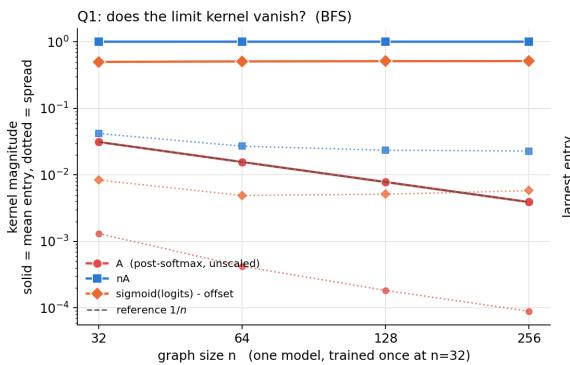

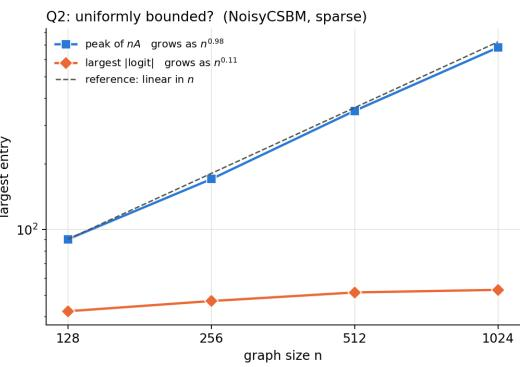  
Figure 5: Comparison of candidate attention objects. Left: mean entry (solid) and spread (dotted) of the kernels of $\mathring { P } , n \bar { P }$ , and A on BFS, for one GPS model trained at $n = 3 2$ and evaluated with frozen weights. Right: largest entry of $n \bar { P }$ and largest logit magnitude on NoisyCSBM. In the legend, A and $n A$ denote $\breve { P }$ and $n \bar { P }$ , and “sigmoid(logits) - offset” denotes $A = \sigma ( \bar { S } - c )$

and $e ^ { y } / ( e ^ { y } + n - 1 )$ , differ. Surjectivity onto (0, 1) makes $\rho ^ { - 1 }$ defined at every value in (0, 1), so attention can be generated from any estimated kernel with values in (0, 1), including values sampled at new sizes, and not only from entries of observed attention graphs.

## Bounded pre-softmax scores.

Lemma D.2. Let ρ be an increasing bijection as in Proposition 2.1, and let $( { \bar { S } } _ { n } )$ be symmetric presoftmax matrices with $| ( \bar { S } _ { n } ) _ { i j } - c | \le B f o r a l l n , i$ , and j. Then the attention graphs $A _ { n } = \rho ( \bar { S } _ { n } - c )$ ofEquation (7) have entries in $[ { \dot { \rho } } ( - B ) , \rho ( B ) ]$ , and every cut-distance limit W of $\left( W _ { A _ { n } } \right)$ satisfies $\begin{array} { r } { \dot { \rho ( - B ) } \le W \le \rho ( B ) } \end{array}$ almost everywhere.

Proof. Monotonicity gives $a \leq ( A _ { n } ) _ { i j } \leq b ,$ with $a = \rho ( - B )$ and $b = \rho ( B )$ . Let W be a cut-distance limit of $\left( W _ { A _ { n } } \right)$ , and choose measure-preserving bijections $\phi _ { n }$ with $\varepsilon _ { n } : = \| W _ { A _ { n } } - W ^ { \phi _ { n } } \| _ { \Pi } \to 0$ For measurable $E , F \subseteq [ 0 , 1 ]$

$$
\int _ { \phi _ { n } ( E ) \times \phi _ { n } ( F ) } W = \int _ { E \times F } W ^ { \phi _ { n } } \geq \int _ { E \times F } W _ { A _ { n } } - \varepsilon _ { n } \geq a | E | | F | - \varepsilon _ { n } .
$$

Every pair of measurable sets arises as $( \phi _ { n } ( E ) , \phi _ { n } ( F ) )$ , with $| \phi _ { n } ( E ) | = | E |$ and $| \phi _ { n } ( F ) | = | F |$ , so $\textstyle \int _ { E \times F } ( W - a ) \geq - \varepsilon _ { n }$ for all measurable $E , F ,$ . Letting $n  \infty ,$ , the signed measure $\begin{array} { r } { U \mapsto \int _ { U } ( W - a ) } \end{array}$ is nonnegative on measurable rectangles, hence on finite disjoint unions of them, and by the monotone class theorem on every measurable $\breve { U } \subseteq [ 0 , 1 ] ^ { 2 }$ . Thus $W \geq a$ almost everywhere, and $W \leq b$ follows in the same way. □

With bounded scores, the attention graphs of Equation (7) therefore stay in the bounded setting of Section 3 at every size, with mass bounded away from zero, and by Proposition 2.1 they still determine the post-softmax attention.

Admissible maps. Continuous bijections $\rho \colon  { \mathbb { R } } \to ( 0 , 1 )$ are strictly monotone, and the increasing ones are the cumulative distribution functions of continuous distributions with full support, such as the logistic sigmoid $\sigma ( x ) = 1 / ( 1 + e ^ { - x } )$ , the rescaled hyperbolic tangent $( 1 + \operatorname { t a n h } \bar { x } ) / 2 = \sigma ( 2 x )$ the standard Gaussian cumulative distribution function, and $\textstyle { \frac { 1 } { 2 } } + { \frac { 1 } { \pi } }$ arctan x. Maps that merge distinct scores, such as clipping or thresholding, cannot be inverted. We use σ, whose inverse is the log-odds function, so the pre-softmax scores are recovered as $\bar { S } _ { i j } = \log \left( A _ { i j } / ( 1 - A _ { i j } ) \right) + c$ . Block averages of values in $[ \rho ( - B ) , \rho ( B ) ]$ remain in that interval, so $\rho ^ { - 1 }$ is finite on every estimated kernel and sampled attention is well defined.

```latex
Algorithm 1 Estimating attention graphons and measuring concentration (fixed ℓ, h)
Require: Trained Graph Transformer; dataset graphs $\{ G _ { r } \} _ { r = 1 } ^ { m } ;$ target size $N ;$ block resolution k.
1: for $r = 1$ to m do
2: Extract logits $S ^ { ( \ell , h ) } ( G _ { r } )$ and form $\begin{array} { r } { A _ { r } \gets \rho \big ( \frac { 1 } { 2 } ( S ^ { ( \ell , h ) } + S ^ { ( \ell , h ) \top } ) - c \big ) } \end{array}$ via (7).
3: Size-normalize: $\tilde { A } _ { r } \gets \mathrm { P a d } ( A _ { r } , N )$
4: Canonicalize: $\bar { A } _ { r }  M _ { \pi } ^ { r } \tilde { A } _ { r } M _ { \pi } ^ { r ^ { \top } }$ by sorting nodes by $d _ { i } ( { \tilde { A } } _ { r } )$
5: Block-average: compute $\hat { \Theta } _ { r } \in \mathbb { R } ^ { K \times K }$ via (10).
6: end for
7: Aggregate template: $\begin{array} { r } { \hat { \Theta }  \frac { 1 } { m } \sum _ { r = 1 } ^ { m } \hat { \Theta } _ { r } . } \end{array}$
8: Compute discrepancies $\Delta _ { r }  \Vert \hat { \Theta } _ { r } - \hat { \Theta } \Vert _ { \square }$ and $\widehat { \mathrm { V a r } } _ { \mathrm { e m p } }$ via (29).
9: Report concentration curves and check the hypothesis test decision rule.
```

## E ADDITIONAL DETAILS OF SECTION 4

Variance-based concentration analysis. The theory in Section 3 predicts that, under a stable kernel view, attention-induced graphs should concentrate on cut-distance as n grows. To test this prediction empirically, we quantify how tightly per-graph kernel estimates cluster around the dataset-level estimate. For each sample r, define the cut-norm residual

$$
\Delta _ { r } : = \| \hat { W } _ { r } - \hat { W } \| _ { \Sigma } ,\tag{28}
$$

and summarize dispersion by the empirical variance

$$
\widehat { \mathrm { V a r } } _ { \mathrm { e m p } } : = \frac { 1 } { m - 1 } \sum _ { r = 1 } ^ { m } ( \Delta _ { r } - \bar { \Delta } ) ^ { 2 } , \qquad \bar { \Delta } : = \frac { 1 } { m } \sum _ { r = 1 } ^ { m } \Delta _ { r } .\tag{29}
$$

We compute $\widehat { \mathrm { V a r } } _ { \mathrm { e m p } }$ within size bins (fixed n range) to obtain a function of graph size, and compare its decay to the proxy scaling suggested by Theorem 3.2:

$$
\mathrm { V a r } _ { \mathrm { t h } } ( n ) \propto \left( n ^ { - \frac { 2 \operatorname* { m i n } ( \alpha , 1 ) } { \operatorname* { m i n } ( \alpha , 1 ) + 1 } } \right) .\tag{30}
$$

Specifically, given that the smoothness parameter α is latent, we took a conservative approach and use the fastest rate possible, i.e., $\mathrm { V a r } _ { \mathrm { t h } } ( n ) = n ^ { - 1 }$ as the theoretical threshold. In the plots we report $\widehat { \mathrm { V a r } } _ { \mathrm { e m p } } ( n )$ and the proxy $\mathrm { V a r } _ { \mathrm { t h } } ( n )$ . The resulting decision rule rejects $H _ { 0 }$ at size n when $\widehat { \mathrm { V a r } } _ { \mathrm { e m p } } ( n ) > C n ^ { - 1 }$ , with $C = 1$ (Sec. 4.3). The rate in Thm. 3.2 holds up to a constant C that depends on the regularity of W and on the canonicalization, and may thus differ across datasets. Taking $C = 1$ fixes the units of the comparison without estimating $C ,$ , and since C enters multiplicatively, it shifts the threshold without changing its dependence on n.

Approximating cut-norm for block graphons. All of our kernels are represented as $K \times K$ block graphons (step functions), so evaluating distances requires computing the cut-norm of a $K \times K$ matrix. Exact computation of the cut-norm is NP-hard, so we use an approximate algorithm that uses an SDP relaxation combined with a rounding technique, and a fast optimization method with orthogonality constraints Chiu & Cavallo (2018). In our experiments, the resulting distance estimates are stable with respect to the number of restarts, and we fix this parameter throughout for fair cross-dataset comparisons.

## F EXPERIMENTAL DETAILS

Experiments were conducted on a server with 2x NVIDIA RTX 6000 Ada Generation (48GB) GPUs, 500GB of RAM, and an AMD EPYC 7453 28-Core Processor. Both servers used Ubuntu 22.04.4 LTS as a Linux distro.

We evaluate attention-graphon diagnostics on molecular graphs, social networks, and 3D geometry. We use 8 real-world graph classification benchmarks: 4 bioinformatics datasets (MUTAG Debnath et al. (1991); Kriege & Mutzel (2012), PROTEINS Dobson & Doig (2003); Borgwardt et al. (2005), NCI1, NCI109 Wale & Karypis (2006); Shervashidze et al. (2011)), 3 social interaction datasets (IMDB-MULTI, COLLAB, REDDIT-MULTI-5K Yanardag & Vishwanathan (2015)), and a 3D point-cloud benchmark represented as graphs (ModelNet10 Wu et al. (2015)), and 3 synthetic nodeclassification settings: a sparse contextual SBM (cSBM) Deshpande et al. (2018), and two graphon datasets (SmoothW and SharpW).

We used a 90/10 split for training and test sets for each dataset. For datasets where node features are absent, we computed them using random-walk positional encodings with a walk length of 16. We performed 10 runs for each experiment and reported the mean and standard deviation, except for the attention graphons, for which we reported only the mean for better visualization.

For fairer comparison across datasets, we set up a one-layer GPS with a hidden dimension size of 32, and no local message passing. Wherever noted otherwise, we used a one-head attention in each experiment. We used PyTorch Geometric (PyG) Fey & Lenssen (2019) as our framework<sup>1</sup>. We trained this model for both node and graph classification, depending on the dataset, employing cross-entropy as the loss function. Finally, we used Adam as optimizer, with a half-life learning rate decay every 20 epochs, starting at 1e − 3.

Table 2: GT training hyperparameters for each dataset.
<table><tr><td>Parameter</td><td>MUTAG</td><td>PROTEINS</td><td>NCI1</td><td>NCI109</td><td>COLLAB</td><td>IMDB-MULTI</td><td>REDDIT-MULTI-5K</td><td>ModelNet10</td><td>NoisyCSBM</td><td>SmoothW</td><td>SharpW</td></tr><tr><td>Batch size</td><td>128</td><td>128</td><td>128</td><td>128</td><td>128</td><td>128</td><td>128</td><td>128</td><td>128</td><td>128</td><td>128</td></tr><tr><td>Learning rate</td><td>0.001</td><td>0.001</td><td>0.001</td><td>0.001</td><td>0.001</td><td>0.001</td><td>0.001</td><td>0.001</td><td>0.001</td><td>0.001</td><td>0.001</td></tr><tr><td>Hidden dimension</td><td>32</td><td>32</td><td>32</td><td>32</td><td>32</td><td>32</td><td>32</td><td>32</td><td>32</td><td>32</td><td>32</td></tr><tr><td>Num. of layers</td><td>1</td><td>1</td><td>1</td><td>1</td><td>1</td><td>1</td><td>1</td><td>1</td><td>1</td><td>1</td><td>1</td></tr></table>

## F.1 SYNTHETIC GRAPHONS

Table 3: Graphons used for the synthetic dataset experiments. The first is a smooth graphon, whereas the second is a high-frequency injected smooth graphon. For all experiments, the frequency used was $\omega = 1 6$

<table><tr><td>一</td><td>W(x, y)</td></tr><tr><td>SmoothW</td><td>xy</td></tr><tr><td>SharpW</td><td>exp(−xy) + |sin(ω(x + y))| 2</td></tr></table>

Table 3 presents the graphons for the synthetic dataset experiments. SmoothW stands for a smooth graphon, while SharpW stands for a high-frequency injected smooth graphon, which has sharp transitions.

To build the datasets, we generate graphs sampled from these graphons by sampling n latent positions $x _ { 1 } , . . . , x _ { n } \sim \mathrm { U n i f } [ 0 , 1 ]$ and connecting nodes i and $j$ independently with probability $W ( x _ { i } , x _ { j } )$ Node labels for the downstream classification task are derived from the latent positions via terciles, yielding three balanced classes. Node features are computed using random walk positional encodings with a walk length of 16.

## F.2 SPECTRAL SUMMARIES OF ESTIMATED ATTENTION GRAPHONS

Let $\hat { \Theta } \in \mathbb { R } ^ { K \times K }$ be a block matrix estimate of an attention graphon. We use three simple summaries:

• Effective rank Roy & Vetterli (2007): let $\sigma _ { 1 } \geq \cdot \cdot \cdot \geq \sigma _ { K } \geq 0$ be the singular values of $\hat { \Theta }$ and $p _ { i } = { \sigma _ { i } } / { \sum _ { j } \sigma _ { j } }$ . The effective rank is erank $\begin{array} { r } { \mathsf { \Pi } _ { : } ( \hat { \Theta } ) = \exp \bigl ( - \sum _ { i } p _ { i } \log p _ { i } \bigr ) } \end{array}$

• Top-5 energy: the fraction of Frobenius energy captured by the top singular values, $\begin{array} { r } { \dot { \mathrm { E } } _ { 5 } ( \hat { \Theta } ) = \frac { \dot { \sum _ { i = 1 } ^ { 5 } } \sigma _ { i } ^ { 2 } } { \sum _ { j = 1 } ^ { K } \sigma _ { j } ^ { 2 } } } \end{array}$

• Spectral gap: let $\lambda _ { 1 } \geq \lambda _ { 2 }$ be the top eigenvalues of $\hat { \Theta }$ and define $\mathrm { g a p } ( \hat { \Theta } ) = \lambda _ { 1 } - \lambda _ { 2 }$

<sup>1</sup>Within $\mathrm { P y G } ,$ , you can build a GPS model without message passing by setting the convolution in GPSConv to None.

## F.3 LIPSCHITZ CONSTANT COMPUTATION

To estimate the Lipschitz constant of an attention graphon, we proceed as follows: given a $K \times K$ histogram estimate of the graphon, we first construct an interpolant over the unit square $[ 0 , 1 ] ^ { 2 }$ by mapping the discrete grid indices to equally spaced points in [0, 1]. We then evaluate this interpolant on a finer grid of resolution $R \times { \bar { R } }$ (with $R = 2 0 0$ in our experiments) to obtain a smooth approximation of the graphon surface. The partial derivatives with respect to both coordinates are computed via finite differences on this dense grid. The Lipschitz constant is then estimated as the maximum gradient magnitude over all grid points, i.e., $\begin{array} { r } { \hat { L } _ { W } = \operatorname* { m a x } _ { i j } \sqrt { ( \partial _ { x } W _ { i j } ) ^ { 2 } + ( \partial _ { y } W _ { i j } ) ^ { 2 } } } \end{array}$

## G FRAMEWORK PIPELINE

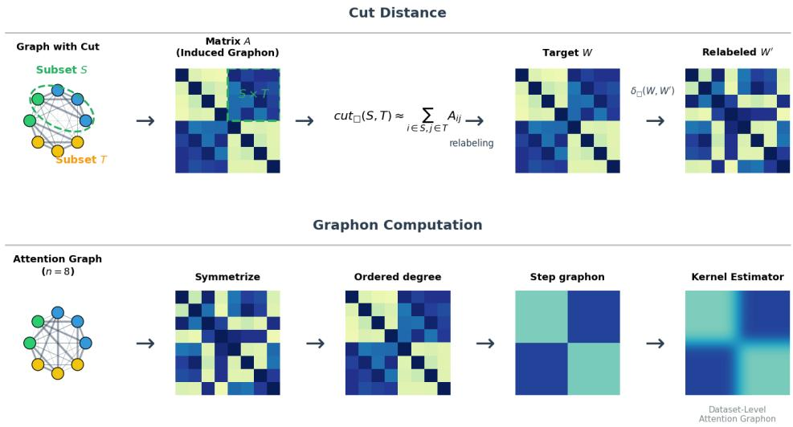  
Figure 6: Visual explanation of the cut distance $\delta _ { \bigsqcup }$ and graphon computation. Top (cut distance): The cut distance roughly measures the largest discrepancy over node subsets S, T. Bottom (graphon computation): From a dense, weighted attention graph with $n = 8 ,$ , the matrix is symmetrized, canonicalized via degree sorting, block-averaged, and finally used to estimate a dataset-level graphon.

## H ADDITIONAL RESULTS

We report an extensive set of additional experiments conducted to further stress-test our claims across architectures, datasets, and design choices. These cover (i) additional GT architectures (Graphormer-GD, GRIT) Zhang et al. (2023); Ma et al. (2023), (ii) larger-scale benchmarks (OGBmolhiv, LRGBPeptides) Hu et al. (2020); Dwivedi et al. (2022), (iii) algorithmic reasoning tasks from CLRS (BFS, Dijkstra) Velickoviˇ c et al.´ (2022), (iv) transferability, (v) multi-head attention, (vi) runtime, and (vii) sensitivity to the two main hyperparameters of our estimation pipeline (block size k and canonicalization method).

Cut-norm variance: empirical vs. theoretical scaling. Figure 7 reports the comparison between the empirical and theoretical cut-norm across all datasets for GPS. Figure 14 extends this to the 4-head setting and additionally covers the algorithmic reasoning datasets (BFS, Dijkstra) and the larger-scale benchmarks (LRGBPeptides, OGBmolhiv). Figures 16 and 17 repeat the analysis for Graphormer-GD and GRIT respectively. Across all architectures and benchmarks, the empirical variance tracks—and stays below—the regularity-aware proxy from Theorem 3.2, confirming that the observed decay is a genuine property of learned attention rather than an architecture-specific artifact. Figure 15 reports the stronger hypothesis test, which remains informative on all datasets considered.

Statistical calibration: bootstrap, permutation test, and synthetic null. Figure 15 reports a calibrated version of the cut-norm variance test on GPS across BFS, COLLAB, Dijkstra, LRGBPeptides,

MUTAG, NCI1, PROTEINS, and REDDIT-MULTI-5K. Each panel overlays three complementary diagnostics on top of the empirical variance curve: 95% bootstrap confidence intervals (shaded band), a synthetic null distribution (mean ± 1 std), and a permutation-test p-value reported in-panel.

Bootstrap confidence intervals. For each graph size n and dataset, we construct 95% bootstrap CIs by resampling per-graph cut-norm distances (500 resamples). Across all datasets and models, intervals are narrow and lie well below the theoretical bound, confirming that the variance estimates are statistically stable and not driven by finite-sample noise.

Permutation test for monotone decay. We test whether the log–log slope of variance vs. n is significantly negative under a permutation null. With four graph sizes, the minimum achievable p-value is $\mathrm { i / 2 4 } \stackrel { - } { \approx } 0 . 0 4 2$ . On several datasets (e.g., BFS $p = 0 . 0 3 6$ , NCI1 $p = 0 . 0 4 3 )$ , observed p-values are at or near this minimum, meaning the decay ordering is among the most extreme outcomes under the null. On datasets where theory predicts weaker convergence (e.g., MUTAG, REDDIT-MULTI-5K), p-values are correspondingly larger, consistent with reduced statistical power rather than absence of the effect.

Synthetic null simulation. We pass random symmetric matrices through the same estimation pipeline to characterize the expected variance under a no-structure baseline. On multiple datasets, the experimental variance at larger n falls below the null mean, providing direct evidence that trained attention matrices are more concentrated than random ones; where variance remains above the null, this diagnostic makes weaker convergence visible rather than being masked.

Taken together, the three calibrations rule out sampling noise, spurious orderings, and unstructured attention as explanations, and support the interpretation that the observed decay reflects a genuine size-dependent convergence of the learned kernel.

Single-head attention graphons. Figure 8 shows the estimated attention graphons for GPS across all datasets and target sizes, complementing Figure 2 of the main text. Figures 10 and 11, and Figures 12 and 13 report the analogous estimates for Graphormer-GD and GRIT. In every case, the estimates stabilize within each dataset as N grows while remaining clearly distinct across datasets.

Multi-head attention graphons. Figure 9 shows per-head graphon estimates at $N = 1 2 8$ for LRGBPeptides, ModelNet10, OGBmolhiv, and REDDIT-MULTI-5K at dataset-appropriate sizes. Heads converge to visibly different kernels, supporting the view that each head implements a distinct interaction mechanism while the per-head limit is still dataset-determined.

Transferability. Figures 18 and 19 plot the transferability gap as a function of graph size for GPS (single-head) across all eleven benchmarks. Figures 20 and 21 repeat the analysis in the 4-head setting, and Figures 22 and 23 cover Graphormer-GD and GRIT. The gap decreases consistently with N across architectures and datasets, indicating that GTs trained on small graphs extrapolate to larger ones along the predicted scaling.

Runtime. Figure 24 reports per-graph runtime (log scale) of our estimation pipeline, decomposed into estimation, which computes the attention graph, orders its nodes, and computes the block averages, the approximate cut-norm computation (Cutnorm), and the total. Estimation is nearly constant in n, while the cut-norm computation dominates, and the pipeline processes each graph in tens of milliseconds, so the procedure remains tractable on the larger-scale benchmarks (LRGBPeptides, OGBmolhiv).

Factorized attention. Sampled attention is block-constant. The sampled logit between a node in block a and a node in block b is $\rho ^ { - 1 } ( \hat { \Theta } _ { a b } ) + c$ , so the row-wise softmax gives ${ \tilde { P } } = Z { \tilde { \Theta } } Z ^ { \top }$ , where $Z \in \{ 0 , 1 \} ^ { n \times K }$ assigns nodes to blocks and $\begin{array} { r } { \tilde { \Theta } _ { a b } = \exp \bigl ( \rho ^ { - 1 } ( \hat { \Theta } _ { a b } ) \bigr ) / \sum _ { b ^ { \prime } } | B _ { b ^ { \prime } } | \exp \bigl ( \rho ^ { - 1 } ( \hat { \Theta } _ { a b ^ { \prime } } ) \bigr ) } \end{array}$ The attention output can therefore be computed as $\tilde { P } V = Z \big ( \tilde { \Theta } ( Z ^ { \top } V ) \big )$ , which costs $\mathcal { O } ( K ^ { 2 } )$ to form $\tilde { \Theta } , \mathcal { O } ( n d _ { v } )$ to aggregate V by block, $\mathcal { O } ( K ^ { 2 } d _ { v } )$ to apply $\tilde { \Theta } _ { : }$ , and $\mathcal { O } ( n d _ { v } )$ to scatter the result back to the nodes. The factorization is exact because the kernel is block-constant by construction. Table 4 compares its runtime with that of the dense product for $d _ { v } = 3 2$ . The maximum relative error between the two outputs is of order $1 0 ^ { - 1 5 }$

Sensitivity to block size k. Figure 25 shows the estimated graphon for $K \in \{ 1 6 , 3 2 , 6 4 , 1 2 8 \}$ on BFS, COLLAB, Dijkstra, LRGBPeptides, and PROTEINS: larger k yields finer-grained estimates but the kernels remain qualitatively stable. Figure 26 examines the effect of k on the hypothesis test. For fixed k, the variance curves nearly coincide and stay below the theoretical bound, and the growing resolution $K _ { n } = \lceil \sqrt { n } \rceil$ differs only at the smallest sizes, so the default $K = 6 4$ does not drive our conclusions.

Sensitivity to canonicalization. Figure 27 compares degree sorting against spectral (Fiedler) sorting for the hypothesis test on MUTAG, PROTEINS, COLLAB, and LRGBPeptides: despite differences in absolute values, the two methods exhibit nearly identical decay patterns, with curves tightly aligned in log-log scale. Figures 28-31 show the actual per-size graphon estimates under both canonicalizations. The observed variance decay therefore reflects genuine properties of the learned attention rather than an artifact of the node-ordering strategy.

Node features versus graph structure. The descriptor of each node combines its features and its structural role (Sec. 4.1), so an estimated kernel depends on both. To separate their contributions, we replace the node features with i.i.d. noise and rerun the pipeline. On SmoothW and SharpW, where the features are random-walk encodings and hence functions of the topology, randomizing them destroys concentration (Table 5). On PROTEINS, whose node attributes are informative in their own right, the variance is nearly unchanged, while the estimated kernel shifts by about 0.16 in relative $L _ { 1 }$ distance. Features thus enter the kernel in both cases. On the synthetic families they carry the structural signal that stabilizes attention, whereas on PROTEINS the stability survives their removal.

Effect of symmetrization. Table 6 reports the relative residual $\| P - { \bar { P } } \| _ { F } / \| P \| _ { F }$ between the attention matrix $P$ and its symmetrization $\begin{array} { r } { \bar { P } = \frac { 1 } { 2 } ( P + P ^ { \top } ) } \end{array}$ , as a range over the sizes of each sweep. 2

Attention restricted to input edges. We train the same GPS architecture on NoisyCSBM with attention masked to the input edges and self-loops. Masked pre-softmax scores are −∞, so A vanishes off the edges, and its mass follows the attended density, falling from 0.035 at $n = 1 2 8$ to 0.0044 at $n = 1 0 2 4$ (Figure 32). The induced graphons therefore converge to the zero graphon, yet the variance stays four to six orders of magnitude below $n ^ { - 1 }$ , and the test does not reject. With full attention, which ignores the edges, the kernel mass stays near $1 / 2$

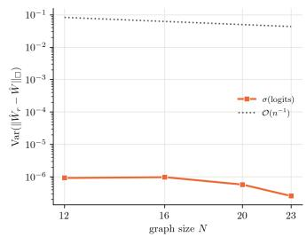  
(a) MUTAG

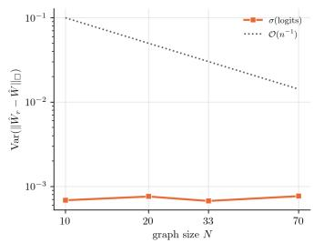  
(b) PROTEINS

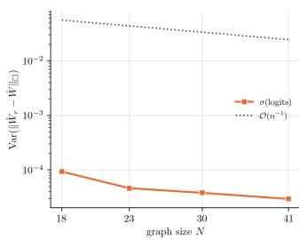  
(c) NCI1

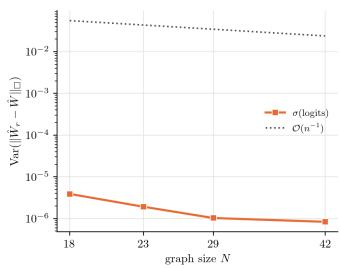  
(d) NCI109

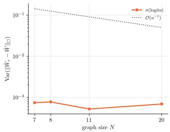  
(e) IMDB-MULTI

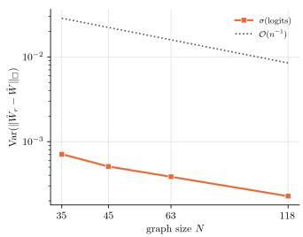  
(f) COLLAB

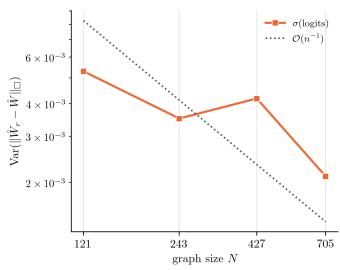  
(g) REDDIT-MULTI-5K

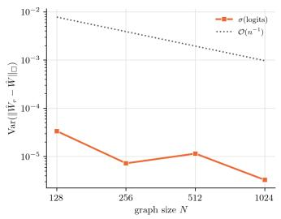  
(h) ModelNet10

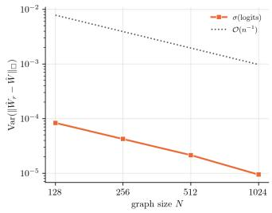  
(i) cSBM  
Figure 7: Empirical cut-norm variance versus a regularity-aware theoretical proxy (GPS, single head). Each panel compares the empirical variance of $\| \hat { W } _ { r } - \hat { W } \| _ { \Gamma }$ against the size-dependent scaling proxy $\mathsf { \bar { O } } ( n ^ { - 1 } )$ ) from Theorem 3.2.

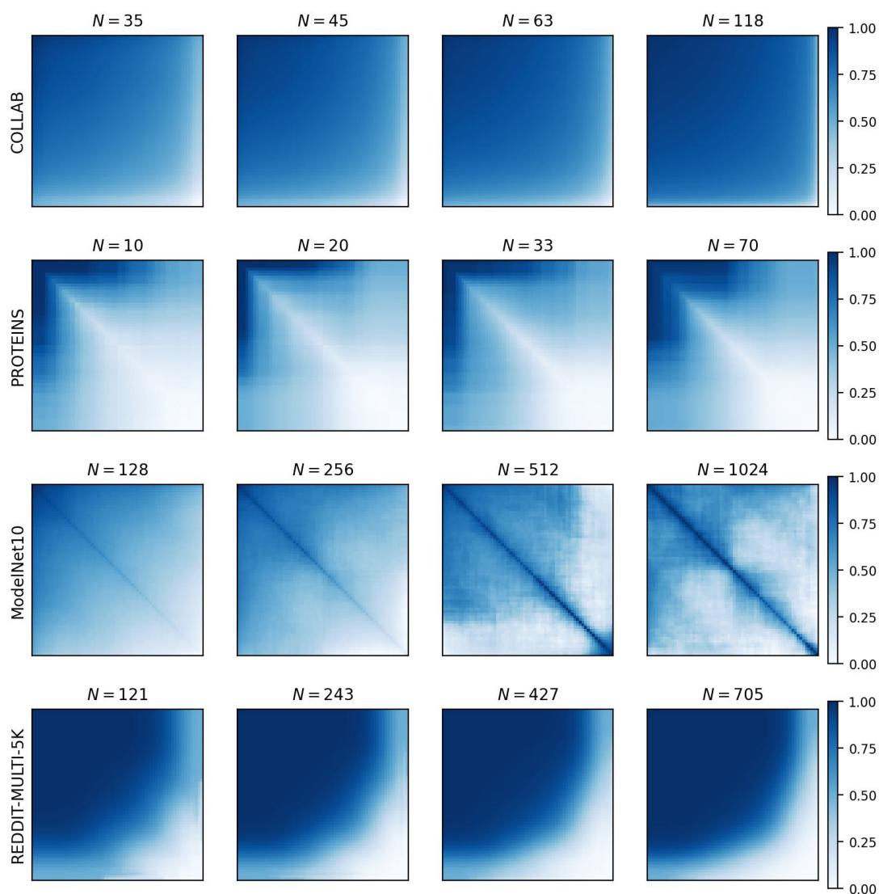  
Figure 8: Estimated attention graphons across datasets and graph sizes (GPS, single-head). Each row corresponds to a dataset, and each panel shows the $K \times K$ (here $K = 6 4 )$ block-step estimate of the dataset-level attention kernel at a target size N. The target sizes in this figure are: $\mathrm { C O L L A B } ( N \in$ {35, 45, 63, 118}), PROTEINS $( N \in \{ 1 0 , 2 0 , 3 3 , 7 0 \} )$ , ModelNet10 $( N \bar { \in } \{ 1 2 8 , 2 5 6 , 5 1 2 , 1 0 2 4 \} )$ and REDDIT-MULTI-5K $( N \in \{ 1 2 1 , 2 4 3 , 4 2 7 , 7 0 5 \} )$ . Kernel estimates stabilize within each dataset as N grows while remaining distinct across datasets.

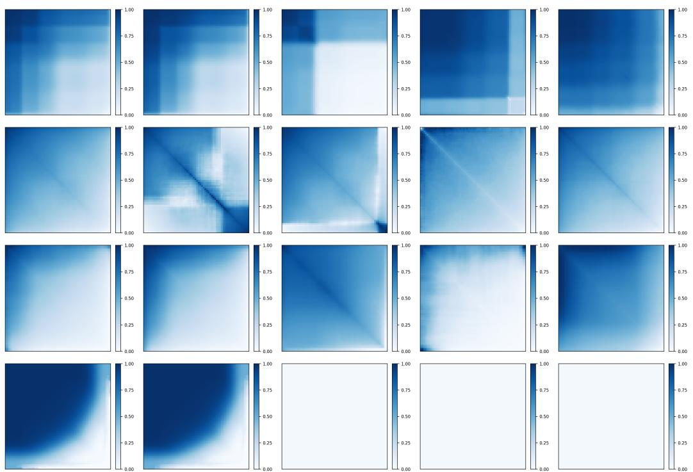  
Figure 9: Multi-head attention graphons (GPS, 4 heads). Each row corresponds to a dataset (LRGBPeptides, ModelNet10, OGBmolhiv, REDDIT-MULTI-5K), and each column shows the average graphon followed by head-specific graphon estimates $( h \in \{ 1 , 2 , 3 , 4 \} )$ . Each dataset has a different fixed size $( N \in \{ 3 \bar { 6 } , 2 5 9 , 4 \bar { 2 } 7 , 5 1 2 \bar { \} } )$ ), as stated in the figures’ titles. Different heads exhibit distinct kernel structures.

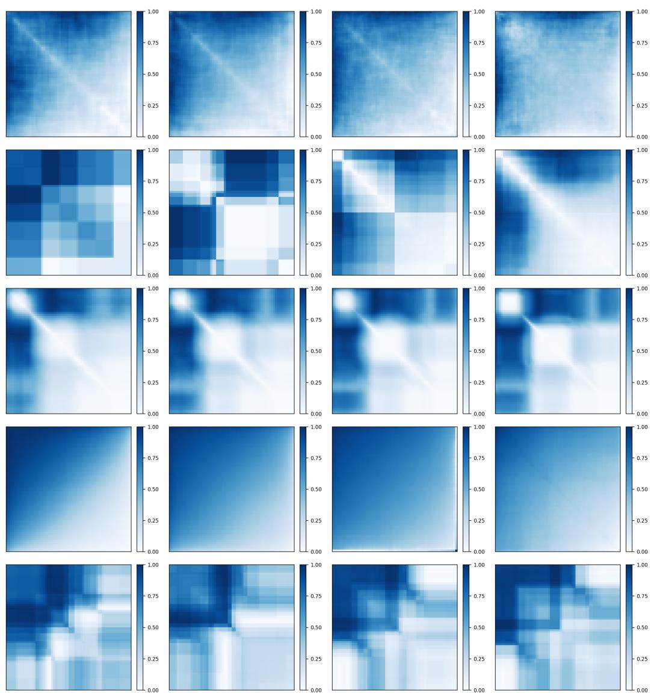  
Figure 10: Estimated attention graphons across datasets and graph sizes (Graphormer-GD, single-head). Each row corresponds to a dataset (COLLAB, IMDB-MULTI, LRGBPeptides, Model-Net10, MUTAG), and each column shows the block-step estimate of the dataset-level attention kernel at increasing target sizes N. Kernel estimates stabilize within each dataset as N grows.

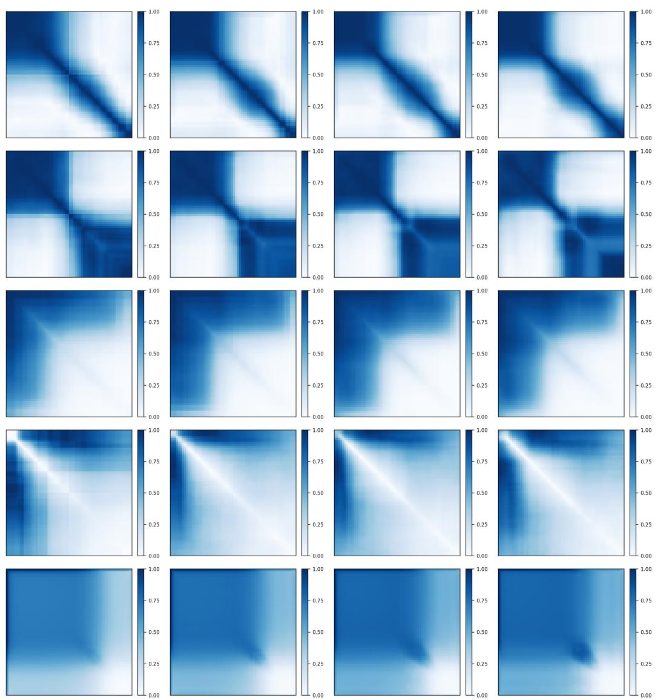  
Figure 11: Estimated attention graphons across datasets and graph sizes (Graphormer-GD, single-head). Each row corresponds to a dataset (NCI1, NCI109, OGBmolhiv, PROTEINS, REDDIT-MULTI-5K), and each column shows the block-step estimate of the dataset-level attention kernel at increasing target sizes N. Kernel estimates stabilize within each dataset as N grows.

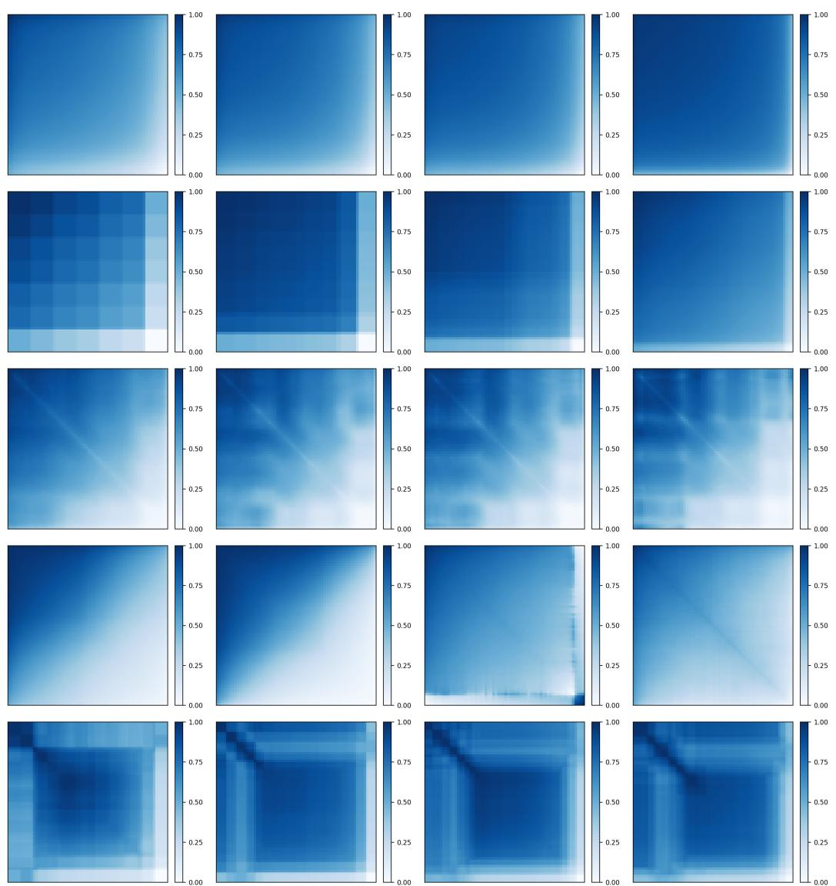  
Figure 12: Estimated attention graphons across datasets and graph sizes (GRIT, single-head). Each row corresponds to a dataset (COLLAB, IMDB-MULTI, LRGBPeptides, ModelNet10, MU-TAG), and each column shows the block-step estimate of the dataset-level attention kernel at increasing target sizes N. Kernel estimates stabilize within each dataset as N grows.

  
Figure 13: Estimated attention graphons across datasets and graph sizes (GRIT, single-head). Each row corresponds to a dataset (NCI1, NCI109, OGBmolhiv, PROTEINS, REDDIT-MULTI-5K), and each column shows the block-step estimate of the dataset-level attention kernel at increasing target sizes N. Kernel estimates stabilize within each dataset as N grows.

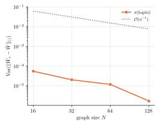  
(a) BFS

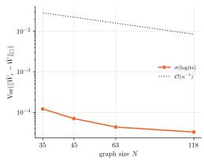  
(b) COLLAB

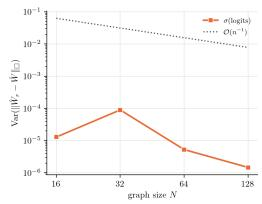  
(c) Dijkstra

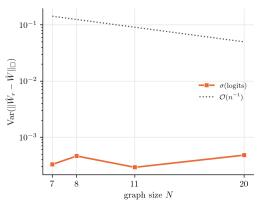  
(d) IMDB-MULTI

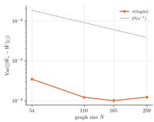  
(e) LRGBPeptides

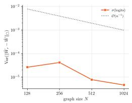

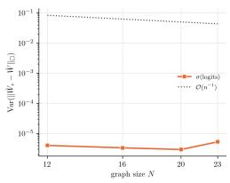

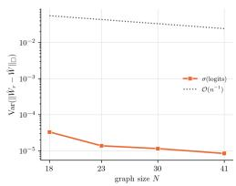  
(g) MUTAG

(f) ModelNet10  
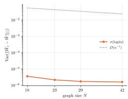  
(i) NCI109

(h) NCI1  
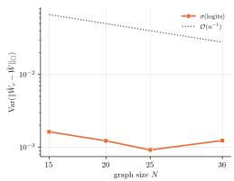  
(j) OGBmolhiv

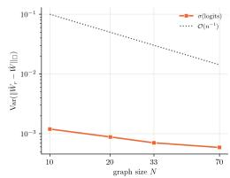  
(k) PROTEINS

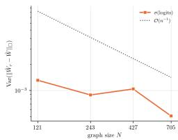  
(l) REDDIT-MULTI-5K

Figure 14: Empirical cut-norm variance versus theoretical proxy (GPS, 4 heads). Each panel compares the empirical variance of $\| \hat { W } _ { r } - \hat { W } \| _ { \Sigma }$ against the size-dependent scaling proxy $\mathcal { O } ( n ^ { - 1 } )$ from Theorem 4.2. The target sizes N are dataset-dependent.

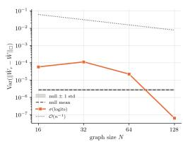  
(a) BFS

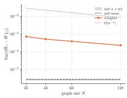  
(b) COLLAB

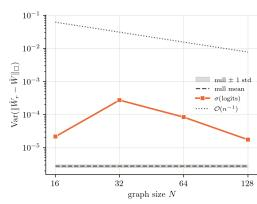  
(c) Dijkstra

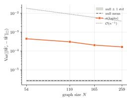  
(d) LRGBPeptides

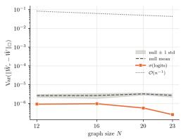  
(e) MUTAG

  
(f) NCI1

  
(g) PROTEINS

  
(h) REDDIT-MULTI-5K

Figure 15: Stronger hypothesis test results (GPS, single-head). Each panel shows the results of the stronger hypothesis test for the corresponding dataset. Each panel compares the empirical variance against the synthetic null, shown as its mean (dashed) with a band of one standard deviation, and against the scaling proxy $\mathcal { O } ( n ^ { - 1 } )$ (dotted).

  
(a) LRGBPeptides

  
(b) MUTAG

  
(c) NCI1

  
(d) OGBmolhiv

  
(e) PROTEINS

Figure 16: Empirical cut-norm variance versus theoretical proxy (Graphormer-GD, singlehead). Each panel compares the empirical variance of $\| \hat { W } _ { r } - \hat { W } \| _ { \Gamma }$ against the size-dependent scaling proxy $\mathbf { \bar { \mathcal { O } } } ( n ^ { - 1 } )$ from Theorem 4.2. The target sizes N are dataset-dependent.

  
(a) LRGBPeptides

  
(b) MUTAG

  
(c) NCI1

  
(d) OGBmolhiv

  
(e) PROTEINS

Figure 17: Empirical cut-norm variance versus theoretical proxy (GRIT, single-head). Each panel compares the empirical variance of $\| \hat { W } _ { r } - \hat { W } \| _ { \Sigma }$ against the size-dependent scaling proxy $\scriptstyle { \dot { \mathcal { O } } } ( n ^ { - 1 } )$ from Theorem 4.2. The target sizes N are dataset-dependent.

  
(a) BFS


(b) COLLAB  


(c) Dijkstra  


(d) IMDB-MULTI  
(e) LRGBPeptides  
  
(g) NCI1

  
(h) NCI109

(f) MUTAG  
  
(i) OGBmolhiv

Figure 18: Transferability gap across graph sizes (GPS, single-head). Each panel shows the transferability gap as a function of graph size for the corresponding dataset.

  
(a) PROTEINS

  
(b) REDDIT-MULTI-5K  
Figure 19: Transferability gap across graph sizes (GPS, single-head). Each panel shows the transferability gap as a function of graph size for the corresponding dataset.

  
(a) BFS

  
(b) COLLAB

  
(c) Dijkstra


(d) IMDB-MULTI  
  
(g) NCI1

(f) MUTAG  
(e) LRGBPeptides  
  
(h) NCI109

  
(i) OGBmolhiv

Figure 20: Transferability gap across graph sizes (GPS, 4 heads). Each panel shows the transferability gap as a function of graph size for the corresponding dataset.

  
(a) PROTEINS

  
(b) REDDIT-MULTI-5K  
Figure 21: Transferability gap across graph sizes (GPS, 4 heads). Each panel shows the transferability gap as a function of graph size for the corresponding dataset.

  
(a) MUTAG

  
(b) NCI1

  
(c) PROTEINS

  
(d) REDDIT-MULTI-5K  
Figure 22: Transferability gap across graph sizes (Graphormer-GD, single-head). Each panel shows the transferability gap as a function of graph size for the corresponding dataset.

  
(a) MUTAG

  
(b) NCI1

  
(c) PROTEINS

  
(d) REDDIT-MULTI-5K  
Figure 23: Transferability gap across graph sizes (GRIT, single-head). Each panel shows the transferability gap as a function of graph size for the corresponding dataset.

  
(a) BFS

  
(b) COLLAB

  
(c) Dijkstra

  
(d) LRGBPeptides

  
(e) MUTAG

  
(f) NCI1

  
(g) PROTEINS

Figure 24: Runtime analysis of the graphon estimation pipeline. Each panel shows the per-graph runtime (in seconds, log scale) as a function of graph size n for the corresponding dataset. The runtime is decomposed into Estimation, which computes the attention graph, orders its nodes, and computes the block averages, and Cutnorm, the approximate cut-norm computation, which add up to the Total. The Node ordering curve times the $\mathcal { O } ( n d )$ computation of the ordering statistic from queries and keys, without forming the $n \times n$ matrix. Estimation remains nearly constant across graph sizes, while the cut-norm computation dominates the total runtime. Overall, the pipeline processes each graph in tens of milliseconds, even for larger graphs.

  
Figure 25: Sensitivity of graphon estimation to block size K. Each row corresponds to a dataset (BFS, COLLAB, Dijkstra, LRGBPeptides, PROTEINS), and each column shows the estimated graphon for increasing block sizes $( \bar { K ^ { } } \in \{ 1 6 , 3 2 , 6 4 , 1 2 8 \} $ ). Larger values of K yield finer-grained estimates. The estimated graphons remain qualitatively stable across different values of $K ,$ , demonstrating robustness of the estimation procedure to this hyperparameter choice.

  
(a) MUTAG

  
(b) PROTEINS

Figure 26: Sensitivity of hypothesis test to block size K. Each panel shows the empirical variance of the cut-norm as a function of graph size n for $K \in \{ 1 6 , 3 2 , 6 4 , \hat { 1 2 8 } \}$ and for the growing resolution $K _ { n } = \lceil \sqrt { n } \rceil$ (dashed), compared against the scaling proxy $\mathcal { O } ( n ^ { - 1 } )$ (dotted). The curves for fixed K nearly coincide and lie well below the proxy, and the growing resolution gives a lower variance only at the smallest sizes, where it uses few blocks. The results therefore do not depend on the default $K = 6 4$

  
(a) MUTAG

  
(b) PROTEINS

  
(c) COLLAB

  
(d) LRGBPeptides

Figure 27: Sensitivity of hypothesis test to canonicalization method. Each panel compares the empirical variance of cut-distance using two canonicalization methods: degree sorting and spectral sorting (via Fiedler vector), against the theoretical bound. Despite differences in absolute values, the two methods exhibit nearly identical decay patterns across all datasets, with curves closely aligned in log-log scale. This demonstrates that our findings are robust to the choice of canonicalization method, and the observed variance decay reflects genuine properties of the learned attention rather than artifacts of a particular node ordering strategy.


  
(a) N = 12

  
(b) N = 16


  
(c) N = 20


  
(d) $N = 2 3$  
Figure 28: Sensitivity of hypothesis test to canonicalization method (MUTAG). On each panel: on the left is the estimated graphon via degree sorting, while on the right via Fiedler vector sorting.


  
(a) $N = 1 0$

  
(b) $N = 2 0$


  
(c) $N = 3 3$


  
(d) $N = 7 1$  
Figure 29: Sensitivity of hypothesis test to canonicalization method (PROTEINS). On each panel: on the left is the estimated graphon via degree sorting, while on the right via Fiedler vector sorting.


  
(a) $N = 3 5$


  
(b) $N = 4 5$


  
(c) $N = 6 3$


  
(d) $N = 1 1 1$  
Figure 30: Sensitivity of hypothesis test to canonicalization method (COLLAB). On each panel: on the left is the estimated graphon via degree sorting, while on the right via Fiedler vector sorting.

  
(a) $N = 5 4$


  
(b) $N = 1 1 0$

  
(c) $N = 1 6 5$


  
(d) $N = 2 5 5$  
Figure 31: Sensitivity of hypothesis test to canonicalization method (LRGBPeptides). On each panel: on the left is the estimated graphon via degree sorting, while on the right via Fiedler vector sorting.

Table 4: Runtime of the dense product ${ \tilde { P } } V$ and of the factorized product $Z ( { \tilde { \Theta } } ( Z ^ { \top } V ) )$ for $d _ { v } = 3 2 .$
<table><tr><td>n</td><td>Dense  ${ \tilde { P } } V$ </td><td>Factorized</td><td>Speed-up</td></tr><tr><td>512</td><td>13.9 ms</td><td>0.6 ms</td><td>22.7×</td></tr><tr><td>2048</td><td>8.9 ms</td><td>1.5 ms</td><td>5.8×</td></tr><tr><td>8192</td><td>19.2 ms</td><td>4.7 ms</td><td>4.1×</td></tr></table>

Table 5: Ratio of cut-norm variances after and before replacing node features with i.i.d. noise, over the four sizes of each sweep in increasing order.
<table><tr><td>Dataset</td><td>Features</td><td colspan="4">Variance ratio (randomized / original)</td></tr><tr><td>SmoothW</td><td>Random-walk PE</td><td>380</td><td>931</td><td> $1 . 9 \times 1 0 ^ { 4 }$ </td><td> $2 . 7 \times 1 0 ^ { 5 }$ </td></tr><tr><td>SharpW</td><td>Random-walk PE</td><td> $1 . 8 \times 1 0 ^ { 8 }$ </td><td> $2 . 8 \times 1 0 ^ { 9 }$ </td><td> $1 . 2 \times 1 0 ^ { 1 0 }$ </td><td> $1 . 4 \times 1 0 ^ { 9 }$ </td></tr><tr><td>PROTEINS</td><td>Node attributes</td><td>1.00</td><td>1.01</td><td>1.00</td><td>1.00</td></tr></table>

Table 6: Relative symmetrization residual $\| \boldsymbol { P } - \bar { \boldsymbol { P } } \| _ { F } / \| \boldsymbol { P } \| _ { F } ,$ as a range over the sizes of each sweep.
<table><tr><td>Dataset</td><td>Range</td><td>Dataset</td><td>Range</td></tr><tr><td>BFS</td><td>0.006–0.070</td><td>MUTAG</td><td>0.064–0.247</td></tr><tr><td>NCI1</td><td>0.009–0.114</td><td>REDDIT-MULTI-5K</td><td>0.047–0.217</td></tr><tr><td>IMDB-MULTI</td><td>0.041-0.074</td><td>PROTEINS</td><td>0.113-0.260</td></tr><tr><td>ModelNet10</td><td>0.051–0.333</td><td>COLLAB</td><td>0.082–0.284</td></tr></table>

  
(a) Empirical variance

  
(b) Kernel cut norm  
Figure 32: Attention restricted to input edges on NoisyCSBM (GPS, single-head), against full attention. Left: empirical variance and the scaling proxy $\mathcal { O } ( n ^ { - 1 } )$ . Right: cut norm $\| \hat { W } \| _ { \Pi }$ of the estimated kernel, which vanishes when attention is masked.