# Long-Horizon Scaling: How Model Capabilities Shape the Returns to Computation

Haoyu Zheng1,2,†, Zhengyu Chen1,\*, Huaisheng Zhu1, Ruishan Fang1,3,† Teng Xiao4,5, Yiwei Li1, Jingang Wang1, Wenqiao Zhang2,\*

1Meituan LongCat Team 2Zhejiang University 3Westlake University 4Allen Institute for AI 5University of Washington

## Abstract

Long-horizon agents improve solutions through sustained interaction, execution, and task feedback. Scaling studies relate performance to resources and capabilities, yet how existing capabilities shape returns to extended interaction remains less understood. To address this gap, we analyze AutoLab and EdgeBench, two long-horizon benchmarks. We find that starting performance and subsequent growth are associated with diferent capabilities: within a task category, similar early scores can precede diferent later gains. To formalize this finding, we model capability–time scaling with category-specific logistic power laws shared across models. Fitted to early trajectories, these curves extrapolate the observed models’ category-average scores to later computation. However, rising average scores mask narrowing improvement opportunities: later gains concentrate among fewer improving models. High final scores and continued improvement also have distinct capability profiles. Predicted mean gains estimate each model’s fraction of improving tasks; averaging these estimates forecasts the average share of improving models. These uneven returns motivate deciding whether a specific run should continue. We therefore derive a continuation policy to save time and compute with limited score loss. The policy conditions growth predictions on the run’s observed progress and weighs immediate and delayed gains against computation costs. In replay with training and price calibration based on other models’ histories, the policy saves roughly one-third of full-run time, with relative score losses of 2.4% on AutoLab individual runs and 3.3% on EdgeBench published mean curves. Our repository is available at https://github.com/Chihaya-Anon-chan/long-horizon-scaling.

## 1 Introduction

Language models increasingly undertake research and engineering through sustained interaction, execution, and refinement [Lu et al., 2026, Wijk et al., 2025]. Understanding these capabilities requires measuring growth with computation, beyond final scores. Scaling laws frame this question: training scaling relates performance to model size, data, and compute [Kaplan et al., 2020, Hofmann et al., 2022]; observational scaling uses shared capability representations [Ruan et al., 2024, Maia Polo et al., 2025]; test-time scaling examines inference computation [Snell et al., 2025, Schaefer et al., 2025]. Recent work models growth during sustained interaction [Zhu et al., 2026], but its relation to model capabilities remains less understood. We therefore ask: How do shared model capabilities shape long-horizon growth and the distribution of gainsfrom further computation?

Our central finding is that a shared capability space organizes both starting performance and subsequent growth through task-specific combinations (Figure 1, left). Task trajectories measure progress on particular tasks. We use external benchmarks as a common reference to compare model capabilities across tasks. Their correlated scores support a compact representation with multiple directions of model variation [Ruan et al., 2024, Zeng and Papailiopoulos, 2026]. For each task category, two learned sets of weights combine a model’s coordinates to describe starting performance and growth over time, respectively. Both sets are shared across models. These combinations parameterize a logistic power law, allowing similar starting scores to precede

## 1 Capability–time scaling

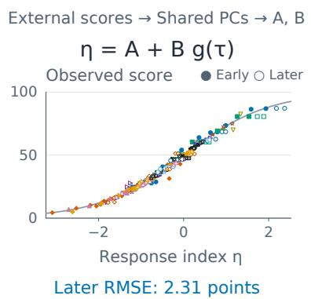

## 2 Fewer models improve

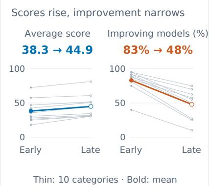

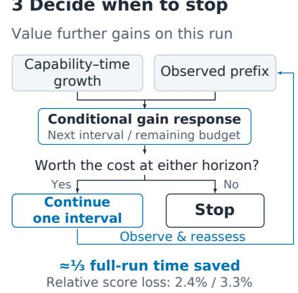  
Figure 1: From capability–time scaling to adaptive continuation. (1) All 254 observations versus the fitted index. The gray curve shows the logistic link; filled/open markers denote early/later observations. RMSE is averaged across categories. (2) Thin lines show ten categories; bold lines show their means. Scores use first/last interval endpoints (AutoLab 40/100% budget; EdgeBench 4/12 h). (3) Growth fitted on other models and the current prefix guide stopping. Reported tradeofs use prices calibrated on other models and then fixed (AutoLab/EdgeBench; Section 5.3).

diferent later gains. The fitted weights express these growth patterns as external benchmark combinations. This shared representation lets us compare how capabilities relate to performance across task categories and budgets. Fits to early trajectories predict the observed models’ later category-average scores.

The growth model above also helps explain why average scores rise while fewer models continue to improve (Figure 1, middle). On average across tasks in each category, declining participation (the share of improving models) concentrates gains, partly ofset by more balanced gains among those that improve. A relation calibrated on early intervals uses predicted mean gains to estimate the fraction of tasks on which each model later improves. Averaging these forecasts across models estimates task-averaged participation. External benchmark associations help interpret these patterns. In systems and software engineering, repository and execution scores correlate more strongly with final scores than with continued improvement, whereas scientific reasoning scores correlate more strongly with continued improvement than with final scores. Gain timing shows that models with fewer late improvements may have already realized most of their observed gains.

This finding—that fewer models improve in later intervals—motivates deciding whether a particular model should continue its current task run. Runs sharing a category-level reference can difer in attained gains and recent stagnation. Conditioning capability–time growth learned from other models on the current run’s observed history yields a bounded curve for next-interval and remaining-budget gains (Figure 1, right). The policy purchases one interval when either forecast justifies its computation cost [Hay et al., 2012], then reassesses. The remaining-budget forecast allows the policy to wait for delayed gains even when the next interval alone does not justify its cost.

We examine these growth patterns and evaluate the resulting continuation policy on AutoLab and EdgeBench, whose research and engineering tasks require sustained execution and task feedback [Xu et al., 2026, Zhu et al., 2026]. Our AutoLab individual-run trajectories and oficial EdgeBench task–model mean curves support category-level analysis of ten categories, ten model versions, and 71 tasks. The category analysis tests temporal extrapolation for observed models and forecasts later improvement frequencies. Continuation training and price calibration exclude target models’ long-horizon histories; decisions use external profiles and observed prefixes.

This joint analysis yields three connected contributions:

1. Capability-dependent growth and gain concentration. Task-specific capability combinations describe starting performance and growth, and help explain shrinking participation. Benchmark profiles distinguish final scores from continued improvement (Sections 3–4).

2. A continuation policy derived from capability–time growth. Conditioning capability-dependent progress on the current run yields a bounded curve for immediate and delayed gains, guiding further computation through sequential reassessment (Section 5).

3. Empirical validation across two long-horizon benchmarks. Early fits predict later scores with mean category $R ^ { 2 } = 0$ .844 and RMSE 2.31 points. Mean participation falls 35.2 percentage points from first to last interval. In replay, the policy saves roughly one-third of full-run time at 2.4% relative score loss on AutoLab and 3.3% on EdgeBench.

## 2 Measurement Framework and Experimental Setting

We study how verified solutions improve over sustained computation. AutoLab covers CUDA kernel optimization, model development, puzzles and challenges, and system optimization [Xu et al., 2026]. EdgeBench includes formal mathematics, games, knowledge work, optimization, scientific and machine-learning tasks, and systems and software engineering [Zhu et al., 2026]. Growth describes score trajectories over computation; gains are interval increments, and improvements are positive increments. Checkpoints reveal their timing and distribution.

Let m index a model version and i a concrete task in category $c ( i )$ . Runs have a predeclared budget T and normalized time $\tau = t / T$ . At predeclared checkpoints ending at $\tau _ { N } = 1$ , trajectories record their best verified score in [0, 1]; natural termination is absorbing. Write $s _ { m i } ( \tau )$ for a task–model mean curve. For fixed tasks $\mathcal { T } _ { c }$ shared by models $\mathcal { M } _ { c } ,$ the category response targets

$$
\bar { s } _ { m c } ( \tau ) = \frac { 1 } { | \mathcal { T } _ { c } | } \sum _ { i \in \mathcal { T } _ { c } } { s } _ { m i } ( \tau ) .\tag{1}
$$

Our category panels contain 71 tasks, four AutoLab and six EdgeBench categories, and four or five models per category (10 distinct versions overall). Membership depends only on trajectory availability. AutoLab curves average available replicates from the evaluations of Li et al. [2026]; EdgeBench curves are published task–model means. Equations use [0, 1] scores; results report scores and errors on 0–100. At checkpoint $k ,$ continuation uses score $Y _ { k }$ and observed history $\mathcal { F } _ { k }$

Fixed membership keeps temporal comparisons on the same tasks and models within each category. Continuation replay uses all eligible histories under its held-out-model protocol (Section 5.3); it does not require every task to be shared by the category panel.

## 3 Capability–Time Scaling of Long-Horizon Performance

## 3.1 Shared Capabilities, Category-Specific Growth

Shared capability coordinates organize the level and timing of progress through category-specific readouts. Let $\mathbf { x } _ { m } \in \bar { \mathbb { R } } ^ { 2 9 }$ be model m’s preprocessed profile of 29 external benchmark scores (Appendix A). We estimate a regularized covariance from 82 reference entries excluding evaluated versions and aliases, and retain five principal components (PCs) [Jollife and Cadima, 2016]:

$$
\mathbf { z } _ { m } = \mathbf { V } _ { 5 } ^ { \mathsf { T } } \mathbf { x } _ { m } \in \mathbb { R } ^ { 5 } .\tag{2}
$$

The columns of $\mathbf { V } _ { 5 } \in \mathbb { R } ^ { 2 9 \times 5 }$ are the retained covariance eigenvectors. Each PC combines the external measurements, and the same model coordinates serve all categories. PC1 is a broad positive direction across all 29 benchmarks; PC2 contrasts agent-execution with knowledge and reasoning measurements. Figure 9 shows all loadings and model coordinates; external-only missing-data estimation and preprocessing appear in Appendix A.

For first checkpoint $0 < \tau _ { 0 } < 1$ , define normalized logarithmic time

$$
g ( \tau ) = \frac { \log ( \tau / \tau _ { 0 } ) } { \log ( 1 / \tau _ { 0 } ) } , \qquad g ( \tau _ { 0 } ) = 0 , \quad g ( 1 ) = 1 .\tag{3}
$$

Logarithmic time measures proportional compute increases from the first checkpoint to the endpoint. Categoryspecific capability combinations determine early performance and temporal response:

$$
\begin{array} { r } { A _ { m c } = a _ { c } + \mathbf { w } _ { c } ^ { \mathsf { T } } \mathbf { z } _ { m } , } \end{array}
$$

$$
B _ { m c } = b _ { c } +  { \mathbf { v } } _ { c } ^ { \sf T }  { \mathbf { z } } _ { m } ,\tag{4}
$$

$$
\eta _ { m c } ( \tau ) = A _ { m c } + B _ { m c } g ( \tau ) ,
$$

$$
{ \widehat q } _ { m c } ( \tau ) = \sigma ( \eta _ { m c } ( \tau ) ) ,\tag{5}
$$

Opus 4.8 Gemini 3.1 Pro GLM 5.2 GPT 5.5 LongCat 2.0

(j) Systems & SE  
(i) Scientific & ML  
(f) Games  
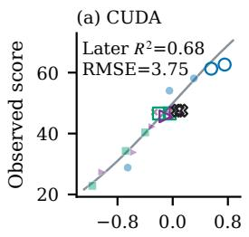

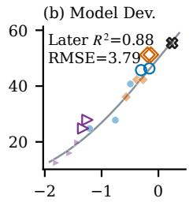

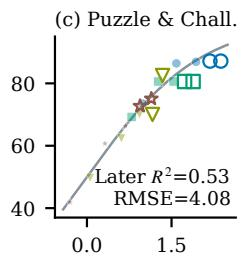

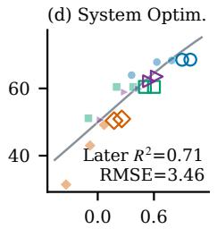

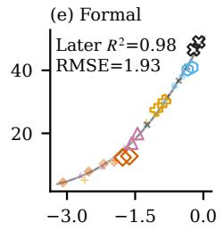

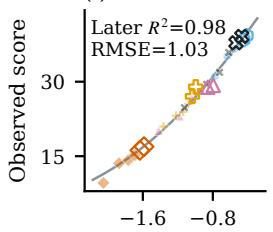

(g) Knowledge  
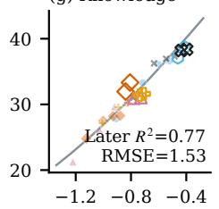

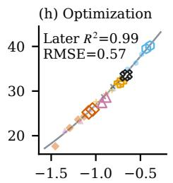  
Response index $\eta _ { m c } ( \tau ) = A _ { m c } + B _ { m c } g ( \tau )$

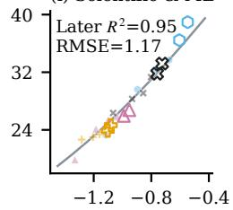

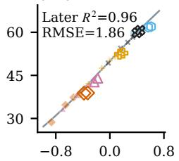  
Faint filled: early observations; open: later observations; gray: fitted response

Opus 4.7 DeepSeek V4 Pro GLM 5.1 GPT 5.4 Kimi K2.7 Code

Figure 2: Shared capabilities organize category–time responses across all ten categories: AutoLab (a–d), EdgeBench (e–j). Filled/open markers show early/later category means, with model identity fixed by color and shape; all 254 means are retained. Gray curves show $1 0 0 \sigma ( \eta )$ , and annotations report later $R ^ { 2 }$ and RMSE in score points. Section 3.2 specifies the early/later checkpoints and five-PC fitting protocol; Table 7 lists the category panels. Axis ranges vary by category.

Here $\widehat { q } _ { m c }$ predicts the category mean $\bar { s } _ { m c } ,$ and $\sigma ( u ) = ( 1 + e ^ { - u } ) ^ { - 1 }$ maps the response index η to $[ 0 , 1 ] . ~ A _ { m c }$ is the predicted first-checkpoint score logit; $B _ { m c }$ is the modeled logit change to the endpoint. Each category shares its intercepts $a _ { c } , b _ { c }$ and weights $\mathbf { w } _ { c } , \mathbf { v } _ { c }$ across models; substituting a model’s coordinates yields its $A _ { m c } , B _ { m c } .$ . Separate readouts allow similar starting performance to coexist with diferent subsequent growth. The response is a logistic power law, since

$$
\frac { \widehat { q } _ { m c } ( \tau ) } { 1 - \widehat { q } _ { m c } ( \tau ) } = e ^ { A _ { m c } } \left( \frac { \tau } { \tau _ { 0 } } \right) ^ { \kappa _ { m c } } , \kappa _ { m c } = \frac { B _ { m c } } { \log ( 1 / \tau _ { 0 } ) } .\tag{6}
$$

The initial score odds are $e ^ { \boldsymbol { A } _ { m c } } ;$ doubling computation multiplies them by $2 ^ { \kappa _ { m c } }$ . The score grows at $\kappa _ { m c } \widehat { q } _ { m c } ( 1 -$ $\widehat { q } _ { m c } )$ per unit log time, so gains diminish near saturation even with a fixed exponent. A matched comparison with all 29 external inputs favors the logistic over the afine log-time response in eight of ten categories (Appendix A.2).

The five-PC projection yields benchmark combinations that depend on category and time:

$$
\eta _ { m c } ( \tau ) = a _ { c } + b _ { c } g ( \tau ) + \left\{ \mathbf { V } _ { 5 } \left[ \mathbf { w } _ { c } + g ( \tau ) \mathbf { v } _ { c } \right] \right\} ^ { \mathsf { T } } \mathbf { x } _ { m } .\tag{7}
$$

The efective weights $\mathbf { V } _ { 5 } [ \mathbf { w } _ { c } + g ( \tau ) \mathbf { v } _ { c } ]$ combine all 29 measurements through the shared five-PC space. Each category’s ${ \bf w } _ { c }$ sets the initial weights; $\mathbf { v } _ { c }$ determines how they change with time.

## 3.2 Forecasting Later Category Performance

Within each category, we fit coeficients shared across models by regularized squared error on early scores: AutoLab 20%, 40%, 60% budget and EdgeBench 2, 4, 6, 8 hours. Later evaluation uses 80%, 100% and 10, 12 hours, respectively. At a fixed dimension, coeficients and regularization use early checkpoints only; Appendix A details dimension selection and comparisons.

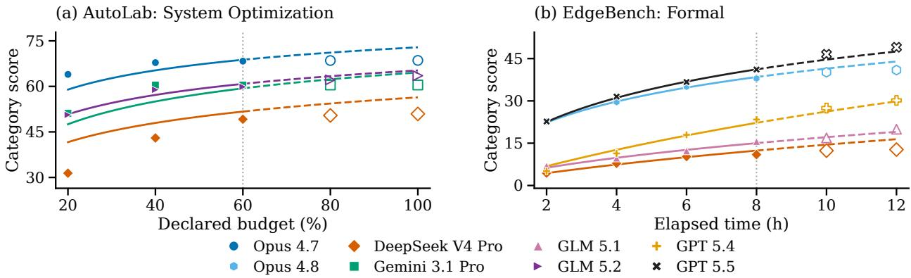  
Figure 3: Observed trajectories show early gain realization and sustained growth. Fits from Figure 2; all 50 model–checkpoint means: (a) 12 tasks, four models; (b) eight tasks, five models. Filled/solid: early observations/fits; open/dashed: later observations/predictions. Dotted: fitting cutofs.

Across all 90 later model–checkpoint means, mean category $R ^ { 2 }$ is 0.844, weighting categories equally (Figure 2). These forecasts extend the observed models’ early trajectories to later computation. Category RMSE ranges from 0.57 to 4.08 points, with five categories exceeding $R ^ { 2 } = 0 . 9 5$

On the same later points, retaining the last early score gives mean RMSE 3.10; fitting an independent logistic time curve to each model gives 2.52; replacing PCs with regularized model indicators gives 2.66. Five PCs attain 2.31, improving on independent curves in seven categories (Appendix A.4).

Figure 3 places these responses on budget and time axes to expose when gains occur. System Optimization shows substantial early gains followed by flatter observed trajectories; in Formal, Opus 4.8 and GPT 5.5 start at similar scores but diverge as computation proceeds.

## 4 Shrinking Improvement Opportunities and Concentrated Gains

For each interval, participation measures the fraction of models improving on a task; improvement frequency measures the fraction of tasks improved by a model.

## 4.1 Later Gains Reach Fewer Models

The growth curves describe how much each model improves on average across tasks. To understand who benefits from further computation, we examine how widely models share gains on each concrete task. Let $\Delta _ { m i , k } = s _ { m i } ( \tau _ { k + 1 } ) - s _ { m i } ( \bar { \tau _ { k } } ) \geq 0$ and $M _ { c } = | \mathcal { M } _ { c } |$ . Define participation P and efective gain coverage C [Hill, 1973] by

$$
P _ { i , k } = \frac { 1 } { M _ { c } } \sum _ { m } { \bf 1 } \{ \Delta _ { m i , k } > 0 \} , \qquad C _ { i , k } = \frac { ( \sum _ { m } \Delta _ { m i , k } ) ^ { 2 } } { M _ { c } \sum _ { m } \Delta _ { m i , k } ^ { 2 } } .\tag{8}
$$

Sums range over $\mathcal { M } _ { c }$ . Coverage is one for equal positive gains across all models and zero when none improves. For positive gains, their population coeficient of variation gives the exact identity

$$
C _ { i , k } = P _ { i , k } U _ { i , k } , \qquad U _ { i , k } = \frac { 1 } { 1 + \mathrm { C V } _ { + , i , k } ^ { 2 } } , \qquad C _ { i , k } \leq P _ { i , k } .\tag{9}
$$

Participation measures how widely improvement occurs; U measures how evenly positive gains are distributed among improving models. Their product separates these two sources of concentration and is unchanged by a common rescaling of gain magnitudes.

Category-mean scores rise at every recorded interval in all ten categories. Yet across the 71 fixed tasks, task-averaged participation falls in every category from the first to the last interval, by 35.2 percentage points on a ten-category average (Figure 4(a)). Positive gains become more balanced in seven categories. For tasks with positive gains in both intervals, fewer improving models drive the coverage decline; more evenly shared gains partly ofset it. Requiring gains above 0.1 points preserves the decline in all ten categories. Separately, expanding the positive-gain analysis to all available complete task–model curves yields declines in all ten categories, averaging 33.5 percentage points (Appendix B).

## 4.2 From Mean Gains to Improvement Frequency

For a given model, task category, and interval, mean gain equals the fraction of tasks that improve multiplied by their mean gain, provided at least one task improves. A smaller mean can reflect fewer improving tasks, smaller improvements, or both. The growth curves predict mean gains for each model and task category; we use those gains to estimate the fraction of tasks that improve.

Let $\widehat { \mu } _ { m c , k } = \widehat { q } _ { m c } ( \tau _ { k + 1 } ) - \widehat { q } _ { m c } ( \tau _ { k } )$ be the predicted category-mean increment. Using the positive increments of the fitted curves, we model the fraction of tasks with positive gain as

$$
\widehat { \pi } _ { m c , k } = \frac { 1 } { 1 + ( \mu _ { c } ^ { \star } / \widehat { \mu } _ { m c , k } ) ^ { \gamma } } , \qquad \mu _ { c } ^ { \star } > 0 .\tag{10}
$$

The category scales $\mu _ { c } ^ { \star }$ and shared exponent $\gamma = 1 . 7 5$ are fitted to early improvement frequencies. At $\widehat { \mu } = \mu _ { c } ^ { \star }$ half the tasks are predicted to improve.

Figure 4(b) groups later model–category–interval observations with similar predictions. The grouped predic tions track the observed fractions of improving tasks.

In the fitted low-gain regime, improvement frequency falls proportionally faster than mean gain. When $\widehat { \mu } \ll \mu _ { c } ^ { \star } , \widehat { \pi } \approx ( \widehat { \mu } / \mu _ { c } ^ { \star } ) ^ { 1 . 7 5 }$ : halving the predicted mean increment leaves about 30% of the predicted improvement frequency. Mean scores can thus rise while improvement reaches a shrinking share of tasks. Starting level $A _ { m c }$ and temporal response $B _ { m c }$ jointly set the interval gain: near saturation, further logit growth yields smaller score increments. The scale $\mu _ { c } ^ { \star }$ determines how these increments translate into improvement frequency for that task category. These capability-dependent growth histories place models in the low-opportunity regime at diferent times.

Within a category, averaging improvement frequency over models equals averaging participation over tasks. The mean predicted frequency therefore estimates task-averaged participation. Fewer improving models reduce the upper bound on gain coverage, $C \leq P ;$ the balance of gains among them determines U in $C = P U$ Appendix B.2 evaluates later calibration and compares forecast inputs under the same early-to-late split.

(a)  
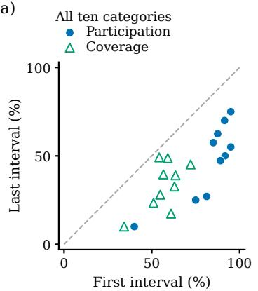

(b)  
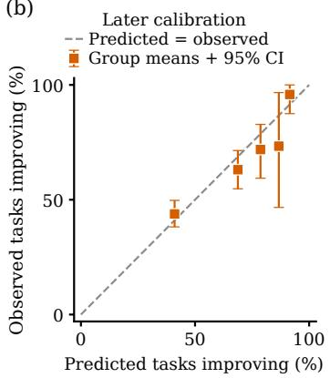

(c)  
(d)  
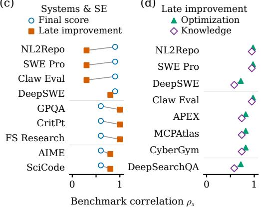  
Figure 4: Fewer models improve later, with category-specific capability profiles. (a) First/last-interval partici pation and gain coverage across ten categories. (b) Task-weighted group means of predicted and observed improvement frequencies for all 90 later observations. Groups use early prediction quantiles; bars show 95% whole-task bootstrap intervals. Dashed lines indicate equality. (c) Systems & SE: benchmark correlations with final score and terminal improvement frequency. (d) Optimization’s eight benchmarks with $\rho _ { s } \geq 0 . 7 0$ for terminal frequency, compared with Knowledge. Correlations use five models per category; terminal frequency averages the last two intervals. Lines pair the same benchmark. Details and measurements: Appendix B.

## 4.3 Capability Profiles of Long-Horizon Progress

We next examine which external benchmarks are associated with high final scores, continued improvement, and earlier gains. We compare all 29 external measurements with final scores and improvement frequencies using within-category model rank correlations. These associations describe capability profiles rather than isolated benchmark efects. Terminal improvement frequency averages the fraction of tasks improving in the last two intervals. Gain timing distinguishes persistent progress from earlier gain realization (sources: Table $^ { 1 6 ; }$ full profiles: Appendix B.3).

Attainment and continued improvement have distinct capability profiles. Across all 29 benchmarks, the average signed rank correlation across categories is more positive for final scores than for terminal improvement frequency. This diference persists when removing each model across categories and when varying the terminal window and improvement threshold (Appendix B.3). In Systems & SE, repository engineering and execution measurements—NL2Repo, SWE-bench Pro [Ding et al., 2025, Deng et al., 2025], and Claw Eval—track final scores more closely than terminal improvement frequency (Figure 4(c)). Scientific reasoning (GPQA, CritPt, FrontierScience Research) tracks continued improvement more closely than final scores; mathematics and coding (AIME, SciCode, DeepSWE) also track improvement [Rein et al., 2024, Tian et al., 2024].

Engineering and execution recur across task categories. Optimization exhibits a composite profile spanning repository engineering (NL2Repo, SWE-bench Pro, DeepSWE), execution and tool use (Claw Eval, APEX Agents, MCPAtlas, CyberGym), and information seeking (DeepSearchQA). All eight align with continued improvement in executable solvers; seven retain positive associations across nine choices of time window and improvement threshold. Six also track continued progress in Knowledge, where three of four tasks deliver domain-specific systems (Figure 4(d)). The shared profile reflects implementation and revision work across diferent subject matter.

Fewer late improvements can accompany earlier gain realization. In AutoLab System Optimization, AA-LCR, GPQA, SciCode, SimpleQA, MMLU-Pro, and MathArena associate with both fewer terminal improvements and earlier gains. By 60% budget, Opus 4.7, Gemini 3.1 Pro, and DeepSeek V4 Pro have realized 91–100% of their observed 20–100% gains, versus 71.5% for GLM 5.2 (Figure 3a). Full-trajectory timing preserves this profile (Appendix B.4).

## 5 From Scaling to Adaptive Continuation

Continued category growth can coexist with little progress on the current task. We evaluate further computation using a response to capability–time growth conditioned on the run’s observed state.

## 5.1 Conditioning Growth on the Current Run

At each checkpoint, one bounded curve predicts next-interval and remaining-budget gains. Capability–time growth defines reference progress; attained score, recent improvement, and stagnation condition how much the current run gains from that progress.

For each held-out model, we refit capability–time growth on other models’ completed histories, with fixed external PCs and a positive time coeficient. Write $r _ { m c } ( \tau )$ for this reference and $H _ { k } = 1 - Y _ { k }$ for the remaining score space. Suppressing $m , c ,$ we use a Weibull response [Weibull, 1951]:

$$
\begin{array} { l l } { { D _ { k } ( \tau ) = \displaystyle \log \frac { 1 - r ( \tau _ { k } ) } { 1 - r ( \tau ) } , } } & { { \tau _ { k } \leq \tau \leq 1 , } } \\ { { \displaystyle \widehat { G } _ { k } ( \tau ) = H _ { k } \left[ 1 - \exp \{ - \alpha _ { k } D _ { k } ( \tau ) ^ { \beta _ { k } } \} \right] , } } & { { \alpha _ { k } , \beta _ { k } > 0 . } } \end{array}\tag{11}
$$

$D _ { k }$ measures the reference’s reduction in remaining score space on a log scale. At $\alpha _ { k } = \beta _ { k } = 1$ , the curve transfers its fractional reduction, $1 - [ 1 - r ( \tau ) ] / [ 1 - r ( \tau _ { k } ) ]$ ], to the current run’s remaining space. Intensity $\alpha _ { k }$ adjusts gain magnitude; shape $\beta _ { k }$ adjusts its dependence on reference progress. The curve starts at zero, increases with horizon, and stays bounded by $H _ { k }$

The positive coeficients depend on seven features of the observed prefix, with task efects learned from other models’ histories. Equal time intervals can represent diferent reference progress for diferent model–category pairs. Runs of the same model on the same task share a reference but receive diferent forecasts as their observed progress diverges.

We fit this single curve jointly to next-interval and remaining-budget gains, including zero-gain histories. All policy fitting excludes the target model’s long-horizon histories; each source model is also excluded when constructing its training references. Source histories on the same task are allowed, while the target run contributes only its observed prefix. Appendix C.2 gives the feature definitions, regression, and training objective.

## 5.2 Purchase One Interval and Reassess

For $h \in \{ \mathrm { n } , \mathrm { e } \}$ , set $\tau _ { k , \mathrm { n } } = \tau _ { k + 1 }$ and $\tau _ { k , \mathrm { e } } = 1$ . The conditional curve gives ordered gains:

$$
\widehat { g } _ { k , h } = \widehat { G } _ { k } ( \tau _ { k , h } ) , \qquad 0 \leq \widehat { g } _ { k , \mathrm { n } } \leq \widehat { g } _ { k , \mathrm { e } } \leq H _ { k } .\tag{12}
$$

Let $\lambda \geq 0$ price each unit of declared budget in score gain. Subtracting computation costs from predicted gains gives the net values [Hay et al., 2012]:

$$
\widehat { Q } _ { k , h } = \widehat { g } _ { k , h } - \lambda c _ { k , h } , \qquad c _ { k , h } = \tau _ { k , h } - \tau _ { k } .\tag{13}
$$

If maxh $\widehat { Q } _ { k , h } > 0 ;$ , purchase the next interval and reassess. The remaining-budget forecast allows the policy to continue even when the next interval alone is not worth its cost. Full-score and naturally terminated runs stop. We use source histories to select a nonnegative price or the run-to-end option and keep that choice fixed for the target model. Realized duration is used only for cost evaluation.

Let $Q _ { k , h }$ denote equation 13 evaluated with true conditional mean gains given $\mathcal { F } _ { k }$ . With these means at every visited checkpoint, the expected net value of reassessment satisfies

$$
V _ { k } ^ { \mathrm { s e q } } \geq \operatorname* { m a x } ( 0 , Q _ { k , \mathrm { n } } , Q _ { k , \mathrm { e } } ) .\tag{14}
$$

Here $V _ { k } ^ { \mathrm { s e q } }$ is the conditional expectation of subsequent gain minus priced declared cost. The plans—stop, one interval, and endpoint—use full declared costs, with $\lambda ( 1 - \tau _ { k } )$ for the endpoint. The bound assumes a finite declared grid, additive costs, history-based actions, and stopping that truncates the same potential trajectory. Proposition 1 gives the proof and bounds losses from gain-sign errors.

## 5.3 Cost–Performance Tradeofs

We replay 492 individual AutoLab seed runs over seven target models and 252 published EdgeBench mean curves over five. Each target provides its external profile and current prefix, with its long-horizon histories held out from training.

Fixed-budget stopping uses a preset cutof independent of observed progress. Time-based patience stops after a threshold fraction of the declared horizon since the last improvement, while recent-gain rules threshold the gain rate over one or two observed intervals.

In Figure 5, cost is charged time including initial observation, divided by full-run time: wall-clock time for AutoLab, checkpoint hours for EdgeBench. Loss is the score shortfall relative to completing the same trajectory. We average loss over the policies’ shared cost range within each model–replicate, then over replicates and models (normalized frontier area; Appendix C.3).

Conditioned continuation has the lowest mean loss over these cost ranges in both suites. Relative to fixed-budget stopping, mean loss falls from 14.38 to 8.83 points on AutoLab and from 2.44 to 1.77 on EdgeBench, reductions of 38.6% and 27.4% (Table 13). Mean stopping loss falls for every model (Figure 5c). The available EdgeBench trajectories do not retain run-to-run variation in improvement timing within a task–model pair. This limits the run-specific information available for adaptation and may narrow the margin over fixed-budget stopping.

Saving half the time retains 90.5% of the full-run score on AutoLab and 91.8% on EdgeBench, versus 77.1% and 89.5% for fixed-budget stopping (Table 1). At 95% score retention, time savings are 38.1% on AutoLab and 38.4% on EdgeBench, versus 17.2% and 28.5% for fixed-budget stopping.

To choose an operating point before observing the target run, we calibrate the price on other models’ runs to meet a target mean fraction of declared budget. We then fix that price for the target model. At these operating points, continuation saves 32.8% of full-run time on AutoLab with a loss of 1.52 points (2.4% relative to full-run scores), and 30.9% on EdgeBench with a loss of 1.19 points (3.3%). Table 15 reports the source targets and complete operating points.

(a) AutoLab  
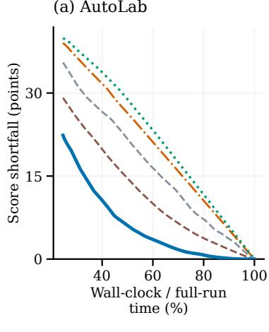

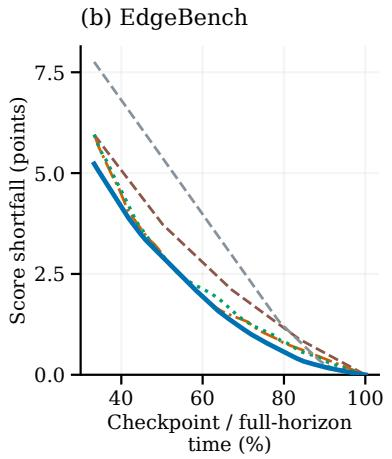

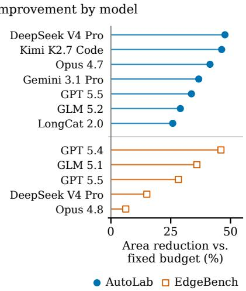  
Figure 5: Conditioned continuation improves cost–loss tradeofs. (a–b) Frontiers averaged over replicates then models. (c) Reductions in mean score loss versus fixed-budget stopping; all seven AutoLab and five EdgeBench evaluations improve. Comparisons use the same cost range across policies for each model and replicate; (a–b) display the range shared across each suite’s evaluations.

Table 1: Matched operating points, interpolated from the mean frontiers in Figure 5. Score retention is relative to the mean full-run score. Ours denotes conditioned continuation; higher is better. Table 14 compares all baselines.
<table><tr><td>Matched condition</td><td></td><td colspan="2">AutoLab</td><td colspan="2">EdgeBench</td></tr><tr><td></td><td>Reported outcome</td><td>Fixed budget</td><td>Ours</td><td>Fixed budget</td><td>Ours</td></tr><tr><td>Save 30% time</td><td>Score retained (%)</td><td>89.9</td><td>97.3</td><td>94.7</td><td>96.8</td></tr><tr><td>Save 50% time</td><td>Score retained (%)</td><td>77.1</td><td>90.5</td><td>89.5</td><td>91.8</td></tr><tr><td>Retain 95% score</td><td>Time saved (%)</td><td>17.2</td><td>38.1</td><td>28.5</td><td>38.4</td></tr><tr><td>Retain 90% score</td><td>Time saved (%)</td><td>29.7</td><td>50.9</td><td>48.2</td><td>55.9</td></tr></table>

## 6 Related Work

Capability-based scaling. Downstream scaling relates benchmark performance to pretraining loss or perplexity [Gadre et al., 2025, Du et al., 2024]. Observational scaling and Sloth instead organize performance through latent capabilities, accounting for family-specific compute eficiencies [Ruan et al., 2024, Maia Polo et al., 2025]. Shared performance structure also enables eficient evaluation: tinyBenchmarks estimates scores from selected examples [Maia Polo et al., 2024], while BenchPress predicts missing benchmark scores from low-rank public score matrices [Zeng and Papailiopoulos, 2026]. We use external capability coordinates to describe both starting performance and within-task temporal growth, with separate readouts for each task category.

Long-horizon performance and compute returns. Long-horizon evaluations measure agent reliability in units of human task duration [Kwa et al., 2025] and compare performance across computation budgets. RE-Bench compares best-of-k agents with human experts across budgets [Wijk et al., 2025]; AutoLab evaluates sustained research and engineering [Xu et al., 2026]. On AutoLab, Li et al. [2026] study process behavior, experience reuse, and harness efects. EdgeBench fits benchmark- and task-family growth curves and tests temporal extrapolation [Zhu et al., 2026]. Test-time scaling increases computation through repeated sampling [Brown et al., 2024] or longer reasoning [Muennighof et al., 2025]; allocation depends on problem dificulty [Snell et al., 2025]. Heterogeneous success probabilities explain sampling power laws [Schaefer et al., 2025], while transition models describe iterative self-correction [Yang et al., 2025]. We study capability-dependent growth, gain concentration, and continuation across tasks and models.

Adaptive stopping and computation value. Rational metareasoning compares expected decision-quality gains with compute costs [Hay et al., 2012]. AgentStop predicts unsuccessful episodes using token probabilities and trace features [Pham et al., 2026], while Ruan et al. [2026] use a recall-controlled cascade of hidden-state probes. Our policy prices next-interval and remaining-budget gains from a bounded, prefix-conditioned response to capability-dependent progress.

## 7 Discussion and Conclusion

Model capabilities organize the level and timing of long-horizon progress. Average scores rise across the ten categories while participation falls from the first to last interval. Shrinking participation concentrates gains; capability-dependent growth helps explain each model’s later improvement frequency. Evaluations should report performance, gain timing, and the breadth of improvement.

Conditioning category-level growth on observed progress forecasts immediate and delayed gains for a specific run. The resulting policy improves time–score tradeofs in replay on AutoLab individual runs and EdgeBench published mean curves. Broader model coverage and individual EdgeBench trajectories would extend this evaluation. Capability-based scaling can therefore describe long-horizon progress and guide decisions about the value of further computation.

## Reproducibility Statement

Appendices A–C describe the data preprocessing, evaluation splits, fitting procedures, hyperparameters, and continuation replay protocol, and provide the mathematical proofs. The EdgeBench analyses use oficially released task–model mean checkpoint scores. The companion repository is being prepared with sourced external benchmark inputs, code for the external capability representation and category-level response, and an index of already-public trajectories. Our own AutoLab individual-run trajectories and the inputs needed to replay the run-level continuation results remain withheld pending redaction. Consequently, the paper’s trajectory-based results cannot yet be reproduced from the planned public artifact.

## References

Chris Lu, Cong Lu, Robert Tjarko Lange, Yutaro Yamada, Shengran Hu, Jakob Foerster, David Ha, and Jef Clune. Towards end-to-end automation of AI research. Nature, 651:914–919, 2026. doi: 10.1038/ s41586-026-10265-5. URL https://www.nature.com/articles/s41586-026-10265-5.

Hjalmar Wijk, Tao Roa Lin, Joel Becker, Sami Jawhar, Neev Parikh, Thomas Broadley, Lawrence Chan, Michael Chen, Joshua M Clymer, Jai Dhyani, Elena Ericheva, Katharyn Garcia, Brian Goodrich, Nikola Jurkovic, Megan Kinniment, Aron Lajko, Seraphina Nix, Lucas Jun Koba Sato, William Saunders, Maksym Taran, Ben West, and Elizabeth Barnes. RE-bench: Evaluating frontier AI R&D capabilities of language model agents against human experts. In Proceedings of the 42nd International Conference on Machine Learning, volume 267, pages 66772–66832. PMLR, 2025. URL https://proceedings.mlr.press/v267/wijk25a.html.

Jared Kaplan, Sam McCandlish, Tom Henighan, Tom B. Brown, Benjamin Chess, Rewon Child, Scott Gray, Alec Radford, Jefrey Wu, and Dario Amodei. Scaling laws for neural language models. arXiv preprint arXiv:2001.08361, 2020. URL https://arxiv.org/abs/2001.08361.

Jordan Hofmann, Sebastian Borgeaud, Arthur Mensch, Elena Buchatskaya, Trevor Cai, Eliza Rutherford, Diego de Las Casas, Lisa Anne Hendricks, Johannes Welbl, Aidan Clark, Thomas Hennigan, Eric Noland, Katherine Millican, George van den Driessche, Bogdan Damoc, Aurelia Guy, Simon Osindero, Karén Simonyan, Erich Elsen, Oriol Vinyals, Jack Rae, and Laurent Sifre. An empirical analysis of computeoptimal large language model training. In Advances in Neural Information Processing Systems, volume 35, pages 30016–30030, 2022. URL https://proceedings.neurips.cc/paper\_files/paper/2022/hash/ c1e2faff6f588870935f114ebe04a3e5-Abstract-Conference.html.

Yangjun Ruan, Chris J. Maddison, and Tatsunori Hashimoto. Observational scaling laws and the predictability of language model performance. In Advances in Neural Information Processing Systems, volume 37, pages 15841–15892. Curran Associates, Inc., 2024. doi: 10.52202/079017-0506.

Felipe Maia Polo, Seamus Somerstep, Leshem Choshen, Yuekai Sun, and Mikhail Yurochkin. Sloth: scaling laws for LLM skills to predict multi-benchmark performance across families. In Advances in Neural Information Processing Systems, volume 38, Main Conference, pages 39511–39556. Curran Associates, Inc., 2025. doi: 10.52202/085713-1318.

Charlie Snell, Jaehoon Lee, Kelvin Xu, and Aviral Kumar. Scaling LLM test-time compute optimally can be more efective than scaling parameters for reasoning. In International Conference on Learning Representations, volume 2025, pages 10131–10165, 2025.

Rylan Schaefer, Joshua Kazdan, John Hughes, Jordan Juravsky, Sara Price, Aengus Lynch, Erik Jones, Robert Kirk, Azalia Mirhoseini, and Sanmi Koyejo. How do large language monkeys get their power (Laws)? In Proceedings of the 42nd International Conference on Machine Learning, volume 267, pages 53132–53176. PMLR, 2025. URL https://proceedings.mlr.press/v267/schaeffer25a.html.

Deyao Zhu, Xin Zhou, Shengling Qin, Xuekai Zhu, Hangliang Ding, Shu Zhong, Zixin Wen, Zhonglin Xie, Chenhui Gou, Linxuan Ren, Yueyang Wang, Junfeng Zhong, Rui Liu, Tian Gao, Yangguang Lin, Jingyuan Zhang, Maojia Song, Xuan Qi, Jinhong Wu, Chenyang Zhang, Yinzhu Piao, Ziru Niu, Hongbin Lin, Lingxiang Meng, Peng Tang, Chengyao Tang, Shanyu Wu, Huanyu Zheng, Yu Liu, Liya Zhu, He Wang, Ming Ding, Ziyu Wan, Hao Liu, Sibo Wang, Haotian Zhu, Xintian Zhang, Nan Chai, Yipeng Liu, Panhao Lai, Sihang Yuan, Zixin Su, Ge Zhang, Wangchunshu Zhou, Yantao Du, Wenhao Huang, and Guang Shi. EdgeBench: Unveiling scaling laws of learning from real-world environments. arXiv preprint arXiv:2607.05155, 2026.

Yuchen Zeng and Dimitris Papailiopoulos. You don’t need to run every eval. arXiv preprint arXiv:2606.24020, 2026. URL https://arxiv.org/abs/2606.24020.

Nicholas Hay, Stuart Russell, David Tolpin, and Solomon Eyal Shimony. Selecting computations: Theory and applications. In Proceedings of the Twenty-Eighth Conference on Uncertainty in Artificial Intelligence, 2012. doi: 10.48550/ARXIV.1207.5879. URL https://arxiv.org/abs/1207.5879.

Zhangchen Xu, Junda Chen, Yue Huang, Dongfu Jiang, Jiefeng Chen, Hang Hua, Zijian Wu, Zheyuan Liu, Zexue He, Lichi Li, Shizhe Diao, Jiaxin Pei, Jinsung Yoon, Hao Zhang, Mengdi Wang, Radha Poovendran, Misha Sra, Alex Pentland, and Zichen Chen. AutoLab: Can frontier models solve long-horizon auto research and engineering tasks? arXiv preprint arXiv:2606.05080, 2026.

Yiwei Li, Wanli Yang, Hexiang Tan, Xiangzhou Huang, Zhengyu Chen, Ziran Li, Borun Chen, Shanglin Lei, Huaisheng Zhu, Hao Tian, Fei Sun, Xunliang Cai, and Jingang Wang. Beyond final scores: A systematic evaluation of agents for long-horizon AI research and development. arXiv preprint arXiv:2608.13417, 2026.

Ian T. Jollife and Jorge Cadima. Principal component analysis: a review and recent developments. Philosophical Transactions of the Royal Society A, 374(2065):20150202, 2016. doi: 10.1098/rsta.2015.0202.

Mark O. Hill. Diversity and evenness: A unifying notation and its consequences. Ecology, 54(2):427–432, 1973. doi: 10.2307/1934352.

Jingzhe Ding, Shengda Long, Changxin Pu, Huan Zhou, Hongwan Gao, Xiang Gao, et al. NL2Repo-Bench: Towards long-horizon repository generation evaluation of coding agents. arXiv preprint arXiv:2512.12730, 2025. URL https://arxiv.org/abs/2512.12730.

Xiang Deng, Jef Da, Edwin Pan, Yannis Yiming He, Charles Ide, Kanak Garg, Niklas Laufer, Andrew Park, Nitin Pasari, Chetan Rane, Karmini Sampath, Maya Krishnan, Srivatsa Kundurthy, Sean Hendryx, Zifan Wang, Vijay Bharadwaj, Jef Holm, Raja Aluri, Chen Bo Calvin Zhang, Noah Jacobson, Bing Liu, and Brad Kenstler. SWE-Bench Pro: Can AI agents solve long-horizon software engineering tasks? arXiv preprint arXiv:2509.16941, 2025. URL https://arxiv.org/abs/2509.16941.

David Rein, Betty Li Hou, Asa Cooper Stickland, Jackson Petty, Richard Yuanzhe Pang, Julien Dirani, Julian Michael, and Samuel R. Bowman. GPQA: A graduate-level google-proof Q&A benchmark. In First Conference on Language Modeling, 2024. URL https://openreview.net/forum?id=Ti67584b98.

Minyang Tian, Luyu Gao, Shizhuo Dylan Zhang, Xinan Chen, Cunwei Fan, Xuefei Guo, Roland Haas, Pan Ji, Kittithat Krongchon, Yao Li, Shengyan Liu, Di Luo, Yutao Ma, Hao Tong, Kha Trinh, Chenyu Tian, Zihan Wang, Bohao Wu, Yanyu Xiong, Shengzhu Yin, Minhui Zhu, Kilian Lieret, Yanxin Lu, Genglin Liu, Yufeng Du, Tianhua Tao, Ofir Press, Jamie Callan, Eliu Huerta, and Hao Peng. Sci-Code: A research coding benchmark curated by scientists. In Advances in Neural Information Processing Systems, volume 37, 2024. URL https://proceedings.neurips.cc/paper\_files/paper/2024/hash/ 36850592258c8c41cecdaa3dea5ff7de-Abstract-Datasets\_and\_Benchmarks\_Track.html.

Waloddi Weibull. A statistical distribution function of wide applicability. Journal ofApplied Mechanics, 18(3): 293–297, 1951. doi: 10.1115/1.4010337.

Samir Yitzhak Gadre, Georgios Smyrnis, Vaishaal Shankar, Suchin Gururangan, Mitchell Wortsman, Rulin Shao, Jean Mercat, Alex Fang, Jefrey Li, Sedrick Keh, Rui Xin, Marianna Nezhurina, Igor Vasiljevic, Luca Soldaini, Jenia Jitsev, Alex Dimakis, Gabriel Ilharco, Pang Wei Koh, Shuran Song, Thomas Kollar, Yair Carmon, Achal Dave, Reinhard Heckel, Niklas Muennighof, and Ludwig Schmidt. Language models scale reliably with over-training and on downstream tasks. In Y. Yue, A. Garg, N. Peng, F. Sha, and R. Yu, editors, International Conference on Learning Representations, volume 2025, pages 67661–67682, 2025. URL https://proceedings.iclr.cc/paper\_files/paper/2025/file/ a91869936a63d814971b6423990ecf6e-Paper-Conference.pdf.

Zhengxiao Du, Aohan Zeng, Yuxiao Dong, and Jie Tang. Understanding emergent abilities of language models from the loss perspective. In A. Globerson, L. Mackey, D. Belgrave, A. Fan, U. Paquet, J. Tomczak, and C. Zhang, editors, Advances in Neural Information Processing Systems, volume 37, pages 53138–53167. Curran Associates, Inc., 2024. doi: 10.52202/079017-1683. URL https://proceedings.neurips.cc/ paper\_files/paper/2024/file/5f1eee2509599faeeb3570a887016a64-Paper-Conference.pdf.

Felipe Maia Polo, Lucas Weber, Leshem Choshen, Yuekai Sun, Gongjun Xu, and Mikhail Yurochkin. tinyBenchmarks: evaluating LLMs with fewer examples. In Proceedings of the 41st International Conference on Machine Learning, volume 235, pages 34303–34326. PMLR, 2024. URL https://proceedings.mlr.press/v235/ maia-polo24a.html.

Thomas Kwa, Ben West, Joel Becker, Amy Deng, Katharyn Garcia, Max Hasin, Sami Jawhar, Megan Kinniment, Nate Rush, Sydney Von Arx, Ryan Bloom, Thomas Broadley, Haoxing Du, Brian Goodrich, Nikola Jurkovic, Luke Harold Miles, Seraphina Nix, Tao Lin, Chris Painter, Neev Parikh, David Rein,

Lucas Jun Koba Sato, Hjalmar Wijk, Daniel M. Ziegler, Elizabeth Barnes, and Lawrence Chan. Measuring AI ability to complete long software tasks. In Advances in Neural Information Processing Systems, volume 38, 2025. URL https://proceedings.neurips.cc/paper\_files/paper/2025/hash/ 85069585133c4c168c865e65d72e9775-Abstract-Conference.html.

Bradley Brown, Jordan Juravsky, Ryan Ehrlich, Ronald Clark, Quoc V. Le, Christopher Ré, and Azalia Mirhoseini. Large language monkeys: Scaling inference compute with repeated sampling. arXiv preprint arXiv:2407.21787, 2024. URL https://arxiv.org/abs/2407.21787.

Niklas Muennighof, Zitong Yang, Weijia Shi, Xiang Lisa Li, Li Fei-Fei, Hannaneh Hajishirzi, Luke Zettlemoyer, Percy Liang, Emmanuel Candès, and Tatsunori Hashimoto. s1: Simple test-time scaling. In Christos Christodoulopoulos, Tanmoy Chakraborty, Carolyn Rose, and Violet Peng, editors, Proceedings of the 2025 Conference on Empirical Methods in Natural Language Processing, pages 20275–20321, Suzhou, China, November 2025. Association for Computational Linguistics. ISBN 979-8-89176-332-6. doi: 10.18653/v1/ 2025.emnlp-main.1025. URL https://aclanthology.org/2025.emnlp-main.1025/.

Zhe Yang, Yichang Zhang, Yudong Wang, Ziyao Xu, Junyang Lin, and Zhifang Sui. A probabilistic inference scaling theory for LLM self-correction. In Proceedings of the 2025 Conference on Empirical Methods in Natural Language Processing, pages 13573–13587. Association for Computational Linguistics, 2025. doi: 10.18653/v1/2025.emnlp-main.685. URL https://aclanthology.org/2025.emnlp-main.685/.

Dzung Pham, Kleomenis Katevas, Ali Shahin Shamsabadi, and Hamed Haddadi. AgentStop: Terminating local AI agents early to save energy in consumer devices. In Proceedings of the ACM Conference on AI and Agentic Systems, pages 1051–1069. ACM, 2026. doi: 10.1145/3786335.3813163. URL http://dx.doi.org/10. 1145/3786335.3813163.

Kai Ruan, Zihe Huang, Ziqi Zhou, Qianshan Wei, Jinghao Lin, Xuan Wang, and Hao Sun. Doomed from the start: Early abort of LLM agent episodes via a recall-controlled probe cascade. arXiv preprint arXiv:2607.06503, 2026. URL https://arxiv.org/abs/2607.06503.

Arthur P. Dempster, Nan M. Laird, and Donald B. Rubin. Maximum likelihood from incomplete data via the EM algorithm. Journal of the Royal Statistical Society: Series B (Methodological), 39(1):1–38, 1977. doi: 10.1111/j.2517-6161.1977.tb01600.x.

Olivier Ledoit and Michael Wolf. A well-conditioned estimator for large-dimensional covariance matrices. Journal of Multivariate Analysis, 88(2):365–411, 2004. doi: 10.1016/S0047-259X(03)00096-4.

Bradley Efron. Bootstrap methods: Another look at the jackknife. The Annals of Statistics, 7(1):1–26, 1979. doi: 10.1214/aos/1176344552.

Glenn W. Brier. Verification of forecasts expressed in terms of probability. Monthly Weather Review, 78(1):1–3, 1950. doi: 10.1175/1520-0493(1950)078<0001:VOFEIT>2.0.CO;2.

Bertie Vidgen, Austin Mann, Abby Fennelly, John Wright Stanly, Lucas Rothman, Marco Burstein, Julien Benchek, David Ostrofsky, Anirudh Ravichandran, Debnil Sur, Neel Venugopal, Alannah Hsia, Isaac Robinson, Calix Huang, Olivia Varones, Daniyal Khan, Michael Haines, Zach Richards, Chirag Mahapatra, Brendan Foody, and Osvald Nitski. APEX-Agents. arXiv preprint arXiv:2601.14242, 2026. URL https://arxiv.org/ abs/2601.14242.

Miles Wang, Robi Lin, Kat Hu, Joy Jiao, Neil Chowdhury, Ethan Chang, and Tejal Patwardhan. FrontierScience: Evaluating AI’s ability to perform expert-level scientific tasks. arXiv preprint arXiv:2601.21165, 2026. URL https://arxiv.org/abs/2601.21165.

Yubo Wang, Xueguang Ma, Ge Zhang, Yuansheng Ni, Abhranil Chandra, Shiguang Guo, Weiming Ren, Aaran Arulraj, Xuan He, Ziyan Jiang, Tianle Li, Max Ku, Kai Wang, Alex Zhuang, Rongqi Fan, Xiang Yue, and Wenhu Chen. MMLU-Pro: A more robust and challenging multi-task language understanding benchmark. InAdvances in Neural Information Processing Systems, volume 37, 2024. URL https://arxiv.org/abs/2406.01574.

## A Representation and Fitting Details

## A.1 External Measurements and the Shared PCs

External scores are assembled from BenchPress [Zeng and Papailiopoulos, 2026] and supplementary published benchmark results. Table 16 lists the 29 measurements and links their benchmark papers or oficial releases. External benchmark scores are put on a $[ 0 , 1 ]$ scale. Let ψ denote the logit transformation after clipping the score to [0.005, 0.995]. For benchmark $j \in \{ \bar { 1 } , \dots , J \}$ with $J = 2 9$ , let $\bar { \psi } _ { j }$ and $s _ { j }$ be the reference mean and standard deviation of this transformed score. Let $\omega _ { j }$ be the inverse square root of the number of measurements in its benchmark family. An observed entry $b _ { m j }$ produces

$$
x _ { m j } = \frac { \omega _ { j } } { \sqrt { \sum _ { \ell = 1 } ^ { J } \omega _ { \ell } ^ { 2 } } } \frac { \psi ( b _ { m j } ) - \bar { \psi } _ { j } } { s _ { j } } .\tag{15}
$$

Family weighting prevents several related benchmark variants from receiving proportionally more total squared weight simply because more variants are available. FrontierScience and HMMT each have two measurements; the SWE family has three; other measurements receive unit family weight.

The 82 reference entries provide 901 observed cells out of $8 2 \times 2 9$ . For the ten target model versions, 248 of 290 cells use published scores and 42 use frozen external-only estimates. The missing-entry estimator uses a rank-two external fit and regularized projection with coeficient 0.1; observed entries are preserved exactly. This estimator supplies missing values, whereas the five downstream PCs come from a separately estimated full-rank covariance. The covariance update uses conditional first and second moments for missing entries, following the expectation–maximization principle [Dempster et al., 1977], and linear shrinkage toward the identity [Ledoit and Wolf, 2004]. Its shrinkage coeficient 0.1 is selected by hiding observed external entries in reference-model validation splits. The covariance is then family-weighted before extracting its leading eigenvectors. The shared PC coordinates are not whitened. All external preprocessing and target completion are fixed before long-horizon response fitting.

Dimensionality and interpretation. The fixed-dimension sweep in Table 2 informs our five-PC choice through compactness and later-checkpoint errors. At each dimension, response coeficients, regularization, and temporal structure use only early checkpoints. Selecting dimension from last-early-checkpoint errors alone, over one to 29 PCs, gives either a common dimension of 19 or category-specific dimensions; the table reports both protocols. Individual PC names interpret the fitted external loadings: PC1 is a broad positive direction; subsequent PCs describe relative benchmark patterns. PC signs are conventional, with contrast loadings expressing relative performance across measurements.

Table 2: Dimension sweep and early-only dimension selection on the same temporal panels. Metrics average the ten categories equally; RMSE is in score points.
<table><tr><td>Number of PCs</td><td>1</td><td>3</td><td>5</td><td>7</td><td>29</td></tr><tr><td>Mean later-score RMSE</td><td>4.861</td><td>3.180</td><td>2.315</td><td>2.288</td><td>2.504</td></tr><tr><td>Early-only dimension selection</td><td></td><td>Selected PCs</td><td></td><td>RMSE</td><td> $R ^ { 2 }$ </td></tr><tr><td>Common across categories</td><td></td><td></td><td>19</td><td>2.486</td><td>0.824</td></tr><tr><td>Category-specific</td><td></td><td></td><td>2-23</td><td>2.434</td><td>0.830</td></tr></table>

## A.2 Response on the Score Scale

Diferentiating the logistic power-law response with respect to log time gives

$$
\frac { \partial \widehat { q } _ { m c } ( \tau ) } { \partial \log \tau } = \kappa _ { m c } \widehat { q } _ { m c } ( \tau ) \big [ 1 - \widehat { q } _ { m c } ( \tau ) \big ] .\tag{16}
$$

The same fitted logit growth coeficient yields diferent score changes depending on the current performance level, with changes diminishing in magnitude near saturation. Equation 16 translates the temporal coeficient estimated from category trajectories into score gains along the fitted curve.

Matched response-family comparison. We compare the logistic response with its afine counterpart, $\widehat { q } = A + B g ( \bar { \tau } )$ , using the complete 29-dimensional external profile in both cases. The task and model panels, early checkpoints, native-score squared-error objective, and 90 later evaluation means match the five-PC analysis. Each family selects its regularization and shared-versus-capability-dependent temporal coeficient on early checkpoints, then refits on the full prefix. Table 3 reports all ten categories. The logistic family reduces mean category RMSE from 2.83 to 2.50 points (11.4%), improving eight categories. This comparison evaluates the response family with the external input space held fixed; the five-PC dimension comparison appears in Table 2.

Table 3: Matched link-family comparison using all 29 external inputs. Both families select regularization and slope structure on early checkpoints and predict the same 90 later means. Errors are RMSE in score points.
<table><tr><td>Category</td><td>Affine in log time</td><td>Logistic power law</td></tr><tr><td>CUDA</td><td>4.42</td><td>4.02</td></tr><tr><td>Model Development</td><td>5.68</td><td>5.73</td></tr><tr><td>Puzzle &amp; Challenge</td><td>5.86</td><td>4.28</td></tr><tr><td>System Optimization</td><td>3.91</td><td>3.48</td></tr><tr><td>Formal</td><td>2.03</td><td>1.53</td></tr><tr><td>Games</td><td>1.09</td><td>1.07</td></tr><tr><td>Knowledge</td><td>1.65</td><td>1.57</td></tr><tr><td>Optimization</td><td>0.41</td><td>0.54</td></tr><tr><td>Scientific &amp; ML</td><td>1.33</td><td>0.97</td></tr><tr><td>Systems &amp; SE</td><td>1.87</td><td>1.82</td></tr><tr><td>Macro average</td><td>2.83</td><td>2.50</td></tr></table>

From PC readouts to trajectories. Figure 6 connects external loadings, category readouts, and growth in actual time. In the regularized Formal fit, PC2 enters the early-performance readout positively and the temporal readout negatively: its association with the starting level difers from its association with subsequent change. System Optimization illustrates how much of the observed gain occurs before the later evaluation checkpoints (Section B.4).

## A.3 Category Response Estimation and Metrics

Fixed trajector panels. We first retain task–model mean curves with observed scores at every analysis checkpoint in Table 4. Within each category, we enumerate model subsets of size at least four and intersect their available tasks. The primary panel maximizes the number of observed task–model pairs; ties favor more tasks, then lexicographic task and model identifiers. Selection uses availability, not score values. This yields the fixed panels in Table 7, shared by the temporal forecasts and gain-distribution analysis. AutoLab means average available replicates; EdgeBench supplies task–model means. The same tasks and models enter every checkpoint within a category. Continuation uses the separately defined replay population below (Appendix C.3).

Table 4: Temporal prediction protocol. AutoLab time is a fraction of declared budget; EdgeBench time is elapsed hours.
<table><tr><td>Benchmark</td><td>Early coefficient fit</td><td>Later evaluation</td></tr><tr><td>AutoLab</td><td>20%, 40%, 60%</td><td>80%, 100%</td></tr><tr><td>EdgeBench</td><td>2,4, 6,8 h</td><td>10, 12 h</td></tr></table>

For category $c ,$ let $\mathcal { E } _ { c }$ index its early checkpoints and $n _ { c } = | \mathcal { M } _ { c } | | \mathcal { E } _ { c } |$ . The response parameters are $\theta _ { c } = $ $( a _ { c } , b _ { c } , \mathbf { w } _ { c } , \mathbf { v } _ { c } )$ . Their fitting objective is

$$
\mathcal { L } _ { c } ( \boldsymbol { \theta } _ { c } ) = \frac { 1 } { n _ { c } } \sum _ { m \in \mathcal { M } _ { c } } \sum _ { k \in \mathcal { E } _ { c } } \big [ \widehat { q } _ { m c } ( \tau _ { k } ) - \bar { s } _ { m c } ( \tau _ { k } ) \big ] ^ { 2 } + \rho _ { c } \big ( \| \mathbf { w } _ { c } \| _ { 2 } ^ { 2 } + \| \mathbf { v } _ { c } \| _ { 2 } ^ { 2 } \big ) + 1 0 ^ { - 9 } a _ { c } ^ { 2 } + 1 0 ^ { - 7 } b _ { c } ^ { 2 } .\tag{17}
$$

The small intercept penalties stabilize the numerical fit. We compare the full response with its restriction $\mathbf { v } _ { c } = \mathbf { 0 } .$ , and use $\rho _ { c } ^ { ^ { \bullet } } \in \mathring { \{ 1 0 ^ { - 5 } , 1 0 ^ { - 4 } , 1 0 ^ { - 3 } , 1 0 ^ { - 2 } , 1 0 ^ { - 1 } \} }$ . Each candidate is fitted before the last early checkpoint and scored at that checkpoint; ties prefer the restricted response and then stronger regularization. The selected specification is refitted on all early points. The temporal fit leaves $B _ { m c }$ unconstrained; all increments used in the opportunity analysis are positive in the selected fits. The continuation reference instead imposes a positive slope by construction.

(a) External PC structure  
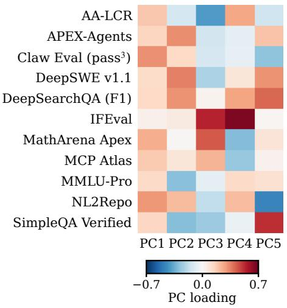  
(b) AutoLab: System Optim.

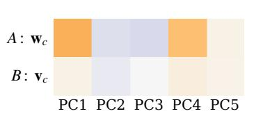

(c) EdgeBench: Formal  
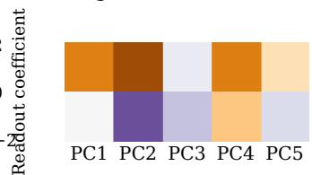

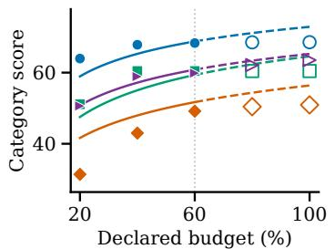

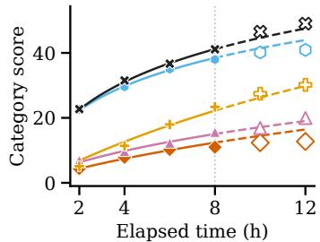  
Filled / solid: early; open / dashed: later Model colors and shapes: Figure 2  
Figure 6: From external capabilities to time responses. (a) The union of the two strongest positive and negative loadings per PC shows 11 benchmarks; PC1 has only positive loadings. All 29 benchmarks enter the representation; full loadings appear in Figure 9. (b–c) Illustrative categories: top, fitted PC coeficients $\mathbf { w } _ { c } , \mathbf { v } _ { c }$ for A, B (intercepts omitted); bottom, all 50 observed category-mean scores across four/five models on $1 2 / 8$ fixed tasks and their fitted curves. Filled/solid denotes early observations/fits; open/dashed denotes later observations/predictions. Both use the five-PC response of Figure 2. Loadings and readout coeficients use separate color scales.

For the later model–checkpoint set $\mathcal { T } _ { c } ,$ write $y _ { m k } = \bar { s } _ { m c } ( \tau _ { k } )$ and $\begin{array} { r } { \bar { y } _ { c } = | \mathcal { T } _ { c } | ^ { - 1 } \sum _ { ( m , k ) \in \mathcal { T } _ { c } } y _ { m k } } \end{array}$ . We report

$$
\mathrm { M S E } _ { c } = \frac { 1 } { | { \cal T } _ { c } | } \sum _ { ( m , k ) \in { \cal T } _ { c } } [ \widehat { q } _ { m c } ( \tau _ { k } ) - y _ { m k } ] ^ { 2 } ,
$$

$$
\mathrm { R M S E } _ { c } = 1 0 0 \sqrt \mathrm { M S E } _ { c } ,\tag{18}
$$

$$
R _ { c } ^ { 2 } = 1 - \frac { \sum _ { ( m , k ) \in \mathcal { T } _ { c } } [ \widehat { q } _ { m c } ( \tau _ { k } ) - y _ { m k } ] ^ { 2 } } { \sum _ { ( m , k ) \in \mathcal { T } _ { c } } ( y _ { m k } - \bar { y } _ { c } ) ^ { 2 } } .\tag{19}
$$

Macro metrics average category values equally, with the square root taken within each category for RMSE.

## A.4 Temporal Controls without External Scores

All controls use the identical fixed model–task panels, early checkpoints, score-space squared-error loss, and later evaluation points. The persistence control retains the last early score. Independent time curves fit $\sigma ( A _ { m } + B _ { m } g ( \tau ) )$ separately to each model’s early category means, using only the numerical intercept and slope penalties in equation 17. The model-indicator control replaces the five PC coordinates with one-hot model indicators and uses the same early-only regularization and shared-versus-model-dependent slope selection as the capability response. Its final coeficients are refitted on all early points. Table 5 retains every category.

With four or five models per category, the intercept-plus-PC design has full row rank; regularization selects among coeficient vectors with identical fitted indices. The coeficients describe regularized associations, with predictive performance evaluated by the later-score controls in Table 5.

Table 5: Later-score RMSE in points under matched temporal evaluation. Indicators denotes regularized model identities; PCs denotes the selected five-PC response.
<table><tr><td>Category</td><td>Last score</td><td>Independent</td><td>Indicators</td><td>PCs</td></tr><tr><td>CUDA</td><td>4.19</td><td>4.95</td><td>4.18</td><td>3.75</td></tr><tr><td>Model Development</td><td>6.19</td><td>3.46</td><td>6.06</td><td>3.79</td></tr><tr><td>Puzzle &amp; Challenge</td><td>5.83</td><td>4.27</td><td>4.41</td><td>4.08</td></tr><tr><td>System Optimization</td><td>1.71</td><td>3.97</td><td>3.41</td><td>3.46</td></tr><tr><td>Formal</td><td>4.40</td><td>1.86</td><td>1.66</td><td>1.93</td></tr><tr><td>Games</td><td>1.95</td><td>1.10</td><td>1.01</td><td>1.03</td></tr><tr><td>Knowledge</td><td>2.17</td><td>2.05</td><td>1.90</td><td>1.53</td></tr><tr><td>Optimization</td><td>1.11</td><td>0.58</td><td>0.50</td><td>0.57</td></tr><tr><td>Scientific &amp; ML</td><td>2.25</td><td>1.04</td><td>1.50</td><td>1.17</td></tr><tr><td>Systems &amp; SE</td><td>1.19</td><td>1.90</td><td>1.91</td><td>1.86</td></tr><tr><td>Macro average</td><td>3.10</td><td>2.52</td><td>2.66</td><td>2.31</td></tr></table>

## B Gain Decomposition and Opportunity Modeling

## B.1 The Coverage Identity and Its Change over Time

For positive gains, $M _ { c } C$ is the order-two Hill efective number [Hill, 1973], $\begin{array} { r } { ( \sum _ { m } \Delta _ { m } ) ^ { 2 } / \sum _ { m } \Delta _ { m } ^ { 2 } } \end{array}$ ; dividing by $M _ { c }$ gives normalized gain coverage. Fix a task and interval, and suppress their indices. Let $K _ { + }$ be the number of positive increments, $\bar { \Delta } _ { + }$ their mean, and $v _ { + }$ their variance with divisor $K _ { + }$ . For $K _ { + } > 0$

$$
C = \frac { ( K _ { + } \bar { \Delta } _ { + } ) ^ { 2 } } { M _ { c } K _ { + } ( \bar { \Delta } _ { + } ^ { 2 } + v _ { + } ) } = \frac { K _ { + } } { M _ { c } } \frac { 1 } { 1 + v _ { + } / \bar { \Delta } _ { + } ^ { 2 } } = P U .\tag{20}
$$

When $K _ { + } = 0$ , we set $P = C = 0$ and leave the positive-gain balance undefined. For a task with positive gains in both its early and late intervals, denoted by subscripts early and late, the exact symmetric decomposition is

$$
\begin{array} { r } { C _ { \mathrm { l a t e } } - C _ { \mathrm { e a r l y } } = ( P _ { \mathrm { l a t e } } - P _ { \mathrm { e a r l y } } ) \frac { U _ { \mathrm { l a t e } } + U _ { \mathrm { e a r l y } } } { 2 } } \\ { + ( U _ { \mathrm { l a t e } } - U _ { \mathrm { e a r l y } } ) \frac { P _ { \mathrm { l a t e } } + P _ { \mathrm { e a r l y } } } { 2 } . } \end{array}\tag{21}
$$

The two terms exactly decompose the observed coverage change into participation and balance components. We compute them per task, then average within category and across categories. The early and late intervals are 20–40% and 80–100% for AutoLab, and 2–4 h and 10–12 h for EdgeBench. Participation uses all 71 fixed tasks. The paired decomposition uses the 62 tasks with positive gains in both intervals, giving contributions of −23.95 percentage points from participation and +2.92 from balance. A nonparametric bootstrap [Efron, 1979] resamples whole tasks within categories, keeping the model set fixed, and gives a 95% interval of 29.5–40.8 percentage points for the macro participation decline. Raising the improvement threshold from numerical zero to 0.01 or 0.1 score points preserves the decline in all ten category means.

Expanded trajectory panels. Table 6 extends the analysis from the primary panels to all complete task–model curves available at the panel-selection stage. For each task $i ,$ participation divides the number of improving models by the number observed on that task; this model set stays fixed across the first and last intervals. We average tasks within categories, then the ten categories equally. The expansion increases coverage from 71 tasks and 329 task–model pairs to 80 tasks and 402 pairs, without imputing incomplete curves. Participation declines in every category under both definitions, averaging 35.2 and 33.5 percentage points, respectively.

## B.2 Opportunity Response and Later Calibration

For each model–category–interval observation, let $f _ { m c , k }$ be its empirical fraction of tasks with positive increments. The opportunity model is logistic regression on log predicted mean gain:

$$
\mathrm { l o g i t } \widehat { \pi } _ { m c , k } = \gamma \bigl ( \mathrm { l o g } \widehat { \mu } _ { m c , k } - \mathrm { l o g } \mu _ { c } ^ { \star } \bigr ) .\tag{22}
$$

Table 6: Participation declines under both panel definitions. Counts are tasks; decline is the task-averaged first-to-last reduction in percentage points. Expanded panels retain every available complete task–model curve, with each task's model set fixed across intervals.
<table><tr><td rowspan="2">Category</td><td colspan="2">Fixed primary panel</td><td colspan="2">Expanded panel</td></tr><tr><td>Tasks</td><td>Decline (pp)</td><td>Tasks</td><td>Decline (pp)</td></tr><tr><td>CUDA</td><td></td><td>41.7</td><td>4</td><td>32.5</td></tr><tr><td>Model Development</td><td>325</td><td>50.0</td><td>2</td><td>42.5</td></tr><tr><td>Puzzle &amp; Challenge</td><td></td><td>30.0</td><td>9</td><td>43.0</td></tr><tr><td>System Optimization</td><td>12</td><td>54.2</td><td>14</td><td>48.3</td></tr><tr><td>Formal</td><td>8</td><td>20.0</td><td>8</td><td>20.0</td></tr><tr><td>Games</td><td>8</td><td>27.5</td><td>8</td><td>27.5</td></tr><tr><td>Knowledge</td><td>4</td><td>40.0</td><td>4</td><td>40.0</td></tr><tr><td>Optimization</td><td>14</td><td>21.4</td><td>15</td><td>20.0</td></tr><tr><td>Scientific &amp; ML</td><td>4</td><td>25.0</td><td>4</td><td>21.2</td></tr><tr><td>Systems &amp; SE</td><td>11</td><td>41.8</td><td>12</td><td>40.4</td></tr><tr><td>Ten-category mean</td><td></td><td>35.2</td><td></td><td>33.5</td></tr></table>

In implementation, log gain is standardized on early observations; the reported scale and exponent absorb that standardization. A category intercept and one shared slope minimize binomial cross-entropy against $f _ { m c , k . }$ , with equal total category weight and weights proportional to task counts within category. Only the standardized slope receives an L2 penalty, selected from {0, 0.001, 0.01, 0.1} using the last early interval and category-macro Brier score [Brier, 1950]. The slope is fitted without a sign constraint and is positive in the selected fit. Refitting the opportunity parameters under whole-task resampling gives a 95% interval of 1.54–2.05 for γ, conditional on the fixed capability curves and selected regularization.

Figure 7a uses the 20, 40, 60, 80th percentiles of early log gain ratios as five-bin boundaries, extending the outer bins to include all later points. Each square places the geometric mean gain ratio against the unweighted mean observed task fraction within that bin. From left to right, the groups contain 60, 18, 5, 6, 1 later observations; all 90 enter these descriptive summaries. The orange segments connect adjacent group averages in increasing predicted-gain order; they do not represent a trajectory through time. The black response curve is unchanged.

Figure 4(b) evaluates later calibration with six bins defined by the early predicted-probability quantiles at $j / 6 , j = 1 , \ldots , 5 ,$ extending the outer boundaries to include all later predictions. Five bins contain later observations. Squares show task-count-weighted mean predicted probabilities and pooled observed improvement fractions. Figure 7b adds all 90 model–category–interval fractions as individual points. The groups contain 51, 22, 9, 5, 3 fractions, representing 372, 168, 64, 30, 24 task–model–interval entries, respectively. Error bars are 95% percentile intervals from 5,000 whole-task bootstrap replicates within categories, retaining each sampled task’s models and intervals; predictions and bin boundaries remain fixed.

Matched input comparison. To evaluate the input to equation 10, we replace log predicted gain with log interval midpoint, retaining category intercepts, a shared slope, the early fitting intervals, and the regularizationselection procedure. Both responses use these category intercepts and a single input, without model-specific intercepts. On all 90 later model–category–interval observations, category-macro Brier scores are 0.2071 for predicted gain and 0.2187 for time. For an observed improving-task fraction f and prediction ${ \widehat { \pi } } _ { i }$ , the Brier contribution is $f ( 1 - \widehat { \pi } ) ^ { 2 } + ( 1 - f ) \widehat { \pi } ^ { 2 }$ ; this averages squared probability error over the tasks’ binary improvement outcomes. We average contributions within each category and then across the ten categories.

## B.3 Task-Grounded Interpretation of Progress

The task-signature analysis relates the same 29 external measurements to observed trajectories on the fixed 71-task panel. Table 7 summarizes the work performed in each category. All external measurements named in the main-text cases have published scores for every model in their respective panel. Spearman $\rho _ { s }$ is computed across the four or five models within a category, with ties assigned average ranks. These exploratory associations describe task- and stage-related performance patterns; the task counts do not constitute additional independent model samples.

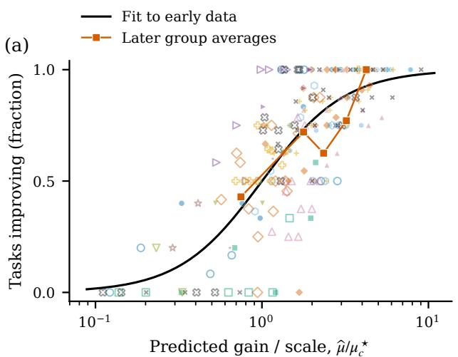

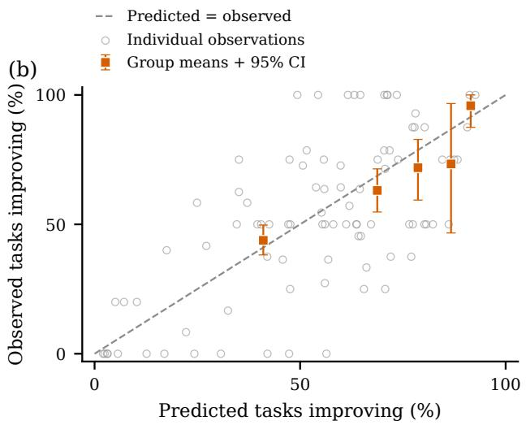  
Figure 7: The gain–opportunity response and later calibration. (a) All 209 model–category–interval observations (filled: early; open: later). The black curve fits early improvement frequencies; orange squares connect later averages in five groups defined by early gain-ratio quantiles. (b) All 90 later fractions (gray), with the same task-weighted means and 95% whole-task bootstrap intervals as Figure 4(b); dashed line: predicted = observed.

Table 7: Work performed by the fixed task panels. Counts are models/tasks. The first four categories are AutoLab; the remaining six are EdgeBench. The machine-readable supplement retains all 71 task descriptions.
<table><tr><td>Category</td><td>Models/tasks Task process</td><td></td></tr><tr><td>CUDA</td><td>4/3</td><td>Optimize decoding, geometric correspondence, and elliptic-curve CUDA kernels.</td></tr><tr><td>Model Development 4/2</td><td></td><td>Select fine-tuning data and optimize an online serv- ing engine.</td></tr><tr><td>Puzzle &amp; Challenge 4/5</td><td></td><td>Reduce program or model complexity under correct- ness and accuracy constraints.</td></tr><tr><td>System Optimization 4/12</td><td></td><td>Improve implementations of cryptography, retrieval, storage, and numerical kernels.</td></tr><tr><td>Formal</td><td>5/8</td><td>Complete interdependent Lean/Coq proofs in multi- file projects.</td></tr><tr><td>Games</td><td>5/8</td><td>Explore interactive fiction or implement game- playing and management agents.</td></tr><tr><td>Knowledge</td><td>5/4</td><td>Build three domain-specific systems and produce one examination-document suite.</td></tr><tr><td>Optimization</td><td>5/14</td><td>Implement and revise solvers for routing, packing, constraints, and search.</td></tr><tr><td>Scientific &amp; ML</td><td>4/4</td><td>Implement and evaluate reinforcement learning, in- verse models, and graph learning.</td></tr><tr><td>Systems &amp; SE</td><td>5/11</td><td>Implement repositories and specified features; opti- mize throughput and kernels.</td></tr></table>

For a terminal window containing w intervals and an improvement threshold ϵ in score points, define

$$
f _ { m c } ^ { ( w , \epsilon ) } = \frac { 1 } { w | \mathcal { T } _ { c } | } \sum _ { k = N - w } ^ { N - 1 } \sum _ { i \in \mathcal { T } _ { c } } \mathbf { 1 } \{ 1 0 0 \Delta _ { m i , k } > \epsilon \} .\tag{23}
$$

Thus each interval contributes its fraction of tasks improving, and the selected intervals receive equal weight. The main setting uses $w = 2$ and positive gain. Sensitivity checks cross w $\in \{ 1 , 2 , 3 \}$ with $\epsilon \in \{ 0 , 0 . 1 , 0 . 5 \}$ retaining every task and model. The three sufixes cover 80–100%, 60–100%, and 40–100% for AutoLab, and $1 0 { - } 1 2 , 8 { - } 1 2 ,$ and 6–12 hours for EdgeBench. They overlap; the three-interval sufix can contain fitted checkpoints. This is a descriptive window check, with the temporal fitting protocol unchanged.

Aggregate profiles across all external measurements. Table 8 averages the signed Spearman correlations over all 29 benchmarks within each category, then across categories with equal weight. Final scores have a mean association of 0.454, compared with 0.186 for terminal improvement frequency, a diference of 0.268. The diference is positive in seven categories; Games, Scientific & ML, and Systems & SE have more positive terminal-frequency associations. The aggregate contrast motivates separate profiles for attainment and continued improvement, with the constituent benchmarks varying by task category.

The diference remains positive in four descriptive sensitivity checks. Removing each model from every category in which it appears and recomputing the correlations gives diferences of 0.089–0.355. The nine window–threshold combinations above give 0.268–0.432. Giving equal weight to distinct benchmark rankings within each category yields 0.202. Retaining only benchmarks with published scores for every model in the category yields 0.279, using 9–27 measurements per category. These checks preserve equal category weighting; undefined correlations from constant rankings are omitted within a category. They measure the stability of the observed aggregate contrast across model membership and measurement choices.

Table 8: Attainment and terminal improvement have diferent external benchmark profiles. Each entry averages signed model-rank correlations over all 29 measurements within a category; the final row averages categories equally. Diference is final-score minus terminal-frequency association.
<table><tr><td>Category</td><td>Final score</td><td>Terminal frequency</td><td>Difference</td></tr><tr><td>CUDA</td><td>0.290</td><td>-0.222</td><td>+0.511</td></tr><tr><td>Model Development</td><td>0.250</td><td>-0.250</td><td>+0.500</td></tr><tr><td>Puzzle &amp; Challenge</td><td>0.473</td><td>-0.364</td><td>+0.837</td></tr><tr><td>System Optimization</td><td>0.304</td><td>-0.051</td><td>+0.354</td></tr><tr><td>Formal</td><td>0.671</td><td>0.171</td><td>+0.499</td></tr><tr><td>Games</td><td>0.444</td><td>0.601</td><td>-0.156</td></tr><tr><td>Knowledge</td><td>0.538</td><td>0.259</td><td>+0.279</td></tr><tr><td>Optimization</td><td>0.616</td><td>0.392</td><td>+0.224</td></tr><tr><td>Scientific &amp; ML</td><td>0.339</td><td>0.657</td><td>-0.319</td></tr><tr><td>Systems &amp; SE</td><td>0.616</td><td>0.671</td><td>-0.055</td></tr><tr><td>Ten-category mean</td><td>0.454</td><td>0.186</td><td>+0.268</td></tr></table>

Composite profiles and their constituent measurements. Tables 9 and 11 list every benchmark with $| \rho _ { s } | \overset { \vartriangle } { \geq } 0 . 7 0$ under the stated outcome, grouping equal rounded correlations for readability. This cutof indexes the descriptive scan; it neither selects predictor inputs nor limits the number of profile members. All 290 category–benchmark pairs, their nine-condition results, published-score masks, and within-panel benchmark rank equivalences are retained in the numerical supplement. For example, Optimization’s NL2Repo, SWEbench Pro, and Claw Eval share one ranking, while APEX Agents and CyberGym share another. Their diferent task content broadens the interpretation of the profile; the benchmark count is not an independent-sample count.

Optimization’s eight-member profile spans repository construction, agent execution, and information seeking. Seven members stay positive in all nine conditions; DeepSWE is positive in seven. In Systems & SE, final-score correlations are 0.90 for NL2Repo, SWE-bench Pro, Claw Eval, DeepSWE, Terminal-Bench, and SWE-bench Multilingual. The first three have terminal-frequency correlations of 0.30, while DeepSWE remains at 0.80. Scientific reasoning (GPQA, CritPt, FrontierScience Research), mathematics (MathArena, AIME), and scientific programming (SciCode) are all positive across the nine conditions. This is an overlapping capability profile, with distinct associations for attainment and continued improvement.

Table 9: Composite profiles in the main-text categories. All external measurements with $| \rho _ { s } | \geq 0 . 7 0$ for terminal improvement frequency are listed, with no cap on profile size. Parentheses give Spearman correlations; category counts are models/tasks. The default uses the last two intervals and positive gain; the additional increment threshold is stated explicitly. An asterisk identifies a benchmark with at least one frozen estimated input in that panel. Correlated members describe a joint performance profile, not separate efects.
<table><tr><td>Category</td><td>Concrete benchmark members and observed associations</td></tr><tr><td>Systems &amp; SE (5/11)</td><td>BrowseComp, FrontierScience-Olympiad*, HLE, IMO-AnswerBench, SimpleQA, SWE-bench Multilingual, Terminal-Bench, Toolathlon (+0.70); AIME 2026, DeepSWE, SciCode  $( + 0 . 8 0 )$  ; HMMT Feb 2026, HMMT Nov 2025 (+0.82); MathArena, τ3-Banking (+0.90); CritPt, FrontierScience-Research, GPQA(+1.00)</td></tr><tr><td>Optimization (5/14)</td><td>DeepSWE, DeepSearchQA (+0.72); APEX Agents, CyberGym, MCPAtlas (+0.82); Claw Eval, NL2Repo, SWE-bench Pro (+0.97)</td></tr><tr><td>Knowledge (5/4)</td><td>AA-LCR (-0.74); APEX Agents, CyberGym, MCPAtlas (+0.74); Claw Eval, NL2Repo, SWE-bench Pro (+0.95)</td></tr><tr><td>System Optimization (4/12)</td><td>MathArena, MMLU-Pro (-1.00); GPQA, SciCode, SimpleQA (-0.80); AA-LCR, HMMT Nov 2025* (-0.74); IMO-AnswerBench (+1.00)</td></tr></table>

Formal exhibits increment-size dependence within the same terminal window. AA-LCR correlations are 0.80, 0.87, and 0.67 at thresholds 0, 0.1, and 0.5 points. $\mathrm { A t } > 0 . 5$ points, AIME, SciCode, and τ3-Banking each correlate at 0.97; HMMT February at 0.95; GPQA, CritPt, and FrontierScience Research at 0.87. Thus long-input integration, mathematical/scientific reasoning, programming, and multi-step execution provide complementary task interpretations. The thresholds distinguish observed increment sizes, not time stages or proof dificulty.

Table 10 provides individual-member window checks. These retain the original measurements and relate task processes to their observed progress patterns.

Table 10: Window and gain-threshold sensitivity of the representative associations. Entries are Spearman correlations across fixed model panels with the fraction of tasks improving, averaged over the indicated final intervals. Last two is the main window; thresholds are in 0–100 score points. The first five rows concern AutoLab, the remainder EdgeBench. Every displayed external measurement is published for all models in its panel.
<table><tr><td rowspan="2">Category</td><td rowspan="2">Benchmark</td><td colspan="3"> $1 0 0 \Delta > 0$ </td><td colspan="3"> $1 0 0 \Delta > 0 . 1$ </td><td colspan="3"> $1 0 0 \Delta > 0 . 5$ </td></tr><tr><td>Last 1</td><td>Last 2</td><td>Last 3</td><td>Last 1</td><td>Last 2</td><td>Last 3</td><td>Last 1</td><td>Last 2</td><td>Last 3</td></tr><tr><td>CUDA</td><td>SWE Pro</td><td>+0.89</td><td>+0.74</td><td>+0.74</td><td>+0.74</td><td>+0.60</td><td>+0.60</td><td>+0.74</td><td>+0.60</td><td>+0.60</td></tr><tr><td>Model Dev.</td><td>MathArena</td><td>-0.45</td><td>-0.80</td><td>-0.80</td><td>-0.45</td><td>-0.80</td><td>-0.80</td><td>-0.45</td><td>-0.63</td><td>-0.40</td></tr><tr><td>Puzzle</td><td>SciCode</td><td>-0.89</td><td>-0.95</td><td>-0.95</td><td>-0.89</td><td>-0.95</td><td>-0.95</td><td>-0.89</td><td>-0.95</td><td>-0.77</td></tr><tr><td>System Opt.</td><td>MMLU-Pro</td><td>-1.00</td><td>-1.00</td><td>-1.00</td><td>-1.00</td><td>-1.00</td><td>-1.00</td><td>-0.95</td><td>-1.00</td><td>-1.00</td></tr><tr><td>System Opt.</td><td>AA-LCR</td><td>-0.74</td><td>-0.74</td><td>-0.74</td><td>-0.74</td><td>-0.74</td><td>-0.74</td><td>-0.89</td><td>-0.74</td><td>-0.74</td></tr><tr><td>Formal</td><td>AA-LCR</td><td>+0.67</td><td>+0.80</td><td>+0.87</td><td>+0.67</td><td>+0.87</td><td>+0.82</td><td>+0.67</td><td>+0.67</td><td>+0.60</td></tr><tr><td>Games</td><td>GPQA</td><td>+0.67</td><td>+0.97</td><td>+0.97</td><td>+0.89</td><td>+0.97</td><td>+1.00</td><td>+0.90</td><td>+0.90</td><td>+0.97</td></tr><tr><td>Knowledge</td><td>NL2Repo</td><td>+0.89</td><td>+0.95</td><td>+0.79</td><td>+0.53</td><td>+0.67</td><td>+0.74</td><td>+0.53</td><td>+0.36</td><td>+0.82</td></tr><tr><td>Optimization</td><td>NL2Repo</td><td>+0.89</td><td>+0.97</td><td>+0.90</td><td>+0.67</td><td>+0.40</td><td>+0.82</td><td>+0.58</td><td>+0.50</td><td>0+0.80</td></tr><tr><td>Scientific/ML</td><td>DeepSWE</td><td>+0.77</td><td>+1.00</td><td>+1.00</td><td>+0.00</td><td>+0.63</td><td>+0.80</td><td>-0.77</td><td>+0.89</td><td>+0.74</td></tr><tr><td>Systems/SE</td><td>DeepSWE</td><td>+0.67</td><td>+0.80</td><td>+0.82</td><td>+0.67</td><td>+0.67</td><td>+0.56</td><td>+0.70</td><td>+0.36</td><td>+0.31</td></tr><tr><td>Systems/SE</td><td>SWE Pro</td><td>+0.10</td><td>+0.30</td><td>+0.41</td><td>+0.10 +0.10 +0.10</td><td></td><td></td><td>+0.30</td><td>-0.21</td><td>-0.21</td></tr></table>

Shared processes and additional task profiles. Knowledge’s six positive members combine repository engineering (NL2Repo, SWE-bench Pro) with execution reliability and tool-mediated work (Claw Eval, APEX

Agents, CyberGym, MCPAtlas); all remain positive across the nine conditions. This profile matches three system-building tasks among four deliverables. Games combines reasoning, search, and interaction across thirteen published positive members, all positive in the nine conditions; its three interactive-fiction tasks and five programmed agents share exploration while difering in implementation demands. Scientific & ML has seventeen published positive members spanning mathematics, science, implementation, and execution. Its profile depends on increment size and window: DeepSWE reverses to −0.77 for final-interval increments above 0.5 points. CUDA and Model Development retain their engineering–tool profiles and opposing mathematical or knowledge associations in Table 11; their three- and two-task panels also admit task-level interpretation. Puzzle & Challenge’s published negative members, SciCode, GPQA, and CritPt, all correlate positively with initial performance (0.80) and negatively with terminal frequency (−0.95).

Table 11: Composite profiles in the remaining six categories. All external measurements with $| \rho _ { s } | \geq 0 . 7 0$ for terminal improvement frequency are listed, with no cap on profile size. Parentheses give Spearman correlations; category counts are models/tasks. The default uses the last two intervals and positive gain; the additional increment threshold is stated explicitly. An asterisk identifies a benchmark with at least one frozen estimated input in that panel. Correlated members describe a joint performance profile, not separate efects.
<table><tr><td>Category</td><td>Concrete benchmark members and observed associations</td></tr><tr><td>Formal (5/8)</td><td>τ3-Banking (+0.70); AA-LCR (+0.80) &gt; 0.5 points: CritPt, FrontierScience-Research, FrontierScience-Olympiad*, GPQA (+0.87); HMMT Feb 2026 (+0.95); AIME 2026, SciCode, τ3-Banking (+0.97)</td></tr><tr><td>Games (5/8)</td><td>HMMT Nov 2025 (+0.71); AA-LCR, AIME 2026, SciCode (+0.72); HMMT Feb 2026 (+0.76); BrowseComp, IMO-AnswerBench, MathArena, SimpleQA (+0.82); τ3-Banking (+0.87); CritPt, FrontierScience-Research, GPQA (+0.97)</td></tr><tr><td>(4/4)</td><td>Scientific &amp; ML APEX Agents, BrowseComp, CritPt, CyberGym, DeepSearchQA, FrontierScience-Research, GPQA, HLE, MMLU-Pro, SimpleQA, SWE-bench Multilingual, SWE-bench Verified, Terminal-Bench, Toolathlon (+0.80); HMMT Nov 2025 (+0.95); DeepSWE,</td></tr><tr><td>CUDA (4/3)</td><td>MathArena(+1.00) HMMT Feb 2026, MathArena (-0.95); BrowseComp*, FrontierScience-Olympiad, IFEval*, SimpleQA (-0.74); MCPAtlas, SWE-bench Multilingual, SWE-bench Pro (+0.74)</td></tr><tr><td>Model Development (4/2)</td><td>FrontierScience-Research, HMMT Feb 2026, SimpleQA (-1.00); BrowseComp*, MathArena (-0.80); SWE-bench Multilingual (+0.80) &gt; 0.5 points: BrowseComp*, FrontierScience-Research, HMMT Feb 2026, SimpleQA (-0.95); MCPAtlas, SWE-bench Multilingual,</td></tr><tr><td>Puzzle &amp; Challenge (4/5)</td><td>SWE-bench Pro (+0.74) AIME 2026*, CritPt, FrontierScience-Olympiad*, GPQA, HMMT Feb 2026*, MathArena*, MMLU-Pro*, SciCode, SimpleQA* (-0.95)</td></tr></table>

Across all three windows, category-mean participation and efective gain coverage remain below their firstinterval values in every category. For the last one, two, and three intervals, macro participation declines are 35.2, 31.7, and 27.9 percentage points; coverage declines are 23.6, 20.5, and 18.2 points. Coverage is computed per task and interval before averaging, retaining all-zero cases as zero.

## B.4 Gain Realization over the Observed Trajectory

To describe gain timing without an early/late cutof, normalize the observed window by $u _ { k } = ( \tau _ { k } - \tau _ { 0 } ) / ( 1 - \tau _ { 0 } )$ and let $\overline { { \Delta } } _ { m c , k } = \bar { s } _ { m c } ( \tau _ { k + 1 } ) - \bar { s } _ { m c } ( \tau _ { k } )$ . The gain-weighted interval midpoint is

$$
\ell _ { m c } ^ { \mathrm { { g a i n } } } = \frac { \sum _ { k = 0 } ^ { N - 1 } \overline { { \Delta } } _ { m c , k } ( u _ { k } + u _ { k + 1 } ) / 2 } { \sum _ { k = 0 } ^ { N - 1 } \overline { { \Delta } } _ { m c , k } } .\tag{24}
$$

Smaller values indicate earlier realization of the model’s observed gains; constant-rate improvement gives 0.5. The statistic locates gains at recorded interval midpoints rather than asserting within-interval event times. It is defined for 44 of the 45 model–category pairs. GPT-5.5 has zero total gain in Model Development, leaving three efective models for that category’s timing correlations. Supplementary tables report efective counts and attainment correlations on the same efective model set.

<table><tr><td rowspan=1 colspan=1>+0.89</td><td rowspan=1 colspan=1>+0.74</td><td rowspan=1 colspan=1>+0.74</td></tr><tr><td rowspan=1 colspan=1>-0.45</td><td rowspan=1 colspan=1>-0.80</td><td rowspan=1 colspan=1>-0.80</td></tr><tr><td rowspan=1 colspan=1>-0.89</td><td rowspan=1 colspan=1>-0.95</td><td rowspan=1 colspan=1>-0.95</td></tr><tr><td rowspan=1 colspan=1>-1.00</td><td rowspan=1 colspan=1>-1.00</td><td rowspan=1 colspan=1>-1.00</td></tr><tr><td rowspan=1 colspan=1>+0.67</td><td rowspan=1 colspan=1>+0.80</td><td rowspan=1 colspan=1>+0.87</td></tr><tr><td rowspan=1 colspan=1>+0.67</td><td rowspan=1 colspan=1>+0.97</td><td rowspan=1 colspan=1>+0.97</td></tr><tr><td rowspan=1 colspan=1>+0.89</td><td rowspan=1 colspan=1>+0.95</td><td rowspan=1 colspan=1>+0.79</td></tr><tr><td rowspan=1 colspan=1>+0.89</td><td rowspan=1 colspan=1>+0.97</td><td rowspan=1 colspan=1>+0.90</td></tr><tr><td rowspan=1 colspan=1>+0.77</td><td rowspan=1 colspan=1>+1.00</td><td rowspan=1 colspan=1>+1.00</td></tr><tr><td rowspan=1 colspan=1>+0.67</td><td rowspan=1 colspan=1>+0.80</td><td rowspan=1 colspan=1>+0.82</td></tr><tr><td></td><td></td><td rowspan=1 colspan=1>Last 3</td></tr></table>

(a) Spearman correlation across models with the fraction of tasks improving

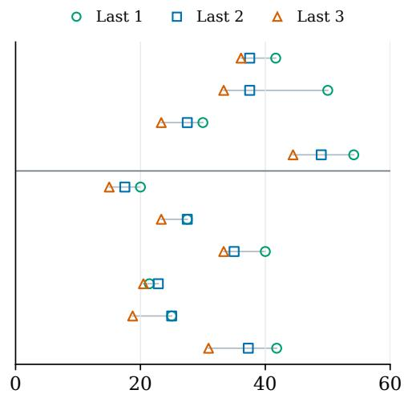  
(b) Participation decline from first interval (percentage points)  
Figure 8: Window sensitivity on all ten categories. (a) Benchmark correlations with the equally weighted mean fraction of tasks improving across the selected final intervals, using positive gain. The displayed pairs come from the task-interpretation analysis. (b) Task-averaged model participation decline relative to the first interval, in percentage points. The horizontal rule separates AutoLab from EdgeBench; model/task counts follow Table 7. Last two is the main window. All tasks and models are retained, and the response models are unchanged.

Table 12: Gain realization on all four models in AutoLab System Optimization (12 tasks). Scores use the 0–100 scale. The fourth column is the fraction of each model's observed 20–100% gain realized by 60% budget. The timing index $\ell ^ { \mathrm { g a i n } }$ weights normalized interval midpoints by category mean-score increments; smaller values indicate earlier gains.
<table><tr><td>Model</td><td>First score</td><td>Final score</td><td>Gain by 60%</td><td> $\ell ^ { \mathrm { g a i n } }$ </td></tr><tr><td>Opus 4.7</td><td>63.96</td><td>68.55</td><td>94.8%</td><td>0.179</td></tr><tr><td>DeepSeek V4 Pro</td><td>31.40</td><td>50.92</td><td>91.0%</td><td>0.255</td></tr><tr><td>Gemini 3.1 Pro</td><td>51.13</td><td>60.45</td><td>100.0%0.125</td><td></td></tr><tr><td>GLM 5.2</td><td>50.63</td><td>63.52</td><td></td><td>71.5%0.313</td></tr></table>

Table 12 reports all four models in System Optimization. The same six published benchmarks associate negatively with both terminal improvement frequency and $\ell ^ { \mathrm { g a i n } }$ : AA-LCR at −0.74, GPQA/SciCode/SimpleQA at −0.80, and MMLU-Pro/MathArena at −1.00. All six retain negative terminal-frequency associations in every window–threshold condition. Their first-score correlations difer: AA-LCR is 0.95, GPQA/SciCode 0.80, MMLU Pro/MathArena 0.60, and SimpleQA 0.00. The shared profile thus concerns gain timing, without requiring identical initial-attainment relationships. The fraction of observed 20–100% gain realized by 60% budget ranges from 71.5% to 100%. IMO-AnswerBench retains the opposite timing association (1.00), distinguishing this profile from a uniform mathematics efect. Puzzle & Challenge provides a second example: SciCode correlates positively with initial performance (0.80) and negatively with $\ell ^ { \mathrm { g a i n } } \left( - 0 . 8 0 \right)$ . Timing uses complete observed trajectories for retrospective interpretation; continuation conditions on the currently visible prefix.

## B.5 Joint Readouts and Observed Benchmark Profiles

The joint predictor combines all 29 inputs through the five PCs. Expanding its readouts gives $\beta _ { c } ^ { A } = \mathbf { V } _ { 5 } \mathbf { w } _ { c }$ and $\beta _ { c } ^ { B } \doteq \mathbf { V } _ { 5 } \mathbf { \hat { v } } _ { c }$ in equation $7 ;$ the numerical supplement supplies both full vectors. Direct PC evaluation and this expansion agree within $9 \times 1 0 ^ { - 1 6 }$ in the fitted indices. The joint readouts predict growth, while empirical benchmark profiles characterize task demands and gain timing through associations with observed outcomes. These profiles are descriptive associations rather than independent benchmark efects; larger-increment profile in Table 11 concern a diferent outcome from the opportunity response’s any-positive improvement.

## C Continuation Fitting and the Sequential Value Bound

## C.1 The Monotone Decision Reference

The decision reference uses the same external coordinates and log-time functional form as the category response, with an analysis-specific first checkpoint. It is refitted on source-model histories with a positive slope:

$$
\begin{array} { r l r } { A _ { m c } ^ { \mathrm { r e f } } = a _ { c } ^ { \mathrm { r e f } } + \left( \mathbf { w } _ { c } ^ { \mathrm { r e f } } \right) ^ { \top } \mathbf { z } _ { m } , } & { \quad } & { B _ { m c } ^ { \mathrm { r e f } } = \mathrm { s o f t p l u s } \left( b _ { c } ^ { \mathrm { r e f } } + \left( \mathbf { v } _ { c } ^ { \mathrm { r e f } } \right) ^ { \top } \mathbf { z } _ { m } \right) , } \end{array}\tag{25}
$$

$$
r _ { m c } ( \tau ) = \sigma \big ( A _ { m c } ^ { \mathrm { r e f } } + B _ { m c } ^ { \mathrm { r e f } } g ( \tau ) \big ) .\tag{26}
$$

Here softplus $( u ) = \log ( 1 + e ^ { u } )$ guarantees $B _ { m c } ^ { \mathrm { r e f } } > 0$ . AutoLab uses $\tau _ { 0 } = 0 . 0 5$ for the first declared decision checkpoint and $\tau _ { 0 } = 0 . 2$ for category forecasting; EdgeBench uses $\tau _ { 0 } = 2 / 1 2$ for both. These decision grids and source-history fits are distinct from the early-checkpoint category forecasts in Table 4. The fitted category response $\widehat { q }$ and the decision reference r share their external representation and functional structure, with coeficients learned under their respective information conditions.

## C.2 Source-Only Estimation

We fit a separate continuation model within each benchmark suite. Source category means average replicates within a model–task–checkpoint and then average available tasks within category. The monotone reference in equation 26 minimizes score squared error with equal total model weight within category and coeficient penalty 0.01 on PC readouts; intercepts are unpenalized. Reference fits use completed source histories, including declared endpoints. Missing earlier observations are not filled with future scores.

Let $ { \widetilde { \mathbf { h } } } _ { k } \in  { \mathbb { R } } ^ { 7 }$ contain standardized budget progress, current and initial scores, last-interval and last-two-interval gains, observed-prefix improvement rate, and trailing-stagnation fraction. The positive response coeficients are

$$
\log \alpha _ { k } = u _ { \alpha , 0 } + \mathbf { u } _ { \alpha } ^ { \mathsf { T } } \widetilde { \mathbf { h } } _ { k } + d _ { i } ^ { \alpha } , \qquad \log \beta _ { k } = u _ { \beta , 0 } + \mathbf { u } _ { \beta } ^ { \mathsf { T } } \widetilde { \mathbf { h } } _ { k } + d _ { i } ^ { \beta } .\tag{27}
$$

Within each suite, the weights are shared across source models and tasks. Regularized task efects $d _ { i } ^ { \alpha } , d _ { i } ^ { \beta }$ are learned from other models’ histories on task i. We jointly fit the next-checkpoint (n) and endpoint (e) gains in completed source runs. For $H _ { k } > 0$ , their normalized targets are

$$
Z _ { k , \mathrm { n } } = { \frac { Y _ { k + 1 } - Y _ { k } } { H _ { k } } } , \qquad Z _ { k , \mathrm { e } } = { \frac { Y _ { N } - Y _ { k } } { H _ { k } } } ,\tag{28}
$$

Both targets are zero when no score space remains. Equal-weight squared errors on these two fractions train the same curve, including zero-gain histories, with parameter regularization and source-only model selection.

Index active training states by $j$ and let $\phi _ { j }$ concatenate an intercept, the seven source-standardized state features, and task indicators multiplied by $\sqrt { n _ { \mathrm { t a s k } } }$ , where $n _ { \mathrm { t a s k } }$ is the number of source tasks. Let $\theta _ { \alpha } , \theta _ { \beta }$ be the corresponding coeficient vectors. This design implements equation $2 7 ;$ its task efects satisfy $d _ { i } ^ { \alpha } = \sqrt { n _ { \mathrm { t a s k } } } \theta _ { \alpha , i }$ and likewise for the shape. Write $F _ { j , h } = 1 - \exp [ - \alpha _ { j } D _ { j } ( \tau _ { j , h } ) ^ { \beta _ { j } } ]$ . The objective is

$$
\mathcal { L } _ { \mathrm { g a i n } } = \frac { 1 } { 2 } \sum _ { j } \nu _ { j } \sum _ { h \in \{ \mathrm { n } , \mathrm { e } \} } ( F _ { j , h } - Z _ { j , h } ) ^ { 2 } + \rho \left( \| \theta _ { \alpha , \mathrm { p e n } } \| _ { 2 } ^ { 2 } + \| \theta _ { \beta } \| _ { 2 } ^ { 2 } \right) .\tag{29}
$$

The subscript pen denotes the intensity coeficients excluding the intercept; all shape coeficients are penalized. The fixed-shape case sets $\pmb \theta _ { \beta } = \mathbf 0$ . State weights $\nu _ { j }$ are inverse trajectory lengths, rescaled so that each source model has equal total mass and their mean over states is one. The observed-prefix improvement-rate feature divides the number of positive observed increments by the number of observed intervals; the stagnation feature uses the trailing number of zero-gain intervals with the same denominator. Both are zero when no interval has yet been observed. Active full-score states remain in training with zero normalized targets. Numerically, remaining score space is floored at $1 0 ^ { - 1 0 }$ for division and rescaling, and the decision uses a positive-value tolerance of $1 0 ^ { - 1 0 } \dot { ; }$ ; full-score predictions are therefore at most this tolerance and stop. Naturally ended states return exactly zero gain.

For each outer target-model holdout, we consider $\rho \in \{ 1 , 1 0 , 1 0 0 \}$ and learned or fixed shape. Each candidate is evaluated by leaving out source models in turn. Its source-only selection score averages disagreement between the signs of max $\widehat { Q } _ { k , h }$ and the realized value ma $\mathrm { x } _ { h } [ H _ { k } Z _ { k , h } - \lambda c _ { k , h } ]$ , weighted by the absolute realized value and averaged across prices. This is a realized-label selection criterion; the conditional-mean error in the theorem below is a diferent quantity. Ties prefer stronger regularization and then fixed shape. To construct each source training state’s reference, we further exclude that state’s model from reference fitting. The target reference is refitted using all outer source models. Source predictions used for price calibration repeat the model selection with each calibration model excluded.

## C.3 Replay Metrics and Operating Points

Replay population and visible prefixes. AutoLab retains runs with a verified natural or budget termination, complete recorded evaluation outputs, a valid elapsed duration, and explicit initial-score feedback. A task– model pair enters replay when all three replicate runs meet these conditions, yielding 492 runs. Decisions start at the first declared checkpoint at or after initial feedback becomes visible; each prefix score uses only evaluations recorded by that checkpoint. Runs without an available continuation checkpoint contribute terminal accounting only. Naturally terminated runs retain their final score and incur no further cost. EdgeBench retains the 252 published task–model mean curves with all six two-hour checkpoints. Missing earlier observations are never filled with later scores. Replay retains eligible pairs without requiring a common task intersection across all models.

AutoLab continuation uses checkpoints at 5%, 10%, 15%, 25%, 50%, 75%, and 100% of declared budget. EdgeBench uses two-hour checkpoints from 2 to 12 hours. The price grid contains zero and 61 logarithmically spaced positive values from $1 0 ^ { - 5 }$ to 30 on the [0, 1] score scale, plus a run-to-end option.

For model $m$ and replicate $r ,$ cost x is the sum of charged task hours divided by the sum of full-run hours for the same tasks, including the initial observation. Loss is the task-mean score shortfall in points. We retain nondominated parameter-sweep points and linearly interpolate the frontier $\ell _ { m r } ^ { p } ( x )$ for policy p. Let $[ a _ { m r } , b _ { m r } ]$ be the reachable cost interval common to the compared policies within that model–replicate pair. The reported normalized frontier area is

$$
\mathcal { A } ^ { p } = \frac { 1 } { | \mathcal { M } | } \sum _ { m \in \mathcal { M } } \frac { 1 } { R _ { m } } \sum _ { r = 1 } ^ { R _ { m } } \frac { 1 } { b _ { m r } - a _ { m r } } \int _ { a _ { m r } } ^ { b _ { m r } } \ell _ { m r } ^ { p } ( x ) d x ,\tag{30}
$$

Here $\mathcal { M }$ is the suite’s evaluated model set, with $R _ { m } = 3$ for AutoLab and $R _ { m } = 1$ for EdgeBench’s published mean trajectories. Dividing by interval width gives an average shortfall in score points; averaging then proceeds over replicates and models. Figure 5a–b displays mean curves on the intersection of these intervals across models and replicates.

Table 1 reads matched operating points from these mean curves. At time savings $s \in \{ 0 . 3 0 , 0 . 5 0 \}$ , retained score is $1 0 0 [ 1 - \bar { \ell } ^ { p } ( 1 - s ) / \bar { S } _ { \mathrm { f u l l } } ]$ , where $\bar { \ell } ^ { p }$ averages the interpolated replicate curves within models and then models. At retained fractions $q \in \{ 0 . 9 5 , 0 . 9 0 \}$ , we find the smallest cost x satisfying $\bar { \ell } ^ { p } ( x ) \leq ( 1 - q ) \bar { S } _ { \mathrm { f u l l } }$ and report $1 0 0 ( 1 - x )$ . All crossings lie within the shared cost range; no extrapolation is used. These parameter-sweep comparisons summarize the frontiers, whereas Table 15 evaluates source-calibrated prices frozen for each target.

Table 13: Mean score loss over matched cost ranges (score points; lower is better). Ranges are shared across policies for each model and replicate; results average replicates then models.
<table><tr><td>Policy</td><td>AutoLab</td><td>EdgeBench</td></tr><tr><td>Fixed budget</td><td>14.384</td><td>2.442</td></tr><tr><td>Time-based patience</td><td>19.372</td><td>3.233</td></tr><tr><td>Recent gain (1 interval)</td><td>22.907</td><td>1.946</td></tr><tr><td>Recent gain (2 intervals)</td><td>24.271</td><td>1.982</td></tr><tr><td>Conditioned continuation</td><td>8.825</td><td>1.774</td></tr></table>

For operating points, candidate nonnegative prices and a run-to-end option are replayed on nested source predictions. For each reported source budget target (25%, 37.5%, 50%, 62.5%, 75%), selection minimizes source score shortfall among candidates whose mean declared cost is within that preference; if none is feasible, it uses the least-cost candidate. Ties prefer higher cost and then the smaller price parameter. The selected option is frozen for the target. Across the seven AutoLab source panels, running every trajectory to its recorded end uses 52.06%–62.45% of declared budget on average. Run-to-end therefore satisfies both the 62.5% and 75% source constraints with zero score loss and is selected for every target model; the other reported settings select nonnegative prices. Fixed-budget stopping uses the same preference as a declared cutof, stopping at the last decision checkpoint no later than that cutof. A desired source budget fraction need not equal the realized target cost fraction. All costs entering the rule are normalized by the declared budget of the run; normalization by eventual full-run duration is used only for reporting realized costs. EdgeBench replay uses published task–model mean curves; AutoLab uses individual replicates.

Table 14: Matched tradeofs on the mean frontiers in Figure 5. For each suite: full-run score retained at 30%/50% time savings, and time saved at 95%/90% score retention. All entries are percentages; higher is better, best at displayed precision in bold. Values use interpolation within shared cost ranges.
<table><tr><td></td><td colspan="4">AutoLab</td><td colspan="4">EdgeBench</td></tr><tr><td>Method</td><td colspan="2">Score retained</td><td colspan="2">Time saved</td><td colspan="2">Score retained</td><td colspan="2">Time saved</td></tr><tr><td></td><td>30%</td><td>50%</td><td>95%</td><td>90%</td><td>30%</td><td>50%</td><td>95%</td><td>90%</td></tr><tr><td>Fixed budget</td><td>89.9</td><td>77.1</td><td>17.2</td><td>29.7</td><td>94.7</td><td>89.5</td><td>28.5</td><td>48.2</td></tr><tr><td>Time-based patience</td><td>81.3</td><td>65.9</td><td>8.2</td><td>18.0</td><td>92.8</td><td>84.9</td><td>24.6</td><td>37.2</td></tr><tr><td>Recent gain (1 interval)</td><td>75.1</td><td>58.6</td><td>6.0</td><td>12.1</td><td>96.2</td><td>91.6</td><td>38.1</td><td>54.9</td></tr><tr><td>Recent gain (2 intervals)</td><td>72.6</td><td>54.7</td><td>5.5</td><td>10.9</td><td>96.2</td><td>91.8</td><td>34.9</td><td>54.6</td></tr><tr><td>Conditioned continuation</td><td>97.3</td><td>90.5</td><td>38.1</td><td>50.9</td><td>96.8</td><td>91.8</td><td>38.4</td><td>55.9</td></tr></table>

Relative score loss is $1 0 0 L / \bar { S } _ { \mathrm { f u l l } } ;$ , where L is the reported mean loss in points and $\bar { S } _ { \mathrm { f u l l } }$ is the mean full-run score under the same task, replicate, and model averaging. The full-run means are 63.78 points on AutoLab and 35.68 on EdgeBench. Time saved is 100(1 − x¯), where x¯ is the reported mean actual-cost fraction.

Table 15: Frozen operating points. Each target supplies the conditioned policy’s source budget constraint and the fixed policy’s declared cutof. Cost is a fraction of full-run time. Loss is in points, with relative score loss in parentheses. Results average replicates within model, then models.
<table><tr><td>Target</td><td>Policy</td><td colspan="2">AutoLab</td><td colspan="2">EdgeBench</td></tr><tr><td></td><td></td><td>Cost</td><td>Loss (pt; %)</td><td>Cost</td><td>Loss (pt; %)</td></tr><tr><td>25%</td><td>Fixed budget</td><td>46.3%</td><td>15.77 (24.73%)</td><td>16.7%</td><td>10.12 (28.36%)</td></tr><tr><td></td><td>Conditioned</td><td>46.5%</td><td>6.99 (10.96%)</td><td>23.3%</td><td>7.66 (21.46%)</td></tr><tr><td>37.5%</td><td>Fixed budget</td><td>46.3%</td><td>15.77 (24.73%)</td><td>33.3%</td><td>5.95 (16.68%)</td></tr><tr><td></td><td>Conditioned</td><td>67.2%</td><td>1.52 (2.39%)</td><td>35.5%</td><td>4.96 (13.90%)</td></tr><tr><td>50%</td><td>Fixed budget</td><td>70.1%</td><td>5.34 (8.38%)</td><td>50.0%</td><td>3.74 (10.49%)</td></tr><tr><td></td><td>Conditioned</td><td>89.0%</td><td>0.12 (0.19%)</td><td>44.6%</td><td>3.47 (9.71%)</td></tr><tr><td>62.5%</td><td>Fixed budget</td><td>70.1%</td><td>5.34 (8.38%)</td><td>50.0%</td><td>3.74 (10.49%)</td></tr><tr><td></td><td>Conditioned</td><td>100.0%</td><td>0.00 (0.00%)</td><td>60.7%</td><td>1.87 (5.25%)</td></tr><tr><td>75%</td><td>Fixed budget</td><td>87.2%</td><td>2.10 (3.30%)</td><td>66.7%</td><td>2.14 (6.01%)</td></tr><tr><td></td><td>Conditioned</td><td>100.0%</td><td>0.00 (0.00%)</td><td>69.1%</td><td>1.19 (3.34%)</td></tr></table>

## C.4 Sequential Reassessment with Imperfect Gain Estimates

Consider a finite declared grid $\tau _ { 0 } < \cdots < \tau _ { N } = 1$ , a bounded best-so-far potential score process $Y _ { k }$ , and an increasing filtration $\mathcal { F } _ { k }$ containing its visible prefix and fixed source information. Stopping truncates this potential trajectory; natural termination is absorbing. The price $\lambda \geq 0$ is fixed before the target run. Purchased intervals have additive declared costs $c _ { k } = \tau _ { k + 1 } - \tau _ { k }$ . A policy’s continue indicator $a _ { k } \in \{ 0 , 1 \}$ is measurable with respect to $\mathcal { F } _ { k }$ , with forced stopping at natural termination and $N$

For $k < N .$ , define the true conditional gain means and fixed-plan values as

$$
g _ { k , \mathrm { n } } = \mathbb { E } [ Y _ { k + 1 } - Y _ { k } \mid \mathcal { F } _ { k } ] ,
$$

$$
Q _ { k , \mathrm { n } } = g _ { k , \mathrm { n } } - \lambda c _ { k } ,\tag{31}
$$

$$
g _ { k , \mathrm { e } } = \mathbb { E } [ Y _ { N } - Y _ { k } \mid \mathcal { F } _ { k } ] ,
$$

$$
Q _ { k , \mathrm { e } } = g _ { k , \mathrm { e } } - \lambda ( 1 - \tau _ { k } ) ,\tag{32}
$$

$$
Q _ { k } ^ { \operatorname* { m a x } } = \operatorname* { m a x } ( Q _ { k , \mathrm { n } } , Q _ { k , \mathrm { e } } ) ,
$$

$$
J _ { k } = \operatorname* { m a x } ( 0 , Q _ { k } ^ { \operatorname* { m a x } } ) .\tag{33}
$$

At the endpoint set both $Q$ values to zero. At earlier absorbing states, the score gains are zero and the virtual endpoint value remains $- \lambda ( 1 - \tau _ { k } ) ; J _ { k } = 0$ . These virtual costs retain the fixed-plan definition and are not charged to the stopped policy.

Proposition 1 (Fixed-plan bound with sign loss). Let $V _ { k } ^ { \pi }$ be the conditional expected score gain from checkpoint k until policy stopping, minus λ times the sum of purchased declared interval costs. At a visited checkpoint, define

$$
L _ { k } = J _ { k } - a _ { k } Q _ { k } ^ { \operatorname* { m a x } } \ge 0 .\tag{34}
$$

The nonnegative sign loss is zero for a correct continue/stop decision. $I f \mathcal { V } _ { k } ^ { \pi }$ is the set of visited checkpoints starting at $k ,$ including the checkpoint where stopping is selected, then

$$
V _ { k } ^ { \pi } \geq J _ { k } - \mathbb { E } _ { \pi } [ \sum _ { j \in \mathcal { V } _ { k } ^ { \pi } } L _ { j } | \mathcal { F } _ { k } ] .\tag{35}
$$

In particular, $i f a _ { j } = \mathbf { 1 } \{ Q _ { j } ^ { \operatorname* { m a x } } > 0 \}$ at every visited checkpoint $j ,$ then $V _ { k } ^ { \pi } \geq J _ { k }$

Proof. Let $\mathcal { D } _ { k } ^ { \pi }$ denote the conditional expected loss sum in equation 35. At the endpoint and natural termination, $V _ { k } ^ { \pi } \dot { = } J _ { k } = \ddot { \mathcal { D } } _ { k } ^ { \pi } = 0$ . For an active checkpoint, additivity and the tower property yield

$$
Q _ { k , \mathrm { e } } = Q _ { k , \mathrm { n } } + \mathbb { E } [ Q _ { k + 1 , \mathrm { e } } \mid \mathcal { F } _ { k } ] .\tag{36}
$$

Proceed backward in $k . \mathrm { H } a _ { k } = 0 .$ , the policy stops, $V _ { k } ^ { \pi } = 0 , L _ { k } = J _ { k }$ , and there are no subsequent visits, giving equality. If $a _ { k } = 1$ , the induction hypothesis implies

$$
\begin{array} { r l } & { V _ { k } ^ { \pi } = Q _ { k , \mathrm { n } } + \mathbb { E } [ V _ { k + 1 } ^ { \pi } \mid \mathcal { F } _ { k } ] } \\ & { \mathrm { ~ \ } \geq Q _ { k , \mathrm { n } } + \mathbb { E } [ J _ { k + 1 } - { \mathcal { D } _ { k + 1 } ^ { \pi } } \mid \mathcal { F } _ { k } ] } \\ & { \mathrm { ~ \ } \geq \operatorname* { m a x } ( Q _ { k , \mathrm { n } } , Q _ { k , \mathrm { n } } + \mathbb { E } [ Q _ { k + 1 , \mathrm { e } } \mid \mathcal { F } _ { k } ] ) - \mathbb { E } [ { \mathcal { D } _ { k + 1 } ^ { \pi } } \mid \mathcal { F } _ { k } ] } \\ & { \mathrm { ~ \ } = Q _ { k } ^ { \operatorname* { m a x } } - \mathbb { E } [ { \mathcal { D } _ { k + 1 } ^ { \pi } } \mid \mathcal { F } _ { k } ] = J _ { k } - { \mathcal { D } _ { k } ^ { \pi } } . } \end{array}\tag{37}
$$

The second inequality uses both $J _ { k + 1 } \geq 0$ and $J _ { k + 1 } \geq Q _ { k + 1 , \mathrm { e } } ,$ . The final equality uses $L _ { k } = J _ { k } - Q _ { k } ^ { \operatorname* { m a x } }$ when continuing and $\mathsf { \bar { D } } _ { k } ^ { \pi } \doteq L _ { k } + \mathbb { E } [ \mathcal { D } _ { k + 1 } ^ { \pi } \ | \mathcal { F } _ { k } ]$ . This completes the induction. □

Efect of prediction error. Define $\epsilon _ { k } = \operatorname* { m a x } _ { h } \left| \widehat { g } _ { k , h } - g _ { k , h } \right|$ . Since the costs are identical in the true and estimated values, | max $\widehat { Q } _ { k , h } - Q _ { k } ^ { \operatorname* { m a x } } | \leq \epsilon _ { k }$ . The estimated-value rule consequently satisfies

$$
L _ { k } \leq \epsilon _ { k } { \bf 1 } \{ a _ { k } \neq { \bf 1 } \{ Q _ { k } ^ { \mathrm { m a x } } > 0 \} \} .\tag{38}
$$

Error contributes only when it changes the sign decision, and only along visited checkpoints. A positive numerical decision tolerance δ replaces $\epsilon _ { k }$ in this inequality by $\epsilon _ { k } + \delta$ . Here $\epsilon _ { k }$ includes finite-data fitting error, reference mismatch, and information lost by compressing the full prefix into seven features. The tower identity applies to the true conditional means; the separately updated fitted curves need not satisfy it exactly. The theorem compares against the three specified fixed plans and makes no assumption that the empirical regression attains the conditional means. If each purchased interval’s realized cost is at most its declared interval cost, the same lower bound also holds for net value computed with realized costs.

## D External Capability Representation

Figure 9 displays the benchmark loadings and model coordinates used throughout the analysis. Table 16 identifies the corresponding external measurements and their sources.

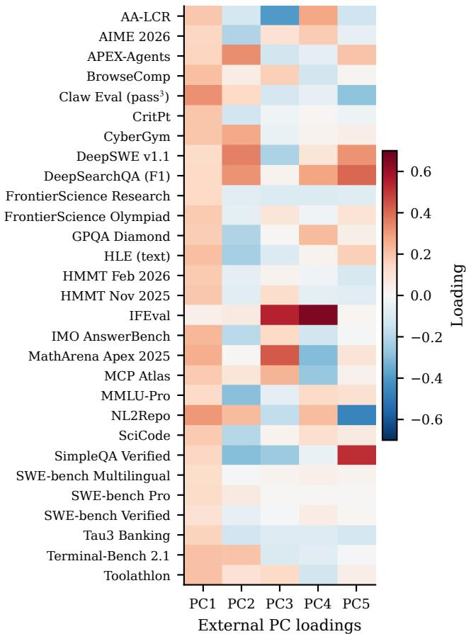

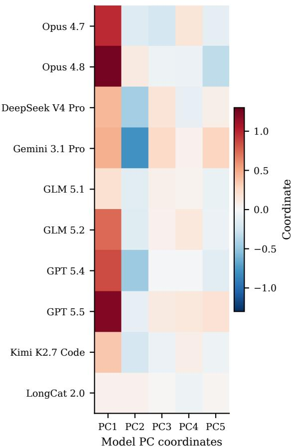  
Figure 9: External representation used by the capability–time model. Left: all 29 benchmark loadings on five PCs estimated from 82 reference model entries, excluding evaluated versions and configuration aliases. Right: the fixed coordinates of all ten evaluated model versions. Loadings and coordinates have separate color scales. The loadings summarize covariance patterns among external measurements; missing-entry estimation is specified in Appendix A.

Table 16: Sources of the 29 external measurements. Rows identify the versions or metrics used; links point to benchmark papers, dataset releases, or evaluation documentation.
<table><tr><td>Measurement</td><td>Reference or source</td></tr><tr><td>AA-LCR</td><td>Artificial Analysis methodology</td></tr><tr><td>AIME 2026</td><td>MathArena dataset</td></tr><tr><td>APEX-Agents</td><td>Vidgen et al. [2026]</td></tr><tr><td>BrowseComp</td><td>OpenAI evaluation release</td></tr><tr><td>Claw Eval (pass³)</td><td>Claw-Eval release</td></tr><tr><td>CritPt</td><td>CritPt dataset</td></tr><tr><td>CyberGym</td><td>CyberGym project</td></tr><tr><td>DeepSWE v1.1</td><td>DataCurve benchmark release</td></tr><tr><td>DeepSearchQA (F1)</td><td>Google dataset</td></tr><tr><td>FrontierScience Research (FS Research)</td><td>Wang et al. [2026]</td></tr><tr><td>FrontierScience Olympiad</td><td>Wang et al. [2026]</td></tr><tr><td>GPQA Diamond</td><td>Rein et al. [2024]</td></tr><tr><td>Humanity&#x27;s Last Exam (text)</td><td>Text-only evaluation protocol</td></tr><tr><td>HMMT February 2026</td><td>MathArena dataset</td></tr><tr><td>HMMT November 2025</td><td>MathArena dataset</td></tr><tr><td>IFEval</td><td>Instruction-Following Evaluation</td></tr><tr><td>IMO-AnswerBench</td><td>IMO-Bench project</td></tr><tr><td>MathArena Apex 2025</td><td>MathArena Apex release</td></tr><tr><td>MCPAtlas Public</td><td>MCP-Atlas public dataset</td></tr><tr><td>MMLU-Pro</td><td>Wang et al.&quot; [2024]</td></tr><tr><td>NL2Repo-Bench</td><td>Ding et al. [2025]</td></tr><tr><td>SciCode</td><td>Tian et al. [2024]</td></tr><tr><td>SimpleQA-Verified</td><td>Verified benchmark documentation</td></tr><tr><td>SWE-bench Multilingual</td><td>Multilingual dataset</td></tr><tr><td>SWE-bench Pro</td><td>Deng et al. [2025]</td></tr><tr><td>SWE-bench Verified</td><td>Verified dataset</td></tr><tr><td>τ3-Banking</td><td>Sierra banking evaluation</td></tr><tr><td>Terminal-Bench 2.1</td><td>Terminal-Bench 2.1 release</td></tr><tr><td>Toolathlon (original)</td><td>Toolathlon project</td></tr></table>

## AI Use Statement

AI tools provided iterative assistance with research and mathematical development, including hypotheses and proofs; experimental implementation and data analysis; and language polishing and consistency checks. Numerical results were checked against recorded experiment outputs. The authors take responsibility for the work.