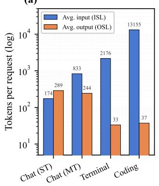
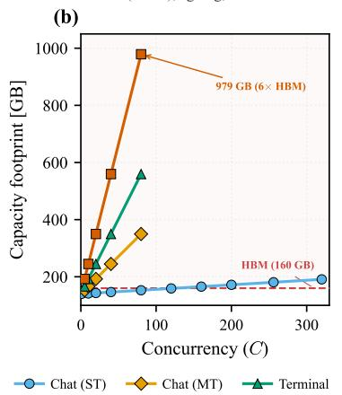
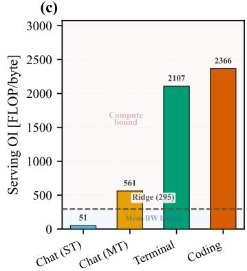
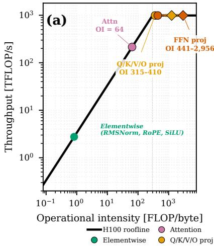
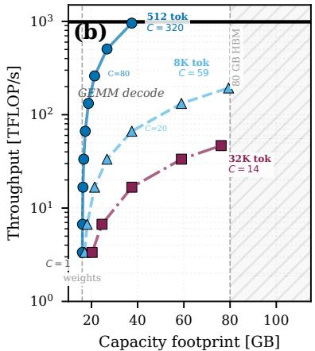
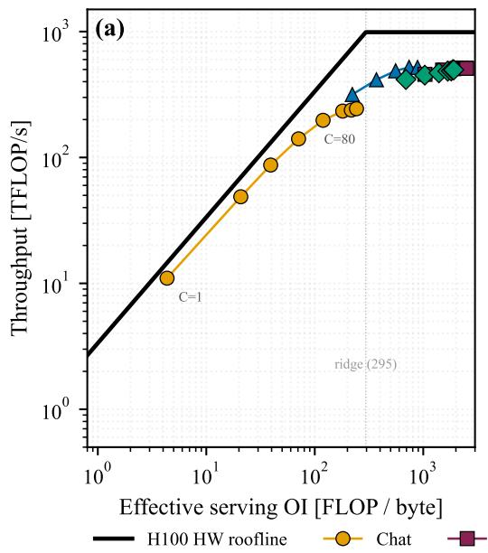
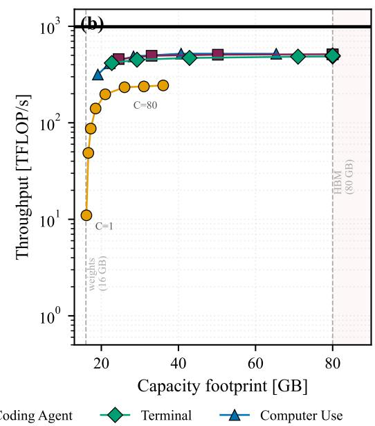

# AgentPerfBench: A Benchmarking and Evaluation Suite for Inference Performance of Agentic LLMs

Cheuk Hang Lau1 Zeyu Cao2 Kevin Wong Cheuk Yin1 Yao Lai2 Haoran Wu2 Nicholas D. Lane2 Robert D. Mullins2 Ilia Shumailov3 Yiren Zhao1 1Imperial College London 2University of Cambridge 3University of Oxford

## Abstract

The optimization of LLM serving engines, such as vLLM and SGLang, as well as the development of new AI hardware, is largely benchmark-driven: optimizations, scheduling policies, hardware and system designs are all selected based on representative workloads. However, a significant mismatch has emerged in the agentic era. Existing benchmarks primarily focus on simple single-turn chatbot workloads. In practice, LLM applications are increasingly agentic: coding agents, automated terminal execution systems, and tool-use agents issue multi-turn requests with growing context lengths across sessions that can span hundreds of interaction steps. To this end, we introduce AGENTPERFBENCH, a new benchmark suite for agentic inference. It uses real traces from widely used agentic benchmarks, such as SWE-Bench and TerminalBench, alongside standard chat baselines. This enables benchmarking of models on multi-turn tasks involving tool calling, skill utilization, and increasing context lengths. AgentPerfBench also samples from empirical distributions of input length, output length, and turn count derived from the real traces, generating representative synthetic profiles for cheap and accurate measurements on new hardware. In addition, we further find that several existing benchmarks fail to accurately reflect real hardware performance for two key reasons: 1) they do not account for realistic context-length growth, and 2) they measure inference performance without operating at hardware saturation. We discuss these issues in detail and provide rich kernel-level Nsight Compute (NCU) traces to construct a new multi-dimensional roofline model that captures hardware-system limitations in both memory bandwidth and memory capacity footprint. The benchmarking suite then includes automated scripts to identify potential bottleneck conditions on emerging hardware when evaluated with diverse agentic traces. Together, these contributions quantify the chat-to-agentic gap in current inference benchmarks and characterise per-kernel GPU resource utilisation via roofline analysis.

## 1 Introduction

Agentic inference has driven a dramatic increase in the volume of LLM inference workloads. This makes LLM inference a primary workload for future datacenters and emerging hardware platforms. Agentic workloads, on the other hand, differ significantly from those captured by current inference benchmarks [MLCommons, 2025, Kwon et al., 2023, Zheng et al., 2024, ShareGPT Contributors, 2023], which primarily focus on simple single-turn, chatbot-style interactions. These benchmarks mainly have three gaps towards real-world agentic inference workload. Firstly, no public benchmark measures in the agentic, multi-turn, tool-using regime. Coding and computer-use agents issue long-context multi-turn requests that neither MLPerf, vLLM, nor SGLang exercises in their native benchmark. Secondly, existing benchmarks set ISL (input sequence length) and OSL (output sequence length) as fixed user-supplied variables rather than deriving them from real workload traces. For example, InferenceX [SemiAnalysis, 2025] fills requests with random tokens at arbitrary fixed lengths, discarding the statistical structure of real workloads. Last but not least, every existing public serving-benchmark harness reports a single operating point: MLPerf Server [Reddi et al., 2020] fixes open-loop Poisson arrivals at a pre-chosen rate; vLLM and SGLang default to a fixed in-flight-request level, and none sweeps the full load curve to locate saturation to reflect the real capability of the underlying hardware system.

In contrast, AgentPerfBench is a benchmark suite and analysis framework designed to address these gaps. AgentPerfBench organizes workloads into agentic profiles, where each profile captures key workload characteristics: per-turn ISL, per-turn OSL, and turn-count distributions measured from real agentic traces (e.g. coding agents, terminal and computer-use agents). We then instantiate requests by sampling from these profiles and filling them with random tokens at the sampled lengths to stress test the underlying hardware to its maximum capability.1 AgentPerfBench also profiles individual Compute Unified Device Architecture (CUDA) kernels using Nsight Compute (NCU) under these different agentic profiles and maps each workload onto a multi-dimensional roofline model to identify hardware bottlenecks. We follow the formalization of Zhao and Liu [2026] to quantify both memory-bandwidth and memory-capacity limitations, thus providing the practical performance constraints of different hardware platforms when serving different agentic workloads.

AgentPerfBench can provide significant benchmarking results compared to canonical benchmarking suites (e.g., MLPerf Inference [MLCommons, 2025]). For example, for LLaMA-3.1-70B on H100, switching from chat to coding-agent workloads increases time-to-first-token (TTFT) by 4.8× (239 ms to 1139 ms) and time-per-output-token (TPOT) by 1.5× (19 ms to 28 ms) at saturation. Multi-turn sessions compound the TTFT gap: SWE-Bench agents over 88 turns push context past 32K tokens (the model’s context limit), driving per-turn median TTFT to 433 ms versus 62 ms for chat, a 7.0× increase; per-turn TPOT remains stable at 16–18 ms across both workloads (Sec. 4). AGENTPERFBENCH makes three contributions:

1. Agentic workload driven benchmarking. We provide a benchmark that captures diverse agentic workloads, including coding, terminal, and computer-use agents. These workloads involve multi-turn conversations, long-context tasks, and heavy tool use, providing a more representative measurement of today’s agentic LLM inference landscape.

2. Saturation-based measurements. We examine the measurement techniques used in popular benchmarks and propose saturation-based evaluation: measuring performance under the maximum sustainable number of concurrent user requests and reporting results only after hardware performance plateaus. We quantify how inaccurate measurement methodologies can lead to measurements under-reporting true hardware capacity and show that saturationbased measurements better reflect the true maximum capability of the underlying hardware.

3. Kernel-level multi-dimensional roofline analysis. We release per-kernel Nsight Compute (NCU) profiles across diverse agentic workloads and provide a multi-dimensional roofline analysis on representative kernels — covering both memory bandwidth and memory-capacity footprint — to quantify the limiting factors of performance.

We release 3,000+ benchmark results, 140,000+ per-kernel Nsight Compute (NCU) profiling records across four GPU platforms and 11 model architectures (Appendix Tables 6 and 8), and the benchmarking/profiling tooling as an open-source codebase, all under an open-source license.2 Section 2 reviews LLM inference, the roofline model, and existing serving benchmarks. Section 3 defines the benchmarking methodology, workload surface, and NCU profiling pipeline. Section 4 presents the benchmark sweep, serving hardware roofline, and the kernel-level regime shift.

## 2 Background

Inference benchmarks. Table 1 compares existing systems across nine capabilities; no prior system provides agentic workloads, multi-turn sessions, NCU profiling, open-source traces, or saturation-based measures. MLPerf Inference [Reddi et al., 2020] provides standardized throughput and latency measurements across four scenarios (single-stream, multistream, server, offline) with 99% confidence intervals over 270K queries. The v5.1 LLM suite [MLCommons, 2025] extends coverage to summarization and long-context reasoning from 1,024-token Q&A (LLaMA 2 70B on OpenOrca) up to 128K-token document tasks (LLaMA 3.1 405B), but remains single-turn with no multi-step tool use. The most commonly used recipes that are widely used in the community are the benchmark harnesses bundled in vLLM [Kwon et al., 2023] and SGLang [Zheng et al., 2024] target ShareGPT [ShareGPT Contributors, 2023] or fixed-length random-token traces at a single operating point. While both expose request-rate and max-concurrency knobs, neither’s standard recipe sweeps to saturation by design, replays multi-turn sessions, or uses agentic traces. InferenceX [SemiAnalysis, 2025] provides a public dashboard of hardware comparisons but uses fixed-length synthetic tokens that do not match agentic trace distributions. ML.ENERGY [Chung et al., 2025] benchmarks energy consumption across 40 models and 6 tasks, achieving up to 44% energy savings via Pareto optimization, but does not measure TTFT or provide kernel-level analysis.

Table 1: Comparison of representative LLM inference simulators and benchmarks. ✓ denotes full support, ✗ no support, and ▲ partial support. MoE denotes mixture-of-experts model support. InferenceX (a leaderboard dashboard), Sarathi-Serve, and Splitwise (scheduling contributions without standalone prediction accuracy) are discussed in text but omitted; Appendix Figure 3 provides the full feature-coverage grid.
<table><tr><td>Feature</td><td>LLMCompass [Zhang et al., 2024]</td><td>Vidur [Agrawal et al., 2024]</td><td>LLMServSim 2 [Cho et al., 2025]</td><td>DistServe [Zhong et al., 2024]</td><td>MLPerf [Reddi et al., 2020]</td><td>ML.ENERGY [Chung et al., 2025]</td><td>Ours</td></tr><tr><td>Measurement</td><td></td><td></td><td></td><td></td><td></td><td></td><td></td></tr><tr><td>TTFT/TPOT/ITL</td><td>√</td><td>V</td><td></td><td>√</td><td>x</td><td>X</td><td></td></tr><tr><td>TP</td><td>√</td><td>√</td><td>√</td><td>▲</td><td>X</td><td>X</td><td></td></tr><tr><td>NCU profiling</td><td>x</td><td>x</td><td>x</td><td>X</td><td>x</td><td>x</td><td></td></tr><tr><td>Agentic workloads</td><td>x</td><td>x</td><td>X</td><td>x</td><td>X</td><td>x</td><td></td></tr><tr><td>Multi-turn</td><td>x</td><td>x</td><td>x</td><td>x</td><td>x</td><td>x</td><td></td></tr><tr><td>Model architecture</td><td></td><td></td><td></td><td></td><td></td><td></td><td></td></tr><tr><td>Dense</td><td>V</td><td>√</td><td>V</td><td>√</td><td>√</td><td>V</td><td></td></tr><tr><td>MoE</td><td>▲</td><td>x</td><td>√</td><td>x</td><td>x</td><td>√</td><td>√</td></tr><tr><td>Analysis</td><td></td><td></td><td></td><td></td><td></td><td></td><td></td></tr><tr><td>Open-source traces</td><td>x</td><td>x</td><td>××</td><td>x</td><td>x</td><td>x</td><td></td></tr><tr><td>Saturation-based measures</td><td>x</td><td>X</td><td></td><td>x</td><td>x</td><td>x</td><td></td></tr></table>

†Single-layer prefill composition error; other rows report end-to-end serving error.

Prefill-decode separation and the roofline model. Autoregressive LLM inference proceeds in two phases: prefill, which computes on all L input tokens simultaneously within each layer, and decode, which generates tokens one at a time, each loading the accumulated Key-Value (KV) cache. Zhao and Liu [2026] formalize the separation with two quantities. For a single linear layer Y=WX $( W \in \mathbb { R } ^ { m \times d } , \mathbf { \bar { X } } \in \mathbf { \bar { R } } ^ { d \times L } )$ , operational intensity (OI) metric $\mathrm { O I } = 2 m d L \stackrel { \smile } { / } [ b _ { p } ( m d \stackrel {  } { + } d L + m L ) ]$ gives the FLOPs-per-byte ratio that separates compute-bound from memory-bound execution, where $b _ { p } = 2$ bytes per element in bfloat16 (bf16) precision. As L grows, OI approaches the compute-bound asymptote $2 m d / [ b _ { p } ( m + d ) ]$ ; prefill $( L = \mathrm { I S L } )$ pushes toward this ceiling while each decode step $( L = 1 )$ ) remains near the memory-bound floor. They also define a capacity footprint (CF) metric $\mathrm { C F } = b _ { p } \left[ 2 d L + m d / B \right]$ that gives the DRAM bytes per concurrent request, where B is the batch size sharing the weight matrix (weight share plus KV cache).

Workload-dependent OI and the snowballing effect. A coding agent with ISL ≈ 17K pushes prefill OI toward the compute-bound asymptote 2md/(m+d), while chat with ISL in the hundreds remains near the memory-bound floor [Zhao and Liu, 2026]. In multi-turn sessions, context accumulates across turns: each turn appends the prior response and the next user message, growing ISL and therefore prefill OI with every step. Zhao and Liu [2026] term this the snowballing effect; by the final turn of a long coding-agent session, accumulated context reaches up to 120,000 tokens. When CF exceeds the DRAM capacity of a single accelerator, serving requires either tensor parallelism or KV-cache paging.

## 3 Methodology

Section 3 describes the AgentPerfBench structure. We construct workload profiles from real agentic benchmarks traces (covering chat, coding, terminal, and computer-use agents) in two forms: exact trace replay and synthetic profiles fitted to the same per-turn statistics. We then run a closedloop serving harness across dense and Mixture-of-Experts (MoE) models on the GPU platforms (summarized in Appendix Table 6), recording performance metrics. Finally, we collect NCU traces of the same workloads to ground end-to-end serving behaviour in per-kernel compute, memory bandwidth, and capacity footprint limits.

Table 2: Canonical workload profiles used to define the workload surface. ISL and OSL are profilelevel median tokens per request. Session turns is the median number of turns per session; single-turn rows comprise repeated independent requests, while multi-turn rows advance turn-by-turn with accumulating context. Profile IDs used in dataset are listed in Appendix Table 10.
<table><tr><td>Workload</td><td>Empirical basis</td><td>Session type</td><td>ISL</td><td>OSL</td><td>Session turns</td></tr><tr><td>Single-turn chat</td><td>ShareGPT</td><td>single-turn</td><td>187</td><td>299</td><td>1</td></tr><tr><td>Chatbot session</td><td>ShareGPT</td><td>multi-turn</td><td>1,291</td><td>169</td><td>10</td></tr><tr><td>Coding agent</td><td>SWE-Bench</td><td>multi-turn</td><td>9,995</td><td>32</td><td>85</td></tr><tr><td>Terminal agent</td><td>TerminalBench</td><td>multi-turn</td><td>7,811</td><td>31</td><td>61</td></tr><tr><td>Computer-use agent</td><td>OSWorld</td><td>multi-turn</td><td>1,399</td><td>85</td><td>8</td></tr></table>

## 3.1 Workload Surface

Table 2 defines six canonical workload profiles spanning chat, coding-agent, terminal-agent, and computer-use sessions with empirical bases from ShareGPT-style chat [ShareGPT Contributors, 2023], SWE-Bench [Jimenez et al., 2024], TerminalBench [Merrill et al., 2026], and OSWorld [Xie et al., 2024]. These canonical names are used throughout the results. The released dataset instantiates these profiles in two complementary forms. Trace replay profiles preserve the exact recorded requests from the source traces. Distributional synthetic profiles sample multi-turn requests from per-turn ISL, OSL, and turn-count distributions fitted to those traces, producing representative workloads that can be reissued across models, hardware, backends, and concurrency settings, without the runtime cost of full replay. Appendix Table 10 maps the canonical workload names to their released profile IDs.

## 3.2 Synthetic Trace Validation

We validate that synthetic distributional profiles reproduce the serving behavior of trace replay before using them for hardware conclusions. With source sessions, model, GPU, backend, concurrency, context cap, and vLLM prefix-cache settings held fixed, we compare median relative error for TTFT, TPOT, and E2EL over both aggregate requests and fixed turn-depth bins.

Across the agentic profiles, token-count matching captures the general serving behavior, but the coding-agent validation shows that it is not sufficient: the generator must also match code-like token structure and the serving-visible prefix structure detected by vLLM automatic prefix caching (APC). Synthetic distributional profiles in the paper use the resulting prefix-aware configuration; Appendix B.1 reports the coding-agent ablation.

## 3.3 Benchmarking Framework

All benchmarks target OpenAI-compatible endpoints and consume streaming responses. For each request, we record time-to-first-token (TTFT), time-per-output-token (TPOT), inter-token latency (ITL), end-to-end latency (E2EL), input and output sequence length (ISL/OSL), and client-side scheduling metadata. Multi-turn runs also record session and turn identifiers, previous and total context length, new-prefill and cached-context tokens, cache-hit rate, block-aligned cache estimates, uncached prefix tails, and per-turn latency/token/cache summaries.

We evaluate serving with a closed-loop concurrency sweep. At concurrency C, the benchmark harness admits at most C requests to the endpoint at a time. When one request completes, the next request or session turn is dispatched. For multi-turn profiles, each slot advances a session in turn order, preserving the session-context snowballing that makes agentic prompts grow across turns, increasing prefix-cache pressure.

For request i, $\mathrm { T T F T } _ { i }$ is the latency from dispatch to the first streamed token. ITL records the subsequent inter-token gaps, and $\mathrm { T P O T } _ { i }$ is their mean, excluding the first generated token. End-toend latency is the time from dispatch to the final token, with the request-level identity

$$
\mathrm { E 2 E L } _ { i } = \mathrm { T T F T } _ { i } + \mathrm { T P O T } _ { i } \cdot \mathrm { m a x } ( O S L _ { i } - 1 , 0 ) ,
$$

where $O S L _ { i }$ is the number of generated output tokens. We report mean, median, p90, and p99 summaries for latency metrics, plus request throughput and input/output-token throughput. Request throughput (req/s) is the headline capacity metric; we prefer it to output-token throughput (tok/s), which hides the agentic gap because high-ISL requests demand long prefills but produce few output tokens. Saturation is the concurrency $C ^ { \star }$ at which req/s ceases to rise $\bar { ( } \vert d ( \mathrm { r e q / s } ) / \bar { d } C \vert < \epsilon ) ;$ ; we sweep

C to locate it for every workload, with the TTFT knee and KV-cache fill fraction corroborating $C ^ { \star }$ but not replacing it.

## 3.4 Kernel-level Profiling

We decompose each decoder layer into constituent operations and compute component-level FLOPs and DRAM bytes from model dimensions, precision, tensor-parallel degree, active token count, and batch size. For component $j ,$ the operational intensity is $\mathrm { O } \bar { \mathrm { I } _ { j } } = \mathrm { F L O P s } _ { j } / \mathrm { D R A M B y t e s } _ { j } .$ , and the roofline throughput ceiling is:

$$
P _ { j } ^ { \mathrm { r o o f } } = \mathrm { m i n } \left( P _ { \mathrm { p e a k } } , \mathrm { O I } _ { j } \times \mathrm { B W } _ { \mathrm { p e a k } } \right) ,
$$

where $P _ { \mathrm { p e a k } }$ is peak compute throughput (FLOP/s) and $\mathrm { B W _ { p e a k } }$ is peak memory bandwidth (byte/s) for the target GPU. We convert the ceiling into a component latency lower bound, $t _ { j } ^ { \mathrm { r o o f } } ~ = ~ \mathrm { F L O P s } _ { j } / \breve { P } _ { j } ^ { \mathrm { r o o f } }$ , and aggregate component costs to obtain a layer-level roofline bound. The ridge point $\mathrm { O I _ { r i d g e } } = P _ { \mathrm { p e a k } } / \mathrm { B W _ { p e a k } }$ is the reference used in Section 4.3 to interpret whether a component is limited by the compute ceiling or the memory-bandwidth slope.

We ground this analytical decomposition with two NCU-backed artifacts in our dataset. per\_layer\_kernel provides the representative LLaMA-3.1-8B/H100 prefill decomposition used for the layer-level example, while kernels\_labeled provides broader per-kernel NCU timing and shape records across four GPU platforms and 11 model architectures (Appendix Tables 6 and 8).

## 4 Results

We benchmark dense LLaMA/Qwen and MoE Mixtral/gpt-oss models spanning 8B–120B parameters across four GPU platforms. Experiments use the tensor-parallel degree required for each model to fit, and run through the closed-loop serving harness defined in Section 3.3. We sweep concurrency C to saturation for each workload and compare serving behavior across chat, coding, terminal-use and computer-use agentic sessions.

Section 4.1 summarizes the experimental setup, Section 4.2 presents agentic workload behavior across profiles, Section 4.3 maps workloads onto the serving hardware roofline and decomposes per-component hardware bottlenecks.

## 4.1 Experimental Setup

We evaluate dense LLaMA/Qwen and MoE Mixtral/gpt-oss models on four GPU platforms (H100- 80GB, A100-40GB, RTX 3090-24GB, and RTX 2080Ti-22GB), spanning datacenter and consumer accelerators. Each benchmark run uses only the GPU subset assigned to its tensor-parallel configuration, with no other serving workload sharing those GPUs during measurement. Serving runs use vLLM v0.19.0/v0.19.1 and SGLang v0.5.9, both driven by the same closed-loop harness through an OpenAI-compatible chat API; backend version, tensor-parallel degree, context limit, and launch configuration are recorded per run, while each backend applies the model’s native tokenizer and chat template. Dense and Mixtral models use BF16; gpt-oss-20b and gpt-oss-120b use the released MXFP4 weights for MoE projections with other tensors in BF16. The serving environment uses CUDA 12.8, NVIDIA driver 13.0, PyTorch 2.10.0, and Python 3.12; Nsight Compute profiling uses ncu v2024.3.2 across A100, H100, RTX 3090, and RTX 2080Ti hosts. Appendix Tables 6–9 provide the hardware, backend launch settings, model architectures, and tensor-parallel configurations.

## 4.2 Benchmark Results

Workload characterization. Figure 1 shows that the canonical workload profiles separate along two axes: operational intensity and capacity footprint. Coding agents are prefill-dominated: ISL/OSL ≈ 355:1, compared to single-digit ratios for chat (Figure 1a). The high ISL pushes coding-agent OI to 2,366, above the H100 ridge (295 FLOP/byte), while chat sits at OI = 51, a 46× gap (Figure 1c). On the capacity axis, long-context profiles cross the 160 GB HBM budget of two H100s as concurrency increases, while chat remains within budget (Figure 1b). Most serving benchmarks, such as InferenceX [SemiAnalysis, 2025], collapse this space to ShareGPT-style chat or fixed-length synthetic prompts at one operating point. This reduction misses the ISL/OSL distribution of agentic workloads even in single-turn settings; in multi-turn sessions, the gap compounds through snowballing as each turn appends prior context. Table 3 quantifies this mismatch under a controlled single-turn comparison: matched on model, hardware, backend, tensor-parallel degree, and C=80, coding-agent planning calls have a median 2.8× higher TTFT and 1.3× higher TPOT than chat across 40 released trace\_replay groups. Our benchmark therefore exposes not just different token counts, but different latency regimes as ISL/OSL distributions shift.

(a)  

  
Figure 1: Agentic workload characterization (LLaMA-3.1-70B, H100×2, TP=2, SGLang v0.5.9, bf16). (a) Token usage; coding agents are prefill-dominated (ISL/OSL ≈ 355:1). (b) Capacity footprint vs. concurrency. (c) Serving OI; chat stays below the H100 ridge (295 FLOP/byte), agentic workloads cross it.

Table 3: Single-turn coding-agent vs. chat serving metrics gap in released trace\_replay rows at C=80. Each row compares coding-singleturn against chat-singleturn; ratios are coding/chat after matching model, hardware, backend, and tensor-parallel degree, so values above 1× mean the coding-agent planning call is slower.
<table><tr><td>Matched comparison</td><td>Pairs</td><td>TTFT (coding/chat)</td><td>TPOT (coding/chat)</td></tr><tr><td>All matched pairs (median)</td><td>40</td><td>2.8×</td><td>1.3×</td></tr><tr><td>Maximum TTFT ratio</td><td>1</td><td>14.5×</td><td></td></tr><tr><td>Example: LLaMA-3.1-8B, H100, vLLM</td><td>1</td><td>3.1×</td><td>2.2×</td></tr><tr><td>Example: LLaMA-3.1-8B, H100×2, vLLM</td><td>1</td><td>3.9×</td><td>1.9×</td></tr></table>

Saturation behavior. Closed-loop concurrency sweeps show how the workload mismatch changes under load. Table 4 reports medium multi-turn profiles up to C=80. On LLaMA-3.1-8B, coding agent raises median TTFT from 343 ms for chat to 11,719 ms and reduces request throughput from 13.5 to 2.4 req/s; terminal agent raises TTFT to 6,889 ms and reduces throughput to 3.0 req/s. The gap persists across model families: for gpt-oss-20b, chat TTFT is 267 ms, compared with 2,224 ms for coding agent and 1,744 ms for terminal agent.

The released trace\_replay split stops at C=80, so we use synthetic\_distributional rows to test higher concurrency. Matching by profile, model, hardware, backend, and tensor-parallel degree, Table 5 compares request throughput at C=200 and C=320. Across 63 comparable chat groups, median request throughput grows +11%, with 33 groups still improving by more than 10%. In contrast, the 66 comparable agentic groups are mostly already at or past saturation by C=200: 41 remain within ±10% at C=320, while 15 lose more than 10% throughput. Chat workloads often continue benefiting from larger batches, while agentic workloads plateau or degrade under KV-capacity pressure. Single-operating-point benchmarks that do not cover agentic serving regimes or sweep beyond saturation cannot expose this divergence between chat and agentic scaling behavior.

## 4.3 Roofline Bottleneck Diagnosis

Different agentic workloads occupy distinct roofline regimes: coding-agent OI reaches 2,409 while chat peaks at 181 on the same H100, a 13× separation (Appendix Figure 4). OI and CF depend only on model architecture and workload token statistics, so regime classification requires no serving run and extends to hardware not yet deployed:

Table 4: Medium multi-turn trace\_replay saturation metrics on H100-SXM5-80GB with vLLM v0.19.0 and prefix caching enabled. Each cell reports the observed saturation point for one model/profile pair; TTFT and TPOT are medians in ms. Column groups use the workload names from the main text; exact profile IDs are listed in Appendix Table 10.
<table><tr><td></td><td>TP</td><td colspan="3">Chat</td><td colspan="3">Coding agent</td><td colspan="3">Terminal agent</td><td colspan="3">Computer-use agent</td></tr><tr><td>Model</td><td></td><td>TTFT</td><td>TPOT</td><td>Req/s</td><td>TTFT</td><td>TPOT</td><td>Req/s</td><td>TTFT</td><td>TPOT</td><td>Req/s</td><td>TTFT</td><td>TPOT</td><td>Req/s</td></tr><tr><td>Dense</td><td></td><td></td><td></td><td></td><td></td><td></td><td></td><td></td><td></td><td></td><td></td><td></td><td></td></tr><tr><td>LLaMA-3.1-8B</td><td>1</td><td>343</td><td>9.4</td><td>13.5</td><td>11719</td><td>227.3</td><td>2.4</td><td>6889</td><td>197.2</td><td>3.0</td><td>1037</td><td>22.8</td><td>6.5</td></tr><tr><td>Qwen3.5-9B</td><td>1</td><td>953</td><td>12.0</td><td>11.0</td><td>6954</td><td>168.7</td><td>3.2</td><td>2877</td><td>47.1</td><td>4.6</td><td>1539</td><td>22.5</td><td>5.9</td></tr><tr><td>Qwen3.5-27B</td><td>2</td><td>1518</td><td>21.5</td><td>6.0</td><td>2729</td><td>62.3</td><td>5.3</td><td>2519</td><td>52.0</td><td>4.7</td><td>2709</td><td>33.2</td><td>3.6</td></tr><tr><td>MoE</td><td></td><td></td><td></td><td></td><td></td><td></td><td></td><td></td><td></td><td></td><td></td><td></td><td></td></tr><tr><td>Mixtral-8×7B</td><td>2</td><td>269</td><td>18.9</td><td>7.1</td><td></td><td></td><td></td><td></td><td></td><td></td><td>1243</td><td>33.2</td><td>4.9</td></tr><tr><td>gpt-oss-20b</td><td>1</td><td>267</td><td>8.8</td><td>15.3</td><td>2224</td><td>17.1</td><td>16.5</td><td>1744</td><td>15.8</td><td>11.6</td><td>699</td><td>14.1</td><td>10.1</td></tr><tr><td>gpt-oss-120b</td><td>2</td><td>224</td><td>13.6</td><td>11.0</td><td>2072</td><td>25.5</td><td>13.6</td><td>1418</td><td>19.0</td><td>8.8</td><td>687</td><td>17.5</td><td>8.8</td></tr></table>

Table 5: High-concurrency request-throughput check using matched synthetic\_distributional rows. Throughput columns report requests/s; ∆ compares C=320 to C=200.
<table><tr><td>Profile</td><td>Config</td><td>Req/s @ C=200</td><td>Req/s @ C=320</td><td>∆</td></tr><tr><td>Chat single-turn</td><td>LLaMA-3.1-8B, H100, vLLM</td><td>9.6</td><td>31.2</td><td>+224%</td></tr><tr><td>Chat single-turn</td><td>LLaMA-3.1-8B, A100×4, SGLang</td><td>11.2</td><td>17.0</td><td>+52%</td></tr><tr><td>Chat multi-turn</td><td>Mixtral-8×7B, H100×4, vLLM</td><td>27.5</td><td>36.5</td><td>+32%</td></tr><tr><td>Coding agent</td><td>gpt-oss-20b, RTX 3090×2, vLLM</td><td>9.2</td><td>2.2</td><td>-76%</td></tr><tr><td>Terminal agent</td><td>Qwen3.5-9B, A100×4, vLLM</td><td>21.8</td><td>9.5</td><td>-57%</td></tr><tr><td>Terminal agent</td><td>Mixtral-8×7B, H100×4, vLLM</td><td>30.9</td><td>17.6</td><td>-43%</td></tr><tr><td>Computer-use agent</td><td>LLaMA-3.1-8B, A100×4, vLLM</td><td>16.7</td><td>8.3</td><td>-51%</td></tr></table>

• the ridge point (peak FLOP/s divided by peak bandwidth; 295 FLOP/byte for H100) classifies each workload as compute-bound or bandwidth-bound, identifying which hardware resource limits throughput (Table 12);

• HBM capacity determines at what concurrency KV-cache growth saturates memory, bounding the maximum batch size before any request is served (Appendix Figure 4b).

Appendix Figure 4 plots this separation for LLaMA-3.1-8B on a single H100, empirically validating the regime classification predicted by Zhao and Liu [2026].

OI profile separation. The H100 ridge point, $\mathrm { { O I } _ { r i d g e } = 9 8 9 \mathrm { T F L O P / s \quad / \quad 3 , 3 5 2 G B / s = } }$ 295 FLOP/byte, separates memory-bandwidth-bound from compute-bound execution. Chat stays below it, peaking at $\mathrm { O I _ { e f f } = 1 8 1 }$ (Table 12), remaining memory-bandwidth-bound across the full concurrency sweep. The other agentic workloads cross the ridge: computer-use reaches $\mathrm { O I _ { e f f } = 8 8 6 }$ (3.0× the ridge), terminal reaches 1,809 (6.1×), and coding agent reaches 2,409 (8.2×) at $C = 8 0$ all compute-bound. Peak separation between coding agent and chat is 13×. The mechanism is the snowballing effect (Section 2): context accumulation across turns grows ISL, shifting prefill toward large General Matrix Multiplications (GEMMs) whose arithmetic intensity exceeds the ridge.

Capacity footprint saturation. In the analytical CF model used for Appendix Figure 4b, LLaMA-3.1-8B BF16 weights contribute 16 GB on a single H100, leaving a nominal 64 GB KV-cache budget before the 80 GB HBM wall. At $C = 8 0$ , chat remains compact at 26 GB, and computer use reaches 65 GB. The longer agentic profiles exceed the single-H100 HBM budget: coding agent exceeds the wall by $C = 4 0$ and reaches 155 GB at $C = 8 0$ , while terminal reaches 126 GB (Appendix Figure 4b clips both at the 80 GB wall). Long agentic workloads therefore face dual pressure: 1) compute-bound execution on the OI axis and 2) memory-capacity pressure on the CF axis, where the growing KV cache saturates HBM. Table 5 supports this predicted CF pressure: from C=200 to $C { = } 3 2 0$ , representative agentic profiles lose 43–76% throughput while chat profiles continue scaling. Aggregate OI does not isolate which layer components create these bottlenecks.

Per-component bottleneck diagnosis. A single serving OI hides the 8–28× gap between prefill and decode (Table 13), and a single CF number does not show when KV capacity overrides the component ceilings. Appendix Table 14 and Figure 2 decompose one LLaMA-3.1-8B decoder layer into per-component OI, modeled latency share, and the limiting regime for both phases. Because this diagnostic uses model architecture plus the target accelerator’s peak compute, bandwidth, and HBM capacity, the same calculation can be re-run for hardware that has not yet been provisioned.

  
Figure 2: Per-component roofline decomposition (LLaMA-3.1-8B, H100, BF16, TP=1). (a) Analytical prefill OI; circles mark C=1, diamonds C=80. Projection GEMMs sit above the ridge (295 FLOP/byte); elementwise operations and attention remain bandwidth-bound at both concurrencies. (b) Decode-side throughput ceiling versus capacity footprint for 512-token, 8K-token, and 32K-token contexts. Short contexts remain within HBM at high concurrency, while 32K-token contexts hit the 80 GB capacity wall at C=14.

Projection and elementwise OI. At C=80 with 512-token inputs, prefill pushes $5 1 2 \times 8 0 = 4 0 { , } 9 6 0$ tokens through each layer versus 80 for decode (Section 2), placing every prefill projection above the H100 ridge of 295 FLOP/byte while every decode projection remains below it (Appendix Table 14). Attention and elementwise operations are bandwidth-bound in both phases $( \mathrm { O I } \le 6 4 )$ . The prefill projection aggregate is therefore compute-bound and accounts for 81.8% of the modeled layer latency; the decode projection aggregate (OI = 78 at C=80) remains bandwidth-bound because no component crosses the ridge. As context accumulates across turns, prefill ISL grows and pushes projection OI further above the ridge. Decode projection OI is set by concurrency alone, regardless of context length. At C=80 the resulting prefill-to-decode OI gap (the kernel-level source of the regime separation identified above) ranges from 8× (chat) to 28× (coding agent) across workloads (Appendix Table 13).

KV-capacity pressure. At short context (512 tokens), KV per sequence is small enough that high concurrency fits within the 80 GB HBM budget. At long context (32K tokens), KV per sequence dominates HBM and the capacity wall is reached at C≈14 (Appendix Table 14). Once CF exceeds HBM, capacity is the phase-level bottleneck: the per-component Compute/BW labels describe the in-memory limiting resource, but the actual serving step must reduce batch size, page/evict KV blocks, or recompute cache state, so the accelerator is generally underutilized rather than cleanly compute- or bandwidth-saturated. Together with prefill projection GEMMs compute-bound at high concurrency, this capacity override completes the per-component explanation of the dual pressure observed in the aggregate roofline.

## 4.4 Discussion

Three limitations bound the current evaluation. First, all results are produced on single-node multi-GPU servers with tensor parallelism up to TP=8. Multi-node serving can introduce cross-node communication and, under pipeline parallelism, inter-stage bubbles that are not captured by tensorparallel single-node measurements. A pipeline-parallel concurrency sweep will quantify this overhead. Second, multi-turn sessions are bounded by the per-run context cap (e.g., 32K tokens for LLaMA-3.1- 8B long-context runs). Sessions that exceed this cap are truncated, so the snowballing effect reported here is a lower bound on what 128K-context deployments will exhibit. Third, the current benchmark records logical prefix-cache estimates but does not directly measure server-side KV eviction, context compaction, or cold-cache recomputation. Adding those mechanisms to long multi-turn runs may expose additional latency beyond the measurements reported here.

As Section 4.3 shows, the 13× peak OI separation between coding-agent and chat workloads places them on opposite sides of the roofline ridge; the wider this gap across a deployment’s workload mix, the stronger the case for prefill-decode disaggregation.

The 8–28× prefill-to-decode OI gap across the workload surface (Table 13), combined with CF saturation at C ≥ 80, makes these workloads natural candidates for prefill-decode disaggregation (PDD) [Zhong et al., 2024, Patel et al., 2024]: unified serving forces compute-bound prefill and memory-bandwidth-bound decode onto the same hardware, and the per-phase gap is wide enough that separation should yield measurable throughput gains.

## 5 Conclusion

Agentic LLM workloads occupy a hardware regime that no prior inference benchmark captures. Across 22 workload profiles, 9 models, and 14 GPU configurations (3,197 sweep rows, 148,077 NCU records), AGENTPERFBENCH identifies a dual pressure that separates agentic serving from chat.

On a single H100, coding-agent OI reaches 2,409 versus 181 for chat, a 13× separation that places agentic prefill above the ridge point while chat remains bandwidth-bound (Section 4.3, Figure 4). The per-component decomposition reveals why: projection GEMMs become compute-bound in prefill (OI up to 2,956 at C=80), while attention, elementwise, and all decode components stay bandwidth-bound (Table 14). The resulting prefill-to-decode OI gap spans 8–28× across workloads (Table 13). Simultaneously, KV-cache growth creates capacity pressure: coding-agent sessions exceed the 80 GB HBM wall by C=40, and saturation sweeps show agentic profiles lose 43–76% throughput from C=200 to C=320 while chat continues scaling (Table 5).

The dual pressure, compute-bound prefill and capacity-constrained decode on opposite sides of the roofline ridge, makes agentic workloads natural candidates for prefill–decode disaggregation (Section 4.4); because the roofline analysis requires only model architecture and published hardware specs, it extends to accelerators not yet deployed. Three directions remain: multi-node pipeline-parallel serving where cross-node communication may shift the bottleneck balance, explicit measurement of KV eviction, compaction, and recomputation under long multi-turn sessions, and extension to 128K+ context windows where the snowballing effect reported here is a lower bound.

## 6 Dataset and Reproducibility

We release five Hugging Face dataset configurations:

• Serving summaries: 3,197 main sweep rows across 9 served models, 14 GPU configurations, and two engines (vLLM v0.19.0 and SGLang v0.5.9). trace\_replay contains 2,932 rows that replay source ISL/OSL sequences across 17 profiles; synthetic\_distributional contains 265 rows sampled from fitted real-workload statistics across 5 profiles.

• Layer validation: per\_layer\_kernel contains 37 rows for the LLaMA-3.1-8B/H100 prefill-phase decomposition used in Section 4.3, including analytical component rows and NCU-backed kernel measurements.

• Kernel profiles: kernels\_labeled contains 148,077 per-kernel Nsight Compute (NCU) records across A100, H100, RTX 3090, and RTX 2080Ti platforms and 13 model/sweep sources. Rows include timing, matrix-shape, operation-family, memory-traffic, and launchconfiguration fields for downstream kernel-latency modeling.

• Replay validation: mse\_validation contains 28 H100/LLaMA-3.1-8B/vLLM rows used to validate the distributional synthetic replay generator, including paired synthetic and real trace\_replay runs plus retained debug rows.

• Benchmark tool: Open-source benchmarking and profiling scripts for closed-loop concurrency sweeps against OpenAI-compatible endpoints, with warmup, success filtering, TTFT, TPOT, ITL, E2EL, throughput, and per-run metadata collection.

All artifacts are released under an open-source license with a Croissant metadata record for machinereadable discovery.3

## References

Amey Agrawal, Nitin Kedia, Ashish Panwar, Jayashree Mohan, Nipun Kwatra, Bhargav Gulavani, Alexey Tumanov, and Ramachandran Ramjee. Vidur: A large-scale simulation framework for LLM inference. In Proceedings of Machine Learning and Systems (MLSys), 2024.

Jaehong Cho, Minsu Choi, Hyunmin Kim, Guseul Kwon, and Jaemin Sim. LLMServingSim: A HW/SW co-simulation infrastructure for LLM inference serving at scale. IEEE Computer Architecture Letters (CAL), 2025.

Jae-Won Chung, Jeff J. Ma, Ruofan Wu, Jiachen Liu, Oh Jun Kweon, Yuxuan Xia, Zhiyu Wu, and Mosharaf Chowdhury. The ML.ENERGY benchmark: Toward automated inference energy measurement and optimization. In Advances in Neural Information Processing Systems (NeurIPS), Datasets and Benchmarks Track, 2025.

Carlos E Jimenez, John Yang, Alexander Wettig, Shunyu Yao, Kexin Pei, Ofir Press, and Karthik Narasimhan. SWE-bench: Can language models resolve real-world GitHub issues? In Proceedings ofthe International Conference on Learning Representations (ICLR), 2024.

Woosuk Kwon, Zhuohan Li, Siyuan Zhuang, Ying Sheng, Lianmin Zheng, Cody Hao Yu, Joseph Gonzalez, Hao Zhang, and Ion Stoica. Efficient memory management for large language model serving with PagedAttention. In Proceedings of the ACM Symposium on Operating Systems Principles (SOSP), 2023.

Mike A. Merrill, Alexander G. Shaw, Nicholas Carlini, Boxuan Li, et al. Terminal-Bench: Benchmarking agents on hard, realistic tasks in command line interfaces, 2026. URL https: //arxiv.org/abs/2601.11868.

MLCommons. MLPerf inference v5.1 results, 2025. URL https://mlcommons.org/2025/09/ mlperf-inference-v5-1-results/.

Pratyush Patel, Esha Choukse, Chaojie Zhang, Aashaka Shah, Íñigo Goiri, Saeed Maleki, and Ricardo Bianchini. Splitwise: Efficient generative LLM inference using phase splitting. In Proceedings of the 51st International Symposium on Computer Architecture (ISCA), 2024.

Vijay Janapa Reddi, Christine Cheng, David Kanter, Peter Mattson, Guenther Schmuelling, Carole-Jean Wu, Brian Anderson, Maximilien Breez, et al. MLPerf inference benchmark. In Proceedings ofthe ACM/IEEE International Symposium on Computer Architecture (ISCA), 2020.

SemiAnalysis. InferenceX: LLM inference benchmark dashboard. https://inferencex. semianalysis.com, 2025.

ShareGPT Contributors. ShareGPT Dataset: Community-Collected ChatGPT Conversations. https: //huggingface.co/datasets/RyokoAI/ShareGPT52K, 2023. Accessed 2026.

Tianbao Xie, Danyang Zhang, Jixuan Chen, Xiaochuan Li, Siheng Zhao, Ruisheng Cao, Toh Jing Hua, Zhoujun Cheng, Dongchan Shin, Fangyu Lei, Yitao Liu, Yiheng Xu, Shuyan Zhou, Silvio Savarese, Caiming Xiong, Victor Zhong, and Tao Yu. OSWorld: Benchmarking multimodal agents for openended tasks in real computer environments, 2024. URL https://arxiv.org/abs/2404.07972.

Hengrui Zhang, August Ning, Rohan Baskar Prabhakar, and David Wentzlaff. LLMCompass: Enabling efficient hardware design for large language model inference. In Proceedings ofthe 51st International Symposium on Computer Architecture (ISCA), 2024.

Aaron Zhao and Junyi Liu. Heterogeneous computing: The key to powering the future of AI agent inference. arXiv preprint arXiv:2601.22001, 2026.

Lianmin Zheng, Liangsheng Yin, Zhiqiang Xie, Jeff Huang, Chuyue Sun, Cody Hao Yu, Shiyi Cao, Christos Kober, Yineng Leng, Huon Li, et al. SGLang: Efficient execution of structured language model programs. In Advances in Neural Information Processing Systems (NeurIPS), 2024.

Yinmin Zhong, Shengyu Liu, Junda Chen, Jianxin Hu, Yibo Zhu, Xuanzhe Liu, Xin Jin, and Hao Zhang. DistServe: Disaggregating prefill and decoding for goodput-optimized large language model serving. In Proceedings of the 18th USENIX Symposium on Operating Systems Design and Implementation (OSDI), 2024.

## A Experimental Details

Table 6: GPU platforms used in released runs.
<table><tr><td></td><td>A100-SXM4 40GB</td><td>H100-SXM5 80GB</td><td>RTX 3090 24GB</td><td>RTX 2080Ti 22GB</td></tr><tr><td>Available GPUs</td><td>8×</td><td>8× on-premise RunPod nodes</td><td>8×</td><td>8×</td></tr><tr><td>Benchmarked TP</td><td>1,2, 4,8</td><td>1,2,4</td><td>1,2,4,8</td><td>1,2,4</td></tr><tr><td>Interconnect</td><td>NVLink/NVSwitch </td><td>NVLink/NVSwitch</td><td>PCIe</td><td>PCIe</td></tr><tr><td>Run source</td><td>on-premise</td><td>on-premise + RunPod</td><td>on-premise</td><td>on-premise</td></tr><tr><td rowspan="2">Tensor peak</td><td>312 TFLOPS</td><td>989 TFLOPS</td><td>71 TFLOPS</td><td>108 TFLOPS</td></tr><tr><td>BF16</td><td>BF16</td><td>FP16</td><td>FP16</td></tr><tr><td>Memory bandwidth</td><td>1,555 GB/s HBM2</td><td>3,352 GB/s HBM3</td><td>936 GB/s GDDR6X</td><td>616 GB/s GDDR6</td></tr></table>

Serving flags. The launch scripts start one backend server per sweep row, run all requested profiles and concurrencies against that server, then tear it down. The sweep manifest records backend, tensor parallel degree, context limit, and memory fraction for each cell. Table 7 lists the launch settings used by both serving engines; vLLM-only scheduling and CUDA-graph flags are not treated as SGLang settings. SGLang model-specific extras observed in the manifests include –trust-remote-code, –disable-overlap-schedule, and –disable-piecewise-cuda-graph.

Table 7: Backend launch-setting summary from the released serving summaries and sweep manifests. We report knobs that affect scheduling, memory, context length, or model loading; fixed host, port, API-key, and model-path flags are omitted.
<table><tr><td>Setting</td><td>vLLM</td><td>SGLang</td><td>Scope / notes</td></tr><tr><td>Entrypoint</td><td>OpenAI API server</td><td>SGLang launch server</td><td>One server per sweep row</td></tr><tr><td>Tensor parallelism</td><td>-tensor-parallel-size</td><td>-tp</td><td>Manifest TP value</td></tr><tr><td>Precision</td><td>-dtype bfloat16/auto</td><td>-dtype bfloat16/auto</td><td>auto appears for gpt-oss-120b launch attempts</td></tr><tr><td>Memory budget</td><td>-gpu-memory-utilization</td><td>-mem-fraction-static</td><td>Manifest values span roughly 0.80 0.95</td></tr><tr><td>Context limit</td><td>-max-model-len</td><td>-context-length</td><td>Manifest values span 4K-32K tokens</td></tr><tr><td>Prefix reuse</td><td>-enable-prefix-caching</td><td>no explicit launch flag in manifests</td><td>Client metadata records prefix-cache estimates</td></tr><tr><td>Chunked prefill</td><td>-enable-chunked-prefill</td><td>no explicit launch flag in manifests</td><td>SGLang rows record this as unknown in client metadata</td></tr><tr><td>Memory-safety flags</td><td>-enforce-eager -disable-custom-all-reduce</td><td></td><td>A100/tight-memory vLLM only</td></tr><tr><td></td><td></td><td>-trust-remote-code</td><td></td></tr><tr><td></td><td>Model-specific extras -trust-remote-code</td><td>backend-specific disable flags</td><td>Model/backend specific</td></tr></table>

Benchmark harness coverage. Figure 3 summarizes the agentic measurement dimensions covered by representative benchmark harnesses.

## B Additional Results

## B.1 Distributional Replay Validation Ablation

Table 11 shows the source-locked SWE-Bench ablation used to choose the distributional replay configuration. A synthetic filler with code-like token structure still has 31.1% deep-turn E2EL MAPE when each session carries an independent prefix. Disabling APC reduces this to 11.7%, showing that prefix caching amplifies the mismatch. Adding a shared 1024-token synthetic prefix brings deep-turn E2EL MAPE to 3.2% and aggregate E2EL MAPE to 2.4%, within the observed noise scale. Hence synthetic distributional profiles in this paper use this prefix-aware configuration.

## B.2 Released Splits and Roofline Values

The released dataset contains two serving-summary splits: trace\_replay, which replays source traces and stress profiles, and synthetic\_distributional, which samples from fitted or empirical workload statistics. Table 10 lists the released profile identifiers for both splits.

Table 8: Model configurations evaluated. Dense models use grouped-query attention (GQA); MoE models use top-k expert routing. Models marked with a dagger (†) are included only in the NCU kernel profiling dataset (kernels\_labeled) and were not run through the serving benchmark.
<table><tr><td>Model</td><td>Type</td><td>Params</td><td> $d _ { \mathbf { m o d e l } }$ </td><td>Layers</td><td>Heads</td><td>KV</td><td> $d _ { \mathbf { f f } \mathbf { n } }$ </td><td>Experts</td><td>top-k</td></tr><tr><td>LLaMA-3.1-8B</td><td>Dense</td><td>8B</td><td>4,096</td><td>32</td><td>32</td><td>8</td><td>14,336</td><td></td><td></td></tr><tr><td>LLaMA-3.1-70B</td><td>Dense</td><td>70B</td><td>8,192</td><td>80</td><td>64</td><td>8</td><td>28,672</td><td></td><td></td></tr><tr><td>LLaMA-3.3-70B</td><td>Dense</td><td>70B</td><td>8,192</td><td>80</td><td>64</td><td>8</td><td>28,672</td><td></td><td></td></tr><tr><td>Qwen2.5-72B</td><td>Dense</td><td>72B</td><td>8,192</td><td>80</td><td>64</td><td>8</td><td>29,568</td><td></td><td></td></tr><tr><td>Qwen3.5-9B</td><td>Dense</td><td>9B</td><td>4,096</td><td>32</td><td>16</td><td>4</td><td>12,288</td><td></td><td></td></tr><tr><td>Qwen3.5-27B</td><td>Dense</td><td>27B</td><td>5,120</td><td>64</td><td>24</td><td>4</td><td>17,408</td><td></td><td></td></tr><tr><td>Mixtral-8×7B</td><td>MoE</td><td>47B</td><td>4,096</td><td>32</td><td>32</td><td>8</td><td>14,336</td><td>8</td><td>2</td></tr><tr><td>gpt-oss-20b</td><td>MoE</td><td>20B</td><td>2,880</td><td>24</td><td>64</td><td>8</td><td>2,880</td><td>32</td><td>4</td></tr><tr><td>gpt-oss-120b</td><td>MoE</td><td>120B</td><td>2,880</td><td>36</td><td>64</td><td>8</td><td>2,880</td><td>128</td><td>4</td></tr><tr><td colspan="10">NCU profiling only (not included in serving benchmarks):</td></tr><tr><td>Gemma-2-9B†</td><td>Dense</td><td>9B</td><td>3,584</td><td>42</td><td>16</td><td>8</td><td>14,336</td><td></td><td></td></tr><tr><td>Granite-3.0-8B†</td><td>Dense</td><td>8B</td><td>4,096</td><td>40</td><td>32</td><td>8</td><td>12,800</td><td></td><td></td></tr></table>

Table 9: Tensor-parallel configurations actually run in the released serving summaries. Entries list observed TP degrees after collapsing multi-GPU labels within each platform family. gpt-oss models use MXFP4 weights; all others bfloat16.
<table><tr><td>Model</td><td>2080Ti</td><td>RTX 3090</td><td>A100-40GB</td><td>H100</td></tr><tr><td>LLaMA-3.1-8B</td><td>1,2,4</td><td>1,2,4,8</td><td>1,2,4,8</td><td>1,2,4</td></tr><tr><td>LLaMA-3.1-70B</td><td>一</td><td>8</td><td>4,8</td><td>1,2,4</td></tr><tr><td>LLaMA-3.3-70B</td><td></td><td></td><td>4,8</td><td>1,2,4</td></tr><tr><td>Qwen2.5-72B</td><td></td><td></td><td>4,8</td><td>1,2,4</td></tr><tr><td>Mixtral-8×7B</td><td></td><td>8</td><td>4,8</td><td>2,4</td></tr><tr><td>Qwen3.5-9B</td><td>2,4</td><td>1,2,4,8</td><td>1,2,4,8</td><td>1,2</td></tr><tr><td>Qwen3.5-27B</td><td>一</td><td>4</td><td>8</td><td>2</td></tr><tr><td>gpt-oss-20b</td><td>一</td><td>1,2,4</td><td>1,2,4,8</td><td>1,2,4</td></tr><tr><td>gpt-oss-120b</td><td>—</td><td></td><td>8</td><td>2</td></tr></table>

<table><tr><td rowspan="2"></td><td>MLPerf Server (v5.1)</td><td>vLLM bench (v0.19)</td><td>SGLang bench (v0.5.9)</td><td>InferenceX (dashboard)</td><td>AgentPerf Bench (ours)</td></tr><tr><td>Traffic model Open-loop Poisson</td><td>Open/closed (single point)</td><td>Open/closed (single point)</td><td>Fixed rate</td><td>Closed-loop sweep C=1..320</td></tr><tr><td>Workload source</td><td>Curated datasets</td><td>Random / ShareGPT</td><td>ShareGPT / synthetic</td><td>Random tokens</td><td>Trace-derived (random fill)</td></tr><tr><td>Sequence lengths</td><td>Prescribed (ISL/OSL pairs)</td><td>Fixed or ShareGPT dist.</td><td>Fixed or ShareGPT dist.</td><td>Fixed (arbitrary)</td><td>Distribution- sampled</td></tr><tr><td>Multi-turn</td><td>No</td><td>No</td><td>No</td><td>No</td><td>Yes</td></tr><tr><td>Agentic traces</td><td>No</td><td>No</td><td>No</td><td>No</td><td>Yes (SWE, TB, OSW)</td></tr><tr><td>Saturation sweep</td><td>No (single rate)</td><td>Single-point (mañual loop)</td><td>Single-point (mañual loop)</td><td>No (single point)</td><td>Grid sweep + C* detection</td></tr><tr><td>Full-curve metrics</td><td>Single-point throughput</td><td>Single-point TTFT/TPOT</td><td>Single-point TTFT/TPOT</td><td>Aggregate only</td><td>TTFT/TPOT/ITL across C sweep</td></tr><tr><td>Kernel profiling</td><td>No</td><td>No</td><td>No</td><td>No</td><td>Yes (ncu)</td></tr></table>

Figure 3: Feature coverage of five benchmark harnesses across agentic measurement dimensions.

Table 10: Released workload profile identifiers corresponding to the workload names in Table 2. Rows are grouped by released dataset split: synthetic\_distributional contains synthetic multi-turn profiles and canonical single-turn baselines, while trace\_replay contains archived replay profiles from recorded agent sessions and ShareGPT conversations, plus synthetic stress profiles. Source basis identifies the conversation, trajectory, or empirical-statistic source used to construct each profile. Turns reports 1 for single-turn rows, medians for synthetic multi-turn rows, and turn-count ranges for trace\_replay multi-turn profiles. ISL and OSL report profile-level source medians.
<table><tr><td>Workload</td><td>Profile ID</td><td>Source basis</td><td>Session</td><td>Turns</td><td>ISL</td><td>OSL</td></tr><tr><td colspan="7">Synthetic distributional</td></tr><tr><td>Single-turn chat</td><td>chat-singleturn</td><td>ShareGPT conversations</td><td>single-turn</td><td>1</td><td></td><td>299</td></tr><tr><td>Coding planning call</td><td>coding-singleturn</td><td>SWE-Bench prompts</td><td>single-turn</td><td>1</td><td>6,300</td><td>280</td></tr><tr><td>Chatbot session</td><td>chat-multiturn</td><td>ShareGPT summaries</td><td>multi-turn</td><td>10</td><td>1,291</td><td>169</td></tr><tr><td>Coding-agent session</td><td>swebench-multiturn</td><td>SWE-Bench statistics</td><td>multi-turn</td><td>85</td><td>9,995</td><td>32</td></tr><tr><td>Terminal-agent session</td><td>terminalbench-multiturn</td><td>TerminalBench statistics</td><td>multi-turn</td><td>61</td><td>7,811</td><td>31</td></tr><tr><td>Computer-use session</td><td>osworld-multiturn</td><td>OSWorld statistics</td><td>multi-turn</td><td>8</td><td>1,399</td><td>85</td></tr><tr><td colspan="7">Trace replay</td></tr><tr><td>Single-turn chat</td><td>chat-singleturn</td><td>ShareGPT conversations</td><td>single-turn</td><td>1</td><td>187</td><td>299</td></tr><tr><td>Single-turn chat</td><td>chat-short</td><td>ShareGPT conversations</td><td>single-turn</td><td>1</td><td>122 141</td><td>168</td></tr><tr><td>Single-turn chat</td><td>chat-medium</td><td>ShareGPT conversations</td><td>single-turn</td><td>1</td><td></td><td>288</td></tr><tr><td>Coding planning call</td><td>coding-singleturn</td><td>SWE-Bench prompts</td><td>single-turn</td><td>1</td><td>6,300</td><td>280</td></tr><tr><td>Prefill stress</td><td>prefill-heavy</td><td>Random tokens</td><td>single-turn</td><td>1</td><td>9,223 300</td><td>250</td></tr><tr><td>Decode stress</td><td>decode-heavy</td><td>Random tokens</td><td>single-turn</td><td>1</td><td></td><td>353</td></tr><tr><td>Random-token stress</td><td>random-1k</td><td>Random tokens</td><td>single-turn</td><td>1</td><td>1,160</td><td>301</td></tr><tr><td>Chatbot session</td><td>chat-multiturn-short</td><td>ShareGPT conversations</td><td>multi-turn</td><td>3-5</td><td>679</td><td>298</td></tr><tr><td>Chatbot session</td><td>chat-multiturn-medium</td><td>ShareGPT conversations</td><td>multi-turn</td><td>5-10 10-20</td><td>839 938</td><td>246</td></tr><tr><td>Chatbot session</td><td>chat-multiturn-long</td><td>ShareGPT conversations</td><td>multi-turn</td><td></td><td></td><td>150</td></tr><tr><td>Coding-agent session</td><td>swebench-multiturn-short</td><td>SWE-Bench trajectories</td><td>multi-turn</td><td>13-30</td><td>3,530</td><td>28</td></tr><tr><td>Coding-agent session</td><td>swebench-multiturn-medium</td><td>SWE-Bench trajectories</td><td>multi-turn</td><td>30-80</td><td>7,299</td><td>32</td></tr><tr><td>Terminal-agent session</td><td>terminalbench-multiturn-short</td><td>TerminalBench trajectories</td><td>multi-turn</td><td>2-20</td><td>1,994</td><td>29</td></tr><tr><td>Terminal-agent session</td><td>terminalbench-multiturn-medium</td><td>TerminalBench trajectories</td><td>multi-turn</td><td>20-60</td><td>4,956</td><td>33</td></tr><tr><td>Computer-use session</td><td>osworld-multiturn-short</td><td>OSWorld trajectories</td><td>multi-turn multi-turn</td><td>2-10 10-20</td><td>1,343 1,366</td><td>82</td></tr><tr><td>Computer-use session</td><td>osworld-multiturn-medium</td><td>OSWorld trajectories</td><td>multi-turn</td><td></td><td></td><td>85</td></tr><tr><td>Computer-use session</td><td>osworld-multiturn-long</td><td>OSWorld trajectories</td><td></td><td>20-30</td><td>1,388</td><td>85</td></tr></table>

Table 11: Distributional replay validation ablation. Source-locked SWE-Bench C=5 validation on H100/LLaMA-3.1-8B/vLLM. Errors report MAPE between synthetic and real trace replay; the turn 10–19 bin isolates the deep-context regime where prompt snowballing and APC pressure are strongest.
<table><tr><td>Replay variant</td><td>Tokenizer</td><td>Text shape</td><td>APC prefix</td><td>Agg. E2EL MAPE</td><td>Turn 10–19 E2EL MAPE</td></tr><tr><td>Code-like baseline</td><td>real</td><td>code-like</td><td>independent</td><td>21.6%</td><td>31.1%</td></tr><tr><td>APC-off ablation</td><td>real</td><td>code-like</td><td>disabled</td><td>9.3%</td><td>11.7%</td></tr><tr><td>Prefix-aware replay</td><td>real</td><td>code-like</td><td>shared 1024-token</td><td>2.4%</td><td>3.2%</td></tr></table>

Table 12: Effective serving OI at C=80 for multi-turn profiles (LLaMA-3.1-8B, H100, TP=1, vLLM, bf16). Values correspond to Figure 4a.
<table><tr><td>Profile</td><td> $\mathbf { O I _ { e f f } }$ </td><td>Ridge multiple</td></tr><tr><td>Chat multi-turn</td><td>181</td><td>0.6×</td></tr><tr><td>Computer-use multi-turn</td><td>886</td><td>3.0×</td></tr><tr><td>Terminal multi-turn</td><td>1,809</td><td>6.1×</td></tr><tr><td>Coding-agent multi-turn</td><td>2,409</td><td>8.2×</td></tr></table>

Table 13: Per-phase OI gap at C=80 (LLaMA-3.1-8B, H100, BF16, TP=1). $\mathrm { O I } _ { \mathrm { p r e f i l } }$ is the per-layer GEMM aggregate at $L { = } \mathrm { I S L }$ tokens; $\mathrm { O I _ { d e c o d e } }$ is the GEMM aggregate at decode batch $L { = } C { = } 8 0$ tokens. The H100 ridge is 295 FLOP/byte; prefill is compute-bound for all profiles, decode is bandwidth-bound.
<table><tr><td>Profile</td><td>ISL</td><td> $\mathbf { O I _ { p r e f i l } }$ </td><td> $\mathbf { O I _ { d e c o d e } }$ </td><td>Gap</td></tr><tr><td>Chat multi-turn</td><td>833</td><td>634</td><td>78</td><td> $8 \times$ </td></tr><tr><td>Computer-use multi-turn</td><td>4,666</td><td>1,695</td><td>78</td><td>22×</td></tr><tr><td>Terminal multi-turn</td><td>10,472</td><td>2,123</td><td>78</td><td>27×</td></tr><tr><td>Coding-agent multi-turn</td><td>12,929</td><td>2,208</td><td>78</td><td>28×</td></tr></table>

(a) Component ceilings  

  
Figure 4: Multi-turn serving roofline (LLaMA-3.1-8B, H100, TP=1, vLLM v0.19, bf16, C=1–80). (a) Serving OI vs. throughput; agentic workloads cross the H100 ridge (295 FLOP/byte). (b) Capacity footprint vs. the 80 GB HBM wall.

Table 14: Layer-level bottleneck diagnosis for LLaMA-3.1-8B on H100 (BF16, TP=1). Panel (a) reports per-component OI at C=80 for a 512-token context and analytical prefill roofline-latency share; BW denotes memory-bandwidth-bound. Panel (b) is the CF override: if KV cache exceeds the 80 GB HBM budget, capacity becomes the phase-level bound and the Compute/BW labels in panel (a) apply only to the ideal in-memory case.
<table><tr><td colspan="6">(a) Component ceilings</td></tr><tr><td>Component</td><td>Prefill OI Decode OI</td><td></td><td>Prefill</td><td>Decode</td><td>Share</td></tr><tr><td>Norms (2×)</td><td>1</td><td>1</td><td>BW</td><td>BW</td><td>1.8%</td></tr><tr><td>Q projection</td><td>1,950</td><td>77</td><td>Compute</td><td>BW</td><td>6.3%</td></tr><tr><td>K/V projections</td><td>803</td><td>73</td><td>Compute</td><td>BW</td><td>3.2%</td></tr><tr><td>RoPE</td><td>1</td><td>1</td><td>BW</td><td>BW</td><td>1.4%</td></tr><tr><td>Attention</td><td>64</td><td>≈0</td><td>BW</td><td>BW</td><td>7.2%</td></tr><tr><td>O projection</td><td>1,950</td><td>77</td><td>Compute</td><td>BW</td><td>6.3%</td></tr><tr><td>Gate/Up projections</td><td>2,956</td><td>78</td><td>Compute</td><td>BW</td><td>44.0%</td></tr><tr><td>SiLU + Gate × Up</td><td>≤1</td><td>≤1</td><td>BW</td><td>BW</td><td>7.9%</td></tr><tr><td>Down projection</td><td>2,956</td><td>78</td><td>Compute</td><td>BW</td><td>22.0%</td></tr><tr><td>Projection agg.</td><td>2,500</td><td></td><td>78 Compute</td><td>BW</td><td>81.8%</td></tr></table>

<table><tr><td colspan="3">(b) Capacity override</td></tr><tr><td>Context</td><td colspan="2">KV/seq HBM limit C=80</td></tr><tr><td>512</td><td>0.075 GB</td><td>C≈850 fits</td></tr><tr><td>8K</td><td>1.14 GB</td><td>C≈56 CF</td></tr><tr><td>32K</td><td>4.43 GB</td><td>C≈14 CF</td></tr><tr><td>128K</td><td>17.7GB</td><td>C≈3 CF</td></tr></table>