# Alice: In-context, Zero-shot, Mutual Information Estimation

Giulio Franzese∗, Simone Rossi∗, Pietro Michiardi∗

EURECOM, Sophia Antipolis, France ∗Equal contribution

Estimating mutual information (MI) from samples is a central objective in a variety of scientific fields. Modern neural estimators are accurate in the large-data regime, but they fall short when data is scarce, and each must be fit anew for every distribution under study. Current estimators are moreover tied to specific data types. These constraints limit their adoption in many applications where per-distribution training is impractical and sample sizes are small. We present Alice, a foundation model that removes per-distribution training, while achieving competitive estimation accuracy. Trained exclusively on a broad family of synthetic distributions, Alice acts as an in-context estimator of rectified-flow velocity fields: conditioned on samples of an unseen distribution, it estimates that distribution’s velocity field without any explicit training. MI is then obtained through a fixed identity that integrates the squared diference between the joint and conditional fields. We validate Alice on a standard, challenging benchmark and apply it in three domains, biology, genetics, and neuroscience, whose data the model has never seen. For the first time, we show that a single model closes the gap with neural estimators trained separately for each distribution, while natively supporting diferent data dimensionality and sample cardinality, enabling zero-shot MI analysis across scientific domains.

Date: September 29, 2026 Correspondence: giulio.franzese at eurecom.fr

## 1 Introduction

Mutual Information (MI) quantifies the non-linear statistical dependence between two random variables (Shannon, 1948; MacKay, 2003) and is widely used in machine learning (Stratos, 2019; Belghazi et al., 2018; Oord et al., 2018; Hjelm et al., 2019), in biology (Nurse, 2008; Tostevin and Ten Wolde, 2009; Waltermann and Klipp, 2011; Brennan et al., 2012) and neuroscience (Borst and Theunissen, 1999; Ince et al., 2017; Nieh et al., 2021), to name a few. For random variables $X \in \mathbb { R } ^ { d _ { x } }$ and $Y \in \mathbb { R } ^ { d _ { y } }$ , we write $Z = ( X , Y ) \in \mathbb { R } ^ { d }$ with $d = d _ { x } + d _ { y }$ , and denote their joint distribution and marginals by pXY, pX, and $p _ { Y }$ . Their mutual information is the KL divergence

$$
\operatorname { I } ( X ; Y ) = \mathrm { { K L } } \left[ p _ { X Y } \parallel p _ { X } \otimes p _ { Y } \right] ,\tag{1}
$$

where $p _ { X } \otimes p _ { Y }$ is the product of the marginals, with density $p _ { X } ( x ) p _ { Y } ( y )$ . Estimating MI from finite samples is a dificult problem: the estimand depends on the full joint density, MI is unbounded and dominated by rare high-density events, and guarantees are fragile in high dimension (Paninski, 2003; Poole et al., 2019; McAllester and Stratos, 2020; Czyż et al., 2023).

Existing sample-based estimators share a structural limitation: each one is fit anew for every distribution. Variational bounds such as MINE (Belghazi et al., 2018), InfoNCE (Oord et al., 2018), NWJ (Nguyen et al., 2010), and SMILE (Song and Ermon, 2020), together with difusion based estimators such as MINDE (Franzese et al., 2024), InfoBridge (Kholkin et al., 2026), FMMI (Butakov et al., 2026), require training from scratch for each distribution, with associated computational and tuning costs and a risk of failure. InfoAtlas (Hu et al., 2026) is an amortized alternative which uses a hypernetwork to sidestep per-distribution training, but it sufers from a non-negligible penalty in terms of accuracy. Appendix A discusses these estimators and other related work.

The difusion-based estimators above build on score-based and flow-matching generative models, which represent a distribution by a time-indexed field attached to a noising process that maps clean samples to

Gaussian noise (Song et al., 2021b; Lipman et al., 2022). In this work, we use the rectified-flow velocity as this field. Let p be a density on $\mathbb { R } ^ { d }$ , let $Z _ { 0 } \sim p$ be a clean sample, let $\epsilon \sim \mathcal { N } ( 0 , I )$ be standard Gaussian noise independent of $Z _ { 0 } .$ , and let $t \in [ 0 , 1 ]$ . The rectified-flow interpolant $Z _ { t } = ( 1 - t ) Z _ { 0 }$ + tϵ connects data at $t = 0$ to noise at $t = 1 .$ . The per-sample flow-matching target is the direction $Z _ { 0 } - \epsilon ,$ , and the associated velocity field is its conditional mean at a noised point,

$$
v _ { t } ( z ) = \mathbb { E } _ { p } [ Z _ { 0 } - \epsilon \ | \ Z _ { t } = z ] .\tag{2}
$$

The key link to MI is that, along a common rectified-flow path, the KL divergence between two distributions is a time integral of squared velocity diferences (Guo et al., 2005; Franzese et al., 2024; Wang et al., 2026). For Equation (1), an equivalent form of this identity compares the joint velocity with the two block-conditional velocities, obtained by noising one block while holding the other clean, so MI estimation reduces to evaluating three velocity fields.

This formulation suggests an amortized estimator. We propose Alice, a single Transformer network (Vaswani et al., 2017), trained once on synthetic distributions to predict their rectified-flow velocity fields from samples, in the spirit of amortized in-context predictors for tabular data (Hollmann et al., 2023) and function classes (Garg et al., 2022). At inference, a finite context of samples from an unseen joint distribution determines the field represented by the model, and a query specifies the point at which it is evaluated. Three masked queries provide the fields required to estimate MI with a fixed set of forward passes. The training corpus is entirely synthetic: a family of parametric distributions that is simple to define, cheap to sample, and easy to extend. Alice generalizes to distributions and data types that the corpus does not contain (Section 4).

The absence of per-distribution training is key in the low-data regime: existing neural estimators achieve high accuracy only with hundreds of thousands of training samples per distribution and degrade sharply below that (Section 3), while datasets in biology or neuroscience, for example, often provide a few thousand pairs at most. In contrast, Alice covers context sizes from only a few hundred samples to tens of thousands and is competitive across the whole range.

Our contributions are as follows. We present Alice (Section 2), a foundation model for in-context estimation of velocity fields that can be used at any joint width and context length. Alice is the first zero-shot MI estimator whose accuracy matches that of estimators trained per distribution. We validate Alice (Section 3) on the “Beyond Normal” benchmark (Czyż et al., 2023). In the zero-shot setting, Alice is competitive with trained neural estimators at their full budget and, with one thousand samples, is the most accurate estimator by a factor of at least two. We also report three scientific applications (Section 4) on data absent from the training corpus. In these applications, Alice reproduces findings obtained with dedicated estimators and extends them, since the cost of a few forward passes per estimate allows analyses that per-distribution training makes impractical.

## 2 Alice

Alice is a MI estimator that amortizes velocity-field estimation across joint distributions. It is trained once, exclusively on a synthetic corpus of joint distributions, with a masked flow-matching objective. At inference, it conditions on samples from an unseen joint distribution and evaluates the joint and block-conditional velocity fields under three noising patterns; a fixed velocity identity combines their aligned block-wise diferences into the estimate. Figure 1 summarizes these ideas.

This section develops the construction in four steps. We first derive the velocity-form identity and its Monte Carlo estimator in Section 2.1. We then define the context-conditioned velocity field in Section 2.2, describe the size-independent architecture in Section 2.3, and explain the synthetic training corpus and masked pretraining objective in Section 2.4.

## 2.1 Mutual information estimation

MI is the KL divergence between the joint law $p _ { X Y }$ and the product of its marginals $p _ { X } \otimes p _ { Y }$ . For two densities following a common rectified-flow interpolant, this KL divergence is a time integral of squared diferences between their velocity fields (Guo et al., 2005; Franzese et al., 2024; Wang et al., 2026; Butakov et al., 2026). We now derive the main velocity-form identity for MI, while we defer the full derivation and discussion to Appendix B.

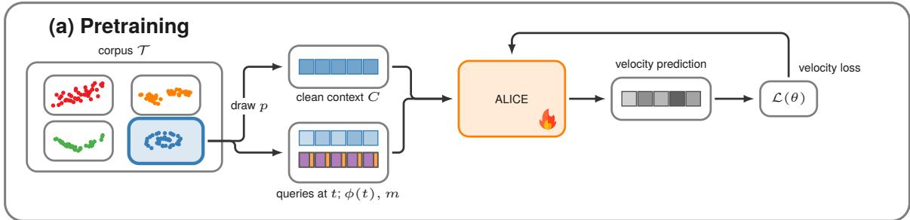

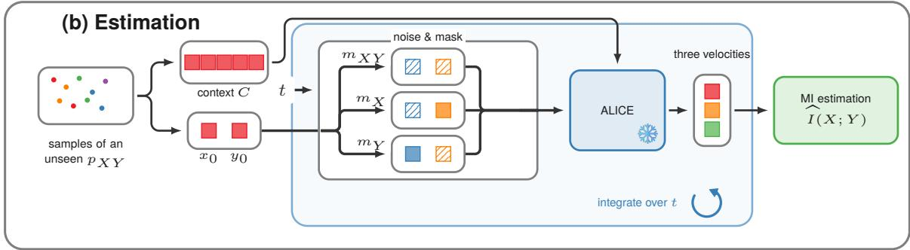  
Figure 1 Alice overview. (a) Pretraining: a distribution $p$ drawn from the corpus T provides a clean context and queries noised according to indicator $m ;$ the model regresses the velocity target $z _ { 0 } - \epsilon .$ (b) Estimation: samples of an unseen distribution provide a clean context and query $z _ { 0 } = ( x _ { 0 } , y _ { 0 } )$ ; one shared Gaussian perturbation $\epsilon = ( \epsilon _ { X } , \epsilon _ { Y } )$ at time t produces the three masked queries mXY, mX, and mY, whose block-wise velocity diference $^ { g , }$ weighted by $( 1 - t ) / t$ , averages to the estimate.

Let $z _ { 0 } = ( x _ { 0 } , y _ { 0 } ) \sim p _ { X Y }$ be a clean joint sample, and let $\boldsymbol { \epsilon } = ( \epsilon _ { \boldsymbol { X } } , \epsilon _ { \boldsymbol { Y } } )$ be an independent standard Gaussian perturbation. The two components of $z _ { 0 }$ define the X and Y blocks, each of which may contain multiple coordinates. For $t \in [ 0 , 1 ]$ , difuse the two blocks as $x _ { t } = ( 1 - t ) x _ { 0 } + t \epsilon _ { X }$ and $y _ { t } = ( 1 - t ) y _ { 0 } + t \epsilon _ { Y }$ . Let ${ \boldsymbol { z } } _ { t } = ( x _ { t } , y _ { t } )$ denote the jointly noised point. For a concatenated vector $u = ( u _ { X } , u _ { Y } )$ , the selections $u | _ { X }$ and $u | _ { Y }$ retain the coordinates in the corresponding blocks.

Let $v _ { t } ( z )$ denote the joint velocity field. Let $v _ { t } ( x \mid y _ { 0 } )$ denote the conditional velocity field of $p _ { X | Y = y _ { 0 } }$ evaluated at x. Let $v _ { t } ( y \mid x _ { 0 } )$ denote the conditional velocity field of $p _ { Y \mid X = x _ { 0 } }$ evaluated at $y .$ The resulting identity, proved in Appendix B (Theorem 2) and closest in mechanism to the decompositions of Franzese et al. (2024) and Wang et al. (2026), is:

$$
\operatorname { I } ( X ; Y ) = \int _ { 0 } ^ { 1 } \frac { 1 - t } { t } \operatorname { \mathbb { E } } _ { x _ { 0 } , y _ { 0 } , \epsilon } \biggl [ \left\| v _ { t } ( z _ { t } ) \vert _ { X } - v _ { t } ( x _ { t } \mid y _ { 0 } ) \right\| ^ { 2 } + \left\| v _ { t } ( z _ { t } ) \vert _ { Y } - v _ { t } ( y _ { t } \mid x _ { 0 } ) \right\| ^ { 2 } \biggr ] \mathrm { d } t .\tag{3}
$$

In principle, Equation (3) involves three velocity fields: the joint field and two block-conditional fields. In practice, one can amortize these fields with a single model, represented by the parametric velocity field $v _ { \theta } ( z , t , m )$ for $z \in \mathbb { R } ^ { d }$ (Franzese et al., 2024). The mask $m \in \{ 0 , 1 \} ^ { d }$ identifies the coordinates that are difused and predicted and those held clean as evidence. The joint evaluation difuses both blocks, and each conditional evaluation difuses one block while holding the other clean.

We estimate the integral in Equation (3) with Monte Carlo. For each Monte Carlo draw $i ,$ sample a clean joint point $z _ { 0 } ^ { ( i ) } = ( x _ { 0 } ^ { ( i ) } , y _ { 0 } ^ { ( i ) } )$ , a time $t _ { i } \sim \mathcal { U } [ 0 , 1 ]$ , and one independent standard Gaussian perturbation $\epsilon ^ { ( i ) }$ Evaluating the definitions above at $t _ { i }$ gives the full query point $z _ { t _ { i } } ^ { ( i ) } = ( x _ { t _ { i } } ^ { ( i ) } , y _ { t _ { i } } ^ { ( i ) } )$ . Define $m _ { X Y } = \left( \mathbb { 1 } _ { X } , \mathbb { 1 } _ { Y } \right)$ $m _ { X } = ( \mathbb { 1 } _ { X } , \mathbb { 0 } _ { Y } )$ , and $m _ { Y } = ( \mathbb { 0 } _ { X } , \mathbb { 1 } _ { Y } )$ , where $\mathbb { 1 } _ { X }$ and $\mathbb { O } _ { X }$ are the all-one and all-zero vectors on the X block, with the analogous convention for $Y$ . Then, we have that

$$
\begin{array} { r } { \widehat { v } ^ { ( i ) } = v _ { \theta } ( z _ { t _ { i } } ^ { ( i ) } , t _ { i } , m _ { X Y } ) , \qquad \widehat { v } _ { X } ^ { ( i ) } = v _ { \theta } ( ( x _ { t _ { i } } ^ { ( i ) } , y _ { 0 } ^ { ( i ) } ) , t _ { i } , m _ { X } ) , \qquad \widehat { v } _ { Y } ^ { ( i ) } = v _ { \theta } ( ( x _ { 0 } ^ { ( i ) } , y _ { t _ { i } } ^ { ( i ) } ) , t _ { i } , m _ { Y } ) . } \end{array}
$$

Using the same $\epsilon ^ { ( i ) }$ in all three model evaluations, the Monte Carlo estimator is

$$
\widehat { \mathrm { I } } ( X ; Y ) = \frac { 1 } { N _ { \mathrm { M C } } } \sum _ { i = 1 } ^ { N _ { \mathrm { M C } } } \frac { 1 - t _ { i } } { t _ { i } } \left[ \left\| ( \widehat { v } ^ { ( i ) } - \widehat { v } _ { X } ^ { ( i ) } ) | _ { X } \right\| ^ { 2 } + \left\| ( \widehat { v } ^ { ( i ) } - \widehat { v } _ { Y } ^ { ( i ) } ) | _ { Y } \right\| ^ { 2 } \right] ,\tag{4}
$$

where $N _ { \mathrm { M C } }$ is the number of samples (see Figure 1–b and Algorithm 1 in Appendix C for details).

Thus, our estimator requires a model that conditions on a clean sample context and accepts the query point, time, and noising indicator. The construct that meets these requirements is described next.

## 2.2 The in-context velocity field

A conventional flow-matching model associates one set of parameters with one distribution p and approximates the map $( z _ { t } , t ) \mapsto v _ { t } ( z _ { t } )$ . Evaluating Equation (4) would require training one separate model for each distribution before its three velocity fields could be queried. We instead define, train, and use a single context-conditioned velocity model across a family of distributions. We represent this model as the map from a clean context and a query to a velocity, $( C , z _ { t } , t , m ) \mapsto v _ { \theta } ( z _ { t } , t , m ; C )$ , where $C = \{ z ^ { ( k ) } \} _ { k = 1 } ^ { n }$ is a collection of n clean samples from the unseen distribution. At inference, the context determines which velocity field the in-context learning represents, while the query gives the argument where that field is evaluated. From a statistical learning perspective, the context size contributes to the bias of the estimator, while the quer contributes to its variance. We implement this context-conditioned map with an attention-based transformer. A growing literature gives theoretical analyses and empirical demonstrations that transformers can implement learning procedures in their forward pass from in-context data (Garg et al., 2022; Akyürek et al., 2023; Von Oswald et al., 2023; Bai et al., 2023; Xie et al., 2022; Zhang et al., 2025; Xie et al., 2025). In a setting close to ours, Smart et al. (2025) show that a one-layer attention model can solve certain in-context denoising problems optimally. This motivates our approach, in which pretraining over a family of distributions teaches one shared attention model to infer the distribution-specific velocity computation from the context.

## 2.3 Architecture

The architecture must process the context as a matrix $C \in \mathbb { R } ^ { n \times d }$ , with one row per sample and one column per coordinate, for any context size n and joint width d with one set of parameters. Our method builds on recent work on in-context learning and set transformers, including the scalar tokenization of Chronos (Ansari et al., 2024), the any-variate attention of Moirai (Woo et al., 2024), and the amortized in-context inference of TabPFN (Hollmann et al., 2023) and TabICL (QU et al., 2025). The rows of the context are evidence about which distribution’s velocity field to represent. The columns carry the dependence between coordinates, which the velocity of one coordinate needs from the values of the others. Appendix D complements the high-level description we discuss next.

Size-independent representation. Each scalar $z ^ { ( k ) } [ i ]$ , coordinate i of context sample k, becomes one token, with one input projection and one scalar output head shared over all samples and coordinates. Context tokens contain a clean value and a type indicator; query tokens additionally contain the time features ϕ(t) and the noising-indicator entry m[i]. Since the context rows form a set and coordinate order is arbitrary, the model uses no positional encodings along either axis, and attention over the rows is applied separately to each column. A validity mask makes padded rows invisible, so the same parameters accept any context size n and are invariant to the order of the rows.

Induced latents. Self-attention over the n context tokens in every block would make compute and memory quadratic in n. To keep the cost linear in the context size, we introduce a bottleneck of K induced tokens that summarize the context for each coordinate, drawing inspiration from inducing variables in sparse Gaussian processes (Snelson and Ghahramani, 2005; Titsias, 2009), their use in deep Gaussian processes (Damianou and Lawrence, 2013; Salimbeni and Deisenroth, 2017), and induced set attention and latent-array architectures (Lee et al., 2019; Jaegle et al., 2021). The K induced tokens are the rows of one learned matrix $U \in \mathbb { R } ^ { K \times D }$ where D is the width of the token representations. For each coordinate, Alice updates a copy of U through cross-attention over the context tokens, producing K context-specific latent vectors. For L blocks, this changes the context-dependent attention cost from $\mathcal { O } ( L \bar { d } n ^ { 2 } )$ to $\mathcal { O } ( d n \bar { K } + L d K ^ { 2 } )$ ), which grows linearly in n for fixed K.

Context-derived relation graph. The velocity of one coordinate can depend on the values of other coordinates, and this dependence changes with the distribution. Separate marginal summaries cannot identify it: independently shufling one context column preserves its marginal samples while changing which values occur together in a joint observation. We therefore construct a weighted graph with one node per coordinate, computed once from the clean context, whose edges control information exchange between coordinate representations; this follows the pattern of inferring interactions from observations to guide message passing (Kipf et al., 2018). The edge between coordinates i and $j$ is derived from the covariance, over the context, of learned nonlinear features of $z ^ { ( k ) } [ i ]$ and $z ^ { ( k ) } [ j ]$ , a principle also used in kernel dependence measures (Gretton et al., 2005). Nonlinear features expose relations such as $z [ j ] \approx z [ i ] ^ { 2 }$ that linear correlation misses, and centering the features makes the population descriptor vanish under independence. Each attention head turns this descriptor into a signed, gated edge and uses the edges to mix the coordinate representations in every graph layer: within each context row before latent compression, and between latent and query representations.

Attention pattern. We use separate attention operations for context, latent, and query representations. Latent representations are updated by cross-attention from context tokens and by latent self-attention. Query representations attend to the latent and context representations and do not attend to one another, so each query is processed independently conditional on the same context-derived states. The shared attention and graph operations, together with the absence of positional encodings, preserve invariance to permutations of context samples and equivariance to permutations of coordinates.

Caching. The relation graph, the context tokens after the input projection, and the induced latents depend only on $C ,$ so they are computed once and reused across all queries for that distribution. Although this is not strictly useful during training, it is essential for inference on large contexts, where recomputing these states for every query would otherwise be costly.

## 2.4 Pretraining

We train Alice to infer the velocity field of an unseen distribution from its context.

Pretraining corpus T. Each episode is a synthetic joint distribution over $z = ( x , y ) \in \mathbb R ^ { d }$ . The corpus combines base distributions (Gaussian, Student’s t) with copula mixtures, latent warps, nonparametric regressions, and manifolds to vary dependence structure, conditional behavior, and support geometry. Copula mixtures follow the dependence-diversity construction of InfoAtlas (Hu et al., 2026) and use additive-coupling bijections (Dinh et al., 2017) to enrich the sampled dependencies. Latent warps transform Gaussian mixtures through shifts, folds, and rotations, nonparametric regressions generate responses from random Fourier-feature functions with noise, and manifolds generate near-singular supports. Appendix E.1 gives the full construction.

Training objective. The identity in Equation (3) reduces MI estimation to diferences between a joint velocity field and masked conditional fields, so pretraining focuses on predicting these fields. The objective uses samples from each synthetic distribution and requires no MI labels, which lets one model amortize velocity-field estimation across the corpus $\tau$ . At each step, we sample a distribution $p \sim \tau$ , a context C of n independent samples from $p ,$ a further clean sample $z _ { 0 } \sim p .$ , a time $t ,$ Gaussian noise $\epsilon ,$ and a noising indicator $m$ . The indicator selects the coordinates that follow the interpolant in the query point $z _ { t } = m \odot \left( ( 1 - t ) z _ { 0 } + t \epsilon \right) + ( 1 - m ) \odot z _ { 0 }$ , while the remaining coordinates stay clean as evidence (Figure 1–a). We then regress the model output on the flow-matching direction over the selected coordinates:

$$
\mathcal { L } ( \boldsymbol { \theta } ) = \mathbb { E } _ { p \sim T , C , z _ { 0 } \sim p , t \sim \mathcal { U } [ 0 , 1 ] , \epsilon , m } \left[ \left\| m \right\| _ { 1 } ^ { - 1 } \left\| m \odot \left( v _ { \theta } ( z _ { t } , t , m ; C ) - ( z _ { 0 } - \epsilon ) \right) \right\| ^ { 2 } \right] .\tag{5}
$$

The factor $\lVert m \rVert _ { 1 } ^ { - 1 }$ makes the loss a mean over noised coordinates, and the target contains no $1 / t$ factor, so the training loss has no singularity as $t \to 0$ . The noising indicator is sampled to cover the three fields required by Equation (3), all coordinates noised for the joint field and one block noised while the other remains clean for each block-conditional field, together with random coordinate subsets for general partial observation; since m is an input, one network represents all of these fields.

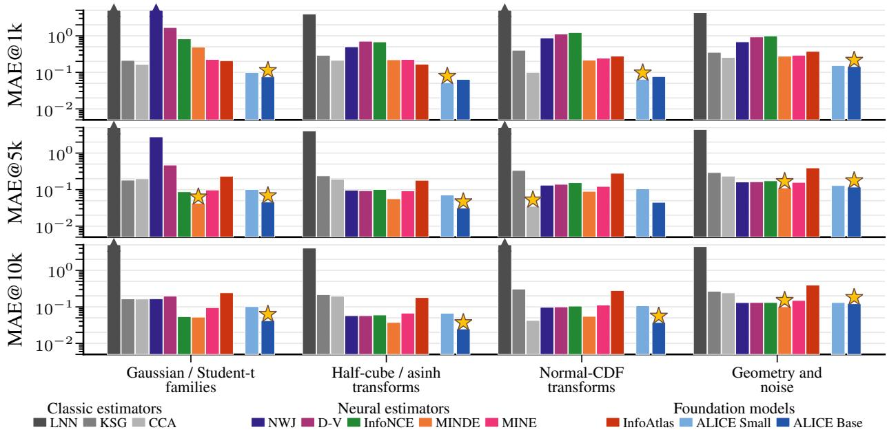  
Figure 2 Category-wise MAE on the 40-task Czyż et al. (2023) benchmark at matched data budgets. Rows show budgets of 1k, 5k, and 10k samples, and columns group tasks by base family or transformation. Upward triangles mark values above the plotted range. Stars mark the lowest MAE.

## 3 Validation

We evaluate Alice (Small and Base variants, see Appendix D) on the 40 tasks of the suite by Czyż et al.   
(2023), which spans joint widths from 2 to 100 and provides a closed-form ground-truth MI.

Protocol. Every estimator receives the same data budget of $N \in \{ 1 \mathrm { k } , 5 \mathrm { k } , 1 0 \mathrm { k } \}$ samples per task. Alice splits the budget into 64 query samples and a context of the remaining N − 64 clean samples, and estimates MI in-context; estimates are in nats, averaged over eight independent context draws, and Appendix F gives the full inference settings. We compare against the following estimators: InfoAtlas (Hu et al., 2026), MINDE (Franzese et al., 2024), MINE (Belghazi et al., 2018), InfoNCE (Oord et al., 2018), D-V (Donsker and Varadhan, 1975), NWJ (Nguyen et al., 2010), KSG (Kraskov et al., 2004), LNN (Gao et al., 2015), and CCA (Hotelling, 1936). InfoAtlas is the amortized baseline and is evaluated zero-shot on the same contexts as Alice. Neural estimators are trained (and tuned) separately on the N samples of each distribution, and classic estimators are fit directly on them.

Results. We report the mean absolute error (MAE) between estimate and ground truth over the 40 tasks, in nats; Figure 2 shows it per distribution group and Table 2 in Appendix F over the whole suite. Alice Base has the lowest MAE at every budget: 0.092 nats at 1k samples, 0.063 at 5k, and 0.060 at 10k, against 0.195 for the best competitor at 1k (CCA) and 0.070 and 0.065 for MINDE at 5k and 10k. Within groups, Alice has the lowest MAE in all four groups at 1k and in the three Gaussian-based groups at 10k. Alice Small (19M parameters, against 85M for Base) has an MAE of 0.10 nats at every budget: second-lowest at 1k, and below MINE, D-V, NWJ, and the classic estimators at 5k and 10k. The two sizes difer on the wide tasks alone: on the 7 tasks of joint width 50 and 100 the MAE of Base falls from 0.153 nats at 1k to 0.086 at 10k while that of Small rises from 0.197 to 0.241; on the 33 narrower tasks they are within 0.02 nats of each other (Table 3). InfoAtlas has an MAE between 0.25 and 0.28 nats at every budget.

Small-data regime. The trained estimators need the step from 1k to 5k/10k samples to become practically usable: the MAE of MINDE falls from 0.353 to 0.070 nats, that of InfoNCE from 0.887 to 0.123, and that of D-V from 1.229 to 0.279, while NWJ diverges at 1k and is still at 1.261 nats at 5k. At a 1k budget, Alice Base outperforms every competitor by a factor of at least two, and is more accurate than MINE, InfoNCE, D-V, and NWJ at 5k.

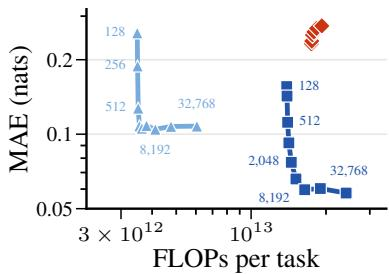

Inference compute. Figure 3 compares operator-level FLOPs per task for Alice and InfoAtlas. Here, Alice uses a budget N from 128 to 32768, split into $N - 6 4$ context samples and 64 query samples, with 64 time draws per query; InfoAtlas uses contexts from 128 to 8192 samples. For each task, we average the MI estimates over 32 seeds for Alice and eight seeds for InfoAtlas, then compute MAE across the 40 tasks. With a budget of 8192, Small and Base achieve MAEs of 0.105 and 0.060 nats for $4 . 1 \cdot 1 0 ^ { 1 2 }$ and $1 . 6 \cdot 1 0 ^ { 1 3 }$ FLOPs per task, respectively, compared with

0.274 nats for $1 . 9 \cdot 1 0 ^ { 1 3 }$ FLOPs for InfoAtlas. Increasing the budget to 32768 gives Base an MAE of 0.058 nats for $2 . 4 \cdot 1 0 ^ { 1 3 }$ FLOPs per task.

## 4 Applications

In this section we showcase Alice on three scientific applications: biology, genetics and neuroscience. In these applications, datasets include discrete distributions, sequences of tokens, and time-series of real numbers: not only Alice’s training corpus never encountered such distribution types, the model itself has never been trained on such data.

## 4.1 Analysis of multivariate single-cell signaling responses

Cellular signaling can be naturally described in information-theoretic terms: an extracellular stimulus X is transmitted through a stochastic biochemical network to a cellular response $Y ; \operatorname { I } ( X ; Y )$ measures how reliably a cell can infer the stimulus, and the channel capacity is the maximum of $\operatorname { I } ( X ; Y )$ over input distributions (Nurse, 2008; Brennan et al., 2012; Jetka et al., 2018). We use Alice to analyze the NF-KB pathway, which responds to the inflammatory cytokine TNF-α (Jetka et al., 2019): 15,632 cells stimulated with one of $m = 1 1$ TNF-α concentrations (0 to 100 ng/ml) and imaged for 2 h at 3-min resolution (40 frames in total), the response being the nuclear-to-cytoplasmic NF-KB ratio.

Protocol. MI decomposes as $\begin{array} { r } { \operatorname { I } ( X ; Y ) = \sum _ { i } p _ { i } D _ { i } } \end{array}$ , where $D _ { i }$ is the divergence of the response distribution at dose i from the mixture over doses. We estimate every $D _ { i }$ from the velocity diference between a joint context and a label-shufled context (see Appendix B.4 for a detailed formulation); Alice returns both fields, with no training. From the $D _ { i }$ we obtain the MI at uniform input, the capacity by Blahut–Arimoto ascent, and the probability of correct discrimination (PCD) of every pair of doses, bracketed by the Jensen–Shannon divergence (see Appendix G for details). This is a small-data regime: after the filtering of the reference analysis, a dose has between 536 and 1,307 cell samples, and each $D _ { i }$ is estimated from a context of 1,024 cells.

Results. Figure 4 shows the three findings of the analysis. First, the information carried by a single frame follows the NF-KB translocation: the capacity of one frame rises with the first nuclear peak, reaches about 1.2 bits at minutes 15 to 21, and decays, with a smaller second rise at the second peak (panel (b)). Second, the trajectory carries more than any single frame: the capacity of a prefix of frames saturates by frame 12 (panel (c)), so the dose is encoded in the timing and amplitude of the first response peak, and the prefix of frames reaches a capacity of about 1.3 bits against 1.2 for the best single frame. Third, dynamics separate the high doses: from a single frame, pairs of doses at or above 0.5 ng/ml are close to indistinguishable (mean PCD 0.56, where chance is 0.5), and the trajectory raises their PCD to 0.67, while the low doses are separable from a single frame already (Figure 10 in Appendix G). The three findings, the position and height of the capacity peak, and the discrimination pattern are obtained from a single model never trained on biological data, and not only corroborate those of Jetka et al. (2019), but overcome the limiting assumptions required approximate MI by fitting a linear classifier per analysis, which might not hold in more complex scenarios.

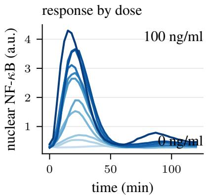  
(a)

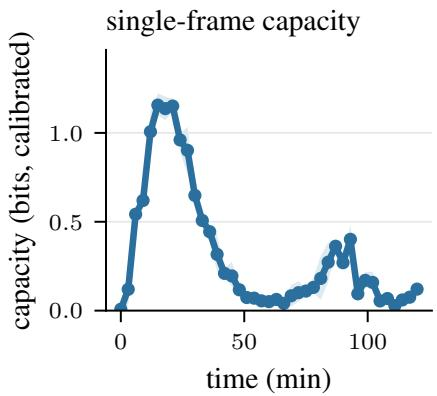  
(b)

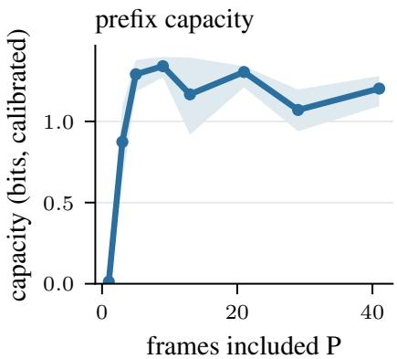  
(c)  
Figure 4 In-context analysis of the NF-KB dose channel. (a) Median nuclear NF-KB response per TNF-α dose, with the interquartile band at the two extreme doses. (b) Capacity of each single frame and (c) of the prefix of frames from minute 0, with the envelope over seeds. The pairwise discrimination matrices are in Appendix G.

## 4.2 Promoter Identification

Regulatory motifs are short DNA patterns that control gene expression, and MI-based methods locate them by measuring the dependence between the content of a regulatory region and the expression it drives (Elemento et al., 2007; Rao et al., 2007). We use Alice to locate the tata-box, a core promoter motif whose preferred position in Arabidopsis thaliana lies 26 to 39 bases upstream of the transcription start site (TSS) (Bernard et al., 2010), on the promoter and non-promoter sequences of Umarov and Solovyev (2017) from the epd database (Dreos et al., 2013): 1,497 sequences per class after balancing, each of 251 bases spanning positions −200 to +50 around the TSS, so the promoter label X is uniform and every MI value is bounded by $H ( X ) = \ln 2$ nats.

Protocol. For a window of $L \in \{ 4 , 6 \}$ bases starting at position s, we estimate I(X; Y) between the promoter label X and the window content Y. Sliding the window along the sequence produces a MI profile: windows on segments unrelated to promoter status yield near zero values, and windows overlapping an informative motif obtain high values. Each window is scored on its own, so a motif is detected even when another motif is correlated with it. Bases are input in the velocity fields of Equation (3) through a fixed injective embedding of one real coordinate per base, which preserves I(X; Y) exactly, and the blocks of dimension 1 and L are handled natively by Alice. For every window position, Alice conditions on a context of 1,024 label–window pairs and evaluates on 1,024 held-out pairs. This is a small-data regime: the whole dataset holds 2,994 sequences, an order of magnitude below the training sets that neural estimators require, and Alice produces each window from 1,024 of them (see Appendix H for additional details).

Results. Figure 5 shows the profile for L = 6. The estimate is flat and near zero over the 200 bases upstream of the motif and over the 50 bases downstream of the TSS, rises sharply over the tata-box band, with its maximum at 30 to 32 bases upstream of the TSS for both window lengths, and shows a second, smaller maximum on the TSS itself, which corresponds to the initiator element. The maximum lies inside the documented tata-box band, which serves as a positive control for localization. The existing neural competitor for this task is Info-SEDD (Foresti et al., 2026), a discrete-difusion estimator trained on this dataset, which locates the tata-box with windows realized by masking. Its profile scans positions −60 to −25 and reports a single peak, with a bias floor substantially higher than Alice (see Appendix H for additional results).

## 4.3 Brain Region Activity Patterns

We use Alice to estimate the O-information (Ω-info) (Rosas et al., 2019) of six visual-cortex areas of mice performing a visual change-detection task, on the Visual Behavior Neuropixels recordings of the Allen Institute (Allen-Institute), first analyzed by Venkatesh et al. (2023). Bounoua et al. (2024) estimated the Ω-info of these recordings with a score-based estimator whose networks are trained on all sessions pooled together; we obtain the estimate from our frozen Alice checkpoint, with no training on neural data, for every single session. For N random variables, the quantity $\Omega = \mathrm { T C } - \mathrm { D T C }$ is the diference between the total correlation and the dual total correlation; a positive value indicates that redundancy dominates the interactions, that is, the variables carry overlapping information, and a negative value indicates that synergy dominates. Both terms are time integrals of squared velocity diferences of the form of Equation (4), between the joint field and the concatenation of the N marginal fields (TC) or of the N conditional fields (DTC), so one checkpoint provides all the necessary fields (see Appendix I for details and validation).

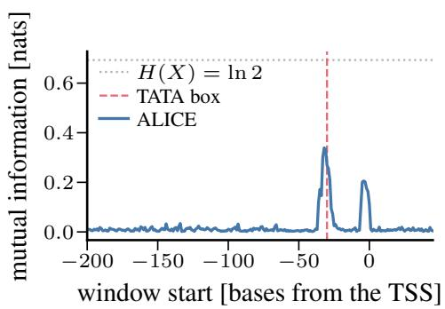

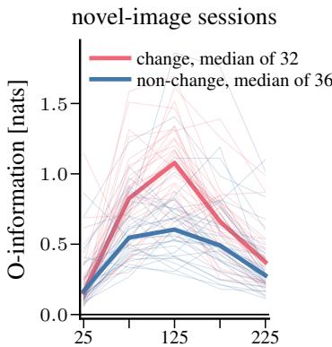  
center of the 50 ms window [ms]  
novel minus familiar, change flashes

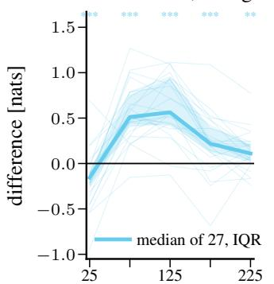  
center of the 50 ms window [ms]  
Figure 5 MI between the promoter label and a sliding window of $L = 6 $ , against the ofset of the window start from the TSS; the dotted line marks the ln 2 ceiling of the label entropy.  
Figure 6 Ω-info of the six visual areas, one estimate per session. Left: novel-image sessions, one thin line per mouse and flash type, medians in bold. Right: novel minus familiar session for change flashes, with the median, the interquartile band, and a signed-rank test per window ( ∗∗: $p < 0 . 0 1$ , ∗ ∗ ∗: $p < 0 . 0 0 1 $ ).

Protocol. A mouse watches a natural image shown for 250 ms every 750 ms; the image repeats for several presentations (flashes) and then changes. We use the 72 sessions selected by Bounoua et al. (2024): 36 mice, each recorded on one day with a familiar image set and on another day with a novel one. For every flash, spikes are counted in five consecutive 50 ms windows and averaged over the units of each of six visual areas, so one flash is one draw of six variables and each window is one system of joint width six; change flashes and non-change flashes (repeats) are analyzed separately. Each session is estimated separately: Alice conditions on a context of 128 flashes of the session and evaluates on the remaining flashes. Paired comparisons follow between the two flash types of a session and between the two sessions of a mouse. This is a small-data regime: a session provides about 150 to 200 independent flashes per flash type (Appendix I), too few to train an estimator per session, so Bounoua et al. (2024) pool all 72 sessions, and obtain no per-session estimate.

Results. Figure 6 shows how the six areas share information after a flash. In novel-image sessions the Ω-info is positive in every window and every mouse: the areas carry overlapping information. This redundancy is low at flash onset, maximal at 100 to 150 ms, when the visual response has reached all six areas, and decays afterwards. A change of image produces more redundancy than a repeat: in the peak window the within-session diference is positive in 31 of 32 sessions, and it is absent in the first window, before the visual response reaches the cortex. The same comparison in familiar-image sessions gives no diference at the peak and a reversed sign in the late windows, and the two sessions of each mouse (Figure 6, right) show that novelty raises the redundancy of the response in 25 of 27 animals for change flashes and in 28 of 36 for non-change flashes. We observe that a novel image drives a stimulus signal that is broadcast across the visual areas, and that this shared component fades with familiarity. The pooled result of Bounoua et al. (2024), a larger Ω-info after a change flash, therefore holds for novel images and in one window only, and the dependence on experience is a new finding of this work: the pooled analysis merges the two days of every mouse and cannot separate them. Alice produced the 675 per-session systems in few forward passes of one frozen model; a trained-per-system estimator would require 675 training runs (Appendix I).

## 5 Conclusion and Limitations

We presented Alice, the first foundation model for MI estimation, whose zero-shot accuracy matches that of existing estimators trained per distribution. Alice is a single Transformer, trained once as an in-context rectified-flow velocity field, that provides the joint and block-conditional fields of an unseen distribution from samples alone. A known identity uses such fields to estimate MI.

Alice was trained exclusively on synthetic data and produced MI estimates zero-shot, on distributions and data types absent from its training corpus. On the “Beyond Normal” benchmark, it has the lowest error of all estimators at matched budgets of 1k, 5k, and 10k samples, although every competitor is trained and tuned on each distribution; at 1k samples, its error is lower by a factor of at least two. In three scientific applications, Alice reproduces the findings of dedicated estimators in the small-data regime typical of biology and neuroscience, with a few forward passes per estimate.

We believe Alice to be an invaluable asset for scientific discoveries across fields, that materializes as a local model that can be run “plug-and-play” on modest hardware.

Limitations. Our implementation is research code, and it has not been thoroughly optimized. Model size and training budget can be increased, training corpus can be augmented with higher dimensional data, maximum context size at training time can be increased, which might yield even better results in our benchmark validation.

## Ethics statement

MI estimates feed independence testing, feature selection, and scientific analysis, where a confidently wrong value can mislead downstream conclusions. We therefore advise caution on distributions that are far from the training corpus.

## AI usage statement

In this work, we used generative AI tools for help with LATEX table formatting, TikZ figure polishing, and grammar and style polishing of the text; for generating figures and tables from stored results; for implementation design, polishing, and unit testing of the code; for low-level interaction with the GPU-cluster scheduler; and for managing artifacts, checkpoints, and datasets on the Hugging Face hub. We take responsibility for the final content of this work, including text, claims, and artifacts produced with the aid of generative AI.

## Acknowledgments

This project was provided with AI computing and storage resources by GENCI at IDRIS thanks to the grant AD011018178 on the supercomputer Jean Zay’s H100 partition. The Authors acknowledge the support of CIRCALIS AI-HPC facility at EURECOM, with partial funding from French Region Sud.

## References

Ekin Akyürek, Dale Schuurmans, Jacob Andreas, Tengyu Ma, and Denny Zhou. What learning algorithm is in-context learning? Investigations with linear models. In International Conference on Learning Representations (ICLR), 2023. URL https://openreview.net/forum?id=0g0X4H8yN4I.

Allen-Institute. Visual behavior neuropixels dataset overview. URL https://brain-map.org/our-research/ circuits-behavior/visual-behavior.

Abdul Fatir Ansari, Lorenzo Stella, Ali Caner Turkmen, Xiyuan Zhang, Pedro Mercado, Huibin Shen, Oleksandr Shchur, Syama Sundar Rangapuram, Sebastian Pineda Arango, Shubham Kapoor, Jasper Zschiegner, Danielle C. Maddix, Hao Wang, Michael W. Mahoney, Kari Torkkola, Andrew Gordon Wilson, Michael Bohlke-Schneider, and Bernie Wang. Chronos: Learning the language of time series. Transactions on Machine Learning Research, 2024. ISSN 2835-8856. URL https://openreview.net/forum?id=gerNCVqqtR.

Yaron E Antebi, Nagarajan Nandagopal, and Michael B Elowitz. An operational view of intercellular signaling pathways. Current opinion in systems biology, 1:16–24, 2017.

S. Arimoto. An algorithm for computing the capacity of arbitrary discrete memoryless channels. IEEE Transactions on Information Theory, 18(1):14–20, 1972.

Yu Bai, Fan Chen, Huan Wang, Caiming Xiong, and Song Mei. Transformers as statisticians: Provable in-context learning with in-context algorithm selection. In Advances on Neural Information Processing Systems (NeurIPS), 2023. URL https://openreview.net/forum?id=liMSqUuVg9.

Mohamed Ishmael Belghazi, Aristide Baratin, Sai Rajeswar, Sherjil Ozair, Yoshua Bengio, Aaron Courville, and R. Devon Hjelm. Mutual information neural estimation. In International Conference on Machine Learning (ICML), 2018. arXiv:1801.04062.

Virginie Bernard, Véronique Brunaud, and Alain Lecharny. Tc-motifs at the tata-box expected position in plant genes: a novel class of motifs involved in the transcription regulation. BMC genomics, 11(1):166, 2010.

R. Blahut. Computation of channel capacity and rate-distortion functions. IEEE Transactions on Information Theory, 18(4):460–473, 1972.

Alexander Borst and Frédéric E Theunissen. Information theory and neural coding. Nature neuroscience, 2(11): 947–957, 1999.

Mustapha Bounoua, Giulio Franzese, and Pietro Michiardi. S\$\omega\$i: Score-based o-INFORMATION estimation. In International Conference on Machine Learning (ICML), 2024. URL https://openreview.net/forum?id= LuhWZ2oJ5L.

Matthew D Brennan, Raymond Cheong, and Andre Levchenko. How information theory handles cell signaling and uncertainty. Science, 338(6105):334–335, 2012.

Ivan Butakov, Alexander Tolmachev, Sofia Malanchuk, Anna Neopryatnaya, and Alexey Frolov. Mutual information estimation via normalizing flows. In Advances in Neural Information Processing Systems (NeurIPS), volume 37, pages 3027–3057, 2024. URL https://openreview.net/forum?id=JiQXsLvDls.

Ivan Butakov, Alexander Semenenko, Valeriia Kirova, Ivan Oseledets, and Alexey Frolov. FMMI: Flow matching mutual information estimation. In ICLR 2026 2nd Workshop on Deep Generative Model in Machine Learning: Theory, Principle and Eficacy, 2026. URL https://openreview.net/forum?id=2zTjX6rvn4.

Raymond Cheong, Alex Rhee, Chiaochun Joanne Wang, Ilya Nemenman, and Andre Levchenko. Information transduction capacity of noisy biochemical signaling networks. Science, 334(6054):354–358, 2011.

Paweł Czyż, Frederic Grabowski, Julia E. Vogt, Niko Beerenwinkel, and Alexander Marx. Beyond normal: On the evaluation of mutual information estimators. In Advances in Neural Information Processing Systems (NeurIPS), 2023. arXiv:2306.11078.

Andreas Damianou and Neil D. Lawrence. Deep Gaussian processes. In Carlos M. Carvalho and Pradeep Ravikumar, editors, Proceedings of the Sixteenth International Conference on Artificial Intelligence and Statistics, volume 31 of Proceedings of Machine Learning Research, pages 207–215, Scottsdale, Arizona, USA, 2013. PMLR.

Laurent Dinh, Jascha Sohl-Dickstein, and Samy Bengio. Density estimation using Real NVP. In International Conference on Learning Representations (ICLR), 2017. arXiv:1605.08803.

M. D. Donsker and S. R. S. Varadhan. Asymptotic evaluation of certain markov process expectations for large time, i. Communications on Pure and Applied Mathematics, 28(1):1–47, 1975.

Edo Dotan, Gal Jaschek, Tal Pupko, and Yonatan Belinkov. Efect of tokenization on transformers for biological sequences. Bioinformatics, 40(4):btae196, 2024.

René Dreos, Giovanna Ambrosini, Rouayda Cavin Périer, and Philipp Bucher. Epd and epdnew, high-quality promoter resources in the next-generation sequencing era. Nucleic acids research, 41(D1):D157–D164, 2013.

Bell Raj Eapen. Genomic tokenizer: Toward a biology-driven tokenization in transformer models for dna sequences. bioRxiv, pages 2025–04, 2025.

Olivier Elemento, Noam Slonim, and Saeed Tavazoie. A universal framework for regulatory element discovery across all genomes and data types. Molecular cell, 28(2):337–350, 2007.

Alberto Foresti, Giulio Franzese, and Pietro Michiardi. Information estimation with discrete difusion. In International Conference on Learning Representations (ICLR), 2026. URL https://openreview.net/forum?id=m18MXVdrV9.

Giulio Franzese, Mustapha Bounoua, and Pietro Michiardi. MINDE: Mutual information neural difusion estimation. In International Conference on Learning Representations (ICLR), 2024. arXiv:2310.09031.

Shuyang Gao, Greg Ver Steeg, and Aram Galstyan. Eficient estimation of mutual information for strongly dependent variables. In International Conference on Artificial Intelligence and Statistics (AISTATS), 2015. arXiv:1411.2003.

Shivam Garg, Dimitris Tsipras, Percy Liang, and Gregory Valiant. What can transformers learn in-context? a case study of simple function classes. In Alice H. Oh, Alekh Agarwal, Danielle Belgrave, and Kyunghyun Cho, editors, Advances in Neural Information Processing Systems (NeurIPS), 2022. URL https://openreview.net/forum?id=flNZJ2eOet.

Arthur Gretton, Olivier Bousquet, Alex Smola, and Bernhard Schölkopf. Measuring statistical dependence with Hilbert-Schmidt norms. In Algorithmic Learning Theory, volume 3734 of Lecture Notes in Computer Science, pages 63–77. Springer, 2005. doi: 10.1007/11564089\_7. URL https://www.cs.cmu.edu/\~arthurg/papers/GreBouSmoSch05.pdf.

Dongning Guo, Shlomo Shamai, and Sergio Verdú. Mutual information and minimum mean-square error in Gaussian channels. IEEE Transactions on Information Theory, 51(4):1261–1282, 2005.

R Devon Hjelm, Alex Fedorov, Samuel Lavoie-Marchildon, Karan Grewal, Phil Bachman, Adam Trischler, and Yoshua Bengio. Learning deep representations by mutual information estimation and maximization. In International Conference on Learning Representations (ICLR), 2019.

Noah Hollmann, Samuel Müller, Katharina Eggensperger, and Frank Hutter. TabPFN: A transformer that solves small tabular classification problems in a second. In International Conference on Learning Representations (ICLR), 2023. URL https://openreview.net/forum?id=cp5PvcI6w8\_.

Harold Hotelling. Relations between two sets of variates. Biometrika, 28(3/4):321–377, 1936.

Xixi Hu, Runlong Liao, Keyang Xu, Bo Liu, Yeqing Li, Eugene Ie, Hongliang Fei, and Qiang Liu. Improving rectified flow with boundary conditions. In 2025 IEEE/CVF International Conference on Computer Vision (ICCV), pages 18177–18186. IEEE, 2025.

Zhengyang Hu, Yanzhi Chen, Hanxiang Ren, Qunsong Zeng, Youyi Zheng, Adrian Weller, Kaibin Huang, and Yanchao Yang. Infoatlas: A foundation model for zero-shot statistical dependence estimate. In International Conference on Machine Learning (ICML), 2026. URL https://openreview.net/forum?id=VlspNGn7cK.

Robin A.A. Ince, Bruno L. Giordano, Christoph Kayser, Guillaume A. Rousselet, Joachim Gross, and Philippe G. Schyns. A statistical framework for neuroimaging data analysis based on mutual information estimated via a gaussian copula. Human brain mapping, 38(3):1541–1573, 2017.

Andrew Jaegle, Felix Gimeno, Andy Brock, Oriol Vinyals, Andrew Zisserman, and Joao Carreira. Perceiver: General perception with iterative attention. In International conference on machine learning (ICML), pages 4651–4664. PMLR, 2021.

Tomasz Jetka, Karol Nienałtowski, Sarah Filippi, Michael PH Stumpf, and Michał Komorowski. An informationtheoretic framework for deciphering pleiotropic and noisy biochemical signaling. Nature communications, 9(1):4591, 2018.

Tomasz Jetka, Karol Nienałtowski, Tomasz Winarski, Sławomir Błoński, and Michał Komorowski. Information-theoretic analysis of multivariate single-cell signaling responses. PLoS Computational Biology, 15(7):e1007132, 2019.

Jared Kaplan, Sam McCandlish, Tom Henighan, Tom B. Brown, Benjamin Chess, Rewon Child, Scott Gray, Alec Radford, Jef Wu, and Dario Amodei. Scaling Laws for Neural Language Models. ArXiv, 2020.

Sergei Kholkin, Ivan Butakov, Evgeny Burnaev, Nikita Gushchin, and Alexander Korotin. InfoBridge: Mutual information estimation via bridge matching. In International Conference on Learning Representations (ICLR), 2026. URL https://openreview.net/forum?id=y8Kzu9SKpv.

Thomas Kipf, Ethan Fetaya, Kuan-Chieh Wang, Max Welling, and Richard Zemel. Neural relational inference for interacting systems. In International Conference on Machine Learning (ICML), volume 80 of Proceedings of Machine Learning Research, pages 2688–2697. PMLR, 2018. URL https://proceedings.mlr.press/v80/kipf18a.html.

Xianghao Kong, Rob Brekelmans, and Greg Ver Steeg. Information-theoretic difusion. In International Conference on Learning Representations (ICLR), 2023. arXiv:2302.03792.

Alexander Kraskov, Harald Stögbauer, and Peter Grassberger. Estimating mutual information. Physical Review E, 69 (6):066138, 2004.

Juho Lee, Yoonho Lee, Jungtaek Kim, Adam Kosiorek, Seungjin Choi, and Yee Whye Teh. Set Transformer: A Framework for Attention-based Permutation-Invariant Neural Networks. In International Conference on Machine Learning (ICML), pages 3744–3753. PMLR, May 2019. doi: 10.48550/arXiv.1810.00825.

Robin EC Lee, Sarah R Walker, Kate Savery, David A Frank, and Suzanne Gaudet. Fold change of nuclear nf-κb determines tnf-induced transcription in single cells. Molecular Cell, 53(6):867–879, 2014.

Maxwell W Libbrecht and William Staford Noble. Machine learning applications in genetics and genomics. Nature Reviews Genetics, 16(6):321–332, 2015.

Yaron Lipman, Ricky T. Q. Chen, Heli Ben-Hamu, Maximilian Nickel, and Matt Le. Flow matching for generative modeling, 2022.

David JC MacKay. Information theory, inference and learning algorithms. Cambridge university press, 2003.

Aditya Malusare, Harish Kothandaraman, Dipesh Tamboli, Nadia A Lanman, and Vaneet Aggarwal. Understanding the natural language of dna using encoder–decoder foundation models with byte-level precision. Bioinformatics Advances, 4(1):vbae117, 2024.

David McAllester and Karl Stratos. Formal limitations on the measurement of mutual information. In International Conference on Artificial Intelligence and Statistics (AISTATS), 2020.

XuanLong Nguyen, Martin J. Wainwright, and Michael I. Jordan. Estimating divergence functionals and the likelihood ratio by convex risk minimization. IEEE Transactions on Information Theory, 56(11):5847–5861, 2010.

Edward H Nieh, Manuel Schottdorf, Nicolas W Freeman, Ryan J Low, Sam Lewallen, Sue Ann Koay, Lucas Pinto, Jefrey L Gauthier, Carlos D Brody, and David W Tank. Geometry of abstract learned knowledge in the hippocampus. Nature, 595(7865):80–84, 2021.

Paul Nurse. Life, logic and information. Nature, 454(7203):424–426, 2008.

Aaron van den Oord, Yazhe Li, and Oriol Vinyals. Representation learning with contrastive predictive coding. Advances in neural information processing systems (NeurIPS), 2018.

Liam Paninski. Estimation of entropy and mutual information. Neural computation, 15(6):1191–1253, 2003.

Mariela D Petkova, Gašper Tkačik, William Bialek, Eric F Wieschaus, and Thomas Gregor. Optimal decoding of cellular identities in a genetic network. Cell, 176(4):844–855, 2019.

Ben Poole, Sherjil Ozair, Aaron van den Oord, Alexander A. Alemi, and George Tucker. On variational bounds of mutual information. In International Conference on Machine Learning (ICML), 2019. arXiv:1905.06922.

Jeremy E Purvis and Galit Lahav. Encoding and decoding cellular information through signaling dynamics. Cell, 152 (5):945–956, 2013.

Lifeng Qiao, Peng Ye, Yuchen Ren, Weiqiang Bai, Chaoqi Liang, Xinzhu Ma, Nanqing Dong, and Wanli Ouyang. Model decides how to tokenize: Adaptive dna sequence tokenization with mxdna. Advances in Neural Information Processing Systems (NeurIPS), 37:66080–66107, 2024.

Jingang QU, David Holzmüller, Gaël Varoquaux, and Marine Le Morvan. TabICL: A Tabular Foundation Model for In-Context Learning on Large Data. In International Conference on Machine Learning (ICML), 2025. URL https://openreview.net/forum?id=0VvD1PmNzM.

Hubert Ramsauer, Bernhard Schäfl, Johannes Lehner, Philipp Seidl, Michael Widrich, Thomas Adler, Lukas Gruber, Markus Holzleitner, Milena Pavlović, Geir Kjetil Sandve, Victor Greif, David Kreil, Michael Kopp, Günter Klambauer, Johannes Brandstetter, and Sepp Hochreiter. Hopfield networks is all you need. In International Conference on Learning Representations (ICLR), 2021. arXiv:2008.02217.

Arvind Rao, Alfred O Hero III, David J States, and James Douglas Engel. Motif discovery in tissue-specific regulatory sequences using directed information. EURASIP Journal on Bioinformatics and Systems Biology, 2007:13853, 2007.

Fernando E. Rosas, Pedro A. M. Mediano, Michael Gastpar, and Henrik J. Jensen. Quantifying high-order interdependencies via multivariate extensions of the mutual information. Physical review. E, 100(3):032305, 2019. URL https://api.semanticscholar.org/CorpusID:67855406.

Hugh Salimbeni and Marc Deisenroth. Doubly stochastic variational inference for deep Gaussian processes. In I. Guyon, U. Von Luxburg, S. Bengio, H. Wallach, R. Fergus, S. Vishwanathan, and R. Garnett, editors, Advances in Neural Information Processing Systems, volume 30. Curran Associates, Inc., 2017.

Jangir Selimkhanov, Brooks Taylor, Jason Yao, Anna Pilko, John Albeck, Alexander Hofmann, Lev Tsimring, and Roy Wollman. Accurate information transmission through dynamic biochemical signaling networks. Science, 346 (6215):1370–1373, 2014.

C. E. Shannon. A mathematical theory of communication. The Bell System Technical Journal, 27(3):379–423, 1948.

Matthew Smart, Alberto Bietti, and Anirvan M. Sengupta. In-context denoising with one-layer transformers: Connections between attention and associative memory retrieval. In International Conference on Machine Learning (ICML), 2025. arXiv:2502.05164.

Edward Snelson and Zoubin Ghahramani. Sparse Gaussian processes using pseudo-inputs. In Y. Weiss, B. Schölkopf, and J. Platt, editors, Advances in Neural Information Processing Systems, volume 18. MIT Press, 2005.

Jiaming Song and Stefano Ermon. Understanding the limitations of variational mutual information estimators. In International Conference on Learning Representations (ICLR), 2020. arXiv:1910.06222.

Yang Song, Conor Durkan, Iain Murray, and Stefano Ermon. Maximum likelihood training of score-based difusion models. In Advances in Neural Information Processing Systems (NeurIPS), 2021a. arXiv:2101.09258.

Yang Song, Jascha Sohl-Dickstein, Diederik P Kingma, Abhishek Kumar, Stefano Ermon, and Ben Poole. Scorebased generative modeling through stochastic diferential equations. In International Conference on Learning Representations (ICLR), 2021b. URL https://openreview.net/forum?id=PxTIG12RRHS.

Karl Stratos. Mutual information maximization for simple and accurate part-of-speech induction. In Proceedings of the 2019 Conference of the North American Chapter of the Association for Computational Linguistics: Human Language Technologies, Volume 1 (Long and Short Papers), 2019.

Andrew E Teschendorf and Steve Horvath. Epigenetic ageing clocks: statistical methods and emerging computational challenges. Nature Reviews Genetics, 26(5):350–368, 2025.

Michalis Titsias. Variational learning of inducing variables in sparse Gaussian processes. In David van Dyk and Max Welling, editors, Proceedings of the Twelfth International Conference on Artificial Intelligence and Statistics, volume 5 of Proceedings of Machine Learning Research, pages 567–574, Hilton Clearwater Beach Resort, Clearwater Beach, Florida USA, 2009. PMLR.

Filipe Tostevin and Pieter Rein Ten Wolde. Mutual information between input and output trajectories of biochemical networks. Physical review letters, 102(21):218101, 2009.

Ramzan Kh Umarov and Victor V Solovyev. Recognition of prokaryotic and eukaryotic promoters using convolutional deep learning neural networks. PloS one, 12(2):e0171410, 2017.

Ashish Vaswani, Noam Shazeer, Niki Parmar, Jakob Uszkoreit, Llion Jones, Aidan N Gomez, Ł ukasz Kaiser, and Illia Polosukhin. Attention is all you need. In I. Guyon, U. Von Luxburg, S. Bengio, H. Wallach, R. Fergus, S. Vishwanathan, and R. Garnett, editors, Advances in Neural Information Processing Systems, volume 30. Curran Associates, Inc., 2017.

Praveen Venkatesh, Corbett Bennett, Sam Gale, Tamina K. Ramirez, Greggory Heller, Severine Durand, Shawn R Olsen, and Stefan Mihalas. Gaussian partial information decomposition: Bias correction and application to high dimensional data. In Neural Information Processing Systems (NeurIPS), 2023. URL https://openreview.net/forum? id=1PnSOKQKvq.

Johannes Von Oswald, Eyvind Niklasson, Ettore Randazzo, João Sacramento, Alexander Mordvintsev, Andrey Zhmoginov, and Max Vladymyrov. Transformers learn in-context by gradient descent. In International Conference on Machine Learning (ICLR), pages 35151–35174. PMLR, 2023.

Christian Waltermann and Edda Klipp. Information theory based approaches to cellular signaling. Biochimica et Biophysica Acta (BBA)-General Subjects, 1810(10):924–932, 2011.

Chao Wang, Luca Nepote, Giulio Franzese, and Pietro Michiardi. Relative entropy estimation in function space: Theory and applications to trajectory inference. In International Conference on Machine Learning (ICML), 2026. URL https://openreview.net/forum?id=cpKJ2GlnYT.

Sean Whalen, Jacob Schreiber, William S Noble, and Katherine S Pollard. Navigating the pitfalls of applying machine learning in genomics. Nature Reviews Genetics, 23(3):169–181, 2022.

Gerald Woo, Chenghao Liu, Akshat Kumar, Caiming Xiong, Silvio Savarese, and Doyen Sahoo. Unified training of universal time series forecasting transformers. In International Conference on Machine Learning (ICML), 2024. URL https://openreview.net/forum?id=Yd8eHMY1wz.

Sang Michael Xie, Aditi Raghunathan, Percy Liang, and Tengyu Ma. An explanation of in-context learning as implicit Bayesian inference. In The Tenth International Conference on Learning Representations, ICLR 2022, Virtual Event, April 25-29, 2022. OpenReview.net, 2022.

Shifeng Xie, Rui Yuan, Simone Rossi, and Thomas Hannagan. The Initialization Determines Whether In-Context Learning Is Gradient Descent. Transactions on Machine Learning Research, 2025. ISSN 2835-8856. URL https: //openreview.net/forum?id=fvqSKLDtJi.

Longxuan Yu, Xing Shi, Xianghao Kong, Tong Jia, and Greg Ver Steeg. MMG: Mutual information estimation via the MMSE gap in difusion. In Forty-Second Annual Conference on Uncertainty in Artificial Intelligence, 2026. URL https://openreview.net/forum?id=qMHdwhu4kb.

Yufeng Zhang, Fengzhuo Zhang, Zhuoran Yang, and Zhaoran Wang. What and how does in-context learning learn? bayesian model averaging, parameterization, and generalization. In International Conference on Artificial Intelligence and Statistics (AISTATS), 2025. URL https://openreview.net/forum?id=B50OF0Fc6O.

## Appendix

## A Related Work

We here expand on the closest prior works: per-distribution neural estimators, in-context inference with Transformers, and amortized estimation from synthetic corpora.

Variational MI estimation. Neural lower bounds (MINE (Belghazi et al., 2018), InfoNCE/CPC (Oord et al., 2018), NWJ (Nguyen et al., 2010), and the bias/variance study of SMILE (Song and Ermon, 2020) and Poole et al. (2019)) optimize a bound per distribution and are the standard against which difusion estimators are measured. Classic kNN estimators (Kraskov et al., 2004) remain strong nonparametric baselines, and MIENF (Butakov et al., 2024) fits normalizing flows that separate the copula from the marginals.

Difusion and information. MINDE (Franzese et al., 2024) expresses MI through a score-diference integral; information-theoretic difusion (Kong et al., 2023) and the MMSE-gap estimator (Yu et al., 2026) develop the denoiser view; the velocity-form relative entropy of Wang et al. (2026) provides the basic estimator we use; InfoBridge (Kholkin et al., 2026) replaces score matching by bridge matching and obtains an exact drift-diference identity. All connect to the I-MMSE relation (Guo et al., 2005) and the likelihood weighting of Song et al. (2021a). These are the closest prior estimators based on difusion models; each trains a network per distribution, which is the step Alice amortizes.

Foundation models and in-context inference. Amortized in-context inference is realized by TabPFN (Hollmann et al., 2023) for tabular prediction, and that transformers learn function classes in-context is established broadly by Garg et al. (2022); Alice adapts this inference mechanism to information estimation. Closest in the mechanism, Smart et al. (2025) study in-context denoising with one-layer transformers and its connection to associative memory (Ramsauer et al., 2021). The induced-latent context bottleneck follows set-attention and latent-array designs (Lee et al., 2019; Jaegle et al., 2021).

Amortized estimation and training corpora. The zero-shot claim depends on a broad synthetic training distribution. We extend the dependence-diversity design of InfoAtlas (Hu et al., 2026), random copula mixtures with coupling-flow (Dinh et al., 2017) augmentation, in the spirit of scaling-law-driven pretraining (Kaplan et al., 2020). InfoAtlas is the closest amortized estimator, and Alice difers from it in three respects. First, InfoAtlas trains a hypernetwork that outputs the weights of a separate variational estimator for each distribution. Alice keeps a single network and conditions it on the samples through attention, so no distribution-specific parameters are produced. Second, the coordinate-shared architecture of Section 2.3 is applied at any joint width, including widths absent from the corpus, while the weights a hypernetwork emits have a fixed shape and bind the estimator to the joint widths it was trained on. Third, Alice estimates MI through the velocity-diference identity of Equation (3), which is exact for the true fields and involves no variational bound. Variational estimators output lower bounds, and a high-confidence lower bound above log N nats cannot be certified from N samples (McAllester and Stratos, 2020).

## B Mutual Information as a Velocity-Difference Integral

This appendix proves Equation (3) in the notation of Sections 1 and 2.1. Theorem 1 expresses the KL divergence between two densities as a weighted time integral of the squared diference of their velocity fields, and Theorem 2 turns it into the joint-versus-conditional form the estimator uses. Results of the same kind exist in the I-MMSE relation of Franzese et al. (2024); Guo et al. (2005); Wang et al. (2026).

## B.1 Velocity and score

As in Section 1, for a density p on $\mathbb { R } ^ { d } , Z _ { 0 } \sim p ,$ and $\epsilon \sim \mathcal { N } ( 0 , I )$ independent of $Z _ { 0 }$ , the interpolant $Z _ { t } = ( 1 - t ) Z _ { 0 } + t \epsilon$ has density $p _ { t }$ , and $v _ { t } ( z ) = \mathbb { E } _ { p } [ Z _ { 0 } - \epsilon \ | \ Z _ { t } = z ]$ is the velocity field of $p .$ When two densities are compared we mark the density as a superscript, $v _ { t } ^ { p }$ and $v _ { t } ^ { q }$ . Throughout, densities are assumed smooth with finite second moments and, for $t > 0$ , with Gaussian tails, so that integrals can be diferentiated under the sign and boundary terms of integrations by parts vanish; for $t > 0$ every $p _ { t }$ is a Gaussian convolution and has these properties.

Lemma 1 (Velocity and score). For $t \in ( 0 , 1 )$ and every $z ,$

$$
\nabla \log p _ { t } ( z ) = { \frac { ( 1 - t ) v _ { t } ( z ) - z } { t } } .\tag{6}
$$

Proof. Given $Z _ { 0 } .$ , the noised point is Gaussian, $Z _ { t } \sim \mathcal { N } \big ( ( 1 - t ) Z _ { 0 } , t ^ { 2 } I \big )$ , so $p _ { t } ( z ) = \mathbb { E } _ { p } [ \varphi _ { t } ( z - ( 1 - t ) Z _ { 0 } ) ]$ with $\varphi _ { t }$ the density of $\mathcal { N } ( 0 , t ^ { 2 } I )$ . Diferentiating under the expectation and dividing by $p _ { t } ( z )$

$$
\nabla \log p _ { t } ( z ) = - { \frac { 1 } { t ^ { 2 } } } \mathbb { E } _ { p } [ z - ( 1 - t ) Z _ { 0 } \mid Z _ { t } = z ] = - { \frac { 1 } { t } } \mathbb { E } _ { p } [ \epsilon \mid Z _ { t } = z ] ,
$$

since $z - ( 1 - t ) Z _ { 0 } = t \epsilon$ when $Z _ { t } ~ = ~ z .$ Taking conditional expectations in $z = ( 1 - t ) Z _ { 0 } + t \epsilon$ gives $z \ = \ ( 1 - t ) \mathbb { E } _ { p } [ Z _ { 0 } \mid Z _ { t } \ = \ z ] + t \mathbb { E } _ { p } [ \epsilon \mid Z _ { t } \ = \ z ] ;$ ; subtracting $( 1 - t )$ times the definition of $v _ { t } ( z )$ yields $\mathbb { E } _ { p } [ \epsilon \mid Z _ { t } = z ] = z - ( 1 - t ) v _ { t } ( z )$ , and the claim follows. □

$\mathrm { A t } ~ t = 0$ the interpolant is the clean sample and $\mathbb { E } _ { p } [ \epsilon \mid Z _ { 0 } ] = 0$ by independence, so $v _ { 0 } ( z ) = z$ for every density: all velocity fields agree at the boundary.   
Lemma 2 (Continuity equation). For $t \in ( 0 , 1 ) , \ \partial _ { t } p _ { t } = \nabla \cdot ( p _ { t } \ v _ { t } )$

Proof. Along each sample path $\begin{array} { r } { \frac { \mathrm { d } } { \mathrm { d } t } Z _ { t } = \epsilon - Z _ { 0 } } \end{array}$ . For a smooth compactly supported test function $\phi ,$ the tower property and the definition of $v _ { t }$ give

$$
\frac { \mathrm { d } } { \mathrm { d } t } \mathbb { E } _ { p } [ \phi ( Z _ { t } ) ] = \mathbb { E } _ { p } [ \nabla \phi ( Z _ { t } ) \cdot ( \epsilon - Z _ { 0 } ) ] = - \mathbb { E } _ { p } [ \nabla \phi ( Z _ { t } ) \cdot v _ { t } ( Z _ { t } ) ] = - \int \nabla \phi \cdot v _ { t } p _ { t } \mathrm { ~ d } z .
$$

The left side equals $\int \phi \partial _ { t } p _ { t }$ , and integrating the right side by parts gives $\int \phi \nabla \cdot \left( p _ { t } \boldsymbol { v } _ { t } \right)$

## B.2 KL divergence in velocity form

Theorem 1 (KL divergence as a velocity-diference integral). For two densities p and q on $\mathbb { R } ^ { d }$ with kl $[ p \parallel q ] <$ ∞,

$$
\scriptscriptstyle K L \left[ p \llap / \right] \| q \rfloor = \int _ { 0 } ^ { 1 } \frac { 1 - t } { t } \mathbb { E } _ { z \sim p _ { t } } \Bigl [ \bigl \| v _ { t } ^ { p } ( z ) - v _ { t } ^ { q } ( z ) \bigr \| ^ { 2 } \Bigr ] \mathrm { d } t .\tag{7}
$$

Proof. Let $\begin{array} { r } { F ( t ) = \mathrm { { K L } } \left[ p _ { t } \parallel q _ { t } \right] = \int p _ { t } \log ( p _ { t } / q _ { t } ) } \end{array}$ . At $t = 1$ both interpolants equal $\epsilon ,$ so $p _ { 1 } = q _ { 1 } = \mathcal { N } ( 0 , I )$ and $F ( 1 ) = 0 ;$ at $t = 0 , F ( 0 ) = \mathrm { { K L } } \left[ p \parallel q \right]$ . Hence kl $[ p \parallel q ] = - \int _ { 0 } ^ { 1 } F ^ { \prime } ( t )$ dt, and it remains to compute $F ^ { \prime }$ . Since $\int \partial _ { t } p _ { t } = 0$

$$
F ^ { \prime } ( t ) = \int \partial _ { t } p _ { t } \log \frac { p _ { t } } { q _ { t } } - \int \frac { p _ { t } } { q _ { t } } \partial _ { t } q _ { t } .
$$

Substituting Lemma 2 for $p _ { t }$ and $q _ { t }$ and integrating by parts,

$$
\begin{array} { l } { \displaystyle \int \nabla \cdot ( p _ { t } \boldsymbol { v } _ { t } ^ { p } ) \log \frac { p _ { t } } { q _ { t } } = - \int p _ { t } \boldsymbol { v } _ { t } ^ { p } \cdot \nabla \log \frac { p _ { t } } { q _ { t } } , } \\ { \displaystyle \int \frac { p _ { t } } { q _ { t } } \nabla \cdot ( q _ { t } \boldsymbol { v } _ { t } ^ { q } ) = - \int q _ { t } \boldsymbol { v } _ { t } ^ { q } \cdot \nabla \frac { p _ { t } } { q _ { t } } = - \int p _ { t } \boldsymbol { v } _ { t } ^ { q } \cdot \nabla \log \frac { p _ { t } } { q _ { t } } , } \end{array}
$$

so that

$$
\begin{array} { r } { F ^ { \prime } ( t ) = - \mathbb { E } _ { z \sim p _ { t } } \left[ \left( v _ { t } ^ { p } ( z ) - v _ { t } ^ { q } ( z ) \right) \cdot \left( \nabla \log p _ { t } ( z ) - \nabla \log q _ { t } ( z ) \right) \right] . } \end{array}
$$

By Lemma 1, ∇ log $p _ { t } - \nabla$ log $\begin{array} { r } { q _ { t } \ = \ \frac { 1 - t } { t } ( v _ { t } ^ { p } - v _ { t } ^ { q } ) } \end{array}$ , since the term $- z / t$ is common to both. Therefore $\begin{array} { r } { F ^ { \prime } ( t ) = - \frac { 1 - t } { t } \mathbb { E } _ { z \sim p _ { t } } \left. v _ { t } ^ { p } ( z ) - v _ { t } ^ { q } ( z ) \right. ^ { 2 } } \end{array}$ , and integrating over [0, 1] gives Equation (7) □

The weight $( 1 - t ) / t$ diverges as $t \to 0$ , and the integral is finite because both fields converge to the identity at the boundary. Substituting Equation (6) instead expresses the same integral as a score-diference integral with weight $t / ( 1 - t )$ ; the velocity form is the one whose integrand is bounded at every t, which is why our model predicts velocities.

## B.3 Mutual information

We use the notation of Section 2.1: $z _ { 0 } = ( x _ { 0 } , y _ { 0 } ) \sim p _ { X Y } , \epsilon = ( \epsilon _ { X } , \epsilon _ { Y } ) , x _ { t } = ( 1 - t ) x _ { 0 } + t \epsilon _ { X } , y _ { t } = ( 1 - t ) y _ { 0 } + t \epsilon _ { Y }$ ${ \boldsymbol z } _ { t } = ( x _ { t } , y _ { t } )$ , the joint field $v _ { t } ( z )$ with blocks $v _ { t } { \left( z \right) } | _ { X }$ and $v _ { t } ( z ) | _ { Y }$ , and the conditional fields $v _ { t } ( x \mid y _ { 0 } )$ and $v _ { t } ( y \mid x _ { 0 } )$ of $p _ { X \mid Y = y _ { 0 } }$ and $p _ { Y \mid X = x _ { 0 } }$ . In addition, $v _ { t } ^ { X } ( x ) = \mathbb { E } [ X _ { 0 } - \epsilon _ { X } \mid X _ { t } = x ]$ and $v _ { t } ^ { Y } ( y )$ denote the velocity fields of the marginals $p _ { X }$ and $p _ { Y }$ . All expectations below are over $x _ { 0 } , y _ { 0 } , \epsilon .$ Lemma 3 (Field of the product of marginals). The velocity field of $p _ { X } \otimes p _ { Y } \ i s \ ( x , y ) \mapsto \left( v _ { t } ^ { X } ( x ) , v _ { t } ^ { Y } ( y ) \right)$

Proof. Under $p _ { X } \otimes p _ { Y }$ the pairs $( X _ { 0 } , \epsilon _ { X } )$ and $( Y _ { 0 } , \epsilon _ { Y } )$ are independent, so conditioning $X _ { 0 } - \epsilon _ { X } \mathrm { o n } \left( X _ { t } , Y _ { t } \right)$ is the same as conditioning it on $X _ { t }$ alone, and symmetrically for Y. □

Proposition 1 (Product and conditional forms).

$$
\operatorname { I } ( X ; Y ) = \int _ { 0 } ^ { 1 } { \frac { 1 - t } { t } } \mathbb { E } \left[ \left\| v _ { t } ( z _ { t } ) \vert _ { X } - v _ { t } ^ { X } ( x _ { t } ) \right\| ^ { 2 } + \left\| v _ { t } ( z _ { t } ) \vert _ { Y } - v _ { t } ^ { Y } ( y _ { t } ) \right\| ^ { 2 } \right] \mathrm { d } t ,\tag{8}
$$

$$
\operatorname { I } ( X ; Y ) = \int _ { 0 } ^ { 1 } { \frac { 1 - t } { t } } \operatorname { \mathbb { E } } { \Bigl [ } \left\| v _ { t } ( x _ { t } \mid y _ { 0 } ) - v _ { t } ^ { X } ( x _ { t } ) \right\| ^ { 2 } { \Bigr ] } \operatorname { d } t = \int _ { 0 } ^ { 1 } { \frac { 1 - t } { t } } \operatorname { \mathbb { E } } { \Bigl [ } \left\| v _ { t } ( y _ { t } \mid x _ { 0 } ) - v _ { t } ^ { Y } ( y _ { t } ) \right\| ^ { 2 } { \Bigr ] } \operatorname { d } t .\tag{9}
$$

Proof. Equation (8) is Theorem 1 with $p = p _ { X Y }$ and $q = p _ { X } \otimes p _ { Y }$ , using Lemma 3 and splitting the squared norm into its two blocks. For Equation (9), log $\begin{array} { r } { \frac { p _ { X Y } \left( x , y \right) } { p _ { X } \left( x \right) p _ { Y } \left( y \right) } = \log \frac { p _ { X | Y } \left( x | y \right) } { p _ { X } \left( x \right) } } \end{array}$ gives $\operatorname { I } ( X ; Y ) = \mathbb { E } _ { y _ { 0 } } \mathrm { { K L } } \left[ p _ { X | Y = y _ { 0 } } \parallel p _ { X } \right]$ applying Theorem 1 to each pair $\left( p _ { X | Y = y _ { 0 } } , p _ { X } \right)$ and averaging over y0 gives the first expression, and the second follows by symmetry. □

Theorem 2 (Joint-versus-conditional form). With one perturbation ϵ shared by the three $\it { \ f i e l d s }$ , Equation (3) holds:

$$
\operatorname { I } ( X ; Y ) = \int _ { 0 } ^ { 1 } { \frac { 1 - t } { t } } \operatorname { \mathbb { E } } \left[ \left\| v _ { t } ( z _ { t } ) \vert _ { X } - v _ { t } ( x _ { t } \mid y _ { 0 } ) \right\| ^ { 2 } + \left\| v _ { t } ( z _ { t } ) \vert _ { Y } - v _ { t } ( y _ { t } \mid x _ { 0 } ) \right\| ^ { 2 } \right] \mathrm { d } t .
$$

Proof. Fix t and consider the X block. The three fields are conditional expectations of the same variable $X _ { 0 } - \epsilon _ { X }$ under three conditionings:

$$
v _ { t } ^ { X } ( x _ { t } ) = \mathbb { E } [ X _ { 0 } - \epsilon _ { X } \mid x _ { t } ] , \quad v _ { t } ( z _ { t } ) | _ { X } = \mathbb { E } [ X _ { 0 } - \epsilon _ { X } \mid x _ { t } , y _ { t } ] , \quad v _ { t } ( x _ { t } \mid y _ { 0 } ) = \mathbb { E } [ X _ { 0 } - \epsilon _ { X } \mid x _ { t } , y _ { 0 } ] .
$$

Since $\epsilon _ { Y }$ is independent of $( x _ { 0 } , \epsilon _ { X } , y _ { 0 } )$ , the point $y _ { t } = ( 1 - t ) y _ { 0 } + t \epsilon _ { Y }$ carries no information about $X _ { 0 } - \epsilon _ { X }$ beyond $( x _ { t } , y _ { 0 } )$ , so by the tower property

$$
v _ { t } ( z _ { t } ) | _ { X } = \mathbb { E } [ v _ { t } ( x _ { t } \mid y _ { 0 } ) \mid x _ { t } , y _ { t } ] \qquad { \mathrm { a n d } } \qquad v _ { t } ^ { X } ( x _ { t } ) = \mathbb { E } [ v _ { t } ( z _ { t } ) | _ { X } \mid x _ { t } ] .
$$

That is, $v _ { t } ( z _ { t } ) | _ { X }$ is the orthogonal projection of $v _ { t } ( x _ { t } \mid y _ { 0 } )$ onto the functions of $( x _ { t } , y _ { t } )$ , and $v _ { t } ^ { X } ( x _ { t } )$ is the projection of both onto the functions of $x _ { t } ,$ , so the two increments are orthogonal and

$$
\begin{array} { r } { \mathbb { E } \left\| v _ { t } ( x _ { t } \mid y _ { 0 } ) - v _ { t } ^ { X } ( x _ { t } ) \right\| ^ { 2 } = \mathbb { E } \left\| v _ { t } ( x _ { t } \mid y _ { 0 } ) - v _ { t } ( z _ { t } ) \vert x \right\| ^ { 2 } + \mathbb { E } \left\| v _ { t } ( z _ { t } ) \vert x - v _ { t } ^ { X } ( x _ { t } ) \right\| ^ { 2 } . } \end{array}
$$

The same identity holds for the Y block. Adding the two blocks, multiplying by $( 1 - t ) / t$ , and integrating, the left sides are the two expressions of Equation (9), each equal to $\operatorname { I } ( X ; Y )$ , and the last terms sum to the integrand of Equation (8), also equal to $\operatorname { I } ( X ; Y )$ . The integral of the middle terms is therefore $\operatorname { I } ( X ; Y ) + \operatorname { I } ( X ; Y ) - \operatorname { I } ( X ; Y ) = \operatorname { I } ( X ; Y )$ □

Remark 1 (Shared noise). The projection argument requires the joint and the conditional field to be evaluated at the same noised block, with the same $\epsilon _ { X }$ in $v _ { t } ( z _ { t } ) | _ { X }$ and $v _ { t } ( x _ { t } \mid y _ { 0 } )$ and the same $\epsilon _ { Y }$ in the $Y$ term. With independent perturbations the increments are no longer orthogonal and the integrand no longer averages to the mutual information.

## B.4 Conditional variant: a discrete input as clean evidence

An equivalent form for estimating MI writes $\operatorname { I } ( X ; Y ) = \mathbb { E } _ { y } \mathrm { { K L } } \left[ p _ { X | Y = y } \parallel p _ { X } \right]$ and compares the conditional velocity of X given Y to the marginal velocity of X. When both distributions are continuous we use the Equation (3) form, because a single indicator-conditioned field yields all required partial velocities without a separate marginal model. When the input is discrete, the conditional form becomes a finite sum and we can use the estimator in Appendix G. Let X take one of m values $x _ { 1 } , \ldots , x _ { m }$ with weights $p = ( p _ { 1 } , \ldots , p _ { m } )$ and let Y be a continuous response. Then

$$
\operatorname { I } ( X ; Y ) = \sum _ { i = 1 } ^ { m } p _ { i } D _ { i } , \qquad D _ { i } = \mathrm { K L } \left[ P _ { Y | x _ { i } } \parallel \bar { P } \right] , \qquad \bar { P } = \sum _ { j = 1 } ^ { m } p _ { j } P _ { Y | x _ { j } } ,\tag{10}
$$

and each divergence is the velocity-form KL of Equation (7) applied to the response alone,

$$
D _ { i } = \int _ { 0 } ^ { 1 } \frac { 1 - t } { t } \mathbb { E } _ { y _ { 0 } \sim P _ { Y | x _ { i } } , \epsilon } \left\| v _ { t } ( y _ { t } | x _ { i } ) - \bar { v } _ { t } ( y _ { t } ) \right\| ^ { 2 } \mathrm { d } t , \qquad y _ { t } = ( 1 - t ) y _ { 0 } + t \epsilon .\tag{11}
$$

Only $Y$ is noised: every query holds the input block at the atom $x _ { i }$ as clean evidence through the noising indicator (input coordinates clean, response coordinates noised), only the response block of the output is read, and no velocity field is needed for the discrete coordinate.

Two contexts from one field. The two fields in Equation (11) are the same model call, with the same indicator, at the same evaluation points, bound to two diferent contexts. Bound to a joint context of clean $( x , y )$ rows, the evidence $x _ { i }$ selects the conditional $P _ { Y \mid x _ { i } }$ , and the call returns its velocity $v _ { t } ^ { x _ { i } }$ . Bound to a shufled context, the same call returns $\bar { v } _ { t } .$ . The shufled context is built row by row from two independent draws from $p \mathrm { : }$ the first draw selects an input value and the row takes a response from the pool of that value, the second draw overwrites the input column. Input and response are therefore independent in the context, so the evidence carries no information about the response, and the response marginal of the context is $\bar { P }$ by construction, whatever $p$ is. Drawing the shufled context from the same pooled rows as the joint context keeps part of the finite-context sampling noise common to the two fields. The joint context is stratified uniformly over the atoms, since the conditionals do not depend on $p ;$ the shufled context follows $p$ which determines $\bar { P }$ when $p$ changes.

## C Estimation algorithm

Algorithm 1 lists the mutual information estimation procedure of Section 2.1: a disjoint context/evaluation split, one cached context encoding, three velocity queries per (point, time) pair with shared noise, and the weighted average of the block-wise velocity diferences of Equation (4).

## D Alice Details

This section specifies the Alice architecture summarized in Section 2.3: the token layout and time conditioning, the relation graph and its attention rule, the induced context bottleneck, the boundary parameterization, and the model family. Figure 7 shows one forward pass through these components.

## D.1 Architecture

Conditioning and caching. Queries interact with the network only through cross-attention: they are not used as keys or values. Three properties follow. 1) Context representations never depend on queries, so a context is encoded once per distribution, cached, and reused by every velocity evaluation. 2) Each query’s output is a function of $( z _ { t } , t , m ; C )$ alone, and does not depend on other queries that might be added or permuted: hence, many queries are scored in one pass and the boundary parameterization of Section 2.3 is exact. 3) The context-validity mask excludes padded context samples from every attention over the context, so a padded context is equivalent to a physically truncated one and the same weights serve any context length. Every token is embedded by a shared projection, but no channel of the embedding encodes the index of the sample or of the coordinate a token comes from: a context is an exchangeable set of samples and a sample is an unordered set of coordinates, so the network carries no positional information along either axis. The noising indicator m plays no role in attention; it is used only as an input channel of the query tokens.

Algorithm 1 Alice mutual information estimation   
Require: N joint samples $z = ( x , y ) ;$ ; frozen Alice $v _ { \theta } ;$ time draws per point $n _ { t } ;$ indicators $m _ { X Y } = \left( \mathbb { 1 } _ { X } , \mathbb { 1 } _ { Y } \right)$   
$m _ { X } = ( \mathbb { 1 } _ { X } , \mathbb { 0 } _ { Y } ) , m _ { Y } = ( \mathbb { 0 } _ { X } , \mathbb { 1 } _ { Y } )$   
1: split the samples into a disjoint context set $C$ of size n and evaluation set $\mathcal { D } _ { \mathrm { e v a l } } ;$ fit a coordinate-wise   
copula map on $C$ and apply it to both sets   
2: encode $C$ once and cache its keys and values ▷ reused by every query below   
3: for each evaluation point $z _ { 0 } = ( x _ { 0 } , y _ { 0 } ) \in \mathcal { D } _ { \mathrm { e v a l } }$ and each of $n _ { t }$ draws $t \sim \mathcal { U } [ 0 , 1 ]$ do   
4: draw one $\epsilon \sim \mathcal { N } ( 0 , I ) ;$ set $z _ { \mathrm { f u l l } } = ( 1 - t ) z _ { 0 } +$ tϵ ▷ shared by the three queries   
5: $z _ { X } \gets m _ { X } \odot z _ { \mathrm { f u l l } } + \left( 1 - m _ { X } \right) \odot z _ { 0 } ; \quad z _ { Y } \gets m _ { Y } \odot z _ { \mathrm { f u l l } } + \left( 1 - m _ { Y } \right) \odot z _ { 0 }$   
6: $v _ { \mathrm { f u l l } }  v _ { \theta } ( z _ { \mathrm { f u l l } } , t , m _ { X Y } ; C )$ ▷ three queries to the cached context   
7: $v _ { X }  v _ { \theta } ( z _ { X } , t , m _ { X } ; C ) ; \quad v _ { Y }  v _ { \theta } ( z _ { Y } , t , m _ { Y } ; C )$   
8: $g  \frac { 1 - t } { t } \Big [ \| \big ( v _ { \mathrm { f u l l } } - v _ { X } \big ) | _ { X } \| ^ { 2 } + \| \big ( v _ { \mathrm { f u l l } } - v _ { Y } \big ) | _ { Y } \| ^ { 2 } \Big ]$   
9: end for   
10: return $\stackrel { \cdot } { \mathrm { I } } ( X ; Y ) = \frac { 1 } { N _ { \mathrm { M C } } } \sum g$ over the $N _ { \mathrm { M C } } = \left| \mathcal { D } _ { \mathrm { e v a l } } \right| n _ { t }$ pairs ▷ Equation (4)

Per-coordinate tokens and time conditioning. The joint width d is not fixed a priori. Every scalar coordinate of every sample becomes one token [value, ϕ(t), m[i], type], lifted to width D by one shared projection; context and query tokens then pass through one shared input graph layer before any processing (Figure 7, bottom). All parameters live in coordinate-shared maps: the token projection, the attention and feed-forward weights, the latent bank, and a scalar output head. Changing d therefore changes only the number of tokens per sample, and the same model weights can be used at any joint width. We use sinusoidal time features $\phi ( t ) = [ t , \sin ( 2 ^ { k } t ) , \cos ( 2 ^ { k } t ) ] _ { k < F }$ , and the noising-indicator entry $m [ i ] \in \{ 0 , 1 \}$ encodes partial observation: a 1 marks a coordinate that follows the interpolant at time t and is to be predicted, a 0 indicates a coordinate held clean at its observed value as evidence. Context tokens carry zero time features and an all-clean indicator. The indicator channel lets a single model produce the three partially noised velocities of Equation (3); the boundary parameterization evaluates the network at times t and 0 with the same indicator m.

The relation graph. The cross-coordinate mechanism must represent which coordinates depend on which, with what sign, possibly through non-monotone relations, all varying from distribution to distribution. A learned $d \times d$ interaction parameter would be tied to one dimension and one dependence pattern, and softmax attention across coordinates produces weights that are dense, nonnegative, and sum to one, so independent coordinates would still exchange information. Alice instead measures the dependence structure from the clean context and uses the result as a weighted graph over coordinates, recomputed once per forward pass whenever the context changes; the resulting edges condition every graph layer in Figure 7 (dashed). Figure 8 summarizes the construction.

To describe pairwise dependence, we measure covariance between learned nonlinear features, a principle also used in kernel dependence measures (Gretton et al., 2005). Let $\hat { z } ^ { ( k ) } [ i ]$ be coordinate i of clean context sample $k ,$ standardized over the context. Two learned maps $\ell , r : \dot { \mathbb { R } } \to \mathbb { R } ^ { R }$ , each shared across coordinates and context samples, take this single scalar as input and output R nonlinear features. Subtracting each feature’s context mean gives $\begin{array} { r } { \tilde { \ell } _ { i } ^ { ( k ) } = \ell ( \hat { z } ^ { ( k ) } [ i ] ) - \frac { 1 } { n } \sum _ { k ^ { \prime } = 1 } ^ { n } \ell ( \hat { z } ^ { ( k ^ { \prime } ) } [ i ] ) } \end{array}$ , and likewise $\tilde { r } _ { i } ^ { ( k ) }$ . The descriptor of coordinates i and $j$ is

$$
c _ { i j } = \frac { 1 } { 2 n } \sum _ { k = 1 } ^ { n } \mathopen { } \mathclose \bgroup \left( \tilde { \ell } _ { i } ^ { ( k ) } \odot \tilde { r } _ { j } ^ { ( k ) } + \tilde { r } _ { i } ^ { ( k ) } \odot \tilde { \ell } _ { j } ^ { ( k ) } \aftergroup \egroup \right) \in \mathbb { R } ^ { R } .\tag{12}
$$

Each component of $c _ { i j }$ is an average of two empirical feature covariances, with the common index k preserving the joint observations and symmetrization giving $c _ { i j } = c _ { j i }$ . With identity feature maps, Equation (12) reduces to the empirical correlation of the standardized coordinates; learned maps expose dependence, such as $z [ j ] \approx z [ i ] ^ { 2 }$ , that correlation misses. Centering makes the population descriptor vanish under independence, since the expected product of centered features then factorizes, although finite contexts introduce sampling fluctuations. Permuting all context samples together leaves the descriptor invariant, while permuting one coordinate’s values independently changes the empirical joint and therefore the graph.

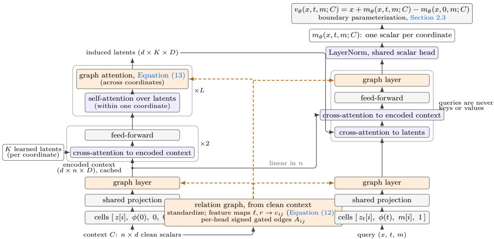  
Figure 7 One forward pass of Alice. Clean context values determine the relation graph, whose gated edges $A _ { i j }$ condition every graph layer (dashed). Context and query cells pass through the same shared projection and input graph layer; K learned latents per coordinate read the encoded context twice through cross-attention, and L blocks alternate self-attention among one coordinate’s latents with graph attention across coordinates. A query decodes in one pass, cross-attending to the latents for the global summary and to the encoded context for local detail, and a shared scalar head produces one output per coordinate; two head evaluations, at times t and 0, form the velocity through the boundary parameterization. The context side, left on the figure, is encoded once per context and cached; every interaction with the n context samples is linear in n.

The descriptor is shared by all attention heads. For graph head $h ,$ learned projection vectors $w _ { s } ^ { ( h ) } , w _ { g } ^ { ( h ) } \in \mathbb { R } ^ { R }$ and scalar biases $b _ { s } ^ { ( h ) } , b _ { g } ^ { ( h ) }$ convert it into a signed, gated edge. With σ the sigmoid and $\mathbf { r } _ { j } ^ { ( h ) }$ the projected representation of coordinate j at the same context, latent, or query position, the edge and the aggregated message are

$$
A _ { i j } ^ { ( h ) } = \operatorname { t a n h } \Bigl ( ( w _ { s } ^ { ( h ) } ) ^ { \top } c _ { i j } + b _ { s } ^ { ( h ) } \Bigr ) \sigma \Bigl ( ( w _ { g } ^ { ( h ) } ) ^ { \top } c _ { i j } + b _ { g } ^ { ( h ) } \Bigr ) , \qquad u _ { i } ^ { ( h ) } = \frac { \sum _ { j \neq i } A _ { i j } ^ { ( h ) } { \bf r } _ { j } ^ { ( h ) } } { \operatorname* { m a x } \Bigl ( 1 , \sum _ { j \neq i } | A _ { i j } ^ { ( h ) } | \Bigr ) } ,\tag{13}
$$

followed by an output projection and the usual residual and feed-forward updates. The signed factor allows additive or subtractive contributions, while the gate controls their magnitude. Normalizing by absolute edge mass bounds the aggregate contribution, and the lower bound of one preserves small updates when all edges are weak. There are no self-edges. Gates are initialized nearly closed, so training starts from an independence prior and opens edges only where the context provides evidence of dependence; exact disconnection under independence is not enforced. The feature maps and edge projections are learned through the velocity objective, so the edges represent pairwise associations useful for prediction without imposing a conditional-independence interpretation. Sharing these maps across coordinates keeps the parameter count independent of d and makes the graph equivariant to coordinate permutations.

Induced context bottleneck. The model compresses each coordinate’s n context tokens into K induced latents and runs its depth on the latents at a cost that is independent of n (Figure 7, left tower). In other words, a shared bank of K learned vectors reads the encoded context through two cross-attentions, each linear in $n ,$ and the deep blocks then alternate self-attention among one coordinate’s latents, refining that coordinate’s summary of the context, with graph attention from Equation (13), sharing the summaries across coordinates. A query decodes through two complementary mechanisms (Figure 7, right tower): cross-attention to the latents provides the global summary, and a final cross-attention to the encoded context, linear in $n ,$ retrieves the local detail near the query that a K-vector summary cannot retain; a last graph layer and a shared scalar head produce one output per coordinate. The remaining cost is the $d \times d$ relation graph, which is favorable in the long-context, moderate-dimension regime of MI estimation.

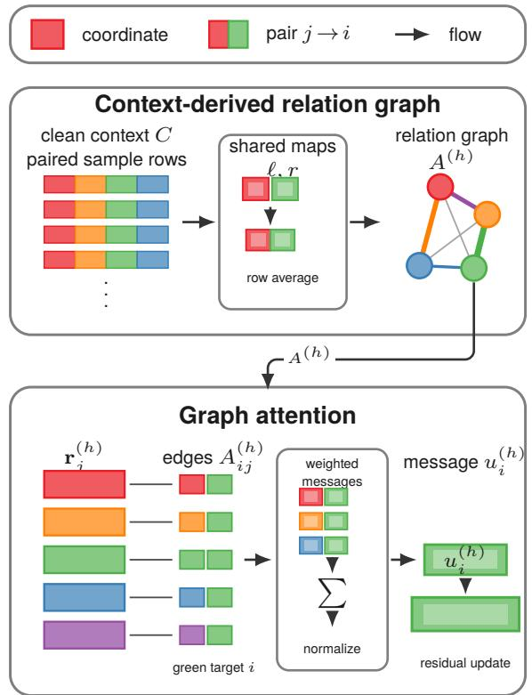  
Figure 8 Alice relation-graph construction and coordinate mixing. Node and block colors identify coordinates, and each two-color block denotes a source-target pair $j  i .$ Top: shared feature maps $\ell , r$ aggregate paired clean-context rows into signed, gated relation weights $A _ { i j } ^ { ( \check { h } ) }$ . Bottom: for the green target $i ,$ each source representation $\mathbf { r } _ { j } ^ { ( h ) }$ is weighted by its incoming edge, and the center module sums and normalizes these contributions to produce $u _ { i } ^ { ( h ) }$ for the residual update.

Boundary parameterization. The estimator multiplies squared velocity diferences by $( 1 - t ) / t$ , which diverges as t → 0. Since squared diferences cannot be negative, any violation of the boundary condition $v _ { 0 } ( z ) = z$ stated in Section 1 becomes systematic positive bias where the weight is largest. Alice satisfies this condition by construction by adopting the parametrization described in Wang et al. (2026); Hu et al. (2025).

Model family. We instantiate Alice at a range of sizes that share the number of induced latents K, the relation-feature width R, and the time-feature resolution, so that model size afects only the backbone capacity, without changing the context bottleneck or the graph statistic. Parameter counts are independent of the joint width and the context length, and a trained checkpoint is exported as a self-contained model (weights, configuration, and source), usable at any joint width without modification.

The Small and Base configurations are listed in Table 1. Alice Base is the checkpoint reported in Section 3, and Appendix F compares the Small and Base checkpoints on the benchmark.

## E Training and Implementation Details

This section presents the reference implementation of Alice.

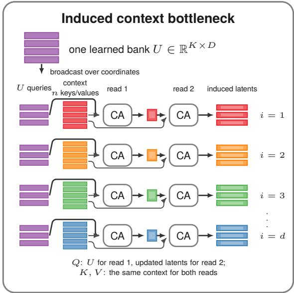  
Figure 9 Induced context bottleneck. The learned bank U is broadcast across coordinates. For each coordinate, the first cross-attention layer uses U as queries and that coordinate’s context tokens as keys and values; the second uses the updated latents as queries and the same context tokens as keys and values, producing K context-specific latent vectors.

Table 1 The two Alice variants, with model configuration values and parameter counts for each preset.
<table><tr><td>Config name</td><td>ALICE Small</td><td>ALICE Base</td></tr><tr><td>Model hidden dimension</td><td>384</td><td>768</td></tr><tr><td>Layers</td><td>5</td><td>6</td></tr><tr><td>Attention heads</td><td>8</td><td>12</td></tr><tr><td>Feed-forward dimension</td><td>1536</td><td>3072</td></tr><tr><td>Time frequencies</td><td>16</td><td>16</td></tr><tr><td>Dropout</td><td>0.1</td><td>0.1</td></tr><tr><td>Induced latents</td><td>128</td><td>128</td></tr><tr><td>Relation features</td><td>16</td><td>16</td></tr><tr><td>Parameters</td><td>19,296,113</td><td>85,200,633</td></tr></table>

## E.1 The training corpus

A corpus episode is one synthetic joint distribution over $\boldsymbol { z } = ( x , y ) \in \mathbb { R } ^ { d }$ , generated from a seed, with the fixed split $s = \lfloor d / 2 \rfloor$ : coordinates [0, s) are X and $[ s , d )$ are Y. Each episode is stored as a clean point pool of 2176 samples in single precision, together with a few scalar metadata fields; normalization, noising, indicator sampling, and targets are computed at train time.

Composition. The corpus covers the joint widths $\{ 2 , 3 , 4 , 5 , 6 , 8 , 1 0 , 1 2 , 1 6 , 2 0 , 2 5 , 3 2 , 5 0 , 1 0 0 \}$ with 70,000 episodes per width, drawn from four families: copula mixtures, latent warps, manifolds, and nonparametric regressions, with probabilities 0.30, 0.25, 0.25, and 0.20. A further copula-only share brings the copula fraction of the whole corpus to about 0.40, and part of the corpus enables the two geometric modifications described below, same-sign factor covariances and the plane-rotation warp.

Copula mixtures. Between 1 and 60 Gaussian or Student-t components with random weights and means. Each component draws a low-rank covariance $\Sigma = W W ^ { \top } + D$ of random rank, converted to a correlation and rescaled per coordinate; with probability 0.3 it instead draws a sparse correlation with a few disjoint $X _ { i }  Y _ { i }$ pairs whose strength is coherent within an episode; and with probability $\frac { 1 } { 2 }$ the $X  Y$ cross-block of every component is scaled down, to zero half the time, which produces weakly dependent and independent joints.

Most sampled pools are then passed through an additive-coupling bijection (Dinh et al., 2017), either within each block, which preserves $I ( X ; Y )$ , or across a random coordinate partition, which leaves it unknown.

Latent warps. A mixture of anisotropic Gaussians whose means lie along a random curve is standardized and pushed through a few random layers, each an additive coupling shift, an elementwise sinusoidal fold, or a rotation. The fold is non-injective, so $I ( X ; Y )$ is unknown by construction.

Nonparametric regressions. The input is Gaussian, or a two-component mixture, and the response is a random Fourier-feature function of the input plus Gaussian noise of random scale, which provides a controlled noise floor and a smooth nonlinear conditional mean.

Manifolds. The pool lies on a low-dimensional curved support, a curve or a surface winding around the origin, thickened by transverse Gaussian noise of random scale and rotated at random. At small noise the support is near-singular, which is the regime where a velocity field must resolve a thin set.

Plane-rotation warp. An MI-preserving difeomorphism rotates randomly chosen coordinate planes of a block by an angle that grows with the block norm, occasionally followed by a monotone radial stretch. Each rotation preserves the block norm, so $I ( X ; Y )$ is unchanged, and the warp acts on a point cloud, so it applies to every family.

Same-sign factor covariances. The low-rank draw above has sign-symmetric loadings, so joints in which every coordinate pair is positively correlated, a common structure in measured data with a shared latent factor, have vanishing probability under it. Part of the corpus therefore draws equicorrelated or positive low-rank covariances instead.

## E.2 Batch construction

For each batch, the procedure (i) samples one context length shared by all its distributions (for variable-context training), (ii) samples disjoint context/query samples from each pool, and (iii) applies Gaussian-copula softrank normalization: each marginal is mapped to $\mathcal { N } ( 0 , 1 )$ through the empirical CDF $f i t$ on the context and applied out-of-sample to the query. Batches are dimension-homogeneous: each batch is drawn from a single joint width. Variable context length is realized either by truncating to the sampled length or by hiding context samples behind the context-validity mask; the two are equivalent (see also Section 2.3).

## E.3 Objective, noising indicators, optimizer

The loss is the masked velocity MSE defined in Equation (5), supervised only on noised coordinates. Each query draws its own time $t \sim \mathcal { U } [ 0 , 1 ]$ and noise $\epsilon \sim \mathcal { N } ( 0 , I )$ , and the target $z _ { 0 } - \epsilon$ is available exactly because the training loop draws $\epsilon , t ,$ and m itself; no ground-truth density or MI values are required for training at any point.

The per-query noising-indicator mixture is: all-noised with prob. 0.35; an $X \mid Y$ or $Y \mid X$ block pattern with prob. 0.30 (split evenly); otherwise a per-coordinate Bernoulli(0.5) indicator (all-zero draws fall back to all-noised). The mixture covers the three indicator patterns the estimator queries at inference (Equation (3)) and, through the random subsets, general partial observation. The block patterns use the fixed split $s = \lfloor d / 2 \rfloor$ Training otherwise operates on the whole vector z: the X:Y partition is used in training only through those block masks and through the corpus’s block-structured couplings (decoupling and per-block flows, also at s), and the specific partition otherwise appears only at output time.

Each training step draws 128 distributions from the corpus and one clean context from each. The context length is sampled uniformly per batch between 128 and the training window (by truncation, or equivalently by masking, Appendix E.2), so one set of weights is trained for every context length up to that window; longer contexts are extrapolation (Appendix F). The optimizer is AdamW with $\beta _ { 1 } { = } 0 . 9 , \beta _ { 2 } { = } 0 . 9 5$ , and weight decay 0.01, with a linear warmup over 100 steps and gradient norms clipped at 1.0. Training is executed in bf16 mixed precision with compiled kernels on two data-parallel replicas (DDP), with gradient accumulation setting the efective batch size. Training proceeds in two phases. The first runs 500,000 steps with a context window of 1024 samples and a cosine decay of the learning rate to zero after the warmup. The second starts from the first-phase weights with a fresh optimizer state and runs 60,000 steps with a context window of 2048 samples, holding the learning rate constant after the warmup. The peak learning rate is 3 · $1 0 ^ { - 4 }$ for Alice Base and $1 0 ^ { - 3 }$ for Alice Small in both phases; the per-device batch is 16 distributions with 4 accumulation steps, except for Alice Base in the second phase, which uses 8 with 8.

## E.4 Hardware for training and inference

We train our Alice variants using 2x H200 GPUs: Alice-Small requires 2 days and 22 hours (about 8,674 optimizer steps per hour) whereas Alice-Base requires 5 days and 10 hours (about 4,300 optimizer steps hour) of training. As a comparison, our understanding is that InfoAtlas (Hu et al., 2026) requires 2 weeks of training on 16x H800 GPUs.

For inference, we use a single H200 GPU in all our experiments.

## F Ground-truth benchmark: details and per-task results

This Section completes Section 3: it specifies the inference settings, reports the aggregate (Table 2), joint-width (Table 3), and per-task (Table 4) results at the three matched budgets.

Inference settings. Every task provides precomputed samples and a closed-form ground-truth MI. We use three sample budgets $N \in \{ 1 0 0 0 , 5 0 0 0 , 1 0 0 0 0 \}$ for all methods. Alice splits each budget into 64 query samples and a context of the remaining $N - 6 4$ clean samples; Algorithm 1 averages the velocity-diference integrand over the 64 query samples and $n _ { t } { = } 6 4$ time draws per query sample. Every reported number is a mean over eight independent context draws; where a spread is given, it is the sample standard deviation over the draws. Training samples the context length uniformly between 128 and the training window, 2048 samples in the final phase (Appendix E.3), so the contexts at the 5000 and 10000 budgets are extrapolation beyond the training window; the context attention is permutation invariant and uses no positional encoding, so the model accepts these longer contexts, and Table 3 reports how each model size behaves there. Per-coordinate monotone transforms (normal\_cdf, half\_cube, asinh) are absorbed by the rank-based copula normalization applied at inference; Figure 2 groups them with their base tasks and Table 4 lists them separately. InfoAtlas conditions on the same contexts. Competitor numbers are five-seed means: the neural estimators are trained on the N samples of each individual task (including per-task hyperparameter tuning), and the classic estimators are fit on them.

Aggregate accuracy. Table 2 reports the MAE of every estimator over the suite at the three budgets. Alice Base has the lowest error at each budget among the estimators of Figure 2, and its lead is largest at 1k samples, where every neural estimator is above 0.24 nats and the best classic estimator, CCA, is at 0.195. Table 4 reports every estimate at 10k samples.

Joint width. Table 3 splits the error of both Alice sizes and InfoAtlas between the 33 tasks of joint width at most 10 and the 7 tasks of width 50 and 100. Alice Base improves with the context in both groups, and most in the wide one, from 0.153 to 0.086 nats. Alice Small improves on the narrow tasks, from 0.081 to 0.074 nats, and degrades on the wide ones, from 0.197 to 0.241, so its aggregate error is flat in N. InfoAtlas is at 0.10 to 0.12 nats on the narrow tasks, where its per-width networks apply, and at 1.0 nats on the wide tasks, where its sliced fallback outputs 0.02 nats on the five sparse tasks and 0.46 on the two dense ones against ground truths of 1.02 to 1.62.

Error analysis. At N=10000, 35 of the 40 tasks fall within 0.1 nats of ground truth for Alice Base and the mean signed error is −0.005 nats, so the aggregate measure is not influenced by a global bias. Two groups impact the results. First, the spiral embeddings are under-estimated by 0.43 and 0.44 nats at joint widths 6 and 10 and by 0.18 nats at width 50, the largest errors Alice experiences in the suite. Second, the dense multinormal tasks are over-estimated, by 0.23 nats at joint width 100 and 0.15 at width 50, growing with

Table 2 Mean absolute error in nats over the 40 tasks of the Czyż benchmark at matched budgets of 1k, 5k, and 10k samples per task. Alice and InfoAtlas condition on a context of N − 64 samples from that budget, and their cells give the mean and sample standard deviation over eight independent context draws; neural estimators are trained per distribution on that number of samples and classic estimators are fit on it, both as five-seed means. $^ { 6 6 } > 1 0 ^ { 9 }$ marks a diverged estimator.
<table><tr><td>Estimator</td><td>1k</td><td>5k</td><td>10k</td></tr><tr><td colspan="4">Foundation models</td></tr><tr><td>ALICE Base</td><td> $0 . 0 9 2 \pm 0 . 0 0 4$ </td><td> $0 . 0 6 3 \pm 0 . 0 0 1$ </td><td> $0 . 0 6 0 \pm 0 . 0 0 1$ </td></tr><tr><td>ALICE Small</td><td> $0 . 1 0 1 \pm 0 . 0 0 5$ </td><td> $0 . 1 0 3 \pm 0 . 0 0 2$ </td><td> $0 . 1 0 4 \pm 0 . 0 0 1$ </td></tr><tr><td>InfoAtlas</td><td> $0 . 2 5 3 \pm 0 . 0 0 4$ </td><td> $0 . 2 7 1 \pm 0 . 0 0 5$ </td><td> $0 . 2 7 6 \pm 0 . 0 0 1$ </td></tr><tr><td colspan="4">Neural estimators</td></tr><tr><td>MINDE-C</td><td>0.353</td><td>0.070</td><td>0.065</td></tr><tr><td>MINE</td><td>0.248</td><td>0.117</td><td>0.108</td></tr><tr><td>InfoNCE</td><td>0.887</td><td>0.123</td><td>0.083</td></tr><tr><td>D-V</td><td>1.229</td><td>0.279</td><td>0.144</td></tr><tr><td>NWJ</td><td>&gt; 10</td><td>1.261</td><td>0.130</td></tr><tr><td colspan="4">Classic estimators</td></tr><tr><td>KSG</td><td>0.288</td><td>0.240</td><td>0.219</td></tr><tr><td>LNN</td><td>4.864</td><td>4.966</td><td>4.970</td></tr><tr><td>CCA</td><td>0.195</td><td>0.192</td><td>0.181</td></tr></table>

Table 3 Czyż benchmark accuracy by joint width against the sample budget N for both Alice sizes and InfoAtlas. ${ } ^ { \mathrm { 4 } } \mathrm { d i m s } \leq 1 0 ^ { \mathrm { 3 } }$ aggregates the 33 tasks of joint width at most 10 and “dims $5 0 / 1 0 0 ^ { \mathfrak { N } }$ the 7 wider ones. Cells give the mean and sample standard deviation of the per-draw MAE over eight independent context draws. The Alice training window is 2048 samples, so the rows at 5000 and 10000 are context extrapolation.
<table><tr><td>Model</td><td>N</td><td>All (40)</td><td> $\mathrm { d i m s } \le 1 0 \ ( 3 3 )$ </td><td> $\mathrm { d i m s } 5 0 / 1 0 0 ( 7 )$ </td></tr><tr><td>ALICE Base</td><td>1000</td><td> $0 . 0 9 2 \pm 0 . 0 0 4$ </td><td> $0 . 0 7 9 \pm 0 . 0 0 4$ </td><td> $0 . 1 5 3 \pm 0 . 0 0 8$ </td></tr><tr><td></td><td>5000</td><td> $0 . 0 6 3 \pm 0 . 0 0 1$ </td><td> $0 . 0 5 7 \pm 0 . 0 0 2$ </td><td> $0 . 0 9 0 \pm 0 . 0 0 4$ </td></tr><tr><td></td><td>10000</td><td> $0 . 0 6 0 \pm 0 . 0 0 1$ </td><td> $0 . 0 5 4 \pm 0 . 0 0 1$ </td><td> $0 . 0 8 6 \pm 0 . 0 0 2$ </td></tr><tr><td>ALICE Small</td><td>1000</td><td> $0 . 1 0 1 \pm 0 . 0 0 5$ </td><td> $0 . 0 8 1 \pm 0 . 0 0 5$ </td><td> $0 . 1 9 7 \pm 0 . 0 1 7$ </td></tr><tr><td></td><td>5000</td><td> $0 . 1 0 3 \pm 0 . 0 0 2$ </td><td> $0 . 0 7 7 \pm 0 . 0 0 1$ </td><td> $0 . 2 2 8 \pm 0 . 0 0 9$ </td></tr><tr><td></td><td>10000</td><td> $0 . 1 0 4 \pm 0 . 0 0 1$ </td><td> $0 . 0 7 4 \pm 0 . 0 0 2$ </td><td> $0 . 2 4 1 \pm 0 . 0 0 6$ </td></tr><tr><td>InfoAtlas</td><td>1000</td><td> $0 . 2 5 3 \pm 0 . 0 0 4$ </td><td> $0 . 1 0 0 \pm 0 . 0 0 4$ </td><td> $0 . 9 7 8 \pm 0 . 0 0 8$ </td></tr><tr><td></td><td>5000</td><td> $0 . 2 7 1 \pm 0 . 0 0 5$ </td><td> $0 . 1 1 7 \pm 0 . 0 0 6$ </td><td> $0 . 9 9 8 \pm 0 . 0 0 5$ </td></tr><tr><td></td><td>10000</td><td> $0 . 2 7 6 \pm 0 . 0 0 1$ </td><td> $0 . 1 2 3 \pm 0 . 0 0 3$ </td><td> $1 . 0 0 0 \pm 0 . 0 0 6$ </td></tr></table>

width. Alice Small shares both failure modes with larger magnitudes: it under-estimates the width-10 spiral by 0.47 nats and over-estimates the width-100 dense multinormal by 0.44, and it also over-estimates three of the five sparse width-50 tasks by 0.24 nats each.

Tab le 4 Per-t ask MI est imat es on t he C zyż et al . ( 2 0 2 3 ) suit e against ground t rut h ( G T ) in nat s wit h every est imat or at a budget of 1 0k samples p er t ask . C ell shading enco des t he signed bias of t he est imat e : blue for over- est imat ion , red for under- est imat ion , wit h sat urat ion growing linearly up t o a bias of 0 . 6 nat s . Competitor rows report five-seed means . The Alice rows use zero-shot in-context estimation with a frozen model , and the Alice and InfoAtlas rows are means over eight independent context draws . Abbreviations : Mn multinormal St Student-t Nm normal Hc half-cube Sp spiral.  
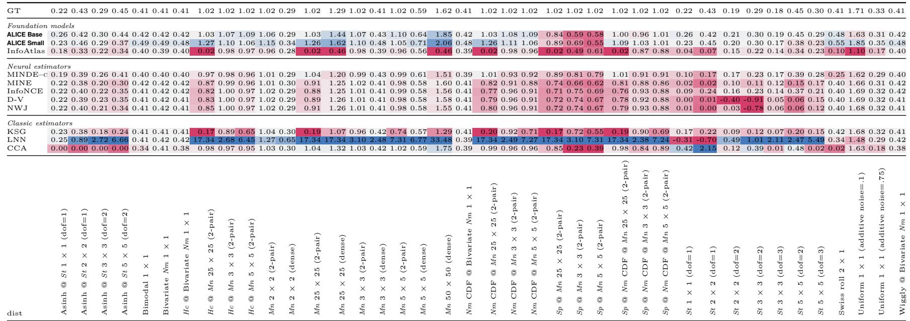

## G Single-cell signaling responses: technical details

This section complements Section 4.1: it provides additional details and results. The reference study for this section is Jetka et al. (2019), for which there are no ground truth MI estimates: as such, throughout this section, we compare against the biological conclusions of that study, and note that MI estimates are essentially equivalent to our results.

Application domain. Cells sense extracellular cues through signaling pathways that convert ligand concentrations into efector activity and gene regulation. A canonical example is the NF-KB pathway, which responds to the inflammatory cytokine TNF-α and regulates immune responses; although the underlying biochemistry is well characterized, how reliably individual cells infer stimulus strength from their response trajectories remains unclear (Purvis and Lahav, 2013; Lee et al., 2014; Antebi et al., 2017). Over the past two decades, cellular signaling has increasingly been formulated in terms of information theory (Nurse, 2008; Waltermann and Klipp, 2011; Brennan et al., 2012; Jetka et al., 2018; Petkova et al., 2019): an extracellular stimulus (X) is transmitted through a stochastic biochemical network to produce a cellular response (Y), so mutual information $\operatorname { I } ( X ; Y )$ quantifies how much observing the response reduces uncertainty about the stimulus, while channel capacity measures the maximum information transmissible over input distributions. This perspective has enabled measurements of signaling fidelity in pathways such as TNF-α–NF-KB and has shown that time-resolved response trajectories can transmit more information than static measurements (Tostevin and Ten Wolde, 2009; Cheong et al., 2011; Selimkhanov et al., 2014).

Estimand and metrics. The input X is an experimentally controlled stimulus taking one of m values with input distribution $p ( X )$ , and the output $Y \in \mathbb { R } ^ { d }$ is a vector of single-cell measurements distributed according to the unknown conditionals $P ( Y \mid X = x _ { i } )$ . Mutual information decomposes as $\begin{array} { r } { \operatorname { I } ( X ; Y ) = \sum _ { i } p _ { i } D _ { i } . } \end{array}$ where $D _ { i } =$ kl $\left[ P ( Y \mid x _ { i } ) \parallel \bar { P } \right]$ is the divergence of each dose-conditional from the output mixture $\begin{array} { r } { \overline { { \bar { P } } } = \sum _ { i } p _ { j } P ( Y \mid x _ { j } ) } \end{array}$ We estimate each $D _ { i }$ with the conditional variant of the estimand $( \mathrm { A p p e n d i x } \mathrm { B } . 4 )$ . Capacity $C = \operatorname { \bar { m a x } } _ { p } \operatorname { I } ( X ; Y )$ is computed by the Blahut–Arimoto algorithm (Blahut, 1972; Arimoto, 1972) run directly on the estimated per-dose divergences: since the conditional fields do not depend on $p ,$ they are cached once, and only the mixture field is re-estimated as the ascent updates $p _ { i } \propto p _ { i } e ^ { D _ { i } }$ . At each iteration the shufled context of Appendix B.4 is redrawn with the current $p \mathrm { : }$ doses drawn from p select the pool from which each response row is taken, and the dose column is overwritten by an independent draw from $p ,$ so the response marginal of the context is $\textstyle \sum _ { i } p _ { i } P ( Y \mid x _ { i } )$ and every $D _ { i }$ is measured against the mixture of the current iterate. The sampling noise of the redraw is held fixed across iterations by reseeding from one base seed, so the ascent is a deterministic function of $p .$ For the pairwise probability of correct discrimination (PCD), which is the Bayes accuracy of deciding between doses i and j from a single cell under equal priors, we exploit the fact that the two-dose mutual information at $\begin{array} { r } { p = \bigl ( \frac { 1 } { 2 } , \frac { \mathrm { i } } { 2 } \bigr ) } \end{array}$ equals the Jensen–Shannon divergence $J _ { i j }$ , which brackets the Bayes accuracy as $\begin{array} { r } { \frac 1 2 \big ( 1 + J _ { i j } \big ) \leq \mathrm { P C D } _ { i j } \leq \overline { { \frac 1 2 \big ( 1 + \operatorname* { m i n } ( 1 , \sqrt { 2 \ln 2 \cdot J _ { i j } } ) \big ) } } } \end{array}$ (with J in bits).

Results in $f u l l .$ Figure 10 shows the six-panel version of Figure 4, with the pairwise discrimination matrices. The precise numbers presented in Section 4.1 are the following. The single-frame capacity (panel B) peaks at 1.12 to 1.16 bits at minutes 15 to 21, against about 1 bit in Jetka et al. (2019); it falls to 0.04 bits at minute 66, and the second rise reaches 0.40 bits at minute 93. The prefix capacity is 0.87 bits with the first three frames, 1.29 with the first five, 1.34 with the first nine, and between 1.07 and 1.34 afterwards, so the prefix of frames exceeds the best single frame. The trajectory capacity is $C \approx 1 . 0 5$ bits (0.93 to 1.20 across seeds), against 1.3 bits in the reference study. The PCD averages 0.74 over the 55 dose pairs for the single frame at minute 21 and 0.84 for the trajectory; over the 15 pairs of doses at or above 0.5 ng/ml, where the amplitude of the first peak saturates, the averages are 0.56 and 0.67, so the gain from dynamics is concentrated at high doses.

## H Promoter identification: technical details

This section expands on the application domain, the dataset, the encoding, and the diagnostics behind the results of Section 4.2, and reports the numbers that the main text summarizes.

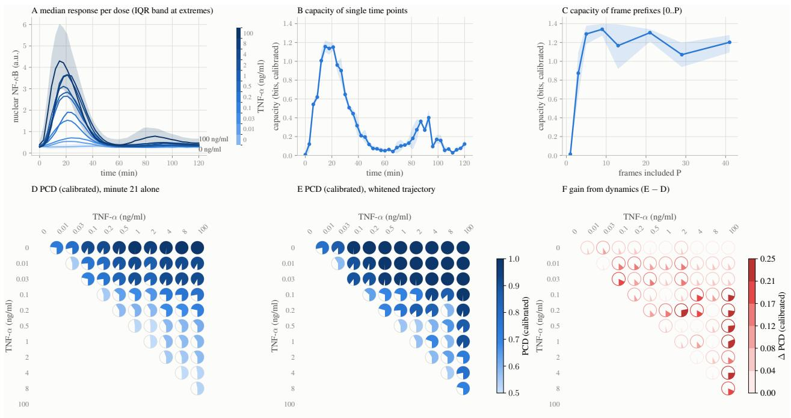  
Figure 10 Six-panel analysis of the NF-KB dose channel. (A–C) As in Figure 4. (D–F) Pairwise probability of correct discrimination between doses: from the single frame at minute 21 (D), from the trajectory (E), and the gain from dynamics (F, E minus D). The filled fraction of each circle and its color both encode the value, from chance (0.5) to certain discrimination (1) in D and E, and from 0 to 0.25 in F.

Application domain. Genomics relies on computational methods to find patterns in large datasets from basic and clinical research (Libbrecht and Noble, 2015; Whalen et al., 2022; Teschendorf and Horvath, 2025). DNA is a sequence of four bases, adenine (A), thymine (T), guanine (G), and cytosine (C), and the order of the bases determines the biological instructions that a strand of DNA carries. We follow the recent practice of treating DNA sequences as text (Dotan et al., 2024; Qiao et al., 2024; Malusare et al., 2024; Eapen, 2025), with the simplest tokenization: each base is one token, so a sequence is a high-dimensional vector whose coordinates take four values. A central question in molecular biology is the regulation of gene expression: expression requires a stretch of regulatory DNA called a promoter, which contains motifs, that is, patterns whose presence shows a statistically significant dependence with expression levels. Computational methods based on MI (Elemento et al., 2007; Rao et al., 2007) search whole genomes for the key elements of transcription regulation by quantifying the dependence between the presence of a motif in a regulatory region and the expression of the corresponding gene; further motif properties, such as position bias, orientation preference, and functional interactions, can be studied with MI as well (Elemento et al., 2007). A minimal eukaryotic promoter contains a transcription start site (TSS) and a tata-box motif about 30 base pairs upstream of the TSS; in Arabidopsis thaliana the preferred position is between −39 and −26 relative to the TSS (Bernard et al., 2010).

Dataset. Umarov and Solovyev (2017) evaluate convolutional promoter-recognition models on sequences extracted from the epd database (Dreos et al., 2013). We use their Arabidopsis thaliana tata-promoter and non-promoter collection, 1,497 and 2,879 sequences respectively, each of 251 bases; promoter sequences span positions −200 to +50 around the annotated TSS. We discard sequences containing ambiguous bases and subsample the non-promoter class to 1,497 sequences, so the promoter label X is uniform and the MI of every window is bounded by H(X) = ln 2 nats.

Relation to previous work on motif search. Umarov and Solovyev (2017) localize functional elements by substituting a sliding region of the input with random bases and tracking the drop in classification accuracy. Foresti et al. (2026) uses a recent MI estimator based on discrete difusion to reproduce the same protocol of Umarov and Solovyev (2017). The MI profile we obtain in Section 4.2 recasts this search using Alice:

windows on segments irrelevant to promoter status yield values near zero, and windows overlapping the tata-box motif yield high values.

Encoding. The velocity fields of Equation (3) are defined on $\mathbb { R } ^ { d }$ , so discrete symbols are transformed by a fixed injective embedding: each symbol maps to a vector of K real coordinates, where every coordinate holds an independent random permutation of equally spaced standard-normal quantiles, perturbed by a small uniform dither confined within each level. Injectivity preserves $\operatorname { I } ( X ; Y )$ exactly for every $K ;$ the dither removes the ties that would otherwise collapse the Gaussian-copula normalization of the estimator, and each encoded coordinate is approximately standard normal, the scale on which Alice is trained. A window of L bases concatenates its per-base vectors, giving blocks of dimension K for the label and LK for the window; the unequal, length-dependent widths are handled natively by the variable-dimension capabilities of Alice. The reported results use $K = 1$ , the minimal injective width.

Protocol and numbers. For each of the 246 $( L = 6 ) { \mathrm { ~ o r ~ } } 2 4 8 { \mathrm { ~ } } ( L = 4 )$ window positions, Alice conditions on a context of 1,024 encoded label–window pairs, and the velocity diferences are averaged over 1,024 held-out pairs and 32 time points. Both window lengths place the maximum at 30 to 32 bases upstream of the TSS, inside the documented tata-box band: the peak is 0.31 nats at ofset −30 for $L = 4$ over 248 windows, and 0.34 nats at ofset −32 for $L = 6$ over 246 windows.

Discussion. Both window lengths place the top windows at TSS ofsets −32 to −30, and both resolve the two core promoter elements the sequences carry: the tata-box at −30, whose top 6-mers (TATATA, TATAAA) each occur in about $4 \%$ of promoters against about 0.4% for the most frequent non-promoter 6-mer, and the initiator element straddling the TSS, which is a pyrimidine/purine pair (position −1 is C or T in 94% of promoters, position +1 is A or G in 93%) and has no recurring k-mer. Since the promoter set is the tata-containing subset of epd, the −30 peak acts as a positive control for localization.

## I Brain Region Activity Patterns: Details

This Section provides additional details about the Ω-info estimator used in Section 4.3, the structure of the Visual Behavior Neuropixels data, the selection of flashes that produced the analyzed tables, the experimental protocol, and the full per-window results.

Estimator. For N blocks $X = ( X _ { 1 } , \ldots , X _ { N } )$ the total correlation and the dual total correlation are $\mathrm { T C } =$ $\begin{array} { r } { \mathrm { K L } \big ( p ( x ) \| \prod _ { i } p ( x _ { i } ) \big ) } \end{array}$ and $\textstyle { \mathrm { D T C } } = H ( X ) - \sum _ { i } H ( X _ { i } \mid X _ { \setminus i } )$ , where $X _ { \backslash i }$ denotes all blocks except $X _ { i } .$ , and the Ω-info is $\Omega = \mathrm { T C } - \mathrm { D T C }$ (Rosas et al., 2019). Bounoua et al. (2024) write both terms as time integrals of squared score diferences, evaluated at the same noised coordinates: for TC, between the joint score and the concatenation of the N marginal scores; for DTC, between the joint score and the concatenation of the N scores of each block conditioned on the clean values of the other blocks. Under the interpolant $x _ { t } = ( 1 - t ) x _ { 0 } + t \varepsilon$ of Section 2, the score of a block and its velocity are related by $s = ( ( 1 - t ) v - x _ { t } ) / t$ , so two fields that share the noised coordinate difer by $\begin{array} { r } { \Delta s = \frac { 1 - t } { t } \Delta v } \end{array}$ . With the weight of Equation (4) this gives

$$
\mathrm { T C } = \int _ { 0 } ^ { 1 } \frac { 1 - t } { t } \mathbb { E } \sum _ { i = 1 } ^ { N } {  { v _ { \theta } ( x _ { t } , t ; C ) }  } _ { i } - v _ { \theta } ( x _ { i , t } , t ; C _ { i } )  ^ { 2 } \mathrm { d } t ,\tag{14}
$$

$$
\mathrm { D T C } = \int _ { 0 } ^ { 1 } \frac { 1 - t } { t } \mathbb { E } \sum _ { i = 1 } ^ { N } \| v _ { \theta } ( x _ { t } , t ; C ) \| _ { i } - v _ { \theta } \big ( [ x _ { i , t } , x _ { 0 , \setminus i } ] , t , \mathbb { 1 } _ { i } ; C \big ) \big | _ { i } \| ^ { 2 } \mathrm { d } t ,\tag{15}
$$

where $C _ { i }$ is the context restricted to the columns of block $i , \mathbb { 1 } _ { i }$ is the noising indicator that noises block i and holds the other blocks at their clean values, and $| { \bf \chi } _ { i }$ selects the coordinates of block i. The marginal field in Equation (14) requires no dedicated mechanism: Alice accepts any joint width, so the field conditioned on $C _ { i }$ is the field of the marginal law of $X _ { i }$ . The conditional field in Equation (15) is the masked field of Equation (4), and for $N = 2$ Equation (15) is the MI estimator of Section 2. Equation (15) rests on the identity $\mathbb { E } \left[ s _ { i | \backslash i } ( x _ { i , t } ; x _ { 0 , \backslash i } ) \ : \middle | \ : x _ { t } \right] = s ( x _ { t } ) | _ { i }$ . Given the clean values of the other blocks, the noised block i and the noised other blocks are independent, so the conditional score of block i equals the block-i score of $p _ { t } ( x _ { t } \mid x _ { 0 , \backslash i } ) ;$ averaging that score over $p ( \boldsymbol { x } _ { 0 , \backslash i } \mid \boldsymbol { x } _ { t } )$ gives the joint score. All fields are evaluated under common random numbers: the same $( x _ { 0 } , t , \varepsilon )$ draw is used for every term. Per Monte-Carlo row, the estimator evaluates 2N + 1 velocities: one joint, N conditional, and N marginal. Both integrals are invariant under any per-block bijection, so the copula normalization of Section 2, which is applied per coordinate, leaves them unchanged, and the sub-context fields see the normalized columns of the joint context.

Task and trial structure. One image is shown to a mouse for 250 ms followed by 500 ms of gray screen, so a new flash starts every 750 ms. The image repeats over several flashes and then changes; the mouse earns water by licking after a change. A trial is one run of repeats together with the change flash that ends it, and the next trial repeats the image that the change introduced. The position of a flash is its rank inside its trial, counting from one. About 5% of flashes are omitted by design (the screen stays gray). The active block of a session holds about 4,800 flashes. Neuropixels probes record single units in the areas VISp, VISl, VISal, VISrl, VISam, and VISpm. We use the 72 sessions of Bounoua et al. (2024): mice with a familiar-image and a novel-image session, recorded on consecutive days, with more than 20 well-isolated units (signal-to-noise ratio above 1 and fewer than one inter-spike-interval violation) in each of the six areas. The pairing of the two sessions of a mouse and their order (familiar first) were verified against the session table of the Allen Institute.

Selection of flashes. The preprocessing of Bounoua et al. (2024) is designed to keep, for both flash types, only trials in which the mouse was rewarded, and to drop non-change flashes during which the mouse licked. We reproduced their tables exactly from the raw spike times (identical row counts and values in every session we compared) and found that neither filter has an efect in the released code: the reward filter tests a field that is always missing and is therefore always satisfied, and the lick exclusion is negated twice and is also always satisfied. The analyzed tables are therefore defined as follows. A change flash is any flash of the active block at which the image changed. A non-change flash is any non-omitted flash of the active block at positions 4 to 10 of its trial that still shows the image the trial started with. A session holds 145 to 351 change flashes and 1,154 to 1,715 non-change flashes. On the first session, for example, the 253 change flashes comprise 203 hits and 47 misses, and the 1,476 non-change flashes comprise 518 flashes of hit trials, 154 of miss trials, 546 of aborted trials, and 247 of catch trials, 111 of them with a lick. We keep this selection so that our estimates and those of Bounoua et al. (2024) describe the same rows; the outcome of every trial is stored with every flash, so the hit-only and lick-free selections need no new data. Positions 1 to 3 of a trial are excluded because the response to a repeated image decreases over the first repeats and levels of from the fourth.

Windows, step size, and dimension. For every flash and unit, spikes are counted in 250 bins of 1 ms after flash onset, averaged over the units of an area, cut into five windows of 50 ms, and summed inside each window in steps of s ms. The dimension of the variable of one area in one window is therefore 50/s: one number at s = 50 ms (used in Section 4.3), 25 numbers at s = 2 ms (the main figure of Bounoua et al. (2024)), and 10 or 50 at s = 5 or 1 ms (their appendix). The joint width is the number of areas times this dimension. The file distributed with Bounoua et al. (2024) contains the tables at s = 50 ms; the finer resolutions were rebuilt from the raw spike times. The rebuilt 50 ms tables reproduce the distributed ones exactly: estimating the 3,375 per-session values from the rebuilt tables returns the same numbers to machine precision.

Correlation between flashes. Rows of a session are flashes in temporal order, and consecutive flashes are correlated. Table 5 reports the lag autocorrelation of the six-area vector within a session at 100 to 150 ms. Change flashes occur once per trial and are close to independent; non-change flashes occur about six times per trial, 750 ms apart, and are strongly correlated at short lags. The efective number of independent draws per session, from the truncated autocorrelation sum, is 185 for change flashes (of 251 nominal rows, median over sessions) and 146 to 205 for non-change flashes (of 1,447). The two flash types therefore carry a similar amount of information despite a six-fold diference in row count. Two consequences follow for the protocol. Sample sizes are quoted as efective draws. The context and the evaluation rows of a session are split by contiguous runs, because a random split places repeats of one trial on both sides, and the evaluation points then have near copies in the context.

Table 5 Within-session autocorrelation of the six-area vector at lag k (in flashes), mean over areas and sessions, 100 to 150 ms window.
<table><tr><td>k</td><td>1</td><td>2</td><td>3</td><td>5</td><td>10</td><td>20</td><td>50</td><td>100</td></tr><tr><td>change</td><td>-0.02</td><td>+0.07</td><td>+0.07</td><td>+0.07</td><td>+0.06</td><td>+0.05</td><td>+0.01</td><td>-0.03</td></tr><tr><td>non-change</td><td>+0.47</td><td>+0.38</td><td>+0.33</td><td>+0.25</td><td>+0.15</td><td>+0.10</td><td>+0.08</td><td>+0.07</td></tr></table>

Table 6 Median over sessions of the per-session Ω-info (nats) of the six areas, context of 128 rows drawn from the same session, by window after flash onset. Interquartile range in brackets.
<table><tr><td>sessions</td><td>flash type</td><td></td><td>0-50</td><td>50-100</td><td></td><td>100-150</td><td>150-200</td><td>200–250 ms</td></tr><tr><td>familiar (n = 31)</td><td>change</td><td>0.34 [0.25, 0.47]</td><td></td><td>0.24 [0.18, 0.32]</td><td>0.41</td><td>[0.29, 0.59]</td><td>0.38 [0.24, 0.56]</td><td>0.22 [0.19, 0.33]</td></tr><tr><td>familiar (n = 36)</td><td>non-change</td><td>0.34 [0.22, 0.48]</td><td></td><td>0.25 [0.18, 0.37]</td><td>0.41</td><td>[0.25, 0.51]</td><td>0.69 [0.50, 0.85]</td><td>0.35 [0.28, 0.53]</td></tr><tr><td>novel (n = 32)</td><td>change</td><td>0.16 [0.12, 0.24]</td><td></td><td>0.83 [0.69, 0.96]</td><td>1.08</td><td>[0.88, 1.27]</td><td>0.66 [0.51, 0.79]</td><td>0.37 [ [0.24, 0.47]</td></tr><tr><td>novel (n = 36)</td><td>non-change</td><td>0.17 [0.11, 0.26]</td><td></td><td>0.55 [0.45, 0.73]</td><td>0.60 [0.48, 0.75]</td><td></td><td>0.49 [0.39, 0.73]</td><td>0.28 [0.22, 0.41]</td></tr></table>

Protocol details. Each session, window, and flash type is estimated from the rows of that session with Alice-Base: we use a context of 128 rows and an evaluation set of the remaining rows, capped at 512, assigned by contiguous runs of 32 rows, 64 time draws per evaluation row, and five context draws. The context size is the largest one that keeps most change sessions: 192 rows are required for 128 context rows and 64 evaluation rows, and sessions with fewer change flashes are excluded from the change condition, which leaves 31 familiar and 32 novel sessions for change flashes and all 36 of each kind for non-change flashes. The same context size is applied to both flash types because the estimate depends on the context size. In a first run with the context of each flash type set by its own row count (128 to 150 rows for change flashes and 1,024 for non-change flashes), the two flash types difered already in the first window, before the visual response (+0.12 nats, $p = 2 \cdot 1 0 ^ { - 8 }$ over 63 sessions); with matched contexts the first-window diference is +0.01 nats $( p = 0 . 9 )$ and the peak diference is unchanged. Two further controls quantify the choices above. Assigning rows to the context at random, without the run structure, changes the estimates by 0.01 nats at this dimension. Drawing the 128 context rows from the other 71 sessions raises the median estimate at the peak from 0.49 to 0.75 nats for non-change flashes and from 0.70 to 0.83 for change flashes, and removes most of the diference between familiar- and novel-image sessions (medians of 0.80 and 0.87 nats for change flashes, against 0.41 and 1.08 with own-session contexts); a context pooled across animals describes a mixture whose components share the animal-specific level of activity, and that shared component is attributed to redundancy. Between-session diferences account for 27 to 56% of the variance of every column of the pooled table.

Per-window results. Figure 11 completes Figure 6 with the familiar-image sessions, the within-session diference between the two flash types for both image sets, and the diference between the two sessions of a mouse for non-change flashes. Table 6 lists the median over sessions of the per-session estimates behind both figures, and Table 7 the paired contrasts with signed-rank tests. In novel-image sessions the Ω-info is positive in every window for every mouse, and the maximum over windows falls at 100 to 150 ms for 78% of the mice for change flashes and for 47% for non-change flashes. In familiar-image sessions the change-flash profile is flat, and the non-change profile rises late, with its maximum at 150 to 200 ms. The familiar session of a mouse precedes the novel one by one day, and the two sessions already difer before the visual response arrives, by −0.16 nats in the first window. Table 8 decomposes the variance of the per-session estimates by sequential sums of squares of the crossed factors; the seed share is the variability of the estimator across context draws. Across all 63 sessions with both flash types, animal identity accounts for 38% of the variance of the peak-window estimates, experience level for 23%, flash type for 8%, and the variability of the estimator across context draws for 10%.

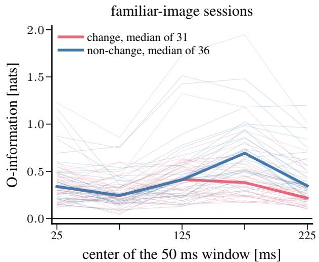  
change minus non-change, familiar images

novel minus familiar, non-change flashes  
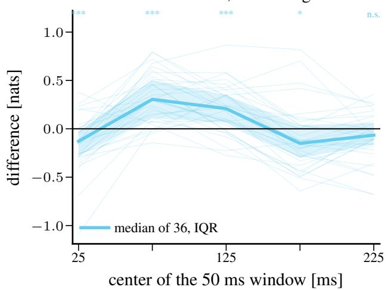

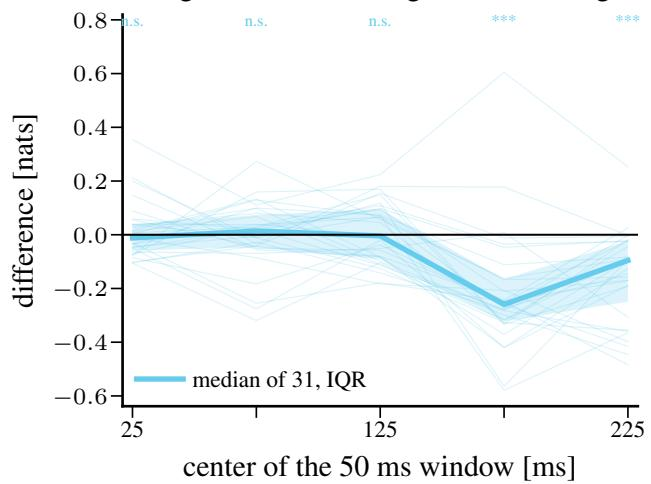

change minus non-change, novel images  
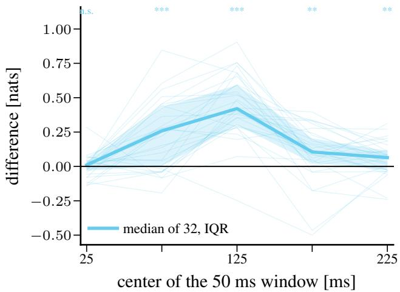  
Figure 11 Complement of Figure 6: Ω-info of the six visual areas in the five 50 ms windows after a flash, one estimate per session. Top left: familiar-image sessions, one thin line per mouse and flash type, group medians in bold. Top right: diference between the novel and the familiar session of each mouse for non-change flashes. Bottom: diference between change and non-change flashes within each session, for familiar-image (left) and novel-image (right) sessions. Diference panels show the median, the interquartile band, and a signed-rank test per window $( * \colon p < 0 . 0 5$ , ∗∗: $p < 0 . 0 1 , * * * \colon$ $p < 0 . 0 0 1 )$ . The plotted values are stored with the figure.

Table 7 Paired contrasts of the per-session estimates (nats): median diference, two-sided Wilcoxon signed-rank p-value, and fraction of positive diferences, by window.
<table><tr><td>contrast</td><td>group</td><td>0-50</td><td>50-100</td><td>100-150</td><td>150-200</td><td>200–250 ms</td></tr><tr><td>change – non-change, within session familiar</td><td> $( n = 3 1 )$ </td><td>-0.01 (0.8, 48%)</td><td>+0.01 (0.8, 52%)</td><td>−0.00 (0.8, 48%)</td><td> $- 0 . 2 6 \ ( 8 \cdot 1 0 ^ { - 6 } , 1 0 \% )$ </td><td> $- 0 . 1 0 \ ( 2 \cdot 1 0 ^ { - 6 } , 6 \% )$ </td></tr><tr><td>change − non-change, within session novel (n = 32)</td><td></td><td>+0.01 (0.9, 56%)</td><td>+0.26  $( 3 \cdot 1 0 ^ { - 5 } , 7 5 \% )$ </td><td>+0.42 (3 · 10−9, 97%)</td><td>+0.10  $( 3 \cdot 1 0 ^ { - 3 } ,$ </td><td>81%) +0.06 (5 · 10−3, 72%)</td></tr><tr><td>novel – familiar, within mouse</td><td>change (n = 27)</td><td>−0.16 (8 · 10−4, 15%)</td><td>+0.51 (3 · 10−8, 96%) +0.56 (7 · 10−8, 93%)</td><td></td><td>+0.22  $( 7 \cdot 1 0 ^ { - 4 } , 8 1 \% )$ </td><td>+0.11  $( 1 \cdot 1 0 ^ { - 3 } , 8 1 \% )$ </td></tr><tr><td>novel – familiar, within mouse</td><td>non-change (n = 36) −0.13 (8 · 10−4, 22%)</td><td></td><td>+0.30 (2 · 10−8, 86%) +0.21 (2 · 10−5, 78%)</td><td></td><td>−0.15 (0.01, 31%)</td><td>-0.07 (0.09, 33%)</td></tr></table>

Table 8 Variance shares of the per-session estimates (all 63 sessions with both flash types, five context draws each) by window: sequential sums of squares of mouse identity, experience level, and flash type; the seed share is the variability of the estimator across context draws; the remainder holds interactions.
<table><tr><td>window (ms)</td><td>mouse</td><td>experience</td><td>flash type</td><td>seed</td><td>remainder</td></tr><tr><td>0-50</td><td>41%</td><td>10%</td><td>0%</td><td>20%</td><td>29%</td></tr><tr><td>50-100</td><td>21%</td><td>40%</td><td>3%</td><td>13%</td><td>24%</td></tr><tr><td>100-150</td><td>38%</td><td>23%</td><td>8%</td><td>10%</td><td>22%</td></tr><tr><td>150-200</td><td>54%</td><td>0%</td><td>1%</td><td>14%</td><td>31%</td></tr><tr><td>200-250</td><td>55%</td><td>0%</td><td>1%</td><td>14%</td><td>29%</td></tr></table>