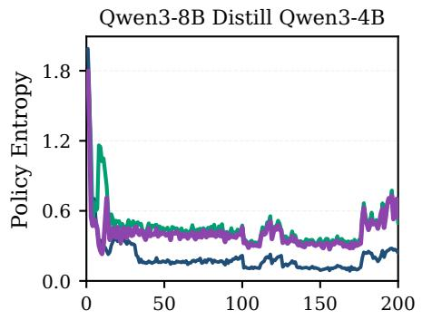
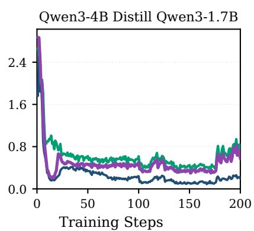
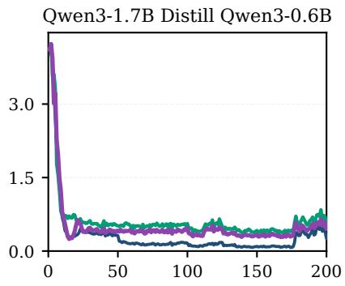
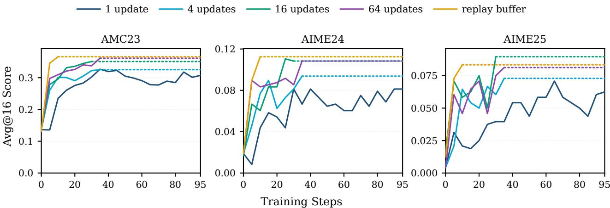
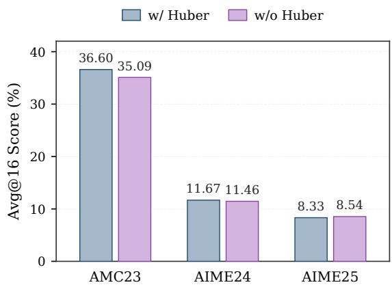
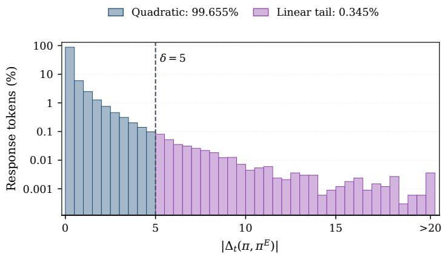
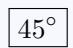
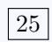
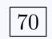

# An RL View of OPD: Least Square Policy Distillation for Sample-Efficient LLM Reasoning

Shangzhe Li<sup>1</sup>, Yuxiao Yang<sup>1</sup>, Tianrun Yu<sup>2</sup>, Kaixiang Zhao<sup>2</sup>, Xiaoyun Wang<sup>3</sup>, Taylor W. Killian<sup>2</sup>, Weitong Zhang<sup>1</sup>

<sup>1</sup>University of North Carolina at Chapel Hill, <sup>2</sup>Brigham Young University, <sup>3</sup>NVIDIA

We study on-policy distillation (OPD) through the lens of reinforcement learning, establishing a connection between the reverse-KL objective in OPD and KL-regularized policy optimization. Building on this connection, we introduce Least-Square Policy Distillation (LSPD), an RL-inspired framework that brings optimistic exploration and of-policy data reuse from value-based RL into policy distillation. LSPD preserves policy diversity through exploration while improving rollout eficiency by repeatedly learning from previously collected trajectories. Our theoretical analysis connects LSPD to optimistic value-based learning and shows that its idealized formulation achieves a sharp Oe(log K) regret bound under online exploration. Empirically, LSPD consistently outperforms existing distillation baselines across six mathematical reasoning benchmarks and diverse teacher–student settings, with average gains of +1.59 points in Avg@16. Remarkably, through Pass@k evaluations up to k = 64, we found that LSPD better preserves policy diversity by achieving stronger performance as k grows. Its fully of-policy variant achieves comparable performance to vanilla OPD using only the first 25% of rollout batches. Together, these results provide an RL perspective on OPD that ofers both a principled interpretation and a practical route toward more efective and rollout-eficient language model distillation.

Code: https://github.com/UNCSciML/LSPD

## 1 Introduction

On-policy distillation (OPD) (Lu & Lab, 2025) has emerged as a promising approach to transferring and improving the capabilities of large language models (LLMs). Building on knowledge distillation (Hinton et al., 2015; Kim & Rush, 2016), OPD trains a student model using token-level teacher supervision on trajectories generated by the student itself. This allows the teacher to provide guidance at prefixes encountered under the student’s own generation policy.

While OPD has recently been interpreted as a reinforcement learning (RL) approach (Yang et al., 2026a; Lu & Lab, 2025) and implemented using policy optimization frameworks such as PPO (Schulman et al., 2017b) and GRPO (Shao et al., 2024), the algorithmic implications of this formulation remain underexplored, particularly for exploration and data eficiency. These policy-based frameworks are typically implemented in an on-policy manner, requiring time-consuming fresh rollouts throughout training while ofering limited support for historical data reuse and suficient exploration.

On the other hand, KL-regularized RL (Yang et al., 2026a), with maximum-entropy RL as a special case, has been extensively studied both empirically (Haarnoja et al., 2018, 2017; Schulman et al., 2017a) and theoretically (Zhao et al., 2025, 2026). This literature provides principled algorithms for data-eficient of-policy updates that reuse previously collected experience (Watkins & Dayan, 1992; Degris et al., 2012; Munos et al., 2016), together with exploration strategies and regularization mechanisms that promote policy diversity and coverage. These advances provide a foundation for exploiting the structure of KL-regularized RL through value-based approaches to policy distillation.

Motivated by the success of value-based KL-regularized RL and the data-eficiency limitations of policy-based OPD implementations, we introduce Least Square Policy Distillation (LSPD), a distillation framework motivated by optimistic KL-regularized value-based RL. Starting from the teacher-induced log-ratio reward, we consider reward estimation using accumulated student trajectories and optimistic policy updates over statistically plausible reward functions. A Lagrangian relaxation of this formulation motivates quadratic matching between student and teacher log-probabilities. For practical token-level training, we combine a robust version of this matching loss with explicit entropy regularization to encourage policy diversity. Crucially, the resulting objective supports optimization on trajectories generated by earlier student policies, enabling both multiple updates per rollout batch and historical data reuse through a replay-bufer variant, LSPD-RB. Together, these components provide a practical approach to incorporating exploration-promoting regularization and of-policy learning into policy distillation. To summarize, our main contributions are threefold:

• An RL-inspired policy distillation framework. We introduce Least Square Policy Distillation (LSPD), motivated by optimistic KL-regularized policy optimization. LSPD combines robust quadratic matching of student and teacher log-probabilities with explicit entropy regularization, encouraging policy diversity while naturally supporting of-policy optimization. We complement this framework with a theoretical analysis of an idealized optimistic formulation showing that the LSPD enjoys a sharp convergence rate with regret by Oe(log K) where K is the update rounds.

• Efective data reuse for sample-eficient distillation. We demonstrate that LSPD efectively leverages both multiple updates per rollout batch and historical trajectories through its replay-bufer variant, LSPD-RB. In our of-policy experiments, LSPD-RB reaches saturated performance in approximately 10 rollout batches, compared with more than 40 for LSPD with one update per batch, highlighting the potential of historical data reuse to reduce rollout requirements.

• Improved reasoning performance, diversity, and eficiency. Across six benchmarks and three teacher– student settings, LSPD improves Avg@16 and Pass@16 by +1.59 and +1.87 points on average over baselines. LSPD with replay bufer further improves Pass@16 with only 10 training steps, while higher entropy and Pass@k demonstrate better policy diversity and solution coverage.

## 2 Related Works

Our work builds on language model distillation and reinforcement learning for LLM post-training. We connect reverse-KL distillation to optimistic KL-regularized RL, introduce a maximum-entropy least-square objective for of-policy data reuse, and establish a sharp theoretical guarantee.

Language Model Distillation. Language model distillation transfers knowledge from a larger teacher model to a smaller student model. Standard approaches typically minimize the forward KL divergence from the teacher to the student using teacher-generated data (Hinton et al., 2015; Kim & Rush, 2016). Subsequent work incorporates student-generated on-policy trajectories alongside teacher-generated data (Agarwal et al., 2024), or formulates on-policy distillation as an RL problem based on the reverse KL divergence between the student and teacher policies (Gu et al., 2024; Lu & Lab, 2025). Other studies investigate the efects of diferent divergence choices (Wu et al., 2025), interpret language model distillation through the lens of temporal-diference imitation learning (Yu et al., 2026b), and improve its data eficiency (Hsieh et al., 2023). DistiLLM combines skew KL objectives with adaptive of-policy reuse of student-generated responses (Ko et al., 2024), while DistiLLM-2 introduces a contrastive formulation that increases the likelihood of teacher responses and decreases that of student responses (Ko et al., 2025). Recent extensions of on-policy distillation further address reward extrapolation (Yang et al., 2026a), introduce entropy-aware training (Jin et al., 2026), and incorporate curriculum-level guidance (Li et al., 2026a).

Reinforcement Learning for LLM Post-Training. Reinforcement learning has been widely used to improve the instruction-following and reasoning capabilities of large language models. Ouyang et al. (2022) introduced reinforcement learning from human feedback for aligning language models with human preferences, while more recent work employs verifiable, rule-based rewards to improve mathematical and general reasoning capabilities (Shao et al., 2024; Guo et al., 2025; Yu et al., 2026a). Complementary to online RL, Identity Preference Optimization (IPO) learns directly from pairwise preferences using a squared loss on diferences of policy-to-reference log-likelihood ratios (Gheshlaghi Azar et al., 2024), whereas our quadratic objective matches student and teacher log-probabilities. A growing theoretical literature has established sharp performance guarantees (Zhao et al., 2026) and logarithmic regret bounds (Zhao et al., 2025) for KL-regularized RL.

## 3 Preliminaries

We formulate language model post-training from an RL view: at the sequence level, the post-training of LLM can be viewed as a contextual bandit. In particular, at position t, we denote the prefix $\mathbf { x } _ { < t } = ( \mathbf { q } , \mathbf { y } _ { < t } ) \in \mathcal { X }$ using the query q from the dataset D and the tokens generated by the model $\mathbf { y } _ { < t }$ . The model then generates the next token $y _ { t } \in \mathcal { D }$ from the policy $\pi ( \cdot | \mathbf { x } )$ . Through this process, we define the reward $R : \mathcal X \times \mathcal y $ R and it’s class $\mathcal { R } \ni R$ which the policy seeks to maximize.

Maximum-Entropy and KL-Regularized Reinforcement Learning. Instead of greedy maximizing the reward by argmax $_ \pi \mathbb { E } _ { \pi } [ R ( { \bf q } , { \bf y } ) ]$ , maximum-entropy reinforcement learning (Ziebart et al., 2008; Haarnoja et al., 2018), or generally, the KL regularized reinforcement learning Zhao et al. (2025), regularize the policy optimization with the KL divergence with the objective

$$
\begin{array} { r } { \mathrm { a r g m a x } _ { \pi } \mathbb { E } _ { { \mathbf { y } } \sim \pi ( \cdot \vert \mathbf { q } ) } [ R ( \mathbf { q } , \mathbf { y } ) ] - \eta ^ { - 1 } D _ { \mathrm { K L } } \big ( \pi ( \cdot \vert \mathbf { q } ) \vert \vert \pi ^ { \mathrm { r e f } } ( \cdot \vert \mathbf { q } ) \big ) . } \end{array}\tag{3.1}
$$

where the $\pi ^ { \mathrm { r e f } }$ denotes a fixed reference policy. When $\pi ^ { \mathrm { r e f } }$ is the uniform policy on the action set ${ \mathcal { A } } ,$ it can be verified that $D _ { \mathrm { K L } } \big ( \pi ( \cdot | \mathbf { q } ) \| \pi ^ { \mathrm { r e f } } ( \cdot | \mathbf { q } ) \big )$ becomes the negative entropy $- { \mathcal { H } } ( \pi ( \cdot | \mathbf { q } ) )$ and Eq. 3.1 becomes the typical setting of maximum entropy RL argmax $\begin{array} { r } { { } _ { \tau } \mathbb { E } _ { \mathbf { y } \sim \pi ( \cdot | \mathbf { q } ) } [ R ( \mathbf { q } , \mathbf { y } ) ] + \eta ^ { - 1 } \mathcal { H } ( \pi ( \cdot | \mathbf { q } ) ) } \end{array}$

On-Policy Distillation. On-policy distillation (OPD, Lu & Lab 2025) minimizes the token-level reverse KL divergence between the teacher policy $\pi ^ { E }$ with the student policy π by

$$
\mathcal { L } _ { \mathrm { O P D } } ( \pi ) = \mathbb { E } \left[ \sum _ { t = 1 } ^ { T } D _ { \mathrm { K L } } \big ( \pi ( \cdot | \mathbf { x } _ { < t } ) \| \pi ^ { E } ( \cdot | \mathbf { x } _ { < t } ) \big ) \right] = \mathbb { E } \left[ \sum _ { t = 1 } ^ { T } \mathbb { E } _ { y _ { t } \sim \pi ( \cdot | \mathbf { x } _ { < t } ) } \log \frac { \pi ( y _ { t } | \mathbf { x } _ { < t } ) } { \pi ^ { E } ( y _ { t } | \mathbf { x } _ { < t } ) } \right] ,\tag{3.2}
$$

where the expectation is taken over prefix $\mathbf { x } _ { < t }$ is sampled from student policy π from some query ${ \bf q } ,$ which is dubbed as $o n { - } p o l i c y$ since it requires student’s rollout. Notably, the current common implementation of OPD leverages the on-policy optimization framework like PPO (Schulman et al., 2017b) by taking the policy gradient (and additional clippings in $\mathrm { P P O } )$ by

$$
\nabla \mathcal { L } _ { \mathrm { O P D } } ( \pi ) = \mathbb { E } \left[ \sum _ { t = 1 } ^ { T } \nabla \log \pi ( y _ { t } | \mathbf { x } _ { < t } ) \cdot \log \frac { \pi ^ { \perp } ( y _ { t } | \mathbf { x } _ { < t } ) } { \pi ^ { E } ( y _ { t } | \mathbf { x } _ { < t } ) } \right] = \mathbb { E } \left[ \sum _ { t = 1 } ^ { T } \frac { \nabla \pi ( y _ { t } | \mathbf { x } _ { < t } ) } { \pi ^ { \perp } ( y _ { t } | \mathbf { x } _ { < t } ) } \cdot \log \frac { \pi ^ { \perp } ( y _ { t } | \mathbf { x } _ { < t } ) } { \pi ^ { E } ( y _ { t } | \mathbf { x } _ { < t } ) } \right] ,
$$

where $\pi ^ { \perp }$ denotes the stopping gradient and log $\frac { \pi ^ { \perp } ( y _ { t } | \mathbf { x } _ { < t } ) } { \pi ^ { E } ( y _ { t } | \mathbf { x } _ { < t } ) }$ is the advantage function for PPO process.

## 4 Methodology and Analysis

## 4.1 On-Policy Distillation as KL-Regularized Reinforcement Learning

We reinterpret the reverse-KL objective in Eq. 3.2 as token-level policy optimization with a teacher-induced reward. Following the notation in Section 3, we fix an arbitrary reference policy $\pi ^ { \mathrm { r e f } }$ and define $R ( \mathbf x _ { < t } , y _ { t } ) =$ log $\left. \pi ^ { E } ( y _ { t } | \mathbf { x } _ { < t } ) / \pi ^ { \mathrm { r e f } } ( y _ { t } | \mathbf { x } _ { < t } ) \right.$ , assuming that the teacher and reference policies assign positive probability to tokens in the student’s support at each prefix. Then, the OPD objective in Eq. 3.2 becomes

$$
\begin{array} { r l } & { \underset { \pi } { \operatorname { a r g m i n } } \mathcal { L } _ { \mathrm { O P D } } ( \pi ) = \underset { \pi } { \operatorname { a r g m i n } } \mathbb { E } \left[ \underset { t = 1 } { \overset { T } { \sum } } \log \frac { \pi \left( y _ { t } | \mathbf { x } _ { < t } \right) } { \pi ^ { E } \left( y _ { t } | \mathbf { x } _ { < t } \right) } \right] } \\ & { = \underset { \pi } { \operatorname { a r g m i n } } \mathbb { E } \left[ \underset { t = 1 } { \overset { T } { \sum } } \left( \log \frac { \pi \left( y _ { t } | \mathbf { x } _ { < t } \right) } { \pi ^ { \mathrm { r e f } } \left( y _ { t } | \mathbf { x } _ { < t } \right) } - \log \frac { \pi ^ { E } \left( y _ { t } | \mathbf { x } _ { < t } \right) } { \pi ^ { \mathrm { r e f } } \left( y _ { t } | \mathbf { x } _ { < t } \right) } \right) \right] } \\ & { = \underset { \pi } { \operatorname { a r g m a x } } \mathbb { E } \left[ \underset { t = 1 } { \overset { T } { \sum } } \left( \mathbb { E } _ { y _ { t } \sim \pi \left( \cdot | \mathbf { x } _ { < t } \right) } R ( \mathbf { x } _ { < t } , y _ { t } ) - D _ { \mathrm { K L } } \left( \pi ( \cdot | \mathbf { x } _ { < t } ) \| \pi ^ { \mathrm { r e f } } ( \cdot | \mathbf { x } _ { < t } ) \right) \right) \right] . } \end{array}\tag{4.1}
$$

Here, expectations are taken over $\mathbf q \sim \mathcal D$ and autoregressive generation from $\pi _ { \mathrm { : } }$ , with $\mathbf { x } _ { < t } = \left( \mathbf { q } , \mathbf { y } _ { < t } \right)$ . Thus, OPD is the token-level counterpart of the KL-regularized policy optimization problem in Eq. 3.1 with $\eta = 1$

The reward $R$ is fixed with respect to the student and measures the teacher’s next-token log-likelihood relative to the reference, while the KL penalty discourages deviations from that reference at each prefix. Importantly, this is an exact reformulation of OPD rather than an additional regularization term. Choosing $\pi ^ { \mathrm { r e f } }$ as a fixed initial model yields the reward–KL structure commonly used in RLHF (Ouyang et al., 2022; Rafailov et al., 2023), with the reward specified directly by the teacher-to-reference likelihood ratio. Prior work (Yang et al., 2026a) has also noted the connection between OPD and KL-regularized RL.

## 4.2 Least Square Policy Distillation

Optimistic KL-regularized Update. Given the KL-regularized objective introduced in the previous subsection, the next question is how to solve the resulting policy optimization problem. A straightforward approach is to apply PPO (Schulman et al., 2017b), using advantage estimation together with the clipped surrogate objective. However, PPO is not an optimistic optimization method: its updates are driven by the current reward estimates and do not explicitly account for uncertainty in a way that encourages exploration toward potentially better tokens. Motivated by prior works on KL-regularized reinforcement learning (Zhao et al., 2026, 2025), which leverage optimistic reward estimation for policy optimization, we instead consider a more direct approach that admits an explicit, “closed-form” iterative update of the conditional token distribution. Specifically, after collecting rollouts through iteration k, we estimate the induced token-level reward using their prefix–token pairs:

$$
\begin{array} { r l } & { \widehat { r } _ { k } \in \mathop { \mathrm { a r g m i n } } _ { r \in \mathcal { R } } \sum _ { i = 1 } ^ { k } \mathbb { E } _ { \mathbf { q } \sim \mathcal { D } , \mathbf { y } \sim \pi _ { i } ( \cdot | \mathbf { q } ) } \left[ \sum _ { t = 1 } ^ { T } \left( r \big ( \mathbf { x } _ { < t } , y _ { t } \big ) - R \big ( \mathbf { x } _ { < t } , y _ { t } \big ) \right) ^ { 2 } \right] } \\ & { \quad = \mathop { \mathrm { a r g m i n } } _ { r \in \mathcal { R } } \sum _ { i = 1 } ^ { k } \mathbb { E } _ { \mathbf { q } \sim \mathcal { D } , \mathbf { y } \sim \pi _ { i } ( \cdot | \mathbf { q } ) } \left[ \sum _ { t = 1 } ^ { T } \left( r \big ( \mathbf { x } _ { < t } , y _ { t } \big ) - \log \frac { \pi ^ { E } \left( y _ { t } \big | \mathbf { x } _ { < t } \right) } { \pi ^ { \mathrm { r e f } } \left( y _ { t } \big | \mathbf { x } _ { < t } \right) } \right) ^ { 2 } \right] . } \end{array}\tag{4.2}
$$

For a stored rollout $\left( \mathbf { q } _ { i } , \mathbf { y } _ { i } \right)$ , let $y _ { i , t }$ denote its token at position t and $\mathbf { x } _ { i , < t } = ( \mathbf { q } _ { i } , \mathbf { y } _ { i , < t } )$ its prefix. We then construct a least-squares confidence set containing reward functions that remain statistically consistent with the accumulated prefix–token pairs:

$$
\begin{array} { r } { \mathcal { C } _ { k } = \left\{ r \in \mathcal { R } : \sum _ { i = 1 } ^ { k } \sum _ { t = 1 } ^ { T } \left[ r ( \mathbf { x } _ { i , < t } , y _ { i , t } ) - R ( \mathbf { x } _ { i , < t } , y _ { i , t } ) \right] ^ { 2 } + \lambda \leq \beta ^ { 2 } \right\} . } \end{array}\tag{4.3}
$$

Here, $\beta$ denotes the confidence radius and $\lambda > 0$ is a regularization parameter. We directly find the pointwise optimistic token-level reward $r _ { k } ^ { + } ( \mathbf { x } _ { < t } , y _ { t } ) = \operatorname* { s u p } _ { r \in \mathcal { C } _ { k } } r ( \mathbf { x } _ { < t } , y _ { t } )$ . At each fixed prefix, we then use the closed-form KL-regularized token update

$$
\pi _ { k + 1 } ( y _ { t } | \mathbf { x } _ { < t } ) \propto \pi ^ { \mathrm { r e f } } ( y _ { t } | \mathbf { x } _ { < t } ) \exp \left( \eta r _ { k } ^ { + } ( \mathbf { x } _ { < t } , y _ { t } ) \right) .
$$

This update optimizes the conditional token distribution while holding the prefix fixed. Thus, each iteration uses stored prefix–token pairs to estimate the induced reward and constructs optimistic next-token distributions from the most favorable pointwise reward estimates compatible with the collected data. Algorithm 2 summarizes the corresponding sequence-level theoretical idealization.

Lagrangian Relaxation. The pointwise optimization $r _ { k } ^ { + } ( \mathbf { x } _ { < t } , y _ { t } ) = \operatorname* { s u p } _ { r \in \mathcal { C } _ { k } } r ( \mathbf { x } _ { < t } , y _ { t } )$ can be reformulated through a Lagrangian relaxation. Ignoring terms that are constant with respect to $r ,$ for each fixed prefix $\mathbf { x } _ { < t }$ and token $y _ { t } \in \mathcal { D }$ , we obtain

$$
\begin{array} { r } { \underset { r \in \mathcal { R } } { \arg \operatorname* { m a x } } r ( \mathbf { x } _ { < t } , y _ { t } ) - \mu { \sum _ { i = 1 } ^ { k } } \sum _ { u = 1 } ^ { T } \left[ r ( \mathbf { x } _ { i , < u } , y _ { i , u } ) - R ( \mathbf { x } _ { i , < u } , y _ { i , u } ) \right] ^ { 2 } , } \end{array}\tag{4.4}
$$

where $\mu \geq 0$ denotes the Lagrange multiplier and u indexes token positions in the stored rollouts. We further consider a centered reward function class $\mathcal { R } = \left. r _ { \pi } ( \mathbf { x } _ { < t } , y _ { t } ) = \log \bigr ( \pi ( y _ { t } | \mathbf { x } _ { < t } ) / \pi ^ { \mathrm { r e f } } ( y _ { t } | \mathbf { x } _ { < t } ) \bigr ) : \pi \in \Pi \right.$ , which is parameterized by token-level policies. Since $\pi ^ { \mathrm { r e f } }$ is fixed, the pointwise optimistic optimization at each prefix can therefore be equivalently written as

$$
\forall y _ { t } \in \mathcal { V } : \arg \operatorname* { m a x } _ { \pi \in \Pi } \log \pi ( y _ { t } | \mathbf { x } _ { < t } ) - \mu \sum _ { i = 1 } ^ { k } \sum _ { u = 1 } ^ { T } \left( \log \pi ( y _ { i , u } | \mathbf { x } _ { i , < u } ) - \log \pi ^ { E } ( y _ { i , u } | \mathbf { x } _ { i , < u } ) \right) ^ { 2 } .\tag{4.5}
$$

Algorithm 1 Least Square Policy Distillation   
Input: Student policy π, teacher policy $\pi ^ { E }$ , replay bufer B, batch size B, number of updates N.   
1: Initialize $B  \varnothing .$   
2: for $k = 1 , \ldots , K$ do   
3: Sample queries $\{ \mathbf { q } _ { b } \} _ { b = 1 } ^ { B }$ and responses $\{ \mathbf { y } _ { b } \} \sim \pi _ { k } ( \cdot | \mathbf { q } _ { b } )$ ◁ On-policy rollout collection   
4: $B  B \cup \{ ( { \bf q } _ { b } , { \bf y } _ { b } ) \}$   
5: for $i = 1 , \ldots , N$ do   
6: Sample a minibatch from B and update the student using Eq. 4.6.   
7: end for   
8: if use LSPD then   
9: $B  \varnothing .$ ◁ No replay in LSPD; LSPD-RB reuses historical trajectories.   
10: end if   
11: end for

In this way, we obtain an optimistic token-level distillation formulation motivated by the reverse-KL objective of OPD (Lu & Lab, 2025). Importantly, the resulting objective is of-policy, allowing the algorithm to leverage prefix–token pairs from historical rollouts for policy updates rather than restricting training to samples generated by the current policy. Moreover, the mechanism through which optimism is incorporated into the objective is closely related to maximum-entropy objectives studied in the reinforcement learning literature (Ziebart et al., 2008; Haarnoja et al., 2018) and, more recently, in the LLM post-training literature (Xie et al., 2025).

## 4.3 Practical Implementation

In practice we are given a query dataset D, a teacher policy $\pi ^ { E }$ , and a student policy π. The student generates rollouts y, conditioned on queries q sampled from D, yielding prefix–token pairs $\left( \mathbf { x } _ { < t } , y _ { t } \right)$ . Building on Eq. 4.5, we use a practical surrogate that combines robust token-level log-probability matching with an entropy bonus in place of the pointwise optimistic term:

$$
\begin{array} { r } { \mathcal { I } ( \pi ) = \mathbb { E } _ { ( \mathbf { q } , \mathbf { y } ) \sim B } \left[ \frac { 1 } { T } \sum _ { t = 1 } ^ { T } \left( \left( \log \pi ( y _ { t } | \mathbf { x } _ { < t } ) - \log \pi ^ { E } ( y _ { t } | \mathbf { x } _ { < t } ) \right) ^ { 2 } - \mu ^ { - 1 } \mathcal { H } ( \pi ( \cdot | \mathbf { x } _ { < t } ) ) \right) \right] , } \end{array}\tag{4.6}
$$

where B denotes a replay bufer that stores query-response pairs, $\mathcal { H } ( \pi ( \cdot | \mathbf { x } _ { < t } ) )$ denotes the entropy of the current student’s next-token distribution at a stored prefix.

To improve training stability and reduce the influence of excessively large log-probability diferences, in practical implementations, we replace the standard quadratic loss with a Huber-type robust penalty $\psi ( \log \pi ( y _ { t } | \mathbf { x } _ { < t } ) -$ log $\pi ^ { E } \big ( y _ { t } | \mathbf { x } _ { < t } \big ) \big )$ , detailed in Appendix A.1. Notably, the objective in Eq. 4.6 supports both on-policy and of-policy optimization. The on-policy (or semi-on-policy) variant uses freshly generated responses from the current policy π for one or multiple optimization updates, whereas the of-policy variant additionally reuses responses generated by earlier policies through a replay bufer. This flexibility allows rollout data to be eficiently reused across multiple updates. In the following experiments, we refer to the former as Least Square Policy Distillation (LSPD) and the fully of-policy variant as Least Square Policy Distillation with Replay Bufer (LSPD-RB). The detailed practical implementation is summarized in Algorithm 1.

## 5 Experiments

We evaluate the empirical performance of our proposed method against a range of post-training baselines on mathematical reasoning tasks. We describe the experimental setup in Section 5.1, present the main results in Section 5.2, investigate of-policy learning and ablation studies in Section 5.3. Results on out-of-domain evaluation and more ablation studies are shown in Appendix B.

## 5.1 Experimental Setup

Model Setup. We consider three distillation setups based on the Qwen3 model family (Yang et al., 2025). Specifically, we use Qwen3-8B as the teacher and Qwen3-4B-Base as the student, Qwen3-4B as the teacher and

Qwen3-1.7B-Base as the student, and Qwen3-1.7B as the teacher and Qwen3-0.6B-Base as the student. For all teacher models, we disable thinking mode and use standard non-thinking model configuration.

Dataset and Evaluation Setup. For all experiments, we use DAPO-Math-17K (Yu et al., 2026a) as the training dataset for mathematical reasoning. For evaluation, we consider a diverse set of challenging mathematical reasoning benchmarks spanning diferent dificulty levels, including MATH-500 (Hendrycks et al., 2021), Minerva (Lewkowycz et al., 2022), Olympiad-Bench (He et al., 2024), AMC23 (Mathematical Association of America, 2023), AIME24 (Math-AI, 2024), and AIME25 (Math-AI, 2025). We report the average score over 16 generations (Avg@16) as the final result for all baselines and benchmarks in Table 1.

Generation Configurations. During training, we use top-p sampling with $p = 1 . 0 $ , a temperature of 1.0, a maximum rollout length of 7168 tokens, and four rollouts per query. During evaluation, we use top-p sampling with p = 0.95, a temperature of 0.7, and the same maximum rollout length of 7168 tokens. For both training and evaluation, we use the prompt template described in Appendix A.3.

Baselines. We compare LSPD and LSPD-RB against several language model distillation baselines: Knowledge Distillation (KD) (Hinton et al., 2015; Kim & Rush, 2016), On-Policy Distillation (OPD) (Lu & Lab, 2025), and Entropy-Aware On-Policy Distillation (EOPD) (Jin et al., 2026). KD performs of-policy distillation on teacher-generated trajectories using cross-entropy supervision together with forward KL divergence between the student and teacher distributions. In contrast, OPD trains on student-generated trajectories using the reverse-KL objective introduced in Section 3. EOPD further augments OPD with forward KL regularization at high-entropy teacher token positions to better preserve teacher uncertainty and output diversity.

## 5.2 Main Results

Results on Mathematical Reasoning Capabilities. Table 1 shows that LSPD consistently delivers strong mathematical reasoning performance across model scales and benchmarks. Averaged over all 18 model– benchmark combinations, LSPD achieves an Avg@16 of 31.60 and Pass@16 of 53.30, outperforming the strongest baseline, EOPD, by +0.91 and +0.85 points, respectively, and standard OPD by +1.99 and +2.27 points. Notably, LSPD-RB achieves a comparable Avg@16 of 31.51 while further improving Pass@16 to 54.86, exceeding EOPD by +0.82 Avg@16 and +2.42 Pass@16, and OPD by +1.89 and +3.84 points, respectively. When all five methods are considered, LSPD attains the best or tied-best Avg@16 on 11 of 18 settings and Pass@16 on 9 of 18 settings, while remaining top-2 on 17 of 18 and 16 of 18 settings, respectively. More importantly, considering LSPD and LSPD-RB together, at least one of the two achieves the best or tied-best result on 17 of 18 settings for both Avg@16 and Pass@16, and ranks second or tied-second in each of the two remaining cases. Thus, the better-performing LSPD variant is top-2 across all 36 metric–setting combinations, demonstrating robust improvements in both average-generation accuracy and multi-sample solution coverage. Remarkably, LSPD-RB achieves these results using only 10 training steps, whereas the baselines require more than 40 steps to converge stably, highlighting the substantial sampling eficiency enabled by of-policy reuse.

Results on Model Entropy. To examine the student’s response diversity during distillation, we track its policy entropy throughout training across three teacher–student pairs in Figure 1. Both LSPD and EOPD (Jin et al., 2026) maintain student entropy at approximately 0.5, consistently higher than standard OPD (Lu & Lab, 2025). While EOPD augments the OPD objective with an entropy-gated forward KL term, LSPD encourages higher entropy directly through the entropy regularization term in Eq. 4.6, together with the robust log-probability matching objective. Despite these diferent formulations, both methods exhibit similar entropy behavior during training. This suggests that LSPD can maintain a higher level of student policy diversity than standard OPD with direct entropy-regularized maximization instead of relying on EOPD’s entropy-gated forward KL formulation.

Results on Pass@k Scaling. To further evaluate the multi-sample solution coverage and useful generation diversity of the distilled student model, we study how Pass@k scales with the number of sampled responses. As reported in Table 2, we distill a Qwen3-4B-Base student from a Qwen3-8B non-thinking teacher using LSPD and three baselines, KD, OPD, and EOPD, and evaluate Pass@k over a broad range of sampling budgets, with k ∈ {1, 2, 4, 8, 16, 32, 64}. Remarkably, LSPD exhibits stronger scaling as the sampling budget increases. In particular, it achieves the best or tied-best Pass@32 and Pass@64 on all three benchmarks, reaching 85.54, 43.33, and 46.67 Pass@32, and 89.16, 46.67, and 50.00 Pass@64 on AMC23, AIME24, and AIME25, respectively.

Table 1 Main Results on Mathematical Reasoning. We report Avg@16 and Pass@16 performance of our proposed LSPD and three baselines (KD, OPD, and EOPD) across six mathematical reasoning benchmarks and three teacher–student distillation settings based on the Qwen3 model family. The best-performing result within each setup is highlighted in bold, and the second-best result is underlined. Note that LSPD-RB results are reported with only 10 training steps, whereas all other methods require at least 40 training steps to converge stably.
<table><tr><td rowspan="2">Model</td><td rowspan="2">Method</td><td colspan="2">MATH-500 Pass@16</td><td colspan="2">Minerva</td><td colspan="2">Olympiad Pass@16</td><td colspan="2">AMC23 Pass@16</td><td colspan="2">AIME24 Pass@16</td><td colspan="2">AIME25</td></tr><tr><td>Avg@16</td><td></td><td>Avg@16</td><td>Pass@16</td><td>Avg@16</td><td></td><td>Avg@16</td><td></td><td>Avg@16</td><td></td><td>Avg@16</td><td>Pass@16</td></tr><tr><td rowspan="5">部品</td><td>KD OPD</td><td>79.73 79.31</td><td>94.00 95.20</td><td>38.51 35.73</td><td>58.09 58.46</td><td>45.97 44.64</td><td>67.85 67.85</td><td>51.20 48.49</td><td>77.11 79.97</td><td>17.71 17.92</td><td>33.33 30.00</td><td>17.08</td><td>36.67</td></tr><tr><td></td><td></td><td></td><td></td><td></td><td></td><td></td><td></td><td></td><td></td><td></td><td>15.83</td><td>40.00</td></tr><tr><td>EOPD</td><td>80.50</td><td>95.00</td><td>37.78</td><td>59.56</td><td>46.36</td><td>68.00</td><td>51.05</td><td>80.72</td><td>17.92</td><td>36.67</td><td>17.92</td><td>40.00</td></tr><tr><td>LSPD</td><td>81.61</td><td>95.40</td><td>38.99</td><td>59.56</td><td>47.22</td><td>69.04</td><td>52.48</td><td>81.93</td><td>18.96</td><td>36.67</td><td>18.13</td><td>36.67</td></tr><tr><td>LSPD-RB</td><td>81.55</td><td>95.20</td><td>38.49</td><td>58.09</td><td>47.41</td><td>69.33</td><td>52.11</td><td>84.34</td><td>21.25</td><td>50.00</td><td>18.75</td><td>36.67</td></tr><tr><td rowspan="5">4B ↓ 1.7B</td><td>KD</td><td>66.75</td><td>91.00</td><td>27.76</td><td>52.94</td><td>30.52</td><td>58.52</td><td>35.54</td><td>66.27</td><td>8.13</td><td>26.67</td><td>5.21</td><td>13.33</td></tr><tr><td>OPD</td><td>69.13</td><td>90.20</td><td>26.93</td><td>53.68</td><td>31.98</td><td>57.04</td><td>34.64</td><td>65.06</td><td>10.00</td><td>26.67</td><td>6.88</td><td>16.67</td></tr><tr><td>EOPD</td><td>69.75</td><td>90.60</td><td>27.92</td><td>54.04</td><td>32.91</td><td>59.26</td><td>35.84</td><td>66.27</td><td>11.46</td><td>33.33</td><td>7.50</td><td>20.00</td></tr><tr><td>LSPD</td><td>70.86</td><td>91.80</td><td>29.32</td><td>55.15</td><td>33.47</td><td>59.70</td><td>36.97</td><td>67.47</td><td>11.88</td><td>30.00</td><td>8.33</td><td>23.33</td></tr><tr><td>LSPD-RB</td><td>70.69</td><td>91.00</td><td>29.57</td><td>54.41</td><td>33.50</td><td>61.04</td><td>36.60</td><td>67.47</td><td>11.67</td><td>36.67</td><td>8.33</td><td>23.33</td></tr><tr><td rowspan="5">1.7B ↓ 0.6B</td><td>KD</td><td>49.61</td><td>79.60</td><td>15.49</td><td>41.18</td><td>18.98</td><td>41.63</td><td>22.97</td><td>53.01</td><td>2.08</td><td>13.33</td><td>1.88</td><td>10.00</td></tr><tr><td>OPD</td><td>51.40</td><td>79.80</td><td>11.28</td><td>37.50</td><td>20.66</td><td>41.93</td><td>22.89</td><td>51.81</td><td>4.17</td><td>13.33</td><td>1.25</td><td>13.33</td></tr><tr><td>EOPD</td><td>51.98</td><td>79.40</td><td>15.85</td><td>38.60</td><td>19.84</td><td>42.81</td><td>23.12</td><td>53.01</td><td>3.33</td><td>16.67</td><td>1.46</td><td>10.00</td></tr><tr><td>LSPD</td><td>52.04</td><td>81.60</td><td>17.14</td><td>40.81</td><td>20.39</td><td>43.56</td><td>24.62</td><td>54.22</td><td>5.00</td><td>20.00</td><td>1.46</td><td>10.00</td></tr><tr><td>LSPD-RB</td><td>51.56</td><td>81.20</td><td>16.36</td><td>41.54</td><td>20.12</td><td>44.59</td><td>22.97</td><td>65.06</td><td>3.96</td><td>16.67</td><td>2.29</td><td>13.33</td></tr></table>





  
Figure 1 Student Entropy during Training. We plot the student policy entropy over 200 training steps for OPD, EOPD, and LSPD across three teacher–student pairs. LSPD maintains an entropy level comparable to EOPD and consistently higher than standard OPD, indicating improved preservation of student policy diversity during distillation.

Averaged across the three benchmarks, LSPD achieves Pass@32/64 of 58.51/61.94, consistently outperforming the strongest competing method, EOPD (57.00/60.43), by +1.51 and +1.52 points, respectively. These results suggest that LSPD maintains competitive single-sample accuracy while providing stronger solution coverage under larger sampling budgets, indicating that its improvements are not limited to concentrating probability mass on a small set of high-probability responses.

## 5.3 Off-policy and LSPD-RB Replay Buffer Results

Since our proposed objective naturally supports of-policy optimization, we evaluate its ability to leverage of-policy data under two settings. First, we vary the number of optimization steps per rollout batch as $N \in \{ 1 , 4 , 1 6 , 6 4 \}$ , resulting in increasingly of-policy updates while still training only on the most recently collected rollouts. Second, we consider a fully of-policy variant, LSPD-RB, which maintains a replay bufer containing all previously collected query–response pairs and performs updates using batches sampled from this bufer. Figure 2 reports the corresponding Avg@16 training curves on AMC23, AIME24, and AIME25 with a Qwen3-4B teacher model and a Qwen3-1.7B-Base student. For all settings in Figure 2, including diferent choices of N and the replay-bufer variant, each training step collects one rollout batch consisting of 64 prompts with 4 responses sampled per prompt.

Table 2 Pass@k Scaling Results. We report Pass@k results for k ∈ {1, 2, 4, 8, 16, 32, 64} on Qwen3-4B-Base distilled from Qwen3-8B non thinking teacher. The best-performing result within each setup is highlighted in bold, and the second-best result is underlined.
<table><tr><td>Benchmark</td><td>Method</td><td>Pass@1</td><td>Pass@2</td><td>Pass@4</td><td>Pass@8</td><td>Pass@16</td><td>Pass@32</td><td>Pass@64</td></tr><tr><td rowspan="4">AMC23</td><td>KD</td><td>51.81</td><td>56.63</td><td>66.27</td><td>71.08</td><td>77.11</td><td>85.54</td><td>87.95</td></tr><tr><td>OPD</td><td>51.81</td><td>55.42</td><td>63.86</td><td>73.49</td><td>79.97</td><td>83.13</td><td>86.75</td></tr><tr><td>EOPD</td><td>51.81</td><td>60.24</td><td>72.29</td><td>75.90</td><td>80.72</td><td>84.34</td><td>87.95</td></tr><tr><td>LSPD</td><td>54.22</td><td>62.65</td><td>71.08</td><td>79.52</td><td>81.93</td><td>85.54</td><td>89.16</td></tr><tr><td rowspan="4">AIME24</td><td>KD</td><td>20.00</td><td>26.67</td><td>30.00</td><td>33.33</td><td>33.33</td><td>36.67</td><td>40.00</td></tr><tr><td>OPD</td><td>16.67</td><td>20.00</td><td>23.33</td><td>26.67</td><td>30.00</td><td>36.67</td><td>40.00</td></tr><tr><td>EOPD</td><td>13.33</td><td>23.33</td><td>30.00</td><td>33.33</td><td>36.67</td><td>40.00</td><td>43.33</td></tr><tr><td>LSPD</td><td>16.67</td><td>23.33</td><td>26.67</td><td>30.00</td><td>36.67</td><td>43.33</td><td>46.67</td></tr><tr><td rowspan="4">AIME25</td><td>KD</td><td>10.00</td><td>23.33</td><td>26.67</td><td>33.33</td><td>36.67</td><td>43.33</td><td>43.33</td></tr><tr><td>OPD</td><td>20.00</td><td>26.67</td><td>33.33</td><td>36.67</td><td>40.00</td><td>43.33</td><td>46.67</td></tr><tr><td>EOPD</td><td>13.33</td><td>20.00</td><td>33.33</td><td>36.67</td><td>40.00</td><td>46.67</td><td>50.00</td></tr><tr><td>LSPD</td><td>13.33</td><td>20.00</td><td>26.67</td><td>33.33</td><td>36.67</td><td>46.67</td><td>50.00</td></tr></table>

  
Figure 2 Of-Policy Training Curves. We plot the evolution of Avg@16 on AMC23, AIME24, and AIME25 for LSPD with $N \in \{ 1 , 4 , 1 6 , 6 4 \}$ optimization steps per rollout batch, together with the replay-bufer variant LSPD-RB. For LSPD-RB, after each newly collected rollout batch is added to the replay bufer, we perform 256 optimization steps on batches sampled from the bufer. We indicate the saturated performance after convergence using dotted horizontal lines. Each training step collects one rollout batch consisting of 64 prompts with 4 responses sampled per prompt.

For the semi-on-policy setting, increasing the number of updates per rollout batch consistently improves sample eficiency, requiring fewer rollout batches to reach saturated performance. This efect is particularly pronounced on AIME24 and AIME25: with $N \geq 4 ,$ performance typically saturates after roughly 30 training steps, whereas N = 1 requires more than 50 steps. The gains become substantially smaller beyond N = 4, however, suggesting that the sample-eficiency benefit of additional updates eventually saturates. In contrast, the fully of-policy LSPD-RB variant reaches its saturated performance within approximately 10 training steps, substantially faster than all semi-on-policy variants. These results demonstrate that LSPD can efectively reuse historical data and that replay-based of-policy training can further improve its sample eficiency.

Ablation Studies. We ablate the entropy regularization component introduced in Eq. 4.6 to study its efect on reasoning performance and solution diversity. As shown in Table 3, removing entropy regularization has only a modest efect on Avg@16, but leads to a substantially larger degradation in Pass@16. Averaged across the six benchmarks, removing entropy regularization decreases Avg@16 by only 0.17 points for LSPD and 0.75 points for LSPD-RB, while Pass@16 drops by 2.26 and 1.64 points, respectively. Across both methods and all benchmarks, this corresponds to an average degradation of 0.46 points in Avg@16 compared with 1.95 points in Pass@16. Notably, Pass@16 decreases in all 12 method–benchmark comparisons without entropy regularization, whereas the changes in Avg@16 are comparatively small and mixed. These results suggest that entropy regularization primarily improves the diversity and coverage of generated solutions, rather than substantially changing the average per-sample accuracy.

Table 3 Efect of Entropy Regularization. Avg@16 and Pass@16 performance of LSPD and LSPD-RB with and without entropy regularization across six mathematical reasoning benchmarks.
<table><tr><td rowspan="2">Reg.</td><td rowspan="2">Method</td><td colspan="2">MATH-500 Avg@16 Pass@16</td><td colspan="2">Minerva Avg@16 Pass@16</td><td colspan="2">Olympiad Avg@16 Pass@16</td><td colspan="2">AMC23 Avg@16 Pass@16</td><td colspan="2">AIME24 Avg@16 Pass@16</td><td colspan="2">AIME25 Avg@16 Pass@16</td></tr><tr><td></td><td></td><td></td><td></td><td></td><td></td><td></td><td></td><td></td><td></td><td></td><td></td></tr><tr><td rowspan="2">w/ Ent.</td><td>LSPD</td><td>70.86</td><td>91.80</td><td>29.32</td><td>55.15</td><td>33.47</td><td>59.70</td><td>36.97</td><td>67.47</td><td>11.88</td><td>30.00</td><td>8.33</td><td>23.33</td></tr><tr><td>LSPD-RB</td><td>70.69</td><td>91.00</td><td>29.57</td><td>54.41</td><td>33.50</td><td>61.04</td><td>36.60</td><td>67.47</td><td>11.67</td><td>36.67</td><td>8.33</td><td>23.33</td></tr><tr><td rowspan="2">w/o Ent.</td><td>LSPD</td><td>71.14</td><td>90.60</td><td>28.65</td><td>51.84</td><td>32.91</td><td>58.52</td><td>37.12</td><td>66.27</td><td>11.46</td><td>26.67</td><td>8.54</td><td>20.00</td></tr><tr><td>LSPD-RB</td><td>69.39</td><td>90.60</td><td>28.84</td><td>53.31</td><td>33.65</td><td>60.59</td><td>36.67</td><td>66.27</td><td>10.00</td><td>33.33</td><td>7.29</td><td>20.00</td></tr></table>

## 6 Theoretical analysis

In this section, we establish the theoretical advantage of the proposed algorithm by explicitly enforcing optimism and exploiting the value-based KL-regularized RL. The detailed proof is deferred to Appendix C. Following the notation in Section 3, we define the cumulative regret as

$$
\begin{array} { r l } & { \mathrm { R e g r e t } ( K ) : = \sum _ { k = 1 } ^ { K } \mathbb { E } _ { \mathbf { q } \sim \mathcal { D } , \mathbf { y } \sim \pi _ { k } ( \cdot | \mathbf { q } ) } \left[ \sum _ { t = 1 } ^ { T } D _ { \mathrm { K L } } \big ( \pi _ { k } ( \cdot | \mathbf { x } _ { < t } ) \big | | \pi ^ { * } ( \cdot | \mathbf { x } _ { < t } ) \big ) \right] } \\ & { \qquad = \sum _ { k = 1 } ^ { K } \mathbb { E } _ { \mathbf { q } \sim \mathcal { D } } \left[ D _ { \mathrm { K L } } \big ( \pi _ { k } ( \cdot | \mathbf { q } ) \big | \big | \pi ^ { * } ( \cdot | \mathbf { q } ) \big ) \right] . } \end{array}\tag{6.1}
$$

Here $\mathbf { x } _ { < t } = \left( \mathbf { q } , \mathbf { y } _ { < t } \right)$ , K counts rollout/update rounds, and $T$ is the response-length and the second equality is due to the chain rule of KL divergence. The policy $\pi ^ { * }$ denotes the optimal policy. Similarly with Sriraman et al. (2026), we assume the noisy teacher feedback in $\pi ^ { E }$ as detailed in Assumption C.1. Then the following assumption is also crucial in understanding OPD:

Assumption 6.1. Let ${ \mathcal { R } } \subseteq \{ r : { \mathcal { X } } \times { \mathcal { Y } } \to [ - B , B ] \}$ be a reward class with $B < \infty$ . For the optimal policy $\pi ^ { * }$ and the reference policy $\pi ^ { \mathrm { r e f } }$ , we assume $\begin{array} { r } { r ^ { \ast } ( \mathbf { x } _ { < t } , y _ { t } ) : = \log \frac { \pi ^ { * } ( y _ { t } | \mathbf { x } _ { < t } ) } { \pi ^ { \mathrm { r e f } } ( y _ { t } | \mathbf { x } _ { < t } ) } \in \mathcal { R } } \end{array}$

In practice, one can choose $\pi ^ { \mathrm { r e f } }$ as the initial student model $\pi _ { 0 }$ thus Assumption 6.1 assumes the well coverage between the student and teacher model.

Theorem 6.2 (Logarithmic reverse-KL regret, informal). Under Assumptions C.1 and 6.1, with high probability, Algorithm 2 satisfies Regre $\begin{array} { r } { \dot { \mathbf { \eta } } ( K ) = \mathcal { O } ( d _ { E } \log ( N _ { \mathcal { R } } K ) ) } \end{array}$ where $d _ { E } , N _ { \mathcal { R } }$ are both complexity measurements in the order of $\widetilde { \mathcal { O } } ( d )$ when the reward is a d-dimensional linear function.

We defer the detailed proof and further discussion to Appendix $\mathrm { C } ,$ and highlight how Theorem 6.2 informs the comparison between reverse-KL-based OPD and forward-KL-based SFT.

Remark 6.3. Theorem 6.2 implies a $\widetilde { \mathcal { O } } ( \epsilon ^ { - 1 } )$ sample complexity for obtaining a mixture policy $\textstyle \bar { \pi } = \frac { 1 } { K } \sum _ { k = 1 } ^ { K }$ π<sub>k</sub> whose reverse-KL divergence to $\pi ^ { * }$ is at most ϵ under bounded log-ratio reward. By comparison, Foster et al. (2024) establish a $\widetilde { \mathcal { O } } ( \epsilon ^ { - 1 } )$ sample complexity for attaining an ϵ-small imitation performance gap through maximum likelihood estimation (MLE) with a deterministic expert. Although these guarantees concern diferent error criteria, they highlight complementary conditions supporting fast learning. In reverse KL minimization including OPD and our LSPD, the fast rates depends on the coverage between the student and teacher model with $B < \infty$ according to Assumption 6.1. This dependence on the coverage is also reported empirically in Li et al. (2026b); Xing et al. (2026); Fu et al. (2026). In contrast, the SFT with MLE exploits expert determinism and exhibits the “mass-covering” tendency in minimizing the forward KL. This comparison explains the practical implementations for SFT in establishing an initial policy followed by reverse-KL-based refinement with adequate coverage.

## 7 Conclusion

We presented Least Square Policy Distillation (LSPD), an RL-inspired framework that connects reverse-KL distillation to KL-regularized policy optimization through a teacher-induced reward. This perspective motivates an optimistic least-squares formulation that enables trajectory reuse with a purely of-policy replay bufer. Experiments across six mathematical reasoning benchmarks and multiple teacher–student settings show improved reasoning performance, stronger Pass@k scaling, and greater rollout eficiency. In particular, LSPD-RB achieves performance comparable to vanilla OPD using only the first 25% of rollout batches. Together with a sharp reverse-KL regret guarantee, these results show how value-based RL principles can improve policy distillation by preserving policy diversity and enhancing sample eficiency through of-policy learning.

## References

Rishabh Agarwal, Nino Vieillard, Yongchao Zhou, Piotr Stanczyk, Sabela Ramos Garea, Matthieu Geist, and Olivier Bachem. On-policy distillation of language models: Learning from self-generated mistakes. In International Conference on Learning Representations, volume 2024, pp. 21246–21263, 2024.

Mark Chen, Jerry Tworek, Heewoo Jun, Qiming Yuan, Henrique Ponde De Oliveira Pinto, Jared Kaplan, Harri Edwards, Yuri Burda, Nicholas Joseph, Greg Brockman, et al. Evaluating large language models trained on code. arXiv preprint arXiv:2107.03374, 2021.

Thomas Degris, Martha White, and Richard S. Sutton. Of-policy actor-critic. In Proceedings of the 29th International Conference on Machine Learning, 2012.

Dylan J Foster, Adam Block, and Dipendra Misra. Is behavior cloning all you need? understanding horizon in imitation learning. Advances in Neural Information Processing Systems, 37:120602–120666, 2024.

Zixuan Fu, Bingxiang He, Yuxin Zuo, Haohuan Huang, Jinqian Zhang, Ruhang Xiao, Cheng Qian, Qinyu Luo, Huan-ang Gao, Yudong Wang, et al. Rethinking on-policy distillation of large language models ii: One training example. arXiv preprint arXiv:2609.04172, 2026.

Mohammad Gheshlaghi Azar, Zhaohan Daniel Guo, Bilal Piot, Remi Munos, Mark Rowland, Michal Valko, and Daniele Calandriello. A general theoretical paradigm to understand learning from human preferences. In Proceedings of the 27th International Conference on Artificial Intelligence and Statistics, volume 238 of Proceedings of Machine Learning Research, pp. 4447–4455. PMLR, 2024.

Yuxian Gu, Li Dong, Furu Wei, and Minlie Huang. Minillm: Knowledge distillation of large language models. In International Conference on Learning Representations, volume 2024, pp. 32694–32717, 2024.

Daya Guo, Dejian Yang, Haowei Zhang, Junxiao Song, Peiyi Wang, Qihao Zhu, Runxin Xu, Ruoyu Zhang, Shirong Ma, Xiao Bi, et al. Deepseek-r1: Incentivizing reasoning capability in llms via reinforcement learning. arXiv preprint arXiv:2501.12948, 2025.

Tuomas Haarnoja, Haoran Tang, Pieter Abbeel, and Sergey Levine. Reinforcement learning with deep energy-based policies. In International conference on machine learning, pp. 1352–1361. PMLR, 2017.

Tuomas Haarnoja, Aurick Zhou, Kristian Hartikainen, George Tucker, Sehoon Ha, Jie Tan, Vikash Kumar, Henry Zhu, Abhishek Gupta, Pieter Abbeel, et al. Soft actor-critic algorithms and applications. arXiv preprint arXiv:1812.05905, 2018.

Chaoqun He, Renjie Luo, Yuzhuo Bai, Shengding Hu, Zhen Thai, Junhao Shen, Jinyi Hu, Xu Han, Yujie Huang, Yuxiang Zhang, et al. Olympiadbench: A challenging benchmark for promoting agi with olympiad-level bilingual multimodal scientific problems. In Proceedings of the 62nd Annual Meeting of the Association for Computational Linguistics (Volume 1: Long Papers), pp. 3828–3850, 2024.

Dan Hendrycks, Collin Burns, Steven Basart, Andy Zou, Mantas Mazeika, Dawn Song, and Jacob Steinhardt. Measuring massive multitask language understanding. arXiv preprint arXiv:2009.03300, 2020.

Dan Hendrycks, Collin Burns, Saurav Kadavath, Akul Arora, Steven Basart, Eric Tang, Dawn Song, and Jacob Steinhardt. Measuring mathematical problem solving with the math dataset. arXiv preprint arXiv:2103.03874, 2021.

Geofrey Hinton, Oriol Vinyals, and Jef Dean. Distilling the knowledge in a neural network. arXiv preprint arXiv:1503.02531, 2015.

Cheng-Yu Hsieh, Chun-Liang Li, Chih-Kuan Yeh, Hootan Nakhost, Yasuhisa Fujii, Alex Ratner, Ranjay Krishna, Chen-Yu Lee, and Tomas Pfister. Distilling step-by-step! outperforming larger language models with less training data and smaller model sizes. In Findings of the association for computational linguistics: ACL 2023, pp. 8003–8017, 2023.

Woogyeol Jin, Taywon Min, Yongjin Yang, Dennis Wei, Yi Zhou, Swanand Ravindra Kadhe, Nathalie Baracaldo, and Kimin Lee. Entropy-aware on-policy distillation of language models. arXiv preprint arXiv:2603.07079, 2026.

Yoon Kim and Alexander M Rush. Sequence-level knowledge distillation. In Proceedings of the 2016 conference on empirical methods in natural language processing, pp. 1317–1327, 2016.

Jongwoo Ko, Sungnyun Kim, Tianyi Chen, and Se-Young Yun. DistiLLM: Towards streamlined distillation for large language models. In Proceedings of the 41st International Conference on Machine Learning, volume 235 of Proceedings of Machine Learning Research, pp. 24872–24895. PMLR, 2024.

Jongwoo Ko, Tianyi Chen, Sungnyun Kim, Tianyu Ding, Luming Liang, Ilya Zharkov, and Se-Young Yun. DistiLLM-2: A contrastive approach boosts the distillation of LLMs. In Proceedings of the 42nd International Conference on Machine Learning, volume 267 of Proceedings of Machine Learning Research, pp. 31044–31062. PMLR, 2025.

Aitor Lewkowycz, Anders Andreassen, David Dohan, Ethan Dyer, Henryk Michalewski, Vinay Ramasesh, Ambrose Slone, Cem Anil, Imanol Schlag, Theo Gutman-Solo, et al. Solving quantitative reasoning problems with language models. Advances in neural information processing systems, 35:3843–3857, 2022.

Gengsheng Li, Mao Zheng, Mingyang Song, Ruiqi Liu, Tianyu Yang, Jie Sun, Qiyong Zhong, Haiyun Guo, Junfeng Fang, Dan Zhang, et al. On-policy distillation with curriculum turn-level guidance for multi-turn agents. arXiv preprint arXiv:2606.15912, 2026a.

Yaxuan Li, Yuxin Zuo, Bingxiang He, Jinqian Zhang, Chaojun Xiao, Cheng Qian, Tianyu Yu, Huan-ang Gao, Wenkai Yang, Zhiyuan Liu, et al. Rethinking on-policy distillation of large language models: Phenomenology, mechanism, and recipe. arXiv preprint arXiv:2604.13016, 2026b.

Kevin Lu and Thinking Machines Lab. On-policy distillation. Thinking Machines Lab: Connectionism, 2025. doi: 10.64434/tml.20251026. https://thinkingmachines.ai/blog/on-policy-distillation.

Team Math-AI. American invitational mathematics examination (aime) 2024, 2024.

Team Math-AI. American invitational mathematics examination (aime) 2025, 2025.

Mathematical Association of America. American mathematics competitions. American Mathematics Competitions, 2023.

R´emi Munos, Tom Stepleton, Anna Harutyunyan, and Marc G. Bellemare. Safe and eficient of-policy reinforcement learning. In Advances in Neural Information Processing Systems, volume 29, pp. 1046–1054, 2016.

Long Ouyang, Jefrey Wu, Xu Jiang, Diogo Almeida, Carroll Wainwright, Pamela Mishkin, Chong Zhang, Sandhini Agarwal, Katarina Slama, Alex Ray, et al. Training language models to follow instructions with human feedback. Advances in neural information processing systems, 35:27730–27744, 2022.

Rafael Rafailov, Archit Sharma, Eric Mitchell, Christopher D Manning, Stefano Ermon, and Chelsea Finn. Direct preference optimization: Your language model is secretly a reward model. Advances in neural information processing systems, 36:53728–53741, 2023.

David Rein, Betty Li Hou, Asa Cooper Stickland, Jackson Petty, Richard Yuanzhe Pang, Julien Dirani, Julian Michael, and Samuel R Bowman. Gpqa: A graduate-level google-proof q&a benchmark. arXiv preprint arXiv:2311.12022, 2023.

Keisuke Sakaguchi, Ronan Le Bras, Chandra Bhagavatula, and Yejin Choi. Winogrande: An adversarial winograd schema challenge at scale. Communications of the ACM, 64(9):99–106, 2021.

John Schulman, Xi Chen, and Pieter Abbeel. Equivalence between policy gradients and soft q-learning. arXiv preprint arXiv:1704.06440, 2017a.

John Schulman, Filip Wolski, Prafulla Dhariwal, Alec Radford, and Oleg Klimov. Proximal policy optimization algorithms. arXiv preprint arXiv:1707.06347, 2017b.

Zhihong Shao, Peiyi Wang, Qihao Zhu, Runxin Xu, Junxiao Song, Xiao Bi, Haowei Zhang, Mingchuan Zhang, YK Li, Yang Wu, et al. Deepseekmath: Pushing the limits of mathematical reasoning in open language models. arXiv preprint arXiv:2402.03300, 2024.

Ved Sriraman, Peihan Liu, Daniel Hsu, and Adam Block. Behavior cloning is not all you need: The optimality of on-policy distillation for noisy expert feedback. arXiv preprint arXiv:2606.30923, 2026.

Christopher J. C. H. Watkins and Peter Dayan. Q-learning. Machine Learning, 8(3):279–292, 1992.

Taiqiang Wu, Chaofan Tao, Jiahao Wang, Runming Yang, Zhe Zhao, and Ngai Wong. Rethinking kullback-leibler divergence in knowledge distillation for large language models. In Proceedings of the 31st International Conference on Computational Linguistics, pp. 5737–5755, 2025.

Tengyang Xie, Dylan Foster, Akshay Krishnamurthy, Corby Rosset, Ahmed H Awadallah, and Alexander Rakhlin. Exploratory preference optimization: Harnessing implicit q\*-approximation for sample-eficient rlhf. In International Conference on Learning Representations, volume 2025, pp. 43632–43669, 2025.

Xingrun Xing, Haoqing Wang, Boyan Gao, Ziheng Li, and Yehui Tang. Trust region on-policy distillation. arXiv preprint arXiv:2606.01249, 2026.

An Yang, Anfeng Li, Baosong Yang, Beichen Zhang, Binyuan Hui, Bo Zheng, Bowen Yu, Chang Gao, Chengen Huang, Chenxu Lv, et al. Qwen3 technical report. arXiv preprint arXiv:2505.09388, 2025.

Wenkai Yang, Weijie Liu, Ruobing Xie, Kai Yang, Saiyong Yang, and Yankai Lin. Learning beyond teacher: Generalized on-policy distillation with reward extrapolation. arXiv preprint arXiv:2602.12125, 2026a.

Yuxiao Yang, Tianrun Yu, Shangzhe Li, Kaixiang Zhao, Xuchao Zhang, Chetan Bansal, Huaxiu Yao, Taylor W Killian, and Weitong Zhang. When eos tokens disagree: Understanding length inflation in on-policy distillation. arXiv preprint arXiv:2609.20511, 2026b.

Qiying Yu, Zheng Zhang, Ruofei Zhu, Yufeng Yuan, Xiaochen Zuo, Yu Yue, Weinan Dai, Tiantian Fan, Gaohong Liu, Lingjun Liu, et al. Dapo: An open-source llm reinforcement learning system at scale. Advances in Neural Information Processing Systems, 38:113222–113244, 2026a.

Zishun Yu, Shangzhe Li, and Xinhua Zhang. Language model distillation: A temporal diference imitation learning perspective. In Proceedings of the AAAI Conference on Artificial Intelligence, volume 40, pp. 34512–34520, 2026b.

Heyang Zhao, Chenlu Ye, Wei Xiong, Quanquan Gu, and Tong Zhang. Logarithmic regret for online KL-regularized reinforcement learning. In Forty-second International Conference on Machine Learning, 2025.

Heyang Zhao, Chenlu Ye, Quanquan Gu, and Tong Zhang. Sharp analysis for kl-regularized contextual bandits and rlhf. Advances in Neural Information Processing Systems, 38:107964–108002, 2026.

Brian D. Ziebart, Andrew Maas, J. Andrew Bagnell, and Anind K. Dey. Maximum entropy inverse reinforcement learning. AAAI’08. AAAI Press, 2008. ISBN 9781577353683.

Yuxin Zuo, Kaiyan Zhang, Li Sheng, Shang Qu, Ganqu Cui, Xuekai Zhu, Haozhan Li, Xinwei Long, Ermo Hua, Biqing Qi, et al. Ttrl: Test-time reinforcement learning. Advances in Neural Information Processing Systems, 38:131459–131483, 2026.

## A Hyperparameters and Implementation Details

## A.1 Details on Huber-Type Penalty in Practical Implementation

For improved numerical stability, we employ a Huber-type penalty in the practical implementations of LSPD and LSPD-RB. Specifically, let $\Delta _ { t } ( \pi , \pi ^ { E } ) = \log \pi ( y _ { t } | \mathbf { x } _ { < t } ) - \log \pi ^ { E } ( y _ { t } | \mathbf { x } _ { < t } )$ , we define

$$
\psi \big ( \Delta _ { t } ( \pi , \pi ^ { E } ) \big ) = \left\{ \begin{array} { l l } { \Delta _ { t } ^ { 2 } ( \pi , \pi ^ { E } ) , } & { \big | \Delta _ { t } ( \pi , \pi ^ { E } ) \big | \leq c , } \\ { 2 c \big | \Delta _ { t } ( \pi , \pi ^ { E } ) \big | - c ^ { 2 } , } & { \big | \Delta _ { t } ( \pi , \pi ^ { E } ) \big | > c , } \end{array} \right.\tag{A.1}
$$

where $c > 0$ denotes the threshold separating the quadratic and linear regimes. This formulation preserves the original quadratic objective when the log-probability discrepancy is moderate, while replacing the quadratic growth with a linear penalty for large discrepancies, thereby reducing the influence of extreme outliers and improving optimization stability. We provide an ablation study of this design choice in Appendix B.

## A.2 Training Details

Our experimental implementation of LSPD and LSPD-RB builds upon the on-policy distillation codebase of Li et al. (2026b) and adopts the EOS corrections in Yang et al. (2026b). Detailed training hyperparameters are summarized in Table 4. For comparison, we reproduce the OPD (Lu & Lab, 2025), EOPD (Jin et al., 2026), and KD (Hinton et al., 2015; Kim & Rush, 2016) baselines within the same implementation framework and under the same experimental setup. Across all methods, we keep the training batch size, rollout and evaluation configurations, and optimizer settings fixed to ensure a controlled comparison. All experiments are conducted using four NVIDIA RTX PRO 6000 GPUs, each equipped with 96GB of VRAM.

## A.3 Prompt Template

For both training rollouts and evaluation, we follow the mathematical reasoning prompt template used in Test-Time Reinforcement Learning (TTRL) (Zuo et al., 2026). Specifically, we append the following instruction to each problem:

Prompt Template

Please reason step by step, and put your final answer within \boxed{}.

## B Additional Experimental Results

Out-of-Domain Results. We further evaluate whether improvements from LSPD transfer beyond the mathematical reasoning domain used for distillation. Specifically, although the student is trained exclusively on mathematical dataset DAPO-Math-17K (Yu et al., 2026a), we evaluate KD (Hinton et al., 2015; Kim & Rush, 2016), OPD (Lu & Lab, 2025), EOPD (Jin et al., 2026), and our proposed LSPD and replay-bufer variant LSPD-RB on four out-of-domain benchmarks spanning general knowledge, commonsense reasoning, and code generation: GPQA (Rein et al., 2023), MMLU (Hendrycks et al., 2020), WinoGrande (Sakaguchi et al., 2021), and HumanEval (Chen et al., 2021). We report 0-shot accuracy on GPQA Main (448 questions), 5-shot accuracy on MMLU (14,042 questions), and 0-shot validation accuracy on WinoGrande (1,267 questions). For HumanEval, we report accuracy using one greedy completion for each of the 164 tasks. For all out-of-domain experiments, we leverage a Qwen3-4B non-thinking teacher and a Qwen3-1.7B-Base student.

Results are shown in Table 5. Averaged across the four out-of-domain benchmarks, LSPD achieves a score of 56.02, improving upon the strongest baseline, EOPD (55.01), by +1.02 percentage points. LSPD-RB further increases the average score to 56.84, corresponding to a +1.84 point improvement over EOPD. Notably, LSPD-RB achieves the best performance on GPQA, MMLU, and HumanEval, while LSPD obtains the best result on WinoGrande. These results indicate that the gains from LSPD are not restricted to the in-domain mathematical reasoning tasks used during training; instead, the learned policy retains and, in several cases, improves general reasoning and coding capabilities, suggesting better preservation of the student’s out-of-domain capabilities during distillation.

Table 4 Hyperparameters for LSPD and LSPD-RB. We report the training hyperparameters used for our proposed LSPD and LSPD-RB methods across all experiments. For the of-policy experiments without a replay bufer, we vary the number of optimizer updates per rollout iteration over $N \in \{ 1 , 4 , 1 6 , 6 4 \}$
<table><tr><td>Hyperparameter</td><td>w/o Replay Buffer</td><td>w/ Replay Buffer</td></tr><tr><td>Entropy regularization coefficient  $\mu ^ { - 1 }$ </td><td>0.1</td><td>0.1</td></tr><tr><td>Squared-loss robustification</td><td>Huber</td><td>Huber</td></tr><tr><td>Huber transition threshold c</td><td>5.0</td><td>5.0</td></tr><tr><td>Optimizer</td><td>AdamW</td><td>AdamW</td></tr><tr><td>Learning rate</td><td> $1 0 ^ { - 6 }$ </td><td> $1 0 ^ { - 6 }$ </td></tr><tr><td>Learning-rate schedule</td><td>Constant</td><td>Constant</td></tr><tr><td>Warmup steps</td><td>0</td><td>0</td></tr><tr><td>Optimizer momentum coefficients</td><td>(0.9, 0.999)</td><td>(0.9, 0.999)</td></tr><tr><td>Weight decay</td><td>0.01</td><td>0.01</td></tr><tr><td>Maximum gradient norm</td><td>1.0</td><td>1.0</td></tr><tr><td>Maximum prompt length (tokens)</td><td>1,024</td><td>1,024</td></tr><tr><td>Maximum response length (tokens)</td><td>7,168</td><td>7,168</td></tr><tr><td>Rollout sampling temperature</td><td>1.0</td><td>1.0</td></tr><tr><td>Teacher distribution temperature</td><td>1.0</td><td>1.0</td></tr><tr><td>Vocabulary truncation</td><td>None</td><td></td></tr><tr><td>Prompts per rollout iteration</td><td>64</td><td>None</td></tr><tr><td>Responses per prompt</td><td></td><td>64</td></tr><tr><td>New trajectories per rollout iteration</td><td>4</td><td>4</td></tr><tr><td></td><td>256</td><td>256</td></tr><tr><td>Trajectories per optimizer update</td><td>64</td><td>64</td></tr><tr><td>Optimizer updates per rollout iteration</td><td>4</td><td>256</td></tr><tr><td>Rollout iterations</td><td>100</td><td>100</td></tr><tr><td>Replay buffer capacity (trajectories)</td><td></td><td>65,536</td></tr><tr><td>Replay eviction policy</td><td></td><td>First in, first out</td></tr><tr><td>Replay sampling</td><td></td><td>Uniform</td></tr></table>

Ablation on Huber-Type Robust Penalty. We ablate the Huber-type robust penalty introduced in Eq. A.1. Specifically, we distill a Qwen3-1.7B-Base student from a Qwen3-4B non-thinking teacher using LSPD-RB, with and without the Huber-type penalty. The results are shown in Figure 3. Across AMC23, AIME24, and AIME25, the Avg@16 results show that incorporating the Huber-type penalty consistently improves performance, yielding an average gain of +0.50 points.

We further analyze the distribution of token-level log-probability diferences using the step-10 checkpoint of the distilled Qwen3-1.7B-Base model. We sample 128 responses from 32 training prompts in DAPO-Math-17K, resulting in approximately 335K evaluated tokens. We find that 99.655% of tokens fall within the quadratic region of Eq. A.1, whereas only 0.345% exhibit suficiently large log-probability discrepancies to enter the linear region. This suggests that the objective behaves predominantly as a quadratic penalty during training, while the linear tail robustly handles rare large discrepancies and improves training stability.

## C Theoretical Analysis and Proofs

This appendix proves Theorem 6.2 by adapting the contextual-bandit analysis of Zhao et al. (2025) to conditional next-token distributions. We apply the sharp bandit inequality at each fixed prefix and then sum it along student-generated responses using the KL chain rule. No transition model, action-value function, or Bellman recursion is required. The reduction uses the special reward $r ^ { * } = \log ( \pi ^ { * } / \pi ^ { \mathrm { r e f } } )$ , whose target partition function equals one at every prefix; deterministic token concatenation alone would not justify a bandit analysis for an arbitrary sequential reward.

We first assume $N _ { \mathcal { R } } = \left| \mathcal { R } \right| < \infty$ and give the covering-number extension in Appendix C.5. Throughout, k indexes rollout/update rounds and t indexes tokens in the finite vocabulary Y. Queries are drawn from the dataset distribution D of Section 3. The policy $\pi _ { k }$ remains fixed while generating $\mathbf { y } _ { k }$ , and all its token observations become available for the update to $\pi _ { k + 1 }$ . Responses have at most $T$ tokens. Equivalently, completed responses may be padded with an absorbing token on which all policies agree and all rewards and regression errors are zero.

Table 5 Results on Out-of-Domain Benchmarks. Performance comparison of KD, OPD, EOPD, LSPD, and LSPD-RB on $\mathrm { G P Q A }$ , MMLU, WinoGrande, and HumanEval. The student is trained only on mathematical reasoning data. The best result on each benchmark is shown in bold, and the second-best result is underlined.
<table><tr><td>Method</td><td>GPQA</td><td>MMLU</td><td>WinoGrande</td><td>HumanEval</td></tr><tr><td>KD</td><td>30.13</td><td>61.24</td><td>63.85</td><td>64.63</td></tr><tr><td>OPD</td><td>27.68</td><td>61.14</td><td>63.61</td><td>67.07</td></tr><tr><td>EOPD</td><td>27.90</td><td>61.47</td><td>64.80</td><td>65.85</td></tr><tr><td>LSPD</td><td>29.91</td><td>61.61</td><td>64.88</td><td>67.68</td></tr><tr><td>LSPD-RB</td><td>30.58</td><td>62.03</td><td>64.64</td><td>70.12</td></tr></table>



  
(a) Performance with and without Huber.  
(b) Log-probability diference magnitudes.  
Figure 3 Huber-Type Penalty Ablation. We evaluate the efect of the Huber-type penalty on AMC23, AIME24, and AIME25. The left figure compares Avg@16 performance with and without the Huber-type penalty, while the right figure shows the distribution of the log-ratio discrepancy $\Delta _ { t } ( \pi , \pi ^ { E } )$ . Overall, incorporating the Huber-type penalty yields a small but consistent improvement in performance. We further observe that the objective operates almost entirely in its quadratic regime: only 0.345% of the evaluated token-level discrepancies satisfy $\Delta _ { t } ( \pi , \pi ^ { E } ) > 5$ and therefore fall into the linear tail. This suggests that the Huber formulation primarily behaves as a quadratic penalty in practice, while its linear tail provides additional robustness to the small fraction of large log-ratio discrepancies.

## C.1 Setup and Reverse-KL Identity

Let $\mathcal { F } _ { k - 1 }$ be the history before sampling query $\mathbf q _ { k }$ . Within rollout $k ,$ let $\mathcal { F } _ { k , t - 1 }$ contain this history, the current query, and the tokens and teacher feedback preceding position t. Thus $\mathbf { x } _ { k , < t } = \left( \mathbf { q } _ { k } , \mathbf { y } _ { k , < t } \right)$ is known before drawing $y _ { k , t }$ . We use $\mathcal { F } _ { k }$ for the history after the complete rollout and its feedback.

Assumption C.1 (Conditionally unbiased teacher). There exists a target policy $\pi ^ { * }$ such that, for every observed prefix–token pair $\left( \mathbf { x } _ { k , < t } , y _ { k , t } \right)$ ，

$$
\begin{array} { r l } & { \log \pi _ { k } ^ { E } ( y _ { k , t } | \mathbf { x } _ { k , < t } ) = \log \pi ^ { * } ( y _ { k , t } | \mathbf { x } _ { k , < t } ) + \epsilon _ { k , t } , } \\ & { \mathbb { E } [ \epsilon _ { k , t } | \mathcal { F } _ { k , t - 1 } , y _ { k , t } ] = 0 . } \end{array}
$$

Moreover, the noise is conditionally σ-sub-Gaussian: for every $u \in \mathbb { R }$

$$
\begin{array} { r } { \mathbb { E } [ \exp ( u \epsilon _ { k , t } ) | \mathcal { F } _ { k , t - 1 } , y _ { k , t } ] \leq \exp ( \sigma ^ { 2 } u ^ { 2 } / 2 ) . } \end{array}
$$

Algorithm 2 Least Square Policy Distillation (Theoretical)   
Input: Reference policy $\pi ^ { \mathrm { r e f } }$ , reward class $\mathcal { R } _ { : }$ teacher feedback $\pi _ { k } ^ { E } .$ rounds $K ,$ response-length bound $T _ { \mathrm { : } }$   
parameters $\lambda , \beta ; \eta = 1 .$   
1: Initialize $\mathcal { D } _ { 0 } = \emptyset , \mathcal { C } _ { 0 } = \mathcal { R } .$ , and $\pi _ { 1 } = \pi _ { r _ { 0 } ^ { + } }$ with $r _ { 0 } ^ { + } = \operatorname* { s u p } _ { r \in \mathcal { R } } r$ pointwise.   
2: for $k = 1 , \ldots , K$ do   
3: Sample $\mathbf q _ { k } \sim \mathcal D$ and initialize $\mathbf { x } _ { k , < 1 } = ( \mathbf { q } _ { k } , \emptyset )$   
4: for $t = 1 , \dots , T$ do   
5: Sample $y _ { k , t } \sim \pi _ { k } \big ( \cdot | \mathbf { x } _ { k , < t } \big )$   
6: Observe $\ell _ { k , t } = \log \left( \pi _ { k } ^ { E } ( y _ { k , t } | \mathbf x _ { k , < t } ) / \pi ^ { \mathrm { r e f } } ( y _ { k , t } | \mathbf x _ { k , < t } ) \right)$   
7: Append the token: $\mathbf { x } _ { k , < t + 1 } = ( \mathbf { x } _ { k , < t } , y _ { k , t } ) ;$ stop at termination.   
8: end for   
9: Store the prefix–token pairs and targets from rollout k in $\mathcal { D } _ { k }$   
10: Fit $\widehat { r } _ { k }$ to all stored token targets by $\operatorname { E q . C . 8 } .$   
11: Construct the estimator-centered confidence set $\mathcal { C } _ { k }$ in $\mathrm { E q . \ C . 1 3 . }$   
12: Set $r _ { k } ^ { + } ( \mathbf { x } _ { < t } , y _ { t } ) = \operatorname* { s u p } _ { r \in \mathcal { C } _ { k } } r ( \mathbf { x } _ { < t } , y _ { t } )$ for every prefix–token pair.   
13: Set $\pi _ { k + 1 } ( y _ { t } | \mathbf { x } _ { < t } ) \propto \pi ^ { \mathrm { r e f } } ( y _ { t } | \mathbf { x } _ { < t } ) \exp \bigl ( r _ { k } ^ { + } ( \mathbf { x } _ { < t } , y _ { t } ) \bigr )$   
14: end for

Remark C.2. Explicit modeling of teacher noise has precedent in the theoretical study of on-policy distillation. In particular, Sriraman et al. (2026) distinguish a clean expert $\pi ^ { * }$ from an observed teacher corrupted at the token level according to $\pi ^ { E } ( y _ { t } | \mathbf { x } _ { < t } ) = ( \bar { 1 } - \zeta ) \pi ^ { * } ( y _ { t } | \mathbf { x } _ { < t } ) + \zeta \nu _ { t } ( y _ { t } | \mathbf { x } _ { < t } )$ , where $\zeta \in [ 0 , 1 )$ is the corruption level and $\nu _ { t }$ is a corruption policy. Their analysis considers known corruption and, for unknown corruption, imposes a deterministic clean expert together with smoothness and margin conditions on the corruption. Assumption C.1 follows the same motivation of distinguishing target behavior from imperfect teacher feedback, but adopts a diferent statistical model: the observed token-level feedback log $\pi _ { k } ^ { E } ( y _ { k , t } | \mathbf { x } _ { k , < t } )$ is conditionally unbiased for log $\pi ^ { * } ( y _ { k , t } | \mathbf { x } _ { k , < t } )$ , with sub-Gaussian deviations. Conditional unbiasedness centers the induced reward-regression target at $r ^ { * }$ , while the tail condition enables concentration under adaptive prefix and token sampling. Thus, introducing explicit structural assumptions on teacher noise is consistent with prior theoretical work. Our particular condition is a complementary analytical idealization tailored to least-squares reward estimation, rather than a consequence of their mixture-corruption model.

Definition C.3 (Reward representation and regularized objective). For a fixed reference policy $\pi ^ { \mathrm { r e f } }$ , define the target token reward by

$$
r ^ { * } ( \mathbf { x } _ { < t } , y _ { t } ) : = \log \frac { \pi ^ { * } ( y _ { t } | \mathbf { x } _ { < t } ) } { \pi ^ { \mathrm { r e f } } ( y _ { t } | \mathbf { x } _ { < t } ) } .\tag{C.1}
$$

For any reward function $r ,$ define its prefix-wise partition function and conditional Gibbs policy by

$$
Z _ { r } ( \mathbf { x } _ { < t } ) : = \sum _ { y _ { t } \in \mathcal { V } } \pi ^ { \mathrm { r e f } } ( y _ { t } | \mathbf { x } _ { < t } ) \exp \bigl ( r ( \mathbf { x } _ { < t } , y _ { t } ) \bigr ) ,\tag{C.2}
$$

$$
\pi _ { r } ( y _ { t } | \mathbf x _ { < t } ) : = \frac { \pi ^ { \mathrm { r e f } } ( y _ { t } | \mathbf x _ { < t } ) \exp \bigl ( r ( \mathbf x _ { < t } , y _ { t } ) \bigr ) } { Z _ { r } ( \mathbf x _ { < t } ) } .\tag{C.3}
$$

The sequence distribution is the autoregressive product of these conditionals, not a single sequence-level Gibbs normalization. With $\eta = 1$ , the regularized objective is

$$
J ( \pi ) : = \mathbb { E } _ { \mathbf { q } \sim \mathcal { D } , \mathbf { y } \sim \pi ( \cdot | \mathbf { q } ) } \left[ \sum _ { t = 1 } ^ { T } \left( r ^ { * } ( \mathbf { x } _ { < t } , y _ { t } ) - \log \frac { \pi ( y _ { t } | \mathbf { x } _ { < t } ) } { \pi ^ { \mathrm { r e f } } ( y _ { t } | \mathbf { x } _ { < t } ) } \right) \right] .\tag{C.4}
$$

Reverse-KL identity. Substituting Eq. C.1 into Eq. C.4 and conditioning on each prefix gives

$$
\begin{array} { l } { \displaystyle { J ( \boldsymbol { \pi } ) = - \mathbb { E } _ { \mathbf { q } \sim \mathcal { D } , \mathbf { y } \sim \boldsymbol { \pi } ( \cdot | \mathbf { q } ) } \left[ \sum _ { t = 1 } ^ { T } D _ { \mathrm { K L } } ( \boldsymbol { \pi } ( \cdot | \mathbf { x } _ { < t } ) \| \boldsymbol { \pi } ^ { * } ( \cdot | \mathbf { x } _ { < t } ) ) \right] } } \\ { \displaystyle { = - \mathbb { E } _ { \mathbf { q } \sim \mathcal { D } } \left[ D _ { \mathrm { K L } } ( \boldsymbol { \pi } ( \cdot | \mathbf { q } ) \| \boldsymbol { \pi } ^ { * } ( \cdot | \mathbf { q } ) ) \right] , } } \end{array}\tag{C.5}
$$

where the second equality is the autoregressive KL chain rule. In particular, $Z _ { r ^ { * } } ( \mathbf { x } _ { < t } ) = 1$ and $\pi _ { r ^ { * } } = \pi ^ { * }$ at every prefix. Hence $J ( \pi ^ { * } ) = 0$ , and

$$
J ( \pi ^ { * } ) - J ( \pi ) = \mathbb { E } _ { \mathbf { q } \sim \mathcal { D } , \mathbf { y } \sim \pi ( \cdot | \mathbf { q } ) } \left[ \sum _ { \ell = 1 } ^ { T } D _ { \mathrm { K L } } ( \pi ( \cdot | \mathbf { x } _ { < t } ) \| \pi ^ { * } ( \cdot | \mathbf { x } _ { < t } ) ) \right] .\tag{C.6}
$$

Thus Regret $\begin{array} { r } { \ d ( K ) = \sum _ { k = 1 } ^ { K } [ J ( \pi ^ { * } ) - J ( \pi _ { k } ) ] } \end{array}$ is exactly the regret in $\mathrm { E q . 6 . 1 }$ , not a token-averaged surrogate.

Definition C.4 (Regression target and reward estimator). At token t of rollout $k ,$ the observed regression target is

$$
\ell _ { k , t } : = \log \frac { \pi _ { k } ^ { E } \left( y _ { k , t } \vert \mathbf { x } _ { k , < t } \right) } { \pi ^ { \mathrm { r e f } } \left( y _ { k , t } \vert \mathbf { x } _ { k , < t } \right) } .\tag{C.7}
$$

Let $\mathcal { D } _ { k }$ store the prefix–token pairs $\{ ( \mathbf { x } _ { i , < u } , y _ { i , u } ) : 1 \le i \le k , 1 \le u \le T \}$ and their observed targets. The empirical version of Eq. 4.2 is

$$
\widehat { r } _ { k } \in \arg \operatorname* { m i n } _ { r \in \mathcal { R } } \sum _ { i = 1 } ^ { k } \sum _ { u = 1 } ^ { T } \big ( r ( \mathbf { x } _ { i , < u } , y _ { i , u } ) - \ell _ { i , u } \big ) ^ { 2 } .\tag{C.8}
$$

We use $\mathcal { D } _ { 0 } = \varnothing$ and any $\widehat { r } _ { 0 } \in \mathcal { R }$

Under Assumption C.1,

$$
\ell _ { k , t } = r ^ { * } ( \mathbf { x } _ { k , < t } , y _ { k , t } ) + \epsilon _ { k , t } , \qquad \mathbb { E } [ \epsilon _ { k , t } | \mathcal { F } _ { k , t - 1 } , y _ { k , t } ] = 0 .\tag{C.9}
$$

The conditional formulation permits adaptive prefixes and does not require independent observations within a response.

Definition C.5 (Cumulative eluder complexity). Fix $\lambda > 0$ . After k completed rollouts, define

$$
U _ { k } ( \mathbf { x } _ { < t } , y _ { t } ) : = \operatorname* { s u p } _ { r _ { 1 } , r _ { 2 } \in \mathcal { R } } \frac { | r _ { 1 } ( \mathbf { x } _ { < t } , y _ { t } ) - r _ { 2 } ( \mathbf { x } _ { < t } , y _ { t } ) | } { \sqrt { \lambda + \sum _ { i = 1 } ^ { k } \sum _ { u = 1 } ^ { T } \left( r _ { 1 } ( \mathbf { x } _ { i , < u } , y _ { i , u } ) - r _ { 2 } ( \mathbf { x } _ { i , < u } , y _ { i , u } ) \right) ^ { 2 } } } ,\tag{C.10}
$$

including $k = 0$ with an empty denominator sum. For K rollout rounds, define

$$
d _ { E } ( \mathcal { R } , \lambda , K , T ) : = \operatorname* { s u p } _ { ( \mathbf { q } _ { k } , \mathbf { y } _ { k } ) _ { k = 1 } ^ { K } } \sum _ { k = 1 } ^ { K } \sum _ { t = 1 } ^ { T } \operatorname* { m i n } \bigr \{ 1 , U _ { k - 1 } ( \mathbf { x } _ { k , < t } , y _ { k , t } ) ^ { 2 } \bigr \} ,\tag{C.11}
$$

where the supremum ranges over valid query–response sequences, $\mathbf { x } _ { k , < t } = ( \mathbf { q } _ { k } , \mathbf { y } _ { k , < t } )$ , and $U _ { k - 1 }$ uses only their first $k - 1$ completed rollouts. We abbreviate this quantity as $d _ { E }$

This is the rollout-batched token-level version of the cumulative contextual-bandit complexity. It bounds the clipped squared widths along every realized adaptive sequence. Importantly, its denominator does not use tokens from the current rollout before the policy is updated. At $T = 1$ , it is the usual bandit definition. Retaining only historical observations at the same token position can only enlarge each width; consequently, $d _ { E }$ is at most the sum of the $T$ corresponding K-round bandit complexities. Thus response-length dependence is explicit in the complexity definition, without introducing a transition-estimation or Bellman-error term.

Definition C.6 (Confidence set, bonus, and optimistic reward). For $\delta \in ( 0 , 1 )$ , set

$$
\beta : = \operatorname* { m a x } \left\{ 2 B , \sqrt { 1 6 \sigma ^ { 2 } \log \frac { 2 N _ { \mathscr { R } } K } { \delta } + 2 \lambda } \right\} .\tag{C.12}
$$

Define the estimator-centered confidence set by

$$
\mathcal { C } _ { k } : = \left\{ r \in \mathcal { R } : \lambda + \sum _ { i = 1 } ^ { k } \sum _ { u = 1 } ^ { T } \bigl ( r ( \mathbf { x } _ { i , < u } , y _ { i , u } ) - \widehat { r } _ { k } ( \mathbf { x } _ { i , < u } , y _ { i , u } ) \bigr ) ^ { 2 } \leq \beta ^ { 2 } \right\} .\tag{C.13}
$$

Its pointwise optimistic reward and an auxiliary confidence bonus are

$$
\begin{array} { r } { r _ { k } ^ { + } ( { \mathbf x } _ { < t } , y _ { t } ) : = \underset { r \in \mathcal { C } _ { k } } { \operatorname* { s u p } } r ( { \mathbf x } _ { < t } , y _ { t } ) , \qquad b _ { k } ( { \mathbf x } _ { < t } , y _ { t } ) : = \operatorname* { m i n } \{ 2 B , \beta U _ { k } ( { \mathbf x } _ { < t } , y _ { t } ) \} . } \end{array}\tag{C.14}
$$

For noisy feedback, $\operatorname { E q . }$ C.13 makes the theoretical confidence construction precise by centering at $\widehat { r } _ { k } \colon$ an uncentered squared residual against noisy targets includes the accumulated noise energy and is not, by itself, a logarithmic-radius confidence set. Algorithm 2 and the proof both use the same pointwise optimistic reward $r _ { k } ^ { + }$ $b _ { k }$ is only a bound on its estimation error. Since $\widehat { r } _ { k } \in \mathcal { C } _ { k }$ , the set is always nonempty. The policy update is

$$
\pi _ { k + 1 } ( y _ { t } | \mathbf { x } _ { < t } ) = \pi _ { r _ { k } ^ { + } } ( y _ { t } | \mathbf { x } _ { < t } ) .\tag{C.15}
$$

In particular, $\mathcal { C } _ { 0 } = \mathcal { R }$ and $\pi _ { 1 } = \pi _ { r _ { 0 } ^ { + } }$ . These are conditional token updates; they do not assert that a prefix-wise Gibbs policy globally maximizes an arbitrary sequence-reward objective.

## C.2 Objective Decomposition and the Sharp One-Step Bound

For a fixed prefix $\mathbf { x } _ { < t }$ , define

$$
\begin{array} { r } { \Delta ( \mathbf { x } _ { < t } , r ) : = - \log Z _ { r } ( \mathbf { x } _ { < t } ) + \mathbb { E } _ { y _ { t } \sim \pi _ { r } ( \cdot | \mathbf { x } _ { < t } ) } \left[ r ( \mathbf { x } _ { < t } , y _ { t } ) - r ^ { * } ( \mathbf { x } _ { < t } , y _ { t } ) \right] . } \end{array}\tag{C.16}
$$

Lemma C.7 (Objective decomposition). For every $k \geq 1$

$$
J ( \pi ^ { * } ) - J ( \pi _ { k } ) = \mathbb { E } _ { \mathbf { q } \sim \mathcal { D } , \mathbf { y } \sim \pi _ { k } ( \cdot | \mathbf { q } ) } \left[ \sum _ { t = 1 } ^ { T } \bigl ( \Delta ( \mathbf { x } _ { < t } , r _ { k - 1 } ^ { + } ) - \Delta ( \mathbf { x } _ { < t } , r ^ { * } ) \bigr ) \right] .\tag{C.17}
$$

Proof. For a fixed prefix, $\operatorname { E q . }$ C.3 gives

$$
\begin{array} { r } { \log \frac { \pi _ { k } ( y _ { t } | \mathbf { x } _ { < t } ) } { \pi ^ { \mathrm { r e f } } ( y _ { t } | \mathbf { x } _ { < t } ) } = r _ { k - 1 } ^ { + } ( \mathbf { x } _ { < t } , y _ { t } ) - \log Z _ { r _ { k - 1 } ^ { + } } ( \mathbf { x } _ { < t } ) . } \end{array}\tag{C.18}
$$

Using $r ^ { * } = \log ( \pi ^ { * } / \pi ^ { \mathrm { r e f } } )$ , we obtain the prefix-wise identity

$$
\begin{array} { r l } & { D _ { \mathrm { K L } } ( \pi _ { k } ( \cdot | \mathbf { x } _ { < t } ) \| \pi ^ { * } ( \cdot | \mathbf { x } _ { < t } ) ) = - \log Z _ { r _ { k - 1 } ^ { + } } ( \mathbf { x } _ { < t } ) } \\ & { \qquad + \mathbb { E } _ { y _ { t } \sim \pi _ { k } ( \cdot | \mathbf { x } _ { < t } ) } \left[ r _ { k - 1 } ^ { + } ( \mathbf { x } _ { < t } , y _ { t } ) - r ^ { * } ( \mathbf { x } _ { < t } , y _ { t } ) \right] . } \end{array}\tag{C.19}
$$

Because $Z _ { r ^ { * } } ( \mathbf { x } _ { < t } ) = 1$ and $\pi _ { r ^ { * } } = \pi ^ { * }$ , the right-hand side is $\Delta ( { \bf x } _ { < t } , r _ { k - 1 } ^ { + } ) - \Delta ( { \bf x } _ { < t } , r ^ { * } )$ , with $\Delta ( \mathbf { x } _ { < t } , r ^ { * } ) = 0$ Sum over tokens and average over prefixes generated by $\pi _ { k }$ , using Eq. C.6. □

Lemma C.8 (Gradient of the functional gap). For every fixed prefix $\mathbf { x } _ { < t }$ and token $y _ { t }$

$$
\begin{array} { l } { \displaystyle \frac { \partial \Delta \left( \mathbf { x } _ { < t } , r \right) } { \partial r \left( \mathbf { x } _ { < t } , y _ { t } \right) } = \pi _ { r } ( y _ { t } | \mathbf { x } _ { < t } ) \big ( r ( \mathbf { x } _ { < t } , y _ { t } ) - r ^ { * } ( \mathbf { x } _ { < t } , y _ { t } ) \big ) } \\ { - \pi _ { r } ( y _ { t } | \mathbf { x } _ { < t } ) \mathbb { E } _ { y _ { t } ^ { \prime } \sim \pi _ { r } \left( \cdot | \mathbf { x } _ { < t } \right) } \left[ r ( \mathbf { x } _ { < t } , y _ { t } ^ { \prime } ) - r ^ { * } ( \mathbf { x } _ { < t } , y _ { t } ^ { \prime } ) \right] . } \end{array}\tag{C.20}
$$

Proof. Direct diferentiation of Eqs. C.2–C.3, holding the prefix fixed, yields

$$
\frac { \partial Z _ { r } ( \mathbf { x } _ { < t } ) } { \partial r ( \mathbf { x } _ { < t } , y _ { t } ) } = \pi ^ { \mathrm { r e f } } ( y _ { t } | \mathbf { x } _ { < t } ) e ^ { r ( \mathbf { x } _ { < t } , y _ { t } ) } ,\tag{C.21}
$$

$$
\frac { \partial \pi _ { r } ( y _ { t } | \mathbf x _ { < t } ) } { \partial r ( \mathbf x _ { < t } , y _ { t } ) } = \pi _ { r } ( y _ { t } | \mathbf x _ { < t } ) \big ( 1 - \pi _ { r } ( y _ { t } | \mathbf x _ { < t } ) \big ) ,\tag{C.22}
$$

$$
\frac { \partial \pi _ { r } ( y _ { t } ^ { \prime } | \mathbf { x } _ { < t } ) } { \partial r ( \mathbf { x } _ { < t } , y _ { t } ) } = - \pi _ { r } ( y _ { t } ^ { \prime } | \mathbf { x } _ { < t } ) \pi _ { r } ( y _ { t } | \mathbf { x } _ { < t } ) , \qquad y _ { t } ^ { \prime } \neq y _ { t } .\tag{C.23}
$$

The derivative of − log $Z _ { r } ( \mathbf { x } _ { < t } ) { \mathrm { ~ i s ~ } } - \pi _ { r } ( y _ { t } | \mathbf { x } _ { < t } )$ . Diferentiating the expectation in Eq. C.16 produces a direct term $+ \pi _ { r } ( y _ { t } | \mathbf x _ { < t } )$ , which cancels it. The remaining terms give Eq. C.20. No derivative of a prefix distribution is taken. □

Define the uniform optimism event

$$
\begin{array} { r } { \mathcal { E } _ { \mathrm { o p t } } : = \left\{ r _ { k } ^ { + } ( \mathbf { x } _ { < t } , y _ { t } ) \geq r ^ { * } ( \mathbf { x } _ { < t } , y _ { t } ) , \forall k \in \{ 0 , \ldots , K \} , \forall ( \mathbf { x } _ { < t } , y _ { t } ) \in \mathcal { X } \times \mathcal { Y } \right\} . } \end{array}\tag{C.24}
$$

Lemma C.9 (Sharp one-step bound under optimism). On $\mathcal E _ { \mathrm { o p t } }$ , for every $k \geq 1$

$$
J ( \pi ^ { * } ) - J ( \pi _ { k } ) \leq \mathbb { E } _ { \mathbf { q } \sim \mathcal { D } , \mathbf { y } \sim \pi _ { k } ( \cdot | \mathbf { q } ) } \left[ \sum _ { t = 1 } ^ { T } \bigl ( r _ { k - 1 } ^ { + } ( \mathbf { x } _ { < t } , y _ { t } ) - r ^ { * } ( \mathbf { x } _ { < t } , y _ { t } ) \bigr ) ^ { 2 } \right] .\tag{C.25}
$$

Proof. Fix a prefix $\mathbf { x } _ { < t }$ and write

$$
\begin{array} { r } { e \big ( \boldsymbol { y } _ { t } \big ) : = r _ { k - 1 } ^ { + } ( \mathbf { x } _ { < t } , \boldsymbol { y } _ { t } ) - r ^ { * } ( \mathbf { x } _ { < t } , \boldsymbol { y } _ { t } ) \geq 0 , \qquad r _ { \alpha } : = r ^ { * } + \alpha e , \quad \alpha \in [ 0 , 1 ] , } \end{array}\tag{C.26}
$$

where the interpolation is only over the token-reward vector at this fixed prefix. Apply the one-dimensional mean-value theorem to $h ( \alpha ) : = \Delta ( \mathbf { x } _ { < t } , r _ { \alpha } )$ . For some $\bar { \alpha } \in [ 0 , 1 ]$ , Lemma C.8 yields

$$
\begin{array} { r l } & { \Delta ( \mathbf { x } _ { < t } , r _ { k - 1 } ^ { + } ) - \Delta ( \mathbf { x } _ { < t } , r ^ { * } ) = \bar { \alpha } \left( \mathbb { E } _ { \pi _ { r _ { \bar { \alpha } } } } [ e ^ { 2 } ] - \mathbb { E } _ { \pi _ { r _ { \bar { \alpha } } } } [ e ] ^ { 2 } \right) } \\ & { \qquad \leq \bar { \alpha } \mathbb { E } _ { \pi _ { r _ { \bar { \alpha } } } } [ e ^ { 2 } ] . } \end{array}\tag{C.27}
$$

Here and below, the token expectations in this proof are conditional on the fixed prefix. To compare the intermediate policy with $\pi _ { k } .$ define

$$
m ( \alpha ) : = \alpha \mathbb { E } _ { \pi _ { \alpha } } [ e ^ { 2 } ] .\tag{C.28}
$$

The exponential-family derivative identity gives

$$
\begin{array} { r } { m ^ { \prime } ( \alpha ) = \mathbb { E } _ { \pi _ { r _ { \alpha } } } [ e ^ { 2 } ] + \alpha \left( \mathbb { E } _ { \pi _ { r _ { \alpha } } } [ e ^ { 3 } ] - \mathbb { E } _ { \pi _ { r _ { \alpha } } } [ e ^ { 2 } ] \mathbb { E } _ { \pi _ { r _ { \alpha } } } [ e ] \right) . } \end{array}\tag{C.29}
$$

The covariance term is nonnegative because $e \geq 0$ . Indeed, for independent copies $\xi , \xi ^ { \prime }$ of $e ( y _ { t } )$ under $\pi _ { r _ { \alpha } }$

$$
\mathbb { E } [ \xi ^ { 3 } ] - \mathbb { E } [ \xi ^ { 2 } ] \mathbb { E } [ \xi ] = \frac { 1 } { 2 } \mathbb { E } \big [ ( \xi - \xi ^ { \prime } ) ^ { 2 } ( \xi + \xi ^ { \prime } ) \big ] \geq 0 .\tag{C.30}
$$

Consequently $m ^ { \prime } ( \alpha ) \geq 0$ , and

$$
\bar { \alpha } \mathbb { E } _ { \pi _ { r _ { \bar { \alpha } } } } [ e ^ { 2 } ] = m ( \bar { \alpha } ) \leq m ( 1 ) = \mathbb { E } _ { y _ { t } \sim \pi _ { k } ( \cdot | \mathbf { x } _ { < t } ) } [ e ( y _ { t } ) ^ { 2 } ] .\tag{C.31}
$$

Combining Eqs. C.27 and C.31 proves the sharp contextual-bandit inequality at this prefix. Only after obtaining this pointwise bound do we sum over t and average under the student $\pi _ { k } .$ . Lemma C.7 and conditional expectation then give Eq. C.25. This avoids comparing prefix distributions under diferent interpolated policies. □

## C.3 Least-Squares Confidence and Uniform Optimism

Lemma C.10 (Finite-class least-squares confidence). Under Assumptions C.1 and 6.1, with probability at least $1 - \delta / 2$ , simultaneously for every $k \in \{ 1 , \ldots , K \}$ ,

$$
\begin{array} { r } { { \displaystyle \sum _ { i = 1 } ^ { k } \sum _ { u = 1 } ^ { T } } \big ( \widehat { r } _ { k } ( \mathbf { x } _ { i , < u } , y _ { i , u } ) - r ^ { * } ( \mathbf { x } _ { i , < u } , y _ { i , u } ) \big ) ^ { 2 } \leq 8 \sigma ^ { 2 } \log \frac { 2 N _ { \mathcal { R } } K } { \delta } . } \end{array}\tag{C.32}
$$

Proof. For $r \in \mathcal { R }$ , write $D _ { i , u } ( r ) : = r ( \mathbf x _ { i , < u } , y _ { i , u } ) - r ^ { * } ( \mathbf x _ { i , < u } , y _ { i , u } )$ . By Eq. C.9, the excess squared loss at a sampled token is

$$
\begin{array} { r l } & { \left( r ( \mathbf { x } _ { i , < u } , y _ { i , u } ) - \ell _ { i , u } \right) ^ { 2 } - \left( r ^ { * } ( \mathbf { x } _ { i , < u } , y _ { i , u } ) - \ell _ { i , u } \right) ^ { 2 } } \\ & { \qquad = D _ { i , u } ( r ) ^ { 2 } - 2 D _ { i , u } ( r ) \epsilon _ { i , u } . } \end{array}\tag{C.33}
$$

For $\sigma > 0$ , conditional sub-Gaussianity implies that, for every fixed r, the exponential process obtained by revealing tokens and their feedback in chronological order is a nonnegative supermartingale. At the end of rollout k, it equals

$$
\exp \left( \frac { 1 } { 2 \sigma ^ { 2 } } \sum _ { i = 1 } ^ { k } \sum _ { u = 1 } ^ { T } D _ { i , u } ( r ) \epsilon _ { i , u } - \frac { 1 } { 8 \sigma ^ { 2 } } \sum _ { i = 1 } ^ { k } \sum _ { u = 1 } ^ { T } D _ { i , u } ( r ) ^ { 2 } \right) .\tag{C.34}
$$

The conditional noise assumption is applied after the sampled token is revealed, so adaptivity of the prefix and token does not invalidate this supermartingale. Markov’s inequality and a union bound over $r \in \mathcal { R }$ and the K rollout endpoints yield, with probability at least $1 - \delta / 2$

$$
2 \sum _ { i = 1 } ^ { k } \sum _ { u = 1 } ^ { T } D _ { i , u } ( r ) \epsilon _ { i , u } \leq \frac { 1 } { 2 } \sum _ { i = 1 } ^ { k } \sum _ { u = 1 } ^ { T } D _ { i , u } ( r ) ^ { 2 } + 4 \sigma ^ { 2 } \log \frac { 2 N _ { \mathcal { R } } K } { \delta }\tag{C.35}
$$

for every such $r$ and k. Only K fitting checkpoints are union-bounded, not KT separate estimators. Since $\widehat { r } _ { k }$ minimizes the empirical loss and $r ^ { * } \in \mathcal { R }$

$$
\sum _ { i = 1 } ^ { k } \sum _ { u = 1 } ^ { T } D _ { i , u } ( \widehat { r } _ { k } ) ^ { 2 } \leq 2 \sum _ { i = 1 } ^ { k } \sum _ { u = 1 } ^ { T } D _ { i , u } ( \widehat { r } _ { k } ) \epsilon _ { i , u } .\tag{C.36}
$$

Substitute $r = \widehat { r } _ { k }$ into the uniform event in Eq. C.35 and rearrange to obtain $\mathrm { E q . \mathrm { C . 3 2 } }$ . For $\sigma = 0$ , the feedback is noiseless and the same claim follows directly from least-squares optimality. □

Lemma C.11 (Uniform optimism). Under Assumptions C.1 and 6.1, with probability at least $1 - \delta / 2$ simultaneously for all $k \in \{ 0 , \ldots , K \}$ and all prefix–token pairs,

$$
r ^ { * } \in \mathcal { C } _ { k } , \qquad 0 \leq r _ { k } ^ { + } ( { \bf x } _ { < t } , y _ { t } ) - r ^ { * } ( { \bf x } _ { < t } , y _ { t } ) \leq 2 b _ { k } ( { \bf x } _ { < t } , y _ { t } ) .\tag{C.37}
$$

In particular, $\mathcal E _ { \mathrm { o p t } }$ holds on this event.

Proof. Work on the event of Lemma C.10. For $k \geq 1$ , Eqs. C.12 and C.32 imply

$$
\lambda + \sum _ { i = 1 } ^ { k } \sum _ { u = 1 } ^ { T } \bigl ( \widehat { r } _ { k } ( \mathbf x _ { i , < u } , y _ { i , u } ) - r ^ { * } ( \mathbf x _ { i , < u } , y _ { i , u } ) \bigr ) ^ { 2 } \leq \beta ^ { 2 } / 2 \leq \beta ^ { 2 } .\tag{C.38}
$$

Thus $r ^ { \ast } \in \mathcal { C } _ { k }$ . This also holds for $k = 0$ , since $\mathcal { C } _ { 0 } = \mathcal { R }$

For every $\boldsymbol { r } \in \mathcal { C } _ { k }$ , both r and $r ^ { * }$ lie in the same empirical ball centered at $\widehat { r } _ { k }$ . Using $( a + b ) ^ { 2 } \leq 2 a ^ { 2 } + 2 b ^ { 2 }$ gives

$$
\lambda + \sum _ { i = 1 } ^ { k } \sum _ { u = 1 } ^ { T } \bigl ( r ( \mathbf { x } _ { i , < u } , y _ { i , u } ) - r ^ { * } ( \mathbf { x } _ { i , < u } , y _ { i , u } ) \bigr ) ^ { 2 } \leq \lambda + 4 ( \beta ^ { 2 } - \lambda ) \leq 4 \beta ^ { 2 } .\tag{C.39}
$$

The definition of $U _ { k }$ therefore implies $\left| r ( \mathbf x _ { < t } , y _ { t } ) - r ^ { * } ( \mathbf x _ { < t } , y _ { t } ) \right| \leq 2 \beta U _ { k } ( \mathbf x _ { < t } , y _ { t } )$ . Also, all functions in R take values in $[ - B , B ]$ . Taking the pointwise supremum over $\mathcal { C } _ { k }$ yields

$$
r _ { k } ^ { + } ( \mathbf { x } _ { < t } , y _ { t } ) - r ^ { * } ( \mathbf { x } _ { < t } , y _ { t } ) \leq \operatorname* { m i n } \{ 2 B , 2 \beta U _ { k } ( \mathbf { x } _ { < t } , y _ { t } ) \} \leq 2 b _ { k } ( \mathbf { x } _ { < t } , y _ { t } ) .\tag{C.40}
$$

Finally, target membership gives

$$
r _ { k } ^ { + } ( \mathbf { x } _ { < t } , y _ { t } ) - r ^ { * } ( \mathbf { x } _ { < t } , y _ { t } ) = \operatorname* { s u p } _ { r \in \mathcal { C } _ { k } } r ( \mathbf { x } _ { < t } , y _ { t } ) - r ^ { * } ( \mathbf { x } _ { < t } , y _ { t } ) \geq 0 .\tag{C.41}
$$

Together these prove $\operatorname { E q } .$ C.37, including the empty-design case.

## C.4 Proof of Theorem 6.2

Proof. For the actual rollout k, define the accumulated squared token-reward error

$$
S _ { k } : = \sum _ { t = 1 } ^ { T } \bigl ( r _ { k - 1 } ^ { + } ( \mathbf { x } _ { k , < t } , y _ { k , t } ) - r ^ { * } ( \mathbf { x } _ { k , < t } , y _ { k , t } ) \bigr ) ^ { 2 } , \qquad \mu _ { k } : = \mathbb { E } [ S _ { k } | \mathcal { F } _ { k - 1 } ] .\tag{C.42}
$$

On the event in Lemma C.11, the reverse-KL identity and Lemma C.9 imply

$$
\operatorname { R e g r e t } ( K ) \leq \sum _ { k = 1 } ^ { K } \mu _ { k } , \qquad S _ { k } \leq 4 \sum _ { t = 1 } ^ { T } b _ { k - 1 } ( \mathbf x _ { k , < t } , y _ { k , t } ) ^ { 2 } .\tag{C.43}
$$

Since $\beta \geq 2 B$ , the clipped bonus satisfies

$$
\begin{array} { r } { b _ { k - 1 } ( \mathbf x _ { < t } , y _ { t } ) ^ { 2 } \leq \beta ^ { 2 } \operatorname* { m i n } \{ 1 , U _ { k - 1 } ( \mathbf x _ { < t } , y _ { t } ) ^ { 2 } \} . } \end{array}\tag{C.44}
$$

For every realized sequence of rollouts, Definition C.5 gives

$$
\sum _ { k = 1 } ^ { K } \sum _ { t = 1 } ^ { T } \operatorname* { m i n } \{ 1 , U _ { k - 1 } ( \mathbf x _ { k , < t } , y _ { k , t } ) ^ { 2 } \} \le d _ { E } .\tag{C.45}
$$

Consequently, $\textstyle \sum _ { k = 1 } ^ { K } S _ { k } \leq 4 \beta ^ { 2 } d _ { E }$ on the confidence event.

From observed errors to predictable regret. A pathwise bound on $\textstyle \sum _ { k } S _ { k }$ does not by itself bound $\begin{array} { r } { \sum _ { k } \mathbb { E } [ S _ { k } | \mathcal { F } _ { k - 1 } ] } \end{array}$ with high probability. We supply the required concentration step while keeping the same logarithmic regret order. Define the pointwise diameter

$$
\omega \big ( \mathbf { x } _ { < t } , y _ { t } \big ) : = \operatorname* { s u p } _ { r _ { 1 } , r _ { 2 } \in \mathcal { R } } \big | r _ { 1 } \big ( \mathbf { x } _ { < t } , y _ { t } \big ) - r _ { 2 } \big ( \mathbf { x } _ { < t } , y _ { t } \big ) \big | , \qquad c _ { 0 } : = \operatorname* { m a x } \{ \lambda , 4 B ^ { 2 } \} .\tag{C.46}
$$

The set $\mathcal { C } _ { k - 1 }$ is nonempty and contained in ${ \mathcal { R } } ,$ and $r ^ { \ast } ~ \in ~ \mathcal { R }$ . Thus, even outside the confidence event, $| r _ { k - 1 } ^ { + } - r ^ { * } | \le \omega$ pointwise. Since $U _ { 0 } = \omega / \sqrt { \lambda }$ and $\omega \leq 2 B$

$$
\omega ( \mathbf { x } _ { < t } , y _ { t } ) ^ { 2 } \leq c _ { 0 } \operatorname* { m i n } \{ 1 , U _ { 0 } ( \mathbf { x } _ { < t } , y _ { t } ) ^ { 2 } \} .\tag{C.47}
$$

Any valid response can appear as the first rollout in the supremum defining $d _ { E }$ . Therefore

$$
0 \le S _ { k } \le c _ { 0 } \sum _ { t = 1 } ^ { T } \operatorname* { m i n } \{ 1 , U _ { 0 } ( \mathbf x _ { k , < t } , y _ { k , t } ) ^ { 2 } \} \le c _ { 0 } d _ { E } = : M\tag{C.48}
$$

for every $k ,$ without conditioning on optimism. If $M = 0$ , all these errors and the regret are zero. Otherwise, for $z \in [ 0 , 1 ]$ , the convexity bound $e ^ { - z } \leq 1 - ( 1 - e ^ { - 1 } ) z$ yields

$$
\begin{array} { r } { \mathbb { E } \left[ e ^ { - S _ { k } / M } \ | \ \mathcal F _ { k - 1 } \right] \le \exp \left( - ( 1 - e ^ { - 1 } ) \mu _ { k } / M \right) . } \end{array}\tag{C.49}
$$

Hence exp $\begin{array} { r } { \nu \Big ( M ^ { - 1 } [ ( 1 - e ^ { - 1 } ) \sum _ { k = 1 } ^ { j } \mu _ { k } - \sum _ { k = 1 } ^ { j } S _ { k } ] \Big ) } \end{array}$ is a nonnegative supermartingale in $j .$ . Markov’s inequality gives a second event, of probability at least $1 - \dot { \delta } / 2 .$ , on which

$$
\sum _ { k = 1 } ^ { K } \mu _ { k } \leq \frac { \sum _ { k = 1 } ^ { K } S _ { k } + M \log ( 2 / \delta ) } { 1 - e ^ { - 1 } } \leq 2 \sum _ { k = 1 } ^ { K } S _ { k } + 2 M \log ( 2 / \delta ) .\tag{C.50}
$$

Intersecting this event with that of Lemma C.11 gives probability at least $1 - \delta .$ . On their intersection,

$$
\operatorname { R e g r e t } ( K ) \leq \left[ 8 \beta ^ { 2 } + 2 \operatorname* { m a x } \{ \lambda , 4 B ^ { 2 } \} \log \frac { 2 } { \delta } \right] d _ { E } .\tag{C.51}
$$

Substituting Eq. C.12 yields

$$
\mathrm { R e g r e t } ( K ) = \mathcal { O } \left( \left[ B ^ { 2 } + \lambda + \sigma ^ { 2 } \log \frac { 2 N _ { \mathcal { R } } K } { \delta } + ( B ^ { 2 } + \lambda ) \log \frac { 2 } { \delta } \right] d _ { E } \right) .\tag{C.52}
$$

For fixed $B , \sigma , \lambda$ , this is

$$
\mathrm { R e g r e t } ( K ) = \mathcal { O } \left( d _ { E } \log \frac { N _ { \mathcal { R } } K } { \delta } \right) ,\tag{C.53}
$$

as claimed. If $N _ { \mathcal { R } } K = 1$ , the reward class is a singleton and $d _ { E } = \mathrm { R e g r e t } ( K ) = 0 ;$ otherwise constants inside the logarithm are absorbed into O. The entire argument estimates immediate token log-ratio rewards and sums fixed-prefix bandit inequalities, rather than propagating errors through an MDP. □

## C.5 Covering-Number Interpretation

For a token-level policy class Π, define its log-policy class and induced reward class by

$$
\mathcal { L } _ { \Pi } : = \left\{ ( \mathbf { x } _ { < t } , y _ { t } ) \mapsto \log \pi ( y _ { t } | \mathbf { x } _ { < t } ) : \pi \in \Pi \right\} ,\tag{C.54}
$$

$$
\mathscr { R } _ { \Pi } : = \left\{ ( \mathbf { x } _ { < t } , y _ { t } ) \mapsto \log \frac { \pi ( y _ { t } | \mathbf { x } _ { < t } ) } { \pi ^ { \mathrm { r e f } } ( y _ { t } | \mathbf { x } _ { < t } ) } : \pi \in \Pi \right\} .\tag{C.55}
$$

The fixed reference term cancels in every pairwise diference:

$$
\left\| \log \frac { \pi _ { 1 } } { \pi ^ { \mathrm { r e f } } } - \log \frac { \pi _ { 2 } } { \pi ^ { \mathrm { r e f } } } \right\| _ { \infty } = \| \log \pi _ { 1 } - \log \pi _ { 2 } \| _ { \infty } ,\tag{C.56}
$$

where the supremum is over prefix–token pairs. Thus these two classes have identical uniform covering numbers. The same cancellation holds in the numerator and denominator of $\operatorname { E q . }$ C.10, so their token-level uncertainty values and cumulative eluder complexities also coincide.

Finite-cover extension. For completeness, the discretization can be made explicit without changing the regret order. Suppose $\mathcal { R } \subseteq [ - B , B ] ^ { \chi \times \mathcal { V } }$ admits a finite uniform ε-net with centers in ${ \mathcal { R } } ,$ , and let $N _ { \mathcal { R } } = \mathcal { N } _ { \infty } ( \varepsilon , \mathcal { R } )$ The estimator and confidence set may still be formed over the original class, assuming the empirical minimum is attained. Define

$$
L _ { \varepsilon } : = \log \frac { 4 N _ { \mathcal R } K } { \delta } , \qquad a _ { \delta } : = \sigma \sqrt { 2 \log \frac { 8 K T } { \delta } } , \qquad \Gamma _ { \varepsilon } : = 4 K T \varepsilon ( B + a _ { \delta } ) .\tag{C.57}
$$

Applying the supermartingale argument to the net centers with failure probability $\delta / 4$ , and a conditional sub-Gaussian union bound to all observed noises with failure probability $\delta / 4$ , gives simultaneously

$$
2 \sum _ { i = 1 } ^ { k } \sum _ { u = 1 } ^ { T } D _ { i , u } ( r ) \epsilon _ { i , u } \leq \frac { 1 } { 2 } \sum _ { i = 1 } ^ { k } \sum _ { u = 1 } ^ { T } D _ { i , u } ( r ) ^ { 2 } + 4 \sigma ^ { 2 } L _ { \varepsilon } + 2 k T \varepsilon ( B + a _ { \delta } )\tag{C.58}
$$

for all $r \in \mathcal { R }$ and $k \leq K$ , with probability at least $1 - \delta / 2$ . Indeed, replacing $r$ by a net center changes $D _ { i , u } ( r )$ by at most $\varepsilon ,$ its square by at most $4 B \varepsilon$ , and the noise cross-term by at most $2 \varepsilon | \epsilon _ { i , u } |$ , while $| \epsilon _ { i , u } | \leq a _ { \delta }$ on the noise event. Least-squares optimality then yields

$$
\sum _ { i = 1 } ^ { k } \sum _ { u = 1 } ^ { T } D _ { i , u } ( \widehat { r } _ { k } ) ^ { 2 } \leq 8 \sigma ^ { 2 } L _ { \varepsilon } + \Gamma _ { \varepsilon } .\tag{C.59}
$$

Consequently, using

$$
\beta ^ { 2 } : = \operatorname* { m a x } \left\{ 4 B ^ { 2 } , 1 6 \sigma ^ { 2 } L _ { \varepsilon } + 2 \Gamma _ { \varepsilon } + 2 \lambda \right\}\tag{C.60}
$$

in Algorithm 2 proves the same optimism and explicit regret bound as before. Choosing $0 < \varepsilon \le [ K T ( 1 + B +$ $a _ { \delta } ) ] ^ { - \bar { 1 } }$ ensures $\Gamma _ { \varepsilon } \leq 4$ . Thus Theorem 6.2 retains its logarithmic form with the indicated covering number, while any additional dependence on $K , T$ through the covering resolution and $d _ { E }$ remains explicit. The covering number is therefore evaluated on prefix–token pairs at the stated resolution.

## C.6 Comparison with On-Policy Distillation under Noisy Expert Feedback

Building on the discussion following Assumption C.1, we compare Theorem 6.2 with the unknown-corruption guarantee of Sriraman et al. (2026). We specialize their sequential formulation to token generation: states are prefixes $\mathbf { x } _ { < t } = \left( \mathbf { q } , \mathbf { y } _ { < t } \right)$ , actions are tokens $y _ { t } \in \mathcal { V }$ , the horizon is $T ,$ and $K$ counts rollout rounds. Write $P ^ { \pi }$ for the joint distribution of $\mathbf { q } \sim \mathcal { D }$ and $\mathbf { y } \sim \pi ( \cdot | \mathbf { q } )$ . Their error criterion is the squared Hellinger distance, with normalization

$$
D _ { \mathrm { H } ^ { 2 } } ( P ^ { \pi } , P ^ { \pi ^ { \prime } } ) : = \mathbb { E } _ { \mathbf { q } \sim \mathcal { D } } \left[ 1 - \sum _ { \mathbf { y } } \sqrt { \pi ( \mathbf { y } \vert \mathbf { q } ) \pi ^ { \prime } ( \mathbf { y } \vert \mathbf { q } ) } \right] .
$$

Theorem C.12 (NAILGUN with unknown corruption, Sriraman et al., 2026, Theorems 9 and 15). Let Π be a finite class of deterministic token-level policies containing the clean expert $\pi ^ { * }$ . Suppose the observed teacher satisfies

$$
\pi ^ { E } ( y _ { t } | \mathbf { x } _ { < t } ) = ( 1 - \zeta ) \pi ^ { * } ( y _ { t } | \mathbf { x } _ { < t } ) + \zeta \nu _ { t } ( y _ { t } | \mathbf { x } _ { < t } ) ,\tag{C.61}
$$

where $0 \leq \zeta \leq \alpha , 0 < \alpha , \rho < 1$ , and $\nu _ { t } \big ( y _ { t } | \mathbf { x } _ { < t } \big ) \leq \rho$ for every prefix–token pair. Assume $\gamma : = 1 - \alpha ( 1 + \rho ) > 0$ Given the bounds α and $\rho ,$ but without knowing ζ or $\nu ,$ NAILGUN uses sampled teacher-token labels at learner-visited prefixes and returns a uniformly selected rollout policy $\widehat { \pi }$ after K rounds such that

$$
\mathbb { E } \Big [ D _ { \mathrm { H } ^ { 2 } } \big ( P ^ { \pi ^ { * } } , P ^ { \widehat { \pi } } \big ) \Big ] \leq \frac { 4 \log \vert \Pi \vert } { K \big ( \sqrt { 1 - \alpha } - \sqrt { \alpha \rho } \big ) ^ { 2 } } \leq \frac { 8 \log \vert \Pi \vert } { K \gamma ^ { 2 } } .\tag{C.62}
$$

The expectation includes the training randomness and the selection of $\widehat { \pi } .$

Remark C.13 (Why vanilla OPD is insuficient under corruption). NAILGUN is a noise-aware algorithm, not vanilla reverse-KL distillation: directly matching the corrupted teacher need not recover the clean expert (Sriraman et al., 2026). Under Assumption C.1, our feedback is instead conditionally unbiased. Theorem 6.2 establishes a finite-sample guarantee for optimistic least-squares learning, rather than proving that vanilla OPD must fail under our assumptions.

Remark C.14 (On-policy interaction versus optimistic exploration). NAILGUN updates a weighted aggregate of deterministic policies using noisy expert labels (Sriraman et al., 2026, Algorithm 3). In contrast, Algorithm 2 combines optimistic token selection with least-squares estimation of log-ratio rewards. Our analysis shows how this explicit exploration mechanism yields fast learning with general reward-function approximation; ordinary on-policy sampling alone does not provide the same guarantee.

Remark C.15 (Diferent noise dependence and identifiability). NAILGUN’s bound depends inversely on the squared corruption margin $\gamma ^ { 2 } .$ , reflecting the dificulty of distinguishing clean and corrupted labels. Our bound instead depends on $\sigma ^ { 2 }$ through estimation uncertainty in Eq. C.52. As discussed following Assumption C.1, this diference relies on conditionally unbiased feedback, not robustness to arbitrary corruption. Our analysis explicitly characterizes how feedback uncertainty afects distillation under this noise model.

Remark C.16 (Comparing rates, support, and rollout budgets). NAILGUN bounds expected final-policy Hellinger error, whereas Theorem 6.2 gives high-probability logarithmic cumulative reverse-KL regret and a $\tilde { \mathcal { O } } ( K ^ { - 1 } )$ guarantee for the response-level mixture policy. Both have a $1 / K$ output-error factor up to complexity and logarithmic terms, with K counting rollouts. Our analysis directly controls the distillation objective throughout training and accommodates stochastic targets under bounded log-ratio rewards. Diferent support assumptions and horizon-dependent complexities make these complementary guarantees, rather than a strict improvement in sample complexity.

## D Generated Samples

In this section, we present representative samples generated on the AMC23, AIME24, and AIME25 benchmarks using our proposed LSPD and LSPD-RB methods, under the Qwen3-8B non-thinking teacher to Qwen3-4B-Base student distillation setup.

LSPD Solutions in AMC23   
Question. What is the degree measure of the acute angle formed by lines with slopes 2 and ${ \begin{array} { l } { { \frac { 1 } { 3 } } ? } \end{array} }$   
Solution.   
We are given two lines with slopes $m _ { 1 } = 2$ and $\begin{array} { r } { m _ { 2 } = \frac { 1 } { 3 } } \end{array}$ , and we are asked to find the acute angle   
formed between them.   
Step 1: Use the formula for the angle between two lines   
The formula to find the angle $\theta$ between two lines with slopes $m _ { 1 }$ and $m _ { 2 }$ is:

$$
\tan ( \theta ) = \left| { \frac { m _ { 1 } - m _ { 2 } } { 1 + m _ { 1 } m _ { 2 } } } \right|
$$



```latex
This gives the acute angle between the lines.
Step 2: Plug in the values
We have:
$m _ { 1 } = 2$
$\begin{array} { r } { m _ { 2 } = \frac { 1 } { 3 } } \end{array}$
Compute:
$\tan ( \theta ) = \left| { \frac { 2 - { \frac { 1 } { 3 } } } { 1 + 2 \cdot { \frac { 1 } { 3 } } } } \right| = \left| { \frac { { \frac { 6 } { 3 } } - { \frac { 1 } { 3 } } } { 1 + { \frac { 2 } { 3 } } } } \right| = \left| { \frac { \frac { 5 } { 3 } } { \frac { 5 } { 3 } } } \right| = 1$
So:
$\tan ( \theta ) = 1$
Step 3: Find the angle
$\theta = \tan ^ { - 1 } ( 1 ) = 4 5 ^ { \circ }$
Final Answer:
45<sup>◦</sup>
LSPD Solutions in AIME24
Question. There exist real numbers x and $^ { y , }$ both greater than 1, such that
$\dot { \log _ { x } } \left( y ^ { x } \right) = \log _ { y } \left( x ^ { 4 y } \right) = 1 0$ . Find $x y .$
Solution.
We are given the equations:
$\log _ { x } ( y ^ { x } ) = 1 0 \quad { \mathrm { a n d } } \quad \log _ { y } ( x ^ { 4 y } ) = 1 0$
We are to find $x y ,$ where both $x$ and $y$ are real numbers greater than 1.
Step 1: Use logarithmic identities
Recall the logarithmic identity:
$\log _ { b } ( a ^ { c } ) = c \cdot \log _ { b } ( a )$
So we can rewrite the given equations using this identity.
First equation:
$\log _ { x } ( y ^ { x } ) = x \cdot \log _ { x } ( y ) = 1 0$ (Equation 1)
Second equation:
$\log _ { y } ( x ^ { 4 y } ) = 4 y \cdot \log _ { y } ( x ) = 1 0$ (Equation 2)
Let’s denote:
$\log _ { x } ( y ) = a \quad { \mathrm { a n d } } \quad \log _ { y } ( x ) = b$
Then from Equation 1:
$x \cdot a = 1 0 \Rightarrow a = { \frac { 1 0 } { x } }$
From Equation 2:
$4 y \cdot b = 1 0 \Rightarrow b = \frac { 1 0 } { 4 y } = \frac { 5 } { 2 y }$
Now, recall the identity:
```



$\log _ { x } ( y ) = { \frac { 1 } { \log _ { y } ( x ) } } \Rightarrow a = { \frac { 1 } { b } }$   
Substitute the expressions for a and b:   
${ \frac { 1 0 } { x } } = { \frac { 1 } { \frac { 5 } { 2 y } } } = { \frac { 2 y } { 5 } }$   
Step 2: Solve the equation   
${ \frac { 1 0 } { x } } = { \frac { 2 y } { 5 } }$   
Multiply both sides by 5x:   
$5 0 = 2 x y \Rightarrow x y = \left[ 2 5 \right]$   
Final Answer:   
25   
LSPD Solutions in AIME25   
Question. Find the sum of all integer bases $b > 9$ for which $1 7 _ { b }$ is a divisor of $9 7 _ { b }$   
Solution.   
We are given the problem:   
Find the sum of all integer bases $b > 9$ for which $1 7 _ { b }$ is a divisor of $9 7 _ { b } .$   
Step 1: Convert the numbers from base b to base 10   
We are given:   
$1 7 _ { b }$ is the number $1 \cdot b + 7 = b + 7$   
$9 7 _ { b }$ is the number $9 \cdot b + 7 = 9 b + 7$   
So the problem becomes:   
Find all integers $b > 9$ such that $b + 7$ divides $9 b + 7$ , and then sum those values of b.   
Step 2: Set up the divisibility condition   
We want:   
$b + 7 | 9 b + 7$   
This means:   
$9 b + 7 \equiv 0 { \pmod { b + 7 } }$   
Let’s perform the division:   
$9 b + 7 = 9 ( b + 7 ) - 6 3 + 7 = 9 ( b + 7 ) - 5 6$   
So:   
$9 b + 7 \equiv - 5 6 { \pmod { b + 7 } }$   
Therefore:   
$b + 7 | 5 6$   
Step 3: Find all divisors of 56   
We need to find all integers d such that:   
$b + 7 = d \Rightarrow b = d - 7$   
So, we list the positive divisors of 56:   
Divisors of 56 : {1, 2, 4, 7, 8, 14, 28, 56}   
Now, we want $b > 9 ,$ so $d - 7 > 9 \Rightarrow d > 1 6 .$   
Check which of these divisors are greater than 16:



```latex
• 1: too small
• 2: too small
• 4: too small
• 7: too small
• 8: too small
• 14: $b = 1 4 - 7 = 7 $ too small
• 28: $b = 2 8 - 7 = 2 1  0 \mathsf { K }$
• 56: $b = 5 6 - 7 = 4 9  0$ K
So the valid values of b are:
b = 21, 49
Step 4: Compute the sum
$2 1 + 4 9 = 7 0 $
Final Answer:
70
LSPD-RB Solutions in AMC23
Question. What is the degree measure of the acute angle formed by lines with slopes 2 and ${ \frac { 1 } { 3 } } ?$
Solution.
We are given two lines with slopes $m _ { 1 } = 2$ and $\begin{array} { r } { m _ { 2 } = \frac { 1 } { 3 } } \end{array}$ and we are asked to find the acute angle
formed between them.
Step 1: Use the formula for the angle between two lines
The formula for the angle θ between two lines with slopes $m _ { 1 }$ and $m _ { 2 }$ is:
$\tan \theta = \left| { \frac { m _ { 2 } - m _ { 1 } } { 1 + m _ { 1 } m _ { 2 } } } \right|$
We are interested in the acute angle, so we take the absolute value of the right-hand side.
Step 2: Plug in the values
$\tan \theta = \left| { \frac { { \frac { 1 } { 3 } } - 2 } { 1 + 2 \cdot { \frac { 1 } { 3 } } } } \right|$
Simplify the numerator and denominator:
• Numerator: $\begin{array} { r } { \frac { 1 } { 3 } - 2 = \frac { 1 } { 3 } - \frac { 6 } { 3 } = - \frac { 5 } { 3 } } \end{array}$
• Denominator: $\textstyle 1 + { \frac { 2 } { 3 } } = { \frac { 5 } { 3 } }$
So,
$\tan \theta = \left| { \frac { - { \frac { 5 } { 3 } } } { \frac { 5 } { 3 } } } \right| = | - 1 | = 1$
Step 3: Find the angle
tan $\theta = 1 \Rightarrow \theta = \tan ^ { - 1 } ( 1 ) = 4 5 ^ { \circ }$
Since the angle is acute (less than $9 0 ^ { \circ } )$ , the answer is:
45<sup>◦</sup>
Final Answer:
45<sup>◦</sup>
```

```latex
LSPD-RB Solutions in AIME24
Question. There exist real numbers x and $^ { y , }$ both greater than 1, such that
$\log _ { x } \left( y ^ { x } \right) = \log _ { y } \left( x ^ { 4 y } \right) = 1 0$ . Find xy.
Solution.
We are given the following two equations involving logarithms:
$\log _ { x } ( y ^ { x } ) = 1 0 \quad { \mathrm { a n d } } \quad \log _ { y } ( x ^ { 4 y } ) = 1 0$
We are to find the value of xy, given that $x , y > 1 .$
Step 1: Simplify the first equation
$\log _ { x } ( y ^ { x } ) = 1 0$
Using the logarithm power rule:
$\log _ { x } ( y ^ { x } ) = x \cdot \log _ { x } ( y ) = 1 0$
So,
$x \cdot \log _ { x } ( y ) = 1 0$ (1)
Step 2: Simplify the second equation
$\log _ { y } ( x ^ { 4 y } ) = 1 0$
Again using the logarithm power rule:
$\log _ { y } ( x ^ { 4 y } ) = 4 y \cdot \log _ { y } ( x ) = 1 0$
So,
$4 y \cdot \log _ { y } ( x ) = 1 0$ (2)
Step 3: Express $\log _ { x } ( y )$ in terms of $\log _ { y } ( x )$
We recall the change of base formula:
$\log _ { x } ( y ) = { \frac { 1 } { \log _ { y } ( x ) } }$
Let’s denote:
$\log _ { y } ( x ) = a \quad \Rightarrow \quad \log _ { x } ( y ) = { \frac { 1 } { a } }$
Now substitute into equations (1) and (2):
• From (1): $x \cdot { \frac { 1 } { a } } = 1 0 \Rightarrow x = 1 0 a$
• From (2): $\begin{array} { r } { 4 y \cdot a = 1 0 \Rightarrow y = \frac { 1 0 } { 4 a } = \frac { 5 } { 2 a } } \end{array}$
Step 4: Substitute into xy
We now have expressions for x and $y$ in terms of a:
$x = 1 0 a , \quad y = { \frac { 5 } { 2 a } }$
So,
$x y = ( 1 0 a ) \cdot \left( { \frac { 5 } { 2 a } } \right) = { \frac { 5 0 a } { 2 a } } = 2 5$
Step 5: Verify that $x , y > 1$
We have:
$x = 1 0 a$
```

```latex
$\textstyle y = { \frac { 5 } { 2 a } }$
We want $x , y > 1$ so:
$\textstyle 1 0 a > 1 \Rightarrow a > { \frac { 1 } { - 1 0 } }$
$\begin{array} { r } { \frac { 5 } { 2 a } > 1 \Rightarrow a < \frac { 5 } { 2 } } \end{array}$
So, a $\in \left( \frac { 1 } { 1 0 } , \frac { 5 } { 2 } \right)$ , which is valid.
Final Answer:
25
```

LSPD-RB Solutions in AIME25   
Question. Find the sum of all integer bases $b > 9$ for which $1 7 _ { b }$ is a divisor of $9 7 _ { b } .$   
Solution.   
We are given that $1 7 _ { b }$ divides $9 7 _ { b }$ and we are to find the sum of all integer bases $b > 9$ for which   
this is true.   
Step 1: Convert both numbers from base b to base 10   
We convert $1 7 _ { b }$ and $9 7 _ { b }$ to base 10:   
$1 7 _ { b } = 1 \cdot b + 7 = b + 7$   
$9 7 _ { b } = 9 \cdot b + 7 = 9 b + 7$   
So, the condition becomes:   
$b + 7 | 9 b + 7$   
Step 2: Use divisibility condition   
We are told that $b + 7$ divides $9 b + 7 ,$ so:   
$b + 7 | 9 b + 7$   
To simplify this, we use the fact that if $d | a$ and $d | b ,$ then $d | ( a - k b )$ for any integer k.   
Let’s subtract $9 \cdot ( b + 7 )$ from $9 b + 7 \colon$   
$( 9 b + 7 ) - 9 ( b + 7 ) = 9 b + 7 - 9 b - 6 3 = - 5 6$   
So:   
$b + 7 | - 5 6$   
Since $b + 7$ divides $- 5 6 ,$ it also divides 56. So we are looking for all positive integers $b > 9$ such   
that:   
$b + 7 | 5 6$   
Step 3: Find all divisors of 56   
List all positive divisors of 56:   
Divisors of 56: 1, 2, 4, 7, 8, 14, 28, 56   
Now, we want $b + 7$ to be one of these, and $b > 9 _ { : }$ so:   
$b = d - 7 \quad { \mathrm { a n d } } \quad b > 9 \Rightarrow d - 7 > 9 \Rightarrow d > 1 6$   
So we filter the divisors of 56 that are greater than 16:   
Divisors of $5 6 ~ > ~ 1 6 :$ 28, 56   
So possible values of $b + 7$ are 28 and 56, and thus:   
$b = 2 8 - 7 = 2 1$   
$b = 5 6 - 7 = 4 9$

Both values are greater than 9, so they are valid.   
Step 4: Final Answer   
We now sum all such b:   
$2 1 + 4 9 = 7 0 $   
Bonus: Check that these work   
• For $b = 2 1 :$   
$- \ 1 7 _ { 2 1 } = 2 1 + 7 = 2 8$   
$- \ 9 7 _ { 2 1 } = 9 \cdot 2 1 + 7 = 1 8 9 + 7 = 1 9 6$   
$- \ 2 8 | 1 9 6 \ \to \ { \mathsf { T r u e } } \ ( 1 9 6 \ \div \ 2 8 \ = \ 7 )$   
• For $b = 4 9 \colon$   
$1 7 _ { 4 9 } = 4 9 + 7 = 5 6$   
$9 7 _ { 4 9 } = 9 \cdot 4 9 + 7 = 4 4 1 + 7 = 4 4 8$   
$5 6 | 4 4 8 \to \mathsf { T r u e } ( 4 4 8 \div 5 6 = 8 )$   
Both values satisfy the condition.   
Final Answer: