# Arbitrary-Accuracy Neural Approximation with Optimal Neuron Count and Near-Optimal Bit Complexity

Zilan Cheng∗ Li-Lian Wang† Zhongjian Wang‡

September 29, 2026

## Abstract

We study the minimum number of hidden neurons required for arbitrary-accuracy approximation of multivariate H¨older-continuous functions on [0, 1]d and the associated encoding complexity. For d ≥ 2, we construct a fixed, explicitly defined activation function for which a closed-form network with two hidden layers of widths d and 1 achieves arbitrary accuracy in the uniform norm. We prove that d + 1 is the exact minimum total number of hidden neurons among standard feedforward networks with locally integrable activations and afine outputs. We further give a simpler construction using a single elementary activation that combines the floor and exponential functions. This construction requires three hidden layers of widths d, 1, and 2, only two neurons above the minimum. If a skip connection is allowed, widths d, 1, and 1 sufice. These constructions use explicit grid addressing and integer encoding of quantized function values. For a bounded α-H¨older class, they require $O ( \varepsilon ^ { - d / \alpha } \log ( 1 / \varepsilon ) )$ bits, matching the metric-entropy lower bound up to a logarithmic factor.

## 1 Introduction

Universal approximation theorems [1, 5, 4, 9] state that feedforward networks with suitable nonpolynomial activations are dense in $C ( [ 0 , 1 ] ^ { d } )$ In all classical statements, and in the quantitative theory that followed for ReLU networks [16, 17, 12, 15], the number of neurons grows without an explicit bound as the prescribed accuracy ε tends to zero. A diferent regime was opened by [11]: there is an analytic sigmoidal activation for which a two-hidden-layer network with widths 3d and 6d + 3 approximates every $f \in C ( [ 0 , 1 ] ^ { d } )$ to arbitrary accuracy, with the architecture fixed and only the parameters depending on f and ε. Such fixed-size universal approximators have since been constructed with progressively fewer neurons and progressively more explicit activations [6, 3, 18, 14, 19]. In what follows, we list two questions that are left open by this line of work and will be answered here.

How few neurons sufice? The smallest known count is 3d + 2 hidden neurons, in two hidden layers of widths d and 2d + 2, obtained by [6], whose activation is a specially constructed C∞ sigmoidal function whose existence is proved theoretically; [3] attain the same count and give an algorithmically computable construction. If diferent activations and skip connections are allowed, [18] obtained a smaller construction with d + 2 hidden neurons. No lower bound on the total number of hidden neurons was known beyond the trivial observation that the first layer must see the whole input. We construct and prove that the exact answer is d + 1: a two-hidden-layer network of widths $( d , 1 )$ with a single explicit piecewise-constant activation and without any skip connection approximates every function in the H¨older class $\mathcal { H } _ { \lambda , R } ^ { \alpha } ( [ 0 , 1 ] ^ { d } )$ (see (2)) to arbitrary $L ^ { \infty }$ accuracy (Theorem 3.1), and no feedforward network with at most d hidden neurons can do so, whatever its depth and whatever locally integrable activation it uses (Theorem 3.4). The lower bound combines a rank argument for the first hidden layer with the fact, going back to [10, 11, 13], that sums of a fixed number of ridge functions are not dense; we give a direct proof valid for arbitrary locally integrable activations.

Table 1: Comparison of fixed-size universal approximators on $[ 0 , 1 ] ^ { d }$ . Unless $\mathrm { ^ { 6 6 } t w o ^ { 9 } }$ is indicated, a single activation is used. ∗Optimal among all locally integrable activations for $d \geq 2$ (Theorem 3.4).
<table><tr><td>Reference</td><td>Neurons</td><td></td><td>Depth Activation</td><td>Parameters</td></tr><tr><td>[11]</td><td> $9 d + 3$ </td><td>2</td><td>analytic sigmoidal</td><td>existence</td></tr><tr><td>[6]</td><td> $3 d + 2$ </td><td>2</td><td> $C ^ { \infty }$  sigmoidal</td><td>existence</td></tr><tr><td>[3]</td><td> $3 d + 2$ </td><td>2</td><td>computable  $C ^ { \infty }$  sigmoidal</td><td>existence</td></tr><tr><td>[18]</td><td> $d + 2 \ ( \mathrm { s k i p } )$ </td><td>3</td><td>two: floor and analytic, elementary</td><td>existence</td></tr><tr><td></td><td> $O ( d ^ { 2 } )$ </td><td>O(1)</td><td>two: sin and arcsin, elementary  $C ^ { 1 }$ </td><td>existence</td></tr><tr><td></td><td> $O \dot { ( } d ^ { 2 } \dot { ) }$ </td><td>O(1)</td><td>sigmoidal, elementary</td><td>existence</td></tr><tr><td>[19]</td><td> $\leq 3 9 6 d ( 2 d + 1 )$ </td><td>11</td><td> $C ^ { 0 }$  triangular wave-softsign, elementary existence</td><td></td></tr><tr><td>Theorem 3.1</td><td> $d + 1 \ ( \mathbf { o p t i m a l } ^ { * } )$ </td><td>2</td><td>explicit piecewise constant</td><td>closed-form</td></tr><tr><td>Theorem 4.1</td><td> $d + 3$ </td><td>3</td><td>floor-exponential, elementary</td><td>closed-form</td></tr><tr><td>Theorem 4.1</td><td> $d + 2 \ ( \mathrm { s k i p } )$ </td><td>3</td><td>floor-exponential, elementary</td><td>closed-form</td></tr></table>

What does a small network cost? Fixed-size constructions pay for accuracy with the magnitude and precision of their parameters, a phenomenon [19] call the curse $o f$ memory but do not quantify. We therefore define the bit complexity of a network as the total binary length of its (rational) parameters and show that our constructions have worst-case bit complexity $\Theta ( \varepsilon ^ { - d / \alpha } \log ( 1 / \varepsilon ) )$ over the H¨older class (Theorem 5.1). On the other hand, the classical Kolmogorov–Tikhomirov ε-entropy estimate [8] implies that, for any fixed architecture and activation, any family of rational-parameter networks approximating the entire class to accuracy ε must have worst-case bit complexity $\Omega ( \varepsilon ^ { - d / \alpha } )$ (Proposition 5.2). Thus, our constructions are information-theoretically near-optimal, up to a logarithmic factor. For fixed-size networks, bit complexity therefore provides a natural measure of representational cost.

Elementary activations The activation attaining $d + 1$ neurons is explicit but intricate: it is a piecewise-constant function that lists, block by block, the digits of every integer in every base (see (10)). We therefore also consider a floor-exponential activation

$$
\sigma ( t ) = \left\{ { \begin{array} { l l } { 2 ^ { t } - 1 , } & { t < 0 , } \\ { | t | , } & { t \geq 0 . } \end{array} } \right.\tag{1}
$$

We call an activation elementary if it is given by a finite formula in finitely many standard functions; $\sigma$ is elementary in this sense. Using σ as the single shared activation, we give an explicit three-hidden-layer network of widths (d, 1, 2), hence d + 3 hidden neurons, and a variant of widths (d, 1, 1) with one skip connection, hence d + 2 hidden neurons (Theorem 4.1). All parameters of both networks are rational and given in closed form, which allows exact-arithmetic verification (Section 6); to our knowledge, no earlier fixed-size construction has this property. Elementary activations have appeared in fixed-size constructions recently [18, 19], but there the function-dependent weights are obtained from the density of an irrational winding on the torus and are not given in closed form; [18] notes that computing the weight is practically infeasible even for small problems. Moreover, those earlier constructions need $O ( d ^ { 2 } )$ neurons when a single elementary activation is used. Table 1 summarizes the results.

We summarize our main contributions as follows.

1. Optimal neuron count. We construct a network of widths (d, 1) with a single explicit activation ϱ in (10) and rational, closed-form parameters that approximates every $f \in$ $\mathcal { H } _ { \lambda , R } ^ { \alpha } ( [ 0 , 1 ] ^ { d } )$ to arbitrary $L ^ { \infty }$ accuracy (Theorem 3.1), and we verify it in exact arithmetic (Section 6). We prove that $d + 1$ is the exact minimum neuron count, at any depth and for any locally integrable activation (Theorem 3.4). We further show that, at least for $d = 2$ , no continuous activation attains this count in $L ^ { \infty }$ (Proposition E.1), whereas under the weaker $L ^ { p }$ criterion, $1 \leq p < \infty$ , a continuous modification of $\varrho$ that we construct attains it for every $d \geq 2$ (Theorem E.3).

2. Elementary activation. For the single elementary activation in (1), we give an explicit construction with $d + 3$ hidden neurons and no skip connections, together with a d + 2-neuron variant using one skip connection (Theorem 4.1). All parameters are rational and given in closed form, again permitting exact-arithmetic evaluation.

3. Near-optimal storage complexity. We develop the bit complexity, defined as the total binary length of the rational network parameters, to quantify the information stored in a fixed-size network. Our constructions have worst-case bit complexity $\Theta ( \varepsilon ^ { - d / \alpha } \log ( 1 / \varepsilon ) )$ (Theorem 5.1), which is information-theoretically optimal up to a logarithmic factor.

The rest of the paper is organized as follows: Section 2 introduces the main concepts and notation. Section 3 establishes the optimal hidden-neuron count by proving both suficiency and necessity. Section 4 presents the constructions based on the elementary floor–exponential activation. Section 5 analyzes the bit complexity of the proposed networks. Section 6 provides exact-arithmetic numerical verification, and Section 7 discusses limitations and open problems. Additional proofs, extensions, numerical results, and figures are provided in the appendices.

## 2 Setting

To formulate precisely the minimum-neuron problem and quantify the associated encoding cost, we first introduce the function class, network setting, and bit complexity, followed by the grid-quantization scheme underlying all our constructions.

H¨older class. Throughout, $d \in  { \mathbb { N } } _ { + } , \alpha \in ( 0 , 1 ]$ and λ, $R > 0$ . Consider

$$
\begin{array} { r } { \mathcal { H } _ { \lambda , R } ^ { \alpha } ( [ 0 , 1 ] ^ { d } ) : = \big \{ f \in C ( [ 0 , 1 ] ^ { d } ) : \| f \| _ { L ^ { \infty } ( [ 0 , 1 ] ^ { d } ) } \leq R , \ | f ( { \pmb x } ) - f ( { \pmb y } ) | \leq \lambda \| { \pmb x } - { \pmb y } \| _ { \infty } ^ { \alpha } , \ \forall { \pmb x } , { \pmb y } \big \} . } \end{array}\tag{2}
$$

Since $\mathcal { H } _ { \lambda , R } ^ { \alpha } ( [ 0 , 1 ] ^ { d } ) \subseteq \mathcal { H } _ { \lambda , \lceil R \rceil } ^ { \alpha } ( [ 0 , 1 ] ^ { d } )$ , we assume without loss of generality that $R \in \mathbb { N } _ { + }$ whenever we need to make certain neural network parameters integers.

Networks. An activation is a function $\phi : \mathbb { R }  \mathbb { R }$ , applied componentwise to vectors. For the number of hidden layers $L \in \mathbb { N } _ { + }$ and widths ${ \pmb n } = ( n _ { 1 } , \dots , n _ { L } ) \in \mathbb { N } _ { + } ^ { L }$ , a feedforward network with input dimension $d ,$ activation $\phi$ and architecture n is a function $\dot { \Phi } : [ 0 , 1 ] ^ { d } \to$ R of the form

$$
h _ { 0 } ( \pmb { x } ) = \pmb { x } , \quad h _ { k } ( \pmb { x } ) = \phi \big ( W _ { k } h _ { k - 1 } ( \pmb { x } ) + b _ { k } \big ) \in \mathbb { R } ^ { n _ { k } } , \ k = 1 , \dots , L , \quad \Phi ( \pmb { x } ) = { a } ^ { \top } h _ { L } ( \pmb { x } ) + c _ { 0 } ,\tag{3}
$$

with $W _ { k } \in \mathbb { R } ^ { n _ { k } \times n _ { k - 1 } } ( n _ { 0 } = d ) , b _ { k } \in \mathbb { R } ^ { n _ { k } } , \mathbf { \pmb { a } } \in \mathbb { R } ^ { n _ { L } } , c \in \mathbb { R }$ . We denote the set of all such networks by $\mathcal { N } ( \boldsymbol { n } ; \phi )$ . We also consider the larger class $\mathcal { N } ^ { \mathrm { s k i p } } ( \pmb { n } ; \phi )$ in which the output layer is afine in all hidden layers, $\begin{array} { r } { \Phi ( \pmb { x } ) = \sum _ { k = 1 } ^ { L } \pmb { a } _ { k } ^ { \top } h _ { k } ( \pmb { x } ) + c ; } \end{array}$ the input still enters only through the first hidden layer. The number of hidden neurons is $| \pmb { n } | : = n _ { 1 } + \dotsb { + n _ { L } }$ , the depth is $L$ , and the width is maxk nk.

Definition 2.1 (Arbitrary-accuracy approximation and minimal neuron count). The network class $\mathcal { N } ( \boldsymbol { n } ; \phi )$ approximates $\mathcal { H } _ { \lambda , R } ^ { \alpha } ( [ 0 , 1 ] ^ { d } )$ to arbitrary accuracy if, for every $f \in \mathcal { H } _ { \lambda , R } ^ { \alpha } ( [ 0 , 1 ] ^ { d } )$ and every $\varepsilon > 0$ , there exists $\Phi \in \mathcal N ( n ; \phi )$ such that $\| f - \Phi \| _ { L ^ { \infty } ( [ 0 , 1 ] ^ { d } ) } \leq \varepsilon ;$ the same definition applies to $\mathcal { N } ^ { \mathrm { s k i p } } ( \pmb { n } ; \phi )$ . The minimal neuron count of $\mathcal { H } _ { \lambda , R } ^ { \alpha } ( [ 0 , 1 ] ^ { d } )$ is

$$
\begin{array} { r l } & { \nu ( \mathcal { H } ) : = \operatorname* { m i n } \bigr \{ | n | : \exists L \in \mathbb { N } _ { + } , \ n \in \mathbb { N } _ { + } ^ { L } , \ \phi \in L _ { \mathrm { l o c } } ^ { 1 } ( \mathbb { R } ) , } \\ & { \qquad \forall f \in \mathcal { H } _ { \lambda , R } ^ { \alpha } ( [ 0 , 1 ] ^ { d } ) , \ \underset { \Phi \in \mathcal { N } ( n ; \phi ) } { \operatorname* { i n f } } \ \| f - \Phi \| _ { L ^ { \infty } ( [ 0 , 1 ] ^ { d } ) } = 0 \bigr \} . } \end{array}
$$

Only the architecture and the activation are fixed in Definition 2.1; the weights and biases may depend on $f$ and ε. All activations used in our constructions are locally bounded and hence locally integrable.

Bit complexity. For a nonnegative integer k let bi $; ( k ) : = \lceil \log _ { 2 } ( k + 1 ) \rceil$ be its binary length; and for a rational number $\theta = a / b$ in lowest terms $( a \in \mathbb { Z } , b \in \mathbb { N } _ { + } )$ , let $\operatorname { b i t } ( \theta ) : = 1 + \operatorname { b i t } ( | a | ) + \operatorname { b i t } ( b )$ the additional bit recording the sign. If all weights and biases of a network Φ are rational, define its bit complexity by

$$
\operatorname { b i t } ( \Phi ) : = \sum _ { \theta \in \mathcal { P } ( \Phi ) } \operatorname { b i t } ( \theta ) ,\tag{4}
$$

where ${ \mathcal { P } } ( \Phi )$ denotes the set of nonzero weights and biases of $\Phi$

Grid quantization (for all constructions). Fix $M \in \mathbb { N } _ { + }$ and set $K : = ( M + 1 ) ^ { d }$ . For $\pmb { x } \in [ 0 , 1 ] ^ { d }$ let $m _ { j } ( x _ { j } ) : = \lfloor M x _ { j } \rfloor \in \{ 0 , \ldots , M \}$ and define the cell address

$$
r ( { \pmb x } ) : = \sum _ { j = 1 } ^ { d } ( M + 1 ) ^ { j - 1 } m _ { j } ( x _ { j } ) \in \{ 0 , \ldots , K - 1 \} .
$$

The address is the base-(M + 1) integer whose digits are the coordinates $m _ { j } ( x _ { j } )$ . For $\ell \in$ $\{ 0 , \ldots , K - 1 \}$ , the cell $Q _ { \ell } : = \{ \pmb { x } \in [ 0 , 1 ] ^ { d } : r ( \pmb { x } ) = \ell \}$ is a half-open box (degenerate on $x _ { j } = 1 )$ and can be represented by the grid point $\pmb { x } ^ { ( \ell ) } : = \big ( m _ { 1 } ^ { ( \ell ) } / M , \dots , m _ { d } ^ { ( \ell ) } / M \big )$ whose coordinates $m _ { j } ^ { ( \ell ) } = \lfloor \ell / ( M + 1 ) ^ { j - 1 } \rfloor$ mod $( M + 1 )$ are the digits of ℓ. See Figure 1 and Table 2 in Appendix F for an example of $M = 3$ . Then $\| \pmb { x } - \pmb { x } ^ { ( \ell ) } \| _ { \infty } \leq 1 / M$ for all $\pmb { x } \in Q _ { \ell }$ . Given $\varepsilon > 0$ , we always choose

$$
\begin{array} { r } { \delta : = 2 ^ { - \lceil \log _ { 2 } ( 2 / \varepsilon ) \rceil } \in \big ( \frac { \varepsilon } { 4 } , \frac { \varepsilon } { 2 } \big ] , \quad M : = \Big \lceil \big ( \frac { 2 \lambda } { \varepsilon } \big ) ^ { 1 / \alpha } \Big \rceil , \quad B : = \operatorname* { m a x } \big \{ 2 , 2 ^ { \lceil \log _ { 2 } ( \lfloor 2 R / \delta \rfloor + 1 ) \rceil } \big \} , } \end{array}\tag{5}
$$

so that $\lambda M ^ { - \alpha } \leq \varepsilon / 2$ , δ is dyadic and B is a power of two. For $f \in \mathcal { H } _ { \lambda , R } ^ { \alpha } ( [ 0 , 1 ] ^ { d } )$ , we define the quantization indices $q _ { \ell }$ and the corresponding quantized approximations $\widehat { f } _ { \ell }$ of $f ( \pmb { x } ^ { ( \ell ) } )$ by

$$
q _ { \ell } : = \Big \lfloor \frac { f ( { \pmb x } ^ { ( \ell ) } ) + R } { \delta } \Big \rfloor \in \{ 0 , \dots , B - 1 \} , \quad \widehat { f } _ { \ell } : = - R + \delta q _ { \ell } , \quad 0 \leq f ( { \pmb x } ^ { ( \ell ) } ) - \widehat { f } _ { \ell } < \delta ,\tag{6}
$$

which satisfy, for every $\pmb { x } \in Q _ { \ell } .$

$$
\begin{array} { r } { \vert f ( \pmb { x } ) - \widehat f _ { \ell } \vert \leq \vert f ( \pmb { x } ) - f ( \pmb { x } ^ { ( \ell ) } ) \vert + \vert f ( \pmb { x } ^ { ( \ell ) } ) - \widehat f _ { \ell } \vert < \lambda M ^ { - \alpha } + \delta \leq \varepsilon . } \end{array}\tag{7}
$$

The construction below is a network that outputs $\widehat { f } _ { r ( { \pmb x } ) }$ , or equivalently $\widehat { f } _ { \ell }$ when $x \ \in \ Q _ { \ell }$ Moreover,

$$
M = \Theta ( \varepsilon ^ { - 1 / \alpha } ) , \quad K = \Theta ( \varepsilon ^ { - d / \alpha } ) , \quad B = \Theta ( \varepsilon ^ { - 1 } ) \quad \mathrm { a s ~ } \varepsilon \to 0 .\tag{8}
$$

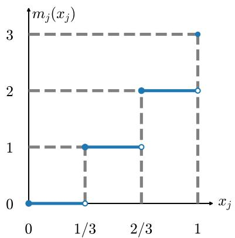  
(a) $m _ { j } ( x _ { j } ) = \lfloor M x _ { j } \rfloor$ maps $\textstyle { \bigl [ } { \frac { i } { M } } , { \frac { i + 1 } { M } } { \bigr ) }$ to i and 1 to M.

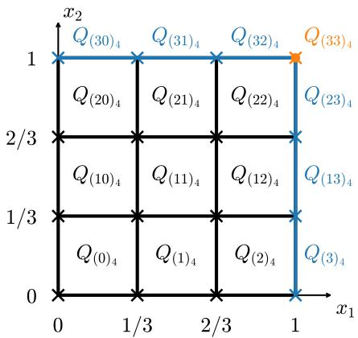  
(b) $r ( { \pmb x } )$ for $d = 2 \colon$ each cell $Q _ { \ell }$ is mapped to $\ell ;$ crosses mark the representatives $\pmb { x } ^ { ( \ell ) }$  
Figure 1: Position encoding with $M = 3$

## 3 Optimal neuron count: $d + 1$ hidden neurons

## 3.1 Suficiency: an explicit (d, 1) network

Our goal is to realize the piecewise-constant approximation $\widehat { f } _ { r ( { \pmb x } ) } = - R + \delta q _ { r ( { \pmb x } ) }$ . Our strategy is first to determine the cell containing x through its address $r ( { \pmb x } )$ , and then to pack $q _ { 0 } , \ldots , q _ { K - 1 }$ into a single integer as digits in a suitable base, so that $q _ { r ( { \pmb x } ) }$ can be recovered by extracting the digit indexed by $r ( { \pmb x } )$ . This motivates an activation $\varrho$ whose negative branch provides the floor operation needed for addressing and whose nonnegative branch performs digit extraction.

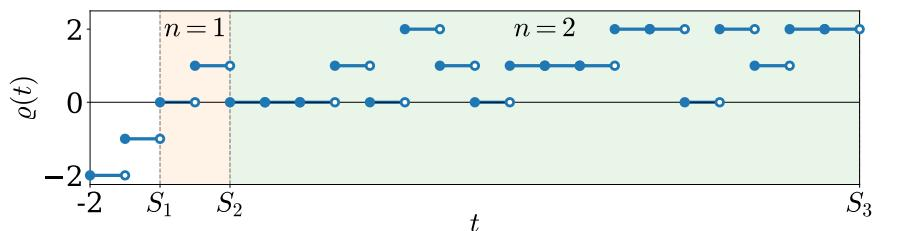  
Figure 2: $\varrho$ in $[ - 2 , S _ { 3 } )$ , or equivalently, $\textstyle [ - 2 , 0 ) \bigcup \big ( \bigcup _ { n = 1 } ^ { 2 } \bigcup _ { j = 0 } ^ { ( n + 1 ) ^ { n } - 1 } \bigcup _ { r = 0 } ^ { n - 1 } I _ { n , j , r } \big )$

The digit-extraction activation. For $n \in \mathbb { N } _ { + }$ , let $S _ { 1 } : = 0$ and $\begin{array} { r } { S _ { n } : = \sum _ { k = 1 } ^ { n - 1 } k ( k + 1 ) ^ { k } } \end{array}$ , so that $S _ { n + 1 } - S _ { n } = n ( n + 1 ) ^ { n }$ and $S _ { n } \to \infty$ . The half-line $[ 0 , \infty )$ is the disjoint union of the blocks $[ S _ { n } , S _ { n + 1 } ) , n \in \mathbb { N } _ { + }$ , and the n-th block is the disjoint union of the unit intervals

$$
I _ { n , j , r } : = [ S _ { n } + n j + r , S _ { n } + n j + r + 1 ) , \quad j \in \{ 0 , \ldots , ( n + 1 ) ^ { n } - 1 \} , \quad r \in \{ 0 , \ldots , n - 1 \} .\tag{9}
$$

Write $\begin{array} { r } { j = \sum _ { s = 0 } ^ { n - 1 } b _ { s } ( j ) ( n + 1 ) ^ { n - 1 - s } } \end{array}$ with digits $b _ { s } ( j ) \in \{ 0 , \ldots , n \}$ . Define

$$
\varrho ( t ) : = \left\{ \begin{array} { l l } { \lfloor t \rfloor , } & { t < 0 , } \\ { b _ { r } ( j ) , } & { t \in I _ { n , j , r } . } \end{array} \right.\tag{10}
$$

Equivalently, on $I _ { n , j , r }$ the value $b _ { r } ( j )$ is $\lfloor j / ( n + 1 ) ^ { n - 1 - r } \rfloor - ( n + 1 ) \lfloor j / ( n + 1 ) ^ { n - r } \rfloor$ . As shown in Figure 2,the function ϱ is piecewise constant on countably many intervals, satisfies $0 \leq \varrho ( t ) \leq n$ on $[ S _ { n } , S _ { n + 1 } )$ , and is therefore locally bounded and locally integrable. Its defining property is the digit-extraction identity

$$
\varrho ( S _ { n } + n j + r ) = b _ { r } ( j ) , \quad j \in \{ 0 , \ldots , ( n + 1 ) ^ { n } - 1 \} , \quad r \in \{ 0 , \ldots , n - 1 \} .\tag{11}
$$

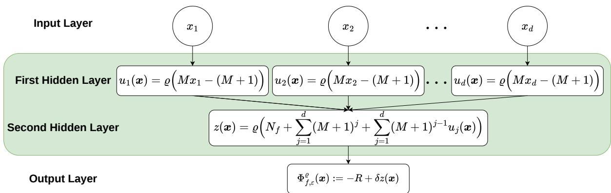  
Figure 3: Architecture of the network $\Phi _ { f , \varepsilon } ^ { \varrho }$ in Theorem 3.1. The d neurons in the first hidden layer quantize the input coordinates, whose weighted combination forms the cell address $r ( { \pmb x } )$ the neuron in the second hidden layer decodes the corresponding quantized value from the stored integer $N _ { f }$ . The network has $d + 1$ hidden neurons in total.

The network. Let $f \in \mathcal { H } _ { \lambda , R } ^ { \alpha } ( [ 0 , 1 ] ^ { d } ) , \varepsilon > 0$ , and let $M , \delta , B , q \ell$ be as in (5)–(6). Set

$$
n : = \operatorname* { m a x } \{ K , B - 1 \} , \quad J _ { f } : = \sum _ { \ell = 0 } ^ { K - 1 } q _ { \ell } ( n + 1 ) ^ { n - 1 - \ell } , \quad N _ { f } : = S _ { n } + n J _ { f } .\tag{12}
$$

Since $q _ { \ell } \le B - 1 \le n$ , the base- $( n + 1 )$ digits of $J _ { f }$ are $b _ { \ell } ( J _ { f } ) = q _ { \ell }$ for $\ell < K$ and 0 for $K \leq \ell < n ;$ in particular $0 \leq J _ { f } < ( n + 1 ) ^ { n }$ , and (11) gives $\varrho ( N _ { f } + \ell ) = q _ { \ell }$ for $0 \leq \ell < K$

As illustrated in Figure 3, the outputs of the hidden layers and the afine output layer are defined as:

$$
u _ { j } ( \pmb { x } ) : = \varrho \big ( M x _ { j } - ( M + 1 ) \big ) = \lfloor M x _ { j } \rfloor - ( M + 1 ) , \quad j = 1 , \dots , d , \quad \mathrm { ( 1 s t ~ h i d d e n ~ l a y e r ) } ( 1 3 )
$$

$$
\begin{array} { l } { { \displaystyle z ( { \pmb x } ) : = \varrho \Big ( N _ { f } + \sum _ { j = 1 } ^ { d } ( M + 1 ) ^ { j - 1 } \big ( u _ { j } ( { \pmb x } ) + M + 1 \big ) \Big ) } } \\ { { \displaystyle \qquad = \varrho \big ( N _ { f } + r ( { \pmb x } ) \big ) = q _ { r ( { \pmb x } ) } } } \\ { { \displaystyle \Phi _ { f , \varepsilon } ^ { \varrho } ( { \pmb x } ) : = - R + \delta z ( { \pmb x } ) = \widehat { f } _ { r ( { \pmb x } ) } . } } \end{array}\tag{2nd hidden layer}
$$

(14)

(output layer)

(15)

In (13) the argument of $\varrho$ is at most −1, so the negative branch (the floor) applies; in (14) the argument is $N _ { f } + r ( \pmb { x } ) \in [ S _ { n } , S _ { n + 1 } )$ and the digit-extraction branch applies. Since the pointwise estimate (7) holds on every $Q _ { \ell }$ and $\cup _ { \ell = 0 } ^ { K - 1 } Q _ { \ell } = [ 0 , 1 ] ^ { d }$ , taking the supremum over $\pmb { x } \in [ 0 , 1 ] ^ { d }$ yields:

Theorem 3.1 (Two hidden layers: $d + 1$ neurons). Let $d \in \mathbb { N } _ { + } , \alpha \in ( 0 , 1 ] , \lambda , R > 0$ . For every $f \in \mathcal { H } _ { \lambda , R } ^ { \alpha } ( [ 0 , 1 ] ^ { d } )$ and every $\varepsilon > 0$ the network $\Phi _ { f , \varepsilon } ^ { \varrho } \in \mathcal { N } \big ( ( d , 1 ) ; \varrho \big )$ defined by (13)–(15) satisfies

$$
\| f - \Phi _ { f , \varepsilon } ^ { \varrho } \| _ { L ^ { \infty } ( [ 0 , 1 ] ^ { d } ) } \leq \varepsilon .
$$

In particular $\nu ( \mathcal { H } _ { \lambda , R } ^ { \alpha } ( [ 0 , 1 ] ^ { d } ) ) \leq d + 1$

All parameters (see details in Appendix A) are integers except the dyadic output weight $\delta$ and the output bias $- R ;$ the latter is also an integer ${ \mathrm { i f } } ,$ without loss of generality, we take $R \in \mathbb { N } _ { + }$ . The only function-dependent quantity among the parameters is $N _ { f }$ , which enters the second-layer bias and encodes the quantized values of $f$ required for accuracy ε. For fixed $d ,$ the architecture is independent of $f$ and $\varepsilon ,$ while the activation $\varrho$ is independent of all problem parameters.

## 3.2 Necessity: no network with d hidden neurons is universal

In this section, we prove that at least $d + 1$ hidden neurons are necessary to approximate $\mathcal { H } _ { \lambda , R } ^ { \alpha } ( [ 0 , 1 ] ^ { d } )$ to arbitrary accuracy in the uniform norm when $d \geq 2$ . The proof relies on two activation-independent results: Proposition 3.2 shows that the first hidden layer must contain at least d neurons, and Proposition 3.3 shows that a single-hidden-layer network of fixed width is insuficient.

Proposition 3.2 (First-layer width obstruction). Let $l \ge 2 , \alpha \in ( 0 , 1 ] , \lambda , R > 0$ , and let $\phi : \mathbb { R }  \mathbb { R }$ be arbitrary. For every architecture $\pmb { n } = ( n _ { 1 } , \dots , n _ { L } )$ with $n _ { 1 } < d ,$ , there exist a function $f _ { 0 } \in \mathcal { H } _ { \lambda , R } ^ { \alpha } ( [ 0 , 1 ] ^ { d } )$ and a constant $\varepsilon _ { 0 } > 0$ , depending only on $\alpha , \lambda _ { \cdot }$ , and $R ,$ such that

$$
\begin{array} { r } { \underset { \Phi \in \mathcal { N } ^ { \mathrm { s k i p } } ( n ; \phi ) } { \operatorname* { i n f } } \ \| f _ { 0 } - \Phi \| _ { L ^ { \infty } ( [ 0 , 1 ] ^ { d } ) } \geq \varepsilon _ { 0 } . } \end{array}
$$

See the proof in Appendix B.1.

Proposition 3.3 (Fixed-width single-hidden-layer obstruction). Let $d \geq 2 , \alpha \in ( 0 , 1 ] , \lambda , R > 0$ and $n _ { 1 } \in \mathbb { N } _ { + }$ , and let $\phi \in L _ { \mathrm { l o c } } ^ { 1 } ( \mathbb { R } )$ . There exists a function $f _ { h } \in \mathcal { H } _ { \lambda , R } ^ { \alpha } ( [ 0 , 1 ] ^ { d } )$ and a constant $\varepsilon _ { 1 } > 0$ , depending only on $d , \lambda , R$ , and $n _ { 1 }$ , such that

$$
\operatorname* { i n f } _ { \Phi \in { \mathcal N } ( ( n _ { 1 } ) ; \phi ) } \| f _ { h } - \Phi \| _ { L ^ { \infty } ( [ 0 , 1 ] ^ { d } ) } \ge \varepsilon _ { 1 } .
$$

In particular, no single-hidden-layer network of fixed width can approximate $\mathcal { H } _ { \lambda , R } ^ { \alpha } ( [ 0 , 1 ] ^ { d } )$ to arbitrary accuracy.

See the proof in Appendix B.2. In fact, that fixed-width single-hidden-layer networks are never dense in $C ( [ 0 , 1 ] ^ { d } ) , d \geq 2$ , is classical for continuous activations: it follows from the non-density of sums of m ridge functions [10, 11, 13]. We still include a direct proof because it is valid for arbitrary locally integrable $\phi .$

Combining the results of the above two propositions, we obtain the following theorem:

Theorem 3.4 (Lower bound of neurons). Let $d \ge 2 , \alpha \in ( 0 , 1 ]$ , and $\lambda , R > 0$ . Let $L \in \mathbb { N } _ { + }$ $\pmb { n } \in \mathbb { N } _ { + } ^ { L }$ , and $\phi \in L _ { \mathrm { l o c } } ^ { 1 } ( \mathbb { R } )$ $I f \mathcal { N } ^ { \mathrm { s k i p } } ( \pmb { n } ; \phi )$ approximates $\mathcal { H } _ { \lambda , R } ^ { \alpha } ( [ 0 , 1 ] ^ { d } )$ to arbitrary accuracy in the sense of Definition 2.1, then $| \pmb { n } | \geq d + 1$ . Consequently, together with Theorem ${ \mathit { 3 . 1 , } }$

$$
\nu \big ( \mathcal { H } _ { \lambda , R } ^ { \alpha } ( [ 0 , 1 ] ^ { d } ) \big ) = d + 1 f o r e v e r y d \geq 2 , \alpha \in ( 0 , 1 ] , \ \lambda , R > 0 .
$$

See the proof in Appendix B.3. The hypotheses $\phi \in L _ { \mathrm { l o c } } ^ { 1 } ( \mathbb { R } )$ and $d \geq 2$ are essential; see the two remarks below.

Remark 3.5 (The case $d = 1 )$ . The above results (Propositions 3.2–3.3 and Theorem 3.4) need $d \geq 2$ . For $d = 1$ , [2] construct an activation for which a single hidden neuron approximates every $f \in C ( [ 0 , 1 ] )$ to arbitrary accuracy, so $\nu = 1$ when $d = 1$

Remark 3.6 (Continuous activations and $L ^ { p }$ approximation). The discontinuity of the activation cannot be dispensed with for uniform approximation with the optimal neuron count $d + 1$ established in Theorems 3.1 and 3.4, at least when $d = 2$ : Proposition E.1 shows that no network with three hidden neurons, a continuous activation, and no skip connections can achieve arbitrary accuracy in $L ^ { \infty } ( [ 0 , 1 ] ^ { 2 } )$ . If the error criterion is weakened to $L ^ { p } ( [ 0 , 1 ] ^ { d } ) , 1 \leq p < \infty$ , however, a (d, 1) architecture with a continuous activation can achieve arbitrary accuracy (see Theorem E.3).

## 4 Elementary activation: $d + 3$ neurons (or $d + 2$ with a skip)

The activation $\varrho$ in Theorem 3.1 performs digit extraction in a single step by encoding every possible digit table in its graph. We now replace this lookup mechanism with elementary radix arithmetic. Store the quantized values as the base-B integer $\begin{array} { r } { A _ { f } = \sum _ { \ell } q _ { \ell } B ^ { \ell } } \end{array}$ . Its ℓ-th digit can be recovered by $q _ { \ell } = \lfloor A _ { f } / B ^ { \ell } \rfloor - B \lfloor A _ { f } / B ^ { \ell + 1 } \rfloor$ . Consequently, retrieving the digit indexed by $r ( { \pmb x } )$ requires computing $\dot { B ^ { - r ( { \pmb x } ) } }$ and applying the floor function twice. This motivates an elementary activation that combines exponential and floor operations as in (1). Let $f \in \mathcal { H } _ { \lambda , R } ^ { \alpha } ( [ 0 , 1 ] ^ { d } ) , \varepsilon > 0$ $M , K , \delta , B , q _ { \ell }$ as in (5)–(6), and

$$
A _ { f } : = \sum _ { \ell = 0 } ^ { K - 1 } q _ { \ell } B ^ { \ell } \in \{ 0 , \ldots , B ^ { K } - 1 \} , \quad T _ { 0 } ( \pmb { x } ) : = \Big \lfloor \frac { A _ { f } } { B ^ { r ( \pmb { x } ) } } \Big \rfloor , \quad T _ { 1 } ( \pmb { x } ) : = \Big \lfloor \frac { A _ { f } } { B ^ { r ( \pmb { x } ) + 1 } } \Big \rfloor ,\tag{16}
$$

so that ${ \cal T } _ { 0 } ( { \pmb x } ) - { \cal B } { \cal T } _ { 1 } ( { \pmb x } ) = q _ { r ( { \pmb x } ) }$ (all base-B digits at positions greater than $r ( { \pmb x } )$ cancel). Therefore, we define the outputs of the hidden layers and the afine output layer of the elementary activation neural network with $\pmb { c } : = ( 1 , M + 1 , \ldots , ( M + 1 ) ^ { d - 1 } ) ^ { \top }$ ，

$$
\begin{array} { r } { \pmb { u } ( \pmb { x } ) : = \sigma ( M \pmb { x } ) = ( \lfloor M \pmb { x } \rfloor ) , \ldots , \lfloor M \pmb { x } \rfloor ) ^ { \top } , \qquad ( \mathrm { 1 s t ~ h i d d e n ~ l a y e r } ) ( 1 7 ) } \end{array}
$$

$$
v ( \pmb { x } ) : = \sigma \big ( - 1 - \log _ { 2 } ( B ) c ^ { \top } \pmb { u } ( \pmb { x } ) \big ) = \frac { 1 } { 2 } B ^ { - r ( \pmb { x } ) } - 1 , \qquad \mathrm { ( 2 n d ~ h i d d e n ~ l a y e r ) ( 1 8 ) }
$$

$$
{ \pmb w } ( { \pmb x } ) : = \sigma \Big ( \left[ 2 A _ { f } { \bf \Sigma } \right] \big ( { \pmb v } ( { \pmb x } ) + 1 \big ) \Big ) = \frac { \left[ T _ { 0 } ( { \pmb x } ) \right] } { T _ { 1 } ( { \pmb x } ) } ,\tag{)(19}
$$

$$
\Phi _ { f , \varepsilon } ^ { \sigma } ( \pmb { x } ) : = - R + \delta \left[ 1 , - B \right] \pmb { w } ( \pmb { x } ) = - R + \delta q _ { r ( \pmb { x } ) } = \widehat { f } _ { r ( \pmb { x } ) } . \qquad \mathrm { ( o u t p u t ~ l a y e r ) }\tag{20}
$$

Here $M x _ { j } \geq 0$ in (17) selects the floor branch of $\sigma ( t )$ ; the pre-activation part in (18) is $\leq - 1$ and selects the exponential branch, and $\log _ { 2 } B \in \mathbb { N }$ because B is a power of two; the pre-activations in (19) are nonnegative and select the floor branch. The network has widths $( d , 1 , 2 )$ (see Figure 6).

Saving one neuron with a skip connection. The first neuron at the third hidden layer (19) can be dispensed with if the output layer may read the second hidden layer directly, because $A _ { f } / B ^ { r ( \pmb { x } ) }$ itself difers from $\lfloor A _ { f } / B ^ { r ( \pmb { x } ) } \rfloor$ by the fractional part $\eta _ { r ( \pmb { x } ) } : = A _ { f } B ^ { - r ( \pmb { x } ) } - \lfloor A _ { f } B ^ { - r ( \pmb { x } ) } \rfloor \in$ [0, 1), whose contribution $\delta \eta _ { r ( \pmb { x } ) }$ to the output is below the quantization step. Thus, keeping $( 1 7 ) -$ (18) and setting

$$
\begin{array} { r } { w ^ { \mathrm { s k i p } } ( \pmb { x } ) : = \sigma \big ( \frac { 2 A _ { f } } { B } ( v ( \pmb { x } ) + 1 ) \big ) = T _ { 1 } ( \pmb { x } ) , \quad \Phi _ { f , \epsilon } ^ { \sigma , \mathrm { s k i p } } ( \pmb { x } ) : = - R + 2 \delta A _ { f } \big ( v ( \pmb { x } ) + 1 \big ) - \delta B w ^ { \mathrm { s k i p } } ( \pmb { x } ) , } \end{array}\tag{21}
$$

one obtains $\Phi _ { f , \varepsilon } ^ { \sigma , \mathrm { s k i p } } ( \pmb { x } ) = - R + \delta \big ( A _ { f } B ^ { - r ( \pmb { x } ) } - B T _ { 1 } ( \pmb { x } ) \big ) = \widehat { f } _ { r ( \pmb { x } ) } + \delta \eta _ { r ( \pmb { x } ) }$ , a network in $\mathcal { N } ^ { \mathrm { s k i p } } ( ( d , 1 , 1 ) ; \sigma )$ with $d + 2$ hidden neurons (see Figure 7).

These two networks also provide uniform approximation of $\mathcal { H } _ { \lambda , R } ^ { \alpha } ( [ 0 , 1 ] ^ { d } )$

Theorem 4.1 (Elementary activation: d + 3 neurons, or d + 2 with a skip connection). Let $d \in \mathbb { N } _ { + } , \ \alpha \in ( 0 , 1 ] , \ \lambda , \ R > 0$ . For every $f \in \mathcal { H } _ { \lambda , R } ^ { \alpha } ( [ 0 , 1 ] ^ { d } )$ and every $\varepsilon > 0$ , the networks $\Phi _ { f , \varepsilon } ^ { \sigma } \in \mathcal { N } ( ( d , 1 , 2 ) ; \sigma )$ and $\Phi _ { f , \varepsilon } ^ { \sigma , \mathrm { s k i p } } \in \mathcal { N } ^ { \mathrm { s k i p } } ( ( d , 1 , 1 ) ; \sigma )$ , defined respectively by $( 1 7 ) - ( 2 0 )$ and (17), (18), (21) satisfy

$$
\begin{array} { r } { \left\| f - \Phi _ { f , \varepsilon } ^ { \sigma } \right\| _ { L ^ { \infty } ( [ 0 , 1 ] ^ { d } ) } \leq \varepsilon \quad a n d \quad \left\| f - \Phi _ { f , \varepsilon } ^ { \sigma , \mathrm { s k i p } } \right\| _ { L ^ { \infty } ( [ 0 , 1 ] ^ { d } ) } \leq \varepsilon . } \end{array}
$$

See the proof in Appendix C. Compared with the first construction of [18], which also uses $d + 2$ neurons and a skip connection, $\Phi _ { f , \varepsilon } ^ { \sigma , \mathrm { s k i p } }$ requires only a single shared activation, and all of its parameters are rational and given in closed form (see Table 3).

## 5 Bit Complexity of Fixed-Size Approximators

In each of the three constructions, the target function is encoded by a single integer, namely, $N _ { f }$ in (12) or $A _ { f }$ in (16). Although the number of neurons is fixed, the size of this integer increases as the prescribed accuracy improves. A natural measure of storage and computational cost is therefore the bit complexity defined in (4). This complexity is readily computed because all our network parameters are rational: δ is dyadic, B is a power of two, and the remaining quantities are integers for $R \in \mathbb { N } _ { + }$ . The preceding discussion leads to the following theorem:

Theorem 5.1 (Bit complexity of the constructions). Let $d \ge 2 , \alpha \in ( 0 , 1 ] , \lambda > 0$ , and $R \in \mathbb { N } _ { + }$ . For the networks $\Phi _ { f , \varepsilon } ^ { \varrho } , \ \Phi _ { f , \varepsilon } ^ { \sigma } ,$ and $\Phi _ { f , \varepsilon } ^ { \sigma , \mathrm { s k i p } }$ in Theorems 3.1 and $\begin{array} { l } { { 4 . 1 , ~ a s ~ \varepsilon ~ \to ~ 0 } } \end{array}$ $\begin{array} { r } { \operatorname* { s u p } _ { f \in \mathcal { H } _ { \lambda , R } ^ { \alpha } ( [ 0 , 1 ] ^ { d } ) } \operatorname { b i t } \bigl ( \Phi _ { f , \varepsilon } ^ { \varrho } \bigr ) \ = \ \Theta \bigl ( \varepsilon ^ { - d / \alpha } \log \frac { 1 } { \varepsilon } \bigr ) , \ \operatorname* { s u p } _ { f \in \mathcal { H } _ { \lambda , R } ^ { \alpha } ( [ 0 , 1 ] ^ { d } ) } \operatorname { b i t } \bigl ( \Phi _ { f , \varepsilon } ^ { \sigma } \bigr ) \ = \ \Theta \bigl ( \varepsilon ^ { - d / \alpha } \log \frac { 1 } { \varepsilon } \bigr ) } \end{array}$ , and $\begin{array} { r } { \operatorname* { s u p } _ { f \in { \mathcal { H } } _ { \lambda , R } ^ { \alpha } ( [ 0 , 1 ] ^ { d } ) } \operatorname { b i t } \bigl ( \Phi _ { f , \varepsilon } ^ { \sigma , \mathrm { s k i p } } \bigr ) = \Theta \bigl ( \varepsilon ^ { - d / \alpha } \log \frac { 1 } { \varepsilon } \bigr ) } \end{array}$

The proof is given in Appendix D.

We next compare this complexity with the information-theoretic lower bound. The classical Kolmogorov–Tikhomirov entropy estimate [8, Theorem XIV, equation (68)] states that the ε-entropy of $\mathcal { H } _ { \lambda , R } ^ { \alpha } ( [ 0 , 1 ] ^ { d } )$ in the uniform norm, defined as the base-2 logarithm of the minimum cardinality of an ε-cover of $\mathcal { H } _ { \lambda , R } ^ { \alpha } ( [ 0 , 1 ] ^ { d } )$ , is $\Theta ( \varepsilon ^ { - d / \alpha } )$ . Equivalently, the minimum cardinality of such a cover is $2 ^ { \Theta ( \varepsilon ^ { - d / \alpha } ) }$ . For a fixed architecture, any collection of N distinct rationalparameter networks has worst-case bit complexity $\Omega ( \log _ { 2 } N )$ Consequently, any family of networks approximating the entire class to accuracy ε must have worst-case bit complexity $\Omega ( \varepsilon ^ { - d / \alpha } )$ . This yields the following result:

Proposition 5.2 (Bit complexity lower bound). Let $d \in \mathbb { N } _ { + } , \alpha \in ( 0 , 1 ] , \lambda , R > 0$ . Fix any $L \in \mathbb { N } _ { + } , \pmb { n } \in \mathbb { N } _ { + } ^ { L }$ , and activation $\phi : \mathbb { R }  \mathbb { R }$ . For each $\varepsilon > 0$ and $f \in \mathcal { H } _ { \lambda , R } ^ { \alpha } ( [ 0 , 1 ] ^ { d } )$ , let $\Phi _ { f , \varepsilon } ^ { \phi } \in \mathcal { N } ^ { \mathrm { s k i p } } ( n ; \phi )$ be any network with rational parameters satisfying $\| f - \Phi _ { f , \varepsilon } ^ { \phi } \| _ { L ^ { \infty } ( [ 0 , 1 ] ^ { d } ) } \leq \varepsilon$ Then $\begin{array} { r } { \operatorname* { s u p } _ { f \in \mathcal { H } _ { \lambda , R } ^ { \alpha } ( [ 0 , 1 ] ^ { d } ) } \operatorname { b i t } ( \Phi _ { f , \varepsilon } ^ { \phi } ) = \Omega ( \varepsilon ^ { - d / \alpha } ) \ a s \ \varepsilon  0 } \end{array}$

Combining Proposition 5.2 with Theorem 5.1, our constructions are optimal up to a logarithmic factor. In particular, the polynomial storage requirement $\varepsilon ^ { - d / \alpha }$ is unavoidable for any finite-bit implementation of a fixed-size universal approximator. The “curse of memory” identified by [19] is therefore not a defect of a particular construction but an information-theoretic necessity.

The inadequacy of neuron count alone is also reflected in VC dimension. Indeed, consider $\mathcal { N } ( ( d , 1 ) ; \varrho )$ and any finite set of distinct points $\pmb { x } _ { 1 } , \dotsc , \pmb { x } _ { N } \in [ 0 , 1 ] ^ { d }$ with arbitrary labels $y _ { 1 } , \ldots , y _ { N } \in \{ - 1 , 1 \}$ . There exists a bounded Lipschitz function f such that $f ( \pmb { x } _ { i } ) = y _ { i }$ for every i. By Theorem 3.1, there is a network $\Phi \in \mathcal { N } ( ( d , 1 ) ; \varrho )$ satisfying $\| f - \Phi \| _ { L ^ { \infty } ( [ 0 , 1 ] ^ { d } ) } \leq 1 / 2$ , and hence $y _ { i } \Phi ( { \pmb x } _ { i } ) > 0 , i = 1 , . . . , N$ . Thus, the classifier sign Φ realizes the prescribed labels. Since the points and labels were arbitrary, $\mathcal { N } ( ( d , 1 ) ; \varrho )$ has infinite VC dimension. The same argument applies to the network classes in Theorem 4.1. Hence, for these superexpressive activations, the number of neurons or parameters alone does not control statistical complexity.

## 6 Numerical verification in exact arithmetic

The explicit construction of $\Phi _ { f , \varepsilon } ^ { \varrho }$ in Theorem 3.1 permits exact-arithmetic evaluation. We carry this out for $d = 2 , 3$ to provide a computational check of the construction.

We consider four functions $f _ { 1 } , \ldots , f _ { 4 }$ on $[ 0 , 1 ] ^ { 2 }$ and two functions $f _ { 5 } , f _ { 6 }$ on $[ 0 , 1 ] ^ { 3 }$ , with certified H¨older parameters $( \alpha , \lambda , R )$ in the $\ell ^ { \infty }$ norm:

$$
\begin{array} { r l r } & { f _ { 1 } ( x ) = \frac { 1 } { 2 } \sin ( \pi x _ { 1 } ) \cos ( \pi x _ { 2 } ) , } & { \quad ( \alpha , \lambda , R ) = ( 1 , \pi , 1 ) ; } \\ & { f _ { 2 } ( x ) = | x _ { 1 } - \frac { 1 } { 2 } | ^ { 1 / 2 } + \frac { 1 } { 2 } | x _ { 2 } - x _ { 1 } | ^ { 1 / 2 } , } & { \quad ( \alpha , \lambda , R ) = ( \frac { 1 } { 2 } , \frac { 7 } { 4 } , 2 ) ; } \\ & { f _ { 3 } ( x ) = \exp \bigl [ \sin ( \pi p ) \cos ( \pi p ) \bigr ] \log \bigl [ 1 + \frac { p ^ { 2 } } { 2 + p } \bigr ] + \frac { \sin [ 3 \pi ( x _ { 1 } + x _ { 2 } ) ] } { 1 + p ^ { 2 } } , } & { \quad ( \alpha , \lambda , R ) = ( 1 , 1 9 , 1 ) ; } \\ & { f _ { 4 } ( x ) = e ^ { - 3 { \mathrm { d i s t } } ( x , \Gamma ) } \cos ( 4 \pi { \mathrm { d i s t } } ( x , \Gamma ) ) , } & { \quad ( \alpha , \lambda , R ) = ( 1 , 1 8 . 3 , 1 ) ; } \\ & { f _ { 5 } ( x ) = \frac { 1 } { 2 } \sin ( \pi x _ { 1 } x _ { 2 } ) \cos ( \pi x _ { 3 } ) + \frac { 1 } { 4 } \big | x _ { 2 } - x _ { 1 } x _ { 3 } \big | , } & { \quad ( \alpha , \lambda , R ) = ( 1 , \frac { 3 9 } { 1 0 } , 1 ) ; } \\ & { f _ { 6 } ( x ) = \frac { 1 } { 2 } \cos ( \pi \| x - c \| _ { 2 } ) , \quad c = ( 0 . 3 , 0 . 6 , 0 . 2 ) , } & { \quad ( \alpha , \lambda , R ) = ( 1 , \frac { 1 1 } { 4 } , 1 ) . } \end{array}
$$

For $f _ { 3 } , p : = x _ { 1 } x _ { 2 }$ . For $f _ { 4 } .$ Γ denotes the boundary of the level-3 Koch snowflake obtained by applying three iterations of the classical outward Koch construction [7] to an upwardpointing equilateral triangle centered at $\bigl ( \frac { 1 } { 2 } , \frac { 1 } { 2 } \bigr )$ with circumradius 0.36, and define dist $( { \pmb x } , { \Gamma } ) : =$ $\mathrm { m i n } _ { \pmb { y } \in \Gamma } \| \pmb { x } - \pmb { y } \| _ { 2 }$ . We perform the verification over a sequence of dyadic accuracies starting

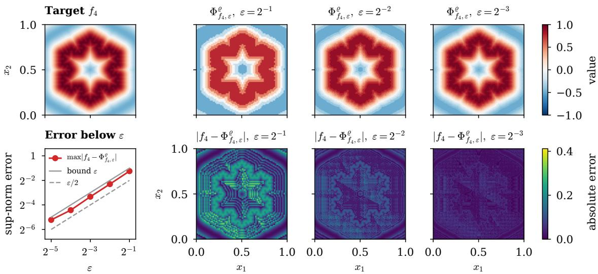  
Figure 4: Numerical verification of Theorem 3.1 for the approximation of $f _ { 4 }$ by $\Phi _ { f _ { 4 } , \varepsilon } ^ { \varrho }$ . Top: The target function $f _ { 4 }$ and the network outputs for $\varepsilon = 2 ^ { - 1 } , 2 ^ { - 2 } , 2 ^ { - 3 } \ ( M = 7 4 , 1 4 7 , \stackrel { \cdot } { 2 } 9 3 )$ . Bottom: The sup-norm error over the 3,004 test points versus ε, and the absolute errors $\vert f _ { 4 } - \Phi _ { f _ { 4 } , \varepsilon } ^ { \varrho } \vert$ on a $1 6 1 ^ { 2 }$ grid. The error plot additionally includes $\varepsilon = 2 ^ { - 4 } , 2 ^ { - 5 }$

from $\varepsilon = 2 ^ { - 1 }$ , with the finest tested accuracy chosen so that bit $( N _ { f } )$ is on the order of $1 0 ^ { 7 }$ bits. Table 3 in Appendix F reports the parameters $\delta , M , K = ( M + 1 ) ^ { d } ,$ B from (5), the bit length bit $( N _ { f } )$ from (12), and the maximal error max $| f _ { i } - \Phi _ { f _ { i } , \varepsilon } ^ { \varrho } |$ over 3,004 exactly represented test points for $d = 2$ and 3,008 for $d = 3$ , comprising 2,000 random dyadic points, 1,000 boundary points, and the $2 ^ { d }$ corners. Figure 4 shows the target $f _ { 4 }$ , the network outputs $\Phi _ { f _ { 4 } , \varepsilon } ^ { \varrho } ,$ and the pointwise errors on a $1 6 1 ^ { 2 }$ display grid at the three common accuracy levels $\varepsilon = \overset { \sim } { 2 ^ { - 1 } } , \overset { \sim } { 2 ^ { - 2 } } , 2 ^ { - 3 }$ together with the maximal errors over the full sequence of tested accuracies. The visualizations for $f _ { 1 } , f _ { 2 } , f _ { 3 } , f _ { 5 }$ , and $f _ { 6 }$ are provided in Appendix F (Figures 8–13). For the two-dimensional targets $f _ { 1 } , \ldots , f _ { 4 }$ , the maximal-error plots are included in their respective visualization figures; for the three-dimensional targets $f _ { 5 }$ and $f _ { 6 }$ , they are presented separately in Figure 13, together with those for $\Phi _ { f , \varepsilon } ^ { \sigma }$ and $\Phi _ { f , \varepsilon } ^ { \sigma , \mathrm { s k i p } }$ in Theorem 4.1. All observed errors are below ε as guaranteed, and both bit $( N _ { f } ) / ( n \log _ { 2 } ( n + 1 ) )$ (for $\Phi _ { f , \varepsilon } ^ { \varrho } )$ and bit $( A _ { f } ) / ( K \log _ { 2 } B )$ (for $\Phi _ { f , \varepsilon } ^ { \sigma }$ and $\Phi _ { f , \varepsilon } ^ { \sigma , \mathrm { s k i p } } )$ approach 1 as ε decreases in every case, consistently with Theorem 5.1.

Implementation. The dyadic quantities and nonintegral rational parameters are stored exactly as Fraction objects; R, M, B, K, n and the integer parameters as Python integers; $( q _ { \ell } ) _ { \ell = 0 } ^ { K - 1 }$ as a temporary int64 array; and the large integers $S _ { n } , J _ { f } , N _ { f }$ as arbitrary-precision mpz objects. Arbitrary-precision arithmetic is necessary because bit $( N _ { f } )$ reaches the order of $1 0 ^ { 7 }$ , far beyond the precision of double precision.

Now we discuss how to deal with the bulky lookup table definition of $\varrho$ in the verification. As shown in (13), the first hidden layer uses only the negative branch, which is evaluated directly using the floor function. In the second hidden layer (14), since $t = N _ { f } + \ell = S _ { n } + n J _ { f } + \ell ,$ dividing $t - S _ { n }$ by n yields quotient $J _ { f }$ and remainder ℓ. The activation $\varrho$ then extracts the corresponding base- $( n + 1 )$ digit of $\begin{array} { r } { J _ { f } \colon \varrho ( t ) = \big \lfloor \frac { J _ { f } } { ( n + 1 ) ^ { n - 1 - \ell } } \big \rfloor - ( n + 1 ) \big \lfloor \frac { J _ { f } } { ( n + 1 ) ^ { n - \ell } } \big \rfloor = q _ { \ell } } \end{array}$ . Although constructing $N _ { f }$ requires the values $( q _ { \ell } ) _ { \ell = 0 } ^ { K - 1 }$ , once $N _ { f }$ has been formed, pointwise network evaluation recovers each required $q _ { \ell }$ directly from $N _ { f } ,$ , without repeatedly accessing a lookup table.

## 7 Discussion

Limitations. Our results concern representational capacity rather than practical training. The encoding integers $N _ { f }$ and $A _ { f }$ may require $\Theta ( \varepsilon ^ { - d / \alpha } \log ( 1 / \varepsilon ) )$ bits, far exceeding standard fixed-precision floating-point arithmetic in the gradient descent-based training in actual function fitting. Moreover, in the $( d , 1 )$ construction, ϱ is a lookup function rather than a practical nonlinearity, and its evaluation can be computationally expensive.

Open problems. (i) Can the optimal count d+1 be attained with an elementary discontinuous activation, or can $d + 2$ neurons sufice without a skip connection? (ii) What is the minimal neuron count for uniform approximation with a continuous activation since $d + 1$ neurons do not sufice when $d = 2 ?$ (iii) Can a fixed architecture exploit the bounded diferences between neighboring quantized values to attain bit complexity $\Theta ( \varepsilon ^ { - d / \alpha } )$ , removing the logarithmic factor in our constructions?

## References

[1] George Cybenko. Approximation by superpositions of a sigmoidal function. Mathematics of Control, Signals and Systems, 2(4):303–314, 1989.

[2] Namig J Guliyev and Vugar E Ismailov. A single hidden layer feedforward network with only one neuron in the hidden layer can approximate any univariate function. Neural computation, 28(7):1289–1304, 2016.

[3] Namig J Guliyev and Vugar E Ismailov. Approximation capability of two hidden layer feedforward neural networks with fixed weights. Neurocomputing, 316:262–269, 2018.

[4] Kurt Hornik. Approximation capabilities of multilayer feedforward networks. Neural Networks, 4(2):251–257, 1991.

[5] Kurt Hornik, Maxwell Stinchcombe, and Halbert White. Multilayer feedforward networks are universal approximators. Neural Networks, 2(5):359–366, 1989.

[6] Vugar E Ismailov. On the approximation by neural networks with bounded number of neurons in hidden layers. Journal of Mathematical Analysis and Applications, 417(2):963–969, 2014.

[7] HV Koch. Sur une courbe continue sans tangente, obtenue par une construction g´eom´etrique ´el´ementaire. Arkiv for Matematik, Astronomi och Fysik, 1:681–704, 1904.

[8] Andrei Nikolaevich Kolmogorov and Vladimir Mikhailovich Tikhomirov. ε-entropy and ε-capacity of sets in function spaces. Uspekhi Matematicheskikh Nauk, 14(2):3–86, 1959.

[9] Moshe Leshno, Vladimir Ya Lin, Allan Pinkus, and Shimon Schocken. Multilayer feedforward networks with a nonpolynomial activation function can approximate any function. Neural Networks, 6(6):861–867, 1993.

[10] Vladimir Ya Lin and Allan Pinkus. Fundamentality of ridge functions. Journal of Approximation Theory, 75(3):295–311, 1993.

[11] Vitaly Maiorov and Allan Pinkus. Lower bounds for approximation by MLP neural networks. Neurocomputing, 25(1-3):81–91, 1999.

[12] Philipp Petersen and Felix Voigtlaender. Optimal approximation of piecewise smooth functions using deep ReLU neural networks. Neural Networks, 108:296–330, 2018.

[13] Allan Pinkus. Approximation theory of the MLP model in neural networks. Acta Numerica, 8:143–195, 1999.

[14] Zuowei Shen, Haizhao Yang, and Shijun Zhang. Neural network approximation: Three hidden layers are enough. Neural Networks, 141:160–173, 2021.

[15] Zuowei Shen, Haizhao Yang, and Shijun Zhang. Optimal approximation rate of ReLU networks in terms of width and depth. Journal de Math´ematiques Pures et Appliqu´ees, 157:101–135, 2022.

[16] Dmitry Yarotsky. Error bounds for approximations with deep ReLU networks. Neural Networks, 94:103–114, 2017.

[17] Dmitry Yarotsky. Optimal approximation of continuous functions by very deep ReLU networks. In Conference on Learning Theory, pages 639–649. PMLR, 2018.

[18] Dmitry Yarotsky. Elementary superexpressive activations. In International Conference on Machine Learning, pages 11932–11940. PMLR, 2021.

[19] Shijun Zhang, Zuowei Shen, and Haizhao Yang. Deep network approximation: Achieving arbitrary accuracy with fixed number of neurons. Journal of Machine Learning Research, 23(276):1–60, 2022.

## Appendix

## A Details of Section 3.1

The activation ϱ is well defined. Fix $n \in \mathbb { N } _ { + }$ . The unit intervals $I _ { n , j , r }$ of (9), indexed by integers $j$ and r such that $0 \leq j < ( n + 1 ) ^ { n }$ and $0 \leq r < n$ , form a partition of $[ S _ { n } , S _ { n + 1 } )$ Indeed, let $k = n j + r$ ranging over $\{ 0 , \ldots , n ( n + 1 ) ^ { n } - 1 \}$ ,

$$
\bigcup _ { j = 0 } ^ { ( n + 1 ) ^ { n } - 1 } \bigcup _ { r = 0 } I _ { n , j , r } = \bigcup _ { k = 0 } ^ { n ( n + 1 ) ^ { n } - 1 } [ S _ { n } + k , S _ { n } + k + 1 ) = [ S _ { n } , S _ { n } + n ( n + 1 ) ^ { n } ) = [ S _ { n } , S _ { n + 1 } ) .
$$

Since $S _ { 1 } = 0$ and $S _ { n } \to \infty$ , it follows that $\bigcup _ { n = 1 } ^ { \infty } \bigcup _ { i = 0 } ^ { ( n + 1 ) ^ { n } - 1 } \bigcup _ { r = 0 } ^ { n - 1 } I _ { n , j , r } = [ 0 , \infty )$ . Therefore, ϱ in (10) is well defined on R. It is constant on each unit interval, takes values in $\{ 0 , \ldots , n \}$ on $[ S _ { n } , S _ { n + 1 } )$ , and every compact set meets finitely many blocks; hence $\varrho$ is locally bounded and Borel measurable, so $\varrho \in L _ { \mathrm { l o c } } ^ { 1 } ( \mathbb { R } )$

Digit extraction identity of the activation $\varrho \cdot$ Write $j \in \{ 0 , \ldots , ( n + 1 ) ^ { n } - 1 \}$ with $\mathrm { b a s e } - ( n + 1 )$ expansion $\begin{array} { r } { j = \sum _ { s = 0 } ^ { n - 1 } { b _ { s } ( n + 1 ) ^ { n - 1 - s } } , \ : b _ { s } \in \{ 0 , \ldots , n \} } \end{array}$ . For $r \in \{ 0 , \ldots , n - 1 \}$

$$
\Big \lfloor \frac { j } { ( n + 1 ) ^ { n - 1 - r } } \Big \rfloor = \sum _ { s = 0 } ^ { r } b _ { s } ( n + 1 ) ^ { r - s } , \quad \Big \lfloor \frac { j } { ( n + 1 ) ^ { n - r } } \Big \rfloor = \sum _ { s = 0 } ^ { r - 1 } b _ { s } ( n + 1 ) ^ { r - 1 - s } ,
$$

Subtracting $n + 1$ times the second from the first leaves $b _ { r }$ , i.e. $\lfloor j / ( n + 1 ) ^ { n - 1 - r } \rfloor - ( n + 1 ) \lfloor j / ( n +$   
$1 ) ^ { n - r } ] = b _ { r }$ . Since $S _ { n } + n j + r \in I _ { n , j , r }$ as defined in (9), this proves (11).

Parameters of the network $\Phi _ { f , \varepsilon } ^ { \varrho } .$ . For the record, the parameters of $\Phi _ { f , \varepsilon } ^ { \varrho }$ are: $W _ { 1 } = M \operatorname { I d } _ { d } $ $\begin{array} { r } { b _ { 1 } = - ( M + 1 ) \mathbf { 1 } ; W _ { 2 } = \left( 1 , M + 1 , \ldots , ( M + 1 ) ^ { d - 1 } \right) , b _ { 2 } = N _ { f } + ( M + 1 ) \sum _ { j = 1 } ^ { d } ( M + 1 ) ^ { j - 1 } = 0 . } \end{array}$ $\begin{array} { r } { N _ { f } + ( M + 1 ) \frac { ( M + 1 ) ^ { d } - 1 } { M } ; a = \delta , c = - R } \end{array}$ . All are integers except $\delta \ ( \mathrm { d y a d i c } )$ and −R (an integer once $R \in \mathbb { N } _ { + } )$

## B Proofs of Section 3.2

## B.1 Proof of Proposition 3.2

Defin $\begin{array} { r } { \textnormal { e } f _ { 0 } : [ 0 , 1 ] ^ { d } \to \mathbb { R } \mathrm { ~ b y ~ } f _ { 0 } ( x ) : = \zeta \| x - x _ { 0 } \| _ { \infty } ^ { \alpha } , \ x _ { 0 } : = \big ( \frac 1 2 , \ldots , \frac 1 2 \big ) , \ \zeta : = \operatorname* { m i n } \{ \lambda , 2 ^ { \alpha } R \} } \end{array}$

Step 1: Verification that $f _ { 0 } \in \mathcal { H } _ { \lambda , R } ^ { \alpha } ( [ 0 , 1 ] ^ { d } )$ . Since m $\begin{array} { r } { \operatorname { a x } _ { \pmb { x } \in [ 0 , 1 ] ^ { d } } \| \pmb { x } - \pmb { x } _ { 0 } \| _ { \infty } = \frac { 1 } { 2 } } \end{array}$ , we have $\| f _ { 0 } \| _ { L ^ { \infty } ( [ 0 , 1 ] ^ { d } ) } = \zeta 2 ^ { - \alpha } \leq R$ . For $a , b \geq 0$ and $\alpha \in ( 0 , 1 ]$ , one has $| a ^ { \alpha } - b ^ { \alpha } | \leq | a - b | ^ { \alpha }$ by the subadditivity of $t \mapsto t ^ { \alpha }$ . Hence, by the reverse triangle inequality,

$$
\begin{array} { r l } & { | f _ { 0 } ( \pmb { x } ) - f _ { 0 } ( \pmb { y } ) | = \zeta \big | \| \pmb { x } - \pmb { x } _ { 0 } \| _ { \infty } ^ { \alpha } - \| \pmb { y } - \pmb { x } _ { 0 } \| _ { \infty } ^ { \alpha } \big | \leq \zeta \big | \| \pmb { x } - \pmb { x } _ { 0 } \| _ { \infty } - \| \pmb { y } - \pmb { x } _ { 0 } \| _ { \infty } \big | ^ { \alpha } } \\ & { \qquad \leq \zeta \| \pmb { x } - \pmb { y } \| _ { \infty } ^ { \alpha } \leq \lambda \| \pmb { x } - \pmb { y } \| _ { \infty } ^ { \alpha } . } \end{array}
$$

Step 2: Error lower bound from the kernel of the first layer. The input enters $\Phi$ only through $W _ { 1 } \pmb { x } + \pmb { b } _ { 1 }$ with $W _ { 1 } \in \mathbb { R } ^ { n _ { 1 } \times d }$ . Since $n _ { 1 } < d ,$ , there exists $z \in$ ker $W _ { 1 }$ with $\| z \| _ { \infty } = 1 ;$ put $\pmb { x } _ { 1 } : = \pmb { x } _ { 0 } + \frac { 1 } { 2 } \pmb { z } \in [ 0 , 1 ] ^ { d }$ . Then $W _ { 1 } \pmb { x } _ { 1 } + \pmb { b } _ { 1 } = W _ { 1 } \pmb { x } _ { 0 } + \pmb { b } _ { 1 }$ , hence $\Phi ( \pmb { x } _ { 1 } ) = \Phi ( \pmb { x } _ { 0 } )$ , whereas $f _ { 0 } ( { \pmb x } _ { 0 } ) = 0$ and $f _ { 0 } ( { \pmb x } _ { 1 } ) = \zeta 2 ^ { - \alpha }$ . Therefore

$$
\begin{array} { r } { \zeta 2 ^ { - \alpha } = | f _ { 0 } ( { \pmb x } _ { 1 } ) - f _ { 0 } ( { \pmb x } _ { 0 } ) | \leq | f _ { 0 } ( { \pmb x } _ { 1 } ) - \Phi ( { \pmb x } _ { 1 } ) | + | \Phi ( { \pmb x } _ { 0 } ) - f _ { 0 } ( { \pmb x } _ { 0 } ) | \leq 2 \| f _ { 0 } - \Phi \| _ { L ^ { \infty } ( [ 0 , 1 ] ^ { d } ) } . } \end{array}
$$

Therefore, by definition of $\begin{array} { r } { \zeta , \| f _ { 0 } - \Phi \| _ { L ^ { \infty } ( [ 0 , 1 ] ^ { d } ) } \geq \frac { 1 } { 2 } \zeta 2 ^ { - \alpha } = \frac { 1 } { 2 } \operatorname* { m i n } \bigl \{ \lambda 2 ^ { - \alpha } , R \bigr \} = : \varepsilon _ { 0 } > 0 . } \end{array}$

## B.2 Proof of Proposition 3.3

Let $\Omega : = ( 0 , 1 ) ^ { d }$ and define $h : \mathbb { R } ^ { d }  \mathbb { R } , h ( \pmb { x } ) : = \mathrm { e x p } ( \| \pmb { x } \| _ { 2 } ^ { 2 } )$ . We write $( C _ { c } ^ { \infty } ( \Omega ) ) ^ { \prime }$ for the continuous dual of $C _ { c } ^ { \infty } ( \Omega )$

Step 1: a suitable directional derivative of Φ vanishes. Let $\begin{array} { r } { \Phi ( { \pmb x } ) = c + \sum _ { i = 1 } ^ { n _ { 1 } } a _ { i } \phi ( { \pmb w } _ { i } } \end{array}$ ${ \pmb x } + b _ { i } ) \in \mathcal { N } ( ( n _ { 1 } ) ; \phi )$ . Since $\phi \in L _ { \mathrm { l o c } } ^ { 1 } ( \mathbb { R } )$ , each function $a _ { i } \phi ( { \pmb w } _ { i } \cdot { \pmb x } + b _ { i } )$ is locally integrable on $\mathbb { R } ^ { d }$ and can therefore be viewed as a regular distribution on Ω.

Denote $\mathbb { S } ^ { d - 1 } : = \{ \pmb { x } \in \mathbb { R } ^ { d } : \| \pmb { x } \| _ { 2 } = 1 \}$ . For each $i = 1 , \ldots , n _ { 1 }$ , choose a unit vector $\pmb { v } _ { i } \in \mathbb { S } ^ { d - 1 }$ satisfying $\mathbf { \boldsymbol { v } } _ { i } \cdot \mathbf { \boldsymbol { w } } _ { i } = 0$ . Such a vector exists because $d \geq 2 ;$ if $w _ { i } = 0$ , we may choose any unit vector. Write $D _ { v } : = \pmb { v } \cdot \nabla$ for the distributional directional derivative.

For every test function $\psi \in C _ { c } ^ { \infty } ( \Omega )$ , extended by zero to $\mathbb { R } ^ { d }$ , we have $\begin{array} { r } { \left. D _ { \pmb { v } _ { i } } \left[ a _ { i } \phi ( \pmb { w } _ { i } \cdot \pmb { x } + b _ { i } ) \right] , \psi \right. = } \end{array}$ $\begin{array} { r } { - \int _ { \mathbb { R } ^ { d } } a _ { i } \phi ( { \pmb w } _ { i } \cdot { \pmb x } + b _ { i } ) D _ { { \pmb v } _ { i } } \psi ( { \pmb x } ) } \end{array}$ dx. Using the orthogonal decomposition $\pmb { x } = \pmb { y } + s \pmb { v } _ { i } , \pmb { y } \in \pmb { v } _ { i } ^ { \bot }$ whose Jacobian is one, and the identity $\pmb { w } _ { i } \cdot ( \pmb { y } + s \pmb { v } _ { i } ) = \pmb { w } _ { i } \cdot \pmb { y }$ gives

$$
\left. D _ { v _ { i } } \big [ a _ { i } \phi ( { \pmb w } _ { i } \cdot { \pmb x } + b _ { i } ) \big ] , \psi \right. = - \int _ { { \pmb v } _ { i } ^ { \bot } } a _ { i } \phi ( { \pmb w } _ { i } \cdot { \pmb y } + b _ { i } ) \Big [ \int _ { \mathbb { R } } \frac { \partial } { \partial s } \psi ( { \pmb y } + s { \pmb v } _ { i } ) d s \Big ] d { \pmb y } = 0 .
$$

The inner integral vanishes because $\psi$ has compact support. Therefore,

$$
D _ { \pmb { v } _ { i } } \big [ a _ { i } \phi ( \pmb { w } _ { i } \cdot \pmb { x } + b _ { i } ) \big ] = 0 \quad \mathrm { i n ~ } ( C _ { c } ^ { \infty } ( \Omega ) ) ^ { \prime } .\tag{22}
$$

Now define ${ \mathcal { L } } _ { v } : = D _ { v _ { 1 } } D _ { v _ { 2 } } \cdot \cdot \cdot D _ { v _ { n _ { 1 } } } , v : = ( v _ { 1 } , \ldots , v _ { n _ { 1 } } ) \in ( \mathbb { S } ^ { d - 1 } ) ^ { n _ { 1 } }$ . Constant-coeficient directional derivatives commute. For each $i ,$ the operator $\mathcal { L } _ { v }$ contains the factor $D _ { v _ { i } }$ , which makes the ith ridge term vanish by (22). It also makes the constant term vanish. Hence $\mathcal { L } _ { v } \Phi = 0$ in $( C _ { c } ^ { \infty } ( \Omega ) ) ^ { \prime }$

Step 2: the same directional derivative of $h$ does not vanish. For every $\textbf { \em u } \in \mathbb { R } ^ { d }$ $D _ { \pmb { u } } h ( \pmb { x } ) = 2 ( \pmb { u } \cdot \pmb { x } ) h ( \pmb { x } )$ . Repeated application of the product rule gives $\mathcal { L } _ { v } h = P _ { v } h$ , where $P _ { v }$ is a polynomial of degree $n _ { 1 }$ whose homogeneous part of degree $n _ { 1 }$ is $\begin{array} { r } { 2 ^ { n _ { 1 } } \prod _ { i = 1 } ^ { n _ { 1 } } ( \pmb { v } _ { i } \cdot \pmb { x } ) } \end{array}$ . Since each ${ \mathbf { } } v _ { i }$ is a unit vector, ${ \mathbf { } } v _ { i } \cdot { \mathbf { } } x$ is a nonzero linear polynomial. Therefore, $\textstyle \prod _ { i = 1 } ^ { n _ { 1 } } ( { \pmb v } _ { i } \cdot { \pmb x } )$ is a nonzero polynomial. It follows that $P _ { v } \not \equiv 0$ , and hence

$$
\mathcal { L } _ { v } h = P _ { v } h \not \equiv 0\tag{23}
$$

for every $\pmb { v } \in ( \mathbb { S } ^ { d - 1 } ) ^ { n _ { 1 } }$

Step 3: derive a uniform lower bound for the approximation error. Choose $\chi \in$ $C _ { c } ^ { \infty } ( \Omega )$ such that $\chi \geq 0$ and $\chi > 0$ on a nonempty open subset of $\Omega ,$ and define $A _ { n _ { 1 } } ( \pmb { v } ) : =$ $\begin{array} { r } { \int _ { \Omega } \chi ( \pmb { x } ) \big | \mathcal { L } _ { \pmb { v } } h ( \pmb { x } ) \big | ^ { 2 } d \pmb { x } } \end{array}$ . The function $\mathcal { L } _ { v } h$ is real analytic and, by (23), is not identically zero. It therefore cannot vanish on the open set where $\chi > 0$ , and hence $A _ { n _ { 1 } } ( { \pmb v } ) > 0$ . Moreover, ${ \pmb v } \mapsto A _ { n _ { 1 } } ( { \pmb v } )$ is continuous. Since $( \mathbb { S } ^ { d - 1 } ) ^ { n _ { 1 } }$ is compact,

$$
a _ { n _ { 1 } } : = \operatorname* { m i n } _ { { \pmb v } \in ( \mathbb { S } ^ { d - 1 } ) ^ { n _ { 1 } } } A _ { n _ { 1 } } ( { \pmb v } ) > 0 .\tag{24}
$$

For the directions $\pmb { v } _ { 1 } , \ldots , \pmb { v } _ { n _ { 1 } }$ selected in Step 1, define $\psi _ { v } : = \chi \mathcal { L } _ { v } h \in C _ { c } ^ { \infty } ( \Omega )$ . Since $\mathcal { L } _ { v } \Phi = 0$ in $( C _ { c } ^ { \infty } ( \Omega ) ) ^ { \prime }$ , we obtain $\begin{array} { r } { A _ { n _ { 1 } } ( v ) = \langle \mathcal { L } _ { v } h , \psi _ { v } \rangle = \langle \mathcal { L } _ { v } ( h - \Phi ) , \psi _ { v } \rangle = ( - 1 ) ^ { n _ { 1 } } \int _ { \Omega } ( h - \Phi ) \mathcal { L } _ { v } \psi _ { v } d x } \end{array}$ Therefore,

$$
A _ { n _ { 1 } } ( \pmb { v } ) \leq \| h - \Phi \| _ { L ^ { \infty } ( \Omega ) } \| \mathcal { L } _ { \pmb { v } } \psi _ { \pmb { v } } \| _ { L ^ { 1 } ( \Omega ) } .\tag{25}
$$

By the Leibniz rule, $\begin{array} { r } { \mathcal { L } _ { \pmb { v } } \psi _ { \pmb { v } } = \sum _ { S \subseteq \{ 1 , \dots , n _ { 1 } \} } \big ( \prod _ { i \in S } D _ { \pmb { v } _ { i } } \big ) \chi \cdot \big ( \prod _ { i \notin S } D _ { \pmb { v } _ { i } } \big ) \mathcal { L } _ { \pmb { v } } h } \end{array}$ involves derivatives of the fixed smooth functions χ and h of order at most 2n1 with coeficients depending polynomially in $\pmb { v }$ . Hence $( { \pmb x } , { \pmb v } ) \mapsto \mathcal { L } _ { \pmb v } \psi _ { \pmb v } ( { \pmb x } )$ is continuous on the compact set supp $\chi \times ( \mathbb { S } ^ { d - 1 } ) ^ { n _ { 1 } }$ . It follows that $\begin{array} { r } { 0 < b _ { n _ { 1 } } : = \operatorname* { s u p } _ { { \pmb v } \in ( \mathbb { S } ^ { d - 1 } ) ^ { n _ { 1 } } } \| \mathscr { L } _ { \pmb v } \psi _ { \pmb v } \| _ { L ^ { 1 } ( \Omega ) } < \infty } \end{array}$ . Combining (25) with (24) gives

$$
\| h - \Phi \| _ { L ^ { \infty } ( \Omega ) } \ge \frac { A _ { n _ { 1 } } ( v ) } { b _ { n _ { 1 } } } \ge \frac { a _ { n _ { 1 } } } { b _ { n _ { 1 } } } > 0 , \quad \mathrm { f o r ~ e v e r y ~ } \Phi \in \mathcal { N } ( ( n _ { 1 } ) ; \phi ) .\tag{26}
$$

Step 4: rescale h into the H¨older class. On $[ 0 , 1 ] ^ { d } , \ \| h \| _ { \infty } \ = \ e ^ { d }$ and $\| \nabla h ( \pmb { x } ) \| _ { 1 } =$ $2 e ^ { \| \bar { \mathbf { x } } \| _ { 2 } ^ { 2 } } \sum _ { i = 1 } ^ { d } x _ { j } \leq 2 d e ^ { d }$ . Therefore, by the mean value theorem, $| h ( \pmb { x } ) - h ( \pmb { y } ) | \leq 2 d e ^ { d } \| \pmb { x } - \pmb { y } \| _ { \infty } \leq$ $2 d e ^ { d } \| \pmb { x } - \pmb { y } \| _ { \infty } ^ { \alpha } ,$ where the last inequality follows from $\| { \pmb x } - { \pmb y } \| _ { \infty } \le 1$ and $\alpha \leq 1$

Set γ := min $\{ R e ^ { - d } , \frac { \lambda } { 2 d e ^ { d } } \} , f _ { h } : = \gamma h$ . Then $f _ { h } \in \mathcal { H } _ { \lambda , R } ^ { \alpha } ( [ 0 , 1 ] ^ { d } )$ . Since ${ \mathcal { N } } ( ( n _ { 1 } ) ; \phi )$ is invariant under multiplication by the positive constant $\gamma _ { : }$ it follows from (26) that

$$
\operatorname* { i n f } _ { \Phi \in { \mathcal N } ( ( n _ { 1 } ) ; \phi ) } \| f _ { h } - \Phi \| _ { L ^ { \infty } ( [ 0 , 1 ] ^ { d } ) } = \gamma \operatorname* { i n f } _ { \Phi \in { \mathcal N } ( ( n _ { 1 } ) ; \phi ) } \| h - \Phi \| _ { L ^ { \infty } ( [ 0 , 1 ] ^ { d } ) } \ge \gamma \frac { a _ { n _ { 1 } } } { b _ { n _ { 1 } } } = : \varepsilon _ { 1 } > 0 .
$$

## B.3 Proof of Theorem 3.4

Suppose, to the contrary, that $| \pmb { n } | \leq d . \mathrm { \ H } L \geq 2$ , then $n _ { 1 } \leq | { \pmb n } | - n _ { 2 } \leq d - 1 < d ,$ so Proposition 3.2 exhibits an $f _ { 0 } \in \mathcal { H } _ { \lambda , R } ^ { \alpha } ( [ 0 , 1 ] ^ { d } )$ that cannot be approximated by any $\Phi \in \mathcal { N } ^ { \mathrm { s k i p } } ( { \pmb n } ; \phi )$ with error smaller than $\varepsilon _ { 0 }$ . If $L = 1$ , then $\mathcal { N } ^ { \mathrm { s k i p } } ( \pmb { n } ; \phi ) = \mathcal { N } ( ( \boldsymbol { n } _ { 1 } ) ; \phi )$ , and Proposition 3.3 exhibits an $f _ { h } \in \mathcal { H } _ { \lambda , R } ^ { \alpha } ( [ 0 , 1 ] ^ { d } )$ that cannot be approximated by any such network with error smaller than $\varepsilon _ { 1 }$ Both cases contradict arbitrary-accuracy approximation. Therefore, $| { \pmb n } | \geq d + 1$

Together with the upper bound provided by Theorem 3.1, this yields $\nu ( \mathcal { H } _ { \lambda , R } ^ { \alpha } ( [ 0 , 1 ] ^ { d } ) ) =$ $d + 1$ □

## C Details and Proofs of Section 4

$$
\Phi _ { f , \varepsilon } ^ { \sigma }
$$

$$
\begin{array} { r } { \Phi _ { f , \varepsilon } ^ { \sigma , \mathrm { s k i p } } . \Phi _ { f , \varepsilon } ^ { \sigma } \colon W _ { 1 } \ = \ M \mathrm { I d } _ { d } , \ b _ { 1 } \ = \ 0 ; \ W _ { 2 } \ = \ } \end{array}
$$

$$
- \log _ { 2 } ( B ) c ^ { \top } , b _ { 2 } = - 1 ; W _ { 3 } = ( 2 A _ { f } , 2 A _ { f } / B ) ^ { \top } , b _ { 3 } = ( 2 A _ { f } , 2 A _ { f } / B ) ^ { \top } ; a = ( \delta , - \delta B ) , c = - R ,
$$

$\Phi _ { f , \varepsilon } ^ { \sigma , \mathrm { s k i p } }$ : the same first two layers; $W _ { 3 } = b _ { 3 } = 2 A _ { f } / B ;$ output weights $2 \delta A _ { f }$ on v and $- \delta B$ on $w ^ { \mathrm { s k i p } }$ , bias $- R + 2 \delta A _ { f }$ . All parameters are integers or dyadic rationals.

## C.1 Proof of Theorem 4.1

Proof. For $\Phi _ { f , \varepsilon } ^ { \sigma } , \ ( 2 0 )$ and (7) give $| f ( \pmb { x } ) - \Phi _ { \mathit { t . } \varepsilon } ^ { \sigma } ( \pmb { x } ) | < \varepsilon$ on every cell.

For $\Phi _ { f , \varepsilon } ^ { \sigma , \mathrm { s k i p } }$ , on $Q _ { \ell }$ we have $\Phi _ { f , \varepsilon } ^ { \sigma , \mathrm { s k i p } } = \widehat { f } _ { \ell } + \delta \eta _ { \ell }$ with $0 \leq \delta \eta _ { \ell } < \delta$ and $0 \leq f ( \pmb { x } ^ { ( \ell ) } ) - \widehat { f } _ { \ell } < \delta$ by (6), so $| f ( { \pmb x } ^ { ( \ell ) } ) - \Phi _ { \mathit { t . c } } ^ { \sigma , \mathrm { s k i p } } ( { \pmb x } ) | = | ( f ( { \pmb x } ^ { ( \ell ) } ) - \widehat { f } _ { \ell } ) - \delta \eta _ { \ell } | < \delta$ and the triangle inequality with $| f ( \pmb { x } ) - f ( \pmb { x } ^ { ( \ell ) } ) | \leq \lambda M ^ { - \alpha } \leq \varepsilon / 2$ gives the claim. □

## D Proof of Theorem 5.1

Throughout the proof, we consider $d \ge 2 , \alpha \in ( 0 , 1 ] , \lambda > 0 , R \in \mathbb { N } _ { + }$ are fixed and $\varepsilon  0 ;$ by (8), $M = \Theta ( \varepsilon ^ { - 1 / \alpha } ) , K = \Theta ( \varepsilon ^ { - d / \alpha } ) , B = \Theta ( \varepsilon ^ { - 1 } )$ , and $\log _ { 2 } B = \Theta ( \log ( 1 / \varepsilon ) )$ .

## D.1 Bit complexity of $A _ { f }$

Upper bound. Since $\begin{array} { r } { 0 \leq q _ { \ell } \leq B - 1 , \ 0 \leq A _ { f } = \sum _ { \ell = 0 } ^ { K - 1 } q _ { \ell } B ^ { \ell } \leq ( B - 1 ) \sum _ { \ell = 0 } ^ { K - 1 } B ^ { \ell } = } \end{array}$ $B ^ { K } - 1$ , hence $\operatorname { b i t } ( A _ { f } ) \leq \lceil \log _ { 2 } B ^ { K } \rceil = K \log _ { 2 } B$ (an integer, as B is a power of two). Thus $\begin{array} { r } { \operatorname* { s u p } _ { f \in { \mathcal { H } } _ { \lambda , R } ^ { \alpha } ( [ 0 , 1 ] ^ { d } ) } \operatorname { b i t } ( A _ { f } ) = O ( \varepsilon ^ { - d / \alpha } \log ( 1 / \varepsilon ) ) } \end{array}$

Lower bound. Let $f _ { R } \equiv R . { \mathrm { ~ B y ~ ( 5 ) } } , B / 2 < \lfloor 2 R / \delta \rfloor + 1 \leq B$ as soon as $\lfloor 2 R / \delta \rfloor + 1 \geq 2$ , i.e. for small $\varepsilon ;$ since $B / 2$ and $\lfloor 2 R / \delta \rfloor$ are integers, $B / 2 \le \lfloor 2 R / \delta \rfloor \le B - 1$ . For $f _ { R }$ every digit equals $q _ { \ell } = \lfloor 2 R / \delta \rfloor \geq B / 2$ , so

$$
A _ { f _ { R } } \geq \frac { B } { 2 } \sum _ { \ell < K } B ^ { \ell } \geq \frac { 1 } { 2 } B ^ { K }
$$

and $\mathrm { b i t } ( A _ { f _ { R } } ) \geq K \log _ { 2 } B - 1$ . Hence

$$
\operatorname* { s u p } _ { f \in \mathscr { H } _ { \lambda , R } ^ { \alpha } ( [ 0 , 1 ] ^ { d } ) } \operatorname { b i t } ( A _ { f } ) = \Theta \bigl ( K \log _ { 2 } B \bigr ) = \Theta \bigl ( \varepsilon ^ { - d / \alpha } \log \frac { 1 } { \varepsilon } \bigr ) .
$$

## D.2 Bit complexity of $\Phi _ { f , \varepsilon } ^ { \sigma }$ and $\Phi _ { f , \varepsilon } ^ { \sigma , \mathrm { s k i p } }$

Using the parameter lists in Appendix C: the first hidden layer has d nonzero weights equal to M, contributing d $\mathrm { b i t } ( M ) = O ( d \log ( 1 / \varepsilon ) )$ . The second hidden layer has weights $\log _ { 2 } ( B ) ( M +$

$1 ) ^ { j - 1 } , \ j = 1 , \ldots , d ;$ and bias −1, with $\mathrm { b i t } ( \log _ { 2 } ( B ) ( M + 1 ) ^ { j - 1 } ) = O ( j \log ( 1 / \varepsilon ) )$ , contributing $O ( d ^ { 2 } \log ( 1 / \varepsilon ) )$ in total. The third hidden layer contains $2 A _ { f }$ and $2 A _ { f } / B$ (each at most twice); since $2 A _ { f } / B$ in lowest terms has numerator at most $2 A _ { f }$ and denominator at most B, bit $( 2 A _ { f } / B ) \stackrel {  } { \leq } \mathrm { b i t } ( A _ { f } ) + \mathrm { b i t } ( B ) + O ( 1 )$ , so this layer contributes $O ( \mathrm { b i t } ( A _ { f } ) + \log ( 1 / \varepsilon ) )$ The output layer has parameters δ, δB, R (and $2 \delta A _ { f } , - R + 2 \delta A _ { f }$ in the skip variant), contributing $O ( \mathrm { b i t } ( A _ { f } ) + \log ( 1 / \varepsilon ) )$ . Altogether, since $\dot { d } ^ { 2 } \log ( 1 / \varepsilon ) \stackrel { \cdot } { = } o \big ( \varepsilon ^ { - d / \alpha } \log ( 1 / \varepsilon ) \big )$ as $\varepsilon $ $\begin{array} { r } { 0 , \operatorname* { s u p } _ { f \in { \mathcal { H } } _ { \lambda , R } ^ { \alpha } ( [ 0 , 1 ] ^ { d } ) } \mathrm { b i t } \big ( \Phi _ { f , \varepsilon } ^ { \sigma } \big ) \ = \ \Theta ( \operatorname* { s u p } _ { f \in { \mathcal { H } } _ { \lambda , R } ^ { \alpha } ( [ 0 , 1 ] ^ { d } ) } \mathrm { b i t } \big ( A _ { f } \big ) ) } \end{array}$ and $\begin{array} { r } { \operatorname* { s u p } _ { f \in \mathcal { H } _ { \lambda , R } ^ { \alpha } ( [ 0 , 1 ] ^ { d } ) } \operatorname { b i t } \big ( \Phi _ { f , \varepsilon } ^ { \sigma , \mathrm { s k i p } } \big ) \ = } \end{array}$ $\begin{array} { r } { \Theta ( \operatorname* { s u p } _ { f \in \mathcal { H } _ { \lambda , R } ^ { \alpha } ( [ 0 , 1 ] ^ { d } ) } \operatorname { b i t } \left( A _ { f } \right) ) } \end{array}$ . Thus,

$$
\operatorname* { s u p } _ { f \in \mathcal { H } _ { \lambda , R } ^ { \alpha } ( [ 0 , 1 ] ^ { d } ) } \mathrm { b i t } ( \Phi _ { f , \varepsilon } ^ { \sigma } ) = \Theta \big ( \varepsilon ^ { - d / \alpha } \log \frac { 1 } { \varepsilon } \big ) , \operatorname* { s u p } _ { f \in \mathcal { H } _ { \lambda , R } ^ { \alpha } ( [ 0 , 1 ] ^ { d } ) } \mathrm { b i t } \big ( \Phi _ { f , \varepsilon } ^ { \sigma , \mathrm { s k i p } } \big ) = \Theta \big ( \varepsilon ^ { - d / \alpha } \log \frac { 1 } { \varepsilon } \big ) .
$$

## D.3 Bit complexity of $\Phi _ { f , \varepsilon } ^ { \varrho }$

By the parameter list at Appendix A, all parameters other than the bias $b _ { 2 } = N _ { f } + ( M +$ $1 ) ( ( M + 1 ) ^ { d } - 1 ) / M$ contribute $O ( d ^ { 2 } \log ( 1 / \varepsilon ) )$ bits, and bi $; ( b _ { 2 } ) = \mathrm { b i t } ( N _ { f } ) + O ( d$ log(1/ε)). Since n = max $\{ K , B - 1 \}$ and $K = \Theta ( \varepsilon ^ { - d / \alpha } )$ dominates $B = \Theta ( \varepsilon ^ { - 1 } ) ~ ( \mathrm { a s } ~ d / \alpha \geq 2 )$ , we have $n = K = \Theta ( \varepsilon ^ { - d / \alpha } )$ for small ε. From $S _ { n } \leq N _ { f } < S _ { n + 1 }$ and

$$
( n - 1 ) n ^ { n - 1 } \leq S _ { n } = \sum _ { k = 1 } ^ { n - 1 } k ( k + 1 ) ^ { k } \leq ( n - 1 ) \cdot ( n - 1 ) n ^ { n - 1 } \leq n ^ { n + 1 } , \quad S _ { n + 1 } \leq ( n + 1 ) ^ { n + 2 } ,
$$

we $\begin{array} { r } { \mathrm { g e t } \left( n - 1 \right) \log _ { 2 } n \le \log _ { 2 } N _ { f } \le \left( n + 2 \right) \log _ { 2 } ( n + 1 ) , \mathrm { i . e . } \mathrm { b i t } ( N _ { f } ) = \Theta ( n \log n ) = \Theta ( \varepsilon ^ { - d / \alpha } \log ( 1 / \varepsilon ) ) } \end{array}$ for every $f \in \mathcal { H } _ { \lambda , R } ^ { \alpha } ( [ 0 , 1 ] ^ { d } )$ . Hence supf bit $\big ( \Phi _ { f , \varepsilon } ^ { \varrho } \big ) = \Theta \big ( \varepsilon ^ { - d / \alpha } \log ( 1 / \varepsilon ) \big )$

## E Continuous activations: uniform obstruction and $L ^ { p }$ construction

The activation $\varrho$ of Theorem 3.1 is discontinuous, while Theorem 3.4 allows arbitrary locally integrable activations. Appendix E.1 shows that the discontinuity is not incidental: with a continuous activation, $d + 1$ hidden neurons do not sufice for uniform approximation, already for $d = 2$ . Appendix E.2 shows that the obstruction is specific to the uniform norm: a single continuous activation $\varrho _ { c } .$ , independent of $f , \ \varepsilon , \ p$ and $d ,$ gives the $( d , 1 )$ architecture an $L ^ { p }$ guarantee for every $p \in [ 1 , \infty )$

## E.1 A uniform-approximation obstruction for (2, 1) networks

Proposition E.1 (Three-neuron obstruction for continuous activations). Let $d = 2 , \alpha \in ( 0 , 1 ]$ $\lambda , R > 0$ , and let $\phi : \mathbb { R }  \mathbb { R }$ be continuous. For every $L \in \mathbb { N } _ { + }$ and every architecture $\pmb { n } = ( n _ { 1 } , \dots , n _ { L } ) \in \mathbb { N } _ { + } ^ { L }$ with $| n | = 3 .$ , there exist a function $f \in \mathcal { H } _ { \lambda , R } ^ { \alpha } ( [ 0 , 1 ] ^ { d } )$ and a constant $\varepsilon _ { 2 } > 0 \varepsilon _ { \mathrm { { \scriptscriptstyle i } } }$ , depending only on $\alpha , \lambda , R ,$ , such that $\begin{array} { r } { \operatorname* { i n f } _ { \Phi \in \mathcal { N } ( n ; \phi ) } \| f - \Phi \| _ { L ^ { \infty } ( [ 0 , 1 ] ^ { d } ) } \geq \varepsilon _ { 2 } } \end{array}$ . Consequently, no fixed architecture with three hidden neurons and a continuous activation can approximate $\mathcal { H } _ { \lambda , R } ^ { \alpha } ( [ 0 , 1 ] ^ { d } )$ to arbitrary accuracy.

Proof. For $| n | = 3$ , the only possible architectures are $( 3 ) , ( 1 , 2 ) , ( 2 , 1 ) , ( 1 , 1 , 1 )$ . The architecture (3) is excluded by Proposition 3.3, while (1, 2) and $( 1 , 1 , 1 )$ are excluded by Proposition 3.2. It therefore remains to only consider $\pmb { n } = ( 2 , 1 )$

Step 0: growth of the function and the collision condition. Let $\pmb { x } _ { 0 } : = ( \frac { 1 } { 2 } , \frac { 1 } { 2 } )$ . For $\pmb { x } \in [ 0 , 1 ] ^ { 2 }$ , write $\pmb { y } : = \pmb { x } - \pmb { x } _ { 0 } = ( y _ { 1 } , y _ { 2 } )$ , and define

$$
f _ { \mathrm { c } } ( \pmb { x } ) : = \| \pmb { y } \| _ { 2 } + \frac { 1 } { 1 0 } \kappa ( \pmb { y } ) , \quad \kappa ( \pmb { y } ) : = \pmb { y } _ { 1 } ^ { 3 } + 2 \pmb { y } _ { 2 } ^ { 3 } .\tag{27}
$$

Since $\pmb { y } \in [ - \frac { 1 } { 2 } , \frac { 1 } { 2 } ] ^ { 2 }$ , we have $\begin{array} { r } { | \kappa ( \pmb { y } ) | \leq | y _ { 1 } | ^ { 3 } + 2 | y _ { 2 } | ^ { 3 } \leq \frac { 3 } { 4 } \| \pmb { y } \| _ { 2 } } \end{array}$ . Thus, with $\theta : = 3 / 4 0$

$$
( 1 - \theta ) \| { \boldsymbol x } - { \boldsymbol x } _ { 0 } \| _ { 2 } \leq f _ { \mathrm { c } } ( { \boldsymbol x } ) \leq ( 1 + \theta ) \| { \boldsymbol x } - { \boldsymbol x } _ { 0 } \| _ { 2 } .\tag{28}
$$

In particular, $f _ { \mathrm { c } } ( { \pmb x } _ { 0 } ) = 0 .$

Let $\Phi \in \mathcal { N } ( ( 2 , 1 ) ; \phi )$ . In the notation of (3), write $\pmb { \eta } ^ { \top } , \pmb { \xi } ^ { \top } \in \mathbb { R } ^ { 2 }$ for the rows of $W _ { 1 } , \thinspace b _ { 1 } =$ $( b _ { 1 , 1 } , b _ { 1 , 2 } ) , W _ { 2 } = ( w _ { 1 } , w _ { 2 } ) , b _ { 2 } = b _ { 2 }$ , and ${ \pmb a } = { \pmb a }$ . Then $\Phi = g \circ h$ with $h ( \pmb { x } ) = \psi _ { 1 } ( \pmb { \eta } ^ { \top } \pmb { x } ) + \psi _ { 2 } ( \pmb { \xi } ^ { \top } \pmb { x } )$ where $\psi _ { i } ( t ) : = w _ { i } \phi ( t + b _ { 1 , i } )$ and $g ( t ) : = a \phi ( t + b _ { 2 } ) + c ;$ thus $g , \psi _ { 1 } , \psi _ { 2 } : \mathbb { R }  \mathbb { R }$ are continuous.

Suppose that $\| f _ { \mathrm { c } } - \Phi \| _ { L ^ { \infty } ( [ 0 , 1 ] ^ { 2 } ) } \le \varepsilon$ . Whenever $h ( \pmb { x } ) = h ( \pmb { x } ^ { \prime } )$ , we have $\Phi ( { \pmb x } ) = g ( h ( { \pmb x } ) ) =$ $g ( h ( { \pmb x } ^ { \prime } ) ) = \Phi ( { \pmb x } ^ { \prime } )$ , and hence, for $\pmb { x } , \pmb { x } ^ { \prime } \in [ 0 , 1 ] ^ { 2 }$ , the collision condition,

$$
h ( \pmb { x } ) = h ( \pmb { x } ^ { \prime } ) \implies | f _ { \mathrm { c } } ( \pmb { x } ) - f _ { \mathrm { c } } ( \pmb { x } ^ { \prime } ) | \leq | f _ { \mathrm { c } } ( \pmb { x } ) - \Phi ( \pmb { x } ) | + | \Phi ( \pmb { x } ^ { \prime } ) - f _ { \mathrm { c } } ( \pmb { x } ^ { \prime } ) | \leq 2 \varepsilon .\tag{29}
$$

Steps 1–4 then show that (29) forces $\varepsilon \geq \varepsilon _ { * }$ for an absolute constant $\varepsilon _ { * } > 0$ defined in Step 4.

Step 1: a direct error bound for the degenerate case ${ \textbf { \em } } _ { \eta } \parallel { \boldsymbol { \xi } } .$ . Suppose that η and $\boldsymbol { \xi }$ are linearly dependent. There is then a unit vector v orthogonal to both of them, so that $h ( \pmb { x } _ { 0 } + t \pmb { v } ) = h ( \pmb { x } _ { 0 } )$ whenever $\pmb { x } _ { 0 } + t \pmb { v } \in [ 0 , 1 ] ^ { 2 }$ . This line segment reaches the boundary of the square and therefore contains a point $\pmb { p } \in \partial [ 0 , 1 ] ^ { 2 }$ satisfying $\begin{array} { r } { \| \pmb { p } - \pmb { x } _ { 0 } \| _ { 2 } \ge \frac { 1 } { 2 } } \end{array}$ . By (29) and (28), $\begin{array} { r } { 2 \varepsilon \geq | f _ { \mathrm { c } } ( \pmb { p } ) - f _ { \mathrm { c } } ( \pmb { x } _ { 0 } ) | = f _ { \mathrm { c } } ( \pmb { p } ) \geq ( 1 - \theta ) \| \pmb { p } - \pmb { x } _ { 0 } \| _ { 2 } \geq \frac { 1 - \theta } { 2 } } \end{array}$ . Thus $\textstyle \varepsilon \geq { \frac { 1 - \theta } { 4 } }$

We may henceforth assume that η and $\boldsymbol { \xi }$ are linearly independent.

Step 2: coordinates adapted to the two directions. Absorbing $\| \pmb { \eta } \| _ { 2 }$ and $\| { \boldsymbol { \xi } } \| _ { 2 }$ into $\psi _ { 1 }$ and $\psi _ { 2 } .$ , we may assume $\| \pmb { \eta } \| _ { 2 } = \| \pmb { \xi } \| _ { 2 } = 1$ . Put $\Delta : = | \operatorname* { d e t } ( \pmb { \eta } , \pmb { \xi } ) | \in ( 0 , 1 ]$ and let e be the unit vector orthogonal to $\boldsymbol { \xi }$ with $\eta ^ { \intercal } e = \Delta$ , and $e ^ { \prime }$ the unit vector orthogonal to η with $\pmb { \xi } ^ { \top } e ^ { \prime } = \Delta$ For $\textbf { \em x } \in \ \mathbb { R } ^ { 2 }$ define $\begin{array} { r } { u ( \pmb { x } ) : = \frac { \pmb { \eta } ^ { \top } ( \pmb { x } - \pmb { x } _ { 0 } ) } { \Delta } , v ( \pmb { x } ) : = \frac { \pmb { \xi } ^ { \top } ( \pmb { x } - \pmb { x } _ { 0 } ) } { \Delta } } \end{array}$ . Then $\begin{array} { r } { \pmb { x } = \pmb { x } _ { 0 } + u ( \pmb { x } ) \pmb { e } + v ( \pmb { x } ) \pmb { e } ^ { \prime } \mathrm { : } } \end{array}$ applying $\eta ^ { \top }$ and $\pmb { \xi } ^ { \top }$ to both sides gives the same values, and $\eta , \xi$ span $\mathbb { R } ^ { 2 }$ . In these coordinates $h ( \pmb { x } ) = \psi _ { 1 } ( \pmb { \eta } ^ { \top } \pmb { x } _ { 0 } + \Delta u ( \pmb { x } ) ) + \psi _ { 2 } ( \pmb { \xi } ^ { \top } \pmb { x } _ { 0 } + \Delta v ( \pmb { x } ) )$ ; absorbing the afine changes of variables into $\psi _ { 1 } , \psi _ { 2 }$ we may write

$$
h ( \pmb { x } ) = \psi _ { 1 } \big ( u ( \pmb { x } ) \big ) + \psi _ { 2 } \big ( v ( \pmb { x } ) \big ) .\tag{30}
$$

Step 3: constructing pairs with the same h-value. Let $L _ { 0 } : = \{ \pmb { x } \in [ 0 , 1 ] ^ { 2 } : h ( \pmb { x } ) = h ( \pmb { x } _ { 0 } ) \}$ If $L _ { 0 }$ contains a point p with $\begin{array} { r } { \| \pmb { p } - \pmb { x } _ { 0 } \| _ { 2 } \ge \frac { 1 } { 4 } } \end{array}$ , then (29) and (28) give $\begin{array} { r } { 2 \varepsilon \ge f _ { \mathrm { c } } ( \pmb { p } ) \ge \frac { 1 - \theta } { 4 } } \end{array}$ , i.e. $\textstyle \varepsilon \geq { \frac { 1 - \theta } { 8 } }$

It remains to consider the case $L _ { 0 } \subset B ( { \pmb x } _ { 0 } , { \frac { 1 } { 4 } } )$ , where $B ( \pmb { x } _ { 0 } , \rho ) : = \{ \pmb { x } \in \mathbb { R } ^ { 2 } : \| \pmb { x } - \pmb { x } _ { 0 } \| _ { 2 } < \rho \}$ denotes the open Euclidean ball. Then the continuous function $h ( { \pmb x } ) - h ( { \pmb x } _ { 0 } )$ does not vanish on $[ 0 , 1 ] ^ { 2 } \setminus B ( \pmb { x } _ { 0 } , \frac { 1 } { 4 } )$ , which is connected, and hence has constant sign there. Replacing $( \psi _ { 1 } , \psi _ { 2 } , g )$ by $( - \psi _ { 1 } , - \psi _ { 2 } , g ( - \cdot ) )$ if necessary, which leaves Φ unchanged, we may assume

$$
\begin{array} { r } { h ( \pmb { x } ) > h ( \pmb { x } _ { 0 } ) \quad \mathrm { f o r ~ a l l } \ \pmb { x } \in [ 0 , 1 ] ^ { 2 } \ \backslash \ B \big ( \pmb { x } _ { 0 } , \frac { 1 } { 4 } \big ) . } \end{array}\tag{31}
$$

The points ${ \pm } \textstyle { \frac { 1 } { 4 } } e$ have adapted coordinates $( \pm \frac { 1 } { 4 } , 0 )$ and lie on $\partial B ( \pmb { x } _ { 0 } , \textstyle { \frac { 1 } { 4 } } )$ , hence in $[ 0 , 1 ] ^ { 2 } \backslash$ $B ( \pmb { x } _ { 0 } , \pmb { \mathrm { \frac { 1 } { 4 } } } )$ . By (31) and $( 3 0 ) , \psi _ { 1 } ( \pm \frac { 1 } { 4 } ) + \psi _ { 2 } ( 0 ) > \psi _ { 1 } ( 0 ) \dot { + } \psi _ { 2 } ( 0 )$ , i.e. $\psi _ { 1 } \bigl ( - { \textstyle { \frac { 1 } { 4 } } } \bigr ) > \dot { \psi _ { 1 } } ( 0 ) , \psi _ { 1 } \bigl ( { \textstyle { \frac { 1 } { 4 } } } \bigr ) > \psi _ { 1 } ( 0 )$ Replacing $( \eta , e , \psi _ { 1 } )$ by $( - \pmb { \eta } , - \pmb { e } , \psi _ { 1 } ( - \cdot ) )$ if necessary, which leaves $h , \Delta$ and (30) unchanged, we may assume $\psi _ { 1 } ( - { \textstyle { \frac { 1 } { 4 } } } ) \leq \psi _ { 1 } ( { \textstyle { \frac { 1 } { 4 } } } )$ . Since $\begin{array} { r } { \mu _ { 1 } ( 0 ) < \psi _ { 1 } ( - \frac { 1 } { 4 } ) \le \psi _ { 1 } ( \frac { 1 } { 4 } ) } \end{array}$ , the intermediate value theorem on $[ 0 , { \textstyle \frac { 1 } { 4 } } ]$ yields $r \in \left( 0 , { \frac { 1 } { 4 } } \right]$ with

$$
\psi _ { 1 } ( r ) = \psi _ { 1 } \bigl ( - { \textstyle { \frac { 1 } { 4 } } } \bigr ) .\tag{32}
$$

For $\vert t \vert \le \frac { 1 } { 4 }$ define $\begin{array} { r } { { \pmb x } _ { 1 } ( t ) : = { \pmb x } _ { 0 } - \frac { 1 } { 4 } { \pmb e } + t { \pmb e } ^ { \prime } } \end{array}$ and $\pmb { x } _ { 2 } ( t ) : = \pmb { x } _ { 0 } + r \pmb { e } + t \pmb { e } ^ { \prime } .$ with adapted coordinates $( - \frac { 1 } { 4 } , t )$ and $( r , t )$ . Both lie in the closed ball of radius $\begin{array} { r } { \frac { 1 } { 4 } + | t | \leq \frac { 1 } { 2 } } \end{array}$ about $\scriptstyle { \mathbf {  { x } } } _ { 0 }$ , hence in $[ 0 , 1 ] ^ { 2 }$ , and by (30) and (32), $\begin{array} { r } { h ( { \pmb x } _ { 1 } ( t ) ) = \psi _ { 1 } ( - \frac { 1 } { 4 } ) + \psi _ { 2 } ( t ) = \psi _ { 1 } ( r ) + \psi _ { 2 } ( t ) \overline { { \bf \Phi } } = h ( { \pmb x } _ { 2 } ( t ) ) } \end{array}$ . Consequently (29) gives

$$
\begin{array} { r } { \left| f _ { \mathrm { c } } ( \pmb { x } _ { 1 } ( t ) ) - f _ { \mathrm { c } } ( \pmb { x } _ { 2 } ( t ) ) \right| \leq 2 \varepsilon , \quad | t | \leq \frac { 1 } { 4 } . } \end{array}
$$

${ \mathrm { A t ~ } } t = 0 , \ ( 2 8 )$ gives $\begin{array} { r } { f _ { \mathrm { c } } ( { \pmb x } _ { 1 } ( 0 ) ) \geq \frac { 1 - \theta } { 4 } } \end{array}$ and $\begin{array} { r } { f _ { \mathrm { c } } ( \mathbf { x } _ { 2 } ( 0 ) ) \leq ( 1 + \theta ) r , \mathrm { s o } \ \frac { 1 - \theta } { 4 } - 2 \varepsilon \leq ( 1 + \theta ) r } \end{array}$ . With $\textstyle \theta = { \frac { 3 } { 4 0 } }$ this yields $r \geq { \frac { 1 } { 8 } }$ whenever $\begin{array} { r } { \dot { { \varepsilon } } \le \frac { 1 } { 5 0 } ; } \end{array}$ in that case $r \in [ \frac { 1 } { 8 } , \frac { 1 } { 4 } ]$

Step 4: a uniform gap between their $f _ { \mathrm { c } } { \mathbf { - v a l u e s } }$ . Let $\mathbb { S } ^ { 1 } : = \{ \pmb { x } \in \mathbb { R } ^ { 2 } : \| \pmb { x } \| _ { 2 } = 1 \}$ and, on the compact set $\begin{array} { r } { \mathcal { K } : = \mathbb { S } ^ { 1 } \times \mathbb { S } ^ { 1 } \times [ \frac { 1 } { 8 } , \frac { 1 } { 4 } ] } \end{array}$ , define

$$
\mathcal { M } ( e , e ^ { \prime } , r ) : = \operatorname* { m a x } _ { | t | \leq 1 / 4 } \left| f _ { \mathrm { c } } \big ( x _ { 0 } - \frac { 1 } { 4 } e + t e ^ { \prime } \big ) - f _ { \mathrm { c } } \big ( x _ { 0 } + r e + t e ^ { \prime } \big ) \right| .
$$

M is continuous on K. We claim that

$$
\mathcal { M } ( e , e ^ { \prime } , r ) > 0 \quad \mathrm { f o r ~ e v e r y ~ } ( e , e ^ { \prime } , r ) \in \mathcal { K } .\tag{33}
$$

Note here we include parallel pairs of unit vectors in $\kappa$ (not only those produced by Step 2) so that the parameter set is compact and yields a uniform lower bound.

Case $e ^ { \prime } = \pm e$ . Choose $t = \pm \frac { 1 } { 4 }$ accordingly, so that $\pmb { x } _ { 0 } - \textstyle { \frac { 1 } { 4 } } \pmb { e } + t \pmb { e } ^ { \prime } = \pmb { x } _ { 0 }$ , while $\pmb { x } _ { 0 } + r \pmb { e } + t \pmb { e } ^ { \prime } =$ $\pmb { x } _ { 0 } + ( r + \textstyle { \frac { 1 } { 4 } } ) \pmb { e }$ . The first value of $f _ { \mathrm { c } }$ is 0, the second is at least $\begin{array} { r } { ( 1 - \theta ) ( r + \frac { 1 } { 4 } ) > 0 } \end{array}$ by (28). Case $\boldsymbol { e ^ { \prime } } \not \parallel \boldsymbol { e }$ . Put $\mu : = e ^ { \top } e ^ { \prime } \in ( - 1 , 1 )$ and assume, for contradiction, that

$$
\begin{array} { r } { f _ { \mathrm { c } } \big ( \pmb { x } _ { 0 } - \frac { 1 } { 4 } \pmb { e } + t \pmb { e } ^ { \prime } \big ) = f _ { \mathrm { c } } \big ( \pmb { x } _ { 0 } + r \pmb { e } + t \pmb { e } ^ { \prime } \big ) \quad \mathrm { f o r ~ a l l ~ } t \in [ - \frac { 1 } { 4 } , \frac { 1 } { 4 } ] . } \end{array}\tag{34}
$$

Both $\begin{array} { r } { \| { \pmb x } _ { 1 } ( t ) - { \pmb x } _ { 0 } \| _ { 2 } ^ { 2 } = \frac { 1 } { 1 6 } - \frac { t } { 2 } \mu + t ^ { 2 } \geq \frac { 1 } { 1 6 } ( 1 - \mu ^ { 2 } ) } \end{array}$ and $\| { \pmb x } _ { 2 } ( t ) - { \pmb x } _ { 0 } \| _ { 2 } ^ { 2 } = r ^ { 2 } + 2 r t \mu + t ^ { 2 } \ge r ^ { 2 } ( 1 - \mu ^ { 2 } )$ are bounded below by positive constants on R, so both norms are real-analytic functions of t on R; the κ-terms are polynomials in t. By the identity theorem for real-analytic functions, (34) holds for every $t \in \mathbb { R }$

Write $\boldsymbol { e } = ( e _ { 1 } , e _ { 2 } )$ and $\boldsymbol { e } ^ { \prime } = ( e _ { 1 } ^ { \prime } , e _ { 2 } ^ { \prime } )$ . Expanding the cubes (the $t ^ { 3 } \cdot$ -terms cancel),

$$
\begin{array} { r l } & { \kappa \big ( - \frac { 1 } { 4 } e + t e ^ { \prime } \big ) - \kappa \big ( r e + t e ^ { \prime } \big ) = - 3 \big ( \frac { 1 } { 4 } + r \big ) \big ( ( e _ { 1 } ^ { \prime } ) ^ { 2 } e _ { 1 } + 2 ( e _ { 2 } ^ { \prime } ) ^ { 2 } e _ { 2 } \big ) t ^ { 2 } } \\ & { \qquad + 3 \big ( \frac { 1 } { 1 6 } - r ^ { 2 } \big ) \big ( e _ { 1 } ^ { \prime } e _ { 1 } ^ { 2 } + 2 e _ { 2 } ^ { \prime } e _ { 2 } ^ { 2 } \big ) t - \big ( \frac { 1 } { 6 4 } + r ^ { 3 } \big ) ( e _ { 1 } ^ { 3 } + 2 e _ { 2 } ^ { 3 } ) . } \end{array}\tag{35}
$$

a polynomial in t of degree at most two. By (34) and the definition (27) of $f _ { \mathrm { c } }$

$$
\begin{array} { r } { \kappa \big ( - \frac 1 4 e + t e ^ { \prime } \big ) - \kappa \big ( r e + t e ^ { \prime } \big ) = - 1 0 \Big [ \big \| - \frac 1 4 e + t e ^ { \prime } \big \| _ { 2 } - \big \| r e + t e ^ { \prime } \big \| _ { 2 } \Big ] \quad \mathrm { f o r ~ a l l ~ } t \in \mathbb R . } \end{array}\tag{36}
$$

By the reverse triangle inequality, $\begin{array} { r } { D ( t ) : = \| - \frac { 1 } { 4 } e + t e ^ { \prime } \| _ { 2 } - \| r e + t e ^ { \prime } \| _ { 2 } \leq \big \| - \frac { 1 } { 4 } e - r e \big \| _ { 2 } = \frac { 1 } { 4 } + r } \end{array}$ is bounded on R. A polynomial that is bounded on R is constant, so the quadratic coeficient in (35) vanishes; since $\textstyle { \frac { 1 } { 4 } } + r > 0$

$$
( e _ { 1 } ^ { \prime } ) ^ { 2 } e _ { 1 } + 2 ( e _ { 2 } ^ { \prime } ) ^ { 2 } e _ { 2 } = 0 .\tag{37}
$$

Moreover, (36) now shows that D(t) is constant in t. Rationalizing,

$$
D ( t ) = \frac { \frac { 1 } { 1 6 } - r ^ { 2 } - 2 t \big ( \frac { 1 } { 4 } + r \big ) \mu } { \| - \frac { 1 } { 4 } e + t e ^ { \prime } \| _ { 2 } + \| r e + t e ^ { \prime } \| _ { 2 } } ,
$$

whose limits as $t \to + \infty$ and $t \to - \infty$ are $- ( { \frac { 1 } { 4 } } + r ) \mu$ and $\begin{array} { r } { ( \frac { 1 } { 4 } + r ) \mu , } \end{array}$ respectively. Since D is constant, these limits agree, so $\mu = 0 \colon e \perp e ^ { \prime } .$ . Then $\begin{array} { r } { D ( t ) = \sqrt { \frac { 1 } { 1 6 } + t ^ { 2 } - \sqrt { r ^ { 2 } + t ^ { 2 } } } } \end{array}$ tends to 0 as $| t |  \infty ,$ , hence $D \equiv 0$ , and $\begin{array} { r } { t = 0 \mathrm { g i v e s } r = \frac { 1 } { 4 } } \end{array}$ . The right-hand side of (36) is now identically zero, so the polynomial (35) vanishes identically; its constant term with $\begin{array} { r } { r = \frac { 1 } { 4 } \mathrm { { ~ g i v e s } } - \frac { 1 } { 3 2 } ( e _ { 1 } ^ { 3 } + 2 e _ { 2 } ^ { 3 } ) = 0 } \end{array}$ i.e.

$$
e _ { 1 } ^ { 3 } + 2 e _ { 2 } ^ { 3 } = 0 .\tag{38}
$$

Since $\boldsymbol { e } \perp \boldsymbol { e } ^ { \prime }$ are unit vectors, $e ^ { \prime } = \pm ( - e _ { 2 } , e _ { 1 } )$ , and (37) becomes $e _ { 2 } ^ { 2 } e _ { 1 } + 2 e _ { 1 } ^ { 2 } e _ { 2 } = e _ { 1 } e _ { 2 } ( e _ { 2 } + 2 e _ { 1 } ) = 0$ If $e _ { 1 } = 0$ then $e _ { 2 } = \pm 1$ and $e _ { 1 } ^ { 3 } + 2 e _ { 2 } ^ { 3 } = \pm 2 ;$ if $e _ { 2 } = 0$ then $e _ { 1 } = \pm 1$ and $e _ { 1 } ^ { 3 } + 2 e _ { 2 } ^ { 3 } = \pm 1 $ ; if $e _ { 2 } = - 2 e _ { 1 }$ then $e _ { 1 } \neq 0$ and $e _ { 1 } ^ { 3 } + 2 e _ { 2 } ^ { 3 } = - 1 5 e _ { 1 } ^ { 3 } \neq 0$ . All three cases contradict (38). Hence (34) is impossible, which proves (33).

Conclusion. Since K is compact and M is continuous, define $s : = \operatorname* { m i n } _ { \mathcal { K } } \mathcal { M } > 0$ . Hence every $\Phi \in \mathcal { N } ( ( 2 , 1 ) ; \phi )$ satisfies $\| f _ { \mathrm { c } } - \Phi \| _ { L ^ { \infty } ( [ 0 , 1 ] ^ { d } ) } \geq \varepsilon _ { * }$ , where $\varepsilon _ { * } : =$ min $\textstyle \left\{ { \frac { 1 - \theta } { 8 } } , { \frac { 1 } { 5 0 } } , { \frac { s } { 2 } } \right\} > 0$

Step 5: rescale $f _ { \mathrm { c } }$ into the H¨older class. The map ${ \pmb y } \mapsto \| { \pmb y } \| _ { 2 }$ is $\sqrt { 2 } \mathrm { - I }$ ipschitz with respect to $\| \cdot \| _ { \infty }$ . Moreover, $\| \nabla \kappa ( \pmb { y } ) \| _ { 1 } = 3 y _ { 1 } ^ { 2 } + 6 y _ { 2 } ^ { 2 } \leq \frac { 9 } { 4 }$ for $\pmb { y } \in \left[ - \ \frac { 1 } { 2 } , \frac { 1 } { 2 } \right] ^ { 2 }$ . Thus $f _ { \mathrm { c } }$ is Lipschitz with respect to $\| \cdot \| _ { \infty }$ , with constant $\textstyle { \sqrt { 2 } } + { \frac { 9 } { 4 0 } } < 2$ . Also, (28) gives $\begin{array} { r } { \overline { { \| \ * f _ { \mathrm { c } } \| _ { L ^ { \infty } ( [ 0 , 1 ] ^ { 2 } ) } } } \leq \frac { 1 + \theta } { \sqrt { 2 } } < 1 } \end{array}$ . Set $\gamma ^ { \prime } : = \operatorname* { m i n } \big \{ \frac { \lambda } { 2 } , R \big \} , \widetilde { f } _ { \mathrm { c } } : = \gamma ^ { \prime } f _ { \mathrm { c } }$ . Then $\| \widetilde { f _ { \mathrm { c } } } \| _ { L ^ { \infty } ( [ 0 , 1 ] ^ { 2 } ) } \leq R$ . Furthermore, since $\| { \pmb x } - { \pmb x } ^ { \prime } \| _ { \infty } \leq 1$ on $[ 0 , 1 ] ^ { 2 } , | \widetilde { f _ { \mathrm { c } } } ( \pmb { x } ) - \widetilde { f _ { \mathrm { c } } } ( \pmb { x } ^ { \prime } ) | \leq 2 \gamma ^ { \prime } \Vert \pmb { x } - \pmb { x } ^ { \prime } \Vert _ { \infty } \leq \lambda \Vert \pmb { x } - \pmb { x } ^ { \prime } \Vert _ { \infty } \leq \lambda \Vert \pmb { x } - \pmb { x } ^ { \prime } \Vert _ { \infty } ^ { \alpha }$ . Therefore $\widetilde { f _ { \mathrm { c } } } \in \mathcal { H } _ { \lambda , R } ^ { \alpha } ( [ 0 , 1 ] ^ { 2 } )$ Finally, $\mathcal { N } ( ( 2 , 1 ) ; \phi )$ is invariant under multiplication of the output layer by the positive constant $\gamma ^ { \prime }$ . Hence

$$
\operatorname* { i n f } _ { \Phi \in \mathcal { N } ( ( 2 , 1 ) ; \phi ) } \| \widetilde { f } _ { \mathrm { c } } - \Phi \| _ { L ^ { \infty } ( [ 0 , 1 ] ^ { 2 } ) } = \gamma ^ { \prime } \operatorname* { i n f } _ { \Phi \in \mathcal { N } ( ( 2 , 1 ) ; \phi ) } \| f _ { \mathrm { c } } - \Phi \| _ { L ^ { \infty } ( [ 0 , 1 ] ^ { 2 } ) } \ge \gamma ^ { \prime } \varepsilon _ { \ast } : = \varepsilon _ { 2 } > 0 .
$$

## E.2 Lp approximation with d + 1 hidden neurons

In this appendix, we construct a continuous activation with which a network of hidden-layer widths $( d , 1 )$ approximates every $f \in \mathcal { H } _ { \lambda , R } ^ { \alpha } ( [ 0 , 1 ] ^ { d } )$ to accuracy $\varepsilon$ in $L ^ { p } ( [ 0 , 1 ] ^ { d } )$ . The idea of the continuous activation is to smooth the jumps of $\varrho$ over transition intervals whose lengths decay geometrically along the negative axis, and to shift the arguments of the first hidden layer so far into the negative axis that the transition intervals there have negligible total length.

Continuous activation. The activation $\varrho$ in (10) is constant on each interval $[ k , k + 1 ) , k \in \mathbb { Z } ,$ and hence can only jump at integers. For $k \in \mathbb { Z } .$ let $w _ { k } : = 2 ^ { \operatorname* { m i n } \{ k , 0 \} - 1 } \in ( 0 , \frac { 1 } { 2 } ]$ , i.e. $\begin{array} { r } { w _ { k } = \frac { 1 } { 2 } } \end{array}$ for $k \geq 0$ and $w _ { k } = 2 ^ { k - 1 }$ for $k < 0$ , and define

$$
\varrho _ { c } ( t ) : = \left\{ \begin{array} { l l } { \varrho ( t ) , } & { t \notin \bigcup _ { k \in \mathbb { Z } } ( k - w _ { k } , k ) , } \\ { \varrho ( k - 1 ) + \big ( \varrho ( k ) - \varrho ( k - 1 ) \big ) \frac { t - ( k - w _ { k } ) } { w _ { k } } , } & { t \in ( k - w _ { k } , k ) , k \in \mathbb { Z } ; } \end{array} \right.
$$

see Figure 5. Here $\varrho _ { c } \in C ( \mathbb { R } ) , \varrho _ { c } ( k ) = \varrho ( k )$ for every $k \in \mathbb { Z }$ , and on each $[ k - 1 , k ]$ the values of $\varrho _ { c }$ lie between $\varrho ( k - 1 )$ and $\varrho ( k )$ . In particular, $\varrho _ { c }$ is locally bounded, $\lfloor t \rfloor \leq \varrho _ { c } ( t ) \leq \lfloor t \rfloor + 1$ for $t < 0 .$ , and $0 \leq \varrho _ { c } ( t ) \leq n$ on $[ S _ { n } , S _ { n + 1 } ]$ . Only the negative axis is reached by the first hidden layer below, and there the total length of the transition intervals $( k - w _ { k } , k )$ with $k \leq - N$ is $\begin{array} { r } { \sum _ { k \geq N } 2 ^ { - k - 1 } = 2 ^ { - N } } \end{array}$ for every $N \in  { \mathbb { N } } _ { 0 }$ . The ramp lengths on the positive axis are immaterial, because the second hidden layer will be evaluated at integers outside a small exceptional set.

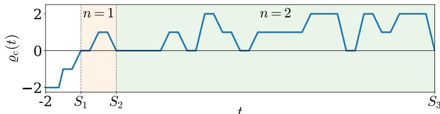  
Figure 5: $\varrho _ { c }$ in $[ - 2 , S _ { 3 } )$ , to be compared with $\varrho$ in Figure 2. Each jump of $\varrho$ at an integer k is replaced by a linear ramp on $( k - w _ { k } , k )$ , of length $\begin{array} { l } { { \frac { 1 } { 2 } } } \end{array}$ for $k \geq 0$ and of geometrically shrinking length $2 ^ { k - \bar { 1 } }$ for $k < 0$

Network. Let $p \in [ 1 , \infty ) , f \in \mathcal { H } _ { \lambda , R } ^ { \alpha } ( [ 0 , 1 ] ^ { d } )$ and $\varepsilon > 0$ . Let $\delta , M , B , K , n , q _ { \ell } , J _ { f } , N _ { f }$ be defined by (5), (6) and (12) with $\varepsilon$ replaced by $\varepsilon / 2$ , so that $\lambda M ^ { - \alpha } + \delta \leq \varepsilon / 2$ , and put

$$
N _ { 0 } : = \operatorname* { m a x } \biggr \{ 0 , \ : \ : \biggl \lceil \log _ { 2 } d + p \log _ { 2 } \frac { 2 ( 2 R + \delta n ) } { \varepsilon } \biggr \rceil \biggr \} \in \mathbb { N } _ { 0 } ,\tag{39}
$$

so that d 2 $^ { - N _ { 0 } } ( 2 R + \delta n ) ^ { p } \leq ( \varepsilon / 2 ) ^ { p }$ . The network $\Phi _ { f , \varepsilon , p } ^ { \varrho _ { c } } \in \mathcal { N } ( ( d , 1 ) ; \varrho _ { c } )$ is defined by

$$
u _ { j } ( { \pmb x } ) : = \varrho _ { c } \big ( M x _ { j } - ( M + 1 ) - N _ { 0 } \big ) , \quad j = 1 , \ldots , d ,\tag{40}
$$

$$
z ( \pmb { x } ) : = \varrho _ { c } \Big ( N _ { f } + \sum _ { j = 1 } ^ { d } ( M + 1 ) ^ { j - 1 } \big ( u _ { j } ( \pmb { x } ) + M + 1 + N _ { 0 } \big ) \Big ) , \qquad ( 2 \mathrm { n d ~ h i d d e n ~ l a y e r } ) \ ( 4 1 )
$$

$$
\Phi _ { f , \varepsilon , p } ^ { \varrho _ { c } } ( { \pmb x } ) : = - R + \delta z ( { \pmb x } ) .\tag{42}
$$

Compared with (13)–(15), the only changes are the activation and the shift $N _ { 0 }$ , which is compensated in the second-layer bias; now the second-layer bias is the integer $N _ { f } + ( M + 1 +$ $N _ { 0 } ) \sum _ { i = 1 } ^ { d } ( M + 1 ) ^ { j - 1 } = N _ { f } + ( M + 1 + N _ { 0 } ) ( K - 1 ) / M$

Transition region. For $\pmb { x } \in [ 0 , 1 ] ^ { d }$ , the arguments $t _ { j } ( \pmb { x } ) : = M x _ { j } - ( M + 1 ) - N _ { 0 }$ in (40) lie in $[ - ( M + 1 ) - N _ { 0 } , - 1 - N _ { 0 } ]$ , so the transition intervals that can be met are $( k - w _ { k } , k )$ with $k \in \{ - M - N _ { 0 } , \ldots , - 1 - N _ { 0 } \}$ , each of length $w _ { k } \leq 2 ^ { - N _ { 0 } - 2 }$ in $t _ { j } , \mathrm { i . e . } w _ { k } / M$ in $x _ { j }$ . Define $\begin{array} { r } { \Lambda : = \big \{ \pmb { x } \in [ 0 , 1 ] ^ { d } \colon t _ { j } ( \pmb { x } ) \in \bigcup _ { k \in \mathbb { Z } } ( k - w _ { k } , k ) } \end{array}$ for some $j \}$ , whose Lebesgue measure satisfies

$$
| \Lambda | \leq d \sum _ { k \leq - 1 - N _ { 0 } } \frac { w _ { k } } { M } = \frac { d 2 ^ { - N _ { 0 } - 1 } } { M } \leq d 2 ^ { - N _ { 0 } } .\tag{43}
$$

Lemma E.2. For $\pmb { x } \in [ 0 , 1 ] ^ { d } \backslash \Lambda , u _ { j } ( \pmb { x } ) = \lfloor M x _ { j } \rfloor - ( M + 1 ) - N _ { 0 }$ for all j and $z ( \pmb { x } ) = q _ { r ( \pmb { x } ) } ;$ hence $\Phi _ { f , \varepsilon , p } ^ { \varrho _ { c } } ( { \pmb x } ) = \widehat { f } _ { r ( { \pmb x } ) }$ and $| f ( \pmb { x } ) - \Phi _ { f , \varepsilon , p } ^ { \varrho _ { c } } ( \pmb { x } ) | < \varepsilon / 2$ . For all $\pmb { x } \in [ 0 , 1 ] ^ { d } , 0 \leq z ( \pmb { x } ) \leq n$ and $| f ( \pmb { x } ) - \overset { \cdot } { \Phi } _ { f , \varepsilon , p } ^ { \varrho _ { c } ^ { \star } } ( \pmb { x } ) | \leq 2 R + \delta n$

Proof. If x $\notin \Lambda ,$ each $t _ { j } ( \pmb { x } )$ is negative and outside every transition interval, so $\varrho _ { c } ( t _ { j } ( { \pmb x } ) ) =$ $\varrho ( t _ { j } ( \pmb { x } ) ) = \lfloor t _ { j } ( \pmb { x } ) \rfloor = \lfloor M x _ { j } \rfloor - ( M + 1 ) - N _ { 0 }$ . The argument of $\varrho _ { c }$ in (41) is then the integer $N _ { f } + r ( { \pmb x } )$ , at which $\varrho _ { c }$ agrees with $\varrho ,$ and $\varrho ( N _ { f } + r ( { \pmb x } ) ) = q _ { r ( { \pmb x } ) }$ by (11); the error bound is (7) with $\varepsilon / 2$

For arbitrary x, since $t _ { j } ( \pmb { x } ) \in [ - ( M + 1 ) - N _ { 0 } , - 1 - N _ { 0 } ]$ and $\varrho _ { c }$ lies between the neighboring values of ⌊·⌋ on this range, $u _ { j } ( { \pmb x } ) + M + 1 + N _ { 0 } \in [ 0 , M ]$ . Hence the preactivation part in (41) lies in $\begin{array} { r } { [ N _ { f } , N _ { f } + M \sum _ { i = 1 } ^ { d } ( M + 1 ) ^ { j - 1 } ] = [ N _ { f } , N _ { f } + K - 1 ] \subset [ S _ { n } , S _ { n + 1 } - 1 ] } \end{array}$ , because $K \leq n$ and $\begin{array} { r } { N _ { f } + n - 1 \le S _ { n } + n ( n \overset { \cdot } { + } 1 ) ^ { n } - 1 = S _ { n + 1 } - 1 . } \end{array}$ On $[ S _ { n } , S _ { n + 1 } ]$ we have $0 \leq \varrho _ { c } \leq n$ , so $0 \leq z ( { \pmb x } ) \leq n .$ $\Phi _ { f , \varepsilon , p } ^ { \dot { \varrho } _ { c } } ( { \pmb x } ) \in [ - R , - R + \delta n ]$ , and since $f ( \pmb { x } ) \in [ - R , R ]$ the last claim follows. □

Theorem E.3 (Fixed continuous activation, $( d , 1 )$ architecture, $L ^ { p }$ guarantee). Let $d \in \mathbb { N } _ { + }$ $\alpha \in ( 0 , 1 ] , \lambda > 0 , R \in \mathbb { N } _ { + }$ and $p \in [ 1 , \infty )$ . For every $f \in \mathcal { H } _ { \lambda , R } ^ { \alpha } ( [ 0 , 1 ] ^ { d } )$ and every $\varepsilon > 0$ , the network $\Phi _ { f , \varepsilon , p } ^ { \varrho _ { c } } \in \mathcal { N } ( ( d , 1 ) ; \varrho _ { c } )$ defined by (40)–(42) satisfies

$$
\| f - \Phi _ { f , \varepsilon , p } ^ { \varrho _ { c } } \| _ { L ^ { p } ( [ 0 , 1 ] ^ { d } ) } \leq \varepsilon .
$$

The activation $\varrho _ { c }$ is continuous and does not depend on $f , \varepsilon , p$ or d.

Proof. Splitting $[ 0 , 1 ] ^ { d }$ into Λ and its complement and using (43) and Lemma E.2,

$$
\begin{array} { r l r } {  { \big \| \boldsymbol { f } - \Phi _ { \boldsymbol { f } , \varepsilon , p } ^ { \varrho _ { c } } \big \| _ { L ^ { p } ( [ 0 , 1 ] ^ { d } ) } ^ { p } = \int _ { [ 0 , 1 ] ^ { d } \backslash \Lambda } \big | \boldsymbol { f } - \Phi _ { \boldsymbol { f } , \varepsilon , p } ^ { \varrho _ { c } } \big | ^ { p } + \int _ { \Lambda } \big | \boldsymbol { f } - \Phi _ { \boldsymbol { f } , \varepsilon , p } ^ { \varrho _ { c } } \big | ^ { p } } } \\ & { } & { \leq \Big ( \frac { \varepsilon } { 2 } \Big ) ^ { p } + d 2 ^ { - N _ { 0 } } ( 2 R + \delta n ) ^ { p } \leq 2 \Big ( \frac { \varepsilon } { 2 } \Big ) ^ { p } \leq \varepsilon ^ { p } . } \end{array}
$$

Remark E.4 (Parameters and bit complexity of $\Phi _ { f , \varepsilon , p } ^ { \varrho _ { c } } )$ . For $R \in \mathbb { N } _ { + }$ , all parameters of $\Phi _ { f , \varepsilon , p } ^ { \varrho _ { c } }$ are integers except the dyadic output weight δ, and $\varrho _ { c }$ takes rational values at rational arguments, so the network can be evaluated in exact arithmetic as in Section 6.

Compared with $\Phi _ { f , \varepsilon / 2 } ^ { \varrho } ,$ only two parameters change: the first-layer biases decrease by $N _ { 0 }$ and the second-layer bias increases by the integer $N _ { 0 } ( K - 1 ) / M .$ Since $\delta n \leq \delta K + \delta ( B - 1 )$ with $\delta K = \Theta ( \varepsilon ^ { 1 - d / \alpha } )$ and $\delta ( B - 1 ) \leq 4 R + 2 \delta$ by (5), (39) gives $\begin{array} { r } { N _ { 0 } = O \bigl ( p \frac { d } { \alpha } \log \frac { 1 } { \varepsilon } \bigr ) } \end{array}$ , so these changes cost $O ( \log { \frac { 1 } { \varepsilon } } )$ bits for fixed $d , \alpha , \lambda , R , p .$ , while the dominant term bit $\begin{array} { r } { ( N _ { f } ) = \Theta ( \varepsilon ^ { - d / \alpha } \log \frac { 1 } { \varepsilon } ) } \end{array}$ from the proof of Theorem 5.1 is unchanged. Hence, for $\begin{array} { r } { d \geq 2 , \operatorname* { s u p } _ { f \in \mathcal { H } _ { \lambda , R } ^ { \alpha } ( [ 0 , 1 ] ^ { d } ) } \operatorname { b i t } \bigl ( \Phi _ { f , \varepsilon , p } ^ { \varrho _ { c } } \bigr ) } \end{array}$ = $\Theta \left( \varepsilon ^ { - d / \alpha } \log { \frac { 1 } { \varepsilon } } \right)$ : the continuous $L ^ { p }$ construction has the same asymptotic bit complexity as the discontinuous $L ^ { \infty }$ construction.

## F Additional Figures and Tables

In this appendix, we present additional figures and tables that help to understand our construction or numerical results.  
Table 2: Position encoding example for $d = 2$ and $M = 3$ , where $I _ { 1 } = [ 0 , { \frac { 1 } { 3 } } )$ $I _ { 2 } = [ \frac { 1 } { 3 } , \frac { 2 } { 3 } )$ , $I _ { 3 } = \left[ \frac { 2 } { 3 } , 1 \right)$ , and $I _ { 4 } = \{ 1 \}$
<table><tr><td rowspan=1 colspan=1> $Q _ { \ell }$       $\pmb { x } ^ { ( \ell ) }$      8</td><td rowspan=1 colspan=1> $Q _ { \ell }$       $\pmb { x } ^ { ( \ell ) }$      （</td><td rowspan=1 colspan=1> $Q _ { \ell }$       $\pmb { x } ^ { ( \ell ) }$      l</td><td rowspan=1 colspan=1> $Q _ { \ell }$       $\pmb { x } ^ { ( \ell ) }$      8</td></tr><tr><td rowspan=1 colspan=1> $I _ { 1 } \times I _ { 1 }$  (0,0)(0)4 $I _ { 1 } \times I _ { 2 } ( 0 , \textstyle { \frac { 1 } { 3 } } )$  (10)4 $I _ { 1 } \times I _ { 3 } ( 0 , \frac { 2 } { 3 } )$  (20)4 $I _ { 1 } \times I _ { 4 }$  (0,1) (30)4</td><td rowspan=1 colspan=1> $I _ { 2 } \times I _ { 1 }$   (1, 0)(1)4 $I _ { 2 } \times I _ { 2 } ( \frac { 1 } { 3 } , \frac { 1 } { 3 } )$  (11)4 $I _ { 2 } \times I _ { 3 } ( \frac { 1 } { 3 } , \frac { 2 } { 3 } )$  (21)4 $I _ { 2 } \times I _ { 4 } \quad ( \textstyle { \frac { 1 } { 3 } } , 1 )$  (31)4</td><td rowspan=1 colspan=1> $I _ { 3 } \times I _ { 1 }$    $\textstyle { \left( { \frac { 2 } { 3 } } , 0 \right) }$   (2)4 $I _ { 3 } \times I _ { 2 }$  (2 , 1) (12)4 $I _ { 3 } \times I _ { 3 } ( \frac { 2 } { 3 } , \frac { 2 } { 3 } )$  (22)4 $I _ { 3 } \times I _ { 4 }$  (x, 1) (32)4</td><td rowspan=1 colspan=1> $I _ { 4 } \times I _ { 1 }$  (1,0)   $( 3 ) _ { 4 }$  $I _ { 4 } \times I _ { 2 }$  (1, 1) (13)4 $I _ { 4 } \times I _ { 3 }$  (1, 2) (23)4 $I _ { 4 } \times I _ { 4 }$  (1,1) (33)4</td></tr></table>

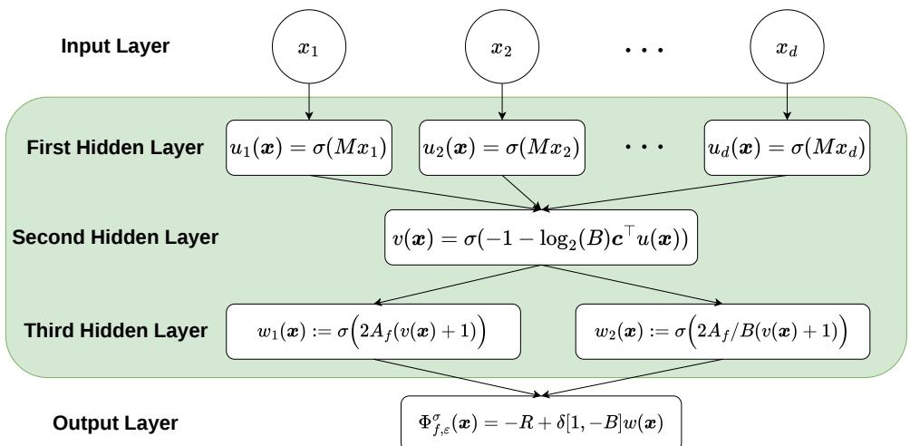  
Figure 6: Architecture of the elementary network $\Phi _ { f , \varepsilon } ^ { \sigma }$ in Theorem 4.1. It has hidden-layer widths (d, 1, 2) and $d + 3$ hidden neurons in total.

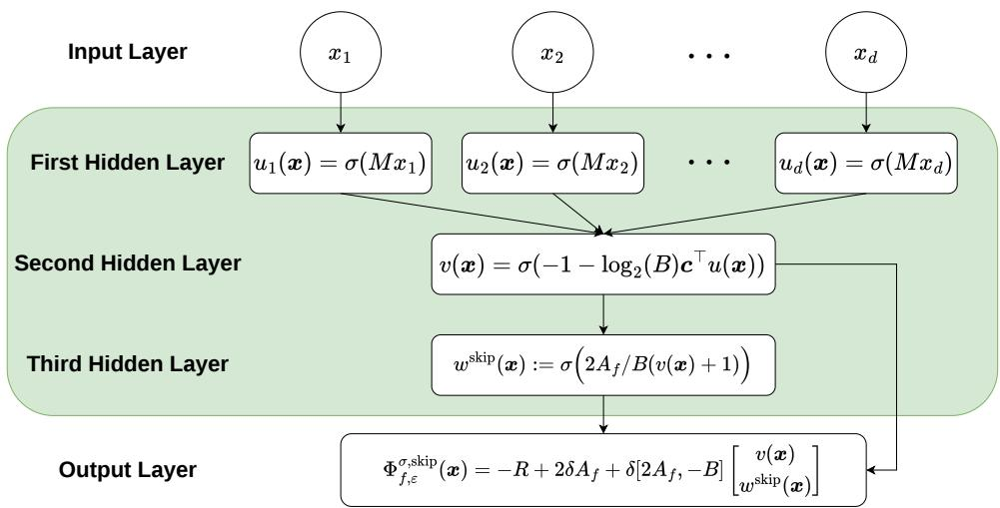  
Figure 7: Architecture of the elementary network with a skip connection, $\Phi _ { f , \varepsilon } ^ { \sigma , \mathrm { s k i p } }$ , in Theorem 4.1. It has hidden-layer widths (d, 1, 1) and $d + 2$ hidden neurons in total.

Table 3: Parameters, encoding bit lengths, and empirical errors for the three network constructions on $f _ { 1 } , \ldots , f _ { 6 }$ . The test set $\mathcal { X } _ { \mathrm { t e s t } }$ contains 3,004 points for $f _ { 1 } , \ldots , f _ { 4 }$ and 3,008 points for $f _ { 5 } , f _ { 6 }$ The empirical errors are $\begin{array} { r } { E _ { \varrho } : = \operatorname* { m a x } _ { \substack { x \in \mathcal { X } _ { \mathrm { t e s t } } } } | f ( \pmb { x } ) - \Phi _ { f , \varepsilon } ^ { \varrho } ( \pmb { x } ) | , E _ { \sigma } : = \operatorname* { m a x } _ { \pmb { x } \in \mathcal { X } _ { \mathrm { t e s t } } } | f ( \pmb { x } ) - \Phi _ { f , \varepsilon } ^ { \sigma } ( \pmb { x } ) | } \end{array}$ |, and $\begin{array} { r } { E _ { \sigma , \mathrm { s k i p } } : = \operatorname* { m a x } _ { \pmb { x } \in \mathcal { X } _ { \mathrm { t e s t } } } | f ( \pmb { x } ) - \Phi _ { f , \varepsilon } ^ { \sigma , \mathrm { s k i p } } ( \pmb { x } ) | } \end{array}$
<table><tr><td>f</td><td>ε</td><td>δ</td><td>M</td><td>K</td><td>B</td><td> $\operatorname { b i t } ( A _ { f } )$ </td><td> $\mathrm { b i t } ( N _ { f } )$ </td><td> $\frac { \mathrm { b i t } ( A _ { f } ) } { K \log _ { 2 } B }$ </td><td> $\frac { \mathrm { b i t } ( N _ { f } ) } { n \log _ { 2 } ( n + 1 ) }$ </td><td> $E _ { \varrho }$ </td><td></td><td> $E _ { \sigma } ~ E _ { \sigma , \mathrm { s k i p } }$ </td></tr><tr><td></td><td> $f _ { 1 } \ 2 ^ { - 1 } \ 2 ^ { - 2 }$ </td><td></td><td>13</td><td>196</td><td>16</td><td>782</td><td>1497</td><td>0.9974</td><td></td><td>1.0021 0.3275</td><td>0.3275</td><td>0.2611</td></tr><tr><td></td><td></td><td> $\stackrel { \cdot } { f _ { 1 } } 2 ^ { - 2 } 2 ^ { - 3 }$ </td><td>26</td><td>729</td><td>32</td><td>3643</td><td>6938</td><td>0.9995</td><td></td><td>1.0006 0.1760 0.1760 0.1438</td><td></td><td></td></tr><tr><td></td><td> $f _ { 1 } \ 2 ^ { - 3 } \ 2 ^ { - 4 }$ </td><td></td><td>51</td><td>2704</td><td>64</td><td>16 222</td><td>30 834</td><td>0.9999</td><td>1.0001 0.0912</td><td></td><td>0.0912</td><td>0.0762</td></tr><tr><td></td><td> $f _ { 1 } \ 2 ^ { - 4 } \ 2 ^ { - 5 }$ </td><td></td><td>101</td><td>10 404</td><td>128</td><td>72826</td><td>138 847</td><td>1.0000</td><td>1.00000.0416</td><td></td><td>0.0416</td><td>0.0335</td></tr><tr><td></td><td> $f _ { 1 } \ 2 ^ { - 5 } \ 2 ^ { - 6 }$ </td><td></td><td>202</td><td>41 209</td><td>256</td><td>329 670</td><td>631 770</td><td>1.0000</td><td>1.0000 0.0223</td><td></td><td>0.0223</td><td>0.0186</td></tr><tr><td></td><td> $f _ { 1 } \ 2 ^ { - 6 } \ 2 ^ { - 7 }$ </td><td></td><td>403</td><td>163 216</td><td>512</td><td>1468 942</td><td>2 826 326</td><td>1.0000</td><td></td><td>1.0000 0.0116 0.0116</td><td></td><td>0.0097</td></tr><tr><td></td><td> $\stackrel { \cdot } { f _ { 1 } } 2 ^ { - 7 } 2 ^ { - 8 }$ </td><td></td><td>805</td><td>649 636</td><td>1024</td><td>6496 358</td><td>12 544008</td><td>1.0000</td><td></td><td>1.0000 0.0056 0.0056 0.0045</td><td></td><td></td></tr><tr><td></td><td></td><td> $f _ { 2 } \ 2 ^ { - 1 } \ 2 ^ { - 2 }$ </td><td>49</td><td>2500</td><td>32</td><td>12499</td><td>28 225</td><td>0.9999</td><td>1.0002 0.2978</td><td></td><td>0.2978</td><td>0.2785</td></tr><tr><td></td><td></td><td> $f _ { 2 } \ 2 ^ { - 2 } \ 2 ^ { - 3 }$ </td><td>196</td><td>38 809</td><td>64</td><td>232 853</td><td>591 615</td><td>1.0000</td><td></td><td>1.0000 0.1772 0.1772 0.1435</td><td></td><td></td></tr><tr><td></td><td></td><td> $f _ { 2 } \ 2 ^ { - 3 } \ 2 ^ { - 4 }$ </td><td>784</td><td>616 225</td><td>128</td><td></td><td>4313 574 11 851 923</td><td>1.0000</td><td></td><td>1.0000 0.0911 0.0911 0.0734</td><td></td><td></td></tr><tr><td></td><td></td><td> $f _ { 3 } \ 2 ^ { - 1 } \ 2 ^ { - 2 }$ </td><td>76</td><td>5929</td><td>16</td><td>23 715</td><td>74316</td><td>1.0000</td><td></td><td>1.0000 0.4500 0.4500 0.4167</td><td></td><td></td></tr><tr><td></td><td></td><td> $f _ { 3 } \ 2 ^ { - 2 } \ 2 ^ { - 3 }$ </td><td>152</td><td>23 409</td><td>32</td><td>117044</td><td>339 781</td><td>1.0000</td><td></td><td>1.0000 0.2370 0.2370 0.2169</td><td></td><td></td></tr><tr><td></td><td></td><td> $f _ { 3 } \ 2 ^ { - 3 } \ 2 ^ { - 4 }$ </td><td>304</td><td>93 025</td><td>64</td><td>558149</td><td>1535 414</td><td>1.0000</td><td>1.00000.1189</td><td></td><td>0.1189</td><td>0.1110</td></tr><tr><td></td><td></td><td> $f _ { 3 } \ 2 ^ { - 4 } \ 2 ^ { - 5 }$ </td><td>608</td><td>370 881</td><td>128</td><td>2596 166</td><td>6861 527</td><td>1.0000</td><td></td><td>1.00000.0584 0.0584 0.0535</td><td></td><td></td></tr><tr><td></td><td></td><td> $f _ { 3 } \ 2 ^ { - 5 } \ 2 ^ { - 6 }$ </td><td></td><td>1 216 1 481 089</td><td></td><td></td><td>256 11 848 711 30 359 706</td><td>1.0000</td><td></td><td>1.0000 0.0301 0.0301 0.0276</td><td></td><td></td></tr><tr><td></td><td> $f _ { 4 } \ 2 ^ { - 1 } \ 2 ^ { - 2 }$ </td><td></td><td>74</td><td>5625</td><td>16</td><td>22498</td><td>70078</td><td>0.9999</td><td></td><td>1.00000.42190.42190.3552</td><td></td><td></td></tr><tr><td></td><td> $f _ { 4 } \ 2 ^ { - 2 } \ 2 ^ { - 3 }$ </td><td></td><td>147</td><td>21 904</td><td>32</td><td>109 518</td><td>315837</td><td>1.0000</td><td></td><td>1.0000 0.2027 0.2027 0.1654</td><td></td><td></td></tr><tr><td></td><td></td><td> $f _ { 4 } \ 2 ^ { - 3 } \ 2 ^ { - 4 }$ </td><td>293</td><td>86 436</td><td>64</td><td>518 614</td><td>1417500</td><td>1.0000</td><td></td><td>1.0000 0.0993 0.0993 0.0805</td><td></td><td></td></tr><tr><td></td><td></td><td> $f _ { 4 } \ 2 ^ { - 4 } \ 2 ^ { - 5 }$ </td><td>586</td><td>344569</td><td>128</td><td>2411 981</td><td>6 338158</td><td>1.0000</td><td></td><td>1.0000 0.0465 0.0465</td><td></td><td>0.0393</td></tr><tr><td></td><td></td><td> $f _ { 4 } \ 2 ^ { - 5 } \ 2 ^ { - 6 }$ </td><td></td><td>1 172 1 375 929</td><td></td><td>25611 007 430</td><td>28 057 917</td><td>1.0000</td><td></td><td>1.0000 0.0268 0.0268</td><td></td><td>0.0209</td></tr><tr><td></td><td></td><td> $f _ { 5 } \ 2 ^ { - 1 } \ 2 ^ { - 2 }$ </td><td>16</td><td>4913</td><td>16</td><td>19650</td><td>60 249</td><td>0.9999</td><td></td><td>1.0000 0.3384 0.3384 0.2839</td><td></td><td></td></tr><tr><td></td><td></td><td> $f _ { 5 } \ 2 ^ { - 2 } \ 2 ^ { - 3 }$ </td><td>32</td><td>35 937</td><td>32</td><td>179 683</td><td>543846</td><td>1.0000</td><td></td><td>1.0000 0.1620 0.1620 0.1399</td><td></td><td></td></tr><tr><td></td><td></td><td> $f _ { 5 } \ 2 ^ { - 3 } \ 2 ^ { - 4 }$ </td><td>63</td><td>262144</td><td>64</td><td>1572862</td><td>4718598</td><td>1.0000</td><td></td><td>1.00000.0864 0.0864 0.0755</td><td></td><td></td></tr><tr><td></td><td></td><td> $f _ { 5 } \ 2 ^ { - 4 } \ 2 ^ { - 5 }$ </td><td></td><td>125 2 000 376</td><td></td><td>12814 002 630</td><td>41 871 557</td><td>1.0000</td><td></td><td>1.0000 0.04760.04760.0412</td><td></td><td></td></tr><tr><td></td><td></td><td> $f _ { 6 } \ 2 ^ { - 1 } \ 2 ^ { - 2 }$ </td><td>11</td><td>1728</td><td>16</td><td>6910</td><td>18 588</td><td>0.9997</td><td></td><td>1.0001 0.4025 0.4025</td><td></td><td>0.3612</td></tr><tr><td></td><td></td><td> $f _ { 6 } \ 2 ^ { - 2 } \ 2 ^ { - 3 }$ </td><td>22</td><td>12167</td><td>32</td><td>60 833</td><td>165119</td><td>1.0000</td><td></td><td>1.00000.1959 0.1959 0.1717</td><td></td><td></td></tr><tr><td></td><td></td><td> $f _ { 6 } \ 2 ^ { - 3 } \ 2 ^ { - 4 }$   $f _ { 6 } \ 2 ^ { - 4 } \ 2 ^ { - 5 }$ </td><td>44</td><td>91125</td><td>64</td><td>546 748</td><td>1501 341 4934 78113 695 580</td><td>1.0000 1.0000</td><td></td><td>1.0000 0.1092 0.1092 0.0924 1.0000 0.0517 0.0517 0.0453</td><td></td><td></td></tr><tr><td></td><td></td><td></td><td>88</td><td>704 969</td><td>128</td><td></td><td></td><td></td><td></td><td></td><td></td><td></td></tr></table>

x1  
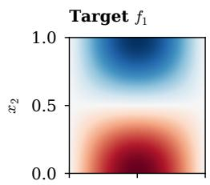

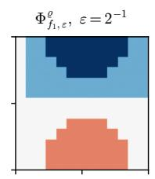

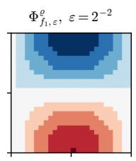

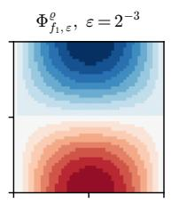

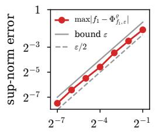

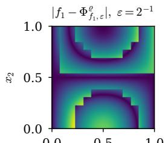

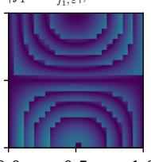

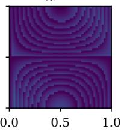  
Figure 8: Numerical verification of Theorem 3.1 for the approximation of the 2D function $f _ { 1 }$ by the three-neuron network $\Phi _ { f _ { 1 , \varepsilon } } ^ { \varrho } .$ The panels are arranged as in Figure 4, with $\varepsilon = { 2 ^ { - 1 } , 2 ^ { - 2 } , 2 ^ { - 3 } }$ (M = 13, 26, 51); the error plot additionally includes finer networks down to ε = 2−7.

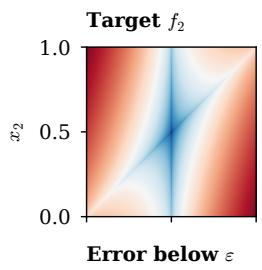

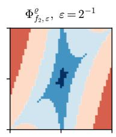

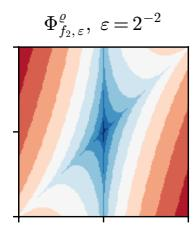

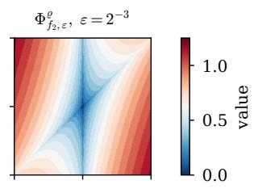

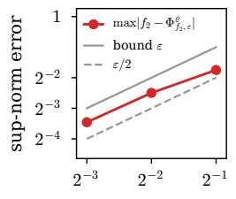

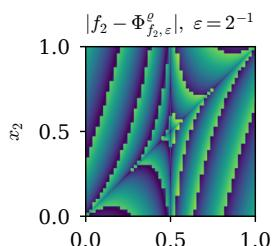

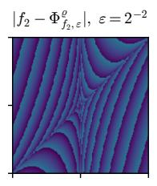

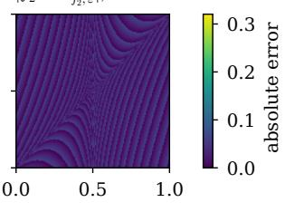  
Figure 9: Numerical verification of Theorem 3.1 for the approximation of the 2D function $f _ { 2 }$ by the three-neuron network $\Phi _ { f _ { 2 } , \varepsilon } ^ { \varrho } .$ The panels are arranged as in Figure 4, with $\varepsilon = { 2 ^ { - 1 } , 2 ^ { - 2 } , 2 ^ { - 3 } }$ (M = 49, 196, 784).

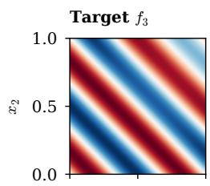

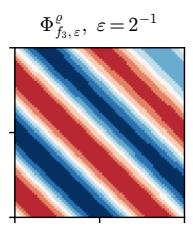

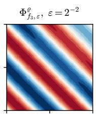

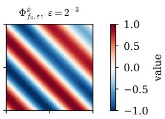

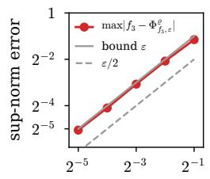

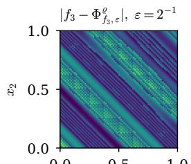

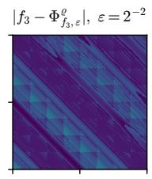

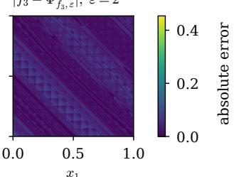  
Figure 10: Numerical verification of Theorem 3.1 for the approximation of the 2D function $f _ { 3 }$ by the three-neuron network $\Phi _ { f _ { 3 } , \varepsilon } ^ { \varrho }$ . The panels are arranged as in Figure 4, with $\varepsilon = { 2 ^ { - 1 } , 2 ^ { - 2 } , 2 ^ { - 3 } }$ $( M = 7 6 , 1 5 2 , 3 0 4 )$ ; the error plot additionally includes finer accuracy down to $\varepsilon = 2 ^ { - 5 }$

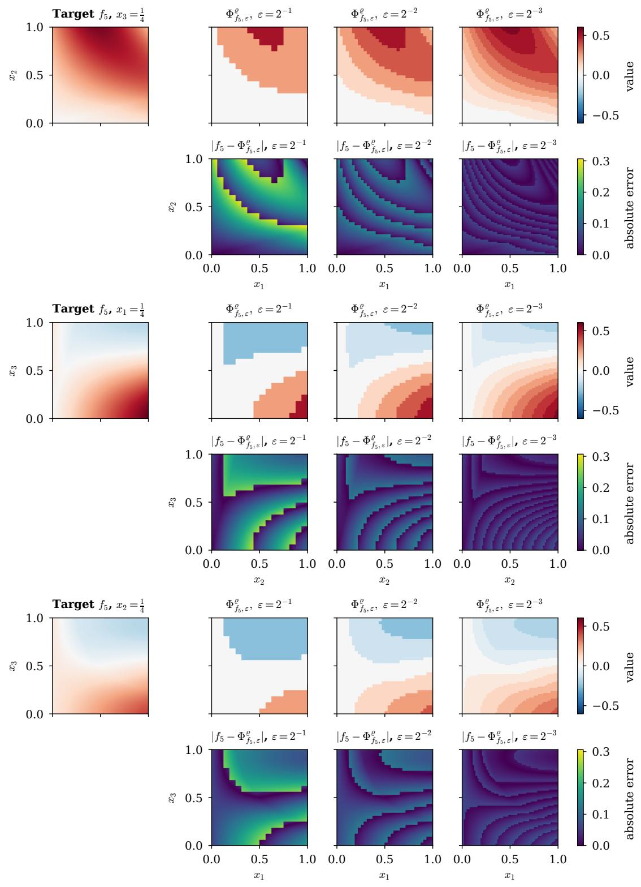  
Figure 11: Numerical verification of Theorem 3.1 for the approximation of the 3D function $f _ { 5 }$ by the four-neuron network $\Phi _ { f _ { 5 } , \varepsilon } ^ { \varrho }$ . From top to bottom, the panels show the x1x2, x2x3, and x1x3 sections, with the remaining coordinate fixed at 1/4. Within each panel, the top row contains the target and the network outputs for $\varepsilon = 2 ^ { - 1 } , 2 ^ { - 2 } , 2 ^ { - 3 } \ ( M = 1 6 , 3 2 , 6 3 )$ , and the bottom row contains the corresponding absolute errors.

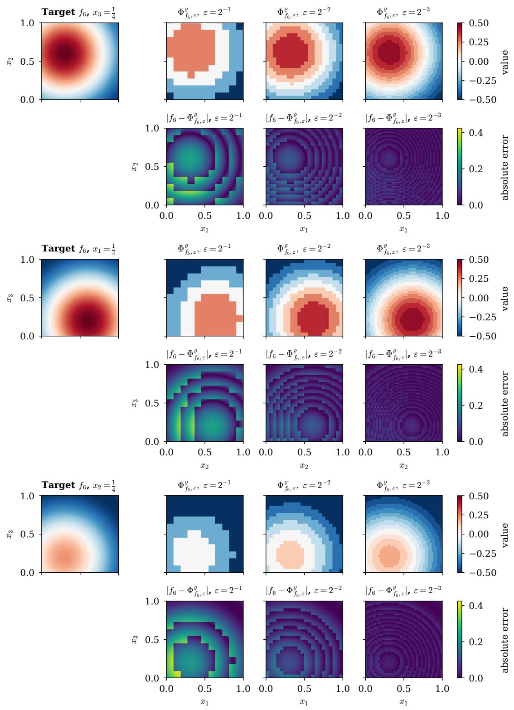  
Figure 12: Numerical verification of Theorem 3.1 for the approximation of the 3D function $f _ { 6 }$ by the four-neuron network $\Phi _ { f _ { 6 } , \varepsilon } ^ { \varrho }$ . The sections and panels are arranged as in Figure 11, with $\varepsilon = { 2 ^ { - 1 } , 2 ^ { - 2 } , 2 ^ { - 3 } }$ and $M = 1 1 , 2 2 , 4 4$

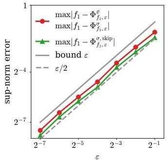  
(a) Target function $f _ { 1 }$

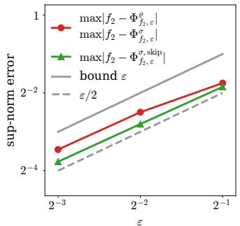  
(b) Target function $f _ { 2 } .$

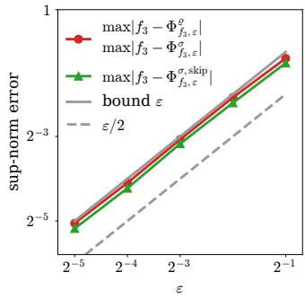  
(c) Target function $f _ { 3 } .$

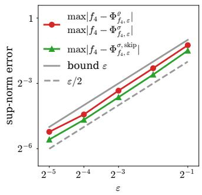  
(d) Target function $f _ { 4 } .$

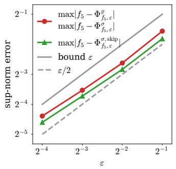  
(e) Target function $f _ { 5 } .$

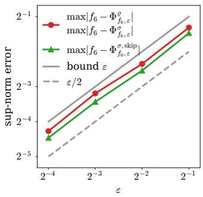  
(f) Target function $f _ { 6 }$

Figure 13: Sup-norm errors for the three network constructions applied to $f _ { 1 } , \ldots , f _ { 6 }$ , evaluated in exact arithmetic over 3,004 test points for ${ f _ { 1 } , . . . , f _ { 4 } } \left( { d = 2 } \right)$ and 3,008 test points for $f _ { 5 }$ and $f _ { 6 } \ ( d = 3 )$ . Each test set consists of 2,000 random points, 1,000 boundary points, and the $2 ^ { d }$ corners. The exact and elementary networks attain identical maximal errors and are therefore represented by a single curve, while the skip-connection network is shown separately. All errors remain below the prescribed accuracy ε.