# Audit the Scaffold, Not the Checkpoint: A Stationarity Dichotomy for Recursive Self-Improvement in Agentic Coding

Sebastian Bobadilla-Suarez<sup>∗</sup> OnCorps sebastian.suarez@oncorps.io

Bob Suh   
OnCorps   
bob@oncorps.io   
Ryan Fortin   
OnCorps   
ryan@oncorps.io

## Abstract

An auditor who checks whether a system’s weights are frozen is checking the wrong thing. Our stationarity dichotomy says that iterative self-modification hits strict diminishing returns whenever the agent’s reachable set of edits stays fixed, and can escape only if that set expands. Rewriting scaffolding—tools, verifiers, decomposition—expands what an agent reaches without touching a weight, so frozen weights buy an eventual ceiling but no stationarity along the way. The criterion also separates three regimes usually merged: search within a fixed class, testtime training that raises the ceiling itself, and scaffold rewriting between them. Audit the scaffold, not the checkpoint.

The same ceiling binds sideways. Best-of-k orchestration realizes the best worker’s ceiling exactly: width buys rate, not budget. Re-consulting a fixed pool has a horizon computable in advance, decided by the pool alone, and the one arrangement that would beat it, a weighted vote, needs diversity real workers lack: on 30 same-family workers the failure overlap sits at its maximum, and a majority fails 23/55 (42%) of tasks.

We obtain the criterion by reading refinement as gradient boosting on the residual error between draft and target, a patch or git diff, and then measuring where that reading breaks: patches compose instead of standing beside each other to be voted on, and failures overlap. What we measure is saturation. Per-round improvement decays toward zero on SWE-bench, and churn decays geometrically across 401 production sessions, a shape shared with a pre-AI human baseline that establishes the regime without identifying its cause. Both breaks are engineering choices rather than laws about code, so together they specify a harness worth building.

## 1 Introduction

Individual LLM calls remain weak in a precise sense: they make errors and struggle with complex, multi-step reasoning. A growing practice addresses this by deploying multiple agents that iteratively generate, critique, and refine code—agentic coding. The stakes of formalizing that practice are no longer speculative. Anthropic reports that more than 80% of the code merged into its own production codebase was authored by Claude as of May 2026, up from low single digits before its coding-agent preview launched in February 2025. Engineers increasingly supply the goal rather than the method [Favaro and Clark, 2026]. At that scale, agentic coding also becomes a tangible microcosm for the mechanics of AI recursive self-improvement (RSI) [Good, 1965, Bostrom, 2014]. Yet the practice lacks a rigorous mathematical foundation: how many agents to use, how to formulate patches, and when to stop refining are all largely ad hoc. This paper asks: when does iterative self-modification run out ofroom, and is afrozen checkpoint evidence that it has?

The answer is a structural dichotomy (§4) and not a tunable threshold: RSI saturates whenever the agent’s reachable set of edits stays fixed, and can run away only if that set keeps expanding. Sofrozen weights are not by themselves sufficient for the bounded regime, and the object to audit is the scaffold (§6); whether real systems occupy that bounded regime is a statistical question Parts B–C test. We reach the criterion by reading refinement as gradient boosting on the residual error, then measuring where the reading breaks. Each agent refines an existing draft, predicting the residual between current code and target; it does not generate one from scratch, and that is what makes the process functional gradient descent. Deployed loops then fail two of boosting’s defining preconditions, and we measure those failures instead of assuming them away (§3). Two scope limits up front. The criterion is checkable only through a scaffold-immutability proxy, not a general estimator for the hypothesis class, which we lack; and the production dynamics are consistent with the bounded regime without establishing that a fixed hypothesis class causes them (§5.2). Within those limits, what follows is a criterion, not a convergence rate.

## Contributions.

• Audit the scaffold, not the checkpoint. The refinement game yields monotone improvement with saturation (Thm. 2) and a stationarity dichotomy (Prop. 3): strict diminishing returns whenever the reachable edit set stays fixed. Since rewriting scaffolding expands that set without touching a weight, frozen weights buy an eventual ceiling but no stationarity along the way (Cor. 4). Expansion is necessary but not sufficient for escape, so the diagnostic over-flags by construction. Saturation is measured on both sides: on SWE-bench, and across 401 production sessions against a 9,395-session pre-AI baseline (§5.1, §5.2).

• The same ceiling binds sideways. Best-of-k orchestration realizes the best worker’s ceiling exactly (Prop. 5), and the weighted vote that would beat it needs diversity real workers lack. On our pool—same-family workers, so this settles only the pessimistic half—failure overlap sits at its maximum: some task defeats every worker, and a majority fails 23/55 (42%) of tasks, which by Prop. 6 is the vote’s error. Re-consulting that pool is bounded separately, and computably: either some nonnegative combination of it already fits the work, in which case the edge survives every round, or the edge hypothesis fails by round log $( 1 / \epsilon _ { 0 } ) / 2 \gamma ^ { 2 }$ , uniformly over the schedule, where ϵ<sub>0</sub> is the best error any nonnegative combination achieves and γ the per-round edge (Prop. 7, §4, Appendix C).

• Where deployed loops break boosting. They fail its preconditions in two places we locate and measure. Neither is a law about code; both are engineering choices, so read prescriptively they specify a harness—unbuilt, ours included—precisely enough to build from (§3, open problem 1).

## 2 Related Work

AdaBoost [Freund and Schapire, 1997] and its margin-based generalization [Schapire et al., 1998, Schapire, 2013] underwrite our theoretical results. Boosting as functional gradient descent [Mason et al., 1999, Friedman, 2001] underwrites the residual-as-patch mapping, and the specification-tocode map is an instance of structured prediction [Tsochantaridis et al., 2005]. The “intelligence explosion” [Good, 1965, Bostrom, 2014] and the Godel machine [Schmidhuber, 2003] motivate the¨ RSI reading. Code-level self-improvement is precisely the regime our frozen-weight ceiling addresses: STOP [Zelikman et al., 2023], FunSearch [Romera-Paredes et al., 2024], and the Darwin Godel Machine [Zhang et al., 2025a], which rewrites its own scaffold with frozen weights. The har-¨ ness itself is increasingly argued to be a separately-optimizable layer [He et al., 2026]. Concurrent work pushes that axis to its limit: Xue and Yang [2026] let a frontier model compose its own improvement process online, which is frozen-weight scaffold expansion in close to its purest form, and find it beats staged and reflective-evolutionary pipelines [Agrawal et al., 2026] with a strong optimizer but loses with a medium one. Under Cor. 4 that is the expected shape, since scaffold expansion pays only as far as the frozen checkpoint allows. A recent survey taxonomizes RSI along the same axis, convergent bounded self-refinement vs. open-ended RSI [Chen et al., 2026], and our dichotomy (Prop. 3) gives that split a structural cause. Empirical multi-agent and self-refinement systems, and the test-time-compute scaling literature whose diminishing returns our refinement game predicts from first principles, are surveyed in Appendix G.1.

One quantity needs separating from a nearby one, since our overlap result would otherwise read as known. Repeated sampling measures coverage, whether any of k samples solves a task, and coverage keeps growing with k [Brown et al., 2024]. That is a statement about an oracle verifier’s reach: it presumes something can identify the good sample after the fact. Prop. 6 governs the different quantity an orchestrator is left with when no such verifier exists: the majority vote’s error. And $m ^ { \star } { = } k$ says the tasks a vote cannot recover are exactly those every worker fails. Growing coverage and a failing vote are therefore consistent, and it is the second that binds verifier-free orchestration. Cross-family aggregation is where the optimistic half would be settled, and the existing cross-vendor aggregators [Wang et al., 2024, Jiang et al., 2023] report end-to-end gains without reporting the overlap statistic Prop. 6 makes decisive (open problem 2).

The dichotomy also separates three cases the test-time-scaling literature often merges: inference compute searches within a class the weights and scaffold already fix; test-time training [Sun et al., 2020, Hardt and Sun, 2024, Sun et al., 2025, Akyurek et al., 2025, H¨ ubotter et al., 2025] raises the¨ ceiling itself, as does letting the model’s own generated edits drive the update [Zweiger et al., 2025]; and between them sits this paper’s case, rewriting the scaffold with weights frozen. That separation is ours, and it matters: an auditor who checks only whether weights are frozen catches test-time training and misses scaffold expansion entirely (Appendix G.4).

## 3 Framework: Agentic Coding as Boosting

A weak coding agent predicts the residual error between the current draft and the optimal target, naturally represented as a git diff. It does not generate the full file from scratch. Requiring the patch to improve the draft more often than not is stringent in code space: a random edit almost surely breaks a working program, so even a small positive edge already presupposes non-trivial program understanding, not mere pattern completion (Remark 14). Two levels then come apart. The code artifact evolves by sequential composition: each patch applies on top of the current draft, so the process is order-dependent (the refinement game, Thm. 2). The boosting analysis operates on an additive confidence margin $\begin{array} { r } { f ( x ) = \sum _ { t } \alpha _ { t } h _ { t } ( x ) } \end{array}$ , a weighted vote over specifications, and it is this margin, not the code bytes, that decays exponentially under the exponential loss (Thm. 10). Appendix A (Table 1) tabulates the mapping term by term, alongside the Protocol it implies.

Finding: deployed loops compose where boosting retains, and their failures overlap. Structurally, a refinement loop composes patches $( R _ { T } \circ \cdots \circ R _ { 1 } )$ while AdaBoost retains all T learners and combines them by weighted vote, so each patch subsumes its predecessor instead of standing beside it: there is no additive margin for an implicit $\alpha _ { t }$ to weight, and no reweighted distribution $D _ { t }$ is maintained (two further structural gaps, and the objection that task decomposition might realize the protocol implicitly, in Appendix G.2). Empirically, worker failures are too correlated for the one boosting-exact arrangement to pay: the tight overlap sits at its ceiling, $m ^ { \star } { = } k$ , measured in $\ S 4$

Both breaks are engineering choices, so they specify a harness. Algorithm 1 states what a loop would need for the transferred guarantees to hold by construction: retention of all $T$ proposals instead of an overwritten draft, an explicit distribution $D _ { t }$ over specifications reweighted toward those still failing, and diversity sufficient to push the majority-failure rate below one half. Prop. 6 makes that last condition exact rather than merely sufficient (open problem 1, §6). Weighted voting over a shared instance is already boosting-exact (§4); what deployed practice lacks is retention and diversity. So the measurement does not retire the mapping as a model of agentic coding: it specifies the system that would satisfy it, one we do not build here and are not aware of anyone having built.

What the framing buys. It supplies the vocabulary (edge, weak-learning threshold, effective hypothesis class) that makes “will this run away?” structural rather than metaphorical; it names the invariant to track, the reachable class and its ceiling; and measuring where it fails produced the build specification above, Prop. 6, and Prop. 7, none of which the criterion alone would have suggested.

## 4 Theoretical Analysis

The algebraic steps below are machine-checked in Lean 4 (Mathlib, no axiom, no sorry). The check earns its keep concretely, by refuting a conjectured strict inequality in Prop. 5, and it cannot reach what matters most: (M1), (M2), and the mapping itself remain modeling assumptions no proof discharges (Remark $1 6 ) . ^ { 2 }$ Full proofs are in Appendix B. Let X be the space of specifications and $\mathcal { V }$ the space of code artifacts (a draft z, or the optimal target $y )$ , with a distribution $\mathcal { D }$ over $\mathcal { X } \times \mathcal { V }$ and a loss $L : \mathcal { V } \times \mathcal { V } \to \mathbb { R } _ { \ge 0 }$ (Table 1: e.g. token/AST edit distance).

Definition 1 (Weak Coding Agent). A weak coding agent proposes a patch via a refinement operator $R _ { t } : \mathcal { V } \times \mathcal { A }  \mathcal { V }$ , taking a draft z and an edit $\begin{array} { r } { a \in \bar { \mathcal { A } } t \bar { o } z ^ { \prime } \overset { \cdot } { = } \bar { R } _ { t } ( z , a ) , } \end{array}$ ; let $h _ { t } ( x ) \in \{ - 1 , + 1 \}$ indicate success on specification x, $h _ { t } ( x ) = + 1$ iff the draft returned matches the target, $L \dot { ( } y , z ^ { \prime } ) \dot { = } 0$ . Every label $i s + 1$ here, the target being solved by definition, so err<sub>D</sub> $\begin{array} { r } { \left( h _ { t } \right) = \mathrm { P r } [ h _ { t } ( \stackrel { \cdot } { x } ) = - 1 ] \stackrel { \cdot } { \le } \frac { 1 } { 2 } - \gamma _ { t } } \end{array}$ and the appendix’s generic $y _ { i }$ reads $a s + 1$ throughout; H is instantiated only in Theorem $I 2 .$ . This $\gamma _ { t }$ is the edge on solving, the one Thm. 10 and Cor. 11 require; Part B measures the edge on improving the previous draft, written $\begin{array} { r } { \tilde { \gamma } _ { t } = \frac { 1 } { N } \sum _ { i } \mathbf { 1 } [ q _ { i , t } > q _ { i , t - 1 } \hat { ] } - \frac { 1 } { 2 } } \end{array}$ on the passfraction $q _  i , $ oftask i at round t, which scores a tie $a t - \frac { 1 } { 2 }$ under the strict $> ( \ S 5 . I )$ . The two need not agree, and which is reported shapes the headline.

What survives when the Protocol’s specifics are dropped. The Agentic Boosting Protocol (Def. 9) is AdaBoost read over specifications, and three classical guarantees transfer verbatim under that reading (Thms. 10, 13, 12, Cor. 11). None is new and we rely on none: each needs a retained, reweighted ensemble that no deployed loop maintains, whatever its edge (Appendix B.1). The results below drop the Protocol’s specifics entirely—real loops maintain neither $D _ { t }$ nor $\alpha _ { t } { - } \mathbf { s } \mathbf { o }$ we name the more general update they do perform and ask what guarantee survives. They hold with no mention of AdaBoost: Thm. 2 and Prop. 3 are boosting-independent, and the framing supplies the vocabulary without supplying the necessity.

Theorem 2 (Monotone Improvement under Refinement). Write $z _ { t } = R _ { t } ( z _ { t - 1 } , a _ { t } ^ { * } )$ for the draft after round t at that round’s best action $a _ { t } ^ { * }$ , and suppose each $R _ { t }$ satisfies the improvement property $\begin{array} { r } { \mathbb { E } _ { y \sim \mathcal { D } ( \cdot | x ) } [ V ( R _ { t } ( z , a _ { t } ^ { * } ) ) ] \ge V ( z ) + \eta _ { t } } \end{array}$ for quality function $V : \mathcal { y }  [ 0 , 1 ]$ and $\eta _ { t } ~ > ~ 0 .$ . Then $\begin{array} { r } { \mathbb { E } [ V ( z _ { T } ) ] \geq V ( z _ { 0 } ) + \sum _ { t = 1 } ^ { T } \eta _ { t } } \end{array}$ , and since $V \leq 1$ , the total improvement saturates: $\textstyle \sum _ { t = 1 } ^ { \infty } \eta _ { t } \ \leq$ $1 - V \big ( z _ { 0 } \big )$

Thm. 2 already implies diminishing returns (Cor. 15 relaxes its expectation to a per-round tail bound), but leaves open what happens if the ceiling itself is not fixed; the following makes that condition precise—the paper’s central checkable criterion.

Proposition 3 (Stationarity Dichotomy). Consider the refinement game ofThm. 2. (i) Fixed ceiling ⇒ saturation. $H V ( z ) \ \stackrel { . } { \ \leq \ B }$ for all z, then $\begin{array} { r } { \sum _ { t = 1 } ^ { \infty } \eta _ { t } \stackrel { { } } { \le } B - \mathbb { E } \big [ V ( z _ { 0 } ) \big ] } \end{array}$ , forcing $\eta _ { t } \ \to \ 0 ;$ strict diminishing returns. (ii) Sustained $e d g e \Rightarrow$ divergence. If the effective hypothesis class expands enough to sustain a uniform edge $\eta _ { t } \geq c > 0$ , then $\mathbb { E } [ V ( z _ { T } ) ]$ grows without bound and no fixed ceiling can hold.

Both parts are formally verified in Lean (Proposition8.lean) and are immediate consequences of Thm. 2. Part (i) is the stationary regime a bounded quality metric enforces; part (ii) is what an unbounded “intelligence explosion” would require.

The proofs are elementary, a bounded-monotone-sequence argument and the Archimedean property, and that is the point. The claim is not that saturation was hard to prove but that the reachable clas is the right thing to track: posed that way the answer takes two lines, and the difficulty moves to the modelling assumptions, above all a bounded quality scale, which part (i) needs and a genuinely open-ended objective would deny (Appendix G.5). The safety-relevant instantiation sets the class to what fixed weights can reach: can reachable edits expand without changing a weight?

Corollary 4 (Frozen-Weight Ceiling). Model a self-improving system as $s ~ = ~ ( W , C )$ , frozen weights W and mutable scaffold C. Assume $( M I )$ class expandability: the effective hypothesis class $\mathcal { H } _ { t } ( C )$ can expand under a scaffold rewrite without altering W; and (M2) ultimate ceiling: $V ( z ) \leq \dot { V } ^ { * } ( W )$ for all z reachable by any scaffold the model can construct. Then (i) the system saturates at a value no greater than $V ^ { * } \dot { ( W ) } ( P r o p . \ : 3 ( i )$ with $B = V ^ { * } ( W ) ) ; ( i i )$ escaping this ceiling requires raising $V ^ { * } ( W )$ itself—modifying weights or architecture—not only rewriting the scaffold (contrapositive of Prop. 3(ii)).

Freezing W therefore does not by itself place a system in the safe, saturating regime, since (M1) permits $\mathcal { H } _ { t } ( C )$ to expand while W stays fixed; frozen weights guarantee only the eventual ceiling of part (i), not stationary behavior along the way. That asymmetry is the load-bearing content: given (M2), part (ii) is close to definitional, and neither (M1) nor (M2) is a theorem. Both are explicit modeling assumptions (Remark 16). The criterion also runs one way only, since Prop. 3(ii) needs a uniform edge $\eta _ { t } \geq c > 0 ;$ a scaffold that expands while its edge shrinks saturates anyway. Self-expansion is thus necessary for escape but not sufficient, and when the escape clause bites is open. Appendix G.4 works one instance, an agent whose test-isolation script persists across rounds, unlocking patches the previous configuration could not propose and so enlarging $\mathcal { H } _ { t } ( C )$ with W untouched. It also states where that boundary stops being sharp.

Orchestration: the ceiling along the width axis. The ceiling also binds when capability is added sideways, which is the case an orchestrator faces: let k frozen workers run under scaffolds $C _ { 1 } , \ldots , C _ { k }$ (distinct prompts, tools, or specializations, possibly sharing weights), with $V ^ { * } ( W , C _ { i } ) : = \operatorname* { s u p } \{ V ( z )$ : z reachable under C<sub>i</sub>} worker i’s tight ceiling.

Proposition 5 (Orchestration Selects a Ceiling; It Does Not Raise One). Best-of-k selection attains $V _ { \mathrm { o r c h } } ^ { * } = \operatorname* { m a x } _ { i } { V ^ { * } ( W , C _ { i } ) }$ exactly—an unconditional equality, holding even when no single worker’s reachable class contains the union of all of them. Consulting all k workers every round of the refinement game gives $\begin{array} { r } { \mathbb { E } [ V ( z _ { T } ) ] \geq V ( z _ { 0 } ) + \sum _ { t = 1 } ^ { T } \operatorname* { m a x } _ { i } \eta _ { t } ^ { ( i ) } } \end{array}$ , dominating every worker’s depthonly guarantee, yet since $V \leq 1$ the total improvement still saturates at ${ \mathrm { ~ \bar { 1 } ~ - ~ } } \dot { V } ( z _ { 0 } ) .$ : width buys rate, not budget. (The width half needs one hypothesis beyond Thm. 2’s—monotonicity of the inner action-expectation, since selection compares two integrands under the same expectation; Prop. 18 states it and theformalization flags it.)

Orchestration therefore selects which existing ceiling to realize and reaches it sooner; it does not create a higher one. That makes “reach for capability before orchestration” a consequence rather than a heuristic. There is no strict regime for hard selection: both halves are Lean-checked $( \mathsf { A p } \cdot$ pendix C). We had conjectured a strict inequality, and Lean supplied the counterexample we had missed: two disjoint singleton classes with equal values.

The diversity a vote would need is absent on real workers. Weighted voting is the one arrangement that escapes the ceiling, being boosting-exact, since workers answer the same instance and stand beside each other, so Thm. 10 transfers verbatim with t read as “worker” (Prop. 17). What it needs is diversity, and the requirement is an exact condition on a single integer.

Proposition 6 (Bounded Overlap Characterizes a Correct Vote). Let k workers with ±1 outputs be combined by the unweighted majority vote, and let $m _ { i } : = \# \{ t < k : y _ { i } h _ { t } ( x _ { i } ) = - 1 \}$ count the workers that fail point i, with $m ^ { \star } : = \operatorname* { m a x } _ { i } m _ { i }$ the tight overlap. Then the vote has zero training error iff $2 m _ { i } < k f o r$ every i—equivalently, $i f f m ^ { \star } < k / 2$ . The condition is sharp in two senses: a single point at $2 m _ { i } { = } k$ already makes the error nonzero, and if every point sits there the error is 1.

Part B’s pool misses the bar at the extreme: at every round $m ^ { \star } { = } k .$ , so some task defeats every worker, and a majority fails 23/55 (42%) of tasks, which is the vote’s error (0.418, 95% CI [0.291, 0.545]). A statistic at its maximum needs no interval, which is why $m ^ { \star } { = } k$ decides the question on its own. The proposition itself is bookkeeping, since splitting the margin at i gives $y _ { i } f ( x _ { i } ) = k - 2 m _ { i }$ . The measurement carries the content, because it turns “is this pool diverse enough to vote $\therefore ? ^ { \ast }$ into one countable integer. The error comparison settles nothing on its own. The vote’s error does exceed the mean per-worker error 0.356 here, but the paired gap’s interval includes zero (+0.062, 95% CI $[ - 0 . 0 1 8 , + 0 . 1 4 2 ] )$ , and the excess does not survive restricting the pool to one capability tier, where $\bar { m } ^ { \star } { = } k$ persists while the gap vanishes. Its sign is therefore an effect of pooling two tiers, not a fact about voting (Appendix C).

This is about as weak a diversity test as one could field, which cuts both ways. The workers are one vendor, two tiers and three prompt variants at temperature 0.25, and the feedback-mode contrast is itself null (§5.1), so the pool’s effective diversity is nearer two configurations than 6. Lowtemperature resampling of a single vendor is therefore close to a lower bound on diversity: it settles the pessimistic half, that resampling one model inherits its hard points, and cannot speak to the optimistic one. Whether genuinely different families clear the bar is the open question for anyone building a voting orchestrator, and this data cannot reach it (Appendix C).

Re-consulting a fixed pool has a horizon fixed in advance. Width and depth compose in practice, since an orchestrator consults its workers again each round, and how long that can pay is settled by one property of the pool: whether some nonnegative combination of its workers can already fit the work.

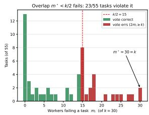

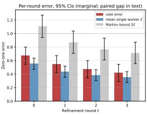  
Figure 1: Prop. 6’s overlap condition measured on $k { = } 3 0$ workers (6 arms × 5 seeds), shared 55-task pool. Left: workers failing each task; the condition needs every task strictly left of the dashed $k / 2$ line, so the red mass is the vote’s error and the spike at $m _ { i } { = } k$ is total overlap. Right: per round, vote error against mean per-worker error ϵ¯ and the Markov bound 2¯ϵ.

Proposition 7 (Reused-Pool Dichotomy). Fix a pool ofk workers and run Algorithm 1 over it under any schedule at the optimal confidences, with every scheduled worker having edge $\gamma > 0$ against the distribution current when it is used. Let $\epsilon _ { \mathrm { 0 } }$ be the smallest zero-one training error attained by any nonnegative combination of the pool. (i) $H \epsilon _ { 0 } > 0 ,$ , then $\epsilon _ { 0 } \leq e ^ { - 2 \gamma ^ { 2 } T }$ , hence $T \leq \log ( 1 / \epsilon _ { 0 } ) / 2 \gamma ^ { 2 } -$ the edge hypothesis provably fails by a finite, computable round, uniformly over the schedule and the confidences, and depending on k only through $\epsilon _ { \mathrm { 0 } } .$ . (ii) If instead the pool interpolates $( \epsilon _ { 0 } \mathrm { = } 0 )$ with margin θ at coefficient sum $S ,$ then for every distribution some member has edge $\gamma { = } \theta / 2 S > 0 ,$ fixed before the distribution is chosen, so the hypothesis survives every round ofany run. The cases are exhaustive and mutually exclusive.

A fixed pool is therefore not a renewable resource: unless it can already fit the work, re-consulting it has a horizon set by $\epsilon _ { \mathrm { 0 } }$ and $\gamma$ rather than by whatever compute an orchestrator is willing to spend. And the quantity deciding which side of the dichotomy a pool falls on, its reachable cone, is once again a property of the scaffold rather than of any weight. Both halves are Lean-checked and stated with their exact hypotheses as Props. 20 and 21.

## 5 Experiments

Three complementary parts. Part A is a stylized theoretical validation, reported entirely in Appendix D: decision stumps on SWE-bench TF-IDF features with synthetic labels, confirming the machinery is implemented correctly and claiming nothing about code or LLM behavior. Part B is a regime characterization: a real coding agent as the weak learner over K=55 SWE-bench Lite tasks $\times 5$ seeds. Part C supplies the ecological evidence: 401 production sessions, placing current practice in the bounded regime without identifying what causes it. All code, processed data, figure inputs, and the raw LLM response cache are in the supplementary repository.

## 5.1 Part B: LLM Agent Refinement on SWE-bench Lite

We treat mini-swe-agent [Yang et al., 2024] as the per-round weak learner, wrapped in a refinement outer loop of T=4 rounds, picked from pilot evidence that the edge collapses by round 1, over K=55 SWE-bench Lite tasks [Jimenez et al., 2024] × 5 seeds, at generation temperature 0.25. We cross feedback mode with model tier (Claude Sonnet, the stronger, vs. Claude Haiku 4.5, the weaker) in a $2 \times 3$ design (1,650 trajectories). Feedback mode is what each later round is told about the agent’s prior attempt: independent (no memory across rounds), blind (prior patch only, no critique), or diagnostic (prior patch plus which FAIL TO PASS tests still fail). No arm is shown the gold patch.

Scoring is a digest-pinned Docker harness running FAIL TO PASS/PASS TO PASS under pytest— true binary pass/fail, not an LLM judge. The evaluator is ours rather than SWE-bench’s own, and the reason matters for how to read the pool. A T-round loop needs per-round scoring inside a live container, which the official batch harness does not expose, so we score --junit-xml directly. That much was necessary; scoring every repository with pytest was not, since SWE-bench ships a per-repository test command that we reimplemented instead of importing. We audited the evaluator against the gold patch before trusting it, which is how we found the cost: applying the known-correct patch to the originally-sampled $K { = } 5 0$ pool left 23/50 (46%) tasks failing deterministically across $^ { 5 }$ root causes in our evaluator, each of which it would otherwise have scored as a model error. We fixed the two shared causes, re-verified against gold, and rebuilt to $K { = } 5 5$ , leaving a pool that is pytest-native by construction (Appendix E).

Results: the capability effect is real and large; the feedback-mode effect is an honestly underpowered null. $\mathrm { ~ A ~ 2 ~ } \times \mathrm { ~ 3 ~ }$ repeated-measures ANOVA (full table, Cohen’s $f$ values and required-K arithmetic in Appendix E) is unambiguous on one effect and silent on the other two, silent meaning underpowered and not negative: model tier explains roughly half the variance $( F ( 1 , 5 4 ) = 5 3 . 4 6 .$ $p { < } 0 . 0 0 0 1$ , partial $\eta ^ { 2 } { = } 0 . 4 9 7 \mathrm { ) }$ , while neither feedback mode $\scriptstyle ( p = 0 . 6 1 )$ nor the interaction $\scriptstyle ( p = 0 . 4 5 )$ reaches significance. Solve rates tell the same story: Haiku 44–49% across arms against Sonnet 85–89% $( \ge \tau { = } 0 . 6$ of a task’s tests passing, 95% Wilson CI; per-arm rates in Appendix E). A caseresampling bootstrap finds only $1 1 \% / 1 7 \%$ power (mode/interaction) at this K, and 80% power needs 7–9× the current sample. This null is underpowered, not evidence ofzero effect.

These are not SWE-bench resolve rates. Our $\tau { = } 0 . 6$ thresholds the fraction of FAIL TO PASS/PASS TO PASS tests passing, so a task can count as solved here and as unresolved by SWE-bench’s own criterion; do not read the rates above against published ones. At that criterion $\left( \tau { = } 1 . 0 \right)$ the identical aggregation gives Haiku 29–38% and Sonnet 71–75%. The tier gap survives, neither tier sits at a floor, and the weak tier’s mode ordering inverts (per-arm rates in Appendix E), one more reason to read the mode contrast as noise. Nothing else moves with τ (Appendix E). Absolute rates are also harness-specific, since excluding Django and SymPy leaves a pool plausibly easier than Lite as a whole. So the tier contrast is the transportable result, and the selection is a property of our tooling rather than of the benchmark.

Refinement goes idempotent, and most of the pooled edge is an artifact of that. The loop stops calling the model on the round a task first passes and back-fills the rest with a hardcoded perfect score, so a solved trajectory contributes non-events rather than measurements, and each such cell enters $\tilde { \gamma } _ { t }$ as a failure to improve. Pooled over all cells the estimator therefore tracks the solve rate as much as the dynamics, and tracks it backwards: the stronger tier back-fills more rows and posts the more negative pooled edge. So we report that series for disclosure only and rely on cells where a model call happened. Nothing downstream turns on it, since neither Thm. 2 nor Prop. 3 ever required a positive edge (pooled values, intervals, and drafting history in Appendix E.1).

On those cells the tiers separate cleanly (Appendix Fig. 6, left): Haiku (-0.345, -0.435, -0.411) on 194→158 of 275 rows, Sonnet $\left( - 0 . { \dot { 0 } } 8 4 , \ { \dot { - } } 0 . 1 4 3 , \ - 0 . { \dot { 2 } } 7 6 \right)$ on 113→49 of 275 (intervals in Appendix E.1). The weak tier fails to improve tasks it still could; the strong tier’s first two intervals include zero, so we do not claim it fails the weak-learning condition. What the data show is a loop that acts ever less often rather than one that acts wrongly: ties at 80–95% of transitions overall, 13– 21% (Sonnet) and 52–59% (Haiku) net of back-filling, against at most 2.9% lowering quality. An unchanged round is an abstention, and Schapire and Singer [1999]’s confidence-rated bound charges $Z _ { t } = \omega _ { 0 } + 2 \sqrt { \omega _ { + } \omega _ { - } } < 1$ rather than an error, the $\omega \mathbf { \bar { s } }$ being the abstained, correct and incorrect weight masses, so the transferred product bound still descends, to 0.81 and 0.67 over three rounds (Appendix Fig. 6, right).

What places Part B in bounded regime (i) is the refinement game’s own quantity, which back-filling cannot distort because a solved row can no longer improve: mean per-round improvement on the running best falls $0 . 0 9 7  0 . 0 3 6  0 . 0 3 3$ (Haiku) and $0 . 1 5 6 \to \mathrm { { \bar { 0 } } . 0 6 8 } \to 0 . 0 \mathrm { { \bar { 2 } } 9 }$ (Sonnet). Improvement continues and shrinks toward zero. That is Thm. 2’s saturation measured rather than argued, and the reason a negative $\tilde { \gamma } _ { t }$ is compatible with a still-improving artifact. Two limits bound this: conditioning on “still live” shrinks and hardens the population with t (§6.1), and this is one vendor’s two tiers, one harness, one benchmark, T=4 rounds.

## 5.2 Part C: Refinement Dynamics in Production Agentic Coding

401 real sessions of AI-assisted software development at an enterprise software company. Unlike SWE-bench, production sessions are not curated to be near-solved. They carry genuine residual work, the headroom the theory requires. We extract structural git metrics only, retaining no code content, file paths, commit messages, or author identities. A session is a run of consecutive AIauthored commits with an inter-commit gap below 4 hours: 401 sessions, 1,211 commits, 23 repositories. Construction, the tier-label caveats, and all five findings in full are in Appendix F.

Finding 1: churn converges. Findings 2–3: what that does and does not show. 70.0% of multi-commit sessions show decreasing churn across commits, at a median late/early churn ratio of 0.49 (95% CI [0.400, 0.793]; Appendix Fig. 7, left). The ordering is genuinely temporal, not an artifact of which commits happen to be large (commit-order permutation test, $p { < } 0 . 0 0 0 1$ , on the $n { = } 7 0$ sessions of ≥5 commits, half the cohort being a single commit). That is the safety-relevant descriptive claim: current frozen-weight agentic coding sits in bounded regime (i), refining like a saturating editor rather than compounding like a runaway process.

It is not the mechanism, and two results say why. First, we ran the control that could falsify an AI-specific reading: a pre-AI human baseline of 9,395 sessions shows the same decay shape (geometric churn-decay factor $\rho _ { \mathrm { h u m a n } } { = } 0 . 8 6$ against AI-tier ρ≈0.77). Geometric front-loading is therefore not AI-specific, and a fixed reachable class is not needed to predict it. Second, the one theory-specific discriminator returns a null: Opus sessions show no higher survivor ratio ψ (net lines over total churn) than Sonnet ones $( \psi _ { \mathrm { O p u s } } { \approx } 0 . 5 5 , n { = } 1 5 8$ vs. ψ<sub>Sonnet</sub>≈0.55, n=177; gap=−0.003, 95% $\mathrm { C I } \left[ - 0 . 0 7 5 , + 0 . 0 6 9 \right]$ , permutation $p { = } 0 . 9 3 ;$ ; Appendix Fig. 7, right), and it survives four deconfounding checks and a re-test on version-resolved capability cells. Since Part B measures a large capability effect on the same kind of contrast, we read the null as a fact about the proxy rather than about the models. It is a bounded null, not a demonstrated zero. That costs Finding 2 its force as a mechanism test, and leaves Finding 1’s description intact.

## 6 Discussion

Two practitioner lessons follow from the saturation bound (Thm. 2), with all five in Appendix G.3: (1) spend on the first attempt, not the refinement loop, since later rounds mostly leave the artifact untouched (Appendix Fig. 6); and (2) reach for capability before orchestration, since orchestration cannot exceed the best worker’s ceiling (Prop. 5) and the capability gap dominated every factor we varied (partial $\eta ^ { 2 } { = } 0 . 4 9 7 )$ .

The governance reading: the quantity to monitor is not whether weights are frozen [Anthropic, 2026, Google DeepMind, 2026, OpenAI, 2025] but whether the $s c a f f o l d$ is self-expanding. A loop that only re-samples is bounded by construction; one that rewrites its tools or decomposition is not (M1, Cor. 4). That self-expansion doubles as a reward-hacking risk, since a system licensed to rewrite its own tests may exploit $L ( Y , { \hat { Y } } )$ rather than improve (Appendix G.4–G.5).

Open problems. Each is falsifiable, and blocked by something we did not do rather than something we found. (1) Build the harness with retention, an explicit distribution over specifications, and enforced $m ^ { \star } { < } k / 2 \left( \ S 3 \right)$ : does a loop satisfying all three descend at the transferred rate, or does a further gap appear only on contact? (2) Run the vote across model families: does an ensemble drawn from genuinely different vendors satisfy Prop. 6? The existing cross-vendor aggregators report end-to-end gains but not $m ^ { \star } \left( \ S 2 \right)$ , so the measurement is cheap and unmade. If they fail it, weighted-vote orchestration has no viable regime on real code. (3) Keep refining after the first pass: no unconditional per-round edge is estimable from data whose later rounds were never run, and one re-run that declines to stop on success settles it. (4) Hold weights fixed and vary the scaffold, the only design separating a genuinely fixed reachable class from the ordinary economics of editing, which is exactly what Part $\bar { \mathrm { C } } \mathrm { s }$ human baseline leaves open.

## 6.1 Limitations

Ordered by what they could cost: the two below could each overturn a claim we make; the seven in Appendix G.6 bound scope without threatening a specific result.

• What the edge measurement can and cannot settle (critical caveat). We have no clean un conditional estimate of the per-round edge and cannot get one from this data: the harness stops calling the model once a task passes, so the rounds that would supply the missing cells were never run (§5.1). What we report conditions on a task still being live, so the population shrinks and hardens with t (Sonnet 113→49 of 275) and part of the decline is a change of subsample rather than of behaviour. Reading the stronger tier’s zero-crossing intervals as evidence that refinement does sustain an edge would overread them exactly as the pooled estimator overreads the opposite (open problem 3). Part C does not measure γ<sub>t</sub> at all, so Cor. 11 is conditional throughout.

• Observational data, tier assignment, and version pooling. Part C’s model tier is not randomly assigned: Opus is often used for planning while Sonnet handles execution, so the tier contrast is partly a task-type contrast. The survivor ratio is also a structural proxy for quality, not functional correctness. Finding 2’s checks adjust for task type, repository and developer but not model version, which is why the discriminator is re-run as a version-resolved trend. That the null survives removes pooling as the explanation without making it a demonstrated zero, and reading it as evidence against a capability effect would overread it. Finding 3’s human contrast is likewise an era comparison.

Orchestrator-worker topologies are addressed formally in Appendix C.

## 7 Conclusion

Reading agentic coding as residual prediction yields a refinement game, a stationarity dichotomy (Prop. 3), and a frozen-weight ceiling. A fixed reachable class and a bounded metric force strict diminishing returns, so freezing weights does not by itself guarantee a safe, saturating trajectory: audit the scaffold, not the checkpoint. The ceiling binds sideways too: best-of-k orchestration realizes the best worker’s ceiling exactly (Prop. 5), the diversity a vote would need is absent on real workers (a majority failing 23/55 (42%) of tasks), and re-consulting a fixed pool has a computable horizon unless that pool can already fit the work (Prop. 7). The mapping is also not boosting in the technical sense, since patches compose rather than vote. But both remaining gaps are properties of harnesses as currently built rather than laws about code, and together they specify a harness worth building. What we measure is saturation, on SWE-bench and across 401 production sessions matched in shape by a pre-AI human baseline. What remains open is the mechanism: a genuinely fixed reachable class, or the ordinary economics of editing. Holding weights fixed while varying the scaffold would separate the two. This data does not run that design; it argues for the experiment that would.

## Responsible Use Statement

Recursive self-improvement in coding agents is dual-use adjacent, but this paper’s finding runs the other way: a saturation and limits result, not an acceleration recipe. The criterion, whether the reachable hypothesis class is stationary, lets evaluators recognize when a self-modifying system could escape diminishing returns instead of reading frozen weights as assurance, and we release no technique or scaffold that expands an agent’s reachable class. Part C releases four session datasets covering 71 people’s commit timing, structural only: developer identity is a salted hash whose roster is withheld, and no code content, file paths or commit messages survive (sanitization audit in Appendix F). This is IP-safe but not anonymous in the strong sense, since commit timing is in principle linkable by anyone holding the original repositories. We also disclose substantial AI assistance in drafting this manuscript.

## Acknowledgments and Disclosure of Funding

The authors thank Tom Edwards and colleagues at OnCorps for feedback and discussions that improved this work. Tom Edwards authored much of the OnCorps production code whose commit histories form the Part C dataset, and we gratefully acknowledge the engineering work that made that analysis possible. We thank Brett Roads for detailed comments on an earlier draft that substantially improved its clarity and framing. We also thank Peter Riefer, Aristeidis Panos, Bradley Love and Simon Busch-Moreno for their feedback, and the Data Science Team at OnCorps for comments on the manuscript.

## References

Lakshya A Agrawal, Shangyin Tan, Dilara Soylu, Noah Ziems, Rishi Khare, Krista Opsahl-Ong, Arnav Singhvi, Herumb Shandilya, Michael J Ryan, Meng Jiang, Christopher Potts, Koushik Sen, Alexandros G. Dimakis, Ion Stoica, Dan Klein, Matei Zaharia, and Omar Khattab. GEPA: Reflective prompt evolution can outperform reinforcement learning. In International Conference on Learning Representations (ICLR), 2026.

AI Security Institute, UK. Inspect: An open-source framework for large language model evaluations. https://inspect.aisi.org.uk/, 2024. Released 2024-05-10 as a platform of the UK AI Safety Institute, since renamed the AI Security Institute; developed with Meridian Labs. Framework source at github.com/UKGovernmentBEIS/inspect ai, companion evaluation collection at github.com/UKGovernmentBEIS/inspect evals. Accessed 2026-08-21.

Ekin Akyurek, Mehul Damani, Adam Zweiger, Linlu Qiu, Han Guo, Jyothish Pari, Yoon Kim,¨ and Jacob Andreas. The surprising effectiveness of test-time training for few-shot learning. In International Conference on Machine Learning (ICML), 2025.

Dario Amodei, Chris Olah, Jacob Steinhardt, Paul Christiano, John Schulman, and Dan Mane. Con-´ crete problems in AI safety, 2016.

Anthropic. Anthropic’s responsible scaling policy, version 3.4. https://www.anthropic.com/ rsp, 2026. Effective 2026-07-08. Accessed 2026-08-18.

Alina Beygelzimer, Satyen Kale, and Haipeng Luo. Optimal and adaptive algorithms for online boosting. In Proceedings of the 32nd International Conference on Machine Learning, pages 2323–2331, 2015.

Nick Bostrom. Superintelligence: Paths, dangers, strategies. Oxford University Press, 2014.

Bradley Brown, Jordan Juravsky, Ryan Ehrlich, Ronald Clark, Quoc V Le, Christopher Re, and´ Azalia Mirhoseini. Large language monkeys: Scaling inference compute with repeated sampling, 2024.

Mingguang Chen, Licheng Wang, and Bo Qu. Recursive self-improvement in ai: From bounded self-refinement to autonomous research loops, 2026.

DeepSeek-AI. DeepSeek-R1: Incentivizing reasoning capability in LLMs via reinforcement learning, 2025.

Marina Favaro and Jack Clark. When ai builds itself: Our progress toward recursive selfimprovement, and its implications. The Anthropic Institute, https://www.anthropic.com/ institute/recursive-self-improvement, 2026. Accessed 2026-08-03.

Yoav Freund and Robert E Schapire. A decision-theoretic generalization of on-line learning and an application to boosting. Journal ofComputer and System Sciences, 55(1):119–139, 1997.

Jerome Friedman, Trevor Hastie, and Robert Tibshirani. Additive logistic regression: A statistical view of boosting. Annals ofStatistics, 28(2):337–407, 2000.

Jerome H Friedman. Greedy function approximation: A gradient boosting machine. Annals of Statistics, 29(5):1189–1232, 2001.

Irving John Good. Speculations concerning the first ultraintelligent machine. Advances in computers, 6:31–88, 1965.

Google DeepMind. Frontier safety framework, version 3.1. https://deepmind.google/ discover/blog/strengthening-our-frontier-safety-framework/, 2026. Effective 2026-04-17. Accessed 2026-08-18.

Moritz Hardt and Yu Sun. Test-time training on nearest neighbors for large language models. In International Conference on Learning Representations (ICLR), 2024.

Chaoyue He, Xin Zhou, Di Wang, Hong Xu, Wei Liu, and Chunyan Miao. Harness engineering for language agents: The harness layer as control, agency, and runtime. Preprints.org, 2026.

Danny Hernandez and Tom B Brown. Measuring the algorithmic efficiency of neural networks, 2020.

Sirui Hong, Mingchen Zhuge, Jiaqi Chen, Xiawu Zheng, Yuheng Cheng, Ceyao Zhang, Jinlin Wang, Zili Wang, Steven Ka Shing Yau, Zijuan Lin, et al. Metagpt: Meta programming for a multi-agent collaborative framework, 2023.

Dong Huang, Jie M. Zhang, Michael Luck, Qingwen Bu, Yuhao Qing, and Heming Cui. Agentcoder: Multi-agent-based code generation with iterative testing and optimisation, 2023.

Jonas Hubotter, Sascha Bongni, Ido Hakimi, and Andreas Krause. Efficiently learning at test-time:¨ Active fine-tuning of LLMs. In International Conference on Learning Representations (ICLR), 2025.

Dongfu Jiang, Xiang Ren, and Bill Yuchen Lin. LLM-blender: Ensembling large language models with pairwise ranking and generative fusion, 2023.

Carlos E Jimenez, John Yang, Alexander Wettig, Shunyu Yao, Kexin Pei, Ofir Press, and Karthik Narasimhan. Swe-bench: Can language models resolve real-world github issues? In The Twelfth International Conference on Learning Representations, 2024.

Subbarao Kambhampati. Can large language models reason and plan?, 2024.

Ara Khan. Recursive self-improvement for coding agents. Cline Blog, https://cline.bot/ blog/recursive-self-improvement-for-coding-agents, 2026. Accessed 2026-08-03.

Hunter Lightman, Vineet Kosaraju, Yura Burda, Harri Edwards, Bowen Baker, Teddy Lee, Jan Leike, John Schulman, Ilya Sutskever, and Karl Cobbe. Let’s verify step by step, 2023.

Aman Madaan, Niket Tandon, Prakhar Gupta, Skyler Hallinan, Luyu Gao, Sarah Wiegreffe, Uri Alon, Nouha Dziri, Shrimai Prabhumoye, Yiming Yang, et al. Self-refine: Iterative refinement with self-feedback, 2023.

Llew Mason, Jonathan Baxter, Peter Bartlett, and Marcus Frean. Boosting algorithms as gradient descent. In Advances in Neural Information Processing Systems (NeurIPS), volume 12. MIT Press, 1999.

J. Pablo Munoz and Jinjie Yuan. RTTC: Reward-guided collaborative test-time compute, 2025.˜

Nachiappan Nagappan and Thomas Ball. Use of relative code churn measures to predict system defect density. In Proceedings of the 27th International Conference on Software Engineering (ICSE), pages 284–292, 2005.

OpenAI. Preparedness framework, version 2. https://cdn.openai.com/pdf/ 18a02b5d-6b67-4cec-ab64-68cdfbddebcd/preparedness-framework-v2.pdf, 2025. Last updated 2025-04-15. Accessed 2026-08-18.

Kartik Ghanshyambhai Pansuriya, Ehsan Ghorbani, Deepak Singh, and Eman Abdullah AlOmar. Predicting acceptance and review effort in human and agent pull requests, 2026.

Theodore Papamarkou, Vladislav Smirnov, Viktor Mazanov, Artem Vazhentsev, Preslav Nakov, Timothy Baldwin, and Artem Shelmanov. Bayesian control for coding agents, 2026.

Chen Qian, Wei Liu, Hongzhang Liu, Nuo Chen, Yufan Dang, Jiahao Li, Cheng Yang, Weize Chen, Yusheng Su, Xin Cong, Juyuan Xu, Dahai Li, Zhiyuan Liu, and Maosong Sun. Chatdev: Communicative agents for software development. In ACL 2024, 2024.

Bernardino Romera-Paredes, Mohammadamin Barekatain, Alexander Novikov, Matej Balog, M. Pawan Kumar, Emilien Dupont, Francisco J. R. Ruiz, Jordan S. Ellenberg, et al. Mathematical discoveries from program search with large language models. Nature, 625:468–475, 2024. doi: 10.1038/s41586-023-06924-6.

Robert E Schapire. Explaining adaboost. Empirical Inference, pages 37–52, 2013.

Robert E Schapire and Yoram Singer. Improved boosting algorithms using confidence-rated predictions. Machine Learning, 37(3):297–336, 1999. doi: 10.1023/A:1007614523901.

Robert E Schapire, Yoav Freund, Peter Bartlett, and Wee Sun Lee. Boosting the margin: A new explanation for the effectiveness of voting methods. Annals ofStatistics, 26(5):1651–1686, 1998.

Jurgen Schmidhuber. G ¨ odel machines: Self-referential universal problem solvers making provably¨ optimal self-improvements, 2003.

Noah Shinn, Federico Cassano, Edward Berman, Ashwin Gopinath, Karthik Narasimhan, and Shunyu Yao. Reflexion: Language agents with verbal reinforcement learning, 2023.

Joar Skalse, Nikolaus H. R. Howe, Dmitrii Krasheninnikov, and David Krueger. Defining and characterizing reward hacking. In Advances in Neural Information Processing Systems (NeurIPS), 2022.

Charlie Snell, Jaehoon Lee, Kelvin Xu, and Aviral Kumar. Scaling LLM test-time compute optimally can be more effective than scaling model parameters, 2024.

Yu Sun, Xiaolong Wang, Zhuang Liu, John Miller, Alexei A. Efros, and Moritz Hardt. Test-time training with self-supervision for generalization under distribution shifts. In International Conference on Machine Learning (ICML), 2020.

Yu Sun, Xinhao Li, Karan Dalal, Jiarui Xu, Arjun Vikram, Genghan Zhang, Yann Dubois, Xinlei Chen, Xiaolong Wang, Sanmi Koyejo, Tatsunori Hashimoto, and Carlos Guestrin. Learning to (learn at test time): RNNs with expressive hidden states. In International Conference on Machine Learning (ICML), 2025.

Ioannis Tsochantaridis, Thorsten Joachims, Thomas Hofmann, and Yasemin Altun. Large margin methods for structured and interdependent output variables. Journal of Machine Learning Research, 6:1453–1484, 2005.

Tyler J. VanderWeele and Peng Ding. Sensitivity analysis in observational research: Introducing the e-value. Annals ofInternal Medicine, 167(4):268–274, 2017. doi: 10.7326/M16-2607.

Guanzhi Wang, Yuqi Xie, Yunfan Jiang, Ajay Mandlekar, Chaowei Xiao, Yuke Zhu, Linxi Fan, and Anima Anandkumar. Voyager: An open-ended embodied agent with large language models, 2023.

Junlin Wang, Jue Wang, Ben Athiwaratkun, Ce Zhang, and James Zou. Mixture-of-agents enhances large language model capabilities, 2024.

Xuezhi Wang, Jason Wei, Dale Schuurmans, Quoc Le, Ed Chi, Sharan Narang, Aakanksha Chowdhery, and Denny Zhou. Self-consistency improves chain of thought reasoning in language models, 2022.

Sean Welleck, Ximing Lu, Peter West, Faeze Brahman, Tianxiao Shen, Daniel Khashabi, and Yejin Choi. Generating sequences by learning to self-correct, 2023.

Yangzhen Wu, Zhiqing Sun, Shanda Li, Sean Welleck, and Yiming Yang. Inference scaling laws: An empirical analysis of compute-optimal inference for problem-solving with language models, 2024.

Hui Xue and Fan Yang. Rethinking self-evolving agents: Do we still need prescribed optimization pipelines?, 2026.

John Yang, Carlos E Jimenez, Alexander Wettig, Kilian Lieret, Shunyu Yao, Karthik Narasimhan, and Ofir Press. SWE-agent: Agent-computer interfaces enable automated software engineering. In Advances in Neural Information Processing Systems (NeurIPS), 2024.

Eric Zelikman, Eliana Lorch, Lester Mackey, and Adam Tauman Kalai. Self-taught optimizer (STOP): Recursively self-improving code generation, 2023.

Jenny Zhang, Shengran Hu, Cong Lu, Robert Lange, and Jeff Clune. Darwin Godel machine: Open-¨ ended evolution of self-improving agents, 2025a.

Qiyuan Zhang, Fuyuan Lyu, Zexu Sun, Lei Wang, Weixu Zhang, Wenyue Hua, Haolun Wu, Zhihan Guo, Yufei Wang, Niklas Muennighoff, Irwin King, Xue Liu, and Chen Ma. A survey on test-time scaling in large language models: What, how, where, and how well?, 2025b.

Ji Zhu, Hui Zou, Saharon Rosset, and Trevor Hastie. Multi-class adaboost. Statistics and Its Interface, 2(3):349–360, 2009.

Adam Zweiger, Jyothish Pari, Han Guo, Ekin Akyurek, Yoon Kim, and Pulkit Agrawal. Self-¨ adapting language models. In Advances in Neural Information Processing Systems (NeurIPS), 2025.

## A The Boosting/Coding Mapping, and the Protocol

Table 1 gives the term-by-term mapping that $\ S 3$ states in prose; Algorithm 1 below is the Protocol whose exact form $\ S 3$ reads as a build specification rather than a description of any deployed loop.

<table><tr><td>Boosting concept</td><td>Agentic coding analog</td><td>Concrete example</td></tr><tr><td>Input X</td><td>Specification</td><td>Prompts, GitHub tickets</td></tr><tr><td>Target Y</td><td>Optimal Code</td><td>The optimal “&quot;best&quot; code for X</td></tr><tr><td>Current State  $F _ { t - 1 } ( X )$ </td><td>Current Draft</td><td>The code generated by previous agents</td></tr><tr><td>Residual  $( Y - F _ { t - 1 } \dot { ( X ) } )$ </td><td>Code Edit</td><td>A git diff or patch</td></tr><tr><td>Weak learner  $h _ { t }$ </td><td>Agent Patch Generator</td><td>LLM call proposing an edit</td></tr><tr><td>Loss Function  $L ( Y , { \hat { Y } } )$ </td><td>Structured Distance</td><td>Token edit distance, AST distance</td></tr><tr><td>Distribution  $D _ { t }$ </td><td>Spec Weighting</td><td>Focus on failing specifications</td></tr></table>

Table 1: Mapping between gradient boosting and agentic coding.

## A.1 Algorithm: Agentic Boosting Protocol

```latex
Algorithm 1 Agentic Boosting Protocol for Specifications
Require: Spec-Code pairs $\{ ( x _ { i } , y _ { i } ) \} _ { i = 1 } ^ { N }$ , number of rounds $T$
1: Initialize $w _ { i } \gets 1 / N$ for all i
2: for $t = 1$ to $T$ do
3: Select weak coding agent $h _ { t }$ minimizing $\begin{array} { r } { \epsilon _ { t } = \sum _ { i } w _ { i } \mathbf { 1 } \big [ h _ { t } ( x _ { i } ) \ne } \end{array}$ y<sub>i</sub>]
4: if $\epsilon _ { t } \geq 1 / 2$ then
5: Stop: no weak learner available
6: end if
7: Set $\alpha _ { t } \gets \frac { 1 } { 2 }$ ln $\frac { 1 - \epsilon _ { t } } { \epsilon _ { t } }$
8: Update w<sub>i</sub> $ w _ { i } \cdot \exp ( - \alpha _ { t } y _ { i } h _ { t } ( x _ { i } ) )$ for all i
9: Normalize $w _ { i } \gets w _ { i } / \sum _ { j } w _ { j }$
10: end for
11: return artifact $H ( x ) = ( R _ { T } \circ \cdot \cdot \cdot \circ R _ { 1 } ) ( z _ { 0 } )$ (sequential patch composition), with classification
confidence given by the additive margin $\begin{array} { r } { f ( x ) = \sum _ { t } \alpha _ { t } h _ { t } ( x ) } \end{array}$
```

## B Full Proofs of the Theoretical Results

Note on formalization scope and motivation: the algebraic steps in this section have been machine checked in Lean 4 (Mathlib) as a quality-control layer against AI-hallucinated derivations, since this manuscript was substantially drafted with AI assistance. The result-to-declaration map is in Appendix H; what that index cannot do is certify the modelling assumptions, which Remark 16 states plainly.

## B.1 Statements of the Transferred Classical Results

Summarized in §4 and stated formally here, next to their proofs; the main text relies on none of them. What they require is not a positive edge—§3 withdraws that reading—but a retained, reweighted ensemble: a distribution $D _ { t }$ maintained over specifications, and all $T$ hypotheses kept and combined by weighted vote rather than overwritten. No deployed refinement loop does either. Three transfer verbatim under this reading and none is new: the training-error product bound (Thm. 10) and its $e ^ { - 2 \gamma ^ { 2 } T }$ corollary under a uniform edge (Cor. 11); equivalence to forward stagewise additive modeling under exponential loss (Thm. 13); and Schapire et al. [1998]’s margin bound, making generalization depend on weak-learner complexity rather than round count (Thm. 12)—though for an LLM patch generator the VC-dimension is unknown, examples need not be i.i.d., and a self-expanding scaffold breaks the fixed-H premise outright.

Definition 8 (Strong Coding System). A strong coding system $i s ,$ at the artifact level, the sequential composition $F _ { T } ( x ) { \overset { - } { = } } ( R _ { T } \circ \cdot \cdot \cdot \circ R _ { 1 } ) ( F _ { 0 } ( x ) )$ ofpatches (order-dependent, non-linear); at the score level, the additive margin $\begin{array} { r } { f ( x ) = \sum _ { t = 1 } ^ { T } \alpha _ { t } h _ { t } ( x ) , \alpha _ { t } \geq 0 } \end{array}$ . It is this margin, not the code bytes, that inherits the AdaBoost machinery—which is exactly what a composing loop does not build.

Definition 9 (Agentic Boosting Protocol). The Agentic Boosting Protocol (Algorithm 1) maintains a distribution $D _ { t }$ over $\{ ( x _ { i } , y _ { i } ) \}$ ; at round t it selects $h _ { t }$ minimizing $\epsilon _ { t } = \mathrm { P r } _ { D _ { t } } [ h _ { t } ( x ) \neq y ]$ , sets $\begin{array} { r } { \alpha _ { t } = \frac { 1 } { 2 } \ln { \frac { 1 - \epsilon _ { t } } { \epsilon _ { t } } } } \end{array}$ , and updates $D _ { t + 1 } ( i ) \propto D _ { t } ( i ) \exp ( - \alpha _ { t } y _ { i } h _ { t } ( x _ { i } ) )$ .

Theorem 10 (Training Error of Agentic Boosting). After T rounds ofthe Agentic Boosting Protocol, the training error of the strong coding system H is bounded by $\begin{array} { r } { \frac { 1 } { N } \sum _ { i } \mathbf { 1 } [ H ( x _ { i } ) \neq y _ { i } ] \leq \prod _ { t = 1 } ^ { T } Z _ { t } } \end{array}$ where $Z _ { t } = 2 \sqrt { \epsilon _ { t } ( 1 - \epsilon _ { t } ) }$

Corollary 11 (Exponential Decay of Training Error). If each weak coding agent has edge $\gamma _ { t } \geq \gamma >$ 0for all rounds t, then $\mathrm { e r r } _ { \mathrm { t r a i n } } ( \dot { H } ) \le \mathrm { e x p } ( - 2 \gamma ^ { 2 } T )$ .

Theorem 12 (Generalization Error of Agentic Boosting). Let H be the hypothesis class of weak coding agents with VC-dimension $d ,$ and let the margin be measured on the normalized combination $f / \sum _ { t } ^ { } \alpha _ { t } ^ { } ,$ , so $y f ( x ) \in [ - 1 , 1 ]$ and the threshold is ${ \bar { \theta } } \in ( 0 , 1 ]$ . Running the Protocol for T rounds on N i.i.d. samples, with probability at least $1 - \delta \colon \operatorname { P r } _ { \mathcal { D } } [ \dot { H } ( x ) \neq \mathfrak { y } ] \leq \operatorname { P r } _ { \mathrm { t r a i n } } [ \mathfrak { y } ^ { } f ( x ) \leq \theta ] +$ $\begin{array} { r } { O \left( \sqrt { \frac { 1 } { N } \left( \frac { d \ln ^ { 2 } ( N / d ) } { \theta ^ { 2 } } + \ln \frac { 1 } { \delta } \right) } \right) } \end{array}$ , where the second term is independent of T [Schapire et al., 1998].

For a real LLM patch generator, d is typically unknown, examples need not be i.i.d., and a selfexpanding scaffold can violate the fixed-H assumption (§G.6).

Theorem 13 (Boosting as Greedy Coordinate Descent). The Agentic Boosting Protocol is equivalent to forward stagewise additive modeling with exponential loss $L ( y , f ( x ) ) = e ^ { - y f ( x ) }$ : at each round t it greedily selects the weak agent and weight that most reduce $\begin{array} { r } { \breve { J } ( \tilde { \alpha } , h ) = \sum _ { i } \exp ( - y _ { i } ( f _ { t - 1 } ( x _ { i } ) + } \end{array}$ $\alpha h ( x _ { i } ) ) ,$ ). This is Friedman et al. [2000]’s statistical view ofboosting, read over specifications.

## B.2 Proofs

Grouped by family: first the four transferred classical results, which we rely on nowhere; then the refinement game and the dichotomy, which carry the paper; then the frozen-weight ceiling the dichotomy instantiates.

## Transferred classical results.

ProofofTheorem 10. Let $\begin{array} { r } { f ( x _ { i } ) = \sum _ { t = 1 } ^ { T } \alpha _ { t } h _ { t } ( x _ { i } ) } \end{array}$ be the unnormalized weighted sum. The training error can be bounded via the exponential loss:

$$
\frac { 1 } { N } \sum _ { i = 1 } ^ { N } \mathbf { 1 } [ H ( x _ { i } ) \neq y _ { i } ] \leq \frac { 1 } { N } \sum _ { i = 1 } ^ { N } \exp ( - y _ { i } f ( x _ { i } ) ) .
$$

We prove this by induction on $T .$ . For $T = 0 , f \equiv 0 .$ , so the bound gives 1, which is trivially satisfied.   
Inductive step. Assume the bound holds after $T \ - \ 1$ rounds with weights $\begin{array} { r l } { D _ { T } ( i ) } & { { } = } \end{array}$   
$\begin{array} { r } { \underline { { \exp ( - y _ { i } \sum _ { t = 1 } ^ { T - 1 } { \alpha _ { t } h _ { t } ( x _ { i } ) } ) } } } \end{array}$ <sup>)</sup> . After round $T .$ , we have: N Q<sup>T−1</sup><sub>s=1</sub> Z<sub>s</sub>

$$
\begin{array} { r } { \frac { 1 } { N } \displaystyle \sum _ { i = 1 } ^ { N } \exp \left( - y _ { i } \displaystyle \sum _ { t = 1 } ^ { T } \alpha _ { t } h _ { t } ( x _ { i } ) \right) = \displaystyle \sum _ { i = 1 } ^ { N } D _ { T } ( i ) \cdot \prod _ { t = 1 } ^ { T - 1 } Z _ { t } \cdot \exp ( - y _ { i } \alpha _ { T } h _ { T } ( x _ { i } ) ) } \\ { = \displaystyle \prod _ { t = 1 } ^ { T - 1 } Z _ { t } \sum _ { i = 1 } ^ { N } D _ { T } ( i ) \exp ( - y _ { i } \alpha _ { T } h _ { T } ( x _ { i } ) ) . } \end{array}
$$

We split the sum into correctly and incorrectly classified samples:

$$
\begin{array} { l } { { \displaystyle \sum _ { i = 1 } ^ { N } D _ { T } ( i ) \exp ( - y _ { i } \alpha _ { T } h _ { T } ( x _ { i } ) ) = \sum _ { \substack { i : h _ { T } ( x _ { i } ) = y _ { i } } } D _ { T } ( i ) e ^ { - \alpha _ { T } } + \sum _ { \substack { i : h _ { T } ( x _ { i } ) \neq y _ { i } } } D _ { T } ( i ) e ^ { \alpha _ { T } } } } \\ { { = ( 1 - \epsilon _ { T } ) e ^ { - \alpha _ { T } } + \epsilon _ { T } e ^ { \alpha _ { T } } . } } \end{array}
$$

Substituting $\begin{array} { r } { \alpha _ { T } = \frac { 1 } { 2 } \ln { \frac { 1 - \epsilon _ { T } } { \epsilon _ { T } } } } \end{array}$ :

$$
\begin{array} { c } { { ( 1 - \epsilon _ { T } ) e ^ { - \alpha _ { T } } + \epsilon _ { T } e ^ { \alpha _ { T } } = ( 1 - \epsilon _ { T } ) \sqrt { \frac { \epsilon _ { T } } { 1 - \epsilon _ { T } } } + \epsilon _ { T } \sqrt { \frac { 1 - \epsilon _ { T } } { \epsilon _ { T } } } } } \\ { { = \sqrt { \epsilon _ { T } ( 1 - \epsilon _ { T } ) } + \sqrt { \epsilon _ { T } ( 1 - \epsilon _ { T } ) } } } \\ { { = 2 \sqrt { \epsilon _ { T } ( 1 - \epsilon _ { T } ) } = Z _ { T } . } } \end{array}
$$

Combining:

$$
{ \frac { 1 } { N } } \sum _ { i = 1 } ^ { N } \exp ( - y _ { i } f ( x _ { i } ) ) = \prod _ { t = 1 } ^ { T - 1 } Z _ { t } \cdot Z _ { T } = \prod _ { t = 1 } ^ { T } Z _ { t } .
$$

Since $\mathbf { 1 } [ H ( x _ { i } ) \neq y _ { i } ] \leq \exp ( - y _ { i } f ( x _ { i } ) )$ (because sign $f ( x _ { i } ) ) \neq y _ { i } \implies y _ { i } f ( x _ { i } ) \leq 0 \implies$ $\exp ( - y _ { i } f ( x _ { i } ) ) \geq 1 )$ , the training error is bounded by $\textstyle \prod _ { t = 1 } ^ { T } Z _ { t }$ ■

Proof of Corollary 11. From Theorem $1 0 , \mathrm { e r r } _ { \mathrm { t r a i n } } \leq \prod _ { t = 1 } ^ { T } Z _ { t }$ where $Z _ { t } = 2 \sqrt { \epsilon _ { t } ( 1 - \epsilon _ { t } ) }$ . Since $\epsilon _ { t } \leq \frac { 1 } { 2 } - \gamma$ , we have:

$$
\begin{array} { r l } & { Z _ { t } = 2 \sqrt { \epsilon _ { t } ( 1 - \epsilon _ { t } ) } } \\ & { \quad \leq 2 \sqrt { \left( \frac { 1 } { 2 } - \gamma \right) \left( \frac { 1 } { 2 } + \gamma \right) } } \\ & { \quad = 2 \sqrt { \frac { 1 } { 4 } - \gamma ^ { 2 } } } \\ & { \quad = \sqrt { 1 - 4 \gamma ^ { 2 } } . } \end{array}
$$

Using the inequality $\sqrt { 1 - u } \leq e ^ { - u / 2 }$ for $u \in [ 0 , 1 )$ :

$$
\prod _ { t = 1 } ^ { T } Z _ { t } \leq \left( { \sqrt { 1 - 4 \gamma ^ { 2 } } } \right) ^ { T } \leq \left( e ^ { - 2 \gamma ^ { 2 } } \right) ^ { T } = e ^ { - 2 \gamma ^ { 2 } T } .
$$

As $T \to \infty$ , the training error converges to zero exponentially fast.

Remark 14 (The edge condition is a capability threshold, not a weak requirement). The hypothesis $\gamma _ { t } \geq \gamma > 0$ is substantially more demanding in code space than the analogous condition in ordinary binary classification, because the space is overwhelmingly hostile: almost all edits to a working program break $\mathbf { i t } ,$ so an error below $\frac { 1 } { 2 }$ already presupposes a considerable baseline of program understanding. That baseline is what Kambhampati [2024] argues single-model reasoning does not reliably supply, which is one reason we treat a positive edge as a hypothesis to be measured rather than granted. That is a statement about the edit space, not about the agents we measure; read as a claim about them it would predict the wrong thing.

Deployed patches are not destructive: on the diagnostic arm at most 2.9% of rounds lower quality, and 80.7%/69.1% of trajectories never change it at all (Appendix E.1). The measured shortfall is idempotence, not damage, which is why a negative pooled $\gamma$ here cannot be read as these agents being anti-correlated with correctness. Corollary 11 therefore guarantees exponential convergence only once the base agents cross this capability threshold. Agents with weighted error $\begin{array} { r } { \epsilon _ { t } \geq \frac { 1 } { 2 } } \end{array}$ (nonpositive edge) receive weight $\begin{array} { r } { \alpha _ { t } = \frac { 1 } { 2 } \ln \frac { 1 - \epsilon _ { t } } { \epsilon _ { t } } \le 0 } \end{array}$ and are gated out by the stopping rule of Algorithm 1; the protocol thus performs a form of capability warm-up, admitting an agent to the ensemble only after it becomes a genuine weak learner.

Proof sketch of Theorem 12. Normalizing by $\sum _ { t } \alpha _ { t }$ makes H a convex combination of $T$ weak learners from H, which is the form the margin bound requires; $H = \mathrm { s i g n } ( f )$ is unchanged by the rescaling. By the margin bound of Schapire et al. [1998], for any $\theta \in ( 0 , 1 ]$ and with probability $1 - \delta \colon$

$$
\operatorname* { P r } _ { D } [ y \ f ( x ) \leq 0 ] \leq \operatorname* { P r } _ { \mathrm { t r a i n } } [ y \ f ( x ) \leq \theta ] + O \left( { \sqrt { { \frac { 1 } { N } } \left( { \frac { d \ln ^ { 2 } ( N / d ) } { \theta ^ { 2 } } } + \ln { \frac { 1 } { \delta } } \right) } } \right) .
$$

The right-hand side does not depend on $T ;$ it is controlled by the VC-dimension d of the weaklearner class and the margin threshold $\theta ,$ , and it degrades as $\theta ^ { - 2 }$ , so a bound quoted with a weaker θ-dependence would overstate it. As boosting increases margins on training data, the term $\operatorname* { P r } _ { \operatorname { t r a i n } } [ y \hat { f } ( \overset { . } { x } ) \leq \theta ]$ decreases, giving better generalization. Balancing the two terms in θ would give an optimal stopping time of order $\begin{array} { r } { \frac { 1 } { \gamma ^ { 2 } } \ln { \frac { N } { d } } ; } \end{array}$ ; we do not derive it, and Cor. 11 alone does not supply it—that corollary bounds the zero-one training error, whereas the balance needs the θ-margin training bound, a different inequality [Schapire et al., 1998]. Nothing in this paper uses the stopping time. ■

Proof of Theorem 13. Fix round t and let $w _ { i } ^ { ( t ) } = \exp ( - y _ { i } f _ { t - 1 } ( x _ { i } ) )$ be the unnormalized weights. The objective is:

$$
J ( \alpha , h ) = \sum _ { i = 1 } ^ { N } w _ { i } ^ { ( t ) } \exp ( - y _ { i } \alpha h ( x _ { i } ) ) .
$$

Splitting by correctness:

$$
J ( \alpha , h ) = e ^ { - \alpha } \sum _ { i : h ( x _ { i } ) = y _ { i } } w _ { i } ^ { ( t ) } + e ^ { \alpha } \sum _ { i : h ( x _ { i } ) \neq y _ { i } } w _ { i } ^ { ( t ) } .
$$

In terms of the weighted error $\begin{array} { r } { \epsilon = \frac { \sum _ { i : h \neq y } w _ { i } } { \sum _ { i } w _ { i } } } \end{array}$

$$
J ( \alpha , h ) = \left( \sum _ { i } w _ { i } \right) \left[ ( 1 - \epsilon ) e ^ { - \alpha } + \epsilon e ^ { \alpha } \right] .
$$

The factor $\sum _ { i } w _ { i }$ does not depend on α or h. Minimizing over α for fixed h (setting $\begin{array} { r } { \frac { \partial J } { \partial \alpha } = 0 ) } \end{array}$

$$
- ( 1 - \epsilon ) e ^ { - \alpha } + \epsilon e ^ { \alpha } = 0 \Longrightarrow \alpha ^ { * } = { \frac { 1 } { 2 } } \ln { \frac { 1 - \epsilon } { \epsilon } } ,
$$

which is exactly the AdaBoost weight update rule. Minimizing over h for fixed $\alpha > 0$ amounts to minimizing $\epsilon , \mathrm { i . e . }$ , choosing the agent with the lowest weighted error. This establishes the equivalence between the Agentic Boosting Protocol and greedy coordinate descent on the exponential loss. ■

The refinement game and the dichotomy. These are the results the paper relies on, and they mention AdaBoost nowhere.

Proof of Theorem 2. By telescoping:

$$
\mathbb { E } [ V ( z _ { T } ) ] - V ( z _ { 0 } ) = \sum _ { t = 1 } ^ { T } \left( \mathbb { E } [ V ( z _ { t } ) ] - \mathbb { E } [ V ( z _ { t - 1 } ) ] \right) \geq \sum _ { t = 1 } ^ { T } \eta _ { t } .
$$

Since $V \leq 1$ , we have $\begin{array} { r } { \mathbb { E } [ V ( z _ { T } ) ] \leq 1 , \mathrm { s o } \sum _ { t = 1 } ^ { T } \eta _ { t } \leq 1 - V ( z _ { 0 } ) } \end{array}$ for all T, which implies $\textstyle \sum _ { t = 1 } ^ { \infty } \eta _ { t } \leq$ $1 - V \big ( z _ { 0 } \big )$

Connection to boosting. The quality function V plays the role of the margin $y f ( x )$ , the quantity boosting drives upward. The refinement property is the analog of the weak learning condition (Definition 1): each agent must improve quality by at least η , just as each weak learner must have edge at least $\gamma _ { t }$ . The saturation bound is the analog of Corollary 11 only in its consequence—the number of useful rounds is finite—and not in its form: Cor. 11 is a rate, whereas $\begin{array} { r } { \sum _ { t } \eta _ { t } \overset { . } { \leq } 1 - V ( x _ { 0 } ) } \end{array}$ bounds the total improvement without asserting how it is distributed over rounds. No rate is claimed here (§1). ■

The high-probability form of the refinement game trades the improvement property’s expectation for a per-round tail bound. The main text relies on it nowhere.

Corollary 15 (High-Probability Refinement). In the setting ofThm. 2, suppose instead $\mathrm { P r } [ V ( z _ { t } ) -$ $V ( z _ { t - 1 } ) \geq \eta _ { t } ] \geq 1 - p _ { t }$ for each round. Then $\begin{array} { r } { \operatorname* { P r } \Big [ V ( z _ { T } ) \geq V ( z _ { 0 } ) + \sum _ { t = 1 } ^ { T } \eta _ { t } \Big ] \geq 1 - \sum _ { t = 1 } ^ { T } p _ { t } } \end{array}$

ProofofCorollary 15. Let $E _ { t }$ be the event that $V ( z _ { t } ) - V ( z _ { t - 1 } ) \geq \eta _ { t }$ . By assumption, $\mathrm { P r } [ E _ { t } ] \geq$ $1 - p _ { t }$ . Using the union bound, the probability that all events $E _ { 1 } , \dots , E _ { T }$ occur simultaneously is at least $1 - \textstyle \sum _ { t = 1 } ^ { \bar { T } } p _ { t }$ . When all $E _ { t }$ occur, the telescoping sum yields $\begin{array} { r } { V ( z _ { T } ) - V ( z _ { 0 } ) = \sum _ { t = 1 } ^ { T } ( V ( z _ { t } ) - } \end{array}$ $V ( z _ { t - 1 } ) ) \geq \sum _ { t = 1 } ^ { T } \eta _ { t }$ . This relaxes the strict monotone requirement to a high-probability guarantee, more accurately reflecting stochastic agentic code edits. ■

ProofofProposition 3. Part (i) generalizes the saturation bound of Theorem 2 from the ceiling 1 to an arbitrary B: by monotonicity, $\mathbb { E } [ V ( z _ { T } ) ] \le B$ , and combined with $\mathbb { E } [ V ( z _ { T } ) ] \geq \mathbb { E } [ V ( z _ { 0 } ) ] ^ { \smile } +$ $\textstyle \sum _ { t = 1 } ^ { T } \eta _ { t }$ we obtain $\begin{array} { r } { \sum _ { t = 1 } ^ { T } \eta _ { t } \le B - \mathbb { E } [ V ( z _ { 0 } ) ] } \end{array}$ ] for every $T .$ . For part (ii), the telescoping lower bound of Theorem 2 uses only per-round improvement and gives $\begin{array} { r } { \mathbb { E } [ V ( z _ { T } ) ] \ge \mathbb { E } [ V ( z _ { 0 } ) ] + \sum _ { t = 1 } ^ { T } \eta _ { t } \ge } \end{array}$ $\mathbb { E } [ V ( z _ { 0 } ) ] + T c$ . By the Archimedean property, for any $B$ we may choose $T { \overset { \cdot } { > } } ( B - \mathbb { E } [ { \overline { { V } } } ( z _ { 0 } ) ] ) / c ,$ giving $\mathbb { E } [ V ( z _ { T } ) ] > B$ ■

Part (i) is the stationary regime: when the class of reachable patches is fixed, a bounded quality metric mathematically enforces a plateau. Part (ii) is the non-stationary regime: sustaining a positive edge indefinitely requires the reachable class itself to keep growing, which is precisely what an unbounded “intelligence explosion” would demand.

## The frozen-weight ceiling.

ProofofCorollary 4. Part (i) applies Proposition 3(i) with the fixed bound $B = V ^ { * } ( W )$ , whose existence is assumption (M2); monotone convergence of the bounded, non-decreasing sequence $\mathbb { E } [ V ( x _ { t } ) ]$ gives the limit $L \ \leq \ V ^ { * } ( W )$ . Part (ii) is the contrapositive of Proposition 3(ii): if a fixed ceiling $V ^ { * } ( W )$ bounds $V ,$ then no uniform edge $\eta _ { t } \geq c > 0$ can be sustained, so $\mathbb { E } [ V ( x _ { T } ) ]$ cannot exceed every bound. Part $( \mathrm { i } ) \mathrm { s }$ saturation bound— $\begin{array} { r } { - \sum _ { t < T } \eta _ { t } \le V ^ { * } ( W ) - \mathbb E [ V ( \dot { x } _ { 0 } ) ] } \end{array}$ for every $T { \mathrm { - i s } }$ machine-checked in Lean as cor frozen weight ceiling (a direct instantiation of prop8 saturation forces decay with $B : = V ^ { * } ( W ) )$ ; the step from there to the limit L is the monotone-convergence argument above and is not formalized, since the Lean statement does not assume $\eta _ { t } \geq 0$ . Part (ii) is backed by prop8 sustained edge diverges.

What the corollary buys—that frozen weights secure the eventual ceiling but not stationary behaviour on the way to it, since (M1) lets $\mathcal { H } _ { t } ( C )$ expand while W is fixed—is the paper’s governance claim, and §G.4 develops it with the mechanisms that move a system between the two regimes.

Remark 16 (Lean verifies the algebra, not the modeling assumptions). Theorem 2 and Proposition 3 are elementary results: part (i) is a bounded-monotone-sequence argument; part (ii) is the Archimedean property. Lean verifies the formal algebra of these proofs—it does not certify the modeling assumptions (the per-round improvement property, (M1), (M2)) that connect the abstract game to real agentic systems. Those assumptions are stated as explicit hypotheses and remain empirical claims.

## C Orchestration, Voting, and the Diversity a Vote Needs

The dismissal of “elaborate multi-agent orchestration” in the main text and §G.3 (item 3) is narrower than it may read: it says orchestration cannot raise any individual worker’s ceiling $V ^ { * } ( W _ { i } ) { \ - } { \ - } { \bf { a } }$ stronger model still wins by clearing tasks no arrangement of weaker models can reach. It is not an argument that hierarchical or orchestrator-worker topologies fall outside the framework; the multiagent code-generation systems surveyed in §G.1 already route work across specialized agents, and the paper’s own $s = \mathbf { \bar { \Psi } } ( W , C )$ framing (§G.4) already lists orchestration as part of the mutable scaffold C. We make that instance explicit.

Setup. Replace single-agent sequential refinement with k frozen workers under scaffolds $C _ { 1 } , \ldots , C _ { k }$ (distinct prompts, tools, or specializations, possibly sharing weights W), coordinated by an orchestrator that, each round, selects among their outputs. Let $\mathcal { H } _ { t } ( C _ { i } )$ be worker $i \mathbf { \ ' } _ { \mathbf { S } }$ reachable class (Cor. 4’s framing), and define the orchestrator’s reachable class under best-of-k selection as $\textstyle { \mathcal { H } } _ { t } ^ { \mathrm { o r c h } } : = \bigcup _ { i = 1 } ^ { k } { \mathcal { H } } _ { t } ( C _ { i } )$

## C.1 Hard Selection Reaches the Best Worker, Exactly

ProofofProp. 5 (stated in $\ S 4 ) .$ . For any instance x, the orchestrator’s best-of-k patch attains value $\operatorname* { m a x } _ { i } V ( h _ { i } ( x ) )$ over each worker’s best reachable patch, so $V _ { \mathrm { o r c h } } ^ { * } ~ = ~ \mathrm { s u p } _ { \mathrm { 3 } }$ max<sub>i</sub> $V ( h _ { i } ( x ) )$ . Sup and finite max commute unconditionally: sup max $\begin{array} { r } { \big ( h _ { i } ( \underline { { x } } ) \big ) \ = \ \operatorname* { m a x } _ { i } \operatorname* { s u p } _ { x } V \big ( h _ { i } ( \underline { { x } } ) \big ) \ = } \end{array}$ $\operatorname* { m a x } _ { i } V ^ { * } ( W , C _ { i } )$ , with no side condition on the $\mathcal { H } _ { t } \big ( C _ { i } \big ) ^ { * } \mathbf { s } .$ (One might expect a strict inequality whenever no single worker’s class contains the union, on the intuition that “the winning worker varies with $x '$ should cost something; it does not—two disjoint singleton classes $\mathcal { H } _ { t } ( C _ { 1 } \bar { ) } = \{ a \}$ $\mathcal { H } _ { t } ( C _ { 2 } ) = \{ b \}$ with $V ( a ) = V ( b )$ already give a counterexample, since neither singleton contains $\{ a , b \}$ yet the ceilings tie exactly. Equality is the only case; there is no strict regime for hard selection.) Taking the union of $k$ scaffold-indexed classes is itself an instance of assumption (M1): adding workers or routing among them is a scaffold rewrite (orchestration is already named as part of C, §G.4) that can expand $\mathcal { H } _ { t } ( \bar { C } )$ without touching any $W _ { i }$ . Orchestrator-worker architectures do not escape Cor. 4; best-of-k selection instantiates its escape clause exactly, never more. This equality is machine-checked in Lean as prop15 tight ceiling orchestration; a separate, weaker fact (prop15 orchestration ceiling, prop15 orchestration dominates) covers the case where each $V ^ { * } ( W , C _ { i } )$ is only an upper-bound hypothesis rather than a tight supremum, giving $V _ { \mathrm { o r c h } } ^ { * } \geq \operatorname* { m a x } _ { i } { \dot { V ^ { * } } } ( W , { \dot { C } } _ { i } )$ in that weaker setting.

Relation to the main-text guidance. This sharpens, rather than merely complements, “reach for capability before orchestration” (§G.3, item 3): that guidance says orchestration cannot raise any $V ^ { * } ( W , { \dot { C } } _ { i } )$ itself, and Prop. 5 now shows best-of-k orchestration cannot exceed the best individual worker either—the equality is exact, not merely an upper bound. Routing among a fixed set of frozen workers is bounded by, never exempt from, the frozen-weight ceiling; the only lever a scaffold rewrite of this kind provides is selecting which worker’s already-existing ceiling to realize, an instance of (M1)’s class-expansion mechanism, not a mechanism special to multi-agent systems.

## C.2 Weighted Voting, and the Diversity It Requires

Weighted aggregation: a partial answer. Best-of-k hard selection reduces cleanly to a union of reachable classes, and Prop. 5 shows that union buys exactly the best individual worker’s ceiling—no more. The natural place to look for genuine synergy is weighted or soft aggregation: an orchestrator that votes or blends across workers rather than selecting one is structurally closer to AdaBoost’s margin $\begin{array} { r } { f = \sum _ { t } \alpha _ { t } h _ { t } \left( \ S 3 \right) } \end{array}$ . Unlike sequential patch refinement, this mapping is not merely boostinginspired—it is boosting-exact: workers responding to the same instance stand beside each other to be voted on rather than composing (§G.2’s objection to treating decomposition as an implicit vote does not apply here, since nothing is generated on the fly). Re-reading the index t in Algorithm 1 as “worker” rather than “round” costs nothing—Thm. 10 and Cor. 11 transfer verbatim.

Proposition 17 (Weighted Aggregation Beats the Weak-Learning Baseline). Let k frozen workers be combined via the AdaBoost weighted vote rather than best-of-k hard selection, incorporated in sequence $h _ { 0 } , \ldots , h _ { k - 1 }$ , each maintaining weighted error err<sub>t</sub> $\leq \frac { 1 } { 2 } - \gamma$ against the reweighted distribution current when it is incorporated, for some fixed $\gamma \in ( 0 , \frac { 1 } { 2 } )$ . Then there exists $k _ { 0 }$ such that for all $k \geq k _ { 0 } ,$ the ensemble’s zero-one training error is strictly below $\begin{array} { r l r } { \mathrm { ~ } } & { { } } & { \frac { 1 } { 2 } \mathrm { ~ - ~ } \gamma { - } t h e } \end{array}$ weak-learning threshold any single worker is only guaranteed to satisfy, not guaranteed to beat.

Proofsketch. The zero-one training error is at most $\exp ( - 2 \gamma ^ { 2 } k )$ (Thm. 10, Cor. 11), which $ 0$ as k → ∞ while ${ \frac { 1 } { 2 } } - \gamma$ is a fixed positive constant; take $k _ { 0 }$ large enough that $\begin{array} { r } { \exp ( - 2 \gamma ^ { 2 } k _ { 0 } ) < \frac { 1 } { 2 } - \gamma . } \end{array}$ which exists since $\exp ( - 2 \gamma ^ { 2 } k )$ is eventually smaller than any fixed positive threshold. Machinechecked in Lean as cor soft aggregation beats weak baseline, built on the pure-analysis fact exists ensemble size beating weak threshold. ■

Width and depth together. Prop. 5 and Prop. 17 both concern a single decision: k workers, one selection or one vote. The refinement game (Thm. 2) concerns the opposite axis: one agent, $T$ sequential rounds. Neither addresses their composition—k workers consulted on every one of $T$ rounds—which is what an orchestrated loop actually runs. For hard selection the composition goes through cleanly.

Proposition 18 (Multi-Round Best-of-k Orchestration). Run the refinement game with k frozen workers consulted every round, the orchestrator retaining whichever output has the highest quality, so that $V ( R _ { t } ^ { ( i ) } ( x , a ) ) \leq V ( R _ { t } ^ { \mathrm { o r c h } } ( x , a ) )$ for every worker i (such an $R ^ { \mathrm { { o r c h } } }$ always exists). Ifworker i satisfies Thm. $2 \mathit { \Pi } _ { 3 }$ improvement property with edge $\eta _ { t } ^ { ( i ) }$ , then

$$
\mathbb { E } [ V ( z _ { T } ) ] \geq V ( z _ { 0 } ) + \sum _ { t = 1 } ^ { T } \operatorname* { m a x } _ { i } \eta _ { t } ^ { ( i ) } \geq V ( z _ { 0 } ) + \sum _ { t = 1 } ^ { T } \eta _ { t } ^ { ( j ) } f o r e \nu e r y w o r k e r j ,
$$

and, since $V \leq 1 ,$ , the total improvement still saturates: $\textstyle \sum _ { t = 1 } ^ { T }$ max<sub>i</sub> $\eta _ { t } ^ { ( i ) } \leq 1 - V ( z _ { 0 } )$ . The main text states the same result compactly (Prop. 5).

Proof sketch. Fix a round t and let $i ^ { \star }$ attain max<sub>i</sub> $\eta _ { t } ^ { ( i ) }$ . Hard selection dominates worker $i ^ { \star }$ pointwise, so the orchestrated round inherits worker $i ^ { \star } \bar { \bf s }$ improvement and the orchestrated per-round edge is $\operatorname* { m a x } _ { i } \eta _ { t } ^ { ( i ) }$ ; Thm. $2 \mathrm { { : } } \mathrm { { s } }$ telescoping applies verbatim to that edge, and its saturation argument to the same sum. The middle inequality is $\eta _ { t } ^ { ( j ) } \leq \operatorname* { m a x } _ { i } \eta _ { t } ^ { ( i ) }$ summed over rounds. Machinechecked in Lean as thm width refinement game, cor width dominates best worker, and cor width saturation, with exists width orchestrator discharging the non-vacuity of the domination hypothesis. One hypothesis beyond Thm. 2’s list is needed and is flagged as such in the formalization: monotonicity of the inner action-expectation, not only the outer one, since the selection step compares two integrands under the same expectation. ■

Width buys rate, not budget. The two inequalities pull in opposite directions. The first says orchestration strictly helps per round: the cumulative guarantee tracks the best worker available at each round and dominates every individual worker’s depth-only guarantee—not merely their average, and without knowing in advance which worker will win. The second says this cannot compound: the total improvement budget $1 - V ( z _ { 0 } )$ is fixed by the bounded metric, so consulting k workers every round spends that budget faster rather than enlarging it. Depth×width composition does not escape the frozen-weight ceiling (Cor. 4); it reaches it sooner. This is the multi-round counterpart of Prop. 5’s single-decision equality, and it extends “reach for capability before orchestration” (§G.3, item 3) into the time dimension: adding rounds to an orchestrated loop is subject to the same saturation as adding rounds to a single agent.

Quantifying the diversity a vote needs. Prop. $1 7 \mathrm { { ^ , s } }$ edge hypothesis is qualitative and, more awkwardly, is stated against the reweighted distribution $D _ { t } ,$ so it cannot be checked from primitive facts about the workers. Prop. 6 (stated in §4) gives a deterministic route instead, carrying diversity in a single integer. One consequence it leaves implicit is the form a designer would actually use: if any m bounds every $m _ { i }$ and $m { < } k / 2$ , the vote has zero training error (thm bounded overlap zero error), so a pool can be certified from an upper bound on overlap without computing $m ^ { \star }$ exactly.

Proofsketch ofProp. 6 (stated in $\ S 4 ) .$ Splitting the margin at point i over the workers that get i right and those that get it wrong gives the identity $\bar { y _ { i } f } ( x _ { i } ) = \bar { k } - 2 \bar { m } _ { i }$ . The zero-one loss is an average of nonnegative indicators, so it vanishes exactly when every indicator does, i.e. when y $f ( x _ { i } ) > \bar { 0 }$ for every i, i.e. when $k - 2 m _ { i } > 0 -$ the claimed equivalence (thm overlap iff zero error, with cor tight overlap iff for the $m ^ { \star }$ form), from which the sufficient direction above follows in one line. For sharpness, a single point at $2 m _ { i } { = } k$ has margin exactly $\mathrm { 0 - } \mathbf { a }$ tie, which the zero-one loss counts as an error, as it must, since a tied vote carries no information—so $2 m < k$ cannot be weakened to $2 m \leq k$ . If every point sits at $m _ { i } { = } k / 2 .$ , every margin vanishes and the error is 1; that uniform hypothesis is what thm overlap boundary sharp assumes, and the even split witnesses that the case is non-vacuous (exists boundary overlap family). The tight overlap reaching $k / 2$ on its own gives only the first of the two, since points below the max keep positive margins. The unweighted vote is the existing margin $\begin{array} { r } { f = \sum _ { t } \dot { \alpha _ { t } } h _ { t } } \end{array}$ at $\alpha _ { t } \equiv 1$ , so no separate notion of voting is introduced. ■

Overlap is a real constraint, and counting alone buys nothing. First, at the tight overlap the condition is exact, not merely sufficient (Prop. 6), so it cannot be traded for a weaker one: it is a real constraint on orchestration design rather than a formality. Workers drawn from genuinely different model families, scaffolds, or prompts plausibly satisfy it, whereas the same model resampled does not—its failures concentrate on the same hard points, driving m toward $k .$ . That second half is measurable on Part B rather than merely plausible, and we measure it below. Second, dropping the condition and counting alone buys nothing: double-counting failures and applying Markov gives only that the vote’s zero-one training error is at most 2¯ϵ, twice the average per-worker error under the uniform distribution (cor overlap markov bound), and for $\begin{array} { r } { \bar { \epsilon } < \frac { 1 } { 2 } } \end{array}$ the bound 2¯ϵ is weaker than ϵ¯—weaker than using a single worker. Nor could a counting-only bound do better: the adversarial configuration in which every worker fails on the same ϵN¯ points genuinely has ensemble error ϵ¯. It is the overlap hypothesis, not individual accuracy, that does the work—the precise sense in which diversity is what the vote needs.

Measuring the overlap: same-family workers fail together. Prop. 6 is checkable from primitive facts about the workers, which means it can be checked against data rather than asserted. Part B supplies 30 workers on a shared task pool: the 6 arms (two capability tiers × three feedback modes) $\times ~ 5$ seeds, all evaluated on the same 55 SWE-bench instances. Reading a worker’s $\pm 1$ output as whether it solves a task—running-best quality reaching τ, the same criterion used throughout $\ S 5 . 1 -$ gives m<sub>i</sub> directly. The result is the extreme of the pessimistic case: the tight overlap is $m ^ { \star } { = } 3 0 { = } k$ not merely above the $k / 2 \mathrm { = } 1 5$ threshold but at its ceiling, and it is $m ^ { \star } { = } k$ at every round, not only the last. Some task is failed by all 30 workers; 23/55 (42%) of tasks have $2 m _ { i } \geq k$ , which by Prop. 6 is the unweighted vote’s zero-one error (95% CI [0.291, 0.545], cluster bootstrap over tasks as in §5.1). Fig. 1 shows the distribution: a mode of easy tasks no worker fails, a second mode straddling $k / 2 ,$ , and a spike at $m _ { i } { = } k$

One decisive statistic, and several weaker ones. Decisive: $m ^ { \star } { = } k$ . No interval is needed for a statistic sitting at its maximum, and it is the overlap condition, not any error comparison, that Prop. 6 makes exact. Weaker: everything involving ϵ¯. The mean per-worker error is $\bar { \epsilon } { = } 0 . 3 5 6$ (CI $[ 0 . 2 7 7 , 0 . 4 3 6 ] )$ , so the Markov bound $2 \bar { \epsilon } { = } 0 . 7 1 2$ is satisfied but nearly vacuous—indeed weaker than ϵ¯ itself, exactly as predicted for $\bar { \epsilon } < \frac { 1 } { 2 }$ The vote’s error 0.418 does sit above ϵ¯ at every round, but we rest nothing on that: the paired gap is +0.062 with 95% $\operatorname { C I } \left[ - 0 . 0 1 8 , + 0 . 1 4 2 \right]$ (94% of bootstrap replicates positive), an interval including zero, and its sign does not survive check (iii) below. That interval is the final round’s, and the qualification is narrower than it may read: the paired gap excludes zero at every round through round $2 \left( + 0 . 0 8 9 , 9 5 \% \mathrm { C I } \left[ + 0 . 0 1 1 , + \dot { 0 } . 1 6 7 \right] \right)$ , and only at the last round does it straddle zero, as the eligible population shrinks and every error falls. We still rest nothing on it, because check (iii) removes the excess at every round at once: what it is evidence of is tier pooling, and a round-by-round pattern of a pooling artifact is still an artifact. Fig. 1 therefore draws the marginal intervals, which overlap throughout, and leaves the paired comparison to this paragraph.

One limit, then three robustness checks. The limit is the pool: these 30 workers are one vendor, two tiers, and three prompt variants, so this measures only the pessimistic half of the claim above (that a resampled same-family worker inherits the same hard points) and cannot test the optimistic half, that genuinely different model families satisfy the condition; that remains the open empirical question.

(i) Granularity. At one worker per arm (seed majority within arm, $k { = } 6 )$ the picture is unchanged, $m ^ { \star } { = } 6 { = } k$ with 28/55 tasks violating, so the result is not an artifact of counting seeds as workers. (ii) Threshold. At SWE-bench’s own bar $( \tau { = } 1 . 0$ , every test passing; §5.1) the statistic is identical, $m ^ { \star } { = } 3 0 { = } k$ with 23/55 violating. That is expected rather than reassuring, since raising τ can only turn a solved task into a failed one and $m _ { i }$ is monotone in it, but it means the headline does not rest on the looser threshold.

(iii) Tier pooling, which is where the two halves of the result come apart. Restricting to a single tier leaves the overlap at its ceiling on both sides $( m ^ { \star } { = } 1 5 { = } k$ over Sonnet’s 15 workers, $m ^ { \star } { = } 1 5 { = } k$ over Haiku’s), so the headline is not an artifact of mixing a strong tier with a weak one. The error comparison does not survive: within a tier the vote matches the average worker almost exactly (Sonnet 0.145 against $\bar { \epsilon } = 0 . 1 4 7 , 8 / 5 5$ violating, gap -0.001, CI [−0.039, +0.038]; Haiku 0.545 against 0.565, 30/55 violating, $\mathrm { g a p - 0 . 0 1 9 , C I \ [ - \bar { 0 } . 0 \bar { 5 } \bar { 7 } , + 0 . 0 1 7 ] ) }$ . Mixing tiers inflates the majority-failure count while ϵ¯ averages the two, so the pooled gap’s positive sign is a pooling effect rather than a fact about voting. Finally, τ -thresholded quality is a structural proxy for the functional correctness Prop. $6 \mathrm { { : } } \mathrm { { s } } \pm 1$ label denotes (§6.1); Part C cannot substitute, since its sessions share no task instances across workers and $m _ { i }$ is undefined there.

Fig. 1 in §4 plots the distribution and, in its right panel, the per-round errors with a cluster-bootstrap interval on every bar: the vote’s error, $\bar { \epsilon } ,$ and the Markov bound cor overlap markov bound, whose interval is a deterministic $2 \times$ of $\bar { \epsilon } \mathfrak { s }$ . Those are marginal intervals and they overlap at every round, which is the weaker of the two comparisons available; the paired test is the one reported above, and check (iii) is what attributes the excess to tier pooling.

A separate route to the reweighted edge hypothesis. Prop. 17’s hypothesis can also be discharged directly, at a stated cost. If AdaBoost’s reweighting concentrates mass by at most a factor κ versus uniform $\left( D _ { t } ( i ) \le \kappa / N \right.$ for all i) and worker $t ^ { \prime } \mathrm { s }$ error under the uniform distribution is at most $\begin{array} { r } { \big ( \frac { 1 } { 2 } - \gamma \big ) / \kappa . } \end{array}$ , then err<sub>t</sub> $\leq \frac { 1 } { 2 } - \gamma$ as required (lem bounded reweighting edge). The concentration cap κ need not be assumed: since $\begin{array} { r } { \dot { D } _ { t } ( i ) = \exp ( - y _ { i } f _ { t } ( x _ { i } ) ) / \sum _ { j } \exp ( - y _ { j } \check { f } _ { t } ( x _ { j } ) ) } \end{array}$ is a softmax of the margins, any bound M on the margins yields $\kappa \leq e ^ { 2 M }$ (D le of margin bound), and with $\pm 1$ outputs $\begin{array} { r } { \mathbf { \bar { \mu } } _ { M } = \dot { \sum } _ { s < t } | \alpha _ { s } } \end{array}$ | always works, giving

$$
\kappa \ \leq \ \exp \Bigl ( 2 \sum _ { s < t } | \alpha _ { s } | \Bigr )
$$

as a function of confidences the algorithm already logs (cor rho from confidences), and hence a version of the edge conclusion with no κ hypothesis at all (cor reweighting edge from confidences). What this buys is precise and limited: κ moves from a run-level regularity assumption to a computable quantity. It does not become small. The bound grows exponentially in the number of rounds, so the uniform-error requirement it implies, $( { \textstyle { \frac { 1 } { 2 } } } - \gamma ) e ^ { - 2 \sum _ { s < t } | \alpha _ { s } | }$ , tightens exponentially and is close to vacuous after many rounds. Whether κ is small on a given run is an empirical question this does not answer.

## C.3 Reusing a Pool: A Horizon, or an Interpolating Cone

Reuse cannot supply the edge. One structural question about multi-round weighted aggregation admits a sharp negative answer, and the reweighting recursion is what makes it askable: because $D _ { t }$ is defined in closed form, $D _ { t + 1 } ( i ) = D _ { t } ( i ) e ^ { - \alpha _ { t } y _ { i } h _ { t } ( x _ { i } ) } / Z _ { t }$ is a derived identity rather than a separate definition (D succ eq).

Proposition 19 (Immediate Reuse Zeroes the Edge). Run one round with worker $h _ { t }$ at the optimal confidence $\begin{array} { r } { \alpha _ { t } = \frac { 1 } { 2 } \log \frac { 1 - \epsilon _ { t } } { \epsilon _ { t } } } \end{array}$ , where $\epsilon _ { t } = \mathrm { e r r } _ { t } \in ( 0 , 1 )$ ). Then worker $h _ { t } \mathbf { \ ' } _ { s }$ weighted error against the distribution its own incorporation produced is exactly

$$
\sum _ { i : y _ { i } h _ { t } ( x _ { i } ) = - 1 } D _ { t + 1 } ( i ) \ = \ \frac { 1 } { 2 } .
$$

Its edge on the next round is therefore exactly zero.

Proofsketch. Summing the recursion over the points $h _ { t }$ gets wrong, where the tilt is the constant $e ^ { \alpha _ { t } }$ , gives $\epsilon _ { t } e ^ { \alpha _ { t } } \bar { / } Z _ { t }$ (reused worker err eq). At the optimal $\alpha _ { t }$ the two halves of $Z _ { t }$ are equal, $\begin{array} { r } { \bar { \mathbf { \Psi } } ( 1 \ - \ \epsilon _ { t } ) e ^ { - \alpha _ { t } } \ = \ \epsilon _ { t } e ^ { \alpha _ { t } } } \end{array}$ , since $e ^ { 2 \alpha _ { t } } \ \stackrel { . } { = } \ ( 1 - \epsilon _ { t } ) / \dot { \epsilon } _ { t }$ (optimal alpha balances); hence $\begin{array} { r } { Z _ { t } \stackrel { \cdot } { = } 2 \epsilon _ { t } e ^ { \dot { \alpha } _ { t } } } \end{array}$ and the ratio is ${ \frac { 1 } { 2 } } .$ . Machine-checked as thm self reuse zero edge; exists zero edge reuse instance discharges non-vacuity, since round zero starts uniform (D zero eq uniform) and a worker right on one of two points has $\begin{array} { r } { \epsilon _ { 0 } = \frac { 1 } { 2 } } \end{array}$ . No square roots are needed: the balance identity does all the work.

The naive multi-round scheme is ruled out. This makes precise, and strengthens, a claim the discussion below states informally. Correlated workers fail the edge hypothesis via AdaBoost’s own stopping rule; Prop. 19 is the extremal instance of that rule—a worker is maximally correlated with itself, and the reweighting it induces is exactly calibrated to neutralize it. So the obvious way to extend Prop. 17 to many rounds—keep consulting the worker you just consulted—cannot sustain the edge hypothesis for even one further round. Prop. 17 is untouched: its workers $h _ { 0 } , \ldots , h _ { k - 1 }$ are each incorporated once, against the distribution current at that time, so no worker is reused there. And this settles only self-reuse; whether some other member of a reused pool still has an edge is a different question, settled below (Prop. 20). The alignment with Part B’s high failure overlap is suggestive rather than confirmatory: Part B runs sequential self-refinement, not AdaBoost reweighting, so the result explains why reuse is structurally unpromising without predicting that measurement.

The cross-worker case: a capacity ceiling, not a correlation obstruction. Prop. 19 leaves open whether some other member of a reused pool retains an edge. Two facts settle the shape of the answer. First, there is no per-round obstruction: against any round’s distribution—including the one a reuse produces—a binary worker with error at most $1 / N$ exists, hence edge at least $\textstyle { \frac { 1 } { 2 } } \ - \ 1 / N$ (exists edge worker vs any round), so Prop. 19 does not generalize into a oneround impossibility. Second, what does bind is the pool’s capacity: collecting the confidences a schedule assigns to each pool member shows the ensemble margin never leaves the pool’s nonnegative cone, a set fixed by the pool and independent of both the number of rounds and the schedule (lem pool span collapse). The next two propositions are the two halves of Prop. 7, stated here with the exact hypotheses the main-text summary compresses: this one covers $\epsilon _ { 0 } > 0$ , and Prop. 21 below covers $\epsilon _ { 0 } \mathrm { = } 0$

Proposition 20 (Reused-Pool Horizon). Run Algorithm 1 with a fixed pool of k workers under any schedule, at the optimal confidences, every scheduled worker having edge $\gamma > 0$ against the distribution current when it is used. If no element of the pool’s nonnegative cone achieves zero-one training error below $\epsilon _ { 0 } > 0 ,$ , then

$$
\epsilon _ { 0 } \leq e ^ { - 2 \gamma ^ { 2 } T } , h e n c e T \leq \frac { \log ( 1 / \epsilon _ { 0 } ) } { 2 \gamma ^ { 2 } } .
$$

The bound is uniform over the schedule and the confidences, and depends on k only through $\epsilon _ { \mathrm { 0 } } .$ Consequently the edge hypothesis cannot hold at every round: a pool whose cone cannot fit the training data provablyfails it by afinite, computable round.

Proofsketch. Grouping the rounds by which pool member they use rewrites the margin $\textstyle \sum _ { t < T } \alpha _ { t } h _ { \sigma ( t ) }$ as $\textstyle \sum _ { j } A _ { j } H _ { j }$ with $A _ { j }$ the total confidence sent to member $j$ (lem pool span collapse); each $A _ { j } ~ \geq ~ 0$ because an edge at the optimal confidence forces $\alpha _ { t } \ \geq \ 0$ (alpha opt nonneg), which is AdaBoost’s stopping rule read forwards. So the run’s zero-one loss is the loss of a cone element (zero one loss eq spanLoss), which $\epsilon _ { \mathrm { 0 } }$ bounds below, while Thm. 10 and Cor. 11 bound it above by $e ^ { - 2 \gamma ^ { 2 } T }$ . Since a fixed pool supplies one $\epsilon _ { 0 }$ for every $T ,$ a large enough $T$ contradicts the horizon (cor no perpetual pool edge). Machine-checked as thm pool reuse horizon; exists positive span floor and exists pool reuse horizon instance discharge non-vacuity, the latter exhibiting a pool where a positive cone floor and a surviving edge round hold jointly, so the statement is not vacuously true. ■

The obstruction is capacity, not correlation. The mechanism is not that reused workers correlate. It is that a fixed pool has a fixed reachable class, which is Prop. $3 \mathrm { { } ^ { \circ } s }$ stationarity dichotomy and its frozen-weight ceiling (Cor. 4) transplanted into the weighted-vote setting. The qualitative version of this is classical. AdaBoost’s minimax duality already gives that a pool is γ-weak-learnable exactly when its convex hull separates every training point with margin at least $2 \gamma$ [Schapire, 2013]. What is contributed is the effective negative half, machine-checked, with an explicit horizon uniform in schedule and confidences; the duality’s converse direction, weak learnability ⇒ interpolation with margin, is not formalized. Next, this result itself says nothing when $\epsilon _ { 0 } = 0 :$ a pool whose cone interpolates the training set is untouched by the horizon argument, and such a pool does sustain the edge, which is now machine-checked separately, and without duality, as Prop. 21. The two propositions partition the cases by the sign of $\epsilon _ { 0 } ,$ so between them the negative and positive content are both accounted for. Finally, the proof itself is not reuse-specific, since any sequence of worker factors as a pool of size $T$ used once each. What does the work is the fixity of $\epsilon _ { \mathrm { 0 } }$ across $T ,$ , not the repetition of workers; with fresh workers each round no single $\epsilon _ { \mathrm { 0 } }$ survives.

The interpolating case, and why it is the easy half. Prop. 20 is silent when $\epsilon _ { 0 } = 0$ . That gap closes in the positive direction: a pool whose nonnegative cone fits the training data sustains the edge hypothesis against every round’s distribution, at an edge fixed once and for all by the fitting combination’s margin.

Proposition 21 (Interpolating Pools Sustain the Edge). Let $H _ { 1 } , \ldots , H _ { k }$ be binary workers, and suppose some nonnegative combination A interpolates the sample: $\begin{array} { r } { y _ { i } \sum _ { j } A _ { j } H _ { j } ( x _ { i } ) > 0 } \end{array}$ for every $i ,$ equivalently spanLoss(A) = 0. Put $\begin{array} { r } { \theta = \mathrm { m i n } _ { i } y _ { i } \sum _ { j } A _ { j } H _ { j } ( x _ { i } ) > 0 } \end{array}$ and $\textstyle S = \sum _ { j } A _ { j } > 0$ . Then for every distribution D on the sample there is a pool member j with

$$
\sum _ { \substack { i : y _ { i } H _ { j } ( x _ { i } ) = - 1 } } D ( i ) \ \leq \ \frac { 1 } { 2 } - \gamma , \qquad \gamma = \ \frac { \theta } { 2 S } \ > \ 0 .
$$

The order of quantifiers is the content: γ is fixed before D is chosen, so the edge holds at every round ofany run, whatever the schedule and confidences did beforehand.

Proofsketch. Zero cone loss means a strict margin at every point, and finitely many positive numbers have a positive minimum θ (lem margin floor of spanLoss zero); $S > 0$ because vanishing coefficients would make every margin zero (lem span coeff sum pos). Averaging the pointwise bound $\begin{array} { r } { \theta \leq y _ { i } \sum _ { j } A _ { j } H _ { j } ( x _ { i } ) } \end{array}$ against $D$ and exchanging the two sums gives $\bar { \theta } \leq \textstyle \sum _ { j } \dot { A } _ { j } e _ { j }$ where $\begin{array} { r } { e _ { j } = \sum _ { i } D ( i ) \bar { y _ { i } } H _ { j } ( x _ { i } ) } \end{array}$ is worker j’s D-weighted margin. A nonnegative combination cannot exceed its coefficient sum times its largest term, so $\theta \leq \bar { S } \operatorname* { m a x } _ { j } e _ { j }$ and some $e _ { j } \geq \theta / S$ . For a binary worker $e _ { j } = 1 - 2 \epsilon _ { j }$ (lem weighted margin eq), whence $\begin{array} { r } { \epsilon _ { j } \leq \frac { 1 } { 2 } - \theta / 2 S } \end{array}$ ■

The positive half, proved without duality. No duality is used. AdaBoost’s minimax duality is needed for the converse (weak learnability ⇒ interpolation with margin), which remains unformalized; the direction proved here is averaging plus a pigeonhole.

First, Prop. 21 and Prop. 20 are complementary halves of a dichotomy on $\epsilon _ { \mathrm { 0 } }$ rather than overlapping claims: the horizon’s floor hypothesis together with $\epsilon _ { 0 } > 0$ is outright incompatible with the existence of an interpolating cone element (cor pool horizon floor excludes interpolation), so the restriction to $\epsilon _ { 0 } > 0$ is the boundary between the two cases, not an artifact of the proof. Second, and more consequential, this is a per-round statement: at every round some member has the edge. It does not exhibit a schedule and confidence sequence realizing a full run, which would require defining the two by simultaneous recursion $( \alpha _ { t }$ is pinned by the optimal-confidence rule to a quantity that reads $D _ { t }$ , which in turn reads the schedule and confidences before t) and would additionally need to exclude a perfect pool member, since Cor. 11 assumes $\epsilon _ { t } > 0$ and an interpolating pool is precisely the regime where a member may misclassify nothing. So the multi-round weighted-vote run is still not formalized; what closes is the $\epsilon _ { 0 } = 0$ case.

## C.4 Are the Two Conditions Equivalent?

Are the two conditions equivalent? Prop. 17’s reweighted edge hypothesis and Prop. 6’s overlap condition $m ^ { \star } { < } k / 2$ have stood alongside each other with no relation established between them. They are in fact independent.

Proposition 22 (The Two Conditions Are Independent). Neither the reweighted edge hypothesis nor the bounded-overlap condition implies the other. Both directions are witnessed on four points with three workers. (i) Three workers with reweighted errors ${ \frac { 1 } { 4 } } , { \frac { 1 } { 6 } } , { \frac { 2 } { 5 } } \cdot$ —each at most ${ \begin{array} { l } { { \frac { 1 } { 2 } } \dot { - } \ { \frac { 1 } { 1 0 } } , } \end{array} }$ so the edge hypothesis holds with $\begin{array} { r } { \gamma = \frac { 1 } { 1 0 } } \end{array}$ at every round—in which one point isfailed by two ofthe three, so $2 m ^ { \star } = 4 \geq k$ and the overlap condition fails. (ii) Three workers with $n ^ { \star } = \dot { 1 } < k / 2 ,$ hence a correct unweighted vote, in which one worker has error ${ \frac { 3 } { 4 } } ,$ , so no $\gamma > 0$ makes the edge hypothesis true.

Proofsketch. In (i) the errors are the genuinely reweighted ones, not uniform-distribution stand ins. At the optimal confidence the reweighting recursion loses its exponentials—a failing point’s weight is divided by $2 \epsilon _ { t }$ and a passing point’s by $2 ( 1 - \epsilon _ { t } )$ (D succ fail, D succ pass, both from D succ eq and optimal alpha balances)—so rational errors keep the entire distribution rational and the three rounds are settled by arithmetic. With failure sets $\mathbf { \hat { \{ 0 \} } } , \{ 1 \} , \{ 0 , 2 \}$ the successive distributions are ${ \bigl ( } { \frac { 1 } { 4 } } , { \frac { 1 } { 4 } } , { \frac { 1 } { 4 } } , { \frac { 1 } { 4 } } { \bigr ) } , { \bigl ( } { \frac { 1 } { 2 } } , { \frac { 1 } { 6 } } , { \frac { 1 } { 6 } } , { \frac { 1 } { 6 } } { \bigr ) } , { \bigl ( } { \frac { 3 } { 1 0 } } , { \frac { 1 } { 2 } } , { \frac { 1 } { 1 0 } } , { \frac { 1 } { 1 0 } } { \bigr ) }$ , and point 0 is failed by workers 0 and 2 (thm edge not imply overlap). In (ii), one worker failing three of the four points has error 3 against the uniform round-zero distribution while no point is failed by more than one worker (thm overlap not imply edge); note $\textstyle { \frac { 3 } { 4 } }$ lies strictly inside (0, 1), so what fails is the edge bound itself rather than a degeneracy at $\epsilon \in \{ 0 , \bar { 1 } \}$ . Packaged as thm edge overlap independent.

## C.5 The Probabilistic (Condorcet) Route

The probabilistic route. Diversity also has a probabilistic formulation—the Condorcet/Hoeffding bound, where independent worker errors yield exponential decay for the majority vote. It can be had without leaving Prop. 6’s combinatorial setting.

Proposition 23 (Condorcet Bound for Independent Errors). Let 2m workers fail independently, worker i with probability $q _ { i } \le { \frac { 1 } { 2 } } - \gamma f o r$ some $\gamma \in ( 0 , \frac { 1 } { 2 } )$ ). Then the unweighted majority vote errs with probability at most

$$
( 1 - 4 \gamma ^ { 2 } ) ^ { m } \ \leq \ e ^ { - 2 \gamma ^ { 2 } \cdot 2 m } .
$$

Proofsketch. Write the weight of a failure pattern $\mathcal { F }$ as the product $\begin{array} { r } { \prod _ { i \in \mathcal { F } } q _ { i } \prod _ { i \notin \mathcal { F } } ( 1 - q _ { i } ) \ ( \mathsf { w t } ) } \end{array}$ and the vote’s error as the total weight of the patterns with $2 | { \mathcal { F } } | \geq$ 2m (voteErr). The algebraic identity $\begin{array} { r } { \prod _ { i } ( f _ { i } + g _ { i } ) = \sum _ { \mathcal { F } } \prod _ { i \in \mathcal { F } } \bar { f _ { i } } \prod _ { i \notin \mathcal { F } } g _ { i } } \end{array}$ does all the work: at $f _ { i } = q _ { i } , g _ { i } = 1 - q _ { i }$ it shows the weights sum to 1 (lem wt sum one), and at $f _ { i } = q _ { i } r$ it factorizes the tilted sum (lem wt tilt sum). Taking $r = ( 1 - \gamma ^ { \prime } ) / \gamma ^ { \prime }$ with $\gamma ^ { \prime } = \frac { 1 } { 2 } - \gamma$ , every counted pattern has $r ^ { | \mathcal { F } | } \ge r ^ { m }$ , so the error is at most $r ^ { - m } \prod _ { i } ( q _ { i } r + 1 - q _ { i } ) \le r ^ { - m } \bigl ( 2 ( 1 - \gamma ^ { \prime } ) \bigr ) ^ { 2 m } = \bigl ( 4 \gamma ^ { \prime } ( 1 - \gamma ^ { \prime } ) \bigr ) ^ { m } = ( 1 - 4 \gamma ^ { 2 } ) ^ { m }$ and $1 - 4 \gamma ^ { 2 } \leq e ^ { - 4 \gamma ^ { 2 } }$ finishes. Machine-checked as thm condorcet majority bound, with exists condorcet instance for non-vacuity. No moment-generating function is evaluated and no logarithm appears: r is written down directly.

The price of assuming independence. The constant $e ^ { - 2 \gamma ^ { 2 } k }$ is exactly Cor. 11’s, so Prop. 23 composes with Prop. 17 with no further analysis—the same $k _ { 0 }$ works. Independence was initially encoded in the product form of the pattern weight rather than derived. It is now derived. Prop. 24 places the workers on a genuine product of Bernoulli measures over $\{ 0 , 1 \} ^ { 2 m }$ , obtains the independence of the per-worker failure indicators from Mathlib’s product-measure machinery, and identifies the measure of the majority-failure event with the very quantity Prop. 23 bounds. So the stronger reading of “independent” is earned, and by an identification rather than by re-deriving the bound from Hoeffding’s inequality: the combinatorial proof was always a statement about this measure, and that is now a theorem instead of an assertion. What no proof can discharge is the decision to model worker failures by a product measure at all—that is the Condorcet jury setup itself. Nor is the assumption innocent empirically: independent failures across workers is precisely what Part B’s 23/55 (42%) majority-failure rate fails to exhibit (§5.1), and what Prop. 6’s overlap condition constrains without assuming.

Proposition 24 (Condorcet Bound with Independence Derived). Let $\mu = \otimes _ { i = 1 } ^ { 2 m }$ B $\operatorname { x n o u l l i } ( q _ { i } )$ on $\{ 0 , 1 \} ^ { 2 m }$ , coordinate i recording whether worker i fails. The per-worker failure indicators are independent under $\mu ,$ , andfor $q _ { i } \le \frac { 1 } { 2 } - \gamma$ with $\gamma \in ( 0 , \frac { 1 } { 2 } )$ ),

$$
\mu \big ( \{ \omega : \# \{ i : \omega _ { i } = 1 \} \ge m \} \big ) \ \le \ e ^ { - 2 \gamma ^ { 2 } ( 2 m ) } .
$$

The event’s measure equals the voteErr ofProp. 23, so the two propositions bound the same quantity.

Proof sketch. Independence is not assumed: it is Mathlib’s iIndepFun pi applied to the coordinate projections of a product measure (lem coord iIndepFun). The measure of a single failure pattern is the product a product measure actually has, which is exactly the pattern weight wt (lem pattern measure, via Measure.pi singleton); summing over the patterns in which at least half the workers fail, reindexed along the bijection between patterns and failure sets, identifies the event’s measure with voteErr (lem failure event eq voteErr). Prop. 23 then transports verbatim. The bound is not re-proved, and Hoeffding’s inequality is not used: the sample space is a finite product of finite spaces, so no centering step or measurability side condition arises. ■

## C.6 Status: What Is Settled, and What Is Not

What remains open. The comparison above is to the weak-learning threshold ${ \frac { 1 } { 2 } } \ - \ \gamma$ , not to whichever single worker happens to be best in a given instantiation: a worker that is accidentally already excellent is not beaten by this result, nor need it be. Best-of-k hard selection (Prop. 5) already reaches that worker’s ceiling exactly. The regime where weighted aggregation earns its keep is the reverse one: many individually-mediocre workers, none dominating the others, where hard selection is stuck at the least-bad of a bad set while weighted voting escapes that floor, given the diversity condition that each worker keeps beating the reweighted distribution which up-weights points previous workers got wrong. Correlated or identical workers fail this hypothesis via AdaBoost’s own stopping rule $( \epsilon _ { t } \geq \frac { 1 } { 2 } \Rightarrow \alpha _ { t } \leq 0$ , Algorithm 1), not via an assumption bolted on separately. Diversity is encoded in the edge hypothesis itself, not assumed on top of it.

Three questions about multi-round weighted voting are settled here, and not all of what settles them is ours. Reuse is bounded: consulting the same worker twice zeroes its edge outright (Prop. 19), and a reused pool either interpolates the sample (in which case some member has an edge against every distribution, Prop. 21) or does not, in which case the edge hypothesis fails by round $\log ( 1 / \epsilon _ { 0 } ) / 2 \gamma ^ { 2 }$ (Prop. 20). That dichotomy is Prop. 7 in the main text; its qualitative half follows from AdaBoost’s minimax duality and is not ours, while the effective form with an explicit horizon is. Diversity has a probabilistic route as well as a combinatorial one: the Condorcet/Hoeffding majority bound holds at the same constant $e ^ { - 2 \gamma ^ { 2 } k }$ as Cor. 11 (Prop. 23), with the independence of the per-worker failure indicators derived on a product of Bernoulli measures rather than encoded in the pattern weight (Prop. 24). The two conditions are logically independent: neither $m ^ { \star } { < } k / 2$ nor the reweighted edge hypothesis implies the other (Prop. 22), and the concentration cap κ the latter needs is derivable from logged confidences rather than assumed.

What remains outside the formalization is not a gap in a proof. The multi-round weighted-vote $r u n -$ a schedule and confidence sequence exhibited outright, as distinct from the per-round edge feeding it—is not formalized, and additionally requires excluding a perfect pool member since Cor. 11 assumes $\epsilon _ { t } > 0$ . And choosing a product measure over worker failures is the Condorcet jury setup: it is a modelling decision no formalization can discharge, and precisely the assumption Part B’s 23/55 (42%) majority-failure rate shows real workers violate.

## D Part A: Additional Figures

Part A’s scope. Labels throughout Part A are synthetic—a fixed linear separator applied to real SWE-bench TF-IDF features plus noise—so no claim about code, correctness, or LLM behavior is being tested here; the same curves would result from running the identical script on any other feature distribution. Part A’s role is an implementation sanity check, confirming the training-error, margin, and generalization machinery is coded correctly before that machinery is applied to Part B/C data, and it supplies the positive-edge reference trajectory against which Part B’s measured decay in $\tilde { \gamma } _ { t }$ (§5.1) becomes interpretable as a property of real agents rather than of a broken measurement pipeline. Note the estimand shift: Part A’s stumps have a genuine solve-edge $\gamma _ { t } ~ > ~ 0$ , whereas Part $\mathbf { B } ^ { \prime } \mathbf { s } \ \tilde { \gamma } _ { t }$ scores improvement over the previous draft and goes negative largely because the loop stops changing the artifact—so the two trajectories are comparable in shape, not in sign. The claim that boosting mechanics govern real code generation is carried entirely by Parts B and C, not by Part A.

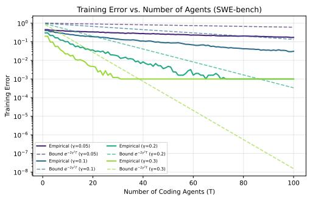

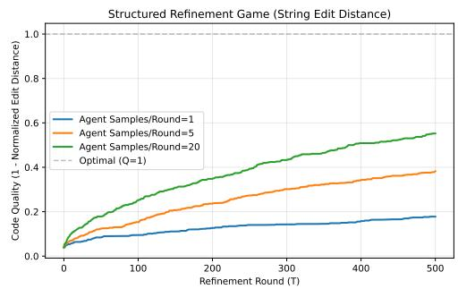  
Figure 2: Left: training error vs. number of weak coding agents for four target edges $\gamma ;$ solid = empirical (mean of 5 trials), dashed = bound $e ^ { - 2 \gamma ^ { 2 } T }$ , confirming Cor. 11. Right: code quality under the refinement game (Levenshtein-distance optimization), confirming Thm. 2; quality increases monotonically with diminishing returns, remaining bounded below 1.0, with more capable agents converging higher.

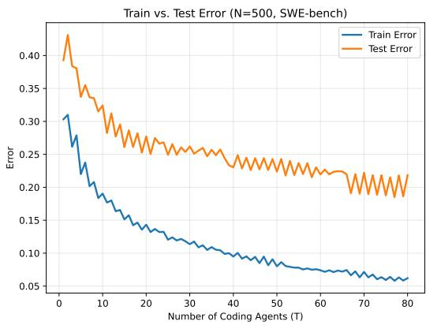

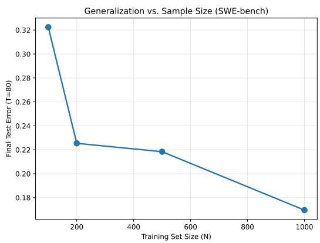  
Figure 3: Left: Train vs. test error for $N = 5 0 0$ over 80 boosting rounds. Test error decreases then plateaus, consistent with the generalization bound. Right: Final test error decreases monotonically with training set size (averaged over 5 seeds on the full SWE-bench split with a disjoint held-out test set), consistent with the $O ( \sqrt { d / N } )$ term.

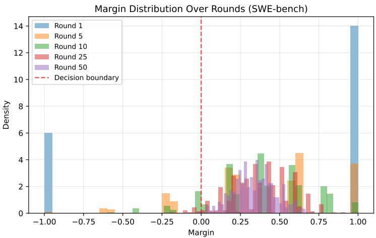  
Figure 4: Margin distribution over boosting rounds (edge-calibrated weak agents). Round 1 is a single learner with saturated ±1 margins (roughly half misclassified); over successive rounds the negative-margin mass collapses and the distribution concentrates on the positive side of the boundary. This concentration of margin mass away from the decision boundary is the mechanism by which boosting achieves good generalization despite adding more weak learners.

## E Part B: Harness Verification, Task Pool, and Power Analysis

Harness verification and task pool (methods disclosure). Our evaluator is not SWE-bench’s own. A T-round refinement experiment needs per-round scoring inside a container that stays alive between rounds; the official harness is a batch evaluator—run evaluation.py grades one patch per instance from a predictions file—so re-invoking it per round per task across ≈6,600 evaluations was not viable, and we built the loop ourselves, scoring --junit-xml reports directly. We stand by that decision and not by its execution: SWE-bench also ships per-repository test commands (MAP REPO VERSION TO SPECS) and per-repository log parsers (MAP REPO TO PARSER), both importable independently of its CLI and its container lifecycle, and we reimplemented that knowledge instead of importing it.

A gold-patch audit—apply the known-correct SWE-bench patch and check it scores 1.0— of the originally-sampled K=50 pool found 23/50 (46%) tasks failing deterministically, none of them model failures, separable into 5 root causes. Three are ours outright. pytest is not the test runner for Django or SymPy at all (9 tasks): their official commands are ./tests/runtests.py --verbosity 2 and bin/test -C --verbose. An older pinned pytest rejects the --no-header flag we passed universally (3), which the official specs apply only to seaborn, where the pinned version accepts it. And ANSI color codes broke a text-based pass/fail line parser (3), which astropy’s official command forestalls by setting console output style=classic. One is partly genuine and independently known: parametrize-ID drift between pytest’s auto-generated collection ids and SWE-bench’s recorded ids (7). One is mundane: a network-dependent test that hangs inside a sandboxed evaluator with no internet access (1). We record the split because the count is a fact about our evaluator rather than about the benchmark: read as a benchmark defect rate it would be simply wrong, and the distinction is the whole reason the breakdown is here rather than a bare failure count.

We fixed the two shared-root-cause bugs (replacing text-parsing of colorized pytest -v output with --junit-xml scoring, and fuzzy-matching parametrize ids via a pytest --collect-only pass) and verified the fix against the gold patch on every previously-flagged task (all now score fraction passing=1.0); those two are the transferable part of the exercise. We then excluded Django and SymPy entirely, not because their environments are defective but because a pytest-only evaluator cannot run them, plus the one network-dependent task, and backfilled 15 gold-patch-verified replacement tasks to reach $K { = } 5 5 ;$ every active task’s Docker image is now digest-pinned. All Part B results use this harness-fixed, gold-verified K=55 pool, which is therefore pytest-native by construction. That is a property of our tooling that shaped the pool, and the reason a follow-up should add per-repository dispatch and restore both repositories rather than inherit this selection.

One divergence survives inside the retained pool. SWE-bench runs sphinx tests through tox --current-env -epy39 -v -- rather than bare pytest, and sphinx-doc is one of the 10 retained repositories. What bounds the risk is the audit itself: every retained task, sphinx included, scores fraction passing=1.0 under the gold patch, so bare pytest is collecting and running those tests rather than silently reporting nothing. Agreement with the official grader on the retained pool is established only through that gold-patch check, not by running both harnesses side by side.

Table 2: Part $\mathrm { B } \colon 2 \times 3$ repeated-measures ANOVA (model × feedback mode) on final-round quality, K=55 tasks $\times ~ 5$ seeds. Summarized in §5.1. The model effect’s Cohen’s $f$ carries 95% CI [0.738, 1.319], consistent with the near-complete tier separation in solve rates rather than with a computation artifact.
<table><tr><td>Effect</td><td>F</td><td>df</td><td>p</td><td>partial  $\eta ^ { 2 }$ </td><td>Cohen&#x27;s f</td></tr><tr><td>Model (Sonnet vs. Haiku)</td><td>53.46</td><td>(1,54)</td><td>0.0001</td><td>0.497</td><td>0.99 (huge)</td></tr><tr><td>Feedback mode</td><td>0.50</td><td>(2, 108)</td><td>0.61</td><td>0.009</td><td>0.10 (small)</td></tr><tr><td>Model × mode</td><td>0.81</td><td>(2, 108)</td><td>0.45</td><td>0.015</td><td>0.12 (small)</td></tr></table>

Per-arm solve rates. The ranges quoted in §5.1 resolve as follows at $\geq \tau { = } 0 . 6$ with 95% Wilson intervals. Haiku: independent 24/55 (44%) [31, 57], blind 26/55 (47%) [35, 60], diagnostic 27/55 (49%) [36, 62]. Sonnet: independent 47/55 (85%) [74, 92], blind 47/55 (85%) [74, 92], diagnostic 49/55 (89%) [78, 95]. The intervals within a tier overlap heavily, which is the same fact the mode term’s null records. At SWE-bench’s own criterion (τ=1.0) the weak tier’s mode ordering inverts, which is why §5.1 reads the mode contrast as noise: Haiku independent 21/55 (38%) against diagnostic 16/55 (29%), while Sonnet’s diagnostic arm gives 41/55 (75%).

The dependent variable, and an asymmetry in it. The dependent variable is final-round quality averaged over seeds. It is therefore threshold-free, which is why τ moves the solve-rate tallies of §5.1 and nothing else: the ANOVA’s DV is continuous quality, and $\tilde { \gamma } _ { t }$ compares $q _ { i , t }$ against $q _ { i , t - 1 }$ directly rather than against any threshold. Because the harness back-fills the rounds after a task first passes (Appendix E.1), a solved row’s final round is its running best, whereas an unsolved row contributes whatever its last attempt scored—which may sit below its own earlier best, on 5 and 12 rows. The stronger tier solves more rows, so the asymmetry runs in the same direction as the tier effect and cannot be dismissed on inspection. Re-running the identical ANOVA with every row contributing its running best moves the tier effect from partial $\eta ^ { 2 } { = } 0 . 4 9 7$ to 0.514, and leaves mode and interaction non-significant: the effect does not rest on the asymmetry.

Task pool. The active K=55 pool spans 10 SWE-bench Lite repositories (astropy, flask, matplotlib, pylint, pytest, requests, scikit-learn, seaborn, sphinx, xarray); Django and SymPy are excluded entirely and one network-dependent task is excluded. Of the originallysampled 50 tasks, 40 are retained unchanged and 15 are gold-patch-verified replacements backfilled to reach $K { = } 5 5$ . Exhaustive per-task, per-arm, per-seed quality trajectories for all 6 arms × 55 tasks × 5 seeds, together with the committed analysis script that reproduces every Part B table and figure directly from that data, are in the supplementary repository.

## Power analysis (full detail). This null is underpowered, not evidence ofzero effect.

A case-resampling bootstrap (30,000 reps/K, preserving each task’s full 6-arm profile) at the observed effect size finds only 11% power (mode) and 17% power (interaction) at the K=55 we ran; reaching 80% power requires K≈467 (mode) and K≈364 (interaction), roughly 7–9× the current sample. An independent, quantified reason compounds the power problem regardless of K: seedto-seed noise within a fixed (task, model, mode) cell averages SD≈0.096, about 1.7× the mean between-mode signal (mean |diagnostic − blind| per task ≈0.057). The sampling-noise floor exceeds the effect being measured.

This noise is a deliberate, explained design choice, not an oversight: generation temperature 0.25 is applied uniformly across all three arms, but it is structurally required only for independent, whose prompt is identical every round (no prior patch, no critique); at temperature 0 it would degenerate into $T$ identical greedy draws. blind and diagnostic have no such requirement, since their prompts already change round to round with the carried-forward patch and critique; a single shared temperature was chosen for simplicity over doubling the design into temperature-decoupled arms. A future rerun could decouple this, running temperature 0 for blind/diagnostic and temperature >0 only for independent, as a variance-reduction change to the design, not a reanalysis of the data collected here.

Why report a null this underpowered at all? First, the required-K and noise-to-signal numbers above are themselves informative: they tell a future replication exactly how large a sample the effect needs, which a silently-dropped ablation would not. Second, the capability effect (Table 2) is properly powered at this same K, so the ablation is not a uniformly underpowered design—only the mode and interaction terms are, and the significant capability result should not be read as implying the whole design was adequately powered. Third, the null is the empirical basis for the “spend on the first attempt” guidance (§6): reporting it with its power caveat attached is more useful to a practitioner than either suppressing it or overclaiming it as a confirmed non-effect.

The point-estimate crossover (not significant; a hypothesis, not a finding). Haiku’s mean quality increases monotonically with more carried-forward context (independent 0.432 < blind 0.449 < diagnostic 0.466), while Sonnet’s blind arm is its worst of the three (independent 0.875, blind 0.856, diagnostic 0.871)—a crossover, not merely noise around a flat line (Fig. 5). Every formal test of this ordering is non-significant (linear contrast $F { = 0 . 5 6 { - 2 . 1 6 , \ p } { = 0 . 1 \bar { 5 } { - 0 . 4 6 } } }$ across gating choices; model×linear interaction $\scriptstyle p = 0 . 1 3 - 0 . 3 3 )$ , so we do not claim it, and we explicitly do not attribute Sonnet’s inversion to “solved early, then regressed later”—we tested that mechanism directly against the per-round trajectories and it runs the wrong direction to explain the gap (Sonnet’s blind gives back less to late-round regression than independent does, 0.0091 vs. 0.0105).

## E.1 Decomposing the Measured Edge

The main text reports the per-round edge on measured cells and the pooled series alongside it. This is the detail behind both, and the reason the pooled number cannot stand alone: γ’s sign is the quantity the weak-learning condition turns on, and in this setting the sign is determined largely by something other than what the condition is about.

Rounds the experiment did not run. The harness stops calling the model on the round a task first passes, then back-fills the remaining rounds with a hardcoded q=1 so the $T \cdot$ wide matrix stays rectangular. Those cells record no patch, no evaluation and no model call. They are 27.6% of Haiku’s matrix and 53.9% of Sonnet’s, and because γ scores a tie at $- \frac 1 2$ , each one enters as a failure to improve. They account for 33–45% (Haiku) and 74–86% (Sonnet) of each round’s tie mass. The pooled estimator is therefore driven downward in proportion to the solve rate, which inverts the comparison it looks like it supports: Sonnet solves far more tasks, back-fills far more cells, and posts a more negative pooled edge at round 3 than Haiku $( ( 0 , - 0 . 3 3 , - 0 . 4 1 , - 0 . 4 6 )$ against (0, -0.39, ${ \begin{array} { l } { { \overline { { \circ } } } 0 . 4 6 , \ { - } 0 . 4 5 ) , \ { \mathrm { C } } { \bar { \mathrm { I s } } } \ [ { - } 0 . 3 7 3 , \ { - } 0 . { \bar { 2 } } 8 5 ] , \ [ { - } 0 . 4 4 9 , \ { - } 0 . 3 6 5 ] , \ [ { - } 0 . 4 8 2 , \ { - } 0 . 4 3 5 ] { \mathrm { ~ a n d ~ } } [ { - } { \bar { 0 } } . 4 4 9 , \ { - } 0 . 3 2 2 ] } \end{array} }$ $[ - 0 . 4 8 5 , - 0 . 4 3 1 ] , [ - 0 . 4 7 8 , - 0 . 4 1 \dot { 6 } ] \dot { ) }$ while being the stronger refiner on every cell where a call was made. That pooled sign is therefore not reportable as a headline (§5.1): it is an artifact of the harness rather than a property of the loop.

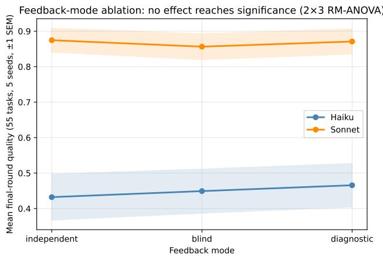  
Figure 5: Part B feedback-mode ablation: mean final-round quality by mode (independent → blind → diagnostic), $K { = } 5 5$ tasks × 5 seeds, ±1 SEM. Haiku increases monotonically; Sonnet’s blind arm is its worst of the three—a non-significant crossover (see text), not a confirmed finding.

Ties versus regressions. The indicator uses a strict >, so “not improved” pools two unlike outcomes: quality identical to the previous round, and quality actually lower. Splitting them on the diagnostic arm gives per-round tie rates of (0.887, 0.945, 0.949) for Haiku and (0.800, 0.898, 0.953) for Sonnet, against regression rates of (0.004, 0.015, 0.000) and (0.029, 0.011, 0.007). Net of the back-filling above, the genuine no-op rate is 52–59% (Haiku) and 13–21% (Sonnet), still the dominant outcome and the figure that actually supports “refinement turns idempotent”. Whole trajectories tell the same story: 80.7% of Haiku’s 275 (task, seed) rows and 69.1% of Sonnet’s never change quality at any round, and only 5 and 12 rows respectively dip even once. A refiner that has fully converged—every round identical, never a regression—attains $\gamma = - \frac { 1 } { 2 }$ exactly, the floor of the estimator’s range. $S \mathrm { o } \gamma < 0$ here is evidence that the loop has stopped changing the artifact, which is what Prop. 3(i) predicts; it is not evidence that patches are anti-correlated with correctness, which is what $\begin{array} { r } { \epsilon _ { t } > \frac { 1 } { 2 } } \end{array}$ means in AdaBoost and what “the weak-learning condition fails” would ordinarily convey. Both readings are consistent with the same number, and only the first is supported.

The edge among tasks that can still move. A row already at $q { = } 1$ cannot improve, so it enters $\gamma \mathbf { \bar { s } }$ denominator as a row that did not improve when it is really a row that could not. Conditioning each round on $q _ { i , t - 1 } < 1$ removes that: the eligible population falls 194→158 of 275 (Haiku) and 113→49 of 275 (Sonnet) as rows saturate, and the conditional edge is (-0.345, -0.435, -0.411) with CIs $[ - 0 . 4 2 6 , - 0 . 2 4 7 ] , [ - 0 . 4 7 4 , - 0 . 3 8 3 ] , [ - 0 . 4 6 0 , - 0 . 3 4 8 ]$ for Haiku against (-0.084, -0.143, -0.276) with $\mathrm { C I s } \ [ - 0 . 1 7 3 , + 0 . 0 2 1 ] , [ - 0 . 2 8 6 , + 0 . 0 2 8 ] , [ - 0 . 3 8 9 , - 0 . 1 2 5 ]$ for Sonnet (same 9,999- resample task-cluster bootstrap and the same seed as the pooled intervals, so the two are computed over identical cluster draws; numerator and denominator are resampled together, so the denominator’s own sampling variation is carried rather than held fixed).

Haiku’s conditional intervals all sit strictly below zero, so its failure to improve is not an artifact of saturation. Sonnet’s first two include zero, so on tasks with room left we cannot reject a zero-orslightly-positive edge in the early rounds, and only by round 3 is the negative sign unambiguous. That is a genuine qualification of the main claim. And the tier separation therefore survives conditioning, which is the more direct measurement of “capability, not loop depth” than the pooled series provides—a stronger model spends its rounds running out of headroom, a weaker one spends them failing to exploit the headroom it has.

A correction, not a clean unconditional edge. It is the estimator over cells where a model call happened, so relative to the pooled series it is a correction and not merely a decomposition: excluding a back-filled round is declining to average over a non-event, not conditioning on an outcome. The paragraph above is why: counting the $q { = } 1$ rows as rows the model failed to improve reads a non-event as a negative outcome, when the model was never asked. What it is still not is a clean unconditional edge. Excluding those cells also excludes the rounds that would have followed a pass, and those rounds were never run, so no reweighting recovers them; the remaining population is additionally selected against rows whose earlier rounds went well, which is a real difference in population rather than a nuisance to adjust away.

The confidence-rated reading. A round that leaves quality unchanged is closer to an abstention than to an error, and Schapire and Singer [1999] give the standard treatment: with perround weights $\omega _ { + } , ~ \omega _ { - }$ and $\omega _ { 0 }$ over measured cells, the optimally-weighted round contributes $Z _ { t } = \omega _ { 0 } + 2 \sqrt { \omega _ { + } \omega _ { - } } .$ to the training-error product, and $Z _ { t } ~ < ~ 1$ whenever improvements outnumber regressions. On this arm the product over rounds 1–3 is 0.81 (Haiku) and 0.67 (Sonnet): the bound descends, slowly, which is what saturation looks like in boosting’s own terms. The binary form $\exp ( - 2 \sum s$ max $( 0 , \tilde { \gamma } _ { s } ) ^ { 2 } )$ pins at 1 instead, and that flatness is a property of a formulation with no representation for abstention rather than of the loop. Conditional on a round changing anything at all, the edge is strongly positive throughout (+0.233 to +0.500 for Haiku, +0.346 to +0.393 for Sonnet), reported for completeness only, since that denominator is both small and selected on the outcome being measured. The denominator shrinks with t (to 49 rows for Sonnet at round 3), so the late-round conditional intervals are correspondingly wide, and we read the round-3 point estimates as the least reliable of the six. Nothing here changes what the criterion requires: Thm. 2 and Prop. 3 need only a per-round improvement property, and $\bar { \eta } _ { t }$ (§5.1) remains positive and shrinking under both tiers either way.

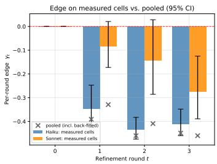

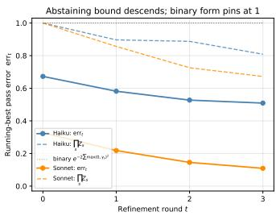  
Figure 6: Part B, per-round edge on the diagnostic arm; cited from §5.1. Left: bars are $\tilde { \gamma } _ { t }$ over cells where a model call happened, with 95% CIs (9,999-resample cluster bootstrap over the 55 tasks); grey crosses are the pooled $\tilde { \gamma } _ { t }$ over all cells, the gap being the back-filling described above. Round 0 has no predecessor, so no bar; Sonnet’s first two intervals cross zero. Right: running-best error (solid) against the abstaining bound $\Pi _ { s } Z _ { s }$ (dashed), which descends because an unchanged round is charged $Z _ { s } < 1$ rather than as an error; the binary form $\begin{array} { r } { \exp ( - 2 \sum _ { s } \operatorname* { m a x } ( 0 , \tilde { \gamma } _ { s } ) ^ { 2 } ) } \end{array}$ (dotted) pins at 1.0, an artifact of having no representation for abstention.

## F Part C: Additional Findings and Figures

Data availability. Four anonymized session/commit datasets underlie Part C, all in the supplementary repository and all written by the same sanitization pipeline (scripts/anonymize\_ sessions.py): data/company\_sessions.json for the AI-tier sessions, data/company\_ control\_sessions.json for the pre-AI human baseline of Finding 3, and data/company\_ within\_era\_ai\_sessions.json with data/company\_within\_era\_nonai\_sessions.json for the two sides of the within-era contrast below. Real repository names, commit hashes, and author identities are replaced with opaque synthetic labels before release; timestamps are truncated to day granularity, developer labels are salted hashes, commit SHAs are counter-substituted, and only structural metrics (diff sizes, commit counts, model trailer, coarse dates) survive (full sanitization audit in the repository README).

The two label kinds are not symmetric, and the difference is easy to miss because the labels look alike. Developer labels are HMAC(salt, identity), so under one salt and one roster the same person carries the same dev label in every file, which is what makes the paired within-developer analyses below possible at all. Repository labels are positional: they are lettered per extraction run by HMAC rank over that run’s repository list, so repo A denotes a different repository in each file, and the label sets overlap without the repositories doing so. Merging datasets on repo would therefore fuse unrelated repositories into one random-effect level; scripts/part\_c\_control\_stats.py namespaces the labels per file (sim.namespace repos) before any pooled model is fit, and thirdparty reanalysis must do the same.

Every Part C number quoted in this paper is recomputed from those four files by scripts/part\_c\_ control\_stats.py into data/part\_c\_control\_stats.json, which is the sole source for the macros this text expands; a companion --check gate fails the build if any quoted value drifts from the recomputed one.

Why the linkage compares instants, not strings. The commit-to-session linkage compares parsed UTC instants, and the distinction is not cosmetic on this cohort: contributors span 11 distinct UTC offsets, so under a comparison of ISO-8601 timestamp strings a commit written at ...T10:00:00+05:30 sorts after one written at ...T09:00:00-04:00 while in fact preceding it by four hours. Commits then fall outside their own session’s window and go unlinked—124 control and 15 AI-tier commits, dropped from the per-session churn aggregates without any error being raised. Comparing instants takes unlinked commits to zero on both cohorts, and every Part C figure is computed on that linkage.

Cohort composition, and the spread inside each tier label. Finding 2 contrasts Claude Opus (stronger) against Claude Sonnet (weaker)—a different pair from Part B’s, where Sonnet is the stronger of the two, so the two parts’ “capability contrast” is not the same comparison. That pair is also not the whole cohort: 14 sessions fall outside it, 9 Haiku and 5 with no resolvable trailer. And each label names a model family rather than a checkpoint—the trailers record five Opus and three Sonnet versions spanning generations 4.5 through 5 in both families, which the two-bin contrast pools—so within-family capability spread is uncontrolled, which is what the version-resolved retest below addresses. The gap is also robust to the choice of test, giving Mann–Whitney p=0.91 alongside the permutation p quoted in §5.2.

Finding 4—Geometric churn-decay model captures the coarse shape (consistency check). The geometric churn-decay (log-normal) model, fitted to consecutive commit pairs, yields ρ=0.77 (95% bootstrap CI: [0.65, 0.92]) and σ=2.39 (95% CI: [2.24, 2.54]). This CI excludes 1.0, giving some support that the decay rate is genuinely below unity rather than statistical noise around a random walk, consistent with Finding 1’s rejected permutation null. A simulation calibrated to these parameters, together with a mixture parameter $\pi _ { \mathrm { p u r e } } { \approx } 0 . 0 7 1$ accounting for pure-addition sessions (survivor ratio = 1), is best judged out of sample: a 70/30 train/test split gives held-out KS=0.18, p=0.045 (train n=137, test n=60). Unlike the smaller-sample fits, this is no longer a clean pass: across 8 train/test seeds the held-out p-value ranges [0.0003, 0.44], rejecting in 6/8 seeds. This is a downgrade: the expanded sample now typically shows a detectable discrepancy between held-out empirical and simulated survivor-ratio distributions (Figure 8), so the out-of-sample check should be read as marginal rather than confirmatory. The in-sample fit, always the more informative signal here, sharpens the same conclusion: the in-sample KS=0.21 (p=<0.0001) formally rejects exact distributional equality, so the model captures the coarse shape but is further from the true datagenerating process once heterogeneity across 23 repositories and 20 developers is pooled into a single fit. That is exactly the kind of unmodeled repository/developer variation the multilevel model in Finding 2 quantifies directly $( \mathrm { v c _ { r e p o } { = } 0 . 1 3 2 , v c _ { d e v e l o p e r } { = } 0 . 0 6 2 ) }$

Finding 5—Heavy-tailed session length. Session lengths are heavy-tailed: median 1 commit (50.9% of sessions are a single commit), mean 3.0, maximum 45. Figure 9 shows the empirical distribution with a log-normal fit, confirming that while most sessions are short, a substantial tail of long sessions drives mean complexity.

Finding 3, in full—pre-AI-adoption human baseline (descriptive, not a controlled comparison). The headline numbers are in §5.2; this is the construction and the full caveat list. The cutoff is derived from data, not assumed: scanning every repository in the same organization for the earliest commit anywhere carrying any AI-coding-tool co-author trailer (Claude, Copilot, Cursor, Codex, ChatGPT, and others) gives 2025-09-18; subtracting a 3-year safety margin sets the cutoff at 2022-09-19. The 23 repositories used for the AI-tier findings turn out to have essentially no history before that date—they are recently-created repositories, a byproduct of the same qualification rule that selected them for the AI-tier analysis in the first place. That rule admits a repository on ≥15 Claude-co-authored commits counted across all branches, whereas extraction then reads only each repository’s dominant branch; a released per-repository commit count can therefore sit below the qualifying threshold without contradicting it—two denominators, both correct, and scripts/discover cohorts.py derives each reproducibly. The control set consequently comes from a different, older, disjoint cohort of 122 repositories in the same organization with genuine pre-cutoff activity.

Developer identity is a curated roster, not a heuristic. Git author identities do not correspond to people: one person appears as a GitHub-noreply handle, a work address, a personal address, and sometimes a contractor account. Merging them with a fuzzy-matching heuristic and reporting the result as a contributor count does not work: the heuristic under-merges, inflating the headcount and splitting individuals across several labels. This analysis therefore uses a human-reviewed roster. scripts/resolve author aliases.py --emit-candidates writes a table of every raw identity together with the identity evidence behind its provisional cluster; a human marks each row keep-or-drop and assigns a person label; --from-reviewed converts that into a strict allowlist, so an identity absent from the roster is excluded from the cohort rather than merely left unmerged. The review covered 155 raw git identities and resolved them to the 62 people reported here, dropping one as unattributable. Merging aliases also fuses sessions that a heuristic would split across a single person’s two identities, which is why the control session count sits below what an uncurated extraction reports even though the commit count does not.

Curation was blind to outcomes by construction. The candidate table carries no survivor-ratio, churn, or ψ column and is assembled from identity evidence alone. This matters more than the headcount: a roster curated while looking at per-developer results would stop being a control, which is the one failure mode that would make this comparison circular rather than merely confounded. The choice has a plain cost: the roster maps real names and email addresses to person labels, so it cannot be released, and a third party therefore cannot rebuild this cohort from the artifacts we publish. What we can publish is the audit trail as counts (155 raw identities in, one dropped, 62 people out) and the salted dev -prefixed labels in the released data, which are now stable across both cohorts and so support the paired analyses below.

To keep the two eras comparable, the control window (2021-11-08 to 2022-09-19) is sized to match the AI-tier data’s own 315-day observation span. Applying the extraction pipeline with require ai trailer=False (keeping all commits, still excluding any matching an AI-tool trailer as a defense-in-depth check even though none are expected before the cutoff) and grouping consecutive commits by the same developer into sessions yields 9,395 control sessions (17,694 commits). That is far more than the 401 AI-tier sessions, since we did not curate or subsample repositories, only bound the time window. The resulting mean non-pure survivor ratio is $\psi _ { \mathrm { h u m a n } } { \approx } 0 . 3 9$ , and the churn-decay rate is $\rho _ { \mathrm { h u m a n } } { = } 0 . 8 6$ (95% CI [0.82, 0.91]), similar in shape to the AI-tier ρ≈0.77, so the geometric front-loading pattern itself (Finding 1) is not obviously AI-specific.

The survivor-ratio level is a different story: ψ<sub>human</sub> is far below both $\psi _ { \mathrm { O p u s } }$ and ψ<sub>Sonnet</sub> (gap=−0.160 vs. Opus at p<0.0002 and −0.163 vs. Sonnet at p<0.0002; both sit at the resolution floor $2 / ( 9 , 9 9 9 + 1 )$ of the permutation test, meaning no resample reached the observed gap, not that the p is estimated at that value), and a multilevel model with repository and developer as crossed random intercepts confirms the gap survives adjustment (adjusted coefficient +0.145, p=0.00082 for Opus vs. human; +0.154, p=0.00026 for Sonnet vs. human). Unlike Finding 2’s AI-tier comparison, the tier effect here is larger than the repository and developer variance components, not smaller.

One comparability objection would otherwise explain the gap without any appeal to era at all: the two cohorts have very different session-length profiles. 63.9% of control sessions are a single commit, against 50.9% of AI-tier sessions, and a one-commit session’s survivor ratio is a much coarser quantity than a ten-commit session’s. The objection does not bite. Restricted to multi-commit sessions on both sides, the mean non-pure survivor ratio is 0.435 for the control against 0.593 for the AI tier—a gap of the same sign and comparable size to the pooled one, so the level difference is not an artifact of the control being singleton-heavy.

We are explicit about what this cannot show: the human and AI-tier samples differ by era, not just by who wrote the code—codebase maturity, review norms, tooling, and team composition all differ across the roughly three years separating them, and any of these could produce a survivor-ratio gap with no AI involvement at all. This is a sanity check, not a controlled experiment, and it supports no causal claim about AI’s effect on the dynamics we measure; it does say that the tier-agnostic pattern of Finding 2 is not simply an artifact of any two groups of commits looking alike on this proxy—something in the AI-assisted sessions (whatever the cause) does look different from the pre-AI baseline, even as the AI tiers do not differ from each other.

Within-era AI vs. non-AI: the one contrast that removes both confounds (suggestive, not established). Finding 3 concedes two confounds it cannot address—the people differ, and the eras differ. Both can be removed at once by staying inside the AI era and splitting on the commit trailer instead: take the window 2025-09-18 to 2026-12-31, keep the same roster on both sides, and separate commits that carry a Claude co-author trailer from those that do not. The two sides then share developers, calendar window, codebase maturity, review norms, tooling, and seniority; they differ in whether the work was delegated to an agent. Pansuriya et al. [2026] draw the same human/agent contrast on pull-request acceptance and review effort, which is the closest existing comparison to this design, though on review outcomes rather than churn dynamics. This yields 487 AI-assisted sessions (1,493 commits) against 1,874 non-AI sessions (4,914 commits), with 22 developers present on both sides. Pooled, the mean non-pure survivor ratio is 0.540 for AI-assisted work against 0.419 for the rest—the same direction as Finding 3’s era contrast, with neither of its two confounds.

Pairing within developer, so that each person is compared only against themselves, gives Table 3. We report it as suggestive, not established. First, the sign test is null at every floor: counting how many developers move in which direction never reaches significance. Second, Wilcoxon does reach it at the two lowest floors, but only because it weights magnitudes as well as directions—at the ≥15-commit floor the deltas run from -0.078 to +0.332, so the positive movements are several times larger than the negative ones. That asymmetry is an assumption the sign test deliberately declines to make, and quoting the significant p-value without it would misrepresent which assumption carries the result. Third, this is eight tests across four floors and two statistics, and the two significant values sit at the two lowest floors—the ones retaining the thinnest developers. Fourth, and least fixable by any amount of data: task selection is uncontrolled. This compares work developers chose to delegate against work they chose to keep, and there is every reason to expect those to differ in kind.

What the design does buy, and what the pre-AI pairing below does not, is that the direction no longer rests on thin data. It survives the ≥50-commit floor (5 of 7 pairs, median $\Delta { \psi } = + 0 . 1 2 7 )$ , and the best-measured pair in the cohort—the developer with the most commits on both sides, 1,340 non-AI against 444 AI-assisted—moves with the majority at $\Delta { \psi } = + 0 . 1 2 7$ . Nothing here licenses a causal claim: the trailer is not randomly assigned, and the task-selection objection stands untouched.

Table 3: Part C: within-era AI vs. non-AI survivor ratio, paired within developer, at four minimumcommits-per-side floors. “AI higher” counts developers whose AI-assisted sessions show the higher mean non-pure survivor ratio. The sign test is null at every floor; Wilcoxon reaches significance only where the magnitude asymmetry is largest.
<table><tr><td>Commit floor</td><td>Pairs</td><td>AI higher</td><td>Sign p</td><td>Wilcoxon p</td><td>Median  $\Delta \psi$ </td></tr><tr><td>none</td><td>21</td><td>14</td><td>0.19</td><td>0.022</td><td>+0.127</td></tr><tr><td>≥15</td><td>14</td><td>10</td><td>0.18</td><td>0.011</td><td>+0.094</td></tr><tr><td>≥30</td><td>9</td><td>6</td><td>0.51</td><td>0.098</td><td>+0.061</td></tr><tr><td>≥50</td><td>7</td><td>5</td><td>0.45</td><td>0.11</td><td>+0.127</td></tr></table>

Pre-AI within-developer pairing: evidence against the between-group gap. Because both cohorts now share a salt and a roster, a person carries the same dev label in the pre-AI and AI-era datasets, which makes it possible to pair Finding 3’s era contrast within individuals and so remove its person confound—though not its era confound, since the two sides remain three years apart. 12 people have non-pure sessions on both sides. We report this result because it undercuts the betweengroup gap, not because it supports it.

Taken at face value the direction agrees with Finding 3: 9 of 12 developers show a higher survivor ratio in their AI-era sessions, median $\Delta { \psi } = + 0 . 1 1 7$ , though the sign test does not reach significance (p=0.15; Wilcoxon $\scriptstyle p = 0 . 0 3 4$ , subject to the same magnitude-asymmetry caveat as above). That agreement is carried by developers with little data, and it does not survive requiring some. At a ≥50-commit floor on both sides only 4 pairs remain, the majority disappears entirely (2 of 4, sign $p { = } 1 )$ , and the median delta collapses to +0.017—an order of magnitude smaller than the pooled between-group gap of -0.160. The single best-measured pair does move with the majority (322 pre-AI against 257 AI-era commits, $\Delta \psi { = } + 0 . 3 2 0 )$ ; among the four best-measured pairs the direction splits evenly, so nothing here corroborates a level shift of the size Finding 3 reports.

A structural asymmetry compounds this and is the reason we report direction only, with no effect size or interval. The two datasets do not have equivalent inclusion rules: the control keeps every commit a person made in the pre-AI window, whereas the AI-tier dataset keeps only their Claudeco-authored ones. Each pair therefore compares different slices of one person’s work, which is legitimate for a per-session shape metric like the survivor ratio but makes any volume or productivity read across the two sides meaningless—the worst per-developer imbalance here is roughly 33-to-1, which reflects how little of that person’s output was delegated, not a collapse in what they produced. Read together with the within-era contrast above, the within-person evidence for a survivor-ratio difference is weak, and weakest exactly where it is best measured.

Finding 2’s four robustness checks in full. The main text counts the four checks that reinforce the capability-gap null; this is the detail behind them. (i) Unmeasured confounding. An E-value sensitivity analysis [VanderWeele and Ding, 2017] returns a point E-value of 1.10 and a confidencelimit E-value of 1.00: an unmeasured confounder would need associations of only that magnitude with both tier assignment and survivor ratio to account for the observed gap. The direction of this check needs care: a low E-value is unremarkable for a null, and we report it to bound how much a confound could be hiding an effect, not as evidence that one exists. (ii) Task type. Stratifying on the coarse task-type category and pooling within strata (4 strata) barely moves the estimate: adjusted gap +0.002 against a naive $- 0 . 0 0 3 \ ( p { = } 0 . 9 6 )$ , so the tier/task-type entanglement Limitations flags does not by itself manufacture the null.

(iii) Decay rate, not only level. The survivor ratio is a level; the churn-decay rate is a shape, and the tiers are indistinguishable on that too $( \rho _ { \mathrm { O p u s } } = 0 . 8 0 ~ \mathrm { v s . } ~ \rho _ { \mathrm { S o n n e t } } = 0 . 7 5 , \mathrm { g a p } ~ 0 . 0 4 3 , \rho = 0 . 5 4 $ , over the $n { = } 1 2 3$ sessions long enough to fit a rate). (iv) Repository and developer structure. A multilevel model with crossed repository and developer random intercepts gives an adjusted tier coefficient of $+ 0 . 0 0 9 \ ( 9 5 \% \mathrm { ~ C I ~ } [ - 0 . 0 7 0 , + 0 . 0 8 8 ] , p = 0 . 8 2 )$ , while the variance components $( \mathrm { v c _ { r e p o } { = } 0 . 1 3 2 }$ $\mathrm { v c } _ { \mathrm { d e v e l o p e r } } { = } 0 . 0 6 2 )$ are an order of magnitude larger than any plausible tier effect. That last comparison is the substantive content of the null: in this data, which repository and which developer a session belongs to matters considerably more for its survivor ratio than which model tier wrote it. None of the four addresses model-version pooling, which is why the re-test below exists.

Finding 2 re-tested on an ordered capability scale (the null survives, but it is a bounded null). Finding 2’s tier variable is coarse in a way that could manufacture its own null. The label $\mathrm { \ " { o p u s } } ^ { \prime \mathrm { * } }$ collapses eight distinct commit-trailer strings and “Sonnet” four, so five Opus versions and three Sonnet versions are pooled into two bins—Opus 4.5 sits in the same bin as Opus 4.8. The within-bin capability spread is plausibly comparable to the between-bin contrast the test is trying to detect, and that would attenuate a real gap toward exactly the null we observe. This is also the first explanation a reader will reach for on seeing Part B’s large, clean capability effect (partial $\eta ^ { 2 } { = } 0 . 4 9 7$ on a twomodel comparison) beside Part C’s null, so we test it.

We therefore re-run the discriminator as a monotone trend over an ordered capability scale instead of a two-bin contrast. Each session is assigned its plurality (family, version) cell, giving 8 cells over 343 sessions. That total coincides with the version count just quoted and so invites a wrong reading: the cells are four Opus, three Sonnet, and one Haiku—not the five-plus-three the pooling above would suggest. Opus 5 appears in the cohort’s trailers but is the plurality cell of no session, so it contributes none; and Haiku, which the tier contrast never sees at all, contributes one. The cells are ranked two ways, each serving as the other’s sensitivity analysis: family-major, placing every Sonnet cell below every Opus cell and ordering by version within a family, and version-major, ordering strictly by version number across families. The null survives both. Spearman rank correlation between capability and survivor ratio is $r _ { s } { = } { + } 0 . 0 1 2 \ ( p { = } 0 . 8 2 )$ under the family ordering and $r _ { s } { = } { - } 0 . 0 0 8 ( p { = } 0 . 8 8 )$ under the version ordering—written $r _ { s } .$ , not $\rho ,$ since $\rho$ is the churn-decay factor throughout Part $\mathrm { C } ;$ adding capability rank as a linear term to the same crossed repository/developer multilevel specification used in Finding 2 gives per-step coefficients of +0.003 (p=0.75) and −0.011 $\scriptstyle ( p = 0 . 3 8 )$ . Version pooling is therefore not the explanation for Finding 2’s null: resolving the label to versions and testing for a trend across them recovers no effect either.

That conclusion is a bounded null rather than a demonstrated zero, and needs the same caveat Part B’s underpowered nulls receive. The family-ordering adjusted interval is $\left[ - 0 . 0 1 6 , \thinspace + 0 . 0 2 2 \right]$ per rank step; accumulated over the 7 steps separating the weakest cell from the strongest, it still admits a total swing of up to 0.155, comparable in size to the human-vs-AI gap of -0.160 that Finding 3 does detect. The version ordering bounds it no more tightly $\left( \left[ - 0 . 0 3 6 , + 0 . 0 1 4 \right] \right.$ per step), so neither ordering converts the null into a narrow one; they agree on the sign being undetermined, not on the effect being small. What we can say is that no capability effect large enough to dominate the survivor ratio survives this test; what we cannot say is that the effect is zero. Read together with Part B’s large measured capability effect on the same kind of contrast, this is a fact about the proxy rather than about the models: the survivor ratio separates whether an agent wrote the code (ψ<sub>human</sub> sits far below both tiers, and that gap survives crossed repository and developer random effects) but not which agent wrote it, being insensitive to precisely what a solve rate detects.

Two features of the per-cell breakdown explain why $r _ { s }$ sits so near zero. The per-cell means are not monotone in either ordering: the newest Sonnet cell $( \psi { = } 0 . 4 4 6 )$ sits below an older Sonnet cell $( \psi { = } 0 . 5 6 9 )$ . So the trend statistic is averaging over non-monotone movement rather than detecting a weak monotone one. And the single Haiku cell sits at $\psi { = } 0 . 3 5 2$ on only 8 sessions, essentially at the human baseline of 0.39: suggestive of a step at the very bottom of the capability range, on far too little data to claim one.

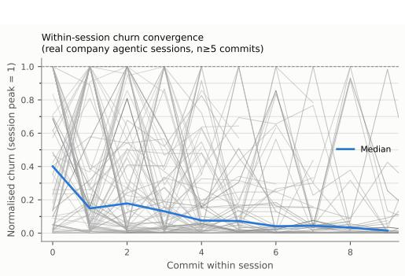

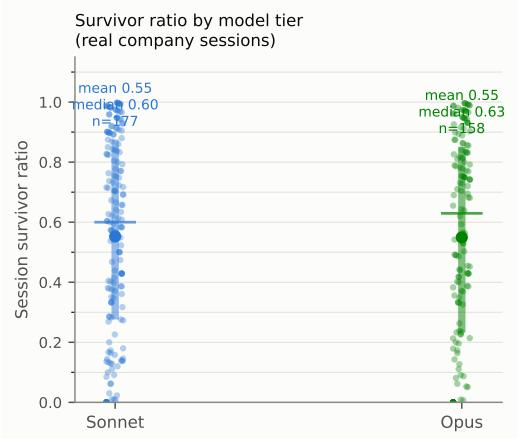  
Figure 7: Part C production sessions, cited from Findings 1 and 2 (§5.2). Left (Finding 1): normalised within-session churn trajectories $( n { \ge } 5$ commits); churn concentrates in the first commit, decaying geometrically thereafter. Right (Finding 2): survivor ratio by model tier (dot = mean, bar = median)—the two tiers are statistically indistinguishable, a null that holds after adjusting for task type, repository, and developer.

## G Extended Discussion

## G.1 Related Work: Empirical Systems and Test-Time Compute

These are the empirical lines the body’s positioning refers to (§2). Multi-agent code generation (ChatDev [Qian et al., 2024], MetaGPT [Hong et al., 2023], AgentCoder [Huang et al., 2023]) and self-refinement work [Madaan et al., 2023, Welleck et al., 2023, Shinn et al., 2023] are empirical, without a structural criterion of this kind. Test-time compute scaling [Brown et al., 2024, Wang et al., 2022, Snell et al., 2024] shows empirically diminishing returns [Wu et al., 2024], which our refinement game predicts from first principles; raising the ceiling has required weight-level training [DeepSeek-AI, 2025]. A 17-hour, billion-token autonomous coding loop on a fixed harness [Khan, 2026] illustrates the same ceiling practically.

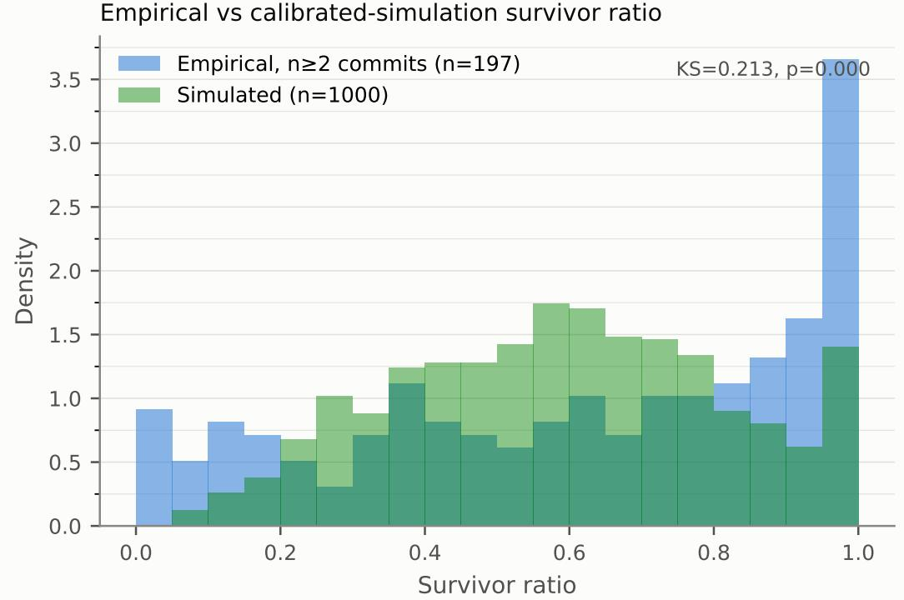  
Figure 8: Empirical vs. simulated survivor-ratio distribution. Simulated sessions use the fitted geometric churn-decay (log-normal) model $( \rho { = } 0 . 7 7 , \sigma { = } 2 . 3 9 )$ with a mixture component for pure-addition sessions $( \pi _ { \mathrm { p u r e } } { = } 0 . 0 7 1 )$ The simulation captures the coarse shape but the annotated in-sample ${ \mathrm { K S } } { = } 0 . 2 1$ $\left( p { = } { < } 0 . 0 0 0 1 \right)$ formally rejects exact equality, and the held-out ${ \mathrm { K S } } { = } 0 . 1 8$ $\scriptstyle ( p = 0 . 0 4 5$ , seed-sensitive across [0.0003, 0.44], rejecting in $^ { 6 / 8 }$ seeds) is now marginal rather than a clean pass—the gap likely reflects repository/developer heterogeneity pooled into a single fit (see Finding 4).

## G.2 Could Decomposition Realize the Protocol Implicitly?

A natural objection to §3’s scope claim: a task decomposes into many sub-specifications (e.g., a ticket’s individual FAIL TO PASS tests), a refinement loop concentrates successive attempts on the still-failing ones, and one might read this as an implicit reweighting $D _ { t }$ with an implicit confidence vote $\alpha _ { t }$ . We grant the spirit: Part B’s diagnostic feedback literally redirects the agent onto residual failures, a primitive attention-reweighting over sub-specs. But three features the transferred theorems actually require remain absent.

First, AdaBoost reweights a fixed population, whereas decomposition generates sub-specs on the fly; in the language of Prop. 3 this dynamic expansion is closer to the class growth of regime (ii) than to fixed-distribution reweighting. Second, “attend to the failing test” is a $0 / 1$ shift, not the multiplicative-exponential update $w _ { i }  w _ { i } \exp ( - \alpha _ { t } [ \cdot ] )$ whose $Z _ { t }$ -factors telescope into the $e ^ { - 2 \gamma ^ { 2 } T }$ bound; a generic failure-focus yields “the agent fixes tests at the rate its competence allows,” not the boosting rate. Third, and most structurally, AdaBoost retains all T learners and combines them by the weighted vote $\begin{array} { r } { f = \sum _ { t } \alpha _ { t } h _ { t } . } \end{array}$ , whereas a refinement loop composes patches $( R _ { T } \circ \cdots \circ R _ { 1 } ) \colon$ each patch subsumes its predecessor rather than standing beside it to be voted on. There is therefore no additive margin for an implicit $\alpha _ { t }$ to weight; the closest genuine analog, best-of-n patch selection, is a within-round argmax, not a cross-round vote.

We treat the mapping as boosting-inspired, not boosting-exact: deploying the exact protocol would restore the transferred theorems by construction, but at the cost of the fidelity we aim to preserve, since the real loops we set out to model do not run it. That tradeoff is inherent to a descriptive study of existing harnesses, not to the framework itself; §G.7 outlines what a harness that implements the Protocol outright, rather than approximates it, would look like as a design principle in its own right.

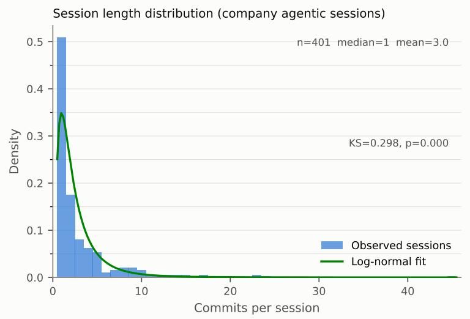  
Figure 9: Session-length distribution (commits per session) with a log-normal reference overlay (descriptive; a KS test rejects exact fit). Median 1, mean 3.0, max 45. The heavy tail reflects long sessions that drive most of the structural change in the repositories.

## G.3 Guidance for Coding in the Wild (full)

The main text gives the two headline recommendations; the full set of five follows, derived from the measured edge of Part B and the churn dynamics of Part C. We state these as working guidance consistent with our evidence and the inference-scaling literature, not as proven prescriptions: they rest on a $K { = } 5 5$ single-vendor, two-tier ablation (Part B) and observational production data (Part C), and should be read as hypotheses a practitioner can cheaply test on their own workload rather than laws.

1. Spend on the first attempt, not the refinement loop. The single most actionable finding is that re-invoking an agent on its own output usually changes nothing: 80.7%/69.1% of trajectories never move after round 0, genuine no-ops run 52–59%/13–21% per round (Fig. 6), and perround improvement decays to $0 . 0 9 7  0 . 0 3 6  0 . 0 3 3$ and $0 . 1 5 6 \to 0 . 0 6 8 \to 0 . 0 2 9$ . Almost all of the value is realized on the first attempt, so better context, retrieval, and model choice for round 0 dominate a longer loop. The reassuring half of the same measurement: extra rounds are rarely harmful either (at most 2.9% of rounds lower quality), so a loop is wasteful rather than dangerous—and for a strong model the early rounds are the ones where an edge cannot be ruled out (Appendix E.1), which is where any budget for refinement should go.

2. The verifier is the gradient—make it fast, executable, and specific (theoretical argument, not yet confirmed by our own ablation). In boosting terms the verifier supplies the residualerror signal the loop descends on; in engineering terms your test suite, type checker, and runtime errors are the learning signal, the same lesson that process- and outcome-level verifiers carry in the reasoning literature [Lightman et al., 2023]. Part B’s own controlled ablation does not confirm this: diagnostic test-failure feedback did not significantly outperform blind re-sampling or independent redraws at $K { = } 5 5$ . Late solves occur at broadly similar rates under all three modes, and the feedback-mode effect is a small, underpowered null (Cohen’s $f { = } 0 . 1 0 .$ 11% power). What our data does support is the weaker claim that verification quality is a lever worth caring about in principle (weak or absent verification structurally cannot supply a residual-error signal at all), not the stronger, specific claim that diagnostic feedback beats blind resampling in practice. We test only an agent critiquing its own output against a narrow test-failure signal here, not an architecturally separate reviewer model reading the same signal (Limitations); the two are not interchangeable, and our edge measurement should not be read as evidence against the latter.

3. Reach for capability before orchestration. The frozen-weight ceiling (Cor. 4) says a given model saturates at a quality $V ^ { * } ( W )$ no loop can pass, and Part B shows the stronger model wins by clearing more tasks on the first try, not by refining better. Elaborate multi-agent refinement pipelines built to compensate for an under-powered model will hit that ceiling; upgrading the model is often the cheaper path to higher quality on hard tasks.

4. Distinguish exploring under the ceiling from raising it. Two interventions are commonly both called “scaffolding” but behave differently. Re-sampling, “think again,” and more rounds explore within a fixed reachable class and saturate at $V ^ { * } ( W ) ;$ giving the agent genuinely new reach (additional tools, code search/retrieval, the ability to run tests, or task decomposition) can expand the reachable class $\mathcal { H } _ { t } ( C )$ and lift the ceiling (§G.4). When a loop has stalled, ask which kind of change you are making: only the second kind can move a hard plateau. This is also why Part B’s null feedback-mode effect does not cut against the theory: independent, blind, and diagnostic feedback are all within-class exploration variants (same weights, same tools, only the framing of feedback changes), so the theory’s own distinction does not anticipate a large gap between them.

5. Steer early; stop on green. Production churn is front-loaded (Part $\mathrm { C } , \rho { \approx } 0 . 7 7 )$ : the first commits make the structural decisions and later ones only polish, so an approach that is wrong at the outset is rarely repaired by subsequent edits—review and redirect early, when it is cheap. At the other end, stop as soon as the verifier passes: carrying the best passing artifact forward and halting on success avoids the failure mode where a loop instructed to “keep improving” regresses an already-correct solution. Our stopping rule (Algorithm 1) is a deterministic margin gate $( \epsilon _ { t } \ \geq \ \textstyle { \frac { 1 } { 2 } } ) ;$ a complementary line treats stopping as probabilistic inference—cost-sensitive sequential hypothesis testing over a belief about correctness [Papamarkou et al., 2026]—which is the natural refinement when verification is expensive and verifiers are informative but imperfect.

A final governance takeaway, expanded in §6 and Appendix G.4: the quantity to monitor is not whether model weights are frozen but whether the agent’s scaffold is self-expanding.

## G.4 Implications for Recursive Self-Improvement (full)

The Stationarity Dichotomy (Prop. 3) states that iterative self-modification behaves in one of two ways. (i) It saturates into strict diminishing returns whenever the agent’s effective hypothesis class— the set of patches it can reach—is held fixed and quality is bounded. (ii) It escapes diminishing returns only if that class keeps expanding enough to sustain a positive edge. This converts the informal debate over an “intelligence explosion” into a concrete, checkable question: is the system’s reachable class stationary?

The whole-system view. Picture a craftsman whose hands are fixed but whose workshop is not: a sharper tool or a better-organised bench lets the same hands reach further, yet no rearrangement of the workshop makes the hands themselves more dexterous. It helps to view the self-improving system in the same way, as a pair $ { \boldsymbol { S } } = ( W , C )$ , where W denotes the (frozen) parameters of the underlying model and C is the mutable code and scaffolding it operates (e.g., prompts, tools, retrieval, verifiers, and orchestration). Agentic coding is precisely the setting in which the system may rewrite C but not W.

It is tempting to infer that freezing W guarantees the safe, saturating regime (i). Under the model we now make explicit, this is false. We posit that the effective hypothesis class $\mathcal { H } _ { t } ( C )$ from which patches are drawn depends on C, and that rewriting the scaffold can expand $\mathcal { H } _ { t } ( C )$ without touching a single weight (assumption (M1) of Cor. 4). A better verifier, tool, or decomposition can unlock patches the previous configuration could never propose. Concretely: an agent stuck on a flaky integration test might write and run a small isolation script mid-session, a debugging tool it did not have at round 0. Once written, that script is available to every later round, so patches the agent could not previously validate (because failures were masked by flakiness) become checkable: $\mathbf { \bar { \mathcal { H } } } _ { t } ( C )$ grows to include edits unreachable at $t { = } 0$ , with W untouched throughout. This is the modeling premise behind recent calls to treat the harness as a first-class, separately optimizable layer [He et al., 2026]. That configuration is not hypothetical. Inspect, the open evaluation framework published by the UK AI Security Institute [AI Security Institute, UK, 2024], ships a react() agent that runs a reasonact-observe loop with bash() and python() tools inside a Docker sandbox, and can host external coding agents (Claude Code, Codex CLI, Gemini CLI) directly—so the agent that writes and runs its own diagnostic mid-run is the default arrangement of a harness built for frontier evaluation, not a thought experiment. Two consequences pull opposite ways. Constructively, the scaffold there is a declarative, versioned artifact—a solver chain, a tool list, a Dockerfile—which is the precondition for auditing a reachable set at all: stationarity of $\mathcal { H } _ { t } ( C )$ is not checkable unless the scaffold is first enumerable. Against that, the declared unit of measurement is a task (dataset, solver, scorer), and nothing in that unit records whether the reachable set expanded while the task ran. The scaffold is thus versioned as experimental setup rather than tracked as the property whose expansion (M1) identifies, the same gap the published frameworks leave at the policy layer (below), one level down in the instrument. Such self-modification violates the stationarity assumption behind Prop. 3(i), so a frozen-weight system can still exhibit the non-monotone, jumpy trajectory of regime (ii).

Frozen weights plausibly impose an ultimate ceiling. We assume there is a best quality $V ^ { * } ( W )$ achievable by any scaffold the model can construct within its reachable program space (assumption (M2) of Cor. 4). Once scaffold rewrites can no longer expand $\mathcal { H } _ { t } ( C )$ , the system falls back into regime (i) and saturates at a value no greater than $V ^ { * } ( { \bar { W } } )$ . Genuinely unbounded RSI therefore requires raising $V ^ { * } ( W )$ itself—modifying the weights or architecture—together with co-evolving the evaluation. Hernandez and Brown [2020] document how much of that raising has historically come from algorithmic progress rather than scale alone, which is why $V ^ { * } ( W )$ is best read as a property of a particular checkpoint rather than a constant of the field. The practical upshot for anyone exploring a self-improving system is a diagnostic: determine whether the reachable class is effectively fixed (predictable, saturating) or expanding (potentially runaway), and do not treat frozen weights as sufficient evidence of the former. Neither (M1) nor (M2) has been empirically measured; the conclusion is conditional on both holding.

The generalization bound (Thm. 12) sharpens the same point from the evaluation side: an AI optimizing against a static set of N specifications overfits, so pushing back the $O ( \sqrt { d / N } )$ ceiling requires dynamically expanding the test suite. Escaping saturation thus demands expansion on both sides—the hypothesis class and the tests.

Concretely, the framework identifies the mechanisms that move a system from regime (i) into regime (ii):

• Self-Evolving Tests and Cost Functions: Instead of a fixed dataset of specifications, the AI could generate increasingly complex tests (an automatic curriculum, as in Wang et al., 2023) or evolve its own structured loss functions. This continuously shifts the generalization target and prevents plateauing.

• Goal-Setting Exploration: Rather than solely minimizing residual error on existing tasks, agents could autonomously set new, orthogonal objectives. This would force structural shifts in the codebase, potentially opening up new capability dimensions beyond simple patch refinement.

• Reward Hacking and Awareness: Explosive trajectories might involve the AI recognizing and exploiting proxies in its evaluation metrics (reward hacking, a recognized failure mode of proxy objectives Amodei et al., 2016, Skalse et al., 2022). A robust recursive protocol must be aware of its own margin distribution and actively penalize the artificial optimization of the structured distance $L ( Y , { \hat { Y } } )$ when it degrades true functional quality.

We read each mechanism as, in the language of Prop. 3, a way of expanding the effective hypothesis class $\mathcal { H } _ { t } ( C )$ or the evaluation target. Absent them, the stationarity assumption holds and Prop. 3(i) forces the system to plateau.

Relation to test-time compute, and why test-time training is a different case. The bounded regime our theory identifies matches the empirical inference-scaling literature: repeated sampling and compute-optimal test-time allocation raise quality with diminishing returns against a fixed model [Brown et al., 2024, Snell et al., 2024, Wu et al., 2024]. In our terms, scaffold- and samplinglevel effort explores within a fixed reachable class and saturates at $V ^ { * } ( W )$ ; moving the ceiling has required weight-level training such as reinforcement learning for reasoning [DeepSeek-AI, 2025]. We read this as consistency, not confirmation—the inference-scaling studies were not designed to test our theorems.

The criterion does, however, force a distinction that the test-time-scaling literature does not consistently draw (§2), and the safety reading depends on it. Test-time training updates parameters at inference: from a self-supervised task on the test input [Sun et al., 2020], from retrieved neighbours [Hardt and Sun, 2024, Hubotter et al., 2025], from the in-context examples of the target task¨ [Akyurek et al., 2025], or by making the hidden state itself a learned model [Sun et al., 2025]. Un-¨ der Cor. 4 this is not more search beneath $V ^ { * } ( W )$ ; it changes W, so it changes the ceiling, and the frozen-weight premise simply does not hold for it. That places it in regime (ii) by construction rather than as an empirical question.

First, the empirical fact that test-time training buys large gains where prompting plateaus [Akyurek ¨ et al., 2025] is expected under the criterion rather than surprising: the two interventions are not competing points on one compute axis but moves in different regimes. Second, an evaluation protocol that reports only “total test-time compute” pools the two and can therefore attribute a ceiling-raising effect to bounded search. Third, and most consequential for governance, “are the weights frozen?” is the wrong single question: it catches test-time training, which visibly writes to W, while missing scaffold self-expansion, which does not touch W at all and is the mechanism (M1) identifies. An audit needs both.

What the published frontier-safety frameworks actually check. The claim that weightimmutability is the wrong invariant is not aimed at a strawman, but the position it corrects is more careful than “check whether the weights changed,” and stating it precisely matters. Current frontiersafety frameworks already elicit capability with scaffolding: Google DeepMind applies “appropriate scaffolding, inference compute, and other augmentations” so as to “assess the capabilities of systems that will likely be produced with the model” [Google DeepMind, 2026], and OpenAI evaluates “with the best presently-available scaffolds” [OpenAI, 2025]. What is indexed to the checkpoint is not the elicitation but the re-assessment trigger: assessment is occasioned by training-side events— the completion of a post-training run [Google DeepMind, 2026], or 4× “Effective Compute” or “six months of accumulated post-training enhancements” [Anthropic, 2026]—so scaffold-driven capability gain enters as a fixed margin around a checkpoint rather than as a tracked property of the deployed loop. Both developers name the residual as an open problem in their own terms. OpenAI records that “given the continuous progress in model scaffolding and elicitation techniques, we regard any one-time capability elicitation in a frontier model as a lower bound, rather than a ceiling, on capabilities that may emerge in real world use and misuse” [OpenAI, 2025]; Anthropic, having replaced its prescriptive elicitation buffer with an outcome-based requirement, states that “the science of evaluations is not currently mature enough to make confident predictions about the precise buffer we should require between current models and a Capability Threshold” [Anthropic, 2026]. Cor. 4 says why no fixed buffer settles the question in general: under (M1) a scaffold rewrite moves H<sub>t</sub>(C) between assessments, with no training-side event to occasion one, so the buffer would have to bound an expansion its own trigger cannot see. The invariant that would close that gap is stationarity of the reachable set, not immutability of W. One framework already reaches part of the way—OpenAI’s covers “any agentic system (including significant agents deployed only internally) that represents a substantial increase in the capability frontier” [OpenAI, 2025], which is a scaffold-side trigger, though a discretionary and frontier-indexed one rather than a check on whether a particular loop’s reachable set is expanding.

The nesting convention runs the other way in some of the literature: test-time training presented as one strategy within test-time compute [Munoz and Yuan, 2025], and the main survey treating its˜ tuning branch as offline rather than per-instance [Zhang et al., 2025b]. The taxonomy here is ours, asserted because the dichotomy requires it, not inherited from a survey.

Where the scaffold writes to the weights, and what bounds that instead. One arrangement closes the loop in the other direction, and it is the case assumption (M2) has to survive. SEAL trains a model to emit its own finetuning data, so a scaffold-level generation drives a persistent weight update [Zweiger et al., 2025]. That is not search beneath a fixed ceiling and it is not testtime training on the test input either: it raises V<sup>∗</sup>(W) using the scaffold as the instrument. This is precisely why (M2)’s quantifier over “any scaffold the model can construct” is load-bearing rather than definitional—a scaffold licensed to write to W escapes the bound by construction, and Cor. 4’s frozen-weight premise simply does not hold for such a system. The route also carries a bound our dichotomy does not supply. SEAL reports performance on earlier tasks declining as self-edits accumulate—the catastrophic-forgetting failure mode of repeated weight updates—so sustaining the uniform edge Prop. 3(ii) demands is not merely a matter of being permitted to change W. Read alongside Cor. 4(ii), that leaves two distinct ceilings with different causes: ours from a fixed reachable class, theirs from interference between successive updates. An evaluator should expect to meet whichever binds first, and neither is visible to a checkpoint-level audit.

Descriptive regime vs. mechanistic cause. The empirical tracks support two claims to different degrees. The descriptive claim, that agentic coding occupies the bounded, saturating regime (i) of Prop. 3, is well-supported: churn decays and quality saturates (Findings 1, 3) exactly as the bounded regime requires. That this signature is shared with ordinary human editing is not a weakness of the descriptive claim; it is the observable content of “the system is in regime (i),” and is itself the safety-relevant finding. Current frozen-weight agentic coding refines like a bounded editor, not a runaway process. What the shared signature does not establish is the mechanistic claim, that a fixed reachable hypothesis class is the cause of the saturation, as opposed to generic editing dynamics. Attributing the regime to the mechanism requires the theory’s non-generic content: not merely that a more capable frozen model reaches a higher $V ^ { * } ( W )$ (Cor. 4), but that $V ^ { * } ( W )$ is impassable by scaffolding alone, moved only by weight-level change. The decisive experiment combines Part B’s harness with Part C’s scale, holding weights fixed while varying the scaffold rather than comparing tiers, which the present data motivates but does not deliver.

## G.5 Bounded vs. Unbounded Metrics

An exam scored out of a hundred admits only so much improvement. However much revision remains, the marks still available can never exceed the marks not yet earned. So each further hour of study returns less than the last. A bounded metric enforces the same discipline, and it is the loadbearing assumption in our formalization of diminishing returns: it is what makes Prop. 3(i) a theorem rather than a conjecture. In the Refinement Game (Thm. 2), the quality function $\bar { V ( : \mathcal { V } \to [ 0 , 1 ] }$ is bounded above by 1. Because of this ceiling the series $\textstyle \sum _ { t = 1 } ^ { \infty }$ η<sub>t</sub> of positive improvements converges, so its terms η<sub>t</sub> must shrink toward zero, mathematically enforcing strict diminishing returns. This is exactly case (i) of the Stationarity Dichotomy (Prop. 3) with ceiling $B = 1$

Conflating two claims here would overstate what the formalism delivers. The proved claim needs boundedness and has no content without it. A weaker claim survives its removal, but only as an argument, not as a consequence of Thm. 2: if the system were evaluated on an unbounded, realvalued metric (maximizing transactions per second, minimizing latency toward an asymptotic zero, an open-ended reward score), the strict boundary breaks down, and the following three factors would still be expected to force plateauing—none of them formalized here, and the third not even a limit on capability but a corruption of the measurement:

1. Overfitting Ceiling: As shown in Thm. 12, generalization is bounded by the VC-dimension and the test suite size. Endless optimization of an unbounded metric against a static set of N specifications will eventually result in overfitting. Breaking this ceiling requires continuously generating increasingly complex tests.

2. Gradient Depletion: In functional gradient descent, optimizing further down the loss curve makes residual errors vastly more complex. A weak coding agent will eventually struggle to find meaningful orthogonal improvements, meaning its edge γ drops to 0 or becomes negative.

3. Reward Hacking: As noted above, unbounded metrics are highly susceptible to proxy exploitation [Amodei et al., 2016, Skalse et al., 2022]. The AI may artificially optimize the unbounded score while degrading true functional quality.

## G.6 Remaining Limitations

The main text states the two most consequential limitations (the weak-learning assumption and the tier-assignment confound). The remaining items:

1. Self-refinement vs. a distinct reviewer role (untested architecture). Part B’s feedback-mode ablation (independent/blind/diagnostic) varies what a single agent is told about its own prior patch—it never introduces an architecturally separate reviewer or critic model that inspects the patch and returns its own feedback. Even the diagnostic arm’s critique is deliberately narrow (which FAIL TO PASS tests still fail, with a one-line pytest hint), chosen to avoid leaking the gold pass/fail bit to the generating agent, not to be the richest signal a reviewer could give. A generator-plus-reviewer pipeline is a materially different, plausibly higher-edge and lesscorrelated feedback channel that this work does not test.

2. Binary quality labels. Our theory is stated for a strict binary success criterion $( \{ - 1 , + 1 \} )$ . The Lean development is in fact more general: the core identities are proved for arbitrary real-valued labels and hypotheses, and the binary structure is introduced only as an explicit per-theorem hypothesis (h binary) precisely where the AdaBoost weight update requires it. While general code quality is multi-dimensional, the binary criterion aligns well with software engineering, where “multi-dimensional quality” effectively amounts to a conjunction of binary gates.

3. Lean formalization scope and motivation. The repository contains no axiom and no sorry: statistical components are encoded as explicit hypotheses rather than derived. Specifically, Theorem 12 takes the Schapire et al. [1998] margin bound as a hypothesis, sidestepping a complete VC-dimension and Rademacher-complexity library, and the deterministic refinement game (Theorem 2) supplies linearity and monotonicity of expectation as hypotheses. By contrast, the highprobability refinement corollary (Cor. 15) is proved against Mathlib’s IsProbabilityMeasure and finite union bound, and the stationarity dichotomy with its frozen-weight ceiling corollary is fully machine-checked.

4. Simulation fidelity and benchmark scope. Part A’s synthetic labels bound what it can show, and Appendix D states that scope rather than repeating it here. Part B is a regime characterization (K=55 tasks × 5 seeds, a 2 × 3 model-tier × feedback-mode ablation, single vendor, digest-pinned Docker harness), not a shortcoming: it probes the headroom × capability condition and finds a large, significant capability effect alongside an underpowered feedback-mode null, but it is not the primary empirical evidence. The task pool is additionally pytest-native by construction, so the two largest Lite repositories are absent for a reason internal to our tooling rather than to the benchmark (Appendix E gives the full disclosure). Importing SWE-bench’s per-repository test commands and restoring both repositories is the first thing a replication should do; it is also the one change that would move every Part B number reported here, which is why it is left to a replication rather than folded into this revision. A ready instrument exists: the companion evaluation collection to Inspect [AI Security Institute, UK, 2024] implements SWEbench with grading delegated to upstream swebench.harness.grading.get eval report rather than re-implemented per-repository log parsing, which is exactly the import this item calls for.

5. Unmeasured edge in production; survivor-ratio proxy. Corollary 11’s exponential convergence requires each agent to have edge $\gamma _ { t } > 0$ under adversarial reweighting onto hard specs. In Part C this edge is not measured on real agents; the guarantee is therefore a conditional prediction, not an empirically confirmed bound. Separately, the survivor-ratio proxy |net lines|/total churn conflates distinct session types: a session that adds 100 net lines and one that deletes 100 lines of dead code both receive the same ratio, though they represent qualitatively different outcomes— the proxy measures structural convergence, not functional correctness. Relative churn does have an established software-engineering pedigree—Nagappan and Ball [2005] show relative churn measures predict defect density—but it is validated there as a predictor of defects, not of the convergence we read into it, so the borrowing is partial.

6. Stationarity of the refinement game. Theorem 2 assumes that each agent improves quality by at least η<sub>t</sub> in expectation. In practice, agents may occasionally degrade quality. Corollary 15 relaxes the strict monotone requirement to a high-probability bound. More fundamentally, stationarity is not merely a technical convenience: as formalized in the Stationarity Dichotomy, the question of whether the effective hypothesis class stays fixed is the precise dividing line between the bounded regime our theorems cover and the runaway regime they do not.

7. The reasoning/tool-creation boundary is not operationally sharp. Assumption (M1) treats scaffold expansion as a binary: either H (C) grows or it does not. In practice the line between reasoning within the current class and an action that expands it is blurry: writing a new unit test is ordinary reasoning about the existing code, but running it behaves like acquiring a new tool—patches that were previously unreachable because unvalidatable become checkable, without any change to W. The same ambiguity recurs for a debug script, a refactor that exposes a previously-untestable seam, or a cached search index. We do not have a principled test for where a given action falls on this continuum; (M1) is stated as a binary precisely because an operational boundary is missing, not because one is known and simply omitted.

## G.7 Future Directions

• Multi-class and structured prediction. Extending to multi-label code quality (security, performance, readability) using SAMME [Zhu et al., 2009] or structured boosting.

• Online and streaming protocols. Adapting the framework to settings where artifacts arrive sequentially, using online boosting [Beygelzimer et al., 2015]. “Online” means streaming instances here, and is distinct from the two other senses this paper touches: composing an improvement process at inference time (Xue and Yang, 2026, §2) and continual weight adaptation across a stream of tasks (Zweiger et al., 2025, above). Only the last of the three moves $V ^ { * } \bar { ( } W )$

• Scale and diversity of empirical validation. Extending Part C to multiple companies, larger session datasets, and harness-verified quality signals (true pass/fail via test suites) would provide stronger evidence and allow quantitative hypothesis testing against the theory’s predictions.

• Optimal agent selection. Developing efficient algorithms for selecting the next agent (weak learner) in the coding domain, where evaluating an agent’s error is expensive.

• Generator-reviewer ablation. A natural extension adds a fourth arm in which an architecturally separate reviewer model, given the same non-gold test-failure signal already available to the diagnostic arm, returns free-form critique—testing whether a distinct reviewer role sustains a positive edge where self-critique plateaus after round 0.

• The multi-round weighted-vote run. Appendix C settles the per-round edge for a reused pool in both directions (Prop. 7) but stops short of exhibiting a run: a schedule and confidence sequence written out over T rounds, which additionally requires excluding a perfect pool member since Cor. 11 assumes $\epsilon _ { t } > 0$ . Formalizing AdaBoost’s minimax duality in the converse direction— weak learnability ⇒ interpolation with margin—would close the remaining half of the same picture.

• Implementing the Protocol itself as a harness design principle. Every empirical part in this paper studies harnesses that approximate the Agentic Boosting Protocol at best; none run its reweighting machinery $( D _ { t } , \alpha _ { t } )$ directly (§G.2). A harness that maintains an explicit distribution over a fixed spec or test-case pool, up-weights the specs the current draft still fails, and combines successive patches by a weighted vote rather than sequential composition would instantiate Algorithm 1 exactly rather than by analogy—restoring the transferred AdaBoost guarantees (Thms. 10, 12) by construction, and giving the boosting lens a literal, checkable referent past round 0, rather than only an inspired one.

## H Formalization Index

Every result above is machine-checked in Lean 4 (Mathlib, no axiom and no sorry); these two tables map each one to the declarations that carry it, so a reader can go from a statement to its proof term. All declarations live in lean\_proofs/LeanProofs/. Where a result’s content is statistical rather than algebraic it is encoded as an explicit hypothesis rather than derived, and the tables say so.

Table 4: Core results and the Lean declarations that carry them (principal name first, then supporting lemmas and non-vacuity witnesses). All declarations live in lean proofs/LeanProofs/.
<table><tr><td>Result</td><td>Lean declarations</td></tr><tr><td>Thm. 10, training-error bound</td><td>thm1_zero_one_loss_bound (the bound as stated); thm1_training- error_bound for the underlying exponential-loss identity exp loss  $= \Pi _ { t } Z _ { t } .$  with z_decomposition, indicator_le_exp, exp_loss_pos</td></tr><tr><td>Thm. 13, forward stagewise equiva- lence</td><td>thm4_fsam_optimal_alpha; thm4_fsam_global_minimum, exp_half_ 1og</td></tr><tr><td>Cor. 11, exponential decay</td><td>cor2_exponential_decay; z_le_sqrt_edge, sqrt_edge_le_exp, z_ bound_from_edge</td></tr><tr><td>Thm. 2, monotone-improvement re- finement game Cor. 15, high-probability refinement</td><td>thm5_refinement_game; thm5_saturation</td></tr><tr><td></td><td>corollary7_high_prob_refinement; prob_inter_bound, sum_telescope.Verified against Mathlib&#x27;s measure-theoretic library (IsProbabilityMeasure and the finite union bound)</td></tr><tr><td>Prop. 3, stationarity dichotomy</td><td>prop8_saturation_forces_decay (part i), prop8_sustained_edge_ diverges (part ii)</td></tr><tr><td>Cor. 4, frozen-weight ceiling</td><td>cor_frozen_weight_ceiling, an instantiation of prop8_saturation_ forces_decay at  $B : = V ^ { * } ( W )$  Stated in the main text as the two halves formalized separately below:</td></tr><tr><td>Prop. 7, reused-pool dichotomy</td><td>thm_pool_reuse_horizon (case  $\mathrm { i } , \ \epsilon _ { 0 } \ > \ 0 )$  and thm_interpolating- pool_sustains_edge (case ii, €0=0), with cor_pool_horizon_floor_ excludes_interpolation for their mutual exclusion. Exhaustiveness is im- mediate, since  $\epsilon _ { 0 } > 0 \mathrm { o r } \epsilon _ { 0 } = 0 ;$  see Props. 20 and 21 for the exact hypotheses</td></tr><tr><td colspan="2">Thm. 12, generalization bound</td></tr><tr><td></td><td>Assumed as an explicit hypothesis, not derived: thm3_generalization_bound takes MarginGeneralizationBound as a hypothesis. Its statistical content—the Schapire et al. [1998] margin bound, VC dimension, and Rademacher complexity—is assumed, sidestepping a com- plete VC/Rademacher library</td></tr></table>

Table 5: Orchestration and diversity results of §C and their Lean declarations. Every row is machinechecked; the one item that is not formalized is recorded in the note below the table.
<table><tr><td>Result</td><td>Lean declarations</td></tr><tr><td>Prop. 5, best-of-k ceiling equality</td><td>prop15_tight_ceiling_orchestration (tight equality); prop15_ orchestration_ceiling, prop15_orchestration_dominates for the weaker upper-bound-hypothesis version</td></tr><tr><td>Prop. 17, weighted aggregation beats the weak-learning baseline Prop. 18, multi-round best-of-k</td><td>cor_soft_aggregation_beats_weak_baseline; built on the pure- analysis lemma exists_ensemble_size_beating_weak_threshold thm_width_refinement_game; cor_width_dominates_best_worker, cor_width_saturation, with exists_width_orchestrator for non-</td></tr><tr><td>Prop. 6, bounded overlap character- izes a correct vote</td><td>vacuity thm_overlap_iff_zero_error (characterization); cor_tight_overlap_ iff (m* form), thm_bounded_overlap_zero_error (sufficient direction), thm_overlap_boundary_sharpwithexists_boundary_overlap-</td></tr><tr><td>Reweighted edge hypothesis via the density ratio</td><td>(counting-only baseline) lem_bounded_reweighting_edge takes the concentration cap κ as given; D_le_of_margin_bound and cor_rho_from_confidences derive it from logged confidences, and cor_reweighting_edge_from_confidences states the κ-free conclusion. The sources spell κ as rho and M as B, the</td></tr><tr><td>Prop. 19, immediate reuse zeroes</td><td>names they carried before this paper separated those glyphs thm_self_reuse_zero_edge; rests on the derived reweighting recursion D_ succ_eq and reused_worker_err_eq, with exists_zero_edge_reuse_</td></tr><tr><td>Prop. 20, reused-pool horizon</td><td>instance for non-vacuity thm_pool_reuse_horizon, cor_no_perpetual_pool_edge; rests on the span-collapse identity lem_pool_span_collapse, its loss form zero_one_ loss_eq_spanLoss, and alpha_opt_nonneg, with exists_positive_ span_floor and exists_pool_reuse_horizon_instance for non-</td></tr><tr><td>Prop. 21, interpolating pools sustain the edge</td><td>vacuity and exists_edge_worker_vs_any_round for the absence of a per- round obstruction thm_interpolating-pool_sustains_edge, with cor_interpolating- pool_edge_every_round for AdaBoost&#x27;s own reweighting; rests on lem_ margin_floor_of_spanLoss_zero, lem_span_coeff_sum_pos, lem_ weighted_margin_eq, lem_D_nonneg, with cor_pool_horizon_floor_</td></tr><tr><td>Prop. 22, the two conditions are in- dependent</td><td>interpolating-pool_instance for non-vacuity thm_edge_overlap_independent; from the witnesses thm_edge_not_ imply_overlap and thm_overlap_not_imply_edge and the exponential-</td></tr><tr><td>Prop. 23, Condorcet bound for inde- pendent errors</td><td>free reweighting steps D_succ_fail, D_succ_pass thm_condorcet_majority_bound, over the pattern weight wt and vote error voteErr; rests on lem_wt_sum_one and lem_wt_tilt_sum, with exists_ condorcet_instance for non-vacuity</td></tr><tr><td>Prop. 24, the same bound with inde- pendence derived</td><td>thm_condorcet_majority_bound_prob, over the product mea- sure failMeasure; lem_coord_iIndepFun obtains independence from Mathlib&#x27;s iIndepFun_pi, lem_pattern_measure the pat- tern weight, lem_failure_event_eq_voteErr the event identifica-</td></tr></table>