# BEHAVE: Functional Behavior Modeling Enables Self-Improving Agents for Hardware Design and Verification

Yuheng Wu<sup>1,∗</sup> Berk Gokmen<sup>1,\*</sup> Sujeeth Jinesh<sup>1,\*</sup> Lauren McLane<sup>1,\*</sup>

Aarav Wattal<sup>1</sup> Qi Yang Huang<sup>2</sup> Zhaozhuo Xu<sup>2</sup> Thierry Tambe<sup>1</sup>

<sup>1</sup>Stanford University <sup>2</sup>Workato, Inc.

{yuhengwu,ttambe}@stanford.edu

September 28, 2026

## Abstract

Developing agents for hardware design and verification requires reliable correctness feedback. As a hardware specification may permit correct implementations with diferent latencies, matching design and reference outputs cycle by cycle can reject valid designs. To address this, we introduce BEHAVE, an agentic framework for multi-turn joint hardware design and verification through functional behavior modeling. We define Behavior IR to express task functionality as executable behavior models without prescribing implementation timing beyond the specification. The agent iteratively develops a register-transfer-level (RTL) design and a behavior model as the design’s verification reference. Our evaluator, BEHAVE-Sim, checks both artifacts separately against a hidden golden behavior model using input stimuli generated by random sampling and solver-guided search. BEHAVE thus supports power, performance, and area (PPA) exploration across task-permitted latencies and microarchitectures. During training, the same evaluator provides verifiable reinforcement learning (RL) rewards from specification-behavior pairs without reference RTL. For self-improvement, the agent continually searches for high-level implementations relevant to its capability gaps, constructs and checks specification-behavior pairs, and trains on the expanded task pool. We release BEHAVE-Train and BEHAVE-Eval with 600 human-reviewed specification-behavior pairs for realistic hardware workloads. Starting from 60 seed tasks and acquiring 100 new tasks, self-improvement raises Qwen3.8-27B’s RTL pass@1 on BEHAVE-Eval from 55.0% to 75.0%, reaching performance comparable to RL using a 540-task pool.

Code & datasets: https://github.com/joel-wu/BEHAVE Model: https://huggingface.co/joooelw/BEHAVE-27B

## 1 Introduction

Design and verification are key stages of digital chip development [1, 2]. Figure 1(a) illustrates a common workflow: engineers develop a register-transfer-level (RTL) design and a reference model for verification, with a testbench driving both and comparing their outputs [3]. Output mismatches help engineers debug the design or reference model [4]. Large language model (LLM) agents [5, 6] open a path to automating this process. We study how to develop an agent that jointly generates RTL designs and reference models during inference and learns both capabilities during training.

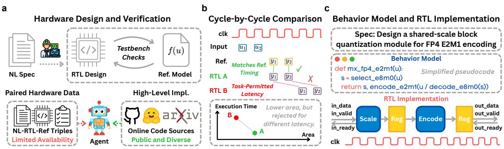  
Figure 1: Motivation for functional behavior modeling. (a) A common development workflow and the availability gap between paired hardware data and public high-level implementations. (b) Cycle-by-cycle comparison rejects a correct RTL design with task-permitted latency diferences, despite its lower area. (c) A behavior model and pipelined RTL for MXFP4 block quantization. See Appendix B.2 for task details and code excerpts of the Python behavior model and pipelined RTL.

Developing such an agent requires reliable correctness feedback for both its RTL designs and reference models. Comparing RTL outputs cycle by cycle with a reference implementation provides feedback, but ties it to that implementation’s timing [7–11]. When the specification permits diferent latencies, this can reject valid designs with preferable power, performance, and area (PPA) trade-ofs, as illustrated in Figure 1(b). The challenge is therefore to provide executable supervision that checks task-defined behavior while preserving the timing flexibility allowed by the specification.

We address this challenge through functional behavior modeling, using executable behavior models to describe task functionality (Figure 1(c)). We express them in Behavior IR, a typed representation. One behavior model can serve as a reference for RTL implementations with task-permitted diferences in latency and microarchitecture. For a specification S, the agent develops an RTL design R<sup>ˆ</sup> and a behavior model B<sup>ˆ</sup> as the design’s verification reference. Our evaluator, BEHAVE-Sim, independently checks both artifacts against a hidden golden behavior model B<sup>⋆</sup> following task-defined rules.

Building on this, we develop BEHAVE, an agentic framework for multi-turn joint design and verification. The agent iteratively refines R<sup>ˆ</sup> and B<sup>ˆ</sup> using its own testbench and development tools, and can use EDA feedback to explore area-time trade-ofs. For independent evaluation, BEHAVE-Sim first applies random test inputs to B<sup>⋆</sup> and the submitted artifact $A \in \{ \hat { R } , \hat { B } \}$ , comparing their outputs under task-defined rules. Feedback from both executions then drives solver-guided search for additional inputs targeting unhit goals, such as branch outcomes or assertion violations.

During training, BEHAVE-Sim’s artifact scores provide verifiable rewards for reinforcement learning (RL). The agent can thus learn to generate RTL designs and verification references from (S, B<sup>⋆</sup>) pairs without reference RTL. While RTL training data are scarce [12], high-level implementations are widely available online [13] and serve as sources for (S, B<sup>⋆</sup>) pairs (Figure 1(a)). To acquire new training tasks, the agent searches for high-level implementations relevant to its capability gaps and adapts them into specification-behavior pairs. It checks these pairs and continues training with accepted ones. Rollout feedback guides the next acquisition round, supporting continued search-based self-improvement on realistic hardware workloads. Our contributions are:

• Functional behavior modeling. We develop BEHAVE, an agentic framework for multi-turn co-development of RTL designs and behavior models for verification. BEHAVE-Sim uses golden behavior models to evaluate the agent’s RTL designs and behavior models under task-defined rules. Functional modeling preserves task-permitted choices of latency and microarchitecture, enabling agents to explore area-time trade-ofs with EDA feedback.

• Verifiable training and self-improvement. We enable verifiable RL from specificationbehavior pairs derived from a growing body of public high-level implementations, without requiring reference RTL. The agent iteratively acquires new tasks based on capability gaps and trains on the expanded task pool, supporting continued search-based self-improvement.

• Open-source datasets. We release BEHAVE-Train and BEHAVE-Eval, comprising 600 human-reviewed specification-behavior pairs covering realistic hardware workloads in AI/ML, numerics, signal processing, cryptography, control, compression, and data systems.

## 2 Background

This section reviews RTL design and simulation-based verification in Subsection 2.1, then explains the roles of reference models and testbenches in Subsection 2.2.

## 2.1 Hardware Design and Verification

RTL Design. In digital circuit design, an RTL design (e.g., in Verilog or SystemVerilog) specifies combinational logic and sequential state updates, typically governed by clocks and resets. Unlike an untimed high-level implementation (e.g., in Python), RTL explicitly describes how computation and data transfers are organized across clock cycles [1].

RTL Verification Step 1: Stimulus Generation. Simulation-based verification first generates input stimuli to exercise the RTL design under test (DUT). Directed testing uses manually selected input sequences to target known scenarios, constrained-random testing samples a broader input space under user-defined constraints [14], and concolic testing combines concrete execution with symbolic constraint solving to steer inputs toward unexplored paths [15].

RTL Verification Step 2: Correctness Checking. The DUT’s responses to these stimuli are checked for correctness. Outputs may be compared with expected values specified directly or computed by a reference model on the same inputs [2]. Beyond output-value comparison, assertions can check protocol and temporal properties during execution [4].

## 2.2 Reference Models and Testbenches

Reference Models and High-Level Implementations. A reference model is an executable description of the DUT’s expected behavior. Reference models vary in language and range from cycle-accurate to untimed [2]. For a high-level implementation to serve as a reference model, details such as bit widths, overflow behavior, and state initialization must be explicit and consistent with the task specification. In our implementation, reference models are expressed in Behavior IR, a typed executable representation with defined semantics and a restricted set of constructs.

UVM Testbenches. A testbench coordinates the stimulus generation and correctness checking described above, as in Figure 2(a). The Universal Verification Methodology (UVM) provides a standardized framework for organizing these functions into components [3]. Sequences generate stimulus transactions, drivers translate them into DUT interface signals, and monitors record the DUT’s input and output transactions. Scoreboards compare observed outputs with reference-mode predictions for the recorded inputs, while coverage collectors track exercised scenarios.

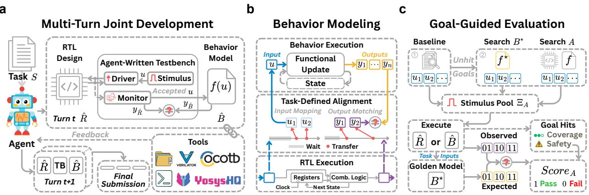  
Figure 2: Joint development and evaluation. (a) The agent iteratively develops RTL ${ \hat { R } } ,$ a behavior model ${ \hat { B } } ,$ and a testbench. (b) Task-defined alignment matches RTL outputs to behaviormodel predictions from accepted inputs, allowing task-permitted latency diferences. (c) For each submitted artifact $A \in \{ \hat { R } , \hat { B } \}$ , baseline tests and goal-guided searches on $B ^ { \star }$ and A provide stimuli for independent evaluation against $B ^ { \star }$ , checking output agreement and safety-goal hits.

## 3 BEHAVE

We first describe functional behavior modeling for multi-turn joint design and verification (Section 3.1). We then present BEHAVE-Sim’s goal-guided evaluation (Section 3.2). Finally, we describe PPA exploration (Section 3.3) and verifiable RL with search-based self-improvement (Section 3.4).

## 3.1 Functional Behavior Modeling

Task setup. Each task pairs a natural-language (NL) specification S with a golden behavior model $B ^ { \star }$ . The agent receives $S ,$ while $B ^ { \star }$ is reserved for evaluation and hidden during development. The agent develops an RTL design $\hat { R }$ and a behavior model $\hat { B }$ as the design’s verification reference.

Multi-turn development. As shown in Figure $2 ( \mathrm { a } )$ , the agent iteratively edits and tests $\hat { R }$ and B<sup>ˆ</sup> with development tools, using its own testbench to check their agreement and guide revisions. After the agent submits its final $\hat { R }$ and ${ \hat { B } } ,$ BEHAVE-Sim evaluates each independently against $B ^ { \star }$

Behavior models. The golden model $B ^ { \star }$ and the agent-written model $\hat { B }$ are represented in Behavior IR, which supports typed operations, arrays, conditionals, loops, and persistent state. Invocations take task-defined inputs and state, producing updated state and outputs or an explicit failure. Appendix B.2 provides an MXFP4 example. Appendix C.7 gives the syntax and semantics.

Task-defined alignment. For RTL-model comparison, $\hat { R }$ is checked against $\hat { B }$ during development and $B ^ { \star }$ during evaluation. As shown in Figure 2(b), the reference behavior model processes the inputs accepted by the RTL and task-defined events such as reset. Its predicted outputs are matched to RTL outputs, allowing latency diferences permitted by the task. For model-model comparison, $\hat { B }$ and $B ^ { \star }$ receive the same task-defined inputs, and their outputs are compared directly.

Ready/valid example. Consider a ready/valid task that requires one result per accepted input but leaves response latency unspecified. BEHAVE-Sim records the RTL’s input and output data at clock edges when the data are marked valid and the receiver is ready to accept them. It feeds the recorded input values to the reference behavior model and compares its predictions with the recorded RTL outputs. Appendix B.4 summarizes supported protocols and limitations.

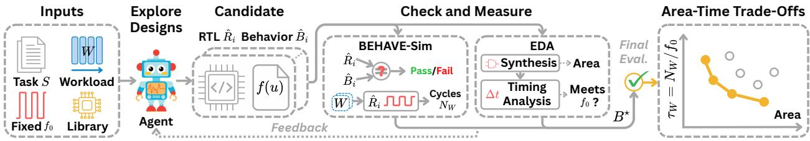  
Figure 3: Timing-flexible PPA exploration. The agent freely explores area-time trade-ofs through multi-turn tool interaction. Orange points mark the empirical Pareto frontier.

## 3.2 Goal-Guided Evaluation

Evaluation setup. BEHAVE-Sim evaluates each submitted artifact $A \in \{ \hat { R } , \hat { B } \}$ on a finite stimulus pool $\Xi _ { A }$ , comparing its outputs with $B ^ { \star }$ . Each stimulus $\xi \in \Xi _ { A }$ consists of finite input sequences and an execution schedule specifying input presentation, clock events, and resets.

Goals. A goal is a predefined condition on artifact execution. It is hit when a test stimulus drives the artifact to satisfy that condition. Coverage goals mark execution cases, such as branch outcomes, while safety goals mark failures, such as violations of existing assertions. BEHAVE-Sim automatically extracts goals from artifact structure and predefined protocol checks, while tasks can explicitly declare additional goals. Appendix B.6 details goal types and hit conditions.

Stimulus generation. As shown in Figure 2(c), BEHAVE-Sim first runs edge-case and seeded random tests. It then uses execution feedback from both $B ^ { \star }$ and A to search for inputs targeting unhit goals. The search targets goals whose triggering conditions can be encoded as solver constraints on inputs. Solver-generated tests are executed to check outputs and update goal hits, guiding further search within a shared time budget. Appendix B.7 details the procedure.

Artifact score. An artifact passes on $\Xi _ { A }$ when its outputs match $B ^ { \star }$ and it hits no safety goal:

$$
\operatorname { s c o r e } _ { A } ( \Xi _ { A } ) = \mathbf { 1 } \left[ n _ { \operatorname* { m i s } } ^ { A } ( \Xi _ { A } ) = 0 \land \mathrm { H i t } _ { A } ( \Xi _ { A } ) \cap \Gamma _ { A } ^ { \operatorname { s a f e } } = \emptyset \right] ,
$$

where $n _ { \mathrm { m i s } } ^ { A }$ counts output mismatches, $\operatorname { H i t } _ { A }$ collects observed goal hits, and $\Gamma _ { A } ^ { \mathrm { s a f e } }$ is A’s safety-goal set. Goal coverage is reported separately and does not afect this score (Appendix B.6).

Theorem 1 (Bounded goal analysis). Under the assumptions in Appendix C, for either submitted artifact, every goal reported as reached has an execution that hits it, confirmed by replay. A goal reported as bounded-unreachable cannot be hit by any allowed execution within the fixed bounds. No conclusion is drawn for unresolved goals. This analysis does not change the artifact score.

Proof. Apply Theorem 3 to the exact bounded encodings in Theorems 4 and 5 (Appendix C).

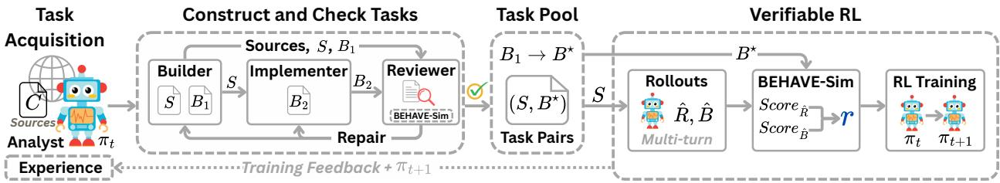  
Figure 4: Task acquisition and verifiable RL. All roles use the current policy $\pi _ { t }$ in separate contexts. Accepted task pairs support RL, and training feedback guides subsequent task acquisition.

## 3.3 Timing-Flexible PPA Exploration

Candidate search. Given S, a fixed workload W, frequency $f _ { 0 } ,$ and cell library, the agent seeks low area and short workload execution time. It can vary parallelism and other choices when revising R<sup>ˆ</sup> and $\hat { B }$ with BEHAVE-Sim and EDA feedback (Figure 3). BEHAVE-Sim checks their agreement and measures workload cycles, while synthesis and timing analysis report cell area and timing.

Area-time trade-ofs. Workload execution time is $\tau _ { W } = N _ { W } / f _ { 0 }$ , where $N _ { W }$ counts RTL cycles to complete W. Finally, RTL candidates are evaluated against the hidden reference $B ^ { \star }$ . We report the empirical Pareto frontier among passing candidates that complete W and meet timing at $f _ { 0 }$

## 3.4 Verifiable RL and Self-Improvement

Verifiable RL. Given (S, B<sup>⋆</sup>) pairs, we train the agent with GRPO [16] on multi-turn jointdevelopment rollouts. BEHAVE-Sim evaluates $\hat { R }$ and B<sup>ˆ</sup> against $B ^ { \star }$ , yielding the rollout reward

$$
r = \frac { \mathrm { s c o r e } _ { \hat { B } } ( \Xi _ { \hat { B } } ) + \mathrm { s c o r e } _ { \hat { R } } ( \Xi _ { \hat { R } } ) } { 2 } \in \left\{ 0 , \frac { 1 } { 2 } , 1 \right\} .
$$

Feedback-guided task acquisition. To expand the training set, the current policy $\pi _ { t }$ acts as an Analyst (Figure 4). It reviews completed training rollouts and their feedback to identify capability gaps, then selects relevant high-level implementations and sets objectives for new tasks. The Analyst records useful findings as experience to guide subsequent acquisition rounds.

Task construction and continued training. Builder constructs $S$ and $B _ { 1 }$ from the sources and objectives. In a separate context, Implementer produces $B _ { 2 }$ from $S$ and public interface documentation, without the sources or $B _ { 1 }$ . Reviewer checks the task against its sources and compares the models with BEHAVE-Sim, requesting repairs when needed. Accepted $( S , B _ { 1 } )$ pairs enter the cumulative training pool with $B _ { 1 }$ as $B ^ { \star }$ . Training continues from $\pi _ { t } .$ yielding an updated policy $\pi _ { t + 1 }$ that uses rollout feedback to guide subsequent acquisition.

## 4 Experiments and Discussion

We first introduce the datasets and evaluation settings (Section 4.1), then examine how well models jointly perform hardware design and verification using BEHAVE (Section 4.2). We compare BEHAVE with other development pipelines and test whether providing BEHAVE-Sim as a stimulus-generation tool improves success and reduces cost (Section 4.3). We then test whether agents can explore area-time trade-ofs under a fixed workload and frequency (Section 4.4), and whether verifiable RL and continued task acquisition improve their capabilities (Section 4.5).

Table 1: Main results on hardware design benchmarks (%). RTL and Behav. report RTL and Behavior pass@1 under BEHAVE-Sim. Cov. is line coverage achieved by the submitted testbench on the submitted RTL, averaged over all tasks. Missing submissions or compilation/execution failures score zero. RL and SI denote fixed-dataset RL and self-improvement (see Section 4.5).
<table><tr><td>Model</td><td colspan="3">VerilogEval-v2</td><td colspan="3">RTLLM-v2</td><td colspan="3">CVDP-cid003</td><td colspan="3">BEHAVE-Eval</td></tr><tr><td></td><td>RTL</td><td>Behav.</td><td>Cov.</td><td>RTL</td><td>Behav.</td><td>Cov.</td><td>RTL</td><td>Behav.</td><td>Cov.</td><td>RTL</td><td>Behav.</td><td>Cov.</td></tr><tr><td>Qwen3.5-4B</td><td>34.6</td><td>28.8</td><td>6.9</td><td>12.0</td><td>20.0</td><td>0.0</td><td>4.3</td><td>4.3</td><td>0.9</td><td>0.0</td><td>6.7</td><td>0.0</td></tr><tr><td>Qwen3.5-9B</td><td>46.8</td><td>40.4</td><td>13.4</td><td>18.0</td><td>22.0</td><td>2.1</td><td>7.0</td><td>9.6</td><td>2.4</td><td>0.0</td><td>15.0</td><td>1.8</td></tr><tr><td>Claude Haiku 4.5</td><td>92.9</td><td>89.1</td><td>62.7</td><td>88.0</td><td>84.0</td><td>87.2</td><td>72.2</td><td>54.8</td><td>83.8</td><td>36.7</td><td>70.0</td><td>48.1</td></tr><tr><td>GPT-5.6 Luna</td><td>94.2</td><td>94.9</td><td>84.1</td><td>98.0</td><td>98.0</td><td>85.3</td><td>93.0</td><td>93.9</td><td>91.6</td><td>68.3</td><td>73.3</td><td>89.7</td></tr><tr><td>Claude Sonnet 5</td><td>92.3</td><td>92.3</td><td>58.1</td><td>84.0</td><td>86.0</td><td>75.7</td><td>64.3</td><td>60.9</td><td>66.9</td><td>68.3</td><td>65.0</td><td>60.7</td></tr><tr><td>GPT-5.6 Terra</td><td>99.4 96.8</td><td>99.4 96.2</td><td>71.0</td><td>98.0</td><td>98.0</td><td>85.6</td><td>95.7</td><td>97.4</td><td>95.9</td><td>85.0</td><td>90.0</td><td>95.7</td></tr><tr><td>DeepSeek-V4.1-Flash</td><td></td><td></td><td>79.9</td><td>98.0</td><td>100.0</td><td>94.0</td><td>93.0</td><td>90.4</td><td>95.5</td><td>88.3</td><td>83.3</td><td>90.7</td></tr><tr><td>Qwen3.8-27B</td><td>97.4</td><td>95.5</td><td>77.3</td><td>90.0</td><td>90.0</td><td>87.9</td><td>81.7</td><td>82.6</td><td>87.0</td><td>55.0</td><td>56.7</td><td>59.1</td></tr><tr><td>Qwen3.8-27B-RL (ours)</td><td>98.1</td><td>96.8</td><td>66.7</td><td>96.0</td><td>92.0</td><td>85.7</td><td>91.3</td><td>87.8</td><td>92.0</td><td>73.3</td><td>71.7</td><td>80.6</td></tr><tr><td>Qwen3.8-27B-SI (ours)</td><td>98.7</td><td>96.2</td><td>80.6</td><td>96.0</td><td>92.0</td><td>85.8</td><td>93.0</td><td>92.2</td><td>91.5</td><td>75.0</td><td>75.0</td><td>77.5</td></tr></table>

a  
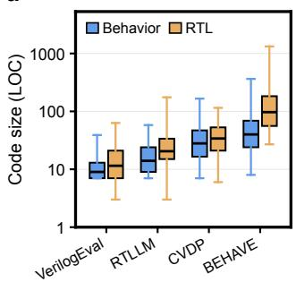

b  
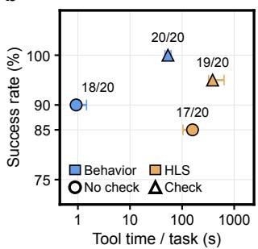

c  
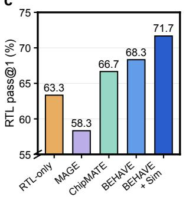

d  
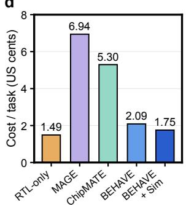  
Figure 5: Benchmark construction and pipeline comparison. (a) RTL and Behavior code sizes across benchmarks. Whiskers show the full range. (b) End-to-end success and median tool time (horizontal bars: interquartile range) for Behavior IR and HLS on 20 tasks with GPT-5.6 Luna. Check adds development-time correctness feedback. All settings retain frontend/synthesis feedback and final evaluation against hidden golden Behavior models. (c) RTL pass@1 across pipelines on BEHAVE-Eval. (d) Mean API cost for the same pipelines.

## 4.1 Benchmarks and Evaluation Settings

Benchmarks. We construct 600 human-reviewed specification-behavior pairs from high-level implementations across seven application domains, split into BEHAVE-Train (540 tasks) and BEHAVE-Eval (60 tasks). We extend VerilogEval-v2 [17], RTLLM-v2 [18], and CVDP-cid003 [19] with golden Behavior models and resolve specification inconsistencies. Behavior models typically use less code than RTL by omitting hardware implementation details. BEHAVE has the largest median RTL code size (Figure 5(a)). Appendix E details sources, construction, review, splits, and licensing.

Behavior IR vs. HLS. High-level synthesis (HLS) converts designs written in high-level languages, such as C++, into RTL. On 20 tasks, the agent translates the same high-level implementations into

Behavior IR or synthesizable C++. BEHAVE-Sim and Vitis HLS provide compilation and synthesis feedback, respectively. With or without BEHAVE-Sim correctness feedback, Behavior IR achieves higher success rates and lower median tool time (Figure 5(b)). Appendix D.4 provides details. Our framework is not tied to Behavior IR and can use other executable reference representations.

Evaluation settings. Models share a development environment with a 128K-token context window and at most 60 turns per rollout. BEHAVE-Sim evaluates final RTL and Behavior submissions. Appendices D.1 and D.2 detail the environment, model configurations and evaluation budgets.

## 4.2 Hardware Design and Verification Performance

Model capabilities. Table 1 shows that frontier foundation models already exhibit strong hardware design and verification capabilities. Given a tool-equipped development environment, they can autonomously write, test, and revise RTL designs and their Behavior references, using tool feedback to decide their next steps. Smaller models still struggle with both artifacts, and testbench coverage remains uneven even among models with high RTL and Behavior pass@1.

Benchmark saturation. In our interactive setting, strong models approach saturation on these extended benchmarks, while BEHAVE-Eval remains more challenging. GPT-5.6 Terra achieves 95.7- 99.4% RTL pass@1 across the three external benchmarks, compared with 85.0% on BEHAVE-Eval. As algorithms and workloads evolve, we can construct harder tasks from high-level implementations.

## 4.3 Comparison of Development Workflows

Comparison setup. Using GPT-5.6 Luna, we compare RTL-only development, ChipMATE [7], MAGE [20], BEHAVE, and BEHAVE with BEHAVE-Sim on BEHAVE-Eval. In the last setting, BEHAVE-Sim generates stimuli and compares the agent’s RTL and Behavior model during development, replacing the agent-written testbench. All final RTL submissions are evaluated against golden Behavior models. Appendix D.5 details the settings and baseline adaptations.

Performance and cost. BEHAVE achieves higher RTL pass@1 than RTL-only development, suggesting that constructing an executable reference can help the agent develop RTL (Figure 5(c)). With a single tool-using agent, BEHAVE achieves comparable RTL pass@1 to ChipMATE and MAGE at lower API cost (Figure 5(d)). Adding BEHAVE-Sim improves success while reducing cost, supporting the value of automated testing within joint development.

Why functional behavior modeling. ChipMATE generates Python reference models for RTL verification. Reproducing the RTL’s cycle-by-cycle execution in Python, however, can retain its control logic and intermediate state. In an unsigned-division example, ChipMATE’s Python model maintains control state across clock-level calls, whereas the Behavior reference completes the computation in one call (see Appendix D.8). Expressing the same computation at diferent abstraction levels allows joint development to separate functional intent from architectural choices.

## 4.4 Timing-Flexible PPA Exploration

Experimental setup. We compare BEHAVE with and without BEHAVE-Sim for MXFP4 areatime exploration using GPT-6 Astra and Claude Fable 5.1. Both use EDA feedback under the same workload, clock frequency, and SkyWater 130 nm cell library [21]. We also explore NVFP4 using the FreePDK45-based Nangate 45 nm standard-cell library [22, 23]. Appendix D.5 provides details.

a  
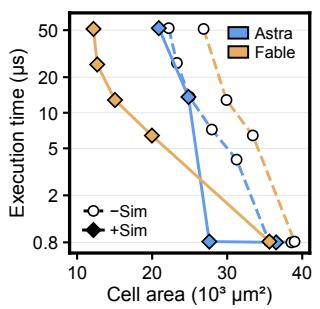

b  
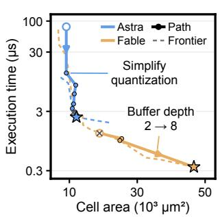

c  
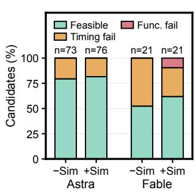

d  
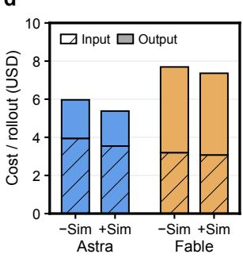  
Figure 6: Timing-flexible PPA exploration. (a) MXFP4 frontiers with and without BEHAVE-Sim (SkyWater 130 nm, 80 MHz). (b) NVFP4 frontiers (dashed) and optimization paths (solid) (FreePDK45-based Nangate 45 nm library, 400 MHz). Stars mark endpoints and crosses timing failures. (c) MXFP4 candidate outcomes (n: collected candidates). (d) MXFP4 mean estimated input/output API cost per search with cross-turn cache reuse. Execution time is simulated cycles / target frequency for 64 continuously ofered blocks of 32 (MXFP4) or 16 (NVFP4) BF16 values.

Area-time trade-ofs. Both models produce correct designs with diferent area-time trade-ofs (Figure 6(a)). Figure 6(b) traces NVFP4 revisions to selected frontier points. Astra simplifies quantization using comparisons in place of division. Fable increases bufering from two to eight blocks, reducing execution time at the cost of area. Within each task, the same golden Behavior reference validates designs with diferent architectures and execution times.

Efect of simulation feedback. BEHAVE-Sim yields lower-area designs at comparable execution times and a higher fraction of feasible candidates (Figure 6(a,c)). Estimated mean API cost per search is modestly lower with BEHAVE-Sim (Figure 6(d)). These results suggest that reusable stimulus generation and comparison tools can be more efective than asking agents to write testbenches.

## 4.5 Verifiable RL and Self-Improvement

Experimental setup. We train Qwen3.8-27B for 40 updates, sampling from the 540-task BEHAVE-Train pool. Self-improvement starts from 60 seed tasks and adds new tasks through 5 acquisition rounds, with 18 training updates in total. The seed-only baseline trains only on the same 60 seed tasks for 18 updates. Appendix D.6 details the training and acquisition settings.

Learning performance. Verifiable RL improves both RTL design and reference-model construction, with the largest gains on BEHAVE-Eval. RTL pass@1 rises from 55.0% to 73.3%, and Behavior pass@1 from 56.7% to 71.7% (Figure 7(a-b)). These gains are accompanied by shorter generations: median total generation length per rollout falls from 98.6k to 66.2k tokens (Figure 7(c)).

Self-improvement. The final self-improved model reaches 75.0% for both RTL and Behavior pass@1 on BEHAVE-Eval (Figure 7(e)). Both artifacts pass on 44 of 60 tasks, versus 31 before training and 42 after fixed-dataset RL (Figure 7(f)). The seed-only baseline reaches 58.3% RTL and

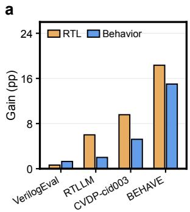

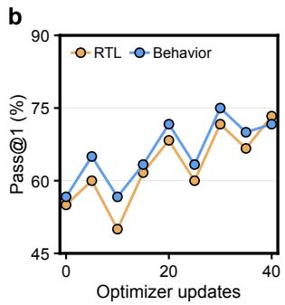

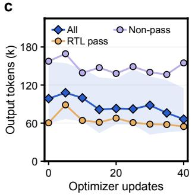

d  
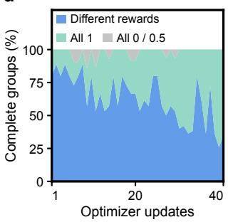

e  
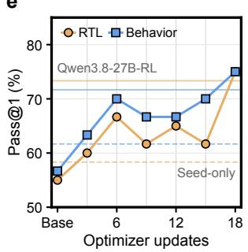

f  
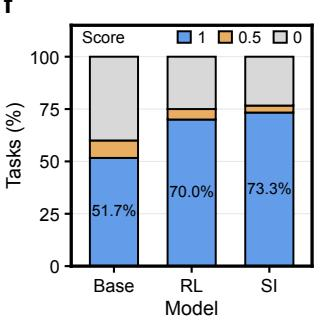

g  
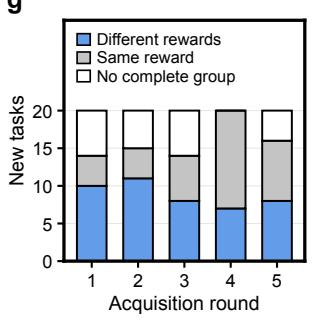

h  
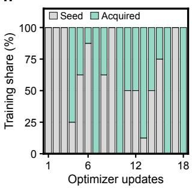  
Figure 7: RL and self-improvement with Qwen3.8-27B. (a) RL gains across benchmarks. (b,c) BEHAVE-Eval pass@1 and median rollout output length. (d) Reward-group composition during RL. (e) Self-improvement performance on BEHAVE-Eval. Horizontal lines show final fixed-dataset RL (solid) and seed-only (dashed) results. (f) Joint-score distributions on BEHAVE-Eval: 1, 0.5, and 0 indicate both, one, or neither artifact passing. (g) Reward variation across eight candidate solutions per newly acquired task. (h) Seed/acquired task shares in each training update.

61.7% Behavior pass@1. Starting from 60 seed tasks, self-improvement reaches the performance of RL using a 540-task pool. Appendix D.9 presents a recorded self-improvement case.

Learning signal. Later fixed-dataset updates contain more sampled all-1 groups, leaving no reward diferences within those groups (Figure 7(d)). Self-improvement expands the pool with tasks constructed from retrieved software. Newly acquired tasks provide nonconstant rewards across acquisition rounds (Figure 7(g)) and contribute to subsequent updates (Figure 7(h)).

## 5 Related Work

LLMs for EDA. LLMs have been applied to a wide range of digital design and verification tasks, including RTL and testbench generation, debugging, and design optimization [24–61]. A parallel line develops training datasets and post-trains open-source LLMs for these tasks [62, 63, 12, 64–84]. Some methods also use high-level representations to support RTL training. BetterV translates RTL into cycle-accurate C models for paired instruction tuning [85]. AutoVCoder uses Python execution to filter synthetic combinational RTL examples before supervised fine-tuning [86]. BEHAVE instead uses executable behavior models to provide correctness rewards during RL.

Table 2: Comparison of related methods. Task lists evaluated capabilities. RM and TB denote reference model and testbench. G and P mark agent-generated verification artifacts and supplied references. Timing Flex. indicates whether RTL latency or kernel runtime may vary. Self-improvement indicates whether the updated agent autonomously acquires new tasks for further training.
<table><tr><td></td><td colspan="5">Inference</td><td colspan="2">Training</td></tr><tr><td>Method</td><td>Task</td><td>Design</td><td>Verification</td><td>Alignment</td><td>Timing Flex.</td><td>Training Source</td><td>Self- Improv.</td></tr><tr><td>MAGE [20]</td><td>Design</td><td>RTL</td><td>Verilog TBG/P</td><td>Cycle</td><td>No</td><td></td><td>No</td></tr><tr><td>ChatModel [8]</td><td>Verification</td><td></td><td>SystemC RMG</td><td>Cycle</td><td>No</td><td></td><td>No</td></tr><tr><td>PRO-V-R1 [11]</td><td>Verification</td><td></td><td>Python RMG</td><td>Cycle</td><td>No</td><td>Spec-RTL</td><td>No</td></tr><tr><td>FAVer [9]</td><td>Design</td><td>RTL</td><td>Python RMG</td><td>Cycle</td><td>No</td><td>Spec-RTL</td><td>No</td></tr><tr><td>AutoVeriFix+ [10]</td><td>Both</td><td>RTL</td><td>Python RMG</td><td>Cycle</td><td>No</td><td></td><td>No</td></tr><tr><td>ChipMATE [7]</td><td>Both</td><td>RTL</td><td>Python RMG</td><td>Cycle</td><td>No</td><td>Spec-RTL</td><td>No</td></tr><tr><td>CorrectHDL [87]</td><td>Design</td><td>RTL</td><td>HLS RTLP</td><td>Task-specific</td><td>Yes</td><td></td><td>No</td></tr><tr><td>FormalRTL [88]</td><td>Design</td><td>RTL</td><td>C RMP</td><td>Fixed-Latency</td><td>No</td><td></td><td>No</td></tr><tr><td>HINT [89]</td><td>Design</td><td>RTL</td><td>HINT IRG</td><td>Task-specific</td><td>No</td><td></td><td>No</td></tr><tr><td>CUDA Agent [91]</td><td>Design</td><td>CUDA</td><td>PyTorch RMP</td><td>Completion</td><td>Yes</td><td>PyTorch Ops</td><td>No</td></tr><tr><td>DRTriton [92]</td><td>Design</td><td>Triton</td><td>PyTorch RMP</td><td>Completion</td><td>Yes</td><td>PyTorch Ops</td><td>No</td></tr><tr><td>BEHAVE (ours)</td><td>Both</td><td>RTL</td><td>Behavior RMG</td><td>Task-specific</td><td>Yes</td><td>Spec-Behavior</td><td>Yes</td></tr></table>

Verification-Guided Hardware Agents. MAGE generates Verilog testbenches for RTL debugging, ChatModel generates SystemC reference models, and PRO-V-R1 trains agents to generate Python reference models and testbenches using golden RTL supervision [20, 8, 11]. FAVer and AutoVeriFix+ use Python reference models to guide RTL generation and repair [9, 10]. ChipMATE trains RTL and Python agents for cross-verification, with the Python agent supervised by RTLderived, cycle-accurate reference models [7]. Cycle-aligned checking couples verification to reference timing, limiting reference reuse across RTL designs with task-permitted latency diferences (Table 2).

High-Level Representations and References. CorrectHDL checks generated RTL against HLS-generated references derived from C/C++ [87], while FormalRTL uses C reference models for equivalence checking [88]. HINT generates an executable IR with a frozen transaction and timing contract for RTL verification [89]. Yin et al. [90] use hierarchical IRs to describe module connectivity, operations, and I/O behavior. CUDA Agent and DRTriton compare generated kernels with PyTorch references after kernel completion [91, 92]. BEHAVE matches RTL outputs to behavior-model predictions according to task-defined rules, preserving specification-permitted timing flexibility.

Self-Improving Agents. Agents refine memory and skills [93, 94], evolve agent code and harnesses [95], or update model weights through training [96, 97]. Some training methods let models propose new problems and learn from solving them [98–103]. BEHAVE acquires new tasks with executable references from public high-level implementations. The updated agent guides acquisition using training feedback, and checked specification-behavior pairs support further RL.

Benchmarks for RTL Design and Verification. RTLLM [104, 18] and VerilogEval [105, 17] evaluate small module generation from natural-language specs, and CVDP [19] extends the format to other RTL tasks such as debugging and comprehension. ArchXBench, NotSoTiny, and RealBench target larger or more realistic RTL designs [106–108]. RTL-Repo evaluates repository-level code completion [109], while CktEvo focuses on repository-level design evolution [110]. ChipBench covers RTL generation, debugging, and reference-model generation [111], while RTL-OPT targets RTL optimization [112]. IC-RTL and Pluto support PPA evaluation across diferent latencies, but rely on a dedicated testbench for each task [113, 114]. For evaluation, BEHAVE-Sim instantiates standardized testbenches from our dataset’s golden behavior models and interface declarations, without requiring separately authored testbench code for each task.

## 6 Conclusion

We presented BEHAVE, a framework for joint hardware design and verification through functional behavior modeling. BEHAVE-Sim independently evaluates RTL designs and behavior models against golden references while preserving task-permitted timing flexibility, providing verifiable RL rewards without reference RTL. Experiments demonstrate multi-turn joint development, area-time exploration across workloads and cell libraries, and improvements in RTL and reference-model generation through training. Starting from a small human-reviewed seed set, the agent constructs and checks new specification-behavior pairs for continued training, using rollout feedback to guide task acquisition. This self-improvement process reaches performance comparable to full-dataset RL on BEHAVE-Eval. By turning high-level implementations into executable supervision, BEHAVE ofers a path to continued self-improvement as algorithms and workloads evolve.

## References

[1] Jan M. Rabaey, Anantha Chandrakasan, and Borivoje Nikolić. Digital Integrated Circuits: A Design Perspective. Prentice Hall, 2nd edition, 2003.

[2] Janick Bergeron. Writing Testbenches: Functional Verification of HDL Models. Kluwer Academic Publishers, 2nd edition, 2003.

[3] IEEE. IEEE standard for universal verification methodology language reference manual. IEEE Std 1800.2-2020, IEEE, 2020.

[4] Bruce Wile, John Goss, and Wolfgang Roesner. Comprehensive Functional Verification: The Complete Industry Cycle. Morgan Kaufmann, 2005.

[5] John Yang, Carlos E. Jimenez, Alexander Wettig, Kilian Lieret, Shunyu Yao, Karthik Narasimhan, and Ofir Press. Swe-agent: Agent-computer interfaces enable automated software engineering. In Advances in Neural Information Processing Systems, 2024.

[6] Yuxiang Wei, Olivier Duchenne, Jade Copet, Quentin Carbonneaux, Lingming Zhang, Daniel Fried, Gabriel Synnaeve, Rishabh Singh, and Sida I. Wang. Swe-rl: Advancing llm reasoning via reinforcement learning on open software evolution. In Advances in Neural Information Processing Systems, 2025.

[7] Zhongkai Yu, Yichen Lin, Chenyang Zhou, Yuwei Zhang, Kun Zhou, Junxia Cui, Haotian Ye, Zhengding Hu, Zaifeng Pan, Ruiyi Wang, Yujie Zhao, Hejia Zhang, Jingbo Shang, Jishen Zhao, and Yufei Ding. Chipmate: Multi-agent training via reinforcement learning for enhanced rtl generation. arXiv preprint arXiv:2605.12857, 2026.

[8] Jianmin Ye, Tianyang Liu, Qi Tian, Shengchu Su, Zhe Jiang, and Xi Wang. Chatmodel: Automating reference model design and verification with llms. arXiv preprint arXiv:2506.15066, 2025.

[9] Jianan Mu, Mingyu Shi, Yining Wang, Tianmeng Yang, Bin Sun, Xing Hu, Jing Ye, and Huawei Li. Faver: Boosting llm-based rtl generation with function abstracted verifiable middleware. arXiv preprint arXiv:2510.08664, 2025.

[10] Yan Tan, Xiangchen Meng, Zijun Jiang, and Yangdi Lyu. Autoverifix+: High-correctness rtl generation via trace-aware causal fix and semantic redundancy pruning. arXiv preprint arXiv:2603.11489, 2026.

[11] Yujie Zhao, Zhijing Wu, Boqin Yuan, Zhongming Yu, Hejia Zhang, Wentao Ni, Chia-Tung Ho, Haoxing Ren, and Jishen Zhao. Pro-v-r1: Reasoning enhanced programming agent for rtl verification. arXiv preprint arXiv:2506.12200, 2025.

[12] Shailja Thakur, Baleegh Ahmad, Hammond Pearce, Benjamin Tan, Brendan Dolan-Gavitt, Ramesh Karri, and Siddharth Garg. Verigen: A large language model for verilog code generation. ACM Transactions on Design Automation of Electronic Systems, 2024.

[13] Denis Kocetkov, Raymond Li, Loubna Ben Allal, Jia Li, Chenghao Mou, Yacine Jernite, Margaret Mitchell, Carlos Muñoz Ferrandis, Sean Hughes, Thomas Wolf, Dzmitry Bahdanau, Leandro von Werra, and Harm de Vries. The stack: 3 tb of permissively licensed source code. Transactions on Machine Learning Research, 2023.

[14] Yehuda Naveh, Michal Rimon, Itai Jaeger, Yoav Katz, Michael Vinov, Eitan Marcus, and Gil Shurek. Constraint-based random stimuli generation for hardware verification. AI Magazine, 2007.

[15] Koushik Sen, Darko Marinov, and Gul Agha. CUTE: A concolic unit testing engine for C. In Proceedings of the European Software Engineering Conference Held Jointly with the ACM SIGSOFT International Symposium on Foundations of Software Engineering, 2005.

[16] Zhihong Shao, Peiyi Wang, Qihao Zhu, Runxin Xu, Junxiao Song, Xiao Bi, Haowei Zhang, Mingchuan Zhang, Y.K. Li, Y. Wu, and Daya Guo. Deepseekmath: Pushing the limits of mathematical reasoning in open language models. arXiv preprint arXiv:2402.03300, 2024.

[17] Nathaniel Pinckney, Christopher Batten, Mingjie Liu, Haoxing Ren, and Brucek Khailany. Revisiting verilogeval: A year of improvements in large-language models for hardware code generation. ACM Transactions on Design Automation of Electronic Systems, 2025.

[18] Shang Liu, Yao Lu, Wenji Fang, Mengming Li, and Zhiyao Xie. Openllm-rtl: Open dataset and benchmark for llm-aided design rtl generation. In Proceedings of the International Conference on Computer-Aided Design, 2024.

[19] Nathaniel Pinckney, Chenhui Deng, Chia-Tung Ho, Yun-Da Tsai, Mingjie Liu, Wenfei Zhou, Brucek Khailany, and Haoxing Ren. Comprehensive verilog design problems: A next-generation benchmark dataset for evaluating large language models and agents on rtl design and verification. arXiv preprint arXiv:2506.14074, 2025.

[20] Yujie Zhao, Hejia Zhang, Hanxian Huang, Zhongming Yu, and Jishen Zhao. Mage: A multiagent engine for automated rtl code generation. In Proceedings of the Design Automation Conference, 2025.

[21] SkyWater PDK Authors. SkyWater open source PDK, 2020. URL https://github.com/ google/skywater-pdk.

[22] Nangate. Nangate 45nm open cell library, 2008. URL https://si2.org/ open-cell-and-free-pdk-libraries/.

[23] James E. Stine, Ivan Castellanos, Michael Wood, Jef Henson, Fred Love, W. Rhett Davis, Paul D. Franzon, Michael Bucher, Sunil Basavarajaiah, Julie Oh, and Ravi Jenkal. FreePDK: An open-source variation-aware design kit. In Proceedings of the IEEE International Conference on Microelectronic Systems Education, 2007.

[24] Kaiyan Chang, Haimeng Ren, Mengdi Wang, Shengwen Liang, Yinhe Han, Huawei Li, Xiaowei Li, and Ying Wang. Improving large language model hardware generating quality through post-llm search. In Workshop on Machine Learning for Systems at NeurIPS, 2023.

[25] Shailja Thakur, Baleegh Ahmad, Zhenxing Fan, Hammond Pearce, Benjamin Tan, Ramesh Karri, Brendan Dolan-Gavitt, and Siddharth Garg. Benchmarking large language models for automated verilog rtl code generation. In Proceedings of the Design, Automation and Test in Europe Conference, 2023.

[26] Zhongzhi Yu, Mingjie Liu, Michael Zimmer, Yingyan Celine Lin, Yong Liu, and Haoxing Ren. Spec2rtl-agent: Automated hardware code generation from complex specifications using llm agent systems. In Proceedings of the IEEE International Conference on LLM-Aided Design, 2025.

[27] Ruidi Qiu, Grace Li Zhang, Rolf Drechsler, Ulf Schlichtmann, and Bing Li. Correctbench: Automatic testbench generation with functional self-correction using llms for hdl design. In Proceedings of the Design, Automation and Test in Europe Conference, 2025.

[28] Ruidi Qiu, Grace Li Zhang, Rolf Drechsler, Ulf Schlichtmann, and Bing Li. Autobench: Automatic testbench generation and evaluation using llms for hdl design. In Proceedings of the ACM/IEEE International Symposium on Machine Learning for CAD, 2024.

[29] Ruidi Qiu, Grace Li Zhang, Rolf Drechsler, Tsungyi Ho, Ulf Schlichtmann, and Bing Li. Confibench: Automatic testbench generation with confidence-based scenario mask and testbench ensemble using llms for hdl design. ACM Transactions on Design Automation of Electronic Systems, 2026.

[30] Zixi Zhang, Balint Szekely, Pedro Gimenes, Greg Chadwick, Hugo McNally, Jianyi Cheng, Robert Mullins, and Yiren Zhao. Llm4dv: Using large language models for hardware test stimuli generation. In Proceedings of the IEEE Annual International Symposium on Field-Programmable Custom Computing Machines, 2025.

[31] Xin Xin, Jincheng Lou, Junhui Li, Jinglin Yan, Panda Xiao, Di Wu, Haixiao Li, Weicong Lu, Weijian Fan, Xinyu Qu, Yuxiang Zhao, Min Yu, Zhixiong Di, and Yibo Lin. Gogotb: Agentic rtl verification with specification-grounded coverage closure. arXiv preprint arXiv:2607.26181, 2026.

[32] Zhiyuan Yan, Wenji Fang, Mengming Li, Min Li, Shang Liu, Zhiyao Xie, and Hongce Zhang. Assertllm: Generating hardware verification assertions from design specifications via multi-llms. In Proceedings of the Asia and South Pacific Design Automation Conference, 2025.

[33] Bhabesh Mali, Karthik Maddala, Vatsal Gupta, Sweeya Reddy, Chandan Karfa, and Ramesh Karri. Chiraag: Chatgpt informed rapid and automated assertion generation. In Proceedings of the IEEE Computer Society Annual Symposium on VLSI, 2024.

[34] Marcelo Orenes-Vera, Margaret Martonosi, and David Wentzlaf. Using llms to facilitate formal verification of rtl. arXiv preprint arXiv:2309.09437, 2023.

[35] Jitendra Bhandari, Johann Knechtel, Ramesh Narayanaswamy, Siddharth Garg, and Ramesh Karri. Llm-aided testbench generation and bug detection for finite-state machines. arXiv preprint arXiv:2406.17132, 2024.

[36] Ruiyang Ma, Yuxin Yang, Ziqian Liu, Jiaxi Zhang, Min Li, Junhua Huang, and Guojie Luo. Verilogreader: Llm-aided hardware test generation. In Proceedings of the IEEE LLM Aided Design Workshop, 2024.

[37] Yunda Tsai, Mingjie Liu, and Haoxing Ren. Rtlfixer: Automatically fixing rtl syntax errors with large language model. In Proceedings of the Design Automation Conference, 2024.

[38] Xufeng Yao, Haoyang Li, Tsz Ho Chan, Wenyi Xiao, Mingxuan Yuan, Yu Huang, Lei Chen, and Bei Yu. Hdldebugger: Streamlining hdl debugging with large language models. ACM Transactions on Design Automation of Electronic Systems, 2025.

[39] Patrick Yubeaton, Siddharth Garg, and Chinmay Hegde. Exploring the agentic frontier of verilog code generation. arXiv preprint arXiv:2603.19347, 2026.

[40] Cunxi Yu, Chenhui Deng, Nathaniel Pinckney, and Brucek Khailany. Agentic hardware design as repository-level code evolution. arXiv preprint arXiv:2606.28279, 2026.

[41] Sazzadul Islam, Tasnim Tabassum, and Hao Zheng. Verigraphi: A multi-agent framework of hierarchical rtl generation for large hardware designs. arXiv preprint arXiv:2604.14550, 2026.

[42] Fu-Chieh Chang, Yu-Hsin Yang, Hung-Ming Huang, Yun-Chia Hsu, Yin-Yu Lin, Ming-Fang Tsai, Chun-Chih Yang, and Pei-Yuan Wu. Specloop: An agentic rtl-to-specification framework with formal verification feedback loop. arXiv preprint arXiv:2603.02895, 2026.

[43] Yuheng Wu, Berk Gokmen, Zhouhua Xie, Peijing Li, Caroline Trippel, Priyanka Raina, and Thierry Tambe. Llm-fsm: Scaling large language models for finite-state reasoning in rtl code generation. arXiv preprint arXiv:2602.07032, 2026.

[44] Peiran Yan, Qinzhe Zhi, Lifeng Liu, and Tianyu Jia. Gensoc: A multi-agent-assisted soc generation methodology leveraging open-source hardware. In Proceedings of the IEEE/ACM International Symposium on Low Power Electronics and Design, 2025.

[45] Yifan Zhang, Jianmin Ye, Jiahao Yang, and Xi Wang. Refevo: Agentic design with coevolutionary verification for agile reference model generation. arXiv preprint arXiv:2604.24218, 2026.

[46] Junhao Ye, Yuchen Hu, Ke Xu, Dingrong Pan, Qichun Chen, Jie Zhou, Shuai Zhao, Xinwei Fang, Xi Wang, Nan Guan, and Zhe Jiang. From concept to practice: an automated llmaided uvm machine for rtl verification. In Proceedings of the International Conference on Computer-Aided Design, 2025.

[47] Junhao Ye, Dingrong Pan, Hanyuan Liu, Yuchen Hu, Jie Zhou, Ke Xu, Xinwei Fang, Xi Wang, Nan Guan, and Zhe Jiang. Uvmarvel: an automated llm-aided uvm machine for subsystem-level rtl verification. arXiv preprint arXiv:2605.04704, 2026.

[48] Zhe Zhao, Hongbing Lang, Zhihan Xiao, Luke Ztz Hu, John Imoleayo Adebisi, and Songping Mai. Evidence-driven llm agent for c-to-synthesizable-c conversion and verification. arXiv preprint arXiv:2606.28409, 2026.

[49] Yiting Wang, Wanghao Ye, Ping Guo, Yexiao He, Ziyao Wang, Bowei Tian, Shwai He, Guoheng Sun, Zheyu Shen, Sihan Chen, Ankur Srivastava, Qingfu Zhang, Gang Qu, and Ang Li. Symrtlo: Enhancing rtl code optimization with llms and neuron-inspired symbolic reasoning. In Advances in Neural Information Processing Systems, 2025.

[50] Kimia Tasnia, Alexander Garcia, Tasnuva Farheen, and Sazadur Rahman. Veriopt: Ppaaware high-quality verilog generation via multi-role llms. In Proceedings of the International Conference on Computer-Aided Design, 2025.

[51] Yiting Wang, Wanghao Ye, Yexiao He, Yiran Chen, Gang Qu, and Ang Li. Mcp4eda: Llm-powered model context protocol rtl-to-gdsii automation with backend aware synthesis optimization. arXiv preprint arXiv:2507.19570, 2025.

[52] Wenji Fang, Yao Lu, Shang Liu, Jing Wang, Ziyan Guo, Junxian He, Fengbin Tu, and Zhiyao Xie. Dr. rtl: Autonomous agentic rtl optimization through tool-grounded self-improvement. arXiv preprint arXiv:2604.14989, 2026.

[53] Heng Ping, Peiyu Zhang, Zhenkun Wang, Shixuan Li, Anzhe Cheng, Wei Yang, Paul Bogdan, and Shahin Nazarian. Poet: Power-oriented evolutionary tuning for llm-based rtl ppa optimization. arXiv preprint arXiv:2603.19333, 2026.

[54] Yaoxiang Wang, Qi Shi, Shangzhan Li, Qingguo Hu, Xinyu Yin, Bo Guo, Xu Han, Maosong Sun, and Jinsong Su. Veriagent: A tool-integrated multi-agent system with evolving memory for ppa-aware rtl code generation. arXiv preprint arXiv:2603.17613, 2026.

[55] Kiran Thorat, Jiahui Zhao, Yaotian Liu, Amit Hasan, Hongwu Peng, Xi Xie, Bin Lei, and Caiwen Ding. Llm-verippa: Power, performance, and area optimization aware verilog code generation with large language models. In Proceedings of the ACM/IEEE Symposium on Machine Learning for CAD, 2025.

[56] Stef Cuyckens, Mihaela Jivanescu, Jun Yin, Chao Fang, and Marian Verhelst. Ares: Adaptive reasoning-efort steering for ppa- and cost-aware rtl optimization with llm agents. arXiv preprint arXiv:2607.27879, 2026.

[57] Hongzheng Chen, Yingheng Wang, Yaohui Cai, Hins Hu, Jiajie Li, Shirley Huang, Chenhui Deng, Rongjian Liang, Shufeng Kong, Haoxing Ren, Samitha Samaranayake, Carla P. Gomes, and Zhiru Zhang. Heurigym: An agentic benchmark for llm-crafted heuristics in combinatorial optimization. In Proceedings of the International Conference on Learning Representations, 2026.

[58] Yuchen Hu, Junhao Ye, Ke Xu, Jialin Sun, Shiyue Zhang, Xinyao Jiao, Dingrong Pan, Jie Zhou, Ning Wang, Weiwei Shan, Xinwei Fang, Xi Wang, Nan Guan, and Zhe Jiang. Uvllm: An automated universal rtl verification framework using llms. In Proceedings of the Design Automation Conference, 2025.

[59] Yan Tan, Xiangchen Meng, Zijun Jiang, and Yangdi Lyu. Autoverifix: Automatically correcting errors and enhancing functional correctness in llm-generated verilog code. In Proceedings of the Asia and South Pacific Design Automation Conference, 2026.

[60] Angela Cui, Ferran Hermida-Rivera, Jack Toubes, Raghav Gupta, Jim Fang, Chengyi Lux Zhang, Ella Schwarz, Junha Kim, Yakun Sophia Shao, Borivoje Nikolić, Christopher W. Fletcher, and Sagar Karandikar. Chia: An open-source framework for principled, agentic ai-driven hardware/software co-design research. arXiv preprint arXiv:2606.27350, 2026.

[61] Raghu Vamshi Hemadri, Jitendra Bhandari, Andre Nakkab, Johann Knechtel, Badri P Gopalan, Ramesh Narayanaswamy, Ramesh Karri, and Siddharth Garg. Veriloc: Line-of-code level prediction of hardware design quality from verilog code. In Advances in Neural Information Processing Systems, 2025.

[62] Mingjie Liu, Teodor-Dumitru Ene, Robert Kirby, Chris Cheng, Nathaniel Pinckney, Rongjian Liang, Jonah Alben, Himyanshu Anand, Sanmitra Banerjee, Ismet Bayraktaroglu, Bonita Bhaskaran, Bryan Catanzaro, Arjun Chaudhuri, Sharon Clay, Bill Dally, Laura Dang, Parikshit Deshpande, Siddhanth Dhodhi, Sameer Halepete, Eric Hill, Jiashang Hu, Sumit Jain, Ankit Jindal, Brucek Khailany, George Kokai, Kishor Kunal, Xiaowei Li, Charley Lind, Hao Liu, Stuart Oberman, Sujeet Omar, Ghasem Pasandi, Sreedhar Pratty, Jonathan Raiman, Ambar Sarkar, Zhengjiang Shao, Hanfei Sun, Pratik P Suthar, Varun Tej, Walker Turner, Kaizhe Xu, and Haoxing Ren. Chipnemo: Domain-adapted llms for chip design. arXiv preprint arXiv:2311.00176, 2024.

[63] Shang Liu, Wenji Fang, Yao Lu, Qijun Zhang, Hongce Zhang, and Zhiyao Xie. Rtlcoder: Outperforming gpt-3.5 in design rtl generation with our open-source dataset and lightweight solution. In Proceedings of the IEEE LLM Aided Design Workshop, 2024.

[64] Mingjie Liu, Yun-Da Tsai, Wenfei Zhou, and Haoxing Ren. Craftrtl: High-quality synthetic data generation for verilog code models with correct-by-construction non-textual representations and targeted code repair. In Proceedings of the International Conference on Learning Representations, 2025.

[65] Ning Wang, Bingkun Yao, Jie Zhou, Yuchen Hu, Xi Wang, Zhe Jiang, and Nan Guan. Large language model for verilog generation with code-structure-guided reinforcement learning. In Proceedings of the IEEE International Conference on LLM-Aided Design, 2025.

[66] Patrick Yubeaton, Andre Nakkab, Weihua Xiao, Luca Collini, Ramesh Karri, Chinmay Hegde, and Siddharth Garg. Verithoughts: Enabling automated verilog code generation using reasoning and formal verification. In Advances in Neural Information Processing Systems, 2025.

[67] Yaoyu Zhu, Di Huang, Hanqi Lyu, Xiaoyun Zhang, Chongxiao Li, Wenxuan Shi, Yutong Wu, Jianan Mu, Jinghua Wang, Yang Zhao, Pengwei Jin, Shuyao Cheng, Shengwen Liang, Xishan Zhang, Rui Zhang, Zidong Du, Qi Guo, Xing Hu, and Yunji Chen. Qimeng-codev-r1: Reasoning-enhanced verilog generation. In Advances in Neural Information Processing Systems, 2025.

[68] Hejia Zhang, Zhongming Yu, Chia-Tung Ho, Haoxing Ren, Brucek Khailany, and Jishen Zhao. Llm4cov: Execution-aware agentic learning for high-coverage testbench generation. In Proceedings of the International Conference on Machine Learning, 2026.

[69] Fan Cui, Chenyang Yin, Kexing Zhou, Youwei Xiao, Guangyu Sun, Qiang Xu, Qipeng Guo, Demin Song, Dahua Lin, Xingcheng Zhang, and Yun (Eric) Liang. Origen: Enhancing rtl code generation with code-to-code augmentation and self-reflection. In Proceedings of the International Conference on Computer-Aided Design, 2024.

[70] Yang Zhao, Di Huang, Chongxiao Li, Pengwei Jin, Muxin Song, Yinan Xu, Ziyuan Nan, Mingju Gao, Tianyun Ma, Lei Qi, Yansong Pan, Zhenxing Zhang, Rui Zhang, Xishan Zhang, Zidong Du, Qi Guo, and Xing Hu. Codev: Empowering llms with hdl generation through multilevel summarization. IEEE Transactions on Computer-Aided Design of Integrated Circuits and Systems, 2026.

[71] Mohammad Akyash, Kimia Azar, and Hadi Kamali. Rtl++: Graph-enhanced llm for rtl code generation. In Proceedings of the IEEE International Conference on LLM-Aided Design, 2025.

[72] Paul E. Calzada, Zahin Ibnat, Tanvir Rahman, Kamal Kandula, Danyu Lu, Sujan Kumar Saha, Farimah Farahmandi, and Mark Tehranipoor. Verilogdb: The largest, highest-quality dataset with a preprocessing framework for llm-based rtl generation. arXiv preprint arXiv:2507.13369, 2025.

[73] Zhirong Chen, Kaiyan Chang, Zhuolin Li, Cangyuan Li, Xinyang He, Chujie Chen, Mengdi Wang, Haobo Xu, Yinhe Han, Huawei Li, and Ying Wang. Chipseek: Optimizing verilog generation via eda-integrated reinforcement learning. In Proceedings of the Annual Meeting of the Association for Computational Linguistics, 2026.

[74] Yiting Wang, Guoheng Sun, Wanghao Ye, Gang Qu, and Ang Li. Verireason: Reinforcement learning with testbench feedback for reasoning-enhanced verilog generation. In Proceedings of the Great Lakes Symposium on VLSI, 2026.

[75] Anjiang Wei, Huanmi Tan, Tarun Suresh, Daniel Mendoza, Thiago S. F. X. Teixeira, Ke Wang, Caroline Trippel, and Alex Aiken. Vericoder: Enhancing llm-based rtl code generation through functional correctness validation. In Workshop on Deep Learning for Code at NeurIPS, 2025.

[76] Yang Zhang, Rui Zhang, Jiaming Guo, Lei Huang, Di Huang, Yunpu Zhao, Shuyao Cheng, Pengwei Jin, Chongxiao Li, Zidong Du, Xing Hu, Qi Guo, and Yunji Chen. Qimeng-salv: Signal-aware learning for verilog code generation. In Advances in Neural Information Processing Systems, 2025.

[77] Chenhui Deng, Yun-Da Tsai, Guan-Ting Liu, Zhongzhi Yu, and Haoxing Ren. Scalertl: Scaling llms with reasoning data and test-time compute for accurate rtl code generation. In Proceedings of the ACM/IEEE Symposium on Machine Learning for CAD, 2025.

[78] Xinyu Zhang, Zhiteng Chao, Yonghao Wang, Bin Sun, Tianyun Ma, Tianmeng Yang, Jianan Mu, Jing Justin Ye, and Huawei Li. Rtlseek: Boosting the llm-based rtl generation with multi-stage diversity-oriented reinforcement learning. arXiv preprint arXiv:2603.27630, 2026.

[79] Chenhui Deng, Zhongzhi Yu, Guan-Ting Liu, Nathaniel Pinckney, Brucek Khailany, and Haoxing Ren. Ace-rtl: When agentic context evolution meets rtl-specialized llms. arXiv preprint arXiv:2602.10218, 2026.

[80] Mu-Chi Chen, Yu-Hung Kao, Po-Hsuan Huang, Shao-Chun Ho, Hsiang-Yu Tsou, I-Ting Wu, En-Ming Huang, Yu-Kai Hung, Wei-Po Hsin, Cheng Liang, Chia-Heng Tu, Shih-Hao Hung, and H. T. Kung. Siliconmind-v1: Multi-agent distillation and debug-reasoning workflows for verilog code generation. arXiv preprint arXiv:2603.08719, 2026.

[81] Jiahe Shi, Zhengqi Gao, Ching-Yun Ko, and Duane Boning. Earl: Entropy-aware rl alignment of llms for reliable rtl code generation. arXiv preprint arXiv:2511.12033, 2025.

[82] Ning Wang, Bingkun Yao, Jie Zhou, Yuchen Hu, Xi Wang, Nan Guan, and Zhe Jiang. Insights from verification: Training a verilog generation llm with reinforcement learning with testbench feedback. arXiv preprint arXiv:2504.15804, 2025.

[83] Lik Tung Fu, Jie Zhou, Shaokai Ren, Mengli Zhang, Jia Xiong, Hugo Jiang, Nan Guan, Xi Wang, and Jun Yang. Chatsva: Bridging sva generation for hardware verification via task-specific llms. arXiv preprint arXiv:2604.02811, 2026.

[84] Yutong Wu, Chenrui Cao, Pengwei Jin, Di Huang, Rui Zhang, Xishan Zhang, Zidong Du, Qi Guo, and Xing Hu. Qimeng-codev-sva: Training specialized llms for hardware assertion generation via rtl-grounded bidirectional data synthesis. arXiv preprint arXiv:2603.14239, 2026.

[85] Zehua Pei, Hui-Ling Zhen, Mingxuan Yuan, Yu Huang, and Bei Yu. Betterv: Controlled verilog generation with discriminative guidance. In Proceedings of the International Conference on Machine Learning, 2024.

[86] Mingzhe Gao, Jieru Zhao, Zhe Lin, Wenchao Ding, Xiaofeng Hou, Yu Feng, Chao Li, and Minyi Guo. AutoVCoder: A systematic framework for automated Verilog code generation using LLMs. In Proceedings of the IEEE International Conference on Computer Design, 2024.

[87] Kangwei Xu, Grace Li Zhang, Ulf Schlichtmann, and Bing Li. Correcthdl: Agentic hdl design with llms leveraging high-level synthesis as reference. arXiv preprint arXiv:2511.16395, 2025.

[88] Kezhi Li, Min Li, Xiangyu Wen, Shibo Zhao, Jieying Wu, Junhua Huang, and Qiang Xu. Formalrtl: Verified rtl synthesis at scale. arXiv preprint arXiv:2603.08738, 2026.

[89] Tairan Cheng, Yi Liu, Dongsheng Zuo, Zhengyuan Shi, Hongji Zhang, Xiangfei Hu, Maoshuo He, Hao Yan, and Qiang Xu. Hint: Toward an executable hardware-intent representation layer for llm-driven rtl generation. arXiv preprint arXiv:2608.07625, 2026.

[90] Chenyang Yin, Agasthi Haputhanthri, Aditya Anirudh Jonnalagadda, Zhenyu Bai, Yuanming Song, Saranyu Chattopadhyay, Mohammad Fadiheh, Tom Zelazny, Subhasish Mitra, and Tulika Mitra. Llm-based hardware development with hierarchical irs and end-to-end multi-agent workflow. arXiv preprint arXiv:2608.30659, 2026.

[91] Weinan Dai, Hanlin Wu, Qiying Yu, Huan ang Gao, Jiahao Li, Chengquan Jiang, Weiqiang Lou, Yufan Song, Hongli Yu, Jiaze Chen, Wei-Ying Ma, Ya-Qin Zhang, Jingjing Liu, Mingxuan Wang, Xin Liu, and Hao Zhou. Cuda agent: Large-scale agentic rl for high-performance cuda kernel generation. arXiv preprint arXiv:2602.24286, 2026.

[92] Siqi Guo, Ming Lin, and Tianbao Yang. Drtriton: Large-scale synthetic data driven reinforcement learning for triton kernel generation. arXiv preprint arXiv:2603.21465, 2026.

[93] Genghan Zhang, Shaowei Zhu, Anjiang Wei, Zhenyu Song, Allen Nie, Zhen Jia, Nandita Vijaykumar, Yida Wang, and Kunle Olukotun. Accelopt: A self-improving llm agentic system for ai accelerator kernel optimization. In Proceedings of Machine Learning and Systems, 2026.

[94] Zhiling Yan, Dingjie Song, Hanrong Zhang, Wei Liang, Yuxuan Zhang, Yutong Dai, Lifang He, Philip S. Yu, Ran Xu, Xiang Li, and Lichao Sun. Openskill: Open-world self-evolution for llm agents. arXiv preprint arXiv:2606.06741, 2026.

[95] Jenny Zhang, Shengran Hu, Cong Lu, Robert Lange, and Jef Clune. Darwin gödel machine: Open-ended evolution of self-improving agents. In Proceedings of the International Conference on Learning Representations, 2026.

[96] Lunjun Zhang, Ryan Chen, and Bradly C. Stadie. Evolutionary system prompt learning for reinforcement learning in llms. arXiv preprint arXiv:2602.14697, 2026.

[97] Yinjie Wang, Ling Yang, Ye Tian, Ke Shen, and Mengdi Wang. Co-evolving llm coder and unit tester via reinforcement learning. In Advances in Neural Information Processing Systems, 2025.

[98] Andrew Zhao, Yiran Wu, Yang Yue, Tong Wu, Quentin Xu, Yang Yue, Matthieu Lin, Shenzhi Wang, Qingyun Wu, Zilong Zheng, and Gao Huang. Absolute zero: Reinforced self-play reasoning with zero data. In Advances in Neural Information Processing Systems, 2025.

[99] Chengsong Huang, Wenhao Yu, Xiaoyang Wang, Hongming Zhang, Zongxia Li, Ruosen Li, Jiaxin Huang, Haitao Mi, and Dong Yu. R-zero: Self-evolving reasoning llm from zero data. In Proceedings of the International Conference on Learning Representations, 2026.

[100] Shaobo Wang, Zhengbo Jiao, Zifan Zhang, Yilang Peng, Xu Ze, Boyu Yang, Wei Wang, Hu Wei, and Linfeng Zhang. Socratic-zero : Bootstrapping reasoning via data-free agent co-evolution. arXiv preprint arXiv:2509.24726, 2025.

[101] Chengyi Yang, Zhishang Xiang, Yunbo Tang, Zongpei Teng, Chengsong Huang, Fei Long, Yuhan Liu, and Jinsong Su. Ttcs: Test-time curriculum synthesis for self-evolving. arXiv preprint arXiv:2601.22628, 2026.

[102] Hongliang Lu, Yuhang Wen, Pengyu Cheng, Ruijin Ding, Jiaqi Guo, Haotian Xu, Chutian Wang, Haonan Chen, Xiaoxi Jiang, and Guanjun Jiang. Search self-play: Pushing the frontier of agent capability without supervision. In Proceedings of the International Conference on Learning Representations, 2026.

[103] Guanting Dong, Junting Lu, Junjie Huang, Wanjun Zhong, Longxiang Liu, Shijue Huang, Zhenyu Li, Yang Zhao, Xiaoshuai Song, Xiaoxi Li, Jiajie Jin, Yutao Zhu, Hanbin Wang, Fangyu Lei, Qinyu Luo, Mingyang Chen, Zehui Chen, Jiazhan Feng, Ji-Rong Wen, and Zhicheng Dou. Agent-world: Scaling real-world environment synthesis for evolving general agent intelligence. arXiv preprint arXiv:2604.18292, 2026.

[104] Yao Lu, Shang Liu, Qijun Zhang, and Zhiyao Xie. Rtllm: An open-source benchmark for design rtl generation with large language model. In Proceedings of the Asia and South Pacific Design Automation Conference, 2024.

[105] Mingjie Liu, Nathaniel Pinckney, Brucek Khailany, and Haoxing Ren. Verilogeval: Evaluating large language models for verilog code generation. In Proceedings of the International Conference on Computer-Aided Design, 2023.

[106] Suresh Purini, Siddhant Garg, Mudit Gaur, Sankalp Bhat, Sohan Mupparapu, and Arun Ravindran. Archxbench: A complex digital systems benchmark suite for llm driven rtl synthesis. In Proceedings of the ACM/IEEE Symposium on Machine Learning for CAD, 2025.

[107] Razine Moundir Ghorab, Emanuele Parisi, Cristian Gutierrez, Miquel Alberti-Binimelis, Miquel Moreto, Dario Garcia-Gasulla, and Gokcen Kestor. Notsotiny: A large, living benchmark for rtl code generation. arXiv preprint arXiv:2512.20823, 2025.

[108] Pengwei Jin, Di Huang, Chongxiao Li, Shuyao Cheng, Yang Zhao, Xinyao Zheng, Jiaguo Zhu, Shuyi Xing, Bohan Dou, Rui Zhang, Zidong Du, Qi Guo, and Xing Hu. Realbench: Benchmarking verilog generation models with real-world ip designs. arXiv preprint arXiv:2507.16200, 2025.

[109] Ahmed Allam and Mohamed Shalan. Rtl-repo: A benchmark for evaluating llms on large-scale rtl design projects. In Proceedings of the IEEE LLM Aided Design Workshop, 2024.

[110] Zhengyuan Shi, Jingxin Wang, Tairan Cheng, Changran Xu, Weikang Qian, and Qiang Xu. Cktevo: Repository-level rtl code benchmark for design evolution. arXiv preprint arXiv:2603.08718, 2026.

[111] Zhongkai Yu, Chenyang Zhou, Yichen Lin, Hejia Zhang, Haotian Ye, Junxia Cui, Zaifeng Pan, Jishen Zhao, and Yufei Ding. Chipbench: A next-step benchmark for evaluating llm performance in ai-aided chip design. arXiv preprint arXiv:2601.21448, 2026.

[112] Yao Lu, Shang Liu, Hangan Zhou, Wenji Fang, Qijun Zhang, and Zhiyao Xie. A new benchmark for the appropriate evaluation of rtl code optimization. arXiv preprint arXiv:2601.01765, 2026.

[113] Wei-Po Hsin, Ren-Hao Deng, Yao-Ting Hsieh, En-Ming Huang, and Shih-Hao Hung. Evolve: Evolutionary search for llm-based verilog generation and optimization. arXiv preprint arXiv:2601.18067, 2026.

[114] Manar Abdelatty, Maryam Nouh, Jacob K. Rosenstein, and Sherief Reda. Pluto: A benchmark for evaluating eficiency of LLM-generated hardware code. arXiv preprint arXiv:2510.14756, 2025.

[115] Arm. AMBA 4 AXI4-Stream protocol specification. Specification IHI 0051A, Arm, 2010. URL https://documentation-service.arm.com/static/642583d7314e245d086bc8c9.

[116] Arm. AMBA APB protocol specification. Specification IHI 0024E, Arm, 2023. URL https: //documentation-service.arm.com/static/63fe2c1356ea36189d4e79f3.

[117] Arm. AMBA AXI and ACE protocol specification. Specification IHI 0022H, Arm, 2020. URL https://developer.arm.com/-/media/Arm%20Developer%20Community/PDF/ IHI0022H\_amba\_axi\_protocol\_spec.pdf.

[118] Patrice Godefroid, Nils Klarlund, and Koushik Sen. DART: Directed automated random testing. In Proceedings of the ACM SIGPLAN Conference on Programming Language Design and Implementation, 2005.

[119] Rupak Majumdar and Koushik Sen. Hybrid concolic testing. In Proceedings of the International Conference on Software Engineering, 2007.

[120] Leonardo de Moura and Nikolaj Bjørner. Z3: An eficient SMT solver. In Proceedings of the International Conference on Tools and Algorithms for the Construction and Analysis of Systems, 2008.

[121] Cliford Wolf and Johann Glaser. Yosys - a free verilog synthesis suite. In Proceedings of the Austrian Workshop on Microelectronics, 2013.

[122] Wilson Snyder, Paul Wasson, Duane Galbi, Geza Lore, et al. Verilator, 2026. URL https: //github.com/verilator/verilator.

[123] cocotb contributors. cocotb: Python-based chip (RTL) verification, 2025. URL https: //github.com/cocotb/cocotb.

[124] Stephen Williams. Icarus Verilog, 2026. URL https://github.com/steveicarus/iverilog.

[125] AMD. Vitis high-level synthesis user guide (UG1399), version 2025.2, 2026. URL https: //docs.amd.com/r/2025.2-English/ug1399-vitis-hls/Introduction.

[126] Robert Brayton and Alan Mishchenko. ABC: An academic industrial-strength verification tool. In Proceedings of the International Conference on Computer Aided Verification, 2010.

[127] Tutu Ajayi, Vidya A. Chhabria, Mateus Fogaça, Soheil Hashemi, Abdelrahman Hosny, Andrew B. Kahng, Minsoo Kim, Jeongsup Lee, Uday Mallappa, Marina Neseem, Geraldo Pradipta, Sherief Reda, Mehdi Saligane, Sachin S. Sapatnekar, Carl Sechen, Mohamed Shalan, William Swartz, Lutong Wang, Zhehong Wang, Mingyu Woo, and Bangqi Xu. Toward an open-source digital flow: First learnings from the OpenROAD project. In Proceedings of the Design Automation Conference, 2019.

[128] Parallax Software, Inc. OpenSTA: Static timing analyzer, 2026. URL https://github.com/ parallaxsw/OpenSTA.

[129] Lianmin Zheng, Liangsheng Yin, Zhiqiang Xie, Chuyue Sun, Jef Huang, Cody Hao Yu, Shiyi Cao, Christos Kozyrakis, Ion Stoica, Joseph E. Gonzalez, Clark Barrett, and Ying Sheng. SGLang: Eficient execution of structured language model programs. In Advances in Neural Information Processing Systems, 2024.

[130] Zilin Zhu, Chengxing Xie, Xin Lv, and slime Contributors. slime: An llm post-training framework for rl scaling, 2025. URL https://github.com/THUDM/slime.

[131] Deepak Narayanan, Mohammad Shoeybi, Jared Casper, Patrick LeGresley, Mostofa Patwary, Vijay Anand Korthikanti, Dmitri Vainbrand, Prethvi Kashinkunti, Julie Bernauer, Bryan Catanzaro, Amar Phanishayee, and Matei Zaharia. Eficient large-scale language model training on GPU clusters using megatron-LM. In Proceedings of the International Conference for High Performance Computing, Networking, Storage and Analysis, 2021.

## Appendix Contents

Appendix A: AI Use, Ethics, and Reproducibility 24   
Appendix B: BEHAVE: System Design 24   
B.1 End-to-End Workflow .24   
B.2 Task and Artifact Example 25   
B.3 Execution Architecture . 26   
B.4 Supported Features and Limitations . 28   
B.5 Transaction Mapping and Output Matching 29   
B.6 Goals, Coverage and Scoring . 32   
B.7 Goal-Guided Exploration and Evaluation 34   
Appendix C: BEHAVE-Sim Formal Semantics and Bounded Guarantees . 39   
C.1 Trace Domains and Goal Reachability . 39   
C.2 Finite Representations and Exact Encodings . 41   
C.3 Bounded Reachability Analysis 43   
C.4 RTL Event-Slot Semantics and Protocol Adapters .47   
C.5 RTL Closed-Loop Semantics and Trace Domain .49   
C.6 RTL Finite Representation, Exact Encoding and Audits 50   
C.7 Behavior IR and Procedure Semantics . 52   
C.8 Behavior Finite Representation and Exact Encoding . 55   
C.9 Behavior Frontend Fidelity and Audits . 60   
C.10 Artifact Instances and Reported Bounded Conclusions . 63   
C.11 Trusted Boundary, Claim Scope and Conclusion . 64   
Appendix D: Implementation, Experimental Details and Additional Results . . . 64   
D.1 Agent Environment and Tools . 64   
D.2 Inference and Evaluation Settings .65   
D.3 Efect of Goal-Guided Search on RTL Coverage . 65   
D.4 Behavior IR and HLS Comparison Settings . 66   
D.5 Pipeline Comparison and PPA Exploration Settings . 66   
D.6 Training and Self-Improvement Settings 67   
D.7 Computational Resources and Cost . 68   
D.8 Pipeline Comparison Example . 69   
D.9 Additional Results for RL Training and Self-Improvement .69   
Appendix E: Dataset Construction and Validation 71   
E.1 Dataset Overview and Sources . 71   
E.2 Source-Based Task Construction . 72   
E.3 External Benchmark Adaptation . 73   
E.4 Human Review 74   
E.5 Data Splits and Release .74

## A AI Use, Ethics, and Reproducibility

AI use statement. We used generative AI tools to polish the manuscript and improve the presentation of the mathematical claims in Appendix C. These tools also assisted literature retrieval and review for Section 5. LLMs also assisted the retrieval of high-level source implementations and the construction of specification-behavior pairs, including drafting specifications, generating behavior models and auxiliary RTL, and revising these artifacts using execution feedback. BEHAVE benchmark construction and external-benchmark adaptation are detailed in Appendices E.2 and E.3, respectively. Human review of these benchmark tasks is described in Appendix E.4. The autonomous acquisition of additional training tasks during self-improvement is described separately in Section 3.4 and Appendix D.6. The authors reviewed the AI-assisted contributions and remain responsible for the final text, mathematical claims, code, datasets, experiments, and reported results.

Ethics statement. Our benchmark is derived from publicly available technical material and does not intentionally collect personal or sensitive data. We record source provenance and licensing, and will release only human-reviewed benchmark items with established redistribution permissions. Hardware-generation systems are dual-use, and generated designs may contain functional, safety or security defects. The checks in BEHAVE reduce but do not eliminate these risks. Generated designs therefore require independent validation before deployment.

Reproducibility statement. We will publicly release the BEHAVE source code, benchmark, golden Behavior models, auxiliary reference RTL, prompts, training and evaluation configurations, model checkpoints and per-run records under open licenses. Reference RTL is not required for reward computation or autonomous task acquisition. The release records tool and dependency versions, model identifiers, random seeds, run policies and artifact digests needed to reproduce each result. Source-specific provenance, licensing and attribution are documented in Appendix E.

## B BEHAVE: System Design

Purpose. We describe how BEHAVE supports joint RTL and behavior development and independently evaluates artifacts against the golden behavior model under task-defined protocol requirements.

Overview. Subsections B.1 through B.4 describe the workflow, an artifact example, execution architecture and supported features. Subsections B.5 through B.7 define transaction mapping, goals, scoring and evaluation, from baseline execution to goal-guided search and continuous workloads.

## B.1 End-to-End Workflow

Development and evaluation. Figure 8 connects joint development to independent evaluation. Given S, the agent develops R<sup>ˆ</sup>, B<sup>ˆ</sup>, and a testbench through tool interaction. After submission, BEHAVE-Sim uses the task interface and hidden B<sup>⋆</sup> to evaluate R<sup>ˆ</sup> and B<sup>ˆ</sup> separately. Stimulus generation and comparison follow Figure 2(c) and Appendix B.7, which describes baseline-first search and continuous workloads. We separately report the testbench’s coverage of the agent’s own RTL.

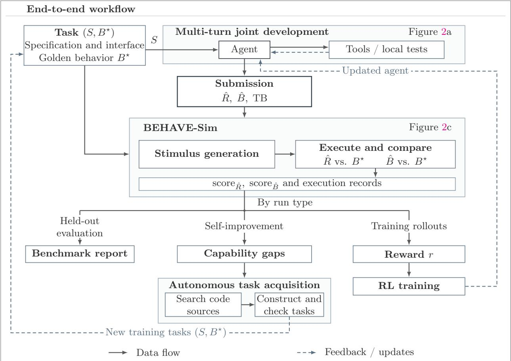  
Figure 8: End-to-end workflow. The shared evaluator supports held-out reporting, capability diagnosis for self-improvement, and reward computation for training rollouts.

Training and self-improvement. Training rollouts supply reward r for RL updates. Development-set feedback guides acquisition of new (S, B<sup>⋆</sup>) pairs for further training, and the updated agent guides subsequent acquisition rounds. The held-out set remains fixed for evaluation. Optional bounded analysis is separate from scoring and rewards, as described in Appendix C.

## B.2 Task and Artifact Example

Task. The MXFP4 block-quantization task accepts 32 BF16 encodings and returns a shared E8M0 scale and 32 E2M1 codes packed into 16 bytes. The specification defines scale selection, round-to-nearest-even quantization, saturation and packing order. Its non-finite-input policy assigns scale code 255 and zero data to any block containing NaN or infinity.

Behavior and RTL. Figures 9 and 10 show the behavior model and one RTL implementation. The model selects the shared scale, quantizes the inputs and packs the outputs in process(), without retaining state across calls. The RTL registers each block and its scale before quantization and output packing, forming a two-stage pipeline. Both stages stall under output backpressure.

Interface alignment. Figure 10 shows an RTL implementation. Other designs may use diferent pipeline depths or resource sharing while respecting the task’s protocol and timing constraints. The same behavior model can check these designs through protocol-defined input mapping and output matching.

```python
class ai_ml_quant_mx_mxfp4_block_quant:
def __init__(self):
self.reset()
def reset(self):
pass
def process(self, in_x0, ..., in_x31):
xs = [in_x0, ..., in_x31]
maximum = 0
for i in range(32):
magnitude = xs[i] & 32767
if magnitude > maximum:
maximum = magnitude
scale = (maximum >> 7) - 2
if scale < 0:
scale = 0
if maximum >= 32640:
scale = 255
q = [0] * 32
for i in range(32):
q[i] = quantize_one(xs[i], scale)
return {
"out_scale": scale,
"out_q0": q[0] | (q[1] << 4),
# Remaining output fields follow the same packing rule.
"out_q15": q[30] | (q[31] << 4)
}
```  
Figure 9: Behavior model structure and computation. Ellipses abbreviate repeated interface fields. The bit-exact element quantizer quantize\_one is omitted.

## B.3 Execution Architecture

RTL execution. As shown in Figure 11, BEHAVE-Sim executes $\hat { R }$ with an input driver, an output receiver, clock/reset control, and a task-declared external-memory model when needed. The stimulus supplies input transactions and schedules their presentation, output readiness, and clock/reset events. Passive interface observations feed task-defined input/output mapping and protocol/timing monitors. BEHAVE-Sim records logical $\mathrm { I / O }$ and collects goal hits from monitors and RTL instrumentation.

Behavior execution. For ${ \hat { B } } ,$ , logical inputs and task-visible events directly drive model invocations. State persists between invocations, with resets applied as declared by the task. BEHAVE-Sim records outputs and goal hits, while $B ^ { \star }$ runs with independent state on the same input history to compute expected outputs. Behavior and RTL evaluation use the same output-matching and scoring rules.

logic valid\_scale, advance;   
logic [15:0] xs [0:31], xs\_s1 [0:31];   
logic [14:0] maximum;   
logic [7:0] scale, scale\_s1;   
logic [3:0] q [0:31];   
assign advance = !out\_valid || out\_ready;   
assign in\_ready = advance;   
always\_comb begin   
xs[0] = in\_x0;   
// The remaining input lanes are wired identically.   
xs[31] = in\_x31;   
maximum = 0;   
for (integer i = 0; i < 32; i = i + 1)   
if (xs[i][14:0] > maximum)   
maximum = xs[i][14:0];   
scale = maximum[14:7] < 2 ? 0 : maximum[14:7] - 8’d2;   
if (maximum >= 15’h7F80) scale = 255;   
for (integer i = 0; i < 32; i = i + 1)   
q[i] = quantize(xs\_s1[i], scale\_s1);   
end   
always\_ff @(posedge clk or posedge rst) begin   
if (rst) begin   
valid\_scale <= 0;   
out\_valid <= 0;   
scale\_s1 <= 0;   
for (integer i = 0; i < 32; i = i + 1) xs\_s1[i] <= 0;   
out\_scale <= 0;   
out\_q0 <= 0;   
// out\_q1 through out\_q14 are also cleared.   
out\_q15 <= 0;   
end else if (advance) begin   
valid\_scale <= in\_valid;   
out\_valid <= valid\_scale;   
if (in\_valid) begin   
scale\_s1 <= scale;   
for (integer i = 0; i < 32; i = i + 1)   
xs\_s1[i] <= xs[i];   
end   
if (valid\_scale) begin   
out\_scale <= scale\_s1;   
out\_q0 <= {q[1], q[0]};   
// out\_q1 through out\_q14 pack the remaining pairs.   
out\_q15 <= {q[31], q[30]};   
end   
end   
end  
Figure 10: Two-stage pipelined RTL. Port declarations, repeated lane assignments and the bit-exact element quantizer quantize are omitted.

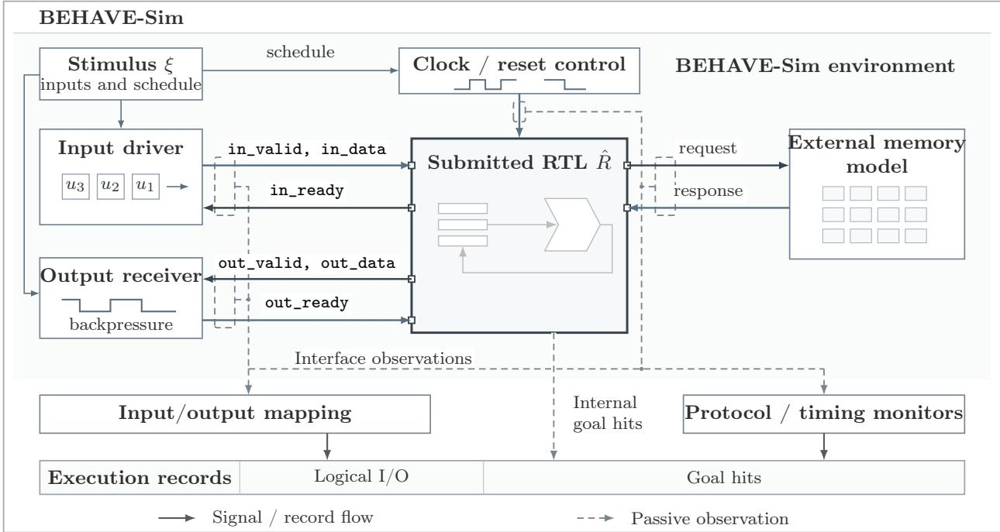  
Figure 11: RTL execution environment in BEHAVE-Sim. Expanded view of the RTL execution in Figure 2(c), using ready/valid interfaces and an optional task-declared external-memory model with a schematic request/response interface. Task-defined mapping and monitors record logical I/O, task-visible events, and goal hits. Internal goal hits are collected by instrumentation.

## B.4 Supported Features and Limitations

Interfaces and protocols. Table 3 summarizes interface capabilities and representative protocols.   
Each task specifies its protocol configurations and may combine capabilities across its interfaces.

Transaction mapping. The task defines how RTL interface events form logical inputs to the behavior model and how observed outputs are matched with its predictions. A logical operation may involve one transfer or several transfers. This mapping is fixed before evaluation.

Interface composition. A task may combine diferent interfaces, such as configuration and data interfaces. It specifies when configuration changes take efect and how simultaneous interactions are handled, so that the behavior model captures their combined efect.

Capability separation. Table 4 distinguishes the features supported by evaluation and replay, goal-guided stimulus generation and exact bounded analysis. Generation and exact analysis require their own encodings of the selected protocol and transaction mapping. Goal-guided generation may extend the evaluation stimulus pool, whose concrete execution records determine the artifact score. Exact bounded analysis is optional, runs after scoring and changes neither the evaluation pool nor the score.

Unsupported and unresolved cases. If a symbolic capability cannot represent an artifact, goal or schedule, it refuses without afecting evaluation and replay. A generation query finding no candidate adds no stimulus and proves nothing about reachability. A timeout or unknown result in exact analysis leaves the corresponding goal unresolved. None of these outcomes changes a completed artifact score. An artifact failure during concrete evaluation replay remains a scored evaluation failure.

Table 3: Interface capabilities and representative protocols.
<table><tr><td>Capability</td><td>Interaction requirements</td><td>Typical interfaces</td></tr><tr><td>Sampling and flow control Sampling events, transfer</td><td>detection and backpressure</td><td>Plain, valid-only and ready/valid interfaces</td></tr><tr><td>Framing and byte validity</td><td>Frame boundaries, valid bytes and sideband fields</td><td>AXI4-Stream [115]</td></tr><tr><td>Phased transfers</td><td>Setup, access, wait states and completion</td><td>APB [116]</td></tr><tr><td>Multi-channel assembly</td><td>Independently arriving address and data</td><td>AXI4-Lite [117]</td></tr><tr><td>Outstanding requests</td><td>Pending-request limits and response ordering</td><td>Memory request/response interfaces</td></tr><tr><td>Invocation and completion</td><td>Start, busy, completion and result consumption</td><td>Start/done interfaces</td></tr><tr><td>Multi-interface</td><td>Mixed protocols and</td><td>AXI4-Lite configuration</td></tr></table>

## B.5 Transaction Mapping and Output Matching

Overview. BEHAVE-Sim evaluates $\hat { B }$ and $\hat { R }$ separately against $B ^ { \star }$ on stimulus sets. For each stimulus, it records which inputs the target accepts under each schedule entry, obtains the expected output histories from $B ^ { \star }$ , and matches them against the target’s observed output histories. This subsection formalizes stimuli, accepted inputs, output histories, and matching.

Definition 1 (Transaction interface). An endpoint c of an artifact A is a named input or output with a nonempty finite type $T _ { c }$ . A transaction on c is a value $x \in T _ { c }$ exchanged between A and its environment. Transactions on each endpoint form an ordered stream. The task declares finite families of input endpoints $C ^ { \mathrm { i n } }$ and output endpoints $C ^ { \mathrm { { o u t } } }$ , which form the logical transaction interface.

Definition 2 (Stimulus). For each input endpoint $^ { c , }$ let

$$
\mathbf { i } _ { c } = ( x _ { c , 0 } , \dots , x _ { c , k _ { c } - 1 } ) \in T _ { c } ^ { k _ { c } }
$$

be an ordered queue of $k _ { c }$ transactions, and write $\mathbf { i } = ( \mathbf { i } _ { c } ) _ { c \in C ^ { \mathrm { i n } } }$ for the queue family. A stimulus is a pair $\xi = ( \mathbf { i } , \sigma )$ , where

$$
\sigma = ( \sigma _ { t } ) _ { 0 \leq t < m }
$$

is a finite schedule of length m. Each entry $\sigma _ { t }$ specifies clock and reset events and an environment action. The schedule controls queue presentation, allowing simultaneous presentation across endpoints while preserving each queue’s order. A runtime request supplies i and an execution policy, recording

Table 4: BEHAVE-Sim features and limitations. Rows list artifact features, and the remaining columns report support for evaluation and replay, goal-guided generation and exact bounded analysis.
<table><tr><td rowspan=1 colspan=4>Feature       Evaluation and replay         Goal-guided generation       Exact bounded analysis</td></tr><tr><td rowspan=10 colspan=4>Behavior      Behavior models use a           The process() implementationEvery analyzed operation andmodels        restricted Python subset. I/O   must have statically proved     loop must have a finite exactvalues may be Boolean,           finite bounds.                     encoding.bounded integers, fixed-sizearrays, records or enumerations.RTL designs  Fixed-width SystemVerilog      Each target goal requires a      A faithful encoding must coverdesigns that pass structural     finite symbolic query relating   the complete RTL transitionchecks execute in isolated        selected input fields to whether relation within the analysisVerilator. Native source-event   that goal is reached.              bound.observation does not require aRequires a finite symbolic query Requires an exact encoding ofthe selected protocol,transaction mapping andGeneration varies logical input monitors. Schedules remainfields under fixed protocol rules, fixed except for single-clockready/valid with one input and</td></tr><tr><td rowspan=2 colspan=1></td></tr><tr><td rowspan=1 colspan=1>statically proved loop trip</td></tr><tr><td rowspan=1 colspan=1></td><td rowspan=1 colspan=1></td></tr><tr><td rowspan=1 colspan=1>Protocols</td><td rowspan=1 colspan=1>Behavior uses logical</td><td rowspan=1 colspan=1>Requires a finite symbolic query</td></tr><tr><td rowspan=1 colspan=1></td><td rowspan=1 colspan=1>transactions. RTL supports</td><td rowspan=1 colspan=1>covering the selected protocol</td></tr><tr><td rowspan=1 colspan=1></td><td rowspan=1 colspan=1>plain, valid-only, ready/valid</td><td rowspan=1 colspan=1>and transaction mapping.</td></tr><tr><td rowspan=1 colspan=1></td><td rowspan=1 colspan=1>and start/done interfaces,</td><td rowspan=1 colspan=1>Generation varies logical input</td></tr><tr><td rowspan=1 colspan=1></td><td rowspan=1 colspan=1>task-configured APB,</td><td rowspan=1 colspan=1>fields under fixed protocol rules</td></tr><tr><td rowspan=1 colspan=1></td><td rowspan=1 colspan=1>AXI4-Lite and framed</td><td rowspan=1 colspan=1>transaction order and</td></tr><tr><td rowspan=1 colspan=1></td><td rowspan=1 colspan=1>AXI4-Stream subsets, and</td><td rowspan=3 colspan=1>environment schedule.Behavior generation supports</td><td rowspan=3 colspan=1>one output.Behavior analysis supports</td></tr><tr><td rowspan=1 colspan=1></td><td rowspan=1 colspan=1>bounded request/response.</td></tr><tr><td rowspan=1 colspan=1>Endpoints</td><td rowspan=1 colspan=1>Replay supports multiple</td></tr><tr><td rowspan=1 colspan=1>and clock</td><td rowspan=1 colspan=1>endpoints and clock domains</td><td rowspan=1 colspan=1>multiple endpoints within one</td><td rowspan=1 colspan=1>multiple endpoints. Multi-clock</td></tr><tr><td rowspan=1 colspan=1>domains</td><td rowspan=1 colspan=1>for Behavior and RTL. A task&#x27</td><td rowspan=1 colspan=1>;s clock domain. RTL generation</td><td rowspan=2 colspan=1>Behavior and multiple-endpointor multi-clock RTL require all</td></tr><tr><td rowspan=1 colspan=1></td><td rowspan=1 colspan=1>RTL interfaces may use</td><td rowspan=1 colspan=1>with multiple endpoints or</td></tr><tr><td rowspan=1 colspan=1></td><td rowspan=1 colspan=1>different protocols.</td><td rowspan=1 colspan=1>clocks requires a fixed global</td><td rowspan=1 colspan=1>analyzed stimuli to share one</td></tr><tr><td rowspan=1 colspan=1></td><td rowspan=1 colspan=1></td><td rowspan=1 colspan=1>schedule.</td><td rowspan=1 colspan=1>complete global clock schedule.</td></tr><tr><td rowspan=1 colspan=1>Reset</td><td rowspan=1 colspan=1>Replay follows the reset events</td><td rowspan=1 colspan=1>Goal-guided generation does</td><td rowspan=1 colspan=1>Reset timing remains fixed</td></tr><tr><td rowspan=1 colspan=1></td><td rowspan=1 colspan=1>in each stimulus. Reset during</td><td rowspan=1 colspan=1>not add or move reset events.</td><td rowspan=11 colspan=1>unless it is explicitlyrepresented as a symbolicschedule choice.All analyzed state must have afinite exact encoding. RTLexact analysis does not supportwritable internal memories.Exact analysis supportsexternal memory only for RTL,</td></tr><tr><td rowspan=1 colspan=1></td><td rowspan=1 colspan=1>traffic requires the task to</td><td rowspan=1 colspan=1></td></tr><tr><td rowspan=1 colspan=1></td><td rowspan=1 colspan=1>define how pending transactions</td><td rowspan=1 colspan=1></td></tr><tr><td rowspan=1 colspan=1></td><td rowspan=1 colspan=1>are handled.</td><td rowspan=2 colspan=1>Behavior state must be finite</td></tr><tr><td rowspan=1 colspan=1>State and</td><td rowspan=1 colspan=1>Replay supports persistent</td></tr><tr><td rowspan=1 colspan=1>internal</td><td rowspan=1 colspan=1>Behavior state, RTL registers</td><td rowspan=1 colspan=1>and initialized. RTL</td><td rowspan=1 colspan=1>finite</td></tr><tr><td rowspan=1 colspan=1>memory</td><td rowspan=1 colspan=1>and writable internal memories.</td><td rowspan=1 colspan=1>goal-guided generation does not</td></tr><tr><td rowspan=2 colspan=1></td><td rowspan=1 colspan=1></td><td rowspan=1 colspan=1>support writable internal</td></tr><tr><td rowspan=1 colspan=1></td><td rowspan=3 colspan=1>memories.Goal-guided generation isunavailable for artifacts that</td></tr><tr><td rowspan=1 colspan=1>External</td><td rowspan=1 colspan=1>Replay supports a task-defined</td></tr><tr><td rowspan=1 colspan=1>memory</td><td rowspan=1 colspan=1>external-memory model for</td></tr><tr><td rowspan=1 colspan=2></td><td rowspan=5 colspan=2>using a fixed finite memorymodel.A goal is targeted only when a Every catalogued goal,including monitor violations,must have an exact reachabilityencoding.as safety-goal hits.</td></tr><tr><td rowspan=1 colspan=1></td><td rowspan=1 colspan=1>Behavior models.</td></tr><tr><td rowspan=1 colspan=2>Goals andReplay records reached</td></tr><tr><td rowspan=1 colspan=2>monitorscoverage goals and detected</td><td rowspan=2 colspan=1>pritesiithat each it.</td></tr><tr><td rowspan=1 colspan=2></td><td rowspan=1 colspan=1>safety violations. For RTL,</td></tr></table>

σ during execution. Pending inputs are ofered until accepted. After all inputs are accepted and expected outputs collected, a finite observation tail follows. Task-declared timing requirements are checked separately. Resource exhaustion alone is not a task violation.

Definition 3 (Accepted input trace). Fix $A \in \{ \hat { B } , \hat { R } \}$ and a stimulus $\xi = \left( \mathbf { i } , \sigma \right)$ with $| \sigma | = m$ . The index t identifies a schedule entry, not a cycle count for any particular clock domain. For $0 \leq t < m$ and $c \in C ^ { \mathrm { i n } }$ , let $\perp$ be a distinguished symbol outside every transaction type and let

$$
a _ { t , c } ^ { A } ( \xi ) \in T _ { c } \cup \{ \perp \}
$$

be the transaction from $\mathbf { i } _ { c }$ that A accepts on endpoint c under $\sigma _ { t }$ , or $\perp \mathrm { i f }$ it accepts none. The accepted input batch under $\sigma _ { t }$ is

$$
a _ { t } ^ { A } ( \xi ) : = \big ( a _ { t , c } ^ { A } ( \xi ) \big ) _ { c \in C ^ { \mathrm { i n } } } \in \prod _ { c \in C ^ { \mathrm { i n } } } \big ( T _ { c } \cup \{ \perp \} \big ) .
$$

The accepted input trace is

$$
\mathbf { a } _ { A } ( \xi ) = \big ( a _ { 0 } ^ { A } ( \xi ) , \dots , a _ { m - 1 } ^ { A } ( \xi ) \big ) .
$$

Thus one batch corresponds to one schedule entry. A batch may be all-⊥ when no endpoint accepts a transaction, and several non-⊥ entries in one batch are accepted together. For $A = { \hat { B } }$ , the Behavior interface has no input handshake, so every presented input batch is accepted and placed at its scheduled entry in $\mathbf { a } _ { \hat { B } } ( \boldsymbol { \xi } )$ . For $A = { \hat { R } }$ , the non-⊥ entries of ${ \bf a } _ { \hat { R } } ( \xi )$ are the acceptance events reported by its declared protocol adapter.

Definition 4 (Output histories). For each output endpoint $c ,$ let $\ell _ { A , c } ( \xi )$ be the number of output transactions observed on c under $\xi ,$ and write

$$
o _ { A , c } ( \xi ) = \bigl ( o _ { A , c , 0 } ( \xi ) , \ldots , o _ { A , c , \ell _ { A , c } ( \xi ) - 1 } ( \xi ) \bigr ) \in T _ { c } ^ { \ell _ { A , c } ( \xi ) } .
$$

Collect these histories as

$$
{ \bullet } _ { A } ( \xi ) = \bigl ( o _ { A , c } ( \xi ) \bigr ) _ { c \in C ^ { \mathrm { o u t } } } .
$$

Let $\pi$ be the task-defined mapping from an execution schedule and an accepted-input trace to the input history supplied to $B ^ { \star }$ . Thus, $\pi ( \sigma , \mathbf { a } )$ contains the accepted transactions, their declared ordering, and task-visible events such as resets and external-memory responses, while omitting functionally irrelevant schedule details. The corresponding expected histories are

$$
{ \bf o } _ { A } ^ { \star } ( \xi ) = B ^ { \star } \big ( \pi ( \sigma , { \bf a } _ { A } ( \xi ) ) \big ) , \qquad o _ { A , c } ^ { \star } ( \xi ) = \big ( { \bf o } _ { A } ^ { \star } ( \xi ) \big ) _ { c } .
$$

The task requires $B ^ { \star }$ to determine every expected history completely and deterministically, including its length and every compared field. Behavior-model histories are observed directly, while RTL histories are reconstructed from the emission events reported by its protocol adapter.

Matching outputs. For each output endpoint $c ,$ the observed history $o _ { A , c } ( \xi )$ is matched against the expected history $o _ { A , c } ^ { \star } ( \xi )$ under a task-declared policy. By default, transactions are paired in order. If the task permits reordered completion, it may declare an identifier that uniquely distinguishes outstanding transactions, and transactions with the same identifier are paired. An endpoint without such an identifier may instead use content-based matching under Assumption 1. Each unpaired expected or observed transaction and each paired transaction with unequal fields contributes one mismatch. For $A \in \{ \hat { B } , \hat { R } \}$ , let $n _ { \mathrm { m i s } } ^ { A } ( \boldsymbol { \xi } )$ be the total number of mismatches across output endpoints.

Assumption 1 (Validity of content-based matching). For every output endpoint compared by content, output order carries no task-defined meaning. An observed history satisfies the task’s output requirement exactly when it contains the same multiset of transaction values as the expected history.

Definition 5 (Evaluation counts). For $A \in \{ \hat { B } , \hat { R } \}$ , let $n _ { \mathrm { t x n } } ^ { A } ( \boldsymbol { \xi } )$ denote the number of input transactions that A accepts under ξ:

$$
n _ { \mathrm { t x n } } ^ { A } ( \boldsymbol { \xi } ) = \sum _ { t = 0 } ^ { | \mathbf { a } _ { A } ( \boldsymbol { \xi } ) | - 1 } \sum _ { c \in C ^ { \mathrm { i n } } } \mathbf { 1 } \big [ a _ { t , c } ^ { A } ( \boldsymbol { \xi } ) \neq \bot \big ] .
$$

For a nonempty finite stimulus set Ξ, let

$$
n _ { \mathrm { t x n } } ^ { A } ( \Xi ) = \sum _ { \boldsymbol { \xi } \in \Xi } n _ { \mathrm { t x n } } ^ { A } ( \boldsymbol { \xi } ) , \qquad n _ { \mathrm { m i s } } ^ { A } ( \Xi ) = \sum _ { \boldsymbol { \xi } \in \Xi } n _ { \mathrm { m i s } } ^ { A } ( \boldsymbol { \xi } ) .
$$

The accepted-transaction count is activity telemetry rather than a correctness condition.

## B.6 Goals, Coverage and Scoring

Overview. Output matching checks whether an artifact agrees with $B ^ { \star }$ on the generated stimuli. That comparison concerns only the observed outputs and does not characterize what occurs during those executions. We therefore examine which execution cases the stimuli exercise and which bad events they trigger. This subsection defines and classifies those cases and events in a finite catalogue.

Definition 6 (Goals). For each target $T \in \{ B ^ { \star } , \hat { B } , \hat { R } \}$ , let $\Gamma _ { T }$ be a finite catalogue of named events fixed before execution. A goal is declared when it is added to this catalogue, whether it is derived automatically or supplied explicitly by the task. An execution of T hits a goal $\gamma \in \Gamma _ { T }$ exactly when the event named by $\gamma$ occurs during that execution. Every goal belongs to exactly one class:

$$
\Gamma _ { T } = \Gamma _ { T } ^ { \mathrm { c o v } } \cup \Gamma _ { T } ^ { \mathrm { s a f e } } , \qquad \Gamma _ { T } ^ { \mathrm { c o v } } \cap \Gamma _ { T } ^ { \mathrm { s a f e } } = \emptyset .
$$

A coverage goal names an execution case that testing should exercise. A safety goal names a bad event that should not occur, either a designated artifact failure or a violation detected by an attached monitor. The catalogue of $B ^ { \star }$ is used only to guide stimulus generation. The catalogues of $\hat { B }$ and R<sup>ˆ</sup> are evaluated and reported separately.

Goal families. Figure 12 groups goals by class and family, with finite instance rules and hit conditions for each schema given in Table 5. A finite monitor is a finite-state observer that emits goals when a declared pattern completes or an obligation is violated. Tasks and providers may add finite instances or define new schemas by specifying their instance rules and hit conditions.

Catalogue construction. Before testing, BEHAVE-Sim fixes a goal policy recording each schema’s status, finite identifiers and hit rules. Structural goals are identified at source sites, with scopes, instances and call occurrences resolved by the compiler. Each enabled schema contributes every prescribed instance, regardless of hits. Optimization and loop unrolling do not redefine the catalogue.

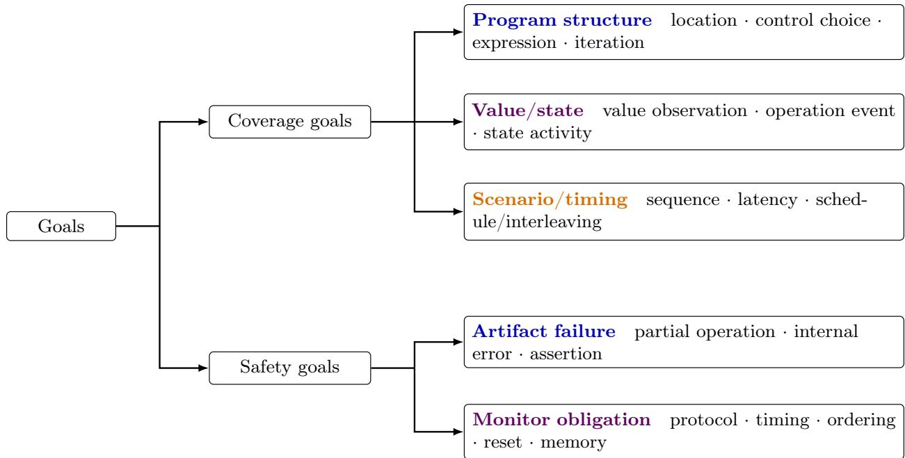  
Figure 12: Goal taxonomy and catalogue sources. Coverage goals name cases to exercise, while safety goals name bad events to avoid. Colors indicate default schema sources: blue denotes automatic derivation from the artifact or protocol adapter, orange task declarations, and purple either source.

Definition 7 (Goal coverage). For a nonempty finite stimulus set $\Xi$ for target $T$ , let $\mathrm { H i t } _ { T } ( \Xi ) \subseteq \Gamma _ { T }$ be the union of goals observed in the concrete executions of $T$ under all $\xi \in \Xi$ . For any nonempty set $G \subseteq \Gamma _ { T } ^ { \mathrm { c o v } }$ , define

$$
\operatorname { c o v } _ { T } ( \Xi ; G ) = { \frac { | \mathrm { H i t } _ { T } ( \Xi ) \cap G | } { | G | } } .
$$

Choosing $G$ as the goals of one family or schema gives its coverage. The safety goals observed in these executions are $\mathrm { H i t } _ { T } ( \Xi ) \cap \Gamma _ { T } ^ { \mathrm { s a f e } }$

Definition 8 (Artifact score). For $A \in \{ \hat { B } , \hat { R } \}$ , define its score on a nonempty finite stimulus set $\Xi$ with completed checks as

$$
\mathrm { s c o r e } _ { A } ( \Xi ) = { \bf 1 } \Big [ n _ { \mathrm { m i s } } ^ { A } ( \Xi ) = 0 \land \mathrm { H i t } _ { A } ( \Xi ) \cap \Gamma _ { A } ^ { \mathrm { s a f e } } = \emptyset \Big ] .
$$

Training reward. The rollout reward is the mean of the two artifact scores,

$$
r = \frac { \mathrm { s c o r e } _ { \hat { B } } ( \Xi _ { \hat { B } } ) + \mathrm { s c o r e } _ { \hat { R } } ( \Xi _ { \hat { R } } ) } { 2 } .
$$

Common coverage metrics. Definition 7 recovers branch, expression and toggle coverage by taking G to be, respectively, the control-choice, Boolean-expression evaluation-pattern and directional bit-toggle goals. FSM state and transition coverage use state-bin and state-transition goals, covergroup coverage uses its declared value-observation goals, and a finite cover property uses a scenario/timing monitor goal. Separately, we report RTL line coverage: the fraction of executable RTL source lines exercised by the stimuli. It is coarser than location-goal coverage because all execution sites on the same source line count as one item.

Table 5: Standard goal schemas. Each row defines a finite instance rule and hit condition for Behavior or RTL.
<table><tr><td>Family</td><td>Goal schema</td><td>Eligible instances</td><td>Goal is hit when</td></tr><tr><td>Program structure</td><td>location: execution-site entry</td><td>each admitted executable source site of the Behavior or RTL artifact</td><td>execution enters any occurrence of that site</td></tr><tr><td>Program structure</td><td>control choice: binary branch or multiway selection outcome</td><td>the true and false branches of each admitted binary decision, and each alternative of an admitted</td><td>execution takes that branch or selects that alternative</td></tr><tr><td>Program structure</td><td>expression: Boolean-expression evaluation pattern</td><td>each policy-generated partial Boolean assignment to the terms of an admitted expression</td><td>the expression is evaluated, and every term named by the pattern is evaluated with the specified</td></tr><tr><td>Program structure</td><td>iteration: loop zero- or non-zero activation</td><td>admitted run-time loops, including procedural RTL loops but excluding generate loops</td><td>value on a dynamic entry, control exits before body entry for the zero goal, or takes the first body-entry edge for the non-zero goal</td></tr><tr><td>Value/state</td><td>value observation: state/value bin</td><td>a sampling point and a total Boolean predicate over one or more values sampled there</td><td>the sampling point occurs and the predicate is true</td></tr><tr><td>Value/state</td><td>operation event: semantic predicate</td><td>an admitted operation site and a total predicate over its operands, result and semantic flags</td><td>the operation occurs and the predicate is true</td></tr><tr><td>Value/state</td><td>state activity: transition or toggle</td><td>a sampling point and a Boolean predicate over two consecutive observations, with one bit and one direction fixed for a bit-toggle goal</td><td>at the second observation, the predicate holds for the preceding and current values</td></tr><tr><td>Scenario/timing</td><td>sequence: event or transaction sequence</td><td>a task-declared finite monitor over the artifact&#x27;s transaction or event alphabet</td><td>the monitor emits the named goal when an event completes the sequence</td></tr><tr><td>Scenario/timing</td><td>latency: transaction-latency bin</td><td>a task-declared event pair, pairing rule, timebase and finite latency bins</td><td>on a matched end event, the count from its paired start in the declared timebase lies in the named bin</td></tr><tr><td>Scenario/timing</td><td>schedule/interleaving: finite pattern</td><td>a finite monitor over schedule-entry event sets and a declared finite order or</td><td>the monitor emits the named goal when the observed entries complete the pattern</td></tr><tr><td>Artifact failure</td><td>failure transition</td><td>simultaneity pattern partial operations and internal failures of the admitted Behavior semantics, or embedded errors and assertions designated by the</td><td>the designated failure transition executes and emits the named goal</td></tr><tr><td>Monitor obligation</td><td>obligation violation</td><td>an attached finite obligation monitor over observed Behavior or RTL execution, including</td><td>the monitor emits the named violation goal when the obligation is violated</td></tr></table>

## B.7 Goal-Guided Exploration and Evaluation

Overview. Stimulus generation combines random testing with solver-guided exploration [118, 15, 119]. For each $A \in \{ \hat { B } , \hat { R } \}$ , evaluation has two phases. First, isolated tests run from reset: the baseline is executed before reference-directed and self-directed searches generate and execute further stimuli. Second, compatible sequences form continuous workloads that preserve state across sequence boundaries. Results from both phases are aggregated using the score and coverage definitions in Subsection B.6.

Search baseline. Let $\mathcal { S } _ { A }$ denote legal isolated tests with bounded input queues and finite execution limits. The nonempty baseline $\Xi _ { \mathrm { b a s e } } ^ { A } \subseteq { \mathcal { S } } _ { A }$ contains edge-case patterns and seeded pseudorandom sequences. Search uses baseline and generated stimuli as seeds for further exploration.

Search targets. For $T \in \{ B ^ { \star } , A \} , T \to A$ denotes search on $T$ to generate stimuli for execution on $A .$ Let $\Delta _ { T  A } \subseteq \Gamma _ { T }$ denote goals whose local encodings are enabled and represent the corresponding catalogue hit rules. Excluded goals remain in the catalogue and may still be hit during execution.

Definition 9 (Artifact replay). Let $\mathcal { R } _ { A }$ be the type of raw execution records for A. For a generated artifact A and any legal finite test $\xi ,$ artifact replay is the map

$$
\begin{array} { r l } { \mathrm { R E P L A Y } : } & { { } \left( A , \xi \right) \longmapsto \left( \mathbf { a } _ { A } ( \xi ) , \mathbf { o } _ { A } ( \xi ) , e _ { A } ( \xi ) \right) . } \end{array}
$$

For a runtime request, Replay follows its execution policy and retains both the request and resolved stimulus in $e _ { A } ( \xi )$ . Here, $\xi = ( \mathbf { i } , \sigma )$ uses the schedule recorded during execution. $e _ { A } ( \xi ) \in \mathcal { R } _ { A }$ records the sampled state, inputs, outputs and goal hits together with a record-completeness flag, an artifact outcome and a domain identifier. The flag states whether the full scheduled execution was recorded. The outcome distinguishes normal completion from an artifact failure. ${ \bf a } _ { A } ( \xi )$ and $\mathbf { o } _ { A } ( \boldsymbol { \xi } )$ are the accepted input trace and output histories derived from that record as in Subsection B.5. The concrete evaluation stores the collection of execution records

$$
\mathcal { E } _ { A } : = \{ ( \xi , e _ { A } ( \xi ) ) ~ | \xi \in \Xi _ { A } \} .
$$

Execution feedback. Let $\mathcal { M } _ { A }$ store execution traces and goal hits for A and $B ^ { \star }$ , together with the results of completed output comparisons and monitor checks. Each search obtains goal hits by reusing a suitable execution record or running the stimulus and saving its record. We denote this operation by Observe<sub>T</sub> ${ \bf \Omega } _ {  A } ( \xi ; \mathcal { M } _ { A } )$ . It returns observed goal hits $J \subseteq \Gamma _ { T }$ from a complete execution of $T$ or a trusted prefix ending in an artifact failure. If neither is available, it returns ⊥. Each direction maintains its own hit set $H _ { T \to A } \subseteq \Gamma _ { T }$ , initialized from baseline hits and updated only by execution feedback. The unhit searchable goals are

$$
U _ { T  A } = \Delta _ { T  A } \setminus H _ { T  A } .
$$

Definition 10 (Solver-guided provider). Fix $A \in \{ \hat { B } , \hat { R } \}$ , the generated artifact to be evaluated, and $\mathcal { S } _ { A }$ as above. For $T \in \{ B ^ { \star } , A \}$ , a solver-guided provider is a triple

$$
\mathsf { P r o v } _ { T \to A } = \left( \Delta _ { T \to A } , \mathsf { S e l e c t } _ { T \to A } , \mathsf { P r o b e } _ { T \to A } \right) .
$$

Given a seed $\xi = ( \mathbf { i } , \sigma ) \in S _ { A }$ and unhit targets $U \subseteq \Delta _ { T \to A } .$ , Select<sub>T</sub> $\underline { { \boldsymbol { \cdot } } } _ {  A } ( \xi , U )$ uses the seed’s complete execution record of $T$ to construct a finite, deterministically ordered list of solver requests. The list may be empty. Each request $q$ determines a nonempty target set

$$
\emptyset \neq G ( q ) \subseteq U
$$

and a nonempty set $F ( q )$ of transaction-field positions in i that the query may change. Before each probe, Restrict $\because ( q , U )$ removes any targets hit after $q$ was selected, without changing its input fields or execution context. It returns ⊥ if no targets remain. Let $\mathcal { Q } _ { T  A } ( \xi )$ denote the requests that $\mathrm { S e l e c t } _ { T  A }$ can produce for seed $\xi ,$ including versions with reduced but nonempty target sets. The probe takes a seed $\xi \in { \cal S } _ { A }$ and a request $q \in \mathcal { Q } _ { T  A } ( \xi )$ . Let $u _ { F } = ( u _ { f } ) _ { f \in F ( q ) }$ be symbolic replacement values for these fields, and let $\mathbf { h } _ { q } = ( h _ { \gamma } ) _ { \gamma \in G ( q ) }$ contain one Boolean hit bit for each target goal. The provider constructs a finite symbolic-execution relation

$$
\mathcal { H } _ { T  A } ( \xi , q , u _ { F } , \mathbf { h } _ { q } )
$$

in which $h _ { \gamma }$ is true exactly when the encoded local execution of T hits $\gamma .$ The probe asks the solver to satisfy

$$
\mathsf { Q u e r y } _ { T \to A } ( \xi , q ) : = \mathcal { H } _ { T \to A } ( \xi , q , u _ { F } , \mathbf { h } _ { q } ) \wedge \bigvee _ { \gamma \in G ( q ) } h _ { \gamma }
$$

over $u _ { F } , \mathbf { h } _ { q }$ and any provider-specific auxiliary execution variables in $\mathcal { H } _ { T  A }$ . Each local query fixes the recorded schedule $\sigma$ . For a model $\nu ,$ let ${ \xi [ F ( q )  \nu ( u _ { F } ) ] }$ denote the test obtained by replacing only the fields in $F ( q )$ . Fixed-schedule tests retain $\sigma .$ . Runtime requests retain their execution policy, so their realized schedules may difer. Then

$$
\mathrm { P r o b e } _ { T \to A } ( \xi , q ) = \{ \begin{array} { l l } { \xi [ F ( q )  \nu ( u _ { F } ) ] , } & { \mathrm { i f ~ } \nu \mid = \mathrm { Q u e r y } _ { T \to A } ( \xi , q ) \mathrm { ~ a n d ~ i s ~ d e c o d a b l e } , } \\ { \perp , } & { \mathrm { o t h e r w i s e } . } \end{array} 
$$

Search budget. The baseline is executed and checked before the search clock starts. Both searches share a wall-clock budget $\beta ,$ including provider preparation, selection, solver calls and candidate execution. Reference-directed search runs up to the budget midpoint, followed by self-directed search using the remaining time. Baseline evaluation, completion of missing isolated checks and continuous workloads use separate finite execution limits outside the search budget.

Isolated exploration. Algorithm 1 initializes each direction’s hit set from the baseline records, then alternates solver-guided stimulus generation with execution from reset, with scheduled backpressure where supported. Only seeds with complete execution records are used to select requests. Search stops when its targets or worklist are exhausted, its provider is unavailable, or its deadline is reached, retaining the candidates and records. Write

$$
\Xi _ { T \to A } = \mathrm { E x P L O R E } \left( A , T , \Xi _ { \mathrm { b a s e } } ^ { A } , \mathsf { P r o v } _ { T \to A } , d ; \mathcal { M } _ { A } \right)
$$

for the new stimuli retained by that direction.

Continuous workloads. After both searches, the isolated test pool is

$$
\Xi _ { A } ^ { \mathrm { i s o } } = \Xi _ { \mathrm { b a s e } } ^ { A } \cup \Xi _ { B ^ { \star }  A } \cup \Xi _ { A  A } .
$$

For each $\xi \in \Xi _ { A } ^ { \mathrm { i s o } }$ , ExecuteAndCheck $\left( A , B ^ { \star } , \xi ; \mathcal { M } _ { A } \right)$ reuses records and check results for the same artifacts, stimulus and evaluation configuration. It performs only missing execution, output comparisons and monitor checks, and stores the results in $\mathcal { M } _ { A }$ . We then construct

$$
\Xi _ { A } ^ { \mathrm { c o n t } } = \mathrm { C O N T I N U O U S } ( \Xi _ { A } ^ { \mathrm { i s o } } ) .
$$

Continuous groups compatible sequences in a fixed order, preserving the task’s initial-state, interface and event requirements. Sequences that cannot be combined are kept as isolated tests. Each workload is evaluated as a new stimulus using ExecuteAndCheck, with A and $B ^ { \star }$ initialized once and state preserved between sequences. Expected outputs come from running $B ^ { \star }$ continuously, not concatenating isolated-test results. By default, output receivers remain ready.

Algorithm 1: Explore: Search from baseline execution records   
Input: artifact $A ,$ target $T \in \{ B ^ { \star } , A \}$ , baseline $\Xi _ { \mathrm { b a s e } } ^ { A } \subseteq { \mathcal { S } } _ { A }$ , provider $\mathsf { P r o v } _ { T  A } ,$ deadline $d ,$   
shared record store $\mathcal { M } _ { A }$   
Output: new candidate set $\Xi _ { T \to A } \subseteq S _ { A }$ , with $\mathcal { M } _ { A }$ updated in place   
$/ /$ On expiry, retain candidates and records already obtained.   
1 Seen $ \Xi _ { \mathrm { b a s e } } ^ { A } ;$   
2 $\mathrm { W o r k  \partial Q U E U E ( \Xi _ { b a s e } ^ { A } ) } ;$   
3 $\Xi _ { T \right. A } \left. \emptyset ;$   
4 H ← baseline hits of T from complete records or trusted failure prefixes in ${ \mathcal { M } } _ { A } ;$   
5 $U \left. \Delta _ { T \right. A } \backslash H ;$   
6 while Work $\neq \emptyset$ and $U \neq \emptyset$ and Now() < d do   
7 $\xi  \mathrm { P o p } ( \mathrm { W o r k } ) ;$   
8 if no complete execution record of T for $\xi$ in $\mathcal { M } _ { A }$ then   
9 continue;   
10 foreach $q \in$ Select ${ \mathit { T } } {  } A ( \xi , U )$ while Now() < d do   
11 $q $ Restrict(q, U);   
12 if $q \neq \bot$ then   
13 $\xi ^ { \prime } \gets \mathrm { P r o b e } _ { T  A } ( \xi , q ) ;$   
14 if $\xi ^ { \prime } \neq \perp$ and $\xi ^ { \prime } \notin$ Seen then   
15 Seen ← Seen $\cup \{ \xi ^ { \prime } \} \mathrm { : }$   
16 $\mathrm { P U S H } ( \mathrm { W o r k } , \xi ^ { \prime } ) ;$   
17 $\Xi _ { T  A }  \Xi _ { T  A } \cup \{ \xi ^ { \prime } \} ;$   
18 $J \gets \mathrm { O b s e r v e } _ { T  A } ( \xi ^ { \prime } ; \mathcal { M } _ { A } ) ;$   
19 if $J \neq \perp$ then   
20 $H  H \cup J ;$   
21 $U \left. \Delta _ { T \right. A } \backslash H ;$   
22 return $\Xi _ { T  A } ;$

Result aggregation. The final evaluation pool is

$$
\Xi _ { A } = \Xi _ { A } ^ { \mathrm { i s o } } \cup \Xi _ { A } ^ { \mathrm { c o n t } } .
$$

Completed records from both phases provide the output mismatches and artifact goal hits used by the score and coverage definitions in Subsection B.6. Algorithm 2 gives the full procedure, returning $\Xi _ { A } , \mathrm { s c o r e } _ { A } ( \Xi _ { A } )$ and the execution records $\mathcal { E } _ { A }$ . The procedure below assumes completed checks. Evaluation-budget interruptions are handled as described in Appendix D.2.

Provider instantiations. Behavior and RTL instantiate Select $T {  } A$ and $\mathcal { H } _ { T  A }$ from Definition 10.   
They share the solve-and-update step using Z3 [120].

Behavior provider. The Behavior provider handles $B ^ { \star }  \hat { B } , B ^ { \star }  \hat { R }$ and $\hat { B }  \hat { B }$ . For $B ^ { \star }  A$ the provider extracts the accepted input trace ${ \bf a } _ { A } ( \xi )$ from $A ^ { \prime }$ s execution record and collects goal hits and local model states from $B ^ { \star }$ running on $\pi ( \sigma , \mathbf { a } _ { A } ( \boldsymbol { \xi } ) )$ . For $\hat { B }  \hat { B } .$ , the same information comes directly from $\hat { B } .$ . Local queries use these states and retain the transaction fields’ source positions in i. In each equation, $\Phi _ { q }$ is the symbolic execution constraint over replacement values $u _ { F }$ , and $\psi _ { \gamma , q }$ is the Boolean condition that the execution hits $\gamma \in G ( q )$ . The hit relations are

Algorithm 2: GenerateAndEvaluate: Two-sided search and two-phase evaluation   
Input: reference $B ^ { \star }$ , artifact $A ,$ baseline $\Xi _ { \mathrm { b a s e } } ^ { A } ,$ providers $\mathsf { P r o v } _ { B ^ { \star }  A }$ and $\mathsf { P r o v } _ { A  A } ,$ total   
search time $\beta \geq 0$   
Output: stimulus set $\Xi _ { A } ,$ score scor ${ \overset { \vartriangle } { \ v u } } ( \Xi _ { A } )$ , execution records $\mathcal { E } _ { A }$   
1 $\mathcal { M } _ { A }  \emptyset ;$   
$/ /$ Phase 1: evaluate the baseline, then start search timing.   
2 foreach $\xi \in \Xi _ { \mathrm { b a s e } } ^ { A }$ do   
3 ExecuteAndCheck $\left( A , B ^ { \star } , \xi ; \mathcal { M } _ { A } \right)$ ;   
4 $t _ { 0 } \gets \mathrm { N o w } ( ) ; t _ { \mathrm { e n d } } \gets t _ { 0 } + \beta ;$   
5 $\Xi _ { B ^ { \star } \to A }  \mathrm { E x P L O R E } ( A , B ^ { \star } , \Xi _ { \mathrm { b a s e } } ^ { A } , \mathsf { P r o v } _ { B ^ { \star } \to A } , t _ { 0 } + \beta / 2 ; \mathcal { M } _ { A } ) ;$   
6 $\Xi _ { A \to A }  \mathrm { E x p L O R E } ( A , A , \Xi _ { \mathrm { b a s e } } ^ { A } , \mathsf { P r o v } _ { A \to A } , t _ { \mathrm { e n d } } ; \mathcal { M } _ { A } ) ;$   
7 $\Xi _ { A } ^ { \mathrm { i s o } }  \Xi _ { \mathrm { b a s e } } ^ { A } \cup \Xi _ { B ^ { \star }  A } \cup \Xi _ { A  A } ;$   
$/ /$ Complete isolated checks outside the search deadline.   
8 foreach $\xi \in \Xi _ { A } ^ { \mathrm { i s o } }$ do   
9 ExecuteAndCheck $( A , B ^ { \star } , \xi ; \mathcal { M } _ { A } ) ;$   
// Phase 2: construct and evaluate continuous workloads.   
10 $\Xi _ { A } ^ { \mathrm { c o n t } }  \mathrm { C O N T I N U O U S } ( \Xi _ { A } ^ { \mathrm { i s o } } ) ;$   
11 foreach $\xi \in \Xi _ { A } ^ { \mathrm { c o n t } }$ do   
12 <sup>E</sup>xecute $\mathrm { \bar { A N D C H E C K } } ( A , B ^ { \star } , \xi ; \mathcal { M } _ { A } ) ;$   
// Aggregate completed records from both phases.   
13 $\Xi _ { A }  \Xi _ { A } ^ { \mathrm { i s o } } \cup \Xi _ { A } ^ { \mathrm { c o n t } } ;$   
14 ${ \mathcal { E } } _ { A } \gets \{ ( \xi , e _ { A } ( \xi ) ) ~ | \xi \in \Xi _ { A } \}$ from $\mathcal { M } _ { A } ;$   
15 return $( \Xi _ { A } , \mathrm { s c o r e } _ { A } ( \Xi _ { A } ) , \mathcal { E } _ { A } )$ ;

and

$$
\begin{array} { l } { { \displaystyle { \mathcal H } _ { B ^ { \star } \to A } ( \xi , q , u _ { F } , { \bf h } _ { q } ) \equiv \Phi _ { q } ^ { B ^ { \star } \to A } ( u _ { F } ) \wedge \bigwedge _ { \gamma \in G ( q ) } \big ( h _ { \gamma }  \psi _ { \gamma , q } ^ { B ^ { \star } \to A } ( u _ { F } ) \big ) , \qquad A \in \{ \hat { B } , \hat { R } \} , } } \\ { \qquad \mathrm { ~ } } \\ { \displaystyle { \mathcal H } _ { \hat { B } \to \hat { B } } ( \xi , q , u _ { F } , { \bf h } _ { q } ) \equiv \Phi _ { q } ^ { \hat { B } \to \hat { B } } ( u _ { F } ) \wedge \bigwedge _ { \gamma \in G ( q ) } \big ( h _ { \gamma }  \psi _ { \gamma , q } ^ { \hat { B } \to \hat { B } } ( u _ { F } ) \big ) . }  \end{array}
$$

RTL provider. An enabled RTL provider handles ${ \hat { R } }  { \hat { R } } .$ . The seed’s execution record supplies $( \mathbf { i } , \sigma )$ and, at each schedule boundary k, the state $s _ { k } ^ { \mathrm { d y n } } = ( r _ { k } , \eta _ { k } , z _ { k } )$ , comprising adapter bookkeeping, RTL state and monitor state. Each request q selects indices $0 \leq k \leq \ell < | \sigma |$ , the replayed state $s _ { k } ^ { \mathrm { d y n } }$ before $\sigma _ { k : \ell } ,$ , target goals $\emptyset \neq G ( q ) \subseteq U$ and mutable fields $F ( q )$ first presented in that segment. The query varies only $F ( q )$ , fixes the schedule and every other field, and requires the modified execution prefix to reproduce $s _ { k } ^ { \mathrm { d y n } }$ at boundary k. The input queues i are excluded from this state constraint. Let $\Phi _ { q } ^ { \hat { R }  \hat { R } } ( u _ { F } )$ be the Yosys-generated RTL segment constraint [121], composed with the protocol adapter and finite monitors, with internal execution variables existentially quantified. Let $\psi _ { \gamma , q } ^ { \hat { R }  \hat { R } } ( u _ { F } )$ encode the catalogue hit rule for $\gamma \in G ( q )$ over the segment. For source goals, this requires a source-event encoding in addition to the circuit constraint. The RTL hit relation is

$$
{ \mathcal H } _ { \hat { R } \to \hat { R } } ( \xi , q , u _ { F } , { \bf h } _ { q } ) \equiv \Phi _ { q } ^ { \hat { R } \to \hat { R } } ( u _ { F } ) \wedge \bigwedge _ { \gamma \in G ( q ) } \big ( h _ { \gamma }  \psi _ { \gamma , q } ^ { \hat { R } \to \hat { R } } ( u _ { F } ) \big ) .
$$

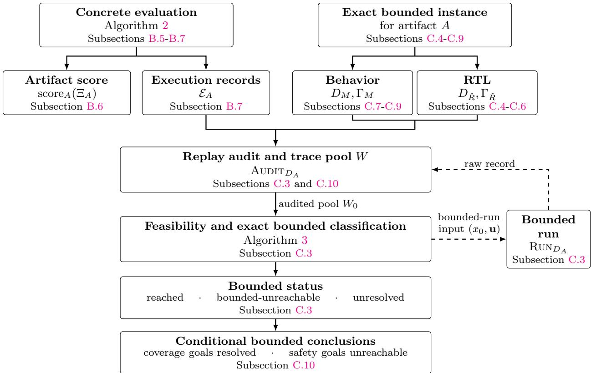  
Figure 13: Concrete evaluation and bounded analysis. Concrete evaluation returns the artifact score and raw records. With an exact instance, replay-audited traces initialize W . The dashed arrows show the validation path for a bounded-run input: artifact replay produces a raw record, which must pass audit before it may update W. This path is used for feasibility initialization and every decoded solver witness. Behavior statuses are mapped back to source goals before reporting. Each bounded conclusion is reported only when its premises hold. Classification does not change the artifact score.

## C BEHAVE-Sim: Formal Semantics and Bounded Guarantees

Purpose. Appendix B evaluates artifacts on a finite stimulus pool. We add optional reachability analysis over a fixed bounded domain. Given an exact Behavior or RTL instance, we use replayaudited traces and solver queries to classify coverage and safety goals as reached, bounded-unreachable or unresolved. These statuses supplement evaluation without changing its stimulus set or score.

Overview. Subsections C.1 through C.3 define the common formalism for bounded trace domains, finite representations, exact encodings, replay audits and classification. Subsections C.4 through C.6 and Subsections C.7 through C.9 construct the RTL and Behavior instances. Subsection C.10 pairs each instance with its evaluated pool and states the reported conclusions. The final subsection states the trusted boundary, claim scope and conclusion. Figure 13 summarizes these dependencies.

## C.1 Trace Domains and Goal Reachability

Overview. The analysis considers executions only up to a fixed bound and under fixed task constraints. This subsection gives Behavior and RTL a common semantics for those executions,

defines when they reach a declared goal, and embeds declared failures as terminal states.

Definition 11 (Instrumented semantics). An instrumented semantics is

$$
{ \mathcal { M } } = ( X , U , Y , I , \delta , \Gamma ) ,
$$

where X is the state space, $\varnothing \neq I \subseteq X$ is the initial-state set, U and Y are the input and output sets, and Γ is the full finite goal catalogue. Its total step function is

$$
\delta : X \times U \longrightarrow X \times Y \times 2 ^ { \Gamma } .
$$

Writing $\delta ( x , u ) = ( x ^ { \prime } , y , H )$ , a step from x under input u moves to $x ^ { \prime }$ , emits $y ,$ and hits exactly the goals in H. The Behavior and RTL instances define separately what counts as one step. In both instances, X also contains any finite adapter, harness and monitor state, and H records all goal hits produced during the step. If early termination is represented, the instantiation also designates terminal states $X ^ { \mathrm { h } } \subseteq X$ and a padding output $\perp _ { Y } \in Y$ such that

$$
\delta ( x _ { \mathrm { h } } , u ) = ( x _ { \mathrm { h } } , \perp _ { Y } , \emptyset ) \qquad \mathrm { f o r ~ e v e r y ~ } x _ { \mathrm { h } } \in X ^ { \mathrm { h } } , \ u \in U .
$$

Early termination is therefore padded to the horizon by stuttering steps.

Definition 12 (Fallible step and absorption). Let $X , U , Y$ and Err be sets, let Γ be finite, and fix $\varnothing \neq I ^ { 0 } \subseteq X$ . A fallible step is a total function

$$
\delta ^ { 0 } : X \times U \longrightarrow \big ( X \times Y \times 2 ^ { \Gamma } \big ) \cup \{ \mathsf { E r r } ( \varepsilon , H ) \mid \varepsilon \in E r r , \ H \subseteq \Gamma \} .
$$

Its result is either a completed step $( x ^ { \prime } , y , H )$ or a failure $\mathsf { E r r } ( \varepsilon , H )$ . Regard the errors as terminal states disjoint from $X .$ , renaming them if necessary. For a fresh $\perp _ { Y } \notin Y$ , define

$$
\begin{array} { l } { \bar { X } = X \cup E r r , } \\ { \bar { Y } = Y \cup \{ \bot _ { Y } \} . } \end{array}
$$

The absorption of $\delta ^ { 0 }$ at $I ^ { 0 }$ is

$$
\mathrm { A b s } _ { I ^ { 0 } } ( \delta ^ { 0 } ) = ( \bar { X } , U , \bar { Y } , I ^ { 0 } , \bar { \delta } , \Gamma ) ,
$$

where

$$
\begin{array} { r } { \bar { \boldsymbol { \delta } } ( x , u ) = \left\{ \begin{array} { l l } { ( x ^ { \prime } , y , H ) } & { \delta ^ { 0 } ( x , u ) = ( x ^ { \prime } , y , H ) , } \\ { ( \varepsilon , \perp _ { Y } , H ) } & { \delta ^ { 0 } ( x , u ) = \mathsf { E r r } ( \varepsilon , H ) , } \end{array} \right. } \end{array}
$$

and

$$
\bar { \delta } ( \varepsilon , u ) = ( \varepsilon , \bot _ { Y } , \emptyset ) \qquad ( \varepsilon \in E r r ) .
$$

Thus this is an instrumented semantics of Definition 11 with initial set $I ^ { 0 }$ and terminal set $E r r$

Definition 13 (Bounded trace domain and reachability). Write Bool $= \{ \mathsf { f a l s e } , \mathsf { t r u e } \}$ . To define bounded reachability, fix a horizon $N \in  { \mathbb { N } } _ { > 0 }$ and an admissibility predicate

$$
K _ { N } : X ^ { N + 1 } \times U ^ { N } \times Y ^ { N } \longrightarrow \mathsf { B o o l }
$$

that holds exactly for the state, input and output sequences allowed by the fixed task and artifact configuration. The horizon and admissibility predicate are fixed before artifact replay or solver analysis. The bounded trace domain is

$$
D = ( { \mathcal { M } } , N , K _ { N } ) .
$$

The set of admitted N-step traces is

$$
\begin{array} { r l } { \mathrm { T r } ( D ) : = \big \{ ( { \mathbf x } , { \mathbf u } , { \mathbf y } , { \mathbf H } ) } & { \big | { \mathbf x } \in X ^ { N + 1 } , { \mathbf u } \in U ^ { N } , { \mathbf y } \in Y ^ { N } , { \mathbf H } \in ( 2 ^ { \Gamma } ) ^ { N } , } \\ & { x _ { 0 } \in I , \quad K _ { N } ( { \mathbf x } , { \mathbf u } , { \mathbf y } ) = \mathfrak { t r u e } , } \\ & { \delta ( x _ { t } , u _ { t } ) = ( x _ { t + 1 } , y _ { t } , H _ { t } ) \mathrm { ~ f o r ~ e v e r y ~ } t < N \big \} . } \end{array}
$$

Write $w = ( \mathbf { x } , \mathbf { u } , \mathbf { y } , \mathbf { H } )$ for an admitted trace in $\mathrm { T r } ( D )$ . It contains $N + 1$ states and one input, output and hit set per step. Define

$$
\mathrm { H i t } ( w ) : = \bigcup _ { t < N } H _ { t } , \qquad \mathrm { H i t } ( W ) : = \bigcup _ { w \in W } \mathrm { H i t } ( w ) \quad \mathrm { f o r } W \subseteq \mathrm { T r } ( D ) .
$$

Here Hit takes a trace or a set of traces, whereas $\mathrm { H i t } _ { T } ( \Xi )$ in Appendix B.6 takes a stimulus set. The target is fixed by ${ \mathcal { M } } ,$ , so we omit its subscript. The goals reachable within D are

$$
{ \mathrm { R e a c h } } _ { D } : = \{ { \boldsymbol { \gamma } } \in \Gamma \mid \exists ( \mathbf { x } , \mathbf { u } , \mathbf { y } , \mathbf { H } ) \in { \mathrm { T r } } ( D ) , \ \exists t < N { \mathrm { ~ s u c h ~ t h a t ~ } } { \boldsymbol { \gamma } } \in H _ { t } \} .
$$

An admitted trace w is a witness for γ when $\gamma \in \mathrm { H i t } ( w )$ . The domain D is feasible when $\operatorname { T r } ( D ) \neq \varnothing$

## C.2 Finite Representations and Exact Encodings

Overview. Exact bounded analysis applies only when the fixed trace domain has a finite layered representation. This subsection defines that representation and its exact bounded encoding. Lemma 2 gives a suficient condition for finite layers to exist. The RTL and Behavior instances below construct their carriers explicitly.

Definition 14 (Finite layered representation). A finite layered representation of D consists of finite state sets $X _ { t } ^ { D } \subseteq X$ for $t \leq N$ , finite input sets $U _ { t } ^ { D } \subseteq U$ for $t < N$ , and finite output sets $Y _ { t } ^ { D } \subseteq Y$ for $t < N$ . It also supplies a finite initial carrier $I _ { D }$ satisfying

$$
\{ x _ { 0 } \mid ( \mathbf { x } , \mathbf { u } , \mathbf { y } , \mathbf { H } ) \in \operatorname { T r } ( D ) \} \subseteq I _ { D } \subseteq I \cap X _ { 0 } ^ { D } .
$$

The remaining trace-support conditions are

$$
x _ { t } \in X _ { t } ^ { D } \quad ( t \leq N ) , \qquad u _ { t } \in U _ { t } ^ { D } , \quad y _ { t } \in Y _ { t } ^ { D } \quad ( t < N )
$$

for every $( \mathbf { x } , \mathbf { u } , \mathbf { y } , \mathbf { H } ) \in \mathrm { T r } ( D )$ . The sets must also satisfy the layer-closure condition

$$
\delta ( x , u ) \in X _ { t + 1 } ^ { D } \times Y _ { t } ^ { D } \times 2 ^ { \Gamma } \quad \mathrm { f o r ~ e v e r y ~ } x \in X _ { t } ^ { D } , \ u \in U _ { t } ^ { D } , \ t < N .
$$

The corresponding finite layered system is

$$
\begin{array} { r } { \boldsymbol A _ { D } = \big ( ( \boldsymbol X _ { t } ^ { D } ) _ { t \leq N } , ( \boldsymbol U _ { t } ^ { D } ) _ { t < N } , ( \boldsymbol Y _ { t } ^ { D } ) _ { t < N } , \boldsymbol I _ { D } , ( \boldsymbol \delta \mathrm { ~ } | \mathbf \Lambda ( \boldsymbol X _ { t } ^ { D } \times \boldsymbol U _ { t } ^ { D } ) ) _ { t < N } , \boldsymbol \Gamma , \boldsymbol K _ { N } \big ) . } \end{array}
$$

Here $f \ \harpoonright S$ denotes the restriction of a function f to inputs in S. Its trace set is

$$
\begin{array} { r l } { \mathrm { T r } ( \mathcal { A } _ { D } ) : = \big \{ ( \mathbf { x } , \mathbf { u } , \mathbf { y } , \mathbf { H } ) ~ | ~ \mathbf { x } \in \displaystyle \prod _ { t \leq N } X _ { t } ^ { D } , ~ \mathbf { u } \in \prod _ { t < N } U _ { t } ^ { D } , } & { } \\ & { ~ \mathbf { y } \in \displaystyle \prod _ { t < N } Y _ { t } ^ { D } , ~ \mathbf { H } \in ( 2 ^ { \Gamma } ) ^ { N } , ~ x _ { 0 } \in I _ { D } , } \\ & { ~ K _ { N } ( \mathbf { x } , \mathbf { u } , \mathbf { y } ) = \mathrm { t r u e } , ~ \delta ( x _ { t } , u _ { t } ) = ( x _ { t + 1 } , y _ { t } , H _ { t } ) ~ ( t < N ) \big \} . } \end{array}
$$

If no such representation can be constructed, bounded analysis of D returns Refused.

Lemma 1 (Trace preservation). Every finite layered representation of D satisfies

$$
\operatorname { T r } ( A _ { D } ) = \operatorname { T r } ( D ) .
$$

Consequently, its reachable-goal set is Reach<sub>D</sub>.

Proof. Fix a finite layered representation of $D ,$ and let $w = ( \mathbf { x } , \mathbf { u } , \mathbf { y } , \mathbf { H } )$ . If $w \in \mathrm { T r } ( \mathcal { A } _ { D } )$ , then the layer-membership conditions, $x _ { 0 } \in I _ { D } \subseteq I$ , and the shared admissibility and transition conditions give

$$
w \in \operatorname { T r } ( { \mathcal { A } } _ { D } ) \Longrightarrow w \in \operatorname { T r } ( D ) , \qquad \operatorname { T r } ( { \mathcal { A } } _ { D } ) \subseteq \operatorname { T r } ( D ) .
$$

Conversely, let $w \in \mathrm { T r } ( D )$ . The trace-support conditions of the fixed finite layered representation give

$$
x _ { t } \in X _ { t } ^ { D } ( t \leq N ) , \qquad u _ { t } \in U _ { t } ^ { D } , \quad y _ { t } \in Y _ { t } ^ { D } ( t < N ) ,
$$

while the initial-carrier condition gives $x _ { 0 } \in I _ { D }$ . The admissibility and transition conditions already hold, so

$$
w \in { \mathrm { T r } } ( D ) \Longrightarrow w \in { \mathrm { T r } } ( { \cal A } _ { D } ) , \qquad { \mathrm { T r } } ( D ) \subseteq { \mathrm { T r } } ( { \cal A } _ { D } ) .
$$

The two inclusions prove equality. By Definition 13, the reachable-goal set is therefore

$$
\left\{ \gamma \in \Gamma \big | \exists ( \mathbf { x } , \mathbf { u } , \mathbf { y } , \mathbf { H } ) \in \mathrm { T r } ( \mathcal { A } _ { D } ) , \exists t < N : \gamma \in H _ { t } \right\} = \mathrm { R e a c h } _ { D } .
$$

Lemma 2 (Finite-layer construction). Suppose the set $o f$ initial states occurring in $\mathrm { T r } ( D )$ is finite and, at every $t < N$ , only finitely many values occur as $u _ { t }$ among traces in $\mathrm { T r } ( D )$ . Then D admits a finite layered representation.

Proof. Let $I _ { D } = X _ { 0 } ^ { D }$ be the set of initial states occurring in $\mathrm { T r } ( D )$ , and set

$$
U _ { t } ^ { D } = \{ u _ { t } \ | \ ( \mathbf { x } , \mathbf { u } , \mathbf { y } , \mathbf { H } ) \in \mathrm { T r } ( D ) \} \qquad ( t < N ) .
$$

Definition 13 gives $I _ { D } \subseteq I .$ , so the initial-carrier condition holds. Each $U _ { t } ^ { D }$ is finite by the hypothesis of the lemma. For $t = 0 , \ldots , N - 1$ in order, apply $\delta$ to every pair in $\bar { X } _ { t } ^ { D } \times U _ { t } ^ { D }$ . Let $X _ { t + 1 } ^ { D }$ collect the resulting next states and $Y _ { t } ^ { D }$ the resulting outputs. We show by induction that $X _ { t } ^ { D }$ is finite and contains every $x _ { t }$ occurring in an admitted trace. The base case is $X _ { 0 } ^ { D } = I _ { D }$ . For the induction step, $X _ { t } ^ { D } \times U _ { t } ^ { D }$ is finite, so its image under $\delta ,$ and hence $X _ { t + 1 } ^ { D }$ and $Y _ { t } ^ { D }$ , is finite. For any admitted trace, $u _ { t } \in U _ { t } ^ { D }$ . Its transition equation and the induction hypothesis then give $x _ { t + 1 } \in X _ { t + } ^ { D }$ and $y _ { t } \in Y _ { t } ^ { D }$ . This establishes trace support. Finally, because the construction includes every $\boldsymbol { x } \in { X } _ { t } ^ { D }$ and $u \in U _ { t } ^ { D }$ , their result satisfies $\delta ( \bar { x } , u ) \in X _ { t + 1 } ^ { D } \times Y _ { t } ^ { D } \times 2 ^ { \Gamma }$ for every $t < N$ . This is the layer-closure condition. □

Definition 15 (Exact bounded encoding). An exact bounded encoding translates the finite layered system $A _ { D }$ into solver formulas without adding or removing an initial state, admitted sequence, transition or goal hit. Let $\mathbb { B } = \{ 0 , 1 \}$ . The encoding first supplies injective maps

$$
\begin{array} { r l r l } & { \big ( \mathrm { e n c } _ { t } ^ { X } : X _ { t } ^ { D } \to \mathbb { B } ^ { d _ { t } ^ { X } } \big ) _ { t \leq N } , } & & { \big ( \mathrm { e n c } _ { t } ^ { U } : U _ { t } ^ { D } \to \mathbb { B } ^ { d _ { t } ^ { U } } \big ) _ { t < N } , } & & { \big ( \mathrm { e n c } _ { t } ^ { Y } : Y _ { t } ^ { D } \to \mathbb { B } ^ { d _ { t } ^ { Y } } \big ) _ { t < N } , } \end{array}
$$

where the exponents are positive bit widths. Each enc map converts a semantic value into a bit vector. Write $\operatorname* { d e c } _ { t } ^ { X } , \ \operatorname* { d e c } _ { t } ^ { U }$ and $\operatorname* { d e c } _ { t } ^ { Y }$ for the respective inverse maps on bit vectors produced by these encodings. Since not every bit vector need encode a value, the following Boolean predicates recognize exactly the valid encodings at each trace position:

$$
\mathrm { V a l i d } _ { t } ^ { X } ( \widehat { x } ) \longleftrightarrow \widehat { x } \in \{ \mathrm { e n c } _ { t } ^ { X } ( x ) \mid x \in X _ { t } ^ { D } \} ,
$$

$$
\mathrm { V a l i d } _ { t } ^ { U } ( \widehat { u } ) \longleftrightarrow \widehat { u } \in \{ \mathrm { e n c } _ { t } ^ { U } ( u ) \mid u \in U _ { t } ^ { D } \} ,
$$

$$
\mathrm { V a l i d } _ { t } ^ { Y } ( \widehat { y } ) \Longleftrightarrow \widehat { y } \in \{ \mathrm { e n c } _ { t } ^ { Y } ( y ) \mid y \in Y _ { t } ^ { D } \} .
$$

The encoding also supplies Boolean predicates for the semantic conditions: $\widehat { I } _ { D }$ tests initial-state membership, $\widehat { K } _ { N }$ tests sequence admissibility, and $\widehat { \delta } _ { t } ^ { D }$ tests whether an encoded tuple represents a transition at position $t < N$ . On every $\widehat { x }$ satisfying $\mathrm { \bar { V a l i d } } _ { 0 } ^ { X }$

$$
\widehat { I } _ { D } ( \widehat { \boldsymbol { x } } ) \iff \deg _ { 0 } ^ { X } ( \widehat { \boldsymbol { x } } ) \in I _ { D } .
$$

Hence $\mathrm { V a l i d } _ { 0 } ^ { X }$ recognizes every encoded state in $X _ { 0 } ^ { D }$ , whereas $\widehat { I } _ { D }$ selects those whose decoded states belong to $I _ { D }$ . For encoded sequences

$$
\widehat { \mathbf { x } } = ( \widehat { x } _ { t } ) _ { t \leq N } , \qquad \widehat { \mathbf { u } } = ( \widehat { u } _ { t } ) _ { t < N } , \qquad \widehat { \mathbf { y } } = ( \widehat { y } _ { t } ) _ { t < N }
$$

whose components satisfy the corresponding position-indexed validity predicates, namely $\mathrm { V a l i d } _ { t } ^ { X } ( \widehat { x } _ { t } )$ for $t \leq N$ and $\mathrm { V a l i d } _ { t } ^ { U } ( \widehat { u } _ { t } )$ and $\mathrm { V a l i d } _ { t } ^ { \overline { { Y } } } ( \widehat { y } _ { t } )$ for $t < N$

$$
\begin{array} { r } { \widehat { K } _ { N } ( \widehat { \mathbf { x } } , \widehat { \mathbf { u } } , \widehat { \mathbf { y } } ) \iff K _ { N } \Big ( \big ( \mathrm { d e c } _ { t } ^ { X } ( \widehat { x } _ { t } ) \big ) _ { t \leq N } , \big ( \mathrm { d e c } _ { t } ^ { U } ( \widehat { u } _ { t } ) \big ) _ { t < N } , } \\ { \big ( \mathrm { d e c } _ { t } ^ { Y } ( \widehat { y } _ { t } ) \big ) _ { t < N } \Big ) . } \end{array}
$$

For every $t < N$ , every $\mathbf { h } = ( h _ { \gamma } ) _ { \gamma \in \Gamma } \in \{ \mathsf { f a l s e } , \mathsf { t r u e } \} ^ { \Gamma }$ , and every $( \widehat { x } , \widehat { u } , \widehat { x } ^ { \prime } , \widehat { y } )$ satisfying Valid<sup>X</sup>, Valid<sup>U</sup>, $\mathrm { V a l i d } _ { t + 1 } ^ { X }$ and $\mathrm { V a l i d } _ { t } ^ { Y }$ , respectively,

$$
\begin{array} { r l } & { \widehat { \delta } _ { t } ^ { D } ( \widehat { x } , \widehat { u } , \widehat { x } ^ { \prime } , \widehat { y } , \mathbf { h } ) \iff \delta \big ( \mathrm { d e c } _ { t } ^ { X } ( \widehat { x } ) , \mathrm { d e c } _ { t } ^ { U } ( \widehat { u } ) \big ) } \\ & { \phantom { { \widehat { \delta } _ { t } ^ { D } } } = \big ( \mathrm { d e c } _ { t + 1 } ^ { X } ( \widehat { x } ^ { \prime } ) , \mathrm { d e c } _ { t } ^ { Y } ( \widehat { y } ) , \{ \gamma \in \Gamma \mid h _ { \gamma } = \mathrm { t r u e } \} \big ) . } \end{array}
$$

## C.3 Bounded Reachability Analysis

Overview. Subsection B.7 evaluates artifacts on a finite stimulus pool. Here, exact queries analyze goal reachability over the full bounded domain $\mathrm { T r } ( D )$ . The goal set selected for classification is $G \subseteq \Gamma$ , and the full-catalogue analysis takes $G = \Gamma$ . Solver answers and replay audits classify each goal as reached, bounded-unreachable or unresolved.

Definition 16 (Bounded queries). Fix a finite layered representation of D and an exact bounded encoding of $A _ { D }$ . For a solver query, let $\widehat { \mathbf x } , \widehat { \mathbf u } , \widehat { \mathbf y }$ denote its encoded state, input and output variables. For $t < N$ , let $\mathbf { h } _ { t } = ( h _ { t , \gamma } ) _ { \gamma \in \Gamma }$ be fresh Boolean variables encoding the hit set at step t. The base formula encoding an admitted trace in D is

$$
\begin{array} { l } { { \displaystyle F _ { D } = \widehat { I } _ { D } ( \widehat { x } _ { 0 } ) \wedge \bigwedge _ { t \leq N } \mathrm { V a l i d } _ { t } ^ { X } ( \widehat { x } _ { t } ) } } \\ { { \displaystyle \qquad \wedge \bigwedge _ { t < N } \big ( \mathrm { V a l i d } _ { t } ^ { U } ( \widehat { u } _ { t } ) \wedge \mathrm { V a l i d } _ { t } ^ { Y } ( \widehat { y } _ { t } ) \big ) } } \\ { { \displaystyle \qquad \wedge \bigwedge _ { t < N } \widehat { \delta } _ { t } ^ { D } ( \widehat { x } _ { t } , \widehat { u } _ { t } , \widehat { x } _ { t + 1 } , \widehat { y } _ { t } , { \bf h } _ { t } ) \wedge \widehat { K } _ { N } ( \widehat { \bf x } , \widehat { \bf u } , \widehat { \bf y } ) . } } \end{array}
$$

For a target goal set $S \subseteq \Gamma$ , define

$$
\Phi _ { D , S } = F _ { D } \land \bigvee _ { \gamma \in S } \bigvee _ { t < N } h _ { t , \gamma } .
$$

The single-goal query is $\Phi _ { D , \{ \gamma \} }$

Theorem 2 (Bounded-query correctness). Given a finite layered representation of D and an exact bounded encoding of $A _ { D }$

$$
F _ { D } \ i s \ s a t i s f i a b l e \quad \Longleftrightarrow \quad \mathrm { T r } ( D ) \neq \emptyset .
$$

Thus $F _ { D }$ is satisfiable exactly when D is feasible. For every $S \subseteq \Gamma ,$

$$
\Phi _ { D , S } \ i s \ s a t i s f i a b l e \quad \Longleftrightarrow \quad S \cap \mathrm { R e a c h } _ { D } \neq \emptyset .
$$

Every satisfying assignment to $F _ { D }$ decodes to a trace in $\mathrm { T r } ( D )$ . Every satisfying assignment to $\Phi _ { D , S }$ decodes to one that hits a goal in S.

Proof. For $w = ( \mathbf { x } , \mathbf { u } , \mathbf { y } , \mathbf { H } ) \in \mathrm { T r } ( D )$ , Lemma 1 gives $w \in \mathrm { T r } ( \mathcal { A } _ { D } )$ . Define an assignment $\nu _ { w }$ by

$$
\begin{array} { r l r l } & { \nu _ { w } ( \widehat { x } _ { t } ) = \mathrm { e n c } _ { t } ^ { X } ( x _ { t } ) } & & { ( t \leq N ) , } \\ & { \nu _ { w } ( \widehat { u } _ { t } ) = \mathrm { e n c } _ { t } ^ { U } ( u _ { t } ) , } & & { \nu _ { w } ( \widehat { y } _ { t } ) = \mathrm { e n c } _ { t } ^ { Y } ( y _ { t } ) } & { ( t < N ) , } \\ & { \nu _ { w } ( h _ { t , \gamma } ) = \mathrm { t r u e } } & { \Longleftrightarrow } & { \gamma \in H _ { t } } & & { ( t < N , \gamma \in \Gamma ) . } \end{array}
$$

Exactness of the encoding gives $\nu _ { w } \models F _ { D }$ . Conversely, let $\nu \models F _ { D }$ . The validity predicates permit every encoded component to be decoded. Set

$$
H _ { t } ^ { \nu } = \{ \gamma \in \Gamma \mid \nu ( h _ { t , \gamma } ) = \mathrm { t r u e } \} .
$$

The initial-state, transition and admissibility conjuncts of $F _ { D }$ give a decoded trace $w _ { \nu } \in \mathrm { T r } ( \mathcal { A } _ { D } )$ By Lemma 1, $w _ { \nu } \in \mathrm { T r } ( D )$ . Therefore

$$
{ \cal F } _ { \cal D } \mathrm { ~ i s ~ s a t i s f i a b l e } \quad \Longleftrightarrow \quad \mathrm { T r } ( { \cal D } ) \neq \emptyset .
$$

Finally, expanding the hit disjunction and then decoding gives

$$
{ \begin{array} { r l } & { \Phi _ { D , S } { \mathrm { ~ i s ~ s a t i s f i a b l e } } \Longleftrightarrow \exists \nu , \exists t < N , \exists \gamma \in S : \nu \in F _ { D } \land \nu ( h _ { t , \gamma } ) = { \mathrm { t r u e } } } \\ & { \Longleftrightarrow \exists ( \mathbf { x } , \mathbf { u } , \mathbf { y } , \mathbf { H } ) \in { \mathrm { T r } } ( D ) , \exists t < N , \exists \gamma \in S : \gamma \in H _ { t } } \\ & { \Longleftrightarrow S \cap { \mathrm { R e a c h } } _ { D } \neq \emptyset . } \end{array} }
$$

The constructions of $\nu _ { w }$ and $w _ { \nu }$ also prove the decoding claims.

Definition 17 (Replay audit and evaluated pool). Fix a generated artifact A together with its analysis domain D, a finite layered representation and an exact bounded encoding. The replay audit is

$$
\mathrm { A U D I T } _ { D } : \mathcal { R } _ { A } \longrightarrow \mathrm { T r } ( D ) \cup \{ \mathrm { O u t s i d e } , \mathsf { l n c o n s i s t e n t } , \mathsf { R e f u s e d } \} .
$$

For a raw record $e \in \mathcal { R } _ { A }$ , return Refused if it is incomplete or lacks a valid domain identifier. For a record identifying D, reconstruct $w = ( { \bf x } , { \bf u } , { \bf y } , { \bf H } )$ and require exactly $N + 1$ states and N inputs, outputs and hit sets, or return Refused. Records are not truncated or padded. Complete records of artifact failures are audited normally. Return Outside if the record belongs to another domain or, for a record identifying D, a state, input or output lies outside its position-specific carrier, $x _ { 0 } \notin I _ { D }$ or $K _ { N } ( \mathbf { x } , \mathbf { u } , \mathbf { y } ) = \mathsf { f a l s e }$ . If the record is not outside D, require $H _ { t } \subseteq \Gamma$ for every $t < N$ and define

$$
\begin{array} { r l r } & { \widehat { x } _ { t } ^ { w } : = \mathrm { e n c } _ { t } ^ { X } ( x _ { t } ) } & { ( t \leq N ) , } \\ & { \widehat { u } _ { t } ^ { w } : = \mathrm { e n c } _ { t } ^ { U } ( u _ { t } ) , \qquad \widehat { y } _ { t } ^ { w } : = \mathrm { e n c } _ { t } ^ { Y } ( y _ { t } ) } & { ( t < N ) . } \end{array}
$$

Let $\mathbf { h } _ { t } ^ { w } = ( h _ { t , \gamma } ^ { w } ) _ { \gamma \in \Gamma }$ , where $h _ { t , \gamma } ^ { w } =$ true if $\gamma \in H _ { t }$ . Each step must satisfy

$$
\widehat { \delta } _ { t } ^ { D } ( \widehat { x } _ { t } ^ { w } , \widehat { u } _ { t } ^ { w } , \widehat { x } _ { t + 1 } ^ { w } , \widehat { y } _ { t } ^ { w } , \mathbf { h } _ { t } ^ { w } ) \qquad ( t < N ) .
$$

A failed requirement returns Inconsistent. Otherwise exactness gives $w \in \mathrm { T r } ( D )$ , and the audit returns w. Audit every record in $\mathcal { E } _ { A } . \ \mathrm { A n y }$ Inconsistent or Refused result stops bounded classification, while Outside records are discarded. If no audit stops classification, define

$$
W _ { \mathrm { e v a l } } ^ { A } : = \{ w \in \mathrm { T r } ( D ) \mid \mathrm { A U D I T } _ { D } ( e ) = w \mathrm { ~ f o r ~ s o m e ~ } ( \xi , e ) \in \mathcal { E } _ { A } \} .
$$

Bounded-run interface. Each artifact supplies

$$
\mathrm { R U N } _ { D } : I _ { D } \times \prod _ { t < N } U _ { t } ^ { D } \longrightarrow \mathcal { R } _ { A } \cup \{ \mathsf { R e f u s e d } \} ,
$$

where $\mathrm { R U N } _ { D } ( x _ { 0 } , { \bf u } )$ realizes $x _ { 0 }$ as an artifact-specific concrete state, runs A for N steps under u, and returns the resulting raw record. It returns Refused if no complete raw record can be produced.

Initial audited pool. After the preceding audit processes every evaluation record without returning Refused or Inconsistent, if $W _ { \mathrm { e v a l } } ^ { A } \neq \emptyset$ , set $W _ { 0 } = W _ { \mathrm { e v a l } } ^ { A }$ . Otherwise, solve $F _ { D }$ . By Theorem 2, an unsatisfiable result establishes ${ \mathrm { T r } } ( D ) = \emptyset$ , while an unresolved result leaves feasibility unresolved. From a satisfying assignment, decode $x _ { 0 } \in I _ { D }$ and $\begin{array} { r } { \mathbf { u } \in \prod _ { t < N } U _ { t } ^ { D } } \end{array}$ , then invoke $\mathrm { R U N } _ { D } ( x _ { 0 } , { \bf u } )$ . A refused run is reported as Refused. Any returned raw record is passed to Audit . If the audit returns $w _ { \mathrm { f } } \in \mathrm { T r } ( D )$ , set $W _ { 0 } = \{ w _ { \mathrm { f } } \}$ . A refused audit is reported as Refused. An Outside or Inconsistent result is reported as Inconsistent.

Goal classification. Given a nonempty $W _ { 0 }$ and the selected set G, Algorithm 3 marks the goals hit by $W _ { 0 }$ as reached and queries subsets of the remaining goals. A satisfiable query marks goals reached only after the artifact is run on the decoded values and the resulting record passes the audit. An unsatisfiable query marks its target set as bounded-unreachable. If a query over several goals is unresolved, the algorithm retries smaller subsets. Only an unresolved singleton is marked unresolved. The result is (Rch, Unr , Unk, W), where the first three sets contain the reached, bounded-unreachable and unresolved goals, and W is the audited pool witnessing Rch.

Theorem 3 (Bounded-status soundness). Fix a bounded trace domain $D ,$ a finite layered representation of D with an exact bounded encoding, a goal set $G \subseteq \Gamma$ , and a nonempty audited pool $W _ { 0 } \subseteq { \mathrm { T r } } ( D )$ . Assume that every solver call returns a satisfying model, a correct unsatisfiable result or an unresolved result, and that every decoding, Run<sub>D</sub> invocation and audit terminates. Then $\mathrm { C L A S S I F Y G O A L S } ( G , W _ { 0 } )$ in Algorithm 3 terminates. If it returns $( R c h , U n r , U n k , W )$ , its three status sets partition G and

$$
R c h \subseteq \operatorname { R e a c h } _ { D } , \qquad U n r \cap \operatorname { R e a c h } _ { D } = \emptyset ,
$$

and every goal in Rch has a witness in $W$

Proof. At the head of each outer-loop iteration, Rch, Unr and Unk contain the goals currently marked reached, bounded-unreachable and unresolved. The set W is the accumulated pool of audited traces, and Pend $\subseteq G$ contains the goals not yet assigned a status. Maintain

$$
W \subseteq \operatorname { T r } ( D ) , \qquad R c h = \operatorname { H i t } ( W ) \cap G ,
$$

and require Rch, Unr , Unk and Pend to be pairwise disjoint with union G. These properties hold initially. Within one outer-loop iteration, $S \subseteq P e n d$ is the nonempty goal set targeted by the current query. Each unresolved inner-loop iteration replaces S with a nonempty proper subset, so the inner loop terminates. For a satisfiable query, a successful audit gives $w \in \mathrm { T r } ( D )$ . Let $J = { \mathrm { H i t } } ( w ) \cap G .$ . The checks give $J \cap S \neq \emptyset$ and $J \cap U n r = \emptyset$ . The updates add w to $W ,$ move the goals in $J \cap ( P e n d \cup U n k )$ to $R c h .$ , and preserve the invariant. They also strictly decrease $| P e n d |$ because $J \cap S \neq \emptyset$ and $S \subseteq P e n d$ . For an unsatisfiable query, Theorem 2 gives $S \cap$ Reach $\mathbf { \nabla } _ { D } = \emptyset$ . Moving the nonempty set S from Pend to Unr therefore preserves the partition, adds only bounded-unreachable goals and strictly decreases |Pend|. If the result remains unresolved after the inner loop, then $| S | = 1$

Algorithm 3: ClassifyGoals: Replay-audited bounded reachability   
Input: goal set ${ \overline { { G \subseteq \Gamma } } } .$ , nonempty audited pool $\overline { { W _ { 0 } \subseteq \mathrm { T r } ( D ) } }$   
Output: Inconsistent, Refused, or (Rch, Unr, Unk, W)   
1 W ← W ; Rch ← Hit(W ) ∩ G   
2 Unr ← ∅; Unk ← ∅; Pend ← G \ Rch   
3 while Pend $\neq \emptyset$ do   
4 choose nonempty $S \subseteq$ Pend   
5 solve $\Phi _ { D , S }$   
6 while the result is unresolved and $| S | > 1$ do   
7 choose a nonempty proper subset $S ^ { \prime } \subsetneq$ S   
8 $S \gets S ^ { \prime }$   
9 solve $\Phi _ { D , S }$   
10 if satisfiable then   
11 decode the initial state and input sequence from the satisfying model ν   
12 invoke $\mathrm { R U N } _ { D }$ on the decoded values   
13 if it returns Refused then   
14 return Refused   
15 let e be the returned raw record   
16 r<sub>aud</sub> ← Audit<sub>D</sub>(e)   
17 if r = Refused then   
18 return Refused   
19 if $r _ { \mathrm { a u d } } \in$ {Outside, Inconsistent} then   
20 return Inconsistent   
21 $w  r _ { \mathrm { a u d } }$   
22 if Hit(w) ∩ S = ∅ or Hit(w) ∩ Unr $\neq \emptyset$ then   
23 return Inconsistent   
24 $W  W \cup \{ w \}$   
25 Rch ← Rch ∪ Hit(w) ∩ G   
26 Unk ← Unk \ Hit(w)   
27 Pend ← Pend \ Hit(w)   
28 else if unsatisfiable then   
29 Unr ← Unr ∪ S   
30 Pend ← Pend \ S   
31 else // unresolved singleton   
32 Unk ← Unk ∪ S   
33 Pend ← Pend \ S   
34 return (Rch, Unr, Unk, W)

Moving this singleton from Pend to Unk again preserves the invariant and decreases |Pend|. Any failed check returns immediately. Since G is finite, the outer loop terminates. At a normal return, $P e n d = \emptyset$ , so the three status sets partition G. For any $\gamma ,$ the invariant gives

$$
\gamma \in R c h \quad \Longrightarrow \quad \gamma \in \mathrm { H i t } ( W ) \quad \Longrightarrow \quad \exists w \in W { \mathrm { ~ s u c h ~ t h a t ~ } } \gamma \in \mathrm { H i t } ( w ) .
$$

Since $W \subseteq { \mathrm { T r } } ( D )$ , this w is a witness within D, and Definition 13 gives $\gamma \in \operatorname { R e a c h } _ { D }$ . Finally, every set added to Unr was proved disjoint from Reach<sub>D</sub> by Theorem 2. Hence Unr ∩ Reach<sub>D</sub> = ∅.

Corollary 1 (Complete bounded classification). Under the hypotheses of Theorem 3, suppose Algorithm 3 returns normally with Unk = ∅. Then

$$
R c h = \mathrm { R e a c h } _ { D } \cap G , \qquad U n r = G \ \backslash \ \mathrm { R e a c h } _ { D } .
$$

Proof. Since $U n k = \emptyset$ , Theorem 3 gives $G = R c h \cup U n r$ , with the two sets disjoint. Consider any $\gamma \in \operatorname { R e a c h } _ { D } \cap G$ . The partition places γ in Rch or Unr , and Unr ∩ Reach ${ \boldsymbol { \mathbf { \mathit { D } } } } = \emptyset$ excludes the latter. Hence Reach $D \cap G \subseteq R c h$ . Conversely, if $\gamma \in R c h$ , then Theorem 3 gives $\gamma \in \operatorname { R e a c h } _ { D } ,$ while the partition gives $\gamma \in G$ . Thus $R c h \subseteq \operatorname { R e a c h } _ { D } \cap G$ , proving the first equality. The partition then gives

$$
{ \begin{array} { r l } & { U n r = G \setminus R c h } \\ & { \qquad = G \setminus ( \operatorname { R e a c h } _ { D } \cap G ) } \\ & { \qquad = G \setminus \operatorname { R e a c h } _ { D } . } \end{array} }
$$

## C.4 RTL Event-Slot Semantics and Protocol Adapters

Overview. This subsection instantiates the instrumented semantics of Definition 11 for pinlevel RTL. It defines the RTL transition for one event slot. Behavior consumes and emits logical transactions directly. RTL instead uses a task-declared protocol adapter to drive interface pins and identify the transactions accepted and emitted in each event slot.

Goal producers. The coverage/safety partition of Definition 6 classifies goals by purpose. Independently, the RTL catalogue has the producer partition

$$
\Gamma _ { \hat { R } } = \Gamma _ { \hat { R } } ^ { \mathrm { s l o t } } \cup \Gamma _ { \hat { R } } ^ { \mathrm { m o n } } , \qquad \Gamma _ { \hat { R } } ^ { \mathrm { s l o t } } \cap \Gamma _ { \hat { R } } ^ { \mathrm { m o n } } = \emptyset .
$$

The event-slot semantics emits only slot goals, and the finite monitors emit only monitor goals.   
Either producer class may contain coverage and safety goals.

Definition 18 (RTL event-slot semantics). Let $\mathcal { E } _ { R }$ be the finite set of legal clock and reset event sets. Each event is tagged by its signal, domain and polarity. Let $Q$ be the finite RTL-state set, let $U _ { R }$ and $Y _ { R }$ be the finite pin-input and pin-observation sets, and let $\emptyset \neq I _ { R } \subseteq Q$ be the initial-state set. The slot semantics is the total function

$$
\delta _ { \hat { R } } ^ { \mathrm { s l o t } } : { \cal Q } \times { \cal U } _ { R } \times { \mathcal { E } } _ { R } \longrightarrow { \cal Q } \times Y _ { R } \times 2 ^ { \Gamma _ { \hat { R } } ^ { \mathrm { s l o t } } } .
$$

One application of $\delta _ { \hat { R } } ^ { \mathrm { s l o t } }$ is an RTL event slot. Each slot is one scheduled step: inputs and resets are driven and settled before pin sampling and active clock events. Writing $\delta _ { \hat { R } } ^ { \mathrm { s l o t } } ( \eta _ { t } , u _ { t } ^ { \mathrm { p i n } } , e _ { t } ) =$ $( \eta _ { t + 1 } , o _ { t } , H _ { t } ^ { \mathrm { s l o t } } )$ , $o _ { t }$ is sampled before active clock events, $\eta _ { t + 1 }$ is the settled state after clocks return to inactive levels, and $H _ { t } ^ { \mathrm { s l o t } }$ contains exactly the raw RTL goals hit at declared sampling phases. N counts slots, not internal phases. In the single-clock measurement profile, each slot spans one cycle.

Definition 19 (Finite protocol adapter). Fix the transaction interface of Definition 1 and the RTL event-slot semantics of Definition 18. A finite protocol adapter is a tuple

$$
\Pi = ( X _ { \Pi } , I _ { \Pi } , \mathcal { A } _ { \Pi } , \lambda _ { \Pi } , \tau _ { \Pi } )
$$

selected by the task’s endpoint bindings. These bindings declare each endpoint’s pins, their ownership, and its clock and reset domain. An adapter state has the form $d = ( \mathbf { i } , r ) \in X _ { \Pi }$ , where i is an input-queue family permitted by the fixed bounds of $\boldsymbol { \mathcal { S } } _ { \hat { R } }$ and $r$ is finite environment and protocol bookkeeping. When the task declares a finite external-memory model, its state is a component of $r ,$ as shown in Figure 11. The queues remain fixed during a run, while r may change. Let $I _ { \Pi } \subseteq X _ { \Pi }$ be the nonempty set of states with initial bookkeeping. For a stimulus $\xi = ( \mathbf { i } , \sigma )$ , initialization selects $d _ { 0 } = ( \mathbf { i } , r _ { 0 } ) \in I _ { \Pi }$ . For RTL, each schedule entry introduced in Definition 2 has the form

$$
\sigma _ { t } = ( e _ { t } , \alpha _ { t } ) \in \Sigma _ { \Pi } : = \mathcal { E } _ { R } \times \mathcal { A } _ { \Pi } .
$$

Here $A _ { \Pi }$ is the finite environment-action set. The component $e _ { t }$ contains the clock and reset events, while $\alpha _ { t }$ specifies which queued inputs become available for presentation, which outputs to accept, any external-memory response, and other environment choices. The total drive function

$$
\lambda _ { \Pi } : X _ { \Pi } \times \Sigma _ { \Pi } \longrightarrow U _ { R } , \qquad u _ { t } ^ { \mathrm { p i n } } = \lambda _ { \Pi } ( d _ { t } , \sigma _ { t } )
$$

constructs the RTL pin inputs from the queued transactions, current bookkeeping, slot events and environment choices. After the RTL produces the pin observation $o _ { t } \in Y _ { R }$ , the adapter updates its state and identifies the transfers in that slot. Let

$$
B ^ { \mathrm { i n } } = \prod _ { c \in C ^ { \mathrm { i n } } } ( T _ { c } \cup \{ \perp \} ) , \qquad B ^ { \mathrm { o u t } } = \prod _ { c \in C ^ { \mathrm { o u t } } } ( T _ { c } \cup \{ \perp \} ) ,
$$

where each component is the transaction accepted or emitted on that endpoint, or ⊥ if there is none. The total update function is

$$
\tau _ { \mathrm { I I } } : X _ { \mathrm { I I } } \times \Sigma _ { \mathrm { I I } } \times U _ { R } \times Y _ { R } \longrightarrow X _ { \mathrm { I I } } \times \mathcal { B } ^ { \mathrm { i n } } \times \mathcal { B } ^ { \mathrm { o u t } } ,
$$

with

$$
\begin{array} { r } { ( d _ { t + 1 } , a _ { t } , b _ { t } ) = \tau _ { \Pi } ( d _ { t } , \sigma _ { t } , u _ { t } ^ { \mathrm { p i n } } , o _ { t } ) . } \end{array}
$$

Writing $a _ { t , c }$ for the c-component of ${ { a } _ { t } } ,$ the non-⊥ entries of $( a _ { t , c } ) _ { \imath }$ <sub>t</sub> form a prefix of $\mathbf { i } _ { c } .$ . Thus the adapter preserves queue order and reports no input transaction more than once.

Ready/valid instance. The endpoint binding losslessly packs each transaction $v \in T _ { c }$ onto its payload pins and unpacks each observed payload, with $\iota n p a c k _ { c } ( p a c k _ { c } ( v ) ) = v$ . Figure 11 shows the signal ownership. For an input endpoint $c , \lambda _ { \Pi }$ drives in\_valid and in\_data, while $\tau _ { \Pi }$ observes the RTL-driven in\_ready. The bookkeeping contains a pointer $p _ { c , t } \in \{ 0 , \ldots , k _ { c } \}$ to the first unaccepted input, initially zero, and tracks the inputs made available by $\alpha _ { t }$ that remain pending. For each input endpoint, the adapter presents the oldest pending transaction and holds it stable until acceptance. Reset updates pending work according to the task’s declared reset policy. Let $p r e s e n t _ { c , t }$ indicate that a pending transaction is being presented. The driven signals are

$$
i n _ { \_ } v a l i d _ { c , t } = p r e s e n t _ { c , t } \wedge [ p _ { c , t } < k _ { c } ] , \qquad i n _ { \_ } d a t a _ { c , t } = \left\{ \begin{array} { l l } { p a c k _ { c } ( x _ { c , p _ { c , t } } ) } & { i n _ { \_ } v a l i d _ { c , t } , } \\ { 0 } & { \mathrm { o t h e r w i s e } , } \end{array} \right. .
$$

For an output endpoint, $\lambda _ { \Pi }$ drives out\_ready from $\alpha _ { t } .$ , while $\tau _ { \Pi }$ observes the RTL-driven out\_valid and out\_data. At an active, non-reset event for the corresponding endpoint, the input and output transfer conditions are

$$
\begin{array} { r l } & { f r e _ { c , t } ^ { \mathrm { i n } } \iff i n \_ v a l i d _ { c , t } \wedge i n \_ r e a d y _ { c , t } \qquad ( c \in C ^ { \mathrm { i n } } ) , } \\ & { f r e _ { c , t } ^ { \mathrm { o u t } } \iff o u t \_ v a l i d _ { c , t } \wedge o u t \_ r e a d y _ { c , t } \quad ( c \in C ^ { \mathrm { o u t } } ) . } \end{array}
$$

No transfer occurs for that endpoint in any other slot. An input transfer puts $x _ { c , p _ { c , t } }$ in $a _ { t }$ and advances the pointer. An output transfer puts unpack $\mathbf { \nabla } _ { c } ( o u t \_ d a t a _ { c , t } )$ in $b _ { t }$ . A non-transferring endpoint contributes ⊥, and a reset applies the adapter’s declared reset update. If reset occurs with transactions in flight, the task declares whether they are cancelled or remain outstanding. Without this declaration, checks that depend on them remain unresolved. The adapter retains a presented input transaction until transfer unless a reset intervenes. Thus, for every input endpoint c and $t < N _ { \hat { R } } - 1$ such that neither $e _ { t }$ nor $e _ { t + 1 }$ resets $^ { c , }$

$$
\begin{array} { r l r } { p r e s e n t _ { c , t } \wedge [ p _ { c , t } < k _ { c } ] \wedge \neg { \mathit { f i r e } } _ { c , t } ^ { \mathrm { i n } } } & { \implies } & { p r e s e n t _ { c , t + 1 } . } \end{array}
$$

The dual design obligation retains an output while it is stalled. For every output endpoint $c$ and $t < N _ { \hat { R } } - 1$ such that neither $e _ { t }$ nor $e _ { t + 1 }$ resets $^ { c , }$

$$
\begin{array} { r } { o u t \_ v a l i d _ { c , t } \wedge \neg o u t \_ r c a d y _ { c , t } \quad \implies \quad o u t \_ v a l i d _ { c , t + 1 } \wedge o u t \_ d a t a _ { c , t + 1 } = o u t \_ d a t a _ { c , t } . } \end{array}
$$

The corresponding monitor emits a safety goal if this implication fails.

Transaction projection. During an RTL replay of $\xi ,$ write the per-slot batches returned by τ<sub>Π</sub> as

$$
a _ { t } ^ { \hat { R } } ( \xi ) = \big ( a _ { t , c } ^ { \hat { R } } ( \xi ) \big ) _ { c \in C ^ { \mathrm { i n } } } , \qquad b _ { t } ^ { \hat { R } } ( \xi ) = \big ( b _ { t , c } ^ { \hat { R } } ( \xi ) \big ) _ { c \in C ^ { \mathrm { o u t } } } .
$$

The accepted input trace is ${ \mathbf { a } } _ { \hat { R } } ( \xi ) = ( a _ { t } ^ { \ddot { R } } ( \xi ) ) _ { t < N _ { \hat { R } } }$ . For each output endpoint $c , o _ { \hat { R } , c } ( \xi )$ is obtained from $( b _ { t , c } ^ { \hat { R } } ( \xi ) ) _ { t < N _ { \hat { R } } }$ by removing the ⊥ entries. The output-history family is ${ \mathbf { o } } _ { \hat { R } } ( \xi ) = ( o _ { \hat { R } , c } ( \xi ) ) _ { c \in C ^ { \mathrm { o u t } } }$

## C.5 RTL Closed-Loop Semantics and Trace Domain

Overview. Using the event-slot semantics and protocol adapter of Subsection C.4, this subsection instantiates the instrumented semantics and bounded trace domain of Subsection C.1 for RTL. It composes the adapter, RTL design and enabled finite monitors, then defines the allowed clock, reset and environment-action sequences.

Definition 20 (Finite monitor product). Let $Z$ be the finite state set of the product of all monitors enabled for ${ \hat { R } } ,$ let $z _ { 0 } \in Z$ be its initial state, and let its total update function be

$$
\mu : Z \times \Sigma _ { \Pi } \times Q \times U _ { R } \times Y _ { R } \times Q \times { \mathcal { B } } ^ { \mathrm { i n } } \times { \mathcal { B } } ^ { \mathrm { o u t } } \longrightarrow Z \times 2 ^ { \Gamma _ { \hat { R } } ^ { \mathrm { m o n } } } .
$$

It observes the schedule entry, the RTL step and the adapter’s transaction events, then returns the next monitor state and the monitor goals hit in that slot. Its components emit the enabled coverage and safety goals assigned to monitors, and their reset behavior is part of $\mu .$ An optional task-declared response deadline pairs an accepted input with its first response ofer and emits a safety goal if the declared bound expires first. If the task declares reset restoration, another component tracks the declared reset sequence. It emits a safety goal when the declared post-reset condition fails at completion, and a scenario goal when the sequence completes after at least one non-reset slot. If no monitor is enabled, then $Z = \{ z _ { 0 } \}$ and $\mu$ emits no goals.

Definition 21 (Closed-loop RTL semantics). Define

$$
\begin{array} { r l } & { X _ { \hat { R } } ^ { \mathrm { c l } } = X _ { \Pi } \times Q \times Z , } \\ & { Y _ { \hat { R } } ^ { \mathrm { c l } } = Y _ { R } \times { \mathcal { B } } ^ { \mathrm { i n } } \times { \mathcal { B } } ^ { \mathrm { o u t } } , } \\ & { I _ { \hat { R } } ^ { \mathrm { c l } } = I _ { \Pi } \times I _ { R } \times \{ z _ { 0 } \} . } \end{array}
$$

The instrumented semantics used to analyze $\hat { R }$ is

$$
\boldsymbol { \mathcal { M } } _ { \hat { R } } = \big ( \boldsymbol { X } _ { \hat { R } } ^ { \mathrm { c l } } , \boldsymbol { \Sigma } _ { \Pi } , \boldsymbol { Y } _ { \hat { R } } ^ { \mathrm { c l } } , \boldsymbol { I } _ { \hat { R } } ^ { \mathrm { c l } } , \delta _ { \hat { R } } ^ { \mathrm { c l } } , \boldsymbol { \Gamma } _ { \hat { R } } \big ) ,
$$

where, for one slot, $d _ { t } \in X _ { \Pi } , \eta _ { t } \in Q , z _ { t } \in Z , \sigma _ { t } = ( e _ { t } , \alpha _ { t } )$ , and ${ u _ { t } ^ { \mathrm { p i n } } } = \lambda _ { \Pi } ( d _ { t } , \sigma _ { t } )$ 2

$$
\begin{array} { r l } & { ( \eta _ { t + 1 } , o _ { t } , H _ { t } ^ { \mathrm { s l o t } } ) = \delta _ { \hat { R } } ^ { \mathrm { s l o t } } ( \eta _ { t } , u _ { t } ^ { \mathrm { p i n } } , e _ { t } ) , } \\ & { \qquad ( d _ { t + 1 } , a _ { t } , b _ { t } ) = \tau _ { \Pi } ( d _ { t } , \sigma _ { t } , u _ { t } ^ { \mathrm { p i n } } , o _ { t } ) , } \\ & { ( z _ { t + 1 } , H _ { t } ^ { \mathrm { m o n } } ) = \mu ( z _ { t } , \sigma _ { t } , \eta _ { t } , u _ { t } ^ { \mathrm { p i n } } , o _ { t } , \eta _ { t + 1 } , a _ { t } , b _ { t } ) , } \\ & { \qquad H _ { t } = H _ { t } ^ { \mathrm { s l o t } } \cup H _ { t } ^ { \mathrm { m o n } } , } \\ & { \delta _ { \hat { R } } ^ { \mathrm { c l } } ( ( d _ { t } , \eta _ { t } , z _ { t } ) , \sigma _ { t } ) = ( ( d _ { t + 1 } , \eta _ { t + 1 } , z _ { t + 1 } ) , ( o _ { t } , a _ { t } , b _ { t } ) , H _ { t } ) . } \end{array}
$$

Definition 22 (RTL trace domain). Set $N = N _ { \hat { R } }$ . Let $K _ { N } ^ { \mathrm { e n v } }$ be the admissibility predicate of Definition 13 for $M _ { \hat { R } } .$ It holds exactly for the N-slot closed-loop traces whose clock and reset events satisfy the fixed harness configuration and whose environment actions satisfy the obligations of the selected protocol adapter. Define

$$
\boldsymbol { D } _ { \hat { \boldsymbol { R } } } = ( \mathcal { M } _ { \hat { \boldsymbol { R } } } , N , K _ { \boldsymbol { N } } ^ { \mathrm { e n v } } ) .
$$

An environment-side violation therefore excludes the trace from $\operatorname { T r } ( D _ { \hat { R } } )$ , whereas a design-side protocol violation is recorded as a safety hit.

## C.6 RTL Finite Representation, Exact Encoding and Audits

Overview. This subsection constructs the finite RTL representation and exact encoding, states the required semantic, catalogue and replay fidelity assumptions, and defines the catalogue and replay audits.

Admitted RTL. The RTL analysis admits elaborated designs whose fixed-width signals and fixed-size memories range over a finite logic domain. It requires an explicit initial-state predicate and a total deterministic event-slot transition. The selected protocol adapter and monitors must likewise be finite and total.

Component encoding. Assign fixed injective encodings and exact validity predicates to the components of $X _ { \hat { R } } ^ { \mathrm { c l } } , \Sigma _ { \Pi }$ and $Y _ { \hat { R } } ^ { \mathrm { c l } }$ , and to the internal pin-input set $U _ { R }$ . At slot t, write the product encodings as

$$
\widehat { x } _ { t } = ( \widehat { d } _ { t } , \widehat { \eta } _ { t } , \widehat { z } _ { t } ) , \qquad \widehat { \sigma } _ { t } = ( \widehat { e } _ { t } , \widehat { \alpha } _ { t } ) , \qquad \widehat { y } _ { t } = ( \widehat { o } _ { t } , \widehat { a } _ { t } , \widehat { b } _ { t } ) .
$$

A product encoding is valid exactly when each component encoding is valid. Exact analysis requires the RTL frontend to supply the encoded initial-state predicate $\widehat { I _ { R } } ^ { - }$ and the one-slot relation

$$
\widehat { \delta } _ { \widehat { R } } ^ { \mathrm { s l o t } } ( \widehat { \eta } , \widehat { u } ^ { \mathrm { p i n } } , \widehat { e } , \widehat { \eta } ^ { \prime } , \widehat { o } , \mathbf { h } ^ { \mathrm { s l o t } } ) , \qquad \mathbf { h } ^ { \mathrm { s l o t } } = ( h _ { \gamma } ^ { \mathrm { s l o t } } ) _ { \gamma \in \Gamma _ { \widehat { R } } ^ { \mathrm { s l o t } } } \in \mathsf { B o o l } ^ { \Gamma _ { \widehat { R } } ^ { \mathrm { s l o t } } } .
$$

The hit bits must encode the catalogue hit rules from Subsection B.6. For source goals, this includes preserving their event semantics through compilation. Here $\widehat { u } ^ { \mathrm { p i n } }$ encodes a value in $U _ { R }$ . The adapter and monitor functions in Definitions 19 and 20, and $K _ { N } ^ { \mathrm { e n v } }$ , have finite domains and therefore admit exact encodings. Write these as $\widehat { \lambda } _ { \Pi } , \widehat { \tau } _ { \Pi } , \widehat { \mu }$ and $\widehat { K } _ { N } ^ { \mathrm { e n v } }$ . On valid encodings, the first three return the encoded results of $\lambda _ { \Pi } , \ \tau _ { \Pi }$ and $\mu ,$ while $\widehat { K } _ { N } ^ { \mathrm { e n v } }$ holds exactly for traces satisfying $K _ { N } ^ { \mathrm { e n v } }$ . For $\widehat { \boldsymbol { x } } = ( \widehat { d } , \widehat { \eta } , \widehat { z } )$ , define the product initial-state predicate by

$$
\widehat { I } _ { D _ { \widehat { R } } } ( \widehat { x } ) \quad \Longleftrightarrow \quad d \in I _ { \Pi } \ \wedge \ \widehat { I } _ { R } ( \widehat { \eta } ) \ \wedge \ z = z _ { 0 } ,
$$

where d and z are the values decoded from $\widehat { d }$ and zb. The monitor hit set is represented by $\mathbf { h } ^ { \mathrm { m o n } } = ( h _ { \gamma } ^ { \mathrm { m o n } } ) _ { \gamma \in \Gamma _ { \hat { R } } ^ { \mathrm { m o n } } } \in \mathsf { B o o l } ^ { \Gamma _ { \hat { R } } ^ { \mathrm { m o n } } }$

Assumption 2 (RTL semantic fidelity). Under the event-slot semantics of Definition 18, every valid encoding $\widehat { \eta }$ of η satisfies

$$
\begin{array} { r } { \widehat { I } _ { R } ( \widehat { \eta } ) \quad \Longleftrightarrow \quad \eta \in I _ { R } . } \end{array}
$$

For every valid encoding of $\eta , u ^ { \mathrm { p i n } } , e , \eta ^ { \prime } , o$ and every $\mathbf { h } ^ { \mathrm { s l o t } } \in \mathsf { B o o l } ^ { \Gamma _ { \hat { R } } ^ { \mathrm { s l o t } } }$

$$
\begin{array} { r l } & { \widehat { \delta } _ { \widehat { R } } ^ { \mathrm { s l o t } } ( \widehat { \eta } , \widehat { u } ^ { \mathrm { p i n } } , \widehat { e } , \widehat { \eta } ^ { \prime } , \widehat { \upsilon } , \mathbf { h } ^ { \mathrm { s l o t } } ) } \\ & { \qquad \Longleftrightarrow \quad \delta _ { \widehat { R } } ^ { \mathrm { s l o t } } ( \eta , u ^ { \mathrm { p i n } } , e ) = \left( \eta ^ { \prime } , o , \{ \gamma \in \Gamma _ { \widehat { R } } ^ { \mathrm { s l o t } } \mid h _ { \gamma } ^ { \mathrm { s l o t } } = \mathrm { t r u e j } \right) . } \end{array}
$$

Theorem 4 (Exact RTL encoding). Under Assumption 2 and the exact component encodings fixed above, set

$$
X _ { t } ^ { D _ { \hat { R } } } = X _ { \hat { R } } ^ { \mathrm { c l } } \quad ( t \leq N ) , \qquad U _ { t } ^ { D _ { \hat { R } } } = \Sigma _ { \Pi } , \quad Y _ { t } ^ { D _ { \hat { R } } } = Y _ { \hat { R } } ^ { \mathrm { c l } } \quad ( t < N ) , \qquad I _ { D _ { \hat { R } } } = I _ { \hat { R } } ^ { \mathrm { c l } } .
$$

For $t < N$ , let $\mathbf { h } _ { t } = ( h _ { t , \gamma } ) _ { \gamma \in \Gamma _ { \hat { R } } } .$ , set $\widehat { \boldsymbol { u } } _ { t } ^ { \mathrm { p i n } } = \widehat { \lambda } _ { \Pi } ( \widehat { d } _ { t } , \widehat { \boldsymbol { \sigma } } _ { t } )$ , and define

$$
\begin{array} { r l } & { \quad \hat { \hat { \sigma } } _ { t } ^ { D B } \hat { \kappa } ( \hat { x } _ { t } , \hat { \sigma } _ { t } , \hat { x } _ { t + 1 } , \hat { y } _ { t } , \mathbf { h } _ { t } ) } \\ & { \Longleftrightarrow \bar { \hat { \sigma } } \big [ \mathrm { \mathrm { i } } _ { t } ^ { \mathrm { s t a n } } , \mathrm { ~ h } _ { t } ^ { \mathrm { i n o n } } \big ] \in { \bf B o } ^ { 1 / \frac { 1 } { \hbar } } \times \mathrm { B o o l } ^ { 1 / \frac { 1 } { \hbar } \omega } : } \\ & { \quad \hat { \hat { \sigma } } _ { R } ^ { \mathrm { B a } } ( \hat { \sigma } _ { t } , \hat { \sigma } _ { t } ^ { \mathrm { i n } } , \hat { \sigma } _ { t } , \hat { \sigma } _ { t } , \hat { \sigma } _ { t + 1 } , \hat { \sigma } _ { t } , \mathbf { h } _ { t } ^ { \mathrm { i n o n } } ) } \\ & { \qquad \hat { \mathcal { N } } \boldsymbol { \hat { \sigma } } ( \hat { \sigma } _ { t + 1 } , \hat { \sigma } _ { t } , \hat { h } _ { t } ) - \hat { \pi } \mathrm { i } _ { 1 } ( \hat { d } _ { t } , \hat { \sigma } _ { t } , \hat { \pi } _ { t } ^ { \mathrm { i n o n } } , \hat { \sigma } _ { t } ) } \\ & { \qquad \mathrm { \textit { A } } ( \hat { \hat { z } } _ { t + 1 } , { \bf h } _ { t } ^ { \mathrm { i n o n } } ) = \hat { \rho } ( \hat { z } _ { t } , \hat { \sigma } _ { t } , \hat { \eta } _ { t } , \hat { \sigma } _ { t } ^ { \mathrm { i n o n } } , \hat { \sigma } _ { t } , \hat { \eta } _ { t + 1 } , \hat { \alpha } _ { t } , \hat { b } _ { t } ) } \\ &  \qquad \mathrm { \textit { A } } \qquad \Big / \mathrm { b i } _ { t , \gamma } \in \mathbb { h } _ { t , \gamma } ^  \mathrm  a \end{array}
$$

These carriers form a finite layered representation of $D _ { \hat { R } }$ , and the component encodings, validity predicates, $\widehat { I } _ { D _ { \hat { R } } } , \widehat { K } _ { N } ^ { \mathrm { e n v } }$ and $( \widehat { \delta } _ { t } ^ { D _ { \hat { R } } } ) _ { t < N }$ form an exact bounded encoding of $\mathcal { A } _ { D _ { \hat { R } } }$

Proof. The displayed carriers are finite by Definitions 1, 18, 19 and 20. Because they are the full carriers of ${ \mathcal { M } } _ { { \hat { R } } } ,$ every trace in $\operatorname { T r } ( D _ { \hat { R } } )$ satisfies trace support, and $I _ { D _ { \hat { R } } } = I _ { \hat { R } } ^ { \mathrm { c l } }$ satisfies the initialcarrier condition. Totality of $\delta _ { \hat { R } } ^ { \mathrm { c l } }$ gives layer closure. Hence the displayed carriers form a finite layered representation. Fix $t < N$ and valid encodings of $x _ { t } , \sigma _ { t } , x _ { t + 1 } , y _ { t }$ . Exactness of $\widehat { \lambda } _ { \Pi }$ , Assumption 2, and exactness of $\widehat { \tau } _ { \Pi }$ and $\widehat { \mu }$ give the three component updates in Definition 21. Assumption 2 identifies the slot hit vector with $H _ { t } ^ { \mathrm { s l o t } }$ , while exactness of $\widehat { \mu }$ identifies the monitor hit vector with $H _ { t } ^ { \mathrm { m o n } }$ . The producer partition gives their union $H _ { t }$ . Therefore

$$
\begin{array} { r l } & { \widehat { \delta } _ { t } ^ { D _ { \widehat { R } } } ( \widehat { x } _ { t } , \widehat { \sigma } _ { t } , \widehat { x } _ { t + 1 } , \widehat { y } _ { t } , \mathbf { h } _ { t } ) } \\ & { \qquad \Longleftrightarrow \quad \delta _ { \widehat { R } } ^ { \mathrm { c l } } ( x _ { t } , \sigma _ { t } ) = \left( x _ { t + 1 } , y _ { t } , \{ \gamma \in \Gamma _ { \widehat { R } } \mid h _ { t , \gamma } = \mathrm { t r u e } \} \right) . } \end{array}
$$

This is the transition equivalence required by Definition 15. For valid encoded sequences, write $\widehat { \mathbf x } , \widehat { \boldsymbol \sigma } , \widehat { \mathbf y }$ for the encoded values and $\mathbf x , \sigma , \mathbf y$ for their decodings. The definition of $\widehat { I } _ { D _ { \hat { R } } }$ and Assumption 2 give the first equivalence below. Exactness of $\widehat { K } _ { N } ^ { \mathrm { e n v } }$ gives the second:

$$
\widehat { I } _ { D _ { \widehat { R } } } ( \widehat { x } _ { 0 } ) \Longleftrightarrow x _ { 0 } \in I _ { D _ { \widehat { R } } } , \qquad \widehat { K } _ { N } ^ { \mathrm { e n v } } ( \widehat { \mathbf { x } } , \widehat { \boldsymbol { \sigma } } , \widehat { \mathbf { y } } ) \Longleftrightarrow K _ { N } ^ { \mathrm { e n v } } ( \mathbf { x } , \boldsymbol { \sigma } , \mathbf { y } ) .
$$

Together with the component validity predicates, these are all the conditions of Definition 15.

Assumption 3 (RTL catalogue fidelity). The RTL instrumentation and monitors implement exactly the identifiers and hit rules fixed by the goal policy. For $\gamma \in \Gamma _ { \hat { R } } ^ { \mathrm { s l o t } } , \ h _ { \gamma } ^ { \mathrm { s l o t } }$ is true exactly when an RTL occurrence assigned to $\gamma$ activates. For $\gamma \in \Gamma _ { \hat { R } } ^ { \mathrm { m o n } } , h _ { \gamma } ^ { \mathrm { m o n } }$ is true exactly when the corresponding monitor emits $\gamma .$

Assumption 4 (RTL replay fidelity). For every $x _ { 0 } \in I _ { \hat { R } } ^ { \mathrm { c l } }$ and $\sigma \in \Sigma _ { \Pi } ^ { N }$ , if $\operatorname { R U N } _ { D _ { \hat { R } } } ( x _ { 0 } , \sigma )$ returns a raw record, that record is a complete and faithful account of the actual N-slot closed-loop replay from $x _ { 0 }$ under σ.

Catalogue and replay audits. The RTL harness instantiates $\mathrm { R U N } _ { { D } _ { \hat { R } } }$ by restoring the selected initial product state and executing all N schedule entries. Its record includes the adapter, RTL and monitor states, pin observations, transaction events and both component hit sets, including reset and no-transfer slots. Before bounded analysis, the catalogue audit checks that the complete encoded goal identifiers and hit rules match $\Gamma _ { \hat { R } } .$ . Each raw record is then passed to $\operatorname { A U D I T } _ { \hat { R } }$ of Definition 17 using $\widehat { \delta } _ { t } ^ { D _ { \hat { R } } }$ . Only records returned as traces are retained.

## C.7 Behavior IR and Procedure Semantics

Overview. RTL advances through event slots and uses a protocol adapter to recover logical transactions from pins. A Behavior model already operates on transactions, so one step is one complete model invocation. The RTL event-slot transition is a semantic primitive, whereas the Behavior transition is derived from the small IR below. This subsection defines the IR’s state updates, outputs, goal hits and declared failures.

Definition 23 (Behavior IR). The semantic types are

$$
\tau : : = { \mathrm { b o o l ~ } } | { \mathrm { ~ \ i n t ~ } } | { \mathrm { ~ a r r a y } } [ n , \tau ] , \qquad n \in \mathbb { N } _ { > 0 } ,
$$

with value sets

$$
[ \mathsf { b o o l } ] = \mathsf { B o o l } , \qquad [ \mathsf { i n t } ] = \mathbb { Z } , \qquad [ \mathsf { a r r a y } [ n , \tau ] ] = [ [ \tau ] ^ { n } .
$$

Thus arrays have fixed length and value semantics. Let T be the set of semantic types and Var the set of variable names. A typed context is a finite partial map $\Theta : \mathsf { V a r } \to \tau$ , and dom(Θ) is the finite set of variables it declares. Its total typed valuations form the set

$$
\operatorname { V a l } ( \Theta ) = \left\{ \rho : { \mathrm { d o m } } ( \Theta ) \to \bigcup _ { \tau \in T } \left[ \tau \right] { \Bigg | } \ \rho ( z ) \in \left[ \Theta ( z ) \right] { \mathrm { f o r ~ e v e r y ~ } } z \in \operatorname { d o m } ( \Theta ) \right\} . \qquad \quad { \mathrm { ~ f ~ o ~ r ~ } } \qquad z \in W _ { \mathbf { \Sigma } } .
$$

Thus each $\rho \in { \mathrm { V a l } } ( \Theta )$ maps every declared variable to a value of its declared type. A Behavior procedure M represents one complete model invocation and consists of

$$
M = ( \Theta _ { S } , \Theta _ { I } , \Theta _ { L } , \Theta _ { O } , c , U _ { M } , Y _ { M } , E r r _ { M } , \Gamma _ { M } ^ { \mathrm { c o v } } , \Gamma _ { M } ^ { \mathrm { s a f e } } ) .
$$

The error names form a finite set $E r r _ { M }$ . The finite goal catalogue is

$$
\Gamma _ { M } = \Gamma _ { M } ^ { \mathrm { c o v } } \cup \Gamma _ { M } ^ { \mathrm { s a f e } } , \qquad \Gamma _ { M } ^ { \mathrm { c o v } } \cap \Gamma _ { M } ^ { \mathrm { s a f e } } = \emptyset .
$$

Its expressions and commands are

$$
\begin{array} { r l } { e } & { : : = \textit { z } | \ l i t \mid e _ { 1 } [ e _ { 2 } ] \mid p ( e _ { 1 } , . . . , e _ { m } ) , } \\ { c } & { : : = \textit { s } \boldsymbol { \updownarrow } p \ | \ z : = e \ | \ z [ e _ { 1 } ] : = e _ { 2 } \ | \ c _ { 1 } ; c _ { 2 } } \\ & { \mid \ \mathfrak { i } \textbf { e t h e n } \ c _ { T } \ \mathsf { e l s e } \ c _ { F } \ | \ \mathsf { f o r } \ j < e \ d \circ \ c } \\ & { \mid \ \mathsf { m a r k } ( \gamma ) \mid \mathsf { f a i l } ( \varepsilon , \gamma _ { s } ) . } \end{array}
$$

Here $z$ ranges over variables, lit over typed literals, p over registered primitives, and $j$ over the read-only indices introduced by for. Moreover, $\gamma \in \Gamma _ { M } , \gamma _ { s } \in \Gamma _ { M } ^ { \mathrm { s a f e } }$ , and $ { \varepsilon } \in E r r _ { M }$ . The command $\mathsf { m a r k } ( \gamma )$ records $\gamma$ and continues, while fai $( \varepsilon , \gamma _ { s } )$ records $\gamma _ { s }$ and produces the failure $\mathsf { E r r } ( \varepsilon , \{ \gamma _ { s } \} )$ of Definition 12. Each primitive has a fixed, typed, total denotation. Bit vectors, enumerations, and fixed- and floating-point values are represented by integers and typed primitives. Records are flattened into typed variables, and finite memories use arrays. Partial source operations, including array reads and indexed updates, are guarded by explicit validity checks whose invalid branches execute fail. The pairwise-disjoint contexts $\Theta _ { S } , \Theta _ { I } , \Theta _ { L }$ and $\Theta _ { O }$ declare its persistent state, input, temporary and output variables, respectively. Write $\Theta _ { M } = \Theta _ { S } \cup \Theta _ { I } \cup \Theta _ { L } \cup \Theta _ { O }$ for their union. The command is $c ,$ and the finite input and output domains are

$$
U _ { M } \subseteq \mathrm { V a l } ( \Theta _ { I } ) , \qquad Y _ { M } \subseteq \mathrm { V a l } ( \Theta _ { O } ) .
$$

We regard each valuation of a context as one structured value. Thus $U _ { M }$ is the finite set of admitted input records, and $Y _ { M }$ is the finite set of normal outputs. Each $y \in Y _ { M }$ represents the complete ordered output sequence of one invocation, including the empty and multi-transaction cases.

Definition 24 (Big-step command and procedure semantics). A partial valuation $\rho$ over $\Theta _ { M }$ satisfies dom $( \rho ) \subseteq \operatorname { d o m } ( \Theta _ { M } )$ and $\rho ( z ) \in \mathbb { [ \Theta _ { M } ( z ) ] }$ for every $z \in \operatorname { d o m } ( \rho )$ . Write $\rho | _ { \Theta }$ for the restriction of $\rho$ to the variables in a context Θ. For an expression e whose variables belong to $\operatorname { d o m } ( \rho )$ and whose array accesses are in bounds, let $[ [ e ] ] _ { \rho }$ denote its value in $\rho \colon$

$$
\begin{array} { c c } { { \mathbb { I } [ z ] _ { \rho } = \rho ( z ) , } } & { { \mathbb { I } l i t \mathbb { I } _ { \rho } = \mathsf { v a l } ( l i t ) , } } \\ { { \mathbb { I } e _ { 1 } [ e _ { 2 } ] \mathbb { I } _ { \rho } = \mathsf { s e l e c t } ( [ e _ { 1 } ] _ { \rho } , [ e _ { 2 } ] _ { \rho } ) , } } & { { \mathbb { I } p ( e _ { 1 } , \dots , e _ { m } ) \mathbb { I } _ { \rho } = [ p ] ( \mathbb { I } e _ { 1 } ] _ { \rho } , \dots , [ e _ { m } ] _ { \rho } ) . } } \end{array}
$$

Here $\mathsf { v a l } ( l i t )$ denotes the value of a typed literal, select(a, i) returns the i-th element of $^ { a , }$ and $[ [ p ] ]$ is the fixed interpretation of the registered primitive $p .$ . The judgment

$$
\langle c , \rho \rangle \Downarrow R
$$

relates an initial valuation to the result of executing the complete command $c . \mathrm { ~ A ~ }$ result is either a normal result $\langle \rho ^ { \prime } , H \rangle$ or a failure $\mathsf { E r r } ( \varepsilon , H )$ , where $ { \varepsilon } \in E r r _ { M }$ and $H \subseteq \Gamma _ { M }$ . The coverage and safety hits are $H \cap \Gamma _ { M } ^ { \mathrm { c o v } }$ and $H \cap \Gamma _ { M } ^ { \mathrm { s a f e } }$ , respectively. For an array $^ { a , }$ a valid index $k ,$ and a value

$v ,$ let update $: ( a , k , v )$ be a with its k-th element replaced by v. The judgment is the least relation satisfying the following rules. The primitive-command rules are

$$
\begin{array} { r l r } {  { \frac { \| e \| _ { \rho } = v } { \langle \mathbf { s } \mathbf { k } \mathrm { i } \mathbf { p } , \rho \rangle \Downarrow \langle \rho , \emptyset \rangle } \quad } } & { \overline { { \langle z : = e , \rho \rangle \Downarrow \langle \rho [ z \mapsto v ] , \emptyset \rangle } } , } & \\ & { } &  \overline { { \langle z [ e _ { 1 } ] _ { \rho } = k \quad \underbrace { [ e _ { 2 } ] _ { \rho } = v } _ {  z [ e _ { 1 } ] : = e _ { 2 } , \rho  \Downarrow \langle \rho [ z \mapsto \mathbf { u p d a t e } ( \rho ( z ) , k , v ) ] , \emptyset \rangle } } , \quad \quad \overline { { \langle \mathbf { m a r k } ( \gamma ) , \rho \rangle \Downarrow \langle \rho , \{ \gamma \} \rangle } } , } \\ & { } & { \overline { { \langle \mathbf { f a i l } ( \varepsilon , \gamma _ { s } ) , \rho \rangle \Downarrow \sf E r r ( \varepsilon , \{ \gamma _ { s } \} ) } } . } & \end{array}
$$

Sequential composition has three rules:

$$
\begin{array} { r l r } & { } & { \frac {  c _ { 1 } , \rho  \Downarrow  \rho _ { 1 } , H _ { 1 }  \qquad c _ { 2 } , \rho _ { 1 }  \Downarrow  \rho _ { 2 } , H _ { 2 }  } {  c _ { 1 } ; c _ { 2 } , \rho  \Downarrow  \rho _ { 2 } , H _ { 1 } \cup H _ { 2 }  } , } \\ & { } & { \frac {  c _ { 1 } , \rho  \Downarrow  { E r r } ( \varepsilon , H _ { 1 } ) } {  c _ { 1 } ; c _ { 2 } , \rho  \Downarrow  { E r r } ( \varepsilon , H _ { 1 } ) } , \qquad \frac {  c _ { 1 } , \rho  \Downarrow  \rho _ { 1 } , H _ { 1 }  \qquad c _ { 2 } , \rho _ { 1 }  \Downarrow  { E r r } ( \varepsilon , H _ { 2 } ) } {  c _ { 1 } ; c _ { 2 } , \rho  \Downarrow \mathrm { E r r } ( \varepsilon , H _ { 1 } \cup H _ { 2 } ) } . } \end{array}
$$

The conditional rules are

$$
\begin{array} { r } { \frac { [ e ] _ { \rho } = \mathsf { t r u e } } { \langle \mathsf { i f } \ e \ \mathsf { t h e n } \ c _ { T } \ \mathsf { e l s e } \ c _ { F } , \rho \rangle \ \Downarrow \ R } , \qquad \frac { [ e ] _ { \rho } = \mathsf { f a l s e } } { \langle \mathsf { i f } \ e \ \mathsf { t h e n } \ c _ { T } \ \mathsf { e l s e } \ c _ { F } , \rho \rangle \ \Downarrow \ R } . } \end{array}
$$

Thus the guard is evaluated once. For $m = \operatorname* { m a x } ( 0 , [ [ e ] ] _ { \rho } )$ , let $c ^ { [ m ] } = c [ j : = 0 ] ; \cdot \cdot \cdot ; c [ j : = m - 1 ]$ using capture-avoiding substitution and taking $c ^ { [ 0 ] } = { \mathsf { s k i p } }$ . The loop rule is

$$
\displaystyle \frac { m = \operatorname* { m a x } ( 0 , \mathbb { [ } e ] _ { \rho } ) } { \langle \mathsf { f o r } \ j < e \ \mathsf { d o } \ c , \rho \rangle \ \Downarrow \ R } .
$$

Let $X _ { M } = \mathrm { V a l } ( \Theta _ { S } )$ . For $s \in X _ { M }$ and $i \in U _ { M }$ , let $\rho _ { 0 } = s \cup i$ be the partial valuation on $\Theta _ { S } \cup \Theta _ { I }$ Locals and outputs are initially undefined. With this execution relation, call M well formed when c is well typed under $\Theta _ { M }$ , guards are Boolean, loop bounds are integers, and only state, local and output variables may be assigned. For every $s \in X _ { M }$ and $i \in U _ { M }$ , every variable read during execution from $\rho _ { 0 }$ must be defined and every array access must be in bounds. Each normal result must also satisfy

$$
\langle c , \rho _ { 0 } \rangle \downarrow \langle \rho _ { f } , H \rangle \quad \Longrightarrow \quad \rho _ { f } | _ { \Theta _ { O } } \in Y _ { M } .
$$

Define the fallible step induced by M as

$$
\delta _ { M } ^ { 0 } ( s , i ) = \left\{ \begin{array} { l l } { \big ( \rho _ { f } | _ { \Theta _ { S } } , \rho _ { f } | _ { \Theta _ { O } } , H \big ) } & { \langle c , \rho _ { 0 } \rangle \Downarrow \langle \rho _ { f } , H \rangle , } \\ { \mathsf { E r r } ( \varepsilon , H ) } & { \langle c , \rho _ { 0 } \rangle \Uparrow \mathsf { E r r } ( \varepsilon , H ) . } \end{array} \right.
$$

Lemma 3 (Total instrumented Behavior semantics). For every well-formed M,

$$
\forall ( s , i ) \in X _ { M } \times U _ { M } , \qquad \exists ! R : \ \langle c , s \cup i \rangle \ \Downarrow \ R .
$$

Hence $\delta _ { M } ^ { 0 }$ is total. Consequently, for every $\emptyset \neq I _ { M } ^ { 0 } \subseteq X _ { M }$

$$
\mathcal { M } _ { M } ( I _ { M } ^ { 0 } ) = \mathrm { A b s } _ { I _ { M } ^ { 0 } } ( \delta _ { M } ^ { 0 } )
$$

is an instrumented semantics in the sense of Definition 11. Write ${ \bar { \delta } } _ { M }$ for its step function. Its transitions from a normal state into an error state satisfy

$$
\forall s \in X _ { M } , \forall i \in U _ { M } , \forall \varepsilon \in E r r _ { M } , \forall H \subseteq \Gamma _ { M } ,
$$

$$
\begin{array} { l l l } { \bar { \delta } _ { M } ( s , i ) = ( \varepsilon , \bot _ { Y } , H ) } & { \Longrightarrow } & { H \cap \Gamma _ { M } ^ { \mathrm { s a f e } } \neq \emptyset . } \end{array}
$$

Proof. Fix $( s , i ) \in X _ { M } \times U _ { M }$ . For every command d obtained from c by taking subcommands and substituting loop indices, and every valuation $\rho$ reached at $d ,$ prove simultaneously by structural induction that

$$
\begin{array} { r } { \exists ! R : \ \langle d , \rho \rangle \ \downarrow \ R , \qquad } \\ { \langle d , \rho \rangle \ \downarrow \ \mathsf { E r r } ( \varepsilon , H ) \quad \Longrightarrow \quad H \cap \Gamma _ { M } ^ { \mathrm { s a f e } } \neq \emptyset . } \end{array}
$$

Well-formedness makes every evaluated expression defined, and its value is unique. The primitive cases are immediate, and fail is the only one producing a failure, with a hit in $\Gamma _ { M } ^ { \mathrm { s a f e } }$ . For $d = d _ { 1 } ; d _ { 2 }$ the unique result of $d _ { 1 }$ selects the failure rule or uniquely determines the input to $d _ { 2 }$ . Union with earlier hits preserves a safety hit. A Boolean guard selects exactly one branch. For a loop, the bound fixes a unique finite $m$ . An inner induction on $m .$ , using the structural induction hypothesis for each $c [ j : = k ]$ , proves the claim for $c ^ { [ m ] }$ . Taking $d = c$ and $\rho = s \cup i$ gives a unique result. On normal completion, typing places the state projection in $X _ { M }$ , and well-formedness places the output projection in $Y _ { M }$ . Thus $\delta _ { M } ^ { 0 }$ is total, and absorption gives the stated instrumented semantics. Absorption preserves the hit set on the transition from $X _ { M }$ into the corresponding error state, proving the final implication. □

## C.8 Behavior Finite Representation and Exact Encoding

Overview. Definition 15 states what an exact bounded encoding must provide. For a well-formed procedure M and a nonempty initial set ${ \cal I } _ { M } ^ { 0 } \subseteq { \cal X } _ { M }$ , let

$$
D = ( \mathcal { M } _ { M } ( I _ { M } ^ { 0 } ) , N , K _ { N } ) .
$$

This subsection constructs an exact bounded encoding of D using finite sets that contain every reachable state and every intermediate value.

Definition 25 (Behavior representation plan). A Behavior representation plan $P$ for $( M , D )$ assigns finite state layers, finite sets of internal values, one encoding for each semantic type, and an exact encoded term for each primitive occurrence, subject to the conditions below.

State layers. For each $t \leq N$ , the plan contains a finite set $S _ { t } \subseteq X _ { M }$ . These sets satisfy

$$
\begin{array} { r l } & { \{ x _ { 0 } ~ | ~ ( { \bf x } , { \bf u } , { \bf y } , { \bf H } ) \in \mathrm { T r } ( D ) \} \subseteq S _ { 0 } , } \\ & { \{ s ^ { \prime } ~ | ~ \exists s \in S _ { t } , ~ u \in U _ { M } , ~ y , ~ H : \delta _ { M } ^ { 0 } ( s , u ) = ( s ^ { \prime } , y , H ) \} \subseteq S _ { t + 1 } \qquad ( t < N ) . } \end{array}
$$

The first condition covers every admitted initial state. The second closes the normal states under one step. The sets $S _ { t }$ contain only normal states. If $\delta _ { M } ^ { 0 } ( s , u ) = \mathsf { E r r } ( \varepsilon , H )$ , absorption enters the terminal state $\varepsilon \in E r r _ { M }$ . Program execution then stops. The state ε is repeated only to pad the trace to horizon N. The full state layers are therefore

$$
X _ { t } ^ { D } : = S _ { t } \cup E r r _ { M } \qquad ( t \leq N ) .
$$

Finite internal value sets. For every $t < N$ , command or expression occurrence ℓ, and quantity q evaluated at $\ell ,$ let $\tau _ { q }$ be the type of $q .$ The plan contains a finite set

$$
\mathcal { R } _ { t , \ell } ( q ) \subseteq [ [ \tau _ { q } ] ] .
$$

It contains every value taken by q when a step starts in $S _ { t }$ with an input in $U _ { M }$ , including values computed before a failure. The quantities comprise variables, expression results, array indices and elements, outputs and loop trip counts. A set may be empty when its occurrence is unreachable.

Encodings. For each semantic type τ used by $M ,$ , collect its finite internal value sets, the component values occurring in $S _ { t } , U _ { M }$ , and $Y _ { M }$ , every typed literal in $^ { c , }$ and the finitely many index constants introduced by the planned loop expansions. Their union is finite. The plan gives it one injective fixed-width bit-vector encoding $\operatorname { e n c } _ { \tau } .$ , so a value has the same encoding at every program point.

Primitive exactness. For an occurrence of the registered primitive $p ( q _ { 1 } , \ldots , q _ { m } )$ at $\ell ,$ where $q _ { j }$ is its j-th operand, write $R _ { j } = \mathcal { R } _ { t , \ell } ( q _ { j } )$ and $R _ { \mathrm { o u t } } = \mathcal { R } _ { t , \ell } ( p ( q _ { 1 } , . . . , q _ { m } ) )$ , and let $\tau _ { j }$ and $\tau _ { \mathrm { o u t } }$ be their types. Its semantic result must remain in the planned output set:

$$
\{ [ p ] ( v _ { 1 } , \ldots , v _ { m } ) \mid ( v _ { 1 } , \ldots , v _ { m } ) \in R _ { 1 } \times \cdots \times R _ { m } \} \subseteq R _ { \mathrm { o u t } } .
$$

The plan also provides a bit-vector term $\widehat { p } _ { t , \ell }$ satisfying

$$
\widehat { p } _ { t , \ell } ( \mathrm { e n c } _ { \tau _ { 1 } } ( v _ { 1 } ) , \dots , \mathrm { e n c } _ { \tau _ { m } } ( v _ { m } ) ) = \mathrm { e n c } _ { \tau _ { \mathrm { o u t } } } \bigl ( \mathbb { I } p \mathbb { I } ( v _ { 1 } , \dots , v _ { m } ) \bigr )
$$

for every $( v _ { 1 } , \ldots , v _ { m } ) \in R _ { 1 } \times \cdots \times R _ { m }$ . Boolean connectives, array packing and array update use their exact solver operations. The solver term $\mathrm { i t e } ( b , v _ { T } , v _ { F } )$ returns $v _ { T }$ when b is true and $v _ { F }$ otherwise. A plan is valid if all the above conditions hold.

Lemma 4 (Plan-induced finite representation). Given a valid plan $P _ { i }$ , put

$$
\begin{array} { l } { { I _ { D } = I _ { M } ^ { 0 } \cap S _ { 0 } , } } \\ { { { \cal U } _ { t } ^ { D } = U _ { M } , \qquad Y _ { t } ^ { D } = Y _ { M } \cup \{ \perp _ { Y } \} \quad ( t < N ) . } } \end{array}
$$

Together with the full state layers $( X _ { t } ^ { D } ) _ { t \leq N }$ defined above, these sets and initial carrier form a finite layered representation of $D _ { i }$ , with layered system $A _ { D }$ . Moreover,

$$
\mathrm { T r } ( \mathcal { A } _ { D } ) = \mathrm { T r } ( D ) ,
$$

so $A _ { D }$ and D have the same reachable goals.

Proof. Each $S _ { t }$ is finite by validity of $P ,$ and $E r r _ { M } , U _ { M }$ , and $Y _ { M }$ are finite by Definition 23. Hence every $X _ { t } ^ { D } , U _ { t } ^ { D }$ , and $Y _ { t } ^ { D }$ is finite, and $I _ { D }$ is finite because $I _ { D } \subseteq S _ { 0 }$ . Every trace of D starts in $I _ { M } ^ { 0 } { : }$ and the initial-layer condition of $P$ places its initial state in $S _ { 0 }$ . Therefore

$$
\begin{array} { r } { \{ x _ { 0 } \mid ( \mathbf { x } , \mathbf { u } , \mathbf { y } , \mathbf { H } ) \in \mathrm { T r } ( D ) \} \subseteq I _ { D } \subseteq I _ { M } ^ { 0 } \cap X _ { 0 } ^ { D } . } \end{array}
$$

Fix $t < N , x \in X _ { t } ^ { D }$ , and $u \in U _ { t } ^ { D } = U _ { M } . \ { \mathrm { H } } \ x \in S _ { t }$ , a normally completing step reaches $S _ { t + 1 }$ by the state-layer closure of $P$ and produces an output in $Y _ { M }$ . A failing step reaches some $ { \varepsilon } \in E r r _ { M }$ and produces $\perp \boldsymbol { Y }$ . If $x \in E r r _ { M }$ , absorption keeps the same error state and again produces $\perp \boldsymbol { Y }$ . In every case,

$$
\bar { \delta } _ { M } ( x , u ) \in X _ { t + 1 } ^ { D } \times Y _ { t } ^ { D } \times 2 ^ { \Gamma _ { M } } .
$$

This proves layer closure. Starting from the initial inclusion above, induction on t gives the remaining trace-support conditions. The displayed carriers therefore form a finite layered representation of $D$ Finally, Lemma 1 gives the trace equality and equality of the reachable-goal sets. □

State, input and output encoding. A normal state, input or output is a typed valuation. Encode it by concatenating the type encodings of its components in their fixed context order. Disjoint tags distinguish normal states from terminal errors and normal outputs from $\perp \boldsymbol { Y }$ . A terminal error also carries an injective encoding of its name. Any otherwise empty boundary encoding receives one fixed padding bit. This gives the injective maps required by Definition 15, with positive bit widths $d _ { t } ^ { X } , d _ { t } ^ { U }$ , and $d _ { t } ^ { Y }$ :

$$
\begin{array} { r l } & { \left( \operatorname { e n c } _ { t } ^ { X } : X _ { t } ^ { D } \to { \mathbb B } ^ { d _ { t } ^ { X } } \right) _ { t \leq N } , \qquad \left( \operatorname { e n c } _ { t } ^ { U } : U _ { M } \to { \mathbb B } ^ { d _ { t } ^ { U } } \right) _ { t < N } , } \\ & { \qquad \left( \operatorname { e n c } _ { t } ^ { Y } : \left( Y _ { M } \cup \{ \perp _ { Y } \} \right) \to { \mathbb B } ^ { d _ { t } ^ { Y } } \right) _ { t < N } . } \end{array}
$$

Let $\mathrm { P a c k } _ { r } ^ { X }$ and $\mathrm { P a c k } _ { r } ^ { Y }$ denote the fixed wiring terms that concatenate the selected component encodings and add the normal-state or normal-output tag. Their defining identities are

$$
\begin{array} { r l } & { \mathrm { P a c k } _ { r } ^ { X } \big ( ( \mathrm { e n c } _ { \Theta _ { S } ( z ) } ( s ( z ) ) ) _ { z \in \mathrm { d o m } ( \Theta _ { S } ) } \big ) = \mathrm { e n c } _ { r } ^ { X } ( s ) \quad ( r \leq N , \ s \in S _ { r } ) , } \\ & { \mathrm { P a c k } _ { r } ^ { Y } \big ( ( \mathrm { e n c } _ { \Theta _ { O } ( z ) } ( y ( z ) ) ) _ { z \in \mathrm { d o m } ( \Theta _ { O } ) } \big ) = \mathrm { e n c } _ { r } ^ { Y } ( y ) \quad ( r < N , \ y \in Y _ { M } ) . } \end{array}
$$

Their inverses on their images and their validity predicates are defined as in Definition 15. The semantic initial-state condition is $x _ { 0 } \in I _ { D }$ . Its encoded form is

$$
{ \widehat { I } } _ { D } ( { \widehat { x } } _ { 0 } ) \equiv \bigvee _ { s \in I _ { D } } { \widehat { x } } _ { 0 } = \operatorname { e n c } _ { 0 } ^ { X } ( s ) .
$$

Thus $\widehat { I } _ { D } ( \widehat { x } _ { 0 } )$ holds exactly when the solver variable $\widehat { x } _ { 0 }$ equals the encoding of some initial state in $I _ { D }$ . Define $\widehat { K } _ { N }$ by enumerating exactly the valid encoded sequences whose decoded sequences satisfy $K _ { N }$ . This enumeration is finite because all carriers are finite.

Definition 26 (Plan-induced command and step translation). Fix a valid plan $P$ and $t < N$ . For each expression occurrence $e ,$ let $\widehat { e } _ { t } ( \widehat { \rho } )$ be its bit-vector translation. A symbolic valuation $\widehat { \rho }$ assigns every variable in $\Theta _ { M }$ a bit vector of the width fixed for its declared type, including variables not yet defined by the concrete execution. Write select and update for exact encoded array selection and update. The translation is

$$
\begin{array} { c } { { \widehat { z } _ { t } ( \widehat { \rho } ) = \widehat { \rho } ( z ) , } } \\ { { \widehat { l i t } _ { t } ( \widehat { \rho } ) = \operatorname * { e n c } _ { \tau _ { l i t } } ( \mathsf { v a l } ( l i t ) ) , } } \\ { { \widehat { e _ { 1 } } \widetilde { e _ { 2 } ] _ { t } } ( \widehat { \rho } ) = \widehat { \mathsf { s e l e c t } } \big ( \widehat { e _ { 1 } } _ { t } ( \widehat { \rho } ) , \widehat { e _ { 2 } } _ { t } ( \widehat { \rho } ) \big ) , } } \\ { { p ( e _ { 1 } , \ldots , e _ { m } ) _ { t } ( \widehat { \rho } ) = \widehat { p _ { t , \ell } } \big ( \widehat { e _ { 1 } } _ { t } ( \widehat { \rho } ) , \ldots , \widehat { e _ { m } } _ { t } ( \widehat { \rho } ) \big ) , } } \end{array}
$$

where ℓ is the primitive occurrence. If every value read by e is defined in $\rho$ and $\widehat { \rho }$ encodes those defined components, then

$$
\widehat { e } _ { t } ( \widehat { \rho } ) = \operatorname { e n c } _ { \tau _ { e } } ( \mathbb { I } e \mathbb { I } ) _ { \rho } ) .
$$

For each command occurrence $c ^ { \prime }$ in the complete body $^ { c , }$ define

$$
\operatorname { S y m C } _ { t } ( c ^ { \prime } ; \widehat { \rho } , \pi ) = ( \widehat { \kappa } , \widehat { \rho } ^ { \prime } , \widehat { \varepsilon } , \mathbf { h } ) .
$$

Here $\pi$ states that $c ^ { \prime }$ is reached, and $\widehat { \kappa }$ states that it is reached and completes normally. The failure component is used only when $\pi \wedge \neg \widehat { \kappa }$ holds. Let ⋆ be an arbitrary fixed vector of the required width,

let 0 be the all-false hit vector, and let $\mathbf { h } _ { \{ \gamma \} }$ be the one-hot vector for $\gamma .$ . Boolean operations and ite act componentwise on valuations and hit vectors. The primitive commands translate as

$$
\begin{array} { r l } & { \quad \mathrm { S y m C } _ { t } ( \mathrm { s k i p } ; \widehat { \rho } , \pi ) = ( \pi , \widehat { \rho } , \star , \mathbf { 0 } ) , } \\ & { \quad \mathrm { S y m C } _ { t } ( z : = e ; \widehat { \rho } , \pi ) = \Big ( \pi , \widehat { \rho } \big [ z \mapsto \mathrm { i t e } \big ( \pi , \widehat { e } _ { t } ( \widehat { \rho } ) , \widehat { \rho } ( z ) \big ) \big ] , \star , \mathbf { 0 } \Big ) , } \\ & { \quad \mathrm { S y m C } _ { t } ( z [ e _ { 1 } ] : = e _ { 2 } ; \widehat { \rho } , \pi ) = \Big ( \pi , \widehat { \rho } \big [ z \mapsto \mathrm { i t e } \big ( \pi , \widehat { \mathbf { u p d a t e } } ( \widehat { \rho } ( z ) , \widehat { e _ { 1 } } _ { t } ( \widehat { \rho } ) , \widehat { e _ { 2 t } } ( \widehat { \rho } ) \big ) , \widehat { \rho } ( z ) \big ) \big ] , \star , \mathbf { 0 } \Big ) , } \\ & { \quad \mathrm { S y m C } _ { t } ( \mathrm { r a r k } ( \gamma ) ; \widehat { \rho } , \pi ) = ( \pi , \widehat { \rho } , \star , \pi \wedge \mathbf { h } _ { \{ \gamma \} } ) , } \\ & { \quad \mathrm { S y m C } _ { t } ( \mathsf { f a i l } ( \varepsilon , \gamma _ { s } ) ; \widehat { \rho } , \pi ) = ( \mathsf { f a l s e } , \widehat { \rho } , \mathsf { e n c } _ { t + 1 } ^ { x } ( \varepsilon ) , \pi \wedge \mathbf { h } _ { \{ \gamma _ { s } \} } ) . } \end{array}
$$

For sequence, let

$$
\begin{array} { r l } & { \big ( \kappa _ { 1 } , \widehat { \rho } _ { 1 } , \widehat { \varepsilon } _ { 1 } , \mathbf { h } _ { 1 } \big ) = \mathrm { S y m C } _ { t } \big ( c _ { 1 } ; \widehat { \rho } , \pi \big ) , } \\ & { \big ( \kappa _ { 2 } , \widehat { \rho } _ { 2 } , \widehat { \varepsilon } _ { 2 } , \mathbf { h } _ { 2 } \big ) = \mathrm { S y m C } _ { t } \big ( c _ { 2 } ; \widehat { \rho } _ { 1 } , \kappa _ { 1 } \big ) . } \end{array}
$$

Then

$$
\operatorname { S y m C } _ { t } ( c _ { 1 } ; c _ { 2 } ; { \widehat { \rho } } , \pi ) = { \big ( } \kappa _ { 2 } , { \widehat { \rho } } _ { 2 } , \operatorname { i t e } ( \kappa _ { 1 } , { \widehat { \varepsilon } } _ { 2 } , { \widehat { \varepsilon } } _ { 1 } ) , \mathbf { h } _ { 1 } \vee \mathbf { h } _ { 2 } { \big ) } .
$$

For a conditional, put $g = \widehat { e } _ { t } ( \widehat { \rho } )$ and

$$
\begin{array} { r l } & { \big ( \kappa _ { T } , \widehat { \rho } _ { T } , \widehat { \varepsilon } _ { T } , \mathbf { h } _ { T } \big ) = \mathrm { S y m C } _ { t } \big ( c _ { T } ; \widehat { \rho } , \pi \wedge g \big ) , } \\ & { \big ( \kappa _ { F } , \widehat { \rho } _ { F } , \widehat { \varepsilon } _ { F } , \mathbf { h } _ { F } \big ) = \mathrm { S y m C } _ { t } \big ( c _ { F } ; \widehat { \rho } , \pi \wedge \neg g \big ) . } \end{array}
$$

The conditional translation is

$$
\mathrm { S y m C } _ { t } ( \mathrm { i f } \ e \ t h e n \ c _ { T } \ \mathrm { e l s e } \ c _ { F } ; \hat { \rho } , \pi ) = \big ( \mathrm { i t e } ( g , \kappa _ { T } , \kappa _ { F } ) , \mathrm { i t e } ( g , \hat { \rho } _ { T } , \hat { \rho } _ { F } ) , \mathrm { i t e } ( g , \hat { \varepsilon } _ { T } , \hat { \varepsilon } _ { F } ) , \mathbf { h } _ { T } \vee \mathbf { h } _ { F } \big ) .
$$

For a loop occurrence $\ell ,$ let m be the nonnegative trip count, $\tau _ { m }$ its type, and $\widehat { m }$ its exact encoded value at loop entry. Define the finite comparison predicate

$$
\widehat { \mathsf { I t } } _ { t , \ell } ( k , \widehat { m } ) : = \bigvee _ { \scriptstyle n \in { \mathcal { R } _ { t , \ell } ( m ) } \atop { \displaystyle k < n } } \big ( \widehat { m } = \mathrm { e n c } _ { \tau _ { m } } ( n ) \big ) ,
$$

where an empty disjunction is false, and set

$$
L _ { t , \ell } = \operatorname* { m a x } \bigl ( \{ 0 \} \cup \mathcal { R } _ { t , \ell } ( m ) \bigr ) .
$$

Initialize $a _ { 0 } = \pi , \widehat { \rho } _ { 0 } = \widehat { \rho } , \widehat { \varepsilon } _ { 0 } = \star$ , and $\mathbf { h } _ { 0 } = \mathbf { 0 }$ . For $k < L _ { t , \ell } ,$ , define

$$
\begin{array} { c } { b _ { k } = a _ { k } \wedge \widehat { \mathsf { l t } } _ { t , \ell } ( k , \widehat { m } ) , } \\ { \big ( \kappa _ { k } , \widehat { \rho } _ { k + 1 } , \widehat { \varepsilon } _ { k } ^ { \prime } , \mathbf { h } _ { k } ^ { \prime } \big ) = \operatorname { S y m C } _ { t } ( c [ j : = k ] ; \widehat { \rho } _ { k } , b _ { k } ) , } \\ { a _ { k + 1 } = a _ { k } \wedge \big ( - \widehat { \mathsf { l t } } _ { t , \ell } ( k , \widehat { m } ) \vee \kappa _ { k } \big ) , } \\ { \widehat { \varepsilon } _ { k + 1 } = \operatorname { i t e } ( b _ { k } \wedge \neg \kappa _ { k } , \widehat { \varepsilon } _ { k } ^ { \prime } , \widehat { \varepsilon } _ { k } ) , \qquad \mathbf { h } _ { k + 1 } = \mathbf { h } _ { k } \vee \mathbf { h } _ { k } ^ { \prime } . } \end{array}
$$

The loop translation is

$$
\mathrm { S y m C } _ { t } ( \mathsf { f o r \ } j < e \mathrm { \ d o \ } c ; \widehat { \rho } , \pi ) = ( a _ { L _ { t , \ell } } , \widehat { \rho } _ { L _ { t , \ell } } , \widehat { \varepsilon } _ { L _ { t , \ell } } , \mathbf { h } _ { L _ { t , \ell } } ) .
$$

It emits no copies for an empty range, executes exactly the first m copies when the loop is reached, and disables every later copy after a failure. At the step boundary, let

$$
{ \widehat { x } } _ { t } = \operatorname { e n c } _ { t } ^ { X } ( s _ { t } ) , \qquad { \widehat { u } } _ { t } = \operatorname { e n c } _ { t } ^ { U } ( u _ { t } ) , \qquad \rho _ { \operatorname { i n } , t } = s _ { t } \cup u _ { t } \quad ( s _ { t } \in S _ { t } , \ u _ { t } \in U _ { M } ) .
$$

For each local or output variable $z ,$ fix an arbitrary bit vector $\widehat { \perp } _ { z }$ of that width. The total symbolic input valuation is

$$
\widehat { \rho } _ { \mathrm { i n } , t } ( z ) = \left\{ \begin{array} { l l } { \mathrm { e n c } _ { \Theta _ { S } ( z ) } ( s _ { t } ( z ) ) } & { z \in \mathrm { d o m } ( \Theta _ { S } ) , } \\ { \mathrm { e n c } _ { \Theta _ { I } ( z ) } ( u _ { t } ( z ) ) } & { z \in \mathrm { d o m } ( \Theta _ { I } ) , } \\ { \widehat { \perp } _ { z } } & { z \in \mathrm { d o m } ( \Theta _ { L } \cup \Theta _ { O } ) . } \end{array} \right.
$$

Only active reads must encode defined concrete values. The fixed vectors make inactive symbolic branches well defined and do not afect an active result. For $t < N - 1$ , normal execution determines the next input valuation by

$$
\begin{array} { r } { \langle c , \rho _ { \mathrm { i n } , t } \rangle \Downarrow \langle \rho _ { f , t } , H _ { t } \rangle \quad \Longrightarrow \quad \rho _ { \mathrm { i n } , t + 1 } = \left( \rho _ { f , t } \vert _ { \Theta _ { S } } \right) \cup u _ { t + 1 } . } \end{array}
$$

Translating the complete body gives

$$
\big ( \widehat { \kappa } _ { t } , \widehat { \rho } _ { f , t } , \widehat { \varepsilon } _ { t } , \mathbf { h } _ { t } \big ) = \operatorname { S y m C } _ { t } \big ( c ; \widehat { \rho } _ { \mathrm { i n } , t } , \mathrm { t r u e } \big ) .
$$

The symbolic step projects the final valuation onto its state and output components and repacks them:

$$
\begin{array} { r l } & { \mathrm { S y m S t e p } _ { M , t } ( \widehat { x } _ { t } , \widehat { u } _ { t } ) = ( \widehat { x } _ { t + 1 } , \widehat { y } _ { t } , \mathbf { h } _ { t } ) , } \\ & { \qquad ( \widehat { x } _ { t + 1 } , \widehat { y } _ { t } , \mathbf { h } _ { t } ) = \Big ( \mathrm { i t e } \big ( \widehat { \kappa } _ { t } , \mathrm { P a c k } _ { t + 1 } ^ { X } ( \widehat { \rho } _ { f , t } | \mathbf { \phi } _ { \infty } ) , \widehat { \varepsilon } _ { t } \big ) , \mathrm { i t e } \big ( \widehat { \kappa } _ { t } , \mathrm { P a c k } _ { t } ^ { Y } ( \widehat { \rho } _ { f , t } | \mathbf { \phi } _ { \infty } ) , \mathrm { e n c } _ { t } ^ { Y } ( \bot _ { Y } ) \big ) , \mathbf { h } _ { t } \Big ) . } \end{array}
$$

Thus

$$
\mathrm { S y m S t e p } _ { M , t } : \mathbb { B } ^ { d _ { t } ^ { X } } \times \mathbb { B } ^ { d _ { t } ^ { U } } \longrightarrow \mathbb { B } ^ { d _ { t + 1 } ^ { X } } \times \mathbb { B } ^ { d _ { t } ^ { Y } } \times \mathsf { B o o l } ^ { \Gamma _ { M } } .
$$

Lemma 5 (Symbolic-step correctness). For $s \in S _ { t }$ and $u \in U _ { M } , { \mathrm { S y m S t e p } } _ { M , t }$ exactly encodes $\delta _ { M }$ at layer t. Namely, if $\begin{array} { r } { \dot { \boldsymbol { \delta } } _ { M } ( s , u ) = ( s ^ { \prime } , y , H ) } \end{array}$ , then

$$
\operatorname { S y m S t e p } _ { M , t } \bigl ( \mathrm { e n c } _ { t } ^ { X } ( s ) , \mathrm { e n c } _ { t } ^ { U } ( u ) \bigr ) = \bigl ( \mathrm { e n c } _ { t + 1 } ^ { X } ( s ^ { \prime } ) , \mathrm { e n c } _ { t } ^ { Y } ( y ) , \mathbf { h } _ { H } \bigr ) ,
$$

where $( { \bf h } _ { H } ) _ { \gamma } =$ true exactly when $\gamma \in H$

Proof. Let $\rho _ { \mathrm { i n } } = s \cup u$ . We prove a stronger claim by structural induction on each command occurrence $c ^ { \prime } .$ . Fix any path condition $\pi$ and any assignment under which $\widehat { \rho }$ encodes the defined components of $\rho .$ If

$$
( \widehat { \kappa } , \widetilde { \rho } ^ { \prime } , \widehat { \varepsilon } , \mathbf { h } ) = \operatorname { S y m C } _ { t } ( c ^ { \prime } ; \widehat { \rho } , \pi ) ,
$$

then

$$
\begin{array} { l l l l } { { \pi = \mathsf { f a l s e } } } & { { \Longrightarrow \widehat { \kappa } = \mathsf { f a l s e } , } } & { { \widehat { \rho } ^ { \prime } = \widehat { \rho } , } } & { { \mathbf { h } = \mathbf { 0 } , } } \\ { { \pi = \mathsf { t r u e } , } } & { { \langle c ^ { \prime } , \rho \rangle \Downarrow \langle \rho ^ { \prime \prime } , H \rangle } } & { { \Longrightarrow \widehat { \kappa } = \mathsf { t r u e } , } } & { { \widehat { \rho } ^ { \prime } = \widehat { \rho ^ { \prime \prime } } , } } & { { \mathbf { h } = \mathbf { h } _ { H } , } } \\ { { \pi = \mathsf { t r u e } , } } & { { \langle c ^ { \prime } , \rho \rangle \Downarrow \mathsf { E r r } ( \varepsilon , H ) } } & { { \Longrightarrow \widehat { \kappa } = \mathsf { f a l s e } , } } & { { \widehat { \varepsilon } = \mathrm { e n c } _ { t + 1 } ^ { X } ( \varepsilon ) , } } & { { \mathbf { h } = \mathbf { h } _ { H } . } } \end{array}
$$

Only defined valuation components are compared. Internal-range containment makes every reached value encodable, and primitive exactness makes every translated expression equal to its concrete value. The displayed primitive translations give the base cases. Sequence activates its second command exactly after normal completion of the first and unions their hits. Exact guard evaluation activates the same conditional arm as the concrete execution. For a reached loop, range containment gives $m \leq L _ { t , \ell }$ . Induction on k shows that $a _ { k }$ holds exactly while the first min $( k , m )$ copies have completed normally, with $\widehat { \rho } _ { k }$ and $\mathbf { h } _ { k }$ encoding their valuation and accumulated hits. A failing copy records its error and disables every later copy. Hence the loop agrees with $c ^ { [ m ] }$ . This proves the stronger claim. Apply it to the complete body with $\pi =$ true and $\rho = \rho _ { \mathrm { i n } }$ . Normal execution gives

$$
\bar { \delta } _ { M } ( s , u ) = ( \rho ^ { \prime } | _ { \Theta _ { S } } , \rho ^ { \prime } | _ { \Theta _ { O } } , H ) .
$$

Failure with Err(ε, H) gives

$$
\bar { \delta } _ { M } ( s , u ) = ( \varepsilon , \bot _ { Y } , H ) .
$$

In the first case, the two packing identities turn the state and output projections of $\widehat { \rho ^ { \prime } }$ into the encodings of $s ^ { \prime }$ and y. In the second, the failure component is already $\mathrm { e n c } _ { t + 1 } ^ { X } ( s ^ { \prime } )$ , and the output branch selects $\mathrm { e n c } _ { t } ^ { Y } ( \bot _ { Y } )$ . The two implications therefore yield the claimed equality. □

Encoded transition. The symbolic step starts from a normal state and may return either a normal or terminal successor. To also encode a step whose current state is already terminal, define

$$
\begin{array} { r l } & { \widehat { \delta } _ { t } ^ { D } ( \widehat { x } _ { t } , \widehat { u } _ { t } , \widehat { x } _ { t + 1 } , \widehat { y } _ { t } , \mathbf { h } _ { t } ) } \\ &  \qquad = \Big [ \Big ( \begin{array} { l } { \bigvee \widehat { x } _ { t } = \mathrm { e n c } _ { t } ^ { X } ( s ) \big ) \wedge ( \widehat { x } _ { t + 1 } , \widehat { y } _ { t } , \mathbf { h } _ { t } ) = \mathrm { S y m S t e p } _ { M , t } ( \widehat { x } _ { t } , \widehat { u } _ { t } ) \Big ] } \\ & { \qquad \times \displaystyle \operatorname * { V } \Big [ \widehat { x } _ { t } = \mathrm { e n c } _ { t } ^ { X } ( \varepsilon ) \wedge \widehat { x } _ { t + 1 } = \mathrm { e n c } _ { t + 1 } ^ { X } ( \varepsilon ) } \\ & { \qquad \times \widehat { y } _ { t } = \mathrm { e n c } _ { t } ^ { Y } ( \bot _ { Y } ) \wedge \bigwedge _ { t } \neg h _ { t , \gamma } \Big ] . } \end{array} \end{array}
$$

The first disjunct handles normal execution. The second re-encodes the same terminal error at layer $t + 1$ , emits $\perp \boldsymbol { Y }$ , and records no new hits.

Theorem 5 (Exact Behavior IR encoding). Let P be a valid Behavior representation plan for $( M , D )$ , and let $A _ { D }$ be the finite layered system induced by P in Lemma 4. The boundary encoding maps $( \mathrm { e n c } _ { t } ^ { X } ) _ { t \leq N } , ( \mathrm { e n c } _ { t } ^ { U } ) _ { t < N }$ , and $( \mathrm { e n c } _ { t } ^ { Y } ) _ { t < N }$ , together with their inverse maps, validity predicates, $\widehat { I } _ { D } , \widehat { K } _ { N }$ , and $( \widehat { \delta } _ { t } ^ { D } ) _ { t < N }$ , form an exact bounded encoding of $A _ { D }$ as defined in Definition 15.

Proof. The component encodings are injective by validity of P. Fixed-order concatenation and the disjoint tags therefore make every boundary map injective. Each inverse is well defined on its image, which the corresponding validity predicate recognizes exactly. The finite enumerations defining $\dot { I _ { D } }$ and $\widehat { K } _ { N }$ accept exactly the encodings of states in $I _ { D }$ and sequences satisfying $K _ { N }$ , respectively. Fix $t < N$ and a valid encoded tuple $( \widehat { x } , \widehat { u } , \widehat { x } ^ { \prime } , \widehat { y } , \mathbf { h } )$ . Decode its first four components as $s , u , s ^ { \prime } , y ,$ and let $H = \{ \gamma \in \Gamma _ { M } \mid h _ { \gamma } = \mathsf { t r u e } \}$ . The transition of $A _ { D }$ at layer t is ${ \bar { \delta } } _ { M }$ restricted to $X _ { t } ^ { D } \times U _ { M }$ . It remains to show that $\widehat { \delta } _ { t } ^ { D }$ accepts exactly its encoded transitions:

$$
\widehat { \delta } _ { t } ^ { D } ( \widehat { x } , \widehat { u } , \widehat { x } ^ { \prime } , \widehat { y } , \mathbf { h } ) \iff \bar { \delta } _ { M } ( s , u ) = ( s ^ { \prime } , y , H ) .
$$

Because $X _ { t } ^ { D } = S _ { t } \cup E r r _ { M }$ , the decoded state s lies in exactly one of these two sets. If $s \in S _ { t }$ , only the first disjunct can hold. Lemma 5 states that $\mathrm { S y m S t e p } _ { M , t }$ returns the encoding of $\bar { \delta } _ { M } ( s , u )$ . The state and output encodings are injective, and $\mathbf { h } _ { H }$ identifies H componentwise. Hence this encoded result equals $( \widehat { x } ^ { \prime } , \widehat { y } , \mathbf { h } )$ exactly when $\bar { \delta } _ { M } ( s , u ) = ( s ^ { \prime } , y , H )$ . If $s = \varepsilon \in E r r _ { M }$ , only the second disjunct can hold, and it is equivalent to $( s ^ { \prime } , y , H ) = ( \varepsilon , \bot _ { Y } , \emptyset )$ . This is exactly $\bar { \delta } _ { M } ( \varepsilon , u )$ by absorption. Hence the encoded transition relation satisfies the remaining condition of Definition 15. □

## C.9 Behavior Frontend Fidelity and Audits

Overview. Subsections C.7 and C.8 define the Behavior IR and its exact bounded encoding. This subsection connects the source execution of $\hat { B }$ to that IR through assumptions on step semantics, trace admissibility, the goal catalogue and replay.

Definition 27 (Source-to-IR correspondence). Let $\hat { B }$ be an admitted Behavior model. Its source execution has state, input, output and error sets $X _ { \hat { B } } , U _ { \hat { B } } , Y _ { \hat { B } }$ and $E r r _ { \hat { B } } .$ nonempty initial set $\varnothing \neq I _ { \hat { B } } ^ { 0 } \subseteq X _ { \hat { B } }$ , and the goal catalogue $\Gamma _ { \hat { B } }$ of Definition 6. Its fallible step is

$$
\delta _ { \hat { B } } ^ { 0 } : X _ { \hat { B } } \times U _ { \hat { B } } \longrightarrow \big ( X _ { \hat { B } } \times Y _ { \hat { B } } \times 2 ^ { \Gamma _ { \hat { B } } } \big ) \cup \{ \mathsf { E r r } ( \varepsilon , H ) \mid \varepsilon \in E r r _ { \hat { B } } , ~ H \subseteq \Gamma _ { \hat { B } } \} .
$$

For a stimulus with $| \sigma | = N$ , the harness constructs $u _ { t } ^ { \hat { B } } \in U _ { \hat { B } }$ for $t < N$ from $( \sigma _ { t } , a _ { t } ^ { \hat { B } } ( \xi ) )$ . Thus the source input includes both the accepted transaction batch and the schedule events visible to the Behavior semantics. Let M be the Behavior IR procedure obtained by lowering ${ \hat { B } } ,$ , as in Definition 23. Admission requires M to be well formed and lowering to supply the source-to-IR maps

$$
\mathrm { l o w } _ { X } : X _ { \hat { B } }  X _ { M } , \qquad \mathrm { l o w } _ { U } : U _ { \hat { B } }  U _ { M } , \qquad \mathrm { l o w } _ { Y } : Y _ { \hat { B } }  Y _ { M } ,
$$

and

$$
\begin{array} { r } { \mathrm { l o w } _ { E } : E r r _ { \hat { B } }  E r r _ { M } , \qquad \mathrm { l o w } _ { \Gamma } : \Gamma _ { \hat { B } }  \Gamma _ { M } . } \end{array}
$$

The first four maps relate source values to IR values, while low maps source goals to their corresponding IR goals. The enc maps of Definition 15 then encode the IR values as solver bit vectors. Extend low pointwise to goal sets. The component maps induce the following map low on step results:

$$
\begin{array} { r l } & { \mathrm { l o w } ( x ^ { \prime } , y , H ) = ( \mathrm { l o w } _ { X } ( x ^ { \prime } ) , \mathrm { l o w } _ { Y } ( y ) , \mathrm { l o w } _ { \Gamma } ( H ) ) , } \\ & { \mathrm { l o w } \big ( \mathsf { E r r } ( \varepsilon , H ) \big ) = \mathsf { E r r } \big ( \mathrm { l o w } _ { E } ( \varepsilon ) , \mathrm { l o w } _ { \Gamma } ( H ) \big ) . } \end{array}
$$

Let $\perp _ { \hat { B } }$ be the padding output of the source absorption. Extend low $\boldsymbol { \cdot } \boldsymbol { X }$ to terminal errors using low $\mathbf { \Delta } ^ { \cdot } E ^ { \prime } ,$ set low<sub>Y</sub> $\hat { \bf \Phi } ( \perp _ { \hat { B } } ) = \perp _ { Y }$ , and apply low componentwise to absorbed traces. For a set W of source traces, write low $\langle \overset { \smile } { W } \rangle = \{ \log \left( w \right) | w \in W \}$ . For the IR domain D fixed in Subsection C.8, write

$$
D _ { M } : = D = \big ( { \mathcal M } _ { M } ( I _ { M } ^ { 0 } ) , N , K _ { N } \big ) .
$$

Let $K _ { N } ^ { \hat { B } }$ be the source trace predicate and set

$$
\begin{array} { r } { D _ { \hat { B } } ^ { \mathrm { s r c } } = \bigl ( \mathrm { A b s } _ { I _ { \hat { B } } ^ { 0 } } ( \delta _ { \hat { B } } ^ { 0 } ) , N , K _ { N } ^ { \hat { B } } \bigr ) . } \end{array}
$$

Assumption 5 (Behavior semantic fidelity). For every $\boldsymbol { s } \in \boldsymbol { X } _ { \hat { \boldsymbol { B } } }$ and $\boldsymbol { u } \in \boldsymbol { U } _ { \hat { \boldsymbol { B } } } .$

$$
\delta _ { M } ^ { 0 } \big ( \mathrm { l o w } \boldsymbol { X } ( s ) , \mathrm { l o w } \boldsymbol { U } ( u ) \big ) = \mathrm { l o w } \big ( \delta _ { \hat { B } } ^ { 0 } ( s , u ) \big ) .
$$

Thus lowering preserves the normal successor and output, or the failure, together with the emitted goal set. The absorbed extensions in Definition 27 preserve the same correspondence after a failure.

Assumption 6 (Behavior catalogue fidelity). The goal policy and lowering induce a bijection

$$
\mathrm { l o w } _ { \Gamma } : \Gamma _ { \hat { B } } \xrightarrow { \sim } \Gamma _ { M } ,
$$

so every source goal has exactly one corresponding IR goal and every IR goal arises in this way. A source goal $\gamma$ is hit on a source step exactly when low<sub>Γ</sub>(γ) is hit on the corresponding IR step. The bijection preserves the goal classes:

$$
\mathrm { l o w } _ { \Gamma } ( \Gamma _ { \hat { B } } ^ { \mathrm { c o v } } ) = \Gamma _ { M } ^ { \mathrm { c o v } } , \qquad \mathrm { l o w } _ { \Gamma } ( \Gamma _ { \hat { B } } ^ { \mathrm { s a f e } } ) = \Gamma _ { M } ^ { \mathrm { s a f e } } .
$$

Assumption 7 (Behavior domain and replay fidelity). The lowering maps preserve the initial states and inputs:

$$
\mathrm { l o w } _ { X } ( I _ { \hat { B } } ^ { 0 } ) = I _ { M } ^ { 0 } , \qquad \mathrm { l o w } _ { U } ( U _ { \hat { B } } ) = U _ { M } .
$$

Thus every IR initial state and input has at least one source representative. For every source state, input and output sequence of lengths $N + 1$ , N and N, respectively,

$$
K _ { N } ^ { \hat { B } } ( { \mathbf x } , { \mathbf u } , { \mathbf y } ) \iff K _ { N } \big ( \mathrm { l o w } _ { X } ( { \mathbf x } ) , \mathrm { l o w } _ { U } ( { \mathbf u } ) , \mathrm { l o w } _ { Y } ( { \mathbf y } ) \big ) ,
$$

where

$$
\begin{array} { r } { \mathrm { l o w } _ { X } ( \mathbf { x } ) = \left( \mathrm { l o w } _ { X } ( x _ { t } ) \right) _ { t \leq N } , \qquad \mathrm { l o w } _ { U } ( \mathbf { u } ) = \left( \mathrm { l o w } _ { U } ( u _ { t } ) \right) _ { t \ < N } , \qquad \mathrm { l o w } _ { Y } ( \mathbf { y } ) = \left( \mathrm { l o w } _ { Y } ( y _ { t } ) \right) _ { t \ < N } . } \end{array}
$$

Every raw record returned by $\operatorname { R U N } _ { D _ { M } } ( x _ { 0 } , { \bf u } )$ carries $s _ { 0 } \in I _ { \hat { B } } ^ { 0 }$ and $\mathbf { v } \in U _ { \hat { B } } ^ { N }$ such that

$$
\begin{array} { r } { \mathrm { l o w } _ { X } ( s _ { 0 } ) = x _ { 0 } , \qquad \mathrm { l o w } _ { U } ( v _ { t } ) = u _ { t } \quad ( t < N ) . } \end{array}
$$

It records the complete source replay from $( s _ { 0 } , \mathbf { v } )$ , and the IR trace in the record is obtained by applying low to that replay.

Corollary 2 (Behavior trace and goal correspondence). Under Assumptions $^ { 5 , }$ 6 and $^ { 7 , }$

$$
\mathrm { l o w } \big ( \mathrm { T r } ( D _ { \hat { B } } ^ { \mathrm { s r c } } ) \big ) = \mathrm { T r } ( D _ { M } ) , \qquad \mathrm { l o w } _ { \Gamma } \big ( \mathrm { R e a c h } _ { D _ { \hat { B } } ^ { \mathrm { s r c } } } \big ) = \mathrm { R e a c h } _ { D _ { M } } .
$$

If P is a valid Behavior representation plan for $( M , D _ { M } )$ , the hypotheses of Theorem 3 hold for $D _ { M }$ , and Algorithm 3 returns (Rch<sub>M</sub>, Unr<sub>M</sub>, Unk<sub>M</sub>, W) for $G _ { M } \subseteq \Gamma _ { M }$ . Define

$$
\begin{array} { r } { G _ { \hat { B } } = \log _ { \Gamma } ^ { - 1 } ( G _ { M } ) , \phantom { x x x x x x x x x x x x x x x x x x x x x x x x x x x x x x x x x x x x x x x x x x x x x x x x x x x x x x x } } \\ { ( R c h _ { \hat { B } } , U n r _ { \hat { B } } , U n k _ { \hat { B } } ) = \big ( \log _ { \Gamma } ^ { - 1 } ( R c h _ { M } ) , \log _ { \Gamma } ^ { - 1 } ( U n r _ { M } ) , \log _ { \Gamma } ^ { - 1 } ( U n k _ { M } ) \big ) . \quad } \end{array}
$$

These three sets partition $G _ { \hat { B } }$ , with

$$
R c h _ { \hat { B } } \subseteq \operatorname { R e a c h } _ { D _ { \hat { B } } ^ { \mathrm { s r c } } } , \qquad U n r _ { \hat { B } } \cap \operatorname { R e a c h } _ { D _ { \hat { B } } ^ { \mathrm { s r c } } } = \emptyset ,
$$

and every goal in $R c h _ { \hat { B } }$ has a source replay witness.

Proof. Step induction using Assumptions 5 and 7 gives

$$
\begin{array} { r l } & { w _ { \hat { B } } \in \mathrm { T r } ( D _ { \hat { B } } ^ { \mathrm { s r c } } ) \Longrightarrow \log ( w _ { \hat { B } } ) \in \mathrm { T r } ( D _ { M } ) , } \\ & { w _ { M } \in \mathrm { T r } ( D _ { M } ) \Longrightarrow \exists w _ { \hat { B } } \in \mathrm { T r } ( D _ { \hat { B } } ^ { \mathrm { s r c } } ) : \log ( w _ { \hat { B } } ) = w _ { M } . } \end{array}
$$

The reverse implication chooses the source representatives guaranteed by Assumption 7. Hence the trace sets are equal after applying low. Hit preservation and the catalogue bijection give, for every $\gamma \in \Gamma _ { \hat { B } } ,$

$$
\gamma \in \mathrm { R e a c h } _ { D _ { \hat { R } } ^ { \mathrm { s r c } } } \iff \mathrm { l o w } _ { \Gamma } ( \gamma ) \in \mathrm { R e a c h } _ { D _ { M } } .
$$

A valid P supplies the exact instance used by Theorem 3. Applying $\mathrm { l o w } _ { \Gamma } ^ { - 1 }$ to that theorem gives the stated classification. The source replays carried by the audited records provide the witnesses.

Catalogue and replay audits. Before any query, the catalogue audit checks the goal bijection, classes and hit correspondence. For each raw record, the replay audit runs its source representatives, checks that the resulting source and IR traces correspond and satisfy their trace predicates, and applies Definition 17 with $\widehat { \delta } _ { t } ^ { D _ { M } }$ . Only audited traces are retained.

## C.10 Artifact Instances and Reported Bounded Conclusions

Overview. The preceding subsections construct exact bounded instances for Behavior and RTL. This subsection pairs each instance with the audited traces from concrete evaluation and states when the common analysis may report a goal as reached, bounded-unreachable or unresolved.

Analysis domains. Behavior is analyzed through its lowered IR domain $D _ { M }$ , whereas RTL is analyzed directly in $D _ { \hat { R } }$ . Accordingly, for $A \in \{ \hat { B } , \hat { R } \}$ , write $D _ { A } = D _ { M }$ when $A = { \hat { B } } .$ , and $D _ { A } = D _ { \hat { R } }$ when $A = { \hat { R } } .$ When the required exact instance can be constructed, a valid Behavior representation plan and Theorem 5 supply the instance for $D _ { M }$ , while Theorem 4 supplies the instance for $D _ { \hat { R } } .$ The exact Behavior instance classifies $\Gamma _ { M }$ , and its statuses are mapped back to $\Gamma _ { \hat { B } }$ through low $_ { \Gamma } ^ { - \mathrm { f } }$ The exact RTL instance classifies $\Gamma _ { \hat { R } }$ directly. An RTL reset restoration claim is reported only when its scenario goal lies in Rch and its violation goal lies in Unr .

Evaluated pool. Apply $\mathrm { A U D I T } _ { D _ { A } }$ to every record in $\mathcal { E } _ { A }$ . A Refused or Inconsistent result stops analysis, while an Outside record is discarded. Otherwise the retained records form $W _ { \mathrm { e v a l } } ^ { A } \subseteq \mathrm { T r } ( D _ { A } )$ The Behavior audit reconstructs traces in $D _ { M }$ , while the RTL audit reconstructs traces in $D _ { \hat { R } }$ . A nonempty $W _ { \mathrm { e v a l } } ^ { A }$ is the initial pool $W _ { 0 }$ . If it is empty, the initial-pool procedure of Subsection C.3 checks feasibility. Later queries may add audited witnesses to $W$ , but they do not change $\Xi _ { A } , { \mathcal { E } } _ { A }$ or the output score.

Corollary 3 (Reported bounded conclusions). For either artifact, set

$$
\begin{array} { r } { \left( \Gamma , \Gamma ^ { \mathrm { c o v } } , \Gamma ^ { \mathrm { s a f e } } \right) = \left\{ \begin{array} { l l } { \left( \Gamma _ { M } , \Gamma _ { M } ^ { \mathrm { c o v } } , \Gamma _ { M } ^ { \mathrm { s a f e } } \right) } & { f o r \ B e h a v i o r , } \\ { \left( \Gamma _ { \hat { R } } , \Gamma _ { \hat { R } } ^ { \mathrm { c o v } } , \Gamma _ { \hat { R } } ^ { \mathrm { s a f e } } \right) } & { f o r \ R T L . } \end{array} \right. } \end{array}
$$

Under the hypotheses of Theorem 3 for $D _ { A }$ , suppose Algorithm 3 classifies Γ and returns

$$
( R c h , U n r , U n k , W ) .
$$

For $C \in \{ \Gamma ^ { \mathrm { c o v } } , \Gamma ^ { \mathrm { s a f e } } \}$ ,

$$
\begin{array} { r } { U n k \cap C = \emptyset \quad \Longrightarrow \quad U n r \cap C = \operatorname { R e a c h } _ { D _ { A } } \cap C , } \\ { U n r \cap C = C \setminus \operatorname { R e a c h } _ { D _ { A } } . } \end{array}
$$

For $C = \Gamma ^ { \mathrm { c o v } }$ , the premise Unk $\cap C = \emptyset$ establishes bounded coverage closure. For $C = \Gamma ^ { \mathrm { s a f e } }$ , if Unk $\cap C = \emptyset$ and $R c h \cap C = \emptyset$ , then Reach ${ } . D _ { A } \cap C = \emptyset$ , establishing bounded safety.

Proof. Since the three status sets partition Γ and Unk $\cap C = \emptyset$

$$
C = ( R c h \cap C ) \cup ( U n r \cap C ) .
$$

Theorem 3 gives $R c h \subseteq { \mathrm { R e a c h } } _ { D _ { A } }$ and Unr ∩ Reach ${ } _ { \cdot D _ { A } } = \emptyset$ . The first inclusion gives

$$
R c h \cap C \subseteq \operatorname { R e a c h } _ { D _ { A } } \cap C .
$$

Conversely, let $\gamma \in \mathrm { R e a c h } _ { D _ { A } } \cap C$ . The displayed partition places $\gamma$ in Rch or Unr. The second property excludes Unr , so $\gamma \in R c h \cap C$ . This proves the first equality. The partition and that equality then give

$$
U n r \cap C = C \setminus ( R c h \cap C ) = C \setminus \mathrm { R e a c h } _ { D _ { A } } .
$$

For $C = \Gamma ^ { \mathrm { s a f e } }$ , the additional premise $R c h \cap C = \emptyset$ and the first equality give Reach $D _ { A } \cap C = \emptyset$ .

## C.11 Trusted Boundary, Claim Scope and Conclusion

Trusted boundary. The Behavior result depends on Assumptions 5-7 and a valid representation plan. The RTL result depends on Assumptions 2-4 and the exact component encodings required by Theorem 4. Both results rely on correct implementations of the encoded queries, replay harness, catalogue audit and replay audit. They also trust every unsatisfiable solver result used to establish infeasibility or place a goal in Unr. Replay may expose fidelity violations, but successful checks do not establish fidelity for every admitted trace. The task-declared transaction interface, endpoint bindings and selected protocol adapter are trusted to describe the intended hardware interface.

Claim scope. The output score concerns only $\Xi _ { A }$ , while goal classification concerns the fixed bounded domains. RTL is classified in $D _ { \hat { R } }$ . Behavior is analyzed in $D _ { M }$ , with conclusions transferred to $D _ { \hat { B } } ^ { \mathrm { s r c } }$ under the assumptions relating the source and IR semantics. The results establish neither Behavior-RTL equivalence nor properties outside the catalogues, and make no claim beyond the fixed horizon and admissibility predicates. Catalogue and predicate adequacy remain modeling choices. The RTL claim covers discrete event slot executions over the admitted finite logic domain under the fixed adapter and environment contract, not analog timing or schedules outside that contract.

Conclusion. The construction provides a common audited bounded analysis for admitted Behavior and RTL artifacts. Under the stated assumptions, every reached goal has an audited witness. A goal classified as bounded-unreachable cannot be hit within the fixed domain. If no coverage goal remains unresolved, bounded coverage closure holds. If every safety goal is classified as bounded-unreachable, bounded safety holds. The analysis leaves artifact scores unchanged.

## D Implementation, Experimental Details and Additional Results

Section D.1 describes the agent environment and tools, and Section D.2 gives inference and evaluation settings. Section D.3 examines the efect of goal-guided search on RTL coverage. We detail the Behavior IR-HLS comparison in Section D.4, pipeline comparison and PPA exploration in Section D.5, and training and self-improvement in Section D.6. Section D.7 summarizes resource use and costs. Sections D.8 and D.9 provide a modeling comparison and a self-improvement case study, respectively.

## D.1 Agent Environment and Tools

Execution environment. The Linux namespace-based sandbox provides a persistent writable workspace, with the task specification and public documentation available as read-only files. Agents use run\_command for file operations and shell-based development tests. Depending on the experi mental setting, additional tools support simulation comparison, PPA measurement, and artifact submission or search completion. These interfaces are detailed in the corresponding sections.

Development tools. Development uses Python for Behavior models and Verilator [122] with cocotb [123] for RTL simulation and testing. ChipMATE and MAGE use Icarus Verilog [124] during development. The HLS experiments use AMD Vitis HLS 2025.2 [125] for C++-to-RTL synthesis. PPA exploration uses Yosys/ABC [121, 126] for synthesis and technology mapping, OpenROAD [127] for placement and netlist optimization, and OpenSTA [128] for timing analysis with the SkyWater 130 nm high-density standard-cell library [21] and the Nangate 45 nm standard-cell library [22], which is based on the predictive FreePDK45 process design kit [23].

## D.2 Inference and Evaluation Settings

Models and inference. Table 6 lists model identifiers, providers and reasoning settings. We serve local models with SGLang [129] on a single H200 node. We retain default temperature and top-p settings where configurable. GPT-6 Astra is used for dataset construction.

Table 6: Model and inference configurations.
<table><tr><td>Model</td><td>Model ID</td><td>Access</td><td>Reasoning</td></tr><tr><td>Qwen3.5-4B</td><td>Qwen/Qwen3.5-4B</td><td>SGLang</td><td>Thinking enabled</td></tr><tr><td>Qwen3.5-9B</td><td>Qwen/Qwen3.5-9B</td><td>SGLang</td><td>Thinking enabled</td></tr><tr><td>Qwen3.8-27B</td><td>Qwen/Qwen3.8-27B</td><td>SGLang</td><td>Extra-high</td></tr><tr><td>GPT-5.6 Luna</td><td>gpt-5.6-luna</td><td>OpenAI</td><td>Medium (default)</td></tr><tr><td>GPT-5.6 Terra</td><td>gpt-5.6-terra</td><td>OpenAI</td><td>Medium (default)</td></tr><tr><td>GPT-6 Astra</td><td>gpt-6-astra</td><td>OpenAI</td><td>Extra-high / High</td></tr><tr><td>Claude Sonnet 5</td><td>claude-sonnet-5</td><td>Anthropic</td><td>Adaptive</td></tr><tr><td>Claude Fable 5.1</td><td>claude-fable-5-1</td><td>Anthropic</td><td>Adaptive</td></tr><tr><td>Claude Haiku 4.5</td><td>claude-haiku-4-5-20251001</td><td>Anthropic</td><td>Thinking enabled</td></tr><tr><td>DeepSeek-V4.1-Flash</td><td>deepseek-v4p1-flash</td><td>Fireworks</td><td>High (default)</td></tr></table>

Rollout settings. We run one rollout per task and model, using a 128K-token (131,072-token) context window and at most 60 turns. When the window fills, we discard the oldest interaction turns while retaining the task instructions and latest tool feedback. Workspace files persist throughout the rollout.

Test configuration. We use 50 baseline sequences combining edge-case patterns and pseudorandom inputs, each requesting 100 transactions per input endpoint. Tests run independently from reset and as continuous workloads. Benchmark scoring uses a 1200 s total budget per artifact, including up to 600 s for goal-guided search. A pass requires successful completion of all baseline tests and no detected artifact failure. Goal-guided search may stop at its budget without invalidating completed checks. If no artifact failure is found, an incomplete baseline is unresolved. Unresolved evaluations count as zero in reporting and RL rewards. Stimulus-generation details are given in Appendix B.7.

## D.3 Efect of Goal-Guided Search on RTL Coverage

Search coverage. Table 7 compares average per-task RTL coverage-goal hit rates on the same reference implementations. Each search setting extends the same baseline with a 600 s budget, shared between directions for two-sided search. Search improves coverage on all four datasets; two-sided search has the highest overall average.

Table 7: Cumulative RTL coverage-goal hit rates (%). Each search setting augments the same baseline. Avg. weights tasks equally; bold marks column maxima.
<table><tr><td>Configuration</td><td>VerilogEval-v2</td><td>RTLLM-v2</td><td>CVDP-cid003</td><td>BEHAVE (Train + Eval)</td><td>Avg.</td></tr><tr><td>Baseline</td><td>91.75</td><td>96.61</td><td>87.83</td><td>94.76</td><td>93.48</td></tr><tr><td>+ Reference-directed</td><td>92.23</td><td>97.61</td><td>88.88</td><td>95.24</td><td>94.06</td></tr><tr><td>+ Artifact-directed</td><td>92.24</td><td>97.10</td><td>89.10</td><td>95.39</td><td>94.16</td></tr><tr><td>+ Two-sided</td><td>92.24</td><td>97.43</td><td>88.39</td><td>95.59</td><td>94.21</td></tr></table>

Example. RTL generated by GPT-5.6 Luna for the CVDP phase-rotation task passes the full baseline (8,200 checked inputs). Artifact-directed search then finds a sequence that exposes an error: the RTL reads the wait parameter i\_wait after calculation instead of saving it when the operation starts. Native replay confirms the failure, with o\_subsampling=1 instead of the expected 0. This example shows how search can expose bugs in multi-stage control logic that baseline tests miss.

## D.4 Behavior IR and HLS Comparison Settings

Tasks and references. We select 20 tasks across seven domains whose source implementations can be executed directly under a fixed input contract. Both routes receive the same source code, invocation, numerical semantics and input/output bit representations, with a target-specific interface and a shared representation guide. The golden Behavior models are validated against direct executions of the source programs and remain hidden from the agent. Figure 14 summarizes the comparison.

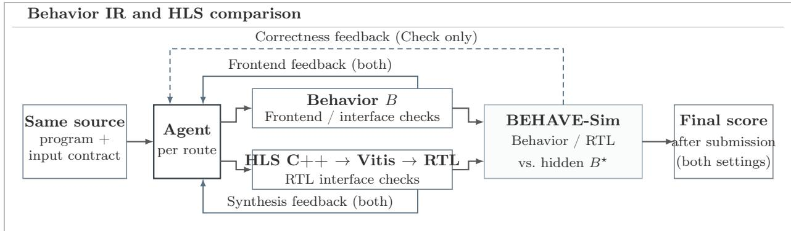  
Figure 14: Behavior IR and HLS comparison workflow. Both settings provide frontend or synthesis feedback. Only Check returns development-time correctness feedback (dashed arrow). Both settings evaluate the submitted artifact against the same hidden reference.

Comparison settings. We use GPT-5.6 Luna with the rollout and baseline settings in Appendix D.2. Vitis HLS 2025.2 targets xc7z020clg400-1 at a 25 ns clock period, with a 1200 s synthesis budget. Tool time sums development-check wall times, excluding model generation, queueing and final evaluation. We report the median and interquartile range across tasks.

## D.5 Pipeline Comparison and PPA Exploration Settings

Comparison settings. RTL-only, ChipMATE and MAGE receive specifications without the Behavior interface. ChipMATE [7] uses three RTL/Python pairs per round, up to three rounds and 1,000 random inputs per comparison. MAGE [20] allows four simulation-review iterations in its no-golden workflow and samples 20 RTL candidates, selecting two for up to 15 editor steps each. Mean API cost includes all candidate-generation and repair calls, averaged over all tasks.

Baseline adaptations. We adapt released implementations to our model and sandbox interfaces, retaining their roles and development tests. For ChipMATE, we remove repair-context clipping and correct output matching and zero-score candidate selection. For MAGE, we fix the no-golden prompt, editor dispatch and compilation/simulation failure handling. Our code includes all patches.

PPA exploration. For MXFP4, both settings jointly develop RTL and Behavior models with area and timing feedback. The Sim-enabled setting additionally compares the agent’s RTL and Behavior during development. For each model and setting, we run three searches of at most 60 turns, with initial hints of 1, 4 or 32 parallel processing lanes. These hints guide exploration without constraining the final architecture. Each search explores area-time trade-ofs and retains intermediate candidates. For NVFP4, each model runs five searches without development-time BEHAVE-Sim feedback, with initial hints of 1, 2, 4, 8 or 16 lanes.

Measurement and reporting. MXFP4 candidates use a fixed clock $f _ { 0 } = 8 0 \mathrm { M H z }$ and the same 64-block workload, with 32 bfloat16 (BF16) values per block. Inputs are ofered continuously under ready/valid handshaking. Execution time is $\tau _ { W } ( R ) = N _ { W } ( R ) / f _ { 0 }$ , where $N _ { W } ( R )$ counts cycles from the first input ofered to the final output accepted. MXFP4 measurements use the SkyWater 130 nm high-density (HD) standard-cell library [21] at the typical-typical process corner $( 2 5 ^ { \circ } \mathrm { C } , 1 . 8 0 \mathrm { V } )$ . Cell area and setup/hold timing are measured on the same placed and repaired netlist, with interconnect resistance and capacitance estimated from placement. NVFP4 uses the Nangate 45 nm standard-cell library [22], based on FreePDK45 [23], at 400 MHz with a 64-block workload of 16 BF16 values per block. We report nondominated area-time points among candidates that pass independent golden-Behavior and timing checks and complete the full workload.

## D.6 Training and Self-Improvement Settings

Task-based RL. We use Slime [130] with Megatron [131] for synchronous GRPO [16]. Hyperparameters are listed in Table 8.

Table 8: Training hyperparameters shared by fixed-dataset RL and self-improvement.
<table><tr><td>Setting</td><td>Value</td></tr><tr><td>Model</td><td>Qwen3.8-27B</td></tr><tr><td>Parameter updates and precision GPUs</td><td>Full-parameter, BF16 8 NVIDIA H200</td></tr><tr><td>Training parallelism (tensor/context/pipeline)</td><td>4 / 2 / 1</td></tr><tr><td>Rollout serving</td><td>2 SGLang engines, tensor parallelism 4</td></tr><tr><td>Maximum concurrent conversations</td><td></td></tr><tr><td>Update batch</td><td>32 8 tasks × 8 rollouts</td></tr><tr><td></td><td></td></tr><tr><td>Microbatch size</td><td>1</td></tr><tr><td>Sampling</td><td>Temperature 1, top-p 1, top-k disabled</td></tr><tr><td>Repetition/presence/frequency penalties</td><td>None</td></tr><tr><td>Reasoning</td><td>Thinking enabled, xhigh effort</td></tr><tr><td>Context window</td><td>131,072 tokens</td></tr><tr><td>Maximum model turns</td><td>60</td></tr><tr><td>Optimizer</td><td>Adam, (β1, β2) = (0.9, 0.98)</td></tr><tr><td>Learning rate</td><td>10−6 (constant)</td></tr><tr><td>Weight decay</td><td>0.1</td></tr><tr><td>Gradient-norm clip</td><td>1.0</td></tr><tr><td>Policy-ratio clip</td><td>[0.8, 1.2]</td></tr><tr><td>KL and entropy loss coefficients</td><td>0</td></tr><tr><td>Attention and hidden dropout</td><td>0</td></tr><tr><td>CPU optimizer offload</td><td>Enabled</td></tr><tr><td>Activation recomputation</td><td>Full</td></tr></table>

Context management. When the training context window fills, we clear interaction history but retain task instructions and workspace files. Evicting individual turns produces overlapping long sequences with high training cost. Within each window, we merge turns with matching token prefixes into one causal sequence to avoid recomputing shared context. Evaluation follows the settings in Section D.2.

Loss normalization. A rollout’s segments share one advantage. We normalize each rollout’s loss by its loss-bearing token count across segments, then average across rollouts, so segmentation does not increase its weight. Only model-generated tokens contribute, including reasoning and tool calls.

Task pool. We oversample up to 12 concurrent task groups, collecting the first eight complete groups with nonconstant rewards per update. Uniform-reward groups are replaced with new ones. Tasks with all-1 or all-0 rewards enter cooldown for ten or two updates, respectively, then rejoin the pool. Sampling prioritizes tasks without a completed group, then those least recently observed.

Training data and budgets. Fixed-dataset RL samples from the 540-task BEHAVE-Train pool for 40 updates, with evaluation every five updates. Self-improvement starts from a 60-task subset of BEHAVE-Train, selected to match domain proportions while favoring diverse, higher-complexity tasks. After three initial updates, we run 5 task-acquisition rounds with three updates each, for 18 updates in total. Evaluation occurs every three updates. Self-improvement adds 100 tasks to reach a 160-task pool. The seed-only baseline resumes from the same three-update checkpoint and trains only on the original 60 tasks for 15 further updates, without task acquisition.

Self-improvement step 1: Analysis and acquisition. Every three updates, five parallel Analyst instances run a proposal batch using the current training policy. They receive disjoint sets of complete task groups from the latest rollout, keeping each task’s attempts together. Each Analyst targets six proposals within 100 turns, searching a fixed source-only library of 374 files or code excerpts from 67 repositories. Source files used by evaluation tasks and exact content duplicates are excluded. No preconstructed specification-behavior pairs are provided. Experience is consolidated between batches, retained across rounds and visible only to Analysts.

Self-improvement step 2: Construction and admission. Construction proceeds in parallel, with up to 100 turns per role attempt. Each task allows up to three construction-and-review rounds, including the initial draft. Revisions update existing drafts based on feedback. Training resumes at 20 admissions. If the first batch falls short, we allow another batch, then proceed with admitted tasks.

Self-improvement step 3: Model updates. Admitted tasks join the cumulative training pool under the same sampling and cooldown rules. We continue training for three GRPO updates and reuse the latest training rollouts for the next acquisition round.

## D.7 Computational Resources and Cost

Resource accounting. Table 9 summarizes GPU-hours and recorded API costs for selected experiments.

a  
b  
Table 9: Resources and recorded costs of selected experiments.
<table><tr><td>Experiment</td><td>Scope</td><td>Resource use API cost</td></tr><tr><td>Fixed-dataset RL</td><td>40 updates</td><td>883.5 H200 GPU-hours</td></tr><tr><td>Self-improvement</td><td>18 updates with task acquisition</td><td>537.7 H200 GPU-hours</td></tr><tr><td>Seed-only</td><td>15 updates after shared update 3</td><td>340.7 H200 GPU-hours</td></tr><tr><td>Evaluation</td><td>5 API models × 381 tasks</td><td>$959.12</td></tr><tr><td>Pipeline comparison</td><td>5 workflows × 60 tasks</td><td>$10.54</td></tr><tr><td>PPA exploration</td><td>12 MXFP4 + 10 NVFP4 searches</td><td>$236.92</td></tr></table>

```python
def eval(self, inputs: dict) -> dict: def process(self, in_n, in_d):
quotient = 0
elif self.state == 1: remainder = 0
if in_d == 0:
self.remainder = next_remainder quotient = 4294967295
self.quotient = next_quotient remainder = in_n
if self.count == 31: else:
for offset in range(32):
self.state = 2 bit = 31 - offset
self.count = 0 remainder = (
else: (remainder << 1) |
self.count = ( ((in_n >> bit) & 1))
(self.count + 1) & 0x3F) if remainder >= in_d:
elif self.state == 2: remainder = remainder - in_d
if out_ready: quotient = quotient | (1 << bit)
self.state = 0 return {"out_values":
quotient | (remainder << 32)}
```  
Figure 15: Comparison example. (a) ChipMATE Python excerpt from a GPT-5.6 Luna rollout. (b) The task’s Behavior reference.

## D.8 Pipeline Comparison Example

Comparison example. Figure 15 shows 32-bit unsigned division. ChipMATE preserves a counter and partial results across clock-level eval() calls, whereas the Behavior reference completes the calculation within one process() call.

## D.9 Additional Results for RL Training and Self-Improvement

Learning dynamics. Figure 16 reports performance across all four benchmarks. Figure 17 shows per-update optimization measurements for fixed-dataset RL and self-improvement.

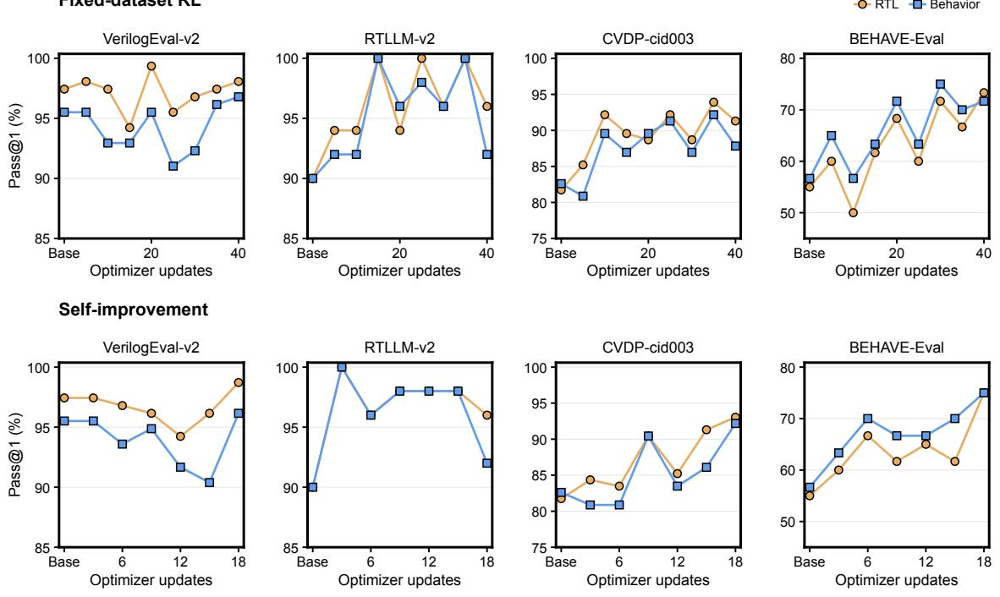

Figure 16: Checkpoint performance across benchmarks. Top: fixed-dataset RL; bottom: self-improvement. RTL and Behavior pass@1 are evaluated on the same benchmark tasks at each checkpoint.  
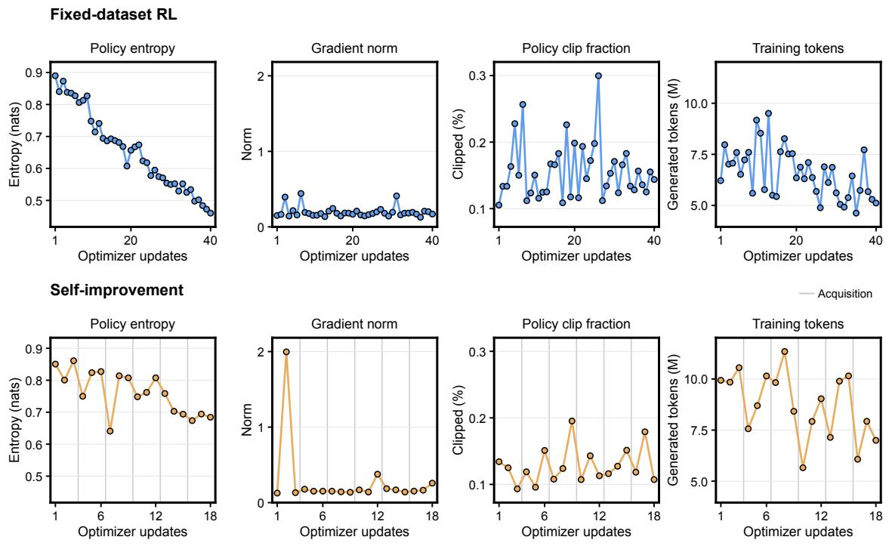  
Figure 17: Training dynamics. Top: fixed-dataset RL; bottom: self-improvement. Token counts include only generated tokens used for the update. Gray vertical lines mark task acquisitions.

Case study. Figure 18 follows task acquisition and rollouts on the seed task. The agent turns rollout dificulties into focused practice through task construction. Later progress on the original, more complex task shows that improvement during continued training extends beyond the acquired task.

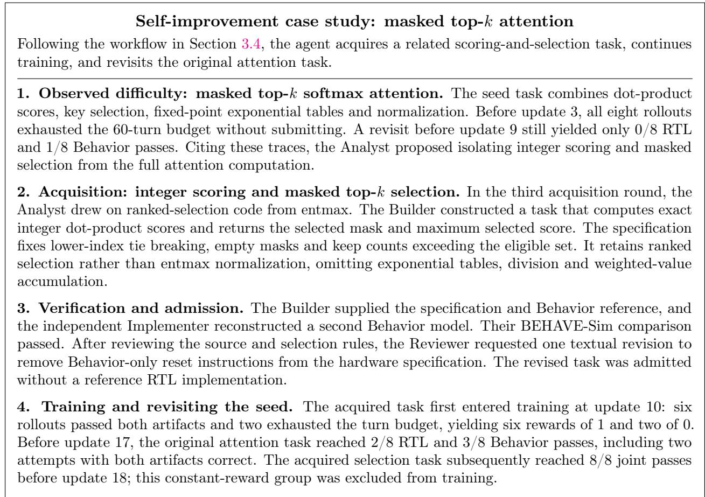  
Figure 18: A recorded self-improvement case. After acquiring and training on a related task, the agent produces correct RTL and Behavior solutions on the original seed task.

## E Dataset Construction and Validation

This appendix documents the benchmarks used in our experiments. We describe their composition and sources (E.1), BEHAVE construction (E.2), external benchmark adaptation (E.3), human review (E.4), and data splits and release (E.5).

## E.1 Dataset Overview and Sources

Dataset composition. BEHAVE covers real-world algorithms and system components across the domains in Table 10. Appendix E.5 describes its training and evaluation splits. Table 11 summarizes behavioral and interface features across the two BEHAVE splits. For evaluation only, we adapt all tasks from VerilogEval-v2 [17], RTLLM-v2 [18], and the cid003 subset of CVDP [19]. Appendix E.3 details these adaptations.

Table 10: Overview of the 600 source-derived tasks. Representative task families and sources are shown for each domain. The complete task source list is provided in our code repository.
<table><tr><td>Domain</td><td>Tasks</td><td>Representative families</td><td>Representative sources</td></tr><tr><td>AI/ML</td><td>190</td><td>Attention, normalization, quantization</td><td>Transformers, TorchAO</td></tr><tr><td>Numerics</td><td>160</td><td>Linear algebra, reductions, interpolation</td><td>CMSIS-DSP, LAPACK</td></tr><tr><td>Signal processing</td><td>80</td><td>Filtering, transforms, resampling, modulation</td><td>liquid-dsp, librosa, Opus</td></tr><tr><td>Cryptography</td><td>80</td><td>Symmetric primitives, field arithmetic, post-quantum kernels</td><td>PyCryptodome, liboqs, HEXL</td></tr><tr><td>Control</td><td>30</td><td>Coordinate transforms, controllers, estimation</td><td>SimpleFOC, FilterPy</td></tr><tr><td>Compression</td><td>30</td><td>Entropy coding, stream packing, match operations</td><td>FLAC, Brotli, Zstd</td></tr><tr><td>Data systems</td><td>30</td><td>Vector search, hashing, bitmap operations</td><td>Faiss, hnswlib, CRoaring</td></tr><tr><td>Total</td><td>600</td><td></td><td></td></tr></table>

Table 11: Behavioral and interface features of BEHAVE. Features overlap. A 1:1 mapping denotes one output transaction per input transaction and does not imply low implementation complexity.
<table><tr><td>Feature</td><td>Representative behavior</td><td>Train</td><td>Eval</td><td>Total</td></tr><tr><td>Single-stream 1:1 input/output</td><td>Block quantization</td><td>492</td><td>56</td><td>548</td></tr><tr><td>Single-stream non-1:1 input/output</td><td>Filtering, accumulation, interpolation</td><td>47</td><td>4</td><td>51</td></tr><tr><td>Multiple independent streams</td><td>Three-input, two-output crossbar</td><td>1</td><td>0</td><td>1</td></tr><tr><td>External memory access</td><td>Memory-backed vectors, lookup tables</td><td>26</td><td>2</td><td>28</td></tr><tr><td>External memory writes</td><td>In-place updates, writeback</td><td>8</td><td>1</td><td>9</td></tr></table>

Task sources. We select algorithms and system components from high-level implementations, supplemented by algorithm descriptions where needed. The task source list in our code repository identifies the files or documents used for each task, along with available revisions and license notices. Appendix E.2 describes their adaptation into hardware-oriented tasks.

Task size. Table 12 summarizes the sizes of the golden Behavior models and auxiliary RTL. We count nonblank, non-comment lines in task-local source files, excluding shared libraries.

## E.2 Source-Based Task Construction

Human-agent collaboration. Researchers defined application domains, guided source selection and task scope, reviewed and revised tasks. The agent developed specifications and Behavior models, revising them using execution results and human feedback.

Table 12: Specification and code size by task collection. Sizes are medians [interquartile ranges]. Spec words count whitespace-separated units, including interface declarations. LOC: lines of code.
<table><tr><td>Collection</td><td>Tasks</td><td>Spec words</td><td>Behavior LOC</td><td>RTL LOC</td></tr><tr><td>VerilogEval-v2</td><td>156</td><td>270.5 [211.5, 327.5]</td><td>9 [7, 13]</td><td>11.5 [7, 21]</td></tr><tr><td>RTLLM-v2</td><td>50</td><td>312 [231.75, 427]</td><td>14 [9, 24]</td><td>20.5 [15, 33.75]</td></tr><tr><td>CVDP-cid003</td><td>115</td><td>473 [358.5, 615.5]</td><td>28 [16.5, 47]</td><td>34 [21, 53]</td></tr><tr><td>BEHAVE (ours)</td><td>600</td><td>633 [496.75, 861.5]</td><td>40 [24, 69]</td><td>97 [56, 183]</td></tr><tr><td>Train</td><td>540</td><td>623.5 [498.75, 869.75]</td><td>39 [24, 67.25]</td><td>97 [56, 177.25]</td></tr><tr><td>Eval</td><td>60</td><td>645.5 [481.25, 808]</td><td>43.5 [22, 70.25]</td><td>102.5 [60.75, 209.5]</td></tr></table>

Construction workflow. Builder jointly constructed S and $B _ { 1 }$ from the sources, specifying numerical and interface rules. In a separate context, Implementer produced $B _ { 2 }$ using only S and public interface documentation. Reviewer checked S against the sources and both models against S, requesting revisions as needed. Material changes to S triggered a fresh reconstruction of $B _ { 2 }$ This follows the workflow in Section 3.4. All tasks then underwent human review before acceptance. Researchers made corrections directly or requested revisions from the agent, then approved each task’s final version. See Appendix E.4 for review details.

Auxiliary RTL and tools. We also asked the agent to generate reference RTL for each task to support benchmark reuse. This auxiliary artifact is not required for evaluation, which uses the Behavior reference. Both the agent and researchers could use BEHAVE-Sim throughout construction to test and compare implementations. Executable agreement is insuficient because implementations may share a misunderstanding. Human review therefore checked that the NL specification clearly stated the intended behavior and that the Behavior model faithfully implemented it.

## E.3 External Benchmark Adaptation

Framework integration. Our goal was to evaluate candidate implementations across all datasets using the same BEHAVE-Sim procedure. We therefore integrated the external benchmarks into our framework rather than using their original testbenches as separate evaluators. For each task, we paired an NL specification with a Behavior reference and provided auxiliary reference RTL.

Source issues. We also identified inconsistencies and omissions in the original materials used for adaptation. For example, in the RTLLM-v2 edge\_detect task, the description first requires outputs to return to zero after an edge, then states that they remain high until another edge. The reference RTL implements single-cycle pulses. In CVDP task cvdp\_copilot\_sorter\_0001, the specification requires ascending order but does not define the element order on the packed output bus. The testbench assumes that the smallest element occupies the least-significant bits.

Adaptation and validation. We resolved ambiguities and inconsistencies with explicit rules, then aligned the specification, Behavior reference and auxiliary RTL. We retained native interfaces and specified timing wherever possible, documenting substantive changes and their rationale. Adapted tasks underwent construction checks and human review in Appendices E.2 and E.4.

## E.4 Human Review

Review scope. Researchers reviewed all 921 tasks across BEHAVE, VerilogEval-v2, RTLLM-v2 and CVDP with agent assistance, using the five criteria in Table 13. They checked task specifications and interfaces, inspecting source material, implementations and execution records where needed.

Revision and approval. Researchers made corrections directly or provided feedback to the agent for revision. Revised tasks repeated the applicable reconstruction and executable checks in Appendix E.2. A researcher approved the final version before $B _ { 1 }$ was frozen as $B ^ { \star }$ . Review records link each finding to its correction, checked version and final disposition.

Review outcomes. Table 13 classifies researcher-requested revisions by their primary reason, counting each revised task once. Table 14 summarizes recorded revision rounds across construction stages. Most Behavior comparisons required no revision.

Table 13: Human review and revisions. Each revised task is counted once by primary category.
<table><tr><td>Review item</td><td>Researcher checks</td><td>Tasks revised, n</td></tr><tr><td>Specification consistency</td><td>Requirements and examples agree, with valid inputs, parameter constraints and boundary behavior defined.</td><td>6</td></tr><tr><td>Numerical semantics</td><td>Widths, signedness, overflow, rounding, special values and operation order are explicit where relevant.</td><td>2</td></tr><tr><td>Interface and state</td><td>Packing, transaction counts and ordering, reset, backpressure and timing are defined where applicable.</td><td>14</td></tr><tr><td>Implementation fidelity</td><td>Behavior models and auxiliary RTL match the specified function, state transitions and memory effects.</td><td>7</td></tr><tr><td>Evidence integrity</td><td>Source and execution records match reviewed versions and runtime settings, including retests.</td><td>1</td></tr><tr><td>Total</td><td></td><td>30</td></tr></table>

Table 14: Task revisions by construction stage. Counts cover all 921 tasks: 600 BEHAVE tasks and 321 external-benchmark adaptations. Revised gives the number and percentage of revised tasks. The remaining columns group tasks by recorded feedback-driven revision rounds.
<table><tr><td>Stage</td><td>Revised, n (%)</td><td>0 rounds</td><td>1 round</td><td>≥ 2 rounds</td></tr><tr><td> $B _ { 2 }$  comparison</td><td>6 (0.65%)</td><td>915</td><td>6</td><td>0</td></tr><tr><td>Agent review</td><td>14 (1.52%)</td><td>907</td><td>14</td><td>0</td></tr><tr><td>Human review</td><td>30 (3.26%)</td><td>891</td><td>29</td><td>1</td></tr></table>

## E.5 Data Splits and Release

Data splits. We reserve 10% of the tasks in each domain for evaluation, yielding 540 training tasks and 60 evaluation tasks with the same domain proportions. Both sets cover a range of dificulties. Tasks sharing a source implementation or difering only in parameters remain in the same split, together with their source materials. External benchmark adaptations are evaluation-only. Evaluation tasks and references are frozen before training and excluded from task acquisition.

Release. The release includes task specifications, golden Behavior models, auxiliary RTL and the interface information needed to run them. Source lists and review records document where each task came from, what was changed and which checks were run.

Licensing. Our original contributions will be released under Apache-2.0. Third-party materials retain their applicable licenses and required notices, documented in the task source list.